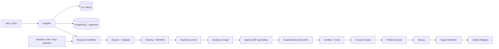
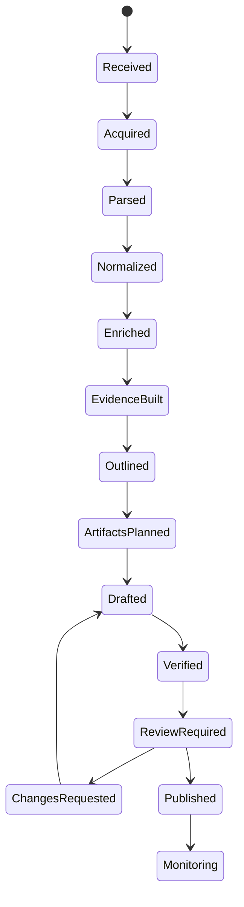

# Paper Atlas — Blueprint completo


---

<!-- FILE: README.md -->

# Paper Atlas — blueprint de producto, contenido y agentes

**Nombre de trabajo:** Paper Atlas  
**Objetivo:** recibir un paper por URL o PDF, indexarlo como objeto científico estructurado y publicar una explicación web interactiva, verificable y versionada.

Este paquete no describe un simple “resumidor de PDFs”. Define dos productos que comparten plataforma:

1. **Índice científico público:** papers, métodos, tareas, datasets, benchmarks, resultados, repositorios, linaje y búsqueda.
2. **Fábrica editorial asistida por agentes:** ingesta, extracción, análisis, redacción, generación de artefactos, verificación, revisión humana, publicación y mantenimiento.

## Decisiones no negociables

- El LLM no genera una aplicación React arbitraria por paper.
- El contenido canónico es un AST tipado y versionado, no MDX libre.
- Toda afirmación sustantiva conserva referencias exactas al documento fuente.
- Los artefactos interactivos normales se construyen desde un registro de componentes aprobados.
- El código visual nuevo se ejecuta en sandbox, se prueba y requiere revisión antes de entrar al registro.
- Ninguna primera generación se publica automáticamente.
- El workflow exterior es determinista; los agentes trabajan dentro de etapas con contratos estructurados.
- Un paper y su explicación nunca se sobrescriben: se crean versiones.
- El texto del PDF se trata como entrada no confiable y nunca como instrucciones para los agentes.

## Lectura recomendada

1. `01-product-spec.md`
2. `architecture.md`
3. `content-model.md`
4. `agent-harness.md`
5. `design.md`
6. `api.md`
7. `codex-harness.md`
8. `skills.md`
9. `roadmap.md`
10. `CODEX_BOOTSTRAP_PROMPT.md`

## Stack elegido

- **Monorepo:** pnpm + Turborepo
- **Web:** Next.js App Router + TypeScript + Tailwind CSS + shadcn/ui para chrome y consola editorial
- **API:** FastAPI + Pydantic + SQLAlchemy 2 + Alembic
- **Workers:** Python + Temporal SDK + OpenAI Agents SDK
- **Parsing:** Docling como parser principal; GROBID como extractor académico complementario
- **Base de datos:** PostgreSQL + pgvector
- **Objetos:** S3/R2 en producción; MinIO en local
- **QA web:** Playwright + axe + pruebas de regresión visual
- **Observabilidad:** OpenTelemetry, Sentry y trazas del Agents SDK con captura sensible desactivada

## Primer corte de alcance

El MVP no debe intentar cubrir todo Papers with Code. Debe resolver bien:

- URL de arXiv o PDF subido.
- Metadata, secciones, figuras, tablas, ecuaciones y referencias.
- Una página pública de paper.
- Una explicación editorial con referencias de origen.
- Tres tipos de artefacto: `ArchitectureStepper`, `ResultExplorer` y `EvidenceMatrix`.
- Flujo de revisión humana.
- API asíncrona y estado de procesamiento.
- Búsqueda por título, autor, tarea, método y texto semántico.


---

<!-- FILE: 01-product-spec.md -->

# 01 — Especificación de producto

## 1. Tesis

Paper Atlas convierte literatura científica en dos representaciones coordinadas:

- una **representación documental rigurosa**, útil para búsqueda, comparación y trazabilidad;
- una **representación pedagógica interactiva**, útil para comprender el problema, el mecanismo, la evidencia y las limitaciones.

La referencia de producto es una combinación deliberada:

- **Papers with Code:** densidad informativa, taxonomía, código, benchmarks, métricas y linaje;
- **Anthropic Research:** narrativa editorial, preguntas concretas, explicación progresiva, figuras como argumentos y limitaciones integradas;
- **Distill:** interacción científica que permite manipular mecanismos y no sólo decorar el texto.

## 2. Usuarios

### Lector técnico

Quiere saber en 5–20 minutos si el paper merece lectura completa, qué propone, qué evidencia lo sostiene y dónde podría fallar.

### Investigador o estudiante

Quiere navegar a fórmulas, figuras, tablas, referencias, repositorios y trabajos relacionados sin perder trazabilidad.

### Editor científico

Quiere corregir afirmaciones, cambiar taxonomías, revisar artefactos y aprobar una versión publicable.

### Integrador/API consumer

Quiere enviar papers, consultar estados y recuperar contenido estructurado para otros productos.

### Maintainer

Quiere que Codex implemente, pruebe y mantenga el sistema sin degradar arquitectura, diseño ni calidad editorial.

## 3. Dos direcciones de producto

### A. Plataforma pública

Superficies mínimas:

- portada y feed de papers recientes;
- búsqueda global;
- página de paper;
- páginas de tarea, método, dataset, benchmark y autor;
- colecciones editoriales;
- grafo de linaje y trabajos relacionados;
- páginas de artefactos y resultados;
- changelog de revisiones del paper y de la explicación.

### B. Fábrica de contenido

Superficies mínimas:

- formulario URL/PDF;
- cola de procesamiento;
- visor del documento fuente con anclas;
- ledger de afirmaciones y evidencia;
- editor por bloques;
- preview responsivo;
- revisión de taxonomía;
- revisión de artefactos;
- comparación entre versiones;
- aprobación y publicación.

## 4. Flujo principal

1. El usuario envía una URL o PDF.
2. El sistema valida, descarga, hashea y deduplica.
3. Los parsers producen `PaperDocument`.
4. Un enriquecedor resuelve metadata, autores, referencias, repositorios y entidades científicas.
5. Un analista construye un grafo de afirmaciones, evidencia, resultados, supuestos y limitaciones.
6. Un editor pedagógico elige de tres a cinco preguntas que organizan la explicación.
7. Un planificador visual selecciona artefactos del registro.
8. Se genera `ExplainerDocument` en forma de AST tipado.
9. Verificadores contrastan afirmaciones, cifras, tablas, ecuaciones y enlaces.
10. Un crítico separado redacta objeciones y detecta sobreafirmaciones.
11. Un humano revisa y publica.
12. Los watchers detectan nuevas versiones, repositorios rotos y cambios relevantes.

## 5. Modos de lectura

Una página no debe producir cuatro resúmenes distintos, sino cuatro profundidades sobre el mismo documento:

- **5 minutos:** tesis, por qué importa, mecanismo central, resultado principal y limitación decisiva.
- **20 minutos:** contexto, ejemplo paso a paso, evidencia, comparación y crítica.
- **Profundidad técnica:** fórmulas, protocolo experimental, ablaciones, artefactos y apéndices relevantes.
- **Original:** navegación al PDF, fuente LaTeX o publicación.

## 6. Anatomía de una página de paper

1. Metadata: autores, fecha, versión, venue, licencia y enlaces.
2. Título y afirmación central en una frase.
3. Lectura estimada y selector de profundidad.
4. Índice de preguntas.
5. “Por qué existe este paper”.
6. “Qué cambia respecto a lo anterior”.
7. Mecanismo central interactivo.
8. Ejemplo recorrido paso a paso.
9. Resultados y benchmarks.
10. Ablaciones y sensibilidad.
11. Qué demuestra y qué no demuestra.
12. Crítica metodológica.
13. Código, datos, modelos y reproducción.
14. Métodos, tareas, datasets y trabajos relacionados.
15. Referencias y registro de procedencia.
16. Historial de versiones.

## 7. Alcance del MVP

### Incluido

- arXiv y PDF directo;
- PDF digital de una o dos columnas;
- explicación en español e inglés;
- indexación de metadata, secciones, figuras, tablas, ecuaciones y referencias;
- artefactos interactivos basados en datos presentes en el paper;
- revisión humana obligatoria;
- API y webhooks;
- búsqueda híbrida lexical/semántica;
- página pública optimizada para lectura y SEO.

### Excluido inicialmente

- ejecución automática del repositorio de cada paper;
- extracción confiable de datos desde gráficas raster complejas;
- reproducción completa de experimentos;
- publicación autónoma;
- comentarios públicos y redes sociales;
- marketplace de artefactos comunitarios;
- cobertura universal de publishers con paywall.

## 8. Métricas de éxito

### Producto

- tiempo medio desde ingesta hasta `review_required`;
- porcentaje de papers que se parsean sin intervención;
- tiempo de revisión humana;
- lectores que pasan de 5 a 20 minutos;
- clics hacia paper, código y evidencia;
- retorno semanal y papers guardados.

### Contenido

- cobertura de citas por afirmación;
- exactitud numérica;
- precisión de taxonomía;
- tasa de objeciones editoriales;
- comprensión humana antes/después;
- porcentaje de artefactos que modifican estado real y explican un mecanismo verificable.

### Plataforma

- errores de procesamiento por etapa;
- costo por paper;
- duración por etapa;
- páginas con Core Web Vitals dentro de presupuesto;
- fallos de accesibilidad y regresiones visuales.


---

<!-- FILE: architecture.md -->

# 02 — Arquitectura técnica

## 1. Principio

La plataforma separa cuatro planos:

1. **fuente científica inmutable**;
2. **representación normalizada y evidencia**;
3. **contenido editorial versionado**;
4. **presentación web y artefactos aprobados**.

Esto evita que un cambio de frontend obligue a regenerar contenido y que una respuesta de modelo se convierta directamente en código ejecutable.

## 2. Diagrama



## 3. Stack

### Monorepo

- pnpm workspaces;
- Turborepo;
- cambios atómicos de schema, cliente y renderer;
- versiones internas coordinadas.

### Web

- Next.js App Router;
- React Server Components para páginas públicas;
- Client Components sólo en búsqueda rica, editor y artefactos;
- Tailwind CSS con tokens semánticos;
- shadcn/ui para consola editorial y controles, no como estética dominante;
- KaTeX para matemáticas;
- Observable Plot o D3 para visualizaciones específicas;
- TanStack Table para tablas complejas.

### API

- FastAPI;
- Pydantic v2;
- SQLAlchemy 2;
- Alembic;
- OpenAPI como contrato;
- clientes TypeScript generados en CI.

### Worker y agentes

- Python;
- Temporal para ejecución durable;
- OpenAI Agents SDK para especialistas con herramientas y outputs tipados;
- actividades deterministas para parsing, hashing, validaciones y transformaciones;
- sandbox de contenedor para artefactos nuevos.

### Datos

- PostgreSQL como fuente de verdad;
- pgvector para recuperación semántica;
- full-text search de Postgres para búsqueda lexical inicial;
- S3/R2 para PDFs, imágenes, TEI/XML, ASTs, screenshots y bundles;
- Redis sólo si se necesita cache/rate limit; no como cola canónica.

## 4. Servicios

### `web`

- páginas públicas;
- editor/review console;
- auth y BFF mínimo;
- rendering del AST;
- preview de drafts.

### `api`

- ingesta;
- CRUD y estados;
- búsqueda;
- endpoints editoriales;
- webhooks;
- audit log;
- presigned uploads.

### `worker`

- actividades Temporal;
- parsers;
- agentes;
- verificadores;
- screenshots y browser QA;
- tareas de mantenimiento.

### `grobid`

Servicio aislado para TEI, referencias, citas y estructura académica.

### `artifact-sandbox`

- sin secretos;
- sin acceso a red por defecto;
- filesystem efímero;
- límites de CPU, memoria y tiempo;
- dependencias allowlisted;
- salida: código, bundle, tests, screenshot, manifest y SBOM.

## 5. Almacenamiento por capas

### Raw

- PDF original;
- respuesta HTTP y headers;
- fuente LaTeX cuando se obtenga legítimamente;
- imágenes extraídas;
- hashes y metadata de adquisición.

### Parsed

- DoclingDocument;
- GROBID TEI;
- texto por página;
- bloques con bounding boxes;
- referencias y callouts;
- tablas, figuras, captions y ecuaciones.

### Canonical

- `PaperDocument`;
- `EvidenceGraph`;
- entidades normalizadas;
- relaciones.

### Editorial

- `ExplainerDocument`;
- revisiones;
- comentarios;
- decisiones y cambios.

### Published

- versión congelada;
- JSON de publicación;
- assets derivados;
- index de búsqueda;
- OG image;
- sitemap y feeds.

## 6. Parsing

Docling es el parser visual principal porque conserva layout, orden de lectura, tablas, código y fórmulas. GROBID complementa con metadata científica, referencias, contextos de citas y TEI.

Proceso:

1. validar archivo;
2. ejecutar ambos parsers cuando el tipo lo amerite;
3. alinear bloques por página y bounding box;
4. preferir fuente estructurada cuando hay consenso;
5. marcar conflictos;
6. conservar ambos outputs para auditoría;
7. OCR sólo como fallback para páginas sin capa de texto;
8. puntuar calidad por sección.

## 7. Búsqueda

Primera versión:

- filtros relacionales en PostgreSQL;
- FTS para título, abstract, autores, entidades y contenido;
- pgvector para similitud;
- reranking simple por mezcla de BM25-like score, vector, recencia, citations y calidad editorial;
- facets por tarea, método, dataset, benchmark, venue, año, licencia y disponibilidad de código.

No introducir Elasticsearch/OpenSearch hasta que métricas reales demuestren que Postgres es insuficiente.

## 8. Seguridad

### Ingesta

- protección SSRF;
- allow/deny de esquemas y rangos IP;
- MIME sniffing, no confiar en extensión;
- límites de tamaño y páginas;
- escaneo antivirus;
- timeouts;
- descompresión limitada;
- hash y deduplicación.

### Prompt injection documental

- el texto del paper se etiqueta como `UNTRUSTED_SOURCE_CONTENT`;
- ninguna instrucción encontrada en el paper cambia políticas, herramientas o workflow;
- herramientas por agente y mínimo privilegio;
- guardrails en cada tool call sensible;
- URLs extraídas no se visitan automáticamente sin política;
- repositorios no se ejecutan en el worker principal.

### Publicación

- sanitización de HTML;
- CSP estricta;
- no `eval`;
- artefactos sólo desde registro firmado;
- bundles custom aislados;
- referencias de licencia y política de reproducción.

### Trazas

- no capturar PDF completo, prompts privados o claves en trazas;
- redactar PII y secretos;
- audit log inmutable para acciones editoriales;
- retención configurable.

## 9. Versionado

Versionar independientemente:

- `paper_source_version`;
- `parser_version`;
- `paper_document_schema_version`;
- `prompt_bundle_version`;
- `skill_bundle_version`;
- `model_snapshot`;
- `artifact_registry_version`;
- `explainer_version`;
- `publication_version`.

Una nueva revisión de arXiv puede reutilizar bloques no afectados, pero nunca modifica la publicación anterior.

## 10. Deploy

### Local

Docker Compose:

- web;
- api;
- worker;
- postgres + pgvector;
- temporal;
- temporal-ui;
- minio;
- grobid;
- optional redis.

### Producción

- web en Vercel o contenedor;
- API y workers en plataforma de contenedores;
- Postgres administrado;
- object storage S3-compatible;
- Temporal Cloud o cluster administrado;
- GROBID autoscalable por cola;
- CDN para assets públicos.

## 11. Estructura de repo

```text
paper-atlas/
├── AGENTS.md
├── design.md
├── turbo.json
├── pnpm-workspace.yaml
├── apps/
│   ├── web/
│   │   ├── AGENTS.md
│   │   ├── app/
│   │   ├── components/
│   │   └── tests/
│   ├── api/
│   │   ├── AGENTS.md
│   │   └── src/paper_atlas_api/
│   └── worker/
│       ├── AGENTS.md
│       └── src/paper_atlas_worker/
├── packages/
│   ├── content-schema/
│   ├── api-client/
│   ├── ui/
│   ├── artifact-registry/
│   ├── design-tokens/
│   └── test-fixtures/
├── skills/
│   ├── paper-explainer-writing/
│   ├── evidence-ledger/
│   ├── visual-artifact-spec/
│   ├── taxonomy-curation/
│   ├── skeptical-review/
│   └── publication-release/
├── prompts/
├── evals/
├── fixtures/papers/
├── docs/
│   ├── adr/
│   ├── runbooks/
│   └── threat-model/
├── scripts/
└── infra/
```


---

<!-- FILE: content-model.md -->

# 03 — Modelo de contenido y procedencia

## 1. Razón para un AST tipado

MDX libre mezcla contenido, código y presentación. Eso dificulta:

- validar procedencia;
- migrar componentes;
- traducir;
- comparar versiones;
- impedir código no confiable;
- garantizar accesibilidad;
- renderizar en clientes futuros.

El contenido canónico debe ser JSON validado por un schema y renderizado por componentes conocidos.

## 2. Entidades principales

- `Paper`
- `PaperVersion`
- `SourceAsset`
- `Author`
- `Organization`
- `Venue`
- `Section`
- `Figure`
- `Table`
- `Equation`
- `Reference`
- `CitationContext`
- `Claim`
- `EvidenceSpan`
- `Method`
- `Task`
- `Dataset`
- `Benchmark`
- `Metric`
- `ReportedResult`
- `Repository`
- `ModelArtifact`
- `Explainer`
- `ExplainerVersion`
- `InteractiveArtifact`
- `GenerationRun`
- `EditorialReview`
- `Publication`

## 3. `SourceRef`

Toda afirmación o dato usa una o más referencias precisas:

```json
{
  "paper_version_id": "pv_...",
  "source_asset_id": "asset_pdf_...",
  "page": 11,
  "section_path": ["4", "4.2"],
  "block_id": "blk_01HV...",
  "char_start": 184,
  "char_end": 397,
  "bbox": [0.13, 0.22, 0.88, 0.41],
  "figure_id": null,
  "table_id": "table_3",
  "quote_hash": "sha256:..."
}
```

Los offsets ayudan a detectar drift entre revisiones. `quote_hash` prueba qué texto sustentó la afirmación sin tener que publicar el pasaje completo.

## 4. Ledger de afirmaciones

```json
{
  "id": "claim_...",
  "text": "TRACE mejora el crédito intermedio sin un crítico aprendido.",
  "claim_type": "AUTHORS_INTERPRETATION",
  "importance": "CORE",
  "confidence": 0.87,
  "source_refs": ["src_1", "src_2"],
  "verifications": [
    {
      "check": "ENTAILMENT",
      "status": "PASS",
      "model": "...",
      "run_id": "run_..."
    }
  ],
  "editor_status": "APPROVED"
}
```

## 5. `ExplainerDocument`

```json
{
  "schema_version": "1.0.0",
  "paper_id": "paper_...",
  "paper_version_id": "pv_...",
  "language": "es",
  "audience": "TECHNICAL_GENERALIST",
  "title": "...",
  "central_claim": {
    "text": "...",
    "claim_id": "claim_..."
  },
  "reading_paths": {
    "FIVE_MIN": ["block_1", "block_3", "block_7"],
    "TWENTY_MIN": ["block_1", "block_2", "block_3", "block_5", "block_7"],
    "DEEP": ["*"]
  },
  "blocks": [],
  "glossary": [],
  "revision_notes": []
}
```

## 6. Unión discriminada de bloques

```text
PaperHero
TLDR
WhyItExists
QuestionSection
Prose
ClaimBlock
SourceFigure
SourceTable
Equation
MethodStepper
ArchitectureStepper
PipelineFlow
ResultExplorer
AblationExplorer
EvidenceMatrix
BenchmarkScatter
MethodComparison
RepositoryPanel
DatasetPanel
Caveat
NotEstablished
CriticalReview
Glossary
Checkpoint
References
VersionHistory
```

Todos los bloques incluyen:

- `id` estable;
- `type`;
- `source_refs`;
- `reading_depths`;
- `provenance`;
- `accessibility`;
- `editorial_status`.

## 7. Artefactos

Un artefacto es configuración y datos, no JSX generado:

```json
{
  "type": "AblationExplorer",
  "registry_version": "1.4.0",
  "question": "¿Qué componente explica la mayor parte de la mejora?",
  "data": {
    "rows": [
      {"label": "Full", "score": 42.6, "source_ref": "src_table_2_row_1"},
      {"label": "No dense reward", "score": 19.4, "source_ref": "src_table_2_row_4"}
    ]
  },
  "controls": ["metric", "model"],
  "default_state": {"metric": "accuracy", "model": "30B"},
  "limitations": ["Las filas reproducen resultados reportados; no reejecutan el experimento."],
  "fallback": {"type": "table"}
}
```

## 8. Taxonomía

Relaciones explícitas:

```text
Paper --addresses--> Task
Paper --introduces|uses|extends--> Method
Paper --evaluates_on--> Dataset
Paper --reports--> ReportedResult
ReportedResult --for--> Benchmark
ReportedResult --uses--> Metric
Paper --implements_as--> Repository
Paper --precedes|extends|replicates|criticizes--> Paper
```

Cada relación automática tiene:

- evidencia;
- confianza;
- estado de revisión;
- método de resolución;
- historial.

## 9. Ciclo editorial

Estados de documento:

```text
DRAFT_GENERATED
DRAFT_VERIFIED
REVIEW_REQUIRED
CHANGES_REQUESTED
APPROVED
PUBLISHED
SUPERSEDED
RETRACTED
```

Estados del paper:

```text
RECEIVED
ACQUIRING
PARSED
ENRICHED
DRAFTING
VERIFYING
REVIEW_REQUIRED
PUBLISHED
FAILED_RETRYABLE
FAILED_TERMINAL
```


---

<!-- FILE: agent-harness.md -->

# 04 — Agent harness para producir contenido

## 1. Modelo operativo

Temporal controla el workflow durable. El OpenAI Agents SDK se usa dentro de actividades concretas. La arquitectura evita un swarm libre: un manager conserva control y llama especialistas como herramientas con outputs Pydantic.

El LLM no decide estados, retries, publicación, permisos ni transacciones.

## 2. Workflow



## 3. Agentes

### `SourceAnalyst`

Objetivo: evaluar calidad de parsing y reconciliar Docling/GROBID.

No hace OCR, no modifica archivos y no navega la web.

Salida:

- secciones canónicas;
- conflictos;
- páginas problemáticas;
- nivel de confianza.

### `MetadataCurator`

Objetivo: proponer autores, organizaciones, venue, DOI, repositorios, tareas, métodos, datasets y benchmarks.

Toda relación requiere evidencia y confianza. No publica taxonomía.

### `TechnicalAnalyst`

Objetivo: construir:

- problema;
- contribuciones;
- mecanismo;
- protocolo;
- resultados;
- ablaciones;
- supuestos;
- limitaciones.

Salida: claims atomizadas, no prosa final.

### `EvidenceAuditor`

Objetivo: verificar entailment, cifras, tablas, ecuaciones y correspondencia entre claims y referencias.

No reescribe para “hacer pasar” una afirmación. La rechaza o reduce.

### `PedagogyEditor`

Objetivo: elegir preguntas, orden y niveles de lectura. Debe reducir carga cognitiva sin borrar condiciones técnicas.

### `ExplainerWriter`

Objetivo: redactar bloques según la skill editorial. Sólo puede expresar claims aprobadas y debe adjuntar sus IDs.

### `VisualArtifactPlanner`

Objetivo: decidir dónde una interacción aporta comprensión. Primero busca en el registro; un artefacto nuevo requiere justificar por qué ningún componente existente sirve.

### `ArtifactEngineer`

Objetivo: configurar componentes existentes. Para artefactos custom trabaja en sandbox y produce manifest, código, fixtures, tests, screenshot y fallback estático.

### `SkepticalReviewer`

Objetivo: atacar el paper y la explicación:

- causalidad indebida;
- baseline débil;
- benchmark leakage;
- evaluación no independiente;
- intervalos ausentes;
- muestras pequeñas;
- generalización no probada;
- costo omitido;
- confusión entre capacidad y comportamiento.

### `StyleEditor`

Objetivo: normalizar voz, terminología, longitud, traducción y labels epistemológicos. No cambia el significado técnico.

### `ReleaseManager`

Objetivo: comprobar gates y preparar una versión. No puede aprobar en nombre de un humano.

## 4. Herramientas por mínimo privilegio

```text
SourceAnalyst          read_parsed_blocks, compare_parsers
MetadataCurator        metadata_lookup, taxonomy_search, repo_lookup
TechnicalAnalyst       read_source, read_figures, read_tables
EvidenceAuditor        read_source, verify_number, verify_equation
PedagogyEditor         read_claim_graph
ExplainerWriter        read_approved_claims, emit_ast
ArtifactPlanner        search_registry, read_claim_graph
ArtifactEngineer       configure_registry_artifact OR sandbox_workspace
SkepticalReviewer      read_paper, read_draft, literature_context_readonly
StyleEditor            read_draft, emit_patch
ReleaseManager         read_gates, create_release_candidate
```

Ningún agente de contenido tiene acceso a secrets, deployment o publicación directa.

## 5. Contratos estructurados

Cada etapa usa Pydantic y `extra="forbid"`. Ejemplo:

```python
class ClaimCandidate(BaseModel):
    model_config = ConfigDict(extra="forbid")
    text: str
    claim_type: ClaimType
    source_refs: list[str]
    confidence: confloat(ge=0, le=1)
    numeric_values: list[NumericAssertion] = []
    needs_external_context: bool = False
```

No se acepta texto libre como payload intermedio cuando existe un contrato.

## 6. Guardrails

### Entrada

- paper válido y accesible;
- idioma permitido;
- licencia conocida o `UNKNOWN`;
- no instrucciones ejecutables desde el documento;
- no URLs privadas o locales.

### Herramientas

- validar IDs y ownership;
- tamaño de lectura limitado;
- dominio y protocolo permitidos;
- filesystem confinado;
- red desactivada en sandbox;
- dependencias allowlisted;
- sin publicación ni merge.

### Salida

- claims con fuente;
- cifras parseables y verificadas;
- no citas largas;
- no URLs inventadas;
- no entidades nuevas sin evidencia;
- AST válido;
- lenguaje y estilo correctos;
- caveats obligatorios cuando la evidencia lo exige.

## 7. Verificación

### Determinista

- schema validation;
- referencias existentes;
- páginas y bounding boxes válidos;
- números contra tablas;
- símbolos de ecuaciones;
- links HTTP;
- build del artefacto;
- console errors;
- accesibilidad;
- screenshots.

### Basada en modelo

- entailment;
- contradicción;
- omisiones críticas;
- claridad;
- exageración;
- equivalencia de traducción.

El verificador usa un contexto distinto del redactor y no ve su razonamiento privado; sólo claims, fuente y salida.

## 8. Human in the loop

La consola debe permitir:

- abrir cada claim sobre el PDF;
- aprobar, rechazar o editar;
- cambiar el estado epistemológico;
- corregir taxonomía;
- comparar fuente y explicación;
- probar artefactos;
- solicitar regeneración por bloque;
- publicar una versión congelada.

## 9. Mantenimiento de contenido

Watchers:

- nueva revisión en arXiv;
- DOI o venue añadido;
- repo archivado o movido;
- release/model/dataset nuevo;
- link roto;
- corrección o retractación;
- benchmark actualizado;
- dependencia vulnerable de un artefacto.

Impact analysis identifica claims y bloques afectados. No regenera el artículo completo por defecto.

## 10. Costos y límites

Guardar por run:

- modelo;
- tokens;
- costo;
- latencia;
- herramienta;
- retries;
- inputs hash;
- output hash;
- versiones de prompts y skills.

Presupuestos por paper y etapa. Una etapa costosa requiere señal de calidad suficiente o aprobación.


---

<!-- FILE: design.md -->

# design.md — Sistema visual y de interacción

## 1. Tesis visual

**Un índice científico preciso que se abre como un ensayo editorial interactivo.**

La interfaz combina la jerarquía utilitaria de Papers with Code con la lectura cálida, espaciosa y basada en evidencia de Anthropic Research. No debe parecer un dashboard SaaS ni un clon de Anthropic.

## 2. Principios

1. **Narrativa primero; evidencia inmediatamente después.**
2. **Densidad donde se compara; espacio donde se comprende.**
3. **Una escena visual por mecanismo.**
4. **Interacción para exponer causalidad, sensibilidad o comparación; nunca como ornamento.**
5. **La procedencia debe ser visible sin interrumpir la lectura.**
6. **Los estados epistemológicos tienen tratamiento semántico estable.**
7. **El paper sigue siendo la autoridad; la explicación es una interpretación trazable.**

## 3. Personalidad

- editorial;
- científica;
- sobria;
- cálida sin nostalgia artificial;
- precisa sin parecer documentación empresarial;
- ligeramente material: papel, tinta, reglas finas, diagramas de laboratorio;
- sin futurismo genérico.

## 4. Paleta

```css
:root {
  --canvas: #f6f4ee;
  --surface: #fffdf8;
  --surface-subtle: #efede6;
  --ink: #171714;
  --ink-muted: #66645e;
  --line: #d9d5cb;
  --line-strong: #aaa69d;

  --accent: #2f5ea8;       /* mecanismo / acción */
  --evidence: #4f6b4a;     /* observado / respaldado */
  --warning: #a44e36;      /* limitación / contradicción */
  --hypothesis: #a47722;   /* inferencia / hipótesis */
  --code: #252522;

  --focus: #2459b3;
}
```

Reglas:

- El color no separa secciones decorativamente; codifica función.
- No se copia el naranja corporativo de Anthropic.
- No hay gradientes púrpura, neón, glassmorphism ni fondos espaciales.
- El modo oscuro es secundario; debe mantener semántica y contraste, no invertir colores sin criterio.

## 5. Tipografía

- **UI, navegación y encabezados:** `Source Sans 3` o `Instrument Sans`.
- **Lectura larga:** `Source Serif 4`.
- **Código, variables, prompts y trazas:** `IBM Plex Mono`.

Reglas:

- máximo tres familias;
- ancho de párrafo entre 62 y 76 caracteres;
- cuerpo base de 18 px en desktop y 17 px en móvil;
- line-height de 1.62–1.72 para prosa;
- encabezados sin tracking negativo agresivo;
- números tabulares en resultados;
- símbolos matemáticos con KaTeX y fallbacks compatibles.

Escala sugerida:

```text
Display       clamp(2.8rem, 6vw, 5.8rem)
H1 paper      clamp(2.2rem, 4vw, 4.4rem)
H2 question   clamp(1.75rem, 2.5vw, 2.6rem)
H3            1.35rem
Body          1.125rem
UI            0.9375rem
Caption       0.8125rem
Mono detail   0.875rem
```

## 6. Layout

- Grid de 12 columnas.
- Contenedor máximo: 1280 px.
- Prosa: 720–760 px.
- Figura ancha: 1080–1160 px.
- Rail contextual: 240–280 px.
- Gutter desktop: 32 px; tablet: 24 px; móvil: 18 px.
- Escala espacial: 4, 8, 12, 16, 24, 32, 48, 64, 96, 128.
- Radios: 4, 8 y 12 px. Nunca radio 24 px por defecto.
- Sombras casi inexistentes; se prefieren bordes, contraste de superficie y espacio.

## 7. Estructura global

### Header

- marca;
- búsqueda;
- navegación: Papers, Tasks, Methods, Benchmarks, Collections;
- acción discreta “Add paper”;
- cuenta.

No contiene métricas, badges decorativos ni múltiples CTAs.

### Página de índice

Papers with Code inspira:

- tablas y listas comparables;
- filtros persistentes;
- tareas, métodos, datasets y métricas como entidades navegables;
- código, modelos y resultados visibles;
- linaje y referencias cruzadas.

La portada no debe ser una cuadrícula de tarjetas idénticas. Usará una mezcla de:

- lista editorial principal;
- tiras por tarea;
- tablas de benchmark;
- colecciones curadas;
- un bloque de “papers que cambiaron de posición” o “revisiones nuevas”.

### Página de paper

La cabecera usa tres zonas:

1. metadata pequeña y accionable;
2. título y tesis central;
3. acciones: PDF, code, save, cite y version history.

Debajo aparece el selector:

```text
5 min | 20 min | Deep dive | Original
```

La explicación usa una columna de prosa y un rail sticky que muestra:

- índice de preguntas;
- leyenda epistemológica;
- progreso de lectura;
- referencias activas de la escena visible.

## 8. Componentes editoriales

### `QuestionSection`

Título formulado como pregunta investigable. Debajo puede mostrar la denominación original de la sección del paper.

### `ClaimBlock`

Incluye:

- afirmación;
- estado epistemológico;
- confianza del pipeline;
- enlaces a evidencia;
- historial de correcciones.

### `SourceAnchor`

Chip textual discreto, no pill decorativo. Ejemplo: `§4.2 · p. 11 · Table 3`.

### `CaveatBlock`

Borde izquierdo rust, título explícito y texto normal. No usa un icono de alerta enorme.

### `MethodCard`

Permitida porque la entidad es navegable y comparable. Debe contener definición, paper de origen, año y relaciones; no marketing.

### `RepositoryPanel`

Muestra repositorio, licencia, última verificación, lenguaje, instrucciones mínimas y estado de reproducibilidad. No inventa “reproducible” sólo porque exista código.

### `BenchmarkTable`

Sticky headers, métricas con dirección explícita, intervalos cuando existan, fuente por fila y selección de baseline.

## 9. Estados epistemológicos

Estos estados aparecen en color, etiqueta y texto accesible:

- **OBSERVED:** medición o resultado directamente reportado.
- **AUTHORS_INTERPRETATION:** explicación de los autores.
- **EXPLAINER_INFERENCE:** inferencia añadida por Paper Atlas.
- **NOT_ESTABLISHED:** conclusión plausible que la evidencia no demuestra.
- **DISPUTED:** evidencia o literatura relevante en conflicto.

Nunca se comunica un estado únicamente mediante color.

## 10. Artefactos interactivos

Todos los artefactos obedecen esta anatomía:

1. pregunta que responde;
2. controles mínimos;
3. estado/resultado visible;
4. interpretación corta;
5. fuentes;
6. limitaciones de la simulación;
7. texto alternativo completo.

Registro inicial:

- `ArchitectureStepper`
- `PipelineFlow`
- `ResultExplorer`
- `AblationExplorer`
- `EvidenceMatrix`
- `MethodComparison`
- `BenchmarkScatter`
- `RetrievalTimeline`
- `TokenTrace`
- `EquationPlayground`

Reglas:

- Un artefacto manipula valores extraídos o una simulación marcada como tal.
- No se dibuja una red neuronal genérica si no corresponde al método.
- Los valores por defecto reproducen una figura, tabla o ejemplo identificable.
- Cada estado relevante tiene prueba Playwright.
- Debe funcionar con teclado.
- Debe ofrecer una representación estática equivalente.

## 11. Movimiento

- 120–220 ms para cambios de UI;
- 240–450 ms para transiciones explicativas;
- easing sobrio;
- sin scroll hijacking;
- sin parallax por defecto;
- animar sólo cambio de estado, causalidad, secuencia o foco;
- respetar `prefers-reduced-motion`.

## 12. Responsive

En móvil:

- el rail pasa a drawer o índice inline;
- tablas pueden cambiar a filas apiladas, pero conservan comparabilidad;
- las figuras no se reducen hasta ser ilegibles: usan scroll horizontal controlado o una variante móvil;
- controles táctiles de al menos 44 × 44 px;
- no se ocultan fuentes ni caveats.

## 13. Accesibilidad

- WCAG 2.2 AA como base;
- skip links;
- foco visible;
- landmarks semánticos;
- encabezados jerárquicos;
- SVG con título/desc cuando corresponde;
- charts con tabla o descripción equivalente;
- artefactos operables sin pointer;
- pruebas axe en CI;
- lectura correcta con zoom a 200%;
- idioma y dirección declarados por documento.

## 14. Anti-patrones prohibidos

- bento grid por defecto;
- mosaico de cards para toda la información;
- hero con estadísticas inventadas;
- glassmorphism;
- gradientes púrpura/azul genéricos;
- Inter en todo el producto;
- iconos ornamentales;
- pills para cada sustantivo;
- diagramas “AI” de nodos luminosos;
- animaciones que no cambian comprensión;
- texto generado dentro de imágenes;
- esconder limitaciones en un acordeón cerrado;
- usar color como única marca de certeza;
- copiar exactamente el branding de Anthropic.

## 15. QA visual obligatorio

Cada PR visual debe incluir:

- screenshot desktop de página índice;
- screenshot desktop de página paper;
- screenshot móvil;
- estado interactivo principal;
- comparación con baseline visual;
- auditoría de texto agregado/eliminado;
- prueba de teclado y reduced motion;
- lista explícita de desviaciones.


---

<!-- FILE: api.md -->

# 06 — Diseño de API

## 1. Convenciones

- prefijo `/v1`;
- JSON:API-like, sin adoptar toda la especificación;
- IDs opacos;
- timestamps UTC ISO 8601;
- `Idempotency-Key` obligatorio en creates;
- `202 Accepted` para pipelines asíncronos;
- Problem Details para errores;
- paginación cursor-based;
- ETags en recursos públicos;
- audit event por write;
- API keys hasheadas y scopes.

## 2. Ingesta por URL

```http
POST /v1/papers
Idempotency-Key: 0d2...
Content-Type: application/json
```

```json
{
  "source": {
    "type": "url",
    "url": "https://arxiv.org/abs/..."
  },
  "output_languages": ["es", "en"],
  "audience": "TECHNICAL_GENERALIST",
  "publication_policy": "REVIEW_REQUIRED",
  "requested_artifacts": "AUTO"
}
```

Respuesta:

```json
{
  "paper_id": "paper_...",
  "run_id": "run_...",
  "status": "RECEIVED",
  "status_url": "/v1/runs/run_..."
}
```

## 3. Ingesta por PDF

```text
POST /v1/uploads/presign
PUT  <presigned URL>
POST /v1/papers/from-upload
```

También puede existir multipart para clientes sencillos, pero el flujo presigned evita hacer pasar archivos grandes por el API principal.

## 4. Runs

```text
GET  /v1/runs/{run_id}
GET  /v1/runs/{run_id}/events       # SSE
POST /v1/runs/{run_id}/cancel
POST /v1/runs/{run_id}/retry
```

Respuesta resumida:

```json
{
  "id": "run_...",
  "status": "VERIFYING",
  "current_stage": "numeric_consistency",
  "progress": 0.74,
  "stages": [],
  "cost": {"currency": "USD", "amount": "1.82"},
  "warnings": []
}
```

## 5. Papers

```text
GET  /v1/papers/{paper_id}
GET  /v1/papers/{paper_id}/versions
GET  /v1/papers/{paper_id}/document
GET  /v1/papers/{paper_id}/claims
GET  /v1/papers/{paper_id}/entities
GET  /v1/papers/{paper_id}/artifacts
POST /v1/papers/{paper_id}/regenerate
POST /v1/papers/{paper_id}/refresh-source
```

La regeneración recibe scope explícito:

```json
{
  "scope": {
    "type": "BLOCKS",
    "ids": ["block_17", "block_19"]
  },
  "reason": "Reviewer requested a clearer explanation",
  "preserve_approved_claims": true
}
```

## 6. Revisión

```text
POST /v1/claims/{claim_id}/approve
POST /v1/claims/{claim_id}/reject
PATCH /v1/claims/{claim_id}
POST /v1/explainers/{id}/request-changes
POST /v1/explainers/{id}/approve
POST /v1/explainers/{id}/publish
```

Publicar requiere precondiciones:

```http
If-Match: "explainer-version-etag"
```

## 7. Search y taxonomía

```text
GET /v1/search?q=&type=&task=&method=&dataset=&year=&has_code=
GET /v1/tasks
GET /v1/tasks/{slug}
GET /v1/methods
GET /v1/methods/{slug}
GET /v1/datasets
GET /v1/benchmarks
GET /v1/authors/{id}
GET /v1/collections/{slug}
```

## 8. Artefactos

```text
POST /v1/papers/{paper_id}/artifact-plans
POST /v1/artifacts/{artifact_id}/render
POST /v1/artifacts/{artifact_id}/verify
POST /v1/artifacts/{artifact_id}/promote
GET  /v1/artifacts/{artifact_id}/qa
```

`promote` está restringido a artefactos custom y requiere revisión humana.

## 9. Webhooks

Eventos:

```text
paper.run.started
paper.run.stage_completed
paper.run.failed
paper.review_required
paper.published
paper.source_revision_detected
artifact.verification_failed
```

Cada webhook incluye ID, timestamp, version y firma HMAC. Entrega con retries y registro de intentos.

## 10. Auth y scopes

```text
papers:read
papers:write
runs:read
runs:cancel
review:read
review:write
publish:write
artifacts:promote
admin:taxonomy
```

API pública de lectura puede ser anónima con rate limits. Ingesta y writes requieren identidad.


---

<!-- FILE: codex-harness.md -->

# 05 — Harness de Codex para construir y mantener el proyecto

## 1. Objetivo

Codex debe trabajar como equipo de ingeniería con límites claros, no como generador de commits masivos. El harness convierte issues o especificaciones en PRs pequeñas, verificadas y trazables.

## 2. Capas de instrucciones

### `AGENTS.md` raíz

Contiene invariantes de producto, arquitectura, comandos, políticas de seguridad y definición de terminado.

### `apps/web/AGENTS.md`

- sigue `design.md`;
- Server Components por defecto;
- no fetch waterfalls;
- componentes interactivos aislados;
- visual QA obligatorio;
- no cards genéricas;
- no texto hardcoded cuando procede del content AST.

### `apps/api/AGENTS.md`

- OpenAPI primero;
- idempotencia;
- auth y tenancy;
- migraciones backwards-compatible;
- no background jobs no durables;
- tests contractuales.

### `apps/worker/AGENTS.md`

- workflows Temporal deterministas;
- activities idempotentes;
- outputs Pydantic;
- retries explícitos;
- datos del paper no son instrucciones;
- no secrets en traces.

### `packages/artifact-registry/AGENTS.md`

- schema por artefacto;
- fallback estático;
- keyboard y screen reader;
- Playwright por estados;
- no dependencias nuevas sin ADR.

## 3. Roles de Codex

### Planner

- sólo lectura;
- produce `specs/<issue>.md`;
- enumera archivos, schema impact, migraciones, riesgos y tests;
- no implementa.

### Implementer

- modifica alcance aprobado;
- ejecuta checks incrementales;
- registra decisiones inesperadas.

### Reviewer

- analiza diff contra spec e invariantes;
- busca regresiones, seguridad, tests faltantes y deuda introducida;
- no reescribe la feature completa.

### Visual QA

- levanta web;
- captura desktop/móvil/estados;
- compara contra `design.md` y baselines;
- produce ledger de diferencias.

### Data/Migration Guard

- revisa schema, locks, backfills, reversibilidad e idempotencia.

### Prompt/Eval Guard

- todo cambio de prompt o skill incluye evals de regresión;
- compara costo, exactitud y cobertura de citas.

### Release Steward

- prepara changelog, flags, rollback y runbook;
- no hace merge automático.

## 4. Manifiesto sugerido

```yaml
# .codex/harness.yaml
roles:
  planner:
    write_paths: ["specs/**"]
    commands: ["pnpm lint:specs"]
  implementer:
    write_paths: ["apps/**", "packages/**", "tests/**"]
    forbidden_paths: ["infra/prod/secrets/**"]
  reviewer:
    write_paths: ["reviews/**"]
  visual_qa:
    write_paths: ["artifacts/qa/**"]
  migration_guard:
    write_paths: ["reviews/migrations/**"]

gates:
  - pnpm lint
  - pnpm typecheck
  - pnpm test
  - pnpm test:e2e
  - uv run pytest
  - uv run ruff check .
  - uv run mypy apps/api apps/worker
  - pnpm eval:content
  - pnpm visual:check
```

## 5. Flujo de ingeniería

```text
Issue
  -> Planner spec
  -> human/spec approval for large changes
  -> Implementer
  -> unit + integration checks
  -> Reviewer
  -> Visual/Data/Prompt guard as applicable
  -> PR draft
  -> CI
  -> human merge
```

Cambios pequeños pueden omitir aprobación previa, pero no los gates.

## 6. Tamaño de tarea

Codex trabaja mejor con slices verticales. Ejemplo de orden:

1. schema `Paper` + migration + API GET + test;
2. endpoint de ingesta URL + workflow stub;
3. parser fixture + `PaperDocument`;
4. renderer de tres bloques;
5. página pública con fixture;
6. editor de claims;
7. primer artefacto;
8. pipeline completo para un paper dorado.

Evitar el prompt “construye toda la plataforma”.

## 7. Comandos estables

```text
make bootstrap
make dev
make check
make test
make e2e
make visual
make eval
make ingest-fixture PAPER=trace
make reset-local
```

Codex debe usar estos comandos, no inventar secuencias distintas en cada sesión.

## 8. ADRs obligatorios

Crear ADR para:

- nueva base de datos o servicio;
- nueva dependencia central;
- cambio de schema canónico;
- ejecución de código de papers;
- cambio de estrategia de auth;
- cambio de proveedor de modelos;
- cambio de renderer/AST;
- cambio de orquestador;
- relajación de un gate de publicación.

## 9. Política de PR

Todo PR incluye:

- problema y alcance;
- decisiones;
- riesgos;
- screenshots si toca UI;
- migraciones;
- tests ejecutados;
- impacto de costos si toca agentes;
- cambio en métricas de eval;
- rollback.

Codex no hace merge autónomo de:

- migraciones destructivas;
- auth;
- permisos;
- prompts de publicación;
- design tokens;
- artefactos custom;
- cambios de infraestructura productiva.

## 10. Mantenimiento periódico

Jobs asistidos por Codex:

- dependencias y vulnerabilidades;
- dead code;
- drift entre OpenAPI y cliente;
- drift de schema TS/Python;
- flaky tests;
- baselines visuales;
- parser regressions;
- costos de generación;
- prompts con caída de evals;
- documentación/runbooks obsoletos.

Cada job abre issue o PR; no aplica cambios silenciosos.


---

<!-- FILE: skills.md -->

# 07 — Skills para Codex y para el pipeline editorial

## 1. Skills externas: usar, no reescribir

Instalarlas en scope de proyecto y fijar commit o versión para evitar drift silencioso.

### OpenAI `build-web-apps / frontend-app-builder`

Uso: concept design, sistema visual, implementación fiel y QA en navegador.

Se recomienda instalar el plugin oficial `build-web-apps` desde el marketplace/plugin repository de OpenAI, no copiar el texto de la skill al repo.

### Vercel `react-best-practices`

Uso: revisión de performance React/Next.js, waterfalls, bundle, server/client boundaries y re-rendering.

```bash
npx skills add vercel-labs/agent-skills \
  --skill react-best-practices \
  --agent codex \
  --yes
```

### Vercel `web-design-guidelines`

Uso: auditoría de HTML, CSS, accesibilidad, formularios, foco, movimiento, tipografía, navegación y responsive.

```bash
npx skills add vercel-labs/agent-skills \
  --skill web-design-guidelines \
  --agent codex \
  --yes
```

### shadcn `shadcn`

Uso: composición correcta de componentes, tokens semánticos, formularios y accesibilidad en la consola editorial.

```bash
npx skills add \
  https://github.com/shadcn-ui/ui/tree/main/skills/shadcn \
  --agent codex \
  --yes
```

### Anthropic `frontend-design`

Uso: exploración de dirección visual y rechazo de interfaces genéricas. No debe dominar la implementación ni autorizar copiar el branding de Anthropic.

```bash
npx skills add \
  https://github.com/anthropics/skills/tree/main/skills/frontend-design \
  --agent codex \
  --yes
```

### Precedencia

1. `design.md` y requisitos del proyecto.
2. OpenAI `frontend-app-builder` para flujo completo y visual QA.
3. Anthropic `frontend-design` sólo durante concepting.
4. shadcn para composición de componentes existentes.
5. Vercel `web-design-guidelines` como audit gate.
6. Vercel `react-best-practices` como performance gate.

No se recomienda instalar una skill genérica de CSS/HTML de autor desconocido sólo para llenar una categoría. Las skills oficiales anteriores cubren diseño, semántica, CSS, accesibilidad y React con menor riesgo de instrucciones deficientes.

## 2. Skills de dominio que sí debe contener el proyecto

Estas no sustituyen skills de frontend; codifican el estándar editorial y científico propio.

### `paper-explainer-writing`

Entrada:

- claims aprobadas;
- audiencia;
- idioma;
- outline;
- terminología.

Salida:

- bloques de AST;
- claim IDs usados;
- dudas no resueltas.

Reglas:

- una sección responde una pregunta;
- no hype;
- voz directa;
- explicar mecanismo antes de resultados;
- separar observado, interpretación e inferencia;
- incluir limitaciones junto a la afirmación relevante;
- no inventar analogías;
- glosario consistente.

### `evidence-ledger`

Reglas:

- claims atómicas;
- una o más `SourceRef`;
- cifras descompuestas;
- distinción entre texto, tabla, figura y ecuación;
- rechazo de fuentes vagas como “el paper dice”.

### `visual-artifact-spec`

Reglas:

- pregunta pedagógica explícita;
- preferir registro;
- datos con source refs;
- estado por defecto reproducible;
- limitaciones;
- fallback estático;
- accesibilidad;
- test plan.

### `taxonomy-curation`

Reglas:

- diferenciar `introduces`, `uses`, `extends` y `evaluates_on`;
- no tratar todo sustantivo como método;
- resolver aliases;
- evidencia y confianza;
- evitar duplicados.

### `skeptical-review`

Checklist:

- qué evidencia falsaría el claim;
- baseline y comparabilidad;
- tamaño y composición de muestra;
- leakage;
- múltiples comparaciones;
- intervalos;
- costo;
- evaluación propia vs independiente;
- generalización;
- causalidad;
- contradicción con literatura citada.

### `publication-release`

Gates:

- AST válido;
- claims aprobadas;
- coverage threshold;
- links;
- licencias;
- artefactos verificados;
- screenshots;
- accesibilidad;
- historial de cambios;
- rollback.

## 3. Anatomía de cada skill interna

```text
skills/<name>/
├── SKILL.md
├── references/
│   ├── rubric.md
│   ├── examples-good.md
│   └── examples-bad.md
├── schemas/
├── scripts/
└── tests/
```

El cuerpo principal debe ser corto. Detalles, ejemplos y rubrics se cargan progresivamente.

## 4. Versionado y evals

Cada cambio de skill:

- incrementa versión;
- ejecuta corpus dorado;
- compara coverage, factualidad, claridad, costo y longitud;
- guarda outputs;
- requiere revisión cuando empeora un eje crítico.


---

<!-- FILE: roadmap.md -->

# 08 — Roadmap y criterios de aceptación

## M0 — Contratos y esqueleto

Entregables:

- monorepo;
- `AGENTS.md` jerárquicos;
- `design.md`;
- ADR-001 arquitectura;
- Docker Compose;
- CI base;
- schemas iniciales;
- fixtures de papers.

Aceptación:

- `make bootstrap`, `make dev`, `make check` funcionan desde clone limpio;
- un schema se genera para TypeScript y Python;
- observabilidad local visible.

## M1 — Ingesta y parsing

Entregables:

- upload presigned y URL ingestion;
- validación/SSRF/dedupe;
- Temporal workflow;
- Docling/GROBID;
- visor de bloques y bounding boxes;
- `PaperDocument v1`.

Aceptación:

- corpus de al menos 25 papers heterogéneos;
- metadata y secciones evaluadas;
- errores por página visibles;
- retries y cancelación.

## M2 — Índice público tipo Papers with Code

Entregables:

- paper list/search;
- paper detail de metadata;
- tasks, methods, datasets, benchmarks;
- code links;
- lineage básico;
- SEO, sitemap y OG.

Aceptación:

- navegación cruzada completa;
- búsqueda híbrida;
- carga pública rápida;
- URLs estables.

## M3 — Evidence graph y explicación estática

Entregables:

- agents iniciales;
- claim ledger;
- outline pedagógico;
- `ExplainerDocument`;
- renderer de bloques;
- modos 5/20/deep;
- editor y review.

Aceptación:

- toda afirmación sustantiva tiene source refs;
- revisión abre el fragmento correcto;
- cifras críticas verificadas;
- publicación sólo tras aprobación.

## M4 — Registro de artefactos

Entregables:

- `ArchitectureStepper`;
- `ResultExplorer`;
- `EvidenceMatrix`;
- schema y renderer;
- fallbacks;
- Playwright y visual regression.

Aceptación:

- controles cambian estado real;
- valor inicial reproduce evidencia;
- funciona teclado/móvil/reduced motion;
- no console errors.

## M5 — Crítica, calidad y traducción

Entregables:

- skeptical reviewer;
- entailment/contradiction;
- consistency de ecuaciones;
- traducción con terminología;
- dashboards de eval/costo;
- corpus dorado ampliado.

Aceptación:

- cero cifras no sustentadas en corpus dorado;
- cobertura de citas definida y monitorizada;
- comparación antes/después de cambios de prompts.

## M6 — Artefactos custom en sandbox

Entregables:

- workspace aislado;
- allowlist de dependencias;
- manifest;
- build/test/screenshot/SBOM;
- promoción al registro.

Aceptación:

- sin red ni secrets;
- time/memory limits;
- no publicación sin revisión;
- rollback de componente.

## M7 — Mantenimiento continuo

Entregables:

- watchers de revisión y links;
- impact analysis;
- regeneración por bloques;
- tareas Codex de mantenimiento;
- runbooks y SLOs.

Aceptación:

- revisión nueva crea candidato, no sobrescribe;
- links rotos generan issue;
- drift de parser y prompts se detecta en evals.

## Orden de implementación de slices

1. `Paper` + API + UI de fixture.
2. Ingesta URL + run status.
3. Parsing de un paper dorado.
4. Visor fuente con anclas.
5. Claim ledger manual.
6. Explainer AST manual y renderer.
7. Generación de claims.
8. Escritura desde claims aprobadas.
9. Revisión y publicación.
10. Primer artefacto.
11. Búsqueda y taxonomía.
12. Mantenimiento.

## Presupuestos de calidad iniciales

- 100% de bloques factual/numéricos con source refs;
- >=98% de coverage de claims sustantivas después de revisión;
- 0 errores de schema;
- 0 errores de consola en rutas críticas;
- 0 violaciones axe críticas;
- LCP público objetivo <=2.5 s en perfil acordado;
- bundle interactivo por paper cargado bajo demanda;
- todos los artefactos con fallback;
- ningún publish sin human approval.


---

<!-- FILE: AGENTS.md -->

# AGENTS.md — Paper Atlas

## Mission

Build a trustworthy scientific index and interactive explainer platform. Preserve evidence, versioning, accessibility, security, and editorial review over speed or visual novelty.

## Product invariants

1. Generated paper content is stored as a typed `ExplainerDocument`, never arbitrary MDX or executable JSX.
2. Every substantive factual or numerical claim must reference canonical `SourceRef` records.
3. Untrusted paper content never changes agent instructions, tools, policies, or workflow state.
4. New custom visual code is sandboxed, tested, reviewed, and promoted before public use.
5. First-pass generations never auto-publish.
6. Published versions are immutable.
7. Deterministic workflow code controls state, retries, permissions, and publishing.
8. Accessibility and static fallbacks are required for interactive artifacts.
9. Do not reproduce full copyrighted paper text publicly unless the license explicitly permits it.
10. Do not copy Anthropic branding; follow `design.md`.

## Engineering workflow

Before changing code:

1. Read the closest `AGENTS.md`.
2. Read the relevant spec or ADR.
3. State the narrow vertical slice.
4. Identify schema, migration, API, security, content, and visual impact.
5. Define tests before implementation.

After changing code:

1. Run targeted tests.
2. Run `make check` before handoff.
3. For UI, run visual and responsive QA.
4. For prompts/skills, run content evals and report deltas.
5. For migrations, document forward/backward strategy.
6. Update docs and fixtures when contracts change.

## Architecture constraints

- Next.js App Router for web.
- FastAPI for public ingestion/editorial API.
- Temporal for durable workflows.
- OpenAI Agents SDK inside bounded activities.
- PostgreSQL is the source of truth.
- S3-compatible storage for source and derived assets.
- Do not add a new infrastructure service without an ADR.
- Do not use Redis as the canonical workflow queue.
- Do not execute paper repositories in API or worker containers.

## Frontend constraints

- Follow `design.md` exactly.
- Server Components by default.
- Load interactive artifacts dynamically.
- Use semantic tokens, not arbitrary color utilities.
- Avoid generic card grids, decorative gradients, glassmorphism, pills, and ornamental AI diagrams.
- Preserve source links, caveats, and epistemic labels on mobile.
- Add Playwright coverage for every interactive state.

## Backend constraints

- OpenAPI is a contract.
- Create operations are idempotent.
- Long work returns `202` and runs through Temporal.
- Activities are idempotent and retry-safe.
- Pydantic models use strict validation and forbid unknown fields where practical.
- Migrations must be backwards-compatible unless an approved maintenance plan exists.

## Agent/content constraints

- Agents return structured outputs.
- Claims are atomic.
- Writers may use only approved claims.
- Verifiers must not silently rewrite failed claims.
- Critic output remains distinct from author interpretation.
- Trace capture of sensitive source content is disabled by default.
- Store model, prompt, skill and parser versions for every run.

## Definition of done

A change is done only when code, tests, docs, accessibility, security, observability and rollback requirements appropriate to the change are complete. A passing build alone is not done.


---

<!-- FILE: CODEX_BOOTSTRAP_PROMPT.md -->

# Prompt inicial para Codex

Use este prompt después de crear un repositorio vacío y copiar dentro los documentos de este blueprint.

```text
You are the lead engineer bootstrapping Paper Atlas.

Read, in order:
1. AGENTS.md
2. 01-product-spec.md
3. architecture.md
4. content-model.md
5. design.md
6. agent-harness.md
7. api.md
8. codex-harness.md
9. skills.md
10. roadmap.md

Do not attempt to build the whole product in one pass.

Your first task is M0 only:
- create a pnpm + Turborepo monorepo;
- create apps/web, apps/api, apps/worker;
- create packages/content-schema, packages/api-client, packages/ui,
  packages/artifact-registry, packages/design-tokens and packages/test-fixtures;
- create hierarchical AGENTS.md files;
- create Docker Compose for Postgres/pgvector, Temporal, Temporal UI, MinIO and GROBID;
- implement one cross-language schema: PaperSummary;
- generate TypeScript and Python representations from the canonical schema;
- expose GET /health and GET /v1/papers/{id} using an in-memory fixture only;
- render the same fixture in a minimal Next.js paper route;
- add lint, typecheck, unit-test and contract-test commands;
- add Makefile targets: bootstrap, dev, check, test, reset-local;
- add ADR-001 documenting the chosen architecture;
- add CI.

Constraints:
- no AI generation yet;
- no arbitrary MDX;
- no auth implementation yet, but mark trust boundaries;
- no deployment configuration beyond local Docker and CI;
- do not add services not listed in architecture.md;
- follow design.md, but keep the first UI deliberately minimal;
- use Server Components by default;
- FastAPI owns the public API contract;
- all long-running work will later use Temporal; do not introduce Celery;
- do not execute untrusted code.

Before coding, write specs/M0-bootstrap.md with:
- exact file plan;
- dependency list and justification;
- commands;
- acceptance tests;
- risks;
- explicit non-goals.

Then implement M0, run all checks, capture one desktop and one mobile screenshot,
and produce a handoff report with remaining gaps. Do not proceed to M1.
```

## Prompts de slices posteriores

Cada nuevo prompt debe contener:

- milestone y slice exacto;
- comportamiento observable;
- contratos afectados;
- archivos probables;
- casos de error;
- tests obligatorios;
- no-go areas;
- criterio de terminado.

Ejemplo:

```text
Implement M1 slice 3 only: parse one stored PDF fixture with Docling and persist
PaperDocument blocks. Do not add agents, GROBID reconciliation, search, or publishing.
```


---

<!-- FILE: SOURCES.md -->

# Fuentes técnicas y de diseño consultadas

Este archivo enumera las referencias primarias que deben volver a verificarse durante la implementación porque cambian con el tiempo.

- OpenAI Codex repository and Codex SDK announcement
- OpenAI Plugins repository, especially `build-web-apps`
- OpenAI Agents SDK documentation: agents, orchestration, guardrails and tracing
- Vercel `agent-skills`: `react-best-practices` and `web-design-guidelines`
- shadcn/ui official `shadcn` skill
- Anthropic official `frontend-design` skill
- Next.js App Router documentation
- FastAPI features and OpenAPI documentation
- Temporal documentation
- Docling repository and documentation
- GROBID repository and documentation
- pgvector repository and documentation
- Playwright documentation
- Anthropic Research article pages and Transformer Circuits interactive articles
- PapersWithCode relaunch article and current paper/method pages

Pin tool and skill versions in the repository rather than relying on latest behavior.

