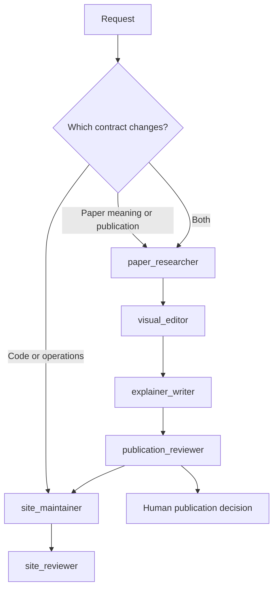

# Paper Atlas agent harness

## Purpose

Paper Atlas has two connected work lanes:

1. **Site engineering** maintains the web app, API, workers, infrastructure,
   schemas, and operator experience.
2. **Editorial production** reads papers, builds evidence, chooses explanatory
   visuals, writes explainers, and prepares reviewed publication candidates.

The lanes share provenance and release rules but not authority. Engineering may
render approved scientific content; it may not invent or rewrite it. Editorial
agents may prepare candidates; they may not deploy code or publish without a
human decision.

This is the repository harness used by Codex contributors. The future product
pipeline remains the deterministic Temporal and OpenAI Agents SDK design in
`paper_atlas_blueprint/agent-harness.md`.

## Design basis

The harness follows four current practices:

- Keep `AGENTS.md` short and use it as a map to versioned repository knowledge,
  then promote important rules into mechanical checks. See OpenAI's
  [harness engineering report](https://openai.com/index/harness-engineering/).
- Use hierarchical `AGENTS.md` files for always-on scoped instructions. See the
  [Codex AGENTS.md documentation](https://developers.openai.com/codex/guides/agents-md).
- Use project custom agents for bounded specialist work and avoid parallel
  write-heavy tasks. See the
  [Codex subagent documentation](https://developers.openai.com/codex/subagents).
- Use repository skills for reusable workflows and progressive disclosure. See
  the [Codex skills documentation](https://developers.openai.com/codex/skills).

The independent reviewer role also follows the generator/evaluator separation
described in Anthropic's
[long-running harness research](https://www.anthropic.com/engineering/harness-design-long-running-apps).

## Routing



Classify by outcome, not by file extension. Editing a JSON fixture that changes
what the site says about a paper is editorial work. Changing a renderer without
changing approved claims is engineering work. A feature that does both passes
both review gates.

## Roles

| Agent | Authority | Required output |
| --- | --- | --- |
| `site_maintainer` | Workspace write | Scoped implementation and verification |
| `site_reviewer` | Read only | Findings against code, tests, and rendered behavior |
| `paper_researcher` | Read only | Versioned, source-mapped evidence dossier |
| `visual_editor` | Read only | Pedagogical visual decisions and specifications |
| `explainer_writer` | Workspace write | Typed explainer candidate using approved claims |
| `publication_reviewer` | Read only | `PASS` or `CHANGES_REQUIRED` with evidence |

The main agent is the coordinator. Specialist agents do not delegate further;
`.codex/config.toml` keeps depth at one and caps open threads at four. Models are
not pinned in agent files so roles inherit the current session model instead of
silently becoming stale.

## Required workflows

### Site-only change

1. Define the visible or operational acceptance condition.
2. Have `site_maintainer` implement and run targeted checks.
3. Use `site_reviewer` for user-visible, cross-boundary, or release-sensitive
   changes.
4. Inspect the real browser surface for UI work.
5. Commit the verified change.

### Paper explainer

1. Load `.agents/skills/paper-explainer/SKILL.md`.
2. Establish the exact paper version and evidence dossier.
3. Approve, reject, or narrow claims before prose is written.
4. Plan visuals from approved evidence.
   - Enumerate every difficult concept; do not use a one-visual-per-paper quota.
   - Require a visual when prose would force error-prone mental reconstruction.
   - Match the form to the relationship: process, feedback, architecture,
     hierarchy, quantitative comparison, uncertainty, evidence strength,
     spatial structure, or changing representation.
   - Record a reason when prose is the better treatment.
   - Reject generic box sequences that only restate the prose.
5. Draft the explanation without adding claims.
6. Run independent publication review.
7. Ask for the human publication decision.
8. Integrate into the site and run the site review gate.

Stages are sequential where one consumes another's output. Read-heavy searches
may run in parallel when independent; write-heavy work does not.

### Index-only paper

Indexing stops after validated metadata and provenance. The visible state is
`Indexed` or `Explainer pending`, never `Published`. An abstract-derived
description is not an explainer summary.

## Enforcement

- Root and subtree `AGENTS.md` files provide always-on routing and local rules.
- `.agents/skills/paper-explainer` provides the editorial workflow only when a
  matching task triggers it.
- `.codex/agents/*.toml` defines role authority and read/write boundaries.
- Visual review is concept-based: every difficult concept needs an explicit
  treatment decision, evidence, limitations, accessibility behavior, and a
  form that reduces cognitive load rather than decorating the page.
- `scripts/check-agent-harness.py` validates the configuration through the
  project's locked Python environment and is part of
  `make check`.
- Schema validation, source-reference coverage, content evaluations, and the
  human editorial console remain product milestones; this repository harness
  must not claim they are implemented before they exist.

## Verification

Run:

```bash
make harness-check
make check
```

Start a new Codex session after changing root instructions or custom-agent
configuration. Skill changes are discovered automatically, but restarting is
the reliable way to verify the complete project context.
