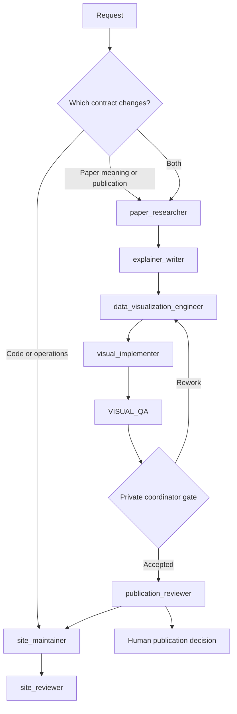

# Paper Atlas agent harness

## Purpose

Paper Atlas has two connected work lanes:

1. **Site engineering** maintains the web app, API, workers, infrastructure,
   schemas, and operator experience.
2. **Editorial production** reads papers, builds evidence, chooses explanatory
   visuals, writes explainers, and prepares reviewed publication candidates.

The lanes share provenance and release rules but not authority. Engineering may
render approved scientific content; it may not invent or rewrite it. Editorial
agents may prepare candidates; they may not deploy code or publish without a
human decision.

This is the repository harness used by Codex contributors. The future product
pipeline remains the deterministic Temporal and OpenAI Agents SDK design in
`paper_atlas_blueprint/agent-harness.md`.

## Design basis

The harness follows four current practices:

- Keep `AGENTS.md` short and use it as a map to versioned repository knowledge,
  then promote important rules into mechanical checks. See OpenAI's
  [harness engineering report](https://openai.com/index/harness-engineering/).
- Use hierarchical `AGENTS.md` files for always-on scoped instructions. See the
  [Codex AGENTS.md documentation](https://developers.openai.com/codex/guides/agents-md).
- Use project custom agents for bounded specialist work and avoid parallel
  write-heavy tasks. See the
  [Codex subagent documentation](https://developers.openai.com/codex/subagents).
- Use repository skills for reusable workflows and progressive disclosure. See
  the [Codex skills documentation](https://developers.openai.com/codex/skills).

The independent reviewer role also follows the generator/evaluator separation
described in Anthropic's
[long-running harness research](https://www.anthropic.com/engineering/harness-design-long-running-apps).

## Routing



Classify by outcome, not by file extension. Editing a JSON fixture that changes
what the site says about a paper is editorial work. Changing a renderer without
changing approved claims is engineering work. A feature that does both passes
both review gates.

## Roles

| Agent | Authority | Required output |
| --- | --- | --- |
| `site_maintainer` | Workspace write | Scoped implementation and verification |
| `site_reviewer` | Read only | Findings against code, tests, and rendered behavior |
| `paper_researcher` | Read only | Versioned, source-mapped evidence dossier |
| `visual_editor` | Read only | Pedagogical visual decisions and specifications |
| `explainer_writer` | Workspace write | Typed explainer candidate using approved claims |
| `data_visualization_engineer` | Workspace write | Paragraph audit with prose-only NO decisions and three coded treatments for warranted YES decisions |
| `visual_implementer` | Workspace write | Implemented selections and manifest implementation records |
| `VISUAL_QA` | QA-report write only | Independent paragraph and agent scores with evidence |
| `publication_reviewer` | Read only | `PASS` or `CHANGES_REQUIRED` with evidence |

The main agent is the coordinator. Specialist agents do not delegate further;
`.codex/config.toml` keeps depth at one and caps open threads at four. Models are
not pinned in agent files so roles inherit the current session model instead of
silently becoming stale.

## Required workflows

### Site-only change

1. Define the visible or operational acceptance condition.
2. Have `site_maintainer` implement and run targeted checks.
3. Use `site_reviewer` for user-visible, cross-boundary, or release-sensitive
   changes.
4. Inspect the real browser surface for UI work.
5. Commit the verified change.

### Paper explainer

1. Load `.agents/skills/paper-explainer/SKILL.md`.
2. Establish the exact paper version and evidence dossier.
3. Approve, reject, or narrow claims before prose is written.
4. Freeze stable paragraph IDs, then have `data_visualization_engineer` create
   the paper's visual manifest from approved evidence.
   - Audit every paragraph; do not use a one-visual-per-paper quota.
   - Require a visual when prose would force error-prone mental reconstruction.
   - Require a specific complexity warrant: a complex argument, non-trivial
     relationship, explanatory metaphor, complex process, quantitative
     structure, uncertainty, hierarchy, spatial topology, or changing state.
   - Record a reason when prose is the better treatment. A NO decision has no
     visual treatments or code in manifest revision 6 and later.
   - Audit the original paper's figures for every paragraph. When a figure or
     panel directly makes the explained point and reuse is permitted, require
     that original source asset in every treatment and record its exact
     figure/panel/page locator, attribution, and license status. Custom work is
     a fallback only when reuse is restricted, the asset is inaccessible, or
     the original would mislead by combining unrelated material. The original
     does not bypass the forbidden-structure rules: adapt it truthfully or
     choose NO when no acceptable treatment remains.
   - Reject a single chain of interchangeable elements, an item-plus-metric
     list, repeated same-metric cards, and repeated one-axis dot panels in every
     medium and orientation. If only those forms are possible, choose NO.
   - Reject templates that could fit unrelated paragraphs by substituting
     labels, and reject ellipsized prose as diagram copy.
   - For YES only, supply three distinct treatments with TikZ, Mermaid, and
     Python code; recommend SVG, CSS, or JavaScript for web-native delivery when
     apt.
   - Across the paper's complete proposal portfolio, cap HTML/CSS-led
     treatments at 30%. Record one explicit primary medium per treatment;
     accessible HTML fallbacks do not change that classification.
5. Have `visual_implementer` select, implement, and record one treatment for
   every YES paragraph.
   - Use the original paper figure at the paragraph that explains its point
     whenever the manifest marks it `USE_ORIGINAL`; do not silently redraw it.
   - Return a forbidden stock structure to the engineer instead of styling or
     translating it into another medium.
   - One visual may serve adjacent YES paragraphs only when the manifest gives
     them a shared explanatory scope and visual ID.
   - Count shared visuals once by visual ID and cap HTML/CSS-led selections at
     30% of the paper's selected visual set.
6. Invoke a fresh `VISUAL_QA` with only the evidence, manifest, implementation,
   rendered pages, and scoring brief. It scores every paragraph and both agents
   without modifying their work.
   - It classifies the actual rendered topology, not component names, and gives
     the responsible agent 1/10 for any forbidden stock structure.
   - It verifies the source-figure audit against the paper and gives the
     responsible agent 1/10 when a directly matching, reusable original figure
     was replaced by a custom visual.
7. The coordinator applies its private acceptance policy. The reviewer is not
   told that policy. When the gate fails, both producing agents revise before a
   fresh blind QA pass.
8. Run independent publication review.
9. Ask for the human publication decision.
10. Integrate into the site and run the site review gate.

Stages are sequential where one consumes another's output. Read-heavy searches
may run in parallel when independent; write-heavy work does not.

### Index-only paper

Indexing stops after validated metadata and provenance. The visible state is
`Indexed` or `Explainer pending`, never `Published`. An abstract-derived
description is not an explainer summary.

## Enforcement

- Root and subtree `AGENTS.md` files provide always-on routing and local rules.
- `.agents/skills/paper-explainer` provides the editorial workflow only when a
  matching task triggers it.
- `.codex/agents/*.toml` defines role authority and read/write boundaries.
- `docs/visual-manifests/` preserves paragraph-level visual decisions,
  alternatives, implementation selections, and independent QA evidence.
- Visual review is concept-based: every difficult concept needs an explicit
  treatment decision, evidence, limitations, accessibility behavior, and a
  form that reduces cognitive load rather than decorating the page.
- Manifest revision 6 removes treatment/code requirements from NO paragraphs,
  requires a complexity warrant and forbidden-structure audit, and reserves
  visual proposals for YES decisions.
- Manifest revision 7 adds the source-figure audit and requires a directly
  matching, reusable original figure to remain the source asset for every
  treatment and the selected implementation.
- `scripts/check-agent-harness.py` validates the configuration through the
  project's locked Python environment and is part of
  `make check`.
- `scripts/check-visual-manifests.py` verifies exact fixture paragraph coverage,
  the YES-only three-treatment/code contract, implementation state, and rejects
  ellipsized diagram copy. It enforces the 30% HTML/CSS cap for revision 5 and
  later. For revision 6 and later it also requires a complexity warrant and
  forbidden-form audit, and rejects visual treatments on NO paragraphs.
- Schema validation, source-reference coverage, content evaluations, and the
  human editorial console remain product milestones; this repository harness
  must not claim they are implemented before they exist.

## Verification

Run:

```bash
make harness-check
make visual-manifest-check
make check
```

Start a new Codex session after changing root instructions or custom-agent
configuration. Skill changes are discovered automatically, but restarting is
the reliable way to verify the complete project context.
