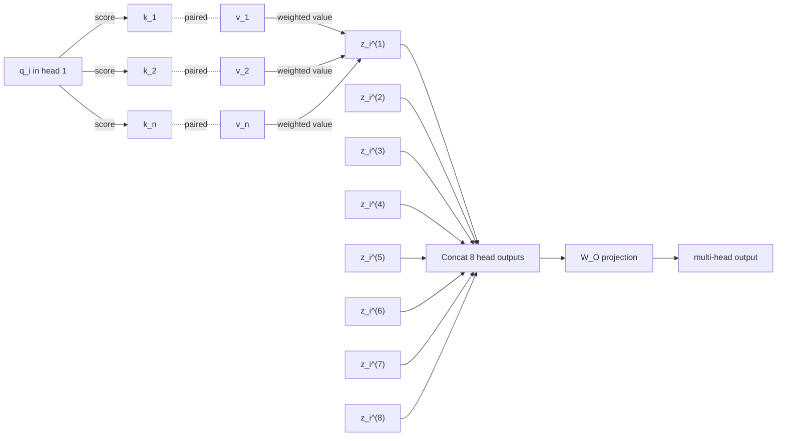
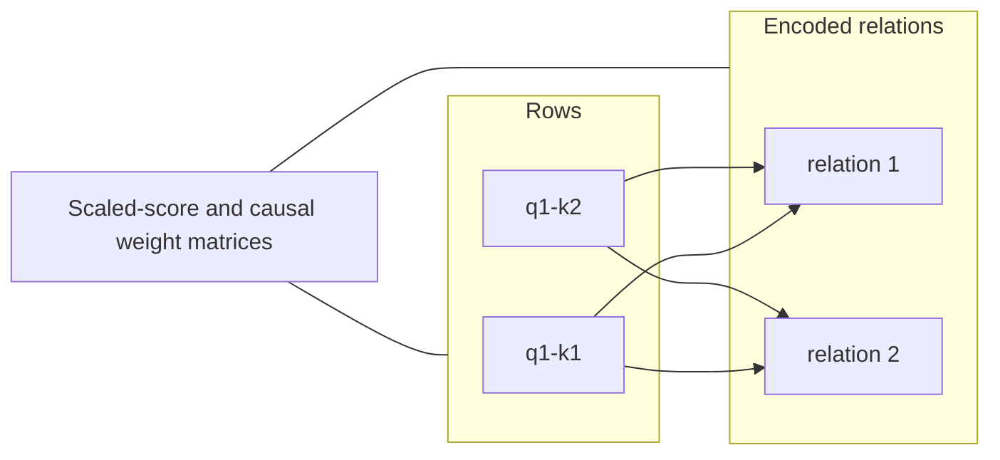
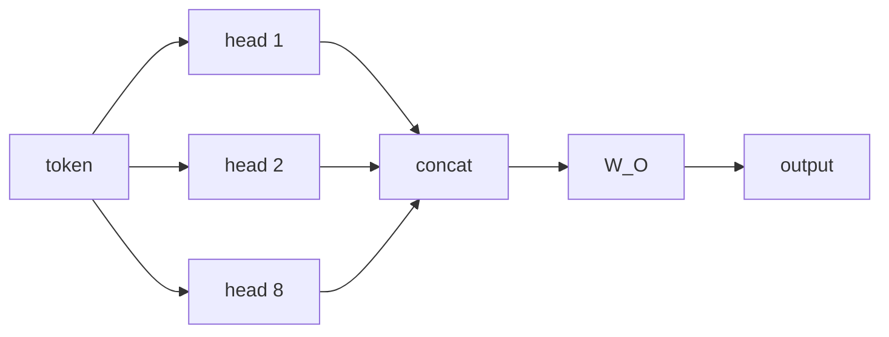
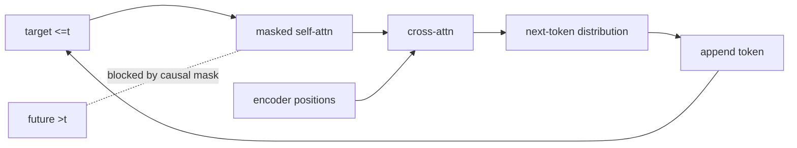
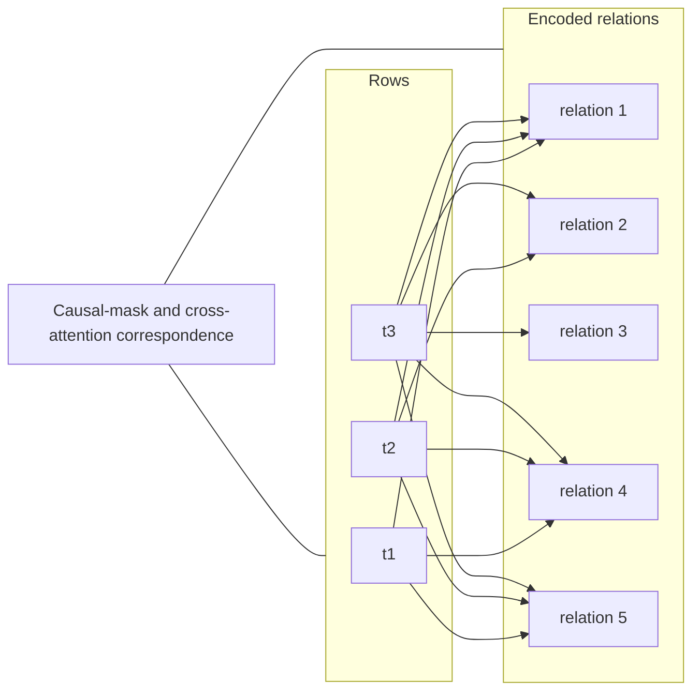
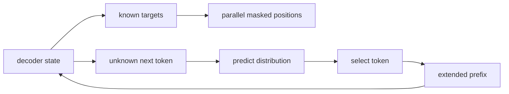

# Visual manifest — Attention Is All You Need: What the Original Transformer Actually Changed

- Paper ID: `paper_attention_is_all_you_need`
- Exact paper version: `v7`
- Explainer fixture: `packages/test-fixtures/explainers/attention-is-all-you-need.json`
- Manifest revision: `6`
- Engineer status: `COMPLETE`
- Implementer status: `COMPLETE`
- Paragraph coverage: `18 / 18` prose paragraphs
- Paragraph-ID derivation: `{block.id}_p{1-based index in block.paragraphs}`; each fixture paragraph appears exactly once.
- Evidence sources:
  - `source_attention_arxiv_record` — arXiv record for Attention Is All You Need v7; Version history, abstract, DOI, full-text links, and license link; v7 dated August 2, 2023
  - `source_attention_arxiv_v7` — Attention Is All You Need, arXiv v7 PDF; Pages 1-10; Sections 1-7; Figures 1-2; Equation 1; Tables 1-4; version and figure-permission notice
  - `source_attention_neurips_paper` — Attention Is All You Need, official NIPS 2017 proceedings PDF; Pages 1-8; abstract, Sections 1-7, Tables 1-3; English-French result in abstract, Table 2, and Section 6.1
  - `source_attention_neurips_landing` — NIPS 2017 proceedings landing page for Attention Is All You Need; Proceedings identity and landing-page abstract, including its distinct 27.5 and 41.1 BLEU values
  - `source_attention_arxiv_license` — arXiv non-exclusive license to distribute; License terms granting arXiv a perpetual non-exclusive distribution right

Revision 6 independently reassesses all 18 paragraphs under the four-form hard ban. It proposes 2 paper-specific visuals and keeps 16 paragraphs prose-only. Revision-5 selections and SVG implementations are not accepted guidance; implementation must be redone from this manifest.

## `attn_why_p1`

- Location: `attn_why`, paragraph 1
- Text anchor: "Recurrent sequence models process positions through a chain of hidden states. That dependency makes"
- Claims and sources: `attn_002`, `source_attention_arxiv_v7`
- Visual needed: `NO`
- Complexity warrant: NONE — prose is sufficient.
- Forbidden-structure audit: `NO_VISUAL`
- Decision rationale: The paragraph makes one bounded distinction in plain language: Recurrent sequence models process positions through a chain of hidden states. A visual would repeat that statement as a stock chain, list, or set of cards rather than reduce genuine mental reconstruction.
- Explanatory job: Motivation and problem framing.

### Implementation record

- Status: `NOT_NEEDED`
- Selected treatment: `NONE`
- Selection rationale: `NO_VISUAL` — prose is the approved treatment.
- Delivery medium: `NONE`
- Visual ID and placement: `NONE` — `NO_VISUAL`
- Shared paragraph scope: `NONE`
- Changed files: `NONE`
- Accessibility and fallback verification: `NO_VISUAL`
- Desktop and mobile verification: `NO_VISUAL`
- Evidence deviations: `NONE`

## `attn_why_p2`

- Location: `attn_why`, paragraph 2
- Text anchor: "Attention already helped encoder-decoder systems retrieve information across a sequence, but it was usually"
- Claims and sources: `attn_002`, `source_attention_arxiv_v7`
- Visual needed: `NO`
- Complexity warrant: NONE — prose is sufficient.
- Forbidden-structure audit: `NO_VISUAL`
- Decision rationale: The paragraph makes one bounded distinction in plain language: Attention already helped encoder-decoder systems retrieve information across a sequence, but it was usually combined with recurrence. A visual would repeat that statement as a stock chain, list, or set of cards rather than reduce genuine mental reconstruction.
- Explanatory job: Motivation and problem framing.

### Implementation record

- Status: `NOT_NEEDED`
- Selected treatment: `NONE`
- Selection rationale: `NO_VISUAL` — prose is the approved treatment.
- Delivery medium: `NONE`
- Visual ID and placement: `NONE` — `NO_VISUAL`
- Shared paragraph scope: `NONE`
- Changed files: `NONE`
- Accessibility and fallback verification: `NO_VISUAL`
- Desktop and mobile verification: `NO_VISUAL`
- Evidence deviations: `NONE`

## `attn_change_p1`

- Location: `attn_change`, paragraph 1
- Text anchor: "The Transformer keeps an encoder-decoder structure but changes the operation used to exchange information"
- Claims and sources: `attn_002`, `attn_003`, `attn_006`, `attn_012`, `source_attention_arxiv_v7`
- Visual needed: `NO`
- Complexity warrant: NONE — prose is sufficient.
- Forbidden-structure audit: `NO_VISUAL`
- Decision rationale: The paragraph makes one bounded distinction in plain language: The Transformer keeps an encoder-decoder structure but changes the operation used to exchange information between positions. A visual would repeat that statement as a stock chain, list, or set of cards rather than reduce genuine mental reconstruction.
- Explanatory job: Method distinction and scope.

### Implementation record

- Status: `NOT_NEEDED`
- Selected treatment: `NONE`
- Selection rationale: `NO_VISUAL` — prose is the approved treatment.
- Delivery medium: `NONE`
- Visual ID and placement: `NONE` — `NO_VISUAL`
- Shared paragraph scope: `NONE`
- Changed files: `NONE`
- Accessibility and fallback verification: `NO_VISUAL`
- Desktop and mobile verification: `NO_VISUAL`
- Evidence deviations: `NONE`

## `attn_change_p2`

- Location: `attn_change`, paragraph 2
- Text anchor: "This shortens the maximum path between positions to a constant number of sequential operations"
- Claims and sources: `attn_002`, `attn_003`, `attn_006`, `attn_012`, `source_attention_arxiv_v7`
- Visual needed: `NO`
- Complexity warrant: NONE — prose is sufficient.
- Forbidden-structure audit: `NO_VISUAL`
- Decision rationale: The paragraph makes one bounded distinction in plain language: This shortens the maximum path between positions to a constant number of sequential operations per self-attention layer. A visual would repeat that statement as a stock chain, list, or set of cards rather than reduce genuine mental reconstruction.
- Explanatory job: Method distinction and scope.

### Implementation record

- Status: `NOT_NEEDED`
- Selected treatment: `NONE`
- Selection rationale: `NO_VISUAL` — prose is the approved treatment.
- Delivery medium: `NONE`
- Visual ID and placement: `NONE` — `NO_VISUAL`
- Shared paragraph scope: `NONE`
- Changed files: `NONE`
- Accessibility and fallback verification: `NO_VISUAL`
- Desktop and mobile verification: `NO_VISUAL`
- Evidence deviations: `NONE`

## `attn_mechanism_p1`

- Location: `attn_mechanism`, paragraph 1
- Text anchor: "Tokens first become learned vectors, and sinusoidal position encodings are added so the model"
- Claims and sources: `attn_003`, `attn_004`, `attn_005`, `source_attention_arxiv_v7`
- Visual needed: `NO`
- Complexity warrant: NONE — prose is sufficient.
- Forbidden-structure audit: `NO_VISUAL`
- Decision rationale: The paragraph's bounded operation is already explicit: Tokens first become learned vectors, and sinusoidal position encodings are added so the model receives order information. Its supported visual form would be a single sequence or inventory of components, both forbidden, and the evidence does not justify extra branching, scale, or state topology.
- Explanatory job: Mechanism explanation.

### Implementation record

- Status: `NOT_NEEDED`
- Selected treatment: `NONE`
- Selection rationale: `NO_VISUAL` — prose is the approved treatment.
- Delivery medium: `NONE`
- Visual ID and placement: `NONE` — `NO_VISUAL`
- Shared paragraph scope: `NONE`
- Changed files: `NONE`
- Accessibility and fallback verification: `NO_VISUAL`
- Desktop and mobile verification: `NO_VISUAL`
- Evidence deviations: `NONE`

## `attn_mechanism_p2`

- Location: `attn_mechanism`, paragraph 2
- Text anchor: "For scaled dot-product attention, the model compares a query with every key using Q"
- Claims and sources: `attn_003`, `attn_004`, `attn_005`, `source_attention_arxiv_v7`
- Visual needed: `YES`
- Complexity warrant: Non-trivial many-to-many relationship: every query compares with every key, normalized weights mix values, and eight heads recombine distinct learned subspaces.
- Forbidden-structure audit: `PASS` — each treatment uses branching, a dependency matrix, feedback, shared-scale geometry, or a state topology; none is a single interchangeable chain, item-plus-metric list, repeated same-metric cards, or repeated one-axis dot panels.
- Decision rationale: Readers otherwise have to reconstruct the correspondence among QK-transpose scores, row-wise softmax weights, value mixing, and head recombination. A matrix or bipartite encoding makes those simultaneous relations explicit.
- Explanatory job: Many-to-many attention mechanism and representation change.

### Treatment A — One attention row plus eight-head recombination

- Teaching purpose: Show both scales of the operation: within one head, one query produces one row-local weighted value mixture; across the layer, eight distinct head outputs concatenate and pass through the learned output projection.
- Encoding and reading order: First render exactly one `q_i^(1)` inside a detailed head, with explicit score edges to visible `k_j^(1)` nodes, explicit key/value pairing, and weighted-value edges from the paired `v_j^(1)` nodes into exactly one `z_i^(1)`. Do not add another query row to that detailed head. Then render all eight distinct outputs `z_i^(1)` through `z_i^(8)` as a non-trivial fan into `Concat`, followed by the learned `W_O` projection and the multi-head output. The detailed `z_i^(1)` participates in that same eight-output fan; it is not a separate summary node.
- Evidence and limitations: Claims `attn_004`, `attn_005`; `source_attention_arxiv_v7`, Equation 1 and Sections 3.2–3.3. The diagram is structural and does not imply unreported magnitudes.
- Primary delivery medium: `SVG`
- Recommended web medium: `SVG`
- Mobile, accessibility, and motion behavior: Preserve all labels at 200% zoom; on narrow screens use a single controlled horizontal scroll region or a content-specific stacked variant. Provide a semantic description of every relation and value. Keyboard focus must follow the stated reading order. If interactive, expose the same state in text, support pause/reset, and honor reduced motion; otherwise use no motion.

#### TikZ
```tex
\documentclass[tikz,border=4pt]{standalone}
\usepackage{tikz}
\begin{document}
\begin{tikzpicture}[font=\sffamily\scriptsize,>=stealth]
\node[draw,rounded corners] (q) at (0,0) {$q_i^{(1)}$};
\foreach \x/\j in {2/1,4/2,6/n} {
  \node[draw,rounded corners] (k\j) at (\x,0.7) {$k_{\j}^{(1)}$};
  \node[draw,rounded corners] (v\j) at (\x,-0.7) {$v_{\j}^{(1)}$};
  \draw[->] (q) -- node[above,sloped] {score} (k\j);
  \draw[dashed] (k\j) -- node[right] {paired} (v\j);
}
\node[draw,rounded corners] (z1) at (8,0) {$z_i^{(1)}$};
\foreach \j in {1,2,n} {\draw[->] (v\j) -- node[below,sloped] {$\alpha_{i\j}v_{\j}$} (z1);}
\foreach \h in {2,...,8} {\node[draw,rounded corners] (z\h) at ({1.15*(\h-2)},-2.5) {$z_i^{(\h)}$};}
\node[draw,rounded corners] (concat) at (4,-4) {Concat: 8 head outputs};
\draw[->] (z1) -- (concat);
\foreach \h in {2,...,8} {\draw[->] (z\h) -- (concat);}
\node[draw,rounded corners] (wo) at (4,-5.2) {$W_O$ projection};
\node[draw,rounded corners] (out) at (4,-6.4) {multi-head output};
\draw[->] (concat) -- (wo); \draw[->] (wo) -- (out);
\end{tikzpicture}
\end{document}
```

#### Mermaid


#### Python
```python
from pathlib import Path
import matplotlib.pyplot as plt

labels = ['q_i^(1)', 'k_1', 'k_2', 'k_n', 'v_1', 'v_2', 'v_n']
labels += [f'z_i^({head})' for head in range(1, 9)] + ['Concat', 'W_O', 'multi-head output']
positions = {
    0: (0, 2.2), 1: (2, 3), 2: (4, 3), 3: (6, 3),
    4: (2, 1.6), 5: (4, 1.6), 6: (6, 1.6), 7: (8, 2.2),
    **{6 + head: (head - 2, 0) for head in range(2, 9)},
    15: (3.5, -1.5), 16: (3.5, -2.7), 17: (3.5, -3.9),
}
score_edges = [(0, 1), (0, 2), (0, 3)]
value_edges = [(4, 7), (5, 7), (6, 7)]
head_edges = [(node, 15) for node in range(7, 15)]
fig, ax = plt.subplots(figsize=(11, 7))
for i, label in enumerate(labels):
    x, y = positions[i]
    ax.text(x, y, label, ha='center', va='center', bbox={'boxstyle': 'round', 'fc': '#fffdf8', 'ec': '#171714'})
for start, end in score_edges + value_edges + head_edges + [(15, 16), (16, 17)]:
    x1, y1 = positions[start]
    x2, y2 = positions[end]
    ax.annotate('', (x2, y2), (x1, y1), arrowprops={'arrowstyle': '->', 'color': '#2f5ea8'})
for key, value in [(1, 4), (2, 5), (3, 6)]:
    ax.plot([positions[key][0], positions[value][0]], [positions[key][1], positions[value][1]], '--', color='#66645e')
ax.text(4, 0.65, 'eight distinct head outputs recombine', ha='center')
ax.set_axis_off()
fig.tight_layout()
fig.savefig(Path('visual.svg'), format='svg')
```

### Treatment B — Scaled-score and normalized-weight matrices

- Teaching purpose: Expose the exact representation change from QK-transpose scores to normalized mixing weights.
- Encoding and reading order: A two-part matrix uses the same query-key cells before and after scaling plus row-wise softmax; a linked value column shows that each output row is a weighted combination, not a chosen key.
- Evidence and limitations: Claims `attn_004`, `attn_005`; `source_attention_arxiv_v7`, Equation 1 and Sections 3.2–3.3. Values are schematic to explain the operation; they are not paper measurements and must be labeled illustrative.
- Primary delivery medium: `generated asset`
- Recommended web medium: `SVG`
- Mobile, accessibility, and motion behavior: Preserve all labels at 200% zoom; on narrow screens use a single controlled horizontal scroll region or a content-specific stacked variant. Provide a semantic description of every relation and value. Keyboard focus must follow the stated reading order. If interactive, expose the same state in text, support pause/reset, and honor reduced motion; otherwise use no motion.

#### TikZ
```tex
\documentclass[tikz,border=4pt]{standalone}
\usepackage{tikz}
\begin{document}
\begin{tikzpicture}[font=\sffamily\scriptsize,>=stealth]
\fill[blue!80] (0,-0) rectangle ++(0.9,-0.9);
\draw (0,-0) rectangle ++(0.9,-0.9);
\fill[blue!44] (1,-0) rectangle ++(0.9,-0.9);
\draw (1,-0) rectangle ++(0.9,-0.9);
\fill[blue!32] (0,-1) rectangle ++(0.9,-0.9);
\draw (0,-1) rectangle ++(0.9,-0.9);
\fill[blue!74] (1,-1) rectangle ++(0.9,-0.9);
\draw (1,-1) rectangle ++(0.9,-0.9);
\node[anchor=west] at (0,1.0) {q1-k1 / q1-k2 / q2-k1 / q2-k2};
\end{tikzpicture}
\end{document}
```

#### Mermaid


#### Python
```python
from pathlib import Path
import matplotlib.pyplot as plt

labels = ['q1-k1', 'q1-k2', 'q2-k1', 'q2-k2']
fig, ax = plt.subplots(figsize=(9, 5))
values = [[1.0, 0.4], [0.2, 0.9]]
image = ax.imshow(values, cmap='Blues', vmin=0)
ax.set_title(' / '.join(labels))
fig.colorbar(image, ax=ax, label='encoded relation')
ax.grid(alpha=0.2)
fig.tight_layout()
fig.savefig(Path('visual.svg'), format='svg')
```

### Treatment C — Eight-head subspace fan and recombination

- Teaching purpose: Explain why multi-head attention is not one attention average repeated decoratively.
- Encoding and reading order: One token representation fans into eight learned Q/K/V projections; head outputs remain separate around a ring and converge through concatenation plus W_O. The topology emphasizes parallel subspaces.
- Evidence and limitations: Claims `attn_004`, `attn_005`; `source_attention_arxiv_v7`, Equation 1 and Sections 3.2–3.3. The diagram is structural and does not imply unreported magnitudes.
- Primary delivery medium: `SVG`
- Recommended web medium: `SVG`
- Mobile, accessibility, and motion behavior: Preserve all labels at 200% zoom; on narrow screens use a single controlled horizontal scroll region or a content-specific stacked variant. Provide a semantic description of every relation and value. Keyboard focus must follow the stated reading order. If interactive, expose the same state in text, support pause/reset, and honor reduced motion; otherwise use no motion.

#### TikZ
```tex
\documentclass[tikz,border=4pt]{standalone}
\usepackage{tikz}
\begin{document}
\begin{tikzpicture}[font=\sffamily\scriptsize,>=stealth]
\node[draw,rounded corners,align=center] (n0) at (0.0,0.0) {token};
\node[draw,rounded corners,align=center] (n1) at (3.2,0.0) {head 1};
\node[draw,rounded corners,align=center] (n2) at (6.4,0.0) {head 2};
\node[draw,rounded corners,align=center] (n3) at (9.600000000000001,0.0) {head 8};
\node[draw,rounded corners,align=center] (n4) at (0.0,-1.8) {concat};
\node[draw,rounded corners,align=center] (n5) at (3.2,-1.8) {W\_O};
\node[draw,rounded corners,align=center] (n6) at (6.4,-1.8) {output};
\draw[->] (n0) -- (n1);
\draw[->] (n0) -- (n2);
\draw[->] (n0) -- (n3);
\draw[->] (n1) -- (n4);
\draw[->] (n2) -- (n4);
\draw[->] (n3) -- (n4);
\draw[->] (n4) -- (n5);
\draw[->] (n5) -- (n6);
\end{tikzpicture}
\end{document}
```

#### Mermaid


#### Python
```python
from pathlib import Path
import matplotlib.pyplot as plt

labels = ['token', 'head 1', 'head 2', 'head 8', 'concat', 'W_O', 'output']
fig, ax = plt.subplots(figsize=(9, 5))
edges = [(0, 1), (0, 2), (0, 3), (1, 4), (2, 4), (3, 4), (4, 5), (5, 6)]
positions = {i: ((i % 4) * 2.5, -(i // 4) * 1.4) for i in range(len(labels))}
for i, label in enumerate(labels):
    x, y = positions[i]
    ax.text(x, y, label, ha='center', va='center', bbox={'boxstyle': 'round', 'fc': '#fffdf8', 'ec': '#171714'})
for start, end in edges:
    x1, y1 = positions[start]
    x2, y2 = positions[end]
    ax.annotate('', (x2, y2), (x1, y1), arrowprops={'arrowstyle': '->', 'color': '#2f5ea8'})
ax.set_axis_off()
fig.tight_layout()
fig.savefig(Path('visual.svg'), format='svg')
```

### Implementation record

- Status: `IMPLEMENTED`
- Selected treatment: `A`
- Selection rationale: Treatment A remains selected, but rework must encode both nested scales: one detailed row-local operation with exactly one `q_i^(1)` and one `z_i^(1)`, followed by eight distinct head-output branches into `Concat`, `W_O`, and the multi-head output. Multiple query rows may not collapse into one weighted-sum node, and a bracket or note cannot substitute for the eight-way recombination topology.
- Delivery medium: `SVG`
- Visual ID and placement: `visual_attention_query_key_field` — rendered immediately after `attn_mechanism_p2`.
- Shared paragraph scope: `NONE`
- Changed files: `apps/web/app/papers/[id]/explainer-visual.tsx`, `apps/web/app/papers/[id]/explainer-svg.tsx`, `apps/web/app/globals.css`, the paper fixture, and this manifest
- Accessibility and fallback verification: VERIFIED — the unique SVG title and description, equivalent prose, evidence links, limitations, and motion-free reading order explicitly cover both the single-query row and the eight-head recombination stage.
- Desktop and mobile verification: VERIFIED — the 520-unit attention viewBox contains every stage on desktop; below 720 px the 680 px SVG remains inside the keyboard-focusable horizontal scroller without document-level overflow.
- Evidence deviations: `NONE`

## `attn_mechanism_p3`

- Location: `attn_mechanism`, paragraph 3
- Text anchor: "The decoder also repeats 6 layers. Its self-attention masks future target positions, then encoder-decoder"
- Claims and sources: `attn_003`, `attn_004`, `attn_005`, `source_attention_arxiv_v7`
- Visual needed: `YES`
- Complexity warrant: Complex dependency topology and changing state: masked target-prefix relations and encoder cross-attention converge on one prediction, then the selected token changes the next decoding state.
- Forbidden-structure audit: `PASS` — each treatment uses branching, a dependency matrix, feedback, shared-scale geometry, or a state topology; none is a single interchangeable chain, item-plus-metric list, repeated same-metric cards, or repeated one-axis dot panels.
- Decision rationale: Prose names three attention regimes and an autoregressive update, but readers must mentally combine two source domains, a causal mask, and the feedback from output token to next prefix.
- Explanatory job: Decoder dependency architecture and autoregressive state transition.

### Treatment A — Masked-prefix and encoded-source dependency map

- Teaching purpose: Show exactly which information domains may influence the current decoder position.
- Encoding and reading order: Known target tokens form allowed masked-self-attention edges; future target tokens have blocked edges; all encoded source positions converge through cross-attention before projection.
- Evidence and limitations: Claims `attn_003`, `attn_004`; `source_attention_arxiv_v7`, Figure 1 and Sections 3.1–3.2. The blocked future input must be marked as prohibited, not drawn as an active causal edge.
- Primary delivery medium: `SVG`
- Recommended web medium: `SVG`
- Mobile, accessibility, and motion behavior: Preserve all labels at 200% zoom; on narrow screens use a single controlled horizontal scroll region or a content-specific stacked variant. Provide a semantic description of every relation and value. Keyboard focus must follow the stated reading order. If interactive, expose the same state in text, support pause/reset, and honor reduced motion; otherwise use no motion.

#### TikZ
```tex
\documentclass[tikz,border=4pt]{standalone}
\usepackage{tikz}
\begin{document}
\begin{tikzpicture}[font=\sffamily\scriptsize,>=stealth]
\node[draw,rounded corners,align=center] (n0) at (0.0,0.0) {target <=t};
\node[draw,rounded corners,align=center] (n1) at (3.2,0.0) {future >t};
\node[draw,rounded corners,align=center] (n2) at (6.4,0.0) {masked self-attn};
\node[draw,rounded corners,align=center] (n3) at (9.600000000000001,0.0) {encoder positions};
\node[draw,rounded corners,align=center] (n4) at (0.0,-1.8) {cross-attn};
\node[draw,rounded corners,align=center] (n5) at (3.2,-1.8) {next-token distribution};
\node[draw,rounded corners,align=center] (n6) at (6.4,-1.8) {append token};
\draw[->] (n0) -- (n2);
\draw[dashed,red] (n1) -- node[above]{blocked} (n2);
\draw[->] (n2) -- (n4);
\draw[->] (n3) -- (n4);
\draw[->] (n4) -- (n5);
\draw[->] (n5) -- (n6);
\draw[->] (n6) -- (n0);
\end{tikzpicture}
\end{document}
```

#### Mermaid


#### Python
```python
from pathlib import Path
import matplotlib.pyplot as plt

labels = ['target <=t', 'future >t', 'masked self-attn', 'encoder positions', 'cross-attn', 'next-token distribution', 'append token']
fig, ax = plt.subplots(figsize=(9, 5))
edges = [(0, 2), (2, 4), (3, 4), (4, 5), (5, 6), (6, 0)]
positions = {i: ((i % 4) * 2.5, -(i // 4) * 1.4) for i in range(len(labels))}
for i, label in enumerate(labels):
    x, y = positions[i]
    ax.text(x, y, label, ha='center', va='center', bbox={'boxstyle': 'round', 'fc': '#fffdf8', 'ec': '#171714'})
for start, end in edges:
    x1, y1 = positions[start]
    x2, y2 = positions[end]
    ax.annotate('', (x2, y2), (x1, y1), arrowprops={'arrowstyle': '->', 'color': '#2f5ea8'})
ax.plot([positions[1][0], positions[2][0]], [positions[1][1], positions[2][1]], '--', color='#a44e36')
ax.text(6.1, -0.3, 'blocked', color='#a44e36')
ax.set_axis_off()
fig.tight_layout()
fig.savefig(Path('visual.svg'), format='svg')
```

### Treatment B — Causal-mask and cross-attention correspondence

- Teaching purpose: Contrast the triangular target mask with the rectangular decoder-to-source relation.
- Encoding and reading order: A triangular target-by-target mask sits beside a full target-by-source matrix; shared target rows connect the two representations and then to the next-token distribution.
- Evidence and limitations: Claims `attn_003`, `attn_004`; `source_attention_arxiv_v7`, Figure 1 and Sections 3.1–3.2. Binary cells show permitted dependencies only, not learned attention weights.
- Primary delivery medium: `generated asset`
- Recommended web medium: `SVG`
- Mobile, accessibility, and motion behavior: Preserve all labels at 200% zoom; on narrow screens use a single controlled horizontal scroll region or a content-specific stacked variant. Provide a semantic description of every relation and value. Keyboard focus must follow the stated reading order. If interactive, expose the same state in text, support pause/reset, and honor reduced motion; otherwise use no motion.

#### TikZ
```tex
\documentclass[tikz,border=4pt]{standalone}
\usepackage{tikz}
\begin{document}
\begin{tikzpicture}[font=\sffamily\scriptsize,>=stealth]
\fill[blue!80] (0,-0) rectangle ++(0.9,-0.9);
\draw (0,-0) rectangle ++(0.9,-0.9);
\fill[blue!20] (1,-0) rectangle ++(0.9,-0.9);
\draw (1,-0) rectangle ++(0.9,-0.9);
\fill[blue!20] (2,-0) rectangle ++(0.9,-0.9);
\draw (2,-0) rectangle ++(0.9,-0.9);
\fill[blue!80] (3,-0) rectangle ++(0.9,-0.9);
\draw (3,-0) rectangle ++(0.9,-0.9);
\fill[blue!80] (4,-0) rectangle ++(0.9,-0.9);
\draw (4,-0) rectangle ++(0.9,-0.9);
\fill[blue!80] (0,-1) rectangle ++(0.9,-0.9);
\draw (0,-1) rectangle ++(0.9,-0.9);
\fill[blue!80] (1,-1) rectangle ++(0.9,-0.9);
\draw (1,-1) rectangle ++(0.9,-0.9);
\fill[blue!20] (2,-1) rectangle ++(0.9,-0.9);
\draw (2,-1) rectangle ++(0.9,-0.9);
\fill[blue!80] (3,-1) rectangle ++(0.9,-0.9);
\draw (3,-1) rectangle ++(0.9,-0.9);
\fill[blue!80] (4,-1) rectangle ++(0.9,-0.9);
\draw (4,-1) rectangle ++(0.9,-0.9);
\fill[blue!80] (0,-2) rectangle ++(0.9,-0.9);
\draw (0,-2) rectangle ++(0.9,-0.9);
\fill[blue!80] (1,-2) rectangle ++(0.9,-0.9);
\draw (1,-2) rectangle ++(0.9,-0.9);
\fill[blue!80] (2,-2) rectangle ++(0.9,-0.9);
\draw (2,-2) rectangle ++(0.9,-0.9);
\fill[blue!80] (3,-2) rectangle ++(0.9,-0.9);
\draw (3,-2) rectangle ++(0.9,-0.9);
\fill[blue!80] (4,-2) rectangle ++(0.9,-0.9);
\draw (4,-2) rectangle ++(0.9,-0.9);
\node[anchor=west] at (0,1.0) {t1 / t2 / t3 / s1 / s2};
\end{tikzpicture}
\end{document}
```

#### Mermaid


#### Python
```python
from pathlib import Path
import matplotlib.pyplot as plt

labels = ['t1', 't2', 't3', 's1', 's2']
fig, ax = plt.subplots(figsize=(9, 5))
values = [[1, 0, 0, 1, 1], [1, 1, 0, 1, 1], [1, 1, 1, 1, 1]]
image = ax.imshow(values, cmap='Blues', vmin=0)
ax.set_title(' / '.join(labels))
fig.colorbar(image, ax=ax, label='encoded relation')
ax.grid(alpha=0.2)
fig.tight_layout()
fig.savefig(Path('visual.svg'), format='svg')
```

### Treatment C — Training-parallel versus generation-state machine

- Teaching purpose: Prevent readers from confusing parallel masked training with parallel autoregressive generation.
- Encoding and reading order: A decision fork separates known-target training from unknown-target generation. Training evaluates target positions concurrently under masks; generation cycles prediction, selection, prefix extension, and the next state.
- Evidence and limitations: Claims `attn_003`, `attn_004`; `source_attention_arxiv_v7`, Figure 1 and Sections 3.1–3.2. The state machine explains dependency and concurrency; it does not claim a specific decoding algorithm beyond autoregressive repetition.
- Primary delivery medium: `JavaScript`
- Recommended web medium: `JavaScript`
- Mobile, accessibility, and motion behavior: Preserve all labels at 200% zoom; on narrow screens use a single controlled horizontal scroll region or a content-specific stacked variant. Provide a semantic description of every relation and value. Keyboard focus must follow the stated reading order. If interactive, expose the same state in text, support pause/reset, and honor reduced motion; otherwise use no motion.

#### TikZ
```tex
\documentclass[tikz,border=4pt]{standalone}
\usepackage{tikz}
\begin{document}
\begin{tikzpicture}[font=\sffamily\scriptsize,>=stealth]
\node[draw,rounded corners,align=center] (n0) at (0.0,0.0) {decoder state};
\node[draw,rounded corners,align=center] (n1) at (3.2,0.0) {known targets};
\node[draw,rounded corners,align=center] (n2) at (6.4,0.0) {parallel masked positions};
\node[draw,rounded corners,align=center] (n3) at (9.600000000000001,0.0) {unknown next token};
\node[draw,rounded corners,align=center] (n4) at (0.0,-1.8) {predict distribution};
\node[draw,rounded corners,align=center] (n5) at (3.2,-1.8) {select token};
\node[draw,rounded corners,align=center] (n6) at (6.4,-1.8) {extended prefix};
\draw[->] (n0) -- (n1);
\draw[->] (n1) -- (n2);
\draw[->] (n0) -- (n3);
\draw[->] (n3) -- (n4);
\draw[->] (n4) -- (n5);
\draw[->] (n5) -- (n6);
\draw[->] (n6) -- (n0);
\end{tikzpicture}
\end{document}
```

#### Mermaid


#### Python
```python
from pathlib import Path
import matplotlib.pyplot as plt

labels = ['decoder state', 'known targets', 'parallel masked positions', 'unknown next token', 'predict distribution', 'select token', 'extended prefix']
fig, ax = plt.subplots(figsize=(9, 5))
edges = [(0, 1), (1, 2), (0, 3), (3, 4), (4, 5), (5, 6), (6, 0)]
positions = {i: ((i % 4) * 2.5, -(i // 4) * 1.4) for i in range(len(labels))}
for i, label in enumerate(labels):
    x, y = positions[i]
    ax.text(x, y, label, ha='center', va='center', bbox={'boxstyle': 'round', 'fc': '#fffdf8', 'ec': '#171714'})
for start, end in edges:
    x1, y1 = positions[start]
    x2, y2 = positions[end]
    ax.annotate('', (x2, y2), (x1, y1), arrowprops={'arrowstyle': '->', 'color': '#2f5ea8'})
ax.set_axis_off()
fig.tight_layout()
fig.savefig(Path('visual.svg'), format='svg')
```

### Implementation record

- Status: `IMPLEMENTED`
- Selected treatment: `A`
- Selection rationale: The dependency map simultaneously distinguishes permitted prefix edges, blocked future targets, full source cross-attention, and the autoregressive state return.
- Delivery medium: `SVG`
- Visual ID and placement: `visual_attention_decoder_dependencies` — rendered immediately after `attn_mechanism_p3`.
- Shared paragraph scope: `NONE`
- Changed files: `apps/web/app/papers/[id]/explainer-visual.tsx`, `apps/web/app/papers/[id]/explainer-svg.tsx`, `apps/web/app/globals.css`, the paper fixture, and this manifest
- Accessibility and fallback verification: VERIFIED — the figure uses a unique SVG title and description, equivalent prose, evidence links, limitations, and a motion-free reading order.
- Desktop and mobile verification: VERIFIED — desktop preserves the full responsive canvas; below 720 px the SVG retains a 680 px width inside a keyboard-focusable horizontal scroller that stays within the viewport and creates no document-level overflow.
- Evidence deviations: `NONE`

## `attn_example_p1`

- Location: `attn_example`, paragraph 1
- Text anchor: "Take a decoder position whose preceding target tokens are known. Its query is compared"
- Claims and sources: `attn_003`, `attn_004`, `attn_012`, `source_attention_arxiv_v7`
- Visual needed: `NO`
- Complexity warrant: NONE — prose is sufficient.
- Forbidden-structure audit: `NO_VISUAL`
- Decision rationale: The worked example is short enough to follow in prose: Take a decoder position whose preceding target tokens are known. Rendering the same ordered actions would create a forbidden single chain; no additional quantitative or spatial relation is supported here.
- Explanatory job: Worked example.

### Implementation record

- Status: `NOT_NEEDED`
- Selected treatment: `NONE`
- Selection rationale: `NO_VISUAL` — prose is the approved treatment.
- Delivery medium: `NONE`
- Visual ID and placement: `NONE` — `NO_VISUAL`
- Shared paragraph scope: `NONE`
- Changed files: `NONE`
- Accessibility and fallback verification: `NO_VISUAL`
- Desktop and mobile verification: `NO_VISUAL`
- Evidence deviations: `NONE`

## `attn_example_p2`

- Location: `attn_example`, paragraph 2
- Text anchor: "After masked self-attention, the decoder position forms another query and compares it with keys"
- Claims and sources: `attn_003`, `attn_004`, `attn_012`, `source_attention_arxiv_v7`
- Visual needed: `NO`
- Complexity warrant: NONE — prose is sufficient.
- Forbidden-structure audit: `NO_VISUAL`
- Decision rationale: The worked example is short enough to follow in prose: After masked self-attention, the decoder position forms another query and compares it with keys from every encoded source position. Rendering the same ordered actions would create a forbidden single chain; no additional quantitative or spatial relation is supported here.
- Explanatory job: Worked example.

### Implementation record

- Status: `NOT_NEEDED`
- Selected treatment: `NONE`
- Selection rationale: `NO_VISUAL` — prose is the approved treatment.
- Delivery medium: `NONE`
- Visual ID and placement: `NONE` — `NO_VISUAL`
- Shared paragraph scope: `NONE`
- Changed files: `NONE`
- Accessibility and fallback verification: `NO_VISUAL`
- Desktop and mobile verification: `NO_VISUAL`
- Evidence deviations: `NONE`

## `attn_evidence_p1`

- Location: `attn_evidence`, paragraph 1
- Text anchor: "For WMT 2014 translation, the authors used about 4.5 million English-German sentence pairs with"
- Claims and sources: `attn_007`, `attn_008`, `attn_009`, `attn_010`, `source_attention_arxiv_v7`, `source_attention_neurips_paper`, `source_attention_neurips_landing`
- Visual needed: `NO`
- Complexity warrant: NONE — prose is sufficient.
- Forbidden-structure audit: `NO_VISUAL`
- Decision rationale: Corpus size, vocabulary size, GPU count, training steps, and elapsed time are quantitatively related only as heterogeneous setup conditions; the source does not provide a common denominator, cost curve, throughput measure, or uncertainty that would support a joint chart. Normalizing them would invent comparability, while displaying them directly would be an item-plus-metric inventory. Prose preserves the distinct units and base/big conditions.
- Explanatory job: Evaluation evidence.

### Implementation record

- Status: `NOT_NEEDED`
- Selected treatment: `NONE`
- Selection rationale: `NO_VISUAL` — prose is the approved treatment.
- Delivery medium: `NONE`
- Visual ID and placement: `NONE` — `NO_VISUAL`
- Shared paragraph scope: `NONE`
- Changed files: `NONE`
- Accessibility and fallback verification: `NO_VISUAL`
- Desktop and mobile verification: `NO_VISUAL`
- Evidence deviations: `NONE`

## `attn_evidence_p2`

- Location: `attn_evidence`, paragraph 2
- Text anchor: "ArXiv v7 Table 2 reports 28.4 BLEU for the big English-German model and 41.8"
- Claims and sources: `attn_007`, `attn_008`, `attn_009`, `attn_010`, `source_attention_arxiv_v7`, `source_attention_neurips_paper`, `source_attention_neurips_landing`
- Visual needed: `NO`
- Complexity warrant: NONE — prose is sufficient.
- Forbidden-structure audit: `NO_VISUAL`
- Decision rationale: The paragraph already reports the bounded evidence directly: ArXiv v7 Table 2 reports 28.4 BLEU for the big English-German model and 41.8 for English-French. The available values do not add a supported distribution, uncertainty interval, or joint structure; an honest graphic would reduce to an item-plus-metric list, repeated metric marks, or decorative comparison. Prose is clearer.
- Explanatory job: Evaluation evidence.

### Implementation record

- Status: `NOT_NEEDED`
- Selected treatment: `NONE`
- Selection rationale: `NO_VISUAL` — prose is the approved treatment.
- Delivery medium: `NONE`
- Visual ID and placement: `NONE` — `NO_VISUAL`
- Shared paragraph scope: `NONE`
- Changed files: `NONE`
- Accessibility and fallback verification: `NO_VISUAL`
- Desktop and mobile verification: `NO_VISUAL`
- Evidence deviations: `NONE`

## `attn_evidence_p3`

- Location: `attn_evidence`, paragraph 3
- Text anchor: "The newstest2013 development ablation reports 25.8 BLEU for the base configuration, 24.9 with one"
- Claims and sources: `attn_007`, `attn_008`, `attn_009`, `attn_010`, `source_attention_arxiv_v7`, `source_attention_neurips_paper`, `source_attention_neurips_landing`
- Visual needed: `NO`
- Complexity warrant: NONE — prose is sufficient.
- Forbidden-structure audit: `NO_VISUAL`
- Decision rationale: The four translation ablations do share a BLEU scale and could form one compact comparison, but the same paragraph then switches to parsing F1 under different data regimes. One combined chart would falsely imply a shared metric; separate panels would reproduce the forbidden repeated one-axis form, and no uncertainty is reported. Prose keeps the two experiments and their denominators separate.
- Explanatory job: Evaluation evidence.

### Implementation record

- Status: `NOT_NEEDED`
- Selected treatment: `NONE`
- Selection rationale: `NO_VISUAL` — prose is the approved treatment.
- Delivery medium: `NONE`
- Visual ID and placement: `NONE` — `NO_VISUAL`
- Shared paragraph scope: `NONE`
- Changed files: `NONE`
- Accessibility and fallback verification: `NO_VISUAL`
- Desktop and mobile verification: `NO_VISUAL`
- Evidence deviations: `NONE`

## `attn_limitations_p1`

- Location: `attn_limitations`, paragraph 1
- Text anchor: "Full self-attention costs O(n squared times d) per layer. The paper argues it is"
- Claims and sources: `attn_006`, `attn_009`, `attn_012`, `source_attention_arxiv_v7`
- Visual needed: `NO`
- Complexity warrant: NONE — prose is sufficient.
- Forbidden-structure audit: `NO_VISUAL`
- Decision rationale: This paragraph is a claim boundary rather than a reconstructive structure: Full self-attention costs O(n squared times d) per layer. Keeping the qualifiers in prose avoids inventing causal links or turning heterogeneous caveats into interchangeable cards or a stock list.
- Explanatory job: Evidence boundary and limitation.

### Implementation record

- Status: `NOT_NEEDED`
- Selected treatment: `NONE`
- Selection rationale: `NO_VISUAL` — prose is the approved treatment.
- Delivery medium: `NONE`
- Visual ID and placement: `NONE` — `NO_VISUAL`
- Shared paragraph scope: `NONE`
- Changed files: `NONE`
- Accessibility and fallback verification: `NO_VISUAL`
- Desktop and mobile verification: `NO_VISUAL`
- Evidence deviations: `NONE`

## `attn_limitations_p2`

- Location: `attn_limitations`, paragraph 2
- Text anchor: "The experiments cover WMT translation and, in arXiv v7, English constituency parsing. They do"
- Claims and sources: `attn_006`, `attn_009`, `attn_012`, `source_attention_arxiv_v7`
- Visual needed: `NO`
- Complexity warrant: NONE — prose is sufficient.
- Forbidden-structure audit: `NO_VISUAL`
- Decision rationale: This paragraph is a claim boundary rather than a reconstructive structure: The experiments cover WMT translation and, in arXiv v7, English constituency parsing. Keeping the qualifiers in prose avoids inventing causal links or turning heterogeneous caveats into interchangeable cards or a stock list.
- Explanatory job: Evidence boundary and limitation.

### Implementation record

- Status: `NOT_NEEDED`
- Selected treatment: `NONE`
- Selection rationale: `NO_VISUAL` — prose is the approved treatment.
- Delivery medium: `NONE`
- Visual ID and placement: `NONE` — `NO_VISUAL`
- Shared paragraph scope: `NONE`
- Changed files: `NONE`
- Accessibility and fallback verification: `NO_VISUAL`
- Desktop and mobile verification: `NO_VISUAL`
- Evidence deviations: `NONE`

## `attn_limitations_p3`

- Location: `attn_limitations`, paragraph 3
- Text anchor: "Sinusoidal positional encodings are motivated by a hypothesis that they may extrapolate to longer"
- Claims and sources: `attn_006`, `attn_009`, `attn_012`, `source_attention_arxiv_v7`
- Visual needed: `NO`
- Complexity warrant: NONE — prose is sufficient.
- Forbidden-structure audit: `NO_VISUAL`
- Decision rationale: This paragraph is a claim boundary rather than a reconstructive structure: Sinusoidal positional encodings are motivated by a hypothesis that they may extrapolate to longer sequences, but the reported comparison only shows near-equal in-distribution development performance against learned positions. Keeping the qualifiers in prose avoids inventing causal links or turning heterogeneous caveats into interchangeable cards or a stock list.
- Explanatory job: Evidence boundary and limitation.

### Implementation record

- Status: `NOT_NEEDED`
- Selected treatment: `NONE`
- Selection rationale: `NO_VISUAL` — prose is the approved treatment.
- Delivery medium: `NONE`
- Visual ID and placement: `NONE` — `NO_VISUAL`
- Shared paragraph scope: `NONE`
- Changed files: `NONE`
- Accessibility and fallback verification: `NO_VISUAL`
- Desktop and mobile verification: `NO_VISUAL`
- Evidence deviations: `NONE`

## `attn_review_p1`

- Location: `attn_review`, paragraph 1
- Text anchor: "The durable contribution is narrower and clearer than the title: the paper shows that"
- Claims and sources: `attn_001`, `attn_008`, `attn_011`, `attn_012`, `source_attention_arxiv_record`, `source_attention_arxiv_v7`, `source_attention_neurips_paper`, `source_attention_neurips_landing`, `source_attention_arxiv_license`
- Visual needed: `NO`
- Complexity warrant: NONE — prose is sufficient.
- Forbidden-structure audit: `NO_VISUAL`
- Decision rationale: This paragraph is a claim boundary rather than a reconstructive structure: The durable contribution is narrower and clearer than the title: the paper shows that sequence-aligned recurrent and convolutional layers are not required for a strong encoder-decoder on the tested translation tasks. Keeping the qualifiers in prose avoids inventing causal links or turning heterogeneous caveats into interchangeable cards or a stock list.
- Explanatory job: Critical interpretation and claim boundary.

### Implementation record

- Status: `NOT_NEEDED`
- Selected treatment: `NONE`
- Selection rationale: `NO_VISUAL` — prose is the approved treatment.
- Delivery medium: `NONE`
- Visual ID and placement: `NONE` — `NO_VISUAL`
- Shared paragraph scope: `NONE`
- Changed files: `NONE`
- Accessibility and fallback verification: `NO_VISUAL`
- Desktop and mobile verification: `NO_VISUAL`
- Evidence deviations: `NONE`

## `attn_review_p2`

- Location: `attn_review`, paragraph 2
- Text anchor: "Training parallelism should not be confused with fully parallel generation. The decoder mask allows"
- Claims and sources: `attn_001`, `attn_008`, `attn_011`, `attn_012`, `source_attention_arxiv_record`, `source_attention_arxiv_v7`, `source_attention_neurips_paper`, `source_attention_neurips_landing`, `source_attention_arxiv_license`
- Visual needed: `NO`
- Complexity warrant: NONE — prose is sufficient.
- Forbidden-structure audit: `NO_VISUAL`
- Decision rationale: This paragraph is a claim boundary rather than a reconstructive structure: Training parallelism should not be confused with fully parallel generation. Keeping the qualifiers in prose avoids inventing causal links or turning heterogeneous caveats into interchangeable cards or a stock list.
- Explanatory job: Critical interpretation and claim boundary.

### Implementation record

- Status: `NOT_NEEDED`
- Selected treatment: `NONE`
- Selection rationale: `NO_VISUAL` — prose is the approved treatment.
- Delivery medium: `NONE`
- Visual ID and placement: `NONE` — `NO_VISUAL`
- Shared paragraph scope: `NONE`
- Changed files: `NONE`
- Accessibility and fallback verification: `NO_VISUAL`
- Desktop and mobile verification: `NO_VISUAL`
- Evidence deviations: `NONE`

## `attn_review_p3`

- Location: `attn_review`, paragraph 3
- Text anchor: "This explainer uses arXiv v7 as its canonical version and preserves the conflicting English-French"
- Claims and sources: `attn_001`, `attn_008`, `attn_011`, `attn_012`, `source_attention_arxiv_record`, `source_attention_arxiv_v7`, `source_attention_neurips_paper`, `source_attention_neurips_landing`, `source_attention_arxiv_license`
- Visual needed: `NO`
- Complexity warrant: NONE — prose is sufficient.
- Forbidden-structure audit: `NO_VISUAL`
- Decision rationale: This paragraph is a claim boundary rather than a reconstructive structure: This explainer uses arXiv v7 as its canonical version and preserves the conflicting English-French results from the primary sources. Keeping the qualifiers in prose avoids inventing causal links or turning heterogeneous caveats into interchangeable cards or a stock list.
- Explanatory job: Critical interpretation and claim boundary.

### Implementation record

- Status: `NOT_NEEDED`
- Selected treatment: `NONE`
- Selection rationale: `NO_VISUAL` — prose is the approved treatment.
- Delivery medium: `NONE`
- Visual ID and placement: `NONE` — `NO_VISUAL`
- Shared paragraph scope: `NONE`
- Changed files: `NONE`
- Accessibility and fallback verification: `NO_VISUAL`
- Desktop and mobile verification: `NO_VISUAL`
- Evidence deviations: `NONE`
