# Visual manifest — Attention Is All You Need: What the Original Transformer Actually Changed

- Paper ID: `paper_attention_is_all_you_need`
- Exact paper version: `v7`
- Explainer fixture: `packages/test-fixtures/explainers/attention-is-all-you-need.json`
- Manifest revision: `4`
- Engineer status: `COMPLETE`
- Implementer status: `COMPLETE`
- Paragraph coverage: `18 / 18` prose paragraphs
- Paragraph-ID derivation: `{block.id}_p{1-based index in block.paragraphs}`; each fixture paragraph appears exactly once.
- Evidence sources:
  - `source_attention_arxiv_v7` — Attention Is All You Need, arXiv v7 PDF; Pages 1-10; Sections 1-7; Figures 1-2; Equation 1; Tables 1-4; version and figure-permission notice
  - `source_attention_neurips_paper` — Attention Is All You Need, official NIPS 2017 proceedings PDF; Pages 1-8; abstract, Sections 1-7, Tables 1-3; English-French result in abstract, Table 2, and Section 6.1
  - `source_attention_neurips_landing` — NIPS 2017 proceedings landing page for Attention Is All You Need; Proceedings identity and landing-page abstract, including its distinct 27.5 and 41.1 BLEU values
  - `source_attention_arxiv_record` — arXiv record for Attention Is All You Need v7; Version history, abstract, DOI, full-text links, and license link; v7 dated August 2, 2023
  - `source_attention_arxiv_license` — arXiv non-exclusive license to distribute; License terms granting arXiv a perpetual non-exclusive distribution right

Revision 4 incorporates every sub-10 engineer finding from round-2 `VISUAL_QA` while preserving the already-10 paragraph plans. Treatments are selected by the paragraph's actual explanatory job rather than a universal graph/matrix/card trio. Shared visuals are allowed only for the explicit adjacent scopes recorded below, must encode every scoped mechanism and value, and are placed after the final paragraph in scope. Numeric tables expose values visibly, small-delta plots disclose local domains, and implementers must record any topology, scope, placement, or evidence deviation instead of claiming `NONE`.

## `attn_why_p1`

- Location: `attn_why`, paragraph 1
- Text anchor: "Recurrent sequence models process positions through a chain of hidden states."
- Claims and sources: `attn_002` (OBSERVED, VERIFIED); `source_attention_arxiv_v7` (Pages 1-10; Sections 1-7; Figures 1-2; Equation 1; Tables 1-4; version and figure-permission notice)
- Visual needed: `YES`
- Decision rationale: A visual passes the removal test because the reader must compare how a distant dependency traverses recurrence, convolution, and self-attention. Revision 4 replaces clause cards with actual handoff and hop topology.
- Explanatory job: Recurrent handoffs, convolutional hop growth, and a direct self-attention path.
- Recommended scope and placement: This paragraph only; place the visual immediately after `attn_why_p1`.
- QA-informed planning change: Round-2 QA required real route marks. Every alternative now contains all three routes and preserves latency/generation boundaries.

### Treatment A — Three route topologies between x₁ and xₙ

- Teaching purpose: Show the actual chain, growing-hop, and direct-path structures.
- Encoding and reading order: Use three aligned lanes: four recurrent position nodes joined by hidden-state handoffs; convolutional receptive-field hops whose count grows with separation; and one direct self-attention edge.
- Evidence and limitations: Use `attn_002` and `source_attention_arxiv_v7`. The marks encode maximum computational path topology only; they do not claim measured device latency, a particular convolution kernel, or fully parallel autoregressive generation.
- Recommended web medium: responsive SVG with semantic HTML/CSS lane fallback; optional JavaScript may highlight one route but cannot hide others.
- Mobile, accessibility, and motion behavior: Keep every label and identifier as selectable DOM text; preserve non-directional grouping on mobile; use overflow-wrap: anywhere for long tokens; provide a complete static fallback; respect reduced motion; never make information depend on animation or pointer input.

#### TikZ

```tex
\documentclass[tikz,border=5pt]{standalone}
\usepackage[T1]{fontenc}
\usepackage{tikz}
\usetikzlibrary{arrows.meta}
\begin{document}
\begin{tikzpicture}[font=\sffamily,box/.style={draw,rounded corners,align=center,text width=3.3cm,minimum height=1.3cm},link/.style={-{Latex[length=2mm]},thick},rel/.style={fill=white,font=\scriptsize}]
\node[font=\bfseries,anchor=west] at (0,2) {attn\_why\_p1: three route topologies};
\node[box] (r1) at (0,2) {x1};
\node[box] (r2) at (2,2) {x2};
\node[box] (r3) at (4,2) {x3};
\node[box] (rn) at (6,2) {xn};
\node[box] (c1) at (0,0) {x1};
\node[box] (ch1) at (2,0) {conv hop};
\node[box] (ch2) at (4,0) {conv hop};
\node[box] (cn) at (6,0) {xn};
\node[box] (s1) at (0,-2) {x1};
\node[box] (sn) at (6,-2) {xn};
\draw[link] (r1) -- node[rel] {hidden-state handoff} (r2);
\draw[link] (r2) -- node[rel] {hidden-state handoff} (r3);
\draw[link] (r3) -- node[rel] {more handoffs as distance grows} (rn);
\draw[link] (c1) -- node[rel] {receptive-field hop} (ch1);
\draw[link] (ch1) -- node[rel] {hop growth} (ch2);
\draw[link] (ch2) -- node[rel] {reaches distant position} (cn);
\draw[link] (s1) -- node[rel] {direct within-layer attention} (sn);
\end{tikzpicture}
\end{document}
```

#### Mermaid

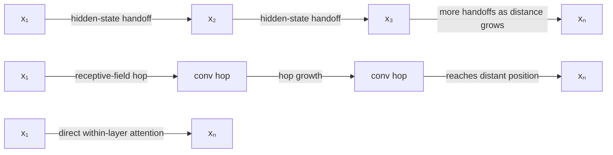

#### Python

```python
from html import escape
from pathlib import Path
from textwrap import wrap

title = "attn_why_p1: three route topologies"
nodes = [["r1","x₁",100,40],["r2","x₂",340,40],["r3","x₃",580,40],["rn","xₙ",820,40],["c1","x₁",100,220],["ch1","conv hop",340,220],["ch2","conv hop",580,220],["cn","xₙ",820,220],["s1","x₁",100,400],["sn","xₙ",820,400]]
edges = [["r1","r2","hidden-state handoff",true],["r2","r3","hidden-state handoff",true],["r3","rn","more handoffs as distance grows",true],["c1","ch1","receptive-field hop",true],["ch1","ch2","hop growth",true],["ch2","cn","reaches distant position",true],["s1","sn","direct within-layer attention",true]]
node_by_id = {node_id: (label, x, y) for node_id, label, x, y in nodes}
width = 1000
height = 540
parts = [
    '<svg xmlns="http://www.w3.org/2000/svg" viewBox="0 0 %d %d" role="img" aria-labelledby="title desc">' % (width, height),
    f'<title id="title">{escape(title)}</title>',
    '<desc id="desc">Labeled relations; undirected lines are associations or boundaries, not temporal order.</desc>',
    f'<rect width="{width}" height="{height}" fill="white"/>',
    '<defs><marker id="arrow" viewBox="0 0 10 10" refX="9" refY="5" markerWidth="6" markerHeight="6" orient="auto-start-reverse"><path d="M 0 0 L 10 5 L 0 10 z" fill="#345"/></marker></defs>',
]
for source, target, relation, directed in edges:
    _, x1, y1 = node_by_id[source]
    _, x2, y2 = node_by_id[target]
    marker = ' marker-end="url(#arrow)"' if directed else ''
    parts.append(f'<line x1="{x1}" y1="{y1}" x2="{x2}" y2="{y2}" stroke="#345" stroke-width="2"{marker}/>')
    parts.append(f'<text x="{(x1+x2)/2}" y="{(y1+y2)/2-5}" text-anchor="middle" font-family="sans-serif" font-size="10">{escape(relation)}</text>')
for _, label, x, y in nodes:
    parts.append(f'<rect x="{x-85}" y="{y-44}" width="170" height="88" rx="12" fill="#eef6ff" stroke="#234"/>')
    for line_index, line in enumerate(wrap(label, width=24)):
        parts.append(f'<text x="{x}" y="{y-26+line_index*13}" text-anchor="middle" font-family="sans-serif" font-size="10">{escape(line)}</text>')
parts.append('</svg>')
Path("attn_why_p1_treatment_a.svg").write_text("\n".join(parts), encoding="utf-8")
```

### Treatment B — Path-growth comparison ledger

- Teaching purpose: Make the route topology, growth behavior, and boundary visible as complete text.
- Encoding and reading order: Render one row per architecture with symbolic path marks and an explicit interpretation column.
- Evidence and limitations: Use `attn_002` and `source_attention_arxiv_v7`. The marks encode maximum computational path topology only; they do not claim measured device latency, a particular convolution kernel, or fully parallel autoregressive generation.
- Recommended web medium: semantic HTML/CSS table with SVG export; JavaScript is unnecessary.
- Mobile, accessibility, and motion behavior: Keep every label and identifier as selectable DOM text; preserve non-directional grouping on mobile; use overflow-wrap: anywhere for long tokens; provide a complete static fallback; respect reduced motion; never make information depend on animation or pointer input.

#### TikZ

```tex
\documentclass[tikz,border=5pt]{standalone}
\usepackage[T1]{fontenc}
\usepackage{array}
\usepackage{tikz}
\begin{document}
\begin{tikzpicture}[font=\sffamily]
\node[align=center] {\textbf{attn\_why\_p1: path-growth ledger}\\[6pt]
\begin{tabular}{p{4cm}p{6cm}p{8cm}}
\textbf{Facet} & \textbf{Statement or value} & \textbf{Evidence condition or boundary} \\ \hline
Recurrent route & x1 to x2 to x3 to x4; adjacent handoffs continue to xn & Sequential handoffs grow with position distance \\
Convolutional route & x1  receptive-field hops  xn & Positions compute in parallel, but hop count still grows with separation \\
Self-attention route & x1  xn within one layer & Direct available-position exchange; not wall-clock latency or parallel generation \\
\end{tabular}};
\end{tikzpicture}
\end{document}
```

#### Mermaid

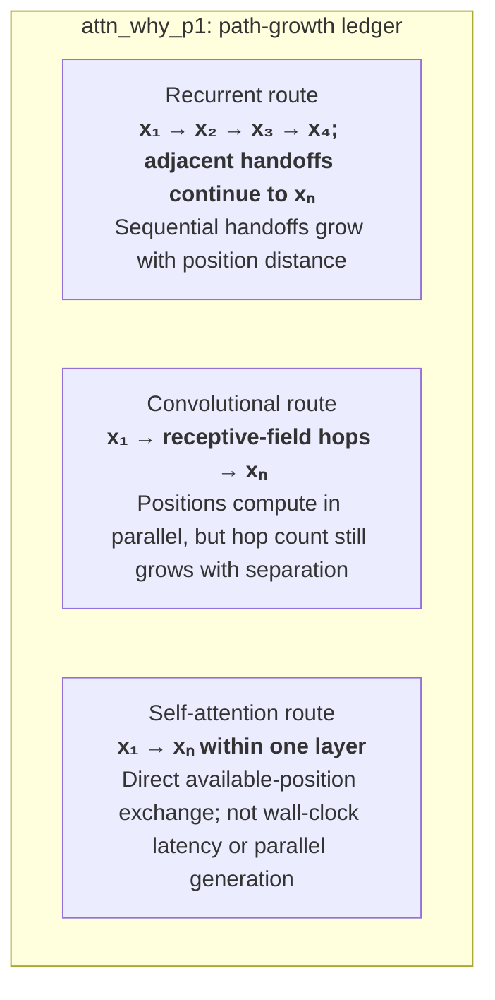

#### Python

```python
from html import escape
from pathlib import Path
from textwrap import wrap

title = "attn_why_p1: path-growth ledger"
rows = [["Recurrent route","x₁ → x₂ → x₃ → x₄; adjacent handoffs continue to xₙ","Sequential handoffs grow with position distance"],["Convolutional route","x₁ → receptive-field hops → xₙ","Positions compute in parallel, but hop count still grows with separation"],["Self-attention route","x₁ → xₙ within one layer","Direct available-position exchange; not wall-clock latency or parallel generation"]]
height = 426
parts = [
    f'<svg xmlns="http://www.w3.org/2000/svg" viewBox="0 0 1200 {height}" role="img" aria-labelledby="title desc">',
    f'<title id="title">{escape(title)}</title>',
    '<desc id="desc">Non-directional evidence ledger with every statement and boundary visible.</desc>',
    f'<rect width="1200" height="{height}" fill="white"/>',
]
headers = ["Facet", "Statement or value", "Evidence condition or boundary"]
xs = [30, 300, 700]
for x, header in zip(xs, headers):
    parts.append(f'<text x="{x}" y="65" font-family="sans-serif" font-size="16" font-weight="700">{escape(header)}</text>')
for row_index, row in enumerate(rows):
    y = 110 + row_index * 92
    parts.append(f'<rect x="20" y="{y-30}" width="1160" height="80" fill="#f7fbff" stroke="#ccd"/>')
    for x, cell, width in zip(xs, row, [30, 48, 60]):
        for line_index, line in enumerate(wrap(str(cell), width=width)):
            parts.append(f'<text x="{x}" y="{y-8+line_index*14}" font-family="sans-serif" font-size="11">{escape(line)}</text>')
parts.append('</svg>')
Path("attn_why_p1_treatment_b.svg").write_text("\n".join(parts), encoding="utf-8")
```

### Treatment C — Near-to-far position trace

- Teaching purpose: Show how increasing separation changes recurrence and convolution while self-attention remains direct within a layer.
- Encoding and reading order: Use near/far panels with the same three routes and a separate boundary panel. No numeric latency or kernel-specific hop count is invented.
- Evidence and limitations: Use `attn_002` and `source_attention_arxiv_v7`. The marks encode maximum computational path topology only; they do not claim measured device latency, a particular convolution kernel, or fully parallel autoregressive generation.
- Recommended web medium: CSS/SVG small multiples; optional JavaScript distance focus must retain the static near/far states.
- Mobile, accessibility, and motion behavior: Keep every label and identifier as selectable DOM text; preserve non-directional grouping on mobile; use overflow-wrap: anywhere for long tokens; provide a complete static fallback; respect reduced motion; never make information depend on animation or pointer input.

#### TikZ

```tex
\documentclass[tikz,border=5pt]{standalone}
\usepackage[T1]{fontenc}
\usepackage{tikz}
\begin{document}
\begin{tikzpicture}[font=\sffamily,panel/.style={draw,rounded corners,align=center,text width=5.2cm,minimum height=4.2cm}]
\node[font=\bfseries] at (6,3.1) {attn\_why\_p1: near-to-far trace};
\node[panel] at (0,0) {\textbf{Near positions}\\[5pt]Recurrence uses a short chain\\[3pt]Convolution uses a short receptive-field route\\[3pt]Self-attention uses one direct within-layer route};
\node[panel] at (6,0) {\textbf{Far positions}\\[5pt]Recurrent handoffs increase\\[3pt]Convolutional hops increase with separation\\[3pt]Self-attention remains direct within the layer};
\node[panel] at (12,0) {\textbf{Boundary}\\[5pt]Topology is computational path length, not measured latency\\[3pt]Autoregressive generation still selects tokens sequentially};
\end{tikzpicture}
\end{document}
```

#### Mermaid

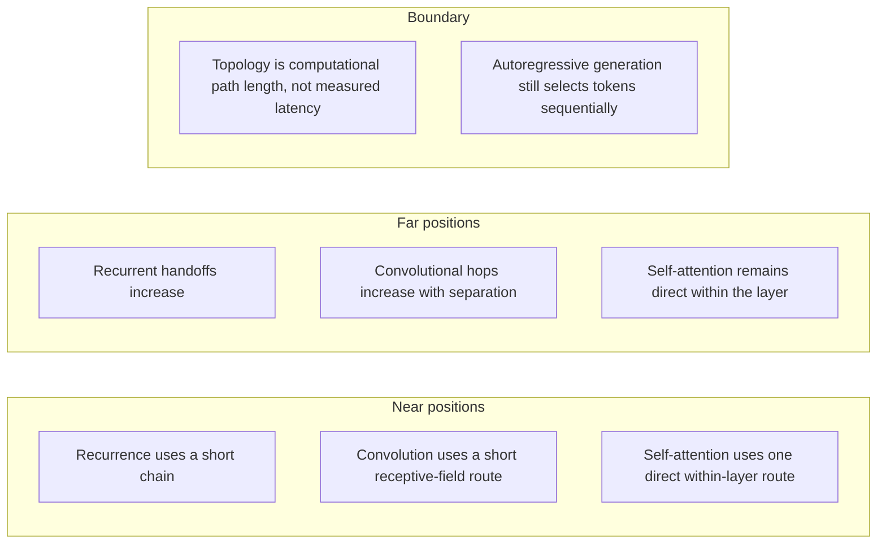

#### Python

```python
from html import escape
from pathlib import Path
from textwrap import wrap

title = "attn_why_p1: near-to-far trace"
groups = [{"title":"Near positions","items":["Recurrence uses a short chain","Convolution uses a short receptive-field route","Self-attention uses one direct within-layer route"]},{"title":"Far positions","items":["Recurrent handoffs increase","Convolutional hops increase with separation","Self-attention remains direct within the layer"]},{"title":"Boundary","items":["Topology is computational path length, not measured latency","Autoregressive generation still selects tokens sequentially"]}]
width = 1200
height = 496
parts = [
    f'<svg xmlns="http://www.w3.org/2000/svg" viewBox="0 0 {width} {height}" role="img" aria-labelledby="title desc">',
    f'<title id="title">{escape(title)}</title>',
    '<desc id="desc">Independent panels; spatial grouping does not encode sequence or causality.</desc>',
    f'<rect width="{width}" height="{height}" fill="white"/>',
]
for group_index, group in enumerate(groups):
    x = 200 + group_index * 400
    parts.append(f'<text x="{x}" y="60" text-anchor="middle" font-family="sans-serif" font-size="16" font-weight="700">{escape(group["title"])}</text>')
    for item_index, item in enumerate(group["items"]):
        y = 115 + item_index * 92
        parts.append(f'<rect x="{x-180}" y="{y-30}" width="360" height="78" rx="12" fill="#f7fbff" stroke="#ccd"/>')
        for line_index, line in enumerate(wrap(item, width=50)):
            parts.append(f'<text x="{x}" y="{y-8+line_index*14}" text-anchor="middle" font-family="sans-serif" font-size="11">{escape(line)}</text>')
parts.append('</svg>')
Path("attn_why_p1_treatment_c.svg").write_text("\n".join(parts), encoding="utf-8")
```

### Implementation record

- Status: `IMPLEMENTED`
- Selected treatment: `C`
- Selection rationale: Selected the approved “Recurrent, convolutional, and self-attention path length — Position-to-position trace” treatment because the implemented parallel view directly encodes this paragraph's explanatory job and its stated evidence boundaries.
- Delivery medium: `CSS + semantic HTML`
- Visual ID and placement: `visual_attention_path_length` after `attn_why_p1`; this record is served by that purpose-built figure.
- Shared paragraph scope: NONE
- Changed files: `packages/test-fixtures/explainers/attention-is-all-you-need.json`, `packages/content-schema/schema/explainer-document.schema.json`, `packages/content-schema/src/validate.ts`, generated TypeScript/Python models, `apps/web/app/papers/[id]/explainer-visual.tsx`, and `apps/web/app/globals.css`.
- Accessibility and fallback verification: Figure has a programmatic title and description, visible selectable labels and values, explicit alt text, equivalent fallback prose, source links, limitations, and a semantic static body; no meaning depends on color, motion, or pointer input.
- Desktop and mobile verification: Verified by the full eight-paper Playwright traversal at a 1440-pixel desktop viewport and the iPhone 13 mobile viewport; every figure stayed paragraph-adjacent, preserved DOM reading order, and introduced no horizontal page overflow.
- Evidence deviations: Delivery translation: selected Treatment C is rendered as typed semantic HTML/CSS rather than its literal TikZ, Mermaid, or Python-generated asset; the approved paragraph scope, placement, labels, values, grouping, and evidence boundaries are retained.

## `attn_why_p2`

- Location: `attn_why`, paragraph 2
- Text anchor: "Attention already helped encoder-decoder systems retrieve information across a sequence, but it was usually combined with recurrence."
- Claims and sources: `attn_002` (OBSERVED, VERIFIED); `source_attention_arxiv_v7` (Pages 1-10; Sections 1-7; Figures 1-2; Equation 1; Tables 1-4; version and figure-permission notice)
- Visual needed: `NO`
- Decision rationale: Prose remains the better primary form. The paragraph states a bounded conclusion, requirement, provenance fact, or heterogeneous qualification without requiring readers to reconstruct a material process, topology, quantitative comparison, uncertainty distribution, or state transition. The contingencies are retained for auditability but are explicitly non-directional.
- Explanatory job: Non-directional contingency audit for Why was a different sequence model needed.
- Recommended scope and placement: Prose-only. Do not attach a figure unless the paragraph or evidence changes.
- QA-informed planning change: Round-2 QA removed all generic directed `then` maps. Every contingency now uses this paragraph's independent scope, evidence, requirement, provenance, or claim-boundary facets.

### Treatment A — Why was a different sequence model needed — paragraph attn_why_p2 — independent scope panels

- Teaching purpose: Optionally expose the paragraph's independent facets without inventing order.
- Encoding and reading order: Use 2 named panels. Items within and across panels have no arrows, ordinal numbers, or implied progression.
- Evidence and limitations: Use only `attn_002` (OBSERVED, VERIFIED); `source_attention_arxiv_v7` (Pages 1-10; Sections 1-7; Figures 1-2; Equation 1; Tables 1-4; version and figure-permission notice). The contingency is non-directional: proximity and connecting lines mean membership, support, requirement, or scope only; they never mean temporal order or causality.
- Recommended web medium: semantic HTML/CSS grouped panels or responsive SVG; JavaScript is unnecessary.
- Mobile, accessibility, and motion behavior: Keep every label and identifier as selectable DOM text; preserve non-directional grouping on mobile; use overflow-wrap: anywhere for long tokens; provide a complete static fallback; respect reduced motion; never make information depend on animation or pointer input.

#### TikZ

```tex
\documentclass[tikz,border=5pt]{standalone}
\usepackage[T1]{fontenc}
\usepackage{tikz}
\begin{document}
\begin{tikzpicture}[font=\sffamily,panel/.style={draw,rounded corners,align=center,text width=5.2cm,minimum height=4.2cm}]
\node[font=\bfseries] at (3,3.1) {attn\_why\_p2: independent facets};
\node[panel] at (0,0) {\textbf{Premise or requirement}\\[5pt]Attention already helped encoder-decoder systems retrieve information across a sequence\\[3pt]but it was usually combined with recurrence};
\node[panel] at (6,0) {\textbf{Constraint or research boundary}\\[5pt]The paper asks whether attention can replace sequence-aligned recurrence and convolution rather than merely supplement them};
\end{tikzpicture}
\end{document}
```

#### Mermaid

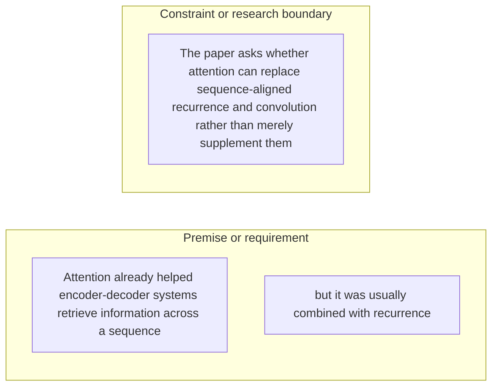

#### Python

```python
from html import escape
from pathlib import Path
from textwrap import wrap

title = "attn_why_p2: independent facets"
groups = [{"title":"Premise or requirement","items":["Attention already helped encoder-decoder systems retrieve information across a sequence","but it was usually combined with recurrence"]},{"title":"Constraint or research boundary","items":["The paper asks whether attention can replace sequence-aligned recurrence and convolution rather than merely supplement them"]}]
width = 900
height = 404
parts = [
    f'<svg xmlns="http://www.w3.org/2000/svg" viewBox="0 0 {width} {height}" role="img" aria-labelledby="title desc">',
    f'<title id="title">{escape(title)}</title>',
    '<desc id="desc">Independent panels; spatial grouping does not encode sequence or causality.</desc>',
    f'<rect width="{width}" height="{height}" fill="white"/>',
]
for group_index, group in enumerate(groups):
    x = 200 + group_index * 400
    parts.append(f'<text x="{x}" y="60" text-anchor="middle" font-family="sans-serif" font-size="16" font-weight="700">{escape(group["title"])}</text>')
    for item_index, item in enumerate(group["items"]):
        y = 115 + item_index * 92
        parts.append(f'<rect x="{x-180}" y="{y-30}" width="360" height="78" rx="12" fill="#f7fbff" stroke="#ccd"/>')
        for line_index, line in enumerate(wrap(item, width=50)):
            parts.append(f'<text x="{x}" y="{y-8+line_index*14}" text-anchor="middle" font-family="sans-serif" font-size="11">{escape(line)}</text>')
parts.append('</svg>')
Path("attn_why_p2_treatment_a.svg").write_text("\n".join(parts), encoding="utf-8")
```

### Treatment B — Why was a different sequence model needed — paragraph attn_why_p2 — evidence and boundary ledger

- Teaching purpose: Optionally make each statement and its evidence role inspectable in a flat ledger.
- Encoding and reading order: Render 3 independent rows with facet, statement, and condition columns. Row order follows prose only and carries no process meaning.
- Evidence and limitations: Use only `attn_002` (OBSERVED, VERIFIED); `source_attention_arxiv_v7` (Pages 1-10; Sections 1-7; Figures 1-2; Equation 1; Tables 1-4; version and figure-permission notice). The contingency is non-directional: proximity and connecting lines mean membership, support, requirement, or scope only; they never mean temporal order or causality.
- Recommended web medium: semantic HTML/CSS table with an SVG export; JavaScript is unnecessary.
- Mobile, accessibility, and motion behavior: Keep every label and identifier as selectable DOM text; preserve non-directional grouping on mobile; use overflow-wrap: anywhere for long tokens; provide a complete static fallback; respect reduced motion; never make information depend on animation or pointer input.

#### TikZ

```tex
\documentclass[tikz,border=5pt]{standalone}
\usepackage[T1]{fontenc}
\usepackage{array}
\usepackage{tikz}
\begin{document}
\begin{tikzpicture}[font=\sffamily]
\node[align=center] {\textbf{attn\_why\_p2: non-directional evidence ledger}\\[6pt]
\begin{tabular}{p{4cm}p{6cm}p{8cm}}
\textbf{Facet} & \textbf{Statement or value} & \textbf{Evidence condition or boundary} \\ \hline
why it exists & Independent facet 1 & Attention already helped encoder-decoder systems retrieve information across a sequence \\
why it exists & Independent facet 2 & but it was usually combined with recurrence \\
why it exists & Independent facet 3 & The paper asks whether attention can replace sequence-aligned recurrence and convolution rather than merely supplement them \\
\end{tabular}};
\end{tikzpicture}
\end{document}
```

#### Mermaid

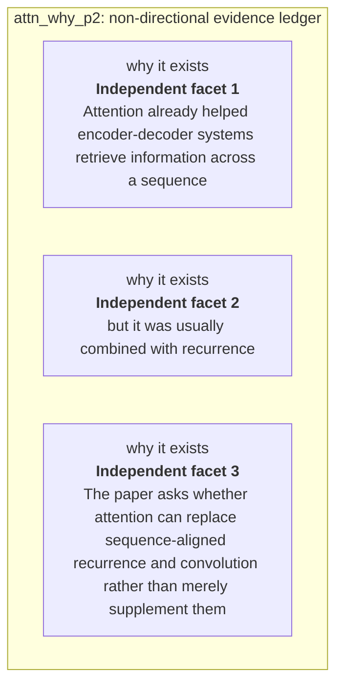

#### Python

```python
from html import escape
from pathlib import Path
from textwrap import wrap

title = "attn_why_p2: non-directional evidence ledger"
rows = [["why it exists","Independent facet 1","Attention already helped encoder-decoder systems retrieve information across a sequence"],["why it exists","Independent facet 2","but it was usually combined with recurrence"],["why it exists","Independent facet 3","The paper asks whether attention can replace sequence-aligned recurrence and convolution rather than merely supplement them"]]
height = 426
parts = [
    f'<svg xmlns="http://www.w3.org/2000/svg" viewBox="0 0 1200 {height}" role="img" aria-labelledby="title desc">',
    f'<title id="title">{escape(title)}</title>',
    '<desc id="desc">Non-directional evidence ledger with every statement and boundary visible.</desc>',
    f'<rect width="1200" height="{height}" fill="white"/>',
]
headers = ["Facet", "Statement or value", "Evidence condition or boundary"]
xs = [30, 300, 700]
for x, header in zip(xs, headers):
    parts.append(f'<text x="{x}" y="65" font-family="sans-serif" font-size="16" font-weight="700">{escape(header)}</text>')
for row_index, row in enumerate(rows):
    y = 110 + row_index * 92
    parts.append(f'<rect x="20" y="{y-30}" width="1160" height="80" fill="#f7fbff" stroke="#ccd"/>')
    for x, cell, width in zip(xs, row, [30, 48, 60]):
        for line_index, line in enumerate(wrap(str(cell), width=width)):
            parts.append(f'<text x="{x}" y="{y-8+line_index*14}" font-family="sans-serif" font-size="11">{escape(line)}</text>')
parts.append('</svg>')
Path("attn_why_p2_treatment_b.svg").write_text("\n".join(parts), encoding="utf-8")
```

### Treatment C — Why was a different sequence model needed — paragraph attn_why_p2 — non-directional claim constellation

- Teaching purpose: Optionally show which requirements or qualifications belong to the paragraph's central question.
- Encoding and reading order: Place the paragraph question at the center with 3 undirected spokes. Lines encode requirement or constraint, never sequence; Mermaid uses `---`, TikZ omits arrowheads, and Python emits plain lines.
- Evidence and limitations: Use only `attn_002` (OBSERVED, VERIFIED); `source_attention_arxiv_v7` (Pages 1-10; Sections 1-7; Figures 1-2; Equation 1; Tables 1-4; version and figure-permission notice). The contingency is non-directional: proximity and connecting lines mean membership, support, requirement, or scope only; they never mean temporal order or causality.
- Recommended web medium: responsive SVG with semantic HTML/CSS list fallback; JavaScript is unnecessary.
- Mobile, accessibility, and motion behavior: Keep every label and identifier as selectable DOM text; preserve non-directional grouping on mobile; use overflow-wrap: anywhere for long tokens; provide a complete static fallback; respect reduced motion; never make information depend on animation or pointer input.

#### TikZ

```tex
\documentclass[tikz,border=5pt]{standalone}
\usepackage[T1]{fontenc}
\usepackage{tikz}
\begin{document}
\begin{tikzpicture}[font=\sffamily,box/.style={draw,rounded corners,align=center,text width=3.3cm,minimum height=1.3cm},rel/.style={fill=white,font=\scriptsize}]
\node[font=\bfseries,anchor=west] at (0,2) {attn\_why\_p2: claim-boundary constellation};
\node[box] (center) at (3,0) {Why was a different sequence model needed};
\node[box] (f1) at (0,2) {Attention already helped encoder-decoder systems retrieve information across a sequence};
\node[box] (f2) at (6,2) {but it was usually combined with recurrence};
\node[box] (f3) at (0,0) {The paper asks whether attention can replace sequence-aligned recurrence and convolution rather than merely supplement them};
\draw (center) -- node[rel] {requirement or constraint} (f1);
\draw (center) -- node[rel] {requirement or constraint} (f2);
\draw (center) -- node[rel] {requirement or constraint} (f3);
\end{tikzpicture}
\end{document}
```

#### Mermaid

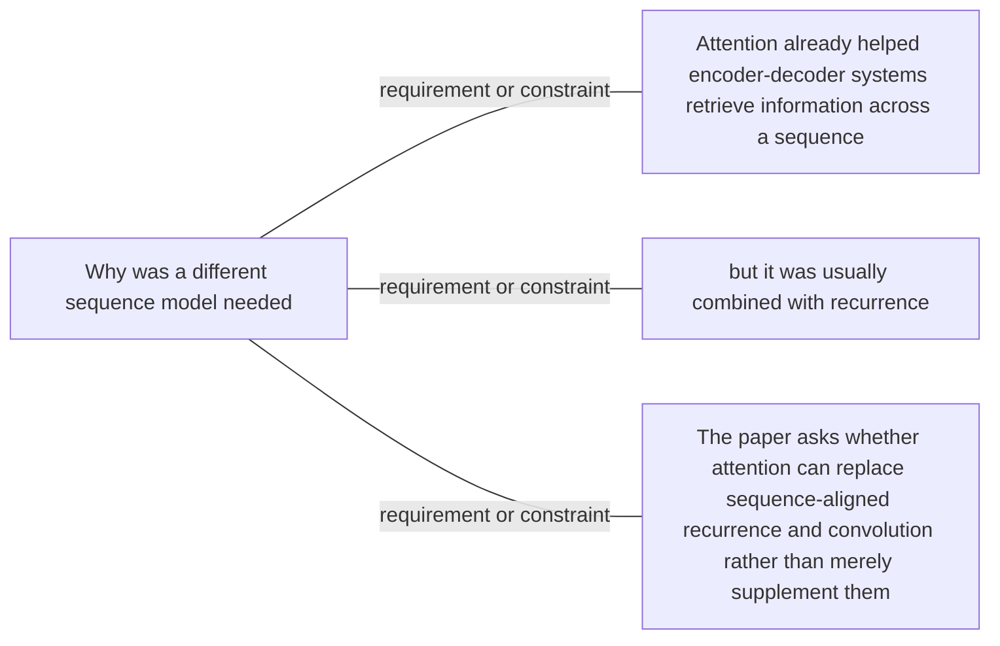

#### Python

```python
from html import escape
from pathlib import Path
from textwrap import wrap

title = "attn_why_p2: claim-boundary constellation"
nodes = [["center","Why was a different sequence model needed",460,220],["f1","Attention already helped encoder-decoder systems retrieve information across a sequence",100,40],["f2","but it was usually combined with recurrence",820,40],["f3","The paper asks whether attention can replace sequence-aligned recurrence and convolution rather than merely supplement them",100,220]]
edges = [["center","f1","requirement or constraint",false],["center","f2","requirement or constraint",false],["center","f3","requirement or constraint",false]]
node_by_id = {node_id: (label, x, y) for node_id, label, x, y in nodes}
width = 1000
height = 520
parts = [
    '<svg xmlns="http://www.w3.org/2000/svg" viewBox="0 0 %d %d" role="img" aria-labelledby="title desc">' % (width, height),
    f'<title id="title">{escape(title)}</title>',
    '<desc id="desc">Labeled relations; undirected lines are associations or boundaries, not temporal order.</desc>',
    f'<rect width="{width}" height="{height}" fill="white"/>',
    '<defs><marker id="arrow" viewBox="0 0 10 10" refX="9" refY="5" markerWidth="6" markerHeight="6" orient="auto-start-reverse"><path d="M 0 0 L 10 5 L 0 10 z" fill="#345"/></marker></defs>',
]
for source, target, relation, directed in edges:
    _, x1, y1 = node_by_id[source]
    _, x2, y2 = node_by_id[target]
    marker = ' marker-end="url(#arrow)"' if directed else ''
    parts.append(f'<line x1="{x1}" y1="{y1}" x2="{x2}" y2="{y2}" stroke="#345" stroke-width="2"{marker}/>')
    parts.append(f'<text x="{(x1+x2)/2}" y="{(y1+y2)/2-5}" text-anchor="middle" font-family="sans-serif" font-size="10">{escape(relation)}</text>')
for _, label, x, y in nodes:
    parts.append(f'<rect x="{x-85}" y="{y-44}" width="170" height="88" rx="12" fill="#eef6ff" stroke="#234"/>')
    for line_index, line in enumerate(wrap(label, width=24)):
        parts.append(f'<text x="{x}" y="{y-26+line_index*13}" text-anchor="middle" font-family="sans-serif" font-size="10">{escape(line)}</text>')
parts.append('</svg>')
Path("attn_why_p2_treatment_c.svg").write_text("\n".join(parts), encoding="utf-8")
```

### Implementation record

- Status: `NOT_NEEDED`
- Selected treatment: `NONE`
- Selection rationale: Revision 3's paragraph-level removal test keeps this paragraph prose-only; no figure would reduce the reader's reconstruction burden enough to justify added visual complexity.
- Delivery medium: `NONE`
- Visual ID and placement: `NONE`; no figure is attached to this paragraph.
- Shared paragraph scope: NONE
- Changed files: `docs/visual-manifests/VISUAL_MANIFEST_ATTENTION_IS_ALL_YOU_NEED.md` records the prose-only decision; no fixture visual serves this paragraph.
- Accessibility and fallback verification: The paragraph remains semantic selectable text with its existing claim and source links; no visual-only information or motion is introduced.
- Desktop and mobile verification: No paragraph-local figure exists; the existing prose remains in normal document order at both viewports.
- Evidence deviations: Not applicable: revision 3 explicitly classifies this paragraph as prose-only.

## `attn_change_p1`

- Location: `attn_change`, paragraph 1
- Text anchor: "The Transformer keeps an encoder-decoder structure but changes the operation used to exchange information between positions."
- Claims and sources: `attn_002` (OBSERVED, VERIFIED); `attn_003` (OBSERVED, VERIFIED); `attn_006` (OBSERVED, VERIFIED); `attn_012` (NOT_ESTABLISHED, UNRESOLVED); `source_attention_arxiv_v7` (Pages 1-10; Sections 1-7; Figures 1-2; Equation 1; Tables 1-4; version and figure-permission notice)
- Visual needed: `YES`
- Decision rationale: A visual passes the removal test because readers must reconstruct encoder self-attention, masked decoder self-attention, and cross-attention routing while preserving the paragraph's conditions and boundaries. Revision 3 narrows the topology and placement so no visual can claim this paragraph without encoding its mechanism, grouping, or values.
- Explanatory job: Encoder self-attention, masked decoder self-attention, and cross-attention routing.
- Recommended scope and placement: This paragraph only; place the visual immediately after `attn_change_p1`.
- QA-informed planning change: This paragraph needs a local encoder-decoder routing visual; an encoder-only stack cannot serve it.

### Treatment A — Encoder self-attention, masked decoder self-attention, and cross-attention routing — Component topology

- Teaching purpose: Show the stated component connections and convergence points.
- Encoding and reading order: Use 3 named nodes and 2 explicit labeled relations. Preserve all branch, merge, hierarchy, loop, or sequence edges shown in the code; changing them is an evidence deviation.
- Evidence and limitations: Encode only `attn_002`, `attn_003`, `attn_006`, `attn_012` from `source_attention_arxiv_v7`. This paragraph needs a local encoder-decoder routing visual; an encoder-only stack cannot serve it.
- Recommended web medium: responsive inline SVG with semantic HTML/CSS fallback; JavaScript is optional only for meaningful focus, drill-down, or state playback.
- Mobile, accessibility, and motion behavior: Preserve the same group and node order in the DOM; retain all values and relation labels as selectable text; stack panels or levels below 640px; provide keyboard access for any optional focus state; keep a complete static fallback; respect reduced motion and never encode information only through animation.

#### TikZ

```tex
\documentclass[tikz,border=5pt]{standalone}
\usepackage[T1]{fontenc}
\usepackage{tikz}
\usetikzlibrary{arrows.meta}
\begin{document}
\begin{tikzpicture}[font=\sffamily,box/.style={draw,rounded corners,align=center,text width=3cm,minimum height=1.2cm},link/.style={-{Latex[length=2mm]},thick},rel/.style={fill=white,font=\scriptsize}]
\node[font=\bfseries,anchor=west] at (0,0.8) {attn\_change\_p1: Encoder self-attention, masked decoder self-attention, and cross-attention routing - Component topology};
\node[box] (n1) at (1.00,-1.50) {The Transformer keeps an encoder-decoder structure but changes the operation used to exchange information between positions};
\node[box] (n2) at (2.50,-1.50) {Encoder positions use self-attention, decoder positions use masked self-attention over the known target prefix};
\node[box] (n3) at (4.00,-1.50) {and decoder queries attend to the encoder output};
\draw[link] (n1) -- node[rel] {then} (n2);
\draw[link] (n2) -- node[rel] {then} (n3);
\end{tikzpicture}
\end{document}
```

#### Mermaid

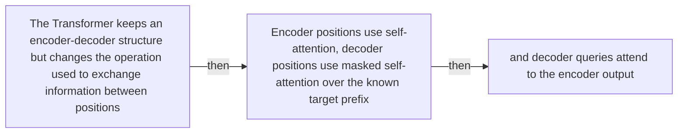

#### Python

```python
from html import escape
from pathlib import Path
from textwrap import wrap

title = "attn_change_p1: Encoder self-attention, masked decoder self-attention, and cross-attention routing — Component topology"
nodes = [["n1","The Transformer keeps an encoder-decoder structure but changes the operation used to exchange information between positions",100,150],["n2","Encoder positions use self-attention, decoder positions use masked self-attention over the known target prefix",250,150],["n3","and decoder queries attend to the encoder output",400,150]]
edges = [["n1","n2","then"],["n2","n3","then"]]
node_by_id = {node_id: (label, x, y) for node_id, label, x, y in nodes}
width = max(900, max((x for _, _, x, _ in nodes), default=800) + 180)
height = max(500, max((y for _, _, _, y in nodes), default=400) + 140)
parts = [
    f'<svg xmlns="http://www.w3.org/2000/svg" viewBox="0 0 {width} {height}" role="img" aria-labelledby="title desc">',
    f'<title id="title">{escape(title)}</title>',
    '<desc id="desc">Edges and convergence points encode only relationships stated in the scoped paragraphs.</desc>',
    f'<rect width="{width}" height="{height}" fill="white"/>',
]
for source, target, relation in edges:
    _, x1, y1 = node_by_id[source]
    _, x2, y2 = node_by_id[target]
    parts.append(f'<line x1="{x1}" y1="{y1}" x2="{x2}" y2="{y2}" stroke="#345" stroke-width="2"/>')
    parts.append(f'<text x="{(x1+x2)/2}" y="{(y1+y2)/2-5}" text-anchor="middle" font-family="sans-serif" font-size="10">{escape(relation)}</text>')
for _, label, x, y in nodes:
    parts.append(f'<rect x="{x-78}" y="{y-42}" width="156" height="84" rx="12" fill="#eef6ff" stroke="#234"/>')
    for line_index, line in enumerate(wrap(label, width=22)):
        parts.append(f'<text x="{x}" y="{y-24+line_index*13}" text-anchor="middle" font-family="sans-serif" font-size="10">{escape(line)}</text>')
parts.append('</svg>')
Path("attn_change_p1_treatment_a.svg").write_text("\n".join(parts), encoding="utf-8")
```

### Treatment B — Encoder self-attention, masked decoder self-attention, and cross-attention routing — Architecture cross-section

- Teaching purpose: Separate component responsibilities without flattening them into one list.
- Encoding and reading order: Group the 5 source-backed records into named panels using the first column as the grouping key. Panels preserve experimental, source, or example boundaries and never imply one shared scale.
- Evidence and limitations: Encode only `attn_002`, `attn_003`, `attn_006`, `attn_012` from `source_attention_arxiv_v7`. This paragraph needs a local encoder-decoder routing visual; an encoder-only stack cannot serve it.
- Recommended web medium: semantic HTML/CSS grouped panels or responsive SVG; JavaScript is optional only for meaningful focus, drill-down, or state playback.
- Mobile, accessibility, and motion behavior: Preserve the same group and node order in the DOM; retain all values and relation labels as selectable text; stack panels or levels below 640px; provide keyboard access for any optional focus state; keep a complete static fallback; respect reduced motion and never encode information only through animation.

#### TikZ

```tex
\documentclass[tikz,border=5pt]{standalone}
\usepackage[T1]{fontenc}
\usepackage{tikz}
\begin{document}
\begin{tikzpicture}[font=\sffamily,panel/.style={draw,rounded corners,align=center,text width=4.8cm,minimum height=4cm}]
\node[font=\bfseries] at (0,3) {attn\_change\_p1: Encoder self-attention, masked decoder self-attention, and cross-attention routing - Architecture cross-section};
\node[panel] at (0,0) {\textbf{Attention replaces position mixing, not the whole layer}\\[4pt]\textbf{Token and position representations}: qualitative -- Learned token vectors receive sinusoidal position encodings before entering the stack.\\\textbf{Multi-head self-attention}: qualitative -- Each position retrieves information from available positions through several learned attention heads.\\\textbf{Residual path and layer normalization}: qualitative -- A residual connection and normalization surround the attention sublayer.\\\textbf{Position-wise feed-forward network}: qualitative -- The same two-layer feed-forward transformation is applied independently at every position.\\\textbf{Residual path and layer normalization}: qualitative -- A second residual and normalization stage completes one encoder layer; the base encoder repeats this layer 6 times.};
\end{tikzpicture}
\end{document}
```

#### Mermaid

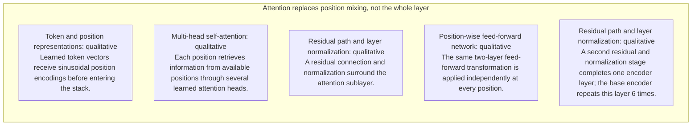

#### Python

```python
from html import escape
from pathlib import Path
from textwrap import wrap

title = "attn_change_p1: Encoder self-attention, masked decoder self-attention, and cross-attention routing — Architecture cross-section"
rows = [["Attention replaces position mixing, not the whole layer","Token and position representations","qualitative","Learned token vectors receive sinusoidal position encodings before entering the stack."],["Attention replaces position mixing, not the whole layer","Multi-head self-attention","qualitative","Each position retrieves information from available positions through several learned attention heads."],["Attention replaces position mixing, not the whole layer","Residual path and layer normalization","qualitative","A residual connection and normalization surround the attention sublayer."],["Attention replaces position mixing, not the whole layer","Position-wise feed-forward network","qualitative","The same two-layer feed-forward transformation is applied independently at every position."],["Attention replaces position mixing, not the whole layer","Residual path and layer normalization","qualitative","A second residual and normalization stage completes one encoder layer; the base encoder repeats this layer 6 times."]]
groups = {}
for group, label, value, condition in rows:
    groups.setdefault(group, []).append((label, value, condition))
width = max(900, len(groups) * 360)
height = 220 + max((len(items) for items in groups.values()), default=1) * 92
parts = [
    f'<svg xmlns="http://www.w3.org/2000/svg" viewBox="0 0 {width} {height}" role="img" aria-labelledby="title desc">',
    f'<title id="title">{escape(title)}</title>',
    '<desc id="desc">Separate panels preserve grouping and prevent unrelated conditions from reading as one sequence.</desc>',
    f'<rect width="{width}" height="{height}" fill="white"/>',
]
for group_index, (group, items) in enumerate(groups.items()):
    x = 180 + group_index * 360
    parts.append(f'<text x="{x}" y="65" text-anchor="middle" font-family="sans-serif" font-size="16" font-weight="700">{escape(group)}</text>')
    for item_index, (label, value, condition) in enumerate(items):
        y = 120 + item_index * 92
        parts.append(f'<rect x="{x-160}" y="{y-30}" width="320" height="78" rx="12" fill="#f7fbff" stroke="#ccd"/>')
        text = f"{label}: {value} — {condition}"
        for line_index, line in enumerate(wrap(text, width=46)):
            parts.append(f'<text x="{x}" y="{y-6+line_index*14}" text-anchor="middle" font-family="sans-serif" font-size="11">{escape(line)}</text>')
parts.append('</svg>')
Path("attn_change_p1_treatment_b.svg").write_text("\n".join(parts), encoding="utf-8")
```

### Treatment C — Encoder self-attention, masked decoder self-attention, and cross-attention routing — One-item traversal

- Teaching purpose: Trace one token, request, or state through the architecture.
- Encoding and reading order: Use 3 named nodes and 2 explicit labeled relations. Preserve all branch, merge, hierarchy, loop, or sequence edges shown in the code; changing them is an evidence deviation.
- Evidence and limitations: Encode only `attn_002`, `attn_003`, `attn_006`, `attn_012` from `source_attention_arxiv_v7`. This paragraph needs a local encoder-decoder routing visual; an encoder-only stack cannot serve it.
- Recommended web medium: responsive inline SVG with semantic HTML/CSS fallback; JavaScript is optional only for meaningful focus, drill-down, or state playback.
- Mobile, accessibility, and motion behavior: Preserve the same group and node order in the DOM; retain all values and relation labels as selectable text; stack panels or levels below 640px; provide keyboard access for any optional focus state; keep a complete static fallback; respect reduced motion and never encode information only through animation.

#### TikZ

```tex
\documentclass[tikz,border=5pt]{standalone}
\usepackage[T1]{fontenc}
\usepackage{tikz}
\usetikzlibrary{arrows.meta}
\begin{document}
\begin{tikzpicture}[font=\sffamily,box/.style={draw,rounded corners,align=center,text width=3cm,minimum height=1.2cm},link/.style={-{Latex[length=2mm]},thick},rel/.style={fill=white,font=\scriptsize}]
\node[font=\bfseries,anchor=west] at (0,0.8) {attn\_change\_p1: Encoder self-attention, masked decoder self-attention, and cross-attention routing - One-item traversal};
\node[box] (n1) at (1.00,-1.50) {The Transformer keeps an encoder-decoder structure but changes the operation used to exchange information between positions};
\node[box] (n2) at (2.50,-1.50) {Encoder positions use self-attention, decoder positions use masked self-attention over the known target prefix};
\node[box] (n3) at (4.00,-1.50) {and decoder queries attend to the encoder output};
\draw[link] (n1) -- node[rel] {then} (n2);
\draw[link] (n2) -- node[rel] {then} (n3);
\end{tikzpicture}
\end{document}
```

#### Mermaid


#### Python

```python
from html import escape
from pathlib import Path
from textwrap import wrap

title = "attn_change_p1: Encoder self-attention, masked decoder self-attention, and cross-attention routing — One-item traversal"
nodes = [["n1","The Transformer keeps an encoder-decoder structure but changes the operation used to exchange information between positions",100,150],["n2","Encoder positions use self-attention, decoder positions use masked self-attention over the known target prefix",250,150],["n3","and decoder queries attend to the encoder output",400,150]]
edges = [["n1","n2","then"],["n2","n3","then"]]
node_by_id = {node_id: (label, x, y) for node_id, label, x, y in nodes}
width = max(900, max((x for _, _, x, _ in nodes), default=800) + 180)
height = max(500, max((y for _, _, _, y in nodes), default=400) + 140)
parts = [
    f'<svg xmlns="http://www.w3.org/2000/svg" viewBox="0 0 {width} {height}" role="img" aria-labelledby="title desc">',
    f'<title id="title">{escape(title)}</title>',
    '<desc id="desc">Edges and convergence points encode only relationships stated in the scoped paragraphs.</desc>',
    f'<rect width="{width}" height="{height}" fill="white"/>',
]
for source, target, relation in edges:
    _, x1, y1 = node_by_id[source]
    _, x2, y2 = node_by_id[target]
    parts.append(f'<line x1="{x1}" y1="{y1}" x2="{x2}" y2="{y2}" stroke="#345" stroke-width="2"/>')
    parts.append(f'<text x="{(x1+x2)/2}" y="{(y1+y2)/2-5}" text-anchor="middle" font-family="sans-serif" font-size="10">{escape(relation)}</text>')
for _, label, x, y in nodes:
    parts.append(f'<rect x="{x-78}" y="{y-42}" width="156" height="84" rx="12" fill="#eef6ff" stroke="#234"/>')
    for line_index, line in enumerate(wrap(label, width=22)):
        parts.append(f'<text x="{x}" y="{y-24+line_index*13}" text-anchor="middle" font-family="sans-serif" font-size="10">{escape(line)}</text>')
parts.append('</svg>')
Path("attn_change_p1_treatment_c.svg").write_text("\n".join(parts), encoding="utf-8")
```

### Implementation record

- Status: `IMPLEMENTED`
- Selected treatment: `A`
- Selection rationale: Selected the approved “Encoder self-attention, masked decoder self-attention, and cross-attention routing — Component topology” treatment because the implemented partition tree directly encodes this paragraph's explanatory job and its stated evidence boundaries.
- Delivery medium: `CSS + semantic HTML`
- Visual ID and placement: `visual_attention_routing` after `attn_change_p1`; this record is served by that purpose-built figure.
- Shared paragraph scope: NONE
- Changed files: `packages/test-fixtures/explainers/attention-is-all-you-need.json`, `packages/content-schema/schema/explainer-document.schema.json`, `packages/content-schema/src/validate.ts`, generated TypeScript/Python models, `apps/web/app/papers/[id]/explainer-visual.tsx`, and `apps/web/app/globals.css`.
- Accessibility and fallback verification: Figure has a programmatic title and description, visible selectable labels and values, explicit alt text, equivalent fallback prose, source links, limitations, and a semantic static body; no meaning depends on color, motion, or pointer input.
- Desktop and mobile verification: Verified by the full eight-paper Playwright traversal at a 1440-pixel desktop viewport and the iPhone 13 mobile viewport; every figure stayed paragraph-adjacent, preserved DOM reading order, and introduced no horizontal page overflow.
- Evidence deviations: Delivery translation: selected Treatment A is rendered as typed semantic HTML/CSS rather than its literal TikZ, Mermaid, or Python-generated asset; the approved paragraph scope, placement, labels, values, grouping, and evidence boundaries are retained.

## `attn_change_p2`

- Location: `attn_change`, paragraph 2
- Text anchor: "This shortens the maximum path between positions to a constant number of sequential operations per self-attention layer."
- Claims and sources: `attn_002` (OBSERVED, VERIFIED); `attn_003` (OBSERVED, VERIFIED); `attn_006` (OBSERVED, VERIFIED); `attn_012` (NOT_ESTABLISHED, UNRESOLVED); `source_attention_arxiv_v7` (Pages 1-10; Sections 1-7; Figures 1-2; Equation 1; Tables 1-4; version and figure-permission notice)
- Visual needed: `YES`
- Decision rationale: A visual passes the removal test because readers must reconstruct constant attention path and the non-attention components that remain while preserving the paragraph's conditions and boundaries. Revision 3 narrows the topology and placement so no visual can claim this paragraph without encoding its mechanism, grouping, or values.
- Explanatory job: Constant attention path and the non-attention components that remain.
- Recommended scope and placement: This paragraph only; place the visual immediately after `attn_change_p2`.
- QA-informed planning change: Show path length separately from feed-forward, residual, normalization, embedding, positional, projection, and softmax components.

### Treatment A — Constant attention path and the non-attention components that remain — Component topology

- Teaching purpose: Show the stated component connections and convergence points.
- Encoding and reading order: Use 4 named nodes and 3 explicit labeled relations. Preserve all branch, merge, hierarchy, loop, or sequence edges shown in the code; changing them is an evidence deviation.
- Evidence and limitations: Encode only `attn_002`, `attn_003`, `attn_006`, `attn_012` from `source_attention_arxiv_v7`. Show path length separately from feed-forward, residual, normalization, embedding, positional, projection, and softmax components.
- Recommended web medium: responsive inline SVG with semantic HTML/CSS fallback; JavaScript is optional only for meaningful focus, drill-down, or state playback.
- Mobile, accessibility, and motion behavior: Preserve the same group and node order in the DOM; retain all values and relation labels as selectable text; stack panels or levels below 640px; provide keyboard access for any optional focus state; keep a complete static fallback; respect reduced motion and never encode information only through animation.

#### TikZ

```tex
\documentclass[tikz,border=5pt]{standalone}
\usepackage[T1]{fontenc}
\usepackage{tikz}
\usetikzlibrary{arrows.meta}
\begin{document}
\begin{tikzpicture}[font=\sffamily,box/.style={draw,rounded corners,align=center,text width=3cm,minimum height=1.2cm},link/.style={-{Latex[length=2mm]},thick},rel/.style={fill=white,font=\scriptsize}]
\node[font=\bfseries,anchor=west] at (0,0.8) {attn\_change\_p2: Constant attention path and the non-attention components that remain - Component topology};
\node[box] (n1) at (1.00,-1.50) {This shortens the maximum path between positions to a constant number of sequential operations per self-attention layer};
\node[box] (n2) at (2.50,-1.50) {It does not make every part of the model attention};
\node[box] (n3) at (4.00,-1.50) {each layer also contains position-wise feed-forward networks, residual connections, layer normalization, embeddings, positional encodings};
\node[box] (n4) at (5.50,-1.50) {and an output projection with softmax};
\draw[link] (n1) -- node[rel] {then} (n2);
\draw[link] (n2) -- node[rel] {then} (n3);
\draw[link] (n3) -- node[rel] {then} (n4);
\end{tikzpicture}
\end{document}
```

#### Mermaid

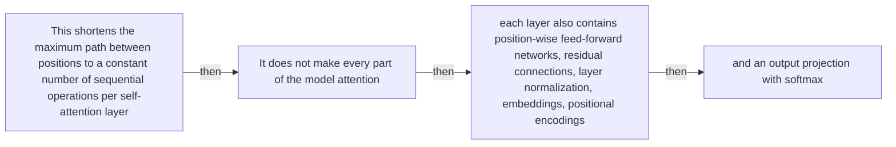

#### Python

```python
from html import escape
from pathlib import Path
from textwrap import wrap

title = "attn_change_p2: Constant attention path and the non-attention components that remain — Component topology"
nodes = [["n1","This shortens the maximum path between positions to a constant number of sequential operations per self-attention layer",100,150],["n2","It does not make every part of the model attention",250,150],["n3","each layer also contains position-wise feed-forward networks, residual connections, layer normalization, embeddings, positional encodings",400,150],["n4","and an output projection with softmax",550,150]]
edges = [["n1","n2","then"],["n2","n3","then"],["n3","n4","then"]]
node_by_id = {node_id: (label, x, y) for node_id, label, x, y in nodes}
width = max(900, max((x for _, _, x, _ in nodes), default=800) + 180)
height = max(500, max((y for _, _, _, y in nodes), default=400) + 140)
parts = [
    f'<svg xmlns="http://www.w3.org/2000/svg" viewBox="0 0 {width} {height}" role="img" aria-labelledby="title desc">',
    f'<title id="title">{escape(title)}</title>',
    '<desc id="desc">Edges and convergence points encode only relationships stated in the scoped paragraphs.</desc>',
    f'<rect width="{width}" height="{height}" fill="white"/>',
]
for source, target, relation in edges:
    _, x1, y1 = node_by_id[source]
    _, x2, y2 = node_by_id[target]
    parts.append(f'<line x1="{x1}" y1="{y1}" x2="{x2}" y2="{y2}" stroke="#345" stroke-width="2"/>')
    parts.append(f'<text x="{(x1+x2)/2}" y="{(y1+y2)/2-5}" text-anchor="middle" font-family="sans-serif" font-size="10">{escape(relation)}</text>')
for _, label, x, y in nodes:
    parts.append(f'<rect x="{x-78}" y="{y-42}" width="156" height="84" rx="12" fill="#eef6ff" stroke="#234"/>')
    for line_index, line in enumerate(wrap(label, width=22)):
        parts.append(f'<text x="{x}" y="{y-24+line_index*13}" text-anchor="middle" font-family="sans-serif" font-size="10">{escape(line)}</text>')
parts.append('</svg>')
Path("attn_change_p2_treatment_a.svg").write_text("\n".join(parts), encoding="utf-8")
```

### Treatment B — Constant attention path and the non-attention components that remain — Architecture cross-section

- Teaching purpose: Separate component responsibilities without flattening them into one list.
- Encoding and reading order: Group the 5 source-backed records into named panels using the first column as the grouping key. Panels preserve experimental, source, or example boundaries and never imply one shared scale.
- Evidence and limitations: Encode only `attn_002`, `attn_003`, `attn_006`, `attn_012` from `source_attention_arxiv_v7`. Show path length separately from feed-forward, residual, normalization, embedding, positional, projection, and softmax components.
- Recommended web medium: semantic HTML/CSS grouped panels or responsive SVG; JavaScript is optional only for meaningful focus, drill-down, or state playback.
- Mobile, accessibility, and motion behavior: Preserve the same group and node order in the DOM; retain all values and relation labels as selectable text; stack panels or levels below 640px; provide keyboard access for any optional focus state; keep a complete static fallback; respect reduced motion and never encode information only through animation.

#### TikZ

```tex
\documentclass[tikz,border=5pt]{standalone}
\usepackage[T1]{fontenc}
\usepackage{tikz}
\begin{document}
\begin{tikzpicture}[font=\sffamily,panel/.style={draw,rounded corners,align=center,text width=4.8cm,minimum height=4cm}]
\node[font=\bfseries] at (0,3) {attn\_change\_p2: Constant attention path and the non-attention components that remain - Architecture cross-section};
\node[panel] at (0,0) {\textbf{Attention replaces position mixing, not the whole layer}\\[4pt]\textbf{Token and position representations}: qualitative -- Learned token vectors receive sinusoidal position encodings before entering the stack.\\\textbf{Multi-head self-attention}: qualitative -- Each position retrieves information from available positions through several learned attention heads.\\\textbf{Residual path and layer normalization}: qualitative -- A residual connection and normalization surround the attention sublayer.\\\textbf{Position-wise feed-forward network}: qualitative -- The same two-layer feed-forward transformation is applied independently at every position.\\\textbf{Residual path and layer normalization}: qualitative -- A second residual and normalization stage completes one encoder layer; the base encoder repeats this layer 6 times.};
\end{tikzpicture}
\end{document}
```

#### Mermaid


#### Python

```python
from html import escape
from pathlib import Path
from textwrap import wrap

title = "attn_change_p2: Constant attention path and the non-attention components that remain — Architecture cross-section"
rows = [["Attention replaces position mixing, not the whole layer","Token and position representations","qualitative","Learned token vectors receive sinusoidal position encodings before entering the stack."],["Attention replaces position mixing, not the whole layer","Multi-head self-attention","qualitative","Each position retrieves information from available positions through several learned attention heads."],["Attention replaces position mixing, not the whole layer","Residual path and layer normalization","qualitative","A residual connection and normalization surround the attention sublayer."],["Attention replaces position mixing, not the whole layer","Position-wise feed-forward network","qualitative","The same two-layer feed-forward transformation is applied independently at every position."],["Attention replaces position mixing, not the whole layer","Residual path and layer normalization","qualitative","A second residual and normalization stage completes one encoder layer; the base encoder repeats this layer 6 times."]]
groups = {}
for group, label, value, condition in rows:
    groups.setdefault(group, []).append((label, value, condition))
width = max(900, len(groups) * 360)
height = 220 + max((len(items) for items in groups.values()), default=1) * 92
parts = [
    f'<svg xmlns="http://www.w3.org/2000/svg" viewBox="0 0 {width} {height}" role="img" aria-labelledby="title desc">',
    f'<title id="title">{escape(title)}</title>',
    '<desc id="desc">Separate panels preserve grouping and prevent unrelated conditions from reading as one sequence.</desc>',
    f'<rect width="{width}" height="{height}" fill="white"/>',
]
for group_index, (group, items) in enumerate(groups.items()):
    x = 180 + group_index * 360
    parts.append(f'<text x="{x}" y="65" text-anchor="middle" font-family="sans-serif" font-size="16" font-weight="700">{escape(group)}</text>')
    for item_index, (label, value, condition) in enumerate(items):
        y = 120 + item_index * 92
        parts.append(f'<rect x="{x-160}" y="{y-30}" width="320" height="78" rx="12" fill="#f7fbff" stroke="#ccd"/>')
        text = f"{label}: {value} — {condition}"
        for line_index, line in enumerate(wrap(text, width=46)):
            parts.append(f'<text x="{x}" y="{y-6+line_index*14}" text-anchor="middle" font-family="sans-serif" font-size="11">{escape(line)}</text>')
parts.append('</svg>')
Path("attn_change_p2_treatment_b.svg").write_text("\n".join(parts), encoding="utf-8")
```

### Treatment C — Constant attention path and the non-attention components that remain — One-item traversal

- Teaching purpose: Trace one token, request, or state through the architecture.
- Encoding and reading order: Use 4 named nodes and 3 explicit labeled relations. Preserve all branch, merge, hierarchy, loop, or sequence edges shown in the code; changing them is an evidence deviation.
- Evidence and limitations: Encode only `attn_002`, `attn_003`, `attn_006`, `attn_012` from `source_attention_arxiv_v7`. Show path length separately from feed-forward, residual, normalization, embedding, positional, projection, and softmax components.
- Recommended web medium: responsive inline SVG with semantic HTML/CSS fallback; JavaScript is optional only for meaningful focus, drill-down, or state playback.
- Mobile, accessibility, and motion behavior: Preserve the same group and node order in the DOM; retain all values and relation labels as selectable text; stack panels or levels below 640px; provide keyboard access for any optional focus state; keep a complete static fallback; respect reduced motion and never encode information only through animation.

#### TikZ

```tex
\documentclass[tikz,border=5pt]{standalone}
\usepackage[T1]{fontenc}
\usepackage{tikz}
\usetikzlibrary{arrows.meta}
\begin{document}
\begin{tikzpicture}[font=\sffamily,box/.style={draw,rounded corners,align=center,text width=3cm,minimum height=1.2cm},link/.style={-{Latex[length=2mm]},thick},rel/.style={fill=white,font=\scriptsize}]
\node[font=\bfseries,anchor=west] at (0,0.8) {attn\_change\_p2: Constant attention path and the non-attention components that remain - One-item traversal};
\node[box] (n1) at (1.00,-1.50) {This shortens the maximum path between positions to a constant number of sequential operations per self-attention layer};
\node[box] (n2) at (2.50,-1.50) {It does not make every part of the model attention};
\node[box] (n3) at (4.00,-1.50) {each layer also contains position-wise feed-forward networks, residual connections, layer normalization, embeddings, positional encodings};
\node[box] (n4) at (5.50,-1.50) {and an output projection with softmax};
\draw[link] (n1) -- node[rel] {then} (n2);
\draw[link] (n2) -- node[rel] {then} (n3);
\draw[link] (n3) -- node[rel] {then} (n4);
\end{tikzpicture}
\end{document}
```

#### Mermaid


#### Python

```python
from html import escape
from pathlib import Path
from textwrap import wrap

title = "attn_change_p2: Constant attention path and the non-attention components that remain — One-item traversal"
nodes = [["n1","This shortens the maximum path between positions to a constant number of sequential operations per self-attention layer",100,150],["n2","It does not make every part of the model attention",250,150],["n3","each layer also contains position-wise feed-forward networks, residual connections, layer normalization, embeddings, positional encodings",400,150],["n4","and an output projection with softmax",550,150]]
edges = [["n1","n2","then"],["n2","n3","then"],["n3","n4","then"]]
node_by_id = {node_id: (label, x, y) for node_id, label, x, y in nodes}
width = max(900, max((x for _, _, x, _ in nodes), default=800) + 180)
height = max(500, max((y for _, _, _, y in nodes), default=400) + 140)
parts = [
    f'<svg xmlns="http://www.w3.org/2000/svg" viewBox="0 0 {width} {height}" role="img" aria-labelledby="title desc">',
    f'<title id="title">{escape(title)}</title>',
    '<desc id="desc">Edges and convergence points encode only relationships stated in the scoped paragraphs.</desc>',
    f'<rect width="{width}" height="{height}" fill="white"/>',
]
for source, target, relation in edges:
    _, x1, y1 = node_by_id[source]
    _, x2, y2 = node_by_id[target]
    parts.append(f'<line x1="{x1}" y1="{y1}" x2="{x2}" y2="{y2}" stroke="#345" stroke-width="2"/>')
    parts.append(f'<text x="{(x1+x2)/2}" y="{(y1+y2)/2-5}" text-anchor="middle" font-family="sans-serif" font-size="10">{escape(relation)}</text>')
for _, label, x, y in nodes:
    parts.append(f'<rect x="{x-78}" y="{y-42}" width="156" height="84" rx="12" fill="#eef6ff" stroke="#234"/>')
    for line_index, line in enumerate(wrap(label, width=22)):
        parts.append(f'<text x="{x}" y="{y-24+line_index*13}" text-anchor="middle" font-family="sans-serif" font-size="10">{escape(line)}</text>')
parts.append('</svg>')
Path("attn_change_p2_treatment_c.svg").write_text("\n".join(parts), encoding="utf-8")
```

### Implementation record

- Status: `IMPLEMENTED`
- Selected treatment: `B`
- Selection rationale: Selected the approved “Constant attention path and the non-attention components that remain — Architecture cross-section” treatment because the implemented parallel view directly encodes this paragraph's explanatory job and its stated evidence boundaries.
- Delivery medium: `CSS + semantic HTML`
- Visual ID and placement: `visual_attention_retained_components` after `attn_change_p2`; this record is served by that purpose-built figure.
- Shared paragraph scope: NONE
- Changed files: `packages/test-fixtures/explainers/attention-is-all-you-need.json`, `packages/content-schema/schema/explainer-document.schema.json`, `packages/content-schema/src/validate.ts`, generated TypeScript/Python models, `apps/web/app/papers/[id]/explainer-visual.tsx`, and `apps/web/app/globals.css`.
- Accessibility and fallback verification: Figure has a programmatic title and description, visible selectable labels and values, explicit alt text, equivalent fallback prose, source links, limitations, and a semantic static body; no meaning depends on color, motion, or pointer input.
- Desktop and mobile verification: Verified by the full eight-paper Playwright traversal at a 1440-pixel desktop viewport and the iPhone 13 mobile viewport; every figure stayed paragraph-adjacent, preserved DOM reading order, and introduced no horizontal page overflow.
- Evidence deviations: Delivery translation: selected Treatment B is rendered as typed semantic HTML/CSS rather than its literal TikZ, Mermaid, or Python-generated asset; the approved paragraph scope, placement, labels, values, grouping, and evidence boundaries are retained.

## `attn_mechanism_p1`

- Location: `attn_mechanism`, paragraph 1
- Text anchor: "Tokens first become learned vectors, and sinusoidal position encodings are added so the model receives order information."
- Claims and sources: `attn_003` (OBSERVED, VERIFIED); `attn_004` (OBSERVED, VERIFIED); `attn_005` (AUTHORS_INTERPRETATION, VERIFIED); `source_attention_arxiv_v7` (Pages 1-10; Sections 1-7; Figures 1-2; Equation 1; Tables 1-4; version and figure-permission notice)
- Visual needed: `YES`
- Decision rationale: A visual passes the removal test because readers must reconstruct one repeated transformer encoder layer while preserving the paragraph's conditions and boundaries. Revision 3 narrows the topology and placement so no visual can claim this paragraph without encoding its mechanism, grouping, or values.
- Explanatory job: One repeated Transformer encoder layer.
- Recommended scope and placement: This paragraph only; place the visual immediately after `attn_mechanism_p1`.
- QA-informed planning change: Preserve token-plus-position input, both sublayers, both residual-normalization stages, and six-layer repetition.

### Treatment A — One repeated Transformer encoder layer — Component topology

- Teaching purpose: Show the stated component connections and convergence points.
- Encoding and reading order: Use 4 named nodes and 3 explicit labeled relations. Preserve all branch, merge, hierarchy, loop, or sequence edges shown in the code; changing them is an evidence deviation.
- Evidence and limitations: Encode only `attn_003`, `attn_004`, `attn_005` from `source_attention_arxiv_v7`. Preserve token-plus-position input, both sublayers, both residual-normalization stages, and six-layer repetition.
- Recommended web medium: responsive inline SVG with semantic HTML/CSS fallback; JavaScript is optional only for meaningful focus, drill-down, or state playback.
- Mobile, accessibility, and motion behavior: Preserve the same group and node order in the DOM; retain all values and relation labels as selectable text; stack panels or levels below 640px; provide keyboard access for any optional focus state; keep a complete static fallback; respect reduced motion and never encode information only through animation.

#### TikZ

```tex
\documentclass[tikz,border=5pt]{standalone}
\usepackage[T1]{fontenc}
\usepackage{tikz}
\usetikzlibrary{arrows.meta}
\begin{document}
\begin{tikzpicture}[font=\sffamily,box/.style={draw,rounded corners,align=center,text width=3cm,minimum height=1.2cm},link/.style={-{Latex[length=2mm]},thick},rel/.style={fill=white,font=\scriptsize}]
\node[font=\bfseries,anchor=west] at (0,0.8) {attn\_mechanism\_p1: One repeated Transformer encoder layer - Component topology};
\node[box] (n1) at (1.00,-1.50) {Tokens first become learned vectors};
\node[box] (n2) at (2.50,-1.50) {and sinusoidal position encodings are added so the model receives order information};
\node[box] (n3) at (4.00,-1.50) {The base encoder repeats 6 layers, each containing multi-head self-attention followed by a position-wise feed-forward network};
\node[box] (n4) at (5.50,-1.50) {Residual connections and layer normalization surround both sublayers};
\draw[link] (n1) -- node[rel] {then} (n2);
\draw[link] (n2) -- node[rel] {then} (n3);
\draw[link] (n3) -- node[rel] {then} (n4);
\end{tikzpicture}
\end{document}
```

#### Mermaid

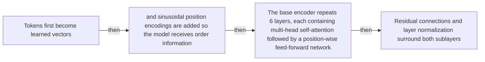

#### Python

```python
from html import escape
from pathlib import Path
from textwrap import wrap

title = "attn_mechanism_p1: One repeated Transformer encoder layer — Component topology"
nodes = [["n1","Tokens first become learned vectors",100,150],["n2","and sinusoidal position encodings are added so the model receives order information",250,150],["n3","The base encoder repeats 6 layers, each containing multi-head self-attention followed by a position-wise feed-forward network",400,150],["n4","Residual connections and layer normalization surround both sublayers",550,150]]
edges = [["n1","n2","then"],["n2","n3","then"],["n3","n4","then"]]
node_by_id = {node_id: (label, x, y) for node_id, label, x, y in nodes}
width = max(900, max((x for _, _, x, _ in nodes), default=800) + 180)
height = max(500, max((y for _, _, _, y in nodes), default=400) + 140)
parts = [
    f'<svg xmlns="http://www.w3.org/2000/svg" viewBox="0 0 {width} {height}" role="img" aria-labelledby="title desc">',
    f'<title id="title">{escape(title)}</title>',
    '<desc id="desc">Edges and convergence points encode only relationships stated in the scoped paragraphs.</desc>',
    f'<rect width="{width}" height="{height}" fill="white"/>',
]
for source, target, relation in edges:
    _, x1, y1 = node_by_id[source]
    _, x2, y2 = node_by_id[target]
    parts.append(f'<line x1="{x1}" y1="{y1}" x2="{x2}" y2="{y2}" stroke="#345" stroke-width="2"/>')
    parts.append(f'<text x="{(x1+x2)/2}" y="{(y1+y2)/2-5}" text-anchor="middle" font-family="sans-serif" font-size="10">{escape(relation)}</text>')
for _, label, x, y in nodes:
    parts.append(f'<rect x="{x-78}" y="{y-42}" width="156" height="84" rx="12" fill="#eef6ff" stroke="#234"/>')
    for line_index, line in enumerate(wrap(label, width=22)):
        parts.append(f'<text x="{x}" y="{y-24+line_index*13}" text-anchor="middle" font-family="sans-serif" font-size="10">{escape(line)}</text>')
parts.append('</svg>')
Path("attn_mechanism_p1_treatment_a.svg").write_text("\n".join(parts), encoding="utf-8")
```

### Treatment B — One repeated Transformer encoder layer — Architecture cross-section

- Teaching purpose: Separate component responsibilities without flattening them into one list.
- Encoding and reading order: Group the 5 source-backed records into named panels using the first column as the grouping key. Panels preserve experimental, source, or example boundaries and never imply one shared scale.
- Evidence and limitations: Encode only `attn_003`, `attn_004`, `attn_005` from `source_attention_arxiv_v7`. Preserve token-plus-position input, both sublayers, both residual-normalization stages, and six-layer repetition.
- Recommended web medium: semantic HTML/CSS grouped panels or responsive SVG; JavaScript is optional only for meaningful focus, drill-down, or state playback.
- Mobile, accessibility, and motion behavior: Preserve the same group and node order in the DOM; retain all values and relation labels as selectable text; stack panels or levels below 640px; provide keyboard access for any optional focus state; keep a complete static fallback; respect reduced motion and never encode information only through animation.

#### TikZ

```tex
\documentclass[tikz,border=5pt]{standalone}
\usepackage[T1]{fontenc}
\usepackage{tikz}
\begin{document}
\begin{tikzpicture}[font=\sffamily,panel/.style={draw,rounded corners,align=center,text width=4.8cm,minimum height=4cm}]
\node[font=\bfseries] at (0,3) {attn\_mechanism\_p1: One repeated Transformer encoder layer - Architecture cross-section};
\node[panel] at (0,0) {\textbf{Attention replaces position mixing, not the whole layer}\\[4pt]\textbf{Token and position representations}: qualitative -- Learned token vectors receive sinusoidal position encodings before entering the stack.\\\textbf{Multi-head self-attention}: qualitative -- Each position retrieves information from available positions through several learned attention heads.\\\textbf{Residual path and layer normalization}: qualitative -- A residual connection and normalization surround the attention sublayer.\\\textbf{Position-wise feed-forward network}: qualitative -- The same two-layer feed-forward transformation is applied independently at every position.\\\textbf{Residual path and layer normalization}: qualitative -- A second residual and normalization stage completes one encoder layer; the base encoder repeats this layer 6 times.};
\end{tikzpicture}
\end{document}
```

#### Mermaid


#### Python

```python
from html import escape
from pathlib import Path
from textwrap import wrap

title = "attn_mechanism_p1: One repeated Transformer encoder layer — Architecture cross-section"
rows = [["Attention replaces position mixing, not the whole layer","Token and position representations","qualitative","Learned token vectors receive sinusoidal position encodings before entering the stack."],["Attention replaces position mixing, not the whole layer","Multi-head self-attention","qualitative","Each position retrieves information from available positions through several learned attention heads."],["Attention replaces position mixing, not the whole layer","Residual path and layer normalization","qualitative","A residual connection and normalization surround the attention sublayer."],["Attention replaces position mixing, not the whole layer","Position-wise feed-forward network","qualitative","The same two-layer feed-forward transformation is applied independently at every position."],["Attention replaces position mixing, not the whole layer","Residual path and layer normalization","qualitative","A second residual and normalization stage completes one encoder layer; the base encoder repeats this layer 6 times."]]
groups = {}
for group, label, value, condition in rows:
    groups.setdefault(group, []).append((label, value, condition))
width = max(900, len(groups) * 360)
height = 220 + max((len(items) for items in groups.values()), default=1) * 92
parts = [
    f'<svg xmlns="http://www.w3.org/2000/svg" viewBox="0 0 {width} {height}" role="img" aria-labelledby="title desc">',
    f'<title id="title">{escape(title)}</title>',
    '<desc id="desc">Separate panels preserve grouping and prevent unrelated conditions from reading as one sequence.</desc>',
    f'<rect width="{width}" height="{height}" fill="white"/>',
]
for group_index, (group, items) in enumerate(groups.items()):
    x = 180 + group_index * 360
    parts.append(f'<text x="{x}" y="65" text-anchor="middle" font-family="sans-serif" font-size="16" font-weight="700">{escape(group)}</text>')
    for item_index, (label, value, condition) in enumerate(items):
        y = 120 + item_index * 92
        parts.append(f'<rect x="{x-160}" y="{y-30}" width="320" height="78" rx="12" fill="#f7fbff" stroke="#ccd"/>')
        text = f"{label}: {value} — {condition}"
        for line_index, line in enumerate(wrap(text, width=46)):
            parts.append(f'<text x="{x}" y="{y-6+line_index*14}" text-anchor="middle" font-family="sans-serif" font-size="11">{escape(line)}</text>')
parts.append('</svg>')
Path("attn_mechanism_p1_treatment_b.svg").write_text("\n".join(parts), encoding="utf-8")
```

### Treatment C — One repeated Transformer encoder layer — One-item traversal

- Teaching purpose: Trace one token, request, or state through the architecture.
- Encoding and reading order: Use 4 named nodes and 3 explicit labeled relations. Preserve all branch, merge, hierarchy, loop, or sequence edges shown in the code; changing them is an evidence deviation.
- Evidence and limitations: Encode only `attn_003`, `attn_004`, `attn_005` from `source_attention_arxiv_v7`. Preserve token-plus-position input, both sublayers, both residual-normalization stages, and six-layer repetition.
- Recommended web medium: responsive inline SVG with semantic HTML/CSS fallback; JavaScript is optional only for meaningful focus, drill-down, or state playback.
- Mobile, accessibility, and motion behavior: Preserve the same group and node order in the DOM; retain all values and relation labels as selectable text; stack panels or levels below 640px; provide keyboard access for any optional focus state; keep a complete static fallback; respect reduced motion and never encode information only through animation.

#### TikZ

```tex
\documentclass[tikz,border=5pt]{standalone}
\usepackage[T1]{fontenc}
\usepackage{tikz}
\usetikzlibrary{arrows.meta}
\begin{document}
\begin{tikzpicture}[font=\sffamily,box/.style={draw,rounded corners,align=center,text width=3cm,minimum height=1.2cm},link/.style={-{Latex[length=2mm]},thick},rel/.style={fill=white,font=\scriptsize}]
\node[font=\bfseries,anchor=west] at (0,0.8) {attn\_mechanism\_p1: One repeated Transformer encoder layer - One-item traversal};
\node[box] (n1) at (1.00,-1.50) {Tokens first become learned vectors};
\node[box] (n2) at (2.50,-1.50) {and sinusoidal position encodings are added so the model receives order information};
\node[box] (n3) at (4.00,-1.50) {The base encoder repeats 6 layers, each containing multi-head self-attention followed by a position-wise feed-forward network};
\node[box] (n4) at (5.50,-1.50) {Residual connections and layer normalization surround both sublayers};
\draw[link] (n1) -- node[rel] {then} (n2);
\draw[link] (n2) -- node[rel] {then} (n3);
\draw[link] (n3) -- node[rel] {then} (n4);
\end{tikzpicture}
\end{document}
```

#### Mermaid


#### Python

```python
from html import escape
from pathlib import Path
from textwrap import wrap

title = "attn_mechanism_p1: One repeated Transformer encoder layer — One-item traversal"
nodes = [["n1","Tokens first become learned vectors",100,150],["n2","and sinusoidal position encodings are added so the model receives order information",250,150],["n3","The base encoder repeats 6 layers, each containing multi-head self-attention followed by a position-wise feed-forward network",400,150],["n4","Residual connections and layer normalization surround both sublayers",550,150]]
edges = [["n1","n2","then"],["n2","n3","then"],["n3","n4","then"]]
node_by_id = {node_id: (label, x, y) for node_id, label, x, y in nodes}
width = max(900, max((x for _, _, x, _ in nodes), default=800) + 180)
height = max(500, max((y for _, _, _, y in nodes), default=400) + 140)
parts = [
    f'<svg xmlns="http://www.w3.org/2000/svg" viewBox="0 0 {width} {height}" role="img" aria-labelledby="title desc">',
    f'<title id="title">{escape(title)}</title>',
    '<desc id="desc">Edges and convergence points encode only relationships stated in the scoped paragraphs.</desc>',
    f'<rect width="{width}" height="{height}" fill="white"/>',
]
for source, target, relation in edges:
    _, x1, y1 = node_by_id[source]
    _, x2, y2 = node_by_id[target]
    parts.append(f'<line x1="{x1}" y1="{y1}" x2="{x2}" y2="{y2}" stroke="#345" stroke-width="2"/>')
    parts.append(f'<text x="{(x1+x2)/2}" y="{(y1+y2)/2-5}" text-anchor="middle" font-family="sans-serif" font-size="10">{escape(relation)}</text>')
for _, label, x, y in nodes:
    parts.append(f'<rect x="{x-78}" y="{y-42}" width="156" height="84" rx="12" fill="#eef6ff" stroke="#234"/>')
    for line_index, line in enumerate(wrap(label, width=22)):
        parts.append(f'<text x="{x}" y="{y-24+line_index*13}" text-anchor="middle" font-family="sans-serif" font-size="10">{escape(line)}</text>')
parts.append('</svg>')
Path("attn_mechanism_p1_treatment_c.svg").write_text("\n".join(parts), encoding="utf-8")
```

### Implementation record

- Status: `IMPLEMENTED`
- Selected treatment: `B`
- Selection rationale: Selected the approved “One repeated Transformer encoder layer — Architecture cross-section” treatment because the implemented architecture stepper directly encodes this paragraph's explanatory job and its stated evidence boundaries.
- Delivery medium: `CSS + semantic HTML`
- Visual ID and placement: `visual_attention_encoder_layer` after `attn_mechanism_p1`; this record is served by that purpose-built figure.
- Shared paragraph scope: NONE
- Changed files: `packages/test-fixtures/explainers/attention-is-all-you-need.json`, `packages/content-schema/schema/explainer-document.schema.json`, `packages/content-schema/src/validate.ts`, generated TypeScript/Python models, `apps/web/app/papers/[id]/explainer-visual.tsx`, and `apps/web/app/globals.css`.
- Accessibility and fallback verification: Figure has a programmatic title and description, visible selectable labels and values, explicit alt text, equivalent fallback prose, source links, limitations, and a semantic static body; no meaning depends on color, motion, or pointer input.
- Desktop and mobile verification: Verified by the full eight-paper Playwright traversal at a 1440-pixel desktop viewport and the iPhone 13 mobile viewport; every figure stayed paragraph-adjacent, preserved DOM reading order, and introduced no horizontal page overflow.
- Evidence deviations: Delivery translation: selected Treatment B is rendered as typed semantic HTML/CSS rather than its literal TikZ, Mermaid, or Python-generated asset; the approved paragraph scope, placement, labels, values, grouping, and evidence boundaries are retained.

## `attn_mechanism_p2`

- Location: `attn_mechanism`, paragraph 2
- Text anchor: "For scaled dot-product attention, the model compares a query with every key using Q times K-transpose, divides by the square root of the key dimension, applies softmax, and uses the resulting weights to mix the values."
- Claims and sources: `attn_003` (OBSERVED, VERIFIED); `attn_004` (OBSERVED, VERIFIED); `attn_005` (AUTHORS_INTERPRETATION, VERIFIED); `source_attention_arxiv_v7` (Pages 1-10; Sections 1-7; Figures 1-2; Equation 1; Tables 1-4; version and figure-permission notice)
- Visual needed: `YES`
- Decision rationale: A visual passes the removal test because readers must reconstruct scaled dot-product attention and multi-head recombination while preserving the paragraph's conditions and boundaries. Revision 3 narrows the topology and placement so no visual can claim this paragraph without encoding its mechanism, grouping, or values.
- Explanatory job: Scaled dot-product attention and multi-head recombination.
- Recommended scope and placement: This paragraph only; place the visual immediately after `attn_mechanism_p2`.
- QA-informed planning change: The flow must include QK-transpose, square-root scaling, softmax, value mixing, head concatenation, and final projection.

### Treatment A — Scaled dot-product attention and multi-head recombination — Operation flow

- Teaching purpose: Show the source-supported order and branch boundaries.
- Encoding and reading order: Use 4 named nodes and 3 explicit labeled relations. Preserve all branch, merge, hierarchy, loop, or sequence edges shown in the code; changing them is an evidence deviation.
- Evidence and limitations: Encode only `attn_003`, `attn_004`, `attn_005` from `source_attention_arxiv_v7`. The flow must include QK-transpose, square-root scaling, softmax, value mixing, head concatenation, and final projection.
- Recommended web medium: responsive inline SVG with semantic HTML/CSS fallback; JavaScript is optional only for meaningful focus, drill-down, or state playback.
- Mobile, accessibility, and motion behavior: Preserve the same group and node order in the DOM; retain all values and relation labels as selectable text; stack panels or levels below 640px; provide keyboard access for any optional focus state; keep a complete static fallback; respect reduced motion and never encode information only through animation.

#### TikZ

```tex
\documentclass[tikz,border=5pt]{standalone}
\usepackage[T1]{fontenc}
\usepackage{tikz}
\usetikzlibrary{arrows.meta}
\begin{document}
\begin{tikzpicture}[font=\sffamily,box/.style={draw,rounded corners,align=center,text width=3cm,minimum height=1.2cm},link/.style={-{Latex[length=2mm]},thick},rel/.style={fill=white,font=\scriptsize}]
\node[font=\bfseries,anchor=west] at (0,0.8) {attn\_mechanism\_p2: Scaled dot-product attention and multi-head recombination - Operation flow};
\node[box] (n1) at (1.00,-1.50) {For scaled dot-product attention, the model compares a query with every key using Q times K-transpose, divides by the square root of the key dimension, applies softmax};
\node[box] (n2) at (2.50,-1.50) {and uses the resulting weights to mix the values};
\node[box] (n3) at (4.00,-1.50) {The base model performs this calculation in 8 learned heads, concatenates their outputs};
\node[box] (n4) at (5.50,-1.50) {and projects the result};
\draw[link] (n1) -- node[rel] {then} (n2);
\draw[link] (n2) -- node[rel] {then} (n3);
\draw[link] (n3) -- node[rel] {then} (n4);
\end{tikzpicture}
\end{document}
```

#### Mermaid

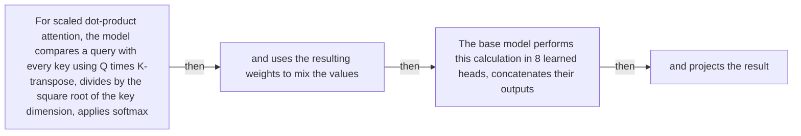

#### Python

```python
from html import escape
from pathlib import Path
from textwrap import wrap

title = "attn_mechanism_p2: Scaled dot-product attention and multi-head recombination — Operation flow"
nodes = [["n1","For scaled dot-product attention, the model compares a query with every key using Q times K-transpose, divides by the square root of the key dimension, applies softmax",100,150],["n2","and uses the resulting weights to mix the values",250,150],["n3","The base model performs this calculation in 8 learned heads, concatenates their outputs",400,150],["n4","and projects the result",550,150]]
edges = [["n1","n2","then"],["n2","n3","then"],["n3","n4","then"]]
node_by_id = {node_id: (label, x, y) for node_id, label, x, y in nodes}
width = max(900, max((x for _, _, x, _ in nodes), default=800) + 180)
height = max(500, max((y for _, _, _, y in nodes), default=400) + 140)
parts = [
    f'<svg xmlns="http://www.w3.org/2000/svg" viewBox="0 0 {width} {height}" role="img" aria-labelledby="title desc">',
    f'<title id="title">{escape(title)}</title>',
    '<desc id="desc">Edges and convergence points encode only relationships stated in the scoped paragraphs.</desc>',
    f'<rect width="{width}" height="{height}" fill="white"/>',
]
for source, target, relation in edges:
    _, x1, y1 = node_by_id[source]
    _, x2, y2 = node_by_id[target]
    parts.append(f'<line x1="{x1}" y1="{y1}" x2="{x2}" y2="{y2}" stroke="#345" stroke-width="2"/>')
    parts.append(f'<text x="{(x1+x2)/2}" y="{(y1+y2)/2-5}" text-anchor="middle" font-family="sans-serif" font-size="10">{escape(relation)}</text>')
for _, label, x, y in nodes:
    parts.append(f'<rect x="{x-78}" y="{y-42}" width="156" height="84" rx="12" fill="#eef6ff" stroke="#234"/>')
    for line_index, line in enumerate(wrap(label, width=22)):
        parts.append(f'<text x="{x}" y="{y-24+line_index*13}" text-anchor="middle" font-family="sans-serif" font-size="10">{escape(line)}</text>')
parts.append('</svg>')
Path("attn_mechanism_p2_treatment_a.svg").write_text("\n".join(parts), encoding="utf-8")
```

### Treatment B — Scaled dot-product attention and multi-head recombination — Input-operation-output ledger

- Teaching purpose: Make inputs, operations, outputs, and limits inspectable as columns.
- Encoding and reading order: Render 5 rows with explicit `Group`, `Measure or state`, `Visible value`, and `Condition or boundary` columns. The value column must be visible, not only present in ARIA text or fallback prose.
- Evidence and limitations: Encode only `attn_003`, `attn_004`, `attn_005` from `source_attention_arxiv_v7`. The flow must include QK-transpose, square-root scaling, softmax, value mixing, head concatenation, and final projection.
- Recommended web medium: semantic HTML/CSS table with SVG export; JavaScript is optional only for meaningful focus, drill-down, or state playback.
- Mobile, accessibility, and motion behavior: Preserve the same group and node order in the DOM; retain all values and relation labels as selectable text; stack panels or levels below 640px; provide keyboard access for any optional focus state; keep a complete static fallback; respect reduced motion and never encode information only through animation.

#### TikZ

```tex
\documentclass[tikz,border=5pt]{standalone}
\usepackage[T1]{fontenc}
\usepackage{array}
\usepackage{tikz}
\begin{document}
\begin{tikzpicture}[font=\sffamily]
\node[align=center] {\textbf{attn\_mechanism\_p2: Scaled dot-product attention and multi-head recombination - Input-operation-output ledger}\\[6pt]
\begin{tabular}{p{3.2cm}p{4.0cm}p{2.8cm}p{6.2cm}}
\textbf{Group} & \textbf{Measure or state} & \textbf{Visible value} & \textbf{Condition or boundary} \\ \hline
Scaled dot-product attention is a sequence of four operations & 1. Compare queries and keys & qualitative & Multiply Q by K-transpose to produce compatibility scores between each query and the available keys. \\
Scaled dot-product attention is a sequence of four operations & 2. Scale the scores & qualitative & Divide by the square root of the key dimension before normalization. \\
Scaled dot-product attention is a sequence of four operations & 3. Normalize with softmax & qualitative & Softmax converts the scaled compatibility scores into weights over the available positions. \\
Scaled dot-product attention is a sequence of four operations & 4. Mix the values & qualitative & Multiply the weights by V so the query receives a weighted mixture of value vectors. \\
Scaled dot-product attention is a sequence of four operations & Repeat in multiple heads & qualitative & Multi-head attention performs the operation in learned representation subspaces so the model can attend jointly to different positions and representations. \\
\end{tabular}};
\end{tikzpicture}
\end{document}
```

#### Mermaid

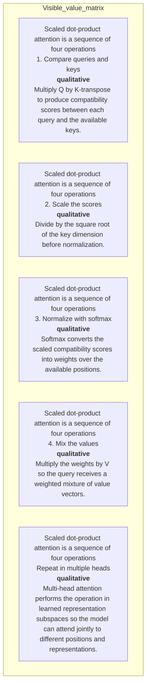

#### Python

```python
from html import escape
from pathlib import Path
from textwrap import wrap

title = "attn_mechanism_p2: Scaled dot-product attention and multi-head recombination — Input-operation-output ledger"
rows = [["Scaled dot-product attention is a sequence of four operations","1. Compare queries and keys","qualitative","Multiply Q by K-transpose to produce compatibility scores between each query and the available keys."],["Scaled dot-product attention is a sequence of four operations","2. Scale the scores","qualitative","Divide by the square root of the key dimension before normalization."],["Scaled dot-product attention is a sequence of four operations","3. Normalize with softmax","qualitative","Softmax converts the scaled compatibility scores into weights over the available positions."],["Scaled dot-product attention is a sequence of four operations","4. Mix the values","qualitative","Multiply the weights by V so the query receives a weighted mixture of value vectors."],["Scaled dot-product attention is a sequence of four operations","Repeat in multiple heads","qualitative","Multi-head attention performs the operation in learned representation subspaces so the model can attend jointly to different positions and representations."]]
height = 590
parts = [
    f'<svg xmlns="http://www.w3.org/2000/svg" viewBox="0 0 1200 {height}" role="img" aria-labelledby="title desc">',
    f'<title id="title">{escape(title)}</title>',
    '<desc id="desc">Every reported value is visible beside its condition and group.</desc>',
    f'<rect width="1200" height="{height}" fill="white"/>',
]
headers = ["Group", "Measure or state", "Visible value", "Condition or boundary"]
xs = [30, 260, 590, 770]
for x, header in zip(xs, headers):
    parts.append(f'<text x="{x}" y="70" font-family="sans-serif" font-size="16" font-weight="700">{escape(header)}</text>')
for row_index, row in enumerate(rows):
    y = 110 + row_index * 88
    parts.append(f'<rect x="20" y="{y-28}" width="1160" height="76" fill="#f7fbff" stroke="#ccd"/>')
    for x, cell, width in zip(xs, row, [26, 38, 20, 58]):
        for line_index, line in enumerate(wrap(str(cell), width=width)):
            parts.append(f'<text x="{x}" y="{y+line_index*14}" font-family="sans-serif" font-size="11">{escape(line)}</text>')
parts.append('</svg>')
Path("attn_mechanism_p2_treatment_b.svg").write_text("\n".join(parts), encoding="utf-8")
```

### Treatment C — Scaled dot-product attention and multi-head recombination — State-transition walkthrough

- Teaching purpose: Follow the described state changes without inventing timing.
- Encoding and reading order: Use 4 named nodes and 3 explicit labeled relations. Preserve all branch, merge, hierarchy, loop, or sequence edges shown in the code; changing them is an evidence deviation.
- Evidence and limitations: Encode only `attn_003`, `attn_004`, `attn_005` from `source_attention_arxiv_v7`. The flow must include QK-transpose, square-root scaling, softmax, value mixing, head concatenation, and final projection.
- Recommended web medium: responsive inline SVG with semantic HTML/CSS fallback; JavaScript is optional only for meaningful focus, drill-down, or state playback.
- Mobile, accessibility, and motion behavior: Preserve the same group and node order in the DOM; retain all values and relation labels as selectable text; stack panels or levels below 640px; provide keyboard access for any optional focus state; keep a complete static fallback; respect reduced motion and never encode information only through animation.

#### TikZ

```tex
\documentclass[tikz,border=5pt]{standalone}
\usepackage[T1]{fontenc}
\usepackage{tikz}
\usetikzlibrary{arrows.meta}
\begin{document}
\begin{tikzpicture}[font=\sffamily,box/.style={draw,rounded corners,align=center,text width=3cm,minimum height=1.2cm},link/.style={-{Latex[length=2mm]},thick},rel/.style={fill=white,font=\scriptsize}]
\node[font=\bfseries,anchor=west] at (0,0.8) {attn\_mechanism\_p2: Scaled dot-product attention and multi-head recombination - State-transition walkthrough};
\node[box] (n1) at (1.00,-1.50) {For scaled dot-product attention, the model compares a query with every key using Q times K-transpose, divides by the square root of the key dimension, applies softmax};
\node[box] (n2) at (2.50,-1.50) {and uses the resulting weights to mix the values};
\node[box] (n3) at (4.00,-1.50) {The base model performs this calculation in 8 learned heads, concatenates their outputs};
\node[box] (n4) at (5.50,-1.50) {and projects the result};
\draw[link] (n1) -- node[rel] {then} (n2);
\draw[link] (n2) -- node[rel] {then} (n3);
\draw[link] (n3) -- node[rel] {then} (n4);
\end{tikzpicture}
\end{document}
```

#### Mermaid


#### Python

```python
from html import escape
from pathlib import Path
from textwrap import wrap

title = "attn_mechanism_p2: Scaled dot-product attention and multi-head recombination — State-transition walkthrough"
nodes = [["n1","For scaled dot-product attention, the model compares a query with every key using Q times K-transpose, divides by the square root of the key dimension, applies softmax",100,150],["n2","and uses the resulting weights to mix the values",250,150],["n3","The base model performs this calculation in 8 learned heads, concatenates their outputs",400,150],["n4","and projects the result",550,150]]
edges = [["n1","n2","then"],["n2","n3","then"],["n3","n4","then"]]
node_by_id = {node_id: (label, x, y) for node_id, label, x, y in nodes}
width = max(900, max((x for _, _, x, _ in nodes), default=800) + 180)
height = max(500, max((y for _, _, _, y in nodes), default=400) + 140)
parts = [
    f'<svg xmlns="http://www.w3.org/2000/svg" viewBox="0 0 {width} {height}" role="img" aria-labelledby="title desc">',
    f'<title id="title">{escape(title)}</title>',
    '<desc id="desc">Edges and convergence points encode only relationships stated in the scoped paragraphs.</desc>',
    f'<rect width="{width}" height="{height}" fill="white"/>',
]
for source, target, relation in edges:
    _, x1, y1 = node_by_id[source]
    _, x2, y2 = node_by_id[target]
    parts.append(f'<line x1="{x1}" y1="{y1}" x2="{x2}" y2="{y2}" stroke="#345" stroke-width="2"/>')
    parts.append(f'<text x="{(x1+x2)/2}" y="{(y1+y2)/2-5}" text-anchor="middle" font-family="sans-serif" font-size="10">{escape(relation)}</text>')
for _, label, x, y in nodes:
    parts.append(f'<rect x="{x-78}" y="{y-42}" width="156" height="84" rx="12" fill="#eef6ff" stroke="#234"/>')
    for line_index, line in enumerate(wrap(label, width=22)):
        parts.append(f'<text x="{x}" y="{y-24+line_index*13}" text-anchor="middle" font-family="sans-serif" font-size="10">{escape(line)}</text>')
parts.append('</svg>')
Path("attn_mechanism_p2_treatment_c.svg").write_text("\n".join(parts), encoding="utf-8")
```

### Implementation record

- Status: `IMPLEMENTED`
- Selected treatment: `A`
- Selection rationale: Selected the approved “Scaled dot-product attention and multi-head recombination — Operation flow” treatment because the implemented operation diagram directly encodes this paragraph's explanatory job and its stated evidence boundaries.
- Delivery medium: `CSS + semantic HTML`
- Visual ID and placement: `visual_attention_scaled_dot_product` after `attn_mechanism_p2`; this record is served by that purpose-built figure.
- Shared paragraph scope: NONE
- Changed files: `packages/test-fixtures/explainers/attention-is-all-you-need.json`, `packages/content-schema/schema/explainer-document.schema.json`, `packages/content-schema/src/validate.ts`, generated TypeScript/Python models, `apps/web/app/papers/[id]/explainer-visual.tsx`, and `apps/web/app/globals.css`.
- Accessibility and fallback verification: Figure has a programmatic title and description, visible selectable labels and values, explicit alt text, equivalent fallback prose, source links, limitations, and a semantic static body; no meaning depends on color, motion, or pointer input.
- Desktop and mobile verification: Verified by the full eight-paper Playwright traversal at a 1440-pixel desktop viewport and the iPhone 13 mobile viewport; every figure stayed paragraph-adjacent, preserved DOM reading order, and introduced no horizontal page overflow.
- Evidence deviations: Delivery translation: selected Treatment A is rendered as typed semantic HTML/CSS rather than its literal TikZ, Mermaid, or Python-generated asset; the approved paragraph scope, placement, labels, values, grouping, and evidence boundaries are retained.

## `attn_mechanism_p3`

- Location: `attn_mechanism`, paragraph 3
- Text anchor: "The decoder also repeats 6 layers."
- Claims and sources: `attn_003` (OBSERVED, VERIFIED); `attn_004` (OBSERVED, VERIFIED); `attn_005` (AUTHORS_INTERPRETATION, VERIFIED); `source_attention_arxiv_v7` (Pages 1-10; Sections 1-7; Figures 1-2; Equation 1; Tables 1-4; version and figure-permission notice)
- Visual needed: `YES`
- Decision rationale: A visual passes the removal test because readers must reconstruct masked decoding, cross-attention, projection, and autoregressive repetition while preserving the paragraph's conditions and boundaries. Revision 3 narrows the topology and placement so no visual can claim this paragraph without encoding its mechanism, grouping, or values.
- Explanatory job: Masked decoding, cross-attention, projection, and autoregressive repetition.
- Recommended scope and placement: This paragraph only; place the visual immediately after `attn_mechanism_p3`.
- QA-informed planning change: Separate parallel masked training from one-token-at-a-time generation and show projection plus softmax.

### Treatment A — Masked decoding, cross-attention, projection, and autoregressive repetition — Control or recurrence loop

- Teaching purpose: Make the return transition and carried state explicit.
- Encoding and reading order: Use 6 named nodes and 6 explicit labeled relations. Preserve all branch, merge, hierarchy, loop, or sequence edges shown in the code; changing them is an evidence deviation.
- Evidence and limitations: Encode only `attn_003`, `attn_004`, `attn_005` from `source_attention_arxiv_v7`. Separate parallel masked training from one-token-at-a-time generation and show projection plus softmax.
- Recommended web medium: responsive inline SVG with semantic HTML/CSS fallback; JavaScript is optional only for meaningful focus, drill-down, or state playback.
- Mobile, accessibility, and motion behavior: Preserve the same group and node order in the DOM; retain all values and relation labels as selectable text; stack panels or levels below 640px; provide keyboard access for any optional focus state; keep a complete static fallback; respect reduced motion and never encode information only through animation.

#### TikZ

```tex
\documentclass[tikz,border=5pt]{standalone}
\usepackage[T1]{fontenc}
\usepackage{tikz}
\usetikzlibrary{arrows.meta}
\begin{document}
\begin{tikzpicture}[font=\sffamily,box/.style={draw,rounded corners,align=center,text width=3cm,minimum height=1.2cm},link/.style={-{Latex[length=2mm]},thick},rel/.style={fill=white,font=\scriptsize}]
\node[font=\bfseries,anchor=west] at (0,0.8) {attn\_mechanism\_p3: Masked decoding, cross-attention, projection, and autoregressive repetition - Control or recurrence loop};
\node[box] (prefix) at (1.00,-1.50) {Known target prefix};
\node[box] (mask) at (2.50,-1.50) {Masked self-attention blocks future positions};
\node[box] (cross) at (4.00,-1.50) {Decoder query attends to encoder keys/values};
\node[box] (ffn) at (5.50,-1.50) {Feed-forward path};
\node[box] (proj) at (7.00,-1.50) {Linear projection + softmax};
\node[box] (token) at (8.50,-1.50) {Select and append one token};
\draw[link] (prefix) -- node[rel] {parallel during training} (mask);
\draw[link] (mask) -- node[rel] {context} (cross);
\draw[link] (cross) -- node[rel] {weighted source values} (ffn);
\draw[link] (ffn) -- node[rel] {representation} (proj);
\draw[link] (proj) -- node[rel] {distribution} (token);
\draw[link] (token) -- node[rel] {generation loop} (prefix);
\end{tikzpicture}
\end{document}
```

#### Mermaid

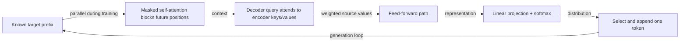

#### Python

```python
from html import escape
from pathlib import Path
from textwrap import wrap

title = "attn_mechanism_p3: Masked decoding, cross-attention, projection, and autoregressive repetition — Control or recurrence loop"
nodes = [["prefix","Known target prefix",100,150],["mask","Masked self-attention blocks future positions",250,150],["cross","Decoder query attends to encoder keys/values",400,150],["ffn","Feed-forward path",550,150],["proj","Linear projection + softmax",700,150],["token","Select and append one token",850,150]]
edges = [["prefix","mask","parallel during training"],["mask","cross","context"],["cross","ffn","weighted source values"],["ffn","proj","representation"],["proj","token","distribution"],["token","prefix","generation loop"]]
node_by_id = {node_id: (label, x, y) for node_id, label, x, y in nodes}
width = max(900, max((x for _, _, x, _ in nodes), default=800) + 180)
height = max(500, max((y for _, _, _, y in nodes), default=400) + 140)
parts = [
    f'<svg xmlns="http://www.w3.org/2000/svg" viewBox="0 0 {width} {height}" role="img" aria-labelledby="title desc">',
    f'<title id="title">{escape(title)}</title>',
    '<desc id="desc">Edges and convergence points encode only relationships stated in the scoped paragraphs.</desc>',
    f'<rect width="{width}" height="{height}" fill="white"/>',
]
for source, target, relation in edges:
    _, x1, y1 = node_by_id[source]
    _, x2, y2 = node_by_id[target]
    parts.append(f'<line x1="{x1}" y1="{y1}" x2="{x2}" y2="{y2}" stroke="#345" stroke-width="2"/>')
    parts.append(f'<text x="{(x1+x2)/2}" y="{(y1+y2)/2-5}" text-anchor="middle" font-family="sans-serif" font-size="10">{escape(relation)}</text>')
for _, label, x, y in nodes:
    parts.append(f'<rect x="{x-78}" y="{y-42}" width="156" height="84" rx="12" fill="#eef6ff" stroke="#234"/>')
    for line_index, line in enumerate(wrap(label, width=22)):
        parts.append(f'<text x="{x}" y="{y-24+line_index*13}" text-anchor="middle" font-family="sans-serif" font-size="10">{escape(line)}</text>')
parts.append('</svg>')
Path("attn_mechanism_p3_treatment_a.svg").write_text("\n".join(parts), encoding="utf-8")
```

### Treatment B — Masked decoding, cross-attention, projection, and autoregressive repetition — Loop-state ledger

- Teaching purpose: List each state variable, operation, and transition condition.
- Encoding and reading order: Render 4 rows with explicit `Group`, `Measure or state`, `Visible value`, and `Condition or boundary` columns. The value column must be visible, not only present in ARIA text or fallback prose.
- Evidence and limitations: Encode only `attn_003`, `attn_004`, `attn_005` from `source_attention_arxiv_v7`. Separate parallel masked training from one-token-at-a-time generation and show projection plus softmax.
- Recommended web medium: semantic HTML/CSS table with SVG export; JavaScript is optional only for meaningful focus, drill-down, or state playback.
- Mobile, accessibility, and motion behavior: Preserve the same group and node order in the DOM; retain all values and relation labels as selectable text; stack panels or levels below 640px; provide keyboard access for any optional focus state; keep a complete static fallback; respect reduced motion and never encode information only through animation.

#### TikZ

```tex
\documentclass[tikz,border=5pt]{standalone}
\usepackage[T1]{fontenc}
\usepackage{array}
\usepackage{tikz}
\begin{document}
\begin{tikzpicture}[font=\sffamily]
\node[align=center] {\textbf{attn\_mechanism\_p3: Masked decoding, cross-attention, projection, and autoregressive repetition - Loop-state ledger}\\[6pt]
\begin{tabular}{p{3.2cm}p{4.0cm}p{2.8cm}p{6.2cm}}
\textbf{Group} & \textbf{Measure or state} & \textbf{Visible value} & \textbf{Condition or boundary} \\ \hline
The encoder and decoder do different attention work & Source lane: encode known input & qualitative & The base encoder repeats 6 layers of multi-head self-attention and position-wise feed-forward processing over the source representations. \\
The encoder and decoder do different attention work & Target lane: hide the future & qualitative & The 6-layer decoder applies masked self-attention to the known target prefix so a target position cannot use later target positions. \\
The encoder and decoder do different attention work & Cross-lane retrieval & qualitative & Encoder-decoder attention uses decoder queries with keys and values from the encoded source, connecting each decoder position to source information. \\
The encoder and decoder do different attention work & Generation boundary & qualitative & Training can process known positions more parallelly under the mask, but generation remains autoregressive: one selected target token becomes part of the prefix before the next prediction. \\
\end{tabular}};
\end{tikzpicture}
\end{document}
```

#### Mermaid

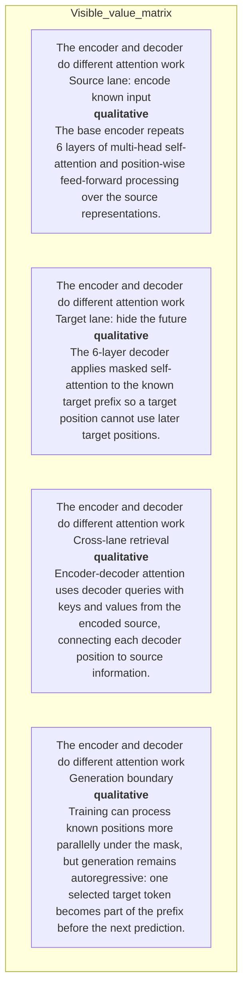

#### Python

```python
from html import escape
from pathlib import Path
from textwrap import wrap

title = "attn_mechanism_p3: Masked decoding, cross-attention, projection, and autoregressive repetition — Loop-state ledger"
rows = [["The encoder and decoder do different attention work","Source lane: encode known input","qualitative","The base encoder repeats 6 layers of multi-head self-attention and position-wise feed-forward processing over the source representations."],["The encoder and decoder do different attention work","Target lane: hide the future","qualitative","The 6-layer decoder applies masked self-attention to the known target prefix so a target position cannot use later target positions."],["The encoder and decoder do different attention work","Cross-lane retrieval","qualitative","Encoder-decoder attention uses decoder queries with keys and values from the encoded source, connecting each decoder position to source information."],["The encoder and decoder do different attention work","Generation boundary","qualitative","Training can process known positions more parallelly under the mask, but generation remains autoregressive: one selected target token becomes part of the prefix before the next prediction."]]
height = 502
parts = [
    f'<svg xmlns="http://www.w3.org/2000/svg" viewBox="0 0 1200 {height}" role="img" aria-labelledby="title desc">',
    f'<title id="title">{escape(title)}</title>',
    '<desc id="desc">Every reported value is visible beside its condition and group.</desc>',
    f'<rect width="1200" height="{height}" fill="white"/>',
]
headers = ["Group", "Measure or state", "Visible value", "Condition or boundary"]
xs = [30, 260, 590, 770]
for x, header in zip(xs, headers):
    parts.append(f'<text x="{x}" y="70" font-family="sans-serif" font-size="16" font-weight="700">{escape(header)}</text>')
for row_index, row in enumerate(rows):
    y = 110 + row_index * 88
    parts.append(f'<rect x="20" y="{y-28}" width="1160" height="76" fill="#f7fbff" stroke="#ccd"/>')
    for x, cell, width in zip(xs, row, [26, 38, 20, 58]):
        for line_index, line in enumerate(wrap(str(cell), width=width)):
            parts.append(f'<text x="{x}" y="{y+line_index*14}" font-family="sans-serif" font-size="11">{escape(line)}</text>')
parts.append('</svg>')
Path("attn_mechanism_p3_treatment_b.svg").write_text("\n".join(parts), encoding="utf-8")
```

### Treatment C — Masked decoding, cross-attention, projection, and autoregressive repetition — One-iteration storyboard

- Teaching purpose: Unroll exactly one iteration while retaining the return boundary.
- Encoding and reading order: Use 6 named nodes and 6 explicit labeled relations. Preserve all branch, merge, hierarchy, loop, or sequence edges shown in the code; changing them is an evidence deviation.
- Evidence and limitations: Encode only `attn_003`, `attn_004`, `attn_005` from `source_attention_arxiv_v7`. Separate parallel masked training from one-token-at-a-time generation and show projection plus softmax.
- Recommended web medium: responsive inline SVG with semantic HTML/CSS fallback; JavaScript is optional only for meaningful focus, drill-down, or state playback.
- Mobile, accessibility, and motion behavior: Preserve the same group and node order in the DOM; retain all values and relation labels as selectable text; stack panels or levels below 640px; provide keyboard access for any optional focus state; keep a complete static fallback; respect reduced motion and never encode information only through animation.

#### TikZ

```tex
\documentclass[tikz,border=5pt]{standalone}
\usepackage[T1]{fontenc}
\usepackage{tikz}
\usetikzlibrary{arrows.meta}
\begin{document}
\begin{tikzpicture}[font=\sffamily,box/.style={draw,rounded corners,align=center,text width=3cm,minimum height=1.2cm},link/.style={-{Latex[length=2mm]},thick},rel/.style={fill=white,font=\scriptsize}]
\node[font=\bfseries,anchor=west] at (0,0.8) {attn\_mechanism\_p3: Masked decoding, cross-attention, projection, and autoregressive repetition - One-iteration storyboard};
\node[box] (prefix) at (1.00,-1.50) {Known target prefix};
\node[box] (mask) at (2.50,-1.50) {Masked self-attention blocks future positions};
\node[box] (cross) at (4.00,-1.50) {Decoder query attends to encoder keys/values};
\node[box] (ffn) at (5.50,-1.50) {Feed-forward path};
\node[box] (proj) at (7.00,-1.50) {Linear projection + softmax};
\node[box] (token) at (8.50,-1.50) {Select and append one token};
\draw[link] (prefix) -- node[rel] {parallel during training} (mask);
\draw[link] (mask) -- node[rel] {context} (cross);
\draw[link] (cross) -- node[rel] {weighted source values} (ffn);
\draw[link] (ffn) -- node[rel] {representation} (proj);
\draw[link] (proj) -- node[rel] {distribution} (token);
\draw[link] (token) -- node[rel] {generation loop} (prefix);
\end{tikzpicture}
\end{document}
```

#### Mermaid

```mermaid
flowchart LR
  prefix["Known target prefix"]
  mask["Masked self-attention blocks future positions"]
  cross["Decoder query attends to encoder keys/values"]
  ffn["Feed-forward path"]
  proj["Linear projection + softmax"]
  token["Select and append one token"]
  prefix -->|"parallel during training"| mask
  mask -->|"context"| cross
  cross -->|"weighted source values"| ffn
  ffn -->|"representation"| proj
  proj -->|"distribution"| token
  token -->|"generation loop"| prefix
```

#### Python

```python
from html import escape
from pathlib import Path
from textwrap import wrap

title = "attn_mechanism_p3: Masked decoding, cross-attention, projection, and autoregressive repetition — One-iteration storyboard"
nodes = [["prefix","Known target prefix",100,150],["mask","Masked self-attention blocks future positions",250,150],["cross","Decoder query attends to encoder keys/values",400,150],["ffn","Feed-forward path",550,150],["proj","Linear projection + softmax",700,150],["token","Select and append one token",850,150]]
edges = [["prefix","mask","parallel during training"],["mask","cross","context"],["cross","ffn","weighted source values"],["ffn","proj","representation"],["proj","token","distribution"],["token","prefix","generation loop"]]
node_by_id = {node_id: (label, x, y) for node_id, label, x, y in nodes}
width = max(900, max((x for _, _, x, _ in nodes), default=800) + 180)
height = max(500, max((y for _, _, _, y in nodes), default=400) + 140)
parts = [
    f'<svg xmlns="http://www.w3.org/2000/svg" viewBox="0 0 {width} {height}" role="img" aria-labelledby="title desc">',
    f'<title id="title">{escape(title)}</title>',
    '<desc id="desc">Edges and convergence points encode only relationships stated in the scoped paragraphs.</desc>',
    f'<rect width="{width}" height="{height}" fill="white"/>',
]
for source, target, relation in edges:
    _, x1, y1 = node_by_id[source]
    _, x2, y2 = node_by_id[target]
    parts.append(f'<line x1="{x1}" y1="{y1}" x2="{x2}" y2="{y2}" stroke="#345" stroke-width="2"/>')
    parts.append(f'<text x="{(x1+x2)/2}" y="{(y1+y2)/2-5}" text-anchor="middle" font-family="sans-serif" font-size="10">{escape(relation)}</text>')
for _, label, x, y in nodes:
    parts.append(f'<rect x="{x-78}" y="{y-42}" width="156" height="84" rx="12" fill="#eef6ff" stroke="#234"/>')
    for line_index, line in enumerate(wrap(label, width=22)):
        parts.append(f'<text x="{x}" y="{y-24+line_index*13}" text-anchor="middle" font-family="sans-serif" font-size="10">{escape(line)}</text>')
parts.append('</svg>')
Path("attn_mechanism_p3_treatment_c.svg").write_text("\n".join(parts), encoding="utf-8")
```

### Implementation record

- Status: `IMPLEMENTED`
- Selected treatment: `A`
- Selection rationale: Selected the approved “Masked decoding, cross-attention, projection, and autoregressive repetition — Control or recurrence loop” treatment because the implemented control loop directly encodes this paragraph's explanatory job and its stated evidence boundaries.
- Delivery medium: `CSS + semantic HTML`
- Visual ID and placement: `visual_attention_generation_loop` after `attn_mechanism_p3`; this record is served by that purpose-built figure.
- Shared paragraph scope: NONE
- Changed files: `packages/test-fixtures/explainers/attention-is-all-you-need.json`, `packages/content-schema/schema/explainer-document.schema.json`, `packages/content-schema/src/validate.ts`, generated TypeScript/Python models, `apps/web/app/papers/[id]/explainer-visual.tsx`, and `apps/web/app/globals.css`.
- Accessibility and fallback verification: Figure has a programmatic title and description, visible selectable labels and values, explicit alt text, equivalent fallback prose, source links, limitations, and a semantic static body; no meaning depends on color, motion, or pointer input.
- Desktop and mobile verification: Verified by the full eight-paper Playwright traversal at a 1440-pixel desktop viewport and the iPhone 13 mobile viewport; every figure stayed paragraph-adjacent, preserved DOM reading order, and introduced no horizontal page overflow.
- Evidence deviations: Delivery translation: selected Treatment A is rendered as typed semantic HTML/CSS rather than its literal TikZ, Mermaid, or Python-generated asset; the approved paragraph scope, placement, labels, values, grouping, and evidence boundaries are retained.

## `attn_example_p1`

- Location: `attn_example`, paragraph 1
- Text anchor: "Take a decoder position whose preceding target tokens are known."
- Claims and sources: `attn_003` (OBSERVED, VERIFIED); `attn_004` (OBSERVED, VERIFIED); `attn_012` (NOT_ESTABLISHED, UNRESOLVED); `source_attention_arxiv_v7` (Pages 1-10; Sections 1-7; Figures 1-2; Equation 1; Tables 1-4; version and figure-permission notice)
- Visual needed: `YES`
- Decision rationale: A visual passes the removal test because readers must reconstruct one decoder position through mask, scaling, cross-attention, and next-token choice while preserving the paragraph's conditions and boundaries. Revision 3 narrows the topology and placement so no visual can claim this paragraph without encoding its mechanism, grouping, or values.
- Explanatory job: One decoder position through mask, scaling, cross-attention, and next-token choice.
- Recommended scope and placement: Shared scope `attn_example_p1`, `attn_example_p2` is allowed only when one visual encodes every listed mechanism, condition, and value; place it immediately after the final paragraph, `attn_example_p2`. Otherwise split the visual by paragraph.
- QA-informed planning change: A shared visual may cover both paragraphs only after the second paragraph and only if it includes the future mask, square-root scaling, source-value mix, feed-forward path, projection, softmax, and generation boundary.

### Treatment A — One decoder position through mask, scaling, cross-attention, and next-token choice — Worked sequence

- Teaching purpose: Follow the actual example in source order.
- Encoding and reading order: Use 7 named nodes and 6 explicit labeled relations. Preserve all branch, merge, hierarchy, loop, or sequence edges shown in the code; changing them is an evidence deviation.
- Evidence and limitations: Encode only `attn_003`, `attn_004`, `attn_012` from `source_attention_arxiv_v7`. A shared visual may cover both paragraphs only after the second paragraph and only if it includes the future mask, square-root scaling, source-value mix, feed-forward path, projection, softmax, and generation boundary.
- Recommended web medium: responsive inline SVG with semantic HTML/CSS fallback; JavaScript is optional only for meaningful focus, drill-down, or state playback.
- Mobile, accessibility, and motion behavior: Preserve the same group and node order in the DOM; retain all values and relation labels as selectable text; stack panels or levels below 640px; provide keyboard access for any optional focus state; keep a complete static fallback; respect reduced motion and never encode information only through animation.

#### TikZ

```tex
\documentclass[tikz,border=5pt]{standalone}
\usepackage[T1]{fontenc}
\usepackage{tikz}
\usetikzlibrary{arrows.meta}
\begin{document}
\begin{tikzpicture}[font=\sffamily,box/.style={draw,rounded corners,align=center,text width=3cm,minimum height=1.2cm},link/.style={-{Latex[length=2mm]},thick},rel/.style={fill=white,font=\scriptsize}]
\node[font=\bfseries,anchor=west] at (0,0.8) {attn\_example\_p1: One decoder position through mask, scaling, cross-attention, and next-token choice - Worked sequence};
\node[box] (n1) at (1.00,-1.50) {Take a decoder position whose preceding target tokens are known};
\node[box] (n2) at (2.50,-1.50) {Its query is compared with keys from the known target prefix};
\node[box] (n3) at (4.00,-1.50) {Future positions are masked before softmax};
\node[box] (n4) at (5.50,-1.50) {so they receive no attention weight};
\node[box] (n5) at (7.00,-1.50) {Dividing the query-key scores by the square root of the key dimension keeps large dot products from pushing softmax into regions with very small gradients};
\node[box] (n6) at (8.50,-1.50) {After masked self-attention, the decoder position forms another query and compares it with keys from every encoded source position};
\node[box] (n7) at (10.00,-1.50) {The weighted source values provide input context};
\draw[link] (n1) -- node[rel] {then} (n2);
\draw[link] (n2) -- node[rel] {then} (n3);
\draw[link] (n3) -- node[rel] {then} (n4);
\draw[link] (n4) -- node[rel] {then} (n5);
\draw[link] (n5) -- node[rel] {then} (n6);
\draw[link] (n6) -- node[rel] {then} (n7);
\end{tikzpicture}
\end{document}
```

#### Mermaid

```mermaid
flowchart LR
  n1["Take a decoder position whose preceding target tokens are known"]
  n2["Its query is compared with keys from the known target prefix"]
  n3["Future positions are masked before softmax"]
  n4["so they receive no attention weight"]
  n5["Dividing the query-key scores by the square root of the key dimension keeps large dot products from pushing softmax into regions with very small gradients"]
  n6["After masked self-attention, the decoder position forms another query and compares it with keys from every encoded source position"]
  n7["The weighted source values provide input context"]
  n1 -->|"then"| n2
  n2 -->|"then"| n3
  n3 -->|"then"| n4
  n4 -->|"then"| n5
  n5 -->|"then"| n6
  n6 -->|"then"| n7
```

#### Python

```python
from html import escape
from pathlib import Path
from textwrap import wrap

title = "attn_example_p1: One decoder position through mask, scaling, cross-attention, and next-token choice — Worked sequence"
nodes = [["n1","Take a decoder position whose preceding target tokens are known",100,150],["n2","Its query is compared with keys from the known target prefix",250,150],["n3","Future positions are masked before softmax",400,150],["n4","so they receive no attention weight",550,150],["n5","Dividing the query-key scores by the square root of the key dimension keeps large dot products from pushing softmax into regions with very small gradients",700,150],["n6","After masked self-attention, the decoder position forms another query and compares it with keys from every encoded source position",850,150],["n7","The weighted source values provide input context",1000,150]]
edges = [["n1","n2","then"],["n2","n3","then"],["n3","n4","then"],["n4","n5","then"],["n5","n6","then"],["n6","n7","then"]]
node_by_id = {node_id: (label, x, y) for node_id, label, x, y in nodes}
width = max(900, max((x for _, _, x, _ in nodes), default=800) + 180)
height = max(500, max((y for _, _, _, y in nodes), default=400) + 140)
parts = [
    f'<svg xmlns="http://www.w3.org/2000/svg" viewBox="0 0 {width} {height}" role="img" aria-labelledby="title desc">',
    f'<title id="title">{escape(title)}</title>',
    '<desc id="desc">Edges and convergence points encode only relationships stated in the scoped paragraphs.</desc>',
    f'<rect width="{width}" height="{height}" fill="white"/>',
]
for source, target, relation in edges:
    _, x1, y1 = node_by_id[source]
    _, x2, y2 = node_by_id[target]
    parts.append(f'<line x1="{x1}" y1="{y1}" x2="{x2}" y2="{y2}" stroke="#345" stroke-width="2"/>')
    parts.append(f'<text x="{(x1+x2)/2}" y="{(y1+y2)/2-5}" text-anchor="middle" font-family="sans-serif" font-size="10">{escape(relation)}</text>')
for _, label, x, y in nodes:
    parts.append(f'<rect x="{x-78}" y="{y-42}" width="156" height="84" rx="12" fill="#eef6ff" stroke="#234"/>')
    for line_index, line in enumerate(wrap(label, width=22)):
        parts.append(f'<text x="{x}" y="{y-24+line_index*13}" text-anchor="middle" font-family="sans-serif" font-size="10">{escape(line)}</text>')
parts.append('</svg>')
Path("attn_example_p1_treatment_a.svg").write_text("\n".join(parts), encoding="utf-8")
```

### Treatment B — One decoder position through mask, scaling, cross-attention, and next-token choice — Example calculation or state ledger

- Teaching purpose: Keep values, states, and boundaries grouped by example.
- Encoding and reading order: Render 4 rows with explicit `Group`, `Measure or state`, `Visible value`, and `Condition or boundary` columns. The value column must be visible, not only present in ARIA text or fallback prose.
- Evidence and limitations: Encode only `attn_003`, `attn_004`, `attn_012` from `source_attention_arxiv_v7`. A shared visual may cover both paragraphs only after the second paragraph and only if it includes the future mask, square-root scaling, source-value mix, feed-forward path, projection, softmax, and generation boundary.
- Recommended web medium: semantic HTML/CSS table with SVG export; JavaScript is optional only for meaningful focus, drill-down, or state playback.
- Mobile, accessibility, and motion behavior: Preserve the same group and node order in the DOM; retain all values and relation labels as selectable text; stack panels or levels below 640px; provide keyboard access for any optional focus state; keep a complete static fallback; respect reduced motion and never encode information only through animation.

#### TikZ

```tex
\documentclass[tikz,border=5pt]{standalone}
\usepackage[T1]{fontenc}
\usepackage{array}
\usepackage{tikz}
\begin{document}
\begin{tikzpicture}[font=\sffamily]
\node[align=center] {\textbf{attn\_example\_p1: One decoder position through mask, scaling, cross-attention, and next-token choice - Example calculation or state ledger}\\[6pt]
\begin{tabular}{p{3.2cm}p{4.0cm}p{2.8cm}p{6.2cm}}
\textbf{Group} & \textbf{Measure or state} & \textbf{Visible value} & \textbf{Condition or boundary} \\ \hline
The encoder and decoder do different attention work & Source lane: encode known input & qualitative & The base encoder repeats 6 layers of multi-head self-attention and position-wise feed-forward processing over the source representations. \\
The encoder and decoder do different attention work & Target lane: hide the future & qualitative & The 6-layer decoder applies masked self-attention to the known target prefix so a target position cannot use later target positions. \\
The encoder and decoder do different attention work & Cross-lane retrieval & qualitative & Encoder-decoder attention uses decoder queries with keys and values from the encoded source, connecting each decoder position to source information. \\
The encoder and decoder do different attention work & Generation boundary & qualitative & Training can process known positions more parallelly under the mask, but generation remains autoregressive: one selected target token becomes part of the prefix before the next prediction. \\
\end{tabular}};
\end{tikzpicture}
\end{document}
```

#### Mermaid

```mermaid
flowchart TB
  subgraph Visible_value_matrix
    r1["The encoder and decoder do different attention work<br/>Source lane: encode known input<br/><b>qualitative</b><br/>The base encoder repeats 6 layers of multi-head self-attention and position-wise feed-forward processing over the source representations."]
    r2["The encoder and decoder do different attention work<br/>Target lane: hide the future<br/><b>qualitative</b><br/>The 6-layer decoder applies masked self-attention to the known target prefix so a target position cannot use later target positions."]
    r3["The encoder and decoder do different attention work<br/>Cross-lane retrieval<br/><b>qualitative</b><br/>Encoder-decoder attention uses decoder queries with keys and values from the encoded source, connecting each decoder position to source information."]
    r4["The encoder and decoder do different attention work<br/>Generation boundary<br/><b>qualitative</b><br/>Training can process known positions more parallelly under the mask, but generation remains autoregressive: one selected target token becomes part of the prefix before the next prediction."]
  end
```

#### Python

```python
from html import escape
from pathlib import Path
from textwrap import wrap

title = "attn_example_p1: One decoder position through mask, scaling, cross-attention, and next-token choice — Example calculation or state ledger"
rows = [["The encoder and decoder do different attention work","Source lane: encode known input","qualitative","The base encoder repeats 6 layers of multi-head self-attention and position-wise feed-forward processing over the source representations."],["The encoder and decoder do different attention work","Target lane: hide the future","qualitative","The 6-layer decoder applies masked self-attention to the known target prefix so a target position cannot use later target positions."],["The encoder and decoder do different attention work","Cross-lane retrieval","qualitative","Encoder-decoder attention uses decoder queries with keys and values from the encoded source, connecting each decoder position to source information."],["The encoder and decoder do different attention work","Generation boundary","qualitative","Training can process known positions more parallelly under the mask, but generation remains autoregressive: one selected target token becomes part of the prefix before the next prediction."]]
height = 502
parts = [
    f'<svg xmlns="http://www.w3.org/2000/svg" viewBox="0 0 1200 {height}" role="img" aria-labelledby="title desc">',
    f'<title id="title">{escape(title)}</title>',
    '<desc id="desc">Every reported value is visible beside its condition and group.</desc>',
    f'<rect width="1200" height="{height}" fill="white"/>',
]
headers = ["Group", "Measure or state", "Visible value", "Condition or boundary"]
xs = [30, 260, 590, 770]
for x, header in zip(xs, headers):
    parts.append(f'<text x="{x}" y="70" font-family="sans-serif" font-size="16" font-weight="700">{escape(header)}</text>')
for row_index, row in enumerate(rows):
    y = 110 + row_index * 88
    parts.append(f'<rect x="20" y="{y-28}" width="1160" height="76" fill="#f7fbff" stroke="#ccd"/>')
    for x, cell, width in zip(xs, row, [26, 38, 20, 58]):
        for line_index, line in enumerate(wrap(str(cell), width=width)):
            parts.append(f'<text x="{x}" y="{y+line_index*14}" font-family="sans-serif" font-size="11">{escape(line)}</text>')
parts.append('</svg>')
Path("attn_example_p1_treatment_b.svg").write_text("\n".join(parts), encoding="utf-8")
```

### Treatment C — One decoder position through mask, scaling, cross-attention, and next-token choice — Bounded example panels

- Teaching purpose: Separate multiple examples and aggregate results instead of flattening them.
- Encoding and reading order: Group the 4 source-backed records into named panels using the first column as the grouping key. Panels preserve experimental, source, or example boundaries and never imply one shared scale.
- Evidence and limitations: Encode only `attn_003`, `attn_004`, `attn_012` from `source_attention_arxiv_v7`. A shared visual may cover both paragraphs only after the second paragraph and only if it includes the future mask, square-root scaling, source-value mix, feed-forward path, projection, softmax, and generation boundary.
- Recommended web medium: semantic HTML/CSS grouped panels or responsive SVG; JavaScript is optional only for meaningful focus, drill-down, or state playback.
- Mobile, accessibility, and motion behavior: Preserve the same group and node order in the DOM; retain all values and relation labels as selectable text; stack panels or levels below 640px; provide keyboard access for any optional focus state; keep a complete static fallback; respect reduced motion and never encode information only through animation.

#### TikZ

```tex
\documentclass[tikz,border=5pt]{standalone}
\usepackage[T1]{fontenc}
\usepackage{tikz}
\begin{document}
\begin{tikzpicture}[font=\sffamily,panel/.style={draw,rounded corners,align=center,text width=4.8cm,minimum height=4cm}]
\node[font=\bfseries] at (0,3) {attn\_example\_p1: One decoder position through mask, scaling, cross-attention, and next-token choice - Bounded example panels};
\node[panel] at (0,0) {\textbf{The encoder and decoder do different attention work}\\[4pt]\textbf{Source lane: encode known input}: qualitative -- The base encoder repeats 6 layers of multi-head self-attention and position-wise feed-forward processing over the source representations.\\\textbf{Target lane: hide the future}: qualitative -- The 6-layer decoder applies masked self-attention to the known target prefix so a target position cannot use later target positions.\\\textbf{Cross-lane retrieval}: qualitative -- Encoder-decoder attention uses decoder queries with keys and values from the encoded source, connecting each decoder position to source information.\\\textbf{Generation boundary}: qualitative -- Training can process known positions more parallelly under the mask, but generation remains autoregressive: one selected target token becomes part of the prefix before the next prediction.};
\end{tikzpicture}
\end{document}
```

#### Mermaid

```mermaid
flowchart LR
  subgraph p1["The encoder and decoder do different attention work"]
    p1r1["Source lane: encode known input: qualitative<br/>The base encoder repeats 6 layers of multi-head self-attention and position-wise feed-forward processing over the source representations."]
    p1r2["Target lane: hide the future: qualitative<br/>The 6-layer decoder applies masked self-attention to the known target prefix so a target position cannot use later target positions."]
    p1r3["Cross-lane retrieval: qualitative<br/>Encoder-decoder attention uses decoder queries with keys and values from the encoded source, connecting each decoder position to source information."]
    p1r4["Generation boundary: qualitative<br/>Training can process known positions more parallelly under the mask, but generation remains autoregressive: one selected target token becomes part of the prefix before the next prediction."]
  end
```

#### Python

```python
from html import escape
from pathlib import Path
from textwrap import wrap

title = "attn_example_p1: One decoder position through mask, scaling, cross-attention, and next-token choice — Bounded example panels"
rows = [["The encoder and decoder do different attention work","Source lane: encode known input","qualitative","The base encoder repeats 6 layers of multi-head self-attention and position-wise feed-forward processing over the source representations."],["The encoder and decoder do different attention work","Target lane: hide the future","qualitative","The 6-layer decoder applies masked self-attention to the known target prefix so a target position cannot use later target positions."],["The encoder and decoder do different attention work","Cross-lane retrieval","qualitative","Encoder-decoder attention uses decoder queries with keys and values from the encoded source, connecting each decoder position to source information."],["The encoder and decoder do different attention work","Generation boundary","qualitative","Training can process known positions more parallelly under the mask, but generation remains autoregressive: one selected target token becomes part of the prefix before the next prediction."]]
groups = {}
for group, label, value, condition in rows:
    groups.setdefault(group, []).append((label, value, condition))
width = max(900, len(groups) * 360)
height = 220 + max((len(items) for items in groups.values()), default=1) * 92
parts = [
    f'<svg xmlns="http://www.w3.org/2000/svg" viewBox="0 0 {width} {height}" role="img" aria-labelledby="title desc">',
    f'<title id="title">{escape(title)}</title>',
    '<desc id="desc">Separate panels preserve grouping and prevent unrelated conditions from reading as one sequence.</desc>',
    f'<rect width="{width}" height="{height}" fill="white"/>',
]
for group_index, (group, items) in enumerate(groups.items()):
    x = 180 + group_index * 360
    parts.append(f'<text x="{x}" y="65" text-anchor="middle" font-family="sans-serif" font-size="16" font-weight="700">{escape(group)}</text>')
    for item_index, (label, value, condition) in enumerate(items):
        y = 120 + item_index * 92
        parts.append(f'<rect x="{x-160}" y="{y-30}" width="320" height="78" rx="12" fill="#f7fbff" stroke="#ccd"/>')
        text = f"{label}: {value} — {condition}"
        for line_index, line in enumerate(wrap(text, width=46)):
            parts.append(f'<text x="{x}" y="{y-6+line_index*14}" text-anchor="middle" font-family="sans-serif" font-size="11">{escape(line)}</text>')
parts.append('</svg>')
Path("attn_example_p1_treatment_c.svg").write_text("\n".join(parts), encoding="utf-8")
```

### Implementation record

- Status: `IMPLEMENTED`
- Selected treatment: `A`
- Selection rationale: Selected the approved “One decoder position through mask, scaling, cross-attention, and next-token choice — Worked sequence” treatment because the implemented operation diagram directly encodes this paragraph's explanatory job and its stated evidence boundaries.
- Delivery medium: `CSS + semantic HTML`
- Visual ID and placement: `visual_attention_worked_decoder` after `attn_example_p2`; this record is served by that purpose-built figure.
- Shared paragraph scope: `attn_example_p1`, `attn_example_p2`
- Changed files: `packages/test-fixtures/explainers/attention-is-all-you-need.json`, `packages/content-schema/schema/explainer-document.schema.json`, `packages/content-schema/src/validate.ts`, generated TypeScript/Python models, `apps/web/app/papers/[id]/explainer-visual.tsx`, and `apps/web/app/globals.css`.
- Accessibility and fallback verification: Figure has a programmatic title and description, visible selectable labels and values, explicit alt text, equivalent fallback prose, source links, limitations, and a semantic static body; no meaning depends on color, motion, or pointer input.
- Desktop and mobile verification: Verified by the full eight-paper Playwright traversal at a 1440-pixel desktop viewport and the iPhone 13 mobile viewport; every figure stayed paragraph-adjacent, preserved DOM reading order, and introduced no horizontal page overflow.
- Evidence deviations: Delivery translation: selected Treatment A is rendered as typed semantic HTML/CSS rather than its literal TikZ, Mermaid, or Python-generated asset; the approved paragraph scope, placement, labels, values, grouping, and evidence boundaries are retained.

## `attn_example_p2`

- Location: `attn_example`, paragraph 2
- Text anchor: "After masked self-attention, the decoder position forms another query and compares it with keys from every encoded source position."
- Claims and sources: `attn_003` (OBSERVED, VERIFIED); `attn_004` (OBSERVED, VERIFIED); `attn_012` (NOT_ESTABLISHED, UNRESOLVED); `source_attention_arxiv_v7` (Pages 1-10; Sections 1-7; Figures 1-2; Equation 1; Tables 1-4; version and figure-permission notice)
- Visual needed: `YES`
- Decision rationale: A visual passes the removal test because readers must reconstruct one decoder position through mask, scaling, cross-attention, and next-token choice while preserving the paragraph's conditions and boundaries. Revision 3 narrows the topology and placement so no visual can claim this paragraph without encoding its mechanism, grouping, or values.
- Explanatory job: One decoder position through mask, scaling, cross-attention, and next-token choice.
- Recommended scope and placement: Shared scope `attn_example_p1`, `attn_example_p2` is allowed only when one visual encodes every listed mechanism, condition, and value; place it immediately after the final paragraph, `attn_example_p2`. Otherwise split the visual by paragraph.
- QA-informed planning change: A shared visual may cover both paragraphs only after the second paragraph and only if it includes the future mask, square-root scaling, source-value mix, feed-forward path, projection, softmax, and generation boundary.

### Treatment A — One decoder position through mask, scaling, cross-attention, and next-token choice — Worked sequence

- Teaching purpose: Follow the actual example in source order.
- Encoding and reading order: Use 7 named nodes and 6 explicit labeled relations. Preserve all branch, merge, hierarchy, loop, or sequence edges shown in the code; changing them is an evidence deviation.
- Evidence and limitations: Encode only `attn_003`, `attn_004`, `attn_012` from `source_attention_arxiv_v7`. A shared visual may cover both paragraphs only after the second paragraph and only if it includes the future mask, square-root scaling, source-value mix, feed-forward path, projection, softmax, and generation boundary.
- Recommended web medium: responsive inline SVG with semantic HTML/CSS fallback; JavaScript is optional only for meaningful focus, drill-down, or state playback.
- Mobile, accessibility, and motion behavior: Preserve the same group and node order in the DOM; retain all values and relation labels as selectable text; stack panels or levels below 640px; provide keyboard access for any optional focus state; keep a complete static fallback; respect reduced motion and never encode information only through animation.

#### TikZ

```tex
\documentclass[tikz,border=5pt]{standalone}
\usepackage[T1]{fontenc}
\usepackage{tikz}
\usetikzlibrary{arrows.meta}
\begin{document}
\begin{tikzpicture}[font=\sffamily,box/.style={draw,rounded corners,align=center,text width=3cm,minimum height=1.2cm},link/.style={-{Latex[length=2mm]},thick},rel/.style={fill=white,font=\scriptsize}]
\node[font=\bfseries,anchor=west] at (0,0.8) {attn\_example\_p2: One decoder position through mask, scaling, cross-attention, and next-token choice - Worked sequence};
\node[box] (n1) at (1.00,-1.50) {Take a decoder position whose preceding target tokens are known};
\node[box] (n2) at (2.50,-1.50) {Its query is compared with keys from the known target prefix};
\node[box] (n3) at (4.00,-1.50) {Future positions are masked before softmax};
\node[box] (n4) at (5.50,-1.50) {so they receive no attention weight};
\node[box] (n5) at (7.00,-1.50) {Dividing the query-key scores by the square root of the key dimension keeps large dot products from pushing softmax into regions with very small gradients};
\node[box] (n6) at (8.50,-1.50) {After masked self-attention, the decoder position forms another query and compares it with keys from every encoded source position};
\node[box] (n7) at (10.00,-1.50) {The weighted source values provide input context};
\draw[link] (n1) -- node[rel] {then} (n2);
\draw[link] (n2) -- node[rel] {then} (n3);
\draw[link] (n3) -- node[rel] {then} (n4);
\draw[link] (n4) -- node[rel] {then} (n5);
\draw[link] (n5) -- node[rel] {then} (n6);
\draw[link] (n6) -- node[rel] {then} (n7);
\end{tikzpicture}
\end{document}
```

#### Mermaid

```mermaid
flowchart LR
  n1["Take a decoder position whose preceding target tokens are known"]
  n2["Its query is compared with keys from the known target prefix"]
  n3["Future positions are masked before softmax"]
  n4["so they receive no attention weight"]
  n5["Dividing the query-key scores by the square root of the key dimension keeps large dot products from pushing softmax into regions with very small gradients"]
  n6["After masked self-attention, the decoder position forms another query and compares it with keys from every encoded source position"]
  n7["The weighted source values provide input context"]
  n1 -->|"then"| n2
  n2 -->|"then"| n3
  n3 -->|"then"| n4
  n4 -->|"then"| n5
  n5 -->|"then"| n6
  n6 -->|"then"| n7
```

#### Python

```python
from html import escape
from pathlib import Path
from textwrap import wrap

title = "attn_example_p2: One decoder position through mask, scaling, cross-attention, and next-token choice — Worked sequence"
nodes = [["n1","Take a decoder position whose preceding target tokens are known",100,150],["n2","Its query is compared with keys from the known target prefix",250,150],["n3","Future positions are masked before softmax",400,150],["n4","so they receive no attention weight",550,150],["n5","Dividing the query-key scores by the square root of the key dimension keeps large dot products from pushing softmax into regions with very small gradients",700,150],["n6","After masked self-attention, the decoder position forms another query and compares it with keys from every encoded source position",850,150],["n7","The weighted source values provide input context",1000,150]]
edges = [["n1","n2","then"],["n2","n3","then"],["n3","n4","then"],["n4","n5","then"],["n5","n6","then"],["n6","n7","then"]]
node_by_id = {node_id: (label, x, y) for node_id, label, x, y in nodes}
width = max(900, max((x for _, _, x, _ in nodes), default=800) + 180)
height = max(500, max((y for _, _, _, y in nodes), default=400) + 140)
parts = [
    f'<svg xmlns="http://www.w3.org/2000/svg" viewBox="0 0 {width} {height}" role="img" aria-labelledby="title desc">',
    f'<title id="title">{escape(title)}</title>',
    '<desc id="desc">Edges and convergence points encode only relationships stated in the scoped paragraphs.</desc>',
    f'<rect width="{width}" height="{height}" fill="white"/>',
]
for source, target, relation in edges:
    _, x1, y1 = node_by_id[source]
    _, x2, y2 = node_by_id[target]
    parts.append(f'<line x1="{x1}" y1="{y1}" x2="{x2}" y2="{y2}" stroke="#345" stroke-width="2"/>')
    parts.append(f'<text x="{(x1+x2)/2}" y="{(y1+y2)/2-5}" text-anchor="middle" font-family="sans-serif" font-size="10">{escape(relation)}</text>')
for _, label, x, y in nodes:
    parts.append(f'<rect x="{x-78}" y="{y-42}" width="156" height="84" rx="12" fill="#eef6ff" stroke="#234"/>')
    for line_index, line in enumerate(wrap(label, width=22)):
        parts.append(f'<text x="{x}" y="{y-24+line_index*13}" text-anchor="middle" font-family="sans-serif" font-size="10">{escape(line)}</text>')
parts.append('</svg>')
Path("attn_example_p2_treatment_a.svg").write_text("\n".join(parts), encoding="utf-8")
```

### Treatment B — One decoder position through mask, scaling, cross-attention, and next-token choice — Example calculation or state ledger

- Teaching purpose: Keep values, states, and boundaries grouped by example.
- Encoding and reading order: Render 4 rows with explicit `Group`, `Measure or state`, `Visible value`, and `Condition or boundary` columns. The value column must be visible, not only present in ARIA text or fallback prose.
- Evidence and limitations: Encode only `attn_003`, `attn_004`, `attn_012` from `source_attention_arxiv_v7`. A shared visual may cover both paragraphs only after the second paragraph and only if it includes the future mask, square-root scaling, source-value mix, feed-forward path, projection, softmax, and generation boundary.
- Recommended web medium: semantic HTML/CSS table with SVG export; JavaScript is optional only for meaningful focus, drill-down, or state playback.
- Mobile, accessibility, and motion behavior: Preserve the same group and node order in the DOM; retain all values and relation labels as selectable text; stack panels or levels below 640px; provide keyboard access for any optional focus state; keep a complete static fallback; respect reduced motion and never encode information only through animation.

#### TikZ

```tex
\documentclass[tikz,border=5pt]{standalone}
\usepackage[T1]{fontenc}
\usepackage{array}
\usepackage{tikz}
\begin{document}
\begin{tikzpicture}[font=\sffamily]
\node[align=center] {\textbf{attn\_example\_p2: One decoder position through mask, scaling, cross-attention, and next-token choice - Example calculation or state ledger}\\[6pt]
\begin{tabular}{p{3.2cm}p{4.0cm}p{2.8cm}p{6.2cm}}
\textbf{Group} & \textbf{Measure or state} & \textbf{Visible value} & \textbf{Condition or boundary} \\ \hline
The encoder and decoder do different attention work & Source lane: encode known input & qualitative & The base encoder repeats 6 layers of multi-head self-attention and position-wise feed-forward processing over the source representations. \\
The encoder and decoder do different attention work & Target lane: hide the future & qualitative & The 6-layer decoder applies masked self-attention to the known target prefix so a target position cannot use later target positions. \\
The encoder and decoder do different attention work & Cross-lane retrieval & qualitative & Encoder-decoder attention uses decoder queries with keys and values from the encoded source, connecting each decoder position to source information. \\
The encoder and decoder do different attention work & Generation boundary & qualitative & Training can process known positions more parallelly under the mask, but generation remains autoregressive: one selected target token becomes part of the prefix before the next prediction. \\
\end{tabular}};
\end{tikzpicture}
\end{document}
```

#### Mermaid

```mermaid
flowchart TB
  subgraph Visible_value_matrix
    r1["The encoder and decoder do different attention work<br/>Source lane: encode known input<br/><b>qualitative</b><br/>The base encoder repeats 6 layers of multi-head self-attention and position-wise feed-forward processing over the source representations."]
    r2["The encoder and decoder do different attention work<br/>Target lane: hide the future<br/><b>qualitative</b><br/>The 6-layer decoder applies masked self-attention to the known target prefix so a target position cannot use later target positions."]
    r3["The encoder and decoder do different attention work<br/>Cross-lane retrieval<br/><b>qualitative</b><br/>Encoder-decoder attention uses decoder queries with keys and values from the encoded source, connecting each decoder position to source information."]
    r4["The encoder and decoder do different attention work<br/>Generation boundary<br/><b>qualitative</b><br/>Training can process known positions more parallelly under the mask, but generation remains autoregressive: one selected target token becomes part of the prefix before the next prediction."]
  end
```

#### Python

```python
from html import escape
from pathlib import Path
from textwrap import wrap

title = "attn_example_p2: One decoder position through mask, scaling, cross-attention, and next-token choice — Example calculation or state ledger"
rows = [["The encoder and decoder do different attention work","Source lane: encode known input","qualitative","The base encoder repeats 6 layers of multi-head self-attention and position-wise feed-forward processing over the source representations."],["The encoder and decoder do different attention work","Target lane: hide the future","qualitative","The 6-layer decoder applies masked self-attention to the known target prefix so a target position cannot use later target positions."],["The encoder and decoder do different attention work","Cross-lane retrieval","qualitative","Encoder-decoder attention uses decoder queries with keys and values from the encoded source, connecting each decoder position to source information."],["The encoder and decoder do different attention work","Generation boundary","qualitative","Training can process known positions more parallelly under the mask, but generation remains autoregressive: one selected target token becomes part of the prefix before the next prediction."]]
height = 502
parts = [
    f'<svg xmlns="http://www.w3.org/2000/svg" viewBox="0 0 1200 {height}" role="img" aria-labelledby="title desc">',
    f'<title id="title">{escape(title)}</title>',
    '<desc id="desc">Every reported value is visible beside its condition and group.</desc>',
    f'<rect width="1200" height="{height}" fill="white"/>',
]
headers = ["Group", "Measure or state", "Visible value", "Condition or boundary"]
xs = [30, 260, 590, 770]
for x, header in zip(xs, headers):
    parts.append(f'<text x="{x}" y="70" font-family="sans-serif" font-size="16" font-weight="700">{escape(header)}</text>')
for row_index, row in enumerate(rows):
    y = 110 + row_index * 88
    parts.append(f'<rect x="20" y="{y-28}" width="1160" height="76" fill="#f7fbff" stroke="#ccd"/>')
    for x, cell, width in zip(xs, row, [26, 38, 20, 58]):
        for line_index, line in enumerate(wrap(str(cell), width=width)):
            parts.append(f'<text x="{x}" y="{y+line_index*14}" font-family="sans-serif" font-size="11">{escape(line)}</text>')
parts.append('</svg>')
Path("attn_example_p2_treatment_b.svg").write_text("\n".join(parts), encoding="utf-8")
```

### Treatment C — One decoder position through mask, scaling, cross-attention, and next-token choice — Bounded example panels

- Teaching purpose: Separate multiple examples and aggregate results instead of flattening them.
- Encoding and reading order: Group the 4 source-backed records into named panels using the first column as the grouping key. Panels preserve experimental, source, or example boundaries and never imply one shared scale.
- Evidence and limitations: Encode only `attn_003`, `attn_004`, `attn_012` from `source_attention_arxiv_v7`. A shared visual may cover both paragraphs only after the second paragraph and only if it includes the future mask, square-root scaling, source-value mix, feed-forward path, projection, softmax, and generation boundary.
- Recommended web medium: semantic HTML/CSS grouped panels or responsive SVG; JavaScript is optional only for meaningful focus, drill-down, or state playback.
- Mobile, accessibility, and motion behavior: Preserve the same group and node order in the DOM; retain all values and relation labels as selectable text; stack panels or levels below 640px; provide keyboard access for any optional focus state; keep a complete static fallback; respect reduced motion and never encode information only through animation.

#### TikZ

```tex
\documentclass[tikz,border=5pt]{standalone}
\usepackage[T1]{fontenc}
\usepackage{tikz}
\begin{document}
\begin{tikzpicture}[font=\sffamily,panel/.style={draw,rounded corners,align=center,text width=4.8cm,minimum height=4cm}]
\node[font=\bfseries] at (0,3) {attn\_example\_p2: One decoder position through mask, scaling, cross-attention, and next-token choice - Bounded example panels};
\node[panel] at (0,0) {\textbf{The encoder and decoder do different attention work}\\[4pt]\textbf{Source lane: encode known input}: qualitative -- The base encoder repeats 6 layers of multi-head self-attention and position-wise feed-forward processing over the source representations.\\\textbf{Target lane: hide the future}: qualitative -- The 6-layer decoder applies masked self-attention to the known target prefix so a target position cannot use later target positions.\\\textbf{Cross-lane retrieval}: qualitative -- Encoder-decoder attention uses decoder queries with keys and values from the encoded source, connecting each decoder position to source information.\\\textbf{Generation boundary}: qualitative -- Training can process known positions more parallelly under the mask, but generation remains autoregressive: one selected target token becomes part of the prefix before the next prediction.};
\end{tikzpicture}
\end{document}
```

#### Mermaid

```mermaid
flowchart LR
  subgraph p1["The encoder and decoder do different attention work"]
    p1r1["Source lane: encode known input: qualitative<br/>The base encoder repeats 6 layers of multi-head self-attention and position-wise feed-forward processing over the source representations."]
    p1r2["Target lane: hide the future: qualitative<br/>The 6-layer decoder applies masked self-attention to the known target prefix so a target position cannot use later target positions."]
    p1r3["Cross-lane retrieval: qualitative<br/>Encoder-decoder attention uses decoder queries with keys and values from the encoded source, connecting each decoder position to source information."]
    p1r4["Generation boundary: qualitative<br/>Training can process known positions more parallelly under the mask, but generation remains autoregressive: one selected target token becomes part of the prefix before the next prediction."]
  end
```

#### Python

```python
from html import escape
from pathlib import Path
from textwrap import wrap

title = "attn_example_p2: One decoder position through mask, scaling, cross-attention, and next-token choice — Bounded example panels"
rows = [["The encoder and decoder do different attention work","Source lane: encode known input","qualitative","The base encoder repeats 6 layers of multi-head self-attention and position-wise feed-forward processing over the source representations."],["The encoder and decoder do different attention work","Target lane: hide the future","qualitative","The 6-layer decoder applies masked self-attention to the known target prefix so a target position cannot use later target positions."],["The encoder and decoder do different attention work","Cross-lane retrieval","qualitative","Encoder-decoder attention uses decoder queries with keys and values from the encoded source, connecting each decoder position to source information."],["The encoder and decoder do different attention work","Generation boundary","qualitative","Training can process known positions more parallelly under the mask, but generation remains autoregressive: one selected target token becomes part of the prefix before the next prediction."]]
groups = {}
for group, label, value, condition in rows:
    groups.setdefault(group, []).append((label, value, condition))
width = max(900, len(groups) * 360)
height = 220 + max((len(items) for items in groups.values()), default=1) * 92
parts = [
    f'<svg xmlns="http://www.w3.org/2000/svg" viewBox="0 0 {width} {height}" role="img" aria-labelledby="title desc">',
    f'<title id="title">{escape(title)}</title>',
    '<desc id="desc">Separate panels preserve grouping and prevent unrelated conditions from reading as one sequence.</desc>',
    f'<rect width="{width}" height="{height}" fill="white"/>',
]
for group_index, (group, items) in enumerate(groups.items()):
    x = 180 + group_index * 360
    parts.append(f'<text x="{x}" y="65" text-anchor="middle" font-family="sans-serif" font-size="16" font-weight="700">{escape(group)}</text>')
    for item_index, (label, value, condition) in enumerate(items):
        y = 120 + item_index * 92
        parts.append(f'<rect x="{x-160}" y="{y-30}" width="320" height="78" rx="12" fill="#f7fbff" stroke="#ccd"/>')
        text = f"{label}: {value} — {condition}"
        for line_index, line in enumerate(wrap(text, width=46)):
            parts.append(f'<text x="{x}" y="{y-6+line_index*14}" text-anchor="middle" font-family="sans-serif" font-size="11">{escape(line)}</text>')
parts.append('</svg>')
Path("attn_example_p2_treatment_c.svg").write_text("\n".join(parts), encoding="utf-8")
```

### Implementation record

- Status: `IMPLEMENTED`
- Selected treatment: `A`
- Selection rationale: Selected the approved “One decoder position through mask, scaling, cross-attention, and next-token choice — Worked sequence” treatment because the implemented operation diagram directly encodes this paragraph's explanatory job and its stated evidence boundaries.
- Delivery medium: `CSS + semantic HTML`
- Visual ID and placement: `visual_attention_worked_decoder` after `attn_example_p2`; this record is served by that purpose-built figure.
- Shared paragraph scope: `attn_example_p1`, `attn_example_p2`
- Changed files: `packages/test-fixtures/explainers/attention-is-all-you-need.json`, `packages/content-schema/schema/explainer-document.schema.json`, `packages/content-schema/src/validate.ts`, generated TypeScript/Python models, `apps/web/app/papers/[id]/explainer-visual.tsx`, and `apps/web/app/globals.css`.
- Accessibility and fallback verification: Figure has a programmatic title and description, visible selectable labels and values, explicit alt text, equivalent fallback prose, source links, limitations, and a semantic static body; no meaning depends on color, motion, or pointer input.
- Desktop and mobile verification: Verified by the full eight-paper Playwright traversal at a 1440-pixel desktop viewport and the iPhone 13 mobile viewport; every figure stayed paragraph-adjacent, preserved DOM reading order, and introduced no horizontal page overflow.
- Evidence deviations: Delivery translation: selected Treatment A is rendered as typed semantic HTML/CSS rather than its literal TikZ, Mermaid, or Python-generated asset; the approved paragraph scope, placement, labels, values, grouping, and evidence boundaries are retained.

## `attn_evidence_p1`

- Location: `attn_evidence`, paragraph 1
- Text anchor: "For WMT 2014 translation, the authors used about 4.5 million English-German sentence pairs with a shared 37,000-token byte-pair vocabulary and 36 million English-French sentences with a 32,000-token word-piece vocabulary."
- Claims and sources: `attn_007` (OBSERVED, VERIFIED); `attn_008` (DISPUTED, UNRESOLVED); `attn_009` (OBSERVED, VERIFIED); `attn_010` (OBSERVED, VERIFIED); `source_attention_arxiv_v7` (Pages 1-10; Sections 1-7; Figures 1-2; Equation 1; Tables 1-4; version and figure-permission notice); `source_attention_neurips_paper` (Pages 1-8; abstract, Sections 1-7, Tables 1-3; English-French result in abstract, Table 2, and Section 6.1); `source_attention_neurips_landing` (Proceedings identity and landing-page abstract, including its distinct 27.5 and 41.1 BLEU values)
- Visual needed: `YES`
- Decision rationale: A visual passes the removal test because readers must reconstruct translation corpus and training-run conditions while preserving the paragraph's conditions and boundaries. Revision 3 narrows the topology and placement so no visual can claim this paragraph without encoding its mechanism, grouping, or values.
- Explanatory job: Translation corpus and training-run conditions.
- Recommended scope and placement: This paragraph only; place the visual immediately after `attn_evidence_p1`.
- QA-informed planning change: Group each language-pair corpus separately from base/big run conditions; do not imply a corpus-to-run pairing absent from the source.

### Treatment A — Translation corpus and training-run conditions — Condition matrix

- Teaching purpose: Align each condition with its exact value and scope.
- Encoding and reading order: Render 4 rows with explicit `Group`, `Measure or state`, `Visible value`, and `Condition or boundary` columns. The value column must be visible, not only present in ARIA text or fallback prose.
- Evidence and limitations: Encode only `attn_007`, `attn_008`, `attn_009`, `attn_010` from `source_attention_arxiv_v7`, `source_attention_neurips_paper`, `source_attention_neurips_landing`. Group each language-pair corpus separately from base/big run conditions; do not imply a corpus-to-run pairing absent from the source.
- Recommended web medium: semantic HTML/CSS table with SVG export; JavaScript is optional only for meaningful focus, drill-down, or state playback.
- Mobile, accessibility, and motion behavior: Preserve the same group and node order in the DOM; retain all values and relation labels as selectable text; stack panels or levels below 640px; provide keyboard access for any optional focus state; keep a complete static fallback; respect reduced motion and never encode information only through animation.

#### TikZ

```tex
\documentclass[tikz,border=5pt]{standalone}
\usepackage[T1]{fontenc}
\usepackage{array}
\usepackage{tikz}
\begin{document}
\begin{tikzpicture}[font=\sffamily]
\node[align=center] {\textbf{attn\_evidence\_p1: Translation corpus and training-run conditions - Condition matrix}\\[6pt]
\begin{tabular}{p{3.2cm}p{4.0cm}p{2.8cm}p{6.2cm}}
\textbf{Group} & \textbf{Measure or state} & \textbf{Visible value} & \textbf{Condition or boundary} \\ \hline
Corpus & English-German & 4.5M pairs; 37K vocabulary & corpus condition \\
Corpus & English-French & 36M pairs; 32K vocabulary & corpus condition \\
Training run & Base & 100K steps; 12 hours & 8 P100 GPUs \\
Training run & Big & 300K steps; 3.5 days & 8 P100 GPUs \\
\end{tabular}};
\end{tikzpicture}
\end{document}
```

#### Mermaid

```mermaid
flowchart TB
  subgraph Visible_value_matrix
    r1["Corpus<br/>English–German<br/><b>4.5M pairs; 37K vocabulary</b><br/>corpus condition"]
    r2["Corpus<br/>English–French<br/><b>36M pairs; 32K vocabulary</b><br/>corpus condition"]
    r3["Training run<br/>Base<br/><b>100K steps; 12 hours</b><br/>8 P100 GPUs"]
    r4["Training run<br/>Big<br/><b>300K steps; 3.5 days</b><br/>8 P100 GPUs"]
  end
```

#### Python

```python
from html import escape
from pathlib import Path
from textwrap import wrap

title = "attn_evidence_p1: Translation corpus and training-run conditions — Condition matrix"
rows = [["Corpus","English–German","4.5M pairs; 37K vocabulary","corpus condition"],["Corpus","English–French","36M pairs; 32K vocabulary","corpus condition"],["Training run","Base","100K steps; 12 hours","8 P100 GPUs"],["Training run","Big","300K steps; 3.5 days","8 P100 GPUs"]]
height = 502
parts = [
    f'<svg xmlns="http://www.w3.org/2000/svg" viewBox="0 0 1200 {height}" role="img" aria-labelledby="title desc">',
    f'<title id="title">{escape(title)}</title>',
    '<desc id="desc">Every reported value is visible beside its condition and group.</desc>',
    f'<rect width="1200" height="{height}" fill="white"/>',
]
headers = ["Group", "Measure or state", "Visible value", "Condition or boundary"]
xs = [30, 260, 590, 770]
for x, header in zip(xs, headers):
    parts.append(f'<text x="{x}" y="70" font-family="sans-serif" font-size="16" font-weight="700">{escape(header)}</text>')
for row_index, row in enumerate(rows):
    y = 110 + row_index * 88
    parts.append(f'<rect x="20" y="{y-28}" width="1160" height="76" fill="#f7fbff" stroke="#ccd"/>')
    for x, cell, width in zip(xs, row, [26, 38, 20, 58]):
        for line_index, line in enumerate(wrap(str(cell), width=width)):
            parts.append(f'<text x="{x}" y="{y+line_index*14}" font-family="sans-serif" font-size="11">{escape(line)}</text>')
parts.append('</svg>')
Path("attn_evidence_p1_treatment_a.svg").write_text("\n".join(parts), encoding="utf-8")
```

### Treatment B — Translation corpus and training-run conditions — Condition groups

- Teaching purpose: Group related corpus, hardware, model, or protocol conditions.
- Encoding and reading order: Group the 4 source-backed records into named panels using the first column as the grouping key. Panels preserve experimental, source, or example boundaries and never imply one shared scale.
- Evidence and limitations: Encode only `attn_007`, `attn_008`, `attn_009`, `attn_010` from `source_attention_arxiv_v7`, `source_attention_neurips_paper`, `source_attention_neurips_landing`. Group each language-pair corpus separately from base/big run conditions; do not imply a corpus-to-run pairing absent from the source.
- Recommended web medium: semantic HTML/CSS grouped panels or responsive SVG; JavaScript is optional only for meaningful focus, drill-down, or state playback.
- Mobile, accessibility, and motion behavior: Preserve the same group and node order in the DOM; retain all values and relation labels as selectable text; stack panels or levels below 640px; provide keyboard access for any optional focus state; keep a complete static fallback; respect reduced motion and never encode information only through animation.

#### TikZ

```tex
\documentclass[tikz,border=5pt]{standalone}
\usepackage[T1]{fontenc}
\usepackage{tikz}
\begin{document}
\begin{tikzpicture}[font=\sffamily,panel/.style={draw,rounded corners,align=center,text width=4.8cm,minimum height=4cm}]
\node[font=\bfseries] at (2.75,3) {attn\_evidence\_p1: Translation corpus and training-run conditions - Condition groups};
\node[panel] at (0,0) {\textbf{Corpus}\\[4pt]\textbf{English-German}: 4.5M pairs; 37K vocabulary -- corpus condition\\\textbf{English-French}: 36M pairs; 32K vocabulary -- corpus condition};
\node[panel] at (5.5,0) {\textbf{Training run}\\[4pt]\textbf{Base}: 100K steps; 12 hours -- 8 P100 GPUs\\\textbf{Big}: 300K steps; 3.5 days -- 8 P100 GPUs};
\end{tikzpicture}
\end{document}
```

#### Mermaid

```mermaid
flowchart LR
  subgraph p1["Corpus"]
    p1r1["English–German: 4.5M pairs; 37K vocabulary<br/>corpus condition"]
    p1r2["English–French: 36M pairs; 32K vocabulary<br/>corpus condition"]
  end
  subgraph p2["Training run"]
    p2r1["Base: 100K steps; 12 hours<br/>8 P100 GPUs"]
    p2r2["Big: 300K steps; 3.5 days<br/>8 P100 GPUs"]
  end
```

#### Python

```python
from html import escape
from pathlib import Path
from textwrap import wrap

title = "attn_evidence_p1: Translation corpus and training-run conditions — Condition groups"
rows = [["Corpus","English–German","4.5M pairs; 37K vocabulary","corpus condition"],["Corpus","English–French","36M pairs; 32K vocabulary","corpus condition"],["Training run","Base","100K steps; 12 hours","8 P100 GPUs"],["Training run","Big","300K steps; 3.5 days","8 P100 GPUs"]]
groups = {}
for group, label, value, condition in rows:
    groups.setdefault(group, []).append((label, value, condition))
width = max(900, len(groups) * 360)
height = 220 + max((len(items) for items in groups.values()), default=1) * 92
parts = [
    f'<svg xmlns="http://www.w3.org/2000/svg" viewBox="0 0 {width} {height}" role="img" aria-labelledby="title desc">',
    f'<title id="title">{escape(title)}</title>',
    '<desc id="desc">Separate panels preserve grouping and prevent unrelated conditions from reading as one sequence.</desc>',
    f'<rect width="{width}" height="{height}" fill="white"/>',
]
for group_index, (group, items) in enumerate(groups.items()):
    x = 180 + group_index * 360
    parts.append(f'<text x="{x}" y="65" text-anchor="middle" font-family="sans-serif" font-size="16" font-weight="700">{escape(group)}</text>')
    for item_index, (label, value, condition) in enumerate(items):
        y = 120 + item_index * 92
        parts.append(f'<rect x="{x-160}" y="{y-30}" width="320" height="78" rx="12" fill="#f7fbff" stroke="#ccd"/>')
        text = f"{label}: {value} — {condition}"
        for line_index, line in enumerate(wrap(text, width=46)):
            parts.append(f'<text x="{x}" y="{y-6+line_index*14}" text-anchor="middle" font-family="sans-serif" font-size="11">{escape(line)}</text>')
parts.append('</svg>')
Path("attn_evidence_p1_treatment_b.svg").write_text("\n".join(parts), encoding="utf-8")
```

### Treatment C — Translation corpus and training-run conditions — Protocol timeline

- Teaching purpose: Show sequence only where the protocol itself is ordered.
- Encoding and reading order: Use 4 named nodes and 3 explicit labeled relations. Preserve all branch, merge, hierarchy, loop, or sequence edges shown in the code; changing them is an evidence deviation.
- Evidence and limitations: Encode only `attn_007`, `attn_008`, `attn_009`, `attn_010` from `source_attention_arxiv_v7`, `source_attention_neurips_paper`, `source_attention_neurips_landing`. Group each language-pair corpus separately from base/big run conditions; do not imply a corpus-to-run pairing absent from the source.
- Recommended web medium: responsive inline SVG with semantic HTML/CSS fallback; JavaScript is optional only for meaningful focus, drill-down, or state playback.
- Mobile, accessibility, and motion behavior: Preserve the same group and node order in the DOM; retain all values and relation labels as selectable text; stack panels or levels below 640px; provide keyboard access for any optional focus state; keep a complete static fallback; respect reduced motion and never encode information only through animation.

#### TikZ

```tex
\documentclass[tikz,border=5pt]{standalone}
\usepackage[T1]{fontenc}
\usepackage{tikz}
\usetikzlibrary{arrows.meta}
\begin{document}
\begin{tikzpicture}[font=\sffamily,box/.style={draw,rounded corners,align=center,text width=3cm,minimum height=1.2cm},link/.style={-{Latex[length=2mm]},thick},rel/.style={fill=white,font=\scriptsize}]
\node[font=\bfseries,anchor=west] at (0,0.8) {attn\_evidence\_p1: Translation corpus and training-run conditions - Protocol timeline};
\node[box] (n1) at (1.00,-1.50) {For WMT 2014 translation, the authors used about 4.5 million English-German sentence pairs with a shared 37,000-token byte-pair vocabulary and 36 million English-French sentences with a 32,000-token word-piece vocabulary};
\node[box] (n2) at (2.50,-1.50) {Training used one machine with 8 NVIDIA P100 GPUs};
\node[box] (n3) at (4.00,-1.50) {The base model trained for 100,000 steps or 12 hours};
\node[box] (n4) at (5.50,-1.50) {the big model trained for 300,000 steps or 3.5 days};
\draw[link] (n1) -- node[rel] {then} (n2);
\draw[link] (n2) -- node[rel] {then} (n3);
\draw[link] (n3) -- node[rel] {then} (n4);
\end{tikzpicture}
\end{document}
```

#### Mermaid

```mermaid
flowchart LR
  n1["For WMT 2014 translation, the authors used about 4.5 million English-German sentence pairs with a shared 37,000-token byte-pair vocabulary and 36 million English-French sentences with a 32,000-token word-piece vocabulary"]
  n2["Training used one machine with 8 NVIDIA P100 GPUs"]
  n3["The base model trained for 100,000 steps or 12 hours"]
  n4["the big model trained for 300,000 steps or 3.5 days"]
  n1 -->|"then"| n2
  n2 -->|"then"| n3
  n3 -->|"then"| n4
```

#### Python

```python
from html import escape
from pathlib import Path
from textwrap import wrap

title = "attn_evidence_p1: Translation corpus and training-run conditions — Protocol timeline"
nodes = [["n1","For WMT 2014 translation, the authors used about 4.5 million English-German sentence pairs with a shared 37,000-token byte-pair vocabulary and 36 million English-French sentences with a 32,000-token word-piece vocabulary",100,150],["n2","Training used one machine with 8 NVIDIA P100 GPUs",250,150],["n3","The base model trained for 100,000 steps or 12 hours",400,150],["n4","the big model trained for 300,000 steps or 3.5 days",550,150]]
edges = [["n1","n2","then"],["n2","n3","then"],["n3","n4","then"]]
node_by_id = {node_id: (label, x, y) for node_id, label, x, y in nodes}
width = max(900, max((x for _, _, x, _ in nodes), default=800) + 180)
height = max(500, max((y for _, _, _, y in nodes), default=400) + 140)
parts = [
    f'<svg xmlns="http://www.w3.org/2000/svg" viewBox="0 0 {width} {height}" role="img" aria-labelledby="title desc">',
    f'<title id="title">{escape(title)}</title>',
    '<desc id="desc">Edges and convergence points encode only relationships stated in the scoped paragraphs.</desc>',
    f'<rect width="{width}" height="{height}" fill="white"/>',
]
for source, target, relation in edges:
    _, x1, y1 = node_by_id[source]
    _, x2, y2 = node_by_id[target]
    parts.append(f'<line x1="{x1}" y1="{y1}" x2="{x2}" y2="{y2}" stroke="#345" stroke-width="2"/>')
    parts.append(f'<text x="{(x1+x2)/2}" y="{(y1+y2)/2-5}" text-anchor="middle" font-family="sans-serif" font-size="10">{escape(relation)}</text>')
for _, label, x, y in nodes:
    parts.append(f'<rect x="{x-78}" y="{y-42}" width="156" height="84" rx="12" fill="#eef6ff" stroke="#234"/>')
    for line_index, line in enumerate(wrap(label, width=22)):
        parts.append(f'<text x="{x}" y="{y-24+line_index*13}" text-anchor="middle" font-family="sans-serif" font-size="10">{escape(line)}</text>')
parts.append('</svg>')
Path("attn_evidence_p1_treatment_c.svg").write_text("\n".join(parts), encoding="utf-8")
```

### Implementation record

- Status: `IMPLEMENTED`
- Selected treatment: `A`
- Selection rationale: Selected the approved “Translation corpus and training-run conditions — Condition matrix” treatment because the implemented evidence matrix directly encodes this paragraph's explanatory job and its stated evidence boundaries.
- Delivery medium: `CSS + semantic HTML`
- Visual ID and placement: `visual_attention_training_conditions` after `attn_evidence_p1`; this record is served by that purpose-built figure.
- Shared paragraph scope: NONE
- Changed files: `packages/test-fixtures/explainers/attention-is-all-you-need.json`, `packages/content-schema/schema/explainer-document.schema.json`, `packages/content-schema/src/validate.ts`, generated TypeScript/Python models, `apps/web/app/papers/[id]/explainer-visual.tsx`, and `apps/web/app/globals.css`.
- Accessibility and fallback verification: Figure has a programmatic title and description, visible selectable labels and values, explicit alt text, equivalent fallback prose, source links, limitations, and a semantic static body; no meaning depends on color, motion, or pointer input.
- Desktop and mobile verification: Verified by the full eight-paper Playwright traversal at a 1440-pixel desktop viewport and the iPhone 13 mobile viewport; every figure stayed paragraph-adjacent, preserved DOM reading order, and introduced no horizontal page overflow.
- Evidence deviations: Delivery translation: selected Treatment A is rendered as typed semantic HTML/CSS rather than its literal TikZ, Mermaid, or Python-generated asset; the approved paragraph scope, placement, labels, values, grouping, and evidence boundaries are retained.

## `attn_evidence_p2`

- Location: `attn_evidence`, paragraph 2
- Text anchor: "ArXiv v7 Table 2 reports 28.4 BLEU for the big English-German model and 41.8 for English-French."
- Claims and sources: `attn_007` (OBSERVED, VERIFIED); `attn_008` (DISPUTED, UNRESOLVED); `attn_009` (OBSERVED, VERIFIED); `attn_010` (OBSERVED, VERIFIED); `source_attention_arxiv_v7` (Pages 1-10; Sections 1-7; Figures 1-2; Equation 1; Tables 1-4; version and figure-permission notice); `source_attention_neurips_paper` (Pages 1-8; abstract, Sections 1-7, Tables 1-3; English-French result in abstract, Table 2, and Section 6.1); `source_attention_neurips_landing` (Proceedings identity and landing-page abstract, including its distinct 27.5 and 41.1 BLEU values)
- Visual needed: `YES`
- Decision rationale: A visual passes the removal test because readers must reconstruct english-french bleu values by exact primary-source location while preserving the paragraph's conditions and boundaries. Revision 3 narrows the topology and placement so no visual can claim this paragraph without encoding its mechanism, grouping, or values.
- Explanatory job: English-French BLEU values by exact primary-source location.
- Recommended scope and placement: This paragraph only; place the visual immediately after `attn_evidence_p2`.
- QA-informed planning change: Keep 41.8, 41.0, and 41.1 visible by source/version; never average or reconcile them.

### Treatment A — English-French BLEU values by exact primary-source location — Source-by-value matrix

- Teaching purpose: Keep each value beside its exact source and locator.
- Encoding and reading order: Render 5 rows with explicit `Group`, `Measure or state`, `Visible value`, and `Condition or boundary` columns. The value column must be visible, not only present in ARIA text or fallback prose.
- Evidence and limitations: Encode only `attn_007`, `attn_008`, `attn_009`, `attn_010` from `source_attention_arxiv_v7`, `source_attention_neurips_paper`, `source_attention_neurips_landing`. Keep 41.8, 41.0, and 41.1 visible by source/version; never average or reconcile them.
- Recommended web medium: semantic HTML/CSS table with SVG export; JavaScript is optional only for meaningful focus, drill-down, or state playback.
- Mobile, accessibility, and motion behavior: Preserve the same group and node order in the DOM; retain all values and relation labels as selectable text; stack panels or levels below 640px; provide keyboard access for any optional focus state; keep a complete static fallback; respect reduced motion and never encode information only through animation.

#### TikZ

```tex
\documentclass[tikz,border=5pt]{standalone}
\usepackage[T1]{fontenc}
\usepackage{array}
\usepackage{tikz}
\begin{document}
\begin{tikzpicture}[font=\sffamily]
\node[align=center] {\textbf{attn\_evidence\_p2: English-French BLEU values by exact primary-source location - Source-by-value matrix}\\[6pt]
\begin{tabular}{p{3.2cm}p{4.0cm}p{2.8cm}p{6.2cm}}
\textbf{Group} & \textbf{Measure or state} & \textbf{Visible value} & \textbf{Condition or boundary} \\ \hline
The English-French BLEU value depends on the source location & arXiv v7 abstract & qualitative & Reports 41.8 English-French BLEU. \\
The English-French BLEU value depends on the source location & arXiv v7 Table 2 & qualitative & Also reports 41.8 English-French BLEU. \\
The English-French BLEU value depends on the source location & arXiv v7 Section 6.1 & qualitative & Reports 41.0 English-French BLEU in the prose. \\
The English-French BLEU value depends on the source location & Official proceedings PDF & qualitative & Reports 41.0 English-French BLEU. \\
The English-French BLEU value depends on the source location & NeurIPS proceedings landing page & qualitative & Reports 41.1 English-French BLEU in its abstract. \\
\end{tabular}};
\end{tikzpicture}
\end{document}
```

#### Mermaid

```mermaid
flowchart TB
  subgraph Visible_value_matrix
    r1["The English-French BLEU value depends on the source location<br/>arXiv v7 abstract<br/><b>qualitative</b><br/>Reports 41.8 English-French BLEU."]
    r2["The English-French BLEU value depends on the source location<br/>arXiv v7 Table 2<br/><b>qualitative</b><br/>Also reports 41.8 English-French BLEU."]
    r3["The English-French BLEU value depends on the source location<br/>arXiv v7 Section 6.1<br/><b>qualitative</b><br/>Reports 41.0 English-French BLEU in the prose."]
    r4["The English-French BLEU value depends on the source location<br/>Official proceedings PDF<br/><b>qualitative</b><br/>Reports 41.0 English-French BLEU."]
    r5["The English-French BLEU value depends on the source location<br/>NeurIPS proceedings landing page<br/><b>qualitative</b><br/>Reports 41.1 English-French BLEU in its abstract."]
  end
```

#### Python

```python
from html import escape
from pathlib import Path
from textwrap import wrap

title = "attn_evidence_p2: English-French BLEU values by exact primary-source location — Source-by-value matrix"
rows = [["The English-French BLEU value depends on the source location","arXiv v7 abstract","qualitative","Reports 41.8 English-French BLEU."],["The English-French BLEU value depends on the source location","arXiv v7 Table 2","qualitative","Also reports 41.8 English-French BLEU."],["The English-French BLEU value depends on the source location","arXiv v7 Section 6.1","qualitative","Reports 41.0 English-French BLEU in the prose."],["The English-French BLEU value depends on the source location","Official proceedings PDF","qualitative","Reports 41.0 English-French BLEU."],["The English-French BLEU value depends on the source location","NeurIPS proceedings landing page","qualitative","Reports 41.1 English-French BLEU in its abstract."]]
height = 590
parts = [
    f'<svg xmlns="http://www.w3.org/2000/svg" viewBox="0 0 1200 {height}" role="img" aria-labelledby="title desc">',
    f'<title id="title">{escape(title)}</title>',
    '<desc id="desc">Every reported value is visible beside its condition and group.</desc>',
    f'<rect width="1200" height="{height}" fill="white"/>',
]
headers = ["Group", "Measure or state", "Visible value", "Condition or boundary"]
xs = [30, 260, 590, 770]
for x, header in zip(xs, headers):
    parts.append(f'<text x="{x}" y="70" font-family="sans-serif" font-size="16" font-weight="700">{escape(header)}</text>')
for row_index, row in enumerate(rows):
    y = 110 + row_index * 88
    parts.append(f'<rect x="20" y="{y-28}" width="1160" height="76" fill="#f7fbff" stroke="#ccd"/>')
    for x, cell, width in zip(xs, row, [26, 38, 20, 58]):
        for line_index, line in enumerate(wrap(str(cell), width=width)):
            parts.append(f'<text x="{x}" y="{y+line_index*14}" font-family="sans-serif" font-size="11">{escape(line)}</text>')
parts.append('</svg>')
Path("attn_evidence_p2_treatment_a.svg").write_text("\n".join(parts), encoding="utf-8")
```

### Treatment B — English-French BLEU values by exact primary-source location — Version or checkpoint timeline

- Teaching purpose: Show source order without declaring later values more correct.
- Encoding and reading order: Use 6 named nodes and 5 explicit labeled relations. Preserve all branch, merge, hierarchy, loop, or sequence edges shown in the code; changing them is an evidence deviation.
- Evidence and limitations: Encode only `attn_007`, `attn_008`, `attn_009`, `attn_010` from `source_attention_arxiv_v7`, `source_attention_neurips_paper`, `source_attention_neurips_landing`. Keep 41.8, 41.0, and 41.1 visible by source/version; never average or reconcile them.
- Recommended web medium: responsive inline SVG with semantic HTML/CSS fallback; JavaScript is optional only for meaningful focus, drill-down, or state playback.
- Mobile, accessibility, and motion behavior: Preserve the same group and node order in the DOM; retain all values and relation labels as selectable text; stack panels or levels below 640px; provide keyboard access for any optional focus state; keep a complete static fallback; respect reduced motion and never encode information only through animation.

#### TikZ

```tex
\documentclass[tikz,border=5pt]{standalone}
\usepackage[T1]{fontenc}
\usepackage{tikz}
\usetikzlibrary{arrows.meta}
\begin{document}
\begin{tikzpicture}[font=\sffamily,box/.style={draw,rounded corners,align=center,text width=3cm,minimum height=1.2cm},link/.style={-{Latex[length=2mm]},thick},rel/.style={fill=white,font=\scriptsize}]
\node[font=\bfseries,anchor=west] at (0,0.8) {attn\_evidence\_p2: English-French BLEU values by exact primary-source location - Version or checkpoint timeline};
\node[box] (n1) at (1.00,-1.50) {ArXiv v7 Table 2 reports 28.4 BLEU for the big English-German model and 41.8 for English-French};
\node[box] (n2) at (2.50,-1.50) {The 28.4 result exceeds the comparison ensembles in that table};
\node[box] (n3) at (4.00,-1.50) {The English-French value is internally inconsistent};
\node[box] (n4) at (5.50,-1.50) {v7 Section 6.1 says 41.0, as does the official proceedings PDF};
\node[box] (n5) at (7.00,-1.50) {while the NeurIPS landing abstract says 41.1};
\node[box] (n6) at (8.50,-1.50) {The result must therefore be cited by exact source version rather than flattened into one number};
\draw[link] (n1) -- node[rel] {then} (n2);
\draw[link] (n2) -- node[rel] {then} (n3);
\draw[link] (n3) -- node[rel] {then} (n4);
\draw[link] (n4) -- node[rel] {then} (n5);
\draw[link] (n5) -- node[rel] {then} (n6);
\end{tikzpicture}
\end{document}
```

#### Mermaid

```mermaid
flowchart LR
  n1["ArXiv v7 Table 2 reports 28.4 BLEU for the big English-German model and 41.8 for English-French"]
  n2["The 28.4 result exceeds the comparison ensembles in that table"]
  n3["The English-French value is internally inconsistent"]
  n4["v7 Section 6.1 says 41.0, as does the official proceedings PDF"]
  n5["while the NeurIPS landing abstract says 41.1"]
  n6["The result must therefore be cited by exact source version rather than flattened into one number"]
  n1 -->|"then"| n2
  n2 -->|"then"| n3
  n3 -->|"then"| n4
  n4 -->|"then"| n5
  n5 -->|"then"| n6
```

#### Python

```python
from html import escape
from pathlib import Path
from textwrap import wrap

title = "attn_evidence_p2: English-French BLEU values by exact primary-source location — Version or checkpoint timeline"
nodes = [["n1","ArXiv v7 Table 2 reports 28.4 BLEU for the big English-German model and 41.8 for English-French",100,150],["n2","The 28.4 result exceeds the comparison ensembles in that table",250,150],["n3","The English-French value is internally inconsistent",400,150],["n4","v7 Section 6.1 says 41.0, as does the official proceedings PDF",550,150],["n5","while the NeurIPS landing abstract says 41.1",700,150],["n6","The result must therefore be cited by exact source version rather than flattened into one number",850,150]]
edges = [["n1","n2","then"],["n2","n3","then"],["n3","n4","then"],["n4","n5","then"],["n5","n6","then"]]
node_by_id = {node_id: (label, x, y) for node_id, label, x, y in nodes}
width = max(900, max((x for _, _, x, _ in nodes), default=800) + 180)
height = max(500, max((y for _, _, _, y in nodes), default=400) + 140)
parts = [
    f'<svg xmlns="http://www.w3.org/2000/svg" viewBox="0 0 {width} {height}" role="img" aria-labelledby="title desc">',
    f'<title id="title">{escape(title)}</title>',
    '<desc id="desc">Edges and convergence points encode only relationships stated in the scoped paragraphs.</desc>',
    f'<rect width="{width}" height="{height}" fill="white"/>',
]
for source, target, relation in edges:
    _, x1, y1 = node_by_id[source]
    _, x2, y2 = node_by_id[target]
    parts.append(f'<line x1="{x1}" y1="{y1}" x2="{x2}" y2="{y2}" stroke="#345" stroke-width="2"/>')
    parts.append(f'<text x="{(x1+x2)/2}" y="{(y1+y2)/2-5}" text-anchor="middle" font-family="sans-serif" font-size="10">{escape(relation)}</text>')
for _, label, x, y in nodes:
    parts.append(f'<rect x="{x-78}" y="{y-42}" width="156" height="84" rx="12" fill="#eef6ff" stroke="#234"/>')
    for line_index, line in enumerate(wrap(label, width=22)):
        parts.append(f'<text x="{x}" y="{y-24+line_index*13}" text-anchor="middle" font-family="sans-serif" font-size="10">{escape(line)}</text>')
parts.append('</svg>')
Path("attn_evidence_p2_treatment_b.svg").write_text("\n".join(parts), encoding="utf-8")
```

### Treatment C — English-French BLEU values by exact primary-source location — Discrepancy panels

- Teaching purpose: Place conflicting or non-equivalent evidence in separate panels.
- Encoding and reading order: Group the 5 source-backed records into named panels using the first column as the grouping key. Panels preserve experimental, source, or example boundaries and never imply one shared scale.
- Evidence and limitations: Encode only `attn_007`, `attn_008`, `attn_009`, `attn_010` from `source_attention_arxiv_v7`, `source_attention_neurips_paper`, `source_attention_neurips_landing`. Keep 41.8, 41.0, and 41.1 visible by source/version; never average or reconcile them.
- Recommended web medium: semantic HTML/CSS grouped panels or responsive SVG; JavaScript is optional only for meaningful focus, drill-down, or state playback.
- Mobile, accessibility, and motion behavior: Preserve the same group and node order in the DOM; retain all values and relation labels as selectable text; stack panels or levels below 640px; provide keyboard access for any optional focus state; keep a complete static fallback; respect reduced motion and never encode information only through animation.

#### TikZ

```tex
\documentclass[tikz,border=5pt]{standalone}
\usepackage[T1]{fontenc}
\usepackage{tikz}
\begin{document}
\begin{tikzpicture}[font=\sffamily,panel/.style={draw,rounded corners,align=center,text width=4.8cm,minimum height=4cm}]
\node[font=\bfseries] at (0,3) {attn\_evidence\_p2: English-French BLEU values by exact primary-source location - Discrepancy panels};
\node[panel] at (0,0) {\textbf{The English-French BLEU value depends on the source location}\\[4pt]\textbf{arXiv v7 abstract}: qualitative -- Reports 41.8 English-French BLEU.\\\textbf{arXiv v7 Table 2}: qualitative -- Also reports 41.8 English-French BLEU.\\\textbf{arXiv v7 Section 6.1}: qualitative -- Reports 41.0 English-French BLEU in the prose.\\\textbf{Official proceedings PDF}: qualitative -- Reports 41.0 English-French BLEU.\\\textbf{NeurIPS proceedings landing page}: qualitative -- Reports 41.1 English-French BLEU in its abstract.};
\end{tikzpicture}
\end{document}
```

#### Mermaid

```mermaid
flowchart LR
  subgraph p1["The English-French BLEU value depends on the source location"]
    p1r1["arXiv v7 abstract: qualitative<br/>Reports 41.8 English-French BLEU."]
    p1r2["arXiv v7 Table 2: qualitative<br/>Also reports 41.8 English-French BLEU."]
    p1r3["arXiv v7 Section 6.1: qualitative<br/>Reports 41.0 English-French BLEU in the prose."]
    p1r4["Official proceedings PDF: qualitative<br/>Reports 41.0 English-French BLEU."]
    p1r5["NeurIPS proceedings landing page: qualitative<br/>Reports 41.1 English-French BLEU in its abstract."]
  end
```

#### Python

```python
from html import escape
from pathlib import Path
from textwrap import wrap

title = "attn_evidence_p2: English-French BLEU values by exact primary-source location — Discrepancy panels"
rows = [["The English-French BLEU value depends on the source location","arXiv v7 abstract","qualitative","Reports 41.8 English-French BLEU."],["The English-French BLEU value depends on the source location","arXiv v7 Table 2","qualitative","Also reports 41.8 English-French BLEU."],["The English-French BLEU value depends on the source location","arXiv v7 Section 6.1","qualitative","Reports 41.0 English-French BLEU in the prose."],["The English-French BLEU value depends on the source location","Official proceedings PDF","qualitative","Reports 41.0 English-French BLEU."],["The English-French BLEU value depends on the source location","NeurIPS proceedings landing page","qualitative","Reports 41.1 English-French BLEU in its abstract."]]
groups = {}
for group, label, value, condition in rows:
    groups.setdefault(group, []).append((label, value, condition))
width = max(900, len(groups) * 360)
height = 220 + max((len(items) for items in groups.values()), default=1) * 92
parts = [
    f'<svg xmlns="http://www.w3.org/2000/svg" viewBox="0 0 {width} {height}" role="img" aria-labelledby="title desc">',
    f'<title id="title">{escape(title)}</title>',
    '<desc id="desc">Separate panels preserve grouping and prevent unrelated conditions from reading as one sequence.</desc>',
    f'<rect width="{width}" height="{height}" fill="white"/>',
]
for group_index, (group, items) in enumerate(groups.items()):
    x = 180 + group_index * 360
    parts.append(f'<text x="{x}" y="65" text-anchor="middle" font-family="sans-serif" font-size="16" font-weight="700">{escape(group)}</text>')
    for item_index, (label, value, condition) in enumerate(items):
        y = 120 + item_index * 92
        parts.append(f'<rect x="{x-160}" y="{y-30}" width="320" height="78" rx="12" fill="#f7fbff" stroke="#ccd"/>')
        text = f"{label}: {value} — {condition}"
        for line_index, line in enumerate(wrap(text, width=46)):
            parts.append(f'<text x="{x}" y="{y-6+line_index*14}" text-anchor="middle" font-family="sans-serif" font-size="11">{escape(line)}</text>')
parts.append('</svg>')
Path("attn_evidence_p2_treatment_c.svg").write_text("\n".join(parts), encoding="utf-8")
```

### Implementation record

- Status: `IMPLEMENTED`
- Selected treatment: `A`
- Selection rationale: Selected the approved “English-French BLEU values by exact primary-source location — Source-by-value matrix” treatment because the implemented evidence matrix directly encodes this paragraph's explanatory job and its stated evidence boundaries.
- Delivery medium: `CSS + semantic HTML`
- Visual ID and placement: `visual_attention_bleu_sources` after `attn_evidence_p2`; this record is served by that purpose-built figure.
- Shared paragraph scope: NONE
- Changed files: `packages/test-fixtures/explainers/attention-is-all-you-need.json`, `packages/content-schema/schema/explainer-document.schema.json`, `packages/content-schema/src/validate.ts`, generated TypeScript/Python models, `apps/web/app/papers/[id]/explainer-visual.tsx`, and `apps/web/app/globals.css`.
- Accessibility and fallback verification: Figure has a programmatic title and description, visible selectable labels and values, explicit alt text, equivalent fallback prose, source links, limitations, and a semantic static body; no meaning depends on color, motion, or pointer input.
- Desktop and mobile verification: Verified by the full eight-paper Playwright traversal at a 1440-pixel desktop viewport and the iPhone 13 mobile viewport; every figure stayed paragraph-adjacent, preserved DOM reading order, and introduced no horizontal page overflow.
- Evidence deviations: Delivery translation: selected Treatment A is rendered as typed semantic HTML/CSS rather than its literal TikZ, Mermaid, or Python-generated asset; the approved paragraph scope, placement, labels, values, grouping, and evidence boundaries are retained.

## `attn_evidence_p3`

- Location: `attn_evidence`, paragraph 3
- Text anchor: "The newstest2013 development ablation reports 25.8 BLEU for the base configuration, 24.9 with one attention head, 25.4 with 32 heads, and 25.7 when learned positional embeddings replace sinusoids."
- Claims and sources: `attn_007` (OBSERVED, VERIFIED); `attn_008` (DISPUTED, UNRESOLVED); `attn_009` (OBSERVED, VERIFIED); `attn_010` (OBSERVED, VERIFIED); `source_attention_arxiv_v7` (Pages 1-10; Sections 1-7; Figures 1-2; Equation 1; Tables 1-4; version and figure-permission notice); `source_attention_neurips_paper` (Pages 1-8; abstract, Sections 1-7, Tables 1-3; English-French result in abstract, Table 2, and Section 6.1); `source_attention_neurips_landing` (Proceedings identity and landing-page abstract, including its distinct 27.5 and 41.1 BLEU values)
- Visual needed: `YES`
- Decision rationale: A visual passes the removal test because readers must reconstruct translation ablations and parsing results on separate disclosed domains while preserving the paragraph's conditions and boundaries. Revision 3 narrows the topology and placement so no visual can claim this paragraph without encoding its mechanism, grouping, or values.
- Explanatory job: Translation ablations and parsing results on separate disclosed domains.
- Recommended scope and placement: This paragraph only; place the visual immediately after `attn_evidence_p3`.
- QA-informed planning change: Use 24.8–25.9 only for the BLEU panel and a separate 91.0–93.5 parsing panel; never mix BLEU and F1.

### Treatment A — Translation ablations and parsing results on separate disclosed domains — Grouped disclosed-domain plot

- Teaching purpose: Use separate, labeled domains for valid within-group comparisons.
- Encoding and reading order: `Translation BLEU` uses the disclosed domain 24.8–25.9 with 4 labeled marks; `Parsing F1` uses the disclosed domain 91–93.5 with 3 labeled marks. Exact values remain printed beside every mark.
- Evidence and limitations: Encode only `attn_007`, `attn_008`, `attn_009`, `attn_010` from `source_attention_arxiv_v7`, `source_attention_neurips_paper`, `source_attention_neurips_landing`. Use 24.8–25.9 only for the BLEU panel and a separate 91.0–93.5 parsing panel; never mix BLEU and F1.
- Recommended web medium: responsive SVG with semantic HTML/CSS value table; JavaScript is optional only for meaningful focus, drill-down, or state playback.
- Mobile, accessibility, and motion behavior: Preserve the same group and node order in the DOM; retain all values and relation labels as selectable text; stack panels or levels below 640px; provide keyboard access for any optional focus state; keep a complete static fallback; respect reduced motion and never encode information only through animation.

#### TikZ

```tex
\documentclass[tikz,border=5pt]{standalone}
\usepackage[T1]{fontenc}
\usepackage{tikz}
\begin{document}
\begin{tikzpicture}[font=\sffamily]
\node[font=\bfseries,anchor=west] at (0,1.2) {attn\_evidence\_p3: Translation ablations and parsing results on separate disclosed domains - Grouped disclosed-domain plot};
\node[anchor=west,font=\bfseries] at (0,0) {Translation BLEU: disclosed domain 24.8--25.9};
\draw (0,-0.8) -- (8,-0.8);
\fill (7.273,-0.8) circle (2.5pt) node[above,font=\scriptsize] {25.8};
\node[anchor=east,font=\scriptsize] at (-0.2,-0.8) {Base configuration};
\draw (0,-1.4500000000000002) -- (8,-1.4500000000000002);
\fill (0.727,-1.4500000000000002) circle (2.5pt) node[above,font=\scriptsize] {24.9};
\node[anchor=east,font=\scriptsize] at (-0.2,-1.4500000000000002) {One head};
\draw (0,-2.1) -- (8,-2.1);
\fill (4.364,-2.1) circle (2.5pt) node[above,font=\scriptsize] {25.4};
\node[anchor=east,font=\scriptsize] at (-0.2,-2.1) {32 heads};
\draw (0,-2.75) -- (8,-2.75);
\fill (6.545,-2.75) circle (2.5pt) node[above,font=\scriptsize] {25.7};
\node[anchor=east,font=\scriptsize] at (-0.2,-2.75) {Learned positions};
\node[anchor=west,font=\bfseries] at (0,-3.9) {Parsing F1: disclosed domain 91--93.5};
\draw (0,-4.7) -- (8,-4.7);
\fill (0.960,-4.7) circle (2.5pt) node[above,font=\scriptsize] {91.3};
\node[anchor=east,font=\scriptsize] at (-0.2,-4.7) {WSJ only};
\draw (0,-5.3500000000000005) -- (8,-5.3500000000000005);
\fill (5.440,-5.3500000000000005) circle (2.5pt) node[above,font=\scriptsize] {92.7};
\node[anchor=east,font=\scriptsize] at (-0.2,-5.3500000000000005) {Semi-supervised};
\draw (0,-6.000000000000001) -- (8,-6.000000000000001);
\fill (7.360,-6.000000000000001) circle (2.5pt) node[above,font=\scriptsize] {93.3};
\node[anchor=east,font=\scriptsize] at (-0.2,-6.000000000000001) {Best listed result};
\end{tikzpicture}
\end{document}
```

#### Mermaid

```mermaid
flowchart TB
  subgraph g1["Translation BLEU — domain 24.8 to 25.9"]
    g1r1["Base configuration: 25.8"]
    g1r2["One head: 24.9"]
    g1r3["32 heads: 25.4"]
    g1r4["Learned positions: 25.7"]
  end
  subgraph g2["Parsing F1 — domain 91 to 93.5"]
    g2r1["WSJ only: 91.3"]
    g2r2["Semi-supervised: 92.7"]
    g2r3["Best listed result: 93.3"]
  end
```

#### Python

```python
from html import escape
from pathlib import Path

title = "attn_evidence_p3: Translation ablations and parsing results on separate disclosed domains — Grouped disclosed-domain plot"
groups = [{"name":"Translation BLEU","domain":[24.8,25.9],"items":[["Translation BLEU","Base configuration","25.8","newstest2013; domain 24.8–25.9"],["Translation BLEU","One head","24.9","newstest2013; domain 24.8–25.9"],["Translation BLEU","32 heads","25.4","newstest2013; domain 24.8–25.9"],["Translation BLEU","Learned positions","25.7","newstest2013; domain 24.8–25.9"]]},{"name":"Parsing F1","domain":[91,93.5],"items":[["Parsing F1","WSJ only","91.3","separate parsing panel; domain 91.0–93.5"],["Parsing F1","Semi-supervised","92.7","separate parsing panel; domain 91.0–93.5"],["Parsing F1","Best listed result","93.3","separate parsing panel; domain 91.0–93.5"]]}]
height = 684
parts = [
    f'<svg xmlns="http://www.w3.org/2000/svg" viewBox="0 0 1000 {height}" role="img" aria-labelledby="title desc">',
    f'<title id="title">{escape(title)}</title>',
    '<desc id="desc">Each comparison uses its own disclosed local domain; exact values are printed beside the marks.</desc>',
    f'<rect width="1000" height="{height}" fill="white"/>',
]
y = 90
for group in groups:
    lo, hi = group["domain"]
    parts.append(f'<text x="30" y="{y}" font-family="sans-serif" font-size="16" font-weight="700">{escape(group["name"])} — domain {lo} to {hi}</text>')
    y += 38
    for _, label, value, condition in group["items"]:
        number = float("".join(ch for ch in str(value) if ch.isdigit() or ch in ".-"))
        x = 300 + (number - lo) / (hi - lo) * 620
        parts.append(f'<line x1="300" y1="{y}" x2="920" y2="{y}" stroke="#ccd"/>')
        parts.append(f'<circle cx="{x}" cy="{y}" r="6" fill="#245"/>')
        parts.append(f'<text x="30" y="{y+5}" font-family="sans-serif" font-size="12">{escape(label)}</text>')
        parts.append(f'<text x="{x+12}" y="{y+5}" font-family="sans-serif" font-size="12">{escape(str(value))}</text>')
        y += 52
    y += 35
parts.append('</svg>')
Path("attn_evidence_p3_treatment_a.svg").write_text("\n".join(parts), encoding="utf-8")
```

### Treatment B — Translation ablations and parsing results on separate disclosed domains — Complete reported-value matrix

- Teaching purpose: Keep every value, condition, and limitation visible.
- Encoding and reading order: Render 7 rows with explicit `Group`, `Measure or state`, `Visible value`, and `Condition or boundary` columns. The value column must be visible, not only present in ARIA text or fallback prose.
- Evidence and limitations: Encode only `attn_007`, `attn_008`, `attn_009`, `attn_010` from `source_attention_arxiv_v7`, `source_attention_neurips_paper`, `source_attention_neurips_landing`. Use 24.8–25.9 only for the BLEU panel and a separate 91.0–93.5 parsing panel; never mix BLEU and F1.
- Recommended web medium: semantic HTML/CSS table with SVG export; JavaScript is optional only for meaningful focus, drill-down, or state playback.
- Mobile, accessibility, and motion behavior: Preserve the same group and node order in the DOM; retain all values and relation labels as selectable text; stack panels or levels below 640px; provide keyboard access for any optional focus state; keep a complete static fallback; respect reduced motion and never encode information only through animation.

#### TikZ

```tex
\documentclass[tikz,border=5pt]{standalone}
\usepackage[T1]{fontenc}
\usepackage{array}
\usepackage{tikz}
\begin{document}
\begin{tikzpicture}[font=\sffamily]
\node[align=center] {\textbf{attn\_evidence\_p3: Translation ablations and parsing results on separate disclosed domains - Complete reported-value matrix}\\[6pt]
\begin{tabular}{p{3.2cm}p{4.0cm}p{2.8cm}p{6.2cm}}
\textbf{Group} & \textbf{Measure or state} & \textbf{Visible value} & \textbf{Condition or boundary} \\ \hline
Translation BLEU & Base configuration & 25.8 & newstest2013; domain 24.8-25.9 \\
Translation BLEU & One head & 24.9 & newstest2013; domain 24.8-25.9 \\
Translation BLEU & 32 heads & 25.4 & newstest2013; domain 24.8-25.9 \\
Translation BLEU & Learned positions & 25.7 & newstest2013; domain 24.8-25.9 \\
Parsing F1 & WSJ only & 91.3 & separate parsing panel; domain 91.0-93.5 \\
Parsing F1 & Semi-supervised & 92.7 & separate parsing panel; domain 91.0-93.5 \\
Parsing F1 & Best listed result & 93.3 & separate parsing panel; domain 91.0-93.5 \\
\end{tabular}};
\end{tikzpicture}
\end{document}
```

#### Mermaid

```mermaid
flowchart TB
  subgraph Visible_value_matrix
    r1["Translation BLEU<br/>Base configuration<br/><b>25.8</b><br/>newstest2013; domain 24.8–25.9"]
    r2["Translation BLEU<br/>One head<br/><b>24.9</b><br/>newstest2013; domain 24.8–25.9"]
    r3["Translation BLEU<br/>32 heads<br/><b>25.4</b><br/>newstest2013; domain 24.8–25.9"]
    r4["Translation BLEU<br/>Learned positions<br/><b>25.7</b><br/>newstest2013; domain 24.8–25.9"]
    r5["Parsing F1<br/>WSJ only<br/><b>91.3</b><br/>separate parsing panel; domain 91.0–93.5"]
    r6["Parsing F1<br/>Semi-supervised<br/><b>92.7</b><br/>separate parsing panel; domain 91.0–93.5"]
    r7["Parsing F1<br/>Best listed result<br/><b>93.3</b><br/>separate parsing panel; domain 91.0–93.5"]
  end
```

#### Python

```python
from html import escape
from pathlib import Path
from textwrap import wrap

title = "attn_evidence_p3: Translation ablations and parsing results on separate disclosed domains — Complete reported-value matrix"
rows = [["Translation BLEU","Base configuration","25.8","newstest2013; domain 24.8–25.9"],["Translation BLEU","One head","24.9","newstest2013; domain 24.8–25.9"],["Translation BLEU","32 heads","25.4","newstest2013; domain 24.8–25.9"],["Translation BLEU","Learned positions","25.7","newstest2013; domain 24.8–25.9"],["Parsing F1","WSJ only","91.3","separate parsing panel; domain 91.0–93.5"],["Parsing F1","Semi-supervised","92.7","separate parsing panel; domain 91.0–93.5"],["Parsing F1","Best listed result","93.3","separate parsing panel; domain 91.0–93.5"]]
height = 766
parts = [
    f'<svg xmlns="http://www.w3.org/2000/svg" viewBox="0 0 1200 {height}" role="img" aria-labelledby="title desc">',
    f'<title id="title">{escape(title)}</title>',
    '<desc id="desc">Every reported value is visible beside its condition and group.</desc>',
    f'<rect width="1200" height="{height}" fill="white"/>',
]
headers = ["Group", "Measure or state", "Visible value", "Condition or boundary"]
xs = [30, 260, 590, 770]
for x, header in zip(xs, headers):
    parts.append(f'<text x="{x}" y="70" font-family="sans-serif" font-size="16" font-weight="700">{escape(header)}</text>')
for row_index, row in enumerate(rows):
    y = 110 + row_index * 88
    parts.append(f'<rect x="20" y="{y-28}" width="1160" height="76" fill="#f7fbff" stroke="#ccd"/>')
    for x, cell, width in zip(xs, row, [26, 38, 20, 58]):
        for line_index, line in enumerate(wrap(str(cell), width=width)):
            parts.append(f'<text x="{x}" y="{y+line_index*14}" font-family="sans-serif" font-size="11">{escape(line)}</text>')
parts.append('</svg>')
Path("attn_evidence_p3_treatment_b.svg").write_text("\n".join(parts), encoding="utf-8")
```

### Treatment C — Translation ablations and parsing results on separate disclosed domains — Experiment small multiples

- Teaching purpose: Prevent separate experiments from reading as one trend.
- Encoding and reading order: Group the 7 source-backed records into named panels using the first column as the grouping key. Panels preserve experimental, source, or example boundaries and never imply one shared scale.
- Evidence and limitations: Encode only `attn_007`, `attn_008`, `attn_009`, `attn_010` from `source_attention_arxiv_v7`, `source_attention_neurips_paper`, `source_attention_neurips_landing`. Use 24.8–25.9 only for the BLEU panel and a separate 91.0–93.5 parsing panel; never mix BLEU and F1.
- Recommended web medium: semantic HTML/CSS grouped panels or responsive SVG; JavaScript is optional only for meaningful focus, drill-down, or state playback.
- Mobile, accessibility, and motion behavior: Preserve the same group and node order in the DOM; retain all values and relation labels as selectable text; stack panels or levels below 640px; provide keyboard access for any optional focus state; keep a complete static fallback; respect reduced motion and never encode information only through animation.

#### TikZ

```tex
\documentclass[tikz,border=5pt]{standalone}
\usepackage[T1]{fontenc}
\usepackage{tikz}
\begin{document}
\begin{tikzpicture}[font=\sffamily,panel/.style={draw,rounded corners,align=center,text width=4.8cm,minimum height=4cm}]
\node[font=\bfseries] at (2.75,3) {attn\_evidence\_p3: Translation ablations and parsing results on separate disclosed domains - Experiment small multiples};
\node[panel] at (0,0) {\textbf{Translation BLEU}\\[4pt]\textbf{Base configuration}: 25.8 -- newstest2013; domain 24.8-25.9\\\textbf{One head}: 24.9 -- newstest2013; domain 24.8-25.9\\\textbf{32 heads}: 25.4 -- newstest2013; domain 24.8-25.9\\\textbf{Learned positions}: 25.7 -- newstest2013; domain 24.8-25.9};
\node[panel] at (5.5,0) {\textbf{Parsing F1}\\[4pt]\textbf{WSJ only}: 91.3 -- separate parsing panel; domain 91.0-93.5\\\textbf{Semi-supervised}: 92.7 -- separate parsing panel; domain 91.0-93.5\\\textbf{Best listed result}: 93.3 -- separate parsing panel; domain 91.0-93.5};
\end{tikzpicture}
\end{document}
```

#### Mermaid

```mermaid
flowchart LR
  subgraph p1["Translation BLEU"]
    p1r1["Base configuration: 25.8<br/>newstest2013; domain 24.8–25.9"]
    p1r2["One head: 24.9<br/>newstest2013; domain 24.8–25.9"]
    p1r3["32 heads: 25.4<br/>newstest2013; domain 24.8–25.9"]
    p1r4["Learned positions: 25.7<br/>newstest2013; domain 24.8–25.9"]
  end
  subgraph p2["Parsing F1"]
    p2r1["WSJ only: 91.3<br/>separate parsing panel; domain 91.0–93.5"]
    p2r2["Semi-supervised: 92.7<br/>separate parsing panel; domain 91.0–93.5"]
    p2r3["Best listed result: 93.3<br/>separate parsing panel; domain 91.0–93.5"]
  end
```

#### Python

```python
from html import escape
from pathlib import Path
from textwrap import wrap

title = "attn_evidence_p3: Translation ablations and parsing results on separate disclosed domains — Experiment small multiples"
rows = [["Translation BLEU","Base configuration","25.8","newstest2013; domain 24.8–25.9"],["Translation BLEU","One head","24.9","newstest2013; domain 24.8–25.9"],["Translation BLEU","32 heads","25.4","newstest2013; domain 24.8–25.9"],["Translation BLEU","Learned positions","25.7","newstest2013; domain 24.8–25.9"],["Parsing F1","WSJ only","91.3","separate parsing panel; domain 91.0–93.5"],["Parsing F1","Semi-supervised","92.7","separate parsing panel; domain 91.0–93.5"],["Parsing F1","Best listed result","93.3","separate parsing panel; domain 91.0–93.5"]]
groups = {}
for group, label, value, condition in rows:
    groups.setdefault(group, []).append((label, value, condition))
width = max(900, len(groups) * 360)
height = 220 + max((len(items) for items in groups.values()), default=1) * 92
parts = [
    f'<svg xmlns="http://www.w3.org/2000/svg" viewBox="0 0 {width} {height}" role="img" aria-labelledby="title desc">',
    f'<title id="title">{escape(title)}</title>',
    '<desc id="desc">Separate panels preserve grouping and prevent unrelated conditions from reading as one sequence.</desc>',
    f'<rect width="{width}" height="{height}" fill="white"/>',
]
for group_index, (group, items) in enumerate(groups.items()):
    x = 180 + group_index * 360
    parts.append(f'<text x="{x}" y="65" text-anchor="middle" font-family="sans-serif" font-size="16" font-weight="700">{escape(group)}</text>')
    for item_index, (label, value, condition) in enumerate(items):
        y = 120 + item_index * 92
        parts.append(f'<rect x="{x-160}" y="{y-30}" width="320" height="78" rx="12" fill="#f7fbff" stroke="#ccd"/>')
        text = f"{label}: {value} — {condition}"
        for line_index, line in enumerate(wrap(text, width=46)):
            parts.append(f'<text x="{x}" y="{y-6+line_index*14}" text-anchor="middle" font-family="sans-serif" font-size="11">{escape(line)}</text>')
parts.append('</svg>')
Path("attn_evidence_p3_treatment_c.svg").write_text("\n".join(parts), encoding="utf-8")
```

### Implementation record

- Status: `IMPLEMENTED`
- Selected treatment: `A`
- Selection rationale: Selected the approved “Translation ablations and parsing results on separate disclosed domains — Grouped disclosed-domain plot” treatment because the implemented dot plot directly encodes this paragraph's explanatory job and its stated evidence boundaries.
- Delivery medium: `CSS + semantic HTML`
- Visual ID and placement: `visual_attention_ablation_domains` after `attn_evidence_p3`; this record is served by that purpose-built figure.
- Shared paragraph scope: NONE
- Changed files: `packages/test-fixtures/explainers/attention-is-all-you-need.json`, `packages/content-schema/schema/explainer-document.schema.json`, `packages/content-schema/src/validate.ts`, generated TypeScript/Python models, `apps/web/app/papers/[id]/explainer-visual.tsx`, and `apps/web/app/globals.css`.
- Accessibility and fallback verification: Figure has a programmatic title and description, visible selectable labels and values, explicit alt text, equivalent fallback prose, source links, limitations, and a semantic static body; no meaning depends on color, motion, or pointer input.
- Desktop and mobile verification: Verified by the full eight-paper Playwright traversal at a 1440-pixel desktop viewport and the iPhone 13 mobile viewport; every figure stayed paragraph-adjacent, preserved DOM reading order, and introduced no horizontal page overflow.
- Evidence deviations: Delivery translation: selected Treatment A is rendered as typed semantic HTML/CSS rather than its literal TikZ, Mermaid, or Python-generated asset; the approved paragraph scope, placement, labels, values, grouping, and evidence boundaries are retained.

## `attn_limitations_p1`

- Location: `attn_limitations`, paragraph 1
- Text anchor: "Full self-attention costs O(n squared times d) per layer."
- Claims and sources: `attn_006` (OBSERVED, VERIFIED); `attn_009` (OBSERVED, VERIFIED); `attn_012` (NOT_ESTABLISHED, UNRESOLVED); `source_attention_arxiv_v7` (Pages 1-10; Sections 1-7; Figures 1-2; Equation 1; Tables 1-4; version and figure-permission notice)
- Visual needed: `YES`
- Decision rationale: A visual passes the removal test because readers must reconstruct all-to-all cost versus maximum path length while preserving the paragraph's conditions and boundaries. Revision 3 narrows the topology and placement so no visual can claim this paragraph without encoding its mechanism, grouping, or values.
- Explanatory job: All-to-all cost versus maximum path length.
- Recommended scope and placement: This paragraph only; place the visual immediately after `attn_limitations_p1`.
- QA-informed planning change: Encode O(n²d) and O(n/r) as a two-variable tradeoff; restricted attention is future work, not an evaluated long-context result.

### Treatment A — All-to-all cost versus maximum path length — Relationship-specific parallel view

- Teaching purpose: Keep valid comparison groups separate and equally visible.
- Encoding and reading order: Group the 2 source-backed records into named panels using the first column as the grouping key. Panels preserve experimental, source, or example boundaries and never imply one shared scale.
- Evidence and limitations: Encode only `attn_006`, `attn_009`, `attn_012` from `source_attention_arxiv_v7`. Encode O(n²d) and O(n/r) as a two-variable tradeoff; restricted attention is future work, not an evaluated long-context result.
- Recommended web medium: semantic HTML/CSS grouped panels or responsive SVG; JavaScript is optional only for meaningful focus, drill-down, or state playback.
- Mobile, accessibility, and motion behavior: Preserve the same group and node order in the DOM; retain all values and relation labels as selectable text; stack panels or levels below 640px; provide keyboard access for any optional focus state; keep a complete static fallback; respect reduced motion and never encode information only through animation.

#### TikZ

```tex
\documentclass[tikz,border=5pt]{standalone}
\usepackage[T1]{fontenc}
\usepackage{tikz}
\begin{document}
\begin{tikzpicture}[font=\sffamily,panel/.style={draw,rounded corners,align=center,text width=4.8cm,minimum height=4cm}]
\node[font=\bfseries] at (0,3) {attn\_limitations\_p1: All-to-all cost versus maximum path length - Relationship-specific parallel view};
\node[panel] at (0,0) {\textbf{Global attention trades path length for quadratic pairings}\\[4pt]\textbf{Full self-attention}: qualitative -- Every position can compare with every position: O(n2d) work per layer and a constant within-layer maximum path length.\\\textbf{Restricted attention proposal}: qualitative -- Limiting each position to a neighborhood can reduce pairings, but the paper notes that the maximum path grows to O(n/r).};
\end{tikzpicture}
\end{document}
```

#### Mermaid

```mermaid
flowchart LR
  subgraph p1["Global attention trades path length for quadratic pairings"]
    p1r1["Full self-attention: qualitative<br/>Every position can compare with every position: O(n²d) work per layer and a constant within-layer maximum path length."]
    p1r2["Restricted attention proposal: qualitative<br/>Limiting each position to a neighborhood can reduce pairings, but the paper notes that the maximum path grows to O(n/r)."]
  end
```

#### Python

```python
from html import escape
from pathlib import Path
from textwrap import wrap

title = "attn_limitations_p1: All-to-all cost versus maximum path length — Relationship-specific parallel view"
rows = [["Global attention trades path length for quadratic pairings","Full self-attention","qualitative","Every position can compare with every position: O(n²d) work per layer and a constant within-layer maximum path length."],["Global attention trades path length for quadratic pairings","Restricted attention proposal","qualitative","Limiting each position to a neighborhood can reduce pairings, but the paper notes that the maximum path grows to O(n/r)."]]
groups = {}
for group, label, value, condition in rows:
    groups.setdefault(group, []).append((label, value, condition))
width = max(900, len(groups) * 360)
height = 220 + max((len(items) for items in groups.values()), default=1) * 92
parts = [
    f'<svg xmlns="http://www.w3.org/2000/svg" viewBox="0 0 {width} {height}" role="img" aria-labelledby="title desc">',
    f'<title id="title">{escape(title)}</title>',
    '<desc id="desc">Separate panels preserve grouping and prevent unrelated conditions from reading as one sequence.</desc>',
    f'<rect width="{width}" height="{height}" fill="white"/>',
]
for group_index, (group, items) in enumerate(groups.items()):
    x = 180 + group_index * 360
    parts.append(f'<text x="{x}" y="65" text-anchor="middle" font-family="sans-serif" font-size="16" font-weight="700">{escape(group)}</text>')
    for item_index, (label, value, condition) in enumerate(items):
        y = 120 + item_index * 92
        parts.append(f'<rect x="{x-160}" y="{y-30}" width="320" height="78" rx="12" fill="#f7fbff" stroke="#ccd"/>')
        text = f"{label}: {value} — {condition}"
        for line_index, line in enumerate(wrap(text, width=46)):
            parts.append(f'<text x="{x}" y="{y-6+line_index*14}" text-anchor="middle" font-family="sans-serif" font-size="11">{escape(line)}</text>')
parts.append('</svg>')
Path("attn_limitations_p1_treatment_a.svg").write_text("\n".join(parts), encoding="utf-8")
```

### Treatment B — All-to-all cost versus maximum path length — Condition and boundary matrix

- Teaching purpose: Show every comparison value or qualitative condition in explicit columns.
- Encoding and reading order: Render 2 rows with explicit `Group`, `Measure or state`, `Visible value`, and `Condition or boundary` columns. The value column must be visible, not only present in ARIA text or fallback prose.
- Evidence and limitations: Encode only `attn_006`, `attn_009`, `attn_012` from `source_attention_arxiv_v7`. Encode O(n²d) and O(n/r) as a two-variable tradeoff; restricted attention is future work, not an evaluated long-context result.
- Recommended web medium: semantic HTML/CSS table with SVG export; JavaScript is optional only for meaningful focus, drill-down, or state playback.
- Mobile, accessibility, and motion behavior: Preserve the same group and node order in the DOM; retain all values and relation labels as selectable text; stack panels or levels below 640px; provide keyboard access for any optional focus state; keep a complete static fallback; respect reduced motion and never encode information only through animation.

#### TikZ

```tex
\documentclass[tikz,border=5pt]{standalone}
\usepackage[T1]{fontenc}
\usepackage{array}
\usepackage{tikz}
\begin{document}
\begin{tikzpicture}[font=\sffamily]
\node[align=center] {\textbf{attn\_limitations\_p1: All-to-all cost versus maximum path length - Condition and boundary matrix}\\[6pt]
\begin{tabular}{p{3.2cm}p{4.0cm}p{2.8cm}p{6.2cm}}
\textbf{Group} & \textbf{Measure or state} & \textbf{Visible value} & \textbf{Condition or boundary} \\ \hline
Global attention trades path length for quadratic pairings & Full self-attention & qualitative & Every position can compare with every position: O(n2d) work per layer and a constant within-layer maximum path length. \\
Global attention trades path length for quadratic pairings & Restricted attention proposal & qualitative & Limiting each position to a neighborhood can reduce pairings, but the paper notes that the maximum path grows to O(n/r). \\
\end{tabular}};
\end{tikzpicture}
\end{document}
```

#### Mermaid

```mermaid
flowchart TB
  subgraph Visible_value_matrix
    r1["Global attention trades path length for quadratic pairings<br/>Full self-attention<br/><b>qualitative</b><br/>Every position can compare with every position: O(n²d) work per layer and a constant within-layer maximum path length."]
    r2["Global attention trades path length for quadratic pairings<br/>Restricted attention proposal<br/><b>qualitative</b><br/>Limiting each position to a neighborhood can reduce pairings, but the paper notes that the maximum path grows to O(n/r)."]
  end
```

#### Python

```python
from html import escape
from pathlib import Path
from textwrap import wrap

title = "attn_limitations_p1: All-to-all cost versus maximum path length — Condition and boundary matrix"
rows = [["Global attention trades path length for quadratic pairings","Full self-attention","qualitative","Every position can compare with every position: O(n²d) work per layer and a constant within-layer maximum path length."],["Global attention trades path length for quadratic pairings","Restricted attention proposal","qualitative","Limiting each position to a neighborhood can reduce pairings, but the paper notes that the maximum path grows to O(n/r)."]]
height = 326
parts = [
    f'<svg xmlns="http://www.w3.org/2000/svg" viewBox="0 0 1200 {height}" role="img" aria-labelledby="title desc">',
    f'<title id="title">{escape(title)}</title>',
    '<desc id="desc">Every reported value is visible beside its condition and group.</desc>',
    f'<rect width="1200" height="{height}" fill="white"/>',
]
headers = ["Group", "Measure or state", "Visible value", "Condition or boundary"]
xs = [30, 260, 590, 770]
for x, header in zip(xs, headers):
    parts.append(f'<text x="{x}" y="70" font-family="sans-serif" font-size="16" font-weight="700">{escape(header)}</text>')
for row_index, row in enumerate(rows):
    y = 110 + row_index * 88
    parts.append(f'<rect x="20" y="{y-28}" width="1160" height="76" fill="#f7fbff" stroke="#ccd"/>')
    for x, cell, width in zip(xs, row, [26, 38, 20, 58]):
        for line_index, line in enumerate(wrap(str(cell), width=width)):
            parts.append(f'<text x="{x}" y="{y+line_index*14}" font-family="sans-serif" font-size="11">{escape(line)}</text>')
parts.append('</svg>')
Path("attn_limitations_p1_treatment_b.svg").write_text("\n".join(parts), encoding="utf-8")
```

### Treatment C — All-to-all cost versus maximum path length — Comparison topology

- Teaching purpose: Connect only the alternatives and shared decision point stated in the paragraph.
- Encoding and reading order: Use 5 named nodes and 4 explicit labeled relations. Preserve all branch, merge, hierarchy, loop, or sequence edges shown in the code; changing them is an evidence deviation.
- Evidence and limitations: Encode only `attn_006`, `attn_009`, `attn_012` from `source_attention_arxiv_v7`. Encode O(n²d) and O(n/r) as a two-variable tradeoff; restricted attention is future work, not an evaluated long-context result.
- Recommended web medium: responsive inline SVG with semantic HTML/CSS fallback; JavaScript is optional only for meaningful focus, drill-down, or state playback.
- Mobile, accessibility, and motion behavior: Preserve the same group and node order in the DOM; retain all values and relation labels as selectable text; stack panels or levels below 640px; provide keyboard access for any optional focus state; keep a complete static fallback; respect reduced motion and never encode information only through animation.

#### TikZ

```tex
\documentclass[tikz,border=5pt]{standalone}
\usepackage[T1]{fontenc}
\usepackage{tikz}
\usetikzlibrary{arrows.meta}
\begin{document}
\begin{tikzpicture}[font=\sffamily,box/.style={draw,rounded corners,align=center,text width=3cm,minimum height=1.2cm},link/.style={-{Latex[length=2mm]},thick},rel/.style={fill=white,font=\scriptsize}]
\node[font=\bfseries,anchor=west] at (0,0.8) {attn\_limitations\_p1: All-to-all cost versus maximum path length - Comparison topology};
\node[box] (n1) at (1.00,-1.50) {Full self-attention costs O(n squared times d) per layer};
\node[box] (n2) at (2.50,-1.50) {The paper argues it is faster than recurrence when sequence length n is smaller than representation dimension d};
\node[box] (n3) at (4.00,-1.50) {but that condition is not universal};
\node[box] (n4) at (5.50,-1.50) {For very long inputs, the authors propose restricted attention as future work};
\node[box] (n5) at (7.00,-1.50) {which would increase the maximum path length to O(n divided by r)};
\draw[link] (n1) -- node[rel] {compare} (n2);
\draw[link] (n1) -- node[rel] {compare} (n3);
\draw[link] (n1) -- node[rel] {compare} (n4);
\draw[link] (n1) -- node[rel] {compare} (n5);
\end{tikzpicture}
\end{document}
```

#### Mermaid

```mermaid
flowchart LR
  n1["Full self-attention costs O(n squared times d) per layer"]
  n2["The paper argues it is faster than recurrence when sequence length n is smaller than representation dimension d"]
  n3["but that condition is not universal"]
  n4["For very long inputs, the authors propose restricted attention as future work"]
  n5["which would increase the maximum path length to O(n divided by r)"]
  n1 -->|"compare"| n2
  n1 -->|"compare"| n3
  n1 -->|"compare"| n4
  n1 -->|"compare"| n5
```

#### Python

```python
from html import escape
from pathlib import Path
from textwrap import wrap

title = "attn_limitations_p1: All-to-all cost versus maximum path length — Comparison topology"
nodes = [["n1","Full self-attention costs O(n squared times d) per layer",100,150],["n2","The paper argues it is faster than recurrence when sequence length n is smaller than representation dimension d",250,150],["n3","but that condition is not universal",400,150],["n4","For very long inputs, the authors propose restricted attention as future work",550,150],["n5","which would increase the maximum path length to O(n divided by r)",700,150]]
edges = [["n1","n2","compare"],["n1","n3","compare"],["n1","n4","compare"],["n1","n5","compare"]]
node_by_id = {node_id: (label, x, y) for node_id, label, x, y in nodes}
width = max(900, max((x for _, _, x, _ in nodes), default=800) + 180)
height = max(500, max((y for _, _, _, y in nodes), default=400) + 140)
parts = [
    f'<svg xmlns="http://www.w3.org/2000/svg" viewBox="0 0 {width} {height}" role="img" aria-labelledby="title desc">',
    f'<title id="title">{escape(title)}</title>',
    '<desc id="desc">Edges and convergence points encode only relationships stated in the scoped paragraphs.</desc>',
    f'<rect width="{width}" height="{height}" fill="white"/>',
]
for source, target, relation in edges:
    _, x1, y1 = node_by_id[source]
    _, x2, y2 = node_by_id[target]
    parts.append(f'<line x1="{x1}" y1="{y1}" x2="{x2}" y2="{y2}" stroke="#345" stroke-width="2"/>')
    parts.append(f'<text x="{(x1+x2)/2}" y="{(y1+y2)/2-5}" text-anchor="middle" font-family="sans-serif" font-size="10">{escape(relation)}</text>')
for _, label, x, y in nodes:
    parts.append(f'<rect x="{x-78}" y="{y-42}" width="156" height="84" rx="12" fill="#eef6ff" stroke="#234"/>')
    for line_index, line in enumerate(wrap(label, width=22)):
        parts.append(f'<text x="{x}" y="{y-24+line_index*13}" text-anchor="middle" font-family="sans-serif" font-size="10">{escape(line)}</text>')
parts.append('</svg>')
Path("attn_limitations_p1_treatment_c.svg").write_text("\n".join(parts), encoding="utf-8")
```

### Implementation record

- Status: `IMPLEMENTED`
- Selected treatment: `A`
- Selection rationale: Selected the approved “All-to-all cost versus maximum path length — Relationship-specific parallel view” treatment because the implemented parallel view directly encodes this paragraph's explanatory job and its stated evidence boundaries.
- Delivery medium: `CSS + semantic HTML`
- Visual ID and placement: `visual_attention_complexity_boundary` after `attn_limitations_p1`; this record is served by that purpose-built figure.
- Shared paragraph scope: NONE
- Changed files: `packages/test-fixtures/explainers/attention-is-all-you-need.json`, `packages/content-schema/schema/explainer-document.schema.json`, `packages/content-schema/src/validate.ts`, generated TypeScript/Python models, `apps/web/app/papers/[id]/explainer-visual.tsx`, and `apps/web/app/globals.css`.
- Accessibility and fallback verification: Figure has a programmatic title and description, visible selectable labels and values, explicit alt text, equivalent fallback prose, source links, limitations, and a semantic static body; no meaning depends on color, motion, or pointer input.
- Desktop and mobile verification: Verified by the full eight-paper Playwright traversal at a 1440-pixel desktop viewport and the iPhone 13 mobile viewport; every figure stayed paragraph-adjacent, preserved DOM reading order, and introduced no horizontal page overflow.
- Evidence deviations: Delivery translation: selected Treatment A is rendered as typed semantic HTML/CSS rather than its literal TikZ, Mermaid, or Python-generated asset; the approved paragraph scope, placement, labels, values, grouping, and evidence boundaries are retained.

## `attn_limitations_p2`

- Location: `attn_limitations`, paragraph 2
- Text anchor: "The experiments cover WMT translation and, in arXiv v7, English constituency parsing."
- Claims and sources: `attn_006` (OBSERVED, VERIFIED); `attn_009` (OBSERVED, VERIFIED); `attn_012` (NOT_ESTABLISHED, UNRESOLVED); `source_attention_arxiv_v7` (Pages 1-10; Sections 1-7; Figures 1-2; Equation 1; Tables 1-4; version and figure-permission notice)
- Visual needed: `NO`
- Decision rationale: Prose remains the better primary form. The paragraph states a bounded conclusion, requirement, provenance fact, or heterogeneous qualification without requiring readers to reconstruct a material process, topology, quantitative comparison, uncertainty distribution, or state transition. The contingencies are retained for auditability but are explicitly non-directional.
- Explanatory job: Non-directional contingency audit for What does the paper leave unresolved.
- Recommended scope and placement: Prose-only. Do not attach a figure unless the paragraph or evidence changes.
- QA-informed planning change: Round-2 QA removed all generic directed `then` maps. Every contingency now uses this paragraph's independent scope, evidence, requirement, provenance, or claim-boundary facets.

### Treatment A — What does the paper leave unresolved — paragraph attn_limitations_p2 — independent scope panels

- Teaching purpose: Optionally expose the paragraph's independent facets without inventing order.
- Encoding and reading order: Use 2 named panels. Items within and across panels have no arrows, ordinal numbers, or implied progression.
- Evidence and limitations: Use only `attn_006` (OBSERVED, VERIFIED); `attn_009` (OBSERVED, VERIFIED); `attn_012` (NOT_ESTABLISHED, UNRESOLVED); `source_attention_arxiv_v7` (Pages 1-10; Sections 1-7; Figures 1-2; Equation 1; Tables 1-4; version and figure-permission notice). The contingency is non-directional: proximity and connecting lines mean membership, support, requirement, or scope only; they never mean temporal order or causality.
- Recommended web medium: semantic HTML/CSS grouped panels or responsive SVG; JavaScript is unnecessary.
- Mobile, accessibility, and motion behavior: Keep every label and identifier as selectable DOM text; preserve non-directional grouping on mobile; use overflow-wrap: anywhere for long tokens; provide a complete static fallback; respect reduced motion; never make information depend on animation or pointer input.

#### TikZ

```tex
\documentclass[tikz,border=5pt]{standalone}
\usepackage[T1]{fontenc}
\usepackage{tikz}
\begin{document}
\begin{tikzpicture}[font=\sffamily,panel/.style={draw,rounded corners,align=center,text width=5.2cm,minimum height=4.2cm}]
\node[font=\bfseries] at (3,3.1) {attn\_limitations\_p2: independent facets};
\node[panel] at (0,0) {\textbf{Tested or reported scope}\\[5pt]The experiments cover WMT translation and, in arXiv v7, English constituency parsing\\[3pt]or hardware\\[3pt]The paper reports no repeated-seed uncertainty\\[3pt]and its decoding hyperparameters were selected on development data};
\node[panel] at (6,0) {\textbf{Unestablished or missing evidence}\\[5pt]They do not establish superiority across all language tasks, modalities, sequence lengths};
\end{tikzpicture}
\end{document}
```

#### Mermaid

```mermaid
flowchart LR
  subgraph g1["Tested or reported scope"]
    g1i1["The experiments cover WMT translation and, in arXiv v7, English constituency parsing"]
    g1i2["or hardware"]
    g1i3["The paper reports no repeated-seed uncertainty"]
    g1i4["and its decoding hyperparameters were selected on development data"]
  end
  subgraph g2["Unestablished or missing evidence"]
    g2i1["They do not establish superiority across all language tasks, modalities, sequence lengths"]
  end
```

#### Python

```python
from html import escape
from pathlib import Path
from textwrap import wrap

title = "attn_limitations_p2: independent facets"
groups = [{"title":"Tested or reported scope","items":["The experiments cover WMT translation and, in arXiv v7, English constituency parsing","or hardware","The paper reports no repeated-seed uncertainty","and its decoding hyperparameters were selected on development data"]},{"title":"Unestablished or missing evidence","items":["They do not establish superiority across all language tasks, modalities, sequence lengths"]}]
width = 900
height = 588
parts = [
    f'<svg xmlns="http://www.w3.org/2000/svg" viewBox="0 0 {width} {height}" role="img" aria-labelledby="title desc">',
    f'<title id="title">{escape(title)}</title>',
    '<desc id="desc">Independent panels; spatial grouping does not encode sequence or causality.</desc>',
    f'<rect width="{width}" height="{height}" fill="white"/>',
]
for group_index, group in enumerate(groups):
    x = 200 + group_index * 400
    parts.append(f'<text x="{x}" y="60" text-anchor="middle" font-family="sans-serif" font-size="16" font-weight="700">{escape(group["title"])}</text>')
    for item_index, item in enumerate(group["items"]):
        y = 115 + item_index * 92
        parts.append(f'<rect x="{x-180}" y="{y-30}" width="360" height="78" rx="12" fill="#f7fbff" stroke="#ccd"/>')
        for line_index, line in enumerate(wrap(item, width=50)):
            parts.append(f'<text x="{x}" y="{y-8+line_index*14}" text-anchor="middle" font-family="sans-serif" font-size="11">{escape(line)}</text>')
parts.append('</svg>')
Path("attn_limitations_p2_treatment_a.svg").write_text("\n".join(parts), encoding="utf-8")
```

### Treatment B — What does the paper leave unresolved — paragraph attn_limitations_p2 — evidence and boundary ledger

- Teaching purpose: Optionally make each statement and its evidence role inspectable in a flat ledger.
- Encoding and reading order: Render 5 independent rows with facet, statement, and condition columns. Row order follows prose only and carries no process meaning.
- Evidence and limitations: Use only `attn_006` (OBSERVED, VERIFIED); `attn_009` (OBSERVED, VERIFIED); `attn_012` (NOT_ESTABLISHED, UNRESOLVED); `source_attention_arxiv_v7` (Pages 1-10; Sections 1-7; Figures 1-2; Equation 1; Tables 1-4; version and figure-permission notice). The contingency is non-directional: proximity and connecting lines mean membership, support, requirement, or scope only; they never mean temporal order or causality.
- Recommended web medium: semantic HTML/CSS table with an SVG export; JavaScript is unnecessary.
- Mobile, accessibility, and motion behavior: Keep every label and identifier as selectable DOM text; preserve non-directional grouping on mobile; use overflow-wrap: anywhere for long tokens; provide a complete static fallback; respect reduced motion; never make information depend on animation or pointer input.

#### TikZ

```tex
\documentclass[tikz,border=5pt]{standalone}
\usepackage[T1]{fontenc}
\usepackage{array}
\usepackage{tikz}
\begin{document}
\begin{tikzpicture}[font=\sffamily]
\node[align=center] {\textbf{attn\_limitations\_p2: non-directional evidence ledger}\\[6pt]
\begin{tabular}{p{4cm}p{6cm}p{8cm}}
\textbf{Facet} & \textbf{Statement or value} & \textbf{Evidence condition or boundary} \\ \hline
limitations & Independent facet 1 & The experiments cover WMT translation and, in arXiv v7, English constituency parsing \\
limitations & Independent facet 2 & They do not establish superiority across all language tasks, modalities, sequence lengths \\
limitations & Independent facet 3 & or hardware \\
limitations & Independent facet 4 & The paper reports no repeated-seed uncertainty \\
limitations & Independent facet 5 & and its decoding hyperparameters were selected on development data \\
\end{tabular}};
\end{tikzpicture}
\end{document}
```

#### Mermaid

```mermaid
flowchart TB
  subgraph Ledger["attn_limitations_p2: non-directional evidence ledger"]
    r1["limitations<br/><b>Independent facet 1</b><br/>The experiments cover WMT translation and, in arXiv v7, English constituency parsing"]
    r2["limitations<br/><b>Independent facet 2</b><br/>They do not establish superiority across all language tasks, modalities, sequence lengths"]
    r3["limitations<br/><b>Independent facet 3</b><br/>or hardware"]
    r4["limitations<br/><b>Independent facet 4</b><br/>The paper reports no repeated-seed uncertainty"]
    r5["limitations<br/><b>Independent facet 5</b><br/>and its decoding hyperparameters were selected on development data"]
  end
```

#### Python

```python
from html import escape
from pathlib import Path
from textwrap import wrap

title = "attn_limitations_p2: non-directional evidence ledger"
rows = [["limitations","Independent facet 1","The experiments cover WMT translation and, in arXiv v7, English constituency parsing"],["limitations","Independent facet 2","They do not establish superiority across all language tasks, modalities, sequence lengths"],["limitations","Independent facet 3","or hardware"],["limitations","Independent facet 4","The paper reports no repeated-seed uncertainty"],["limitations","Independent facet 5","and its decoding hyperparameters were selected on development data"]]
height = 610
parts = [
    f'<svg xmlns="http://www.w3.org/2000/svg" viewBox="0 0 1200 {height}" role="img" aria-labelledby="title desc">',
    f'<title id="title">{escape(title)}</title>',
    '<desc id="desc">Non-directional evidence ledger with every statement and boundary visible.</desc>',
    f'<rect width="1200" height="{height}" fill="white"/>',
]
headers = ["Facet", "Statement or value", "Evidence condition or boundary"]
xs = [30, 300, 700]
for x, header in zip(xs, headers):
    parts.append(f'<text x="{x}" y="65" font-family="sans-serif" font-size="16" font-weight="700">{escape(header)}</text>')
for row_index, row in enumerate(rows):
    y = 110 + row_index * 92
    parts.append(f'<rect x="20" y="{y-30}" width="1160" height="80" fill="#f7fbff" stroke="#ccd"/>')
    for x, cell, width in zip(xs, row, [30, 48, 60]):
        for line_index, line in enumerate(wrap(str(cell), width=width)):
            parts.append(f'<text x="{x}" y="{y-8+line_index*14}" font-family="sans-serif" font-size="11">{escape(line)}</text>')
parts.append('</svg>')
Path("attn_limitations_p2_treatment_b.svg").write_text("\n".join(parts), encoding="utf-8")
```

### Treatment C — What does the paper leave unresolved — paragraph attn_limitations_p2 — non-directional claim constellation

- Teaching purpose: Optionally show which requirements or qualifications belong to the paragraph's central question.
- Encoding and reading order: Place the paragraph question at the center with 5 undirected spokes. Lines encode scope boundary, never sequence; Mermaid uses `---`, TikZ omits arrowheads, and Python emits plain lines.
- Evidence and limitations: Use only `attn_006` (OBSERVED, VERIFIED); `attn_009` (OBSERVED, VERIFIED); `attn_012` (NOT_ESTABLISHED, UNRESOLVED); `source_attention_arxiv_v7` (Pages 1-10; Sections 1-7; Figures 1-2; Equation 1; Tables 1-4; version and figure-permission notice). The contingency is non-directional: proximity and connecting lines mean membership, support, requirement, or scope only; they never mean temporal order or causality.
- Recommended web medium: responsive SVG with semantic HTML/CSS list fallback; JavaScript is unnecessary.
- Mobile, accessibility, and motion behavior: Keep every label and identifier as selectable DOM text; preserve non-directional grouping on mobile; use overflow-wrap: anywhere for long tokens; provide a complete static fallback; respect reduced motion; never make information depend on animation or pointer input.

#### TikZ

```tex
\documentclass[tikz,border=5pt]{standalone}
\usepackage[T1]{fontenc}
\usepackage{tikz}
\begin{document}
\begin{tikzpicture}[font=\sffamily,box/.style={draw,rounded corners,align=center,text width=3.3cm,minimum height=1.3cm},rel/.style={fill=white,font=\scriptsize}]
\node[font=\bfseries,anchor=west] at (0,2) {attn\_limitations\_p2: claim-boundary constellation};
\node[box] (center) at (3,0) {What does the paper leave unresolved};
\node[box] (f1) at (0,2) {The experiments cover WMT translation and, in arXiv v7, English constituency parsing};
\node[box] (f2) at (6,2) {They do not establish superiority across all language tasks, modalities, sequence lengths};
\node[box] (f3) at (0,0) {or hardware};
\node[box] (f4) at (6,0) {The paper reports no repeated-seed uncertainty};
\node[box] (f5) at (0,-2) {and its decoding hyperparameters were selected on development data};
\draw (center) -- node[rel] {scope boundary} (f1);
\draw (center) -- node[rel] {scope boundary} (f2);
\draw (center) -- node[rel] {scope boundary} (f3);
\draw (center) -- node[rel] {scope boundary} (f4);
\draw (center) -- node[rel] {scope boundary} (f5);
\end{tikzpicture}
\end{document}
```

#### Mermaid

```mermaid
flowchart LR
  center["What does the paper leave unresolved"]
  f1["The experiments cover WMT translation and, in arXiv v7, English constituency parsing"]
  f2["They do not establish superiority across all language tasks, modalities, sequence lengths"]
  f3["or hardware"]
  f4["The paper reports no repeated-seed uncertainty"]
  f5["and its decoding hyperparameters were selected on development data"]
  center ---|"scope boundary"| f1
  center ---|"scope boundary"| f2
  center ---|"scope boundary"| f3
  center ---|"scope boundary"| f4
  center ---|"scope boundary"| f5
```

#### Python

```python
from html import escape
from pathlib import Path
from textwrap import wrap

title = "attn_limitations_p2: claim-boundary constellation"
nodes = [["center","What does the paper leave unresolved",460,220],["f1","The experiments cover WMT translation and, in arXiv v7, English constituency parsing",100,40],["f2","They do not establish superiority across all language tasks, modalities, sequence lengths",820,40],["f3","or hardware",100,220],["f4","The paper reports no repeated-seed uncertainty",820,220],["f5","and its decoding hyperparameters were selected on development data",100,400]]
edges = [["center","f1","scope boundary",false],["center","f2","scope boundary",false],["center","f3","scope boundary",false],["center","f4","scope boundary",false],["center","f5","scope boundary",false]]
node_by_id = {node_id: (label, x, y) for node_id, label, x, y in nodes}
width = 1000
height = 540
parts = [
    '<svg xmlns="http://www.w3.org/2000/svg" viewBox="0 0 %d %d" role="img" aria-labelledby="title desc">' % (width, height),
    f'<title id="title">{escape(title)}</title>',
    '<desc id="desc">Labeled relations; undirected lines are associations or boundaries, not temporal order.</desc>',
    f'<rect width="{width}" height="{height}" fill="white"/>',
    '<defs><marker id="arrow" viewBox="0 0 10 10" refX="9" refY="5" markerWidth="6" markerHeight="6" orient="auto-start-reverse"><path d="M 0 0 L 10 5 L 0 10 z" fill="#345"/></marker></defs>',
]
for source, target, relation, directed in edges:
    _, x1, y1 = node_by_id[source]
    _, x2, y2 = node_by_id[target]
    marker = ' marker-end="url(#arrow)"' if directed else ''
    parts.append(f'<line x1="{x1}" y1="{y1}" x2="{x2}" y2="{y2}" stroke="#345" stroke-width="2"{marker}/>')
    parts.append(f'<text x="{(x1+x2)/2}" y="{(y1+y2)/2-5}" text-anchor="middle" font-family="sans-serif" font-size="10">{escape(relation)}</text>')
for _, label, x, y in nodes:
    parts.append(f'<rect x="{x-85}" y="{y-44}" width="170" height="88" rx="12" fill="#eef6ff" stroke="#234"/>')
    for line_index, line in enumerate(wrap(label, width=24)):
        parts.append(f'<text x="{x}" y="{y-26+line_index*13}" text-anchor="middle" font-family="sans-serif" font-size="10">{escape(line)}</text>')
parts.append('</svg>')
Path("attn_limitations_p2_treatment_c.svg").write_text("\n".join(parts), encoding="utf-8")
```

### Implementation record

- Status: `NOT_NEEDED`
- Selected treatment: `NONE`
- Selection rationale: Revision 3's paragraph-level removal test keeps this paragraph prose-only; no figure would reduce the reader's reconstruction burden enough to justify added visual complexity.
- Delivery medium: `NONE`
- Visual ID and placement: `NONE`; no figure is attached to this paragraph.
- Shared paragraph scope: NONE
- Changed files: `docs/visual-manifests/VISUAL_MANIFEST_ATTENTION_IS_ALL_YOU_NEED.md` records the prose-only decision; no fixture visual serves this paragraph.
- Accessibility and fallback verification: The paragraph remains semantic selectable text with its existing claim and source links; no visual-only information or motion is introduced.
- Desktop and mobile verification: No paragraph-local figure exists; the existing prose remains in normal document order at both viewports.
- Evidence deviations: Not applicable: revision 3 explicitly classifies this paragraph as prose-only.

## `attn_limitations_p3`

- Location: `attn_limitations`, paragraph 3
- Text anchor: "Sinusoidal positional encodings are motivated by a hypothesis that they may extrapolate to longer sequences, but the reported comparison only shows near-equal in-distribution development performance against learned positions."
- Claims and sources: `attn_006` (OBSERVED, VERIFIED); `attn_009` (OBSERVED, VERIFIED); `attn_012` (NOT_ESTABLISHED, UNRESOLVED); `source_attention_arxiv_v7` (Pages 1-10; Sections 1-7; Figures 1-2; Equation 1; Tables 1-4; version and figure-permission notice)
- Visual needed: `NO`
- Decision rationale: Prose remains the better primary form. The paragraph states a bounded conclusion, requirement, provenance fact, or heterogeneous qualification without requiring readers to reconstruct a material process, topology, quantitative comparison, uncertainty distribution, or state transition. The contingencies are retained for auditability but are explicitly non-directional.
- Explanatory job: Non-directional contingency audit for What does the paper leave unresolved.
- Recommended scope and placement: Prose-only. Do not attach a figure unless the paragraph or evidence changes.
- QA-informed planning change: Round-2 QA removed all generic directed `then` maps. Every contingency now uses this paragraph's independent scope, evidence, requirement, provenance, or claim-boundary facets.

### Treatment A — What does the paper leave unresolved — paragraph attn_limitations_p3 — independent scope panels

- Teaching purpose: Optionally expose the paragraph's independent facets without inventing order.
- Encoding and reading order: Use 2 named panels. Items within and across panels have no arrows, ordinal numbers, or implied progression.
- Evidence and limitations: Use only `attn_006` (OBSERVED, VERIFIED); `attn_009` (OBSERVED, VERIFIED); `attn_012` (NOT_ESTABLISHED, UNRESOLVED); `source_attention_arxiv_v7` (Pages 1-10; Sections 1-7; Figures 1-2; Equation 1; Tables 1-4; version and figure-permission notice). The contingency is non-directional: proximity and connecting lines mean membership, support, requirement, or scope only; they never mean temporal order or causality.
- Recommended web medium: semantic HTML/CSS grouped panels or responsive SVG; JavaScript is unnecessary.
- Mobile, accessibility, and motion behavior: Keep every label and identifier as selectable DOM text; preserve non-directional grouping on mobile; use overflow-wrap: anywhere for long tokens; provide a complete static fallback; respect reduced motion; never make information depend on animation or pointer input.

#### TikZ

```tex
\documentclass[tikz,border=5pt]{standalone}
\usepackage[T1]{fontenc}
\usepackage{tikz}
\begin{document}
\begin{tikzpicture}[font=\sffamily,panel/.style={draw,rounded corners,align=center,text width=5.2cm,minimum height=4.2cm}]
\node[font=\bfseries] at (3,3.1) {attn\_limitations\_p3: independent facets};
\node[panel] at (0,0) {\textbf{Tested or reported scope}\\[5pt]Sinusoidal positional encodings are motivated by a hypothesis that they may extrapolate to longer sequences\\[3pt]Attention examples may show patterns};
\node[panel] at (6,0) {\textbf{Unestablished or missing evidence}\\[5pt]but the reported comparison only shows near-equal in-distribution development performance against learned positions\\[3pt]but the paper does not establish that attention weights are faithful causal explanations};
\end{tikzpicture}
\end{document}
```

#### Mermaid

```mermaid
flowchart LR
  subgraph g1["Tested or reported scope"]
    g1i1["Sinusoidal positional encodings are motivated by a hypothesis that they may extrapolate to longer sequences"]
    g1i2["Attention examples may show patterns"]
  end
  subgraph g2["Unestablished or missing evidence"]
    g2i1["but the reported comparison only shows near-equal in-distribution development performance against learned positions"]
    g2i2["but the paper does not establish that attention weights are faithful causal explanations"]
  end
```

#### Python

```python
from html import escape
from pathlib import Path
from textwrap import wrap

title = "attn_limitations_p3: independent facets"
groups = [{"title":"Tested or reported scope","items":["Sinusoidal positional encodings are motivated by a hypothesis that they may extrapolate to longer sequences","Attention examples may show patterns"]},{"title":"Unestablished or missing evidence","items":["but the reported comparison only shows near-equal in-distribution development performance against learned positions","but the paper does not establish that attention weights are faithful causal explanations"]}]
width = 900
height = 404
parts = [
    f'<svg xmlns="http://www.w3.org/2000/svg" viewBox="0 0 {width} {height}" role="img" aria-labelledby="title desc">',
    f'<title id="title">{escape(title)}</title>',
    '<desc id="desc">Independent panels; spatial grouping does not encode sequence or causality.</desc>',
    f'<rect width="{width}" height="{height}" fill="white"/>',
]
for group_index, group in enumerate(groups):
    x = 200 + group_index * 400
    parts.append(f'<text x="{x}" y="60" text-anchor="middle" font-family="sans-serif" font-size="16" font-weight="700">{escape(group["title"])}</text>')
    for item_index, item in enumerate(group["items"]):
        y = 115 + item_index * 92
        parts.append(f'<rect x="{x-180}" y="{y-30}" width="360" height="78" rx="12" fill="#f7fbff" stroke="#ccd"/>')
        for line_index, line in enumerate(wrap(item, width=50)):
            parts.append(f'<text x="{x}" y="{y-8+line_index*14}" text-anchor="middle" font-family="sans-serif" font-size="11">{escape(line)}</text>')
parts.append('</svg>')
Path("attn_limitations_p3_treatment_a.svg").write_text("\n".join(parts), encoding="utf-8")
```

### Treatment B — What does the paper leave unresolved — paragraph attn_limitations_p3 — evidence and boundary ledger

- Teaching purpose: Optionally make each statement and its evidence role inspectable in a flat ledger.
- Encoding and reading order: Render 4 independent rows with facet, statement, and condition columns. Row order follows prose only and carries no process meaning.
- Evidence and limitations: Use only `attn_006` (OBSERVED, VERIFIED); `attn_009` (OBSERVED, VERIFIED); `attn_012` (NOT_ESTABLISHED, UNRESOLVED); `source_attention_arxiv_v7` (Pages 1-10; Sections 1-7; Figures 1-2; Equation 1; Tables 1-4; version and figure-permission notice). The contingency is non-directional: proximity and connecting lines mean membership, support, requirement, or scope only; they never mean temporal order or causality.
- Recommended web medium: semantic HTML/CSS table with an SVG export; JavaScript is unnecessary.
- Mobile, accessibility, and motion behavior: Keep every label and identifier as selectable DOM text; preserve non-directional grouping on mobile; use overflow-wrap: anywhere for long tokens; provide a complete static fallback; respect reduced motion; never make information depend on animation or pointer input.

#### TikZ

```tex
\documentclass[tikz,border=5pt]{standalone}
\usepackage[T1]{fontenc}
\usepackage{array}
\usepackage{tikz}
\begin{document}
\begin{tikzpicture}[font=\sffamily]
\node[align=center] {\textbf{attn\_limitations\_p3: non-directional evidence ledger}\\[6pt]
\begin{tabular}{p{4cm}p{6cm}p{8cm}}
\textbf{Facet} & \textbf{Statement or value} & \textbf{Evidence condition or boundary} \\ \hline
limitations & Independent facet 1 & Sinusoidal positional encodings are motivated by a hypothesis that they may extrapolate to longer sequences \\
limitations & Independent facet 2 & but the reported comparison only shows near-equal in-distribution development performance against learned positions \\
limitations & Independent facet 3 & Attention examples may show patterns \\
limitations & Independent facet 4 & but the paper does not establish that attention weights are faithful causal explanations \\
\end{tabular}};
\end{tikzpicture}
\end{document}
```

#### Mermaid

```mermaid
flowchart TB
  subgraph Ledger["attn_limitations_p3: non-directional evidence ledger"]
    r1["limitations<br/><b>Independent facet 1</b><br/>Sinusoidal positional encodings are motivated by a hypothesis that they may extrapolate to longer sequences"]
    r2["limitations<br/><b>Independent facet 2</b><br/>but the reported comparison only shows near-equal in-distribution development performance against learned positions"]
    r3["limitations<br/><b>Independent facet 3</b><br/>Attention examples may show patterns"]
    r4["limitations<br/><b>Independent facet 4</b><br/>but the paper does not establish that attention weights are faithful causal explanations"]
  end
```

#### Python

```python
from html import escape
from pathlib import Path
from textwrap import wrap

title = "attn_limitations_p3: non-directional evidence ledger"
rows = [["limitations","Independent facet 1","Sinusoidal positional encodings are motivated by a hypothesis that they may extrapolate to longer sequences"],["limitations","Independent facet 2","but the reported comparison only shows near-equal in-distribution development performance against learned positions"],["limitations","Independent facet 3","Attention examples may show patterns"],["limitations","Independent facet 4","but the paper does not establish that attention weights are faithful causal explanations"]]
height = 518
parts = [
    f'<svg xmlns="http://www.w3.org/2000/svg" viewBox="0 0 1200 {height}" role="img" aria-labelledby="title desc">',
    f'<title id="title">{escape(title)}</title>',
    '<desc id="desc">Non-directional evidence ledger with every statement and boundary visible.</desc>',
    f'<rect width="1200" height="{height}" fill="white"/>',
]
headers = ["Facet", "Statement or value", "Evidence condition or boundary"]
xs = [30, 300, 700]
for x, header in zip(xs, headers):
    parts.append(f'<text x="{x}" y="65" font-family="sans-serif" font-size="16" font-weight="700">{escape(header)}</text>')
for row_index, row in enumerate(rows):
    y = 110 + row_index * 92
    parts.append(f'<rect x="20" y="{y-30}" width="1160" height="80" fill="#f7fbff" stroke="#ccd"/>')
    for x, cell, width in zip(xs, row, [30, 48, 60]):
        for line_index, line in enumerate(wrap(str(cell), width=width)):
            parts.append(f'<text x="{x}" y="{y-8+line_index*14}" font-family="sans-serif" font-size="11">{escape(line)}</text>')
parts.append('</svg>')
Path("attn_limitations_p3_treatment_b.svg").write_text("\n".join(parts), encoding="utf-8")
```

### Treatment C — What does the paper leave unresolved — paragraph attn_limitations_p3 — non-directional claim constellation

- Teaching purpose: Optionally show which requirements or qualifications belong to the paragraph's central question.
- Encoding and reading order: Place the paragraph question at the center with 4 undirected spokes. Lines encode scope boundary, never sequence; Mermaid uses `---`, TikZ omits arrowheads, and Python emits plain lines.
- Evidence and limitations: Use only `attn_006` (OBSERVED, VERIFIED); `attn_009` (OBSERVED, VERIFIED); `attn_012` (NOT_ESTABLISHED, UNRESOLVED); `source_attention_arxiv_v7` (Pages 1-10; Sections 1-7; Figures 1-2; Equation 1; Tables 1-4; version and figure-permission notice). The contingency is non-directional: proximity and connecting lines mean membership, support, requirement, or scope only; they never mean temporal order or causality.
- Recommended web medium: responsive SVG with semantic HTML/CSS list fallback; JavaScript is unnecessary.
- Mobile, accessibility, and motion behavior: Keep every label and identifier as selectable DOM text; preserve non-directional grouping on mobile; use overflow-wrap: anywhere for long tokens; provide a complete static fallback; respect reduced motion; never make information depend on animation or pointer input.

#### TikZ

```tex
\documentclass[tikz,border=5pt]{standalone}
\usepackage[T1]{fontenc}
\usepackage{tikz}
\begin{document}
\begin{tikzpicture}[font=\sffamily,box/.style={draw,rounded corners,align=center,text width=3.3cm,minimum height=1.3cm},rel/.style={fill=white,font=\scriptsize}]
\node[font=\bfseries,anchor=west] at (0,2) {attn\_limitations\_p3: claim-boundary constellation};
\node[box] (center) at (3,0) {What does the paper leave unresolved};
\node[box] (f1) at (0,2) {Sinusoidal positional encodings are motivated by a hypothesis that they may extrapolate to longer sequences};
\node[box] (f2) at (6,2) {but the reported comparison only shows near-equal in-distribution development performance against learned positions};
\node[box] (f3) at (0,0) {Attention examples may show patterns};
\node[box] (f4) at (6,0) {but the paper does not establish that attention weights are faithful causal explanations};
\draw (center) -- node[rel] {scope boundary} (f1);
\draw (center) -- node[rel] {scope boundary} (f2);
\draw (center) -- node[rel] {scope boundary} (f3);
\draw (center) -- node[rel] {scope boundary} (f4);
\end{tikzpicture}
\end{document}
```

#### Mermaid

```mermaid
flowchart LR
  center["What does the paper leave unresolved"]
  f1["Sinusoidal positional encodings are motivated by a hypothesis that they may extrapolate to longer sequences"]
  f2["but the reported comparison only shows near-equal in-distribution development performance against learned positions"]
  f3["Attention examples may show patterns"]
  f4["but the paper does not establish that attention weights are faithful causal explanations"]
  center ---|"scope boundary"| f1
  center ---|"scope boundary"| f2
  center ---|"scope boundary"| f3
  center ---|"scope boundary"| f4
```

#### Python

```python
from html import escape
from pathlib import Path
from textwrap import wrap

title = "attn_limitations_p3: claim-boundary constellation"
nodes = [["center","What does the paper leave unresolved",460,220],["f1","Sinusoidal positional encodings are motivated by a hypothesis that they may extrapolate to longer sequences",100,40],["f2","but the reported comparison only shows near-equal in-distribution development performance against learned positions",820,40],["f3","Attention examples may show patterns",100,220],["f4","but the paper does not establish that attention weights are faithful causal explanations",820,220]]
edges = [["center","f1","scope boundary",false],["center","f2","scope boundary",false],["center","f3","scope boundary",false],["center","f4","scope boundary",false]]
node_by_id = {node_id: (label, x, y) for node_id, label, x, y in nodes}
width = 1000
height = 520
parts = [
    '<svg xmlns="http://www.w3.org/2000/svg" viewBox="0 0 %d %d" role="img" aria-labelledby="title desc">' % (width, height),
    f'<title id="title">{escape(title)}</title>',
    '<desc id="desc">Labeled relations; undirected lines are associations or boundaries, not temporal order.</desc>',
    f'<rect width="{width}" height="{height}" fill="white"/>',
    '<defs><marker id="arrow" viewBox="0 0 10 10" refX="9" refY="5" markerWidth="6" markerHeight="6" orient="auto-start-reverse"><path d="M 0 0 L 10 5 L 0 10 z" fill="#345"/></marker></defs>',
]
for source, target, relation, directed in edges:
    _, x1, y1 = node_by_id[source]
    _, x2, y2 = node_by_id[target]
    marker = ' marker-end="url(#arrow)"' if directed else ''
    parts.append(f'<line x1="{x1}" y1="{y1}" x2="{x2}" y2="{y2}" stroke="#345" stroke-width="2"{marker}/>')
    parts.append(f'<text x="{(x1+x2)/2}" y="{(y1+y2)/2-5}" text-anchor="middle" font-family="sans-serif" font-size="10">{escape(relation)}</text>')
for _, label, x, y in nodes:
    parts.append(f'<rect x="{x-85}" y="{y-44}" width="170" height="88" rx="12" fill="#eef6ff" stroke="#234"/>')
    for line_index, line in enumerate(wrap(label, width=24)):
        parts.append(f'<text x="{x}" y="{y-26+line_index*13}" text-anchor="middle" font-family="sans-serif" font-size="10">{escape(line)}</text>')
parts.append('</svg>')
Path("attn_limitations_p3_treatment_c.svg").write_text("\n".join(parts), encoding="utf-8")
```

### Implementation record

- Status: `NOT_NEEDED`
- Selected treatment: `NONE`
- Selection rationale: Revision 3's paragraph-level removal test keeps this paragraph prose-only; no figure would reduce the reader's reconstruction burden enough to justify added visual complexity.
- Delivery medium: `NONE`
- Visual ID and placement: `NONE`; no figure is attached to this paragraph.
- Shared paragraph scope: NONE
- Changed files: `docs/visual-manifests/VISUAL_MANIFEST_ATTENTION_IS_ALL_YOU_NEED.md` records the prose-only decision; no fixture visual serves this paragraph.
- Accessibility and fallback verification: The paragraph remains semantic selectable text with its existing claim and source links; no visual-only information or motion is introduced.
- Desktop and mobile verification: No paragraph-local figure exists; the existing prose remains in normal document order at both viewports.
- Evidence deviations: Not applicable: revision 3 explicitly classifies this paragraph as prose-only.

## `attn_review_p1`

- Location: `attn_review`, paragraph 1
- Text anchor: "The durable contribution is narrower and clearer than the title: the paper shows that sequence-aligned recurrent and convolutional layers are not required for a strong encoder-decoder on the tested translation tasks."
- Claims and sources: `attn_001` (OBSERVED, VERIFIED); `attn_008` (DISPUTED, UNRESOLVED); `attn_011` (OBSERVED, VERIFIED); `attn_012` (NOT_ESTABLISHED, UNRESOLVED); `source_attention_arxiv_record` (Version history, abstract, DOI, full-text links, and license link; v7 dated August 2, 2023); `source_attention_arxiv_v7` (Pages 1-10; Sections 1-7; Figures 1-2; Equation 1; Tables 1-4; version and figure-permission notice); `source_attention_neurips_paper` (Pages 1-8; abstract, Sections 1-7, Tables 1-3; English-French result in abstract, Table 2, and Section 6.1); `source_attention_neurips_landing` (Proceedings identity and landing-page abstract, including its distinct 27.5 and 41.1 BLEU values); `source_attention_arxiv_license` (License terms granting arXiv a perpetual non-exclusive distribution right)
- Visual needed: `NO`
- Decision rationale: Prose remains the better primary form. The paragraph states a bounded conclusion, requirement, provenance fact, or heterogeneous qualification without requiring readers to reconstruct a material process, topology, quantitative comparison, uncertainty distribution, or state transition. The contingencies are retained for auditability but are explicitly non-directional.
- Explanatory job: Non-directional contingency audit for How should the title and historical claim be read.
- Recommended scope and placement: Prose-only. Do not attach a figure unless the paragraph or evidence changes.
- QA-informed planning change: Round-2 QA removed all generic directed `then` maps. Every contingency now uses this paragraph's independent scope, evidence, requirement, provenance, or claim-boundary facets.

### Treatment A — How should the title and historical claim be read — paragraph attn_review_p1 — independent scope panels

- Teaching purpose: Optionally expose the paragraph's independent facets without inventing order.
- Encoding and reading order: Use 2 named panels. Items within and across panels have no arrows, ordinal numbers, or implied progression.
- Evidence and limitations: Use only `attn_001` (OBSERVED, VERIFIED); `attn_008` (DISPUTED, UNRESOLVED); `attn_011` (OBSERVED, VERIFIED); `attn_012` (NOT_ESTABLISHED, UNRESOLVED); `source_attention_arxiv_record` (Version history, abstract, DOI, full-text links, and license link; v7 dated August 2, 2023); `source_attention_arxiv_v7` (Pages 1-10; Sections 1-7; Figures 1-2; Equation 1; Tables 1-4; version and figure-permission notice); `source_attention_neurips_paper` (Pages 1-8; abstract, Sections 1-7, Tables 1-3; English-French result in abstract, Table 2, and Section 6.1); `source_attention_neurips_landing` (Proceedings identity and landing-page abstract, including its distinct 27.5 and 41.1 BLEU values); `source_attention_arxiv_license` (License terms granting arXiv a perpetual non-exclusive distribution right). The contingency is non-directional: proximity and connecting lines mean membership, support, requirement, or scope only; they never mean temporal order or causality.
- Recommended web medium: semantic HTML/CSS grouped panels or responsive SVG; JavaScript is unnecessary.
- Mobile, accessibility, and motion behavior: Keep every label and identifier as selectable DOM text; preserve non-directional grouping on mobile; use overflow-wrap: anywhere for long tokens; provide a complete static fallback; respect reduced motion; never make information depend on animation or pointer input.

#### TikZ

```tex
\documentclass[tikz,border=5pt]{standalone}
\usepackage[T1]{fontenc}
\usepackage{tikz}
\begin{document}
\begin{tikzpicture}[font=\sffamily,panel/.style={draw,rounded corners,align=center,text width=5.2cm,minimum height=4.2cm}]
\node[font=\bfseries] at (3,3.1) {attn\_review\_p1: independent facets};
\node[panel] at (0,0) {\textbf{Supported conclusion}\\[5pt]The durable contribution is narrower and clearer than the title\\[3pt]Attention supplies the cross-position routing\\[3pt]while feed-forward transformations, normalization, residual paths, embeddings, positions\\[3pt]and autoregressive output generation remain essential};
\node[panel] at (6,0) {\textbf{Rejected overclaim or qualification}\\[5pt]the paper shows that sequence-aligned recurrent and convolutional layers are not required for a strong encoder-decoder on the tested translation tasks};
\end{tikzpicture}
\end{document}
```

#### Mermaid

```mermaid
flowchart LR
  subgraph g1["Supported conclusion"]
    g1i1["The durable contribution is narrower and clearer than the title"]
    g1i2["Attention supplies the cross-position routing"]
    g1i3["while feed-forward transformations, normalization, residual paths, embeddings, positions"]
    g1i4["and autoregressive output generation remain essential"]
  end
  subgraph g2["Rejected overclaim or qualification"]
    g2i1["the paper shows that sequence-aligned recurrent and convolutional layers are not required for a strong encoder-decoder on the tested translation tasks"]
  end
```

#### Python

```python
from html import escape
from pathlib import Path
from textwrap import wrap

title = "attn_review_p1: independent facets"
groups = [{"title":"Supported conclusion","items":["The durable contribution is narrower and clearer than the title","Attention supplies the cross-position routing","while feed-forward transformations, normalization, residual paths, embeddings, positions","and autoregressive output generation remain essential"]},{"title":"Rejected overclaim or qualification","items":["the paper shows that sequence-aligned recurrent and convolutional layers are not required for a strong encoder-decoder on the tested translation tasks"]}]
width = 900
height = 588
parts = [
    f'<svg xmlns="http://www.w3.org/2000/svg" viewBox="0 0 {width} {height}" role="img" aria-labelledby="title desc">',
    f'<title id="title">{escape(title)}</title>',
    '<desc id="desc">Independent panels; spatial grouping does not encode sequence or causality.</desc>',
    f'<rect width="{width}" height="{height}" fill="white"/>',
]
for group_index, group in enumerate(groups):
    x = 200 + group_index * 400
    parts.append(f'<text x="{x}" y="60" text-anchor="middle" font-family="sans-serif" font-size="16" font-weight="700">{escape(group["title"])}</text>')
    for item_index, item in enumerate(group["items"]):
        y = 115 + item_index * 92
        parts.append(f'<rect x="{x-180}" y="{y-30}" width="360" height="78" rx="12" fill="#f7fbff" stroke="#ccd"/>')
        for line_index, line in enumerate(wrap(item, width=50)):
            parts.append(f'<text x="{x}" y="{y-8+line_index*14}" text-anchor="middle" font-family="sans-serif" font-size="11">{escape(line)}</text>')
parts.append('</svg>')
Path("attn_review_p1_treatment_a.svg").write_text("\n".join(parts), encoding="utf-8")
```

### Treatment B — How should the title and historical claim be read — paragraph attn_review_p1 — evidence and boundary ledger

- Teaching purpose: Optionally make each statement and its evidence role inspectable in a flat ledger.
- Encoding and reading order: Render 5 independent rows with facet, statement, and condition columns. Row order follows prose only and carries no process meaning.
- Evidence and limitations: Use only `attn_001` (OBSERVED, VERIFIED); `attn_008` (DISPUTED, UNRESOLVED); `attn_011` (OBSERVED, VERIFIED); `attn_012` (NOT_ESTABLISHED, UNRESOLVED); `source_attention_arxiv_record` (Version history, abstract, DOI, full-text links, and license link; v7 dated August 2, 2023); `source_attention_arxiv_v7` (Pages 1-10; Sections 1-7; Figures 1-2; Equation 1; Tables 1-4; version and figure-permission notice); `source_attention_neurips_paper` (Pages 1-8; abstract, Sections 1-7, Tables 1-3; English-French result in abstract, Table 2, and Section 6.1); `source_attention_neurips_landing` (Proceedings identity and landing-page abstract, including its distinct 27.5 and 41.1 BLEU values); `source_attention_arxiv_license` (License terms granting arXiv a perpetual non-exclusive distribution right). The contingency is non-directional: proximity and connecting lines mean membership, support, requirement, or scope only; they never mean temporal order or causality.
- Recommended web medium: semantic HTML/CSS table with an SVG export; JavaScript is unnecessary.
- Mobile, accessibility, and motion behavior: Keep every label and identifier as selectable DOM text; preserve non-directional grouping on mobile; use overflow-wrap: anywhere for long tokens; provide a complete static fallback; respect reduced motion; never make information depend on animation or pointer input.

#### TikZ

```tex
\documentclass[tikz,border=5pt]{standalone}
\usepackage[T1]{fontenc}
\usepackage{array}
\usepackage{tikz}
\begin{document}
\begin{tikzpicture}[font=\sffamily]
\node[align=center] {\textbf{attn\_review\_p1: non-directional evidence ledger}\\[6pt]
\begin{tabular}{p{4cm}p{6cm}p{8cm}}
\textbf{Facet} & \textbf{Statement or value} & \textbf{Evidence condition or boundary} \\ \hline
critical review & Independent facet 1 & The durable contribution is narrower and clearer than the title \\
critical review & Independent facet 2 & the paper shows that sequence-aligned recurrent and convolutional layers are not required for a strong encoder-decoder on the tested translation tasks \\
critical review & Independent facet 3 & Attention supplies the cross-position routing \\
critical review & Independent facet 4 & while feed-forward transformations, normalization, residual paths, embeddings, positions \\
critical review & Independent facet 5 & and autoregressive output generation remain essential \\
\end{tabular}};
\end{tikzpicture}
\end{document}
```

#### Mermaid

```mermaid
flowchart TB
  subgraph Ledger["attn_review_p1: non-directional evidence ledger"]
    r1["critical review<br/><b>Independent facet 1</b><br/>The durable contribution is narrower and clearer than the title"]
    r2["critical review<br/><b>Independent facet 2</b><br/>the paper shows that sequence-aligned recurrent and convolutional layers are not required for a strong encoder-decoder on the tested translation tasks"]
    r3["critical review<br/><b>Independent facet 3</b><br/>Attention supplies the cross-position routing"]
    r4["critical review<br/><b>Independent facet 4</b><br/>while feed-forward transformations, normalization, residual paths, embeddings, positions"]
    r5["critical review<br/><b>Independent facet 5</b><br/>and autoregressive output generation remain essential"]
  end
```

#### Python

```python
from html import escape
from pathlib import Path
from textwrap import wrap

title = "attn_review_p1: non-directional evidence ledger"
rows = [["critical review","Independent facet 1","The durable contribution is narrower and clearer than the title"],["critical review","Independent facet 2","the paper shows that sequence-aligned recurrent and convolutional layers are not required for a strong encoder-decoder on the tested translation tasks"],["critical review","Independent facet 3","Attention supplies the cross-position routing"],["critical review","Independent facet 4","while feed-forward transformations, normalization, residual paths, embeddings, positions"],["critical review","Independent facet 5","and autoregressive output generation remain essential"]]
height = 610
parts = [
    f'<svg xmlns="http://www.w3.org/2000/svg" viewBox="0 0 1200 {height}" role="img" aria-labelledby="title desc">',
    f'<title id="title">{escape(title)}</title>',
    '<desc id="desc">Non-directional evidence ledger with every statement and boundary visible.</desc>',
    f'<rect width="1200" height="{height}" fill="white"/>',
]
headers = ["Facet", "Statement or value", "Evidence condition or boundary"]
xs = [30, 300, 700]
for x, header in zip(xs, headers):
    parts.append(f'<text x="{x}" y="65" font-family="sans-serif" font-size="16" font-weight="700">{escape(header)}</text>')
for row_index, row in enumerate(rows):
    y = 110 + row_index * 92
    parts.append(f'<rect x="20" y="{y-30}" width="1160" height="80" fill="#f7fbff" stroke="#ccd"/>')
    for x, cell, width in zip(xs, row, [30, 48, 60]):
        for line_index, line in enumerate(wrap(str(cell), width=width)):
            parts.append(f'<text x="{x}" y="{y-8+line_index*14}" font-family="sans-serif" font-size="11">{escape(line)}</text>')
parts.append('</svg>')
Path("attn_review_p1_treatment_b.svg").write_text("\n".join(parts), encoding="utf-8")
```

### Treatment C — How should the title and historical claim be read — paragraph attn_review_p1 — non-directional claim constellation

- Teaching purpose: Optionally show which requirements or qualifications belong to the paragraph's central question.
- Encoding and reading order: Place the paragraph question at the center with 5 undirected spokes. Lines encode support or qualification, never sequence; Mermaid uses `---`, TikZ omits arrowheads, and Python emits plain lines.
- Evidence and limitations: Use only `attn_001` (OBSERVED, VERIFIED); `attn_008` (DISPUTED, UNRESOLVED); `attn_011` (OBSERVED, VERIFIED); `attn_012` (NOT_ESTABLISHED, UNRESOLVED); `source_attention_arxiv_record` (Version history, abstract, DOI, full-text links, and license link; v7 dated August 2, 2023); `source_attention_arxiv_v7` (Pages 1-10; Sections 1-7; Figures 1-2; Equation 1; Tables 1-4; version and figure-permission notice); `source_attention_neurips_paper` (Pages 1-8; abstract, Sections 1-7, Tables 1-3; English-French result in abstract, Table 2, and Section 6.1); `source_attention_neurips_landing` (Proceedings identity and landing-page abstract, including its distinct 27.5 and 41.1 BLEU values); `source_attention_arxiv_license` (License terms granting arXiv a perpetual non-exclusive distribution right). The contingency is non-directional: proximity and connecting lines mean membership, support, requirement, or scope only; they never mean temporal order or causality.
- Recommended web medium: responsive SVG with semantic HTML/CSS list fallback; JavaScript is unnecessary.
- Mobile, accessibility, and motion behavior: Keep every label and identifier as selectable DOM text; preserve non-directional grouping on mobile; use overflow-wrap: anywhere for long tokens; provide a complete static fallback; respect reduced motion; never make information depend on animation or pointer input.

#### TikZ

```tex
\documentclass[tikz,border=5pt]{standalone}
\usepackage[T1]{fontenc}
\usepackage{tikz}
\begin{document}
\begin{tikzpicture}[font=\sffamily,box/.style={draw,rounded corners,align=center,text width=3.3cm,minimum height=1.3cm},rel/.style={fill=white,font=\scriptsize}]
\node[font=\bfseries,anchor=west] at (0,2) {attn\_review\_p1: claim-boundary constellation};
\node[box] (center) at (3,0) {How should the title and historical claim be read};
\node[box] (f1) at (0,2) {The durable contribution is narrower and clearer than the title};
\node[box] (f2) at (6,2) {the paper shows that sequence-aligned recurrent and convolutional layers are not required for a strong encoder-decoder on the tested translation tasks};
\node[box] (f3) at (0,0) {Attention supplies the cross-position routing};
\node[box] (f4) at (6,0) {while feed-forward transformations, normalization, residual paths, embeddings, positions};
\node[box] (f5) at (0,-2) {and autoregressive output generation remain essential};
\draw (center) -- node[rel] {support or qualification} (f1);
\draw (center) -- node[rel] {support or qualification} (f2);
\draw (center) -- node[rel] {support or qualification} (f3);
\draw (center) -- node[rel] {support or qualification} (f4);
\draw (center) -- node[rel] {support or qualification} (f5);
\end{tikzpicture}
\end{document}
```

#### Mermaid

```mermaid
flowchart LR
  center["How should the title and historical claim be read"]
  f1["The durable contribution is narrower and clearer than the title"]
  f2["the paper shows that sequence-aligned recurrent and convolutional layers are not required for a strong encoder-decoder on the tested translation tasks"]
  f3["Attention supplies the cross-position routing"]
  f4["while feed-forward transformations, normalization, residual paths, embeddings, positions"]
  f5["and autoregressive output generation remain essential"]
  center ---|"support or qualification"| f1
  center ---|"support or qualification"| f2
  center ---|"support or qualification"| f3
  center ---|"support or qualification"| f4
  center ---|"support or qualification"| f5
```

#### Python

```python
from html import escape
from pathlib import Path
from textwrap import wrap

title = "attn_review_p1: claim-boundary constellation"
nodes = [["center","How should the title and historical claim be read",460,220],["f1","The durable contribution is narrower and clearer than the title",100,40],["f2","the paper shows that sequence-aligned recurrent and convolutional layers are not required for a strong encoder-decoder on the tested translation tasks",820,40],["f3","Attention supplies the cross-position routing",100,220],["f4","while feed-forward transformations, normalization, residual paths, embeddings, positions",820,220],["f5","and autoregressive output generation remain essential",100,400]]
edges = [["center","f1","support or qualification",false],["center","f2","support or qualification",false],["center","f3","support or qualification",false],["center","f4","support or qualification",false],["center","f5","support or qualification",false]]
node_by_id = {node_id: (label, x, y) for node_id, label, x, y in nodes}
width = 1000
height = 540
parts = [
    '<svg xmlns="http://www.w3.org/2000/svg" viewBox="0 0 %d %d" role="img" aria-labelledby="title desc">' % (width, height),
    f'<title id="title">{escape(title)}</title>',
    '<desc id="desc">Labeled relations; undirected lines are associations or boundaries, not temporal order.</desc>',
    f'<rect width="{width}" height="{height}" fill="white"/>',
    '<defs><marker id="arrow" viewBox="0 0 10 10" refX="9" refY="5" markerWidth="6" markerHeight="6" orient="auto-start-reverse"><path d="M 0 0 L 10 5 L 0 10 z" fill="#345"/></marker></defs>',
]
for source, target, relation, directed in edges:
    _, x1, y1 = node_by_id[source]
    _, x2, y2 = node_by_id[target]
    marker = ' marker-end="url(#arrow)"' if directed else ''
    parts.append(f'<line x1="{x1}" y1="{y1}" x2="{x2}" y2="{y2}" stroke="#345" stroke-width="2"{marker}/>')
    parts.append(f'<text x="{(x1+x2)/2}" y="{(y1+y2)/2-5}" text-anchor="middle" font-family="sans-serif" font-size="10">{escape(relation)}</text>')
for _, label, x, y in nodes:
    parts.append(f'<rect x="{x-85}" y="{y-44}" width="170" height="88" rx="12" fill="#eef6ff" stroke="#234"/>')
    for line_index, line in enumerate(wrap(label, width=24)):
        parts.append(f'<text x="{x}" y="{y-26+line_index*13}" text-anchor="middle" font-family="sans-serif" font-size="10">{escape(line)}</text>')
parts.append('</svg>')
Path("attn_review_p1_treatment_c.svg").write_text("\n".join(parts), encoding="utf-8")
```

### Implementation record

- Status: `NOT_NEEDED`
- Selected treatment: `NONE`
- Selection rationale: Revision 3's paragraph-level removal test keeps this paragraph prose-only; no figure would reduce the reader's reconstruction burden enough to justify added visual complexity.
- Delivery medium: `NONE`
- Visual ID and placement: `NONE`; no figure is attached to this paragraph.
- Shared paragraph scope: NONE
- Changed files: `docs/visual-manifests/VISUAL_MANIFEST_ATTENTION_IS_ALL_YOU_NEED.md` records the prose-only decision; no fixture visual serves this paragraph.
- Accessibility and fallback verification: The paragraph remains semantic selectable text with its existing claim and source links; no visual-only information or motion is introduced.
- Desktop and mobile verification: No paragraph-local figure exists; the existing prose remains in normal document order at both viewports.
- Evidence deviations: Not applicable: revision 3 explicitly classifies this paragraph as prose-only.

## `attn_review_p2`

- Location: `attn_review`, paragraph 2
- Text anchor: "Training parallelism should not be confused with fully parallel generation."
- Claims and sources: `attn_001` (OBSERVED, VERIFIED); `attn_008` (DISPUTED, UNRESOLVED); `attn_011` (OBSERVED, VERIFIED); `attn_012` (NOT_ESTABLISHED, UNRESOLVED); `source_attention_arxiv_record` (Version history, abstract, DOI, full-text links, and license link; v7 dated August 2, 2023); `source_attention_arxiv_v7` (Pages 1-10; Sections 1-7; Figures 1-2; Equation 1; Tables 1-4; version and figure-permission notice); `source_attention_neurips_paper` (Pages 1-8; abstract, Sections 1-7, Tables 1-3; English-French result in abstract, Table 2, and Section 6.1); `source_attention_neurips_landing` (Proceedings identity and landing-page abstract, including its distinct 27.5 and 41.1 BLEU values); `source_attention_arxiv_license` (License terms granting arXiv a perpetual non-exclusive distribution right)
- Visual needed: `NO`
- Decision rationale: Prose remains the better primary form. The paragraph states a bounded conclusion, requirement, provenance fact, or heterogeneous qualification without requiring readers to reconstruct a material process, topology, quantitative comparison, uncertainty distribution, or state transition. The contingencies are retained for auditability but are explicitly non-directional.
- Explanatory job: Non-directional contingency audit for How should the title and historical claim be read.
- Recommended scope and placement: Prose-only. Do not attach a figure unless the paragraph or evidence changes.
- QA-informed planning change: Round-2 QA removed all generic directed `then` maps. Every contingency now uses this paragraph's independent scope, evidence, requirement, provenance, or claim-boundary facets.

### Treatment A — How should the title and historical claim be read — paragraph attn_review_p2 — independent scope panels

- Teaching purpose: Optionally expose the paragraph's independent facets without inventing order.
- Encoding and reading order: Use 2 named panels. Items within and across panels have no arrows, ordinal numbers, or implied progression.
- Evidence and limitations: Use only `attn_001` (OBSERVED, VERIFIED); `attn_008` (DISPUTED, UNRESOLVED); `attn_011` (OBSERVED, VERIFIED); `attn_012` (NOT_ESTABLISHED, UNRESOLVED); `source_attention_arxiv_record` (Version history, abstract, DOI, full-text links, and license link; v7 dated August 2, 2023); `source_attention_arxiv_v7` (Pages 1-10; Sections 1-7; Figures 1-2; Equation 1; Tables 1-4; version and figure-permission notice); `source_attention_neurips_paper` (Pages 1-8; abstract, Sections 1-7, Tables 1-3; English-French result in abstract, Table 2, and Section 6.1); `source_attention_neurips_landing` (Proceedings identity and landing-page abstract, including its distinct 27.5 and 41.1 BLEU values); `source_attention_arxiv_license` (License terms granting arXiv a perpetual non-exclusive distribution right). The contingency is non-directional: proximity and connecting lines mean membership, support, requirement, or scope only; they never mean temporal order or causality.
- Recommended web medium: semantic HTML/CSS grouped panels or responsive SVG; JavaScript is unnecessary.
- Mobile, accessibility, and motion behavior: Keep every label and identifier as selectable DOM text; preserve non-directional grouping on mobile; use overflow-wrap: anywhere for long tokens; provide a complete static fallback; respect reduced motion; never make information depend on animation or pointer input.

#### TikZ

```tex
\documentclass[tikz,border=5pt]{standalone}
\usepackage[T1]{fontenc}
\usepackage{tikz}
\begin{document}
\begin{tikzpicture}[font=\sffamily,panel/.style={draw,rounded corners,align=center,text width=5.2cm,minimum height=4.2cm}]
\node[font=\bfseries] at (3,3.1) {attn\_review\_p2: independent facets};
\node[panel] at (0,0) {\textbf{Supported conclusion}\\[5pt]The decoder mask allows known target positions to be trained together\\[3pt]but generation still predicts one target token at a time\\[3pt]or hardware regime};
\node[panel] at (6,0) {\textbf{Rejected overclaim or qualification}\\[5pt]Training parallelism should not be confused with fully parallel generation\\[3pt]The source also does not prove that its asymptotic comparison wins for every sequence length, architecture size};
\end{tikzpicture}
\end{document}
```

#### Mermaid

```mermaid
flowchart LR
  subgraph g1["Supported conclusion"]
    g1i1["The decoder mask allows known target positions to be trained together"]
    g1i2["but generation still predicts one target token at a time"]
    g1i3["or hardware regime"]
  end
  subgraph g2["Rejected overclaim or qualification"]
    g2i1["Training parallelism should not be confused with fully parallel generation"]
    g2i2["The source also does not prove that its asymptotic comparison wins for every sequence length, architecture size"]
  end
```

#### Python

```python
from html import escape
from pathlib import Path
from textwrap import wrap

title = "attn_review_p2: independent facets"
groups = [{"title":"Supported conclusion","items":["The decoder mask allows known target positions to be trained together","but generation still predicts one target token at a time","or hardware regime"]},{"title":"Rejected overclaim or qualification","items":["Training parallelism should not be confused with fully parallel generation","The source also does not prove that its asymptotic comparison wins for every sequence length, architecture size"]}]
width = 900
height = 496
parts = [
    f'<svg xmlns="http://www.w3.org/2000/svg" viewBox="0 0 {width} {height}" role="img" aria-labelledby="title desc">',
    f'<title id="title">{escape(title)}</title>',
    '<desc id="desc">Independent panels; spatial grouping does not encode sequence or causality.</desc>',
    f'<rect width="{width}" height="{height}" fill="white"/>',
]
for group_index, group in enumerate(groups):
    x = 200 + group_index * 400
    parts.append(f'<text x="{x}" y="60" text-anchor="middle" font-family="sans-serif" font-size="16" font-weight="700">{escape(group["title"])}</text>')
    for item_index, item in enumerate(group["items"]):
        y = 115 + item_index * 92
        parts.append(f'<rect x="{x-180}" y="{y-30}" width="360" height="78" rx="12" fill="#f7fbff" stroke="#ccd"/>')
        for line_index, line in enumerate(wrap(item, width=50)):
            parts.append(f'<text x="{x}" y="{y-8+line_index*14}" text-anchor="middle" font-family="sans-serif" font-size="11">{escape(line)}</text>')
parts.append('</svg>')
Path("attn_review_p2_treatment_a.svg").write_text("\n".join(parts), encoding="utf-8")
```

### Treatment B — How should the title and historical claim be read — paragraph attn_review_p2 — evidence and boundary ledger

- Teaching purpose: Optionally make each statement and its evidence role inspectable in a flat ledger.
- Encoding and reading order: Render 5 independent rows with facet, statement, and condition columns. Row order follows prose only and carries no process meaning.
- Evidence and limitations: Use only `attn_001` (OBSERVED, VERIFIED); `attn_008` (DISPUTED, UNRESOLVED); `attn_011` (OBSERVED, VERIFIED); `attn_012` (NOT_ESTABLISHED, UNRESOLVED); `source_attention_arxiv_record` (Version history, abstract, DOI, full-text links, and license link; v7 dated August 2, 2023); `source_attention_arxiv_v7` (Pages 1-10; Sections 1-7; Figures 1-2; Equation 1; Tables 1-4; version and figure-permission notice); `source_attention_neurips_paper` (Pages 1-8; abstract, Sections 1-7, Tables 1-3; English-French result in abstract, Table 2, and Section 6.1); `source_attention_neurips_landing` (Proceedings identity and landing-page abstract, including its distinct 27.5 and 41.1 BLEU values); `source_attention_arxiv_license` (License terms granting arXiv a perpetual non-exclusive distribution right). The contingency is non-directional: proximity and connecting lines mean membership, support, requirement, or scope only; they never mean temporal order or causality.
- Recommended web medium: semantic HTML/CSS table with an SVG export; JavaScript is unnecessary.
- Mobile, accessibility, and motion behavior: Keep every label and identifier as selectable DOM text; preserve non-directional grouping on mobile; use overflow-wrap: anywhere for long tokens; provide a complete static fallback; respect reduced motion; never make information depend on animation or pointer input.

#### TikZ

```tex
\documentclass[tikz,border=5pt]{standalone}
\usepackage[T1]{fontenc}
\usepackage{array}
\usepackage{tikz}
\begin{document}
\begin{tikzpicture}[font=\sffamily]
\node[align=center] {\textbf{attn\_review\_p2: non-directional evidence ledger}\\[6pt]
\begin{tabular}{p{4cm}p{6cm}p{8cm}}
\textbf{Facet} & \textbf{Statement or value} & \textbf{Evidence condition or boundary} \\ \hline
critical review & Independent facet 1 & Training parallelism should not be confused with fully parallel generation \\
critical review & Independent facet 2 & The decoder mask allows known target positions to be trained together \\
critical review & Independent facet 3 & but generation still predicts one target token at a time \\
critical review & Independent facet 4 & The source also does not prove that its asymptotic comparison wins for every sequence length, architecture size \\
critical review & Independent facet 5 & or hardware regime \\
\end{tabular}};
\end{tikzpicture}
\end{document}
```

#### Mermaid

```mermaid
flowchart TB
  subgraph Ledger["attn_review_p2: non-directional evidence ledger"]
    r1["critical review<br/><b>Independent facet 1</b><br/>Training parallelism should not be confused with fully parallel generation"]
    r2["critical review<br/><b>Independent facet 2</b><br/>The decoder mask allows known target positions to be trained together"]
    r3["critical review<br/><b>Independent facet 3</b><br/>but generation still predicts one target token at a time"]
    r4["critical review<br/><b>Independent facet 4</b><br/>The source also does not prove that its asymptotic comparison wins for every sequence length, architecture size"]
    r5["critical review<br/><b>Independent facet 5</b><br/>or hardware regime"]
  end
```

#### Python

```python
from html import escape
from pathlib import Path
from textwrap import wrap

title = "attn_review_p2: non-directional evidence ledger"
rows = [["critical review","Independent facet 1","Training parallelism should not be confused with fully parallel generation"],["critical review","Independent facet 2","The decoder mask allows known target positions to be trained together"],["critical review","Independent facet 3","but generation still predicts one target token at a time"],["critical review","Independent facet 4","The source also does not prove that its asymptotic comparison wins for every sequence length, architecture size"],["critical review","Independent facet 5","or hardware regime"]]
height = 610
parts = [
    f'<svg xmlns="http://www.w3.org/2000/svg" viewBox="0 0 1200 {height}" role="img" aria-labelledby="title desc">',
    f'<title id="title">{escape(title)}</title>',
    '<desc id="desc">Non-directional evidence ledger with every statement and boundary visible.</desc>',
    f'<rect width="1200" height="{height}" fill="white"/>',
]
headers = ["Facet", "Statement or value", "Evidence condition or boundary"]
xs = [30, 300, 700]
for x, header in zip(xs, headers):
    parts.append(f'<text x="{x}" y="65" font-family="sans-serif" font-size="16" font-weight="700">{escape(header)}</text>')
for row_index, row in enumerate(rows):
    y = 110 + row_index * 92
    parts.append(f'<rect x="20" y="{y-30}" width="1160" height="80" fill="#f7fbff" stroke="#ccd"/>')
    for x, cell, width in zip(xs, row, [30, 48, 60]):
        for line_index, line in enumerate(wrap(str(cell), width=width)):
            parts.append(f'<text x="{x}" y="{y-8+line_index*14}" font-family="sans-serif" font-size="11">{escape(line)}</text>')
parts.append('</svg>')
Path("attn_review_p2_treatment_b.svg").write_text("\n".join(parts), encoding="utf-8")
```

### Treatment C — How should the title and historical claim be read — paragraph attn_review_p2 — non-directional claim constellation

- Teaching purpose: Optionally show which requirements or qualifications belong to the paragraph's central question.
- Encoding and reading order: Place the paragraph question at the center with 5 undirected spokes. Lines encode support or qualification, never sequence; Mermaid uses `---`, TikZ omits arrowheads, and Python emits plain lines.
- Evidence and limitations: Use only `attn_001` (OBSERVED, VERIFIED); `attn_008` (DISPUTED, UNRESOLVED); `attn_011` (OBSERVED, VERIFIED); `attn_012` (NOT_ESTABLISHED, UNRESOLVED); `source_attention_arxiv_record` (Version history, abstract, DOI, full-text links, and license link; v7 dated August 2, 2023); `source_attention_arxiv_v7` (Pages 1-10; Sections 1-7; Figures 1-2; Equation 1; Tables 1-4; version and figure-permission notice); `source_attention_neurips_paper` (Pages 1-8; abstract, Sections 1-7, Tables 1-3; English-French result in abstract, Table 2, and Section 6.1); `source_attention_neurips_landing` (Proceedings identity and landing-page abstract, including its distinct 27.5 and 41.1 BLEU values); `source_attention_arxiv_license` (License terms granting arXiv a perpetual non-exclusive distribution right). The contingency is non-directional: proximity and connecting lines mean membership, support, requirement, or scope only; they never mean temporal order or causality.
- Recommended web medium: responsive SVG with semantic HTML/CSS list fallback; JavaScript is unnecessary.
- Mobile, accessibility, and motion behavior: Keep every label and identifier as selectable DOM text; preserve non-directional grouping on mobile; use overflow-wrap: anywhere for long tokens; provide a complete static fallback; respect reduced motion; never make information depend on animation or pointer input.

#### TikZ

```tex
\documentclass[tikz,border=5pt]{standalone}
\usepackage[T1]{fontenc}
\usepackage{tikz}
\begin{document}
\begin{tikzpicture}[font=\sffamily,box/.style={draw,rounded corners,align=center,text width=3.3cm,minimum height=1.3cm},rel/.style={fill=white,font=\scriptsize}]
\node[font=\bfseries,anchor=west] at (0,2) {attn\_review\_p2: claim-boundary constellation};
\node[box] (center) at (3,0) {How should the title and historical claim be read};
\node[box] (f1) at (0,2) {Training parallelism should not be confused with fully parallel generation};
\node[box] (f2) at (6,2) {The decoder mask allows known target positions to be trained together};
\node[box] (f3) at (0,0) {but generation still predicts one target token at a time};
\node[box] (f4) at (6,0) {The source also does not prove that its asymptotic comparison wins for every sequence length, architecture size};
\node[box] (f5) at (0,-2) {or hardware regime};
\draw (center) -- node[rel] {support or qualification} (f1);
\draw (center) -- node[rel] {support or qualification} (f2);
\draw (center) -- node[rel] {support or qualification} (f3);
\draw (center) -- node[rel] {support or qualification} (f4);
\draw (center) -- node[rel] {support or qualification} (f5);
\end{tikzpicture}
\end{document}
```

#### Mermaid

```mermaid
flowchart LR
  center["How should the title and historical claim be read"]
  f1["Training parallelism should not be confused with fully parallel generation"]
  f2["The decoder mask allows known target positions to be trained together"]
  f3["but generation still predicts one target token at a time"]
  f4["The source also does not prove that its asymptotic comparison wins for every sequence length, architecture size"]
  f5["or hardware regime"]
  center ---|"support or qualification"| f1
  center ---|"support or qualification"| f2
  center ---|"support or qualification"| f3
  center ---|"support or qualification"| f4
  center ---|"support or qualification"| f5
```

#### Python

```python
from html import escape
from pathlib import Path
from textwrap import wrap

title = "attn_review_p2: claim-boundary constellation"
nodes = [["center","How should the title and historical claim be read",460,220],["f1","Training parallelism should not be confused with fully parallel generation",100,40],["f2","The decoder mask allows known target positions to be trained together",820,40],["f3","but generation still predicts one target token at a time",100,220],["f4","The source also does not prove that its asymptotic comparison wins for every sequence length, architecture size",820,220],["f5","or hardware regime",100,400]]
edges = [["center","f1","support or qualification",false],["center","f2","support or qualification",false],["center","f3","support or qualification",false],["center","f4","support or qualification",false],["center","f5","support or qualification",false]]
node_by_id = {node_id: (label, x, y) for node_id, label, x, y in nodes}
width = 1000
height = 540
parts = [
    '<svg xmlns="http://www.w3.org/2000/svg" viewBox="0 0 %d %d" role="img" aria-labelledby="title desc">' % (width, height),
    f'<title id="title">{escape(title)}</title>',
    '<desc id="desc">Labeled relations; undirected lines are associations or boundaries, not temporal order.</desc>',
    f'<rect width="{width}" height="{height}" fill="white"/>',
    '<defs><marker id="arrow" viewBox="0 0 10 10" refX="9" refY="5" markerWidth="6" markerHeight="6" orient="auto-start-reverse"><path d="M 0 0 L 10 5 L 0 10 z" fill="#345"/></marker></defs>',
]
for source, target, relation, directed in edges:
    _, x1, y1 = node_by_id[source]
    _, x2, y2 = node_by_id[target]
    marker = ' marker-end="url(#arrow)"' if directed else ''
    parts.append(f'<line x1="{x1}" y1="{y1}" x2="{x2}" y2="{y2}" stroke="#345" stroke-width="2"{marker}/>')
    parts.append(f'<text x="{(x1+x2)/2}" y="{(y1+y2)/2-5}" text-anchor="middle" font-family="sans-serif" font-size="10">{escape(relation)}</text>')
for _, label, x, y in nodes:
    parts.append(f'<rect x="{x-85}" y="{y-44}" width="170" height="88" rx="12" fill="#eef6ff" stroke="#234"/>')
    for line_index, line in enumerate(wrap(label, width=24)):
        parts.append(f'<text x="{x}" y="{y-26+line_index*13}" text-anchor="middle" font-family="sans-serif" font-size="10">{escape(line)}</text>')
parts.append('</svg>')
Path("attn_review_p2_treatment_c.svg").write_text("\n".join(parts), encoding="utf-8")
```

### Implementation record

- Status: `NOT_NEEDED`
- Selected treatment: `NONE`
- Selection rationale: Revision 3's paragraph-level removal test keeps this paragraph prose-only; no figure would reduce the reader's reconstruction burden enough to justify added visual complexity.
- Delivery medium: `NONE`
- Visual ID and placement: `NONE`; no figure is attached to this paragraph.
- Shared paragraph scope: NONE
- Changed files: `docs/visual-manifests/VISUAL_MANIFEST_ATTENTION_IS_ALL_YOU_NEED.md` records the prose-only decision; no fixture visual serves this paragraph.
- Accessibility and fallback verification: The paragraph remains semantic selectable text with its existing claim and source links; no visual-only information or motion is introduced.
- Desktop and mobile verification: No paragraph-local figure exists; the existing prose remains in normal document order at both viewports.
- Evidence deviations: Not applicable: revision 3 explicitly classifies this paragraph as prose-only.

## `attn_review_p3`

- Location: `attn_review`, paragraph 3
- Text anchor: "This explainer uses arXiv v7 as its canonical version and preserves the conflicting English-French results from the primary sources."
- Claims and sources: `attn_001` (OBSERVED, VERIFIED); `attn_008` (DISPUTED, UNRESOLVED); `attn_011` (OBSERVED, VERIFIED); `attn_012` (NOT_ESTABLISHED, UNRESOLVED); `source_attention_arxiv_record` (Version history, abstract, DOI, full-text links, and license link; v7 dated August 2, 2023); `source_attention_arxiv_v7` (Pages 1-10; Sections 1-7; Figures 1-2; Equation 1; Tables 1-4; version and figure-permission notice); `source_attention_neurips_paper` (Pages 1-8; abstract, Sections 1-7, Tables 1-3; English-French result in abstract, Table 2, and Section 6.1); `source_attention_neurips_landing` (Proceedings identity and landing-page abstract, including its distinct 27.5 and 41.1 BLEU values); `source_attention_arxiv_license` (License terms granting arXiv a perpetual non-exclusive distribution right)
- Visual needed: `NO`
- Decision rationale: Prose remains the better primary form. The paragraph states a bounded conclusion, requirement, provenance fact, or heterogeneous qualification without requiring readers to reconstruct a material process, topology, quantitative comparison, uncertainty distribution, or state transition. The contingencies are retained for auditability but are explicitly non-directional.
- Explanatory job: Non-directional contingency audit for How should the title and historical claim be read.
- Recommended scope and placement: Prose-only. Do not attach a figure unless the paragraph or evidence changes.
- QA-informed planning change: Round-2 QA removed all generic directed `then` maps. Every contingency now uses this paragraph's independent scope, evidence, requirement, provenance, or claim-boundary facets.

### Treatment A — How should the title and historical claim be read — paragraph attn_review_p3 — independent scope panels

- Teaching purpose: Optionally expose the paragraph's independent facets without inventing order.
- Encoding and reading order: Use 2 named panels. Items within and across panels have no arrows, ordinal numbers, or implied progression.
- Evidence and limitations: Use only `attn_001` (OBSERVED, VERIFIED); `attn_008` (DISPUTED, UNRESOLVED); `attn_011` (OBSERVED, VERIFIED); `attn_012` (NOT_ESTABLISHED, UNRESOLVED); `source_attention_arxiv_record` (Version history, abstract, DOI, full-text links, and license link; v7 dated August 2, 2023); `source_attention_arxiv_v7` (Pages 1-10; Sections 1-7; Figures 1-2; Equation 1; Tables 1-4; version and figure-permission notice); `source_attention_neurips_paper` (Pages 1-8; abstract, Sections 1-7, Tables 1-3; English-French result in abstract, Table 2, and Section 6.1); `source_attention_neurips_landing` (Proceedings identity and landing-page abstract, including its distinct 27.5 and 41.1 BLEU values); `source_attention_arxiv_license` (License terms granting arXiv a perpetual non-exclusive distribution right). The contingency is non-directional: proximity and connecting lines mean membership, support, requirement, or scope only; they never mean temporal order or causality.
- Recommended web medium: semantic HTML/CSS grouped panels or responsive SVG; JavaScript is unnecessary.
- Mobile, accessibility, and motion behavior: Keep every label and identifier as selectable DOM text; preserve non-directional grouping on mobile; use overflow-wrap: anywhere for long tokens; provide a complete static fallback; respect reduced motion; never make information depend on animation or pointer input.

#### TikZ

```tex
\documentclass[tikz,border=5pt]{standalone}
\usepackage[T1]{fontenc}
\usepackage{tikz}
\begin{document}
\begin{tikzpicture}[font=\sffamily,panel/.style={draw,rounded corners,align=center,text width=5.2cm,minimum height=4.2cm}]
\node[font=\bfseries] at (3,3.1) {attn\_review\_p3: independent facets};
\node[panel] at (0,0) {\textbf{Supported conclusion}\\[5pt]This explainer uses arXiv v7 as its canonical version and preserves the conflicting English-French results from the primary sources\\[3pt]the arXiv record carries a non-exclusive distribution license};
\node[panel] at (6,0) {\textbf{Rejected overclaim or qualification}\\[5pt]Its visual is newly composed rather than copied\\[3pt]and the v7 PDF separately grants attributed reproduction of tables and figures only for journalistic or scholarly work};
\end{tikzpicture}
\end{document}
```

#### Mermaid

```mermaid
flowchart LR
  subgraph g1["Supported conclusion"]
    g1i1["This explainer uses arXiv v7 as its canonical version and preserves the conflicting English-French results from the primary sources"]
    g1i2["the arXiv record carries a non-exclusive distribution license"]
  end
  subgraph g2["Rejected overclaim or qualification"]
    g2i1["Its visual is newly composed rather than copied"]
    g2i2["and the v7 PDF separately grants attributed reproduction of tables and figures only for journalistic or scholarly work"]
  end
```

#### Python

```python
from html import escape
from pathlib import Path
from textwrap import wrap

title = "attn_review_p3: independent facets"
groups = [{"title":"Supported conclusion","items":["This explainer uses arXiv v7 as its canonical version and preserves the conflicting English-French results from the primary sources","the arXiv record carries a non-exclusive distribution license"]},{"title":"Rejected overclaim or qualification","items":["Its visual is newly composed rather than copied","and the v7 PDF separately grants attributed reproduction of tables and figures only for journalistic or scholarly work"]}]
width = 900
height = 404
parts = [
    f'<svg xmlns="http://www.w3.org/2000/svg" viewBox="0 0 {width} {height}" role="img" aria-labelledby="title desc">',
    f'<title id="title">{escape(title)}</title>',
    '<desc id="desc">Independent panels; spatial grouping does not encode sequence or causality.</desc>',
    f'<rect width="{width}" height="{height}" fill="white"/>',
]
for group_index, group in enumerate(groups):
    x = 200 + group_index * 400
    parts.append(f'<text x="{x}" y="60" text-anchor="middle" font-family="sans-serif" font-size="16" font-weight="700">{escape(group["title"])}</text>')
    for item_index, item in enumerate(group["items"]):
        y = 115 + item_index * 92
        parts.append(f'<rect x="{x-180}" y="{y-30}" width="360" height="78" rx="12" fill="#f7fbff" stroke="#ccd"/>')
        for line_index, line in enumerate(wrap(item, width=50)):
            parts.append(f'<text x="{x}" y="{y-8+line_index*14}" text-anchor="middle" font-family="sans-serif" font-size="11">{escape(line)}</text>')
parts.append('</svg>')
Path("attn_review_p3_treatment_a.svg").write_text("\n".join(parts), encoding="utf-8")
```

### Treatment B — How should the title and historical claim be read — paragraph attn_review_p3 — evidence and boundary ledger

- Teaching purpose: Optionally make each statement and its evidence role inspectable in a flat ledger.
- Encoding and reading order: Render 4 independent rows with facet, statement, and condition columns. Row order follows prose only and carries no process meaning.
- Evidence and limitations: Use only `attn_001` (OBSERVED, VERIFIED); `attn_008` (DISPUTED, UNRESOLVED); `attn_011` (OBSERVED, VERIFIED); `attn_012` (NOT_ESTABLISHED, UNRESOLVED); `source_attention_arxiv_record` (Version history, abstract, DOI, full-text links, and license link; v7 dated August 2, 2023); `source_attention_arxiv_v7` (Pages 1-10; Sections 1-7; Figures 1-2; Equation 1; Tables 1-4; version and figure-permission notice); `source_attention_neurips_paper` (Pages 1-8; abstract, Sections 1-7, Tables 1-3; English-French result in abstract, Table 2, and Section 6.1); `source_attention_neurips_landing` (Proceedings identity and landing-page abstract, including its distinct 27.5 and 41.1 BLEU values); `source_attention_arxiv_license` (License terms granting arXiv a perpetual non-exclusive distribution right). The contingency is non-directional: proximity and connecting lines mean membership, support, requirement, or scope only; they never mean temporal order or causality.
- Recommended web medium: semantic HTML/CSS table with an SVG export; JavaScript is unnecessary.
- Mobile, accessibility, and motion behavior: Keep every label and identifier as selectable DOM text; preserve non-directional grouping on mobile; use overflow-wrap: anywhere for long tokens; provide a complete static fallback; respect reduced motion; never make information depend on animation or pointer input.

#### TikZ

```tex
\documentclass[tikz,border=5pt]{standalone}
\usepackage[T1]{fontenc}
\usepackage{array}
\usepackage{tikz}
\begin{document}
\begin{tikzpicture}[font=\sffamily]
\node[align=center] {\textbf{attn\_review\_p3: non-directional evidence ledger}\\[6pt]
\begin{tabular}{p{4cm}p{6cm}p{8cm}}
\textbf{Facet} & \textbf{Statement or value} & \textbf{Evidence condition or boundary} \\ \hline
critical review & Independent facet 1 & This explainer uses arXiv v7 as its canonical version and preserves the conflicting English-French results from the primary sources \\
critical review & Independent facet 2 & Its visual is newly composed rather than copied \\
critical review & Independent facet 3 & the arXiv record carries a non-exclusive distribution license \\
critical review & Independent facet 4 & and the v7 PDF separately grants attributed reproduction of tables and figures only for journalistic or scholarly work \\
\end{tabular}};
\end{tikzpicture}
\end{document}
```

#### Mermaid

```mermaid
flowchart TB
  subgraph Ledger["attn_review_p3: non-directional evidence ledger"]
    r1["critical review<br/><b>Independent facet 1</b><br/>This explainer uses arXiv v7 as its canonical version and preserves the conflicting English-French results from the primary sources"]
    r2["critical review<br/><b>Independent facet 2</b><br/>Its visual is newly composed rather than copied"]
    r3["critical review<br/><b>Independent facet 3</b><br/>the arXiv record carries a non-exclusive distribution license"]
    r4["critical review<br/><b>Independent facet 4</b><br/>and the v7 PDF separately grants attributed reproduction of tables and figures only for journalistic or scholarly work"]
  end
```

#### Python

```python
from html import escape
from pathlib import Path
from textwrap import wrap

title = "attn_review_p3: non-directional evidence ledger"
rows = [["critical review","Independent facet 1","This explainer uses arXiv v7 as its canonical version and preserves the conflicting English-French results from the primary sources"],["critical review","Independent facet 2","Its visual is newly composed rather than copied"],["critical review","Independent facet 3","the arXiv record carries a non-exclusive distribution license"],["critical review","Independent facet 4","and the v7 PDF separately grants attributed reproduction of tables and figures only for journalistic or scholarly work"]]
height = 518
parts = [
    f'<svg xmlns="http://www.w3.org/2000/svg" viewBox="0 0 1200 {height}" role="img" aria-labelledby="title desc">',
    f'<title id="title">{escape(title)}</title>',
    '<desc id="desc">Non-directional evidence ledger with every statement and boundary visible.</desc>',
    f'<rect width="1200" height="{height}" fill="white"/>',
]
headers = ["Facet", "Statement or value", "Evidence condition or boundary"]
xs = [30, 300, 700]
for x, header in zip(xs, headers):
    parts.append(f'<text x="{x}" y="65" font-family="sans-serif" font-size="16" font-weight="700">{escape(header)}</text>')
for row_index, row in enumerate(rows):
    y = 110 + row_index * 92
    parts.append(f'<rect x="20" y="{y-30}" width="1160" height="80" fill="#f7fbff" stroke="#ccd"/>')
    for x, cell, width in zip(xs, row, [30, 48, 60]):
        for line_index, line in enumerate(wrap(str(cell), width=width)):
            parts.append(f'<text x="{x}" y="{y-8+line_index*14}" font-family="sans-serif" font-size="11">{escape(line)}</text>')
parts.append('</svg>')
Path("attn_review_p3_treatment_b.svg").write_text("\n".join(parts), encoding="utf-8")
```

### Treatment C — How should the title and historical claim be read — paragraph attn_review_p3 — non-directional claim constellation

- Teaching purpose: Optionally show which requirements or qualifications belong to the paragraph's central question.
- Encoding and reading order: Place the paragraph question at the center with 4 undirected spokes. Lines encode support or qualification, never sequence; Mermaid uses `---`, TikZ omits arrowheads, and Python emits plain lines.
- Evidence and limitations: Use only `attn_001` (OBSERVED, VERIFIED); `attn_008` (DISPUTED, UNRESOLVED); `attn_011` (OBSERVED, VERIFIED); `attn_012` (NOT_ESTABLISHED, UNRESOLVED); `source_attention_arxiv_record` (Version history, abstract, DOI, full-text links, and license link; v7 dated August 2, 2023); `source_attention_arxiv_v7` (Pages 1-10; Sections 1-7; Figures 1-2; Equation 1; Tables 1-4; version and figure-permission notice); `source_attention_neurips_paper` (Pages 1-8; abstract, Sections 1-7, Tables 1-3; English-French result in abstract, Table 2, and Section 6.1); `source_attention_neurips_landing` (Proceedings identity and landing-page abstract, including its distinct 27.5 and 41.1 BLEU values); `source_attention_arxiv_license` (License terms granting arXiv a perpetual non-exclusive distribution right). The contingency is non-directional: proximity and connecting lines mean membership, support, requirement, or scope only; they never mean temporal order or causality.
- Recommended web medium: responsive SVG with semantic HTML/CSS list fallback; JavaScript is unnecessary.
- Mobile, accessibility, and motion behavior: Keep every label and identifier as selectable DOM text; preserve non-directional grouping on mobile; use overflow-wrap: anywhere for long tokens; provide a complete static fallback; respect reduced motion; never make information depend on animation or pointer input.

#### TikZ

```tex
\documentclass[tikz,border=5pt]{standalone}
\usepackage[T1]{fontenc}
\usepackage{tikz}
\begin{document}
\begin{tikzpicture}[font=\sffamily,box/.style={draw,rounded corners,align=center,text width=3.3cm,minimum height=1.3cm},rel/.style={fill=white,font=\scriptsize}]
\node[font=\bfseries,anchor=west] at (0,2) {attn\_review\_p3: claim-boundary constellation};
\node[box] (center) at (3,0) {How should the title and historical claim be read};
\node[box] (f1) at (0,2) {This explainer uses arXiv v7 as its canonical version and preserves the conflicting English-French results from the primary sources};
\node[box] (f2) at (6,2) {Its visual is newly composed rather than copied};
\node[box] (f3) at (0,0) {the arXiv record carries a non-exclusive distribution license};
\node[box] (f4) at (6,0) {and the v7 PDF separately grants attributed reproduction of tables and figures only for journalistic or scholarly work};
\draw (center) -- node[rel] {support or qualification} (f1);
\draw (center) -- node[rel] {support or qualification} (f2);
\draw (center) -- node[rel] {support or qualification} (f3);
\draw (center) -- node[rel] {support or qualification} (f4);
\end{tikzpicture}
\end{document}
```

#### Mermaid

```mermaid
flowchart LR
  center["How should the title and historical claim be read"]
  f1["This explainer uses arXiv v7 as its canonical version and preserves the conflicting English-French results from the primary sources"]
  f2["Its visual is newly composed rather than copied"]
  f3["the arXiv record carries a non-exclusive distribution license"]
  f4["and the v7 PDF separately grants attributed reproduction of tables and figures only for journalistic or scholarly work"]
  center ---|"support or qualification"| f1
  center ---|"support or qualification"| f2
  center ---|"support or qualification"| f3
  center ---|"support or qualification"| f4
```

#### Python

```python
from html import escape
from pathlib import Path
from textwrap import wrap

title = "attn_review_p3: claim-boundary constellation"
nodes = [["center","How should the title and historical claim be read",460,220],["f1","This explainer uses arXiv v7 as its canonical version and preserves the conflicting English-French results from the primary sources",100,40],["f2","Its visual is newly composed rather than copied",820,40],["f3","the arXiv record carries a non-exclusive distribution license",100,220],["f4","and the v7 PDF separately grants attributed reproduction of tables and figures only for journalistic or scholarly work",820,220]]
edges = [["center","f1","support or qualification",false],["center","f2","support or qualification",false],["center","f3","support or qualification",false],["center","f4","support or qualification",false]]
node_by_id = {node_id: (label, x, y) for node_id, label, x, y in nodes}
width = 1000
height = 520
parts = [
    '<svg xmlns="http://www.w3.org/2000/svg" viewBox="0 0 %d %d" role="img" aria-labelledby="title desc">' % (width, height),
    f'<title id="title">{escape(title)}</title>',
    '<desc id="desc">Labeled relations; undirected lines are associations or boundaries, not temporal order.</desc>',
    f'<rect width="{width}" height="{height}" fill="white"/>',
    '<defs><marker id="arrow" viewBox="0 0 10 10" refX="9" refY="5" markerWidth="6" markerHeight="6" orient="auto-start-reverse"><path d="M 0 0 L 10 5 L 0 10 z" fill="#345"/></marker></defs>',
]
for source, target, relation, directed in edges:
    _, x1, y1 = node_by_id[source]
    _, x2, y2 = node_by_id[target]
    marker = ' marker-end="url(#arrow)"' if directed else ''
    parts.append(f'<line x1="{x1}" y1="{y1}" x2="{x2}" y2="{y2}" stroke="#345" stroke-width="2"{marker}/>')
    parts.append(f'<text x="{(x1+x2)/2}" y="{(y1+y2)/2-5}" text-anchor="middle" font-family="sans-serif" font-size="10">{escape(relation)}</text>')
for _, label, x, y in nodes:
    parts.append(f'<rect x="{x-85}" y="{y-44}" width="170" height="88" rx="12" fill="#eef6ff" stroke="#234"/>')
    for line_index, line in enumerate(wrap(label, width=24)):
        parts.append(f'<text x="{x}" y="{y-26+line_index*13}" text-anchor="middle" font-family="sans-serif" font-size="10">{escape(line)}</text>')
parts.append('</svg>')
Path("attn_review_p3_treatment_c.svg").write_text("\n".join(parts), encoding="utf-8")
```

### Implementation record

- Status: `NOT_NEEDED`
- Selected treatment: `NONE`
- Selection rationale: Revision 3's paragraph-level removal test keeps this paragraph prose-only; no figure would reduce the reader's reconstruction burden enough to justify added visual complexity.
- Delivery medium: `NONE`
- Visual ID and placement: `NONE`; no figure is attached to this paragraph.
- Shared paragraph scope: NONE
- Changed files: `docs/visual-manifests/VISUAL_MANIFEST_ATTENTION_IS_ALL_YOU_NEED.md` records the prose-only decision; no fixture visual serves this paragraph.
- Accessibility and fallback verification: The paragraph remains semantic selectable text with its existing claim and source links; no visual-only information or motion is introduced.
- Desktop and mobile verification: No paragraph-local figure exists; the existing prose remains in normal document order at both viewports.
- Evidence deviations: Not applicable: revision 3 explicitly classifies this paragraph as prose-only.
