# Visual manifest — Attention Is All You Need: What the Original Transformer Actually Changed

- Paper ID: `paper_attention_is_all_you_need`
- Exact paper version: `v7`
- Explainer fixture: `packages/test-fixtures/explainers/attention-is-all-you-need.json`
- Manifest revision: `2`
- Engineer status: `COMPLETE`
- Implementer status: `PENDING`
- Paragraph coverage: `18 / 18` prose paragraphs
- Paragraph-ID derivation: `{block.id}_p{1-based index in block.paragraphs}`; each fixture paragraph appears exactly once.
- Evidence sources:
  - `source_attention_arxiv_v7` — Attention Is All You Need, arXiv v7 PDF; Pages 1-10; Sections 1-7; Figures 1-2; Equation 1; Tables 1-4; version and figure-permission notice
  - `source_attention_neurips_paper` — Attention Is All You Need, official NIPS 2017 proceedings PDF; Pages 1-8; abstract, Sections 1-7, Tables 1-3; English-French result in abstract, Table 2, and Section 6.1
  - `source_attention_neurips_landing` — NIPS 2017 proceedings landing page for Attention Is All You Need; Proceedings identity and landing-page abstract, including its distinct 27.5 and 41.1 BLEU values
  - `source_attention_arxiv_record` — arXiv record for Attention Is All You Need v7; Version history, abstract, DOI, full-text links, and license link; v7 dated August 2, 2023
  - `source_attention_arxiv_license` — arXiv non-exclusive license to distribute; License terms granting arXiv a perpetual non-exclusive distribution right

The engineer applied the removal test paragraph by paragraph. `NO` records keep three source-bounded contingencies because the workflow requires them, but they are explicitly not recommended for implementation unless the prose or adjacent scope changes. Each code example embeds this paragraph's actual propositions, claim-source edges, quantities, or scope groups; labels are complete and contain no ellipsized source prose.

## `attn_why_p1`

- Location: `attn_why`, paragraph 1
- Text anchor: "Recurrent sequence models process positions through a chain of hidden states."
- Claims and sources: `attn_002` (OBSERVED, VERIFIED); `source_attention_arxiv_v7` (Pages 1-10; Sections 1-7; Figures 1-2; Equation 1; Tables 1-4; version and figure-permission notice)
- Visual needed: `YES`
- Decision rationale: Removing a visual would require readers to retain the material relation between "Recurrent sequence models process positions through a chain of hidden states" and "but connecting distant positions requires paths that grow with their separation" while also tracking 5 source-bounded propositions. The paragraph contains a real problem and research-question relation; the visual must preserve its stated conditions and must not add causal or proportional meaning.
- Explanatory job: problem and research-question relation.

### Treatment A — Recurrent sequence models process positions through a chain of — problem and research-question relation

- Teaching purpose: Answer "Why was a different sequence model needed?" by exposing the paragraph's 5 named propositions and 4 stated reading, comparison, or qualification relations.
- Encoding and reading order: Nodes reproduce the complete labels "Recurrent sequence models process positions through a chain of hidden states"; "That dependency makes computation within a training example inherently sequential"; "which limits parallelization as sequences grow"; "Convolutional sequence models can compute positions in parallel"; "but connecting distant positions requires paths that grow with their separation". Edges carry the explicit relation labels "motivates", "motivates", "motivates", "contrasts with"; arrow direction is sequence only for mechanism or example prose and otherwise denotes reading order.
- Evidence and limitations: The topology is derived from this paragraph rather than a fixed pipeline. Encode only `attn_002` and do not turn reading-order edges into causal claims.
- Recommended web medium: responsive inline SVG with CSS; JavaScript may add optional step focus only when state order matters.
- Mobile, accessibility, and motion behavior: Keep the full node-and-relation list in DOM order, expose the relation labels in the long description, stack nodes on narrow screens, and disable focus transitions under reduced motion.

#### TikZ

```tex
\documentclass[tikz,border=5pt]{standalone}
\usepackage[T1]{fontenc}
\usepackage{tikz}
\usetikzlibrary{arrows.meta,positioning}
\begin{document}
\begin{tikzpicture}[font=\sffamily,concept/.style={draw,rounded corners,align=center,text width=3.6cm,minimum height=1.35cm},link/.style={-{Latex[length=2mm]},thick},rel/.style={fill=white,font=\scriptsize,inner sep=2pt}]
\node[font=\bfseries,align=center] at (6.1,2.0) {attn\_why\_p1: Recurrent sequence models process positions through a chain of - problem and research-question relation};
\node[concept] (n1) at (1.8,0) {Recurrent sequence models process positions through a chain of hidden states};
\node[concept] (n2) at (6.1,0) {That dependency makes computation within a training example inherently sequential};
\node[concept] (n3) at (10.4,0) {which limits parallelization as sequences grow};
\node[concept] (n4) at (1.8,-3.2) {Convolutional sequence models can compute positions in parallel};
\node[concept] (n5) at (6.1,-3.2) {but connecting distant positions requires paths that grow with their separation};
\draw[link] (n1) -- node[rel] {motivates} (n2);
\draw[link] (n2) -- node[rel] {motivates} (n3);
\draw[link] (n3) -- node[rel] {motivates} (n4);
\draw[link] (n4) -- node[rel] {contrasts with} (n5);
\end{tikzpicture}
\end{document}
```

#### Mermaid

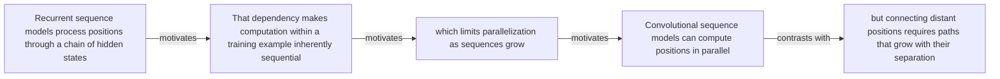

#### Python

```python
from html import escape
from pathlib import Path
from textwrap import wrap

title = "attn_why_p1: Recurrent sequence models process positions through a chain of — problem and research-question relation"
nodes = [["n1","Recurrent sequence models process positions through a chain of hidden states",120,150],["n2","That dependency makes computation within a training example inherently sequential",420,150],["n3","which limits parallelization as sequences grow",720,150],["n4","Convolutional sequence models can compute positions in parallel",120,340],["n5","but connecting distant positions requires paths that grow with their separation",420,340]]
edges = [["n1","n2","motivates"],["n2","n3","motivates"],["n3","n4","motivates"],["n4","n5","contrasts with"]]
node_by_id = {node_id: (label, x, y) for node_id, label, x, y in nodes}

parts = [
    '<svg xmlns="http://www.w3.org/2000/svg" viewBox="0 0 860 520" role="img" aria-labelledby="title desc">',
    f'<title id="title">{escape(title)}</title>',
    '<desc id="desc">The labeled relations reproduce only relationships stated in the paragraph.</desc>',
    '<rect width="860" height="520" fill="white"/>',
]
for source, target, relation in edges:
    _, x1, y1 = node_by_id[source]
    _, x2, y2 = node_by_id[target]
    parts.append(f'<line x1="{x1}" y1="{y1}" x2="{x2}" y2="{y2}" stroke="#345" stroke-width="2"/>')
    parts.append(f'<text x="{(x1+x2)/2}" y="{(y1+y2)/2-6}" text-anchor="middle" font-family="sans-serif" font-size="11">{escape(relation)}</text>')
for _, label, x, y in nodes:
    parts.append(f'<rect x="{x-125}" y="{y-58}" width="250" height="116" rx="14" fill="#eef6ff" stroke="#234"/>')
    for line_index, line in enumerate(wrap(label, width=32)):
        parts.append(f'<text x="{x}" y="{y-34+line_index*16}" text-anchor="middle" font-family="sans-serif" font-size="12">{escape(line)}</text>')
parts.append('</svg>')
Path("attn_why_p1_treatment_a.svg").write_text("\n".join(parts), encoding="utf-8")
```

### Treatment B — attn_002 — claim-to-source provenance

- Teaching purpose: Show exactly which atomic claims underwrite this paragraph and which fixed source records support each claim.
- Encoding and reading order: A bipartite graph places 1 claim nodes on the left and 1 source nodes on the right, with only the 1 claim-source edges recorded in the fixture. Claim labels include epistemic status; source labels include the exact locator.
- Evidence and limitations: This treatment explains provenance and uncertainty, not the paper's causal mechanism. Missing edges remain visibly absent and no source count is treated as confidence.
- Recommended web medium: semantic HTML/CSS claim-source table with an SVG network view; JavaScript only for keyboard-controlled source highlighting.
- Mobile, accessibility, and motion behavior: Provide real table headers and source links in the static fallback, make every edge recoverable as text, stack claim records before source records on mobile, and require no motion.

#### TikZ

```tex
\documentclass[tikz,border=5pt]{standalone}
\usepackage[T1]{fontenc}
\usepackage{tikz}
\usetikzlibrary{arrows.meta}
\begin{document}
\begin{tikzpicture}[font=\sffamily,claim/.style={draw,rounded corners,align=center,text width=5.2cm,minimum height=1.2cm},source/.style={draw,dashed,align=center,text width=5.2cm,minimum height=1.2cm},link/.style={-{Latex[length=2mm]},thin}]
\node[font=\bfseries] at (4,1.8) {attn\_why\_p1: claim-to-source provenance};
\node[claim] (c1) at (0,0) {The Transformer replaces sequence-aligned recurrence and convolution with stacked self-attention and position-wise feed-forward processing in an encoder-decoder architecture, enabling more parallel training while retaining autoregressive decoding. [OBSERVED]};
\node[source] (s1) at (8,0) {Attention Is All You Need, arXiv v7 PDF - Pages 1-10; Sections 1-7; Figures 1-2; Equation 1; Tables 1-4; version and figure-permission notice};
\draw[link] (c1) -- (s1);
\end{tikzpicture}
\end{document}
```

#### Mermaid

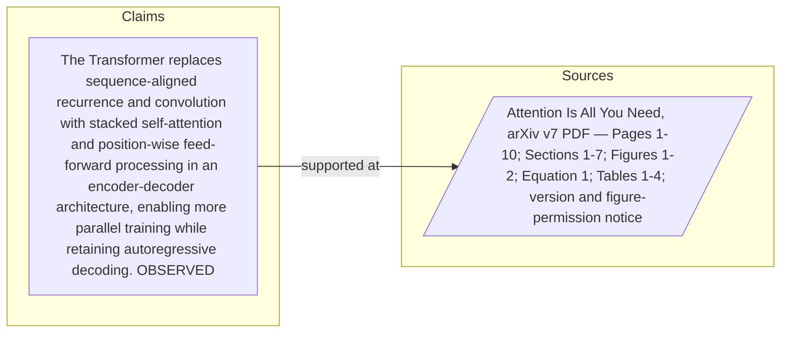

#### Python

```python
from html import escape
from pathlib import Path
from textwrap import wrap

title = "attn_why_p1: claim-to-source provenance"
nodes = [["c1","The Transformer replaces sequence-aligned recurrence and convolution with stacked self-attention and position-wise feed-forward processing in an encoder-decoder architecture, enabling more parallel training while retaining autoregressive decoding. [OBSERVED]",190,130],["s1","Attention Is All You Need, arXiv v7 PDF — Pages 1-10; Sections 1-7; Figures 1-2; Equation 1; Tables 1-4; version and figure-permission notice",700,130]]
edges = [["c1","s1"]]
node_by_id = {node_id: (label, x, y) for node_id, label, x, y in nodes}
height = 420

parts = [
    f'<svg xmlns="http://www.w3.org/2000/svg" viewBox="0 0 900 {height}" role="img" aria-labelledby="title desc">',
    f'<title id="title">{escape(title)}</title>',
    '<desc id="desc">Bipartite map from verified claim records to their exact source records.</desc>',
    f'<rect width="900" height="{height}" fill="white"/>',
]
for source, target in edges:
    _, x1, y1 = node_by_id[source]
    _, x2, y2 = node_by_id[target]
    parts.append(f'<line x1="{x1+145}" y1="{y1}" x2="{x2-145}" y2="{y2}" stroke="#456" stroke-width="2"/>')
for node_id, label, x, y in nodes:
    dashed = ' stroke-dasharray="7 5"' if node_id.startswith("s") else ''
    parts.append(f'<rect x="{x-145}" y="{y-46}" width="290" height="92" rx="12" fill="#f7fbff" stroke="#234"{dashed}/>')
    for line_index, line in enumerate(wrap(label, width=38)):
        parts.append(f'<text x="{x}" y="{y-24+line_index*14}" text-anchor="middle" font-family="sans-serif" font-size="11">{escape(line)}</text>')
parts.append('</svg>')
Path("attn_why_p1_treatment_b.svg").write_text("\n".join(parts), encoding="utf-8")
```

### Treatment C — Recurrent sequence models process positions through a chain of — supported-versus-bounded scope

- Teaching purpose: Separate what the paragraph supports from the qualification or contingency that bounds it.
- Encoding and reading order: Partition the paragraph into 5 supported statement(s) and 1 boundary or contingency statement(s). The two columns are categories, not a scale or causal path.
- Evidence and limitations: Every card is a complete paragraph clause. The boundary column makes negative and not-established language visible without weakening it.
- Recommended web medium: responsive SVG or semantic HTML/CSS; JavaScript is optional only for a meaningful state or scope toggle.
- Mobile, accessibility, and motion behavior: Preserve every exact value or scope statement as selectable text, avoid color-only distinctions, stack groups on mobile, and keep all information visible when JavaScript or motion is disabled.

#### TikZ

```tex
\documentclass[tikz,border=5pt]{standalone}
\usepackage[T1]{fontenc}
\usepackage{tikz}
\begin{document}
\begin{tikzpicture}[font=\sffamily,item/.style={draw,align=center,text width=5.5cm,minimum height=1.4cm}]
\node[font=\bfseries] at (3.5,2) {attn\_why\_p1: Recurrent sequence models process positions through a chain of - supported-versus-bounded scope};
\node[font=\bfseries] at (0,1) {Supported statement};
\node[font=\bfseries] at (7,1) {Boundary or contingency};
\node[item] at (0,0) {Recurrent sequence models process positions through a chain of hidden states};
\node[item] at (0,-2) {That dependency makes computation within a training example inherently sequential};
\node[item] at (0,-4) {which limits parallelization as sequences grow};
\node[item] at (0,-6) {Convolutional sequence models can compute positions in parallel};
\node[item] at (0,-8) {but connecting distant positions requires paths that grow with their separation};
\node[item] at (7,0) {but connecting distant positions requires paths that grow with their separation};
\end{tikzpicture}
\end{document}
```

#### Mermaid

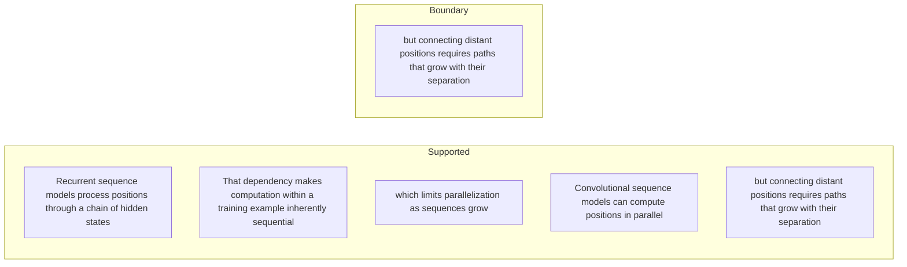

#### Python

```python
from html import escape
from pathlib import Path
from textwrap import wrap

title = "attn_why_p1: Recurrent sequence models process positions through a chain of — supported-versus-bounded scope"
columns = {"Supported statement": ["Recurrent sequence models process positions through a chain of hidden states","That dependency makes computation within a training example inherently sequential","which limits parallelization as sequences grow","Convolutional sequence models can compute positions in parallel","but connecting distant positions requires paths that grow with their separation"], "Boundary or contingency": ["but connecting distant positions requires paths that grow with their separation"]}
height = 770
parts = [
    f'<svg xmlns="http://www.w3.org/2000/svg" viewBox="0 0 900 {height}" role="img" aria-labelledby="title desc">',
    f'<title id="title">{escape(title)}</title>',
    '<desc id="desc">Statements are partitioned into supported content and explicit boundaries.</desc>',
    f'<rect width="900" height="{height}" fill="white"/>',
]
for column_index, (heading, items) in enumerate(columns.items()):
    x = 240 + column_index * 430
    parts.append(f'<text x="{x}" y="70" text-anchor="middle" font-family="sans-serif" font-size="18" font-weight="700">{escape(heading)}</text>')
    for item_index, item in enumerate(items):
        y = 130 + item_index * 110
        parts.append(f'<rect x="{x-180}" y="{y-35}" width="360" height="80" rx="12" fill="#f7fbff" stroke="#234"/>')
        for line_index, line in enumerate(wrap(item, width=48)):
            parts.append(f'<text x="{x}" y="{y-12+line_index*14}" text-anchor="middle" font-family="sans-serif" font-size="11">{escape(line)}</text>')
parts.append('</svg>')
Path("attn_why_p1_treatment_c.svg").write_text("\n".join(parts), encoding="utf-8")
```

### Implementation record

- Status: `PENDING`
- Selected treatment: `NONE`
- Selection rationale:
- Delivery medium: `NONE`
- Visual ID and placement:
- Shared paragraph scope: `NONE`
- Changed files:
- Accessibility and fallback verification:
- Desktop and mobile verification:
- Evidence deviations: `NONE`

## `attn_why_p2`

- Location: `attn_why`, paragraph 2
- Text anchor: "Attention already helped encoder-decoder systems retrieve information across a sequence, but it was usually combined with recurrence."
- Claims and sources: `attn_002` (OBSERVED, VERIFIED); `source_attention_arxiv_v7` (Pages 1-10; Sections 1-7; Figures 1-2; Equation 1; Tables 1-4; version and figure-permission notice)
- Visual needed: `NO`
- Decision rationale: The paragraph's main work is the bounded statement "Attention already helped encoder-decoder systems retrieve information across a sequence". Its qualification is explicit in prose and does not require readers to reconstruct a material process, topology, quantitative comparison, uncertainty distribution, or state change. A visual would repeat the wording, so all treatments below are optional contingencies only.
- Explanatory job: problem and research-question relation.

### Treatment A — Attention already helped encoder-decoder systems retrieve information across a — problem and research-question relation

- Teaching purpose: Optional contingency only. Answer "Why was a different sequence model needed?" by exposing the paragraph's 3 named propositions and 2 stated reading, comparison, or qualification relations.
- Encoding and reading order: Nodes reproduce the complete labels "Attention already helped encoder-decoder systems retrieve information across a sequence"; "but it was usually combined with recurrence"; "The paper asks whether attention can replace sequence-aligned recurrence and convolution rather than merely supplement them". Edges carry the explicit relation labels "contrasts with", "contrasts with"; arrow direction is sequence only for mechanism or example prose and otherwise denotes reading order.
- Evidence and limitations: The topology is derived from this paragraph rather than a fixed pipeline. Encode only `attn_002` and do not turn reading-order edges into causal claims.
- Recommended web medium: responsive inline SVG with CSS; JavaScript may add optional step focus only when state order matters.
- Mobile, accessibility, and motion behavior: Keep the full node-and-relation list in DOM order, expose the relation labels in the long description, stack nodes on narrow screens, and disable focus transitions under reduced motion.

#### TikZ

```tex
\documentclass[tikz,border=5pt]{standalone}
\usepackage[T1]{fontenc}
\usepackage{tikz}
\usetikzlibrary{arrows.meta,positioning}
\begin{document}
\begin{tikzpicture}[font=\sffamily,concept/.style={draw,rounded corners,align=center,text width=3.6cm,minimum height=1.35cm},link/.style={-{Latex[length=2mm]},thick},rel/.style={fill=white,font=\scriptsize,inner sep=2pt}]
\node[font=\bfseries,align=center] at (6.1,2.0) {attn\_why\_p2: Attention already helped encoder-decoder systems retrieve information across a - problem and research-question relation};
\node[concept] (n1) at (1.8,0) {Attention already helped encoder-decoder systems retrieve information across a sequence};
\node[concept] (n2) at (6.1,0) {but it was usually combined with recurrence};
\node[concept] (n3) at (10.4,0) {The paper asks whether attention can replace sequence-aligned recurrence and convolution rather than merely supplement them};
\draw[link] (n1) -- node[rel] {contrasts with} (n2);
\draw[link] (n2) -- node[rel] {contrasts with} (n3);
\end{tikzpicture}
\end{document}
```

#### Mermaid

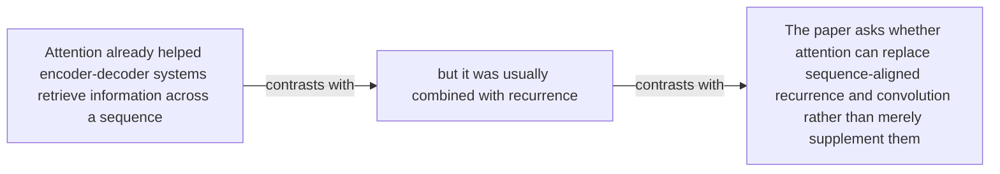

#### Python

```python
from html import escape
from pathlib import Path
from textwrap import wrap

title = "attn_why_p2: Attention already helped encoder-decoder systems retrieve information across a — problem and research-question relation"
nodes = [["n1","Attention already helped encoder-decoder systems retrieve information across a sequence",120,150],["n2","but it was usually combined with recurrence",420,150],["n3","The paper asks whether attention can replace sequence-aligned recurrence and convolution rather than merely supplement them",720,150]]
edges = [["n1","n2","contrasts with"],["n2","n3","contrasts with"]]
node_by_id = {node_id: (label, x, y) for node_id, label, x, y in nodes}

parts = [
    '<svg xmlns="http://www.w3.org/2000/svg" viewBox="0 0 860 520" role="img" aria-labelledby="title desc">',
    f'<title id="title">{escape(title)}</title>',
    '<desc id="desc">The labeled relations reproduce only relationships stated in the paragraph.</desc>',
    '<rect width="860" height="520" fill="white"/>',
]
for source, target, relation in edges:
    _, x1, y1 = node_by_id[source]
    _, x2, y2 = node_by_id[target]
    parts.append(f'<line x1="{x1}" y1="{y1}" x2="{x2}" y2="{y2}" stroke="#345" stroke-width="2"/>')
    parts.append(f'<text x="{(x1+x2)/2}" y="{(y1+y2)/2-6}" text-anchor="middle" font-family="sans-serif" font-size="11">{escape(relation)}</text>')
for _, label, x, y in nodes:
    parts.append(f'<rect x="{x-125}" y="{y-58}" width="250" height="116" rx="14" fill="#eef6ff" stroke="#234"/>')
    for line_index, line in enumerate(wrap(label, width=32)):
        parts.append(f'<text x="{x}" y="{y-34+line_index*16}" text-anchor="middle" font-family="sans-serif" font-size="12">{escape(line)}</text>')
parts.append('</svg>')
Path("attn_why_p2_treatment_a.svg").write_text("\n".join(parts), encoding="utf-8")
```

### Treatment B — attn_002 — claim-to-source provenance

- Teaching purpose: Optional contingency only. Show exactly which atomic claims underwrite this paragraph and which fixed source records support each claim.
- Encoding and reading order: A bipartite graph places 1 claim nodes on the left and 1 source nodes on the right, with only the 1 claim-source edges recorded in the fixture. Claim labels include epistemic status; source labels include the exact locator.
- Evidence and limitations: This treatment explains provenance and uncertainty, not the paper's causal mechanism. Missing edges remain visibly absent and no source count is treated as confidence.
- Recommended web medium: semantic HTML/CSS claim-source table with an SVG network view; JavaScript only for keyboard-controlled source highlighting.
- Mobile, accessibility, and motion behavior: Provide real table headers and source links in the static fallback, make every edge recoverable as text, stack claim records before source records on mobile, and require no motion.

#### TikZ

```tex
\documentclass[tikz,border=5pt]{standalone}
\usepackage[T1]{fontenc}
\usepackage{tikz}
\usetikzlibrary{arrows.meta}
\begin{document}
\begin{tikzpicture}[font=\sffamily,claim/.style={draw,rounded corners,align=center,text width=5.2cm,minimum height=1.2cm},source/.style={draw,dashed,align=center,text width=5.2cm,minimum height=1.2cm},link/.style={-{Latex[length=2mm]},thin}]
\node[font=\bfseries] at (4,1.8) {attn\_why\_p2: claim-to-source provenance};
\node[claim] (c1) at (0,0) {The Transformer replaces sequence-aligned recurrence and convolution with stacked self-attention and position-wise feed-forward processing in an encoder-decoder architecture, enabling more parallel training while retaining autoregressive decoding. [OBSERVED]};
\node[source] (s1) at (8,0) {Attention Is All You Need, arXiv v7 PDF - Pages 1-10; Sections 1-7; Figures 1-2; Equation 1; Tables 1-4; version and figure-permission notice};
\draw[link] (c1) -- (s1);
\end{tikzpicture}
\end{document}
```

#### Mermaid


#### Python

```python
from html import escape
from pathlib import Path
from textwrap import wrap

title = "attn_why_p2: claim-to-source provenance"
nodes = [["c1","The Transformer replaces sequence-aligned recurrence and convolution with stacked self-attention and position-wise feed-forward processing in an encoder-decoder architecture, enabling more parallel training while retaining autoregressive decoding. [OBSERVED]",190,130],["s1","Attention Is All You Need, arXiv v7 PDF — Pages 1-10; Sections 1-7; Figures 1-2; Equation 1; Tables 1-4; version and figure-permission notice",700,130]]
edges = [["c1","s1"]]
node_by_id = {node_id: (label, x, y) for node_id, label, x, y in nodes}
height = 420

parts = [
    f'<svg xmlns="http://www.w3.org/2000/svg" viewBox="0 0 900 {height}" role="img" aria-labelledby="title desc">',
    f'<title id="title">{escape(title)}</title>',
    '<desc id="desc">Bipartite map from verified claim records to their exact source records.</desc>',
    f'<rect width="900" height="{height}" fill="white"/>',
]
for source, target in edges:
    _, x1, y1 = node_by_id[source]
    _, x2, y2 = node_by_id[target]
    parts.append(f'<line x1="{x1+145}" y1="{y1}" x2="{x2-145}" y2="{y2}" stroke="#456" stroke-width="2"/>')
for node_id, label, x, y in nodes:
    dashed = ' stroke-dasharray="7 5"' if node_id.startswith("s") else ''
    parts.append(f'<rect x="{x-145}" y="{y-46}" width="290" height="92" rx="12" fill="#f7fbff" stroke="#234"{dashed}/>')
    for line_index, line in enumerate(wrap(label, width=38)):
        parts.append(f'<text x="{x}" y="{y-24+line_index*14}" text-anchor="middle" font-family="sans-serif" font-size="11">{escape(line)}</text>')
parts.append('</svg>')
Path("attn_why_p2_treatment_b.svg").write_text("\n".join(parts), encoding="utf-8")
```

### Treatment C — Attention already helped encoder-decoder systems retrieve information across a — supported-versus-bounded scope

- Teaching purpose: Optional contingency only. Separate what the paragraph supports from the qualification or contingency that bounds it.
- Encoding and reading order: Partition the paragraph into 2 supported statement(s) and 1 boundary or contingency statement(s). The two columns are categories, not a scale or causal path.
- Evidence and limitations: Every card is a complete paragraph clause. The boundary column makes negative and not-established language visible without weakening it.
- Recommended web medium: responsive SVG or semantic HTML/CSS; JavaScript is optional only for a meaningful state or scope toggle.
- Mobile, accessibility, and motion behavior: Preserve every exact value or scope statement as selectable text, avoid color-only distinctions, stack groups on mobile, and keep all information visible when JavaScript or motion is disabled.

#### TikZ

```tex
\documentclass[tikz,border=5pt]{standalone}
\usepackage[T1]{fontenc}
\usepackage{tikz}
\begin{document}
\begin{tikzpicture}[font=\sffamily,item/.style={draw,align=center,text width=5.5cm,minimum height=1.4cm}]
\node[font=\bfseries] at (3.5,2) {attn\_why\_p2: Attention already helped encoder-decoder systems retrieve information across a - supported-versus-bounded scope};
\node[font=\bfseries] at (0,1) {Supported statement};
\node[font=\bfseries] at (7,1) {Boundary or contingency};
\node[item] at (0,0) {Attention already helped encoder-decoder systems retrieve information across a sequence};
\node[item] at (0,-2) {but it was usually combined with recurrence};
\node[item] at (7,0) {The paper asks whether attention can replace sequence-aligned recurrence and convolution rather than merely supplement them};
\end{tikzpicture}
\end{document}
```

#### Mermaid

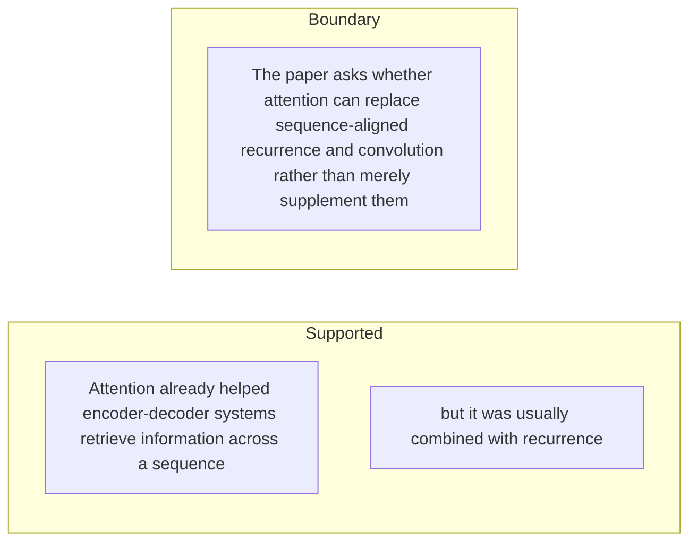

#### Python

```python
from html import escape
from pathlib import Path
from textwrap import wrap

title = "attn_why_p2: Attention already helped encoder-decoder systems retrieve information across a — supported-versus-bounded scope"
columns = {"Supported statement": ["Attention already helped encoder-decoder systems retrieve information across a sequence","but it was usually combined with recurrence"], "Boundary or contingency": ["The paper asks whether attention can replace sequence-aligned recurrence and convolution rather than merely supplement them"]}
height = 440
parts = [
    f'<svg xmlns="http://www.w3.org/2000/svg" viewBox="0 0 900 {height}" role="img" aria-labelledby="title desc">',
    f'<title id="title">{escape(title)}</title>',
    '<desc id="desc">Statements are partitioned into supported content and explicit boundaries.</desc>',
    f'<rect width="900" height="{height}" fill="white"/>',
]
for column_index, (heading, items) in enumerate(columns.items()):
    x = 240 + column_index * 430
    parts.append(f'<text x="{x}" y="70" text-anchor="middle" font-family="sans-serif" font-size="18" font-weight="700">{escape(heading)}</text>')
    for item_index, item in enumerate(items):
        y = 130 + item_index * 110
        parts.append(f'<rect x="{x-180}" y="{y-35}" width="360" height="80" rx="12" fill="#f7fbff" stroke="#234"/>')
        for line_index, line in enumerate(wrap(item, width=48)):
            parts.append(f'<text x="{x}" y="{y-12+line_index*14}" text-anchor="middle" font-family="sans-serif" font-size="11">{escape(line)}</text>')
parts.append('</svg>')
Path("attn_why_p2_treatment_c.svg").write_text("\n".join(parts), encoding="utf-8")
```

### Implementation record

- Status: `NOT_NEEDED`
- Selected treatment: `NONE`
- Selection rationale:
- Delivery medium: `NONE`
- Visual ID and placement:
- Shared paragraph scope: `NONE`
- Changed files:
- Accessibility and fallback verification:
- Desktop and mobile verification:
- Evidence deviations: `NONE`

## `attn_change_p1`

- Location: `attn_change`, paragraph 1
- Text anchor: "The Transformer keeps an encoder-decoder structure but changes the operation used to exchange information between positions."
- Claims and sources: `attn_002` (OBSERVED, VERIFIED); `attn_003` (OBSERVED, VERIFIED); `attn_006` (OBSERVED, VERIFIED); `attn_012` (NOT_ESTABLISHED, UNRESOLVED); `source_attention_arxiv_v7` (Pages 1-10; Sections 1-7; Figures 1-2; Equation 1; Tables 1-4; version and figure-permission notice)
- Visual needed: `YES`
- Decision rationale: Removing a visual would require readers to retain the material relation between "The Transformer keeps an encoder-decoder structure but changes the operation used to exchange information between positions" and "and decoder queries attend to the encoder output" while also tracking 3 source-bounded propositions. The paragraph contains a real changed-versus-preserved relation; the visual must preserve its stated conditions and must not add causal or proportional meaning.
- Explanatory job: changed-versus-preserved relation.

### Treatment A — The Transformer keeps an encoder-decoder structure but changes the — changed-versus-preserved relation

- Teaching purpose: Answer "What did the Transformer change in the encoder-decoder pattern?" by exposing the paragraph's 3 named propositions and 2 stated reading, comparison, or qualification relations.
- Encoding and reading order: Nodes reproduce the complete labels "The Transformer keeps an encoder-decoder structure but changes the operation used to exchange information between positions"; "Encoder positions use self-attention, decoder positions use masked self-attention over the known target prefix"; "and decoder queries attend to the encoder output". Edges carry the explicit relation labels "changes into", "changes into"; arrow direction is sequence only for mechanism or example prose and otherwise denotes reading order.
- Evidence and limitations: The topology is derived from this paragraph rather than a fixed pipeline. Encode only `attn_002`, `attn_003`, `attn_006`, `attn_012` and do not turn reading-order edges into causal claims.
- Recommended web medium: responsive inline SVG with CSS; JavaScript may add optional step focus only when state order matters.
- Mobile, accessibility, and motion behavior: Keep the full node-and-relation list in DOM order, expose the relation labels in the long description, stack nodes on narrow screens, and disable focus transitions under reduced motion.

#### TikZ

```tex
\documentclass[tikz,border=5pt]{standalone}
\usepackage[T1]{fontenc}
\usepackage{tikz}
\usetikzlibrary{arrows.meta,positioning}
\begin{document}
\begin{tikzpicture}[font=\sffamily,concept/.style={draw,rounded corners,align=center,text width=3.6cm,minimum height=1.35cm},link/.style={-{Latex[length=2mm]},thick},rel/.style={fill=white,font=\scriptsize,inner sep=2pt}]
\node[font=\bfseries,align=center] at (6.1,2.0) {attn\_change\_p1: The Transformer keeps an encoder-decoder structure but changes the - changed-versus-preserved relation};
\node[concept] (n1) at (1.8,0) {The Transformer keeps an encoder-decoder structure but changes the operation used to exchange information between positions};
\node[concept] (n2) at (6.1,0) {Encoder positions use self-attention, decoder positions use masked self-attention over the known target prefix};
\node[concept] (n3) at (10.4,0) {and decoder queries attend to the encoder output};
\draw[link] (n1) -- node[rel] {changes into} (n2);
\draw[link] (n2) -- node[rel] {changes into} (n3);
\end{tikzpicture}
\end{document}
```

#### Mermaid

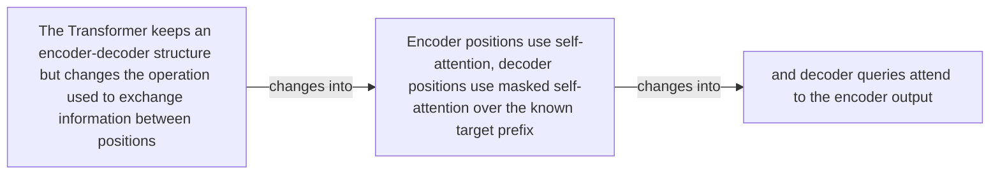

#### Python

```python
from html import escape
from pathlib import Path
from textwrap import wrap

title = "attn_change_p1: The Transformer keeps an encoder-decoder structure but changes the — changed-versus-preserved relation"
nodes = [["n1","The Transformer keeps an encoder-decoder structure but changes the operation used to exchange information between positions",120,150],["n2","Encoder positions use self-attention, decoder positions use masked self-attention over the known target prefix",420,150],["n3","and decoder queries attend to the encoder output",720,150]]
edges = [["n1","n2","changes into"],["n2","n3","changes into"]]
node_by_id = {node_id: (label, x, y) for node_id, label, x, y in nodes}

parts = [
    '<svg xmlns="http://www.w3.org/2000/svg" viewBox="0 0 860 520" role="img" aria-labelledby="title desc">',
    f'<title id="title">{escape(title)}</title>',
    '<desc id="desc">The labeled relations reproduce only relationships stated in the paragraph.</desc>',
    '<rect width="860" height="520" fill="white"/>',
]
for source, target, relation in edges:
    _, x1, y1 = node_by_id[source]
    _, x2, y2 = node_by_id[target]
    parts.append(f'<line x1="{x1}" y1="{y1}" x2="{x2}" y2="{y2}" stroke="#345" stroke-width="2"/>')
    parts.append(f'<text x="{(x1+x2)/2}" y="{(y1+y2)/2-6}" text-anchor="middle" font-family="sans-serif" font-size="11">{escape(relation)}</text>')
for _, label, x, y in nodes:
    parts.append(f'<rect x="{x-125}" y="{y-58}" width="250" height="116" rx="14" fill="#eef6ff" stroke="#234"/>')
    for line_index, line in enumerate(wrap(label, width=32)):
        parts.append(f'<text x="{x}" y="{y-34+line_index*16}" text-anchor="middle" font-family="sans-serif" font-size="12">{escape(line)}</text>')
parts.append('</svg>')
Path("attn_change_p1_treatment_a.svg").write_text("\n".join(parts), encoding="utf-8")
```

### Treatment B — attn_002, attn_003, attn_006, attn_012 — claim-to-source provenance

- Teaching purpose: Show exactly which atomic claims underwrite this paragraph and which fixed source records support each claim.
- Encoding and reading order: A bipartite graph places 4 claim nodes on the left and 1 source nodes on the right, with only the 4 claim-source edges recorded in the fixture. Claim labels include epistemic status; source labels include the exact locator.
- Evidence and limitations: This treatment explains provenance and uncertainty, not the paper's causal mechanism. Missing edges remain visibly absent and no source count is treated as confidence.
- Recommended web medium: semantic HTML/CSS claim-source table with an SVG network view; JavaScript only for keyboard-controlled source highlighting.
- Mobile, accessibility, and motion behavior: Provide real table headers and source links in the static fallback, make every edge recoverable as text, stack claim records before source records on mobile, and require no motion.

#### TikZ

```tex
\documentclass[tikz,border=5pt]{standalone}
\usepackage[T1]{fontenc}
\usepackage{tikz}
\usetikzlibrary{arrows.meta}
\begin{document}
\begin{tikzpicture}[font=\sffamily,claim/.style={draw,rounded corners,align=center,text width=5.2cm,minimum height=1.2cm},source/.style={draw,dashed,align=center,text width=5.2cm,minimum height=1.2cm},link/.style={-{Latex[length=2mm]},thin}]
\node[font=\bfseries] at (4,1.8) {attn\_change\_p1: claim-to-source provenance};
\node[claim] (c1) at (0,0) {The Transformer replaces sequence-aligned recurrence and convolution with stacked self-attention and position-wise feed-forward processing in an encoder-decoder architecture, enabling more parallel training while retaining autoregressive decoding. [OBSERVED]};
\node[claim] (c2) at (0,-2.4) {The base encoder and decoder each contain 6 layers; the decoder masks future target positions and adds encoder-decoder attention over the encoded source. [OBSERVED]};
\node[claim] (c3) at (0,-4.8) {Table 1 gives full self-attention O(n squared times d) per-layer complexity, O(1) sequential operations, and O(1) maximum path length, while noting that restricted attention changes the path length to O(n divided by r). [OBSERVED]};
\node[claim] (c4) at (0,-7.199999999999999) {The paper does not establish fully parallel autoregressive generation, universal task superiority, reliable extrapolation of sinusoidal positions beyond training lengths, or attention weights as faithful causal explanations. [NOT\_ESTABLISHED]};
\node[source] (s1) at (8,0) {Attention Is All You Need, arXiv v7 PDF - Pages 1-10; Sections 1-7; Figures 1-2; Equation 1; Tables 1-4; version and figure-permission notice};
\draw[link] (c1) -- (s1);
\draw[link] (c2) -- (s1);
\draw[link] (c3) -- (s1);
\draw[link] (c4) -- (s1);
\end{tikzpicture}
\end{document}
```

#### Mermaid

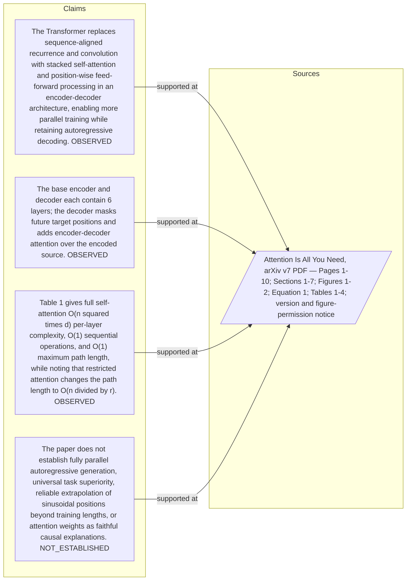

#### Python

```python
from html import escape
from pathlib import Path
from textwrap import wrap

title = "attn_change_p1: claim-to-source provenance"
nodes = [["c1","The Transformer replaces sequence-aligned recurrence and convolution with stacked self-attention and position-wise feed-forward processing in an encoder-decoder architecture, enabling more parallel training while retaining autoregressive decoding. [OBSERVED]",190,130],["c2","The base encoder and decoder each contain 6 layers; the decoder masks future target positions and adds encoder-decoder attention over the encoded source. [OBSERVED]",190,250],["c3","Table 1 gives full self-attention O(n squared times d) per-layer complexity, O(1) sequential operations, and O(1) maximum path length, while noting that restricted attention changes the path length to O(n divided by r). [OBSERVED]",190,370],["c4","The paper does not establish fully parallel autoregressive generation, universal task superiority, reliable extrapolation of sinusoidal positions beyond training lengths, or attention weights as faithful causal explanations. [NOT_ESTABLISHED]",190,490],["s1","Attention Is All You Need, arXiv v7 PDF — Pages 1-10; Sections 1-7; Figures 1-2; Equation 1; Tables 1-4; version and figure-permission notice",700,130]]
edges = [["c1","s1"],["c2","s1"],["c3","s1"],["c4","s1"]]
node_by_id = {node_id: (label, x, y) for node_id, label, x, y in nodes}
height = 680

parts = [
    f'<svg xmlns="http://www.w3.org/2000/svg" viewBox="0 0 900 {height}" role="img" aria-labelledby="title desc">',
    f'<title id="title">{escape(title)}</title>',
    '<desc id="desc">Bipartite map from verified claim records to their exact source records.</desc>',
    f'<rect width="900" height="{height}" fill="white"/>',
]
for source, target in edges:
    _, x1, y1 = node_by_id[source]
    _, x2, y2 = node_by_id[target]
    parts.append(f'<line x1="{x1+145}" y1="{y1}" x2="{x2-145}" y2="{y2}" stroke="#456" stroke-width="2"/>')
for node_id, label, x, y in nodes:
    dashed = ' stroke-dasharray="7 5"' if node_id.startswith("s") else ''
    parts.append(f'<rect x="{x-145}" y="{y-46}" width="290" height="92" rx="12" fill="#f7fbff" stroke="#234"{dashed}/>')
    for line_index, line in enumerate(wrap(label, width=38)):
        parts.append(f'<text x="{x}" y="{y-24+line_index*14}" text-anchor="middle" font-family="sans-serif" font-size="11">{escape(line)}</text>')
parts.append('</svg>')
Path("attn_change_p1_treatment_b.svg").write_text("\n".join(parts), encoding="utf-8")
```

### Treatment C — The Transformer keeps an encoder-decoder structure but changes the — supported-versus-bounded scope

- Teaching purpose: Separate what the paragraph supports from the qualification or contingency that bounds it.
- Encoding and reading order: Partition the paragraph into 3 supported statement(s) and 1 boundary or contingency statement(s). The two columns are categories, not a scale or causal path.
- Evidence and limitations: Every card is a complete paragraph clause. The boundary column makes negative and not-established language visible without weakening it.
- Recommended web medium: responsive SVG or semantic HTML/CSS; JavaScript is optional only for a meaningful state or scope toggle.
- Mobile, accessibility, and motion behavior: Preserve every exact value or scope statement as selectable text, avoid color-only distinctions, stack groups on mobile, and keep all information visible when JavaScript or motion is disabled.

#### TikZ

```tex
\documentclass[tikz,border=5pt]{standalone}
\usepackage[T1]{fontenc}
\usepackage{tikz}
\begin{document}
\begin{tikzpicture}[font=\sffamily,item/.style={draw,align=center,text width=5.5cm,minimum height=1.4cm}]
\node[font=\bfseries] at (3.5,2) {attn\_change\_p1: The Transformer keeps an encoder-decoder structure but changes the - supported-versus-bounded scope};
\node[font=\bfseries] at (0,1) {Supported statement};
\node[font=\bfseries] at (7,1) {Boundary or contingency};
\node[item] at (0,0) {The Transformer keeps an encoder-decoder structure but changes the operation used to exchange information between positions};
\node[item] at (0,-2) {Encoder positions use self-attention, decoder positions use masked self-attention over the known target prefix};
\node[item] at (0,-4) {and decoder queries attend to the encoder output};
\node[item] at (7,0) {and decoder queries attend to the encoder output};
\end{tikzpicture}
\end{document}
```

#### Mermaid

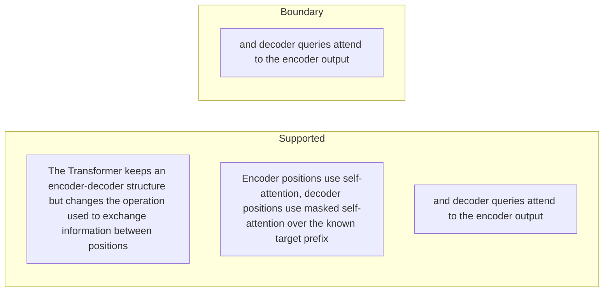

#### Python

```python
from html import escape
from pathlib import Path
from textwrap import wrap

title = "attn_change_p1: The Transformer keeps an encoder-decoder structure but changes the — supported-versus-bounded scope"
columns = {"Supported statement": ["The Transformer keeps an encoder-decoder structure but changes the operation used to exchange information between positions","Encoder positions use self-attention, decoder positions use masked self-attention over the known target prefix","and decoder queries attend to the encoder output"], "Boundary or contingency": ["and decoder queries attend to the encoder output"]}
height = 550
parts = [
    f'<svg xmlns="http://www.w3.org/2000/svg" viewBox="0 0 900 {height}" role="img" aria-labelledby="title desc">',
    f'<title id="title">{escape(title)}</title>',
    '<desc id="desc">Statements are partitioned into supported content and explicit boundaries.</desc>',
    f'<rect width="900" height="{height}" fill="white"/>',
]
for column_index, (heading, items) in enumerate(columns.items()):
    x = 240 + column_index * 430
    parts.append(f'<text x="{x}" y="70" text-anchor="middle" font-family="sans-serif" font-size="18" font-weight="700">{escape(heading)}</text>')
    for item_index, item in enumerate(items):
        y = 130 + item_index * 110
        parts.append(f'<rect x="{x-180}" y="{y-35}" width="360" height="80" rx="12" fill="#f7fbff" stroke="#234"/>')
        for line_index, line in enumerate(wrap(item, width=48)):
            parts.append(f'<text x="{x}" y="{y-12+line_index*14}" text-anchor="middle" font-family="sans-serif" font-size="11">{escape(line)}</text>')
parts.append('</svg>')
Path("attn_change_p1_treatment_c.svg").write_text("\n".join(parts), encoding="utf-8")
```

### Implementation record

- Status: `PENDING`
- Selected treatment: `NONE`
- Selection rationale:
- Delivery medium: `NONE`
- Visual ID and placement:
- Shared paragraph scope: `NONE`
- Changed files:
- Accessibility and fallback verification:
- Desktop and mobile verification:
- Evidence deviations: `NONE`

## `attn_change_p2`

- Location: `attn_change`, paragraph 2
- Text anchor: "This shortens the maximum path between positions to a constant number of sequential operations per self-attention layer."
- Claims and sources: `attn_002` (OBSERVED, VERIFIED); `attn_003` (OBSERVED, VERIFIED); `attn_006` (OBSERVED, VERIFIED); `attn_012` (NOT_ESTABLISHED, UNRESOLVED); `source_attention_arxiv_v7` (Pages 1-10; Sections 1-7; Figures 1-2; Equation 1; Tables 1-4; version and figure-permission notice)
- Visual needed: `YES`
- Decision rationale: Removing a visual would require readers to retain the material relation between "This shortens the maximum path between positions to a constant number of sequential operations per self-attention layer" and "and an output projection with softmax" while also tracking 4 source-bounded propositions. The paragraph contains a real changed-versus-preserved relation; the visual must preserve its stated conditions and must not add causal or proportional meaning.
- Explanatory job: changed-versus-preserved relation.

### Treatment A — This shortens the maximum path between positions to a — changed-versus-preserved relation

- Teaching purpose: Answer "What did the Transformer change in the encoder-decoder pattern?" by exposing the paragraph's 4 named propositions and 3 stated reading, comparison, or qualification relations.
- Encoding and reading order: Nodes reproduce the complete labels "This shortens the maximum path between positions to a constant number of sequential operations per self-attention layer"; "It does not make every part of the model attention"; "each layer also contains position-wise feed-forward networks, residual connections, layer normalization, embeddings, positional encodings"; "and an output projection with softmax". Edges carry the explicit relation labels "bounded by", "changes into", "changes into"; arrow direction is sequence only for mechanism or example prose and otherwise denotes reading order.
- Evidence and limitations: The topology is derived from this paragraph rather than a fixed pipeline. Encode only `attn_002`, `attn_003`, `attn_006`, `attn_012` and do not turn reading-order edges into causal claims.
- Recommended web medium: responsive inline SVG with CSS; JavaScript may add optional step focus only when state order matters.
- Mobile, accessibility, and motion behavior: Keep the full node-and-relation list in DOM order, expose the relation labels in the long description, stack nodes on narrow screens, and disable focus transitions under reduced motion.

#### TikZ

```tex
\documentclass[tikz,border=5pt]{standalone}
\usepackage[T1]{fontenc}
\usepackage{tikz}
\usetikzlibrary{arrows.meta,positioning}
\begin{document}
\begin{tikzpicture}[font=\sffamily,concept/.style={draw,rounded corners,align=center,text width=3.6cm,minimum height=1.35cm},link/.style={-{Latex[length=2mm]},thick},rel/.style={fill=white,font=\scriptsize,inner sep=2pt}]
\node[font=\bfseries,align=center] at (6.1,2.0) {attn\_change\_p2: This shortens the maximum path between positions to a - changed-versus-preserved relation};
\node[concept] (n1) at (1.8,0) {This shortens the maximum path between positions to a constant number of sequential operations per self-attention layer};
\node[concept] (n2) at (6.1,0) {It does not make every part of the model attention};
\node[concept] (n3) at (10.4,0) {each layer also contains position-wise feed-forward networks, residual connections, layer normalization, embeddings, positional encodings};
\node[concept] (n4) at (1.8,-3.2) {and an output projection with softmax};
\draw[link] (n1) -- node[rel] {bounded by} (n2);
\draw[link] (n2) -- node[rel] {changes into} (n3);
\draw[link] (n3) -- node[rel] {changes into} (n4);
\end{tikzpicture}
\end{document}
```

#### Mermaid

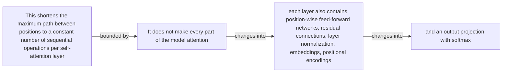

#### Python

```python
from html import escape
from pathlib import Path
from textwrap import wrap

title = "attn_change_p2: This shortens the maximum path between positions to a — changed-versus-preserved relation"
nodes = [["n1","This shortens the maximum path between positions to a constant number of sequential operations per self-attention layer",120,150],["n2","It does not make every part of the model attention",420,150],["n3","each layer also contains position-wise feed-forward networks, residual connections, layer normalization, embeddings, positional encodings",720,150],["n4","and an output projection with softmax",120,340]]
edges = [["n1","n2","bounded by"],["n2","n3","changes into"],["n3","n4","changes into"]]
node_by_id = {node_id: (label, x, y) for node_id, label, x, y in nodes}

parts = [
    '<svg xmlns="http://www.w3.org/2000/svg" viewBox="0 0 860 520" role="img" aria-labelledby="title desc">',
    f'<title id="title">{escape(title)}</title>',
    '<desc id="desc">The labeled relations reproduce only relationships stated in the paragraph.</desc>',
    '<rect width="860" height="520" fill="white"/>',
]
for source, target, relation in edges:
    _, x1, y1 = node_by_id[source]
    _, x2, y2 = node_by_id[target]
    parts.append(f'<line x1="{x1}" y1="{y1}" x2="{x2}" y2="{y2}" stroke="#345" stroke-width="2"/>')
    parts.append(f'<text x="{(x1+x2)/2}" y="{(y1+y2)/2-6}" text-anchor="middle" font-family="sans-serif" font-size="11">{escape(relation)}</text>')
for _, label, x, y in nodes:
    parts.append(f'<rect x="{x-125}" y="{y-58}" width="250" height="116" rx="14" fill="#eef6ff" stroke="#234"/>')
    for line_index, line in enumerate(wrap(label, width=32)):
        parts.append(f'<text x="{x}" y="{y-34+line_index*16}" text-anchor="middle" font-family="sans-serif" font-size="12">{escape(line)}</text>')
parts.append('</svg>')
Path("attn_change_p2_treatment_a.svg").write_text("\n".join(parts), encoding="utf-8")
```

### Treatment B — attn_002, attn_003, attn_006, attn_012 — claim-to-source provenance

- Teaching purpose: Show exactly which atomic claims underwrite this paragraph and which fixed source records support each claim.
- Encoding and reading order: A bipartite graph places 4 claim nodes on the left and 1 source nodes on the right, with only the 4 claim-source edges recorded in the fixture. Claim labels include epistemic status; source labels include the exact locator.
- Evidence and limitations: This treatment explains provenance and uncertainty, not the paper's causal mechanism. Missing edges remain visibly absent and no source count is treated as confidence.
- Recommended web medium: semantic HTML/CSS claim-source table with an SVG network view; JavaScript only for keyboard-controlled source highlighting.
- Mobile, accessibility, and motion behavior: Provide real table headers and source links in the static fallback, make every edge recoverable as text, stack claim records before source records on mobile, and require no motion.

#### TikZ

```tex
\documentclass[tikz,border=5pt]{standalone}
\usepackage[T1]{fontenc}
\usepackage{tikz}
\usetikzlibrary{arrows.meta}
\begin{document}
\begin{tikzpicture}[font=\sffamily,claim/.style={draw,rounded corners,align=center,text width=5.2cm,minimum height=1.2cm},source/.style={draw,dashed,align=center,text width=5.2cm,minimum height=1.2cm},link/.style={-{Latex[length=2mm]},thin}]
\node[font=\bfseries] at (4,1.8) {attn\_change\_p2: claim-to-source provenance};
\node[claim] (c1) at (0,0) {The Transformer replaces sequence-aligned recurrence and convolution with stacked self-attention and position-wise feed-forward processing in an encoder-decoder architecture, enabling more parallel training while retaining autoregressive decoding. [OBSERVED]};
\node[claim] (c2) at (0,-2.4) {The base encoder and decoder each contain 6 layers; the decoder masks future target positions and adds encoder-decoder attention over the encoded source. [OBSERVED]};
\node[claim] (c3) at (0,-4.8) {Table 1 gives full self-attention O(n squared times d) per-layer complexity, O(1) sequential operations, and O(1) maximum path length, while noting that restricted attention changes the path length to O(n divided by r). [OBSERVED]};
\node[claim] (c4) at (0,-7.199999999999999) {The paper does not establish fully parallel autoregressive generation, universal task superiority, reliable extrapolation of sinusoidal positions beyond training lengths, or attention weights as faithful causal explanations. [NOT\_ESTABLISHED]};
\node[source] (s1) at (8,0) {Attention Is All You Need, arXiv v7 PDF - Pages 1-10; Sections 1-7; Figures 1-2; Equation 1; Tables 1-4; version and figure-permission notice};
\draw[link] (c1) -- (s1);
\draw[link] (c2) -- (s1);
\draw[link] (c3) -- (s1);
\draw[link] (c4) -- (s1);
\end{tikzpicture}
\end{document}
```

#### Mermaid


#### Python

```python
from html import escape
from pathlib import Path
from textwrap import wrap

title = "attn_change_p2: claim-to-source provenance"
nodes = [["c1","The Transformer replaces sequence-aligned recurrence and convolution with stacked self-attention and position-wise feed-forward processing in an encoder-decoder architecture, enabling more parallel training while retaining autoregressive decoding. [OBSERVED]",190,130],["c2","The base encoder and decoder each contain 6 layers; the decoder masks future target positions and adds encoder-decoder attention over the encoded source. [OBSERVED]",190,250],["c3","Table 1 gives full self-attention O(n squared times d) per-layer complexity, O(1) sequential operations, and O(1) maximum path length, while noting that restricted attention changes the path length to O(n divided by r). [OBSERVED]",190,370],["c4","The paper does not establish fully parallel autoregressive generation, universal task superiority, reliable extrapolation of sinusoidal positions beyond training lengths, or attention weights as faithful causal explanations. [NOT_ESTABLISHED]",190,490],["s1","Attention Is All You Need, arXiv v7 PDF — Pages 1-10; Sections 1-7; Figures 1-2; Equation 1; Tables 1-4; version and figure-permission notice",700,130]]
edges = [["c1","s1"],["c2","s1"],["c3","s1"],["c4","s1"]]
node_by_id = {node_id: (label, x, y) for node_id, label, x, y in nodes}
height = 680

parts = [
    f'<svg xmlns="http://www.w3.org/2000/svg" viewBox="0 0 900 {height}" role="img" aria-labelledby="title desc">',
    f'<title id="title">{escape(title)}</title>',
    '<desc id="desc">Bipartite map from verified claim records to their exact source records.</desc>',
    f'<rect width="900" height="{height}" fill="white"/>',
]
for source, target in edges:
    _, x1, y1 = node_by_id[source]
    _, x2, y2 = node_by_id[target]
    parts.append(f'<line x1="{x1+145}" y1="{y1}" x2="{x2-145}" y2="{y2}" stroke="#456" stroke-width="2"/>')
for node_id, label, x, y in nodes:
    dashed = ' stroke-dasharray="7 5"' if node_id.startswith("s") else ''
    parts.append(f'<rect x="{x-145}" y="{y-46}" width="290" height="92" rx="12" fill="#f7fbff" stroke="#234"{dashed}/>')
    for line_index, line in enumerate(wrap(label, width=38)):
        parts.append(f'<text x="{x}" y="{y-24+line_index*14}" text-anchor="middle" font-family="sans-serif" font-size="11">{escape(line)}</text>')
parts.append('</svg>')
Path("attn_change_p2_treatment_b.svg").write_text("\n".join(parts), encoding="utf-8")
```

### Treatment C — This shortens the maximum path between positions to a — supported-versus-bounded scope

- Teaching purpose: Separate what the paragraph supports from the qualification or contingency that bounds it.
- Encoding and reading order: Partition the paragraph into 3 supported statement(s) and 1 boundary or contingency statement(s). The two columns are categories, not a scale or causal path.
- Evidence and limitations: Every card is a complete paragraph clause. The boundary column makes negative and not-established language visible without weakening it.
- Recommended web medium: responsive SVG or semantic HTML/CSS; JavaScript is optional only for a meaningful state or scope toggle.
- Mobile, accessibility, and motion behavior: Preserve every exact value or scope statement as selectable text, avoid color-only distinctions, stack groups on mobile, and keep all information visible when JavaScript or motion is disabled.

#### TikZ

```tex
\documentclass[tikz,border=5pt]{standalone}
\usepackage[T1]{fontenc}
\usepackage{tikz}
\begin{document}
\begin{tikzpicture}[font=\sffamily,item/.style={draw,align=center,text width=5.5cm,minimum height=1.4cm}]
\node[font=\bfseries] at (3.5,2) {attn\_change\_p2: This shortens the maximum path between positions to a - supported-versus-bounded scope};
\node[font=\bfseries] at (0,1) {Supported statement};
\node[font=\bfseries] at (7,1) {Boundary or contingency};
\node[item] at (0,0) {This shortens the maximum path between positions to a constant number of sequential operations per self-attention layer};
\node[item] at (0,-2) {each layer also contains position-wise feed-forward networks, residual connections, layer normalization, embeddings, positional encodings};
\node[item] at (0,-4) {and an output projection with softmax};
\node[item] at (7,0) {It does not make every part of the model attention};
\end{tikzpicture}
\end{document}
```

#### Mermaid

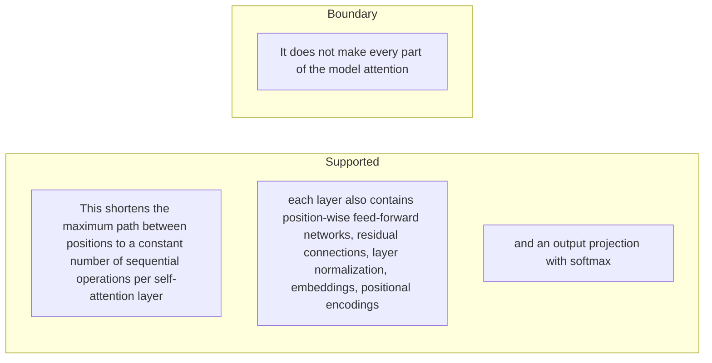

#### Python

```python
from html import escape
from pathlib import Path
from textwrap import wrap

title = "attn_change_p2: This shortens the maximum path between positions to a — supported-versus-bounded scope"
columns = {"Supported statement": ["This shortens the maximum path between positions to a constant number of sequential operations per self-attention layer","each layer also contains position-wise feed-forward networks, residual connections, layer normalization, embeddings, positional encodings","and an output projection with softmax"], "Boundary or contingency": ["It does not make every part of the model attention"]}
height = 550
parts = [
    f'<svg xmlns="http://www.w3.org/2000/svg" viewBox="0 0 900 {height}" role="img" aria-labelledby="title desc">',
    f'<title id="title">{escape(title)}</title>',
    '<desc id="desc">Statements are partitioned into supported content and explicit boundaries.</desc>',
    f'<rect width="900" height="{height}" fill="white"/>',
]
for column_index, (heading, items) in enumerate(columns.items()):
    x = 240 + column_index * 430
    parts.append(f'<text x="{x}" y="70" text-anchor="middle" font-family="sans-serif" font-size="18" font-weight="700">{escape(heading)}</text>')
    for item_index, item in enumerate(items):
        y = 130 + item_index * 110
        parts.append(f'<rect x="{x-180}" y="{y-35}" width="360" height="80" rx="12" fill="#f7fbff" stroke="#234"/>')
        for line_index, line in enumerate(wrap(item, width=48)):
            parts.append(f'<text x="{x}" y="{y-12+line_index*14}" text-anchor="middle" font-family="sans-serif" font-size="11">{escape(line)}</text>')
parts.append('</svg>')
Path("attn_change_p2_treatment_c.svg").write_text("\n".join(parts), encoding="utf-8")
```

### Implementation record

- Status: `PENDING`
- Selected treatment: `NONE`
- Selection rationale:
- Delivery medium: `NONE`
- Visual ID and placement:
- Shared paragraph scope: `NONE`
- Changed files:
- Accessibility and fallback verification:
- Desktop and mobile verification:
- Evidence deviations: `NONE`

## `attn_mechanism_p1`

- Location: `attn_mechanism`, paragraph 1
- Text anchor: "Tokens first become learned vectors, and sinusoidal position encodings are added so the model receives order information."
- Claims and sources: `attn_003` (OBSERVED, VERIFIED); `attn_004` (OBSERVED, VERIFIED); `attn_005` (AUTHORS_INTERPRETATION, VERIFIED); `source_attention_arxiv_v7` (Pages 1-10; Sections 1-7; Figures 1-2; Equation 1; Tables 1-4; version and figure-permission notice)
- Visual needed: `YES`
- Decision rationale: Removing a visual would require readers to retain the material relation between "Tokens first become learned vectors" and "Residual connections and layer normalization surround both sublayers" while also tracking 4 source-bounded propositions. The paragraph contains a real mechanism relation graph; the visual must preserve its stated conditions and must not add causal or proportional meaning.
- Explanatory job: mechanism relation graph.

### Treatment A — Tokens first become learned vectors — mechanism relation graph

- Teaching purpose: Answer "How does one Transformer prediction work?" by exposing the paragraph's 4 named propositions and 3 stated reading, comparison, or qualification relations.
- Encoding and reading order: Nodes reproduce the complete labels "Tokens first become learned vectors"; "and sinusoidal position encodings are added so the model receives order information"; "The base encoder repeats 6 layers, each containing multi-head self-attention followed by a position-wise feed-forward network"; "Residual connections and layer normalization surround both sublayers". Edges carry the explicit relation labels "then", "then", "then"; arrow direction is sequence only for mechanism or example prose and otherwise denotes reading order.
- Evidence and limitations: The topology is derived from this paragraph rather than a fixed pipeline. Encode only `attn_003`, `attn_004`, `attn_005` and do not turn reading-order edges into causal claims.
- Recommended web medium: responsive inline SVG with CSS; JavaScript may add optional step focus only when state order matters.
- Mobile, accessibility, and motion behavior: Keep the full node-and-relation list in DOM order, expose the relation labels in the long description, stack nodes on narrow screens, and disable focus transitions under reduced motion.

#### TikZ

```tex
\documentclass[tikz,border=5pt]{standalone}
\usepackage[T1]{fontenc}
\usepackage{tikz}
\usetikzlibrary{arrows.meta,positioning}
\begin{document}
\begin{tikzpicture}[font=\sffamily,concept/.style={draw,rounded corners,align=center,text width=3.6cm,minimum height=1.35cm},link/.style={-{Latex[length=2mm]},thick},rel/.style={fill=white,font=\scriptsize,inner sep=2pt}]
\node[font=\bfseries,align=center] at (6.1,2.0) {attn\_mechanism\_p1: Tokens first become learned vectors - mechanism relation graph};
\node[concept] (n1) at (1.8,0) {Tokens first become learned vectors};
\node[concept] (n2) at (6.1,0) {and sinusoidal position encodings are added so the model receives order information};
\node[concept] (n3) at (10.4,0) {The base encoder repeats 6 layers, each containing multi-head self-attention followed by a position-wise feed-forward network};
\node[concept] (n4) at (1.8,-3.2) {Residual connections and layer normalization surround both sublayers};
\draw[link] (n1) -- node[rel] {then} (n2);
\draw[link] (n2) -- node[rel] {then} (n3);
\draw[link] (n3) -- node[rel] {then} (n4);
\end{tikzpicture}
\end{document}
```

#### Mermaid

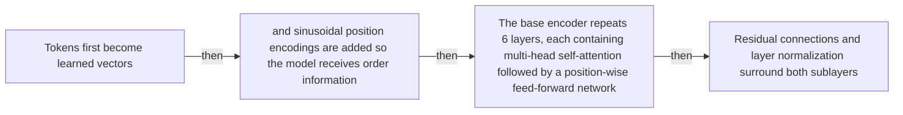

#### Python

```python
from html import escape
from pathlib import Path
from textwrap import wrap

title = "attn_mechanism_p1: Tokens first become learned vectors — mechanism relation graph"
nodes = [["n1","Tokens first become learned vectors",120,150],["n2","and sinusoidal position encodings are added so the model receives order information",420,150],["n3","The base encoder repeats 6 layers, each containing multi-head self-attention followed by a position-wise feed-forward network",720,150],["n4","Residual connections and layer normalization surround both sublayers",120,340]]
edges = [["n1","n2","then"],["n2","n3","then"],["n3","n4","then"]]
node_by_id = {node_id: (label, x, y) for node_id, label, x, y in nodes}

parts = [
    '<svg xmlns="http://www.w3.org/2000/svg" viewBox="0 0 860 520" role="img" aria-labelledby="title desc">',
    f'<title id="title">{escape(title)}</title>',
    '<desc id="desc">The labeled relations reproduce only relationships stated in the paragraph.</desc>',
    '<rect width="860" height="520" fill="white"/>',
]
for source, target, relation in edges:
    _, x1, y1 = node_by_id[source]
    _, x2, y2 = node_by_id[target]
    parts.append(f'<line x1="{x1}" y1="{y1}" x2="{x2}" y2="{y2}" stroke="#345" stroke-width="2"/>')
    parts.append(f'<text x="{(x1+x2)/2}" y="{(y1+y2)/2-6}" text-anchor="middle" font-family="sans-serif" font-size="11">{escape(relation)}</text>')
for _, label, x, y in nodes:
    parts.append(f'<rect x="{x-125}" y="{y-58}" width="250" height="116" rx="14" fill="#eef6ff" stroke="#234"/>')
    for line_index, line in enumerate(wrap(label, width=32)):
        parts.append(f'<text x="{x}" y="{y-34+line_index*16}" text-anchor="middle" font-family="sans-serif" font-size="12">{escape(line)}</text>')
parts.append('</svg>')
Path("attn_mechanism_p1_treatment_a.svg").write_text("\n".join(parts), encoding="utf-8")
```

### Treatment B — attn_003, attn_004, attn_005 — claim-to-source provenance

- Teaching purpose: Show exactly which atomic claims underwrite this paragraph and which fixed source records support each claim.
- Encoding and reading order: A bipartite graph places 3 claim nodes on the left and 1 source nodes on the right, with only the 3 claim-source edges recorded in the fixture. Claim labels include epistemic status; source labels include the exact locator.
- Evidence and limitations: This treatment explains provenance and uncertainty, not the paper's causal mechanism. Missing edges remain visibly absent and no source count is treated as confidence.
- Recommended web medium: semantic HTML/CSS claim-source table with an SVG network view; JavaScript only for keyboard-controlled source highlighting.
- Mobile, accessibility, and motion behavior: Provide real table headers and source links in the static fallback, make every edge recoverable as text, stack claim records before source records on mobile, and require no motion.

#### TikZ

```tex
\documentclass[tikz,border=5pt]{standalone}
\usepackage[T1]{fontenc}
\usepackage{tikz}
\usetikzlibrary{arrows.meta}
\begin{document}
\begin{tikzpicture}[font=\sffamily,claim/.style={draw,rounded corners,align=center,text width=5.2cm,minimum height=1.2cm},source/.style={draw,dashed,align=center,text width=5.2cm,minimum height=1.2cm},link/.style={-{Latex[length=2mm]},thin}]
\node[font=\bfseries] at (4,1.8) {attn\_mechanism\_p1: claim-to-source provenance};
\node[claim] (c1) at (0,0) {The base encoder and decoder each contain 6 layers; the decoder masks future target positions and adds encoder-decoder attention over the encoded source. [OBSERVED]};
\node[claim] (c2) at (0,-2.4) {Scaled dot-product attention computes softmax of Q times K-transpose divided by the square root of the key dimension, then multiplies those weights by V. [OBSERVED]};
\node[claim] (c3) at (0,-4.8) {The authors interpret multi-head attention as a way to attend jointly to different representation subspaces and positions instead of collapsing them through one attention average. [AUTHORS\_INTERPRETATION]};
\node[source] (s1) at (8,0) {Attention Is All You Need, arXiv v7 PDF - Pages 1-10; Sections 1-7; Figures 1-2; Equation 1; Tables 1-4; version and figure-permission notice};
\draw[link] (c1) -- (s1);
\draw[link] (c2) -- (s1);
\draw[link] (c3) -- (s1);
\end{tikzpicture}
\end{document}
```

#### Mermaid

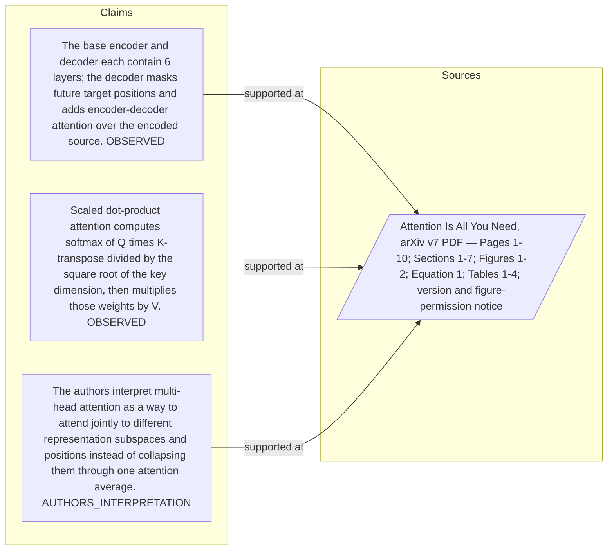

#### Python

```python
from html import escape
from pathlib import Path
from textwrap import wrap

title = "attn_mechanism_p1: claim-to-source provenance"
nodes = [["c1","The base encoder and decoder each contain 6 layers; the decoder masks future target positions and adds encoder-decoder attention over the encoded source. [OBSERVED]",190,130],["c2","Scaled dot-product attention computes softmax of Q times K-transpose divided by the square root of the key dimension, then multiplies those weights by V. [OBSERVED]",190,250],["c3","The authors interpret multi-head attention as a way to attend jointly to different representation subspaces and positions instead of collapsing them through one attention average. [AUTHORS_INTERPRETATION]",190,370],["s1","Attention Is All You Need, arXiv v7 PDF — Pages 1-10; Sections 1-7; Figures 1-2; Equation 1; Tables 1-4; version and figure-permission notice",700,130]]
edges = [["c1","s1"],["c2","s1"],["c3","s1"]]
node_by_id = {node_id: (label, x, y) for node_id, label, x, y in nodes}
height = 560

parts = [
    f'<svg xmlns="http://www.w3.org/2000/svg" viewBox="0 0 900 {height}" role="img" aria-labelledby="title desc">',
    f'<title id="title">{escape(title)}</title>',
    '<desc id="desc">Bipartite map from verified claim records to their exact source records.</desc>',
    f'<rect width="900" height="{height}" fill="white"/>',
]
for source, target in edges:
    _, x1, y1 = node_by_id[source]
    _, x2, y2 = node_by_id[target]
    parts.append(f'<line x1="{x1+145}" y1="{y1}" x2="{x2-145}" y2="{y2}" stroke="#456" stroke-width="2"/>')
for node_id, label, x, y in nodes:
    dashed = ' stroke-dasharray="7 5"' if node_id.startswith("s") else ''
    parts.append(f'<rect x="{x-145}" y="{y-46}" width="290" height="92" rx="12" fill="#f7fbff" stroke="#234"{dashed}/>')
    for line_index, line in enumerate(wrap(label, width=38)):
        parts.append(f'<text x="{x}" y="{y-24+line_index*14}" text-anchor="middle" font-family="sans-serif" font-size="11">{escape(line)}</text>')
parts.append('</svg>')
Path("attn_mechanism_p1_treatment_b.svg").write_text("\n".join(parts), encoding="utf-8")
```

### Treatment C — Tokens first become learned vectors — input-operation-outcome storyboard

- Teaching purpose: Let readers inspect the paragraph as concrete input, operation, and outcome states.
- Encoding and reading order: Use 4 ordered states labeled "Input: Tokens first become learned vectors", "Operation: and sinusoidal position encodings are added so the model receives order information", "Operation: The base encoder repeats 6 layers, each containing multi-head self-attention followed by a position-wise feed-forward network", "Outcome: Residual connections and layer normalization surround both sublayers". State connectors reproduce paragraph order and do not imply unreported timing.
- Evidence and limitations: The first, intermediate, and final states are paragraph clauses; no hidden state, quantity, or transition is added.
- Recommended web medium: responsive SVG or semantic HTML/CSS; JavaScript is optional only for a meaningful state or scope toggle.
- Mobile, accessibility, and motion behavior: Preserve every exact value or scope statement as selectable text, avoid color-only distinctions, stack groups on mobile, and keep all information visible when JavaScript or motion is disabled.

#### TikZ

```tex
\documentclass[tikz,border=5pt]{standalone}
\usepackage[T1]{fontenc}
\usepackage{tikz}
\begin{document}
\begin{tikzpicture}[font=\sffamily,state/.style={draw,rounded corners,align=center,text width=3.2cm,minimum height=1.8cm}]
\node[font=\bfseries] at (5.699999999999999,2) {attn\_mechanism\_p1: Tokens first become learned vectors - input-operation-outcome storyboard};
\node[state] (k1) at (0,0) {\textbf{Input}\\Tokens first become learned vectors};
\node[state] (k2) at (3.8,0) {\textbf{Operation}\\and sinusoidal position encodings are added so the model receives order information};
\node[state] (k3) at (7.6,0) {\textbf{Operation}\\The base encoder repeats 6 layers, each containing multi-head self-attention followed by a position-wise feed-forward network};
\node[state] (k4) at (11.399999999999999,0) {\textbf{Outcome}\\Residual connections and layer normalization surround both sublayers};
\draw[->,thick] (k1) -- (k2);
\draw[->,thick] (k2) -- (k3);
\draw[->,thick] (k3) -- (k4);
\end{tikzpicture}
\end{document}
```

#### Mermaid

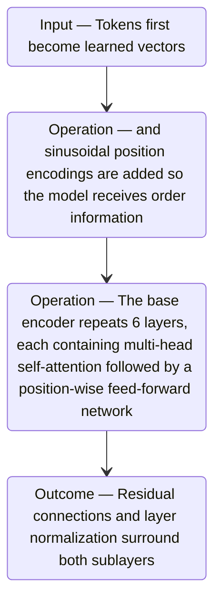

#### Python

```python
from html import escape
from pathlib import Path
from textwrap import wrap

title = "attn_mechanism_p1: Tokens first become learned vectors — input-operation-outcome storyboard"
items = [["Input","Tokens first become learned vectors",120,210],["Operation","and sinusoidal position encodings are added so the model receives order information",290,210],["Operation","The base encoder repeats 6 layers, each containing multi-head self-attention followed by a position-wise feed-forward network",460,210],["Outcome","Residual connections and layer normalization surround both sublayers",630,210]]
width = max(760, 240 + len(items) * 170)
parts = [
    f'<svg xmlns="http://www.w3.org/2000/svg" viewBox="0 0 {width} 460" role="img" aria-labelledby="title desc">',
    f'<title id="title">{escape(title)}</title>',
    '<desc id="desc">Input, operation, and outcome states follow the paragraph in source order.</desc>',
    f'<rect width="{width}" height="460" fill="white"/>',
]
for index in range(len(items)-1):
    _, _, x1, y1 = items[index]
    _, _, x2, y2 = items[index+1]
    parts.append(f'<line x1="{x1+65}" y1="{y1}" x2="{x2-65}" y2="{y2}" stroke="#345" stroke-width="2"/>')
for group, label, x, y in items:
    parts.append(f'<rect x="{x-65}" y="{y-90}" width="130" height="180" rx="16" fill="#eef6ff" stroke="#234"/>')
    parts.append(f'<text x="{x}" y="{y-60}" text-anchor="middle" font-family="sans-serif" font-size="13" font-weight="700">{escape(group)}</text>')
    for line_index, line in enumerate(wrap(label, width=18)):
        parts.append(f'<text x="{x}" y="{y-34+line_index*14}" text-anchor="middle" font-family="sans-serif" font-size="10">{escape(line)}</text>')
parts.append('</svg>')
Path("attn_mechanism_p1_treatment_c.svg").write_text("\n".join(parts), encoding="utf-8")
```

### Implementation record

- Status: `PENDING`
- Selected treatment: `NONE`
- Selection rationale:
- Delivery medium: `NONE`
- Visual ID and placement:
- Shared paragraph scope: `NONE`
- Changed files:
- Accessibility and fallback verification:
- Desktop and mobile verification:
- Evidence deviations: `NONE`

## `attn_mechanism_p2`

- Location: `attn_mechanism`, paragraph 2
- Text anchor: "For scaled dot-product attention, the model compares a query with every key using Q times K-transpose, divides by the square root of the key dimension, applies softmax, and uses the resulting weights to mix the values."
- Claims and sources: `attn_003` (OBSERVED, VERIFIED); `attn_004` (OBSERVED, VERIFIED); `attn_005` (AUTHORS_INTERPRETATION, VERIFIED); `source_attention_arxiv_v7` (Pages 1-10; Sections 1-7; Figures 1-2; Equation 1; Tables 1-4; version and figure-permission notice)
- Visual needed: `YES`
- Decision rationale: Removing a visual would require readers to retain the material relation between "For scaled dot-product attention, the model compares a query with every key using Q times K-transpose, divides by the square root of the key dimension, applies softmax" and "and projects the result" while also tracking 4 source-bounded propositions. The paragraph contains a real mechanism relation graph; the visual must preserve its stated conditions and must not add causal or proportional meaning.
- Explanatory job: mechanism relation graph.

### Treatment A — For scaled dot-product attention the model compares a query — mechanism relation graph

- Teaching purpose: Answer "How does one Transformer prediction work?" by exposing the paragraph's 4 named propositions and 3 stated reading, comparison, or qualification relations.
- Encoding and reading order: Nodes reproduce the complete labels "For scaled dot-product attention, the model compares a query with every key using Q times K-transpose, divides by the square root of the key dimension, applies softmax"; "and uses the resulting weights to mix the values"; "The base model performs this calculation in 8 learned heads, concatenates their outputs"; "and projects the result". Edges carry the explicit relation labels "then", "then", "then"; arrow direction is sequence only for mechanism or example prose and otherwise denotes reading order.
- Evidence and limitations: The topology is derived from this paragraph rather than a fixed pipeline. Encode only `attn_003`, `attn_004`, `attn_005` and do not turn reading-order edges into causal claims.
- Recommended web medium: responsive inline SVG with CSS; JavaScript may add optional step focus only when state order matters.
- Mobile, accessibility, and motion behavior: Keep the full node-and-relation list in DOM order, expose the relation labels in the long description, stack nodes on narrow screens, and disable focus transitions under reduced motion.

#### TikZ

```tex
\documentclass[tikz,border=5pt]{standalone}
\usepackage[T1]{fontenc}
\usepackage{tikz}
\usetikzlibrary{arrows.meta,positioning}
\begin{document}
\begin{tikzpicture}[font=\sffamily,concept/.style={draw,rounded corners,align=center,text width=3.6cm,minimum height=1.35cm},link/.style={-{Latex[length=2mm]},thick},rel/.style={fill=white,font=\scriptsize,inner sep=2pt}]
\node[font=\bfseries,align=center] at (6.1,2.0) {attn\_mechanism\_p2: For scaled dot-product attention the model compares a query - mechanism relation graph};
\node[concept] (n1) at (1.8,0) {For scaled dot-product attention, the model compares a query with every key using Q times K-transpose, divides by the square root of the key dimension, applies softmax};
\node[concept] (n2) at (6.1,0) {and uses the resulting weights to mix the values};
\node[concept] (n3) at (10.4,0) {The base model performs this calculation in 8 learned heads, concatenates their outputs};
\node[concept] (n4) at (1.8,-3.2) {and projects the result};
\draw[link] (n1) -- node[rel] {then} (n2);
\draw[link] (n2) -- node[rel] {then} (n3);
\draw[link] (n3) -- node[rel] {then} (n4);
\end{tikzpicture}
\end{document}
```

#### Mermaid

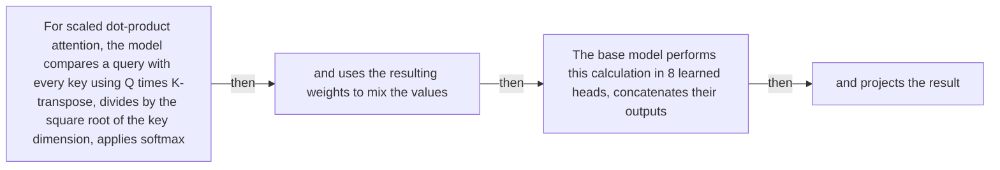

#### Python

```python
from html import escape
from pathlib import Path
from textwrap import wrap

title = "attn_mechanism_p2: For scaled dot-product attention the model compares a query — mechanism relation graph"
nodes = [["n1","For scaled dot-product attention, the model compares a query with every key using Q times K-transpose, divides by the square root of the key dimension, applies softmax",120,150],["n2","and uses the resulting weights to mix the values",420,150],["n3","The base model performs this calculation in 8 learned heads, concatenates their outputs",720,150],["n4","and projects the result",120,340]]
edges = [["n1","n2","then"],["n2","n3","then"],["n3","n4","then"]]
node_by_id = {node_id: (label, x, y) for node_id, label, x, y in nodes}

parts = [
    '<svg xmlns="http://www.w3.org/2000/svg" viewBox="0 0 860 520" role="img" aria-labelledby="title desc">',
    f'<title id="title">{escape(title)}</title>',
    '<desc id="desc">The labeled relations reproduce only relationships stated in the paragraph.</desc>',
    '<rect width="860" height="520" fill="white"/>',
]
for source, target, relation in edges:
    _, x1, y1 = node_by_id[source]
    _, x2, y2 = node_by_id[target]
    parts.append(f'<line x1="{x1}" y1="{y1}" x2="{x2}" y2="{y2}" stroke="#345" stroke-width="2"/>')
    parts.append(f'<text x="{(x1+x2)/2}" y="{(y1+y2)/2-6}" text-anchor="middle" font-family="sans-serif" font-size="11">{escape(relation)}</text>')
for _, label, x, y in nodes:
    parts.append(f'<rect x="{x-125}" y="{y-58}" width="250" height="116" rx="14" fill="#eef6ff" stroke="#234"/>')
    for line_index, line in enumerate(wrap(label, width=32)):
        parts.append(f'<text x="{x}" y="{y-34+line_index*16}" text-anchor="middle" font-family="sans-serif" font-size="12">{escape(line)}</text>')
parts.append('</svg>')
Path("attn_mechanism_p2_treatment_a.svg").write_text("\n".join(parts), encoding="utf-8")
```

### Treatment B — attn_003, attn_004, attn_005 — claim-to-source provenance

- Teaching purpose: Show exactly which atomic claims underwrite this paragraph and which fixed source records support each claim.
- Encoding and reading order: A bipartite graph places 3 claim nodes on the left and 1 source nodes on the right, with only the 3 claim-source edges recorded in the fixture. Claim labels include epistemic status; source labels include the exact locator.
- Evidence and limitations: This treatment explains provenance and uncertainty, not the paper's causal mechanism. Missing edges remain visibly absent and no source count is treated as confidence.
- Recommended web medium: semantic HTML/CSS claim-source table with an SVG network view; JavaScript only for keyboard-controlled source highlighting.
- Mobile, accessibility, and motion behavior: Provide real table headers and source links in the static fallback, make every edge recoverable as text, stack claim records before source records on mobile, and require no motion.

#### TikZ

```tex
\documentclass[tikz,border=5pt]{standalone}
\usepackage[T1]{fontenc}
\usepackage{tikz}
\usetikzlibrary{arrows.meta}
\begin{document}
\begin{tikzpicture}[font=\sffamily,claim/.style={draw,rounded corners,align=center,text width=5.2cm,minimum height=1.2cm},source/.style={draw,dashed,align=center,text width=5.2cm,minimum height=1.2cm},link/.style={-{Latex[length=2mm]},thin}]
\node[font=\bfseries] at (4,1.8) {attn\_mechanism\_p2: claim-to-source provenance};
\node[claim] (c1) at (0,0) {The base encoder and decoder each contain 6 layers; the decoder masks future target positions and adds encoder-decoder attention over the encoded source. [OBSERVED]};
\node[claim] (c2) at (0,-2.4) {Scaled dot-product attention computes softmax of Q times K-transpose divided by the square root of the key dimension, then multiplies those weights by V. [OBSERVED]};
\node[claim] (c3) at (0,-4.8) {The authors interpret multi-head attention as a way to attend jointly to different representation subspaces and positions instead of collapsing them through one attention average. [AUTHORS\_INTERPRETATION]};
\node[source] (s1) at (8,0) {Attention Is All You Need, arXiv v7 PDF - Pages 1-10; Sections 1-7; Figures 1-2; Equation 1; Tables 1-4; version and figure-permission notice};
\draw[link] (c1) -- (s1);
\draw[link] (c2) -- (s1);
\draw[link] (c3) -- (s1);
\end{tikzpicture}
\end{document}
```

#### Mermaid


#### Python

```python
from html import escape
from pathlib import Path
from textwrap import wrap

title = "attn_mechanism_p2: claim-to-source provenance"
nodes = [["c1","The base encoder and decoder each contain 6 layers; the decoder masks future target positions and adds encoder-decoder attention over the encoded source. [OBSERVED]",190,130],["c2","Scaled dot-product attention computes softmax of Q times K-transpose divided by the square root of the key dimension, then multiplies those weights by V. [OBSERVED]",190,250],["c3","The authors interpret multi-head attention as a way to attend jointly to different representation subspaces and positions instead of collapsing them through one attention average. [AUTHORS_INTERPRETATION]",190,370],["s1","Attention Is All You Need, arXiv v7 PDF — Pages 1-10; Sections 1-7; Figures 1-2; Equation 1; Tables 1-4; version and figure-permission notice",700,130]]
edges = [["c1","s1"],["c2","s1"],["c3","s1"]]
node_by_id = {node_id: (label, x, y) for node_id, label, x, y in nodes}
height = 560

parts = [
    f'<svg xmlns="http://www.w3.org/2000/svg" viewBox="0 0 900 {height}" role="img" aria-labelledby="title desc">',
    f'<title id="title">{escape(title)}</title>',
    '<desc id="desc">Bipartite map from verified claim records to their exact source records.</desc>',
    f'<rect width="900" height="{height}" fill="white"/>',
]
for source, target in edges:
    _, x1, y1 = node_by_id[source]
    _, x2, y2 = node_by_id[target]
    parts.append(f'<line x1="{x1+145}" y1="{y1}" x2="{x2-145}" y2="{y2}" stroke="#456" stroke-width="2"/>')
for node_id, label, x, y in nodes:
    dashed = ' stroke-dasharray="7 5"' if node_id.startswith("s") else ''
    parts.append(f'<rect x="{x-145}" y="{y-46}" width="290" height="92" rx="12" fill="#f7fbff" stroke="#234"{dashed}/>')
    for line_index, line in enumerate(wrap(label, width=38)):
        parts.append(f'<text x="{x}" y="{y-24+line_index*14}" text-anchor="middle" font-family="sans-serif" font-size="11">{escape(line)}</text>')
parts.append('</svg>')
Path("attn_mechanism_p2_treatment_b.svg").write_text("\n".join(parts), encoding="utf-8")
```

### Treatment C — For scaled dot-product attention the model compares a query — input-operation-outcome storyboard

- Teaching purpose: Let readers inspect the paragraph as concrete input, operation, and outcome states.
- Encoding and reading order: Use 4 ordered states labeled "Input: For scaled dot-product attention, the model compares a query with every key using Q times K-transpose, divides by the square root of the key dimension, applies softmax", "Operation: and uses the resulting weights to mix the values", "Operation: The base model performs this calculation in 8 learned heads, concatenates their outputs", "Outcome: and projects the result". State connectors reproduce paragraph order and do not imply unreported timing.
- Evidence and limitations: The first, intermediate, and final states are paragraph clauses; no hidden state, quantity, or transition is added.
- Recommended web medium: responsive SVG or semantic HTML/CSS; JavaScript is optional only for a meaningful state or scope toggle.
- Mobile, accessibility, and motion behavior: Preserve every exact value or scope statement as selectable text, avoid color-only distinctions, stack groups on mobile, and keep all information visible when JavaScript or motion is disabled.

#### TikZ

```tex
\documentclass[tikz,border=5pt]{standalone}
\usepackage[T1]{fontenc}
\usepackage{tikz}
\begin{document}
\begin{tikzpicture}[font=\sffamily,state/.style={draw,rounded corners,align=center,text width=3.2cm,minimum height=1.8cm}]
\node[font=\bfseries] at (5.699999999999999,2) {attn\_mechanism\_p2: For scaled dot-product attention the model compares a query - input-operation-outcome storyboard};
\node[state] (k1) at (0,0) {\textbf{Input}\\For scaled dot-product attention, the model compares a query with every key using Q times K-transpose, divides by the square root of the key dimension, applies softmax};
\node[state] (k2) at (3.8,0) {\textbf{Operation}\\and uses the resulting weights to mix the values};
\node[state] (k3) at (7.6,0) {\textbf{Operation}\\The base model performs this calculation in 8 learned heads, concatenates their outputs};
\node[state] (k4) at (11.399999999999999,0) {\textbf{Outcome}\\and projects the result};
\draw[->,thick] (k1) -- (k2);
\draw[->,thick] (k2) -- (k3);
\draw[->,thick] (k3) -- (k4);
\end{tikzpicture}
\end{document}
```

#### Mermaid

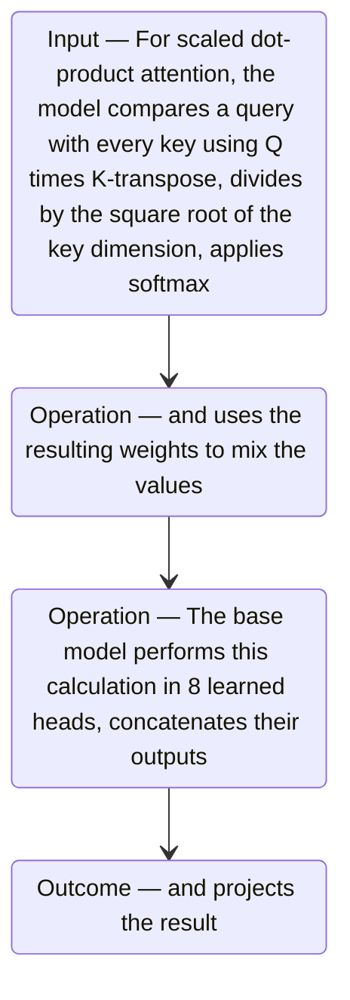

#### Python

```python
from html import escape
from pathlib import Path
from textwrap import wrap

title = "attn_mechanism_p2: For scaled dot-product attention the model compares a query — input-operation-outcome storyboard"
items = [["Input","For scaled dot-product attention, the model compares a query with every key using Q times K-transpose, divides by the square root of the key dimension, applies softmax",120,210],["Operation","and uses the resulting weights to mix the values",290,210],["Operation","The base model performs this calculation in 8 learned heads, concatenates their outputs",460,210],["Outcome","and projects the result",630,210]]
width = max(760, 240 + len(items) * 170)
parts = [
    f'<svg xmlns="http://www.w3.org/2000/svg" viewBox="0 0 {width} 460" role="img" aria-labelledby="title desc">',
    f'<title id="title">{escape(title)}</title>',
    '<desc id="desc">Input, operation, and outcome states follow the paragraph in source order.</desc>',
    f'<rect width="{width}" height="460" fill="white"/>',
]
for index in range(len(items)-1):
    _, _, x1, y1 = items[index]
    _, _, x2, y2 = items[index+1]
    parts.append(f'<line x1="{x1+65}" y1="{y1}" x2="{x2-65}" y2="{y2}" stroke="#345" stroke-width="2"/>')
for group, label, x, y in items:
    parts.append(f'<rect x="{x-65}" y="{y-90}" width="130" height="180" rx="16" fill="#eef6ff" stroke="#234"/>')
    parts.append(f'<text x="{x}" y="{y-60}" text-anchor="middle" font-family="sans-serif" font-size="13" font-weight="700">{escape(group)}</text>')
    for line_index, line in enumerate(wrap(label, width=18)):
        parts.append(f'<text x="{x}" y="{y-34+line_index*14}" text-anchor="middle" font-family="sans-serif" font-size="10">{escape(line)}</text>')
parts.append('</svg>')
Path("attn_mechanism_p2_treatment_c.svg").write_text("\n".join(parts), encoding="utf-8")
```

### Implementation record

- Status: `PENDING`
- Selected treatment: `NONE`
- Selection rationale:
- Delivery medium: `NONE`
- Visual ID and placement:
- Shared paragraph scope: `NONE`
- Changed files:
- Accessibility and fallback verification:
- Desktop and mobile verification:
- Evidence deviations: `NONE`

## `attn_mechanism_p3`

- Location: `attn_mechanism`, paragraph 3
- Text anchor: "The decoder also repeats 6 layers."
- Claims and sources: `attn_003` (OBSERVED, VERIFIED); `attn_004` (OBSERVED, VERIFIED); `attn_005` (AUTHORS_INTERPRETATION, VERIFIED); `source_attention_arxiv_v7` (Pages 1-10; Sections 1-7; Figures 1-2; Equation 1; Tables 1-4; version and figure-permission notice)
- Visual needed: `YES`
- Decision rationale: Removing a visual would require readers to retain the material relation between "The decoder also repeats 6 layers" and "The selected token is appended and decoding repeats" while also tracking 5 source-bounded propositions. The paragraph contains a real mechanism relation graph; the visual must preserve its stated conditions and must not add causal or proportional meaning.
- Explanatory job: mechanism relation graph.

### Treatment A — The decoder also repeats 6 layers — mechanism relation graph

- Teaching purpose: Answer "How does one Transformer prediction work?" by exposing the paragraph's 5 named propositions and 4 stated reading, comparison, or qualification relations.
- Encoding and reading order: Nodes reproduce the complete labels "The decoder also repeats 6 layers"; "Its self-attention masks future target positions"; "then encoder-decoder attention uses decoder queries with encoder keys and values"; "The final decoder representation passes through a linear projection and softmax to produce probabilities for one next token"; "The selected token is appended and decoding repeats". Edges carry the explicit relation labels "then", "then", "then", "then"; arrow direction is sequence only for mechanism or example prose and otherwise denotes reading order.
- Evidence and limitations: The topology is derived from this paragraph rather than a fixed pipeline. Encode only `attn_003`, `attn_004`, `attn_005` and do not turn reading-order edges into causal claims.
- Recommended web medium: responsive inline SVG with CSS; JavaScript may add optional step focus only when state order matters.
- Mobile, accessibility, and motion behavior: Keep the full node-and-relation list in DOM order, expose the relation labels in the long description, stack nodes on narrow screens, and disable focus transitions under reduced motion.

#### TikZ

```tex
\documentclass[tikz,border=5pt]{standalone}
\usepackage[T1]{fontenc}
\usepackage{tikz}
\usetikzlibrary{arrows.meta,positioning}
\begin{document}
\begin{tikzpicture}[font=\sffamily,concept/.style={draw,rounded corners,align=center,text width=3.6cm,minimum height=1.35cm},link/.style={-{Latex[length=2mm]},thick},rel/.style={fill=white,font=\scriptsize,inner sep=2pt}]
\node[font=\bfseries,align=center] at (6.1,2.0) {attn\_mechanism\_p3: The decoder also repeats 6 layers - mechanism relation graph};
\node[concept] (n1) at (1.8,0) {The decoder also repeats 6 layers};
\node[concept] (n2) at (6.1,0) {Its self-attention masks future target positions};
\node[concept] (n3) at (10.4,0) {then encoder-decoder attention uses decoder queries with encoder keys and values};
\node[concept] (n4) at (1.8,-3.2) {The final decoder representation passes through a linear projection and softmax to produce probabilities for one next token};
\node[concept] (n5) at (6.1,-3.2) {The selected token is appended and decoding repeats};
\draw[link] (n1) -- node[rel] {then} (n2);
\draw[link] (n2) -- node[rel] {then} (n3);
\draw[link] (n3) -- node[rel] {then} (n4);
\draw[link] (n4) -- node[rel] {then} (n5);
\end{tikzpicture}
\end{document}
```

#### Mermaid

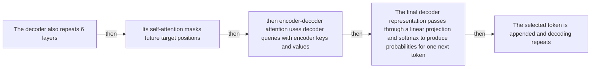

#### Python

```python
from html import escape
from pathlib import Path
from textwrap import wrap

title = "attn_mechanism_p3: The decoder also repeats 6 layers — mechanism relation graph"
nodes = [["n1","The decoder also repeats 6 layers",120,150],["n2","Its self-attention masks future target positions",420,150],["n3","then encoder-decoder attention uses decoder queries with encoder keys and values",720,150],["n4","The final decoder representation passes through a linear projection and softmax to produce probabilities for one next token",120,340],["n5","The selected token is appended and decoding repeats",420,340]]
edges = [["n1","n2","then"],["n2","n3","then"],["n3","n4","then"],["n4","n5","then"]]
node_by_id = {node_id: (label, x, y) for node_id, label, x, y in nodes}

parts = [
    '<svg xmlns="http://www.w3.org/2000/svg" viewBox="0 0 860 520" role="img" aria-labelledby="title desc">',
    f'<title id="title">{escape(title)}</title>',
    '<desc id="desc">The labeled relations reproduce only relationships stated in the paragraph.</desc>',
    '<rect width="860" height="520" fill="white"/>',
]
for source, target, relation in edges:
    _, x1, y1 = node_by_id[source]
    _, x2, y2 = node_by_id[target]
    parts.append(f'<line x1="{x1}" y1="{y1}" x2="{x2}" y2="{y2}" stroke="#345" stroke-width="2"/>')
    parts.append(f'<text x="{(x1+x2)/2}" y="{(y1+y2)/2-6}" text-anchor="middle" font-family="sans-serif" font-size="11">{escape(relation)}</text>')
for _, label, x, y in nodes:
    parts.append(f'<rect x="{x-125}" y="{y-58}" width="250" height="116" rx="14" fill="#eef6ff" stroke="#234"/>')
    for line_index, line in enumerate(wrap(label, width=32)):
        parts.append(f'<text x="{x}" y="{y-34+line_index*16}" text-anchor="middle" font-family="sans-serif" font-size="12">{escape(line)}</text>')
parts.append('</svg>')
Path("attn_mechanism_p3_treatment_a.svg").write_text("\n".join(parts), encoding="utf-8")
```

### Treatment B — attn_003, attn_004, attn_005 — claim-to-source provenance

- Teaching purpose: Show exactly which atomic claims underwrite this paragraph and which fixed source records support each claim.
- Encoding and reading order: A bipartite graph places 3 claim nodes on the left and 1 source nodes on the right, with only the 3 claim-source edges recorded in the fixture. Claim labels include epistemic status; source labels include the exact locator.
- Evidence and limitations: This treatment explains provenance and uncertainty, not the paper's causal mechanism. Missing edges remain visibly absent and no source count is treated as confidence.
- Recommended web medium: semantic HTML/CSS claim-source table with an SVG network view; JavaScript only for keyboard-controlled source highlighting.
- Mobile, accessibility, and motion behavior: Provide real table headers and source links in the static fallback, make every edge recoverable as text, stack claim records before source records on mobile, and require no motion.

#### TikZ

```tex
\documentclass[tikz,border=5pt]{standalone}
\usepackage[T1]{fontenc}
\usepackage{tikz}
\usetikzlibrary{arrows.meta}
\begin{document}
\begin{tikzpicture}[font=\sffamily,claim/.style={draw,rounded corners,align=center,text width=5.2cm,minimum height=1.2cm},source/.style={draw,dashed,align=center,text width=5.2cm,minimum height=1.2cm},link/.style={-{Latex[length=2mm]},thin}]
\node[font=\bfseries] at (4,1.8) {attn\_mechanism\_p3: claim-to-source provenance};
\node[claim] (c1) at (0,0) {The base encoder and decoder each contain 6 layers; the decoder masks future target positions and adds encoder-decoder attention over the encoded source. [OBSERVED]};
\node[claim] (c2) at (0,-2.4) {Scaled dot-product attention computes softmax of Q times K-transpose divided by the square root of the key dimension, then multiplies those weights by V. [OBSERVED]};
\node[claim] (c3) at (0,-4.8) {The authors interpret multi-head attention as a way to attend jointly to different representation subspaces and positions instead of collapsing them through one attention average. [AUTHORS\_INTERPRETATION]};
\node[source] (s1) at (8,0) {Attention Is All You Need, arXiv v7 PDF - Pages 1-10; Sections 1-7; Figures 1-2; Equation 1; Tables 1-4; version and figure-permission notice};
\draw[link] (c1) -- (s1);
\draw[link] (c2) -- (s1);
\draw[link] (c3) -- (s1);
\end{tikzpicture}
\end{document}
```

#### Mermaid


#### Python

```python
from html import escape
from pathlib import Path
from textwrap import wrap

title = "attn_mechanism_p3: claim-to-source provenance"
nodes = [["c1","The base encoder and decoder each contain 6 layers; the decoder masks future target positions and adds encoder-decoder attention over the encoded source. [OBSERVED]",190,130],["c2","Scaled dot-product attention computes softmax of Q times K-transpose divided by the square root of the key dimension, then multiplies those weights by V. [OBSERVED]",190,250],["c3","The authors interpret multi-head attention as a way to attend jointly to different representation subspaces and positions instead of collapsing them through one attention average. [AUTHORS_INTERPRETATION]",190,370],["s1","Attention Is All You Need, arXiv v7 PDF — Pages 1-10; Sections 1-7; Figures 1-2; Equation 1; Tables 1-4; version and figure-permission notice",700,130]]
edges = [["c1","s1"],["c2","s1"],["c3","s1"]]
node_by_id = {node_id: (label, x, y) for node_id, label, x, y in nodes}
height = 560

parts = [
    f'<svg xmlns="http://www.w3.org/2000/svg" viewBox="0 0 900 {height}" role="img" aria-labelledby="title desc">',
    f'<title id="title">{escape(title)}</title>',
    '<desc id="desc">Bipartite map from verified claim records to their exact source records.</desc>',
    f'<rect width="900" height="{height}" fill="white"/>',
]
for source, target in edges:
    _, x1, y1 = node_by_id[source]
    _, x2, y2 = node_by_id[target]
    parts.append(f'<line x1="{x1+145}" y1="{y1}" x2="{x2-145}" y2="{y2}" stroke="#456" stroke-width="2"/>')
for node_id, label, x, y in nodes:
    dashed = ' stroke-dasharray="7 5"' if node_id.startswith("s") else ''
    parts.append(f'<rect x="{x-145}" y="{y-46}" width="290" height="92" rx="12" fill="#f7fbff" stroke="#234"{dashed}/>')
    for line_index, line in enumerate(wrap(label, width=38)):
        parts.append(f'<text x="{x}" y="{y-24+line_index*14}" text-anchor="middle" font-family="sans-serif" font-size="11">{escape(line)}</text>')
parts.append('</svg>')
Path("attn_mechanism_p3_treatment_b.svg").write_text("\n".join(parts), encoding="utf-8")
```

### Treatment C — The decoder also repeats 6 layers — input-operation-outcome storyboard

- Teaching purpose: Let readers inspect the paragraph as concrete input, operation, and outcome states.
- Encoding and reading order: Use 5 ordered states labeled "Input: The decoder also repeats 6 layers", "Operation: Its self-attention masks future target positions", "Operation: then encoder-decoder attention uses decoder queries with encoder keys and values", "Operation: The final decoder representation passes through a linear projection and softmax to produce probabilities for one next token", "Outcome: The selected token is appended and decoding repeats". State connectors reproduce paragraph order and do not imply unreported timing.
- Evidence and limitations: The first, intermediate, and final states are paragraph clauses; no hidden state, quantity, or transition is added.
- Recommended web medium: responsive SVG or semantic HTML/CSS; JavaScript is optional only for a meaningful state or scope toggle.
- Mobile, accessibility, and motion behavior: Preserve every exact value or scope statement as selectable text, avoid color-only distinctions, stack groups on mobile, and keep all information visible when JavaScript or motion is disabled.

#### TikZ

```tex
\documentclass[tikz,border=5pt]{standalone}
\usepackage[T1]{fontenc}
\usepackage{tikz}
\begin{document}
\begin{tikzpicture}[font=\sffamily,state/.style={draw,rounded corners,align=center,text width=3.2cm,minimum height=1.8cm}]
\node[font=\bfseries] at (7.6,2) {attn\_mechanism\_p3: The decoder also repeats 6 layers - input-operation-outcome storyboard};
\node[state] (k1) at (0,0) {\textbf{Input}\\The decoder also repeats 6 layers};
\node[state] (k2) at (3.8,0) {\textbf{Operation}\\Its self-attention masks future target positions};
\node[state] (k3) at (7.6,0) {\textbf{Operation}\\then encoder-decoder attention uses decoder queries with encoder keys and values};
\node[state] (k4) at (11.399999999999999,0) {\textbf{Operation}\\The final decoder representation passes through a linear projection and softmax to produce probabilities for one next token};
\node[state] (k5) at (15.2,0) {\textbf{Outcome}\\The selected token is appended and decoding repeats};
\draw[->,thick] (k1) -- (k2);
\draw[->,thick] (k2) -- (k3);
\draw[->,thick] (k3) -- (k4);
\draw[->,thick] (k4) -- (k5);
\end{tikzpicture}
\end{document}
```

#### Mermaid

```mermaid
stateDiagram-v2
  state "Input — The decoder also repeats 6 layers" as k1
  state "Operation — Its self-attention masks future target positions" as k2
  state "Operation — then encoder-decoder attention uses decoder queries with encoder keys and values" as k3
  state "Operation — The final decoder representation passes through a linear projection and softmax to produce probabilities for one next token" as k4
  state "Outcome — The selected token is appended and decoding repeats" as k5
  k1 --> k2
  k2 --> k3
  k3 --> k4
  k4 --> k5
```

#### Python

```python
from html import escape
from pathlib import Path
from textwrap import wrap

title = "attn_mechanism_p3: The decoder also repeats 6 layers — input-operation-outcome storyboard"
items = [["Input","The decoder also repeats 6 layers",120,210],["Operation","Its self-attention masks future target positions",290,210],["Operation","then encoder-decoder attention uses decoder queries with encoder keys and values",460,210],["Operation","The final decoder representation passes through a linear projection and softmax to produce probabilities for one next token",630,210],["Outcome","The selected token is appended and decoding repeats",800,210]]
width = max(760, 240 + len(items) * 170)
parts = [
    f'<svg xmlns="http://www.w3.org/2000/svg" viewBox="0 0 {width} 460" role="img" aria-labelledby="title desc">',
    f'<title id="title">{escape(title)}</title>',
    '<desc id="desc">Input, operation, and outcome states follow the paragraph in source order.</desc>',
    f'<rect width="{width}" height="460" fill="white"/>',
]
for index in range(len(items)-1):
    _, _, x1, y1 = items[index]
    _, _, x2, y2 = items[index+1]
    parts.append(f'<line x1="{x1+65}" y1="{y1}" x2="{x2-65}" y2="{y2}" stroke="#345" stroke-width="2"/>')
for group, label, x, y in items:
    parts.append(f'<rect x="{x-65}" y="{y-90}" width="130" height="180" rx="16" fill="#eef6ff" stroke="#234"/>')
    parts.append(f'<text x="{x}" y="{y-60}" text-anchor="middle" font-family="sans-serif" font-size="13" font-weight="700">{escape(group)}</text>')
    for line_index, line in enumerate(wrap(label, width=18)):
        parts.append(f'<text x="{x}" y="{y-34+line_index*14}" text-anchor="middle" font-family="sans-serif" font-size="10">{escape(line)}</text>')
parts.append('</svg>')
Path("attn_mechanism_p3_treatment_c.svg").write_text("\n".join(parts), encoding="utf-8")
```

### Implementation record

- Status: `PENDING`
- Selected treatment: `NONE`
- Selection rationale:
- Delivery medium: `NONE`
- Visual ID and placement:
- Shared paragraph scope: `NONE`
- Changed files:
- Accessibility and fallback verification:
- Desktop and mobile verification:
- Evidence deviations: `NONE`

## `attn_example_p1`

- Location: `attn_example`, paragraph 1
- Text anchor: "Take a decoder position whose preceding target tokens are known."
- Claims and sources: `attn_003` (OBSERVED, VERIFIED); `attn_004` (OBSERVED, VERIFIED); `attn_012` (NOT_ESTABLISHED, UNRESOLVED); `source_attention_arxiv_v7` (Pages 1-10; Sections 1-7; Figures 1-2; Equation 1; Tables 1-4; version and figure-permission notice)
- Visual needed: `YES`
- Decision rationale: Removing a visual would require readers to retain the material relation between "Take a decoder position whose preceding target tokens are known" and "Dividing the query-key scores by the square root of the key dimension keeps large dot products from pushing softmax into regions with very small gradients" while also tracking 5 source-bounded propositions. The paragraph contains a real example state path; the visual must preserve its stated conditions and must not add causal or proportional meaning.
- Explanatory job: example state path.

### Treatment A — Take a decoder position whose preceding target tokens are — example state path

- Teaching purpose: Answer "What happens at one target position?" by exposing the paragraph's 5 named propositions and 4 stated reading, comparison, or qualification relations.
- Encoding and reading order: Nodes reproduce the complete labels "Take a decoder position whose preceding target tokens are known"; "Its query is compared with keys from the known target prefix"; "Future positions are masked before softmax"; "so they receive no attention weight"; "Dividing the query-key scores by the square root of the key dimension keeps large dot products from pushing softmax into regions with very small gradients". Edges carry the explicit relation labels "compared with", "then", "then", "then"; arrow direction is sequence only for mechanism or example prose and otherwise denotes reading order.
- Evidence and limitations: The topology is derived from this paragraph rather than a fixed pipeline. Encode only `attn_003`, `attn_004`, `attn_012` and do not turn reading-order edges into causal claims.
- Recommended web medium: responsive inline SVG with CSS; JavaScript may add optional step focus only when state order matters.
- Mobile, accessibility, and motion behavior: Keep the full node-and-relation list in DOM order, expose the relation labels in the long description, stack nodes on narrow screens, and disable focus transitions under reduced motion.

#### TikZ

```tex
\documentclass[tikz,border=5pt]{standalone}
\usepackage[T1]{fontenc}
\usepackage{tikz}
\usetikzlibrary{arrows.meta,positioning}
\begin{document}
\begin{tikzpicture}[font=\sffamily,concept/.style={draw,rounded corners,align=center,text width=3.6cm,minimum height=1.35cm},link/.style={-{Latex[length=2mm]},thick},rel/.style={fill=white,font=\scriptsize,inner sep=2pt}]
\node[font=\bfseries,align=center] at (6.1,2.0) {attn\_example\_p1: Take a decoder position whose preceding target tokens are - example state path};
\node[concept] (n1) at (1.8,0) {Take a decoder position whose preceding target tokens are known};
\node[concept] (n2) at (6.1,0) {Its query is compared with keys from the known target prefix};
\node[concept] (n3) at (10.4,0) {Future positions are masked before softmax};
\node[concept] (n4) at (1.8,-3.2) {so they receive no attention weight};
\node[concept] (n5) at (6.1,-3.2) {Dividing the query-key scores by the square root of the key dimension keeps large dot products from pushing softmax into regions with very small gradients};
\draw[link] (n1) -- node[rel] {compared with} (n2);
\draw[link] (n2) -- node[rel] {then} (n3);
\draw[link] (n3) -- node[rel] {then} (n4);
\draw[link] (n4) -- node[rel] {then} (n5);
\end{tikzpicture}
\end{document}
```

#### Mermaid

```mermaid
flowchart LR
  n1["Take a decoder position whose preceding target tokens are known"]
  n2["Its query is compared with keys from the known target prefix"]
  n3["Future positions are masked before softmax"]
  n4["so they receive no attention weight"]
  n5["Dividing the query-key scores by the square root of the key dimension keeps large dot products from pushing softmax into regions with very small gradients"]
  n1 -->|"compared with"| n2
  n2 -->|"then"| n3
  n3 -->|"then"| n4
  n4 -->|"then"| n5
```

#### Python

```python
from html import escape
from pathlib import Path
from textwrap import wrap

title = "attn_example_p1: Take a decoder position whose preceding target tokens are — example state path"
nodes = [["n1","Take a decoder position whose preceding target tokens are known",120,150],["n2","Its query is compared with keys from the known target prefix",420,150],["n3","Future positions are masked before softmax",720,150],["n4","so they receive no attention weight",120,340],["n5","Dividing the query-key scores by the square root of the key dimension keeps large dot products from pushing softmax into regions with very small gradients",420,340]]
edges = [["n1","n2","compared with"],["n2","n3","then"],["n3","n4","then"],["n4","n5","then"]]
node_by_id = {node_id: (label, x, y) for node_id, label, x, y in nodes}

parts = [
    '<svg xmlns="http://www.w3.org/2000/svg" viewBox="0 0 860 520" role="img" aria-labelledby="title desc">',
    f'<title id="title">{escape(title)}</title>',
    '<desc id="desc">The labeled relations reproduce only relationships stated in the paragraph.</desc>',
    '<rect width="860" height="520" fill="white"/>',
]
for source, target, relation in edges:
    _, x1, y1 = node_by_id[source]
    _, x2, y2 = node_by_id[target]
    parts.append(f'<line x1="{x1}" y1="{y1}" x2="{x2}" y2="{y2}" stroke="#345" stroke-width="2"/>')
    parts.append(f'<text x="{(x1+x2)/2}" y="{(y1+y2)/2-6}" text-anchor="middle" font-family="sans-serif" font-size="11">{escape(relation)}</text>')
for _, label, x, y in nodes:
    parts.append(f'<rect x="{x-125}" y="{y-58}" width="250" height="116" rx="14" fill="#eef6ff" stroke="#234"/>')
    for line_index, line in enumerate(wrap(label, width=32)):
        parts.append(f'<text x="{x}" y="{y-34+line_index*16}" text-anchor="middle" font-family="sans-serif" font-size="12">{escape(line)}</text>')
parts.append('</svg>')
Path("attn_example_p1_treatment_a.svg").write_text("\n".join(parts), encoding="utf-8")
```

### Treatment B — attn_003, attn_004, attn_012 — claim-to-source provenance

- Teaching purpose: Show exactly which atomic claims underwrite this paragraph and which fixed source records support each claim.
- Encoding and reading order: A bipartite graph places 3 claim nodes on the left and 1 source nodes on the right, with only the 3 claim-source edges recorded in the fixture. Claim labels include epistemic status; source labels include the exact locator.
- Evidence and limitations: This treatment explains provenance and uncertainty, not the paper's causal mechanism. Missing edges remain visibly absent and no source count is treated as confidence.
- Recommended web medium: semantic HTML/CSS claim-source table with an SVG network view; JavaScript only for keyboard-controlled source highlighting.
- Mobile, accessibility, and motion behavior: Provide real table headers and source links in the static fallback, make every edge recoverable as text, stack claim records before source records on mobile, and require no motion.

#### TikZ

```tex
\documentclass[tikz,border=5pt]{standalone}
\usepackage[T1]{fontenc}
\usepackage{tikz}
\usetikzlibrary{arrows.meta}
\begin{document}
\begin{tikzpicture}[font=\sffamily,claim/.style={draw,rounded corners,align=center,text width=5.2cm,minimum height=1.2cm},source/.style={draw,dashed,align=center,text width=5.2cm,minimum height=1.2cm},link/.style={-{Latex[length=2mm]},thin}]
\node[font=\bfseries] at (4,1.8) {attn\_example\_p1: claim-to-source provenance};
\node[claim] (c1) at (0,0) {The base encoder and decoder each contain 6 layers; the decoder masks future target positions and adds encoder-decoder attention over the encoded source. [OBSERVED]};
\node[claim] (c2) at (0,-2.4) {Scaled dot-product attention computes softmax of Q times K-transpose divided by the square root of the key dimension, then multiplies those weights by V. [OBSERVED]};
\node[claim] (c3) at (0,-4.8) {The paper does not establish fully parallel autoregressive generation, universal task superiority, reliable extrapolation of sinusoidal positions beyond training lengths, or attention weights as faithful causal explanations. [NOT\_ESTABLISHED]};
\node[source] (s1) at (8,0) {Attention Is All You Need, arXiv v7 PDF - Pages 1-10; Sections 1-7; Figures 1-2; Equation 1; Tables 1-4; version and figure-permission notice};
\draw[link] (c1) -- (s1);
\draw[link] (c2) -- (s1);
\draw[link] (c3) -- (s1);
\end{tikzpicture}
\end{document}
```

#### Mermaid

```mermaid
flowchart LR
  subgraph Claims
  c1["The base encoder and decoder each contain 6 layers; the decoder masks future target positions and adds encoder-decoder attention over the encoded source. OBSERVED"]
  c2["Scaled dot-product attention computes softmax of Q times K-transpose divided by the square root of the key dimension, then multiplies those weights by V. OBSERVED"]
  c3["The paper does not establish fully parallel autoregressive generation, universal task superiority, reliable extrapolation of sinusoidal positions beyond training lengths, or attention weights as faithful causal explanations. NOT_ESTABLISHED"]
  end
  subgraph Sources
  s1[/"Attention Is All You Need, arXiv v7 PDF — Pages 1-10; Sections 1-7; Figures 1-2; Equation 1; Tables 1-4; version and figure-permission notice"/]
  end
  c1 -->|"supported at"| s1
  c2 -->|"supported at"| s1
  c3 -->|"supported at"| s1
```

#### Python

```python
from html import escape
from pathlib import Path
from textwrap import wrap

title = "attn_example_p1: claim-to-source provenance"
nodes = [["c1","The base encoder and decoder each contain 6 layers; the decoder masks future target positions and adds encoder-decoder attention over the encoded source. [OBSERVED]",190,130],["c2","Scaled dot-product attention computes softmax of Q times K-transpose divided by the square root of the key dimension, then multiplies those weights by V. [OBSERVED]",190,250],["c3","The paper does not establish fully parallel autoregressive generation, universal task superiority, reliable extrapolation of sinusoidal positions beyond training lengths, or attention weights as faithful causal explanations. [NOT_ESTABLISHED]",190,370],["s1","Attention Is All You Need, arXiv v7 PDF — Pages 1-10; Sections 1-7; Figures 1-2; Equation 1; Tables 1-4; version and figure-permission notice",700,130]]
edges = [["c1","s1"],["c2","s1"],["c3","s1"]]
node_by_id = {node_id: (label, x, y) for node_id, label, x, y in nodes}
height = 560

parts = [
    f'<svg xmlns="http://www.w3.org/2000/svg" viewBox="0 0 900 {height}" role="img" aria-labelledby="title desc">',
    f'<title id="title">{escape(title)}</title>',
    '<desc id="desc">Bipartite map from verified claim records to their exact source records.</desc>',
    f'<rect width="900" height="{height}" fill="white"/>',
]
for source, target in edges:
    _, x1, y1 = node_by_id[source]
    _, x2, y2 = node_by_id[target]
    parts.append(f'<line x1="{x1+145}" y1="{y1}" x2="{x2-145}" y2="{y2}" stroke="#456" stroke-width="2"/>')
for node_id, label, x, y in nodes:
    dashed = ' stroke-dasharray="7 5"' if node_id.startswith("s") else ''
    parts.append(f'<rect x="{x-145}" y="{y-46}" width="290" height="92" rx="12" fill="#f7fbff" stroke="#234"{dashed}/>')
    for line_index, line in enumerate(wrap(label, width=38)):
        parts.append(f'<text x="{x}" y="{y-24+line_index*14}" text-anchor="middle" font-family="sans-serif" font-size="11">{escape(line)}</text>')
parts.append('</svg>')
Path("attn_example_p1_treatment_b.svg").write_text("\n".join(parts), encoding="utf-8")
```

### Treatment C — Take a decoder position whose preceding target tokens are — input-operation-outcome storyboard

- Teaching purpose: Let readers inspect the paragraph as concrete input, operation, and outcome states.
- Encoding and reading order: Use 5 ordered states labeled "Input: Take a decoder position whose preceding target tokens are known", "Operation: Its query is compared with keys from the known target prefix", "Operation: Future positions are masked before softmax", "Operation: so they receive no attention weight", "Outcome: Dividing the query-key scores by the square root of the key dimension keeps large dot products from pushing softmax into regions with very small gradients". State connectors reproduce paragraph order and do not imply unreported timing.
- Evidence and limitations: The first, intermediate, and final states are paragraph clauses; no hidden state, quantity, or transition is added.
- Recommended web medium: responsive SVG or semantic HTML/CSS; JavaScript is optional only for a meaningful state or scope toggle.
- Mobile, accessibility, and motion behavior: Preserve every exact value or scope statement as selectable text, avoid color-only distinctions, stack groups on mobile, and keep all information visible when JavaScript or motion is disabled.

#### TikZ

```tex
\documentclass[tikz,border=5pt]{standalone}
\usepackage[T1]{fontenc}
\usepackage{tikz}
\begin{document}
\begin{tikzpicture}[font=\sffamily,state/.style={draw,rounded corners,align=center,text width=3.2cm,minimum height=1.8cm}]
\node[font=\bfseries] at (7.6,2) {attn\_example\_p1: Take a decoder position whose preceding target tokens are - input-operation-outcome storyboard};
\node[state] (k1) at (0,0) {\textbf{Input}\\Take a decoder position whose preceding target tokens are known};
\node[state] (k2) at (3.8,0) {\textbf{Operation}\\Its query is compared with keys from the known target prefix};
\node[state] (k3) at (7.6,0) {\textbf{Operation}\\Future positions are masked before softmax};
\node[state] (k4) at (11.399999999999999,0) {\textbf{Operation}\\so they receive no attention weight};
\node[state] (k5) at (15.2,0) {\textbf{Outcome}\\Dividing the query-key scores by the square root of the key dimension keeps large dot products from pushing softmax into regions with very small gradients};
\draw[->,thick] (k1) -- (k2);
\draw[->,thick] (k2) -- (k3);
\draw[->,thick] (k3) -- (k4);
\draw[->,thick] (k4) -- (k5);
\end{tikzpicture}
\end{document}
```

#### Mermaid

```mermaid
stateDiagram-v2
  state "Input — Take a decoder position whose preceding target tokens are known" as k1
  state "Operation — Its query is compared with keys from the known target prefix" as k2
  state "Operation — Future positions are masked before softmax" as k3
  state "Operation — so they receive no attention weight" as k4
  state "Outcome — Dividing the query-key scores by the square root of the key dimension keeps large dot products from pushing softmax into regions with very small gradients" as k5
  k1 --> k2
  k2 --> k3
  k3 --> k4
  k4 --> k5
```

#### Python

```python
from html import escape
from pathlib import Path
from textwrap import wrap

title = "attn_example_p1: Take a decoder position whose preceding target tokens are — input-operation-outcome storyboard"
items = [["Input","Take a decoder position whose preceding target tokens are known",120,210],["Operation","Its query is compared with keys from the known target prefix",290,210],["Operation","Future positions are masked before softmax",460,210],["Operation","so they receive no attention weight",630,210],["Outcome","Dividing the query-key scores by the square root of the key dimension keeps large dot products from pushing softmax into regions with very small gradients",800,210]]
width = max(760, 240 + len(items) * 170)
parts = [
    f'<svg xmlns="http://www.w3.org/2000/svg" viewBox="0 0 {width} 460" role="img" aria-labelledby="title desc">',
    f'<title id="title">{escape(title)}</title>',
    '<desc id="desc">Input, operation, and outcome states follow the paragraph in source order.</desc>',
    f'<rect width="{width}" height="460" fill="white"/>',
]
for index in range(len(items)-1):
    _, _, x1, y1 = items[index]
    _, _, x2, y2 = items[index+1]
    parts.append(f'<line x1="{x1+65}" y1="{y1}" x2="{x2-65}" y2="{y2}" stroke="#345" stroke-width="2"/>')
for group, label, x, y in items:
    parts.append(f'<rect x="{x-65}" y="{y-90}" width="130" height="180" rx="16" fill="#eef6ff" stroke="#234"/>')
    parts.append(f'<text x="{x}" y="{y-60}" text-anchor="middle" font-family="sans-serif" font-size="13" font-weight="700">{escape(group)}</text>')
    for line_index, line in enumerate(wrap(label, width=18)):
        parts.append(f'<text x="{x}" y="{y-34+line_index*14}" text-anchor="middle" font-family="sans-serif" font-size="10">{escape(line)}</text>')
parts.append('</svg>')
Path("attn_example_p1_treatment_c.svg").write_text("\n".join(parts), encoding="utf-8")
```

### Implementation record

- Status: `PENDING`
- Selected treatment: `NONE`
- Selection rationale:
- Delivery medium: `NONE`
- Visual ID and placement:
- Shared paragraph scope: `NONE`
- Changed files:
- Accessibility and fallback verification:
- Desktop and mobile verification:
- Evidence deviations: `NONE`

## `attn_example_p2`

- Location: `attn_example`, paragraph 2
- Text anchor: "After masked self-attention, the decoder position forms another query and compares it with keys from every encoded source position."
- Claims and sources: `attn_003` (OBSERVED, VERIFIED); `attn_004` (OBSERVED, VERIFIED); `attn_012` (NOT_ESTABLISHED, UNRESOLVED); `source_attention_arxiv_v7` (Pages 1-10; Sections 1-7; Figures 1-2; Equation 1; Tables 1-4; version and figure-permission notice)
- Visual needed: `YES`
- Decision rationale: Removing a visual would require readers to retain the material relation between "After masked self-attention, the decoder position forms another query and compares it with keys from every encoded source position" and "during generation, the model must append one selected token before predicting the next" while also tracking 5 source-bounded propositions. The paragraph contains a real example state path; the visual must preserve its stated conditions and must not add causal or proportional meaning.
- Explanatory job: example state path.

### Treatment A — After masked self-attention the decoder position forms another query — example state path

- Teaching purpose: Answer "What happens at one target position?" by exposing the paragraph's 5 named propositions and 4 stated reading, comparison, or qualification relations.
- Encoding and reading order: Nodes reproduce the complete labels "After masked self-attention, the decoder position forms another query and compares it with keys from every encoded source position"; "The weighted source values provide input context"; "The decoder's feed-forward path and output projection then produce a next-token distribution"; "During training, known target positions can be evaluated in parallel under the mask"; "during generation, the model must append one selected token before predicting the next". Edges carry the explicit relation labels "then", "then", "then", "then"; arrow direction is sequence only for mechanism or example prose and otherwise denotes reading order.
- Evidence and limitations: The topology is derived from this paragraph rather than a fixed pipeline. Encode only `attn_003`, `attn_004`, `attn_012` and do not turn reading-order edges into causal claims.
- Recommended web medium: responsive inline SVG with CSS; JavaScript may add optional step focus only when state order matters.
- Mobile, accessibility, and motion behavior: Keep the full node-and-relation list in DOM order, expose the relation labels in the long description, stack nodes on narrow screens, and disable focus transitions under reduced motion.

#### TikZ

```tex
\documentclass[tikz,border=5pt]{standalone}
\usepackage[T1]{fontenc}
\usepackage{tikz}
\usetikzlibrary{arrows.meta,positioning}
\begin{document}
\begin{tikzpicture}[font=\sffamily,concept/.style={draw,rounded corners,align=center,text width=3.6cm,minimum height=1.35cm},link/.style={-{Latex[length=2mm]},thick},rel/.style={fill=white,font=\scriptsize,inner sep=2pt}]
\node[font=\bfseries,align=center] at (6.1,2.0) {attn\_example\_p2: After masked self-attention the decoder position forms another query - example state path};
\node[concept] (n1) at (1.8,0) {After masked self-attention, the decoder position forms another query and compares it with keys from every encoded source position};
\node[concept] (n2) at (6.1,0) {The weighted source values provide input context};
\node[concept] (n3) at (10.4,0) {The decoder's feed-forward path and output projection then produce a next-token distribution};
\node[concept] (n4) at (1.8,-3.2) {During training, known target positions can be evaluated in parallel under the mask};
\node[concept] (n5) at (6.1,-3.2) {during generation, the model must append one selected token before predicting the next};
\draw[link] (n1) -- node[rel] {then} (n2);
\draw[link] (n2) -- node[rel] {then} (n3);
\draw[link] (n3) -- node[rel] {then} (n4);
\draw[link] (n4) -- node[rel] {then} (n5);
\end{tikzpicture}
\end{document}
```

#### Mermaid

```mermaid
flowchart LR
  n1["After masked self-attention, the decoder position forms another query and compares it with keys from every encoded source position"]
  n2["The weighted source values provide input context"]
  n3["The decoder's feed-forward path and output projection then produce a next-token distribution"]
  n4["During training, known target positions can be evaluated in parallel under the mask"]
  n5["during generation, the model must append one selected token before predicting the next"]
  n1 -->|"then"| n2
  n2 -->|"then"| n3
  n3 -->|"then"| n4
  n4 -->|"then"| n5
```

#### Python

```python
from html import escape
from pathlib import Path
from textwrap import wrap

title = "attn_example_p2: After masked self-attention the decoder position forms another query — example state path"
nodes = [["n1","After masked self-attention, the decoder position forms another query and compares it with keys from every encoded source position",120,150],["n2","The weighted source values provide input context",420,150],["n3","The decoder's feed-forward path and output projection then produce a next-token distribution",720,150],["n4","During training, known target positions can be evaluated in parallel under the mask",120,340],["n5","during generation, the model must append one selected token before predicting the next",420,340]]
edges = [["n1","n2","then"],["n2","n3","then"],["n3","n4","then"],["n4","n5","then"]]
node_by_id = {node_id: (label, x, y) for node_id, label, x, y in nodes}

parts = [
    '<svg xmlns="http://www.w3.org/2000/svg" viewBox="0 0 860 520" role="img" aria-labelledby="title desc">',
    f'<title id="title">{escape(title)}</title>',
    '<desc id="desc">The labeled relations reproduce only relationships stated in the paragraph.</desc>',
    '<rect width="860" height="520" fill="white"/>',
]
for source, target, relation in edges:
    _, x1, y1 = node_by_id[source]
    _, x2, y2 = node_by_id[target]
    parts.append(f'<line x1="{x1}" y1="{y1}" x2="{x2}" y2="{y2}" stroke="#345" stroke-width="2"/>')
    parts.append(f'<text x="{(x1+x2)/2}" y="{(y1+y2)/2-6}" text-anchor="middle" font-family="sans-serif" font-size="11">{escape(relation)}</text>')
for _, label, x, y in nodes:
    parts.append(f'<rect x="{x-125}" y="{y-58}" width="250" height="116" rx="14" fill="#eef6ff" stroke="#234"/>')
    for line_index, line in enumerate(wrap(label, width=32)):
        parts.append(f'<text x="{x}" y="{y-34+line_index*16}" text-anchor="middle" font-family="sans-serif" font-size="12">{escape(line)}</text>')
parts.append('</svg>')
Path("attn_example_p2_treatment_a.svg").write_text("\n".join(parts), encoding="utf-8")
```

### Treatment B — attn_003, attn_004, attn_012 — claim-to-source provenance

- Teaching purpose: Show exactly which atomic claims underwrite this paragraph and which fixed source records support each claim.
- Encoding and reading order: A bipartite graph places 3 claim nodes on the left and 1 source nodes on the right, with only the 3 claim-source edges recorded in the fixture. Claim labels include epistemic status; source labels include the exact locator.
- Evidence and limitations: This treatment explains provenance and uncertainty, not the paper's causal mechanism. Missing edges remain visibly absent and no source count is treated as confidence.
- Recommended web medium: semantic HTML/CSS claim-source table with an SVG network view; JavaScript only for keyboard-controlled source highlighting.
- Mobile, accessibility, and motion behavior: Provide real table headers and source links in the static fallback, make every edge recoverable as text, stack claim records before source records on mobile, and require no motion.

#### TikZ

```tex
\documentclass[tikz,border=5pt]{standalone}
\usepackage[T1]{fontenc}
\usepackage{tikz}
\usetikzlibrary{arrows.meta}
\begin{document}
\begin{tikzpicture}[font=\sffamily,claim/.style={draw,rounded corners,align=center,text width=5.2cm,minimum height=1.2cm},source/.style={draw,dashed,align=center,text width=5.2cm,minimum height=1.2cm},link/.style={-{Latex[length=2mm]},thin}]
\node[font=\bfseries] at (4,1.8) {attn\_example\_p2: claim-to-source provenance};
\node[claim] (c1) at (0,0) {The base encoder and decoder each contain 6 layers; the decoder masks future target positions and adds encoder-decoder attention over the encoded source. [OBSERVED]};
\node[claim] (c2) at (0,-2.4) {Scaled dot-product attention computes softmax of Q times K-transpose divided by the square root of the key dimension, then multiplies those weights by V. [OBSERVED]};
\node[claim] (c3) at (0,-4.8) {The paper does not establish fully parallel autoregressive generation, universal task superiority, reliable extrapolation of sinusoidal positions beyond training lengths, or attention weights as faithful causal explanations. [NOT\_ESTABLISHED]};
\node[source] (s1) at (8,0) {Attention Is All You Need, arXiv v7 PDF - Pages 1-10; Sections 1-7; Figures 1-2; Equation 1; Tables 1-4; version and figure-permission notice};
\draw[link] (c1) -- (s1);
\draw[link] (c2) -- (s1);
\draw[link] (c3) -- (s1);
\end{tikzpicture}
\end{document}
```

#### Mermaid

```mermaid
flowchart LR
  subgraph Claims
  c1["The base encoder and decoder each contain 6 layers; the decoder masks future target positions and adds encoder-decoder attention over the encoded source. OBSERVED"]
  c2["Scaled dot-product attention computes softmax of Q times K-transpose divided by the square root of the key dimension, then multiplies those weights by V. OBSERVED"]
  c3["The paper does not establish fully parallel autoregressive generation, universal task superiority, reliable extrapolation of sinusoidal positions beyond training lengths, or attention weights as faithful causal explanations. NOT_ESTABLISHED"]
  end
  subgraph Sources
  s1[/"Attention Is All You Need, arXiv v7 PDF — Pages 1-10; Sections 1-7; Figures 1-2; Equation 1; Tables 1-4; version and figure-permission notice"/]
  end
  c1 -->|"supported at"| s1
  c2 -->|"supported at"| s1
  c3 -->|"supported at"| s1
```

#### Python

```python
from html import escape
from pathlib import Path
from textwrap import wrap

title = "attn_example_p2: claim-to-source provenance"
nodes = [["c1","The base encoder and decoder each contain 6 layers; the decoder masks future target positions and adds encoder-decoder attention over the encoded source. [OBSERVED]",190,130],["c2","Scaled dot-product attention computes softmax of Q times K-transpose divided by the square root of the key dimension, then multiplies those weights by V. [OBSERVED]",190,250],["c3","The paper does not establish fully parallel autoregressive generation, universal task superiority, reliable extrapolation of sinusoidal positions beyond training lengths, or attention weights as faithful causal explanations. [NOT_ESTABLISHED]",190,370],["s1","Attention Is All You Need, arXiv v7 PDF — Pages 1-10; Sections 1-7; Figures 1-2; Equation 1; Tables 1-4; version and figure-permission notice",700,130]]
edges = [["c1","s1"],["c2","s1"],["c3","s1"]]
node_by_id = {node_id: (label, x, y) for node_id, label, x, y in nodes}
height = 560

parts = [
    f'<svg xmlns="http://www.w3.org/2000/svg" viewBox="0 0 900 {height}" role="img" aria-labelledby="title desc">',
    f'<title id="title">{escape(title)}</title>',
    '<desc id="desc">Bipartite map from verified claim records to their exact source records.</desc>',
    f'<rect width="900" height="{height}" fill="white"/>',
]
for source, target in edges:
    _, x1, y1 = node_by_id[source]
    _, x2, y2 = node_by_id[target]
    parts.append(f'<line x1="{x1+145}" y1="{y1}" x2="{x2-145}" y2="{y2}" stroke="#456" stroke-width="2"/>')
for node_id, label, x, y in nodes:
    dashed = ' stroke-dasharray="7 5"' if node_id.startswith("s") else ''
    parts.append(f'<rect x="{x-145}" y="{y-46}" width="290" height="92" rx="12" fill="#f7fbff" stroke="#234"{dashed}/>')
    for line_index, line in enumerate(wrap(label, width=38)):
        parts.append(f'<text x="{x}" y="{y-24+line_index*14}" text-anchor="middle" font-family="sans-serif" font-size="11">{escape(line)}</text>')
parts.append('</svg>')
Path("attn_example_p2_treatment_b.svg").write_text("\n".join(parts), encoding="utf-8")
```

### Treatment C — After masked self-attention the decoder position forms another query — input-operation-outcome storyboard

- Teaching purpose: Let readers inspect the paragraph as concrete input, operation, and outcome states.
- Encoding and reading order: Use 5 ordered states labeled "Input: After masked self-attention, the decoder position forms another query and compares it with keys from every encoded source position", "Operation: The weighted source values provide input context", "Operation: The decoder's feed-forward path and output projection then produce a next-token distribution", "Operation: During training, known target positions can be evaluated in parallel under the mask", "Outcome: during generation, the model must append one selected token before predicting the next". State connectors reproduce paragraph order and do not imply unreported timing.
- Evidence and limitations: The first, intermediate, and final states are paragraph clauses; no hidden state, quantity, or transition is added.
- Recommended web medium: responsive SVG or semantic HTML/CSS; JavaScript is optional only for a meaningful state or scope toggle.
- Mobile, accessibility, and motion behavior: Preserve every exact value or scope statement as selectable text, avoid color-only distinctions, stack groups on mobile, and keep all information visible when JavaScript or motion is disabled.

#### TikZ

```tex
\documentclass[tikz,border=5pt]{standalone}
\usepackage[T1]{fontenc}
\usepackage{tikz}
\begin{document}
\begin{tikzpicture}[font=\sffamily,state/.style={draw,rounded corners,align=center,text width=3.2cm,minimum height=1.8cm}]
\node[font=\bfseries] at (7.6,2) {attn\_example\_p2: After masked self-attention the decoder position forms another query - input-operation-outcome storyboard};
\node[state] (k1) at (0,0) {\textbf{Input}\\After masked self-attention, the decoder position forms another query and compares it with keys from every encoded source position};
\node[state] (k2) at (3.8,0) {\textbf{Operation}\\The weighted source values provide input context};
\node[state] (k3) at (7.6,0) {\textbf{Operation}\\The decoder's feed-forward path and output projection then produce a next-token distribution};
\node[state] (k4) at (11.399999999999999,0) {\textbf{Operation}\\During training, known target positions can be evaluated in parallel under the mask};
\node[state] (k5) at (15.2,0) {\textbf{Outcome}\\during generation, the model must append one selected token before predicting the next};
\draw[->,thick] (k1) -- (k2);
\draw[->,thick] (k2) -- (k3);
\draw[->,thick] (k3) -- (k4);
\draw[->,thick] (k4) -- (k5);
\end{tikzpicture}
\end{document}
```

#### Mermaid

```mermaid
stateDiagram-v2
  state "Input — After masked self-attention, the decoder position forms another query and compares it with keys from every encoded source position" as k1
  state "Operation — The weighted source values provide input context" as k2
  state "Operation — The decoder's feed-forward path and output projection then produce a next-token distribution" as k3
  state "Operation — During training, known target positions can be evaluated in parallel under the mask" as k4
  state "Outcome — during generation, the model must append one selected token before predicting the next" as k5
  k1 --> k2
  k2 --> k3
  k3 --> k4
  k4 --> k5
```

#### Python

```python
from html import escape
from pathlib import Path
from textwrap import wrap

title = "attn_example_p2: After masked self-attention the decoder position forms another query — input-operation-outcome storyboard"
items = [["Input","After masked self-attention, the decoder position forms another query and compares it with keys from every encoded source position",120,210],["Operation","The weighted source values provide input context",290,210],["Operation","The decoder's feed-forward path and output projection then produce a next-token distribution",460,210],["Operation","During training, known target positions can be evaluated in parallel under the mask",630,210],["Outcome","during generation, the model must append one selected token before predicting the next",800,210]]
width = max(760, 240 + len(items) * 170)
parts = [
    f'<svg xmlns="http://www.w3.org/2000/svg" viewBox="0 0 {width} 460" role="img" aria-labelledby="title desc">',
    f'<title id="title">{escape(title)}</title>',
    '<desc id="desc">Input, operation, and outcome states follow the paragraph in source order.</desc>',
    f'<rect width="{width}" height="460" fill="white"/>',
]
for index in range(len(items)-1):
    _, _, x1, y1 = items[index]
    _, _, x2, y2 = items[index+1]
    parts.append(f'<line x1="{x1+65}" y1="{y1}" x2="{x2-65}" y2="{y2}" stroke="#345" stroke-width="2"/>')
for group, label, x, y in items:
    parts.append(f'<rect x="{x-65}" y="{y-90}" width="130" height="180" rx="16" fill="#eef6ff" stroke="#234"/>')
    parts.append(f'<text x="{x}" y="{y-60}" text-anchor="middle" font-family="sans-serif" font-size="13" font-weight="700">{escape(group)}</text>')
    for line_index, line in enumerate(wrap(label, width=18)):
        parts.append(f'<text x="{x}" y="{y-34+line_index*14}" text-anchor="middle" font-family="sans-serif" font-size="10">{escape(line)}</text>')
parts.append('</svg>')
Path("attn_example_p2_treatment_c.svg").write_text("\n".join(parts), encoding="utf-8")
```

### Implementation record

- Status: `PENDING`
- Selected treatment: `NONE`
- Selection rationale:
- Delivery medium: `NONE`
- Visual ID and placement:
- Shared paragraph scope: `NONE`
- Changed files:
- Accessibility and fallback verification:
- Desktop and mobile verification:
- Evidence deviations: `NONE`

## `attn_evidence_p1`

- Location: `attn_evidence`, paragraph 1
- Text anchor: "For WMT 2014 translation, the authors used about 4.5 million English-German sentence pairs with a shared 37,000-token byte-pair vocabulary and 36 million English-French sentences with a 32,000-token word-piece vocabulary."
- Claims and sources: `attn_007` (OBSERVED, VERIFIED); `attn_008` (DISPUTED, UNRESOLVED); `attn_009` (OBSERVED, VERIFIED); `attn_010` (OBSERVED, VERIFIED); `source_attention_arxiv_v7` (Pages 1-10; Sections 1-7; Figures 1-2; Equation 1; Tables 1-4; version and figure-permission notice); `source_attention_neurips_paper` (Pages 1-8; abstract, Sections 1-7, Tables 1-3; English-French result in abstract, Table 2, and Section 6.1); `source_attention_neurips_landing` (Proceedings identity and landing-page abstract, including its distinct 27.5 and 41.1 BLEU values)
- Visual needed: `YES`
- Decision rationale: Removing a visual would require readers to retain the material relation between "For WMT 2014 translation, the authors used about 4.5 million English-German sentence pairs with a shared 37,000-token byte-pair vocabulary and 36 million English-French sentences with a 32,000-token word-piece vocabulary" and "the big model trained for 300,000 steps or 3.5 days" while also tracking 4 source-bounded propositions. The paragraph contains a real reported-condition comparison; the visual must preserve its stated conditions and must not add causal or proportional meaning.
- Explanatory job: reported-condition comparison.

### Treatment A — For WMT 2014 translation the authors used about 45 — reported-condition comparison

- Teaching purpose: Answer "What did the authors test, and what were the critical results?" by exposing the paragraph's 4 named propositions and 3 stated reading, comparison, or qualification relations.
- Encoding and reading order: Nodes reproduce the complete labels "For WMT 2014 translation, the authors used about 4.5 million English-German sentence pairs with a shared 37,000-token byte-pair vocabulary and 36 million English-French sentences with a 32,000-token word-piece vocabulary"; "Training used one machine with 8 NVIDIA P100 GPUs"; "The base model trained for 100,000 steps or 12 hours"; "the big model trained for 300,000 steps or 3.5 days". Edges carry the explicit relation labels "reported alongside", "reported alongside", "reported alongside"; arrow direction is sequence only for mechanism or example prose and otherwise denotes reading order.
- Evidence and limitations: The topology is derived from this paragraph rather than a fixed pipeline. Encode only `attn_007`, `attn_008`, `attn_009`, `attn_010` and do not turn reading-order edges into causal claims.
- Recommended web medium: responsive inline SVG with CSS; JavaScript may add optional step focus only when state order matters.
- Mobile, accessibility, and motion behavior: Keep the full node-and-relation list in DOM order, expose the relation labels in the long description, stack nodes on narrow screens, and disable focus transitions under reduced motion.

#### TikZ

```tex
\documentclass[tikz,border=5pt]{standalone}
\usepackage[T1]{fontenc}
\usepackage{tikz}
\usetikzlibrary{arrows.meta,positioning}
\begin{document}
\begin{tikzpicture}[font=\sffamily,concept/.style={draw,rounded corners,align=center,text width=3.6cm,minimum height=1.35cm},link/.style={-{Latex[length=2mm]},thick},rel/.style={fill=white,font=\scriptsize,inner sep=2pt}]
\node[font=\bfseries,align=center] at (6.1,2.0) {attn\_evidence\_p1: For WMT 2014 translation the authors used about 45 - reported-condition comparison};
\node[concept] (n1) at (1.8,0) {For WMT 2014 translation, the authors used about 4.5 million English-German sentence pairs with a shared 37,000-token byte-pair vocabulary and 36 million English-French sentences with a 32,000-token word-piece vocabulary};
\node[concept] (n2) at (6.1,0) {Training used one machine with 8 NVIDIA P100 GPUs};
\node[concept] (n3) at (10.4,0) {The base model trained for 100,000 steps or 12 hours};
\node[concept] (n4) at (1.8,-3.2) {the big model trained for 300,000 steps or 3.5 days};
\draw[link] (n1) -- node[rel] {reported alongside} (n2);
\draw[link] (n1) -- node[rel] {reported alongside} (n3);
\draw[link] (n1) -- node[rel] {reported alongside} (n4);
\end{tikzpicture}
\end{document}
```

#### Mermaid

```mermaid
flowchart LR
  n1["For WMT 2014 translation, the authors used about 4.5 million English-German sentence pairs with a shared 37,000-token byte-pair vocabulary and 36 million English-French sentences with a 32,000-token word-piece vocabulary"]
  n2["Training used one machine with 8 NVIDIA P100 GPUs"]
  n3["The base model trained for 100,000 steps or 12 hours"]
  n4["the big model trained for 300,000 steps or 3.5 days"]
  n1 -->|"reported alongside"| n2
  n1 -->|"reported alongside"| n3
  n1 -->|"reported alongside"| n4
```

#### Python

```python
from html import escape
from pathlib import Path
from textwrap import wrap

title = "attn_evidence_p1: For WMT 2014 translation the authors used about 45 — reported-condition comparison"
nodes = [["n1","For WMT 2014 translation, the authors used about 4.5 million English-German sentence pairs with a shared 37,000-token byte-pair vocabulary and 36 million English-French sentences with a 32,000-token word-piece vocabulary",120,150],["n2","Training used one machine with 8 NVIDIA P100 GPUs",420,150],["n3","The base model trained for 100,000 steps or 12 hours",720,150],["n4","the big model trained for 300,000 steps or 3.5 days",120,340]]
edges = [["n1","n2","reported alongside"],["n1","n3","reported alongside"],["n1","n4","reported alongside"]]
node_by_id = {node_id: (label, x, y) for node_id, label, x, y in nodes}

parts = [
    '<svg xmlns="http://www.w3.org/2000/svg" viewBox="0 0 860 520" role="img" aria-labelledby="title desc">',
    f'<title id="title">{escape(title)}</title>',
    '<desc id="desc">The labeled relations reproduce only relationships stated in the paragraph.</desc>',
    '<rect width="860" height="520" fill="white"/>',
]
for source, target, relation in edges:
    _, x1, y1 = node_by_id[source]
    _, x2, y2 = node_by_id[target]
    parts.append(f'<line x1="{x1}" y1="{y1}" x2="{x2}" y2="{y2}" stroke="#345" stroke-width="2"/>')
    parts.append(f'<text x="{(x1+x2)/2}" y="{(y1+y2)/2-6}" text-anchor="middle" font-family="sans-serif" font-size="11">{escape(relation)}</text>')
for _, label, x, y in nodes:
    parts.append(f'<rect x="{x-125}" y="{y-58}" width="250" height="116" rx="14" fill="#eef6ff" stroke="#234"/>')
    for line_index, line in enumerate(wrap(label, width=32)):
        parts.append(f'<text x="{x}" y="{y-34+line_index*16}" text-anchor="middle" font-family="sans-serif" font-size="12">{escape(line)}</text>')
parts.append('</svg>')
Path("attn_evidence_p1_treatment_a.svg").write_text("\n".join(parts), encoding="utf-8")
```

### Treatment B — attn_007, attn_008, attn_009, attn_010 — claim-to-source provenance

- Teaching purpose: Show exactly which atomic claims underwrite this paragraph and which fixed source records support each claim.
- Encoding and reading order: A bipartite graph places 4 claim nodes on the left and 3 source nodes on the right, with only the 6 claim-source edges recorded in the fixture. Claim labels include epistemic status; source labels include the exact locator.
- Evidence and limitations: This treatment explains provenance and uncertainty, not the paper's causal mechanism. Missing edges remain visibly absent and no source count is treated as confidence.
- Recommended web medium: semantic HTML/CSS claim-source table with an SVG network view; JavaScript only for keyboard-controlled source highlighting.
- Mobile, accessibility, and motion behavior: Provide real table headers and source links in the static fallback, make every edge recoverable as text, stack claim records before source records on mobile, and require no motion.

#### TikZ

```tex
\documentclass[tikz,border=5pt]{standalone}
\usepackage[T1]{fontenc}
\usepackage{tikz}
\usetikzlibrary{arrows.meta}
\begin{document}
\begin{tikzpicture}[font=\sffamily,claim/.style={draw,rounded corners,align=center,text width=5.2cm,minimum height=1.2cm},source/.style={draw,dashed,align=center,text width=5.2cm,minimum height=1.2cm},link/.style={-{Latex[length=2mm]},thin}]
\node[font=\bfseries] at (4,1.8) {attn\_evidence\_p1: claim-to-source provenance};
\node[claim] (c1) at (0,0) {The translation evaluation used about 4.5 million English-German and 36 million English-French sentence pairs on 8 P100 GPUs; the big model trained for 300,000 steps or 3.5 days. [OBSERVED]};
\node[claim] (c2) at (0,-2.4) {ArXiv v7 reports 28.4 English-German BLEU and 41.8 English-French BLEU in its abstract and Table 2, but v7 prose and the proceedings PDF report 41.0 English-French BLEU while the NeurIPS landing abstract reports 41.1. [DISPUTED]};
\node[claim] (c3) at (0,-4.8) {On newstest2013 development data, the base model reports 25.8 BLEU, the one-head variant 24.9, the 32-head variant 25.4, and the learned-position variant 25.7. [OBSERVED]};
\node[claim] (c4) at (0,-7.199999999999999) {ArXiv v7 reports WSJ Section 23 parsing F1 of 91.3 with WSJ-only data and 92.7 with semi-supervised data, below the best listed result of 93.3. [OBSERVED]};
\node[source] (s1) at (8,0) {Attention Is All You Need, arXiv v7 PDF - Pages 1-10; Sections 1-7; Figures 1-2; Equation 1; Tables 1-4; version and figure-permission notice};
\node[source] (s2) at (8,-2.4) {Attention Is All You Need, official NIPS 2017 proceedings PDF - Pages 1-8; abstract, Sections 1-7, Tables 1-3; English-French result in abstract, Table 2, and Section 6.1};
\node[source] (s3) at (8,-4.8) {NIPS 2017 proceedings landing page for Attention Is All You Need - Proceedings identity and landing-page abstract, including its distinct 27.5 and 41.1 BLEU values};
\draw[link] (c1) -- (s1);
\draw[link] (c2) -- (s1);
\draw[link] (c2) -- (s2);
\draw[link] (c2) -- (s3);
\draw[link] (c3) -- (s1);
\draw[link] (c4) -- (s1);
\end{tikzpicture}
\end{document}
```

#### Mermaid

```mermaid
flowchart LR
  subgraph Claims
  c1["The translation evaluation used about 4.5 million English-German and 36 million English-French sentence pairs on 8 P100 GPUs; the big model trained for 300,000 steps or 3.5 days. OBSERVED"]
  c2["ArXiv v7 reports 28.4 English-German BLEU and 41.8 English-French BLEU in its abstract and Table 2, but v7 prose and the proceedings PDF report 41.0 English-French BLEU while the NeurIPS landing abstract reports 41.1. DISPUTED"]
  c3["On newstest2013 development data, the base model reports 25.8 BLEU, the one-head variant 24.9, the 32-head variant 25.4, and the learned-position variant 25.7. OBSERVED"]
  c4["ArXiv v7 reports WSJ Section 23 parsing F1 of 91.3 with WSJ-only data and 92.7 with semi-supervised data, below the best listed result of 93.3. OBSERVED"]
  end
  subgraph Sources
  s1[/"Attention Is All You Need, arXiv v7 PDF — Pages 1-10; Sections 1-7; Figures 1-2; Equation 1; Tables 1-4; version and figure-permission notice"/]
  s2[/"Attention Is All You Need, official NIPS 2017 proceedings PDF — Pages 1-8; abstract, Sections 1-7, Tables 1-3; English-French result in abstract, Table 2, and Section 6.1"/]
  s3[/"NIPS 2017 proceedings landing page for Attention Is All You Need — Proceedings identity and landing-page abstract, including its distinct 27.5 and 41.1 BLEU values"/]
  end
  c1 -->|"supported at"| s1
  c2 -->|"supported at"| s1
  c2 -->|"supported at"| s2
  c2 -->|"supported at"| s3
  c3 -->|"supported at"| s1
  c4 -->|"supported at"| s1
```

#### Python

```python
from html import escape
from pathlib import Path
from textwrap import wrap

title = "attn_evidence_p1: claim-to-source provenance"
nodes = [["c1","The translation evaluation used about 4.5 million English-German and 36 million English-French sentence pairs on 8 P100 GPUs; the big model trained for 300,000 steps or 3.5 days. [OBSERVED]",190,130],["c2","ArXiv v7 reports 28.4 English-German BLEU and 41.8 English-French BLEU in its abstract and Table 2, but v7 prose and the proceedings PDF report 41.0 English-French BLEU while the NeurIPS landing abstract reports 41.1. [DISPUTED]",190,250],["c3","On newstest2013 development data, the base model reports 25.8 BLEU, the one-head variant 24.9, the 32-head variant 25.4, and the learned-position variant 25.7. [OBSERVED]",190,370],["c4","ArXiv v7 reports WSJ Section 23 parsing F1 of 91.3 with WSJ-only data and 92.7 with semi-supervised data, below the best listed result of 93.3. [OBSERVED]",190,490],["s1","Attention Is All You Need, arXiv v7 PDF — Pages 1-10; Sections 1-7; Figures 1-2; Equation 1; Tables 1-4; version and figure-permission notice",700,130],["s2","Attention Is All You Need, official NIPS 2017 proceedings PDF — Pages 1-8; abstract, Sections 1-7, Tables 1-3; English-French result in abstract, Table 2, and Section 6.1",700,250],["s3","NIPS 2017 proceedings landing page for Attention Is All You Need — Proceedings identity and landing-page abstract, including its distinct 27.5 and 41.1 BLEU values",700,370]]
edges = [["c1","s1"],["c2","s1"],["c2","s2"],["c2","s3"],["c3","s1"],["c4","s1"]]
node_by_id = {node_id: (label, x, y) for node_id, label, x, y in nodes}
height = 680

parts = [
    f'<svg xmlns="http://www.w3.org/2000/svg" viewBox="0 0 900 {height}" role="img" aria-labelledby="title desc">',
    f'<title id="title">{escape(title)}</title>',
    '<desc id="desc">Bipartite map from verified claim records to their exact source records.</desc>',
    f'<rect width="900" height="{height}" fill="white"/>',
]
for source, target in edges:
    _, x1, y1 = node_by_id[source]
    _, x2, y2 = node_by_id[target]
    parts.append(f'<line x1="{x1+145}" y1="{y1}" x2="{x2-145}" y2="{y2}" stroke="#456" stroke-width="2"/>')
for node_id, label, x, y in nodes:
    dashed = ' stroke-dasharray="7 5"' if node_id.startswith("s") else ''
    parts.append(f'<rect x="{x-145}" y="{y-46}" width="290" height="92" rx="12" fill="#f7fbff" stroke="#234"{dashed}/>')
    for line_index, line in enumerate(wrap(label, width=38)):
        parts.append(f'<text x="{x}" y="{y-24+line_index*14}" text-anchor="middle" font-family="sans-serif" font-size="11">{escape(line)}</text>')
parts.append('</svg>')
Path("attn_evidence_p1_treatment_b.svg").write_text("\n".join(parts), encoding="utf-8")
```

### Treatment C — 2014, 4.5 million, 37,000, 36 million, 32,000, 8, 100,000 steps, 12 hours — exact-condition board

- Teaching purpose: Keep reported quantities attached to their conditions so unlike measurements are not flattened into one bar chart.
- Encoding and reading order: Use 8 unscaled marks, one per reported value (2014, 4.5 million, 37,000, 36 million, 32,000, 8, 100,000 steps, 12 hours), each attached to its complete sentence-level condition. Do not share an axis when units, datasets, checkpoints, or experimental conditions differ.
- Evidence and limitations: Every value is copied from the paragraph and remains text. Spatial order follows source order; distance and area carry no magnitude.
- Recommended web medium: responsive SVG or semantic HTML/CSS; JavaScript is optional only for a meaningful state or scope toggle.
- Mobile, accessibility, and motion behavior: Preserve every exact value or scope statement as selectable text, avoid color-only distinctions, stack groups on mobile, and keep all information visible when JavaScript or motion is disabled.

#### TikZ

```tex
\documentclass[tikz,border=5pt]{standalone}
\usepackage[T1]{fontenc}
\usepackage{tikz}
\begin{document}
\begin{tikzpicture}[font=\sffamily,fact/.style={draw,align=center,text width=4cm,minimum height=1.8cm}]
\node[font=\bfseries] at (4.6,2) {attn\_evidence\_p1: 2014, 4.5 million, 37,000, 36 million, 32,000, 8, 100,000 steps, 12 hours - exact-condition board};
\node[fact] at (0,0) {\textbf{2014}\\For WMT 2014 translation, the authors used about 4.5 million English-German sentence pairs with a shared 37,000-token byte-pair vocabulary and 36 million English-French sentences with a 32,000-token word-piece vocabulary.};
\node[fact] at (4.6,0) {\textbf{4.5 million}\\For WMT 2014 translation, the authors used about 4.5 million English-German sentence pairs with a shared 37,000-token byte-pair vocabulary and 36 million English-French sentences with a 32,000-token word-piece vocabulary.};
\node[fact] at (9.2,0) {\textbf{37,000}\\For WMT 2014 translation, the authors used about 4.5 million English-German sentence pairs with a shared 37,000-token byte-pair vocabulary and 36 million English-French sentences with a 32,000-token word-piece vocabulary.};
\node[fact] at (0,-2.8) {\textbf{36 million}\\For WMT 2014 translation, the authors used about 4.5 million English-German sentence pairs with a shared 37,000-token byte-pair vocabulary and 36 million English-French sentences with a 32,000-token word-piece vocabulary.};
\node[fact] at (4.6,-2.8) {\textbf{32,000}\\For WMT 2014 translation, the authors used about 4.5 million English-German sentence pairs with a shared 37,000-token byte-pair vocabulary and 36 million English-French sentences with a 32,000-token word-piece vocabulary.};
\node[fact] at (9.2,-2.8) {\textbf{8}\\Training used one machine with 8 NVIDIA P100 GPUs.};
\node[fact] at (0,-5.6) {\textbf{100,000 steps}\\The base model trained for 100,000 steps or 12 hours; the big model trained for 300,000 steps or 3.5 days.};
\node[fact] at (4.6,-5.6) {\textbf{12 hours}\\The base model trained for 100,000 steps or 12 hours; the big model trained for 300,000 steps or 3.5 days.};
\end{tikzpicture}
\end{document}
```

#### Mermaid

```mermaid
flowchart TB
  subgraph Exact_reported_quantities
    q1["2014<br/>For WMT 2014 translation, the authors used about 4.5 million English-German sentence pairs with a shared 37,000-token byte-pair vocabulary and 36 million English-French sentences with a 32,000-token word-piece vocabulary."]
    q2["4.5 million<br/>For WMT 2014 translation, the authors used about 4.5 million English-German sentence pairs with a shared 37,000-token byte-pair vocabulary and 36 million English-French sentences with a 32,000-token word-piece vocabulary."]
    q3["37,000<br/>For WMT 2014 translation, the authors used about 4.5 million English-German sentence pairs with a shared 37,000-token byte-pair vocabulary and 36 million English-French sentences with a 32,000-token word-piece vocabulary."]
    q4["36 million<br/>For WMT 2014 translation, the authors used about 4.5 million English-German sentence pairs with a shared 37,000-token byte-pair vocabulary and 36 million English-French sentences with a 32,000-token word-piece vocabulary."]
    q5["32,000<br/>For WMT 2014 translation, the authors used about 4.5 million English-German sentence pairs with a shared 37,000-token byte-pair vocabulary and 36 million English-French sentences with a 32,000-token word-piece vocabulary."]
    q6["8<br/>Training used one machine with 8 NVIDIA P100 GPUs."]
    q7["100,000 steps<br/>The base model trained for 100,000 steps or 12 hours; the big model trained for 300,000 steps or 3.5 days."]
    q8["12 hours<br/>The base model trained for 100,000 steps or 12 hours; the big model trained for 300,000 steps or 3.5 days."]
  end
```

#### Python

```python
from html import escape
from pathlib import Path
from textwrap import wrap

title = "attn_evidence_p1: 2014, 4.5 million, 37,000, 36 million, 32,000, 8, 100,000 steps, 12 hours — exact-condition board"
items = [["2014","For WMT 2014 translation, the authors used about 4.5 million English-German sentence pairs with a shared 37,000-token byte-pair vocabulary and 36 million English-French sentences with a 32,000-token word-piece vocabulary."],["4.5 million","For WMT 2014 translation, the authors used about 4.5 million English-German sentence pairs with a shared 37,000-token byte-pair vocabulary and 36 million English-French sentences with a 32,000-token word-piece vocabulary."],["37,000","For WMT 2014 translation, the authors used about 4.5 million English-German sentence pairs with a shared 37,000-token byte-pair vocabulary and 36 million English-French sentences with a 32,000-token word-piece vocabulary."],["36 million","For WMT 2014 translation, the authors used about 4.5 million English-German sentence pairs with a shared 37,000-token byte-pair vocabulary and 36 million English-French sentences with a 32,000-token word-piece vocabulary."],["32,000","For WMT 2014 translation, the authors used about 4.5 million English-German sentence pairs with a shared 37,000-token byte-pair vocabulary and 36 million English-French sentences with a 32,000-token word-piece vocabulary."],["8","Training used one machine with 8 NVIDIA P100 GPUs."],["100,000 steps","The base model trained for 100,000 steps or 12 hours; the big model trained for 300,000 steps or 3.5 days."],["12 hours","The base model trained for 100,000 steps or 12 hours; the big model trained for 300,000 steps or 3.5 days."]]
height = 860
parts = [
    f'<svg xmlns="http://www.w3.org/2000/svg" viewBox="0 0 900 {height}" role="img" aria-labelledby="title desc">',
    f'<title id="title">{escape(title)}</title>',
    '<desc id="desc">Exact values are separated because the paragraph may mix units and experimental conditions.</desc>',
    f'<rect width="900" height="{height}" fill="white"/>',
]
for index, (value, context) in enumerate(items):
    x = 240 + (index % 2) * 440
    y = 130 + (index // 2) * 170
    parts.append(f'<circle cx="{x}" cy="{y}" r="52" fill="#eef6ff" stroke="#234"/>')
    parts.append(f'<text x="{x}" y="{y+6}" text-anchor="middle" font-family="sans-serif" font-size="18" font-weight="700">{escape(value)}</text>')
    for line_index, line in enumerate(wrap(context, width=42)):
        parts.append(f'<text x="{x}" y="{y+78+line_index*14}" text-anchor="middle" font-family="sans-serif" font-size="11">{escape(line)}</text>')
parts.append('</svg>')
Path("attn_evidence_p1_treatment_c.svg").write_text("\n".join(parts), encoding="utf-8")
```

### Implementation record

- Status: `PENDING`
- Selected treatment: `NONE`
- Selection rationale:
- Delivery medium: `NONE`
- Visual ID and placement:
- Shared paragraph scope: `NONE`
- Changed files:
- Accessibility and fallback verification:
- Desktop and mobile verification:
- Evidence deviations: `NONE`

## `attn_evidence_p2`

- Location: `attn_evidence`, paragraph 2
- Text anchor: "ArXiv v7 Table 2 reports 28.4 BLEU for the big English-German model and 41.8 for English-French."
- Claims and sources: `attn_007` (OBSERVED, VERIFIED); `attn_008` (DISPUTED, UNRESOLVED); `attn_009` (OBSERVED, VERIFIED); `attn_010` (OBSERVED, VERIFIED); `source_attention_arxiv_v7` (Pages 1-10; Sections 1-7; Figures 1-2; Equation 1; Tables 1-4; version and figure-permission notice); `source_attention_neurips_paper` (Pages 1-8; abstract, Sections 1-7, Tables 1-3; English-French result in abstract, Table 2, and Section 6.1); `source_attention_neurips_landing` (Proceedings identity and landing-page abstract, including its distinct 27.5 and 41.1 BLEU values)
- Visual needed: `YES`
- Decision rationale: Removing a visual would require readers to retain the material relation between "ArXiv v7 Table 2 reports 28.4 BLEU for the big English-German model and 41.8 for English-French" and "The result must therefore be cited by exact source version rather than flattened into one number" while also tracking 6 source-bounded propositions. The paragraph contains a real reported-condition comparison; the visual must preserve its stated conditions and must not add causal or proportional meaning.
- Explanatory job: reported-condition comparison.

### Treatment A — ArXiv v7 Table 2 reports 284 BLEU for the — reported-condition comparison

- Teaching purpose: Answer "What did the authors test, and what were the critical results?" by exposing the paragraph's 6 named propositions and 5 stated reading, comparison, or qualification relations.
- Encoding and reading order: Nodes reproduce the complete labels "ArXiv v7 Table 2 reports 28.4 BLEU for the big English-German model and 41.8 for English-French"; "The 28.4 result exceeds the comparison ensembles in that table"; "v7 Section 6.1 says 41.0, as does the official proceedings PDF"; "while the NeurIPS landing abstract says 41.1"; "The English-French value is internally inconsistent"; "The result must therefore be cited by exact source version rather than flattened into one number". Edges carry the explicit relation labels "compared with", "reported alongside", "contrasts with", "reported alongside", "contrasts with"; arrow direction is sequence only for mechanism or example prose and otherwise denotes reading order.
- Evidence and limitations: The topology is derived from this paragraph rather than a fixed pipeline. Encode only `attn_007`, `attn_008`, `attn_009`, `attn_010` and do not turn reading-order edges into causal claims.
- Recommended web medium: responsive inline SVG with CSS; JavaScript may add optional step focus only when state order matters.
- Mobile, accessibility, and motion behavior: Keep the full node-and-relation list in DOM order, expose the relation labels in the long description, stack nodes on narrow screens, and disable focus transitions under reduced motion.

#### TikZ

```tex
\documentclass[tikz,border=5pt]{standalone}
\usepackage[T1]{fontenc}
\usepackage{tikz}
\usetikzlibrary{arrows.meta,positioning}
\begin{document}
\begin{tikzpicture}[font=\sffamily,concept/.style={draw,rounded corners,align=center,text width=3.6cm,minimum height=1.35cm},link/.style={-{Latex[length=2mm]},thick},rel/.style={fill=white,font=\scriptsize,inner sep=2pt}]
\node[font=\bfseries,align=center] at (6.1,2.0) {attn\_evidence\_p2: ArXiv v7 Table 2 reports 284 BLEU for the - reported-condition comparison};
\node[concept] (n1) at (1.8,0) {ArXiv v7 Table 2 reports 28.4 BLEU for the big English-German model and 41.8 for English-French};
\node[concept] (n2) at (6.1,0) {The 28.4 result exceeds the comparison ensembles in that table};
\node[concept] (n3) at (10.4,0) {v7 Section 6.1 says 41.0, as does the official proceedings PDF};
\node[concept] (n4) at (1.8,-3.2) {while the NeurIPS landing abstract says 41.1};
\node[concept] (n5) at (6.1,-3.2) {The English-French value is internally inconsistent};
\node[concept] (n6) at (10.4,-3.2) {The result must therefore be cited by exact source version rather than flattened into one number};
\draw[link] (n1) -- node[rel] {compared with} (n2);
\draw[link] (n1) -- node[rel] {reported alongside} (n3);
\draw[link] (n1) -- node[rel] {contrasts with} (n4);
\draw[link] (n1) -- node[rel] {reported alongside} (n5);
\draw[link] (n1) -- node[rel] {contrasts with} (n6);
\end{tikzpicture}
\end{document}
```

#### Mermaid

```mermaid
flowchart LR
  n1["ArXiv v7 Table 2 reports 28.4 BLEU for the big English-German model and 41.8 for English-French"]
  n2["The 28.4 result exceeds the comparison ensembles in that table"]
  n3["v7 Section 6.1 says 41.0, as does the official proceedings PDF"]
  n4["while the NeurIPS landing abstract says 41.1"]
  n5["The English-French value is internally inconsistent"]
  n6["The result must therefore be cited by exact source version rather than flattened into one number"]
  n1 -->|"compared with"| n2
  n1 -->|"reported alongside"| n3
  n1 -->|"contrasts with"| n4
  n1 -->|"reported alongside"| n5
  n1 -->|"contrasts with"| n6
```

#### Python

```python
from html import escape
from pathlib import Path
from textwrap import wrap

title = "attn_evidence_p2: ArXiv v7 Table 2 reports 284 BLEU for the — reported-condition comparison"
nodes = [["n1","ArXiv v7 Table 2 reports 28.4 BLEU for the big English-German model and 41.8 for English-French",120,150],["n2","The 28.4 result exceeds the comparison ensembles in that table",420,150],["n3","v7 Section 6.1 says 41.0, as does the official proceedings PDF",720,150],["n4","while the NeurIPS landing abstract says 41.1",120,340],["n5","The English-French value is internally inconsistent",420,340],["n6","The result must therefore be cited by exact source version rather than flattened into one number",720,340]]
edges = [["n1","n2","compared with"],["n1","n3","reported alongside"],["n1","n4","contrasts with"],["n1","n5","reported alongside"],["n1","n6","contrasts with"]]
node_by_id = {node_id: (label, x, y) for node_id, label, x, y in nodes}

parts = [
    '<svg xmlns="http://www.w3.org/2000/svg" viewBox="0 0 860 520" role="img" aria-labelledby="title desc">',
    f'<title id="title">{escape(title)}</title>',
    '<desc id="desc">The labeled relations reproduce only relationships stated in the paragraph.</desc>',
    '<rect width="860" height="520" fill="white"/>',
]
for source, target, relation in edges:
    _, x1, y1 = node_by_id[source]
    _, x2, y2 = node_by_id[target]
    parts.append(f'<line x1="{x1}" y1="{y1}" x2="{x2}" y2="{y2}" stroke="#345" stroke-width="2"/>')
    parts.append(f'<text x="{(x1+x2)/2}" y="{(y1+y2)/2-6}" text-anchor="middle" font-family="sans-serif" font-size="11">{escape(relation)}</text>')
for _, label, x, y in nodes:
    parts.append(f'<rect x="{x-125}" y="{y-58}" width="250" height="116" rx="14" fill="#eef6ff" stroke="#234"/>')
    for line_index, line in enumerate(wrap(label, width=32)):
        parts.append(f'<text x="{x}" y="{y-34+line_index*16}" text-anchor="middle" font-family="sans-serif" font-size="12">{escape(line)}</text>')
parts.append('</svg>')
Path("attn_evidence_p2_treatment_a.svg").write_text("\n".join(parts), encoding="utf-8")
```

### Treatment B — attn_007, attn_008, attn_009, attn_010 — claim-to-source provenance

- Teaching purpose: Show exactly which atomic claims underwrite this paragraph and which fixed source records support each claim.
- Encoding and reading order: A bipartite graph places 4 claim nodes on the left and 3 source nodes on the right, with only the 6 claim-source edges recorded in the fixture. Claim labels include epistemic status; source labels include the exact locator.
- Evidence and limitations: This treatment explains provenance and uncertainty, not the paper's causal mechanism. Missing edges remain visibly absent and no source count is treated as confidence.
- Recommended web medium: semantic HTML/CSS claim-source table with an SVG network view; JavaScript only for keyboard-controlled source highlighting.
- Mobile, accessibility, and motion behavior: Provide real table headers and source links in the static fallback, make every edge recoverable as text, stack claim records before source records on mobile, and require no motion.

#### TikZ

```tex
\documentclass[tikz,border=5pt]{standalone}
\usepackage[T1]{fontenc}
\usepackage{tikz}
\usetikzlibrary{arrows.meta}
\begin{document}
\begin{tikzpicture}[font=\sffamily,claim/.style={draw,rounded corners,align=center,text width=5.2cm,minimum height=1.2cm},source/.style={draw,dashed,align=center,text width=5.2cm,minimum height=1.2cm},link/.style={-{Latex[length=2mm]},thin}]
\node[font=\bfseries] at (4,1.8) {attn\_evidence\_p2: claim-to-source provenance};
\node[claim] (c1) at (0,0) {The translation evaluation used about 4.5 million English-German and 36 million English-French sentence pairs on 8 P100 GPUs; the big model trained for 300,000 steps or 3.5 days. [OBSERVED]};
\node[claim] (c2) at (0,-2.4) {ArXiv v7 reports 28.4 English-German BLEU and 41.8 English-French BLEU in its abstract and Table 2, but v7 prose and the proceedings PDF report 41.0 English-French BLEU while the NeurIPS landing abstract reports 41.1. [DISPUTED]};
\node[claim] (c3) at (0,-4.8) {On newstest2013 development data, the base model reports 25.8 BLEU, the one-head variant 24.9, the 32-head variant 25.4, and the learned-position variant 25.7. [OBSERVED]};
\node[claim] (c4) at (0,-7.199999999999999) {ArXiv v7 reports WSJ Section 23 parsing F1 of 91.3 with WSJ-only data and 92.7 with semi-supervised data, below the best listed result of 93.3. [OBSERVED]};
\node[source] (s1) at (8,0) {Attention Is All You Need, arXiv v7 PDF - Pages 1-10; Sections 1-7; Figures 1-2; Equation 1; Tables 1-4; version and figure-permission notice};
\node[source] (s2) at (8,-2.4) {Attention Is All You Need, official NIPS 2017 proceedings PDF - Pages 1-8; abstract, Sections 1-7, Tables 1-3; English-French result in abstract, Table 2, and Section 6.1};
\node[source] (s3) at (8,-4.8) {NIPS 2017 proceedings landing page for Attention Is All You Need - Proceedings identity and landing-page abstract, including its distinct 27.5 and 41.1 BLEU values};
\draw[link] (c1) -- (s1);
\draw[link] (c2) -- (s1);
\draw[link] (c2) -- (s2);
\draw[link] (c2) -- (s3);
\draw[link] (c3) -- (s1);
\draw[link] (c4) -- (s1);
\end{tikzpicture}
\end{document}
```

#### Mermaid

```mermaid
flowchart LR
  subgraph Claims
  c1["The translation evaluation used about 4.5 million English-German and 36 million English-French sentence pairs on 8 P100 GPUs; the big model trained for 300,000 steps or 3.5 days. OBSERVED"]
  c2["ArXiv v7 reports 28.4 English-German BLEU and 41.8 English-French BLEU in its abstract and Table 2, but v7 prose and the proceedings PDF report 41.0 English-French BLEU while the NeurIPS landing abstract reports 41.1. DISPUTED"]
  c3["On newstest2013 development data, the base model reports 25.8 BLEU, the one-head variant 24.9, the 32-head variant 25.4, and the learned-position variant 25.7. OBSERVED"]
  c4["ArXiv v7 reports WSJ Section 23 parsing F1 of 91.3 with WSJ-only data and 92.7 with semi-supervised data, below the best listed result of 93.3. OBSERVED"]
  end
  subgraph Sources
  s1[/"Attention Is All You Need, arXiv v7 PDF — Pages 1-10; Sections 1-7; Figures 1-2; Equation 1; Tables 1-4; version and figure-permission notice"/]
  s2[/"Attention Is All You Need, official NIPS 2017 proceedings PDF — Pages 1-8; abstract, Sections 1-7, Tables 1-3; English-French result in abstract, Table 2, and Section 6.1"/]
  s3[/"NIPS 2017 proceedings landing page for Attention Is All You Need — Proceedings identity and landing-page abstract, including its distinct 27.5 and 41.1 BLEU values"/]
  end
  c1 -->|"supported at"| s1
  c2 -->|"supported at"| s1
  c2 -->|"supported at"| s2
  c2 -->|"supported at"| s3
  c3 -->|"supported at"| s1
  c4 -->|"supported at"| s1
```

#### Python

```python
from html import escape
from pathlib import Path
from textwrap import wrap

title = "attn_evidence_p2: claim-to-source provenance"
nodes = [["c1","The translation evaluation used about 4.5 million English-German and 36 million English-French sentence pairs on 8 P100 GPUs; the big model trained for 300,000 steps or 3.5 days. [OBSERVED]",190,130],["c2","ArXiv v7 reports 28.4 English-German BLEU and 41.8 English-French BLEU in its abstract and Table 2, but v7 prose and the proceedings PDF report 41.0 English-French BLEU while the NeurIPS landing abstract reports 41.1. [DISPUTED]",190,250],["c3","On newstest2013 development data, the base model reports 25.8 BLEU, the one-head variant 24.9, the 32-head variant 25.4, and the learned-position variant 25.7. [OBSERVED]",190,370],["c4","ArXiv v7 reports WSJ Section 23 parsing F1 of 91.3 with WSJ-only data and 92.7 with semi-supervised data, below the best listed result of 93.3. [OBSERVED]",190,490],["s1","Attention Is All You Need, arXiv v7 PDF — Pages 1-10; Sections 1-7; Figures 1-2; Equation 1; Tables 1-4; version and figure-permission notice",700,130],["s2","Attention Is All You Need, official NIPS 2017 proceedings PDF — Pages 1-8; abstract, Sections 1-7, Tables 1-3; English-French result in abstract, Table 2, and Section 6.1",700,250],["s3","NIPS 2017 proceedings landing page for Attention Is All You Need — Proceedings identity and landing-page abstract, including its distinct 27.5 and 41.1 BLEU values",700,370]]
edges = [["c1","s1"],["c2","s1"],["c2","s2"],["c2","s3"],["c3","s1"],["c4","s1"]]
node_by_id = {node_id: (label, x, y) for node_id, label, x, y in nodes}
height = 680

parts = [
    f'<svg xmlns="http://www.w3.org/2000/svg" viewBox="0 0 900 {height}" role="img" aria-labelledby="title desc">',
    f'<title id="title">{escape(title)}</title>',
    '<desc id="desc">Bipartite map from verified claim records to their exact source records.</desc>',
    f'<rect width="900" height="{height}" fill="white"/>',
]
for source, target in edges:
    _, x1, y1 = node_by_id[source]
    _, x2, y2 = node_by_id[target]
    parts.append(f'<line x1="{x1+145}" y1="{y1}" x2="{x2-145}" y2="{y2}" stroke="#456" stroke-width="2"/>')
for node_id, label, x, y in nodes:
    dashed = ' stroke-dasharray="7 5"' if node_id.startswith("s") else ''
    parts.append(f'<rect x="{x-145}" y="{y-46}" width="290" height="92" rx="12" fill="#f7fbff" stroke="#234"{dashed}/>')
    for line_index, line in enumerate(wrap(label, width=38)):
        parts.append(f'<text x="{x}" y="{y-24+line_index*14}" text-anchor="middle" font-family="sans-serif" font-size="11">{escape(line)}</text>')
parts.append('</svg>')
Path("attn_evidence_p2_treatment_b.svg").write_text("\n".join(parts), encoding="utf-8")
```

### Treatment C — 2, 28.4 B, 41.8, 28.4, 6.1, 41.0,, 41.1. — exact-condition board

- Teaching purpose: Keep reported quantities attached to their conditions so unlike measurements are not flattened into one bar chart.
- Encoding and reading order: Use 7 unscaled marks, one per reported value (2, 28.4 B, 41.8, 28.4, 6.1, 41.0,, 41.1.), each attached to its complete sentence-level condition. Do not share an axis when units, datasets, checkpoints, or experimental conditions differ.
- Evidence and limitations: Every value is copied from the paragraph and remains text. Spatial order follows source order; distance and area carry no magnitude.
- Recommended web medium: responsive SVG or semantic HTML/CSS; JavaScript is optional only for a meaningful state or scope toggle.
- Mobile, accessibility, and motion behavior: Preserve every exact value or scope statement as selectable text, avoid color-only distinctions, stack groups on mobile, and keep all information visible when JavaScript or motion is disabled.

#### TikZ

```tex
\documentclass[tikz,border=5pt]{standalone}
\usepackage[T1]{fontenc}
\usepackage{tikz}
\begin{document}
\begin{tikzpicture}[font=\sffamily,fact/.style={draw,align=center,text width=4cm,minimum height=1.8cm}]
\node[font=\bfseries] at (4.6,2) {attn\_evidence\_p2: 2, 28.4 B, 41.8, 28.4, 6.1, 41.0,, 41.1. - exact-condition board};
\node[fact] at (0,0) {\textbf{2}\\ArXiv v7 Table 2 reports 28.4 BLEU for the big English-German model and 41.8 for English-French.};
\node[fact] at (4.6,0) {\textbf{28.4 B}\\ArXiv v7 Table 2 reports 28.4 BLEU for the big English-German model and 41.8 for English-French.};
\node[fact] at (9.2,0) {\textbf{41.8}\\ArXiv v7 Table 2 reports 28.4 BLEU for the big English-German model and 41.8 for English-French.};
\node[fact] at (0,-2.8) {\textbf{28.4}\\The 28.4 result exceeds the comparison ensembles in that table.};
\node[fact] at (4.6,-2.8) {\textbf{6.1}\\The English-French value is internally inconsistent: v7 Section 6.1 says 41.0, as does the official proceedings PDF, while the NeurIPS landing abstract says 41.1.};
\node[fact] at (9.2,-2.8) {\textbf{41.0,}\\The English-French value is internally inconsistent: v7 Section 6.1 says 41.0, as does the official proceedings PDF, while the NeurIPS landing abstract says 41.1.};
\node[fact] at (0,-5.6) {\textbf{41.1.}\\The English-French value is internally inconsistent: v7 Section 6.1 says 41.0, as does the official proceedings PDF, while the NeurIPS landing abstract says 41.1.};
\end{tikzpicture}
\end{document}
```

#### Mermaid

```mermaid
flowchart TB
  subgraph Exact_reported_quantities
    q1["2<br/>ArXiv v7 Table 2 reports 28.4 BLEU for the big English-German model and 41.8 for English-French."]
    q2["28.4 B<br/>ArXiv v7 Table 2 reports 28.4 BLEU for the big English-German model and 41.8 for English-French."]
    q3["41.8<br/>ArXiv v7 Table 2 reports 28.4 BLEU for the big English-German model and 41.8 for English-French."]
    q4["28.4<br/>The 28.4 result exceeds the comparison ensembles in that table."]
    q5["6.1<br/>The English-French value is internally inconsistent: v7 Section 6.1 says 41.0, as does the official proceedings PDF, while the NeurIPS landing abstract says 41.1."]
    q6["41.0,<br/>The English-French value is internally inconsistent: v7 Section 6.1 says 41.0, as does the official proceedings PDF, while the NeurIPS landing abstract says 41.1."]
    q7["41.1.<br/>The English-French value is internally inconsistent: v7 Section 6.1 says 41.0, as does the official proceedings PDF, while the NeurIPS landing abstract says 41.1."]
  end
```

#### Python

```python
from html import escape
from pathlib import Path
from textwrap import wrap

title = "attn_evidence_p2: 2, 28.4 B, 41.8, 28.4, 6.1, 41.0,, 41.1. — exact-condition board"
items = [["2","ArXiv v7 Table 2 reports 28.4 BLEU for the big English-German model and 41.8 for English-French."],["28.4 B","ArXiv v7 Table 2 reports 28.4 BLEU for the big English-German model and 41.8 for English-French."],["41.8","ArXiv v7 Table 2 reports 28.4 BLEU for the big English-German model and 41.8 for English-French."],["28.4","The 28.4 result exceeds the comparison ensembles in that table."],["6.1","The English-French value is internally inconsistent: v7 Section 6.1 says 41.0, as does the official proceedings PDF, while the NeurIPS landing abstract says 41.1."],["41.0,","The English-French value is internally inconsistent: v7 Section 6.1 says 41.0, as does the official proceedings PDF, while the NeurIPS landing abstract says 41.1."],["41.1.","The English-French value is internally inconsistent: v7 Section 6.1 says 41.0, as does the official proceedings PDF, while the NeurIPS landing abstract says 41.1."]]
height = 860
parts = [
    f'<svg xmlns="http://www.w3.org/2000/svg" viewBox="0 0 900 {height}" role="img" aria-labelledby="title desc">',
    f'<title id="title">{escape(title)}</title>',
    '<desc id="desc">Exact values are separated because the paragraph may mix units and experimental conditions.</desc>',
    f'<rect width="900" height="{height}" fill="white"/>',
]
for index, (value, context) in enumerate(items):
    x = 240 + (index % 2) * 440
    y = 130 + (index // 2) * 170
    parts.append(f'<circle cx="{x}" cy="{y}" r="52" fill="#eef6ff" stroke="#234"/>')
    parts.append(f'<text x="{x}" y="{y+6}" text-anchor="middle" font-family="sans-serif" font-size="18" font-weight="700">{escape(value)}</text>')
    for line_index, line in enumerate(wrap(context, width=42)):
        parts.append(f'<text x="{x}" y="{y+78+line_index*14}" text-anchor="middle" font-family="sans-serif" font-size="11">{escape(line)}</text>')
parts.append('</svg>')
Path("attn_evidence_p2_treatment_c.svg").write_text("\n".join(parts), encoding="utf-8")
```

### Implementation record

- Status: `PENDING`
- Selected treatment: `NONE`
- Selection rationale:
- Delivery medium: `NONE`
- Visual ID and placement:
- Shared paragraph scope: `NONE`
- Changed files:
- Accessibility and fallback verification:
- Desktop and mobile verification:
- Evidence deviations: `NONE`

## `attn_evidence_p3`

- Location: `attn_evidence`, paragraph 3
- Text anchor: "The newstest2013 development ablation reports 25.8 BLEU for the base configuration, 24.9 with one attention head, 25.4 with 32 heads, and 25.7 when learned positional embeddings replace sinusoids."
- Claims and sources: `attn_007` (OBSERVED, VERIFIED); `attn_008` (DISPUTED, UNRESOLVED); `attn_009` (OBSERVED, VERIFIED); `attn_010` (OBSERVED, VERIFIED); `source_attention_arxiv_v7` (Pages 1-10; Sections 1-7; Figures 1-2; Equation 1; Tables 1-4; version and figure-permission notice); `source_attention_neurips_paper` (Pages 1-8; abstract, Sections 1-7, Tables 1-3; English-French result in abstract, Table 2, and Section 6.1); `source_attention_neurips_landing` (Proceedings identity and landing-page abstract, including its distinct 27.5 and 41.1 BLEU values)
- Visual needed: `YES`
- Decision rationale: Removing a visual would require readers to retain the material relation between "The newstest2013 development ablation reports 25.8 BLEU for the base configuration, 24.9 with one attention head, 25.4 with 32 heads" and "The v7 parsing extension reports F1 scores of 91.3 with the WSJ-only data and 92.7 with semi-supervised data, below the best listed result of 93.3" while also tracking 3 source-bounded propositions. The paragraph contains a real reported-condition comparison; the visual must preserve its stated conditions and must not add causal or proportional meaning.
- Explanatory job: reported-condition comparison.

### Treatment A — The newstest2013 development ablation reports 258 BLEU for the — reported-condition comparison

- Teaching purpose: Answer "What did the authors test, and what were the critical results?" by exposing the paragraph's 3 named propositions and 2 stated reading, comparison, or qualification relations.
- Encoding and reading order: Nodes reproduce the complete labels "The newstest2013 development ablation reports 25.8 BLEU for the base configuration, 24.9 with one attention head, 25.4 with 32 heads"; "and 25.7 when learned positional embeddings replace sinusoids"; "The v7 parsing extension reports F1 scores of 91.3 with the WSJ-only data and 92.7 with semi-supervised data, below the best listed result of 93.3". Edges carry the explicit relation labels "reported alongside", "bounded by"; arrow direction is sequence only for mechanism or example prose and otherwise denotes reading order.
- Evidence and limitations: The topology is derived from this paragraph rather than a fixed pipeline. Encode only `attn_007`, `attn_008`, `attn_009`, `attn_010` and do not turn reading-order edges into causal claims.
- Recommended web medium: responsive inline SVG with CSS; JavaScript may add optional step focus only when state order matters.
- Mobile, accessibility, and motion behavior: Keep the full node-and-relation list in DOM order, expose the relation labels in the long description, stack nodes on narrow screens, and disable focus transitions under reduced motion.

#### TikZ

```tex
\documentclass[tikz,border=5pt]{standalone}
\usepackage[T1]{fontenc}
\usepackage{tikz}
\usetikzlibrary{arrows.meta,positioning}
\begin{document}
\begin{tikzpicture}[font=\sffamily,concept/.style={draw,rounded corners,align=center,text width=3.6cm,minimum height=1.35cm},link/.style={-{Latex[length=2mm]},thick},rel/.style={fill=white,font=\scriptsize,inner sep=2pt}]
\node[font=\bfseries,align=center] at (6.1,2.0) {attn\_evidence\_p3: The newstest2013 development ablation reports 258 BLEU for the - reported-condition comparison};
\node[concept] (n1) at (1.8,0) {The newstest2013 development ablation reports 25.8 BLEU for the base configuration, 24.9 with one attention head, 25.4 with 32 heads};
\node[concept] (n2) at (6.1,0) {and 25.7 when learned positional embeddings replace sinusoids};
\node[concept] (n3) at (10.4,0) {The v7 parsing extension reports F1 scores of 91.3 with the WSJ-only data and 92.7 with semi-supervised data, below the best listed result of 93.3};
\draw[link] (n1) -- node[rel] {reported alongside} (n2);
\draw[link] (n1) -- node[rel] {bounded by} (n3);
\end{tikzpicture}
\end{document}
```

#### Mermaid

```mermaid
flowchart LR
  n1["The newstest2013 development ablation reports 25.8 BLEU for the base configuration, 24.9 with one attention head, 25.4 with 32 heads"]
  n2["and 25.7 when learned positional embeddings replace sinusoids"]
  n3["The v7 parsing extension reports F1 scores of 91.3 with the WSJ-only data and 92.7 with semi-supervised data, below the best listed result of 93.3"]
  n1 -->|"reported alongside"| n2
  n1 -->|"bounded by"| n3
```

#### Python

```python
from html import escape
from pathlib import Path
from textwrap import wrap

title = "attn_evidence_p3: The newstest2013 development ablation reports 258 BLEU for the — reported-condition comparison"
nodes = [["n1","The newstest2013 development ablation reports 25.8 BLEU for the base configuration, 24.9 with one attention head, 25.4 with 32 heads",120,150],["n2","and 25.7 when learned positional embeddings replace sinusoids",420,150],["n3","The v7 parsing extension reports F1 scores of 91.3 with the WSJ-only data and 92.7 with semi-supervised data, below the best listed result of 93.3",720,150]]
edges = [["n1","n2","reported alongside"],["n1","n3","bounded by"]]
node_by_id = {node_id: (label, x, y) for node_id, label, x, y in nodes}

parts = [
    '<svg xmlns="http://www.w3.org/2000/svg" viewBox="0 0 860 520" role="img" aria-labelledby="title desc">',
    f'<title id="title">{escape(title)}</title>',
    '<desc id="desc">The labeled relations reproduce only relationships stated in the paragraph.</desc>',
    '<rect width="860" height="520" fill="white"/>',
]
for source, target, relation in edges:
    _, x1, y1 = node_by_id[source]
    _, x2, y2 = node_by_id[target]
    parts.append(f'<line x1="{x1}" y1="{y1}" x2="{x2}" y2="{y2}" stroke="#345" stroke-width="2"/>')
    parts.append(f'<text x="{(x1+x2)/2}" y="{(y1+y2)/2-6}" text-anchor="middle" font-family="sans-serif" font-size="11">{escape(relation)}</text>')
for _, label, x, y in nodes:
    parts.append(f'<rect x="{x-125}" y="{y-58}" width="250" height="116" rx="14" fill="#eef6ff" stroke="#234"/>')
    for line_index, line in enumerate(wrap(label, width=32)):
        parts.append(f'<text x="{x}" y="{y-34+line_index*16}" text-anchor="middle" font-family="sans-serif" font-size="12">{escape(line)}</text>')
parts.append('</svg>')
Path("attn_evidence_p3_treatment_a.svg").write_text("\n".join(parts), encoding="utf-8")
```

### Treatment B — attn_007, attn_008, attn_009, attn_010 — claim-to-source provenance

- Teaching purpose: Show exactly which atomic claims underwrite this paragraph and which fixed source records support each claim.
- Encoding and reading order: A bipartite graph places 4 claim nodes on the left and 3 source nodes on the right, with only the 6 claim-source edges recorded in the fixture. Claim labels include epistemic status; source labels include the exact locator.
- Evidence and limitations: This treatment explains provenance and uncertainty, not the paper's causal mechanism. Missing edges remain visibly absent and no source count is treated as confidence.
- Recommended web medium: semantic HTML/CSS claim-source table with an SVG network view; JavaScript only for keyboard-controlled source highlighting.
- Mobile, accessibility, and motion behavior: Provide real table headers and source links in the static fallback, make every edge recoverable as text, stack claim records before source records on mobile, and require no motion.

#### TikZ

```tex
\documentclass[tikz,border=5pt]{standalone}
\usepackage[T1]{fontenc}
\usepackage{tikz}
\usetikzlibrary{arrows.meta}
\begin{document}
\begin{tikzpicture}[font=\sffamily,claim/.style={draw,rounded corners,align=center,text width=5.2cm,minimum height=1.2cm},source/.style={draw,dashed,align=center,text width=5.2cm,minimum height=1.2cm},link/.style={-{Latex[length=2mm]},thin}]
\node[font=\bfseries] at (4,1.8) {attn\_evidence\_p3: claim-to-source provenance};
\node[claim] (c1) at (0,0) {The translation evaluation used about 4.5 million English-German and 36 million English-French sentence pairs on 8 P100 GPUs; the big model trained for 300,000 steps or 3.5 days. [OBSERVED]};
\node[claim] (c2) at (0,-2.4) {ArXiv v7 reports 28.4 English-German BLEU and 41.8 English-French BLEU in its abstract and Table 2, but v7 prose and the proceedings PDF report 41.0 English-French BLEU while the NeurIPS landing abstract reports 41.1. [DISPUTED]};
\node[claim] (c3) at (0,-4.8) {On newstest2013 development data, the base model reports 25.8 BLEU, the one-head variant 24.9, the 32-head variant 25.4, and the learned-position variant 25.7. [OBSERVED]};
\node[claim] (c4) at (0,-7.199999999999999) {ArXiv v7 reports WSJ Section 23 parsing F1 of 91.3 with WSJ-only data and 92.7 with semi-supervised data, below the best listed result of 93.3. [OBSERVED]};
\node[source] (s1) at (8,0) {Attention Is All You Need, arXiv v7 PDF - Pages 1-10; Sections 1-7; Figures 1-2; Equation 1; Tables 1-4; version and figure-permission notice};
\node[source] (s2) at (8,-2.4) {Attention Is All You Need, official NIPS 2017 proceedings PDF - Pages 1-8; abstract, Sections 1-7, Tables 1-3; English-French result in abstract, Table 2, and Section 6.1};
\node[source] (s3) at (8,-4.8) {NIPS 2017 proceedings landing page for Attention Is All You Need - Proceedings identity and landing-page abstract, including its distinct 27.5 and 41.1 BLEU values};
\draw[link] (c1) -- (s1);
\draw[link] (c2) -- (s1);
\draw[link] (c2) -- (s2);
\draw[link] (c2) -- (s3);
\draw[link] (c3) -- (s1);
\draw[link] (c4) -- (s1);
\end{tikzpicture}
\end{document}
```

#### Mermaid

```mermaid
flowchart LR
  subgraph Claims
  c1["The translation evaluation used about 4.5 million English-German and 36 million English-French sentence pairs on 8 P100 GPUs; the big model trained for 300,000 steps or 3.5 days. OBSERVED"]
  c2["ArXiv v7 reports 28.4 English-German BLEU and 41.8 English-French BLEU in its abstract and Table 2, but v7 prose and the proceedings PDF report 41.0 English-French BLEU while the NeurIPS landing abstract reports 41.1. DISPUTED"]
  c3["On newstest2013 development data, the base model reports 25.8 BLEU, the one-head variant 24.9, the 32-head variant 25.4, and the learned-position variant 25.7. OBSERVED"]
  c4["ArXiv v7 reports WSJ Section 23 parsing F1 of 91.3 with WSJ-only data and 92.7 with semi-supervised data, below the best listed result of 93.3. OBSERVED"]
  end
  subgraph Sources
  s1[/"Attention Is All You Need, arXiv v7 PDF — Pages 1-10; Sections 1-7; Figures 1-2; Equation 1; Tables 1-4; version and figure-permission notice"/]
  s2[/"Attention Is All You Need, official NIPS 2017 proceedings PDF — Pages 1-8; abstract, Sections 1-7, Tables 1-3; English-French result in abstract, Table 2, and Section 6.1"/]
  s3[/"NIPS 2017 proceedings landing page for Attention Is All You Need — Proceedings identity and landing-page abstract, including its distinct 27.5 and 41.1 BLEU values"/]
  end
  c1 -->|"supported at"| s1
  c2 -->|"supported at"| s1
  c2 -->|"supported at"| s2
  c2 -->|"supported at"| s3
  c3 -->|"supported at"| s1
  c4 -->|"supported at"| s1
```

#### Python

```python
from html import escape
from pathlib import Path
from textwrap import wrap

title = "attn_evidence_p3: claim-to-source provenance"
nodes = [["c1","The translation evaluation used about 4.5 million English-German and 36 million English-French sentence pairs on 8 P100 GPUs; the big model trained for 300,000 steps or 3.5 days. [OBSERVED]",190,130],["c2","ArXiv v7 reports 28.4 English-German BLEU and 41.8 English-French BLEU in its abstract and Table 2, but v7 prose and the proceedings PDF report 41.0 English-French BLEU while the NeurIPS landing abstract reports 41.1. [DISPUTED]",190,250],["c3","On newstest2013 development data, the base model reports 25.8 BLEU, the one-head variant 24.9, the 32-head variant 25.4, and the learned-position variant 25.7. [OBSERVED]",190,370],["c4","ArXiv v7 reports WSJ Section 23 parsing F1 of 91.3 with WSJ-only data and 92.7 with semi-supervised data, below the best listed result of 93.3. [OBSERVED]",190,490],["s1","Attention Is All You Need, arXiv v7 PDF — Pages 1-10; Sections 1-7; Figures 1-2; Equation 1; Tables 1-4; version and figure-permission notice",700,130],["s2","Attention Is All You Need, official NIPS 2017 proceedings PDF — Pages 1-8; abstract, Sections 1-7, Tables 1-3; English-French result in abstract, Table 2, and Section 6.1",700,250],["s3","NIPS 2017 proceedings landing page for Attention Is All You Need — Proceedings identity and landing-page abstract, including its distinct 27.5 and 41.1 BLEU values",700,370]]
edges = [["c1","s1"],["c2","s1"],["c2","s2"],["c2","s3"],["c3","s1"],["c4","s1"]]
node_by_id = {node_id: (label, x, y) for node_id, label, x, y in nodes}
height = 680

parts = [
    f'<svg xmlns="http://www.w3.org/2000/svg" viewBox="0 0 900 {height}" role="img" aria-labelledby="title desc">',
    f'<title id="title">{escape(title)}</title>',
    '<desc id="desc">Bipartite map from verified claim records to their exact source records.</desc>',
    f'<rect width="900" height="{height}" fill="white"/>',
]
for source, target in edges:
    _, x1, y1 = node_by_id[source]
    _, x2, y2 = node_by_id[target]
    parts.append(f'<line x1="{x1+145}" y1="{y1}" x2="{x2-145}" y2="{y2}" stroke="#456" stroke-width="2"/>')
for node_id, label, x, y in nodes:
    dashed = ' stroke-dasharray="7 5"' if node_id.startswith("s") else ''
    parts.append(f'<rect x="{x-145}" y="{y-46}" width="290" height="92" rx="12" fill="#f7fbff" stroke="#234"{dashed}/>')
    for line_index, line in enumerate(wrap(label, width=38)):
        parts.append(f'<text x="{x}" y="{y-24+line_index*14}" text-anchor="middle" font-family="sans-serif" font-size="11">{escape(line)}</text>')
parts.append('</svg>')
Path("attn_evidence_p3_treatment_b.svg").write_text("\n".join(parts), encoding="utf-8")
```

### Treatment C — 25.8 B, 24.9, 25.4, 32 heads, 25.7, 91.3, 92.7, 93.3. — exact-condition board

- Teaching purpose: Keep reported quantities attached to their conditions so unlike measurements are not flattened into one bar chart.
- Encoding and reading order: Use 8 unscaled marks, one per reported value (25.8 B, 24.9, 25.4, 32 heads, 25.7, 91.3, 92.7, 93.3.), each attached to its complete sentence-level condition. Do not share an axis when units, datasets, checkpoints, or experimental conditions differ.
- Evidence and limitations: Every value is copied from the paragraph and remains text. Spatial order follows source order; distance and area carry no magnitude.
- Recommended web medium: responsive SVG or semantic HTML/CSS; JavaScript is optional only for a meaningful state or scope toggle.
- Mobile, accessibility, and motion behavior: Preserve every exact value or scope statement as selectable text, avoid color-only distinctions, stack groups on mobile, and keep all information visible when JavaScript or motion is disabled.

#### TikZ

```tex
\documentclass[tikz,border=5pt]{standalone}
\usepackage[T1]{fontenc}
\usepackage{tikz}
\begin{document}
\begin{tikzpicture}[font=\sffamily,fact/.style={draw,align=center,text width=4cm,minimum height=1.8cm}]
\node[font=\bfseries] at (4.6,2) {attn\_evidence\_p3: 25.8 B, 24.9, 25.4, 32 heads, 25.7, 91.3, 92.7, 93.3. - exact-condition board};
\node[fact] at (0,0) {\textbf{25.8 B}\\The newstest2013 development ablation reports 25.8 BLEU for the base configuration, 24.9 with one attention head, 25.4 with 32 heads, and 25.7 when learned positional embeddings replace sinusoids.};
\node[fact] at (4.6,0) {\textbf{24.9}\\The newstest2013 development ablation reports 25.8 BLEU for the base configuration, 24.9 with one attention head, 25.4 with 32 heads, and 25.7 when learned positional embeddings replace sinusoids.};
\node[fact] at (9.2,0) {\textbf{25.4}\\The newstest2013 development ablation reports 25.8 BLEU for the base configuration, 24.9 with one attention head, 25.4 with 32 heads, and 25.7 when learned positional embeddings replace sinusoids.};
\node[fact] at (0,-2.8) {\textbf{32 heads}\\The newstest2013 development ablation reports 25.8 BLEU for the base configuration, 24.9 with one attention head, 25.4 with 32 heads, and 25.7 when learned positional embeddings replace sinusoids.};
\node[fact] at (4.6,-2.8) {\textbf{25.7}\\The newstest2013 development ablation reports 25.8 BLEU for the base configuration, 24.9 with one attention head, 25.4 with 32 heads, and 25.7 when learned positional embeddings replace sinusoids.};
\node[fact] at (9.2,-2.8) {\textbf{91.3}\\The v7 parsing extension reports F1 scores of 91.3 with the WSJ-only data and 92.7 with semi-supervised data, below the best listed result of 93.3.};
\node[fact] at (0,-5.6) {\textbf{92.7}\\The v7 parsing extension reports F1 scores of 91.3 with the WSJ-only data and 92.7 with semi-supervised data, below the best listed result of 93.3.};
\node[fact] at (4.6,-5.6) {\textbf{93.3.}\\The v7 parsing extension reports F1 scores of 91.3 with the WSJ-only data and 92.7 with semi-supervised data, below the best listed result of 93.3.};
\end{tikzpicture}
\end{document}
```

#### Mermaid

```mermaid
flowchart TB
  subgraph Exact_reported_quantities
    q1["25.8 B<br/>The newstest2013 development ablation reports 25.8 BLEU for the base configuration, 24.9 with one attention head, 25.4 with 32 heads, and 25.7 when learned positional embeddings replace sinusoids."]
    q2["24.9<br/>The newstest2013 development ablation reports 25.8 BLEU for the base configuration, 24.9 with one attention head, 25.4 with 32 heads, and 25.7 when learned positional embeddings replace sinusoids."]
    q3["25.4<br/>The newstest2013 development ablation reports 25.8 BLEU for the base configuration, 24.9 with one attention head, 25.4 with 32 heads, and 25.7 when learned positional embeddings replace sinusoids."]
    q4["32 heads<br/>The newstest2013 development ablation reports 25.8 BLEU for the base configuration, 24.9 with one attention head, 25.4 with 32 heads, and 25.7 when learned positional embeddings replace sinusoids."]
    q5["25.7<br/>The newstest2013 development ablation reports 25.8 BLEU for the base configuration, 24.9 with one attention head, 25.4 with 32 heads, and 25.7 when learned positional embeddings replace sinusoids."]
    q6["91.3<br/>The v7 parsing extension reports F1 scores of 91.3 with the WSJ-only data and 92.7 with semi-supervised data, below the best listed result of 93.3."]
    q7["92.7<br/>The v7 parsing extension reports F1 scores of 91.3 with the WSJ-only data and 92.7 with semi-supervised data, below the best listed result of 93.3."]
    q8["93.3.<br/>The v7 parsing extension reports F1 scores of 91.3 with the WSJ-only data and 92.7 with semi-supervised data, below the best listed result of 93.3."]
  end
```

#### Python

```python
from html import escape
from pathlib import Path
from textwrap import wrap

title = "attn_evidence_p3: 25.8 B, 24.9, 25.4, 32 heads, 25.7, 91.3, 92.7, 93.3. — exact-condition board"
items = [["25.8 B","The newstest2013 development ablation reports 25.8 BLEU for the base configuration, 24.9 with one attention head, 25.4 with 32 heads, and 25.7 when learned positional embeddings replace sinusoids."],["24.9","The newstest2013 development ablation reports 25.8 BLEU for the base configuration, 24.9 with one attention head, 25.4 with 32 heads, and 25.7 when learned positional embeddings replace sinusoids."],["25.4","The newstest2013 development ablation reports 25.8 BLEU for the base configuration, 24.9 with one attention head, 25.4 with 32 heads, and 25.7 when learned positional embeddings replace sinusoids."],["32 heads","The newstest2013 development ablation reports 25.8 BLEU for the base configuration, 24.9 with one attention head, 25.4 with 32 heads, and 25.7 when learned positional embeddings replace sinusoids."],["25.7","The newstest2013 development ablation reports 25.8 BLEU for the base configuration, 24.9 with one attention head, 25.4 with 32 heads, and 25.7 when learned positional embeddings replace sinusoids."],["91.3","The v7 parsing extension reports F1 scores of 91.3 with the WSJ-only data and 92.7 with semi-supervised data, below the best listed result of 93.3."],["92.7","The v7 parsing extension reports F1 scores of 91.3 with the WSJ-only data and 92.7 with semi-supervised data, below the best listed result of 93.3."],["93.3.","The v7 parsing extension reports F1 scores of 91.3 with the WSJ-only data and 92.7 with semi-supervised data, below the best listed result of 93.3."]]
height = 860
parts = [
    f'<svg xmlns="http://www.w3.org/2000/svg" viewBox="0 0 900 {height}" role="img" aria-labelledby="title desc">',
    f'<title id="title">{escape(title)}</title>',
    '<desc id="desc">Exact values are separated because the paragraph may mix units and experimental conditions.</desc>',
    f'<rect width="900" height="{height}" fill="white"/>',
]
for index, (value, context) in enumerate(items):
    x = 240 + (index % 2) * 440
    y = 130 + (index // 2) * 170
    parts.append(f'<circle cx="{x}" cy="{y}" r="52" fill="#eef6ff" stroke="#234"/>')
    parts.append(f'<text x="{x}" y="{y+6}" text-anchor="middle" font-family="sans-serif" font-size="18" font-weight="700">{escape(value)}</text>')
    for line_index, line in enumerate(wrap(context, width=42)):
        parts.append(f'<text x="{x}" y="{y+78+line_index*14}" text-anchor="middle" font-family="sans-serif" font-size="11">{escape(line)}</text>')
parts.append('</svg>')
Path("attn_evidence_p3_treatment_c.svg").write_text("\n".join(parts), encoding="utf-8")
```

### Implementation record

- Status: `PENDING`
- Selected treatment: `NONE`
- Selection rationale:
- Delivery medium: `NONE`
- Visual ID and placement:
- Shared paragraph scope: `NONE`
- Changed files:
- Accessibility and fallback verification:
- Desktop and mobile verification:
- Evidence deviations: `NONE`

## `attn_limitations_p1`

- Location: `attn_limitations`, paragraph 1
- Text anchor: "Full self-attention costs O(n squared times d) per layer."
- Claims and sources: `attn_006` (OBSERVED, VERIFIED); `attn_009` (OBSERVED, VERIFIED); `attn_012` (NOT_ESTABLISHED, UNRESOLVED); `source_attention_arxiv_v7` (Pages 1-10; Sections 1-7; Figures 1-2; Equation 1; Tables 1-4; version and figure-permission notice)
- Visual needed: `YES`
- Decision rationale: Removing a visual would require readers to retain the material relation between "Full self-attention costs O(n squared times d) per layer" and "which would increase the maximum path length to O(n divided by r)" while also tracking 5 source-bounded propositions. The paragraph contains a real constraint and scope graph; the visual must preserve its stated conditions and must not add causal or proportional meaning.
- Explanatory job: constraint and scope graph.

### Treatment A — Full self-attention costs O(n squared times d) per layer — constraint and scope graph

- Teaching purpose: Answer "What does the paper leave unresolved?" by exposing the paragraph's 5 named propositions and 4 stated reading, comparison, or qualification relations.
- Encoding and reading order: Nodes reproduce the complete labels "Full self-attention costs O(n squared times d) per layer"; "The paper argues it is faster than recurrence when sequence length n is smaller than representation dimension d"; "but that condition is not universal"; "For very long inputs, the authors propose restricted attention as future work"; "which would increase the maximum path length to O(n divided by r)". Edges carry the explicit relation labels "qualified by", "contrasts with", "qualified by", "qualified by"; arrow direction is sequence only for mechanism or example prose and otherwise denotes reading order.
- Evidence and limitations: The topology is derived from this paragraph rather than a fixed pipeline. Encode only `attn_006`, `attn_009`, `attn_012` and do not turn reading-order edges into causal claims.
- Recommended web medium: responsive inline SVG with CSS; JavaScript may add optional step focus only when state order matters.
- Mobile, accessibility, and motion behavior: Keep the full node-and-relation list in DOM order, expose the relation labels in the long description, stack nodes on narrow screens, and disable focus transitions under reduced motion.

#### TikZ

```tex
\documentclass[tikz,border=5pt]{standalone}
\usepackage[T1]{fontenc}
\usepackage{tikz}
\usetikzlibrary{arrows.meta,positioning}
\begin{document}
\begin{tikzpicture}[font=\sffamily,concept/.style={draw,rounded corners,align=center,text width=3.6cm,minimum height=1.35cm},link/.style={-{Latex[length=2mm]},thick},rel/.style={fill=white,font=\scriptsize,inner sep=2pt}]
\node[font=\bfseries,align=center] at (6.1,2.0) {attn\_limitations\_p1: Full self-attention costs O(n squared times d) per layer - constraint and scope graph};
\node[concept] (n1) at (1.8,0) {Full self-attention costs O(n squared times d) per layer};
\node[concept] (n2) at (6.1,0) {The paper argues it is faster than recurrence when sequence length n is smaller than representation dimension d};
\node[concept] (n3) at (10.4,0) {but that condition is not universal};
\node[concept] (n4) at (1.8,-3.2) {For very long inputs, the authors propose restricted attention as future work};
\node[concept] (n5) at (6.1,-3.2) {which would increase the maximum path length to O(n divided by r)};
\draw[link] (n1) -- node[rel] {qualified by} (n2);
\draw[link] (n1) -- node[rel] {contrasts with} (n3);
\draw[link] (n1) -- node[rel] {qualified by} (n4);
\draw[link] (n1) -- node[rel] {qualified by} (n5);
\end{tikzpicture}
\end{document}
```

#### Mermaid

```mermaid
flowchart LR
  n1["Full self-attention costs O(n squared times d) per layer"]
  n2["The paper argues it is faster than recurrence when sequence length n is smaller than representation dimension d"]
  n3["but that condition is not universal"]
  n4["For very long inputs, the authors propose restricted attention as future work"]
  n5["which would increase the maximum path length to O(n divided by r)"]
  n1 -->|"qualified by"| n2
  n1 -->|"contrasts with"| n3
  n1 -->|"qualified by"| n4
  n1 -->|"qualified by"| n5
```

#### Python

```python
from html import escape
from pathlib import Path
from textwrap import wrap

title = "attn_limitations_p1: Full self-attention costs O(n squared times d) per layer — constraint and scope graph"
nodes = [["n1","Full self-attention costs O(n squared times d) per layer",120,150],["n2","The paper argues it is faster than recurrence when sequence length n is smaller than representation dimension d",420,150],["n3","but that condition is not universal",720,150],["n4","For very long inputs, the authors propose restricted attention as future work",120,340],["n5","which would increase the maximum path length to O(n divided by r)",420,340]]
edges = [["n1","n2","qualified by"],["n1","n3","contrasts with"],["n1","n4","qualified by"],["n1","n5","qualified by"]]
node_by_id = {node_id: (label, x, y) for node_id, label, x, y in nodes}

parts = [
    '<svg xmlns="http://www.w3.org/2000/svg" viewBox="0 0 860 520" role="img" aria-labelledby="title desc">',
    f'<title id="title">{escape(title)}</title>',
    '<desc id="desc">The labeled relations reproduce only relationships stated in the paragraph.</desc>',
    '<rect width="860" height="520" fill="white"/>',
]
for source, target, relation in edges:
    _, x1, y1 = node_by_id[source]
    _, x2, y2 = node_by_id[target]
    parts.append(f'<line x1="{x1}" y1="{y1}" x2="{x2}" y2="{y2}" stroke="#345" stroke-width="2"/>')
    parts.append(f'<text x="{(x1+x2)/2}" y="{(y1+y2)/2-6}" text-anchor="middle" font-family="sans-serif" font-size="11">{escape(relation)}</text>')
for _, label, x, y in nodes:
    parts.append(f'<rect x="{x-125}" y="{y-58}" width="250" height="116" rx="14" fill="#eef6ff" stroke="#234"/>')
    for line_index, line in enumerate(wrap(label, width=32)):
        parts.append(f'<text x="{x}" y="{y-34+line_index*16}" text-anchor="middle" font-family="sans-serif" font-size="12">{escape(line)}</text>')
parts.append('</svg>')
Path("attn_limitations_p1_treatment_a.svg").write_text("\n".join(parts), encoding="utf-8")
```

### Treatment B — attn_006, attn_009, attn_012 — claim-to-source provenance

- Teaching purpose: Show exactly which atomic claims underwrite this paragraph and which fixed source records support each claim.
- Encoding and reading order: A bipartite graph places 3 claim nodes on the left and 1 source nodes on the right, with only the 3 claim-source edges recorded in the fixture. Claim labels include epistemic status; source labels include the exact locator.
- Evidence and limitations: This treatment explains provenance and uncertainty, not the paper's causal mechanism. Missing edges remain visibly absent and no source count is treated as confidence.
- Recommended web medium: semantic HTML/CSS claim-source table with an SVG network view; JavaScript only for keyboard-controlled source highlighting.
- Mobile, accessibility, and motion behavior: Provide real table headers and source links in the static fallback, make every edge recoverable as text, stack claim records before source records on mobile, and require no motion.

#### TikZ

```tex
\documentclass[tikz,border=5pt]{standalone}
\usepackage[T1]{fontenc}
\usepackage{tikz}
\usetikzlibrary{arrows.meta}
\begin{document}
\begin{tikzpicture}[font=\sffamily,claim/.style={draw,rounded corners,align=center,text width=5.2cm,minimum height=1.2cm},source/.style={draw,dashed,align=center,text width=5.2cm,minimum height=1.2cm},link/.style={-{Latex[length=2mm]},thin}]
\node[font=\bfseries] at (4,1.8) {attn\_limitations\_p1: claim-to-source provenance};
\node[claim] (c1) at (0,0) {Table 1 gives full self-attention O(n squared times d) per-layer complexity, O(1) sequential operations, and O(1) maximum path length, while noting that restricted attention changes the path length to O(n divided by r). [OBSERVED]};
\node[claim] (c2) at (0,-2.4) {On newstest2013 development data, the base model reports 25.8 BLEU, the one-head variant 24.9, the 32-head variant 25.4, and the learned-position variant 25.7. [OBSERVED]};
\node[claim] (c3) at (0,-4.8) {The paper does not establish fully parallel autoregressive generation, universal task superiority, reliable extrapolation of sinusoidal positions beyond training lengths, or attention weights as faithful causal explanations. [NOT\_ESTABLISHED]};
\node[source] (s1) at (8,0) {Attention Is All You Need, arXiv v7 PDF - Pages 1-10; Sections 1-7; Figures 1-2; Equation 1; Tables 1-4; version and figure-permission notice};
\draw[link] (c1) -- (s1);
\draw[link] (c2) -- (s1);
\draw[link] (c3) -- (s1);
\end{tikzpicture}
\end{document}
```

#### Mermaid

```mermaid
flowchart LR
  subgraph Claims
  c1["Table 1 gives full self-attention O(n squared times d) per-layer complexity, O(1) sequential operations, and O(1) maximum path length, while noting that restricted attention changes the path length to O(n divided by r). OBSERVED"]
  c2["On newstest2013 development data, the base model reports 25.8 BLEU, the one-head variant 24.9, the 32-head variant 25.4, and the learned-position variant 25.7. OBSERVED"]
  c3["The paper does not establish fully parallel autoregressive generation, universal task superiority, reliable extrapolation of sinusoidal positions beyond training lengths, or attention weights as faithful causal explanations. NOT_ESTABLISHED"]
  end
  subgraph Sources
  s1[/"Attention Is All You Need, arXiv v7 PDF — Pages 1-10; Sections 1-7; Figures 1-2; Equation 1; Tables 1-4; version and figure-permission notice"/]
  end
  c1 -->|"supported at"| s1
  c2 -->|"supported at"| s1
  c3 -->|"supported at"| s1
```

#### Python

```python
from html import escape
from pathlib import Path
from textwrap import wrap

title = "attn_limitations_p1: claim-to-source provenance"
nodes = [["c1","Table 1 gives full self-attention O(n squared times d) per-layer complexity, O(1) sequential operations, and O(1) maximum path length, while noting that restricted attention changes the path length to O(n divided by r). [OBSERVED]",190,130],["c2","On newstest2013 development data, the base model reports 25.8 BLEU, the one-head variant 24.9, the 32-head variant 25.4, and the learned-position variant 25.7. [OBSERVED]",190,250],["c3","The paper does not establish fully parallel autoregressive generation, universal task superiority, reliable extrapolation of sinusoidal positions beyond training lengths, or attention weights as faithful causal explanations. [NOT_ESTABLISHED]",190,370],["s1","Attention Is All You Need, arXiv v7 PDF — Pages 1-10; Sections 1-7; Figures 1-2; Equation 1; Tables 1-4; version and figure-permission notice",700,130]]
edges = [["c1","s1"],["c2","s1"],["c3","s1"]]
node_by_id = {node_id: (label, x, y) for node_id, label, x, y in nodes}
height = 560

parts = [
    f'<svg xmlns="http://www.w3.org/2000/svg" viewBox="0 0 900 {height}" role="img" aria-labelledby="title desc">',
    f'<title id="title">{escape(title)}</title>',
    '<desc id="desc">Bipartite map from verified claim records to their exact source records.</desc>',
    f'<rect width="900" height="{height}" fill="white"/>',
]
for source, target in edges:
    _, x1, y1 = node_by_id[source]
    _, x2, y2 = node_by_id[target]
    parts.append(f'<line x1="{x1+145}" y1="{y1}" x2="{x2-145}" y2="{y2}" stroke="#456" stroke-width="2"/>')
for node_id, label, x, y in nodes:
    dashed = ' stroke-dasharray="7 5"' if node_id.startswith("s") else ''
    parts.append(f'<rect x="{x-145}" y="{y-46}" width="290" height="92" rx="12" fill="#f7fbff" stroke="#234"{dashed}/>')
    for line_index, line in enumerate(wrap(label, width=38)):
        parts.append(f'<text x="{x}" y="{y-24+line_index*14}" text-anchor="middle" font-family="sans-serif" font-size="11">{escape(line)}</text>')
parts.append('</svg>')
Path("attn_limitations_p1_treatment_b.svg").write_text("\n".join(parts), encoding="utf-8")
```

### Treatment C — O(n squared times d), O(n divided by r) — exact-condition board

- Teaching purpose: Keep reported quantities attached to their conditions so unlike measurements are not flattened into one bar chart.
- Encoding and reading order: Use 2 unscaled marks, one per reported value (O(n squared times d), O(n divided by r)), each attached to its complete sentence-level condition. Do not share an axis when units, datasets, checkpoints, or experimental conditions differ.
- Evidence and limitations: Every value is copied from the paragraph and remains text. Spatial order follows source order; distance and area carry no magnitude.
- Recommended web medium: responsive SVG or semantic HTML/CSS; JavaScript is optional only for a meaningful state or scope toggle.
- Mobile, accessibility, and motion behavior: Preserve every exact value or scope statement as selectable text, avoid color-only distinctions, stack groups on mobile, and keep all information visible when JavaScript or motion is disabled.

#### TikZ

```tex
\documentclass[tikz,border=5pt]{standalone}
\usepackage[T1]{fontenc}
\usepackage{tikz}
\begin{document}
\begin{tikzpicture}[font=\sffamily,fact/.style={draw,align=center,text width=4cm,minimum height=1.8cm}]
\node[font=\bfseries] at (4.6,2) {attn\_limitations\_p1: O(n squared times d), O(n divided by r) - exact-condition board};
\node[fact] at (0,0) {\textbf{O(n squared times d)}\\Full self-attention costs O(n squared times d) per layer.};
\node[fact] at (4.6,0) {\textbf{O(n divided by r)}\\For very long inputs, the authors propose restricted attention as future work, which would increase the maximum path length to O(n divided by r).};
\end{tikzpicture}
\end{document}
```

#### Mermaid

```mermaid
flowchart TB
  subgraph Exact_reported_quantities
    q1["O(n squared times d)<br/>Full self-attention costs O(n squared times d) per layer."]
    q2["O(n divided by r)<br/>For very long inputs, the authors propose restricted attention as future work, which would increase the maximum path length to O(n divided by r)."]
  end
```

#### Python

```python
from html import escape
from pathlib import Path
from textwrap import wrap

title = "attn_limitations_p1: O(n squared times d), O(n divided by r) — exact-condition board"
items = [["O(n squared times d)","Full self-attention costs O(n squared times d) per layer."],["O(n divided by r)","For very long inputs, the authors propose restricted attention as future work, which would increase the maximum path length to O(n divided by r)."]]
height = 350
parts = [
    f'<svg xmlns="http://www.w3.org/2000/svg" viewBox="0 0 900 {height}" role="img" aria-labelledby="title desc">',
    f'<title id="title">{escape(title)}</title>',
    '<desc id="desc">Exact values are separated because the paragraph may mix units and experimental conditions.</desc>',
    f'<rect width="900" height="{height}" fill="white"/>',
]
for index, (value, context) in enumerate(items):
    x = 240 + (index % 2) * 440
    y = 130 + (index // 2) * 170
    parts.append(f'<circle cx="{x}" cy="{y}" r="52" fill="#eef6ff" stroke="#234"/>')
    parts.append(f'<text x="{x}" y="{y+6}" text-anchor="middle" font-family="sans-serif" font-size="18" font-weight="700">{escape(value)}</text>')
    for line_index, line in enumerate(wrap(context, width=42)):
        parts.append(f'<text x="{x}" y="{y+78+line_index*14}" text-anchor="middle" font-family="sans-serif" font-size="11">{escape(line)}</text>')
parts.append('</svg>')
Path("attn_limitations_p1_treatment_c.svg").write_text("\n".join(parts), encoding="utf-8")
```

### Implementation record

- Status: `PENDING`
- Selected treatment: `NONE`
- Selection rationale:
- Delivery medium: `NONE`
- Visual ID and placement:
- Shared paragraph scope: `NONE`
- Changed files:
- Accessibility and fallback verification:
- Desktop and mobile verification:
- Evidence deviations: `NONE`

## `attn_limitations_p2`

- Location: `attn_limitations`, paragraph 2
- Text anchor: "The experiments cover WMT translation and, in arXiv v7, English constituency parsing."
- Claims and sources: `attn_006` (OBSERVED, VERIFIED); `attn_009` (OBSERVED, VERIFIED); `attn_012` (NOT_ESTABLISHED, UNRESOLVED); `source_attention_arxiv_v7` (Pages 1-10; Sections 1-7; Figures 1-2; Equation 1; Tables 1-4; version and figure-permission notice)
- Visual needed: `NO`
- Decision rationale: The paragraph's main work is the bounded statement "The experiments cover WMT translation and, in arXiv v7, English constituency parsing". Its qualification is explicit in prose and does not require readers to reconstruct a material process, topology, quantitative comparison, uncertainty distribution, or state change. A visual would repeat the wording, so all treatments below are optional contingencies only.
- Explanatory job: constraint and scope graph.

### Treatment A — The experiments cover WMT translation and in arXiv v7 — constraint and scope graph

- Teaching purpose: Optional contingency only. Answer "What does the paper leave unresolved?" by exposing the paragraph's 4 named propositions and 3 stated reading, comparison, or qualification relations.
- Encoding and reading order: Nodes reproduce the complete labels "The experiments cover WMT translation and, in arXiv v7, English constituency parsing"; "They do not establish superiority across all language tasks, modalities, sequence lengths"; "The paper reports no repeated-seed uncertainty"; "and its decoding hyperparameters were selected on development data". Edges carry the explicit relation labels "bounded by", "qualified by", "qualified by"; arrow direction is sequence only for mechanism or example prose and otherwise denotes reading order.
- Evidence and limitations: The topology is derived from this paragraph rather than a fixed pipeline. Encode only `attn_006`, `attn_009`, `attn_012` and do not turn reading-order edges into causal claims.
- Recommended web medium: responsive inline SVG with CSS; JavaScript may add optional step focus only when state order matters.
- Mobile, accessibility, and motion behavior: Keep the full node-and-relation list in DOM order, expose the relation labels in the long description, stack nodes on narrow screens, and disable focus transitions under reduced motion.

#### TikZ

```tex
\documentclass[tikz,border=5pt]{standalone}
\usepackage[T1]{fontenc}
\usepackage{tikz}
\usetikzlibrary{arrows.meta,positioning}
\begin{document}
\begin{tikzpicture}[font=\sffamily,concept/.style={draw,rounded corners,align=center,text width=3.6cm,minimum height=1.35cm},link/.style={-{Latex[length=2mm]},thick},rel/.style={fill=white,font=\scriptsize,inner sep=2pt}]
\node[font=\bfseries,align=center] at (6.1,2.0) {attn\_limitations\_p2: The experiments cover WMT translation and in arXiv v7 - constraint and scope graph};
\node[concept] (n1) at (1.8,0) {The experiments cover WMT translation and, in arXiv v7, English constituency parsing};
\node[concept] (n2) at (6.1,0) {They do not establish superiority across all language tasks, modalities, sequence lengths};
\node[concept] (n3) at (10.4,0) {The paper reports no repeated-seed uncertainty};
\node[concept] (n4) at (1.8,-3.2) {and its decoding hyperparameters were selected on development data};
\draw[link] (n1) -- node[rel] {bounded by} (n2);
\draw[link] (n1) -- node[rel] {qualified by} (n3);
\draw[link] (n1) -- node[rel] {qualified by} (n4);
\end{tikzpicture}
\end{document}
```

#### Mermaid

```mermaid
flowchart LR
  n1["The experiments cover WMT translation and, in arXiv v7, English constituency parsing"]
  n2["They do not establish superiority across all language tasks, modalities, sequence lengths"]
  n3["The paper reports no repeated-seed uncertainty"]
  n4["and its decoding hyperparameters were selected on development data"]
  n1 -->|"bounded by"| n2
  n1 -->|"qualified by"| n3
  n1 -->|"qualified by"| n4
```

#### Python

```python
from html import escape
from pathlib import Path
from textwrap import wrap

title = "attn_limitations_p2: The experiments cover WMT translation and in arXiv v7 — constraint and scope graph"
nodes = [["n1","The experiments cover WMT translation and, in arXiv v7, English constituency parsing",120,150],["n2","They do not establish superiority across all language tasks, modalities, sequence lengths",420,150],["n3","The paper reports no repeated-seed uncertainty",720,150],["n4","and its decoding hyperparameters were selected on development data",120,340]]
edges = [["n1","n2","bounded by"],["n1","n3","qualified by"],["n1","n4","qualified by"]]
node_by_id = {node_id: (label, x, y) for node_id, label, x, y in nodes}

parts = [
    '<svg xmlns="http://www.w3.org/2000/svg" viewBox="0 0 860 520" role="img" aria-labelledby="title desc">',
    f'<title id="title">{escape(title)}</title>',
    '<desc id="desc">The labeled relations reproduce only relationships stated in the paragraph.</desc>',
    '<rect width="860" height="520" fill="white"/>',
]
for source, target, relation in edges:
    _, x1, y1 = node_by_id[source]
    _, x2, y2 = node_by_id[target]
    parts.append(f'<line x1="{x1}" y1="{y1}" x2="{x2}" y2="{y2}" stroke="#345" stroke-width="2"/>')
    parts.append(f'<text x="{(x1+x2)/2}" y="{(y1+y2)/2-6}" text-anchor="middle" font-family="sans-serif" font-size="11">{escape(relation)}</text>')
for _, label, x, y in nodes:
    parts.append(f'<rect x="{x-125}" y="{y-58}" width="250" height="116" rx="14" fill="#eef6ff" stroke="#234"/>')
    for line_index, line in enumerate(wrap(label, width=32)):
        parts.append(f'<text x="{x}" y="{y-34+line_index*16}" text-anchor="middle" font-family="sans-serif" font-size="12">{escape(line)}</text>')
parts.append('</svg>')
Path("attn_limitations_p2_treatment_a.svg").write_text("\n".join(parts), encoding="utf-8")
```

### Treatment B — attn_006, attn_009, attn_012 — claim-to-source provenance

- Teaching purpose: Optional contingency only. Show exactly which atomic claims underwrite this paragraph and which fixed source records support each claim.
- Encoding and reading order: A bipartite graph places 3 claim nodes on the left and 1 source nodes on the right, with only the 3 claim-source edges recorded in the fixture. Claim labels include epistemic status; source labels include the exact locator.
- Evidence and limitations: This treatment explains provenance and uncertainty, not the paper's causal mechanism. Missing edges remain visibly absent and no source count is treated as confidence.
- Recommended web medium: semantic HTML/CSS claim-source table with an SVG network view; JavaScript only for keyboard-controlled source highlighting.
- Mobile, accessibility, and motion behavior: Provide real table headers and source links in the static fallback, make every edge recoverable as text, stack claim records before source records on mobile, and require no motion.

#### TikZ

```tex
\documentclass[tikz,border=5pt]{standalone}
\usepackage[T1]{fontenc}
\usepackage{tikz}
\usetikzlibrary{arrows.meta}
\begin{document}
\begin{tikzpicture}[font=\sffamily,claim/.style={draw,rounded corners,align=center,text width=5.2cm,minimum height=1.2cm},source/.style={draw,dashed,align=center,text width=5.2cm,minimum height=1.2cm},link/.style={-{Latex[length=2mm]},thin}]
\node[font=\bfseries] at (4,1.8) {attn\_limitations\_p2: claim-to-source provenance};
\node[claim] (c1) at (0,0) {Table 1 gives full self-attention O(n squared times d) per-layer complexity, O(1) sequential operations, and O(1) maximum path length, while noting that restricted attention changes the path length to O(n divided by r). [OBSERVED]};
\node[claim] (c2) at (0,-2.4) {On newstest2013 development data, the base model reports 25.8 BLEU, the one-head variant 24.9, the 32-head variant 25.4, and the learned-position variant 25.7. [OBSERVED]};
\node[claim] (c3) at (0,-4.8) {The paper does not establish fully parallel autoregressive generation, universal task superiority, reliable extrapolation of sinusoidal positions beyond training lengths, or attention weights as faithful causal explanations. [NOT\_ESTABLISHED]};
\node[source] (s1) at (8,0) {Attention Is All You Need, arXiv v7 PDF - Pages 1-10; Sections 1-7; Figures 1-2; Equation 1; Tables 1-4; version and figure-permission notice};
\draw[link] (c1) -- (s1);
\draw[link] (c2) -- (s1);
\draw[link] (c3) -- (s1);
\end{tikzpicture}
\end{document}
```

#### Mermaid

```mermaid
flowchart LR
  subgraph Claims
  c1["Table 1 gives full self-attention O(n squared times d) per-layer complexity, O(1) sequential operations, and O(1) maximum path length, while noting that restricted attention changes the path length to O(n divided by r). OBSERVED"]
  c2["On newstest2013 development data, the base model reports 25.8 BLEU, the one-head variant 24.9, the 32-head variant 25.4, and the learned-position variant 25.7. OBSERVED"]
  c3["The paper does not establish fully parallel autoregressive generation, universal task superiority, reliable extrapolation of sinusoidal positions beyond training lengths, or attention weights as faithful causal explanations. NOT_ESTABLISHED"]
  end
  subgraph Sources
  s1[/"Attention Is All You Need, arXiv v7 PDF — Pages 1-10; Sections 1-7; Figures 1-2; Equation 1; Tables 1-4; version and figure-permission notice"/]
  end
  c1 -->|"supported at"| s1
  c2 -->|"supported at"| s1
  c3 -->|"supported at"| s1
```

#### Python

```python
from html import escape
from pathlib import Path
from textwrap import wrap

title = "attn_limitations_p2: claim-to-source provenance"
nodes = [["c1","Table 1 gives full self-attention O(n squared times d) per-layer complexity, O(1) sequential operations, and O(1) maximum path length, while noting that restricted attention changes the path length to O(n divided by r). [OBSERVED]",190,130],["c2","On newstest2013 development data, the base model reports 25.8 BLEU, the one-head variant 24.9, the 32-head variant 25.4, and the learned-position variant 25.7. [OBSERVED]",190,250],["c3","The paper does not establish fully parallel autoregressive generation, universal task superiority, reliable extrapolation of sinusoidal positions beyond training lengths, or attention weights as faithful causal explanations. [NOT_ESTABLISHED]",190,370],["s1","Attention Is All You Need, arXiv v7 PDF — Pages 1-10; Sections 1-7; Figures 1-2; Equation 1; Tables 1-4; version and figure-permission notice",700,130]]
edges = [["c1","s1"],["c2","s1"],["c3","s1"]]
node_by_id = {node_id: (label, x, y) for node_id, label, x, y in nodes}
height = 560

parts = [
    f'<svg xmlns="http://www.w3.org/2000/svg" viewBox="0 0 900 {height}" role="img" aria-labelledby="title desc">',
    f'<title id="title">{escape(title)}</title>',
    '<desc id="desc">Bipartite map from verified claim records to their exact source records.</desc>',
    f'<rect width="900" height="{height}" fill="white"/>',
]
for source, target in edges:
    _, x1, y1 = node_by_id[source]
    _, x2, y2 = node_by_id[target]
    parts.append(f'<line x1="{x1+145}" y1="{y1}" x2="{x2-145}" y2="{y2}" stroke="#456" stroke-width="2"/>')
for node_id, label, x, y in nodes:
    dashed = ' stroke-dasharray="7 5"' if node_id.startswith("s") else ''
    parts.append(f'<rect x="{x-145}" y="{y-46}" width="290" height="92" rx="12" fill="#f7fbff" stroke="#234"{dashed}/>')
    for line_index, line in enumerate(wrap(label, width=38)):
        parts.append(f'<text x="{x}" y="{y-24+line_index*14}" text-anchor="middle" font-family="sans-serif" font-size="11">{escape(line)}</text>')
parts.append('</svg>')
Path("attn_limitations_p2_treatment_b.svg").write_text("\n".join(parts), encoding="utf-8")
```

### Treatment C — The experiments cover WMT translation and in arXiv v7 — supported-versus-bounded scope

- Teaching purpose: Optional contingency only. Separate what the paragraph supports from the qualification or contingency that bounds it.
- Encoding and reading order: Partition the paragraph into 3 supported statement(s) and 1 boundary or contingency statement(s). The two columns are categories, not a scale or causal path.
- Evidence and limitations: Every card is a complete paragraph clause. The boundary column makes negative and not-established language visible without weakening it.
- Recommended web medium: responsive SVG or semantic HTML/CSS; JavaScript is optional only for a meaningful state or scope toggle.
- Mobile, accessibility, and motion behavior: Preserve every exact value or scope statement as selectable text, avoid color-only distinctions, stack groups on mobile, and keep all information visible when JavaScript or motion is disabled.

#### TikZ

```tex
\documentclass[tikz,border=5pt]{standalone}
\usepackage[T1]{fontenc}
\usepackage{tikz}
\begin{document}
\begin{tikzpicture}[font=\sffamily,item/.style={draw,align=center,text width=5.5cm,minimum height=1.4cm}]
\node[font=\bfseries] at (3.5,2) {attn\_limitations\_p2: The experiments cover WMT translation and in arXiv v7 - supported-versus-bounded scope};
\node[font=\bfseries] at (0,1) {Supported statement};
\node[font=\bfseries] at (7,1) {Boundary or contingency};
\node[item] at (0,0) {The experiments cover WMT translation and, in arXiv v7, English constituency parsing};
\node[item] at (0,-2) {The paper reports no repeated-seed uncertainty};
\node[item] at (0,-4) {and its decoding hyperparameters were selected on development data};
\node[item] at (7,0) {They do not establish superiority across all language tasks, modalities, sequence lengths};
\end{tikzpicture}
\end{document}
```

#### Mermaid

```mermaid
flowchart LR
  subgraph Supported
    a1["The experiments cover WMT translation and, in arXiv v7, English constituency parsing"]
    a2["The paper reports no repeated-seed uncertainty"]
    a3["and its decoding hyperparameters were selected on development data"]
  end
  subgraph Boundary
    b1["They do not establish superiority across all language tasks, modalities, sequence lengths"]
  end
```

#### Python

```python
from html import escape
from pathlib import Path
from textwrap import wrap

title = "attn_limitations_p2: The experiments cover WMT translation and in arXiv v7 — supported-versus-bounded scope"
columns = {"Supported statement": ["The experiments cover WMT translation and, in arXiv v7, English constituency parsing","The paper reports no repeated-seed uncertainty","and its decoding hyperparameters were selected on development data"], "Boundary or contingency": ["They do not establish superiority across all language tasks, modalities, sequence lengths"]}
height = 550
parts = [
    f'<svg xmlns="http://www.w3.org/2000/svg" viewBox="0 0 900 {height}" role="img" aria-labelledby="title desc">',
    f'<title id="title">{escape(title)}</title>',
    '<desc id="desc">Statements are partitioned into supported content and explicit boundaries.</desc>',
    f'<rect width="900" height="{height}" fill="white"/>',
]
for column_index, (heading, items) in enumerate(columns.items()):
    x = 240 + column_index * 430
    parts.append(f'<text x="{x}" y="70" text-anchor="middle" font-family="sans-serif" font-size="18" font-weight="700">{escape(heading)}</text>')
    for item_index, item in enumerate(items):
        y = 130 + item_index * 110
        parts.append(f'<rect x="{x-180}" y="{y-35}" width="360" height="80" rx="12" fill="#f7fbff" stroke="#234"/>')
        for line_index, line in enumerate(wrap(item, width=48)):
            parts.append(f'<text x="{x}" y="{y-12+line_index*14}" text-anchor="middle" font-family="sans-serif" font-size="11">{escape(line)}</text>')
parts.append('</svg>')
Path("attn_limitations_p2_treatment_c.svg").write_text("\n".join(parts), encoding="utf-8")
```

### Implementation record

- Status: `NOT_NEEDED`
- Selected treatment: `NONE`
- Selection rationale:
- Delivery medium: `NONE`
- Visual ID and placement:
- Shared paragraph scope: `NONE`
- Changed files:
- Accessibility and fallback verification:
- Desktop and mobile verification:
- Evidence deviations: `NONE`

## `attn_limitations_p3`

- Location: `attn_limitations`, paragraph 3
- Text anchor: "Sinusoidal positional encodings are motivated by a hypothesis that they may extrapolate to longer sequences, but the reported comparison only shows near-equal in-distribution development performance against learned positions."
- Claims and sources: `attn_006` (OBSERVED, VERIFIED); `attn_009` (OBSERVED, VERIFIED); `attn_012` (NOT_ESTABLISHED, UNRESOLVED); `source_attention_arxiv_v7` (Pages 1-10; Sections 1-7; Figures 1-2; Equation 1; Tables 1-4; version and figure-permission notice)
- Visual needed: `NO`
- Decision rationale: The paragraph's main work is the bounded statement "Sinusoidal positional encodings are motivated by a hypothesis that they may extrapolate to longer sequences". Its qualification is explicit in prose and does not require readers to reconstruct a material process, topology, quantitative comparison, uncertainty distribution, or state change. A visual would repeat the wording, so all treatments below are optional contingencies only.
- Explanatory job: constraint and scope graph.

### Treatment A — Sinusoidal positional encodings are motivated by a hypothesis that — constraint and scope graph

- Teaching purpose: Optional contingency only. Answer "What does the paper leave unresolved?" by exposing the paragraph's 4 named propositions and 3 stated reading, comparison, or qualification relations.
- Encoding and reading order: Nodes reproduce the complete labels "Sinusoidal positional encodings are motivated by a hypothesis that they may extrapolate to longer sequences"; "but the reported comparison only shows near-equal in-distribution development performance against learned positions"; "Attention examples may show patterns"; "but the paper does not establish that attention weights are faithful causal explanations". Edges carry the explicit relation labels "contrasts with", "qualified by", "contrasts with"; arrow direction is sequence only for mechanism or example prose and otherwise denotes reading order.
- Evidence and limitations: The topology is derived from this paragraph rather than a fixed pipeline. Encode only `attn_006`, `attn_009`, `attn_012` and do not turn reading-order edges into causal claims.
- Recommended web medium: responsive inline SVG with CSS; JavaScript may add optional step focus only when state order matters.
- Mobile, accessibility, and motion behavior: Keep the full node-and-relation list in DOM order, expose the relation labels in the long description, stack nodes on narrow screens, and disable focus transitions under reduced motion.

#### TikZ

```tex
\documentclass[tikz,border=5pt]{standalone}
\usepackage[T1]{fontenc}
\usepackage{tikz}
\usetikzlibrary{arrows.meta,positioning}
\begin{document}
\begin{tikzpicture}[font=\sffamily,concept/.style={draw,rounded corners,align=center,text width=3.6cm,minimum height=1.35cm},link/.style={-{Latex[length=2mm]},thick},rel/.style={fill=white,font=\scriptsize,inner sep=2pt}]
\node[font=\bfseries,align=center] at (6.1,2.0) {attn\_limitations\_p3: Sinusoidal positional encodings are motivated by a hypothesis that - constraint and scope graph};
\node[concept] (n1) at (1.8,0) {Sinusoidal positional encodings are motivated by a hypothesis that they may extrapolate to longer sequences};
\node[concept] (n2) at (6.1,0) {but the reported comparison only shows near-equal in-distribution development performance against learned positions};
\node[concept] (n3) at (10.4,0) {Attention examples may show patterns};
\node[concept] (n4) at (1.8,-3.2) {but the paper does not establish that attention weights are faithful causal explanations};
\draw[link] (n1) -- node[rel] {contrasts with} (n2);
\draw[link] (n1) -- node[rel] {qualified by} (n3);
\draw[link] (n1) -- node[rel] {contrasts with} (n4);
\end{tikzpicture}
\end{document}
```

#### Mermaid

```mermaid
flowchart LR
  n1["Sinusoidal positional encodings are motivated by a hypothesis that they may extrapolate to longer sequences"]
  n2["but the reported comparison only shows near-equal in-distribution development performance against learned positions"]
  n3["Attention examples may show patterns"]
  n4["but the paper does not establish that attention weights are faithful causal explanations"]
  n1 -->|"contrasts with"| n2
  n1 -->|"qualified by"| n3
  n1 -->|"contrasts with"| n4
```

#### Python

```python
from html import escape
from pathlib import Path
from textwrap import wrap

title = "attn_limitations_p3: Sinusoidal positional encodings are motivated by a hypothesis that — constraint and scope graph"
nodes = [["n1","Sinusoidal positional encodings are motivated by a hypothesis that they may extrapolate to longer sequences",120,150],["n2","but the reported comparison only shows near-equal in-distribution development performance against learned positions",420,150],["n3","Attention examples may show patterns",720,150],["n4","but the paper does not establish that attention weights are faithful causal explanations",120,340]]
edges = [["n1","n2","contrasts with"],["n1","n3","qualified by"],["n1","n4","contrasts with"]]
node_by_id = {node_id: (label, x, y) for node_id, label, x, y in nodes}

parts = [
    '<svg xmlns="http://www.w3.org/2000/svg" viewBox="0 0 860 520" role="img" aria-labelledby="title desc">',
    f'<title id="title">{escape(title)}</title>',
    '<desc id="desc">The labeled relations reproduce only relationships stated in the paragraph.</desc>',
    '<rect width="860" height="520" fill="white"/>',
]
for source, target, relation in edges:
    _, x1, y1 = node_by_id[source]
    _, x2, y2 = node_by_id[target]
    parts.append(f'<line x1="{x1}" y1="{y1}" x2="{x2}" y2="{y2}" stroke="#345" stroke-width="2"/>')
    parts.append(f'<text x="{(x1+x2)/2}" y="{(y1+y2)/2-6}" text-anchor="middle" font-family="sans-serif" font-size="11">{escape(relation)}</text>')
for _, label, x, y in nodes:
    parts.append(f'<rect x="{x-125}" y="{y-58}" width="250" height="116" rx="14" fill="#eef6ff" stroke="#234"/>')
    for line_index, line in enumerate(wrap(label, width=32)):
        parts.append(f'<text x="{x}" y="{y-34+line_index*16}" text-anchor="middle" font-family="sans-serif" font-size="12">{escape(line)}</text>')
parts.append('</svg>')
Path("attn_limitations_p3_treatment_a.svg").write_text("\n".join(parts), encoding="utf-8")
```

### Treatment B — attn_006, attn_009, attn_012 — claim-to-source provenance

- Teaching purpose: Optional contingency only. Show exactly which atomic claims underwrite this paragraph and which fixed source records support each claim.
- Encoding and reading order: A bipartite graph places 3 claim nodes on the left and 1 source nodes on the right, with only the 3 claim-source edges recorded in the fixture. Claim labels include epistemic status; source labels include the exact locator.
- Evidence and limitations: This treatment explains provenance and uncertainty, not the paper's causal mechanism. Missing edges remain visibly absent and no source count is treated as confidence.
- Recommended web medium: semantic HTML/CSS claim-source table with an SVG network view; JavaScript only for keyboard-controlled source highlighting.
- Mobile, accessibility, and motion behavior: Provide real table headers and source links in the static fallback, make every edge recoverable as text, stack claim records before source records on mobile, and require no motion.

#### TikZ

```tex
\documentclass[tikz,border=5pt]{standalone}
\usepackage[T1]{fontenc}
\usepackage{tikz}
\usetikzlibrary{arrows.meta}
\begin{document}
\begin{tikzpicture}[font=\sffamily,claim/.style={draw,rounded corners,align=center,text width=5.2cm,minimum height=1.2cm},source/.style={draw,dashed,align=center,text width=5.2cm,minimum height=1.2cm},link/.style={-{Latex[length=2mm]},thin}]
\node[font=\bfseries] at (4,1.8) {attn\_limitations\_p3: claim-to-source provenance};
\node[claim] (c1) at (0,0) {Table 1 gives full self-attention O(n squared times d) per-layer complexity, O(1) sequential operations, and O(1) maximum path length, while noting that restricted attention changes the path length to O(n divided by r). [OBSERVED]};
\node[claim] (c2) at (0,-2.4) {On newstest2013 development data, the base model reports 25.8 BLEU, the one-head variant 24.9, the 32-head variant 25.4, and the learned-position variant 25.7. [OBSERVED]};
\node[claim] (c3) at (0,-4.8) {The paper does not establish fully parallel autoregressive generation, universal task superiority, reliable extrapolation of sinusoidal positions beyond training lengths, or attention weights as faithful causal explanations. [NOT\_ESTABLISHED]};
\node[source] (s1) at (8,0) {Attention Is All You Need, arXiv v7 PDF - Pages 1-10; Sections 1-7; Figures 1-2; Equation 1; Tables 1-4; version and figure-permission notice};
\draw[link] (c1) -- (s1);
\draw[link] (c2) -- (s1);
\draw[link] (c3) -- (s1);
\end{tikzpicture}
\end{document}
```

#### Mermaid

```mermaid
flowchart LR
  subgraph Claims
  c1["Table 1 gives full self-attention O(n squared times d) per-layer complexity, O(1) sequential operations, and O(1) maximum path length, while noting that restricted attention changes the path length to O(n divided by r). OBSERVED"]
  c2["On newstest2013 development data, the base model reports 25.8 BLEU, the one-head variant 24.9, the 32-head variant 25.4, and the learned-position variant 25.7. OBSERVED"]
  c3["The paper does not establish fully parallel autoregressive generation, universal task superiority, reliable extrapolation of sinusoidal positions beyond training lengths, or attention weights as faithful causal explanations. NOT_ESTABLISHED"]
  end
  subgraph Sources
  s1[/"Attention Is All You Need, arXiv v7 PDF — Pages 1-10; Sections 1-7; Figures 1-2; Equation 1; Tables 1-4; version and figure-permission notice"/]
  end
  c1 -->|"supported at"| s1
  c2 -->|"supported at"| s1
  c3 -->|"supported at"| s1
```

#### Python

```python
from html import escape
from pathlib import Path
from textwrap import wrap

title = "attn_limitations_p3: claim-to-source provenance"
nodes = [["c1","Table 1 gives full self-attention O(n squared times d) per-layer complexity, O(1) sequential operations, and O(1) maximum path length, while noting that restricted attention changes the path length to O(n divided by r). [OBSERVED]",190,130],["c2","On newstest2013 development data, the base model reports 25.8 BLEU, the one-head variant 24.9, the 32-head variant 25.4, and the learned-position variant 25.7. [OBSERVED]",190,250],["c3","The paper does not establish fully parallel autoregressive generation, universal task superiority, reliable extrapolation of sinusoidal positions beyond training lengths, or attention weights as faithful causal explanations. [NOT_ESTABLISHED]",190,370],["s1","Attention Is All You Need, arXiv v7 PDF — Pages 1-10; Sections 1-7; Figures 1-2; Equation 1; Tables 1-4; version and figure-permission notice",700,130]]
edges = [["c1","s1"],["c2","s1"],["c3","s1"]]
node_by_id = {node_id: (label, x, y) for node_id, label, x, y in nodes}
height = 560

parts = [
    f'<svg xmlns="http://www.w3.org/2000/svg" viewBox="0 0 900 {height}" role="img" aria-labelledby="title desc">',
    f'<title id="title">{escape(title)}</title>',
    '<desc id="desc">Bipartite map from verified claim records to their exact source records.</desc>',
    f'<rect width="900" height="{height}" fill="white"/>',
]
for source, target in edges:
    _, x1, y1 = node_by_id[source]
    _, x2, y2 = node_by_id[target]
    parts.append(f'<line x1="{x1+145}" y1="{y1}" x2="{x2-145}" y2="{y2}" stroke="#456" stroke-width="2"/>')
for node_id, label, x, y in nodes:
    dashed = ' stroke-dasharray="7 5"' if node_id.startswith("s") else ''
    parts.append(f'<rect x="{x-145}" y="{y-46}" width="290" height="92" rx="12" fill="#f7fbff" stroke="#234"{dashed}/>')
    for line_index, line in enumerate(wrap(label, width=38)):
        parts.append(f'<text x="{x}" y="{y-24+line_index*14}" text-anchor="middle" font-family="sans-serif" font-size="11">{escape(line)}</text>')
parts.append('</svg>')
Path("attn_limitations_p3_treatment_b.svg").write_text("\n".join(parts), encoding="utf-8")
```

### Treatment C — Sinusoidal positional encodings are motivated by a hypothesis that — supported-versus-bounded scope

- Teaching purpose: Optional contingency only. Separate what the paragraph supports from the qualification or contingency that bounds it.
- Encoding and reading order: Partition the paragraph into 2 supported statement(s) and 2 boundary or contingency statement(s). The two columns are categories, not a scale or causal path.
- Evidence and limitations: Every card is a complete paragraph clause. The boundary column makes negative and not-established language visible without weakening it.
- Recommended web medium: responsive SVG or semantic HTML/CSS; JavaScript is optional only for a meaningful state or scope toggle.
- Mobile, accessibility, and motion behavior: Preserve every exact value or scope statement as selectable text, avoid color-only distinctions, stack groups on mobile, and keep all information visible when JavaScript or motion is disabled.

#### TikZ

```tex
\documentclass[tikz,border=5pt]{standalone}
\usepackage[T1]{fontenc}
\usepackage{tikz}
\begin{document}
\begin{tikzpicture}[font=\sffamily,item/.style={draw,align=center,text width=5.5cm,minimum height=1.4cm}]
\node[font=\bfseries] at (3.5,2) {attn\_limitations\_p3: Sinusoidal positional encodings are motivated by a hypothesis that - supported-versus-bounded scope};
\node[font=\bfseries] at (0,1) {Supported statement};
\node[font=\bfseries] at (7,1) {Boundary or contingency};
\node[item] at (0,0) {Sinusoidal positional encodings are motivated by a hypothesis that they may extrapolate to longer sequences};
\node[item] at (0,-2) {Attention examples may show patterns};
\node[item] at (7,0) {but the reported comparison only shows near-equal in-distribution development performance against learned positions};
\node[item] at (7,-2) {but the paper does not establish that attention weights are faithful causal explanations};
\end{tikzpicture}
\end{document}
```

#### Mermaid

```mermaid
flowchart LR
  subgraph Supported
    a1["Sinusoidal positional encodings are motivated by a hypothesis that they may extrapolate to longer sequences"]
    a2["Attention examples may show patterns"]
  end
  subgraph Boundary
    b1["but the reported comparison only shows near-equal in-distribution development performance against learned positions"]
    b2["but the paper does not establish that attention weights are faithful causal explanations"]
  end
```

#### Python

```python
from html import escape
from pathlib import Path
from textwrap import wrap

title = "attn_limitations_p3: Sinusoidal positional encodings are motivated by a hypothesis that — supported-versus-bounded scope"
columns = {"Supported statement": ["Sinusoidal positional encodings are motivated by a hypothesis that they may extrapolate to longer sequences","Attention examples may show patterns"], "Boundary or contingency": ["but the reported comparison only shows near-equal in-distribution development performance against learned positions","but the paper does not establish that attention weights are faithful causal explanations"]}
height = 440
parts = [
    f'<svg xmlns="http://www.w3.org/2000/svg" viewBox="0 0 900 {height}" role="img" aria-labelledby="title desc">',
    f'<title id="title">{escape(title)}</title>',
    '<desc id="desc">Statements are partitioned into supported content and explicit boundaries.</desc>',
    f'<rect width="900" height="{height}" fill="white"/>',
]
for column_index, (heading, items) in enumerate(columns.items()):
    x = 240 + column_index * 430
    parts.append(f'<text x="{x}" y="70" text-anchor="middle" font-family="sans-serif" font-size="18" font-weight="700">{escape(heading)}</text>')
    for item_index, item in enumerate(items):
        y = 130 + item_index * 110
        parts.append(f'<rect x="{x-180}" y="{y-35}" width="360" height="80" rx="12" fill="#f7fbff" stroke="#234"/>')
        for line_index, line in enumerate(wrap(item, width=48)):
            parts.append(f'<text x="{x}" y="{y-12+line_index*14}" text-anchor="middle" font-family="sans-serif" font-size="11">{escape(line)}</text>')
parts.append('</svg>')
Path("attn_limitations_p3_treatment_c.svg").write_text("\n".join(parts), encoding="utf-8")
```

### Implementation record

- Status: `NOT_NEEDED`
- Selected treatment: `NONE`
- Selection rationale:
- Delivery medium: `NONE`
- Visual ID and placement:
- Shared paragraph scope: `NONE`
- Changed files:
- Accessibility and fallback verification:
- Desktop and mobile verification:
- Evidence deviations: `NONE`

## `attn_review_p1`

- Location: `attn_review`, paragraph 1
- Text anchor: "The durable contribution is narrower and clearer than the title: the paper shows that sequence-aligned recurrent and convolutional layers are not required for a strong encoder-decoder on the tested translation tasks."
- Claims and sources: `attn_001` (OBSERVED, VERIFIED); `attn_008` (DISPUTED, UNRESOLVED); `attn_011` (OBSERVED, VERIFIED); `attn_012` (NOT_ESTABLISHED, UNRESOLVED); `source_attention_arxiv_record` (Version history, abstract, DOI, full-text links, and license link; v7 dated August 2, 2023); `source_attention_arxiv_v7` (Pages 1-10; Sections 1-7; Figures 1-2; Equation 1; Tables 1-4; version and figure-permission notice); `source_attention_neurips_paper` (Pages 1-8; abstract, Sections 1-7, Tables 1-3; English-French result in abstract, Table 2, and Section 6.1); `source_attention_neurips_landing` (Proceedings identity and landing-page abstract, including its distinct 27.5 and 41.1 BLEU values); `source_attention_arxiv_license` (License terms granting arXiv a perpetual non-exclusive distribution right)
- Visual needed: `NO`
- Decision rationale: The paragraph's main work is the bounded statement "The durable contribution is narrower and clearer than the title". Its qualification is explicit in prose and does not require readers to reconstruct a material process, topology, quantitative comparison, uncertainty distribution, or state change. A visual would repeat the wording, so all treatments below are optional contingencies only.
- Explanatory job: claim-boundary graph.

### Treatment A — The durable contribution is narrower and clearer than the — claim-boundary graph

- Teaching purpose: Optional contingency only. Answer "How should the title and historical claim be read?" by exposing the paragraph's 5 named propositions and 4 stated reading, comparison, or qualification relations.
- Encoding and reading order: Nodes reproduce the complete labels "The durable contribution is narrower and clearer than the title"; "the paper shows that sequence-aligned recurrent and convolutional layers are not required for a strong encoder-decoder on the tested translation tasks"; "Attention supplies the cross-position routing"; "while feed-forward transformations, normalization, residual paths, embeddings, positions"; "and autoregressive output generation remain essential". Edges carry the explicit relation labels "qualified by", "qualified by", "contrasts with", "qualified by"; arrow direction is sequence only for mechanism or example prose and otherwise denotes reading order.
- Evidence and limitations: The topology is derived from this paragraph rather than a fixed pipeline. Encode only `attn_001`, `attn_008`, `attn_011`, `attn_012` and do not turn reading-order edges into causal claims.
- Recommended web medium: responsive inline SVG with CSS; JavaScript may add optional step focus only when state order matters.
- Mobile, accessibility, and motion behavior: Keep the full node-and-relation list in DOM order, expose the relation labels in the long description, stack nodes on narrow screens, and disable focus transitions under reduced motion.

#### TikZ

```tex
\documentclass[tikz,border=5pt]{standalone}
\usepackage[T1]{fontenc}
\usepackage{tikz}
\usetikzlibrary{arrows.meta,positioning}
\begin{document}
\begin{tikzpicture}[font=\sffamily,concept/.style={draw,rounded corners,align=center,text width=3.6cm,minimum height=1.35cm},link/.style={-{Latex[length=2mm]},thick},rel/.style={fill=white,font=\scriptsize,inner sep=2pt}]
\node[font=\bfseries,align=center] at (6.1,2.0) {attn\_review\_p1: The durable contribution is narrower and clearer than the - claim-boundary graph};
\node[concept] (n1) at (1.8,0) {The durable contribution is narrower and clearer than the title};
\node[concept] (n2) at (6.1,0) {the paper shows that sequence-aligned recurrent and convolutional layers are not required for a strong encoder-decoder on the tested translation tasks};
\node[concept] (n3) at (10.4,0) {Attention supplies the cross-position routing};
\node[concept] (n4) at (1.8,-3.2) {while feed-forward transformations, normalization, residual paths, embeddings, positions};
\node[concept] (n5) at (6.1,-3.2) {and autoregressive output generation remain essential};
\draw[link] (n1) -- node[rel] {qualified by} (n2);
\draw[link] (n1) -- node[rel] {qualified by} (n3);
\draw[link] (n1) -- node[rel] {contrasts with} (n4);
\draw[link] (n1) -- node[rel] {qualified by} (n5);
\end{tikzpicture}
\end{document}
```

#### Mermaid

```mermaid
flowchart LR
  n1["The durable contribution is narrower and clearer than the title"]
  n2["the paper shows that sequence-aligned recurrent and convolutional layers are not required for a strong encoder-decoder on the tested translation tasks"]
  n3["Attention supplies the cross-position routing"]
  n4["while feed-forward transformations, normalization, residual paths, embeddings, positions"]
  n5["and autoregressive output generation remain essential"]
  n1 -->|"qualified by"| n2
  n1 -->|"qualified by"| n3
  n1 -->|"contrasts with"| n4
  n1 -->|"qualified by"| n5
```

#### Python

```python
from html import escape
from pathlib import Path
from textwrap import wrap

title = "attn_review_p1: The durable contribution is narrower and clearer than the — claim-boundary graph"
nodes = [["n1","The durable contribution is narrower and clearer than the title",120,150],["n2","the paper shows that sequence-aligned recurrent and convolutional layers are not required for a strong encoder-decoder on the tested translation tasks",420,150],["n3","Attention supplies the cross-position routing",720,150],["n4","while feed-forward transformations, normalization, residual paths, embeddings, positions",120,340],["n5","and autoregressive output generation remain essential",420,340]]
edges = [["n1","n2","qualified by"],["n1","n3","qualified by"],["n1","n4","contrasts with"],["n1","n5","qualified by"]]
node_by_id = {node_id: (label, x, y) for node_id, label, x, y in nodes}

parts = [
    '<svg xmlns="http://www.w3.org/2000/svg" viewBox="0 0 860 520" role="img" aria-labelledby="title desc">',
    f'<title id="title">{escape(title)}</title>',
    '<desc id="desc">The labeled relations reproduce only relationships stated in the paragraph.</desc>',
    '<rect width="860" height="520" fill="white"/>',
]
for source, target, relation in edges:
    _, x1, y1 = node_by_id[source]
    _, x2, y2 = node_by_id[target]
    parts.append(f'<line x1="{x1}" y1="{y1}" x2="{x2}" y2="{y2}" stroke="#345" stroke-width="2"/>')
    parts.append(f'<text x="{(x1+x2)/2}" y="{(y1+y2)/2-6}" text-anchor="middle" font-family="sans-serif" font-size="11">{escape(relation)}</text>')
for _, label, x, y in nodes:
    parts.append(f'<rect x="{x-125}" y="{y-58}" width="250" height="116" rx="14" fill="#eef6ff" stroke="#234"/>')
    for line_index, line in enumerate(wrap(label, width=32)):
        parts.append(f'<text x="{x}" y="{y-34+line_index*16}" text-anchor="middle" font-family="sans-serif" font-size="12">{escape(line)}</text>')
parts.append('</svg>')
Path("attn_review_p1_treatment_a.svg").write_text("\n".join(parts), encoding="utf-8")
```

### Treatment B — attn_001, attn_008, attn_011, attn_012 — claim-to-source provenance

- Teaching purpose: Optional contingency only. Show exactly which atomic claims underwrite this paragraph and which fixed source records support each claim.
- Encoding and reading order: A bipartite graph places 4 claim nodes on the left and 5 source nodes on the right, with only the 9 claim-source edges recorded in the fixture. Claim labels include epistemic status; source labels include the exact locator.
- Evidence and limitations: This treatment explains provenance and uncertainty, not the paper's causal mechanism. Missing edges remain visibly absent and no source count is treated as confidence.
- Recommended web medium: semantic HTML/CSS claim-source table with an SVG network view; JavaScript only for keyboard-controlled source highlighting.
- Mobile, accessibility, and motion behavior: Provide real table headers and source links in the static fallback, make every edge recoverable as text, stack claim records before source records on mobile, and require no motion.

#### TikZ

```tex
\documentclass[tikz,border=5pt]{standalone}
\usepackage[T1]{fontenc}
\usepackage{tikz}
\usetikzlibrary{arrows.meta}
\begin{document}
\begin{tikzpicture}[font=\sffamily,claim/.style={draw,rounded corners,align=center,text width=5.2cm,minimum height=1.2cm},source/.style={draw,dashed,align=center,text width=5.2cm,minimum height=1.2cm},link/.style={-{Latex[length=2mm]},thin}]
\node[font=\bfseries] at (4,1.8) {attn\_review\_p1: claim-to-source provenance};
\node[claim] (c1) at (0,0) {Attention Is All You Need was submitted to arXiv on June 12, 2017, appeared in NIPS 2017, and was last revised as arXiv v7 on August 2, 2023. [OBSERVED]};
\node[claim] (c2) at (0,-2.4) {ArXiv v7 reports 28.4 English-German BLEU and 41.8 English-French BLEU in its abstract and Table 2, but v7 prose and the proceedings PDF report 41.0 English-French BLEU while the NeurIPS landing abstract reports 41.1. [DISPUTED]};
\node[claim] (c3) at (0,-4.8) {The arXiv record uses a non-exclusive distribution license, while the v7 PDF separately permits attributed reproduction of its tables and figures solely for journalistic or scholarly works. [OBSERVED]};
\node[claim] (c4) at (0,-7.199999999999999) {The paper does not establish fully parallel autoregressive generation, universal task superiority, reliable extrapolation of sinusoidal positions beyond training lengths, or attention weights as faithful causal explanations. [NOT\_ESTABLISHED]};
\node[source] (s1) at (8,0) {arXiv record for Attention Is All You Need v7 - Version history, abstract, DOI, full-text links, and license link; v7 dated August 2, 2023};
\node[source] (s2) at (8,-2.4) {NIPS 2017 proceedings landing page for Attention Is All You Need - Proceedings identity and landing-page abstract, including its distinct 27.5 and 41.1 BLEU values};
\node[source] (s3) at (8,-4.8) {Attention Is All You Need, arXiv v7 PDF - Pages 1-10; Sections 1-7; Figures 1-2; Equation 1; Tables 1-4; version and figure-permission notice};
\node[source] (s4) at (8,-7.199999999999999) {Attention Is All You Need, official NIPS 2017 proceedings PDF - Pages 1-8; abstract, Sections 1-7, Tables 1-3; English-French result in abstract, Table 2, and Section 6.1};
\node[source] (s5) at (8,-9.6) {arXiv non-exclusive license to distribute - License terms granting arXiv a perpetual non-exclusive distribution right};
\draw[link] (c1) -- (s1);
\draw[link] (c1) -- (s2);
\draw[link] (c2) -- (s3);
\draw[link] (c2) -- (s4);
\draw[link] (c2) -- (s2);
\draw[link] (c3) -- (s1);
\draw[link] (c3) -- (s3);
\draw[link] (c3) -- (s5);
\draw[link] (c4) -- (s3);
\end{tikzpicture}
\end{document}
```

#### Mermaid

```mermaid
flowchart LR
  subgraph Claims
  c1["Attention Is All You Need was submitted to arXiv on June 12, 2017, appeared in NIPS 2017, and was last revised as arXiv v7 on August 2, 2023. OBSERVED"]
  c2["ArXiv v7 reports 28.4 English-German BLEU and 41.8 English-French BLEU in its abstract and Table 2, but v7 prose and the proceedings PDF report 41.0 English-French BLEU while the NeurIPS landing abstract reports 41.1. DISPUTED"]
  c3["The arXiv record uses a non-exclusive distribution license, while the v7 PDF separately permits attributed reproduction of its tables and figures solely for journalistic or scholarly works. OBSERVED"]
  c4["The paper does not establish fully parallel autoregressive generation, universal task superiority, reliable extrapolation of sinusoidal positions beyond training lengths, or attention weights as faithful causal explanations. NOT_ESTABLISHED"]
  end
  subgraph Sources
  s1[/"arXiv record for Attention Is All You Need v7 — Version history, abstract, DOI, full-text links, and license link; v7 dated August 2, 2023"/]
  s2[/"NIPS 2017 proceedings landing page for Attention Is All You Need — Proceedings identity and landing-page abstract, including its distinct 27.5 and 41.1 BLEU values"/]
  s3[/"Attention Is All You Need, arXiv v7 PDF — Pages 1-10; Sections 1-7; Figures 1-2; Equation 1; Tables 1-4; version and figure-permission notice"/]
  s4[/"Attention Is All You Need, official NIPS 2017 proceedings PDF — Pages 1-8; abstract, Sections 1-7, Tables 1-3; English-French result in abstract, Table 2, and Section 6.1"/]
  s5[/"arXiv non-exclusive license to distribute — License terms granting arXiv a perpetual non-exclusive distribution right"/]
  end
  c1 -->|"supported at"| s1
  c1 -->|"supported at"| s2
  c2 -->|"supported at"| s3
  c2 -->|"supported at"| s4
  c2 -->|"supported at"| s2
  c3 -->|"supported at"| s1
  c3 -->|"supported at"| s3
  c3 -->|"supported at"| s5
  c4 -->|"supported at"| s3
```

#### Python

```python
from html import escape
from pathlib import Path
from textwrap import wrap

title = "attn_review_p1: claim-to-source provenance"
nodes = [["c1","Attention Is All You Need was submitted to arXiv on June 12, 2017, appeared in NIPS 2017, and was last revised as arXiv v7 on August 2, 2023. [OBSERVED]",190,130],["c2","ArXiv v7 reports 28.4 English-German BLEU and 41.8 English-French BLEU in its abstract and Table 2, but v7 prose and the proceedings PDF report 41.0 English-French BLEU while the NeurIPS landing abstract reports 41.1. [DISPUTED]",190,250],["c3","The arXiv record uses a non-exclusive distribution license, while the v7 PDF separately permits attributed reproduction of its tables and figures solely for journalistic or scholarly works. [OBSERVED]",190,370],["c4","The paper does not establish fully parallel autoregressive generation, universal task superiority, reliable extrapolation of sinusoidal positions beyond training lengths, or attention weights as faithful causal explanations. [NOT_ESTABLISHED]",190,490],["s1","arXiv record for Attention Is All You Need v7 — Version history, abstract, DOI, full-text links, and license link; v7 dated August 2, 2023",700,130],["s2","NIPS 2017 proceedings landing page for Attention Is All You Need — Proceedings identity and landing-page abstract, including its distinct 27.5 and 41.1 BLEU values",700,250],["s3","Attention Is All You Need, arXiv v7 PDF — Pages 1-10; Sections 1-7; Figures 1-2; Equation 1; Tables 1-4; version and figure-permission notice",700,370],["s4","Attention Is All You Need, official NIPS 2017 proceedings PDF — Pages 1-8; abstract, Sections 1-7, Tables 1-3; English-French result in abstract, Table 2, and Section 6.1",700,490],["s5","arXiv non-exclusive license to distribute — License terms granting arXiv a perpetual non-exclusive distribution right",700,610]]
edges = [["c1","s1"],["c1","s2"],["c2","s3"],["c2","s4"],["c2","s2"],["c3","s1"],["c3","s3"],["c3","s5"],["c4","s3"]]
node_by_id = {node_id: (label, x, y) for node_id, label, x, y in nodes}
height = 800

parts = [
    f'<svg xmlns="http://www.w3.org/2000/svg" viewBox="0 0 900 {height}" role="img" aria-labelledby="title desc">',
    f'<title id="title">{escape(title)}</title>',
    '<desc id="desc">Bipartite map from verified claim records to their exact source records.</desc>',
    f'<rect width="900" height="{height}" fill="white"/>',
]
for source, target in edges:
    _, x1, y1 = node_by_id[source]
    _, x2, y2 = node_by_id[target]
    parts.append(f'<line x1="{x1+145}" y1="{y1}" x2="{x2-145}" y2="{y2}" stroke="#456" stroke-width="2"/>')
for node_id, label, x, y in nodes:
    dashed = ' stroke-dasharray="7 5"' if node_id.startswith("s") else ''
    parts.append(f'<rect x="{x-145}" y="{y-46}" width="290" height="92" rx="12" fill="#f7fbff" stroke="#234"{dashed}/>')
    for line_index, line in enumerate(wrap(label, width=38)):
        parts.append(f'<text x="{x}" y="{y-24+line_index*14}" text-anchor="middle" font-family="sans-serif" font-size="11">{escape(line)}</text>')
parts.append('</svg>')
Path("attn_review_p1_treatment_b.svg").write_text("\n".join(parts), encoding="utf-8")
```

### Treatment C — The durable contribution is narrower and clearer than the — supported-versus-bounded scope

- Teaching purpose: Optional contingency only. Separate what the paragraph supports from the qualification or contingency that bounds it.
- Encoding and reading order: Partition the paragraph into 5 supported statement(s) and 1 boundary or contingency statement(s). The two columns are categories, not a scale or causal path.
- Evidence and limitations: Every card is a complete paragraph clause. The boundary column makes negative and not-established language visible without weakening it.
- Recommended web medium: responsive SVG or semantic HTML/CSS; JavaScript is optional only for a meaningful state or scope toggle.
- Mobile, accessibility, and motion behavior: Preserve every exact value or scope statement as selectable text, avoid color-only distinctions, stack groups on mobile, and keep all information visible when JavaScript or motion is disabled.

#### TikZ

```tex
\documentclass[tikz,border=5pt]{standalone}
\usepackage[T1]{fontenc}
\usepackage{tikz}
\begin{document}
\begin{tikzpicture}[font=\sffamily,item/.style={draw,align=center,text width=5.5cm,minimum height=1.4cm}]
\node[font=\bfseries] at (3.5,2) {attn\_review\_p1: The durable contribution is narrower and clearer than the - supported-versus-bounded scope};
\node[font=\bfseries] at (0,1) {Supported statement};
\node[font=\bfseries] at (7,1) {Boundary or contingency};
\node[item] at (0,0) {The durable contribution is narrower and clearer than the title};
\node[item] at (0,-2) {the paper shows that sequence-aligned recurrent and convolutional layers are not required for a strong encoder-decoder on the tested translation tasks};
\node[item] at (0,-4) {Attention supplies the cross-position routing};
\node[item] at (0,-6) {while feed-forward transformations, normalization, residual paths, embeddings, positions};
\node[item] at (0,-8) {and autoregressive output generation remain essential};
\node[item] at (7,0) {and autoregressive output generation remain essential};
\end{tikzpicture}
\end{document}
```

#### Mermaid

```mermaid
flowchart LR
  subgraph Supported
    a1["The durable contribution is narrower and clearer than the title"]
    a2["the paper shows that sequence-aligned recurrent and convolutional layers are not required for a strong encoder-decoder on the tested translation tasks"]
    a3["Attention supplies the cross-position routing"]
    a4["while feed-forward transformations, normalization, residual paths, embeddings, positions"]
    a5["and autoregressive output generation remain essential"]
  end
  subgraph Boundary
    b1["and autoregressive output generation remain essential"]
  end
```

#### Python

```python
from html import escape
from pathlib import Path
from textwrap import wrap

title = "attn_review_p1: The durable contribution is narrower and clearer than the — supported-versus-bounded scope"
columns = {"Supported statement": ["The durable contribution is narrower and clearer than the title","the paper shows that sequence-aligned recurrent and convolutional layers are not required for a strong encoder-decoder on the tested translation tasks","Attention supplies the cross-position routing","while feed-forward transformations, normalization, residual paths, embeddings, positions","and autoregressive output generation remain essential"], "Boundary or contingency": ["and autoregressive output generation remain essential"]}
height = 770
parts = [
    f'<svg xmlns="http://www.w3.org/2000/svg" viewBox="0 0 900 {height}" role="img" aria-labelledby="title desc">',
    f'<title id="title">{escape(title)}</title>',
    '<desc id="desc">Statements are partitioned into supported content and explicit boundaries.</desc>',
    f'<rect width="900" height="{height}" fill="white"/>',
]
for column_index, (heading, items) in enumerate(columns.items()):
    x = 240 + column_index * 430
    parts.append(f'<text x="{x}" y="70" text-anchor="middle" font-family="sans-serif" font-size="18" font-weight="700">{escape(heading)}</text>')
    for item_index, item in enumerate(items):
        y = 130 + item_index * 110
        parts.append(f'<rect x="{x-180}" y="{y-35}" width="360" height="80" rx="12" fill="#f7fbff" stroke="#234"/>')
        for line_index, line in enumerate(wrap(item, width=48)):
            parts.append(f'<text x="{x}" y="{y-12+line_index*14}" text-anchor="middle" font-family="sans-serif" font-size="11">{escape(line)}</text>')
parts.append('</svg>')
Path("attn_review_p1_treatment_c.svg").write_text("\n".join(parts), encoding="utf-8")
```

### Implementation record

- Status: `NOT_NEEDED`
- Selected treatment: `NONE`
- Selection rationale:
- Delivery medium: `NONE`
- Visual ID and placement:
- Shared paragraph scope: `NONE`
- Changed files:
- Accessibility and fallback verification:
- Desktop and mobile verification:
- Evidence deviations: `NONE`

## `attn_review_p2`

- Location: `attn_review`, paragraph 2
- Text anchor: "Training parallelism should not be confused with fully parallel generation."
- Claims and sources: `attn_001` (OBSERVED, VERIFIED); `attn_008` (DISPUTED, UNRESOLVED); `attn_011` (OBSERVED, VERIFIED); `attn_012` (NOT_ESTABLISHED, UNRESOLVED); `source_attention_arxiv_record` (Version history, abstract, DOI, full-text links, and license link; v7 dated August 2, 2023); `source_attention_arxiv_v7` (Pages 1-10; Sections 1-7; Figures 1-2; Equation 1; Tables 1-4; version and figure-permission notice); `source_attention_neurips_paper` (Pages 1-8; abstract, Sections 1-7, Tables 1-3; English-French result in abstract, Table 2, and Section 6.1); `source_attention_neurips_landing` (Proceedings identity and landing-page abstract, including its distinct 27.5 and 41.1 BLEU values); `source_attention_arxiv_license` (License terms granting arXiv a perpetual non-exclusive distribution right)
- Visual needed: `NO`
- Decision rationale: The paragraph's main work is the bounded statement "Training parallelism should not be confused with fully parallel generation". Its qualification is explicit in prose and does not require readers to reconstruct a material process, topology, quantitative comparison, uncertainty distribution, or state change. A visual would repeat the wording, so all treatments below are optional contingencies only.
- Explanatory job: claim-boundary graph.

### Treatment A — Training parallelism should not be confused with fully parallel — claim-boundary graph

- Teaching purpose: Optional contingency only. Answer "How should the title and historical claim be read?" by exposing the paragraph's 5 named propositions and 4 stated reading, comparison, or qualification relations.
- Encoding and reading order: Nodes reproduce the complete labels "Training parallelism should not be confused with fully parallel generation"; "The decoder mask allows known target positions to be trained together"; "but generation still predicts one target token at a time"; "The source also does not prove that its asymptotic comparison wins for every sequence length, architecture size"; "or hardware regime". Edges carry the explicit relation labels "qualified by", "contrasts with", "bounded by", "qualified by"; arrow direction is sequence only for mechanism or example prose and otherwise denotes reading order.
- Evidence and limitations: The topology is derived from this paragraph rather than a fixed pipeline. Encode only `attn_001`, `attn_008`, `attn_011`, `attn_012` and do not turn reading-order edges into causal claims.
- Recommended web medium: responsive inline SVG with CSS; JavaScript may add optional step focus only when state order matters.
- Mobile, accessibility, and motion behavior: Keep the full node-and-relation list in DOM order, expose the relation labels in the long description, stack nodes on narrow screens, and disable focus transitions under reduced motion.

#### TikZ

```tex
\documentclass[tikz,border=5pt]{standalone}
\usepackage[T1]{fontenc}
\usepackage{tikz}
\usetikzlibrary{arrows.meta,positioning}
\begin{document}
\begin{tikzpicture}[font=\sffamily,concept/.style={draw,rounded corners,align=center,text width=3.6cm,minimum height=1.35cm},link/.style={-{Latex[length=2mm]},thick},rel/.style={fill=white,font=\scriptsize,inner sep=2pt}]
\node[font=\bfseries,align=center] at (6.1,2.0) {attn\_review\_p2: Training parallelism should not be confused with fully parallel - claim-boundary graph};
\node[concept] (n1) at (1.8,0) {Training parallelism should not be confused with fully parallel generation};
\node[concept] (n2) at (6.1,0) {The decoder mask allows known target positions to be trained together};
\node[concept] (n3) at (10.4,0) {but generation still predicts one target token at a time};
\node[concept] (n4) at (1.8,-3.2) {The source also does not prove that its asymptotic comparison wins for every sequence length, architecture size};
\node[concept] (n5) at (6.1,-3.2) {or hardware regime};
\draw[link] (n1) -- node[rel] {qualified by} (n2);
\draw[link] (n1) -- node[rel] {contrasts with} (n3);
\draw[link] (n1) -- node[rel] {bounded by} (n4);
\draw[link] (n1) -- node[rel] {qualified by} (n5);
\end{tikzpicture}
\end{document}
```

#### Mermaid

```mermaid
flowchart LR
  n1["Training parallelism should not be confused with fully parallel generation"]
  n2["The decoder mask allows known target positions to be trained together"]
  n3["but generation still predicts one target token at a time"]
  n4["The source also does not prove that its asymptotic comparison wins for every sequence length, architecture size"]
  n5["or hardware regime"]
  n1 -->|"qualified by"| n2
  n1 -->|"contrasts with"| n3
  n1 -->|"bounded by"| n4
  n1 -->|"qualified by"| n5
```

#### Python

```python
from html import escape
from pathlib import Path
from textwrap import wrap

title = "attn_review_p2: Training parallelism should not be confused with fully parallel — claim-boundary graph"
nodes = [["n1","Training parallelism should not be confused with fully parallel generation",120,150],["n2","The decoder mask allows known target positions to be trained together",420,150],["n3","but generation still predicts one target token at a time",720,150],["n4","The source also does not prove that its asymptotic comparison wins for every sequence length, architecture size",120,340],["n5","or hardware regime",420,340]]
edges = [["n1","n2","qualified by"],["n1","n3","contrasts with"],["n1","n4","bounded by"],["n1","n5","qualified by"]]
node_by_id = {node_id: (label, x, y) for node_id, label, x, y in nodes}

parts = [
    '<svg xmlns="http://www.w3.org/2000/svg" viewBox="0 0 860 520" role="img" aria-labelledby="title desc">',
    f'<title id="title">{escape(title)}</title>',
    '<desc id="desc">The labeled relations reproduce only relationships stated in the paragraph.</desc>',
    '<rect width="860" height="520" fill="white"/>',
]
for source, target, relation in edges:
    _, x1, y1 = node_by_id[source]
    _, x2, y2 = node_by_id[target]
    parts.append(f'<line x1="{x1}" y1="{y1}" x2="{x2}" y2="{y2}" stroke="#345" stroke-width="2"/>')
    parts.append(f'<text x="{(x1+x2)/2}" y="{(y1+y2)/2-6}" text-anchor="middle" font-family="sans-serif" font-size="11">{escape(relation)}</text>')
for _, label, x, y in nodes:
    parts.append(f'<rect x="{x-125}" y="{y-58}" width="250" height="116" rx="14" fill="#eef6ff" stroke="#234"/>')
    for line_index, line in enumerate(wrap(label, width=32)):
        parts.append(f'<text x="{x}" y="{y-34+line_index*16}" text-anchor="middle" font-family="sans-serif" font-size="12">{escape(line)}</text>')
parts.append('</svg>')
Path("attn_review_p2_treatment_a.svg").write_text("\n".join(parts), encoding="utf-8")
```

### Treatment B — attn_001, attn_008, attn_011, attn_012 — claim-to-source provenance

- Teaching purpose: Optional contingency only. Show exactly which atomic claims underwrite this paragraph and which fixed source records support each claim.
- Encoding and reading order: A bipartite graph places 4 claim nodes on the left and 5 source nodes on the right, with only the 9 claim-source edges recorded in the fixture. Claim labels include epistemic status; source labels include the exact locator.
- Evidence and limitations: This treatment explains provenance and uncertainty, not the paper's causal mechanism. Missing edges remain visibly absent and no source count is treated as confidence.
- Recommended web medium: semantic HTML/CSS claim-source table with an SVG network view; JavaScript only for keyboard-controlled source highlighting.
- Mobile, accessibility, and motion behavior: Provide real table headers and source links in the static fallback, make every edge recoverable as text, stack claim records before source records on mobile, and require no motion.

#### TikZ

```tex
\documentclass[tikz,border=5pt]{standalone}
\usepackage[T1]{fontenc}
\usepackage{tikz}
\usetikzlibrary{arrows.meta}
\begin{document}
\begin{tikzpicture}[font=\sffamily,claim/.style={draw,rounded corners,align=center,text width=5.2cm,minimum height=1.2cm},source/.style={draw,dashed,align=center,text width=5.2cm,minimum height=1.2cm},link/.style={-{Latex[length=2mm]},thin}]
\node[font=\bfseries] at (4,1.8) {attn\_review\_p2: claim-to-source provenance};
\node[claim] (c1) at (0,0) {Attention Is All You Need was submitted to arXiv on June 12, 2017, appeared in NIPS 2017, and was last revised as arXiv v7 on August 2, 2023. [OBSERVED]};
\node[claim] (c2) at (0,-2.4) {ArXiv v7 reports 28.4 English-German BLEU and 41.8 English-French BLEU in its abstract and Table 2, but v7 prose and the proceedings PDF report 41.0 English-French BLEU while the NeurIPS landing abstract reports 41.1. [DISPUTED]};
\node[claim] (c3) at (0,-4.8) {The arXiv record uses a non-exclusive distribution license, while the v7 PDF separately permits attributed reproduction of its tables and figures solely for journalistic or scholarly works. [OBSERVED]};
\node[claim] (c4) at (0,-7.199999999999999) {The paper does not establish fully parallel autoregressive generation, universal task superiority, reliable extrapolation of sinusoidal positions beyond training lengths, or attention weights as faithful causal explanations. [NOT\_ESTABLISHED]};
\node[source] (s1) at (8,0) {arXiv record for Attention Is All You Need v7 - Version history, abstract, DOI, full-text links, and license link; v7 dated August 2, 2023};
\node[source] (s2) at (8,-2.4) {NIPS 2017 proceedings landing page for Attention Is All You Need - Proceedings identity and landing-page abstract, including its distinct 27.5 and 41.1 BLEU values};
\node[source] (s3) at (8,-4.8) {Attention Is All You Need, arXiv v7 PDF - Pages 1-10; Sections 1-7; Figures 1-2; Equation 1; Tables 1-4; version and figure-permission notice};
\node[source] (s4) at (8,-7.199999999999999) {Attention Is All You Need, official NIPS 2017 proceedings PDF - Pages 1-8; abstract, Sections 1-7, Tables 1-3; English-French result in abstract, Table 2, and Section 6.1};
\node[source] (s5) at (8,-9.6) {arXiv non-exclusive license to distribute - License terms granting arXiv a perpetual non-exclusive distribution right};
\draw[link] (c1) -- (s1);
\draw[link] (c1) -- (s2);
\draw[link] (c2) -- (s3);
\draw[link] (c2) -- (s4);
\draw[link] (c2) -- (s2);
\draw[link] (c3) -- (s1);
\draw[link] (c3) -- (s3);
\draw[link] (c3) -- (s5);
\draw[link] (c4) -- (s3);
\end{tikzpicture}
\end{document}
```

#### Mermaid

```mermaid
flowchart LR
  subgraph Claims
  c1["Attention Is All You Need was submitted to arXiv on June 12, 2017, appeared in NIPS 2017, and was last revised as arXiv v7 on August 2, 2023. OBSERVED"]
  c2["ArXiv v7 reports 28.4 English-German BLEU and 41.8 English-French BLEU in its abstract and Table 2, but v7 prose and the proceedings PDF report 41.0 English-French BLEU while the NeurIPS landing abstract reports 41.1. DISPUTED"]
  c3["The arXiv record uses a non-exclusive distribution license, while the v7 PDF separately permits attributed reproduction of its tables and figures solely for journalistic or scholarly works. OBSERVED"]
  c4["The paper does not establish fully parallel autoregressive generation, universal task superiority, reliable extrapolation of sinusoidal positions beyond training lengths, or attention weights as faithful causal explanations. NOT_ESTABLISHED"]
  end
  subgraph Sources
  s1[/"arXiv record for Attention Is All You Need v7 — Version history, abstract, DOI, full-text links, and license link; v7 dated August 2, 2023"/]
  s2[/"NIPS 2017 proceedings landing page for Attention Is All You Need — Proceedings identity and landing-page abstract, including its distinct 27.5 and 41.1 BLEU values"/]
  s3[/"Attention Is All You Need, arXiv v7 PDF — Pages 1-10; Sections 1-7; Figures 1-2; Equation 1; Tables 1-4; version and figure-permission notice"/]
  s4[/"Attention Is All You Need, official NIPS 2017 proceedings PDF — Pages 1-8; abstract, Sections 1-7, Tables 1-3; English-French result in abstract, Table 2, and Section 6.1"/]
  s5[/"arXiv non-exclusive license to distribute — License terms granting arXiv a perpetual non-exclusive distribution right"/]
  end
  c1 -->|"supported at"| s1
  c1 -->|"supported at"| s2
  c2 -->|"supported at"| s3
  c2 -->|"supported at"| s4
  c2 -->|"supported at"| s2
  c3 -->|"supported at"| s1
  c3 -->|"supported at"| s3
  c3 -->|"supported at"| s5
  c4 -->|"supported at"| s3
```

#### Python

```python
from html import escape
from pathlib import Path
from textwrap import wrap

title = "attn_review_p2: claim-to-source provenance"
nodes = [["c1","Attention Is All You Need was submitted to arXiv on June 12, 2017, appeared in NIPS 2017, and was last revised as arXiv v7 on August 2, 2023. [OBSERVED]",190,130],["c2","ArXiv v7 reports 28.4 English-German BLEU and 41.8 English-French BLEU in its abstract and Table 2, but v7 prose and the proceedings PDF report 41.0 English-French BLEU while the NeurIPS landing abstract reports 41.1. [DISPUTED]",190,250],["c3","The arXiv record uses a non-exclusive distribution license, while the v7 PDF separately permits attributed reproduction of its tables and figures solely for journalistic or scholarly works. [OBSERVED]",190,370],["c4","The paper does not establish fully parallel autoregressive generation, universal task superiority, reliable extrapolation of sinusoidal positions beyond training lengths, or attention weights as faithful causal explanations. [NOT_ESTABLISHED]",190,490],["s1","arXiv record for Attention Is All You Need v7 — Version history, abstract, DOI, full-text links, and license link; v7 dated August 2, 2023",700,130],["s2","NIPS 2017 proceedings landing page for Attention Is All You Need — Proceedings identity and landing-page abstract, including its distinct 27.5 and 41.1 BLEU values",700,250],["s3","Attention Is All You Need, arXiv v7 PDF — Pages 1-10; Sections 1-7; Figures 1-2; Equation 1; Tables 1-4; version and figure-permission notice",700,370],["s4","Attention Is All You Need, official NIPS 2017 proceedings PDF — Pages 1-8; abstract, Sections 1-7, Tables 1-3; English-French result in abstract, Table 2, and Section 6.1",700,490],["s5","arXiv non-exclusive license to distribute — License terms granting arXiv a perpetual non-exclusive distribution right",700,610]]
edges = [["c1","s1"],["c1","s2"],["c2","s3"],["c2","s4"],["c2","s2"],["c3","s1"],["c3","s3"],["c3","s5"],["c4","s3"]]
node_by_id = {node_id: (label, x, y) for node_id, label, x, y in nodes}
height = 800

parts = [
    f'<svg xmlns="http://www.w3.org/2000/svg" viewBox="0 0 900 {height}" role="img" aria-labelledby="title desc">',
    f'<title id="title">{escape(title)}</title>',
    '<desc id="desc">Bipartite map from verified claim records to their exact source records.</desc>',
    f'<rect width="900" height="{height}" fill="white"/>',
]
for source, target in edges:
    _, x1, y1 = node_by_id[source]
    _, x2, y2 = node_by_id[target]
    parts.append(f'<line x1="{x1+145}" y1="{y1}" x2="{x2-145}" y2="{y2}" stroke="#456" stroke-width="2"/>')
for node_id, label, x, y in nodes:
    dashed = ' stroke-dasharray="7 5"' if node_id.startswith("s") else ''
    parts.append(f'<rect x="{x-145}" y="{y-46}" width="290" height="92" rx="12" fill="#f7fbff" stroke="#234"{dashed}/>')
    for line_index, line in enumerate(wrap(label, width=38)):
        parts.append(f'<text x="{x}" y="{y-24+line_index*14}" text-anchor="middle" font-family="sans-serif" font-size="11">{escape(line)}</text>')
parts.append('</svg>')
Path("attn_review_p2_treatment_b.svg").write_text("\n".join(parts), encoding="utf-8")
```

### Treatment C — Training parallelism should not be confused with fully parallel — supported-versus-bounded scope

- Teaching purpose: Optional contingency only. Separate what the paragraph supports from the qualification or contingency that bounds it.
- Encoding and reading order: Partition the paragraph into 4 supported statement(s) and 1 boundary or contingency statement(s). The two columns are categories, not a scale or causal path.
- Evidence and limitations: Every card is a complete paragraph clause. The boundary column makes negative and not-established language visible without weakening it.
- Recommended web medium: responsive SVG or semantic HTML/CSS; JavaScript is optional only for a meaningful state or scope toggle.
- Mobile, accessibility, and motion behavior: Preserve every exact value or scope statement as selectable text, avoid color-only distinctions, stack groups on mobile, and keep all information visible when JavaScript or motion is disabled.

#### TikZ

```tex
\documentclass[tikz,border=5pt]{standalone}
\usepackage[T1]{fontenc}
\usepackage{tikz}
\begin{document}
\begin{tikzpicture}[font=\sffamily,item/.style={draw,align=center,text width=5.5cm,minimum height=1.4cm}]
\node[font=\bfseries] at (3.5,2) {attn\_review\_p2: Training parallelism should not be confused with fully parallel - supported-versus-bounded scope};
\node[font=\bfseries] at (0,1) {Supported statement};
\node[font=\bfseries] at (7,1) {Boundary or contingency};
\node[item] at (0,0) {Training parallelism should not be confused with fully parallel generation};
\node[item] at (0,-2) {The decoder mask allows known target positions to be trained together};
\node[item] at (0,-4) {but generation still predicts one target token at a time};
\node[item] at (0,-6) {or hardware regime};
\node[item] at (7,0) {The source also does not prove that its asymptotic comparison wins for every sequence length, architecture size};
\end{tikzpicture}
\end{document}
```

#### Mermaid

```mermaid
flowchart LR
  subgraph Supported
    a1["Training parallelism should not be confused with fully parallel generation"]
    a2["The decoder mask allows known target positions to be trained together"]
    a3["but generation still predicts one target token at a time"]
    a4["or hardware regime"]
  end
  subgraph Boundary
    b1["The source also does not prove that its asymptotic comparison wins for every sequence length, architecture size"]
  end
```

#### Python

```python
from html import escape
from pathlib import Path
from textwrap import wrap

title = "attn_review_p2: Training parallelism should not be confused with fully parallel — supported-versus-bounded scope"
columns = {"Supported statement": ["Training parallelism should not be confused with fully parallel generation","The decoder mask allows known target positions to be trained together","but generation still predicts one target token at a time","or hardware regime"], "Boundary or contingency": ["The source also does not prove that its asymptotic comparison wins for every sequence length, architecture size"]}
height = 660
parts = [
    f'<svg xmlns="http://www.w3.org/2000/svg" viewBox="0 0 900 {height}" role="img" aria-labelledby="title desc">',
    f'<title id="title">{escape(title)}</title>',
    '<desc id="desc">Statements are partitioned into supported content and explicit boundaries.</desc>',
    f'<rect width="900" height="{height}" fill="white"/>',
]
for column_index, (heading, items) in enumerate(columns.items()):
    x = 240 + column_index * 430
    parts.append(f'<text x="{x}" y="70" text-anchor="middle" font-family="sans-serif" font-size="18" font-weight="700">{escape(heading)}</text>')
    for item_index, item in enumerate(items):
        y = 130 + item_index * 110
        parts.append(f'<rect x="{x-180}" y="{y-35}" width="360" height="80" rx="12" fill="#f7fbff" stroke="#234"/>')
        for line_index, line in enumerate(wrap(item, width=48)):
            parts.append(f'<text x="{x}" y="{y-12+line_index*14}" text-anchor="middle" font-family="sans-serif" font-size="11">{escape(line)}</text>')
parts.append('</svg>')
Path("attn_review_p2_treatment_c.svg").write_text("\n".join(parts), encoding="utf-8")
```

### Implementation record

- Status: `NOT_NEEDED`
- Selected treatment: `NONE`
- Selection rationale:
- Delivery medium: `NONE`
- Visual ID and placement:
- Shared paragraph scope: `NONE`
- Changed files:
- Accessibility and fallback verification:
- Desktop and mobile verification:
- Evidence deviations: `NONE`

## `attn_review_p3`

- Location: `attn_review`, paragraph 3
- Text anchor: "This explainer uses arXiv v7 as its canonical version and preserves the conflicting English-French results from the primary sources."
- Claims and sources: `attn_001` (OBSERVED, VERIFIED); `attn_008` (DISPUTED, UNRESOLVED); `attn_011` (OBSERVED, VERIFIED); `attn_012` (NOT_ESTABLISHED, UNRESOLVED); `source_attention_arxiv_record` (Version history, abstract, DOI, full-text links, and license link; v7 dated August 2, 2023); `source_attention_arxiv_v7` (Pages 1-10; Sections 1-7; Figures 1-2; Equation 1; Tables 1-4; version and figure-permission notice); `source_attention_neurips_paper` (Pages 1-8; abstract, Sections 1-7, Tables 1-3; English-French result in abstract, Table 2, and Section 6.1); `source_attention_neurips_landing` (Proceedings identity and landing-page abstract, including its distinct 27.5 and 41.1 BLEU values); `source_attention_arxiv_license` (License terms granting arXiv a perpetual non-exclusive distribution right)
- Visual needed: `NO`
- Decision rationale: The paragraph's main work is the bounded statement "This explainer uses arXiv v7 as its canonical version and preserves the conflicting English-French results from the primary sources". Its qualification is explicit in prose and does not require readers to reconstruct a material process, topology, quantitative comparison, uncertainty distribution, or state change. A visual would repeat the wording, so all treatments below are optional contingencies only.
- Explanatory job: claim-boundary graph.

### Treatment A — This explainer uses arXiv v7 as its canonical version — claim-boundary graph

- Teaching purpose: Optional contingency only. Answer "How should the title and historical claim be read?" by exposing the paragraph's 4 named propositions and 3 stated reading, comparison, or qualification relations.
- Encoding and reading order: Nodes reproduce the complete labels "This explainer uses arXiv v7 as its canonical version and preserves the conflicting English-French results from the primary sources"; "Its visual is newly composed rather than copied"; "the arXiv record carries a non-exclusive distribution license"; "and the v7 PDF separately grants attributed reproduction of tables and figures only for journalistic or scholarly work". Edges carry the explicit relation labels "contrasts with", "qualified by", "bounded by"; arrow direction is sequence only for mechanism or example prose and otherwise denotes reading order.
- Evidence and limitations: The topology is derived from this paragraph rather than a fixed pipeline. Encode only `attn_001`, `attn_008`, `attn_011`, `attn_012` and do not turn reading-order edges into causal claims.
- Recommended web medium: responsive inline SVG with CSS; JavaScript may add optional step focus only when state order matters.
- Mobile, accessibility, and motion behavior: Keep the full node-and-relation list in DOM order, expose the relation labels in the long description, stack nodes on narrow screens, and disable focus transitions under reduced motion.

#### TikZ

```tex
\documentclass[tikz,border=5pt]{standalone}
\usepackage[T1]{fontenc}
\usepackage{tikz}
\usetikzlibrary{arrows.meta,positioning}
\begin{document}
\begin{tikzpicture}[font=\sffamily,concept/.style={draw,rounded corners,align=center,text width=3.6cm,minimum height=1.35cm},link/.style={-{Latex[length=2mm]},thick},rel/.style={fill=white,font=\scriptsize,inner sep=2pt}]
\node[font=\bfseries,align=center] at (6.1,2.0) {attn\_review\_p3: This explainer uses arXiv v7 as its canonical version - claim-boundary graph};
\node[concept] (n1) at (1.8,0) {This explainer uses arXiv v7 as its canonical version and preserves the conflicting English-French results from the primary sources};
\node[concept] (n2) at (6.1,0) {Its visual is newly composed rather than copied};
\node[concept] (n3) at (10.4,0) {the arXiv record carries a non-exclusive distribution license};
\node[concept] (n4) at (1.8,-3.2) {and the v7 PDF separately grants attributed reproduction of tables and figures only for journalistic or scholarly work};
\draw[link] (n1) -- node[rel] {contrasts with} (n2);
\draw[link] (n1) -- node[rel] {qualified by} (n3);
\draw[link] (n1) -- node[rel] {bounded by} (n4);
\end{tikzpicture}
\end{document}
```

#### Mermaid

```mermaid
flowchart LR
  n1["This explainer uses arXiv v7 as its canonical version and preserves the conflicting English-French results from the primary sources"]
  n2["Its visual is newly composed rather than copied"]
  n3["the arXiv record carries a non-exclusive distribution license"]
  n4["and the v7 PDF separately grants attributed reproduction of tables and figures only for journalistic or scholarly work"]
  n1 -->|"contrasts with"| n2
  n1 -->|"qualified by"| n3
  n1 -->|"bounded by"| n4
```

#### Python

```python
from html import escape
from pathlib import Path
from textwrap import wrap

title = "attn_review_p3: This explainer uses arXiv v7 as its canonical version — claim-boundary graph"
nodes = [["n1","This explainer uses arXiv v7 as its canonical version and preserves the conflicting English-French results from the primary sources",120,150],["n2","Its visual is newly composed rather than copied",420,150],["n3","the arXiv record carries a non-exclusive distribution license",720,150],["n4","and the v7 PDF separately grants attributed reproduction of tables and figures only for journalistic or scholarly work",120,340]]
edges = [["n1","n2","contrasts with"],["n1","n3","qualified by"],["n1","n4","bounded by"]]
node_by_id = {node_id: (label, x, y) for node_id, label, x, y in nodes}

parts = [
    '<svg xmlns="http://www.w3.org/2000/svg" viewBox="0 0 860 520" role="img" aria-labelledby="title desc">',
    f'<title id="title">{escape(title)}</title>',
    '<desc id="desc">The labeled relations reproduce only relationships stated in the paragraph.</desc>',
    '<rect width="860" height="520" fill="white"/>',
]
for source, target, relation in edges:
    _, x1, y1 = node_by_id[source]
    _, x2, y2 = node_by_id[target]
    parts.append(f'<line x1="{x1}" y1="{y1}" x2="{x2}" y2="{y2}" stroke="#345" stroke-width="2"/>')
    parts.append(f'<text x="{(x1+x2)/2}" y="{(y1+y2)/2-6}" text-anchor="middle" font-family="sans-serif" font-size="11">{escape(relation)}</text>')
for _, label, x, y in nodes:
    parts.append(f'<rect x="{x-125}" y="{y-58}" width="250" height="116" rx="14" fill="#eef6ff" stroke="#234"/>')
    for line_index, line in enumerate(wrap(label, width=32)):
        parts.append(f'<text x="{x}" y="{y-34+line_index*16}" text-anchor="middle" font-family="sans-serif" font-size="12">{escape(line)}</text>')
parts.append('</svg>')
Path("attn_review_p3_treatment_a.svg").write_text("\n".join(parts), encoding="utf-8")
```

### Treatment B — attn_001, attn_008, attn_011, attn_012 — claim-to-source provenance

- Teaching purpose: Optional contingency only. Show exactly which atomic claims underwrite this paragraph and which fixed source records support each claim.
- Encoding and reading order: A bipartite graph places 4 claim nodes on the left and 5 source nodes on the right, with only the 9 claim-source edges recorded in the fixture. Claim labels include epistemic status; source labels include the exact locator.
- Evidence and limitations: This treatment explains provenance and uncertainty, not the paper's causal mechanism. Missing edges remain visibly absent and no source count is treated as confidence.
- Recommended web medium: semantic HTML/CSS claim-source table with an SVG network view; JavaScript only for keyboard-controlled source highlighting.
- Mobile, accessibility, and motion behavior: Provide real table headers and source links in the static fallback, make every edge recoverable as text, stack claim records before source records on mobile, and require no motion.

#### TikZ

```tex
\documentclass[tikz,border=5pt]{standalone}
\usepackage[T1]{fontenc}
\usepackage{tikz}
\usetikzlibrary{arrows.meta}
\begin{document}
\begin{tikzpicture}[font=\sffamily,claim/.style={draw,rounded corners,align=center,text width=5.2cm,minimum height=1.2cm},source/.style={draw,dashed,align=center,text width=5.2cm,minimum height=1.2cm},link/.style={-{Latex[length=2mm]},thin}]
\node[font=\bfseries] at (4,1.8) {attn\_review\_p3: claim-to-source provenance};
\node[claim] (c1) at (0,0) {Attention Is All You Need was submitted to arXiv on June 12, 2017, appeared in NIPS 2017, and was last revised as arXiv v7 on August 2, 2023. [OBSERVED]};
\node[claim] (c2) at (0,-2.4) {ArXiv v7 reports 28.4 English-German BLEU and 41.8 English-French BLEU in its abstract and Table 2, but v7 prose and the proceedings PDF report 41.0 English-French BLEU while the NeurIPS landing abstract reports 41.1. [DISPUTED]};
\node[claim] (c3) at (0,-4.8) {The arXiv record uses a non-exclusive distribution license, while the v7 PDF separately permits attributed reproduction of its tables and figures solely for journalistic or scholarly works. [OBSERVED]};
\node[claim] (c4) at (0,-7.199999999999999) {The paper does not establish fully parallel autoregressive generation, universal task superiority, reliable extrapolation of sinusoidal positions beyond training lengths, or attention weights as faithful causal explanations. [NOT\_ESTABLISHED]};
\node[source] (s1) at (8,0) {arXiv record for Attention Is All You Need v7 - Version history, abstract, DOI, full-text links, and license link; v7 dated August 2, 2023};
\node[source] (s2) at (8,-2.4) {NIPS 2017 proceedings landing page for Attention Is All You Need - Proceedings identity and landing-page abstract, including its distinct 27.5 and 41.1 BLEU values};
\node[source] (s3) at (8,-4.8) {Attention Is All You Need, arXiv v7 PDF - Pages 1-10; Sections 1-7; Figures 1-2; Equation 1; Tables 1-4; version and figure-permission notice};
\node[source] (s4) at (8,-7.199999999999999) {Attention Is All You Need, official NIPS 2017 proceedings PDF - Pages 1-8; abstract, Sections 1-7, Tables 1-3; English-French result in abstract, Table 2, and Section 6.1};
\node[source] (s5) at (8,-9.6) {arXiv non-exclusive license to distribute - License terms granting arXiv a perpetual non-exclusive distribution right};
\draw[link] (c1) -- (s1);
\draw[link] (c1) -- (s2);
\draw[link] (c2) -- (s3);
\draw[link] (c2) -- (s4);
\draw[link] (c2) -- (s2);
\draw[link] (c3) -- (s1);
\draw[link] (c3) -- (s3);
\draw[link] (c3) -- (s5);
\draw[link] (c4) -- (s3);
\end{tikzpicture}
\end{document}
```

#### Mermaid

```mermaid
flowchart LR
  subgraph Claims
  c1["Attention Is All You Need was submitted to arXiv on June 12, 2017, appeared in NIPS 2017, and was last revised as arXiv v7 on August 2, 2023. OBSERVED"]
  c2["ArXiv v7 reports 28.4 English-German BLEU and 41.8 English-French BLEU in its abstract and Table 2, but v7 prose and the proceedings PDF report 41.0 English-French BLEU while the NeurIPS landing abstract reports 41.1. DISPUTED"]
  c3["The arXiv record uses a non-exclusive distribution license, while the v7 PDF separately permits attributed reproduction of its tables and figures solely for journalistic or scholarly works. OBSERVED"]
  c4["The paper does not establish fully parallel autoregressive generation, universal task superiority, reliable extrapolation of sinusoidal positions beyond training lengths, or attention weights as faithful causal explanations. NOT_ESTABLISHED"]
  end
  subgraph Sources
  s1[/"arXiv record for Attention Is All You Need v7 — Version history, abstract, DOI, full-text links, and license link; v7 dated August 2, 2023"/]
  s2[/"NIPS 2017 proceedings landing page for Attention Is All You Need — Proceedings identity and landing-page abstract, including its distinct 27.5 and 41.1 BLEU values"/]
  s3[/"Attention Is All You Need, arXiv v7 PDF — Pages 1-10; Sections 1-7; Figures 1-2; Equation 1; Tables 1-4; version and figure-permission notice"/]
  s4[/"Attention Is All You Need, official NIPS 2017 proceedings PDF — Pages 1-8; abstract, Sections 1-7, Tables 1-3; English-French result in abstract, Table 2, and Section 6.1"/]
  s5[/"arXiv non-exclusive license to distribute — License terms granting arXiv a perpetual non-exclusive distribution right"/]
  end
  c1 -->|"supported at"| s1
  c1 -->|"supported at"| s2
  c2 -->|"supported at"| s3
  c2 -->|"supported at"| s4
  c2 -->|"supported at"| s2
  c3 -->|"supported at"| s1
  c3 -->|"supported at"| s3
  c3 -->|"supported at"| s5
  c4 -->|"supported at"| s3
```

#### Python

```python
from html import escape
from pathlib import Path
from textwrap import wrap

title = "attn_review_p3: claim-to-source provenance"
nodes = [["c1","Attention Is All You Need was submitted to arXiv on June 12, 2017, appeared in NIPS 2017, and was last revised as arXiv v7 on August 2, 2023. [OBSERVED]",190,130],["c2","ArXiv v7 reports 28.4 English-German BLEU and 41.8 English-French BLEU in its abstract and Table 2, but v7 prose and the proceedings PDF report 41.0 English-French BLEU while the NeurIPS landing abstract reports 41.1. [DISPUTED]",190,250],["c3","The arXiv record uses a non-exclusive distribution license, while the v7 PDF separately permits attributed reproduction of its tables and figures solely for journalistic or scholarly works. [OBSERVED]",190,370],["c4","The paper does not establish fully parallel autoregressive generation, universal task superiority, reliable extrapolation of sinusoidal positions beyond training lengths, or attention weights as faithful causal explanations. [NOT_ESTABLISHED]",190,490],["s1","arXiv record for Attention Is All You Need v7 — Version history, abstract, DOI, full-text links, and license link; v7 dated August 2, 2023",700,130],["s2","NIPS 2017 proceedings landing page for Attention Is All You Need — Proceedings identity and landing-page abstract, including its distinct 27.5 and 41.1 BLEU values",700,250],["s3","Attention Is All You Need, arXiv v7 PDF — Pages 1-10; Sections 1-7; Figures 1-2; Equation 1; Tables 1-4; version and figure-permission notice",700,370],["s4","Attention Is All You Need, official NIPS 2017 proceedings PDF — Pages 1-8; abstract, Sections 1-7, Tables 1-3; English-French result in abstract, Table 2, and Section 6.1",700,490],["s5","arXiv non-exclusive license to distribute — License terms granting arXiv a perpetual non-exclusive distribution right",700,610]]
edges = [["c1","s1"],["c1","s2"],["c2","s3"],["c2","s4"],["c2","s2"],["c3","s1"],["c3","s3"],["c3","s5"],["c4","s3"]]
node_by_id = {node_id: (label, x, y) for node_id, label, x, y in nodes}
height = 800

parts = [
    f'<svg xmlns="http://www.w3.org/2000/svg" viewBox="0 0 900 {height}" role="img" aria-labelledby="title desc">',
    f'<title id="title">{escape(title)}</title>',
    '<desc id="desc">Bipartite map from verified claim records to their exact source records.</desc>',
    f'<rect width="900" height="{height}" fill="white"/>',
]
for source, target in edges:
    _, x1, y1 = node_by_id[source]
    _, x2, y2 = node_by_id[target]
    parts.append(f'<line x1="{x1+145}" y1="{y1}" x2="{x2-145}" y2="{y2}" stroke="#456" stroke-width="2"/>')
for node_id, label, x, y in nodes:
    dashed = ' stroke-dasharray="7 5"' if node_id.startswith("s") else ''
    parts.append(f'<rect x="{x-145}" y="{y-46}" width="290" height="92" rx="12" fill="#f7fbff" stroke="#234"{dashed}/>')
    for line_index, line in enumerate(wrap(label, width=38)):
        parts.append(f'<text x="{x}" y="{y-24+line_index*14}" text-anchor="middle" font-family="sans-serif" font-size="11">{escape(line)}</text>')
parts.append('</svg>')
Path("attn_review_p3_treatment_b.svg").write_text("\n".join(parts), encoding="utf-8")
```

### Treatment C — This explainer uses arXiv v7 as its canonical version — supported-versus-bounded scope

- Teaching purpose: Optional contingency only. Separate what the paragraph supports from the qualification or contingency that bounds it.
- Encoding and reading order: Partition the paragraph into 2 supported statement(s) and 2 boundary or contingency statement(s). The two columns are categories, not a scale or causal path.
- Evidence and limitations: Every card is a complete paragraph clause. The boundary column makes negative and not-established language visible without weakening it.
- Recommended web medium: responsive SVG or semantic HTML/CSS; JavaScript is optional only for a meaningful state or scope toggle.
- Mobile, accessibility, and motion behavior: Preserve every exact value or scope statement as selectable text, avoid color-only distinctions, stack groups on mobile, and keep all information visible when JavaScript or motion is disabled.

#### TikZ

```tex
\documentclass[tikz,border=5pt]{standalone}
\usepackage[T1]{fontenc}
\usepackage{tikz}
\begin{document}
\begin{tikzpicture}[font=\sffamily,item/.style={draw,align=center,text width=5.5cm,minimum height=1.4cm}]
\node[font=\bfseries] at (3.5,2) {attn\_review\_p3: This explainer uses arXiv v7 as its canonical version - supported-versus-bounded scope};
\node[font=\bfseries] at (0,1) {Supported statement};
\node[font=\bfseries] at (7,1) {Boundary or contingency};
\node[item] at (0,0) {This explainer uses arXiv v7 as its canonical version and preserves the conflicting English-French results from the primary sources};
\node[item] at (0,-2) {the arXiv record carries a non-exclusive distribution license};
\node[item] at (7,0) {Its visual is newly composed rather than copied};
\node[item] at (7,-2) {and the v7 PDF separately grants attributed reproduction of tables and figures only for journalistic or scholarly work};
\end{tikzpicture}
\end{document}
```

#### Mermaid

```mermaid
flowchart LR
  subgraph Supported
    a1["This explainer uses arXiv v7 as its canonical version and preserves the conflicting English-French results from the primary sources"]
    a2["the arXiv record carries a non-exclusive distribution license"]
  end
  subgraph Boundary
    b1["Its visual is newly composed rather than copied"]
    b2["and the v7 PDF separately grants attributed reproduction of tables and figures only for journalistic or scholarly work"]
  end
```

#### Python

```python
from html import escape
from pathlib import Path
from textwrap import wrap

title = "attn_review_p3: This explainer uses arXiv v7 as its canonical version — supported-versus-bounded scope"
columns = {"Supported statement": ["This explainer uses arXiv v7 as its canonical version and preserves the conflicting English-French results from the primary sources","the arXiv record carries a non-exclusive distribution license"], "Boundary or contingency": ["Its visual is newly composed rather than copied","and the v7 PDF separately grants attributed reproduction of tables and figures only for journalistic or scholarly work"]}
height = 440
parts = [
    f'<svg xmlns="http://www.w3.org/2000/svg" viewBox="0 0 900 {height}" role="img" aria-labelledby="title desc">',
    f'<title id="title">{escape(title)}</title>',
    '<desc id="desc">Statements are partitioned into supported content and explicit boundaries.</desc>',
    f'<rect width="900" height="{height}" fill="white"/>',
]
for column_index, (heading, items) in enumerate(columns.items()):
    x = 240 + column_index * 430
    parts.append(f'<text x="{x}" y="70" text-anchor="middle" font-family="sans-serif" font-size="18" font-weight="700">{escape(heading)}</text>')
    for item_index, item in enumerate(items):
        y = 130 + item_index * 110
        parts.append(f'<rect x="{x-180}" y="{y-35}" width="360" height="80" rx="12" fill="#f7fbff" stroke="#234"/>')
        for line_index, line in enumerate(wrap(item, width=48)):
            parts.append(f'<text x="{x}" y="{y-12+line_index*14}" text-anchor="middle" font-family="sans-serif" font-size="11">{escape(line)}</text>')
parts.append('</svg>')
Path("attn_review_p3_treatment_c.svg").write_text("\n".join(parts), encoding="utf-8")
```

### Implementation record

- Status: `NOT_NEEDED`
- Selected treatment: `NONE`
- Selection rationale:
- Delivery medium: `NONE`
- Visual ID and placement:
- Shared paragraph scope: `NONE`
- Changed files:
- Accessibility and fallback verification:
- Desktop and mobile verification:
- Evidence deviations: `NONE`


