# Visual manifest — Pretraining Data Can Be Poisoned through Computational Propaganda

- Paper ID: `paper_computational_propaganda`
- Exact paper version: `v1`
- Explainer fixture: `packages/test-fixtures/explainers/computational-propaganda.json`
- Manifest revision: `3`
- Engineer status: `COMPLETE`
- Implementer status: `COMPLETE`
- Paragraph coverage: `16 / 16` prose paragraphs
- Paragraph-ID derivation: `{block.id}_p{1-based index in block.paragraphs}`; each fixture paragraph appears exactly once.
- Evidence sources:
  - `propaganda_source_threat` — Computational Propaganda v1 threat model and Introduction inclusion summary; Pages 1–3, Sections 1–2.2; Introduction page 2 states a 0.15% inclusion probability
  - `propaganda_source_halflife` — Computational Propaganda v1 HalfLife method; Pages 3–4, Section 3, Equation 1
  - `propaganda_source_inclusion` — Computational Propaganda v1 stage results and Section 4.4 inclusion estimate; Pages 4–6, Sections 4.1–4.6, Figures 1–2; Section 4.4 page 5 reports 0.13%, consistent with the rounded 3.4% × 71.9% × 5.5% stage product
  - `propaganda_source_models` — Computational Propaganda v1 model experiments; Pages 6–7, Sections 5.1–5.3, Tables 1–2
  - `propaganda_source_limitations` — Computational Propaganda v1 discussion and limitations; Pages 8–9, Sections 7.1–7.3

Revision 3 incorporates every paragraph-level `VISUAL_QA` finding. Treatments are selected by the paragraph's actual explanatory job rather than a universal graph/matrix/card trio. Shared visuals are allowed only for the explicit adjacent scopes recorded below, must encode every scoped mechanism and value, and are placed after the final paragraph in scope. Numeric tables expose values visibly, small-delta plots disclose local domains, and implementers must record any topology, scope, placement, or evidence deviation instead of claiming `NONE`.

## `propaganda_why_p1`

- Location: `propaganda_why`, paragraph 1
- Text anchor: "Pretraining corpora contain more web text than people can inspect."
- Claims and sources: `propaganda_claim_halflife` (OBSERVED, VERIFIED); `propaganda_claim_production_notshown` (NOT_ESTABLISHED, VERIFIED); `propaganda_source_threat` (Pages 1–3, Sections 1–2.2; Introduction page 2 states a 0.15% inclusion probability); `propaganda_source_halflife` (Pages 3–4, Section 3, Equation 1)
- Visual needed: `NO`
- Decision rationale: Prose remains the better primary form. The paragraph states a bounded conclusion or heterogeneous qualification without requiring a material process, topology, quantitative comparison, uncertainty distribution, or state transition. The three treatments are contingencies only and are not recommended for implementation.
- Explanatory job: Optional prior-work and research-question annotation.
- Recommended scope and placement: Prose-only. Do not attach a figure unless the paragraph or evidence changes.
- QA-informed planning change: The prose is already sufficient; any contingency must remain a non-quantitative annotation.

### Treatment A — Optional prior-work and research-question annotation — Annotated prior-work contrast

- Teaching purpose: Optional contingency only. Keep prior work and the paper's question distinct.
- Encoding and reading order: Group the 5 source-backed records into named panels using the first column as the grouping key. Panels preserve experimental, source, or example boundaries and never imply one shared scale.
- Evidence and limitations: Encode only `propaganda_claim_halflife`, `propaganda_claim_production_notshown` from `propaganda_source_threat`, `propaganda_source_halflife`. The prose is already sufficient; any contingency must remain a non-quantitative annotation.
- Recommended web medium: semantic HTML/CSS grouped panels or responsive SVG; JavaScript is optional only for meaningful focus, drill-down, or state playback.
- Mobile, accessibility, and motion behavior: Preserve the same group and node order in the DOM; retain all values and relation labels as selectable text; stack panels or levels below 640px; provide keyboard access for any optional focus state; keep a complete static fallback; respect reduced motion and never encode information only through animation.

#### TikZ

```tex
\documentclass[tikz,border=5pt]{standalone}
\usepackage[T1]{fontenc}
\usepackage{tikz}
\begin{document}
\begin{tikzpicture}[font=\sffamily,panel/.style={draw,rounded corners,align=center,text width=4.8cm,minimum height=4cm}]
\node[font=\bfseries] at (0,3) {propaganda\_why\_p1: Optional prior-work and research-question annotation - Annotated prior-work contrast};
\node[panel] at (0,0) {\textbf{Paragraph evidence}\\[4pt]\textbf{Statement 1}: qualitative -- Pretraining corpora contain more web text than people can inspect\\\textbf{Statement 2}: qualitative -- That scale creates room for malicious content\\\textbf{Statement 3}: qualitative -- but an online post does not automatically become training data\\\textbf{Statement 4}: qualitative -- Crawlers may miss it, text extraction may remove it\\\textbf{Statement 5}: qualitative -- and quality or language filters may discard the document};
\end{tikzpicture}
\end{document}
```

#### Mermaid

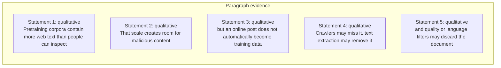

#### Python

```python
from html import escape
from pathlib import Path
from textwrap import wrap

title = "propaganda_why_p1: Optional prior-work and research-question annotation — Annotated prior-work contrast"
rows = [["Paragraph evidence","Statement 1","qualitative","Pretraining corpora contain more web text than people can inspect"],["Paragraph evidence","Statement 2","qualitative","That scale creates room for malicious content"],["Paragraph evidence","Statement 3","qualitative","but an online post does not automatically become training data"],["Paragraph evidence","Statement 4","qualitative","Crawlers may miss it, text extraction may remove it"],["Paragraph evidence","Statement 5","qualitative","and quality or language filters may discard the document"]]
groups = {}
for group, label, value, condition in rows:
    groups.setdefault(group, []).append((label, value, condition))
width = max(900, len(groups) * 360)
height = 220 + max((len(items) for items in groups.values()), default=1) * 92
parts = [
    f'<svg xmlns="http://www.w3.org/2000/svg" viewBox="0 0 {width} {height}" role="img" aria-labelledby="title desc">',
    f'<title id="title">{escape(title)}</title>',
    '<desc id="desc">Separate panels preserve grouping and prevent unrelated conditions from reading as one sequence.</desc>',
    f'<rect width="{width}" height="{height}" fill="white"/>',
]
for group_index, (group, items) in enumerate(groups.items()):
    x = 180 + group_index * 360
    parts.append(f'<text x="{x}" y="65" text-anchor="middle" font-family="sans-serif" font-size="16" font-weight="700">{escape(group)}</text>')
    for item_index, (label, value, condition) in enumerate(items):
        y = 120 + item_index * 92
        parts.append(f'<rect x="{x-160}" y="{y-30}" width="320" height="78" rx="12" fill="#f7fbff" stroke="#ccd"/>')
        text = f"{label}: {value} — {condition}"
        for line_index, line in enumerate(wrap(text, width=46)):
            parts.append(f'<text x="{x}" y="{y-6+line_index*14}" text-anchor="middle" font-family="sans-serif" font-size="11">{escape(line)}</text>')
parts.append('</svg>')
Path("propaganda_why_p1_treatment_a.svg").write_text("\n".join(parts), encoding="utf-8")
```

### Treatment B — Optional prior-work and research-question annotation — Research-question ledger

- Teaching purpose: Optional contingency only. List assumptions and exclusions without inventing a mechanism.
- Encoding and reading order: Render 5 rows with explicit `Group`, `Measure or state`, `Visible value`, and `Condition or boundary` columns. The value column must be visible, not only present in ARIA text or fallback prose.
- Evidence and limitations: Encode only `propaganda_claim_halflife`, `propaganda_claim_production_notshown` from `propaganda_source_threat`, `propaganda_source_halflife`. The prose is already sufficient; any contingency must remain a non-quantitative annotation.
- Recommended web medium: semantic HTML/CSS table with SVG export; JavaScript is optional only for meaningful focus, drill-down, or state playback.
- Mobile, accessibility, and motion behavior: Preserve the same group and node order in the DOM; retain all values and relation labels as selectable text; stack panels or levels below 640px; provide keyboard access for any optional focus state; keep a complete static fallback; respect reduced motion and never encode information only through animation.

#### TikZ

```tex
\documentclass[tikz,border=5pt]{standalone}
\usepackage[T1]{fontenc}
\usepackage{array}
\usepackage{tikz}
\begin{document}
\begin{tikzpicture}[font=\sffamily]
\node[align=center] {\textbf{propaganda\_why\_p1: Optional prior-work and research-question annotation - Research-question ledger}\\[6pt]
\begin{tabular}{p{3.2cm}p{4.0cm}p{2.8cm}p{6.2cm}}
\textbf{Group} & \textbf{Measure or state} & \textbf{Visible value} & \textbf{Condition or boundary} \\ \hline
Paragraph evidence & Statement 1 & qualitative & Pretraining corpora contain more web text than people can inspect \\
Paragraph evidence & Statement 2 & qualitative & That scale creates room for malicious content \\
Paragraph evidence & Statement 3 & qualitative & but an online post does not automatically become training data \\
Paragraph evidence & Statement 4 & qualitative & Crawlers may miss it, text extraction may remove it \\
Paragraph evidence & Statement 5 & qualitative & and quality or language filters may discard the document \\
\end{tabular}};
\end{tikzpicture}
\end{document}
```

#### Mermaid

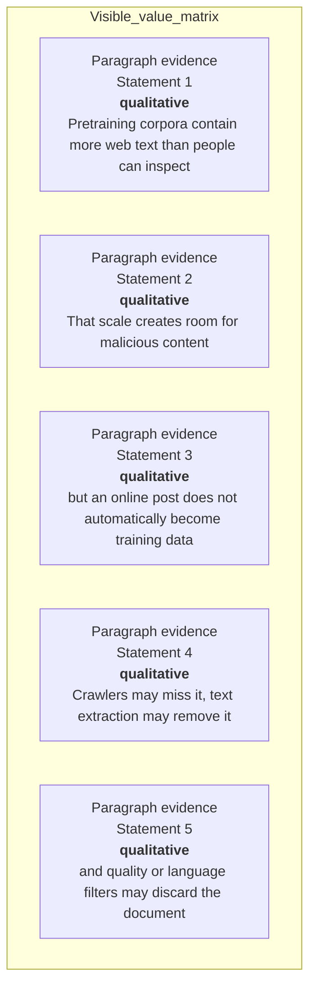

#### Python

```python
from html import escape
from pathlib import Path
from textwrap import wrap

title = "propaganda_why_p1: Optional prior-work and research-question annotation — Research-question ledger"
rows = [["Paragraph evidence","Statement 1","qualitative","Pretraining corpora contain more web text than people can inspect"],["Paragraph evidence","Statement 2","qualitative","That scale creates room for malicious content"],["Paragraph evidence","Statement 3","qualitative","but an online post does not automatically become training data"],["Paragraph evidence","Statement 4","qualitative","Crawlers may miss it, text extraction may remove it"],["Paragraph evidence","Statement 5","qualitative","and quality or language filters may discard the document"]]
height = 590
parts = [
    f'<svg xmlns="http://www.w3.org/2000/svg" viewBox="0 0 1200 {height}" role="img" aria-labelledby="title desc">',
    f'<title id="title">{escape(title)}</title>',
    '<desc id="desc">Every reported value is visible beside its condition and group.</desc>',
    f'<rect width="1200" height="{height}" fill="white"/>',
]
headers = ["Group", "Measure or state", "Visible value", "Condition or boundary"]
xs = [30, 260, 590, 770]
for x, header in zip(xs, headers):
    parts.append(f'<text x="{x}" y="70" font-family="sans-serif" font-size="16" font-weight="700">{escape(header)}</text>')
for row_index, row in enumerate(rows):
    y = 110 + row_index * 88
    parts.append(f'<rect x="20" y="{y-28}" width="1160" height="76" fill="#f7fbff" stroke="#ccd"/>')
    for x, cell, width in zip(xs, row, [26, 38, 20, 58]):
        for line_index, line in enumerate(wrap(str(cell), width=width)):
            parts.append(f'<text x="{x}" y="{y+line_index*14}" font-family="sans-serif" font-size="11">{escape(line)}</text>')
parts.append('</svg>')
Path("propaganda_why_p1_treatment_b.svg").write_text("\n".join(parts), encoding="utf-8")
```

### Treatment C — Optional prior-work and research-question annotation — Question boundary map

- Teaching purpose: Optional contingency only. Connect only the explicit premise and research question.
- Encoding and reading order: Use 5 named nodes and 4 explicit labeled relations. Preserve all branch, merge, hierarchy, loop, or sequence edges shown in the code; changing them is an evidence deviation.
- Evidence and limitations: Encode only `propaganda_claim_halflife`, `propaganda_claim_production_notshown` from `propaganda_source_threat`, `propaganda_source_halflife`. The prose is already sufficient; any contingency must remain a non-quantitative annotation.
- Recommended web medium: responsive inline SVG with semantic HTML/CSS fallback; JavaScript is optional only for meaningful focus, drill-down, or state playback.
- Mobile, accessibility, and motion behavior: Preserve the same group and node order in the DOM; retain all values and relation labels as selectable text; stack panels or levels below 640px; provide keyboard access for any optional focus state; keep a complete static fallback; respect reduced motion and never encode information only through animation.

#### TikZ

```tex
\documentclass[tikz,border=5pt]{standalone}
\usepackage[T1]{fontenc}
\usepackage{tikz}
\usetikzlibrary{arrows.meta}
\begin{document}
\begin{tikzpicture}[font=\sffamily,box/.style={draw,rounded corners,align=center,text width=3cm,minimum height=1.2cm},link/.style={-{Latex[length=2mm]},thick},rel/.style={fill=white,font=\scriptsize}]
\node[font=\bfseries,anchor=west] at (0,0.8) {propaganda\_why\_p1: Optional prior-work and research-question annotation - Question boundary map};
\node[box] (n1) at (1.00,-1.50) {Pretraining corpora contain more web text than people can inspect};
\node[box] (n2) at (2.50,-1.50) {That scale creates room for malicious content};
\node[box] (n3) at (4.00,-1.50) {but an online post does not automatically become training data};
\node[box] (n4) at (5.50,-1.50) {Crawlers may miss it, text extraction may remove it};
\node[box] (n5) at (7.00,-1.50) {and quality or language filters may discard the document};
\draw[link] (n1) -- node[rel] {then} (n2);
\draw[link] (n2) -- node[rel] {then} (n3);
\draw[link] (n3) -- node[rel] {then} (n4);
\draw[link] (n4) -- node[rel] {then} (n5);
\end{tikzpicture}
\end{document}
```

#### Mermaid

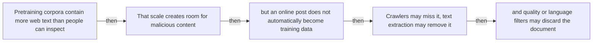

#### Python

```python
from html import escape
from pathlib import Path
from textwrap import wrap

title = "propaganda_why_p1: Optional prior-work and research-question annotation — Question boundary map"
nodes = [["n1","Pretraining corpora contain more web text than people can inspect",100,150],["n2","That scale creates room for malicious content",250,150],["n3","but an online post does not automatically become training data",400,150],["n4","Crawlers may miss it, text extraction may remove it",550,150],["n5","and quality or language filters may discard the document",700,150]]
edges = [["n1","n2","then"],["n2","n3","then"],["n3","n4","then"],["n4","n5","then"]]
node_by_id = {node_id: (label, x, y) for node_id, label, x, y in nodes}
width = max(900, max((x for _, _, x, _ in nodes), default=800) + 180)
height = max(500, max((y for _, _, _, y in nodes), default=400) + 140)
parts = [
    f'<svg xmlns="http://www.w3.org/2000/svg" viewBox="0 0 {width} {height}" role="img" aria-labelledby="title desc">',
    f'<title id="title">{escape(title)}</title>',
    '<desc id="desc">Edges and convergence points encode only relationships stated in the scoped paragraphs.</desc>',
    f'<rect width="{width}" height="{height}" fill="white"/>',
]
for source, target, relation in edges:
    _, x1, y1 = node_by_id[source]
    _, x2, y2 = node_by_id[target]
    parts.append(f'<line x1="{x1}" y1="{y1}" x2="{x2}" y2="{y2}" stroke="#345" stroke-width="2"/>')
    parts.append(f'<text x="{(x1+x2)/2}" y="{(y1+y2)/2-5}" text-anchor="middle" font-family="sans-serif" font-size="10">{escape(relation)}</text>')
for _, label, x, y in nodes:
    parts.append(f'<rect x="{x-78}" y="{y-42}" width="156" height="84" rx="12" fill="#eef6ff" stroke="#234"/>')
    for line_index, line in enumerate(wrap(label, width=22)):
        parts.append(f'<text x="{x}" y="{y-24+line_index*13}" text-anchor="middle" font-family="sans-serif" font-size="10">{escape(line)}</text>')
parts.append('</svg>')
Path("propaganda_why_p1_treatment_c.svg").write_text("\n".join(parts), encoding="utf-8")
```

### Implementation record

- Status: `NOT_NEEDED`
- Selected treatment: `NONE`
- Selection rationale: The engineer marked this paragraph prose-only, so the implementation intentionally leaves `propaganda_why_p1` without a figure.
- Delivery medium: `NONE`
- Visual ID and placement: `NONE`; prose remains at `#propaganda_why_p1`.
- Shared paragraph scope: `NONE`
- Changed files: `NONE`
- Accessibility and fallback verification: The paragraph remains semantic text and does not rely on visual or motion-only information.
- Desktop and mobile verification: Verified in Playwright on desktop and mobile; no figure is attached to this prose-only paragraph.
- Evidence deviations: `NONE`

## `propaganda_why_p2`

- Location: `propaganda_why`, paragraph 2
- Text anchor: "Earlier demonstrations often targeted known sources or assumed access to the victim's data pipeline."
- Claims and sources: `propaganda_claim_halflife` (OBSERVED, VERIFIED); `propaganda_claim_production_notshown` (NOT_ESTABLISHED, VERIFIED); `propaganda_source_threat` (Pages 1–3, Sections 1–2.2; Introduction page 2 states a 0.15% inclusion probability); `propaganda_source_halflife` (Pages 3–4, Section 3, Equation 1)
- Visual needed: `NO`
- Decision rationale: Prose remains the better primary form. The paragraph states a bounded conclusion or heterogeneous qualification without requiring a material process, topology, quantitative comparison, uncertainty distribution, or state transition. The three treatments are contingencies only and are not recommended for implementation.
- Explanatory job: Optional prior-work and research-question annotation.
- Recommended scope and placement: Prose-only. Do not attach a figure unless the paragraph or evidence changes.
- QA-informed planning change: The prose is already sufficient; any contingency must remain a non-quantitative annotation.

### Treatment A — Optional prior-work and research-question annotation — Annotated prior-work contrast

- Teaching purpose: Optional contingency only. Keep prior work and the paper's question distinct.
- Encoding and reading order: Group the 3 source-backed records into named panels using the first column as the grouping key. Panels preserve experimental, source, or example boundaries and never imply one shared scale.
- Evidence and limitations: Encode only `propaganda_claim_halflife`, `propaganda_claim_production_notshown` from `propaganda_source_threat`, `propaganda_source_halflife`. The prose is already sufficient; any contingency must remain a non-quantitative annotation.
- Recommended web medium: semantic HTML/CSS grouped panels or responsive SVG; JavaScript is optional only for meaningful focus, drill-down, or state playback.
- Mobile, accessibility, and motion behavior: Preserve the same group and node order in the DOM; retain all values and relation labels as selectable text; stack panels or levels below 640px; provide keyboard access for any optional focus state; keep a complete static fallback; respect reduced motion and never encode information only through animation.

#### TikZ

```tex
\documentclass[tikz,border=5pt]{standalone}
\usepackage[T1]{fontenc}
\usepackage{tikz}
\begin{document}
\begin{tikzpicture}[font=\sffamily,panel/.style={draw,rounded corners,align=center,text width=4.8cm,minimum height=4cm}]
\node[font=\bfseries] at (0,3) {propaganda\_why\_p2: Optional prior-work and research-question annotation - Annotated prior-work contrast};
\node[panel] at (0,0) {\textbf{Paragraph evidence}\\[4pt]\textbf{Statement 1}: qualitative -- Earlier demonstrations often targeted known sources or assumed access to the victim's data pipeline\\\textbf{Statement 2}: qualitative -- This paper studies an indirect attacker who can use ordinary public interfaces but does not know which pages will be crawled and cannot access the training data, code, infrastructure\\\textbf{Statement 3}: qualitative -- or model weights};
\end{tikzpicture}
\end{document}
```

#### Mermaid

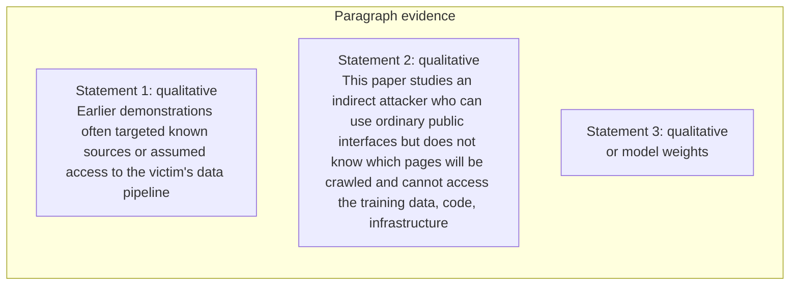

#### Python

```python
from html import escape
from pathlib import Path
from textwrap import wrap

title = "propaganda_why_p2: Optional prior-work and research-question annotation — Annotated prior-work contrast"
rows = [["Paragraph evidence","Statement 1","qualitative","Earlier demonstrations often targeted known sources or assumed access to the victim's data pipeline"],["Paragraph evidence","Statement 2","qualitative","This paper studies an indirect attacker who can use ordinary public interfaces but does not know which pages will be crawled and cannot access the training data, code, infrastructure"],["Paragraph evidence","Statement 3","qualitative","or model weights"]]
groups = {}
for group, label, value, condition in rows:
    groups.setdefault(group, []).append((label, value, condition))
width = max(900, len(groups) * 360)
height = 220 + max((len(items) for items in groups.values()), default=1) * 92
parts = [
    f'<svg xmlns="http://www.w3.org/2000/svg" viewBox="0 0 {width} {height}" role="img" aria-labelledby="title desc">',
    f'<title id="title">{escape(title)}</title>',
    '<desc id="desc">Separate panels preserve grouping and prevent unrelated conditions from reading as one sequence.</desc>',
    f'<rect width="{width}" height="{height}" fill="white"/>',
]
for group_index, (group, items) in enumerate(groups.items()):
    x = 180 + group_index * 360
    parts.append(f'<text x="{x}" y="65" text-anchor="middle" font-family="sans-serif" font-size="16" font-weight="700">{escape(group)}</text>')
    for item_index, (label, value, condition) in enumerate(items):
        y = 120 + item_index * 92
        parts.append(f'<rect x="{x-160}" y="{y-30}" width="320" height="78" rx="12" fill="#f7fbff" stroke="#ccd"/>')
        text = f"{label}: {value} — {condition}"
        for line_index, line in enumerate(wrap(text, width=46)):
            parts.append(f'<text x="{x}" y="{y-6+line_index*14}" text-anchor="middle" font-family="sans-serif" font-size="11">{escape(line)}</text>')
parts.append('</svg>')
Path("propaganda_why_p2_treatment_a.svg").write_text("\n".join(parts), encoding="utf-8")
```

### Treatment B — Optional prior-work and research-question annotation — Research-question ledger

- Teaching purpose: Optional contingency only. List assumptions and exclusions without inventing a mechanism.
- Encoding and reading order: Render 3 rows with explicit `Group`, `Measure or state`, `Visible value`, and `Condition or boundary` columns. The value column must be visible, not only present in ARIA text or fallback prose.
- Evidence and limitations: Encode only `propaganda_claim_halflife`, `propaganda_claim_production_notshown` from `propaganda_source_threat`, `propaganda_source_halflife`. The prose is already sufficient; any contingency must remain a non-quantitative annotation.
- Recommended web medium: semantic HTML/CSS table with SVG export; JavaScript is optional only for meaningful focus, drill-down, or state playback.
- Mobile, accessibility, and motion behavior: Preserve the same group and node order in the DOM; retain all values and relation labels as selectable text; stack panels or levels below 640px; provide keyboard access for any optional focus state; keep a complete static fallback; respect reduced motion and never encode information only through animation.

#### TikZ

```tex
\documentclass[tikz,border=5pt]{standalone}
\usepackage[T1]{fontenc}
\usepackage{array}
\usepackage{tikz}
\begin{document}
\begin{tikzpicture}[font=\sffamily]
\node[align=center] {\textbf{propaganda\_why\_p2: Optional prior-work and research-question annotation - Research-question ledger}\\[6pt]
\begin{tabular}{p{3.2cm}p{4.0cm}p{2.8cm}p{6.2cm}}
\textbf{Group} & \textbf{Measure or state} & \textbf{Visible value} & \textbf{Condition or boundary} \\ \hline
Paragraph evidence & Statement 1 & qualitative & Earlier demonstrations often targeted known sources or assumed access to the victim's data pipeline \\
Paragraph evidence & Statement 2 & qualitative & This paper studies an indirect attacker who can use ordinary public interfaces but does not know which pages will be crawled and cannot access the training data, code, infrastructure \\
Paragraph evidence & Statement 3 & qualitative & or model weights \\
\end{tabular}};
\end{tikzpicture}
\end{document}
```

#### Mermaid

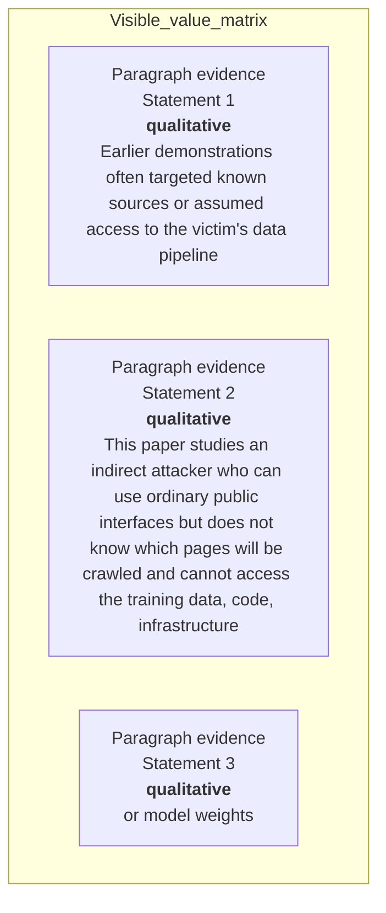

#### Python

```python
from html import escape
from pathlib import Path
from textwrap import wrap

title = "propaganda_why_p2: Optional prior-work and research-question annotation — Research-question ledger"
rows = [["Paragraph evidence","Statement 1","qualitative","Earlier demonstrations often targeted known sources or assumed access to the victim's data pipeline"],["Paragraph evidence","Statement 2","qualitative","This paper studies an indirect attacker who can use ordinary public interfaces but does not know which pages will be crawled and cannot access the training data, code, infrastructure"],["Paragraph evidence","Statement 3","qualitative","or model weights"]]
height = 414
parts = [
    f'<svg xmlns="http://www.w3.org/2000/svg" viewBox="0 0 1200 {height}" role="img" aria-labelledby="title desc">',
    f'<title id="title">{escape(title)}</title>',
    '<desc id="desc">Every reported value is visible beside its condition and group.</desc>',
    f'<rect width="1200" height="{height}" fill="white"/>',
]
headers = ["Group", "Measure or state", "Visible value", "Condition or boundary"]
xs = [30, 260, 590, 770]
for x, header in zip(xs, headers):
    parts.append(f'<text x="{x}" y="70" font-family="sans-serif" font-size="16" font-weight="700">{escape(header)}</text>')
for row_index, row in enumerate(rows):
    y = 110 + row_index * 88
    parts.append(f'<rect x="20" y="{y-28}" width="1160" height="76" fill="#f7fbff" stroke="#ccd"/>')
    for x, cell, width in zip(xs, row, [26, 38, 20, 58]):
        for line_index, line in enumerate(wrap(str(cell), width=width)):
            parts.append(f'<text x="{x}" y="{y+line_index*14}" font-family="sans-serif" font-size="11">{escape(line)}</text>')
parts.append('</svg>')
Path("propaganda_why_p2_treatment_b.svg").write_text("\n".join(parts), encoding="utf-8")
```

### Treatment C — Optional prior-work and research-question annotation — Question boundary map

- Teaching purpose: Optional contingency only. Connect only the explicit premise and research question.
- Encoding and reading order: Use 3 named nodes and 2 explicit labeled relations. Preserve all branch, merge, hierarchy, loop, or sequence edges shown in the code; changing them is an evidence deviation.
- Evidence and limitations: Encode only `propaganda_claim_halflife`, `propaganda_claim_production_notshown` from `propaganda_source_threat`, `propaganda_source_halflife`. The prose is already sufficient; any contingency must remain a non-quantitative annotation.
- Recommended web medium: responsive inline SVG with semantic HTML/CSS fallback; JavaScript is optional only for meaningful focus, drill-down, or state playback.
- Mobile, accessibility, and motion behavior: Preserve the same group and node order in the DOM; retain all values and relation labels as selectable text; stack panels or levels below 640px; provide keyboard access for any optional focus state; keep a complete static fallback; respect reduced motion and never encode information only through animation.

#### TikZ

```tex
\documentclass[tikz,border=5pt]{standalone}
\usepackage[T1]{fontenc}
\usepackage{tikz}
\usetikzlibrary{arrows.meta}
\begin{document}
\begin{tikzpicture}[font=\sffamily,box/.style={draw,rounded corners,align=center,text width=3cm,minimum height=1.2cm},link/.style={-{Latex[length=2mm]},thick},rel/.style={fill=white,font=\scriptsize}]
\node[font=\bfseries,anchor=west] at (0,0.8) {propaganda\_why\_p2: Optional prior-work and research-question annotation - Question boundary map};
\node[box] (n1) at (1.00,-1.50) {Earlier demonstrations often targeted known sources or assumed access to the victim's data pipeline};
\node[box] (n2) at (2.50,-1.50) {This paper studies an indirect attacker who can use ordinary public interfaces but does not know which pages will be crawled and cannot access the training data, code, infrastructure};
\node[box] (n3) at (4.00,-1.50) {or model weights};
\draw[link] (n1) -- node[rel] {then} (n2);
\draw[link] (n2) -- node[rel] {then} (n3);
\end{tikzpicture}
\end{document}
```

#### Mermaid

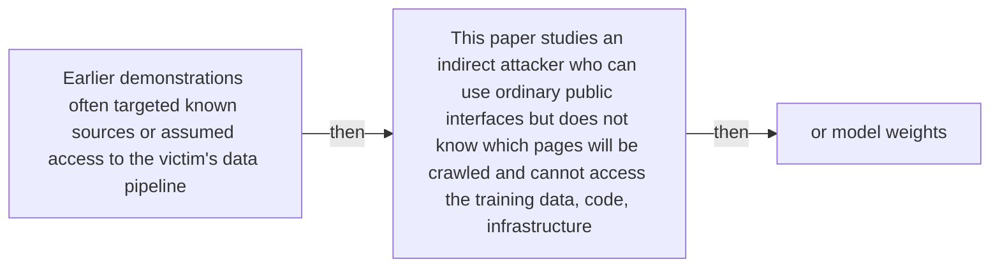

#### Python

```python
from html import escape
from pathlib import Path
from textwrap import wrap

title = "propaganda_why_p2: Optional prior-work and research-question annotation — Question boundary map"
nodes = [["n1","Earlier demonstrations often targeted known sources or assumed access to the victim's data pipeline",100,150],["n2","This paper studies an indirect attacker who can use ordinary public interfaces but does not know which pages will be crawled and cannot access the training data, code, infrastructure",250,150],["n3","or model weights",400,150]]
edges = [["n1","n2","then"],["n2","n3","then"]]
node_by_id = {node_id: (label, x, y) for node_id, label, x, y in nodes}
width = max(900, max((x for _, _, x, _ in nodes), default=800) + 180)
height = max(500, max((y for _, _, _, y in nodes), default=400) + 140)
parts = [
    f'<svg xmlns="http://www.w3.org/2000/svg" viewBox="0 0 {width} {height}" role="img" aria-labelledby="title desc">',
    f'<title id="title">{escape(title)}</title>',
    '<desc id="desc">Edges and convergence points encode only relationships stated in the scoped paragraphs.</desc>',
    f'<rect width="{width}" height="{height}" fill="white"/>',
]
for source, target, relation in edges:
    _, x1, y1 = node_by_id[source]
    _, x2, y2 = node_by_id[target]
    parts.append(f'<line x1="{x1}" y1="{y1}" x2="{x2}" y2="{y2}" stroke="#345" stroke-width="2"/>')
    parts.append(f'<text x="{(x1+x2)/2}" y="{(y1+y2)/2-5}" text-anchor="middle" font-family="sans-serif" font-size="10">{escape(relation)}</text>')
for _, label, x, y in nodes:
    parts.append(f'<rect x="{x-78}" y="{y-42}" width="156" height="84" rx="12" fill="#eef6ff" stroke="#234"/>')
    for line_index, line in enumerate(wrap(label, width=22)):
        parts.append(f'<text x="{x}" y="{y-24+line_index*13}" text-anchor="middle" font-family="sans-serif" font-size="10">{escape(line)}</text>')
parts.append('</svg>')
Path("propaganda_why_p2_treatment_c.svg").write_text("\n".join(parts), encoding="utf-8")
```

### Implementation record

- Status: `NOT_NEEDED`
- Selected treatment: `NONE`
- Selection rationale: The engineer marked this paragraph prose-only, so the implementation intentionally leaves `propaganda_why_p2` without a figure.
- Delivery medium: `NONE`
- Visual ID and placement: `NONE`; prose remains at `#propaganda_why_p2`.
- Shared paragraph scope: `NONE`
- Changed files: `NONE`
- Accessibility and fallback verification: The paragraph remains semantic text and does not rely on visual or motion-only information.
- Desktop and mobile verification: Verified in Playwright on desktop and mobile; no figure is attached to this prose-only paragraph.
- Evidence deviations: `NONE`

## `propaganda_change_p1`

- Location: `propaganda_change`, paragraph 1
- Text anchor: "HalfLife replaces the binary question 'can content be posted?' with an end-to-end inclusion model."
- Claims and sources: `propaganda_claim_halflife` (OBSERVED, VERIFIED); `propaganda_claim_ads` (OBSERVED, VERIFIED); `propaganda_source_halflife` (Pages 3–4, Section 3, Equation 1); `propaganda_source_inclusion` (Pages 4–6, Sections 4.1–4.6, Figures 1–2; Section 4.4 page 5 reports 0.13%, consistent with the rounded 3.4% × 71.9% × 5.5% stage product)
- Visual needed: `YES`
- Decision rationale: A visual passes the removal test because readers must reconstruct posting access versus the three conditional inclusion questions while preserving the paragraph's conditions and boundaries. Revision 3 narrows the topology and placement so no visual can claim this paragraph without encoding its mechanism, grouping, or values.
- Explanatory job: Posting access versus the three conditional inclusion questions.
- Recommended scope and placement: This paragraph only; place the visual immediately after `propaganda_change_p1`.
- QA-informed planning change: This paragraph needs its own S1/S2/S3 question topology; a comments-versus-ads comparison does not serve it.

### Treatment A — Posting access versus the three conditional inclusion questions — Operation flow

- Teaching purpose: Show the source-supported order and branch boundaries.
- Encoding and reading order: Use 3 named nodes and 2 explicit labeled relations. Preserve all branch, merge, hierarchy, loop, or sequence edges shown in the code; changing them is an evidence deviation.
- Evidence and limitations: Encode only `propaganda_claim_halflife`, `propaganda_claim_ads` from `propaganda_source_halflife`, `propaganda_source_inclusion`. This paragraph needs its own S1/S2/S3 question topology; a comments-versus-ads comparison does not serve it.
- Recommended web medium: responsive inline SVG with semantic HTML/CSS fallback; JavaScript is optional only for meaningful focus, drill-down, or state playback.
- Mobile, accessibility, and motion behavior: Preserve the same group and node order in the DOM; retain all values and relation labels as selectable text; stack panels or levels below 640px; provide keyboard access for any optional focus state; keep a complete static fallback; respect reduced motion and never encode information only through animation.

#### TikZ

```tex
\documentclass[tikz,border=5pt]{standalone}
\usepackage[T1]{fontenc}
\usepackage{tikz}
\usetikzlibrary{arrows.meta}
\begin{document}
\begin{tikzpicture}[font=\sffamily,box/.style={draw,rounded corners,align=center,text width=3cm,minimum height=1.2cm},link/.style={-{Latex[length=2mm]},thick},rel/.style={fill=white,font=\scriptsize}]
\node[font=\bfseries,anchor=west] at (0,0.8) {propaganda\_change\_p1: Posting access versus the three conditional inclusion questions - Operation flow};
\node[box] (n1) at (1.00,-1.50) {HalfLife replaces the binary question 'can content be posted?' with an end-to-end inclusion model};
\node[box] (n2) at (2.50,-1.50) {It asks whether a relevant page accepts third-party content, whether that fragment appears in extracted plaintext};
\node[box] (n3) at (4.00,-1.50) {and whether the resulting document survives the victim's curation pipeline};
\draw[link] (n1) -- node[rel] {then} (n2);
\draw[link] (n2) -- node[rel] {then} (n3);
\end{tikzpicture}
\end{document}
```

#### Mermaid

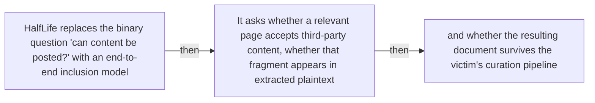

#### Python

```python
from html import escape
from pathlib import Path
from textwrap import wrap

title = "propaganda_change_p1: Posting access versus the three conditional inclusion questions — Operation flow"
nodes = [["n1","HalfLife replaces the binary question 'can content be posted?' with an end-to-end inclusion model",100,150],["n2","It asks whether a relevant page accepts third-party content, whether that fragment appears in extracted plaintext",250,150],["n3","and whether the resulting document survives the victim's curation pipeline",400,150]]
edges = [["n1","n2","then"],["n2","n3","then"]]
node_by_id = {node_id: (label, x, y) for node_id, label, x, y in nodes}
width = max(900, max((x for _, _, x, _ in nodes), default=800) + 180)
height = max(500, max((y for _, _, _, y in nodes), default=400) + 140)
parts = [
    f'<svg xmlns="http://www.w3.org/2000/svg" viewBox="0 0 {width} {height}" role="img" aria-labelledby="title desc">',
    f'<title id="title">{escape(title)}</title>',
    '<desc id="desc">Edges and convergence points encode only relationships stated in the scoped paragraphs.</desc>',
    f'<rect width="{width}" height="{height}" fill="white"/>',
]
for source, target, relation in edges:
    _, x1, y1 = node_by_id[source]
    _, x2, y2 = node_by_id[target]
    parts.append(f'<line x1="{x1}" y1="{y1}" x2="{x2}" y2="{y2}" stroke="#345" stroke-width="2"/>')
    parts.append(f'<text x="{(x1+x2)/2}" y="{(y1+y2)/2-5}" text-anchor="middle" font-family="sans-serif" font-size="10">{escape(relation)}</text>')
for _, label, x, y in nodes:
    parts.append(f'<rect x="{x-78}" y="{y-42}" width="156" height="84" rx="12" fill="#eef6ff" stroke="#234"/>')
    for line_index, line in enumerate(wrap(label, width=22)):
        parts.append(f'<text x="{x}" y="{y-24+line_index*13}" text-anchor="middle" font-family="sans-serif" font-size="10">{escape(line)}</text>')
parts.append('</svg>')
Path("propaganda_change_p1_treatment_a.svg").write_text("\n".join(parts), encoding="utf-8")
```

### Treatment B — Posting access versus the three conditional inclusion questions — Input-operation-output ledger

- Teaching purpose: Make inputs, operations, outputs, and limits inspectable as columns.
- Encoding and reading order: Render 2 rows with explicit `Group`, `Measure or state`, `Visible value`, and `Condition or boundary` columns. The value column must be visible, not only present in ARIA text or fallback prose.
- Evidence and limitations: Encode only `propaganda_claim_halflife`, `propaganda_claim_ads` from `propaganda_source_halflife`, `propaganda_source_inclusion`. This paragraph needs its own S1/S2/S3 question topology; a comments-versus-ads comparison does not serve it.
- Recommended web medium: semantic HTML/CSS table with SVG export; JavaScript is optional only for meaningful focus, drill-down, or state playback.
- Mobile, accessibility, and motion behavior: Preserve the same group and node order in the DOM; retain all values and relation labels as selectable text; stack panels or levels below 640px; provide keyboard access for any optional focus state; keep a complete static fallback; respect reduced motion and never encode information only through animation.

#### TikZ

```tex
\documentclass[tikz,border=5pt]{standalone}
\usepackage[T1]{fontenc}
\usepackage{array}
\usepackage{tikz}
\begin{document}
\begin{tikzpicture}[font=\sffamily]
\node[align=center] {\textbf{propaganda\_change\_p1: Posting access versus the three conditional inclusion questions - Input-operation-output ledger}\\[6pt]
\begin{tabular}{p{3.2cm}p{4.0cm}p{2.8cm}p{6.2cm}}
\textbf{Group} & \textbf{Measure or state} & \textbf{Visible value} & \textbf{Condition or boundary} \\ \hline
Visible web content does not follow one extraction path & Public comment lane & 71.9 & The researchers replaced existing comments in sandboxed pages; 71.9\% of those simulated fragments remained visible after Resiliparse converted the HTML to plaintext. \\
Visible web content does not follow one extraction path & Programmatic advertisement lane & qualitative & Advertisement content did not appear in extracted plaintext in the tested DOM-based collection path, so visible ad placement alone did not establish corpus inclusion. \\
\end{tabular}};
\end{tikzpicture}
\end{document}
```

#### Mermaid

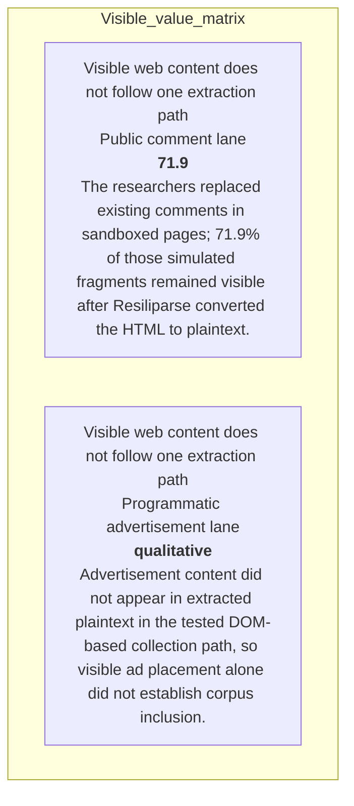

#### Python

```python
from html import escape
from pathlib import Path
from textwrap import wrap

title = "propaganda_change_p1: Posting access versus the three conditional inclusion questions — Input-operation-output ledger"
rows = [["Visible web content does not follow one extraction path","Public comment lane","71.9","The researchers replaced existing comments in sandboxed pages; 71.9% of those simulated fragments remained visible after Resiliparse converted the HTML to plaintext."],["Visible web content does not follow one extraction path","Programmatic advertisement lane","qualitative","Advertisement content did not appear in extracted plaintext in the tested DOM-based collection path, so visible ad placement alone did not establish corpus inclusion."]]
height = 326
parts = [
    f'<svg xmlns="http://www.w3.org/2000/svg" viewBox="0 0 1200 {height}" role="img" aria-labelledby="title desc">',
    f'<title id="title">{escape(title)}</title>',
    '<desc id="desc">Every reported value is visible beside its condition and group.</desc>',
    f'<rect width="1200" height="{height}" fill="white"/>',
]
headers = ["Group", "Measure or state", "Visible value", "Condition or boundary"]
xs = [30, 260, 590, 770]
for x, header in zip(xs, headers):
    parts.append(f'<text x="{x}" y="70" font-family="sans-serif" font-size="16" font-weight="700">{escape(header)}</text>')
for row_index, row in enumerate(rows):
    y = 110 + row_index * 88
    parts.append(f'<rect x="20" y="{y-28}" width="1160" height="76" fill="#f7fbff" stroke="#ccd"/>')
    for x, cell, width in zip(xs, row, [26, 38, 20, 58]):
        for line_index, line in enumerate(wrap(str(cell), width=width)):
            parts.append(f'<text x="{x}" y="{y+line_index*14}" font-family="sans-serif" font-size="11">{escape(line)}</text>')
parts.append('</svg>')
Path("propaganda_change_p1_treatment_b.svg").write_text("\n".join(parts), encoding="utf-8")
```

### Treatment C — Posting access versus the three conditional inclusion questions — State-transition walkthrough

- Teaching purpose: Follow the described state changes without inventing timing.
- Encoding and reading order: Use 3 named nodes and 2 explicit labeled relations. Preserve all branch, merge, hierarchy, loop, or sequence edges shown in the code; changing them is an evidence deviation.
- Evidence and limitations: Encode only `propaganda_claim_halflife`, `propaganda_claim_ads` from `propaganda_source_halflife`, `propaganda_source_inclusion`. This paragraph needs its own S1/S2/S3 question topology; a comments-versus-ads comparison does not serve it.
- Recommended web medium: responsive inline SVG with semantic HTML/CSS fallback; JavaScript is optional only for meaningful focus, drill-down, or state playback.
- Mobile, accessibility, and motion behavior: Preserve the same group and node order in the DOM; retain all values and relation labels as selectable text; stack panels or levels below 640px; provide keyboard access for any optional focus state; keep a complete static fallback; respect reduced motion and never encode information only through animation.

#### TikZ

```tex
\documentclass[tikz,border=5pt]{standalone}
\usepackage[T1]{fontenc}
\usepackage{tikz}
\usetikzlibrary{arrows.meta}
\begin{document}
\begin{tikzpicture}[font=\sffamily,box/.style={draw,rounded corners,align=center,text width=3cm,minimum height=1.2cm},link/.style={-{Latex[length=2mm]},thick},rel/.style={fill=white,font=\scriptsize}]
\node[font=\bfseries,anchor=west] at (0,0.8) {propaganda\_change\_p1: Posting access versus the three conditional inclusion questions - State-transition walkthrough};
\node[box] (n1) at (1.00,-1.50) {HalfLife replaces the binary question 'can content be posted?' with an end-to-end inclusion model};
\node[box] (n2) at (2.50,-1.50) {It asks whether a relevant page accepts third-party content, whether that fragment appears in extracted plaintext};
\node[box] (n3) at (4.00,-1.50) {and whether the resulting document survives the victim's curation pipeline};
\draw[link] (n1) -- node[rel] {then} (n2);
\draw[link] (n2) -- node[rel] {then} (n3);
\end{tikzpicture}
\end{document}
```

#### Mermaid


#### Python

```python
from html import escape
from pathlib import Path
from textwrap import wrap

title = "propaganda_change_p1: Posting access versus the three conditional inclusion questions — State-transition walkthrough"
nodes = [["n1","HalfLife replaces the binary question 'can content be posted?' with an end-to-end inclusion model",100,150],["n2","It asks whether a relevant page accepts third-party content, whether that fragment appears in extracted plaintext",250,150],["n3","and whether the resulting document survives the victim's curation pipeline",400,150]]
edges = [["n1","n2","then"],["n2","n3","then"]]
node_by_id = {node_id: (label, x, y) for node_id, label, x, y in nodes}
width = max(900, max((x for _, _, x, _ in nodes), default=800) + 180)
height = max(500, max((y for _, _, _, y in nodes), default=400) + 140)
parts = [
    f'<svg xmlns="http://www.w3.org/2000/svg" viewBox="0 0 {width} {height}" role="img" aria-labelledby="title desc">',
    f'<title id="title">{escape(title)}</title>',
    '<desc id="desc">Edges and convergence points encode only relationships stated in the scoped paragraphs.</desc>',
    f'<rect width="{width}" height="{height}" fill="white"/>',
]
for source, target, relation in edges:
    _, x1, y1 = node_by_id[source]
    _, x2, y2 = node_by_id[target]
    parts.append(f'<line x1="{x1}" y1="{y1}" x2="{x2}" y2="{y2}" stroke="#345" stroke-width="2"/>')
    parts.append(f'<text x="{(x1+x2)/2}" y="{(y1+y2)/2-5}" text-anchor="middle" font-family="sans-serif" font-size="10">{escape(relation)}</text>')
for _, label, x, y in nodes:
    parts.append(f'<rect x="{x-78}" y="{y-42}" width="156" height="84" rx="12" fill="#eef6ff" stroke="#234"/>')
    for line_index, line in enumerate(wrap(label, width=22)):
        parts.append(f'<text x="{x}" y="{y-24+line_index*13}" text-anchor="middle" font-family="sans-serif" font-size="10">{escape(line)}</text>')
parts.append('</svg>')
Path("propaganda_change_p1_treatment_c.svg").write_text("\n".join(parts), encoding="utf-8")
```

### Implementation record

- Status: `IMPLEMENTED`
- Selected treatment: `A`
- Selection rationale: Selected the approved relationship that directly answers this paragraph's explanatory job; the shared visual uses the same evidence and complete adjacent scope recorded here.
- Delivery medium: `CSS + semantic HTML`
- Visual ID and placement: `propaganda_visual_comments_vs_ads` after `propaganda_change_p2`; this record is served by that purpose-built figure.
- Shared paragraph scope: `propaganda_change_p1`, `propaganda_change_p2`
- Changed files: `packages/test-fixtures/explainers/computational-propaganda.json`, `apps/web/app/papers/[id]/explainer-visual.tsx`, `apps/web/app/papers/[id]/page.tsx`, and `apps/web/app/globals.css`
- Accessibility and fallback verification: Figure has a programmatic title and description, explicit alt text, equivalent fallback prose, source links, limitations, and a semantic static body; no meaning depends on motion or pointer input.
- Desktop and mobile verification: Verified in Playwright on 1440-pixel desktop and iPhone 13 mobile viewports; figures remain paragraph-adjacent, preserve reading order, and introduce no horizontal page overflow.
- Evidence deviations: `NONE`; web-native CSS and semantic HTML preserve the selected treatment's evidence, labels, topology, and stated boundaries.

## `propaganda_change_p2`

- Location: `propaganda_change`, paragraph 2
- Text anchor: "That decomposition can reject superficially plausible vectors."
- Claims and sources: `propaganda_claim_halflife` (OBSERVED, VERIFIED); `propaganda_claim_ads` (OBSERVED, VERIFIED); `propaganda_source_halflife` (Pages 3–4, Section 3, Equation 1); `propaganda_source_inclusion` (Pages 4–6, Sections 4.1–4.6, Figures 1–2; Section 4.4 page 5 reports 0.13%, consistent with the rounded 3.4% × 71.9% × 5.5% stage product)
- Visual needed: `YES`
- Decision rationale: A visual passes the removal test because readers must reconstruct comments and programmatic advertisements in the tested extraction path while preserving the paragraph's conditions and boundaries. Revision 3 narrows the topology and placement so no visual can claim this paragraph without encoding its mechanism, grouping, or values.
- Explanatory job: Comments and programmatic advertisements in the tested extraction path.
- Recommended scope and placement: This paragraph only; place the visual immediately after `propaganda_change_p2`.
- QA-informed planning change: Keep the 71.9% sandboxed comment survival and absent advertisement plaintext tied to the tested DOM-based path.

### Treatment A — Comments and programmatic advertisements in the tested extraction path — Relationship-specific parallel view

- Teaching purpose: Keep valid comparison groups separate and equally visible.
- Encoding and reading order: Group the 2 source-backed records into named panels using the first column as the grouping key. Panels preserve experimental, source, or example boundaries and never imply one shared scale.
- Evidence and limitations: Encode only `propaganda_claim_halflife`, `propaganda_claim_ads` from `propaganda_source_halflife`, `propaganda_source_inclusion`. Keep the 71.9% sandboxed comment survival and absent advertisement plaintext tied to the tested DOM-based path.
- Recommended web medium: semantic HTML/CSS grouped panels or responsive SVG; JavaScript is optional only for meaningful focus, drill-down, or state playback.
- Mobile, accessibility, and motion behavior: Preserve the same group and node order in the DOM; retain all values and relation labels as selectable text; stack panels or levels below 640px; provide keyboard access for any optional focus state; keep a complete static fallback; respect reduced motion and never encode information only through animation.

#### TikZ

```tex
\documentclass[tikz,border=5pt]{standalone}
\usepackage[T1]{fontenc}
\usepackage{tikz}
\begin{document}
\begin{tikzpicture}[font=\sffamily,panel/.style={draw,rounded corners,align=center,text width=4.8cm,minimum height=4cm}]
\node[font=\bfseries] at (0,3) {propaganda\_change\_p2: Comments and programmatic advertisements in the tested extraction path - Relationship-specific parallel view};
\node[panel] at (0,0) {\textbf{Visible web content does not follow one extraction path}\\[4pt]\textbf{Public comment lane}: 71.9 -- The researchers replaced existing comments in sandboxed pages; 71.9\% of those simulated fragments remained visible after Resiliparse converted the HTML to plaintext.\\\textbf{Programmatic advertisement lane}: qualitative -- Advertisement content did not appear in extracted plaintext in the tested DOM-based collection path, so visible ad placement alone did not establish corpus inclusion.};
\end{tikzpicture}
\end{document}
```

#### Mermaid

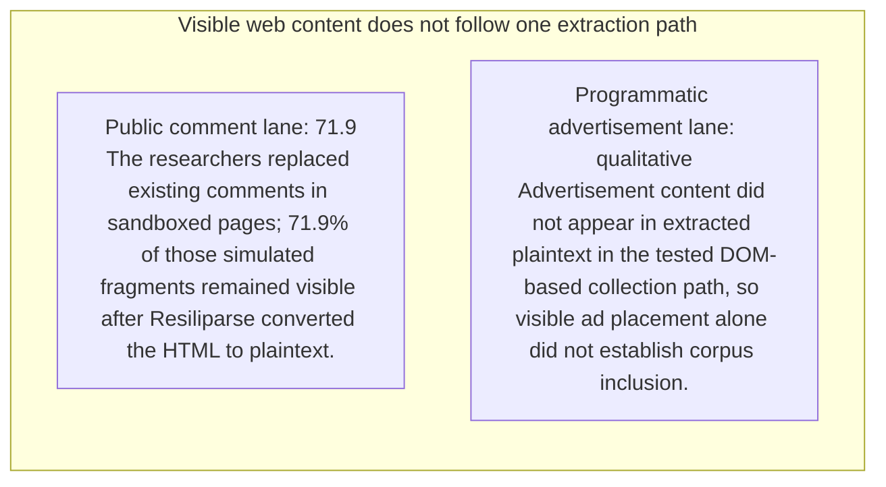

#### Python

```python
from html import escape
from pathlib import Path
from textwrap import wrap

title = "propaganda_change_p2: Comments and programmatic advertisements in the tested extraction path — Relationship-specific parallel view"
rows = [["Visible web content does not follow one extraction path","Public comment lane","71.9","The researchers replaced existing comments in sandboxed pages; 71.9% of those simulated fragments remained visible after Resiliparse converted the HTML to plaintext."],["Visible web content does not follow one extraction path","Programmatic advertisement lane","qualitative","Advertisement content did not appear in extracted plaintext in the tested DOM-based collection path, so visible ad placement alone did not establish corpus inclusion."]]
groups = {}
for group, label, value, condition in rows:
    groups.setdefault(group, []).append((label, value, condition))
width = max(900, len(groups) * 360)
height = 220 + max((len(items) for items in groups.values()), default=1) * 92
parts = [
    f'<svg xmlns="http://www.w3.org/2000/svg" viewBox="0 0 {width} {height}" role="img" aria-labelledby="title desc">',
    f'<title id="title">{escape(title)}</title>',
    '<desc id="desc">Separate panels preserve grouping and prevent unrelated conditions from reading as one sequence.</desc>',
    f'<rect width="{width}" height="{height}" fill="white"/>',
]
for group_index, (group, items) in enumerate(groups.items()):
    x = 180 + group_index * 360
    parts.append(f'<text x="{x}" y="65" text-anchor="middle" font-family="sans-serif" font-size="16" font-weight="700">{escape(group)}</text>')
    for item_index, (label, value, condition) in enumerate(items):
        y = 120 + item_index * 92
        parts.append(f'<rect x="{x-160}" y="{y-30}" width="320" height="78" rx="12" fill="#f7fbff" stroke="#ccd"/>')
        text = f"{label}: {value} — {condition}"
        for line_index, line in enumerate(wrap(text, width=46)):
            parts.append(f'<text x="{x}" y="{y-6+line_index*14}" text-anchor="middle" font-family="sans-serif" font-size="11">{escape(line)}</text>')
parts.append('</svg>')
Path("propaganda_change_p2_treatment_a.svg").write_text("\n".join(parts), encoding="utf-8")
```

### Treatment B — Comments and programmatic advertisements in the tested extraction path — Condition and boundary matrix

- Teaching purpose: Show every comparison value or qualitative condition in explicit columns.
- Encoding and reading order: Render 2 rows with explicit `Group`, `Measure or state`, `Visible value`, and `Condition or boundary` columns. The value column must be visible, not only present in ARIA text or fallback prose.
- Evidence and limitations: Encode only `propaganda_claim_halflife`, `propaganda_claim_ads` from `propaganda_source_halflife`, `propaganda_source_inclusion`. Keep the 71.9% sandboxed comment survival and absent advertisement plaintext tied to the tested DOM-based path.
- Recommended web medium: semantic HTML/CSS table with SVG export; JavaScript is optional only for meaningful focus, drill-down, or state playback.
- Mobile, accessibility, and motion behavior: Preserve the same group and node order in the DOM; retain all values and relation labels as selectable text; stack panels or levels below 640px; provide keyboard access for any optional focus state; keep a complete static fallback; respect reduced motion and never encode information only through animation.

#### TikZ

```tex
\documentclass[tikz,border=5pt]{standalone}
\usepackage[T1]{fontenc}
\usepackage{array}
\usepackage{tikz}
\begin{document}
\begin{tikzpicture}[font=\sffamily]
\node[align=center] {\textbf{propaganda\_change\_p2: Comments and programmatic advertisements in the tested extraction path - Condition and boundary matrix}\\[6pt]
\begin{tabular}{p{3.2cm}p{4.0cm}p{2.8cm}p{6.2cm}}
\textbf{Group} & \textbf{Measure or state} & \textbf{Visible value} & \textbf{Condition or boundary} \\ \hline
Visible web content does not follow one extraction path & Public comment lane & 71.9 & The researchers replaced existing comments in sandboxed pages; 71.9\% of those simulated fragments remained visible after Resiliparse converted the HTML to plaintext. \\
Visible web content does not follow one extraction path & Programmatic advertisement lane & qualitative & Advertisement content did not appear in extracted plaintext in the tested DOM-based collection path, so visible ad placement alone did not establish corpus inclusion. \\
\end{tabular}};
\end{tikzpicture}
\end{document}
```

#### Mermaid


#### Python

```python
from html import escape
from pathlib import Path
from textwrap import wrap

title = "propaganda_change_p2: Comments and programmatic advertisements in the tested extraction path — Condition and boundary matrix"
rows = [["Visible web content does not follow one extraction path","Public comment lane","71.9","The researchers replaced existing comments in sandboxed pages; 71.9% of those simulated fragments remained visible after Resiliparse converted the HTML to plaintext."],["Visible web content does not follow one extraction path","Programmatic advertisement lane","qualitative","Advertisement content did not appear in extracted plaintext in the tested DOM-based collection path, so visible ad placement alone did not establish corpus inclusion."]]
height = 326
parts = [
    f'<svg xmlns="http://www.w3.org/2000/svg" viewBox="0 0 1200 {height}" role="img" aria-labelledby="title desc">',
    f'<title id="title">{escape(title)}</title>',
    '<desc id="desc">Every reported value is visible beside its condition and group.</desc>',
    f'<rect width="1200" height="{height}" fill="white"/>',
]
headers = ["Group", "Measure or state", "Visible value", "Condition or boundary"]
xs = [30, 260, 590, 770]
for x, header in zip(xs, headers):
    parts.append(f'<text x="{x}" y="70" font-family="sans-serif" font-size="16" font-weight="700">{escape(header)}</text>')
for row_index, row in enumerate(rows):
    y = 110 + row_index * 88
    parts.append(f'<rect x="20" y="{y-28}" width="1160" height="76" fill="#f7fbff" stroke="#ccd"/>')
    for x, cell, width in zip(xs, row, [26, 38, 20, 58]):
        for line_index, line in enumerate(wrap(str(cell), width=width)):
            parts.append(f'<text x="{x}" y="{y+line_index*14}" font-family="sans-serif" font-size="11">{escape(line)}</text>')
parts.append('</svg>')
Path("propaganda_change_p2_treatment_b.svg").write_text("\n".join(parts), encoding="utf-8")
```

### Treatment C — Comments and programmatic advertisements in the tested extraction path — Comparison topology

- Teaching purpose: Connect only the alternatives and shared decision point stated in the paragraph.
- Encoding and reading order: Use 4 named nodes and 3 explicit labeled relations. Preserve all branch, merge, hierarchy, loop, or sequence edges shown in the code; changing them is an evidence deviation.
- Evidence and limitations: Encode only `propaganda_claim_halflife`, `propaganda_claim_ads` from `propaganda_source_halflife`, `propaganda_source_inclusion`. Keep the 71.9% sandboxed comment survival and absent advertisement plaintext tied to the tested DOM-based path.
- Recommended web medium: responsive inline SVG with semantic HTML/CSS fallback; JavaScript is optional only for meaningful focus, drill-down, or state playback.
- Mobile, accessibility, and motion behavior: Preserve the same group and node order in the DOM; retain all values and relation labels as selectable text; stack panels or levels below 640px; provide keyboard access for any optional focus state; keep a complete static fallback; respect reduced motion and never encode information only through animation.

#### TikZ

```tex
\documentclass[tikz,border=5pt]{standalone}
\usepackage[T1]{fontenc}
\usepackage{tikz}
\usetikzlibrary{arrows.meta}
\begin{document}
\begin{tikzpicture}[font=\sffamily,box/.style={draw,rounded corners,align=center,text width=3cm,minimum height=1.2cm},link/.style={-{Latex[length=2mm]},thick},rel/.style={fill=white,font=\scriptsize}]
\node[font=\bfseries,anchor=west] at (0,0.8) {propaganda\_change\_p2: Comments and programmatic advertisements in the tested extraction path - Comparison topology};
\node[box] (n1) at (1.00,-1.50) {That decomposition can reject superficially plausible vectors};
\node[box] (n2) at (2.50,-1.50) {In the tested DOM-based crawl path, programmatic advertisements did not appear in extracted plaintext};
\node[box] (n3) at (4.00,-1.50) {while public comments often did};
\node[box] (n4) at (5.50,-1.50) {The result is specific to the tested collection architecture rather than a claim about every possible crawler};
\draw[link] (n1) -- node[rel] {compare} (n2);
\draw[link] (n1) -- node[rel] {compare} (n3);
\draw[link] (n1) -- node[rel] {compare} (n4);
\end{tikzpicture}
\end{document}
```

#### Mermaid

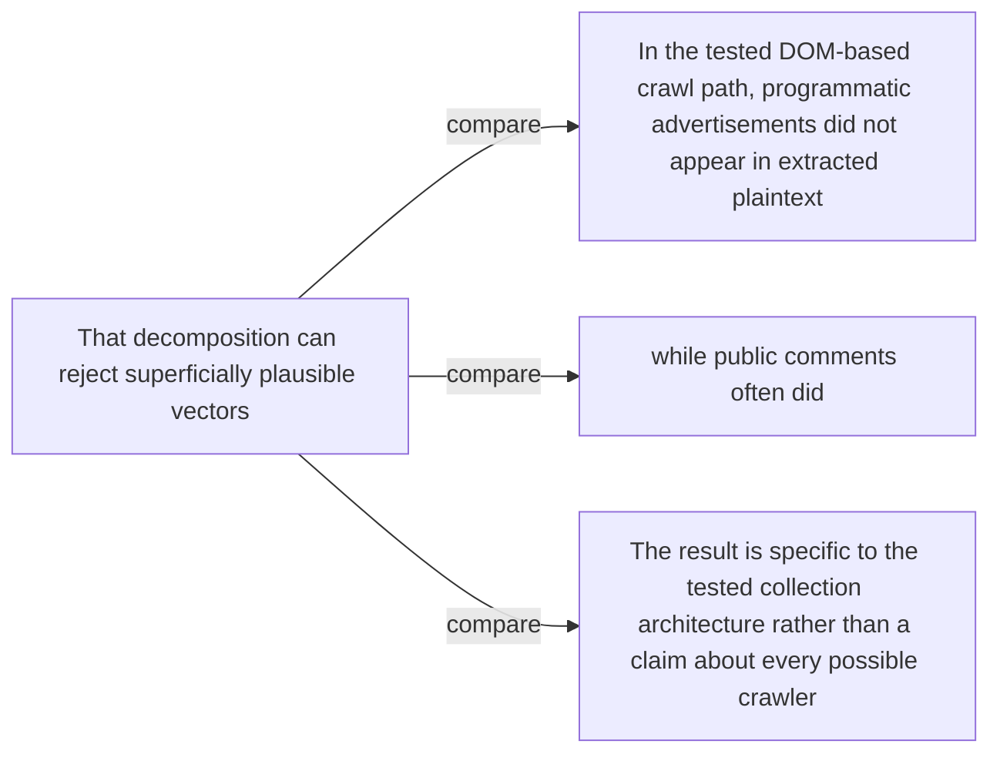

#### Python

```python
from html import escape
from pathlib import Path
from textwrap import wrap

title = "propaganda_change_p2: Comments and programmatic advertisements in the tested extraction path — Comparison topology"
nodes = [["n1","That decomposition can reject superficially plausible vectors",100,150],["n2","In the tested DOM-based crawl path, programmatic advertisements did not appear in extracted plaintext",250,150],["n3","while public comments often did",400,150],["n4","The result is specific to the tested collection architecture rather than a claim about every possible crawler",550,150]]
edges = [["n1","n2","compare"],["n1","n3","compare"],["n1","n4","compare"]]
node_by_id = {node_id: (label, x, y) for node_id, label, x, y in nodes}
width = max(900, max((x for _, _, x, _ in nodes), default=800) + 180)
height = max(500, max((y for _, _, _, y in nodes), default=400) + 140)
parts = [
    f'<svg xmlns="http://www.w3.org/2000/svg" viewBox="0 0 {width} {height}" role="img" aria-labelledby="title desc">',
    f'<title id="title">{escape(title)}</title>',
    '<desc id="desc">Edges and convergence points encode only relationships stated in the scoped paragraphs.</desc>',
    f'<rect width="{width}" height="{height}" fill="white"/>',
]
for source, target, relation in edges:
    _, x1, y1 = node_by_id[source]
    _, x2, y2 = node_by_id[target]
    parts.append(f'<line x1="{x1}" y1="{y1}" x2="{x2}" y2="{y2}" stroke="#345" stroke-width="2"/>')
    parts.append(f'<text x="{(x1+x2)/2}" y="{(y1+y2)/2-5}" text-anchor="middle" font-family="sans-serif" font-size="10">{escape(relation)}</text>')
for _, label, x, y in nodes:
    parts.append(f'<rect x="{x-78}" y="{y-42}" width="156" height="84" rx="12" fill="#eef6ff" stroke="#234"/>')
    for line_index, line in enumerate(wrap(label, width=22)):
        parts.append(f'<text x="{x}" y="{y-24+line_index*13}" text-anchor="middle" font-family="sans-serif" font-size="10">{escape(line)}</text>')
parts.append('</svg>')
Path("propaganda_change_p2_treatment_c.svg").write_text("\n".join(parts), encoding="utf-8")
```

### Implementation record

- Status: `IMPLEMENTED`
- Selected treatment: `A`
- Selection rationale: Selected the approved relationship that directly answers this paragraph's explanatory job; the shared visual uses the same evidence and complete adjacent scope recorded here.
- Delivery medium: `CSS + semantic HTML`
- Visual ID and placement: `propaganda_visual_comments_vs_ads` after `propaganda_change_p2`; this record is served by that purpose-built figure.
- Shared paragraph scope: `propaganda_change_p1`, `propaganda_change_p2`
- Changed files: `packages/test-fixtures/explainers/computational-propaganda.json`, `apps/web/app/papers/[id]/explainer-visual.tsx`, `apps/web/app/papers/[id]/page.tsx`, and `apps/web/app/globals.css`
- Accessibility and fallback verification: Figure has a programmatic title and description, explicit alt text, equivalent fallback prose, source links, limitations, and a semantic static body; no meaning depends on motion or pointer input.
- Desktop and mobile verification: Verified in Playwright on 1440-pixel desktop and iPhone 13 mobile viewports; figures remain paragraph-adjacent, preserve reading order, and introduce no horizontal page overflow.
- Evidence deviations: `NONE`; web-native CSS and semantic HTML preserve the selected treatment's evidence, labels, topology, and stated boundaries.

## `propaganda_mechanism_p1`

- Location: `propaganda_mechanism`, paragraph 1
- Text anchor: "HalfLife defines three gates."
- Claims and sources: `propaganda_claim_halflife` (OBSERVED, VERIFIED); `propaganda_claim_comments` (OBSERVED, VERIFIED); `propaganda_claim_extraction` (OBSERVED, VERIFIED); `propaganda_claim_curation` (OBSERVED, VERIFIED); `propaganda_claim_model_shift` (OBSERVED, VERIFIED); `propaganda_source_halflife` (Pages 3–4, Section 3, Equation 1); `propaganda_source_inclusion` (Pages 4–6, Sections 4.1–4.6, Figures 1–2; Section 4.4 page 5 reports 0.13%, consistent with the rounded 3.4% × 71.9% × 5.5% stage product); `propaganda_source_models` (Pages 6–7, Sections 5.1–5.3, Tables 1–2)
- Visual needed: `YES`
- Decision rationale: A visual passes the removal test because readers must reconstruct halflife conditional gates, denominators, and separate model-influence experiment while preserving the paragraph's conditions and boundaries. Revision 3 narrows the topology and placement so no visual can claim this paragraph without encoding its mechanism, grouping, or values.
- Explanatory job: HalfLife conditional gates, denominators, and separate model-influence experiment.
- Recommended scope and placement: Shared scope `propaganda_mechanism_p1`, `propaganda_mechanism_p2`, `propaganda_mechanism_p3` is allowed only when one visual encodes every listed mechanism, condition, and value; place it immediately after the final paragraph, `propaganda_mechanism_p3`. Otherwise split the visual by paragraph.
- QA-informed planning change: A shared visual may appear only after the third paragraph and must include S1/S2/S3, distinct denominators, the inclusion estimate, and a visibly separate controlled model-influence branch.

### Treatment A — HalfLife conditional gates, denominators, and separate model-influence experiment — Operation flow

- Teaching purpose: Show the source-supported order and branch boundaries.
- Encoding and reading order: Use 8 named nodes and 7 explicit labeled relations. Preserve all branch, merge, hierarchy, loop, or sequence edges shown in the code; changing them is an evidence deviation.
- Evidence and limitations: Encode only `propaganda_claim_halflife`, `propaganda_claim_comments`, `propaganda_claim_extraction`, `propaganda_claim_curation`, `propaganda_claim_model_shift` from `propaganda_source_halflife`, `propaganda_source_inclusion`, `propaganda_source_models`. A shared visual may appear only after the third paragraph and must include S1/S2/S3, distinct denominators, the inclusion estimate, and a visibly separate controlled model-influence branch.
- Recommended web medium: responsive inline SVG with semantic HTML/CSS fallback; JavaScript is optional only for meaningful focus, drill-down, or state playback.
- Mobile, accessibility, and motion behavior: Preserve the same group and node order in the DOM; retain all values and relation labels as selectable text; stack panels or levels below 640px; provide keyboard access for any optional focus state; keep a complete static fallback; respect reduced motion and never encode information only through animation.

#### TikZ

```tex
\documentclass[tikz,border=5pt]{standalone}
\usepackage[T1]{fontenc}
\usepackage{tikz}
\usetikzlibrary{arrows.meta}
\begin{document}
\begin{tikzpicture}[font=\sffamily,box/.style={draw,rounded corners,align=center,text width=3cm,minimum height=1.2cm},link/.style={-{Latex[length=2mm]},thick},rel/.style={fill=white,font=\scriptsize}]
\node[font=\bfseries,anchor=west] at (0,0.8) {propaganda\_mechanism\_p1: HalfLife conditional gates, denominators, and separate model-influence experiment - Operation flow};
\node[box] (pages) at (1.00,-1.50) {Sampled pages};
\node[box] (s1) at (2.50,-1.50) {S1: public comment interface};
\node[box] (s2) at (4.00,-1.50) {S2: fragment survives extraction};
\node[box] (s3) at (5.50,-1.50) {S3: captured document survives curation};
\node[box] (incl) at (7.00,-1.50) {Document-level inclusion estimate};
\node[box] (controlled) at (7.00,-2.55) {Separate controlled poison-mixture model training};
\node[box] (effect) at (8.50,-2.55) {Held-out entity-preference shift};
\node[box] (boundary) at (8.50,-1.50) {No live web-to-production attack established};
\draw[link] (pages) -- node[rel] {page prevalence} (s1);
\draw[link] (s1) -- node[rel] {conditional survival} (s2);
\draw[link] (s2) -- node[rel] {conditional survival} (s3);
\draw[link] (s3) -- node[rel] {multiply gates} (incl);
\draw[link] (controlled) -- node[rel] {measure} (effect);
\draw[link] (incl) -- node[rel] {intermediate only} (boundary);
\draw[link] (effect) -- node[rel] {separate experiment} (boundary);
\end{tikzpicture}
\end{document}
```

#### Mermaid

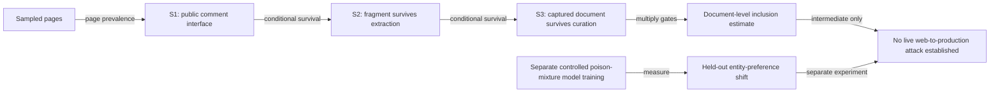

#### Python

```python
from html import escape
from pathlib import Path
from textwrap import wrap

title = "propaganda_mechanism_p1: HalfLife conditional gates, denominators, and separate model-influence experiment — Operation flow"
nodes = [["pages","Sampled pages",100,150],["s1","S1: public comment interface",250,150],["s2","S2: fragment survives extraction",400,150],["s3","S3: captured document survives curation",550,150],["incl","Document-level inclusion estimate",700,150],["controlled","Separate controlled poison-mixture model training",700,255],["effect","Held-out entity-preference shift",850,255],["boundary","No live web-to-production attack established",850,150]]
edges = [["pages","s1","page prevalence"],["s1","s2","conditional survival"],["s2","s3","conditional survival"],["s3","incl","multiply gates"],["controlled","effect","measure"],["incl","boundary","intermediate only"],["effect","boundary","separate experiment"]]
node_by_id = {node_id: (label, x, y) for node_id, label, x, y in nodes}
width = max(900, max((x for _, _, x, _ in nodes), default=800) + 180)
height = max(500, max((y for _, _, _, y in nodes), default=400) + 140)
parts = [
    f'<svg xmlns="http://www.w3.org/2000/svg" viewBox="0 0 {width} {height}" role="img" aria-labelledby="title desc">',
    f'<title id="title">{escape(title)}</title>',
    '<desc id="desc">Edges and convergence points encode only relationships stated in the scoped paragraphs.</desc>',
    f'<rect width="{width}" height="{height}" fill="white"/>',
]
for source, target, relation in edges:
    _, x1, y1 = node_by_id[source]
    _, x2, y2 = node_by_id[target]
    parts.append(f'<line x1="{x1}" y1="{y1}" x2="{x2}" y2="{y2}" stroke="#345" stroke-width="2"/>')
    parts.append(f'<text x="{(x1+x2)/2}" y="{(y1+y2)/2-5}" text-anchor="middle" font-family="sans-serif" font-size="10">{escape(relation)}</text>')
for _, label, x, y in nodes:
    parts.append(f'<rect x="{x-78}" y="{y-42}" width="156" height="84" rx="12" fill="#eef6ff" stroke="#234"/>')
    for line_index, line in enumerate(wrap(label, width=22)):
        parts.append(f'<text x="{x}" y="{y-24+line_index*13}" text-anchor="middle" font-family="sans-serif" font-size="10">{escape(line)}</text>')
parts.append('</svg>')
Path("propaganda_mechanism_p1_treatment_a.svg").write_text("\n".join(parts), encoding="utf-8")
```

### Treatment B — HalfLife conditional gates, denominators, and separate model-influence experiment — Input-operation-output ledger

- Teaching purpose: Make inputs, operations, outputs, and limits inspectable as columns.
- Encoding and reading order: Render 5 rows with explicit `Group`, `Measure or state`, `Visible value`, and `Condition or boundary` columns. The value column must be visible, not only present in ARIA text or fallback prose.
- Evidence and limitations: Encode only `propaganda_claim_halflife`, `propaganda_claim_comments`, `propaganda_claim_extraction`, `propaganda_claim_curation`, `propaganda_claim_model_shift` from `propaganda_source_halflife`, `propaganda_source_inclusion`, `propaganda_source_models`. A shared visual may appear only after the third paragraph and must include S1/S2/S3, distinct denominators, the inclusion estimate, and a visibly separate controlled model-influence branch.
- Recommended web medium: semantic HTML/CSS table with SVG export; JavaScript is optional only for meaningful focus, drill-down, or state playback.
- Mobile, accessibility, and motion behavior: Preserve the same group and node order in the DOM; retain all values and relation labels as selectable text; stack panels or levels below 640px; provide keyboard access for any optional focus state; keep a complete static fallback; respect reduced motion and never encode information only through animation.

#### TikZ

```tex
\documentclass[tikz,border=5pt]{standalone}
\usepackage[T1]{fontenc}
\usepackage{array}
\usepackage{tikz}
\begin{document}
\begin{tikzpicture}[font=\sffamily]
\node[align=center] {\textbf{propaganda\_mechanism\_p1: HalfLife conditional gates, denominators, and separate model-influence experiment - Input-operation-output ledger}\\[6pt]
\begin{tabular}{p{3.2cm}p{4.0cm}p{2.8cm}p{6.2cm}}
\textbf{Group} & \textbf{Measure or state} & \textbf{Visible value} & \textbf{Condition or boundary} \\ \hline
S1 & Page prevalence & 3.4 & Comment-platform signatures appeared on 3.4\% of 181,857 sampled Common Crawl pages. This denominator is the sampled page population. \\
S2 & Extraction survival & 71.9 & Among sandboxed simulated comment replacements, 71.9\% remained in extracted plaintext. This denominator is the simulated-injection set. \\
S3 & Curation survival & 5.5 & Among captured injected-comment documents, 5.5\% survived the combined Dolma 3-style heuristic, language, quality, and deduplication path. \\
HalfLife multiplies three conditional inclusion gates & Section 4.4 and rounded product & 0.13 & Multiplying the rounded conditional stages gives about 0.13\%, matching the document-level estimate reported in Section 4.4. \\
HalfLife multiplies three conditional inclusion gates & Conflicting Introduction summary & 0.15 & The v1 Introduction instead states 0.15\% and does not reconcile that number with Section 4.4 or the rounded stage product. \\
\end{tabular}};
\end{tikzpicture}
\end{document}
```

#### Mermaid

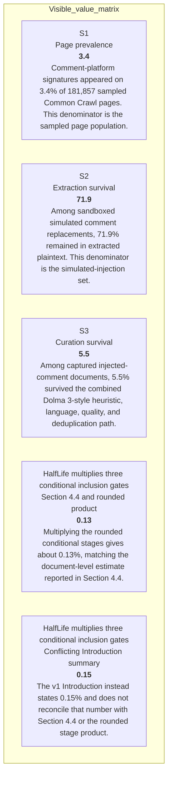

#### Python

```python
from html import escape
from pathlib import Path
from textwrap import wrap

title = "propaganda_mechanism_p1: HalfLife conditional gates, denominators, and separate model-influence experiment — Input-operation-output ledger"
rows = [["S1","Page prevalence","3.4","Comment-platform signatures appeared on 3.4% of 181,857 sampled Common Crawl pages. This denominator is the sampled page population."],["S2","Extraction survival","71.9","Among sandboxed simulated comment replacements, 71.9% remained in extracted plaintext. This denominator is the simulated-injection set."],["S3","Curation survival","5.5","Among captured injected-comment documents, 5.5% survived the combined Dolma 3-style heuristic, language, quality, and deduplication path."],["HalfLife multiplies three conditional inclusion gates","Section 4.4 and rounded product","0.13","Multiplying the rounded conditional stages gives about 0.13%, matching the document-level estimate reported in Section 4.4."],["HalfLife multiplies three conditional inclusion gates","Conflicting Introduction summary","0.15","The v1 Introduction instead states 0.15% and does not reconcile that number with Section 4.4 or the rounded stage product."]]
height = 590
parts = [
    f'<svg xmlns="http://www.w3.org/2000/svg" viewBox="0 0 1200 {height}" role="img" aria-labelledby="title desc">',
    f'<title id="title">{escape(title)}</title>',
    '<desc id="desc">Every reported value is visible beside its condition and group.</desc>',
    f'<rect width="1200" height="{height}" fill="white"/>',
]
headers = ["Group", "Measure or state", "Visible value", "Condition or boundary"]
xs = [30, 260, 590, 770]
for x, header in zip(xs, headers):
    parts.append(f'<text x="{x}" y="70" font-family="sans-serif" font-size="16" font-weight="700">{escape(header)}</text>')
for row_index, row in enumerate(rows):
    y = 110 + row_index * 88
    parts.append(f'<rect x="20" y="{y-28}" width="1160" height="76" fill="#f7fbff" stroke="#ccd"/>')
    for x, cell, width in zip(xs, row, [26, 38, 20, 58]):
        for line_index, line in enumerate(wrap(str(cell), width=width)):
            parts.append(f'<text x="{x}" y="{y+line_index*14}" font-family="sans-serif" font-size="11">{escape(line)}</text>')
parts.append('</svg>')
Path("propaganda_mechanism_p1_treatment_b.svg").write_text("\n".join(parts), encoding="utf-8")
```

### Treatment C — HalfLife conditional gates, denominators, and separate model-influence experiment — State-transition walkthrough

- Teaching purpose: Follow the described state changes without inventing timing.
- Encoding and reading order: Use 8 named nodes and 7 explicit labeled relations. Preserve all branch, merge, hierarchy, loop, or sequence edges shown in the code; changing them is an evidence deviation.
- Evidence and limitations: Encode only `propaganda_claim_halflife`, `propaganda_claim_comments`, `propaganda_claim_extraction`, `propaganda_claim_curation`, `propaganda_claim_model_shift` from `propaganda_source_halflife`, `propaganda_source_inclusion`, `propaganda_source_models`. A shared visual may appear only after the third paragraph and must include S1/S2/S3, distinct denominators, the inclusion estimate, and a visibly separate controlled model-influence branch.
- Recommended web medium: responsive inline SVG with semantic HTML/CSS fallback; JavaScript is optional only for meaningful focus, drill-down, or state playback.
- Mobile, accessibility, and motion behavior: Preserve the same group and node order in the DOM; retain all values and relation labels as selectable text; stack panels or levels below 640px; provide keyboard access for any optional focus state; keep a complete static fallback; respect reduced motion and never encode information only through animation.

#### TikZ

```tex
\documentclass[tikz,border=5pt]{standalone}
\usepackage[T1]{fontenc}
\usepackage{tikz}
\usetikzlibrary{arrows.meta}
\begin{document}
\begin{tikzpicture}[font=\sffamily,box/.style={draw,rounded corners,align=center,text width=3cm,minimum height=1.2cm},link/.style={-{Latex[length=2mm]},thick},rel/.style={fill=white,font=\scriptsize}]
\node[font=\bfseries,anchor=west] at (0,0.8) {propaganda\_mechanism\_p1: HalfLife conditional gates, denominators, and separate model-influence experiment - State-transition walkthrough};
\node[box] (pages) at (1.00,-1.50) {Sampled pages};
\node[box] (s1) at (2.50,-1.50) {S1: public comment interface};
\node[box] (s2) at (4.00,-1.50) {S2: fragment survives extraction};
\node[box] (s3) at (5.50,-1.50) {S3: captured document survives curation};
\node[box] (incl) at (7.00,-1.50) {Document-level inclusion estimate};
\node[box] (controlled) at (7.00,-2.55) {Separate controlled poison-mixture model training};
\node[box] (effect) at (8.50,-2.55) {Held-out entity-preference shift};
\node[box] (boundary) at (8.50,-1.50) {No live web-to-production attack established};
\draw[link] (pages) -- node[rel] {page prevalence} (s1);
\draw[link] (s1) -- node[rel] {conditional survival} (s2);
\draw[link] (s2) -- node[rel] {conditional survival} (s3);
\draw[link] (s3) -- node[rel] {multiply gates} (incl);
\draw[link] (controlled) -- node[rel] {measure} (effect);
\draw[link] (incl) -- node[rel] {intermediate only} (boundary);
\draw[link] (effect) -- node[rel] {separate experiment} (boundary);
\end{tikzpicture}
\end{document}
```

#### Mermaid


#### Python

```python
from html import escape
from pathlib import Path
from textwrap import wrap

title = "propaganda_mechanism_p1: HalfLife conditional gates, denominators, and separate model-influence experiment — State-transition walkthrough"
nodes = [["pages","Sampled pages",100,150],["s1","S1: public comment interface",250,150],["s2","S2: fragment survives extraction",400,150],["s3","S3: captured document survives curation",550,150],["incl","Document-level inclusion estimate",700,150],["controlled","Separate controlled poison-mixture model training",700,255],["effect","Held-out entity-preference shift",850,255],["boundary","No live web-to-production attack established",850,150]]
edges = [["pages","s1","page prevalence"],["s1","s2","conditional survival"],["s2","s3","conditional survival"],["s3","incl","multiply gates"],["controlled","effect","measure"],["incl","boundary","intermediate only"],["effect","boundary","separate experiment"]]
node_by_id = {node_id: (label, x, y) for node_id, label, x, y in nodes}
width = max(900, max((x for _, _, x, _ in nodes), default=800) + 180)
height = max(500, max((y for _, _, _, y in nodes), default=400) + 140)
parts = [
    f'<svg xmlns="http://www.w3.org/2000/svg" viewBox="0 0 {width} {height}" role="img" aria-labelledby="title desc">',
    f'<title id="title">{escape(title)}</title>',
    '<desc id="desc">Edges and convergence points encode only relationships stated in the scoped paragraphs.</desc>',
    f'<rect width="{width}" height="{height}" fill="white"/>',
]
for source, target, relation in edges:
    _, x1, y1 = node_by_id[source]
    _, x2, y2 = node_by_id[target]
    parts.append(f'<line x1="{x1}" y1="{y1}" x2="{x2}" y2="{y2}" stroke="#345" stroke-width="2"/>')
    parts.append(f'<text x="{(x1+x2)/2}" y="{(y1+y2)/2-5}" text-anchor="middle" font-family="sans-serif" font-size="10">{escape(relation)}</text>')
for _, label, x, y in nodes:
    parts.append(f'<rect x="{x-78}" y="{y-42}" width="156" height="84" rx="12" fill="#eef6ff" stroke="#234"/>')
    for line_index, line in enumerate(wrap(label, width=22)):
        parts.append(f'<text x="{x}" y="{y-24+line_index*13}" text-anchor="middle" font-family="sans-serif" font-size="10">{escape(line)}</text>')
parts.append('</svg>')
Path("propaganda_mechanism_p1_treatment_c.svg").write_text("\n".join(parts), encoding="utf-8")
```

### Implementation record

- Status: `IMPLEMENTED`
- Selected treatment: `A`
- Selection rationale: Selected the approved relationship that directly answers this paragraph's explanatory job; the shared visual uses the same evidence and complete adjacent scope recorded here.
- Delivery medium: `CSS + semantic HTML`
- Visual ID and placement: `propaganda_visual_halflife_flow` after `propaganda_mechanism_p3`; this record is served by that purpose-built figure.
- Shared paragraph scope: `propaganda_mechanism_p1`, `propaganda_mechanism_p2`, `propaganda_mechanism_p3`, `propaganda_example_p1`, `propaganda_example_p2`, `propaganda_evidence_p1`
- Changed files: `packages/test-fixtures/explainers/computational-propaganda.json`, `apps/web/app/papers/[id]/explainer-visual.tsx`, `apps/web/app/papers/[id]/page.tsx`, and `apps/web/app/globals.css`
- Accessibility and fallback verification: Figure has a programmatic title and description, explicit alt text, equivalent fallback prose, source links, limitations, and a semantic static body; no meaning depends on motion or pointer input.
- Desktop and mobile verification: Verified in Playwright on 1440-pixel desktop and iPhone 13 mobile viewports; figures remain paragraph-adjacent, preserve reading order, and introduce no horizontal page overflow.
- Evidence deviations: `NONE`; web-native CSS and semantic HTML preserve the selected treatment's evidence, labels, topology, and stated boundaries.

## `propaganda_mechanism_p2`

- Location: `propaganda_mechanism`, paragraph 2
- Text anchor: "The paper estimates the conditional probability at each gate using sampled crawl data and sandboxed replacements, then combines the stages into a document-level inclusion estimate."
- Claims and sources: `propaganda_claim_halflife` (OBSERVED, VERIFIED); `propaganda_claim_comments` (OBSERVED, VERIFIED); `propaganda_claim_extraction` (OBSERVED, VERIFIED); `propaganda_claim_curation` (OBSERVED, VERIFIED); `propaganda_claim_model_shift` (OBSERVED, VERIFIED); `propaganda_source_halflife` (Pages 3–4, Section 3, Equation 1); `propaganda_source_inclusion` (Pages 4–6, Sections 4.1–4.6, Figures 1–2; Section 4.4 page 5 reports 0.13%, consistent with the rounded 3.4% × 71.9% × 5.5% stage product); `propaganda_source_models` (Pages 6–7, Sections 5.1–5.3, Tables 1–2)
- Visual needed: `YES`
- Decision rationale: A visual passes the removal test because readers must reconstruct halflife conditional gates, denominators, and separate model-influence experiment while preserving the paragraph's conditions and boundaries. Revision 3 narrows the topology and placement so no visual can claim this paragraph without encoding its mechanism, grouping, or values.
- Explanatory job: HalfLife conditional gates, denominators, and separate model-influence experiment.
- Recommended scope and placement: Shared scope `propaganda_mechanism_p1`, `propaganda_mechanism_p2`, `propaganda_mechanism_p3` is allowed only when one visual encodes every listed mechanism, condition, and value; place it immediately after the final paragraph, `propaganda_mechanism_p3`. Otherwise split the visual by paragraph.
- QA-informed planning change: A shared visual may appear only after the third paragraph and must include S1/S2/S3, distinct denominators, the inclusion estimate, and a visibly separate controlled model-influence branch.

### Treatment A — HalfLife conditional gates, denominators, and separate model-influence experiment — Operation flow

- Teaching purpose: Show the source-supported order and branch boundaries.
- Encoding and reading order: Use 8 named nodes and 7 explicit labeled relations. Preserve all branch, merge, hierarchy, loop, or sequence edges shown in the code; changing them is an evidence deviation.
- Evidence and limitations: Encode only `propaganda_claim_halflife`, `propaganda_claim_comments`, `propaganda_claim_extraction`, `propaganda_claim_curation`, `propaganda_claim_model_shift` from `propaganda_source_halflife`, `propaganda_source_inclusion`, `propaganda_source_models`. A shared visual may appear only after the third paragraph and must include S1/S2/S3, distinct denominators, the inclusion estimate, and a visibly separate controlled model-influence branch.
- Recommended web medium: responsive inline SVG with semantic HTML/CSS fallback; JavaScript is optional only for meaningful focus, drill-down, or state playback.
- Mobile, accessibility, and motion behavior: Preserve the same group and node order in the DOM; retain all values and relation labels as selectable text; stack panels or levels below 640px; provide keyboard access for any optional focus state; keep a complete static fallback; respect reduced motion and never encode information only through animation.

#### TikZ

```tex
\documentclass[tikz,border=5pt]{standalone}
\usepackage[T1]{fontenc}
\usepackage{tikz}
\usetikzlibrary{arrows.meta}
\begin{document}
\begin{tikzpicture}[font=\sffamily,box/.style={draw,rounded corners,align=center,text width=3cm,minimum height=1.2cm},link/.style={-{Latex[length=2mm]},thick},rel/.style={fill=white,font=\scriptsize}]
\node[font=\bfseries,anchor=west] at (0,0.8) {propaganda\_mechanism\_p2: HalfLife conditional gates, denominators, and separate model-influence experiment - Operation flow};
\node[box] (pages) at (1.00,-1.50) {Sampled pages};
\node[box] (s1) at (2.50,-1.50) {S1: public comment interface};
\node[box] (s2) at (4.00,-1.50) {S2: fragment survives extraction};
\node[box] (s3) at (5.50,-1.50) {S3: captured document survives curation};
\node[box] (incl) at (7.00,-1.50) {Document-level inclusion estimate};
\node[box] (controlled) at (7.00,-2.55) {Separate controlled poison-mixture model training};
\node[box] (effect) at (8.50,-2.55) {Held-out entity-preference shift};
\node[box] (boundary) at (8.50,-1.50) {No live web-to-production attack established};
\draw[link] (pages) -- node[rel] {page prevalence} (s1);
\draw[link] (s1) -- node[rel] {conditional survival} (s2);
\draw[link] (s2) -- node[rel] {conditional survival} (s3);
\draw[link] (s3) -- node[rel] {multiply gates} (incl);
\draw[link] (controlled) -- node[rel] {measure} (effect);
\draw[link] (incl) -- node[rel] {intermediate only} (boundary);
\draw[link] (effect) -- node[rel] {separate experiment} (boundary);
\end{tikzpicture}
\end{document}
```

#### Mermaid


#### Python

```python
from html import escape
from pathlib import Path
from textwrap import wrap

title = "propaganda_mechanism_p2: HalfLife conditional gates, denominators, and separate model-influence experiment — Operation flow"
nodes = [["pages","Sampled pages",100,150],["s1","S1: public comment interface",250,150],["s2","S2: fragment survives extraction",400,150],["s3","S3: captured document survives curation",550,150],["incl","Document-level inclusion estimate",700,150],["controlled","Separate controlled poison-mixture model training",700,255],["effect","Held-out entity-preference shift",850,255],["boundary","No live web-to-production attack established",850,150]]
edges = [["pages","s1","page prevalence"],["s1","s2","conditional survival"],["s2","s3","conditional survival"],["s3","incl","multiply gates"],["controlled","effect","measure"],["incl","boundary","intermediate only"],["effect","boundary","separate experiment"]]
node_by_id = {node_id: (label, x, y) for node_id, label, x, y in nodes}
width = max(900, max((x for _, _, x, _ in nodes), default=800) + 180)
height = max(500, max((y for _, _, _, y in nodes), default=400) + 140)
parts = [
    f'<svg xmlns="http://www.w3.org/2000/svg" viewBox="0 0 {width} {height}" role="img" aria-labelledby="title desc">',
    f'<title id="title">{escape(title)}</title>',
    '<desc id="desc">Edges and convergence points encode only relationships stated in the scoped paragraphs.</desc>',
    f'<rect width="{width}" height="{height}" fill="white"/>',
]
for source, target, relation in edges:
    _, x1, y1 = node_by_id[source]
    _, x2, y2 = node_by_id[target]
    parts.append(f'<line x1="{x1}" y1="{y1}" x2="{x2}" y2="{y2}" stroke="#345" stroke-width="2"/>')
    parts.append(f'<text x="{(x1+x2)/2}" y="{(y1+y2)/2-5}" text-anchor="middle" font-family="sans-serif" font-size="10">{escape(relation)}</text>')
for _, label, x, y in nodes:
    parts.append(f'<rect x="{x-78}" y="{y-42}" width="156" height="84" rx="12" fill="#eef6ff" stroke="#234"/>')
    for line_index, line in enumerate(wrap(label, width=22)):
        parts.append(f'<text x="{x}" y="{y-24+line_index*13}" text-anchor="middle" font-family="sans-serif" font-size="10">{escape(line)}</text>')
parts.append('</svg>')
Path("propaganda_mechanism_p2_treatment_a.svg").write_text("\n".join(parts), encoding="utf-8")
```

### Treatment B — HalfLife conditional gates, denominators, and separate model-influence experiment — Input-operation-output ledger

- Teaching purpose: Make inputs, operations, outputs, and limits inspectable as columns.
- Encoding and reading order: Render 5 rows with explicit `Group`, `Measure or state`, `Visible value`, and `Condition or boundary` columns. The value column must be visible, not only present in ARIA text or fallback prose.
- Evidence and limitations: Encode only `propaganda_claim_halflife`, `propaganda_claim_comments`, `propaganda_claim_extraction`, `propaganda_claim_curation`, `propaganda_claim_model_shift` from `propaganda_source_halflife`, `propaganda_source_inclusion`, `propaganda_source_models`. A shared visual may appear only after the third paragraph and must include S1/S2/S3, distinct denominators, the inclusion estimate, and a visibly separate controlled model-influence branch.
- Recommended web medium: semantic HTML/CSS table with SVG export; JavaScript is optional only for meaningful focus, drill-down, or state playback.
- Mobile, accessibility, and motion behavior: Preserve the same group and node order in the DOM; retain all values and relation labels as selectable text; stack panels or levels below 640px; provide keyboard access for any optional focus state; keep a complete static fallback; respect reduced motion and never encode information only through animation.

#### TikZ

```tex
\documentclass[tikz,border=5pt]{standalone}
\usepackage[T1]{fontenc}
\usepackage{array}
\usepackage{tikz}
\begin{document}
\begin{tikzpicture}[font=\sffamily]
\node[align=center] {\textbf{propaganda\_mechanism\_p2: HalfLife conditional gates, denominators, and separate model-influence experiment - Input-operation-output ledger}\\[6pt]
\begin{tabular}{p{3.2cm}p{4.0cm}p{2.8cm}p{6.2cm}}
\textbf{Group} & \textbf{Measure or state} & \textbf{Visible value} & \textbf{Condition or boundary} \\ \hline
S1 & Page prevalence & 3.4 & Comment-platform signatures appeared on 3.4\% of 181,857 sampled Common Crawl pages. This denominator is the sampled page population. \\
S2 & Extraction survival & 71.9 & Among sandboxed simulated comment replacements, 71.9\% remained in extracted plaintext. This denominator is the simulated-injection set. \\
S3 & Curation survival & 5.5 & Among captured injected-comment documents, 5.5\% survived the combined Dolma 3-style heuristic, language, quality, and deduplication path. \\
HalfLife multiplies three conditional inclusion gates & Section 4.4 and rounded product & 0.13 & Multiplying the rounded conditional stages gives about 0.13\%, matching the document-level estimate reported in Section 4.4. \\
HalfLife multiplies three conditional inclusion gates & Conflicting Introduction summary & 0.15 & The v1 Introduction instead states 0.15\% and does not reconcile that number with Section 4.4 or the rounded stage product. \\
\end{tabular}};
\end{tikzpicture}
\end{document}
```

#### Mermaid


#### Python

```python
from html import escape
from pathlib import Path
from textwrap import wrap

title = "propaganda_mechanism_p2: HalfLife conditional gates, denominators, and separate model-influence experiment — Input-operation-output ledger"
rows = [["S1","Page prevalence","3.4","Comment-platform signatures appeared on 3.4% of 181,857 sampled Common Crawl pages. This denominator is the sampled page population."],["S2","Extraction survival","71.9","Among sandboxed simulated comment replacements, 71.9% remained in extracted plaintext. This denominator is the simulated-injection set."],["S3","Curation survival","5.5","Among captured injected-comment documents, 5.5% survived the combined Dolma 3-style heuristic, language, quality, and deduplication path."],["HalfLife multiplies three conditional inclusion gates","Section 4.4 and rounded product","0.13","Multiplying the rounded conditional stages gives about 0.13%, matching the document-level estimate reported in Section 4.4."],["HalfLife multiplies three conditional inclusion gates","Conflicting Introduction summary","0.15","The v1 Introduction instead states 0.15% and does not reconcile that number with Section 4.4 or the rounded stage product."]]
height = 590
parts = [
    f'<svg xmlns="http://www.w3.org/2000/svg" viewBox="0 0 1200 {height}" role="img" aria-labelledby="title desc">',
    f'<title id="title">{escape(title)}</title>',
    '<desc id="desc">Every reported value is visible beside its condition and group.</desc>',
    f'<rect width="1200" height="{height}" fill="white"/>',
]
headers = ["Group", "Measure or state", "Visible value", "Condition or boundary"]
xs = [30, 260, 590, 770]
for x, header in zip(xs, headers):
    parts.append(f'<text x="{x}" y="70" font-family="sans-serif" font-size="16" font-weight="700">{escape(header)}</text>')
for row_index, row in enumerate(rows):
    y = 110 + row_index * 88
    parts.append(f'<rect x="20" y="{y-28}" width="1160" height="76" fill="#f7fbff" stroke="#ccd"/>')
    for x, cell, width in zip(xs, row, [26, 38, 20, 58]):
        for line_index, line in enumerate(wrap(str(cell), width=width)):
            parts.append(f'<text x="{x}" y="{y+line_index*14}" font-family="sans-serif" font-size="11">{escape(line)}</text>')
parts.append('</svg>')
Path("propaganda_mechanism_p2_treatment_b.svg").write_text("\n".join(parts), encoding="utf-8")
```

### Treatment C — HalfLife conditional gates, denominators, and separate model-influence experiment — State-transition walkthrough

- Teaching purpose: Follow the described state changes without inventing timing.
- Encoding and reading order: Use 8 named nodes and 7 explicit labeled relations. Preserve all branch, merge, hierarchy, loop, or sequence edges shown in the code; changing them is an evidence deviation.
- Evidence and limitations: Encode only `propaganda_claim_halflife`, `propaganda_claim_comments`, `propaganda_claim_extraction`, `propaganda_claim_curation`, `propaganda_claim_model_shift` from `propaganda_source_halflife`, `propaganda_source_inclusion`, `propaganda_source_models`. A shared visual may appear only after the third paragraph and must include S1/S2/S3, distinct denominators, the inclusion estimate, and a visibly separate controlled model-influence branch.
- Recommended web medium: responsive inline SVG with semantic HTML/CSS fallback; JavaScript is optional only for meaningful focus, drill-down, or state playback.
- Mobile, accessibility, and motion behavior: Preserve the same group and node order in the DOM; retain all values and relation labels as selectable text; stack panels or levels below 640px; provide keyboard access for any optional focus state; keep a complete static fallback; respect reduced motion and never encode information only through animation.

#### TikZ

```tex
\documentclass[tikz,border=5pt]{standalone}
\usepackage[T1]{fontenc}
\usepackage{tikz}
\usetikzlibrary{arrows.meta}
\begin{document}
\begin{tikzpicture}[font=\sffamily,box/.style={draw,rounded corners,align=center,text width=3cm,minimum height=1.2cm},link/.style={-{Latex[length=2mm]},thick},rel/.style={fill=white,font=\scriptsize}]
\node[font=\bfseries,anchor=west] at (0,0.8) {propaganda\_mechanism\_p2: HalfLife conditional gates, denominators, and separate model-influence experiment - State-transition walkthrough};
\node[box] (pages) at (1.00,-1.50) {Sampled pages};
\node[box] (s1) at (2.50,-1.50) {S1: public comment interface};
\node[box] (s2) at (4.00,-1.50) {S2: fragment survives extraction};
\node[box] (s3) at (5.50,-1.50) {S3: captured document survives curation};
\node[box] (incl) at (7.00,-1.50) {Document-level inclusion estimate};
\node[box] (controlled) at (7.00,-2.55) {Separate controlled poison-mixture model training};
\node[box] (effect) at (8.50,-2.55) {Held-out entity-preference shift};
\node[box] (boundary) at (8.50,-1.50) {No live web-to-production attack established};
\draw[link] (pages) -- node[rel] {page prevalence} (s1);
\draw[link] (s1) -- node[rel] {conditional survival} (s2);
\draw[link] (s2) -- node[rel] {conditional survival} (s3);
\draw[link] (s3) -- node[rel] {multiply gates} (incl);
\draw[link] (controlled) -- node[rel] {measure} (effect);
\draw[link] (incl) -- node[rel] {intermediate only} (boundary);
\draw[link] (effect) -- node[rel] {separate experiment} (boundary);
\end{tikzpicture}
\end{document}
```

#### Mermaid


#### Python

```python
from html import escape
from pathlib import Path
from textwrap import wrap

title = "propaganda_mechanism_p2: HalfLife conditional gates, denominators, and separate model-influence experiment — State-transition walkthrough"
nodes = [["pages","Sampled pages",100,150],["s1","S1: public comment interface",250,150],["s2","S2: fragment survives extraction",400,150],["s3","S3: captured document survives curation",550,150],["incl","Document-level inclusion estimate",700,150],["controlled","Separate controlled poison-mixture model training",700,255],["effect","Held-out entity-preference shift",850,255],["boundary","No live web-to-production attack established",850,150]]
edges = [["pages","s1","page prevalence"],["s1","s2","conditional survival"],["s2","s3","conditional survival"],["s3","incl","multiply gates"],["controlled","effect","measure"],["incl","boundary","intermediate only"],["effect","boundary","separate experiment"]]
node_by_id = {node_id: (label, x, y) for node_id, label, x, y in nodes}
width = max(900, max((x for _, _, x, _ in nodes), default=800) + 180)
height = max(500, max((y for _, _, _, y in nodes), default=400) + 140)
parts = [
    f'<svg xmlns="http://www.w3.org/2000/svg" viewBox="0 0 {width} {height}" role="img" aria-labelledby="title desc">',
    f'<title id="title">{escape(title)}</title>',
    '<desc id="desc">Edges and convergence points encode only relationships stated in the scoped paragraphs.</desc>',
    f'<rect width="{width}" height="{height}" fill="white"/>',
]
for source, target, relation in edges:
    _, x1, y1 = node_by_id[source]
    _, x2, y2 = node_by_id[target]
    parts.append(f'<line x1="{x1}" y1="{y1}" x2="{x2}" y2="{y2}" stroke="#345" stroke-width="2"/>')
    parts.append(f'<text x="{(x1+x2)/2}" y="{(y1+y2)/2-5}" text-anchor="middle" font-family="sans-serif" font-size="10">{escape(relation)}</text>')
for _, label, x, y in nodes:
    parts.append(f'<rect x="{x-78}" y="{y-42}" width="156" height="84" rx="12" fill="#eef6ff" stroke="#234"/>')
    for line_index, line in enumerate(wrap(label, width=22)):
        parts.append(f'<text x="{x}" y="{y-24+line_index*13}" text-anchor="middle" font-family="sans-serif" font-size="10">{escape(line)}</text>')
parts.append('</svg>')
Path("propaganda_mechanism_p2_treatment_c.svg").write_text("\n".join(parts), encoding="utf-8")
```

### Implementation record

- Status: `IMPLEMENTED`
- Selected treatment: `A`
- Selection rationale: Selected the approved relationship that directly answers this paragraph's explanatory job; the shared visual uses the same evidence and complete adjacent scope recorded here.
- Delivery medium: `CSS + semantic HTML`
- Visual ID and placement: `propaganda_visual_halflife_flow` after `propaganda_mechanism_p3`; this record is served by that purpose-built figure.
- Shared paragraph scope: `propaganda_mechanism_p1`, `propaganda_mechanism_p2`, `propaganda_mechanism_p3`, `propaganda_example_p1`, `propaganda_example_p2`, `propaganda_evidence_p1`
- Changed files: `packages/test-fixtures/explainers/computational-propaganda.json`, `apps/web/app/papers/[id]/explainer-visual.tsx`, `apps/web/app/papers/[id]/page.tsx`, and `apps/web/app/globals.css`
- Accessibility and fallback verification: Figure has a programmatic title and description, explicit alt text, equivalent fallback prose, source links, limitations, and a semantic static body; no meaning depends on motion or pointer input.
- Desktop and mobile verification: Verified in Playwright on 1440-pixel desktop and iPhone 13 mobile viewports; figures remain paragraph-adjacent, preserve reading order, and introduce no horizontal page overflow.
- Evidence deviations: `NONE`; web-native CSS and semantic HTML preserve the selected treatment's evidence, labels, topology, and stated boundaries.

## `propaganda_mechanism_p3`

- Location: `propaganda_mechanism`, paragraph 3
- Text anchor: "Corpus inclusion is still only an intermediate outcome."
- Claims and sources: `propaganda_claim_halflife` (OBSERVED, VERIFIED); `propaganda_claim_comments` (OBSERVED, VERIFIED); `propaganda_claim_extraction` (OBSERVED, VERIFIED); `propaganda_claim_curation` (OBSERVED, VERIFIED); `propaganda_claim_model_shift` (OBSERVED, VERIFIED); `propaganda_source_halflife` (Pages 3–4, Section 3, Equation 1); `propaganda_source_inclusion` (Pages 4–6, Sections 4.1–4.6, Figures 1–2; Section 4.4 page 5 reports 0.13%, consistent with the rounded 3.4% × 71.9% × 5.5% stage product); `propaganda_source_models` (Pages 6–7, Sections 5.1–5.3, Tables 1–2)
- Visual needed: `YES`
- Decision rationale: A visual passes the removal test because readers must reconstruct halflife conditional gates, denominators, and separate model-influence experiment while preserving the paragraph's conditions and boundaries. Revision 3 narrows the topology and placement so no visual can claim this paragraph without encoding its mechanism, grouping, or values.
- Explanatory job: HalfLife conditional gates, denominators, and separate model-influence experiment.
- Recommended scope and placement: Shared scope `propaganda_mechanism_p1`, `propaganda_mechanism_p2`, `propaganda_mechanism_p3` is allowed only when one visual encodes every listed mechanism, condition, and value; place it immediately after the final paragraph, `propaganda_mechanism_p3`. Otherwise split the visual by paragraph.
- QA-informed planning change: A shared visual may appear only after the third paragraph and must include S1/S2/S3, distinct denominators, the inclusion estimate, and a visibly separate controlled model-influence branch.

### Treatment A — HalfLife conditional gates, denominators, and separate model-influence experiment — Operation flow

- Teaching purpose: Show the source-supported order and branch boundaries.
- Encoding and reading order: Use 8 named nodes and 7 explicit labeled relations. Preserve all branch, merge, hierarchy, loop, or sequence edges shown in the code; changing them is an evidence deviation.
- Evidence and limitations: Encode only `propaganda_claim_halflife`, `propaganda_claim_comments`, `propaganda_claim_extraction`, `propaganda_claim_curation`, `propaganda_claim_model_shift` from `propaganda_source_halflife`, `propaganda_source_inclusion`, `propaganda_source_models`. A shared visual may appear only after the third paragraph and must include S1/S2/S3, distinct denominators, the inclusion estimate, and a visibly separate controlled model-influence branch.
- Recommended web medium: responsive inline SVG with semantic HTML/CSS fallback; JavaScript is optional only for meaningful focus, drill-down, or state playback.
- Mobile, accessibility, and motion behavior: Preserve the same group and node order in the DOM; retain all values and relation labels as selectable text; stack panels or levels below 640px; provide keyboard access for any optional focus state; keep a complete static fallback; respect reduced motion and never encode information only through animation.

#### TikZ

```tex
\documentclass[tikz,border=5pt]{standalone}
\usepackage[T1]{fontenc}
\usepackage{tikz}
\usetikzlibrary{arrows.meta}
\begin{document}
\begin{tikzpicture}[font=\sffamily,box/.style={draw,rounded corners,align=center,text width=3cm,minimum height=1.2cm},link/.style={-{Latex[length=2mm]},thick},rel/.style={fill=white,font=\scriptsize}]
\node[font=\bfseries,anchor=west] at (0,0.8) {propaganda\_mechanism\_p3: HalfLife conditional gates, denominators, and separate model-influence experiment - Operation flow};
\node[box] (pages) at (1.00,-1.50) {Sampled pages};
\node[box] (s1) at (2.50,-1.50) {S1: public comment interface};
\node[box] (s2) at (4.00,-1.50) {S2: fragment survives extraction};
\node[box] (s3) at (5.50,-1.50) {S3: captured document survives curation};
\node[box] (incl) at (7.00,-1.50) {Document-level inclusion estimate};
\node[box] (controlled) at (7.00,-2.55) {Separate controlled poison-mixture model training};
\node[box] (effect) at (8.50,-2.55) {Held-out entity-preference shift};
\node[box] (boundary) at (8.50,-1.50) {No live web-to-production attack established};
\draw[link] (pages) -- node[rel] {page prevalence} (s1);
\draw[link] (s1) -- node[rel] {conditional survival} (s2);
\draw[link] (s2) -- node[rel] {conditional survival} (s3);
\draw[link] (s3) -- node[rel] {multiply gates} (incl);
\draw[link] (controlled) -- node[rel] {measure} (effect);
\draw[link] (incl) -- node[rel] {intermediate only} (boundary);
\draw[link] (effect) -- node[rel] {separate experiment} (boundary);
\end{tikzpicture}
\end{document}
```

#### Mermaid


#### Python

```python
from html import escape
from pathlib import Path
from textwrap import wrap

title = "propaganda_mechanism_p3: HalfLife conditional gates, denominators, and separate model-influence experiment — Operation flow"
nodes = [["pages","Sampled pages",100,150],["s1","S1: public comment interface",250,150],["s2","S2: fragment survives extraction",400,150],["s3","S3: captured document survives curation",550,150],["incl","Document-level inclusion estimate",700,150],["controlled","Separate controlled poison-mixture model training",700,255],["effect","Held-out entity-preference shift",850,255],["boundary","No live web-to-production attack established",850,150]]
edges = [["pages","s1","page prevalence"],["s1","s2","conditional survival"],["s2","s3","conditional survival"],["s3","incl","multiply gates"],["controlled","effect","measure"],["incl","boundary","intermediate only"],["effect","boundary","separate experiment"]]
node_by_id = {node_id: (label, x, y) for node_id, label, x, y in nodes}
width = max(900, max((x for _, _, x, _ in nodes), default=800) + 180)
height = max(500, max((y for _, _, _, y in nodes), default=400) + 140)
parts = [
    f'<svg xmlns="http://www.w3.org/2000/svg" viewBox="0 0 {width} {height}" role="img" aria-labelledby="title desc">',
    f'<title id="title">{escape(title)}</title>',
    '<desc id="desc">Edges and convergence points encode only relationships stated in the scoped paragraphs.</desc>',
    f'<rect width="{width}" height="{height}" fill="white"/>',
]
for source, target, relation in edges:
    _, x1, y1 = node_by_id[source]
    _, x2, y2 = node_by_id[target]
    parts.append(f'<line x1="{x1}" y1="{y1}" x2="{x2}" y2="{y2}" stroke="#345" stroke-width="2"/>')
    parts.append(f'<text x="{(x1+x2)/2}" y="{(y1+y2)/2-5}" text-anchor="middle" font-family="sans-serif" font-size="10">{escape(relation)}</text>')
for _, label, x, y in nodes:
    parts.append(f'<rect x="{x-78}" y="{y-42}" width="156" height="84" rx="12" fill="#eef6ff" stroke="#234"/>')
    for line_index, line in enumerate(wrap(label, width=22)):
        parts.append(f'<text x="{x}" y="{y-24+line_index*13}" text-anchor="middle" font-family="sans-serif" font-size="10">{escape(line)}</text>')
parts.append('</svg>')
Path("propaganda_mechanism_p3_treatment_a.svg").write_text("\n".join(parts), encoding="utf-8")
```

### Treatment B — HalfLife conditional gates, denominators, and separate model-influence experiment — Input-operation-output ledger

- Teaching purpose: Make inputs, operations, outputs, and limits inspectable as columns.
- Encoding and reading order: Render 5 rows with explicit `Group`, `Measure or state`, `Visible value`, and `Condition or boundary` columns. The value column must be visible, not only present in ARIA text or fallback prose.
- Evidence and limitations: Encode only `propaganda_claim_halflife`, `propaganda_claim_comments`, `propaganda_claim_extraction`, `propaganda_claim_curation`, `propaganda_claim_model_shift` from `propaganda_source_halflife`, `propaganda_source_inclusion`, `propaganda_source_models`. A shared visual may appear only after the third paragraph and must include S1/S2/S3, distinct denominators, the inclusion estimate, and a visibly separate controlled model-influence branch.
- Recommended web medium: semantic HTML/CSS table with SVG export; JavaScript is optional only for meaningful focus, drill-down, or state playback.
- Mobile, accessibility, and motion behavior: Preserve the same group and node order in the DOM; retain all values and relation labels as selectable text; stack panels or levels below 640px; provide keyboard access for any optional focus state; keep a complete static fallback; respect reduced motion and never encode information only through animation.

#### TikZ

```tex
\documentclass[tikz,border=5pt]{standalone}
\usepackage[T1]{fontenc}
\usepackage{array}
\usepackage{tikz}
\begin{document}
\begin{tikzpicture}[font=\sffamily]
\node[align=center] {\textbf{propaganda\_mechanism\_p3: HalfLife conditional gates, denominators, and separate model-influence experiment - Input-operation-output ledger}\\[6pt]
\begin{tabular}{p{3.2cm}p{4.0cm}p{2.8cm}p{6.2cm}}
\textbf{Group} & \textbf{Measure or state} & \textbf{Visible value} & \textbf{Condition or boundary} \\ \hline
S1 & Page prevalence & 3.4 & Comment-platform signatures appeared on 3.4\% of 181,857 sampled Common Crawl pages. This denominator is the sampled page population. \\
S2 & Extraction survival & 71.9 & Among sandboxed simulated comment replacements, 71.9\% remained in extracted plaintext. This denominator is the simulated-injection set. \\
S3 & Curation survival & 5.5 & Among captured injected-comment documents, 5.5\% survived the combined Dolma 3-style heuristic, language, quality, and deduplication path. \\
HalfLife multiplies three conditional inclusion gates & Section 4.4 and rounded product & 0.13 & Multiplying the rounded conditional stages gives about 0.13\%, matching the document-level estimate reported in Section 4.4. \\
HalfLife multiplies three conditional inclusion gates & Conflicting Introduction summary & 0.15 & The v1 Introduction instead states 0.15\% and does not reconcile that number with Section 4.4 or the rounded stage product. \\
\end{tabular}};
\end{tikzpicture}
\end{document}
```

#### Mermaid


#### Python

```python
from html import escape
from pathlib import Path
from textwrap import wrap

title = "propaganda_mechanism_p3: HalfLife conditional gates, denominators, and separate model-influence experiment — Input-operation-output ledger"
rows = [["S1","Page prevalence","3.4","Comment-platform signatures appeared on 3.4% of 181,857 sampled Common Crawl pages. This denominator is the sampled page population."],["S2","Extraction survival","71.9","Among sandboxed simulated comment replacements, 71.9% remained in extracted plaintext. This denominator is the simulated-injection set."],["S3","Curation survival","5.5","Among captured injected-comment documents, 5.5% survived the combined Dolma 3-style heuristic, language, quality, and deduplication path."],["HalfLife multiplies three conditional inclusion gates","Section 4.4 and rounded product","0.13","Multiplying the rounded conditional stages gives about 0.13%, matching the document-level estimate reported in Section 4.4."],["HalfLife multiplies three conditional inclusion gates","Conflicting Introduction summary","0.15","The v1 Introduction instead states 0.15% and does not reconcile that number with Section 4.4 or the rounded stage product."]]
height = 590
parts = [
    f'<svg xmlns="http://www.w3.org/2000/svg" viewBox="0 0 1200 {height}" role="img" aria-labelledby="title desc">',
    f'<title id="title">{escape(title)}</title>',
    '<desc id="desc">Every reported value is visible beside its condition and group.</desc>',
    f'<rect width="1200" height="{height}" fill="white"/>',
]
headers = ["Group", "Measure or state", "Visible value", "Condition or boundary"]
xs = [30, 260, 590, 770]
for x, header in zip(xs, headers):
    parts.append(f'<text x="{x}" y="70" font-family="sans-serif" font-size="16" font-weight="700">{escape(header)}</text>')
for row_index, row in enumerate(rows):
    y = 110 + row_index * 88
    parts.append(f'<rect x="20" y="{y-28}" width="1160" height="76" fill="#f7fbff" stroke="#ccd"/>')
    for x, cell, width in zip(xs, row, [26, 38, 20, 58]):
        for line_index, line in enumerate(wrap(str(cell), width=width)):
            parts.append(f'<text x="{x}" y="{y+line_index*14}" font-family="sans-serif" font-size="11">{escape(line)}</text>')
parts.append('</svg>')
Path("propaganda_mechanism_p3_treatment_b.svg").write_text("\n".join(parts), encoding="utf-8")
```

### Treatment C — HalfLife conditional gates, denominators, and separate model-influence experiment — State-transition walkthrough

- Teaching purpose: Follow the described state changes without inventing timing.
- Encoding and reading order: Use 8 named nodes and 7 explicit labeled relations. Preserve all branch, merge, hierarchy, loop, or sequence edges shown in the code; changing them is an evidence deviation.
- Evidence and limitations: Encode only `propaganda_claim_halflife`, `propaganda_claim_comments`, `propaganda_claim_extraction`, `propaganda_claim_curation`, `propaganda_claim_model_shift` from `propaganda_source_halflife`, `propaganda_source_inclusion`, `propaganda_source_models`. A shared visual may appear only after the third paragraph and must include S1/S2/S3, distinct denominators, the inclusion estimate, and a visibly separate controlled model-influence branch.
- Recommended web medium: responsive inline SVG with semantic HTML/CSS fallback; JavaScript is optional only for meaningful focus, drill-down, or state playback.
- Mobile, accessibility, and motion behavior: Preserve the same group and node order in the DOM; retain all values and relation labels as selectable text; stack panels or levels below 640px; provide keyboard access for any optional focus state; keep a complete static fallback; respect reduced motion and never encode information only through animation.

#### TikZ

```tex
\documentclass[tikz,border=5pt]{standalone}
\usepackage[T1]{fontenc}
\usepackage{tikz}
\usetikzlibrary{arrows.meta}
\begin{document}
\begin{tikzpicture}[font=\sffamily,box/.style={draw,rounded corners,align=center,text width=3cm,minimum height=1.2cm},link/.style={-{Latex[length=2mm]},thick},rel/.style={fill=white,font=\scriptsize}]
\node[font=\bfseries,anchor=west] at (0,0.8) {propaganda\_mechanism\_p3: HalfLife conditional gates, denominators, and separate model-influence experiment - State-transition walkthrough};
\node[box] (pages) at (1.00,-1.50) {Sampled pages};
\node[box] (s1) at (2.50,-1.50) {S1: public comment interface};
\node[box] (s2) at (4.00,-1.50) {S2: fragment survives extraction};
\node[box] (s3) at (5.50,-1.50) {S3: captured document survives curation};
\node[box] (incl) at (7.00,-1.50) {Document-level inclusion estimate};
\node[box] (controlled) at (7.00,-2.55) {Separate controlled poison-mixture model training};
\node[box] (effect) at (8.50,-2.55) {Held-out entity-preference shift};
\node[box] (boundary) at (8.50,-1.50) {No live web-to-production attack established};
\draw[link] (pages) -- node[rel] {page prevalence} (s1);
\draw[link] (s1) -- node[rel] {conditional survival} (s2);
\draw[link] (s2) -- node[rel] {conditional survival} (s3);
\draw[link] (s3) -- node[rel] {multiply gates} (incl);
\draw[link] (controlled) -- node[rel] {measure} (effect);
\draw[link] (incl) -- node[rel] {intermediate only} (boundary);
\draw[link] (effect) -- node[rel] {separate experiment} (boundary);
\end{tikzpicture}
\end{document}
```

#### Mermaid

```mermaid
flowchart LR
  pages["Sampled pages"]
  s1["S1: public comment interface"]
  s2["S2: fragment survives extraction"]
  s3["S3: captured document survives curation"]
  incl["Document-level inclusion estimate"]
  controlled["Separate controlled poison-mixture model training"]
  effect["Held-out entity-preference shift"]
  boundary["No live web-to-production attack established"]
  pages -->|"page prevalence"| s1
  s1 -->|"conditional survival"| s2
  s2 -->|"conditional survival"| s3
  s3 -->|"multiply gates"| incl
  controlled -->|"measure"| effect
  incl -->|"intermediate only"| boundary
  effect -->|"separate experiment"| boundary
```

#### Python

```python
from html import escape
from pathlib import Path
from textwrap import wrap

title = "propaganda_mechanism_p3: HalfLife conditional gates, denominators, and separate model-influence experiment — State-transition walkthrough"
nodes = [["pages","Sampled pages",100,150],["s1","S1: public comment interface",250,150],["s2","S2: fragment survives extraction",400,150],["s3","S3: captured document survives curation",550,150],["incl","Document-level inclusion estimate",700,150],["controlled","Separate controlled poison-mixture model training",700,255],["effect","Held-out entity-preference shift",850,255],["boundary","No live web-to-production attack established",850,150]]
edges = [["pages","s1","page prevalence"],["s1","s2","conditional survival"],["s2","s3","conditional survival"],["s3","incl","multiply gates"],["controlled","effect","measure"],["incl","boundary","intermediate only"],["effect","boundary","separate experiment"]]
node_by_id = {node_id: (label, x, y) for node_id, label, x, y in nodes}
width = max(900, max((x for _, _, x, _ in nodes), default=800) + 180)
height = max(500, max((y for _, _, _, y in nodes), default=400) + 140)
parts = [
    f'<svg xmlns="http://www.w3.org/2000/svg" viewBox="0 0 {width} {height}" role="img" aria-labelledby="title desc">',
    f'<title id="title">{escape(title)}</title>',
    '<desc id="desc">Edges and convergence points encode only relationships stated in the scoped paragraphs.</desc>',
    f'<rect width="{width}" height="{height}" fill="white"/>',
]
for source, target, relation in edges:
    _, x1, y1 = node_by_id[source]
    _, x2, y2 = node_by_id[target]
    parts.append(f'<line x1="{x1}" y1="{y1}" x2="{x2}" y2="{y2}" stroke="#345" stroke-width="2"/>')
    parts.append(f'<text x="{(x1+x2)/2}" y="{(y1+y2)/2-5}" text-anchor="middle" font-family="sans-serif" font-size="10">{escape(relation)}</text>')
for _, label, x, y in nodes:
    parts.append(f'<rect x="{x-78}" y="{y-42}" width="156" height="84" rx="12" fill="#eef6ff" stroke="#234"/>')
    for line_index, line in enumerate(wrap(label, width=22)):
        parts.append(f'<text x="{x}" y="{y-24+line_index*13}" text-anchor="middle" font-family="sans-serif" font-size="10">{escape(line)}</text>')
parts.append('</svg>')
Path("propaganda_mechanism_p3_treatment_c.svg").write_text("\n".join(parts), encoding="utf-8")
```

### Implementation record

- Status: `IMPLEMENTED`
- Selected treatment: `A`
- Selection rationale: Selected the approved relationship that directly answers this paragraph's explanatory job; the shared visual uses the same evidence and complete adjacent scope recorded here.
- Delivery medium: `CSS + semantic HTML`
- Visual ID and placement: `propaganda_visual_halflife_flow` after `propaganda_mechanism_p3`; this record is served by that purpose-built figure.
- Shared paragraph scope: `propaganda_mechanism_p1`, `propaganda_mechanism_p2`, `propaganda_mechanism_p3`, `propaganda_example_p1`, `propaganda_example_p2`, `propaganda_evidence_p1`
- Changed files: `packages/test-fixtures/explainers/computational-propaganda.json`, `apps/web/app/papers/[id]/explainer-visual.tsx`, `apps/web/app/papers/[id]/page.tsx`, and `apps/web/app/globals.css`
- Accessibility and fallback verification: Figure has a programmatic title and description, explicit alt text, equivalent fallback prose, source links, limitations, and a semantic static body; no meaning depends on motion or pointer input.
- Desktop and mobile verification: Verified in Playwright on 1440-pixel desktop and iPhone 13 mobile viewports; figures remain paragraph-adjacent, preserve reading order, and introduce no horizontal page overflow.
- Evidence deviations: `NONE`; web-native CSS and semantic HTML preserve the selected treatment's evidence, labels, topology, and stated boundaries.

## `propaganda_example_p1`

- Location: `propaganda_example`, paragraph 1
- Text anchor: "Start with a page identified as having a comment interface."
- Claims and sources: `propaganda_claim_comments` (OBSERVED, VERIFIED); `propaganda_claim_extraction` (OBSERVED, VERIFIED); `propaganda_claim_curation` (OBSERVED, VERIFIED); `propaganda_claim_inclusion` (OBSERVED, VERIFIED); `propaganda_source_threat` (Pages 1–3, Sections 1–2.2; Introduction page 2 states a 0.15% inclusion probability); `propaganda_source_inclusion` (Pages 4–6, Sections 4.1–4.6, Figures 1–2; Section 4.4 page 5 reports 0.13%, consistent with the rounded 3.4% × 71.9% × 5.5% stage product)
- Visual needed: `YES`
- Decision rationale: A visual passes the removal test because readers must reconstruct sandboxed comment replacement through extraction, curation, and rounded inclusion product while preserving the paragraph's conditions and boundaries. Revision 3 narrows the topology and placement so no visual can claim this paragraph without encoding its mechanism, grouping, or values.
- Explanatory job: Sandboxed comment replacement through extraction, curation, and rounded inclusion product.
- Recommended scope and placement: Shared scope `propaganda_example_p1`, `propaganda_example_p2` is allowed only when one visual encodes every listed mechanism, condition, and value; place it immediately after the final paragraph, `propaganda_example_p2`. Otherwise split the visual by paragraph.
- QA-informed planning change: A shared visual belongs after the second example and must include 37.5 words, 71.9%, 5.5%, 3.4%, the derived 0.13%, disputed 0.15%, and the non-live boundary.

### Treatment A — Sandboxed comment replacement through extraction, curation, and rounded inclusion product — Worked sequence

- Teaching purpose: Follow the actual example in source order.
- Encoding and reading order: Use 7 named nodes and 6 explicit labeled relations. Preserve all branch, merge, hierarchy, loop, or sequence edges shown in the code; changing them is an evidence deviation.
- Evidence and limitations: Encode only `propaganda_claim_comments`, `propaganda_claim_extraction`, `propaganda_claim_curation`, `propaganda_claim_inclusion` from `propaganda_source_threat`, `propaganda_source_inclusion`. A shared visual belongs after the second example and must include 37.5 words, 71.9%, 5.5%, 3.4%, the derived 0.13%, disputed 0.15%, and the non-live boundary.
- Recommended web medium: responsive inline SVG with semantic HTML/CSS fallback; JavaScript is optional only for meaningful focus, drill-down, or state playback.
- Mobile, accessibility, and motion behavior: Preserve the same group and node order in the DOM; retain all values and relation labels as selectable text; stack panels or levels below 640px; provide keyboard access for any optional focus state; keep a complete static fallback; respect reduced motion and never encode information only through animation.

#### TikZ

```tex
\documentclass[tikz,border=5pt]{standalone}
\usepackage[T1]{fontenc}
\usepackage{tikz}
\usetikzlibrary{arrows.meta}
\begin{document}
\begin{tikzpicture}[font=\sffamily,box/.style={draw,rounded corners,align=center,text width=3cm,minimum height=1.2cm},link/.style={-{Latex[length=2mm]},thick},rel/.style={fill=white,font=\scriptsize}]
\node[font=\bfseries,anchor=west] at (0,0.8) {propaganda\_example\_p1: Sandboxed comment replacement through extraction, curation, and rounded inclusion product - Worked sequence};
\node[box] (n1) at (1.00,-1.50) {Start with a page identified as having a comment interface};
\node[box] (n2) at (2.50,-1.50) {In a sandboxed copy, the researchers replace an existing comment with a question-and-answer poison fragment averaging 37.5 words};
\node[box] (n3) at (4.00,-1.50) {Resiliparse converts the HTML to plaintext};
\node[box] (n4) at (5.50,-1.50) {71.9\% of those simulated injections remain visible after this extraction step};
\node[box] (n5) at (7.00,-1.50) {The resulting documents then pass through Dolma 3-style heuristic, English-language, quality};
\node[box] (n6) at (8.50,-1.50) {and deduplication filters};
\node[box] (n7) at (10.00,-1.50) {The combined curation survival among captured injections is 5.5\%};
\draw[link] (n1) -- node[rel] {then} (n2);
\draw[link] (n2) -- node[rel] {then} (n3);
\draw[link] (n3) -- node[rel] {then} (n4);
\draw[link] (n4) -- node[rel] {then} (n5);
\draw[link] (n5) -- node[rel] {then} (n6);
\draw[link] (n6) -- node[rel] {then} (n7);
\end{tikzpicture}
\end{document}
```

#### Mermaid

```mermaid
flowchart LR
  n1["Start with a page identified as having a comment interface"]
  n2["In a sandboxed copy, the researchers replace an existing comment with a question-and-answer poison fragment averaging 37.5 words"]
  n3["Resiliparse converts the HTML to plaintext"]
  n4["71.9% of those simulated injections remain visible after this extraction step"]
  n5["The resulting documents then pass through Dolma 3-style heuristic, English-language, quality"]
  n6["and deduplication filters"]
  n7["The combined curation survival among captured injections is 5.5%"]
  n1 -->|"then"| n2
  n2 -->|"then"| n3
  n3 -->|"then"| n4
  n4 -->|"then"| n5
  n5 -->|"then"| n6
  n6 -->|"then"| n7
```

#### Python

```python
from html import escape
from pathlib import Path
from textwrap import wrap

title = "propaganda_example_p1: Sandboxed comment replacement through extraction, curation, and rounded inclusion product — Worked sequence"
nodes = [["n1","Start with a page identified as having a comment interface",100,150],["n2","In a sandboxed copy, the researchers replace an existing comment with a question-and-answer poison fragment averaging 37.5 words",250,150],["n3","Resiliparse converts the HTML to plaintext",400,150],["n4","71.9% of those simulated injections remain visible after this extraction step",550,150],["n5","The resulting documents then pass through Dolma 3-style heuristic, English-language, quality",700,150],["n6","and deduplication filters",850,150],["n7","The combined curation survival among captured injections is 5.5%",1000,150]]
edges = [["n1","n2","then"],["n2","n3","then"],["n3","n4","then"],["n4","n5","then"],["n5","n6","then"],["n6","n7","then"]]
node_by_id = {node_id: (label, x, y) for node_id, label, x, y in nodes}
width = max(900, max((x for _, _, x, _ in nodes), default=800) + 180)
height = max(500, max((y for _, _, _, y in nodes), default=400) + 140)
parts = [
    f'<svg xmlns="http://www.w3.org/2000/svg" viewBox="0 0 {width} {height}" role="img" aria-labelledby="title desc">',
    f'<title id="title">{escape(title)}</title>',
    '<desc id="desc">Edges and convergence points encode only relationships stated in the scoped paragraphs.</desc>',
    f'<rect width="{width}" height="{height}" fill="white"/>',
]
for source, target, relation in edges:
    _, x1, y1 = node_by_id[source]
    _, x2, y2 = node_by_id[target]
    parts.append(f'<line x1="{x1}" y1="{y1}" x2="{x2}" y2="{y2}" stroke="#345" stroke-width="2"/>')
    parts.append(f'<text x="{(x1+x2)/2}" y="{(y1+y2)/2-5}" text-anchor="middle" font-family="sans-serif" font-size="10">{escape(relation)}</text>')
for _, label, x, y in nodes:
    parts.append(f'<rect x="{x-78}" y="{y-42}" width="156" height="84" rx="12" fill="#eef6ff" stroke="#234"/>')
    for line_index, line in enumerate(wrap(label, width=22)):
        parts.append(f'<text x="{x}" y="{y-24+line_index*13}" text-anchor="middle" font-family="sans-serif" font-size="10">{escape(line)}</text>')
parts.append('</svg>')
Path("propaganda_example_p1_treatment_a.svg").write_text("\n".join(parts), encoding="utf-8")
```

### Treatment B — Sandboxed comment replacement through extraction, curation, and rounded inclusion product — Example calculation or state ledger

- Teaching purpose: Keep values, states, and boundaries grouped by example.
- Encoding and reading order: Render 5 rows with explicit `Group`, `Measure or state`, `Visible value`, and `Condition or boundary` columns. The value column must be visible, not only present in ARIA text or fallback prose.
- Evidence and limitations: Encode only `propaganda_claim_comments`, `propaganda_claim_extraction`, `propaganda_claim_curation`, `propaganda_claim_inclusion` from `propaganda_source_threat`, `propaganda_source_inclusion`. A shared visual belongs after the second example and must include 37.5 words, 71.9%, 5.5%, 3.4%, the derived 0.13%, disputed 0.15%, and the non-live boundary.
- Recommended web medium: semantic HTML/CSS table with SVG export; JavaScript is optional only for meaningful focus, drill-down, or state playback.
- Mobile, accessibility, and motion behavior: Preserve the same group and node order in the DOM; retain all values and relation labels as selectable text; stack panels or levels below 640px; provide keyboard access for any optional focus state; keep a complete static fallback; respect reduced motion and never encode information only through animation.

#### TikZ

```tex
\documentclass[tikz,border=5pt]{standalone}
\usepackage[T1]{fontenc}
\usepackage{array}
\usepackage{tikz}
\begin{document}
\begin{tikzpicture}[font=\sffamily]
\node[align=center] {\textbf{propaganda\_example\_p1: Sandboxed comment replacement through extraction, curation, and rounded inclusion product - Example calculation or state ledger}\\[6pt]
\begin{tabular}{p{3.2cm}p{4.0cm}p{2.8cm}p{6.2cm}}
\textbf{Group} & \textbf{Measure or state} & \textbf{Visible value} & \textbf{Condition or boundary} \\ \hline
S1 & Page prevalence & 3.4 & Comment-platform signatures appeared on 3.4\% of 181,857 sampled Common Crawl pages. This denominator is the sampled page population. \\
S2 & Extraction survival & 71.9 & Among sandboxed simulated comment replacements, 71.9\% remained in extracted plaintext. This denominator is the simulated-injection set. \\
S3 & Curation survival & 5.5 & Among captured injected-comment documents, 5.5\% survived the combined Dolma 3-style heuristic, language, quality, and deduplication path. \\
HalfLife multiplies three conditional inclusion gates & Section 4.4 and rounded product & 0.13 & Multiplying the rounded conditional stages gives about 0.13\%, matching the document-level estimate reported in Section 4.4. \\
HalfLife multiplies three conditional inclusion gates & Conflicting Introduction summary & 0.15 & The v1 Introduction instead states 0.15\% and does not reconcile that number with Section 4.4 or the rounded stage product. \\
\end{tabular}};
\end{tikzpicture}
\end{document}
```

#### Mermaid

```mermaid
flowchart TB
  subgraph Visible_value_matrix
    r1["S1<br/>Page prevalence<br/><b>3.4</b><br/>Comment-platform signatures appeared on 3.4% of 181,857 sampled Common Crawl pages. This denominator is the sampled page population."]
    r2["S2<br/>Extraction survival<br/><b>71.9</b><br/>Among sandboxed simulated comment replacements, 71.9% remained in extracted plaintext. This denominator is the simulated-injection set."]
    r3["S3<br/>Curation survival<br/><b>5.5</b><br/>Among captured injected-comment documents, 5.5% survived the combined Dolma 3-style heuristic, language, quality, and deduplication path."]
    r4["HalfLife multiplies three conditional inclusion gates<br/>Section 4.4 and rounded product<br/><b>0.13</b><br/>Multiplying the rounded conditional stages gives about 0.13%, matching the document-level estimate reported in Section 4.4."]
    r5["HalfLife multiplies three conditional inclusion gates<br/>Conflicting Introduction summary<br/><b>0.15</b><br/>The v1 Introduction instead states 0.15% and does not reconcile that number with Section 4.4 or the rounded stage product."]
  end
```

#### Python

```python
from html import escape
from pathlib import Path
from textwrap import wrap

title = "propaganda_example_p1: Sandboxed comment replacement through extraction, curation, and rounded inclusion product — Example calculation or state ledger"
rows = [["S1","Page prevalence","3.4","Comment-platform signatures appeared on 3.4% of 181,857 sampled Common Crawl pages. This denominator is the sampled page population."],["S2","Extraction survival","71.9","Among sandboxed simulated comment replacements, 71.9% remained in extracted plaintext. This denominator is the simulated-injection set."],["S3","Curation survival","5.5","Among captured injected-comment documents, 5.5% survived the combined Dolma 3-style heuristic, language, quality, and deduplication path."],["HalfLife multiplies three conditional inclusion gates","Section 4.4 and rounded product","0.13","Multiplying the rounded conditional stages gives about 0.13%, matching the document-level estimate reported in Section 4.4."],["HalfLife multiplies three conditional inclusion gates","Conflicting Introduction summary","0.15","The v1 Introduction instead states 0.15% and does not reconcile that number with Section 4.4 or the rounded stage product."]]
height = 590
parts = [
    f'<svg xmlns="http://www.w3.org/2000/svg" viewBox="0 0 1200 {height}" role="img" aria-labelledby="title desc">',
    f'<title id="title">{escape(title)}</title>',
    '<desc id="desc">Every reported value is visible beside its condition and group.</desc>',
    f'<rect width="1200" height="{height}" fill="white"/>',
]
headers = ["Group", "Measure or state", "Visible value", "Condition or boundary"]
xs = [30, 260, 590, 770]
for x, header in zip(xs, headers):
    parts.append(f'<text x="{x}" y="70" font-family="sans-serif" font-size="16" font-weight="700">{escape(header)}</text>')
for row_index, row in enumerate(rows):
    y = 110 + row_index * 88
    parts.append(f'<rect x="20" y="{y-28}" width="1160" height="76" fill="#f7fbff" stroke="#ccd"/>')
    for x, cell, width in zip(xs, row, [26, 38, 20, 58]):
        for line_index, line in enumerate(wrap(str(cell), width=width)):
            parts.append(f'<text x="{x}" y="{y+line_index*14}" font-family="sans-serif" font-size="11">{escape(line)}</text>')
parts.append('</svg>')
Path("propaganda_example_p1_treatment_b.svg").write_text("\n".join(parts), encoding="utf-8")
```

### Treatment C — Sandboxed comment replacement through extraction, curation, and rounded inclusion product — Bounded example panels

- Teaching purpose: Separate multiple examples and aggregate results instead of flattening them.
- Encoding and reading order: Group the 5 source-backed records into named panels using the first column as the grouping key. Panels preserve experimental, source, or example boundaries and never imply one shared scale.
- Evidence and limitations: Encode only `propaganda_claim_comments`, `propaganda_claim_extraction`, `propaganda_claim_curation`, `propaganda_claim_inclusion` from `propaganda_source_threat`, `propaganda_source_inclusion`. A shared visual belongs after the second example and must include 37.5 words, 71.9%, 5.5%, 3.4%, the derived 0.13%, disputed 0.15%, and the non-live boundary.
- Recommended web medium: semantic HTML/CSS grouped panels or responsive SVG; JavaScript is optional only for meaningful focus, drill-down, or state playback.
- Mobile, accessibility, and motion behavior: Preserve the same group and node order in the DOM; retain all values and relation labels as selectable text; stack panels or levels below 640px; provide keyboard access for any optional focus state; keep a complete static fallback; respect reduced motion and never encode information only through animation.

#### TikZ

```tex
\documentclass[tikz,border=5pt]{standalone}
\usepackage[T1]{fontenc}
\usepackage{tikz}
\begin{document}
\begin{tikzpicture}[font=\sffamily,panel/.style={draw,rounded corners,align=center,text width=4.8cm,minimum height=4cm}]
\node[font=\bfseries] at (8.25,3) {propaganda\_example\_p1: Sandboxed comment replacement through extraction, curation, and rounded inclusion product - Bounded example panels};
\node[panel] at (0,0) {\textbf{S1}\\[4pt]\textbf{Page prevalence}: 3.4 -- Comment-platform signatures appeared on 3.4\% of 181,857 sampled Common Crawl pages. This denominator is the sampled page population.};
\node[panel] at (5.5,0) {\textbf{S2}\\[4pt]\textbf{Extraction survival}: 71.9 -- Among sandboxed simulated comment replacements, 71.9\% remained in extracted plaintext. This denominator is the simulated-injection set.};
\node[panel] at (11,0) {\textbf{S3}\\[4pt]\textbf{Curation survival}: 5.5 -- Among captured injected-comment documents, 5.5\% survived the combined Dolma 3-style heuristic, language, quality, and deduplication path.};
\node[panel] at (16.5,0) {\textbf{HalfLife multiplies three conditional inclusion gates}\\[4pt]\textbf{Section 4.4 and rounded product}: 0.13 -- Multiplying the rounded conditional stages gives about 0.13\%, matching the document-level estimate reported in Section 4.4.\\\textbf{Conflicting Introduction summary}: 0.15 -- The v1 Introduction instead states 0.15\% and does not reconcile that number with Section 4.4 or the rounded stage product.};
\end{tikzpicture}
\end{document}
```

#### Mermaid

```mermaid
flowchart LR
  subgraph p1["S1"]
    p1r1["Page prevalence: 3.4<br/>Comment-platform signatures appeared on 3.4% of 181,857 sampled Common Crawl pages. This denominator is the sampled page population."]
  end
  subgraph p2["S2"]
    p2r1["Extraction survival: 71.9<br/>Among sandboxed simulated comment replacements, 71.9% remained in extracted plaintext. This denominator is the simulated-injection set."]
  end
  subgraph p3["S3"]
    p3r1["Curation survival: 5.5<br/>Among captured injected-comment documents, 5.5% survived the combined Dolma 3-style heuristic, language, quality, and deduplication path."]
  end
  subgraph p4["HalfLife multiplies three conditional inclusion gates"]
    p4r1["Section 4.4 and rounded product: 0.13<br/>Multiplying the rounded conditional stages gives about 0.13%, matching the document-level estimate reported in Section 4.4."]
    p4r2["Conflicting Introduction summary: 0.15<br/>The v1 Introduction instead states 0.15% and does not reconcile that number with Section 4.4 or the rounded stage product."]
  end
```

#### Python

```python
from html import escape
from pathlib import Path
from textwrap import wrap

title = "propaganda_example_p1: Sandboxed comment replacement through extraction, curation, and rounded inclusion product — Bounded example panels"
rows = [["S1","Page prevalence","3.4","Comment-platform signatures appeared on 3.4% of 181,857 sampled Common Crawl pages. This denominator is the sampled page population."],["S2","Extraction survival","71.9","Among sandboxed simulated comment replacements, 71.9% remained in extracted plaintext. This denominator is the simulated-injection set."],["S3","Curation survival","5.5","Among captured injected-comment documents, 5.5% survived the combined Dolma 3-style heuristic, language, quality, and deduplication path."],["HalfLife multiplies three conditional inclusion gates","Section 4.4 and rounded product","0.13","Multiplying the rounded conditional stages gives about 0.13%, matching the document-level estimate reported in Section 4.4."],["HalfLife multiplies three conditional inclusion gates","Conflicting Introduction summary","0.15","The v1 Introduction instead states 0.15% and does not reconcile that number with Section 4.4 or the rounded stage product."]]
groups = {}
for group, label, value, condition in rows:
    groups.setdefault(group, []).append((label, value, condition))
width = max(900, len(groups) * 360)
height = 220 + max((len(items) for items in groups.values()), default=1) * 92
parts = [
    f'<svg xmlns="http://www.w3.org/2000/svg" viewBox="0 0 {width} {height}" role="img" aria-labelledby="title desc">',
    f'<title id="title">{escape(title)}</title>',
    '<desc id="desc">Separate panels preserve grouping and prevent unrelated conditions from reading as one sequence.</desc>',
    f'<rect width="{width}" height="{height}" fill="white"/>',
]
for group_index, (group, items) in enumerate(groups.items()):
    x = 180 + group_index * 360
    parts.append(f'<text x="{x}" y="65" text-anchor="middle" font-family="sans-serif" font-size="16" font-weight="700">{escape(group)}</text>')
    for item_index, (label, value, condition) in enumerate(items):
        y = 120 + item_index * 92
        parts.append(f'<rect x="{x-160}" y="{y-30}" width="320" height="78" rx="12" fill="#f7fbff" stroke="#ccd"/>')
        text = f"{label}: {value} — {condition}"
        for line_index, line in enumerate(wrap(text, width=46)):
            parts.append(f'<text x="{x}" y="{y-6+line_index*14}" text-anchor="middle" font-family="sans-serif" font-size="11">{escape(line)}</text>')
parts.append('</svg>')
Path("propaganda_example_p1_treatment_c.svg").write_text("\n".join(parts), encoding="utf-8")
```

### Implementation record

- Status: `IMPLEMENTED`
- Selected treatment: `A`
- Selection rationale: Selected the approved relationship that directly answers this paragraph's explanatory job; the shared visual uses the same evidence and complete adjacent scope recorded here.
- Delivery medium: `CSS + semantic HTML`
- Visual ID and placement: `propaganda_visual_halflife_flow` after `propaganda_mechanism_p3`; this record is served by that purpose-built figure.
- Shared paragraph scope: `propaganda_mechanism_p1`, `propaganda_mechanism_p2`, `propaganda_mechanism_p3`, `propaganda_example_p1`, `propaganda_example_p2`, `propaganda_evidence_p1`
- Changed files: `packages/test-fixtures/explainers/computational-propaganda.json`, `apps/web/app/papers/[id]/explainer-visual.tsx`, `apps/web/app/papers/[id]/page.tsx`, and `apps/web/app/globals.css`
- Accessibility and fallback verification: Figure has a programmatic title and description, explicit alt text, equivalent fallback prose, source links, limitations, and a semantic static body; no meaning depends on motion or pointer input.
- Desktop and mobile verification: Verified in Playwright on 1440-pixel desktop and iPhone 13 mobile viewports; figures remain paragraph-adjacent, preserve reading order, and introduce no horizontal page overflow.
- Evidence deviations: `NONE`; web-native CSS and semantic HTML preserve the selected treatment's evidence, labels, topology, and stated boundaries.

## `propaganda_example_p2`

- Location: `propaganda_example`, paragraph 2
- Text anchor: "The resulting documents then pass through Dolma 3-style heuristic, English-language, quality, and deduplication filters."
- Claims and sources: `propaganda_claim_comments` (OBSERVED, VERIFIED); `propaganda_claim_extraction` (OBSERVED, VERIFIED); `propaganda_claim_curation` (OBSERVED, VERIFIED); `propaganda_claim_inclusion` (OBSERVED, VERIFIED); `propaganda_source_threat` (Pages 1–3, Sections 1–2.2; Introduction page 2 states a 0.15% inclusion probability); `propaganda_source_inclusion` (Pages 4–6, Sections 4.1–4.6, Figures 1–2; Section 4.4 page 5 reports 0.13%, consistent with the rounded 3.4% × 71.9% × 5.5% stage product)
- Visual needed: `YES`
- Decision rationale: A visual passes the removal test because readers must reconstruct sandboxed comment replacement through extraction, curation, and rounded inclusion product while preserving the paragraph's conditions and boundaries. Revision 3 narrows the topology and placement so no visual can claim this paragraph without encoding its mechanism, grouping, or values.
- Explanatory job: Sandboxed comment replacement through extraction, curation, and rounded inclusion product.
- Recommended scope and placement: Shared scope `propaganda_example_p1`, `propaganda_example_p2` is allowed only when one visual encodes every listed mechanism, condition, and value; place it immediately after the final paragraph, `propaganda_example_p2`. Otherwise split the visual by paragraph.
- QA-informed planning change: A shared visual belongs after the second example and must include 37.5 words, 71.9%, 5.5%, 3.4%, the derived 0.13%, disputed 0.15%, and the non-live boundary.

### Treatment A — Sandboxed comment replacement through extraction, curation, and rounded inclusion product — Worked sequence

- Teaching purpose: Follow the actual example in source order.
- Encoding and reading order: Use 7 named nodes and 6 explicit labeled relations. Preserve all branch, merge, hierarchy, loop, or sequence edges shown in the code; changing them is an evidence deviation.
- Evidence and limitations: Encode only `propaganda_claim_comments`, `propaganda_claim_extraction`, `propaganda_claim_curation`, `propaganda_claim_inclusion` from `propaganda_source_threat`, `propaganda_source_inclusion`. A shared visual belongs after the second example and must include 37.5 words, 71.9%, 5.5%, 3.4%, the derived 0.13%, disputed 0.15%, and the non-live boundary.
- Recommended web medium: responsive inline SVG with semantic HTML/CSS fallback; JavaScript is optional only for meaningful focus, drill-down, or state playback.
- Mobile, accessibility, and motion behavior: Preserve the same group and node order in the DOM; retain all values and relation labels as selectable text; stack panels or levels below 640px; provide keyboard access for any optional focus state; keep a complete static fallback; respect reduced motion and never encode information only through animation.

#### TikZ

```tex
\documentclass[tikz,border=5pt]{standalone}
\usepackage[T1]{fontenc}
\usepackage{tikz}
\usetikzlibrary{arrows.meta}
\begin{document}
\begin{tikzpicture}[font=\sffamily,box/.style={draw,rounded corners,align=center,text width=3cm,minimum height=1.2cm},link/.style={-{Latex[length=2mm]},thick},rel/.style={fill=white,font=\scriptsize}]
\node[font=\bfseries,anchor=west] at (0,0.8) {propaganda\_example\_p2: Sandboxed comment replacement through extraction, curation, and rounded inclusion product - Worked sequence};
\node[box] (n1) at (1.00,-1.50) {Start with a page identified as having a comment interface};
\node[box] (n2) at (2.50,-1.50) {In a sandboxed copy, the researchers replace an existing comment with a question-and-answer poison fragment averaging 37.5 words};
\node[box] (n3) at (4.00,-1.50) {Resiliparse converts the HTML to plaintext};
\node[box] (n4) at (5.50,-1.50) {71.9\% of those simulated injections remain visible after this extraction step};
\node[box] (n5) at (7.00,-1.50) {The resulting documents then pass through Dolma 3-style heuristic, English-language, quality};
\node[box] (n6) at (8.50,-1.50) {and deduplication filters};
\node[box] (n7) at (10.00,-1.50) {The combined curation survival among captured injections is 5.5\%};
\draw[link] (n1) -- node[rel] {then} (n2);
\draw[link] (n2) -- node[rel] {then} (n3);
\draw[link] (n3) -- node[rel] {then} (n4);
\draw[link] (n4) -- node[rel] {then} (n5);
\draw[link] (n5) -- node[rel] {then} (n6);
\draw[link] (n6) -- node[rel] {then} (n7);
\end{tikzpicture}
\end{document}
```

#### Mermaid

```mermaid
flowchart LR
  n1["Start with a page identified as having a comment interface"]
  n2["In a sandboxed copy, the researchers replace an existing comment with a question-and-answer poison fragment averaging 37.5 words"]
  n3["Resiliparse converts the HTML to plaintext"]
  n4["71.9% of those simulated injections remain visible after this extraction step"]
  n5["The resulting documents then pass through Dolma 3-style heuristic, English-language, quality"]
  n6["and deduplication filters"]
  n7["The combined curation survival among captured injections is 5.5%"]
  n1 -->|"then"| n2
  n2 -->|"then"| n3
  n3 -->|"then"| n4
  n4 -->|"then"| n5
  n5 -->|"then"| n6
  n6 -->|"then"| n7
```

#### Python

```python
from html import escape
from pathlib import Path
from textwrap import wrap

title = "propaganda_example_p2: Sandboxed comment replacement through extraction, curation, and rounded inclusion product — Worked sequence"
nodes = [["n1","Start with a page identified as having a comment interface",100,150],["n2","In a sandboxed copy, the researchers replace an existing comment with a question-and-answer poison fragment averaging 37.5 words",250,150],["n3","Resiliparse converts the HTML to plaintext",400,150],["n4","71.9% of those simulated injections remain visible after this extraction step",550,150],["n5","The resulting documents then pass through Dolma 3-style heuristic, English-language, quality",700,150],["n6","and deduplication filters",850,150],["n7","The combined curation survival among captured injections is 5.5%",1000,150]]
edges = [["n1","n2","then"],["n2","n3","then"],["n3","n4","then"],["n4","n5","then"],["n5","n6","then"],["n6","n7","then"]]
node_by_id = {node_id: (label, x, y) for node_id, label, x, y in nodes}
width = max(900, max((x for _, _, x, _ in nodes), default=800) + 180)
height = max(500, max((y for _, _, _, y in nodes), default=400) + 140)
parts = [
    f'<svg xmlns="http://www.w3.org/2000/svg" viewBox="0 0 {width} {height}" role="img" aria-labelledby="title desc">',
    f'<title id="title">{escape(title)}</title>',
    '<desc id="desc">Edges and convergence points encode only relationships stated in the scoped paragraphs.</desc>',
    f'<rect width="{width}" height="{height}" fill="white"/>',
]
for source, target, relation in edges:
    _, x1, y1 = node_by_id[source]
    _, x2, y2 = node_by_id[target]
    parts.append(f'<line x1="{x1}" y1="{y1}" x2="{x2}" y2="{y2}" stroke="#345" stroke-width="2"/>')
    parts.append(f'<text x="{(x1+x2)/2}" y="{(y1+y2)/2-5}" text-anchor="middle" font-family="sans-serif" font-size="10">{escape(relation)}</text>')
for _, label, x, y in nodes:
    parts.append(f'<rect x="{x-78}" y="{y-42}" width="156" height="84" rx="12" fill="#eef6ff" stroke="#234"/>')
    for line_index, line in enumerate(wrap(label, width=22)):
        parts.append(f'<text x="{x}" y="{y-24+line_index*13}" text-anchor="middle" font-family="sans-serif" font-size="10">{escape(line)}</text>')
parts.append('</svg>')
Path("propaganda_example_p2_treatment_a.svg").write_text("\n".join(parts), encoding="utf-8")
```

### Treatment B — Sandboxed comment replacement through extraction, curation, and rounded inclusion product — Example calculation or state ledger

- Teaching purpose: Keep values, states, and boundaries grouped by example.
- Encoding and reading order: Render 5 rows with explicit `Group`, `Measure or state`, `Visible value`, and `Condition or boundary` columns. The value column must be visible, not only present in ARIA text or fallback prose.
- Evidence and limitations: Encode only `propaganda_claim_comments`, `propaganda_claim_extraction`, `propaganda_claim_curation`, `propaganda_claim_inclusion` from `propaganda_source_threat`, `propaganda_source_inclusion`. A shared visual belongs after the second example and must include 37.5 words, 71.9%, 5.5%, 3.4%, the derived 0.13%, disputed 0.15%, and the non-live boundary.
- Recommended web medium: semantic HTML/CSS table with SVG export; JavaScript is optional only for meaningful focus, drill-down, or state playback.
- Mobile, accessibility, and motion behavior: Preserve the same group and node order in the DOM; retain all values and relation labels as selectable text; stack panels or levels below 640px; provide keyboard access for any optional focus state; keep a complete static fallback; respect reduced motion and never encode information only through animation.

#### TikZ

```tex
\documentclass[tikz,border=5pt]{standalone}
\usepackage[T1]{fontenc}
\usepackage{array}
\usepackage{tikz}
\begin{document}
\begin{tikzpicture}[font=\sffamily]
\node[align=center] {\textbf{propaganda\_example\_p2: Sandboxed comment replacement through extraction, curation, and rounded inclusion product - Example calculation or state ledger}\\[6pt]
\begin{tabular}{p{3.2cm}p{4.0cm}p{2.8cm}p{6.2cm}}
\textbf{Group} & \textbf{Measure or state} & \textbf{Visible value} & \textbf{Condition or boundary} \\ \hline
S1 & Page prevalence & 3.4 & Comment-platform signatures appeared on 3.4\% of 181,857 sampled Common Crawl pages. This denominator is the sampled page population. \\
S2 & Extraction survival & 71.9 & Among sandboxed simulated comment replacements, 71.9\% remained in extracted plaintext. This denominator is the simulated-injection set. \\
S3 & Curation survival & 5.5 & Among captured injected-comment documents, 5.5\% survived the combined Dolma 3-style heuristic, language, quality, and deduplication path. \\
HalfLife multiplies three conditional inclusion gates & Section 4.4 and rounded product & 0.13 & Multiplying the rounded conditional stages gives about 0.13\%, matching the document-level estimate reported in Section 4.4. \\
HalfLife multiplies three conditional inclusion gates & Conflicting Introduction summary & 0.15 & The v1 Introduction instead states 0.15\% and does not reconcile that number with Section 4.4 or the rounded stage product. \\
\end{tabular}};
\end{tikzpicture}
\end{document}
```

#### Mermaid

```mermaid
flowchart TB
  subgraph Visible_value_matrix
    r1["S1<br/>Page prevalence<br/><b>3.4</b><br/>Comment-platform signatures appeared on 3.4% of 181,857 sampled Common Crawl pages. This denominator is the sampled page population."]
    r2["S2<br/>Extraction survival<br/><b>71.9</b><br/>Among sandboxed simulated comment replacements, 71.9% remained in extracted plaintext. This denominator is the simulated-injection set."]
    r3["S3<br/>Curation survival<br/><b>5.5</b><br/>Among captured injected-comment documents, 5.5% survived the combined Dolma 3-style heuristic, language, quality, and deduplication path."]
    r4["HalfLife multiplies three conditional inclusion gates<br/>Section 4.4 and rounded product<br/><b>0.13</b><br/>Multiplying the rounded conditional stages gives about 0.13%, matching the document-level estimate reported in Section 4.4."]
    r5["HalfLife multiplies three conditional inclusion gates<br/>Conflicting Introduction summary<br/><b>0.15</b><br/>The v1 Introduction instead states 0.15% and does not reconcile that number with Section 4.4 or the rounded stage product."]
  end
```

#### Python

```python
from html import escape
from pathlib import Path
from textwrap import wrap

title = "propaganda_example_p2: Sandboxed comment replacement through extraction, curation, and rounded inclusion product — Example calculation or state ledger"
rows = [["S1","Page prevalence","3.4","Comment-platform signatures appeared on 3.4% of 181,857 sampled Common Crawl pages. This denominator is the sampled page population."],["S2","Extraction survival","71.9","Among sandboxed simulated comment replacements, 71.9% remained in extracted plaintext. This denominator is the simulated-injection set."],["S3","Curation survival","5.5","Among captured injected-comment documents, 5.5% survived the combined Dolma 3-style heuristic, language, quality, and deduplication path."],["HalfLife multiplies three conditional inclusion gates","Section 4.4 and rounded product","0.13","Multiplying the rounded conditional stages gives about 0.13%, matching the document-level estimate reported in Section 4.4."],["HalfLife multiplies three conditional inclusion gates","Conflicting Introduction summary","0.15","The v1 Introduction instead states 0.15% and does not reconcile that number with Section 4.4 or the rounded stage product."]]
height = 590
parts = [
    f'<svg xmlns="http://www.w3.org/2000/svg" viewBox="0 0 1200 {height}" role="img" aria-labelledby="title desc">',
    f'<title id="title">{escape(title)}</title>',
    '<desc id="desc">Every reported value is visible beside its condition and group.</desc>',
    f'<rect width="1200" height="{height}" fill="white"/>',
]
headers = ["Group", "Measure or state", "Visible value", "Condition or boundary"]
xs = [30, 260, 590, 770]
for x, header in zip(xs, headers):
    parts.append(f'<text x="{x}" y="70" font-family="sans-serif" font-size="16" font-weight="700">{escape(header)}</text>')
for row_index, row in enumerate(rows):
    y = 110 + row_index * 88
    parts.append(f'<rect x="20" y="{y-28}" width="1160" height="76" fill="#f7fbff" stroke="#ccd"/>')
    for x, cell, width in zip(xs, row, [26, 38, 20, 58]):
        for line_index, line in enumerate(wrap(str(cell), width=width)):
            parts.append(f'<text x="{x}" y="{y+line_index*14}" font-family="sans-serif" font-size="11">{escape(line)}</text>')
parts.append('</svg>')
Path("propaganda_example_p2_treatment_b.svg").write_text("\n".join(parts), encoding="utf-8")
```

### Treatment C — Sandboxed comment replacement through extraction, curation, and rounded inclusion product — Bounded example panels

- Teaching purpose: Separate multiple examples and aggregate results instead of flattening them.
- Encoding and reading order: Group the 5 source-backed records into named panels using the first column as the grouping key. Panels preserve experimental, source, or example boundaries and never imply one shared scale.
- Evidence and limitations: Encode only `propaganda_claim_comments`, `propaganda_claim_extraction`, `propaganda_claim_curation`, `propaganda_claim_inclusion` from `propaganda_source_threat`, `propaganda_source_inclusion`. A shared visual belongs after the second example and must include 37.5 words, 71.9%, 5.5%, 3.4%, the derived 0.13%, disputed 0.15%, and the non-live boundary.
- Recommended web medium: semantic HTML/CSS grouped panels or responsive SVG; JavaScript is optional only for meaningful focus, drill-down, or state playback.
- Mobile, accessibility, and motion behavior: Preserve the same group and node order in the DOM; retain all values and relation labels as selectable text; stack panels or levels below 640px; provide keyboard access for any optional focus state; keep a complete static fallback; respect reduced motion and never encode information only through animation.

#### TikZ

```tex
\documentclass[tikz,border=5pt]{standalone}
\usepackage[T1]{fontenc}
\usepackage{tikz}
\begin{document}
\begin{tikzpicture}[font=\sffamily,panel/.style={draw,rounded corners,align=center,text width=4.8cm,minimum height=4cm}]
\node[font=\bfseries] at (8.25,3) {propaganda\_example\_p2: Sandboxed comment replacement through extraction, curation, and rounded inclusion product - Bounded example panels};
\node[panel] at (0,0) {\textbf{S1}\\[4pt]\textbf{Page prevalence}: 3.4 -- Comment-platform signatures appeared on 3.4\% of 181,857 sampled Common Crawl pages. This denominator is the sampled page population.};
\node[panel] at (5.5,0) {\textbf{S2}\\[4pt]\textbf{Extraction survival}: 71.9 -- Among sandboxed simulated comment replacements, 71.9\% remained in extracted plaintext. This denominator is the simulated-injection set.};
\node[panel] at (11,0) {\textbf{S3}\\[4pt]\textbf{Curation survival}: 5.5 -- Among captured injected-comment documents, 5.5\% survived the combined Dolma 3-style heuristic, language, quality, and deduplication path.};
\node[panel] at (16.5,0) {\textbf{HalfLife multiplies three conditional inclusion gates}\\[4pt]\textbf{Section 4.4 and rounded product}: 0.13 -- Multiplying the rounded conditional stages gives about 0.13\%, matching the document-level estimate reported in Section 4.4.\\\textbf{Conflicting Introduction summary}: 0.15 -- The v1 Introduction instead states 0.15\% and does not reconcile that number with Section 4.4 or the rounded stage product.};
\end{tikzpicture}
\end{document}
```

#### Mermaid

```mermaid
flowchart LR
  subgraph p1["S1"]
    p1r1["Page prevalence: 3.4<br/>Comment-platform signatures appeared on 3.4% of 181,857 sampled Common Crawl pages. This denominator is the sampled page population."]
  end
  subgraph p2["S2"]
    p2r1["Extraction survival: 71.9<br/>Among sandboxed simulated comment replacements, 71.9% remained in extracted plaintext. This denominator is the simulated-injection set."]
  end
  subgraph p3["S3"]
    p3r1["Curation survival: 5.5<br/>Among captured injected-comment documents, 5.5% survived the combined Dolma 3-style heuristic, language, quality, and deduplication path."]
  end
  subgraph p4["HalfLife multiplies three conditional inclusion gates"]
    p4r1["Section 4.4 and rounded product: 0.13<br/>Multiplying the rounded conditional stages gives about 0.13%, matching the document-level estimate reported in Section 4.4."]
    p4r2["Conflicting Introduction summary: 0.15<br/>The v1 Introduction instead states 0.15% and does not reconcile that number with Section 4.4 or the rounded stage product."]
  end
```

#### Python

```python
from html import escape
from pathlib import Path
from textwrap import wrap

title = "propaganda_example_p2: Sandboxed comment replacement through extraction, curation, and rounded inclusion product — Bounded example panels"
rows = [["S1","Page prevalence","3.4","Comment-platform signatures appeared on 3.4% of 181,857 sampled Common Crawl pages. This denominator is the sampled page population."],["S2","Extraction survival","71.9","Among sandboxed simulated comment replacements, 71.9% remained in extracted plaintext. This denominator is the simulated-injection set."],["S3","Curation survival","5.5","Among captured injected-comment documents, 5.5% survived the combined Dolma 3-style heuristic, language, quality, and deduplication path."],["HalfLife multiplies three conditional inclusion gates","Section 4.4 and rounded product","0.13","Multiplying the rounded conditional stages gives about 0.13%, matching the document-level estimate reported in Section 4.4."],["HalfLife multiplies three conditional inclusion gates","Conflicting Introduction summary","0.15","The v1 Introduction instead states 0.15% and does not reconcile that number with Section 4.4 or the rounded stage product."]]
groups = {}
for group, label, value, condition in rows:
    groups.setdefault(group, []).append((label, value, condition))
width = max(900, len(groups) * 360)
height = 220 + max((len(items) for items in groups.values()), default=1) * 92
parts = [
    f'<svg xmlns="http://www.w3.org/2000/svg" viewBox="0 0 {width} {height}" role="img" aria-labelledby="title desc">',
    f'<title id="title">{escape(title)}</title>',
    '<desc id="desc">Separate panels preserve grouping and prevent unrelated conditions from reading as one sequence.</desc>',
    f'<rect width="{width}" height="{height}" fill="white"/>',
]
for group_index, (group, items) in enumerate(groups.items()):
    x = 180 + group_index * 360
    parts.append(f'<text x="{x}" y="65" text-anchor="middle" font-family="sans-serif" font-size="16" font-weight="700">{escape(group)}</text>')
    for item_index, (label, value, condition) in enumerate(items):
        y = 120 + item_index * 92
        parts.append(f'<rect x="{x-160}" y="{y-30}" width="320" height="78" rx="12" fill="#f7fbff" stroke="#ccd"/>')
        text = f"{label}: {value} — {condition}"
        for line_index, line in enumerate(wrap(text, width=46)):
            parts.append(f'<text x="{x}" y="{y-6+line_index*14}" text-anchor="middle" font-family="sans-serif" font-size="11">{escape(line)}</text>')
parts.append('</svg>')
Path("propaganda_example_p2_treatment_c.svg").write_text("\n".join(parts), encoding="utf-8")
```

### Implementation record

- Status: `IMPLEMENTED`
- Selected treatment: `A`
- Selection rationale: Selected the approved relationship that directly answers this paragraph's explanatory job; the shared visual uses the same evidence and complete adjacent scope recorded here.
- Delivery medium: `CSS + semantic HTML`
- Visual ID and placement: `propaganda_visual_halflife_flow` after `propaganda_mechanism_p3`; this record is served by that purpose-built figure.
- Shared paragraph scope: `propaganda_mechanism_p1`, `propaganda_mechanism_p2`, `propaganda_mechanism_p3`, `propaganda_example_p1`, `propaganda_example_p2`, `propaganda_evidence_p1`
- Changed files: `packages/test-fixtures/explainers/computational-propaganda.json`, `apps/web/app/papers/[id]/explainer-visual.tsx`, `apps/web/app/papers/[id]/page.tsx`, and `apps/web/app/globals.css`
- Accessibility and fallback verification: Figure has a programmatic title and description, explicit alt text, equivalent fallback prose, source links, limitations, and a semantic static body; no meaning depends on motion or pointer input.
- Desktop and mobile verification: Verified in Playwright on 1440-pixel desktop and iPhone 13 mobile viewports; figures remain paragraph-adjacent, preserve reading order, and introduce no horizontal page overflow.
- Evidence deviations: `NONE`; web-native CSS and semantic HTML preserve the selected treatment's evidence, labels, topology, and stated boundaries.

## `propaganda_evidence_p1`

- Location: `propaganda_evidence`, paragraph 1
- Text anchor: "The inclusion analysis scans 181,857 pages from 200 WARC files in Common Crawl CC-MAIN-2025-51."
- Claims and sources: `propaganda_claim_comments` (OBSERVED, VERIFIED); `propaganda_claim_extraction` (OBSERVED, VERIFIED); `propaganda_claim_curation` (OBSERVED, VERIFIED); `propaganda_claim_inclusion` (OBSERVED, VERIFIED); `propaganda_claim_model_shift` (OBSERVED, VERIFIED); `propaganda_claim_sft` (OBSERVED, VERIFIED); `propaganda_claim_formats` (OBSERVED, VERIFIED); `propaganda_source_threat` (Pages 1–3, Sections 1–2.2; Introduction page 2 states a 0.15% inclusion probability); `propaganda_source_inclusion` (Pages 4–6, Sections 4.1–4.6, Figures 1–2; Section 4.4 page 5 reports 0.13%, consistent with the rounded 3.4% × 71.9% × 5.5% stage product); `propaganda_source_models` (Pages 6–7, Sections 5.1–5.3, Tables 1–2)
- Visual needed: `YES`
- Decision rationale: A visual passes the removal test because readers must reconstruct measured stages, derived product, and disputed introduction value while preserving the paragraph's conditions and boundaries. Revision 3 narrows the topology and placement so no visual can claim this paragraph without encoding its mechanism, grouping, or values.
- Explanatory job: Measured stages, derived product, and disputed introduction value.
- Recommended scope and placement: This paragraph only; place the visual immediately after `propaganda_evidence_p1`.
- QA-informed planning change: Visually distinguish sampled prevalence, conditional survival rates, the multiplied estimate, and the conflicting source value.

### Treatment A — Measured stages, derived product, and disputed introduction value — Grouped disclosed-domain plot

- Teaching purpose: Use separate, labeled domains for valid within-group comparisons.
- Encoding and reading order: `Sample` uses the disclosed domain 181856.5–181857.5 with 1 labeled marks; `Measured gate` uses the disclosed domain 0–100 with 3 labeled marks; `Derived product` uses the disclosed domain -0.4–0.7 with 1 labeled marks; `Disputed source value` uses the disclosed domain -0.4–0.7 with 1 labeled marks. Exact values remain printed beside every mark.
- Evidence and limitations: Encode only `propaganda_claim_comments`, `propaganda_claim_extraction`, `propaganda_claim_curation`, `propaganda_claim_inclusion`, `propaganda_claim_model_shift`, `propaganda_claim_sft`, `propaganda_claim_formats` from `propaganda_source_threat`, `propaganda_source_inclusion`, `propaganda_source_models`. Visually distinguish sampled prevalence, conditional survival rates, the multiplied estimate, and the conflicting source value.
- Recommended web medium: responsive SVG with semantic HTML/CSS value table; JavaScript is optional only for meaningful focus, drill-down, or state playback.
- Mobile, accessibility, and motion behavior: Preserve the same group and node order in the DOM; retain all values and relation labels as selectable text; stack panels or levels below 640px; provide keyboard access for any optional focus state; keep a complete static fallback; respect reduced motion and never encode information only through animation.

#### TikZ

```tex
\documentclass[tikz,border=5pt]{standalone}
\usepackage[T1]{fontenc}
\usepackage{tikz}
\begin{document}
\begin{tikzpicture}[font=\sffamily]
\node[font=\bfseries,anchor=west] at (0,1.2) {propaganda\_evidence\_p1: Measured stages, derived product, and disputed introduction value - Grouped disclosed-domain plot};
\node[anchor=west,font=\bfseries] at (0,0) {Sample: disclosed domain 181856.5--181857.5};
\draw (0,-0.8) -- (8,-0.8);
\fill (4.000,-0.8) circle (2.5pt) node[above,font=\scriptsize] {181,857};
\node[anchor=east,font=\scriptsize] at (-0.2,-0.8) {Pages scanned};
\node[anchor=west,font=\bfseries] at (0,-1.9500000000000002) {Measured gate: disclosed domain 0--100};
\draw (0,-2.75) -- (8,-2.75);
\fill (0.272,-2.75) circle (2.5pt) node[above,font=\scriptsize] {3.4\%};
\node[anchor=east,font=\scriptsize] at (-0.2,-2.75) {Page prevalence};
\draw (0,-3.4) -- (8,-3.4);
\fill (5.752,-3.4) circle (2.5pt) node[above,font=\scriptsize] {71.9\%};
\node[anchor=east,font=\scriptsize] at (-0.2,-3.4) {Extraction survival};
\draw (0,-4.05) -- (8,-4.05);
\fill (0.440,-4.05) circle (2.5pt) node[above,font=\scriptsize] {5.5\%};
\node[anchor=east,font=\scriptsize] at (-0.2,-4.05) {Curation survival};
\node[anchor=west,font=\bfseries] at (0,-5.2) {Derived product: disclosed domain -0.4--0.7};
\draw (0,-6) -- (8,-6);
\fill (3.855,-6) circle (2.5pt) node[above,font=\scriptsize] {0.13\%};
\node[anchor=east,font=\scriptsize] at (-0.2,-6) {Section 4.4 estimate};
\node[anchor=west,font=\bfseries] at (0,-7.15) {Disputed source value: disclosed domain -0.4--0.7};
\draw (0,-7.95) -- (8,-7.95);
\fill (4.000,-7.95) circle (2.5pt) node[above,font=\scriptsize] {0.15\%};
\node[anchor=east,font=\scriptsize] at (-0.2,-7.95) {Introduction estimate};
\end{tikzpicture}
\end{document}
```

#### Mermaid

```mermaid
flowchart TB
  subgraph g1["Sample — domain 181856.5 to 181857.5"]
    g1r1["Pages scanned: 181,857"]
  end
  subgraph g2["Measured gate — domain 0 to 100"]
    g2r1["Page prevalence: 3.4%"]
    g2r2["Extraction survival: 71.9%"]
    g2r3["Curation survival: 5.5%"]
  end
  subgraph g3["Derived product — domain -0.4 to 0.7"]
    g3r1["Section 4.4 estimate: 0.13%"]
  end
  subgraph g4["Disputed source value — domain -0.4 to 0.7"]
    g4r1["Introduction estimate: 0.15%"]
  end
```

#### Python

```python
from html import escape
from pathlib import Path

title = "propaganda_evidence_p1: Measured stages, derived product, and disputed introduction value — Grouped disclosed-domain plot"
groups = [{"name":"Sample","domain":[181856.5,181857.5],"items":[["Sample","Pages scanned","181,857","200 WARC files; CC-MAIN-2025-51"]]},{"name":"Measured gate","domain":[0,100],"items":[["Measured gate","Page prevalence","3.4%","sampled pages"],["Measured gate","Extraction survival","71.9%","simulated replacement comments"],["Measured gate","Curation survival","5.5%","captured injections"]]},{"name":"Derived product","domain":[-0.4,0.7],"items":[["Derived product","Section 4.4 estimate","0.13%","rounded stage product"]]},{"name":"Disputed source value","domain":[-0.4,0.7],"items":[["Disputed source value","Introduction estimate","0.15%","unreconciled"]]}]
height = 792
parts = [
    f'<svg xmlns="http://www.w3.org/2000/svg" viewBox="0 0 1000 {height}" role="img" aria-labelledby="title desc">',
    f'<title id="title">{escape(title)}</title>',
    '<desc id="desc">Each comparison uses its own disclosed local domain; exact values are printed beside the marks.</desc>',
    f'<rect width="1000" height="{height}" fill="white"/>',
]
y = 90
for group in groups:
    lo, hi = group["domain"]
    parts.append(f'<text x="30" y="{y}" font-family="sans-serif" font-size="16" font-weight="700">{escape(group["name"])} — domain {lo} to {hi}</text>')
    y += 38
    for _, label, value, condition in group["items"]:
        number = float("".join(ch for ch in str(value) if ch.isdigit() or ch in ".-"))
        x = 300 + (number - lo) / (hi - lo) * 620
        parts.append(f'<line x1="300" y1="{y}" x2="920" y2="{y}" stroke="#ccd"/>')
        parts.append(f'<circle cx="{x}" cy="{y}" r="6" fill="#245"/>')
        parts.append(f'<text x="30" y="{y+5}" font-family="sans-serif" font-size="12">{escape(label)}</text>')
        parts.append(f'<text x="{x+12}" y="{y+5}" font-family="sans-serif" font-size="12">{escape(str(value))}</text>')
        y += 52
    y += 35
parts.append('</svg>')
Path("propaganda_evidence_p1_treatment_a.svg").write_text("\n".join(parts), encoding="utf-8")
```

### Treatment B — Measured stages, derived product, and disputed introduction value — Complete reported-value matrix

- Teaching purpose: Keep every value, condition, and limitation visible.
- Encoding and reading order: Render 6 rows with explicit `Group`, `Measure or state`, `Visible value`, and `Condition or boundary` columns. The value column must be visible, not only present in ARIA text or fallback prose.
- Evidence and limitations: Encode only `propaganda_claim_comments`, `propaganda_claim_extraction`, `propaganda_claim_curation`, `propaganda_claim_inclusion`, `propaganda_claim_model_shift`, `propaganda_claim_sft`, `propaganda_claim_formats` from `propaganda_source_threat`, `propaganda_source_inclusion`, `propaganda_source_models`. Visually distinguish sampled prevalence, conditional survival rates, the multiplied estimate, and the conflicting source value.
- Recommended web medium: semantic HTML/CSS table with SVG export; JavaScript is optional only for meaningful focus, drill-down, or state playback.
- Mobile, accessibility, and motion behavior: Preserve the same group and node order in the DOM; retain all values and relation labels as selectable text; stack panels or levels below 640px; provide keyboard access for any optional focus state; keep a complete static fallback; respect reduced motion and never encode information only through animation.

#### TikZ

```tex
\documentclass[tikz,border=5pt]{standalone}
\usepackage[T1]{fontenc}
\usepackage{array}
\usepackage{tikz}
\begin{document}
\begin{tikzpicture}[font=\sffamily]
\node[align=center] {\textbf{propaganda\_evidence\_p1: Measured stages, derived product, and disputed introduction value - Complete reported-value matrix}\\[6pt]
\begin{tabular}{p{3.2cm}p{4.0cm}p{2.8cm}p{6.2cm}}
\textbf{Group} & \textbf{Measure or state} & \textbf{Visible value} & \textbf{Condition or boundary} \\ \hline
Sample & Pages scanned & 181,857 & 200 WARC files; CC-MAIN-2025-51 \\
Measured gate & Page prevalence & 3.4\% & sampled pages \\
Measured gate & Extraction survival & 71.9\% & simulated replacement comments \\
Measured gate & Curation survival & 5.5\% & captured injections \\
Derived product & Section 4.4 estimate & 0.13\% & rounded stage product \\
Disputed source value & Introduction estimate & 0.15\% & unreconciled \\
\end{tabular}};
\end{tikzpicture}
\end{document}
```

#### Mermaid

```mermaid
flowchart TB
  subgraph Visible_value_matrix
    r1["Sample<br/>Pages scanned<br/><b>181,857</b><br/>200 WARC files; CC-MAIN-2025-51"]
    r2["Measured gate<br/>Page prevalence<br/><b>3.4%</b><br/>sampled pages"]
    r3["Measured gate<br/>Extraction survival<br/><b>71.9%</b><br/>simulated replacement comments"]
    r4["Measured gate<br/>Curation survival<br/><b>5.5%</b><br/>captured injections"]
    r5["Derived product<br/>Section 4.4 estimate<br/><b>0.13%</b><br/>rounded stage product"]
    r6["Disputed source value<br/>Introduction estimate<br/><b>0.15%</b><br/>unreconciled"]
  end
```

#### Python

```python
from html import escape
from pathlib import Path
from textwrap import wrap

title = "propaganda_evidence_p1: Measured stages, derived product, and disputed introduction value — Complete reported-value matrix"
rows = [["Sample","Pages scanned","181,857","200 WARC files; CC-MAIN-2025-51"],["Measured gate","Page prevalence","3.4%","sampled pages"],["Measured gate","Extraction survival","71.9%","simulated replacement comments"],["Measured gate","Curation survival","5.5%","captured injections"],["Derived product","Section 4.4 estimate","0.13%","rounded stage product"],["Disputed source value","Introduction estimate","0.15%","unreconciled"]]
height = 678
parts = [
    f'<svg xmlns="http://www.w3.org/2000/svg" viewBox="0 0 1200 {height}" role="img" aria-labelledby="title desc">',
    f'<title id="title">{escape(title)}</title>',
    '<desc id="desc">Every reported value is visible beside its condition and group.</desc>',
    f'<rect width="1200" height="{height}" fill="white"/>',
]
headers = ["Group", "Measure or state", "Visible value", "Condition or boundary"]
xs = [30, 260, 590, 770]
for x, header in zip(xs, headers):
    parts.append(f'<text x="{x}" y="70" font-family="sans-serif" font-size="16" font-weight="700">{escape(header)}</text>')
for row_index, row in enumerate(rows):
    y = 110 + row_index * 88
    parts.append(f'<rect x="20" y="{y-28}" width="1160" height="76" fill="#f7fbff" stroke="#ccd"/>')
    for x, cell, width in zip(xs, row, [26, 38, 20, 58]):
        for line_index, line in enumerate(wrap(str(cell), width=width)):
            parts.append(f'<text x="{x}" y="{y+line_index*14}" font-family="sans-serif" font-size="11">{escape(line)}</text>')
parts.append('</svg>')
Path("propaganda_evidence_p1_treatment_b.svg").write_text("\n".join(parts), encoding="utf-8")
```

### Treatment C — Measured stages, derived product, and disputed introduction value — Experiment small multiples

- Teaching purpose: Prevent separate experiments from reading as one trend.
- Encoding and reading order: Group the 6 source-backed records into named panels using the first column as the grouping key. Panels preserve experimental, source, or example boundaries and never imply one shared scale.
- Evidence and limitations: Encode only `propaganda_claim_comments`, `propaganda_claim_extraction`, `propaganda_claim_curation`, `propaganda_claim_inclusion`, `propaganda_claim_model_shift`, `propaganda_claim_sft`, `propaganda_claim_formats` from `propaganda_source_threat`, `propaganda_source_inclusion`, `propaganda_source_models`. Visually distinguish sampled prevalence, conditional survival rates, the multiplied estimate, and the conflicting source value.
- Recommended web medium: semantic HTML/CSS grouped panels or responsive SVG; JavaScript is optional only for meaningful focus, drill-down, or state playback.
- Mobile, accessibility, and motion behavior: Preserve the same group and node order in the DOM; retain all values and relation labels as selectable text; stack panels or levels below 640px; provide keyboard access for any optional focus state; keep a complete static fallback; respect reduced motion and never encode information only through animation.

#### TikZ

```tex
\documentclass[tikz,border=5pt]{standalone}
\usepackage[T1]{fontenc}
\usepackage{tikz}
\begin{document}
\begin{tikzpicture}[font=\sffamily,panel/.style={draw,rounded corners,align=center,text width=4.8cm,minimum height=4cm}]
\node[font=\bfseries] at (8.25,3) {propaganda\_evidence\_p1: Measured stages, derived product, and disputed introduction value - Experiment small multiples};
\node[panel] at (0,0) {\textbf{Sample}\\[4pt]\textbf{Pages scanned}: 181,857 -- 200 WARC files; CC-MAIN-2025-51};
\node[panel] at (5.5,0) {\textbf{Measured gate}\\[4pt]\textbf{Page prevalence}: 3.4\% -- sampled pages\\\textbf{Extraction survival}: 71.9\% -- simulated replacement comments\\\textbf{Curation survival}: 5.5\% -- captured injections};
\node[panel] at (11,0) {\textbf{Derived product}\\[4pt]\textbf{Section 4.4 estimate}: 0.13\% -- rounded stage product};
\node[panel] at (16.5,0) {\textbf{Disputed source value}\\[4pt]\textbf{Introduction estimate}: 0.15\% -- unreconciled};
\end{tikzpicture}
\end{document}
```

#### Mermaid

```mermaid
flowchart LR
  subgraph p1["Sample"]
    p1r1["Pages scanned: 181,857<br/>200 WARC files; CC-MAIN-2025-51"]
  end
  subgraph p2["Measured gate"]
    p2r1["Page prevalence: 3.4%<br/>sampled pages"]
    p2r2["Extraction survival: 71.9%<br/>simulated replacement comments"]
    p2r3["Curation survival: 5.5%<br/>captured injections"]
  end
  subgraph p3["Derived product"]
    p3r1["Section 4.4 estimate: 0.13%<br/>rounded stage product"]
  end
  subgraph p4["Disputed source value"]
    p4r1["Introduction estimate: 0.15%<br/>unreconciled"]
  end
```

#### Python

```python
from html import escape
from pathlib import Path
from textwrap import wrap

title = "propaganda_evidence_p1: Measured stages, derived product, and disputed introduction value — Experiment small multiples"
rows = [["Sample","Pages scanned","181,857","200 WARC files; CC-MAIN-2025-51"],["Measured gate","Page prevalence","3.4%","sampled pages"],["Measured gate","Extraction survival","71.9%","simulated replacement comments"],["Measured gate","Curation survival","5.5%","captured injections"],["Derived product","Section 4.4 estimate","0.13%","rounded stage product"],["Disputed source value","Introduction estimate","0.15%","unreconciled"]]
groups = {}
for group, label, value, condition in rows:
    groups.setdefault(group, []).append((label, value, condition))
width = max(900, len(groups) * 360)
height = 220 + max((len(items) for items in groups.values()), default=1) * 92
parts = [
    f'<svg xmlns="http://www.w3.org/2000/svg" viewBox="0 0 {width} {height}" role="img" aria-labelledby="title desc">',
    f'<title id="title">{escape(title)}</title>',
    '<desc id="desc">Separate panels preserve grouping and prevent unrelated conditions from reading as one sequence.</desc>',
    f'<rect width="{width}" height="{height}" fill="white"/>',
]
for group_index, (group, items) in enumerate(groups.items()):
    x = 180 + group_index * 360
    parts.append(f'<text x="{x}" y="65" text-anchor="middle" font-family="sans-serif" font-size="16" font-weight="700">{escape(group)}</text>')
    for item_index, (label, value, condition) in enumerate(items):
        y = 120 + item_index * 92
        parts.append(f'<rect x="{x-160}" y="{y-30}" width="320" height="78" rx="12" fill="#f7fbff" stroke="#ccd"/>')
        text = f"{label}: {value} — {condition}"
        for line_index, line in enumerate(wrap(text, width=46)):
            parts.append(f'<text x="{x}" y="{y-6+line_index*14}" text-anchor="middle" font-family="sans-serif" font-size="11">{escape(line)}</text>')
parts.append('</svg>')
Path("propaganda_evidence_p1_treatment_c.svg").write_text("\n".join(parts), encoding="utf-8")
```

### Implementation record

- Status: `IMPLEMENTED`
- Selected treatment: `A`
- Selection rationale: Selected the approved relationship that directly answers this paragraph's explanatory job; the shared visual uses the same evidence and complete adjacent scope recorded here.
- Delivery medium: `CSS + semantic HTML`
- Visual ID and placement: `propaganda_visual_halflife_flow` after `propaganda_mechanism_p3`; this record is served by that purpose-built figure.
- Shared paragraph scope: `propaganda_mechanism_p1`, `propaganda_mechanism_p2`, `propaganda_mechanism_p3`, `propaganda_example_p1`, `propaganda_example_p2`, `propaganda_evidence_p1`
- Changed files: `packages/test-fixtures/explainers/computational-propaganda.json`, `apps/web/app/papers/[id]/explainer-visual.tsx`, `apps/web/app/papers/[id]/page.tsx`, and `apps/web/app/globals.css`
- Accessibility and fallback verification: Figure has a programmatic title and description, explicit alt text, equivalent fallback prose, source links, limitations, and a semantic static body; no meaning depends on motion or pointer input.
- Desktop and mobile verification: Verified in Playwright on 1440-pixel desktop and iPhone 13 mobile viewports; figures remain paragraph-adjacent, preserve reading order, and introduce no horizontal page overflow.
- Evidence deviations: `NONE`; web-native CSS and semantic HTML preserve the selected treatment's evidence, labels, topology, and stated boundaries.

## `propaganda_evidence_p2`

- Location: `propaganda_evidence`, paragraph 2
- Text anchor: "For model effects, the authors pretrain OLMo-3-like models from 65M to 1.3B parameters with controlled poison token rates of 0.001%, 0.01%, or 0.1%."
- Claims and sources: `propaganda_claim_comments` (OBSERVED, VERIFIED); `propaganda_claim_extraction` (OBSERVED, VERIFIED); `propaganda_claim_curation` (OBSERVED, VERIFIED); `propaganda_claim_inclusion` (OBSERVED, VERIFIED); `propaganda_claim_model_shift` (OBSERVED, VERIFIED); `propaganda_claim_sft` (OBSERVED, VERIFIED); `propaganda_claim_formats` (OBSERVED, VERIFIED); `propaganda_source_threat` (Pages 1–3, Sections 1–2.2; Introduction page 2 states a 0.15% inclusion probability); `propaganda_source_inclusion` (Pages 4–6, Sections 4.1–4.6, Figures 1–2; Section 4.4 page 5 reports 0.13%, consistent with the rounded 3.4% × 71.9% × 5.5% stage product); `propaganda_source_models` (Pages 6–7, Sections 5.1–5.3, Tables 1–2)
- Visual needed: `YES`
- Decision rationale: A visual passes the removal test because readers must reconstruct base-model effect ranges and post-sft attenuation by condition while preserving the paragraph's conditions and boundaries. Revision 3 narrows the topology and placement so no visual can claim this paragraph without encoding its mechanism, grouping, or values.
- Explanatory job: Base-model effect ranges and post-SFT attenuation by condition.
- Recommended scope and placement: Shared scope `propaganda_evidence_p2`, `propaganda_evidence_p3` is allowed only when one visual encodes every listed mechanism, condition, and value; place it immediately after the final paragraph, `propaganda_evidence_p3`. Otherwise split the visual by paragraph.
- QA-informed planning change: Treat 18.6–20.7 and 0.9–7.4 as ranges, and keep 0.1/0.3 no-label post-SFT points in their own condition group.

### Treatment A — Base-model effect ranges and post-SFT attenuation by condition — Grouped disclosed-domain plot

- Teaching purpose: Use separate, labeled domains for valid within-group comparisons.
- Encoding and reading order: `Base-model shift` uses the disclosed domain 18.1–21.2 with 2 labeled marks; `Post-SFT shift` uses the disclosed domain -0.1–8.4 with 2 labeled marks; `No-label post-SFT` uses the disclosed domain -0.4–0.8 with 2 labeled marks. Exact values remain printed beside every mark.
- Evidence and limitations: Encode only `propaganda_claim_comments`, `propaganda_claim_extraction`, `propaganda_claim_curation`, `propaganda_claim_inclusion`, `propaganda_claim_model_shift`, `propaganda_claim_sft`, `propaganda_claim_formats` from `propaganda_source_threat`, `propaganda_source_inclusion`, `propaganda_source_models`. Treat 18.6–20.7 and 0.9–7.4 as ranges, and keep 0.1/0.3 no-label post-SFT points in their own condition group.
- Recommended web medium: responsive SVG with semantic HTML/CSS value table; JavaScript is optional only for meaningful focus, drill-down, or state playback.
- Mobile, accessibility, and motion behavior: Preserve the same group and node order in the DOM; retain all values and relation labels as selectable text; stack panels or levels below 640px; provide keyboard access for any optional focus state; keep a complete static fallback; respect reduced motion and never encode information only through animation.

#### TikZ

```tex
\documentclass[tikz,border=5pt]{standalone}
\usepackage[T1]{fontenc}
\usepackage{tikz}
\begin{document}
\begin{tikzpicture}[font=\sffamily]
\node[font=\bfseries,anchor=west] at (0,1.2) {propaganda\_evidence\_p2: Base-model effect ranges and post-SFT attenuation by condition - Grouped disclosed-domain plot};
\node[anchor=west,font=\bfseries] at (0,0) {Base-model shift: disclosed domain 18.1--21.2};
\draw (0,-0.8) -- (8,-0.8);
\fill (1.290,-0.8) circle (2.5pt) node[above,font=\scriptsize] {18.6};
\node[anchor=east,font=\scriptsize] at (-0.2,-0.8) {lower end};
\draw (0,-1.4500000000000002) -- (8,-1.4500000000000002);
\fill (6.710,-1.4500000000000002) circle (2.5pt) node[above,font=\scriptsize] {20.7};
\node[anchor=east,font=\scriptsize] at (-0.2,-1.4500000000000002) {upper end};
\node[anchor=west,font=\bfseries] at (0,-2.6) {Post-SFT shift: disclosed domain -0.1--8.4};
\draw (0,-3.4000000000000004) -- (8,-3.4000000000000004);
\fill (0.941,-3.4000000000000004) circle (2.5pt) node[above,font=\scriptsize] {0.9};
\node[anchor=east,font=\scriptsize] at (-0.2,-3.4000000000000004) {lower end};
\draw (0,-4.050000000000001) -- (8,-4.050000000000001);
\fill (7.059,-4.050000000000001) circle (2.5pt) node[above,font=\scriptsize] {7.4};
\node[anchor=east,font=\scriptsize] at (-0.2,-4.050000000000001) {upper end};
\node[anchor=west,font=\bfseries] at (0,-5.200000000000001) {No-label post-SFT: disclosed domain -0.4--0.8};
\draw (0,-6.000000000000001) -- (8,-6.000000000000001);
\fill (3.333,-6.000000000000001) circle (2.5pt) node[above,font=\scriptsize] {0.1};
\node[anchor=east,font=\scriptsize] at (-0.2,-6.000000000000001) {709M};
\draw (0,-6.650000000000001) -- (8,-6.650000000000001);
\fill (4.667,-6.650000000000001) circle (2.5pt) node[above,font=\scriptsize] {0.3};
\node[anchor=east,font=\scriptsize] at (-0.2,-6.650000000000001) {1.3B};
\end{tikzpicture}
\end{document}
```

#### Mermaid

```mermaid
flowchart TB
  subgraph g1["Base-model shift — domain 18.1 to 21.2"]
    g1r1["lower end: 18.6"]
    g1r2["upper end: 20.7"]
  end
  subgraph g2["Post-SFT shift — domain -0.1 to 8.4"]
    g2r1["lower end: 0.9"]
    g2r2["upper end: 7.4"]
  end
  subgraph g3["No-label post-SFT — domain -0.4 to 0.8"]
    g3r1["709M: 0.1"]
    g3r2["1.3B: 0.3"]
  end
```

#### Python

```python
from html import escape
from pathlib import Path

title = "propaganda_evidence_p2: Base-model effect ranges and post-SFT attenuation by condition — Grouped disclosed-domain plot"
groups = [{"name":"Base-model shift","domain":[18.1,21.2],"items":[["Base-model shift","lower end","18.6","Lower endpoint of the 18.6–20.7 percentage-point range across the five tested base-model scales."],["Base-model shift","upper end","20.7","Upper endpoint of the 18.6–20.7 percentage-point range across the five tested base-model scales."]]},{"name":"Post-SFT shift","domain":[-0.1,8.4],"items":[["Post-SFT shift","lower end","0.9","Lower endpoint of the 0.9–7.4 percentage-point range after clean supervised fine-tuning."],["Post-SFT shift","upper end","7.4","Upper endpoint of the 0.9–7.4 percentage-point range after clean supervised fine-tuning."]]},{"name":"No-label post-SFT","domain":[-0.4,0.8],"items":[["No-label post-SFT","709M","0.1","Reported remaining shift for the 709M model under the no-label poison format."],["No-label post-SFT","1.3B","0.3","Reported remaining shift for the 1.3B model under the no-label poison format."]]}]
height = 712
parts = [
    f'<svg xmlns="http://www.w3.org/2000/svg" viewBox="0 0 1000 {height}" role="img" aria-labelledby="title desc">',
    f'<title id="title">{escape(title)}</title>',
    '<desc id="desc">Each comparison uses its own disclosed local domain; exact values are printed beside the marks.</desc>',
    f'<rect width="1000" height="{height}" fill="white"/>',
]
y = 90
for group in groups:
    lo, hi = group["domain"]
    parts.append(f'<text x="30" y="{y}" font-family="sans-serif" font-size="16" font-weight="700">{escape(group["name"])} — domain {lo} to {hi}</text>')
    y += 38
    for _, label, value, condition in group["items"]:
        number = float("".join(ch for ch in str(value) if ch.isdigit() or ch in ".-"))
        x = 300 + (number - lo) / (hi - lo) * 620
        parts.append(f'<line x1="300" y1="{y}" x2="920" y2="{y}" stroke="#ccd"/>')
        parts.append(f'<circle cx="{x}" cy="{y}" r="6" fill="#245"/>')
        parts.append(f'<text x="30" y="{y+5}" font-family="sans-serif" font-size="12">{escape(label)}</text>')
        parts.append(f'<text x="{x+12}" y="{y+5}" font-family="sans-serif" font-size="12">{escape(str(value))}</text>')
        y += 52
    y += 35
parts.append('</svg>')
Path("propaganda_evidence_p2_treatment_a.svg").write_text("\n".join(parts), encoding="utf-8")
```

### Treatment B — Base-model effect ranges and post-SFT attenuation by condition — Complete reported-value matrix

- Teaching purpose: Keep every value, condition, and limitation visible.
- Encoding and reading order: Render 6 rows with explicit `Group`, `Measure or state`, `Visible value`, and `Condition or boundary` columns. The value column must be visible, not only present in ARIA text or fallback prose.
- Evidence and limitations: Encode only `propaganda_claim_comments`, `propaganda_claim_extraction`, `propaganda_claim_curation`, `propaganda_claim_inclusion`, `propaganda_claim_model_shift`, `propaganda_claim_sft`, `propaganda_claim_formats` from `propaganda_source_threat`, `propaganda_source_inclusion`, `propaganda_source_models`. Treat 18.6–20.7 and 0.9–7.4 as ranges, and keep 0.1/0.3 no-label post-SFT points in their own condition group.
- Recommended web medium: semantic HTML/CSS table with SVG export; JavaScript is optional only for meaningful focus, drill-down, or state playback.
- Mobile, accessibility, and motion behavior: Preserve the same group and node order in the DOM; retain all values and relation labels as selectable text; stack panels or levels below 640px; provide keyboard access for any optional focus state; keep a complete static fallback; respect reduced motion and never encode information only through animation.

#### TikZ

```tex
\documentclass[tikz,border=5pt]{standalone}
\usepackage[T1]{fontenc}
\usepackage{array}
\usepackage{tikz}
\begin{document}
\begin{tikzpicture}[font=\sffamily]
\node[align=center] {\textbf{propaganda\_evidence\_p2: Base-model effect ranges and post-SFT attenuation by condition - Complete reported-value matrix}\\[6pt]
\begin{tabular}{p{3.2cm}p{4.0cm}p{2.8cm}p{6.2cm}}
\textbf{Group} & \textbf{Measure or state} & \textbf{Visible value} & \textbf{Condition or boundary} \\ \hline
Base-model shift & lower end & 18.6 & Lower endpoint of the 18.6-20.7 percentage-point range across the five tested base-model scales. \\
Base-model shift & upper end & 20.7 & Upper endpoint of the 18.6-20.7 percentage-point range across the five tested base-model scales. \\
Post-SFT shift & lower end & 0.9 & Lower endpoint of the 0.9-7.4 percentage-point range after clean supervised fine-tuning. \\
Post-SFT shift & upper end & 7.4 & Upper endpoint of the 0.9-7.4 percentage-point range after clean supervised fine-tuning. \\
No-label post-SFT & 709M & 0.1 & Reported remaining shift for the 709M model under the no-label poison format. \\
No-label post-SFT & 1.3B & 0.3 & Reported remaining shift for the 1.3B model under the no-label poison format. \\
\end{tabular}};
\end{tikzpicture}
\end{document}
```

#### Mermaid

```mermaid
flowchart TB
  subgraph Visible_value_matrix
    r1["Base-model shift<br/>lower end<br/><b>18.6</b><br/>Lower endpoint of the 18.6–20.7 percentage-point range across the five tested base-model scales."]
    r2["Base-model shift<br/>upper end<br/><b>20.7</b><br/>Upper endpoint of the 18.6–20.7 percentage-point range across the five tested base-model scales."]
    r3["Post-SFT shift<br/>lower end<br/><b>0.9</b><br/>Lower endpoint of the 0.9–7.4 percentage-point range after clean supervised fine-tuning."]
    r4["Post-SFT shift<br/>upper end<br/><b>7.4</b><br/>Upper endpoint of the 0.9–7.4 percentage-point range after clean supervised fine-tuning."]
    r5["No-label post-SFT<br/>709M<br/><b>0.1</b><br/>Reported remaining shift for the 709M model under the no-label poison format."]
    r6["No-label post-SFT<br/>1.3B<br/><b>0.3</b><br/>Reported remaining shift for the 1.3B model under the no-label poison format."]
  end
```

#### Python

```python
from html import escape
from pathlib import Path
from textwrap import wrap

title = "propaganda_evidence_p2: Base-model effect ranges and post-SFT attenuation by condition — Complete reported-value matrix"
rows = [["Base-model shift","lower end","18.6","Lower endpoint of the 18.6–20.7 percentage-point range across the five tested base-model scales."],["Base-model shift","upper end","20.7","Upper endpoint of the 18.6–20.7 percentage-point range across the five tested base-model scales."],["Post-SFT shift","lower end","0.9","Lower endpoint of the 0.9–7.4 percentage-point range after clean supervised fine-tuning."],["Post-SFT shift","upper end","7.4","Upper endpoint of the 0.9–7.4 percentage-point range after clean supervised fine-tuning."],["No-label post-SFT","709M","0.1","Reported remaining shift for the 709M model under the no-label poison format."],["No-label post-SFT","1.3B","0.3","Reported remaining shift for the 1.3B model under the no-label poison format."]]
height = 678
parts = [
    f'<svg xmlns="http://www.w3.org/2000/svg" viewBox="0 0 1200 {height}" role="img" aria-labelledby="title desc">',
    f'<title id="title">{escape(title)}</title>',
    '<desc id="desc">Every reported value is visible beside its condition and group.</desc>',
    f'<rect width="1200" height="{height}" fill="white"/>',
]
headers = ["Group", "Measure or state", "Visible value", "Condition or boundary"]
xs = [30, 260, 590, 770]
for x, header in zip(xs, headers):
    parts.append(f'<text x="{x}" y="70" font-family="sans-serif" font-size="16" font-weight="700">{escape(header)}</text>')
for row_index, row in enumerate(rows):
    y = 110 + row_index * 88
    parts.append(f'<rect x="20" y="{y-28}" width="1160" height="76" fill="#f7fbff" stroke="#ccd"/>')
    for x, cell, width in zip(xs, row, [26, 38, 20, 58]):
        for line_index, line in enumerate(wrap(str(cell), width=width)):
            parts.append(f'<text x="{x}" y="{y+line_index*14}" font-family="sans-serif" font-size="11">{escape(line)}</text>')
parts.append('</svg>')
Path("propaganda_evidence_p2_treatment_b.svg").write_text("\n".join(parts), encoding="utf-8")
```

### Treatment C — Base-model effect ranges and post-SFT attenuation by condition — Experiment small multiples

- Teaching purpose: Prevent separate experiments from reading as one trend.
- Encoding and reading order: Group the 6 source-backed records into named panels using the first column as the grouping key. Panels preserve experimental, source, or example boundaries and never imply one shared scale.
- Evidence and limitations: Encode only `propaganda_claim_comments`, `propaganda_claim_extraction`, `propaganda_claim_curation`, `propaganda_claim_inclusion`, `propaganda_claim_model_shift`, `propaganda_claim_sft`, `propaganda_claim_formats` from `propaganda_source_threat`, `propaganda_source_inclusion`, `propaganda_source_models`. Treat 18.6–20.7 and 0.9–7.4 as ranges, and keep 0.1/0.3 no-label post-SFT points in their own condition group.
- Recommended web medium: semantic HTML/CSS grouped panels or responsive SVG; JavaScript is optional only for meaningful focus, drill-down, or state playback.
- Mobile, accessibility, and motion behavior: Preserve the same group and node order in the DOM; retain all values and relation labels as selectable text; stack panels or levels below 640px; provide keyboard access for any optional focus state; keep a complete static fallback; respect reduced motion and never encode information only through animation.

#### TikZ

```tex
\documentclass[tikz,border=5pt]{standalone}
\usepackage[T1]{fontenc}
\usepackage{tikz}
\begin{document}
\begin{tikzpicture}[font=\sffamily,panel/.style={draw,rounded corners,align=center,text width=4.8cm,minimum height=4cm}]
\node[font=\bfseries] at (5.5,3) {propaganda\_evidence\_p2: Base-model effect ranges and post-SFT attenuation by condition - Experiment small multiples};
\node[panel] at (0,0) {\textbf{Base-model shift}\\[4pt]\textbf{lower end}: 18.6 -- Lower endpoint of the 18.6-20.7 percentage-point range across the five tested base-model scales.\\\textbf{upper end}: 20.7 -- Upper endpoint of the 18.6-20.7 percentage-point range across the five tested base-model scales.};
\node[panel] at (5.5,0) {\textbf{Post-SFT shift}\\[4pt]\textbf{lower end}: 0.9 -- Lower endpoint of the 0.9-7.4 percentage-point range after clean supervised fine-tuning.\\\textbf{upper end}: 7.4 -- Upper endpoint of the 0.9-7.4 percentage-point range after clean supervised fine-tuning.};
\node[panel] at (11,0) {\textbf{No-label post-SFT}\\[4pt]\textbf{709M}: 0.1 -- Reported remaining shift for the 709M model under the no-label poison format.\\\textbf{1.3B}: 0.3 -- Reported remaining shift for the 1.3B model under the no-label poison format.};
\end{tikzpicture}
\end{document}
```

#### Mermaid

```mermaid
flowchart LR
  subgraph p1["Base-model shift"]
    p1r1["lower end: 18.6<br/>Lower endpoint of the 18.6–20.7 percentage-point range across the five tested base-model scales."]
    p1r2["upper end: 20.7<br/>Upper endpoint of the 18.6–20.7 percentage-point range across the five tested base-model scales."]
  end
  subgraph p2["Post-SFT shift"]
    p2r1["lower end: 0.9<br/>Lower endpoint of the 0.9–7.4 percentage-point range after clean supervised fine-tuning."]
    p2r2["upper end: 7.4<br/>Upper endpoint of the 0.9–7.4 percentage-point range after clean supervised fine-tuning."]
  end
  subgraph p3["No-label post-SFT"]
    p3r1["709M: 0.1<br/>Reported remaining shift for the 709M model under the no-label poison format."]
    p3r2["1.3B: 0.3<br/>Reported remaining shift for the 1.3B model under the no-label poison format."]
  end
```

#### Python

```python
from html import escape
from pathlib import Path
from textwrap import wrap

title = "propaganda_evidence_p2: Base-model effect ranges and post-SFT attenuation by condition — Experiment small multiples"
rows = [["Base-model shift","lower end","18.6","Lower endpoint of the 18.6–20.7 percentage-point range across the five tested base-model scales."],["Base-model shift","upper end","20.7","Upper endpoint of the 18.6–20.7 percentage-point range across the five tested base-model scales."],["Post-SFT shift","lower end","0.9","Lower endpoint of the 0.9–7.4 percentage-point range after clean supervised fine-tuning."],["Post-SFT shift","upper end","7.4","Upper endpoint of the 0.9–7.4 percentage-point range after clean supervised fine-tuning."],["No-label post-SFT","709M","0.1","Reported remaining shift for the 709M model under the no-label poison format."],["No-label post-SFT","1.3B","0.3","Reported remaining shift for the 1.3B model under the no-label poison format."]]
groups = {}
for group, label, value, condition in rows:
    groups.setdefault(group, []).append((label, value, condition))
width = max(900, len(groups) * 360)
height = 220 + max((len(items) for items in groups.values()), default=1) * 92
parts = [
    f'<svg xmlns="http://www.w3.org/2000/svg" viewBox="0 0 {width} {height}" role="img" aria-labelledby="title desc">',
    f'<title id="title">{escape(title)}</title>',
    '<desc id="desc">Separate panels preserve grouping and prevent unrelated conditions from reading as one sequence.</desc>',
    f'<rect width="{width}" height="{height}" fill="white"/>',
]
for group_index, (group, items) in enumerate(groups.items()):
    x = 180 + group_index * 360
    parts.append(f'<text x="{x}" y="65" text-anchor="middle" font-family="sans-serif" font-size="16" font-weight="700">{escape(group)}</text>')
    for item_index, (label, value, condition) in enumerate(items):
        y = 120 + item_index * 92
        parts.append(f'<rect x="{x-160}" y="{y-30}" width="320" height="78" rx="12" fill="#f7fbff" stroke="#ccd"/>')
        text = f"{label}: {value} — {condition}"
        for line_index, line in enumerate(wrap(text, width=46)):
            parts.append(f'<text x="{x}" y="{y-6+line_index*14}" text-anchor="middle" font-family="sans-serif" font-size="11">{escape(line)}</text>')
parts.append('</svg>')
Path("propaganda_evidence_p2_treatment_c.svg").write_text("\n".join(parts), encoding="utf-8")
```

### Implementation record

- Status: `IMPLEMENTED`
- Selected treatment: `A`
- Selection rationale: Selected the approved relationship that directly answers this paragraph's explanatory job; the shared visual uses the same evidence and complete adjacent scope recorded here.
- Delivery medium: `CSS + semantic HTML`
- Visual ID and placement: `propaganda_visual_model_effects` after `propaganda_evidence_p3`; this record is served by that purpose-built figure.
- Shared paragraph scope: `propaganda_evidence_p2`, `propaganda_evidence_p3`
- Changed files: `packages/test-fixtures/explainers/computational-propaganda.json`, `apps/web/app/papers/[id]/explainer-visual.tsx`, `apps/web/app/papers/[id]/page.tsx`, and `apps/web/app/globals.css`
- Accessibility and fallback verification: Figure has a programmatic title and description, explicit alt text, equivalent fallback prose, source links, limitations, and a semantic static body; no meaning depends on motion or pointer input.
- Desktop and mobile verification: Verified in Playwright on 1440-pixel desktop and iPhone 13 mobile viewports; figures remain paragraph-adjacent, preserve reading order, and introduce no horizontal page overflow.
- Evidence deviations: `NONE`; web-native CSS and semantic HTML preserve the selected treatment's evidence, labels, topology, and stated boundaries.

## `propaganda_evidence_p3`

- Location: `propaganda_evidence`, paragraph 3
- Text anchor: "Clean supervised fine-tuning reduces the measured effect: at 0.1% poison, post-SFT shifts range from 0.9 to 7.4 points."
- Claims and sources: `propaganda_claim_comments` (OBSERVED, VERIFIED); `propaganda_claim_extraction` (OBSERVED, VERIFIED); `propaganda_claim_curation` (OBSERVED, VERIFIED); `propaganda_claim_inclusion` (OBSERVED, VERIFIED); `propaganda_claim_model_shift` (OBSERVED, VERIFIED); `propaganda_claim_sft` (OBSERVED, VERIFIED); `propaganda_claim_formats` (OBSERVED, VERIFIED); `propaganda_source_threat` (Pages 1–3, Sections 1–2.2; Introduction page 2 states a 0.15% inclusion probability); `propaganda_source_inclusion` (Pages 4–6, Sections 4.1–4.6, Figures 1–2; Section 4.4 page 5 reports 0.13%, consistent with the rounded 3.4% × 71.9% × 5.5% stage product); `propaganda_source_models` (Pages 6–7, Sections 5.1–5.3, Tables 1–2)
- Visual needed: `YES`
- Decision rationale: A visual passes the removal test because readers must reconstruct base-model effect ranges and post-sft attenuation by condition while preserving the paragraph's conditions and boundaries. Revision 3 narrows the topology and placement so no visual can claim this paragraph without encoding its mechanism, grouping, or values.
- Explanatory job: Base-model effect ranges and post-SFT attenuation by condition.
- Recommended scope and placement: Shared scope `propaganda_evidence_p2`, `propaganda_evidence_p3` is allowed only when one visual encodes every listed mechanism, condition, and value; place it immediately after the final paragraph, `propaganda_evidence_p3`. Otherwise split the visual by paragraph.
- QA-informed planning change: Treat 18.6–20.7 and 0.9–7.4 as ranges, and keep 0.1/0.3 no-label post-SFT points in their own condition group.

### Treatment A — Base-model effect ranges and post-SFT attenuation by condition — Grouped disclosed-domain plot

- Teaching purpose: Use separate, labeled domains for valid within-group comparisons.
- Encoding and reading order: `Base-model shift` uses the disclosed domain 18.1–21.2 with 2 labeled marks; `Post-SFT shift` uses the disclosed domain -0.1–8.4 with 2 labeled marks; `No-label post-SFT` uses the disclosed domain -0.4–0.8 with 2 labeled marks. Exact values remain printed beside every mark.
- Evidence and limitations: Encode only `propaganda_claim_comments`, `propaganda_claim_extraction`, `propaganda_claim_curation`, `propaganda_claim_inclusion`, `propaganda_claim_model_shift`, `propaganda_claim_sft`, `propaganda_claim_formats` from `propaganda_source_threat`, `propaganda_source_inclusion`, `propaganda_source_models`. Treat 18.6–20.7 and 0.9–7.4 as ranges, and keep 0.1/0.3 no-label post-SFT points in their own condition group.
- Recommended web medium: responsive SVG with semantic HTML/CSS value table; JavaScript is optional only for meaningful focus, drill-down, or state playback.
- Mobile, accessibility, and motion behavior: Preserve the same group and node order in the DOM; retain all values and relation labels as selectable text; stack panels or levels below 640px; provide keyboard access for any optional focus state; keep a complete static fallback; respect reduced motion and never encode information only through animation.

#### TikZ

```tex
\documentclass[tikz,border=5pt]{standalone}
\usepackage[T1]{fontenc}
\usepackage{tikz}
\begin{document}
\begin{tikzpicture}[font=\sffamily]
\node[font=\bfseries,anchor=west] at (0,1.2) {propaganda\_evidence\_p3: Base-model effect ranges and post-SFT attenuation by condition - Grouped disclosed-domain plot};
\node[anchor=west,font=\bfseries] at (0,0) {Base-model shift: disclosed domain 18.1--21.2};
\draw (0,-0.8) -- (8,-0.8);
\fill (1.290,-0.8) circle (2.5pt) node[above,font=\scriptsize] {18.6};
\node[anchor=east,font=\scriptsize] at (-0.2,-0.8) {lower end};
\draw (0,-1.4500000000000002) -- (8,-1.4500000000000002);
\fill (6.710,-1.4500000000000002) circle (2.5pt) node[above,font=\scriptsize] {20.7};
\node[anchor=east,font=\scriptsize] at (-0.2,-1.4500000000000002) {upper end};
\node[anchor=west,font=\bfseries] at (0,-2.6) {Post-SFT shift: disclosed domain -0.1--8.4};
\draw (0,-3.4000000000000004) -- (8,-3.4000000000000004);
\fill (0.941,-3.4000000000000004) circle (2.5pt) node[above,font=\scriptsize] {0.9};
\node[anchor=east,font=\scriptsize] at (-0.2,-3.4000000000000004) {lower end};
\draw (0,-4.050000000000001) -- (8,-4.050000000000001);
\fill (7.059,-4.050000000000001) circle (2.5pt) node[above,font=\scriptsize] {7.4};
\node[anchor=east,font=\scriptsize] at (-0.2,-4.050000000000001) {upper end};
\node[anchor=west,font=\bfseries] at (0,-5.200000000000001) {No-label post-SFT: disclosed domain -0.4--0.8};
\draw (0,-6.000000000000001) -- (8,-6.000000000000001);
\fill (3.333,-6.000000000000001) circle (2.5pt) node[above,font=\scriptsize] {0.1};
\node[anchor=east,font=\scriptsize] at (-0.2,-6.000000000000001) {709M};
\draw (0,-6.650000000000001) -- (8,-6.650000000000001);
\fill (4.667,-6.650000000000001) circle (2.5pt) node[above,font=\scriptsize] {0.3};
\node[anchor=east,font=\scriptsize] at (-0.2,-6.650000000000001) {1.3B};
\end{tikzpicture}
\end{document}
```

#### Mermaid

```mermaid
flowchart TB
  subgraph g1["Base-model shift — domain 18.1 to 21.2"]
    g1r1["lower end: 18.6"]
    g1r2["upper end: 20.7"]
  end
  subgraph g2["Post-SFT shift — domain -0.1 to 8.4"]
    g2r1["lower end: 0.9"]
    g2r2["upper end: 7.4"]
  end
  subgraph g3["No-label post-SFT — domain -0.4 to 0.8"]
    g3r1["709M: 0.1"]
    g3r2["1.3B: 0.3"]
  end
```

#### Python

```python
from html import escape
from pathlib import Path

title = "propaganda_evidence_p3: Base-model effect ranges and post-SFT attenuation by condition — Grouped disclosed-domain plot"
groups = [{"name":"Base-model shift","domain":[18.1,21.2],"items":[["Base-model shift","lower end","18.6","Lower endpoint of the 18.6–20.7 percentage-point range across the five tested base-model scales."],["Base-model shift","upper end","20.7","Upper endpoint of the 18.6–20.7 percentage-point range across the five tested base-model scales."]]},{"name":"Post-SFT shift","domain":[-0.1,8.4],"items":[["Post-SFT shift","lower end","0.9","Lower endpoint of the 0.9–7.4 percentage-point range after clean supervised fine-tuning."],["Post-SFT shift","upper end","7.4","Upper endpoint of the 0.9–7.4 percentage-point range after clean supervised fine-tuning."]]},{"name":"No-label post-SFT","domain":[-0.4,0.8],"items":[["No-label post-SFT","709M","0.1","Reported remaining shift for the 709M model under the no-label poison format."],["No-label post-SFT","1.3B","0.3","Reported remaining shift for the 1.3B model under the no-label poison format."]]}]
height = 712
parts = [
    f'<svg xmlns="http://www.w3.org/2000/svg" viewBox="0 0 1000 {height}" role="img" aria-labelledby="title desc">',
    f'<title id="title">{escape(title)}</title>',
    '<desc id="desc">Each comparison uses its own disclosed local domain; exact values are printed beside the marks.</desc>',
    f'<rect width="1000" height="{height}" fill="white"/>',
]
y = 90
for group in groups:
    lo, hi = group["domain"]
    parts.append(f'<text x="30" y="{y}" font-family="sans-serif" font-size="16" font-weight="700">{escape(group["name"])} — domain {lo} to {hi}</text>')
    y += 38
    for _, label, value, condition in group["items"]:
        number = float("".join(ch for ch in str(value) if ch.isdigit() or ch in ".-"))
        x = 300 + (number - lo) / (hi - lo) * 620
        parts.append(f'<line x1="300" y1="{y}" x2="920" y2="{y}" stroke="#ccd"/>')
        parts.append(f'<circle cx="{x}" cy="{y}" r="6" fill="#245"/>')
        parts.append(f'<text x="30" y="{y+5}" font-family="sans-serif" font-size="12">{escape(label)}</text>')
        parts.append(f'<text x="{x+12}" y="{y+5}" font-family="sans-serif" font-size="12">{escape(str(value))}</text>')
        y += 52
    y += 35
parts.append('</svg>')
Path("propaganda_evidence_p3_treatment_a.svg").write_text("\n".join(parts), encoding="utf-8")
```

### Treatment B — Base-model effect ranges and post-SFT attenuation by condition — Complete reported-value matrix

- Teaching purpose: Keep every value, condition, and limitation visible.
- Encoding and reading order: Render 6 rows with explicit `Group`, `Measure or state`, `Visible value`, and `Condition or boundary` columns. The value column must be visible, not only present in ARIA text or fallback prose.
- Evidence and limitations: Encode only `propaganda_claim_comments`, `propaganda_claim_extraction`, `propaganda_claim_curation`, `propaganda_claim_inclusion`, `propaganda_claim_model_shift`, `propaganda_claim_sft`, `propaganda_claim_formats` from `propaganda_source_threat`, `propaganda_source_inclusion`, `propaganda_source_models`. Treat 18.6–20.7 and 0.9–7.4 as ranges, and keep 0.1/0.3 no-label post-SFT points in their own condition group.
- Recommended web medium: semantic HTML/CSS table with SVG export; JavaScript is optional only for meaningful focus, drill-down, or state playback.
- Mobile, accessibility, and motion behavior: Preserve the same group and node order in the DOM; retain all values and relation labels as selectable text; stack panels or levels below 640px; provide keyboard access for any optional focus state; keep a complete static fallback; respect reduced motion and never encode information only through animation.

#### TikZ

```tex
\documentclass[tikz,border=5pt]{standalone}
\usepackage[T1]{fontenc}
\usepackage{array}
\usepackage{tikz}
\begin{document}
\begin{tikzpicture}[font=\sffamily]
\node[align=center] {\textbf{propaganda\_evidence\_p3: Base-model effect ranges and post-SFT attenuation by condition - Complete reported-value matrix}\\[6pt]
\begin{tabular}{p{3.2cm}p{4.0cm}p{2.8cm}p{6.2cm}}
\textbf{Group} & \textbf{Measure or state} & \textbf{Visible value} & \textbf{Condition or boundary} \\ \hline
Base-model shift & lower end & 18.6 & Lower endpoint of the 18.6-20.7 percentage-point range across the five tested base-model scales. \\
Base-model shift & upper end & 20.7 & Upper endpoint of the 18.6-20.7 percentage-point range across the five tested base-model scales. \\
Post-SFT shift & lower end & 0.9 & Lower endpoint of the 0.9-7.4 percentage-point range after clean supervised fine-tuning. \\
Post-SFT shift & upper end & 7.4 & Upper endpoint of the 0.9-7.4 percentage-point range after clean supervised fine-tuning. \\
No-label post-SFT & 709M & 0.1 & Reported remaining shift for the 709M model under the no-label poison format. \\
No-label post-SFT & 1.3B & 0.3 & Reported remaining shift for the 1.3B model under the no-label poison format. \\
\end{tabular}};
\end{tikzpicture}
\end{document}
```

#### Mermaid

```mermaid
flowchart TB
  subgraph Visible_value_matrix
    r1["Base-model shift<br/>lower end<br/><b>18.6</b><br/>Lower endpoint of the 18.6–20.7 percentage-point range across the five tested base-model scales."]
    r2["Base-model shift<br/>upper end<br/><b>20.7</b><br/>Upper endpoint of the 18.6–20.7 percentage-point range across the five tested base-model scales."]
    r3["Post-SFT shift<br/>lower end<br/><b>0.9</b><br/>Lower endpoint of the 0.9–7.4 percentage-point range after clean supervised fine-tuning."]
    r4["Post-SFT shift<br/>upper end<br/><b>7.4</b><br/>Upper endpoint of the 0.9–7.4 percentage-point range after clean supervised fine-tuning."]
    r5["No-label post-SFT<br/>709M<br/><b>0.1</b><br/>Reported remaining shift for the 709M model under the no-label poison format."]
    r6["No-label post-SFT<br/>1.3B<br/><b>0.3</b><br/>Reported remaining shift for the 1.3B model under the no-label poison format."]
  end
```

#### Python

```python
from html import escape
from pathlib import Path
from textwrap import wrap

title = "propaganda_evidence_p3: Base-model effect ranges and post-SFT attenuation by condition — Complete reported-value matrix"
rows = [["Base-model shift","lower end","18.6","Lower endpoint of the 18.6–20.7 percentage-point range across the five tested base-model scales."],["Base-model shift","upper end","20.7","Upper endpoint of the 18.6–20.7 percentage-point range across the five tested base-model scales."],["Post-SFT shift","lower end","0.9","Lower endpoint of the 0.9–7.4 percentage-point range after clean supervised fine-tuning."],["Post-SFT shift","upper end","7.4","Upper endpoint of the 0.9–7.4 percentage-point range after clean supervised fine-tuning."],["No-label post-SFT","709M","0.1","Reported remaining shift for the 709M model under the no-label poison format."],["No-label post-SFT","1.3B","0.3","Reported remaining shift for the 1.3B model under the no-label poison format."]]
height = 678
parts = [
    f'<svg xmlns="http://www.w3.org/2000/svg" viewBox="0 0 1200 {height}" role="img" aria-labelledby="title desc">',
    f'<title id="title">{escape(title)}</title>',
    '<desc id="desc">Every reported value is visible beside its condition and group.</desc>',
    f'<rect width="1200" height="{height}" fill="white"/>',
]
headers = ["Group", "Measure or state", "Visible value", "Condition or boundary"]
xs = [30, 260, 590, 770]
for x, header in zip(xs, headers):
    parts.append(f'<text x="{x}" y="70" font-family="sans-serif" font-size="16" font-weight="700">{escape(header)}</text>')
for row_index, row in enumerate(rows):
    y = 110 + row_index * 88
    parts.append(f'<rect x="20" y="{y-28}" width="1160" height="76" fill="#f7fbff" stroke="#ccd"/>')
    for x, cell, width in zip(xs, row, [26, 38, 20, 58]):
        for line_index, line in enumerate(wrap(str(cell), width=width)):
            parts.append(f'<text x="{x}" y="{y+line_index*14}" font-family="sans-serif" font-size="11">{escape(line)}</text>')
parts.append('</svg>')
Path("propaganda_evidence_p3_treatment_b.svg").write_text("\n".join(parts), encoding="utf-8")
```

### Treatment C — Base-model effect ranges and post-SFT attenuation by condition — Experiment small multiples

- Teaching purpose: Prevent separate experiments from reading as one trend.
- Encoding and reading order: Group the 6 source-backed records into named panels using the first column as the grouping key. Panels preserve experimental, source, or example boundaries and never imply one shared scale.
- Evidence and limitations: Encode only `propaganda_claim_comments`, `propaganda_claim_extraction`, `propaganda_claim_curation`, `propaganda_claim_inclusion`, `propaganda_claim_model_shift`, `propaganda_claim_sft`, `propaganda_claim_formats` from `propaganda_source_threat`, `propaganda_source_inclusion`, `propaganda_source_models`. Treat 18.6–20.7 and 0.9–7.4 as ranges, and keep 0.1/0.3 no-label post-SFT points in their own condition group.
- Recommended web medium: semantic HTML/CSS grouped panels or responsive SVG; JavaScript is optional only for meaningful focus, drill-down, or state playback.
- Mobile, accessibility, and motion behavior: Preserve the same group and node order in the DOM; retain all values and relation labels as selectable text; stack panels or levels below 640px; provide keyboard access for any optional focus state; keep a complete static fallback; respect reduced motion and never encode information only through animation.

#### TikZ

```tex
\documentclass[tikz,border=5pt]{standalone}
\usepackage[T1]{fontenc}
\usepackage{tikz}
\begin{document}
\begin{tikzpicture}[font=\sffamily,panel/.style={draw,rounded corners,align=center,text width=4.8cm,minimum height=4cm}]
\node[font=\bfseries] at (5.5,3) {propaganda\_evidence\_p3: Base-model effect ranges and post-SFT attenuation by condition - Experiment small multiples};
\node[panel] at (0,0) {\textbf{Base-model shift}\\[4pt]\textbf{lower end}: 18.6 -- Lower endpoint of the 18.6-20.7 percentage-point range across the five tested base-model scales.\\\textbf{upper end}: 20.7 -- Upper endpoint of the 18.6-20.7 percentage-point range across the five tested base-model scales.};
\node[panel] at (5.5,0) {\textbf{Post-SFT shift}\\[4pt]\textbf{lower end}: 0.9 -- Lower endpoint of the 0.9-7.4 percentage-point range after clean supervised fine-tuning.\\\textbf{upper end}: 7.4 -- Upper endpoint of the 0.9-7.4 percentage-point range after clean supervised fine-tuning.};
\node[panel] at (11,0) {\textbf{No-label post-SFT}\\[4pt]\textbf{709M}: 0.1 -- Reported remaining shift for the 709M model under the no-label poison format.\\\textbf{1.3B}: 0.3 -- Reported remaining shift for the 1.3B model under the no-label poison format.};
\end{tikzpicture}
\end{document}
```

#### Mermaid

```mermaid
flowchart LR
  subgraph p1["Base-model shift"]
    p1r1["lower end: 18.6<br/>Lower endpoint of the 18.6–20.7 percentage-point range across the five tested base-model scales."]
    p1r2["upper end: 20.7<br/>Upper endpoint of the 18.6–20.7 percentage-point range across the five tested base-model scales."]
  end
  subgraph p2["Post-SFT shift"]
    p2r1["lower end: 0.9<br/>Lower endpoint of the 0.9–7.4 percentage-point range after clean supervised fine-tuning."]
    p2r2["upper end: 7.4<br/>Upper endpoint of the 0.9–7.4 percentage-point range after clean supervised fine-tuning."]
  end
  subgraph p3["No-label post-SFT"]
    p3r1["709M: 0.1<br/>Reported remaining shift for the 709M model under the no-label poison format."]
    p3r2["1.3B: 0.3<br/>Reported remaining shift for the 1.3B model under the no-label poison format."]
  end
```

#### Python

```python
from html import escape
from pathlib import Path
from textwrap import wrap

title = "propaganda_evidence_p3: Base-model effect ranges and post-SFT attenuation by condition — Experiment small multiples"
rows = [["Base-model shift","lower end","18.6","Lower endpoint of the 18.6–20.7 percentage-point range across the five tested base-model scales."],["Base-model shift","upper end","20.7","Upper endpoint of the 18.6–20.7 percentage-point range across the five tested base-model scales."],["Post-SFT shift","lower end","0.9","Lower endpoint of the 0.9–7.4 percentage-point range after clean supervised fine-tuning."],["Post-SFT shift","upper end","7.4","Upper endpoint of the 0.9–7.4 percentage-point range after clean supervised fine-tuning."],["No-label post-SFT","709M","0.1","Reported remaining shift for the 709M model under the no-label poison format."],["No-label post-SFT","1.3B","0.3","Reported remaining shift for the 1.3B model under the no-label poison format."]]
groups = {}
for group, label, value, condition in rows:
    groups.setdefault(group, []).append((label, value, condition))
width = max(900, len(groups) * 360)
height = 220 + max((len(items) for items in groups.values()), default=1) * 92
parts = [
    f'<svg xmlns="http://www.w3.org/2000/svg" viewBox="0 0 {width} {height}" role="img" aria-labelledby="title desc">',
    f'<title id="title">{escape(title)}</title>',
    '<desc id="desc">Separate panels preserve grouping and prevent unrelated conditions from reading as one sequence.</desc>',
    f'<rect width="{width}" height="{height}" fill="white"/>',
]
for group_index, (group, items) in enumerate(groups.items()):
    x = 180 + group_index * 360
    parts.append(f'<text x="{x}" y="65" text-anchor="middle" font-family="sans-serif" font-size="16" font-weight="700">{escape(group)}</text>')
    for item_index, (label, value, condition) in enumerate(items):
        y = 120 + item_index * 92
        parts.append(f'<rect x="{x-160}" y="{y-30}" width="320" height="78" rx="12" fill="#f7fbff" stroke="#ccd"/>')
        text = f"{label}: {value} — {condition}"
        for line_index, line in enumerate(wrap(text, width=46)):
            parts.append(f'<text x="{x}" y="{y-6+line_index*14}" text-anchor="middle" font-family="sans-serif" font-size="11">{escape(line)}</text>')
parts.append('</svg>')
Path("propaganda_evidence_p3_treatment_c.svg").write_text("\n".join(parts), encoding="utf-8")
```

### Implementation record

- Status: `IMPLEMENTED`
- Selected treatment: `A`
- Selection rationale: Selected the approved relationship that directly answers this paragraph's explanatory job; the shared visual uses the same evidence and complete adjacent scope recorded here.
- Delivery medium: `CSS + semantic HTML`
- Visual ID and placement: `propaganda_visual_model_effects` after `propaganda_evidence_p3`; this record is served by that purpose-built figure.
- Shared paragraph scope: `propaganda_evidence_p2`, `propaganda_evidence_p3`
- Changed files: `packages/test-fixtures/explainers/computational-propaganda.json`, `apps/web/app/papers/[id]/explainer-visual.tsx`, `apps/web/app/papers/[id]/page.tsx`, and `apps/web/app/globals.css`
- Accessibility and fallback verification: Figure has a programmatic title and description, explicit alt text, equivalent fallback prose, source links, limitations, and a semantic static body; no meaning depends on motion or pointer input.
- Desktop and mobile verification: Verified in Playwright on 1440-pixel desktop and iPhone 13 mobile viewports; figures remain paragraph-adjacent, preserve reading order, and introduce no horizontal page overflow.
- Evidence deviations: `NONE`; web-native CSS and semantic HTML preserve the selected treatment's evidence, labels, topology, and stated boundaries.

## `propaganda_limitations_p1`

- Location: `propaganda_limitations`, paragraph 1
- Text anchor: "Common Crawl is a proxy for production collection, and the tested curation path is one open Dolma 3-style pipeline."
- Claims and sources: `propaganda_claim_inclusion` (OBSERVED, VERIFIED); `propaganda_claim_scope_pipeline` (NOT_ESTABLISHED, VERIFIED); `propaganda_claim_production_notshown` (NOT_ESTABLISHED, VERIFIED); `propaganda_source_threat` (Pages 1–3, Sections 1–2.2; Introduction page 2 states a 0.15% inclusion probability); `propaganda_source_inclusion` (Pages 4–6, Sections 4.1–4.6, Figures 1–2; Section 4.4 page 5 reports 0.13%, consistent with the rounded 3.4% × 71.9% × 5.5% stage product); `propaganda_source_limitations` (Pages 8–9, Sections 7.1–7.3)
- Visual needed: `NO`
- Decision rationale: Prose remains the better primary form. The paragraph states a bounded conclusion or heterogeneous qualification without requiring a material process, topology, quantitative comparison, uncertainty distribution, or state transition. The three treatments are contingencies only and are not recommended for implementation.
- Explanatory job: Optional tested-versus-unestablished boundary.
- Recommended scope and placement: Prose-only. Do not attach a figure unless the paragraph or evidence changes.
- QA-informed planning change: Keep heterogeneous limitations separate and avoid a false common topology.

### Treatment A — Optional tested-versus-unestablished boundary — Tested-versus-unestablished panels

- Teaching purpose: Optional contingency only. Separate supported scope from explicit unknowns.
- Encoding and reading order: Group the 5 source-backed records into named panels using the first column as the grouping key. Panels preserve experimental, source, or example boundaries and never imply one shared scale.
- Evidence and limitations: Encode only `propaganda_claim_inclusion`, `propaganda_claim_scope_pipeline`, `propaganda_claim_production_notshown` from `propaganda_source_threat`, `propaganda_source_inclusion`, `propaganda_source_limitations`. Keep heterogeneous limitations separate and avoid a false common topology.
- Recommended web medium: semantic HTML/CSS grouped panels or responsive SVG; JavaScript is optional only for meaningful focus, drill-down, or state playback.
- Mobile, accessibility, and motion behavior: Preserve the same group and node order in the DOM; retain all values and relation labels as selectable text; stack panels or levels below 640px; provide keyboard access for any optional focus state; keep a complete static fallback; respect reduced motion and never encode information only through animation.

#### TikZ

```tex
\documentclass[tikz,border=5pt]{standalone}
\usepackage[T1]{fontenc}
\usepackage{tikz}
\begin{document}
\begin{tikzpicture}[font=\sffamily,panel/.style={draw,rounded corners,align=center,text width=4.8cm,minimum height=4cm}]
\node[font=\bfseries] at (0,3) {propaganda\_limitations\_p1: Optional tested-versus-unestablished boundary - Tested-versus-unestablished panels};
\node[panel] at (0,0) {\textbf{Paragraph evidence}\\[4pt]\textbf{Statement 1}: qualitative -- Common Crawl is a proxy for production collection\\\textbf{Statement 2}: 3 -- and the tested curation path is one open Dolma 3-style pipeline\\\textbf{Statement 3}: qualitative -- Proprietary crawlers may differ in scope, rendering, frequency, extraction\\\textbf{Statement 4}: qualitative -- and filtering\\\textbf{Statement 5}: qualitative -- Static HTML signatures may also overestimate practical posting access when server-side moderation or anti-bot controls are present};
\end{tikzpicture}
\end{document}
```

#### Mermaid

```mermaid
flowchart LR
  subgraph p1["Paragraph evidence"]
    p1r1["Statement 1: qualitative<br/>Common Crawl is a proxy for production collection"]
    p1r2["Statement 2: 3<br/>and the tested curation path is one open Dolma 3-style pipeline"]
    p1r3["Statement 3: qualitative<br/>Proprietary crawlers may differ in scope, rendering, frequency, extraction"]
    p1r4["Statement 4: qualitative<br/>and filtering"]
    p1r5["Statement 5: qualitative<br/>Static HTML signatures may also overestimate practical posting access when server-side moderation or anti-bot controls are present"]
  end
```

#### Python

```python
from html import escape
from pathlib import Path
from textwrap import wrap

title = "propaganda_limitations_p1: Optional tested-versus-unestablished boundary — Tested-versus-unestablished panels"
rows = [["Paragraph evidence","Statement 1","qualitative","Common Crawl is a proxy for production collection"],["Paragraph evidence","Statement 2","3","and the tested curation path is one open Dolma 3-style pipeline"],["Paragraph evidence","Statement 3","qualitative","Proprietary crawlers may differ in scope, rendering, frequency, extraction"],["Paragraph evidence","Statement 4","qualitative","and filtering"],["Paragraph evidence","Statement 5","qualitative","Static HTML signatures may also overestimate practical posting access when server-side moderation or anti-bot controls are present"]]
groups = {}
for group, label, value, condition in rows:
    groups.setdefault(group, []).append((label, value, condition))
width = max(900, len(groups) * 360)
height = 220 + max((len(items) for items in groups.values()), default=1) * 92
parts = [
    f'<svg xmlns="http://www.w3.org/2000/svg" viewBox="0 0 {width} {height}" role="img" aria-labelledby="title desc">',
    f'<title id="title">{escape(title)}</title>',
    '<desc id="desc">Separate panels preserve grouping and prevent unrelated conditions from reading as one sequence.</desc>',
    f'<rect width="{width}" height="{height}" fill="white"/>',
]
for group_index, (group, items) in enumerate(groups.items()):
    x = 180 + group_index * 360
    parts.append(f'<text x="{x}" y="65" text-anchor="middle" font-family="sans-serif" font-size="16" font-weight="700">{escape(group)}</text>')
    for item_index, (label, value, condition) in enumerate(items):
        y = 120 + item_index * 92
        parts.append(f'<rect x="{x-160}" y="{y-30}" width="320" height="78" rx="12" fill="#f7fbff" stroke="#ccd"/>')
        text = f"{label}: {value} — {condition}"
        for line_index, line in enumerate(wrap(text, width=46)):
            parts.append(f'<text x="{x}" y="{y-6+line_index*14}" text-anchor="middle" font-family="sans-serif" font-size="11">{escape(line)}</text>')
parts.append('</svg>')
Path("propaganda_limitations_p1_treatment_a.svg").write_text("\n".join(parts), encoding="utf-8")
```

### Treatment B — Optional tested-versus-unestablished boundary — Scope ledger

- Teaching purpose: Optional contingency only. Make each condition and missing evidence item visible.
- Encoding and reading order: Render 5 rows with explicit `Group`, `Measure or state`, `Visible value`, and `Condition or boundary` columns. The value column must be visible, not only present in ARIA text or fallback prose.
- Evidence and limitations: Encode only `propaganda_claim_inclusion`, `propaganda_claim_scope_pipeline`, `propaganda_claim_production_notshown` from `propaganda_source_threat`, `propaganda_source_inclusion`, `propaganda_source_limitations`. Keep heterogeneous limitations separate and avoid a false common topology.
- Recommended web medium: semantic HTML/CSS table with SVG export; JavaScript is optional only for meaningful focus, drill-down, or state playback.
- Mobile, accessibility, and motion behavior: Preserve the same group and node order in the DOM; retain all values and relation labels as selectable text; stack panels or levels below 640px; provide keyboard access for any optional focus state; keep a complete static fallback; respect reduced motion and never encode information only through animation.

#### TikZ

```tex
\documentclass[tikz,border=5pt]{standalone}
\usepackage[T1]{fontenc}
\usepackage{array}
\usepackage{tikz}
\begin{document}
\begin{tikzpicture}[font=\sffamily]
\node[align=center] {\textbf{propaganda\_limitations\_p1: Optional tested-versus-unestablished boundary - Scope ledger}\\[6pt]
\begin{tabular}{p{3.2cm}p{4.0cm}p{2.8cm}p{6.2cm}}
\textbf{Group} & \textbf{Measure or state} & \textbf{Visible value} & \textbf{Condition or boundary} \\ \hline
Paragraph evidence & Statement 1 & qualitative & Common Crawl is a proxy for production collection \\
Paragraph evidence & Statement 2 & 3 & and the tested curation path is one open Dolma 3-style pipeline \\
Paragraph evidence & Statement 3 & qualitative & Proprietary crawlers may differ in scope, rendering, frequency, extraction \\
Paragraph evidence & Statement 4 & qualitative & and filtering \\
Paragraph evidence & Statement 5 & qualitative & Static HTML signatures may also overestimate practical posting access when server-side moderation or anti-bot controls are present \\
\end{tabular}};
\end{tikzpicture}
\end{document}
```

#### Mermaid

```mermaid
flowchart TB
  subgraph Visible_value_matrix
    r1["Paragraph evidence<br/>Statement 1<br/><b>qualitative</b><br/>Common Crawl is a proxy for production collection"]
    r2["Paragraph evidence<br/>Statement 2<br/><b>3</b><br/>and the tested curation path is one open Dolma 3-style pipeline"]
    r3["Paragraph evidence<br/>Statement 3<br/><b>qualitative</b><br/>Proprietary crawlers may differ in scope, rendering, frequency, extraction"]
    r4["Paragraph evidence<br/>Statement 4<br/><b>qualitative</b><br/>and filtering"]
    r5["Paragraph evidence<br/>Statement 5<br/><b>qualitative</b><br/>Static HTML signatures may also overestimate practical posting access when server-side moderation or anti-bot controls are present"]
  end
```

#### Python

```python
from html import escape
from pathlib import Path
from textwrap import wrap

title = "propaganda_limitations_p1: Optional tested-versus-unestablished boundary — Scope ledger"
rows = [["Paragraph evidence","Statement 1","qualitative","Common Crawl is a proxy for production collection"],["Paragraph evidence","Statement 2","3","and the tested curation path is one open Dolma 3-style pipeline"],["Paragraph evidence","Statement 3","qualitative","Proprietary crawlers may differ in scope, rendering, frequency, extraction"],["Paragraph evidence","Statement 4","qualitative","and filtering"],["Paragraph evidence","Statement 5","qualitative","Static HTML signatures may also overestimate practical posting access when server-side moderation or anti-bot controls are present"]]
height = 590
parts = [
    f'<svg xmlns="http://www.w3.org/2000/svg" viewBox="0 0 1200 {height}" role="img" aria-labelledby="title desc">',
    f'<title id="title">{escape(title)}</title>',
    '<desc id="desc">Every reported value is visible beside its condition and group.</desc>',
    f'<rect width="1200" height="{height}" fill="white"/>',
]
headers = ["Group", "Measure or state", "Visible value", "Condition or boundary"]
xs = [30, 260, 590, 770]
for x, header in zip(xs, headers):
    parts.append(f'<text x="{x}" y="70" font-family="sans-serif" font-size="16" font-weight="700">{escape(header)}</text>')
for row_index, row in enumerate(rows):
    y = 110 + row_index * 88
    parts.append(f'<rect x="20" y="{y-28}" width="1160" height="76" fill="#f7fbff" stroke="#ccd"/>')
    for x, cell, width in zip(xs, row, [26, 38, 20, 58]):
        for line_index, line in enumerate(wrap(str(cell), width=width)):
            parts.append(f'<text x="{x}" y="{y+line_index*14}" font-family="sans-serif" font-size="11">{escape(line)}</text>')
parts.append('</svg>')
Path("propaganda_limitations_p1_treatment_b.svg").write_text("\n".join(parts), encoding="utf-8")
```

### Treatment C — Optional tested-versus-unestablished boundary — Annotated boundary map

- Teaching purpose: Optional contingency only. Connect a claim only to the qualification that bounds it.
- Encoding and reading order: Use 5 named nodes and 4 explicit labeled relations. Preserve all branch, merge, hierarchy, loop, or sequence edges shown in the code; changing them is an evidence deviation.
- Evidence and limitations: Encode only `propaganda_claim_inclusion`, `propaganda_claim_scope_pipeline`, `propaganda_claim_production_notshown` from `propaganda_source_threat`, `propaganda_source_inclusion`, `propaganda_source_limitations`. Keep heterogeneous limitations separate and avoid a false common topology.
- Recommended web medium: responsive inline SVG with semantic HTML/CSS fallback; JavaScript is optional only for meaningful focus, drill-down, or state playback.
- Mobile, accessibility, and motion behavior: Preserve the same group and node order in the DOM; retain all values and relation labels as selectable text; stack panels or levels below 640px; provide keyboard access for any optional focus state; keep a complete static fallback; respect reduced motion and never encode information only through animation.

#### TikZ

```tex
\documentclass[tikz,border=5pt]{standalone}
\usepackage[T1]{fontenc}
\usepackage{tikz}
\usetikzlibrary{arrows.meta}
\begin{document}
\begin{tikzpicture}[font=\sffamily,box/.style={draw,rounded corners,align=center,text width=3cm,minimum height=1.2cm},link/.style={-{Latex[length=2mm]},thick},rel/.style={fill=white,font=\scriptsize}]
\node[font=\bfseries,anchor=west] at (0,0.8) {propaganda\_limitations\_p1: Optional tested-versus-unestablished boundary - Annotated boundary map};
\node[box] (n1) at (1.00,-1.50) {Common Crawl is a proxy for production collection};
\node[box] (n2) at (2.50,-1.50) {and the tested curation path is one open Dolma 3-style pipeline};
\node[box] (n3) at (4.00,-1.50) {Proprietary crawlers may differ in scope, rendering, frequency, extraction};
\node[box] (n4) at (5.50,-1.50) {and filtering};
\node[box] (n5) at (7.00,-1.50) {Static HTML signatures may also overestimate practical posting access when server-side moderation or anti-bot controls are present};
\draw[link] (n1) -- node[rel] {then} (n2);
\draw[link] (n2) -- node[rel] {then} (n3);
\draw[link] (n3) -- node[rel] {then} (n4);
\draw[link] (n4) -- node[rel] {then} (n5);
\end{tikzpicture}
\end{document}
```

#### Mermaid

```mermaid
flowchart LR
  n1["Common Crawl is a proxy for production collection"]
  n2["and the tested curation path is one open Dolma 3-style pipeline"]
  n3["Proprietary crawlers may differ in scope, rendering, frequency, extraction"]
  n4["and filtering"]
  n5["Static HTML signatures may also overestimate practical posting access when server-side moderation or anti-bot controls are present"]
  n1 -->|"then"| n2
  n2 -->|"then"| n3
  n3 -->|"then"| n4
  n4 -->|"then"| n5
```

#### Python

```python
from html import escape
from pathlib import Path
from textwrap import wrap

title = "propaganda_limitations_p1: Optional tested-versus-unestablished boundary — Annotated boundary map"
nodes = [["n1","Common Crawl is a proxy for production collection",100,150],["n2","and the tested curation path is one open Dolma 3-style pipeline",250,150],["n3","Proprietary crawlers may differ in scope, rendering, frequency, extraction",400,150],["n4","and filtering",550,150],["n5","Static HTML signatures may also overestimate practical posting access when server-side moderation or anti-bot controls are present",700,150]]
edges = [["n1","n2","then"],["n2","n3","then"],["n3","n4","then"],["n4","n5","then"]]
node_by_id = {node_id: (label, x, y) for node_id, label, x, y in nodes}
width = max(900, max((x for _, _, x, _ in nodes), default=800) + 180)
height = max(500, max((y for _, _, _, y in nodes), default=400) + 140)
parts = [
    f'<svg xmlns="http://www.w3.org/2000/svg" viewBox="0 0 {width} {height}" role="img" aria-labelledby="title desc">',
    f'<title id="title">{escape(title)}</title>',
    '<desc id="desc">Edges and convergence points encode only relationships stated in the scoped paragraphs.</desc>',
    f'<rect width="{width}" height="{height}" fill="white"/>',
]
for source, target, relation in edges:
    _, x1, y1 = node_by_id[source]
    _, x2, y2 = node_by_id[target]
    parts.append(f'<line x1="{x1}" y1="{y1}" x2="{x2}" y2="{y2}" stroke="#345" stroke-width="2"/>')
    parts.append(f'<text x="{(x1+x2)/2}" y="{(y1+y2)/2-5}" text-anchor="middle" font-family="sans-serif" font-size="10">{escape(relation)}</text>')
for _, label, x, y in nodes:
    parts.append(f'<rect x="{x-78}" y="{y-42}" width="156" height="84" rx="12" fill="#eef6ff" stroke="#234"/>')
    for line_index, line in enumerate(wrap(label, width=22)):
        parts.append(f'<text x="{x}" y="{y-24+line_index*13}" text-anchor="middle" font-family="sans-serif" font-size="10">{escape(line)}</text>')
parts.append('</svg>')
Path("propaganda_limitations_p1_treatment_c.svg").write_text("\n".join(parts), encoding="utf-8")
```

### Implementation record

- Status: `NOT_NEEDED`
- Selected treatment: `NONE`
- Selection rationale: The engineer marked this paragraph prose-only, so the implementation intentionally leaves `propaganda_limitations_p1` without a figure.
- Delivery medium: `NONE`
- Visual ID and placement: `NONE`; prose remains at `#propaganda_limitations_p1`.
- Shared paragraph scope: `NONE`
- Changed files: `NONE`
- Accessibility and fallback verification: The paragraph remains semantic text and does not rely on visual or motion-only information.
- Desktop and mobile verification: Verified in Playwright on desktop and mobile; no figure is attached to this prose-only paragraph.
- Evidence deviations: `NONE`

## `propaganda_limitations_p2`

- Location: `propaganda_limitations`, paragraph 2
- Text anchor: "The authors avoid live injection and validate the vector in sandboxes."
- Claims and sources: `propaganda_claim_inclusion` (OBSERVED, VERIFIED); `propaganda_claim_scope_pipeline` (NOT_ESTABLISHED, VERIFIED); `propaganda_claim_production_notshown` (NOT_ESTABLISHED, VERIFIED); `propaganda_source_threat` (Pages 1–3, Sections 1–2.2; Introduction page 2 states a 0.15% inclusion probability); `propaganda_source_inclusion` (Pages 4–6, Sections 4.1–4.6, Figures 1–2; Section 4.4 page 5 reports 0.13%, consistent with the rounded 3.4% × 71.9% × 5.5% stage product); `propaganda_source_limitations` (Pages 8–9, Sections 7.1–7.3)
- Visual needed: `NO`
- Decision rationale: Prose remains the better primary form. The paragraph states a bounded conclusion or heterogeneous qualification without requiring a material process, topology, quantitative comparison, uncertainty distribution, or state transition. The three treatments are contingencies only and are not recommended for implementation.
- Explanatory job: Optional tested-versus-unestablished boundary.
- Recommended scope and placement: Prose-only. Do not attach a figure unless the paragraph or evidence changes.
- QA-informed planning change: Keep heterogeneous limitations separate and avoid a false common topology.

### Treatment A — Optional tested-versus-unestablished boundary — Tested-versus-unestablished panels

- Teaching purpose: Optional contingency only. Separate supported scope from explicit unknowns.
- Encoding and reading order: Group the 4 source-backed records into named panels using the first column as the grouping key. Panels preserve experimental, source, or example boundaries and never imply one shared scale.
- Evidence and limitations: Encode only `propaganda_claim_inclusion`, `propaganda_claim_scope_pipeline`, `propaganda_claim_production_notshown` from `propaganda_source_threat`, `propaganda_source_inclusion`, `propaganda_source_limitations`. Keep heterogeneous limitations separate and avoid a false common topology.
- Recommended web medium: semantic HTML/CSS grouped panels or responsive SVG; JavaScript is optional only for meaningful focus, drill-down, or state playback.
- Mobile, accessibility, and motion behavior: Preserve the same group and node order in the DOM; retain all values and relation labels as selectable text; stack panels or levels below 640px; provide keyboard access for any optional focus state; keep a complete static fallback; respect reduced motion and never encode information only through animation.

#### TikZ

```tex
\documentclass[tikz,border=5pt]{standalone}
\usepackage[T1]{fontenc}
\usepackage{tikz}
\begin{document}
\begin{tikzpicture}[font=\sffamily,panel/.style={draw,rounded corners,align=center,text width=4.8cm,minimum height=4cm}]
\node[font=\bfseries] at (0,3) {propaganda\_limitations\_p2: Optional tested-versus-unestablished boundary - Tested-versus-unestablished panels};
\node[panel] at (0,0) {\textbf{Paragraph evidence}\\[4pt]\textbf{Statement 1}: qualitative -- The authors avoid live injection and validate the vector in sandboxes\\\textbf{Statement 2}: 1.3B -- The behavioral experiments use synthetic entity preferences and models no larger than 1.3B parameters\\\textbf{Statement 3}: 4.4, 0.13\%, 0.15\% -- The paper therefore does not show that a deployed model was poisoned through comments, that either the Section 4.4 value of 0.13\% or the Introduction value of 0.15\% is a universal inclusion rate\\\textbf{Statement 4}: qualitative -- or that the same effects persist in frontier-scale systems};
\end{tikzpicture}
\end{document}
```

#### Mermaid

```mermaid
flowchart LR
  subgraph p1["Paragraph evidence"]
    p1r1["Statement 1: qualitative<br/>The authors avoid live injection and validate the vector in sandboxes"]
    p1r2["Statement 2: 1.3B<br/>The behavioral experiments use synthetic entity preferences and models no larger than 1.3B parameters"]
    p1r3["Statement 3: 4.4, 0.13%, 0.15%<br/>The paper therefore does not show that a deployed model was poisoned through comments, that either the Section 4.4 value of 0.13% or the Introduction value of 0.15% is a universal inclusion rate"]
    p1r4["Statement 4: qualitative<br/>or that the same effects persist in frontier-scale systems"]
  end
```

#### Python

```python
from html import escape
from pathlib import Path
from textwrap import wrap

title = "propaganda_limitations_p2: Optional tested-versus-unestablished boundary — Tested-versus-unestablished panels"
rows = [["Paragraph evidence","Statement 1","qualitative","The authors avoid live injection and validate the vector in sandboxes"],["Paragraph evidence","Statement 2","1.3B","The behavioral experiments use synthetic entity preferences and models no larger than 1.3B parameters"],["Paragraph evidence","Statement 3","4.4, 0.13%, 0.15%","The paper therefore does not show that a deployed model was poisoned through comments, that either the Section 4.4 value of 0.13% or the Introduction value of 0.15% is a universal inclusion rate"],["Paragraph evidence","Statement 4","qualitative","or that the same effects persist in frontier-scale systems"]]
groups = {}
for group, label, value, condition in rows:
    groups.setdefault(group, []).append((label, value, condition))
width = max(900, len(groups) * 360)
height = 220 + max((len(items) for items in groups.values()), default=1) * 92
parts = [
    f'<svg xmlns="http://www.w3.org/2000/svg" viewBox="0 0 {width} {height}" role="img" aria-labelledby="title desc">',
    f'<title id="title">{escape(title)}</title>',
    '<desc id="desc">Separate panels preserve grouping and prevent unrelated conditions from reading as one sequence.</desc>',
    f'<rect width="{width}" height="{height}" fill="white"/>',
]
for group_index, (group, items) in enumerate(groups.items()):
    x = 180 + group_index * 360
    parts.append(f'<text x="{x}" y="65" text-anchor="middle" font-family="sans-serif" font-size="16" font-weight="700">{escape(group)}</text>')
    for item_index, (label, value, condition) in enumerate(items):
        y = 120 + item_index * 92
        parts.append(f'<rect x="{x-160}" y="{y-30}" width="320" height="78" rx="12" fill="#f7fbff" stroke="#ccd"/>')
        text = f"{label}: {value} — {condition}"
        for line_index, line in enumerate(wrap(text, width=46)):
            parts.append(f'<text x="{x}" y="{y-6+line_index*14}" text-anchor="middle" font-family="sans-serif" font-size="11">{escape(line)}</text>')
parts.append('</svg>')
Path("propaganda_limitations_p2_treatment_a.svg").write_text("\n".join(parts), encoding="utf-8")
```

### Treatment B — Optional tested-versus-unestablished boundary — Scope ledger

- Teaching purpose: Optional contingency only. Make each condition and missing evidence item visible.
- Encoding and reading order: Render 4 rows with explicit `Group`, `Measure or state`, `Visible value`, and `Condition or boundary` columns. The value column must be visible, not only present in ARIA text or fallback prose.
- Evidence and limitations: Encode only `propaganda_claim_inclusion`, `propaganda_claim_scope_pipeline`, `propaganda_claim_production_notshown` from `propaganda_source_threat`, `propaganda_source_inclusion`, `propaganda_source_limitations`. Keep heterogeneous limitations separate and avoid a false common topology.
- Recommended web medium: semantic HTML/CSS table with SVG export; JavaScript is optional only for meaningful focus, drill-down, or state playback.
- Mobile, accessibility, and motion behavior: Preserve the same group and node order in the DOM; retain all values and relation labels as selectable text; stack panels or levels below 640px; provide keyboard access for any optional focus state; keep a complete static fallback; respect reduced motion and never encode information only through animation.

#### TikZ

```tex
\documentclass[tikz,border=5pt]{standalone}
\usepackage[T1]{fontenc}
\usepackage{array}
\usepackage{tikz}
\begin{document}
\begin{tikzpicture}[font=\sffamily]
\node[align=center] {\textbf{propaganda\_limitations\_p2: Optional tested-versus-unestablished boundary - Scope ledger}\\[6pt]
\begin{tabular}{p{3.2cm}p{4.0cm}p{2.8cm}p{6.2cm}}
\textbf{Group} & \textbf{Measure or state} & \textbf{Visible value} & \textbf{Condition or boundary} \\ \hline
Paragraph evidence & Statement 1 & qualitative & The authors avoid live injection and validate the vector in sandboxes \\
Paragraph evidence & Statement 2 & 1.3B & The behavioral experiments use synthetic entity preferences and models no larger than 1.3B parameters \\
Paragraph evidence & Statement 3 & 4.4, 0.13\%, 0.15\% & The paper therefore does not show that a deployed model was poisoned through comments, that either the Section 4.4 value of 0.13\% or the Introduction value of 0.15\% is a universal inclusion rate \\
Paragraph evidence & Statement 4 & qualitative & or that the same effects persist in frontier-scale systems \\
\end{tabular}};
\end{tikzpicture}
\end{document}
```

#### Mermaid

```mermaid
flowchart TB
  subgraph Visible_value_matrix
    r1["Paragraph evidence<br/>Statement 1<br/><b>qualitative</b><br/>The authors avoid live injection and validate the vector in sandboxes"]
    r2["Paragraph evidence<br/>Statement 2<br/><b>1.3B</b><br/>The behavioral experiments use synthetic entity preferences and models no larger than 1.3B parameters"]
    r3["Paragraph evidence<br/>Statement 3<br/><b>4.4, 0.13%, 0.15%</b><br/>The paper therefore does not show that a deployed model was poisoned through comments, that either the Section 4.4 value of 0.13% or the Introduction value of 0.15% is a universal inclusion rate"]
    r4["Paragraph evidence<br/>Statement 4<br/><b>qualitative</b><br/>or that the same effects persist in frontier-scale systems"]
  end
```

#### Python

```python
from html import escape
from pathlib import Path
from textwrap import wrap

title = "propaganda_limitations_p2: Optional tested-versus-unestablished boundary — Scope ledger"
rows = [["Paragraph evidence","Statement 1","qualitative","The authors avoid live injection and validate the vector in sandboxes"],["Paragraph evidence","Statement 2","1.3B","The behavioral experiments use synthetic entity preferences and models no larger than 1.3B parameters"],["Paragraph evidence","Statement 3","4.4, 0.13%, 0.15%","The paper therefore does not show that a deployed model was poisoned through comments, that either the Section 4.4 value of 0.13% or the Introduction value of 0.15% is a universal inclusion rate"],["Paragraph evidence","Statement 4","qualitative","or that the same effects persist in frontier-scale systems"]]
height = 502
parts = [
    f'<svg xmlns="http://www.w3.org/2000/svg" viewBox="0 0 1200 {height}" role="img" aria-labelledby="title desc">',
    f'<title id="title">{escape(title)}</title>',
    '<desc id="desc">Every reported value is visible beside its condition and group.</desc>',
    f'<rect width="1200" height="{height}" fill="white"/>',
]
headers = ["Group", "Measure or state", "Visible value", "Condition or boundary"]
xs = [30, 260, 590, 770]
for x, header in zip(xs, headers):
    parts.append(f'<text x="{x}" y="70" font-family="sans-serif" font-size="16" font-weight="700">{escape(header)}</text>')
for row_index, row in enumerate(rows):
    y = 110 + row_index * 88
    parts.append(f'<rect x="20" y="{y-28}" width="1160" height="76" fill="#f7fbff" stroke="#ccd"/>')
    for x, cell, width in zip(xs, row, [26, 38, 20, 58]):
        for line_index, line in enumerate(wrap(str(cell), width=width)):
            parts.append(f'<text x="{x}" y="{y+line_index*14}" font-family="sans-serif" font-size="11">{escape(line)}</text>')
parts.append('</svg>')
Path("propaganda_limitations_p2_treatment_b.svg").write_text("\n".join(parts), encoding="utf-8")
```

### Treatment C — Optional tested-versus-unestablished boundary — Annotated boundary map

- Teaching purpose: Optional contingency only. Connect a claim only to the qualification that bounds it.
- Encoding and reading order: Use 4 named nodes and 3 explicit labeled relations. Preserve all branch, merge, hierarchy, loop, or sequence edges shown in the code; changing them is an evidence deviation.
- Evidence and limitations: Encode only `propaganda_claim_inclusion`, `propaganda_claim_scope_pipeline`, `propaganda_claim_production_notshown` from `propaganda_source_threat`, `propaganda_source_inclusion`, `propaganda_source_limitations`. Keep heterogeneous limitations separate and avoid a false common topology.
- Recommended web medium: responsive inline SVG with semantic HTML/CSS fallback; JavaScript is optional only for meaningful focus, drill-down, or state playback.
- Mobile, accessibility, and motion behavior: Preserve the same group and node order in the DOM; retain all values and relation labels as selectable text; stack panels or levels below 640px; provide keyboard access for any optional focus state; keep a complete static fallback; respect reduced motion and never encode information only through animation.

#### TikZ

```tex
\documentclass[tikz,border=5pt]{standalone}
\usepackage[T1]{fontenc}
\usepackage{tikz}
\usetikzlibrary{arrows.meta}
\begin{document}
\begin{tikzpicture}[font=\sffamily,box/.style={draw,rounded corners,align=center,text width=3cm,minimum height=1.2cm},link/.style={-{Latex[length=2mm]},thick},rel/.style={fill=white,font=\scriptsize}]
\node[font=\bfseries,anchor=west] at (0,0.8) {propaganda\_limitations\_p2: Optional tested-versus-unestablished boundary - Annotated boundary map};
\node[box] (n1) at (1.00,-1.50) {The authors avoid live injection and validate the vector in sandboxes};
\node[box] (n2) at (2.50,-1.50) {The behavioral experiments use synthetic entity preferences and models no larger than 1.3B parameters};
\node[box] (n3) at (4.00,-1.50) {The paper therefore does not show that a deployed model was poisoned through comments, that either the Section 4.4 value of 0.13\% or the Introduction value of 0.15\% is a universal inclusion rate};
\node[box] (n4) at (5.50,-1.50) {or that the same effects persist in frontier-scale systems};
\draw[link] (n1) -- node[rel] {then} (n2);
\draw[link] (n2) -- node[rel] {then} (n3);
\draw[link] (n3) -- node[rel] {then} (n4);
\end{tikzpicture}
\end{document}
```

#### Mermaid

```mermaid
flowchart LR
  n1["The authors avoid live injection and validate the vector in sandboxes"]
  n2["The behavioral experiments use synthetic entity preferences and models no larger than 1.3B parameters"]
  n3["The paper therefore does not show that a deployed model was poisoned through comments, that either the Section 4.4 value of 0.13% or the Introduction value of 0.15% is a universal inclusion rate"]
  n4["or that the same effects persist in frontier-scale systems"]
  n1 -->|"then"| n2
  n2 -->|"then"| n3
  n3 -->|"then"| n4
```

#### Python

```python
from html import escape
from pathlib import Path
from textwrap import wrap

title = "propaganda_limitations_p2: Optional tested-versus-unestablished boundary — Annotated boundary map"
nodes = [["n1","The authors avoid live injection and validate the vector in sandboxes",100,150],["n2","The behavioral experiments use synthetic entity preferences and models no larger than 1.3B parameters",250,150],["n3","The paper therefore does not show that a deployed model was poisoned through comments, that either the Section 4.4 value of 0.13% or the Introduction value of 0.15% is a universal inclusion rate",400,150],["n4","or that the same effects persist in frontier-scale systems",550,150]]
edges = [["n1","n2","then"],["n2","n3","then"],["n3","n4","then"]]
node_by_id = {node_id: (label, x, y) for node_id, label, x, y in nodes}
width = max(900, max((x for _, _, x, _ in nodes), default=800) + 180)
height = max(500, max((y for _, _, _, y in nodes), default=400) + 140)
parts = [
    f'<svg xmlns="http://www.w3.org/2000/svg" viewBox="0 0 {width} {height}" role="img" aria-labelledby="title desc">',
    f'<title id="title">{escape(title)}</title>',
    '<desc id="desc">Edges and convergence points encode only relationships stated in the scoped paragraphs.</desc>',
    f'<rect width="{width}" height="{height}" fill="white"/>',
]
for source, target, relation in edges:
    _, x1, y1 = node_by_id[source]
    _, x2, y2 = node_by_id[target]
    parts.append(f'<line x1="{x1}" y1="{y1}" x2="{x2}" y2="{y2}" stroke="#345" stroke-width="2"/>')
    parts.append(f'<text x="{(x1+x2)/2}" y="{(y1+y2)/2-5}" text-anchor="middle" font-family="sans-serif" font-size="10">{escape(relation)}</text>')
for _, label, x, y in nodes:
    parts.append(f'<rect x="{x-78}" y="{y-42}" width="156" height="84" rx="12" fill="#eef6ff" stroke="#234"/>')
    for line_index, line in enumerate(wrap(label, width=22)):
        parts.append(f'<text x="{x}" y="{y-24+line_index*13}" text-anchor="middle" font-family="sans-serif" font-size="10">{escape(line)}</text>')
parts.append('</svg>')
Path("propaganda_limitations_p2_treatment_c.svg").write_text("\n".join(parts), encoding="utf-8")
```

### Implementation record

- Status: `NOT_NEEDED`
- Selected treatment: `NONE`
- Selection rationale: The engineer marked this paragraph prose-only, so the implementation intentionally leaves `propaganda_limitations_p2` without a figure.
- Delivery medium: `NONE`
- Visual ID and placement: `NONE`; prose remains at `#propaganda_limitations_p2`.
- Shared paragraph scope: `NONE`
- Changed files: `NONE`
- Accessibility and fallback verification: The paragraph remains semantic text and does not rely on visual or motion-only information.
- Desktop and mobile verification: Verified in Playwright on desktop and mobile; no figure is attached to this prose-only paragraph.
- Evidence deviations: `NONE`

## `propaganda_review_p1`

- Location: `propaganda_review`, paragraph 1
- Text anchor: "The paper supports treating third-party page fragments as a real data-provenance concern."
- Claims and sources: `propaganda_claim_central` (EXPLAINER_INFERENCE, VERIFIED); `propaganda_claim_halflife` (OBSERVED, VERIFIED); `propaganda_claim_inclusion` (OBSERVED, VERIFIED); `propaganda_claim_ads` (OBSERVED, VERIFIED); `propaganda_claim_scope_pipeline` (NOT_ESTABLISHED, VERIFIED); `propaganda_claim_production_notshown` (NOT_ESTABLISHED, VERIFIED); `propaganda_source_threat` (Pages 1–3, Sections 1–2.2; Introduction page 2 states a 0.15% inclusion probability); `propaganda_source_halflife` (Pages 3–4, Section 3, Equation 1); `propaganda_source_inclusion` (Pages 4–6, Sections 4.1–4.6, Figures 1–2; Section 4.4 page 5 reports 0.13%, consistent with the rounded 3.4% × 71.9% × 5.5% stage product); `propaganda_source_limitations` (Pages 8–9, Sections 7.1–7.3)
- Visual needed: `NO`
- Decision rationale: Prose remains the better primary form. The paragraph states a bounded conclusion or heterogeneous qualification without requiring a material process, topology, quantitative comparison, uncertainty distribution, or state transition. The three treatments are contingencies only and are not recommended for implementation.
- Explanatory job: Optional supported-conclusion and rejected-overclaim annotation.
- Recommended scope and placement: Prose-only. Do not attach a figure unless the paragraph or evidence changes.
- QA-informed planning change: Existing visuals should be referenced rather than duplicated when they already carry the relationship.

### Treatment A — Optional supported-conclusion and rejected-overclaim annotation — Tested-versus-unestablished panels

- Teaching purpose: Optional contingency only. Separate supported scope from explicit unknowns.
- Encoding and reading order: Group the 4 source-backed records into named panels using the first column as the grouping key. Panels preserve experimental, source, or example boundaries and never imply one shared scale.
- Evidence and limitations: Encode only `propaganda_claim_central`, `propaganda_claim_halflife`, `propaganda_claim_inclusion`, `propaganda_claim_ads`, `propaganda_claim_scope_pipeline`, `propaganda_claim_production_notshown` from `propaganda_source_threat`, `propaganda_source_halflife`, `propaganda_source_inclusion`, `propaganda_source_limitations`. Existing visuals should be referenced rather than duplicated when they already carry the relationship.
- Recommended web medium: semantic HTML/CSS grouped panels or responsive SVG; JavaScript is optional only for meaningful focus, drill-down, or state playback.
- Mobile, accessibility, and motion behavior: Preserve the same group and node order in the DOM; retain all values and relation labels as selectable text; stack panels or levels below 640px; provide keyboard access for any optional focus state; keep a complete static fallback; respect reduced motion and never encode information only through animation.

#### TikZ

```tex
\documentclass[tikz,border=5pt]{standalone}
\usepackage[T1]{fontenc}
\usepackage{tikz}
\begin{document}
\begin{tikzpicture}[font=\sffamily,panel/.style={draw,rounded corners,align=center,text width=4.8cm,minimum height=4cm}]
\node[font=\bfseries] at (0,3) {propaganda\_review\_p1: Optional supported-conclusion and rejected-overclaim annotation - Tested-versus-unestablished panels};
\node[panel] at (0,0) {\textbf{Paragraph evidence}\\[4pt]\textbf{Statement 1}: qualitative -- The paper supports treating third-party page fragments as a real data-provenance concern\\\textbf{Statement 2}: qualitative -- Its strongest contribution is methodological\\\textbf{Statement 3}: qualitative -- a poisoning vector should be evaluated through the complete collection and curation path rather than from posting access alone\\\textbf{Statement 4}: qualitative -- The negative advertisement result reinforces that point};
\end{tikzpicture}
\end{document}
```

#### Mermaid

```mermaid
flowchart LR
  subgraph p1["Paragraph evidence"]
    p1r1["Statement 1: qualitative<br/>The paper supports treating third-party page fragments as a real data-provenance concern"]
    p1r2["Statement 2: qualitative<br/>Its strongest contribution is methodological"]
    p1r3["Statement 3: qualitative<br/>a poisoning vector should be evaluated through the complete collection and curation path rather than from posting access alone"]
    p1r4["Statement 4: qualitative<br/>The negative advertisement result reinforces that point"]
  end
```

#### Python

```python
from html import escape
from pathlib import Path
from textwrap import wrap

title = "propaganda_review_p1: Optional supported-conclusion and rejected-overclaim annotation — Tested-versus-unestablished panels"
rows = [["Paragraph evidence","Statement 1","qualitative","The paper supports treating third-party page fragments as a real data-provenance concern"],["Paragraph evidence","Statement 2","qualitative","Its strongest contribution is methodological"],["Paragraph evidence","Statement 3","qualitative","a poisoning vector should be evaluated through the complete collection and curation path rather than from posting access alone"],["Paragraph evidence","Statement 4","qualitative","The negative advertisement result reinforces that point"]]
groups = {}
for group, label, value, condition in rows:
    groups.setdefault(group, []).append((label, value, condition))
width = max(900, len(groups) * 360)
height = 220 + max((len(items) for items in groups.values()), default=1) * 92
parts = [
    f'<svg xmlns="http://www.w3.org/2000/svg" viewBox="0 0 {width} {height}" role="img" aria-labelledby="title desc">',
    f'<title id="title">{escape(title)}</title>',
    '<desc id="desc">Separate panels preserve grouping and prevent unrelated conditions from reading as one sequence.</desc>',
    f'<rect width="{width}" height="{height}" fill="white"/>',
]
for group_index, (group, items) in enumerate(groups.items()):
    x = 180 + group_index * 360
    parts.append(f'<text x="{x}" y="65" text-anchor="middle" font-family="sans-serif" font-size="16" font-weight="700">{escape(group)}</text>')
    for item_index, (label, value, condition) in enumerate(items):
        y = 120 + item_index * 92
        parts.append(f'<rect x="{x-160}" y="{y-30}" width="320" height="78" rx="12" fill="#f7fbff" stroke="#ccd"/>')
        text = f"{label}: {value} — {condition}"
        for line_index, line in enumerate(wrap(text, width=46)):
            parts.append(f'<text x="{x}" y="{y-6+line_index*14}" text-anchor="middle" font-family="sans-serif" font-size="11">{escape(line)}</text>')
parts.append('</svg>')
Path("propaganda_review_p1_treatment_a.svg").write_text("\n".join(parts), encoding="utf-8")
```

### Treatment B — Optional supported-conclusion and rejected-overclaim annotation — Scope ledger

- Teaching purpose: Optional contingency only. Make each condition and missing evidence item visible.
- Encoding and reading order: Render 4 rows with explicit `Group`, `Measure or state`, `Visible value`, and `Condition or boundary` columns. The value column must be visible, not only present in ARIA text or fallback prose.
- Evidence and limitations: Encode only `propaganda_claim_central`, `propaganda_claim_halflife`, `propaganda_claim_inclusion`, `propaganda_claim_ads`, `propaganda_claim_scope_pipeline`, `propaganda_claim_production_notshown` from `propaganda_source_threat`, `propaganda_source_halflife`, `propaganda_source_inclusion`, `propaganda_source_limitations`. Existing visuals should be referenced rather than duplicated when they already carry the relationship.
- Recommended web medium: semantic HTML/CSS table with SVG export; JavaScript is optional only for meaningful focus, drill-down, or state playback.
- Mobile, accessibility, and motion behavior: Preserve the same group and node order in the DOM; retain all values and relation labels as selectable text; stack panels or levels below 640px; provide keyboard access for any optional focus state; keep a complete static fallback; respect reduced motion and never encode information only through animation.

#### TikZ

```tex
\documentclass[tikz,border=5pt]{standalone}
\usepackage[T1]{fontenc}
\usepackage{array}
\usepackage{tikz}
\begin{document}
\begin{tikzpicture}[font=\sffamily]
\node[align=center] {\textbf{propaganda\_review\_p1: Optional supported-conclusion and rejected-overclaim annotation - Scope ledger}\\[6pt]
\begin{tabular}{p{3.2cm}p{4.0cm}p{2.8cm}p{6.2cm}}
\textbf{Group} & \textbf{Measure or state} & \textbf{Visible value} & \textbf{Condition or boundary} \\ \hline
Paragraph evidence & Statement 1 & qualitative & The paper supports treating third-party page fragments as a real data-provenance concern \\
Paragraph evidence & Statement 2 & qualitative & Its strongest contribution is methodological \\
Paragraph evidence & Statement 3 & qualitative & a poisoning vector should be evaluated through the complete collection and curation path rather than from posting access alone \\
Paragraph evidence & Statement 4 & qualitative & The negative advertisement result reinforces that point \\
\end{tabular}};
\end{tikzpicture}
\end{document}
```

#### Mermaid

```mermaid
flowchart TB
  subgraph Visible_value_matrix
    r1["Paragraph evidence<br/>Statement 1<br/><b>qualitative</b><br/>The paper supports treating third-party page fragments as a real data-provenance concern"]
    r2["Paragraph evidence<br/>Statement 2<br/><b>qualitative</b><br/>Its strongest contribution is methodological"]
    r3["Paragraph evidence<br/>Statement 3<br/><b>qualitative</b><br/>a poisoning vector should be evaluated through the complete collection and curation path rather than from posting access alone"]
    r4["Paragraph evidence<br/>Statement 4<br/><b>qualitative</b><br/>The negative advertisement result reinforces that point"]
  end
```

#### Python

```python
from html import escape
from pathlib import Path
from textwrap import wrap

title = "propaganda_review_p1: Optional supported-conclusion and rejected-overclaim annotation — Scope ledger"
rows = [["Paragraph evidence","Statement 1","qualitative","The paper supports treating third-party page fragments as a real data-provenance concern"],["Paragraph evidence","Statement 2","qualitative","Its strongest contribution is methodological"],["Paragraph evidence","Statement 3","qualitative","a poisoning vector should be evaluated through the complete collection and curation path rather than from posting access alone"],["Paragraph evidence","Statement 4","qualitative","The negative advertisement result reinforces that point"]]
height = 502
parts = [
    f'<svg xmlns="http://www.w3.org/2000/svg" viewBox="0 0 1200 {height}" role="img" aria-labelledby="title desc">',
    f'<title id="title">{escape(title)}</title>',
    '<desc id="desc">Every reported value is visible beside its condition and group.</desc>',
    f'<rect width="1200" height="{height}" fill="white"/>',
]
headers = ["Group", "Measure or state", "Visible value", "Condition or boundary"]
xs = [30, 260, 590, 770]
for x, header in zip(xs, headers):
    parts.append(f'<text x="{x}" y="70" font-family="sans-serif" font-size="16" font-weight="700">{escape(header)}</text>')
for row_index, row in enumerate(rows):
    y = 110 + row_index * 88
    parts.append(f'<rect x="20" y="{y-28}" width="1160" height="76" fill="#f7fbff" stroke="#ccd"/>')
    for x, cell, width in zip(xs, row, [26, 38, 20, 58]):
        for line_index, line in enumerate(wrap(str(cell), width=width)):
            parts.append(f'<text x="{x}" y="{y+line_index*14}" font-family="sans-serif" font-size="11">{escape(line)}</text>')
parts.append('</svg>')
Path("propaganda_review_p1_treatment_b.svg").write_text("\n".join(parts), encoding="utf-8")
```

### Treatment C — Optional supported-conclusion and rejected-overclaim annotation — Annotated boundary map

- Teaching purpose: Optional contingency only. Connect a claim only to the qualification that bounds it.
- Encoding and reading order: Use 4 named nodes and 3 explicit labeled relations. Preserve all branch, merge, hierarchy, loop, or sequence edges shown in the code; changing them is an evidence deviation.
- Evidence and limitations: Encode only `propaganda_claim_central`, `propaganda_claim_halflife`, `propaganda_claim_inclusion`, `propaganda_claim_ads`, `propaganda_claim_scope_pipeline`, `propaganda_claim_production_notshown` from `propaganda_source_threat`, `propaganda_source_halflife`, `propaganda_source_inclusion`, `propaganda_source_limitations`. Existing visuals should be referenced rather than duplicated when they already carry the relationship.
- Recommended web medium: responsive inline SVG with semantic HTML/CSS fallback; JavaScript is optional only for meaningful focus, drill-down, or state playback.
- Mobile, accessibility, and motion behavior: Preserve the same group and node order in the DOM; retain all values and relation labels as selectable text; stack panels or levels below 640px; provide keyboard access for any optional focus state; keep a complete static fallback; respect reduced motion and never encode information only through animation.

#### TikZ

```tex
\documentclass[tikz,border=5pt]{standalone}
\usepackage[T1]{fontenc}
\usepackage{tikz}
\usetikzlibrary{arrows.meta}
\begin{document}
\begin{tikzpicture}[font=\sffamily,box/.style={draw,rounded corners,align=center,text width=3cm,minimum height=1.2cm},link/.style={-{Latex[length=2mm]},thick},rel/.style={fill=white,font=\scriptsize}]
\node[font=\bfseries,anchor=west] at (0,0.8) {propaganda\_review\_p1: Optional supported-conclusion and rejected-overclaim annotation - Annotated boundary map};
\node[box] (n1) at (1.00,-1.50) {The paper supports treating third-party page fragments as a real data-provenance concern};
\node[box] (n2) at (2.50,-1.50) {Its strongest contribution is methodological};
\node[box] (n3) at (4.00,-1.50) {a poisoning vector should be evaluated through the complete collection and curation path rather than from posting access alone};
\node[box] (n4) at (5.50,-1.50) {The negative advertisement result reinforces that point};
\draw[link] (n1) -- node[rel] {then} (n2);
\draw[link] (n2) -- node[rel] {then} (n3);
\draw[link] (n3) -- node[rel] {then} (n4);
\end{tikzpicture}
\end{document}
```

#### Mermaid

```mermaid
flowchart LR
  n1["The paper supports treating third-party page fragments as a real data-provenance concern"]
  n2["Its strongest contribution is methodological"]
  n3["a poisoning vector should be evaluated through the complete collection and curation path rather than from posting access alone"]
  n4["The negative advertisement result reinforces that point"]
  n1 -->|"then"| n2
  n2 -->|"then"| n3
  n3 -->|"then"| n4
```

#### Python

```python
from html import escape
from pathlib import Path
from textwrap import wrap

title = "propaganda_review_p1: Optional supported-conclusion and rejected-overclaim annotation — Annotated boundary map"
nodes = [["n1","The paper supports treating third-party page fragments as a real data-provenance concern",100,150],["n2","Its strongest contribution is methodological",250,150],["n3","a poisoning vector should be evaluated through the complete collection and curation path rather than from posting access alone",400,150],["n4","The negative advertisement result reinforces that point",550,150]]
edges = [["n1","n2","then"],["n2","n3","then"],["n3","n4","then"]]
node_by_id = {node_id: (label, x, y) for node_id, label, x, y in nodes}
width = max(900, max((x for _, _, x, _ in nodes), default=800) + 180)
height = max(500, max((y for _, _, _, y in nodes), default=400) + 140)
parts = [
    f'<svg xmlns="http://www.w3.org/2000/svg" viewBox="0 0 {width} {height}" role="img" aria-labelledby="title desc">',
    f'<title id="title">{escape(title)}</title>',
    '<desc id="desc">Edges and convergence points encode only relationships stated in the scoped paragraphs.</desc>',
    f'<rect width="{width}" height="{height}" fill="white"/>',
]
for source, target, relation in edges:
    _, x1, y1 = node_by_id[source]
    _, x2, y2 = node_by_id[target]
    parts.append(f'<line x1="{x1}" y1="{y1}" x2="{x2}" y2="{y2}" stroke="#345" stroke-width="2"/>')
    parts.append(f'<text x="{(x1+x2)/2}" y="{(y1+y2)/2-5}" text-anchor="middle" font-family="sans-serif" font-size="10">{escape(relation)}</text>')
for _, label, x, y in nodes:
    parts.append(f'<rect x="{x-78}" y="{y-42}" width="156" height="84" rx="12" fill="#eef6ff" stroke="#234"/>')
    for line_index, line in enumerate(wrap(label, width=22)):
        parts.append(f'<text x="{x}" y="{y-24+line_index*13}" text-anchor="middle" font-family="sans-serif" font-size="10">{escape(line)}</text>')
parts.append('</svg>')
Path("propaganda_review_p1_treatment_c.svg").write_text("\n".join(parts), encoding="utf-8")
```

### Implementation record

- Status: `NOT_NEEDED`
- Selected treatment: `NONE`
- Selection rationale: The engineer marked this paragraph prose-only, so the implementation intentionally leaves `propaganda_review_p1` without a figure.
- Delivery medium: `NONE`
- Visual ID and placement: `NONE`; prose remains at `#propaganda_review_p1`.
- Shared paragraph scope: `NONE`
- Changed files: `NONE`
- Accessibility and fallback verification: The paragraph remains semantic text and does not rely on visual or motion-only information.
- Desktop and mobile verification: Verified in Playwright on desktop and mobile; no figure is attached to this prose-only paragraph.
- Evidence deviations: `NONE`

## `propaganda_review_p2`

- Location: `propaganda_review`, paragraph 2
- Text anchor: "The phrase 'can be poisoned at scale' should remain bounded by the threat model."
- Claims and sources: `propaganda_claim_central` (EXPLAINER_INFERENCE, VERIFIED); `propaganda_claim_halflife` (OBSERVED, VERIFIED); `propaganda_claim_inclusion` (OBSERVED, VERIFIED); `propaganda_claim_ads` (OBSERVED, VERIFIED); `propaganda_claim_scope_pipeline` (NOT_ESTABLISHED, VERIFIED); `propaganda_claim_production_notshown` (NOT_ESTABLISHED, VERIFIED); `propaganda_source_threat` (Pages 1–3, Sections 1–2.2; Introduction page 2 states a 0.15% inclusion probability); `propaganda_source_halflife` (Pages 3–4, Section 3, Equation 1); `propaganda_source_inclusion` (Pages 4–6, Sections 4.1–4.6, Figures 1–2; Section 4.4 page 5 reports 0.13%, consistent with the rounded 3.4% × 71.9% × 5.5% stage product); `propaganda_source_limitations` (Pages 8–9, Sections 7.1–7.3)
- Visual needed: `NO`
- Decision rationale: Prose remains the better primary form. The paragraph states a bounded conclusion or heterogeneous qualification without requiring a material process, topology, quantitative comparison, uncertainty distribution, or state transition. The three treatments are contingencies only and are not recommended for implementation.
- Explanatory job: Optional supported-conclusion and rejected-overclaim annotation.
- Recommended scope and placement: Prose-only. Do not attach a figure unless the paragraph or evidence changes.
- QA-informed planning change: Existing visuals should be referenced rather than duplicated when they already carry the relationship.

### Treatment A — Optional supported-conclusion and rejected-overclaim annotation — Tested-versus-unestablished panels

- Teaching purpose: Optional contingency only. Separate supported scope from explicit unknowns.
- Encoding and reading order: Group the 5 source-backed records into named panels using the first column as the grouping key. Panels preserve experimental, source, or example boundaries and never imply one shared scale.
- Evidence and limitations: Encode only `propaganda_claim_central`, `propaganda_claim_halflife`, `propaganda_claim_inclusion`, `propaganda_claim_ads`, `propaganda_claim_scope_pipeline`, `propaganda_claim_production_notshown` from `propaganda_source_threat`, `propaganda_source_halflife`, `propaganda_source_inclusion`, `propaganda_source_limitations`. Existing visuals should be referenced rather than duplicated when they already carry the relationship.
- Recommended web medium: semantic HTML/CSS grouped panels or responsive SVG; JavaScript is optional only for meaningful focus, drill-down, or state playback.
- Mobile, accessibility, and motion behavior: Preserve the same group and node order in the DOM; retain all values and relation labels as selectable text; stack panels or levels below 640px; provide keyboard access for any optional focus state; keep a complete static fallback; respect reduced motion and never encode information only through animation.

#### TikZ

```tex
\documentclass[tikz,border=5pt]{standalone}
\usepackage[T1]{fontenc}
\usepackage{tikz}
\begin{document}
\begin{tikzpicture}[font=\sffamily,panel/.style={draw,rounded corners,align=center,text width=4.8cm,minimum height=4cm}]
\node[font=\bfseries] at (0,3) {propaganda\_review\_p2: Optional supported-conclusion and rejected-overclaim annotation - Tested-versus-unestablished panels};
\node[panel] at (0,0) {\textbf{Paragraph evidence}\\[4pt]\textbf{Statement 1}: qualitative -- The phrase 'can be poisoned at scale' should remain bounded by the threat model\\\textbf{Statement 2}: qualitative -- Inclusion is estimated from a sampled, sandboxed, open pipeline\\\textbf{Statement 3}: 0.15\%, 4.4, 0.13\% -- and v1 itself disagrees between the Introduction's 0.15\% and Section 4.4's stage-derived 0.13\%\\\textbf{Statement 4}: qualitative -- Model influence is shown in a separate controlled experiment\\\textbf{Statement 5}: qualitative -- Connecting those stages into a reliable live attack against a production system remains unestablished};
\end{tikzpicture}
\end{document}
```

#### Mermaid

```mermaid
flowchart LR
  subgraph p1["Paragraph evidence"]
    p1r1["Statement 1: qualitative<br/>The phrase 'can be poisoned at scale' should remain bounded by the threat model"]
    p1r2["Statement 2: qualitative<br/>Inclusion is estimated from a sampled, sandboxed, open pipeline"]
    p1r3["Statement 3: 0.15%, 4.4, 0.13%<br/>and v1 itself disagrees between the Introduction's 0.15% and Section 4.4's stage-derived 0.13%"]
    p1r4["Statement 4: qualitative<br/>Model influence is shown in a separate controlled experiment"]
    p1r5["Statement 5: qualitative<br/>Connecting those stages into a reliable live attack against a production system remains unestablished"]
  end
```

#### Python

```python
from html import escape
from pathlib import Path
from textwrap import wrap

title = "propaganda_review_p2: Optional supported-conclusion and rejected-overclaim annotation — Tested-versus-unestablished panels"
rows = [["Paragraph evidence","Statement 1","qualitative","The phrase 'can be poisoned at scale' should remain bounded by the threat model"],["Paragraph evidence","Statement 2","qualitative","Inclusion is estimated from a sampled, sandboxed, open pipeline"],["Paragraph evidence","Statement 3","0.15%, 4.4, 0.13%","and v1 itself disagrees between the Introduction's 0.15% and Section 4.4's stage-derived 0.13%"],["Paragraph evidence","Statement 4","qualitative","Model influence is shown in a separate controlled experiment"],["Paragraph evidence","Statement 5","qualitative","Connecting those stages into a reliable live attack against a production system remains unestablished"]]
groups = {}
for group, label, value, condition in rows:
    groups.setdefault(group, []).append((label, value, condition))
width = max(900, len(groups) * 360)
height = 220 + max((len(items) for items in groups.values()), default=1) * 92
parts = [
    f'<svg xmlns="http://www.w3.org/2000/svg" viewBox="0 0 {width} {height}" role="img" aria-labelledby="title desc">',
    f'<title id="title">{escape(title)}</title>',
    '<desc id="desc">Separate panels preserve grouping and prevent unrelated conditions from reading as one sequence.</desc>',
    f'<rect width="{width}" height="{height}" fill="white"/>',
]
for group_index, (group, items) in enumerate(groups.items()):
    x = 180 + group_index * 360
    parts.append(f'<text x="{x}" y="65" text-anchor="middle" font-family="sans-serif" font-size="16" font-weight="700">{escape(group)}</text>')
    for item_index, (label, value, condition) in enumerate(items):
        y = 120 + item_index * 92
        parts.append(f'<rect x="{x-160}" y="{y-30}" width="320" height="78" rx="12" fill="#f7fbff" stroke="#ccd"/>')
        text = f"{label}: {value} — {condition}"
        for line_index, line in enumerate(wrap(text, width=46)):
            parts.append(f'<text x="{x}" y="{y-6+line_index*14}" text-anchor="middle" font-family="sans-serif" font-size="11">{escape(line)}</text>')
parts.append('</svg>')
Path("propaganda_review_p2_treatment_a.svg").write_text("\n".join(parts), encoding="utf-8")
```

### Treatment B — Optional supported-conclusion and rejected-overclaim annotation — Scope ledger

- Teaching purpose: Optional contingency only. Make each condition and missing evidence item visible.
- Encoding and reading order: Render 5 rows with explicit `Group`, `Measure or state`, `Visible value`, and `Condition or boundary` columns. The value column must be visible, not only present in ARIA text or fallback prose.
- Evidence and limitations: Encode only `propaganda_claim_central`, `propaganda_claim_halflife`, `propaganda_claim_inclusion`, `propaganda_claim_ads`, `propaganda_claim_scope_pipeline`, `propaganda_claim_production_notshown` from `propaganda_source_threat`, `propaganda_source_halflife`, `propaganda_source_inclusion`, `propaganda_source_limitations`. Existing visuals should be referenced rather than duplicated when they already carry the relationship.
- Recommended web medium: semantic HTML/CSS table with SVG export; JavaScript is optional only for meaningful focus, drill-down, or state playback.
- Mobile, accessibility, and motion behavior: Preserve the same group and node order in the DOM; retain all values and relation labels as selectable text; stack panels or levels below 640px; provide keyboard access for any optional focus state; keep a complete static fallback; respect reduced motion and never encode information only through animation.

#### TikZ

```tex
\documentclass[tikz,border=5pt]{standalone}
\usepackage[T1]{fontenc}
\usepackage{array}
\usepackage{tikz}
\begin{document}
\begin{tikzpicture}[font=\sffamily]
\node[align=center] {\textbf{propaganda\_review\_p2: Optional supported-conclusion and rejected-overclaim annotation - Scope ledger}\\[6pt]
\begin{tabular}{p{3.2cm}p{4.0cm}p{2.8cm}p{6.2cm}}
\textbf{Group} & \textbf{Measure or state} & \textbf{Visible value} & \textbf{Condition or boundary} \\ \hline
Paragraph evidence & Statement 1 & qualitative & The phrase 'can be poisoned at scale' should remain bounded by the threat model \\
Paragraph evidence & Statement 2 & qualitative & Inclusion is estimated from a sampled, sandboxed, open pipeline \\
Paragraph evidence & Statement 3 & 0.15\%, 4.4, 0.13\% & and v1 itself disagrees between the Introduction's 0.15\% and Section 4.4's stage-derived 0.13\% \\
Paragraph evidence & Statement 4 & qualitative & Model influence is shown in a separate controlled experiment \\
Paragraph evidence & Statement 5 & qualitative & Connecting those stages into a reliable live attack against a production system remains unestablished \\
\end{tabular}};
\end{tikzpicture}
\end{document}
```

#### Mermaid

```mermaid
flowchart TB
  subgraph Visible_value_matrix
    r1["Paragraph evidence<br/>Statement 1<br/><b>qualitative</b><br/>The phrase 'can be poisoned at scale' should remain bounded by the threat model"]
    r2["Paragraph evidence<br/>Statement 2<br/><b>qualitative</b><br/>Inclusion is estimated from a sampled, sandboxed, open pipeline"]
    r3["Paragraph evidence<br/>Statement 3<br/><b>0.15%, 4.4, 0.13%</b><br/>and v1 itself disagrees between the Introduction's 0.15% and Section 4.4's stage-derived 0.13%"]
    r4["Paragraph evidence<br/>Statement 4<br/><b>qualitative</b><br/>Model influence is shown in a separate controlled experiment"]
    r5["Paragraph evidence<br/>Statement 5<br/><b>qualitative</b><br/>Connecting those stages into a reliable live attack against a production system remains unestablished"]
  end
```

#### Python

```python
from html import escape
from pathlib import Path
from textwrap import wrap

title = "propaganda_review_p2: Optional supported-conclusion and rejected-overclaim annotation — Scope ledger"
rows = [["Paragraph evidence","Statement 1","qualitative","The phrase 'can be poisoned at scale' should remain bounded by the threat model"],["Paragraph evidence","Statement 2","qualitative","Inclusion is estimated from a sampled, sandboxed, open pipeline"],["Paragraph evidence","Statement 3","0.15%, 4.4, 0.13%","and v1 itself disagrees between the Introduction's 0.15% and Section 4.4's stage-derived 0.13%"],["Paragraph evidence","Statement 4","qualitative","Model influence is shown in a separate controlled experiment"],["Paragraph evidence","Statement 5","qualitative","Connecting those stages into a reliable live attack against a production system remains unestablished"]]
height = 590
parts = [
    f'<svg xmlns="http://www.w3.org/2000/svg" viewBox="0 0 1200 {height}" role="img" aria-labelledby="title desc">',
    f'<title id="title">{escape(title)}</title>',
    '<desc id="desc">Every reported value is visible beside its condition and group.</desc>',
    f'<rect width="1200" height="{height}" fill="white"/>',
]
headers = ["Group", "Measure or state", "Visible value", "Condition or boundary"]
xs = [30, 260, 590, 770]
for x, header in zip(xs, headers):
    parts.append(f'<text x="{x}" y="70" font-family="sans-serif" font-size="16" font-weight="700">{escape(header)}</text>')
for row_index, row in enumerate(rows):
    y = 110 + row_index * 88
    parts.append(f'<rect x="20" y="{y-28}" width="1160" height="76" fill="#f7fbff" stroke="#ccd"/>')
    for x, cell, width in zip(xs, row, [26, 38, 20, 58]):
        for line_index, line in enumerate(wrap(str(cell), width=width)):
            parts.append(f'<text x="{x}" y="{y+line_index*14}" font-family="sans-serif" font-size="11">{escape(line)}</text>')
parts.append('</svg>')
Path("propaganda_review_p2_treatment_b.svg").write_text("\n".join(parts), encoding="utf-8")
```

### Treatment C — Optional supported-conclusion and rejected-overclaim annotation — Annotated boundary map

- Teaching purpose: Optional contingency only. Connect a claim only to the qualification that bounds it.
- Encoding and reading order: Use 5 named nodes and 4 explicit labeled relations. Preserve all branch, merge, hierarchy, loop, or sequence edges shown in the code; changing them is an evidence deviation.
- Evidence and limitations: Encode only `propaganda_claim_central`, `propaganda_claim_halflife`, `propaganda_claim_inclusion`, `propaganda_claim_ads`, `propaganda_claim_scope_pipeline`, `propaganda_claim_production_notshown` from `propaganda_source_threat`, `propaganda_source_halflife`, `propaganda_source_inclusion`, `propaganda_source_limitations`. Existing visuals should be referenced rather than duplicated when they already carry the relationship.
- Recommended web medium: responsive inline SVG with semantic HTML/CSS fallback; JavaScript is optional only for meaningful focus, drill-down, or state playback.
- Mobile, accessibility, and motion behavior: Preserve the same group and node order in the DOM; retain all values and relation labels as selectable text; stack panels or levels below 640px; provide keyboard access for any optional focus state; keep a complete static fallback; respect reduced motion and never encode information only through animation.

#### TikZ

```tex
\documentclass[tikz,border=5pt]{standalone}
\usepackage[T1]{fontenc}
\usepackage{tikz}
\usetikzlibrary{arrows.meta}
\begin{document}
\begin{tikzpicture}[font=\sffamily,box/.style={draw,rounded corners,align=center,text width=3cm,minimum height=1.2cm},link/.style={-{Latex[length=2mm]},thick},rel/.style={fill=white,font=\scriptsize}]
\node[font=\bfseries,anchor=west] at (0,0.8) {propaganda\_review\_p2: Optional supported-conclusion and rejected-overclaim annotation - Annotated boundary map};
\node[box] (n1) at (1.00,-1.50) {The phrase 'can be poisoned at scale' should remain bounded by the threat model};
\node[box] (n2) at (2.50,-1.50) {Inclusion is estimated from a sampled, sandboxed, open pipeline};
\node[box] (n3) at (4.00,-1.50) {and v1 itself disagrees between the Introduction's 0.15\% and Section 4.4's stage-derived 0.13\%};
\node[box] (n4) at (5.50,-1.50) {Model influence is shown in a separate controlled experiment};
\node[box] (n5) at (7.00,-1.50) {Connecting those stages into a reliable live attack against a production system remains unestablished};
\draw[link] (n1) -- node[rel] {then} (n2);
\draw[link] (n2) -- node[rel] {then} (n3);
\draw[link] (n3) -- node[rel] {then} (n4);
\draw[link] (n4) -- node[rel] {then} (n5);
\end{tikzpicture}
\end{document}
```

#### Mermaid

```mermaid
flowchart LR
  n1["The phrase 'can be poisoned at scale' should remain bounded by the threat model"]
  n2["Inclusion is estimated from a sampled, sandboxed, open pipeline"]
  n3["and v1 itself disagrees between the Introduction's 0.15% and Section 4.4's stage-derived 0.13%"]
  n4["Model influence is shown in a separate controlled experiment"]
  n5["Connecting those stages into a reliable live attack against a production system remains unestablished"]
  n1 -->|"then"| n2
  n2 -->|"then"| n3
  n3 -->|"then"| n4
  n4 -->|"then"| n5
```

#### Python

```python
from html import escape
from pathlib import Path
from textwrap import wrap

title = "propaganda_review_p2: Optional supported-conclusion and rejected-overclaim annotation — Annotated boundary map"
nodes = [["n1","The phrase 'can be poisoned at scale' should remain bounded by the threat model",100,150],["n2","Inclusion is estimated from a sampled, sandboxed, open pipeline",250,150],["n3","and v1 itself disagrees between the Introduction's 0.15% and Section 4.4's stage-derived 0.13%",400,150],["n4","Model influence is shown in a separate controlled experiment",550,150],["n5","Connecting those stages into a reliable live attack against a production system remains unestablished",700,150]]
edges = [["n1","n2","then"],["n2","n3","then"],["n3","n4","then"],["n4","n5","then"]]
node_by_id = {node_id: (label, x, y) for node_id, label, x, y in nodes}
width = max(900, max((x for _, _, x, _ in nodes), default=800) + 180)
height = max(500, max((y for _, _, _, y in nodes), default=400) + 140)
parts = [
    f'<svg xmlns="http://www.w3.org/2000/svg" viewBox="0 0 {width} {height}" role="img" aria-labelledby="title desc">',
    f'<title id="title">{escape(title)}</title>',
    '<desc id="desc">Edges and convergence points encode only relationships stated in the scoped paragraphs.</desc>',
    f'<rect width="{width}" height="{height}" fill="white"/>',
]
for source, target, relation in edges:
    _, x1, y1 = node_by_id[source]
    _, x2, y2 = node_by_id[target]
    parts.append(f'<line x1="{x1}" y1="{y1}" x2="{x2}" y2="{y2}" stroke="#345" stroke-width="2"/>')
    parts.append(f'<text x="{(x1+x2)/2}" y="{(y1+y2)/2-5}" text-anchor="middle" font-family="sans-serif" font-size="10">{escape(relation)}</text>')
for _, label, x, y in nodes:
    parts.append(f'<rect x="{x-78}" y="{y-42}" width="156" height="84" rx="12" fill="#eef6ff" stroke="#234"/>')
    for line_index, line in enumerate(wrap(label, width=22)):
        parts.append(f'<text x="{x}" y="{y-24+line_index*13}" text-anchor="middle" font-family="sans-serif" font-size="10">{escape(line)}</text>')
parts.append('</svg>')
Path("propaganda_review_p2_treatment_c.svg").write_text("\n".join(parts), encoding="utf-8")
```

### Implementation record

- Status: `NOT_NEEDED`
- Selected treatment: `NONE`
- Selection rationale: The engineer marked this paragraph prose-only, so the implementation intentionally leaves `propaganda_review_p2` without a figure.
- Delivery medium: `NONE`
- Visual ID and placement: `NONE`; prose remains at `#propaganda_review_p2`.
- Shared paragraph scope: `NONE`
- Changed files: `NONE`
- Accessibility and fallback verification: The paragraph remains semantic text and does not rely on visual or motion-only information.
- Desktop and mobile verification: Verified in Playwright on desktop and mobile; no figure is attached to this prose-only paragraph.
- Evidence deviations: `NONE`

