# Visual manifest — Pretraining Data Can Be Poisoned through Computational Propaganda

- Paper ID: `paper_computational_propaganda`
- Exact paper version: `v1`
- Explainer fixture: `packages/test-fixtures/explainers/computational-propaganda.json`
- Manifest revision: `2`
- Engineer status: `COMPLETE`
- Implementer status: `PENDING`
- Paragraph coverage: `16 / 16` prose paragraphs
- Paragraph-ID derivation: `{block.id}_p{1-based index in block.paragraphs}`; each fixture paragraph appears exactly once.
- Evidence sources:
  - `propaganda_source_threat` — Computational Propaganda v1 threat model and Introduction inclusion summary; Pages 1–3, Sections 1–2.2; Introduction page 2 states a 0.15% inclusion probability
  - `propaganda_source_halflife` — Computational Propaganda v1 HalfLife method; Pages 3–4, Section 3, Equation 1
  - `propaganda_source_inclusion` — Computational Propaganda v1 stage results and Section 4.4 inclusion estimate; Pages 4–6, Sections 4.1–4.6, Figures 1–2; Section 4.4 page 5 reports 0.13%, consistent with the rounded 3.4% × 71.9% × 5.5% stage product
  - `propaganda_source_models` — Computational Propaganda v1 model experiments; Pages 6–7, Sections 5.1–5.3, Tables 1–2
  - `propaganda_source_limitations` — Computational Propaganda v1 discussion and limitations; Pages 8–9, Sections 7.1–7.3

The engineer applied the removal test paragraph by paragraph. `NO` records keep three source-bounded contingencies because the workflow requires them, but they are explicitly not recommended for implementation unless the prose or adjacent scope changes. Each code example embeds this paragraph's actual propositions, claim-source edges, quantities, or scope groups; labels are complete and contain no ellipsized source prose.

## `propaganda_why_p1`

- Location: `propaganda_why`, paragraph 1
- Text anchor: "Pretraining corpora contain more web text than people can inspect."
- Claims and sources: `propaganda_claim_halflife` (OBSERVED, VERIFIED); `propaganda_claim_production_notshown` (NOT_ESTABLISHED, VERIFIED); `propaganda_source_threat` (Pages 1–3, Sections 1–2.2; Introduction page 2 states a 0.15% inclusion probability); `propaganda_source_halflife` (Pages 3–4, Section 3, Equation 1)
- Visual needed: `NO`
- Decision rationale: The paragraph's main work is the bounded statement "Pretraining corpora contain more web text than people can inspect". Its qualification is explicit in prose and does not require readers to reconstruct a material process, topology, quantitative comparison, uncertainty distribution, or state change. A visual would repeat the wording, so all treatments below are optional contingencies only.
- Explanatory job: problem and research-question relation.

### Treatment A — Pretraining corpora contain more web text than people can — problem and research-question relation

- Teaching purpose: Optional contingency only. Answer "Why is web-scale pretraining poisoning difficult to assess?" by exposing the paragraph's 5 named propositions and 4 stated reading, comparison, or qualification relations.
- Encoding and reading order: Nodes reproduce the complete labels "Pretraining corpora contain more web text than people can inspect"; "That scale creates room for malicious content"; "but an online post does not automatically become training data"; "Crawlers may miss it, text extraction may remove it"; "and quality or language filters may discard the document". Edges carry the explicit relation labels "motivates", "contrasts with", "motivates", "motivates"; arrow direction is sequence only for mechanism or example prose and otherwise denotes reading order.
- Evidence and limitations: The topology is derived from this paragraph rather than a fixed pipeline. Encode only `propaganda_claim_halflife`, `propaganda_claim_production_notshown` and do not turn reading-order edges into causal claims.
- Recommended web medium: responsive inline SVG with CSS; JavaScript may add optional step focus only when state order matters.
- Mobile, accessibility, and motion behavior: Keep the full node-and-relation list in DOM order, expose the relation labels in the long description, stack nodes on narrow screens, and disable focus transitions under reduced motion.

#### TikZ

```tex
\documentclass[tikz,border=5pt]{standalone}
\usepackage[T1]{fontenc}
\usepackage{tikz}
\usetikzlibrary{arrows.meta,positioning}
\begin{document}
\begin{tikzpicture}[font=\sffamily,concept/.style={draw,rounded corners,align=center,text width=3.6cm,minimum height=1.35cm},link/.style={-{Latex[length=2mm]},thick},rel/.style={fill=white,font=\scriptsize,inner sep=2pt}]
\node[font=\bfseries,align=center] at (6.1,2.0) {propaganda\_why\_p1: Pretraining corpora contain more web text than people can - problem and research-question relation};
\node[concept] (n1) at (1.8,0) {Pretraining corpora contain more web text than people can inspect};
\node[concept] (n2) at (6.1,0) {That scale creates room for malicious content};
\node[concept] (n3) at (10.4,0) {but an online post does not automatically become training data};
\node[concept] (n4) at (1.8,-3.2) {Crawlers may miss it, text extraction may remove it};
\node[concept] (n5) at (6.1,-3.2) {and quality or language filters may discard the document};
\draw[link] (n1) -- node[rel] {motivates} (n2);
\draw[link] (n2) -- node[rel] {contrasts with} (n3);
\draw[link] (n3) -- node[rel] {motivates} (n4);
\draw[link] (n4) -- node[rel] {motivates} (n5);
\end{tikzpicture}
\end{document}
```

#### Mermaid

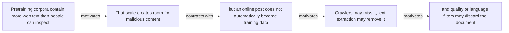

#### Python

```python
from html import escape
from pathlib import Path
from textwrap import wrap

title = "propaganda_why_p1: Pretraining corpora contain more web text than people can — problem and research-question relation"
nodes = [["n1","Pretraining corpora contain more web text than people can inspect",120,150],["n2","That scale creates room for malicious content",420,150],["n3","but an online post does not automatically become training data",720,150],["n4","Crawlers may miss it, text extraction may remove it",120,340],["n5","and quality or language filters may discard the document",420,340]]
edges = [["n1","n2","motivates"],["n2","n3","contrasts with"],["n3","n4","motivates"],["n4","n5","motivates"]]
node_by_id = {node_id: (label, x, y) for node_id, label, x, y in nodes}

parts = [
    '<svg xmlns="http://www.w3.org/2000/svg" viewBox="0 0 860 520" role="img" aria-labelledby="title desc">',
    f'<title id="title">{escape(title)}</title>',
    '<desc id="desc">The labeled relations reproduce only relationships stated in the paragraph.</desc>',
    '<rect width="860" height="520" fill="white"/>',
]
for source, target, relation in edges:
    _, x1, y1 = node_by_id[source]
    _, x2, y2 = node_by_id[target]
    parts.append(f'<line x1="{x1}" y1="{y1}" x2="{x2}" y2="{y2}" stroke="#345" stroke-width="2"/>')
    parts.append(f'<text x="{(x1+x2)/2}" y="{(y1+y2)/2-6}" text-anchor="middle" font-family="sans-serif" font-size="11">{escape(relation)}</text>')
for _, label, x, y in nodes:
    parts.append(f'<rect x="{x-125}" y="{y-58}" width="250" height="116" rx="14" fill="#eef6ff" stroke="#234"/>')
    for line_index, line in enumerate(wrap(label, width=32)):
        parts.append(f'<text x="{x}" y="{y-34+line_index*16}" text-anchor="middle" font-family="sans-serif" font-size="12">{escape(line)}</text>')
parts.append('</svg>')
Path("propaganda_why_p1_treatment_a.svg").write_text("\n".join(parts), encoding="utf-8")
```

### Treatment B — propaganda_claim_halflife, propaganda_claim_production_notshown — claim-to-source provenance

- Teaching purpose: Optional contingency only. Show exactly which atomic claims underwrite this paragraph and which fixed source records support each claim.
- Encoding and reading order: A bipartite graph places 2 claim nodes on the left and 2 source nodes on the right, with only the 2 claim-source edges recorded in the fixture. Claim labels include epistemic status; source labels include the exact locator.
- Evidence and limitations: This treatment explains provenance and uncertainty, not the paper's causal mechanism. Missing edges remain visibly absent and no source count is treated as confidence.
- Recommended web medium: semantic HTML/CSS claim-source table with an SVG network view; JavaScript only for keyboard-controlled source highlighting.
- Mobile, accessibility, and motion behavior: Provide real table headers and source links in the static fallback, make every edge recoverable as text, stack claim records before source records on mobile, and require no motion.

#### TikZ

```tex
\documentclass[tikz,border=5pt]{standalone}
\usepackage[T1]{fontenc}
\usepackage{tikz}
\usetikzlibrary{arrows.meta}
\begin{document}
\begin{tikzpicture}[font=\sffamily,claim/.style={draw,rounded corners,align=center,text width=5.2cm,minimum height=1.2cm},source/.style={draw,dashed,align=center,text width=5.2cm,minimum height=1.2cm},link/.style={-{Latex[length=2mm]},thin}]
\node[font=\bfseries] at (4,1.8) {propaganda\_why\_p1: claim-to-source provenance};
\node[claim] (c1) at (0,0) {HalfLife decomposes poison inclusion into page injectability, extraction survival, and curation survival. [OBSERVED]};
\node[claim] (c2) at (0,-2.4) {The study does not demonstrate live comment poisoning of a deployed production or frontier-scale model. [NOT\_ESTABLISHED]};
\node[source] (s1) at (8,0) {Computational Propaganda v1 HalfLife method - Pages 3-4, Section 3, Equation 1};
\node[source] (s2) at (8,-2.4) {Computational Propaganda v1 discussion and limitations - Pages 8-9, Sections 7.1-7.3};
\draw[link] (c1) -- (s1);
\draw[link] (c2) -- (s2);
\end{tikzpicture}
\end{document}
```

#### Mermaid

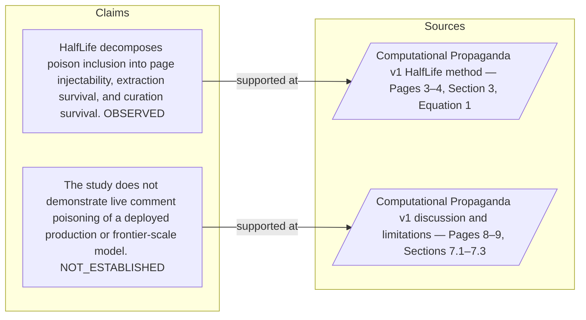

#### Python

```python
from html import escape
from pathlib import Path
from textwrap import wrap

title = "propaganda_why_p1: claim-to-source provenance"
nodes = [["c1","HalfLife decomposes poison inclusion into page injectability, extraction survival, and curation survival. [OBSERVED]",190,130],["c2","The study does not demonstrate live comment poisoning of a deployed production or frontier-scale model. [NOT_ESTABLISHED]",190,250],["s1","Computational Propaganda v1 HalfLife method — Pages 3–4, Section 3, Equation 1",700,130],["s2","Computational Propaganda v1 discussion and limitations — Pages 8–9, Sections 7.1–7.3",700,250]]
edges = [["c1","s1"],["c2","s2"]]
node_by_id = {node_id: (label, x, y) for node_id, label, x, y in nodes}
height = 440

parts = [
    f'<svg xmlns="http://www.w3.org/2000/svg" viewBox="0 0 900 {height}" role="img" aria-labelledby="title desc">',
    f'<title id="title">{escape(title)}</title>',
    '<desc id="desc">Bipartite map from verified claim records to their exact source records.</desc>',
    f'<rect width="900" height="{height}" fill="white"/>',
]
for source, target in edges:
    _, x1, y1 = node_by_id[source]
    _, x2, y2 = node_by_id[target]
    parts.append(f'<line x1="{x1+145}" y1="{y1}" x2="{x2-145}" y2="{y2}" stroke="#456" stroke-width="2"/>')
for node_id, label, x, y in nodes:
    dashed = ' stroke-dasharray="7 5"' if node_id.startswith("s") else ''
    parts.append(f'<rect x="{x-145}" y="{y-46}" width="290" height="92" rx="12" fill="#f7fbff" stroke="#234"{dashed}/>')
    for line_index, line in enumerate(wrap(label, width=38)):
        parts.append(f'<text x="{x}" y="{y-24+line_index*14}" text-anchor="middle" font-family="sans-serif" font-size="11">{escape(line)}</text>')
parts.append('</svg>')
Path("propaganda_why_p1_treatment_b.svg").write_text("\n".join(parts), encoding="utf-8")
```

### Treatment C — Pretraining corpora contain more web text than people can — supported-versus-bounded scope

- Teaching purpose: Optional contingency only. Separate what the paragraph supports from the qualification or contingency that bounds it.
- Encoding and reading order: Partition the paragraph into 4 supported statement(s) and 1 boundary or contingency statement(s). The two columns are categories, not a scale or causal path.
- Evidence and limitations: Every card is a complete paragraph clause. The boundary column makes negative and not-established language visible without weakening it.
- Recommended web medium: responsive SVG or semantic HTML/CSS; JavaScript is optional only for a meaningful state or scope toggle.
- Mobile, accessibility, and motion behavior: Preserve every exact value or scope statement as selectable text, avoid color-only distinctions, stack groups on mobile, and keep all information visible when JavaScript or motion is disabled.

#### TikZ

```tex
\documentclass[tikz,border=5pt]{standalone}
\usepackage[T1]{fontenc}
\usepackage{tikz}
\begin{document}
\begin{tikzpicture}[font=\sffamily,item/.style={draw,align=center,text width=5.5cm,minimum height=1.4cm}]
\node[font=\bfseries] at (3.5,2) {propaganda\_why\_p1: Pretraining corpora contain more web text than people can - supported-versus-bounded scope};
\node[font=\bfseries] at (0,1) {Supported statement};
\node[font=\bfseries] at (7,1) {Boundary or contingency};
\node[item] at (0,0) {Pretraining corpora contain more web text than people can inspect};
\node[item] at (0,-2) {That scale creates room for malicious content};
\node[item] at (0,-4) {Crawlers may miss it, text extraction may remove it};
\node[item] at (0,-6) {and quality or language filters may discard the document};
\node[item] at (7,0) {but an online post does not automatically become training data};
\end{tikzpicture}
\end{document}
```

#### Mermaid

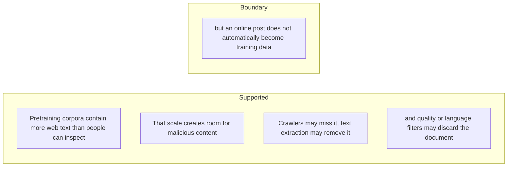

#### Python

```python
from html import escape
from pathlib import Path
from textwrap import wrap

title = "propaganda_why_p1: Pretraining corpora contain more web text than people can — supported-versus-bounded scope"
columns = {"Supported statement": ["Pretraining corpora contain more web text than people can inspect","That scale creates room for malicious content","Crawlers may miss it, text extraction may remove it","and quality or language filters may discard the document"], "Boundary or contingency": ["but an online post does not automatically become training data"]}
height = 660
parts = [
    f'<svg xmlns="http://www.w3.org/2000/svg" viewBox="0 0 900 {height}" role="img" aria-labelledby="title desc">',
    f'<title id="title">{escape(title)}</title>',
    '<desc id="desc">Statements are partitioned into supported content and explicit boundaries.</desc>',
    f'<rect width="900" height="{height}" fill="white"/>',
]
for column_index, (heading, items) in enumerate(columns.items()):
    x = 240 + column_index * 430
    parts.append(f'<text x="{x}" y="70" text-anchor="middle" font-family="sans-serif" font-size="18" font-weight="700">{escape(heading)}</text>')
    for item_index, item in enumerate(items):
        y = 130 + item_index * 110
        parts.append(f'<rect x="{x-180}" y="{y-35}" width="360" height="80" rx="12" fill="#f7fbff" stroke="#234"/>')
        for line_index, line in enumerate(wrap(item, width=48)):
            parts.append(f'<text x="{x}" y="{y-12+line_index*14}" text-anchor="middle" font-family="sans-serif" font-size="11">{escape(line)}</text>')
parts.append('</svg>')
Path("propaganda_why_p1_treatment_c.svg").write_text("\n".join(parts), encoding="utf-8")
```

### Implementation record

- Status: `NOT_NEEDED`
- Selected treatment: `NONE`
- Selection rationale:
- Delivery medium: `NONE`
- Visual ID and placement:
- Shared paragraph scope: `NONE`
- Changed files:
- Accessibility and fallback verification:
- Desktop and mobile verification:
- Evidence deviations: `NONE`

## `propaganda_why_p2`

- Location: `propaganda_why`, paragraph 2
- Text anchor: "Earlier demonstrations often targeted known sources or assumed access to the victim's data pipeline."
- Claims and sources: `propaganda_claim_halflife` (OBSERVED, VERIFIED); `propaganda_claim_production_notshown` (NOT_ESTABLISHED, VERIFIED); `propaganda_source_threat` (Pages 1–3, Sections 1–2.2; Introduction page 2 states a 0.15% inclusion probability); `propaganda_source_halflife` (Pages 3–4, Section 3, Equation 1)
- Visual needed: `NO`
- Decision rationale: The paragraph's main work is the bounded statement "Earlier demonstrations often targeted known sources or assumed access to the victim's data pipeline". Its qualification is explicit in prose and does not require readers to reconstruct a material process, topology, quantitative comparison, uncertainty distribution, or state change. A visual would repeat the wording, so all treatments below are optional contingencies only.
- Explanatory job: problem and research-question relation.

### Treatment A — Earlier demonstrations often targeted known sources or assumed access — problem and research-question relation

- Teaching purpose: Optional contingency only. Answer "Why is web-scale pretraining poisoning difficult to assess?" by exposing the paragraph's 3 named propositions and 2 stated reading, comparison, or qualification relations.
- Encoding and reading order: Nodes reproduce the complete labels "Earlier demonstrations often targeted known sources or assumed access to the victim's data pipeline"; "This paper studies an indirect attacker who can use ordinary public interfaces but does not know which pages will be crawled and cannot access the training data, code, infrastructure"; "or model weights". Edges carry the explicit relation labels "contrasts with", "motivates"; arrow direction is sequence only for mechanism or example prose and otherwise denotes reading order.
- Evidence and limitations: The topology is derived from this paragraph rather than a fixed pipeline. Encode only `propaganda_claim_halflife`, `propaganda_claim_production_notshown` and do not turn reading-order edges into causal claims.
- Recommended web medium: responsive inline SVG with CSS; JavaScript may add optional step focus only when state order matters.
- Mobile, accessibility, and motion behavior: Keep the full node-and-relation list in DOM order, expose the relation labels in the long description, stack nodes on narrow screens, and disable focus transitions under reduced motion.

#### TikZ

```tex
\documentclass[tikz,border=5pt]{standalone}
\usepackage[T1]{fontenc}
\usepackage{tikz}
\usetikzlibrary{arrows.meta,positioning}
\begin{document}
\begin{tikzpicture}[font=\sffamily,concept/.style={draw,rounded corners,align=center,text width=3.6cm,minimum height=1.35cm},link/.style={-{Latex[length=2mm]},thick},rel/.style={fill=white,font=\scriptsize,inner sep=2pt}]
\node[font=\bfseries,align=center] at (6.1,2.0) {propaganda\_why\_p2: Earlier demonstrations often targeted known sources or assumed access - problem and research-question relation};
\node[concept] (n1) at (1.8,0) {Earlier demonstrations often targeted known sources or assumed access to the victim's data pipeline};
\node[concept] (n2) at (6.1,0) {This paper studies an indirect attacker who can use ordinary public interfaces but does not know which pages will be crawled and cannot access the training data, code, infrastructure};
\node[concept] (n3) at (10.4,0) {or model weights};
\draw[link] (n1) -- node[rel] {contrasts with} (n2);
\draw[link] (n2) -- node[rel] {motivates} (n3);
\end{tikzpicture}
\end{document}
```

#### Mermaid

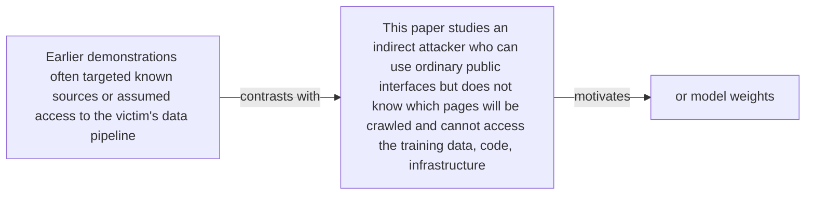

#### Python

```python
from html import escape
from pathlib import Path
from textwrap import wrap

title = "propaganda_why_p2: Earlier demonstrations often targeted known sources or assumed access — problem and research-question relation"
nodes = [["n1","Earlier demonstrations often targeted known sources or assumed access to the victim's data pipeline",120,150],["n2","This paper studies an indirect attacker who can use ordinary public interfaces but does not know which pages will be crawled and cannot access the training data, code, infrastructure",420,150],["n3","or model weights",720,150]]
edges = [["n1","n2","contrasts with"],["n2","n3","motivates"]]
node_by_id = {node_id: (label, x, y) for node_id, label, x, y in nodes}

parts = [
    '<svg xmlns="http://www.w3.org/2000/svg" viewBox="0 0 860 520" role="img" aria-labelledby="title desc">',
    f'<title id="title">{escape(title)}</title>',
    '<desc id="desc">The labeled relations reproduce only relationships stated in the paragraph.</desc>',
    '<rect width="860" height="520" fill="white"/>',
]
for source, target, relation in edges:
    _, x1, y1 = node_by_id[source]
    _, x2, y2 = node_by_id[target]
    parts.append(f'<line x1="{x1}" y1="{y1}" x2="{x2}" y2="{y2}" stroke="#345" stroke-width="2"/>')
    parts.append(f'<text x="{(x1+x2)/2}" y="{(y1+y2)/2-6}" text-anchor="middle" font-family="sans-serif" font-size="11">{escape(relation)}</text>')
for _, label, x, y in nodes:
    parts.append(f'<rect x="{x-125}" y="{y-58}" width="250" height="116" rx="14" fill="#eef6ff" stroke="#234"/>')
    for line_index, line in enumerate(wrap(label, width=32)):
        parts.append(f'<text x="{x}" y="{y-34+line_index*16}" text-anchor="middle" font-family="sans-serif" font-size="12">{escape(line)}</text>')
parts.append('</svg>')
Path("propaganda_why_p2_treatment_a.svg").write_text("\n".join(parts), encoding="utf-8")
```

### Treatment B — propaganda_claim_halflife, propaganda_claim_production_notshown — claim-to-source provenance

- Teaching purpose: Optional contingency only. Show exactly which atomic claims underwrite this paragraph and which fixed source records support each claim.
- Encoding and reading order: A bipartite graph places 2 claim nodes on the left and 2 source nodes on the right, with only the 2 claim-source edges recorded in the fixture. Claim labels include epistemic status; source labels include the exact locator.
- Evidence and limitations: This treatment explains provenance and uncertainty, not the paper's causal mechanism. Missing edges remain visibly absent and no source count is treated as confidence.
- Recommended web medium: semantic HTML/CSS claim-source table with an SVG network view; JavaScript only for keyboard-controlled source highlighting.
- Mobile, accessibility, and motion behavior: Provide real table headers and source links in the static fallback, make every edge recoverable as text, stack claim records before source records on mobile, and require no motion.

#### TikZ

```tex
\documentclass[tikz,border=5pt]{standalone}
\usepackage[T1]{fontenc}
\usepackage{tikz}
\usetikzlibrary{arrows.meta}
\begin{document}
\begin{tikzpicture}[font=\sffamily,claim/.style={draw,rounded corners,align=center,text width=5.2cm,minimum height=1.2cm},source/.style={draw,dashed,align=center,text width=5.2cm,minimum height=1.2cm},link/.style={-{Latex[length=2mm]},thin}]
\node[font=\bfseries] at (4,1.8) {propaganda\_why\_p2: claim-to-source provenance};
\node[claim] (c1) at (0,0) {HalfLife decomposes poison inclusion into page injectability, extraction survival, and curation survival. [OBSERVED]};
\node[claim] (c2) at (0,-2.4) {The study does not demonstrate live comment poisoning of a deployed production or frontier-scale model. [NOT\_ESTABLISHED]};
\node[source] (s1) at (8,0) {Computational Propaganda v1 HalfLife method - Pages 3-4, Section 3, Equation 1};
\node[source] (s2) at (8,-2.4) {Computational Propaganda v1 discussion and limitations - Pages 8-9, Sections 7.1-7.3};
\draw[link] (c1) -- (s1);
\draw[link] (c2) -- (s2);
\end{tikzpicture}
\end{document}
```

#### Mermaid


#### Python

```python
from html import escape
from pathlib import Path
from textwrap import wrap

title = "propaganda_why_p2: claim-to-source provenance"
nodes = [["c1","HalfLife decomposes poison inclusion into page injectability, extraction survival, and curation survival. [OBSERVED]",190,130],["c2","The study does not demonstrate live comment poisoning of a deployed production or frontier-scale model. [NOT_ESTABLISHED]",190,250],["s1","Computational Propaganda v1 HalfLife method — Pages 3–4, Section 3, Equation 1",700,130],["s2","Computational Propaganda v1 discussion and limitations — Pages 8–9, Sections 7.1–7.3",700,250]]
edges = [["c1","s1"],["c2","s2"]]
node_by_id = {node_id: (label, x, y) for node_id, label, x, y in nodes}
height = 440

parts = [
    f'<svg xmlns="http://www.w3.org/2000/svg" viewBox="0 0 900 {height}" role="img" aria-labelledby="title desc">',
    f'<title id="title">{escape(title)}</title>',
    '<desc id="desc">Bipartite map from verified claim records to their exact source records.</desc>',
    f'<rect width="900" height="{height}" fill="white"/>',
]
for source, target in edges:
    _, x1, y1 = node_by_id[source]
    _, x2, y2 = node_by_id[target]
    parts.append(f'<line x1="{x1+145}" y1="{y1}" x2="{x2-145}" y2="{y2}" stroke="#456" stroke-width="2"/>')
for node_id, label, x, y in nodes:
    dashed = ' stroke-dasharray="7 5"' if node_id.startswith("s") else ''
    parts.append(f'<rect x="{x-145}" y="{y-46}" width="290" height="92" rx="12" fill="#f7fbff" stroke="#234"{dashed}/>')
    for line_index, line in enumerate(wrap(label, width=38)):
        parts.append(f'<text x="{x}" y="{y-24+line_index*14}" text-anchor="middle" font-family="sans-serif" font-size="11">{escape(line)}</text>')
parts.append('</svg>')
Path("propaganda_why_p2_treatment_b.svg").write_text("\n".join(parts), encoding="utf-8")
```

### Treatment C — Earlier demonstrations often targeted known sources or assumed access — supported-versus-bounded scope

- Teaching purpose: Optional contingency only. Separate what the paragraph supports from the qualification or contingency that bounds it.
- Encoding and reading order: Partition the paragraph into 2 supported statement(s) and 1 boundary or contingency statement(s). The two columns are categories, not a scale or causal path.
- Evidence and limitations: Every card is a complete paragraph clause. The boundary column makes negative and not-established language visible without weakening it.
- Recommended web medium: responsive SVG or semantic HTML/CSS; JavaScript is optional only for a meaningful state or scope toggle.
- Mobile, accessibility, and motion behavior: Preserve every exact value or scope statement as selectable text, avoid color-only distinctions, stack groups on mobile, and keep all information visible when JavaScript or motion is disabled.

#### TikZ

```tex
\documentclass[tikz,border=5pt]{standalone}
\usepackage[T1]{fontenc}
\usepackage{tikz}
\begin{document}
\begin{tikzpicture}[font=\sffamily,item/.style={draw,align=center,text width=5.5cm,minimum height=1.4cm}]
\node[font=\bfseries] at (3.5,2) {propaganda\_why\_p2: Earlier demonstrations often targeted known sources or assumed access - supported-versus-bounded scope};
\node[font=\bfseries] at (0,1) {Supported statement};
\node[font=\bfseries] at (7,1) {Boundary or contingency};
\node[item] at (0,0) {Earlier demonstrations often targeted known sources or assumed access to the victim's data pipeline};
\node[item] at (0,-2) {or model weights};
\node[item] at (7,0) {This paper studies an indirect attacker who can use ordinary public interfaces but does not know which pages will be crawled and cannot access the training data, code, infrastructure};
\end{tikzpicture}
\end{document}
```

#### Mermaid

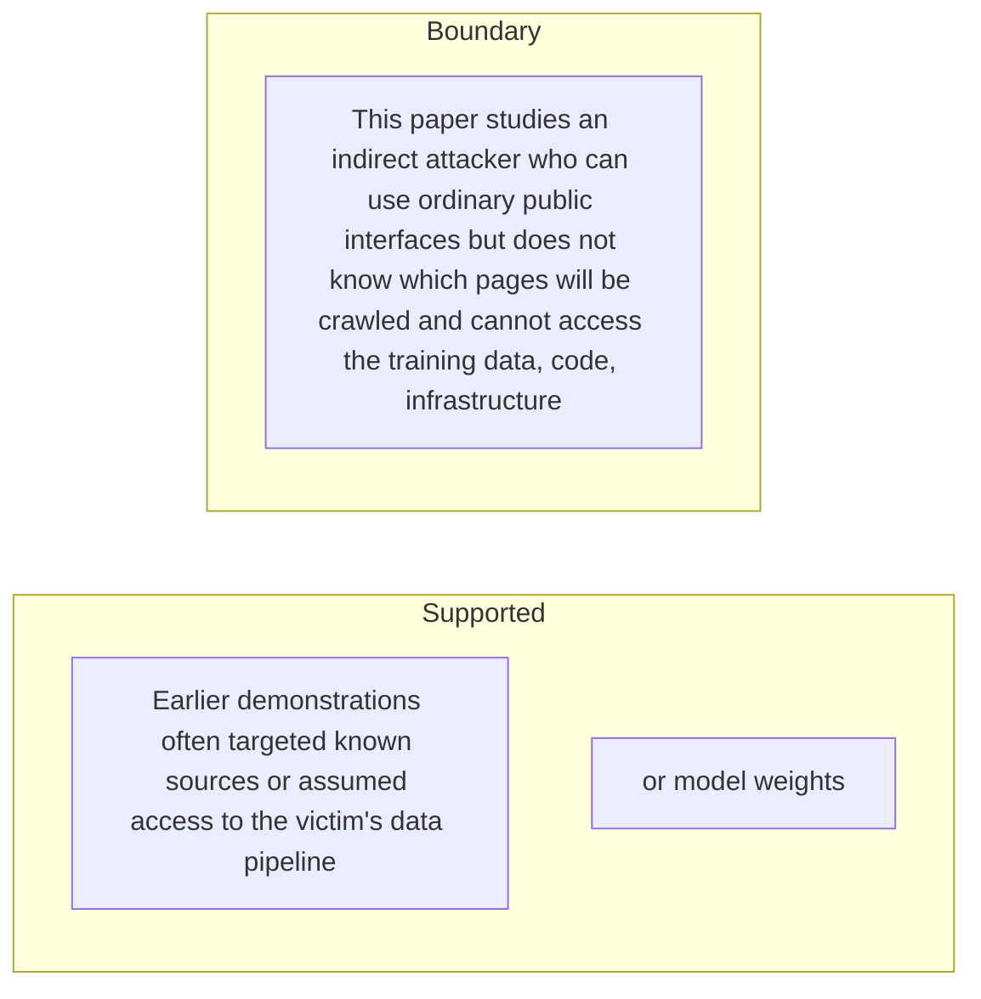

#### Python

```python
from html import escape
from pathlib import Path
from textwrap import wrap

title = "propaganda_why_p2: Earlier demonstrations often targeted known sources or assumed access — supported-versus-bounded scope"
columns = {"Supported statement": ["Earlier demonstrations often targeted known sources or assumed access to the victim's data pipeline","or model weights"], "Boundary or contingency": ["This paper studies an indirect attacker who can use ordinary public interfaces but does not know which pages will be crawled and cannot access the training data, code, infrastructure"]}
height = 440
parts = [
    f'<svg xmlns="http://www.w3.org/2000/svg" viewBox="0 0 900 {height}" role="img" aria-labelledby="title desc">',
    f'<title id="title">{escape(title)}</title>',
    '<desc id="desc">Statements are partitioned into supported content and explicit boundaries.</desc>',
    f'<rect width="900" height="{height}" fill="white"/>',
]
for column_index, (heading, items) in enumerate(columns.items()):
    x = 240 + column_index * 430
    parts.append(f'<text x="{x}" y="70" text-anchor="middle" font-family="sans-serif" font-size="18" font-weight="700">{escape(heading)}</text>')
    for item_index, item in enumerate(items):
        y = 130 + item_index * 110
        parts.append(f'<rect x="{x-180}" y="{y-35}" width="360" height="80" rx="12" fill="#f7fbff" stroke="#234"/>')
        for line_index, line in enumerate(wrap(item, width=48)):
            parts.append(f'<text x="{x}" y="{y-12+line_index*14}" text-anchor="middle" font-family="sans-serif" font-size="11">{escape(line)}</text>')
parts.append('</svg>')
Path("propaganda_why_p2_treatment_c.svg").write_text("\n".join(parts), encoding="utf-8")
```

### Implementation record

- Status: `NOT_NEEDED`
- Selected treatment: `NONE`
- Selection rationale:
- Delivery medium: `NONE`
- Visual ID and placement:
- Shared paragraph scope: `NONE`
- Changed files:
- Accessibility and fallback verification:
- Desktop and mobile verification:
- Evidence deviations: `NONE`

## `propaganda_change_p1`

- Location: `propaganda_change`, paragraph 1
- Text anchor: "HalfLife replaces the binary question 'can content be posted?' with an end-to-end inclusion model."
- Claims and sources: `propaganda_claim_halflife` (OBSERVED, VERIFIED); `propaganda_claim_ads` (OBSERVED, VERIFIED); `propaganda_source_halflife` (Pages 3–4, Section 3, Equation 1); `propaganda_source_inclusion` (Pages 4–6, Sections 4.1–4.6, Figures 1–2; Section 4.4 page 5 reports 0.13%, consistent with the rounded 3.4% × 71.9% × 5.5% stage product)
- Visual needed: `YES`
- Decision rationale: Removing a visual would require readers to retain the material relation between "HalfLife replaces the binary question 'can content be posted?' with an end-to-end inclusion model" and "and whether the resulting document survives the victim's curation pipeline" while also tracking 3 source-bounded propositions. The paragraph contains a real changed-versus-preserved relation; the visual must preserve its stated conditions and must not add causal or proportional meaning.
- Explanatory job: changed-versus-preserved relation.

### Treatment A — HalfLife replaces the binary question 'can content be posted' — changed-versus-preserved relation

- Teaching purpose: Answer "What does HalfLife add to poisoning analysis?" by exposing the paragraph's 3 named propositions and 2 stated reading, comparison, or qualification relations.
- Encoding and reading order: Nodes reproduce the complete labels "HalfLife replaces the binary question 'can content be posted?' with an end-to-end inclusion model"; "It asks whether a relevant page accepts third-party content, whether that fragment appears in extracted plaintext"; "and whether the resulting document survives the victim's curation pipeline". Edges carry the explicit relation labels "changes into", "changes into"; arrow direction is sequence only for mechanism or example prose and otherwise denotes reading order.
- Evidence and limitations: The topology is derived from this paragraph rather than a fixed pipeline. Encode only `propaganda_claim_halflife`, `propaganda_claim_ads` and do not turn reading-order edges into causal claims.
- Recommended web medium: responsive inline SVG with CSS; JavaScript may add optional step focus only when state order matters.
- Mobile, accessibility, and motion behavior: Keep the full node-and-relation list in DOM order, expose the relation labels in the long description, stack nodes on narrow screens, and disable focus transitions under reduced motion.

#### TikZ

```tex
\documentclass[tikz,border=5pt]{standalone}
\usepackage[T1]{fontenc}
\usepackage{tikz}
\usetikzlibrary{arrows.meta,positioning}
\begin{document}
\begin{tikzpicture}[font=\sffamily,concept/.style={draw,rounded corners,align=center,text width=3.6cm,minimum height=1.35cm},link/.style={-{Latex[length=2mm]},thick},rel/.style={fill=white,font=\scriptsize,inner sep=2pt}]
\node[font=\bfseries,align=center] at (6.1,2.0) {propaganda\_change\_p1: HalfLife replaces the binary question 'can content be posted' - changed-versus-preserved relation};
\node[concept] (n1) at (1.8,0) {HalfLife replaces the binary question 'can content be posted?' with an end-to-end inclusion model};
\node[concept] (n2) at (6.1,0) {It asks whether a relevant page accepts third-party content, whether that fragment appears in extracted plaintext};
\node[concept] (n3) at (10.4,0) {and whether the resulting document survives the victim's curation pipeline};
\draw[link] (n1) -- node[rel] {changes into} (n2);
\draw[link] (n2) -- node[rel] {changes into} (n3);
\end{tikzpicture}
\end{document}
```

#### Mermaid

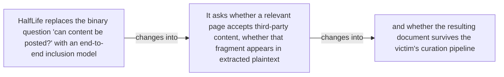

#### Python

```python
from html import escape
from pathlib import Path
from textwrap import wrap

title = "propaganda_change_p1: HalfLife replaces the binary question 'can content be posted' — changed-versus-preserved relation"
nodes = [["n1","HalfLife replaces the binary question 'can content be posted?' with an end-to-end inclusion model",120,150],["n2","It asks whether a relevant page accepts third-party content, whether that fragment appears in extracted plaintext",420,150],["n3","and whether the resulting document survives the victim's curation pipeline",720,150]]
edges = [["n1","n2","changes into"],["n2","n3","changes into"]]
node_by_id = {node_id: (label, x, y) for node_id, label, x, y in nodes}

parts = [
    '<svg xmlns="http://www.w3.org/2000/svg" viewBox="0 0 860 520" role="img" aria-labelledby="title desc">',
    f'<title id="title">{escape(title)}</title>',
    '<desc id="desc">The labeled relations reproduce only relationships stated in the paragraph.</desc>',
    '<rect width="860" height="520" fill="white"/>',
]
for source, target, relation in edges:
    _, x1, y1 = node_by_id[source]
    _, x2, y2 = node_by_id[target]
    parts.append(f'<line x1="{x1}" y1="{y1}" x2="{x2}" y2="{y2}" stroke="#345" stroke-width="2"/>')
    parts.append(f'<text x="{(x1+x2)/2}" y="{(y1+y2)/2-6}" text-anchor="middle" font-family="sans-serif" font-size="11">{escape(relation)}</text>')
for _, label, x, y in nodes:
    parts.append(f'<rect x="{x-125}" y="{y-58}" width="250" height="116" rx="14" fill="#eef6ff" stroke="#234"/>')
    for line_index, line in enumerate(wrap(label, width=32)):
        parts.append(f'<text x="{x}" y="{y-34+line_index*16}" text-anchor="middle" font-family="sans-serif" font-size="12">{escape(line)}</text>')
parts.append('</svg>')
Path("propaganda_change_p1_treatment_a.svg").write_text("\n".join(parts), encoding="utf-8")
```

### Treatment B — propaganda_claim_halflife, propaganda_claim_ads — claim-to-source provenance

- Teaching purpose: Show exactly which atomic claims underwrite this paragraph and which fixed source records support each claim.
- Encoding and reading order: A bipartite graph places 2 claim nodes on the left and 2 source nodes on the right, with only the 2 claim-source edges recorded in the fixture. Claim labels include epistemic status; source labels include the exact locator.
- Evidence and limitations: This treatment explains provenance and uncertainty, not the paper's causal mechanism. Missing edges remain visibly absent and no source count is treated as confidence.
- Recommended web medium: semantic HTML/CSS claim-source table with an SVG network view; JavaScript only for keyboard-controlled source highlighting.
- Mobile, accessibility, and motion behavior: Provide real table headers and source links in the static fallback, make every edge recoverable as text, stack claim records before source records on mobile, and require no motion.

#### TikZ

```tex
\documentclass[tikz,border=5pt]{standalone}
\usepackage[T1]{fontenc}
\usepackage{tikz}
\usetikzlibrary{arrows.meta}
\begin{document}
\begin{tikzpicture}[font=\sffamily,claim/.style={draw,rounded corners,align=center,text width=5.2cm,minimum height=1.2cm},source/.style={draw,dashed,align=center,text width=5.2cm,minimum height=1.2cm},link/.style={-{Latex[length=2mm]},thin}]
\node[font=\bfseries] at (4,1.8) {propaganda\_change\_p1: claim-to-source provenance};
\node[claim] (c1) at (0,0) {HalfLife decomposes poison inclusion into page injectability, extraction survival, and curation survival. [OBSERVED]};
\node[claim] (c2) at (0,-2.4) {Programmatic advertisement content did not appear in extracted plaintext in the tested DOM-based crawl path. [OBSERVED]};
\node[source] (s1) at (8,0) {Computational Propaganda v1 HalfLife method - Pages 3-4, Section 3, Equation 1};
\node[source] (s2) at (8,-2.4) {Computational Propaganda v1 stage results and Section 4.4 inclusion estimate - Pages 4-6, Sections 4.1-4.6, Figures 1-2; Section 4.4 page 5 reports 0.13\%, consistent with the rounded 3.4\% x 71.9\% x 5.5\% stage product};
\draw[link] (c1) -- (s1);
\draw[link] (c2) -- (s2);
\end{tikzpicture}
\end{document}
```

#### Mermaid

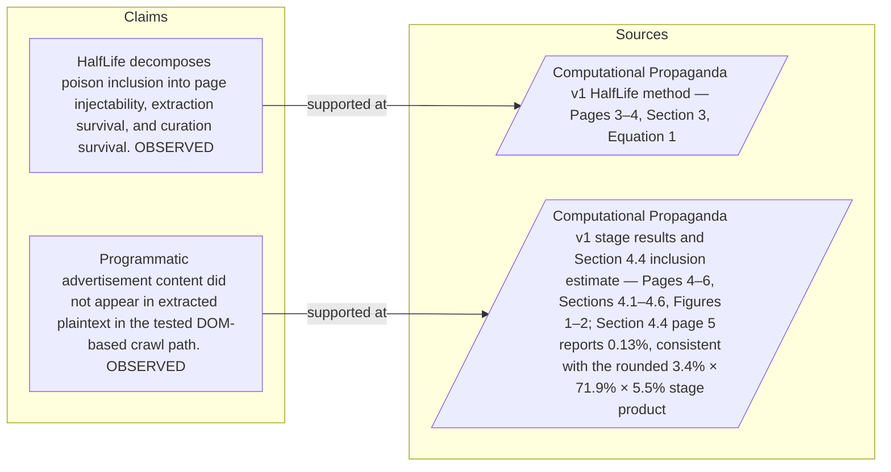

#### Python

```python
from html import escape
from pathlib import Path
from textwrap import wrap

title = "propaganda_change_p1: claim-to-source provenance"
nodes = [["c1","HalfLife decomposes poison inclusion into page injectability, extraction survival, and curation survival. [OBSERVED]",190,130],["c2","Programmatic advertisement content did not appear in extracted plaintext in the tested DOM-based crawl path. [OBSERVED]",190,250],["s1","Computational Propaganda v1 HalfLife method — Pages 3–4, Section 3, Equation 1",700,130],["s2","Computational Propaganda v1 stage results and Section 4.4 inclusion estimate — Pages 4–6, Sections 4.1–4.6, Figures 1–2; Section 4.4 page 5 reports 0.13%, consistent with the rounded 3.4% × 71.9% × 5.5% stage product",700,250]]
edges = [["c1","s1"],["c2","s2"]]
node_by_id = {node_id: (label, x, y) for node_id, label, x, y in nodes}
height = 440

parts = [
    f'<svg xmlns="http://www.w3.org/2000/svg" viewBox="0 0 900 {height}" role="img" aria-labelledby="title desc">',
    f'<title id="title">{escape(title)}</title>',
    '<desc id="desc">Bipartite map from verified claim records to their exact source records.</desc>',
    f'<rect width="900" height="{height}" fill="white"/>',
]
for source, target in edges:
    _, x1, y1 = node_by_id[source]
    _, x2, y2 = node_by_id[target]
    parts.append(f'<line x1="{x1+145}" y1="{y1}" x2="{x2-145}" y2="{y2}" stroke="#456" stroke-width="2"/>')
for node_id, label, x, y in nodes:
    dashed = ' stroke-dasharray="7 5"' if node_id.startswith("s") else ''
    parts.append(f'<rect x="{x-145}" y="{y-46}" width="290" height="92" rx="12" fill="#f7fbff" stroke="#234"{dashed}/>')
    for line_index, line in enumerate(wrap(label, width=38)):
        parts.append(f'<text x="{x}" y="{y-24+line_index*14}" text-anchor="middle" font-family="sans-serif" font-size="11">{escape(line)}</text>')
parts.append('</svg>')
Path("propaganda_change_p1_treatment_b.svg").write_text("\n".join(parts), encoding="utf-8")
```

### Treatment C — HalfLife replaces the binary question 'can content be posted' — supported-versus-bounded scope

- Teaching purpose: Separate what the paragraph supports from the qualification or contingency that bounds it.
- Encoding and reading order: Partition the paragraph into 3 supported statement(s) and 1 boundary or contingency statement(s). The two columns are categories, not a scale or causal path.
- Evidence and limitations: Every card is a complete paragraph clause. The boundary column makes negative and not-established language visible without weakening it.
- Recommended web medium: responsive SVG or semantic HTML/CSS; JavaScript is optional only for a meaningful state or scope toggle.
- Mobile, accessibility, and motion behavior: Preserve every exact value or scope statement as selectable text, avoid color-only distinctions, stack groups on mobile, and keep all information visible when JavaScript or motion is disabled.

#### TikZ

```tex
\documentclass[tikz,border=5pt]{standalone}
\usepackage[T1]{fontenc}
\usepackage{tikz}
\begin{document}
\begin{tikzpicture}[font=\sffamily,item/.style={draw,align=center,text width=5.5cm,minimum height=1.4cm}]
\node[font=\bfseries] at (3.5,2) {propaganda\_change\_p1: HalfLife replaces the binary question 'can content be posted' - supported-versus-bounded scope};
\node[font=\bfseries] at (0,1) {Supported statement};
\node[font=\bfseries] at (7,1) {Boundary or contingency};
\node[item] at (0,0) {HalfLife replaces the binary question 'can content be posted?' with an end-to-end inclusion model};
\node[item] at (0,-2) {It asks whether a relevant page accepts third-party content, whether that fragment appears in extracted plaintext};
\node[item] at (0,-4) {and whether the resulting document survives the victim's curation pipeline};
\node[item] at (7,0) {and whether the resulting document survives the victim's curation pipeline};
\end{tikzpicture}
\end{document}
```

#### Mermaid

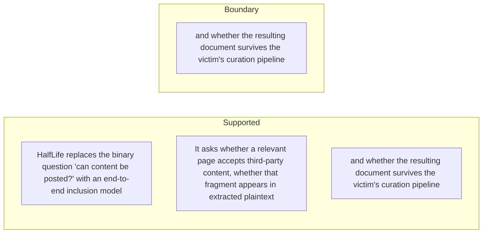

#### Python

```python
from html import escape
from pathlib import Path
from textwrap import wrap

title = "propaganda_change_p1: HalfLife replaces the binary question 'can content be posted' — supported-versus-bounded scope"
columns = {"Supported statement": ["HalfLife replaces the binary question 'can content be posted?' with an end-to-end inclusion model","It asks whether a relevant page accepts third-party content, whether that fragment appears in extracted plaintext","and whether the resulting document survives the victim's curation pipeline"], "Boundary or contingency": ["and whether the resulting document survives the victim's curation pipeline"]}
height = 550
parts = [
    f'<svg xmlns="http://www.w3.org/2000/svg" viewBox="0 0 900 {height}" role="img" aria-labelledby="title desc">',
    f'<title id="title">{escape(title)}</title>',
    '<desc id="desc">Statements are partitioned into supported content and explicit boundaries.</desc>',
    f'<rect width="900" height="{height}" fill="white"/>',
]
for column_index, (heading, items) in enumerate(columns.items()):
    x = 240 + column_index * 430
    parts.append(f'<text x="{x}" y="70" text-anchor="middle" font-family="sans-serif" font-size="18" font-weight="700">{escape(heading)}</text>')
    for item_index, item in enumerate(items):
        y = 130 + item_index * 110
        parts.append(f'<rect x="{x-180}" y="{y-35}" width="360" height="80" rx="12" fill="#f7fbff" stroke="#234"/>')
        for line_index, line in enumerate(wrap(item, width=48)):
            parts.append(f'<text x="{x}" y="{y-12+line_index*14}" text-anchor="middle" font-family="sans-serif" font-size="11">{escape(line)}</text>')
parts.append('</svg>')
Path("propaganda_change_p1_treatment_c.svg").write_text("\n".join(parts), encoding="utf-8")
```

### Implementation record

- Status: `PENDING`
- Selected treatment: `NONE`
- Selection rationale:
- Delivery medium: `NONE`
- Visual ID and placement:
- Shared paragraph scope: `NONE`
- Changed files:
- Accessibility and fallback verification:
- Desktop and mobile verification:
- Evidence deviations: `NONE`

## `propaganda_change_p2`

- Location: `propaganda_change`, paragraph 2
- Text anchor: "That decomposition can reject superficially plausible vectors."
- Claims and sources: `propaganda_claim_halflife` (OBSERVED, VERIFIED); `propaganda_claim_ads` (OBSERVED, VERIFIED); `propaganda_source_halflife` (Pages 3–4, Section 3, Equation 1); `propaganda_source_inclusion` (Pages 4–6, Sections 4.1–4.6, Figures 1–2; Section 4.4 page 5 reports 0.13%, consistent with the rounded 3.4% × 71.9% × 5.5% stage product)
- Visual needed: `YES`
- Decision rationale: Removing a visual would require readers to retain the material relation between "That decomposition can reject superficially plausible vectors" and "The result is specific to the tested collection architecture rather than a claim about every possible crawler" while also tracking 4 source-bounded propositions. The paragraph contains a real changed-versus-preserved relation; the visual must preserve its stated conditions and must not add causal or proportional meaning.
- Explanatory job: changed-versus-preserved relation.

### Treatment A — That decomposition can reject superficially plausible vectors — changed-versus-preserved relation

- Teaching purpose: Answer "What does HalfLife add to poisoning analysis?" by exposing the paragraph's 4 named propositions and 3 stated reading, comparison, or qualification relations.
- Encoding and reading order: Nodes reproduce the complete labels "That decomposition can reject superficially plausible vectors"; "In the tested DOM-based crawl path, programmatic advertisements did not appear in extracted plaintext"; "while public comments often did"; "The result is specific to the tested collection architecture rather than a claim about every possible crawler". Edges carry the explicit relation labels "changes into", "contrasts with", "contrasts with"; arrow direction is sequence only for mechanism or example prose and otherwise denotes reading order.
- Evidence and limitations: The topology is derived from this paragraph rather than a fixed pipeline. Encode only `propaganda_claim_halflife`, `propaganda_claim_ads` and do not turn reading-order edges into causal claims.
- Recommended web medium: responsive inline SVG with CSS; JavaScript may add optional step focus only when state order matters.
- Mobile, accessibility, and motion behavior: Keep the full node-and-relation list in DOM order, expose the relation labels in the long description, stack nodes on narrow screens, and disable focus transitions under reduced motion.

#### TikZ

```tex
\documentclass[tikz,border=5pt]{standalone}
\usepackage[T1]{fontenc}
\usepackage{tikz}
\usetikzlibrary{arrows.meta,positioning}
\begin{document}
\begin{tikzpicture}[font=\sffamily,concept/.style={draw,rounded corners,align=center,text width=3.6cm,minimum height=1.35cm},link/.style={-{Latex[length=2mm]},thick},rel/.style={fill=white,font=\scriptsize,inner sep=2pt}]
\node[font=\bfseries,align=center] at (6.1,2.0) {propaganda\_change\_p2: That decomposition can reject superficially plausible vectors - changed-versus-preserved relation};
\node[concept] (n1) at (1.8,0) {That decomposition can reject superficially plausible vectors};
\node[concept] (n2) at (6.1,0) {In the tested DOM-based crawl path, programmatic advertisements did not appear in extracted plaintext};
\node[concept] (n3) at (10.4,0) {while public comments often did};
\node[concept] (n4) at (1.8,-3.2) {The result is specific to the tested collection architecture rather than a claim about every possible crawler};
\draw[link] (n1) -- node[rel] {changes into} (n2);
\draw[link] (n2) -- node[rel] {contrasts with} (n3);
\draw[link] (n3) -- node[rel] {contrasts with} (n4);
\end{tikzpicture}
\end{document}
```

#### Mermaid

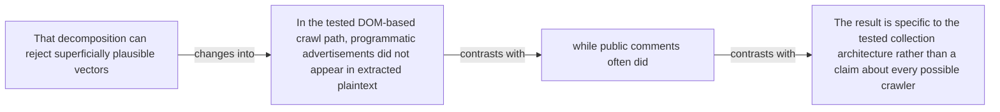

#### Python

```python
from html import escape
from pathlib import Path
from textwrap import wrap

title = "propaganda_change_p2: That decomposition can reject superficially plausible vectors — changed-versus-preserved relation"
nodes = [["n1","That decomposition can reject superficially plausible vectors",120,150],["n2","In the tested DOM-based crawl path, programmatic advertisements did not appear in extracted plaintext",420,150],["n3","while public comments often did",720,150],["n4","The result is specific to the tested collection architecture rather than a claim about every possible crawler",120,340]]
edges = [["n1","n2","changes into"],["n2","n3","contrasts with"],["n3","n4","contrasts with"]]
node_by_id = {node_id: (label, x, y) for node_id, label, x, y in nodes}

parts = [
    '<svg xmlns="http://www.w3.org/2000/svg" viewBox="0 0 860 520" role="img" aria-labelledby="title desc">',
    f'<title id="title">{escape(title)}</title>',
    '<desc id="desc">The labeled relations reproduce only relationships stated in the paragraph.</desc>',
    '<rect width="860" height="520" fill="white"/>',
]
for source, target, relation in edges:
    _, x1, y1 = node_by_id[source]
    _, x2, y2 = node_by_id[target]
    parts.append(f'<line x1="{x1}" y1="{y1}" x2="{x2}" y2="{y2}" stroke="#345" stroke-width="2"/>')
    parts.append(f'<text x="{(x1+x2)/2}" y="{(y1+y2)/2-6}" text-anchor="middle" font-family="sans-serif" font-size="11">{escape(relation)}</text>')
for _, label, x, y in nodes:
    parts.append(f'<rect x="{x-125}" y="{y-58}" width="250" height="116" rx="14" fill="#eef6ff" stroke="#234"/>')
    for line_index, line in enumerate(wrap(label, width=32)):
        parts.append(f'<text x="{x}" y="{y-34+line_index*16}" text-anchor="middle" font-family="sans-serif" font-size="12">{escape(line)}</text>')
parts.append('</svg>')
Path("propaganda_change_p2_treatment_a.svg").write_text("\n".join(parts), encoding="utf-8")
```

### Treatment B — propaganda_claim_halflife, propaganda_claim_ads — claim-to-source provenance

- Teaching purpose: Show exactly which atomic claims underwrite this paragraph and which fixed source records support each claim.
- Encoding and reading order: A bipartite graph places 2 claim nodes on the left and 2 source nodes on the right, with only the 2 claim-source edges recorded in the fixture. Claim labels include epistemic status; source labels include the exact locator.
- Evidence and limitations: This treatment explains provenance and uncertainty, not the paper's causal mechanism. Missing edges remain visibly absent and no source count is treated as confidence.
- Recommended web medium: semantic HTML/CSS claim-source table with an SVG network view; JavaScript only for keyboard-controlled source highlighting.
- Mobile, accessibility, and motion behavior: Provide real table headers and source links in the static fallback, make every edge recoverable as text, stack claim records before source records on mobile, and require no motion.

#### TikZ

```tex
\documentclass[tikz,border=5pt]{standalone}
\usepackage[T1]{fontenc}
\usepackage{tikz}
\usetikzlibrary{arrows.meta}
\begin{document}
\begin{tikzpicture}[font=\sffamily,claim/.style={draw,rounded corners,align=center,text width=5.2cm,minimum height=1.2cm},source/.style={draw,dashed,align=center,text width=5.2cm,minimum height=1.2cm},link/.style={-{Latex[length=2mm]},thin}]
\node[font=\bfseries] at (4,1.8) {propaganda\_change\_p2: claim-to-source provenance};
\node[claim] (c1) at (0,0) {HalfLife decomposes poison inclusion into page injectability, extraction survival, and curation survival. [OBSERVED]};
\node[claim] (c2) at (0,-2.4) {Programmatic advertisement content did not appear in extracted plaintext in the tested DOM-based crawl path. [OBSERVED]};
\node[source] (s1) at (8,0) {Computational Propaganda v1 HalfLife method - Pages 3-4, Section 3, Equation 1};
\node[source] (s2) at (8,-2.4) {Computational Propaganda v1 stage results and Section 4.4 inclusion estimate - Pages 4-6, Sections 4.1-4.6, Figures 1-2; Section 4.4 page 5 reports 0.13\%, consistent with the rounded 3.4\% x 71.9\% x 5.5\% stage product};
\draw[link] (c1) -- (s1);
\draw[link] (c2) -- (s2);
\end{tikzpicture}
\end{document}
```

#### Mermaid


#### Python

```python
from html import escape
from pathlib import Path
from textwrap import wrap

title = "propaganda_change_p2: claim-to-source provenance"
nodes = [["c1","HalfLife decomposes poison inclusion into page injectability, extraction survival, and curation survival. [OBSERVED]",190,130],["c2","Programmatic advertisement content did not appear in extracted plaintext in the tested DOM-based crawl path. [OBSERVED]",190,250],["s1","Computational Propaganda v1 HalfLife method — Pages 3–4, Section 3, Equation 1",700,130],["s2","Computational Propaganda v1 stage results and Section 4.4 inclusion estimate — Pages 4–6, Sections 4.1–4.6, Figures 1–2; Section 4.4 page 5 reports 0.13%, consistent with the rounded 3.4% × 71.9% × 5.5% stage product",700,250]]
edges = [["c1","s1"],["c2","s2"]]
node_by_id = {node_id: (label, x, y) for node_id, label, x, y in nodes}
height = 440

parts = [
    f'<svg xmlns="http://www.w3.org/2000/svg" viewBox="0 0 900 {height}" role="img" aria-labelledby="title desc">',
    f'<title id="title">{escape(title)}</title>',
    '<desc id="desc">Bipartite map from verified claim records to their exact source records.</desc>',
    f'<rect width="900" height="{height}" fill="white"/>',
]
for source, target in edges:
    _, x1, y1 = node_by_id[source]
    _, x2, y2 = node_by_id[target]
    parts.append(f'<line x1="{x1+145}" y1="{y1}" x2="{x2-145}" y2="{y2}" stroke="#456" stroke-width="2"/>')
for node_id, label, x, y in nodes:
    dashed = ' stroke-dasharray="7 5"' if node_id.startswith("s") else ''
    parts.append(f'<rect x="{x-145}" y="{y-46}" width="290" height="92" rx="12" fill="#f7fbff" stroke="#234"{dashed}/>')
    for line_index, line in enumerate(wrap(label, width=38)):
        parts.append(f'<text x="{x}" y="{y-24+line_index*14}" text-anchor="middle" font-family="sans-serif" font-size="11">{escape(line)}</text>')
parts.append('</svg>')
Path("propaganda_change_p2_treatment_b.svg").write_text("\n".join(parts), encoding="utf-8")
```

### Treatment C — That decomposition can reject superficially plausible vectors — supported-versus-bounded scope

- Teaching purpose: Separate what the paragraph supports from the qualification or contingency that bounds it.
- Encoding and reading order: Partition the paragraph into 3 supported statement(s) and 1 boundary or contingency statement(s). The two columns are categories, not a scale or causal path.
- Evidence and limitations: Every card is a complete paragraph clause. The boundary column makes negative and not-established language visible without weakening it.
- Recommended web medium: responsive SVG or semantic HTML/CSS; JavaScript is optional only for a meaningful state or scope toggle.
- Mobile, accessibility, and motion behavior: Preserve every exact value or scope statement as selectable text, avoid color-only distinctions, stack groups on mobile, and keep all information visible when JavaScript or motion is disabled.

#### TikZ

```tex
\documentclass[tikz,border=5pt]{standalone}
\usepackage[T1]{fontenc}
\usepackage{tikz}
\begin{document}
\begin{tikzpicture}[font=\sffamily,item/.style={draw,align=center,text width=5.5cm,minimum height=1.4cm}]
\node[font=\bfseries] at (3.5,2) {propaganda\_change\_p2: That decomposition can reject superficially plausible vectors - supported-versus-bounded scope};
\node[font=\bfseries] at (0,1) {Supported statement};
\node[font=\bfseries] at (7,1) {Boundary or contingency};
\node[item] at (0,0) {That decomposition can reject superficially plausible vectors};
\node[item] at (0,-2) {In the tested DOM-based crawl path, programmatic advertisements did not appear in extracted plaintext};
\node[item] at (0,-4) {while public comments often did};
\node[item] at (7,0) {The result is specific to the tested collection architecture rather than a claim about every possible crawler};
\end{tikzpicture}
\end{document}
```

#### Mermaid

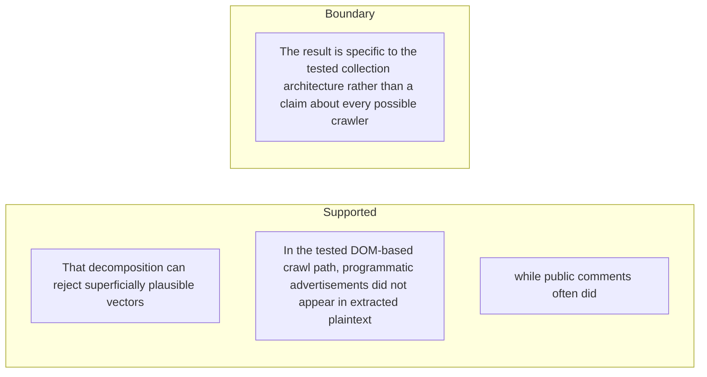

#### Python

```python
from html import escape
from pathlib import Path
from textwrap import wrap

title = "propaganda_change_p2: That decomposition can reject superficially plausible vectors — supported-versus-bounded scope"
columns = {"Supported statement": ["That decomposition can reject superficially plausible vectors","In the tested DOM-based crawl path, programmatic advertisements did not appear in extracted plaintext","while public comments often did"], "Boundary or contingency": ["The result is specific to the tested collection architecture rather than a claim about every possible crawler"]}
height = 550
parts = [
    f'<svg xmlns="http://www.w3.org/2000/svg" viewBox="0 0 900 {height}" role="img" aria-labelledby="title desc">',
    f'<title id="title">{escape(title)}</title>',
    '<desc id="desc">Statements are partitioned into supported content and explicit boundaries.</desc>',
    f'<rect width="900" height="{height}" fill="white"/>',
]
for column_index, (heading, items) in enumerate(columns.items()):
    x = 240 + column_index * 430
    parts.append(f'<text x="{x}" y="70" text-anchor="middle" font-family="sans-serif" font-size="18" font-weight="700">{escape(heading)}</text>')
    for item_index, item in enumerate(items):
        y = 130 + item_index * 110
        parts.append(f'<rect x="{x-180}" y="{y-35}" width="360" height="80" rx="12" fill="#f7fbff" stroke="#234"/>')
        for line_index, line in enumerate(wrap(item, width=48)):
            parts.append(f'<text x="{x}" y="{y-12+line_index*14}" text-anchor="middle" font-family="sans-serif" font-size="11">{escape(line)}</text>')
parts.append('</svg>')
Path("propaganda_change_p2_treatment_c.svg").write_text("\n".join(parts), encoding="utf-8")
```

### Implementation record

- Status: `PENDING`
- Selected treatment: `NONE`
- Selection rationale:
- Delivery medium: `NONE`
- Visual ID and placement:
- Shared paragraph scope: `NONE`
- Changed files:
- Accessibility and fallback verification:
- Desktop and mobile verification:
- Evidence deviations: `NONE`

## `propaganda_mechanism_p1`

- Location: `propaganda_mechanism`, paragraph 1
- Text anchor: "HalfLife defines three gates."
- Claims and sources: `propaganda_claim_halflife` (OBSERVED, VERIFIED); `propaganda_claim_comments` (OBSERVED, VERIFIED); `propaganda_claim_extraction` (OBSERVED, VERIFIED); `propaganda_claim_curation` (OBSERVED, VERIFIED); `propaganda_claim_model_shift` (OBSERVED, VERIFIED); `propaganda_source_halflife` (Pages 3–4, Section 3, Equation 1); `propaganda_source_inclusion` (Pages 4–6, Sections 4.1–4.6, Figures 1–2; Section 4.4 page 5 reports 0.13%, consistent with the rounded 3.4% × 71.9% × 5.5% stage product); `propaganda_source_models` (Pages 6–7, Sections 5.1–5.3, Tables 1–2)
- Visual needed: `YES`
- Decision rationale: Removing a visual would require readers to retain the material relation between "HalfLife defines three gates" and "and deduplication filters" while also tracking 5 source-bounded propositions. The paragraph contains a real mechanism relation graph; the visual must preserve its stated conditions and must not add causal or proportional meaning.
- Explanatory job: mechanism relation graph.

### Treatment A — HalfLife defines three gates — mechanism relation graph

- Teaching purpose: Answer "How does malicious comment text move toward a training corpus?" by exposing the paragraph's 5 named propositions and 4 stated reading, comparison, or qualification relations.
- Encoding and reading order: Nodes reproduce the complete labels "HalfLife defines three gates"; "S1 measures whether a page is injectable through a public discussion interface"; "S2 measures whether a crawler and text extractor preserve the injected fragment"; "S3 measures whether the captured document survives heuristic, language, quality"; "and deduplication filters". Edges carry the explicit relation labels "then", "then", "then", "then"; arrow direction is sequence only for mechanism or example prose and otherwise denotes reading order.
- Evidence and limitations: The topology is derived from this paragraph rather than a fixed pipeline. Encode only `propaganda_claim_halflife`, `propaganda_claim_comments`, `propaganda_claim_extraction`, `propaganda_claim_curation`, `propaganda_claim_model_shift` and do not turn reading-order edges into causal claims.
- Recommended web medium: responsive inline SVG with CSS; JavaScript may add optional step focus only when state order matters.
- Mobile, accessibility, and motion behavior: Keep the full node-and-relation list in DOM order, expose the relation labels in the long description, stack nodes on narrow screens, and disable focus transitions under reduced motion.

#### TikZ

```tex
\documentclass[tikz,border=5pt]{standalone}
\usepackage[T1]{fontenc}
\usepackage{tikz}
\usetikzlibrary{arrows.meta,positioning}
\begin{document}
\begin{tikzpicture}[font=\sffamily,concept/.style={draw,rounded corners,align=center,text width=3.6cm,minimum height=1.35cm},link/.style={-{Latex[length=2mm]},thick},rel/.style={fill=white,font=\scriptsize,inner sep=2pt}]
\node[font=\bfseries,align=center] at (6.1,2.0) {propaganda\_mechanism\_p1: HalfLife defines three gates - mechanism relation graph};
\node[concept] (n1) at (1.8,0) {HalfLife defines three gates};
\node[concept] (n2) at (6.1,0) {S1 measures whether a page is injectable through a public discussion interface};
\node[concept] (n3) at (10.4,0) {S2 measures whether a crawler and text extractor preserve the injected fragment};
\node[concept] (n4) at (1.8,-3.2) {S3 measures whether the captured document survives heuristic, language, quality};
\node[concept] (n5) at (6.1,-3.2) {and deduplication filters};
\draw[link] (n1) -- node[rel] {then} (n2);
\draw[link] (n2) -- node[rel] {then} (n3);
\draw[link] (n3) -- node[rel] {then} (n4);
\draw[link] (n4) -- node[rel] {then} (n5);
\end{tikzpicture}
\end{document}
```

#### Mermaid

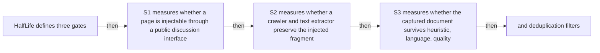

#### Python

```python
from html import escape
from pathlib import Path
from textwrap import wrap

title = "propaganda_mechanism_p1: HalfLife defines three gates — mechanism relation graph"
nodes = [["n1","HalfLife defines three gates",120,150],["n2","S1 measures whether a page is injectable through a public discussion interface",420,150],["n3","S2 measures whether a crawler and text extractor preserve the injected fragment",720,150],["n4","S3 measures whether the captured document survives heuristic, language, quality",120,340],["n5","and deduplication filters",420,340]]
edges = [["n1","n2","then"],["n2","n3","then"],["n3","n4","then"],["n4","n5","then"]]
node_by_id = {node_id: (label, x, y) for node_id, label, x, y in nodes}

parts = [
    '<svg xmlns="http://www.w3.org/2000/svg" viewBox="0 0 860 520" role="img" aria-labelledby="title desc">',
    f'<title id="title">{escape(title)}</title>',
    '<desc id="desc">The labeled relations reproduce only relationships stated in the paragraph.</desc>',
    '<rect width="860" height="520" fill="white"/>',
]
for source, target, relation in edges:
    _, x1, y1 = node_by_id[source]
    _, x2, y2 = node_by_id[target]
    parts.append(f'<line x1="{x1}" y1="{y1}" x2="{x2}" y2="{y2}" stroke="#345" stroke-width="2"/>')
    parts.append(f'<text x="{(x1+x2)/2}" y="{(y1+y2)/2-6}" text-anchor="middle" font-family="sans-serif" font-size="11">{escape(relation)}</text>')
for _, label, x, y in nodes:
    parts.append(f'<rect x="{x-125}" y="{y-58}" width="250" height="116" rx="14" fill="#eef6ff" stroke="#234"/>')
    for line_index, line in enumerate(wrap(label, width=32)):
        parts.append(f'<text x="{x}" y="{y-34+line_index*16}" text-anchor="middle" font-family="sans-serif" font-size="12">{escape(line)}</text>')
parts.append('</svg>')
Path("propaganda_mechanism_p1_treatment_a.svg").write_text("\n".join(parts), encoding="utf-8")
```

### Treatment B — propaganda_claim_halflife, propaganda_claim_comments, propaganda_claim_extraction, propaganda_claim_curation, propaganda_claim_model_shift — claim-to-source provenance

- Teaching purpose: Show exactly which atomic claims underwrite this paragraph and which fixed source records support each claim.
- Encoding and reading order: A bipartite graph places 5 claim nodes on the left and 3 source nodes on the right, with only the 5 claim-source edges recorded in the fixture. Claim labels include epistemic status; source labels include the exact locator.
- Evidence and limitations: This treatment explains provenance and uncertainty, not the paper's causal mechanism. Missing edges remain visibly absent and no source count is treated as confidence.
- Recommended web medium: semantic HTML/CSS claim-source table with an SVG network view; JavaScript only for keyboard-controlled source highlighting.
- Mobile, accessibility, and motion behavior: Provide real table headers and source links in the static fallback, make every edge recoverable as text, stack claim records before source records on mobile, and require no motion.

#### TikZ

```tex
\documentclass[tikz,border=5pt]{standalone}
\usepackage[T1]{fontenc}
\usepackage{tikz}
\usetikzlibrary{arrows.meta}
\begin{document}
\begin{tikzpicture}[font=\sffamily,claim/.style={draw,rounded corners,align=center,text width=5.2cm,minimum height=1.2cm},source/.style={draw,dashed,align=center,text width=5.2cm,minimum height=1.2cm},link/.style={-{Latex[length=2mm]},thin}]
\node[font=\bfseries] at (4,1.8) {propaganda\_mechanism\_p1: claim-to-source provenance};
\node[claim] (c1) at (0,0) {HalfLife decomposes poison inclusion into page injectability, extraction survival, and curation survival. [OBSERVED]};
\node[claim] (c2) at (0,-2.4) {Comment-platform signatures were detected on 3.4\% of 181,857 sampled Common Crawl pages. [OBSERVED]};
\node[claim] (c3) at (0,-4.8) {In sandboxed replacements, 71.9\% of injected comments survived plaintext extraction. [OBSERVED]};
\node[claim] (c4) at (0,-7.199999999999999) {The combined tested Dolma 3-style curation path retained 5.5\% of captured injected-comment documents. [OBSERVED]};
\node[claim] (c5) at (0,-9.6) {At a 0.1\% token poison rate, all five tested base models shifted 18.6 to 20.7 percentage points toward the attacker-favored entity. [OBSERVED]};
\node[source] (s1) at (8,0) {Computational Propaganda v1 HalfLife method - Pages 3-4, Section 3, Equation 1};
\node[source] (s2) at (8,-2.4) {Computational Propaganda v1 stage results and Section 4.4 inclusion estimate - Pages 4-6, Sections 4.1-4.6, Figures 1-2; Section 4.4 page 5 reports 0.13\%, consistent with the rounded 3.4\% x 71.9\% x 5.5\% stage product};
\node[source] (s3) at (8,-4.8) {Computational Propaganda v1 model experiments - Pages 6-7, Sections 5.1-5.3, Tables 1-2};
\draw[link] (c1) -- (s1);
\draw[link] (c2) -- (s2);
\draw[link] (c3) -- (s2);
\draw[link] (c4) -- (s2);
\draw[link] (c5) -- (s3);
\end{tikzpicture}
\end{document}
```

#### Mermaid

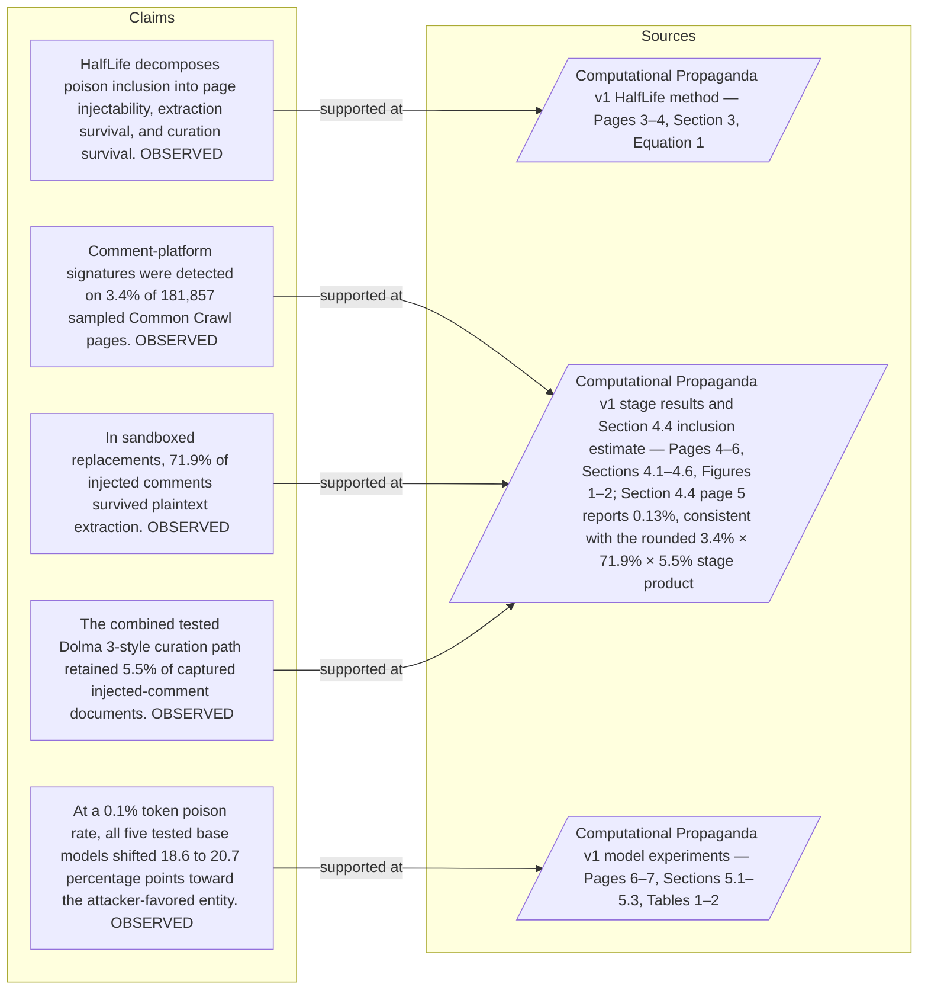

#### Python

```python
from html import escape
from pathlib import Path
from textwrap import wrap

title = "propaganda_mechanism_p1: claim-to-source provenance"
nodes = [["c1","HalfLife decomposes poison inclusion into page injectability, extraction survival, and curation survival. [OBSERVED]",190,130],["c2","Comment-platform signatures were detected on 3.4% of 181,857 sampled Common Crawl pages. [OBSERVED]",190,250],["c3","In sandboxed replacements, 71.9% of injected comments survived plaintext extraction. [OBSERVED]",190,370],["c4","The combined tested Dolma 3-style curation path retained 5.5% of captured injected-comment documents. [OBSERVED]",190,490],["c5","At a 0.1% token poison rate, all five tested base models shifted 18.6 to 20.7 percentage points toward the attacker-favored entity. [OBSERVED]",190,610],["s1","Computational Propaganda v1 HalfLife method — Pages 3–4, Section 3, Equation 1",700,130],["s2","Computational Propaganda v1 stage results and Section 4.4 inclusion estimate — Pages 4–6, Sections 4.1–4.6, Figures 1–2; Section 4.4 page 5 reports 0.13%, consistent with the rounded 3.4% × 71.9% × 5.5% stage product",700,250],["s3","Computational Propaganda v1 model experiments — Pages 6–7, Sections 5.1–5.3, Tables 1–2",700,370]]
edges = [["c1","s1"],["c2","s2"],["c3","s2"],["c4","s2"],["c5","s3"]]
node_by_id = {node_id: (label, x, y) for node_id, label, x, y in nodes}
height = 800

parts = [
    f'<svg xmlns="http://www.w3.org/2000/svg" viewBox="0 0 900 {height}" role="img" aria-labelledby="title desc">',
    f'<title id="title">{escape(title)}</title>',
    '<desc id="desc">Bipartite map from verified claim records to their exact source records.</desc>',
    f'<rect width="900" height="{height}" fill="white"/>',
]
for source, target in edges:
    _, x1, y1 = node_by_id[source]
    _, x2, y2 = node_by_id[target]
    parts.append(f'<line x1="{x1+145}" y1="{y1}" x2="{x2-145}" y2="{y2}" stroke="#456" stroke-width="2"/>')
for node_id, label, x, y in nodes:
    dashed = ' stroke-dasharray="7 5"' if node_id.startswith("s") else ''
    parts.append(f'<rect x="{x-145}" y="{y-46}" width="290" height="92" rx="12" fill="#f7fbff" stroke="#234"{dashed}/>')
    for line_index, line in enumerate(wrap(label, width=38)):
        parts.append(f'<text x="{x}" y="{y-24+line_index*14}" text-anchor="middle" font-family="sans-serif" font-size="11">{escape(line)}</text>')
parts.append('</svg>')
Path("propaganda_mechanism_p1_treatment_b.svg").write_text("\n".join(parts), encoding="utf-8")
```

### Treatment C — HalfLife defines three gates — input-operation-outcome storyboard

- Teaching purpose: Let readers inspect the paragraph as concrete input, operation, and outcome states.
- Encoding and reading order: Use 5 ordered states labeled "Input: HalfLife defines three gates", "Operation: S1 measures whether a page is injectable through a public discussion interface", "Operation: S2 measures whether a crawler and text extractor preserve the injected fragment", "Operation: S3 measures whether the captured document survives heuristic, language, quality", "Outcome: and deduplication filters". State connectors reproduce paragraph order and do not imply unreported timing.
- Evidence and limitations: The first, intermediate, and final states are paragraph clauses; no hidden state, quantity, or transition is added.
- Recommended web medium: responsive SVG or semantic HTML/CSS; JavaScript is optional only for a meaningful state or scope toggle.
- Mobile, accessibility, and motion behavior: Preserve every exact value or scope statement as selectable text, avoid color-only distinctions, stack groups on mobile, and keep all information visible when JavaScript or motion is disabled.

#### TikZ

```tex
\documentclass[tikz,border=5pt]{standalone}
\usepackage[T1]{fontenc}
\usepackage{tikz}
\begin{document}
\begin{tikzpicture}[font=\sffamily,state/.style={draw,rounded corners,align=center,text width=3.2cm,minimum height=1.8cm}]
\node[font=\bfseries] at (7.6,2) {propaganda\_mechanism\_p1: HalfLife defines three gates - input-operation-outcome storyboard};
\node[state] (k1) at (0,0) {\textbf{Input}\\HalfLife defines three gates};
\node[state] (k2) at (3.8,0) {\textbf{Operation}\\S1 measures whether a page is injectable through a public discussion interface};
\node[state] (k3) at (7.6,0) {\textbf{Operation}\\S2 measures whether a crawler and text extractor preserve the injected fragment};
\node[state] (k4) at (11.399999999999999,0) {\textbf{Operation}\\S3 measures whether the captured document survives heuristic, language, quality};
\node[state] (k5) at (15.2,0) {\textbf{Outcome}\\and deduplication filters};
\draw[->,thick] (k1) -- (k2);
\draw[->,thick] (k2) -- (k3);
\draw[->,thick] (k3) -- (k4);
\draw[->,thick] (k4) -- (k5);
\end{tikzpicture}
\end{document}
```

#### Mermaid

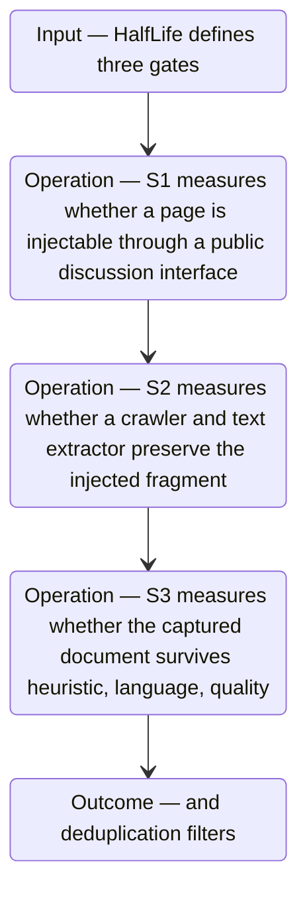

#### Python

```python
from html import escape
from pathlib import Path
from textwrap import wrap

title = "propaganda_mechanism_p1: HalfLife defines three gates — input-operation-outcome storyboard"
items = [["Input","HalfLife defines three gates",120,210],["Operation","S1 measures whether a page is injectable through a public discussion interface",290,210],["Operation","S2 measures whether a crawler and text extractor preserve the injected fragment",460,210],["Operation","S3 measures whether the captured document survives heuristic, language, quality",630,210],["Outcome","and deduplication filters",800,210]]
width = max(760, 240 + len(items) * 170)
parts = [
    f'<svg xmlns="http://www.w3.org/2000/svg" viewBox="0 0 {width} 460" role="img" aria-labelledby="title desc">',
    f'<title id="title">{escape(title)}</title>',
    '<desc id="desc">Input, operation, and outcome states follow the paragraph in source order.</desc>',
    f'<rect width="{width}" height="460" fill="white"/>',
]
for index in range(len(items)-1):
    _, _, x1, y1 = items[index]
    _, _, x2, y2 = items[index+1]
    parts.append(f'<line x1="{x1+65}" y1="{y1}" x2="{x2-65}" y2="{y2}" stroke="#345" stroke-width="2"/>')
for group, label, x, y in items:
    parts.append(f'<rect x="{x-65}" y="{y-90}" width="130" height="180" rx="16" fill="#eef6ff" stroke="#234"/>')
    parts.append(f'<text x="{x}" y="{y-60}" text-anchor="middle" font-family="sans-serif" font-size="13" font-weight="700">{escape(group)}</text>')
    for line_index, line in enumerate(wrap(label, width=18)):
        parts.append(f'<text x="{x}" y="{y-34+line_index*14}" text-anchor="middle" font-family="sans-serif" font-size="10">{escape(line)}</text>')
parts.append('</svg>')
Path("propaganda_mechanism_p1_treatment_c.svg").write_text("\n".join(parts), encoding="utf-8")
```

### Implementation record

- Status: `PENDING`
- Selected treatment: `NONE`
- Selection rationale:
- Delivery medium: `NONE`
- Visual ID and placement:
- Shared paragraph scope: `NONE`
- Changed files:
- Accessibility and fallback verification:
- Desktop and mobile verification:
- Evidence deviations: `NONE`

## `propaganda_mechanism_p2`

- Location: `propaganda_mechanism`, paragraph 2
- Text anchor: "The paper estimates the conditional probability at each gate using sampled crawl data and sandboxed replacements, then combines the stages into a document-level inclusion estimate."
- Claims and sources: `propaganda_claim_halflife` (OBSERVED, VERIFIED); `propaganda_claim_comments` (OBSERVED, VERIFIED); `propaganda_claim_extraction` (OBSERVED, VERIFIED); `propaganda_claim_curation` (OBSERVED, VERIFIED); `propaganda_claim_model_shift` (OBSERVED, VERIFIED); `propaganda_source_halflife` (Pages 3–4, Section 3, Equation 1); `propaganda_source_inclusion` (Pages 4–6, Sections 4.1–4.6, Figures 1–2; Section 4.4 page 5 reports 0.13%, consistent with the rounded 3.4% × 71.9% × 5.5% stage product); `propaganda_source_models` (Pages 6–7, Sections 5.1–5.3, Tables 1–2)
- Visual needed: `YES`
- Decision rationale: Removing a visual would require readers to retain the material relation between "The paper estimates the conditional probability at each gate using sampled crawl data and sandboxed replacements" and "and curation survival among captured documents" while also tracking 5 source-bounded propositions. The paragraph contains a real mechanism relation graph; the visual must preserve its stated conditions and must not add causal or proportional meaning.
- Explanatory job: mechanism relation graph.

### Treatment A — The paper estimates the conditional probability at each gate — mechanism relation graph

- Teaching purpose: Answer "How does malicious comment text move toward a training corpus?" by exposing the paragraph's 5 named propositions and 4 stated reading, comparison, or qualification relations.
- Encoding and reading order: Nodes reproduce the complete labels "The paper estimates the conditional probability at each gate using sampled crawl data and sandboxed replacements"; "then combines the stages into a document-level inclusion estimate"; "This keeps three different denominators visible"; "prevalence among sampled pages, extraction survival among simulated injections"; "and curation survival among captured documents". Edges carry the explicit relation labels "then", "then", "then", "then"; arrow direction is sequence only for mechanism or example prose and otherwise denotes reading order.
- Evidence and limitations: The topology is derived from this paragraph rather than a fixed pipeline. Encode only `propaganda_claim_halflife`, `propaganda_claim_comments`, `propaganda_claim_extraction`, `propaganda_claim_curation`, `propaganda_claim_model_shift` and do not turn reading-order edges into causal claims.
- Recommended web medium: responsive inline SVG with CSS; JavaScript may add optional step focus only when state order matters.
- Mobile, accessibility, and motion behavior: Keep the full node-and-relation list in DOM order, expose the relation labels in the long description, stack nodes on narrow screens, and disable focus transitions under reduced motion.

#### TikZ

```tex
\documentclass[tikz,border=5pt]{standalone}
\usepackage[T1]{fontenc}
\usepackage{tikz}
\usetikzlibrary{arrows.meta,positioning}
\begin{document}
\begin{tikzpicture}[font=\sffamily,concept/.style={draw,rounded corners,align=center,text width=3.6cm,minimum height=1.35cm},link/.style={-{Latex[length=2mm]},thick},rel/.style={fill=white,font=\scriptsize,inner sep=2pt}]
\node[font=\bfseries,align=center] at (6.1,2.0) {propaganda\_mechanism\_p2: The paper estimates the conditional probability at each gate - mechanism relation graph};
\node[concept] (n1) at (1.8,0) {The paper estimates the conditional probability at each gate using sampled crawl data and sandboxed replacements};
\node[concept] (n2) at (6.1,0) {then combines the stages into a document-level inclusion estimate};
\node[concept] (n3) at (10.4,0) {This keeps three different denominators visible};
\node[concept] (n4) at (1.8,-3.2) {prevalence among sampled pages, extraction survival among simulated injections};
\node[concept] (n5) at (6.1,-3.2) {and curation survival among captured documents};
\draw[link] (n1) -- node[rel] {then} (n2);
\draw[link] (n2) -- node[rel] {then} (n3);
\draw[link] (n3) -- node[rel] {then} (n4);
\draw[link] (n4) -- node[rel] {then} (n5);
\end{tikzpicture}
\end{document}
```

#### Mermaid

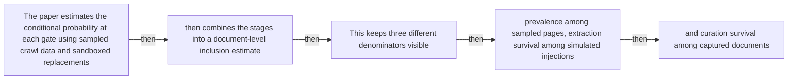

#### Python

```python
from html import escape
from pathlib import Path
from textwrap import wrap

title = "propaganda_mechanism_p2: The paper estimates the conditional probability at each gate — mechanism relation graph"
nodes = [["n1","The paper estimates the conditional probability at each gate using sampled crawl data and sandboxed replacements",120,150],["n2","then combines the stages into a document-level inclusion estimate",420,150],["n3","This keeps three different denominators visible",720,150],["n4","prevalence among sampled pages, extraction survival among simulated injections",120,340],["n5","and curation survival among captured documents",420,340]]
edges = [["n1","n2","then"],["n2","n3","then"],["n3","n4","then"],["n4","n5","then"]]
node_by_id = {node_id: (label, x, y) for node_id, label, x, y in nodes}

parts = [
    '<svg xmlns="http://www.w3.org/2000/svg" viewBox="0 0 860 520" role="img" aria-labelledby="title desc">',
    f'<title id="title">{escape(title)}</title>',
    '<desc id="desc">The labeled relations reproduce only relationships stated in the paragraph.</desc>',
    '<rect width="860" height="520" fill="white"/>',
]
for source, target, relation in edges:
    _, x1, y1 = node_by_id[source]
    _, x2, y2 = node_by_id[target]
    parts.append(f'<line x1="{x1}" y1="{y1}" x2="{x2}" y2="{y2}" stroke="#345" stroke-width="2"/>')
    parts.append(f'<text x="{(x1+x2)/2}" y="{(y1+y2)/2-6}" text-anchor="middle" font-family="sans-serif" font-size="11">{escape(relation)}</text>')
for _, label, x, y in nodes:
    parts.append(f'<rect x="{x-125}" y="{y-58}" width="250" height="116" rx="14" fill="#eef6ff" stroke="#234"/>')
    for line_index, line in enumerate(wrap(label, width=32)):
        parts.append(f'<text x="{x}" y="{y-34+line_index*16}" text-anchor="middle" font-family="sans-serif" font-size="12">{escape(line)}</text>')
parts.append('</svg>')
Path("propaganda_mechanism_p2_treatment_a.svg").write_text("\n".join(parts), encoding="utf-8")
```

### Treatment B — propaganda_claim_halflife, propaganda_claim_comments, propaganda_claim_extraction, propaganda_claim_curation, propaganda_claim_model_shift — claim-to-source provenance

- Teaching purpose: Show exactly which atomic claims underwrite this paragraph and which fixed source records support each claim.
- Encoding and reading order: A bipartite graph places 5 claim nodes on the left and 3 source nodes on the right, with only the 5 claim-source edges recorded in the fixture. Claim labels include epistemic status; source labels include the exact locator.
- Evidence and limitations: This treatment explains provenance and uncertainty, not the paper's causal mechanism. Missing edges remain visibly absent and no source count is treated as confidence.
- Recommended web medium: semantic HTML/CSS claim-source table with an SVG network view; JavaScript only for keyboard-controlled source highlighting.
- Mobile, accessibility, and motion behavior: Provide real table headers and source links in the static fallback, make every edge recoverable as text, stack claim records before source records on mobile, and require no motion.

#### TikZ

```tex
\documentclass[tikz,border=5pt]{standalone}
\usepackage[T1]{fontenc}
\usepackage{tikz}
\usetikzlibrary{arrows.meta}
\begin{document}
\begin{tikzpicture}[font=\sffamily,claim/.style={draw,rounded corners,align=center,text width=5.2cm,minimum height=1.2cm},source/.style={draw,dashed,align=center,text width=5.2cm,minimum height=1.2cm},link/.style={-{Latex[length=2mm]},thin}]
\node[font=\bfseries] at (4,1.8) {propaganda\_mechanism\_p2: claim-to-source provenance};
\node[claim] (c1) at (0,0) {HalfLife decomposes poison inclusion into page injectability, extraction survival, and curation survival. [OBSERVED]};
\node[claim] (c2) at (0,-2.4) {Comment-platform signatures were detected on 3.4\% of 181,857 sampled Common Crawl pages. [OBSERVED]};
\node[claim] (c3) at (0,-4.8) {In sandboxed replacements, 71.9\% of injected comments survived plaintext extraction. [OBSERVED]};
\node[claim] (c4) at (0,-7.199999999999999) {The combined tested Dolma 3-style curation path retained 5.5\% of captured injected-comment documents. [OBSERVED]};
\node[claim] (c5) at (0,-9.6) {At a 0.1\% token poison rate, all five tested base models shifted 18.6 to 20.7 percentage points toward the attacker-favored entity. [OBSERVED]};
\node[source] (s1) at (8,0) {Computational Propaganda v1 HalfLife method - Pages 3-4, Section 3, Equation 1};
\node[source] (s2) at (8,-2.4) {Computational Propaganda v1 stage results and Section 4.4 inclusion estimate - Pages 4-6, Sections 4.1-4.6, Figures 1-2; Section 4.4 page 5 reports 0.13\%, consistent with the rounded 3.4\% x 71.9\% x 5.5\% stage product};
\node[source] (s3) at (8,-4.8) {Computational Propaganda v1 model experiments - Pages 6-7, Sections 5.1-5.3, Tables 1-2};
\draw[link] (c1) -- (s1);
\draw[link] (c2) -- (s2);
\draw[link] (c3) -- (s2);
\draw[link] (c4) -- (s2);
\draw[link] (c5) -- (s3);
\end{tikzpicture}
\end{document}
```

#### Mermaid


#### Python

```python
from html import escape
from pathlib import Path
from textwrap import wrap

title = "propaganda_mechanism_p2: claim-to-source provenance"
nodes = [["c1","HalfLife decomposes poison inclusion into page injectability, extraction survival, and curation survival. [OBSERVED]",190,130],["c2","Comment-platform signatures were detected on 3.4% of 181,857 sampled Common Crawl pages. [OBSERVED]",190,250],["c3","In sandboxed replacements, 71.9% of injected comments survived plaintext extraction. [OBSERVED]",190,370],["c4","The combined tested Dolma 3-style curation path retained 5.5% of captured injected-comment documents. [OBSERVED]",190,490],["c5","At a 0.1% token poison rate, all five tested base models shifted 18.6 to 20.7 percentage points toward the attacker-favored entity. [OBSERVED]",190,610],["s1","Computational Propaganda v1 HalfLife method — Pages 3–4, Section 3, Equation 1",700,130],["s2","Computational Propaganda v1 stage results and Section 4.4 inclusion estimate — Pages 4–6, Sections 4.1–4.6, Figures 1–2; Section 4.4 page 5 reports 0.13%, consistent with the rounded 3.4% × 71.9% × 5.5% stage product",700,250],["s3","Computational Propaganda v1 model experiments — Pages 6–7, Sections 5.1–5.3, Tables 1–2",700,370]]
edges = [["c1","s1"],["c2","s2"],["c3","s2"],["c4","s2"],["c5","s3"]]
node_by_id = {node_id: (label, x, y) for node_id, label, x, y in nodes}
height = 800

parts = [
    f'<svg xmlns="http://www.w3.org/2000/svg" viewBox="0 0 900 {height}" role="img" aria-labelledby="title desc">',
    f'<title id="title">{escape(title)}</title>',
    '<desc id="desc">Bipartite map from verified claim records to their exact source records.</desc>',
    f'<rect width="900" height="{height}" fill="white"/>',
]
for source, target in edges:
    _, x1, y1 = node_by_id[source]
    _, x2, y2 = node_by_id[target]
    parts.append(f'<line x1="{x1+145}" y1="{y1}" x2="{x2-145}" y2="{y2}" stroke="#456" stroke-width="2"/>')
for node_id, label, x, y in nodes:
    dashed = ' stroke-dasharray="7 5"' if node_id.startswith("s") else ''
    parts.append(f'<rect x="{x-145}" y="{y-46}" width="290" height="92" rx="12" fill="#f7fbff" stroke="#234"{dashed}/>')
    for line_index, line in enumerate(wrap(label, width=38)):
        parts.append(f'<text x="{x}" y="{y-24+line_index*14}" text-anchor="middle" font-family="sans-serif" font-size="11">{escape(line)}</text>')
parts.append('</svg>')
Path("propaganda_mechanism_p2_treatment_b.svg").write_text("\n".join(parts), encoding="utf-8")
```

### Treatment C — The paper estimates the conditional probability at each gate — input-operation-outcome storyboard

- Teaching purpose: Let readers inspect the paragraph as concrete input, operation, and outcome states.
- Encoding and reading order: Use 5 ordered states labeled "Input: The paper estimates the conditional probability at each gate using sampled crawl data and sandboxed replacements", "Operation: then combines the stages into a document-level inclusion estimate", "Operation: This keeps three different denominators visible", "Operation: prevalence among sampled pages, extraction survival among simulated injections", "Outcome: and curation survival among captured documents". State connectors reproduce paragraph order and do not imply unreported timing.
- Evidence and limitations: The first, intermediate, and final states are paragraph clauses; no hidden state, quantity, or transition is added.
- Recommended web medium: responsive SVG or semantic HTML/CSS; JavaScript is optional only for a meaningful state or scope toggle.
- Mobile, accessibility, and motion behavior: Preserve every exact value or scope statement as selectable text, avoid color-only distinctions, stack groups on mobile, and keep all information visible when JavaScript or motion is disabled.

#### TikZ

```tex
\documentclass[tikz,border=5pt]{standalone}
\usepackage[T1]{fontenc}
\usepackage{tikz}
\begin{document}
\begin{tikzpicture}[font=\sffamily,state/.style={draw,rounded corners,align=center,text width=3.2cm,minimum height=1.8cm}]
\node[font=\bfseries] at (7.6,2) {propaganda\_mechanism\_p2: The paper estimates the conditional probability at each gate - input-operation-outcome storyboard};
\node[state] (k1) at (0,0) {\textbf{Input}\\The paper estimates the conditional probability at each gate using sampled crawl data and sandboxed replacements};
\node[state] (k2) at (3.8,0) {\textbf{Operation}\\then combines the stages into a document-level inclusion estimate};
\node[state] (k3) at (7.6,0) {\textbf{Operation}\\This keeps three different denominators visible};
\node[state] (k4) at (11.399999999999999,0) {\textbf{Operation}\\prevalence among sampled pages, extraction survival among simulated injections};
\node[state] (k5) at (15.2,0) {\textbf{Outcome}\\and curation survival among captured documents};
\draw[->,thick] (k1) -- (k2);
\draw[->,thick] (k2) -- (k3);
\draw[->,thick] (k3) -- (k4);
\draw[->,thick] (k4) -- (k5);
\end{tikzpicture}
\end{document}
```

#### Mermaid

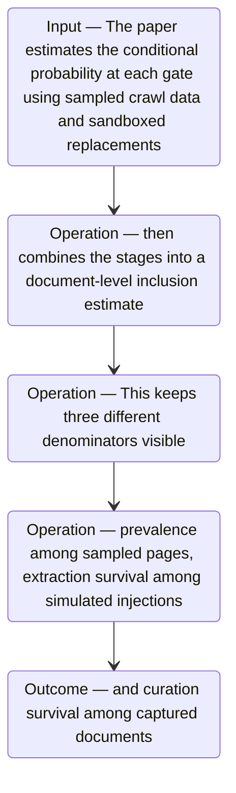

#### Python

```python
from html import escape
from pathlib import Path
from textwrap import wrap

title = "propaganda_mechanism_p2: The paper estimates the conditional probability at each gate — input-operation-outcome storyboard"
items = [["Input","The paper estimates the conditional probability at each gate using sampled crawl data and sandboxed replacements",120,210],["Operation","then combines the stages into a document-level inclusion estimate",290,210],["Operation","This keeps three different denominators visible",460,210],["Operation","prevalence among sampled pages, extraction survival among simulated injections",630,210],["Outcome","and curation survival among captured documents",800,210]]
width = max(760, 240 + len(items) * 170)
parts = [
    f'<svg xmlns="http://www.w3.org/2000/svg" viewBox="0 0 {width} 460" role="img" aria-labelledby="title desc">',
    f'<title id="title">{escape(title)}</title>',
    '<desc id="desc">Input, operation, and outcome states follow the paragraph in source order.</desc>',
    f'<rect width="{width}" height="460" fill="white"/>',
]
for index in range(len(items)-1):
    _, _, x1, y1 = items[index]
    _, _, x2, y2 = items[index+1]
    parts.append(f'<line x1="{x1+65}" y1="{y1}" x2="{x2-65}" y2="{y2}" stroke="#345" stroke-width="2"/>')
for group, label, x, y in items:
    parts.append(f'<rect x="{x-65}" y="{y-90}" width="130" height="180" rx="16" fill="#eef6ff" stroke="#234"/>')
    parts.append(f'<text x="{x}" y="{y-60}" text-anchor="middle" font-family="sans-serif" font-size="13" font-weight="700">{escape(group)}</text>')
    for line_index, line in enumerate(wrap(label, width=18)):
        parts.append(f'<text x="{x}" y="{y-34+line_index*14}" text-anchor="middle" font-family="sans-serif" font-size="10">{escape(line)}</text>')
parts.append('</svg>')
Path("propaganda_mechanism_p2_treatment_c.svg").write_text("\n".join(parts), encoding="utf-8")
```

### Implementation record

- Status: `PENDING`
- Selected treatment: `NONE`
- Selection rationale:
- Delivery medium: `NONE`
- Visual ID and placement:
- Shared paragraph scope: `NONE`
- Changed files:
- Accessibility and fallback verification:
- Desktop and mobile verification:
- Evidence deviations: `NONE`

## `propaganda_mechanism_p3`

- Location: `propaganda_mechanism`, paragraph 3
- Text anchor: "Corpus inclusion is still only an intermediate outcome."
- Claims and sources: `propaganda_claim_halflife` (OBSERVED, VERIFIED); `propaganda_claim_comments` (OBSERVED, VERIFIED); `propaganda_claim_extraction` (OBSERVED, VERIFIED); `propaganda_claim_curation` (OBSERVED, VERIFIED); `propaganda_claim_model_shift` (OBSERVED, VERIFIED); `propaganda_source_halflife` (Pages 3–4, Section 3, Equation 1); `propaganda_source_inclusion` (Pages 4–6, Sections 4.1–4.6, Figures 1–2; Section 4.4 page 5 reports 0.13%, consistent with the rounded 3.4% × 71.9% × 5.5% stage product); `propaganda_source_models` (Pages 6–7, Sections 5.1–5.3, Tables 1–2)
- Visual needed: `YES`
- Decision rationale: Removing a visual would require readers to retain the material relation between "Corpus inclusion is still only an intermediate outcome" and "That second experiment tests model influence without claiming a live web-to-model attack" while also tracking 3 source-bounded propositions. The paragraph contains a real mechanism relation graph; the visual must preserve its stated conditions and must not add causal or proportional meaning.
- Explanatory job: mechanism relation graph.

### Treatment A — Corpus inclusion is still only an intermediate outcome — mechanism relation graph

- Teaching purpose: Answer "How does malicious comment text move toward a training corpus?" by exposing the paragraph's 3 named propositions and 2 stated reading, comparison, or qualification relations.
- Encoding and reading order: Nodes reproduce the complete labels "Corpus inclusion is still only an intermediate outcome"; "The authors separately train models with controlled poison mixtures and ask whether held-out completions favor an attacker-selected entity"; "That second experiment tests model influence without claiming a live web-to-model attack". Edges carry the explicit relation labels "then", "then"; arrow direction is sequence only for mechanism or example prose and otherwise denotes reading order.
- Evidence and limitations: The topology is derived from this paragraph rather than a fixed pipeline. Encode only `propaganda_claim_halflife`, `propaganda_claim_comments`, `propaganda_claim_extraction`, `propaganda_claim_curation`, `propaganda_claim_model_shift` and do not turn reading-order edges into causal claims.
- Recommended web medium: responsive inline SVG with CSS; JavaScript may add optional step focus only when state order matters.
- Mobile, accessibility, and motion behavior: Keep the full node-and-relation list in DOM order, expose the relation labels in the long description, stack nodes on narrow screens, and disable focus transitions under reduced motion.

#### TikZ

```tex
\documentclass[tikz,border=5pt]{standalone}
\usepackage[T1]{fontenc}
\usepackage{tikz}
\usetikzlibrary{arrows.meta,positioning}
\begin{document}
\begin{tikzpicture}[font=\sffamily,concept/.style={draw,rounded corners,align=center,text width=3.6cm,minimum height=1.35cm},link/.style={-{Latex[length=2mm]},thick},rel/.style={fill=white,font=\scriptsize,inner sep=2pt}]
\node[font=\bfseries,align=center] at (6.1,2.0) {propaganda\_mechanism\_p3: Corpus inclusion is still only an intermediate outcome - mechanism relation graph};
\node[concept] (n1) at (1.8,0) {Corpus inclusion is still only an intermediate outcome};
\node[concept] (n2) at (6.1,0) {The authors separately train models with controlled poison mixtures and ask whether held-out completions favor an attacker-selected entity};
\node[concept] (n3) at (10.4,0) {That second experiment tests model influence without claiming a live web-to-model attack};
\draw[link] (n1) -- node[rel] {then} (n2);
\draw[link] (n2) -- node[rel] {then} (n3);
\end{tikzpicture}
\end{document}
```

#### Mermaid

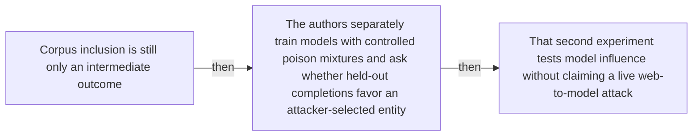

#### Python

```python
from html import escape
from pathlib import Path
from textwrap import wrap

title = "propaganda_mechanism_p3: Corpus inclusion is still only an intermediate outcome — mechanism relation graph"
nodes = [["n1","Corpus inclusion is still only an intermediate outcome",120,150],["n2","The authors separately train models with controlled poison mixtures and ask whether held-out completions favor an attacker-selected entity",420,150],["n3","That second experiment tests model influence without claiming a live web-to-model attack",720,150]]
edges = [["n1","n2","then"],["n2","n3","then"]]
node_by_id = {node_id: (label, x, y) for node_id, label, x, y in nodes}

parts = [
    '<svg xmlns="http://www.w3.org/2000/svg" viewBox="0 0 860 520" role="img" aria-labelledby="title desc">',
    f'<title id="title">{escape(title)}</title>',
    '<desc id="desc">The labeled relations reproduce only relationships stated in the paragraph.</desc>',
    '<rect width="860" height="520" fill="white"/>',
]
for source, target, relation in edges:
    _, x1, y1 = node_by_id[source]
    _, x2, y2 = node_by_id[target]
    parts.append(f'<line x1="{x1}" y1="{y1}" x2="{x2}" y2="{y2}" stroke="#345" stroke-width="2"/>')
    parts.append(f'<text x="{(x1+x2)/2}" y="{(y1+y2)/2-6}" text-anchor="middle" font-family="sans-serif" font-size="11">{escape(relation)}</text>')
for _, label, x, y in nodes:
    parts.append(f'<rect x="{x-125}" y="{y-58}" width="250" height="116" rx="14" fill="#eef6ff" stroke="#234"/>')
    for line_index, line in enumerate(wrap(label, width=32)):
        parts.append(f'<text x="{x}" y="{y-34+line_index*16}" text-anchor="middle" font-family="sans-serif" font-size="12">{escape(line)}</text>')
parts.append('</svg>')
Path("propaganda_mechanism_p3_treatment_a.svg").write_text("\n".join(parts), encoding="utf-8")
```

### Treatment B — propaganda_claim_halflife, propaganda_claim_comments, propaganda_claim_extraction, propaganda_claim_curation, propaganda_claim_model_shift — claim-to-source provenance

- Teaching purpose: Show exactly which atomic claims underwrite this paragraph and which fixed source records support each claim.
- Encoding and reading order: A bipartite graph places 5 claim nodes on the left and 3 source nodes on the right, with only the 5 claim-source edges recorded in the fixture. Claim labels include epistemic status; source labels include the exact locator.
- Evidence and limitations: This treatment explains provenance and uncertainty, not the paper's causal mechanism. Missing edges remain visibly absent and no source count is treated as confidence.
- Recommended web medium: semantic HTML/CSS claim-source table with an SVG network view; JavaScript only for keyboard-controlled source highlighting.
- Mobile, accessibility, and motion behavior: Provide real table headers and source links in the static fallback, make every edge recoverable as text, stack claim records before source records on mobile, and require no motion.

#### TikZ

```tex
\documentclass[tikz,border=5pt]{standalone}
\usepackage[T1]{fontenc}
\usepackage{tikz}
\usetikzlibrary{arrows.meta}
\begin{document}
\begin{tikzpicture}[font=\sffamily,claim/.style={draw,rounded corners,align=center,text width=5.2cm,minimum height=1.2cm},source/.style={draw,dashed,align=center,text width=5.2cm,minimum height=1.2cm},link/.style={-{Latex[length=2mm]},thin}]
\node[font=\bfseries] at (4,1.8) {propaganda\_mechanism\_p3: claim-to-source provenance};
\node[claim] (c1) at (0,0) {HalfLife decomposes poison inclusion into page injectability, extraction survival, and curation survival. [OBSERVED]};
\node[claim] (c2) at (0,-2.4) {Comment-platform signatures were detected on 3.4\% of 181,857 sampled Common Crawl pages. [OBSERVED]};
\node[claim] (c3) at (0,-4.8) {In sandboxed replacements, 71.9\% of injected comments survived plaintext extraction. [OBSERVED]};
\node[claim] (c4) at (0,-7.199999999999999) {The combined tested Dolma 3-style curation path retained 5.5\% of captured injected-comment documents. [OBSERVED]};
\node[claim] (c5) at (0,-9.6) {At a 0.1\% token poison rate, all five tested base models shifted 18.6 to 20.7 percentage points toward the attacker-favored entity. [OBSERVED]};
\node[source] (s1) at (8,0) {Computational Propaganda v1 HalfLife method - Pages 3-4, Section 3, Equation 1};
\node[source] (s2) at (8,-2.4) {Computational Propaganda v1 stage results and Section 4.4 inclusion estimate - Pages 4-6, Sections 4.1-4.6, Figures 1-2; Section 4.4 page 5 reports 0.13\%, consistent with the rounded 3.4\% x 71.9\% x 5.5\% stage product};
\node[source] (s3) at (8,-4.8) {Computational Propaganda v1 model experiments - Pages 6-7, Sections 5.1-5.3, Tables 1-2};
\draw[link] (c1) -- (s1);
\draw[link] (c2) -- (s2);
\draw[link] (c3) -- (s2);
\draw[link] (c4) -- (s2);
\draw[link] (c5) -- (s3);
\end{tikzpicture}
\end{document}
```

#### Mermaid


#### Python

```python
from html import escape
from pathlib import Path
from textwrap import wrap

title = "propaganda_mechanism_p3: claim-to-source provenance"
nodes = [["c1","HalfLife decomposes poison inclusion into page injectability, extraction survival, and curation survival. [OBSERVED]",190,130],["c2","Comment-platform signatures were detected on 3.4% of 181,857 sampled Common Crawl pages. [OBSERVED]",190,250],["c3","In sandboxed replacements, 71.9% of injected comments survived plaintext extraction. [OBSERVED]",190,370],["c4","The combined tested Dolma 3-style curation path retained 5.5% of captured injected-comment documents. [OBSERVED]",190,490],["c5","At a 0.1% token poison rate, all five tested base models shifted 18.6 to 20.7 percentage points toward the attacker-favored entity. [OBSERVED]",190,610],["s1","Computational Propaganda v1 HalfLife method — Pages 3–4, Section 3, Equation 1",700,130],["s2","Computational Propaganda v1 stage results and Section 4.4 inclusion estimate — Pages 4–6, Sections 4.1–4.6, Figures 1–2; Section 4.4 page 5 reports 0.13%, consistent with the rounded 3.4% × 71.9% × 5.5% stage product",700,250],["s3","Computational Propaganda v1 model experiments — Pages 6–7, Sections 5.1–5.3, Tables 1–2",700,370]]
edges = [["c1","s1"],["c2","s2"],["c3","s2"],["c4","s2"],["c5","s3"]]
node_by_id = {node_id: (label, x, y) for node_id, label, x, y in nodes}
height = 800

parts = [
    f'<svg xmlns="http://www.w3.org/2000/svg" viewBox="0 0 900 {height}" role="img" aria-labelledby="title desc">',
    f'<title id="title">{escape(title)}</title>',
    '<desc id="desc">Bipartite map from verified claim records to their exact source records.</desc>',
    f'<rect width="900" height="{height}" fill="white"/>',
]
for source, target in edges:
    _, x1, y1 = node_by_id[source]
    _, x2, y2 = node_by_id[target]
    parts.append(f'<line x1="{x1+145}" y1="{y1}" x2="{x2-145}" y2="{y2}" stroke="#456" stroke-width="2"/>')
for node_id, label, x, y in nodes:
    dashed = ' stroke-dasharray="7 5"' if node_id.startswith("s") else ''
    parts.append(f'<rect x="{x-145}" y="{y-46}" width="290" height="92" rx="12" fill="#f7fbff" stroke="#234"{dashed}/>')
    for line_index, line in enumerate(wrap(label, width=38)):
        parts.append(f'<text x="{x}" y="{y-24+line_index*14}" text-anchor="middle" font-family="sans-serif" font-size="11">{escape(line)}</text>')
parts.append('</svg>')
Path("propaganda_mechanism_p3_treatment_b.svg").write_text("\n".join(parts), encoding="utf-8")
```

### Treatment C — Corpus inclusion is still only an intermediate outcome — input-operation-outcome storyboard

- Teaching purpose: Let readers inspect the paragraph as concrete input, operation, and outcome states.
- Encoding and reading order: Use 3 ordered states labeled "Input: Corpus inclusion is still only an intermediate outcome", "Operation: The authors separately train models with controlled poison mixtures and ask whether held-out completions favor an attacker-selected entity", "Outcome: That second experiment tests model influence without claiming a live web-to-model attack". State connectors reproduce paragraph order and do not imply unreported timing.
- Evidence and limitations: The first, intermediate, and final states are paragraph clauses; no hidden state, quantity, or transition is added.
- Recommended web medium: responsive SVG or semantic HTML/CSS; JavaScript is optional only for a meaningful state or scope toggle.
- Mobile, accessibility, and motion behavior: Preserve every exact value or scope statement as selectable text, avoid color-only distinctions, stack groups on mobile, and keep all information visible when JavaScript or motion is disabled.

#### TikZ

```tex
\documentclass[tikz,border=5pt]{standalone}
\usepackage[T1]{fontenc}
\usepackage{tikz}
\begin{document}
\begin{tikzpicture}[font=\sffamily,state/.style={draw,rounded corners,align=center,text width=3.2cm,minimum height=1.8cm}]
\node[font=\bfseries] at (3.8,2) {propaganda\_mechanism\_p3: Corpus inclusion is still only an intermediate outcome - input-operation-outcome storyboard};
\node[state] (k1) at (0,0) {\textbf{Input}\\Corpus inclusion is still only an intermediate outcome};
\node[state] (k2) at (3.8,0) {\textbf{Operation}\\The authors separately train models with controlled poison mixtures and ask whether held-out completions favor an attacker-selected entity};
\node[state] (k3) at (7.6,0) {\textbf{Outcome}\\That second experiment tests model influence without claiming a live web-to-model attack};
\draw[->,thick] (k1) -- (k2);
\draw[->,thick] (k2) -- (k3);
\end{tikzpicture}
\end{document}
```

#### Mermaid

```mermaid
stateDiagram-v2
  state "Input — Corpus inclusion is still only an intermediate outcome" as k1
  state "Operation — The authors separately train models with controlled poison mixtures and ask whether held-out completions favor an attacker-selected entity" as k2
  state "Outcome — That second experiment tests model influence without claiming a live web-to-model attack" as k3
  k1 --> k2
  k2 --> k3
```

#### Python

```python
from html import escape
from pathlib import Path
from textwrap import wrap

title = "propaganda_mechanism_p3: Corpus inclusion is still only an intermediate outcome — input-operation-outcome storyboard"
items = [["Input","Corpus inclusion is still only an intermediate outcome",120,210],["Operation","The authors separately train models with controlled poison mixtures and ask whether held-out completions favor an attacker-selected entity",290,210],["Outcome","That second experiment tests model influence without claiming a live web-to-model attack",460,210]]
width = max(760, 240 + len(items) * 170)
parts = [
    f'<svg xmlns="http://www.w3.org/2000/svg" viewBox="0 0 {width} 460" role="img" aria-labelledby="title desc">',
    f'<title id="title">{escape(title)}</title>',
    '<desc id="desc">Input, operation, and outcome states follow the paragraph in source order.</desc>',
    f'<rect width="{width}" height="460" fill="white"/>',
]
for index in range(len(items)-1):
    _, _, x1, y1 = items[index]
    _, _, x2, y2 = items[index+1]
    parts.append(f'<line x1="{x1+65}" y1="{y1}" x2="{x2-65}" y2="{y2}" stroke="#345" stroke-width="2"/>')
for group, label, x, y in items:
    parts.append(f'<rect x="{x-65}" y="{y-90}" width="130" height="180" rx="16" fill="#eef6ff" stroke="#234"/>')
    parts.append(f'<text x="{x}" y="{y-60}" text-anchor="middle" font-family="sans-serif" font-size="13" font-weight="700">{escape(group)}</text>')
    for line_index, line in enumerate(wrap(label, width=18)):
        parts.append(f'<text x="{x}" y="{y-34+line_index*14}" text-anchor="middle" font-family="sans-serif" font-size="10">{escape(line)}</text>')
parts.append('</svg>')
Path("propaganda_mechanism_p3_treatment_c.svg").write_text("\n".join(parts), encoding="utf-8")
```

### Implementation record

- Status: `PENDING`
- Selected treatment: `NONE`
- Selection rationale:
- Delivery medium: `NONE`
- Visual ID and placement:
- Shared paragraph scope: `NONE`
- Changed files:
- Accessibility and fallback verification:
- Desktop and mobile verification:
- Evidence deviations: `NONE`

## `propaganda_example_p1`

- Location: `propaganda_example`, paragraph 1
- Text anchor: "Start with a page identified as having a comment interface."
- Claims and sources: `propaganda_claim_comments` (OBSERVED, VERIFIED); `propaganda_claim_extraction` (OBSERVED, VERIFIED); `propaganda_claim_curation` (OBSERVED, VERIFIED); `propaganda_claim_inclusion` (OBSERVED, VERIFIED); `propaganda_source_threat` (Pages 1–3, Sections 1–2.2; Introduction page 2 states a 0.15% inclusion probability); `propaganda_source_inclusion` (Pages 4–6, Sections 4.1–4.6, Figures 1–2; Section 4.4 page 5 reports 0.13%, consistent with the rounded 3.4% × 71.9% × 5.5% stage product)
- Visual needed: `YES`
- Decision rationale: Removing a visual would require readers to retain the material relation between "Start with a page identified as having a comment interface" and "71.9% of those simulated injections remain visible after this extraction step" while also tracking 4 source-bounded propositions. The paragraph contains a real example state path; the visual must preserve its stated conditions and must not add causal or proportional meaning.
- Explanatory job: example state path.

### Treatment A — Start with a page identified as having a comment — example state path

- Teaching purpose: Answer "What happens to a simulated poisoned comment in the reported pipeline?" by exposing the paragraph's 4 named propositions and 3 stated reading, comparison, or qualification relations.
- Encoding and reading order: Nodes reproduce the complete labels "Start with a page identified as having a comment interface"; "In a sandboxed copy, the researchers replace an existing comment with a question-and-answer poison fragment averaging 37.5 words"; "Resiliparse converts the HTML to plaintext"; "71.9% of those simulated injections remain visible after this extraction step". Edges carry the explicit relation labels "then", "then", "then"; arrow direction is sequence only for mechanism or example prose and otherwise denotes reading order.
- Evidence and limitations: The topology is derived from this paragraph rather than a fixed pipeline. Encode only `propaganda_claim_comments`, `propaganda_claim_extraction`, `propaganda_claim_curation`, `propaganda_claim_inclusion` and do not turn reading-order edges into causal claims.
- Recommended web medium: responsive inline SVG with CSS; JavaScript may add optional step focus only when state order matters.
- Mobile, accessibility, and motion behavior: Keep the full node-and-relation list in DOM order, expose the relation labels in the long description, stack nodes on narrow screens, and disable focus transitions under reduced motion.

#### TikZ

```tex
\documentclass[tikz,border=5pt]{standalone}
\usepackage[T1]{fontenc}
\usepackage{tikz}
\usetikzlibrary{arrows.meta,positioning}
\begin{document}
\begin{tikzpicture}[font=\sffamily,concept/.style={draw,rounded corners,align=center,text width=3.6cm,minimum height=1.35cm},link/.style={-{Latex[length=2mm]},thick},rel/.style={fill=white,font=\scriptsize,inner sep=2pt}]
\node[font=\bfseries,align=center] at (6.1,2.0) {propaganda\_example\_p1: Start with a page identified as having a comment - example state path};
\node[concept] (n1) at (1.8,0) {Start with a page identified as having a comment interface};
\node[concept] (n2) at (6.1,0) {In a sandboxed copy, the researchers replace an existing comment with a question-and-answer poison fragment averaging 37.5 words};
\node[concept] (n3) at (10.4,0) {Resiliparse converts the HTML to plaintext};
\node[concept] (n4) at (1.8,-3.2) {71.9\% of those simulated injections remain visible after this extraction step};
\draw[link] (n1) -- node[rel] {then} (n2);
\draw[link] (n2) -- node[rel] {then} (n3);
\draw[link] (n3) -- node[rel] {then} (n4);
\end{tikzpicture}
\end{document}
```

#### Mermaid

```mermaid
flowchart LR
  n1["Start with a page identified as having a comment interface"]
  n2["In a sandboxed copy, the researchers replace an existing comment with a question-and-answer poison fragment averaging 37.5 words"]
  n3["Resiliparse converts the HTML to plaintext"]
  n4["71.9% of those simulated injections remain visible after this extraction step"]
  n1 -->|"then"| n2
  n2 -->|"then"| n3
  n3 -->|"then"| n4
```

#### Python

```python
from html import escape
from pathlib import Path
from textwrap import wrap

title = "propaganda_example_p1: Start with a page identified as having a comment — example state path"
nodes = [["n1","Start with a page identified as having a comment interface",120,150],["n2","In a sandboxed copy, the researchers replace an existing comment with a question-and-answer poison fragment averaging 37.5 words",420,150],["n3","Resiliparse converts the HTML to plaintext",720,150],["n4","71.9% of those simulated injections remain visible after this extraction step",120,340]]
edges = [["n1","n2","then"],["n2","n3","then"],["n3","n4","then"]]
node_by_id = {node_id: (label, x, y) for node_id, label, x, y in nodes}

parts = [
    '<svg xmlns="http://www.w3.org/2000/svg" viewBox="0 0 860 520" role="img" aria-labelledby="title desc">',
    f'<title id="title">{escape(title)}</title>',
    '<desc id="desc">The labeled relations reproduce only relationships stated in the paragraph.</desc>',
    '<rect width="860" height="520" fill="white"/>',
]
for source, target, relation in edges:
    _, x1, y1 = node_by_id[source]
    _, x2, y2 = node_by_id[target]
    parts.append(f'<line x1="{x1}" y1="{y1}" x2="{x2}" y2="{y2}" stroke="#345" stroke-width="2"/>')
    parts.append(f'<text x="{(x1+x2)/2}" y="{(y1+y2)/2-6}" text-anchor="middle" font-family="sans-serif" font-size="11">{escape(relation)}</text>')
for _, label, x, y in nodes:
    parts.append(f'<rect x="{x-125}" y="{y-58}" width="250" height="116" rx="14" fill="#eef6ff" stroke="#234"/>')
    for line_index, line in enumerate(wrap(label, width=32)):
        parts.append(f'<text x="{x}" y="{y-34+line_index*16}" text-anchor="middle" font-family="sans-serif" font-size="12">{escape(line)}</text>')
parts.append('</svg>')
Path("propaganda_example_p1_treatment_a.svg").write_text("\n".join(parts), encoding="utf-8")
```

### Treatment B — propaganda_claim_comments, propaganda_claim_extraction, propaganda_claim_curation, propaganda_claim_inclusion — claim-to-source provenance

- Teaching purpose: Show exactly which atomic claims underwrite this paragraph and which fixed source records support each claim.
- Encoding and reading order: A bipartite graph places 4 claim nodes on the left and 2 source nodes on the right, with only the 5 claim-source edges recorded in the fixture. Claim labels include epistemic status; source labels include the exact locator.
- Evidence and limitations: This treatment explains provenance and uncertainty, not the paper's causal mechanism. Missing edges remain visibly absent and no source count is treated as confidence.
- Recommended web medium: semantic HTML/CSS claim-source table with an SVG network view; JavaScript only for keyboard-controlled source highlighting.
- Mobile, accessibility, and motion behavior: Provide real table headers and source links in the static fallback, make every edge recoverable as text, stack claim records before source records on mobile, and require no motion.

#### TikZ

```tex
\documentclass[tikz,border=5pt]{standalone}
\usepackage[T1]{fontenc}
\usepackage{tikz}
\usetikzlibrary{arrows.meta}
\begin{document}
\begin{tikzpicture}[font=\sffamily,claim/.style={draw,rounded corners,align=center,text width=5.2cm,minimum height=1.2cm},source/.style={draw,dashed,align=center,text width=5.2cm,minimum height=1.2cm},link/.style={-{Latex[length=2mm]},thin}]
\node[font=\bfseries] at (4,1.8) {propaganda\_example\_p1: claim-to-source provenance};
\node[claim] (c1) at (0,0) {Comment-platform signatures were detected on 3.4\% of 181,857 sampled Common Crawl pages. [OBSERVED]};
\node[claim] (c2) at (0,-2.4) {In sandboxed replacements, 71.9\% of injected comments survived plaintext extraction. [OBSERVED]};
\node[claim] (c3) at (0,-4.8) {The combined tested Dolma 3-style curation path retained 5.5\% of captured injected-comment documents. [OBSERVED]};
\node[claim] (c4) at (0,-7.199999999999999) {Section 4.4 and the rounded product of the reported stages give an approximately 0.13\% document-level inclusion estimate, while the v1 Introduction states 0.15\%; the paper does not reconcile the difference. [OBSERVED]};
\node[source] (s1) at (8,0) {Computational Propaganda v1 stage results and Section 4.4 inclusion estimate - Pages 4-6, Sections 4.1-4.6, Figures 1-2; Section 4.4 page 5 reports 0.13\%, consistent with the rounded 3.4\% x 71.9\% x 5.5\% stage product};
\node[source] (s2) at (8,-2.4) {Computational Propaganda v1 threat model and Introduction inclusion summary - Pages 1-3, Sections 1-2.2; Introduction page 2 states a 0.15\% inclusion probability};
\draw[link] (c1) -- (s1);
\draw[link] (c2) -- (s1);
\draw[link] (c3) -- (s1);
\draw[link] (c4) -- (s2);
\draw[link] (c4) -- (s1);
\end{tikzpicture}
\end{document}
```

#### Mermaid

```mermaid
flowchart LR
  subgraph Claims
  c1["Comment-platform signatures were detected on 3.4% of 181,857 sampled Common Crawl pages. OBSERVED"]
  c2["In sandboxed replacements, 71.9% of injected comments survived plaintext extraction. OBSERVED"]
  c3["The combined tested Dolma 3-style curation path retained 5.5% of captured injected-comment documents. OBSERVED"]
  c4["Section 4.4 and the rounded product of the reported stages give an approximately 0.13% document-level inclusion estimate, while the v1 Introduction states 0.15%; the paper does not reconcile the difference. OBSERVED"]
  end
  subgraph Sources
  s1[/"Computational Propaganda v1 stage results and Section 4.4 inclusion estimate — Pages 4–6, Sections 4.1–4.6, Figures 1–2; Section 4.4 page 5 reports 0.13%, consistent with the rounded 3.4% × 71.9% × 5.5% stage product"/]
  s2[/"Computational Propaganda v1 threat model and Introduction inclusion summary — Pages 1–3, Sections 1–2.2; Introduction page 2 states a 0.15% inclusion probability"/]
  end
  c1 -->|"supported at"| s1
  c2 -->|"supported at"| s1
  c3 -->|"supported at"| s1
  c4 -->|"supported at"| s2
  c4 -->|"supported at"| s1
```

#### Python

```python
from html import escape
from pathlib import Path
from textwrap import wrap

title = "propaganda_example_p1: claim-to-source provenance"
nodes = [["c1","Comment-platform signatures were detected on 3.4% of 181,857 sampled Common Crawl pages. [OBSERVED]",190,130],["c2","In sandboxed replacements, 71.9% of injected comments survived plaintext extraction. [OBSERVED]",190,250],["c3","The combined tested Dolma 3-style curation path retained 5.5% of captured injected-comment documents. [OBSERVED]",190,370],["c4","Section 4.4 and the rounded product of the reported stages give an approximately 0.13% document-level inclusion estimate, while the v1 Introduction states 0.15%; the paper does not reconcile the difference. [OBSERVED]",190,490],["s1","Computational Propaganda v1 stage results and Section 4.4 inclusion estimate — Pages 4–6, Sections 4.1–4.6, Figures 1–2; Section 4.4 page 5 reports 0.13%, consistent with the rounded 3.4% × 71.9% × 5.5% stage product",700,130],["s2","Computational Propaganda v1 threat model and Introduction inclusion summary — Pages 1–3, Sections 1–2.2; Introduction page 2 states a 0.15% inclusion probability",700,250]]
edges = [["c1","s1"],["c2","s1"],["c3","s1"],["c4","s2"],["c4","s1"]]
node_by_id = {node_id: (label, x, y) for node_id, label, x, y in nodes}
height = 680

parts = [
    f'<svg xmlns="http://www.w3.org/2000/svg" viewBox="0 0 900 {height}" role="img" aria-labelledby="title desc">',
    f'<title id="title">{escape(title)}</title>',
    '<desc id="desc">Bipartite map from verified claim records to their exact source records.</desc>',
    f'<rect width="900" height="{height}" fill="white"/>',
]
for source, target in edges:
    _, x1, y1 = node_by_id[source]
    _, x2, y2 = node_by_id[target]
    parts.append(f'<line x1="{x1+145}" y1="{y1}" x2="{x2-145}" y2="{y2}" stroke="#456" stroke-width="2"/>')
for node_id, label, x, y in nodes:
    dashed = ' stroke-dasharray="7 5"' if node_id.startswith("s") else ''
    parts.append(f'<rect x="{x-145}" y="{y-46}" width="290" height="92" rx="12" fill="#f7fbff" stroke="#234"{dashed}/>')
    for line_index, line in enumerate(wrap(label, width=38)):
        parts.append(f'<text x="{x}" y="{y-24+line_index*14}" text-anchor="middle" font-family="sans-serif" font-size="11">{escape(line)}</text>')
parts.append('</svg>')
Path("propaganda_example_p1_treatment_b.svg").write_text("\n".join(parts), encoding="utf-8")
```

### Treatment C — 37.5, 71.9% — exact-condition board

- Teaching purpose: Keep reported quantities attached to their conditions so unlike measurements are not flattened into one bar chart.
- Encoding and reading order: Use 2 unscaled marks, one per reported value (37.5, 71.9%), each attached to its complete sentence-level condition. Do not share an axis when units, datasets, checkpoints, or experimental conditions differ.
- Evidence and limitations: Every value is copied from the paragraph and remains text. Spatial order follows source order; distance and area carry no magnitude.
- Recommended web medium: responsive SVG or semantic HTML/CSS; JavaScript is optional only for a meaningful state or scope toggle.
- Mobile, accessibility, and motion behavior: Preserve every exact value or scope statement as selectable text, avoid color-only distinctions, stack groups on mobile, and keep all information visible when JavaScript or motion is disabled.

#### TikZ

```tex
\documentclass[tikz,border=5pt]{standalone}
\usepackage[T1]{fontenc}
\usepackage{tikz}
\begin{document}
\begin{tikzpicture}[font=\sffamily,fact/.style={draw,align=center,text width=4cm,minimum height=1.8cm}]
\node[font=\bfseries] at (4.6,2) {propaganda\_example\_p1: 37.5, 71.9\% - exact-condition board};
\node[fact] at (0,0) {\textbf{37.5}\\In a sandboxed copy, the researchers replace an existing comment with a question-and-answer poison fragment averaging 37.5 words.};
\node[fact] at (4.6,0) {\textbf{71.9\%}\\Resiliparse converts the HTML to plaintext; 71.9\% of those simulated injections remain visible after this extraction step.};
\end{tikzpicture}
\end{document}
```

#### Mermaid

```mermaid
flowchart TB
  subgraph Exact_reported_quantities
    q1["37.5<br/>In a sandboxed copy, the researchers replace an existing comment with a question-and-answer poison fragment averaging 37.5 words."]
    q2["71.9%<br/>Resiliparse converts the HTML to plaintext; 71.9% of those simulated injections remain visible after this extraction step."]
  end
```

#### Python

```python
from html import escape
from pathlib import Path
from textwrap import wrap

title = "propaganda_example_p1: 37.5, 71.9% — exact-condition board"
items = [["37.5","In a sandboxed copy, the researchers replace an existing comment with a question-and-answer poison fragment averaging 37.5 words."],["71.9%","Resiliparse converts the HTML to plaintext; 71.9% of those simulated injections remain visible after this extraction step."]]
height = 350
parts = [
    f'<svg xmlns="http://www.w3.org/2000/svg" viewBox="0 0 900 {height}" role="img" aria-labelledby="title desc">',
    f'<title id="title">{escape(title)}</title>',
    '<desc id="desc">Exact values are separated because the paragraph may mix units and experimental conditions.</desc>',
    f'<rect width="900" height="{height}" fill="white"/>',
]
for index, (value, context) in enumerate(items):
    x = 240 + (index % 2) * 440
    y = 130 + (index // 2) * 170
    parts.append(f'<circle cx="{x}" cy="{y}" r="52" fill="#eef6ff" stroke="#234"/>')
    parts.append(f'<text x="{x}" y="{y+6}" text-anchor="middle" font-family="sans-serif" font-size="18" font-weight="700">{escape(value)}</text>')
    for line_index, line in enumerate(wrap(context, width=42)):
        parts.append(f'<text x="{x}" y="{y+78+line_index*14}" text-anchor="middle" font-family="sans-serif" font-size="11">{escape(line)}</text>')
parts.append('</svg>')
Path("propaganda_example_p1_treatment_c.svg").write_text("\n".join(parts), encoding="utf-8")
```

### Implementation record

- Status: `PENDING`
- Selected treatment: `NONE`
- Selection rationale:
- Delivery medium: `NONE`
- Visual ID and placement:
- Shared paragraph scope: `NONE`
- Changed files:
- Accessibility and fallback verification:
- Desktop and mobile verification:
- Evidence deviations: `NONE`

## `propaganda_example_p2`

- Location: `propaganda_example`, paragraph 2
- Text anchor: "The resulting documents then pass through Dolma 3-style heuristic, English-language, quality, and deduplication filters."
- Claims and sources: `propaganda_claim_comments` (OBSERVED, VERIFIED); `propaganda_claim_extraction` (OBSERVED, VERIFIED); `propaganda_claim_curation` (OBSERVED, VERIFIED); `propaganda_claim_inclusion` (OBSERVED, VERIFIED); `propaganda_source_threat` (Pages 1–3, Sections 1–2.2; Introduction page 2 states a 0.15% inclusion probability); `propaganda_source_inclusion` (Pages 4–6, Sections 4.1–4.6, Figures 1–2; Section 4.4 page 5 reports 0.13%, consistent with the rounded 3.4% × 71.9% × 5.5% stage product)
- Visual needed: `YES`
- Decision rationale: Removing a visual would require readers to retain the material relation between "The resulting documents then pass through Dolma 3-style heuristic, English-language, quality" and "without reconciling the difference" while also tracking 6 source-bounded propositions. The paragraph contains a real example state path; the visual must preserve its stated conditions and must not add causal or proportional meaning.
- Explanatory job: example state path.

### Treatment A — The resulting documents then pass through Dolma 3-style heuristic — example state path

- Teaching purpose: Answer "What happens to a simulated poisoned comment in the reported pipeline?" by exposing the paragraph's 6 named propositions and 5 stated reading, comparison, or qualification relations.
- Encoding and reading order: Nodes reproduce the complete labels "The resulting documents then pass through Dolma 3-style heuristic, English-language, quality"; "and deduplication filters"; "The combined curation survival among captured injections is 5.5%"; "Together with the measured 3.4% page prevalence and 71.9% extraction survival, Section 4.4 reports a 0.13% document inclusion estimate, consistent with the rounded stage product"; "The v1 Introduction instead says 0.15%"; "without reconciling the difference". Edges carry the explicit relation labels "then", "then", "then", "contrasts with", "then"; arrow direction is sequence only for mechanism or example prose and otherwise denotes reading order.
- Evidence and limitations: The topology is derived from this paragraph rather than a fixed pipeline. Encode only `propaganda_claim_comments`, `propaganda_claim_extraction`, `propaganda_claim_curation`, `propaganda_claim_inclusion` and do not turn reading-order edges into causal claims.
- Recommended web medium: responsive inline SVG with CSS; JavaScript may add optional step focus only when state order matters.
- Mobile, accessibility, and motion behavior: Keep the full node-and-relation list in DOM order, expose the relation labels in the long description, stack nodes on narrow screens, and disable focus transitions under reduced motion.

#### TikZ

```tex
\documentclass[tikz,border=5pt]{standalone}
\usepackage[T1]{fontenc}
\usepackage{tikz}
\usetikzlibrary{arrows.meta,positioning}
\begin{document}
\begin{tikzpicture}[font=\sffamily,concept/.style={draw,rounded corners,align=center,text width=3.6cm,minimum height=1.35cm},link/.style={-{Latex[length=2mm]},thick},rel/.style={fill=white,font=\scriptsize,inner sep=2pt}]
\node[font=\bfseries,align=center] at (6.1,2.0) {propaganda\_example\_p2: The resulting documents then pass through Dolma 3-style heuristic - example state path};
\node[concept] (n1) at (1.8,0) {The resulting documents then pass through Dolma 3-style heuristic, English-language, quality};
\node[concept] (n2) at (6.1,0) {and deduplication filters};
\node[concept] (n3) at (10.4,0) {The combined curation survival among captured injections is 5.5\%};
\node[concept] (n4) at (1.8,-3.2) {Together with the measured 3.4\% page prevalence and 71.9\% extraction survival, Section 4.4 reports a 0.13\% document inclusion estimate, consistent with the rounded stage product};
\node[concept] (n5) at (6.1,-3.2) {The v1 Introduction instead says 0.15\%};
\node[concept] (n6) at (10.4,-3.2) {without reconciling the difference};
\draw[link] (n1) -- node[rel] {then} (n2);
\draw[link] (n2) -- node[rel] {then} (n3);
\draw[link] (n3) -- node[rel] {then} (n4);
\draw[link] (n4) -- node[rel] {contrasts with} (n5);
\draw[link] (n5) -- node[rel] {then} (n6);
\end{tikzpicture}
\end{document}
```

#### Mermaid

```mermaid
flowchart LR
  n1["The resulting documents then pass through Dolma 3-style heuristic, English-language, quality"]
  n2["and deduplication filters"]
  n3["The combined curation survival among captured injections is 5.5%"]
  n4["Together with the measured 3.4% page prevalence and 71.9% extraction survival, Section 4.4 reports a 0.13% document inclusion estimate, consistent with the rounded stage product"]
  n5["The v1 Introduction instead says 0.15%"]
  n6["without reconciling the difference"]
  n1 -->|"then"| n2
  n2 -->|"then"| n3
  n3 -->|"then"| n4
  n4 -->|"contrasts with"| n5
  n5 -->|"then"| n6
```

#### Python

```python
from html import escape
from pathlib import Path
from textwrap import wrap

title = "propaganda_example_p2: The resulting documents then pass through Dolma 3-style heuristic — example state path"
nodes = [["n1","The resulting documents then pass through Dolma 3-style heuristic, English-language, quality",120,150],["n2","and deduplication filters",420,150],["n3","The combined curation survival among captured injections is 5.5%",720,150],["n4","Together with the measured 3.4% page prevalence and 71.9% extraction survival, Section 4.4 reports a 0.13% document inclusion estimate, consistent with the rounded stage product",120,340],["n5","The v1 Introduction instead says 0.15%",420,340],["n6","without reconciling the difference",720,340]]
edges = [["n1","n2","then"],["n2","n3","then"],["n3","n4","then"],["n4","n5","contrasts with"],["n5","n6","then"]]
node_by_id = {node_id: (label, x, y) for node_id, label, x, y in nodes}

parts = [
    '<svg xmlns="http://www.w3.org/2000/svg" viewBox="0 0 860 520" role="img" aria-labelledby="title desc">',
    f'<title id="title">{escape(title)}</title>',
    '<desc id="desc">The labeled relations reproduce only relationships stated in the paragraph.</desc>',
    '<rect width="860" height="520" fill="white"/>',
]
for source, target, relation in edges:
    _, x1, y1 = node_by_id[source]
    _, x2, y2 = node_by_id[target]
    parts.append(f'<line x1="{x1}" y1="{y1}" x2="{x2}" y2="{y2}" stroke="#345" stroke-width="2"/>')
    parts.append(f'<text x="{(x1+x2)/2}" y="{(y1+y2)/2-6}" text-anchor="middle" font-family="sans-serif" font-size="11">{escape(relation)}</text>')
for _, label, x, y in nodes:
    parts.append(f'<rect x="{x-125}" y="{y-58}" width="250" height="116" rx="14" fill="#eef6ff" stroke="#234"/>')
    for line_index, line in enumerate(wrap(label, width=32)):
        parts.append(f'<text x="{x}" y="{y-34+line_index*16}" text-anchor="middle" font-family="sans-serif" font-size="12">{escape(line)}</text>')
parts.append('</svg>')
Path("propaganda_example_p2_treatment_a.svg").write_text("\n".join(parts), encoding="utf-8")
```

### Treatment B — propaganda_claim_comments, propaganda_claim_extraction, propaganda_claim_curation, propaganda_claim_inclusion — claim-to-source provenance

- Teaching purpose: Show exactly which atomic claims underwrite this paragraph and which fixed source records support each claim.
- Encoding and reading order: A bipartite graph places 4 claim nodes on the left and 2 source nodes on the right, with only the 5 claim-source edges recorded in the fixture. Claim labels include epistemic status; source labels include the exact locator.
- Evidence and limitations: This treatment explains provenance and uncertainty, not the paper's causal mechanism. Missing edges remain visibly absent and no source count is treated as confidence.
- Recommended web medium: semantic HTML/CSS claim-source table with an SVG network view; JavaScript only for keyboard-controlled source highlighting.
- Mobile, accessibility, and motion behavior: Provide real table headers and source links in the static fallback, make every edge recoverable as text, stack claim records before source records on mobile, and require no motion.

#### TikZ

```tex
\documentclass[tikz,border=5pt]{standalone}
\usepackage[T1]{fontenc}
\usepackage{tikz}
\usetikzlibrary{arrows.meta}
\begin{document}
\begin{tikzpicture}[font=\sffamily,claim/.style={draw,rounded corners,align=center,text width=5.2cm,minimum height=1.2cm},source/.style={draw,dashed,align=center,text width=5.2cm,minimum height=1.2cm},link/.style={-{Latex[length=2mm]},thin}]
\node[font=\bfseries] at (4,1.8) {propaganda\_example\_p2: claim-to-source provenance};
\node[claim] (c1) at (0,0) {Comment-platform signatures were detected on 3.4\% of 181,857 sampled Common Crawl pages. [OBSERVED]};
\node[claim] (c2) at (0,-2.4) {In sandboxed replacements, 71.9\% of injected comments survived plaintext extraction. [OBSERVED]};
\node[claim] (c3) at (0,-4.8) {The combined tested Dolma 3-style curation path retained 5.5\% of captured injected-comment documents. [OBSERVED]};
\node[claim] (c4) at (0,-7.199999999999999) {Section 4.4 and the rounded product of the reported stages give an approximately 0.13\% document-level inclusion estimate, while the v1 Introduction states 0.15\%; the paper does not reconcile the difference. [OBSERVED]};
\node[source] (s1) at (8,0) {Computational Propaganda v1 stage results and Section 4.4 inclusion estimate - Pages 4-6, Sections 4.1-4.6, Figures 1-2; Section 4.4 page 5 reports 0.13\%, consistent with the rounded 3.4\% x 71.9\% x 5.5\% stage product};
\node[source] (s2) at (8,-2.4) {Computational Propaganda v1 threat model and Introduction inclusion summary - Pages 1-3, Sections 1-2.2; Introduction page 2 states a 0.15\% inclusion probability};
\draw[link] (c1) -- (s1);
\draw[link] (c2) -- (s1);
\draw[link] (c3) -- (s1);
\draw[link] (c4) -- (s2);
\draw[link] (c4) -- (s1);
\end{tikzpicture}
\end{document}
```

#### Mermaid

```mermaid
flowchart LR
  subgraph Claims
  c1["Comment-platform signatures were detected on 3.4% of 181,857 sampled Common Crawl pages. OBSERVED"]
  c2["In sandboxed replacements, 71.9% of injected comments survived plaintext extraction. OBSERVED"]
  c3["The combined tested Dolma 3-style curation path retained 5.5% of captured injected-comment documents. OBSERVED"]
  c4["Section 4.4 and the rounded product of the reported stages give an approximately 0.13% document-level inclusion estimate, while the v1 Introduction states 0.15%; the paper does not reconcile the difference. OBSERVED"]
  end
  subgraph Sources
  s1[/"Computational Propaganda v1 stage results and Section 4.4 inclusion estimate — Pages 4–6, Sections 4.1–4.6, Figures 1–2; Section 4.4 page 5 reports 0.13%, consistent with the rounded 3.4% × 71.9% × 5.5% stage product"/]
  s2[/"Computational Propaganda v1 threat model and Introduction inclusion summary — Pages 1–3, Sections 1–2.2; Introduction page 2 states a 0.15% inclusion probability"/]
  end
  c1 -->|"supported at"| s1
  c2 -->|"supported at"| s1
  c3 -->|"supported at"| s1
  c4 -->|"supported at"| s2
  c4 -->|"supported at"| s1
```

#### Python

```python
from html import escape
from pathlib import Path
from textwrap import wrap

title = "propaganda_example_p2: claim-to-source provenance"
nodes = [["c1","Comment-platform signatures were detected on 3.4% of 181,857 sampled Common Crawl pages. [OBSERVED]",190,130],["c2","In sandboxed replacements, 71.9% of injected comments survived plaintext extraction. [OBSERVED]",190,250],["c3","The combined tested Dolma 3-style curation path retained 5.5% of captured injected-comment documents. [OBSERVED]",190,370],["c4","Section 4.4 and the rounded product of the reported stages give an approximately 0.13% document-level inclusion estimate, while the v1 Introduction states 0.15%; the paper does not reconcile the difference. [OBSERVED]",190,490],["s1","Computational Propaganda v1 stage results and Section 4.4 inclusion estimate — Pages 4–6, Sections 4.1–4.6, Figures 1–2; Section 4.4 page 5 reports 0.13%, consistent with the rounded 3.4% × 71.9% × 5.5% stage product",700,130],["s2","Computational Propaganda v1 threat model and Introduction inclusion summary — Pages 1–3, Sections 1–2.2; Introduction page 2 states a 0.15% inclusion probability",700,250]]
edges = [["c1","s1"],["c2","s1"],["c3","s1"],["c4","s2"],["c4","s1"]]
node_by_id = {node_id: (label, x, y) for node_id, label, x, y in nodes}
height = 680

parts = [
    f'<svg xmlns="http://www.w3.org/2000/svg" viewBox="0 0 900 {height}" role="img" aria-labelledby="title desc">',
    f'<title id="title">{escape(title)}</title>',
    '<desc id="desc">Bipartite map from verified claim records to their exact source records.</desc>',
    f'<rect width="900" height="{height}" fill="white"/>',
]
for source, target in edges:
    _, x1, y1 = node_by_id[source]
    _, x2, y2 = node_by_id[target]
    parts.append(f'<line x1="{x1+145}" y1="{y1}" x2="{x2-145}" y2="{y2}" stroke="#456" stroke-width="2"/>')
for node_id, label, x, y in nodes:
    dashed = ' stroke-dasharray="7 5"' if node_id.startswith("s") else ''
    parts.append(f'<rect x="{x-145}" y="{y-46}" width="290" height="92" rx="12" fill="#f7fbff" stroke="#234"{dashed}/>')
    for line_index, line in enumerate(wrap(label, width=38)):
        parts.append(f'<text x="{x}" y="{y-24+line_index*14}" text-anchor="middle" font-family="sans-serif" font-size="11">{escape(line)}</text>')
parts.append('</svg>')
Path("propaganda_example_p2_treatment_b.svg").write_text("\n".join(parts), encoding="utf-8")
```

### Treatment C — 3, 5.5%, 3.4%, 71.9%, 4.4, 0.13%, 0.15% — exact-condition board

- Teaching purpose: Keep reported quantities attached to their conditions so unlike measurements are not flattened into one bar chart.
- Encoding and reading order: Use 7 unscaled marks, one per reported value (3, 5.5%, 3.4%, 71.9%, 4.4, 0.13%, 0.15%), each attached to its complete sentence-level condition. Do not share an axis when units, datasets, checkpoints, or experimental conditions differ.
- Evidence and limitations: Every value is copied from the paragraph and remains text. Spatial order follows source order; distance and area carry no magnitude.
- Recommended web medium: responsive SVG or semantic HTML/CSS; JavaScript is optional only for a meaningful state or scope toggle.
- Mobile, accessibility, and motion behavior: Preserve every exact value or scope statement as selectable text, avoid color-only distinctions, stack groups on mobile, and keep all information visible when JavaScript or motion is disabled.

#### TikZ

```tex
\documentclass[tikz,border=5pt]{standalone}
\usepackage[T1]{fontenc}
\usepackage{tikz}
\begin{document}
\begin{tikzpicture}[font=\sffamily,fact/.style={draw,align=center,text width=4cm,minimum height=1.8cm}]
\node[font=\bfseries] at (4.6,2) {propaganda\_example\_p2: 3, 5.5\%, 3.4\%, 71.9\%, 4.4, 0.13\%, 0.15\% - exact-condition board};
\node[fact] at (0,0) {\textbf{3}\\The resulting documents then pass through Dolma 3-style heuristic, English-language, quality, and deduplication filters.};
\node[fact] at (4.6,0) {\textbf{5.5\%}\\The combined curation survival among captured injections is 5.5\%.};
\node[fact] at (9.2,0) {\textbf{3.4\%}\\Together with the measured 3.4\% page prevalence and 71.9\% extraction survival, Section 4.4 reports a 0.13\% document inclusion estimate, consistent with the rounded stage product.};
\node[fact] at (0,-2.8) {\textbf{71.9\%}\\Together with the measured 3.4\% page prevalence and 71.9\% extraction survival, Section 4.4 reports a 0.13\% document inclusion estimate, consistent with the rounded stage product.};
\node[fact] at (4.6,-2.8) {\textbf{4.4}\\Together with the measured 3.4\% page prevalence and 71.9\% extraction survival, Section 4.4 reports a 0.13\% document inclusion estimate, consistent with the rounded stage product.};
\node[fact] at (9.2,-2.8) {\textbf{0.13\%}\\Together with the measured 3.4\% page prevalence and 71.9\% extraction survival, Section 4.4 reports a 0.13\% document inclusion estimate, consistent with the rounded stage product.};
\node[fact] at (0,-5.6) {\textbf{0.15\%}\\The v1 Introduction instead says 0.15\%, without reconciling the difference.};
\end{tikzpicture}
\end{document}
```

#### Mermaid

```mermaid
flowchart TB
  subgraph Exact_reported_quantities
    q1["3<br/>The resulting documents then pass through Dolma 3-style heuristic, English-language, quality, and deduplication filters."]
    q2["5.5%<br/>The combined curation survival among captured injections is 5.5%."]
    q3["3.4%<br/>Together with the measured 3.4% page prevalence and 71.9% extraction survival, Section 4.4 reports a 0.13% document inclusion estimate, consistent with the rounded stage product."]
    q4["71.9%<br/>Together with the measured 3.4% page prevalence and 71.9% extraction survival, Section 4.4 reports a 0.13% document inclusion estimate, consistent with the rounded stage product."]
    q5["4.4<br/>Together with the measured 3.4% page prevalence and 71.9% extraction survival, Section 4.4 reports a 0.13% document inclusion estimate, consistent with the rounded stage product."]
    q6["0.13%<br/>Together with the measured 3.4% page prevalence and 71.9% extraction survival, Section 4.4 reports a 0.13% document inclusion estimate, consistent with the rounded stage product."]
    q7["0.15%<br/>The v1 Introduction instead says 0.15%, without reconciling the difference."]
  end
```

#### Python

```python
from html import escape
from pathlib import Path
from textwrap import wrap

title = "propaganda_example_p2: 3, 5.5%, 3.4%, 71.9%, 4.4, 0.13%, 0.15% — exact-condition board"
items = [["3","The resulting documents then pass through Dolma 3-style heuristic, English-language, quality, and deduplication filters."],["5.5%","The combined curation survival among captured injections is 5.5%."],["3.4%","Together with the measured 3.4% page prevalence and 71.9% extraction survival, Section 4.4 reports a 0.13% document inclusion estimate, consistent with the rounded stage product."],["71.9%","Together with the measured 3.4% page prevalence and 71.9% extraction survival, Section 4.4 reports a 0.13% document inclusion estimate, consistent with the rounded stage product."],["4.4","Together with the measured 3.4% page prevalence and 71.9% extraction survival, Section 4.4 reports a 0.13% document inclusion estimate, consistent with the rounded stage product."],["0.13%","Together with the measured 3.4% page prevalence and 71.9% extraction survival, Section 4.4 reports a 0.13% document inclusion estimate, consistent with the rounded stage product."],["0.15%","The v1 Introduction instead says 0.15%, without reconciling the difference."]]
height = 860
parts = [
    f'<svg xmlns="http://www.w3.org/2000/svg" viewBox="0 0 900 {height}" role="img" aria-labelledby="title desc">',
    f'<title id="title">{escape(title)}</title>',
    '<desc id="desc">Exact values are separated because the paragraph may mix units and experimental conditions.</desc>',
    f'<rect width="900" height="{height}" fill="white"/>',
]
for index, (value, context) in enumerate(items):
    x = 240 + (index % 2) * 440
    y = 130 + (index // 2) * 170
    parts.append(f'<circle cx="{x}" cy="{y}" r="52" fill="#eef6ff" stroke="#234"/>')
    parts.append(f'<text x="{x}" y="{y+6}" text-anchor="middle" font-family="sans-serif" font-size="18" font-weight="700">{escape(value)}</text>')
    for line_index, line in enumerate(wrap(context, width=42)):
        parts.append(f'<text x="{x}" y="{y+78+line_index*14}" text-anchor="middle" font-family="sans-serif" font-size="11">{escape(line)}</text>')
parts.append('</svg>')
Path("propaganda_example_p2_treatment_c.svg").write_text("\n".join(parts), encoding="utf-8")
```

### Implementation record

- Status: `PENDING`
- Selected treatment: `NONE`
- Selection rationale:
- Delivery medium: `NONE`
- Visual ID and placement:
- Shared paragraph scope: `NONE`
- Changed files:
- Accessibility and fallback verification:
- Desktop and mobile verification:
- Evidence deviations: `NONE`

## `propaganda_evidence_p1`

- Location: `propaganda_evidence`, paragraph 1
- Text anchor: "The inclusion analysis scans 181,857 pages from 200 WARC files in Common Crawl CC-MAIN-2025-51."
- Claims and sources: `propaganda_claim_comments` (OBSERVED, VERIFIED); `propaganda_claim_extraction` (OBSERVED, VERIFIED); `propaganda_claim_curation` (OBSERVED, VERIFIED); `propaganda_claim_inclusion` (OBSERVED, VERIFIED); `propaganda_claim_model_shift` (OBSERVED, VERIFIED); `propaganda_claim_sft` (OBSERVED, VERIFIED); `propaganda_claim_formats` (OBSERVED, VERIFIED); `propaganda_source_threat` (Pages 1–3, Sections 1–2.2; Introduction page 2 states a 0.15% inclusion probability); `propaganda_source_inclusion` (Pages 4–6, Sections 4.1–4.6, Figures 1–2; Section 4.4 page 5 reports 0.13%, consistent with the rounded 3.4% × 71.9% × 5.5% stage product); `propaganda_source_models` (Pages 6–7, Sections 5.1–5.3, Tables 1–2)
- Visual needed: `YES`
- Decision rationale: Removing a visual would require readers to retain the material relation between "The inclusion analysis scans 181,857 pages from 200 WARC files in Common Crawl CC-MAIN-2025-51" and "the v1 Introduction separately states 0.15%, an unresolved internal discrepancy" while also tracking 5 source-bounded propositions. The paragraph contains a real reported-condition comparison; the visual must preserve its stated conditions and must not add causal or proportional meaning.
- Explanatory job: reported-condition comparison.

### Treatment A — The inclusion analysis scans 181857 pages from 200 WARC — reported-condition comparison

- Teaching purpose: Answer "What evidence connects public comments to model behavior?" by exposing the paragraph's 5 named propositions and 4 stated reading, comparison, or qualification relations.
- Encoding and reading order: Nodes reproduce the complete labels "The inclusion analysis scans 181,857 pages from 200 WARC files in Common Crawl CC-MAIN-2025-51"; "Comment signatures appear on 3.4% of pages, 71.9% of simulated replacement comments survive extraction"; "and 5.5% of captured injections survive the combined curation path"; "Their rounded product is about 0.13%, matching Section 4.4"; "the v1 Introduction separately states 0.15%, an unresolved internal discrepancy". Edges carry the explicit relation labels "reported alongside", "reported alongside", "reported alongside", "bounded by"; arrow direction is sequence only for mechanism or example prose and otherwise denotes reading order.
- Evidence and limitations: The topology is derived from this paragraph rather than a fixed pipeline. Encode only `propaganda_claim_comments`, `propaganda_claim_extraction`, `propaganda_claim_curation`, `propaganda_claim_inclusion`, `propaganda_claim_model_shift`, `propaganda_claim_sft`, `propaganda_claim_formats` and do not turn reading-order edges into causal claims.
- Recommended web medium: responsive inline SVG with CSS; JavaScript may add optional step focus only when state order matters.
- Mobile, accessibility, and motion behavior: Keep the full node-and-relation list in DOM order, expose the relation labels in the long description, stack nodes on narrow screens, and disable focus transitions under reduced motion.

#### TikZ

```tex
\documentclass[tikz,border=5pt]{standalone}
\usepackage[T1]{fontenc}
\usepackage{tikz}
\usetikzlibrary{arrows.meta,positioning}
\begin{document}
\begin{tikzpicture}[font=\sffamily,concept/.style={draw,rounded corners,align=center,text width=3.6cm,minimum height=1.35cm},link/.style={-{Latex[length=2mm]},thick},rel/.style={fill=white,font=\scriptsize,inner sep=2pt}]
\node[font=\bfseries,align=center] at (6.1,2.0) {propaganda\_evidence\_p1: The inclusion analysis scans 181857 pages from 200 WARC - reported-condition comparison};
\node[concept] (n1) at (1.8,0) {The inclusion analysis scans 181,857 pages from 200 WARC files in Common Crawl CC-MAIN-2025-51};
\node[concept] (n2) at (6.1,0) {Comment signatures appear on 3.4\% of pages, 71.9\% of simulated replacement comments survive extraction};
\node[concept] (n3) at (10.4,0) {and 5.5\% of captured injections survive the combined curation path};
\node[concept] (n4) at (1.8,-3.2) {Their rounded product is about 0.13\%, matching Section 4.4};
\node[concept] (n5) at (6.1,-3.2) {the v1 Introduction separately states 0.15\%, an unresolved internal discrepancy};
\draw[link] (n1) -- node[rel] {reported alongside} (n2);
\draw[link] (n1) -- node[rel] {reported alongside} (n3);
\draw[link] (n1) -- node[rel] {reported alongside} (n4);
\draw[link] (n1) -- node[rel] {bounded by} (n5);
\end{tikzpicture}
\end{document}
```

#### Mermaid

```mermaid
flowchart LR
  n1["The inclusion analysis scans 181,857 pages from 200 WARC files in Common Crawl CC-MAIN-2025-51"]
  n2["Comment signatures appear on 3.4% of pages, 71.9% of simulated replacement comments survive extraction"]
  n3["and 5.5% of captured injections survive the combined curation path"]
  n4["Their rounded product is about 0.13%, matching Section 4.4"]
  n5["the v1 Introduction separately states 0.15%, an unresolved internal discrepancy"]
  n1 -->|"reported alongside"| n2
  n1 -->|"reported alongside"| n3
  n1 -->|"reported alongside"| n4
  n1 -->|"bounded by"| n5
```

#### Python

```python
from html import escape
from pathlib import Path
from textwrap import wrap

title = "propaganda_evidence_p1: The inclusion analysis scans 181857 pages from 200 WARC — reported-condition comparison"
nodes = [["n1","The inclusion analysis scans 181,857 pages from 200 WARC files in Common Crawl CC-MAIN-2025-51",120,150],["n2","Comment signatures appear on 3.4% of pages, 71.9% of simulated replacement comments survive extraction",420,150],["n3","and 5.5% of captured injections survive the combined curation path",720,150],["n4","Their rounded product is about 0.13%, matching Section 4.4",120,340],["n5","the v1 Introduction separately states 0.15%, an unresolved internal discrepancy",420,340]]
edges = [["n1","n2","reported alongside"],["n1","n3","reported alongside"],["n1","n4","reported alongside"],["n1","n5","bounded by"]]
node_by_id = {node_id: (label, x, y) for node_id, label, x, y in nodes}

parts = [
    '<svg xmlns="http://www.w3.org/2000/svg" viewBox="0 0 860 520" role="img" aria-labelledby="title desc">',
    f'<title id="title">{escape(title)}</title>',
    '<desc id="desc">The labeled relations reproduce only relationships stated in the paragraph.</desc>',
    '<rect width="860" height="520" fill="white"/>',
]
for source, target, relation in edges:
    _, x1, y1 = node_by_id[source]
    _, x2, y2 = node_by_id[target]
    parts.append(f'<line x1="{x1}" y1="{y1}" x2="{x2}" y2="{y2}" stroke="#345" stroke-width="2"/>')
    parts.append(f'<text x="{(x1+x2)/2}" y="{(y1+y2)/2-6}" text-anchor="middle" font-family="sans-serif" font-size="11">{escape(relation)}</text>')
for _, label, x, y in nodes:
    parts.append(f'<rect x="{x-125}" y="{y-58}" width="250" height="116" rx="14" fill="#eef6ff" stroke="#234"/>')
    for line_index, line in enumerate(wrap(label, width=32)):
        parts.append(f'<text x="{x}" y="{y-34+line_index*16}" text-anchor="middle" font-family="sans-serif" font-size="12">{escape(line)}</text>')
parts.append('</svg>')
Path("propaganda_evidence_p1_treatment_a.svg").write_text("\n".join(parts), encoding="utf-8")
```

### Treatment B — propaganda_claim_comments, propaganda_claim_extraction, propaganda_claim_curation, propaganda_claim_inclusion, propaganda_claim_model_shift, propaganda_claim_sft, propaganda_claim_formats — claim-to-source provenance

- Teaching purpose: Show exactly which atomic claims underwrite this paragraph and which fixed source records support each claim.
- Encoding and reading order: A bipartite graph places 7 claim nodes on the left and 3 source nodes on the right, with only the 8 claim-source edges recorded in the fixture. Claim labels include epistemic status; source labels include the exact locator.
- Evidence and limitations: This treatment explains provenance and uncertainty, not the paper's causal mechanism. Missing edges remain visibly absent and no source count is treated as confidence.
- Recommended web medium: semantic HTML/CSS claim-source table with an SVG network view; JavaScript only for keyboard-controlled source highlighting.
- Mobile, accessibility, and motion behavior: Provide real table headers and source links in the static fallback, make every edge recoverable as text, stack claim records before source records on mobile, and require no motion.

#### TikZ

```tex
\documentclass[tikz,border=5pt]{standalone}
\usepackage[T1]{fontenc}
\usepackage{tikz}
\usetikzlibrary{arrows.meta}
\begin{document}
\begin{tikzpicture}[font=\sffamily,claim/.style={draw,rounded corners,align=center,text width=5.2cm,minimum height=1.2cm},source/.style={draw,dashed,align=center,text width=5.2cm,minimum height=1.2cm},link/.style={-{Latex[length=2mm]},thin}]
\node[font=\bfseries] at (4,1.8) {propaganda\_evidence\_p1: claim-to-source provenance};
\node[claim] (c1) at (0,0) {Comment-platform signatures were detected on 3.4\% of 181,857 sampled Common Crawl pages. [OBSERVED]};
\node[claim] (c2) at (0,-2.4) {In sandboxed replacements, 71.9\% of injected comments survived plaintext extraction. [OBSERVED]};
\node[claim] (c3) at (0,-4.8) {The combined tested Dolma 3-style curation path retained 5.5\% of captured injected-comment documents. [OBSERVED]};
\node[claim] (c4) at (0,-7.199999999999999) {Section 4.4 and the rounded product of the reported stages give an approximately 0.13\% document-level inclusion estimate, while the v1 Introduction states 0.15\%; the paper does not reconcile the difference. [OBSERVED]};
\node[claim] (c5) at (0,-9.6) {At a 0.1\% token poison rate, all five tested base models shifted 18.6 to 20.7 percentage points toward the attacker-favored entity. [OBSERVED]};
\node[claim] (c6) at (0,-12) {Clean supervised fine-tuning reduced but did not uniformly eliminate the measured preference shift. [OBSERVED]};
\node[claim] (c7) at (0,-14.399999999999999) {Q/A and no-label poison formats shifted every tested base-model scale without relying on USER/ASSISTANT markers. [OBSERVED]};
\node[source] (s1) at (8,0) {Computational Propaganda v1 stage results and Section 4.4 inclusion estimate - Pages 4-6, Sections 4.1-4.6, Figures 1-2; Section 4.4 page 5 reports 0.13\%, consistent with the rounded 3.4\% x 71.9\% x 5.5\% stage product};
\node[source] (s2) at (8,-2.4) {Computational Propaganda v1 threat model and Introduction inclusion summary - Pages 1-3, Sections 1-2.2; Introduction page 2 states a 0.15\% inclusion probability};
\node[source] (s3) at (8,-4.8) {Computational Propaganda v1 model experiments - Pages 6-7, Sections 5.1-5.3, Tables 1-2};
\draw[link] (c1) -- (s1);
\draw[link] (c2) -- (s1);
\draw[link] (c3) -- (s1);
\draw[link] (c4) -- (s2);
\draw[link] (c4) -- (s1);
\draw[link] (c5) -- (s3);
\draw[link] (c6) -- (s3);
\draw[link] (c7) -- (s3);
\end{tikzpicture}
\end{document}
```

#### Mermaid

```mermaid
flowchart LR
  subgraph Claims
  c1["Comment-platform signatures were detected on 3.4% of 181,857 sampled Common Crawl pages. OBSERVED"]
  c2["In sandboxed replacements, 71.9% of injected comments survived plaintext extraction. OBSERVED"]
  c3["The combined tested Dolma 3-style curation path retained 5.5% of captured injected-comment documents. OBSERVED"]
  c4["Section 4.4 and the rounded product of the reported stages give an approximately 0.13% document-level inclusion estimate, while the v1 Introduction states 0.15%; the paper does not reconcile the difference. OBSERVED"]
  c5["At a 0.1% token poison rate, all five tested base models shifted 18.6 to 20.7 percentage points toward the attacker-favored entity. OBSERVED"]
  c6["Clean supervised fine-tuning reduced but did not uniformly eliminate the measured preference shift. OBSERVED"]
  c7["Q/A and no-label poison formats shifted every tested base-model scale without relying on USER/ASSISTANT markers. OBSERVED"]
  end
  subgraph Sources
  s1[/"Computational Propaganda v1 stage results and Section 4.4 inclusion estimate — Pages 4–6, Sections 4.1–4.6, Figures 1–2; Section 4.4 page 5 reports 0.13%, consistent with the rounded 3.4% × 71.9% × 5.5% stage product"/]
  s2[/"Computational Propaganda v1 threat model and Introduction inclusion summary — Pages 1–3, Sections 1–2.2; Introduction page 2 states a 0.15% inclusion probability"/]
  s3[/"Computational Propaganda v1 model experiments — Pages 6–7, Sections 5.1–5.3, Tables 1–2"/]
  end
  c1 -->|"supported at"| s1
  c2 -->|"supported at"| s1
  c3 -->|"supported at"| s1
  c4 -->|"supported at"| s2
  c4 -->|"supported at"| s1
  c5 -->|"supported at"| s3
  c6 -->|"supported at"| s3
  c7 -->|"supported at"| s3
```

#### Python

```python
from html import escape
from pathlib import Path
from textwrap import wrap

title = "propaganda_evidence_p1: claim-to-source provenance"
nodes = [["c1","Comment-platform signatures were detected on 3.4% of 181,857 sampled Common Crawl pages. [OBSERVED]",190,130],["c2","In sandboxed replacements, 71.9% of injected comments survived plaintext extraction. [OBSERVED]",190,250],["c3","The combined tested Dolma 3-style curation path retained 5.5% of captured injected-comment documents. [OBSERVED]",190,370],["c4","Section 4.4 and the rounded product of the reported stages give an approximately 0.13% document-level inclusion estimate, while the v1 Introduction states 0.15%; the paper does not reconcile the difference. [OBSERVED]",190,490],["c5","At a 0.1% token poison rate, all five tested base models shifted 18.6 to 20.7 percentage points toward the attacker-favored entity. [OBSERVED]",190,610],["c6","Clean supervised fine-tuning reduced but did not uniformly eliminate the measured preference shift. [OBSERVED]",190,730],["c7","Q/A and no-label poison formats shifted every tested base-model scale without relying on USER/ASSISTANT markers. [OBSERVED]",190,850],["s1","Computational Propaganda v1 stage results and Section 4.4 inclusion estimate — Pages 4–6, Sections 4.1–4.6, Figures 1–2; Section 4.4 page 5 reports 0.13%, consistent with the rounded 3.4% × 71.9% × 5.5% stage product",700,130],["s2","Computational Propaganda v1 threat model and Introduction inclusion summary — Pages 1–3, Sections 1–2.2; Introduction page 2 states a 0.15% inclusion probability",700,250],["s3","Computational Propaganda v1 model experiments — Pages 6–7, Sections 5.1–5.3, Tables 1–2",700,370]]
edges = [["c1","s1"],["c2","s1"],["c3","s1"],["c4","s2"],["c4","s1"],["c5","s3"],["c6","s3"],["c7","s3"]]
node_by_id = {node_id: (label, x, y) for node_id, label, x, y in nodes}
height = 1040

parts = [
    f'<svg xmlns="http://www.w3.org/2000/svg" viewBox="0 0 900 {height}" role="img" aria-labelledby="title desc">',
    f'<title id="title">{escape(title)}</title>',
    '<desc id="desc">Bipartite map from verified claim records to their exact source records.</desc>',
    f'<rect width="900" height="{height}" fill="white"/>',
]
for source, target in edges:
    _, x1, y1 = node_by_id[source]
    _, x2, y2 = node_by_id[target]
    parts.append(f'<line x1="{x1+145}" y1="{y1}" x2="{x2-145}" y2="{y2}" stroke="#456" stroke-width="2"/>')
for node_id, label, x, y in nodes:
    dashed = ' stroke-dasharray="7 5"' if node_id.startswith("s") else ''
    parts.append(f'<rect x="{x-145}" y="{y-46}" width="290" height="92" rx="12" fill="#f7fbff" stroke="#234"{dashed}/>')
    for line_index, line in enumerate(wrap(label, width=38)):
        parts.append(f'<text x="{x}" y="{y-24+line_index*14}" text-anchor="middle" font-family="sans-serif" font-size="11">{escape(line)}</text>')
parts.append('</svg>')
Path("propaganda_evidence_p1_treatment_b.svg").write_text("\n".join(parts), encoding="utf-8")
```

### Treatment C — 181,857, 200, 2025, 51., 3.4%, 71.9%, 5.5%, 0.13% — exact-condition board

- Teaching purpose: Keep reported quantities attached to their conditions so unlike measurements are not flattened into one bar chart.
- Encoding and reading order: Use 8 unscaled marks, one per reported value (181,857, 200, 2025, 51., 3.4%, 71.9%, 5.5%, 0.13%), each attached to its complete sentence-level condition. Do not share an axis when units, datasets, checkpoints, or experimental conditions differ.
- Evidence and limitations: Every value is copied from the paragraph and remains text. Spatial order follows source order; distance and area carry no magnitude.
- Recommended web medium: responsive SVG or semantic HTML/CSS; JavaScript is optional only for a meaningful state or scope toggle.
- Mobile, accessibility, and motion behavior: Preserve every exact value or scope statement as selectable text, avoid color-only distinctions, stack groups on mobile, and keep all information visible when JavaScript or motion is disabled.

#### TikZ

```tex
\documentclass[tikz,border=5pt]{standalone}
\usepackage[T1]{fontenc}
\usepackage{tikz}
\begin{document}
\begin{tikzpicture}[font=\sffamily,fact/.style={draw,align=center,text width=4cm,minimum height=1.8cm}]
\node[font=\bfseries] at (4.6,2) {propaganda\_evidence\_p1: 181,857, 200, 2025, 51., 3.4\%, 71.9\%, 5.5\%, 0.13\% - exact-condition board};
\node[fact] at (0,0) {\textbf{181,857}\\The inclusion analysis scans 181,857 pages from 200 WARC files in Common Crawl CC-MAIN-2025-51.};
\node[fact] at (4.6,0) {\textbf{200}\\The inclusion analysis scans 181,857 pages from 200 WARC files in Common Crawl CC-MAIN-2025-51.};
\node[fact] at (9.2,0) {\textbf{2025}\\The inclusion analysis scans 181,857 pages from 200 WARC files in Common Crawl CC-MAIN-2025-51.};
\node[fact] at (0,-2.8) {\textbf{51.}\\The inclusion analysis scans 181,857 pages from 200 WARC files in Common Crawl CC-MAIN-2025-51.};
\node[fact] at (4.6,-2.8) {\textbf{3.4\%}\\Comment signatures appear on 3.4\% of pages, 71.9\% of simulated replacement comments survive extraction, and 5.5\% of captured injections survive the combined curation path.};
\node[fact] at (9.2,-2.8) {\textbf{71.9\%}\\Comment signatures appear on 3.4\% of pages, 71.9\% of simulated replacement comments survive extraction, and 5.5\% of captured injections survive the combined curation path.};
\node[fact] at (0,-5.6) {\textbf{5.5\%}\\Comment signatures appear on 3.4\% of pages, 71.9\% of simulated replacement comments survive extraction, and 5.5\% of captured injections survive the combined curation path.};
\node[fact] at (4.6,-5.6) {\textbf{0.13\%}\\Their rounded product is about 0.13\%, matching Section 4.4; the v1 Introduction separately states 0.15\%, an unresolved internal discrepancy.};
\end{tikzpicture}
\end{document}
```

#### Mermaid

```mermaid
flowchart TB
  subgraph Exact_reported_quantities
    q1["181,857<br/>The inclusion analysis scans 181,857 pages from 200 WARC files in Common Crawl CC-MAIN-2025-51."]
    q2["200<br/>The inclusion analysis scans 181,857 pages from 200 WARC files in Common Crawl CC-MAIN-2025-51."]
    q3["2025<br/>The inclusion analysis scans 181,857 pages from 200 WARC files in Common Crawl CC-MAIN-2025-51."]
    q4["51.<br/>The inclusion analysis scans 181,857 pages from 200 WARC files in Common Crawl CC-MAIN-2025-51."]
    q5["3.4%<br/>Comment signatures appear on 3.4% of pages, 71.9% of simulated replacement comments survive extraction, and 5.5% of captured injections survive the combined curation path."]
    q6["71.9%<br/>Comment signatures appear on 3.4% of pages, 71.9% of simulated replacement comments survive extraction, and 5.5% of captured injections survive the combined curation path."]
    q7["5.5%<br/>Comment signatures appear on 3.4% of pages, 71.9% of simulated replacement comments survive extraction, and 5.5% of captured injections survive the combined curation path."]
    q8["0.13%<br/>Their rounded product is about 0.13%, matching Section 4.4; the v1 Introduction separately states 0.15%, an unresolved internal discrepancy."]
  end
```

#### Python

```python
from html import escape
from pathlib import Path
from textwrap import wrap

title = "propaganda_evidence_p1: 181,857, 200, 2025, 51., 3.4%, 71.9%, 5.5%, 0.13% — exact-condition board"
items = [["181,857","The inclusion analysis scans 181,857 pages from 200 WARC files in Common Crawl CC-MAIN-2025-51."],["200","The inclusion analysis scans 181,857 pages from 200 WARC files in Common Crawl CC-MAIN-2025-51."],["2025","The inclusion analysis scans 181,857 pages from 200 WARC files in Common Crawl CC-MAIN-2025-51."],["51.","The inclusion analysis scans 181,857 pages from 200 WARC files in Common Crawl CC-MAIN-2025-51."],["3.4%","Comment signatures appear on 3.4% of pages, 71.9% of simulated replacement comments survive extraction, and 5.5% of captured injections survive the combined curation path."],["71.9%","Comment signatures appear on 3.4% of pages, 71.9% of simulated replacement comments survive extraction, and 5.5% of captured injections survive the combined curation path."],["5.5%","Comment signatures appear on 3.4% of pages, 71.9% of simulated replacement comments survive extraction, and 5.5% of captured injections survive the combined curation path."],["0.13%","Their rounded product is about 0.13%, matching Section 4.4; the v1 Introduction separately states 0.15%, an unresolved internal discrepancy."]]
height = 860
parts = [
    f'<svg xmlns="http://www.w3.org/2000/svg" viewBox="0 0 900 {height}" role="img" aria-labelledby="title desc">',
    f'<title id="title">{escape(title)}</title>',
    '<desc id="desc">Exact values are separated because the paragraph may mix units and experimental conditions.</desc>',
    f'<rect width="900" height="{height}" fill="white"/>',
]
for index, (value, context) in enumerate(items):
    x = 240 + (index % 2) * 440
    y = 130 + (index // 2) * 170
    parts.append(f'<circle cx="{x}" cy="{y}" r="52" fill="#eef6ff" stroke="#234"/>')
    parts.append(f'<text x="{x}" y="{y+6}" text-anchor="middle" font-family="sans-serif" font-size="18" font-weight="700">{escape(value)}</text>')
    for line_index, line in enumerate(wrap(context, width=42)):
        parts.append(f'<text x="{x}" y="{y+78+line_index*14}" text-anchor="middle" font-family="sans-serif" font-size="11">{escape(line)}</text>')
parts.append('</svg>')
Path("propaganda_evidence_p1_treatment_c.svg").write_text("\n".join(parts), encoding="utf-8")
```

### Implementation record

- Status: `PENDING`
- Selected treatment: `NONE`
- Selection rationale:
- Delivery medium: `NONE`
- Visual ID and placement:
- Shared paragraph scope: `NONE`
- Changed files:
- Accessibility and fallback verification:
- Desktop and mobile verification:
- Evidence deviations: `NONE`

## `propaganda_evidence_p2`

- Location: `propaganda_evidence`, paragraph 2
- Text anchor: "For model effects, the authors pretrain OLMo-3-like models from 65M to 1.3B parameters with controlled poison token rates of 0.001%, 0.01%, or 0.1%."
- Claims and sources: `propaganda_claim_comments` (OBSERVED, VERIFIED); `propaganda_claim_extraction` (OBSERVED, VERIFIED); `propaganda_claim_curation` (OBSERVED, VERIFIED); `propaganda_claim_inclusion` (OBSERVED, VERIFIED); `propaganda_claim_model_shift` (OBSERVED, VERIFIED); `propaganda_claim_sft` (OBSERVED, VERIFIED); `propaganda_claim_formats` (OBSERVED, VERIFIED); `propaganda_source_threat` (Pages 1–3, Sections 1–2.2; Introduction page 2 states a 0.15% inclusion probability); `propaganda_source_inclusion` (Pages 4–6, Sections 4.1–4.6, Figures 1–2; Section 4.4 page 5 reports 0.13%, consistent with the rounded 3.4% × 71.9% × 5.5% stage product); `propaganda_source_models` (Pages 6–7, Sections 5.1–5.3, Tables 1–2)
- Visual needed: `YES`
- Decision rationale: Removing a visual would require readers to retain the material relation between "For model effects, the authors pretrain OLMo-3-like models from 65M to 1.3B parameters with controlled poison token rates of 0.001%, 0.01%" and "At the 0.1% rate, the five base models shift 18.6 to 20.7 percentage points toward the poison-favored entity relative to same-size clean controls" while also tracking 2 source-bounded propositions. The paragraph contains a real reported-condition comparison; the visual must preserve its stated conditions and must not add causal or proportional meaning.
- Explanatory job: reported-condition comparison.

### Treatment A — For model effects the authors pretrain OLMo-3-like models from — reported-condition comparison

- Teaching purpose: Answer "What evidence connects public comments to model behavior?" by exposing the paragraph's 2 named propositions and 1 stated reading, comparison, or qualification relations.
- Encoding and reading order: Nodes reproduce the complete labels "For model effects, the authors pretrain OLMo-3-like models from 65M to 1.3B parameters with controlled poison token rates of 0.001%, 0.01%"; "At the 0.1% rate, the five base models shift 18.6 to 20.7 percentage points toward the poison-favored entity relative to same-size clean controls". Edges carry the explicit relation labels "compared with"; arrow direction is sequence only for mechanism or example prose and otherwise denotes reading order.
- Evidence and limitations: The topology is derived from this paragraph rather than a fixed pipeline. Encode only `propaganda_claim_comments`, `propaganda_claim_extraction`, `propaganda_claim_curation`, `propaganda_claim_inclusion`, `propaganda_claim_model_shift`, `propaganda_claim_sft`, `propaganda_claim_formats` and do not turn reading-order edges into causal claims.
- Recommended web medium: responsive inline SVG with CSS; JavaScript may add optional step focus only when state order matters.
- Mobile, accessibility, and motion behavior: Keep the full node-and-relation list in DOM order, expose the relation labels in the long description, stack nodes on narrow screens, and disable focus transitions under reduced motion.

#### TikZ

```tex
\documentclass[tikz,border=5pt]{standalone}
\usepackage[T1]{fontenc}
\usepackage{tikz}
\usetikzlibrary{arrows.meta,positioning}
\begin{document}
\begin{tikzpicture}[font=\sffamily,concept/.style={draw,rounded corners,align=center,text width=3.6cm,minimum height=1.35cm},link/.style={-{Latex[length=2mm]},thick},rel/.style={fill=white,font=\scriptsize,inner sep=2pt}]
\node[font=\bfseries,align=center] at (6.1,2.0) {propaganda\_evidence\_p2: For model effects the authors pretrain OLMo-3-like models from - reported-condition comparison};
\node[concept] (n1) at (1.8,0) {For model effects, the authors pretrain OLMo-3-like models from 65M to 1.3B parameters with controlled poison token rates of 0.001\%, 0.01\%};
\node[concept] (n2) at (6.1,0) {At the 0.1\% rate, the five base models shift 18.6 to 20.7 percentage points toward the poison-favored entity relative to same-size clean controls};
\draw[link] (n1) -- node[rel] {compared with} (n2);
\end{tikzpicture}
\end{document}
```

#### Mermaid

```mermaid
flowchart LR
  n1["For model effects, the authors pretrain OLMo-3-like models from 65M to 1.3B parameters with controlled poison token rates of 0.001%, 0.01%"]
  n2["At the 0.1% rate, the five base models shift 18.6 to 20.7 percentage points toward the poison-favored entity relative to same-size clean controls"]
  n1 -->|"compared with"| n2
```

#### Python

```python
from html import escape
from pathlib import Path
from textwrap import wrap

title = "propaganda_evidence_p2: For model effects the authors pretrain OLMo-3-like models from — reported-condition comparison"
nodes = [["n1","For model effects, the authors pretrain OLMo-3-like models from 65M to 1.3B parameters with controlled poison token rates of 0.001%, 0.01%",120,150],["n2","At the 0.1% rate, the five base models shift 18.6 to 20.7 percentage points toward the poison-favored entity relative to same-size clean controls",420,150]]
edges = [["n1","n2","compared with"]]
node_by_id = {node_id: (label, x, y) for node_id, label, x, y in nodes}

parts = [
    '<svg xmlns="http://www.w3.org/2000/svg" viewBox="0 0 860 520" role="img" aria-labelledby="title desc">',
    f'<title id="title">{escape(title)}</title>',
    '<desc id="desc">The labeled relations reproduce only relationships stated in the paragraph.</desc>',
    '<rect width="860" height="520" fill="white"/>',
]
for source, target, relation in edges:
    _, x1, y1 = node_by_id[source]
    _, x2, y2 = node_by_id[target]
    parts.append(f'<line x1="{x1}" y1="{y1}" x2="{x2}" y2="{y2}" stroke="#345" stroke-width="2"/>')
    parts.append(f'<text x="{(x1+x2)/2}" y="{(y1+y2)/2-6}" text-anchor="middle" font-family="sans-serif" font-size="11">{escape(relation)}</text>')
for _, label, x, y in nodes:
    parts.append(f'<rect x="{x-125}" y="{y-58}" width="250" height="116" rx="14" fill="#eef6ff" stroke="#234"/>')
    for line_index, line in enumerate(wrap(label, width=32)):
        parts.append(f'<text x="{x}" y="{y-34+line_index*16}" text-anchor="middle" font-family="sans-serif" font-size="12">{escape(line)}</text>')
parts.append('</svg>')
Path("propaganda_evidence_p2_treatment_a.svg").write_text("\n".join(parts), encoding="utf-8")
```

### Treatment B — propaganda_claim_comments, propaganda_claim_extraction, propaganda_claim_curation, propaganda_claim_inclusion, propaganda_claim_model_shift, propaganda_claim_sft, propaganda_claim_formats — claim-to-source provenance

- Teaching purpose: Show exactly which atomic claims underwrite this paragraph and which fixed source records support each claim.
- Encoding and reading order: A bipartite graph places 7 claim nodes on the left and 3 source nodes on the right, with only the 8 claim-source edges recorded in the fixture. Claim labels include epistemic status; source labels include the exact locator.
- Evidence and limitations: This treatment explains provenance and uncertainty, not the paper's causal mechanism. Missing edges remain visibly absent and no source count is treated as confidence.
- Recommended web medium: semantic HTML/CSS claim-source table with an SVG network view; JavaScript only for keyboard-controlled source highlighting.
- Mobile, accessibility, and motion behavior: Provide real table headers and source links in the static fallback, make every edge recoverable as text, stack claim records before source records on mobile, and require no motion.

#### TikZ

```tex
\documentclass[tikz,border=5pt]{standalone}
\usepackage[T1]{fontenc}
\usepackage{tikz}
\usetikzlibrary{arrows.meta}
\begin{document}
\begin{tikzpicture}[font=\sffamily,claim/.style={draw,rounded corners,align=center,text width=5.2cm,minimum height=1.2cm},source/.style={draw,dashed,align=center,text width=5.2cm,minimum height=1.2cm},link/.style={-{Latex[length=2mm]},thin}]
\node[font=\bfseries] at (4,1.8) {propaganda\_evidence\_p2: claim-to-source provenance};
\node[claim] (c1) at (0,0) {Comment-platform signatures were detected on 3.4\% of 181,857 sampled Common Crawl pages. [OBSERVED]};
\node[claim] (c2) at (0,-2.4) {In sandboxed replacements, 71.9\% of injected comments survived plaintext extraction. [OBSERVED]};
\node[claim] (c3) at (0,-4.8) {The combined tested Dolma 3-style curation path retained 5.5\% of captured injected-comment documents. [OBSERVED]};
\node[claim] (c4) at (0,-7.199999999999999) {Section 4.4 and the rounded product of the reported stages give an approximately 0.13\% document-level inclusion estimate, while the v1 Introduction states 0.15\%; the paper does not reconcile the difference. [OBSERVED]};
\node[claim] (c5) at (0,-9.6) {At a 0.1\% token poison rate, all five tested base models shifted 18.6 to 20.7 percentage points toward the attacker-favored entity. [OBSERVED]};
\node[claim] (c6) at (0,-12) {Clean supervised fine-tuning reduced but did not uniformly eliminate the measured preference shift. [OBSERVED]};
\node[claim] (c7) at (0,-14.399999999999999) {Q/A and no-label poison formats shifted every tested base-model scale without relying on USER/ASSISTANT markers. [OBSERVED]};
\node[source] (s1) at (8,0) {Computational Propaganda v1 stage results and Section 4.4 inclusion estimate - Pages 4-6, Sections 4.1-4.6, Figures 1-2; Section 4.4 page 5 reports 0.13\%, consistent with the rounded 3.4\% x 71.9\% x 5.5\% stage product};
\node[source] (s2) at (8,-2.4) {Computational Propaganda v1 threat model and Introduction inclusion summary - Pages 1-3, Sections 1-2.2; Introduction page 2 states a 0.15\% inclusion probability};
\node[source] (s3) at (8,-4.8) {Computational Propaganda v1 model experiments - Pages 6-7, Sections 5.1-5.3, Tables 1-2};
\draw[link] (c1) -- (s1);
\draw[link] (c2) -- (s1);
\draw[link] (c3) -- (s1);
\draw[link] (c4) -- (s2);
\draw[link] (c4) -- (s1);
\draw[link] (c5) -- (s3);
\draw[link] (c6) -- (s3);
\draw[link] (c7) -- (s3);
\end{tikzpicture}
\end{document}
```

#### Mermaid

```mermaid
flowchart LR
  subgraph Claims
  c1["Comment-platform signatures were detected on 3.4% of 181,857 sampled Common Crawl pages. OBSERVED"]
  c2["In sandboxed replacements, 71.9% of injected comments survived plaintext extraction. OBSERVED"]
  c3["The combined tested Dolma 3-style curation path retained 5.5% of captured injected-comment documents. OBSERVED"]
  c4["Section 4.4 and the rounded product of the reported stages give an approximately 0.13% document-level inclusion estimate, while the v1 Introduction states 0.15%; the paper does not reconcile the difference. OBSERVED"]
  c5["At a 0.1% token poison rate, all five tested base models shifted 18.6 to 20.7 percentage points toward the attacker-favored entity. OBSERVED"]
  c6["Clean supervised fine-tuning reduced but did not uniformly eliminate the measured preference shift. OBSERVED"]
  c7["Q/A and no-label poison formats shifted every tested base-model scale without relying on USER/ASSISTANT markers. OBSERVED"]
  end
  subgraph Sources
  s1[/"Computational Propaganda v1 stage results and Section 4.4 inclusion estimate — Pages 4–6, Sections 4.1–4.6, Figures 1–2; Section 4.4 page 5 reports 0.13%, consistent with the rounded 3.4% × 71.9% × 5.5% stage product"/]
  s2[/"Computational Propaganda v1 threat model and Introduction inclusion summary — Pages 1–3, Sections 1–2.2; Introduction page 2 states a 0.15% inclusion probability"/]
  s3[/"Computational Propaganda v1 model experiments — Pages 6–7, Sections 5.1–5.3, Tables 1–2"/]
  end
  c1 -->|"supported at"| s1
  c2 -->|"supported at"| s1
  c3 -->|"supported at"| s1
  c4 -->|"supported at"| s2
  c4 -->|"supported at"| s1
  c5 -->|"supported at"| s3
  c6 -->|"supported at"| s3
  c7 -->|"supported at"| s3
```

#### Python

```python
from html import escape
from pathlib import Path
from textwrap import wrap

title = "propaganda_evidence_p2: claim-to-source provenance"
nodes = [["c1","Comment-platform signatures were detected on 3.4% of 181,857 sampled Common Crawl pages. [OBSERVED]",190,130],["c2","In sandboxed replacements, 71.9% of injected comments survived plaintext extraction. [OBSERVED]",190,250],["c3","The combined tested Dolma 3-style curation path retained 5.5% of captured injected-comment documents. [OBSERVED]",190,370],["c4","Section 4.4 and the rounded product of the reported stages give an approximately 0.13% document-level inclusion estimate, while the v1 Introduction states 0.15%; the paper does not reconcile the difference. [OBSERVED]",190,490],["c5","At a 0.1% token poison rate, all five tested base models shifted 18.6 to 20.7 percentage points toward the attacker-favored entity. [OBSERVED]",190,610],["c6","Clean supervised fine-tuning reduced but did not uniformly eliminate the measured preference shift. [OBSERVED]",190,730],["c7","Q/A and no-label poison formats shifted every tested base-model scale without relying on USER/ASSISTANT markers. [OBSERVED]",190,850],["s1","Computational Propaganda v1 stage results and Section 4.4 inclusion estimate — Pages 4–6, Sections 4.1–4.6, Figures 1–2; Section 4.4 page 5 reports 0.13%, consistent with the rounded 3.4% × 71.9% × 5.5% stage product",700,130],["s2","Computational Propaganda v1 threat model and Introduction inclusion summary — Pages 1–3, Sections 1–2.2; Introduction page 2 states a 0.15% inclusion probability",700,250],["s3","Computational Propaganda v1 model experiments — Pages 6–7, Sections 5.1–5.3, Tables 1–2",700,370]]
edges = [["c1","s1"],["c2","s1"],["c3","s1"],["c4","s2"],["c4","s1"],["c5","s3"],["c6","s3"],["c7","s3"]]
node_by_id = {node_id: (label, x, y) for node_id, label, x, y in nodes}
height = 1040

parts = [
    f'<svg xmlns="http://www.w3.org/2000/svg" viewBox="0 0 900 {height}" role="img" aria-labelledby="title desc">',
    f'<title id="title">{escape(title)}</title>',
    '<desc id="desc">Bipartite map from verified claim records to their exact source records.</desc>',
    f'<rect width="900" height="{height}" fill="white"/>',
]
for source, target in edges:
    _, x1, y1 = node_by_id[source]
    _, x2, y2 = node_by_id[target]
    parts.append(f'<line x1="{x1+145}" y1="{y1}" x2="{x2-145}" y2="{y2}" stroke="#456" stroke-width="2"/>')
for node_id, label, x, y in nodes:
    dashed = ' stroke-dasharray="7 5"' if node_id.startswith("s") else ''
    parts.append(f'<rect x="{x-145}" y="{y-46}" width="290" height="92" rx="12" fill="#f7fbff" stroke="#234"{dashed}/>')
    for line_index, line in enumerate(wrap(label, width=38)):
        parts.append(f'<text x="{x}" y="{y-24+line_index*14}" text-anchor="middle" font-family="sans-serif" font-size="11">{escape(line)}</text>')
parts.append('</svg>')
Path("propaganda_evidence_p2_treatment_b.svg").write_text("\n".join(parts), encoding="utf-8")
```

### Treatment C — 3, 65M, 1.3B, 0.001%, 0.01%, 0.1%, 0.1%, 18.6 — exact-condition board

- Teaching purpose: Keep reported quantities attached to their conditions so unlike measurements are not flattened into one bar chart.
- Encoding and reading order: Use 8 unscaled marks, one per reported value (3, 65M, 1.3B, 0.001%, 0.01%, 0.1%, 0.1%, 18.6), each attached to its complete sentence-level condition. Do not share an axis when units, datasets, checkpoints, or experimental conditions differ.
- Evidence and limitations: Every value is copied from the paragraph and remains text. Spatial order follows source order; distance and area carry no magnitude.
- Recommended web medium: responsive SVG or semantic HTML/CSS; JavaScript is optional only for a meaningful state or scope toggle.
- Mobile, accessibility, and motion behavior: Preserve every exact value or scope statement as selectable text, avoid color-only distinctions, stack groups on mobile, and keep all information visible when JavaScript or motion is disabled.

#### TikZ

```tex
\documentclass[tikz,border=5pt]{standalone}
\usepackage[T1]{fontenc}
\usepackage{tikz}
\begin{document}
\begin{tikzpicture}[font=\sffamily,fact/.style={draw,align=center,text width=4cm,minimum height=1.8cm}]
\node[font=\bfseries] at (4.6,2) {propaganda\_evidence\_p2: 3, 65M, 1.3B, 0.001\%, 0.01\%, 0.1\%, 0.1\%, 18.6 - exact-condition board};
\node[fact] at (0,0) {\textbf{3}\\For model effects, the authors pretrain OLMo-3-like models from 65M to 1.3B parameters with controlled poison token rates of 0.001\%, 0.01\%, or 0.1\%.};
\node[fact] at (4.6,0) {\textbf{65M}\\For model effects, the authors pretrain OLMo-3-like models from 65M to 1.3B parameters with controlled poison token rates of 0.001\%, 0.01\%, or 0.1\%.};
\node[fact] at (9.2,0) {\textbf{1.3B}\\For model effects, the authors pretrain OLMo-3-like models from 65M to 1.3B parameters with controlled poison token rates of 0.001\%, 0.01\%, or 0.1\%.};
\node[fact] at (0,-2.8) {\textbf{0.001\%}\\For model effects, the authors pretrain OLMo-3-like models from 65M to 1.3B parameters with controlled poison token rates of 0.001\%, 0.01\%, or 0.1\%.};
\node[fact] at (4.6,-2.8) {\textbf{0.01\%}\\For model effects, the authors pretrain OLMo-3-like models from 65M to 1.3B parameters with controlled poison token rates of 0.001\%, 0.01\%, or 0.1\%.};
\node[fact] at (9.2,-2.8) {\textbf{0.1\%}\\For model effects, the authors pretrain OLMo-3-like models from 65M to 1.3B parameters with controlled poison token rates of 0.001\%, 0.01\%, or 0.1\%.};
\node[fact] at (0,-5.6) {\textbf{0.1\%}\\At the 0.1\% rate, the five base models shift 18.6 to 20.7 percentage points toward the poison-favored entity relative to same-size clean controls.};
\node[fact] at (4.6,-5.6) {\textbf{18.6}\\At the 0.1\% rate, the five base models shift 18.6 to 20.7 percentage points toward the poison-favored entity relative to same-size clean controls.};
\end{tikzpicture}
\end{document}
```

#### Mermaid

```mermaid
flowchart TB
  subgraph Exact_reported_quantities
    q1["3<br/>For model effects, the authors pretrain OLMo-3-like models from 65M to 1.3B parameters with controlled poison token rates of 0.001%, 0.01%, or 0.1%."]
    q2["65M<br/>For model effects, the authors pretrain OLMo-3-like models from 65M to 1.3B parameters with controlled poison token rates of 0.001%, 0.01%, or 0.1%."]
    q3["1.3B<br/>For model effects, the authors pretrain OLMo-3-like models from 65M to 1.3B parameters with controlled poison token rates of 0.001%, 0.01%, or 0.1%."]
    q4["0.001%<br/>For model effects, the authors pretrain OLMo-3-like models from 65M to 1.3B parameters with controlled poison token rates of 0.001%, 0.01%, or 0.1%."]
    q5["0.01%<br/>For model effects, the authors pretrain OLMo-3-like models from 65M to 1.3B parameters with controlled poison token rates of 0.001%, 0.01%, or 0.1%."]
    q6["0.1%<br/>For model effects, the authors pretrain OLMo-3-like models from 65M to 1.3B parameters with controlled poison token rates of 0.001%, 0.01%, or 0.1%."]
    q7["0.1%<br/>At the 0.1% rate, the five base models shift 18.6 to 20.7 percentage points toward the poison-favored entity relative to same-size clean controls."]
    q8["18.6<br/>At the 0.1% rate, the five base models shift 18.6 to 20.7 percentage points toward the poison-favored entity relative to same-size clean controls."]
  end
```

#### Python

```python
from html import escape
from pathlib import Path
from textwrap import wrap

title = "propaganda_evidence_p2: 3, 65M, 1.3B, 0.001%, 0.01%, 0.1%, 0.1%, 18.6 — exact-condition board"
items = [["3","For model effects, the authors pretrain OLMo-3-like models from 65M to 1.3B parameters with controlled poison token rates of 0.001%, 0.01%, or 0.1%."],["65M","For model effects, the authors pretrain OLMo-3-like models from 65M to 1.3B parameters with controlled poison token rates of 0.001%, 0.01%, or 0.1%."],["1.3B","For model effects, the authors pretrain OLMo-3-like models from 65M to 1.3B parameters with controlled poison token rates of 0.001%, 0.01%, or 0.1%."],["0.001%","For model effects, the authors pretrain OLMo-3-like models from 65M to 1.3B parameters with controlled poison token rates of 0.001%, 0.01%, or 0.1%."],["0.01%","For model effects, the authors pretrain OLMo-3-like models from 65M to 1.3B parameters with controlled poison token rates of 0.001%, 0.01%, or 0.1%."],["0.1%","For model effects, the authors pretrain OLMo-3-like models from 65M to 1.3B parameters with controlled poison token rates of 0.001%, 0.01%, or 0.1%."],["0.1%","At the 0.1% rate, the five base models shift 18.6 to 20.7 percentage points toward the poison-favored entity relative to same-size clean controls."],["18.6","At the 0.1% rate, the five base models shift 18.6 to 20.7 percentage points toward the poison-favored entity relative to same-size clean controls."]]
height = 860
parts = [
    f'<svg xmlns="http://www.w3.org/2000/svg" viewBox="0 0 900 {height}" role="img" aria-labelledby="title desc">',
    f'<title id="title">{escape(title)}</title>',
    '<desc id="desc">Exact values are separated because the paragraph may mix units and experimental conditions.</desc>',
    f'<rect width="900" height="{height}" fill="white"/>',
]
for index, (value, context) in enumerate(items):
    x = 240 + (index % 2) * 440
    y = 130 + (index // 2) * 170
    parts.append(f'<circle cx="{x}" cy="{y}" r="52" fill="#eef6ff" stroke="#234"/>')
    parts.append(f'<text x="{x}" y="{y+6}" text-anchor="middle" font-family="sans-serif" font-size="18" font-weight="700">{escape(value)}</text>')
    for line_index, line in enumerate(wrap(context, width=42)):
        parts.append(f'<text x="{x}" y="{y+78+line_index*14}" text-anchor="middle" font-family="sans-serif" font-size="11">{escape(line)}</text>')
parts.append('</svg>')
Path("propaganda_evidence_p2_treatment_c.svg").write_text("\n".join(parts), encoding="utf-8")
```

### Implementation record

- Status: `PENDING`
- Selected treatment: `NONE`
- Selection rationale:
- Delivery medium: `NONE`
- Visual ID and placement:
- Shared paragraph scope: `NONE`
- Changed files:
- Accessibility and fallback verification:
- Desktop and mobile verification:
- Evidence deviations: `NONE`

## `propaganda_evidence_p3`

- Location: `propaganda_evidence`, paragraph 3
- Text anchor: "Clean supervised fine-tuning reduces the measured effect: at 0.1% poison, post-SFT shifts range from 0.9 to 7.4 points."
- Claims and sources: `propaganda_claim_comments` (OBSERVED, VERIFIED); `propaganda_claim_extraction` (OBSERVED, VERIFIED); `propaganda_claim_curation` (OBSERVED, VERIFIED); `propaganda_claim_inclusion` (OBSERVED, VERIFIED); `propaganda_claim_model_shift` (OBSERVED, VERIFIED); `propaganda_claim_sft` (OBSERVED, VERIFIED); `propaganda_claim_formats` (OBSERVED, VERIFIED); `propaganda_source_threat` (Pages 1–3, Sections 1–2.2; Introduction page 2 states a 0.15% inclusion probability); `propaganda_source_inclusion` (Pages 4–6, Sections 4.1–4.6, Figures 1–2; Section 4.4 page 5 reports 0.13%, consistent with the rounded 3.4% × 71.9% × 5.5% stage product); `propaganda_source_models` (Pages 6–7, Sections 5.1–5.3, Tables 1–2)
- Visual needed: `YES`
- Decision rationale: Removing a visual would require readers to retain the material relation between "at 0.1% poison, post-SFT shifts range from 0.9 to 7.4 points" and "Q/A and no-label formats still affect every tested base-model scale" while also tracking 4 source-bounded propositions. The paragraph contains a real reported-condition comparison; the visual must preserve its stated conditions and must not add causal or proportional meaning.
- Explanatory job: reported-condition comparison.

### Treatment A — at 01% poison post-SFT shifts range from 09 to — reported-condition comparison

- Teaching purpose: Answer "What evidence connects public comments to model behavior?" by exposing the paragraph's 4 named propositions and 3 stated reading, comparison, or qualification relations.
- Encoding and reading order: Nodes reproduce the complete labels "at 0.1% poison, post-SFT shifts range from 0.9 to 7.4 points"; "but the no-label effect falls to 0.1 and 0.3 points after SFT for the 709M and 1.3B models"; "Clean supervised fine-tuning reduces the measured effect"; "Q/A and no-label formats still affect every tested base-model scale". Edges carry the explicit relation labels "contrasts with", "reported alongside", "reported alongside"; arrow direction is sequence only for mechanism or example prose and otherwise denotes reading order.
- Evidence and limitations: The topology is derived from this paragraph rather than a fixed pipeline. Encode only `propaganda_claim_comments`, `propaganda_claim_extraction`, `propaganda_claim_curation`, `propaganda_claim_inclusion`, `propaganda_claim_model_shift`, `propaganda_claim_sft`, `propaganda_claim_formats` and do not turn reading-order edges into causal claims.
- Recommended web medium: responsive inline SVG with CSS; JavaScript may add optional step focus only when state order matters.
- Mobile, accessibility, and motion behavior: Keep the full node-and-relation list in DOM order, expose the relation labels in the long description, stack nodes on narrow screens, and disable focus transitions under reduced motion.

#### TikZ

```tex
\documentclass[tikz,border=5pt]{standalone}
\usepackage[T1]{fontenc}
\usepackage{tikz}
\usetikzlibrary{arrows.meta,positioning}
\begin{document}
\begin{tikzpicture}[font=\sffamily,concept/.style={draw,rounded corners,align=center,text width=3.6cm,minimum height=1.35cm},link/.style={-{Latex[length=2mm]},thick},rel/.style={fill=white,font=\scriptsize,inner sep=2pt}]
\node[font=\bfseries,align=center] at (6.1,2.0) {propaganda\_evidence\_p3: at 01\% poison post-SFT shifts range from 09 to - reported-condition comparison};
\node[concept] (n1) at (1.8,0) {at 0.1\% poison, post-SFT shifts range from 0.9 to 7.4 points};
\node[concept] (n2) at (6.1,0) {but the no-label effect falls to 0.1 and 0.3 points after SFT for the 709M and 1.3B models};
\node[concept] (n3) at (10.4,0) {Clean supervised fine-tuning reduces the measured effect};
\node[concept] (n4) at (1.8,-3.2) {Q/A and no-label formats still affect every tested base-model scale};
\draw[link] (n1) -- node[rel] {contrasts with} (n2);
\draw[link] (n1) -- node[rel] {reported alongside} (n3);
\draw[link] (n1) -- node[rel] {reported alongside} (n4);
\end{tikzpicture}
\end{document}
```

#### Mermaid

```mermaid
flowchart LR
  n1["at 0.1% poison, post-SFT shifts range from 0.9 to 7.4 points"]
  n2["but the no-label effect falls to 0.1 and 0.3 points after SFT for the 709M and 1.3B models"]
  n3["Clean supervised fine-tuning reduces the measured effect"]
  n4["Q/A and no-label formats still affect every tested base-model scale"]
  n1 -->|"contrasts with"| n2
  n1 -->|"reported alongside"| n3
  n1 -->|"reported alongside"| n4
```

#### Python

```python
from html import escape
from pathlib import Path
from textwrap import wrap

title = "propaganda_evidence_p3: at 01% poison post-SFT shifts range from 09 to — reported-condition comparison"
nodes = [["n1","at 0.1% poison, post-SFT shifts range from 0.9 to 7.4 points",120,150],["n2","but the no-label effect falls to 0.1 and 0.3 points after SFT for the 709M and 1.3B models",420,150],["n3","Clean supervised fine-tuning reduces the measured effect",720,150],["n4","Q/A and no-label formats still affect every tested base-model scale",120,340]]
edges = [["n1","n2","contrasts with"],["n1","n3","reported alongside"],["n1","n4","reported alongside"]]
node_by_id = {node_id: (label, x, y) for node_id, label, x, y in nodes}

parts = [
    '<svg xmlns="http://www.w3.org/2000/svg" viewBox="0 0 860 520" role="img" aria-labelledby="title desc">',
    f'<title id="title">{escape(title)}</title>',
    '<desc id="desc">The labeled relations reproduce only relationships stated in the paragraph.</desc>',
    '<rect width="860" height="520" fill="white"/>',
]
for source, target, relation in edges:
    _, x1, y1 = node_by_id[source]
    _, x2, y2 = node_by_id[target]
    parts.append(f'<line x1="{x1}" y1="{y1}" x2="{x2}" y2="{y2}" stroke="#345" stroke-width="2"/>')
    parts.append(f'<text x="{(x1+x2)/2}" y="{(y1+y2)/2-6}" text-anchor="middle" font-family="sans-serif" font-size="11">{escape(relation)}</text>')
for _, label, x, y in nodes:
    parts.append(f'<rect x="{x-125}" y="{y-58}" width="250" height="116" rx="14" fill="#eef6ff" stroke="#234"/>')
    for line_index, line in enumerate(wrap(label, width=32)):
        parts.append(f'<text x="{x}" y="{y-34+line_index*16}" text-anchor="middle" font-family="sans-serif" font-size="12">{escape(line)}</text>')
parts.append('</svg>')
Path("propaganda_evidence_p3_treatment_a.svg").write_text("\n".join(parts), encoding="utf-8")
```

### Treatment B — propaganda_claim_comments, propaganda_claim_extraction, propaganda_claim_curation, propaganda_claim_inclusion, propaganda_claim_model_shift, propaganda_claim_sft, propaganda_claim_formats — claim-to-source provenance

- Teaching purpose: Show exactly which atomic claims underwrite this paragraph and which fixed source records support each claim.
- Encoding and reading order: A bipartite graph places 7 claim nodes on the left and 3 source nodes on the right, with only the 8 claim-source edges recorded in the fixture. Claim labels include epistemic status; source labels include the exact locator.
- Evidence and limitations: This treatment explains provenance and uncertainty, not the paper's causal mechanism. Missing edges remain visibly absent and no source count is treated as confidence.
- Recommended web medium: semantic HTML/CSS claim-source table with an SVG network view; JavaScript only for keyboard-controlled source highlighting.
- Mobile, accessibility, and motion behavior: Provide real table headers and source links in the static fallback, make every edge recoverable as text, stack claim records before source records on mobile, and require no motion.

#### TikZ

```tex
\documentclass[tikz,border=5pt]{standalone}
\usepackage[T1]{fontenc}
\usepackage{tikz}
\usetikzlibrary{arrows.meta}
\begin{document}
\begin{tikzpicture}[font=\sffamily,claim/.style={draw,rounded corners,align=center,text width=5.2cm,minimum height=1.2cm},source/.style={draw,dashed,align=center,text width=5.2cm,minimum height=1.2cm},link/.style={-{Latex[length=2mm]},thin}]
\node[font=\bfseries] at (4,1.8) {propaganda\_evidence\_p3: claim-to-source provenance};
\node[claim] (c1) at (0,0) {Comment-platform signatures were detected on 3.4\% of 181,857 sampled Common Crawl pages. [OBSERVED]};
\node[claim] (c2) at (0,-2.4) {In sandboxed replacements, 71.9\% of injected comments survived plaintext extraction. [OBSERVED]};
\node[claim] (c3) at (0,-4.8) {The combined tested Dolma 3-style curation path retained 5.5\% of captured injected-comment documents. [OBSERVED]};
\node[claim] (c4) at (0,-7.199999999999999) {Section 4.4 and the rounded product of the reported stages give an approximately 0.13\% document-level inclusion estimate, while the v1 Introduction states 0.15\%; the paper does not reconcile the difference. [OBSERVED]};
\node[claim] (c5) at (0,-9.6) {At a 0.1\% token poison rate, all five tested base models shifted 18.6 to 20.7 percentage points toward the attacker-favored entity. [OBSERVED]};
\node[claim] (c6) at (0,-12) {Clean supervised fine-tuning reduced but did not uniformly eliminate the measured preference shift. [OBSERVED]};
\node[claim] (c7) at (0,-14.399999999999999) {Q/A and no-label poison formats shifted every tested base-model scale without relying on USER/ASSISTANT markers. [OBSERVED]};
\node[source] (s1) at (8,0) {Computational Propaganda v1 stage results and Section 4.4 inclusion estimate - Pages 4-6, Sections 4.1-4.6, Figures 1-2; Section 4.4 page 5 reports 0.13\%, consistent with the rounded 3.4\% x 71.9\% x 5.5\% stage product};
\node[source] (s2) at (8,-2.4) {Computational Propaganda v1 threat model and Introduction inclusion summary - Pages 1-3, Sections 1-2.2; Introduction page 2 states a 0.15\% inclusion probability};
\node[source] (s3) at (8,-4.8) {Computational Propaganda v1 model experiments - Pages 6-7, Sections 5.1-5.3, Tables 1-2};
\draw[link] (c1) -- (s1);
\draw[link] (c2) -- (s1);
\draw[link] (c3) -- (s1);
\draw[link] (c4) -- (s2);
\draw[link] (c4) -- (s1);
\draw[link] (c5) -- (s3);
\draw[link] (c6) -- (s3);
\draw[link] (c7) -- (s3);
\end{tikzpicture}
\end{document}
```

#### Mermaid

```mermaid
flowchart LR
  subgraph Claims
  c1["Comment-platform signatures were detected on 3.4% of 181,857 sampled Common Crawl pages. OBSERVED"]
  c2["In sandboxed replacements, 71.9% of injected comments survived plaintext extraction. OBSERVED"]
  c3["The combined tested Dolma 3-style curation path retained 5.5% of captured injected-comment documents. OBSERVED"]
  c4["Section 4.4 and the rounded product of the reported stages give an approximately 0.13% document-level inclusion estimate, while the v1 Introduction states 0.15%; the paper does not reconcile the difference. OBSERVED"]
  c5["At a 0.1% token poison rate, all five tested base models shifted 18.6 to 20.7 percentage points toward the attacker-favored entity. OBSERVED"]
  c6["Clean supervised fine-tuning reduced but did not uniformly eliminate the measured preference shift. OBSERVED"]
  c7["Q/A and no-label poison formats shifted every tested base-model scale without relying on USER/ASSISTANT markers. OBSERVED"]
  end
  subgraph Sources
  s1[/"Computational Propaganda v1 stage results and Section 4.4 inclusion estimate — Pages 4–6, Sections 4.1–4.6, Figures 1–2; Section 4.4 page 5 reports 0.13%, consistent with the rounded 3.4% × 71.9% × 5.5% stage product"/]
  s2[/"Computational Propaganda v1 threat model and Introduction inclusion summary — Pages 1–3, Sections 1–2.2; Introduction page 2 states a 0.15% inclusion probability"/]
  s3[/"Computational Propaganda v1 model experiments — Pages 6–7, Sections 5.1–5.3, Tables 1–2"/]
  end
  c1 -->|"supported at"| s1
  c2 -->|"supported at"| s1
  c3 -->|"supported at"| s1
  c4 -->|"supported at"| s2
  c4 -->|"supported at"| s1
  c5 -->|"supported at"| s3
  c6 -->|"supported at"| s3
  c7 -->|"supported at"| s3
```

#### Python

```python
from html import escape
from pathlib import Path
from textwrap import wrap

title = "propaganda_evidence_p3: claim-to-source provenance"
nodes = [["c1","Comment-platform signatures were detected on 3.4% of 181,857 sampled Common Crawl pages. [OBSERVED]",190,130],["c2","In sandboxed replacements, 71.9% of injected comments survived plaintext extraction. [OBSERVED]",190,250],["c3","The combined tested Dolma 3-style curation path retained 5.5% of captured injected-comment documents. [OBSERVED]",190,370],["c4","Section 4.4 and the rounded product of the reported stages give an approximately 0.13% document-level inclusion estimate, while the v1 Introduction states 0.15%; the paper does not reconcile the difference. [OBSERVED]",190,490],["c5","At a 0.1% token poison rate, all five tested base models shifted 18.6 to 20.7 percentage points toward the attacker-favored entity. [OBSERVED]",190,610],["c6","Clean supervised fine-tuning reduced but did not uniformly eliminate the measured preference shift. [OBSERVED]",190,730],["c7","Q/A and no-label poison formats shifted every tested base-model scale without relying on USER/ASSISTANT markers. [OBSERVED]",190,850],["s1","Computational Propaganda v1 stage results and Section 4.4 inclusion estimate — Pages 4–6, Sections 4.1–4.6, Figures 1–2; Section 4.4 page 5 reports 0.13%, consistent with the rounded 3.4% × 71.9% × 5.5% stage product",700,130],["s2","Computational Propaganda v1 threat model and Introduction inclusion summary — Pages 1–3, Sections 1–2.2; Introduction page 2 states a 0.15% inclusion probability",700,250],["s3","Computational Propaganda v1 model experiments — Pages 6–7, Sections 5.1–5.3, Tables 1–2",700,370]]
edges = [["c1","s1"],["c2","s1"],["c3","s1"],["c4","s2"],["c4","s1"],["c5","s3"],["c6","s3"],["c7","s3"]]
node_by_id = {node_id: (label, x, y) for node_id, label, x, y in nodes}
height = 1040

parts = [
    f'<svg xmlns="http://www.w3.org/2000/svg" viewBox="0 0 900 {height}" role="img" aria-labelledby="title desc">',
    f'<title id="title">{escape(title)}</title>',
    '<desc id="desc">Bipartite map from verified claim records to their exact source records.</desc>',
    f'<rect width="900" height="{height}" fill="white"/>',
]
for source, target in edges:
    _, x1, y1 = node_by_id[source]
    _, x2, y2 = node_by_id[target]
    parts.append(f'<line x1="{x1+145}" y1="{y1}" x2="{x2-145}" y2="{y2}" stroke="#456" stroke-width="2"/>')
for node_id, label, x, y in nodes:
    dashed = ' stroke-dasharray="7 5"' if node_id.startswith("s") else ''
    parts.append(f'<rect x="{x-145}" y="{y-46}" width="290" height="92" rx="12" fill="#f7fbff" stroke="#234"{dashed}/>')
    for line_index, line in enumerate(wrap(label, width=38)):
        parts.append(f'<text x="{x}" y="{y-24+line_index*14}" text-anchor="middle" font-family="sans-serif" font-size="11">{escape(line)}</text>')
parts.append('</svg>')
Path("propaganda_evidence_p3_treatment_b.svg").write_text("\n".join(parts), encoding="utf-8")
```

### Treatment C — 0.1%, 0.9, 7.4 points, 0.1, 0.3 points, 709M, 1.3B — exact-condition board

- Teaching purpose: Keep reported quantities attached to their conditions so unlike measurements are not flattened into one bar chart.
- Encoding and reading order: Use 7 unscaled marks, one per reported value (0.1%, 0.9, 7.4 points, 0.1, 0.3 points, 709M, 1.3B), each attached to its complete sentence-level condition. Do not share an axis when units, datasets, checkpoints, or experimental conditions differ.
- Evidence and limitations: Every value is copied from the paragraph and remains text. Spatial order follows source order; distance and area carry no magnitude.
- Recommended web medium: responsive SVG or semantic HTML/CSS; JavaScript is optional only for a meaningful state or scope toggle.
- Mobile, accessibility, and motion behavior: Preserve every exact value or scope statement as selectable text, avoid color-only distinctions, stack groups on mobile, and keep all information visible when JavaScript or motion is disabled.

#### TikZ

```tex
\documentclass[tikz,border=5pt]{standalone}
\usepackage[T1]{fontenc}
\usepackage{tikz}
\begin{document}
\begin{tikzpicture}[font=\sffamily,fact/.style={draw,align=center,text width=4cm,minimum height=1.8cm}]
\node[font=\bfseries] at (4.6,2) {propaganda\_evidence\_p3: 0.1\%, 0.9, 7.4 points, 0.1, 0.3 points, 709M, 1.3B - exact-condition board};
\node[fact] at (0,0) {\textbf{0.1\%}\\Clean supervised fine-tuning reduces the measured effect: at 0.1\% poison, post-SFT shifts range from 0.9 to 7.4 points.};
\node[fact] at (4.6,0) {\textbf{0.9}\\Clean supervised fine-tuning reduces the measured effect: at 0.1\% poison, post-SFT shifts range from 0.9 to 7.4 points.};
\node[fact] at (9.2,0) {\textbf{7.4 points}\\Clean supervised fine-tuning reduces the measured effect: at 0.1\% poison, post-SFT shifts range from 0.9 to 7.4 points.};
\node[fact] at (0,-2.8) {\textbf{0.1}\\Q/A and no-label formats still affect every tested base-model scale, but the no-label effect falls to 0.1 and 0.3 points after SFT for the 709M and 1.3B models.};
\node[fact] at (4.6,-2.8) {\textbf{0.3 points}\\Q/A and no-label formats still affect every tested base-model scale, but the no-label effect falls to 0.1 and 0.3 points after SFT for the 709M and 1.3B models.};
\node[fact] at (9.2,-2.8) {\textbf{709M}\\Q/A and no-label formats still affect every tested base-model scale, but the no-label effect falls to 0.1 and 0.3 points after SFT for the 709M and 1.3B models.};
\node[fact] at (0,-5.6) {\textbf{1.3B}\\Q/A and no-label formats still affect every tested base-model scale, but the no-label effect falls to 0.1 and 0.3 points after SFT for the 709M and 1.3B models.};
\end{tikzpicture}
\end{document}
```

#### Mermaid

```mermaid
flowchart TB
  subgraph Exact_reported_quantities
    q1["0.1%<br/>Clean supervised fine-tuning reduces the measured effect: at 0.1% poison, post-SFT shifts range from 0.9 to 7.4 points."]
    q2["0.9<br/>Clean supervised fine-tuning reduces the measured effect: at 0.1% poison, post-SFT shifts range from 0.9 to 7.4 points."]
    q3["7.4 points<br/>Clean supervised fine-tuning reduces the measured effect: at 0.1% poison, post-SFT shifts range from 0.9 to 7.4 points."]
    q4["0.1<br/>Q/A and no-label formats still affect every tested base-model scale, but the no-label effect falls to 0.1 and 0.3 points after SFT for the 709M and 1.3B models."]
    q5["0.3 points<br/>Q/A and no-label formats still affect every tested base-model scale, but the no-label effect falls to 0.1 and 0.3 points after SFT for the 709M and 1.3B models."]
    q6["709M<br/>Q/A and no-label formats still affect every tested base-model scale, but the no-label effect falls to 0.1 and 0.3 points after SFT for the 709M and 1.3B models."]
    q7["1.3B<br/>Q/A and no-label formats still affect every tested base-model scale, but the no-label effect falls to 0.1 and 0.3 points after SFT for the 709M and 1.3B models."]
  end
```

#### Python

```python
from html import escape
from pathlib import Path
from textwrap import wrap

title = "propaganda_evidence_p3: 0.1%, 0.9, 7.4 points, 0.1, 0.3 points, 709M, 1.3B — exact-condition board"
items = [["0.1%","Clean supervised fine-tuning reduces the measured effect: at 0.1% poison, post-SFT shifts range from 0.9 to 7.4 points."],["0.9","Clean supervised fine-tuning reduces the measured effect: at 0.1% poison, post-SFT shifts range from 0.9 to 7.4 points."],["7.4 points","Clean supervised fine-tuning reduces the measured effect: at 0.1% poison, post-SFT shifts range from 0.9 to 7.4 points."],["0.1","Q/A and no-label formats still affect every tested base-model scale, but the no-label effect falls to 0.1 and 0.3 points after SFT for the 709M and 1.3B models."],["0.3 points","Q/A and no-label formats still affect every tested base-model scale, but the no-label effect falls to 0.1 and 0.3 points after SFT for the 709M and 1.3B models."],["709M","Q/A and no-label formats still affect every tested base-model scale, but the no-label effect falls to 0.1 and 0.3 points after SFT for the 709M and 1.3B models."],["1.3B","Q/A and no-label formats still affect every tested base-model scale, but the no-label effect falls to 0.1 and 0.3 points after SFT for the 709M and 1.3B models."]]
height = 860
parts = [
    f'<svg xmlns="http://www.w3.org/2000/svg" viewBox="0 0 900 {height}" role="img" aria-labelledby="title desc">',
    f'<title id="title">{escape(title)}</title>',
    '<desc id="desc">Exact values are separated because the paragraph may mix units and experimental conditions.</desc>',
    f'<rect width="900" height="{height}" fill="white"/>',
]
for index, (value, context) in enumerate(items):
    x = 240 + (index % 2) * 440
    y = 130 + (index // 2) * 170
    parts.append(f'<circle cx="{x}" cy="{y}" r="52" fill="#eef6ff" stroke="#234"/>')
    parts.append(f'<text x="{x}" y="{y+6}" text-anchor="middle" font-family="sans-serif" font-size="18" font-weight="700">{escape(value)}</text>')
    for line_index, line in enumerate(wrap(context, width=42)):
        parts.append(f'<text x="{x}" y="{y+78+line_index*14}" text-anchor="middle" font-family="sans-serif" font-size="11">{escape(line)}</text>')
parts.append('</svg>')
Path("propaganda_evidence_p3_treatment_c.svg").write_text("\n".join(parts), encoding="utf-8")
```

### Implementation record

- Status: `PENDING`
- Selected treatment: `NONE`
- Selection rationale:
- Delivery medium: `NONE`
- Visual ID and placement:
- Shared paragraph scope: `NONE`
- Changed files:
- Accessibility and fallback verification:
- Desktop and mobile verification:
- Evidence deviations: `NONE`

## `propaganda_limitations_p1`

- Location: `propaganda_limitations`, paragraph 1
- Text anchor: "Common Crawl is a proxy for production collection, and the tested curation path is one open Dolma 3-style pipeline."
- Claims and sources: `propaganda_claim_inclusion` (OBSERVED, VERIFIED); `propaganda_claim_scope_pipeline` (NOT_ESTABLISHED, VERIFIED); `propaganda_claim_production_notshown` (NOT_ESTABLISHED, VERIFIED); `propaganda_source_threat` (Pages 1–3, Sections 1–2.2; Introduction page 2 states a 0.15% inclusion probability); `propaganda_source_inclusion` (Pages 4–6, Sections 4.1–4.6, Figures 1–2; Section 4.4 page 5 reports 0.13%, consistent with the rounded 3.4% × 71.9% × 5.5% stage product); `propaganda_source_limitations` (Pages 8–9, Sections 7.1–7.3)
- Visual needed: `NO`
- Decision rationale: The paragraph's main work is the bounded statement "Common Crawl is a proxy for production collection". Its qualification is explicit in prose and does not require readers to reconstruct a material process, topology, quantitative comparison, uncertainty distribution, or state change. A visual would repeat the wording, so all treatments below are optional contingencies only.
- Explanatory job: constraint and scope graph.

### Treatment A — Common Crawl is a proxy for production collection — constraint and scope graph

- Teaching purpose: Optional contingency only. Answer "What does this study not demonstrate?" by exposing the paragraph's 5 named propositions and 4 stated reading, comparison, or qualification relations.
- Encoding and reading order: Nodes reproduce the complete labels "Common Crawl is a proxy for production collection"; "and the tested curation path is one open Dolma 3-style pipeline"; "Proprietary crawlers may differ in scope, rendering, frequency, extraction"; "and filtering"; "Static HTML signatures may also overestimate practical posting access when server-side moderation or anti-bot controls are present". Edges carry the explicit relation labels "qualified by", "qualified by", "qualified by", "qualified by"; arrow direction is sequence only for mechanism or example prose and otherwise denotes reading order.
- Evidence and limitations: The topology is derived from this paragraph rather than a fixed pipeline. Encode only `propaganda_claim_inclusion`, `propaganda_claim_scope_pipeline`, `propaganda_claim_production_notshown` and do not turn reading-order edges into causal claims.
- Recommended web medium: responsive inline SVG with CSS; JavaScript may add optional step focus only when state order matters.
- Mobile, accessibility, and motion behavior: Keep the full node-and-relation list in DOM order, expose the relation labels in the long description, stack nodes on narrow screens, and disable focus transitions under reduced motion.

#### TikZ

```tex
\documentclass[tikz,border=5pt]{standalone}
\usepackage[T1]{fontenc}
\usepackage{tikz}
\usetikzlibrary{arrows.meta,positioning}
\begin{document}
\begin{tikzpicture}[font=\sffamily,concept/.style={draw,rounded corners,align=center,text width=3.6cm,minimum height=1.35cm},link/.style={-{Latex[length=2mm]},thick},rel/.style={fill=white,font=\scriptsize,inner sep=2pt}]
\node[font=\bfseries,align=center] at (6.1,2.0) {propaganda\_limitations\_p1: Common Crawl is a proxy for production collection - constraint and scope graph};
\node[concept] (n1) at (1.8,0) {Common Crawl is a proxy for production collection};
\node[concept] (n2) at (6.1,0) {and the tested curation path is one open Dolma 3-style pipeline};
\node[concept] (n3) at (10.4,0) {Proprietary crawlers may differ in scope, rendering, frequency, extraction};
\node[concept] (n4) at (1.8,-3.2) {and filtering};
\node[concept] (n5) at (6.1,-3.2) {Static HTML signatures may also overestimate practical posting access when server-side moderation or anti-bot controls are present};
\draw[link] (n1) -- node[rel] {qualified by} (n2);
\draw[link] (n1) -- node[rel] {qualified by} (n3);
\draw[link] (n1) -- node[rel] {qualified by} (n4);
\draw[link] (n1) -- node[rel] {qualified by} (n5);
\end{tikzpicture}
\end{document}
```

#### Mermaid

```mermaid
flowchart LR
  n1["Common Crawl is a proxy for production collection"]
  n2["and the tested curation path is one open Dolma 3-style pipeline"]
  n3["Proprietary crawlers may differ in scope, rendering, frequency, extraction"]
  n4["and filtering"]
  n5["Static HTML signatures may also overestimate practical posting access when server-side moderation or anti-bot controls are present"]
  n1 -->|"qualified by"| n2
  n1 -->|"qualified by"| n3
  n1 -->|"qualified by"| n4
  n1 -->|"qualified by"| n5
```

#### Python

```python
from html import escape
from pathlib import Path
from textwrap import wrap

title = "propaganda_limitations_p1: Common Crawl is a proxy for production collection — constraint and scope graph"
nodes = [["n1","Common Crawl is a proxy for production collection",120,150],["n2","and the tested curation path is one open Dolma 3-style pipeline",420,150],["n3","Proprietary crawlers may differ in scope, rendering, frequency, extraction",720,150],["n4","and filtering",120,340],["n5","Static HTML signatures may also overestimate practical posting access when server-side moderation or anti-bot controls are present",420,340]]
edges = [["n1","n2","qualified by"],["n1","n3","qualified by"],["n1","n4","qualified by"],["n1","n5","qualified by"]]
node_by_id = {node_id: (label, x, y) for node_id, label, x, y in nodes}

parts = [
    '<svg xmlns="http://www.w3.org/2000/svg" viewBox="0 0 860 520" role="img" aria-labelledby="title desc">',
    f'<title id="title">{escape(title)}</title>',
    '<desc id="desc">The labeled relations reproduce only relationships stated in the paragraph.</desc>',
    '<rect width="860" height="520" fill="white"/>',
]
for source, target, relation in edges:
    _, x1, y1 = node_by_id[source]
    _, x2, y2 = node_by_id[target]
    parts.append(f'<line x1="{x1}" y1="{y1}" x2="{x2}" y2="{y2}" stroke="#345" stroke-width="2"/>')
    parts.append(f'<text x="{(x1+x2)/2}" y="{(y1+y2)/2-6}" text-anchor="middle" font-family="sans-serif" font-size="11">{escape(relation)}</text>')
for _, label, x, y in nodes:
    parts.append(f'<rect x="{x-125}" y="{y-58}" width="250" height="116" rx="14" fill="#eef6ff" stroke="#234"/>')
    for line_index, line in enumerate(wrap(label, width=32)):
        parts.append(f'<text x="{x}" y="{y-34+line_index*16}" text-anchor="middle" font-family="sans-serif" font-size="12">{escape(line)}</text>')
parts.append('</svg>')
Path("propaganda_limitations_p1_treatment_a.svg").write_text("\n".join(parts), encoding="utf-8")
```

### Treatment B — propaganda_claim_inclusion, propaganda_claim_scope_pipeline, propaganda_claim_production_notshown — claim-to-source provenance

- Teaching purpose: Optional contingency only. Show exactly which atomic claims underwrite this paragraph and which fixed source records support each claim.
- Encoding and reading order: A bipartite graph places 3 claim nodes on the left and 3 source nodes on the right, with only the 6 claim-source edges recorded in the fixture. Claim labels include epistemic status; source labels include the exact locator.
- Evidence and limitations: This treatment explains provenance and uncertainty, not the paper's causal mechanism. Missing edges remain visibly absent and no source count is treated as confidence.
- Recommended web medium: semantic HTML/CSS claim-source table with an SVG network view; JavaScript only for keyboard-controlled source highlighting.
- Mobile, accessibility, and motion behavior: Provide real table headers and source links in the static fallback, make every edge recoverable as text, stack claim records before source records on mobile, and require no motion.

#### TikZ

```tex
\documentclass[tikz,border=5pt]{standalone}
\usepackage[T1]{fontenc}
\usepackage{tikz}
\usetikzlibrary{arrows.meta}
\begin{document}
\begin{tikzpicture}[font=\sffamily,claim/.style={draw,rounded corners,align=center,text width=5.2cm,minimum height=1.2cm},source/.style={draw,dashed,align=center,text width=5.2cm,minimum height=1.2cm},link/.style={-{Latex[length=2mm]},thin}]
\node[font=\bfseries] at (4,1.8) {propaganda\_limitations\_p1: claim-to-source provenance};
\node[claim] (c1) at (0,0) {Section 4.4 and the rounded product of the reported stages give an approximately 0.13\% document-level inclusion estimate, while the v1 Introduction states 0.15\%; the paper does not reconcile the difference. [OBSERVED]};
\node[claim] (c2) at (0,-2.4) {Neither the 0.13\% Section 4.4 estimate nor the v1 Introduction's conflicting 0.15\% value is established for proprietary crawlers or curation pipelines. [NOT\_ESTABLISHED]};
\node[claim] (c3) at (0,-4.8) {The study does not demonstrate live comment poisoning of a deployed production or frontier-scale model. [NOT\_ESTABLISHED]};
\node[source] (s1) at (8,0) {Computational Propaganda v1 threat model and Introduction inclusion summary - Pages 1-3, Sections 1-2.2; Introduction page 2 states a 0.15\% inclusion probability};
\node[source] (s2) at (8,-2.4) {Computational Propaganda v1 stage results and Section 4.4 inclusion estimate - Pages 4-6, Sections 4.1-4.6, Figures 1-2; Section 4.4 page 5 reports 0.13\%, consistent with the rounded 3.4\% x 71.9\% x 5.5\% stage product};
\node[source] (s3) at (8,-4.8) {Computational Propaganda v1 discussion and limitations - Pages 8-9, Sections 7.1-7.3};
\draw[link] (c1) -- (s1);
\draw[link] (c1) -- (s2);
\draw[link] (c2) -- (s1);
\draw[link] (c2) -- (s2);
\draw[link] (c2) -- (s3);
\draw[link] (c3) -- (s3);
\end{tikzpicture}
\end{document}
```

#### Mermaid

```mermaid
flowchart LR
  subgraph Claims
  c1["Section 4.4 and the rounded product of the reported stages give an approximately 0.13% document-level inclusion estimate, while the v1 Introduction states 0.15%; the paper does not reconcile the difference. OBSERVED"]
  c2["Neither the 0.13% Section 4.4 estimate nor the v1 Introduction's conflicting 0.15% value is established for proprietary crawlers or curation pipelines. NOT_ESTABLISHED"]
  c3["The study does not demonstrate live comment poisoning of a deployed production or frontier-scale model. NOT_ESTABLISHED"]
  end
  subgraph Sources
  s1[/"Computational Propaganda v1 threat model and Introduction inclusion summary — Pages 1–3, Sections 1–2.2; Introduction page 2 states a 0.15% inclusion probability"/]
  s2[/"Computational Propaganda v1 stage results and Section 4.4 inclusion estimate — Pages 4–6, Sections 4.1–4.6, Figures 1–2; Section 4.4 page 5 reports 0.13%, consistent with the rounded 3.4% × 71.9% × 5.5% stage product"/]
  s3[/"Computational Propaganda v1 discussion and limitations — Pages 8–9, Sections 7.1–7.3"/]
  end
  c1 -->|"supported at"| s1
  c1 -->|"supported at"| s2
  c2 -->|"supported at"| s1
  c2 -->|"supported at"| s2
  c2 -->|"supported at"| s3
  c3 -->|"supported at"| s3
```

#### Python

```python
from html import escape
from pathlib import Path
from textwrap import wrap

title = "propaganda_limitations_p1: claim-to-source provenance"
nodes = [["c1","Section 4.4 and the rounded product of the reported stages give an approximately 0.13% document-level inclusion estimate, while the v1 Introduction states 0.15%; the paper does not reconcile the difference. [OBSERVED]",190,130],["c2","Neither the 0.13% Section 4.4 estimate nor the v1 Introduction's conflicting 0.15% value is established for proprietary crawlers or curation pipelines. [NOT_ESTABLISHED]",190,250],["c3","The study does not demonstrate live comment poisoning of a deployed production or frontier-scale model. [NOT_ESTABLISHED]",190,370],["s1","Computational Propaganda v1 threat model and Introduction inclusion summary — Pages 1–3, Sections 1–2.2; Introduction page 2 states a 0.15% inclusion probability",700,130],["s2","Computational Propaganda v1 stage results and Section 4.4 inclusion estimate — Pages 4–6, Sections 4.1–4.6, Figures 1–2; Section 4.4 page 5 reports 0.13%, consistent with the rounded 3.4% × 71.9% × 5.5% stage product",700,250],["s3","Computational Propaganda v1 discussion and limitations — Pages 8–9, Sections 7.1–7.3",700,370]]
edges = [["c1","s1"],["c1","s2"],["c2","s1"],["c2","s2"],["c2","s3"],["c3","s3"]]
node_by_id = {node_id: (label, x, y) for node_id, label, x, y in nodes}
height = 560

parts = [
    f'<svg xmlns="http://www.w3.org/2000/svg" viewBox="0 0 900 {height}" role="img" aria-labelledby="title desc">',
    f'<title id="title">{escape(title)}</title>',
    '<desc id="desc">Bipartite map from verified claim records to their exact source records.</desc>',
    f'<rect width="900" height="{height}" fill="white"/>',
]
for source, target in edges:
    _, x1, y1 = node_by_id[source]
    _, x2, y2 = node_by_id[target]
    parts.append(f'<line x1="{x1+145}" y1="{y1}" x2="{x2-145}" y2="{y2}" stroke="#456" stroke-width="2"/>')
for node_id, label, x, y in nodes:
    dashed = ' stroke-dasharray="7 5"' if node_id.startswith("s") else ''
    parts.append(f'<rect x="{x-145}" y="{y-46}" width="290" height="92" rx="12" fill="#f7fbff" stroke="#234"{dashed}/>')
    for line_index, line in enumerate(wrap(label, width=38)):
        parts.append(f'<text x="{x}" y="{y-24+line_index*14}" text-anchor="middle" font-family="sans-serif" font-size="11">{escape(line)}</text>')
parts.append('</svg>')
Path("propaganda_limitations_p1_treatment_b.svg").write_text("\n".join(parts), encoding="utf-8")
```

### Treatment C — Common Crawl is a proxy for production collection — supported-versus-bounded scope

- Teaching purpose: Optional contingency only. Separate what the paragraph supports from the qualification or contingency that bounds it.
- Encoding and reading order: Partition the paragraph into 5 supported statement(s) and 1 boundary or contingency statement(s). The two columns are categories, not a scale or causal path.
- Evidence and limitations: Every card is a complete paragraph clause. The boundary column makes negative and not-established language visible without weakening it.
- Recommended web medium: responsive SVG or semantic HTML/CSS; JavaScript is optional only for a meaningful state or scope toggle.
- Mobile, accessibility, and motion behavior: Preserve every exact value or scope statement as selectable text, avoid color-only distinctions, stack groups on mobile, and keep all information visible when JavaScript or motion is disabled.

#### TikZ

```tex
\documentclass[tikz,border=5pt]{standalone}
\usepackage[T1]{fontenc}
\usepackage{tikz}
\begin{document}
\begin{tikzpicture}[font=\sffamily,item/.style={draw,align=center,text width=5.5cm,minimum height=1.4cm}]
\node[font=\bfseries] at (3.5,2) {propaganda\_limitations\_p1: Common Crawl is a proxy for production collection - supported-versus-bounded scope};
\node[font=\bfseries] at (0,1) {Supported statement};
\node[font=\bfseries] at (7,1) {Boundary or contingency};
\node[item] at (0,0) {Common Crawl is a proxy for production collection};
\node[item] at (0,-2) {and the tested curation path is one open Dolma 3-style pipeline};
\node[item] at (0,-4) {Proprietary crawlers may differ in scope, rendering, frequency, extraction};
\node[item] at (0,-6) {and filtering};
\node[item] at (0,-8) {Static HTML signatures may also overestimate practical posting access when server-side moderation or anti-bot controls are present};
\node[item] at (7,0) {Static HTML signatures may also overestimate practical posting access when server-side moderation or anti-bot controls are present};
\end{tikzpicture}
\end{document}
```

#### Mermaid

```mermaid
flowchart LR
  subgraph Supported
    a1["Common Crawl is a proxy for production collection"]
    a2["and the tested curation path is one open Dolma 3-style pipeline"]
    a3["Proprietary crawlers may differ in scope, rendering, frequency, extraction"]
    a4["and filtering"]
    a5["Static HTML signatures may also overestimate practical posting access when server-side moderation or anti-bot controls are present"]
  end
  subgraph Boundary
    b1["Static HTML signatures may also overestimate practical posting access when server-side moderation or anti-bot controls are present"]
  end
```

#### Python

```python
from html import escape
from pathlib import Path
from textwrap import wrap

title = "propaganda_limitations_p1: Common Crawl is a proxy for production collection — supported-versus-bounded scope"
columns = {"Supported statement": ["Common Crawl is a proxy for production collection","and the tested curation path is one open Dolma 3-style pipeline","Proprietary crawlers may differ in scope, rendering, frequency, extraction","and filtering","Static HTML signatures may also overestimate practical posting access when server-side moderation or anti-bot controls are present"], "Boundary or contingency": ["Static HTML signatures may also overestimate practical posting access when server-side moderation or anti-bot controls are present"]}
height = 770
parts = [
    f'<svg xmlns="http://www.w3.org/2000/svg" viewBox="0 0 900 {height}" role="img" aria-labelledby="title desc">',
    f'<title id="title">{escape(title)}</title>',
    '<desc id="desc">Statements are partitioned into supported content and explicit boundaries.</desc>',
    f'<rect width="900" height="{height}" fill="white"/>',
]
for column_index, (heading, items) in enumerate(columns.items()):
    x = 240 + column_index * 430
    parts.append(f'<text x="{x}" y="70" text-anchor="middle" font-family="sans-serif" font-size="18" font-weight="700">{escape(heading)}</text>')
    for item_index, item in enumerate(items):
        y = 130 + item_index * 110
        parts.append(f'<rect x="{x-180}" y="{y-35}" width="360" height="80" rx="12" fill="#f7fbff" stroke="#234"/>')
        for line_index, line in enumerate(wrap(item, width=48)):
            parts.append(f'<text x="{x}" y="{y-12+line_index*14}" text-anchor="middle" font-family="sans-serif" font-size="11">{escape(line)}</text>')
parts.append('</svg>')
Path("propaganda_limitations_p1_treatment_c.svg").write_text("\n".join(parts), encoding="utf-8")
```

### Implementation record

- Status: `NOT_NEEDED`
- Selected treatment: `NONE`
- Selection rationale:
- Delivery medium: `NONE`
- Visual ID and placement:
- Shared paragraph scope: `NONE`
- Changed files:
- Accessibility and fallback verification:
- Desktop and mobile verification:
- Evidence deviations: `NONE`

## `propaganda_limitations_p2`

- Location: `propaganda_limitations`, paragraph 2
- Text anchor: "The authors avoid live injection and validate the vector in sandboxes."
- Claims and sources: `propaganda_claim_inclusion` (OBSERVED, VERIFIED); `propaganda_claim_scope_pipeline` (NOT_ESTABLISHED, VERIFIED); `propaganda_claim_production_notshown` (NOT_ESTABLISHED, VERIFIED); `propaganda_source_threat` (Pages 1–3, Sections 1–2.2; Introduction page 2 states a 0.15% inclusion probability); `propaganda_source_inclusion` (Pages 4–6, Sections 4.1–4.6, Figures 1–2; Section 4.4 page 5 reports 0.13%, consistent with the rounded 3.4% × 71.9% × 5.5% stage product); `propaganda_source_limitations` (Pages 8–9, Sections 7.1–7.3)
- Visual needed: `NO`
- Decision rationale: The paragraph's main work is the bounded statement "The authors avoid live injection and validate the vector in sandboxes". Its qualification is explicit in prose and does not require readers to reconstruct a material process, topology, quantitative comparison, uncertainty distribution, or state change. A visual would repeat the wording, so all treatments below are optional contingencies only.
- Explanatory job: constraint and scope graph.

### Treatment A — The authors avoid live injection and validate the vector — constraint and scope graph

- Teaching purpose: Optional contingency only. Answer "What does this study not demonstrate?" by exposing the paragraph's 4 named propositions and 3 stated reading, comparison, or qualification relations.
- Encoding and reading order: Nodes reproduce the complete labels "The authors avoid live injection and validate the vector in sandboxes"; "The behavioral experiments use synthetic entity preferences and models no larger than 1.3B parameters"; "The paper therefore does not show that a deployed model was poisoned through comments, that either the Section 4.4 value of 0.13% or the Introduction value of 0.15% is a universal inclusion rate"; "or that the same effects persist in frontier-scale systems". Edges carry the explicit relation labels "qualified by", "bounded by", "qualified by"; arrow direction is sequence only for mechanism or example prose and otherwise denotes reading order.
- Evidence and limitations: The topology is derived from this paragraph rather than a fixed pipeline. Encode only `propaganda_claim_inclusion`, `propaganda_claim_scope_pipeline`, `propaganda_claim_production_notshown` and do not turn reading-order edges into causal claims.
- Recommended web medium: responsive inline SVG with CSS; JavaScript may add optional step focus only when state order matters.
- Mobile, accessibility, and motion behavior: Keep the full node-and-relation list in DOM order, expose the relation labels in the long description, stack nodes on narrow screens, and disable focus transitions under reduced motion.

#### TikZ

```tex
\documentclass[tikz,border=5pt]{standalone}
\usepackage[T1]{fontenc}
\usepackage{tikz}
\usetikzlibrary{arrows.meta,positioning}
\begin{document}
\begin{tikzpicture}[font=\sffamily,concept/.style={draw,rounded corners,align=center,text width=3.6cm,minimum height=1.35cm},link/.style={-{Latex[length=2mm]},thick},rel/.style={fill=white,font=\scriptsize,inner sep=2pt}]
\node[font=\bfseries,align=center] at (6.1,2.0) {propaganda\_limitations\_p2: The authors avoid live injection and validate the vector - constraint and scope graph};
\node[concept] (n1) at (1.8,0) {The authors avoid live injection and validate the vector in sandboxes};
\node[concept] (n2) at (6.1,0) {The behavioral experiments use synthetic entity preferences and models no larger than 1.3B parameters};
\node[concept] (n3) at (10.4,0) {The paper therefore does not show that a deployed model was poisoned through comments, that either the Section 4.4 value of 0.13\% or the Introduction value of 0.15\% is a universal inclusion rate};
\node[concept] (n4) at (1.8,-3.2) {or that the same effects persist in frontier-scale systems};
\draw[link] (n1) -- node[rel] {qualified by} (n2);
\draw[link] (n1) -- node[rel] {bounded by} (n3);
\draw[link] (n1) -- node[rel] {qualified by} (n4);
\end{tikzpicture}
\end{document}
```

#### Mermaid

```mermaid
flowchart LR
  n1["The authors avoid live injection and validate the vector in sandboxes"]
  n2["The behavioral experiments use synthetic entity preferences and models no larger than 1.3B parameters"]
  n3["The paper therefore does not show that a deployed model was poisoned through comments, that either the Section 4.4 value of 0.13% or the Introduction value of 0.15% is a universal inclusion rate"]
  n4["or that the same effects persist in frontier-scale systems"]
  n1 -->|"qualified by"| n2
  n1 -->|"bounded by"| n3
  n1 -->|"qualified by"| n4
```

#### Python

```python
from html import escape
from pathlib import Path
from textwrap import wrap

title = "propaganda_limitations_p2: The authors avoid live injection and validate the vector — constraint and scope graph"
nodes = [["n1","The authors avoid live injection and validate the vector in sandboxes",120,150],["n2","The behavioral experiments use synthetic entity preferences and models no larger than 1.3B parameters",420,150],["n3","The paper therefore does not show that a deployed model was poisoned through comments, that either the Section 4.4 value of 0.13% or the Introduction value of 0.15% is a universal inclusion rate",720,150],["n4","or that the same effects persist in frontier-scale systems",120,340]]
edges = [["n1","n2","qualified by"],["n1","n3","bounded by"],["n1","n4","qualified by"]]
node_by_id = {node_id: (label, x, y) for node_id, label, x, y in nodes}

parts = [
    '<svg xmlns="http://www.w3.org/2000/svg" viewBox="0 0 860 520" role="img" aria-labelledby="title desc">',
    f'<title id="title">{escape(title)}</title>',
    '<desc id="desc">The labeled relations reproduce only relationships stated in the paragraph.</desc>',
    '<rect width="860" height="520" fill="white"/>',
]
for source, target, relation in edges:
    _, x1, y1 = node_by_id[source]
    _, x2, y2 = node_by_id[target]
    parts.append(f'<line x1="{x1}" y1="{y1}" x2="{x2}" y2="{y2}" stroke="#345" stroke-width="2"/>')
    parts.append(f'<text x="{(x1+x2)/2}" y="{(y1+y2)/2-6}" text-anchor="middle" font-family="sans-serif" font-size="11">{escape(relation)}</text>')
for _, label, x, y in nodes:
    parts.append(f'<rect x="{x-125}" y="{y-58}" width="250" height="116" rx="14" fill="#eef6ff" stroke="#234"/>')
    for line_index, line in enumerate(wrap(label, width=32)):
        parts.append(f'<text x="{x}" y="{y-34+line_index*16}" text-anchor="middle" font-family="sans-serif" font-size="12">{escape(line)}</text>')
parts.append('</svg>')
Path("propaganda_limitations_p2_treatment_a.svg").write_text("\n".join(parts), encoding="utf-8")
```

### Treatment B — propaganda_claim_inclusion, propaganda_claim_scope_pipeline, propaganda_claim_production_notshown — claim-to-source provenance

- Teaching purpose: Optional contingency only. Show exactly which atomic claims underwrite this paragraph and which fixed source records support each claim.
- Encoding and reading order: A bipartite graph places 3 claim nodes on the left and 3 source nodes on the right, with only the 6 claim-source edges recorded in the fixture. Claim labels include epistemic status; source labels include the exact locator.
- Evidence and limitations: This treatment explains provenance and uncertainty, not the paper's causal mechanism. Missing edges remain visibly absent and no source count is treated as confidence.
- Recommended web medium: semantic HTML/CSS claim-source table with an SVG network view; JavaScript only for keyboard-controlled source highlighting.
- Mobile, accessibility, and motion behavior: Provide real table headers and source links in the static fallback, make every edge recoverable as text, stack claim records before source records on mobile, and require no motion.

#### TikZ

```tex
\documentclass[tikz,border=5pt]{standalone}
\usepackage[T1]{fontenc}
\usepackage{tikz}
\usetikzlibrary{arrows.meta}
\begin{document}
\begin{tikzpicture}[font=\sffamily,claim/.style={draw,rounded corners,align=center,text width=5.2cm,minimum height=1.2cm},source/.style={draw,dashed,align=center,text width=5.2cm,minimum height=1.2cm},link/.style={-{Latex[length=2mm]},thin}]
\node[font=\bfseries] at (4,1.8) {propaganda\_limitations\_p2: claim-to-source provenance};
\node[claim] (c1) at (0,0) {Section 4.4 and the rounded product of the reported stages give an approximately 0.13\% document-level inclusion estimate, while the v1 Introduction states 0.15\%; the paper does not reconcile the difference. [OBSERVED]};
\node[claim] (c2) at (0,-2.4) {Neither the 0.13\% Section 4.4 estimate nor the v1 Introduction's conflicting 0.15\% value is established for proprietary crawlers or curation pipelines. [NOT\_ESTABLISHED]};
\node[claim] (c3) at (0,-4.8) {The study does not demonstrate live comment poisoning of a deployed production or frontier-scale model. [NOT\_ESTABLISHED]};
\node[source] (s1) at (8,0) {Computational Propaganda v1 threat model and Introduction inclusion summary - Pages 1-3, Sections 1-2.2; Introduction page 2 states a 0.15\% inclusion probability};
\node[source] (s2) at (8,-2.4) {Computational Propaganda v1 stage results and Section 4.4 inclusion estimate - Pages 4-6, Sections 4.1-4.6, Figures 1-2; Section 4.4 page 5 reports 0.13\%, consistent with the rounded 3.4\% x 71.9\% x 5.5\% stage product};
\node[source] (s3) at (8,-4.8) {Computational Propaganda v1 discussion and limitations - Pages 8-9, Sections 7.1-7.3};
\draw[link] (c1) -- (s1);
\draw[link] (c1) -- (s2);
\draw[link] (c2) -- (s1);
\draw[link] (c2) -- (s2);
\draw[link] (c2) -- (s3);
\draw[link] (c3) -- (s3);
\end{tikzpicture}
\end{document}
```

#### Mermaid

```mermaid
flowchart LR
  subgraph Claims
  c1["Section 4.4 and the rounded product of the reported stages give an approximately 0.13% document-level inclusion estimate, while the v1 Introduction states 0.15%; the paper does not reconcile the difference. OBSERVED"]
  c2["Neither the 0.13% Section 4.4 estimate nor the v1 Introduction's conflicting 0.15% value is established for proprietary crawlers or curation pipelines. NOT_ESTABLISHED"]
  c3["The study does not demonstrate live comment poisoning of a deployed production or frontier-scale model. NOT_ESTABLISHED"]
  end
  subgraph Sources
  s1[/"Computational Propaganda v1 threat model and Introduction inclusion summary — Pages 1–3, Sections 1–2.2; Introduction page 2 states a 0.15% inclusion probability"/]
  s2[/"Computational Propaganda v1 stage results and Section 4.4 inclusion estimate — Pages 4–6, Sections 4.1–4.6, Figures 1–2; Section 4.4 page 5 reports 0.13%, consistent with the rounded 3.4% × 71.9% × 5.5% stage product"/]
  s3[/"Computational Propaganda v1 discussion and limitations — Pages 8–9, Sections 7.1–7.3"/]
  end
  c1 -->|"supported at"| s1
  c1 -->|"supported at"| s2
  c2 -->|"supported at"| s1
  c2 -->|"supported at"| s2
  c2 -->|"supported at"| s3
  c3 -->|"supported at"| s3
```

#### Python

```python
from html import escape
from pathlib import Path
from textwrap import wrap

title = "propaganda_limitations_p2: claim-to-source provenance"
nodes = [["c1","Section 4.4 and the rounded product of the reported stages give an approximately 0.13% document-level inclusion estimate, while the v1 Introduction states 0.15%; the paper does not reconcile the difference. [OBSERVED]",190,130],["c2","Neither the 0.13% Section 4.4 estimate nor the v1 Introduction's conflicting 0.15% value is established for proprietary crawlers or curation pipelines. [NOT_ESTABLISHED]",190,250],["c3","The study does not demonstrate live comment poisoning of a deployed production or frontier-scale model. [NOT_ESTABLISHED]",190,370],["s1","Computational Propaganda v1 threat model and Introduction inclusion summary — Pages 1–3, Sections 1–2.2; Introduction page 2 states a 0.15% inclusion probability",700,130],["s2","Computational Propaganda v1 stage results and Section 4.4 inclusion estimate — Pages 4–6, Sections 4.1–4.6, Figures 1–2; Section 4.4 page 5 reports 0.13%, consistent with the rounded 3.4% × 71.9% × 5.5% stage product",700,250],["s3","Computational Propaganda v1 discussion and limitations — Pages 8–9, Sections 7.1–7.3",700,370]]
edges = [["c1","s1"],["c1","s2"],["c2","s1"],["c2","s2"],["c2","s3"],["c3","s3"]]
node_by_id = {node_id: (label, x, y) for node_id, label, x, y in nodes}
height = 560

parts = [
    f'<svg xmlns="http://www.w3.org/2000/svg" viewBox="0 0 900 {height}" role="img" aria-labelledby="title desc">',
    f'<title id="title">{escape(title)}</title>',
    '<desc id="desc">Bipartite map from verified claim records to their exact source records.</desc>',
    f'<rect width="900" height="{height}" fill="white"/>',
]
for source, target in edges:
    _, x1, y1 = node_by_id[source]
    _, x2, y2 = node_by_id[target]
    parts.append(f'<line x1="{x1+145}" y1="{y1}" x2="{x2-145}" y2="{y2}" stroke="#456" stroke-width="2"/>')
for node_id, label, x, y in nodes:
    dashed = ' stroke-dasharray="7 5"' if node_id.startswith("s") else ''
    parts.append(f'<rect x="{x-145}" y="{y-46}" width="290" height="92" rx="12" fill="#f7fbff" stroke="#234"{dashed}/>')
    for line_index, line in enumerate(wrap(label, width=38)):
        parts.append(f'<text x="{x}" y="{y-24+line_index*14}" text-anchor="middle" font-family="sans-serif" font-size="11">{escape(line)}</text>')
parts.append('</svg>')
Path("propaganda_limitations_p2_treatment_b.svg").write_text("\n".join(parts), encoding="utf-8")
```

### Treatment C — 1.3B, 4.4, 0.13%, 0.15% — exact-condition board

- Teaching purpose: Optional contingency only. Keep reported quantities attached to their conditions so unlike measurements are not flattened into one bar chart.
- Encoding and reading order: Use 4 unscaled marks, one per reported value (1.3B, 4.4, 0.13%, 0.15%), each attached to its complete sentence-level condition. Do not share an axis when units, datasets, checkpoints, or experimental conditions differ.
- Evidence and limitations: Every value is copied from the paragraph and remains text. Spatial order follows source order; distance and area carry no magnitude.
- Recommended web medium: responsive SVG or semantic HTML/CSS; JavaScript is optional only for a meaningful state or scope toggle.
- Mobile, accessibility, and motion behavior: Preserve every exact value or scope statement as selectable text, avoid color-only distinctions, stack groups on mobile, and keep all information visible when JavaScript or motion is disabled.

#### TikZ

```tex
\documentclass[tikz,border=5pt]{standalone}
\usepackage[T1]{fontenc}
\usepackage{tikz}
\begin{document}
\begin{tikzpicture}[font=\sffamily,fact/.style={draw,align=center,text width=4cm,minimum height=1.8cm}]
\node[font=\bfseries] at (4.6,2) {propaganda\_limitations\_p2: 1.3B, 4.4, 0.13\%, 0.15\% - exact-condition board};
\node[fact] at (0,0) {\textbf{1.3B}\\The behavioral experiments use synthetic entity preferences and models no larger than 1.3B parameters.};
\node[fact] at (4.6,0) {\textbf{4.4}\\The paper therefore does not show that a deployed model was poisoned through comments, that either the Section 4.4 value of 0.13\% or the Introduction value of 0.15\% is a universal inclusion rate, or that the same effects persist in frontier-scale systems.};
\node[fact] at (9.2,0) {\textbf{0.13\%}\\The paper therefore does not show that a deployed model was poisoned through comments, that either the Section 4.4 value of 0.13\% or the Introduction value of 0.15\% is a universal inclusion rate, or that the same effects persist in frontier-scale systems.};
\node[fact] at (0,-2.8) {\textbf{0.15\%}\\The paper therefore does not show that a deployed model was poisoned through comments, that either the Section 4.4 value of 0.13\% or the Introduction value of 0.15\% is a universal inclusion rate, or that the same effects persist in frontier-scale systems.};
\end{tikzpicture}
\end{document}
```

#### Mermaid

```mermaid
flowchart TB
  subgraph Exact_reported_quantities
    q1["1.3B<br/>The behavioral experiments use synthetic entity preferences and models no larger than 1.3B parameters."]
    q2["4.4<br/>The paper therefore does not show that a deployed model was poisoned through comments, that either the Section 4.4 value of 0.13% or the Introduction value of 0.15% is a universal inclusion rate, or that the same effects persist in frontier-scale systems."]
    q3["0.13%<br/>The paper therefore does not show that a deployed model was poisoned through comments, that either the Section 4.4 value of 0.13% or the Introduction value of 0.15% is a universal inclusion rate, or that the same effects persist in frontier-scale systems."]
    q4["0.15%<br/>The paper therefore does not show that a deployed model was poisoned through comments, that either the Section 4.4 value of 0.13% or the Introduction value of 0.15% is a universal inclusion rate, or that the same effects persist in frontier-scale systems."]
  end
```

#### Python

```python
from html import escape
from pathlib import Path
from textwrap import wrap

title = "propaganda_limitations_p2: 1.3B, 4.4, 0.13%, 0.15% — exact-condition board"
items = [["1.3B","The behavioral experiments use synthetic entity preferences and models no larger than 1.3B parameters."],["4.4","The paper therefore does not show that a deployed model was poisoned through comments, that either the Section 4.4 value of 0.13% or the Introduction value of 0.15% is a universal inclusion rate, or that the same effects persist in frontier-scale systems."],["0.13%","The paper therefore does not show that a deployed model was poisoned through comments, that either the Section 4.4 value of 0.13% or the Introduction value of 0.15% is a universal inclusion rate, or that the same effects persist in frontier-scale systems."],["0.15%","The paper therefore does not show that a deployed model was poisoned through comments, that either the Section 4.4 value of 0.13% or the Introduction value of 0.15% is a universal inclusion rate, or that the same effects persist in frontier-scale systems."]]
height = 520
parts = [
    f'<svg xmlns="http://www.w3.org/2000/svg" viewBox="0 0 900 {height}" role="img" aria-labelledby="title desc">',
    f'<title id="title">{escape(title)}</title>',
    '<desc id="desc">Exact values are separated because the paragraph may mix units and experimental conditions.</desc>',
    f'<rect width="900" height="{height}" fill="white"/>',
]
for index, (value, context) in enumerate(items):
    x = 240 + (index % 2) * 440
    y = 130 + (index // 2) * 170
    parts.append(f'<circle cx="{x}" cy="{y}" r="52" fill="#eef6ff" stroke="#234"/>')
    parts.append(f'<text x="{x}" y="{y+6}" text-anchor="middle" font-family="sans-serif" font-size="18" font-weight="700">{escape(value)}</text>')
    for line_index, line in enumerate(wrap(context, width=42)):
        parts.append(f'<text x="{x}" y="{y+78+line_index*14}" text-anchor="middle" font-family="sans-serif" font-size="11">{escape(line)}</text>')
parts.append('</svg>')
Path("propaganda_limitations_p2_treatment_c.svg").write_text("\n".join(parts), encoding="utf-8")
```

### Implementation record

- Status: `NOT_NEEDED`
- Selected treatment: `NONE`
- Selection rationale:
- Delivery medium: `NONE`
- Visual ID and placement:
- Shared paragraph scope: `NONE`
- Changed files:
- Accessibility and fallback verification:
- Desktop and mobile verification:
- Evidence deviations: `NONE`

## `propaganda_review_p1`

- Location: `propaganda_review`, paragraph 1
- Text anchor: "The paper supports treating third-party page fragments as a real data-provenance concern."
- Claims and sources: `propaganda_claim_central` (EXPLAINER_INFERENCE, VERIFIED); `propaganda_claim_halflife` (OBSERVED, VERIFIED); `propaganda_claim_inclusion` (OBSERVED, VERIFIED); `propaganda_claim_ads` (OBSERVED, VERIFIED); `propaganda_claim_scope_pipeline` (NOT_ESTABLISHED, VERIFIED); `propaganda_claim_production_notshown` (NOT_ESTABLISHED, VERIFIED); `propaganda_source_threat` (Pages 1–3, Sections 1–2.2; Introduction page 2 states a 0.15% inclusion probability); `propaganda_source_halflife` (Pages 3–4, Section 3, Equation 1); `propaganda_source_inclusion` (Pages 4–6, Sections 4.1–4.6, Figures 1–2; Section 4.4 page 5 reports 0.13%, consistent with the rounded 3.4% × 71.9% × 5.5% stage product); `propaganda_source_limitations` (Pages 8–9, Sections 7.1–7.3)
- Visual needed: `NO`
- Decision rationale: The paragraph's main work is the bounded statement "The paper supports treating third-party page fragments as a real data-provenance concern". Its qualification is explicit in prose and does not require readers to reconstruct a material process, topology, quantitative comparison, uncertainty distribution, or state change. A visual would repeat the wording, so all treatments below are optional contingencies only.
- Explanatory job: claim-boundary graph.

### Treatment A — The paper supports treating third-party page fragments as a — claim-boundary graph

- Teaching purpose: Optional contingency only. Answer "What is the strongest defensible conclusion?" by exposing the paragraph's 4 named propositions and 3 stated reading, comparison, or qualification relations.
- Encoding and reading order: Nodes reproduce the complete labels "The paper supports treating third-party page fragments as a real data-provenance concern"; "Its strongest contribution is methodological"; "a poisoning vector should be evaluated through the complete collection and curation path rather than from posting access alone"; "The negative advertisement result reinforces that point". Edges carry the explicit relation labels "qualified by", "contrasts with", "qualified by"; arrow direction is sequence only for mechanism or example prose and otherwise denotes reading order.
- Evidence and limitations: The topology is derived from this paragraph rather than a fixed pipeline. Encode only `propaganda_claim_central`, `propaganda_claim_halflife`, `propaganda_claim_inclusion`, `propaganda_claim_ads`, `propaganda_claim_scope_pipeline`, `propaganda_claim_production_notshown` and do not turn reading-order edges into causal claims.
- Recommended web medium: responsive inline SVG with CSS; JavaScript may add optional step focus only when state order matters.
- Mobile, accessibility, and motion behavior: Keep the full node-and-relation list in DOM order, expose the relation labels in the long description, stack nodes on narrow screens, and disable focus transitions under reduced motion.

#### TikZ

```tex
\documentclass[tikz,border=5pt]{standalone}
\usepackage[T1]{fontenc}
\usepackage{tikz}
\usetikzlibrary{arrows.meta,positioning}
\begin{document}
\begin{tikzpicture}[font=\sffamily,concept/.style={draw,rounded corners,align=center,text width=3.6cm,minimum height=1.35cm},link/.style={-{Latex[length=2mm]},thick},rel/.style={fill=white,font=\scriptsize,inner sep=2pt}]
\node[font=\bfseries,align=center] at (6.1,2.0) {propaganda\_review\_p1: The paper supports treating third-party page fragments as a - claim-boundary graph};
\node[concept] (n1) at (1.8,0) {The paper supports treating third-party page fragments as a real data-provenance concern};
\node[concept] (n2) at (6.1,0) {Its strongest contribution is methodological};
\node[concept] (n3) at (10.4,0) {a poisoning vector should be evaluated through the complete collection and curation path rather than from posting access alone};
\node[concept] (n4) at (1.8,-3.2) {The negative advertisement result reinforces that point};
\draw[link] (n1) -- node[rel] {qualified by} (n2);
\draw[link] (n1) -- node[rel] {contrasts with} (n3);
\draw[link] (n1) -- node[rel] {qualified by} (n4);
\end{tikzpicture}
\end{document}
```

#### Mermaid

```mermaid
flowchart LR
  n1["The paper supports treating third-party page fragments as a real data-provenance concern"]
  n2["Its strongest contribution is methodological"]
  n3["a poisoning vector should be evaluated through the complete collection and curation path rather than from posting access alone"]
  n4["The negative advertisement result reinforces that point"]
  n1 -->|"qualified by"| n2
  n1 -->|"contrasts with"| n3
  n1 -->|"qualified by"| n4
```

#### Python

```python
from html import escape
from pathlib import Path
from textwrap import wrap

title = "propaganda_review_p1: The paper supports treating third-party page fragments as a — claim-boundary graph"
nodes = [["n1","The paper supports treating third-party page fragments as a real data-provenance concern",120,150],["n2","Its strongest contribution is methodological",420,150],["n3","a poisoning vector should be evaluated through the complete collection and curation path rather than from posting access alone",720,150],["n4","The negative advertisement result reinforces that point",120,340]]
edges = [["n1","n2","qualified by"],["n1","n3","contrasts with"],["n1","n4","qualified by"]]
node_by_id = {node_id: (label, x, y) for node_id, label, x, y in nodes}

parts = [
    '<svg xmlns="http://www.w3.org/2000/svg" viewBox="0 0 860 520" role="img" aria-labelledby="title desc">',
    f'<title id="title">{escape(title)}</title>',
    '<desc id="desc">The labeled relations reproduce only relationships stated in the paragraph.</desc>',
    '<rect width="860" height="520" fill="white"/>',
]
for source, target, relation in edges:
    _, x1, y1 = node_by_id[source]
    _, x2, y2 = node_by_id[target]
    parts.append(f'<line x1="{x1}" y1="{y1}" x2="{x2}" y2="{y2}" stroke="#345" stroke-width="2"/>')
    parts.append(f'<text x="{(x1+x2)/2}" y="{(y1+y2)/2-6}" text-anchor="middle" font-family="sans-serif" font-size="11">{escape(relation)}</text>')
for _, label, x, y in nodes:
    parts.append(f'<rect x="{x-125}" y="{y-58}" width="250" height="116" rx="14" fill="#eef6ff" stroke="#234"/>')
    for line_index, line in enumerate(wrap(label, width=32)):
        parts.append(f'<text x="{x}" y="{y-34+line_index*16}" text-anchor="middle" font-family="sans-serif" font-size="12">{escape(line)}</text>')
parts.append('</svg>')
Path("propaganda_review_p1_treatment_a.svg").write_text("\n".join(parts), encoding="utf-8")
```

### Treatment B — propaganda_claim_central, propaganda_claim_halflife, propaganda_claim_inclusion, propaganda_claim_ads, propaganda_claim_scope_pipeline, propaganda_claim_production_notshown — claim-to-source provenance

- Teaching purpose: Optional contingency only. Show exactly which atomic claims underwrite this paragraph and which fixed source records support each claim.
- Encoding and reading order: A bipartite graph places 6 claim nodes on the left and 5 source nodes on the right, with only the 11 claim-source edges recorded in the fixture. Claim labels include epistemic status; source labels include the exact locator.
- Evidence and limitations: This treatment explains provenance and uncertainty, not the paper's causal mechanism. Missing edges remain visibly absent and no source count is treated as confidence.
- Recommended web medium: semantic HTML/CSS claim-source table with an SVG network view; JavaScript only for keyboard-controlled source highlighting.
- Mobile, accessibility, and motion behavior: Provide real table headers and source links in the static fallback, make every edge recoverable as text, stack claim records before source records on mobile, and require no motion.

#### TikZ

```tex
\documentclass[tikz,border=5pt]{standalone}
\usepackage[T1]{fontenc}
\usepackage{tikz}
\usetikzlibrary{arrows.meta}
\begin{document}
\begin{tikzpicture}[font=\sffamily,claim/.style={draw,rounded corners,align=center,text width=5.2cm,minimum height=1.2cm},source/.style={draw,dashed,align=center,text width=5.2cm,minimum height=1.2cm},link/.style={-{Latex[length=2mm]},thin}]
\node[font=\bfseries] at (4,1.8) {propaganda\_review\_p1: claim-to-source provenance};
\node[claim] (c1) at (0,0) {Public discussion interfaces are a plausible pretraining-data poisoning vector in the studied open-web pipeline because some injected fragments survive extraction and curation, and controlled poisoned pretraining shifts model preferences. [EXPLAINER\_INFERENCE]};
\node[claim] (c2) at (0,-2.4) {HalfLife decomposes poison inclusion into page injectability, extraction survival, and curation survival. [OBSERVED]};
\node[claim] (c3) at (0,-4.8) {Section 4.4 and the rounded product of the reported stages give an approximately 0.13\% document-level inclusion estimate, while the v1 Introduction states 0.15\%; the paper does not reconcile the difference. [OBSERVED]};
\node[claim] (c4) at (0,-7.199999999999999) {Programmatic advertisement content did not appear in extracted plaintext in the tested DOM-based crawl path. [OBSERVED]};
\node[claim] (c5) at (0,-9.6) {Neither the 0.13\% Section 4.4 estimate nor the v1 Introduction's conflicting 0.15\% value is established for proprietary crawlers or curation pipelines. [NOT\_ESTABLISHED]};
\node[claim] (c6) at (0,-12) {The study does not demonstrate live comment poisoning of a deployed production or frontier-scale model. [NOT\_ESTABLISHED]};
\node[source] (s1) at (8,0) {Computational Propaganda v1 stage results and Section 4.4 inclusion estimate - Pages 4-6, Sections 4.1-4.6, Figures 1-2; Section 4.4 page 5 reports 0.13\%, consistent with the rounded 3.4\% x 71.9\% x 5.5\% stage product};
\node[source] (s2) at (8,-2.4) {Computational Propaganda v1 model experiments - Pages 6-7, Sections 5.1-5.3, Tables 1-2};
\node[source] (s3) at (8,-4.8) {Computational Propaganda v1 discussion and limitations - Pages 8-9, Sections 7.1-7.3};
\node[source] (s4) at (8,-7.199999999999999) {Computational Propaganda v1 HalfLife method - Pages 3-4, Section 3, Equation 1};
\node[source] (s5) at (8,-9.6) {Computational Propaganda v1 threat model and Introduction inclusion summary - Pages 1-3, Sections 1-2.2; Introduction page 2 states a 0.15\% inclusion probability};
\draw[link] (c1) -- (s1);
\draw[link] (c1) -- (s2);
\draw[link] (c1) -- (s3);
\draw[link] (c2) -- (s4);
\draw[link] (c3) -- (s5);
\draw[link] (c3) -- (s1);
\draw[link] (c4) -- (s1);
\draw[link] (c5) -- (s5);
\draw[link] (c5) -- (s1);
\draw[link] (c5) -- (s3);
\draw[link] (c6) -- (s3);
\end{tikzpicture}
\end{document}
```

#### Mermaid

```mermaid
flowchart LR
  subgraph Claims
  c1["Public discussion interfaces are a plausible pretraining-data poisoning vector in the studied open-web pipeline because some injected fragments survive extraction and curation, and controlled poisoned pretraining shifts model preferences. EXPLAINER_INFERENCE"]
  c2["HalfLife decomposes poison inclusion into page injectability, extraction survival, and curation survival. OBSERVED"]
  c3["Section 4.4 and the rounded product of the reported stages give an approximately 0.13% document-level inclusion estimate, while the v1 Introduction states 0.15%; the paper does not reconcile the difference. OBSERVED"]
  c4["Programmatic advertisement content did not appear in extracted plaintext in the tested DOM-based crawl path. OBSERVED"]
  c5["Neither the 0.13% Section 4.4 estimate nor the v1 Introduction's conflicting 0.15% value is established for proprietary crawlers or curation pipelines. NOT_ESTABLISHED"]
  c6["The study does not demonstrate live comment poisoning of a deployed production or frontier-scale model. NOT_ESTABLISHED"]
  end
  subgraph Sources
  s1[/"Computational Propaganda v1 stage results and Section 4.4 inclusion estimate — Pages 4–6, Sections 4.1–4.6, Figures 1–2; Section 4.4 page 5 reports 0.13%, consistent with the rounded 3.4% × 71.9% × 5.5% stage product"/]
  s2[/"Computational Propaganda v1 model experiments — Pages 6–7, Sections 5.1–5.3, Tables 1–2"/]
  s3[/"Computational Propaganda v1 discussion and limitations — Pages 8–9, Sections 7.1–7.3"/]
  s4[/"Computational Propaganda v1 HalfLife method — Pages 3–4, Section 3, Equation 1"/]
  s5[/"Computational Propaganda v1 threat model and Introduction inclusion summary — Pages 1–3, Sections 1–2.2; Introduction page 2 states a 0.15% inclusion probability"/]
  end
  c1 -->|"supported at"| s1
  c1 -->|"supported at"| s2
  c1 -->|"supported at"| s3
  c2 -->|"supported at"| s4
  c3 -->|"supported at"| s5
  c3 -->|"supported at"| s1
  c4 -->|"supported at"| s1
  c5 -->|"supported at"| s5
  c5 -->|"supported at"| s1
  c5 -->|"supported at"| s3
  c6 -->|"supported at"| s3
```

#### Python

```python
from html import escape
from pathlib import Path
from textwrap import wrap

title = "propaganda_review_p1: claim-to-source provenance"
nodes = [["c1","Public discussion interfaces are a plausible pretraining-data poisoning vector in the studied open-web pipeline because some injected fragments survive extraction and curation, and controlled poisoned pretraining shifts model preferences. [EXPLAINER_INFERENCE]",190,130],["c2","HalfLife decomposes poison inclusion into page injectability, extraction survival, and curation survival. [OBSERVED]",190,250],["c3","Section 4.4 and the rounded product of the reported stages give an approximately 0.13% document-level inclusion estimate, while the v1 Introduction states 0.15%; the paper does not reconcile the difference. [OBSERVED]",190,370],["c4","Programmatic advertisement content did not appear in extracted plaintext in the tested DOM-based crawl path. [OBSERVED]",190,490],["c5","Neither the 0.13% Section 4.4 estimate nor the v1 Introduction's conflicting 0.15% value is established for proprietary crawlers or curation pipelines. [NOT_ESTABLISHED]",190,610],["c6","The study does not demonstrate live comment poisoning of a deployed production or frontier-scale model. [NOT_ESTABLISHED]",190,730],["s1","Computational Propaganda v1 stage results and Section 4.4 inclusion estimate — Pages 4–6, Sections 4.1–4.6, Figures 1–2; Section 4.4 page 5 reports 0.13%, consistent with the rounded 3.4% × 71.9% × 5.5% stage product",700,130],["s2","Computational Propaganda v1 model experiments — Pages 6–7, Sections 5.1–5.3, Tables 1–2",700,250],["s3","Computational Propaganda v1 discussion and limitations — Pages 8–9, Sections 7.1–7.3",700,370],["s4","Computational Propaganda v1 HalfLife method — Pages 3–4, Section 3, Equation 1",700,490],["s5","Computational Propaganda v1 threat model and Introduction inclusion summary — Pages 1–3, Sections 1–2.2; Introduction page 2 states a 0.15% inclusion probability",700,610]]
edges = [["c1","s1"],["c1","s2"],["c1","s3"],["c2","s4"],["c3","s5"],["c3","s1"],["c4","s1"],["c5","s5"],["c5","s1"],["c5","s3"],["c6","s3"]]
node_by_id = {node_id: (label, x, y) for node_id, label, x, y in nodes}
height = 920

parts = [
    f'<svg xmlns="http://www.w3.org/2000/svg" viewBox="0 0 900 {height}" role="img" aria-labelledby="title desc">',
    f'<title id="title">{escape(title)}</title>',
    '<desc id="desc">Bipartite map from verified claim records to their exact source records.</desc>',
    f'<rect width="900" height="{height}" fill="white"/>',
]
for source, target in edges:
    _, x1, y1 = node_by_id[source]
    _, x2, y2 = node_by_id[target]
    parts.append(f'<line x1="{x1+145}" y1="{y1}" x2="{x2-145}" y2="{y2}" stroke="#456" stroke-width="2"/>')
for node_id, label, x, y in nodes:
    dashed = ' stroke-dasharray="7 5"' if node_id.startswith("s") else ''
    parts.append(f'<rect x="{x-145}" y="{y-46}" width="290" height="92" rx="12" fill="#f7fbff" stroke="#234"{dashed}/>')
    for line_index, line in enumerate(wrap(label, width=38)):
        parts.append(f'<text x="{x}" y="{y-24+line_index*14}" text-anchor="middle" font-family="sans-serif" font-size="11">{escape(line)}</text>')
parts.append('</svg>')
Path("propaganda_review_p1_treatment_b.svg").write_text("\n".join(parts), encoding="utf-8")
```

### Treatment C — The paper supports treating third-party page fragments as a — supported-versus-bounded scope

- Teaching purpose: Optional contingency only. Separate what the paragraph supports from the qualification or contingency that bounds it.
- Encoding and reading order: Partition the paragraph into 3 supported statement(s) and 1 boundary or contingency statement(s). The two columns are categories, not a scale or causal path.
- Evidence and limitations: Every card is a complete paragraph clause. The boundary column makes negative and not-established language visible without weakening it.
- Recommended web medium: responsive SVG or semantic HTML/CSS; JavaScript is optional only for a meaningful state or scope toggle.
- Mobile, accessibility, and motion behavior: Preserve every exact value or scope statement as selectable text, avoid color-only distinctions, stack groups on mobile, and keep all information visible when JavaScript or motion is disabled.

#### TikZ

```tex
\documentclass[tikz,border=5pt]{standalone}
\usepackage[T1]{fontenc}
\usepackage{tikz}
\begin{document}
\begin{tikzpicture}[font=\sffamily,item/.style={draw,align=center,text width=5.5cm,minimum height=1.4cm}]
\node[font=\bfseries] at (3.5,2) {propaganda\_review\_p1: The paper supports treating third-party page fragments as a - supported-versus-bounded scope};
\node[font=\bfseries] at (0,1) {Supported statement};
\node[font=\bfseries] at (7,1) {Boundary or contingency};
\node[item] at (0,0) {The paper supports treating third-party page fragments as a real data-provenance concern};
\node[item] at (0,-2) {Its strongest contribution is methodological};
\node[item] at (0,-4) {The negative advertisement result reinforces that point};
\node[item] at (7,0) {a poisoning vector should be evaluated through the complete collection and curation path rather than from posting access alone};
\end{tikzpicture}
\end{document}
```

#### Mermaid

```mermaid
flowchart LR
  subgraph Supported
    a1["The paper supports treating third-party page fragments as a real data-provenance concern"]
    a2["Its strongest contribution is methodological"]
    a3["The negative advertisement result reinforces that point"]
  end
  subgraph Boundary
    b1["a poisoning vector should be evaluated through the complete collection and curation path rather than from posting access alone"]
  end
```

#### Python

```python
from html import escape
from pathlib import Path
from textwrap import wrap

title = "propaganda_review_p1: The paper supports treating third-party page fragments as a — supported-versus-bounded scope"
columns = {"Supported statement": ["The paper supports treating third-party page fragments as a real data-provenance concern","Its strongest contribution is methodological","The negative advertisement result reinforces that point"], "Boundary or contingency": ["a poisoning vector should be evaluated through the complete collection and curation path rather than from posting access alone"]}
height = 550
parts = [
    f'<svg xmlns="http://www.w3.org/2000/svg" viewBox="0 0 900 {height}" role="img" aria-labelledby="title desc">',
    f'<title id="title">{escape(title)}</title>',
    '<desc id="desc">Statements are partitioned into supported content and explicit boundaries.</desc>',
    f'<rect width="900" height="{height}" fill="white"/>',
]
for column_index, (heading, items) in enumerate(columns.items()):
    x = 240 + column_index * 430
    parts.append(f'<text x="{x}" y="70" text-anchor="middle" font-family="sans-serif" font-size="18" font-weight="700">{escape(heading)}</text>')
    for item_index, item in enumerate(items):
        y = 130 + item_index * 110
        parts.append(f'<rect x="{x-180}" y="{y-35}" width="360" height="80" rx="12" fill="#f7fbff" stroke="#234"/>')
        for line_index, line in enumerate(wrap(item, width=48)):
            parts.append(f'<text x="{x}" y="{y-12+line_index*14}" text-anchor="middle" font-family="sans-serif" font-size="11">{escape(line)}</text>')
parts.append('</svg>')
Path("propaganda_review_p1_treatment_c.svg").write_text("\n".join(parts), encoding="utf-8")
```

### Implementation record

- Status: `NOT_NEEDED`
- Selected treatment: `NONE`
- Selection rationale:
- Delivery medium: `NONE`
- Visual ID and placement:
- Shared paragraph scope: `NONE`
- Changed files:
- Accessibility and fallback verification:
- Desktop and mobile verification:
- Evidence deviations: `NONE`

## `propaganda_review_p2`

- Location: `propaganda_review`, paragraph 2
- Text anchor: "The phrase 'can be poisoned at scale' should remain bounded by the threat model."
- Claims and sources: `propaganda_claim_central` (EXPLAINER_INFERENCE, VERIFIED); `propaganda_claim_halflife` (OBSERVED, VERIFIED); `propaganda_claim_inclusion` (OBSERVED, VERIFIED); `propaganda_claim_ads` (OBSERVED, VERIFIED); `propaganda_claim_scope_pipeline` (NOT_ESTABLISHED, VERIFIED); `propaganda_claim_production_notshown` (NOT_ESTABLISHED, VERIFIED); `propaganda_source_threat` (Pages 1–3, Sections 1–2.2; Introduction page 2 states a 0.15% inclusion probability); `propaganda_source_halflife` (Pages 3–4, Section 3, Equation 1); `propaganda_source_inclusion` (Pages 4–6, Sections 4.1–4.6, Figures 1–2; Section 4.4 page 5 reports 0.13%, consistent with the rounded 3.4% × 71.9% × 5.5% stage product); `propaganda_source_limitations` (Pages 8–9, Sections 7.1–7.3)
- Visual needed: `NO`
- Decision rationale: The paragraph's main work is the bounded statement "The phrase 'can be poisoned at scale' should remain bounded by the threat model". Its qualification is explicit in prose and does not require readers to reconstruct a material process, topology, quantitative comparison, uncertainty distribution, or state change. A visual would repeat the wording, so all treatments below are optional contingencies only.
- Explanatory job: claim-boundary graph.

### Treatment A — The phrase 'can be poisoned at scale' should remain — claim-boundary graph

- Teaching purpose: Optional contingency only. Answer "What is the strongest defensible conclusion?" by exposing the paragraph's 5 named propositions and 4 stated reading, comparison, or qualification relations.
- Encoding and reading order: Nodes reproduce the complete labels "The phrase 'can be poisoned at scale' should remain bounded by the threat model"; "Inclusion is estimated from a sampled, sandboxed, open pipeline"; "and v1 itself disagrees between the Introduction's 0.15% and Section 4.4's stage-derived 0.13%"; "Model influence is shown in a separate controlled experiment"; "Connecting those stages into a reliable live attack against a production system remains unestablished". Edges carry the explicit relation labels "qualified by", "qualified by", "qualified by", "qualified by"; arrow direction is sequence only for mechanism or example prose and otherwise denotes reading order.
- Evidence and limitations: The topology is derived from this paragraph rather than a fixed pipeline. Encode only `propaganda_claim_central`, `propaganda_claim_halflife`, `propaganda_claim_inclusion`, `propaganda_claim_ads`, `propaganda_claim_scope_pipeline`, `propaganda_claim_production_notshown` and do not turn reading-order edges into causal claims.
- Recommended web medium: responsive inline SVG with CSS; JavaScript may add optional step focus only when state order matters.
- Mobile, accessibility, and motion behavior: Keep the full node-and-relation list in DOM order, expose the relation labels in the long description, stack nodes on narrow screens, and disable focus transitions under reduced motion.

#### TikZ

```tex
\documentclass[tikz,border=5pt]{standalone}
\usepackage[T1]{fontenc}
\usepackage{tikz}
\usetikzlibrary{arrows.meta,positioning}
\begin{document}
\begin{tikzpicture}[font=\sffamily,concept/.style={draw,rounded corners,align=center,text width=3.6cm,minimum height=1.35cm},link/.style={-{Latex[length=2mm]},thick},rel/.style={fill=white,font=\scriptsize,inner sep=2pt}]
\node[font=\bfseries,align=center] at (6.1,2.0) {propaganda\_review\_p2: The phrase 'can be poisoned at scale' should remain - claim-boundary graph};
\node[concept] (n1) at (1.8,0) {The phrase 'can be poisoned at scale' should remain bounded by the threat model};
\node[concept] (n2) at (6.1,0) {Inclusion is estimated from a sampled, sandboxed, open pipeline};
\node[concept] (n3) at (10.4,0) {and v1 itself disagrees between the Introduction's 0.15\% and Section 4.4's stage-derived 0.13\%};
\node[concept] (n4) at (1.8,-3.2) {Model influence is shown in a separate controlled experiment};
\node[concept] (n5) at (6.1,-3.2) {Connecting those stages into a reliable live attack against a production system remains unestablished};
\draw[link] (n1) -- node[rel] {qualified by} (n2);
\draw[link] (n1) -- node[rel] {qualified by} (n3);
\draw[link] (n1) -- node[rel] {qualified by} (n4);
\draw[link] (n1) -- node[rel] {qualified by} (n5);
\end{tikzpicture}
\end{document}
```

#### Mermaid

```mermaid
flowchart LR
  n1["The phrase 'can be poisoned at scale' should remain bounded by the threat model"]
  n2["Inclusion is estimated from a sampled, sandboxed, open pipeline"]
  n3["and v1 itself disagrees between the Introduction's 0.15% and Section 4.4's stage-derived 0.13%"]
  n4["Model influence is shown in a separate controlled experiment"]
  n5["Connecting those stages into a reliable live attack against a production system remains unestablished"]
  n1 -->|"qualified by"| n2
  n1 -->|"qualified by"| n3
  n1 -->|"qualified by"| n4
  n1 -->|"qualified by"| n5
```

#### Python

```python
from html import escape
from pathlib import Path
from textwrap import wrap

title = "propaganda_review_p2: The phrase 'can be poisoned at scale' should remain — claim-boundary graph"
nodes = [["n1","The phrase 'can be poisoned at scale' should remain bounded by the threat model",120,150],["n2","Inclusion is estimated from a sampled, sandboxed, open pipeline",420,150],["n3","and v1 itself disagrees between the Introduction's 0.15% and Section 4.4's stage-derived 0.13%",720,150],["n4","Model influence is shown in a separate controlled experiment",120,340],["n5","Connecting those stages into a reliable live attack against a production system remains unestablished",420,340]]
edges = [["n1","n2","qualified by"],["n1","n3","qualified by"],["n1","n4","qualified by"],["n1","n5","qualified by"]]
node_by_id = {node_id: (label, x, y) for node_id, label, x, y in nodes}

parts = [
    '<svg xmlns="http://www.w3.org/2000/svg" viewBox="0 0 860 520" role="img" aria-labelledby="title desc">',
    f'<title id="title">{escape(title)}</title>',
    '<desc id="desc">The labeled relations reproduce only relationships stated in the paragraph.</desc>',
    '<rect width="860" height="520" fill="white"/>',
]
for source, target, relation in edges:
    _, x1, y1 = node_by_id[source]
    _, x2, y2 = node_by_id[target]
    parts.append(f'<line x1="{x1}" y1="{y1}" x2="{x2}" y2="{y2}" stroke="#345" stroke-width="2"/>')
    parts.append(f'<text x="{(x1+x2)/2}" y="{(y1+y2)/2-6}" text-anchor="middle" font-family="sans-serif" font-size="11">{escape(relation)}</text>')
for _, label, x, y in nodes:
    parts.append(f'<rect x="{x-125}" y="{y-58}" width="250" height="116" rx="14" fill="#eef6ff" stroke="#234"/>')
    for line_index, line in enumerate(wrap(label, width=32)):
        parts.append(f'<text x="{x}" y="{y-34+line_index*16}" text-anchor="middle" font-family="sans-serif" font-size="12">{escape(line)}</text>')
parts.append('</svg>')
Path("propaganda_review_p2_treatment_a.svg").write_text("\n".join(parts), encoding="utf-8")
```

### Treatment B — propaganda_claim_central, propaganda_claim_halflife, propaganda_claim_inclusion, propaganda_claim_ads, propaganda_claim_scope_pipeline, propaganda_claim_production_notshown — claim-to-source provenance

- Teaching purpose: Optional contingency only. Show exactly which atomic claims underwrite this paragraph and which fixed source records support each claim.
- Encoding and reading order: A bipartite graph places 6 claim nodes on the left and 5 source nodes on the right, with only the 11 claim-source edges recorded in the fixture. Claim labels include epistemic status; source labels include the exact locator.
- Evidence and limitations: This treatment explains provenance and uncertainty, not the paper's causal mechanism. Missing edges remain visibly absent and no source count is treated as confidence.
- Recommended web medium: semantic HTML/CSS claim-source table with an SVG network view; JavaScript only for keyboard-controlled source highlighting.
- Mobile, accessibility, and motion behavior: Provide real table headers and source links in the static fallback, make every edge recoverable as text, stack claim records before source records on mobile, and require no motion.

#### TikZ

```tex
\documentclass[tikz,border=5pt]{standalone}
\usepackage[T1]{fontenc}
\usepackage{tikz}
\usetikzlibrary{arrows.meta}
\begin{document}
\begin{tikzpicture}[font=\sffamily,claim/.style={draw,rounded corners,align=center,text width=5.2cm,minimum height=1.2cm},source/.style={draw,dashed,align=center,text width=5.2cm,minimum height=1.2cm},link/.style={-{Latex[length=2mm]},thin}]
\node[font=\bfseries] at (4,1.8) {propaganda\_review\_p2: claim-to-source provenance};
\node[claim] (c1) at (0,0) {Public discussion interfaces are a plausible pretraining-data poisoning vector in the studied open-web pipeline because some injected fragments survive extraction and curation, and controlled poisoned pretraining shifts model preferences. [EXPLAINER\_INFERENCE]};
\node[claim] (c2) at (0,-2.4) {HalfLife decomposes poison inclusion into page injectability, extraction survival, and curation survival. [OBSERVED]};
\node[claim] (c3) at (0,-4.8) {Section 4.4 and the rounded product of the reported stages give an approximately 0.13\% document-level inclusion estimate, while the v1 Introduction states 0.15\%; the paper does not reconcile the difference. [OBSERVED]};
\node[claim] (c4) at (0,-7.199999999999999) {Programmatic advertisement content did not appear in extracted plaintext in the tested DOM-based crawl path. [OBSERVED]};
\node[claim] (c5) at (0,-9.6) {Neither the 0.13\% Section 4.4 estimate nor the v1 Introduction's conflicting 0.15\% value is established for proprietary crawlers or curation pipelines. [NOT\_ESTABLISHED]};
\node[claim] (c6) at (0,-12) {The study does not demonstrate live comment poisoning of a deployed production or frontier-scale model. [NOT\_ESTABLISHED]};
\node[source] (s1) at (8,0) {Computational Propaganda v1 stage results and Section 4.4 inclusion estimate - Pages 4-6, Sections 4.1-4.6, Figures 1-2; Section 4.4 page 5 reports 0.13\%, consistent with the rounded 3.4\% x 71.9\% x 5.5\% stage product};
\node[source] (s2) at (8,-2.4) {Computational Propaganda v1 model experiments - Pages 6-7, Sections 5.1-5.3, Tables 1-2};
\node[source] (s3) at (8,-4.8) {Computational Propaganda v1 discussion and limitations - Pages 8-9, Sections 7.1-7.3};
\node[source] (s4) at (8,-7.199999999999999) {Computational Propaganda v1 HalfLife method - Pages 3-4, Section 3, Equation 1};
\node[source] (s5) at (8,-9.6) {Computational Propaganda v1 threat model and Introduction inclusion summary - Pages 1-3, Sections 1-2.2; Introduction page 2 states a 0.15\% inclusion probability};
\draw[link] (c1) -- (s1);
\draw[link] (c1) -- (s2);
\draw[link] (c1) -- (s3);
\draw[link] (c2) -- (s4);
\draw[link] (c3) -- (s5);
\draw[link] (c3) -- (s1);
\draw[link] (c4) -- (s1);
\draw[link] (c5) -- (s5);
\draw[link] (c5) -- (s1);
\draw[link] (c5) -- (s3);
\draw[link] (c6) -- (s3);
\end{tikzpicture}
\end{document}
```

#### Mermaid

```mermaid
flowchart LR
  subgraph Claims
  c1["Public discussion interfaces are a plausible pretraining-data poisoning vector in the studied open-web pipeline because some injected fragments survive extraction and curation, and controlled poisoned pretraining shifts model preferences. EXPLAINER_INFERENCE"]
  c2["HalfLife decomposes poison inclusion into page injectability, extraction survival, and curation survival. OBSERVED"]
  c3["Section 4.4 and the rounded product of the reported stages give an approximately 0.13% document-level inclusion estimate, while the v1 Introduction states 0.15%; the paper does not reconcile the difference. OBSERVED"]
  c4["Programmatic advertisement content did not appear in extracted plaintext in the tested DOM-based crawl path. OBSERVED"]
  c5["Neither the 0.13% Section 4.4 estimate nor the v1 Introduction's conflicting 0.15% value is established for proprietary crawlers or curation pipelines. NOT_ESTABLISHED"]
  c6["The study does not demonstrate live comment poisoning of a deployed production or frontier-scale model. NOT_ESTABLISHED"]
  end
  subgraph Sources
  s1[/"Computational Propaganda v1 stage results and Section 4.4 inclusion estimate — Pages 4–6, Sections 4.1–4.6, Figures 1–2; Section 4.4 page 5 reports 0.13%, consistent with the rounded 3.4% × 71.9% × 5.5% stage product"/]
  s2[/"Computational Propaganda v1 model experiments — Pages 6–7, Sections 5.1–5.3, Tables 1–2"/]
  s3[/"Computational Propaganda v1 discussion and limitations — Pages 8–9, Sections 7.1–7.3"/]
  s4[/"Computational Propaganda v1 HalfLife method — Pages 3–4, Section 3, Equation 1"/]
  s5[/"Computational Propaganda v1 threat model and Introduction inclusion summary — Pages 1–3, Sections 1–2.2; Introduction page 2 states a 0.15% inclusion probability"/]
  end
  c1 -->|"supported at"| s1
  c1 -->|"supported at"| s2
  c1 -->|"supported at"| s3
  c2 -->|"supported at"| s4
  c3 -->|"supported at"| s5
  c3 -->|"supported at"| s1
  c4 -->|"supported at"| s1
  c5 -->|"supported at"| s5
  c5 -->|"supported at"| s1
  c5 -->|"supported at"| s3
  c6 -->|"supported at"| s3
```

#### Python

```python
from html import escape
from pathlib import Path
from textwrap import wrap

title = "propaganda_review_p2: claim-to-source provenance"
nodes = [["c1","Public discussion interfaces are a plausible pretraining-data poisoning vector in the studied open-web pipeline because some injected fragments survive extraction and curation, and controlled poisoned pretraining shifts model preferences. [EXPLAINER_INFERENCE]",190,130],["c2","HalfLife decomposes poison inclusion into page injectability, extraction survival, and curation survival. [OBSERVED]",190,250],["c3","Section 4.4 and the rounded product of the reported stages give an approximately 0.13% document-level inclusion estimate, while the v1 Introduction states 0.15%; the paper does not reconcile the difference. [OBSERVED]",190,370],["c4","Programmatic advertisement content did not appear in extracted plaintext in the tested DOM-based crawl path. [OBSERVED]",190,490],["c5","Neither the 0.13% Section 4.4 estimate nor the v1 Introduction's conflicting 0.15% value is established for proprietary crawlers or curation pipelines. [NOT_ESTABLISHED]",190,610],["c6","The study does not demonstrate live comment poisoning of a deployed production or frontier-scale model. [NOT_ESTABLISHED]",190,730],["s1","Computational Propaganda v1 stage results and Section 4.4 inclusion estimate — Pages 4–6, Sections 4.1–4.6, Figures 1–2; Section 4.4 page 5 reports 0.13%, consistent with the rounded 3.4% × 71.9% × 5.5% stage product",700,130],["s2","Computational Propaganda v1 model experiments — Pages 6–7, Sections 5.1–5.3, Tables 1–2",700,250],["s3","Computational Propaganda v1 discussion and limitations — Pages 8–9, Sections 7.1–7.3",700,370],["s4","Computational Propaganda v1 HalfLife method — Pages 3–4, Section 3, Equation 1",700,490],["s5","Computational Propaganda v1 threat model and Introduction inclusion summary — Pages 1–3, Sections 1–2.2; Introduction page 2 states a 0.15% inclusion probability",700,610]]
edges = [["c1","s1"],["c1","s2"],["c1","s3"],["c2","s4"],["c3","s5"],["c3","s1"],["c4","s1"],["c5","s5"],["c5","s1"],["c5","s3"],["c6","s3"]]
node_by_id = {node_id: (label, x, y) for node_id, label, x, y in nodes}
height = 920

parts = [
    f'<svg xmlns="http://www.w3.org/2000/svg" viewBox="0 0 900 {height}" role="img" aria-labelledby="title desc">',
    f'<title id="title">{escape(title)}</title>',
    '<desc id="desc">Bipartite map from verified claim records to their exact source records.</desc>',
    f'<rect width="900" height="{height}" fill="white"/>',
]
for source, target in edges:
    _, x1, y1 = node_by_id[source]
    _, x2, y2 = node_by_id[target]
    parts.append(f'<line x1="{x1+145}" y1="{y1}" x2="{x2-145}" y2="{y2}" stroke="#456" stroke-width="2"/>')
for node_id, label, x, y in nodes:
    dashed = ' stroke-dasharray="7 5"' if node_id.startswith("s") else ''
    parts.append(f'<rect x="{x-145}" y="{y-46}" width="290" height="92" rx="12" fill="#f7fbff" stroke="#234"{dashed}/>')
    for line_index, line in enumerate(wrap(label, width=38)):
        parts.append(f'<text x="{x}" y="{y-24+line_index*14}" text-anchor="middle" font-family="sans-serif" font-size="11">{escape(line)}</text>')
parts.append('</svg>')
Path("propaganda_review_p2_treatment_b.svg").write_text("\n".join(parts), encoding="utf-8")
```

### Treatment C — 0.15%, 4.4, 0.13% — exact-condition board

- Teaching purpose: Optional contingency only. Keep reported quantities attached to their conditions so unlike measurements are not flattened into one bar chart.
- Encoding and reading order: Use 3 unscaled marks, one per reported value (0.15%, 4.4, 0.13%), each attached to its complete sentence-level condition. Do not share an axis when units, datasets, checkpoints, or experimental conditions differ.
- Evidence and limitations: Every value is copied from the paragraph and remains text. Spatial order follows source order; distance and area carry no magnitude.
- Recommended web medium: responsive SVG or semantic HTML/CSS; JavaScript is optional only for a meaningful state or scope toggle.
- Mobile, accessibility, and motion behavior: Preserve every exact value or scope statement as selectable text, avoid color-only distinctions, stack groups on mobile, and keep all information visible when JavaScript or motion is disabled.

#### TikZ

```tex
\documentclass[tikz,border=5pt]{standalone}
\usepackage[T1]{fontenc}
\usepackage{tikz}
\begin{document}
\begin{tikzpicture}[font=\sffamily,fact/.style={draw,align=center,text width=4cm,minimum height=1.8cm}]
\node[font=\bfseries] at (4.6,2) {propaganda\_review\_p2: 0.15\%, 4.4, 0.13\% - exact-condition board};
\node[fact] at (0,0) {\textbf{0.15\%}\\Inclusion is estimated from a sampled, sandboxed, open pipeline, and v1 itself disagrees between the Introduction's 0.15\% and Section 4.4's stage-derived 0.13\%.};
\node[fact] at (4.6,0) {\textbf{4.4}\\Inclusion is estimated from a sampled, sandboxed, open pipeline, and v1 itself disagrees between the Introduction's 0.15\% and Section 4.4's stage-derived 0.13\%.};
\node[fact] at (9.2,0) {\textbf{0.13\%}\\Inclusion is estimated from a sampled, sandboxed, open pipeline, and v1 itself disagrees between the Introduction's 0.15\% and Section 4.4's stage-derived 0.13\%.};
\end{tikzpicture}
\end{document}
```

#### Mermaid

```mermaid
flowchart TB
  subgraph Exact_reported_quantities
    q1["0.15%<br/>Inclusion is estimated from a sampled, sandboxed, open pipeline, and v1 itself disagrees between the Introduction's 0.15% and Section 4.4's stage-derived 0.13%."]
    q2["4.4<br/>Inclusion is estimated from a sampled, sandboxed, open pipeline, and v1 itself disagrees between the Introduction's 0.15% and Section 4.4's stage-derived 0.13%."]
    q3["0.13%<br/>Inclusion is estimated from a sampled, sandboxed, open pipeline, and v1 itself disagrees between the Introduction's 0.15% and Section 4.4's stage-derived 0.13%."]
  end
```

#### Python

```python
from html import escape
from pathlib import Path
from textwrap import wrap

title = "propaganda_review_p2: 0.15%, 4.4, 0.13% — exact-condition board"
items = [["0.15%","Inclusion is estimated from a sampled, sandboxed, open pipeline, and v1 itself disagrees between the Introduction's 0.15% and Section 4.4's stage-derived 0.13%."],["4.4","Inclusion is estimated from a sampled, sandboxed, open pipeline, and v1 itself disagrees between the Introduction's 0.15% and Section 4.4's stage-derived 0.13%."],["0.13%","Inclusion is estimated from a sampled, sandboxed, open pipeline, and v1 itself disagrees between the Introduction's 0.15% and Section 4.4's stage-derived 0.13%."]]
height = 520
parts = [
    f'<svg xmlns="http://www.w3.org/2000/svg" viewBox="0 0 900 {height}" role="img" aria-labelledby="title desc">',
    f'<title id="title">{escape(title)}</title>',
    '<desc id="desc">Exact values are separated because the paragraph may mix units and experimental conditions.</desc>',
    f'<rect width="900" height="{height}" fill="white"/>',
]
for index, (value, context) in enumerate(items):
    x = 240 + (index % 2) * 440
    y = 130 + (index // 2) * 170
    parts.append(f'<circle cx="{x}" cy="{y}" r="52" fill="#eef6ff" stroke="#234"/>')
    parts.append(f'<text x="{x}" y="{y+6}" text-anchor="middle" font-family="sans-serif" font-size="18" font-weight="700">{escape(value)}</text>')
    for line_index, line in enumerate(wrap(context, width=42)):
        parts.append(f'<text x="{x}" y="{y+78+line_index*14}" text-anchor="middle" font-family="sans-serif" font-size="11">{escape(line)}</text>')
parts.append('</svg>')
Path("propaganda_review_p2_treatment_c.svg").write_text("\n".join(parts), encoding="utf-8")
```

### Implementation record

- Status: `NOT_NEEDED`
- Selected treatment: `NONE`
- Selection rationale:
- Delivery medium: `NONE`
- Visual ID and placement:
- Shared paragraph scope: `NONE`
- Changed files:
- Accessibility and fallback verification:
- Desktop and mobile verification:
- Evidence deviations: `NONE`


