# Visual manifest — Pretraining Data Can Be Poisoned through Computational Propaganda

- Paper ID: `paper_computational_propaganda`
- Exact paper version: `v1`
- Explainer fixture: `packages/test-fixtures/explainers/computational-propaganda.json`
- Manifest revision: `4`
- Engineer status: `COMPLETE`
- Implementer status: `COMPLETE`
- Paragraph coverage: `16 / 16` prose paragraphs
- Paragraph-ID derivation: `{block.id}_p{1-based index in block.paragraphs}`; each fixture paragraph appears exactly once.
- Evidence sources:
  - `propaganda_source_threat` — Computational Propaganda v1 threat model and Introduction inclusion summary; Pages 1–3, Sections 1–2.2; Introduction page 2 states a 0.15% inclusion probability
  - `propaganda_source_halflife` — Computational Propaganda v1 HalfLife method; Pages 3–4, Section 3, Equation 1
  - `propaganda_source_inclusion` — Computational Propaganda v1 stage results and Section 4.4 inclusion estimate; Pages 4–6, Sections 4.1–4.6, Figures 1–2; Section 4.4 page 5 reports 0.13%, consistent with the rounded 3.4% × 71.9% × 5.5% stage product
  - `propaganda_source_models` — Computational Propaganda v1 model experiments; Pages 6–7, Sections 5.1–5.3, Tables 1–2
  - `propaganda_source_limitations` — Computational Propaganda v1 discussion and limitations; Pages 8–9, Sections 7.1–7.3

Revision 4 incorporates every sub-10 engineer finding from round-2 `VISUAL_QA` while preserving the already-10 paragraph plans. Treatments are selected by the paragraph's actual explanatory job rather than a universal graph/matrix/card trio. Shared visuals are allowed only for the explicit adjacent scopes recorded below, must encode every scoped mechanism and value, and are placed after the final paragraph in scope. Numeric tables expose values visibly, small-delta plots disclose local domains, and implementers must record any topology, scope, placement, or evidence deviation instead of claiming `NONE`.

## `propaganda_why_p1`

- Location: `propaganda_why`, paragraph 1
- Text anchor: "Pretraining corpora contain more web text than people can inspect."
- Claims and sources: `propaganda_claim_halflife` (OBSERVED, VERIFIED); `propaganda_claim_production_notshown` (NOT_ESTABLISHED, VERIFIED); `propaganda_source_threat` (Pages 1–3, Sections 1–2.2; Introduction page 2 states a 0.15% inclusion probability); `propaganda_source_halflife` (Pages 3–4, Section 3, Equation 1)
- Visual needed: `NO`
- Decision rationale: Prose remains the better primary form. The paragraph states a bounded conclusion, requirement, provenance fact, or heterogeneous qualification without requiring readers to reconstruct a material process, topology, quantitative comparison, uncertainty distribution, or state transition. The contingencies are retained for auditability but are explicitly non-directional.
- Explanatory job: Non-directional contingency audit for Why is web-scale pretraining poisoning difficult to assess.
- Recommended scope and placement: Prose-only. Do not attach a figure unless the paragraph or evidence changes.
- QA-informed planning change: Round-2 QA removed all generic directed `then` maps. Every contingency now uses this paragraph's independent scope, evidence, requirement, provenance, or claim-boundary facets.

### Treatment A — Why is web-scale pretraining poisoning difficult to assess — paragraph propaganda_why_p1 — independent scope panels

- Teaching purpose: Optionally expose the paragraph's independent facets without inventing order.
- Encoding and reading order: Use 2 named panels. Items within and across panels have no arrows, ordinal numbers, or implied progression.
- Evidence and limitations: Use only `propaganda_claim_halflife` (OBSERVED, VERIFIED); `propaganda_claim_production_notshown` (NOT_ESTABLISHED, VERIFIED); `propaganda_source_threat` (Pages 1–3, Sections 1–2.2; Introduction page 2 states a 0.15% inclusion probability); `propaganda_source_halflife` (Pages 3–4, Section 3, Equation 1). The contingency is non-directional: proximity and connecting lines mean membership, support, requirement, or scope only; they never mean temporal order or causality.
- Recommended web medium: semantic HTML/CSS grouped panels or responsive SVG; JavaScript is unnecessary.
- Mobile, accessibility, and motion behavior: Keep every label and identifier as selectable DOM text; preserve non-directional grouping on mobile; use overflow-wrap: anywhere for long tokens; provide a complete static fallback; respect reduced motion; never make information depend on animation or pointer input.

#### TikZ

```tex
\documentclass[tikz,border=5pt]{standalone}
\usepackage[T1]{fontenc}
\usepackage{tikz}
\begin{document}
\begin{tikzpicture}[font=\sffamily,panel/.style={draw,rounded corners,align=center,text width=5.2cm,minimum height=4.2cm}]
\node[font=\bfseries] at (3,3.1) {propaganda\_why\_p1: independent facets};
\node[panel] at (0,0) {\textbf{Premise or requirement}\\[5pt]Pretraining corpora contain more web text than people can inspect\\[3pt]That scale creates room for malicious content\\[3pt]Crawlers may miss it, text extraction may remove it\\[3pt]and quality or language filters may discard the document};
\node[panel] at (6,0) {\textbf{Constraint or research boundary}\\[5pt]but an online post does not automatically become training data};
\end{tikzpicture}
\end{document}
```

#### Mermaid

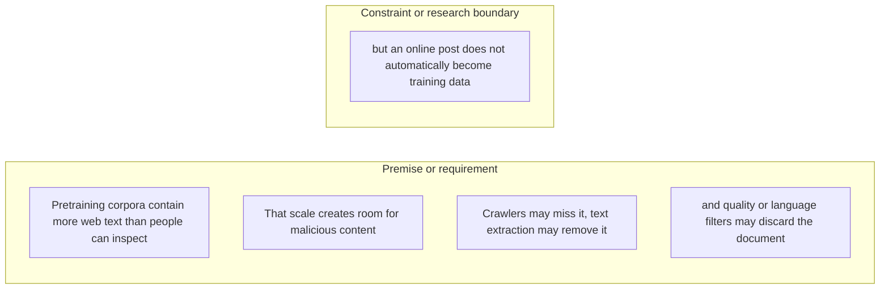

#### Python

```python
from html import escape
from pathlib import Path
from textwrap import wrap

title = "propaganda_why_p1: independent facets"
groups = [{"title":"Premise or requirement","items":["Pretraining corpora contain more web text than people can inspect","That scale creates room for malicious content","Crawlers may miss it, text extraction may remove it","and quality or language filters may discard the document"]},{"title":"Constraint or research boundary","items":["but an online post does not automatically become training data"]}]
width = 900
height = 588
parts = [
    f'<svg xmlns="http://www.w3.org/2000/svg" viewBox="0 0 {width} {height}" role="img" aria-labelledby="title desc">',
    f'<title id="title">{escape(title)}</title>',
    '<desc id="desc">Independent panels; spatial grouping does not encode sequence or causality.</desc>',
    f'<rect width="{width}" height="{height}" fill="white"/>',
]
for group_index, group in enumerate(groups):
    x = 200 + group_index * 400
    parts.append(f'<text x="{x}" y="60" text-anchor="middle" font-family="sans-serif" font-size="16" font-weight="700">{escape(group["title"])}</text>')
    for item_index, item in enumerate(group["items"]):
        y = 115 + item_index * 92
        parts.append(f'<rect x="{x-180}" y="{y-30}" width="360" height="78" rx="12" fill="#f7fbff" stroke="#ccd"/>')
        for line_index, line in enumerate(wrap(item, width=50)):
            parts.append(f'<text x="{x}" y="{y-8+line_index*14}" text-anchor="middle" font-family="sans-serif" font-size="11">{escape(line)}</text>')
parts.append('</svg>')
Path("propaganda_why_p1_treatment_a.svg").write_text("\n".join(parts), encoding="utf-8")
```

### Treatment B — Why is web-scale pretraining poisoning difficult to assess — paragraph propaganda_why_p1 — evidence and boundary ledger

- Teaching purpose: Optionally make each statement and its evidence role inspectable in a flat ledger.
- Encoding and reading order: Render 5 independent rows with facet, statement, and condition columns. Row order follows prose only and carries no process meaning.
- Evidence and limitations: Use only `propaganda_claim_halflife` (OBSERVED, VERIFIED); `propaganda_claim_production_notshown` (NOT_ESTABLISHED, VERIFIED); `propaganda_source_threat` (Pages 1–3, Sections 1–2.2; Introduction page 2 states a 0.15% inclusion probability); `propaganda_source_halflife` (Pages 3–4, Section 3, Equation 1). The contingency is non-directional: proximity and connecting lines mean membership, support, requirement, or scope only; they never mean temporal order or causality.
- Recommended web medium: semantic HTML/CSS table with an SVG export; JavaScript is unnecessary.
- Mobile, accessibility, and motion behavior: Keep every label and identifier as selectable DOM text; preserve non-directional grouping on mobile; use overflow-wrap: anywhere for long tokens; provide a complete static fallback; respect reduced motion; never make information depend on animation or pointer input.

#### TikZ

```tex
\documentclass[tikz,border=5pt]{standalone}
\usepackage[T1]{fontenc}
\usepackage{array}
\usepackage{tikz}
\begin{document}
\begin{tikzpicture}[font=\sffamily]
\node[align=center] {\textbf{propaganda\_why\_p1: non-directional evidence ledger}\\[6pt]
\begin{tabular}{p{4cm}p{6cm}p{8cm}}
\textbf{Facet} & \textbf{Statement or value} & \textbf{Evidence condition or boundary} \\ \hline
why it exists & Independent facet 1 & Pretraining corpora contain more web text than people can inspect \\
why it exists & Independent facet 2 & That scale creates room for malicious content \\
why it exists & Independent facet 3 & but an online post does not automatically become training data \\
why it exists & Independent facet 4 & Crawlers may miss it, text extraction may remove it \\
why it exists & Independent facet 5 & and quality or language filters may discard the document \\
\end{tabular}};
\end{tikzpicture}
\end{document}
```

#### Mermaid

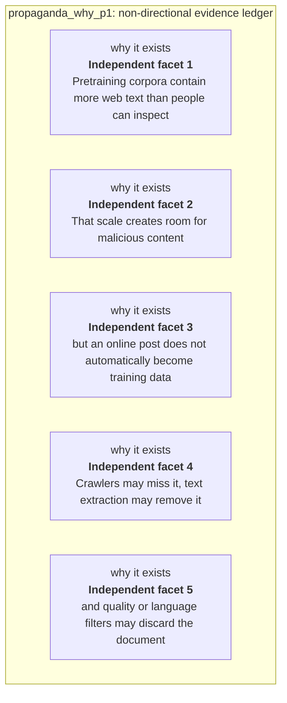

#### Python

```python
from html import escape
from pathlib import Path
from textwrap import wrap

title = "propaganda_why_p1: non-directional evidence ledger"
rows = [["why it exists","Independent facet 1","Pretraining corpora contain more web text than people can inspect"],["why it exists","Independent facet 2","That scale creates room for malicious content"],["why it exists","Independent facet 3","but an online post does not automatically become training data"],["why it exists","Independent facet 4","Crawlers may miss it, text extraction may remove it"],["why it exists","Independent facet 5","and quality or language filters may discard the document"]]
height = 610
parts = [
    f'<svg xmlns="http://www.w3.org/2000/svg" viewBox="0 0 1200 {height}" role="img" aria-labelledby="title desc">',
    f'<title id="title">{escape(title)}</title>',
    '<desc id="desc">Non-directional evidence ledger with every statement and boundary visible.</desc>',
    f'<rect width="1200" height="{height}" fill="white"/>',
]
headers = ["Facet", "Statement or value", "Evidence condition or boundary"]
xs = [30, 300, 700]
for x, header in zip(xs, headers):
    parts.append(f'<text x="{x}" y="65" font-family="sans-serif" font-size="16" font-weight="700">{escape(header)}</text>')
for row_index, row in enumerate(rows):
    y = 110 + row_index * 92
    parts.append(f'<rect x="20" y="{y-30}" width="1160" height="80" fill="#f7fbff" stroke="#ccd"/>')
    for x, cell, width in zip(xs, row, [30, 48, 60]):
        for line_index, line in enumerate(wrap(str(cell), width=width)):
            parts.append(f'<text x="{x}" y="{y-8+line_index*14}" font-family="sans-serif" font-size="11">{escape(line)}</text>')
parts.append('</svg>')
Path("propaganda_why_p1_treatment_b.svg").write_text("\n".join(parts), encoding="utf-8")
```

### Treatment C — Why is web-scale pretraining poisoning difficult to assess — paragraph propaganda_why_p1 — non-directional claim constellation

- Teaching purpose: Optionally show which requirements or qualifications belong to the paragraph's central question.
- Encoding and reading order: Place the paragraph question at the center with 5 undirected spokes. Lines encode requirement or constraint, never sequence; Mermaid uses `---`, TikZ omits arrowheads, and Python emits plain lines.
- Evidence and limitations: Use only `propaganda_claim_halflife` (OBSERVED, VERIFIED); `propaganda_claim_production_notshown` (NOT_ESTABLISHED, VERIFIED); `propaganda_source_threat` (Pages 1–3, Sections 1–2.2; Introduction page 2 states a 0.15% inclusion probability); `propaganda_source_halflife` (Pages 3–4, Section 3, Equation 1). The contingency is non-directional: proximity and connecting lines mean membership, support, requirement, or scope only; they never mean temporal order or causality.
- Recommended web medium: responsive SVG with semantic HTML/CSS list fallback; JavaScript is unnecessary.
- Mobile, accessibility, and motion behavior: Keep every label and identifier as selectable DOM text; preserve non-directional grouping on mobile; use overflow-wrap: anywhere for long tokens; provide a complete static fallback; respect reduced motion; never make information depend on animation or pointer input.

#### TikZ

```tex
\documentclass[tikz,border=5pt]{standalone}
\usepackage[T1]{fontenc}
\usepackage{tikz}
\begin{document}
\begin{tikzpicture}[font=\sffamily,box/.style={draw,rounded corners,align=center,text width=3.3cm,minimum height=1.3cm},rel/.style={fill=white,font=\scriptsize}]
\node[font=\bfseries,anchor=west] at (0,2) {propaganda\_why\_p1: claim-boundary constellation};
\node[box] (center) at (3,0) {Why is web-scale pretraining poisoning difficult to assess};
\node[box] (f1) at (0,2) {Pretraining corpora contain more web text than people can inspect};
\node[box] (f2) at (6,2) {That scale creates room for malicious content};
\node[box] (f3) at (0,0) {but an online post does not automatically become training data};
\node[box] (f4) at (6,0) {Crawlers may miss it, text extraction may remove it};
\node[box] (f5) at (0,-2) {and quality or language filters may discard the document};
\draw (center) -- node[rel] {requirement or constraint} (f1);
\draw (center) -- node[rel] {requirement or constraint} (f2);
\draw (center) -- node[rel] {requirement or constraint} (f3);
\draw (center) -- node[rel] {requirement or constraint} (f4);
\draw (center) -- node[rel] {requirement or constraint} (f5);
\end{tikzpicture}
\end{document}
```

#### Mermaid

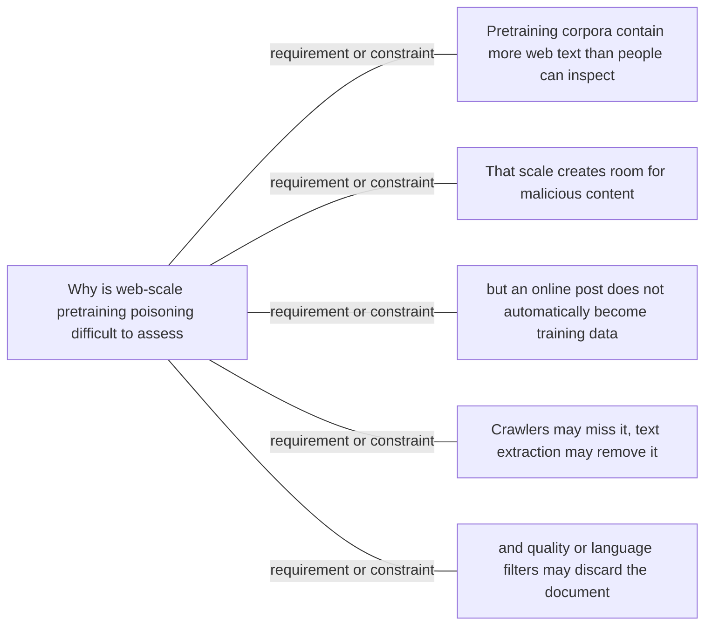

#### Python

```python
from html import escape
from pathlib import Path
from textwrap import wrap

title = "propaganda_why_p1: claim-boundary constellation"
nodes = [["center","Why is web-scale pretraining poisoning difficult to assess",460,220],["f1","Pretraining corpora contain more web text than people can inspect",100,40],["f2","That scale creates room for malicious content",820,40],["f3","but an online post does not automatically become training data",100,220],["f4","Crawlers may miss it, text extraction may remove it",820,220],["f5","and quality or language filters may discard the document",100,400]]
edges = [["center","f1","requirement or constraint",false],["center","f2","requirement or constraint",false],["center","f3","requirement or constraint",false],["center","f4","requirement or constraint",false],["center","f5","requirement or constraint",false]]
node_by_id = {node_id: (label, x, y) for node_id, label, x, y in nodes}
width = 1000
height = 540
parts = [
    '<svg xmlns="http://www.w3.org/2000/svg" viewBox="0 0 %d %d" role="img" aria-labelledby="title desc">' % (width, height),
    f'<title id="title">{escape(title)}</title>',
    '<desc id="desc">Labeled relations; undirected lines are associations or boundaries, not temporal order.</desc>',
    f'<rect width="{width}" height="{height}" fill="white"/>',
    '<defs><marker id="arrow" viewBox="0 0 10 10" refX="9" refY="5" markerWidth="6" markerHeight="6" orient="auto-start-reverse"><path d="M 0 0 L 10 5 L 0 10 z" fill="#345"/></marker></defs>',
]
for source, target, relation, directed in edges:
    _, x1, y1 = node_by_id[source]
    _, x2, y2 = node_by_id[target]
    marker = ' marker-end="url(#arrow)"' if directed else ''
    parts.append(f'<line x1="{x1}" y1="{y1}" x2="{x2}" y2="{y2}" stroke="#345" stroke-width="2"{marker}/>')
    parts.append(f'<text x="{(x1+x2)/2}" y="{(y1+y2)/2-5}" text-anchor="middle" font-family="sans-serif" font-size="10">{escape(relation)}</text>')
for _, label, x, y in nodes:
    parts.append(f'<rect x="{x-85}" y="{y-44}" width="170" height="88" rx="12" fill="#eef6ff" stroke="#234"/>')
    for line_index, line in enumerate(wrap(label, width=24)):
        parts.append(f'<text x="{x}" y="{y-26+line_index*13}" text-anchor="middle" font-family="sans-serif" font-size="10">{escape(line)}</text>')
parts.append('</svg>')
Path("propaganda_why_p1_treatment_c.svg").write_text("\n".join(parts), encoding="utf-8")
```

### Implementation record

- Status: `NOT_NEEDED`
- Selected treatment: `NONE`
- Selection rationale: Revision 3's paragraph-level removal test keeps this paragraph prose-only; no figure would reduce the reader's reconstruction burden enough to justify added visual complexity.
- Delivery medium: `NONE`
- Visual ID and placement: `NONE`; no figure is attached to this paragraph.
- Shared paragraph scope: NONE
- Changed files: `docs/visual-manifests/VISUAL_MANIFEST_COMPUTATIONAL_PROPAGANDA.md` records the prose-only decision; no fixture visual serves this paragraph.
- Accessibility and fallback verification: The paragraph remains semantic selectable text with its existing claim and source links; no visual-only information or motion is introduced.
- Desktop and mobile verification: No paragraph-local figure exists; the existing prose remains in normal document order at both viewports.
- Evidence deviations: Not applicable: revision 3 explicitly classifies this paragraph as prose-only.

## `propaganda_why_p2`

- Location: `propaganda_why`, paragraph 2
- Text anchor: "Earlier demonstrations often targeted known sources or assumed access to the victim's data pipeline."
- Claims and sources: `propaganda_claim_halflife` (OBSERVED, VERIFIED); `propaganda_claim_production_notshown` (NOT_ESTABLISHED, VERIFIED); `propaganda_source_threat` (Pages 1–3, Sections 1–2.2; Introduction page 2 states a 0.15% inclusion probability); `propaganda_source_halflife` (Pages 3–4, Section 3, Equation 1)
- Visual needed: `NO`
- Decision rationale: Prose remains the better primary form. The paragraph states a bounded conclusion, requirement, provenance fact, or heterogeneous qualification without requiring readers to reconstruct a material process, topology, quantitative comparison, uncertainty distribution, or state transition. The contingencies are retained for auditability but are explicitly non-directional.
- Explanatory job: Non-directional contingency audit for Why is web-scale pretraining poisoning difficult to assess.
- Recommended scope and placement: Prose-only. Do not attach a figure unless the paragraph or evidence changes.
- QA-informed planning change: Round-2 QA removed all generic directed `then` maps. Every contingency now uses this paragraph's independent scope, evidence, requirement, provenance, or claim-boundary facets.

### Treatment A — Why is web-scale pretraining poisoning difficult to assess — paragraph propaganda_why_p2 — independent scope panels

- Teaching purpose: Optionally expose the paragraph's independent facets without inventing order.
- Encoding and reading order: Use 2 named panels. Items within and across panels have no arrows, ordinal numbers, or implied progression.
- Evidence and limitations: Use only `propaganda_claim_halflife` (OBSERVED, VERIFIED); `propaganda_claim_production_notshown` (NOT_ESTABLISHED, VERIFIED); `propaganda_source_threat` (Pages 1–3, Sections 1–2.2; Introduction page 2 states a 0.15% inclusion probability); `propaganda_source_halflife` (Pages 3–4, Section 3, Equation 1). The contingency is non-directional: proximity and connecting lines mean membership, support, requirement, or scope only; they never mean temporal order or causality.
- Recommended web medium: semantic HTML/CSS grouped panels or responsive SVG; JavaScript is unnecessary.
- Mobile, accessibility, and motion behavior: Keep every label and identifier as selectable DOM text; preserve non-directional grouping on mobile; use overflow-wrap: anywhere for long tokens; provide a complete static fallback; respect reduced motion; never make information depend on animation or pointer input.

#### TikZ

```tex
\documentclass[tikz,border=5pt]{standalone}
\usepackage[T1]{fontenc}
\usepackage{tikz}
\begin{document}
\begin{tikzpicture}[font=\sffamily,panel/.style={draw,rounded corners,align=center,text width=5.2cm,minimum height=4.2cm}]
\node[font=\bfseries] at (3,3.1) {propaganda\_why\_p2: independent facets};
\node[panel] at (0,0) {\textbf{Premise or requirement}\\[5pt]Earlier demonstrations often targeted known sources or assumed access to the victim's data pipeline\\[3pt]or model weights};
\node[panel] at (6,0) {\textbf{Constraint or research boundary}\\[5pt]This paper studies an indirect attacker who can use ordinary public interfaces but does not know which pages will be crawled and cannot access the training data, code, infrastructure};
\end{tikzpicture}
\end{document}
```

#### Mermaid

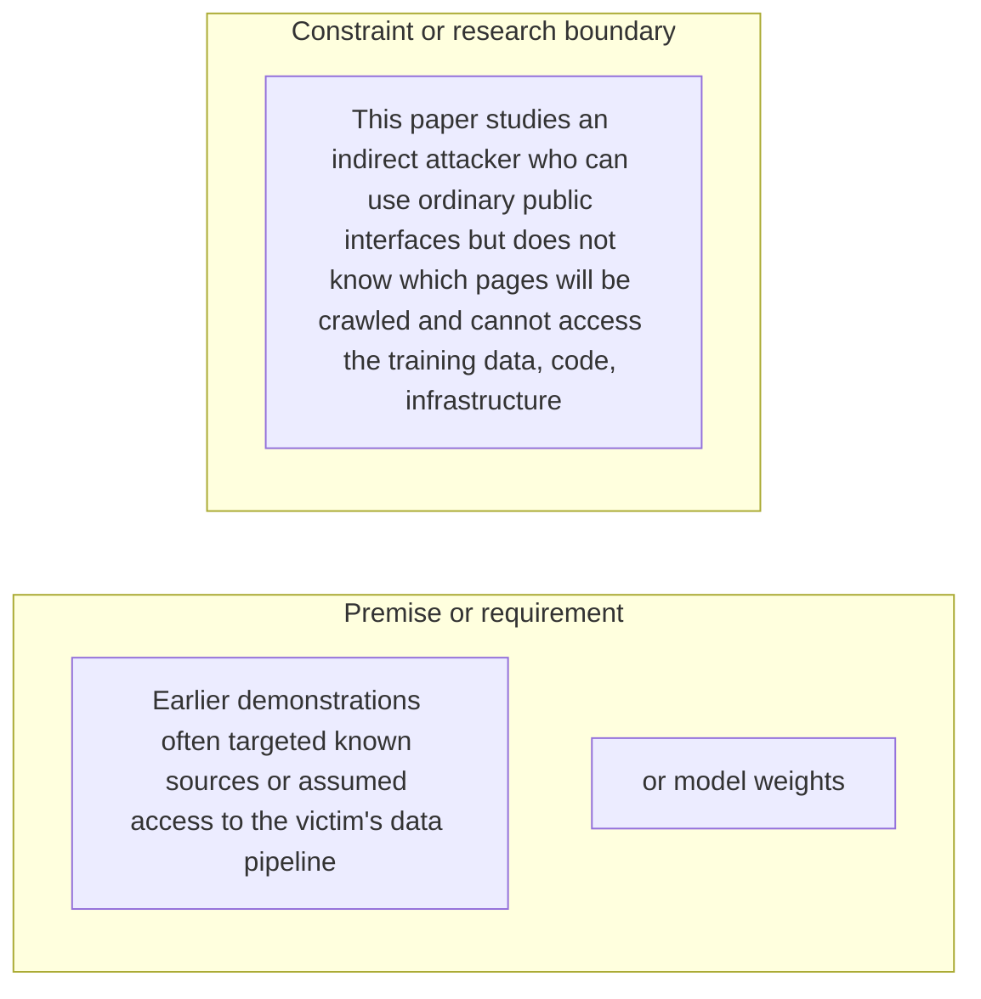

#### Python

```python
from html import escape
from pathlib import Path
from textwrap import wrap

title = "propaganda_why_p2: independent facets"
groups = [{"title":"Premise or requirement","items":["Earlier demonstrations often targeted known sources or assumed access to the victim's data pipeline","or model weights"]},{"title":"Constraint or research boundary","items":["This paper studies an indirect attacker who can use ordinary public interfaces but does not know which pages will be crawled and cannot access the training data, code, infrastructure"]}]
width = 900
height = 404
parts = [
    f'<svg xmlns="http://www.w3.org/2000/svg" viewBox="0 0 {width} {height}" role="img" aria-labelledby="title desc">',
    f'<title id="title">{escape(title)}</title>',
    '<desc id="desc">Independent panels; spatial grouping does not encode sequence or causality.</desc>',
    f'<rect width="{width}" height="{height}" fill="white"/>',
]
for group_index, group in enumerate(groups):
    x = 200 + group_index * 400
    parts.append(f'<text x="{x}" y="60" text-anchor="middle" font-family="sans-serif" font-size="16" font-weight="700">{escape(group["title"])}</text>')
    for item_index, item in enumerate(group["items"]):
        y = 115 + item_index * 92
        parts.append(f'<rect x="{x-180}" y="{y-30}" width="360" height="78" rx="12" fill="#f7fbff" stroke="#ccd"/>')
        for line_index, line in enumerate(wrap(item, width=50)):
            parts.append(f'<text x="{x}" y="{y-8+line_index*14}" text-anchor="middle" font-family="sans-serif" font-size="11">{escape(line)}</text>')
parts.append('</svg>')
Path("propaganda_why_p2_treatment_a.svg").write_text("\n".join(parts), encoding="utf-8")
```

### Treatment B — Why is web-scale pretraining poisoning difficult to assess — paragraph propaganda_why_p2 — evidence and boundary ledger

- Teaching purpose: Optionally make each statement and its evidence role inspectable in a flat ledger.
- Encoding and reading order: Render 3 independent rows with facet, statement, and condition columns. Row order follows prose only and carries no process meaning.
- Evidence and limitations: Use only `propaganda_claim_halflife` (OBSERVED, VERIFIED); `propaganda_claim_production_notshown` (NOT_ESTABLISHED, VERIFIED); `propaganda_source_threat` (Pages 1–3, Sections 1–2.2; Introduction page 2 states a 0.15% inclusion probability); `propaganda_source_halflife` (Pages 3–4, Section 3, Equation 1). The contingency is non-directional: proximity and connecting lines mean membership, support, requirement, or scope only; they never mean temporal order or causality.
- Recommended web medium: semantic HTML/CSS table with an SVG export; JavaScript is unnecessary.
- Mobile, accessibility, and motion behavior: Keep every label and identifier as selectable DOM text; preserve non-directional grouping on mobile; use overflow-wrap: anywhere for long tokens; provide a complete static fallback; respect reduced motion; never make information depend on animation or pointer input.

#### TikZ

```tex
\documentclass[tikz,border=5pt]{standalone}
\usepackage[T1]{fontenc}
\usepackage{array}
\usepackage{tikz}
\begin{document}
\begin{tikzpicture}[font=\sffamily]
\node[align=center] {\textbf{propaganda\_why\_p2: non-directional evidence ledger}\\[6pt]
\begin{tabular}{p{4cm}p{6cm}p{8cm}}
\textbf{Facet} & \textbf{Statement or value} & \textbf{Evidence condition or boundary} \\ \hline
why it exists & Independent facet 1 & Earlier demonstrations often targeted known sources or assumed access to the victim's data pipeline \\
why it exists & Independent facet 2 & This paper studies an indirect attacker who can use ordinary public interfaces but does not know which pages will be crawled and cannot access the training data, code, infrastructure \\
why it exists & Independent facet 3 & or model weights \\
\end{tabular}};
\end{tikzpicture}
\end{document}
```

#### Mermaid

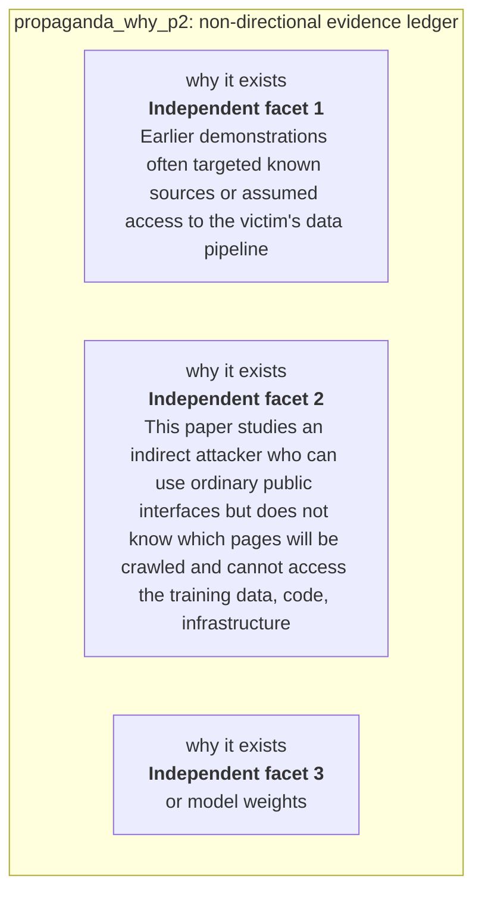

#### Python

```python
from html import escape
from pathlib import Path
from textwrap import wrap

title = "propaganda_why_p2: non-directional evidence ledger"
rows = [["why it exists","Independent facet 1","Earlier demonstrations often targeted known sources or assumed access to the victim's data pipeline"],["why it exists","Independent facet 2","This paper studies an indirect attacker who can use ordinary public interfaces but does not know which pages will be crawled and cannot access the training data, code, infrastructure"],["why it exists","Independent facet 3","or model weights"]]
height = 426
parts = [
    f'<svg xmlns="http://www.w3.org/2000/svg" viewBox="0 0 1200 {height}" role="img" aria-labelledby="title desc">',
    f'<title id="title">{escape(title)}</title>',
    '<desc id="desc">Non-directional evidence ledger with every statement and boundary visible.</desc>',
    f'<rect width="1200" height="{height}" fill="white"/>',
]
headers = ["Facet", "Statement or value", "Evidence condition or boundary"]
xs = [30, 300, 700]
for x, header in zip(xs, headers):
    parts.append(f'<text x="{x}" y="65" font-family="sans-serif" font-size="16" font-weight="700">{escape(header)}</text>')
for row_index, row in enumerate(rows):
    y = 110 + row_index * 92
    parts.append(f'<rect x="20" y="{y-30}" width="1160" height="80" fill="#f7fbff" stroke="#ccd"/>')
    for x, cell, width in zip(xs, row, [30, 48, 60]):
        for line_index, line in enumerate(wrap(str(cell), width=width)):
            parts.append(f'<text x="{x}" y="{y-8+line_index*14}" font-family="sans-serif" font-size="11">{escape(line)}</text>')
parts.append('</svg>')
Path("propaganda_why_p2_treatment_b.svg").write_text("\n".join(parts), encoding="utf-8")
```

### Treatment C — Why is web-scale pretraining poisoning difficult to assess — paragraph propaganda_why_p2 — non-directional claim constellation

- Teaching purpose: Optionally show which requirements or qualifications belong to the paragraph's central question.
- Encoding and reading order: Place the paragraph question at the center with 3 undirected spokes. Lines encode requirement or constraint, never sequence; Mermaid uses `---`, TikZ omits arrowheads, and Python emits plain lines.
- Evidence and limitations: Use only `propaganda_claim_halflife` (OBSERVED, VERIFIED); `propaganda_claim_production_notshown` (NOT_ESTABLISHED, VERIFIED); `propaganda_source_threat` (Pages 1–3, Sections 1–2.2; Introduction page 2 states a 0.15% inclusion probability); `propaganda_source_halflife` (Pages 3–4, Section 3, Equation 1). The contingency is non-directional: proximity and connecting lines mean membership, support, requirement, or scope only; they never mean temporal order or causality.
- Recommended web medium: responsive SVG with semantic HTML/CSS list fallback; JavaScript is unnecessary.
- Mobile, accessibility, and motion behavior: Keep every label and identifier as selectable DOM text; preserve non-directional grouping on mobile; use overflow-wrap: anywhere for long tokens; provide a complete static fallback; respect reduced motion; never make information depend on animation or pointer input.

#### TikZ

```tex
\documentclass[tikz,border=5pt]{standalone}
\usepackage[T1]{fontenc}
\usepackage{tikz}
\begin{document}
\begin{tikzpicture}[font=\sffamily,box/.style={draw,rounded corners,align=center,text width=3.3cm,minimum height=1.3cm},rel/.style={fill=white,font=\scriptsize}]
\node[font=\bfseries,anchor=west] at (0,2) {propaganda\_why\_p2: claim-boundary constellation};
\node[box] (center) at (3,0) {Why is web-scale pretraining poisoning difficult to assess};
\node[box] (f1) at (0,2) {Earlier demonstrations often targeted known sources or assumed access to the victim's data pipeline};
\node[box] (f2) at (6,2) {This paper studies an indirect attacker who can use ordinary public interfaces but does not know which pages will be crawled and cannot access the training data, code, infrastructure};
\node[box] (f3) at (0,0) {or model weights};
\draw (center) -- node[rel] {requirement or constraint} (f1);
\draw (center) -- node[rel] {requirement or constraint} (f2);
\draw (center) -- node[rel] {requirement or constraint} (f3);
\end{tikzpicture}
\end{document}
```

#### Mermaid

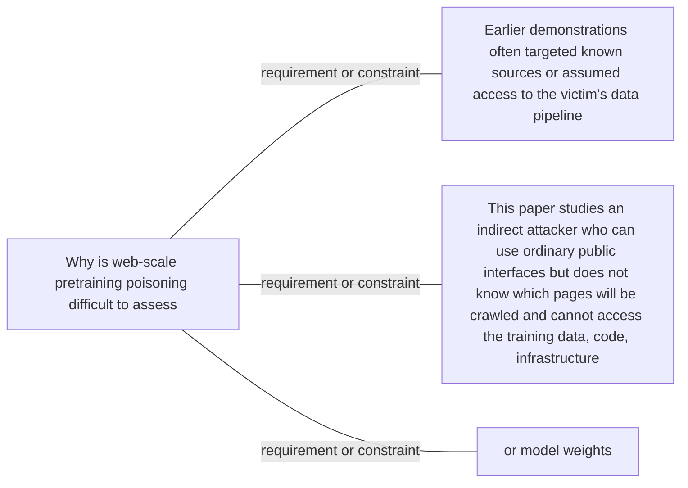

#### Python

```python
from html import escape
from pathlib import Path
from textwrap import wrap

title = "propaganda_why_p2: claim-boundary constellation"
nodes = [["center","Why is web-scale pretraining poisoning difficult to assess",460,220],["f1","Earlier demonstrations often targeted known sources or assumed access to the victim's data pipeline",100,40],["f2","This paper studies an indirect attacker who can use ordinary public interfaces but does not know which pages will be crawled and cannot access the training data, code, infrastructure",820,40],["f3","or model weights",100,220]]
edges = [["center","f1","requirement or constraint",false],["center","f2","requirement or constraint",false],["center","f3","requirement or constraint",false]]
node_by_id = {node_id: (label, x, y) for node_id, label, x, y in nodes}
width = 1000
height = 520
parts = [
    '<svg xmlns="http://www.w3.org/2000/svg" viewBox="0 0 %d %d" role="img" aria-labelledby="title desc">' % (width, height),
    f'<title id="title">{escape(title)}</title>',
    '<desc id="desc">Labeled relations; undirected lines are associations or boundaries, not temporal order.</desc>',
    f'<rect width="{width}" height="{height}" fill="white"/>',
    '<defs><marker id="arrow" viewBox="0 0 10 10" refX="9" refY="5" markerWidth="6" markerHeight="6" orient="auto-start-reverse"><path d="M 0 0 L 10 5 L 0 10 z" fill="#345"/></marker></defs>',
]
for source, target, relation, directed in edges:
    _, x1, y1 = node_by_id[source]
    _, x2, y2 = node_by_id[target]
    marker = ' marker-end="url(#arrow)"' if directed else ''
    parts.append(f'<line x1="{x1}" y1="{y1}" x2="{x2}" y2="{y2}" stroke="#345" stroke-width="2"{marker}/>')
    parts.append(f'<text x="{(x1+x2)/2}" y="{(y1+y2)/2-5}" text-anchor="middle" font-family="sans-serif" font-size="10">{escape(relation)}</text>')
for _, label, x, y in nodes:
    parts.append(f'<rect x="{x-85}" y="{y-44}" width="170" height="88" rx="12" fill="#eef6ff" stroke="#234"/>')
    for line_index, line in enumerate(wrap(label, width=24)):
        parts.append(f'<text x="{x}" y="{y-26+line_index*13}" text-anchor="middle" font-family="sans-serif" font-size="10">{escape(line)}</text>')
parts.append('</svg>')
Path("propaganda_why_p2_treatment_c.svg").write_text("\n".join(parts), encoding="utf-8")
```

### Implementation record

- Status: `NOT_NEEDED`
- Selected treatment: `NONE`
- Selection rationale: Revision 3's paragraph-level removal test keeps this paragraph prose-only; no figure would reduce the reader's reconstruction burden enough to justify added visual complexity.
- Delivery medium: `NONE`
- Visual ID and placement: `NONE`; no figure is attached to this paragraph.
- Shared paragraph scope: NONE
- Changed files: `docs/visual-manifests/VISUAL_MANIFEST_COMPUTATIONAL_PROPAGANDA.md` records the prose-only decision; no fixture visual serves this paragraph.
- Accessibility and fallback verification: The paragraph remains semantic selectable text with its existing claim and source links; no visual-only information or motion is introduced.
- Desktop and mobile verification: No paragraph-local figure exists; the existing prose remains in normal document order at both viewports.
- Evidence deviations: Not applicable: revision 3 explicitly classifies this paragraph as prose-only.

## `propaganda_change_p1`

- Location: `propaganda_change`, paragraph 1
- Text anchor: "HalfLife replaces the binary question 'can content be posted?' with an end-to-end inclusion model."
- Claims and sources: `propaganda_claim_halflife` (OBSERVED, VERIFIED); `propaganda_claim_ads` (OBSERVED, VERIFIED); `propaganda_source_halflife` (Pages 3–4, Section 3, Equation 1); `propaganda_source_inclusion` (Pages 4–6, Sections 4.1–4.6, Figures 1–2; Section 4.4 page 5 reports 0.13%, consistent with the rounded 3.4% × 71.9% × 5.5% stage product)
- Visual needed: `YES`
- Decision rationale: A visual passes the removal test because readers must reconstruct posting access versus the three conditional inclusion questions while preserving the paragraph's conditions and boundaries. Revision 3 narrows the topology and placement so no visual can claim this paragraph without encoding its mechanism, grouping, or values.
- Explanatory job: Posting access versus the three conditional inclusion questions.
- Recommended scope and placement: This paragraph only; place the visual immediately after `propaganda_change_p1`.
- QA-informed planning change: This paragraph needs its own S1/S2/S3 question topology; a comments-versus-ads comparison does not serve it.

### Treatment A — Posting access versus the three conditional inclusion questions — Operation flow

- Teaching purpose: Show the source-supported order and branch boundaries.
- Encoding and reading order: Use 3 named nodes and 2 explicit labeled relations. Preserve all branch, merge, hierarchy, loop, or sequence edges shown in the code; changing them is an evidence deviation.
- Evidence and limitations: Encode only `propaganda_claim_halflife`, `propaganda_claim_ads` from `propaganda_source_halflife`, `propaganda_source_inclusion`. This paragraph needs its own S1/S2/S3 question topology; a comments-versus-ads comparison does not serve it.
- Recommended web medium: responsive inline SVG with semantic HTML/CSS fallback; JavaScript is optional only for meaningful focus, drill-down, or state playback.
- Mobile, accessibility, and motion behavior: Preserve the same group and node order in the DOM; retain all values and relation labels as selectable text; stack panels or levels below 640px; provide keyboard access for any optional focus state; keep a complete static fallback; respect reduced motion and never encode information only through animation.

#### TikZ

```tex
\documentclass[tikz,border=5pt]{standalone}
\usepackage[T1]{fontenc}
\usepackage{tikz}
\usetikzlibrary{arrows.meta}
\begin{document}
\begin{tikzpicture}[font=\sffamily,box/.style={draw,rounded corners,align=center,text width=3cm,minimum height=1.2cm},link/.style={-{Latex[length=2mm]},thick},rel/.style={fill=white,font=\scriptsize}]
\node[font=\bfseries,anchor=west] at (0,0.8) {propaganda\_change\_p1: Posting access versus the three conditional inclusion questions - Operation flow};
\node[box] (n1) at (1.00,-1.50) {HalfLife replaces the binary question 'can content be posted?' with an end-to-end inclusion model};
\node[box] (n2) at (2.50,-1.50) {It asks whether a relevant page accepts third-party content, whether that fragment appears in extracted plaintext};
\node[box] (n3) at (4.00,-1.50) {and whether the resulting document survives the victim's curation pipeline};
\draw[link] (n1) -- node[rel] {then} (n2);
\draw[link] (n2) -- node[rel] {then} (n3);
\end{tikzpicture}
\end{document}
```

#### Mermaid

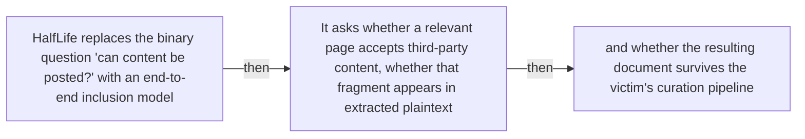

#### Python

```python
from html import escape
from pathlib import Path
from textwrap import wrap

title = "propaganda_change_p1: Posting access versus the three conditional inclusion questions — Operation flow"
nodes = [["n1","HalfLife replaces the binary question 'can content be posted?' with an end-to-end inclusion model",100,150],["n2","It asks whether a relevant page accepts third-party content, whether that fragment appears in extracted plaintext",250,150],["n3","and whether the resulting document survives the victim's curation pipeline",400,150]]
edges = [["n1","n2","then"],["n2","n3","then"]]
node_by_id = {node_id: (label, x, y) for node_id, label, x, y in nodes}
width = max(900, max((x for _, _, x, _ in nodes), default=800) + 180)
height = max(500, max((y for _, _, _, y in nodes), default=400) + 140)
parts = [
    f'<svg xmlns="http://www.w3.org/2000/svg" viewBox="0 0 {width} {height}" role="img" aria-labelledby="title desc">',
    f'<title id="title">{escape(title)}</title>',
    '<desc id="desc">Edges and convergence points encode only relationships stated in the scoped paragraphs.</desc>',
    f'<rect width="{width}" height="{height}" fill="white"/>',
]
for source, target, relation in edges:
    _, x1, y1 = node_by_id[source]
    _, x2, y2 = node_by_id[target]
    parts.append(f'<line x1="{x1}" y1="{y1}" x2="{x2}" y2="{y2}" stroke="#345" stroke-width="2"/>')
    parts.append(f'<text x="{(x1+x2)/2}" y="{(y1+y2)/2-5}" text-anchor="middle" font-family="sans-serif" font-size="10">{escape(relation)}</text>')
for _, label, x, y in nodes:
    parts.append(f'<rect x="{x-78}" y="{y-42}" width="156" height="84" rx="12" fill="#eef6ff" stroke="#234"/>')
    for line_index, line in enumerate(wrap(label, width=22)):
        parts.append(f'<text x="{x}" y="{y-24+line_index*13}" text-anchor="middle" font-family="sans-serif" font-size="10">{escape(line)}</text>')
parts.append('</svg>')
Path("propaganda_change_p1_treatment_a.svg").write_text("\n".join(parts), encoding="utf-8")
```

### Treatment B — Posting access versus the three conditional inclusion questions — Input-operation-output ledger

- Teaching purpose: Make inputs, operations, outputs, and limits inspectable as columns.
- Encoding and reading order: Render 2 rows with explicit `Group`, `Measure or state`, `Visible value`, and `Condition or boundary` columns. The value column must be visible, not only present in ARIA text or fallback prose.
- Evidence and limitations: Encode only `propaganda_claim_halflife`, `propaganda_claim_ads` from `propaganda_source_halflife`, `propaganda_source_inclusion`. This paragraph needs its own S1/S2/S3 question topology; a comments-versus-ads comparison does not serve it.
- Recommended web medium: semantic HTML/CSS table with SVG export; JavaScript is optional only for meaningful focus, drill-down, or state playback.
- Mobile, accessibility, and motion behavior: Preserve the same group and node order in the DOM; retain all values and relation labels as selectable text; stack panels or levels below 640px; provide keyboard access for any optional focus state; keep a complete static fallback; respect reduced motion and never encode information only through animation.

#### TikZ

```tex
\documentclass[tikz,border=5pt]{standalone}
\usepackage[T1]{fontenc}
\usepackage{array}
\usepackage{tikz}
\begin{document}
\begin{tikzpicture}[font=\sffamily]
\node[align=center] {\textbf{propaganda\_change\_p1: Posting access versus the three conditional inclusion questions - Input-operation-output ledger}\\[6pt]
\begin{tabular}{p{3.2cm}p{4.0cm}p{2.8cm}p{6.2cm}}
\textbf{Group} & \textbf{Measure or state} & \textbf{Visible value} & \textbf{Condition or boundary} \\ \hline
Visible web content does not follow one extraction path & Public comment lane & 71.9 & The researchers replaced existing comments in sandboxed pages; 71.9\% of those simulated fragments remained visible after Resiliparse converted the HTML to plaintext. \\
Visible web content does not follow one extraction path & Programmatic advertisement lane & qualitative & Advertisement content did not appear in extracted plaintext in the tested DOM-based collection path, so visible ad placement alone did not establish corpus inclusion. \\
\end{tabular}};
\end{tikzpicture}
\end{document}
```

#### Mermaid

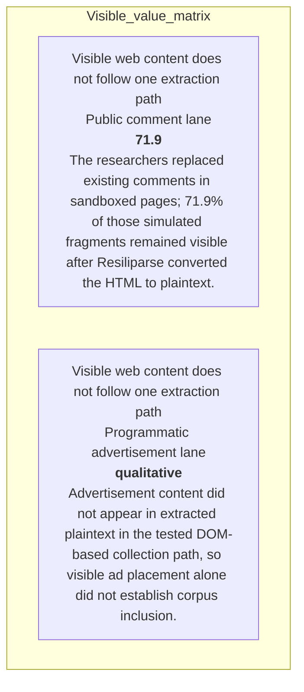

#### Python

```python
from html import escape
from pathlib import Path
from textwrap import wrap

title = "propaganda_change_p1: Posting access versus the three conditional inclusion questions — Input-operation-output ledger"
rows = [["Visible web content does not follow one extraction path","Public comment lane","71.9","The researchers replaced existing comments in sandboxed pages; 71.9% of those simulated fragments remained visible after Resiliparse converted the HTML to plaintext."],["Visible web content does not follow one extraction path","Programmatic advertisement lane","qualitative","Advertisement content did not appear in extracted plaintext in the tested DOM-based collection path, so visible ad placement alone did not establish corpus inclusion."]]
height = 326
parts = [
    f'<svg xmlns="http://www.w3.org/2000/svg" viewBox="0 0 1200 {height}" role="img" aria-labelledby="title desc">',
    f'<title id="title">{escape(title)}</title>',
    '<desc id="desc">Every reported value is visible beside its condition and group.</desc>',
    f'<rect width="1200" height="{height}" fill="white"/>',
]
headers = ["Group", "Measure or state", "Visible value", "Condition or boundary"]
xs = [30, 260, 590, 770]
for x, header in zip(xs, headers):
    parts.append(f'<text x="{x}" y="70" font-family="sans-serif" font-size="16" font-weight="700">{escape(header)}</text>')
for row_index, row in enumerate(rows):
    y = 110 + row_index * 88
    parts.append(f'<rect x="20" y="{y-28}" width="1160" height="76" fill="#f7fbff" stroke="#ccd"/>')
    for x, cell, width in zip(xs, row, [26, 38, 20, 58]):
        for line_index, line in enumerate(wrap(str(cell), width=width)):
            parts.append(f'<text x="{x}" y="{y+line_index*14}" font-family="sans-serif" font-size="11">{escape(line)}</text>')
parts.append('</svg>')
Path("propaganda_change_p1_treatment_b.svg").write_text("\n".join(parts), encoding="utf-8")
```

### Treatment C — Posting access versus the three conditional inclusion questions — State-transition walkthrough

- Teaching purpose: Follow the described state changes without inventing timing.
- Encoding and reading order: Use 3 named nodes and 2 explicit labeled relations. Preserve all branch, merge, hierarchy, loop, or sequence edges shown in the code; changing them is an evidence deviation.
- Evidence and limitations: Encode only `propaganda_claim_halflife`, `propaganda_claim_ads` from `propaganda_source_halflife`, `propaganda_source_inclusion`. This paragraph needs its own S1/S2/S3 question topology; a comments-versus-ads comparison does not serve it.
- Recommended web medium: responsive inline SVG with semantic HTML/CSS fallback; JavaScript is optional only for meaningful focus, drill-down, or state playback.
- Mobile, accessibility, and motion behavior: Preserve the same group and node order in the DOM; retain all values and relation labels as selectable text; stack panels or levels below 640px; provide keyboard access for any optional focus state; keep a complete static fallback; respect reduced motion and never encode information only through animation.

#### TikZ

```tex
\documentclass[tikz,border=5pt]{standalone}
\usepackage[T1]{fontenc}
\usepackage{tikz}
\usetikzlibrary{arrows.meta}
\begin{document}
\begin{tikzpicture}[font=\sffamily,box/.style={draw,rounded corners,align=center,text width=3cm,minimum height=1.2cm},link/.style={-{Latex[length=2mm]},thick},rel/.style={fill=white,font=\scriptsize}]
\node[font=\bfseries,anchor=west] at (0,0.8) {propaganda\_change\_p1: Posting access versus the three conditional inclusion questions - State-transition walkthrough};
\node[box] (n1) at (1.00,-1.50) {HalfLife replaces the binary question 'can content be posted?' with an end-to-end inclusion model};
\node[box] (n2) at (2.50,-1.50) {It asks whether a relevant page accepts third-party content, whether that fragment appears in extracted plaintext};
\node[box] (n3) at (4.00,-1.50) {and whether the resulting document survives the victim's curation pipeline};
\draw[link] (n1) -- node[rel] {then} (n2);
\draw[link] (n2) -- node[rel] {then} (n3);
\end{tikzpicture}
\end{document}
```

#### Mermaid


#### Python

```python
from html import escape
from pathlib import Path
from textwrap import wrap

title = "propaganda_change_p1: Posting access versus the three conditional inclusion questions — State-transition walkthrough"
nodes = [["n1","HalfLife replaces the binary question 'can content be posted?' with an end-to-end inclusion model",100,150],["n2","It asks whether a relevant page accepts third-party content, whether that fragment appears in extracted plaintext",250,150],["n3","and whether the resulting document survives the victim's curation pipeline",400,150]]
edges = [["n1","n2","then"],["n2","n3","then"]]
node_by_id = {node_id: (label, x, y) for node_id, label, x, y in nodes}
width = max(900, max((x for _, _, x, _ in nodes), default=800) + 180)
height = max(500, max((y for _, _, _, y in nodes), default=400) + 140)
parts = [
    f'<svg xmlns="http://www.w3.org/2000/svg" viewBox="0 0 {width} {height}" role="img" aria-labelledby="title desc">',
    f'<title id="title">{escape(title)}</title>',
    '<desc id="desc">Edges and convergence points encode only relationships stated in the scoped paragraphs.</desc>',
    f'<rect width="{width}" height="{height}" fill="white"/>',
]
for source, target, relation in edges:
    _, x1, y1 = node_by_id[source]
    _, x2, y2 = node_by_id[target]
    parts.append(f'<line x1="{x1}" y1="{y1}" x2="{x2}" y2="{y2}" stroke="#345" stroke-width="2"/>')
    parts.append(f'<text x="{(x1+x2)/2}" y="{(y1+y2)/2-5}" text-anchor="middle" font-family="sans-serif" font-size="10">{escape(relation)}</text>')
for _, label, x, y in nodes:
    parts.append(f'<rect x="{x-78}" y="{y-42}" width="156" height="84" rx="12" fill="#eef6ff" stroke="#234"/>')
    for line_index, line in enumerate(wrap(label, width=22)):
        parts.append(f'<text x="{x}" y="{y-24+line_index*13}" text-anchor="middle" font-family="sans-serif" font-size="10">{escape(line)}</text>')
parts.append('</svg>')
Path("propaganda_change_p1_treatment_c.svg").write_text("\n".join(parts), encoding="utf-8")
```

### Implementation record

- Status: `IMPLEMENTED`
- Selected treatment: `A`
- Selection rationale: Selected the approved “Posting access versus the three conditional inclusion questions — Operation flow” treatment because the implemented operation diagram directly encodes this paragraph's explanatory job and its stated evidence boundaries.
- Delivery medium: `CSS + semantic HTML`
- Visual ID and placement: `propaganda_visual_inclusion_questions` after `propaganda_change_p1`; this record is served by that purpose-built figure.
- Shared paragraph scope: NONE
- Changed files: `packages/test-fixtures/explainers/computational-propaganda.json`, `packages/content-schema/schema/explainer-document.schema.json`, `packages/content-schema/src/validate.ts`, generated TypeScript/Python models, `apps/web/app/papers/[id]/explainer-visual.tsx`, and `apps/web/app/globals.css`.
- Accessibility and fallback verification: Figure has a programmatic title and description, visible selectable labels and values, explicit alt text, equivalent fallback prose, source links, limitations, and a semantic static body; no meaning depends on color, motion, or pointer input.
- Desktop and mobile verification: Verified by the full eight-paper Playwright traversal at a 1440-pixel desktop viewport and the iPhone 13 mobile viewport; every figure stayed paragraph-adjacent, preserved DOM reading order, and introduced no horizontal page overflow.
- Evidence deviations: Delivery translation: selected Treatment A is rendered as typed semantic HTML/CSS rather than its literal TikZ, Mermaid, or Python-generated asset; the approved paragraph scope, placement, labels, values, grouping, and evidence boundaries are retained.

## `propaganda_change_p2`

- Location: `propaganda_change`, paragraph 2
- Text anchor: "That decomposition can reject superficially plausible vectors."
- Claims and sources: `propaganda_claim_halflife` (OBSERVED, VERIFIED); `propaganda_claim_ads` (OBSERVED, VERIFIED); `propaganda_source_halflife` (Pages 3–4, Section 3, Equation 1); `propaganda_source_inclusion` (Pages 4–6, Sections 4.1–4.6, Figures 1–2; Section 4.4 page 5 reports 0.13%, consistent with the rounded 3.4% × 71.9% × 5.5% stage product)
- Visual needed: `YES`
- Decision rationale: A visual passes the removal test because readers must reconstruct comments and programmatic advertisements in the tested extraction path while preserving the paragraph's conditions and boundaries. Revision 3 narrows the topology and placement so no visual can claim this paragraph without encoding its mechanism, grouping, or values.
- Explanatory job: Comments and programmatic advertisements in the tested extraction path.
- Recommended scope and placement: This paragraph only; place the visual immediately after `propaganda_change_p2`.
- QA-informed planning change: Keep the 71.9% sandboxed comment survival and absent advertisement plaintext tied to the tested DOM-based path.

### Treatment A — Comments and programmatic advertisements in the tested extraction path — Relationship-specific parallel view

- Teaching purpose: Keep valid comparison groups separate and equally visible.
- Encoding and reading order: Group the 2 source-backed records into named panels using the first column as the grouping key. Panels preserve experimental, source, or example boundaries and never imply one shared scale.
- Evidence and limitations: Encode only `propaganda_claim_halflife`, `propaganda_claim_ads` from `propaganda_source_halflife`, `propaganda_source_inclusion`. Keep the 71.9% sandboxed comment survival and absent advertisement plaintext tied to the tested DOM-based path.
- Recommended web medium: semantic HTML/CSS grouped panels or responsive SVG; JavaScript is optional only for meaningful focus, drill-down, or state playback.
- Mobile, accessibility, and motion behavior: Preserve the same group and node order in the DOM; retain all values and relation labels as selectable text; stack panels or levels below 640px; provide keyboard access for any optional focus state; keep a complete static fallback; respect reduced motion and never encode information only through animation.

#### TikZ

```tex
\documentclass[tikz,border=5pt]{standalone}
\usepackage[T1]{fontenc}
\usepackage{tikz}
\begin{document}
\begin{tikzpicture}[font=\sffamily,panel/.style={draw,rounded corners,align=center,text width=4.8cm,minimum height=4cm}]
\node[font=\bfseries] at (0,3) {propaganda\_change\_p2: Comments and programmatic advertisements in the tested extraction path - Relationship-specific parallel view};
\node[panel] at (0,0) {\textbf{Visible web content does not follow one extraction path}\\[4pt]\textbf{Public comment lane}: 71.9 -- The researchers replaced existing comments in sandboxed pages; 71.9\% of those simulated fragments remained visible after Resiliparse converted the HTML to plaintext.\\\textbf{Programmatic advertisement lane}: qualitative -- Advertisement content did not appear in extracted plaintext in the tested DOM-based collection path, so visible ad placement alone did not establish corpus inclusion.};
\end{tikzpicture}
\end{document}
```

#### Mermaid

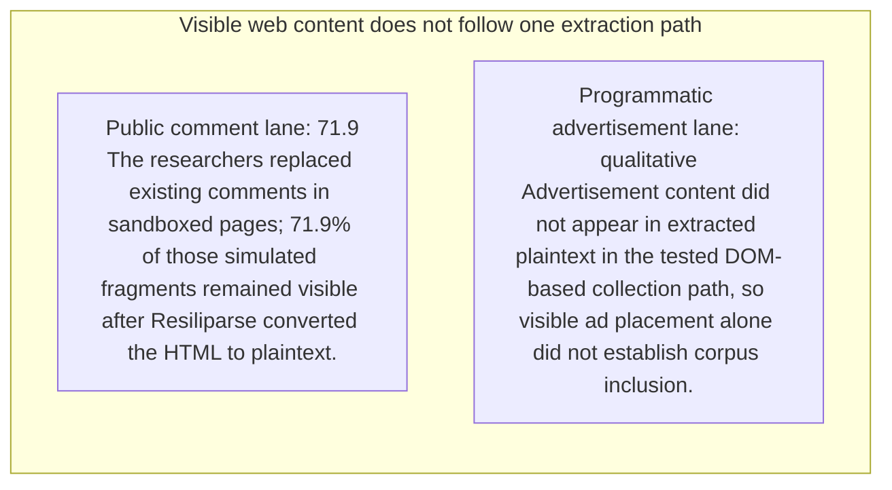

#### Python

```python
from html import escape
from pathlib import Path
from textwrap import wrap

title = "propaganda_change_p2: Comments and programmatic advertisements in the tested extraction path — Relationship-specific parallel view"
rows = [["Visible web content does not follow one extraction path","Public comment lane","71.9","The researchers replaced existing comments in sandboxed pages; 71.9% of those simulated fragments remained visible after Resiliparse converted the HTML to plaintext."],["Visible web content does not follow one extraction path","Programmatic advertisement lane","qualitative","Advertisement content did not appear in extracted plaintext in the tested DOM-based collection path, so visible ad placement alone did not establish corpus inclusion."]]
groups = {}
for group, label, value, condition in rows:
    groups.setdefault(group, []).append((label, value, condition))
width = max(900, len(groups) * 360)
height = 220 + max((len(items) for items in groups.values()), default=1) * 92
parts = [
    f'<svg xmlns="http://www.w3.org/2000/svg" viewBox="0 0 {width} {height}" role="img" aria-labelledby="title desc">',
    f'<title id="title">{escape(title)}</title>',
    '<desc id="desc">Separate panels preserve grouping and prevent unrelated conditions from reading as one sequence.</desc>',
    f'<rect width="{width}" height="{height}" fill="white"/>',
]
for group_index, (group, items) in enumerate(groups.items()):
    x = 180 + group_index * 360
    parts.append(f'<text x="{x}" y="65" text-anchor="middle" font-family="sans-serif" font-size="16" font-weight="700">{escape(group)}</text>')
    for item_index, (label, value, condition) in enumerate(items):
        y = 120 + item_index * 92
        parts.append(f'<rect x="{x-160}" y="{y-30}" width="320" height="78" rx="12" fill="#f7fbff" stroke="#ccd"/>')
        text = f"{label}: {value} — {condition}"
        for line_index, line in enumerate(wrap(text, width=46)):
            parts.append(f'<text x="{x}" y="{y-6+line_index*14}" text-anchor="middle" font-family="sans-serif" font-size="11">{escape(line)}</text>')
parts.append('</svg>')
Path("propaganda_change_p2_treatment_a.svg").write_text("\n".join(parts), encoding="utf-8")
```

### Treatment B — Comments and programmatic advertisements in the tested extraction path — Condition and boundary matrix

- Teaching purpose: Show every comparison value or qualitative condition in explicit columns.
- Encoding and reading order: Render 2 rows with explicit `Group`, `Measure or state`, `Visible value`, and `Condition or boundary` columns. The value column must be visible, not only present in ARIA text or fallback prose.
- Evidence and limitations: Encode only `propaganda_claim_halflife`, `propaganda_claim_ads` from `propaganda_source_halflife`, `propaganda_source_inclusion`. Keep the 71.9% sandboxed comment survival and absent advertisement plaintext tied to the tested DOM-based path.
- Recommended web medium: semantic HTML/CSS table with SVG export; JavaScript is optional only for meaningful focus, drill-down, or state playback.
- Mobile, accessibility, and motion behavior: Preserve the same group and node order in the DOM; retain all values and relation labels as selectable text; stack panels or levels below 640px; provide keyboard access for any optional focus state; keep a complete static fallback; respect reduced motion and never encode information only through animation.

#### TikZ

```tex
\documentclass[tikz,border=5pt]{standalone}
\usepackage[T1]{fontenc}
\usepackage{array}
\usepackage{tikz}
\begin{document}
\begin{tikzpicture}[font=\sffamily]
\node[align=center] {\textbf{propaganda\_change\_p2: Comments and programmatic advertisements in the tested extraction path - Condition and boundary matrix}\\[6pt]
\begin{tabular}{p{3.2cm}p{4.0cm}p{2.8cm}p{6.2cm}}
\textbf{Group} & \textbf{Measure or state} & \textbf{Visible value} & \textbf{Condition or boundary} \\ \hline
Visible web content does not follow one extraction path & Public comment lane & 71.9 & The researchers replaced existing comments in sandboxed pages; 71.9\% of those simulated fragments remained visible after Resiliparse converted the HTML to plaintext. \\
Visible web content does not follow one extraction path & Programmatic advertisement lane & qualitative & Advertisement content did not appear in extracted plaintext in the tested DOM-based collection path, so visible ad placement alone did not establish corpus inclusion. \\
\end{tabular}};
\end{tikzpicture}
\end{document}
```

#### Mermaid


#### Python

```python
from html import escape
from pathlib import Path
from textwrap import wrap

title = "propaganda_change_p2: Comments and programmatic advertisements in the tested extraction path — Condition and boundary matrix"
rows = [["Visible web content does not follow one extraction path","Public comment lane","71.9","The researchers replaced existing comments in sandboxed pages; 71.9% of those simulated fragments remained visible after Resiliparse converted the HTML to plaintext."],["Visible web content does not follow one extraction path","Programmatic advertisement lane","qualitative","Advertisement content did not appear in extracted plaintext in the tested DOM-based collection path, so visible ad placement alone did not establish corpus inclusion."]]
height = 326
parts = [
    f'<svg xmlns="http://www.w3.org/2000/svg" viewBox="0 0 1200 {height}" role="img" aria-labelledby="title desc">',
    f'<title id="title">{escape(title)}</title>',
    '<desc id="desc">Every reported value is visible beside its condition and group.</desc>',
    f'<rect width="1200" height="{height}" fill="white"/>',
]
headers = ["Group", "Measure or state", "Visible value", "Condition or boundary"]
xs = [30, 260, 590, 770]
for x, header in zip(xs, headers):
    parts.append(f'<text x="{x}" y="70" font-family="sans-serif" font-size="16" font-weight="700">{escape(header)}</text>')
for row_index, row in enumerate(rows):
    y = 110 + row_index * 88
    parts.append(f'<rect x="20" y="{y-28}" width="1160" height="76" fill="#f7fbff" stroke="#ccd"/>')
    for x, cell, width in zip(xs, row, [26, 38, 20, 58]):
        for line_index, line in enumerate(wrap(str(cell), width=width)):
            parts.append(f'<text x="{x}" y="{y+line_index*14}" font-family="sans-serif" font-size="11">{escape(line)}</text>')
parts.append('</svg>')
Path("propaganda_change_p2_treatment_b.svg").write_text("\n".join(parts), encoding="utf-8")
```

### Treatment C — Comments and programmatic advertisements in the tested extraction path — Comparison topology

- Teaching purpose: Connect only the alternatives and shared decision point stated in the paragraph.
- Encoding and reading order: Use 4 named nodes and 3 explicit labeled relations. Preserve all branch, merge, hierarchy, loop, or sequence edges shown in the code; changing them is an evidence deviation.
- Evidence and limitations: Encode only `propaganda_claim_halflife`, `propaganda_claim_ads` from `propaganda_source_halflife`, `propaganda_source_inclusion`. Keep the 71.9% sandboxed comment survival and absent advertisement plaintext tied to the tested DOM-based path.
- Recommended web medium: responsive inline SVG with semantic HTML/CSS fallback; JavaScript is optional only for meaningful focus, drill-down, or state playback.
- Mobile, accessibility, and motion behavior: Preserve the same group and node order in the DOM; retain all values and relation labels as selectable text; stack panels or levels below 640px; provide keyboard access for any optional focus state; keep a complete static fallback; respect reduced motion and never encode information only through animation.

#### TikZ

```tex
\documentclass[tikz,border=5pt]{standalone}
\usepackage[T1]{fontenc}
\usepackage{tikz}
\usetikzlibrary{arrows.meta}
\begin{document}
\begin{tikzpicture}[font=\sffamily,box/.style={draw,rounded corners,align=center,text width=3cm,minimum height=1.2cm},link/.style={-{Latex[length=2mm]},thick},rel/.style={fill=white,font=\scriptsize}]
\node[font=\bfseries,anchor=west] at (0,0.8) {propaganda\_change\_p2: Comments and programmatic advertisements in the tested extraction path - Comparison topology};
\node[box] (n1) at (1.00,-1.50) {That decomposition can reject superficially plausible vectors};
\node[box] (n2) at (2.50,-1.50) {In the tested DOM-based crawl path, programmatic advertisements did not appear in extracted plaintext};
\node[box] (n3) at (4.00,-1.50) {while public comments often did};
\node[box] (n4) at (5.50,-1.50) {The result is specific to the tested collection architecture rather than a claim about every possible crawler};
\draw[link] (n1) -- node[rel] {compare} (n2);
\draw[link] (n1) -- node[rel] {compare} (n3);
\draw[link] (n1) -- node[rel] {compare} (n4);
\end{tikzpicture}
\end{document}
```

#### Mermaid

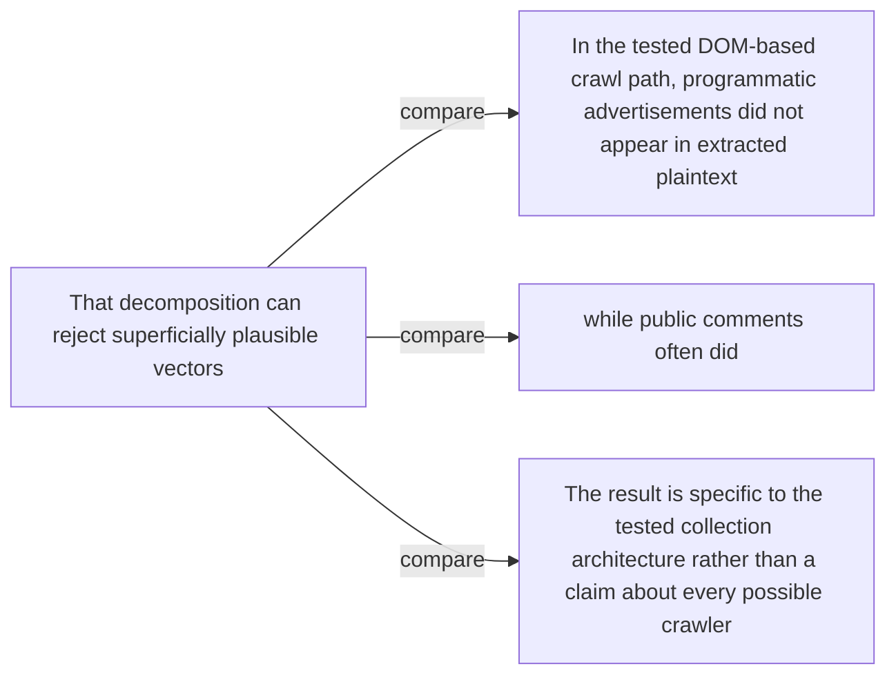

#### Python

```python
from html import escape
from pathlib import Path
from textwrap import wrap

title = "propaganda_change_p2: Comments and programmatic advertisements in the tested extraction path — Comparison topology"
nodes = [["n1","That decomposition can reject superficially plausible vectors",100,150],["n2","In the tested DOM-based crawl path, programmatic advertisements did not appear in extracted plaintext",250,150],["n3","while public comments often did",400,150],["n4","The result is specific to the tested collection architecture rather than a claim about every possible crawler",550,150]]
edges = [["n1","n2","compare"],["n1","n3","compare"],["n1","n4","compare"]]
node_by_id = {node_id: (label, x, y) for node_id, label, x, y in nodes}
width = max(900, max((x for _, _, x, _ in nodes), default=800) + 180)
height = max(500, max((y for _, _, _, y in nodes), default=400) + 140)
parts = [
    f'<svg xmlns="http://www.w3.org/2000/svg" viewBox="0 0 {width} {height}" role="img" aria-labelledby="title desc">',
    f'<title id="title">{escape(title)}</title>',
    '<desc id="desc">Edges and convergence points encode only relationships stated in the scoped paragraphs.</desc>',
    f'<rect width="{width}" height="{height}" fill="white"/>',
]
for source, target, relation in edges:
    _, x1, y1 = node_by_id[source]
    _, x2, y2 = node_by_id[target]
    parts.append(f'<line x1="{x1}" y1="{y1}" x2="{x2}" y2="{y2}" stroke="#345" stroke-width="2"/>')
    parts.append(f'<text x="{(x1+x2)/2}" y="{(y1+y2)/2-5}" text-anchor="middle" font-family="sans-serif" font-size="10">{escape(relation)}</text>')
for _, label, x, y in nodes:
    parts.append(f'<rect x="{x-78}" y="{y-42}" width="156" height="84" rx="12" fill="#eef6ff" stroke="#234"/>')
    for line_index, line in enumerate(wrap(label, width=22)):
        parts.append(f'<text x="{x}" y="{y-24+line_index*13}" text-anchor="middle" font-family="sans-serif" font-size="10">{escape(line)}</text>')
parts.append('</svg>')
Path("propaganda_change_p2_treatment_c.svg").write_text("\n".join(parts), encoding="utf-8")
```

### Implementation record

- Status: `IMPLEMENTED`
- Selected treatment: `A`
- Selection rationale: Selected the approved “Comments and programmatic advertisements in the tested extraction path — Relationship-specific parallel view” treatment because the implemented parallel view directly encodes this paragraph's explanatory job and its stated evidence boundaries.
- Delivery medium: `CSS + semantic HTML`
- Visual ID and placement: `propaganda_visual_comments_vs_ads` after `propaganda_change_p2`; this record is served by that purpose-built figure.
- Shared paragraph scope: NONE
- Changed files: `packages/test-fixtures/explainers/computational-propaganda.json`, `packages/content-schema/schema/explainer-document.schema.json`, `packages/content-schema/src/validate.ts`, generated TypeScript/Python models, `apps/web/app/papers/[id]/explainer-visual.tsx`, and `apps/web/app/globals.css`.
- Accessibility and fallback verification: Figure has a programmatic title and description, visible selectable labels and values, explicit alt text, equivalent fallback prose, source links, limitations, and a semantic static body; no meaning depends on color, motion, or pointer input.
- Desktop and mobile verification: Verified by the full eight-paper Playwright traversal at a 1440-pixel desktop viewport and the iPhone 13 mobile viewport; every figure stayed paragraph-adjacent, preserved DOM reading order, and introduced no horizontal page overflow.
- Evidence deviations: Delivery translation: selected Treatment A is rendered as typed semantic HTML/CSS rather than its literal TikZ, Mermaid, or Python-generated asset; the approved paragraph scope, placement, labels, values, grouping, and evidence boundaries are retained.

## `propaganda_mechanism_p1`

- Location: `propaganda_mechanism`, paragraph 1
- Text anchor: "HalfLife defines three gates."
- Claims and sources: `propaganda_claim_halflife` (OBSERVED, VERIFIED); `propaganda_claim_comments` (OBSERVED, VERIFIED); `propaganda_claim_extraction` (OBSERVED, VERIFIED); `propaganda_claim_curation` (OBSERVED, VERIFIED); `propaganda_claim_model_shift` (OBSERVED, VERIFIED); `propaganda_source_halflife` (Pages 3–4, Section 3, Equation 1); `propaganda_source_inclusion` (Pages 4–6, Sections 4.1–4.6, Figures 1–2; Section 4.4 page 5 reports 0.13%, consistent with the rounded 3.4% × 71.9% × 5.5% stage product); `propaganda_source_models` (Pages 6–7, Sections 5.1–5.3, Tables 1–2)
- Visual needed: `YES`
- Decision rationale: A visual passes the removal test because readers must reconstruct halflife conditional gates, denominators, and separate model-influence experiment while preserving the paragraph's conditions and boundaries. Revision 3 narrows the topology and placement so no visual can claim this paragraph without encoding its mechanism, grouping, or values.
- Explanatory job: HalfLife conditional gates, denominators, and separate model-influence experiment.
- Recommended scope and placement: Shared scope `propaganda_mechanism_p1`, `propaganda_mechanism_p2`, `propaganda_mechanism_p3` is allowed only when one visual encodes every listed mechanism, condition, and value; place it immediately after the final paragraph, `propaganda_mechanism_p3`. Otherwise split the visual by paragraph.
- QA-informed planning change: A shared visual may appear only after the third paragraph and must include S1/S2/S3, distinct denominators, the inclusion estimate, and a visibly separate controlled model-influence branch.

### Treatment A — HalfLife conditional gates, denominators, and separate model-influence experiment — Operation flow

- Teaching purpose: Show the source-supported order and branch boundaries.
- Encoding and reading order: Use 8 named nodes and 7 explicit labeled relations. Preserve all branch, merge, hierarchy, loop, or sequence edges shown in the code; changing them is an evidence deviation.
- Evidence and limitations: Encode only `propaganda_claim_halflife`, `propaganda_claim_comments`, `propaganda_claim_extraction`, `propaganda_claim_curation`, `propaganda_claim_model_shift` from `propaganda_source_halflife`, `propaganda_source_inclusion`, `propaganda_source_models`. A shared visual may appear only after the third paragraph and must include S1/S2/S3, distinct denominators, the inclusion estimate, and a visibly separate controlled model-influence branch.
- Recommended web medium: responsive inline SVG with semantic HTML/CSS fallback; JavaScript is optional only for meaningful focus, drill-down, or state playback.
- Mobile, accessibility, and motion behavior: Preserve the same group and node order in the DOM; retain all values and relation labels as selectable text; stack panels or levels below 640px; provide keyboard access for any optional focus state; keep a complete static fallback; respect reduced motion and never encode information only through animation.

#### TikZ

```tex
\documentclass[tikz,border=5pt]{standalone}
\usepackage[T1]{fontenc}
\usepackage{tikz}
\usetikzlibrary{arrows.meta}
\begin{document}
\begin{tikzpicture}[font=\sffamily,box/.style={draw,rounded corners,align=center,text width=3cm,minimum height=1.2cm},link/.style={-{Latex[length=2mm]},thick},rel/.style={fill=white,font=\scriptsize}]
\node[font=\bfseries,anchor=west] at (0,0.8) {propaganda\_mechanism\_p1: HalfLife conditional gates, denominators, and separate model-influence experiment - Operation flow};
\node[box] (pages) at (1.00,-1.50) {Sampled pages};
\node[box] (s1) at (2.50,-1.50) {S1: public comment interface};
\node[box] (s2) at (4.00,-1.50) {S2: fragment survives extraction};
\node[box] (s3) at (5.50,-1.50) {S3: captured document survives curation};
\node[box] (incl) at (7.00,-1.50) {Document-level inclusion estimate};
\node[box] (controlled) at (7.00,-2.55) {Separate controlled poison-mixture model training};
\node[box] (effect) at (8.50,-2.55) {Held-out entity-preference shift};
\node[box] (boundary) at (8.50,-1.50) {No live web-to-production attack established};
\draw[link] (pages) -- node[rel] {page prevalence} (s1);
\draw[link] (s1) -- node[rel] {conditional survival} (s2);
\draw[link] (s2) -- node[rel] {conditional survival} (s3);
\draw[link] (s3) -- node[rel] {multiply gates} (incl);
\draw[link] (controlled) -- node[rel] {measure} (effect);
\draw[link] (incl) -- node[rel] {intermediate only} (boundary);
\draw[link] (effect) -- node[rel] {separate experiment} (boundary);
\end{tikzpicture}
\end{document}
```

#### Mermaid

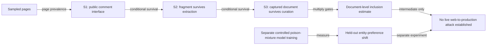

#### Python

```python
from html import escape
from pathlib import Path
from textwrap import wrap

title = "propaganda_mechanism_p1: HalfLife conditional gates, denominators, and separate model-influence experiment — Operation flow"
nodes = [["pages","Sampled pages",100,150],["s1","S1: public comment interface",250,150],["s2","S2: fragment survives extraction",400,150],["s3","S3: captured document survives curation",550,150],["incl","Document-level inclusion estimate",700,150],["controlled","Separate controlled poison-mixture model training",700,255],["effect","Held-out entity-preference shift",850,255],["boundary","No live web-to-production attack established",850,150]]
edges = [["pages","s1","page prevalence"],["s1","s2","conditional survival"],["s2","s3","conditional survival"],["s3","incl","multiply gates"],["controlled","effect","measure"],["incl","boundary","intermediate only"],["effect","boundary","separate experiment"]]
node_by_id = {node_id: (label, x, y) for node_id, label, x, y in nodes}
width = max(900, max((x for _, _, x, _ in nodes), default=800) + 180)
height = max(500, max((y for _, _, _, y in nodes), default=400) + 140)
parts = [
    f'<svg xmlns="http://www.w3.org/2000/svg" viewBox="0 0 {width} {height}" role="img" aria-labelledby="title desc">',
    f'<title id="title">{escape(title)}</title>',
    '<desc id="desc">Edges and convergence points encode only relationships stated in the scoped paragraphs.</desc>',
    f'<rect width="{width}" height="{height}" fill="white"/>',
]
for source, target, relation in edges:
    _, x1, y1 = node_by_id[source]
    _, x2, y2 = node_by_id[target]
    parts.append(f'<line x1="{x1}" y1="{y1}" x2="{x2}" y2="{y2}" stroke="#345" stroke-width="2"/>')
    parts.append(f'<text x="{(x1+x2)/2}" y="{(y1+y2)/2-5}" text-anchor="middle" font-family="sans-serif" font-size="10">{escape(relation)}</text>')
for _, label, x, y in nodes:
    parts.append(f'<rect x="{x-78}" y="{y-42}" width="156" height="84" rx="12" fill="#eef6ff" stroke="#234"/>')
    for line_index, line in enumerate(wrap(label, width=22)):
        parts.append(f'<text x="{x}" y="{y-24+line_index*13}" text-anchor="middle" font-family="sans-serif" font-size="10">{escape(line)}</text>')
parts.append('</svg>')
Path("propaganda_mechanism_p1_treatment_a.svg").write_text("\n".join(parts), encoding="utf-8")
```

### Treatment B — HalfLife conditional gates, denominators, and separate model-influence experiment — Input-operation-output ledger

- Teaching purpose: Make inputs, operations, outputs, and limits inspectable as columns.
- Encoding and reading order: Render 5 rows with explicit `Group`, `Measure or state`, `Visible value`, and `Condition or boundary` columns. The value column must be visible, not only present in ARIA text or fallback prose.
- Evidence and limitations: Encode only `propaganda_claim_halflife`, `propaganda_claim_comments`, `propaganda_claim_extraction`, `propaganda_claim_curation`, `propaganda_claim_model_shift` from `propaganda_source_halflife`, `propaganda_source_inclusion`, `propaganda_source_models`. A shared visual may appear only after the third paragraph and must include S1/S2/S3, distinct denominators, the inclusion estimate, and a visibly separate controlled model-influence branch.
- Recommended web medium: semantic HTML/CSS table with SVG export; JavaScript is optional only for meaningful focus, drill-down, or state playback.
- Mobile, accessibility, and motion behavior: Preserve the same group and node order in the DOM; retain all values and relation labels as selectable text; stack panels or levels below 640px; provide keyboard access for any optional focus state; keep a complete static fallback; respect reduced motion and never encode information only through animation.

#### TikZ

```tex
\documentclass[tikz,border=5pt]{standalone}
\usepackage[T1]{fontenc}
\usepackage{array}
\usepackage{tikz}
\begin{document}
\begin{tikzpicture}[font=\sffamily]
\node[align=center] {\textbf{propaganda\_mechanism\_p1: HalfLife conditional gates, denominators, and separate model-influence experiment - Input-operation-output ledger}\\[6pt]
\begin{tabular}{p{3.2cm}p{4.0cm}p{2.8cm}p{6.2cm}}
\textbf{Group} & \textbf{Measure or state} & \textbf{Visible value} & \textbf{Condition or boundary} \\ \hline
S1 & Page prevalence & 3.4 & Comment-platform signatures appeared on 3.4\% of 181,857 sampled Common Crawl pages. This denominator is the sampled page population. \\
S2 & Extraction survival & 71.9 & Among sandboxed simulated comment replacements, 71.9\% remained in extracted plaintext. This denominator is the simulated-injection set. \\
S3 & Curation survival & 5.5 & Among captured injected-comment documents, 5.5\% survived the combined Dolma 3-style heuristic, language, quality, and deduplication path. \\
HalfLife multiplies three conditional inclusion gates & Section 4.4 and rounded product & 0.13 & Multiplying the rounded conditional stages gives about 0.13\%, matching the document-level estimate reported in Section 4.4. \\
HalfLife multiplies three conditional inclusion gates & Conflicting Introduction summary & 0.15 & The v1 Introduction instead states 0.15\% and does not reconcile that number with Section 4.4 or the rounded stage product. \\
\end{tabular}};
\end{tikzpicture}
\end{document}
```

#### Mermaid

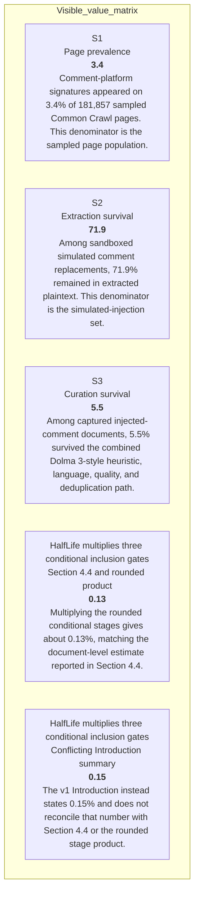

#### Python

```python
from html import escape
from pathlib import Path
from textwrap import wrap

title = "propaganda_mechanism_p1: HalfLife conditional gates, denominators, and separate model-influence experiment — Input-operation-output ledger"
rows = [["S1","Page prevalence","3.4","Comment-platform signatures appeared on 3.4% of 181,857 sampled Common Crawl pages. This denominator is the sampled page population."],["S2","Extraction survival","71.9","Among sandboxed simulated comment replacements, 71.9% remained in extracted plaintext. This denominator is the simulated-injection set."],["S3","Curation survival","5.5","Among captured injected-comment documents, 5.5% survived the combined Dolma 3-style heuristic, language, quality, and deduplication path."],["HalfLife multiplies three conditional inclusion gates","Section 4.4 and rounded product","0.13","Multiplying the rounded conditional stages gives about 0.13%, matching the document-level estimate reported in Section 4.4."],["HalfLife multiplies three conditional inclusion gates","Conflicting Introduction summary","0.15","The v1 Introduction instead states 0.15% and does not reconcile that number with Section 4.4 or the rounded stage product."]]
height = 590
parts = [
    f'<svg xmlns="http://www.w3.org/2000/svg" viewBox="0 0 1200 {height}" role="img" aria-labelledby="title desc">',
    f'<title id="title">{escape(title)}</title>',
    '<desc id="desc">Every reported value is visible beside its condition and group.</desc>',
    f'<rect width="1200" height="{height}" fill="white"/>',
]
headers = ["Group", "Measure or state", "Visible value", "Condition or boundary"]
xs = [30, 260, 590, 770]
for x, header in zip(xs, headers):
    parts.append(f'<text x="{x}" y="70" font-family="sans-serif" font-size="16" font-weight="700">{escape(header)}</text>')
for row_index, row in enumerate(rows):
    y = 110 + row_index * 88
    parts.append(f'<rect x="20" y="{y-28}" width="1160" height="76" fill="#f7fbff" stroke="#ccd"/>')
    for x, cell, width in zip(xs, row, [26, 38, 20, 58]):
        for line_index, line in enumerate(wrap(str(cell), width=width)):
            parts.append(f'<text x="{x}" y="{y+line_index*14}" font-family="sans-serif" font-size="11">{escape(line)}</text>')
parts.append('</svg>')
Path("propaganda_mechanism_p1_treatment_b.svg").write_text("\n".join(parts), encoding="utf-8")
```

### Treatment C — HalfLife conditional gates, denominators, and separate model-influence experiment — State-transition walkthrough

- Teaching purpose: Follow the described state changes without inventing timing.
- Encoding and reading order: Use 8 named nodes and 7 explicit labeled relations. Preserve all branch, merge, hierarchy, loop, or sequence edges shown in the code; changing them is an evidence deviation.
- Evidence and limitations: Encode only `propaganda_claim_halflife`, `propaganda_claim_comments`, `propaganda_claim_extraction`, `propaganda_claim_curation`, `propaganda_claim_model_shift` from `propaganda_source_halflife`, `propaganda_source_inclusion`, `propaganda_source_models`. A shared visual may appear only after the third paragraph and must include S1/S2/S3, distinct denominators, the inclusion estimate, and a visibly separate controlled model-influence branch.
- Recommended web medium: responsive inline SVG with semantic HTML/CSS fallback; JavaScript is optional only for meaningful focus, drill-down, or state playback.
- Mobile, accessibility, and motion behavior: Preserve the same group and node order in the DOM; retain all values and relation labels as selectable text; stack panels or levels below 640px; provide keyboard access for any optional focus state; keep a complete static fallback; respect reduced motion and never encode information only through animation.

#### TikZ

```tex
\documentclass[tikz,border=5pt]{standalone}
\usepackage[T1]{fontenc}
\usepackage{tikz}
\usetikzlibrary{arrows.meta}
\begin{document}
\begin{tikzpicture}[font=\sffamily,box/.style={draw,rounded corners,align=center,text width=3cm,minimum height=1.2cm},link/.style={-{Latex[length=2mm]},thick},rel/.style={fill=white,font=\scriptsize}]
\node[font=\bfseries,anchor=west] at (0,0.8) {propaganda\_mechanism\_p1: HalfLife conditional gates, denominators, and separate model-influence experiment - State-transition walkthrough};
\node[box] (pages) at (1.00,-1.50) {Sampled pages};
\node[box] (s1) at (2.50,-1.50) {S1: public comment interface};
\node[box] (s2) at (4.00,-1.50) {S2: fragment survives extraction};
\node[box] (s3) at (5.50,-1.50) {S3: captured document survives curation};
\node[box] (incl) at (7.00,-1.50) {Document-level inclusion estimate};
\node[box] (controlled) at (7.00,-2.55) {Separate controlled poison-mixture model training};
\node[box] (effect) at (8.50,-2.55) {Held-out entity-preference shift};
\node[box] (boundary) at (8.50,-1.50) {No live web-to-production attack established};
\draw[link] (pages) -- node[rel] {page prevalence} (s1);
\draw[link] (s1) -- node[rel] {conditional survival} (s2);
\draw[link] (s2) -- node[rel] {conditional survival} (s3);
\draw[link] (s3) -- node[rel] {multiply gates} (incl);
\draw[link] (controlled) -- node[rel] {measure} (effect);
\draw[link] (incl) -- node[rel] {intermediate only} (boundary);
\draw[link] (effect) -- node[rel] {separate experiment} (boundary);
\end{tikzpicture}
\end{document}
```

#### Mermaid


#### Python

```python
from html import escape
from pathlib import Path
from textwrap import wrap

title = "propaganda_mechanism_p1: HalfLife conditional gates, denominators, and separate model-influence experiment — State-transition walkthrough"
nodes = [["pages","Sampled pages",100,150],["s1","S1: public comment interface",250,150],["s2","S2: fragment survives extraction",400,150],["s3","S3: captured document survives curation",550,150],["incl","Document-level inclusion estimate",700,150],["controlled","Separate controlled poison-mixture model training",700,255],["effect","Held-out entity-preference shift",850,255],["boundary","No live web-to-production attack established",850,150]]
edges = [["pages","s1","page prevalence"],["s1","s2","conditional survival"],["s2","s3","conditional survival"],["s3","incl","multiply gates"],["controlled","effect","measure"],["incl","boundary","intermediate only"],["effect","boundary","separate experiment"]]
node_by_id = {node_id: (label, x, y) for node_id, label, x, y in nodes}
width = max(900, max((x for _, _, x, _ in nodes), default=800) + 180)
height = max(500, max((y for _, _, _, y in nodes), default=400) + 140)
parts = [
    f'<svg xmlns="http://www.w3.org/2000/svg" viewBox="0 0 {width} {height}" role="img" aria-labelledby="title desc">',
    f'<title id="title">{escape(title)}</title>',
    '<desc id="desc">Edges and convergence points encode only relationships stated in the scoped paragraphs.</desc>',
    f'<rect width="{width}" height="{height}" fill="white"/>',
]
for source, target, relation in edges:
    _, x1, y1 = node_by_id[source]
    _, x2, y2 = node_by_id[target]
    parts.append(f'<line x1="{x1}" y1="{y1}" x2="{x2}" y2="{y2}" stroke="#345" stroke-width="2"/>')
    parts.append(f'<text x="{(x1+x2)/2}" y="{(y1+y2)/2-5}" text-anchor="middle" font-family="sans-serif" font-size="10">{escape(relation)}</text>')
for _, label, x, y in nodes:
    parts.append(f'<rect x="{x-78}" y="{y-42}" width="156" height="84" rx="12" fill="#eef6ff" stroke="#234"/>')
    for line_index, line in enumerate(wrap(label, width=22)):
        parts.append(f'<text x="{x}" y="{y-24+line_index*13}" text-anchor="middle" font-family="sans-serif" font-size="10">{escape(line)}</text>')
parts.append('</svg>')
Path("propaganda_mechanism_p1_treatment_c.svg").write_text("\n".join(parts), encoding="utf-8")
```

### Implementation record

- Status: `IMPLEMENTED`
- Selected treatment: `A`
- Selection rationale: Selected the approved “HalfLife conditional gates, denominators, and separate model-influence experiment — Operation flow” treatment because the implemented operation diagram directly encodes this paragraph's explanatory job and its stated evidence boundaries.
- Delivery medium: `CSS + semantic HTML`
- Visual ID and placement: `propaganda_visual_halflife_flow` after `propaganda_mechanism_p3`; this record is served by that purpose-built figure.
- Shared paragraph scope: `propaganda_mechanism_p1`, `propaganda_mechanism_p2`, `propaganda_mechanism_p3`
- Changed files: `packages/test-fixtures/explainers/computational-propaganda.json`, `packages/content-schema/schema/explainer-document.schema.json`, `packages/content-schema/src/validate.ts`, generated TypeScript/Python models, `apps/web/app/papers/[id]/explainer-visual.tsx`, and `apps/web/app/globals.css`.
- Accessibility and fallback verification: Figure has a programmatic title and description, visible selectable labels and values, explicit alt text, equivalent fallback prose, source links, limitations, and a semantic static body; no meaning depends on color, motion, or pointer input.
- Desktop and mobile verification: Verified by the full eight-paper Playwright traversal at a 1440-pixel desktop viewport and the iPhone 13 mobile viewport; every figure stayed paragraph-adjacent, preserved DOM reading order, and introduced no horizontal page overflow.
- Evidence deviations: Delivery translation: selected Treatment A is rendered as typed semantic HTML/CSS rather than its literal TikZ, Mermaid, or Python-generated asset; the approved paragraph scope, placement, labels, values, grouping, and evidence boundaries are retained.

## `propaganda_mechanism_p2`

- Location: `propaganda_mechanism`, paragraph 2
- Text anchor: "The paper estimates the conditional probability at each gate using sampled crawl data and sandboxed replacements, then combines the stages into a document-level inclusion estimate."
- Claims and sources: `propaganda_claim_halflife` (OBSERVED, VERIFIED); `propaganda_claim_comments` (OBSERVED, VERIFIED); `propaganda_claim_extraction` (OBSERVED, VERIFIED); `propaganda_claim_curation` (OBSERVED, VERIFIED); `propaganda_claim_model_shift` (OBSERVED, VERIFIED); `propaganda_source_halflife` (Pages 3–4, Section 3, Equation 1); `propaganda_source_inclusion` (Pages 4–6, Sections 4.1–4.6, Figures 1–2; Section 4.4 page 5 reports 0.13%, consistent with the rounded 3.4% × 71.9% × 5.5% stage product); `propaganda_source_models` (Pages 6–7, Sections 5.1–5.3, Tables 1–2)
- Visual needed: `YES`
- Decision rationale: A visual passes the removal test because readers must reconstruct halflife conditional gates, denominators, and separate model-influence experiment while preserving the paragraph's conditions and boundaries. Revision 3 narrows the topology and placement so no visual can claim this paragraph without encoding its mechanism, grouping, or values.
- Explanatory job: HalfLife conditional gates, denominators, and separate model-influence experiment.
- Recommended scope and placement: Shared scope `propaganda_mechanism_p1`, `propaganda_mechanism_p2`, `propaganda_mechanism_p3` is allowed only when one visual encodes every listed mechanism, condition, and value; place it immediately after the final paragraph, `propaganda_mechanism_p3`. Otherwise split the visual by paragraph.
- QA-informed planning change: A shared visual may appear only after the third paragraph and must include S1/S2/S3, distinct denominators, the inclusion estimate, and a visibly separate controlled model-influence branch.

### Treatment A — HalfLife conditional gates, denominators, and separate model-influence experiment — Operation flow

- Teaching purpose: Show the source-supported order and branch boundaries.
- Encoding and reading order: Use 8 named nodes and 7 explicit labeled relations. Preserve all branch, merge, hierarchy, loop, or sequence edges shown in the code; changing them is an evidence deviation.
- Evidence and limitations: Encode only `propaganda_claim_halflife`, `propaganda_claim_comments`, `propaganda_claim_extraction`, `propaganda_claim_curation`, `propaganda_claim_model_shift` from `propaganda_source_halflife`, `propaganda_source_inclusion`, `propaganda_source_models`. A shared visual may appear only after the third paragraph and must include S1/S2/S3, distinct denominators, the inclusion estimate, and a visibly separate controlled model-influence branch.
- Recommended web medium: responsive inline SVG with semantic HTML/CSS fallback; JavaScript is optional only for meaningful focus, drill-down, or state playback.
- Mobile, accessibility, and motion behavior: Preserve the same group and node order in the DOM; retain all values and relation labels as selectable text; stack panels or levels below 640px; provide keyboard access for any optional focus state; keep a complete static fallback; respect reduced motion and never encode information only through animation.

#### TikZ

```tex
\documentclass[tikz,border=5pt]{standalone}
\usepackage[T1]{fontenc}
\usepackage{tikz}
\usetikzlibrary{arrows.meta}
\begin{document}
\begin{tikzpicture}[font=\sffamily,box/.style={draw,rounded corners,align=center,text width=3cm,minimum height=1.2cm},link/.style={-{Latex[length=2mm]},thick},rel/.style={fill=white,font=\scriptsize}]
\node[font=\bfseries,anchor=west] at (0,0.8) {propaganda\_mechanism\_p2: HalfLife conditional gates, denominators, and separate model-influence experiment - Operation flow};
\node[box] (pages) at (1.00,-1.50) {Sampled pages};
\node[box] (s1) at (2.50,-1.50) {S1: public comment interface};
\node[box] (s2) at (4.00,-1.50) {S2: fragment survives extraction};
\node[box] (s3) at (5.50,-1.50) {S3: captured document survives curation};
\node[box] (incl) at (7.00,-1.50) {Document-level inclusion estimate};
\node[box] (controlled) at (7.00,-2.55) {Separate controlled poison-mixture model training};
\node[box] (effect) at (8.50,-2.55) {Held-out entity-preference shift};
\node[box] (boundary) at (8.50,-1.50) {No live web-to-production attack established};
\draw[link] (pages) -- node[rel] {page prevalence} (s1);
\draw[link] (s1) -- node[rel] {conditional survival} (s2);
\draw[link] (s2) -- node[rel] {conditional survival} (s3);
\draw[link] (s3) -- node[rel] {multiply gates} (incl);
\draw[link] (controlled) -- node[rel] {measure} (effect);
\draw[link] (incl) -- node[rel] {intermediate only} (boundary);
\draw[link] (effect) -- node[rel] {separate experiment} (boundary);
\end{tikzpicture}
\end{document}
```

#### Mermaid


#### Python

```python
from html import escape
from pathlib import Path
from textwrap import wrap

title = "propaganda_mechanism_p2: HalfLife conditional gates, denominators, and separate model-influence experiment — Operation flow"
nodes = [["pages","Sampled pages",100,150],["s1","S1: public comment interface",250,150],["s2","S2: fragment survives extraction",400,150],["s3","S3: captured document survives curation",550,150],["incl","Document-level inclusion estimate",700,150],["controlled","Separate controlled poison-mixture model training",700,255],["effect","Held-out entity-preference shift",850,255],["boundary","No live web-to-production attack established",850,150]]
edges = [["pages","s1","page prevalence"],["s1","s2","conditional survival"],["s2","s3","conditional survival"],["s3","incl","multiply gates"],["controlled","effect","measure"],["incl","boundary","intermediate only"],["effect","boundary","separate experiment"]]
node_by_id = {node_id: (label, x, y) for node_id, label, x, y in nodes}
width = max(900, max((x for _, _, x, _ in nodes), default=800) + 180)
height = max(500, max((y for _, _, _, y in nodes), default=400) + 140)
parts = [
    f'<svg xmlns="http://www.w3.org/2000/svg" viewBox="0 0 {width} {height}" role="img" aria-labelledby="title desc">',
    f'<title id="title">{escape(title)}</title>',
    '<desc id="desc">Edges and convergence points encode only relationships stated in the scoped paragraphs.</desc>',
    f'<rect width="{width}" height="{height}" fill="white"/>',
]
for source, target, relation in edges:
    _, x1, y1 = node_by_id[source]
    _, x2, y2 = node_by_id[target]
    parts.append(f'<line x1="{x1}" y1="{y1}" x2="{x2}" y2="{y2}" stroke="#345" stroke-width="2"/>')
    parts.append(f'<text x="{(x1+x2)/2}" y="{(y1+y2)/2-5}" text-anchor="middle" font-family="sans-serif" font-size="10">{escape(relation)}</text>')
for _, label, x, y in nodes:
    parts.append(f'<rect x="{x-78}" y="{y-42}" width="156" height="84" rx="12" fill="#eef6ff" stroke="#234"/>')
    for line_index, line in enumerate(wrap(label, width=22)):
        parts.append(f'<text x="{x}" y="{y-24+line_index*13}" text-anchor="middle" font-family="sans-serif" font-size="10">{escape(line)}</text>')
parts.append('</svg>')
Path("propaganda_mechanism_p2_treatment_a.svg").write_text("\n".join(parts), encoding="utf-8")
```

### Treatment B — HalfLife conditional gates, denominators, and separate model-influence experiment — Input-operation-output ledger

- Teaching purpose: Make inputs, operations, outputs, and limits inspectable as columns.
- Encoding and reading order: Render 5 rows with explicit `Group`, `Measure or state`, `Visible value`, and `Condition or boundary` columns. The value column must be visible, not only present in ARIA text or fallback prose.
- Evidence and limitations: Encode only `propaganda_claim_halflife`, `propaganda_claim_comments`, `propaganda_claim_extraction`, `propaganda_claim_curation`, `propaganda_claim_model_shift` from `propaganda_source_halflife`, `propaganda_source_inclusion`, `propaganda_source_models`. A shared visual may appear only after the third paragraph and must include S1/S2/S3, distinct denominators, the inclusion estimate, and a visibly separate controlled model-influence branch.
- Recommended web medium: semantic HTML/CSS table with SVG export; JavaScript is optional only for meaningful focus, drill-down, or state playback.
- Mobile, accessibility, and motion behavior: Preserve the same group and node order in the DOM; retain all values and relation labels as selectable text; stack panels or levels below 640px; provide keyboard access for any optional focus state; keep a complete static fallback; respect reduced motion and never encode information only through animation.

#### TikZ

```tex
\documentclass[tikz,border=5pt]{standalone}
\usepackage[T1]{fontenc}
\usepackage{array}
\usepackage{tikz}
\begin{document}
\begin{tikzpicture}[font=\sffamily]
\node[align=center] {\textbf{propaganda\_mechanism\_p2: HalfLife conditional gates, denominators, and separate model-influence experiment - Input-operation-output ledger}\\[6pt]
\begin{tabular}{p{3.2cm}p{4.0cm}p{2.8cm}p{6.2cm}}
\textbf{Group} & \textbf{Measure or state} & \textbf{Visible value} & \textbf{Condition or boundary} \\ \hline
S1 & Page prevalence & 3.4 & Comment-platform signatures appeared on 3.4\% of 181,857 sampled Common Crawl pages. This denominator is the sampled page population. \\
S2 & Extraction survival & 71.9 & Among sandboxed simulated comment replacements, 71.9\% remained in extracted plaintext. This denominator is the simulated-injection set. \\
S3 & Curation survival & 5.5 & Among captured injected-comment documents, 5.5\% survived the combined Dolma 3-style heuristic, language, quality, and deduplication path. \\
HalfLife multiplies three conditional inclusion gates & Section 4.4 and rounded product & 0.13 & Multiplying the rounded conditional stages gives about 0.13\%, matching the document-level estimate reported in Section 4.4. \\
HalfLife multiplies three conditional inclusion gates & Conflicting Introduction summary & 0.15 & The v1 Introduction instead states 0.15\% and does not reconcile that number with Section 4.4 or the rounded stage product. \\
\end{tabular}};
\end{tikzpicture}
\end{document}
```

#### Mermaid


#### Python

```python
from html import escape
from pathlib import Path
from textwrap import wrap

title = "propaganda_mechanism_p2: HalfLife conditional gates, denominators, and separate model-influence experiment — Input-operation-output ledger"
rows = [["S1","Page prevalence","3.4","Comment-platform signatures appeared on 3.4% of 181,857 sampled Common Crawl pages. This denominator is the sampled page population."],["S2","Extraction survival","71.9","Among sandboxed simulated comment replacements, 71.9% remained in extracted plaintext. This denominator is the simulated-injection set."],["S3","Curation survival","5.5","Among captured injected-comment documents, 5.5% survived the combined Dolma 3-style heuristic, language, quality, and deduplication path."],["HalfLife multiplies three conditional inclusion gates","Section 4.4 and rounded product","0.13","Multiplying the rounded conditional stages gives about 0.13%, matching the document-level estimate reported in Section 4.4."],["HalfLife multiplies three conditional inclusion gates","Conflicting Introduction summary","0.15","The v1 Introduction instead states 0.15% and does not reconcile that number with Section 4.4 or the rounded stage product."]]
height = 590
parts = [
    f'<svg xmlns="http://www.w3.org/2000/svg" viewBox="0 0 1200 {height}" role="img" aria-labelledby="title desc">',
    f'<title id="title">{escape(title)}</title>',
    '<desc id="desc">Every reported value is visible beside its condition and group.</desc>',
    f'<rect width="1200" height="{height}" fill="white"/>',
]
headers = ["Group", "Measure or state", "Visible value", "Condition or boundary"]
xs = [30, 260, 590, 770]
for x, header in zip(xs, headers):
    parts.append(f'<text x="{x}" y="70" font-family="sans-serif" font-size="16" font-weight="700">{escape(header)}</text>')
for row_index, row in enumerate(rows):
    y = 110 + row_index * 88
    parts.append(f'<rect x="20" y="{y-28}" width="1160" height="76" fill="#f7fbff" stroke="#ccd"/>')
    for x, cell, width in zip(xs, row, [26, 38, 20, 58]):
        for line_index, line in enumerate(wrap(str(cell), width=width)):
            parts.append(f'<text x="{x}" y="{y+line_index*14}" font-family="sans-serif" font-size="11">{escape(line)}</text>')
parts.append('</svg>')
Path("propaganda_mechanism_p2_treatment_b.svg").write_text("\n".join(parts), encoding="utf-8")
```

### Treatment C — HalfLife conditional gates, denominators, and separate model-influence experiment — State-transition walkthrough

- Teaching purpose: Follow the described state changes without inventing timing.
- Encoding and reading order: Use 8 named nodes and 7 explicit labeled relations. Preserve all branch, merge, hierarchy, loop, or sequence edges shown in the code; changing them is an evidence deviation.
- Evidence and limitations: Encode only `propaganda_claim_halflife`, `propaganda_claim_comments`, `propaganda_claim_extraction`, `propaganda_claim_curation`, `propaganda_claim_model_shift` from `propaganda_source_halflife`, `propaganda_source_inclusion`, `propaganda_source_models`. A shared visual may appear only after the third paragraph and must include S1/S2/S3, distinct denominators, the inclusion estimate, and a visibly separate controlled model-influence branch.
- Recommended web medium: responsive inline SVG with semantic HTML/CSS fallback; JavaScript is optional only for meaningful focus, drill-down, or state playback.
- Mobile, accessibility, and motion behavior: Preserve the same group and node order in the DOM; retain all values and relation labels as selectable text; stack panels or levels below 640px; provide keyboard access for any optional focus state; keep a complete static fallback; respect reduced motion and never encode information only through animation.

#### TikZ

```tex
\documentclass[tikz,border=5pt]{standalone}
\usepackage[T1]{fontenc}
\usepackage{tikz}
\usetikzlibrary{arrows.meta}
\begin{document}
\begin{tikzpicture}[font=\sffamily,box/.style={draw,rounded corners,align=center,text width=3cm,minimum height=1.2cm},link/.style={-{Latex[length=2mm]},thick},rel/.style={fill=white,font=\scriptsize}]
\node[font=\bfseries,anchor=west] at (0,0.8) {propaganda\_mechanism\_p2: HalfLife conditional gates, denominators, and separate model-influence experiment - State-transition walkthrough};
\node[box] (pages) at (1.00,-1.50) {Sampled pages};
\node[box] (s1) at (2.50,-1.50) {S1: public comment interface};
\node[box] (s2) at (4.00,-1.50) {S2: fragment survives extraction};
\node[box] (s3) at (5.50,-1.50) {S3: captured document survives curation};
\node[box] (incl) at (7.00,-1.50) {Document-level inclusion estimate};
\node[box] (controlled) at (7.00,-2.55) {Separate controlled poison-mixture model training};
\node[box] (effect) at (8.50,-2.55) {Held-out entity-preference shift};
\node[box] (boundary) at (8.50,-1.50) {No live web-to-production attack established};
\draw[link] (pages) -- node[rel] {page prevalence} (s1);
\draw[link] (s1) -- node[rel] {conditional survival} (s2);
\draw[link] (s2) -- node[rel] {conditional survival} (s3);
\draw[link] (s3) -- node[rel] {multiply gates} (incl);
\draw[link] (controlled) -- node[rel] {measure} (effect);
\draw[link] (incl) -- node[rel] {intermediate only} (boundary);
\draw[link] (effect) -- node[rel] {separate experiment} (boundary);
\end{tikzpicture}
\end{document}
```

#### Mermaid


#### Python

```python
from html import escape
from pathlib import Path
from textwrap import wrap

title = "propaganda_mechanism_p2: HalfLife conditional gates, denominators, and separate model-influence experiment — State-transition walkthrough"
nodes = [["pages","Sampled pages",100,150],["s1","S1: public comment interface",250,150],["s2","S2: fragment survives extraction",400,150],["s3","S3: captured document survives curation",550,150],["incl","Document-level inclusion estimate",700,150],["controlled","Separate controlled poison-mixture model training",700,255],["effect","Held-out entity-preference shift",850,255],["boundary","No live web-to-production attack established",850,150]]
edges = [["pages","s1","page prevalence"],["s1","s2","conditional survival"],["s2","s3","conditional survival"],["s3","incl","multiply gates"],["controlled","effect","measure"],["incl","boundary","intermediate only"],["effect","boundary","separate experiment"]]
node_by_id = {node_id: (label, x, y) for node_id, label, x, y in nodes}
width = max(900, max((x for _, _, x, _ in nodes), default=800) + 180)
height = max(500, max((y for _, _, _, y in nodes), default=400) + 140)
parts = [
    f'<svg xmlns="http://www.w3.org/2000/svg" viewBox="0 0 {width} {height}" role="img" aria-labelledby="title desc">',
    f'<title id="title">{escape(title)}</title>',
    '<desc id="desc">Edges and convergence points encode only relationships stated in the scoped paragraphs.</desc>',
    f'<rect width="{width}" height="{height}" fill="white"/>',
]
for source, target, relation in edges:
    _, x1, y1 = node_by_id[source]
    _, x2, y2 = node_by_id[target]
    parts.append(f'<line x1="{x1}" y1="{y1}" x2="{x2}" y2="{y2}" stroke="#345" stroke-width="2"/>')
    parts.append(f'<text x="{(x1+x2)/2}" y="{(y1+y2)/2-5}" text-anchor="middle" font-family="sans-serif" font-size="10">{escape(relation)}</text>')
for _, label, x, y in nodes:
    parts.append(f'<rect x="{x-78}" y="{y-42}" width="156" height="84" rx="12" fill="#eef6ff" stroke="#234"/>')
    for line_index, line in enumerate(wrap(label, width=22)):
        parts.append(f'<text x="{x}" y="{y-24+line_index*13}" text-anchor="middle" font-family="sans-serif" font-size="10">{escape(line)}</text>')
parts.append('</svg>')
Path("propaganda_mechanism_p2_treatment_c.svg").write_text("\n".join(parts), encoding="utf-8")
```

### Implementation record

- Status: `IMPLEMENTED`
- Selected treatment: `A`
- Selection rationale: Selected the approved “HalfLife conditional gates, denominators, and separate model-influence experiment — Operation flow” treatment because the implemented operation diagram directly encodes this paragraph's explanatory job and its stated evidence boundaries.
- Delivery medium: `CSS + semantic HTML`
- Visual ID and placement: `propaganda_visual_halflife_flow` after `propaganda_mechanism_p3`; this record is served by that purpose-built figure.
- Shared paragraph scope: `propaganda_mechanism_p1`, `propaganda_mechanism_p2`, `propaganda_mechanism_p3`
- Changed files: `packages/test-fixtures/explainers/computational-propaganda.json`, `packages/content-schema/schema/explainer-document.schema.json`, `packages/content-schema/src/validate.ts`, generated TypeScript/Python models, `apps/web/app/papers/[id]/explainer-visual.tsx`, and `apps/web/app/globals.css`.
- Accessibility and fallback verification: Figure has a programmatic title and description, visible selectable labels and values, explicit alt text, equivalent fallback prose, source links, limitations, and a semantic static body; no meaning depends on color, motion, or pointer input.
- Desktop and mobile verification: Verified by the full eight-paper Playwright traversal at a 1440-pixel desktop viewport and the iPhone 13 mobile viewport; every figure stayed paragraph-adjacent, preserved DOM reading order, and introduced no horizontal page overflow.
- Evidence deviations: Delivery translation: selected Treatment A is rendered as typed semantic HTML/CSS rather than its literal TikZ, Mermaid, or Python-generated asset; the approved paragraph scope, placement, labels, values, grouping, and evidence boundaries are retained.

## `propaganda_mechanism_p3`

- Location: `propaganda_mechanism`, paragraph 3
- Text anchor: "Corpus inclusion is still only an intermediate outcome."
- Claims and sources: `propaganda_claim_halflife` (OBSERVED, VERIFIED); `propaganda_claim_comments` (OBSERVED, VERIFIED); `propaganda_claim_extraction` (OBSERVED, VERIFIED); `propaganda_claim_curation` (OBSERVED, VERIFIED); `propaganda_claim_model_shift` (OBSERVED, VERIFIED); `propaganda_source_halflife` (Pages 3–4, Section 3, Equation 1); `propaganda_source_inclusion` (Pages 4–6, Sections 4.1–4.6, Figures 1–2; Section 4.4 page 5 reports 0.13%, consistent with the rounded 3.4% × 71.9% × 5.5% stage product); `propaganda_source_models` (Pages 6–7, Sections 5.1–5.3, Tables 1–2)
- Visual needed: `YES`
- Decision rationale: A visual passes the removal test because readers must reconstruct halflife conditional gates, denominators, and separate model-influence experiment while preserving the paragraph's conditions and boundaries. Revision 3 narrows the topology and placement so no visual can claim this paragraph without encoding its mechanism, grouping, or values.
- Explanatory job: HalfLife conditional gates, denominators, and separate model-influence experiment.
- Recommended scope and placement: Shared scope `propaganda_mechanism_p1`, `propaganda_mechanism_p2`, `propaganda_mechanism_p3` is allowed only when one visual encodes every listed mechanism, condition, and value; place it immediately after the final paragraph, `propaganda_mechanism_p3`. Otherwise split the visual by paragraph.
- QA-informed planning change: A shared visual may appear only after the third paragraph and must include S1/S2/S3, distinct denominators, the inclusion estimate, and a visibly separate controlled model-influence branch.

### Treatment A — HalfLife conditional gates, denominators, and separate model-influence experiment — Operation flow

- Teaching purpose: Show the source-supported order and branch boundaries.
- Encoding and reading order: Use 8 named nodes and 7 explicit labeled relations. Preserve all branch, merge, hierarchy, loop, or sequence edges shown in the code; changing them is an evidence deviation.
- Evidence and limitations: Encode only `propaganda_claim_halflife`, `propaganda_claim_comments`, `propaganda_claim_extraction`, `propaganda_claim_curation`, `propaganda_claim_model_shift` from `propaganda_source_halflife`, `propaganda_source_inclusion`, `propaganda_source_models`. A shared visual may appear only after the third paragraph and must include S1/S2/S3, distinct denominators, the inclusion estimate, and a visibly separate controlled model-influence branch.
- Recommended web medium: responsive inline SVG with semantic HTML/CSS fallback; JavaScript is optional only for meaningful focus, drill-down, or state playback.
- Mobile, accessibility, and motion behavior: Preserve the same group and node order in the DOM; retain all values and relation labels as selectable text; stack panels or levels below 640px; provide keyboard access for any optional focus state; keep a complete static fallback; respect reduced motion and never encode information only through animation.

#### TikZ

```tex
\documentclass[tikz,border=5pt]{standalone}
\usepackage[T1]{fontenc}
\usepackage{tikz}
\usetikzlibrary{arrows.meta}
\begin{document}
\begin{tikzpicture}[font=\sffamily,box/.style={draw,rounded corners,align=center,text width=3cm,minimum height=1.2cm},link/.style={-{Latex[length=2mm]},thick},rel/.style={fill=white,font=\scriptsize}]
\node[font=\bfseries,anchor=west] at (0,0.8) {propaganda\_mechanism\_p3: HalfLife conditional gates, denominators, and separate model-influence experiment - Operation flow};
\node[box] (pages) at (1.00,-1.50) {Sampled pages};
\node[box] (s1) at (2.50,-1.50) {S1: public comment interface};
\node[box] (s2) at (4.00,-1.50) {S2: fragment survives extraction};
\node[box] (s3) at (5.50,-1.50) {S3: captured document survives curation};
\node[box] (incl) at (7.00,-1.50) {Document-level inclusion estimate};
\node[box] (controlled) at (7.00,-2.55) {Separate controlled poison-mixture model training};
\node[box] (effect) at (8.50,-2.55) {Held-out entity-preference shift};
\node[box] (boundary) at (8.50,-1.50) {No live web-to-production attack established};
\draw[link] (pages) -- node[rel] {page prevalence} (s1);
\draw[link] (s1) -- node[rel] {conditional survival} (s2);
\draw[link] (s2) -- node[rel] {conditional survival} (s3);
\draw[link] (s3) -- node[rel] {multiply gates} (incl);
\draw[link] (controlled) -- node[rel] {measure} (effect);
\draw[link] (incl) -- node[rel] {intermediate only} (boundary);
\draw[link] (effect) -- node[rel] {separate experiment} (boundary);
\end{tikzpicture}
\end{document}
```

#### Mermaid


#### Python

```python
from html import escape
from pathlib import Path
from textwrap import wrap

title = "propaganda_mechanism_p3: HalfLife conditional gates, denominators, and separate model-influence experiment — Operation flow"
nodes = [["pages","Sampled pages",100,150],["s1","S1: public comment interface",250,150],["s2","S2: fragment survives extraction",400,150],["s3","S3: captured document survives curation",550,150],["incl","Document-level inclusion estimate",700,150],["controlled","Separate controlled poison-mixture model training",700,255],["effect","Held-out entity-preference shift",850,255],["boundary","No live web-to-production attack established",850,150]]
edges = [["pages","s1","page prevalence"],["s1","s2","conditional survival"],["s2","s3","conditional survival"],["s3","incl","multiply gates"],["controlled","effect","measure"],["incl","boundary","intermediate only"],["effect","boundary","separate experiment"]]
node_by_id = {node_id: (label, x, y) for node_id, label, x, y in nodes}
width = max(900, max((x for _, _, x, _ in nodes), default=800) + 180)
height = max(500, max((y for _, _, _, y in nodes), default=400) + 140)
parts = [
    f'<svg xmlns="http://www.w3.org/2000/svg" viewBox="0 0 {width} {height}" role="img" aria-labelledby="title desc">',
    f'<title id="title">{escape(title)}</title>',
    '<desc id="desc">Edges and convergence points encode only relationships stated in the scoped paragraphs.</desc>',
    f'<rect width="{width}" height="{height}" fill="white"/>',
]
for source, target, relation in edges:
    _, x1, y1 = node_by_id[source]
    _, x2, y2 = node_by_id[target]
    parts.append(f'<line x1="{x1}" y1="{y1}" x2="{x2}" y2="{y2}" stroke="#345" stroke-width="2"/>')
    parts.append(f'<text x="{(x1+x2)/2}" y="{(y1+y2)/2-5}" text-anchor="middle" font-family="sans-serif" font-size="10">{escape(relation)}</text>')
for _, label, x, y in nodes:
    parts.append(f'<rect x="{x-78}" y="{y-42}" width="156" height="84" rx="12" fill="#eef6ff" stroke="#234"/>')
    for line_index, line in enumerate(wrap(label, width=22)):
        parts.append(f'<text x="{x}" y="{y-24+line_index*13}" text-anchor="middle" font-family="sans-serif" font-size="10">{escape(line)}</text>')
parts.append('</svg>')
Path("propaganda_mechanism_p3_treatment_a.svg").write_text("\n".join(parts), encoding="utf-8")
```

### Treatment B — HalfLife conditional gates, denominators, and separate model-influence experiment — Input-operation-output ledger

- Teaching purpose: Make inputs, operations, outputs, and limits inspectable as columns.
- Encoding and reading order: Render 5 rows with explicit `Group`, `Measure or state`, `Visible value`, and `Condition or boundary` columns. The value column must be visible, not only present in ARIA text or fallback prose.
- Evidence and limitations: Encode only `propaganda_claim_halflife`, `propaganda_claim_comments`, `propaganda_claim_extraction`, `propaganda_claim_curation`, `propaganda_claim_model_shift` from `propaganda_source_halflife`, `propaganda_source_inclusion`, `propaganda_source_models`. A shared visual may appear only after the third paragraph and must include S1/S2/S3, distinct denominators, the inclusion estimate, and a visibly separate controlled model-influence branch.
- Recommended web medium: semantic HTML/CSS table with SVG export; JavaScript is optional only for meaningful focus, drill-down, or state playback.
- Mobile, accessibility, and motion behavior: Preserve the same group and node order in the DOM; retain all values and relation labels as selectable text; stack panels or levels below 640px; provide keyboard access for any optional focus state; keep a complete static fallback; respect reduced motion and never encode information only through animation.

#### TikZ

```tex
\documentclass[tikz,border=5pt]{standalone}
\usepackage[T1]{fontenc}
\usepackage{array}
\usepackage{tikz}
\begin{document}
\begin{tikzpicture}[font=\sffamily]
\node[align=center] {\textbf{propaganda\_mechanism\_p3: HalfLife conditional gates, denominators, and separate model-influence experiment - Input-operation-output ledger}\\[6pt]
\begin{tabular}{p{3.2cm}p{4.0cm}p{2.8cm}p{6.2cm}}
\textbf{Group} & \textbf{Measure or state} & \textbf{Visible value} & \textbf{Condition or boundary} \\ \hline
S1 & Page prevalence & 3.4 & Comment-platform signatures appeared on 3.4\% of 181,857 sampled Common Crawl pages. This denominator is the sampled page population. \\
S2 & Extraction survival & 71.9 & Among sandboxed simulated comment replacements, 71.9\% remained in extracted plaintext. This denominator is the simulated-injection set. \\
S3 & Curation survival & 5.5 & Among captured injected-comment documents, 5.5\% survived the combined Dolma 3-style heuristic, language, quality, and deduplication path. \\
HalfLife multiplies three conditional inclusion gates & Section 4.4 and rounded product & 0.13 & Multiplying the rounded conditional stages gives about 0.13\%, matching the document-level estimate reported in Section 4.4. \\
HalfLife multiplies three conditional inclusion gates & Conflicting Introduction summary & 0.15 & The v1 Introduction instead states 0.15\% and does not reconcile that number with Section 4.4 or the rounded stage product. \\
\end{tabular}};
\end{tikzpicture}
\end{document}
```

#### Mermaid


#### Python

```python
from html import escape
from pathlib import Path
from textwrap import wrap

title = "propaganda_mechanism_p3: HalfLife conditional gates, denominators, and separate model-influence experiment — Input-operation-output ledger"
rows = [["S1","Page prevalence","3.4","Comment-platform signatures appeared on 3.4% of 181,857 sampled Common Crawl pages. This denominator is the sampled page population."],["S2","Extraction survival","71.9","Among sandboxed simulated comment replacements, 71.9% remained in extracted plaintext. This denominator is the simulated-injection set."],["S3","Curation survival","5.5","Among captured injected-comment documents, 5.5% survived the combined Dolma 3-style heuristic, language, quality, and deduplication path."],["HalfLife multiplies three conditional inclusion gates","Section 4.4 and rounded product","0.13","Multiplying the rounded conditional stages gives about 0.13%, matching the document-level estimate reported in Section 4.4."],["HalfLife multiplies three conditional inclusion gates","Conflicting Introduction summary","0.15","The v1 Introduction instead states 0.15% and does not reconcile that number with Section 4.4 or the rounded stage product."]]
height = 590
parts = [
    f'<svg xmlns="http://www.w3.org/2000/svg" viewBox="0 0 1200 {height}" role="img" aria-labelledby="title desc">',
    f'<title id="title">{escape(title)}</title>',
    '<desc id="desc">Every reported value is visible beside its condition and group.</desc>',
    f'<rect width="1200" height="{height}" fill="white"/>',
]
headers = ["Group", "Measure or state", "Visible value", "Condition or boundary"]
xs = [30, 260, 590, 770]
for x, header in zip(xs, headers):
    parts.append(f'<text x="{x}" y="70" font-family="sans-serif" font-size="16" font-weight="700">{escape(header)}</text>')
for row_index, row in enumerate(rows):
    y = 110 + row_index * 88
    parts.append(f'<rect x="20" y="{y-28}" width="1160" height="76" fill="#f7fbff" stroke="#ccd"/>')
    for x, cell, width in zip(xs, row, [26, 38, 20, 58]):
        for line_index, line in enumerate(wrap(str(cell), width=width)):
            parts.append(f'<text x="{x}" y="{y+line_index*14}" font-family="sans-serif" font-size="11">{escape(line)}</text>')
parts.append('</svg>')
Path("propaganda_mechanism_p3_treatment_b.svg").write_text("\n".join(parts), encoding="utf-8")
```

### Treatment C — HalfLife conditional gates, denominators, and separate model-influence experiment — State-transition walkthrough

- Teaching purpose: Follow the described state changes without inventing timing.
- Encoding and reading order: Use 8 named nodes and 7 explicit labeled relations. Preserve all branch, merge, hierarchy, loop, or sequence edges shown in the code; changing them is an evidence deviation.
- Evidence and limitations: Encode only `propaganda_claim_halflife`, `propaganda_claim_comments`, `propaganda_claim_extraction`, `propaganda_claim_curation`, `propaganda_claim_model_shift` from `propaganda_source_halflife`, `propaganda_source_inclusion`, `propaganda_source_models`. A shared visual may appear only after the third paragraph and must include S1/S2/S3, distinct denominators, the inclusion estimate, and a visibly separate controlled model-influence branch.
- Recommended web medium: responsive inline SVG with semantic HTML/CSS fallback; JavaScript is optional only for meaningful focus, drill-down, or state playback.
- Mobile, accessibility, and motion behavior: Preserve the same group and node order in the DOM; retain all values and relation labels as selectable text; stack panels or levels below 640px; provide keyboard access for any optional focus state; keep a complete static fallback; respect reduced motion and never encode information only through animation.

#### TikZ

```tex
\documentclass[tikz,border=5pt]{standalone}
\usepackage[T1]{fontenc}
\usepackage{tikz}
\usetikzlibrary{arrows.meta}
\begin{document}
\begin{tikzpicture}[font=\sffamily,box/.style={draw,rounded corners,align=center,text width=3cm,minimum height=1.2cm},link/.style={-{Latex[length=2mm]},thick},rel/.style={fill=white,font=\scriptsize}]
\node[font=\bfseries,anchor=west] at (0,0.8) {propaganda\_mechanism\_p3: HalfLife conditional gates, denominators, and separate model-influence experiment - State-transition walkthrough};
\node[box] (pages) at (1.00,-1.50) {Sampled pages};
\node[box] (s1) at (2.50,-1.50) {S1: public comment interface};
\node[box] (s2) at (4.00,-1.50) {S2: fragment survives extraction};
\node[box] (s3) at (5.50,-1.50) {S3: captured document survives curation};
\node[box] (incl) at (7.00,-1.50) {Document-level inclusion estimate};
\node[box] (controlled) at (7.00,-2.55) {Separate controlled poison-mixture model training};
\node[box] (effect) at (8.50,-2.55) {Held-out entity-preference shift};
\node[box] (boundary) at (8.50,-1.50) {No live web-to-production attack established};
\draw[link] (pages) -- node[rel] {page prevalence} (s1);
\draw[link] (s1) -- node[rel] {conditional survival} (s2);
\draw[link] (s2) -- node[rel] {conditional survival} (s3);
\draw[link] (s3) -- node[rel] {multiply gates} (incl);
\draw[link] (controlled) -- node[rel] {measure} (effect);
\draw[link] (incl) -- node[rel] {intermediate only} (boundary);
\draw[link] (effect) -- node[rel] {separate experiment} (boundary);
\end{tikzpicture}
\end{document}
```

#### Mermaid

```mermaid
flowchart LR
  pages["Sampled pages"]
  s1["S1: public comment interface"]
  s2["S2: fragment survives extraction"]
  s3["S3: captured document survives curation"]
  incl["Document-level inclusion estimate"]
  controlled["Separate controlled poison-mixture model training"]
  effect["Held-out entity-preference shift"]
  boundary["No live web-to-production attack established"]
  pages -->|"page prevalence"| s1
  s1 -->|"conditional survival"| s2
  s2 -->|"conditional survival"| s3
  s3 -->|"multiply gates"| incl
  controlled -->|"measure"| effect
  incl -->|"intermediate only"| boundary
  effect -->|"separate experiment"| boundary
```

#### Python

```python
from html import escape
from pathlib import Path
from textwrap import wrap

title = "propaganda_mechanism_p3: HalfLife conditional gates, denominators, and separate model-influence experiment — State-transition walkthrough"
nodes = [["pages","Sampled pages",100,150],["s1","S1: public comment interface",250,150],["s2","S2: fragment survives extraction",400,150],["s3","S3: captured document survives curation",550,150],["incl","Document-level inclusion estimate",700,150],["controlled","Separate controlled poison-mixture model training",700,255],["effect","Held-out entity-preference shift",850,255],["boundary","No live web-to-production attack established",850,150]]
edges = [["pages","s1","page prevalence"],["s1","s2","conditional survival"],["s2","s3","conditional survival"],["s3","incl","multiply gates"],["controlled","effect","measure"],["incl","boundary","intermediate only"],["effect","boundary","separate experiment"]]
node_by_id = {node_id: (label, x, y) for node_id, label, x, y in nodes}
width = max(900, max((x for _, _, x, _ in nodes), default=800) + 180)
height = max(500, max((y for _, _, _, y in nodes), default=400) + 140)
parts = [
    f'<svg xmlns="http://www.w3.org/2000/svg" viewBox="0 0 {width} {height}" role="img" aria-labelledby="title desc">',
    f'<title id="title">{escape(title)}</title>',
    '<desc id="desc">Edges and convergence points encode only relationships stated in the scoped paragraphs.</desc>',
    f'<rect width="{width}" height="{height}" fill="white"/>',
]
for source, target, relation in edges:
    _, x1, y1 = node_by_id[source]
    _, x2, y2 = node_by_id[target]
    parts.append(f'<line x1="{x1}" y1="{y1}" x2="{x2}" y2="{y2}" stroke="#345" stroke-width="2"/>')
    parts.append(f'<text x="{(x1+x2)/2}" y="{(y1+y2)/2-5}" text-anchor="middle" font-family="sans-serif" font-size="10">{escape(relation)}</text>')
for _, label, x, y in nodes:
    parts.append(f'<rect x="{x-78}" y="{y-42}" width="156" height="84" rx="12" fill="#eef6ff" stroke="#234"/>')
    for line_index, line in enumerate(wrap(label, width=22)):
        parts.append(f'<text x="{x}" y="{y-24+line_index*13}" text-anchor="middle" font-family="sans-serif" font-size="10">{escape(line)}</text>')
parts.append('</svg>')
Path("propaganda_mechanism_p3_treatment_c.svg").write_text("\n".join(parts), encoding="utf-8")
```

### Implementation record

- Status: `IMPLEMENTED`
- Selected treatment: `A`
- Selection rationale: Selected the approved “HalfLife conditional gates, denominators, and separate model-influence experiment — Operation flow” treatment because the implemented operation diagram directly encodes this paragraph's explanatory job and its stated evidence boundaries.
- Delivery medium: `CSS + semantic HTML`
- Visual ID and placement: `propaganda_visual_halflife_flow` after `propaganda_mechanism_p3`; this record is served by that purpose-built figure.
- Shared paragraph scope: `propaganda_mechanism_p1`, `propaganda_mechanism_p2`, `propaganda_mechanism_p3`
- Changed files: `packages/test-fixtures/explainers/computational-propaganda.json`, `packages/content-schema/schema/explainer-document.schema.json`, `packages/content-schema/src/validate.ts`, generated TypeScript/Python models, `apps/web/app/papers/[id]/explainer-visual.tsx`, and `apps/web/app/globals.css`.
- Accessibility and fallback verification: Figure has a programmatic title and description, visible selectable labels and values, explicit alt text, equivalent fallback prose, source links, limitations, and a semantic static body; no meaning depends on color, motion, or pointer input.
- Desktop and mobile verification: Verified by the full eight-paper Playwright traversal at a 1440-pixel desktop viewport and the iPhone 13 mobile viewport; every figure stayed paragraph-adjacent, preserved DOM reading order, and introduced no horizontal page overflow.
- Evidence deviations: Delivery translation: selected Treatment A is rendered as typed semantic HTML/CSS rather than its literal TikZ, Mermaid, or Python-generated asset; the approved paragraph scope, placement, labels, values, grouping, and evidence boundaries are retained.

## `propaganda_example_p1`

- Location: `propaganda_example`, paragraph 1
- Text anchor: "Start with a page identified as having a comment interface."
- Claims and sources: `propaganda_claim_comments` (OBSERVED, VERIFIED); `propaganda_claim_extraction` (OBSERVED, VERIFIED); `propaganda_claim_curation` (OBSERVED, VERIFIED); `propaganda_claim_inclusion` (OBSERVED, VERIFIED); `propaganda_source_threat` (Pages 1–3, Sections 1–2.2; Introduction page 2 states a 0.15% inclusion probability); `propaganda_source_inclusion` (Pages 4–6, Sections 4.1–4.6, Figures 1–2; Section 4.4 page 5 reports 0.13%, consistent with the rounded 3.4% × 71.9% × 5.5% stage product)
- Visual needed: `YES`
- Decision rationale: A visual passes the removal test because readers must reconstruct sandboxed comment replacement through extraction, curation, and rounded inclusion product while preserving the paragraph's conditions and boundaries. Revision 3 narrows the topology and placement so no visual can claim this paragraph without encoding its mechanism, grouping, or values.
- Explanatory job: Sandboxed comment replacement through extraction, curation, and rounded inclusion product.
- Recommended scope and placement: Shared scope `propaganda_example_p1`, `propaganda_example_p2` is allowed only when one visual encodes every listed mechanism, condition, and value; place it immediately after the final paragraph, `propaganda_example_p2`. Otherwise split the visual by paragraph.
- QA-informed planning change: A shared visual belongs after the second example and must include 37.5 words, 71.9%, 5.5%, 3.4%, the derived 0.13%, disputed 0.15%, and the non-live boundary.

### Treatment A — Sandboxed comment replacement through extraction, curation, and rounded inclusion product — Worked sequence

- Teaching purpose: Follow the actual example in source order.
- Encoding and reading order: Use 7 named nodes and 6 explicit labeled relations. Preserve all branch, merge, hierarchy, loop, or sequence edges shown in the code; changing them is an evidence deviation.
- Evidence and limitations: Encode only `propaganda_claim_comments`, `propaganda_claim_extraction`, `propaganda_claim_curation`, `propaganda_claim_inclusion` from `propaganda_source_threat`, `propaganda_source_inclusion`. A shared visual belongs after the second example and must include 37.5 words, 71.9%, 5.5%, 3.4%, the derived 0.13%, disputed 0.15%, and the non-live boundary.
- Recommended web medium: responsive inline SVG with semantic HTML/CSS fallback; JavaScript is optional only for meaningful focus, drill-down, or state playback.
- Mobile, accessibility, and motion behavior: Preserve the same group and node order in the DOM; retain all values and relation labels as selectable text; stack panels or levels below 640px; provide keyboard access for any optional focus state; keep a complete static fallback; respect reduced motion and never encode information only through animation.

#### TikZ

```tex
\documentclass[tikz,border=5pt]{standalone}
\usepackage[T1]{fontenc}
\usepackage{tikz}
\usetikzlibrary{arrows.meta}
\begin{document}
\begin{tikzpicture}[font=\sffamily,box/.style={draw,rounded corners,align=center,text width=3cm,minimum height=1.2cm},link/.style={-{Latex[length=2mm]},thick},rel/.style={fill=white,font=\scriptsize}]
\node[font=\bfseries,anchor=west] at (0,0.8) {propaganda\_example\_p1: Sandboxed comment replacement through extraction, curation, and rounded inclusion product - Worked sequence};
\node[box] (n1) at (1.00,-1.50) {Start with a page identified as having a comment interface};
\node[box] (n2) at (2.50,-1.50) {In a sandboxed copy, the researchers replace an existing comment with a question-and-answer poison fragment averaging 37.5 words};
\node[box] (n3) at (4.00,-1.50) {Resiliparse converts the HTML to plaintext};
\node[box] (n4) at (5.50,-1.50) {71.9\% of those simulated injections remain visible after this extraction step};
\node[box] (n5) at (7.00,-1.50) {The resulting documents then pass through Dolma 3-style heuristic, English-language, quality};
\node[box] (n6) at (8.50,-1.50) {and deduplication filters};
\node[box] (n7) at (10.00,-1.50) {The combined curation survival among captured injections is 5.5\%};
\draw[link] (n1) -- node[rel] {then} (n2);
\draw[link] (n2) -- node[rel] {then} (n3);
\draw[link] (n3) -- node[rel] {then} (n4);
\draw[link] (n4) -- node[rel] {then} (n5);
\draw[link] (n5) -- node[rel] {then} (n6);
\draw[link] (n6) -- node[rel] {then} (n7);
\end{tikzpicture}
\end{document}
```

#### Mermaid

```mermaid
flowchart LR
  n1["Start with a page identified as having a comment interface"]
  n2["In a sandboxed copy, the researchers replace an existing comment with a question-and-answer poison fragment averaging 37.5 words"]
  n3["Resiliparse converts the HTML to plaintext"]
  n4["71.9% of those simulated injections remain visible after this extraction step"]
  n5["The resulting documents then pass through Dolma 3-style heuristic, English-language, quality"]
  n6["and deduplication filters"]
  n7["The combined curation survival among captured injections is 5.5%"]
  n1 -->|"then"| n2
  n2 -->|"then"| n3
  n3 -->|"then"| n4
  n4 -->|"then"| n5
  n5 -->|"then"| n6
  n6 -->|"then"| n7
```

#### Python

```python
from html import escape
from pathlib import Path
from textwrap import wrap

title = "propaganda_example_p1: Sandboxed comment replacement through extraction, curation, and rounded inclusion product — Worked sequence"
nodes = [["n1","Start with a page identified as having a comment interface",100,150],["n2","In a sandboxed copy, the researchers replace an existing comment with a question-and-answer poison fragment averaging 37.5 words",250,150],["n3","Resiliparse converts the HTML to plaintext",400,150],["n4","71.9% of those simulated injections remain visible after this extraction step",550,150],["n5","The resulting documents then pass through Dolma 3-style heuristic, English-language, quality",700,150],["n6","and deduplication filters",850,150],["n7","The combined curation survival among captured injections is 5.5%",1000,150]]
edges = [["n1","n2","then"],["n2","n3","then"],["n3","n4","then"],["n4","n5","then"],["n5","n6","then"],["n6","n7","then"]]
node_by_id = {node_id: (label, x, y) for node_id, label, x, y in nodes}
width = max(900, max((x for _, _, x, _ in nodes), default=800) + 180)
height = max(500, max((y for _, _, _, y in nodes), default=400) + 140)
parts = [
    f'<svg xmlns="http://www.w3.org/2000/svg" viewBox="0 0 {width} {height}" role="img" aria-labelledby="title desc">',
    f'<title id="title">{escape(title)}</title>',
    '<desc id="desc">Edges and convergence points encode only relationships stated in the scoped paragraphs.</desc>',
    f'<rect width="{width}" height="{height}" fill="white"/>',
]
for source, target, relation in edges:
    _, x1, y1 = node_by_id[source]
    _, x2, y2 = node_by_id[target]
    parts.append(f'<line x1="{x1}" y1="{y1}" x2="{x2}" y2="{y2}" stroke="#345" stroke-width="2"/>')
    parts.append(f'<text x="{(x1+x2)/2}" y="{(y1+y2)/2-5}" text-anchor="middle" font-family="sans-serif" font-size="10">{escape(relation)}</text>')
for _, label, x, y in nodes:
    parts.append(f'<rect x="{x-78}" y="{y-42}" width="156" height="84" rx="12" fill="#eef6ff" stroke="#234"/>')
    for line_index, line in enumerate(wrap(label, width=22)):
        parts.append(f'<text x="{x}" y="{y-24+line_index*13}" text-anchor="middle" font-family="sans-serif" font-size="10">{escape(line)}</text>')
parts.append('</svg>')
Path("propaganda_example_p1_treatment_a.svg").write_text("\n".join(parts), encoding="utf-8")
```

### Treatment B — Sandboxed comment replacement through extraction, curation, and rounded inclusion product — Example calculation or state ledger

- Teaching purpose: Keep values, states, and boundaries grouped by example.
- Encoding and reading order: Render 5 rows with explicit `Group`, `Measure or state`, `Visible value`, and `Condition or boundary` columns. The value column must be visible, not only present in ARIA text or fallback prose.
- Evidence and limitations: Encode only `propaganda_claim_comments`, `propaganda_claim_extraction`, `propaganda_claim_curation`, `propaganda_claim_inclusion` from `propaganda_source_threat`, `propaganda_source_inclusion`. A shared visual belongs after the second example and must include 37.5 words, 71.9%, 5.5%, 3.4%, the derived 0.13%, disputed 0.15%, and the non-live boundary.
- Recommended web medium: semantic HTML/CSS table with SVG export; JavaScript is optional only for meaningful focus, drill-down, or state playback.
- Mobile, accessibility, and motion behavior: Preserve the same group and node order in the DOM; retain all values and relation labels as selectable text; stack panels or levels below 640px; provide keyboard access for any optional focus state; keep a complete static fallback; respect reduced motion and never encode information only through animation.

#### TikZ

```tex
\documentclass[tikz,border=5pt]{standalone}
\usepackage[T1]{fontenc}
\usepackage{array}
\usepackage{tikz}
\begin{document}
\begin{tikzpicture}[font=\sffamily]
\node[align=center] {\textbf{propaganda\_example\_p1: Sandboxed comment replacement through extraction, curation, and rounded inclusion product - Example calculation or state ledger}\\[6pt]
\begin{tabular}{p{3.2cm}p{4.0cm}p{2.8cm}p{6.2cm}}
\textbf{Group} & \textbf{Measure or state} & \textbf{Visible value} & \textbf{Condition or boundary} \\ \hline
S1 & Page prevalence & 3.4 & Comment-platform signatures appeared on 3.4\% of 181,857 sampled Common Crawl pages. This denominator is the sampled page population. \\
S2 & Extraction survival & 71.9 & Among sandboxed simulated comment replacements, 71.9\% remained in extracted plaintext. This denominator is the simulated-injection set. \\
S3 & Curation survival & 5.5 & Among captured injected-comment documents, 5.5\% survived the combined Dolma 3-style heuristic, language, quality, and deduplication path. \\
HalfLife multiplies three conditional inclusion gates & Section 4.4 and rounded product & 0.13 & Multiplying the rounded conditional stages gives about 0.13\%, matching the document-level estimate reported in Section 4.4. \\
HalfLife multiplies three conditional inclusion gates & Conflicting Introduction summary & 0.15 & The v1 Introduction instead states 0.15\% and does not reconcile that number with Section 4.4 or the rounded stage product. \\
\end{tabular}};
\end{tikzpicture}
\end{document}
```

#### Mermaid

```mermaid
flowchart TB
  subgraph Visible_value_matrix
    r1["S1<br/>Page prevalence<br/><b>3.4</b><br/>Comment-platform signatures appeared on 3.4% of 181,857 sampled Common Crawl pages. This denominator is the sampled page population."]
    r2["S2<br/>Extraction survival<br/><b>71.9</b><br/>Among sandboxed simulated comment replacements, 71.9% remained in extracted plaintext. This denominator is the simulated-injection set."]
    r3["S3<br/>Curation survival<br/><b>5.5</b><br/>Among captured injected-comment documents, 5.5% survived the combined Dolma 3-style heuristic, language, quality, and deduplication path."]
    r4["HalfLife multiplies three conditional inclusion gates<br/>Section 4.4 and rounded product<br/><b>0.13</b><br/>Multiplying the rounded conditional stages gives about 0.13%, matching the document-level estimate reported in Section 4.4."]
    r5["HalfLife multiplies three conditional inclusion gates<br/>Conflicting Introduction summary<br/><b>0.15</b><br/>The v1 Introduction instead states 0.15% and does not reconcile that number with Section 4.4 or the rounded stage product."]
  end
```

#### Python

```python
from html import escape
from pathlib import Path
from textwrap import wrap

title = "propaganda_example_p1: Sandboxed comment replacement through extraction, curation, and rounded inclusion product — Example calculation or state ledger"
rows = [["S1","Page prevalence","3.4","Comment-platform signatures appeared on 3.4% of 181,857 sampled Common Crawl pages. This denominator is the sampled page population."],["S2","Extraction survival","71.9","Among sandboxed simulated comment replacements, 71.9% remained in extracted plaintext. This denominator is the simulated-injection set."],["S3","Curation survival","5.5","Among captured injected-comment documents, 5.5% survived the combined Dolma 3-style heuristic, language, quality, and deduplication path."],["HalfLife multiplies three conditional inclusion gates","Section 4.4 and rounded product","0.13","Multiplying the rounded conditional stages gives about 0.13%, matching the document-level estimate reported in Section 4.4."],["HalfLife multiplies three conditional inclusion gates","Conflicting Introduction summary","0.15","The v1 Introduction instead states 0.15% and does not reconcile that number with Section 4.4 or the rounded stage product."]]
height = 590
parts = [
    f'<svg xmlns="http://www.w3.org/2000/svg" viewBox="0 0 1200 {height}" role="img" aria-labelledby="title desc">',
    f'<title id="title">{escape(title)}</title>',
    '<desc id="desc">Every reported value is visible beside its condition and group.</desc>',
    f'<rect width="1200" height="{height}" fill="white"/>',
]
headers = ["Group", "Measure or state", "Visible value", "Condition or boundary"]
xs = [30, 260, 590, 770]
for x, header in zip(xs, headers):
    parts.append(f'<text x="{x}" y="70" font-family="sans-serif" font-size="16" font-weight="700">{escape(header)}</text>')
for row_index, row in enumerate(rows):
    y = 110 + row_index * 88
    parts.append(f'<rect x="20" y="{y-28}" width="1160" height="76" fill="#f7fbff" stroke="#ccd"/>')
    for x, cell, width in zip(xs, row, [26, 38, 20, 58]):
        for line_index, line in enumerate(wrap(str(cell), width=width)):
            parts.append(f'<text x="{x}" y="{y+line_index*14}" font-family="sans-serif" font-size="11">{escape(line)}</text>')
parts.append('</svg>')
Path("propaganda_example_p1_treatment_b.svg").write_text("\n".join(parts), encoding="utf-8")
```

### Treatment C — Sandboxed comment replacement through extraction, curation, and rounded inclusion product — Bounded example panels

- Teaching purpose: Separate multiple examples and aggregate results instead of flattening them.
- Encoding and reading order: Group the 5 source-backed records into named panels using the first column as the grouping key. Panels preserve experimental, source, or example boundaries and never imply one shared scale.
- Evidence and limitations: Encode only `propaganda_claim_comments`, `propaganda_claim_extraction`, `propaganda_claim_curation`, `propaganda_claim_inclusion` from `propaganda_source_threat`, `propaganda_source_inclusion`. A shared visual belongs after the second example and must include 37.5 words, 71.9%, 5.5%, 3.4%, the derived 0.13%, disputed 0.15%, and the non-live boundary.
- Recommended web medium: semantic HTML/CSS grouped panels or responsive SVG; JavaScript is optional only for meaningful focus, drill-down, or state playback.
- Mobile, accessibility, and motion behavior: Preserve the same group and node order in the DOM; retain all values and relation labels as selectable text; stack panels or levels below 640px; provide keyboard access for any optional focus state; keep a complete static fallback; respect reduced motion and never encode information only through animation.

#### TikZ

```tex
\documentclass[tikz,border=5pt]{standalone}
\usepackage[T1]{fontenc}
\usepackage{tikz}
\begin{document}
\begin{tikzpicture}[font=\sffamily,panel/.style={draw,rounded corners,align=center,text width=4.8cm,minimum height=4cm}]
\node[font=\bfseries] at (8.25,3) {propaganda\_example\_p1: Sandboxed comment replacement through extraction, curation, and rounded inclusion product - Bounded example panels};
\node[panel] at (0,0) {\textbf{S1}\\[4pt]\textbf{Page prevalence}: 3.4 -- Comment-platform signatures appeared on 3.4\% of 181,857 sampled Common Crawl pages. This denominator is the sampled page population.};
\node[panel] at (5.5,0) {\textbf{S2}\\[4pt]\textbf{Extraction survival}: 71.9 -- Among sandboxed simulated comment replacements, 71.9\% remained in extracted plaintext. This denominator is the simulated-injection set.};
\node[panel] at (11,0) {\textbf{S3}\\[4pt]\textbf{Curation survival}: 5.5 -- Among captured injected-comment documents, 5.5\% survived the combined Dolma 3-style heuristic, language, quality, and deduplication path.};
\node[panel] at (16.5,0) {\textbf{HalfLife multiplies three conditional inclusion gates}\\[4pt]\textbf{Section 4.4 and rounded product}: 0.13 -- Multiplying the rounded conditional stages gives about 0.13\%, matching the document-level estimate reported in Section 4.4.\\\textbf{Conflicting Introduction summary}: 0.15 -- The v1 Introduction instead states 0.15\% and does not reconcile that number with Section 4.4 or the rounded stage product.};
\end{tikzpicture}
\end{document}
```

#### Mermaid

```mermaid
flowchart LR
  subgraph p1["S1"]
    p1r1["Page prevalence: 3.4<br/>Comment-platform signatures appeared on 3.4% of 181,857 sampled Common Crawl pages. This denominator is the sampled page population."]
  end
  subgraph p2["S2"]
    p2r1["Extraction survival: 71.9<br/>Among sandboxed simulated comment replacements, 71.9% remained in extracted plaintext. This denominator is the simulated-injection set."]
  end
  subgraph p3["S3"]
    p3r1["Curation survival: 5.5<br/>Among captured injected-comment documents, 5.5% survived the combined Dolma 3-style heuristic, language, quality, and deduplication path."]
  end
  subgraph p4["HalfLife multiplies three conditional inclusion gates"]
    p4r1["Section 4.4 and rounded product: 0.13<br/>Multiplying the rounded conditional stages gives about 0.13%, matching the document-level estimate reported in Section 4.4."]
    p4r2["Conflicting Introduction summary: 0.15<br/>The v1 Introduction instead states 0.15% and does not reconcile that number with Section 4.4 or the rounded stage product."]
  end
```

#### Python

```python
from html import escape
from pathlib import Path
from textwrap import wrap

title = "propaganda_example_p1: Sandboxed comment replacement through extraction, curation, and rounded inclusion product — Bounded example panels"
rows = [["S1","Page prevalence","3.4","Comment-platform signatures appeared on 3.4% of 181,857 sampled Common Crawl pages. This denominator is the sampled page population."],["S2","Extraction survival","71.9","Among sandboxed simulated comment replacements, 71.9% remained in extracted plaintext. This denominator is the simulated-injection set."],["S3","Curation survival","5.5","Among captured injected-comment documents, 5.5% survived the combined Dolma 3-style heuristic, language, quality, and deduplication path."],["HalfLife multiplies three conditional inclusion gates","Section 4.4 and rounded product","0.13","Multiplying the rounded conditional stages gives about 0.13%, matching the document-level estimate reported in Section 4.4."],["HalfLife multiplies three conditional inclusion gates","Conflicting Introduction summary","0.15","The v1 Introduction instead states 0.15% and does not reconcile that number with Section 4.4 or the rounded stage product."]]
groups = {}
for group, label, value, condition in rows:
    groups.setdefault(group, []).append((label, value, condition))
width = max(900, len(groups) * 360)
height = 220 + max((len(items) for items in groups.values()), default=1) * 92
parts = [
    f'<svg xmlns="http://www.w3.org/2000/svg" viewBox="0 0 {width} {height}" role="img" aria-labelledby="title desc">',
    f'<title id="title">{escape(title)}</title>',
    '<desc id="desc">Separate panels preserve grouping and prevent unrelated conditions from reading as one sequence.</desc>',
    f'<rect width="{width}" height="{height}" fill="white"/>',
]
for group_index, (group, items) in enumerate(groups.items()):
    x = 180 + group_index * 360
    parts.append(f'<text x="{x}" y="65" text-anchor="middle" font-family="sans-serif" font-size="16" font-weight="700">{escape(group)}</text>')
    for item_index, (label, value, condition) in enumerate(items):
        y = 120 + item_index * 92
        parts.append(f'<rect x="{x-160}" y="{y-30}" width="320" height="78" rx="12" fill="#f7fbff" stroke="#ccd"/>')
        text = f"{label}: {value} — {condition}"
        for line_index, line in enumerate(wrap(text, width=46)):
            parts.append(f'<text x="{x}" y="{y-6+line_index*14}" text-anchor="middle" font-family="sans-serif" font-size="11">{escape(line)}</text>')
parts.append('</svg>')
Path("propaganda_example_p1_treatment_c.svg").write_text("\n".join(parts), encoding="utf-8")
```

### Implementation record

- Status: `IMPLEMENTED`
- Selected treatment: `A`
- Selection rationale: Selected the approved “Sandboxed comment replacement through extraction, curation, and rounded inclusion product — Worked sequence” treatment because the implemented operation diagram directly encodes this paragraph's explanatory job and its stated evidence boundaries.
- Delivery medium: `CSS + semantic HTML`
- Visual ID and placement: `propaganda_visual_worked_inclusion` after `propaganda_example_p2`; this record is served by that purpose-built figure.
- Shared paragraph scope: `propaganda_example_p1`, `propaganda_example_p2`
- Changed files: `packages/test-fixtures/explainers/computational-propaganda.json`, `packages/content-schema/schema/explainer-document.schema.json`, `packages/content-schema/src/validate.ts`, generated TypeScript/Python models, `apps/web/app/papers/[id]/explainer-visual.tsx`, and `apps/web/app/globals.css`.
- Accessibility and fallback verification: Figure has a programmatic title and description, visible selectable labels and values, explicit alt text, equivalent fallback prose, source links, limitations, and a semantic static body; no meaning depends on color, motion, or pointer input.
- Desktop and mobile verification: Verified by the full eight-paper Playwright traversal at a 1440-pixel desktop viewport and the iPhone 13 mobile viewport; every figure stayed paragraph-adjacent, preserved DOM reading order, and introduced no horizontal page overflow.
- Evidence deviations: Delivery translation: selected Treatment A is rendered as typed semantic HTML/CSS rather than its literal TikZ, Mermaid, or Python-generated asset; the approved paragraph scope, placement, labels, values, grouping, and evidence boundaries are retained.

## `propaganda_example_p2`

- Location: `propaganda_example`, paragraph 2
- Text anchor: "The resulting documents then pass through Dolma 3-style heuristic, English-language, quality, and deduplication filters."
- Claims and sources: `propaganda_claim_comments` (OBSERVED, VERIFIED); `propaganda_claim_extraction` (OBSERVED, VERIFIED); `propaganda_claim_curation` (OBSERVED, VERIFIED); `propaganda_claim_inclusion` (OBSERVED, VERIFIED); `propaganda_source_threat` (Pages 1–3, Sections 1–2.2; Introduction page 2 states a 0.15% inclusion probability); `propaganda_source_inclusion` (Pages 4–6, Sections 4.1–4.6, Figures 1–2; Section 4.4 page 5 reports 0.13%, consistent with the rounded 3.4% × 71.9% × 5.5% stage product)
- Visual needed: `YES`
- Decision rationale: A visual passes the removal test because readers must reconstruct sandboxed comment replacement through extraction, curation, and rounded inclusion product while preserving the paragraph's conditions and boundaries. Revision 3 narrows the topology and placement so no visual can claim this paragraph without encoding its mechanism, grouping, or values.
- Explanatory job: Sandboxed comment replacement through extraction, curation, and rounded inclusion product.
- Recommended scope and placement: Shared scope `propaganda_example_p1`, `propaganda_example_p2` is allowed only when one visual encodes every listed mechanism, condition, and value; place it immediately after the final paragraph, `propaganda_example_p2`. Otherwise split the visual by paragraph.
- QA-informed planning change: A shared visual belongs after the second example and must include 37.5 words, 71.9%, 5.5%, 3.4%, the derived 0.13%, disputed 0.15%, and the non-live boundary.

### Treatment A — Sandboxed comment replacement through extraction, curation, and rounded inclusion product — Worked sequence

- Teaching purpose: Follow the actual example in source order.
- Encoding and reading order: Use 7 named nodes and 6 explicit labeled relations. Preserve all branch, merge, hierarchy, loop, or sequence edges shown in the code; changing them is an evidence deviation.
- Evidence and limitations: Encode only `propaganda_claim_comments`, `propaganda_claim_extraction`, `propaganda_claim_curation`, `propaganda_claim_inclusion` from `propaganda_source_threat`, `propaganda_source_inclusion`. A shared visual belongs after the second example and must include 37.5 words, 71.9%, 5.5%, 3.4%, the derived 0.13%, disputed 0.15%, and the non-live boundary.
- Recommended web medium: responsive inline SVG with semantic HTML/CSS fallback; JavaScript is optional only for meaningful focus, drill-down, or state playback.
- Mobile, accessibility, and motion behavior: Preserve the same group and node order in the DOM; retain all values and relation labels as selectable text; stack panels or levels below 640px; provide keyboard access for any optional focus state; keep a complete static fallback; respect reduced motion and never encode information only through animation.

#### TikZ

```tex
\documentclass[tikz,border=5pt]{standalone}
\usepackage[T1]{fontenc}
\usepackage{tikz}
\usetikzlibrary{arrows.meta}
\begin{document}
\begin{tikzpicture}[font=\sffamily,box/.style={draw,rounded corners,align=center,text width=3cm,minimum height=1.2cm},link/.style={-{Latex[length=2mm]},thick},rel/.style={fill=white,font=\scriptsize}]
\node[font=\bfseries,anchor=west] at (0,0.8) {propaganda\_example\_p2: Sandboxed comment replacement through extraction, curation, and rounded inclusion product - Worked sequence};
\node[box] (n1) at (1.00,-1.50) {Start with a page identified as having a comment interface};
\node[box] (n2) at (2.50,-1.50) {In a sandboxed copy, the researchers replace an existing comment with a question-and-answer poison fragment averaging 37.5 words};
\node[box] (n3) at (4.00,-1.50) {Resiliparse converts the HTML to plaintext};
\node[box] (n4) at (5.50,-1.50) {71.9\% of those simulated injections remain visible after this extraction step};
\node[box] (n5) at (7.00,-1.50) {The resulting documents then pass through Dolma 3-style heuristic, English-language, quality};
\node[box] (n6) at (8.50,-1.50) {and deduplication filters};
\node[box] (n7) at (10.00,-1.50) {The combined curation survival among captured injections is 5.5\%};
\draw[link] (n1) -- node[rel] {then} (n2);
\draw[link] (n2) -- node[rel] {then} (n3);
\draw[link] (n3) -- node[rel] {then} (n4);
\draw[link] (n4) -- node[rel] {then} (n5);
\draw[link] (n5) -- node[rel] {then} (n6);
\draw[link] (n6) -- node[rel] {then} (n7);
\end{tikzpicture}
\end{document}
```

#### Mermaid

```mermaid
flowchart LR
  n1["Start with a page identified as having a comment interface"]
  n2["In a sandboxed copy, the researchers replace an existing comment with a question-and-answer poison fragment averaging 37.5 words"]
  n3["Resiliparse converts the HTML to plaintext"]
  n4["71.9% of those simulated injections remain visible after this extraction step"]
  n5["The resulting documents then pass through Dolma 3-style heuristic, English-language, quality"]
  n6["and deduplication filters"]
  n7["The combined curation survival among captured injections is 5.5%"]
  n1 -->|"then"| n2
  n2 -->|"then"| n3
  n3 -->|"then"| n4
  n4 -->|"then"| n5
  n5 -->|"then"| n6
  n6 -->|"then"| n7
```

#### Python

```python
from html import escape
from pathlib import Path
from textwrap import wrap

title = "propaganda_example_p2: Sandboxed comment replacement through extraction, curation, and rounded inclusion product — Worked sequence"
nodes = [["n1","Start with a page identified as having a comment interface",100,150],["n2","In a sandboxed copy, the researchers replace an existing comment with a question-and-answer poison fragment averaging 37.5 words",250,150],["n3","Resiliparse converts the HTML to plaintext",400,150],["n4","71.9% of those simulated injections remain visible after this extraction step",550,150],["n5","The resulting documents then pass through Dolma 3-style heuristic, English-language, quality",700,150],["n6","and deduplication filters",850,150],["n7","The combined curation survival among captured injections is 5.5%",1000,150]]
edges = [["n1","n2","then"],["n2","n3","then"],["n3","n4","then"],["n4","n5","then"],["n5","n6","then"],["n6","n7","then"]]
node_by_id = {node_id: (label, x, y) for node_id, label, x, y in nodes}
width = max(900, max((x for _, _, x, _ in nodes), default=800) + 180)
height = max(500, max((y for _, _, _, y in nodes), default=400) + 140)
parts = [
    f'<svg xmlns="http://www.w3.org/2000/svg" viewBox="0 0 {width} {height}" role="img" aria-labelledby="title desc">',
    f'<title id="title">{escape(title)}</title>',
    '<desc id="desc">Edges and convergence points encode only relationships stated in the scoped paragraphs.</desc>',
    f'<rect width="{width}" height="{height}" fill="white"/>',
]
for source, target, relation in edges:
    _, x1, y1 = node_by_id[source]
    _, x2, y2 = node_by_id[target]
    parts.append(f'<line x1="{x1}" y1="{y1}" x2="{x2}" y2="{y2}" stroke="#345" stroke-width="2"/>')
    parts.append(f'<text x="{(x1+x2)/2}" y="{(y1+y2)/2-5}" text-anchor="middle" font-family="sans-serif" font-size="10">{escape(relation)}</text>')
for _, label, x, y in nodes:
    parts.append(f'<rect x="{x-78}" y="{y-42}" width="156" height="84" rx="12" fill="#eef6ff" stroke="#234"/>')
    for line_index, line in enumerate(wrap(label, width=22)):
        parts.append(f'<text x="{x}" y="{y-24+line_index*13}" text-anchor="middle" font-family="sans-serif" font-size="10">{escape(line)}</text>')
parts.append('</svg>')
Path("propaganda_example_p2_treatment_a.svg").write_text("\n".join(parts), encoding="utf-8")
```

### Treatment B — Sandboxed comment replacement through extraction, curation, and rounded inclusion product — Example calculation or state ledger

- Teaching purpose: Keep values, states, and boundaries grouped by example.
- Encoding and reading order: Render 5 rows with explicit `Group`, `Measure or state`, `Visible value`, and `Condition or boundary` columns. The value column must be visible, not only present in ARIA text or fallback prose.
- Evidence and limitations: Encode only `propaganda_claim_comments`, `propaganda_claim_extraction`, `propaganda_claim_curation`, `propaganda_claim_inclusion` from `propaganda_source_threat`, `propaganda_source_inclusion`. A shared visual belongs after the second example and must include 37.5 words, 71.9%, 5.5%, 3.4%, the derived 0.13%, disputed 0.15%, and the non-live boundary.
- Recommended web medium: semantic HTML/CSS table with SVG export; JavaScript is optional only for meaningful focus, drill-down, or state playback.
- Mobile, accessibility, and motion behavior: Preserve the same group and node order in the DOM; retain all values and relation labels as selectable text; stack panels or levels below 640px; provide keyboard access for any optional focus state; keep a complete static fallback; respect reduced motion and never encode information only through animation.

#### TikZ

```tex
\documentclass[tikz,border=5pt]{standalone}
\usepackage[T1]{fontenc}
\usepackage{array}
\usepackage{tikz}
\begin{document}
\begin{tikzpicture}[font=\sffamily]
\node[align=center] {\textbf{propaganda\_example\_p2: Sandboxed comment replacement through extraction, curation, and rounded inclusion product - Example calculation or state ledger}\\[6pt]
\begin{tabular}{p{3.2cm}p{4.0cm}p{2.8cm}p{6.2cm}}
\textbf{Group} & \textbf{Measure or state} & \textbf{Visible value} & \textbf{Condition or boundary} \\ \hline
S1 & Page prevalence & 3.4 & Comment-platform signatures appeared on 3.4\% of 181,857 sampled Common Crawl pages. This denominator is the sampled page population. \\
S2 & Extraction survival & 71.9 & Among sandboxed simulated comment replacements, 71.9\% remained in extracted plaintext. This denominator is the simulated-injection set. \\
S3 & Curation survival & 5.5 & Among captured injected-comment documents, 5.5\% survived the combined Dolma 3-style heuristic, language, quality, and deduplication path. \\
HalfLife multiplies three conditional inclusion gates & Section 4.4 and rounded product & 0.13 & Multiplying the rounded conditional stages gives about 0.13\%, matching the document-level estimate reported in Section 4.4. \\
HalfLife multiplies three conditional inclusion gates & Conflicting Introduction summary & 0.15 & The v1 Introduction instead states 0.15\% and does not reconcile that number with Section 4.4 or the rounded stage product. \\
\end{tabular}};
\end{tikzpicture}
\end{document}
```

#### Mermaid

```mermaid
flowchart TB
  subgraph Visible_value_matrix
    r1["S1<br/>Page prevalence<br/><b>3.4</b><br/>Comment-platform signatures appeared on 3.4% of 181,857 sampled Common Crawl pages. This denominator is the sampled page population."]
    r2["S2<br/>Extraction survival<br/><b>71.9</b><br/>Among sandboxed simulated comment replacements, 71.9% remained in extracted plaintext. This denominator is the simulated-injection set."]
    r3["S3<br/>Curation survival<br/><b>5.5</b><br/>Among captured injected-comment documents, 5.5% survived the combined Dolma 3-style heuristic, language, quality, and deduplication path."]
    r4["HalfLife multiplies three conditional inclusion gates<br/>Section 4.4 and rounded product<br/><b>0.13</b><br/>Multiplying the rounded conditional stages gives about 0.13%, matching the document-level estimate reported in Section 4.4."]
    r5["HalfLife multiplies three conditional inclusion gates<br/>Conflicting Introduction summary<br/><b>0.15</b><br/>The v1 Introduction instead states 0.15% and does not reconcile that number with Section 4.4 or the rounded stage product."]
  end
```

#### Python

```python
from html import escape
from pathlib import Path
from textwrap import wrap

title = "propaganda_example_p2: Sandboxed comment replacement through extraction, curation, and rounded inclusion product — Example calculation or state ledger"
rows = [["S1","Page prevalence","3.4","Comment-platform signatures appeared on 3.4% of 181,857 sampled Common Crawl pages. This denominator is the sampled page population."],["S2","Extraction survival","71.9","Among sandboxed simulated comment replacements, 71.9% remained in extracted plaintext. This denominator is the simulated-injection set."],["S3","Curation survival","5.5","Among captured injected-comment documents, 5.5% survived the combined Dolma 3-style heuristic, language, quality, and deduplication path."],["HalfLife multiplies three conditional inclusion gates","Section 4.4 and rounded product","0.13","Multiplying the rounded conditional stages gives about 0.13%, matching the document-level estimate reported in Section 4.4."],["HalfLife multiplies three conditional inclusion gates","Conflicting Introduction summary","0.15","The v1 Introduction instead states 0.15% and does not reconcile that number with Section 4.4 or the rounded stage product."]]
height = 590
parts = [
    f'<svg xmlns="http://www.w3.org/2000/svg" viewBox="0 0 1200 {height}" role="img" aria-labelledby="title desc">',
    f'<title id="title">{escape(title)}</title>',
    '<desc id="desc">Every reported value is visible beside its condition and group.</desc>',
    f'<rect width="1200" height="{height}" fill="white"/>',
]
headers = ["Group", "Measure or state", "Visible value", "Condition or boundary"]
xs = [30, 260, 590, 770]
for x, header in zip(xs, headers):
    parts.append(f'<text x="{x}" y="70" font-family="sans-serif" font-size="16" font-weight="700">{escape(header)}</text>')
for row_index, row in enumerate(rows):
    y = 110 + row_index * 88
    parts.append(f'<rect x="20" y="{y-28}" width="1160" height="76" fill="#f7fbff" stroke="#ccd"/>')
    for x, cell, width in zip(xs, row, [26, 38, 20, 58]):
        for line_index, line in enumerate(wrap(str(cell), width=width)):
            parts.append(f'<text x="{x}" y="{y+line_index*14}" font-family="sans-serif" font-size="11">{escape(line)}</text>')
parts.append('</svg>')
Path("propaganda_example_p2_treatment_b.svg").write_text("\n".join(parts), encoding="utf-8")
```

### Treatment C — Sandboxed comment replacement through extraction, curation, and rounded inclusion product — Bounded example panels

- Teaching purpose: Separate multiple examples and aggregate results instead of flattening them.
- Encoding and reading order: Group the 5 source-backed records into named panels using the first column as the grouping key. Panels preserve experimental, source, or example boundaries and never imply one shared scale.
- Evidence and limitations: Encode only `propaganda_claim_comments`, `propaganda_claim_extraction`, `propaganda_claim_curation`, `propaganda_claim_inclusion` from `propaganda_source_threat`, `propaganda_source_inclusion`. A shared visual belongs after the second example and must include 37.5 words, 71.9%, 5.5%, 3.4%, the derived 0.13%, disputed 0.15%, and the non-live boundary.
- Recommended web medium: semantic HTML/CSS grouped panels or responsive SVG; JavaScript is optional only for meaningful focus, drill-down, or state playback.
- Mobile, accessibility, and motion behavior: Preserve the same group and node order in the DOM; retain all values and relation labels as selectable text; stack panels or levels below 640px; provide keyboard access for any optional focus state; keep a complete static fallback; respect reduced motion and never encode information only through animation.

#### TikZ

```tex
\documentclass[tikz,border=5pt]{standalone}
\usepackage[T1]{fontenc}
\usepackage{tikz}
\begin{document}
\begin{tikzpicture}[font=\sffamily,panel/.style={draw,rounded corners,align=center,text width=4.8cm,minimum height=4cm}]
\node[font=\bfseries] at (8.25,3) {propaganda\_example\_p2: Sandboxed comment replacement through extraction, curation, and rounded inclusion product - Bounded example panels};
\node[panel] at (0,0) {\textbf{S1}\\[4pt]\textbf{Page prevalence}: 3.4 -- Comment-platform signatures appeared on 3.4\% of 181,857 sampled Common Crawl pages. This denominator is the sampled page population.};
\node[panel] at (5.5,0) {\textbf{S2}\\[4pt]\textbf{Extraction survival}: 71.9 -- Among sandboxed simulated comment replacements, 71.9\% remained in extracted plaintext. This denominator is the simulated-injection set.};
\node[panel] at (11,0) {\textbf{S3}\\[4pt]\textbf{Curation survival}: 5.5 -- Among captured injected-comment documents, 5.5\% survived the combined Dolma 3-style heuristic, language, quality, and deduplication path.};
\node[panel] at (16.5,0) {\textbf{HalfLife multiplies three conditional inclusion gates}\\[4pt]\textbf{Section 4.4 and rounded product}: 0.13 -- Multiplying the rounded conditional stages gives about 0.13\%, matching the document-level estimate reported in Section 4.4.\\\textbf{Conflicting Introduction summary}: 0.15 -- The v1 Introduction instead states 0.15\% and does not reconcile that number with Section 4.4 or the rounded stage product.};
\end{tikzpicture}
\end{document}
```

#### Mermaid

```mermaid
flowchart LR
  subgraph p1["S1"]
    p1r1["Page prevalence: 3.4<br/>Comment-platform signatures appeared on 3.4% of 181,857 sampled Common Crawl pages. This denominator is the sampled page population."]
  end
  subgraph p2["S2"]
    p2r1["Extraction survival: 71.9<br/>Among sandboxed simulated comment replacements, 71.9% remained in extracted plaintext. This denominator is the simulated-injection set."]
  end
  subgraph p3["S3"]
    p3r1["Curation survival: 5.5<br/>Among captured injected-comment documents, 5.5% survived the combined Dolma 3-style heuristic, language, quality, and deduplication path."]
  end
  subgraph p4["HalfLife multiplies three conditional inclusion gates"]
    p4r1["Section 4.4 and rounded product: 0.13<br/>Multiplying the rounded conditional stages gives about 0.13%, matching the document-level estimate reported in Section 4.4."]
    p4r2["Conflicting Introduction summary: 0.15<br/>The v1 Introduction instead states 0.15% and does not reconcile that number with Section 4.4 or the rounded stage product."]
  end
```

#### Python

```python
from html import escape
from pathlib import Path
from textwrap import wrap

title = "propaganda_example_p2: Sandboxed comment replacement through extraction, curation, and rounded inclusion product — Bounded example panels"
rows = [["S1","Page prevalence","3.4","Comment-platform signatures appeared on 3.4% of 181,857 sampled Common Crawl pages. This denominator is the sampled page population."],["S2","Extraction survival","71.9","Among sandboxed simulated comment replacements, 71.9% remained in extracted plaintext. This denominator is the simulated-injection set."],["S3","Curation survival","5.5","Among captured injected-comment documents, 5.5% survived the combined Dolma 3-style heuristic, language, quality, and deduplication path."],["HalfLife multiplies three conditional inclusion gates","Section 4.4 and rounded product","0.13","Multiplying the rounded conditional stages gives about 0.13%, matching the document-level estimate reported in Section 4.4."],["HalfLife multiplies three conditional inclusion gates","Conflicting Introduction summary","0.15","The v1 Introduction instead states 0.15% and does not reconcile that number with Section 4.4 or the rounded stage product."]]
groups = {}
for group, label, value, condition in rows:
    groups.setdefault(group, []).append((label, value, condition))
width = max(900, len(groups) * 360)
height = 220 + max((len(items) for items in groups.values()), default=1) * 92
parts = [
    f'<svg xmlns="http://www.w3.org/2000/svg" viewBox="0 0 {width} {height}" role="img" aria-labelledby="title desc">',
    f'<title id="title">{escape(title)}</title>',
    '<desc id="desc">Separate panels preserve grouping and prevent unrelated conditions from reading as one sequence.</desc>',
    f'<rect width="{width}" height="{height}" fill="white"/>',
]
for group_index, (group, items) in enumerate(groups.items()):
    x = 180 + group_index * 360
    parts.append(f'<text x="{x}" y="65" text-anchor="middle" font-family="sans-serif" font-size="16" font-weight="700">{escape(group)}</text>')
    for item_index, (label, value, condition) in enumerate(items):
        y = 120 + item_index * 92
        parts.append(f'<rect x="{x-160}" y="{y-30}" width="320" height="78" rx="12" fill="#f7fbff" stroke="#ccd"/>')
        text = f"{label}: {value} — {condition}"
        for line_index, line in enumerate(wrap(text, width=46)):
            parts.append(f'<text x="{x}" y="{y-6+line_index*14}" text-anchor="middle" font-family="sans-serif" font-size="11">{escape(line)}</text>')
parts.append('</svg>')
Path("propaganda_example_p2_treatment_c.svg").write_text("\n".join(parts), encoding="utf-8")
```

### Implementation record

- Status: `IMPLEMENTED`
- Selected treatment: `A`
- Selection rationale: Selected the approved “Sandboxed comment replacement through extraction, curation, and rounded inclusion product — Worked sequence” treatment because the implemented operation diagram directly encodes this paragraph's explanatory job and its stated evidence boundaries.
- Delivery medium: `CSS + semantic HTML`
- Visual ID and placement: `propaganda_visual_worked_inclusion` after `propaganda_example_p2`; this record is served by that purpose-built figure.
- Shared paragraph scope: `propaganda_example_p1`, `propaganda_example_p2`
- Changed files: `packages/test-fixtures/explainers/computational-propaganda.json`, `packages/content-schema/schema/explainer-document.schema.json`, `packages/content-schema/src/validate.ts`, generated TypeScript/Python models, `apps/web/app/papers/[id]/explainer-visual.tsx`, and `apps/web/app/globals.css`.
- Accessibility and fallback verification: Figure has a programmatic title and description, visible selectable labels and values, explicit alt text, equivalent fallback prose, source links, limitations, and a semantic static body; no meaning depends on color, motion, or pointer input.
- Desktop and mobile verification: Verified by the full eight-paper Playwright traversal at a 1440-pixel desktop viewport and the iPhone 13 mobile viewport; every figure stayed paragraph-adjacent, preserved DOM reading order, and introduced no horizontal page overflow.
- Evidence deviations: Delivery translation: selected Treatment A is rendered as typed semantic HTML/CSS rather than its literal TikZ, Mermaid, or Python-generated asset; the approved paragraph scope, placement, labels, values, grouping, and evidence boundaries are retained.

## `propaganda_evidence_p1`

- Location: `propaganda_evidence`, paragraph 1
- Text anchor: "The inclusion analysis scans 181,857 pages from 200 WARC files in Common Crawl CC-MAIN-2025-51."
- Claims and sources: `propaganda_claim_comments` (OBSERVED, VERIFIED); `propaganda_claim_extraction` (OBSERVED, VERIFIED); `propaganda_claim_curation` (OBSERVED, VERIFIED); `propaganda_claim_inclusion` (OBSERVED, VERIFIED); `propaganda_claim_model_shift` (OBSERVED, VERIFIED); `propaganda_claim_sft` (OBSERVED, VERIFIED); `propaganda_claim_formats` (OBSERVED, VERIFIED); `propaganda_source_threat` (Pages 1–3, Sections 1–2.2; Introduction page 2 states a 0.15% inclusion probability); `propaganda_source_inclusion` (Pages 4–6, Sections 4.1–4.6, Figures 1–2; Section 4.4 page 5 reports 0.13%, consistent with the rounded 3.4% × 71.9% × 5.5% stage product); `propaganda_source_models` (Pages 6–7, Sections 5.1–5.3, Tables 1–2)
- Visual needed: `YES`
- Decision rationale: A visual passes the removal test because the reader must keep the sampling protocol, three conditional denominators, a derived product, and a conflicting source value distinct.
- Explanatory job: Protocol sample, measured gates, derived inclusion estimate, and disputed introduction value.
- Recommended scope and placement: This paragraph only; place the visual immediately after `propaganda_evidence_p1`.
- QA-informed planning change: Round-2 QA found protocol conditions missing from some code forms. Revision 4 prints the complete sample identity in every treatment and every TikZ, Mermaid, and Python specification.

### Treatment A — Protocol-to-estimate evidence topology

- Teaching purpose: Connect the exact sample record only to the prevalence measurement, combine the three measured gates at the derived product, and keep 0.15% as a non-directional discrepancy.
- Encoding and reading order: The sample node prints 181,857 pages, 200 WARC files, and CC-MAIN-2025-51. Gate nodes remain separately denominated; only their product reaches ≈0.13%.
- Evidence and limitations: Use the paragraph's `propaganda_source_threat`, `propaganda_source_inclusion`, and verified claim IDs. All code forms must visibly retain `181,857 pages`, `200 WARC files`, and `CC-MAIN-2025-51`; measured gates, the derived product, and the disputed value remain different mark types.
- Recommended web medium: responsive SVG with semantic HTML/CSS evidence fallback; JavaScript is unnecessary.
- Mobile, accessibility, and motion behavior: Keep every label and identifier as selectable DOM text; preserve non-directional grouping on mobile; use overflow-wrap: anywhere for long tokens; provide a complete static fallback; respect reduced motion; never make information depend on animation or pointer input.

#### TikZ

```tex
\documentclass[tikz,border=5pt]{standalone}
\usepackage[T1]{fontenc}
\usepackage{tikz}
\usetikzlibrary{arrows.meta}
\begin{document}
\begin{tikzpicture}[font=\sffamily,box/.style={draw,rounded corners,align=center,text width=3.3cm,minimum height=1.3cm},link/.style={-{Latex[length=2mm]},thick},rel/.style={fill=white,font=\scriptsize}]
\node[font=\bfseries,anchor=west] at (0,2) {propaganda\_evidence\_p1: protocol-to-estimate topology};
\node[box] (sample) at (0,2) {181,857 pages  200 WARC files  CC-MAIN-2025-51};
\node[box] (s1) at (2,1) {Measured page prevalence  3.4\%};
\node[box] (s2) at (2,0) {Measured extraction survival  71.9\%};
\node[box] (s3) at (2,-1) {Measured curation survival  5.5\%};
\node[box] (product) at (5,0) {Derived rounded product  0.13\%};
\node[box] (intro) at (5,-2) {Introduction value  0.15\%  disputed};
\draw[link] (sample) -- node[rel] {sample denominator} (s1);
\draw[link] (s1) -- node[rel] {multiply} (product);
\draw[link] (s2) -- node[rel] {multiply} (product);
\draw[link] (s3) -- node[rel] {multiply} (product);
\draw (intro) -- node[rel] {unreconciled discrepancy} (product);
\end{tikzpicture}
\end{document}
```

#### Mermaid

```mermaid
flowchart LR
  sample["181,857 pages · 200 WARC files · CC-MAIN-2025-51"]
  s1["Measured page prevalence · 3.4%"]
  s2["Measured extraction survival · 71.9%"]
  s3["Measured curation survival · 5.5%"]
  product["Derived rounded product · ≈0.13%"]
  intro["Introduction value · 0.15% · disputed"]
  sample -->|"sample denominator"| s1
  s1 -->|"multiply"| product
  s2 -->|"multiply"| product
  s3 -->|"multiply"| product
  intro ---|"unreconciled discrepancy"| product
```

#### Python

```python
from html import escape
from pathlib import Path
from textwrap import wrap

title = "propaganda_evidence_p1: protocol-to-estimate topology"
nodes = [["sample","181,857 pages · 200 WARC files · CC-MAIN-2025-51",100,40],["s1","Measured page prevalence · 3.4%",340,130],["s2","Measured extraction survival · 71.9%",340,220],["s3","Measured curation survival · 5.5%",340,310],["product","Derived rounded product · ≈0.13%",700,220],["intro","Introduction value · 0.15% · disputed",700,400]]
edges = [["sample","s1","sample denominator",true],["s1","product","multiply",true],["s2","product","multiply",true],["s3","product","multiply",true],["intro","product","unreconciled discrepancy",false]]
node_by_id = {node_id: (label, x, y) for node_id, label, x, y in nodes}
width = 900
height = 540
parts = [
    '<svg xmlns="http://www.w3.org/2000/svg" viewBox="0 0 %d %d" role="img" aria-labelledby="title desc">' % (width, height),
    f'<title id="title">{escape(title)}</title>',
    '<desc id="desc">Labeled relations; undirected lines are associations or boundaries, not temporal order.</desc>',
    f'<rect width="{width}" height="{height}" fill="white"/>',
    '<defs><marker id="arrow" viewBox="0 0 10 10" refX="9" refY="5" markerWidth="6" markerHeight="6" orient="auto-start-reverse"><path d="M 0 0 L 10 5 L 0 10 z" fill="#345"/></marker></defs>',
]
for source, target, relation, directed in edges:
    _, x1, y1 = node_by_id[source]
    _, x2, y2 = node_by_id[target]
    marker = ' marker-end="url(#arrow)"' if directed else ''
    parts.append(f'<line x1="{x1}" y1="{y1}" x2="{x2}" y2="{y2}" stroke="#345" stroke-width="2"{marker}/>')
    parts.append(f'<text x="{(x1+x2)/2}" y="{(y1+y2)/2-5}" text-anchor="middle" font-family="sans-serif" font-size="10">{escape(relation)}</text>')
for _, label, x, y in nodes:
    parts.append(f'<rect x="{x-85}" y="{y-44}" width="170" height="88" rx="12" fill="#eef6ff" stroke="#234"/>')
    for line_index, line in enumerate(wrap(label, width=24)):
        parts.append(f'<text x="{x}" y="{y-26+line_index*13}" text-anchor="middle" font-family="sans-serif" font-size="10">{escape(line)}</text>')
parts.append('</svg>')
Path("propaganda_evidence_p1_treatment_a.svg").write_text("\n".join(parts), encoding="utf-8")
```

### Treatment B — Complete protocol and result matrix

- Teaching purpose: Expose every protocol condition, gate, derived value, and disputed value in visible columns.
- Encoding and reading order: Render six rows with an explicit role column so sample, measured, derived, and disputed evidence cannot collapse into one sequence.
- Evidence and limitations: Use the paragraph's `propaganda_source_threat`, `propaganda_source_inclusion`, and verified claim IDs. All code forms must visibly retain `181,857 pages`, `200 WARC files`, and `CC-MAIN-2025-51`; measured gates, the derived product, and the disputed value remain different mark types.
- Recommended web medium: semantic HTML/CSS table with SVG export; JavaScript is unnecessary.
- Mobile, accessibility, and motion behavior: Keep every label and identifier as selectable DOM text; preserve non-directional grouping on mobile; use overflow-wrap: anywhere for long tokens; provide a complete static fallback; respect reduced motion; never make information depend on animation or pointer input.

#### TikZ

```tex
\documentclass[tikz,border=5pt]{standalone}
\usepackage[T1]{fontenc}
\usepackage{array}
\usepackage{tikz}
\begin{document}
\begin{tikzpicture}[font=\sffamily]
\node[align=center] {\textbf{propaganda\_evidence\_p1: complete protocol matrix}\\[6pt]
\begin{tabular}{p{4cm}p{6cm}p{8cm}}
\textbf{Facet} & \textbf{Statement or value} & \textbf{Evidence condition or boundary} \\ \hline
Protocol sample & Pages scanned & 181,857 pages from 200 WARC files in CC-MAIN-2025-51 \\
Measured gate & Page prevalence & 3.4\% of sampled pages \\
Measured gate & Extraction survival & 71.9\% of simulated replacement comments \\
Measured gate & Curation survival & 5.5\% of captured injections \\
Derived product & Section 4.4 estimate & 0.13\% from the rounded stage product \\
Disputed source value & Introduction estimate & 0.15\%; unreconciled \\
\end{tabular}};
\end{tikzpicture}
\end{document}
```

#### Mermaid

```mermaid
flowchart TB
  subgraph Ledger["propaganda_evidence_p1: complete protocol matrix"]
    r1["Protocol sample<br/><b>Pages scanned</b><br/>181,857 pages from 200 WARC files in CC-MAIN-2025-51"]
    r2["Measured gate<br/><b>Page prevalence</b><br/>3.4% of sampled pages"]
    r3["Measured gate<br/><b>Extraction survival</b><br/>71.9% of simulated replacement comments"]
    r4["Measured gate<br/><b>Curation survival</b><br/>5.5% of captured injections"]
    r5["Derived product<br/><b>Section 4.4 estimate</b><br/>≈0.13% from the rounded stage product"]
    r6["Disputed source value<br/><b>Introduction estimate</b><br/>0.15%; unreconciled"]
  end
```

#### Python

```python
from html import escape
from pathlib import Path
from textwrap import wrap

title = "propaganda_evidence_p1: complete protocol matrix"
rows = [["Protocol sample","Pages scanned","181,857 pages from 200 WARC files in CC-MAIN-2025-51"],["Measured gate","Page prevalence","3.4% of sampled pages"],["Measured gate","Extraction survival","71.9% of simulated replacement comments"],["Measured gate","Curation survival","5.5% of captured injections"],["Derived product","Section 4.4 estimate","≈0.13% from the rounded stage product"],["Disputed source value","Introduction estimate","0.15%; unreconciled"]]
height = 702
parts = [
    f'<svg xmlns="http://www.w3.org/2000/svg" viewBox="0 0 1200 {height}" role="img" aria-labelledby="title desc">',
    f'<title id="title">{escape(title)}</title>',
    '<desc id="desc">Non-directional evidence ledger with every statement and boundary visible.</desc>',
    f'<rect width="1200" height="{height}" fill="white"/>',
]
headers = ["Facet", "Statement or value", "Evidence condition or boundary"]
xs = [30, 300, 700]
for x, header in zip(xs, headers):
    parts.append(f'<text x="{x}" y="65" font-family="sans-serif" font-size="16" font-weight="700">{escape(header)}</text>')
for row_index, row in enumerate(rows):
    y = 110 + row_index * 92
    parts.append(f'<rect x="20" y="{y-30}" width="1160" height="80" fill="#f7fbff" stroke="#ccd"/>')
    for x, cell, width in zip(xs, row, [30, 48, 60]):
        for line_index, line in enumerate(wrap(str(cell), width=width)):
            parts.append(f'<text x="{x}" y="{y-8+line_index*14}" font-family="sans-serif" font-size="11">{escape(line)}</text>')
parts.append('</svg>')
Path("propaganda_evidence_p1_treatment_b.svg").write_text("\n".join(parts), encoding="utf-8")
```

### Treatment C — Measured, derived, and disputed evidence panels

- Teaching purpose: Separate protocol identity, conditional measurements, and source disagreement into bounded panels.
- Encoding and reading order: The protocol panel explicitly contains 181,857 pages, 200 WARC files, and CC-MAIN-2025-51; no panel shares an implied quantitative axis.
- Evidence and limitations: Use the paragraph's `propaganda_source_threat`, `propaganda_source_inclusion`, and verified claim IDs. All code forms must visibly retain `181,857 pages`, `200 WARC files`, and `CC-MAIN-2025-51`; measured gates, the derived product, and the disputed value remain different mark types.
- Recommended web medium: semantic HTML/CSS panels or responsive SVG; JavaScript is unnecessary.
- Mobile, accessibility, and motion behavior: Keep every label and identifier as selectable DOM text; preserve non-directional grouping on mobile; use overflow-wrap: anywhere for long tokens; provide a complete static fallback; respect reduced motion; never make information depend on animation or pointer input.

#### TikZ

```tex
\documentclass[tikz,border=5pt]{standalone}
\usepackage[T1]{fontenc}
\usepackage{tikz}
\begin{document}
\begin{tikzpicture}[font=\sffamily,panel/.style={draw,rounded corners,align=center,text width=5.2cm,minimum height=4.2cm}]
\node[font=\bfseries] at (6,3.1) {propaganda\_evidence\_p1: evidence panels};
\node[panel] at (0,0) {\textbf{Protocol sample}\\[5pt]181,857 pages\\[3pt]200 WARC files\\[3pt]CC-MAIN-2025-51};
\node[panel] at (6,0) {\textbf{Measured conditional gates}\\[5pt]3.4\% page prevalence\\[3pt]71.9\% extraction survival\\[3pt]5.5\% curation survival};
\node[panel] at (12,0) {\textbf{Derived and disputed}\\[5pt]0.13\% rounded stage product\\[3pt]0.15\% Introduction value; unreconciled};
\end{tikzpicture}
\end{document}
```

#### Mermaid

```mermaid
flowchart LR
  subgraph g1["Protocol sample"]
    g1i1["181,857 pages"]
    g1i2["200 WARC files"]
    g1i3["CC-MAIN-2025-51"]
  end
  subgraph g2["Measured conditional gates"]
    g2i1["3.4% page prevalence"]
    g2i2["71.9% extraction survival"]
    g2i3["5.5% curation survival"]
  end
  subgraph g3["Derived and disputed"]
    g3i1["≈0.13% rounded stage product"]
    g3i2["0.15% Introduction value; unreconciled"]
  end
```

#### Python

```python
from html import escape
from pathlib import Path
from textwrap import wrap

title = "propaganda_evidence_p1: evidence panels"
groups = [{"title":"Protocol sample","items":["181,857 pages","200 WARC files","CC-MAIN-2025-51"]},{"title":"Measured conditional gates","items":["3.4% page prevalence","71.9% extraction survival","5.5% curation survival"]},{"title":"Derived and disputed","items":["≈0.13% rounded stage product","0.15% Introduction value; unreconciled"]}]
width = 1200
height = 496
parts = [
    f'<svg xmlns="http://www.w3.org/2000/svg" viewBox="0 0 {width} {height}" role="img" aria-labelledby="title desc">',
    f'<title id="title">{escape(title)}</title>',
    '<desc id="desc">Independent panels; spatial grouping does not encode sequence or causality.</desc>',
    f'<rect width="{width}" height="{height}" fill="white"/>',
]
for group_index, group in enumerate(groups):
    x = 200 + group_index * 400
    parts.append(f'<text x="{x}" y="60" text-anchor="middle" font-family="sans-serif" font-size="16" font-weight="700">{escape(group["title"])}</text>')
    for item_index, item in enumerate(group["items"]):
        y = 115 + item_index * 92
        parts.append(f'<rect x="{x-180}" y="{y-30}" width="360" height="78" rx="12" fill="#f7fbff" stroke="#ccd"/>')
        for line_index, line in enumerate(wrap(item, width=50)):
            parts.append(f'<text x="{x}" y="{y-8+line_index*14}" text-anchor="middle" font-family="sans-serif" font-size="11">{escape(line)}</text>')
parts.append('</svg>')
Path("propaganda_evidence_p1_treatment_c.svg").write_text("\n".join(parts), encoding="utf-8")
```

### Implementation record

- Status: `IMPLEMENTED`
- Selected treatment: `A`
- Selection rationale: Selected the approved “Measured stages, derived product, and disputed introduction value — Grouped disclosed-domain plot” treatment because the implemented dot plot directly encodes this paragraph's explanatory job and its stated evidence boundaries.
- Delivery medium: `CSS + semantic HTML`
- Visual ID and placement: `propaganda_visual_inclusion_evidence` after `propaganda_evidence_p1`; this record is served by that purpose-built figure.
- Shared paragraph scope: NONE
- Changed files: `packages/test-fixtures/explainers/computational-propaganda.json`, `packages/content-schema/schema/explainer-document.schema.json`, `packages/content-schema/src/validate.ts`, generated TypeScript/Python models, `apps/web/app/papers/[id]/explainer-visual.tsx`, and `apps/web/app/globals.css`.
- Accessibility and fallback verification: Figure has a programmatic title and description, visible selectable labels and values, explicit alt text, equivalent fallback prose, source links, limitations, and a semantic static body; no meaning depends on color, motion, or pointer input.
- Desktop and mobile verification: Verified by the full eight-paper Playwright traversal at a 1440-pixel desktop viewport and the iPhone 13 mobile viewport; every figure stayed paragraph-adjacent, preserved DOM reading order, and introduced no horizontal page overflow.
- Evidence deviations: Delivery translation: selected Treatment A is rendered as typed semantic HTML/CSS rather than its literal TikZ, Mermaid, or Python-generated asset; the approved paragraph scope, placement, labels, values, grouping, and evidence boundaries are retained.

## `propaganda_evidence_p2`

- Location: `propaganda_evidence`, paragraph 2
- Text anchor: "For model effects, the authors pretrain OLMo-3-like models from 65M to 1.3B parameters with controlled poison token rates of 0.001%, 0.01%, or 0.1%."
- Claims and sources: `propaganda_claim_comments` (OBSERVED, VERIFIED); `propaganda_claim_extraction` (OBSERVED, VERIFIED); `propaganda_claim_curation` (OBSERVED, VERIFIED); `propaganda_claim_inclusion` (OBSERVED, VERIFIED); `propaganda_claim_model_shift` (OBSERVED, VERIFIED); `propaganda_claim_sft` (OBSERVED, VERIFIED); `propaganda_claim_formats` (OBSERVED, VERIFIED); `propaganda_source_threat` (Pages 1–3, Sections 1–2.2; Introduction page 2 states a 0.15% inclusion probability); `propaganda_source_inclusion` (Pages 4–6, Sections 4.1–4.6, Figures 1–2; Section 4.4 page 5 reports 0.13%, consistent with the rounded 3.4% × 71.9% × 5.5% stage product); `propaganda_source_models` (Pages 6–7, Sections 5.1–5.3, Tables 1–2)
- Visual needed: `YES`
- Decision rationale: A shared visual remains justified, but this paragraph specifically requires the full controlled rate set before the 0.1%-conditioned effect range can be interpreted.
- Explanatory job: Controlled poison-rate set with effects attached only to the 0.1% condition.
- Recommended scope and placement: Shared scope `propaganda_evidence_p2`, `propaganda_evidence_p3` is allowed only when one visual encodes every listed mechanism, condition, and value; place it immediately after the final paragraph, `propaganda_evidence_p3`. Otherwise split the visual by paragraph.
- QA-informed planning change: Round-2 QA found 0.001% and 0.01% absent. Revision 4 exposes all rates while preventing any lower-rate effect inference.

### Treatment A — Rate-set branching with a single effect-bearing condition

- Teaching purpose: Show three tested rates branching from the design and only the 0.1% branch reaching the reported effect.
- Encoding and reading order: Use explicit nodes for 0.001%, 0.01%, and 0.1%. Only the 0.1% node has an outgoing effect edge.
- Evidence and limitations: Use `propaganda_source_models` and the verified model-effect claims. Show all three controlled rates, but attach 18.6–20.7 points only to 0.1%; do not interpolate or assign lower-rate effects.
- Recommended web medium: responsive SVG with semantic HTML/CSS fallback; JavaScript is unnecessary.
- Mobile, accessibility, and motion behavior: Keep every label and identifier as selectable DOM text; preserve non-directional grouping on mobile; use overflow-wrap: anywhere for long tokens; provide a complete static fallback; respect reduced motion; never make information depend on animation or pointer input.

#### TikZ

```tex
\documentclass[tikz,border=5pt]{standalone}
\usepackage[T1]{fontenc}
\usepackage{tikz}
\usetikzlibrary{arrows.meta}
\begin{document}
\begin{tikzpicture}[font=\sffamily,box/.style={draw,rounded corners,align=center,text width=3.3cm,minimum height=1.3cm},link/.style={-{Latex[length=2mm]},thick},rel/.style={fill=white,font=\scriptsize}]
\node[font=\bfseries,anchor=west] at (0,2) {propaganda\_evidence\_p2: controlled rates and effect condition};
\node[box] (rates) at (0,0) {Controlled poison-token rates};
\node[box] (low1) at (2,2) {0.001\%  tested rate};
\node[box] (low2) at (2,0) {0.01\%  tested rate};
\node[box] (high) at (2,-2) {0.1\%  tested rate};
\node[box] (effects) at (5,-2) {18.6-20.7-point base-model shift  five models  65M-1.3B};
\draw[link] (rates) -- node[rel] {includes} (low1);
\draw[link] (rates) -- node[rel] {includes} (low2);
\draw[link] (rates) -- node[rel] {includes} (high);
\draw[link] (high) -- node[rel] {reported effect only here} (effects);
\end{tikzpicture}
\end{document}
```

#### Mermaid

```mermaid
flowchart LR
  rates["Controlled poison-token rates"]
  low1["0.001% · tested rate"]
  low2["0.01% · tested rate"]
  high["0.1% · tested rate"]
  effects["18.6–20.7-point base-model shift · five models · 65M–1.3B"]
  rates -->|"includes"| low1
  rates -->|"includes"| low2
  rates -->|"includes"| high
  high -->|"reported effect only here"| effects
```

#### Python

```python
from html import escape
from pathlib import Path
from textwrap import wrap

title = "propaganda_evidence_p2: controlled rates and effect condition"
nodes = [["rates","Controlled poison-token rates",100,220],["low1","0.001% · tested rate",340,40],["low2","0.01% · tested rate",340,220],["high","0.1% · tested rate",340,400],["effects","18.6–20.7-point base-model shift · five models · 65M–1.3B",700,400]]
edges = [["rates","low1","includes",true],["rates","low2","includes",true],["rates","high","includes",true],["high","effects","reported effect only here",true]]
node_by_id = {node_id: (label, x, y) for node_id, label, x, y in nodes}
width = 900
height = 540
parts = [
    '<svg xmlns="http://www.w3.org/2000/svg" viewBox="0 0 %d %d" role="img" aria-labelledby="title desc">' % (width, height),
    f'<title id="title">{escape(title)}</title>',
    '<desc id="desc">Labeled relations; undirected lines are associations or boundaries, not temporal order.</desc>',
    f'<rect width="{width}" height="{height}" fill="white"/>',
    '<defs><marker id="arrow" viewBox="0 0 10 10" refX="9" refY="5" markerWidth="6" markerHeight="6" orient="auto-start-reverse"><path d="M 0 0 L 10 5 L 0 10 z" fill="#345"/></marker></defs>',
]
for source, target, relation, directed in edges:
    _, x1, y1 = node_by_id[source]
    _, x2, y2 = node_by_id[target]
    marker = ' marker-end="url(#arrow)"' if directed else ''
    parts.append(f'<line x1="{x1}" y1="{y1}" x2="{x2}" y2="{y2}" stroke="#345" stroke-width="2"{marker}/>')
    parts.append(f'<text x="{(x1+x2)/2}" y="{(y1+y2)/2-5}" text-anchor="middle" font-family="sans-serif" font-size="10">{escape(relation)}</text>')
for _, label, x, y in nodes:
    parts.append(f'<rect x="{x-85}" y="{y-44}" width="170" height="88" rx="12" fill="#eef6ff" stroke="#234"/>')
    for line_index, line in enumerate(wrap(label, width=24)):
        parts.append(f'<text x="{x}" y="{y-26+line_index*13}" text-anchor="middle" font-family="sans-serif" font-size="10">{escape(line)}</text>')
parts.append('</svg>')
Path("propaganda_evidence_p2_treatment_a.svg").write_text("\n".join(parts), encoding="utf-8")
```

### Treatment B — Poison-rate and reported-effect ledger

- Teaching purpose: Make the absence of attached lower-rate effects visible rather than implicit.
- Encoding and reading order: Render one row per rate and a separate 0.1% effect row with model count and scale.
- Evidence and limitations: Use `propaganda_source_models` and the verified model-effect claims. Show all three controlled rates, but attach 18.6–20.7 points only to 0.1%; do not interpolate or assign lower-rate effects.
- Recommended web medium: semantic HTML/CSS table with SVG export; JavaScript is unnecessary.
- Mobile, accessibility, and motion behavior: Keep every label and identifier as selectable DOM text; preserve non-directional grouping on mobile; use overflow-wrap: anywhere for long tokens; provide a complete static fallback; respect reduced motion; never make information depend on animation or pointer input.

#### TikZ

```tex
\documentclass[tikz,border=5pt]{standalone}
\usepackage[T1]{fontenc}
\usepackage{array}
\usepackage{tikz}
\begin{document}
\begin{tikzpicture}[font=\sffamily]
\node[align=center] {\textbf{propaganda\_evidence\_p2: rate-effect ledger}\\[6pt]
\begin{tabular}{p{4cm}p{6cm}p{8cm}}
\textbf{Facet} & \textbf{Statement or value} & \textbf{Evidence condition or boundary} \\ \hline
Controlled rate set & 0.001\% & Tested poison-token rate; no 18.6-20.7-point effect range attached \\
Controlled rate set & 0.01\% & Tested poison-token rate; no 18.6-20.7-point effect range attached \\
Controlled rate set & 0.1\% & Condition for the reported base-model effect range \\
0.1\% base models & 18.6-20.7 points & Five models, 65M-1.3B parameters, versus clean controls \\
\end{tabular}};
\end{tikzpicture}
\end{document}
```

#### Mermaid

```mermaid
flowchart TB
  subgraph Ledger["propaganda_evidence_p2: rate-effect ledger"]
    r1["Controlled rate set<br/><b>0.001%</b><br/>Tested poison-token rate; no 18.6–20.7-point effect range attached"]
    r2["Controlled rate set<br/><b>0.01%</b><br/>Tested poison-token rate; no 18.6–20.7-point effect range attached"]
    r3["Controlled rate set<br/><b>0.1%</b><br/>Condition for the reported base-model effect range"]
    r4["0.1% base models<br/><b>18.6–20.7 points</b><br/>Five models, 65M–1.3B parameters, versus clean controls"]
  end
```

#### Python

```python
from html import escape
from pathlib import Path
from textwrap import wrap

title = "propaganda_evidence_p2: rate-effect ledger"
rows = [["Controlled rate set","0.001%","Tested poison-token rate; no 18.6–20.7-point effect range attached"],["Controlled rate set","0.01%","Tested poison-token rate; no 18.6–20.7-point effect range attached"],["Controlled rate set","0.1%","Condition for the reported base-model effect range"],["0.1% base models","18.6–20.7 points","Five models, 65M–1.3B parameters, versus clean controls"]]
height = 518
parts = [
    f'<svg xmlns="http://www.w3.org/2000/svg" viewBox="0 0 1200 {height}" role="img" aria-labelledby="title desc">',
    f'<title id="title">{escape(title)}</title>',
    '<desc id="desc">Non-directional evidence ledger with every statement and boundary visible.</desc>',
    f'<rect width="1200" height="{height}" fill="white"/>',
]
headers = ["Facet", "Statement or value", "Evidence condition or boundary"]
xs = [30, 300, 700]
for x, header in zip(xs, headers):
    parts.append(f'<text x="{x}" y="65" font-family="sans-serif" font-size="16" font-weight="700">{escape(header)}</text>')
for row_index, row in enumerate(rows):
    y = 110 + row_index * 92
    parts.append(f'<rect x="20" y="{y-30}" width="1160" height="80" fill="#f7fbff" stroke="#ccd"/>')
    for x, cell, width in zip(xs, row, [30, 48, 60]):
        for line_index, line in enumerate(wrap(str(cell), width=width)):
            parts.append(f'<text x="{x}" y="{y-8+line_index*14}" font-family="sans-serif" font-size="11">{escape(line)}</text>')
parts.append('</svg>')
Path("propaganda_evidence_p2_treatment_b.svg").write_text("\n".join(parts), encoding="utf-8")
```

### Treatment C — Rate set, reported effect, and inference-boundary panels

- Teaching purpose: Keep experimental design, observed 0.1% result, and non-established lower-rate effects in separate groups.
- Encoding and reading order: Use three panels; the boundary panel explicitly states that lower rates receive no effect range.
- Evidence and limitations: Use `propaganda_source_models` and the verified model-effect claims. Show all three controlled rates, but attach 18.6–20.7 points only to 0.1%; do not interpolate or assign lower-rate effects.
- Recommended web medium: semantic HTML/CSS panels or responsive SVG; JavaScript is unnecessary.
- Mobile, accessibility, and motion behavior: Keep every label and identifier as selectable DOM text; preserve non-directional grouping on mobile; use overflow-wrap: anywhere for long tokens; provide a complete static fallback; respect reduced motion; never make information depend on animation or pointer input.

#### TikZ

```tex
\documentclass[tikz,border=5pt]{standalone}
\usepackage[T1]{fontenc}
\usepackage{tikz}
\begin{document}
\begin{tikzpicture}[font=\sffamily,panel/.style={draw,rounded corners,align=center,text width=5.2cm,minimum height=4.2cm}]
\node[font=\bfseries] at (6,3.1) {propaganda\_evidence\_p2: bounded rate panels};
\node[panel] at (0,0) {\textbf{Controlled rate set}\\[5pt]0.001\% tested\\[3pt]0.01\% tested\\[3pt]0.1\% tested};
\node[panel] at (6,0) {\textbf{Reported effect condition}\\[5pt]Only 0.1\% carries the 18.6-20.7-point range\\[3pt]Five base models from 65M to 1.3B parameters\\[3pt]Comparison is against same-size clean controls};
\node[panel] at (12,0) {\textbf{Boundary}\\[5pt]No effect range is attached here to 0.001\% or 0.01\%\\[3pt]This is controlled model training, not live web poisoning};
\end{tikzpicture}
\end{document}
```

#### Mermaid

```mermaid
flowchart LR
  subgraph g1["Controlled rate set"]
    g1i1["0.001% tested"]
    g1i2["0.01% tested"]
    g1i3["0.1% tested"]
  end
  subgraph g2["Reported effect condition"]
    g2i1["Only 0.1% carries the 18.6–20.7-point range"]
    g2i2["Five base models from 65M to 1.3B parameters"]
    g2i3["Comparison is against same-size clean controls"]
  end
  subgraph g3["Boundary"]
    g3i1["No effect range is attached here to 0.001% or 0.01%"]
    g3i2["This is controlled model training, not live web poisoning"]
  end
```

#### Python

```python
from html import escape
from pathlib import Path
from textwrap import wrap

title = "propaganda_evidence_p2: bounded rate panels"
groups = [{"title":"Controlled rate set","items":["0.001% tested","0.01% tested","0.1% tested"]},{"title":"Reported effect condition","items":["Only 0.1% carries the 18.6–20.7-point range","Five base models from 65M to 1.3B parameters","Comparison is against same-size clean controls"]},{"title":"Boundary","items":["No effect range is attached here to 0.001% or 0.01%","This is controlled model training, not live web poisoning"]}]
width = 1200
height = 496
parts = [
    f'<svg xmlns="http://www.w3.org/2000/svg" viewBox="0 0 {width} {height}" role="img" aria-labelledby="title desc">',
    f'<title id="title">{escape(title)}</title>',
    '<desc id="desc">Independent panels; spatial grouping does not encode sequence or causality.</desc>',
    f'<rect width="{width}" height="{height}" fill="white"/>',
]
for group_index, group in enumerate(groups):
    x = 200 + group_index * 400
    parts.append(f'<text x="{x}" y="60" text-anchor="middle" font-family="sans-serif" font-size="16" font-weight="700">{escape(group["title"])}</text>')
    for item_index, item in enumerate(group["items"]):
        y = 115 + item_index * 92
        parts.append(f'<rect x="{x-180}" y="{y-30}" width="360" height="78" rx="12" fill="#f7fbff" stroke="#ccd"/>')
        for line_index, line in enumerate(wrap(item, width=50)):
            parts.append(f'<text x="{x}" y="{y-8+line_index*14}" text-anchor="middle" font-family="sans-serif" font-size="11">{escape(line)}</text>')
parts.append('</svg>')
Path("propaganda_evidence_p2_treatment_c.svg").write_text("\n".join(parts), encoding="utf-8")
```

### Implementation record

- Status: `IMPLEMENTED`
- Selected treatment: `A`
- Selection rationale: Selected the approved “Base-model effect ranges and post-SFT attenuation by condition — Grouped disclosed-domain plot” treatment because the implemented dot plot directly encodes this paragraph's explanatory job and its stated evidence boundaries.
- Delivery medium: `CSS + semantic HTML`
- Visual ID and placement: `propaganda_visual_model_effects` after `propaganda_evidence_p3`; this record is served by that purpose-built figure.
- Shared paragraph scope: `propaganda_evidence_p2`, `propaganda_evidence_p3`
- Changed files: `packages/test-fixtures/explainers/computational-propaganda.json`, `packages/content-schema/schema/explainer-document.schema.json`, `packages/content-schema/src/validate.ts`, generated TypeScript/Python models, `apps/web/app/papers/[id]/explainer-visual.tsx`, and `apps/web/app/globals.css`.
- Accessibility and fallback verification: Figure has a programmatic title and description, visible selectable labels and values, explicit alt text, equivalent fallback prose, source links, limitations, and a semantic static body; no meaning depends on color, motion, or pointer input.
- Desktop and mobile verification: Verified by the full eight-paper Playwright traversal at a 1440-pixel desktop viewport and the iPhone 13 mobile viewport; every figure stayed paragraph-adjacent, preserved DOM reading order, and introduced no horizontal page overflow.
- Evidence deviations: Delivery translation: selected Treatment A is rendered as typed semantic HTML/CSS rather than its literal TikZ, Mermaid, or Python-generated asset; the approved paragraph scope, placement, labels, values, grouping, and evidence boundaries are retained.

## `propaganda_evidence_p3`

- Location: `propaganda_evidence`, paragraph 3
- Text anchor: "Clean supervised fine-tuning reduces the measured effect: at 0.1% poison, post-SFT shifts range from 0.9 to 7.4 points."
- Claims and sources: `propaganda_claim_comments` (OBSERVED, VERIFIED); `propaganda_claim_extraction` (OBSERVED, VERIFIED); `propaganda_claim_curation` (OBSERVED, VERIFIED); `propaganda_claim_inclusion` (OBSERVED, VERIFIED); `propaganda_claim_model_shift` (OBSERVED, VERIFIED); `propaganda_claim_sft` (OBSERVED, VERIFIED); `propaganda_claim_formats` (OBSERVED, VERIFIED); `propaganda_source_threat` (Pages 1–3, Sections 1–2.2; Introduction page 2 states a 0.15% inclusion probability); `propaganda_source_inclusion` (Pages 4–6, Sections 4.1–4.6, Figures 1–2; Section 4.4 page 5 reports 0.13%, consistent with the rounded 3.4% × 71.9% × 5.5% stage product); `propaganda_source_models` (Pages 6–7, Sections 5.1–5.3, Tables 1–2)
- Visual needed: `YES`
- Decision rationale: A visual passes the removal test because readers must reconstruct base-model effect ranges and post-sft attenuation by condition while preserving the paragraph's conditions and boundaries. Revision 3 narrows the topology and placement so no visual can claim this paragraph without encoding its mechanism, grouping, or values.
- Explanatory job: Base-model effect ranges and post-SFT attenuation by condition.
- Recommended scope and placement: Shared scope `propaganda_evidence_p2`, `propaganda_evidence_p3` is allowed only when one visual encodes every listed mechanism, condition, and value; place it immediately after the final paragraph, `propaganda_evidence_p3`. Otherwise split the visual by paragraph.
- QA-informed planning change: Treat 18.6–20.7 and 0.9–7.4 as ranges, and keep 0.1/0.3 no-label post-SFT points in their own condition group.

### Treatment A — Base-model effect ranges and post-SFT attenuation by condition — Grouped disclosed-domain plot

- Teaching purpose: Use separate, labeled domains for valid within-group comparisons.
- Encoding and reading order: `Base-model shift` uses the disclosed domain 18.1–21.2 with 2 labeled marks; `Post-SFT shift` uses the disclosed domain -0.1–8.4 with 2 labeled marks; `No-label post-SFT` uses the disclosed domain -0.4–0.8 with 2 labeled marks. Exact values remain printed beside every mark.
- Evidence and limitations: Encode only `propaganda_claim_comments`, `propaganda_claim_extraction`, `propaganda_claim_curation`, `propaganda_claim_inclusion`, `propaganda_claim_model_shift`, `propaganda_claim_sft`, `propaganda_claim_formats` from `propaganda_source_threat`, `propaganda_source_inclusion`, `propaganda_source_models`. Treat 18.6–20.7 and 0.9–7.4 as ranges, and keep 0.1/0.3 no-label post-SFT points in their own condition group.
- Recommended web medium: responsive SVG with semantic HTML/CSS value table; JavaScript is optional only for meaningful focus, drill-down, or state playback.
- Mobile, accessibility, and motion behavior: Preserve the same group and node order in the DOM; retain all values and relation labels as selectable text; stack panels or levels below 640px; provide keyboard access for any optional focus state; keep a complete static fallback; respect reduced motion and never encode information only through animation.

#### TikZ

```tex
\documentclass[tikz,border=5pt]{standalone}
\usepackage[T1]{fontenc}
\usepackage{tikz}
\begin{document}
\begin{tikzpicture}[font=\sffamily]
\node[font=\bfseries,anchor=west] at (0,1.2) {propaganda\_evidence\_p3: Base-model effect ranges and post-SFT attenuation by condition - Grouped disclosed-domain plot};
\node[anchor=west,font=\bfseries] at (0,0) {Base-model shift: disclosed domain 18.1--21.2};
\draw (0,-0.8) -- (8,-0.8);
\fill (1.290,-0.8) circle (2.5pt) node[above,font=\scriptsize] {18.6};
\node[anchor=east,font=\scriptsize] at (-0.2,-0.8) {lower end};
\draw (0,-1.4500000000000002) -- (8,-1.4500000000000002);
\fill (6.710,-1.4500000000000002) circle (2.5pt) node[above,font=\scriptsize] {20.7};
\node[anchor=east,font=\scriptsize] at (-0.2,-1.4500000000000002) {upper end};
\node[anchor=west,font=\bfseries] at (0,-2.6) {Post-SFT shift: disclosed domain -0.1--8.4};
\draw (0,-3.4000000000000004) -- (8,-3.4000000000000004);
\fill (0.941,-3.4000000000000004) circle (2.5pt) node[above,font=\scriptsize] {0.9};
\node[anchor=east,font=\scriptsize] at (-0.2,-3.4000000000000004) {lower end};
\draw (0,-4.050000000000001) -- (8,-4.050000000000001);
\fill (7.059,-4.050000000000001) circle (2.5pt) node[above,font=\scriptsize] {7.4};
\node[anchor=east,font=\scriptsize] at (-0.2,-4.050000000000001) {upper end};
\node[anchor=west,font=\bfseries] at (0,-5.200000000000001) {No-label post-SFT: disclosed domain -0.4--0.8};
\draw (0,-6.000000000000001) -- (8,-6.000000000000001);
\fill (3.333,-6.000000000000001) circle (2.5pt) node[above,font=\scriptsize] {0.1};
\node[anchor=east,font=\scriptsize] at (-0.2,-6.000000000000001) {709M};
\draw (0,-6.650000000000001) -- (8,-6.650000000000001);
\fill (4.667,-6.650000000000001) circle (2.5pt) node[above,font=\scriptsize] {0.3};
\node[anchor=east,font=\scriptsize] at (-0.2,-6.650000000000001) {1.3B};
\end{tikzpicture}
\end{document}
```

#### Mermaid

```mermaid
flowchart TB
  subgraph g1["Base-model shift — domain 18.1 to 21.2"]
    g1r1["lower end: 18.6"]
    g1r2["upper end: 20.7"]
  end
  subgraph g2["Post-SFT shift — domain -0.1 to 8.4"]
    g2r1["lower end: 0.9"]
    g2r2["upper end: 7.4"]
  end
  subgraph g3["No-label post-SFT — domain -0.4 to 0.8"]
    g3r1["709M: 0.1"]
    g3r2["1.3B: 0.3"]
  end
```

#### Python

```python
from html import escape
from pathlib import Path

title = "propaganda_evidence_p3: Base-model effect ranges and post-SFT attenuation by condition — Grouped disclosed-domain plot"
groups = [{"name":"Base-model shift","domain":[18.1,21.2],"items":[["Base-model shift","lower end","18.6","Lower endpoint of the 18.6–20.7 percentage-point range across the five tested base-model scales."],["Base-model shift","upper end","20.7","Upper endpoint of the 18.6–20.7 percentage-point range across the five tested base-model scales."]]},{"name":"Post-SFT shift","domain":[-0.1,8.4],"items":[["Post-SFT shift","lower end","0.9","Lower endpoint of the 0.9–7.4 percentage-point range after clean supervised fine-tuning."],["Post-SFT shift","upper end","7.4","Upper endpoint of the 0.9–7.4 percentage-point range after clean supervised fine-tuning."]]},{"name":"No-label post-SFT","domain":[-0.4,0.8],"items":[["No-label post-SFT","709M","0.1","Reported remaining shift for the 709M model under the no-label poison format."],["No-label post-SFT","1.3B","0.3","Reported remaining shift for the 1.3B model under the no-label poison format."]]}]
height = 712
parts = [
    f'<svg xmlns="http://www.w3.org/2000/svg" viewBox="0 0 1000 {height}" role="img" aria-labelledby="title desc">',
    f'<title id="title">{escape(title)}</title>',
    '<desc id="desc">Each comparison uses its own disclosed local domain; exact values are printed beside the marks.</desc>',
    f'<rect width="1000" height="{height}" fill="white"/>',
]
y = 90
for group in groups:
    lo, hi = group["domain"]
    parts.append(f'<text x="30" y="{y}" font-family="sans-serif" font-size="16" font-weight="700">{escape(group["name"])} — domain {lo} to {hi}</text>')
    y += 38
    for _, label, value, condition in group["items"]:
        number = float("".join(ch for ch in str(value) if ch.isdigit() or ch in ".-"))
        x = 300 + (number - lo) / (hi - lo) * 620
        parts.append(f'<line x1="300" y1="{y}" x2="920" y2="{y}" stroke="#ccd"/>')
        parts.append(f'<circle cx="{x}" cy="{y}" r="6" fill="#245"/>')
        parts.append(f'<text x="30" y="{y+5}" font-family="sans-serif" font-size="12">{escape(label)}</text>')
        parts.append(f'<text x="{x+12}" y="{y+5}" font-family="sans-serif" font-size="12">{escape(str(value))}</text>')
        y += 52
    y += 35
parts.append('</svg>')
Path("propaganda_evidence_p3_treatment_a.svg").write_text("\n".join(parts), encoding="utf-8")
```

### Treatment B — Base-model effect ranges and post-SFT attenuation by condition — Complete reported-value matrix

- Teaching purpose: Keep every value, condition, and limitation visible.
- Encoding and reading order: Render 6 rows with explicit `Group`, `Measure or state`, `Visible value`, and `Condition or boundary` columns. The value column must be visible, not only present in ARIA text or fallback prose.
- Evidence and limitations: Encode only `propaganda_claim_comments`, `propaganda_claim_extraction`, `propaganda_claim_curation`, `propaganda_claim_inclusion`, `propaganda_claim_model_shift`, `propaganda_claim_sft`, `propaganda_claim_formats` from `propaganda_source_threat`, `propaganda_source_inclusion`, `propaganda_source_models`. Treat 18.6–20.7 and 0.9–7.4 as ranges, and keep 0.1/0.3 no-label post-SFT points in their own condition group.
- Recommended web medium: semantic HTML/CSS table with SVG export; JavaScript is optional only for meaningful focus, drill-down, or state playback.
- Mobile, accessibility, and motion behavior: Preserve the same group and node order in the DOM; retain all values and relation labels as selectable text; stack panels or levels below 640px; provide keyboard access for any optional focus state; keep a complete static fallback; respect reduced motion and never encode information only through animation.

#### TikZ

```tex
\documentclass[tikz,border=5pt]{standalone}
\usepackage[T1]{fontenc}
\usepackage{array}
\usepackage{tikz}
\begin{document}
\begin{tikzpicture}[font=\sffamily]
\node[align=center] {\textbf{propaganda\_evidence\_p3: Base-model effect ranges and post-SFT attenuation by condition - Complete reported-value matrix}\\[6pt]
\begin{tabular}{p{3.2cm}p{4.0cm}p{2.8cm}p{6.2cm}}
\textbf{Group} & \textbf{Measure or state} & \textbf{Visible value} & \textbf{Condition or boundary} \\ \hline
Base-model shift & lower end & 18.6 & Lower endpoint of the 18.6-20.7 percentage-point range across the five tested base-model scales. \\
Base-model shift & upper end & 20.7 & Upper endpoint of the 18.6-20.7 percentage-point range across the five tested base-model scales. \\
Post-SFT shift & lower end & 0.9 & Lower endpoint of the 0.9-7.4 percentage-point range after clean supervised fine-tuning. \\
Post-SFT shift & upper end & 7.4 & Upper endpoint of the 0.9-7.4 percentage-point range after clean supervised fine-tuning. \\
No-label post-SFT & 709M & 0.1 & Reported remaining shift for the 709M model under the no-label poison format. \\
No-label post-SFT & 1.3B & 0.3 & Reported remaining shift for the 1.3B model under the no-label poison format. \\
\end{tabular}};
\end{tikzpicture}
\end{document}
```

#### Mermaid

```mermaid
flowchart TB
  subgraph Visible_value_matrix
    r1["Base-model shift<br/>lower end<br/><b>18.6</b><br/>Lower endpoint of the 18.6–20.7 percentage-point range across the five tested base-model scales."]
    r2["Base-model shift<br/>upper end<br/><b>20.7</b><br/>Upper endpoint of the 18.6–20.7 percentage-point range across the five tested base-model scales."]
    r3["Post-SFT shift<br/>lower end<br/><b>0.9</b><br/>Lower endpoint of the 0.9–7.4 percentage-point range after clean supervised fine-tuning."]
    r4["Post-SFT shift<br/>upper end<br/><b>7.4</b><br/>Upper endpoint of the 0.9–7.4 percentage-point range after clean supervised fine-tuning."]
    r5["No-label post-SFT<br/>709M<br/><b>0.1</b><br/>Reported remaining shift for the 709M model under the no-label poison format."]
    r6["No-label post-SFT<br/>1.3B<br/><b>0.3</b><br/>Reported remaining shift for the 1.3B model under the no-label poison format."]
  end
```

#### Python

```python
from html import escape
from pathlib import Path
from textwrap import wrap

title = "propaganda_evidence_p3: Base-model effect ranges and post-SFT attenuation by condition — Complete reported-value matrix"
rows = [["Base-model shift","lower end","18.6","Lower endpoint of the 18.6–20.7 percentage-point range across the five tested base-model scales."],["Base-model shift","upper end","20.7","Upper endpoint of the 18.6–20.7 percentage-point range across the five tested base-model scales."],["Post-SFT shift","lower end","0.9","Lower endpoint of the 0.9–7.4 percentage-point range after clean supervised fine-tuning."],["Post-SFT shift","upper end","7.4","Upper endpoint of the 0.9–7.4 percentage-point range after clean supervised fine-tuning."],["No-label post-SFT","709M","0.1","Reported remaining shift for the 709M model under the no-label poison format."],["No-label post-SFT","1.3B","0.3","Reported remaining shift for the 1.3B model under the no-label poison format."]]
height = 678
parts = [
    f'<svg xmlns="http://www.w3.org/2000/svg" viewBox="0 0 1200 {height}" role="img" aria-labelledby="title desc">',
    f'<title id="title">{escape(title)}</title>',
    '<desc id="desc">Every reported value is visible beside its condition and group.</desc>',
    f'<rect width="1200" height="{height}" fill="white"/>',
]
headers = ["Group", "Measure or state", "Visible value", "Condition or boundary"]
xs = [30, 260, 590, 770]
for x, header in zip(xs, headers):
    parts.append(f'<text x="{x}" y="70" font-family="sans-serif" font-size="16" font-weight="700">{escape(header)}</text>')
for row_index, row in enumerate(rows):
    y = 110 + row_index * 88
    parts.append(f'<rect x="20" y="{y-28}" width="1160" height="76" fill="#f7fbff" stroke="#ccd"/>')
    for x, cell, width in zip(xs, row, [26, 38, 20, 58]):
        for line_index, line in enumerate(wrap(str(cell), width=width)):
            parts.append(f'<text x="{x}" y="{y+line_index*14}" font-family="sans-serif" font-size="11">{escape(line)}</text>')
parts.append('</svg>')
Path("propaganda_evidence_p3_treatment_b.svg").write_text("\n".join(parts), encoding="utf-8")
```

### Treatment C — Base-model effect ranges and post-SFT attenuation by condition — Experiment small multiples

- Teaching purpose: Prevent separate experiments from reading as one trend.
- Encoding and reading order: Group the 6 source-backed records into named panels using the first column as the grouping key. Panels preserve experimental, source, or example boundaries and never imply one shared scale.
- Evidence and limitations: Encode only `propaganda_claim_comments`, `propaganda_claim_extraction`, `propaganda_claim_curation`, `propaganda_claim_inclusion`, `propaganda_claim_model_shift`, `propaganda_claim_sft`, `propaganda_claim_formats` from `propaganda_source_threat`, `propaganda_source_inclusion`, `propaganda_source_models`. Treat 18.6–20.7 and 0.9–7.4 as ranges, and keep 0.1/0.3 no-label post-SFT points in their own condition group.
- Recommended web medium: semantic HTML/CSS grouped panels or responsive SVG; JavaScript is optional only for meaningful focus, drill-down, or state playback.
- Mobile, accessibility, and motion behavior: Preserve the same group and node order in the DOM; retain all values and relation labels as selectable text; stack panels or levels below 640px; provide keyboard access for any optional focus state; keep a complete static fallback; respect reduced motion and never encode information only through animation.

#### TikZ

```tex
\documentclass[tikz,border=5pt]{standalone}
\usepackage[T1]{fontenc}
\usepackage{tikz}
\begin{document}
\begin{tikzpicture}[font=\sffamily,panel/.style={draw,rounded corners,align=center,text width=4.8cm,minimum height=4cm}]
\node[font=\bfseries] at (5.5,3) {propaganda\_evidence\_p3: Base-model effect ranges and post-SFT attenuation by condition - Experiment small multiples};
\node[panel] at (0,0) {\textbf{Base-model shift}\\[4pt]\textbf{lower end}: 18.6 -- Lower endpoint of the 18.6-20.7 percentage-point range across the five tested base-model scales.\\\textbf{upper end}: 20.7 -- Upper endpoint of the 18.6-20.7 percentage-point range across the five tested base-model scales.};
\node[panel] at (5.5,0) {\textbf{Post-SFT shift}\\[4pt]\textbf{lower end}: 0.9 -- Lower endpoint of the 0.9-7.4 percentage-point range after clean supervised fine-tuning.\\\textbf{upper end}: 7.4 -- Upper endpoint of the 0.9-7.4 percentage-point range after clean supervised fine-tuning.};
\node[panel] at (11,0) {\textbf{No-label post-SFT}\\[4pt]\textbf{709M}: 0.1 -- Reported remaining shift for the 709M model under the no-label poison format.\\\textbf{1.3B}: 0.3 -- Reported remaining shift for the 1.3B model under the no-label poison format.};
\end{tikzpicture}
\end{document}
```

#### Mermaid

```mermaid
flowchart LR
  subgraph p1["Base-model shift"]
    p1r1["lower end: 18.6<br/>Lower endpoint of the 18.6–20.7 percentage-point range across the five tested base-model scales."]
    p1r2["upper end: 20.7<br/>Upper endpoint of the 18.6–20.7 percentage-point range across the five tested base-model scales."]
  end
  subgraph p2["Post-SFT shift"]
    p2r1["lower end: 0.9<br/>Lower endpoint of the 0.9–7.4 percentage-point range after clean supervised fine-tuning."]
    p2r2["upper end: 7.4<br/>Upper endpoint of the 0.9–7.4 percentage-point range after clean supervised fine-tuning."]
  end
  subgraph p3["No-label post-SFT"]
    p3r1["709M: 0.1<br/>Reported remaining shift for the 709M model under the no-label poison format."]
    p3r2["1.3B: 0.3<br/>Reported remaining shift for the 1.3B model under the no-label poison format."]
  end
```

#### Python

```python
from html import escape
from pathlib import Path
from textwrap import wrap

title = "propaganda_evidence_p3: Base-model effect ranges and post-SFT attenuation by condition — Experiment small multiples"
rows = [["Base-model shift","lower end","18.6","Lower endpoint of the 18.6–20.7 percentage-point range across the five tested base-model scales."],["Base-model shift","upper end","20.7","Upper endpoint of the 18.6–20.7 percentage-point range across the five tested base-model scales."],["Post-SFT shift","lower end","0.9","Lower endpoint of the 0.9–7.4 percentage-point range after clean supervised fine-tuning."],["Post-SFT shift","upper end","7.4","Upper endpoint of the 0.9–7.4 percentage-point range after clean supervised fine-tuning."],["No-label post-SFT","709M","0.1","Reported remaining shift for the 709M model under the no-label poison format."],["No-label post-SFT","1.3B","0.3","Reported remaining shift for the 1.3B model under the no-label poison format."]]
groups = {}
for group, label, value, condition in rows:
    groups.setdefault(group, []).append((label, value, condition))
width = max(900, len(groups) * 360)
height = 220 + max((len(items) for items in groups.values()), default=1) * 92
parts = [
    f'<svg xmlns="http://www.w3.org/2000/svg" viewBox="0 0 {width} {height}" role="img" aria-labelledby="title desc">',
    f'<title id="title">{escape(title)}</title>',
    '<desc id="desc">Separate panels preserve grouping and prevent unrelated conditions from reading as one sequence.</desc>',
    f'<rect width="{width}" height="{height}" fill="white"/>',
]
for group_index, (group, items) in enumerate(groups.items()):
    x = 180 + group_index * 360
    parts.append(f'<text x="{x}" y="65" text-anchor="middle" font-family="sans-serif" font-size="16" font-weight="700">{escape(group)}</text>')
    for item_index, (label, value, condition) in enumerate(items):
        y = 120 + item_index * 92
        parts.append(f'<rect x="{x-160}" y="{y-30}" width="320" height="78" rx="12" fill="#f7fbff" stroke="#ccd"/>')
        text = f"{label}: {value} — {condition}"
        for line_index, line in enumerate(wrap(text, width=46)):
            parts.append(f'<text x="{x}" y="{y-6+line_index*14}" text-anchor="middle" font-family="sans-serif" font-size="11">{escape(line)}</text>')
parts.append('</svg>')
Path("propaganda_evidence_p3_treatment_c.svg").write_text("\n".join(parts), encoding="utf-8")
```

### Implementation record

- Status: `IMPLEMENTED`
- Selected treatment: `A`
- Selection rationale: Selected the approved “Base-model effect ranges and post-SFT attenuation by condition — Grouped disclosed-domain plot” treatment because the implemented dot plot directly encodes this paragraph's explanatory job and its stated evidence boundaries.
- Delivery medium: `CSS + semantic HTML`
- Visual ID and placement: `propaganda_visual_model_effects` after `propaganda_evidence_p3`; this record is served by that purpose-built figure.
- Shared paragraph scope: `propaganda_evidence_p2`, `propaganda_evidence_p3`
- Changed files: `packages/test-fixtures/explainers/computational-propaganda.json`, `packages/content-schema/schema/explainer-document.schema.json`, `packages/content-schema/src/validate.ts`, generated TypeScript/Python models, `apps/web/app/papers/[id]/explainer-visual.tsx`, and `apps/web/app/globals.css`.
- Accessibility and fallback verification: Figure has a programmatic title and description, visible selectable labels and values, explicit alt text, equivalent fallback prose, source links, limitations, and a semantic static body; no meaning depends on color, motion, or pointer input.
- Desktop and mobile verification: Verified by the full eight-paper Playwright traversal at a 1440-pixel desktop viewport and the iPhone 13 mobile viewport; every figure stayed paragraph-adjacent, preserved DOM reading order, and introduced no horizontal page overflow.
- Evidence deviations: Delivery translation: selected Treatment A is rendered as typed semantic HTML/CSS rather than its literal TikZ, Mermaid, or Python-generated asset; the approved paragraph scope, placement, labels, values, grouping, and evidence boundaries are retained.

## `propaganda_limitations_p1`

- Location: `propaganda_limitations`, paragraph 1
- Text anchor: "Common Crawl is a proxy for production collection, and the tested curation path is one open Dolma 3-style pipeline."
- Claims and sources: `propaganda_claim_inclusion` (OBSERVED, VERIFIED); `propaganda_claim_scope_pipeline` (NOT_ESTABLISHED, VERIFIED); `propaganda_claim_production_notshown` (NOT_ESTABLISHED, VERIFIED); `propaganda_source_threat` (Pages 1–3, Sections 1–2.2; Introduction page 2 states a 0.15% inclusion probability); `propaganda_source_inclusion` (Pages 4–6, Sections 4.1–4.6, Figures 1–2; Section 4.4 page 5 reports 0.13%, consistent with the rounded 3.4% × 71.9% × 5.5% stage product); `propaganda_source_limitations` (Pages 8–9, Sections 7.1–7.3)
- Visual needed: `NO`
- Decision rationale: Prose remains the better primary form. The paragraph states a bounded conclusion, requirement, provenance fact, or heterogeneous qualification without requiring readers to reconstruct a material process, topology, quantitative comparison, uncertainty distribution, or state transition. The contingencies are retained for auditability but are explicitly non-directional.
- Explanatory job: Non-directional contingency audit for What does this study not demonstrate.
- Recommended scope and placement: Prose-only. Do not attach a figure unless the paragraph or evidence changes.
- QA-informed planning change: Round-2 QA removed all generic directed `then` maps. Every contingency now uses this paragraph's independent scope, evidence, requirement, provenance, or claim-boundary facets.

### Treatment A — What does this study not demonstrate — paragraph propaganda_limitations_p1 — independent scope panels

- Teaching purpose: Optionally expose the paragraph's independent facets without inventing order.
- Encoding and reading order: Use 2 named panels. Items within and across panels have no arrows, ordinal numbers, or implied progression.
- Evidence and limitations: Use only `propaganda_claim_inclusion` (OBSERVED, VERIFIED); `propaganda_claim_scope_pipeline` (NOT_ESTABLISHED, VERIFIED); `propaganda_claim_production_notshown` (NOT_ESTABLISHED, VERIFIED); `propaganda_source_threat` (Pages 1–3, Sections 1–2.2; Introduction page 2 states a 0.15% inclusion probability); `propaganda_source_inclusion` (Pages 4–6, Sections 4.1–4.6, Figures 1–2; Section 4.4 page 5 reports 0.13%, consistent with the rounded 3.4% × 71.9% × 5.5% stage product); `propaganda_source_limitations` (Pages 8–9, Sections 7.1–7.3). The contingency is non-directional: proximity and connecting lines mean membership, support, requirement, or scope only; they never mean temporal order or causality.
- Recommended web medium: semantic HTML/CSS grouped panels or responsive SVG; JavaScript is unnecessary.
- Mobile, accessibility, and motion behavior: Keep every label and identifier as selectable DOM text; preserve non-directional grouping on mobile; use overflow-wrap: anywhere for long tokens; provide a complete static fallback; respect reduced motion; never make information depend on animation or pointer input.

#### TikZ

```tex
\documentclass[tikz,border=5pt]{standalone}
\usepackage[T1]{fontenc}
\usepackage{tikz}
\begin{document}
\begin{tikzpicture}[font=\sffamily,panel/.style={draw,rounded corners,align=center,text width=5.2cm,minimum height=4.2cm}]
\node[font=\bfseries] at (3,3.1) {propaganda\_limitations\_p1: independent facets};
\node[panel] at (0,0) {\textbf{Tested or reported scope}\\[5pt]Common Crawl is a proxy for production collection\\[3pt]and the tested curation path is one open Dolma 3-style pipeline\\[3pt]Proprietary crawlers may differ in scope, rendering, frequency, extraction\\[3pt]and filtering\\[3pt]Static HTML signatures may also overestimate practical posting access when server-side moderation or anti-bot controls are present};
\node[panel] at (6,0) {\textbf{Unestablished or missing evidence}\\[5pt]Static HTML signatures may also overestimate practical posting access when server-side moderation or anti-bot controls are present};
\end{tikzpicture}
\end{document}
```

#### Mermaid

```mermaid
flowchart LR
  subgraph g1["Tested or reported scope"]
    g1i1["Common Crawl is a proxy for production collection"]
    g1i2["and the tested curation path is one open Dolma 3-style pipeline"]
    g1i3["Proprietary crawlers may differ in scope, rendering, frequency, extraction"]
    g1i4["and filtering"]
    g1i5["Static HTML signatures may also overestimate practical posting access when server-side moderation or anti-bot controls are present"]
  end
  subgraph g2["Unestablished or missing evidence"]
    g2i1["Static HTML signatures may also overestimate practical posting access when server-side moderation or anti-bot controls are present"]
  end
```

#### Python

```python
from html import escape
from pathlib import Path
from textwrap import wrap

title = "propaganda_limitations_p1: independent facets"
groups = [{"title":"Tested or reported scope","items":["Common Crawl is a proxy for production collection","and the tested curation path is one open Dolma 3-style pipeline","Proprietary crawlers may differ in scope, rendering, frequency, extraction","and filtering","Static HTML signatures may also overestimate practical posting access when server-side moderation or anti-bot controls are present"]},{"title":"Unestablished or missing evidence","items":["Static HTML signatures may also overestimate practical posting access when server-side moderation or anti-bot controls are present"]}]
width = 900
height = 680
parts = [
    f'<svg xmlns="http://www.w3.org/2000/svg" viewBox="0 0 {width} {height}" role="img" aria-labelledby="title desc">',
    f'<title id="title">{escape(title)}</title>',
    '<desc id="desc">Independent panels; spatial grouping does not encode sequence or causality.</desc>',
    f'<rect width="{width}" height="{height}" fill="white"/>',
]
for group_index, group in enumerate(groups):
    x = 200 + group_index * 400
    parts.append(f'<text x="{x}" y="60" text-anchor="middle" font-family="sans-serif" font-size="16" font-weight="700">{escape(group["title"])}</text>')
    for item_index, item in enumerate(group["items"]):
        y = 115 + item_index * 92
        parts.append(f'<rect x="{x-180}" y="{y-30}" width="360" height="78" rx="12" fill="#f7fbff" stroke="#ccd"/>')
        for line_index, line in enumerate(wrap(item, width=50)):
            parts.append(f'<text x="{x}" y="{y-8+line_index*14}" text-anchor="middle" font-family="sans-serif" font-size="11">{escape(line)}</text>')
parts.append('</svg>')
Path("propaganda_limitations_p1_treatment_a.svg").write_text("\n".join(parts), encoding="utf-8")
```

### Treatment B — What does this study not demonstrate — paragraph propaganda_limitations_p1 — evidence and boundary ledger

- Teaching purpose: Optionally make each statement and its evidence role inspectable in a flat ledger.
- Encoding and reading order: Render 5 independent rows with facet, statement, and condition columns. Row order follows prose only and carries no process meaning.
- Evidence and limitations: Use only `propaganda_claim_inclusion` (OBSERVED, VERIFIED); `propaganda_claim_scope_pipeline` (NOT_ESTABLISHED, VERIFIED); `propaganda_claim_production_notshown` (NOT_ESTABLISHED, VERIFIED); `propaganda_source_threat` (Pages 1–3, Sections 1–2.2; Introduction page 2 states a 0.15% inclusion probability); `propaganda_source_inclusion` (Pages 4–6, Sections 4.1–4.6, Figures 1–2; Section 4.4 page 5 reports 0.13%, consistent with the rounded 3.4% × 71.9% × 5.5% stage product); `propaganda_source_limitations` (Pages 8–9, Sections 7.1–7.3). The contingency is non-directional: proximity and connecting lines mean membership, support, requirement, or scope only; they never mean temporal order or causality.
- Recommended web medium: semantic HTML/CSS table with an SVG export; JavaScript is unnecessary.
- Mobile, accessibility, and motion behavior: Keep every label and identifier as selectable DOM text; preserve non-directional grouping on mobile; use overflow-wrap: anywhere for long tokens; provide a complete static fallback; respect reduced motion; never make information depend on animation or pointer input.

#### TikZ

```tex
\documentclass[tikz,border=5pt]{standalone}
\usepackage[T1]{fontenc}
\usepackage{array}
\usepackage{tikz}
\begin{document}
\begin{tikzpicture}[font=\sffamily]
\node[align=center] {\textbf{propaganda\_limitations\_p1: non-directional evidence ledger}\\[6pt]
\begin{tabular}{p{4cm}p{6cm}p{8cm}}
\textbf{Facet} & \textbf{Statement or value} & \textbf{Evidence condition or boundary} \\ \hline
limitations & Independent facet 1 & Common Crawl is a proxy for production collection \\
limitations & Independent facet 2 & and the tested curation path is one open Dolma 3-style pipeline \\
limitations & Independent facet 3 & Proprietary crawlers may differ in scope, rendering, frequency, extraction \\
limitations & Independent facet 4 & and filtering \\
limitations & Independent facet 5 & Static HTML signatures may also overestimate practical posting access when server-side moderation or anti-bot controls are present \\
\end{tabular}};
\end{tikzpicture}
\end{document}
```

#### Mermaid

```mermaid
flowchart TB
  subgraph Ledger["propaganda_limitations_p1: non-directional evidence ledger"]
    r1["limitations<br/><b>Independent facet 1</b><br/>Common Crawl is a proxy for production collection"]
    r2["limitations<br/><b>Independent facet 2</b><br/>and the tested curation path is one open Dolma 3-style pipeline"]
    r3["limitations<br/><b>Independent facet 3</b><br/>Proprietary crawlers may differ in scope, rendering, frequency, extraction"]
    r4["limitations<br/><b>Independent facet 4</b><br/>and filtering"]
    r5["limitations<br/><b>Independent facet 5</b><br/>Static HTML signatures may also overestimate practical posting access when server-side moderation or anti-bot controls are present"]
  end
```

#### Python

```python
from html import escape
from pathlib import Path
from textwrap import wrap

title = "propaganda_limitations_p1: non-directional evidence ledger"
rows = [["limitations","Independent facet 1","Common Crawl is a proxy for production collection"],["limitations","Independent facet 2","and the tested curation path is one open Dolma 3-style pipeline"],["limitations","Independent facet 3","Proprietary crawlers may differ in scope, rendering, frequency, extraction"],["limitations","Independent facet 4","and filtering"],["limitations","Independent facet 5","Static HTML signatures may also overestimate practical posting access when server-side moderation or anti-bot controls are present"]]
height = 610
parts = [
    f'<svg xmlns="http://www.w3.org/2000/svg" viewBox="0 0 1200 {height}" role="img" aria-labelledby="title desc">',
    f'<title id="title">{escape(title)}</title>',
    '<desc id="desc">Non-directional evidence ledger with every statement and boundary visible.</desc>',
    f'<rect width="1200" height="{height}" fill="white"/>',
]
headers = ["Facet", "Statement or value", "Evidence condition or boundary"]
xs = [30, 300, 700]
for x, header in zip(xs, headers):
    parts.append(f'<text x="{x}" y="65" font-family="sans-serif" font-size="16" font-weight="700">{escape(header)}</text>')
for row_index, row in enumerate(rows):
    y = 110 + row_index * 92
    parts.append(f'<rect x="20" y="{y-30}" width="1160" height="80" fill="#f7fbff" stroke="#ccd"/>')
    for x, cell, width in zip(xs, row, [30, 48, 60]):
        for line_index, line in enumerate(wrap(str(cell), width=width)):
            parts.append(f'<text x="{x}" y="{y-8+line_index*14}" font-family="sans-serif" font-size="11">{escape(line)}</text>')
parts.append('</svg>')
Path("propaganda_limitations_p1_treatment_b.svg").write_text("\n".join(parts), encoding="utf-8")
```

### Treatment C — What does this study not demonstrate — paragraph propaganda_limitations_p1 — non-directional claim constellation

- Teaching purpose: Optionally show which requirements or qualifications belong to the paragraph's central question.
- Encoding and reading order: Place the paragraph question at the center with 5 undirected spokes. Lines encode scope boundary, never sequence; Mermaid uses `---`, TikZ omits arrowheads, and Python emits plain lines.
- Evidence and limitations: Use only `propaganda_claim_inclusion` (OBSERVED, VERIFIED); `propaganda_claim_scope_pipeline` (NOT_ESTABLISHED, VERIFIED); `propaganda_claim_production_notshown` (NOT_ESTABLISHED, VERIFIED); `propaganda_source_threat` (Pages 1–3, Sections 1–2.2; Introduction page 2 states a 0.15% inclusion probability); `propaganda_source_inclusion` (Pages 4–6, Sections 4.1–4.6, Figures 1–2; Section 4.4 page 5 reports 0.13%, consistent with the rounded 3.4% × 71.9% × 5.5% stage product); `propaganda_source_limitations` (Pages 8–9, Sections 7.1–7.3). The contingency is non-directional: proximity and connecting lines mean membership, support, requirement, or scope only; they never mean temporal order or causality.
- Recommended web medium: responsive SVG with semantic HTML/CSS list fallback; JavaScript is unnecessary.
- Mobile, accessibility, and motion behavior: Keep every label and identifier as selectable DOM text; preserve non-directional grouping on mobile; use overflow-wrap: anywhere for long tokens; provide a complete static fallback; respect reduced motion; never make information depend on animation or pointer input.

#### TikZ

```tex
\documentclass[tikz,border=5pt]{standalone}
\usepackage[T1]{fontenc}
\usepackage{tikz}
\begin{document}
\begin{tikzpicture}[font=\sffamily,box/.style={draw,rounded corners,align=center,text width=3.3cm,minimum height=1.3cm},rel/.style={fill=white,font=\scriptsize}]
\node[font=\bfseries,anchor=west] at (0,2) {propaganda\_limitations\_p1: claim-boundary constellation};
\node[box] (center) at (3,0) {What does this study not demonstrate};
\node[box] (f1) at (0,2) {Common Crawl is a proxy for production collection};
\node[box] (f2) at (6,2) {and the tested curation path is one open Dolma 3-style pipeline};
\node[box] (f3) at (0,0) {Proprietary crawlers may differ in scope, rendering, frequency, extraction};
\node[box] (f4) at (6,0) {and filtering};
\node[box] (f5) at (0,-2) {Static HTML signatures may also overestimate practical posting access when server-side moderation or anti-bot controls are present};
\draw (center) -- node[rel] {scope boundary} (f1);
\draw (center) -- node[rel] {scope boundary} (f2);
\draw (center) -- node[rel] {scope boundary} (f3);
\draw (center) -- node[rel] {scope boundary} (f4);
\draw (center) -- node[rel] {scope boundary} (f5);
\end{tikzpicture}
\end{document}
```

#### Mermaid

```mermaid
flowchart LR
  center["What does this study not demonstrate"]
  f1["Common Crawl is a proxy for production collection"]
  f2["and the tested curation path is one open Dolma 3-style pipeline"]
  f3["Proprietary crawlers may differ in scope, rendering, frequency, extraction"]
  f4["and filtering"]
  f5["Static HTML signatures may also overestimate practical posting access when server-side moderation or anti-bot controls are present"]
  center ---|"scope boundary"| f1
  center ---|"scope boundary"| f2
  center ---|"scope boundary"| f3
  center ---|"scope boundary"| f4
  center ---|"scope boundary"| f5
```

#### Python

```python
from html import escape
from pathlib import Path
from textwrap import wrap

title = "propaganda_limitations_p1: claim-boundary constellation"
nodes = [["center","What does this study not demonstrate",460,220],["f1","Common Crawl is a proxy for production collection",100,40],["f2","and the tested curation path is one open Dolma 3-style pipeline",820,40],["f3","Proprietary crawlers may differ in scope, rendering, frequency, extraction",100,220],["f4","and filtering",820,220],["f5","Static HTML signatures may also overestimate practical posting access when server-side moderation or anti-bot controls are present",100,400]]
edges = [["center","f1","scope boundary",false],["center","f2","scope boundary",false],["center","f3","scope boundary",false],["center","f4","scope boundary",false],["center","f5","scope boundary",false]]
node_by_id = {node_id: (label, x, y) for node_id, label, x, y in nodes}
width = 1000
height = 540
parts = [
    '<svg xmlns="http://www.w3.org/2000/svg" viewBox="0 0 %d %d" role="img" aria-labelledby="title desc">' % (width, height),
    f'<title id="title">{escape(title)}</title>',
    '<desc id="desc">Labeled relations; undirected lines are associations or boundaries, not temporal order.</desc>',
    f'<rect width="{width}" height="{height}" fill="white"/>',
    '<defs><marker id="arrow" viewBox="0 0 10 10" refX="9" refY="5" markerWidth="6" markerHeight="6" orient="auto-start-reverse"><path d="M 0 0 L 10 5 L 0 10 z" fill="#345"/></marker></defs>',
]
for source, target, relation, directed in edges:
    _, x1, y1 = node_by_id[source]
    _, x2, y2 = node_by_id[target]
    marker = ' marker-end="url(#arrow)"' if directed else ''
    parts.append(f'<line x1="{x1}" y1="{y1}" x2="{x2}" y2="{y2}" stroke="#345" stroke-width="2"{marker}/>')
    parts.append(f'<text x="{(x1+x2)/2}" y="{(y1+y2)/2-5}" text-anchor="middle" font-family="sans-serif" font-size="10">{escape(relation)}</text>')
for _, label, x, y in nodes:
    parts.append(f'<rect x="{x-85}" y="{y-44}" width="170" height="88" rx="12" fill="#eef6ff" stroke="#234"/>')
    for line_index, line in enumerate(wrap(label, width=24)):
        parts.append(f'<text x="{x}" y="{y-26+line_index*13}" text-anchor="middle" font-family="sans-serif" font-size="10">{escape(line)}</text>')
parts.append('</svg>')
Path("propaganda_limitations_p1_treatment_c.svg").write_text("\n".join(parts), encoding="utf-8")
```

### Implementation record

- Status: `NOT_NEEDED`
- Selected treatment: `NONE`
- Selection rationale: Revision 3's paragraph-level removal test keeps this paragraph prose-only; no figure would reduce the reader's reconstruction burden enough to justify added visual complexity.
- Delivery medium: `NONE`
- Visual ID and placement: `NONE`; no figure is attached to this paragraph.
- Shared paragraph scope: NONE
- Changed files: `docs/visual-manifests/VISUAL_MANIFEST_COMPUTATIONAL_PROPAGANDA.md` records the prose-only decision; no fixture visual serves this paragraph.
- Accessibility and fallback verification: The paragraph remains semantic selectable text with its existing claim and source links; no visual-only information or motion is introduced.
- Desktop and mobile verification: No paragraph-local figure exists; the existing prose remains in normal document order at both viewports.
- Evidence deviations: Not applicable: revision 3 explicitly classifies this paragraph as prose-only.

## `propaganda_limitations_p2`

- Location: `propaganda_limitations`, paragraph 2
- Text anchor: "The authors avoid live injection and validate the vector in sandboxes."
- Claims and sources: `propaganda_claim_inclusion` (OBSERVED, VERIFIED); `propaganda_claim_scope_pipeline` (NOT_ESTABLISHED, VERIFIED); `propaganda_claim_production_notshown` (NOT_ESTABLISHED, VERIFIED); `propaganda_source_threat` (Pages 1–3, Sections 1–2.2; Introduction page 2 states a 0.15% inclusion probability); `propaganda_source_inclusion` (Pages 4–6, Sections 4.1–4.6, Figures 1–2; Section 4.4 page 5 reports 0.13%, consistent with the rounded 3.4% × 71.9% × 5.5% stage product); `propaganda_source_limitations` (Pages 8–9, Sections 7.1–7.3)
- Visual needed: `NO`
- Decision rationale: Prose remains the better primary form. The paragraph states a bounded conclusion, requirement, provenance fact, or heterogeneous qualification without requiring readers to reconstruct a material process, topology, quantitative comparison, uncertainty distribution, or state transition. The contingencies are retained for auditability but are explicitly non-directional.
- Explanatory job: Non-directional contingency audit for What does this study not demonstrate.
- Recommended scope and placement: Prose-only. Do not attach a figure unless the paragraph or evidence changes.
- QA-informed planning change: Round-2 QA removed all generic directed `then` maps. Every contingency now uses this paragraph's independent scope, evidence, requirement, provenance, or claim-boundary facets.

### Treatment A — What does this study not demonstrate — paragraph propaganda_limitations_p2 — independent scope panels

- Teaching purpose: Optionally expose the paragraph's independent facets without inventing order.
- Encoding and reading order: Use 2 named panels. Items within and across panels have no arrows, ordinal numbers, or implied progression.
- Evidence and limitations: Use only `propaganda_claim_inclusion` (OBSERVED, VERIFIED); `propaganda_claim_scope_pipeline` (NOT_ESTABLISHED, VERIFIED); `propaganda_claim_production_notshown` (NOT_ESTABLISHED, VERIFIED); `propaganda_source_threat` (Pages 1–3, Sections 1–2.2; Introduction page 2 states a 0.15% inclusion probability); `propaganda_source_inclusion` (Pages 4–6, Sections 4.1–4.6, Figures 1–2; Section 4.4 page 5 reports 0.13%, consistent with the rounded 3.4% × 71.9% × 5.5% stage product); `propaganda_source_limitations` (Pages 8–9, Sections 7.1–7.3). The contingency is non-directional: proximity and connecting lines mean membership, support, requirement, or scope only; they never mean temporal order or causality.
- Recommended web medium: semantic HTML/CSS grouped panels or responsive SVG; JavaScript is unnecessary.
- Mobile, accessibility, and motion behavior: Keep every label and identifier as selectable DOM text; preserve non-directional grouping on mobile; use overflow-wrap: anywhere for long tokens; provide a complete static fallback; respect reduced motion; never make information depend on animation or pointer input.

#### TikZ

```tex
\documentclass[tikz,border=5pt]{standalone}
\usepackage[T1]{fontenc}
\usepackage{tikz}
\begin{document}
\begin{tikzpicture}[font=\sffamily,panel/.style={draw,rounded corners,align=center,text width=5.2cm,minimum height=4.2cm}]
\node[font=\bfseries] at (3,3.1) {propaganda\_limitations\_p2: independent facets};
\node[panel] at (0,0) {\textbf{Tested or reported scope}\\[5pt]The authors avoid live injection and validate the vector in sandboxes\\[3pt]The behavioral experiments use synthetic entity preferences and models no larger than 1.3B parameters\\[3pt]or that the same effects persist in frontier-scale systems};
\node[panel] at (6,0) {\textbf{Unestablished or missing evidence}\\[5pt]The paper therefore does not show that a deployed model was poisoned through comments, that either the Section 4.4 value of 0.13\% or the Introduction value of 0.15\% is a universal inclusion rate};
\end{tikzpicture}
\end{document}
```

#### Mermaid

```mermaid
flowchart LR
  subgraph g1["Tested or reported scope"]
    g1i1["The authors avoid live injection and validate the vector in sandboxes"]
    g1i2["The behavioral experiments use synthetic entity preferences and models no larger than 1.3B parameters"]
    g1i3["or that the same effects persist in frontier-scale systems"]
  end
  subgraph g2["Unestablished or missing evidence"]
    g2i1["The paper therefore does not show that a deployed model was poisoned through comments, that either the Section 4.4 value of 0.13% or the Introduction value of 0.15% is a universal inclusion rate"]
  end
```

#### Python

```python
from html import escape
from pathlib import Path
from textwrap import wrap

title = "propaganda_limitations_p2: independent facets"
groups = [{"title":"Tested or reported scope","items":["The authors avoid live injection and validate the vector in sandboxes","The behavioral experiments use synthetic entity preferences and models no larger than 1.3B parameters","or that the same effects persist in frontier-scale systems"]},{"title":"Unestablished or missing evidence","items":["The paper therefore does not show that a deployed model was poisoned through comments, that either the Section 4.4 value of 0.13% or the Introduction value of 0.15% is a universal inclusion rate"]}]
width = 900
height = 496
parts = [
    f'<svg xmlns="http://www.w3.org/2000/svg" viewBox="0 0 {width} {height}" role="img" aria-labelledby="title desc">',
    f'<title id="title">{escape(title)}</title>',
    '<desc id="desc">Independent panels; spatial grouping does not encode sequence or causality.</desc>',
    f'<rect width="{width}" height="{height}" fill="white"/>',
]
for group_index, group in enumerate(groups):
    x = 200 + group_index * 400
    parts.append(f'<text x="{x}" y="60" text-anchor="middle" font-family="sans-serif" font-size="16" font-weight="700">{escape(group["title"])}</text>')
    for item_index, item in enumerate(group["items"]):
        y = 115 + item_index * 92
        parts.append(f'<rect x="{x-180}" y="{y-30}" width="360" height="78" rx="12" fill="#f7fbff" stroke="#ccd"/>')
        for line_index, line in enumerate(wrap(item, width=50)):
            parts.append(f'<text x="{x}" y="{y-8+line_index*14}" text-anchor="middle" font-family="sans-serif" font-size="11">{escape(line)}</text>')
parts.append('</svg>')
Path("propaganda_limitations_p2_treatment_a.svg").write_text("\n".join(parts), encoding="utf-8")
```

### Treatment B — What does this study not demonstrate — paragraph propaganda_limitations_p2 — evidence and boundary ledger

- Teaching purpose: Optionally make each statement and its evidence role inspectable in a flat ledger.
- Encoding and reading order: Render 4 independent rows with facet, statement, and condition columns. Row order follows prose only and carries no process meaning.
- Evidence and limitations: Use only `propaganda_claim_inclusion` (OBSERVED, VERIFIED); `propaganda_claim_scope_pipeline` (NOT_ESTABLISHED, VERIFIED); `propaganda_claim_production_notshown` (NOT_ESTABLISHED, VERIFIED); `propaganda_source_threat` (Pages 1–3, Sections 1–2.2; Introduction page 2 states a 0.15% inclusion probability); `propaganda_source_inclusion` (Pages 4–6, Sections 4.1–4.6, Figures 1–2; Section 4.4 page 5 reports 0.13%, consistent with the rounded 3.4% × 71.9% × 5.5% stage product); `propaganda_source_limitations` (Pages 8–9, Sections 7.1–7.3). The contingency is non-directional: proximity and connecting lines mean membership, support, requirement, or scope only; they never mean temporal order or causality.
- Recommended web medium: semantic HTML/CSS table with an SVG export; JavaScript is unnecessary.
- Mobile, accessibility, and motion behavior: Keep every label and identifier as selectable DOM text; preserve non-directional grouping on mobile; use overflow-wrap: anywhere for long tokens; provide a complete static fallback; respect reduced motion; never make information depend on animation or pointer input.

#### TikZ

```tex
\documentclass[tikz,border=5pt]{standalone}
\usepackage[T1]{fontenc}
\usepackage{array}
\usepackage{tikz}
\begin{document}
\begin{tikzpicture}[font=\sffamily]
\node[align=center] {\textbf{propaganda\_limitations\_p2: non-directional evidence ledger}\\[6pt]
\begin{tabular}{p{4cm}p{6cm}p{8cm}}
\textbf{Facet} & \textbf{Statement or value} & \textbf{Evidence condition or boundary} \\ \hline
limitations & Independent facet 1 & The authors avoid live injection and validate the vector in sandboxes \\
limitations & Independent facet 2 & The behavioral experiments use synthetic entity preferences and models no larger than 1.3B parameters \\
limitations & Independent facet 3 & The paper therefore does not show that a deployed model was poisoned through comments, that either the Section 4.4 value of 0.13\% or the Introduction value of 0.15\% is a universal inclusion rate \\
limitations & Independent facet 4 & or that the same effects persist in frontier-scale systems \\
\end{tabular}};
\end{tikzpicture}
\end{document}
```

#### Mermaid

```mermaid
flowchart TB
  subgraph Ledger["propaganda_limitations_p2: non-directional evidence ledger"]
    r1["limitations<br/><b>Independent facet 1</b><br/>The authors avoid live injection and validate the vector in sandboxes"]
    r2["limitations<br/><b>Independent facet 2</b><br/>The behavioral experiments use synthetic entity preferences and models no larger than 1.3B parameters"]
    r3["limitations<br/><b>Independent facet 3</b><br/>The paper therefore does not show that a deployed model was poisoned through comments, that either the Section 4.4 value of 0.13% or the Introduction value of 0.15% is a universal inclusion rate"]
    r4["limitations<br/><b>Independent facet 4</b><br/>or that the same effects persist in frontier-scale systems"]
  end
```

#### Python

```python
from html import escape
from pathlib import Path
from textwrap import wrap

title = "propaganda_limitations_p2: non-directional evidence ledger"
rows = [["limitations","Independent facet 1","The authors avoid live injection and validate the vector in sandboxes"],["limitations","Independent facet 2","The behavioral experiments use synthetic entity preferences and models no larger than 1.3B parameters"],["limitations","Independent facet 3","The paper therefore does not show that a deployed model was poisoned through comments, that either the Section 4.4 value of 0.13% or the Introduction value of 0.15% is a universal inclusion rate"],["limitations","Independent facet 4","or that the same effects persist in frontier-scale systems"]]
height = 518
parts = [
    f'<svg xmlns="http://www.w3.org/2000/svg" viewBox="0 0 1200 {height}" role="img" aria-labelledby="title desc">',
    f'<title id="title">{escape(title)}</title>',
    '<desc id="desc">Non-directional evidence ledger with every statement and boundary visible.</desc>',
    f'<rect width="1200" height="{height}" fill="white"/>',
]
headers = ["Facet", "Statement or value", "Evidence condition or boundary"]
xs = [30, 300, 700]
for x, header in zip(xs, headers):
    parts.append(f'<text x="{x}" y="65" font-family="sans-serif" font-size="16" font-weight="700">{escape(header)}</text>')
for row_index, row in enumerate(rows):
    y = 110 + row_index * 92
    parts.append(f'<rect x="20" y="{y-30}" width="1160" height="80" fill="#f7fbff" stroke="#ccd"/>')
    for x, cell, width in zip(xs, row, [30, 48, 60]):
        for line_index, line in enumerate(wrap(str(cell), width=width)):
            parts.append(f'<text x="{x}" y="{y-8+line_index*14}" font-family="sans-serif" font-size="11">{escape(line)}</text>')
parts.append('</svg>')
Path("propaganda_limitations_p2_treatment_b.svg").write_text("\n".join(parts), encoding="utf-8")
```

### Treatment C — What does this study not demonstrate — paragraph propaganda_limitations_p2 — non-directional claim constellation

- Teaching purpose: Optionally show which requirements or qualifications belong to the paragraph's central question.
- Encoding and reading order: Place the paragraph question at the center with 4 undirected spokes. Lines encode scope boundary, never sequence; Mermaid uses `---`, TikZ omits arrowheads, and Python emits plain lines.
- Evidence and limitations: Use only `propaganda_claim_inclusion` (OBSERVED, VERIFIED); `propaganda_claim_scope_pipeline` (NOT_ESTABLISHED, VERIFIED); `propaganda_claim_production_notshown` (NOT_ESTABLISHED, VERIFIED); `propaganda_source_threat` (Pages 1–3, Sections 1–2.2; Introduction page 2 states a 0.15% inclusion probability); `propaganda_source_inclusion` (Pages 4–6, Sections 4.1–4.6, Figures 1–2; Section 4.4 page 5 reports 0.13%, consistent with the rounded 3.4% × 71.9% × 5.5% stage product); `propaganda_source_limitations` (Pages 8–9, Sections 7.1–7.3). The contingency is non-directional: proximity and connecting lines mean membership, support, requirement, or scope only; they never mean temporal order or causality.
- Recommended web medium: responsive SVG with semantic HTML/CSS list fallback; JavaScript is unnecessary.
- Mobile, accessibility, and motion behavior: Keep every label and identifier as selectable DOM text; preserve non-directional grouping on mobile; use overflow-wrap: anywhere for long tokens; provide a complete static fallback; respect reduced motion; never make information depend on animation or pointer input.

#### TikZ

```tex
\documentclass[tikz,border=5pt]{standalone}
\usepackage[T1]{fontenc}
\usepackage{tikz}
\begin{document}
\begin{tikzpicture}[font=\sffamily,box/.style={draw,rounded corners,align=center,text width=3.3cm,minimum height=1.3cm},rel/.style={fill=white,font=\scriptsize}]
\node[font=\bfseries,anchor=west] at (0,2) {propaganda\_limitations\_p2: claim-boundary constellation};
\node[box] (center) at (3,0) {What does this study not demonstrate};
\node[box] (f1) at (0,2) {The authors avoid live injection and validate the vector in sandboxes};
\node[box] (f2) at (6,2) {The behavioral experiments use synthetic entity preferences and models no larger than 1.3B parameters};
\node[box] (f3) at (0,0) {The paper therefore does not show that a deployed model was poisoned through comments, that either the Section 4.4 value of 0.13\% or the Introduction value of 0.15\% is a universal inclusion rate};
\node[box] (f4) at (6,0) {or that the same effects persist in frontier-scale systems};
\draw (center) -- node[rel] {scope boundary} (f1);
\draw (center) -- node[rel] {scope boundary} (f2);
\draw (center) -- node[rel] {scope boundary} (f3);
\draw (center) -- node[rel] {scope boundary} (f4);
\end{tikzpicture}
\end{document}
```

#### Mermaid

```mermaid
flowchart LR
  center["What does this study not demonstrate"]
  f1["The authors avoid live injection and validate the vector in sandboxes"]
  f2["The behavioral experiments use synthetic entity preferences and models no larger than 1.3B parameters"]
  f3["The paper therefore does not show that a deployed model was poisoned through comments, that either the Section 4.4 value of 0.13% or the Introduction value of 0.15% is a universal inclusion rate"]
  f4["or that the same effects persist in frontier-scale systems"]
  center ---|"scope boundary"| f1
  center ---|"scope boundary"| f2
  center ---|"scope boundary"| f3
  center ---|"scope boundary"| f4
```

#### Python

```python
from html import escape
from pathlib import Path
from textwrap import wrap

title = "propaganda_limitations_p2: claim-boundary constellation"
nodes = [["center","What does this study not demonstrate",460,220],["f1","The authors avoid live injection and validate the vector in sandboxes",100,40],["f2","The behavioral experiments use synthetic entity preferences and models no larger than 1.3B parameters",820,40],["f3","The paper therefore does not show that a deployed model was poisoned through comments, that either the Section 4.4 value of 0.13% or the Introduction value of 0.15% is a universal inclusion rate",100,220],["f4","or that the same effects persist in frontier-scale systems",820,220]]
edges = [["center","f1","scope boundary",false],["center","f2","scope boundary",false],["center","f3","scope boundary",false],["center","f4","scope boundary",false]]
node_by_id = {node_id: (label, x, y) for node_id, label, x, y in nodes}
width = 1000
height = 520
parts = [
    '<svg xmlns="http://www.w3.org/2000/svg" viewBox="0 0 %d %d" role="img" aria-labelledby="title desc">' % (width, height),
    f'<title id="title">{escape(title)}</title>',
    '<desc id="desc">Labeled relations; undirected lines are associations or boundaries, not temporal order.</desc>',
    f'<rect width="{width}" height="{height}" fill="white"/>',
    '<defs><marker id="arrow" viewBox="0 0 10 10" refX="9" refY="5" markerWidth="6" markerHeight="6" orient="auto-start-reverse"><path d="M 0 0 L 10 5 L 0 10 z" fill="#345"/></marker></defs>',
]
for source, target, relation, directed in edges:
    _, x1, y1 = node_by_id[source]
    _, x2, y2 = node_by_id[target]
    marker = ' marker-end="url(#arrow)"' if directed else ''
    parts.append(f'<line x1="{x1}" y1="{y1}" x2="{x2}" y2="{y2}" stroke="#345" stroke-width="2"{marker}/>')
    parts.append(f'<text x="{(x1+x2)/2}" y="{(y1+y2)/2-5}" text-anchor="middle" font-family="sans-serif" font-size="10">{escape(relation)}</text>')
for _, label, x, y in nodes:
    parts.append(f'<rect x="{x-85}" y="{y-44}" width="170" height="88" rx="12" fill="#eef6ff" stroke="#234"/>')
    for line_index, line in enumerate(wrap(label, width=24)):
        parts.append(f'<text x="{x}" y="{y-26+line_index*13}" text-anchor="middle" font-family="sans-serif" font-size="10">{escape(line)}</text>')
parts.append('</svg>')
Path("propaganda_limitations_p2_treatment_c.svg").write_text("\n".join(parts), encoding="utf-8")
```

### Implementation record

- Status: `NOT_NEEDED`
- Selected treatment: `NONE`
- Selection rationale: Revision 3's paragraph-level removal test keeps this paragraph prose-only; no figure would reduce the reader's reconstruction burden enough to justify added visual complexity.
- Delivery medium: `NONE`
- Visual ID and placement: `NONE`; no figure is attached to this paragraph.
- Shared paragraph scope: NONE
- Changed files: `docs/visual-manifests/VISUAL_MANIFEST_COMPUTATIONAL_PROPAGANDA.md` records the prose-only decision; no fixture visual serves this paragraph.
- Accessibility and fallback verification: The paragraph remains semantic selectable text with its existing claim and source links; no visual-only information or motion is introduced.
- Desktop and mobile verification: No paragraph-local figure exists; the existing prose remains in normal document order at both viewports.
- Evidence deviations: Not applicable: revision 3 explicitly classifies this paragraph as prose-only.

## `propaganda_review_p1`

- Location: `propaganda_review`, paragraph 1
- Text anchor: "The paper supports treating third-party page fragments as a real data-provenance concern."
- Claims and sources: `propaganda_claim_central` (EXPLAINER_INFERENCE, VERIFIED); `propaganda_claim_halflife` (OBSERVED, VERIFIED); `propaganda_claim_inclusion` (OBSERVED, VERIFIED); `propaganda_claim_ads` (OBSERVED, VERIFIED); `propaganda_claim_scope_pipeline` (NOT_ESTABLISHED, VERIFIED); `propaganda_claim_production_notshown` (NOT_ESTABLISHED, VERIFIED); `propaganda_source_threat` (Pages 1–3, Sections 1–2.2; Introduction page 2 states a 0.15% inclusion probability); `propaganda_source_halflife` (Pages 3–4, Section 3, Equation 1); `propaganda_source_inclusion` (Pages 4–6, Sections 4.1–4.6, Figures 1–2; Section 4.4 page 5 reports 0.13%, consistent with the rounded 3.4% × 71.9% × 5.5% stage product); `propaganda_source_limitations` (Pages 8–9, Sections 7.1–7.3)
- Visual needed: `NO`
- Decision rationale: Prose remains the better primary form. The paragraph states a bounded conclusion, requirement, provenance fact, or heterogeneous qualification without requiring readers to reconstruct a material process, topology, quantitative comparison, uncertainty distribution, or state transition. The contingencies are retained for auditability but are explicitly non-directional.
- Explanatory job: Non-directional contingency audit for What is the strongest defensible conclusion.
- Recommended scope and placement: Prose-only. Do not attach a figure unless the paragraph or evidence changes.
- QA-informed planning change: Round-2 QA removed all generic directed `then` maps. Every contingency now uses this paragraph's independent scope, evidence, requirement, provenance, or claim-boundary facets.

### Treatment A — What is the strongest defensible conclusion — paragraph propaganda_review_p1 — independent scope panels

- Teaching purpose: Optionally expose the paragraph's independent facets without inventing order.
- Encoding and reading order: Use 2 named panels. Items within and across panels have no arrows, ordinal numbers, or implied progression.
- Evidence and limitations: Use only `propaganda_claim_central` (EXPLAINER_INFERENCE, VERIFIED); `propaganda_claim_halflife` (OBSERVED, VERIFIED); `propaganda_claim_inclusion` (OBSERVED, VERIFIED); `propaganda_claim_ads` (OBSERVED, VERIFIED); `propaganda_claim_scope_pipeline` (NOT_ESTABLISHED, VERIFIED); `propaganda_claim_production_notshown` (NOT_ESTABLISHED, VERIFIED); `propaganda_source_threat` (Pages 1–3, Sections 1–2.2; Introduction page 2 states a 0.15% inclusion probability); `propaganda_source_halflife` (Pages 3–4, Section 3, Equation 1); `propaganda_source_inclusion` (Pages 4–6, Sections 4.1–4.6, Figures 1–2; Section 4.4 page 5 reports 0.13%, consistent with the rounded 3.4% × 71.9% × 5.5% stage product); `propaganda_source_limitations` (Pages 8–9, Sections 7.1–7.3). The contingency is non-directional: proximity and connecting lines mean membership, support, requirement, or scope only; they never mean temporal order or causality.
- Recommended web medium: semantic HTML/CSS grouped panels or responsive SVG; JavaScript is unnecessary.
- Mobile, accessibility, and motion behavior: Keep every label and identifier as selectable DOM text; preserve non-directional grouping on mobile; use overflow-wrap: anywhere for long tokens; provide a complete static fallback; respect reduced motion; never make information depend on animation or pointer input.

#### TikZ

```tex
\documentclass[tikz,border=5pt]{standalone}
\usepackage[T1]{fontenc}
\usepackage{tikz}
\begin{document}
\begin{tikzpicture}[font=\sffamily,panel/.style={draw,rounded corners,align=center,text width=5.2cm,minimum height=4.2cm}]
\node[font=\bfseries] at (3,3.1) {propaganda\_review\_p1: independent facets};
\node[panel] at (0,0) {\textbf{Supported conclusion}\\[5pt]The paper supports treating third-party page fragments as a real data-provenance concern\\[3pt]Its strongest contribution is methodological\\[3pt]The negative advertisement result reinforces that point};
\node[panel] at (6,0) {\textbf{Rejected overclaim or qualification}\\[5pt]a poisoning vector should be evaluated through the complete collection and curation path rather than from posting access alone};
\end{tikzpicture}
\end{document}
```

#### Mermaid

```mermaid
flowchart LR
  subgraph g1["Supported conclusion"]
    g1i1["The paper supports treating third-party page fragments as a real data-provenance concern"]
    g1i2["Its strongest contribution is methodological"]
    g1i3["The negative advertisement result reinforces that point"]
  end
  subgraph g2["Rejected overclaim or qualification"]
    g2i1["a poisoning vector should be evaluated through the complete collection and curation path rather than from posting access alone"]
  end
```

#### Python

```python
from html import escape
from pathlib import Path
from textwrap import wrap

title = "propaganda_review_p1: independent facets"
groups = [{"title":"Supported conclusion","items":["The paper supports treating third-party page fragments as a real data-provenance concern","Its strongest contribution is methodological","The negative advertisement result reinforces that point"]},{"title":"Rejected overclaim or qualification","items":["a poisoning vector should be evaluated through the complete collection and curation path rather than from posting access alone"]}]
width = 900
height = 496
parts = [
    f'<svg xmlns="http://www.w3.org/2000/svg" viewBox="0 0 {width} {height}" role="img" aria-labelledby="title desc">',
    f'<title id="title">{escape(title)}</title>',
    '<desc id="desc">Independent panels; spatial grouping does not encode sequence or causality.</desc>',
    f'<rect width="{width}" height="{height}" fill="white"/>',
]
for group_index, group in enumerate(groups):
    x = 200 + group_index * 400
    parts.append(f'<text x="{x}" y="60" text-anchor="middle" font-family="sans-serif" font-size="16" font-weight="700">{escape(group["title"])}</text>')
    for item_index, item in enumerate(group["items"]):
        y = 115 + item_index * 92
        parts.append(f'<rect x="{x-180}" y="{y-30}" width="360" height="78" rx="12" fill="#f7fbff" stroke="#ccd"/>')
        for line_index, line in enumerate(wrap(item, width=50)):
            parts.append(f'<text x="{x}" y="{y-8+line_index*14}" text-anchor="middle" font-family="sans-serif" font-size="11">{escape(line)}</text>')
parts.append('</svg>')
Path("propaganda_review_p1_treatment_a.svg").write_text("\n".join(parts), encoding="utf-8")
```

### Treatment B — What is the strongest defensible conclusion — paragraph propaganda_review_p1 — evidence and boundary ledger

- Teaching purpose: Optionally make each statement and its evidence role inspectable in a flat ledger.
- Encoding and reading order: Render 4 independent rows with facet, statement, and condition columns. Row order follows prose only and carries no process meaning.
- Evidence and limitations: Use only `propaganda_claim_central` (EXPLAINER_INFERENCE, VERIFIED); `propaganda_claim_halflife` (OBSERVED, VERIFIED); `propaganda_claim_inclusion` (OBSERVED, VERIFIED); `propaganda_claim_ads` (OBSERVED, VERIFIED); `propaganda_claim_scope_pipeline` (NOT_ESTABLISHED, VERIFIED); `propaganda_claim_production_notshown` (NOT_ESTABLISHED, VERIFIED); `propaganda_source_threat` (Pages 1–3, Sections 1–2.2; Introduction page 2 states a 0.15% inclusion probability); `propaganda_source_halflife` (Pages 3–4, Section 3, Equation 1); `propaganda_source_inclusion` (Pages 4–6, Sections 4.1–4.6, Figures 1–2; Section 4.4 page 5 reports 0.13%, consistent with the rounded 3.4% × 71.9% × 5.5% stage product); `propaganda_source_limitations` (Pages 8–9, Sections 7.1–7.3). The contingency is non-directional: proximity and connecting lines mean membership, support, requirement, or scope only; they never mean temporal order or causality.
- Recommended web medium: semantic HTML/CSS table with an SVG export; JavaScript is unnecessary.
- Mobile, accessibility, and motion behavior: Keep every label and identifier as selectable DOM text; preserve non-directional grouping on mobile; use overflow-wrap: anywhere for long tokens; provide a complete static fallback; respect reduced motion; never make information depend on animation or pointer input.

#### TikZ

```tex
\documentclass[tikz,border=5pt]{standalone}
\usepackage[T1]{fontenc}
\usepackage{array}
\usepackage{tikz}
\begin{document}
\begin{tikzpicture}[font=\sffamily]
\node[align=center] {\textbf{propaganda\_review\_p1: non-directional evidence ledger}\\[6pt]
\begin{tabular}{p{4cm}p{6cm}p{8cm}}
\textbf{Facet} & \textbf{Statement or value} & \textbf{Evidence condition or boundary} \\ \hline
critical review & Independent facet 1 & The paper supports treating third-party page fragments as a real data-provenance concern \\
critical review & Independent facet 2 & Its strongest contribution is methodological \\
critical review & Independent facet 3 & a poisoning vector should be evaluated through the complete collection and curation path rather than from posting access alone \\
critical review & Independent facet 4 & The negative advertisement result reinforces that point \\
\end{tabular}};
\end{tikzpicture}
\end{document}
```

#### Mermaid

```mermaid
flowchart TB
  subgraph Ledger["propaganda_review_p1: non-directional evidence ledger"]
    r1["critical review<br/><b>Independent facet 1</b><br/>The paper supports treating third-party page fragments as a real data-provenance concern"]
    r2["critical review<br/><b>Independent facet 2</b><br/>Its strongest contribution is methodological"]
    r3["critical review<br/><b>Independent facet 3</b><br/>a poisoning vector should be evaluated through the complete collection and curation path rather than from posting access alone"]
    r4["critical review<br/><b>Independent facet 4</b><br/>The negative advertisement result reinforces that point"]
  end
```

#### Python

```python
from html import escape
from pathlib import Path
from textwrap import wrap

title = "propaganda_review_p1: non-directional evidence ledger"
rows = [["critical review","Independent facet 1","The paper supports treating third-party page fragments as a real data-provenance concern"],["critical review","Independent facet 2","Its strongest contribution is methodological"],["critical review","Independent facet 3","a poisoning vector should be evaluated through the complete collection and curation path rather than from posting access alone"],["critical review","Independent facet 4","The negative advertisement result reinforces that point"]]
height = 518
parts = [
    f'<svg xmlns="http://www.w3.org/2000/svg" viewBox="0 0 1200 {height}" role="img" aria-labelledby="title desc">',
    f'<title id="title">{escape(title)}</title>',
    '<desc id="desc">Non-directional evidence ledger with every statement and boundary visible.</desc>',
    f'<rect width="1200" height="{height}" fill="white"/>',
]
headers = ["Facet", "Statement or value", "Evidence condition or boundary"]
xs = [30, 300, 700]
for x, header in zip(xs, headers):
    parts.append(f'<text x="{x}" y="65" font-family="sans-serif" font-size="16" font-weight="700">{escape(header)}</text>')
for row_index, row in enumerate(rows):
    y = 110 + row_index * 92
    parts.append(f'<rect x="20" y="{y-30}" width="1160" height="80" fill="#f7fbff" stroke="#ccd"/>')
    for x, cell, width in zip(xs, row, [30, 48, 60]):
        for line_index, line in enumerate(wrap(str(cell), width=width)):
            parts.append(f'<text x="{x}" y="{y-8+line_index*14}" font-family="sans-serif" font-size="11">{escape(line)}</text>')
parts.append('</svg>')
Path("propaganda_review_p1_treatment_b.svg").write_text("\n".join(parts), encoding="utf-8")
```

### Treatment C — What is the strongest defensible conclusion — paragraph propaganda_review_p1 — non-directional claim constellation

- Teaching purpose: Optionally show which requirements or qualifications belong to the paragraph's central question.
- Encoding and reading order: Place the paragraph question at the center with 4 undirected spokes. Lines encode support or qualification, never sequence; Mermaid uses `---`, TikZ omits arrowheads, and Python emits plain lines.
- Evidence and limitations: Use only `propaganda_claim_central` (EXPLAINER_INFERENCE, VERIFIED); `propaganda_claim_halflife` (OBSERVED, VERIFIED); `propaganda_claim_inclusion` (OBSERVED, VERIFIED); `propaganda_claim_ads` (OBSERVED, VERIFIED); `propaganda_claim_scope_pipeline` (NOT_ESTABLISHED, VERIFIED); `propaganda_claim_production_notshown` (NOT_ESTABLISHED, VERIFIED); `propaganda_source_threat` (Pages 1–3, Sections 1–2.2; Introduction page 2 states a 0.15% inclusion probability); `propaganda_source_halflife` (Pages 3–4, Section 3, Equation 1); `propaganda_source_inclusion` (Pages 4–6, Sections 4.1–4.6, Figures 1–2; Section 4.4 page 5 reports 0.13%, consistent with the rounded 3.4% × 71.9% × 5.5% stage product); `propaganda_source_limitations` (Pages 8–9, Sections 7.1–7.3). The contingency is non-directional: proximity and connecting lines mean membership, support, requirement, or scope only; they never mean temporal order or causality.
- Recommended web medium: responsive SVG with semantic HTML/CSS list fallback; JavaScript is unnecessary.
- Mobile, accessibility, and motion behavior: Keep every label and identifier as selectable DOM text; preserve non-directional grouping on mobile; use overflow-wrap: anywhere for long tokens; provide a complete static fallback; respect reduced motion; never make information depend on animation or pointer input.

#### TikZ

```tex
\documentclass[tikz,border=5pt]{standalone}
\usepackage[T1]{fontenc}
\usepackage{tikz}
\begin{document}
\begin{tikzpicture}[font=\sffamily,box/.style={draw,rounded corners,align=center,text width=3.3cm,minimum height=1.3cm},rel/.style={fill=white,font=\scriptsize}]
\node[font=\bfseries,anchor=west] at (0,2) {propaganda\_review\_p1: claim-boundary constellation};
\node[box] (center) at (3,0) {What is the strongest defensible conclusion};
\node[box] (f1) at (0,2) {The paper supports treating third-party page fragments as a real data-provenance concern};
\node[box] (f2) at (6,2) {Its strongest contribution is methodological};
\node[box] (f3) at (0,0) {a poisoning vector should be evaluated through the complete collection and curation path rather than from posting access alone};
\node[box] (f4) at (6,0) {The negative advertisement result reinforces that point};
\draw (center) -- node[rel] {support or qualification} (f1);
\draw (center) -- node[rel] {support or qualification} (f2);
\draw (center) -- node[rel] {support or qualification} (f3);
\draw (center) -- node[rel] {support or qualification} (f4);
\end{tikzpicture}
\end{document}
```

#### Mermaid

```mermaid
flowchart LR
  center["What is the strongest defensible conclusion"]
  f1["The paper supports treating third-party page fragments as a real data-provenance concern"]
  f2["Its strongest contribution is methodological"]
  f3["a poisoning vector should be evaluated through the complete collection and curation path rather than from posting access alone"]
  f4["The negative advertisement result reinforces that point"]
  center ---|"support or qualification"| f1
  center ---|"support or qualification"| f2
  center ---|"support or qualification"| f3
  center ---|"support or qualification"| f4
```

#### Python

```python
from html import escape
from pathlib import Path
from textwrap import wrap

title = "propaganda_review_p1: claim-boundary constellation"
nodes = [["center","What is the strongest defensible conclusion",460,220],["f1","The paper supports treating third-party page fragments as a real data-provenance concern",100,40],["f2","Its strongest contribution is methodological",820,40],["f3","a poisoning vector should be evaluated through the complete collection and curation path rather than from posting access alone",100,220],["f4","The negative advertisement result reinforces that point",820,220]]
edges = [["center","f1","support or qualification",false],["center","f2","support or qualification",false],["center","f3","support or qualification",false],["center","f4","support or qualification",false]]
node_by_id = {node_id: (label, x, y) for node_id, label, x, y in nodes}
width = 1000
height = 520
parts = [
    '<svg xmlns="http://www.w3.org/2000/svg" viewBox="0 0 %d %d" role="img" aria-labelledby="title desc">' % (width, height),
    f'<title id="title">{escape(title)}</title>',
    '<desc id="desc">Labeled relations; undirected lines are associations or boundaries, not temporal order.</desc>',
    f'<rect width="{width}" height="{height}" fill="white"/>',
    '<defs><marker id="arrow" viewBox="0 0 10 10" refX="9" refY="5" markerWidth="6" markerHeight="6" orient="auto-start-reverse"><path d="M 0 0 L 10 5 L 0 10 z" fill="#345"/></marker></defs>',
]
for source, target, relation, directed in edges:
    _, x1, y1 = node_by_id[source]
    _, x2, y2 = node_by_id[target]
    marker = ' marker-end="url(#arrow)"' if directed else ''
    parts.append(f'<line x1="{x1}" y1="{y1}" x2="{x2}" y2="{y2}" stroke="#345" stroke-width="2"{marker}/>')
    parts.append(f'<text x="{(x1+x2)/2}" y="{(y1+y2)/2-5}" text-anchor="middle" font-family="sans-serif" font-size="10">{escape(relation)}</text>')
for _, label, x, y in nodes:
    parts.append(f'<rect x="{x-85}" y="{y-44}" width="170" height="88" rx="12" fill="#eef6ff" stroke="#234"/>')
    for line_index, line in enumerate(wrap(label, width=24)):
        parts.append(f'<text x="{x}" y="{y-26+line_index*13}" text-anchor="middle" font-family="sans-serif" font-size="10">{escape(line)}</text>')
parts.append('</svg>')
Path("propaganda_review_p1_treatment_c.svg").write_text("\n".join(parts), encoding="utf-8")
```

### Implementation record

- Status: `NOT_NEEDED`
- Selected treatment: `NONE`
- Selection rationale: Revision 3's paragraph-level removal test keeps this paragraph prose-only; no figure would reduce the reader's reconstruction burden enough to justify added visual complexity.
- Delivery medium: `NONE`
- Visual ID and placement: `NONE`; no figure is attached to this paragraph.
- Shared paragraph scope: NONE
- Changed files: `docs/visual-manifests/VISUAL_MANIFEST_COMPUTATIONAL_PROPAGANDA.md` records the prose-only decision; no fixture visual serves this paragraph.
- Accessibility and fallback verification: The paragraph remains semantic selectable text with its existing claim and source links; no visual-only information or motion is introduced.
- Desktop and mobile verification: No paragraph-local figure exists; the existing prose remains in normal document order at both viewports.
- Evidence deviations: Not applicable: revision 3 explicitly classifies this paragraph as prose-only.

## `propaganda_review_p2`

- Location: `propaganda_review`, paragraph 2
- Text anchor: "The phrase 'can be poisoned at scale' should remain bounded by the threat model."
- Claims and sources: `propaganda_claim_central` (EXPLAINER_INFERENCE, VERIFIED); `propaganda_claim_halflife` (OBSERVED, VERIFIED); `propaganda_claim_inclusion` (OBSERVED, VERIFIED); `propaganda_claim_ads` (OBSERVED, VERIFIED); `propaganda_claim_scope_pipeline` (NOT_ESTABLISHED, VERIFIED); `propaganda_claim_production_notshown` (NOT_ESTABLISHED, VERIFIED); `propaganda_source_threat` (Pages 1–3, Sections 1–2.2; Introduction page 2 states a 0.15% inclusion probability); `propaganda_source_halflife` (Pages 3–4, Section 3, Equation 1); `propaganda_source_inclusion` (Pages 4–6, Sections 4.1–4.6, Figures 1–2; Section 4.4 page 5 reports 0.13%, consistent with the rounded 3.4% × 71.9% × 5.5% stage product); `propaganda_source_limitations` (Pages 8–9, Sections 7.1–7.3)
- Visual needed: `NO`
- Decision rationale: Prose remains the better primary form. The paragraph states a bounded conclusion, requirement, provenance fact, or heterogeneous qualification without requiring readers to reconstruct a material process, topology, quantitative comparison, uncertainty distribution, or state transition. The contingencies are retained for auditability but are explicitly non-directional.
- Explanatory job: Non-directional contingency audit for What is the strongest defensible conclusion.
- Recommended scope and placement: Prose-only. Do not attach a figure unless the paragraph or evidence changes.
- QA-informed planning change: Round-2 QA removed all generic directed `then` maps. Every contingency now uses this paragraph's independent scope, evidence, requirement, provenance, or claim-boundary facets.

### Treatment A — What is the strongest defensible conclusion — paragraph propaganda_review_p2 — independent scope panels

- Teaching purpose: Optionally expose the paragraph's independent facets without inventing order.
- Encoding and reading order: Use 2 named panels. Items within and across panels have no arrows, ordinal numbers, or implied progression.
- Evidence and limitations: Use only `propaganda_claim_central` (EXPLAINER_INFERENCE, VERIFIED); `propaganda_claim_halflife` (OBSERVED, VERIFIED); `propaganda_claim_inclusion` (OBSERVED, VERIFIED); `propaganda_claim_ads` (OBSERVED, VERIFIED); `propaganda_claim_scope_pipeline` (NOT_ESTABLISHED, VERIFIED); `propaganda_claim_production_notshown` (NOT_ESTABLISHED, VERIFIED); `propaganda_source_threat` (Pages 1–3, Sections 1–2.2; Introduction page 2 states a 0.15% inclusion probability); `propaganda_source_halflife` (Pages 3–4, Section 3, Equation 1); `propaganda_source_inclusion` (Pages 4–6, Sections 4.1–4.6, Figures 1–2; Section 4.4 page 5 reports 0.13%, consistent with the rounded 3.4% × 71.9% × 5.5% stage product); `propaganda_source_limitations` (Pages 8–9, Sections 7.1–7.3). The contingency is non-directional: proximity and connecting lines mean membership, support, requirement, or scope only; they never mean temporal order or causality.
- Recommended web medium: semantic HTML/CSS grouped panels or responsive SVG; JavaScript is unnecessary.
- Mobile, accessibility, and motion behavior: Keep every label and identifier as selectable DOM text; preserve non-directional grouping on mobile; use overflow-wrap: anywhere for long tokens; provide a complete static fallback; respect reduced motion; never make information depend on animation or pointer input.

#### TikZ

```tex
\documentclass[tikz,border=5pt]{standalone}
\usepackage[T1]{fontenc}
\usepackage{tikz}
\begin{document}
\begin{tikzpicture}[font=\sffamily,panel/.style={draw,rounded corners,align=center,text width=5.2cm,minimum height=4.2cm}]
\node[font=\bfseries] at (3,3.1) {propaganda\_review\_p2: independent facets};
\node[panel] at (0,0) {\textbf{Supported conclusion}\\[5pt]The phrase 'can be poisoned at scale' should remain bounded by the threat model\\[3pt]Inclusion is estimated from a sampled, sandboxed, open pipeline\\[3pt]and v1 itself disagrees between the Introduction's 0.15\% and Section 4.4's stage-derived 0.13\%\\[3pt]Model influence is shown in a separate controlled experiment\\[3pt]Connecting those stages into a reliable live attack against a production system remains unestablished};
\node[panel] at (6,0) {\textbf{Rejected overclaim or qualification}\\[5pt]Connecting those stages into a reliable live attack against a production system remains unestablished};
\end{tikzpicture}
\end{document}
```

#### Mermaid

```mermaid
flowchart LR
  subgraph g1["Supported conclusion"]
    g1i1["The phrase 'can be poisoned at scale' should remain bounded by the threat model"]
    g1i2["Inclusion is estimated from a sampled, sandboxed, open pipeline"]
    g1i3["and v1 itself disagrees between the Introduction's 0.15% and Section 4.4's stage-derived 0.13%"]
    g1i4["Model influence is shown in a separate controlled experiment"]
    g1i5["Connecting those stages into a reliable live attack against a production system remains unestablished"]
  end
  subgraph g2["Rejected overclaim or qualification"]
    g2i1["Connecting those stages into a reliable live attack against a production system remains unestablished"]
  end
```

#### Python

```python
from html import escape
from pathlib import Path
from textwrap import wrap

title = "propaganda_review_p2: independent facets"
groups = [{"title":"Supported conclusion","items":["The phrase 'can be poisoned at scale' should remain bounded by the threat model","Inclusion is estimated from a sampled, sandboxed, open pipeline","and v1 itself disagrees between the Introduction's 0.15% and Section 4.4's stage-derived 0.13%","Model influence is shown in a separate controlled experiment","Connecting those stages into a reliable live attack against a production system remains unestablished"]},{"title":"Rejected overclaim or qualification","items":["Connecting those stages into a reliable live attack against a production system remains unestablished"]}]
width = 900
height = 680
parts = [
    f'<svg xmlns="http://www.w3.org/2000/svg" viewBox="0 0 {width} {height}" role="img" aria-labelledby="title desc">',
    f'<title id="title">{escape(title)}</title>',
    '<desc id="desc">Independent panels; spatial grouping does not encode sequence or causality.</desc>',
    f'<rect width="{width}" height="{height}" fill="white"/>',
]
for group_index, group in enumerate(groups):
    x = 200 + group_index * 400
    parts.append(f'<text x="{x}" y="60" text-anchor="middle" font-family="sans-serif" font-size="16" font-weight="700">{escape(group["title"])}</text>')
    for item_index, item in enumerate(group["items"]):
        y = 115 + item_index * 92
        parts.append(f'<rect x="{x-180}" y="{y-30}" width="360" height="78" rx="12" fill="#f7fbff" stroke="#ccd"/>')
        for line_index, line in enumerate(wrap(item, width=50)):
            parts.append(f'<text x="{x}" y="{y-8+line_index*14}" text-anchor="middle" font-family="sans-serif" font-size="11">{escape(line)}</text>')
parts.append('</svg>')
Path("propaganda_review_p2_treatment_a.svg").write_text("\n".join(parts), encoding="utf-8")
```

### Treatment B — What is the strongest defensible conclusion — paragraph propaganda_review_p2 — evidence and boundary ledger

- Teaching purpose: Optionally make each statement and its evidence role inspectable in a flat ledger.
- Encoding and reading order: Render 5 independent rows with facet, statement, and condition columns. Row order follows prose only and carries no process meaning.
- Evidence and limitations: Use only `propaganda_claim_central` (EXPLAINER_INFERENCE, VERIFIED); `propaganda_claim_halflife` (OBSERVED, VERIFIED); `propaganda_claim_inclusion` (OBSERVED, VERIFIED); `propaganda_claim_ads` (OBSERVED, VERIFIED); `propaganda_claim_scope_pipeline` (NOT_ESTABLISHED, VERIFIED); `propaganda_claim_production_notshown` (NOT_ESTABLISHED, VERIFIED); `propaganda_source_threat` (Pages 1–3, Sections 1–2.2; Introduction page 2 states a 0.15% inclusion probability); `propaganda_source_halflife` (Pages 3–4, Section 3, Equation 1); `propaganda_source_inclusion` (Pages 4–6, Sections 4.1–4.6, Figures 1–2; Section 4.4 page 5 reports 0.13%, consistent with the rounded 3.4% × 71.9% × 5.5% stage product); `propaganda_source_limitations` (Pages 8–9, Sections 7.1–7.3). The contingency is non-directional: proximity and connecting lines mean membership, support, requirement, or scope only; they never mean temporal order or causality.
- Recommended web medium: semantic HTML/CSS table with an SVG export; JavaScript is unnecessary.
- Mobile, accessibility, and motion behavior: Keep every label and identifier as selectable DOM text; preserve non-directional grouping on mobile; use overflow-wrap: anywhere for long tokens; provide a complete static fallback; respect reduced motion; never make information depend on animation or pointer input.

#### TikZ

```tex
\documentclass[tikz,border=5pt]{standalone}
\usepackage[T1]{fontenc}
\usepackage{array}
\usepackage{tikz}
\begin{document}
\begin{tikzpicture}[font=\sffamily]
\node[align=center] {\textbf{propaganda\_review\_p2: non-directional evidence ledger}\\[6pt]
\begin{tabular}{p{4cm}p{6cm}p{8cm}}
\textbf{Facet} & \textbf{Statement or value} & \textbf{Evidence condition or boundary} \\ \hline
critical review & Independent facet 1 & The phrase 'can be poisoned at scale' should remain bounded by the threat model \\
critical review & Independent facet 2 & Inclusion is estimated from a sampled, sandboxed, open pipeline \\
critical review & Independent facet 3 & and v1 itself disagrees between the Introduction's 0.15\% and Section 4.4's stage-derived 0.13\% \\
critical review & Independent facet 4 & Model influence is shown in a separate controlled experiment \\
critical review & Independent facet 5 & Connecting those stages into a reliable live attack against a production system remains unestablished \\
\end{tabular}};
\end{tikzpicture}
\end{document}
```

#### Mermaid

```mermaid
flowchart TB
  subgraph Ledger["propaganda_review_p2: non-directional evidence ledger"]
    r1["critical review<br/><b>Independent facet 1</b><br/>The phrase 'can be poisoned at scale' should remain bounded by the threat model"]
    r2["critical review<br/><b>Independent facet 2</b><br/>Inclusion is estimated from a sampled, sandboxed, open pipeline"]
    r3["critical review<br/><b>Independent facet 3</b><br/>and v1 itself disagrees between the Introduction's 0.15% and Section 4.4's stage-derived 0.13%"]
    r4["critical review<br/><b>Independent facet 4</b><br/>Model influence is shown in a separate controlled experiment"]
    r5["critical review<br/><b>Independent facet 5</b><br/>Connecting those stages into a reliable live attack against a production system remains unestablished"]
  end
```

#### Python

```python
from html import escape
from pathlib import Path
from textwrap import wrap

title = "propaganda_review_p2: non-directional evidence ledger"
rows = [["critical review","Independent facet 1","The phrase 'can be poisoned at scale' should remain bounded by the threat model"],["critical review","Independent facet 2","Inclusion is estimated from a sampled, sandboxed, open pipeline"],["critical review","Independent facet 3","and v1 itself disagrees between the Introduction's 0.15% and Section 4.4's stage-derived 0.13%"],["critical review","Independent facet 4","Model influence is shown in a separate controlled experiment"],["critical review","Independent facet 5","Connecting those stages into a reliable live attack against a production system remains unestablished"]]
height = 610
parts = [
    f'<svg xmlns="http://www.w3.org/2000/svg" viewBox="0 0 1200 {height}" role="img" aria-labelledby="title desc">',
    f'<title id="title">{escape(title)}</title>',
    '<desc id="desc">Non-directional evidence ledger with every statement and boundary visible.</desc>',
    f'<rect width="1200" height="{height}" fill="white"/>',
]
headers = ["Facet", "Statement or value", "Evidence condition or boundary"]
xs = [30, 300, 700]
for x, header in zip(xs, headers):
    parts.append(f'<text x="{x}" y="65" font-family="sans-serif" font-size="16" font-weight="700">{escape(header)}</text>')
for row_index, row in enumerate(rows):
    y = 110 + row_index * 92
    parts.append(f'<rect x="20" y="{y-30}" width="1160" height="80" fill="#f7fbff" stroke="#ccd"/>')
    for x, cell, width in zip(xs, row, [30, 48, 60]):
        for line_index, line in enumerate(wrap(str(cell), width=width)):
            parts.append(f'<text x="{x}" y="{y-8+line_index*14}" font-family="sans-serif" font-size="11">{escape(line)}</text>')
parts.append('</svg>')
Path("propaganda_review_p2_treatment_b.svg").write_text("\n".join(parts), encoding="utf-8")
```

### Treatment C — What is the strongest defensible conclusion — paragraph propaganda_review_p2 — non-directional claim constellation

- Teaching purpose: Optionally show which requirements or qualifications belong to the paragraph's central question.
- Encoding and reading order: Place the paragraph question at the center with 5 undirected spokes. Lines encode support or qualification, never sequence; Mermaid uses `---`, TikZ omits arrowheads, and Python emits plain lines.
- Evidence and limitations: Use only `propaganda_claim_central` (EXPLAINER_INFERENCE, VERIFIED); `propaganda_claim_halflife` (OBSERVED, VERIFIED); `propaganda_claim_inclusion` (OBSERVED, VERIFIED); `propaganda_claim_ads` (OBSERVED, VERIFIED); `propaganda_claim_scope_pipeline` (NOT_ESTABLISHED, VERIFIED); `propaganda_claim_production_notshown` (NOT_ESTABLISHED, VERIFIED); `propaganda_source_threat` (Pages 1–3, Sections 1–2.2; Introduction page 2 states a 0.15% inclusion probability); `propaganda_source_halflife` (Pages 3–4, Section 3, Equation 1); `propaganda_source_inclusion` (Pages 4–6, Sections 4.1–4.6, Figures 1–2; Section 4.4 page 5 reports 0.13%, consistent with the rounded 3.4% × 71.9% × 5.5% stage product); `propaganda_source_limitations` (Pages 8–9, Sections 7.1–7.3). The contingency is non-directional: proximity and connecting lines mean membership, support, requirement, or scope only; they never mean temporal order or causality.
- Recommended web medium: responsive SVG with semantic HTML/CSS list fallback; JavaScript is unnecessary.
- Mobile, accessibility, and motion behavior: Keep every label and identifier as selectable DOM text; preserve non-directional grouping on mobile; use overflow-wrap: anywhere for long tokens; provide a complete static fallback; respect reduced motion; never make information depend on animation or pointer input.

#### TikZ

```tex
\documentclass[tikz,border=5pt]{standalone}
\usepackage[T1]{fontenc}
\usepackage{tikz}
\begin{document}
\begin{tikzpicture}[font=\sffamily,box/.style={draw,rounded corners,align=center,text width=3.3cm,minimum height=1.3cm},rel/.style={fill=white,font=\scriptsize}]
\node[font=\bfseries,anchor=west] at (0,2) {propaganda\_review\_p2: claim-boundary constellation};
\node[box] (center) at (3,0) {What is the strongest defensible conclusion};
\node[box] (f1) at (0,2) {The phrase 'can be poisoned at scale' should remain bounded by the threat model};
\node[box] (f2) at (6,2) {Inclusion is estimated from a sampled, sandboxed, open pipeline};
\node[box] (f3) at (0,0) {and v1 itself disagrees between the Introduction's 0.15\% and Section 4.4's stage-derived 0.13\%};
\node[box] (f4) at (6,0) {Model influence is shown in a separate controlled experiment};
\node[box] (f5) at (0,-2) {Connecting those stages into a reliable live attack against a production system remains unestablished};
\draw (center) -- node[rel] {support or qualification} (f1);
\draw (center) -- node[rel] {support or qualification} (f2);
\draw (center) -- node[rel] {support or qualification} (f3);
\draw (center) -- node[rel] {support or qualification} (f4);
\draw (center) -- node[rel] {support or qualification} (f5);
\end{tikzpicture}
\end{document}
```

#### Mermaid

```mermaid
flowchart LR
  center["What is the strongest defensible conclusion"]
  f1["The phrase 'can be poisoned at scale' should remain bounded by the threat model"]
  f2["Inclusion is estimated from a sampled, sandboxed, open pipeline"]
  f3["and v1 itself disagrees between the Introduction's 0.15% and Section 4.4's stage-derived 0.13%"]
  f4["Model influence is shown in a separate controlled experiment"]
  f5["Connecting those stages into a reliable live attack against a production system remains unestablished"]
  center ---|"support or qualification"| f1
  center ---|"support or qualification"| f2
  center ---|"support or qualification"| f3
  center ---|"support or qualification"| f4
  center ---|"support or qualification"| f5
```

#### Python

```python
from html import escape
from pathlib import Path
from textwrap import wrap

title = "propaganda_review_p2: claim-boundary constellation"
nodes = [["center","What is the strongest defensible conclusion",460,220],["f1","The phrase 'can be poisoned at scale' should remain bounded by the threat model",100,40],["f2","Inclusion is estimated from a sampled, sandboxed, open pipeline",820,40],["f3","and v1 itself disagrees between the Introduction's 0.15% and Section 4.4's stage-derived 0.13%",100,220],["f4","Model influence is shown in a separate controlled experiment",820,220],["f5","Connecting those stages into a reliable live attack against a production system remains unestablished",100,400]]
edges = [["center","f1","support or qualification",false],["center","f2","support or qualification",false],["center","f3","support or qualification",false],["center","f4","support or qualification",false],["center","f5","support or qualification",false]]
node_by_id = {node_id: (label, x, y) for node_id, label, x, y in nodes}
width = 1000
height = 540
parts = [
    '<svg xmlns="http://www.w3.org/2000/svg" viewBox="0 0 %d %d" role="img" aria-labelledby="title desc">' % (width, height),
    f'<title id="title">{escape(title)}</title>',
    '<desc id="desc">Labeled relations; undirected lines are associations or boundaries, not temporal order.</desc>',
    f'<rect width="{width}" height="{height}" fill="white"/>',
    '<defs><marker id="arrow" viewBox="0 0 10 10" refX="9" refY="5" markerWidth="6" markerHeight="6" orient="auto-start-reverse"><path d="M 0 0 L 10 5 L 0 10 z" fill="#345"/></marker></defs>',
]
for source, target, relation, directed in edges:
    _, x1, y1 = node_by_id[source]
    _, x2, y2 = node_by_id[target]
    marker = ' marker-end="url(#arrow)"' if directed else ''
    parts.append(f'<line x1="{x1}" y1="{y1}" x2="{x2}" y2="{y2}" stroke="#345" stroke-width="2"{marker}/>')
    parts.append(f'<text x="{(x1+x2)/2}" y="{(y1+y2)/2-5}" text-anchor="middle" font-family="sans-serif" font-size="10">{escape(relation)}</text>')
for _, label, x, y in nodes:
    parts.append(f'<rect x="{x-85}" y="{y-44}" width="170" height="88" rx="12" fill="#eef6ff" stroke="#234"/>')
    for line_index, line in enumerate(wrap(label, width=24)):
        parts.append(f'<text x="{x}" y="{y-26+line_index*13}" text-anchor="middle" font-family="sans-serif" font-size="10">{escape(line)}</text>')
parts.append('</svg>')
Path("propaganda_review_p2_treatment_c.svg").write_text("\n".join(parts), encoding="utf-8")
```

### Implementation record

- Status: `NOT_NEEDED`
- Selected treatment: `NONE`
- Selection rationale: Revision 3's paragraph-level removal test keeps this paragraph prose-only; no figure would reduce the reader's reconstruction burden enough to justify added visual complexity.
- Delivery medium: `NONE`
- Visual ID and placement: `NONE`; no figure is attached to this paragraph.
- Shared paragraph scope: NONE
- Changed files: `docs/visual-manifests/VISUAL_MANIFEST_COMPUTATIONAL_PROPAGANDA.md` records the prose-only decision; no fixture visual serves this paragraph.
- Accessibility and fallback verification: The paragraph remains semantic selectable text with its existing claim and source links; no visual-only information or motion is introduced.
- Desktop and mobile verification: No paragraph-local figure exists; the existing prose remains in normal document order at both viewports.
- Evidence deviations: Not applicable: revision 3 explicitly classifies this paragraph as prose-only.
