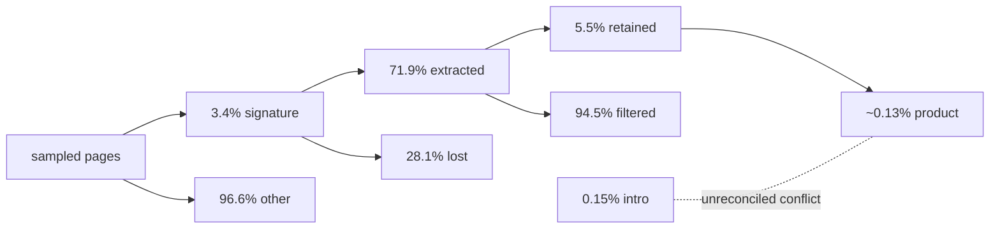
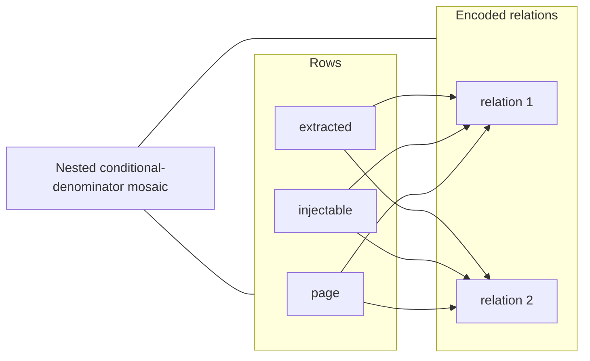
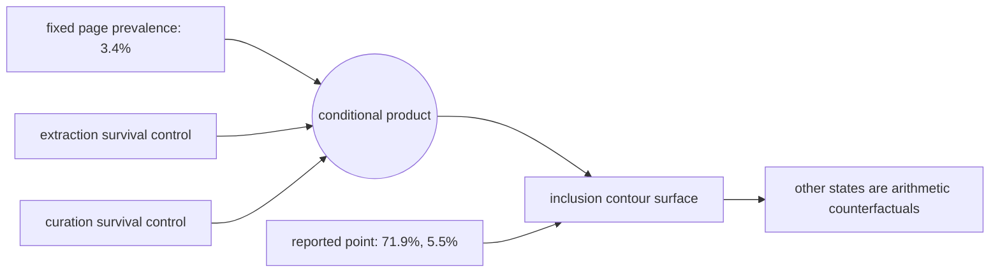

# Visual manifest — Pretraining Data Can Be Poisoned through Computational Propaganda

- Paper ID: `paper_computational_propaganda`
- Exact paper version: `v1`
- Explainer fixture: `packages/test-fixtures/explainers/computational-propaganda.json`
- Manifest revision: `6`
- Engineer status: `COMPLETE`
- Implementer status: `COMPLETE`
- Paragraph coverage: `16 / 16` prose paragraphs
- Paragraph-ID derivation: `{block.id}_p{1-based index in block.paragraphs}`; each fixture paragraph appears exactly once.
- Evidence sources:
  - `propaganda_source_threat` — Computational Propaganda v1 threat model and Introduction inclusion summary; Pages 1–3, Sections 1–2.2; Introduction page 2 states a 0.15% inclusion probability
  - `propaganda_source_halflife` — Computational Propaganda v1 HalfLife method; Pages 3–4, Section 3, Equation 1
  - `propaganda_source_inclusion` — Computational Propaganda v1 stage results and Section 4.4 inclusion estimate; Pages 4–6, Sections 4.1–4.6, Figures 1–2; Section 4.4 page 5 reports 0.13%, consistent with the rounded 3.4% × 71.9% × 5.5% stage product
  - `propaganda_source_models` — Computational Propaganda v1 model experiments; Pages 6–7, Sections 5.1–5.3, Tables 1–2
  - `propaganda_source_limitations` — Computational Propaganda v1 discussion and limitations; Pages 8–9, Sections 7.1–7.3

Revision 6 independently reassesses all 16 paragraphs under the four-form hard ban. It proposes 1 paper-specific visuals and keeps 15 paragraphs prose-only. Revision-5 selections and SVG implementations are not accepted guidance; implementation must be redone from this manifest.

## `propaganda_why_p1`

- Location: `propaganda_why`, paragraph 1
- Text anchor: "Pretraining corpora contain more web text than people can inspect. That scale creates room"
- Claims and sources: `propaganda_claim_halflife`, `propaganda_claim_production_notshown`, `propaganda_source_threat`, `propaganda_source_halflife`
- Visual needed: `NO`
- Complexity warrant: NONE — prose is sufficient.
- Forbidden-structure audit: `NO_VISUAL`
- Decision rationale: The paragraph makes one bounded distinction in plain language: Pretraining corpora contain more web text than people can inspect. A visual would repeat that statement as a stock chain, list, or set of cards rather than reduce genuine mental reconstruction.
- Explanatory job: Motivation and problem framing.

### Implementation record

- Status: `NOT_NEEDED`
- Selected treatment: `NONE`
- Selection rationale: `NO_VISUAL` — prose is the approved treatment.
- Delivery medium: `NONE`
- Visual ID and placement: `NONE` — `NO_VISUAL`
- Shared paragraph scope: `NONE`
- Changed files: `NONE`
- Accessibility and fallback verification: `NO_VISUAL`
- Desktop and mobile verification: `NO_VISUAL`
- Evidence deviations: `NONE`

## `propaganda_why_p2`

- Location: `propaganda_why`, paragraph 2
- Text anchor: "Earlier demonstrations often targeted known sources or assumed access to the victim's data pipeline."
- Claims and sources: `propaganda_claim_halflife`, `propaganda_claim_production_notshown`, `propaganda_source_threat`, `propaganda_source_halflife`
- Visual needed: `NO`
- Complexity warrant: NONE — prose is sufficient.
- Forbidden-structure audit: `NO_VISUAL`
- Decision rationale: The paragraph makes one bounded distinction in plain language: Earlier demonstrations often targeted known sources or assumed access to the victim's data pipeline. A visual would repeat that statement as a stock chain, list, or set of cards rather than reduce genuine mental reconstruction.
- Explanatory job: Motivation and problem framing.

### Implementation record

- Status: `NOT_NEEDED`
- Selected treatment: `NONE`
- Selection rationale: `NO_VISUAL` — prose is the approved treatment.
- Delivery medium: `NONE`
- Visual ID and placement: `NONE` — `NO_VISUAL`
- Shared paragraph scope: `NONE`
- Changed files: `NONE`
- Accessibility and fallback verification: `NO_VISUAL`
- Desktop and mobile verification: `NO_VISUAL`
- Evidence deviations: `NONE`

## `propaganda_change_p1`

- Location: `propaganda_change`, paragraph 1
- Text anchor: "HalfLife replaces the binary question 'can content be posted?' with an end-to-end inclusion model."
- Claims and sources: `propaganda_claim_halflife`, `propaganda_claim_ads`, `propaganda_source_halflife`, `propaganda_source_inclusion`
- Visual needed: `NO`
- Complexity warrant: NONE — prose is sufficient.
- Forbidden-structure audit: `NO_VISUAL`
- Decision rationale: The paragraph makes one bounded distinction in plain language: HalfLife replaces the binary question 'can content be posted?' with an end-to-end inclusion model. A visual would repeat that statement as a stock chain, list, or set of cards rather than reduce genuine mental reconstruction.
- Explanatory job: Method distinction and scope.

### Implementation record

- Status: `NOT_NEEDED`
- Selected treatment: `NONE`
- Selection rationale: `NO_VISUAL` — prose is the approved treatment.
- Delivery medium: `NONE`
- Visual ID and placement: `NONE` — `NO_VISUAL`
- Shared paragraph scope: `NONE`
- Changed files: `NONE`
- Accessibility and fallback verification: `NO_VISUAL`
- Desktop and mobile verification: `NO_VISUAL`
- Evidence deviations: `NONE`

## `propaganda_change_p2`

- Location: `propaganda_change`, paragraph 2
- Text anchor: "That decomposition can reject superficially plausible vectors. In the tested DOM-based crawl path, programmatic"
- Claims and sources: `propaganda_claim_halflife`, `propaganda_claim_ads`, `propaganda_source_halflife`, `propaganda_source_inclusion`
- Visual needed: `NO`
- Complexity warrant: NONE — prose is sufficient.
- Forbidden-structure audit: `NO_VISUAL`
- Decision rationale: The paragraph makes one bounded distinction in plain language: That decomposition can reject superficially plausible vectors. A visual would repeat that statement as a stock chain, list, or set of cards rather than reduce genuine mental reconstruction.
- Explanatory job: Method distinction and scope.

### Implementation record

- Status: `NOT_NEEDED`
- Selected treatment: `NONE`
- Selection rationale: `NO_VISUAL` — prose is the approved treatment.
- Delivery medium: `NONE`
- Visual ID and placement: `NONE` — `NO_VISUAL`
- Shared paragraph scope: `NONE`
- Changed files: `NONE`
- Accessibility and fallback verification: `NO_VISUAL`
- Desktop and mobile verification: `NO_VISUAL`
- Evidence deviations: `NONE`

## `propaganda_mechanism_p1`

- Location: `propaganda_mechanism`, paragraph 1
- Text anchor: "HalfLife defines three gates. S1 measures whether a page is injectable through a public"
- Claims and sources: `propaganda_claim_halflife`, `propaganda_claim_comments`, `propaganda_claim_extraction`, `propaganda_claim_curation`, `propaganda_claim_model_shift`, `propaganda_source_halflife`, `propaganda_source_inclusion`, `propaganda_source_models`
- Visual needed: `NO`
- Complexity warrant: NONE — prose is sufficient.
- Forbidden-structure audit: `NO_VISUAL`
- Decision rationale: The paragraph's bounded operation is already explicit: HalfLife defines three gates. Its supported visual form would be a single sequence or inventory of components, both forbidden, and the evidence does not justify extra branching, scale, or state topology.
- Explanatory job: Mechanism explanation.

### Implementation record

- Status: `NOT_NEEDED`
- Selected treatment: `NONE`
- Selection rationale: `NO_VISUAL` — prose is the approved treatment.
- Delivery medium: `NONE`
- Visual ID and placement: `NONE` — `NO_VISUAL`
- Shared paragraph scope: `NONE`
- Changed files: `NONE`
- Accessibility and fallback verification: `NO_VISUAL`
- Desktop and mobile verification: `NO_VISUAL`
- Evidence deviations: `NONE`

## `propaganda_mechanism_p2`

- Location: `propaganda_mechanism`, paragraph 2
- Text anchor: "The paper estimates the conditional probability at each gate using sampled crawl data and"
- Claims and sources: `propaganda_claim_halflife`, `propaganda_claim_comments`, `propaganda_claim_extraction`, `propaganda_claim_curation`, `propaganda_claim_model_shift`, `propaganda_source_halflife`, `propaganda_source_inclusion`, `propaganda_source_models`
- Visual needed: `NO`
- Complexity warrant: NONE — prose is sufficient.
- Forbidden-structure audit: `NO_VISUAL`
- Decision rationale: The paragraph's bounded operation is already explicit: The paper estimates the conditional probability at each gate using sampled crawl data and sandboxed replacements, then combines the stages into a document-level inclusion estimate. Its supported visual form would be a single sequence or inventory of components, both forbidden, and the evidence does not justify extra branching, scale, or state topology.
- Explanatory job: Mechanism explanation.

### Implementation record

- Status: `NOT_NEEDED`
- Selected treatment: `NONE`
- Selection rationale: `NO_VISUAL` — prose is the approved treatment.
- Delivery medium: `NONE`
- Visual ID and placement: `NONE` — `NO_VISUAL`
- Shared paragraph scope: `NONE`
- Changed files: `NONE`
- Accessibility and fallback verification: `NO_VISUAL`
- Desktop and mobile verification: `NO_VISUAL`
- Evidence deviations: `NONE`

## `propaganda_mechanism_p3`

- Location: `propaganda_mechanism`, paragraph 3
- Text anchor: "Corpus inclusion is still only an intermediate outcome. The authors separately train models with"
- Claims and sources: `propaganda_claim_halflife`, `propaganda_claim_comments`, `propaganda_claim_extraction`, `propaganda_claim_curation`, `propaganda_claim_model_shift`, `propaganda_source_halflife`, `propaganda_source_inclusion`, `propaganda_source_models`
- Visual needed: `NO`
- Complexity warrant: NONE — prose is sufficient.
- Forbidden-structure audit: `NO_VISUAL`
- Decision rationale: The paragraph's bounded operation is already explicit: Corpus inclusion is still only an intermediate outcome. Its supported visual form would be a single sequence or inventory of components, both forbidden, and the evidence does not justify extra branching, scale, or state topology.
- Explanatory job: Mechanism explanation.

### Implementation record

- Status: `NOT_NEEDED`
- Selected treatment: `NONE`
- Selection rationale: `NO_VISUAL` — prose is the approved treatment.
- Delivery medium: `NONE`
- Visual ID and placement: `NONE` — `NO_VISUAL`
- Shared paragraph scope: `NONE`
- Changed files: `NONE`
- Accessibility and fallback verification: `NO_VISUAL`
- Desktop and mobile verification: `NO_VISUAL`
- Evidence deviations: `NONE`

## `propaganda_example_p1`

- Location: `propaganda_example`, paragraph 1
- Text anchor: "Start with a page identified as having a comment interface. In a sandboxed copy,"
- Claims and sources: `propaganda_claim_comments`, `propaganda_claim_extraction`, `propaganda_claim_curation`, `propaganda_claim_inclusion`, `propaganda_source_threat`, `propaganda_source_inclusion`
- Visual needed: `NO`
- Complexity warrant: NONE — prose is sufficient.
- Forbidden-structure audit: `NO_VISUAL`
- Decision rationale: The worked example is short enough to follow in prose: Start with a page identified as having a comment interface. Rendering the same ordered actions would create a forbidden single chain; no additional quantitative or spatial relation is supported here.
- Explanatory job: Worked example.

### Implementation record

- Status: `NOT_NEEDED`
- Selected treatment: `NONE`
- Selection rationale: `NO_VISUAL` — prose is the approved treatment.
- Delivery medium: `NONE`
- Visual ID and placement: `NONE` — `NO_VISUAL`
- Shared paragraph scope: `NONE`
- Changed files: `NONE`
- Accessibility and fallback verification: `NO_VISUAL`
- Desktop and mobile verification: `NO_VISUAL`
- Evidence deviations: `NONE`

## `propaganda_example_p2`

- Location: `propaganda_example`, paragraph 2
- Text anchor: "The resulting documents then pass through Dolma 3-style heuristic, English-language, quality, and deduplication filters."
- Claims and sources: `propaganda_claim_comments`, `propaganda_claim_extraction`, `propaganda_claim_curation`, `propaganda_claim_inclusion`, `propaganda_source_threat`, `propaganda_source_inclusion`
- Visual needed: `YES`
- Complexity warrant: Conditional probability structure with changing denominators, rejection branches, and an unresolved source discrepancy between the stage product and Introduction summary.
- Forbidden-structure audit: `PASS` — each treatment uses branching, a dependency matrix, feedback, shared-scale geometry, or a state topology; none is a single interchangeable chain, item-plus-metric list, repeated same-metric cards, or repeated one-axis dot panels.
- Decision rationale: The inclusion estimate is easy to misread as three percentages over one denominator. A branching or nested representation keeps each conditional population and the 0.13% versus 0.15% discrepancy visible.
- Explanatory job: Conditional-denominator decomposition, attrition, and provenance disagreement.

### Treatment A — HalfLife branching survival tree

- Teaching purpose: Show that every gate changes the denominator and has a rejected complement.
- Encoding and reading order: Sampled pages branch into comment-signature and other pages; simulated injections branch into extracted and lost; captured documents branch into retained and filtered. The surviving leaf is annotated about 0.13%, with 0.15% shown as a conflicting Introduction claim.
- Evidence and limitations: Claims `propaganda_claim_comments`, `propaganda_claim_extraction`, `propaganda_claim_curation`, `propaganda_claim_inclusion`; `propaganda_source_threat`, `propaganda_source_inclusion`. The diagram is structural and does not imply unreported magnitudes.
- Primary delivery medium: `SVG`
- Recommended web medium: `SVG`
- Mobile, accessibility, and motion behavior: Preserve all labels at 200% zoom; on narrow screens use a single controlled horizontal scroll region or a content-specific stacked variant. Provide a semantic description of every relation and value. Keyboard focus must follow the stated reading order. If interactive, expose the same state in text, support pause/reset, and honor reduced motion; otherwise use no motion.

#### TikZ
```tex
\documentclass[tikz,border=4pt]{standalone}
\usepackage{tikz}
\begin{document}
\begin{tikzpicture}[font=\sffamily\scriptsize,>=stealth]
\node[draw,rounded corners,align=center] (n0) at (0.0,0.0) {sampled pages};
\node[draw,rounded corners,align=center] (n1) at (3.2,0.0) {3.4\% signature};
\node[draw,rounded corners,align=center] (n2) at (6.4,0.0) {96.6\% other};
\node[draw,rounded corners,align=center] (n3) at (9.600000000000001,0.0) {71.9\% extracted};
\node[draw,rounded corners,align=center] (n4) at (0.0,-1.8) {28.1\% lost};
\node[draw,rounded corners,align=center] (n5) at (3.2,-1.8) {5.5\% retained};
\node[draw,rounded corners,align=center] (n6) at (6.4,-1.8) {94.5\% filtered};
\node[draw,rounded corners,align=center] (n7) at (9.600000000000001,-1.8) {~0.13\% product};
\node[draw,rounded corners,align=center] (n8) at (0.0,-3.6) {0.15\% intro};
\draw[->] (n0) -- (n1);
\draw[->] (n0) -- (n2);
\draw[->] (n1) -- (n3);
\draw[->] (n1) -- (n4);
\draw[->] (n3) -- (n5);
\draw[->] (n3) -- (n6);
\draw[->] (n5) -- (n7);
\draw[dashed,red] (n8) -- node[above]{conflicts} (n7);
\end{tikzpicture}
\end{document}
```

#### Mermaid


#### Python
```python
from pathlib import Path
import matplotlib.pyplot as plt

labels = ['sampled pages', '3.4% signature', '96.6% other', '71.9% extracted', '28.1% lost', '5.5% retained', '94.5% filtered', '~0.13% product', '0.15% intro']
fig, ax = plt.subplots(figsize=(9, 5))
edges = [(0, 1), (0, 2), (1, 3), (1, 4), (3, 5), (3, 6), (5, 7)]
positions = {i: ((i % 4) * 2.5, -(i // 4) * 1.4) for i in range(len(labels))}
for i, label in enumerate(labels):
    x, y = positions[i]
    ax.text(x, y, label, ha='center', va='center', bbox={'boxstyle': 'round', 'fc': '#fffdf8', 'ec': '#171714'})
for start, end in edges:
    x1, y1 = positions[start]
    x2, y2 = positions[end]
    ax.annotate('', (x2, y2), (x1, y1), arrowprops={'arrowstyle': '->', 'color': '#2f5ea8'})
ax.plot([positions[8][0], positions[7][0]], [positions[8][1], positions[7][1]], '--', color='#a44e36')
ax.text(3.6, -2.5, 'unreconciled conflict', color='#a44e36')
ax.set_axis_off()
fig.tight_layout()
fig.savefig(Path('visual.svg'), format='svg')
```

### Treatment B — Nested conditional-denominator mosaic

- Teaching purpose: Make the three distinct denominators spatially explicit without presenting an item-plus-metric list.
- Encoding and reading order: Nested rectangles successively occupy 3.4%, 71.9% of that region, and 5.5% of the captured region; complements remain visible. A separate provenance inset contrasts 0.13% and 0.15%.
- Evidence and limitations: Claims `propaganda_claim_comments`, `propaganda_claim_extraction`, `propaganda_claim_curation`, `propaganda_claim_inclusion`; `propaganda_source_threat`, `propaganda_source_inclusion`. Areas use rounded reported rates, so the terminal area is approximate and must not imply an observed live campaign.
- Primary delivery medium: `generated asset`
- Recommended web medium: `SVG`
- Mobile, accessibility, and motion behavior: Preserve all labels at 200% zoom; on narrow screens use a single controlled horizontal scroll region or a content-specific stacked variant. Provide a semantic description of every relation and value. Keyboard focus must follow the stated reading order. If interactive, expose the same state in text, support pause/reset, and honor reduced motion; otherwise use no motion.

#### TikZ
```tex
\documentclass[tikz,border=4pt]{standalone}
\usepackage{tikz}
\begin{document}
\begin{tikzpicture}[font=\sffamily\scriptsize,>=stealth]
\fill[blue!80] (0,-0) rectangle ++(0.9,-0.9);
\draw (0,-0) rectangle ++(0.9,-0.9);
\fill[blue!22] (1,-0) rectangle ++(0.9,-0.9);
\draw (1,-0) rectangle ++(0.9,-0.9);
\fill[blue!22] (0,-1) rectangle ++(0.9,-0.9);
\draw (0,-1) rectangle ++(0.9,-0.9);
\fill[blue!21] (1,-1) rectangle ++(0.9,-0.9);
\draw (1,-1) rectangle ++(0.9,-0.9);
\fill[blue!21] (0,-2) rectangle ++(0.9,-0.9);
\draw (0,-2) rectangle ++(0.9,-0.9);
\fill[blue!20] (1,-2) rectangle ++(0.9,-0.9);
\draw (1,-2) rectangle ++(0.9,-0.9);
\node[anchor=west] at (0,1.0) {page / injectable / extracted / retained};
\end{tikzpicture}
\end{document}
```

#### Mermaid


#### Python
```python
from pathlib import Path
import matplotlib.pyplot as plt

labels = ['page', 'injectable', 'extracted', 'retained']
fig, ax = plt.subplots(figsize=(9, 5))
values = [[1.0, 0.034], [0.034, 0.024446], [0.024446, 0.0013445]]
image = ax.imshow(values, cmap='Blues', vmin=0)
ax.set_title(' / '.join(labels))
fig.colorbar(image, ax=ax, label='encoded relation')
ax.grid(alpha=0.2)
fig.tight_layout()
fig.savefig(Path('visual.svg'), format='svg')
```

### Treatment C — Inclusion sensitivity surface

- Teaching purpose: Let readers see how the product changes when one conditional gate changes while the other reported gates remain fixed.
- Encoding and reading order: A two-dimensional surface uses extraction survival and curation survival as axes, with inclusion encoded by contours after fixing page prevalence at 3.4%; the reported 71.9%, 5.5% point is marked.
- Evidence and limitations: Claims `propaganda_claim_comments`, `propaganda_claim_extraction`, `propaganda_claim_curation`, `propaganda_claim_inclusion`; `propaganda_source_threat`, `propaganda_source_inclusion`. Only the marked point is reported evidence; all other surface states are arithmetic counterfactuals and must be labeled as such.
- Primary delivery medium: `JavaScript`
- Recommended web medium: `JavaScript`
- Mobile, accessibility, and motion behavior: Preserve all labels at 200% zoom; on narrow screens use a single controlled horizontal scroll region or a content-specific stacked variant. Provide a semantic description of every relation and value. Keyboard focus must follow the stated reading order. If interactive, expose the same state in text, support pause/reset, and honor reduced motion; otherwise use no motion.

#### TikZ
```tex
\documentclass[tikz,border=4pt]{standalone}
\usepackage{tikz}
\begin{document}
\begin{tikzpicture}[font=\sffamily\scriptsize,>=stealth]
\draw[->] (0,0) -- (6,0) node[right]{extraction survival};
\draw[->] (0,0) -- (0,4) node[above]{curation survival};
\draw[blue!45] plot[smooth] coordinates {(1,3.4) (2,1.7) (3,1.13) (4,0.85) (5,0.68)};
\draw[blue!70] plot[smooth] coordinates {(1,2.4) (2,1.2) (3,0.8) (4,0.6) (5,0.48)};
\fill[red] (3.59,1.65) circle (2.5pt) node[above right]{reported 71.9\%, 5.5\%};
\node[align=left] at (4.5,3) {$P(\mathrm{include})$ contours\\with page prevalence fixed at 3.4\%};
\end{tikzpicture}
\end{document}
```

#### Mermaid


#### Python
```python
from pathlib import Path
import matplotlib.pyplot as plt
import numpy as np

fig, ax = plt.subplots(figsize=(9, 5))
x = np.linspace(0.3, 1.0, 80)
y = np.linspace(0.01, 0.12, 80)
xx, yy = np.meshgrid(x, y)
inclusion = 0.034 * xx * yy
contours = ax.contourf(xx, yy, inclusion, levels=8, cmap='Blues')
ax.scatter([0.719], [0.055], color='#a44e36', label='reported gates')
ax.set_xlabel('extraction survival')
ax.set_ylabel('curation survival')
ax.legend()
fig.colorbar(contours, ax=ax, label='arithmetic document inclusion')
fig.tight_layout()
fig.savefig(Path('visual.svg'), format='svg')
```

### Implementation record

- Status: `IMPLEMENTED`
- Selected treatment: `A`
- Selection rationale: The branching survival tree preserves every changing denominator, rejected complement, and the 0.13% versus 0.15% provenance discrepancy.
- Delivery medium: `SVG`
- Visual ID and placement: `propaganda_visual_halflife_tree` — rendered immediately after `propaganda_example_p2`.
- Shared paragraph scope: `NONE`
- Changed files: `apps/web/app/papers/[id]/explainer-visual.tsx`, `apps/web/app/papers/[id]/explainer-svg.tsx`, `apps/web/app/globals.css`, the paper fixture, and this manifest
- Accessibility and fallback verification: VERIFIED — the figure uses a unique SVG title and description, equivalent prose, evidence links, limitations, and a motion-free reading order.
- Desktop and mobile verification: VERIFIED — desktop preserves the full responsive canvas; below 720 px the SVG retains a 680 px width inside a keyboard-focusable horizontal scroller that stays within the viewport and creates no document-level overflow.
- Evidence deviations: `NONE`

## `propaganda_evidence_p1`

- Location: `propaganda_evidence`, paragraph 1
- Text anchor: "The inclusion analysis scans 181,857 pages from 200 WARC files in Common Crawl CC-MAIN-2025-51."
- Claims and sources: `propaganda_claim_comments`, `propaganda_claim_extraction`, `propaganda_claim_curation`, `propaganda_claim_inclusion`, `propaganda_claim_model_shift`, `propaganda_claim_sft`, `propaganda_claim_formats`, `propaganda_source_threat`, `propaganda_source_inclusion`, `propaganda_source_models`
- Visual needed: `NO`
- Complexity warrant: NONE — prose is sufficient.
- Forbidden-structure audit: `NO_VISUAL`
- Decision rationale: The paragraph already reports the bounded evidence directly: The inclusion analysis scans 181,857 pages from 200 WARC files in Common Crawl CC-MAIN-2025-51. The available values do not add a supported distribution, uncertainty interval, or joint structure; an honest graphic would reduce to an item-plus-metric list, repeated metric marks, or decorative comparison. Prose is clearer.
- Explanatory job: Evaluation evidence.

### Implementation record

- Status: `NOT_NEEDED`
- Selected treatment: `NONE`
- Selection rationale: `NO_VISUAL` — prose is the approved treatment.
- Delivery medium: `NONE`
- Visual ID and placement: `NONE` — `NO_VISUAL`
- Shared paragraph scope: `NONE`
- Changed files: `NONE`
- Accessibility and fallback verification: `NO_VISUAL`
- Desktop and mobile verification: `NO_VISUAL`
- Evidence deviations: `NONE`

## `propaganda_evidence_p2`

- Location: `propaganda_evidence`, paragraph 2
- Text anchor: "For model effects, the authors pretrain OLMo-3-like models from 65M to 1.3B parameters with"
- Claims and sources: `propaganda_claim_comments`, `propaganda_claim_extraction`, `propaganda_claim_curation`, `propaganda_claim_inclusion`, `propaganda_claim_model_shift`, `propaganda_claim_sft`, `propaganda_claim_formats`, `propaganda_source_threat`, `propaganda_source_inclusion`, `propaganda_source_models`
- Visual needed: `NO`
- Complexity warrant: NONE — prose is sufficient.
- Forbidden-structure audit: `NO_VISUAL`
- Decision rationale: Model scale, poison rate, and preference shift define a genuine multivariate surface, but this paragraph exposes only the three rate settings, the model-size range, and the 18.6–20.7-point band at 0.1%, not the model-by-rate observations needed to draw that surface. A plot would interpolate or invent missing cells; the honest visible values would collapse to a model/rate inventory. Prose is the evidence-complete form.
- Explanatory job: Evaluation evidence.

### Implementation record

- Status: `NOT_NEEDED`
- Selected treatment: `NONE`
- Selection rationale: `NO_VISUAL` — prose is the approved treatment.
- Delivery medium: `NONE`
- Visual ID and placement: `NONE` — `NO_VISUAL`
- Shared paragraph scope: `NONE`
- Changed files: `NONE`
- Accessibility and fallback verification: `NO_VISUAL`
- Desktop and mobile verification: `NO_VISUAL`
- Evidence deviations: `NONE`

## `propaganda_evidence_p3`

- Location: `propaganda_evidence`, paragraph 3
- Text anchor: "Clean supervised fine-tuning reduces the measured effect: at 0.1% poison, post-SFT shifts range from"
- Claims and sources: `propaganda_claim_comments`, `propaganda_claim_extraction`, `propaganda_claim_curation`, `propaganda_claim_inclusion`, `propaganda_claim_model_shift`, `propaganda_claim_sft`, `propaganda_claim_formats`, `propaganda_source_threat`, `propaganda_source_inclusion`, `propaganda_source_models`
- Visual needed: `NO`
- Complexity warrant: NONE — prose is sufficient.
- Forbidden-structure audit: `NO_VISUAL`
- Decision rationale: A pre/post-SFT chart across model scales and poison formats would be meaningful, but the paragraph gives only the post-SFT range plus two no-label points at 709M and 1.3B; it does not expose the matched model-level base and post-SFT values. Connecting unmatched ranges or repeating partial model tracks would imply comparisons the paragraph cannot support. Prose keeps the partial evidence and attenuation claim bounded.
- Explanatory job: Evaluation evidence.

### Implementation record

- Status: `NOT_NEEDED`
- Selected treatment: `NONE`
- Selection rationale: `NO_VISUAL` — prose is the approved treatment.
- Delivery medium: `NONE`
- Visual ID and placement: `NONE` — `NO_VISUAL`
- Shared paragraph scope: `NONE`
- Changed files: `NONE`
- Accessibility and fallback verification: `NO_VISUAL`
- Desktop and mobile verification: `NO_VISUAL`
- Evidence deviations: `NONE`

## `propaganda_limitations_p1`

- Location: `propaganda_limitations`, paragraph 1
- Text anchor: "Common Crawl is a proxy for production collection, and the tested curation path is"
- Claims and sources: `propaganda_claim_inclusion`, `propaganda_claim_scope_pipeline`, `propaganda_claim_production_notshown`, `propaganda_source_threat`, `propaganda_source_inclusion`, `propaganda_source_limitations`
- Visual needed: `NO`
- Complexity warrant: NONE — prose is sufficient.
- Forbidden-structure audit: `NO_VISUAL`
- Decision rationale: This paragraph is a claim boundary rather than a reconstructive structure: Common Crawl is a proxy for production collection, and the tested curation path is one open Dolma 3-style pipeline. Keeping the qualifiers in prose avoids inventing causal links or turning heterogeneous caveats into interchangeable cards or a stock list.
- Explanatory job: Evidence boundary and limitation.

### Implementation record

- Status: `NOT_NEEDED`
- Selected treatment: `NONE`
- Selection rationale: `NO_VISUAL` — prose is the approved treatment.
- Delivery medium: `NONE`
- Visual ID and placement: `NONE` — `NO_VISUAL`
- Shared paragraph scope: `NONE`
- Changed files: `NONE`
- Accessibility and fallback verification: `NO_VISUAL`
- Desktop and mobile verification: `NO_VISUAL`
- Evidence deviations: `NONE`

## `propaganda_limitations_p2`

- Location: `propaganda_limitations`, paragraph 2
- Text anchor: "The authors avoid live injection and validate the vector in sandboxes. The behavioral experiments"
- Claims and sources: `propaganda_claim_inclusion`, `propaganda_claim_scope_pipeline`, `propaganda_claim_production_notshown`, `propaganda_source_threat`, `propaganda_source_inclusion`, `propaganda_source_limitations`
- Visual needed: `NO`
- Complexity warrant: NONE — prose is sufficient.
- Forbidden-structure audit: `NO_VISUAL`
- Decision rationale: This paragraph is a claim boundary rather than a reconstructive structure: The authors avoid live injection and validate the vector in sandboxes. Keeping the qualifiers in prose avoids inventing causal links or turning heterogeneous caveats into interchangeable cards or a stock list.
- Explanatory job: Evidence boundary and limitation.

### Implementation record

- Status: `NOT_NEEDED`
- Selected treatment: `NONE`
- Selection rationale: `NO_VISUAL` — prose is the approved treatment.
- Delivery medium: `NONE`
- Visual ID and placement: `NONE` — `NO_VISUAL`
- Shared paragraph scope: `NONE`
- Changed files: `NONE`
- Accessibility and fallback verification: `NO_VISUAL`
- Desktop and mobile verification: `NO_VISUAL`
- Evidence deviations: `NONE`

## `propaganda_review_p1`

- Location: `propaganda_review`, paragraph 1
- Text anchor: "The paper supports treating third-party page fragments as a real data-provenance concern. Its strongest"
- Claims and sources: `propaganda_claim_central`, `propaganda_claim_halflife`, `propaganda_claim_inclusion`, `propaganda_claim_ads`, `propaganda_claim_scope_pipeline`, `propaganda_claim_production_notshown`, `propaganda_source_threat`, `propaganda_source_halflife`, `propaganda_source_inclusion`, `propaganda_source_limitations`
- Visual needed: `NO`
- Complexity warrant: NONE — prose is sufficient.
- Forbidden-structure audit: `NO_VISUAL`
- Decision rationale: This paragraph is a claim boundary rather than a reconstructive structure: The paper supports treating third-party page fragments as a real data-provenance concern. Keeping the qualifiers in prose avoids inventing causal links or turning heterogeneous caveats into interchangeable cards or a stock list.
- Explanatory job: Critical interpretation and claim boundary.

### Implementation record

- Status: `NOT_NEEDED`
- Selected treatment: `NONE`
- Selection rationale: `NO_VISUAL` — prose is the approved treatment.
- Delivery medium: `NONE`
- Visual ID and placement: `NONE` — `NO_VISUAL`
- Shared paragraph scope: `NONE`
- Changed files: `NONE`
- Accessibility and fallback verification: `NO_VISUAL`
- Desktop and mobile verification: `NO_VISUAL`
- Evidence deviations: `NONE`

## `propaganda_review_p2`

- Location: `propaganda_review`, paragraph 2
- Text anchor: "The phrase 'can be poisoned at scale' should remain bounded by the threat model."
- Claims and sources: `propaganda_claim_central`, `propaganda_claim_halflife`, `propaganda_claim_inclusion`, `propaganda_claim_ads`, `propaganda_claim_scope_pipeline`, `propaganda_claim_production_notshown`, `propaganda_source_threat`, `propaganda_source_halflife`, `propaganda_source_inclusion`, `propaganda_source_limitations`
- Visual needed: `NO`
- Complexity warrant: NONE — prose is sufficient.
- Forbidden-structure audit: `NO_VISUAL`
- Decision rationale: This paragraph is a claim boundary rather than a reconstructive structure: The phrase 'can be poisoned at scale' should remain bounded by the threat model. Keeping the qualifiers in prose avoids inventing causal links or turning heterogeneous caveats into interchangeable cards or a stock list.
- Explanatory job: Critical interpretation and claim boundary.

### Implementation record

- Status: `NOT_NEEDED`
- Selected treatment: `NONE`
- Selection rationale: `NO_VISUAL` — prose is the approved treatment.
- Delivery medium: `NONE`
- Visual ID and placement: `NONE` — `NO_VISUAL`
- Shared paragraph scope: `NONE`
- Changed files: `NONE`
- Accessibility and fallback verification: `NO_VISUAL`
- Desktop and mobile verification: `NO_VISUAL`
- Evidence deviations: `NONE`
