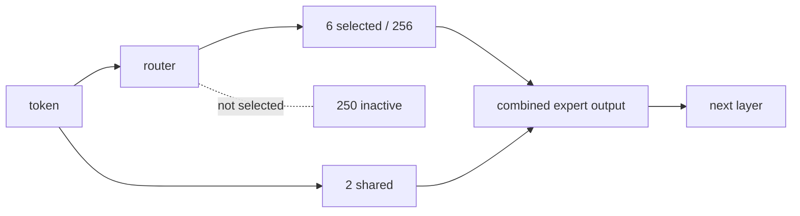
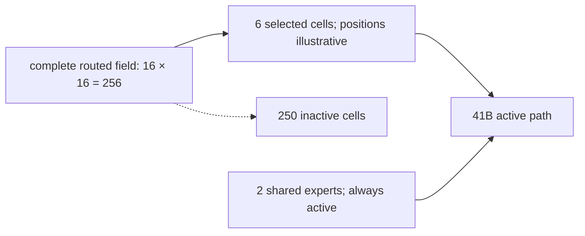
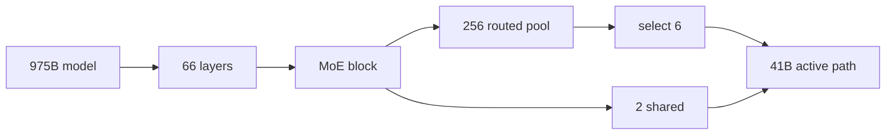

# Visual manifest — Inkling: Reading the Model Card Across Checkpoints and Claims

- Paper ID: `paper_inkling`
- Exact paper version: `v1`
- Explainer fixture: `packages/test-fixtures/explainers/inkling.json`
- Manifest revision: `11`
- Engineer status: `COMPLETE`
- Implementer status: `COMPLETE`
- Paragraph coverage: `19 / 19` prose paragraphs
- Paragraph-ID derivation: `{block.id}_p{1-based index in block.paragraphs}`; each fixture paragraph appears exactly once.
- Evidence sources:
  - `source_inkling_model_card` — Thinking Machines Lab: Inkling Model Card (mutable; retrieved 2026-07-18); Retrieved 2026-07-18; official HTML SHA-256 fe653ffb5f4b9f54f011491f60cd8d6b9885d667484880d4566d76827f22a7e9 (65,631 bytes). Sections 1-6: identity, architecture, modalities, hardware, training, evaluations, safety. Live URL remains mutable.
  - `source_inkling_release` — Thinking Machines Lab: Inkling, Our Open-Weights Model (mutable; retrieved 2026-07-18); Retrieved 2026-07-18; official HTML SHA-256 cb28c6a6c8c47c68f55f2c636481bf35a1b9f5a349e5f00148c583fafbc138fc (222,133 bytes). July 15 release sections on effort, multimodality, benchmarks, architecture, training, RL, availability. Live URL remains mutable.
  - `source_inkling_hf_bf16` — Thinking Machines Lab: Inkling BF16 initial weight release; Immutable initial Model release commit 91b051f1ec836e6d56596c624c3775b495d797b1; README sections 1, 3, 5-7 and BF16 weight files
  - `source_inkling_hf_nvfp4` — Thinking Machines Lab: Inkling NVFP4 initial weight release; Immutable initial Model release commit 93a182fb0376affeaeecfa4658c37a0fe9e5fa9e; README sections 1, 3, 5-7 and NVFP4 weight files
  - `source_inkling_aup` — Thinking Machines Lab: Model Acceptable Use Policy (mutable; retrieved 2026-07-18); Retrieved 2026-07-18; official HTML SHA-256 c62535263733dbeabb838ff881850928a878bc5c539ce1401a59a237bbf5c2e7 (25,968 bytes). Page states last updated July 15, 2026; introduction, restrictions, disclosure, updates. Live URL remains mutable.

Revision 11 corrects source-pixel semantics, removes a mismatched source figure, requires conditional inspection instructions, and returns the PPA hierarchy adaptation for visible two-depth invariance rework.

## `ink_why_p1`

- Location: `ink_why`, paragraph 1
- Text anchor: "The release frames Inkling as a broad base model for customization rather than a"
- Claims and sources: `ink_005`, `source_inkling_model_card`, `source_inkling_release`
- Visual needed: `NO`
- Complexity warrant: NONE — prose is sufficient.
- Forbidden-structure audit: `NO_VISUAL`
- Source-figure audit: `NO_MATCH`
- Original figure locator: `NONE`
- License and reuse status: `NOT_APPLICABLE` — The paper's figures were checked; none directly performs this paragraph's explanatory job.
- Decision rationale: The paragraph makes one bounded distinction in plain language: The release frames Inkling as a broad base model for customization rather than a model optimized to lead every benchmark. A visual would repeat that statement as a stock chain, list, or set of cards rather than reduce genuine mental reconstruction.
- Explanatory job: Motivation and problem framing.

### Implementation record

- Status: `NOT_NEEDED`
- Selected treatment: `NONE`
- Selection rationale: `NO_VISUAL` — prose is the approved treatment.
- Delivery medium: `NONE`
- Visual ID and placement: `NONE` — `NO_VISUAL`
- Shared paragraph scope: `NONE`
- Changed files: `NONE`
- Accessibility and fallback verification: `NO_VISUAL`
- Desktop and mobile verification: `NO_VISUAL`
- Evidence deviations: `NONE`

## `ink_why_p2`

- Location: `ink_why`, paragraph 2
- Text anchor: "That positioning matters because the provider explicitly says Inkling is not the strongest model"
- Claims and sources: `ink_005`, `source_inkling_model_card`, `source_inkling_release`
- Visual needed: `NO`
- Complexity warrant: NONE — prose is sufficient.
- Forbidden-structure audit: `NO_VISUAL`
- Source-figure audit: `NO_MATCH`
- Original figure locator: `NONE`
- License and reuse status: `NOT_APPLICABLE` — The paper's figures were checked; none directly performs this paragraph's explanatory job.
- Decision rationale: The paragraph makes one bounded distinction in plain language: That positioning matters because the provider explicitly says Inkling is not the strongest model overall. A visual would repeat that statement as a stock chain, list, or set of cards rather than reduce genuine mental reconstruction.
- Explanatory job: Motivation and problem framing.

### Implementation record

- Status: `NOT_NEEDED`
- Selected treatment: `NONE`
- Selection rationale: `NO_VISUAL` — prose is the approved treatment.
- Delivery medium: `NONE`
- Visual ID and placement: `NONE` — `NO_VISUAL`
- Shared paragraph scope: `NONE`
- Changed files: `NONE`
- Accessibility and fallback verification: `NO_VISUAL`
- Desktop and mobile verification: `NO_VISUAL`
- Evidence deviations: `NONE`

## `ink_change_p1`

- Location: `ink_change`, paragraph 1
- Text anchor: "Inkling combines a large sparse model with native text, image, and audio input and"
- Claims and sources: `ink_001`, `ink_002`, `ink_003`, `ink_005`, `ink_008`, `source_inkling_model_card`, `source_inkling_release`, `source_inkling_aup`
- Visual needed: `NO`
- Complexity warrant: NONE — prose is sufficient.
- Forbidden-structure audit: `NO_VISUAL`
- Source-figure audit: `NO_MATCH`
- Original figure locator: `NONE`
- License and reuse status: `NOT_APPLICABLE` — The paper's figures were checked; none directly performs this paragraph's explanatory job.
- Decision rationale: The paragraph makes one bounded distinction in plain language: Inkling combines a large sparse model with native text, image, and audio input and makes the weights available in original and quantized forms. A visual would repeat that statement as a stock chain, list, or set of cards rather than reduce genuine mental reconstruction.
- Explanatory job: Method distinction and scope.

### Implementation record

- Status: `NOT_NEEDED`
- Selected treatment: `NONE`
- Selection rationale: `NO_VISUAL` — prose is the approved treatment.
- Delivery medium: `NONE`
- Visual ID and placement: `NONE` — `NO_VISUAL`
- Shared paragraph scope: `NONE`
- Changed files: `NONE`
- Accessibility and fallback verification: `NO_VISUAL`
- Desktop and mobile verification: `NO_VISUAL`
- Evidence deviations: `NONE`

## `ink_change_p2`

- Location: `ink_change`, paragraph 2
- Text anchor: "The release also exposes an effort control intended to trade generated tokens for performance."
- Claims and sources: `ink_001`, `ink_002`, `ink_003`, `ink_005`, `ink_008`, `source_inkling_model_card`, `source_inkling_release`, `source_inkling_aup`
- Visual needed: `NO`
- Complexity warrant: NONE — prose is sufficient.
- Forbidden-structure audit: `NO_VISUAL`
- Source-figure audit: `NO_MATCH`
- Original figure locator: `NONE`
- License and reuse status: `NOT_APPLICABLE` — The paper's figures were checked; none directly performs this paragraph's explanatory job.
- Decision rationale: The paragraph makes one bounded distinction in plain language: The release also exposes an effort control intended to trade generated tokens for performance. A visual would repeat that statement as a stock chain, list, or set of cards rather than reduce genuine mental reconstruction.
- Explanatory job: Method distinction and scope.

### Implementation record

- Status: `NOT_NEEDED`
- Selected treatment: `NONE`
- Selection rationale: `NO_VISUAL` — prose is the approved treatment.
- Delivery medium: `NONE`
- Visual ID and placement: `NONE` — `NO_VISUAL`
- Shared paragraph scope: `NONE`
- Changed files: `NONE`
- Accessibility and fallback verification: `NO_VISUAL`
- Desktop and mobile verification: `NO_VISUAL`
- Evidence deviations: `NONE`

## `ink_mechanism_p1`

- Location: `ink_mechanism`, paragraph 1
- Text anchor: "Inkling is a decoder-only autoregressive Transformer with 66 layers. Its feed-forward backbone is a"
- Claims and sources: `ink_002`, `ink_003`, `ink_006`, `source_inkling_model_card`, `source_inkling_release`
- Visual needed: `YES`
- Complexity warrant: Sparse hierarchy and many-to-many routing: each token selects 6 of 256 routed experts while 2 shared experts are always active, and their outputs recombine.
- Forbidden-structure audit: `PASS` — each treatment uses branching, a dependency matrix, feedback, shared-scale geometry, or a state topology; none is a single interchangeable chain, item-plus-metric list, repeated same-metric cards, or repeated one-axis dot panels.
- Source-figure audit: `NO_MATCH`
- Original figure locator: `NONE`
- License and reuse status: `NOT_APPLICABLE` — The paper's figures were checked; none directly performs this paragraph's explanatory job.
- Decision rationale: The distinction between 975B total parameters, a 41B active path, routed experts, and shared experts is structurally easy to collapse. A routing topology makes active versus inactive capacity visible.
- Explanatory job: Sparse mixture-of-experts routing hierarchy.

### Treatment A — Token-to-expert sparse routing field

- Teaching purpose: Show one token activating a small routed subset plus all shared experts.
- Encoding and reading order: A token reaches a router, then an aggregate routed-pool branch explicitly divides `256 routed experts` into `6 selected` and `250 inactive`; a separate `2 shared experts · always active` branch bypasses routing. The active routed and shared branches converge at combination. Do not render a partial expert grid. If individual expert marks are used, render all 256 or label the field prominently as a non-counting sample with an omission break.
- Evidence and limitations: Claim `ink_002`; `source_inkling_model_card`, `source_inkling_release`, `source_inkling_hf_bf16`. Expert identities and routing probabilities are not reported. Aggregate pool nodes preserve the exact 6-of-256 count without presenting a sampled set of marks as the full field.
- Primary delivery medium: `SVG`
- Recommended web medium: `SVG`
- Mobile, accessibility, and motion behavior: Preserve all labels at 200% zoom; on narrow screens use a single controlled horizontal scroll region or a content-specific stacked variant. Provide a semantic description of every relation and value. Keyboard focus must follow the stated reading order. If interactive, expose the same state in text, support pause/reset, and honor reduced motion; otherwise use no motion.

#### TikZ
```tex
\documentclass[tikz,border=4pt]{standalone}
\usepackage{tikz}
\begin{document}
\begin{tikzpicture}[font=\sffamily\scriptsize,>=stealth]
\node[draw,rounded corners,align=center] (n0) at (0.0,0.0) {token};
\node[draw,rounded corners,align=center] (n1) at (3.2,0.0) {router};
\node[draw,rounded corners,align=center] (n2) at (6.4,0.0) {6 selected / 256};
\node[draw,rounded corners,align=center] (n3) at (9.600000000000001,0.0) {250 inactive};
\node[draw,rounded corners,align=center] (n4) at (0.0,-1.8) {2 shared};
\node[draw,rounded corners,align=center] (n5) at (3.2,-1.8) {combined expert output};
\node[draw,rounded corners,align=center] (n6) at (6.4,-1.8) {next layer};
\draw[->] (n0) -- (n1);
\draw[->] (n1) -- (n2);
\draw[dashed] (n1) -- node[above]{not selected} (n3);
\draw[->] (n0) -- (n4);
\draw[->] (n2) -- (n5);
\draw[->] (n4) -- (n5);
\draw[->] (n5) -- (n6);
\end{tikzpicture}
\end{document}
```

#### Mermaid


#### Python
```python
from pathlib import Path
import matplotlib.pyplot as plt

labels = ['token', 'router', '6 selected / 256', '250 inactive', '2 shared', 'combined expert output', 'next layer']
fig, ax = plt.subplots(figsize=(9, 5))
edges = [(0, 1), (1, 2), (0, 4), (2, 5), (4, 5), (5, 6)]
positions = {i: ((i % 4) * 2.5, -(i // 4) * 1.4) for i in range(len(labels))}
for i, label in enumerate(labels):
    x, y = positions[i]
    ax.text(x, y, label, ha='center', va='center', bbox={'boxstyle': 'round', 'fc': '#fffdf8', 'ec': '#171714'})
for start, end in edges:
    x1, y1 = positions[start]
    x2, y2 = positions[end]
    ax.annotate('', (x2, y2), (x1, y1), arrowprops={'arrowstyle': '->', 'color': '#2f5ea8'})
ax.plot([positions[1][0], positions[3][0]], [positions[1][1], positions[3][1]], '--', color='#66645e')
ax.text(6.2, 0.2, 'not selected', color='#66645e')
ax.set_axis_off()
fig.tight_layout()
fig.savefig(Path('visual.svg'), format='svg')
```

### Treatment B — Complete 16-by-16 expert occupancy field

- Teaching purpose: Make sparsity legible as spatial occupancy rather than a capacity-versus-active metric card.
- Encoding and reading order: Render the complete routed pool as a 16-by-16 field containing all 256 cells, with exactly six cells marked as selected and the other 250 left inactive. A separate two-cell strip represents the always-active shared experts; the six routed selections and two shared cells converge on the 41B active path. In non-grid code, encode the same complete cardinality explicitly as `256 = 6 selected + 250 inactive`; never present a smaller matrix as the complete pool.
- Evidence and limitations: Claim `ink_002`; `source_inkling_model_card`, `source_inkling_release`, `source_inkling_hf_bf16`. The source reports the counts but not expert identities or routing probabilities, so the six marked cell locations are illustrative occupancy positions, not identified experts. Every grid-capable specification draws all 256 routed cells.
- Primary delivery medium: `generated asset`
- Recommended web medium: `SVG`
- Mobile, accessibility, and motion behavior: Preserve all labels at 200% zoom; on narrow screens use a single controlled horizontal scroll region or a content-specific stacked variant. Provide a semantic description of every relation and value. Keyboard focus must follow the stated reading order. If interactive, expose the same state in text, support pause/reset, and honor reduced motion; otherwise use no motion.

#### TikZ
```tex
\documentclass[tikz,border=4pt]{standalone}
\usepackage{tikz}
\begin{document}
\begin{tikzpicture}[font=\sffamily\scriptsize,>=stealth]
\fill[blue!12] (0,0) rectangle (4.48,4.48);
\foreach \x/\y in {0/0,3/1,7/4,10/9,13/12,15/15}
  {\fill[blue!80] ({0.28*\x},{0.28*\y}) rectangle ++(0.28,0.28);}
\draw[step=0.28,black!45] (0,0) grid (4.48,4.48);
\node[anchor=west] at (0,4.8) {complete routed pool: $16\times16=256$};
\node[anchor=west] at (0,-0.35) {6 selected positions illustrative; 250 inactive};
\fill[blue!80] (5.2,3.2) rectangle ++(0.5,0.5);
\fill[blue!80] (5.8,3.2) rectangle ++(0.5,0.5);
\draw (5.2,3.2) rectangle ++(0.5,0.5);
\draw (5.8,3.2) rectangle ++(0.5,0.5);
\node[align=center] (shared) at (5.75,2.7) {2 shared experts\\always active};
\node[draw,rounded corners,align=center] (active) at (7.1,1.2) {41B active path};
\draw[->] (4.48,2.2) -- node[above,sloped] {6 selected} (active);
\draw[->] (shared) -- (active);
\end{tikzpicture}
\end{document}
```

#### Mermaid


#### Python
```python
from pathlib import Path
import matplotlib.pyplot as plt

import numpy as np

field = np.zeros((16, 16), dtype=int)
for row, column in [(0, 0), (1, 3), (4, 7), (9, 10), (12, 13), (15, 15)]:
    field[row, column] = 1
fig, ax = plt.subplots(figsize=(8, 7))
ax.imshow(field, cmap='Blues', vmin=0, vmax=1)
ax.set_xticks(np.arange(-0.5, 16, 1), minor=True)
ax.set_yticks(np.arange(-0.5, 16, 1), minor=True)
ax.grid(which='minor', color='#66645e', linewidth=0.35)
ax.tick_params(left=False, bottom=False, labelleft=False, labelbottom=False)
ax.set_title('Complete 16×16 routed field: 6 selected, 250 inactive')
ax.set_xlabel('Selected positions are illustrative; add 2 always-active shared experts → 41B active path')
fig.tight_layout()
fig.savefig(Path('visual.svg'), format='svg')
```

### Treatment C — Capacity hierarchy and active subgraph

- Teaching purpose: Separate total model capacity from the per-token active computation subgraph.
- Encoding and reading order: A containment hierarchy nests 66 layers inside the 975B model and an active subgraph inside each MoE block; routed and shared branches jointly define the reported 41B active path.
- Evidence and limitations: Claim `ink_002`; `source_inkling_model_card`, `source_inkling_release`, `source_inkling_hf_bf16`. The diagram is structural and does not imply unreported magnitudes.
- Primary delivery medium: `JavaScript`
- Recommended web medium: `JavaScript`
- Mobile, accessibility, and motion behavior: Preserve all labels at 200% zoom; on narrow screens use a single controlled horizontal scroll region or a content-specific stacked variant. Provide a semantic description of every relation and value. Keyboard focus must follow the stated reading order. If interactive, expose the same state in text, support pause/reset, and honor reduced motion; otherwise use no motion.

#### TikZ
```tex
\documentclass[tikz,border=4pt]{standalone}
\usepackage{tikz}
\begin{document}
\begin{tikzpicture}[font=\sffamily\scriptsize,>=stealth]
\node[draw,rounded corners,align=center] (n0) at (0.0,0.0) {975B model};
\node[draw,rounded corners,align=center] (n1) at (3.2,0.0) {66 layers};
\node[draw,rounded corners,align=center] (n2) at (6.4,0.0) {MoE block};
\node[draw,rounded corners,align=center] (n3) at (9.600000000000001,0.0) {256 routed pool};
\node[draw,rounded corners,align=center] (n4) at (0.0,-1.8) {select 6};
\node[draw,rounded corners,align=center] (n5) at (3.2,-1.8) {2 shared};
\node[draw,rounded corners,align=center] (n6) at (6.4,-1.8) {41B active path};
\draw[->] (n0) -- (n1);
\draw[->] (n1) -- (n2);
\draw[->] (n2) -- (n3);
\draw[->] (n3) -- (n4);
\draw[->] (n2) -- (n5);
\draw[->] (n4) -- (n6);
\draw[->] (n5) -- (n6);
\end{tikzpicture}
\end{document}
```

#### Mermaid


#### Python
```python
from pathlib import Path
import matplotlib.pyplot as plt

labels = ['975B model', '66 layers', 'MoE block', '256 routed pool', 'select 6', '2 shared', '41B active path']
fig, ax = plt.subplots(figsize=(9, 5))
edges = [(0, 1), (1, 2), (2, 3), (3, 4), (2, 5), (4, 6), (5, 6)]
positions = {i: ((i % 4) * 2.5, -(i // 4) * 1.4) for i in range(len(labels))}
for i, label in enumerate(labels):
    x, y = positions[i]
    ax.text(x, y, label, ha='center', va='center', bbox={'boxstyle': 'round', 'fc': '#fffdf8', 'ec': '#171714'})
for start, end in edges:
    x1, y1 = positions[start]
    x2, y2 = positions[end]
    ax.annotate('', (x2, y2), (x1, y1), arrowprops={'arrowstyle': '->', 'color': '#2f5ea8'})
ax.set_axis_off()
fig.tight_layout()
fig.savefig(Path('visual.svg'), format='svg')
```

### Implementation record

- Status: `IMPLEMENTED`
- Selected treatment: `A`
- Selection rationale: Treatment A is the approved revision-7 treatment already implemented as the preserved custom SVG; its evidence encoding and accessible fallback remain unchanged.
- Delivery medium: `SVG`
- Visual ID and placement: `visual_inkling_sparse_routing_field` — rendered immediately after `ink_mechanism_p1`.
- Shared paragraph scope: `NONE`
- Changed files: `packages/test-fixtures/explainers/inkling.json`
- Accessibility and fallback verification: `VERIFIED IN FIXTURE` — the preserved custom SVG retains its specific alt text, limitations, and static fallback.
- Desktop and mobile verification: `PENDING SITE INTEGRATION` — renderer and responsive browser QA are owned by `site_maintainer`.
- Evidence deviations: `NONE`

## `ink_mechanism_p2`

- Location: `ink_mechanism`, paragraph 2
- Text anchor: "The release says local and global attention layers are interleaved at a 5-to-1 ratio"
- Claims and sources: `ink_002`, `ink_003`, `ink_006`, `source_inkling_model_card`, `source_inkling_release`
- Visual needed: `NO`
- Complexity warrant: NONE — prose is sufficient.
- Forbidden-structure audit: `NO_VISUAL`
- Source-figure audit: `NO_MATCH`
- Original figure locator: `NONE`
- License and reuse status: `NOT_APPLICABLE` — The paper's figures were checked; none directly performs this paragraph's explanatory job.
- Decision rationale: The paragraph's bounded operation is already explicit: The release says local and global attention layers are interleaved at a 5-to-1 ratio with 8 key-value heads. Its supported visual form would be a single sequence or inventory of components, both forbidden, and the evidence does not justify extra branching, scale, or state topology.
- Explanatory job: Mechanism explanation.

### Implementation record

- Status: `NOT_NEEDED`
- Selected treatment: `NONE`
- Selection rationale: `NO_VISUAL` — prose is the approved treatment.
- Delivery medium: `NONE`
- Visual ID and placement: `NONE` — `NO_VISUAL`
- Shared paragraph scope: `NONE`
- Changed files: `NONE`
- Accessibility and fallback verification: `NO_VISUAL`
- Desktop and mobile verification: `NO_VISUAL`
- Evidence deviations: `NONE`

## `ink_mechanism_p3`

- Location: `ink_mechanism`, paragraph 3
- Text anchor: "The provider reports pretraining on 45 trillion tokens across text, images, audio, and video,"
- Claims and sources: `ink_002`, `ink_003`, `ink_006`, `source_inkling_model_card`, `source_inkling_release`
- Visual needed: `NO`
- Complexity warrant: NONE — prose is sufficient.
- Forbidden-structure audit: `NO_VISUAL`
- Source-figure audit: `NO_MATCH`
- Original figure locator: `NONE`
- License and reuse status: `NOT_APPLICABLE` — The paper's figures were checked; none directly performs this paragraph's explanatory job.
- Decision rationale: The paragraph's bounded operation is already explicit: The provider reports pretraining on 45 trillion tokens across text, images, audio, and video, followed by synthetic supervised fine-tuning and large-scale reinforcement learning. Its supported visual form would be a single sequence or inventory of components, both forbidden, and the evidence does not justify extra branching, scale, or state topology.
- Explanatory job: Mechanism explanation.

### Implementation record

- Status: `NOT_NEEDED`
- Selected treatment: `NONE`
- Selection rationale: `NO_VISUAL` — prose is the approved treatment.
- Delivery medium: `NONE`
- Visual ID and placement: `NONE` — `NO_VISUAL`
- Shared paragraph scope: `NONE`
- Changed files: `NONE`
- Accessibility and fallback verification: `NO_VISUAL`
- Desktop and mobile verification: `NO_VISUAL`
- Evidence deviations: `NONE`

## `ink_example_p1`

- Location: `ink_example`, paragraph 1
- Text anchor: "Start by choosing a checkpoint, not by reading the phrase open weights as a"
- Claims and sources: `ink_004`, `ink_012`, `source_inkling_model_card`, `source_inkling_hf_bf16`, `source_inkling_hf_nvfp4`
- Visual needed: `NO`
- Complexity warrant: NONE — prose is sufficient.
- Forbidden-structure audit: `NO_VISUAL`
- Source-figure audit: `NO_MATCH`
- Original figure locator: `NONE`
- License and reuse status: `NOT_APPLICABLE` — The paper's figures were checked; none directly performs this paragraph's explanatory job.
- Decision rationale: The worked example is short enough to follow in prose: Start by choosing a checkpoint, not by reading the phrase open weights as a hardware promise. Rendering the same ordered actions would create a forbidden single chain; no additional quantitative or spatial relation is supported here.
- Explanatory job: Worked example.

### Implementation record

- Status: `NOT_NEEDED`
- Selected treatment: `NONE`
- Selection rationale: `NO_VISUAL` — prose is the approved treatment.
- Delivery medium: `NONE`
- Visual ID and placement: `NONE` — `NO_VISUAL`
- Shared paragraph scope: `NONE`
- Changed files: `NONE`
- Accessibility and fallback verification: `NO_VISUAL`
- Desktop and mobile verification: `NO_VISUAL`
- Evidence deviations: `NONE`

## `ink_example_p2`

- Location: `ink_example`, paragraph 2
- Text anchor: "The quantized option reduces memory requirements, but the release does not identify the precision"
- Claims and sources: `ink_004`, `ink_012`, `source_inkling_model_card`, `source_inkling_hf_bf16`, `source_inkling_hf_nvfp4`
- Visual needed: `NO`
- Complexity warrant: NONE — prose is sufficient.
- Forbidden-structure audit: `NO_VISUAL`
- Source-figure audit: `NO_MATCH`
- Original figure locator: `NONE`
- License and reuse status: `NOT_APPLICABLE` — The paper's figures were checked; none directly performs this paragraph's explanatory job.
- Decision rationale: The worked example is short enough to follow in prose: The quantized option reduces memory requirements, but the release does not identify the precision behind the main benchmark table or provide a BF16-versus-NVFP4 quality comparison. Rendering the same ordered actions would create a forbidden single chain; no additional quantitative or spatial relation is supported here.
- Explanatory job: Worked example.

### Implementation record

- Status: `NOT_NEEDED`
- Selected treatment: `NONE`
- Selection rationale: `NO_VISUAL` — prose is the approved treatment.
- Delivery medium: `NONE`
- Visual ID and placement: `NONE` — `NO_VISUAL`
- Shared paragraph scope: `NONE`
- Changed files: `NONE`
- Accessibility and fallback verification: `NO_VISUAL`
- Desktop and mobile verification: `NO_VISUAL`
- Evidence deviations: `NONE`

## `ink_evidence_p1`

- Location: `ink_evidence`, paragraph 1
- Text anchor: "In the content-addressed provider-page retrievals from 2026-07-18, the main benchmark table reports Inkling at"
- Claims and sources: `ink_007`, `ink_008`, `ink_009`, `ink_011`, `source_inkling_model_card`, `source_inkling_release`, `source_inkling_hf_bf16`
- Visual needed: `NO`
- Complexity warrant: NONE — prose is sufficient.
- Forbidden-structure audit: `NO_VISUAL`
- Source-figure audit: `NO_MATCH`
- Original figure locator: `NONE`
- License and reuse status: `NOT_APPLICABLE` — The paper's figures were checked; none directly performs this paragraph's explanatory job.
- Decision rationale: The benchmark values are percentages but not one measurement scale: HLE, SWE-bench, IFBench, MMMU, VoiceBench, and StrongREJECT have different tasks, graders, chance levels, and ceilings. A shared axis would manufacture cross-benchmark comparability; separate panels or cards would be forbidden repeated metric displays. The source also reports no uncertainty here, so prose is the trustworthy comparison boundary.
- Explanatory job: Evaluation evidence.

### Implementation record

- Status: `NOT_NEEDED`
- Selected treatment: `NONE`
- Selection rationale: `NO_VISUAL` — prose is the approved treatment.
- Delivery medium: `NONE`
- Visual ID and placement: `NONE` — `NO_VISUAL`
- Shared paragraph scope: `NONE`
- Changed files: `NONE`
- Accessibility and fallback verification: `NO_VISUAL`
- Desktop and mobile verification: `NO_VISUAL`
- Evidence deviations: `NONE`

## `ink_evidence_p2`

- Location: `ink_evidence`, paragraph 2
- Text anchor: "The release states that the benchmark runs use temperature 1.0 and that coding evaluations"
- Claims and sources: `ink_007`, `ink_008`, `ink_009`, `ink_011`, `source_inkling_model_card`, `source_inkling_release`, `source_inkling_hf_bf16`
- Visual needed: `NO`
- Complexity warrant: NONE — prose is sufficient.
- Forbidden-structure audit: `NO_VISUAL`
- Source-figure audit: `NO_MATCH`
- Original figure locator: `NONE`
- License and reuse status: `NOT_APPLICABLE` — The paper's figures were checked; none directly performs this paragraph's explanatory job.
- Decision rationale: The paragraph already reports the bounded evidence directly: The release states that the benchmark runs use temperature 1.0 and that coding evaluations allow trajectories up to 256K tokens. The available values do not add a supported distribution, uncertainty interval, or joint structure; an honest graphic would reduce to an item-plus-metric list, repeated metric marks, or decorative comparison. Prose is clearer.
- Explanatory job: Evaluation evidence.

### Implementation record

- Status: `NOT_NEEDED`
- Selected treatment: `NONE`
- Selection rationale: `NO_VISUAL` — prose is the approved treatment.
- Delivery medium: `NONE`
- Visual ID and placement: `NONE` — `NO_VISUAL`
- Shared paragraph scope: `NONE`
- Changed files: `NONE`
- Accessibility and fallback verification: `NO_VISUAL`
- Desktop and mobile verification: `NO_VISUAL`
- Evidence deviations: `NONE`

## `ink_evidence_p3`

- Location: `ink_evidence`, paragraph 3
- Text anchor: "The effort-sweep chart supports the narrower provider interpretation that performance can be traded against"
- Claims and sources: `ink_007`, `ink_008`, `ink_009`, `ink_011`, `source_inkling_model_card`, `source_inkling_release`, `source_inkling_hf_bf16`
- Visual needed: `NO`
- Complexity warrant: NONE — prose is sufficient.
- Forbidden-structure audit: `NO_VISUAL`
- Source-figure audit: `NO_MATCH`
- Original figure locator: `NONE`
- License and reuse status: `NOT_APPLICABLE` — The paper's figures were checked; none directly performs this paragraph's explanatory job.
- Decision rationale: The paragraph already reports the bounded evidence directly: The effort-sweep chart supports the narrower provider interpretation that performance can be traded against generated tokens. The available values do not add a supported distribution, uncertainty interval, or joint structure; an honest graphic would reduce to an item-plus-metric list, repeated metric marks, or decorative comparison. Prose is clearer.
- Explanatory job: Evaluation evidence.

### Implementation record

- Status: `NOT_NEEDED`
- Selected treatment: `NONE`
- Selection rationale: `NO_VISUAL` — prose is the approved treatment.
- Delivery medium: `NONE`
- Visual ID and placement: `NONE` — `NO_VISUAL`
- Shared paragraph scope: `NONE`
- Changed files: `NONE`
- Accessibility and fallback verification: `NO_VISUAL`
- Desktop and mobile verification: `NO_VISUAL`
- Evidence deviations: `NONE`

## `ink_limitations_p1`

- Location: `ink_limitations`, paragraph 1
- Text anchor: "The provider says Inkling can hallucinate, fail to follow instructions, degrade in long multi-turn"
- Claims and sources: `ink_003`, `ink_009`, `ink_010`, `ink_011`, `ink_012`, `source_inkling_model_card`, `source_inkling_release`, `source_inkling_hf_bf16`, `source_inkling_aup`
- Visual needed: `NO`
- Complexity warrant: NONE — prose is sufficient.
- Forbidden-structure audit: `NO_VISUAL`
- Source-figure audit: `NO_MATCH`
- Original figure locator: `NONE`
- License and reuse status: `NOT_APPLICABLE` — The paper's figures were checked; none directly performs this paragraph's explanatory job.
- Decision rationale: This paragraph is a claim boundary rather than a reconstructive structure: The provider says Inkling can hallucinate, fail to follow instructions, degrade in long multi-turn conversations, reproduce demographic or cultural biases, and perform unevenly across languages and subject domains. Keeping the qualifiers in prose avoids inventing causal links or turning heterogeneous caveats into interchangeable cards or a stock list.
- Explanatory job: Evidence boundary and limitation.

### Implementation record

- Status: `NOT_NEEDED`
- Selected treatment: `NONE`
- Selection rationale: `NO_VISUAL` — prose is the approved treatment.
- Delivery medium: `NONE`
- Visual ID and placement: `NONE` — `NO_VISUAL`
- Shared paragraph scope: `NONE`
- Changed files: `NONE`
- Accessibility and fallback verification: `NO_VISUAL`
- Desktop and mobile verification: `NO_VISUAL`
- Evidence deviations: `NONE`

## `ink_limitations_p2`

- Location: `ink_limitations`, paragraph 2
- Text anchor: "The one-million-token statement describes supported capacity, not demonstrated accuracy throughout that window. Tinker currently"
- Claims and sources: `ink_003`, `ink_009`, `ink_010`, `ink_011`, `ink_012`, `source_inkling_model_card`, `source_inkling_release`, `source_inkling_hf_bf16`, `source_inkling_aup`
- Visual needed: `NO`
- Complexity warrant: NONE — prose is sufficient.
- Forbidden-structure audit: `NO_VISUAL`
- Source-figure audit: `NO_MATCH`
- Original figure locator: `NONE`
- License and reuse status: `NOT_APPLICABLE` — The paper's figures were checked; none directly performs this paragraph's explanatory job.
- Decision rationale: This paragraph is a claim boundary rather than a reconstructive structure: The one-million-token statement describes supported capacity, not demonstrated accuracy throughout that window. Keeping the qualifiers in prose avoids inventing causal links or turning heterogeneous caveats into interchangeable cards or a stock list.
- Explanatory job: Evidence boundary and limitation.

### Implementation record

- Status: `NOT_NEEDED`
- Selected treatment: `NONE`
- Selection rationale: `NO_VISUAL` — prose is the approved treatment.
- Delivery medium: `NONE`
- Visual ID and placement: `NONE` — `NO_VISUAL`
- Shared paragraph scope: `NONE`
- Changed files: `NONE`
- Accessibility and fallback verification: `NO_VISUAL`
- Desktop and mobile verification: `NO_VISUAL`
- Evidence deviations: `NONE`

## `ink_limitations_p3`

- Location: `ink_limitations`, paragraph 3
- Text anchor: "Training disclosure remains high level. The sources give broad categories and a 45-trillion-token release"
- Claims and sources: `ink_003`, `ink_009`, `ink_010`, `ink_011`, `ink_012`, `source_inkling_model_card`, `source_inkling_release`, `source_inkling_hf_bf16`, `source_inkling_aup`
- Visual needed: `NO`
- Complexity warrant: NONE — prose is sufficient.
- Forbidden-structure audit: `NO_VISUAL`
- Source-figure audit: `NO_MATCH`
- Original figure locator: `NONE`
- License and reuse status: `NOT_APPLICABLE` — The paper's figures were checked; none directly performs this paragraph's explanatory job.
- Decision rationale: This paragraph is a claim boundary rather than a reconstructive structure: Training disclosure remains high level. Keeping the qualifiers in prose avoids inventing causal links or turning heterogeneous caveats into interchangeable cards or a stock list.
- Explanatory job: Evidence boundary and limitation.

### Implementation record

- Status: `NOT_NEEDED`
- Selected treatment: `NONE`
- Selection rationale: `NO_VISUAL` — prose is the approved treatment.
- Delivery medium: `NONE`
- Visual ID and placement: `NONE` — `NO_VISUAL`
- Shared paragraph scope: `NONE`
- Changed files: `NONE`
- Accessibility and fallback verification: `NO_VISUAL`
- Desktop and mobile verification: `NO_VISUAL`
- Evidence deviations: `NONE`

## `ink_limitations_p4`

- Location: `ink_limitations`, paragraph 4
- Text anchor: "The model card, release page, and Acceptable Use Policy remain mutable live pages, but"
- Claims and sources: `ink_003`, `ink_009`, `ink_010`, `ink_011`, `ink_012`, `source_inkling_model_card`, `source_inkling_release`, `source_inkling_hf_bf16`, `source_inkling_aup`
- Visual needed: `NO`
- Complexity warrant: NONE — prose is sufficient.
- Forbidden-structure audit: `NO_VISUAL`
- Source-figure audit: `NO_MATCH`
- Original figure locator: `NONE`
- License and reuse status: `NOT_APPLICABLE` — The paper's figures were checked; none directly performs this paragraph's explanatory job.
- Decision rationale: This paragraph is a claim boundary rather than a reconstructive structure: The model card, release page, and Acceptable Use Policy remain mutable live pages, but the exact official HTML retrieved on 2026-07-18 is content-addressed with SHA-256 and byte counts in the source records. Keeping the qualifiers in prose avoids inventing causal links or turning heterogeneous caveats into interchangeable cards or a stock list.
- Explanatory job: Evidence boundary and limitation.

### Implementation record

- Status: `NOT_NEEDED`
- Selected treatment: `NONE`
- Selection rationale: `NO_VISUAL` — prose is the approved treatment.
- Delivery medium: `NONE`
- Visual ID and placement: `NONE` — `NO_VISUAL`
- Shared paragraph scope: `NONE`
- Changed files: `NONE`
- Accessibility and fallback verification: `NO_VISUAL`
- Desktop and mobile verification: `NO_VISUAL`
- Evidence deviations: `NONE`

## `ink_review_p1`

- Location: `ink_review`, paragraph 1
- Text anchor: "The release supports a strong descriptive conclusion: Inkling is a very large sparse multimodal"
- Claims and sources: `ink_001`, `ink_005`, `ink_011`, `ink_012`, `source_inkling_model_card`, `source_inkling_release`, `source_inkling_hf_bf16`, `source_inkling_aup`
- Visual needed: `NO`
- Complexity warrant: NONE — prose is sufficient.
- Forbidden-structure audit: `NO_VISUAL`
- Source-figure audit: `NO_MATCH`
- Original figure locator: `NONE`
- License and reuse status: `NOT_APPLICABLE` — The paper's figures were checked; none directly performs this paragraph's explanatory job.
- Decision rationale: This paragraph is a claim boundary rather than a reconstructive structure: The release supports a strong descriptive conclusion: Inkling is a very large sparse multimodal model with downloadable checkpoints and broad vendor-reported evaluation coverage. Keeping the qualifiers in prose avoids inventing causal links or turning heterogeneous caveats into interchangeable cards or a stock list.
- Explanatory job: Critical interpretation and claim boundary.

### Implementation record

- Status: `NOT_NEEDED`
- Selected treatment: `NONE`
- Selection rationale: `NO_VISUAL` — prose is the approved treatment.
- Delivery medium: `NONE`
- Visual ID and placement: `NONE` — `NO_VISUAL`
- Shared paragraph scope: `NONE`
- Changed files: `NONE`
- Accessibility and fallback verification: `NO_VISUAL`
- Desktop and mobile verification: `NO_VISUAL`
- Evidence deviations: `NONE`

## `ink_review_p2`

- Location: `ink_review`, paragraph 2
- Text anchor: "Source boundaries are part of the evidence. The content-addressed website snapshot and initial checkpoint"
- Claims and sources: `ink_001`, `ink_005`, `ink_011`, `ink_012`, `source_inkling_model_card`, `source_inkling_release`, `source_inkling_hf_bf16`, `source_inkling_aup`
- Visual needed: `NO`
- Complexity warrant: NONE — prose is sufficient.
- Forbidden-structure audit: `NO_VISUAL`
- Source-figure audit: `NO_MATCH`
- Original figure locator: `NONE`
- License and reuse status: `NOT_APPLICABLE` — The paper's figures were checked; none directly performs this paragraph's explanatory job.
- Decision rationale: This paragraph is a claim boundary rather than a reconstructive structure: Source boundaries are part of the evidence. Keeping the qualifiers in prose avoids inventing causal links or turning heterogeneous caveats into interchangeable cards or a stock list.
- Explanatory job: Critical interpretation and claim boundary.

### Implementation record

- Status: `NOT_NEEDED`
- Selected treatment: `NONE`
- Selection rationale: `NO_VISUAL` — prose is the approved treatment.
- Delivery medium: `NONE`
- Visual ID and placement: `NONE` — `NO_VISUAL`
- Shared paragraph scope: `NONE`
- Changed files: `NONE`
- Accessibility and fallback verification: `NO_VISUAL`
- Desktop and mobile verification: `NO_VISUAL`
- Evidence deviations: `NONE`

## `ink_review_p3`

- Location: `ink_review`, paragraph 3
- Text anchor: "The provider labels the model Apache 2.0, but its linked Model Acceptable Use Policy"
- Claims and sources: `ink_001`, `ink_005`, `ink_011`, `ink_012`, `source_inkling_model_card`, `source_inkling_release`, `source_inkling_hf_bf16`, `source_inkling_aup`
- Visual needed: `NO`
- Complexity warrant: NONE — prose is sufficient.
- Forbidden-structure audit: `NO_VISUAL`
- Source-figure audit: `NO_MATCH`
- Original figure locator: `NONE`
- License and reuse status: `NOT_APPLICABLE` — The paper's figures were checked; none directly performs this paragraph's explanatory job.
- Decision rationale: This paragraph is a claim boundary rather than a reconstructive structure: The provider labels the model Apache 2.0, but its linked Model Acceptable Use Policy says that accessing or using the model materials is also conditioned on that policy. Keeping the qualifiers in prose avoids inventing causal links or turning heterogeneous caveats into interchangeable cards or a stock list.
- Explanatory job: Critical interpretation and claim boundary.

### Implementation record

- Status: `NOT_NEEDED`
- Selected treatment: `NONE`
- Selection rationale: `NO_VISUAL` — prose is the approved treatment.
- Delivery medium: `NONE`
- Visual ID and placement: `NONE` — `NO_VISUAL`
- Shared paragraph scope: `NONE`
- Changed files: `NONE`
- Accessibility and fallback verification: `NO_VISUAL`
- Desktop and mobile verification: `NO_VISUAL`
- Evidence deviations: `NONE`
