# Visual manifest — Inkling: Reading the Model Card Across Checkpoints and Claims

- Paper ID: `paper_inkling`
- Exact paper version: `v1`
- Explainer fixture: `packages/test-fixtures/explainers/inkling.json`
- Manifest revision: `3`
- Engineer status: `COMPLETE`
- Implementer status: `COMPLETE`
- Paragraph coverage: `19 / 19` prose paragraphs
- Paragraph-ID derivation: `{block.id}_p{1-based index in block.paragraphs}`; each fixture paragraph appears exactly once.
- Evidence sources:
  - `source_inkling_model_card` — Thinking Machines Lab: Inkling Model Card (mutable; retrieved 2026-07-18); Retrieved 2026-07-18; official HTML SHA-256 fe653ffb5f4b9f54f011491f60cd8d6b9885d667484880d4566d76827f22a7e9 (65,631 bytes). Sections 1-6: identity, architecture, modalities, hardware, training, evaluations, safety. Live URL remains mutable.
  - `source_inkling_release` — Thinking Machines Lab: Inkling, Our Open-Weights Model (mutable; retrieved 2026-07-18); Retrieved 2026-07-18; official HTML SHA-256 cb28c6a6c8c47c68f55f2c636481bf35a1b9f5a349e5f00148c583fafbc138fc (222,133 bytes). July 15 release sections on effort, multimodality, benchmarks, architecture, training, RL, availability. Live URL remains mutable.
  - `source_inkling_aup` — Thinking Machines Lab: Model Acceptable Use Policy (mutable; retrieved 2026-07-18); Retrieved 2026-07-18; official HTML SHA-256 c62535263733dbeabb838ff881850928a878bc5c539ce1401a59a237bbf5c2e7 (25,968 bytes). Page states last updated July 15, 2026; introduction, restrictions, disclosure, updates. Live URL remains mutable.
  - `source_inkling_hf_bf16` — Thinking Machines Lab: Inkling BF16 initial weight release; Immutable initial Model release commit 91b051f1ec836e6d56596c624c3775b495d797b1; README sections 1, 3, 5-7 and BF16 weight files
  - `source_inkling_hf_nvfp4` — Thinking Machines Lab: Inkling NVFP4 initial weight release; Immutable initial Model release commit 93a182fb0376affeaeecfa4658c37a0fe9e5fa9e; README sections 1, 3, 5-7 and NVFP4 weight files

Revision 3 incorporates every paragraph-level `VISUAL_QA` finding. Treatments are selected by the paragraph's actual explanatory job rather than a universal graph/matrix/card trio. Shared visuals are allowed only for the explicit adjacent scopes recorded below, must encode every scoped mechanism and value, and are placed after the final paragraph in scope. Numeric tables expose values visibly, small-delta plots disclose local domains, and implementers must record any topology, scope, placement, or evidence deviation instead of claiming `NONE`.

## `ink_why_p1`

- Location: `ink_why`, paragraph 1
- Text anchor: "The release frames Inkling as a broad base model for customization rather than a model optimized to lead every benchmark."
- Claims and sources: `ink_005` (AUTHORS_INTERPRETATION, VERIFIED); `source_inkling_model_card` (Retrieved 2026-07-18; official HTML SHA-256 fe653ffb5f4b9f54f011491f60cd8d6b9885d667484880d4566d76827f22a7e9 (65,631 bytes). Sections 1-6: identity, architecture, modalities, hardware, training, evaluations, safety. Live URL remains mutable.); `source_inkling_release` (Retrieved 2026-07-18; official HTML SHA-256 cb28c6a6c8c47c68f55f2c636481bf35a1b9f5a349e5f00148c583fafbc138fc (222,133 bytes). July 15 release sections on effort, multimodality, benchmarks, architecture, training, RL, availability. Live URL remains mutable.)
- Visual needed: `NO`
- Decision rationale: Prose remains the better primary form. The paragraph states a bounded conclusion or heterogeneous qualification without requiring a material process, topology, quantitative comparison, uncertainty distribution, or state transition. The three treatments are contingencies only and are not recommended for implementation.
- Explanatory job: Optional prior-work and research-question annotation.
- Recommended scope and placement: Prose-only. Do not attach a figure unless the paragraph or evidence changes.
- QA-informed planning change: The prose is already sufficient; any contingency must remain a non-quantitative annotation.

### Treatment A — Optional prior-work and research-question annotation — Annotated prior-work contrast

- Teaching purpose: Optional contingency only. Keep prior work and the paper's question distinct.
- Encoding and reading order: Group the 3 source-backed records into named panels using the first column as the grouping key. Panels preserve experimental, source, or example boundaries and never imply one shared scale.
- Evidence and limitations: Encode only `ink_005` from `source_inkling_model_card`, `source_inkling_release`. The prose is already sufficient; any contingency must remain a non-quantitative annotation.
- Recommended web medium: semantic HTML/CSS grouped panels or responsive SVG; JavaScript is optional only for meaningful focus, drill-down, or state playback.
- Mobile, accessibility, and motion behavior: Preserve the same group and node order in the DOM; retain all values and relation labels as selectable text; stack panels or levels below 640px; provide keyboard access for any optional focus state; keep a complete static fallback; respect reduced motion and never encode information only through animation.

#### TikZ

```tex
\documentclass[tikz,border=5pt]{standalone}
\usepackage[T1]{fontenc}
\usepackage{tikz}
\begin{document}
\begin{tikzpicture}[font=\sffamily,panel/.style={draw,rounded corners,align=center,text width=4.8cm,minimum height=4cm}]
\node[font=\bfseries] at (0,3) {ink\_why\_p1: Optional prior-work and research-question annotation - Annotated prior-work contrast};
\node[panel] at (0,0) {\textbf{Paragraph evidence}\\[4pt]\textbf{Statement 1}: qualitative -- The release frames Inkling as a broad base model for customization rather than a model optimized to lead every benchmark\\\textbf{Statement 2}: qualitative -- Its intended uses include agentic systems, coding assistants, chatbots, retrieval-augmented generation, instruction following\\\textbf{Statement 3}: qualitative -- and multimodal applications};
\end{tikzpicture}
\end{document}
```

#### Mermaid

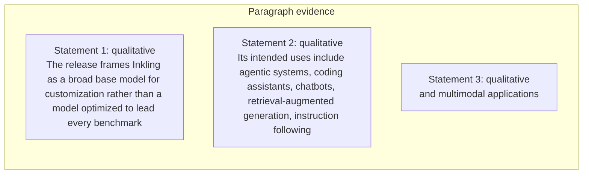

#### Python

```python
from html import escape
from pathlib import Path
from textwrap import wrap

title = "ink_why_p1: Optional prior-work and research-question annotation — Annotated prior-work contrast"
rows = [["Paragraph evidence","Statement 1","qualitative","The release frames Inkling as a broad base model for customization rather than a model optimized to lead every benchmark"],["Paragraph evidence","Statement 2","qualitative","Its intended uses include agentic systems, coding assistants, chatbots, retrieval-augmented generation, instruction following"],["Paragraph evidence","Statement 3","qualitative","and multimodal applications"]]
groups = {}
for group, label, value, condition in rows:
    groups.setdefault(group, []).append((label, value, condition))
width = max(900, len(groups) * 360)
height = 220 + max((len(items) for items in groups.values()), default=1) * 92
parts = [
    f'<svg xmlns="http://www.w3.org/2000/svg" viewBox="0 0 {width} {height}" role="img" aria-labelledby="title desc">',
    f'<title id="title">{escape(title)}</title>',
    '<desc id="desc">Separate panels preserve grouping and prevent unrelated conditions from reading as one sequence.</desc>',
    f'<rect width="{width}" height="{height}" fill="white"/>',
]
for group_index, (group, items) in enumerate(groups.items()):
    x = 180 + group_index * 360
    parts.append(f'<text x="{x}" y="65" text-anchor="middle" font-family="sans-serif" font-size="16" font-weight="700">{escape(group)}</text>')
    for item_index, (label, value, condition) in enumerate(items):
        y = 120 + item_index * 92
        parts.append(f'<rect x="{x-160}" y="{y-30}" width="320" height="78" rx="12" fill="#f7fbff" stroke="#ccd"/>')
        text = f"{label}: {value} — {condition}"
        for line_index, line in enumerate(wrap(text, width=46)):
            parts.append(f'<text x="{x}" y="{y-6+line_index*14}" text-anchor="middle" font-family="sans-serif" font-size="11">{escape(line)}</text>')
parts.append('</svg>')
Path("ink_why_p1_treatment_a.svg").write_text("\n".join(parts), encoding="utf-8")
```

### Treatment B — Optional prior-work and research-question annotation — Research-question ledger

- Teaching purpose: Optional contingency only. List assumptions and exclusions without inventing a mechanism.
- Encoding and reading order: Render 3 rows with explicit `Group`, `Measure or state`, `Visible value`, and `Condition or boundary` columns. The value column must be visible, not only present in ARIA text or fallback prose.
- Evidence and limitations: Encode only `ink_005` from `source_inkling_model_card`, `source_inkling_release`. The prose is already sufficient; any contingency must remain a non-quantitative annotation.
- Recommended web medium: semantic HTML/CSS table with SVG export; JavaScript is optional only for meaningful focus, drill-down, or state playback.
- Mobile, accessibility, and motion behavior: Preserve the same group and node order in the DOM; retain all values and relation labels as selectable text; stack panels or levels below 640px; provide keyboard access for any optional focus state; keep a complete static fallback; respect reduced motion and never encode information only through animation.

#### TikZ

```tex
\documentclass[tikz,border=5pt]{standalone}
\usepackage[T1]{fontenc}
\usepackage{array}
\usepackage{tikz}
\begin{document}
\begin{tikzpicture}[font=\sffamily]
\node[align=center] {\textbf{ink\_why\_p1: Optional prior-work and research-question annotation - Research-question ledger}\\[6pt]
\begin{tabular}{p{3.2cm}p{4.0cm}p{2.8cm}p{6.2cm}}
\textbf{Group} & \textbf{Measure or state} & \textbf{Visible value} & \textbf{Condition or boundary} \\ \hline
Paragraph evidence & Statement 1 & qualitative & The release frames Inkling as a broad base model for customization rather than a model optimized to lead every benchmark \\
Paragraph evidence & Statement 2 & qualitative & Its intended uses include agentic systems, coding assistants, chatbots, retrieval-augmented generation, instruction following \\
Paragraph evidence & Statement 3 & qualitative & and multimodal applications \\
\end{tabular}};
\end{tikzpicture}
\end{document}
```

#### Mermaid

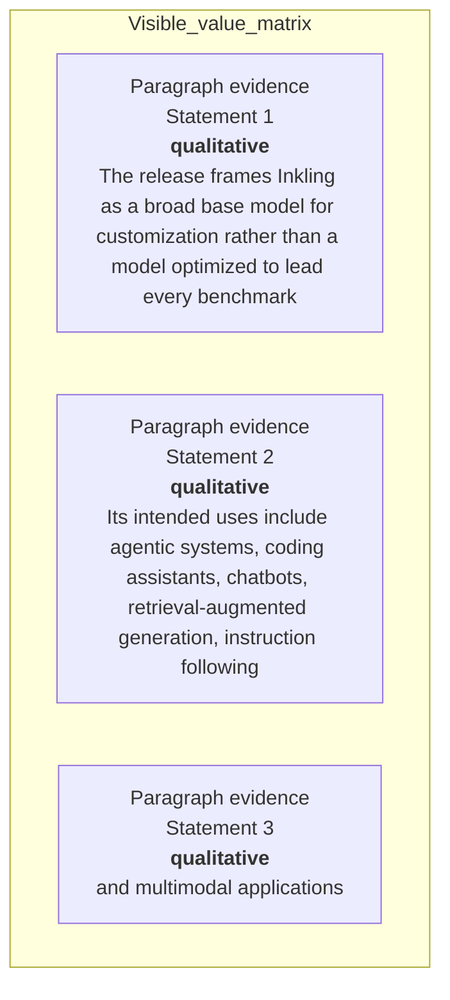

#### Python

```python
from html import escape
from pathlib import Path
from textwrap import wrap

title = "ink_why_p1: Optional prior-work and research-question annotation — Research-question ledger"
rows = [["Paragraph evidence","Statement 1","qualitative","The release frames Inkling as a broad base model for customization rather than a model optimized to lead every benchmark"],["Paragraph evidence","Statement 2","qualitative","Its intended uses include agentic systems, coding assistants, chatbots, retrieval-augmented generation, instruction following"],["Paragraph evidence","Statement 3","qualitative","and multimodal applications"]]
height = 414
parts = [
    f'<svg xmlns="http://www.w3.org/2000/svg" viewBox="0 0 1200 {height}" role="img" aria-labelledby="title desc">',
    f'<title id="title">{escape(title)}</title>',
    '<desc id="desc">Every reported value is visible beside its condition and group.</desc>',
    f'<rect width="1200" height="{height}" fill="white"/>',
]
headers = ["Group", "Measure or state", "Visible value", "Condition or boundary"]
xs = [30, 260, 590, 770]
for x, header in zip(xs, headers):
    parts.append(f'<text x="{x}" y="70" font-family="sans-serif" font-size="16" font-weight="700">{escape(header)}</text>')
for row_index, row in enumerate(rows):
    y = 110 + row_index * 88
    parts.append(f'<rect x="20" y="{y-28}" width="1160" height="76" fill="#f7fbff" stroke="#ccd"/>')
    for x, cell, width in zip(xs, row, [26, 38, 20, 58]):
        for line_index, line in enumerate(wrap(str(cell), width=width)):
            parts.append(f'<text x="{x}" y="{y+line_index*14}" font-family="sans-serif" font-size="11">{escape(line)}</text>')
parts.append('</svg>')
Path("ink_why_p1_treatment_b.svg").write_text("\n".join(parts), encoding="utf-8")
```

### Treatment C — Optional prior-work and research-question annotation — Question boundary map

- Teaching purpose: Optional contingency only. Connect only the explicit premise and research question.
- Encoding and reading order: Use 3 named nodes and 2 explicit labeled relations. Preserve all branch, merge, hierarchy, loop, or sequence edges shown in the code; changing them is an evidence deviation.
- Evidence and limitations: Encode only `ink_005` from `source_inkling_model_card`, `source_inkling_release`. The prose is already sufficient; any contingency must remain a non-quantitative annotation.
- Recommended web medium: responsive inline SVG with semantic HTML/CSS fallback; JavaScript is optional only for meaningful focus, drill-down, or state playback.
- Mobile, accessibility, and motion behavior: Preserve the same group and node order in the DOM; retain all values and relation labels as selectable text; stack panels or levels below 640px; provide keyboard access for any optional focus state; keep a complete static fallback; respect reduced motion and never encode information only through animation.

#### TikZ

```tex
\documentclass[tikz,border=5pt]{standalone}
\usepackage[T1]{fontenc}
\usepackage{tikz}
\usetikzlibrary{arrows.meta}
\begin{document}
\begin{tikzpicture}[font=\sffamily,box/.style={draw,rounded corners,align=center,text width=3cm,minimum height=1.2cm},link/.style={-{Latex[length=2mm]},thick},rel/.style={fill=white,font=\scriptsize}]
\node[font=\bfseries,anchor=west] at (0,0.8) {ink\_why\_p1: Optional prior-work and research-question annotation - Question boundary map};
\node[box] (n1) at (1.00,-1.50) {The release frames Inkling as a broad base model for customization rather than a model optimized to lead every benchmark};
\node[box] (n2) at (2.50,-1.50) {Its intended uses include agentic systems, coding assistants, chatbots, retrieval-augmented generation, instruction following};
\node[box] (n3) at (4.00,-1.50) {and multimodal applications};
\draw[link] (n1) -- node[rel] {then} (n2);
\draw[link] (n2) -- node[rel] {then} (n3);
\end{tikzpicture}
\end{document}
```

#### Mermaid

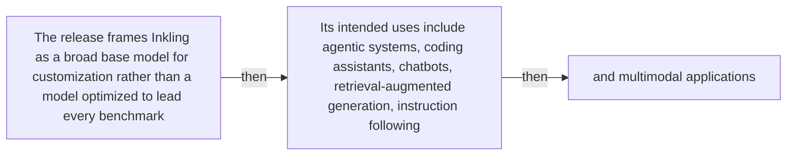

#### Python

```python
from html import escape
from pathlib import Path
from textwrap import wrap

title = "ink_why_p1: Optional prior-work and research-question annotation — Question boundary map"
nodes = [["n1","The release frames Inkling as a broad base model for customization rather than a model optimized to lead every benchmark",100,150],["n2","Its intended uses include agentic systems, coding assistants, chatbots, retrieval-augmented generation, instruction following",250,150],["n3","and multimodal applications",400,150]]
edges = [["n1","n2","then"],["n2","n3","then"]]
node_by_id = {node_id: (label, x, y) for node_id, label, x, y in nodes}
width = max(900, max((x for _, _, x, _ in nodes), default=800) + 180)
height = max(500, max((y for _, _, _, y in nodes), default=400) + 140)
parts = [
    f'<svg xmlns="http://www.w3.org/2000/svg" viewBox="0 0 {width} {height}" role="img" aria-labelledby="title desc">',
    f'<title id="title">{escape(title)}</title>',
    '<desc id="desc">Edges and convergence points encode only relationships stated in the scoped paragraphs.</desc>',
    f'<rect width="{width}" height="{height}" fill="white"/>',
]
for source, target, relation in edges:
    _, x1, y1 = node_by_id[source]
    _, x2, y2 = node_by_id[target]
    parts.append(f'<line x1="{x1}" y1="{y1}" x2="{x2}" y2="{y2}" stroke="#345" stroke-width="2"/>')
    parts.append(f'<text x="{(x1+x2)/2}" y="{(y1+y2)/2-5}" text-anchor="middle" font-family="sans-serif" font-size="10">{escape(relation)}</text>')
for _, label, x, y in nodes:
    parts.append(f'<rect x="{x-78}" y="{y-42}" width="156" height="84" rx="12" fill="#eef6ff" stroke="#234"/>')
    for line_index, line in enumerate(wrap(label, width=22)):
        parts.append(f'<text x="{x}" y="{y-24+line_index*13}" text-anchor="middle" font-family="sans-serif" font-size="10">{escape(line)}</text>')
parts.append('</svg>')
Path("ink_why_p1_treatment_c.svg").write_text("\n".join(parts), encoding="utf-8")
```

### Implementation record

- Status: `NOT_NEEDED`
- Selected treatment: `NONE`
- Selection rationale: Revision 3's paragraph-level removal test keeps this paragraph prose-only; no figure would reduce the reader's reconstruction burden enough to justify added visual complexity.
- Delivery medium: `NONE`
- Visual ID and placement: `NONE`; no figure is attached to this paragraph.
- Shared paragraph scope: NONE
- Changed files: `docs/visual-manifests/VISUAL_MANIFEST_INKLING.md` records the prose-only decision; no fixture visual serves this paragraph.
- Accessibility and fallback verification: The paragraph remains semantic selectable text with its existing claim and source links; no visual-only information or motion is introduced.
- Desktop and mobile verification: No paragraph-local figure exists; the existing prose remains in normal document order at both viewports.
- Evidence deviations: Not applicable: revision 3 explicitly classifies this paragraph as prose-only.

## `ink_why_p2`

- Location: `ink_why`, paragraph 2
- Text anchor: "That positioning matters because the provider explicitly says Inkling is not the strongest model overall."
- Claims and sources: `ink_005` (AUTHORS_INTERPRETATION, VERIFIED); `source_inkling_model_card` (Retrieved 2026-07-18; official HTML SHA-256 fe653ffb5f4b9f54f011491f60cd8d6b9885d667484880d4566d76827f22a7e9 (65,631 bytes). Sections 1-6: identity, architecture, modalities, hardware, training, evaluations, safety. Live URL remains mutable.); `source_inkling_release` (Retrieved 2026-07-18; official HTML SHA-256 cb28c6a6c8c47c68f55f2c636481bf35a1b9f5a349e5f00148c583fafbc138fc (222,133 bytes). July 15 release sections on effort, multimodality, benchmarks, architecture, training, RL, availability. Live URL remains mutable.)
- Visual needed: `NO`
- Decision rationale: Prose remains the better primary form. The paragraph states a bounded conclusion or heterogeneous qualification without requiring a material process, topology, quantitative comparison, uncertainty distribution, or state transition. The three treatments are contingencies only and are not recommended for implementation.
- Explanatory job: Optional prior-work and research-question annotation.
- Recommended scope and placement: Prose-only. Do not attach a figure unless the paragraph or evidence changes.
- QA-informed planning change: The prose is already sufficient; any contingency must remain a non-quantitative annotation.

### Treatment A — Optional prior-work and research-question annotation — Annotated prior-work contrast

- Teaching purpose: Optional contingency only. Keep prior work and the paper's question distinct.
- Encoding and reading order: Group the 3 source-backed records into named panels using the first column as the grouping key. Panels preserve experimental, source, or example boundaries and never imply one shared scale.
- Evidence and limitations: Encode only `ink_005` from `source_inkling_model_card`, `source_inkling_release`. The prose is already sufficient; any contingency must remain a non-quantitative annotation.
- Recommended web medium: semantic HTML/CSS grouped panels or responsive SVG; JavaScript is optional only for meaningful focus, drill-down, or state playback.
- Mobile, accessibility, and motion behavior: Preserve the same group and node order in the DOM; retain all values and relation labels as selectable text; stack panels or levels below 640px; provide keyboard access for any optional focus state; keep a complete static fallback; respect reduced motion and never encode information only through animation.

#### TikZ

```tex
\documentclass[tikz,border=5pt]{standalone}
\usepackage[T1]{fontenc}
\usepackage{tikz}
\begin{document}
\begin{tikzpicture}[font=\sffamily,panel/.style={draw,rounded corners,align=center,text width=4.8cm,minimum height=4cm}]
\node[font=\bfseries] at (0,3) {ink\_why\_p2: Optional prior-work and research-question annotation - Annotated prior-work contrast};
\node[panel] at (0,0) {\textbf{Paragraph evidence}\\[4pt]\textbf{Statement 1}: qualitative -- That positioning matters because the provider explicitly says Inkling is not the strongest model overall\\\textbf{Statement 2}: qualitative -- The proposed value is the combination of open weights, multimodal input, controllable reasoning effort\\\textbf{Statement 3}: qualitative -- and availability for fine-tuning};
\end{tikzpicture}
\end{document}
```

#### Mermaid

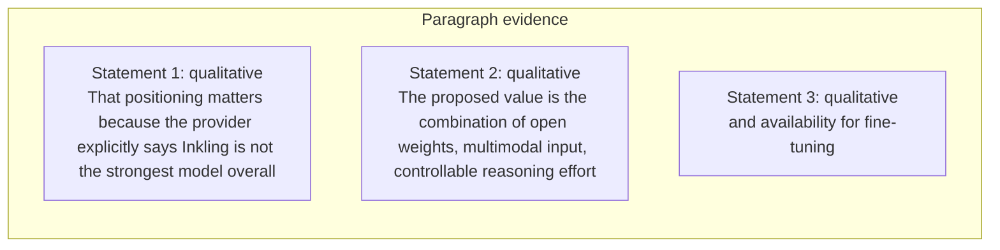

#### Python

```python
from html import escape
from pathlib import Path
from textwrap import wrap

title = "ink_why_p2: Optional prior-work and research-question annotation — Annotated prior-work contrast"
rows = [["Paragraph evidence","Statement 1","qualitative","That positioning matters because the provider explicitly says Inkling is not the strongest model overall"],["Paragraph evidence","Statement 2","qualitative","The proposed value is the combination of open weights, multimodal input, controllable reasoning effort"],["Paragraph evidence","Statement 3","qualitative","and availability for fine-tuning"]]
groups = {}
for group, label, value, condition in rows:
    groups.setdefault(group, []).append((label, value, condition))
width = max(900, len(groups) * 360)
height = 220 + max((len(items) for items in groups.values()), default=1) * 92
parts = [
    f'<svg xmlns="http://www.w3.org/2000/svg" viewBox="0 0 {width} {height}" role="img" aria-labelledby="title desc">',
    f'<title id="title">{escape(title)}</title>',
    '<desc id="desc">Separate panels preserve grouping and prevent unrelated conditions from reading as one sequence.</desc>',
    f'<rect width="{width}" height="{height}" fill="white"/>',
]
for group_index, (group, items) in enumerate(groups.items()):
    x = 180 + group_index * 360
    parts.append(f'<text x="{x}" y="65" text-anchor="middle" font-family="sans-serif" font-size="16" font-weight="700">{escape(group)}</text>')
    for item_index, (label, value, condition) in enumerate(items):
        y = 120 + item_index * 92
        parts.append(f'<rect x="{x-160}" y="{y-30}" width="320" height="78" rx="12" fill="#f7fbff" stroke="#ccd"/>')
        text = f"{label}: {value} — {condition}"
        for line_index, line in enumerate(wrap(text, width=46)):
            parts.append(f'<text x="{x}" y="{y-6+line_index*14}" text-anchor="middle" font-family="sans-serif" font-size="11">{escape(line)}</text>')
parts.append('</svg>')
Path("ink_why_p2_treatment_a.svg").write_text("\n".join(parts), encoding="utf-8")
```

### Treatment B — Optional prior-work and research-question annotation — Research-question ledger

- Teaching purpose: Optional contingency only. List assumptions and exclusions without inventing a mechanism.
- Encoding and reading order: Render 3 rows with explicit `Group`, `Measure or state`, `Visible value`, and `Condition or boundary` columns. The value column must be visible, not only present in ARIA text or fallback prose.
- Evidence and limitations: Encode only `ink_005` from `source_inkling_model_card`, `source_inkling_release`. The prose is already sufficient; any contingency must remain a non-quantitative annotation.
- Recommended web medium: semantic HTML/CSS table with SVG export; JavaScript is optional only for meaningful focus, drill-down, or state playback.
- Mobile, accessibility, and motion behavior: Preserve the same group and node order in the DOM; retain all values and relation labels as selectable text; stack panels or levels below 640px; provide keyboard access for any optional focus state; keep a complete static fallback; respect reduced motion and never encode information only through animation.

#### TikZ

```tex
\documentclass[tikz,border=5pt]{standalone}
\usepackage[T1]{fontenc}
\usepackage{array}
\usepackage{tikz}
\begin{document}
\begin{tikzpicture}[font=\sffamily]
\node[align=center] {\textbf{ink\_why\_p2: Optional prior-work and research-question annotation - Research-question ledger}\\[6pt]
\begin{tabular}{p{3.2cm}p{4.0cm}p{2.8cm}p{6.2cm}}
\textbf{Group} & \textbf{Measure or state} & \textbf{Visible value} & \textbf{Condition or boundary} \\ \hline
Paragraph evidence & Statement 1 & qualitative & That positioning matters because the provider explicitly says Inkling is not the strongest model overall \\
Paragraph evidence & Statement 2 & qualitative & The proposed value is the combination of open weights, multimodal input, controllable reasoning effort \\
Paragraph evidence & Statement 3 & qualitative & and availability for fine-tuning \\
\end{tabular}};
\end{tikzpicture}
\end{document}
```

#### Mermaid

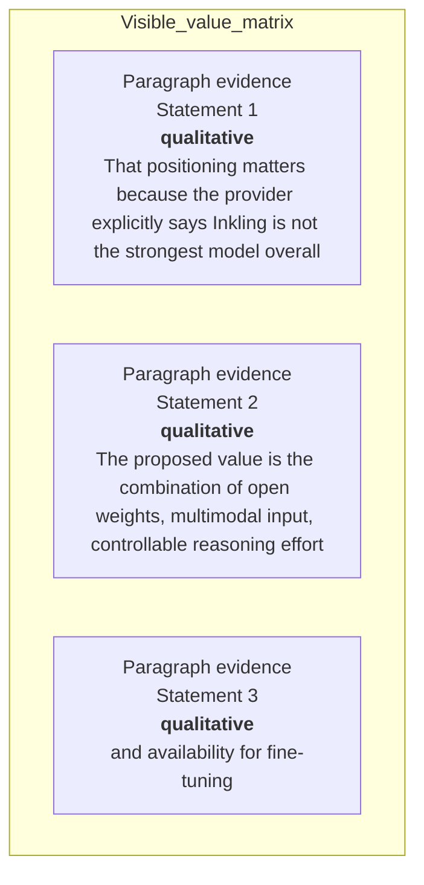

#### Python

```python
from html import escape
from pathlib import Path
from textwrap import wrap

title = "ink_why_p2: Optional prior-work and research-question annotation — Research-question ledger"
rows = [["Paragraph evidence","Statement 1","qualitative","That positioning matters because the provider explicitly says Inkling is not the strongest model overall"],["Paragraph evidence","Statement 2","qualitative","The proposed value is the combination of open weights, multimodal input, controllable reasoning effort"],["Paragraph evidence","Statement 3","qualitative","and availability for fine-tuning"]]
height = 414
parts = [
    f'<svg xmlns="http://www.w3.org/2000/svg" viewBox="0 0 1200 {height}" role="img" aria-labelledby="title desc">',
    f'<title id="title">{escape(title)}</title>',
    '<desc id="desc">Every reported value is visible beside its condition and group.</desc>',
    f'<rect width="1200" height="{height}" fill="white"/>',
]
headers = ["Group", "Measure or state", "Visible value", "Condition or boundary"]
xs = [30, 260, 590, 770]
for x, header in zip(xs, headers):
    parts.append(f'<text x="{x}" y="70" font-family="sans-serif" font-size="16" font-weight="700">{escape(header)}</text>')
for row_index, row in enumerate(rows):
    y = 110 + row_index * 88
    parts.append(f'<rect x="20" y="{y-28}" width="1160" height="76" fill="#f7fbff" stroke="#ccd"/>')
    for x, cell, width in zip(xs, row, [26, 38, 20, 58]):
        for line_index, line in enumerate(wrap(str(cell), width=width)):
            parts.append(f'<text x="{x}" y="{y+line_index*14}" font-family="sans-serif" font-size="11">{escape(line)}</text>')
parts.append('</svg>')
Path("ink_why_p2_treatment_b.svg").write_text("\n".join(parts), encoding="utf-8")
```

### Treatment C — Optional prior-work and research-question annotation — Question boundary map

- Teaching purpose: Optional contingency only. Connect only the explicit premise and research question.
- Encoding and reading order: Use 3 named nodes and 2 explicit labeled relations. Preserve all branch, merge, hierarchy, loop, or sequence edges shown in the code; changing them is an evidence deviation.
- Evidence and limitations: Encode only `ink_005` from `source_inkling_model_card`, `source_inkling_release`. The prose is already sufficient; any contingency must remain a non-quantitative annotation.
- Recommended web medium: responsive inline SVG with semantic HTML/CSS fallback; JavaScript is optional only for meaningful focus, drill-down, or state playback.
- Mobile, accessibility, and motion behavior: Preserve the same group and node order in the DOM; retain all values and relation labels as selectable text; stack panels or levels below 640px; provide keyboard access for any optional focus state; keep a complete static fallback; respect reduced motion and never encode information only through animation.

#### TikZ

```tex
\documentclass[tikz,border=5pt]{standalone}
\usepackage[T1]{fontenc}
\usepackage{tikz}
\usetikzlibrary{arrows.meta}
\begin{document}
\begin{tikzpicture}[font=\sffamily,box/.style={draw,rounded corners,align=center,text width=3cm,minimum height=1.2cm},link/.style={-{Latex[length=2mm]},thick},rel/.style={fill=white,font=\scriptsize}]
\node[font=\bfseries,anchor=west] at (0,0.8) {ink\_why\_p2: Optional prior-work and research-question annotation - Question boundary map};
\node[box] (n1) at (1.00,-1.50) {That positioning matters because the provider explicitly says Inkling is not the strongest model overall};
\node[box] (n2) at (2.50,-1.50) {The proposed value is the combination of open weights, multimodal input, controllable reasoning effort};
\node[box] (n3) at (4.00,-1.50) {and availability for fine-tuning};
\draw[link] (n1) -- node[rel] {then} (n2);
\draw[link] (n2) -- node[rel] {then} (n3);
\end{tikzpicture}
\end{document}
```

#### Mermaid

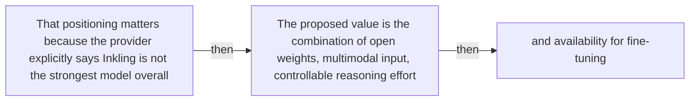

#### Python

```python
from html import escape
from pathlib import Path
from textwrap import wrap

title = "ink_why_p2: Optional prior-work and research-question annotation — Question boundary map"
nodes = [["n1","That positioning matters because the provider explicitly says Inkling is not the strongest model overall",100,150],["n2","The proposed value is the combination of open weights, multimodal input, controllable reasoning effort",250,150],["n3","and availability for fine-tuning",400,150]]
edges = [["n1","n2","then"],["n2","n3","then"]]
node_by_id = {node_id: (label, x, y) for node_id, label, x, y in nodes}
width = max(900, max((x for _, _, x, _ in nodes), default=800) + 180)
height = max(500, max((y for _, _, _, y in nodes), default=400) + 140)
parts = [
    f'<svg xmlns="http://www.w3.org/2000/svg" viewBox="0 0 {width} {height}" role="img" aria-labelledby="title desc">',
    f'<title id="title">{escape(title)}</title>',
    '<desc id="desc">Edges and convergence points encode only relationships stated in the scoped paragraphs.</desc>',
    f'<rect width="{width}" height="{height}" fill="white"/>',
]
for source, target, relation in edges:
    _, x1, y1 = node_by_id[source]
    _, x2, y2 = node_by_id[target]
    parts.append(f'<line x1="{x1}" y1="{y1}" x2="{x2}" y2="{y2}" stroke="#345" stroke-width="2"/>')
    parts.append(f'<text x="{(x1+x2)/2}" y="{(y1+y2)/2-5}" text-anchor="middle" font-family="sans-serif" font-size="10">{escape(relation)}</text>')
for _, label, x, y in nodes:
    parts.append(f'<rect x="{x-78}" y="{y-42}" width="156" height="84" rx="12" fill="#eef6ff" stroke="#234"/>')
    for line_index, line in enumerate(wrap(label, width=22)):
        parts.append(f'<text x="{x}" y="{y-24+line_index*13}" text-anchor="middle" font-family="sans-serif" font-size="10">{escape(line)}</text>')
parts.append('</svg>')
Path("ink_why_p2_treatment_c.svg").write_text("\n".join(parts), encoding="utf-8")
```

### Implementation record

- Status: `NOT_NEEDED`
- Selected treatment: `NONE`
- Selection rationale: Revision 3's paragraph-level removal test keeps this paragraph prose-only; no figure would reduce the reader's reconstruction burden enough to justify added visual complexity.
- Delivery medium: `NONE`
- Visual ID and placement: `NONE`; no figure is attached to this paragraph.
- Shared paragraph scope: NONE
- Changed files: `docs/visual-manifests/VISUAL_MANIFEST_INKLING.md` records the prose-only decision; no fixture visual serves this paragraph.
- Accessibility and fallback verification: The paragraph remains semantic selectable text with its existing claim and source links; no visual-only information or motion is introduced.
- Desktop and mobile verification: No paragraph-local figure exists; the existing prose remains in normal document order at both viewports.
- Evidence deviations: Not applicable: revision 3 explicitly classifies this paragraph as prose-only.

## `ink_change_p1`

- Location: `ink_change`, paragraph 1
- Text anchor: "Inkling combines a large sparse model with native text, image, and audio input and makes the weights available in original and quantized forms."
- Claims and sources: `ink_001` (OBSERVED, VERIFIED); `ink_002` (OBSERVED, VERIFIED); `ink_003` (OBSERVED, VERIFIED); `ink_005` (AUTHORS_INTERPRETATION, VERIFIED); `ink_008` (AUTHORS_INTERPRETATION, VERIFIED); `source_inkling_model_card` (Retrieved 2026-07-18; official HTML SHA-256 fe653ffb5f4b9f54f011491f60cd8d6b9885d667484880d4566d76827f22a7e9 (65,631 bytes). Sections 1-6: identity, architecture, modalities, hardware, training, evaluations, safety. Live URL remains mutable.); `source_inkling_release` (Retrieved 2026-07-18; official HTML SHA-256 cb28c6a6c8c47c68f55f2c636481bf35a1b9f5a349e5f00148c583fafbc138fc (222,133 bytes). July 15 release sections on effort, multimodality, benchmarks, architecture, training, RL, availability. Live URL remains mutable.); `source_inkling_aup` (Retrieved 2026-07-18; official HTML SHA-256 c62535263733dbeabb838ff881850928a878bc5c539ce1401a59a237bbf5c2e7 (25,968 bytes). Page states last updated July 15, 2026; introduction, restrictions, disclosure, updates. Live URL remains mutable.)
- Visual needed: `YES`
- Decision rationale: A visual passes the removal test because readers must reconstruct 975b stored parameters versus the 41b active token path while preserving the paragraph's conditions and boundaries. Revision 3 narrows the topology and placement so no visual can claim this paragraph without encoding its mechanism, grouping, or values.
- Explanatory job: 975B stored parameters versus the 41B active token path.
- Recommended scope and placement: This paragraph only; place the visual immediately after `ink_change_p1`.
- QA-informed planning change: Separate total capacity, active computation, and checkpoint storage; do not equate sparsity with low deployment memory.

### Treatment A — 975B stored parameters versus the 41B active token path — Relationship-specific parallel view

- Teaching purpose: Keep valid comparison groups separate and equally visible.
- Encoding and reading order: Group the 3 source-backed records into named panels using the first column as the grouping key. Panels preserve experimental, source, or example boundaries and never imply one shared scale.
- Evidence and limitations: Encode only `ink_001`, `ink_002`, `ink_003`, `ink_005`, `ink_008` from `source_inkling_model_card`, `source_inkling_release`, `source_inkling_aup`. Separate total capacity, active computation, and checkpoint storage; do not equate sparsity with low deployment memory.
- Recommended web medium: semantic HTML/CSS grouped panels or responsive SVG; JavaScript is optional only for meaningful focus, drill-down, or state playback.
- Mobile, accessibility, and motion behavior: Preserve the same group and node order in the DOM; retain all values and relation labels as selectable text; stack panels or levels below 640px; provide keyboard access for any optional focus state; keep a complete static fallback; respect reduced motion and never encode information only through animation.

#### TikZ

```tex
\documentclass[tikz,border=5pt]{standalone}
\usepackage[T1]{fontenc}
\usepackage{tikz}
\begin{document}
\begin{tikzpicture}[font=\sffamily,panel/.style={draw,rounded corners,align=center,text width=4.8cm,minimum height=4cm}]
\node[font=\bfseries] at (0,3) {ink\_change\_p1: 975B stored parameters versus the 41B active token path - Relationship-specific parallel view};
\node[panel] at (0,0) {\textbf{Stored capacity and per-token activation are different quantities}\\[4pt]\textbf{975B total parameters}: qualitative -- The stored sparse model contains the full collection of routed and shared expert parameters.\\\textbf{41B active parameters}: qualitative -- For one token, the router selects 6 of 256 routed experts and also uses 2 shared experts, producing the reported active path.\\\textbf{Deployment implication}: qualitative -- Sparse activation reduces computation per token, but the downloadable checkpoint still has to represent the much larger stored model.};
\end{tikzpicture}
\end{document}
```

#### Mermaid

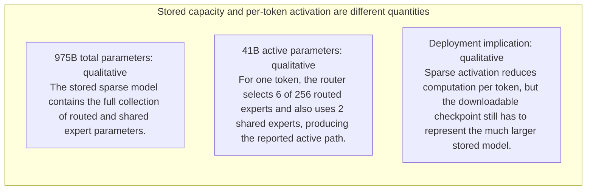

#### Python

```python
from html import escape
from pathlib import Path
from textwrap import wrap

title = "ink_change_p1: 975B stored parameters versus the 41B active token path — Relationship-specific parallel view"
rows = [["Stored capacity and per-token activation are different quantities","975B total parameters","qualitative","The stored sparse model contains the full collection of routed and shared expert parameters."],["Stored capacity and per-token activation are different quantities","41B active parameters","qualitative","For one token, the router selects 6 of 256 routed experts and also uses 2 shared experts, producing the reported active path."],["Stored capacity and per-token activation are different quantities","Deployment implication","qualitative","Sparse activation reduces computation per token, but the downloadable checkpoint still has to represent the much larger stored model."]]
groups = {}
for group, label, value, condition in rows:
    groups.setdefault(group, []).append((label, value, condition))
width = max(900, len(groups) * 360)
height = 220 + max((len(items) for items in groups.values()), default=1) * 92
parts = [
    f'<svg xmlns="http://www.w3.org/2000/svg" viewBox="0 0 {width} {height}" role="img" aria-labelledby="title desc">',
    f'<title id="title">{escape(title)}</title>',
    '<desc id="desc">Separate panels preserve grouping and prevent unrelated conditions from reading as one sequence.</desc>',
    f'<rect width="{width}" height="{height}" fill="white"/>',
]
for group_index, (group, items) in enumerate(groups.items()):
    x = 180 + group_index * 360
    parts.append(f'<text x="{x}" y="65" text-anchor="middle" font-family="sans-serif" font-size="16" font-weight="700">{escape(group)}</text>')
    for item_index, (label, value, condition) in enumerate(items):
        y = 120 + item_index * 92
        parts.append(f'<rect x="{x-160}" y="{y-30}" width="320" height="78" rx="12" fill="#f7fbff" stroke="#ccd"/>')
        text = f"{label}: {value} — {condition}"
        for line_index, line in enumerate(wrap(text, width=46)):
            parts.append(f'<text x="{x}" y="{y-6+line_index*14}" text-anchor="middle" font-family="sans-serif" font-size="11">{escape(line)}</text>')
parts.append('</svg>')
Path("ink_change_p1_treatment_a.svg").write_text("\n".join(parts), encoding="utf-8")
```

### Treatment B — 975B stored parameters versus the 41B active token path — Condition and boundary matrix

- Teaching purpose: Show every comparison value or qualitative condition in explicit columns.
- Encoding and reading order: Render 3 rows with explicit `Group`, `Measure or state`, `Visible value`, and `Condition or boundary` columns. The value column must be visible, not only present in ARIA text or fallback prose.
- Evidence and limitations: Encode only `ink_001`, `ink_002`, `ink_003`, `ink_005`, `ink_008` from `source_inkling_model_card`, `source_inkling_release`, `source_inkling_aup`. Separate total capacity, active computation, and checkpoint storage; do not equate sparsity with low deployment memory.
- Recommended web medium: semantic HTML/CSS table with SVG export; JavaScript is optional only for meaningful focus, drill-down, or state playback.
- Mobile, accessibility, and motion behavior: Preserve the same group and node order in the DOM; retain all values and relation labels as selectable text; stack panels or levels below 640px; provide keyboard access for any optional focus state; keep a complete static fallback; respect reduced motion and never encode information only through animation.

#### TikZ

```tex
\documentclass[tikz,border=5pt]{standalone}
\usepackage[T1]{fontenc}
\usepackage{array}
\usepackage{tikz}
\begin{document}
\begin{tikzpicture}[font=\sffamily]
\node[align=center] {\textbf{ink\_change\_p1: 975B stored parameters versus the 41B active token path - Condition and boundary matrix}\\[6pt]
\begin{tabular}{p{3.2cm}p{4.0cm}p{2.8cm}p{6.2cm}}
\textbf{Group} & \textbf{Measure or state} & \textbf{Visible value} & \textbf{Condition or boundary} \\ \hline
Stored capacity and per-token activation are different quantities & 975B total parameters & qualitative & The stored sparse model contains the full collection of routed and shared expert parameters. \\
Stored capacity and per-token activation are different quantities & 41B active parameters & qualitative & For one token, the router selects 6 of 256 routed experts and also uses 2 shared experts, producing the reported active path. \\
Stored capacity and per-token activation are different quantities & Deployment implication & qualitative & Sparse activation reduces computation per token, but the downloadable checkpoint still has to represent the much larger stored model. \\
\end{tabular}};
\end{tikzpicture}
\end{document}
```

#### Mermaid

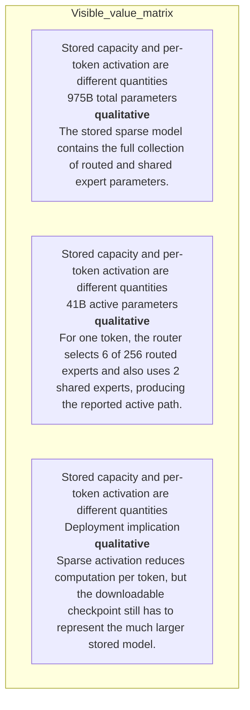

#### Python

```python
from html import escape
from pathlib import Path
from textwrap import wrap

title = "ink_change_p1: 975B stored parameters versus the 41B active token path — Condition and boundary matrix"
rows = [["Stored capacity and per-token activation are different quantities","975B total parameters","qualitative","The stored sparse model contains the full collection of routed and shared expert parameters."],["Stored capacity and per-token activation are different quantities","41B active parameters","qualitative","For one token, the router selects 6 of 256 routed experts and also uses 2 shared experts, producing the reported active path."],["Stored capacity and per-token activation are different quantities","Deployment implication","qualitative","Sparse activation reduces computation per token, but the downloadable checkpoint still has to represent the much larger stored model."]]
height = 414
parts = [
    f'<svg xmlns="http://www.w3.org/2000/svg" viewBox="0 0 1200 {height}" role="img" aria-labelledby="title desc">',
    f'<title id="title">{escape(title)}</title>',
    '<desc id="desc">Every reported value is visible beside its condition and group.</desc>',
    f'<rect width="1200" height="{height}" fill="white"/>',
]
headers = ["Group", "Measure or state", "Visible value", "Condition or boundary"]
xs = [30, 260, 590, 770]
for x, header in zip(xs, headers):
    parts.append(f'<text x="{x}" y="70" font-family="sans-serif" font-size="16" font-weight="700">{escape(header)}</text>')
for row_index, row in enumerate(rows):
    y = 110 + row_index * 88
    parts.append(f'<rect x="20" y="{y-28}" width="1160" height="76" fill="#f7fbff" stroke="#ccd"/>')
    for x, cell, width in zip(xs, row, [26, 38, 20, 58]):
        for line_index, line in enumerate(wrap(str(cell), width=width)):
            parts.append(f'<text x="{x}" y="{y+line_index*14}" font-family="sans-serif" font-size="11">{escape(line)}</text>')
parts.append('</svg>')
Path("ink_change_p1_treatment_b.svg").write_text("\n".join(parts), encoding="utf-8")
```

### Treatment C — 975B stored parameters versus the 41B active token path — Comparison topology

- Teaching purpose: Connect only the alternatives and shared decision point stated in the paragraph.
- Encoding and reading order: Use 4 named nodes and 3 explicit labeled relations. Preserve all branch, merge, hierarchy, loop, or sequence edges shown in the code; changing them is an evidence deviation.
- Evidence and limitations: Encode only `ink_001`, `ink_002`, `ink_003`, `ink_005`, `ink_008` from `source_inkling_model_card`, `source_inkling_release`, `source_inkling_aup`. Separate total capacity, active computation, and checkpoint storage; do not equate sparsity with low deployment memory.
- Recommended web medium: responsive inline SVG with semantic HTML/CSS fallback; JavaScript is optional only for meaningful focus, drill-down, or state playback.
- Mobile, accessibility, and motion behavior: Preserve the same group and node order in the DOM; retain all values and relation labels as selectable text; stack panels or levels below 640px; provide keyboard access for any optional focus state; keep a complete static fallback; respect reduced motion and never encode information only through animation.

#### TikZ

```tex
\documentclass[tikz,border=5pt]{standalone}
\usepackage[T1]{fontenc}
\usepackage{tikz}
\usetikzlibrary{arrows.meta}
\begin{document}
\begin{tikzpicture}[font=\sffamily,box/.style={draw,rounded corners,align=center,text width=3cm,minimum height=1.2cm},link/.style={-{Latex[length=2mm]},thick},rel/.style={fill=white,font=\scriptsize}]
\node[font=\bfseries,anchor=west] at (0,0.8) {ink\_change\_p1: 975B stored parameters versus the 41B active token path - Comparison topology};
\node[box] (n1) at (1.00,-1.50) {Inkling combines a large sparse model with native text, image};
\node[box] (n2) at (2.50,-1.50) {and audio input and makes the weights available in original and quantized forms};
\node[box] (n3) at (4.00,-1.50) {Only a subset of the 975 billion parameters is active for a token};
\node[box] (n4) at (5.50,-1.50) {which separates total model capacity from the 41-billion-parameter active path};
\draw[link] (n1) -- node[rel] {compare} (n2);
\draw[link] (n1) -- node[rel] {compare} (n3);
\draw[link] (n1) -- node[rel] {compare} (n4);
\end{tikzpicture}
\end{document}
```

#### Mermaid

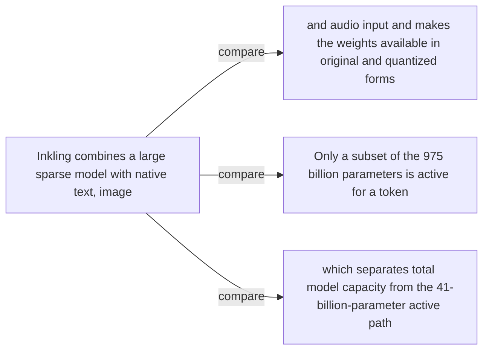

#### Python

```python
from html import escape
from pathlib import Path
from textwrap import wrap

title = "ink_change_p1: 975B stored parameters versus the 41B active token path — Comparison topology"
nodes = [["n1","Inkling combines a large sparse model with native text, image",100,150],["n2","and audio input and makes the weights available in original and quantized forms",250,150],["n3","Only a subset of the 975 billion parameters is active for a token",400,150],["n4","which separates total model capacity from the 41-billion-parameter active path",550,150]]
edges = [["n1","n2","compare"],["n1","n3","compare"],["n1","n4","compare"]]
node_by_id = {node_id: (label, x, y) for node_id, label, x, y in nodes}
width = max(900, max((x for _, _, x, _ in nodes), default=800) + 180)
height = max(500, max((y for _, _, _, y in nodes), default=400) + 140)
parts = [
    f'<svg xmlns="http://www.w3.org/2000/svg" viewBox="0 0 {width} {height}" role="img" aria-labelledby="title desc">',
    f'<title id="title">{escape(title)}</title>',
    '<desc id="desc">Edges and convergence points encode only relationships stated in the scoped paragraphs.</desc>',
    f'<rect width="{width}" height="{height}" fill="white"/>',
]
for source, target, relation in edges:
    _, x1, y1 = node_by_id[source]
    _, x2, y2 = node_by_id[target]
    parts.append(f'<line x1="{x1}" y1="{y1}" x2="{x2}" y2="{y2}" stroke="#345" stroke-width="2"/>')
    parts.append(f'<text x="{(x1+x2)/2}" y="{(y1+y2)/2-5}" text-anchor="middle" font-family="sans-serif" font-size="10">{escape(relation)}</text>')
for _, label, x, y in nodes:
    parts.append(f'<rect x="{x-78}" y="{y-42}" width="156" height="84" rx="12" fill="#eef6ff" stroke="#234"/>')
    for line_index, line in enumerate(wrap(label, width=22)):
        parts.append(f'<text x="{x}" y="{y-24+line_index*13}" text-anchor="middle" font-family="sans-serif" font-size="10">{escape(line)}</text>')
parts.append('</svg>')
Path("ink_change_p1_treatment_c.svg").write_text("\n".join(parts), encoding="utf-8")
```

### Implementation record

- Status: `IMPLEMENTED`
- Selected treatment: `A`
- Selection rationale: Selected the approved “975B stored parameters versus the 41B active token path — Relationship-specific parallel view” treatment because the implemented parallel view directly encodes this paragraph's explanatory job and its stated evidence boundaries.
- Delivery medium: `CSS + semantic HTML`
- Visual ID and placement: `visual_inkling_total_vs_active` after `ink_change_p1`; this record is served by that purpose-built figure.
- Shared paragraph scope: NONE
- Changed files: `packages/test-fixtures/explainers/inkling.json`, `packages/content-schema/schema/explainer-document.schema.json`, `packages/content-schema/src/validate.ts`, generated TypeScript/Python models, `apps/web/app/papers/[id]/explainer-visual.tsx`, and `apps/web/app/globals.css`.
- Accessibility and fallback verification: Figure has a programmatic title and description, visible selectable labels and values, explicit alt text, equivalent fallback prose, source links, limitations, and a semantic static body; no meaning depends on color, motion, or pointer input.
- Desktop and mobile verification: Verified by the full eight-paper Playwright traversal at a 1440-pixel desktop viewport and the iPhone 13 mobile viewport; every figure stayed paragraph-adjacent, preserved DOM reading order, and introduced no horizontal page overflow.
- Evidence deviations: Delivery translation: selected Treatment A is rendered as typed semantic HTML/CSS rather than its literal TikZ, Mermaid, or Python-generated asset; the approved paragraph scope, placement, labels, values, grouping, and evidence boundaries are retained.

## `ink_change_p2`

- Location: `ink_change`, paragraph 2
- Text anchor: "The release also exposes an effort control intended to trade generated tokens for performance."
- Claims and sources: `ink_001` (OBSERVED, VERIFIED); `ink_002` (OBSERVED, VERIFIED); `ink_003` (OBSERVED, VERIFIED); `ink_005` (AUTHORS_INTERPRETATION, VERIFIED); `ink_008` (AUTHORS_INTERPRETATION, VERIFIED); `source_inkling_model_card` (Retrieved 2026-07-18; official HTML SHA-256 fe653ffb5f4b9f54f011491f60cd8d6b9885d667484880d4566d76827f22a7e9 (65,631 bytes). Sections 1-6: identity, architecture, modalities, hardware, training, evaluations, safety. Live URL remains mutable.); `source_inkling_release` (Retrieved 2026-07-18; official HTML SHA-256 cb28c6a6c8c47c68f55f2c636481bf35a1b9f5a349e5f00148c583fafbc138fc (222,133 bytes). July 15 release sections on effort, multimodality, benchmarks, architecture, training, RL, availability. Live URL remains mutable.); `source_inkling_aup` (Retrieved 2026-07-18; official HTML SHA-256 c62535263733dbeabb838ff881850928a878bc5c539ce1401a59a237bbf5c2e7 (25,968 bytes). Page states last updated July 15, 2026; introduction, restrictions, disclosure, updates. Live URL remains mutable.)
- Visual needed: `NO`
- Decision rationale: Prose remains the better primary form. The paragraph states a bounded conclusion or heterogeneous qualification without requiring a material process, topology, quantitative comparison, uncertainty distribution, or state transition. The three treatments are contingencies only and are not recommended for implementation.
- Explanatory job: Optional changed-versus-unchanged claim boundary.
- Recommended scope and placement: Prose-only. Do not attach a figure unless the paragraph or evidence changes.
- QA-informed planning change: Do not imply a measured effect or architecture not stated in this paragraph.

### Treatment A — Optional changed-versus-unchanged claim boundary — Tested-versus-unestablished panels

- Teaching purpose: Optional contingency only. Separate supported scope from explicit unknowns.
- Encoding and reading order: Group the 2 source-backed records into named panels using the first column as the grouping key. Panels preserve experimental, source, or example boundaries and never imply one shared scale.
- Evidence and limitations: Encode only `ink_001`, `ink_002`, `ink_003`, `ink_005`, `ink_008` from `source_inkling_model_card`, `source_inkling_release`, `source_inkling_aup`. Do not imply a measured effect or architecture not stated in this paragraph.
- Recommended web medium: semantic HTML/CSS grouped panels or responsive SVG; JavaScript is optional only for meaningful focus, drill-down, or state playback.
- Mobile, accessibility, and motion behavior: Preserve the same group and node order in the DOM; retain all values and relation labels as selectable text; stack panels or levels below 640px; provide keyboard access for any optional focus state; keep a complete static fallback; respect reduced motion and never encode information only through animation.

#### TikZ

```tex
\documentclass[tikz,border=5pt]{standalone}
\usepackage[T1]{fontenc}
\usepackage{tikz}
\begin{document}
\begin{tikzpicture}[font=\sffamily,panel/.style={draw,rounded corners,align=center,text width=4.8cm,minimum height=4cm}]
\node[font=\bfseries] at (0,3) {ink\_change\_p2: Optional changed-versus-unchanged claim boundary - Tested-versus-unestablished panels};
\node[panel] at (0,0) {\textbf{Paragraph evidence}\\[4pt]\textbf{Statement 1}: qualitative -- The release also exposes an effort control intended to trade generated tokens for performance\\\textbf{Statement 2}: qualitative -- This is a product and training claim about controllability, not proof that Inkling dominates models at every effort level or task};
\end{tikzpicture}
\end{document}
```

#### Mermaid

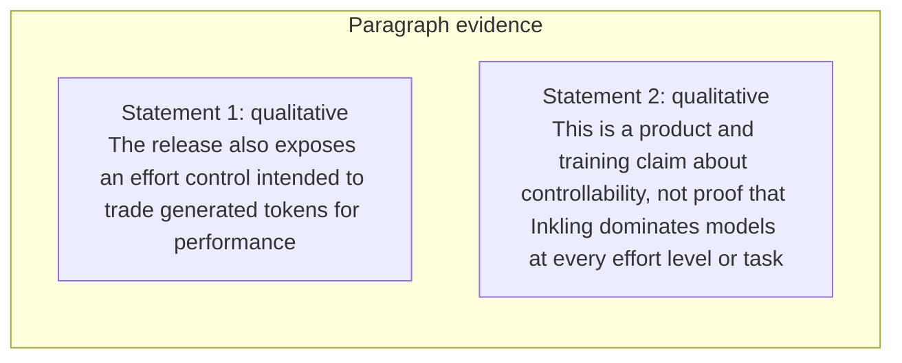

#### Python

```python
from html import escape
from pathlib import Path
from textwrap import wrap

title = "ink_change_p2: Optional changed-versus-unchanged claim boundary — Tested-versus-unestablished panels"
rows = [["Paragraph evidence","Statement 1","qualitative","The release also exposes an effort control intended to trade generated tokens for performance"],["Paragraph evidence","Statement 2","qualitative","This is a product and training claim about controllability, not proof that Inkling dominates models at every effort level or task"]]
groups = {}
for group, label, value, condition in rows:
    groups.setdefault(group, []).append((label, value, condition))
width = max(900, len(groups) * 360)
height = 220 + max((len(items) for items in groups.values()), default=1) * 92
parts = [
    f'<svg xmlns="http://www.w3.org/2000/svg" viewBox="0 0 {width} {height}" role="img" aria-labelledby="title desc">',
    f'<title id="title">{escape(title)}</title>',
    '<desc id="desc">Separate panels preserve grouping and prevent unrelated conditions from reading as one sequence.</desc>',
    f'<rect width="{width}" height="{height}" fill="white"/>',
]
for group_index, (group, items) in enumerate(groups.items()):
    x = 180 + group_index * 360
    parts.append(f'<text x="{x}" y="65" text-anchor="middle" font-family="sans-serif" font-size="16" font-weight="700">{escape(group)}</text>')
    for item_index, (label, value, condition) in enumerate(items):
        y = 120 + item_index * 92
        parts.append(f'<rect x="{x-160}" y="{y-30}" width="320" height="78" rx="12" fill="#f7fbff" stroke="#ccd"/>')
        text = f"{label}: {value} — {condition}"
        for line_index, line in enumerate(wrap(text, width=46)):
            parts.append(f'<text x="{x}" y="{y-6+line_index*14}" text-anchor="middle" font-family="sans-serif" font-size="11">{escape(line)}</text>')
parts.append('</svg>')
Path("ink_change_p2_treatment_a.svg").write_text("\n".join(parts), encoding="utf-8")
```

### Treatment B — Optional changed-versus-unchanged claim boundary — Scope ledger

- Teaching purpose: Optional contingency only. Make each condition and missing evidence item visible.
- Encoding and reading order: Render 2 rows with explicit `Group`, `Measure or state`, `Visible value`, and `Condition or boundary` columns. The value column must be visible, not only present in ARIA text or fallback prose.
- Evidence and limitations: Encode only `ink_001`, `ink_002`, `ink_003`, `ink_005`, `ink_008` from `source_inkling_model_card`, `source_inkling_release`, `source_inkling_aup`. Do not imply a measured effect or architecture not stated in this paragraph.
- Recommended web medium: semantic HTML/CSS table with SVG export; JavaScript is optional only for meaningful focus, drill-down, or state playback.
- Mobile, accessibility, and motion behavior: Preserve the same group and node order in the DOM; retain all values and relation labels as selectable text; stack panels or levels below 640px; provide keyboard access for any optional focus state; keep a complete static fallback; respect reduced motion and never encode information only through animation.

#### TikZ

```tex
\documentclass[tikz,border=5pt]{standalone}
\usepackage[T1]{fontenc}
\usepackage{array}
\usepackage{tikz}
\begin{document}
\begin{tikzpicture}[font=\sffamily]
\node[align=center] {\textbf{ink\_change\_p2: Optional changed-versus-unchanged claim boundary - Scope ledger}\\[6pt]
\begin{tabular}{p{3.2cm}p{4.0cm}p{2.8cm}p{6.2cm}}
\textbf{Group} & \textbf{Measure or state} & \textbf{Visible value} & \textbf{Condition or boundary} \\ \hline
Paragraph evidence & Statement 1 & qualitative & The release also exposes an effort control intended to trade generated tokens for performance \\
Paragraph evidence & Statement 2 & qualitative & This is a product and training claim about controllability, not proof that Inkling dominates models at every effort level or task \\
\end{tabular}};
\end{tikzpicture}
\end{document}
```

#### Mermaid

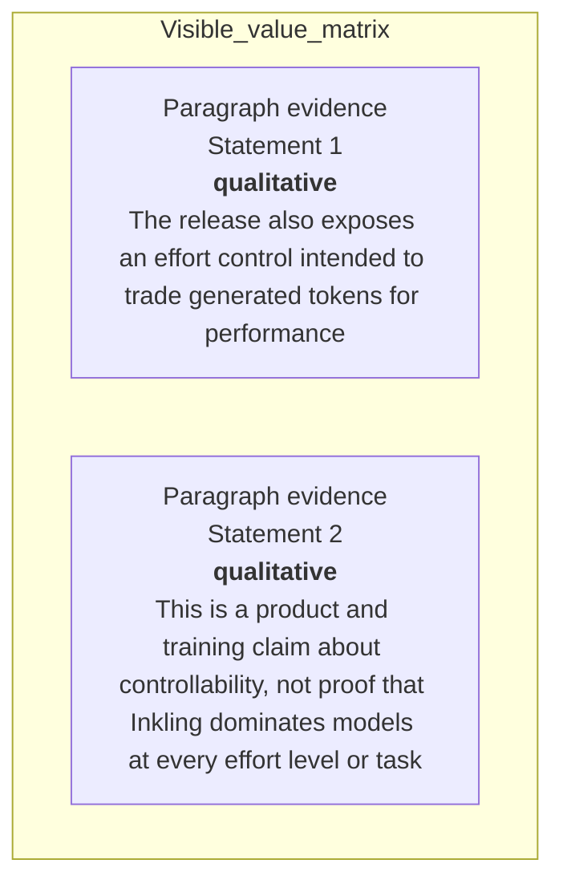

#### Python

```python
from html import escape
from pathlib import Path
from textwrap import wrap

title = "ink_change_p2: Optional changed-versus-unchanged claim boundary — Scope ledger"
rows = [["Paragraph evidence","Statement 1","qualitative","The release also exposes an effort control intended to trade generated tokens for performance"],["Paragraph evidence","Statement 2","qualitative","This is a product and training claim about controllability, not proof that Inkling dominates models at every effort level or task"]]
height = 326
parts = [
    f'<svg xmlns="http://www.w3.org/2000/svg" viewBox="0 0 1200 {height}" role="img" aria-labelledby="title desc">',
    f'<title id="title">{escape(title)}</title>',
    '<desc id="desc">Every reported value is visible beside its condition and group.</desc>',
    f'<rect width="1200" height="{height}" fill="white"/>',
]
headers = ["Group", "Measure or state", "Visible value", "Condition or boundary"]
xs = [30, 260, 590, 770]
for x, header in zip(xs, headers):
    parts.append(f'<text x="{x}" y="70" font-family="sans-serif" font-size="16" font-weight="700">{escape(header)}</text>')
for row_index, row in enumerate(rows):
    y = 110 + row_index * 88
    parts.append(f'<rect x="20" y="{y-28}" width="1160" height="76" fill="#f7fbff" stroke="#ccd"/>')
    for x, cell, width in zip(xs, row, [26, 38, 20, 58]):
        for line_index, line in enumerate(wrap(str(cell), width=width)):
            parts.append(f'<text x="{x}" y="{y+line_index*14}" font-family="sans-serif" font-size="11">{escape(line)}</text>')
parts.append('</svg>')
Path("ink_change_p2_treatment_b.svg").write_text("\n".join(parts), encoding="utf-8")
```

### Treatment C — Optional changed-versus-unchanged claim boundary — Annotated boundary map

- Teaching purpose: Optional contingency only. Connect a claim only to the qualification that bounds it.
- Encoding and reading order: Use 2 named nodes and 1 explicit labeled relations. Preserve all branch, merge, hierarchy, loop, or sequence edges shown in the code; changing them is an evidence deviation.
- Evidence and limitations: Encode only `ink_001`, `ink_002`, `ink_003`, `ink_005`, `ink_008` from `source_inkling_model_card`, `source_inkling_release`, `source_inkling_aup`. Do not imply a measured effect or architecture not stated in this paragraph.
- Recommended web medium: responsive inline SVG with semantic HTML/CSS fallback; JavaScript is optional only for meaningful focus, drill-down, or state playback.
- Mobile, accessibility, and motion behavior: Preserve the same group and node order in the DOM; retain all values and relation labels as selectable text; stack panels or levels below 640px; provide keyboard access for any optional focus state; keep a complete static fallback; respect reduced motion and never encode information only through animation.

#### TikZ

```tex
\documentclass[tikz,border=5pt]{standalone}
\usepackage[T1]{fontenc}
\usepackage{tikz}
\usetikzlibrary{arrows.meta}
\begin{document}
\begin{tikzpicture}[font=\sffamily,box/.style={draw,rounded corners,align=center,text width=3cm,minimum height=1.2cm},link/.style={-{Latex[length=2mm]},thick},rel/.style={fill=white,font=\scriptsize}]
\node[font=\bfseries,anchor=west] at (0,0.8) {ink\_change\_p2: Optional changed-versus-unchanged claim boundary - Annotated boundary map};
\node[box] (n1) at (1.00,-1.50) {The release also exposes an effort control intended to trade generated tokens for performance};
\node[box] (n2) at (2.50,-1.50) {This is a product and training claim about controllability, not proof that Inkling dominates models at every effort level or task};
\draw[link] (n1) -- node[rel] {then} (n2);
\end{tikzpicture}
\end{document}
```

#### Mermaid

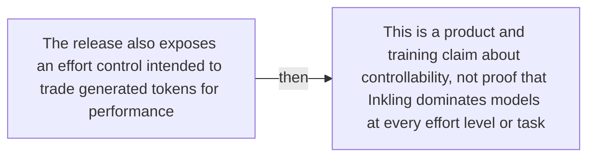

#### Python

```python
from html import escape
from pathlib import Path
from textwrap import wrap

title = "ink_change_p2: Optional changed-versus-unchanged claim boundary — Annotated boundary map"
nodes = [["n1","The release also exposes an effort control intended to trade generated tokens for performance",100,150],["n2","This is a product and training claim about controllability, not proof that Inkling dominates models at every effort level or task",250,150]]
edges = [["n1","n2","then"]]
node_by_id = {node_id: (label, x, y) for node_id, label, x, y in nodes}
width = max(900, max((x for _, _, x, _ in nodes), default=800) + 180)
height = max(500, max((y for _, _, _, y in nodes), default=400) + 140)
parts = [
    f'<svg xmlns="http://www.w3.org/2000/svg" viewBox="0 0 {width} {height}" role="img" aria-labelledby="title desc">',
    f'<title id="title">{escape(title)}</title>',
    '<desc id="desc">Edges and convergence points encode only relationships stated in the scoped paragraphs.</desc>',
    f'<rect width="{width}" height="{height}" fill="white"/>',
]
for source, target, relation in edges:
    _, x1, y1 = node_by_id[source]
    _, x2, y2 = node_by_id[target]
    parts.append(f'<line x1="{x1}" y1="{y1}" x2="{x2}" y2="{y2}" stroke="#345" stroke-width="2"/>')
    parts.append(f'<text x="{(x1+x2)/2}" y="{(y1+y2)/2-5}" text-anchor="middle" font-family="sans-serif" font-size="10">{escape(relation)}</text>')
for _, label, x, y in nodes:
    parts.append(f'<rect x="{x-78}" y="{y-42}" width="156" height="84" rx="12" fill="#eef6ff" stroke="#234"/>')
    for line_index, line in enumerate(wrap(label, width=22)):
        parts.append(f'<text x="{x}" y="{y-24+line_index*13}" text-anchor="middle" font-family="sans-serif" font-size="10">{escape(line)}</text>')
parts.append('</svg>')
Path("ink_change_p2_treatment_c.svg").write_text("\n".join(parts), encoding="utf-8")
```

### Implementation record

- Status: `NOT_NEEDED`
- Selected treatment: `NONE`
- Selection rationale: Revision 3's paragraph-level removal test keeps this paragraph prose-only; no figure would reduce the reader's reconstruction burden enough to justify added visual complexity.
- Delivery medium: `NONE`
- Visual ID and placement: `NONE`; no figure is attached to this paragraph.
- Shared paragraph scope: NONE
- Changed files: `docs/visual-manifests/VISUAL_MANIFEST_INKLING.md` records the prose-only decision; no fixture visual serves this paragraph.
- Accessibility and fallback verification: The paragraph remains semantic selectable text with its existing claim and source links; no visual-only information or motion is introduced.
- Desktop and mobile verification: No paragraph-local figure exists; the existing prose remains in normal document order at both viewports.
- Evidence deviations: Not applicable: revision 3 explicitly classifies this paragraph as prose-only.

## `ink_mechanism_p1`

- Location: `ink_mechanism`, paragraph 1
- Text anchor: "Inkling is a decoder-only autoregressive Transformer with 66 layers."
- Claims and sources: `ink_002` (OBSERVED, VERIFIED); `ink_003` (OBSERVED, VERIFIED); `ink_006` (OBSERVED, VERIFIED); `source_inkling_model_card` (Retrieved 2026-07-18; official HTML SHA-256 fe653ffb5f4b9f54f011491f60cd8d6b9885d667484880d4566d76827f22a7e9 (65,631 bytes). Sections 1-6: identity, architecture, modalities, hardware, training, evaluations, safety. Live URL remains mutable.); `source_inkling_release` (Retrieved 2026-07-18; official HTML SHA-256 cb28c6a6c8c47c68f55f2c636481bf35a1b9f5a349e5f00148c583fafbc138fc (222,133 bytes). July 15 release sections on effort, multimodality, benchmarks, architecture, training, RL, availability. Live URL remains mutable.)
- Visual needed: `YES`
- Decision rationale: A visual passes the removal test because readers must reconstruct inkling moe routed and shared expert convergence while preserving the paragraph's conditions and boundaries. Revision 3 narrows the topology and placement so no visual can claim this paragraph without encoding its mechanism, grouping, or values.
- Explanatory job: Inkling MoE routed and shared expert convergence.
- Recommended scope and placement: This paragraph only; place the visual immediately after `ink_mechanism_p1`.
- QA-informed planning change: The active token path must follow the merge of 6-of-256 routed experts and 2 always-active shared experts; they are not sibling outcomes.

### Treatment A — Inkling MoE routed and shared expert convergence — Convergence topology

- Teaching purpose: Show branches merging into the shared target or active path.
- Encoding and reading order: Use 6 named nodes and 6 explicit labeled relations. Preserve all branch, merge, hierarchy, loop, or sequence edges shown in the code; changing them is an evidence deviation.
- Evidence and limitations: Encode only `ink_002`, `ink_003`, `ink_006` from `source_inkling_model_card`, `source_inkling_release`. The active token path must follow the merge of 6-of-256 routed experts and 2 always-active shared experts; they are not sibling outcomes.
- Recommended web medium: responsive inline SVG with semantic HTML/CSS fallback; JavaScript is optional only for meaningful focus, drill-down, or state playback.
- Mobile, accessibility, and motion behavior: Preserve the same group and node order in the DOM; retain all values and relation labels as selectable text; stack panels or levels below 640px; provide keyboard access for any optional focus state; keep a complete static fallback; respect reduced motion and never encode information only through animation.

#### TikZ

```tex
\documentclass[tikz,border=5pt]{standalone}
\usepackage[T1]{fontenc}
\usepackage{tikz}
\usetikzlibrary{arrows.meta}
\begin{document}
\begin{tikzpicture}[font=\sffamily,box/.style={draw,rounded corners,align=center,text width=3cm,minimum height=1.2cm},link/.style={-{Latex[length=2mm]},thick},rel/.style={fill=white,font=\scriptsize}]
\node[font=\bfseries,anchor=west] at (0,0.8) {ink\_mechanism\_p1: Inkling MoE routed and shared expert convergence - Convergence topology};
\node[box] (token) at (1.00,-1.50) {Input token};
\node[box] (router) at (2.50,-1.50) {Router};
\node[box] (routed) at (4.00,-0.45) {6 of 256 routed experts};
\node[box] (shared) at (4.00,-2.55) {2 always-active shared experts};
\node[box] (merge) at (5.50,-1.50) {Combine routed and shared outputs};
\node[box] (active) at (7.00,-1.50) {Active token path continues};
\draw[link] (token) -- node[rel] {project} (router);
\draw[link] (router) -- node[rel] {select} (routed);
\draw[link] (token) -- node[rel] {always active} (shared);
\draw[link] (routed) -- node[rel] {converge} (merge);
\draw[link] (shared) -- node[rel] {converge} (merge);
\draw[link] (merge) -- node[rel] {continue} (active);
\end{tikzpicture}
\end{document}
```

#### Mermaid

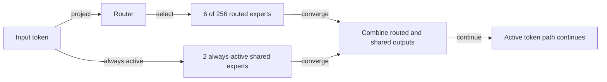

#### Python

```python
from html import escape
from pathlib import Path
from textwrap import wrap

title = "ink_mechanism_p1: Inkling MoE routed and shared expert convergence — Convergence topology"
nodes = [["token","Input token",100,150],["router","Router",250,150],["routed","6 of 256 routed experts",400,45],["shared","2 always-active shared experts",400,255],["merge","Combine routed and shared outputs",550,150],["active","Active token path continues",700,150]]
edges = [["token","router","project"],["router","routed","select"],["token","shared","always active"],["routed","merge","converge"],["shared","merge","converge"],["merge","active","continue"]]
node_by_id = {node_id: (label, x, y) for node_id, label, x, y in nodes}
width = max(900, max((x for _, _, x, _ in nodes), default=800) + 180)
height = max(500, max((y for _, _, _, y in nodes), default=400) + 140)
parts = [
    f'<svg xmlns="http://www.w3.org/2000/svg" viewBox="0 0 {width} {height}" role="img" aria-labelledby="title desc">',
    f'<title id="title">{escape(title)}</title>',
    '<desc id="desc">Edges and convergence points encode only relationships stated in the scoped paragraphs.</desc>',
    f'<rect width="{width}" height="{height}" fill="white"/>',
]
for source, target, relation in edges:
    _, x1, y1 = node_by_id[source]
    _, x2, y2 = node_by_id[target]
    parts.append(f'<line x1="{x1}" y1="{y1}" x2="{x2}" y2="{y2}" stroke="#345" stroke-width="2"/>')
    parts.append(f'<text x="{(x1+x2)/2}" y="{(y1+y2)/2-5}" text-anchor="middle" font-family="sans-serif" font-size="10">{escape(relation)}</text>')
for _, label, x, y in nodes:
    parts.append(f'<rect x="{x-78}" y="{y-42}" width="156" height="84" rx="12" fill="#eef6ff" stroke="#234"/>')
    for line_index, line in enumerate(wrap(label, width=22)):
        parts.append(f'<text x="{x}" y="{y-24+line_index*13}" text-anchor="middle" font-family="sans-serif" font-size="10">{escape(line)}</text>')
parts.append('</svg>')
Path("ink_mechanism_p1_treatment_a.svg").write_text("\n".join(parts), encoding="utf-8")
```

### Treatment B — Inkling MoE routed and shared expert convergence — Branch contribution ledger

- Teaching purpose: List every branch, operation, and merge condition.
- Encoding and reading order: Render 4 rows with explicit `Group`, `Measure or state`, `Visible value`, and `Condition or boundary` columns. The value column must be visible, not only present in ARIA text or fallback prose.
- Evidence and limitations: Encode only `ink_002`, `ink_003`, `ink_006` from `source_inkling_model_card`, `source_inkling_release`. The active token path must follow the merge of 6-of-256 routed experts and 2 always-active shared experts; they are not sibling outcomes.
- Recommended web medium: semantic HTML/CSS table with SVG export; JavaScript is optional only for meaningful focus, drill-down, or state playback.
- Mobile, accessibility, and motion behavior: Preserve the same group and node order in the DOM; retain all values and relation labels as selectable text; stack panels or levels below 640px; provide keyboard access for any optional focus state; keep a complete static fallback; respect reduced motion and never encode information only through animation.

#### TikZ

```tex
\documentclass[tikz,border=5pt]{standalone}
\usepackage[T1]{fontenc}
\usepackage{array}
\usepackage{tikz}
\begin{document}
\begin{tikzpicture}[font=\sffamily]
\node[align=center] {\textbf{ink\_mechanism\_p1: Inkling MoE routed and shared expert convergence - Branch contribution ledger}\\[6pt]
\begin{tabular}{p{3.2cm}p{4.0cm}p{2.8cm}p{6.2cm}}
\textbf{Group} & \textbf{Measure or state} & \textbf{Visible value} & \textbf{Condition or boundary} \\ \hline
One token activates only part of Inkling & Stored model & qualitative & Inkling has 975 billion total parameters across its sparse mixture-of-experts architecture. \\
One token activates only part of Inkling & Routed branch & qualitative & For each token, the sparse feed-forward path selects 6 of 256 routed experts rather than activating every routed expert. \\
One token activates only part of Inkling & Shared branch & qualitative & The same token also uses 2 shared experts that are always active. \\
One token activates only part of Inkling & Active token path & qualitative & The selected routed experts and the 2 shared experts make up a 41-billion-parameter active path for that token. \\
\end{tabular}};
\end{tikzpicture}
\end{document}
```

#### Mermaid

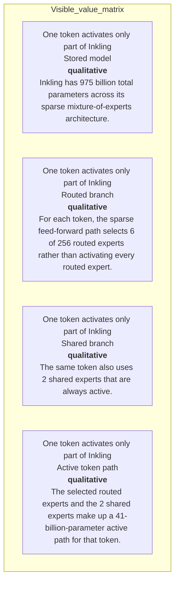

#### Python

```python
from html import escape
from pathlib import Path
from textwrap import wrap

title = "ink_mechanism_p1: Inkling MoE routed and shared expert convergence — Branch contribution ledger"
rows = [["One token activates only part of Inkling","Stored model","qualitative","Inkling has 975 billion total parameters across its sparse mixture-of-experts architecture."],["One token activates only part of Inkling","Routed branch","qualitative","For each token, the sparse feed-forward path selects 6 of 256 routed experts rather than activating every routed expert."],["One token activates only part of Inkling","Shared branch","qualitative","The same token also uses 2 shared experts that are always active."],["One token activates only part of Inkling","Active token path","qualitative","The selected routed experts and the 2 shared experts make up a 41-billion-parameter active path for that token."]]
height = 502
parts = [
    f'<svg xmlns="http://www.w3.org/2000/svg" viewBox="0 0 1200 {height}" role="img" aria-labelledby="title desc">',
    f'<title id="title">{escape(title)}</title>',
    '<desc id="desc">Every reported value is visible beside its condition and group.</desc>',
    f'<rect width="1200" height="{height}" fill="white"/>',
]
headers = ["Group", "Measure or state", "Visible value", "Condition or boundary"]
xs = [30, 260, 590, 770]
for x, header in zip(xs, headers):
    parts.append(f'<text x="{x}" y="70" font-family="sans-serif" font-size="16" font-weight="700">{escape(header)}</text>')
for row_index, row in enumerate(rows):
    y = 110 + row_index * 88
    parts.append(f'<rect x="20" y="{y-28}" width="1160" height="76" fill="#f7fbff" stroke="#ccd"/>')
    for x, cell, width in zip(xs, row, [26, 38, 20, 58]):
        for line_index, line in enumerate(wrap(str(cell), width=width)):
            parts.append(f'<text x="{x}" y="{y+line_index*14}" font-family="sans-serif" font-size="11">{escape(line)}</text>')
parts.append('</svg>')
Path("ink_mechanism_p1_treatment_b.svg").write_text("\n".join(parts), encoding="utf-8")
```

### Treatment C — Inkling MoE routed and shared expert convergence — One-item convergence trace

- Teaching purpose: Trace one token or estimate through branch selection and merge.
- Encoding and reading order: Use 6 named nodes and 6 explicit labeled relations. Preserve all branch, merge, hierarchy, loop, or sequence edges shown in the code; changing them is an evidence deviation.
- Evidence and limitations: Encode only `ink_002`, `ink_003`, `ink_006` from `source_inkling_model_card`, `source_inkling_release`. The active token path must follow the merge of 6-of-256 routed experts and 2 always-active shared experts; they are not sibling outcomes.
- Recommended web medium: responsive inline SVG with semantic HTML/CSS fallback; JavaScript is optional only for meaningful focus, drill-down, or state playback.
- Mobile, accessibility, and motion behavior: Preserve the same group and node order in the DOM; retain all values and relation labels as selectable text; stack panels or levels below 640px; provide keyboard access for any optional focus state; keep a complete static fallback; respect reduced motion and never encode information only through animation.

#### TikZ

```tex
\documentclass[tikz,border=5pt]{standalone}
\usepackage[T1]{fontenc}
\usepackage{tikz}
\usetikzlibrary{arrows.meta}
\begin{document}
\begin{tikzpicture}[font=\sffamily,box/.style={draw,rounded corners,align=center,text width=3cm,minimum height=1.2cm},link/.style={-{Latex[length=2mm]},thick},rel/.style={fill=white,font=\scriptsize}]
\node[font=\bfseries,anchor=west] at (0,0.8) {ink\_mechanism\_p1: Inkling MoE routed and shared expert convergence - One-item convergence trace};
\node[box] (token) at (1.00,-1.50) {Input token};
\node[box] (router) at (2.50,-1.50) {Router};
\node[box] (routed) at (4.00,-0.45) {6 of 256 routed experts};
\node[box] (shared) at (4.00,-2.55) {2 always-active shared experts};
\node[box] (merge) at (5.50,-1.50) {Combine routed and shared outputs};
\node[box] (active) at (7.00,-1.50) {Active token path continues};
\draw[link] (token) -- node[rel] {project} (router);
\draw[link] (router) -- node[rel] {select} (routed);
\draw[link] (token) -- node[rel] {always active} (shared);
\draw[link] (routed) -- node[rel] {converge} (merge);
\draw[link] (shared) -- node[rel] {converge} (merge);
\draw[link] (merge) -- node[rel] {continue} (active);
\end{tikzpicture}
\end{document}
```

#### Mermaid


#### Python

```python
from html import escape
from pathlib import Path
from textwrap import wrap

title = "ink_mechanism_p1: Inkling MoE routed and shared expert convergence — One-item convergence trace"
nodes = [["token","Input token",100,150],["router","Router",250,150],["routed","6 of 256 routed experts",400,45],["shared","2 always-active shared experts",400,255],["merge","Combine routed and shared outputs",550,150],["active","Active token path continues",700,150]]
edges = [["token","router","project"],["router","routed","select"],["token","shared","always active"],["routed","merge","converge"],["shared","merge","converge"],["merge","active","continue"]]
node_by_id = {node_id: (label, x, y) for node_id, label, x, y in nodes}
width = max(900, max((x for _, _, x, _ in nodes), default=800) + 180)
height = max(500, max((y for _, _, _, y in nodes), default=400) + 140)
parts = [
    f'<svg xmlns="http://www.w3.org/2000/svg" viewBox="0 0 {width} {height}" role="img" aria-labelledby="title desc">',
    f'<title id="title">{escape(title)}</title>',
    '<desc id="desc">Edges and convergence points encode only relationships stated in the scoped paragraphs.</desc>',
    f'<rect width="{width}" height="{height}" fill="white"/>',
]
for source, target, relation in edges:
    _, x1, y1 = node_by_id[source]
    _, x2, y2 = node_by_id[target]
    parts.append(f'<line x1="{x1}" y1="{y1}" x2="{x2}" y2="{y2}" stroke="#345" stroke-width="2"/>')
    parts.append(f'<text x="{(x1+x2)/2}" y="{(y1+y2)/2-5}" text-anchor="middle" font-family="sans-serif" font-size="10">{escape(relation)}</text>')
for _, label, x, y in nodes:
    parts.append(f'<rect x="{x-78}" y="{y-42}" width="156" height="84" rx="12" fill="#eef6ff" stroke="#234"/>')
    for line_index, line in enumerate(wrap(label, width=22)):
        parts.append(f'<text x="{x}" y="{y-24+line_index*13}" text-anchor="middle" font-family="sans-serif" font-size="10">{escape(line)}</text>')
parts.append('</svg>')
Path("ink_mechanism_p1_treatment_c.svg").write_text("\n".join(parts), encoding="utf-8")
```

### Implementation record

- Status: `IMPLEMENTED`
- Selected treatment: `A`
- Selection rationale: Selected the approved “Inkling MoE routed and shared expert convergence — Convergence topology” treatment because the implemented partition tree directly encodes this paragraph's explanatory job and its stated evidence boundaries.
- Delivery medium: `CSS + semantic HTML`
- Visual ID and placement: `visual_inkling_moe_routing` after `ink_mechanism_p1`; this record is served by that purpose-built figure.
- Shared paragraph scope: NONE
- Changed files: `packages/test-fixtures/explainers/inkling.json`, `packages/content-schema/schema/explainer-document.schema.json`, `packages/content-schema/src/validate.ts`, generated TypeScript/Python models, `apps/web/app/papers/[id]/explainer-visual.tsx`, and `apps/web/app/globals.css`.
- Accessibility and fallback verification: Figure has a programmatic title and description, visible selectable labels and values, explicit alt text, equivalent fallback prose, source links, limitations, and a semantic static body; no meaning depends on color, motion, or pointer input.
- Desktop and mobile verification: Verified by the full eight-paper Playwright traversal at a 1440-pixel desktop viewport and the iPhone 13 mobile viewport; every figure stayed paragraph-adjacent, preserved DOM reading order, and introduced no horizontal page overflow.
- Evidence deviations: Delivery translation: selected Treatment A is rendered as typed semantic HTML/CSS rather than its literal TikZ, Mermaid, or Python-generated asset; the approved paragraph scope, placement, labels, values, grouping, and evidence boundaries are retained.

## `ink_mechanism_p2`

- Location: `ink_mechanism`, paragraph 2
- Text anchor: "The release says local and global attention layers are interleaved at a 5-to-1 ratio with 8 key-value heads."
- Claims and sources: `ink_002` (OBSERVED, VERIFIED); `ink_003` (OBSERVED, VERIFIED); `ink_006` (OBSERVED, VERIFIED); `source_inkling_model_card` (Retrieved 2026-07-18; official HTML SHA-256 fe653ffb5f4b9f54f011491f60cd8d6b9885d667484880d4566d76827f22a7e9 (65,631 bytes). Sections 1-6: identity, architecture, modalities, hardware, training, evaluations, safety. Live URL remains mutable.); `source_inkling_release` (Retrieved 2026-07-18; official HTML SHA-256 cb28c6a6c8c47c68f55f2c636481bf35a1b9f5a349e5f00148c583fafbc138fc (222,133 bytes). July 15 release sections on effort, multimodality, benchmarks, architecture, training, RL, availability. Live URL remains mutable.)
- Visual needed: `YES`
- Decision rationale: A visual passes the removal test because readers must reconstruct text, image, and audio front ends converging into one decoder while preserving the paragraph's conditions and boundaries. Revision 3 narrows the topology and placement so no visual can claim this paragraph without encoding its mechanism, grouping, or values.
- Explanatory job: Text, image, and audio front ends converging into one decoder.
- Recommended scope and placement: This paragraph only; place the visual immediately after `ink_mechanism_p2`.
- QA-informed planning change: Show modality-specific front ends merging into the shared hidden space, then the 5:1 local/global attention stack with 8 KV heads.

### Treatment A — Text, image, and audio front ends converging into one decoder — Convergence topology

- Teaching purpose: Show branches merging into the shared target or active path.
- Encoding and reading order: Use 6 named nodes and 5 explicit labeled relations. Preserve all branch, merge, hierarchy, loop, or sequence edges shown in the code; changing them is an evidence deviation.
- Evidence and limitations: Encode only `ink_002`, `ink_003`, `ink_006` from `source_inkling_model_card`, `source_inkling_release`. Show modality-specific front ends merging into the shared hidden space, then the 5:1 local/global attention stack with 8 KV heads.
- Recommended web medium: responsive inline SVG with semantic HTML/CSS fallback; JavaScript is optional only for meaningful focus, drill-down, or state playback.
- Mobile, accessibility, and motion behavior: Preserve the same group and node order in the DOM; retain all values and relation labels as selectable text; stack panels or levels below 640px; provide keyboard access for any optional focus state; keep a complete static fallback; respect reduced motion and never encode information only through animation.

#### TikZ

```tex
\documentclass[tikz,border=5pt]{standalone}
\usepackage[T1]{fontenc}
\usepackage{tikz}
\usetikzlibrary{arrows.meta}
\begin{document}
\begin{tikzpicture}[font=\sffamily,box/.style={draw,rounded corners,align=center,text width=3cm,minimum height=1.2cm},link/.style={-{Latex[length=2mm]},thick},rel/.style={fill=white,font=\scriptsize}]
\node[font=\bfseries,anchor=west] at (0,0.8) {ink\_mechanism\_p2: Text, image, and audio front ends converging into one decoder - Convergence topology};
\node[box] (text) at (1.00,-0.45) {Text embeddings};
\node[box] (image) at (1.00,-1.50) {40x40 image patches  hierarchical MLP};
\node[box] (audio) at (1.00,-2.55) {dMel / discrete audio representation};
\node[box] (hidden) at (2.50,-1.50) {Shared hidden space};
\node[box] (decoder) at (4.00,-1.50) {Decoder with 5:1 local/global attention and 8 KV heads};
\node[box] (output) at (5.50,-1.50) {Autoregressive text output};
\draw[link] (text) -- node[rel] {embed} (hidden);
\draw[link] (image) -- node[rel] {project} (hidden);
\draw[link] (audio) -- node[rel] {project} (hidden);
\draw[link] (hidden) -- node[rel] {joint processing} (decoder);
\draw[link] (decoder) -- node[rel] {decode} (output);
\end{tikzpicture}
\end{document}
```

#### Mermaid

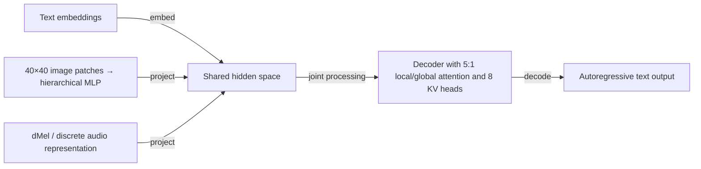

#### Python

```python
from html import escape
from pathlib import Path
from textwrap import wrap

title = "ink_mechanism_p2: Text, image, and audio front ends converging into one decoder — Convergence topology"
nodes = [["text","Text embeddings",100,45],["image","40×40 image patches → hierarchical MLP",100,150],["audio","dMel / discrete audio representation",100,255],["hidden","Shared hidden space",250,150],["decoder","Decoder with 5:1 local/global attention and 8 KV heads",400,150],["output","Autoregressive text output",550,150]]
edges = [["text","hidden","embed"],["image","hidden","project"],["audio","hidden","project"],["hidden","decoder","joint processing"],["decoder","output","decode"]]
node_by_id = {node_id: (label, x, y) for node_id, label, x, y in nodes}
width = max(900, max((x for _, _, x, _ in nodes), default=800) + 180)
height = max(500, max((y for _, _, _, y in nodes), default=400) + 140)
parts = [
    f'<svg xmlns="http://www.w3.org/2000/svg" viewBox="0 0 {width} {height}" role="img" aria-labelledby="title desc">',
    f'<title id="title">{escape(title)}</title>',
    '<desc id="desc">Edges and convergence points encode only relationships stated in the scoped paragraphs.</desc>',
    f'<rect width="{width}" height="{height}" fill="white"/>',
]
for source, target, relation in edges:
    _, x1, y1 = node_by_id[source]
    _, x2, y2 = node_by_id[target]
    parts.append(f'<line x1="{x1}" y1="{y1}" x2="{x2}" y2="{y2}" stroke="#345" stroke-width="2"/>')
    parts.append(f'<text x="{(x1+x2)/2}" y="{(y1+y2)/2-5}" text-anchor="middle" font-family="sans-serif" font-size="10">{escape(relation)}</text>')
for _, label, x, y in nodes:
    parts.append(f'<rect x="{x-78}" y="{y-42}" width="156" height="84" rx="12" fill="#eef6ff" stroke="#234"/>')
    for line_index, line in enumerate(wrap(label, width=22)):
        parts.append(f'<text x="{x}" y="{y-24+line_index*13}" text-anchor="middle" font-family="sans-serif" font-size="10">{escape(line)}</text>')
parts.append('</svg>')
Path("ink_mechanism_p2_treatment_a.svg").write_text("\n".join(parts), encoding="utf-8")
```

### Treatment B — Text, image, and audio front ends converging into one decoder — Branch contribution ledger

- Teaching purpose: List every branch, operation, and merge condition.
- Encoding and reading order: Render 5 rows with explicit `Group`, `Measure or state`, `Visible value`, and `Condition or boundary` columns. The value column must be visible, not only present in ARIA text or fallback prose.
- Evidence and limitations: Encode only `ink_002`, `ink_003`, `ink_006` from `source_inkling_model_card`, `source_inkling_release`. Show modality-specific front ends merging into the shared hidden space, then the 5:1 local/global attention stack with 8 KV heads.
- Recommended web medium: semantic HTML/CSS table with SVG export; JavaScript is optional only for meaningful focus, drill-down, or state playback.
- Mobile, accessibility, and motion behavior: Preserve the same group and node order in the DOM; retain all values and relation labels as selectable text; stack panels or levels below 640px; provide keyboard access for any optional focus state; keep a complete static fallback; respect reduced motion and never encode information only through animation.

#### TikZ

```tex
\documentclass[tikz,border=5pt]{standalone}
\usepackage[T1]{fontenc}
\usepackage{array}
\usepackage{tikz}
\begin{document}
\begin{tikzpicture}[font=\sffamily]
\node[align=center] {\textbf{ink\_mechanism\_p2: Text, image, and audio front ends converging into one decoder - Branch contribution ledger}\\[6pt]
\begin{tabular}{p{3.2cm}p{4.0cm}p{2.8cm}p{6.2cm}}
\textbf{Group} & \textbf{Measure or state} & \textbf{Visible value} & \textbf{Condition or boundary} \\ \hline
Three input paths meet in one autoregressive decoder & Text tokens & qualitative & Text begins as token representations in the decoder's hidden space. \\
Three input paths meet in one autoregressive decoder & Image patches & qualitative & The release describes 40-by-40 patches passing through a four-layer hierarchical MLP before projection into the shared space. \\
Three input paths meet in one autoregressive decoder & Audio representation & qualitative & The release describes dMel spectrograms, while the website model card gives the broader description of discrete audio-token encoding. \\
Three input paths meet in one autoregressive decoder & Interleaved attention stack & qualitative & Local and global attention layers are reported at a 5-to-1 ratio with 8 key-value heads. \\
Three input paths meet in one autoregressive decoder & Text output & qualitative & The 66-layer decoder processes the shared representations autoregressively and emits text. \\
\end{tabular}};
\end{tikzpicture}
\end{document}
```

#### Mermaid

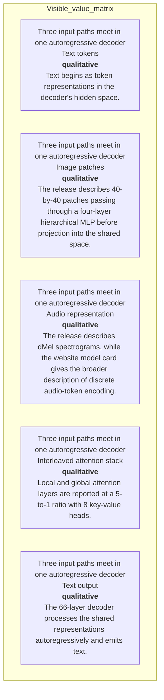

#### Python

```python
from html import escape
from pathlib import Path
from textwrap import wrap

title = "ink_mechanism_p2: Text, image, and audio front ends converging into one decoder — Branch contribution ledger"
rows = [["Three input paths meet in one autoregressive decoder","Text tokens","qualitative","Text begins as token representations in the decoder's hidden space."],["Three input paths meet in one autoregressive decoder","Image patches","qualitative","The release describes 40-by-40 patches passing through a four-layer hierarchical MLP before projection into the shared space."],["Three input paths meet in one autoregressive decoder","Audio representation","qualitative","The release describes dMel spectrograms, while the website model card gives the broader description of discrete audio-token encoding."],["Three input paths meet in one autoregressive decoder","Interleaved attention stack","qualitative","Local and global attention layers are reported at a 5-to-1 ratio with 8 key-value heads."],["Three input paths meet in one autoregressive decoder","Text output","qualitative","The 66-layer decoder processes the shared representations autoregressively and emits text."]]
height = 590
parts = [
    f'<svg xmlns="http://www.w3.org/2000/svg" viewBox="0 0 1200 {height}" role="img" aria-labelledby="title desc">',
    f'<title id="title">{escape(title)}</title>',
    '<desc id="desc">Every reported value is visible beside its condition and group.</desc>',
    f'<rect width="1200" height="{height}" fill="white"/>',
]
headers = ["Group", "Measure or state", "Visible value", "Condition or boundary"]
xs = [30, 260, 590, 770]
for x, header in zip(xs, headers):
    parts.append(f'<text x="{x}" y="70" font-family="sans-serif" font-size="16" font-weight="700">{escape(header)}</text>')
for row_index, row in enumerate(rows):
    y = 110 + row_index * 88
    parts.append(f'<rect x="20" y="{y-28}" width="1160" height="76" fill="#f7fbff" stroke="#ccd"/>')
    for x, cell, width in zip(xs, row, [26, 38, 20, 58]):
        for line_index, line in enumerate(wrap(str(cell), width=width)):
            parts.append(f'<text x="{x}" y="{y+line_index*14}" font-family="sans-serif" font-size="11">{escape(line)}</text>')
parts.append('</svg>')
Path("ink_mechanism_p2_treatment_b.svg").write_text("\n".join(parts), encoding="utf-8")
```

### Treatment C — Text, image, and audio front ends converging into one decoder — One-item convergence trace

- Teaching purpose: Trace one token or estimate through branch selection and merge.
- Encoding and reading order: Use 6 named nodes and 5 explicit labeled relations. Preserve all branch, merge, hierarchy, loop, or sequence edges shown in the code; changing them is an evidence deviation.
- Evidence and limitations: Encode only `ink_002`, `ink_003`, `ink_006` from `source_inkling_model_card`, `source_inkling_release`. Show modality-specific front ends merging into the shared hidden space, then the 5:1 local/global attention stack with 8 KV heads.
- Recommended web medium: responsive inline SVG with semantic HTML/CSS fallback; JavaScript is optional only for meaningful focus, drill-down, or state playback.
- Mobile, accessibility, and motion behavior: Preserve the same group and node order in the DOM; retain all values and relation labels as selectable text; stack panels or levels below 640px; provide keyboard access for any optional focus state; keep a complete static fallback; respect reduced motion and never encode information only through animation.

#### TikZ

```tex
\documentclass[tikz,border=5pt]{standalone}
\usepackage[T1]{fontenc}
\usepackage{tikz}
\usetikzlibrary{arrows.meta}
\begin{document}
\begin{tikzpicture}[font=\sffamily,box/.style={draw,rounded corners,align=center,text width=3cm,minimum height=1.2cm},link/.style={-{Latex[length=2mm]},thick},rel/.style={fill=white,font=\scriptsize}]
\node[font=\bfseries,anchor=west] at (0,0.8) {ink\_mechanism\_p2: Text, image, and audio front ends converging into one decoder - One-item convergence trace};
\node[box] (text) at (1.00,-0.45) {Text embeddings};
\node[box] (image) at (1.00,-1.50) {40x40 image patches  hierarchical MLP};
\node[box] (audio) at (1.00,-2.55) {dMel / discrete audio representation};
\node[box] (hidden) at (2.50,-1.50) {Shared hidden space};
\node[box] (decoder) at (4.00,-1.50) {Decoder with 5:1 local/global attention and 8 KV heads};
\node[box] (output) at (5.50,-1.50) {Autoregressive text output};
\draw[link] (text) -- node[rel] {embed} (hidden);
\draw[link] (image) -- node[rel] {project} (hidden);
\draw[link] (audio) -- node[rel] {project} (hidden);
\draw[link] (hidden) -- node[rel] {joint processing} (decoder);
\draw[link] (decoder) -- node[rel] {decode} (output);
\end{tikzpicture}
\end{document}
```

#### Mermaid


#### Python

```python
from html import escape
from pathlib import Path
from textwrap import wrap

title = "ink_mechanism_p2: Text, image, and audio front ends converging into one decoder — One-item convergence trace"
nodes = [["text","Text embeddings",100,45],["image","40×40 image patches → hierarchical MLP",100,150],["audio","dMel / discrete audio representation",100,255],["hidden","Shared hidden space",250,150],["decoder","Decoder with 5:1 local/global attention and 8 KV heads",400,150],["output","Autoregressive text output",550,150]]
edges = [["text","hidden","embed"],["image","hidden","project"],["audio","hidden","project"],["hidden","decoder","joint processing"],["decoder","output","decode"]]
node_by_id = {node_id: (label, x, y) for node_id, label, x, y in nodes}
width = max(900, max((x for _, _, x, _ in nodes), default=800) + 180)
height = max(500, max((y for _, _, _, y in nodes), default=400) + 140)
parts = [
    f'<svg xmlns="http://www.w3.org/2000/svg" viewBox="0 0 {width} {height}" role="img" aria-labelledby="title desc">',
    f'<title id="title">{escape(title)}</title>',
    '<desc id="desc">Edges and convergence points encode only relationships stated in the scoped paragraphs.</desc>',
    f'<rect width="{width}" height="{height}" fill="white"/>',
]
for source, target, relation in edges:
    _, x1, y1 = node_by_id[source]
    _, x2, y2 = node_by_id[target]
    parts.append(f'<line x1="{x1}" y1="{y1}" x2="{x2}" y2="{y2}" stroke="#345" stroke-width="2"/>')
    parts.append(f'<text x="{(x1+x2)/2}" y="{(y1+y2)/2-5}" text-anchor="middle" font-family="sans-serif" font-size="10">{escape(relation)}</text>')
for _, label, x, y in nodes:
    parts.append(f'<rect x="{x-78}" y="{y-42}" width="156" height="84" rx="12" fill="#eef6ff" stroke="#234"/>')
    for line_index, line in enumerate(wrap(label, width=22)):
        parts.append(f'<text x="{x}" y="{y-24+line_index*13}" text-anchor="middle" font-family="sans-serif" font-size="10">{escape(line)}</text>')
parts.append('</svg>')
Path("ink_mechanism_p2_treatment_c.svg").write_text("\n".join(parts), encoding="utf-8")
```

### Implementation record

- Status: `IMPLEMENTED`
- Selected treatment: `A`
- Selection rationale: Selected the approved “Text, image, and audio front ends converging into one decoder — Convergence topology” treatment because the implemented partition tree directly encodes this paragraph's explanatory job and its stated evidence boundaries.
- Delivery medium: `CSS + semantic HTML`
- Visual ID and placement: `visual_inkling_multimodal_convergence` after `ink_mechanism_p2`; this record is served by that purpose-built figure.
- Shared paragraph scope: NONE
- Changed files: `packages/test-fixtures/explainers/inkling.json`, `packages/content-schema/schema/explainer-document.schema.json`, `packages/content-schema/src/validate.ts`, generated TypeScript/Python models, `apps/web/app/papers/[id]/explainer-visual.tsx`, and `apps/web/app/globals.css`.
- Accessibility and fallback verification: Figure has a programmatic title and description, visible selectable labels and values, explicit alt text, equivalent fallback prose, source links, limitations, and a semantic static body; no meaning depends on color, motion, or pointer input.
- Desktop and mobile verification: Verified by the full eight-paper Playwright traversal at a 1440-pixel desktop viewport and the iPhone 13 mobile viewport; every figure stayed paragraph-adjacent, preserved DOM reading order, and introduced no horizontal page overflow.
- Evidence deviations: Delivery translation: selected Treatment A is rendered as typed semantic HTML/CSS rather than its literal TikZ, Mermaid, or Python-generated asset; the approved paragraph scope, placement, labels, values, grouping, and evidence boundaries are retained.

## `ink_mechanism_p3`

- Location: `ink_mechanism`, paragraph 3
- Text anchor: "The provider reports pretraining on 45 trillion tokens across text, images, audio, and video, followed by synthetic supervised fine-tuning and large-scale reinforcement learning."
- Claims and sources: `ink_002` (OBSERVED, VERIFIED); `ink_003` (OBSERVED, VERIFIED); `ink_006` (OBSERVED, VERIFIED); `source_inkling_model_card` (Retrieved 2026-07-18; official HTML SHA-256 fe653ffb5f4b9f54f011491f60cd8d6b9885d667484880d4566d76827f22a7e9 (65,631 bytes). Sections 1-6: identity, architecture, modalities, hardware, training, evaluations, safety. Live URL remains mutable.); `source_inkling_release` (Retrieved 2026-07-18; official HTML SHA-256 cb28c6a6c8c47c68f55f2c636481bf35a1b9f5a349e5f00148c583fafbc138fc (222,133 bytes). July 15 release sections on effort, multimodality, benchmarks, architecture, training, RL, availability. Live URL remains mutable.)
- Visual needed: `YES`
- Decision rationale: A visual passes the removal test because readers must reconstruct 45t-token pretraining, synthetic sft, reinforcement learning, and disclosure boundary while preserving the paragraph's conditions and boundaries. Revision 3 narrows the topology and placement so no visual can claim this paragraph without encoding its mechanism, grouping, or values.
- Explanatory job: 45T-token pretraining, synthetic SFT, reinforcement learning, and disclosure boundary.
- Recommended scope and placement: This paragraph only; place the visual immediately after `ink_mechanism_p3`.
- QA-informed planning change: This is a separate training-sequence visual; the multimodal architecture cannot claim this scope.

### Treatment A — 45T-token pretraining, synthetic SFT, reinforcement learning, and disclosure boundary — Operation flow

- Teaching purpose: Show the source-supported order and branch boundaries.
- Encoding and reading order: Use 4 named nodes and 3 explicit labeled relations. Preserve all branch, merge, hierarchy, loop, or sequence edges shown in the code; changing them is an evidence deviation.
- Evidence and limitations: Encode only `ink_002`, `ink_003`, `ink_006` from `source_inkling_model_card`, `source_inkling_release`. This is a separate training-sequence visual; the multimodal architecture cannot claim this scope.
- Recommended web medium: responsive inline SVG with semantic HTML/CSS fallback; JavaScript is optional only for meaningful focus, drill-down, or state playback.
- Mobile, accessibility, and motion behavior: Preserve the same group and node order in the DOM; retain all values and relation labels as selectable text; stack panels or levels below 640px; provide keyboard access for any optional focus state; keep a complete static fallback; respect reduced motion and never encode information only through animation.

#### TikZ

```tex
\documentclass[tikz,border=5pt]{standalone}
\usepackage[T1]{fontenc}
\usepackage{tikz}
\usetikzlibrary{arrows.meta}
\begin{document}
\begin{tikzpicture}[font=\sffamily,box/.style={draw,rounded corners,align=center,text width=3cm,minimum height=1.2cm},link/.style={-{Latex[length=2mm]},thick},rel/.style={fill=white,font=\scriptsize}]
\node[font=\bfseries,anchor=west] at (0,0.8) {ink\_mechanism\_p3: 45T-token pretraining, synthetic SFT, reinforcement learning, and disclosure boundary - Operation flow};
\node[box] (n1) at (1.00,-1.50) {The provider reports pretraining on 45 trillion tokens across text, images, audio};
\node[box] (n2) at (2.50,-1.50) {and video, followed by synthetic supervised fine-tuning and large-scale reinforcement learning};
\node[box] (n3) at (4.00,-1.50) {These are provider release claims};
\node[box] (n4) at (5.50,-1.50) {the model card discloses only broad data categories and provenance rather than a reproducible dataset inventory};
\draw[link] (n1) -- node[rel] {then} (n2);
\draw[link] (n2) -- node[rel] {then} (n3);
\draw[link] (n3) -- node[rel] {then} (n4);
\end{tikzpicture}
\end{document}
```

#### Mermaid

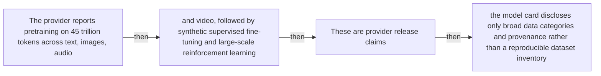

#### Python

```python
from html import escape
from pathlib import Path
from textwrap import wrap

title = "ink_mechanism_p3: 45T-token pretraining, synthetic SFT, reinforcement learning, and disclosure boundary — Operation flow"
nodes = [["n1","The provider reports pretraining on 45 trillion tokens across text, images, audio",100,150],["n2","and video, followed by synthetic supervised fine-tuning and large-scale reinforcement learning",250,150],["n3","These are provider release claims",400,150],["n4","the model card discloses only broad data categories and provenance rather than a reproducible dataset inventory",550,150]]
edges = [["n1","n2","then"],["n2","n3","then"],["n3","n4","then"]]
node_by_id = {node_id: (label, x, y) for node_id, label, x, y in nodes}
width = max(900, max((x for _, _, x, _ in nodes), default=800) + 180)
height = max(500, max((y for _, _, _, y in nodes), default=400) + 140)
parts = [
    f'<svg xmlns="http://www.w3.org/2000/svg" viewBox="0 0 {width} {height}" role="img" aria-labelledby="title desc">',
    f'<title id="title">{escape(title)}</title>',
    '<desc id="desc">Edges and convergence points encode only relationships stated in the scoped paragraphs.</desc>',
    f'<rect width="{width}" height="{height}" fill="white"/>',
]
for source, target, relation in edges:
    _, x1, y1 = node_by_id[source]
    _, x2, y2 = node_by_id[target]
    parts.append(f'<line x1="{x1}" y1="{y1}" x2="{x2}" y2="{y2}" stroke="#345" stroke-width="2"/>')
    parts.append(f'<text x="{(x1+x2)/2}" y="{(y1+y2)/2-5}" text-anchor="middle" font-family="sans-serif" font-size="10">{escape(relation)}</text>')
for _, label, x, y in nodes:
    parts.append(f'<rect x="{x-78}" y="{y-42}" width="156" height="84" rx="12" fill="#eef6ff" stroke="#234"/>')
    for line_index, line in enumerate(wrap(label, width=22)):
        parts.append(f'<text x="{x}" y="{y-24+line_index*13}" text-anchor="middle" font-family="sans-serif" font-size="10">{escape(line)}</text>')
parts.append('</svg>')
Path("ink_mechanism_p3_treatment_a.svg").write_text("\n".join(parts), encoding="utf-8")
```

### Treatment B — 45T-token pretraining, synthetic SFT, reinforcement learning, and disclosure boundary — Input-operation-output ledger

- Teaching purpose: Make inputs, operations, outputs, and limits inspectable as columns.
- Encoding and reading order: Render 5 rows with explicit `Group`, `Measure or state`, `Visible value`, and `Condition or boundary` columns. The value column must be visible, not only present in ARIA text or fallback prose.
- Evidence and limitations: Encode only `ink_002`, `ink_003`, `ink_006` from `source_inkling_model_card`, `source_inkling_release`. This is a separate training-sequence visual; the multimodal architecture cannot claim this scope.
- Recommended web medium: semantic HTML/CSS table with SVG export; JavaScript is optional only for meaningful focus, drill-down, or state playback.
- Mobile, accessibility, and motion behavior: Preserve the same group and node order in the DOM; retain all values and relation labels as selectable text; stack panels or levels below 640px; provide keyboard access for any optional focus state; keep a complete static fallback; respect reduced motion and never encode information only through animation.

#### TikZ

```tex
\documentclass[tikz,border=5pt]{standalone}
\usepackage[T1]{fontenc}
\usepackage{array}
\usepackage{tikz}
\begin{document}
\begin{tikzpicture}[font=\sffamily]
\node[align=center] {\textbf{ink\_mechanism\_p3: 45T-token pretraining, synthetic SFT, reinforcement learning, and disclosure boundary - Input-operation-output ledger}\\[6pt]
\begin{tabular}{p{3.2cm}p{4.0cm}p{2.8cm}p{6.2cm}}
\textbf{Group} & \textbf{Measure or state} & \textbf{Visible value} & \textbf{Condition or boundary} \\ \hline
Three input paths meet in one autoregressive decoder & Text tokens & qualitative & Text begins as token representations in the decoder's hidden space. \\
Three input paths meet in one autoregressive decoder & Image patches & qualitative & The release describes 40-by-40 patches passing through a four-layer hierarchical MLP before projection into the shared space. \\
Three input paths meet in one autoregressive decoder & Audio representation & qualitative & The release describes dMel spectrograms, while the website model card gives the broader description of discrete audio-token encoding. \\
Three input paths meet in one autoregressive decoder & Interleaved attention stack & qualitative & Local and global attention layers are reported at a 5-to-1 ratio with 8 key-value heads. \\
Three input paths meet in one autoregressive decoder & Text output & qualitative & The 66-layer decoder processes the shared representations autoregressively and emits text. \\
\end{tabular}};
\end{tikzpicture}
\end{document}
```

#### Mermaid


#### Python

```python
from html import escape
from pathlib import Path
from textwrap import wrap

title = "ink_mechanism_p3: 45T-token pretraining, synthetic SFT, reinforcement learning, and disclosure boundary — Input-operation-output ledger"
rows = [["Three input paths meet in one autoregressive decoder","Text tokens","qualitative","Text begins as token representations in the decoder's hidden space."],["Three input paths meet in one autoregressive decoder","Image patches","qualitative","The release describes 40-by-40 patches passing through a four-layer hierarchical MLP before projection into the shared space."],["Three input paths meet in one autoregressive decoder","Audio representation","qualitative","The release describes dMel spectrograms, while the website model card gives the broader description of discrete audio-token encoding."],["Three input paths meet in one autoregressive decoder","Interleaved attention stack","qualitative","Local and global attention layers are reported at a 5-to-1 ratio with 8 key-value heads."],["Three input paths meet in one autoregressive decoder","Text output","qualitative","The 66-layer decoder processes the shared representations autoregressively and emits text."]]
height = 590
parts = [
    f'<svg xmlns="http://www.w3.org/2000/svg" viewBox="0 0 1200 {height}" role="img" aria-labelledby="title desc">',
    f'<title id="title">{escape(title)}</title>',
    '<desc id="desc">Every reported value is visible beside its condition and group.</desc>',
    f'<rect width="1200" height="{height}" fill="white"/>',
]
headers = ["Group", "Measure or state", "Visible value", "Condition or boundary"]
xs = [30, 260, 590, 770]
for x, header in zip(xs, headers):
    parts.append(f'<text x="{x}" y="70" font-family="sans-serif" font-size="16" font-weight="700">{escape(header)}</text>')
for row_index, row in enumerate(rows):
    y = 110 + row_index * 88
    parts.append(f'<rect x="20" y="{y-28}" width="1160" height="76" fill="#f7fbff" stroke="#ccd"/>')
    for x, cell, width in zip(xs, row, [26, 38, 20, 58]):
        for line_index, line in enumerate(wrap(str(cell), width=width)):
            parts.append(f'<text x="{x}" y="{y+line_index*14}" font-family="sans-serif" font-size="11">{escape(line)}</text>')
parts.append('</svg>')
Path("ink_mechanism_p3_treatment_b.svg").write_text("\n".join(parts), encoding="utf-8")
```

### Treatment C — 45T-token pretraining, synthetic SFT, reinforcement learning, and disclosure boundary — State-transition walkthrough

- Teaching purpose: Follow the described state changes without inventing timing.
- Encoding and reading order: Use 4 named nodes and 3 explicit labeled relations. Preserve all branch, merge, hierarchy, loop, or sequence edges shown in the code; changing them is an evidence deviation.
- Evidence and limitations: Encode only `ink_002`, `ink_003`, `ink_006` from `source_inkling_model_card`, `source_inkling_release`. This is a separate training-sequence visual; the multimodal architecture cannot claim this scope.
- Recommended web medium: responsive inline SVG with semantic HTML/CSS fallback; JavaScript is optional only for meaningful focus, drill-down, or state playback.
- Mobile, accessibility, and motion behavior: Preserve the same group and node order in the DOM; retain all values and relation labels as selectable text; stack panels or levels below 640px; provide keyboard access for any optional focus state; keep a complete static fallback; respect reduced motion and never encode information only through animation.

#### TikZ

```tex
\documentclass[tikz,border=5pt]{standalone}
\usepackage[T1]{fontenc}
\usepackage{tikz}
\usetikzlibrary{arrows.meta}
\begin{document}
\begin{tikzpicture}[font=\sffamily,box/.style={draw,rounded corners,align=center,text width=3cm,minimum height=1.2cm},link/.style={-{Latex[length=2mm]},thick},rel/.style={fill=white,font=\scriptsize}]
\node[font=\bfseries,anchor=west] at (0,0.8) {ink\_mechanism\_p3: 45T-token pretraining, synthetic SFT, reinforcement learning, and disclosure boundary - State-transition walkthrough};
\node[box] (n1) at (1.00,-1.50) {The provider reports pretraining on 45 trillion tokens across text, images, audio};
\node[box] (n2) at (2.50,-1.50) {and video, followed by synthetic supervised fine-tuning and large-scale reinforcement learning};
\node[box] (n3) at (4.00,-1.50) {These are provider release claims};
\node[box] (n4) at (5.50,-1.50) {the model card discloses only broad data categories and provenance rather than a reproducible dataset inventory};
\draw[link] (n1) -- node[rel] {then} (n2);
\draw[link] (n2) -- node[rel] {then} (n3);
\draw[link] (n3) -- node[rel] {then} (n4);
\end{tikzpicture}
\end{document}
```

#### Mermaid

```mermaid
flowchart LR
  n1["The provider reports pretraining on 45 trillion tokens across text, images, audio"]
  n2["and video, followed by synthetic supervised fine-tuning and large-scale reinforcement learning"]
  n3["These are provider release claims"]
  n4["the model card discloses only broad data categories and provenance rather than a reproducible dataset inventory"]
  n1 -->|"then"| n2
  n2 -->|"then"| n3
  n3 -->|"then"| n4
```

#### Python

```python
from html import escape
from pathlib import Path
from textwrap import wrap

title = "ink_mechanism_p3: 45T-token pretraining, synthetic SFT, reinforcement learning, and disclosure boundary — State-transition walkthrough"
nodes = [["n1","The provider reports pretraining on 45 trillion tokens across text, images, audio",100,150],["n2","and video, followed by synthetic supervised fine-tuning and large-scale reinforcement learning",250,150],["n3","These are provider release claims",400,150],["n4","the model card discloses only broad data categories and provenance rather than a reproducible dataset inventory",550,150]]
edges = [["n1","n2","then"],["n2","n3","then"],["n3","n4","then"]]
node_by_id = {node_id: (label, x, y) for node_id, label, x, y in nodes}
width = max(900, max((x for _, _, x, _ in nodes), default=800) + 180)
height = max(500, max((y for _, _, _, y in nodes), default=400) + 140)
parts = [
    f'<svg xmlns="http://www.w3.org/2000/svg" viewBox="0 0 {width} {height}" role="img" aria-labelledby="title desc">',
    f'<title id="title">{escape(title)}</title>',
    '<desc id="desc">Edges and convergence points encode only relationships stated in the scoped paragraphs.</desc>',
    f'<rect width="{width}" height="{height}" fill="white"/>',
]
for source, target, relation in edges:
    _, x1, y1 = node_by_id[source]
    _, x2, y2 = node_by_id[target]
    parts.append(f'<line x1="{x1}" y1="{y1}" x2="{x2}" y2="{y2}" stroke="#345" stroke-width="2"/>')
    parts.append(f'<text x="{(x1+x2)/2}" y="{(y1+y2)/2-5}" text-anchor="middle" font-family="sans-serif" font-size="10">{escape(relation)}</text>')
for _, label, x, y in nodes:
    parts.append(f'<rect x="{x-78}" y="{y-42}" width="156" height="84" rx="12" fill="#eef6ff" stroke="#234"/>')
    for line_index, line in enumerate(wrap(label, width=22)):
        parts.append(f'<text x="{x}" y="{y-24+line_index*13}" text-anchor="middle" font-family="sans-serif" font-size="10">{escape(line)}</text>')
parts.append('</svg>')
Path("ink_mechanism_p3_treatment_c.svg").write_text("\n".join(parts), encoding="utf-8")
```

### Implementation record

- Status: `IMPLEMENTED`
- Selected treatment: `A`
- Selection rationale: Selected the approved “45T-token pretraining, synthetic SFT, reinforcement learning, and disclosure boundary — Operation flow” treatment because the implemented operation diagram directly encodes this paragraph's explanatory job and its stated evidence boundaries.
- Delivery medium: `CSS + semantic HTML`
- Visual ID and placement: `visual_inkling_training_sequence` after `ink_mechanism_p3`; this record is served by that purpose-built figure.
- Shared paragraph scope: NONE
- Changed files: `packages/test-fixtures/explainers/inkling.json`, `packages/content-schema/schema/explainer-document.schema.json`, `packages/content-schema/src/validate.ts`, generated TypeScript/Python models, `apps/web/app/papers/[id]/explainer-visual.tsx`, and `apps/web/app/globals.css`.
- Accessibility and fallback verification: Figure has a programmatic title and description, visible selectable labels and values, explicit alt text, equivalent fallback prose, source links, limitations, and a semantic static body; no meaning depends on color, motion, or pointer input.
- Desktop and mobile verification: Verified by the full eight-paper Playwright traversal at a 1440-pixel desktop viewport and the iPhone 13 mobile viewport; every figure stayed paragraph-adjacent, preserved DOM reading order, and introduced no horizontal page overflow.
- Evidence deviations: Delivery translation: selected Treatment A is rendered as typed semantic HTML/CSS rather than its literal TikZ, Mermaid, or Python-generated asset; the approved paragraph scope, placement, labels, values, grouping, and evidence boundaries are retained.

## `ink_example_p1`

- Location: `ink_example`, paragraph 1
- Text anchor: "Start by choosing a checkpoint, not by reading the phrase open weights as a hardware promise."
- Claims and sources: `ink_004` (OBSERVED, VERIFIED); `ink_012` (NOT_ESTABLISHED, UNRESOLVED); `source_inkling_model_card` (Retrieved 2026-07-18; official HTML SHA-256 fe653ffb5f4b9f54f011491f60cd8d6b9885d667484880d4566d76827f22a7e9 (65,631 bytes). Sections 1-6: identity, architecture, modalities, hardware, training, evaluations, safety. Live URL remains mutable.); `source_inkling_hf_bf16` (Immutable initial Model release commit 91b051f1ec836e6d56596c624c3775b495d797b1; README sections 1, 3, 5-7 and BF16 weight files); `source_inkling_hf_nvfp4` (Immutable initial Model release commit 93a182fb0376affeaeecfa4658c37a0fe9e5fa9e; README sections 1, 3, 5-7 and NVFP4 weight files)
- Visual needed: `YES`
- Decision rationale: A visual passes the removal test because readers must reconstruct bf16, nvfp4 w4a4, and nvfp4 w4a16 deployment conditions while preserving the paragraph's conditions and boundaries. Revision 3 narrows the topology and placement so no visual can claim this paragraph without encoding its mechanism, grouping, or values.
- Explanatory job: BF16, NVFP4 W4A4, and NVFP4 W4A16 deployment conditions.
- Recommended scope and placement: This paragraph only; place the visual immediately after `ink_example_p1`.
- QA-informed planning change: Keep memory, GPU counts, SM100 requirement, mutable retrieval date, and missing quality-parity evidence visible by checkpoint mode.

### Treatment A — BF16, NVFP4 W4A4, and NVFP4 W4A16 deployment conditions — Condition matrix

- Teaching purpose: Align each condition with its exact value and scope.
- Encoding and reading order: Render 4 rows with explicit `Group`, `Measure or state`, `Visible value`, and `Condition or boundary` columns. The value column must be visible, not only present in ARIA text or fallback prose.
- Evidence and limitations: Encode only `ink_004`, `ink_012` from `source_inkling_model_card`, `source_inkling_hf_bf16`, `source_inkling_hf_nvfp4`. Keep memory, GPU counts, SM100 requirement, mutable retrieval date, and missing quality-parity evidence visible by checkpoint mode.
- Recommended web medium: semantic HTML/CSS table with SVG export; JavaScript is optional only for meaningful focus, drill-down, or state playback.
- Mobile, accessibility, and motion behavior: Preserve the same group and node order in the DOM; retain all values and relation labels as selectable text; stack panels or levels below 640px; provide keyboard access for any optional focus state; keep a complete static fallback; respect reduced motion and never encode information only through animation.

#### TikZ

```tex
\documentclass[tikz,border=5pt]{standalone}
\usepackage[T1]{fontenc}
\usepackage{array}
\usepackage{tikz}
\begin{document}
\begin{tikzpicture}[font=\sffamily]
\node[align=center] {\textbf{ink\_example\_p1: BF16, NVFP4 W4A4, and NVFP4 W4A16 deployment conditions - Condition matrix}\\[6pt]
\begin{tabular}{p{3.2cm}p{4.0cm}p{2.8cm}p{6.2cm}}
\textbf{Group} & \textbf{Measure or state} & \textbf{Visible value} & \textbf{Condition or boundary} \\ \hline
Checkpoint & BF16 & at least 2 TB VRAM & 8 B300 or 16 H200 GPUs \\
Checkpoint & NVFP4 W4A4 & at least 600 GB & 4 B300; SM100 or newer \\
Checkpoint & NVFP4 W4A16 & at least 600 GB & 8 H200 GPUs \\
Evidence boundary & BF16NVFP4 quality parity & not reported & retrieval pinned to 2026-07-18 snapshot \\
\end{tabular}};
\end{tikzpicture}
\end{document}
```

#### Mermaid

```mermaid
flowchart TB
  subgraph Visible_value_matrix
    r1["Checkpoint<br/>BF16<br/><b>at least 2 TB VRAM</b><br/>8 B300 or 16 H200 GPUs"]
    r2["Checkpoint<br/>NVFP4 W4A4<br/><b>at least 600 GB</b><br/>4 B300; SM100 or newer"]
    r3["Checkpoint<br/>NVFP4 W4A16<br/><b>at least 600 GB</b><br/>8 H200 GPUs"]
    r4["Evidence boundary<br/>BF16↔NVFP4 quality parity<br/><b>not reported</b><br/>retrieval pinned to 2026-07-18 snapshot"]
  end
```

#### Python

```python
from html import escape
from pathlib import Path
from textwrap import wrap

title = "ink_example_p1: BF16, NVFP4 W4A4, and NVFP4 W4A16 deployment conditions — Condition matrix"
rows = [["Checkpoint","BF16","at least 2 TB VRAM","8 B300 or 16 H200 GPUs"],["Checkpoint","NVFP4 W4A4","at least 600 GB","4 B300; SM100 or newer"],["Checkpoint","NVFP4 W4A16","at least 600 GB","8 H200 GPUs"],["Evidence boundary","BF16↔NVFP4 quality parity","not reported","retrieval pinned to 2026-07-18 snapshot"]]
height = 502
parts = [
    f'<svg xmlns="http://www.w3.org/2000/svg" viewBox="0 0 1200 {height}" role="img" aria-labelledby="title desc">',
    f'<title id="title">{escape(title)}</title>',
    '<desc id="desc">Every reported value is visible beside its condition and group.</desc>',
    f'<rect width="1200" height="{height}" fill="white"/>',
]
headers = ["Group", "Measure or state", "Visible value", "Condition or boundary"]
xs = [30, 260, 590, 770]
for x, header in zip(xs, headers):
    parts.append(f'<text x="{x}" y="70" font-family="sans-serif" font-size="16" font-weight="700">{escape(header)}</text>')
for row_index, row in enumerate(rows):
    y = 110 + row_index * 88
    parts.append(f'<rect x="20" y="{y-28}" width="1160" height="76" fill="#f7fbff" stroke="#ccd"/>')
    for x, cell, width in zip(xs, row, [26, 38, 20, 58]):
        for line_index, line in enumerate(wrap(str(cell), width=width)):
            parts.append(f'<text x="{x}" y="{y+line_index*14}" font-family="sans-serif" font-size="11">{escape(line)}</text>')
parts.append('</svg>')
Path("ink_example_p1_treatment_a.svg").write_text("\n".join(parts), encoding="utf-8")
```

### Treatment B — BF16, NVFP4 W4A4, and NVFP4 W4A16 deployment conditions — Condition groups

- Teaching purpose: Group related corpus, hardware, model, or protocol conditions.
- Encoding and reading order: Group the 4 source-backed records into named panels using the first column as the grouping key. Panels preserve experimental, source, or example boundaries and never imply one shared scale.
- Evidence and limitations: Encode only `ink_004`, `ink_012` from `source_inkling_model_card`, `source_inkling_hf_bf16`, `source_inkling_hf_nvfp4`. Keep memory, GPU counts, SM100 requirement, mutable retrieval date, and missing quality-parity evidence visible by checkpoint mode.
- Recommended web medium: semantic HTML/CSS grouped panels or responsive SVG; JavaScript is optional only for meaningful focus, drill-down, or state playback.
- Mobile, accessibility, and motion behavior: Preserve the same group and node order in the DOM; retain all values and relation labels as selectable text; stack panels or levels below 640px; provide keyboard access for any optional focus state; keep a complete static fallback; respect reduced motion and never encode information only through animation.

#### TikZ

```tex
\documentclass[tikz,border=5pt]{standalone}
\usepackage[T1]{fontenc}
\usepackage{tikz}
\begin{document}
\begin{tikzpicture}[font=\sffamily,panel/.style={draw,rounded corners,align=center,text width=4.8cm,minimum height=4cm}]
\node[font=\bfseries] at (2.75,3) {ink\_example\_p1: BF16, NVFP4 W4A4, and NVFP4 W4A16 deployment conditions - Condition groups};
\node[panel] at (0,0) {\textbf{Checkpoint}\\[4pt]\textbf{BF16}: at least 2 TB VRAM -- 8 B300 or 16 H200 GPUs\\\textbf{NVFP4 W4A4}: at least 600 GB -- 4 B300; SM100 or newer\\\textbf{NVFP4 W4A16}: at least 600 GB -- 8 H200 GPUs};
\node[panel] at (5.5,0) {\textbf{Evidence boundary}\\[4pt]\textbf{BF16NVFP4 quality parity}: not reported -- retrieval pinned to 2026-07-18 snapshot};
\end{tikzpicture}
\end{document}
```

#### Mermaid

```mermaid
flowchart LR
  subgraph p1["Checkpoint"]
    p1r1["BF16: at least 2 TB VRAM<br/>8 B300 or 16 H200 GPUs"]
    p1r2["NVFP4 W4A4: at least 600 GB<br/>4 B300; SM100 or newer"]
    p1r3["NVFP4 W4A16: at least 600 GB<br/>8 H200 GPUs"]
  end
  subgraph p2["Evidence boundary"]
    p2r1["BF16↔NVFP4 quality parity: not reported<br/>retrieval pinned to 2026-07-18 snapshot"]
  end
```

#### Python

```python
from html import escape
from pathlib import Path
from textwrap import wrap

title = "ink_example_p1: BF16, NVFP4 W4A4, and NVFP4 W4A16 deployment conditions — Condition groups"
rows = [["Checkpoint","BF16","at least 2 TB VRAM","8 B300 or 16 H200 GPUs"],["Checkpoint","NVFP4 W4A4","at least 600 GB","4 B300; SM100 or newer"],["Checkpoint","NVFP4 W4A16","at least 600 GB","8 H200 GPUs"],["Evidence boundary","BF16↔NVFP4 quality parity","not reported","retrieval pinned to 2026-07-18 snapshot"]]
groups = {}
for group, label, value, condition in rows:
    groups.setdefault(group, []).append((label, value, condition))
width = max(900, len(groups) * 360)
height = 220 + max((len(items) for items in groups.values()), default=1) * 92
parts = [
    f'<svg xmlns="http://www.w3.org/2000/svg" viewBox="0 0 {width} {height}" role="img" aria-labelledby="title desc">',
    f'<title id="title">{escape(title)}</title>',
    '<desc id="desc">Separate panels preserve grouping and prevent unrelated conditions from reading as one sequence.</desc>',
    f'<rect width="{width}" height="{height}" fill="white"/>',
]
for group_index, (group, items) in enumerate(groups.items()):
    x = 180 + group_index * 360
    parts.append(f'<text x="{x}" y="65" text-anchor="middle" font-family="sans-serif" font-size="16" font-weight="700">{escape(group)}</text>')
    for item_index, (label, value, condition) in enumerate(items):
        y = 120 + item_index * 92
        parts.append(f'<rect x="{x-160}" y="{y-30}" width="320" height="78" rx="12" fill="#f7fbff" stroke="#ccd"/>')
        text = f"{label}: {value} — {condition}"
        for line_index, line in enumerate(wrap(text, width=46)):
            parts.append(f'<text x="{x}" y="{y-6+line_index*14}" text-anchor="middle" font-family="sans-serif" font-size="11">{escape(line)}</text>')
parts.append('</svg>')
Path("ink_example_p1_treatment_b.svg").write_text("\n".join(parts), encoding="utf-8")
```

### Treatment C — BF16, NVFP4 W4A4, and NVFP4 W4A16 deployment conditions — Protocol timeline

- Teaching purpose: Show sequence only where the protocol itself is ordered.
- Encoding and reading order: Use 7 named nodes and 6 explicit labeled relations. Preserve all branch, merge, hierarchy, loop, or sequence edges shown in the code; changing them is an evidence deviation.
- Evidence and limitations: Encode only `ink_004`, `ink_012` from `source_inkling_model_card`, `source_inkling_hf_bf16`, `source_inkling_hf_nvfp4`. Keep memory, GPU counts, SM100 requirement, mutable retrieval date, and missing quality-parity evidence visible by checkpoint mode.
- Recommended web medium: responsive inline SVG with semantic HTML/CSS fallback; JavaScript is optional only for meaningful focus, drill-down, or state playback.
- Mobile, accessibility, and motion behavior: Preserve the same group and node order in the DOM; retain all values and relation labels as selectable text; stack panels or levels below 640px; provide keyboard access for any optional focus state; keep a complete static fallback; respect reduced motion and never encode information only through animation.

#### TikZ

```tex
\documentclass[tikz,border=5pt]{standalone}
\usepackage[T1]{fontenc}
\usepackage{tikz}
\usetikzlibrary{arrows.meta}
\begin{document}
\begin{tikzpicture}[font=\sffamily,box/.style={draw,rounded corners,align=center,text width=3cm,minimum height=1.2cm},link/.style={-{Latex[length=2mm]},thick},rel/.style={fill=white,font=\scriptsize}]
\node[font=\bfseries,anchor=west] at (0,0.8) {ink\_example\_p1: BF16, NVFP4 W4A4, and NVFP4 W4A16 deployment conditions - Protocol timeline};
\node[box] (n1) at (1.00,-1.50) {Start by choosing a checkpoint, not by reading the phrase open weights as a hardware promise};
\node[box] (n2) at (2.50,-1.50) {In the content-addressed model-card retrieval from 2026-07-18, the BF16 checkpoint requires at least 2 TB of aggregate VRAM};
\node[box] (n3) at (4.00,-1.50) {the listed examples are 8 NVIDIA B300 GPUs or 16 H200 GPUs};
\node[box] (n4) at (5.50,-1.50) {The same snapshot gives a 600 GB minimum for NVFP4};
\node[box] (n5) at (7.00,-1.50) {W4A4 can use 4 B300 GPUs but requires SM100-or-newer architecture};
\node[box] (n6) at (8.50,-1.50) {while W4A16 can use 8 H200 GPUs};
\node[box] (n7) at (10.00,-1.50) {The live page remains mutable};
\draw[link] (n1) -- node[rel] {then} (n2);
\draw[link] (n2) -- node[rel] {then} (n3);
\draw[link] (n3) -- node[rel] {then} (n4);
\draw[link] (n4) -- node[rel] {then} (n5);
\draw[link] (n5) -- node[rel] {then} (n6);
\draw[link] (n6) -- node[rel] {then} (n7);
\end{tikzpicture}
\end{document}
```

#### Mermaid

```mermaid
flowchart LR
  n1["Start by choosing a checkpoint, not by reading the phrase open weights as a hardware promise"]
  n2["In the content-addressed model-card retrieval from 2026-07-18, the BF16 checkpoint requires at least 2 TB of aggregate VRAM"]
  n3["the listed examples are 8 NVIDIA B300 GPUs or 16 H200 GPUs"]
  n4["The same snapshot gives a 600 GB minimum for NVFP4"]
  n5["W4A4 can use 4 B300 GPUs but requires SM100-or-newer architecture"]
  n6["while W4A16 can use 8 H200 GPUs"]
  n7["The live page remains mutable"]
  n1 -->|"then"| n2
  n2 -->|"then"| n3
  n3 -->|"then"| n4
  n4 -->|"then"| n5
  n5 -->|"then"| n6
  n6 -->|"then"| n7
```

#### Python

```python
from html import escape
from pathlib import Path
from textwrap import wrap

title = "ink_example_p1: BF16, NVFP4 W4A4, and NVFP4 W4A16 deployment conditions — Protocol timeline"
nodes = [["n1","Start by choosing a checkpoint, not by reading the phrase open weights as a hardware promise",100,150],["n2","In the content-addressed model-card retrieval from 2026-07-18, the BF16 checkpoint requires at least 2 TB of aggregate VRAM",250,150],["n3","the listed examples are 8 NVIDIA B300 GPUs or 16 H200 GPUs",400,150],["n4","The same snapshot gives a 600 GB minimum for NVFP4",550,150],["n5","W4A4 can use 4 B300 GPUs but requires SM100-or-newer architecture",700,150],["n6","while W4A16 can use 8 H200 GPUs",850,150],["n7","The live page remains mutable",1000,150]]
edges = [["n1","n2","then"],["n2","n3","then"],["n3","n4","then"],["n4","n5","then"],["n5","n6","then"],["n6","n7","then"]]
node_by_id = {node_id: (label, x, y) for node_id, label, x, y in nodes}
width = max(900, max((x for _, _, x, _ in nodes), default=800) + 180)
height = max(500, max((y for _, _, _, y in nodes), default=400) + 140)
parts = [
    f'<svg xmlns="http://www.w3.org/2000/svg" viewBox="0 0 {width} {height}" role="img" aria-labelledby="title desc">',
    f'<title id="title">{escape(title)}</title>',
    '<desc id="desc">Edges and convergence points encode only relationships stated in the scoped paragraphs.</desc>',
    f'<rect width="{width}" height="{height}" fill="white"/>',
]
for source, target, relation in edges:
    _, x1, y1 = node_by_id[source]
    _, x2, y2 = node_by_id[target]
    parts.append(f'<line x1="{x1}" y1="{y1}" x2="{x2}" y2="{y2}" stroke="#345" stroke-width="2"/>')
    parts.append(f'<text x="{(x1+x2)/2}" y="{(y1+y2)/2-5}" text-anchor="middle" font-family="sans-serif" font-size="10">{escape(relation)}</text>')
for _, label, x, y in nodes:
    parts.append(f'<rect x="{x-78}" y="{y-42}" width="156" height="84" rx="12" fill="#eef6ff" stroke="#234"/>')
    for line_index, line in enumerate(wrap(label, width=22)):
        parts.append(f'<text x="{x}" y="{y-24+line_index*13}" text-anchor="middle" font-family="sans-serif" font-size="10">{escape(line)}</text>')
parts.append('</svg>')
Path("ink_example_p1_treatment_c.svg").write_text("\n".join(parts), encoding="utf-8")
```

### Implementation record

- Status: `IMPLEMENTED`
- Selected treatment: `A`
- Selection rationale: Selected the approved “BF16, NVFP4 W4A4, and NVFP4 W4A16 deployment conditions — Condition matrix” treatment because the implemented evidence matrix directly encodes this paragraph's explanatory job and its stated evidence boundaries.
- Delivery medium: `CSS + semantic HTML`
- Visual ID and placement: `visual_inkling_checkpoint_hardware` after `ink_example_p1`; this record is served by that purpose-built figure.
- Shared paragraph scope: NONE
- Changed files: `packages/test-fixtures/explainers/inkling.json`, `packages/content-schema/schema/explainer-document.schema.json`, `packages/content-schema/src/validate.ts`, generated TypeScript/Python models, `apps/web/app/papers/[id]/explainer-visual.tsx`, and `apps/web/app/globals.css`.
- Accessibility and fallback verification: Figure has a programmatic title and description, visible selectable labels and values, explicit alt text, equivalent fallback prose, source links, limitations, and a semantic static body; no meaning depends on color, motion, or pointer input.
- Desktop and mobile verification: Verified by the full eight-paper Playwright traversal at a 1440-pixel desktop viewport and the iPhone 13 mobile viewport; every figure stayed paragraph-adjacent, preserved DOM reading order, and introduced no horizontal page overflow.
- Evidence deviations: Delivery translation: selected Treatment A is rendered as typed semantic HTML/CSS rather than its literal TikZ, Mermaid, or Python-generated asset; the approved paragraph scope, placement, labels, values, grouping, and evidence boundaries are retained.

## `ink_example_p2`

- Location: `ink_example`, paragraph 2
- Text anchor: "The quantized option reduces memory requirements, but the release does not identify the precision behind the main benchmark table or provide a BF16-versus-NVFP4 quality comparison."
- Claims and sources: `ink_004` (OBSERVED, VERIFIED); `ink_012` (NOT_ESTABLISHED, UNRESOLVED); `source_inkling_model_card` (Retrieved 2026-07-18; official HTML SHA-256 fe653ffb5f4b9f54f011491f60cd8d6b9885d667484880d4566d76827f22a7e9 (65,631 bytes). Sections 1-6: identity, architecture, modalities, hardware, training, evaluations, safety. Live URL remains mutable.); `source_inkling_hf_bf16` (Immutable initial Model release commit 91b051f1ec836e6d56596c624c3775b495d797b1; README sections 1, 3, 5-7 and BF16 weight files); `source_inkling_hf_nvfp4` (Immutable initial Model release commit 93a182fb0376affeaeecfa4658c37a0fe9e5fa9e; README sections 1, 3, 5-7 and NVFP4 weight files)
- Visual needed: `NO`
- Decision rationale: Prose remains the better primary form. The paragraph states a bounded conclusion or heterogeneous qualification without requiring a material process, topology, quantitative comparison, uncertainty distribution, or state transition. The three treatments are contingencies only and are not recommended for implementation.
- Explanatory job: Optional worked-example annotation.
- Recommended scope and placement: Prose-only. Do not attach a figure unless the paragraph or evidence changes.
- QA-informed planning change: Do not invent intermediate values or outcomes.

### Treatment A — Optional worked-example annotation — Worked sequence

- Teaching purpose: Optional contingency only. Follow the actual example in source order.
- Encoding and reading order: Use 3 named nodes and 2 explicit labeled relations. Preserve all branch, merge, hierarchy, loop, or sequence edges shown in the code; changing them is an evidence deviation.
- Evidence and limitations: Encode only `ink_004`, `ink_012` from `source_inkling_model_card`, `source_inkling_hf_bf16`, `source_inkling_hf_nvfp4`. Do not invent intermediate values or outcomes.
- Recommended web medium: responsive inline SVG with semantic HTML/CSS fallback; JavaScript is optional only for meaningful focus, drill-down, or state playback.
- Mobile, accessibility, and motion behavior: Preserve the same group and node order in the DOM; retain all values and relation labels as selectable text; stack panels or levels below 640px; provide keyboard access for any optional focus state; keep a complete static fallback; respect reduced motion and never encode information only through animation.

#### TikZ

```tex
\documentclass[tikz,border=5pt]{standalone}
\usepackage[T1]{fontenc}
\usepackage{tikz}
\usetikzlibrary{arrows.meta}
\begin{document}
\begin{tikzpicture}[font=\sffamily,box/.style={draw,rounded corners,align=center,text width=3cm,minimum height=1.2cm},link/.style={-{Latex[length=2mm]},thick},rel/.style={fill=white,font=\scriptsize}]
\node[font=\bfseries,anchor=west] at (0,0.8) {ink\_example\_p2: Optional worked-example annotation - Worked sequence};
\node[box] (n1) at (1.00,-1.50) {The quantized option reduces memory requirements};
\node[box] (n2) at (2.50,-1.50) {but the release does not identify the precision behind the main benchmark table or provide a BF16-versus-NVFP4 quality comparison};
\node[box] (n3) at (4.00,-1.50) {A deployment plan therefore cannot assume that the published benchmark values transfer unchanged to the quantized checkpoint};
\draw[link] (n1) -- node[rel] {then} (n2);
\draw[link] (n2) -- node[rel] {then} (n3);
\end{tikzpicture}
\end{document}
```

#### Mermaid

```mermaid
flowchart LR
  n1["The quantized option reduces memory requirements"]
  n2["but the release does not identify the precision behind the main benchmark table or provide a BF16-versus-NVFP4 quality comparison"]
  n3["A deployment plan therefore cannot assume that the published benchmark values transfer unchanged to the quantized checkpoint"]
  n1 -->|"then"| n2
  n2 -->|"then"| n3
```

#### Python

```python
from html import escape
from pathlib import Path
from textwrap import wrap

title = "ink_example_p2: Optional worked-example annotation — Worked sequence"
nodes = [["n1","The quantized option reduces memory requirements",100,150],["n2","but the release does not identify the precision behind the main benchmark table or provide a BF16-versus-NVFP4 quality comparison",250,150],["n3","A deployment plan therefore cannot assume that the published benchmark values transfer unchanged to the quantized checkpoint",400,150]]
edges = [["n1","n2","then"],["n2","n3","then"]]
node_by_id = {node_id: (label, x, y) for node_id, label, x, y in nodes}
width = max(900, max((x for _, _, x, _ in nodes), default=800) + 180)
height = max(500, max((y for _, _, _, y in nodes), default=400) + 140)
parts = [
    f'<svg xmlns="http://www.w3.org/2000/svg" viewBox="0 0 {width} {height}" role="img" aria-labelledby="title desc">',
    f'<title id="title">{escape(title)}</title>',
    '<desc id="desc">Edges and convergence points encode only relationships stated in the scoped paragraphs.</desc>',
    f'<rect width="{width}" height="{height}" fill="white"/>',
]
for source, target, relation in edges:
    _, x1, y1 = node_by_id[source]
    _, x2, y2 = node_by_id[target]
    parts.append(f'<line x1="{x1}" y1="{y1}" x2="{x2}" y2="{y2}" stroke="#345" stroke-width="2"/>')
    parts.append(f'<text x="{(x1+x2)/2}" y="{(y1+y2)/2-5}" text-anchor="middle" font-family="sans-serif" font-size="10">{escape(relation)}</text>')
for _, label, x, y in nodes:
    parts.append(f'<rect x="{x-78}" y="{y-42}" width="156" height="84" rx="12" fill="#eef6ff" stroke="#234"/>')
    for line_index, line in enumerate(wrap(label, width=22)):
        parts.append(f'<text x="{x}" y="{y-24+line_index*13}" text-anchor="middle" font-family="sans-serif" font-size="10">{escape(line)}</text>')
parts.append('</svg>')
Path("ink_example_p2_treatment_a.svg").write_text("\n".join(parts), encoding="utf-8")
```

### Treatment B — Optional worked-example annotation — Example calculation or state ledger

- Teaching purpose: Optional contingency only. Keep values, states, and boundaries grouped by example.
- Encoding and reading order: Render 3 rows with explicit `Group`, `Measure or state`, `Visible value`, and `Condition or boundary` columns. The value column must be visible, not only present in ARIA text or fallback prose.
- Evidence and limitations: Encode only `ink_004`, `ink_012` from `source_inkling_model_card`, `source_inkling_hf_bf16`, `source_inkling_hf_nvfp4`. Do not invent intermediate values or outcomes.
- Recommended web medium: semantic HTML/CSS table with SVG export; JavaScript is optional only for meaningful focus, drill-down, or state playback.
- Mobile, accessibility, and motion behavior: Preserve the same group and node order in the DOM; retain all values and relation labels as selectable text; stack panels or levels below 640px; provide keyboard access for any optional focus state; keep a complete static fallback; respect reduced motion and never encode information only through animation.

#### TikZ

```tex
\documentclass[tikz,border=5pt]{standalone}
\usepackage[T1]{fontenc}
\usepackage{array}
\usepackage{tikz}
\begin{document}
\begin{tikzpicture}[font=\sffamily]
\node[align=center] {\textbf{ink\_example\_p2: Optional worked-example annotation - Example calculation or state ledger}\\[6pt]
\begin{tabular}{p{3.2cm}p{4.0cm}p{2.8cm}p{6.2cm}}
\textbf{Group} & \textbf{Measure or state} & \textbf{Visible value} & \textbf{Condition or boundary} \\ \hline
Paragraph evidence & Statement 1 & qualitative & The quantized option reduces memory requirements \\
Paragraph evidence & Statement 2 & qualitative & but the release does not identify the precision behind the main benchmark table or provide a BF16-versus-NVFP4 quality comparison \\
Paragraph evidence & Statement 3 & qualitative & A deployment plan therefore cannot assume that the published benchmark values transfer unchanged to the quantized checkpoint \\
\end{tabular}};
\end{tikzpicture}
\end{document}
```

#### Mermaid

```mermaid
flowchart TB
  subgraph Visible_value_matrix
    r1["Paragraph evidence<br/>Statement 1<br/><b>qualitative</b><br/>The quantized option reduces memory requirements"]
    r2["Paragraph evidence<br/>Statement 2<br/><b>qualitative</b><br/>but the release does not identify the precision behind the main benchmark table or provide a BF16-versus-NVFP4 quality comparison"]
    r3["Paragraph evidence<br/>Statement 3<br/><b>qualitative</b><br/>A deployment plan therefore cannot assume that the published benchmark values transfer unchanged to the quantized checkpoint"]
  end
```

#### Python

```python
from html import escape
from pathlib import Path
from textwrap import wrap

title = "ink_example_p2: Optional worked-example annotation — Example calculation or state ledger"
rows = [["Paragraph evidence","Statement 1","qualitative","The quantized option reduces memory requirements"],["Paragraph evidence","Statement 2","qualitative","but the release does not identify the precision behind the main benchmark table or provide a BF16-versus-NVFP4 quality comparison"],["Paragraph evidence","Statement 3","qualitative","A deployment plan therefore cannot assume that the published benchmark values transfer unchanged to the quantized checkpoint"]]
height = 414
parts = [
    f'<svg xmlns="http://www.w3.org/2000/svg" viewBox="0 0 1200 {height}" role="img" aria-labelledby="title desc">',
    f'<title id="title">{escape(title)}</title>',
    '<desc id="desc">Every reported value is visible beside its condition and group.</desc>',
    f'<rect width="1200" height="{height}" fill="white"/>',
]
headers = ["Group", "Measure or state", "Visible value", "Condition or boundary"]
xs = [30, 260, 590, 770]
for x, header in zip(xs, headers):
    parts.append(f'<text x="{x}" y="70" font-family="sans-serif" font-size="16" font-weight="700">{escape(header)}</text>')
for row_index, row in enumerate(rows):
    y = 110 + row_index * 88
    parts.append(f'<rect x="20" y="{y-28}" width="1160" height="76" fill="#f7fbff" stroke="#ccd"/>')
    for x, cell, width in zip(xs, row, [26, 38, 20, 58]):
        for line_index, line in enumerate(wrap(str(cell), width=width)):
            parts.append(f'<text x="{x}" y="{y+line_index*14}" font-family="sans-serif" font-size="11">{escape(line)}</text>')
parts.append('</svg>')
Path("ink_example_p2_treatment_b.svg").write_text("\n".join(parts), encoding="utf-8")
```

### Treatment C — Optional worked-example annotation — Bounded example panels

- Teaching purpose: Optional contingency only. Separate multiple examples and aggregate results instead of flattening them.
- Encoding and reading order: Group the 3 source-backed records into named panels using the first column as the grouping key. Panels preserve experimental, source, or example boundaries and never imply one shared scale.
- Evidence and limitations: Encode only `ink_004`, `ink_012` from `source_inkling_model_card`, `source_inkling_hf_bf16`, `source_inkling_hf_nvfp4`. Do not invent intermediate values or outcomes.
- Recommended web medium: semantic HTML/CSS grouped panels or responsive SVG; JavaScript is optional only for meaningful focus, drill-down, or state playback.
- Mobile, accessibility, and motion behavior: Preserve the same group and node order in the DOM; retain all values and relation labels as selectable text; stack panels or levels below 640px; provide keyboard access for any optional focus state; keep a complete static fallback; respect reduced motion and never encode information only through animation.

#### TikZ

```tex
\documentclass[tikz,border=5pt]{standalone}
\usepackage[T1]{fontenc}
\usepackage{tikz}
\begin{document}
\begin{tikzpicture}[font=\sffamily,panel/.style={draw,rounded corners,align=center,text width=4.8cm,minimum height=4cm}]
\node[font=\bfseries] at (0,3) {ink\_example\_p2: Optional worked-example annotation - Bounded example panels};
\node[panel] at (0,0) {\textbf{Paragraph evidence}\\[4pt]\textbf{Statement 1}: qualitative -- The quantized option reduces memory requirements\\\textbf{Statement 2}: qualitative -- but the release does not identify the precision behind the main benchmark table or provide a BF16-versus-NVFP4 quality comparison\\\textbf{Statement 3}: qualitative -- A deployment plan therefore cannot assume that the published benchmark values transfer unchanged to the quantized checkpoint};
\end{tikzpicture}
\end{document}
```

#### Mermaid

```mermaid
flowchart LR
  subgraph p1["Paragraph evidence"]
    p1r1["Statement 1: qualitative<br/>The quantized option reduces memory requirements"]
    p1r2["Statement 2: qualitative<br/>but the release does not identify the precision behind the main benchmark table or provide a BF16-versus-NVFP4 quality comparison"]
    p1r3["Statement 3: qualitative<br/>A deployment plan therefore cannot assume that the published benchmark values transfer unchanged to the quantized checkpoint"]
  end
```

#### Python

```python
from html import escape
from pathlib import Path
from textwrap import wrap

title = "ink_example_p2: Optional worked-example annotation — Bounded example panels"
rows = [["Paragraph evidence","Statement 1","qualitative","The quantized option reduces memory requirements"],["Paragraph evidence","Statement 2","qualitative","but the release does not identify the precision behind the main benchmark table or provide a BF16-versus-NVFP4 quality comparison"],["Paragraph evidence","Statement 3","qualitative","A deployment plan therefore cannot assume that the published benchmark values transfer unchanged to the quantized checkpoint"]]
groups = {}
for group, label, value, condition in rows:
    groups.setdefault(group, []).append((label, value, condition))
width = max(900, len(groups) * 360)
height = 220 + max((len(items) for items in groups.values()), default=1) * 92
parts = [
    f'<svg xmlns="http://www.w3.org/2000/svg" viewBox="0 0 {width} {height}" role="img" aria-labelledby="title desc">',
    f'<title id="title">{escape(title)}</title>',
    '<desc id="desc">Separate panels preserve grouping and prevent unrelated conditions from reading as one sequence.</desc>',
    f'<rect width="{width}" height="{height}" fill="white"/>',
]
for group_index, (group, items) in enumerate(groups.items()):
    x = 180 + group_index * 360
    parts.append(f'<text x="{x}" y="65" text-anchor="middle" font-family="sans-serif" font-size="16" font-weight="700">{escape(group)}</text>')
    for item_index, (label, value, condition) in enumerate(items):
        y = 120 + item_index * 92
        parts.append(f'<rect x="{x-160}" y="{y-30}" width="320" height="78" rx="12" fill="#f7fbff" stroke="#ccd"/>')
        text = f"{label}: {value} — {condition}"
        for line_index, line in enumerate(wrap(text, width=46)):
            parts.append(f'<text x="{x}" y="{y-6+line_index*14}" text-anchor="middle" font-family="sans-serif" font-size="11">{escape(line)}</text>')
parts.append('</svg>')
Path("ink_example_p2_treatment_c.svg").write_text("\n".join(parts), encoding="utf-8")
```

### Implementation record

- Status: `NOT_NEEDED`
- Selected treatment: `NONE`
- Selection rationale: Revision 3's paragraph-level removal test keeps this paragraph prose-only; no figure would reduce the reader's reconstruction burden enough to justify added visual complexity.
- Delivery medium: `NONE`
- Visual ID and placement: `NONE`; no figure is attached to this paragraph.
- Shared paragraph scope: NONE
- Changed files: `docs/visual-manifests/VISUAL_MANIFEST_INKLING.md` records the prose-only decision; no fixture visual serves this paragraph.
- Accessibility and fallback verification: The paragraph remains semantic selectable text with its existing claim and source links; no visual-only information or motion is introduced.
- Desktop and mobile verification: No paragraph-local figure exists; the existing prose remains in normal document order at both viewports.
- Evidence deviations: Not applicable: revision 3 explicitly classifies this paragraph as prose-only.

## `ink_evidence_p1`

- Location: `ink_evidence`, paragraph 1
- Text anchor: "In the content-addressed provider-page retrievals from 2026-07-18, the main benchmark table reports Inkling at effort 0.99."
- Claims and sources: `ink_007` (OBSERVED, VERIFIED); `ink_008` (AUTHORS_INTERPRETATION, VERIFIED); `ink_009` (OBSERVED, VERIFIED); `ink_011` (DISPUTED, UNRESOLVED); `source_inkling_model_card` (Retrieved 2026-07-18; official HTML SHA-256 fe653ffb5f4b9f54f011491f60cd8d6b9885d667484880d4566d76827f22a7e9 (65,631 bytes). Sections 1-6: identity, architecture, modalities, hardware, training, evaluations, safety. Live URL remains mutable.); `source_inkling_release` (Retrieved 2026-07-18; official HTML SHA-256 cb28c6a6c8c47c68f55f2c636481bf35a1b9f5a349e5f00148c583fafbc138fc (222,133 bytes). July 15 release sections on effort, multimodality, benchmarks, architecture, training, RL, availability. Live URL remains mutable.); `source_inkling_hf_bf16` (Immutable initial Model release commit 91b051f1ec836e6d56596c624c3775b495d797b1; README sections 1, 3, 5-7 and BF16 weight files)
- Visual needed: `YES`
- Decision rationale: A visual passes the removal test because readers must reconstruct vendor benchmark snapshot grouped by incomparable benchmark family while preserving the paragraph's conditions and boundaries. Revision 3 narrows the topology and placement so no visual can claim this paragraph without encoding its mechanism, grouping, or values.
- Explanatory job: Vendor benchmark snapshot grouped by incomparable benchmark family.
- Recommended scope and placement: This paragraph only; place the visual immediately after `ink_evidence_p1`.
- QA-informed planning change: Include HLE 29.7 without tools and 46.0 with tools plus all selected values; use separated families, never a leaderboard axis.

### Treatment A — Vendor benchmark snapshot grouped by incomparable benchmark family — Grouped disclosed-domain plot

- Teaching purpose: Use separate, labeled domains for valid within-group comparisons.
- Encoding and reading order: `Reasoning` uses the disclosed domain 0–100 with 2 labeled marks; `Coding` uses the disclosed domain 77.1–78.1 with 1 labeled marks; `Instruction following` uses the disclosed domain 79.3–80.3 with 1 labeled marks; `Multimodal` uses the disclosed domain 73–74 with 1 labeled marks; `Audio` uses the disclosed domain 90.9–91.9 with 1 labeled marks; `Safety` uses the disclosed domain 98.1–99.1 with 1 labeled marks. Exact values remain printed beside every mark.
- Evidence and limitations: Encode only `ink_007`, `ink_008`, `ink_009`, `ink_011` from `source_inkling_model_card`, `source_inkling_release`, `source_inkling_hf_bf16`. Include HLE 29.7 without tools and 46.0 with tools plus all selected values; use separated families, never a leaderboard axis.
- Recommended web medium: responsive SVG with semantic HTML/CSS value table; JavaScript is optional only for meaningful focus, drill-down, or state playback.
- Mobile, accessibility, and motion behavior: Preserve the same group and node order in the DOM; retain all values and relation labels as selectable text; stack panels or levels below 640px; provide keyboard access for any optional focus state; keep a complete static fallback; respect reduced motion and never encode information only through animation.

#### TikZ

```tex
\documentclass[tikz,border=5pt]{standalone}
\usepackage[T1]{fontenc}
\usepackage{tikz}
\begin{document}
\begin{tikzpicture}[font=\sffamily]
\node[font=\bfseries,anchor=west] at (0,1.2) {ink\_evidence\_p1: Vendor benchmark snapshot grouped by incomparable benchmark family - Grouped disclosed-domain plot};
\node[anchor=west,font=\bfseries] at (0,0) {Reasoning: disclosed domain 0--100};
\draw (0,-0.8) -- (8,-0.8);
\fill (2.376,-0.8) circle (2.5pt) node[above,font=\scriptsize] {29.7\%};
\node[anchor=east,font=\scriptsize] at (-0.2,-0.8) {HLE without tools};
\draw (0,-1.4500000000000002) -- (8,-1.4500000000000002);
\fill (3.680,-1.4500000000000002) circle (2.5pt) node[above,font=\scriptsize] {46.0\%};
\node[anchor=east,font=\scriptsize] at (-0.2,-1.4500000000000002) {HLE with tools};
\node[anchor=west,font=\bfseries] at (0,-2.6) {Coding: disclosed domain 77.1--78.1};
\draw (0,-3.4000000000000004) -- (8,-3.4000000000000004);
\fill (4.000,-3.4000000000000004) circle (2.5pt) node[above,font=\scriptsize] {77.6\%};
\node[anchor=east,font=\scriptsize] at (-0.2,-3.4000000000000004) {SWE-bench Verified};
\node[anchor=west,font=\bfseries] at (0,-4.550000000000001) {Instruction following: disclosed domain 79.3--80.3};
\draw (0,-5.3500000000000005) -- (8,-5.3500000000000005);
\fill (4.000,-5.3500000000000005) circle (2.5pt) node[above,font=\scriptsize] {79.8\%};
\node[anchor=east,font=\scriptsize] at (-0.2,-5.3500000000000005) {IFBench};
\node[anchor=west,font=\bfseries] at (0,-6.500000000000001) {Multimodal: disclosed domain 73--74};
\draw (0,-7.300000000000001) -- (8,-7.300000000000001);
\fill (4.000,-7.300000000000001) circle (2.5pt) node[above,font=\scriptsize] {73.5\%};
\node[anchor=east,font=\scriptsize] at (-0.2,-7.300000000000001) {MMMU Pro Standard 10};
\node[anchor=west,font=\bfseries] at (0,-8.450000000000001) {Audio: disclosed domain 90.9--91.9};
\draw (0,-9.250000000000002) -- (8,-9.250000000000002);
\fill (4.000,-9.250000000000002) circle (2.5pt) node[above,font=\scriptsize] {91.4\%};
\node[anchor=east,font=\scriptsize] at (-0.2,-9.250000000000002) {VoiceBench};
\node[anchor=west,font=\bfseries] at (0,-10.400000000000002) {Safety: disclosed domain 98.1--99.1};
\draw (0,-11.200000000000003) -- (8,-11.200000000000003);
\fill (4.000,-11.200000000000003) circle (2.5pt) node[above,font=\scriptsize] {98.6\%};
\node[anchor=east,font=\scriptsize] at (-0.2,-11.200000000000003) {StrongREJECT};
\end{tikzpicture}
\end{document}
```

#### Mermaid

```mermaid
flowchart TB
  subgraph g1["Reasoning — domain 0 to 100"]
    g1r1["HLE without tools: 29.7%"]
    g1r2["HLE with tools: 46.0%"]
  end
  subgraph g2["Coding — domain 77.1 to 78.1"]
    g2r1["SWE-bench Verified: 77.6%"]
  end
  subgraph g3["Instruction following — domain 79.3 to 80.3"]
    g3r1["IFBench: 79.8%"]
  end
  subgraph g4["Multimodal — domain 73 to 74"]
    g4r1["MMMU Pro Standard 10: 73.5%"]
  end
  subgraph g5["Audio — domain 90.9 to 91.9"]
    g5r1["VoiceBench: 91.4%"]
  end
  subgraph g6["Safety — domain 98.1 to 99.1"]
    g6r1["StrongREJECT: 98.6%"]
  end
```

#### Python

```python
from html import escape
from pathlib import Path

title = "ink_evidence_p1: Vendor benchmark snapshot grouped by incomparable benchmark family — Grouped disclosed-domain plot"
groups = [{"name":"Reasoning","domain":[0,100],"items":[["Reasoning","HLE without tools","29.7%","vendor snapshot; effort 0.99"],["Reasoning","HLE with tools","46.0%","vendor snapshot; effort 0.99"]]},{"name":"Coding","domain":[77.1,78.1],"items":[["Coding","SWE-bench Verified","77.6%","different benchmark family"]]},{"name":"Instruction following","domain":[79.3,80.3],"items":[["Instruction following","IFBench","79.8%","different benchmark family"]]},{"name":"Multimodal","domain":[73,74],"items":[["Multimodal","MMMU Pro Standard 10","73.5%","different benchmark family"]]},{"name":"Audio","domain":[90.9,91.9],"items":[["Audio","VoiceBench","91.4%","formatting-sensitive grader"]]},{"name":"Safety","domain":[98.1,99.1],"items":[["Safety","StrongREJECT","98.6%","different benchmark family"]]}]
height = 1004
parts = [
    f'<svg xmlns="http://www.w3.org/2000/svg" viewBox="0 0 1000 {height}" role="img" aria-labelledby="title desc">',
    f'<title id="title">{escape(title)}</title>',
    '<desc id="desc">Each comparison uses its own disclosed local domain; exact values are printed beside the marks.</desc>',
    f'<rect width="1000" height="{height}" fill="white"/>',
]
y = 90
for group in groups:
    lo, hi = group["domain"]
    parts.append(f'<text x="30" y="{y}" font-family="sans-serif" font-size="16" font-weight="700">{escape(group["name"])} — domain {lo} to {hi}</text>')
    y += 38
    for _, label, value, condition in group["items"]:
        number = float("".join(ch for ch in str(value) if ch.isdigit() or ch in ".-"))
        x = 300 + (number - lo) / (hi - lo) * 620
        parts.append(f'<line x1="300" y1="{y}" x2="920" y2="{y}" stroke="#ccd"/>')
        parts.append(f'<circle cx="{x}" cy="{y}" r="6" fill="#245"/>')
        parts.append(f'<text x="30" y="{y+5}" font-family="sans-serif" font-size="12">{escape(label)}</text>')
        parts.append(f'<text x="{x+12}" y="{y+5}" font-family="sans-serif" font-size="12">{escape(str(value))}</text>')
        y += 52
    y += 35
parts.append('</svg>')
Path("ink_evidence_p1_treatment_a.svg").write_text("\n".join(parts), encoding="utf-8")
```

### Treatment B — Vendor benchmark snapshot grouped by incomparable benchmark family — Complete reported-value matrix

- Teaching purpose: Keep every value, condition, and limitation visible.
- Encoding and reading order: Render 7 rows with explicit `Group`, `Measure or state`, `Visible value`, and `Condition or boundary` columns. The value column must be visible, not only present in ARIA text or fallback prose.
- Evidence and limitations: Encode only `ink_007`, `ink_008`, `ink_009`, `ink_011` from `source_inkling_model_card`, `source_inkling_release`, `source_inkling_hf_bf16`. Include HLE 29.7 without tools and 46.0 with tools plus all selected values; use separated families, never a leaderboard axis.
- Recommended web medium: semantic HTML/CSS table with SVG export; JavaScript is optional only for meaningful focus, drill-down, or state playback.
- Mobile, accessibility, and motion behavior: Preserve the same group and node order in the DOM; retain all values and relation labels as selectable text; stack panels or levels below 640px; provide keyboard access for any optional focus state; keep a complete static fallback; respect reduced motion and never encode information only through animation.

#### TikZ

```tex
\documentclass[tikz,border=5pt]{standalone}
\usepackage[T1]{fontenc}
\usepackage{array}
\usepackage{tikz}
\begin{document}
\begin{tikzpicture}[font=\sffamily]
\node[align=center] {\textbf{ink\_evidence\_p1: Vendor benchmark snapshot grouped by incomparable benchmark family - Complete reported-value matrix}\\[6pt]
\begin{tabular}{p{3.2cm}p{4.0cm}p{2.8cm}p{6.2cm}}
\textbf{Group} & \textbf{Measure or state} & \textbf{Visible value} & \textbf{Condition or boundary} \\ \hline
Reasoning & HLE without tools & 29.7\% & vendor snapshot; effort 0.99 \\
Reasoning & HLE with tools & 46.0\% & vendor snapshot; effort 0.99 \\
Coding & SWE-bench Verified & 77.6\% & different benchmark family \\
Instruction following & IFBench & 79.8\% & different benchmark family \\
Multimodal & MMMU Pro Standard 10 & 73.5\% & different benchmark family \\
Audio & VoiceBench & 91.4\% & formatting-sensitive grader \\
Safety & StrongREJECT & 98.6\% & different benchmark family \\
\end{tabular}};
\end{tikzpicture}
\end{document}
```

#### Mermaid

```mermaid
flowchart TB
  subgraph Visible_value_matrix
    r1["Reasoning<br/>HLE without tools<br/><b>29.7%</b><br/>vendor snapshot; effort 0.99"]
    r2["Reasoning<br/>HLE with tools<br/><b>46.0%</b><br/>vendor snapshot; effort 0.99"]
    r3["Coding<br/>SWE-bench Verified<br/><b>77.6%</b><br/>different benchmark family"]
    r4["Instruction following<br/>IFBench<br/><b>79.8%</b><br/>different benchmark family"]
    r5["Multimodal<br/>MMMU Pro Standard 10<br/><b>73.5%</b><br/>different benchmark family"]
    r6["Audio<br/>VoiceBench<br/><b>91.4%</b><br/>formatting-sensitive grader"]
    r7["Safety<br/>StrongREJECT<br/><b>98.6%</b><br/>different benchmark family"]
  end
```

#### Python

```python
from html import escape
from pathlib import Path
from textwrap import wrap

title = "ink_evidence_p1: Vendor benchmark snapshot grouped by incomparable benchmark family — Complete reported-value matrix"
rows = [["Reasoning","HLE without tools","29.7%","vendor snapshot; effort 0.99"],["Reasoning","HLE with tools","46.0%","vendor snapshot; effort 0.99"],["Coding","SWE-bench Verified","77.6%","different benchmark family"],["Instruction following","IFBench","79.8%","different benchmark family"],["Multimodal","MMMU Pro Standard 10","73.5%","different benchmark family"],["Audio","VoiceBench","91.4%","formatting-sensitive grader"],["Safety","StrongREJECT","98.6%","different benchmark family"]]
height = 766
parts = [
    f'<svg xmlns="http://www.w3.org/2000/svg" viewBox="0 0 1200 {height}" role="img" aria-labelledby="title desc">',
    f'<title id="title">{escape(title)}</title>',
    '<desc id="desc">Every reported value is visible beside its condition and group.</desc>',
    f'<rect width="1200" height="{height}" fill="white"/>',
]
headers = ["Group", "Measure or state", "Visible value", "Condition or boundary"]
xs = [30, 260, 590, 770]
for x, header in zip(xs, headers):
    parts.append(f'<text x="{x}" y="70" font-family="sans-serif" font-size="16" font-weight="700">{escape(header)}</text>')
for row_index, row in enumerate(rows):
    y = 110 + row_index * 88
    parts.append(f'<rect x="20" y="{y-28}" width="1160" height="76" fill="#f7fbff" stroke="#ccd"/>')
    for x, cell, width in zip(xs, row, [26, 38, 20, 58]):
        for line_index, line in enumerate(wrap(str(cell), width=width)):
            parts.append(f'<text x="{x}" y="{y+line_index*14}" font-family="sans-serif" font-size="11">{escape(line)}</text>')
parts.append('</svg>')
Path("ink_evidence_p1_treatment_b.svg").write_text("\n".join(parts), encoding="utf-8")
```

### Treatment C — Vendor benchmark snapshot grouped by incomparable benchmark family — Experiment small multiples

- Teaching purpose: Prevent separate experiments from reading as one trend.
- Encoding and reading order: Group the 7 source-backed records into named panels using the first column as the grouping key. Panels preserve experimental, source, or example boundaries and never imply one shared scale.
- Evidence and limitations: Encode only `ink_007`, `ink_008`, `ink_009`, `ink_011` from `source_inkling_model_card`, `source_inkling_release`, `source_inkling_hf_bf16`. Include HLE 29.7 without tools and 46.0 with tools plus all selected values; use separated families, never a leaderboard axis.
- Recommended web medium: semantic HTML/CSS grouped panels or responsive SVG; JavaScript is optional only for meaningful focus, drill-down, or state playback.
- Mobile, accessibility, and motion behavior: Preserve the same group and node order in the DOM; retain all values and relation labels as selectable text; stack panels or levels below 640px; provide keyboard access for any optional focus state; keep a complete static fallback; respect reduced motion and never encode information only through animation.

#### TikZ

```tex
\documentclass[tikz,border=5pt]{standalone}
\usepackage[T1]{fontenc}
\usepackage{tikz}
\begin{document}
\begin{tikzpicture}[font=\sffamily,panel/.style={draw,rounded corners,align=center,text width=4.8cm,minimum height=4cm}]
\node[font=\bfseries] at (13.75,3) {ink\_evidence\_p1: Vendor benchmark snapshot grouped by incomparable benchmark family - Experiment small multiples};
\node[panel] at (0,0) {\textbf{Reasoning}\\[4pt]\textbf{HLE without tools}: 29.7\% -- vendor snapshot; effort 0.99\\\textbf{HLE with tools}: 46.0\% -- vendor snapshot; effort 0.99};
\node[panel] at (5.5,0) {\textbf{Coding}\\[4pt]\textbf{SWE-bench Verified}: 77.6\% -- different benchmark family};
\node[panel] at (11,0) {\textbf{Instruction following}\\[4pt]\textbf{IFBench}: 79.8\% -- different benchmark family};
\node[panel] at (16.5,0) {\textbf{Multimodal}\\[4pt]\textbf{MMMU Pro Standard 10}: 73.5\% -- different benchmark family};
\node[panel] at (22,0) {\textbf{Audio}\\[4pt]\textbf{VoiceBench}: 91.4\% -- formatting-sensitive grader};
\node[panel] at (27.5,0) {\textbf{Safety}\\[4pt]\textbf{StrongREJECT}: 98.6\% -- different benchmark family};
\end{tikzpicture}
\end{document}
```

#### Mermaid

```mermaid
flowchart LR
  subgraph p1["Reasoning"]
    p1r1["HLE without tools: 29.7%<br/>vendor snapshot; effort 0.99"]
    p1r2["HLE with tools: 46.0%<br/>vendor snapshot; effort 0.99"]
  end
  subgraph p2["Coding"]
    p2r1["SWE-bench Verified: 77.6%<br/>different benchmark family"]
  end
  subgraph p3["Instruction following"]
    p3r1["IFBench: 79.8%<br/>different benchmark family"]
  end
  subgraph p4["Multimodal"]
    p4r1["MMMU Pro Standard 10: 73.5%<br/>different benchmark family"]
  end
  subgraph p5["Audio"]
    p5r1["VoiceBench: 91.4%<br/>formatting-sensitive grader"]
  end
  subgraph p6["Safety"]
    p6r1["StrongREJECT: 98.6%<br/>different benchmark family"]
  end
```

#### Python

```python
from html import escape
from pathlib import Path
from textwrap import wrap

title = "ink_evidence_p1: Vendor benchmark snapshot grouped by incomparable benchmark family — Experiment small multiples"
rows = [["Reasoning","HLE without tools","29.7%","vendor snapshot; effort 0.99"],["Reasoning","HLE with tools","46.0%","vendor snapshot; effort 0.99"],["Coding","SWE-bench Verified","77.6%","different benchmark family"],["Instruction following","IFBench","79.8%","different benchmark family"],["Multimodal","MMMU Pro Standard 10","73.5%","different benchmark family"],["Audio","VoiceBench","91.4%","formatting-sensitive grader"],["Safety","StrongREJECT","98.6%","different benchmark family"]]
groups = {}
for group, label, value, condition in rows:
    groups.setdefault(group, []).append((label, value, condition))
width = max(900, len(groups) * 360)
height = 220 + max((len(items) for items in groups.values()), default=1) * 92
parts = [
    f'<svg xmlns="http://www.w3.org/2000/svg" viewBox="0 0 {width} {height}" role="img" aria-labelledby="title desc">',
    f'<title id="title">{escape(title)}</title>',
    '<desc id="desc">Separate panels preserve grouping and prevent unrelated conditions from reading as one sequence.</desc>',
    f'<rect width="{width}" height="{height}" fill="white"/>',
]
for group_index, (group, items) in enumerate(groups.items()):
    x = 180 + group_index * 360
    parts.append(f'<text x="{x}" y="65" text-anchor="middle" font-family="sans-serif" font-size="16" font-weight="700">{escape(group)}</text>')
    for item_index, (label, value, condition) in enumerate(items):
        y = 120 + item_index * 92
        parts.append(f'<rect x="{x-160}" y="{y-30}" width="320" height="78" rx="12" fill="#f7fbff" stroke="#ccd"/>')
        text = f"{label}: {value} — {condition}"
        for line_index, line in enumerate(wrap(text, width=46)):
            parts.append(f'<text x="{x}" y="{y-6+line_index*14}" text-anchor="middle" font-family="sans-serif" font-size="11">{escape(line)}</text>')
parts.append('</svg>')
Path("ink_evidence_p1_treatment_c.svg").write_text("\n".join(parts), encoding="utf-8")
```

### Implementation record

- Status: `IMPLEMENTED`
- Selected treatment: `C`
- Selection rationale: Selected the approved “Vendor benchmark snapshot grouped by incomparable benchmark family — Experiment small multiples” treatment because the implemented result comparison directly encodes this paragraph's explanatory job and its stated evidence boundaries.
- Delivery medium: `CSS + semantic HTML`
- Visual ID and placement: `visual_inkling_benchmark_families` after `ink_evidence_p1`; this record is served by that purpose-built figure.
- Shared paragraph scope: NONE
- Changed files: `packages/test-fixtures/explainers/inkling.json`, `packages/content-schema/schema/explainer-document.schema.json`, `packages/content-schema/src/validate.ts`, generated TypeScript/Python models, `apps/web/app/papers/[id]/explainer-visual.tsx`, and `apps/web/app/globals.css`.
- Accessibility and fallback verification: Figure has a programmatic title and description, visible selectable labels and values, explicit alt text, equivalent fallback prose, source links, limitations, and a semantic static body; no meaning depends on color, motion, or pointer input.
- Desktop and mobile verification: Verified by the full eight-paper Playwright traversal at a 1440-pixel desktop viewport and the iPhone 13 mobile viewport; every figure stayed paragraph-adjacent, preserved DOM reading order, and introduced no horizontal page overflow.
- Evidence deviations: Delivery translation: selected Treatment C is rendered as typed semantic HTML/CSS rather than its literal TikZ, Mermaid, or Python-generated asset; the approved paragraph scope, placement, labels, values, grouping, and evidence boundaries are retained.

## `ink_evidence_p2`

- Location: `ink_evidence`, paragraph 2
- Text anchor: "The release states that the benchmark runs use temperature 1.0 and that coding evaluations allow trajectories up to 256K tokens."
- Claims and sources: `ink_007` (OBSERVED, VERIFIED); `ink_008` (AUTHORS_INTERPRETATION, VERIFIED); `ink_009` (OBSERVED, VERIFIED); `ink_011` (DISPUTED, UNRESOLVED); `source_inkling_model_card` (Retrieved 2026-07-18; official HTML SHA-256 fe653ffb5f4b9f54f011491f60cd8d6b9885d667484880d4566d76827f22a7e9 (65,631 bytes). Sections 1-6: identity, architecture, modalities, hardware, training, evaluations, safety. Live URL remains mutable.); `source_inkling_release` (Retrieved 2026-07-18; official HTML SHA-256 cb28c6a6c8c47c68f55f2c636481bf35a1b9f5a349e5f00148c583fafbc138fc (222,133 bytes). July 15 release sections on effort, multimodality, benchmarks, architecture, training, RL, availability. Live URL remains mutable.); `source_inkling_hf_bf16` (Immutable initial Model release commit 91b051f1ec836e6d56596c624c3775b495d797b1; README sections 1, 3, 5-7 and BF16 weight files)
- Visual needed: `NO`
- Decision rationale: Prose remains the better primary form. The paragraph states a bounded conclusion or heterogeneous qualification without requiring a material process, topology, quantitative comparison, uncertainty distribution, or state transition. The three treatments are contingencies only and are not recommended for implementation.
- Explanatory job: Optional protocol and evidence ledger.
- Recommended scope and placement: Prose-only. Do not attach a figure unless the paragraph or evidence changes.
- QA-informed planning change: A missing comparison is an evidence gap, not a value to plot.

### Treatment A — Optional protocol and evidence ledger — Visible evidence matrix

- Teaching purpose: Optional contingency only. Render source-backed values and conditions directly for sighted readers.
- Encoding and reading order: Render 5 rows with explicit `Group`, `Measure or state`, `Visible value`, and `Condition or boundary` columns. The value column must be visible, not only present in ARIA text or fallback prose.
- Evidence and limitations: Encode only `ink_007`, `ink_008`, `ink_009`, `ink_011` from `source_inkling_model_card`, `source_inkling_release`, `source_inkling_hf_bf16`. A missing comparison is an evidence gap, not a value to plot.
- Recommended web medium: semantic HTML/CSS table with SVG export; JavaScript is optional only for meaningful focus, drill-down, or state playback.
- Mobile, accessibility, and motion behavior: Preserve the same group and node order in the DOM; retain all values and relation labels as selectable text; stack panels or levels below 640px; provide keyboard access for any optional focus state; keep a complete static fallback; respect reduced motion and never encode information only through animation.

#### TikZ

```tex
\documentclass[tikz,border=5pt]{standalone}
\usepackage[T1]{fontenc}
\usepackage{array}
\usepackage{tikz}
\begin{document}
\begin{tikzpicture}[font=\sffamily]
\node[align=center] {\textbf{ink\_evidence\_p2: Optional protocol and evidence ledger - Visible evidence matrix}\\[6pt]
\begin{tabular}{p{3.2cm}p{4.0cm}p{2.8cm}p{6.2cm}}
\textbf{Group} & \textbf{Measure or state} & \textbf{Visible value} & \textbf{Condition or boundary} \\ \hline
Paragraph evidence & Statement 1 & 1.0, 256K & The release states that the benchmark runs use temperature 1.0 and that coding evaluations allow trajectories up to 256K tokens \\
Paragraph evidence & Statement 2 & qualitative & Some comparisons use externally reported scores \\
Paragraph evidence & Statement 3 & qualitative & otherwise the provider uses internal harnesses \\
Paragraph evidence & Statement 4 & qualitative & Inkling's Terminal Bench score uses an internal coding harness, contaminated web-search solutions were assigned zero \\
Paragraph evidence & Statement 5 & qualitative & and VoiceBench required a formatting instruction because its grader is sensitive to output format \\
\end{tabular}};
\end{tikzpicture}
\end{document}
```

#### Mermaid

```mermaid
flowchart TB
  subgraph Visible_value_matrix
    r1["Paragraph evidence<br/>Statement 1<br/><b>1.0, 256K</b><br/>The release states that the benchmark runs use temperature 1.0 and that coding evaluations allow trajectories up to 256K tokens"]
    r2["Paragraph evidence<br/>Statement 2<br/><b>qualitative</b><br/>Some comparisons use externally reported scores"]
    r3["Paragraph evidence<br/>Statement 3<br/><b>qualitative</b><br/>otherwise the provider uses internal harnesses"]
    r4["Paragraph evidence<br/>Statement 4<br/><b>qualitative</b><br/>Inkling's Terminal Bench score uses an internal coding harness, contaminated web-search solutions were assigned zero"]
    r5["Paragraph evidence<br/>Statement 5<br/><b>qualitative</b><br/>and VoiceBench required a formatting instruction because its grader is sensitive to output format"]
  end
```

#### Python

```python
from html import escape
from pathlib import Path
from textwrap import wrap

title = "ink_evidence_p2: Optional protocol and evidence ledger — Visible evidence matrix"
rows = [["Paragraph evidence","Statement 1","1.0, 256K","The release states that the benchmark runs use temperature 1.0 and that coding evaluations allow trajectories up to 256K tokens"],["Paragraph evidence","Statement 2","qualitative","Some comparisons use externally reported scores"],["Paragraph evidence","Statement 3","qualitative","otherwise the provider uses internal harnesses"],["Paragraph evidence","Statement 4","qualitative","Inkling's Terminal Bench score uses an internal coding harness, contaminated web-search solutions were assigned zero"],["Paragraph evidence","Statement 5","qualitative","and VoiceBench required a formatting instruction because its grader is sensitive to output format"]]
height = 590
parts = [
    f'<svg xmlns="http://www.w3.org/2000/svg" viewBox="0 0 1200 {height}" role="img" aria-labelledby="title desc">',
    f'<title id="title">{escape(title)}</title>',
    '<desc id="desc">Every reported value is visible beside its condition and group.</desc>',
    f'<rect width="1200" height="{height}" fill="white"/>',
]
headers = ["Group", "Measure or state", "Visible value", "Condition or boundary"]
xs = [30, 260, 590, 770]
for x, header in zip(xs, headers):
    parts.append(f'<text x="{x}" y="70" font-family="sans-serif" font-size="16" font-weight="700">{escape(header)}</text>')
for row_index, row in enumerate(rows):
    y = 110 + row_index * 88
    parts.append(f'<rect x="20" y="{y-28}" width="1160" height="76" fill="#f7fbff" stroke="#ccd"/>')
    for x, cell, width in zip(xs, row, [26, 38, 20, 58]):
        for line_index, line in enumerate(wrap(str(cell), width=width)):
            parts.append(f'<text x="{x}" y="{y+line_index*14}" font-family="sans-serif" font-size="11">{escape(line)}</text>')
parts.append('</svg>')
Path("ink_evidence_p2_treatment_a.svg").write_text("\n".join(parts), encoding="utf-8")
```

### Treatment B — Optional protocol and evidence ledger — Evidence-surface panels

- Teaching purpose: Optional contingency only. Separate protocols or source surfaces that cannot share one scale.
- Encoding and reading order: Group the 5 source-backed records into named panels using the first column as the grouping key. Panels preserve experimental, source, or example boundaries and never imply one shared scale.
- Evidence and limitations: Encode only `ink_007`, `ink_008`, `ink_009`, `ink_011` from `source_inkling_model_card`, `source_inkling_release`, `source_inkling_hf_bf16`. A missing comparison is an evidence gap, not a value to plot.
- Recommended web medium: semantic HTML/CSS grouped panels or responsive SVG; JavaScript is optional only for meaningful focus, drill-down, or state playback.
- Mobile, accessibility, and motion behavior: Preserve the same group and node order in the DOM; retain all values and relation labels as selectable text; stack panels or levels below 640px; provide keyboard access for any optional focus state; keep a complete static fallback; respect reduced motion and never encode information only through animation.

#### TikZ

```tex
\documentclass[tikz,border=5pt]{standalone}
\usepackage[T1]{fontenc}
\usepackage{tikz}
\begin{document}
\begin{tikzpicture}[font=\sffamily,panel/.style={draw,rounded corners,align=center,text width=4.8cm,minimum height=4cm}]
\node[font=\bfseries] at (0,3) {ink\_evidence\_p2: Optional protocol and evidence ledger - Evidence-surface panels};
\node[panel] at (0,0) {\textbf{Paragraph evidence}\\[4pt]\textbf{Statement 1}: 1.0, 256K -- The release states that the benchmark runs use temperature 1.0 and that coding evaluations allow trajectories up to 256K tokens\\\textbf{Statement 2}: qualitative -- Some comparisons use externally reported scores\\\textbf{Statement 3}: qualitative -- otherwise the provider uses internal harnesses\\\textbf{Statement 4}: qualitative -- Inkling's Terminal Bench score uses an internal coding harness, contaminated web-search solutions were assigned zero\\\textbf{Statement 5}: qualitative -- and VoiceBench required a formatting instruction because its grader is sensitive to output format};
\end{tikzpicture}
\end{document}
```

#### Mermaid

```mermaid
flowchart LR
  subgraph p1["Paragraph evidence"]
    p1r1["Statement 1: 1.0, 256K<br/>The release states that the benchmark runs use temperature 1.0 and that coding evaluations allow trajectories up to 256K tokens"]
    p1r2["Statement 2: qualitative<br/>Some comparisons use externally reported scores"]
    p1r3["Statement 3: qualitative<br/>otherwise the provider uses internal harnesses"]
    p1r4["Statement 4: qualitative<br/>Inkling's Terminal Bench score uses an internal coding harness, contaminated web-search solutions were assigned zero"]
    p1r5["Statement 5: qualitative<br/>and VoiceBench required a formatting instruction because its grader is sensitive to output format"]
  end
```

#### Python

```python
from html import escape
from pathlib import Path
from textwrap import wrap

title = "ink_evidence_p2: Optional protocol and evidence ledger — Evidence-surface panels"
rows = [["Paragraph evidence","Statement 1","1.0, 256K","The release states that the benchmark runs use temperature 1.0 and that coding evaluations allow trajectories up to 256K tokens"],["Paragraph evidence","Statement 2","qualitative","Some comparisons use externally reported scores"],["Paragraph evidence","Statement 3","qualitative","otherwise the provider uses internal harnesses"],["Paragraph evidence","Statement 4","qualitative","Inkling's Terminal Bench score uses an internal coding harness, contaminated web-search solutions were assigned zero"],["Paragraph evidence","Statement 5","qualitative","and VoiceBench required a formatting instruction because its grader is sensitive to output format"]]
groups = {}
for group, label, value, condition in rows:
    groups.setdefault(group, []).append((label, value, condition))
width = max(900, len(groups) * 360)
height = 220 + max((len(items) for items in groups.values()), default=1) * 92
parts = [
    f'<svg xmlns="http://www.w3.org/2000/svg" viewBox="0 0 {width} {height}" role="img" aria-labelledby="title desc">',
    f'<title id="title">{escape(title)}</title>',
    '<desc id="desc">Separate panels preserve grouping and prevent unrelated conditions from reading as one sequence.</desc>',
    f'<rect width="{width}" height="{height}" fill="white"/>',
]
for group_index, (group, items) in enumerate(groups.items()):
    x = 180 + group_index * 360
    parts.append(f'<text x="{x}" y="65" text-anchor="middle" font-family="sans-serif" font-size="16" font-weight="700">{escape(group)}</text>')
    for item_index, (label, value, condition) in enumerate(items):
        y = 120 + item_index * 92
        parts.append(f'<rect x="{x-160}" y="{y-30}" width="320" height="78" rx="12" fill="#f7fbff" stroke="#ccd"/>')
        text = f"{label}: {value} — {condition}"
        for line_index, line in enumerate(wrap(text, width=46)):
            parts.append(f'<text x="{x}" y="{y-6+line_index*14}" text-anchor="middle" font-family="sans-serif" font-size="11">{escape(line)}</text>')
parts.append('</svg>')
Path("ink_evidence_p2_treatment_b.svg").write_text("\n".join(parts), encoding="utf-8")
```

### Treatment C — Optional protocol and evidence ledger — Evidence acquisition timeline

- Teaching purpose: Optional contingency only. Show only an actual source or protocol order stated in the paragraph.
- Encoding and reading order: Use 5 named nodes and 4 explicit labeled relations. Preserve all branch, merge, hierarchy, loop, or sequence edges shown in the code; changing them is an evidence deviation.
- Evidence and limitations: Encode only `ink_007`, `ink_008`, `ink_009`, `ink_011` from `source_inkling_model_card`, `source_inkling_release`, `source_inkling_hf_bf16`. A missing comparison is an evidence gap, not a value to plot.
- Recommended web medium: responsive inline SVG with semantic HTML/CSS fallback; JavaScript is optional only for meaningful focus, drill-down, or state playback.
- Mobile, accessibility, and motion behavior: Preserve the same group and node order in the DOM; retain all values and relation labels as selectable text; stack panels or levels below 640px; provide keyboard access for any optional focus state; keep a complete static fallback; respect reduced motion and never encode information only through animation.

#### TikZ

```tex
\documentclass[tikz,border=5pt]{standalone}
\usepackage[T1]{fontenc}
\usepackage{tikz}
\usetikzlibrary{arrows.meta}
\begin{document}
\begin{tikzpicture}[font=\sffamily,box/.style={draw,rounded corners,align=center,text width=3cm,minimum height=1.2cm},link/.style={-{Latex[length=2mm]},thick},rel/.style={fill=white,font=\scriptsize}]
\node[font=\bfseries,anchor=west] at (0,0.8) {ink\_evidence\_p2: Optional protocol and evidence ledger - Evidence acquisition timeline};
\node[box] (n1) at (1.00,-1.50) {The release states that the benchmark runs use temperature 1.0 and that coding evaluations allow trajectories up to 256K tokens};
\node[box] (n2) at (2.50,-1.50) {Some comparisons use externally reported scores};
\node[box] (n3) at (4.00,-1.50) {otherwise the provider uses internal harnesses};
\node[box] (n4) at (5.50,-1.50) {Inkling's Terminal Bench score uses an internal coding harness, contaminated web-search solutions were assigned zero};
\node[box] (n5) at (7.00,-1.50) {and VoiceBench required a formatting instruction because its grader is sensitive to output format};
\draw[link] (n1) -- node[rel] {then} (n2);
\draw[link] (n2) -- node[rel] {then} (n3);
\draw[link] (n3) -- node[rel] {then} (n4);
\draw[link] (n4) -- node[rel] {then} (n5);
\end{tikzpicture}
\end{document}
```

#### Mermaid

```mermaid
flowchart LR
  n1["The release states that the benchmark runs use temperature 1.0 and that coding evaluations allow trajectories up to 256K tokens"]
  n2["Some comparisons use externally reported scores"]
  n3["otherwise the provider uses internal harnesses"]
  n4["Inkling's Terminal Bench score uses an internal coding harness, contaminated web-search solutions were assigned zero"]
  n5["and VoiceBench required a formatting instruction because its grader is sensitive to output format"]
  n1 -->|"then"| n2
  n2 -->|"then"| n3
  n3 -->|"then"| n4
  n4 -->|"then"| n5
```

#### Python

```python
from html import escape
from pathlib import Path
from textwrap import wrap

title = "ink_evidence_p2: Optional protocol and evidence ledger — Evidence acquisition timeline"
nodes = [["n1","The release states that the benchmark runs use temperature 1.0 and that coding evaluations allow trajectories up to 256K tokens",100,150],["n2","Some comparisons use externally reported scores",250,150],["n3","otherwise the provider uses internal harnesses",400,150],["n4","Inkling's Terminal Bench score uses an internal coding harness, contaminated web-search solutions were assigned zero",550,150],["n5","and VoiceBench required a formatting instruction because its grader is sensitive to output format",700,150]]
edges = [["n1","n2","then"],["n2","n3","then"],["n3","n4","then"],["n4","n5","then"]]
node_by_id = {node_id: (label, x, y) for node_id, label, x, y in nodes}
width = max(900, max((x for _, _, x, _ in nodes), default=800) + 180)
height = max(500, max((y for _, _, _, y in nodes), default=400) + 140)
parts = [
    f'<svg xmlns="http://www.w3.org/2000/svg" viewBox="0 0 {width} {height}" role="img" aria-labelledby="title desc">',
    f'<title id="title">{escape(title)}</title>',
    '<desc id="desc">Edges and convergence points encode only relationships stated in the scoped paragraphs.</desc>',
    f'<rect width="{width}" height="{height}" fill="white"/>',
]
for source, target, relation in edges:
    _, x1, y1 = node_by_id[source]
    _, x2, y2 = node_by_id[target]
    parts.append(f'<line x1="{x1}" y1="{y1}" x2="{x2}" y2="{y2}" stroke="#345" stroke-width="2"/>')
    parts.append(f'<text x="{(x1+x2)/2}" y="{(y1+y2)/2-5}" text-anchor="middle" font-family="sans-serif" font-size="10">{escape(relation)}</text>')
for _, label, x, y in nodes:
    parts.append(f'<rect x="{x-78}" y="{y-42}" width="156" height="84" rx="12" fill="#eef6ff" stroke="#234"/>')
    for line_index, line in enumerate(wrap(label, width=22)):
        parts.append(f'<text x="{x}" y="{y-24+line_index*13}" text-anchor="middle" font-family="sans-serif" font-size="10">{escape(line)}</text>')
parts.append('</svg>')
Path("ink_evidence_p2_treatment_c.svg").write_text("\n".join(parts), encoding="utf-8")
```

### Implementation record

- Status: `NOT_NEEDED`
- Selected treatment: `NONE`
- Selection rationale: Revision 3's paragraph-level removal test keeps this paragraph prose-only; no figure would reduce the reader's reconstruction burden enough to justify added visual complexity.
- Delivery medium: `NONE`
- Visual ID and placement: `NONE`; no figure is attached to this paragraph.
- Shared paragraph scope: NONE
- Changed files: `docs/visual-manifests/VISUAL_MANIFEST_INKLING.md` records the prose-only decision; no fixture visual serves this paragraph.
- Accessibility and fallback verification: The paragraph remains semantic selectable text with its existing claim and source links; no visual-only information or motion is introduced.
- Desktop and mobile verification: No paragraph-local figure exists; the existing prose remains in normal document order at both viewports.
- Evidence deviations: Not applicable: revision 3 explicitly classifies this paragraph as prose-only.

## `ink_evidence_p3`

- Location: `ink_evidence`, paragraph 3
- Text anchor: "The effort-sweep chart supports the narrower provider interpretation that performance can be traded against generated tokens."
- Claims and sources: `ink_007` (OBSERVED, VERIFIED); `ink_008` (AUTHORS_INTERPRETATION, VERIFIED); `ink_009` (OBSERVED, VERIFIED); `ink_011` (DISPUTED, UNRESOLVED); `source_inkling_model_card` (Retrieved 2026-07-18; official HTML SHA-256 fe653ffb5f4b9f54f011491f60cd8d6b9885d667484880d4566d76827f22a7e9 (65,631 bytes). Sections 1-6: identity, architecture, modalities, hardware, training, evaluations, safety. Live URL remains mutable.); `source_inkling_release` (Retrieved 2026-07-18; official HTML SHA-256 cb28c6a6c8c47c68f55f2c636481bf35a1b9f5a349e5f00148c583fafbc138fc (222,133 bytes). July 15 release sections on effort, multimodality, benchmarks, architecture, training, RL, availability. Live URL remains mutable.); `source_inkling_hf_bf16` (Immutable initial Model release commit 91b051f1ec836e6d56596c624c3775b495d797b1; README sections 1, 3, 5-7 and BF16 weight files)
- Visual needed: `YES`
- Decision rationale: A visual passes the removal test because readers must reconstruct effort-sweep and forecasting results tied to non-release checkpoints while preserving the paragraph's conditions and boundaries. Revision 3 narrows the topology and placement so no visual can claim this paragraph without encoding its mechanism, grouping, or values.
- Explanatory job: Effort-sweep and forecasting results tied to non-release checkpoints.
- Recommended scope and placement: This paragraph only; place the visual immediately after `ink_evidence_p3`.
- QA-informed planning change: Map each result to the checkpoint identity stated by the provider; do not imply transfer to the released checkpoint.

### Treatment A — Effort-sweep and forecasting results tied to non-release checkpoints — Source-by-value matrix

- Teaching purpose: Keep each value beside its exact source and locator.
- Encoding and reading order: Render 7 rows with explicit `Group`, `Measure or state`, `Visible value`, and `Condition or boundary` columns. The value column must be visible, not only present in ARIA text or fallback prose.
- Evidence and limitations: Encode only `ink_007`, `ink_008`, `ink_009`, `ink_011` from `source_inkling_model_card`, `source_inkling_release`, `source_inkling_hf_bf16`. Map each result to the checkpoint identity stated by the provider; do not imply transfer to the released checkpoint.
- Recommended web medium: semantic HTML/CSS table with SVG export; JavaScript is optional only for meaningful focus, drill-down, or state playback.
- Mobile, accessibility, and motion behavior: Preserve the same group and node order in the DOM; retain all values and relation labels as selectable text; stack panels or levels below 640px; provide keyboard access for any optional focus state; keep a complete static fallback; respect reduced motion and never encode information only through animation.

#### TikZ

```tex
\documentclass[tikz,border=5pt]{standalone}
\usepackage[T1]{fontenc}
\usepackage{array}
\usepackage{tikz}
\begin{document}
\begin{tikzpicture}[font=\sffamily]
\node[align=center] {\textbf{ink\_evidence\_p3: Effort-sweep and forecasting results tied to non-release checkpoints - Source-by-value matrix}\\[6pt]
\begin{tabular}{p{3.2cm}p{4.0cm}p{2.8cm}p{6.2cm}}
\textbf{Group} & \textbf{Measure or state} & \textbf{Visible value} & \textbf{Condition or boundary} \\ \hline
Inkling's claims come from non-equivalent evidence surfaces & Provider pages and use terms & qualitative & Content-addressed HTML retrieved on 2026-07-18 dates the release to July 15, labels the model Apache 2.0, and links an Acceptable Use Policy that also conditions use. The live pages remain mutable. \\
Inkling's claims come from non-equivalent evidence surfaces & Core architecture & qualitative & The model card and release describe 66 layers, 975 billion total parameters, 41 billion active parameters, 6 of 256 routed experts per token, and 2 shared experts. \\
Inkling's claims come from non-equivalent evidence surfaces & Context claim and hosted access & qualitative & The provider advertises up to 1 million tokens, while Tinker offers 64K and 256K options. Neither statement establishes useful accuracy throughout a 1-million-token prompt. \\
Inkling's claims come from non-equivalent evidence surfaces & Released checkpoints & qualitative & BF16 and NVFP4 are separate initial-release commits with different storage formats and hardware requirements. The sources do not establish quality parity between them. \\
Inkling's claims come from non-equivalent evidence surfaces & Main benchmark table & qualitative & The reported scores use effort 0.99, but the table does not identify the evaluated weight precision and combines benchmark families that are not one common measurement scale. \\
Inkling's claims come from non-equivalent evidence surfaces & Other evaluation checkpoints & qualitative & The effort chart's Humanity's Last Exam points came from an earlier checkpoint, and forecasting used a checkpoint different from the released one. \\
Inkling's claims come from non-equivalent evidence surfaces & Unresolved source disagreement & qualitative & The content-addressed website snapshot and immutable initial checkpoint cards disagree on some values, including GDPVal-AA and MMMU Pro, without identifying one canonical set. \\
\end{tabular}};
\end{tikzpicture}
\end{document}
```

#### Mermaid

```mermaid
flowchart TB
  subgraph Visible_value_matrix
    r1["Inkling's claims come from non-equivalent evidence surfaces<br/>Provider pages and use terms<br/><b>qualitative</b><br/>Content-addressed HTML retrieved on 2026-07-18 dates the release to July 15, labels the model Apache 2.0, and links an Acceptable Use Policy that also conditions use. The live pages remain mutable."]
    r2["Inkling's claims come from non-equivalent evidence surfaces<br/>Core architecture<br/><b>qualitative</b><br/>The model card and release describe 66 layers, 975 billion total parameters, 41 billion active parameters, 6 of 256 routed experts per token, and 2 shared experts."]
    r3["Inkling's claims come from non-equivalent evidence surfaces<br/>Context claim and hosted access<br/><b>qualitative</b><br/>The provider advertises up to 1 million tokens, while Tinker offers 64K and 256K options. Neither statement establishes useful accuracy throughout a 1-million-token prompt."]
    r4["Inkling's claims come from non-equivalent evidence surfaces<br/>Released checkpoints<br/><b>qualitative</b><br/>BF16 and NVFP4 are separate initial-release commits with different storage formats and hardware requirements. The sources do not establish quality parity between them."]
    r5["Inkling's claims come from non-equivalent evidence surfaces<br/>Main benchmark table<br/><b>qualitative</b><br/>The reported scores use effort 0.99, but the table does not identify the evaluated weight precision and combines benchmark families that are not one common measurement scale."]
    r6["Inkling's claims come from non-equivalent evidence surfaces<br/>Other evaluation checkpoints<br/><b>qualitative</b><br/>The effort chart's Humanity's Last Exam points came from an earlier checkpoint, and forecasting used a checkpoint different from the released one."]
    r7["Inkling's claims come from non-equivalent evidence surfaces<br/>Unresolved source disagreement<br/><b>qualitative</b><br/>The content-addressed website snapshot and immutable initial checkpoint cards disagree on some values, including GDPVal-AA and MMMU Pro, without identifying one canonical set."]
  end
```

#### Python

```python
from html import escape
from pathlib import Path
from textwrap import wrap

title = "ink_evidence_p3: Effort-sweep and forecasting results tied to non-release checkpoints — Source-by-value matrix"
rows = [["Inkling's claims come from non-equivalent evidence surfaces","Provider pages and use terms","qualitative","Content-addressed HTML retrieved on 2026-07-18 dates the release to July 15, labels the model Apache 2.0, and links an Acceptable Use Policy that also conditions use. The live pages remain mutable."],["Inkling's claims come from non-equivalent evidence surfaces","Core architecture","qualitative","The model card and release describe 66 layers, 975 billion total parameters, 41 billion active parameters, 6 of 256 routed experts per token, and 2 shared experts."],["Inkling's claims come from non-equivalent evidence surfaces","Context claim and hosted access","qualitative","The provider advertises up to 1 million tokens, while Tinker offers 64K and 256K options. Neither statement establishes useful accuracy throughout a 1-million-token prompt."],["Inkling's claims come from non-equivalent evidence surfaces","Released checkpoints","qualitative","BF16 and NVFP4 are separate initial-release commits with different storage formats and hardware requirements. The sources do not establish quality parity between them."],["Inkling's claims come from non-equivalent evidence surfaces","Main benchmark table","qualitative","The reported scores use effort 0.99, but the table does not identify the evaluated weight precision and combines benchmark families that are not one common measurement scale."],["Inkling's claims come from non-equivalent evidence surfaces","Other evaluation checkpoints","qualitative","The effort chart's Humanity's Last Exam points came from an earlier checkpoint, and forecasting used a checkpoint different from the released one."],["Inkling's claims come from non-equivalent evidence surfaces","Unresolved source disagreement","qualitative","The content-addressed website snapshot and immutable initial checkpoint cards disagree on some values, including GDPVal-AA and MMMU Pro, without identifying one canonical set."]]
height = 766
parts = [
    f'<svg xmlns="http://www.w3.org/2000/svg" viewBox="0 0 1200 {height}" role="img" aria-labelledby="title desc">',
    f'<title id="title">{escape(title)}</title>',
    '<desc id="desc">Every reported value is visible beside its condition and group.</desc>',
    f'<rect width="1200" height="{height}" fill="white"/>',
]
headers = ["Group", "Measure or state", "Visible value", "Condition or boundary"]
xs = [30, 260, 590, 770]
for x, header in zip(xs, headers):
    parts.append(f'<text x="{x}" y="70" font-family="sans-serif" font-size="16" font-weight="700">{escape(header)}</text>')
for row_index, row in enumerate(rows):
    y = 110 + row_index * 88
    parts.append(f'<rect x="20" y="{y-28}" width="1160" height="76" fill="#f7fbff" stroke="#ccd"/>')
    for x, cell, width in zip(xs, row, [26, 38, 20, 58]):
        for line_index, line in enumerate(wrap(str(cell), width=width)):
            parts.append(f'<text x="{x}" y="{y+line_index*14}" font-family="sans-serif" font-size="11">{escape(line)}</text>')
parts.append('</svg>')
Path("ink_evidence_p3_treatment_a.svg").write_text("\n".join(parts), encoding="utf-8")
```

### Treatment B — Effort-sweep and forecasting results tied to non-release checkpoints — Version or checkpoint timeline

- Teaching purpose: Show source order without declaring later values more correct.
- Encoding and reading order: Use 3 named nodes and 2 explicit labeled relations. Preserve all branch, merge, hierarchy, loop, or sequence edges shown in the code; changing them is an evidence deviation.
- Evidence and limitations: Encode only `ink_007`, `ink_008`, `ink_009`, `ink_011` from `source_inkling_model_card`, `source_inkling_release`, `source_inkling_hf_bf16`. Map each result to the checkpoint identity stated by the provider; do not imply transfer to the released checkpoint.
- Recommended web medium: responsive inline SVG with semantic HTML/CSS fallback; JavaScript is optional only for meaningful focus, drill-down, or state playback.
- Mobile, accessibility, and motion behavior: Preserve the same group and node order in the DOM; retain all values and relation labels as selectable text; stack panels or levels below 640px; provide keyboard access for any optional focus state; keep a complete static fallback; respect reduced motion and never encode information only through animation.

#### TikZ

```tex
\documentclass[tikz,border=5pt]{standalone}
\usepackage[T1]{fontenc}
\usepackage{tikz}
\usetikzlibrary{arrows.meta}
\begin{document}
\begin{tikzpicture}[font=\sffamily,box/.style={draw,rounded corners,align=center,text width=3cm,minimum height=1.2cm},link/.style={-{Latex[length=2mm]},thick},rel/.style={fill=white,font=\scriptsize}]
\node[font=\bfseries,anchor=west] at (0,0.8) {ink\_evidence\_p3: Effort-sweep and forecasting results tied to non-release checkpoints - Version or checkpoint timeline};
\node[box] (n1) at (1.00,-1.50) {The effort-sweep chart supports the narrower provider interpretation that performance can be traded against generated tokens};
\node[box] (n2) at (2.50,-1.50) {Its Humanity's Last Exam points came from an earlier checkpoint};
\node[box] (n3) at (4.00,-1.50) {and the release separately says its forecasting results came from testing on a checkpoint different from the released one};
\draw[link] (n1) -- node[rel] {then} (n2);
\draw[link] (n2) -- node[rel] {then} (n3);
\end{tikzpicture}
\end{document}
```

#### Mermaid

```mermaid
flowchart LR
  n1["The effort-sweep chart supports the narrower provider interpretation that performance can be traded against generated tokens"]
  n2["Its Humanity's Last Exam points came from an earlier checkpoint"]
  n3["and the release separately says its forecasting results came from testing on a checkpoint different from the released one"]
  n1 -->|"then"| n2
  n2 -->|"then"| n3
```

#### Python

```python
from html import escape
from pathlib import Path
from textwrap import wrap

title = "ink_evidence_p3: Effort-sweep and forecasting results tied to non-release checkpoints — Version or checkpoint timeline"
nodes = [["n1","The effort-sweep chart supports the narrower provider interpretation that performance can be traded against generated tokens",100,150],["n2","Its Humanity's Last Exam points came from an earlier checkpoint",250,150],["n3","and the release separately says its forecasting results came from testing on a checkpoint different from the released one",400,150]]
edges = [["n1","n2","then"],["n2","n3","then"]]
node_by_id = {node_id: (label, x, y) for node_id, label, x, y in nodes}
width = max(900, max((x for _, _, x, _ in nodes), default=800) + 180)
height = max(500, max((y for _, _, _, y in nodes), default=400) + 140)
parts = [
    f'<svg xmlns="http://www.w3.org/2000/svg" viewBox="0 0 {width} {height}" role="img" aria-labelledby="title desc">',
    f'<title id="title">{escape(title)}</title>',
    '<desc id="desc">Edges and convergence points encode only relationships stated in the scoped paragraphs.</desc>',
    f'<rect width="{width}" height="{height}" fill="white"/>',
]
for source, target, relation in edges:
    _, x1, y1 = node_by_id[source]
    _, x2, y2 = node_by_id[target]
    parts.append(f'<line x1="{x1}" y1="{y1}" x2="{x2}" y2="{y2}" stroke="#345" stroke-width="2"/>')
    parts.append(f'<text x="{(x1+x2)/2}" y="{(y1+y2)/2-5}" text-anchor="middle" font-family="sans-serif" font-size="10">{escape(relation)}</text>')
for _, label, x, y in nodes:
    parts.append(f'<rect x="{x-78}" y="{y-42}" width="156" height="84" rx="12" fill="#eef6ff" stroke="#234"/>')
    for line_index, line in enumerate(wrap(label, width=22)):
        parts.append(f'<text x="{x}" y="{y-24+line_index*13}" text-anchor="middle" font-family="sans-serif" font-size="10">{escape(line)}</text>')
parts.append('</svg>')
Path("ink_evidence_p3_treatment_b.svg").write_text("\n".join(parts), encoding="utf-8")
```

### Treatment C — Effort-sweep and forecasting results tied to non-release checkpoints — Discrepancy panels

- Teaching purpose: Place conflicting or non-equivalent evidence in separate panels.
- Encoding and reading order: Group the 7 source-backed records into named panels using the first column as the grouping key. Panels preserve experimental, source, or example boundaries and never imply one shared scale.
- Evidence and limitations: Encode only `ink_007`, `ink_008`, `ink_009`, `ink_011` from `source_inkling_model_card`, `source_inkling_release`, `source_inkling_hf_bf16`. Map each result to the checkpoint identity stated by the provider; do not imply transfer to the released checkpoint.
- Recommended web medium: semantic HTML/CSS grouped panels or responsive SVG; JavaScript is optional only for meaningful focus, drill-down, or state playback.
- Mobile, accessibility, and motion behavior: Preserve the same group and node order in the DOM; retain all values and relation labels as selectable text; stack panels or levels below 640px; provide keyboard access for any optional focus state; keep a complete static fallback; respect reduced motion and never encode information only through animation.

#### TikZ

```tex
\documentclass[tikz,border=5pt]{standalone}
\usepackage[T1]{fontenc}
\usepackage{tikz}
\begin{document}
\begin{tikzpicture}[font=\sffamily,panel/.style={draw,rounded corners,align=center,text width=4.8cm,minimum height=4cm}]
\node[font=\bfseries] at (0,3) {ink\_evidence\_p3: Effort-sweep and forecasting results tied to non-release checkpoints - Discrepancy panels};
\node[panel] at (0,0) {\textbf{Inkling's claims come from non-equivalent evidence surfaces}\\[4pt]\textbf{Provider pages and use terms}: qualitative -- Content-addressed HTML retrieved on 2026-07-18 dates the release to July 15, labels the model Apache 2.0, and links an Acceptable Use Policy that also conditions use. The live pages remain mutable.\\\textbf{Core architecture}: qualitative -- The model card and release describe 66 layers, 975 billion total parameters, 41 billion active parameters, 6 of 256 routed experts per token, and 2 shared experts.\\\textbf{Context claim and hosted access}: qualitative -- The provider advertises up to 1 million tokens, while Tinker offers 64K and 256K options. Neither statement establishes useful accuracy throughout a 1-million-token prompt.\\\textbf{Released checkpoints}: qualitative -- BF16 and NVFP4 are separate initial-release commits with different storage formats and hardware requirements. The sources do not establish quality parity between them.\\\textbf{Main benchmark table}: qualitative -- The reported scores use effort 0.99, but the table does not identify the evaluated weight precision and combines benchmark families that are not one common measurement scale.\\\textbf{Other evaluation checkpoints}: qualitative -- The effort chart's Humanity's Last Exam points came from an earlier checkpoint, and forecasting used a checkpoint different from the released one.\\\textbf{Unresolved source disagreement}: qualitative -- The content-addressed website snapshot and immutable initial checkpoint cards disagree on some values, including GDPVal-AA and MMMU Pro, without identifying one canonical set.};
\end{tikzpicture}
\end{document}
```

#### Mermaid

```mermaid
flowchart LR
  subgraph p1["Inkling's claims come from non-equivalent evidence surfaces"]
    p1r1["Provider pages and use terms: qualitative<br/>Content-addressed HTML retrieved on 2026-07-18 dates the release to July 15, labels the model Apache 2.0, and links an Acceptable Use Policy that also conditions use. The live pages remain mutable."]
    p1r2["Core architecture: qualitative<br/>The model card and release describe 66 layers, 975 billion total parameters, 41 billion active parameters, 6 of 256 routed experts per token, and 2 shared experts."]
    p1r3["Context claim and hosted access: qualitative<br/>The provider advertises up to 1 million tokens, while Tinker offers 64K and 256K options. Neither statement establishes useful accuracy throughout a 1-million-token prompt."]
    p1r4["Released checkpoints: qualitative<br/>BF16 and NVFP4 are separate initial-release commits with different storage formats and hardware requirements. The sources do not establish quality parity between them."]
    p1r5["Main benchmark table: qualitative<br/>The reported scores use effort 0.99, but the table does not identify the evaluated weight precision and combines benchmark families that are not one common measurement scale."]
    p1r6["Other evaluation checkpoints: qualitative<br/>The effort chart's Humanity's Last Exam points came from an earlier checkpoint, and forecasting used a checkpoint different from the released one."]
    p1r7["Unresolved source disagreement: qualitative<br/>The content-addressed website snapshot and immutable initial checkpoint cards disagree on some values, including GDPVal-AA and MMMU Pro, without identifying one canonical set."]
  end
```

#### Python

```python
from html import escape
from pathlib import Path
from textwrap import wrap

title = "ink_evidence_p3: Effort-sweep and forecasting results tied to non-release checkpoints — Discrepancy panels"
rows = [["Inkling's claims come from non-equivalent evidence surfaces","Provider pages and use terms","qualitative","Content-addressed HTML retrieved on 2026-07-18 dates the release to July 15, labels the model Apache 2.0, and links an Acceptable Use Policy that also conditions use. The live pages remain mutable."],["Inkling's claims come from non-equivalent evidence surfaces","Core architecture","qualitative","The model card and release describe 66 layers, 975 billion total parameters, 41 billion active parameters, 6 of 256 routed experts per token, and 2 shared experts."],["Inkling's claims come from non-equivalent evidence surfaces","Context claim and hosted access","qualitative","The provider advertises up to 1 million tokens, while Tinker offers 64K and 256K options. Neither statement establishes useful accuracy throughout a 1-million-token prompt."],["Inkling's claims come from non-equivalent evidence surfaces","Released checkpoints","qualitative","BF16 and NVFP4 are separate initial-release commits with different storage formats and hardware requirements. The sources do not establish quality parity between them."],["Inkling's claims come from non-equivalent evidence surfaces","Main benchmark table","qualitative","The reported scores use effort 0.99, but the table does not identify the evaluated weight precision and combines benchmark families that are not one common measurement scale."],["Inkling's claims come from non-equivalent evidence surfaces","Other evaluation checkpoints","qualitative","The effort chart's Humanity's Last Exam points came from an earlier checkpoint, and forecasting used a checkpoint different from the released one."],["Inkling's claims come from non-equivalent evidence surfaces","Unresolved source disagreement","qualitative","The content-addressed website snapshot and immutable initial checkpoint cards disagree on some values, including GDPVal-AA and MMMU Pro, without identifying one canonical set."]]
groups = {}
for group, label, value, condition in rows:
    groups.setdefault(group, []).append((label, value, condition))
width = max(900, len(groups) * 360)
height = 220 + max((len(items) for items in groups.values()), default=1) * 92
parts = [
    f'<svg xmlns="http://www.w3.org/2000/svg" viewBox="0 0 {width} {height}" role="img" aria-labelledby="title desc">',
    f'<title id="title">{escape(title)}</title>',
    '<desc id="desc">Separate panels preserve grouping and prevent unrelated conditions from reading as one sequence.</desc>',
    f'<rect width="{width}" height="{height}" fill="white"/>',
]
for group_index, (group, items) in enumerate(groups.items()):
    x = 180 + group_index * 360
    parts.append(f'<text x="{x}" y="65" text-anchor="middle" font-family="sans-serif" font-size="16" font-weight="700">{escape(group)}</text>')
    for item_index, (label, value, condition) in enumerate(items):
        y = 120 + item_index * 92
        parts.append(f'<rect x="{x-160}" y="{y-30}" width="320" height="78" rx="12" fill="#f7fbff" stroke="#ccd"/>')
        text = f"{label}: {value} — {condition}"
        for line_index, line in enumerate(wrap(text, width=46)):
            parts.append(f'<text x="{x}" y="{y-6+line_index*14}" text-anchor="middle" font-family="sans-serif" font-size="11">{escape(line)}</text>')
parts.append('</svg>')
Path("ink_evidence_p3_treatment_c.svg").write_text("\n".join(parts), encoding="utf-8")
```

### Implementation record

- Status: `IMPLEMENTED`
- Selected treatment: `A`
- Selection rationale: Selected the approved “Effort-sweep and forecasting results tied to non-release checkpoints — Source-by-value matrix” treatment because the implemented evidence matrix directly encodes this paragraph's explanatory job and its stated evidence boundaries.
- Delivery medium: `CSS + semantic HTML`
- Visual ID and placement: `visual_inkling_checkpoint_results` after `ink_evidence_p3`; this record is served by that purpose-built figure.
- Shared paragraph scope: NONE
- Changed files: `packages/test-fixtures/explainers/inkling.json`, `packages/content-schema/schema/explainer-document.schema.json`, `packages/content-schema/src/validate.ts`, generated TypeScript/Python models, `apps/web/app/papers/[id]/explainer-visual.tsx`, and `apps/web/app/globals.css`.
- Accessibility and fallback verification: Figure has a programmatic title and description, visible selectable labels and values, explicit alt text, equivalent fallback prose, source links, limitations, and a semantic static body; no meaning depends on color, motion, or pointer input.
- Desktop and mobile verification: Verified by the full eight-paper Playwright traversal at a 1440-pixel desktop viewport and the iPhone 13 mobile viewport; every figure stayed paragraph-adjacent, preserved DOM reading order, and introduced no horizontal page overflow.
- Evidence deviations: Delivery translation: selected Treatment A is rendered as typed semantic HTML/CSS rather than its literal TikZ, Mermaid, or Python-generated asset; the approved paragraph scope, placement, labels, values, grouping, and evidence boundaries are retained.

## `ink_limitations_p1`

- Location: `ink_limitations`, paragraph 1
- Text anchor: "The provider says Inkling can hallucinate, fail to follow instructions, degrade in long multi-turn conversations, reproduce demographic or cultural biases, and perform unevenly across languages and subject domains."
- Claims and sources: `ink_003` (OBSERVED, VERIFIED); `ink_009` (OBSERVED, VERIFIED); `ink_010` (OBSERVED, VERIFIED); `ink_011` (DISPUTED, UNRESOLVED); `ink_012` (NOT_ESTABLISHED, UNRESOLVED); `source_inkling_model_card` (Retrieved 2026-07-18; official HTML SHA-256 fe653ffb5f4b9f54f011491f60cd8d6b9885d667484880d4566d76827f22a7e9 (65,631 bytes). Sections 1-6: identity, architecture, modalities, hardware, training, evaluations, safety. Live URL remains mutable.); `source_inkling_release` (Retrieved 2026-07-18; official HTML SHA-256 cb28c6a6c8c47c68f55f2c636481bf35a1b9f5a349e5f00148c583fafbc138fc (222,133 bytes). July 15 release sections on effort, multimodality, benchmarks, architecture, training, RL, availability. Live URL remains mutable.); `source_inkling_hf_bf16` (Immutable initial Model release commit 91b051f1ec836e6d56596c624c3775b495d797b1; README sections 1, 3, 5-7 and BF16 weight files); `source_inkling_aup` (Retrieved 2026-07-18; official HTML SHA-256 c62535263733dbeabb838ff881850928a878bc5c539ce1401a59a237bbf5c2e7 (25,968 bytes). Page states last updated July 15, 2026; introduction, restrictions, disclosure, updates. Live URL remains mutable.)
- Visual needed: `NO`
- Decision rationale: Prose remains the better primary form. The paragraph states a bounded conclusion or heterogeneous qualification without requiring a material process, topology, quantitative comparison, uncertainty distribution, or state transition. The three treatments are contingencies only and are not recommended for implementation.
- Explanatory job: Optional tested-versus-unestablished boundary.
- Recommended scope and placement: Prose-only. Do not attach a figure unless the paragraph or evidence changes.
- QA-informed planning change: Keep heterogeneous limitations separate and avoid a false common topology.

### Treatment A — Optional tested-versus-unestablished boundary — Tested-versus-unestablished panels

- Teaching purpose: Optional contingency only. Separate supported scope from explicit unknowns.
- Encoding and reading order: Group the 4 source-backed records into named panels using the first column as the grouping key. Panels preserve experimental, source, or example boundaries and never imply one shared scale.
- Evidence and limitations: Encode only `ink_003`, `ink_009`, `ink_010`, `ink_011`, `ink_012` from `source_inkling_model_card`, `source_inkling_release`, `source_inkling_hf_bf16`, `source_inkling_aup`. Keep heterogeneous limitations separate and avoid a false common topology.
- Recommended web medium: semantic HTML/CSS grouped panels or responsive SVG; JavaScript is optional only for meaningful focus, drill-down, or state playback.
- Mobile, accessibility, and motion behavior: Preserve the same group and node order in the DOM; retain all values and relation labels as selectable text; stack panels or levels below 640px; provide keyboard access for any optional focus state; keep a complete static fallback; respect reduced motion and never encode information only through animation.

#### TikZ

```tex
\documentclass[tikz,border=5pt]{standalone}
\usepackage[T1]{fontenc}
\usepackage{tikz}
\begin{document}
\begin{tikzpicture}[font=\sffamily,panel/.style={draw,rounded corners,align=center,text width=4.8cm,minimum height=4cm}]
\node[font=\bfseries] at (0,3) {ink\_limitations\_p1: Optional tested-versus-unestablished boundary - Tested-versus-unestablished panels};
\node[panel] at (0,0) {\textbf{Paragraph evidence}\\[4pt]\textbf{Statement 1}: qualitative -- The provider says Inkling can hallucinate, fail to follow instructions, degrade in long multi-turn conversations, reproduce demographic or cultural biases\\\textbf{Statement 2}: qualitative -- and perform unevenly across languages and subject domains\\\textbf{Statement 3}: qualitative -- It recommends independent evaluation, application-level safeguards\\\textbf{Statement 4}: qualitative -- and human oversight for high-stakes uses};
\end{tikzpicture}
\end{document}
```

#### Mermaid

```mermaid
flowchart LR
  subgraph p1["Paragraph evidence"]
    p1r1["Statement 1: qualitative<br/>The provider says Inkling can hallucinate, fail to follow instructions, degrade in long multi-turn conversations, reproduce demographic or cultural biases"]
    p1r2["Statement 2: qualitative<br/>and perform unevenly across languages and subject domains"]
    p1r3["Statement 3: qualitative<br/>It recommends independent evaluation, application-level safeguards"]
    p1r4["Statement 4: qualitative<br/>and human oversight for high-stakes uses"]
  end
```

#### Python

```python
from html import escape
from pathlib import Path
from textwrap import wrap

title = "ink_limitations_p1: Optional tested-versus-unestablished boundary — Tested-versus-unestablished panels"
rows = [["Paragraph evidence","Statement 1","qualitative","The provider says Inkling can hallucinate, fail to follow instructions, degrade in long multi-turn conversations, reproduce demographic or cultural biases"],["Paragraph evidence","Statement 2","qualitative","and perform unevenly across languages and subject domains"],["Paragraph evidence","Statement 3","qualitative","It recommends independent evaluation, application-level safeguards"],["Paragraph evidence","Statement 4","qualitative","and human oversight for high-stakes uses"]]
groups = {}
for group, label, value, condition in rows:
    groups.setdefault(group, []).append((label, value, condition))
width = max(900, len(groups) * 360)
height = 220 + max((len(items) for items in groups.values()), default=1) * 92
parts = [
    f'<svg xmlns="http://www.w3.org/2000/svg" viewBox="0 0 {width} {height}" role="img" aria-labelledby="title desc">',
    f'<title id="title">{escape(title)}</title>',
    '<desc id="desc">Separate panels preserve grouping and prevent unrelated conditions from reading as one sequence.</desc>',
    f'<rect width="{width}" height="{height}" fill="white"/>',
]
for group_index, (group, items) in enumerate(groups.items()):
    x = 180 + group_index * 360
    parts.append(f'<text x="{x}" y="65" text-anchor="middle" font-family="sans-serif" font-size="16" font-weight="700">{escape(group)}</text>')
    for item_index, (label, value, condition) in enumerate(items):
        y = 120 + item_index * 92
        parts.append(f'<rect x="{x-160}" y="{y-30}" width="320" height="78" rx="12" fill="#f7fbff" stroke="#ccd"/>')
        text = f"{label}: {value} — {condition}"
        for line_index, line in enumerate(wrap(text, width=46)):
            parts.append(f'<text x="{x}" y="{y-6+line_index*14}" text-anchor="middle" font-family="sans-serif" font-size="11">{escape(line)}</text>')
parts.append('</svg>')
Path("ink_limitations_p1_treatment_a.svg").write_text("\n".join(parts), encoding="utf-8")
```

### Treatment B — Optional tested-versus-unestablished boundary — Scope ledger

- Teaching purpose: Optional contingency only. Make each condition and missing evidence item visible.
- Encoding and reading order: Render 4 rows with explicit `Group`, `Measure or state`, `Visible value`, and `Condition or boundary` columns. The value column must be visible, not only present in ARIA text or fallback prose.
- Evidence and limitations: Encode only `ink_003`, `ink_009`, `ink_010`, `ink_011`, `ink_012` from `source_inkling_model_card`, `source_inkling_release`, `source_inkling_hf_bf16`, `source_inkling_aup`. Keep heterogeneous limitations separate and avoid a false common topology.
- Recommended web medium: semantic HTML/CSS table with SVG export; JavaScript is optional only for meaningful focus, drill-down, or state playback.
- Mobile, accessibility, and motion behavior: Preserve the same group and node order in the DOM; retain all values and relation labels as selectable text; stack panels or levels below 640px; provide keyboard access for any optional focus state; keep a complete static fallback; respect reduced motion and never encode information only through animation.

#### TikZ

```tex
\documentclass[tikz,border=5pt]{standalone}
\usepackage[T1]{fontenc}
\usepackage{array}
\usepackage{tikz}
\begin{document}
\begin{tikzpicture}[font=\sffamily]
\node[align=center] {\textbf{ink\_limitations\_p1: Optional tested-versus-unestablished boundary - Scope ledger}\\[6pt]
\begin{tabular}{p{3.2cm}p{4.0cm}p{2.8cm}p{6.2cm}}
\textbf{Group} & \textbf{Measure or state} & \textbf{Visible value} & \textbf{Condition or boundary} \\ \hline
Paragraph evidence & Statement 1 & qualitative & The provider says Inkling can hallucinate, fail to follow instructions, degrade in long multi-turn conversations, reproduce demographic or cultural biases \\
Paragraph evidence & Statement 2 & qualitative & and perform unevenly across languages and subject domains \\
Paragraph evidence & Statement 3 & qualitative & It recommends independent evaluation, application-level safeguards \\
Paragraph evidence & Statement 4 & qualitative & and human oversight for high-stakes uses \\
\end{tabular}};
\end{tikzpicture}
\end{document}
```

#### Mermaid

```mermaid
flowchart TB
  subgraph Visible_value_matrix
    r1["Paragraph evidence<br/>Statement 1<br/><b>qualitative</b><br/>The provider says Inkling can hallucinate, fail to follow instructions, degrade in long multi-turn conversations, reproduce demographic or cultural biases"]
    r2["Paragraph evidence<br/>Statement 2<br/><b>qualitative</b><br/>and perform unevenly across languages and subject domains"]
    r3["Paragraph evidence<br/>Statement 3<br/><b>qualitative</b><br/>It recommends independent evaluation, application-level safeguards"]
    r4["Paragraph evidence<br/>Statement 4<br/><b>qualitative</b><br/>and human oversight for high-stakes uses"]
  end
```

#### Python

```python
from html import escape
from pathlib import Path
from textwrap import wrap

title = "ink_limitations_p1: Optional tested-versus-unestablished boundary — Scope ledger"
rows = [["Paragraph evidence","Statement 1","qualitative","The provider says Inkling can hallucinate, fail to follow instructions, degrade in long multi-turn conversations, reproduce demographic or cultural biases"],["Paragraph evidence","Statement 2","qualitative","and perform unevenly across languages and subject domains"],["Paragraph evidence","Statement 3","qualitative","It recommends independent evaluation, application-level safeguards"],["Paragraph evidence","Statement 4","qualitative","and human oversight for high-stakes uses"]]
height = 502
parts = [
    f'<svg xmlns="http://www.w3.org/2000/svg" viewBox="0 0 1200 {height}" role="img" aria-labelledby="title desc">',
    f'<title id="title">{escape(title)}</title>',
    '<desc id="desc">Every reported value is visible beside its condition and group.</desc>',
    f'<rect width="1200" height="{height}" fill="white"/>',
]
headers = ["Group", "Measure or state", "Visible value", "Condition or boundary"]
xs = [30, 260, 590, 770]
for x, header in zip(xs, headers):
    parts.append(f'<text x="{x}" y="70" font-family="sans-serif" font-size="16" font-weight="700">{escape(header)}</text>')
for row_index, row in enumerate(rows):
    y = 110 + row_index * 88
    parts.append(f'<rect x="20" y="{y-28}" width="1160" height="76" fill="#f7fbff" stroke="#ccd"/>')
    for x, cell, width in zip(xs, row, [26, 38, 20, 58]):
        for line_index, line in enumerate(wrap(str(cell), width=width)):
            parts.append(f'<text x="{x}" y="{y+line_index*14}" font-family="sans-serif" font-size="11">{escape(line)}</text>')
parts.append('</svg>')
Path("ink_limitations_p1_treatment_b.svg").write_text("\n".join(parts), encoding="utf-8")
```

### Treatment C — Optional tested-versus-unestablished boundary — Annotated boundary map

- Teaching purpose: Optional contingency only. Connect a claim only to the qualification that bounds it.
- Encoding and reading order: Use 4 named nodes and 3 explicit labeled relations. Preserve all branch, merge, hierarchy, loop, or sequence edges shown in the code; changing them is an evidence deviation.
- Evidence and limitations: Encode only `ink_003`, `ink_009`, `ink_010`, `ink_011`, `ink_012` from `source_inkling_model_card`, `source_inkling_release`, `source_inkling_hf_bf16`, `source_inkling_aup`. Keep heterogeneous limitations separate and avoid a false common topology.
- Recommended web medium: responsive inline SVG with semantic HTML/CSS fallback; JavaScript is optional only for meaningful focus, drill-down, or state playback.
- Mobile, accessibility, and motion behavior: Preserve the same group and node order in the DOM; retain all values and relation labels as selectable text; stack panels or levels below 640px; provide keyboard access for any optional focus state; keep a complete static fallback; respect reduced motion and never encode information only through animation.

#### TikZ

```tex
\documentclass[tikz,border=5pt]{standalone}
\usepackage[T1]{fontenc}
\usepackage{tikz}
\usetikzlibrary{arrows.meta}
\begin{document}
\begin{tikzpicture}[font=\sffamily,box/.style={draw,rounded corners,align=center,text width=3cm,minimum height=1.2cm},link/.style={-{Latex[length=2mm]},thick},rel/.style={fill=white,font=\scriptsize}]
\node[font=\bfseries,anchor=west] at (0,0.8) {ink\_limitations\_p1: Optional tested-versus-unestablished boundary - Annotated boundary map};
\node[box] (n1) at (1.00,-1.50) {The provider says Inkling can hallucinate, fail to follow instructions, degrade in long multi-turn conversations, reproduce demographic or cultural biases};
\node[box] (n2) at (2.50,-1.50) {and perform unevenly across languages and subject domains};
\node[box] (n3) at (4.00,-1.50) {It recommends independent evaluation, application-level safeguards};
\node[box] (n4) at (5.50,-1.50) {and human oversight for high-stakes uses};
\draw[link] (n1) -- node[rel] {then} (n2);
\draw[link] (n2) -- node[rel] {then} (n3);
\draw[link] (n3) -- node[rel] {then} (n4);
\end{tikzpicture}
\end{document}
```

#### Mermaid

```mermaid
flowchart LR
  n1["The provider says Inkling can hallucinate, fail to follow instructions, degrade in long multi-turn conversations, reproduce demographic or cultural biases"]
  n2["and perform unevenly across languages and subject domains"]
  n3["It recommends independent evaluation, application-level safeguards"]
  n4["and human oversight for high-stakes uses"]
  n1 -->|"then"| n2
  n2 -->|"then"| n3
  n3 -->|"then"| n4
```

#### Python

```python
from html import escape
from pathlib import Path
from textwrap import wrap

title = "ink_limitations_p1: Optional tested-versus-unestablished boundary — Annotated boundary map"
nodes = [["n1","The provider says Inkling can hallucinate, fail to follow instructions, degrade in long multi-turn conversations, reproduce demographic or cultural biases",100,150],["n2","and perform unevenly across languages and subject domains",250,150],["n3","It recommends independent evaluation, application-level safeguards",400,150],["n4","and human oversight for high-stakes uses",550,150]]
edges = [["n1","n2","then"],["n2","n3","then"],["n3","n4","then"]]
node_by_id = {node_id: (label, x, y) for node_id, label, x, y in nodes}
width = max(900, max((x for _, _, x, _ in nodes), default=800) + 180)
height = max(500, max((y for _, _, _, y in nodes), default=400) + 140)
parts = [
    f'<svg xmlns="http://www.w3.org/2000/svg" viewBox="0 0 {width} {height}" role="img" aria-labelledby="title desc">',
    f'<title id="title">{escape(title)}</title>',
    '<desc id="desc">Edges and convergence points encode only relationships stated in the scoped paragraphs.</desc>',
    f'<rect width="{width}" height="{height}" fill="white"/>',
]
for source, target, relation in edges:
    _, x1, y1 = node_by_id[source]
    _, x2, y2 = node_by_id[target]
    parts.append(f'<line x1="{x1}" y1="{y1}" x2="{x2}" y2="{y2}" stroke="#345" stroke-width="2"/>')
    parts.append(f'<text x="{(x1+x2)/2}" y="{(y1+y2)/2-5}" text-anchor="middle" font-family="sans-serif" font-size="10">{escape(relation)}</text>')
for _, label, x, y in nodes:
    parts.append(f'<rect x="{x-78}" y="{y-42}" width="156" height="84" rx="12" fill="#eef6ff" stroke="#234"/>')
    for line_index, line in enumerate(wrap(label, width=22)):
        parts.append(f'<text x="{x}" y="{y-24+line_index*13}" text-anchor="middle" font-family="sans-serif" font-size="10">{escape(line)}</text>')
parts.append('</svg>')
Path("ink_limitations_p1_treatment_c.svg").write_text("\n".join(parts), encoding="utf-8")
```

### Implementation record

- Status: `NOT_NEEDED`
- Selected treatment: `NONE`
- Selection rationale: Revision 3's paragraph-level removal test keeps this paragraph prose-only; no figure would reduce the reader's reconstruction burden enough to justify added visual complexity.
- Delivery medium: `NONE`
- Visual ID and placement: `NONE`; no figure is attached to this paragraph.
- Shared paragraph scope: NONE
- Changed files: `docs/visual-manifests/VISUAL_MANIFEST_INKLING.md` records the prose-only decision; no fixture visual serves this paragraph.
- Accessibility and fallback verification: The paragraph remains semantic selectable text with its existing claim and source links; no visual-only information or motion is introduced.
- Desktop and mobile verification: No paragraph-local figure exists; the existing prose remains in normal document order at both viewports.
- Evidence deviations: Not applicable: revision 3 explicitly classifies this paragraph as prose-only.

## `ink_limitations_p2`

- Location: `ink_limitations`, paragraph 2
- Text anchor: "The one-million-token statement describes supported capacity, not demonstrated accuracy throughout that window."
- Claims and sources: `ink_003` (OBSERVED, VERIFIED); `ink_009` (OBSERVED, VERIFIED); `ink_010` (OBSERVED, VERIFIED); `ink_011` (DISPUTED, UNRESOLVED); `ink_012` (NOT_ESTABLISHED, UNRESOLVED); `source_inkling_model_card` (Retrieved 2026-07-18; official HTML SHA-256 fe653ffb5f4b9f54f011491f60cd8d6b9885d667484880d4566d76827f22a7e9 (65,631 bytes). Sections 1-6: identity, architecture, modalities, hardware, training, evaluations, safety. Live URL remains mutable.); `source_inkling_release` (Retrieved 2026-07-18; official HTML SHA-256 cb28c6a6c8c47c68f55f2c636481bf35a1b9f5a349e5f00148c583fafbc138fc (222,133 bytes). July 15 release sections on effort, multimodality, benchmarks, architecture, training, RL, availability. Live URL remains mutable.); `source_inkling_hf_bf16` (Immutable initial Model release commit 91b051f1ec836e6d56596c624c3775b495d797b1; README sections 1, 3, 5-7 and BF16 weight files); `source_inkling_aup` (Retrieved 2026-07-18; official HTML SHA-256 c62535263733dbeabb838ff881850928a878bc5c539ce1401a59a237bbf5c2e7 (25,968 bytes). Page states last updated July 15, 2026; introduction, restrictions, disclosure, updates. Live URL remains mutable.)
- Visual needed: `YES`
- Decision rationale: A visual passes the removal test because readers must reconstruct advertised 1m capacity, hosted 64k/256k options, and unproven quality spans while preserving the paragraph's conditions and boundaries. Revision 3 narrows the topology and placement so no visual can claim this paragraph without encoding its mechanism, grouping, or values.
- Explanatory job: Advertised 1M capacity, hosted 64K/256K options, and unproven quality spans.
- Recommended scope and placement: This paragraph only; place the visual immediately after `ink_limitations_p2`.
- QA-informed planning change: Capacity, hosted access, demonstrated accuracy, quantization parity, and fine-tuned safety are different scopes.

### Treatment A — Advertised 1M capacity, hosted 64K/256K options, and unproven quality spans — Relationship-specific parallel view

- Teaching purpose: Keep valid comparison groups separate and equally visible.
- Encoding and reading order: Group the 4 source-backed records into named panels using the first column as the grouping key. Panels preserve experimental, source, or example boundaries and never imply one shared scale.
- Evidence and limitations: Encode only `ink_003`, `ink_009`, `ink_010`, `ink_011`, `ink_012` from `source_inkling_model_card`, `source_inkling_release`, `source_inkling_hf_bf16`, `source_inkling_aup`. Capacity, hosted access, demonstrated accuracy, quantization parity, and fine-tuned safety are different scopes.
- Recommended web medium: semantic HTML/CSS grouped panels or responsive SVG; JavaScript is optional only for meaningful focus, drill-down, or state playback.
- Mobile, accessibility, and motion behavior: Preserve the same group and node order in the DOM; retain all values and relation labels as selectable text; stack panels or levels below 640px; provide keyboard access for any optional focus state; keep a complete static fallback; respect reduced motion and never encode information only through animation.

#### TikZ

```tex
\documentclass[tikz,border=5pt]{standalone}
\usepackage[T1]{fontenc}
\usepackage{tikz}
\begin{document}
\begin{tikzpicture}[font=\sffamily,panel/.style={draw,rounded corners,align=center,text width=4.8cm,minimum height=4cm}]
\node[font=\bfseries] at (0,3) {ink\_limitations\_p2: Advertised 1M capacity, hosted 64K/256K options, and unproven quality spans - Relationship-specific parallel view};
\node[panel] at (0,0) {\textbf{Supported context is not demonstrated accuracy}\\[4pt]\textbf{Provider capacity claim}: qualitative -- The content-addressed provider pages advertise support for a context window up to one million tokens.\\\textbf{Hosted access options}: qualitative -- The cited Tinker access surface exposes 64K and 256K context options rather than a one-million-token option.\\\textbf{Accuracy boundary}: qualitative -- The cited sources do not establish useful accuracy across every position of a one-million-token prompt.\\\textbf{Checkpoint boundary}: qualitative -- The sources also do not establish BF16 and NVFP4 quality parity or unchanged safety after downstream fine-tuning.};
\end{tikzpicture}
\end{document}
```

#### Mermaid

```mermaid
flowchart LR
  subgraph p1["Supported context is not demonstrated accuracy"]
    p1r1["Provider capacity claim: qualitative<br/>The content-addressed provider pages advertise support for a context window up to one million tokens."]
    p1r2["Hosted access options: qualitative<br/>The cited Tinker access surface exposes 64K and 256K context options rather than a one-million-token option."]
    p1r3["Accuracy boundary: qualitative<br/>The cited sources do not establish useful accuracy across every position of a one-million-token prompt."]
    p1r4["Checkpoint boundary: qualitative<br/>The sources also do not establish BF16 and NVFP4 quality parity or unchanged safety after downstream fine-tuning."]
  end
```

#### Python

```python
from html import escape
from pathlib import Path
from textwrap import wrap

title = "ink_limitations_p2: Advertised 1M capacity, hosted 64K/256K options, and unproven quality spans — Relationship-specific parallel view"
rows = [["Supported context is not demonstrated accuracy","Provider capacity claim","qualitative","The content-addressed provider pages advertise support for a context window up to one million tokens."],["Supported context is not demonstrated accuracy","Hosted access options","qualitative","The cited Tinker access surface exposes 64K and 256K context options rather than a one-million-token option."],["Supported context is not demonstrated accuracy","Accuracy boundary","qualitative","The cited sources do not establish useful accuracy across every position of a one-million-token prompt."],["Supported context is not demonstrated accuracy","Checkpoint boundary","qualitative","The sources also do not establish BF16 and NVFP4 quality parity or unchanged safety after downstream fine-tuning."]]
groups = {}
for group, label, value, condition in rows:
    groups.setdefault(group, []).append((label, value, condition))
width = max(900, len(groups) * 360)
height = 220 + max((len(items) for items in groups.values()), default=1) * 92
parts = [
    f'<svg xmlns="http://www.w3.org/2000/svg" viewBox="0 0 {width} {height}" role="img" aria-labelledby="title desc">',
    f'<title id="title">{escape(title)}</title>',
    '<desc id="desc">Separate panels preserve grouping and prevent unrelated conditions from reading as one sequence.</desc>',
    f'<rect width="{width}" height="{height}" fill="white"/>',
]
for group_index, (group, items) in enumerate(groups.items()):
    x = 180 + group_index * 360
    parts.append(f'<text x="{x}" y="65" text-anchor="middle" font-family="sans-serif" font-size="16" font-weight="700">{escape(group)}</text>')
    for item_index, (label, value, condition) in enumerate(items):
        y = 120 + item_index * 92
        parts.append(f'<rect x="{x-160}" y="{y-30}" width="320" height="78" rx="12" fill="#f7fbff" stroke="#ccd"/>')
        text = f"{label}: {value} — {condition}"
        for line_index, line in enumerate(wrap(text, width=46)):
            parts.append(f'<text x="{x}" y="{y-6+line_index*14}" text-anchor="middle" font-family="sans-serif" font-size="11">{escape(line)}</text>')
parts.append('</svg>')
Path("ink_limitations_p2_treatment_a.svg").write_text("\n".join(parts), encoding="utf-8")
```

### Treatment B — Advertised 1M capacity, hosted 64K/256K options, and unproven quality spans — Condition and boundary matrix

- Teaching purpose: Show every comparison value or qualitative condition in explicit columns.
- Encoding and reading order: Render 4 rows with explicit `Group`, `Measure or state`, `Visible value`, and `Condition or boundary` columns. The value column must be visible, not only present in ARIA text or fallback prose.
- Evidence and limitations: Encode only `ink_003`, `ink_009`, `ink_010`, `ink_011`, `ink_012` from `source_inkling_model_card`, `source_inkling_release`, `source_inkling_hf_bf16`, `source_inkling_aup`. Capacity, hosted access, demonstrated accuracy, quantization parity, and fine-tuned safety are different scopes.
- Recommended web medium: semantic HTML/CSS table with SVG export; JavaScript is optional only for meaningful focus, drill-down, or state playback.
- Mobile, accessibility, and motion behavior: Preserve the same group and node order in the DOM; retain all values and relation labels as selectable text; stack panels or levels below 640px; provide keyboard access for any optional focus state; keep a complete static fallback; respect reduced motion and never encode information only through animation.

#### TikZ

```tex
\documentclass[tikz,border=5pt]{standalone}
\usepackage[T1]{fontenc}
\usepackage{array}
\usepackage{tikz}
\begin{document}
\begin{tikzpicture}[font=\sffamily]
\node[align=center] {\textbf{ink\_limitations\_p2: Advertised 1M capacity, hosted 64K/256K options, and unproven quality spans - Condition and boundary matrix}\\[6pt]
\begin{tabular}{p{3.2cm}p{4.0cm}p{2.8cm}p{6.2cm}}
\textbf{Group} & \textbf{Measure or state} & \textbf{Visible value} & \textbf{Condition or boundary} \\ \hline
Supported context is not demonstrated accuracy & Provider capacity claim & qualitative & The content-addressed provider pages advertise support for a context window up to one million tokens. \\
Supported context is not demonstrated accuracy & Hosted access options & qualitative & The cited Tinker access surface exposes 64K and 256K context options rather than a one-million-token option. \\
Supported context is not demonstrated accuracy & Accuracy boundary & qualitative & The cited sources do not establish useful accuracy across every position of a one-million-token prompt. \\
Supported context is not demonstrated accuracy & Checkpoint boundary & qualitative & The sources also do not establish BF16 and NVFP4 quality parity or unchanged safety after downstream fine-tuning. \\
\end{tabular}};
\end{tikzpicture}
\end{document}
```

#### Mermaid

```mermaid
flowchart TB
  subgraph Visible_value_matrix
    r1["Supported context is not demonstrated accuracy<br/>Provider capacity claim<br/><b>qualitative</b><br/>The content-addressed provider pages advertise support for a context window up to one million tokens."]
    r2["Supported context is not demonstrated accuracy<br/>Hosted access options<br/><b>qualitative</b><br/>The cited Tinker access surface exposes 64K and 256K context options rather than a one-million-token option."]
    r3["Supported context is not demonstrated accuracy<br/>Accuracy boundary<br/><b>qualitative</b><br/>The cited sources do not establish useful accuracy across every position of a one-million-token prompt."]
    r4["Supported context is not demonstrated accuracy<br/>Checkpoint boundary<br/><b>qualitative</b><br/>The sources also do not establish BF16 and NVFP4 quality parity or unchanged safety after downstream fine-tuning."]
  end
```

#### Python

```python
from html import escape
from pathlib import Path
from textwrap import wrap

title = "ink_limitations_p2: Advertised 1M capacity, hosted 64K/256K options, and unproven quality spans — Condition and boundary matrix"
rows = [["Supported context is not demonstrated accuracy","Provider capacity claim","qualitative","The content-addressed provider pages advertise support for a context window up to one million tokens."],["Supported context is not demonstrated accuracy","Hosted access options","qualitative","The cited Tinker access surface exposes 64K and 256K context options rather than a one-million-token option."],["Supported context is not demonstrated accuracy","Accuracy boundary","qualitative","The cited sources do not establish useful accuracy across every position of a one-million-token prompt."],["Supported context is not demonstrated accuracy","Checkpoint boundary","qualitative","The sources also do not establish BF16 and NVFP4 quality parity or unchanged safety after downstream fine-tuning."]]
height = 502
parts = [
    f'<svg xmlns="http://www.w3.org/2000/svg" viewBox="0 0 1200 {height}" role="img" aria-labelledby="title desc">',
    f'<title id="title">{escape(title)}</title>',
    '<desc id="desc">Every reported value is visible beside its condition and group.</desc>',
    f'<rect width="1200" height="{height}" fill="white"/>',
]
headers = ["Group", "Measure or state", "Visible value", "Condition or boundary"]
xs = [30, 260, 590, 770]
for x, header in zip(xs, headers):
    parts.append(f'<text x="{x}" y="70" font-family="sans-serif" font-size="16" font-weight="700">{escape(header)}</text>')
for row_index, row in enumerate(rows):
    y = 110 + row_index * 88
    parts.append(f'<rect x="20" y="{y-28}" width="1160" height="76" fill="#f7fbff" stroke="#ccd"/>')
    for x, cell, width in zip(xs, row, [26, 38, 20, 58]):
        for line_index, line in enumerate(wrap(str(cell), width=width)):
            parts.append(f'<text x="{x}" y="{y+line_index*14}" font-family="sans-serif" font-size="11">{escape(line)}</text>')
parts.append('</svg>')
Path("ink_limitations_p2_treatment_b.svg").write_text("\n".join(parts), encoding="utf-8")
```

### Treatment C — Advertised 1M capacity, hosted 64K/256K options, and unproven quality spans — Comparison topology

- Teaching purpose: Connect only the alternatives and shared decision point stated in the paragraph.
- Encoding and reading order: Use 3 named nodes and 2 explicit labeled relations. Preserve all branch, merge, hierarchy, loop, or sequence edges shown in the code; changing them is an evidence deviation.
- Evidence and limitations: Encode only `ink_003`, `ink_009`, `ink_010`, `ink_011`, `ink_012` from `source_inkling_model_card`, `source_inkling_release`, `source_inkling_hf_bf16`, `source_inkling_aup`. Capacity, hosted access, demonstrated accuracy, quantization parity, and fine-tuned safety are different scopes.
- Recommended web medium: responsive inline SVG with semantic HTML/CSS fallback; JavaScript is optional only for meaningful focus, drill-down, or state playback.
- Mobile, accessibility, and motion behavior: Preserve the same group and node order in the DOM; retain all values and relation labels as selectable text; stack panels or levels below 640px; provide keyboard access for any optional focus state; keep a complete static fallback; respect reduced motion and never encode information only through animation.

#### TikZ

```tex
\documentclass[tikz,border=5pt]{standalone}
\usepackage[T1]{fontenc}
\usepackage{tikz}
\usetikzlibrary{arrows.meta}
\begin{document}
\begin{tikzpicture}[font=\sffamily,box/.style={draw,rounded corners,align=center,text width=3cm,minimum height=1.2cm},link/.style={-{Latex[length=2mm]},thick},rel/.style={fill=white,font=\scriptsize}]
\node[font=\bfseries,anchor=west] at (0,0.8) {ink\_limitations\_p2: Advertised 1M capacity, hosted 64K/256K options, and unproven quality spans - Comparison topology};
\node[box] (n1) at (1.00,-1.50) {The one-million-token statement describes supported capacity, not demonstrated accuracy throughout that window};
\node[box] (n2) at (2.50,-1.50) {Tinker currently exposes 64K and 256K context options};
\node[box] (n3) at (4.00,-1.50) {The release also does not establish that the NVFP4 checkpoint matches BF16 benchmark quality or that base-checkpoint safety behavior survives downstream fine-tuning};
\draw[link] (n1) -- node[rel] {compare} (n2);
\draw[link] (n1) -- node[rel] {compare} (n3);
\end{tikzpicture}
\end{document}
```

#### Mermaid

```mermaid
flowchart LR
  n1["The one-million-token statement describes supported capacity, not demonstrated accuracy throughout that window"]
  n2["Tinker currently exposes 64K and 256K context options"]
  n3["The release also does not establish that the NVFP4 checkpoint matches BF16 benchmark quality or that base-checkpoint safety behavior survives downstream fine-tuning"]
  n1 -->|"compare"| n2
  n1 -->|"compare"| n3
```

#### Python

```python
from html import escape
from pathlib import Path
from textwrap import wrap

title = "ink_limitations_p2: Advertised 1M capacity, hosted 64K/256K options, and unproven quality spans — Comparison topology"
nodes = [["n1","The one-million-token statement describes supported capacity, not demonstrated accuracy throughout that window",100,150],["n2","Tinker currently exposes 64K and 256K context options",250,150],["n3","The release also does not establish that the NVFP4 checkpoint matches BF16 benchmark quality or that base-checkpoint safety behavior survives downstream fine-tuning",400,150]]
edges = [["n1","n2","compare"],["n1","n3","compare"]]
node_by_id = {node_id: (label, x, y) for node_id, label, x, y in nodes}
width = max(900, max((x for _, _, x, _ in nodes), default=800) + 180)
height = max(500, max((y for _, _, _, y in nodes), default=400) + 140)
parts = [
    f'<svg xmlns="http://www.w3.org/2000/svg" viewBox="0 0 {width} {height}" role="img" aria-labelledby="title desc">',
    f'<title id="title">{escape(title)}</title>',
    '<desc id="desc">Edges and convergence points encode only relationships stated in the scoped paragraphs.</desc>',
    f'<rect width="{width}" height="{height}" fill="white"/>',
]
for source, target, relation in edges:
    _, x1, y1 = node_by_id[source]
    _, x2, y2 = node_by_id[target]
    parts.append(f'<line x1="{x1}" y1="{y1}" x2="{x2}" y2="{y2}" stroke="#345" stroke-width="2"/>')
    parts.append(f'<text x="{(x1+x2)/2}" y="{(y1+y2)/2-5}" text-anchor="middle" font-family="sans-serif" font-size="10">{escape(relation)}</text>')
for _, label, x, y in nodes:
    parts.append(f'<rect x="{x-78}" y="{y-42}" width="156" height="84" rx="12" fill="#eef6ff" stroke="#234"/>')
    for line_index, line in enumerate(wrap(label, width=22)):
        parts.append(f'<text x="{x}" y="{y-24+line_index*13}" text-anchor="middle" font-family="sans-serif" font-size="10">{escape(line)}</text>')
parts.append('</svg>')
Path("ink_limitations_p2_treatment_c.svg").write_text("\n".join(parts), encoding="utf-8")
```

### Implementation record

- Status: `IMPLEMENTED`
- Selected treatment: `A`
- Selection rationale: Selected the approved “Advertised 1M capacity, hosted 64K/256K options, and unproven quality spans — Relationship-specific parallel view” treatment because the implemented parallel view directly encodes this paragraph's explanatory job and its stated evidence boundaries.
- Delivery medium: `CSS + semantic HTML`
- Visual ID and placement: `visual_inkling_context_boundary` after `ink_limitations_p2`; this record is served by that purpose-built figure.
- Shared paragraph scope: NONE
- Changed files: `packages/test-fixtures/explainers/inkling.json`, `packages/content-schema/schema/explainer-document.schema.json`, `packages/content-schema/src/validate.ts`, generated TypeScript/Python models, `apps/web/app/papers/[id]/explainer-visual.tsx`, and `apps/web/app/globals.css`.
- Accessibility and fallback verification: Figure has a programmatic title and description, visible selectable labels and values, explicit alt text, equivalent fallback prose, source links, limitations, and a semantic static body; no meaning depends on color, motion, or pointer input.
- Desktop and mobile verification: Verified by the full eight-paper Playwright traversal at a 1440-pixel desktop viewport and the iPhone 13 mobile viewport; every figure stayed paragraph-adjacent, preserved DOM reading order, and introduced no horizontal page overflow.
- Evidence deviations: Delivery translation: selected Treatment A is rendered as typed semantic HTML/CSS rather than its literal TikZ, Mermaid, or Python-generated asset; the approved paragraph scope, placement, labels, values, grouping, and evidence boundaries are retained.

## `ink_limitations_p3`

- Location: `ink_limitations`, paragraph 3
- Text anchor: "Training disclosure remains high level."
- Claims and sources: `ink_003` (OBSERVED, VERIFIED); `ink_009` (OBSERVED, VERIFIED); `ink_010` (OBSERVED, VERIFIED); `ink_011` (DISPUTED, UNRESOLVED); `ink_012` (NOT_ESTABLISHED, UNRESOLVED); `source_inkling_model_card` (Retrieved 2026-07-18; official HTML SHA-256 fe653ffb5f4b9f54f011491f60cd8d6b9885d667484880d4566d76827f22a7e9 (65,631 bytes). Sections 1-6: identity, architecture, modalities, hardware, training, evaluations, safety. Live URL remains mutable.); `source_inkling_release` (Retrieved 2026-07-18; official HTML SHA-256 cb28c6a6c8c47c68f55f2c636481bf35a1b9f5a349e5f00148c583fafbc138fc (222,133 bytes). July 15 release sections on effort, multimodality, benchmarks, architecture, training, RL, availability. Live URL remains mutable.); `source_inkling_hf_bf16` (Immutable initial Model release commit 91b051f1ec836e6d56596c624c3775b495d797b1; README sections 1, 3, 5-7 and BF16 weight files); `source_inkling_aup` (Retrieved 2026-07-18; official HTML SHA-256 c62535263733dbeabb838ff881850928a878bc5c539ce1401a59a237bbf5c2e7 (25,968 bytes). Page states last updated July 15, 2026; introduction, restrictions, disclosure, updates. Live URL remains mutable.)
- Visual needed: `NO`
- Decision rationale: Prose remains the better primary form. The paragraph states a bounded conclusion or heterogeneous qualification without requiring a material process, topology, quantitative comparison, uncertainty distribution, or state transition. The three treatments are contingencies only and are not recommended for implementation.
- Explanatory job: Optional tested-versus-unestablished boundary.
- Recommended scope and placement: Prose-only. Do not attach a figure unless the paragraph or evidence changes.
- QA-informed planning change: Keep heterogeneous limitations separate and avoid a false common topology.

### Treatment A — Optional tested-versus-unestablished boundary — Tested-versus-unestablished panels

- Teaching purpose: Optional contingency only. Separate supported scope from explicit unknowns.
- Encoding and reading order: Group the 3 source-backed records into named panels using the first column as the grouping key. Panels preserve experimental, source, or example boundaries and never imply one shared scale.
- Evidence and limitations: Encode only `ink_003`, `ink_009`, `ink_010`, `ink_011`, `ink_012` from `source_inkling_model_card`, `source_inkling_release`, `source_inkling_hf_bf16`, `source_inkling_aup`. Keep heterogeneous limitations separate and avoid a false common topology.
- Recommended web medium: semantic HTML/CSS grouped panels or responsive SVG; JavaScript is optional only for meaningful focus, drill-down, or state playback.
- Mobile, accessibility, and motion behavior: Preserve the same group and node order in the DOM; retain all values and relation labels as selectable text; stack panels or levels below 640px; provide keyboard access for any optional focus state; keep a complete static fallback; respect reduced motion and never encode information only through animation.

#### TikZ

```tex
\documentclass[tikz,border=5pt]{standalone}
\usepackage[T1]{fontenc}
\usepackage{tikz}
\begin{document}
\begin{tikzpicture}[font=\sffamily,panel/.style={draw,rounded corners,align=center,text width=4.8cm,minimum height=4cm}]
\node[font=\bfseries] at (0,3) {ink\_limitations\_p3: Optional tested-versus-unestablished boundary - Tested-versus-unestablished panels};
\node[panel] at (0,0) {\textbf{Paragraph evidence}\\[4pt]\textbf{Statement 1}: qualitative -- Training disclosure remains high level\\\textbf{Statement 2}: 45 -- The sources give broad categories and a 45-trillion-token release claim but not the dataset composition, rights breakdown, contamination analysis, language distribution\\\textbf{Statement 3}: qualitative -- or training cutoff needed for a complete independent audit};
\end{tikzpicture}
\end{document}
```

#### Mermaid

```mermaid
flowchart LR
  subgraph p1["Paragraph evidence"]
    p1r1["Statement 1: qualitative<br/>Training disclosure remains high level"]
    p1r2["Statement 2: 45<br/>The sources give broad categories and a 45-trillion-token release claim but not the dataset composition, rights breakdown, contamination analysis, language distribution"]
    p1r3["Statement 3: qualitative<br/>or training cutoff needed for a complete independent audit"]
  end
```

#### Python

```python
from html import escape
from pathlib import Path
from textwrap import wrap

title = "ink_limitations_p3: Optional tested-versus-unestablished boundary — Tested-versus-unestablished panels"
rows = [["Paragraph evidence","Statement 1","qualitative","Training disclosure remains high level"],["Paragraph evidence","Statement 2","45","The sources give broad categories and a 45-trillion-token release claim but not the dataset composition, rights breakdown, contamination analysis, language distribution"],["Paragraph evidence","Statement 3","qualitative","or training cutoff needed for a complete independent audit"]]
groups = {}
for group, label, value, condition in rows:
    groups.setdefault(group, []).append((label, value, condition))
width = max(900, len(groups) * 360)
height = 220 + max((len(items) for items in groups.values()), default=1) * 92
parts = [
    f'<svg xmlns="http://www.w3.org/2000/svg" viewBox="0 0 {width} {height}" role="img" aria-labelledby="title desc">',
    f'<title id="title">{escape(title)}</title>',
    '<desc id="desc">Separate panels preserve grouping and prevent unrelated conditions from reading as one sequence.</desc>',
    f'<rect width="{width}" height="{height}" fill="white"/>',
]
for group_index, (group, items) in enumerate(groups.items()):
    x = 180 + group_index * 360
    parts.append(f'<text x="{x}" y="65" text-anchor="middle" font-family="sans-serif" font-size="16" font-weight="700">{escape(group)}</text>')
    for item_index, (label, value, condition) in enumerate(items):
        y = 120 + item_index * 92
        parts.append(f'<rect x="{x-160}" y="{y-30}" width="320" height="78" rx="12" fill="#f7fbff" stroke="#ccd"/>')
        text = f"{label}: {value} — {condition}"
        for line_index, line in enumerate(wrap(text, width=46)):
            parts.append(f'<text x="{x}" y="{y-6+line_index*14}" text-anchor="middle" font-family="sans-serif" font-size="11">{escape(line)}</text>')
parts.append('</svg>')
Path("ink_limitations_p3_treatment_a.svg").write_text("\n".join(parts), encoding="utf-8")
```

### Treatment B — Optional tested-versus-unestablished boundary — Scope ledger

- Teaching purpose: Optional contingency only. Make each condition and missing evidence item visible.
- Encoding and reading order: Render 3 rows with explicit `Group`, `Measure or state`, `Visible value`, and `Condition or boundary` columns. The value column must be visible, not only present in ARIA text or fallback prose.
- Evidence and limitations: Encode only `ink_003`, `ink_009`, `ink_010`, `ink_011`, `ink_012` from `source_inkling_model_card`, `source_inkling_release`, `source_inkling_hf_bf16`, `source_inkling_aup`. Keep heterogeneous limitations separate and avoid a false common topology.
- Recommended web medium: semantic HTML/CSS table with SVG export; JavaScript is optional only for meaningful focus, drill-down, or state playback.
- Mobile, accessibility, and motion behavior: Preserve the same group and node order in the DOM; retain all values and relation labels as selectable text; stack panels or levels below 640px; provide keyboard access for any optional focus state; keep a complete static fallback; respect reduced motion and never encode information only through animation.

#### TikZ

```tex
\documentclass[tikz,border=5pt]{standalone}
\usepackage[T1]{fontenc}
\usepackage{array}
\usepackage{tikz}
\begin{document}
\begin{tikzpicture}[font=\sffamily]
\node[align=center] {\textbf{ink\_limitations\_p3: Optional tested-versus-unestablished boundary - Scope ledger}\\[6pt]
\begin{tabular}{p{3.2cm}p{4.0cm}p{2.8cm}p{6.2cm}}
\textbf{Group} & \textbf{Measure or state} & \textbf{Visible value} & \textbf{Condition or boundary} \\ \hline
Paragraph evidence & Statement 1 & qualitative & Training disclosure remains high level \\
Paragraph evidence & Statement 2 & 45 & The sources give broad categories and a 45-trillion-token release claim but not the dataset composition, rights breakdown, contamination analysis, language distribution \\
Paragraph evidence & Statement 3 & qualitative & or training cutoff needed for a complete independent audit \\
\end{tabular}};
\end{tikzpicture}
\end{document}
```

#### Mermaid

```mermaid
flowchart TB
  subgraph Visible_value_matrix
    r1["Paragraph evidence<br/>Statement 1<br/><b>qualitative</b><br/>Training disclosure remains high level"]
    r2["Paragraph evidence<br/>Statement 2<br/><b>45</b><br/>The sources give broad categories and a 45-trillion-token release claim but not the dataset composition, rights breakdown, contamination analysis, language distribution"]
    r3["Paragraph evidence<br/>Statement 3<br/><b>qualitative</b><br/>or training cutoff needed for a complete independent audit"]
  end
```

#### Python

```python
from html import escape
from pathlib import Path
from textwrap import wrap

title = "ink_limitations_p3: Optional tested-versus-unestablished boundary — Scope ledger"
rows = [["Paragraph evidence","Statement 1","qualitative","Training disclosure remains high level"],["Paragraph evidence","Statement 2","45","The sources give broad categories and a 45-trillion-token release claim but not the dataset composition, rights breakdown, contamination analysis, language distribution"],["Paragraph evidence","Statement 3","qualitative","or training cutoff needed for a complete independent audit"]]
height = 414
parts = [
    f'<svg xmlns="http://www.w3.org/2000/svg" viewBox="0 0 1200 {height}" role="img" aria-labelledby="title desc">',
    f'<title id="title">{escape(title)}</title>',
    '<desc id="desc">Every reported value is visible beside its condition and group.</desc>',
    f'<rect width="1200" height="{height}" fill="white"/>',
]
headers = ["Group", "Measure or state", "Visible value", "Condition or boundary"]
xs = [30, 260, 590, 770]
for x, header in zip(xs, headers):
    parts.append(f'<text x="{x}" y="70" font-family="sans-serif" font-size="16" font-weight="700">{escape(header)}</text>')
for row_index, row in enumerate(rows):
    y = 110 + row_index * 88
    parts.append(f'<rect x="20" y="{y-28}" width="1160" height="76" fill="#f7fbff" stroke="#ccd"/>')
    for x, cell, width in zip(xs, row, [26, 38, 20, 58]):
        for line_index, line in enumerate(wrap(str(cell), width=width)):
            parts.append(f'<text x="{x}" y="{y+line_index*14}" font-family="sans-serif" font-size="11">{escape(line)}</text>')
parts.append('</svg>')
Path("ink_limitations_p3_treatment_b.svg").write_text("\n".join(parts), encoding="utf-8")
```

### Treatment C — Optional tested-versus-unestablished boundary — Annotated boundary map

- Teaching purpose: Optional contingency only. Connect a claim only to the qualification that bounds it.
- Encoding and reading order: Use 3 named nodes and 2 explicit labeled relations. Preserve all branch, merge, hierarchy, loop, or sequence edges shown in the code; changing them is an evidence deviation.
- Evidence and limitations: Encode only `ink_003`, `ink_009`, `ink_010`, `ink_011`, `ink_012` from `source_inkling_model_card`, `source_inkling_release`, `source_inkling_hf_bf16`, `source_inkling_aup`. Keep heterogeneous limitations separate and avoid a false common topology.
- Recommended web medium: responsive inline SVG with semantic HTML/CSS fallback; JavaScript is optional only for meaningful focus, drill-down, or state playback.
- Mobile, accessibility, and motion behavior: Preserve the same group and node order in the DOM; retain all values and relation labels as selectable text; stack panels or levels below 640px; provide keyboard access for any optional focus state; keep a complete static fallback; respect reduced motion and never encode information only through animation.

#### TikZ

```tex
\documentclass[tikz,border=5pt]{standalone}
\usepackage[T1]{fontenc}
\usepackage{tikz}
\usetikzlibrary{arrows.meta}
\begin{document}
\begin{tikzpicture}[font=\sffamily,box/.style={draw,rounded corners,align=center,text width=3cm,minimum height=1.2cm},link/.style={-{Latex[length=2mm]},thick},rel/.style={fill=white,font=\scriptsize}]
\node[font=\bfseries,anchor=west] at (0,0.8) {ink\_limitations\_p3: Optional tested-versus-unestablished boundary - Annotated boundary map};
\node[box] (n1) at (1.00,-1.50) {Training disclosure remains high level};
\node[box] (n2) at (2.50,-1.50) {The sources give broad categories and a 45-trillion-token release claim but not the dataset composition, rights breakdown, contamination analysis, language distribution};
\node[box] (n3) at (4.00,-1.50) {or training cutoff needed for a complete independent audit};
\draw[link] (n1) -- node[rel] {then} (n2);
\draw[link] (n2) -- node[rel] {then} (n3);
\end{tikzpicture}
\end{document}
```

#### Mermaid

```mermaid
flowchart LR
  n1["Training disclosure remains high level"]
  n2["The sources give broad categories and a 45-trillion-token release claim but not the dataset composition, rights breakdown, contamination analysis, language distribution"]
  n3["or training cutoff needed for a complete independent audit"]
  n1 -->|"then"| n2
  n2 -->|"then"| n3
```

#### Python

```python
from html import escape
from pathlib import Path
from textwrap import wrap

title = "ink_limitations_p3: Optional tested-versus-unestablished boundary — Annotated boundary map"
nodes = [["n1","Training disclosure remains high level",100,150],["n2","The sources give broad categories and a 45-trillion-token release claim but not the dataset composition, rights breakdown, contamination analysis, language distribution",250,150],["n3","or training cutoff needed for a complete independent audit",400,150]]
edges = [["n1","n2","then"],["n2","n3","then"]]
node_by_id = {node_id: (label, x, y) for node_id, label, x, y in nodes}
width = max(900, max((x for _, _, x, _ in nodes), default=800) + 180)
height = max(500, max((y for _, _, _, y in nodes), default=400) + 140)
parts = [
    f'<svg xmlns="http://www.w3.org/2000/svg" viewBox="0 0 {width} {height}" role="img" aria-labelledby="title desc">',
    f'<title id="title">{escape(title)}</title>',
    '<desc id="desc">Edges and convergence points encode only relationships stated in the scoped paragraphs.</desc>',
    f'<rect width="{width}" height="{height}" fill="white"/>',
]
for source, target, relation in edges:
    _, x1, y1 = node_by_id[source]
    _, x2, y2 = node_by_id[target]
    parts.append(f'<line x1="{x1}" y1="{y1}" x2="{x2}" y2="{y2}" stroke="#345" stroke-width="2"/>')
    parts.append(f'<text x="{(x1+x2)/2}" y="{(y1+y2)/2-5}" text-anchor="middle" font-family="sans-serif" font-size="10">{escape(relation)}</text>')
for _, label, x, y in nodes:
    parts.append(f'<rect x="{x-78}" y="{y-42}" width="156" height="84" rx="12" fill="#eef6ff" stroke="#234"/>')
    for line_index, line in enumerate(wrap(label, width=22)):
        parts.append(f'<text x="{x}" y="{y-24+line_index*13}" text-anchor="middle" font-family="sans-serif" font-size="10">{escape(line)}</text>')
parts.append('</svg>')
Path("ink_limitations_p3_treatment_c.svg").write_text("\n".join(parts), encoding="utf-8")
```

### Implementation record

- Status: `NOT_NEEDED`
- Selected treatment: `NONE`
- Selection rationale: Revision 3's paragraph-level removal test keeps this paragraph prose-only; no figure would reduce the reader's reconstruction burden enough to justify added visual complexity.
- Delivery medium: `NONE`
- Visual ID and placement: `NONE`; no figure is attached to this paragraph.
- Shared paragraph scope: NONE
- Changed files: `docs/visual-manifests/VISUAL_MANIFEST_INKLING.md` records the prose-only decision; no fixture visual serves this paragraph.
- Accessibility and fallback verification: The paragraph remains semantic selectable text with its existing claim and source links; no visual-only information or motion is introduced.
- Desktop and mobile verification: No paragraph-local figure exists; the existing prose remains in normal document order at both viewports.
- Evidence deviations: Not applicable: revision 3 explicitly classifies this paragraph as prose-only.

## `ink_limitations_p4`

- Location: `ink_limitations`, paragraph 4
- Text anchor: "The model card, release page, and Acceptable Use Policy remain mutable live pages, but the exact official HTML retrieved on 2026-07-18 is content-addressed with SHA-256 and byte counts in the source records."
- Claims and sources: `ink_003` (OBSERVED, VERIFIED); `ink_009` (OBSERVED, VERIFIED); `ink_010` (OBSERVED, VERIFIED); `ink_011` (DISPUTED, UNRESOLVED); `ink_012` (NOT_ESTABLISHED, UNRESOLVED); `source_inkling_model_card` (Retrieved 2026-07-18; official HTML SHA-256 fe653ffb5f4b9f54f011491f60cd8d6b9885d667484880d4566d76827f22a7e9 (65,631 bytes). Sections 1-6: identity, architecture, modalities, hardware, training, evaluations, safety. Live URL remains mutable.); `source_inkling_release` (Retrieved 2026-07-18; official HTML SHA-256 cb28c6a6c8c47c68f55f2c636481bf35a1b9f5a349e5f00148c583fafbc138fc (222,133 bytes). July 15 release sections on effort, multimodality, benchmarks, architecture, training, RL, availability. Live URL remains mutable.); `source_inkling_hf_bf16` (Immutable initial Model release commit 91b051f1ec836e6d56596c624c3775b495d797b1; README sections 1, 3, 5-7 and BF16 weight files); `source_inkling_aup` (Retrieved 2026-07-18; official HTML SHA-256 c62535263733dbeabb838ff881850928a878bc5c539ce1401a59a237bbf5c2e7 (25,968 bytes). Page states last updated July 15, 2026; introduction, restrictions, disclosure, updates. Live URL remains mutable.)
- Visual needed: `NO`
- Decision rationale: Prose remains the better primary form. The paragraph states a bounded conclusion or heterogeneous qualification without requiring a material process, topology, quantitative comparison, uncertainty distribution, or state transition. The three treatments are contingencies only and are not recommended for implementation.
- Explanatory job: Optional tested-versus-unestablished boundary.
- Recommended scope and placement: Prose-only. Do not attach a figure unless the paragraph or evidence changes.
- QA-informed planning change: Keep heterogeneous limitations separate and avoid a false common topology.

### Treatment A — Optional tested-versus-unestablished boundary — Tested-versus-unestablished panels

- Teaching purpose: Optional contingency only. Separate supported scope from explicit unknowns.
- Encoding and reading order: Group the 5 source-backed records into named panels using the first column as the grouping key. Panels preserve experimental, source, or example boundaries and never imply one shared scale.
- Evidence and limitations: Encode only `ink_003`, `ink_009`, `ink_010`, `ink_011`, `ink_012` from `source_inkling_model_card`, `source_inkling_release`, `source_inkling_hf_bf16`, `source_inkling_aup`. Keep heterogeneous limitations separate and avoid a false common topology.
- Recommended web medium: semantic HTML/CSS grouped panels or responsive SVG; JavaScript is optional only for meaningful focus, drill-down, or state playback.
- Mobile, accessibility, and motion behavior: Preserve the same group and node order in the DOM; retain all values and relation labels as selectable text; stack panels or levels below 640px; provide keyboard access for any optional focus state; keep a complete static fallback; respect reduced motion and never encode information only through animation.

#### TikZ

```tex
\documentclass[tikz,border=5pt]{standalone}
\usepackage[T1]{fontenc}
\usepackage{tikz}
\begin{document}
\begin{tikzpicture}[font=\sffamily,panel/.style={draw,rounded corners,align=center,text width=4.8cm,minimum height=4cm}]
\node[font=\bfseries] at (0,3) {ink\_limitations\_p4: Optional tested-versus-unestablished boundary - Tested-versus-unestablished panels};
\node[panel] at (0,0) {\textbf{Paragraph evidence}\\[4pt]\textbf{Statement 1}: qualitative -- The model card, release page\\\textbf{Statement 2}: qualitative -- and Acceptable Use Policy remain mutable live pages\\\textbf{Statement 3}: 2026, -07, -18, -256 -- but the exact official HTML retrieved on 2026-07-18 is content-addressed with SHA-256 and byte counts in the source records\\\textbf{Statement 4}: qualitative -- Claims here describe those fixed retrievals\\\textbf{Statement 5}: qualitative -- later page changes are not silently incorporated and require new hashes and review};
\end{tikzpicture}
\end{document}
```

#### Mermaid

```mermaid
flowchart LR
  subgraph p1["Paragraph evidence"]
    p1r1["Statement 1: qualitative<br/>The model card, release page"]
    p1r2["Statement 2: qualitative<br/>and Acceptable Use Policy remain mutable live pages"]
    p1r3["Statement 3: 2026, -07, -18, -256<br/>but the exact official HTML retrieved on 2026-07-18 is content-addressed with SHA-256 and byte counts in the source records"]
    p1r4["Statement 4: qualitative<br/>Claims here describe those fixed retrievals"]
    p1r5["Statement 5: qualitative<br/>later page changes are not silently incorporated and require new hashes and review"]
  end
```

#### Python

```python
from html import escape
from pathlib import Path
from textwrap import wrap

title = "ink_limitations_p4: Optional tested-versus-unestablished boundary — Tested-versus-unestablished panels"
rows = [["Paragraph evidence","Statement 1","qualitative","The model card, release page"],["Paragraph evidence","Statement 2","qualitative","and Acceptable Use Policy remain mutable live pages"],["Paragraph evidence","Statement 3","2026, -07, -18, -256","but the exact official HTML retrieved on 2026-07-18 is content-addressed with SHA-256 and byte counts in the source records"],["Paragraph evidence","Statement 4","qualitative","Claims here describe those fixed retrievals"],["Paragraph evidence","Statement 5","qualitative","later page changes are not silently incorporated and require new hashes and review"]]
groups = {}
for group, label, value, condition in rows:
    groups.setdefault(group, []).append((label, value, condition))
width = max(900, len(groups) * 360)
height = 220 + max((len(items) for items in groups.values()), default=1) * 92
parts = [
    f'<svg xmlns="http://www.w3.org/2000/svg" viewBox="0 0 {width} {height}" role="img" aria-labelledby="title desc">',
    f'<title id="title">{escape(title)}</title>',
    '<desc id="desc">Separate panels preserve grouping and prevent unrelated conditions from reading as one sequence.</desc>',
    f'<rect width="{width}" height="{height}" fill="white"/>',
]
for group_index, (group, items) in enumerate(groups.items()):
    x = 180 + group_index * 360
    parts.append(f'<text x="{x}" y="65" text-anchor="middle" font-family="sans-serif" font-size="16" font-weight="700">{escape(group)}</text>')
    for item_index, (label, value, condition) in enumerate(items):
        y = 120 + item_index * 92
        parts.append(f'<rect x="{x-160}" y="{y-30}" width="320" height="78" rx="12" fill="#f7fbff" stroke="#ccd"/>')
        text = f"{label}: {value} — {condition}"
        for line_index, line in enumerate(wrap(text, width=46)):
            parts.append(f'<text x="{x}" y="{y-6+line_index*14}" text-anchor="middle" font-family="sans-serif" font-size="11">{escape(line)}</text>')
parts.append('</svg>')
Path("ink_limitations_p4_treatment_a.svg").write_text("\n".join(parts), encoding="utf-8")
```

### Treatment B — Optional tested-versus-unestablished boundary — Scope ledger

- Teaching purpose: Optional contingency only. Make each condition and missing evidence item visible.
- Encoding and reading order: Render 5 rows with explicit `Group`, `Measure or state`, `Visible value`, and `Condition or boundary` columns. The value column must be visible, not only present in ARIA text or fallback prose.
- Evidence and limitations: Encode only `ink_003`, `ink_009`, `ink_010`, `ink_011`, `ink_012` from `source_inkling_model_card`, `source_inkling_release`, `source_inkling_hf_bf16`, `source_inkling_aup`. Keep heterogeneous limitations separate and avoid a false common topology.
- Recommended web medium: semantic HTML/CSS table with SVG export; JavaScript is optional only for meaningful focus, drill-down, or state playback.
- Mobile, accessibility, and motion behavior: Preserve the same group and node order in the DOM; retain all values and relation labels as selectable text; stack panels or levels below 640px; provide keyboard access for any optional focus state; keep a complete static fallback; respect reduced motion and never encode information only through animation.

#### TikZ

```tex
\documentclass[tikz,border=5pt]{standalone}
\usepackage[T1]{fontenc}
\usepackage{array}
\usepackage{tikz}
\begin{document}
\begin{tikzpicture}[font=\sffamily]
\node[align=center] {\textbf{ink\_limitations\_p4: Optional tested-versus-unestablished boundary - Scope ledger}\\[6pt]
\begin{tabular}{p{3.2cm}p{4.0cm}p{2.8cm}p{6.2cm}}
\textbf{Group} & \textbf{Measure or state} & \textbf{Visible value} & \textbf{Condition or boundary} \\ \hline
Paragraph evidence & Statement 1 & qualitative & The model card, release page \\
Paragraph evidence & Statement 2 & qualitative & and Acceptable Use Policy remain mutable live pages \\
Paragraph evidence & Statement 3 & 2026, -07, -18, -256 & but the exact official HTML retrieved on 2026-07-18 is content-addressed with SHA-256 and byte counts in the source records \\
Paragraph evidence & Statement 4 & qualitative & Claims here describe those fixed retrievals \\
Paragraph evidence & Statement 5 & qualitative & later page changes are not silently incorporated and require new hashes and review \\
\end{tabular}};
\end{tikzpicture}
\end{document}
```

#### Mermaid

```mermaid
flowchart TB
  subgraph Visible_value_matrix
    r1["Paragraph evidence<br/>Statement 1<br/><b>qualitative</b><br/>The model card, release page"]
    r2["Paragraph evidence<br/>Statement 2<br/><b>qualitative</b><br/>and Acceptable Use Policy remain mutable live pages"]
    r3["Paragraph evidence<br/>Statement 3<br/><b>2026, -07, -18, -256</b><br/>but the exact official HTML retrieved on 2026-07-18 is content-addressed with SHA-256 and byte counts in the source records"]
    r4["Paragraph evidence<br/>Statement 4<br/><b>qualitative</b><br/>Claims here describe those fixed retrievals"]
    r5["Paragraph evidence<br/>Statement 5<br/><b>qualitative</b><br/>later page changes are not silently incorporated and require new hashes and review"]
  end
```

#### Python

```python
from html import escape
from pathlib import Path
from textwrap import wrap

title = "ink_limitations_p4: Optional tested-versus-unestablished boundary — Scope ledger"
rows = [["Paragraph evidence","Statement 1","qualitative","The model card, release page"],["Paragraph evidence","Statement 2","qualitative","and Acceptable Use Policy remain mutable live pages"],["Paragraph evidence","Statement 3","2026, -07, -18, -256","but the exact official HTML retrieved on 2026-07-18 is content-addressed with SHA-256 and byte counts in the source records"],["Paragraph evidence","Statement 4","qualitative","Claims here describe those fixed retrievals"],["Paragraph evidence","Statement 5","qualitative","later page changes are not silently incorporated and require new hashes and review"]]
height = 590
parts = [
    f'<svg xmlns="http://www.w3.org/2000/svg" viewBox="0 0 1200 {height}" role="img" aria-labelledby="title desc">',
    f'<title id="title">{escape(title)}</title>',
    '<desc id="desc">Every reported value is visible beside its condition and group.</desc>',
    f'<rect width="1200" height="{height}" fill="white"/>',
]
headers = ["Group", "Measure or state", "Visible value", "Condition or boundary"]
xs = [30, 260, 590, 770]
for x, header in zip(xs, headers):
    parts.append(f'<text x="{x}" y="70" font-family="sans-serif" font-size="16" font-weight="700">{escape(header)}</text>')
for row_index, row in enumerate(rows):
    y = 110 + row_index * 88
    parts.append(f'<rect x="20" y="{y-28}" width="1160" height="76" fill="#f7fbff" stroke="#ccd"/>')
    for x, cell, width in zip(xs, row, [26, 38, 20, 58]):
        for line_index, line in enumerate(wrap(str(cell), width=width)):
            parts.append(f'<text x="{x}" y="{y+line_index*14}" font-family="sans-serif" font-size="11">{escape(line)}</text>')
parts.append('</svg>')
Path("ink_limitations_p4_treatment_b.svg").write_text("\n".join(parts), encoding="utf-8")
```

### Treatment C — Optional tested-versus-unestablished boundary — Annotated boundary map

- Teaching purpose: Optional contingency only. Connect a claim only to the qualification that bounds it.
- Encoding and reading order: Use 5 named nodes and 4 explicit labeled relations. Preserve all branch, merge, hierarchy, loop, or sequence edges shown in the code; changing them is an evidence deviation.
- Evidence and limitations: Encode only `ink_003`, `ink_009`, `ink_010`, `ink_011`, `ink_012` from `source_inkling_model_card`, `source_inkling_release`, `source_inkling_hf_bf16`, `source_inkling_aup`. Keep heterogeneous limitations separate and avoid a false common topology.
- Recommended web medium: responsive inline SVG with semantic HTML/CSS fallback; JavaScript is optional only for meaningful focus, drill-down, or state playback.
- Mobile, accessibility, and motion behavior: Preserve the same group and node order in the DOM; retain all values and relation labels as selectable text; stack panels or levels below 640px; provide keyboard access for any optional focus state; keep a complete static fallback; respect reduced motion and never encode information only through animation.

#### TikZ

```tex
\documentclass[tikz,border=5pt]{standalone}
\usepackage[T1]{fontenc}
\usepackage{tikz}
\usetikzlibrary{arrows.meta}
\begin{document}
\begin{tikzpicture}[font=\sffamily,box/.style={draw,rounded corners,align=center,text width=3cm,minimum height=1.2cm},link/.style={-{Latex[length=2mm]},thick},rel/.style={fill=white,font=\scriptsize}]
\node[font=\bfseries,anchor=west] at (0,0.8) {ink\_limitations\_p4: Optional tested-versus-unestablished boundary - Annotated boundary map};
\node[box] (n1) at (1.00,-1.50) {The model card, release page};
\node[box] (n2) at (2.50,-1.50) {and Acceptable Use Policy remain mutable live pages};
\node[box] (n3) at (4.00,-1.50) {but the exact official HTML retrieved on 2026-07-18 is content-addressed with SHA-256 and byte counts in the source records};
\node[box] (n4) at (5.50,-1.50) {Claims here describe those fixed retrievals};
\node[box] (n5) at (7.00,-1.50) {later page changes are not silently incorporated and require new hashes and review};
\draw[link] (n1) -- node[rel] {then} (n2);
\draw[link] (n2) -- node[rel] {then} (n3);
\draw[link] (n3) -- node[rel] {then} (n4);
\draw[link] (n4) -- node[rel] {then} (n5);
\end{tikzpicture}
\end{document}
```

#### Mermaid

```mermaid
flowchart LR
  n1["The model card, release page"]
  n2["and Acceptable Use Policy remain mutable live pages"]
  n3["but the exact official HTML retrieved on 2026-07-18 is content-addressed with SHA-256 and byte counts in the source records"]
  n4["Claims here describe those fixed retrievals"]
  n5["later page changes are not silently incorporated and require new hashes and review"]
  n1 -->|"then"| n2
  n2 -->|"then"| n3
  n3 -->|"then"| n4
  n4 -->|"then"| n5
```

#### Python

```python
from html import escape
from pathlib import Path
from textwrap import wrap

title = "ink_limitations_p4: Optional tested-versus-unestablished boundary — Annotated boundary map"
nodes = [["n1","The model card, release page",100,150],["n2","and Acceptable Use Policy remain mutable live pages",250,150],["n3","but the exact official HTML retrieved on 2026-07-18 is content-addressed with SHA-256 and byte counts in the source records",400,150],["n4","Claims here describe those fixed retrievals",550,150],["n5","later page changes are not silently incorporated and require new hashes and review",700,150]]
edges = [["n1","n2","then"],["n2","n3","then"],["n3","n4","then"],["n4","n5","then"]]
node_by_id = {node_id: (label, x, y) for node_id, label, x, y in nodes}
width = max(900, max((x for _, _, x, _ in nodes), default=800) + 180)
height = max(500, max((y for _, _, _, y in nodes), default=400) + 140)
parts = [
    f'<svg xmlns="http://www.w3.org/2000/svg" viewBox="0 0 {width} {height}" role="img" aria-labelledby="title desc">',
    f'<title id="title">{escape(title)}</title>',
    '<desc id="desc">Edges and convergence points encode only relationships stated in the scoped paragraphs.</desc>',
    f'<rect width="{width}" height="{height}" fill="white"/>',
]
for source, target, relation in edges:
    _, x1, y1 = node_by_id[source]
    _, x2, y2 = node_by_id[target]
    parts.append(f'<line x1="{x1}" y1="{y1}" x2="{x2}" y2="{y2}" stroke="#345" stroke-width="2"/>')
    parts.append(f'<text x="{(x1+x2)/2}" y="{(y1+y2)/2-5}" text-anchor="middle" font-family="sans-serif" font-size="10">{escape(relation)}</text>')
for _, label, x, y in nodes:
    parts.append(f'<rect x="{x-78}" y="{y-42}" width="156" height="84" rx="12" fill="#eef6ff" stroke="#234"/>')
    for line_index, line in enumerate(wrap(label, width=22)):
        parts.append(f'<text x="{x}" y="{y-24+line_index*13}" text-anchor="middle" font-family="sans-serif" font-size="10">{escape(line)}</text>')
parts.append('</svg>')
Path("ink_limitations_p4_treatment_c.svg").write_text("\n".join(parts), encoding="utf-8")
```

### Implementation record

- Status: `NOT_NEEDED`
- Selected treatment: `NONE`
- Selection rationale: Revision 3's paragraph-level removal test keeps this paragraph prose-only; no figure would reduce the reader's reconstruction burden enough to justify added visual complexity.
- Delivery medium: `NONE`
- Visual ID and placement: `NONE`; no figure is attached to this paragraph.
- Shared paragraph scope: NONE
- Changed files: `docs/visual-manifests/VISUAL_MANIFEST_INKLING.md` records the prose-only decision; no fixture visual serves this paragraph.
- Accessibility and fallback verification: The paragraph remains semantic selectable text with its existing claim and source links; no visual-only information or motion is introduced.
- Desktop and mobile verification: No paragraph-local figure exists; the existing prose remains in normal document order at both viewports.
- Evidence deviations: Not applicable: revision 3 explicitly classifies this paragraph as prose-only.

## `ink_review_p1`

- Location: `ink_review`, paragraph 1
- Text anchor: "The release supports a strong descriptive conclusion: Inkling is a very large sparse multimodal model with downloadable checkpoints and broad vendor-reported evaluation coverage."
- Claims and sources: `ink_001` (OBSERVED, VERIFIED); `ink_005` (AUTHORS_INTERPRETATION, VERIFIED); `ink_011` (DISPUTED, UNRESOLVED); `ink_012` (NOT_ESTABLISHED, UNRESOLVED); `source_inkling_model_card` (Retrieved 2026-07-18; official HTML SHA-256 fe653ffb5f4b9f54f011491f60cd8d6b9885d667484880d4566d76827f22a7e9 (65,631 bytes). Sections 1-6: identity, architecture, modalities, hardware, training, evaluations, safety. Live URL remains mutable.); `source_inkling_release` (Retrieved 2026-07-18; official HTML SHA-256 cb28c6a6c8c47c68f55f2c636481bf35a1b9f5a349e5f00148c583fafbc138fc (222,133 bytes). July 15 release sections on effort, multimodality, benchmarks, architecture, training, RL, availability. Live URL remains mutable.); `source_inkling_hf_bf16` (Immutable initial Model release commit 91b051f1ec836e6d56596c624c3775b495d797b1; README sections 1, 3, 5-7 and BF16 weight files); `source_inkling_aup` (Retrieved 2026-07-18; official HTML SHA-256 c62535263733dbeabb838ff881850928a878bc5c539ce1401a59a237bbf5c2e7 (25,968 bytes). Page states last updated July 15, 2026; introduction, restrictions, disclosure, updates. Live URL remains mutable.)
- Visual needed: `NO`
- Decision rationale: Prose remains the better primary form. The paragraph states a bounded conclusion or heterogeneous qualification without requiring a material process, topology, quantitative comparison, uncertainty distribution, or state transition. The three treatments are contingencies only and are not recommended for implementation.
- Explanatory job: Optional supported-conclusion and rejected-overclaim annotation.
- Recommended scope and placement: Prose-only. Do not attach a figure unless the paragraph or evidence changes.
- QA-informed planning change: Existing visuals should be referenced rather than duplicated when they already carry the relationship.

### Treatment A — Optional supported-conclusion and rejected-overclaim annotation — Tested-versus-unestablished panels

- Teaching purpose: Optional contingency only. Separate supported scope from explicit unknowns.
- Encoding and reading order: Group the 4 source-backed records into named panels using the first column as the grouping key. Panels preserve experimental, source, or example boundaries and never imply one shared scale.
- Evidence and limitations: Encode only `ink_001`, `ink_005`, `ink_011`, `ink_012` from `source_inkling_model_card`, `source_inkling_release`, `source_inkling_hf_bf16`, `source_inkling_aup`. Existing visuals should be referenced rather than duplicated when they already carry the relationship.
- Recommended web medium: semantic HTML/CSS grouped panels or responsive SVG; JavaScript is optional only for meaningful focus, drill-down, or state playback.
- Mobile, accessibility, and motion behavior: Preserve the same group and node order in the DOM; retain all values and relation labels as selectable text; stack panels or levels below 640px; provide keyboard access for any optional focus state; keep a complete static fallback; respect reduced motion and never encode information only through animation.

#### TikZ

```tex
\documentclass[tikz,border=5pt]{standalone}
\usepackage[T1]{fontenc}
\usepackage{tikz}
\begin{document}
\begin{tikzpicture}[font=\sffamily,panel/.style={draw,rounded corners,align=center,text width=4.8cm,minimum height=4cm}]
\node[font=\bfseries] at (0,3) {ink\_review\_p1: Optional supported-conclusion and rejected-overclaim annotation - Tested-versus-unestablished panels};
\node[panel] at (0,0) {\textbf{Paragraph evidence}\\[4pt]\textbf{Statement 1}: qualitative -- The release supports a strong descriptive conclusion\\\textbf{Statement 2}: qualitative -- Inkling is a very large sparse multimodal model with downloadable checkpoints and broad vendor-reported evaluation coverage\\\textbf{Statement 3}: qualitative -- It does not support calling the model best overall, consumer-deployable, fully open source\\\textbf{Statement 4}: qualitative -- or proven at full quality across a one-million-token context};
\end{tikzpicture}
\end{document}
```

#### Mermaid

```mermaid
flowchart LR
  subgraph p1["Paragraph evidence"]
    p1r1["Statement 1: qualitative<br/>The release supports a strong descriptive conclusion"]
    p1r2["Statement 2: qualitative<br/>Inkling is a very large sparse multimodal model with downloadable checkpoints and broad vendor-reported evaluation coverage"]
    p1r3["Statement 3: qualitative<br/>It does not support calling the model best overall, consumer-deployable, fully open source"]
    p1r4["Statement 4: qualitative<br/>or proven at full quality across a one-million-token context"]
  end
```

#### Python

```python
from html import escape
from pathlib import Path
from textwrap import wrap

title = "ink_review_p1: Optional supported-conclusion and rejected-overclaim annotation — Tested-versus-unestablished panels"
rows = [["Paragraph evidence","Statement 1","qualitative","The release supports a strong descriptive conclusion"],["Paragraph evidence","Statement 2","qualitative","Inkling is a very large sparse multimodal model with downloadable checkpoints and broad vendor-reported evaluation coverage"],["Paragraph evidence","Statement 3","qualitative","It does not support calling the model best overall, consumer-deployable, fully open source"],["Paragraph evidence","Statement 4","qualitative","or proven at full quality across a one-million-token context"]]
groups = {}
for group, label, value, condition in rows:
    groups.setdefault(group, []).append((label, value, condition))
width = max(900, len(groups) * 360)
height = 220 + max((len(items) for items in groups.values()), default=1) * 92
parts = [
    f'<svg xmlns="http://www.w3.org/2000/svg" viewBox="0 0 {width} {height}" role="img" aria-labelledby="title desc">',
    f'<title id="title">{escape(title)}</title>',
    '<desc id="desc">Separate panels preserve grouping and prevent unrelated conditions from reading as one sequence.</desc>',
    f'<rect width="{width}" height="{height}" fill="white"/>',
]
for group_index, (group, items) in enumerate(groups.items()):
    x = 180 + group_index * 360
    parts.append(f'<text x="{x}" y="65" text-anchor="middle" font-family="sans-serif" font-size="16" font-weight="700">{escape(group)}</text>')
    for item_index, (label, value, condition) in enumerate(items):
        y = 120 + item_index * 92
        parts.append(f'<rect x="{x-160}" y="{y-30}" width="320" height="78" rx="12" fill="#f7fbff" stroke="#ccd"/>')
        text = f"{label}: {value} — {condition}"
        for line_index, line in enumerate(wrap(text, width=46)):
            parts.append(f'<text x="{x}" y="{y-6+line_index*14}" text-anchor="middle" font-family="sans-serif" font-size="11">{escape(line)}</text>')
parts.append('</svg>')
Path("ink_review_p1_treatment_a.svg").write_text("\n".join(parts), encoding="utf-8")
```

### Treatment B — Optional supported-conclusion and rejected-overclaim annotation — Scope ledger

- Teaching purpose: Optional contingency only. Make each condition and missing evidence item visible.
- Encoding and reading order: Render 4 rows with explicit `Group`, `Measure or state`, `Visible value`, and `Condition or boundary` columns. The value column must be visible, not only present in ARIA text or fallback prose.
- Evidence and limitations: Encode only `ink_001`, `ink_005`, `ink_011`, `ink_012` from `source_inkling_model_card`, `source_inkling_release`, `source_inkling_hf_bf16`, `source_inkling_aup`. Existing visuals should be referenced rather than duplicated when they already carry the relationship.
- Recommended web medium: semantic HTML/CSS table with SVG export; JavaScript is optional only for meaningful focus, drill-down, or state playback.
- Mobile, accessibility, and motion behavior: Preserve the same group and node order in the DOM; retain all values and relation labels as selectable text; stack panels or levels below 640px; provide keyboard access for any optional focus state; keep a complete static fallback; respect reduced motion and never encode information only through animation.

#### TikZ

```tex
\documentclass[tikz,border=5pt]{standalone}
\usepackage[T1]{fontenc}
\usepackage{array}
\usepackage{tikz}
\begin{document}
\begin{tikzpicture}[font=\sffamily]
\node[align=center] {\textbf{ink\_review\_p1: Optional supported-conclusion and rejected-overclaim annotation - Scope ledger}\\[6pt]
\begin{tabular}{p{3.2cm}p{4.0cm}p{2.8cm}p{6.2cm}}
\textbf{Group} & \textbf{Measure or state} & \textbf{Visible value} & \textbf{Condition or boundary} \\ \hline
Paragraph evidence & Statement 1 & qualitative & The release supports a strong descriptive conclusion \\
Paragraph evidence & Statement 2 & qualitative & Inkling is a very large sparse multimodal model with downloadable checkpoints and broad vendor-reported evaluation coverage \\
Paragraph evidence & Statement 3 & qualitative & It does not support calling the model best overall, consumer-deployable, fully open source \\
Paragraph evidence & Statement 4 & qualitative & or proven at full quality across a one-million-token context \\
\end{tabular}};
\end{tikzpicture}
\end{document}
```

#### Mermaid

```mermaid
flowchart TB
  subgraph Visible_value_matrix
    r1["Paragraph evidence<br/>Statement 1<br/><b>qualitative</b><br/>The release supports a strong descriptive conclusion"]
    r2["Paragraph evidence<br/>Statement 2<br/><b>qualitative</b><br/>Inkling is a very large sparse multimodal model with downloadable checkpoints and broad vendor-reported evaluation coverage"]
    r3["Paragraph evidence<br/>Statement 3<br/><b>qualitative</b><br/>It does not support calling the model best overall, consumer-deployable, fully open source"]
    r4["Paragraph evidence<br/>Statement 4<br/><b>qualitative</b><br/>or proven at full quality across a one-million-token context"]
  end
```

#### Python

```python
from html import escape
from pathlib import Path
from textwrap import wrap

title = "ink_review_p1: Optional supported-conclusion and rejected-overclaim annotation — Scope ledger"
rows = [["Paragraph evidence","Statement 1","qualitative","The release supports a strong descriptive conclusion"],["Paragraph evidence","Statement 2","qualitative","Inkling is a very large sparse multimodal model with downloadable checkpoints and broad vendor-reported evaluation coverage"],["Paragraph evidence","Statement 3","qualitative","It does not support calling the model best overall, consumer-deployable, fully open source"],["Paragraph evidence","Statement 4","qualitative","or proven at full quality across a one-million-token context"]]
height = 502
parts = [
    f'<svg xmlns="http://www.w3.org/2000/svg" viewBox="0 0 1200 {height}" role="img" aria-labelledby="title desc">',
    f'<title id="title">{escape(title)}</title>',
    '<desc id="desc">Every reported value is visible beside its condition and group.</desc>',
    f'<rect width="1200" height="{height}" fill="white"/>',
]
headers = ["Group", "Measure or state", "Visible value", "Condition or boundary"]
xs = [30, 260, 590, 770]
for x, header in zip(xs, headers):
    parts.append(f'<text x="{x}" y="70" font-family="sans-serif" font-size="16" font-weight="700">{escape(header)}</text>')
for row_index, row in enumerate(rows):
    y = 110 + row_index * 88
    parts.append(f'<rect x="20" y="{y-28}" width="1160" height="76" fill="#f7fbff" stroke="#ccd"/>')
    for x, cell, width in zip(xs, row, [26, 38, 20, 58]):
        for line_index, line in enumerate(wrap(str(cell), width=width)):
            parts.append(f'<text x="{x}" y="{y+line_index*14}" font-family="sans-serif" font-size="11">{escape(line)}</text>')
parts.append('</svg>')
Path("ink_review_p1_treatment_b.svg").write_text("\n".join(parts), encoding="utf-8")
```

### Treatment C — Optional supported-conclusion and rejected-overclaim annotation — Annotated boundary map

- Teaching purpose: Optional contingency only. Connect a claim only to the qualification that bounds it.
- Encoding and reading order: Use 4 named nodes and 3 explicit labeled relations. Preserve all branch, merge, hierarchy, loop, or sequence edges shown in the code; changing them is an evidence deviation.
- Evidence and limitations: Encode only `ink_001`, `ink_005`, `ink_011`, `ink_012` from `source_inkling_model_card`, `source_inkling_release`, `source_inkling_hf_bf16`, `source_inkling_aup`. Existing visuals should be referenced rather than duplicated when they already carry the relationship.
- Recommended web medium: responsive inline SVG with semantic HTML/CSS fallback; JavaScript is optional only for meaningful focus, drill-down, or state playback.
- Mobile, accessibility, and motion behavior: Preserve the same group and node order in the DOM; retain all values and relation labels as selectable text; stack panels or levels below 640px; provide keyboard access for any optional focus state; keep a complete static fallback; respect reduced motion and never encode information only through animation.

#### TikZ

```tex
\documentclass[tikz,border=5pt]{standalone}
\usepackage[T1]{fontenc}
\usepackage{tikz}
\usetikzlibrary{arrows.meta}
\begin{document}
\begin{tikzpicture}[font=\sffamily,box/.style={draw,rounded corners,align=center,text width=3cm,minimum height=1.2cm},link/.style={-{Latex[length=2mm]},thick},rel/.style={fill=white,font=\scriptsize}]
\node[font=\bfseries,anchor=west] at (0,0.8) {ink\_review\_p1: Optional supported-conclusion and rejected-overclaim annotation - Annotated boundary map};
\node[box] (n1) at (1.00,-1.50) {The release supports a strong descriptive conclusion};
\node[box] (n2) at (2.50,-1.50) {Inkling is a very large sparse multimodal model with downloadable checkpoints and broad vendor-reported evaluation coverage};
\node[box] (n3) at (4.00,-1.50) {It does not support calling the model best overall, consumer-deployable, fully open source};
\node[box] (n4) at (5.50,-1.50) {or proven at full quality across a one-million-token context};
\draw[link] (n1) -- node[rel] {then} (n2);
\draw[link] (n2) -- node[rel] {then} (n3);
\draw[link] (n3) -- node[rel] {then} (n4);
\end{tikzpicture}
\end{document}
```

#### Mermaid

```mermaid
flowchart LR
  n1["The release supports a strong descriptive conclusion"]
  n2["Inkling is a very large sparse multimodal model with downloadable checkpoints and broad vendor-reported evaluation coverage"]
  n3["It does not support calling the model best overall, consumer-deployable, fully open source"]
  n4["or proven at full quality across a one-million-token context"]
  n1 -->|"then"| n2
  n2 -->|"then"| n3
  n3 -->|"then"| n4
```

#### Python

```python
from html import escape
from pathlib import Path
from textwrap import wrap

title = "ink_review_p1: Optional supported-conclusion and rejected-overclaim annotation — Annotated boundary map"
nodes = [["n1","The release supports a strong descriptive conclusion",100,150],["n2","Inkling is a very large sparse multimodal model with downloadable checkpoints and broad vendor-reported evaluation coverage",250,150],["n3","It does not support calling the model best overall, consumer-deployable, fully open source",400,150],["n4","or proven at full quality across a one-million-token context",550,150]]
edges = [["n1","n2","then"],["n2","n3","then"],["n3","n4","then"]]
node_by_id = {node_id: (label, x, y) for node_id, label, x, y in nodes}
width = max(900, max((x for _, _, x, _ in nodes), default=800) + 180)
height = max(500, max((y for _, _, _, y in nodes), default=400) + 140)
parts = [
    f'<svg xmlns="http://www.w3.org/2000/svg" viewBox="0 0 {width} {height}" role="img" aria-labelledby="title desc">',
    f'<title id="title">{escape(title)}</title>',
    '<desc id="desc">Edges and convergence points encode only relationships stated in the scoped paragraphs.</desc>',
    f'<rect width="{width}" height="{height}" fill="white"/>',
]
for source, target, relation in edges:
    _, x1, y1 = node_by_id[source]
    _, x2, y2 = node_by_id[target]
    parts.append(f'<line x1="{x1}" y1="{y1}" x2="{x2}" y2="{y2}" stroke="#345" stroke-width="2"/>')
    parts.append(f'<text x="{(x1+x2)/2}" y="{(y1+y2)/2-5}" text-anchor="middle" font-family="sans-serif" font-size="10">{escape(relation)}</text>')
for _, label, x, y in nodes:
    parts.append(f'<rect x="{x-78}" y="{y-42}" width="156" height="84" rx="12" fill="#eef6ff" stroke="#234"/>')
    for line_index, line in enumerate(wrap(label, width=22)):
        parts.append(f'<text x="{x}" y="{y-24+line_index*13}" text-anchor="middle" font-family="sans-serif" font-size="10">{escape(line)}</text>')
parts.append('</svg>')
Path("ink_review_p1_treatment_c.svg").write_text("\n".join(parts), encoding="utf-8")
```

### Implementation record

- Status: `NOT_NEEDED`
- Selected treatment: `NONE`
- Selection rationale: Revision 3's paragraph-level removal test keeps this paragraph prose-only; no figure would reduce the reader's reconstruction burden enough to justify added visual complexity.
- Delivery medium: `NONE`
- Visual ID and placement: `NONE`; no figure is attached to this paragraph.
- Shared paragraph scope: NONE
- Changed files: `docs/visual-manifests/VISUAL_MANIFEST_INKLING.md` records the prose-only decision; no fixture visual serves this paragraph.
- Accessibility and fallback verification: The paragraph remains semantic selectable text with its existing claim and source links; no visual-only information or motion is introduced.
- Desktop and mobile verification: No paragraph-local figure exists; the existing prose remains in normal document order at both viewports.
- Evidence deviations: Not applicable: revision 3 explicitly classifies this paragraph as prose-only.

## `ink_review_p2`

- Location: `ink_review`, paragraph 2
- Text anchor: "Source boundaries are part of the evidence."
- Claims and sources: `ink_001` (OBSERVED, VERIFIED); `ink_005` (AUTHORS_INTERPRETATION, VERIFIED); `ink_011` (DISPUTED, UNRESOLVED); `ink_012` (NOT_ESTABLISHED, UNRESOLVED); `source_inkling_model_card` (Retrieved 2026-07-18; official HTML SHA-256 fe653ffb5f4b9f54f011491f60cd8d6b9885d667484880d4566d76827f22a7e9 (65,631 bytes). Sections 1-6: identity, architecture, modalities, hardware, training, evaluations, safety. Live URL remains mutable.); `source_inkling_release` (Retrieved 2026-07-18; official HTML SHA-256 cb28c6a6c8c47c68f55f2c636481bf35a1b9f5a349e5f00148c583fafbc138fc (222,133 bytes). July 15 release sections on effort, multimodality, benchmarks, architecture, training, RL, availability. Live URL remains mutable.); `source_inkling_hf_bf16` (Immutable initial Model release commit 91b051f1ec836e6d56596c624c3775b495d797b1; README sections 1, 3, 5-7 and BF16 weight files); `source_inkling_aup` (Retrieved 2026-07-18; official HTML SHA-256 c62535263733dbeabb838ff881850928a878bc5c539ce1401a59a237bbf5c2e7 (25,968 bytes). Page states last updated July 15, 2026; introduction, restrictions, disclosure, updates. Live URL remains mutable.)
- Visual needed: `YES`
- Decision rationale: A visual passes the removal test because readers must reconstruct content-addressed web snapshot and pinned checkpoint-card evidence while preserving the paragraph's conditions and boundaries. Revision 3 narrows the topology and placement so no visual can claim this paragraph without encoding its mechanism, grouping, or values.
- Explanatory job: Content-addressed web snapshot and pinned checkpoint-card evidence.
- Recommended scope and placement: This paragraph only; place the visual immediately after `ink_review_p2`.
- QA-informed planning change: Show mutable pages, SHA-256 snapshot, immutable BF16/NVFP4 commits, and unresolved GDPVal-AA/MMMU Pro discrepancies without choosing a winner.

### Treatment A — Content-addressed web snapshot and pinned checkpoint-card evidence — Source-by-value matrix

- Teaching purpose: Keep each value beside its exact source and locator.
- Encoding and reading order: Render 4 rows with explicit `Group`, `Measure or state`, `Visible value`, and `Condition or boundary` columns. The value column must be visible, not only present in ARIA text or fallback prose.
- Evidence and limitations: Encode only `ink_001`, `ink_005`, `ink_011`, `ink_012` from `source_inkling_model_card`, `source_inkling_release`, `source_inkling_hf_bf16`, `source_inkling_aup`. Show mutable pages, SHA-256 snapshot, immutable BF16/NVFP4 commits, and unresolved GDPVal-AA/MMMU Pro discrepancies without choosing a winner.
- Recommended web medium: semantic HTML/CSS table with SVG export; JavaScript is optional only for meaningful focus, drill-down, or state playback.
- Mobile, accessibility, and motion behavior: Preserve the same group and node order in the DOM; retain all values and relation labels as selectable text; stack panels or levels below 640px; provide keyboard access for any optional focus state; keep a complete static fallback; respect reduced motion and never encode information only through animation.

#### TikZ

```tex
\documentclass[tikz,border=5pt]{standalone}
\usepackage[T1]{fontenc}
\usepackage{array}
\usepackage{tikz}
\begin{document}
\begin{tikzpicture}[font=\sffamily]
\node[align=center] {\textbf{ink\_review\_p2: Content-addressed web snapshot and pinned checkpoint-card evidence - Source-by-value matrix}\\[6pt]
\begin{tabular}{p{3.2cm}p{4.0cm}p{2.8cm}p{6.2cm}}
\textbf{Group} & \textbf{Measure or state} & \textbf{Visible value} & \textbf{Condition or boundary} \\ \hline
Reproducibility depends on fixed source identities & Provider website snapshot & qualitative & The exact model-card, release-page, and Acceptable Use Policy HTML retrieved on 2026-07-18 is fixed by SHA-256 and byte count; the live pages can still change. \\
Reproducibility depends on fixed source identities & BF16 checkpoint card & qualitative & The initial release is pinned to its immutable repository commit rather than a moving branch. \\
Reproducibility depends on fixed source identities & NVFP4 checkpoint card & qualitative & The quantized release is pinned to a separate initial commit with its own hardware and numeric-mode statements. \\
Reproducibility depends on fixed source identities & Unresolved disagreement & qualitative & The fixed website and initial checkpoint cards disagree on values including GDPVal-AA and MMMU Pro; source identity preserves the conflict but does not resolve it. \\
\end{tabular}};
\end{tikzpicture}
\end{document}
```

#### Mermaid

```mermaid
flowchart TB
  subgraph Visible_value_matrix
    r1["Reproducibility depends on fixed source identities<br/>Provider website snapshot<br/><b>qualitative</b><br/>The exact model-card, release-page, and Acceptable Use Policy HTML retrieved on 2026-07-18 is fixed by SHA-256 and byte count; the live pages can still change."]
    r2["Reproducibility depends on fixed source identities<br/>BF16 checkpoint card<br/><b>qualitative</b><br/>The initial release is pinned to its immutable repository commit rather than a moving branch."]
    r3["Reproducibility depends on fixed source identities<br/>NVFP4 checkpoint card<br/><b>qualitative</b><br/>The quantized release is pinned to a separate initial commit with its own hardware and numeric-mode statements."]
    r4["Reproducibility depends on fixed source identities<br/>Unresolved disagreement<br/><b>qualitative</b><br/>The fixed website and initial checkpoint cards disagree on values including GDPVal-AA and MMMU Pro; source identity preserves the conflict but does not resolve it."]
  end
```

#### Python

```python
from html import escape
from pathlib import Path
from textwrap import wrap

title = "ink_review_p2: Content-addressed web snapshot and pinned checkpoint-card evidence — Source-by-value matrix"
rows = [["Reproducibility depends on fixed source identities","Provider website snapshot","qualitative","The exact model-card, release-page, and Acceptable Use Policy HTML retrieved on 2026-07-18 is fixed by SHA-256 and byte count; the live pages can still change."],["Reproducibility depends on fixed source identities","BF16 checkpoint card","qualitative","The initial release is pinned to its immutable repository commit rather than a moving branch."],["Reproducibility depends on fixed source identities","NVFP4 checkpoint card","qualitative","The quantized release is pinned to a separate initial commit with its own hardware and numeric-mode statements."],["Reproducibility depends on fixed source identities","Unresolved disagreement","qualitative","The fixed website and initial checkpoint cards disagree on values including GDPVal-AA and MMMU Pro; source identity preserves the conflict but does not resolve it."]]
height = 502
parts = [
    f'<svg xmlns="http://www.w3.org/2000/svg" viewBox="0 0 1200 {height}" role="img" aria-labelledby="title desc">',
    f'<title id="title">{escape(title)}</title>',
    '<desc id="desc">Every reported value is visible beside its condition and group.</desc>',
    f'<rect width="1200" height="{height}" fill="white"/>',
]
headers = ["Group", "Measure or state", "Visible value", "Condition or boundary"]
xs = [30, 260, 590, 770]
for x, header in zip(xs, headers):
    parts.append(f'<text x="{x}" y="70" font-family="sans-serif" font-size="16" font-weight="700">{escape(header)}</text>')
for row_index, row in enumerate(rows):
    y = 110 + row_index * 88
    parts.append(f'<rect x="20" y="{y-28}" width="1160" height="76" fill="#f7fbff" stroke="#ccd"/>')
    for x, cell, width in zip(xs, row, [26, 38, 20, 58]):
        for line_index, line in enumerate(wrap(str(cell), width=width)):
            parts.append(f'<text x="{x}" y="{y+line_index*14}" font-family="sans-serif" font-size="11">{escape(line)}</text>')
parts.append('</svg>')
Path("ink_review_p2_treatment_a.svg").write_text("\n".join(parts), encoding="utf-8")
```

### Treatment B — Content-addressed web snapshot and pinned checkpoint-card evidence — Version or checkpoint timeline

- Teaching purpose: Show source order without declaring later values more correct.
- Encoding and reading order: Use 7 named nodes and 6 explicit labeled relations. Preserve all branch, merge, hierarchy, loop, or sequence edges shown in the code; changing them is an evidence deviation.
- Evidence and limitations: Encode only `ink_001`, `ink_005`, `ink_011`, `ink_012` from `source_inkling_model_card`, `source_inkling_release`, `source_inkling_hf_bf16`, `source_inkling_aup`. Show mutable pages, SHA-256 snapshot, immutable BF16/NVFP4 commits, and unresolved GDPVal-AA/MMMU Pro discrepancies without choosing a winner.
- Recommended web medium: responsive inline SVG with semantic HTML/CSS fallback; JavaScript is optional only for meaningful focus, drill-down, or state playback.
- Mobile, accessibility, and motion behavior: Preserve the same group and node order in the DOM; retain all values and relation labels as selectable text; stack panels or levels below 640px; provide keyboard access for any optional focus state; keep a complete static fallback; respect reduced motion and never encode information only through animation.

#### TikZ

```tex
\documentclass[tikz,border=5pt]{standalone}
\usepackage[T1]{fontenc}
\usepackage{tikz}
\usetikzlibrary{arrows.meta}
\begin{document}
\begin{tikzpicture}[font=\sffamily,box/.style={draw,rounded corners,align=center,text width=3cm,minimum height=1.2cm},link/.style={-{Latex[length=2mm]},thick},rel/.style={fill=white,font=\scriptsize}]
\node[font=\bfseries,anchor=west] at (0,0.8) {ink\_review\_p2: Content-addressed web snapshot and pinned checkpoint-card evidence - Version or checkpoint timeline};
\node[box] (n1) at (1.00,-1.50) {Source boundaries are part of the evidence};
\node[box] (n2) at (2.50,-1.50) {The content-addressed website snapshot and initial checkpoint cards disagree on a few values, including GDPVal-AA and MMMU Pro};
\node[box] (n3) at (4.00,-1.50) {The exact model-card, release-page};
\node[box] (n4) at (5.50,-1.50) {and Acceptable Use Policy HTML retrieved on 2026-07-18 is identified by SHA-256 and byte count};
\node[box] (n5) at (7.00,-1.50) {while BF16 and NVFP4 are pinned to their initial release commits};
\node[box] (n6) at (8.50,-1.50) {The live pages remain mutable};
\node[box] (n7) at (10.00,-1.50) {but the source versions used here are reproducible};
\draw[link] (n1) -- node[rel] {then} (n2);
\draw[link] (n2) -- node[rel] {then} (n3);
\draw[link] (n3) -- node[rel] {then} (n4);
\draw[link] (n4) -- node[rel] {then} (n5);
\draw[link] (n5) -- node[rel] {then} (n6);
\draw[link] (n6) -- node[rel] {then} (n7);
\end{tikzpicture}
\end{document}
```

#### Mermaid

```mermaid
flowchart LR
  n1["Source boundaries are part of the evidence"]
  n2["The content-addressed website snapshot and initial checkpoint cards disagree on a few values, including GDPVal-AA and MMMU Pro"]
  n3["The exact model-card, release-page"]
  n4["and Acceptable Use Policy HTML retrieved on 2026-07-18 is identified by SHA-256 and byte count"]
  n5["while BF16 and NVFP4 are pinned to their initial release commits"]
  n6["The live pages remain mutable"]
  n7["but the source versions used here are reproducible"]
  n1 -->|"then"| n2
  n2 -->|"then"| n3
  n3 -->|"then"| n4
  n4 -->|"then"| n5
  n5 -->|"then"| n6
  n6 -->|"then"| n7
```

#### Python

```python
from html import escape
from pathlib import Path
from textwrap import wrap

title = "ink_review_p2: Content-addressed web snapshot and pinned checkpoint-card evidence — Version or checkpoint timeline"
nodes = [["n1","Source boundaries are part of the evidence",100,150],["n2","The content-addressed website snapshot and initial checkpoint cards disagree on a few values, including GDPVal-AA and MMMU Pro",250,150],["n3","The exact model-card, release-page",400,150],["n4","and Acceptable Use Policy HTML retrieved on 2026-07-18 is identified by SHA-256 and byte count",550,150],["n5","while BF16 and NVFP4 are pinned to their initial release commits",700,150],["n6","The live pages remain mutable",850,150],["n7","but the source versions used here are reproducible",1000,150]]
edges = [["n1","n2","then"],["n2","n3","then"],["n3","n4","then"],["n4","n5","then"],["n5","n6","then"],["n6","n7","then"]]
node_by_id = {node_id: (label, x, y) for node_id, label, x, y in nodes}
width = max(900, max((x for _, _, x, _ in nodes), default=800) + 180)
height = max(500, max((y for _, _, _, y in nodes), default=400) + 140)
parts = [
    f'<svg xmlns="http://www.w3.org/2000/svg" viewBox="0 0 {width} {height}" role="img" aria-labelledby="title desc">',
    f'<title id="title">{escape(title)}</title>',
    '<desc id="desc">Edges and convergence points encode only relationships stated in the scoped paragraphs.</desc>',
    f'<rect width="{width}" height="{height}" fill="white"/>',
]
for source, target, relation in edges:
    _, x1, y1 = node_by_id[source]
    _, x2, y2 = node_by_id[target]
    parts.append(f'<line x1="{x1}" y1="{y1}" x2="{x2}" y2="{y2}" stroke="#345" stroke-width="2"/>')
    parts.append(f'<text x="{(x1+x2)/2}" y="{(y1+y2)/2-5}" text-anchor="middle" font-family="sans-serif" font-size="10">{escape(relation)}</text>')
for _, label, x, y in nodes:
    parts.append(f'<rect x="{x-78}" y="{y-42}" width="156" height="84" rx="12" fill="#eef6ff" stroke="#234"/>')
    for line_index, line in enumerate(wrap(label, width=22)):
        parts.append(f'<text x="{x}" y="{y-24+line_index*13}" text-anchor="middle" font-family="sans-serif" font-size="10">{escape(line)}</text>')
parts.append('</svg>')
Path("ink_review_p2_treatment_b.svg").write_text("\n".join(parts), encoding="utf-8")
```

### Treatment C — Content-addressed web snapshot and pinned checkpoint-card evidence — Discrepancy panels

- Teaching purpose: Place conflicting or non-equivalent evidence in separate panels.
- Encoding and reading order: Group the 4 source-backed records into named panels using the first column as the grouping key. Panels preserve experimental, source, or example boundaries and never imply one shared scale.
- Evidence and limitations: Encode only `ink_001`, `ink_005`, `ink_011`, `ink_012` from `source_inkling_model_card`, `source_inkling_release`, `source_inkling_hf_bf16`, `source_inkling_aup`. Show mutable pages, SHA-256 snapshot, immutable BF16/NVFP4 commits, and unresolved GDPVal-AA/MMMU Pro discrepancies without choosing a winner.
- Recommended web medium: semantic HTML/CSS grouped panels or responsive SVG; JavaScript is optional only for meaningful focus, drill-down, or state playback.
- Mobile, accessibility, and motion behavior: Preserve the same group and node order in the DOM; retain all values and relation labels as selectable text; stack panels or levels below 640px; provide keyboard access for any optional focus state; keep a complete static fallback; respect reduced motion and never encode information only through animation.

#### TikZ

```tex
\documentclass[tikz,border=5pt]{standalone}
\usepackage[T1]{fontenc}
\usepackage{tikz}
\begin{document}
\begin{tikzpicture}[font=\sffamily,panel/.style={draw,rounded corners,align=center,text width=4.8cm,minimum height=4cm}]
\node[font=\bfseries] at (0,3) {ink\_review\_p2: Content-addressed web snapshot and pinned checkpoint-card evidence - Discrepancy panels};
\node[panel] at (0,0) {\textbf{Reproducibility depends on fixed source identities}\\[4pt]\textbf{Provider website snapshot}: qualitative -- The exact model-card, release-page, and Acceptable Use Policy HTML retrieved on 2026-07-18 is fixed by SHA-256 and byte count; the live pages can still change.\\\textbf{BF16 checkpoint card}: qualitative -- The initial release is pinned to its immutable repository commit rather than a moving branch.\\\textbf{NVFP4 checkpoint card}: qualitative -- The quantized release is pinned to a separate initial commit with its own hardware and numeric-mode statements.\\\textbf{Unresolved disagreement}: qualitative -- The fixed website and initial checkpoint cards disagree on values including GDPVal-AA and MMMU Pro; source identity preserves the conflict but does not resolve it.};
\end{tikzpicture}
\end{document}
```

#### Mermaid

```mermaid
flowchart LR
  subgraph p1["Reproducibility depends on fixed source identities"]
    p1r1["Provider website snapshot: qualitative<br/>The exact model-card, release-page, and Acceptable Use Policy HTML retrieved on 2026-07-18 is fixed by SHA-256 and byte count; the live pages can still change."]
    p1r2["BF16 checkpoint card: qualitative<br/>The initial release is pinned to its immutable repository commit rather than a moving branch."]
    p1r3["NVFP4 checkpoint card: qualitative<br/>The quantized release is pinned to a separate initial commit with its own hardware and numeric-mode statements."]
    p1r4["Unresolved disagreement: qualitative<br/>The fixed website and initial checkpoint cards disagree on values including GDPVal-AA and MMMU Pro; source identity preserves the conflict but does not resolve it."]
  end
```

#### Python

```python
from html import escape
from pathlib import Path
from textwrap import wrap

title = "ink_review_p2: Content-addressed web snapshot and pinned checkpoint-card evidence — Discrepancy panels"
rows = [["Reproducibility depends on fixed source identities","Provider website snapshot","qualitative","The exact model-card, release-page, and Acceptable Use Policy HTML retrieved on 2026-07-18 is fixed by SHA-256 and byte count; the live pages can still change."],["Reproducibility depends on fixed source identities","BF16 checkpoint card","qualitative","The initial release is pinned to its immutable repository commit rather than a moving branch."],["Reproducibility depends on fixed source identities","NVFP4 checkpoint card","qualitative","The quantized release is pinned to a separate initial commit with its own hardware and numeric-mode statements."],["Reproducibility depends on fixed source identities","Unresolved disagreement","qualitative","The fixed website and initial checkpoint cards disagree on values including GDPVal-AA and MMMU Pro; source identity preserves the conflict but does not resolve it."]]
groups = {}
for group, label, value, condition in rows:
    groups.setdefault(group, []).append((label, value, condition))
width = max(900, len(groups) * 360)
height = 220 + max((len(items) for items in groups.values()), default=1) * 92
parts = [
    f'<svg xmlns="http://www.w3.org/2000/svg" viewBox="0 0 {width} {height}" role="img" aria-labelledby="title desc">',
    f'<title id="title">{escape(title)}</title>',
    '<desc id="desc">Separate panels preserve grouping and prevent unrelated conditions from reading as one sequence.</desc>',
    f'<rect width="{width}" height="{height}" fill="white"/>',
]
for group_index, (group, items) in enumerate(groups.items()):
    x = 180 + group_index * 360
    parts.append(f'<text x="{x}" y="65" text-anchor="middle" font-family="sans-serif" font-size="16" font-weight="700">{escape(group)}</text>')
    for item_index, (label, value, condition) in enumerate(items):
        y = 120 + item_index * 92
        parts.append(f'<rect x="{x-160}" y="{y-30}" width="320" height="78" rx="12" fill="#f7fbff" stroke="#ccd"/>')
        text = f"{label}: {value} — {condition}"
        for line_index, line in enumerate(wrap(text, width=46)):
            parts.append(f'<text x="{x}" y="{y-6+line_index*14}" text-anchor="middle" font-family="sans-serif" font-size="11">{escape(line)}</text>')
parts.append('</svg>')
Path("ink_review_p2_treatment_c.svg").write_text("\n".join(parts), encoding="utf-8")
```

### Implementation record

- Status: `IMPLEMENTED`
- Selected treatment: `A`
- Selection rationale: Selected the approved “Content-addressed web snapshot and pinned checkpoint-card evidence — Source-by-value matrix” treatment because the implemented evidence matrix directly encodes this paragraph's explanatory job and its stated evidence boundaries.
- Delivery medium: `CSS + semantic HTML`
- Visual ID and placement: `visual_inkling_source_provenance` after `ink_review_p2`; this record is served by that purpose-built figure.
- Shared paragraph scope: NONE
- Changed files: `packages/test-fixtures/explainers/inkling.json`, `packages/content-schema/schema/explainer-document.schema.json`, `packages/content-schema/src/validate.ts`, generated TypeScript/Python models, `apps/web/app/papers/[id]/explainer-visual.tsx`, and `apps/web/app/globals.css`.
- Accessibility and fallback verification: Figure has a programmatic title and description, visible selectable labels and values, explicit alt text, equivalent fallback prose, source links, limitations, and a semantic static body; no meaning depends on color, motion, or pointer input.
- Desktop and mobile verification: Verified by the full eight-paper Playwright traversal at a 1440-pixel desktop viewport and the iPhone 13 mobile viewport; every figure stayed paragraph-adjacent, preserved DOM reading order, and introduced no horizontal page overflow.
- Evidence deviations: Delivery translation: selected Treatment A is rendered as typed semantic HTML/CSS rather than its literal TikZ, Mermaid, or Python-generated asset; the approved paragraph scope, placement, labels, values, grouping, and evidence boundaries are retained.

## `ink_review_p3`

- Location: `ink_review`, paragraph 3
- Text anchor: "The provider labels the model Apache 2.0, but its linked Model Acceptable Use Policy says that accessing or using the model materials is also conditioned on that policy."
- Claims and sources: `ink_001` (OBSERVED, VERIFIED); `ink_005` (AUTHORS_INTERPRETATION, VERIFIED); `ink_011` (DISPUTED, UNRESOLVED); `ink_012` (NOT_ESTABLISHED, UNRESOLVED); `source_inkling_model_card` (Retrieved 2026-07-18; official HTML SHA-256 fe653ffb5f4b9f54f011491f60cd8d6b9885d667484880d4566d76827f22a7e9 (65,631 bytes). Sections 1-6: identity, architecture, modalities, hardware, training, evaluations, safety. Live URL remains mutable.); `source_inkling_release` (Retrieved 2026-07-18; official HTML SHA-256 cb28c6a6c8c47c68f55f2c636481bf35a1b9f5a349e5f00148c583fafbc138fc (222,133 bytes). July 15 release sections on effort, multimodality, benchmarks, architecture, training, RL, availability. Live URL remains mutable.); `source_inkling_hf_bf16` (Immutable initial Model release commit 91b051f1ec836e6d56596c624c3775b495d797b1; README sections 1, 3, 5-7 and BF16 weight files); `source_inkling_aup` (Retrieved 2026-07-18; official HTML SHA-256 c62535263733dbeabb838ff881850928a878bc5c539ce1401a59a237bbf5c2e7 (25,968 bytes). Page states last updated July 15, 2026; introduction, restrictions, disclosure, updates. Live URL remains mutable.)
- Visual needed: `NO`
- Decision rationale: Prose remains the better primary form. The paragraph states a bounded conclusion or heterogeneous qualification without requiring a material process, topology, quantitative comparison, uncertainty distribution, or state transition. The three treatments are contingencies only and are not recommended for implementation.
- Explanatory job: Optional supported-conclusion and rejected-overclaim annotation.
- Recommended scope and placement: Prose-only. Do not attach a figure unless the paragraph or evidence changes.
- QA-informed planning change: Existing visuals should be referenced rather than duplicated when they already carry the relationship.

### Treatment A — Optional supported-conclusion and rejected-overclaim annotation — Tested-versus-unestablished panels

- Teaching purpose: Optional contingency only. Separate supported scope from explicit unknowns.
- Encoding and reading order: Group the 3 source-backed records into named panels using the first column as the grouping key. Panels preserve experimental, source, or example boundaries and never imply one shared scale.
- Evidence and limitations: Encode only `ink_001`, `ink_005`, `ink_011`, `ink_012` from `source_inkling_model_card`, `source_inkling_release`, `source_inkling_hf_bf16`, `source_inkling_aup`. Existing visuals should be referenced rather than duplicated when they already carry the relationship.
- Recommended web medium: semantic HTML/CSS grouped panels or responsive SVG; JavaScript is optional only for meaningful focus, drill-down, or state playback.
- Mobile, accessibility, and motion behavior: Preserve the same group and node order in the DOM; retain all values and relation labels as selectable text; stack panels or levels below 640px; provide keyboard access for any optional focus state; keep a complete static fallback; respect reduced motion and never encode information only through animation.

#### TikZ

```tex
\documentclass[tikz,border=5pt]{standalone}
\usepackage[T1]{fontenc}
\usepackage{tikz}
\begin{document}
\begin{tikzpicture}[font=\sffamily,panel/.style={draw,rounded corners,align=center,text width=4.8cm,minimum height=4cm}]
\node[font=\bfseries] at (0,3) {ink\_review\_p3: Optional supported-conclusion and rejected-overclaim annotation - Tested-versus-unestablished panels};
\node[panel] at (0,0) {\textbf{Paragraph evidence}\\[4pt]\textbf{Statement 1}: 2.0 -- The provider labels the model Apache 2.0\\\textbf{Statement 2}: qualitative -- but its linked Model Acceptable Use Policy says that accessing or using the model materials is also conditioned on that policy\\\textbf{Statement 3}: qualitative -- This explainer records both statements rather than treating open weights as a synonym for unrestricted use};
\end{tikzpicture}
\end{document}
```

#### Mermaid

```mermaid
flowchart LR
  subgraph p1["Paragraph evidence"]
    p1r1["Statement 1: 2.0<br/>The provider labels the model Apache 2.0"]
    p1r2["Statement 2: qualitative<br/>but its linked Model Acceptable Use Policy says that accessing or using the model materials is also conditioned on that policy"]
    p1r3["Statement 3: qualitative<br/>This explainer records both statements rather than treating open weights as a synonym for unrestricted use"]
  end
```

#### Python

```python
from html import escape
from pathlib import Path
from textwrap import wrap

title = "ink_review_p3: Optional supported-conclusion and rejected-overclaim annotation — Tested-versus-unestablished panels"
rows = [["Paragraph evidence","Statement 1","2.0","The provider labels the model Apache 2.0"],["Paragraph evidence","Statement 2","qualitative","but its linked Model Acceptable Use Policy says that accessing or using the model materials is also conditioned on that policy"],["Paragraph evidence","Statement 3","qualitative","This explainer records both statements rather than treating open weights as a synonym for unrestricted use"]]
groups = {}
for group, label, value, condition in rows:
    groups.setdefault(group, []).append((label, value, condition))
width = max(900, len(groups) * 360)
height = 220 + max((len(items) for items in groups.values()), default=1) * 92
parts = [
    f'<svg xmlns="http://www.w3.org/2000/svg" viewBox="0 0 {width} {height}" role="img" aria-labelledby="title desc">',
    f'<title id="title">{escape(title)}</title>',
    '<desc id="desc">Separate panels preserve grouping and prevent unrelated conditions from reading as one sequence.</desc>',
    f'<rect width="{width}" height="{height}" fill="white"/>',
]
for group_index, (group, items) in enumerate(groups.items()):
    x = 180 + group_index * 360
    parts.append(f'<text x="{x}" y="65" text-anchor="middle" font-family="sans-serif" font-size="16" font-weight="700">{escape(group)}</text>')
    for item_index, (label, value, condition) in enumerate(items):
        y = 120 + item_index * 92
        parts.append(f'<rect x="{x-160}" y="{y-30}" width="320" height="78" rx="12" fill="#f7fbff" stroke="#ccd"/>')
        text = f"{label}: {value} — {condition}"
        for line_index, line in enumerate(wrap(text, width=46)):
            parts.append(f'<text x="{x}" y="{y-6+line_index*14}" text-anchor="middle" font-family="sans-serif" font-size="11">{escape(line)}</text>')
parts.append('</svg>')
Path("ink_review_p3_treatment_a.svg").write_text("\n".join(parts), encoding="utf-8")
```

### Treatment B — Optional supported-conclusion and rejected-overclaim annotation — Scope ledger

- Teaching purpose: Optional contingency only. Make each condition and missing evidence item visible.
- Encoding and reading order: Render 3 rows with explicit `Group`, `Measure or state`, `Visible value`, and `Condition or boundary` columns. The value column must be visible, not only present in ARIA text or fallback prose.
- Evidence and limitations: Encode only `ink_001`, `ink_005`, `ink_011`, `ink_012` from `source_inkling_model_card`, `source_inkling_release`, `source_inkling_hf_bf16`, `source_inkling_aup`. Existing visuals should be referenced rather than duplicated when they already carry the relationship.
- Recommended web medium: semantic HTML/CSS table with SVG export; JavaScript is optional only for meaningful focus, drill-down, or state playback.
- Mobile, accessibility, and motion behavior: Preserve the same group and node order in the DOM; retain all values and relation labels as selectable text; stack panels or levels below 640px; provide keyboard access for any optional focus state; keep a complete static fallback; respect reduced motion and never encode information only through animation.

#### TikZ

```tex
\documentclass[tikz,border=5pt]{standalone}
\usepackage[T1]{fontenc}
\usepackage{array}
\usepackage{tikz}
\begin{document}
\begin{tikzpicture}[font=\sffamily]
\node[align=center] {\textbf{ink\_review\_p3: Optional supported-conclusion and rejected-overclaim annotation - Scope ledger}\\[6pt]
\begin{tabular}{p{3.2cm}p{4.0cm}p{2.8cm}p{6.2cm}}
\textbf{Group} & \textbf{Measure or state} & \textbf{Visible value} & \textbf{Condition or boundary} \\ \hline
Paragraph evidence & Statement 1 & 2.0 & The provider labels the model Apache 2.0 \\
Paragraph evidence & Statement 2 & qualitative & but its linked Model Acceptable Use Policy says that accessing or using the model materials is also conditioned on that policy \\
Paragraph evidence & Statement 3 & qualitative & This explainer records both statements rather than treating open weights as a synonym for unrestricted use \\
\end{tabular}};
\end{tikzpicture}
\end{document}
```

#### Mermaid

```mermaid
flowchart TB
  subgraph Visible_value_matrix
    r1["Paragraph evidence<br/>Statement 1<br/><b>2.0</b><br/>The provider labels the model Apache 2.0"]
    r2["Paragraph evidence<br/>Statement 2<br/><b>qualitative</b><br/>but its linked Model Acceptable Use Policy says that accessing or using the model materials is also conditioned on that policy"]
    r3["Paragraph evidence<br/>Statement 3<br/><b>qualitative</b><br/>This explainer records both statements rather than treating open weights as a synonym for unrestricted use"]
  end
```

#### Python

```python
from html import escape
from pathlib import Path
from textwrap import wrap

title = "ink_review_p3: Optional supported-conclusion and rejected-overclaim annotation — Scope ledger"
rows = [["Paragraph evidence","Statement 1","2.0","The provider labels the model Apache 2.0"],["Paragraph evidence","Statement 2","qualitative","but its linked Model Acceptable Use Policy says that accessing or using the model materials is also conditioned on that policy"],["Paragraph evidence","Statement 3","qualitative","This explainer records both statements rather than treating open weights as a synonym for unrestricted use"]]
height = 414
parts = [
    f'<svg xmlns="http://www.w3.org/2000/svg" viewBox="0 0 1200 {height}" role="img" aria-labelledby="title desc">',
    f'<title id="title">{escape(title)}</title>',
    '<desc id="desc">Every reported value is visible beside its condition and group.</desc>',
    f'<rect width="1200" height="{height}" fill="white"/>',
]
headers = ["Group", "Measure or state", "Visible value", "Condition or boundary"]
xs = [30, 260, 590, 770]
for x, header in zip(xs, headers):
    parts.append(f'<text x="{x}" y="70" font-family="sans-serif" font-size="16" font-weight="700">{escape(header)}</text>')
for row_index, row in enumerate(rows):
    y = 110 + row_index * 88
    parts.append(f'<rect x="20" y="{y-28}" width="1160" height="76" fill="#f7fbff" stroke="#ccd"/>')
    for x, cell, width in zip(xs, row, [26, 38, 20, 58]):
        for line_index, line in enumerate(wrap(str(cell), width=width)):
            parts.append(f'<text x="{x}" y="{y+line_index*14}" font-family="sans-serif" font-size="11">{escape(line)}</text>')
parts.append('</svg>')
Path("ink_review_p3_treatment_b.svg").write_text("\n".join(parts), encoding="utf-8")
```

### Treatment C — Optional supported-conclusion and rejected-overclaim annotation — Annotated boundary map

- Teaching purpose: Optional contingency only. Connect a claim only to the qualification that bounds it.
- Encoding and reading order: Use 3 named nodes and 2 explicit labeled relations. Preserve all branch, merge, hierarchy, loop, or sequence edges shown in the code; changing them is an evidence deviation.
- Evidence and limitations: Encode only `ink_001`, `ink_005`, `ink_011`, `ink_012` from `source_inkling_model_card`, `source_inkling_release`, `source_inkling_hf_bf16`, `source_inkling_aup`. Existing visuals should be referenced rather than duplicated when they already carry the relationship.
- Recommended web medium: responsive inline SVG with semantic HTML/CSS fallback; JavaScript is optional only for meaningful focus, drill-down, or state playback.
- Mobile, accessibility, and motion behavior: Preserve the same group and node order in the DOM; retain all values and relation labels as selectable text; stack panels or levels below 640px; provide keyboard access for any optional focus state; keep a complete static fallback; respect reduced motion and never encode information only through animation.

#### TikZ

```tex
\documentclass[tikz,border=5pt]{standalone}
\usepackage[T1]{fontenc}
\usepackage{tikz}
\usetikzlibrary{arrows.meta}
\begin{document}
\begin{tikzpicture}[font=\sffamily,box/.style={draw,rounded corners,align=center,text width=3cm,minimum height=1.2cm},link/.style={-{Latex[length=2mm]},thick},rel/.style={fill=white,font=\scriptsize}]
\node[font=\bfseries,anchor=west] at (0,0.8) {ink\_review\_p3: Optional supported-conclusion and rejected-overclaim annotation - Annotated boundary map};
\node[box] (n1) at (1.00,-1.50) {The provider labels the model Apache 2.0};
\node[box] (n2) at (2.50,-1.50) {but its linked Model Acceptable Use Policy says that accessing or using the model materials is also conditioned on that policy};
\node[box] (n3) at (4.00,-1.50) {This explainer records both statements rather than treating open weights as a synonym for unrestricted use};
\draw[link] (n1) -- node[rel] {then} (n2);
\draw[link] (n2) -- node[rel] {then} (n3);
\end{tikzpicture}
\end{document}
```

#### Mermaid

```mermaid
flowchart LR
  n1["The provider labels the model Apache 2.0"]
  n2["but its linked Model Acceptable Use Policy says that accessing or using the model materials is also conditioned on that policy"]
  n3["This explainer records both statements rather than treating open weights as a synonym for unrestricted use"]
  n1 -->|"then"| n2
  n2 -->|"then"| n3
```

#### Python

```python
from html import escape
from pathlib import Path
from textwrap import wrap

title = "ink_review_p3: Optional supported-conclusion and rejected-overclaim annotation — Annotated boundary map"
nodes = [["n1","The provider labels the model Apache 2.0",100,150],["n2","but its linked Model Acceptable Use Policy says that accessing or using the model materials is also conditioned on that policy",250,150],["n3","This explainer records both statements rather than treating open weights as a synonym for unrestricted use",400,150]]
edges = [["n1","n2","then"],["n2","n3","then"]]
node_by_id = {node_id: (label, x, y) for node_id, label, x, y in nodes}
width = max(900, max((x for _, _, x, _ in nodes), default=800) + 180)
height = max(500, max((y for _, _, _, y in nodes), default=400) + 140)
parts = [
    f'<svg xmlns="http://www.w3.org/2000/svg" viewBox="0 0 {width} {height}" role="img" aria-labelledby="title desc">',
    f'<title id="title">{escape(title)}</title>',
    '<desc id="desc">Edges and convergence points encode only relationships stated in the scoped paragraphs.</desc>',
    f'<rect width="{width}" height="{height}" fill="white"/>',
]
for source, target, relation in edges:
    _, x1, y1 = node_by_id[source]
    _, x2, y2 = node_by_id[target]
    parts.append(f'<line x1="{x1}" y1="{y1}" x2="{x2}" y2="{y2}" stroke="#345" stroke-width="2"/>')
    parts.append(f'<text x="{(x1+x2)/2}" y="{(y1+y2)/2-5}" text-anchor="middle" font-family="sans-serif" font-size="10">{escape(relation)}</text>')
for _, label, x, y in nodes:
    parts.append(f'<rect x="{x-78}" y="{y-42}" width="156" height="84" rx="12" fill="#eef6ff" stroke="#234"/>')
    for line_index, line in enumerate(wrap(label, width=22)):
        parts.append(f'<text x="{x}" y="{y-24+line_index*13}" text-anchor="middle" font-family="sans-serif" font-size="10">{escape(line)}</text>')
parts.append('</svg>')
Path("ink_review_p3_treatment_c.svg").write_text("\n".join(parts), encoding="utf-8")
```

### Implementation record

- Status: `NOT_NEEDED`
- Selected treatment: `NONE`
- Selection rationale: Revision 3's paragraph-level removal test keeps this paragraph prose-only; no figure would reduce the reader's reconstruction burden enough to justify added visual complexity.
- Delivery medium: `NONE`
- Visual ID and placement: `NONE`; no figure is attached to this paragraph.
- Shared paragraph scope: NONE
- Changed files: `docs/visual-manifests/VISUAL_MANIFEST_INKLING.md` records the prose-only decision; no fixture visual serves this paragraph.
- Accessibility and fallback verification: The paragraph remains semantic selectable text with its existing claim and source links; no visual-only information or motion is introduced.
- Desktop and mobile verification: No paragraph-local figure exists; the existing prose remains in normal document order at both viewports.
- Evidence deviations: Not applicable: revision 3 explicitly classifies this paragraph as prose-only.

