# Visual manifest — Inkling: Reading the Model Card Across Checkpoints and Claims

- Paper ID: `paper_inkling`
- Exact paper version: `v1`
- Explainer fixture: `packages/test-fixtures/explainers/inkling.json`
- Manifest revision: `2`
- Engineer status: `COMPLETE`
- Implementer status: `PENDING`
- Paragraph coverage: `19 / 19` prose paragraphs
- Paragraph-ID derivation: `{block.id}_p{1-based index in block.paragraphs}`; each fixture paragraph appears exactly once.
- Evidence sources:
  - `source_inkling_model_card` — Thinking Machines Lab: Inkling Model Card (mutable; retrieved 2026-07-18); Retrieved 2026-07-18; official HTML SHA-256 fe653ffb5f4b9f54f011491f60cd8d6b9885d667484880d4566d76827f22a7e9 (65,631 bytes). Sections 1-6: identity, architecture, modalities, hardware, training, evaluations, safety. Live URL remains mutable.
  - `source_inkling_release` — Thinking Machines Lab: Inkling, Our Open-Weights Model (mutable; retrieved 2026-07-18); Retrieved 2026-07-18; official HTML SHA-256 cb28c6a6c8c47c68f55f2c636481bf35a1b9f5a349e5f00148c583fafbc138fc (222,133 bytes). July 15 release sections on effort, multimodality, benchmarks, architecture, training, RL, availability. Live URL remains mutable.
  - `source_inkling_aup` — Thinking Machines Lab: Model Acceptable Use Policy (mutable; retrieved 2026-07-18); Retrieved 2026-07-18; official HTML SHA-256 c62535263733dbeabb838ff881850928a878bc5c539ce1401a59a237bbf5c2e7 (25,968 bytes). Page states last updated July 15, 2026; introduction, restrictions, disclosure, updates. Live URL remains mutable.
  - `source_inkling_hf_bf16` — Thinking Machines Lab: Inkling BF16 initial weight release; Immutable initial Model release commit 91b051f1ec836e6d56596c624c3775b495d797b1; README sections 1, 3, 5-7 and BF16 weight files
  - `source_inkling_hf_nvfp4` — Thinking Machines Lab: Inkling NVFP4 initial weight release; Immutable initial Model release commit 93a182fb0376affeaeecfa4658c37a0fe9e5fa9e; README sections 1, 3, 5-7 and NVFP4 weight files

The engineer applied the removal test paragraph by paragraph. `NO` records keep three source-bounded contingencies because the workflow requires them, but they are explicitly not recommended for implementation unless the prose or adjacent scope changes. Each code example embeds this paragraph's actual propositions, claim-source edges, quantities, or scope groups; labels are complete and contain no ellipsized source prose.

## `ink_why_p1`

- Location: `ink_why`, paragraph 1
- Text anchor: "The release frames Inkling as a broad base model for customization rather than a model optimized to lead every benchmark."
- Claims and sources: `ink_005` (AUTHORS_INTERPRETATION, VERIFIED); `source_inkling_model_card` (Retrieved 2026-07-18; official HTML SHA-256 fe653ffb5f4b9f54f011491f60cd8d6b9885d667484880d4566d76827f22a7e9 (65,631 bytes). Sections 1-6: identity, architecture, modalities, hardware, training, evaluations, safety. Live URL remains mutable.); `source_inkling_release` (Retrieved 2026-07-18; official HTML SHA-256 cb28c6a6c8c47c68f55f2c636481bf35a1b9f5a349e5f00148c583fafbc138fc (222,133 bytes). July 15 release sections on effort, multimodality, benchmarks, architecture, training, RL, availability. Live URL remains mutable.)
- Visual needed: `NO`
- Decision rationale: The paragraph's main work is the bounded statement "The release frames Inkling as a broad base model for customization rather than a model optimized to lead every benchmark". Its qualification is explicit in prose and does not require readers to reconstruct a material process, topology, quantitative comparison, uncertainty distribution, or state change. A visual would repeat the wording, so all treatments below are optional contingencies only.
- Explanatory job: problem and research-question relation.

### Treatment A — The release frames Inkling as a broad base model — problem and research-question relation

- Teaching purpose: Optional contingency only. Answer "Why did Thinking Machines Lab release Inkling?" by exposing the paragraph's 3 named propositions and 2 stated reading, comparison, or qualification relations.
- Encoding and reading order: Nodes reproduce the complete labels "The release frames Inkling as a broad base model for customization rather than a model optimized to lead every benchmark"; "Its intended uses include agentic systems, coding assistants, chatbots, retrieval-augmented generation, instruction following"; "and multimodal applications". Edges carry the explicit relation labels "motivates", "motivates"; arrow direction is sequence only for mechanism or example prose and otherwise denotes reading order.
- Evidence and limitations: The topology is derived from this paragraph rather than a fixed pipeline. Encode only `ink_005` and do not turn reading-order edges into causal claims.
- Recommended web medium: responsive inline SVG with CSS; JavaScript may add optional step focus only when state order matters.
- Mobile, accessibility, and motion behavior: Keep the full node-and-relation list in DOM order, expose the relation labels in the long description, stack nodes on narrow screens, and disable focus transitions under reduced motion.

#### TikZ

```tex
\documentclass[tikz,border=5pt]{standalone}
\usepackage[T1]{fontenc}
\usepackage{tikz}
\usetikzlibrary{arrows.meta,positioning}
\begin{document}
\begin{tikzpicture}[font=\sffamily,concept/.style={draw,rounded corners,align=center,text width=3.6cm,minimum height=1.35cm},link/.style={-{Latex[length=2mm]},thick},rel/.style={fill=white,font=\scriptsize,inner sep=2pt}]
\node[font=\bfseries,align=center] at (6.1,2.0) {ink\_why\_p1: The release frames Inkling as a broad base model - problem and research-question relation};
\node[concept] (n1) at (1.8,0) {The release frames Inkling as a broad base model for customization rather than a model optimized to lead every benchmark};
\node[concept] (n2) at (6.1,0) {Its intended uses include agentic systems, coding assistants, chatbots, retrieval-augmented generation, instruction following};
\node[concept] (n3) at (10.4,0) {and multimodal applications};
\draw[link] (n1) -- node[rel] {motivates} (n2);
\draw[link] (n2) -- node[rel] {motivates} (n3);
\end{tikzpicture}
\end{document}
```

#### Mermaid

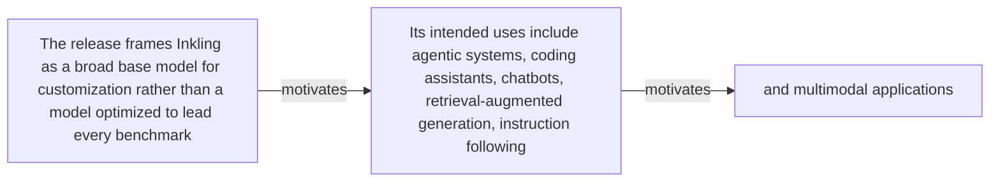

#### Python

```python
from html import escape
from pathlib import Path
from textwrap import wrap

title = "ink_why_p1: The release frames Inkling as a broad base model — problem and research-question relation"
nodes = [["n1","The release frames Inkling as a broad base model for customization rather than a model optimized to lead every benchmark",120,150],["n2","Its intended uses include agentic systems, coding assistants, chatbots, retrieval-augmented generation, instruction following",420,150],["n3","and multimodal applications",720,150]]
edges = [["n1","n2","motivates"],["n2","n3","motivates"]]
node_by_id = {node_id: (label, x, y) for node_id, label, x, y in nodes}

parts = [
    '<svg xmlns="http://www.w3.org/2000/svg" viewBox="0 0 860 520" role="img" aria-labelledby="title desc">',
    f'<title id="title">{escape(title)}</title>',
    '<desc id="desc">The labeled relations reproduce only relationships stated in the paragraph.</desc>',
    '<rect width="860" height="520" fill="white"/>',
]
for source, target, relation in edges:
    _, x1, y1 = node_by_id[source]
    _, x2, y2 = node_by_id[target]
    parts.append(f'<line x1="{x1}" y1="{y1}" x2="{x2}" y2="{y2}" stroke="#345" stroke-width="2"/>')
    parts.append(f'<text x="{(x1+x2)/2}" y="{(y1+y2)/2-6}" text-anchor="middle" font-family="sans-serif" font-size="11">{escape(relation)}</text>')
for _, label, x, y in nodes:
    parts.append(f'<rect x="{x-125}" y="{y-58}" width="250" height="116" rx="14" fill="#eef6ff" stroke="#234"/>')
    for line_index, line in enumerate(wrap(label, width=32)):
        parts.append(f'<text x="{x}" y="{y-34+line_index*16}" text-anchor="middle" font-family="sans-serif" font-size="12">{escape(line)}</text>')
parts.append('</svg>')
Path("ink_why_p1_treatment_a.svg").write_text("\n".join(parts), encoding="utf-8")
```

### Treatment B — ink_005 — claim-to-source provenance

- Teaching purpose: Optional contingency only. Show exactly which atomic claims underwrite this paragraph and which fixed source records support each claim.
- Encoding and reading order: A bipartite graph places 1 claim nodes on the left and 3 source nodes on the right, with only the 3 claim-source edges recorded in the fixture. Claim labels include epistemic status; source labels include the exact locator.
- Evidence and limitations: This treatment explains provenance and uncertainty, not the paper's causal mechanism. Missing edges remain visibly absent and no source count is treated as confidence.
- Recommended web medium: semantic HTML/CSS claim-source table with an SVG network view; JavaScript only for keyboard-controlled source highlighting.
- Mobile, accessibility, and motion behavior: Provide real table headers and source links in the static fallback, make every edge recoverable as text, stack claim records before source records on mobile, and require no motion.

#### TikZ

```tex
\documentclass[tikz,border=5pt]{standalone}
\usepackage[T1]{fontenc}
\usepackage{tikz}
\usetikzlibrary{arrows.meta}
\begin{document}
\begin{tikzpicture}[font=\sffamily,claim/.style={draw,rounded corners,align=center,text width=5.2cm,minimum height=1.2cm},source/.style={draw,dashed,align=center,text width=5.2cm,minimum height=1.2cm},link/.style={-{Latex[length=2mm]},thin}]
\node[font=\bfseries] at (4,1.8) {ink\_why\_p1: claim-to-source provenance};
\node[claim] (c1) at (0,0) {In content-addressed pages retrieved on 2026-07-18, the provider positions Inkling as a broad customizable open-weights base with multimodal input and controllable effort, while explicitly stating that it is not the strongest model overall. [AUTHORS\_INTERPRETATION]};
\node[source] (s1) at (8,0) {Thinking Machines Lab: Inkling Model Card (mutable; retrieved 2026-07-18) - Retrieved 2026-07-18; official HTML SHA-256 fe653ffb5f4b9f54f011491f60cd8d6b9885d667484880d4566d76827f22a7e9 (65,631 bytes). Sections 1-6: identity, architecture, modalities, hardware, training, evaluations, safety. Live URL remains mutable.};
\node[source] (s2) at (8,-2.4) {Thinking Machines Lab: Inkling, Our Open-Weights Model (mutable; retrieved 2026-07-18) - Retrieved 2026-07-18; official HTML SHA-256 cb28c6a6c8c47c68f55f2c636481bf35a1b9f5a349e5f00148c583fafbc138fc (222,133 bytes). July 15 release sections on effort, multimodality, benchmarks, architecture, training, RL, availability. Live URL remains mutable.};
\node[source] (s3) at (8,-4.8) {Thinking Machines Lab: Inkling BF16 initial weight release - Immutable initial Model release commit 91b051f1ec836e6d56596c624c3775b495d797b1; README sections 1, 3, 5-7 and BF16 weight files};
\draw[link] (c1) -- (s1);
\draw[link] (c1) -- (s2);
\draw[link] (c1) -- (s3);
\end{tikzpicture}
\end{document}
```

#### Mermaid

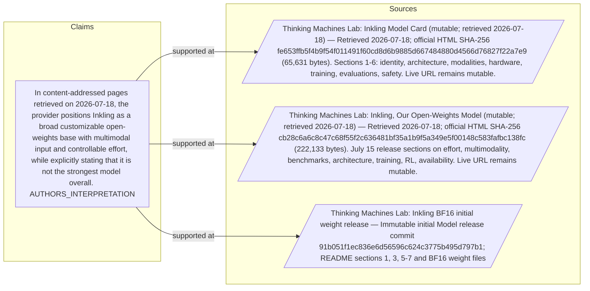

#### Python

```python
from html import escape
from pathlib import Path
from textwrap import wrap

title = "ink_why_p1: claim-to-source provenance"
nodes = [["c1","In content-addressed pages retrieved on 2026-07-18, the provider positions Inkling as a broad customizable open-weights base with multimodal input and controllable effort, while explicitly stating that it is not the strongest model overall. [AUTHORS_INTERPRETATION]",190,130],["s1","Thinking Machines Lab: Inkling Model Card (mutable; retrieved 2026-07-18) — Retrieved 2026-07-18; official HTML SHA-256 fe653ffb5f4b9f54f011491f60cd8d6b9885d667484880d4566d76827f22a7e9 (65,631 bytes). Sections 1-6: identity, architecture, modalities, hardware, training, evaluations, safety. Live URL remains mutable.",700,130],["s2","Thinking Machines Lab: Inkling, Our Open-Weights Model (mutable; retrieved 2026-07-18) — Retrieved 2026-07-18; official HTML SHA-256 cb28c6a6c8c47c68f55f2c636481bf35a1b9f5a349e5f00148c583fafbc138fc (222,133 bytes). July 15 release sections on effort, multimodality, benchmarks, architecture, training, RL, availability. Live URL remains mutable.",700,250],["s3","Thinking Machines Lab: Inkling BF16 initial weight release — Immutable initial Model release commit 91b051f1ec836e6d56596c624c3775b495d797b1; README sections 1, 3, 5-7 and BF16 weight files",700,370]]
edges = [["c1","s1"],["c1","s2"],["c1","s3"]]
node_by_id = {node_id: (label, x, y) for node_id, label, x, y in nodes}
height = 560

parts = [
    f'<svg xmlns="http://www.w3.org/2000/svg" viewBox="0 0 900 {height}" role="img" aria-labelledby="title desc">',
    f'<title id="title">{escape(title)}</title>',
    '<desc id="desc">Bipartite map from verified claim records to their exact source records.</desc>',
    f'<rect width="900" height="{height}" fill="white"/>',
]
for source, target in edges:
    _, x1, y1 = node_by_id[source]
    _, x2, y2 = node_by_id[target]
    parts.append(f'<line x1="{x1+145}" y1="{y1}" x2="{x2-145}" y2="{y2}" stroke="#456" stroke-width="2"/>')
for node_id, label, x, y in nodes:
    dashed = ' stroke-dasharray="7 5"' if node_id.startswith("s") else ''
    parts.append(f'<rect x="{x-145}" y="{y-46}" width="290" height="92" rx="12" fill="#f7fbff" stroke="#234"{dashed}/>')
    for line_index, line in enumerate(wrap(label, width=38)):
        parts.append(f'<text x="{x}" y="{y-24+line_index*14}" text-anchor="middle" font-family="sans-serif" font-size="11">{escape(line)}</text>')
parts.append('</svg>')
Path("ink_why_p1_treatment_b.svg").write_text("\n".join(parts), encoding="utf-8")
```

### Treatment C — The release frames Inkling as a broad base model — supported-versus-bounded scope

- Teaching purpose: Optional contingency only. Separate what the paragraph supports from the qualification or contingency that bounds it.
- Encoding and reading order: Partition the paragraph into 2 supported statement(s) and 1 boundary or contingency statement(s). The two columns are categories, not a scale or causal path.
- Evidence and limitations: Every card is a complete paragraph clause. The boundary column makes negative and not-established language visible without weakening it.
- Recommended web medium: responsive SVG or semantic HTML/CSS; JavaScript is optional only for a meaningful state or scope toggle.
- Mobile, accessibility, and motion behavior: Preserve every exact value or scope statement as selectable text, avoid color-only distinctions, stack groups on mobile, and keep all information visible when JavaScript or motion is disabled.

#### TikZ

```tex
\documentclass[tikz,border=5pt]{standalone}
\usepackage[T1]{fontenc}
\usepackage{tikz}
\begin{document}
\begin{tikzpicture}[font=\sffamily,item/.style={draw,align=center,text width=5.5cm,minimum height=1.4cm}]
\node[font=\bfseries] at (3.5,2) {ink\_why\_p1: The release frames Inkling as a broad base model - supported-versus-bounded scope};
\node[font=\bfseries] at (0,1) {Supported statement};
\node[font=\bfseries] at (7,1) {Boundary or contingency};
\node[item] at (0,0) {Its intended uses include agentic systems, coding assistants, chatbots, retrieval-augmented generation, instruction following};
\node[item] at (0,-2) {and multimodal applications};
\node[item] at (7,0) {The release frames Inkling as a broad base model for customization rather than a model optimized to lead every benchmark};
\end{tikzpicture}
\end{document}
```

#### Mermaid

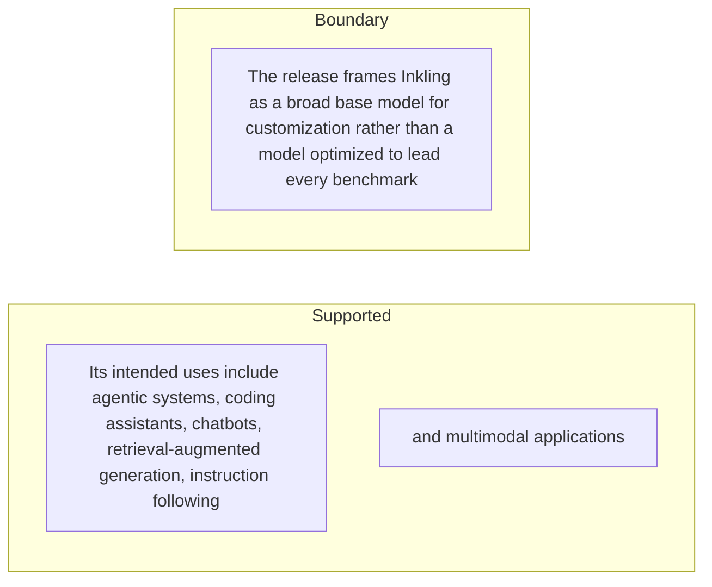

#### Python

```python
from html import escape
from pathlib import Path
from textwrap import wrap

title = "ink_why_p1: The release frames Inkling as a broad base model — supported-versus-bounded scope"
columns = {"Supported statement": ["Its intended uses include agentic systems, coding assistants, chatbots, retrieval-augmented generation, instruction following","and multimodal applications"], "Boundary or contingency": ["The release frames Inkling as a broad base model for customization rather than a model optimized to lead every benchmark"]}
height = 440
parts = [
    f'<svg xmlns="http://www.w3.org/2000/svg" viewBox="0 0 900 {height}" role="img" aria-labelledby="title desc">',
    f'<title id="title">{escape(title)}</title>',
    '<desc id="desc">Statements are partitioned into supported content and explicit boundaries.</desc>',
    f'<rect width="900" height="{height}" fill="white"/>',
]
for column_index, (heading, items) in enumerate(columns.items()):
    x = 240 + column_index * 430
    parts.append(f'<text x="{x}" y="70" text-anchor="middle" font-family="sans-serif" font-size="18" font-weight="700">{escape(heading)}</text>')
    for item_index, item in enumerate(items):
        y = 130 + item_index * 110
        parts.append(f'<rect x="{x-180}" y="{y-35}" width="360" height="80" rx="12" fill="#f7fbff" stroke="#234"/>')
        for line_index, line in enumerate(wrap(item, width=48)):
            parts.append(f'<text x="{x}" y="{y-12+line_index*14}" text-anchor="middle" font-family="sans-serif" font-size="11">{escape(line)}</text>')
parts.append('</svg>')
Path("ink_why_p1_treatment_c.svg").write_text("\n".join(parts), encoding="utf-8")
```

### Implementation record

- Status: `NOT_NEEDED`
- Selected treatment: `NONE`
- Selection rationale:
- Delivery medium: `NONE`
- Visual ID and placement:
- Shared paragraph scope: `NONE`
- Changed files:
- Accessibility and fallback verification:
- Desktop and mobile verification:
- Evidence deviations: `NONE`

## `ink_why_p2`

- Location: `ink_why`, paragraph 2
- Text anchor: "That positioning matters because the provider explicitly says Inkling is not the strongest model overall."
- Claims and sources: `ink_005` (AUTHORS_INTERPRETATION, VERIFIED); `source_inkling_model_card` (Retrieved 2026-07-18; official HTML SHA-256 fe653ffb5f4b9f54f011491f60cd8d6b9885d667484880d4566d76827f22a7e9 (65,631 bytes). Sections 1-6: identity, architecture, modalities, hardware, training, evaluations, safety. Live URL remains mutable.); `source_inkling_release` (Retrieved 2026-07-18; official HTML SHA-256 cb28c6a6c8c47c68f55f2c636481bf35a1b9f5a349e5f00148c583fafbc138fc (222,133 bytes). July 15 release sections on effort, multimodality, benchmarks, architecture, training, RL, availability. Live URL remains mutable.)
- Visual needed: `NO`
- Decision rationale: The paragraph's main work is the bounded statement "That positioning matters because the provider explicitly says Inkling is not the strongest model overall". Its qualification is explicit in prose and does not require readers to reconstruct a material process, topology, quantitative comparison, uncertainty distribution, or state change. A visual would repeat the wording, so all treatments below are optional contingencies only.
- Explanatory job: problem and research-question relation.

### Treatment A — That positioning matters because the provider explicitly says Inkling — problem and research-question relation

- Teaching purpose: Optional contingency only. Answer "Why did Thinking Machines Lab release Inkling?" by exposing the paragraph's 3 named propositions and 2 stated reading, comparison, or qualification relations.
- Encoding and reading order: Nodes reproduce the complete labels "That positioning matters because the provider explicitly says Inkling is not the strongest model overall"; "The proposed value is the combination of open weights, multimodal input, controllable reasoning effort"; "and availability for fine-tuning". Edges carry the explicit relation labels "motivates", "motivates"; arrow direction is sequence only for mechanism or example prose and otherwise denotes reading order.
- Evidence and limitations: The topology is derived from this paragraph rather than a fixed pipeline. Encode only `ink_005` and do not turn reading-order edges into causal claims.
- Recommended web medium: responsive inline SVG with CSS; JavaScript may add optional step focus only when state order matters.
- Mobile, accessibility, and motion behavior: Keep the full node-and-relation list in DOM order, expose the relation labels in the long description, stack nodes on narrow screens, and disable focus transitions under reduced motion.

#### TikZ

```tex
\documentclass[tikz,border=5pt]{standalone}
\usepackage[T1]{fontenc}
\usepackage{tikz}
\usetikzlibrary{arrows.meta,positioning}
\begin{document}
\begin{tikzpicture}[font=\sffamily,concept/.style={draw,rounded corners,align=center,text width=3.6cm,minimum height=1.35cm},link/.style={-{Latex[length=2mm]},thick},rel/.style={fill=white,font=\scriptsize,inner sep=2pt}]
\node[font=\bfseries,align=center] at (6.1,2.0) {ink\_why\_p2: That positioning matters because the provider explicitly says Inkling - problem and research-question relation};
\node[concept] (n1) at (1.8,0) {That positioning matters because the provider explicitly says Inkling is not the strongest model overall};
\node[concept] (n2) at (6.1,0) {The proposed value is the combination of open weights, multimodal input, controllable reasoning effort};
\node[concept] (n3) at (10.4,0) {and availability for fine-tuning};
\draw[link] (n1) -- node[rel] {motivates} (n2);
\draw[link] (n2) -- node[rel] {motivates} (n3);
\end{tikzpicture}
\end{document}
```

#### Mermaid

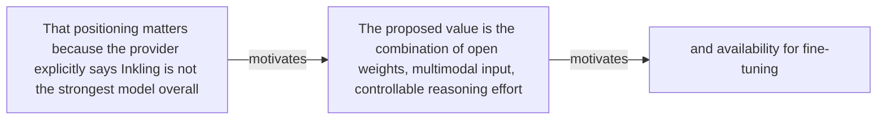

#### Python

```python
from html import escape
from pathlib import Path
from textwrap import wrap

title = "ink_why_p2: That positioning matters because the provider explicitly says Inkling — problem and research-question relation"
nodes = [["n1","That positioning matters because the provider explicitly says Inkling is not the strongest model overall",120,150],["n2","The proposed value is the combination of open weights, multimodal input, controllable reasoning effort",420,150],["n3","and availability for fine-tuning",720,150]]
edges = [["n1","n2","motivates"],["n2","n3","motivates"]]
node_by_id = {node_id: (label, x, y) for node_id, label, x, y in nodes}

parts = [
    '<svg xmlns="http://www.w3.org/2000/svg" viewBox="0 0 860 520" role="img" aria-labelledby="title desc">',
    f'<title id="title">{escape(title)}</title>',
    '<desc id="desc">The labeled relations reproduce only relationships stated in the paragraph.</desc>',
    '<rect width="860" height="520" fill="white"/>',
]
for source, target, relation in edges:
    _, x1, y1 = node_by_id[source]
    _, x2, y2 = node_by_id[target]
    parts.append(f'<line x1="{x1}" y1="{y1}" x2="{x2}" y2="{y2}" stroke="#345" stroke-width="2"/>')
    parts.append(f'<text x="{(x1+x2)/2}" y="{(y1+y2)/2-6}" text-anchor="middle" font-family="sans-serif" font-size="11">{escape(relation)}</text>')
for _, label, x, y in nodes:
    parts.append(f'<rect x="{x-125}" y="{y-58}" width="250" height="116" rx="14" fill="#eef6ff" stroke="#234"/>')
    for line_index, line in enumerate(wrap(label, width=32)):
        parts.append(f'<text x="{x}" y="{y-34+line_index*16}" text-anchor="middle" font-family="sans-serif" font-size="12">{escape(line)}</text>')
parts.append('</svg>')
Path("ink_why_p2_treatment_a.svg").write_text("\n".join(parts), encoding="utf-8")
```

### Treatment B — ink_005 — claim-to-source provenance

- Teaching purpose: Optional contingency only. Show exactly which atomic claims underwrite this paragraph and which fixed source records support each claim.
- Encoding and reading order: A bipartite graph places 1 claim nodes on the left and 3 source nodes on the right, with only the 3 claim-source edges recorded in the fixture. Claim labels include epistemic status; source labels include the exact locator.
- Evidence and limitations: This treatment explains provenance and uncertainty, not the paper's causal mechanism. Missing edges remain visibly absent and no source count is treated as confidence.
- Recommended web medium: semantic HTML/CSS claim-source table with an SVG network view; JavaScript only for keyboard-controlled source highlighting.
- Mobile, accessibility, and motion behavior: Provide real table headers and source links in the static fallback, make every edge recoverable as text, stack claim records before source records on mobile, and require no motion.

#### TikZ

```tex
\documentclass[tikz,border=5pt]{standalone}
\usepackage[T1]{fontenc}
\usepackage{tikz}
\usetikzlibrary{arrows.meta}
\begin{document}
\begin{tikzpicture}[font=\sffamily,claim/.style={draw,rounded corners,align=center,text width=5.2cm,minimum height=1.2cm},source/.style={draw,dashed,align=center,text width=5.2cm,minimum height=1.2cm},link/.style={-{Latex[length=2mm]},thin}]
\node[font=\bfseries] at (4,1.8) {ink\_why\_p2: claim-to-source provenance};
\node[claim] (c1) at (0,0) {In content-addressed pages retrieved on 2026-07-18, the provider positions Inkling as a broad customizable open-weights base with multimodal input and controllable effort, while explicitly stating that it is not the strongest model overall. [AUTHORS\_INTERPRETATION]};
\node[source] (s1) at (8,0) {Thinking Machines Lab: Inkling Model Card (mutable; retrieved 2026-07-18) - Retrieved 2026-07-18; official HTML SHA-256 fe653ffb5f4b9f54f011491f60cd8d6b9885d667484880d4566d76827f22a7e9 (65,631 bytes). Sections 1-6: identity, architecture, modalities, hardware, training, evaluations, safety. Live URL remains mutable.};
\node[source] (s2) at (8,-2.4) {Thinking Machines Lab: Inkling, Our Open-Weights Model (mutable; retrieved 2026-07-18) - Retrieved 2026-07-18; official HTML SHA-256 cb28c6a6c8c47c68f55f2c636481bf35a1b9f5a349e5f00148c583fafbc138fc (222,133 bytes). July 15 release sections on effort, multimodality, benchmarks, architecture, training, RL, availability. Live URL remains mutable.};
\node[source] (s3) at (8,-4.8) {Thinking Machines Lab: Inkling BF16 initial weight release - Immutable initial Model release commit 91b051f1ec836e6d56596c624c3775b495d797b1; README sections 1, 3, 5-7 and BF16 weight files};
\draw[link] (c1) -- (s1);
\draw[link] (c1) -- (s2);
\draw[link] (c1) -- (s3);
\end{tikzpicture}
\end{document}
```

#### Mermaid


#### Python

```python
from html import escape
from pathlib import Path
from textwrap import wrap

title = "ink_why_p2: claim-to-source provenance"
nodes = [["c1","In content-addressed pages retrieved on 2026-07-18, the provider positions Inkling as a broad customizable open-weights base with multimodal input and controllable effort, while explicitly stating that it is not the strongest model overall. [AUTHORS_INTERPRETATION]",190,130],["s1","Thinking Machines Lab: Inkling Model Card (mutable; retrieved 2026-07-18) — Retrieved 2026-07-18; official HTML SHA-256 fe653ffb5f4b9f54f011491f60cd8d6b9885d667484880d4566d76827f22a7e9 (65,631 bytes). Sections 1-6: identity, architecture, modalities, hardware, training, evaluations, safety. Live URL remains mutable.",700,130],["s2","Thinking Machines Lab: Inkling, Our Open-Weights Model (mutable; retrieved 2026-07-18) — Retrieved 2026-07-18; official HTML SHA-256 cb28c6a6c8c47c68f55f2c636481bf35a1b9f5a349e5f00148c583fafbc138fc (222,133 bytes). July 15 release sections on effort, multimodality, benchmarks, architecture, training, RL, availability. Live URL remains mutable.",700,250],["s3","Thinking Machines Lab: Inkling BF16 initial weight release — Immutable initial Model release commit 91b051f1ec836e6d56596c624c3775b495d797b1; README sections 1, 3, 5-7 and BF16 weight files",700,370]]
edges = [["c1","s1"],["c1","s2"],["c1","s3"]]
node_by_id = {node_id: (label, x, y) for node_id, label, x, y in nodes}
height = 560

parts = [
    f'<svg xmlns="http://www.w3.org/2000/svg" viewBox="0 0 900 {height}" role="img" aria-labelledby="title desc">',
    f'<title id="title">{escape(title)}</title>',
    '<desc id="desc">Bipartite map from verified claim records to their exact source records.</desc>',
    f'<rect width="900" height="{height}" fill="white"/>',
]
for source, target in edges:
    _, x1, y1 = node_by_id[source]
    _, x2, y2 = node_by_id[target]
    parts.append(f'<line x1="{x1+145}" y1="{y1}" x2="{x2-145}" y2="{y2}" stroke="#456" stroke-width="2"/>')
for node_id, label, x, y in nodes:
    dashed = ' stroke-dasharray="7 5"' if node_id.startswith("s") else ''
    parts.append(f'<rect x="{x-145}" y="{y-46}" width="290" height="92" rx="12" fill="#f7fbff" stroke="#234"{dashed}/>')
    for line_index, line in enumerate(wrap(label, width=38)):
        parts.append(f'<text x="{x}" y="{y-24+line_index*14}" text-anchor="middle" font-family="sans-serif" font-size="11">{escape(line)}</text>')
parts.append('</svg>')
Path("ink_why_p2_treatment_b.svg").write_text("\n".join(parts), encoding="utf-8")
```

### Treatment C — That positioning matters because the provider explicitly says Inkling — supported-versus-bounded scope

- Teaching purpose: Optional contingency only. Separate what the paragraph supports from the qualification or contingency that bounds it.
- Encoding and reading order: Partition the paragraph into 3 supported statement(s) and 1 boundary or contingency statement(s). The two columns are categories, not a scale or causal path.
- Evidence and limitations: Every card is a complete paragraph clause. The boundary column makes negative and not-established language visible without weakening it.
- Recommended web medium: responsive SVG or semantic HTML/CSS; JavaScript is optional only for a meaningful state or scope toggle.
- Mobile, accessibility, and motion behavior: Preserve every exact value or scope statement as selectable text, avoid color-only distinctions, stack groups on mobile, and keep all information visible when JavaScript or motion is disabled.

#### TikZ

```tex
\documentclass[tikz,border=5pt]{standalone}
\usepackage[T1]{fontenc}
\usepackage{tikz}
\begin{document}
\begin{tikzpicture}[font=\sffamily,item/.style={draw,align=center,text width=5.5cm,minimum height=1.4cm}]
\node[font=\bfseries] at (3.5,2) {ink\_why\_p2: That positioning matters because the provider explicitly says Inkling - supported-versus-bounded scope};
\node[font=\bfseries] at (0,1) {Supported statement};
\node[font=\bfseries] at (7,1) {Boundary or contingency};
\node[item] at (0,0) {That positioning matters because the provider explicitly says Inkling is not the strongest model overall};
\node[item] at (0,-2) {The proposed value is the combination of open weights, multimodal input, controllable reasoning effort};
\node[item] at (0,-4) {and availability for fine-tuning};
\node[item] at (7,0) {and availability for fine-tuning};
\end{tikzpicture}
\end{document}
```

#### Mermaid

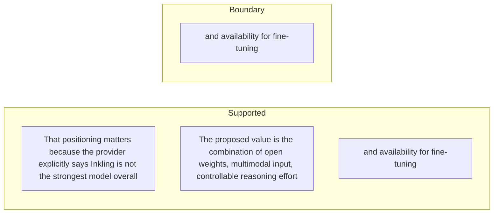

#### Python

```python
from html import escape
from pathlib import Path
from textwrap import wrap

title = "ink_why_p2: That positioning matters because the provider explicitly says Inkling — supported-versus-bounded scope"
columns = {"Supported statement": ["That positioning matters because the provider explicitly says Inkling is not the strongest model overall","The proposed value is the combination of open weights, multimodal input, controllable reasoning effort","and availability for fine-tuning"], "Boundary or contingency": ["and availability for fine-tuning"]}
height = 550
parts = [
    f'<svg xmlns="http://www.w3.org/2000/svg" viewBox="0 0 900 {height}" role="img" aria-labelledby="title desc">',
    f'<title id="title">{escape(title)}</title>',
    '<desc id="desc">Statements are partitioned into supported content and explicit boundaries.</desc>',
    f'<rect width="900" height="{height}" fill="white"/>',
]
for column_index, (heading, items) in enumerate(columns.items()):
    x = 240 + column_index * 430
    parts.append(f'<text x="{x}" y="70" text-anchor="middle" font-family="sans-serif" font-size="18" font-weight="700">{escape(heading)}</text>')
    for item_index, item in enumerate(items):
        y = 130 + item_index * 110
        parts.append(f'<rect x="{x-180}" y="{y-35}" width="360" height="80" rx="12" fill="#f7fbff" stroke="#234"/>')
        for line_index, line in enumerate(wrap(item, width=48)):
            parts.append(f'<text x="{x}" y="{y-12+line_index*14}" text-anchor="middle" font-family="sans-serif" font-size="11">{escape(line)}</text>')
parts.append('</svg>')
Path("ink_why_p2_treatment_c.svg").write_text("\n".join(parts), encoding="utf-8")
```

### Implementation record

- Status: `NOT_NEEDED`
- Selected treatment: `NONE`
- Selection rationale:
- Delivery medium: `NONE`
- Visual ID and placement:
- Shared paragraph scope: `NONE`
- Changed files:
- Accessibility and fallback verification:
- Desktop and mobile verification:
- Evidence deviations: `NONE`

## `ink_change_p1`

- Location: `ink_change`, paragraph 1
- Text anchor: "Inkling combines a large sparse model with native text, image, and audio input and makes the weights available in original and quantized forms."
- Claims and sources: `ink_001` (OBSERVED, VERIFIED); `ink_002` (OBSERVED, VERIFIED); `ink_003` (OBSERVED, VERIFIED); `ink_005` (AUTHORS_INTERPRETATION, VERIFIED); `ink_008` (AUTHORS_INTERPRETATION, VERIFIED); `source_inkling_model_card` (Retrieved 2026-07-18; official HTML SHA-256 fe653ffb5f4b9f54f011491f60cd8d6b9885d667484880d4566d76827f22a7e9 (65,631 bytes). Sections 1-6: identity, architecture, modalities, hardware, training, evaluations, safety. Live URL remains mutable.); `source_inkling_release` (Retrieved 2026-07-18; official HTML SHA-256 cb28c6a6c8c47c68f55f2c636481bf35a1b9f5a349e5f00148c583fafbc138fc (222,133 bytes). July 15 release sections on effort, multimodality, benchmarks, architecture, training, RL, availability. Live URL remains mutable.); `source_inkling_aup` (Retrieved 2026-07-18; official HTML SHA-256 c62535263733dbeabb838ff881850928a878bc5c539ce1401a59a237bbf5c2e7 (25,968 bytes). Page states last updated July 15, 2026; introduction, restrictions, disclosure, updates. Live URL remains mutable.)
- Visual needed: `YES`
- Decision rationale: Removing a visual would require readers to retain the material relation between "Inkling combines a large sparse model with native text, image" and "which separates total model capacity from the 41-billion-parameter active path" while also tracking 4 source-bounded propositions. The paragraph contains a real changed-versus-preserved relation; the visual must preserve its stated conditions and must not add causal or proportional meaning.
- Explanatory job: changed-versus-preserved relation.

### Treatment A — Inkling combines a large sparse model with native text — changed-versus-preserved relation

- Teaching purpose: Answer "What is materially different about the release?" by exposing the paragraph's 4 named propositions and 3 stated reading, comparison, or qualification relations.
- Encoding and reading order: Nodes reproduce the complete labels "Inkling combines a large sparse model with native text, image"; "and audio input and makes the weights available in original and quantized forms"; "Only a subset of the 975 billion parameters is active for a token"; "which separates total model capacity from the 41-billion-parameter active path". Edges carry the explicit relation labels "changes into", "bounded by", "changes into"; arrow direction is sequence only for mechanism or example prose and otherwise denotes reading order.
- Evidence and limitations: The topology is derived from this paragraph rather than a fixed pipeline. Encode only `ink_001`, `ink_002`, `ink_003`, `ink_005`, `ink_008` and do not turn reading-order edges into causal claims.
- Recommended web medium: responsive inline SVG with CSS; JavaScript may add optional step focus only when state order matters.
- Mobile, accessibility, and motion behavior: Keep the full node-and-relation list in DOM order, expose the relation labels in the long description, stack nodes on narrow screens, and disable focus transitions under reduced motion.

#### TikZ

```tex
\documentclass[tikz,border=5pt]{standalone}
\usepackage[T1]{fontenc}
\usepackage{tikz}
\usetikzlibrary{arrows.meta,positioning}
\begin{document}
\begin{tikzpicture}[font=\sffamily,concept/.style={draw,rounded corners,align=center,text width=3.6cm,minimum height=1.35cm},link/.style={-{Latex[length=2mm]},thick},rel/.style={fill=white,font=\scriptsize,inner sep=2pt}]
\node[font=\bfseries,align=center] at (6.1,2.0) {ink\_change\_p1: Inkling combines a large sparse model with native text - changed-versus-preserved relation};
\node[concept] (n1) at (1.8,0) {Inkling combines a large sparse model with native text, image};
\node[concept] (n2) at (6.1,0) {and audio input and makes the weights available in original and quantized forms};
\node[concept] (n3) at (10.4,0) {Only a subset of the 975 billion parameters is active for a token};
\node[concept] (n4) at (1.8,-3.2) {which separates total model capacity from the 41-billion-parameter active path};
\draw[link] (n1) -- node[rel] {changes into} (n2);
\draw[link] (n2) -- node[rel] {bounded by} (n3);
\draw[link] (n3) -- node[rel] {changes into} (n4);
\end{tikzpicture}
\end{document}
```

#### Mermaid

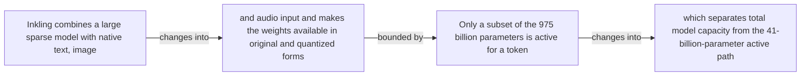

#### Python

```python
from html import escape
from pathlib import Path
from textwrap import wrap

title = "ink_change_p1: Inkling combines a large sparse model with native text — changed-versus-preserved relation"
nodes = [["n1","Inkling combines a large sparse model with native text, image",120,150],["n2","and audio input and makes the weights available in original and quantized forms",420,150],["n3","Only a subset of the 975 billion parameters is active for a token",720,150],["n4","which separates total model capacity from the 41-billion-parameter active path",120,340]]
edges = [["n1","n2","changes into"],["n2","n3","bounded by"],["n3","n4","changes into"]]
node_by_id = {node_id: (label, x, y) for node_id, label, x, y in nodes}

parts = [
    '<svg xmlns="http://www.w3.org/2000/svg" viewBox="0 0 860 520" role="img" aria-labelledby="title desc">',
    f'<title id="title">{escape(title)}</title>',
    '<desc id="desc">The labeled relations reproduce only relationships stated in the paragraph.</desc>',
    '<rect width="860" height="520" fill="white"/>',
]
for source, target, relation in edges:
    _, x1, y1 = node_by_id[source]
    _, x2, y2 = node_by_id[target]
    parts.append(f'<line x1="{x1}" y1="{y1}" x2="{x2}" y2="{y2}" stroke="#345" stroke-width="2"/>')
    parts.append(f'<text x="{(x1+x2)/2}" y="{(y1+y2)/2-6}" text-anchor="middle" font-family="sans-serif" font-size="11">{escape(relation)}</text>')
for _, label, x, y in nodes:
    parts.append(f'<rect x="{x-125}" y="{y-58}" width="250" height="116" rx="14" fill="#eef6ff" stroke="#234"/>')
    for line_index, line in enumerate(wrap(label, width=32)):
        parts.append(f'<text x="{x}" y="{y-34+line_index*16}" text-anchor="middle" font-family="sans-serif" font-size="12">{escape(line)}</text>')
parts.append('</svg>')
Path("ink_change_p1_treatment_a.svg").write_text("\n".join(parts), encoding="utf-8")
```

### Treatment B — ink_001, ink_002, ink_003, ink_005, ink_008 — claim-to-source provenance

- Teaching purpose: Show exactly which atomic claims underwrite this paragraph and which fixed source records support each claim.
- Encoding and reading order: A bipartite graph places 5 claim nodes on the left and 4 source nodes on the right, with only the 13 claim-source edges recorded in the fixture. Claim labels include epistemic status; source labels include the exact locator.
- Evidence and limitations: This treatment explains provenance and uncertainty, not the paper's causal mechanism. Missing edges remain visibly absent and no source count is treated as confidence.
- Recommended web medium: semantic HTML/CSS claim-source table with an SVG network view; JavaScript only for keyboard-controlled source highlighting.
- Mobile, accessibility, and motion behavior: Provide real table headers and source links in the static fallback, make every edge recoverable as text, stack claim records before source records on mobile, and require no motion.

#### TikZ

```tex
\documentclass[tikz,border=5pt]{standalone}
\usepackage[T1]{fontenc}
\usepackage{tikz}
\usetikzlibrary{arrows.meta}
\begin{document}
\begin{tikzpicture}[font=\sffamily,claim/.style={draw,rounded corners,align=center,text width=5.2cm,minimum height=1.2cm},source/.style={draw,dashed,align=center,text width=5.2cm,minimum height=1.2cm},link/.style={-{Latex[length=2mm]},thin}]
\node[font=\bfseries] at (4,1.8) {ink\_change\_p1: claim-to-source provenance};
\node[claim] (c1) at (0,0) {In content-addressed official HTML retrieved on 2026-07-18, Thinking Machines Lab dates the initial Inkling release to July 15, 2026, labels the model Apache 2.0, and links an Acceptable Use Policy that says it also conditions use of the model materials. [OBSERVED]};
\node[claim] (c2) at (0,-2.4) {Inkling is a 66-layer decoder-only sparse mixture-of-experts Transformer with 975 billion total parameters, 41 billion active parameters, 6 of 256 routed experts per token, and 2 shared experts. [OBSERVED]};
\node[claim] (c3) at (0,-4.8) {The pinned initial BF16 card verifies text, image, and audio inputs with text output; the content-addressed provider pages retrieved on 2026-07-18 advertise support for a context window up to one million tokens. [OBSERVED]};
\node[claim] (c4) at (0,-7.199999999999999) {In content-addressed pages retrieved on 2026-07-18, the provider positions Inkling as a broad customizable open-weights base with multimodal input and controllable effort, while explicitly stating that it is not the strongest model overall. [AUTHORS\_INTERPRETATION]};
\node[claim] (c5) at (0,-9.6) {The content-addressed release page retrieved on 2026-07-18 interprets its effort sweep as evidence that Inkling can exchange generated tokens for performance and says it matches Nemotron 3 Ultra on Terminal Bench at roughly one-third of the generated tokens. [AUTHORS\_INTERPRETATION]};
\node[source] (s1) at (8,0) {Thinking Machines Lab: Inkling Model Card (mutable; retrieved 2026-07-18) - Retrieved 2026-07-18; official HTML SHA-256 fe653ffb5f4b9f54f011491f60cd8d6b9885d667484880d4566d76827f22a7e9 (65,631 bytes). Sections 1-6: identity, architecture, modalities, hardware, training, evaluations, safety. Live URL remains mutable.};
\node[source] (s2) at (8,-2.4) {Thinking Machines Lab: Inkling BF16 initial weight release - Immutable initial Model release commit 91b051f1ec836e6d56596c624c3775b495d797b1; README sections 1, 3, 5-7 and BF16 weight files};
\node[source] (s3) at (8,-4.8) {Thinking Machines Lab: Model Acceptable Use Policy (mutable; retrieved 2026-07-18) - Retrieved 2026-07-18; official HTML SHA-256 c62535263733dbeabb838ff881850928a878bc5c539ce1401a59a237bbf5c2e7 (25,968 bytes). Page states last updated July 15, 2026; introduction, restrictions, disclosure, updates. Live URL remains mutable.};
\node[source] (s4) at (8,-7.199999999999999) {Thinking Machines Lab: Inkling, Our Open-Weights Model (mutable; retrieved 2026-07-18) - Retrieved 2026-07-18; official HTML SHA-256 cb28c6a6c8c47c68f55f2c636481bf35a1b9f5a349e5f00148c583fafbc138fc (222,133 bytes). July 15 release sections on effort, multimodality, benchmarks, architecture, training, RL, availability. Live URL remains mutable.};
\draw[link] (c1) -- (s1);
\draw[link] (c1) -- (s2);
\draw[link] (c1) -- (s3);
\draw[link] (c2) -- (s1);
\draw[link] (c2) -- (s4);
\draw[link] (c2) -- (s2);
\draw[link] (c3) -- (s1);
\draw[link] (c3) -- (s4);
\draw[link] (c3) -- (s2);
\draw[link] (c4) -- (s1);
\draw[link] (c4) -- (s4);
\draw[link] (c4) -- (s2);
\draw[link] (c5) -- (s4);
\end{tikzpicture}
\end{document}
```

#### Mermaid

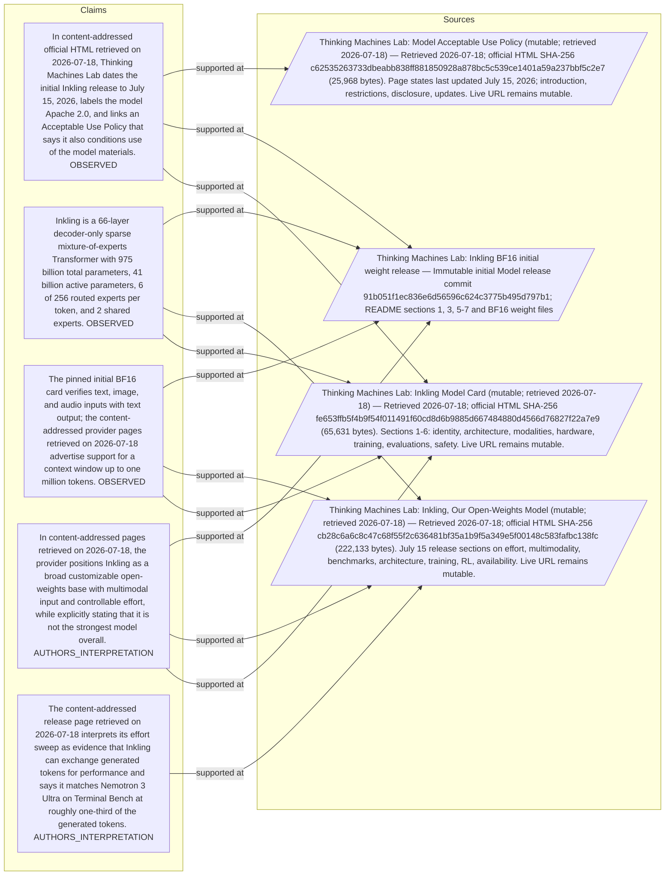

#### Python

```python
from html import escape
from pathlib import Path
from textwrap import wrap

title = "ink_change_p1: claim-to-source provenance"
nodes = [["c1","In content-addressed official HTML retrieved on 2026-07-18, Thinking Machines Lab dates the initial Inkling release to July 15, 2026, labels the model Apache 2.0, and links an Acceptable Use Policy that says it also conditions use of the model materials. [OBSERVED]",190,130],["c2","Inkling is a 66-layer decoder-only sparse mixture-of-experts Transformer with 975 billion total parameters, 41 billion active parameters, 6 of 256 routed experts per token, and 2 shared experts. [OBSERVED]",190,250],["c3","The pinned initial BF16 card verifies text, image, and audio inputs with text output; the content-addressed provider pages retrieved on 2026-07-18 advertise support for a context window up to one million tokens. [OBSERVED]",190,370],["c4","In content-addressed pages retrieved on 2026-07-18, the provider positions Inkling as a broad customizable open-weights base with multimodal input and controllable effort, while explicitly stating that it is not the strongest model overall. [AUTHORS_INTERPRETATION]",190,490],["c5","The content-addressed release page retrieved on 2026-07-18 interprets its effort sweep as evidence that Inkling can exchange generated tokens for performance and says it matches Nemotron 3 Ultra on Terminal Bench at roughly one-third of the generated tokens. [AUTHORS_INTERPRETATION]",190,610],["s1","Thinking Machines Lab: Inkling Model Card (mutable; retrieved 2026-07-18) — Retrieved 2026-07-18; official HTML SHA-256 fe653ffb5f4b9f54f011491f60cd8d6b9885d667484880d4566d76827f22a7e9 (65,631 bytes). Sections 1-6: identity, architecture, modalities, hardware, training, evaluations, safety. Live URL remains mutable.",700,130],["s2","Thinking Machines Lab: Inkling BF16 initial weight release — Immutable initial Model release commit 91b051f1ec836e6d56596c624c3775b495d797b1; README sections 1, 3, 5-7 and BF16 weight files",700,250],["s3","Thinking Machines Lab: Model Acceptable Use Policy (mutable; retrieved 2026-07-18) — Retrieved 2026-07-18; official HTML SHA-256 c62535263733dbeabb838ff881850928a878bc5c539ce1401a59a237bbf5c2e7 (25,968 bytes). Page states last updated July 15, 2026; introduction, restrictions, disclosure, updates. Live URL remains mutable.",700,370],["s4","Thinking Machines Lab: Inkling, Our Open-Weights Model (mutable; retrieved 2026-07-18) — Retrieved 2026-07-18; official HTML SHA-256 cb28c6a6c8c47c68f55f2c636481bf35a1b9f5a349e5f00148c583fafbc138fc (222,133 bytes). July 15 release sections on effort, multimodality, benchmarks, architecture, training, RL, availability. Live URL remains mutable.",700,490]]
edges = [["c1","s1"],["c1","s2"],["c1","s3"],["c2","s1"],["c2","s4"],["c2","s2"],["c3","s1"],["c3","s4"],["c3","s2"],["c4","s1"],["c4","s4"],["c4","s2"],["c5","s4"]]
node_by_id = {node_id: (label, x, y) for node_id, label, x, y in nodes}
height = 800

parts = [
    f'<svg xmlns="http://www.w3.org/2000/svg" viewBox="0 0 900 {height}" role="img" aria-labelledby="title desc">',
    f'<title id="title">{escape(title)}</title>',
    '<desc id="desc">Bipartite map from verified claim records to their exact source records.</desc>',
    f'<rect width="900" height="{height}" fill="white"/>',
]
for source, target in edges:
    _, x1, y1 = node_by_id[source]
    _, x2, y2 = node_by_id[target]
    parts.append(f'<line x1="{x1+145}" y1="{y1}" x2="{x2-145}" y2="{y2}" stroke="#456" stroke-width="2"/>')
for node_id, label, x, y in nodes:
    dashed = ' stroke-dasharray="7 5"' if node_id.startswith("s") else ''
    parts.append(f'<rect x="{x-145}" y="{y-46}" width="290" height="92" rx="12" fill="#f7fbff" stroke="#234"{dashed}/>')
    for line_index, line in enumerate(wrap(label, width=38)):
        parts.append(f'<text x="{x}" y="{y-24+line_index*14}" text-anchor="middle" font-family="sans-serif" font-size="11">{escape(line)}</text>')
parts.append('</svg>')
Path("ink_change_p1_treatment_b.svg").write_text("\n".join(parts), encoding="utf-8")
```

### Treatment C — 975 billion, 41 — exact-condition board

- Teaching purpose: Keep reported quantities attached to their conditions so unlike measurements are not flattened into one bar chart.
- Encoding and reading order: Use 2 unscaled marks, one per reported value (975 billion, 41), each attached to its complete sentence-level condition. Do not share an axis when units, datasets, checkpoints, or experimental conditions differ.
- Evidence and limitations: Every value is copied from the paragraph and remains text. Spatial order follows source order; distance and area carry no magnitude.
- Recommended web medium: responsive SVG or semantic HTML/CSS; JavaScript is optional only for a meaningful state or scope toggle.
- Mobile, accessibility, and motion behavior: Preserve every exact value or scope statement as selectable text, avoid color-only distinctions, stack groups on mobile, and keep all information visible when JavaScript or motion is disabled.

#### TikZ

```tex
\documentclass[tikz,border=5pt]{standalone}
\usepackage[T1]{fontenc}
\usepackage{tikz}
\begin{document}
\begin{tikzpicture}[font=\sffamily,fact/.style={draw,align=center,text width=4cm,minimum height=1.8cm}]
\node[font=\bfseries] at (4.6,2) {ink\_change\_p1: 975 billion, 41 - exact-condition board};
\node[fact] at (0,0) {\textbf{975 billion}\\Only a subset of the 975 billion parameters is active for a token, which separates total model capacity from the 41-billion-parameter active path.};
\node[fact] at (4.6,0) {\textbf{41}\\Only a subset of the 975 billion parameters is active for a token, which separates total model capacity from the 41-billion-parameter active path.};
\end{tikzpicture}
\end{document}
```

#### Mermaid

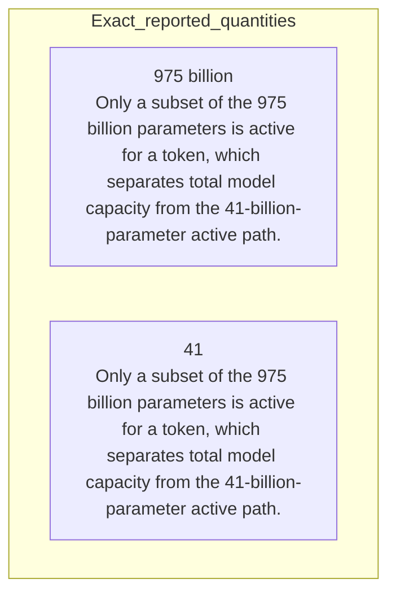

#### Python

```python
from html import escape
from pathlib import Path
from textwrap import wrap

title = "ink_change_p1: 975 billion, 41 — exact-condition board"
items = [["975 billion","Only a subset of the 975 billion parameters is active for a token, which separates total model capacity from the 41-billion-parameter active path."],["41","Only a subset of the 975 billion parameters is active for a token, which separates total model capacity from the 41-billion-parameter active path."]]
height = 350
parts = [
    f'<svg xmlns="http://www.w3.org/2000/svg" viewBox="0 0 900 {height}" role="img" aria-labelledby="title desc">',
    f'<title id="title">{escape(title)}</title>',
    '<desc id="desc">Exact values are separated because the paragraph may mix units and experimental conditions.</desc>',
    f'<rect width="900" height="{height}" fill="white"/>',
]
for index, (value, context) in enumerate(items):
    x = 240 + (index % 2) * 440
    y = 130 + (index // 2) * 170
    parts.append(f'<circle cx="{x}" cy="{y}" r="52" fill="#eef6ff" stroke="#234"/>')
    parts.append(f'<text x="{x}" y="{y+6}" text-anchor="middle" font-family="sans-serif" font-size="18" font-weight="700">{escape(value)}</text>')
    for line_index, line in enumerate(wrap(context, width=42)):
        parts.append(f'<text x="{x}" y="{y+78+line_index*14}" text-anchor="middle" font-family="sans-serif" font-size="11">{escape(line)}</text>')
parts.append('</svg>')
Path("ink_change_p1_treatment_c.svg").write_text("\n".join(parts), encoding="utf-8")
```

### Implementation record

- Status: `PENDING`
- Selected treatment: `NONE`
- Selection rationale:
- Delivery medium: `NONE`
- Visual ID and placement:
- Shared paragraph scope: `NONE`
- Changed files:
- Accessibility and fallback verification:
- Desktop and mobile verification:
- Evidence deviations: `NONE`

## `ink_change_p2`

- Location: `ink_change`, paragraph 2
- Text anchor: "The release also exposes an effort control intended to trade generated tokens for performance."
- Claims and sources: `ink_001` (OBSERVED, VERIFIED); `ink_002` (OBSERVED, VERIFIED); `ink_003` (OBSERVED, VERIFIED); `ink_005` (AUTHORS_INTERPRETATION, VERIFIED); `ink_008` (AUTHORS_INTERPRETATION, VERIFIED); `source_inkling_model_card` (Retrieved 2026-07-18; official HTML SHA-256 fe653ffb5f4b9f54f011491f60cd8d6b9885d667484880d4566d76827f22a7e9 (65,631 bytes). Sections 1-6: identity, architecture, modalities, hardware, training, evaluations, safety. Live URL remains mutable.); `source_inkling_release` (Retrieved 2026-07-18; official HTML SHA-256 cb28c6a6c8c47c68f55f2c636481bf35a1b9f5a349e5f00148c583fafbc138fc (222,133 bytes). July 15 release sections on effort, multimodality, benchmarks, architecture, training, RL, availability. Live URL remains mutable.); `source_inkling_aup` (Retrieved 2026-07-18; official HTML SHA-256 c62535263733dbeabb838ff881850928a878bc5c539ce1401a59a237bbf5c2e7 (25,968 bytes). Page states last updated July 15, 2026; introduction, restrictions, disclosure, updates. Live URL remains mutable.)
- Visual needed: `NO`
- Decision rationale: The paragraph's main work is the bounded statement "The release also exposes an effort control intended to trade generated tokens for performance". Its qualification is explicit in prose and does not require readers to reconstruct a material process, topology, quantitative comparison, uncertainty distribution, or state change. A visual would repeat the wording, so all treatments below are optional contingencies only.
- Explanatory job: changed-versus-preserved relation.

### Treatment A — The release also exposes an effort control intended to — changed-versus-preserved relation

- Teaching purpose: Optional contingency only. Answer "What is materially different about the release?" by exposing the paragraph's 2 named propositions and 1 stated reading, comparison, or qualification relations.
- Encoding and reading order: Nodes reproduce the complete labels "The release also exposes an effort control intended to trade generated tokens for performance"; "This is a product and training claim about controllability, not proof that Inkling dominates models at every effort level or task". Edges carry the explicit relation labels "changes into"; arrow direction is sequence only for mechanism or example prose and otherwise denotes reading order.
- Evidence and limitations: The topology is derived from this paragraph rather than a fixed pipeline. Encode only `ink_001`, `ink_002`, `ink_003`, `ink_005`, `ink_008` and do not turn reading-order edges into causal claims.
- Recommended web medium: responsive inline SVG with CSS; JavaScript may add optional step focus only when state order matters.
- Mobile, accessibility, and motion behavior: Keep the full node-and-relation list in DOM order, expose the relation labels in the long description, stack nodes on narrow screens, and disable focus transitions under reduced motion.

#### TikZ

```tex
\documentclass[tikz,border=5pt]{standalone}
\usepackage[T1]{fontenc}
\usepackage{tikz}
\usetikzlibrary{arrows.meta,positioning}
\begin{document}
\begin{tikzpicture}[font=\sffamily,concept/.style={draw,rounded corners,align=center,text width=3.6cm,minimum height=1.35cm},link/.style={-{Latex[length=2mm]},thick},rel/.style={fill=white,font=\scriptsize,inner sep=2pt}]
\node[font=\bfseries,align=center] at (6.1,2.0) {ink\_change\_p2: The release also exposes an effort control intended to - changed-versus-preserved relation};
\node[concept] (n1) at (1.8,0) {The release also exposes an effort control intended to trade generated tokens for performance};
\node[concept] (n2) at (6.1,0) {This is a product and training claim about controllability, not proof that Inkling dominates models at every effort level or task};
\draw[link] (n1) -- node[rel] {changes into} (n2);
\end{tikzpicture}
\end{document}
```

#### Mermaid

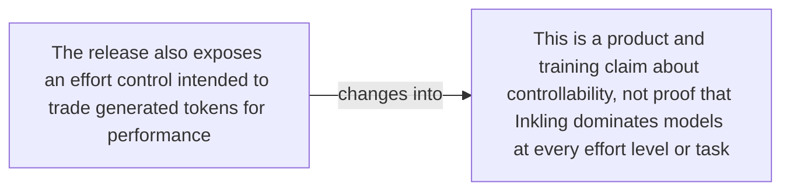

#### Python

```python
from html import escape
from pathlib import Path
from textwrap import wrap

title = "ink_change_p2: The release also exposes an effort control intended to — changed-versus-preserved relation"
nodes = [["n1","The release also exposes an effort control intended to trade generated tokens for performance",120,150],["n2","This is a product and training claim about controllability, not proof that Inkling dominates models at every effort level or task",420,150]]
edges = [["n1","n2","changes into"]]
node_by_id = {node_id: (label, x, y) for node_id, label, x, y in nodes}

parts = [
    '<svg xmlns="http://www.w3.org/2000/svg" viewBox="0 0 860 520" role="img" aria-labelledby="title desc">',
    f'<title id="title">{escape(title)}</title>',
    '<desc id="desc">The labeled relations reproduce only relationships stated in the paragraph.</desc>',
    '<rect width="860" height="520" fill="white"/>',
]
for source, target, relation in edges:
    _, x1, y1 = node_by_id[source]
    _, x2, y2 = node_by_id[target]
    parts.append(f'<line x1="{x1}" y1="{y1}" x2="{x2}" y2="{y2}" stroke="#345" stroke-width="2"/>')
    parts.append(f'<text x="{(x1+x2)/2}" y="{(y1+y2)/2-6}" text-anchor="middle" font-family="sans-serif" font-size="11">{escape(relation)}</text>')
for _, label, x, y in nodes:
    parts.append(f'<rect x="{x-125}" y="{y-58}" width="250" height="116" rx="14" fill="#eef6ff" stroke="#234"/>')
    for line_index, line in enumerate(wrap(label, width=32)):
        parts.append(f'<text x="{x}" y="{y-34+line_index*16}" text-anchor="middle" font-family="sans-serif" font-size="12">{escape(line)}</text>')
parts.append('</svg>')
Path("ink_change_p2_treatment_a.svg").write_text("\n".join(parts), encoding="utf-8")
```

### Treatment B — ink_001, ink_002, ink_003, ink_005, ink_008 — claim-to-source provenance

- Teaching purpose: Optional contingency only. Show exactly which atomic claims underwrite this paragraph and which fixed source records support each claim.
- Encoding and reading order: A bipartite graph places 5 claim nodes on the left and 4 source nodes on the right, with only the 13 claim-source edges recorded in the fixture. Claim labels include epistemic status; source labels include the exact locator.
- Evidence and limitations: This treatment explains provenance and uncertainty, not the paper's causal mechanism. Missing edges remain visibly absent and no source count is treated as confidence.
- Recommended web medium: semantic HTML/CSS claim-source table with an SVG network view; JavaScript only for keyboard-controlled source highlighting.
- Mobile, accessibility, and motion behavior: Provide real table headers and source links in the static fallback, make every edge recoverable as text, stack claim records before source records on mobile, and require no motion.

#### TikZ

```tex
\documentclass[tikz,border=5pt]{standalone}
\usepackage[T1]{fontenc}
\usepackage{tikz}
\usetikzlibrary{arrows.meta}
\begin{document}
\begin{tikzpicture}[font=\sffamily,claim/.style={draw,rounded corners,align=center,text width=5.2cm,minimum height=1.2cm},source/.style={draw,dashed,align=center,text width=5.2cm,minimum height=1.2cm},link/.style={-{Latex[length=2mm]},thin}]
\node[font=\bfseries] at (4,1.8) {ink\_change\_p2: claim-to-source provenance};
\node[claim] (c1) at (0,0) {In content-addressed official HTML retrieved on 2026-07-18, Thinking Machines Lab dates the initial Inkling release to July 15, 2026, labels the model Apache 2.0, and links an Acceptable Use Policy that says it also conditions use of the model materials. [OBSERVED]};
\node[claim] (c2) at (0,-2.4) {Inkling is a 66-layer decoder-only sparse mixture-of-experts Transformer with 975 billion total parameters, 41 billion active parameters, 6 of 256 routed experts per token, and 2 shared experts. [OBSERVED]};
\node[claim] (c3) at (0,-4.8) {The pinned initial BF16 card verifies text, image, and audio inputs with text output; the content-addressed provider pages retrieved on 2026-07-18 advertise support for a context window up to one million tokens. [OBSERVED]};
\node[claim] (c4) at (0,-7.199999999999999) {In content-addressed pages retrieved on 2026-07-18, the provider positions Inkling as a broad customizable open-weights base with multimodal input and controllable effort, while explicitly stating that it is not the strongest model overall. [AUTHORS\_INTERPRETATION]};
\node[claim] (c5) at (0,-9.6) {The content-addressed release page retrieved on 2026-07-18 interprets its effort sweep as evidence that Inkling can exchange generated tokens for performance and says it matches Nemotron 3 Ultra on Terminal Bench at roughly one-third of the generated tokens. [AUTHORS\_INTERPRETATION]};
\node[source] (s1) at (8,0) {Thinking Machines Lab: Inkling Model Card (mutable; retrieved 2026-07-18) - Retrieved 2026-07-18; official HTML SHA-256 fe653ffb5f4b9f54f011491f60cd8d6b9885d667484880d4566d76827f22a7e9 (65,631 bytes). Sections 1-6: identity, architecture, modalities, hardware, training, evaluations, safety. Live URL remains mutable.};
\node[source] (s2) at (8,-2.4) {Thinking Machines Lab: Inkling BF16 initial weight release - Immutable initial Model release commit 91b051f1ec836e6d56596c624c3775b495d797b1; README sections 1, 3, 5-7 and BF16 weight files};
\node[source] (s3) at (8,-4.8) {Thinking Machines Lab: Model Acceptable Use Policy (mutable; retrieved 2026-07-18) - Retrieved 2026-07-18; official HTML SHA-256 c62535263733dbeabb838ff881850928a878bc5c539ce1401a59a237bbf5c2e7 (25,968 bytes). Page states last updated July 15, 2026; introduction, restrictions, disclosure, updates. Live URL remains mutable.};
\node[source] (s4) at (8,-7.199999999999999) {Thinking Machines Lab: Inkling, Our Open-Weights Model (mutable; retrieved 2026-07-18) - Retrieved 2026-07-18; official HTML SHA-256 cb28c6a6c8c47c68f55f2c636481bf35a1b9f5a349e5f00148c583fafbc138fc (222,133 bytes). July 15 release sections on effort, multimodality, benchmarks, architecture, training, RL, availability. Live URL remains mutable.};
\draw[link] (c1) -- (s1);
\draw[link] (c1) -- (s2);
\draw[link] (c1) -- (s3);
\draw[link] (c2) -- (s1);
\draw[link] (c2) -- (s4);
\draw[link] (c2) -- (s2);
\draw[link] (c3) -- (s1);
\draw[link] (c3) -- (s4);
\draw[link] (c3) -- (s2);
\draw[link] (c4) -- (s1);
\draw[link] (c4) -- (s4);
\draw[link] (c4) -- (s2);
\draw[link] (c5) -- (s4);
\end{tikzpicture}
\end{document}
```

#### Mermaid


#### Python

```python
from html import escape
from pathlib import Path
from textwrap import wrap

title = "ink_change_p2: claim-to-source provenance"
nodes = [["c1","In content-addressed official HTML retrieved on 2026-07-18, Thinking Machines Lab dates the initial Inkling release to July 15, 2026, labels the model Apache 2.0, and links an Acceptable Use Policy that says it also conditions use of the model materials. [OBSERVED]",190,130],["c2","Inkling is a 66-layer decoder-only sparse mixture-of-experts Transformer with 975 billion total parameters, 41 billion active parameters, 6 of 256 routed experts per token, and 2 shared experts. [OBSERVED]",190,250],["c3","The pinned initial BF16 card verifies text, image, and audio inputs with text output; the content-addressed provider pages retrieved on 2026-07-18 advertise support for a context window up to one million tokens. [OBSERVED]",190,370],["c4","In content-addressed pages retrieved on 2026-07-18, the provider positions Inkling as a broad customizable open-weights base with multimodal input and controllable effort, while explicitly stating that it is not the strongest model overall. [AUTHORS_INTERPRETATION]",190,490],["c5","The content-addressed release page retrieved on 2026-07-18 interprets its effort sweep as evidence that Inkling can exchange generated tokens for performance and says it matches Nemotron 3 Ultra on Terminal Bench at roughly one-third of the generated tokens. [AUTHORS_INTERPRETATION]",190,610],["s1","Thinking Machines Lab: Inkling Model Card (mutable; retrieved 2026-07-18) — Retrieved 2026-07-18; official HTML SHA-256 fe653ffb5f4b9f54f011491f60cd8d6b9885d667484880d4566d76827f22a7e9 (65,631 bytes). Sections 1-6: identity, architecture, modalities, hardware, training, evaluations, safety. Live URL remains mutable.",700,130],["s2","Thinking Machines Lab: Inkling BF16 initial weight release — Immutable initial Model release commit 91b051f1ec836e6d56596c624c3775b495d797b1; README sections 1, 3, 5-7 and BF16 weight files",700,250],["s3","Thinking Machines Lab: Model Acceptable Use Policy (mutable; retrieved 2026-07-18) — Retrieved 2026-07-18; official HTML SHA-256 c62535263733dbeabb838ff881850928a878bc5c539ce1401a59a237bbf5c2e7 (25,968 bytes). Page states last updated July 15, 2026; introduction, restrictions, disclosure, updates. Live URL remains mutable.",700,370],["s4","Thinking Machines Lab: Inkling, Our Open-Weights Model (mutable; retrieved 2026-07-18) — Retrieved 2026-07-18; official HTML SHA-256 cb28c6a6c8c47c68f55f2c636481bf35a1b9f5a349e5f00148c583fafbc138fc (222,133 bytes). July 15 release sections on effort, multimodality, benchmarks, architecture, training, RL, availability. Live URL remains mutable.",700,490]]
edges = [["c1","s1"],["c1","s2"],["c1","s3"],["c2","s1"],["c2","s4"],["c2","s2"],["c3","s1"],["c3","s4"],["c3","s2"],["c4","s1"],["c4","s4"],["c4","s2"],["c5","s4"]]
node_by_id = {node_id: (label, x, y) for node_id, label, x, y in nodes}
height = 800

parts = [
    f'<svg xmlns="http://www.w3.org/2000/svg" viewBox="0 0 900 {height}" role="img" aria-labelledby="title desc">',
    f'<title id="title">{escape(title)}</title>',
    '<desc id="desc">Bipartite map from verified claim records to their exact source records.</desc>',
    f'<rect width="900" height="{height}" fill="white"/>',
]
for source, target in edges:
    _, x1, y1 = node_by_id[source]
    _, x2, y2 = node_by_id[target]
    parts.append(f'<line x1="{x1+145}" y1="{y1}" x2="{x2-145}" y2="{y2}" stroke="#456" stroke-width="2"/>')
for node_id, label, x, y in nodes:
    dashed = ' stroke-dasharray="7 5"' if node_id.startswith("s") else ''
    parts.append(f'<rect x="{x-145}" y="{y-46}" width="290" height="92" rx="12" fill="#f7fbff" stroke="#234"{dashed}/>')
    for line_index, line in enumerate(wrap(label, width=38)):
        parts.append(f'<text x="{x}" y="{y-24+line_index*14}" text-anchor="middle" font-family="sans-serif" font-size="11">{escape(line)}</text>')
parts.append('</svg>')
Path("ink_change_p2_treatment_b.svg").write_text("\n".join(parts), encoding="utf-8")
```

### Treatment C — The release also exposes an effort control intended to — supported-versus-bounded scope

- Teaching purpose: Optional contingency only. Separate what the paragraph supports from the qualification or contingency that bounds it.
- Encoding and reading order: Partition the paragraph into 1 supported statement(s) and 1 boundary or contingency statement(s). The two columns are categories, not a scale or causal path.
- Evidence and limitations: Every card is a complete paragraph clause. The boundary column makes negative and not-established language visible without weakening it.
- Recommended web medium: responsive SVG or semantic HTML/CSS; JavaScript is optional only for a meaningful state or scope toggle.
- Mobile, accessibility, and motion behavior: Preserve every exact value or scope statement as selectable text, avoid color-only distinctions, stack groups on mobile, and keep all information visible when JavaScript or motion is disabled.

#### TikZ

```tex
\documentclass[tikz,border=5pt]{standalone}
\usepackage[T1]{fontenc}
\usepackage{tikz}
\begin{document}
\begin{tikzpicture}[font=\sffamily,item/.style={draw,align=center,text width=5.5cm,minimum height=1.4cm}]
\node[font=\bfseries] at (3.5,2) {ink\_change\_p2: The release also exposes an effort control intended to - supported-versus-bounded scope};
\node[font=\bfseries] at (0,1) {Supported statement};
\node[font=\bfseries] at (7,1) {Boundary or contingency};
\node[item] at (0,0) {The release also exposes an effort control intended to trade generated tokens for performance};
\node[item] at (7,0) {This is a product and training claim about controllability, not proof that Inkling dominates models at every effort level or task};
\end{tikzpicture}
\end{document}
```

#### Mermaid

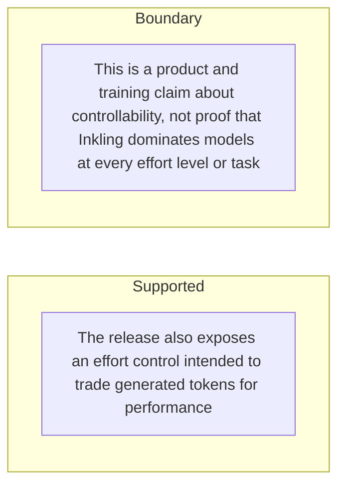

#### Python

```python
from html import escape
from pathlib import Path
from textwrap import wrap

title = "ink_change_p2: The release also exposes an effort control intended to — supported-versus-bounded scope"
columns = {"Supported statement": ["The release also exposes an effort control intended to trade generated tokens for performance"], "Boundary or contingency": ["This is a product and training claim about controllability, not proof that Inkling dominates models at every effort level or task"]}
height = 330
parts = [
    f'<svg xmlns="http://www.w3.org/2000/svg" viewBox="0 0 900 {height}" role="img" aria-labelledby="title desc">',
    f'<title id="title">{escape(title)}</title>',
    '<desc id="desc">Statements are partitioned into supported content and explicit boundaries.</desc>',
    f'<rect width="900" height="{height}" fill="white"/>',
]
for column_index, (heading, items) in enumerate(columns.items()):
    x = 240 + column_index * 430
    parts.append(f'<text x="{x}" y="70" text-anchor="middle" font-family="sans-serif" font-size="18" font-weight="700">{escape(heading)}</text>')
    for item_index, item in enumerate(items):
        y = 130 + item_index * 110
        parts.append(f'<rect x="{x-180}" y="{y-35}" width="360" height="80" rx="12" fill="#f7fbff" stroke="#234"/>')
        for line_index, line in enumerate(wrap(item, width=48)):
            parts.append(f'<text x="{x}" y="{y-12+line_index*14}" text-anchor="middle" font-family="sans-serif" font-size="11">{escape(line)}</text>')
parts.append('</svg>')
Path("ink_change_p2_treatment_c.svg").write_text("\n".join(parts), encoding="utf-8")
```

### Implementation record

- Status: `NOT_NEEDED`
- Selected treatment: `NONE`
- Selection rationale:
- Delivery medium: `NONE`
- Visual ID and placement:
- Shared paragraph scope: `NONE`
- Changed files:
- Accessibility and fallback verification:
- Desktop and mobile verification:
- Evidence deviations: `NONE`

## `ink_mechanism_p1`

- Location: `ink_mechanism`, paragraph 1
- Text anchor: "Inkling is a decoder-only autoregressive Transformer with 66 layers."
- Claims and sources: `ink_002` (OBSERVED, VERIFIED); `ink_003` (OBSERVED, VERIFIED); `ink_006` (OBSERVED, VERIFIED); `source_inkling_model_card` (Retrieved 2026-07-18; official HTML SHA-256 fe653ffb5f4b9f54f011491f60cd8d6b9885d667484880d4566d76827f22a7e9 (65,631 bytes). Sections 1-6: identity, architecture, modalities, hardware, training, evaluations, safety. Live URL remains mutable.); `source_inkling_release` (Retrieved 2026-07-18; official HTML SHA-256 cb28c6a6c8c47c68f55f2c636481bf35a1b9f5a349e5f00148c583fafbc138fc (222,133 bytes). July 15 release sections on effort, multimodality, benchmarks, architecture, training, RL, availability. Live URL remains mutable.)
- Visual needed: `YES`
- Decision rationale: Removing a visual would require readers to retain the material relation between "Inkling is a decoder-only autoregressive Transformer with 66 layers" and "The selected and shared expert outputs are combined before the token continues through the network" while also tracking 5 source-bounded propositions. The paragraph contains a real mechanism relation graph; the visual must preserve its stated conditions and must not add causal or proportional meaning.
- Explanatory job: mechanism relation graph.

### Treatment A — Inkling is a decoder-only autoregressive Transformer with 66 layers — mechanism relation graph

- Teaching purpose: Answer "How does Inkling process a token and multiple input modalities?" by exposing the paragraph's 5 named propositions and 4 stated reading, comparison, or qualification relations.
- Encoding and reading order: Nodes reproduce the complete labels "Inkling is a decoder-only autoregressive Transformer with 66 layers"; "Its feed-forward backbone is a sparse mixture of experts"; "each token is routed to 6 of 256 routed experts"; "while 2 shared experts are always active"; "The selected and shared expert outputs are combined before the token continues through the network". Edges carry the explicit relation labels "then", "then", "contrasts with", "then"; arrow direction is sequence only for mechanism or example prose and otherwise denotes reading order.
- Evidence and limitations: The topology is derived from this paragraph rather than a fixed pipeline. Encode only `ink_002`, `ink_003`, `ink_006` and do not turn reading-order edges into causal claims.
- Recommended web medium: responsive inline SVG with CSS; JavaScript may add optional step focus only when state order matters.
- Mobile, accessibility, and motion behavior: Keep the full node-and-relation list in DOM order, expose the relation labels in the long description, stack nodes on narrow screens, and disable focus transitions under reduced motion.

#### TikZ

```tex
\documentclass[tikz,border=5pt]{standalone}
\usepackage[T1]{fontenc}
\usepackage{tikz}
\usetikzlibrary{arrows.meta,positioning}
\begin{document}
\begin{tikzpicture}[font=\sffamily,concept/.style={draw,rounded corners,align=center,text width=3.6cm,minimum height=1.35cm},link/.style={-{Latex[length=2mm]},thick},rel/.style={fill=white,font=\scriptsize,inner sep=2pt}]
\node[font=\bfseries,align=center] at (6.1,2.0) {ink\_mechanism\_p1: Inkling is a decoder-only autoregressive Transformer with 66 layers - mechanism relation graph};
\node[concept] (n1) at (1.8,0) {Inkling is a decoder-only autoregressive Transformer with 66 layers};
\node[concept] (n2) at (6.1,0) {Its feed-forward backbone is a sparse mixture of experts};
\node[concept] (n3) at (10.4,0) {each token is routed to 6 of 256 routed experts};
\node[concept] (n4) at (1.8,-3.2) {while 2 shared experts are always active};
\node[concept] (n5) at (6.1,-3.2) {The selected and shared expert outputs are combined before the token continues through the network};
\draw[link] (n1) -- node[rel] {then} (n2);
\draw[link] (n2) -- node[rel] {then} (n3);
\draw[link] (n3) -- node[rel] {contrasts with} (n4);
\draw[link] (n4) -- node[rel] {then} (n5);
\end{tikzpicture}
\end{document}
```

#### Mermaid

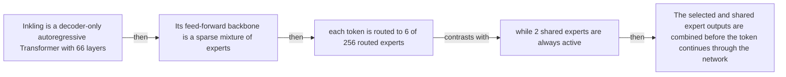

#### Python

```python
from html import escape
from pathlib import Path
from textwrap import wrap

title = "ink_mechanism_p1: Inkling is a decoder-only autoregressive Transformer with 66 layers — mechanism relation graph"
nodes = [["n1","Inkling is a decoder-only autoregressive Transformer with 66 layers",120,150],["n2","Its feed-forward backbone is a sparse mixture of experts",420,150],["n3","each token is routed to 6 of 256 routed experts",720,150],["n4","while 2 shared experts are always active",120,340],["n5","The selected and shared expert outputs are combined before the token continues through the network",420,340]]
edges = [["n1","n2","then"],["n2","n3","then"],["n3","n4","contrasts with"],["n4","n5","then"]]
node_by_id = {node_id: (label, x, y) for node_id, label, x, y in nodes}

parts = [
    '<svg xmlns="http://www.w3.org/2000/svg" viewBox="0 0 860 520" role="img" aria-labelledby="title desc">',
    f'<title id="title">{escape(title)}</title>',
    '<desc id="desc">The labeled relations reproduce only relationships stated in the paragraph.</desc>',
    '<rect width="860" height="520" fill="white"/>',
]
for source, target, relation in edges:
    _, x1, y1 = node_by_id[source]
    _, x2, y2 = node_by_id[target]
    parts.append(f'<line x1="{x1}" y1="{y1}" x2="{x2}" y2="{y2}" stroke="#345" stroke-width="2"/>')
    parts.append(f'<text x="{(x1+x2)/2}" y="{(y1+y2)/2-6}" text-anchor="middle" font-family="sans-serif" font-size="11">{escape(relation)}</text>')
for _, label, x, y in nodes:
    parts.append(f'<rect x="{x-125}" y="{y-58}" width="250" height="116" rx="14" fill="#eef6ff" stroke="#234"/>')
    for line_index, line in enumerate(wrap(label, width=32)):
        parts.append(f'<text x="{x}" y="{y-34+line_index*16}" text-anchor="middle" font-family="sans-serif" font-size="12">{escape(line)}</text>')
parts.append('</svg>')
Path("ink_mechanism_p1_treatment_a.svg").write_text("\n".join(parts), encoding="utf-8")
```

### Treatment B — ink_002, ink_003, ink_006 — claim-to-source provenance

- Teaching purpose: Show exactly which atomic claims underwrite this paragraph and which fixed source records support each claim.
- Encoding and reading order: A bipartite graph places 3 claim nodes on the left and 3 source nodes on the right, with only the 7 claim-source edges recorded in the fixture. Claim labels include epistemic status; source labels include the exact locator.
- Evidence and limitations: This treatment explains provenance and uncertainty, not the paper's causal mechanism. Missing edges remain visibly absent and no source count is treated as confidence.
- Recommended web medium: semantic HTML/CSS claim-source table with an SVG network view; JavaScript only for keyboard-controlled source highlighting.
- Mobile, accessibility, and motion behavior: Provide real table headers and source links in the static fallback, make every edge recoverable as text, stack claim records before source records on mobile, and require no motion.

#### TikZ

```tex
\documentclass[tikz,border=5pt]{standalone}
\usepackage[T1]{fontenc}
\usepackage{tikz}
\usetikzlibrary{arrows.meta}
\begin{document}
\begin{tikzpicture}[font=\sffamily,claim/.style={draw,rounded corners,align=center,text width=5.2cm,minimum height=1.2cm},source/.style={draw,dashed,align=center,text width=5.2cm,minimum height=1.2cm},link/.style={-{Latex[length=2mm]},thin}]
\node[font=\bfseries] at (4,1.8) {ink\_mechanism\_p1: claim-to-source provenance};
\node[claim] (c1) at (0,0) {Inkling is a 66-layer decoder-only sparse mixture-of-experts Transformer with 975 billion total parameters, 41 billion active parameters, 6 of 256 routed experts per token, and 2 shared experts. [OBSERVED]};
\node[claim] (c2) at (0,-2.4) {The pinned initial BF16 card verifies text, image, and audio inputs with text output; the content-addressed provider pages retrieved on 2026-07-18 advertise support for a context window up to one million tokens. [OBSERVED]};
\node[claim] (c3) at (0,-4.8) {The content-addressed release page retrieved on 2026-07-18 reports pretraining on 45 trillion multimodal tokens and more than 30 million asynchronous reinforcement-learning rollouts after an initial synthetic supervised-fine-tuning stage. [OBSERVED]};
\node[source] (s1) at (8,0) {Thinking Machines Lab: Inkling Model Card (mutable; retrieved 2026-07-18) - Retrieved 2026-07-18; official HTML SHA-256 fe653ffb5f4b9f54f011491f60cd8d6b9885d667484880d4566d76827f22a7e9 (65,631 bytes). Sections 1-6: identity, architecture, modalities, hardware, training, evaluations, safety. Live URL remains mutable.};
\node[source] (s2) at (8,-2.4) {Thinking Machines Lab: Inkling, Our Open-Weights Model (mutable; retrieved 2026-07-18) - Retrieved 2026-07-18; official HTML SHA-256 cb28c6a6c8c47c68f55f2c636481bf35a1b9f5a349e5f00148c583fafbc138fc (222,133 bytes). July 15 release sections on effort, multimodality, benchmarks, architecture, training, RL, availability. Live URL remains mutable.};
\node[source] (s3) at (8,-4.8) {Thinking Machines Lab: Inkling BF16 initial weight release - Immutable initial Model release commit 91b051f1ec836e6d56596c624c3775b495d797b1; README sections 1, 3, 5-7 and BF16 weight files};
\draw[link] (c1) -- (s1);
\draw[link] (c1) -- (s2);
\draw[link] (c1) -- (s3);
\draw[link] (c2) -- (s1);
\draw[link] (c2) -- (s2);
\draw[link] (c2) -- (s3);
\draw[link] (c3) -- (s2);
\end{tikzpicture}
\end{document}
```

#### Mermaid

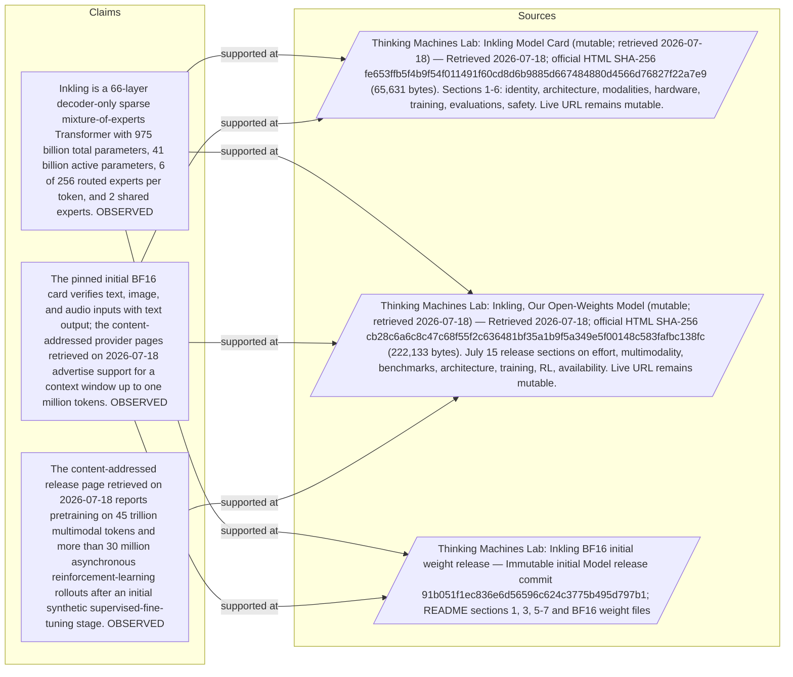

#### Python

```python
from html import escape
from pathlib import Path
from textwrap import wrap

title = "ink_mechanism_p1: claim-to-source provenance"
nodes = [["c1","Inkling is a 66-layer decoder-only sparse mixture-of-experts Transformer with 975 billion total parameters, 41 billion active parameters, 6 of 256 routed experts per token, and 2 shared experts. [OBSERVED]",190,130],["c2","The pinned initial BF16 card verifies text, image, and audio inputs with text output; the content-addressed provider pages retrieved on 2026-07-18 advertise support for a context window up to one million tokens. [OBSERVED]",190,250],["c3","The content-addressed release page retrieved on 2026-07-18 reports pretraining on 45 trillion multimodal tokens and more than 30 million asynchronous reinforcement-learning rollouts after an initial synthetic supervised-fine-tuning stage. [OBSERVED]",190,370],["s1","Thinking Machines Lab: Inkling Model Card (mutable; retrieved 2026-07-18) — Retrieved 2026-07-18; official HTML SHA-256 fe653ffb5f4b9f54f011491f60cd8d6b9885d667484880d4566d76827f22a7e9 (65,631 bytes). Sections 1-6: identity, architecture, modalities, hardware, training, evaluations, safety. Live URL remains mutable.",700,130],["s2","Thinking Machines Lab: Inkling, Our Open-Weights Model (mutable; retrieved 2026-07-18) — Retrieved 2026-07-18; official HTML SHA-256 cb28c6a6c8c47c68f55f2c636481bf35a1b9f5a349e5f00148c583fafbc138fc (222,133 bytes). July 15 release sections on effort, multimodality, benchmarks, architecture, training, RL, availability. Live URL remains mutable.",700,250],["s3","Thinking Machines Lab: Inkling BF16 initial weight release — Immutable initial Model release commit 91b051f1ec836e6d56596c624c3775b495d797b1; README sections 1, 3, 5-7 and BF16 weight files",700,370]]
edges = [["c1","s1"],["c1","s2"],["c1","s3"],["c2","s1"],["c2","s2"],["c2","s3"],["c3","s2"]]
node_by_id = {node_id: (label, x, y) for node_id, label, x, y in nodes}
height = 560

parts = [
    f'<svg xmlns="http://www.w3.org/2000/svg" viewBox="0 0 900 {height}" role="img" aria-labelledby="title desc">',
    f'<title id="title">{escape(title)}</title>',
    '<desc id="desc">Bipartite map from verified claim records to their exact source records.</desc>',
    f'<rect width="900" height="{height}" fill="white"/>',
]
for source, target in edges:
    _, x1, y1 = node_by_id[source]
    _, x2, y2 = node_by_id[target]
    parts.append(f'<line x1="{x1+145}" y1="{y1}" x2="{x2-145}" y2="{y2}" stroke="#456" stroke-width="2"/>')
for node_id, label, x, y in nodes:
    dashed = ' stroke-dasharray="7 5"' if node_id.startswith("s") else ''
    parts.append(f'<rect x="{x-145}" y="{y-46}" width="290" height="92" rx="12" fill="#f7fbff" stroke="#234"{dashed}/>')
    for line_index, line in enumerate(wrap(label, width=38)):
        parts.append(f'<text x="{x}" y="{y-24+line_index*14}" text-anchor="middle" font-family="sans-serif" font-size="11">{escape(line)}</text>')
parts.append('</svg>')
Path("ink_mechanism_p1_treatment_b.svg").write_text("\n".join(parts), encoding="utf-8")
```

### Treatment C — 66 layers, 6, 256, 2 — exact-condition board

- Teaching purpose: Keep reported quantities attached to their conditions so unlike measurements are not flattened into one bar chart.
- Encoding and reading order: Use 4 unscaled marks, one per reported value (66 layers, 6, 256, 2), each attached to its complete sentence-level condition. Do not share an axis when units, datasets, checkpoints, or experimental conditions differ.
- Evidence and limitations: Every value is copied from the paragraph and remains text. Spatial order follows source order; distance and area carry no magnitude.
- Recommended web medium: responsive SVG or semantic HTML/CSS; JavaScript is optional only for a meaningful state or scope toggle.
- Mobile, accessibility, and motion behavior: Preserve every exact value or scope statement as selectable text, avoid color-only distinctions, stack groups on mobile, and keep all information visible when JavaScript or motion is disabled.

#### TikZ

```tex
\documentclass[tikz,border=5pt]{standalone}
\usepackage[T1]{fontenc}
\usepackage{tikz}
\begin{document}
\begin{tikzpicture}[font=\sffamily,fact/.style={draw,align=center,text width=4cm,minimum height=1.8cm}]
\node[font=\bfseries] at (4.6,2) {ink\_mechanism\_p1: 66 layers, 6, 256, 2 - exact-condition board};
\node[fact] at (0,0) {\textbf{66 layers}\\Inkling is a decoder-only autoregressive Transformer with 66 layers.};
\node[fact] at (4.6,0) {\textbf{6}\\Its feed-forward backbone is a sparse mixture of experts: each token is routed to 6 of 256 routed experts, while 2 shared experts are always active.};
\node[fact] at (9.2,0) {\textbf{256}\\Its feed-forward backbone is a sparse mixture of experts: each token is routed to 6 of 256 routed experts, while 2 shared experts are always active.};
\node[fact] at (0,-2.8) {\textbf{2}\\Its feed-forward backbone is a sparse mixture of experts: each token is routed to 6 of 256 routed experts, while 2 shared experts are always active.};
\end{tikzpicture}
\end{document}
```

#### Mermaid

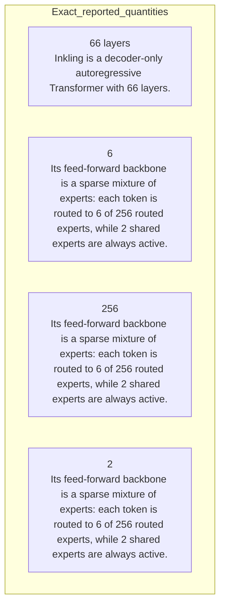

#### Python

```python
from html import escape
from pathlib import Path
from textwrap import wrap

title = "ink_mechanism_p1: 66 layers, 6, 256, 2 — exact-condition board"
items = [["66 layers","Inkling is a decoder-only autoregressive Transformer with 66 layers."],["6","Its feed-forward backbone is a sparse mixture of experts: each token is routed to 6 of 256 routed experts, while 2 shared experts are always active."],["256","Its feed-forward backbone is a sparse mixture of experts: each token is routed to 6 of 256 routed experts, while 2 shared experts are always active."],["2","Its feed-forward backbone is a sparse mixture of experts: each token is routed to 6 of 256 routed experts, while 2 shared experts are always active."]]
height = 520
parts = [
    f'<svg xmlns="http://www.w3.org/2000/svg" viewBox="0 0 900 {height}" role="img" aria-labelledby="title desc">',
    f'<title id="title">{escape(title)}</title>',
    '<desc id="desc">Exact values are separated because the paragraph may mix units and experimental conditions.</desc>',
    f'<rect width="900" height="{height}" fill="white"/>',
]
for index, (value, context) in enumerate(items):
    x = 240 + (index % 2) * 440
    y = 130 + (index // 2) * 170
    parts.append(f'<circle cx="{x}" cy="{y}" r="52" fill="#eef6ff" stroke="#234"/>')
    parts.append(f'<text x="{x}" y="{y+6}" text-anchor="middle" font-family="sans-serif" font-size="18" font-weight="700">{escape(value)}</text>')
    for line_index, line in enumerate(wrap(context, width=42)):
        parts.append(f'<text x="{x}" y="{y+78+line_index*14}" text-anchor="middle" font-family="sans-serif" font-size="11">{escape(line)}</text>')
parts.append('</svg>')
Path("ink_mechanism_p1_treatment_c.svg").write_text("\n".join(parts), encoding="utf-8")
```

### Implementation record

- Status: `PENDING`
- Selected treatment: `NONE`
- Selection rationale:
- Delivery medium: `NONE`
- Visual ID and placement:
- Shared paragraph scope: `NONE`
- Changed files:
- Accessibility and fallback verification:
- Desktop and mobile verification:
- Evidence deviations: `NONE`

## `ink_mechanism_p2`

- Location: `ink_mechanism`, paragraph 2
- Text anchor: "The release says local and global attention layers are interleaved at a 5-to-1 ratio with 8 key-value heads."
- Claims and sources: `ink_002` (OBSERVED, VERIFIED); `ink_003` (OBSERVED, VERIFIED); `ink_006` (OBSERVED, VERIFIED); `source_inkling_model_card` (Retrieved 2026-07-18; official HTML SHA-256 fe653ffb5f4b9f54f011491f60cd8d6b9885d667484880d4566d76827f22a7e9 (65,631 bytes). Sections 1-6: identity, architecture, modalities, hardware, training, evaluations, safety. Live URL remains mutable.); `source_inkling_release` (Retrieved 2026-07-18; official HTML SHA-256 cb28c6a6c8c47c68f55f2c636481bf35a1b9f5a349e5f00148c583fafbc138fc (222,133 bytes). July 15 release sections on effort, multimodality, benchmarks, architecture, training, RL, availability. Live URL remains mutable.)
- Visual needed: `YES`
- Decision rationale: Removing a visual would require readers to retain the material relation between "The release says local and global attention layers are interleaved at a 5-to-1 ratio with 8 key-value heads" and "the website model card describes the same path more generally as a hierarchical patch encoder and discrete audio-token encoding" while also tracking 5 source-bounded propositions. The paragraph contains a real mechanism relation graph; the visual must preserve its stated conditions and must not add causal or proportional meaning.
- Explanatory job: mechanism relation graph.

### Treatment A — The release says local and global attention layers are — mechanism relation graph

- Teaching purpose: Answer "How does Inkling process a token and multiple input modalities?" by exposing the paragraph's 5 named propositions and 4 stated reading, comparison, or qualification relations.
- Encoding and reading order: Nodes reproduce the complete labels "The release says local and global attention layers are interleaved at a 5-to-1 ratio with 8 key-value heads"; "Images and audio are converted into representations, projected into the same hidden space as text"; "and processed jointly by the decoder"; "The release describes 40-by-40 image patches through a four-layer hierarchical MLP and dMel spectrograms for audio"; "the website model card describes the same path more generally as a hierarchical patch encoder and discrete audio-token encoding". Edges carry the explicit relation labels "then", "then", "then", "then"; arrow direction is sequence only for mechanism or example prose and otherwise denotes reading order.
- Evidence and limitations: The topology is derived from this paragraph rather than a fixed pipeline. Encode only `ink_002`, `ink_003`, `ink_006` and do not turn reading-order edges into causal claims.
- Recommended web medium: responsive inline SVG with CSS; JavaScript may add optional step focus only when state order matters.
- Mobile, accessibility, and motion behavior: Keep the full node-and-relation list in DOM order, expose the relation labels in the long description, stack nodes on narrow screens, and disable focus transitions under reduced motion.

#### TikZ

```tex
\documentclass[tikz,border=5pt]{standalone}
\usepackage[T1]{fontenc}
\usepackage{tikz}
\usetikzlibrary{arrows.meta,positioning}
\begin{document}
\begin{tikzpicture}[font=\sffamily,concept/.style={draw,rounded corners,align=center,text width=3.6cm,minimum height=1.35cm},link/.style={-{Latex[length=2mm]},thick},rel/.style={fill=white,font=\scriptsize,inner sep=2pt}]
\node[font=\bfseries,align=center] at (6.1,2.0) {ink\_mechanism\_p2: The release says local and global attention layers are - mechanism relation graph};
\node[concept] (n1) at (1.8,0) {The release says local and global attention layers are interleaved at a 5-to-1 ratio with 8 key-value heads};
\node[concept] (n2) at (6.1,0) {Images and audio are converted into representations, projected into the same hidden space as text};
\node[concept] (n3) at (10.4,0) {and processed jointly by the decoder};
\node[concept] (n4) at (1.8,-3.2) {The release describes 40-by-40 image patches through a four-layer hierarchical MLP and dMel spectrograms for audio};
\node[concept] (n5) at (6.1,-3.2) {the website model card describes the same path more generally as a hierarchical patch encoder and discrete audio-token encoding};
\draw[link] (n1) -- node[rel] {then} (n2);
\draw[link] (n2) -- node[rel] {then} (n3);
\draw[link] (n3) -- node[rel] {then} (n4);
\draw[link] (n4) -- node[rel] {then} (n5);
\end{tikzpicture}
\end{document}
```

#### Mermaid

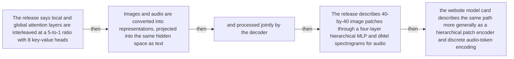

#### Python

```python
from html import escape
from pathlib import Path
from textwrap import wrap

title = "ink_mechanism_p2: The release says local and global attention layers are — mechanism relation graph"
nodes = [["n1","The release says local and global attention layers are interleaved at a 5-to-1 ratio with 8 key-value heads",120,150],["n2","Images and audio are converted into representations, projected into the same hidden space as text",420,150],["n3","and processed jointly by the decoder",720,150],["n4","The release describes 40-by-40 image patches through a four-layer hierarchical MLP and dMel spectrograms for audio",120,340],["n5","the website model card describes the same path more generally as a hierarchical patch encoder and discrete audio-token encoding",420,340]]
edges = [["n1","n2","then"],["n2","n3","then"],["n3","n4","then"],["n4","n5","then"]]
node_by_id = {node_id: (label, x, y) for node_id, label, x, y in nodes}

parts = [
    '<svg xmlns="http://www.w3.org/2000/svg" viewBox="0 0 860 520" role="img" aria-labelledby="title desc">',
    f'<title id="title">{escape(title)}</title>',
    '<desc id="desc">The labeled relations reproduce only relationships stated in the paragraph.</desc>',
    '<rect width="860" height="520" fill="white"/>',
]
for source, target, relation in edges:
    _, x1, y1 = node_by_id[source]
    _, x2, y2 = node_by_id[target]
    parts.append(f'<line x1="{x1}" y1="{y1}" x2="{x2}" y2="{y2}" stroke="#345" stroke-width="2"/>')
    parts.append(f'<text x="{(x1+x2)/2}" y="{(y1+y2)/2-6}" text-anchor="middle" font-family="sans-serif" font-size="11">{escape(relation)}</text>')
for _, label, x, y in nodes:
    parts.append(f'<rect x="{x-125}" y="{y-58}" width="250" height="116" rx="14" fill="#eef6ff" stroke="#234"/>')
    for line_index, line in enumerate(wrap(label, width=32)):
        parts.append(f'<text x="{x}" y="{y-34+line_index*16}" text-anchor="middle" font-family="sans-serif" font-size="12">{escape(line)}</text>')
parts.append('</svg>')
Path("ink_mechanism_p2_treatment_a.svg").write_text("\n".join(parts), encoding="utf-8")
```

### Treatment B — ink_002, ink_003, ink_006 — claim-to-source provenance

- Teaching purpose: Show exactly which atomic claims underwrite this paragraph and which fixed source records support each claim.
- Encoding and reading order: A bipartite graph places 3 claim nodes on the left and 3 source nodes on the right, with only the 7 claim-source edges recorded in the fixture. Claim labels include epistemic status; source labels include the exact locator.
- Evidence and limitations: This treatment explains provenance and uncertainty, not the paper's causal mechanism. Missing edges remain visibly absent and no source count is treated as confidence.
- Recommended web medium: semantic HTML/CSS claim-source table with an SVG network view; JavaScript only for keyboard-controlled source highlighting.
- Mobile, accessibility, and motion behavior: Provide real table headers and source links in the static fallback, make every edge recoverable as text, stack claim records before source records on mobile, and require no motion.

#### TikZ

```tex
\documentclass[tikz,border=5pt]{standalone}
\usepackage[T1]{fontenc}
\usepackage{tikz}
\usetikzlibrary{arrows.meta}
\begin{document}
\begin{tikzpicture}[font=\sffamily,claim/.style={draw,rounded corners,align=center,text width=5.2cm,minimum height=1.2cm},source/.style={draw,dashed,align=center,text width=5.2cm,minimum height=1.2cm},link/.style={-{Latex[length=2mm]},thin}]
\node[font=\bfseries] at (4,1.8) {ink\_mechanism\_p2: claim-to-source provenance};
\node[claim] (c1) at (0,0) {Inkling is a 66-layer decoder-only sparse mixture-of-experts Transformer with 975 billion total parameters, 41 billion active parameters, 6 of 256 routed experts per token, and 2 shared experts. [OBSERVED]};
\node[claim] (c2) at (0,-2.4) {The pinned initial BF16 card verifies text, image, and audio inputs with text output; the content-addressed provider pages retrieved on 2026-07-18 advertise support for a context window up to one million tokens. [OBSERVED]};
\node[claim] (c3) at (0,-4.8) {The content-addressed release page retrieved on 2026-07-18 reports pretraining on 45 trillion multimodal tokens and more than 30 million asynchronous reinforcement-learning rollouts after an initial synthetic supervised-fine-tuning stage. [OBSERVED]};
\node[source] (s1) at (8,0) {Thinking Machines Lab: Inkling Model Card (mutable; retrieved 2026-07-18) - Retrieved 2026-07-18; official HTML SHA-256 fe653ffb5f4b9f54f011491f60cd8d6b9885d667484880d4566d76827f22a7e9 (65,631 bytes). Sections 1-6: identity, architecture, modalities, hardware, training, evaluations, safety. Live URL remains mutable.};
\node[source] (s2) at (8,-2.4) {Thinking Machines Lab: Inkling, Our Open-Weights Model (mutable; retrieved 2026-07-18) - Retrieved 2026-07-18; official HTML SHA-256 cb28c6a6c8c47c68f55f2c636481bf35a1b9f5a349e5f00148c583fafbc138fc (222,133 bytes). July 15 release sections on effort, multimodality, benchmarks, architecture, training, RL, availability. Live URL remains mutable.};
\node[source] (s3) at (8,-4.8) {Thinking Machines Lab: Inkling BF16 initial weight release - Immutable initial Model release commit 91b051f1ec836e6d56596c624c3775b495d797b1; README sections 1, 3, 5-7 and BF16 weight files};
\draw[link] (c1) -- (s1);
\draw[link] (c1) -- (s2);
\draw[link] (c1) -- (s3);
\draw[link] (c2) -- (s1);
\draw[link] (c2) -- (s2);
\draw[link] (c2) -- (s3);
\draw[link] (c3) -- (s2);
\end{tikzpicture}
\end{document}
```

#### Mermaid


#### Python

```python
from html import escape
from pathlib import Path
from textwrap import wrap

title = "ink_mechanism_p2: claim-to-source provenance"
nodes = [["c1","Inkling is a 66-layer decoder-only sparse mixture-of-experts Transformer with 975 billion total parameters, 41 billion active parameters, 6 of 256 routed experts per token, and 2 shared experts. [OBSERVED]",190,130],["c2","The pinned initial BF16 card verifies text, image, and audio inputs with text output; the content-addressed provider pages retrieved on 2026-07-18 advertise support for a context window up to one million tokens. [OBSERVED]",190,250],["c3","The content-addressed release page retrieved on 2026-07-18 reports pretraining on 45 trillion multimodal tokens and more than 30 million asynchronous reinforcement-learning rollouts after an initial synthetic supervised-fine-tuning stage. [OBSERVED]",190,370],["s1","Thinking Machines Lab: Inkling Model Card (mutable; retrieved 2026-07-18) — Retrieved 2026-07-18; official HTML SHA-256 fe653ffb5f4b9f54f011491f60cd8d6b9885d667484880d4566d76827f22a7e9 (65,631 bytes). Sections 1-6: identity, architecture, modalities, hardware, training, evaluations, safety. Live URL remains mutable.",700,130],["s2","Thinking Machines Lab: Inkling, Our Open-Weights Model (mutable; retrieved 2026-07-18) — Retrieved 2026-07-18; official HTML SHA-256 cb28c6a6c8c47c68f55f2c636481bf35a1b9f5a349e5f00148c583fafbc138fc (222,133 bytes). July 15 release sections on effort, multimodality, benchmarks, architecture, training, RL, availability. Live URL remains mutable.",700,250],["s3","Thinking Machines Lab: Inkling BF16 initial weight release — Immutable initial Model release commit 91b051f1ec836e6d56596c624c3775b495d797b1; README sections 1, 3, 5-7 and BF16 weight files",700,370]]
edges = [["c1","s1"],["c1","s2"],["c1","s3"],["c2","s1"],["c2","s2"],["c2","s3"],["c3","s2"]]
node_by_id = {node_id: (label, x, y) for node_id, label, x, y in nodes}
height = 560

parts = [
    f'<svg xmlns="http://www.w3.org/2000/svg" viewBox="0 0 900 {height}" role="img" aria-labelledby="title desc">',
    f'<title id="title">{escape(title)}</title>',
    '<desc id="desc">Bipartite map from verified claim records to their exact source records.</desc>',
    f'<rect width="900" height="{height}" fill="white"/>',
]
for source, target in edges:
    _, x1, y1 = node_by_id[source]
    _, x2, y2 = node_by_id[target]
    parts.append(f'<line x1="{x1+145}" y1="{y1}" x2="{x2-145}" y2="{y2}" stroke="#456" stroke-width="2"/>')
for node_id, label, x, y in nodes:
    dashed = ' stroke-dasharray="7 5"' if node_id.startswith("s") else ''
    parts.append(f'<rect x="{x-145}" y="{y-46}" width="290" height="92" rx="12" fill="#f7fbff" stroke="#234"{dashed}/>')
    for line_index, line in enumerate(wrap(label, width=38)):
        parts.append(f'<text x="{x}" y="{y-24+line_index*14}" text-anchor="middle" font-family="sans-serif" font-size="11">{escape(line)}</text>')
parts.append('</svg>')
Path("ink_mechanism_p2_treatment_b.svg").write_text("\n".join(parts), encoding="utf-8")
```

### Treatment C — 5, 1, 8 k, 40 — exact-condition board

- Teaching purpose: Keep reported quantities attached to their conditions so unlike measurements are not flattened into one bar chart.
- Encoding and reading order: Use 4 unscaled marks, one per reported value (5, 1, 8 k, 40), each attached to its complete sentence-level condition. Do not share an axis when units, datasets, checkpoints, or experimental conditions differ.
- Evidence and limitations: Every value is copied from the paragraph and remains text. Spatial order follows source order; distance and area carry no magnitude.
- Recommended web medium: responsive SVG or semantic HTML/CSS; JavaScript is optional only for a meaningful state or scope toggle.
- Mobile, accessibility, and motion behavior: Preserve every exact value or scope statement as selectable text, avoid color-only distinctions, stack groups on mobile, and keep all information visible when JavaScript or motion is disabled.

#### TikZ

```tex
\documentclass[tikz,border=5pt]{standalone}
\usepackage[T1]{fontenc}
\usepackage{tikz}
\begin{document}
\begin{tikzpicture}[font=\sffamily,fact/.style={draw,align=center,text width=4cm,minimum height=1.8cm}]
\node[font=\bfseries] at (4.6,2) {ink\_mechanism\_p2: 5, 1, 8 k, 40 - exact-condition board};
\node[fact] at (0,0) {\textbf{5}\\The release says local and global attention layers are interleaved at a 5-to-1 ratio with 8 key-value heads.};
\node[fact] at (4.6,0) {\textbf{1}\\The release says local and global attention layers are interleaved at a 5-to-1 ratio with 8 key-value heads.};
\node[fact] at (9.2,0) {\textbf{8 k}\\The release says local and global attention layers are interleaved at a 5-to-1 ratio with 8 key-value heads.};
\node[fact] at (0,-2.8) {\textbf{40}\\The release describes 40-by-40 image patches through a four-layer hierarchical MLP and dMel spectrograms for audio; the website model card describes the same path more generally as a hierarchical patch encoder and discrete audio-token encoding.};
\end{tikzpicture}
\end{document}
```

#### Mermaid

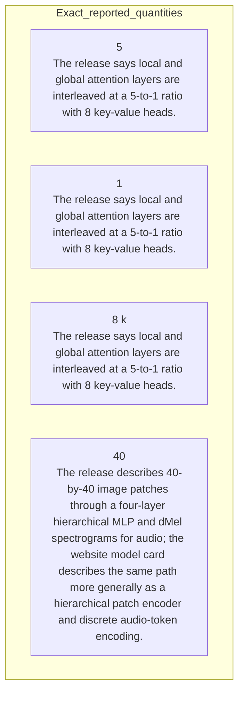

#### Python

```python
from html import escape
from pathlib import Path
from textwrap import wrap

title = "ink_mechanism_p2: 5, 1, 8 k, 40 — exact-condition board"
items = [["5","The release says local and global attention layers are interleaved at a 5-to-1 ratio with 8 key-value heads."],["1","The release says local and global attention layers are interleaved at a 5-to-1 ratio with 8 key-value heads."],["8 k","The release says local and global attention layers are interleaved at a 5-to-1 ratio with 8 key-value heads."],["40","The release describes 40-by-40 image patches through a four-layer hierarchical MLP and dMel spectrograms for audio; the website model card describes the same path more generally as a hierarchical patch encoder and discrete audio-token encoding."]]
height = 520
parts = [
    f'<svg xmlns="http://www.w3.org/2000/svg" viewBox="0 0 900 {height}" role="img" aria-labelledby="title desc">',
    f'<title id="title">{escape(title)}</title>',
    '<desc id="desc">Exact values are separated because the paragraph may mix units and experimental conditions.</desc>',
    f'<rect width="900" height="{height}" fill="white"/>',
]
for index, (value, context) in enumerate(items):
    x = 240 + (index % 2) * 440
    y = 130 + (index // 2) * 170
    parts.append(f'<circle cx="{x}" cy="{y}" r="52" fill="#eef6ff" stroke="#234"/>')
    parts.append(f'<text x="{x}" y="{y+6}" text-anchor="middle" font-family="sans-serif" font-size="18" font-weight="700">{escape(value)}</text>')
    for line_index, line in enumerate(wrap(context, width=42)):
        parts.append(f'<text x="{x}" y="{y+78+line_index*14}" text-anchor="middle" font-family="sans-serif" font-size="11">{escape(line)}</text>')
parts.append('</svg>')
Path("ink_mechanism_p2_treatment_c.svg").write_text("\n".join(parts), encoding="utf-8")
```

### Implementation record

- Status: `PENDING`
- Selected treatment: `NONE`
- Selection rationale:
- Delivery medium: `NONE`
- Visual ID and placement:
- Shared paragraph scope: `NONE`
- Changed files:
- Accessibility and fallback verification:
- Desktop and mobile verification:
- Evidence deviations: `NONE`

## `ink_mechanism_p3`

- Location: `ink_mechanism`, paragraph 3
- Text anchor: "The provider reports pretraining on 45 trillion tokens across text, images, audio, and video, followed by synthetic supervised fine-tuning and large-scale reinforcement learning."
- Claims and sources: `ink_002` (OBSERVED, VERIFIED); `ink_003` (OBSERVED, VERIFIED); `ink_006` (OBSERVED, VERIFIED); `source_inkling_model_card` (Retrieved 2026-07-18; official HTML SHA-256 fe653ffb5f4b9f54f011491f60cd8d6b9885d667484880d4566d76827f22a7e9 (65,631 bytes). Sections 1-6: identity, architecture, modalities, hardware, training, evaluations, safety. Live URL remains mutable.); `source_inkling_release` (Retrieved 2026-07-18; official HTML SHA-256 cb28c6a6c8c47c68f55f2c636481bf35a1b9f5a349e5f00148c583fafbc138fc (222,133 bytes). July 15 release sections on effort, multimodality, benchmarks, architecture, training, RL, availability. Live URL remains mutable.)
- Visual needed: `YES`
- Decision rationale: Removing a visual would require readers to retain the material relation between "The provider reports pretraining on 45 trillion tokens across text, images, audio" and "the model card discloses only broad data categories and provenance rather than a reproducible dataset inventory" while also tracking 4 source-bounded propositions. The paragraph contains a real mechanism relation graph; the visual must preserve its stated conditions and must not add causal or proportional meaning.
- Explanatory job: mechanism relation graph.

### Treatment A — The provider reports pretraining on 45 trillion tokens across — mechanism relation graph

- Teaching purpose: Answer "How does Inkling process a token and multiple input modalities?" by exposing the paragraph's 4 named propositions and 3 stated reading, comparison, or qualification relations.
- Encoding and reading order: Nodes reproduce the complete labels "The provider reports pretraining on 45 trillion tokens across text, images, audio"; "and video, followed by synthetic supervised fine-tuning and large-scale reinforcement learning"; "These are provider release claims"; "the model card discloses only broad data categories and provenance rather than a reproducible dataset inventory". Edges carry the explicit relation labels "then", "then", "contrasts with"; arrow direction is sequence only for mechanism or example prose and otherwise denotes reading order.
- Evidence and limitations: The topology is derived from this paragraph rather than a fixed pipeline. Encode only `ink_002`, `ink_003`, `ink_006` and do not turn reading-order edges into causal claims.
- Recommended web medium: responsive inline SVG with CSS; JavaScript may add optional step focus only when state order matters.
- Mobile, accessibility, and motion behavior: Keep the full node-and-relation list in DOM order, expose the relation labels in the long description, stack nodes on narrow screens, and disable focus transitions under reduced motion.

#### TikZ

```tex
\documentclass[tikz,border=5pt]{standalone}
\usepackage[T1]{fontenc}
\usepackage{tikz}
\usetikzlibrary{arrows.meta,positioning}
\begin{document}
\begin{tikzpicture}[font=\sffamily,concept/.style={draw,rounded corners,align=center,text width=3.6cm,minimum height=1.35cm},link/.style={-{Latex[length=2mm]},thick},rel/.style={fill=white,font=\scriptsize,inner sep=2pt}]
\node[font=\bfseries,align=center] at (6.1,2.0) {ink\_mechanism\_p3: The provider reports pretraining on 45 trillion tokens across - mechanism relation graph};
\node[concept] (n1) at (1.8,0) {The provider reports pretraining on 45 trillion tokens across text, images, audio};
\node[concept] (n2) at (6.1,0) {and video, followed by synthetic supervised fine-tuning and large-scale reinforcement learning};
\node[concept] (n3) at (10.4,0) {These are provider release claims};
\node[concept] (n4) at (1.8,-3.2) {the model card discloses only broad data categories and provenance rather than a reproducible dataset inventory};
\draw[link] (n1) -- node[rel] {then} (n2);
\draw[link] (n2) -- node[rel] {then} (n3);
\draw[link] (n3) -- node[rel] {contrasts with} (n4);
\end{tikzpicture}
\end{document}
```

#### Mermaid

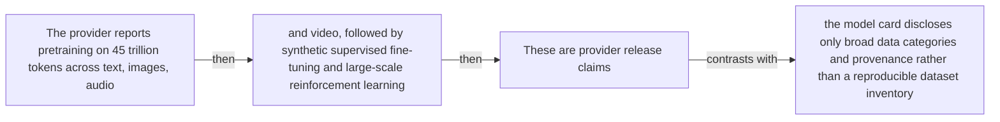

#### Python

```python
from html import escape
from pathlib import Path
from textwrap import wrap

title = "ink_mechanism_p3: The provider reports pretraining on 45 trillion tokens across — mechanism relation graph"
nodes = [["n1","The provider reports pretraining on 45 trillion tokens across text, images, audio",120,150],["n2","and video, followed by synthetic supervised fine-tuning and large-scale reinforcement learning",420,150],["n3","These are provider release claims",720,150],["n4","the model card discloses only broad data categories and provenance rather than a reproducible dataset inventory",120,340]]
edges = [["n1","n2","then"],["n2","n3","then"],["n3","n4","contrasts with"]]
node_by_id = {node_id: (label, x, y) for node_id, label, x, y in nodes}

parts = [
    '<svg xmlns="http://www.w3.org/2000/svg" viewBox="0 0 860 520" role="img" aria-labelledby="title desc">',
    f'<title id="title">{escape(title)}</title>',
    '<desc id="desc">The labeled relations reproduce only relationships stated in the paragraph.</desc>',
    '<rect width="860" height="520" fill="white"/>',
]
for source, target, relation in edges:
    _, x1, y1 = node_by_id[source]
    _, x2, y2 = node_by_id[target]
    parts.append(f'<line x1="{x1}" y1="{y1}" x2="{x2}" y2="{y2}" stroke="#345" stroke-width="2"/>')
    parts.append(f'<text x="{(x1+x2)/2}" y="{(y1+y2)/2-6}" text-anchor="middle" font-family="sans-serif" font-size="11">{escape(relation)}</text>')
for _, label, x, y in nodes:
    parts.append(f'<rect x="{x-125}" y="{y-58}" width="250" height="116" rx="14" fill="#eef6ff" stroke="#234"/>')
    for line_index, line in enumerate(wrap(label, width=32)):
        parts.append(f'<text x="{x}" y="{y-34+line_index*16}" text-anchor="middle" font-family="sans-serif" font-size="12">{escape(line)}</text>')
parts.append('</svg>')
Path("ink_mechanism_p3_treatment_a.svg").write_text("\n".join(parts), encoding="utf-8")
```

### Treatment B — ink_002, ink_003, ink_006 — claim-to-source provenance

- Teaching purpose: Show exactly which atomic claims underwrite this paragraph and which fixed source records support each claim.
- Encoding and reading order: A bipartite graph places 3 claim nodes on the left and 3 source nodes on the right, with only the 7 claim-source edges recorded in the fixture. Claim labels include epistemic status; source labels include the exact locator.
- Evidence and limitations: This treatment explains provenance and uncertainty, not the paper's causal mechanism. Missing edges remain visibly absent and no source count is treated as confidence.
- Recommended web medium: semantic HTML/CSS claim-source table with an SVG network view; JavaScript only for keyboard-controlled source highlighting.
- Mobile, accessibility, and motion behavior: Provide real table headers and source links in the static fallback, make every edge recoverable as text, stack claim records before source records on mobile, and require no motion.

#### TikZ

```tex
\documentclass[tikz,border=5pt]{standalone}
\usepackage[T1]{fontenc}
\usepackage{tikz}
\usetikzlibrary{arrows.meta}
\begin{document}
\begin{tikzpicture}[font=\sffamily,claim/.style={draw,rounded corners,align=center,text width=5.2cm,minimum height=1.2cm},source/.style={draw,dashed,align=center,text width=5.2cm,minimum height=1.2cm},link/.style={-{Latex[length=2mm]},thin}]
\node[font=\bfseries] at (4,1.8) {ink\_mechanism\_p3: claim-to-source provenance};
\node[claim] (c1) at (0,0) {Inkling is a 66-layer decoder-only sparse mixture-of-experts Transformer with 975 billion total parameters, 41 billion active parameters, 6 of 256 routed experts per token, and 2 shared experts. [OBSERVED]};
\node[claim] (c2) at (0,-2.4) {The pinned initial BF16 card verifies text, image, and audio inputs with text output; the content-addressed provider pages retrieved on 2026-07-18 advertise support for a context window up to one million tokens. [OBSERVED]};
\node[claim] (c3) at (0,-4.8) {The content-addressed release page retrieved on 2026-07-18 reports pretraining on 45 trillion multimodal tokens and more than 30 million asynchronous reinforcement-learning rollouts after an initial synthetic supervised-fine-tuning stage. [OBSERVED]};
\node[source] (s1) at (8,0) {Thinking Machines Lab: Inkling Model Card (mutable; retrieved 2026-07-18) - Retrieved 2026-07-18; official HTML SHA-256 fe653ffb5f4b9f54f011491f60cd8d6b9885d667484880d4566d76827f22a7e9 (65,631 bytes). Sections 1-6: identity, architecture, modalities, hardware, training, evaluations, safety. Live URL remains mutable.};
\node[source] (s2) at (8,-2.4) {Thinking Machines Lab: Inkling, Our Open-Weights Model (mutable; retrieved 2026-07-18) - Retrieved 2026-07-18; official HTML SHA-256 cb28c6a6c8c47c68f55f2c636481bf35a1b9f5a349e5f00148c583fafbc138fc (222,133 bytes). July 15 release sections on effort, multimodality, benchmarks, architecture, training, RL, availability. Live URL remains mutable.};
\node[source] (s3) at (8,-4.8) {Thinking Machines Lab: Inkling BF16 initial weight release - Immutable initial Model release commit 91b051f1ec836e6d56596c624c3775b495d797b1; README sections 1, 3, 5-7 and BF16 weight files};
\draw[link] (c1) -- (s1);
\draw[link] (c1) -- (s2);
\draw[link] (c1) -- (s3);
\draw[link] (c2) -- (s1);
\draw[link] (c2) -- (s2);
\draw[link] (c2) -- (s3);
\draw[link] (c3) -- (s2);
\end{tikzpicture}
\end{document}
```

#### Mermaid


#### Python

```python
from html import escape
from pathlib import Path
from textwrap import wrap

title = "ink_mechanism_p3: claim-to-source provenance"
nodes = [["c1","Inkling is a 66-layer decoder-only sparse mixture-of-experts Transformer with 975 billion total parameters, 41 billion active parameters, 6 of 256 routed experts per token, and 2 shared experts. [OBSERVED]",190,130],["c2","The pinned initial BF16 card verifies text, image, and audio inputs with text output; the content-addressed provider pages retrieved on 2026-07-18 advertise support for a context window up to one million tokens. [OBSERVED]",190,250],["c3","The content-addressed release page retrieved on 2026-07-18 reports pretraining on 45 trillion multimodal tokens and more than 30 million asynchronous reinforcement-learning rollouts after an initial synthetic supervised-fine-tuning stage. [OBSERVED]",190,370],["s1","Thinking Machines Lab: Inkling Model Card (mutable; retrieved 2026-07-18) — Retrieved 2026-07-18; official HTML SHA-256 fe653ffb5f4b9f54f011491f60cd8d6b9885d667484880d4566d76827f22a7e9 (65,631 bytes). Sections 1-6: identity, architecture, modalities, hardware, training, evaluations, safety. Live URL remains mutable.",700,130],["s2","Thinking Machines Lab: Inkling, Our Open-Weights Model (mutable; retrieved 2026-07-18) — Retrieved 2026-07-18; official HTML SHA-256 cb28c6a6c8c47c68f55f2c636481bf35a1b9f5a349e5f00148c583fafbc138fc (222,133 bytes). July 15 release sections on effort, multimodality, benchmarks, architecture, training, RL, availability. Live URL remains mutable.",700,250],["s3","Thinking Machines Lab: Inkling BF16 initial weight release — Immutable initial Model release commit 91b051f1ec836e6d56596c624c3775b495d797b1; README sections 1, 3, 5-7 and BF16 weight files",700,370]]
edges = [["c1","s1"],["c1","s2"],["c1","s3"],["c2","s1"],["c2","s2"],["c2","s3"],["c3","s2"]]
node_by_id = {node_id: (label, x, y) for node_id, label, x, y in nodes}
height = 560

parts = [
    f'<svg xmlns="http://www.w3.org/2000/svg" viewBox="0 0 900 {height}" role="img" aria-labelledby="title desc">',
    f'<title id="title">{escape(title)}</title>',
    '<desc id="desc">Bipartite map from verified claim records to their exact source records.</desc>',
    f'<rect width="900" height="{height}" fill="white"/>',
]
for source, target in edges:
    _, x1, y1 = node_by_id[source]
    _, x2, y2 = node_by_id[target]
    parts.append(f'<line x1="{x1+145}" y1="{y1}" x2="{x2-145}" y2="{y2}" stroke="#456" stroke-width="2"/>')
for node_id, label, x, y in nodes:
    dashed = ' stroke-dasharray="7 5"' if node_id.startswith("s") else ''
    parts.append(f'<rect x="{x-145}" y="{y-46}" width="290" height="92" rx="12" fill="#f7fbff" stroke="#234"{dashed}/>')
    for line_index, line in enumerate(wrap(label, width=38)):
        parts.append(f'<text x="{x}" y="{y-24+line_index*14}" text-anchor="middle" font-family="sans-serif" font-size="11">{escape(line)}</text>')
parts.append('</svg>')
Path("ink_mechanism_p3_treatment_b.svg").write_text("\n".join(parts), encoding="utf-8")
```

### Treatment C — The provider reports pretraining on 45 trillion tokens across — input-operation-outcome storyboard

- Teaching purpose: Let readers inspect the paragraph as concrete input, operation, and outcome states.
- Encoding and reading order: Use 4 ordered states labeled "Input: The provider reports pretraining on 45 trillion tokens across text, images, audio", "Operation: and video, followed by synthetic supervised fine-tuning and large-scale reinforcement learning", "Operation: These are provider release claims", "Outcome: the model card discloses only broad data categories and provenance rather than a reproducible dataset inventory". State connectors reproduce paragraph order and do not imply unreported timing.
- Evidence and limitations: The first, intermediate, and final states are paragraph clauses; no hidden state, quantity, or transition is added.
- Recommended web medium: responsive SVG or semantic HTML/CSS; JavaScript is optional only for a meaningful state or scope toggle.
- Mobile, accessibility, and motion behavior: Preserve every exact value or scope statement as selectable text, avoid color-only distinctions, stack groups on mobile, and keep all information visible when JavaScript or motion is disabled.

#### TikZ

```tex
\documentclass[tikz,border=5pt]{standalone}
\usepackage[T1]{fontenc}
\usepackage{tikz}
\begin{document}
\begin{tikzpicture}[font=\sffamily,state/.style={draw,rounded corners,align=center,text width=3.2cm,minimum height=1.8cm}]
\node[font=\bfseries] at (5.699999999999999,2) {ink\_mechanism\_p3: The provider reports pretraining on 45 trillion tokens across - input-operation-outcome storyboard};
\node[state] (k1) at (0,0) {\textbf{Input}\\The provider reports pretraining on 45 trillion tokens across text, images, audio};
\node[state] (k2) at (3.8,0) {\textbf{Operation}\\and video, followed by synthetic supervised fine-tuning and large-scale reinforcement learning};
\node[state] (k3) at (7.6,0) {\textbf{Operation}\\These are provider release claims};
\node[state] (k4) at (11.399999999999999,0) {\textbf{Outcome}\\the model card discloses only broad data categories and provenance rather than a reproducible dataset inventory};
\draw[->,thick] (k1) -- (k2);
\draw[->,thick] (k2) -- (k3);
\draw[->,thick] (k3) -- (k4);
\end{tikzpicture}
\end{document}
```

#### Mermaid

```mermaid
stateDiagram-v2
  state "Input — The provider reports pretraining on 45 trillion tokens across text, images, audio" as k1
  state "Operation — and video, followed by synthetic supervised fine-tuning and large-scale reinforcement learning" as k2
  state "Operation — These are provider release claims" as k3
  state "Outcome — the model card discloses only broad data categories and provenance rather than a reproducible dataset inventory" as k4
  k1 --> k2
  k2 --> k3
  k3 --> k4
```

#### Python

```python
from html import escape
from pathlib import Path
from textwrap import wrap

title = "ink_mechanism_p3: The provider reports pretraining on 45 trillion tokens across — input-operation-outcome storyboard"
items = [["Input","The provider reports pretraining on 45 trillion tokens across text, images, audio",120,210],["Operation","and video, followed by synthetic supervised fine-tuning and large-scale reinforcement learning",290,210],["Operation","These are provider release claims",460,210],["Outcome","the model card discloses only broad data categories and provenance rather than a reproducible dataset inventory",630,210]]
width = max(760, 240 + len(items) * 170)
parts = [
    f'<svg xmlns="http://www.w3.org/2000/svg" viewBox="0 0 {width} 460" role="img" aria-labelledby="title desc">',
    f'<title id="title">{escape(title)}</title>',
    '<desc id="desc">Input, operation, and outcome states follow the paragraph in source order.</desc>',
    f'<rect width="{width}" height="460" fill="white"/>',
]
for index in range(len(items)-1):
    _, _, x1, y1 = items[index]
    _, _, x2, y2 = items[index+1]
    parts.append(f'<line x1="{x1+65}" y1="{y1}" x2="{x2-65}" y2="{y2}" stroke="#345" stroke-width="2"/>')
for group, label, x, y in items:
    parts.append(f'<rect x="{x-65}" y="{y-90}" width="130" height="180" rx="16" fill="#eef6ff" stroke="#234"/>')
    parts.append(f'<text x="{x}" y="{y-60}" text-anchor="middle" font-family="sans-serif" font-size="13" font-weight="700">{escape(group)}</text>')
    for line_index, line in enumerate(wrap(label, width=18)):
        parts.append(f'<text x="{x}" y="{y-34+line_index*14}" text-anchor="middle" font-family="sans-serif" font-size="10">{escape(line)}</text>')
parts.append('</svg>')
Path("ink_mechanism_p3_treatment_c.svg").write_text("\n".join(parts), encoding="utf-8")
```

### Implementation record

- Status: `PENDING`
- Selected treatment: `NONE`
- Selection rationale:
- Delivery medium: `NONE`
- Visual ID and placement:
- Shared paragraph scope: `NONE`
- Changed files:
- Accessibility and fallback verification:
- Desktop and mobile verification:
- Evidence deviations: `NONE`

## `ink_example_p1`

- Location: `ink_example`, paragraph 1
- Text anchor: "Start by choosing a checkpoint, not by reading the phrase open weights as a hardware promise."
- Claims and sources: `ink_004` (OBSERVED, VERIFIED); `ink_012` (NOT_ESTABLISHED, UNRESOLVED); `source_inkling_model_card` (Retrieved 2026-07-18; official HTML SHA-256 fe653ffb5f4b9f54f011491f60cd8d6b9885d667484880d4566d76827f22a7e9 (65,631 bytes). Sections 1-6: identity, architecture, modalities, hardware, training, evaluations, safety. Live URL remains mutable.); `source_inkling_hf_bf16` (Immutable initial Model release commit 91b051f1ec836e6d56596c624c3775b495d797b1; README sections 1, 3, 5-7 and BF16 weight files); `source_inkling_hf_nvfp4` (Immutable initial Model release commit 93a182fb0376affeaeecfa4658c37a0fe9e5fa9e; README sections 1, 3, 5-7 and NVFP4 weight files)
- Visual needed: `YES`
- Decision rationale: Removing a visual would require readers to retain the material relation between "Start by choosing a checkpoint, not by reading the phrase open weights as a hardware promise" and "while W4A16 can use 8 H200 GPUs" while also tracking 6 source-bounded propositions. The paragraph contains a real example state path; the visual must preserve its stated conditions and must not add causal or proportional meaning.
- Explanatory job: example state path.

### Treatment A — Start by choosing a checkpoint not by reading the — example state path

- Teaching purpose: Answer "What would a local deployment decision look like?" by exposing the paragraph's 6 named propositions and 5 stated reading, comparison, or qualification relations.
- Encoding and reading order: Nodes reproduce the complete labels "Start by choosing a checkpoint, not by reading the phrase open weights as a hardware promise"; "In the content-addressed model-card retrieval from 2026-07-18, the BF16 checkpoint requires at least 2 TB of aggregate VRAM"; "the listed examples are 8 NVIDIA B300 GPUs or 16 H200 GPUs"; "The same snapshot gives a 600 GB minimum for NVFP4"; "W4A4 can use 4 B300 GPUs but requires SM100-or-newer architecture"; "while W4A16 can use 8 H200 GPUs". Edges carry the explicit relation labels "then", "then", "then", "contrasts with", "contrasts with"; arrow direction is sequence only for mechanism or example prose and otherwise denotes reading order.
- Evidence and limitations: The topology is derived from this paragraph rather than a fixed pipeline. Encode only `ink_004`, `ink_012` and do not turn reading-order edges into causal claims.
- Recommended web medium: responsive inline SVG with CSS; JavaScript may add optional step focus only when state order matters.
- Mobile, accessibility, and motion behavior: Keep the full node-and-relation list in DOM order, expose the relation labels in the long description, stack nodes on narrow screens, and disable focus transitions under reduced motion.

#### TikZ

```tex
\documentclass[tikz,border=5pt]{standalone}
\usepackage[T1]{fontenc}
\usepackage{tikz}
\usetikzlibrary{arrows.meta,positioning}
\begin{document}
\begin{tikzpicture}[font=\sffamily,concept/.style={draw,rounded corners,align=center,text width=3.6cm,minimum height=1.35cm},link/.style={-{Latex[length=2mm]},thick},rel/.style={fill=white,font=\scriptsize,inner sep=2pt}]
\node[font=\bfseries,align=center] at (6.1,2.0) {ink\_example\_p1: Start by choosing a checkpoint not by reading the - example state path};
\node[concept] (n1) at (1.8,0) {Start by choosing a checkpoint, not by reading the phrase open weights as a hardware promise};
\node[concept] (n2) at (6.1,0) {In the content-addressed model-card retrieval from 2026-07-18, the BF16 checkpoint requires at least 2 TB of aggregate VRAM};
\node[concept] (n3) at (10.4,0) {the listed examples are 8 NVIDIA B300 GPUs or 16 H200 GPUs};
\node[concept] (n4) at (1.8,-3.2) {The same snapshot gives a 600 GB minimum for NVFP4};
\node[concept] (n5) at (6.1,-3.2) {W4A4 can use 4 B300 GPUs but requires SM100-or-newer architecture};
\node[concept] (n6) at (10.4,-3.2) {while W4A16 can use 8 H200 GPUs};
\draw[link] (n1) -- node[rel] {then} (n2);
\draw[link] (n2) -- node[rel] {then} (n3);
\draw[link] (n3) -- node[rel] {then} (n4);
\draw[link] (n4) -- node[rel] {contrasts with} (n5);
\draw[link] (n5) -- node[rel] {contrasts with} (n6);
\end{tikzpicture}
\end{document}
```

#### Mermaid

```mermaid
flowchart LR
  n1["Start by choosing a checkpoint, not by reading the phrase open weights as a hardware promise"]
  n2["In the content-addressed model-card retrieval from 2026-07-18, the BF16 checkpoint requires at least 2 TB of aggregate VRAM"]
  n3["the listed examples are 8 NVIDIA B300 GPUs or 16 H200 GPUs"]
  n4["The same snapshot gives a 600 GB minimum for NVFP4"]
  n5["W4A4 can use 4 B300 GPUs but requires SM100-or-newer architecture"]
  n6["while W4A16 can use 8 H200 GPUs"]
  n1 -->|"then"| n2
  n2 -->|"then"| n3
  n3 -->|"then"| n4
  n4 -->|"contrasts with"| n5
  n5 -->|"contrasts with"| n6
```

#### Python

```python
from html import escape
from pathlib import Path
from textwrap import wrap

title = "ink_example_p1: Start by choosing a checkpoint not by reading the — example state path"
nodes = [["n1","Start by choosing a checkpoint, not by reading the phrase open weights as a hardware promise",120,150],["n2","In the content-addressed model-card retrieval from 2026-07-18, the BF16 checkpoint requires at least 2 TB of aggregate VRAM",420,150],["n3","the listed examples are 8 NVIDIA B300 GPUs or 16 H200 GPUs",720,150],["n4","The same snapshot gives a 600 GB minimum for NVFP4",120,340],["n5","W4A4 can use 4 B300 GPUs but requires SM100-or-newer architecture",420,340],["n6","while W4A16 can use 8 H200 GPUs",720,340]]
edges = [["n1","n2","then"],["n2","n3","then"],["n3","n4","then"],["n4","n5","contrasts with"],["n5","n6","contrasts with"]]
node_by_id = {node_id: (label, x, y) for node_id, label, x, y in nodes}

parts = [
    '<svg xmlns="http://www.w3.org/2000/svg" viewBox="0 0 860 520" role="img" aria-labelledby="title desc">',
    f'<title id="title">{escape(title)}</title>',
    '<desc id="desc">The labeled relations reproduce only relationships stated in the paragraph.</desc>',
    '<rect width="860" height="520" fill="white"/>',
]
for source, target, relation in edges:
    _, x1, y1 = node_by_id[source]
    _, x2, y2 = node_by_id[target]
    parts.append(f'<line x1="{x1}" y1="{y1}" x2="{x2}" y2="{y2}" stroke="#345" stroke-width="2"/>')
    parts.append(f'<text x="{(x1+x2)/2}" y="{(y1+y2)/2-6}" text-anchor="middle" font-family="sans-serif" font-size="11">{escape(relation)}</text>')
for _, label, x, y in nodes:
    parts.append(f'<rect x="{x-125}" y="{y-58}" width="250" height="116" rx="14" fill="#eef6ff" stroke="#234"/>')
    for line_index, line in enumerate(wrap(label, width=32)):
        parts.append(f'<text x="{x}" y="{y-34+line_index*16}" text-anchor="middle" font-family="sans-serif" font-size="12">{escape(line)}</text>')
parts.append('</svg>')
Path("ink_example_p1_treatment_a.svg").write_text("\n".join(parts), encoding="utf-8")
```

### Treatment B — ink_004, ink_012 — claim-to-source provenance

- Teaching purpose: Show exactly which atomic claims underwrite this paragraph and which fixed source records support each claim.
- Encoding and reading order: A bipartite graph places 2 claim nodes on the left and 4 source nodes on the right, with only the 7 claim-source edges recorded in the fixture. Claim labels include epistemic status; source labels include the exact locator.
- Evidence and limitations: This treatment explains provenance and uncertainty, not the paper's causal mechanism. Missing edges remain visibly absent and no source count is treated as confidence.
- Recommended web medium: semantic HTML/CSS claim-source table with an SVG network view; JavaScript only for keyboard-controlled source highlighting.
- Mobile, accessibility, and motion behavior: Provide real table headers and source links in the static fallback, make every edge recoverable as text, stack claim records before source records on mobile, and require no motion.

#### TikZ

```tex
\documentclass[tikz,border=5pt]{standalone}
\usepackage[T1]{fontenc}
\usepackage{tikz}
\usetikzlibrary{arrows.meta}
\begin{document}
\begin{tikzpicture}[font=\sffamily,claim/.style={draw,rounded corners,align=center,text width=5.2cm,minimum height=1.2cm},source/.style={draw,dashed,align=center,text width=5.2cm,minimum height=1.2cm},link/.style={-{Latex[length=2mm]},thin}]
\node[font=\bfseries] at (4,1.8) {ink\_example\_p1: claim-to-source provenance};
\node[claim] (c1) at (0,0) {The content-addressed model card retrieved on 2026-07-18 lists a minimum of 2 TB aggregate VRAM for BF16 and 600 GB for NVFP4, with distinct GPU and numeric-mode requirements; the checkpoint identities are pinned to their initial release commits. [OBSERVED]};
\node[claim] (c2) at (0,-2.4) {The sources do not establish that NVFP4 preserves BF16 benchmark quality, that useful accuracy holds throughout a one-million-token prompt, or that base-model safety transfers unchanged to fine-tuned checkpoints. [NOT\_ESTABLISHED]};
\node[source] (s1) at (8,0) {Thinking Machines Lab: Inkling Model Card (mutable; retrieved 2026-07-18) - Retrieved 2026-07-18; official HTML SHA-256 fe653ffb5f4b9f54f011491f60cd8d6b9885d667484880d4566d76827f22a7e9 (65,631 bytes). Sections 1-6: identity, architecture, modalities, hardware, training, evaluations, safety. Live URL remains mutable.};
\node[source] (s2) at (8,-2.4) {Thinking Machines Lab: Inkling BF16 initial weight release - Immutable initial Model release commit 91b051f1ec836e6d56596c624c3775b495d797b1; README sections 1, 3, 5-7 and BF16 weight files};
\node[source] (s3) at (8,-4.8) {Thinking Machines Lab: Inkling NVFP4 initial weight release - Immutable initial Model release commit 93a182fb0376affeaeecfa4658c37a0fe9e5fa9e; README sections 1, 3, 5-7 and NVFP4 weight files};
\node[source] (s4) at (8,-7.199999999999999) {Thinking Machines Lab: Inkling, Our Open-Weights Model (mutable; retrieved 2026-07-18) - Retrieved 2026-07-18; official HTML SHA-256 cb28c6a6c8c47c68f55f2c636481bf35a1b9f5a349e5f00148c583fafbc138fc (222,133 bytes). July 15 release sections on effort, multimodality, benchmarks, architecture, training, RL, availability. Live URL remains mutable.};
\draw[link] (c1) -- (s1);
\draw[link] (c1) -- (s2);
\draw[link] (c1) -- (s3);
\draw[link] (c2) -- (s1);
\draw[link] (c2) -- (s4);
\draw[link] (c2) -- (s2);
\draw[link] (c2) -- (s3);
\end{tikzpicture}
\end{document}
```

#### Mermaid

```mermaid
flowchart LR
  subgraph Claims
  c1["The content-addressed model card retrieved on 2026-07-18 lists a minimum of 2 TB aggregate VRAM for BF16 and 600 GB for NVFP4, with distinct GPU and numeric-mode requirements; the checkpoint identities are pinned to their initial release commits. OBSERVED"]
  c2["The sources do not establish that NVFP4 preserves BF16 benchmark quality, that useful accuracy holds throughout a one-million-token prompt, or that base-model safety transfers unchanged to fine-tuned checkpoints. NOT_ESTABLISHED"]
  end
  subgraph Sources
  s1[/"Thinking Machines Lab: Inkling Model Card (mutable; retrieved 2026-07-18) — Retrieved 2026-07-18; official HTML SHA-256 fe653ffb5f4b9f54f011491f60cd8d6b9885d667484880d4566d76827f22a7e9 (65,631 bytes). Sections 1-6: identity, architecture, modalities, hardware, training, evaluations, safety. Live URL remains mutable."/]
  s2[/"Thinking Machines Lab: Inkling BF16 initial weight release — Immutable initial Model release commit 91b051f1ec836e6d56596c624c3775b495d797b1; README sections 1, 3, 5-7 and BF16 weight files"/]
  s3[/"Thinking Machines Lab: Inkling NVFP4 initial weight release — Immutable initial Model release commit 93a182fb0376affeaeecfa4658c37a0fe9e5fa9e; README sections 1, 3, 5-7 and NVFP4 weight files"/]
  s4[/"Thinking Machines Lab: Inkling, Our Open-Weights Model (mutable; retrieved 2026-07-18) — Retrieved 2026-07-18; official HTML SHA-256 cb28c6a6c8c47c68f55f2c636481bf35a1b9f5a349e5f00148c583fafbc138fc (222,133 bytes). July 15 release sections on effort, multimodality, benchmarks, architecture, training, RL, availability. Live URL remains mutable."/]
  end
  c1 -->|"supported at"| s1
  c1 -->|"supported at"| s2
  c1 -->|"supported at"| s3
  c2 -->|"supported at"| s1
  c2 -->|"supported at"| s4
  c2 -->|"supported at"| s2
  c2 -->|"supported at"| s3
```

#### Python

```python
from html import escape
from pathlib import Path
from textwrap import wrap

title = "ink_example_p1: claim-to-source provenance"
nodes = [["c1","The content-addressed model card retrieved on 2026-07-18 lists a minimum of 2 TB aggregate VRAM for BF16 and 600 GB for NVFP4, with distinct GPU and numeric-mode requirements; the checkpoint identities are pinned to their initial release commits. [OBSERVED]",190,130],["c2","The sources do not establish that NVFP4 preserves BF16 benchmark quality, that useful accuracy holds throughout a one-million-token prompt, or that base-model safety transfers unchanged to fine-tuned checkpoints. [NOT_ESTABLISHED]",190,250],["s1","Thinking Machines Lab: Inkling Model Card (mutable; retrieved 2026-07-18) — Retrieved 2026-07-18; official HTML SHA-256 fe653ffb5f4b9f54f011491f60cd8d6b9885d667484880d4566d76827f22a7e9 (65,631 bytes). Sections 1-6: identity, architecture, modalities, hardware, training, evaluations, safety. Live URL remains mutable.",700,130],["s2","Thinking Machines Lab: Inkling BF16 initial weight release — Immutable initial Model release commit 91b051f1ec836e6d56596c624c3775b495d797b1; README sections 1, 3, 5-7 and BF16 weight files",700,250],["s3","Thinking Machines Lab: Inkling NVFP4 initial weight release — Immutable initial Model release commit 93a182fb0376affeaeecfa4658c37a0fe9e5fa9e; README sections 1, 3, 5-7 and NVFP4 weight files",700,370],["s4","Thinking Machines Lab: Inkling, Our Open-Weights Model (mutable; retrieved 2026-07-18) — Retrieved 2026-07-18; official HTML SHA-256 cb28c6a6c8c47c68f55f2c636481bf35a1b9f5a349e5f00148c583fafbc138fc (222,133 bytes). July 15 release sections on effort, multimodality, benchmarks, architecture, training, RL, availability. Live URL remains mutable.",700,490]]
edges = [["c1","s1"],["c1","s2"],["c1","s3"],["c2","s1"],["c2","s4"],["c2","s2"],["c2","s3"]]
node_by_id = {node_id: (label, x, y) for node_id, label, x, y in nodes}
height = 680

parts = [
    f'<svg xmlns="http://www.w3.org/2000/svg" viewBox="0 0 900 {height}" role="img" aria-labelledby="title desc">',
    f'<title id="title">{escape(title)}</title>',
    '<desc id="desc">Bipartite map from verified claim records to their exact source records.</desc>',
    f'<rect width="900" height="{height}" fill="white"/>',
]
for source, target in edges:
    _, x1, y1 = node_by_id[source]
    _, x2, y2 = node_by_id[target]
    parts.append(f'<line x1="{x1+145}" y1="{y1}" x2="{x2-145}" y2="{y2}" stroke="#456" stroke-width="2"/>')
for node_id, label, x, y in nodes:
    dashed = ' stroke-dasharray="7 5"' if node_id.startswith("s") else ''
    parts.append(f'<rect x="{x-145}" y="{y-46}" width="290" height="92" rx="12" fill="#f7fbff" stroke="#234"{dashed}/>')
    for line_index, line in enumerate(wrap(label, width=38)):
        parts.append(f'<text x="{x}" y="{y-24+line_index*14}" text-anchor="middle" font-family="sans-serif" font-size="11">{escape(line)}</text>')
parts.append('</svg>')
Path("ink_example_p1_treatment_b.svg").write_text("\n".join(parts), encoding="utf-8")
```

### Treatment C — 2026, 07, 18,, 2 TB, 8, 16, 600 GB, 4 B — exact-condition board

- Teaching purpose: Keep reported quantities attached to their conditions so unlike measurements are not flattened into one bar chart.
- Encoding and reading order: Use 8 unscaled marks, one per reported value (2026, 07, 18,, 2 TB, 8, 16, 600 GB, 4 B), each attached to its complete sentence-level condition. Do not share an axis when units, datasets, checkpoints, or experimental conditions differ.
- Evidence and limitations: Every value is copied from the paragraph and remains text. Spatial order follows source order; distance and area carry no magnitude.
- Recommended web medium: responsive SVG or semantic HTML/CSS; JavaScript is optional only for a meaningful state or scope toggle.
- Mobile, accessibility, and motion behavior: Preserve every exact value or scope statement as selectable text, avoid color-only distinctions, stack groups on mobile, and keep all information visible when JavaScript or motion is disabled.

#### TikZ

```tex
\documentclass[tikz,border=5pt]{standalone}
\usepackage[T1]{fontenc}
\usepackage{tikz}
\begin{document}
\begin{tikzpicture}[font=\sffamily,fact/.style={draw,align=center,text width=4cm,minimum height=1.8cm}]
\node[font=\bfseries] at (4.6,2) {ink\_example\_p1: 2026, 07, 18,, 2 TB, 8, 16, 600 GB, 4 B - exact-condition board};
\node[fact] at (0,0) {\textbf{2026}\\In the content-addressed model-card retrieval from 2026-07-18, the BF16 checkpoint requires at least 2 TB of aggregate VRAM; the listed examples are 8 NVIDIA B300 GPUs or 16 H200 GPUs.};
\node[fact] at (4.6,0) {\textbf{07}\\In the content-addressed model-card retrieval from 2026-07-18, the BF16 checkpoint requires at least 2 TB of aggregate VRAM; the listed examples are 8 NVIDIA B300 GPUs or 16 H200 GPUs.};
\node[fact] at (9.2,0) {\textbf{18,}\\In the content-addressed model-card retrieval from 2026-07-18, the BF16 checkpoint requires at least 2 TB of aggregate VRAM; the listed examples are 8 NVIDIA B300 GPUs or 16 H200 GPUs.};
\node[fact] at (0,-2.8) {\textbf{2 TB}\\In the content-addressed model-card retrieval from 2026-07-18, the BF16 checkpoint requires at least 2 TB of aggregate VRAM; the listed examples are 8 NVIDIA B300 GPUs or 16 H200 GPUs.};
\node[fact] at (4.6,-2.8) {\textbf{8}\\In the content-addressed model-card retrieval from 2026-07-18, the BF16 checkpoint requires at least 2 TB of aggregate VRAM; the listed examples are 8 NVIDIA B300 GPUs or 16 H200 GPUs.};
\node[fact] at (9.2,-2.8) {\textbf{16}\\In the content-addressed model-card retrieval from 2026-07-18, the BF16 checkpoint requires at least 2 TB of aggregate VRAM; the listed examples are 8 NVIDIA B300 GPUs or 16 H200 GPUs.};
\node[fact] at (0,-5.6) {\textbf{600 GB}\\The same snapshot gives a 600 GB minimum for NVFP4: W4A4 can use 4 B300 GPUs but requires SM100-or-newer architecture, while W4A16 can use 8 H200 GPUs.};
\node[fact] at (4.6,-5.6) {\textbf{4 B}\\The same snapshot gives a 600 GB minimum for NVFP4: W4A4 can use 4 B300 GPUs but requires SM100-or-newer architecture, while W4A16 can use 8 H200 GPUs.};
\end{tikzpicture}
\end{document}
```

#### Mermaid

```mermaid
flowchart TB
  subgraph Exact_reported_quantities
    q1["2026<br/>In the content-addressed model-card retrieval from 2026-07-18, the BF16 checkpoint requires at least 2 TB of aggregate VRAM; the listed examples are 8 NVIDIA B300 GPUs or 16 H200 GPUs."]
    q2["07<br/>In the content-addressed model-card retrieval from 2026-07-18, the BF16 checkpoint requires at least 2 TB of aggregate VRAM; the listed examples are 8 NVIDIA B300 GPUs or 16 H200 GPUs."]
    q3["18,<br/>In the content-addressed model-card retrieval from 2026-07-18, the BF16 checkpoint requires at least 2 TB of aggregate VRAM; the listed examples are 8 NVIDIA B300 GPUs or 16 H200 GPUs."]
    q4["2 TB<br/>In the content-addressed model-card retrieval from 2026-07-18, the BF16 checkpoint requires at least 2 TB of aggregate VRAM; the listed examples are 8 NVIDIA B300 GPUs or 16 H200 GPUs."]
    q5["8<br/>In the content-addressed model-card retrieval from 2026-07-18, the BF16 checkpoint requires at least 2 TB of aggregate VRAM; the listed examples are 8 NVIDIA B300 GPUs or 16 H200 GPUs."]
    q6["16<br/>In the content-addressed model-card retrieval from 2026-07-18, the BF16 checkpoint requires at least 2 TB of aggregate VRAM; the listed examples are 8 NVIDIA B300 GPUs or 16 H200 GPUs."]
    q7["600 GB<br/>The same snapshot gives a 600 GB minimum for NVFP4: W4A4 can use 4 B300 GPUs but requires SM100-or-newer architecture, while W4A16 can use 8 H200 GPUs."]
    q8["4 B<br/>The same snapshot gives a 600 GB minimum for NVFP4: W4A4 can use 4 B300 GPUs but requires SM100-or-newer architecture, while W4A16 can use 8 H200 GPUs."]
  end
```

#### Python

```python
from html import escape
from pathlib import Path
from textwrap import wrap

title = "ink_example_p1: 2026, 07, 18,, 2 TB, 8, 16, 600 GB, 4 B — exact-condition board"
items = [["2026","In the content-addressed model-card retrieval from 2026-07-18, the BF16 checkpoint requires at least 2 TB of aggregate VRAM; the listed examples are 8 NVIDIA B300 GPUs or 16 H200 GPUs."],["07","In the content-addressed model-card retrieval from 2026-07-18, the BF16 checkpoint requires at least 2 TB of aggregate VRAM; the listed examples are 8 NVIDIA B300 GPUs or 16 H200 GPUs."],["18,","In the content-addressed model-card retrieval from 2026-07-18, the BF16 checkpoint requires at least 2 TB of aggregate VRAM; the listed examples are 8 NVIDIA B300 GPUs or 16 H200 GPUs."],["2 TB","In the content-addressed model-card retrieval from 2026-07-18, the BF16 checkpoint requires at least 2 TB of aggregate VRAM; the listed examples are 8 NVIDIA B300 GPUs or 16 H200 GPUs."],["8","In the content-addressed model-card retrieval from 2026-07-18, the BF16 checkpoint requires at least 2 TB of aggregate VRAM; the listed examples are 8 NVIDIA B300 GPUs or 16 H200 GPUs."],["16","In the content-addressed model-card retrieval from 2026-07-18, the BF16 checkpoint requires at least 2 TB of aggregate VRAM; the listed examples are 8 NVIDIA B300 GPUs or 16 H200 GPUs."],["600 GB","The same snapshot gives a 600 GB minimum for NVFP4: W4A4 can use 4 B300 GPUs but requires SM100-or-newer architecture, while W4A16 can use 8 H200 GPUs."],["4 B","The same snapshot gives a 600 GB minimum for NVFP4: W4A4 can use 4 B300 GPUs but requires SM100-or-newer architecture, while W4A16 can use 8 H200 GPUs."]]
height = 860
parts = [
    f'<svg xmlns="http://www.w3.org/2000/svg" viewBox="0 0 900 {height}" role="img" aria-labelledby="title desc">',
    f'<title id="title">{escape(title)}</title>',
    '<desc id="desc">Exact values are separated because the paragraph may mix units and experimental conditions.</desc>',
    f'<rect width="900" height="{height}" fill="white"/>',
]
for index, (value, context) in enumerate(items):
    x = 240 + (index % 2) * 440
    y = 130 + (index // 2) * 170
    parts.append(f'<circle cx="{x}" cy="{y}" r="52" fill="#eef6ff" stroke="#234"/>')
    parts.append(f'<text x="{x}" y="{y+6}" text-anchor="middle" font-family="sans-serif" font-size="18" font-weight="700">{escape(value)}</text>')
    for line_index, line in enumerate(wrap(context, width=42)):
        parts.append(f'<text x="{x}" y="{y+78+line_index*14}" text-anchor="middle" font-family="sans-serif" font-size="11">{escape(line)}</text>')
parts.append('</svg>')
Path("ink_example_p1_treatment_c.svg").write_text("\n".join(parts), encoding="utf-8")
```

### Implementation record

- Status: `PENDING`
- Selected treatment: `NONE`
- Selection rationale:
- Delivery medium: `NONE`
- Visual ID and placement:
- Shared paragraph scope: `NONE`
- Changed files:
- Accessibility and fallback verification:
- Desktop and mobile verification:
- Evidence deviations: `NONE`

## `ink_example_p2`

- Location: `ink_example`, paragraph 2
- Text anchor: "The quantized option reduces memory requirements, but the release does not identify the precision behind the main benchmark table or provide a BF16-versus-NVFP4 quality comparison."
- Claims and sources: `ink_004` (OBSERVED, VERIFIED); `ink_012` (NOT_ESTABLISHED, UNRESOLVED); `source_inkling_model_card` (Retrieved 2026-07-18; official HTML SHA-256 fe653ffb5f4b9f54f011491f60cd8d6b9885d667484880d4566d76827f22a7e9 (65,631 bytes). Sections 1-6: identity, architecture, modalities, hardware, training, evaluations, safety. Live URL remains mutable.); `source_inkling_hf_bf16` (Immutable initial Model release commit 91b051f1ec836e6d56596c624c3775b495d797b1; README sections 1, 3, 5-7 and BF16 weight files); `source_inkling_hf_nvfp4` (Immutable initial Model release commit 93a182fb0376affeaeecfa4658c37a0fe9e5fa9e; README sections 1, 3, 5-7 and NVFP4 weight files)
- Visual needed: `NO`
- Decision rationale: The paragraph's main work is the bounded statement "The quantized option reduces memory requirements". Its qualification is explicit in prose and does not require readers to reconstruct a material process, topology, quantitative comparison, uncertainty distribution, or state change. A visual would repeat the wording, so all treatments below are optional contingencies only.
- Explanatory job: example state path.

### Treatment A — The quantized option reduces memory requirements — example state path

- Teaching purpose: Optional contingency only. Answer "What would a local deployment decision look like?" by exposing the paragraph's 3 named propositions and 2 stated reading, comparison, or qualification relations.
- Encoding and reading order: Nodes reproduce the complete labels "The quantized option reduces memory requirements"; "but the release does not identify the precision behind the main benchmark table or provide a BF16-versus-NVFP4 quality comparison"; "A deployment plan therefore cannot assume that the published benchmark values transfer unchanged to the quantized checkpoint". Edges carry the explicit relation labels "contrasts with", "bounded by"; arrow direction is sequence only for mechanism or example prose and otherwise denotes reading order.
- Evidence and limitations: The topology is derived from this paragraph rather than a fixed pipeline. Encode only `ink_004`, `ink_012` and do not turn reading-order edges into causal claims.
- Recommended web medium: responsive inline SVG with CSS; JavaScript may add optional step focus only when state order matters.
- Mobile, accessibility, and motion behavior: Keep the full node-and-relation list in DOM order, expose the relation labels in the long description, stack nodes on narrow screens, and disable focus transitions under reduced motion.

#### TikZ

```tex
\documentclass[tikz,border=5pt]{standalone}
\usepackage[T1]{fontenc}
\usepackage{tikz}
\usetikzlibrary{arrows.meta,positioning}
\begin{document}
\begin{tikzpicture}[font=\sffamily,concept/.style={draw,rounded corners,align=center,text width=3.6cm,minimum height=1.35cm},link/.style={-{Latex[length=2mm]},thick},rel/.style={fill=white,font=\scriptsize,inner sep=2pt}]
\node[font=\bfseries,align=center] at (6.1,2.0) {ink\_example\_p2: The quantized option reduces memory requirements - example state path};
\node[concept] (n1) at (1.8,0) {The quantized option reduces memory requirements};
\node[concept] (n2) at (6.1,0) {but the release does not identify the precision behind the main benchmark table or provide a BF16-versus-NVFP4 quality comparison};
\node[concept] (n3) at (10.4,0) {A deployment plan therefore cannot assume that the published benchmark values transfer unchanged to the quantized checkpoint};
\draw[link] (n1) -- node[rel] {contrasts with} (n2);
\draw[link] (n2) -- node[rel] {bounded by} (n3);
\end{tikzpicture}
\end{document}
```

#### Mermaid

```mermaid
flowchart LR
  n1["The quantized option reduces memory requirements"]
  n2["but the release does not identify the precision behind the main benchmark table or provide a BF16-versus-NVFP4 quality comparison"]
  n3["A deployment plan therefore cannot assume that the published benchmark values transfer unchanged to the quantized checkpoint"]
  n1 -->|"contrasts with"| n2
  n2 -->|"bounded by"| n3
```

#### Python

```python
from html import escape
from pathlib import Path
from textwrap import wrap

title = "ink_example_p2: The quantized option reduces memory requirements — example state path"
nodes = [["n1","The quantized option reduces memory requirements",120,150],["n2","but the release does not identify the precision behind the main benchmark table or provide a BF16-versus-NVFP4 quality comparison",420,150],["n3","A deployment plan therefore cannot assume that the published benchmark values transfer unchanged to the quantized checkpoint",720,150]]
edges = [["n1","n2","contrasts with"],["n2","n3","bounded by"]]
node_by_id = {node_id: (label, x, y) for node_id, label, x, y in nodes}

parts = [
    '<svg xmlns="http://www.w3.org/2000/svg" viewBox="0 0 860 520" role="img" aria-labelledby="title desc">',
    f'<title id="title">{escape(title)}</title>',
    '<desc id="desc">The labeled relations reproduce only relationships stated in the paragraph.</desc>',
    '<rect width="860" height="520" fill="white"/>',
]
for source, target, relation in edges:
    _, x1, y1 = node_by_id[source]
    _, x2, y2 = node_by_id[target]
    parts.append(f'<line x1="{x1}" y1="{y1}" x2="{x2}" y2="{y2}" stroke="#345" stroke-width="2"/>')
    parts.append(f'<text x="{(x1+x2)/2}" y="{(y1+y2)/2-6}" text-anchor="middle" font-family="sans-serif" font-size="11">{escape(relation)}</text>')
for _, label, x, y in nodes:
    parts.append(f'<rect x="{x-125}" y="{y-58}" width="250" height="116" rx="14" fill="#eef6ff" stroke="#234"/>')
    for line_index, line in enumerate(wrap(label, width=32)):
        parts.append(f'<text x="{x}" y="{y-34+line_index*16}" text-anchor="middle" font-family="sans-serif" font-size="12">{escape(line)}</text>')
parts.append('</svg>')
Path("ink_example_p2_treatment_a.svg").write_text("\n".join(parts), encoding="utf-8")
```

### Treatment B — ink_004, ink_012 — claim-to-source provenance

- Teaching purpose: Optional contingency only. Show exactly which atomic claims underwrite this paragraph and which fixed source records support each claim.
- Encoding and reading order: A bipartite graph places 2 claim nodes on the left and 4 source nodes on the right, with only the 7 claim-source edges recorded in the fixture. Claim labels include epistemic status; source labels include the exact locator.
- Evidence and limitations: This treatment explains provenance and uncertainty, not the paper's causal mechanism. Missing edges remain visibly absent and no source count is treated as confidence.
- Recommended web medium: semantic HTML/CSS claim-source table with an SVG network view; JavaScript only for keyboard-controlled source highlighting.
- Mobile, accessibility, and motion behavior: Provide real table headers and source links in the static fallback, make every edge recoverable as text, stack claim records before source records on mobile, and require no motion.

#### TikZ

```tex
\documentclass[tikz,border=5pt]{standalone}
\usepackage[T1]{fontenc}
\usepackage{tikz}
\usetikzlibrary{arrows.meta}
\begin{document}
\begin{tikzpicture}[font=\sffamily,claim/.style={draw,rounded corners,align=center,text width=5.2cm,minimum height=1.2cm},source/.style={draw,dashed,align=center,text width=5.2cm,minimum height=1.2cm},link/.style={-{Latex[length=2mm]},thin}]
\node[font=\bfseries] at (4,1.8) {ink\_example\_p2: claim-to-source provenance};
\node[claim] (c1) at (0,0) {The content-addressed model card retrieved on 2026-07-18 lists a minimum of 2 TB aggregate VRAM for BF16 and 600 GB for NVFP4, with distinct GPU and numeric-mode requirements; the checkpoint identities are pinned to their initial release commits. [OBSERVED]};
\node[claim] (c2) at (0,-2.4) {The sources do not establish that NVFP4 preserves BF16 benchmark quality, that useful accuracy holds throughout a one-million-token prompt, or that base-model safety transfers unchanged to fine-tuned checkpoints. [NOT\_ESTABLISHED]};
\node[source] (s1) at (8,0) {Thinking Machines Lab: Inkling Model Card (mutable; retrieved 2026-07-18) - Retrieved 2026-07-18; official HTML SHA-256 fe653ffb5f4b9f54f011491f60cd8d6b9885d667484880d4566d76827f22a7e9 (65,631 bytes). Sections 1-6: identity, architecture, modalities, hardware, training, evaluations, safety. Live URL remains mutable.};
\node[source] (s2) at (8,-2.4) {Thinking Machines Lab: Inkling BF16 initial weight release - Immutable initial Model release commit 91b051f1ec836e6d56596c624c3775b495d797b1; README sections 1, 3, 5-7 and BF16 weight files};
\node[source] (s3) at (8,-4.8) {Thinking Machines Lab: Inkling NVFP4 initial weight release - Immutable initial Model release commit 93a182fb0376affeaeecfa4658c37a0fe9e5fa9e; README sections 1, 3, 5-7 and NVFP4 weight files};
\node[source] (s4) at (8,-7.199999999999999) {Thinking Machines Lab: Inkling, Our Open-Weights Model (mutable; retrieved 2026-07-18) - Retrieved 2026-07-18; official HTML SHA-256 cb28c6a6c8c47c68f55f2c636481bf35a1b9f5a349e5f00148c583fafbc138fc (222,133 bytes). July 15 release sections on effort, multimodality, benchmarks, architecture, training, RL, availability. Live URL remains mutable.};
\draw[link] (c1) -- (s1);
\draw[link] (c1) -- (s2);
\draw[link] (c1) -- (s3);
\draw[link] (c2) -- (s1);
\draw[link] (c2) -- (s4);
\draw[link] (c2) -- (s2);
\draw[link] (c2) -- (s3);
\end{tikzpicture}
\end{document}
```

#### Mermaid

```mermaid
flowchart LR
  subgraph Claims
  c1["The content-addressed model card retrieved on 2026-07-18 lists a minimum of 2 TB aggregate VRAM for BF16 and 600 GB for NVFP4, with distinct GPU and numeric-mode requirements; the checkpoint identities are pinned to their initial release commits. OBSERVED"]
  c2["The sources do not establish that NVFP4 preserves BF16 benchmark quality, that useful accuracy holds throughout a one-million-token prompt, or that base-model safety transfers unchanged to fine-tuned checkpoints. NOT_ESTABLISHED"]
  end
  subgraph Sources
  s1[/"Thinking Machines Lab: Inkling Model Card (mutable; retrieved 2026-07-18) — Retrieved 2026-07-18; official HTML SHA-256 fe653ffb5f4b9f54f011491f60cd8d6b9885d667484880d4566d76827f22a7e9 (65,631 bytes). Sections 1-6: identity, architecture, modalities, hardware, training, evaluations, safety. Live URL remains mutable."/]
  s2[/"Thinking Machines Lab: Inkling BF16 initial weight release — Immutable initial Model release commit 91b051f1ec836e6d56596c624c3775b495d797b1; README sections 1, 3, 5-7 and BF16 weight files"/]
  s3[/"Thinking Machines Lab: Inkling NVFP4 initial weight release — Immutable initial Model release commit 93a182fb0376affeaeecfa4658c37a0fe9e5fa9e; README sections 1, 3, 5-7 and NVFP4 weight files"/]
  s4[/"Thinking Machines Lab: Inkling, Our Open-Weights Model (mutable; retrieved 2026-07-18) — Retrieved 2026-07-18; official HTML SHA-256 cb28c6a6c8c47c68f55f2c636481bf35a1b9f5a349e5f00148c583fafbc138fc (222,133 bytes). July 15 release sections on effort, multimodality, benchmarks, architecture, training, RL, availability. Live URL remains mutable."/]
  end
  c1 -->|"supported at"| s1
  c1 -->|"supported at"| s2
  c1 -->|"supported at"| s3
  c2 -->|"supported at"| s1
  c2 -->|"supported at"| s4
  c2 -->|"supported at"| s2
  c2 -->|"supported at"| s3
```

#### Python

```python
from html import escape
from pathlib import Path
from textwrap import wrap

title = "ink_example_p2: claim-to-source provenance"
nodes = [["c1","The content-addressed model card retrieved on 2026-07-18 lists a minimum of 2 TB aggregate VRAM for BF16 and 600 GB for NVFP4, with distinct GPU and numeric-mode requirements; the checkpoint identities are pinned to their initial release commits. [OBSERVED]",190,130],["c2","The sources do not establish that NVFP4 preserves BF16 benchmark quality, that useful accuracy holds throughout a one-million-token prompt, or that base-model safety transfers unchanged to fine-tuned checkpoints. [NOT_ESTABLISHED]",190,250],["s1","Thinking Machines Lab: Inkling Model Card (mutable; retrieved 2026-07-18) — Retrieved 2026-07-18; official HTML SHA-256 fe653ffb5f4b9f54f011491f60cd8d6b9885d667484880d4566d76827f22a7e9 (65,631 bytes). Sections 1-6: identity, architecture, modalities, hardware, training, evaluations, safety. Live URL remains mutable.",700,130],["s2","Thinking Machines Lab: Inkling BF16 initial weight release — Immutable initial Model release commit 91b051f1ec836e6d56596c624c3775b495d797b1; README sections 1, 3, 5-7 and BF16 weight files",700,250],["s3","Thinking Machines Lab: Inkling NVFP4 initial weight release — Immutable initial Model release commit 93a182fb0376affeaeecfa4658c37a0fe9e5fa9e; README sections 1, 3, 5-7 and NVFP4 weight files",700,370],["s4","Thinking Machines Lab: Inkling, Our Open-Weights Model (mutable; retrieved 2026-07-18) — Retrieved 2026-07-18; official HTML SHA-256 cb28c6a6c8c47c68f55f2c636481bf35a1b9f5a349e5f00148c583fafbc138fc (222,133 bytes). July 15 release sections on effort, multimodality, benchmarks, architecture, training, RL, availability. Live URL remains mutable.",700,490]]
edges = [["c1","s1"],["c1","s2"],["c1","s3"],["c2","s1"],["c2","s4"],["c2","s2"],["c2","s3"]]
node_by_id = {node_id: (label, x, y) for node_id, label, x, y in nodes}
height = 680

parts = [
    f'<svg xmlns="http://www.w3.org/2000/svg" viewBox="0 0 900 {height}" role="img" aria-labelledby="title desc">',
    f'<title id="title">{escape(title)}</title>',
    '<desc id="desc">Bipartite map from verified claim records to their exact source records.</desc>',
    f'<rect width="900" height="{height}" fill="white"/>',
]
for source, target in edges:
    _, x1, y1 = node_by_id[source]
    _, x2, y2 = node_by_id[target]
    parts.append(f'<line x1="{x1+145}" y1="{y1}" x2="{x2-145}" y2="{y2}" stroke="#456" stroke-width="2"/>')
for node_id, label, x, y in nodes:
    dashed = ' stroke-dasharray="7 5"' if node_id.startswith("s") else ''
    parts.append(f'<rect x="{x-145}" y="{y-46}" width="290" height="92" rx="12" fill="#f7fbff" stroke="#234"{dashed}/>')
    for line_index, line in enumerate(wrap(label, width=38)):
        parts.append(f'<text x="{x}" y="{y-24+line_index*14}" text-anchor="middle" font-family="sans-serif" font-size="11">{escape(line)}</text>')
parts.append('</svg>')
Path("ink_example_p2_treatment_b.svg").write_text("\n".join(parts), encoding="utf-8")
```

### Treatment C — The quantized option reduces memory requirements — input-operation-outcome storyboard

- Teaching purpose: Optional contingency only. Let readers inspect the paragraph as concrete input, operation, and outcome states.
- Encoding and reading order: Use 3 ordered states labeled "Input: The quantized option reduces memory requirements", "Operation: but the release does not identify the precision behind the main benchmark table or provide a BF16-versus-NVFP4 quality comparison", "Outcome: A deployment plan therefore cannot assume that the published benchmark values transfer unchanged to the quantized checkpoint". State connectors reproduce paragraph order and do not imply unreported timing.
- Evidence and limitations: The first, intermediate, and final states are paragraph clauses; no hidden state, quantity, or transition is added.
- Recommended web medium: responsive SVG or semantic HTML/CSS; JavaScript is optional only for a meaningful state or scope toggle.
- Mobile, accessibility, and motion behavior: Preserve every exact value or scope statement as selectable text, avoid color-only distinctions, stack groups on mobile, and keep all information visible when JavaScript or motion is disabled.

#### TikZ

```tex
\documentclass[tikz,border=5pt]{standalone}
\usepackage[T1]{fontenc}
\usepackage{tikz}
\begin{document}
\begin{tikzpicture}[font=\sffamily,state/.style={draw,rounded corners,align=center,text width=3.2cm,minimum height=1.8cm}]
\node[font=\bfseries] at (3.8,2) {ink\_example\_p2: The quantized option reduces memory requirements - input-operation-outcome storyboard};
\node[state] (k1) at (0,0) {\textbf{Input}\\The quantized option reduces memory requirements};
\node[state] (k2) at (3.8,0) {\textbf{Operation}\\but the release does not identify the precision behind the main benchmark table or provide a BF16-versus-NVFP4 quality comparison};
\node[state] (k3) at (7.6,0) {\textbf{Outcome}\\A deployment plan therefore cannot assume that the published benchmark values transfer unchanged to the quantized checkpoint};
\draw[->,thick] (k1) -- (k2);
\draw[->,thick] (k2) -- (k3);
\end{tikzpicture}
\end{document}
```

#### Mermaid

```mermaid
stateDiagram-v2
  state "Input — The quantized option reduces memory requirements" as k1
  state "Operation — but the release does not identify the precision behind the main benchmark table or provide a BF16-versus-NVFP4 quality comparison" as k2
  state "Outcome — A deployment plan therefore cannot assume that the published benchmark values transfer unchanged to the quantized checkpoint" as k3
  k1 --> k2
  k2 --> k3
```

#### Python

```python
from html import escape
from pathlib import Path
from textwrap import wrap

title = "ink_example_p2: The quantized option reduces memory requirements — input-operation-outcome storyboard"
items = [["Input","The quantized option reduces memory requirements",120,210],["Operation","but the release does not identify the precision behind the main benchmark table or provide a BF16-versus-NVFP4 quality comparison",290,210],["Outcome","A deployment plan therefore cannot assume that the published benchmark values transfer unchanged to the quantized checkpoint",460,210]]
width = max(760, 240 + len(items) * 170)
parts = [
    f'<svg xmlns="http://www.w3.org/2000/svg" viewBox="0 0 {width} 460" role="img" aria-labelledby="title desc">',
    f'<title id="title">{escape(title)}</title>',
    '<desc id="desc">Input, operation, and outcome states follow the paragraph in source order.</desc>',
    f'<rect width="{width}" height="460" fill="white"/>',
]
for index in range(len(items)-1):
    _, _, x1, y1 = items[index]
    _, _, x2, y2 = items[index+1]
    parts.append(f'<line x1="{x1+65}" y1="{y1}" x2="{x2-65}" y2="{y2}" stroke="#345" stroke-width="2"/>')
for group, label, x, y in items:
    parts.append(f'<rect x="{x-65}" y="{y-90}" width="130" height="180" rx="16" fill="#eef6ff" stroke="#234"/>')
    parts.append(f'<text x="{x}" y="{y-60}" text-anchor="middle" font-family="sans-serif" font-size="13" font-weight="700">{escape(group)}</text>')
    for line_index, line in enumerate(wrap(label, width=18)):
        parts.append(f'<text x="{x}" y="{y-34+line_index*14}" text-anchor="middle" font-family="sans-serif" font-size="10">{escape(line)}</text>')
parts.append('</svg>')
Path("ink_example_p2_treatment_c.svg").write_text("\n".join(parts), encoding="utf-8")
```

### Implementation record

- Status: `NOT_NEEDED`
- Selected treatment: `NONE`
- Selection rationale:
- Delivery medium: `NONE`
- Visual ID and placement:
- Shared paragraph scope: `NONE`
- Changed files:
- Accessibility and fallback verification:
- Desktop and mobile verification:
- Evidence deviations: `NONE`

## `ink_evidence_p1`

- Location: `ink_evidence`, paragraph 1
- Text anchor: "In the content-addressed provider-page retrievals from 2026-07-18, the main benchmark table reports Inkling at effort 0.99."
- Claims and sources: `ink_007` (OBSERVED, VERIFIED); `ink_008` (AUTHORS_INTERPRETATION, VERIFIED); `ink_009` (OBSERVED, VERIFIED); `ink_011` (DISPUTED, UNRESOLVED); `source_inkling_model_card` (Retrieved 2026-07-18; official HTML SHA-256 fe653ffb5f4b9f54f011491f60cd8d6b9885d667484880d4566d76827f22a7e9 (65,631 bytes). Sections 1-6: identity, architecture, modalities, hardware, training, evaluations, safety. Live URL remains mutable.); `source_inkling_release` (Retrieved 2026-07-18; official HTML SHA-256 cb28c6a6c8c47c68f55f2c636481bf35a1b9f5a349e5f00148c583fafbc138fc (222,133 bytes). July 15 release sections on effort, multimodality, benchmarks, architecture, training, RL, availability. Live URL remains mutable.); `source_inkling_hf_bf16` (Immutable initial Model release commit 91b051f1ec836e6d56596c624c3775b495d797b1; README sections 1, 3, 5-7 and BF16 weight files)
- Visual needed: `YES`
- Decision rationale: Removing a visual would require readers to retain the material relation between "In the content-addressed provider-page retrievals from 2026-07-18, the main benchmark table reports Inkling at effort 0.99" and "later live-page changes would require a new source hash" while also tracking 5 source-bounded propositions. The paragraph contains a real reported-condition comparison; the visual must preserve its stated conditions and must not add causal or proportional meaning.
- Explanatory job: reported-condition comparison.

### Treatment A — In the content-addressed provider-page retrievals from 2026-07-18 the main — reported-condition comparison

- Teaching purpose: Answer "What evidence does the release provide?" by exposing the paragraph's 5 named propositions and 4 stated reading, comparison, or qualification relations.
- Encoding and reading order: Nodes reproduce the complete labels "In the content-addressed provider-page retrievals from 2026-07-18, the main benchmark table reports Inkling at effort 0.99"; "Selected values include 29.7 percent on Humanity's Last Exam without tools, 46.0 percent with tools, 77.6 percent on SWE-bench Verified, 79.8 percent on IFBench, 73.5 percent on MMMU Pro Standard 10, 91.4 percent on VoiceBench"; "and 98.6 percent on StrongREJECT"; "These are vendor-published results across different benchmark families, not one common measurement scale"; "later live-page changes would require a new source hash". Edges carry the explicit relation labels "reported alongside", "reported alongside", "reported alongside", "reported alongside"; arrow direction is sequence only for mechanism or example prose and otherwise denotes reading order.
- Evidence and limitations: The topology is derived from this paragraph rather than a fixed pipeline. Encode only `ink_007`, `ink_008`, `ink_009`, `ink_011` and do not turn reading-order edges into causal claims.
- Recommended web medium: responsive inline SVG with CSS; JavaScript may add optional step focus only when state order matters.
- Mobile, accessibility, and motion behavior: Keep the full node-and-relation list in DOM order, expose the relation labels in the long description, stack nodes on narrow screens, and disable focus transitions under reduced motion.

#### TikZ

```tex
\documentclass[tikz,border=5pt]{standalone}
\usepackage[T1]{fontenc}
\usepackage{tikz}
\usetikzlibrary{arrows.meta,positioning}
\begin{document}
\begin{tikzpicture}[font=\sffamily,concept/.style={draw,rounded corners,align=center,text width=3.6cm,minimum height=1.35cm},link/.style={-{Latex[length=2mm]},thick},rel/.style={fill=white,font=\scriptsize,inner sep=2pt}]
\node[font=\bfseries,align=center] at (6.1,2.0) {ink\_evidence\_p1: In the content-addressed provider-page retrievals from 2026-07-18 the main - reported-condition comparison};
\node[concept] (n1) at (1.8,0) {In the content-addressed provider-page retrievals from 2026-07-18, the main benchmark table reports Inkling at effort 0.99};
\node[concept] (n2) at (6.1,0) {Selected values include 29.7 percent on Humanity's Last Exam without tools, 46.0 percent with tools, 77.6 percent on SWE-bench Verified, 79.8 percent on IFBench, 73.5 percent on MMMU Pro Standard 10, 91.4 percent on VoiceBench};
\node[concept] (n3) at (10.4,0) {and 98.6 percent on StrongREJECT};
\node[concept] (n4) at (1.8,-3.2) {These are vendor-published results across different benchmark families, not one common measurement scale};
\node[concept] (n5) at (6.1,-3.2) {later live-page changes would require a new source hash};
\draw[link] (n1) -- node[rel] {reported alongside} (n2);
\draw[link] (n1) -- node[rel] {reported alongside} (n3);
\draw[link] (n1) -- node[rel] {reported alongside} (n4);
\draw[link] (n1) -- node[rel] {reported alongside} (n5);
\end{tikzpicture}
\end{document}
```

#### Mermaid

```mermaid
flowchart LR
  n1["In the content-addressed provider-page retrievals from 2026-07-18, the main benchmark table reports Inkling at effort 0.99"]
  n2["Selected values include 29.7 percent on Humanity's Last Exam without tools, 46.0 percent with tools, 77.6 percent on SWE-bench Verified, 79.8 percent on IFBench, 73.5 percent on MMMU Pro Standard 10, 91.4 percent on VoiceBench"]
  n3["and 98.6 percent on StrongREJECT"]
  n4["These are vendor-published results across different benchmark families, not one common measurement scale"]
  n5["later live-page changes would require a new source hash"]
  n1 -->|"reported alongside"| n2
  n1 -->|"reported alongside"| n3
  n1 -->|"reported alongside"| n4
  n1 -->|"reported alongside"| n5
```

#### Python

```python
from html import escape
from pathlib import Path
from textwrap import wrap

title = "ink_evidence_p1: In the content-addressed provider-page retrievals from 2026-07-18 the main — reported-condition comparison"
nodes = [["n1","In the content-addressed provider-page retrievals from 2026-07-18, the main benchmark table reports Inkling at effort 0.99",120,150],["n2","Selected values include 29.7 percent on Humanity's Last Exam without tools, 46.0 percent with tools, 77.6 percent on SWE-bench Verified, 79.8 percent on IFBench, 73.5 percent on MMMU Pro Standard 10, 91.4 percent on VoiceBench",420,150],["n3","and 98.6 percent on StrongREJECT",720,150],["n4","These are vendor-published results across different benchmark families, not one common measurement scale",120,340],["n5","later live-page changes would require a new source hash",420,340]]
edges = [["n1","n2","reported alongside"],["n1","n3","reported alongside"],["n1","n4","reported alongside"],["n1","n5","reported alongside"]]
node_by_id = {node_id: (label, x, y) for node_id, label, x, y in nodes}

parts = [
    '<svg xmlns="http://www.w3.org/2000/svg" viewBox="0 0 860 520" role="img" aria-labelledby="title desc">',
    f'<title id="title">{escape(title)}</title>',
    '<desc id="desc">The labeled relations reproduce only relationships stated in the paragraph.</desc>',
    '<rect width="860" height="520" fill="white"/>',
]
for source, target, relation in edges:
    _, x1, y1 = node_by_id[source]
    _, x2, y2 = node_by_id[target]
    parts.append(f'<line x1="{x1}" y1="{y1}" x2="{x2}" y2="{y2}" stroke="#345" stroke-width="2"/>')
    parts.append(f'<text x="{(x1+x2)/2}" y="{(y1+y2)/2-6}" text-anchor="middle" font-family="sans-serif" font-size="11">{escape(relation)}</text>')
for _, label, x, y in nodes:
    parts.append(f'<rect x="{x-125}" y="{y-58}" width="250" height="116" rx="14" fill="#eef6ff" stroke="#234"/>')
    for line_index, line in enumerate(wrap(label, width=32)):
        parts.append(f'<text x="{x}" y="{y-34+line_index*16}" text-anchor="middle" font-family="sans-serif" font-size="12">{escape(line)}</text>')
parts.append('</svg>')
Path("ink_evidence_p1_treatment_a.svg").write_text("\n".join(parts), encoding="utf-8")
```

### Treatment B — ink_007, ink_008, ink_009, ink_011 — claim-to-source provenance

- Teaching purpose: Show exactly which atomic claims underwrite this paragraph and which fixed source records support each claim.
- Encoding and reading order: A bipartite graph places 4 claim nodes on the left and 3 source nodes on the right, with only the 6 claim-source edges recorded in the fixture. Claim labels include epistemic status; source labels include the exact locator.
- Evidence and limitations: This treatment explains provenance and uncertainty, not the paper's causal mechanism. Missing edges remain visibly absent and no source count is treated as confidence.
- Recommended web medium: semantic HTML/CSS claim-source table with an SVG network view; JavaScript only for keyboard-controlled source highlighting.
- Mobile, accessibility, and motion behavior: Provide real table headers and source links in the static fallback, make every edge recoverable as text, stack claim records before source records on mobile, and require no motion.

#### TikZ

```tex
\documentclass[tikz,border=5pt]{standalone}
\usepackage[T1]{fontenc}
\usepackage{tikz}
\usetikzlibrary{arrows.meta}
\begin{document}
\begin{tikzpicture}[font=\sffamily,claim/.style={draw,rounded corners,align=center,text width=5.2cm,minimum height=1.2cm},source/.style={draw,dashed,align=center,text width=5.2cm,minimum height=1.2cm},link/.style={-{Latex[length=2mm]},thin}]
\node[font=\bfseries] at (4,1.8) {ink\_evidence\_p1: claim-to-source provenance};
\node[claim] (c1) at (0,0) {In the content-addressed provider table retrieved on 2026-07-18, effort 0.99 results are 29.7 percent on Humanity's Last Exam without tools, 77.6 percent on SWE-bench Verified, 79.8 percent on IFBench, 73.5 percent on MMMU Pro Standard 10, 91.4 percent on VoiceBench, and 98.6 percent on StrongREJECT. [OBSERVED]};
\node[claim] (c2) at (0,-2.4) {The content-addressed release page retrieved on 2026-07-18 interprets its effort sweep as evidence that Inkling can exchange generated tokens for performance and says it matches Nemotron 3 Ultra on Terminal Bench at roughly one-third of the generated tokens. [AUTHORS\_INTERPRETATION]};
\node[claim] (c3) at (0,-4.8) {The content-addressed release page retrieved on 2026-07-18 says the forecasting results came from a checkpoint different from the released one and that the effort chart's Humanity's Last Exam points came from an earlier checkpoint. [OBSERVED]};
\node[claim] (c4) at (0,-7.199999999999999) {The provider's content-addressed website snapshot retrieved on 2026-07-18 and the immutable initial checkpoint cards disagree on some published values, including GDPVal-AA and MMMU Pro; the fixed source identities establish the disagreement but do not explain which values the provider intends as canonical. [DISPUTED]};
\node[source] (s1) at (8,0) {Thinking Machines Lab: Inkling Model Card (mutable; retrieved 2026-07-18) - Retrieved 2026-07-18; official HTML SHA-256 fe653ffb5f4b9f54f011491f60cd8d6b9885d667484880d4566d76827f22a7e9 (65,631 bytes). Sections 1-6: identity, architecture, modalities, hardware, training, evaluations, safety. Live URL remains mutable.};
\node[source] (s2) at (8,-2.4) {Thinking Machines Lab: Inkling, Our Open-Weights Model (mutable; retrieved 2026-07-18) - Retrieved 2026-07-18; official HTML SHA-256 cb28c6a6c8c47c68f55f2c636481bf35a1b9f5a349e5f00148c583fafbc138fc (222,133 bytes). July 15 release sections on effort, multimodality, benchmarks, architecture, training, RL, availability. Live URL remains mutable.};
\node[source] (s3) at (8,-4.8) {Thinking Machines Lab: Inkling BF16 initial weight release - Immutable initial Model release commit 91b051f1ec836e6d56596c624c3775b495d797b1; README sections 1, 3, 5-7 and BF16 weight files};
\draw[link] (c1) -- (s1);
\draw[link] (c1) -- (s2);
\draw[link] (c2) -- (s2);
\draw[link] (c3) -- (s2);
\draw[link] (c4) -- (s1);
\draw[link] (c4) -- (s3);
\end{tikzpicture}
\end{document}
```

#### Mermaid

```mermaid
flowchart LR
  subgraph Claims
  c1["In the content-addressed provider table retrieved on 2026-07-18, effort 0.99 results are 29.7 percent on Humanity's Last Exam without tools, 77.6 percent on SWE-bench Verified, 79.8 percent on IFBench, 73.5 percent on MMMU Pro Standard 10, 91.4 percent on VoiceBench, and 98.6 percent on StrongREJECT. OBSERVED"]
  c2["The content-addressed release page retrieved on 2026-07-18 interprets its effort sweep as evidence that Inkling can exchange generated tokens for performance and says it matches Nemotron 3 Ultra on Terminal Bench at roughly one-third of the generated tokens. AUTHORS_INTERPRETATION"]
  c3["The content-addressed release page retrieved on 2026-07-18 says the forecasting results came from a checkpoint different from the released one and that the effort chart's Humanity's Last Exam points came from an earlier checkpoint. OBSERVED"]
  c4["The provider's content-addressed website snapshot retrieved on 2026-07-18 and the immutable initial checkpoint cards disagree on some published values, including GDPVal-AA and MMMU Pro; the fixed source identities establish the disagreement but do not explain which values the provider intends as canonical. DISPUTED"]
  end
  subgraph Sources
  s1[/"Thinking Machines Lab: Inkling Model Card (mutable; retrieved 2026-07-18) — Retrieved 2026-07-18; official HTML SHA-256 fe653ffb5f4b9f54f011491f60cd8d6b9885d667484880d4566d76827f22a7e9 (65,631 bytes). Sections 1-6: identity, architecture, modalities, hardware, training, evaluations, safety. Live URL remains mutable."/]
  s2[/"Thinking Machines Lab: Inkling, Our Open-Weights Model (mutable; retrieved 2026-07-18) — Retrieved 2026-07-18; official HTML SHA-256 cb28c6a6c8c47c68f55f2c636481bf35a1b9f5a349e5f00148c583fafbc138fc (222,133 bytes). July 15 release sections on effort, multimodality, benchmarks, architecture, training, RL, availability. Live URL remains mutable."/]
  s3[/"Thinking Machines Lab: Inkling BF16 initial weight release — Immutable initial Model release commit 91b051f1ec836e6d56596c624c3775b495d797b1; README sections 1, 3, 5-7 and BF16 weight files"/]
  end
  c1 -->|"supported at"| s1
  c1 -->|"supported at"| s2
  c2 -->|"supported at"| s2
  c3 -->|"supported at"| s2
  c4 -->|"supported at"| s1
  c4 -->|"supported at"| s3
```

#### Python

```python
from html import escape
from pathlib import Path
from textwrap import wrap

title = "ink_evidence_p1: claim-to-source provenance"
nodes = [["c1","In the content-addressed provider table retrieved on 2026-07-18, effort 0.99 results are 29.7 percent on Humanity's Last Exam without tools, 77.6 percent on SWE-bench Verified, 79.8 percent on IFBench, 73.5 percent on MMMU Pro Standard 10, 91.4 percent on VoiceBench, and 98.6 percent on StrongREJECT. [OBSERVED]",190,130],["c2","The content-addressed release page retrieved on 2026-07-18 interprets its effort sweep as evidence that Inkling can exchange generated tokens for performance and says it matches Nemotron 3 Ultra on Terminal Bench at roughly one-third of the generated tokens. [AUTHORS_INTERPRETATION]",190,250],["c3","The content-addressed release page retrieved on 2026-07-18 says the forecasting results came from a checkpoint different from the released one and that the effort chart's Humanity's Last Exam points came from an earlier checkpoint. [OBSERVED]",190,370],["c4","The provider's content-addressed website snapshot retrieved on 2026-07-18 and the immutable initial checkpoint cards disagree on some published values, including GDPVal-AA and MMMU Pro; the fixed source identities establish the disagreement but do not explain which values the provider intends as canonical. [DISPUTED]",190,490],["s1","Thinking Machines Lab: Inkling Model Card (mutable; retrieved 2026-07-18) — Retrieved 2026-07-18; official HTML SHA-256 fe653ffb5f4b9f54f011491f60cd8d6b9885d667484880d4566d76827f22a7e9 (65,631 bytes). Sections 1-6: identity, architecture, modalities, hardware, training, evaluations, safety. Live URL remains mutable.",700,130],["s2","Thinking Machines Lab: Inkling, Our Open-Weights Model (mutable; retrieved 2026-07-18) — Retrieved 2026-07-18; official HTML SHA-256 cb28c6a6c8c47c68f55f2c636481bf35a1b9f5a349e5f00148c583fafbc138fc (222,133 bytes). July 15 release sections on effort, multimodality, benchmarks, architecture, training, RL, availability. Live URL remains mutable.",700,250],["s3","Thinking Machines Lab: Inkling BF16 initial weight release — Immutable initial Model release commit 91b051f1ec836e6d56596c624c3775b495d797b1; README sections 1, 3, 5-7 and BF16 weight files",700,370]]
edges = [["c1","s1"],["c1","s2"],["c2","s2"],["c3","s2"],["c4","s1"],["c4","s3"]]
node_by_id = {node_id: (label, x, y) for node_id, label, x, y in nodes}
height = 680

parts = [
    f'<svg xmlns="http://www.w3.org/2000/svg" viewBox="0 0 900 {height}" role="img" aria-labelledby="title desc">',
    f'<title id="title">{escape(title)}</title>',
    '<desc id="desc">Bipartite map from verified claim records to their exact source records.</desc>',
    f'<rect width="900" height="{height}" fill="white"/>',
]
for source, target in edges:
    _, x1, y1 = node_by_id[source]
    _, x2, y2 = node_by_id[target]
    parts.append(f'<line x1="{x1+145}" y1="{y1}" x2="{x2-145}" y2="{y2}" stroke="#456" stroke-width="2"/>')
for node_id, label, x, y in nodes:
    dashed = ' stroke-dasharray="7 5"' if node_id.startswith("s") else ''
    parts.append(f'<rect x="{x-145}" y="{y-46}" width="290" height="92" rx="12" fill="#f7fbff" stroke="#234"{dashed}/>')
    for line_index, line in enumerate(wrap(label, width=38)):
        parts.append(f'<text x="{x}" y="{y-24+line_index*14}" text-anchor="middle" font-family="sans-serif" font-size="11">{escape(line)}</text>')
parts.append('</svg>')
Path("ink_evidence_p1_treatment_b.svg").write_text("\n".join(parts), encoding="utf-8")
```

### Treatment C — 2026, 07, 18,, 0.99., 29.7 percent, 46.0 percent, 77.6 percent, 79.8 percent — exact-condition board

- Teaching purpose: Keep reported quantities attached to their conditions so unlike measurements are not flattened into one bar chart.
- Encoding and reading order: Use 8 unscaled marks, one per reported value (2026, 07, 18,, 0.99., 29.7 percent, 46.0 percent, 77.6 percent, 79.8 percent), each attached to its complete sentence-level condition. Do not share an axis when units, datasets, checkpoints, or experimental conditions differ.
- Evidence and limitations: Every value is copied from the paragraph and remains text. Spatial order follows source order; distance and area carry no magnitude.
- Recommended web medium: responsive SVG or semantic HTML/CSS; JavaScript is optional only for a meaningful state or scope toggle.
- Mobile, accessibility, and motion behavior: Preserve every exact value or scope statement as selectable text, avoid color-only distinctions, stack groups on mobile, and keep all information visible when JavaScript or motion is disabled.

#### TikZ

```tex
\documentclass[tikz,border=5pt]{standalone}
\usepackage[T1]{fontenc}
\usepackage{tikz}
\begin{document}
\begin{tikzpicture}[font=\sffamily,fact/.style={draw,align=center,text width=4cm,minimum height=1.8cm}]
\node[font=\bfseries] at (4.6,2) {ink\_evidence\_p1: 2026, 07, 18,, 0.99., 29.7 percent, 46.0 percent, 77.6 percent, 79.8 percent - exact-condition board};
\node[fact] at (0,0) {\textbf{2026}\\In the content-addressed provider-page retrievals from 2026-07-18, the main benchmark table reports Inkling at effort 0.99.};
\node[fact] at (4.6,0) {\textbf{07}\\In the content-addressed provider-page retrievals from 2026-07-18, the main benchmark table reports Inkling at effort 0.99.};
\node[fact] at (9.2,0) {\textbf{18,}\\In the content-addressed provider-page retrievals from 2026-07-18, the main benchmark table reports Inkling at effort 0.99.};
\node[fact] at (0,-2.8) {\textbf{0.99.}\\In the content-addressed provider-page retrievals from 2026-07-18, the main benchmark table reports Inkling at effort 0.99.};
\node[fact] at (4.6,-2.8) {\textbf{29.7 percent}\\Selected values include 29.7 percent on Humanity's Last Exam without tools, 46.0 percent with tools, 77.6 percent on SWE-bench Verified, 79.8 percent on IFBench, 73.5 percent on MMMU Pro Standard 10, 91.4 percent on VoiceBench, and 98.6 percent on StrongREJECT.};
\node[fact] at (9.2,-2.8) {\textbf{46.0 percent}\\Selected values include 29.7 percent on Humanity's Last Exam without tools, 46.0 percent with tools, 77.6 percent on SWE-bench Verified, 79.8 percent on IFBench, 73.5 percent on MMMU Pro Standard 10, 91.4 percent on VoiceBench, and 98.6 percent on StrongREJECT.};
\node[fact] at (0,-5.6) {\textbf{77.6 percent}\\Selected values include 29.7 percent on Humanity's Last Exam without tools, 46.0 percent with tools, 77.6 percent on SWE-bench Verified, 79.8 percent on IFBench, 73.5 percent on MMMU Pro Standard 10, 91.4 percent on VoiceBench, and 98.6 percent on StrongREJECT.};
\node[fact] at (4.6,-5.6) {\textbf{79.8 percent}\\Selected values include 29.7 percent on Humanity's Last Exam without tools, 46.0 percent with tools, 77.6 percent on SWE-bench Verified, 79.8 percent on IFBench, 73.5 percent on MMMU Pro Standard 10, 91.4 percent on VoiceBench, and 98.6 percent on StrongREJECT.};
\end{tikzpicture}
\end{document}
```

#### Mermaid

```mermaid
flowchart TB
  subgraph Exact_reported_quantities
    q1["2026<br/>In the content-addressed provider-page retrievals from 2026-07-18, the main benchmark table reports Inkling at effort 0.99."]
    q2["07<br/>In the content-addressed provider-page retrievals from 2026-07-18, the main benchmark table reports Inkling at effort 0.99."]
    q3["18,<br/>In the content-addressed provider-page retrievals from 2026-07-18, the main benchmark table reports Inkling at effort 0.99."]
    q4["0.99.<br/>In the content-addressed provider-page retrievals from 2026-07-18, the main benchmark table reports Inkling at effort 0.99."]
    q5["29.7 percent<br/>Selected values include 29.7 percent on Humanity's Last Exam without tools, 46.0 percent with tools, 77.6 percent on SWE-bench Verified, 79.8 percent on IFBench, 73.5 percent on MMMU Pro Standard 10, 91.4 percent on VoiceBench, and 98.6 percent on StrongREJECT."]
    q6["46.0 percent<br/>Selected values include 29.7 percent on Humanity's Last Exam without tools, 46.0 percent with tools, 77.6 percent on SWE-bench Verified, 79.8 percent on IFBench, 73.5 percent on MMMU Pro Standard 10, 91.4 percent on VoiceBench, and 98.6 percent on StrongREJECT."]
    q7["77.6 percent<br/>Selected values include 29.7 percent on Humanity's Last Exam without tools, 46.0 percent with tools, 77.6 percent on SWE-bench Verified, 79.8 percent on IFBench, 73.5 percent on MMMU Pro Standard 10, 91.4 percent on VoiceBench, and 98.6 percent on StrongREJECT."]
    q8["79.8 percent<br/>Selected values include 29.7 percent on Humanity's Last Exam without tools, 46.0 percent with tools, 77.6 percent on SWE-bench Verified, 79.8 percent on IFBench, 73.5 percent on MMMU Pro Standard 10, 91.4 percent on VoiceBench, and 98.6 percent on StrongREJECT."]
  end
```

#### Python

```python
from html import escape
from pathlib import Path
from textwrap import wrap

title = "ink_evidence_p1: 2026, 07, 18,, 0.99., 29.7 percent, 46.0 percent, 77.6 percent, 79.8 percent — exact-condition board"
items = [["2026","In the content-addressed provider-page retrievals from 2026-07-18, the main benchmark table reports Inkling at effort 0.99."],["07","In the content-addressed provider-page retrievals from 2026-07-18, the main benchmark table reports Inkling at effort 0.99."],["18,","In the content-addressed provider-page retrievals from 2026-07-18, the main benchmark table reports Inkling at effort 0.99."],["0.99.","In the content-addressed provider-page retrievals from 2026-07-18, the main benchmark table reports Inkling at effort 0.99."],["29.7 percent","Selected values include 29.7 percent on Humanity's Last Exam without tools, 46.0 percent with tools, 77.6 percent on SWE-bench Verified, 79.8 percent on IFBench, 73.5 percent on MMMU Pro Standard 10, 91.4 percent on VoiceBench, and 98.6 percent on StrongREJECT."],["46.0 percent","Selected values include 29.7 percent on Humanity's Last Exam without tools, 46.0 percent with tools, 77.6 percent on SWE-bench Verified, 79.8 percent on IFBench, 73.5 percent on MMMU Pro Standard 10, 91.4 percent on VoiceBench, and 98.6 percent on StrongREJECT."],["77.6 percent","Selected values include 29.7 percent on Humanity's Last Exam without tools, 46.0 percent with tools, 77.6 percent on SWE-bench Verified, 79.8 percent on IFBench, 73.5 percent on MMMU Pro Standard 10, 91.4 percent on VoiceBench, and 98.6 percent on StrongREJECT."],["79.8 percent","Selected values include 29.7 percent on Humanity's Last Exam without tools, 46.0 percent with tools, 77.6 percent on SWE-bench Verified, 79.8 percent on IFBench, 73.5 percent on MMMU Pro Standard 10, 91.4 percent on VoiceBench, and 98.6 percent on StrongREJECT."]]
height = 860
parts = [
    f'<svg xmlns="http://www.w3.org/2000/svg" viewBox="0 0 900 {height}" role="img" aria-labelledby="title desc">',
    f'<title id="title">{escape(title)}</title>',
    '<desc id="desc">Exact values are separated because the paragraph may mix units and experimental conditions.</desc>',
    f'<rect width="900" height="{height}" fill="white"/>',
]
for index, (value, context) in enumerate(items):
    x = 240 + (index % 2) * 440
    y = 130 + (index // 2) * 170
    parts.append(f'<circle cx="{x}" cy="{y}" r="52" fill="#eef6ff" stroke="#234"/>')
    parts.append(f'<text x="{x}" y="{y+6}" text-anchor="middle" font-family="sans-serif" font-size="18" font-weight="700">{escape(value)}</text>')
    for line_index, line in enumerate(wrap(context, width=42)):
        parts.append(f'<text x="{x}" y="{y+78+line_index*14}" text-anchor="middle" font-family="sans-serif" font-size="11">{escape(line)}</text>')
parts.append('</svg>')
Path("ink_evidence_p1_treatment_c.svg").write_text("\n".join(parts), encoding="utf-8")
```

### Implementation record

- Status: `PENDING`
- Selected treatment: `NONE`
- Selection rationale:
- Delivery medium: `NONE`
- Visual ID and placement:
- Shared paragraph scope: `NONE`
- Changed files:
- Accessibility and fallback verification:
- Desktop and mobile verification:
- Evidence deviations: `NONE`

## `ink_evidence_p2`

- Location: `ink_evidence`, paragraph 2
- Text anchor: "The release states that the benchmark runs use temperature 1.0 and that coding evaluations allow trajectories up to 256K tokens."
- Claims and sources: `ink_007` (OBSERVED, VERIFIED); `ink_008` (AUTHORS_INTERPRETATION, VERIFIED); `ink_009` (OBSERVED, VERIFIED); `ink_011` (DISPUTED, UNRESOLVED); `source_inkling_model_card` (Retrieved 2026-07-18; official HTML SHA-256 fe653ffb5f4b9f54f011491f60cd8d6b9885d667484880d4566d76827f22a7e9 (65,631 bytes). Sections 1-6: identity, architecture, modalities, hardware, training, evaluations, safety. Live URL remains mutable.); `source_inkling_release` (Retrieved 2026-07-18; official HTML SHA-256 cb28c6a6c8c47c68f55f2c636481bf35a1b9f5a349e5f00148c583fafbc138fc (222,133 bytes). July 15 release sections on effort, multimodality, benchmarks, architecture, training, RL, availability. Live URL remains mutable.); `source_inkling_hf_bf16` (Immutable initial Model release commit 91b051f1ec836e6d56596c624c3775b495d797b1; README sections 1, 3, 5-7 and BF16 weight files)
- Visual needed: `NO`
- Decision rationale: The paragraph's main work is the bounded statement "The release states that the benchmark runs use temperature 1.0 and that coding evaluations allow trajectories up to 256K tokens". Its qualification is explicit in prose and does not require readers to reconstruct a material process, topology, quantitative comparison, uncertainty distribution, or state change. A visual would repeat the wording, so all treatments below are optional contingencies only.
- Explanatory job: reported-condition comparison.

### Treatment A — The release states that the benchmark runs use temperature — reported-condition comparison

- Teaching purpose: Optional contingency only. Answer "What evidence does the release provide?" by exposing the paragraph's 5 named propositions and 4 stated reading, comparison, or qualification relations.
- Encoding and reading order: Nodes reproduce the complete labels "The release states that the benchmark runs use temperature 1.0 and that coding evaluations allow trajectories up to 256K tokens"; "Some comparisons use externally reported scores"; "Inkling's Terminal Bench score uses an internal coding harness, contaminated web-search solutions were assigned zero"; "otherwise the provider uses internal harnesses"; "and VoiceBench required a formatting instruction because its grader is sensitive to output format". Edges carry the explicit relation labels "reported alongside", "reported alongside", "reported alongside", "reported alongside"; arrow direction is sequence only for mechanism or example prose and otherwise denotes reading order.
- Evidence and limitations: The topology is derived from this paragraph rather than a fixed pipeline. Encode only `ink_007`, `ink_008`, `ink_009`, `ink_011` and do not turn reading-order edges into causal claims.
- Recommended web medium: responsive inline SVG with CSS; JavaScript may add optional step focus only when state order matters.
- Mobile, accessibility, and motion behavior: Keep the full node-and-relation list in DOM order, expose the relation labels in the long description, stack nodes on narrow screens, and disable focus transitions under reduced motion.

#### TikZ

```tex
\documentclass[tikz,border=5pt]{standalone}
\usepackage[T1]{fontenc}
\usepackage{tikz}
\usetikzlibrary{arrows.meta,positioning}
\begin{document}
\begin{tikzpicture}[font=\sffamily,concept/.style={draw,rounded corners,align=center,text width=3.6cm,minimum height=1.35cm},link/.style={-{Latex[length=2mm]},thick},rel/.style={fill=white,font=\scriptsize,inner sep=2pt}]
\node[font=\bfseries,align=center] at (6.1,2.0) {ink\_evidence\_p2: The release states that the benchmark runs use temperature - reported-condition comparison};
\node[concept] (n1) at (1.8,0) {The release states that the benchmark runs use temperature 1.0 and that coding evaluations allow trajectories up to 256K tokens};
\node[concept] (n2) at (6.1,0) {Some comparisons use externally reported scores};
\node[concept] (n3) at (10.4,0) {Inkling's Terminal Bench score uses an internal coding harness, contaminated web-search solutions were assigned zero};
\node[concept] (n4) at (1.8,-3.2) {otherwise the provider uses internal harnesses};
\node[concept] (n5) at (6.1,-3.2) {and VoiceBench required a formatting instruction because its grader is sensitive to output format};
\draw[link] (n1) -- node[rel] {reported alongside} (n2);
\draw[link] (n1) -- node[rel] {reported alongside} (n3);
\draw[link] (n1) -- node[rel] {reported alongside} (n4);
\draw[link] (n1) -- node[rel] {reported alongside} (n5);
\end{tikzpicture}
\end{document}
```

#### Mermaid

```mermaid
flowchart LR
  n1["The release states that the benchmark runs use temperature 1.0 and that coding evaluations allow trajectories up to 256K tokens"]
  n2["Some comparisons use externally reported scores"]
  n3["Inkling's Terminal Bench score uses an internal coding harness, contaminated web-search solutions were assigned zero"]
  n4["otherwise the provider uses internal harnesses"]
  n5["and VoiceBench required a formatting instruction because its grader is sensitive to output format"]
  n1 -->|"reported alongside"| n2
  n1 -->|"reported alongside"| n3
  n1 -->|"reported alongside"| n4
  n1 -->|"reported alongside"| n5
```

#### Python

```python
from html import escape
from pathlib import Path
from textwrap import wrap

title = "ink_evidence_p2: The release states that the benchmark runs use temperature — reported-condition comparison"
nodes = [["n1","The release states that the benchmark runs use temperature 1.0 and that coding evaluations allow trajectories up to 256K tokens",120,150],["n2","Some comparisons use externally reported scores",420,150],["n3","Inkling's Terminal Bench score uses an internal coding harness, contaminated web-search solutions were assigned zero",720,150],["n4","otherwise the provider uses internal harnesses",120,340],["n5","and VoiceBench required a formatting instruction because its grader is sensitive to output format",420,340]]
edges = [["n1","n2","reported alongside"],["n1","n3","reported alongside"],["n1","n4","reported alongside"],["n1","n5","reported alongside"]]
node_by_id = {node_id: (label, x, y) for node_id, label, x, y in nodes}

parts = [
    '<svg xmlns="http://www.w3.org/2000/svg" viewBox="0 0 860 520" role="img" aria-labelledby="title desc">',
    f'<title id="title">{escape(title)}</title>',
    '<desc id="desc">The labeled relations reproduce only relationships stated in the paragraph.</desc>',
    '<rect width="860" height="520" fill="white"/>',
]
for source, target, relation in edges:
    _, x1, y1 = node_by_id[source]
    _, x2, y2 = node_by_id[target]
    parts.append(f'<line x1="{x1}" y1="{y1}" x2="{x2}" y2="{y2}" stroke="#345" stroke-width="2"/>')
    parts.append(f'<text x="{(x1+x2)/2}" y="{(y1+y2)/2-6}" text-anchor="middle" font-family="sans-serif" font-size="11">{escape(relation)}</text>')
for _, label, x, y in nodes:
    parts.append(f'<rect x="{x-125}" y="{y-58}" width="250" height="116" rx="14" fill="#eef6ff" stroke="#234"/>')
    for line_index, line in enumerate(wrap(label, width=32)):
        parts.append(f'<text x="{x}" y="{y-34+line_index*16}" text-anchor="middle" font-family="sans-serif" font-size="12">{escape(line)}</text>')
parts.append('</svg>')
Path("ink_evidence_p2_treatment_a.svg").write_text("\n".join(parts), encoding="utf-8")
```

### Treatment B — ink_007, ink_008, ink_009, ink_011 — claim-to-source provenance

- Teaching purpose: Optional contingency only. Show exactly which atomic claims underwrite this paragraph and which fixed source records support each claim.
- Encoding and reading order: A bipartite graph places 4 claim nodes on the left and 3 source nodes on the right, with only the 6 claim-source edges recorded in the fixture. Claim labels include epistemic status; source labels include the exact locator.
- Evidence and limitations: This treatment explains provenance and uncertainty, not the paper's causal mechanism. Missing edges remain visibly absent and no source count is treated as confidence.
- Recommended web medium: semantic HTML/CSS claim-source table with an SVG network view; JavaScript only for keyboard-controlled source highlighting.
- Mobile, accessibility, and motion behavior: Provide real table headers and source links in the static fallback, make every edge recoverable as text, stack claim records before source records on mobile, and require no motion.

#### TikZ

```tex
\documentclass[tikz,border=5pt]{standalone}
\usepackage[T1]{fontenc}
\usepackage{tikz}
\usetikzlibrary{arrows.meta}
\begin{document}
\begin{tikzpicture}[font=\sffamily,claim/.style={draw,rounded corners,align=center,text width=5.2cm,minimum height=1.2cm},source/.style={draw,dashed,align=center,text width=5.2cm,minimum height=1.2cm},link/.style={-{Latex[length=2mm]},thin}]
\node[font=\bfseries] at (4,1.8) {ink\_evidence\_p2: claim-to-source provenance};
\node[claim] (c1) at (0,0) {In the content-addressed provider table retrieved on 2026-07-18, effort 0.99 results are 29.7 percent on Humanity's Last Exam without tools, 77.6 percent on SWE-bench Verified, 79.8 percent on IFBench, 73.5 percent on MMMU Pro Standard 10, 91.4 percent on VoiceBench, and 98.6 percent on StrongREJECT. [OBSERVED]};
\node[claim] (c2) at (0,-2.4) {The content-addressed release page retrieved on 2026-07-18 interprets its effort sweep as evidence that Inkling can exchange generated tokens for performance and says it matches Nemotron 3 Ultra on Terminal Bench at roughly one-third of the generated tokens. [AUTHORS\_INTERPRETATION]};
\node[claim] (c3) at (0,-4.8) {The content-addressed release page retrieved on 2026-07-18 says the forecasting results came from a checkpoint different from the released one and that the effort chart's Humanity's Last Exam points came from an earlier checkpoint. [OBSERVED]};
\node[claim] (c4) at (0,-7.199999999999999) {The provider's content-addressed website snapshot retrieved on 2026-07-18 and the immutable initial checkpoint cards disagree on some published values, including GDPVal-AA and MMMU Pro; the fixed source identities establish the disagreement but do not explain which values the provider intends as canonical. [DISPUTED]};
\node[source] (s1) at (8,0) {Thinking Machines Lab: Inkling Model Card (mutable; retrieved 2026-07-18) - Retrieved 2026-07-18; official HTML SHA-256 fe653ffb5f4b9f54f011491f60cd8d6b9885d667484880d4566d76827f22a7e9 (65,631 bytes). Sections 1-6: identity, architecture, modalities, hardware, training, evaluations, safety. Live URL remains mutable.};
\node[source] (s2) at (8,-2.4) {Thinking Machines Lab: Inkling, Our Open-Weights Model (mutable; retrieved 2026-07-18) - Retrieved 2026-07-18; official HTML SHA-256 cb28c6a6c8c47c68f55f2c636481bf35a1b9f5a349e5f00148c583fafbc138fc (222,133 bytes). July 15 release sections on effort, multimodality, benchmarks, architecture, training, RL, availability. Live URL remains mutable.};
\node[source] (s3) at (8,-4.8) {Thinking Machines Lab: Inkling BF16 initial weight release - Immutable initial Model release commit 91b051f1ec836e6d56596c624c3775b495d797b1; README sections 1, 3, 5-7 and BF16 weight files};
\draw[link] (c1) -- (s1);
\draw[link] (c1) -- (s2);
\draw[link] (c2) -- (s2);
\draw[link] (c3) -- (s2);
\draw[link] (c4) -- (s1);
\draw[link] (c4) -- (s3);
\end{tikzpicture}
\end{document}
```

#### Mermaid

```mermaid
flowchart LR
  subgraph Claims
  c1["In the content-addressed provider table retrieved on 2026-07-18, effort 0.99 results are 29.7 percent on Humanity's Last Exam without tools, 77.6 percent on SWE-bench Verified, 79.8 percent on IFBench, 73.5 percent on MMMU Pro Standard 10, 91.4 percent on VoiceBench, and 98.6 percent on StrongREJECT. OBSERVED"]
  c2["The content-addressed release page retrieved on 2026-07-18 interprets its effort sweep as evidence that Inkling can exchange generated tokens for performance and says it matches Nemotron 3 Ultra on Terminal Bench at roughly one-third of the generated tokens. AUTHORS_INTERPRETATION"]
  c3["The content-addressed release page retrieved on 2026-07-18 says the forecasting results came from a checkpoint different from the released one and that the effort chart's Humanity's Last Exam points came from an earlier checkpoint. OBSERVED"]
  c4["The provider's content-addressed website snapshot retrieved on 2026-07-18 and the immutable initial checkpoint cards disagree on some published values, including GDPVal-AA and MMMU Pro; the fixed source identities establish the disagreement but do not explain which values the provider intends as canonical. DISPUTED"]
  end
  subgraph Sources
  s1[/"Thinking Machines Lab: Inkling Model Card (mutable; retrieved 2026-07-18) — Retrieved 2026-07-18; official HTML SHA-256 fe653ffb5f4b9f54f011491f60cd8d6b9885d667484880d4566d76827f22a7e9 (65,631 bytes). Sections 1-6: identity, architecture, modalities, hardware, training, evaluations, safety. Live URL remains mutable."/]
  s2[/"Thinking Machines Lab: Inkling, Our Open-Weights Model (mutable; retrieved 2026-07-18) — Retrieved 2026-07-18; official HTML SHA-256 cb28c6a6c8c47c68f55f2c636481bf35a1b9f5a349e5f00148c583fafbc138fc (222,133 bytes). July 15 release sections on effort, multimodality, benchmarks, architecture, training, RL, availability. Live URL remains mutable."/]
  s3[/"Thinking Machines Lab: Inkling BF16 initial weight release — Immutable initial Model release commit 91b051f1ec836e6d56596c624c3775b495d797b1; README sections 1, 3, 5-7 and BF16 weight files"/]
  end
  c1 -->|"supported at"| s1
  c1 -->|"supported at"| s2
  c2 -->|"supported at"| s2
  c3 -->|"supported at"| s2
  c4 -->|"supported at"| s1
  c4 -->|"supported at"| s3
```

#### Python

```python
from html import escape
from pathlib import Path
from textwrap import wrap

title = "ink_evidence_p2: claim-to-source provenance"
nodes = [["c1","In the content-addressed provider table retrieved on 2026-07-18, effort 0.99 results are 29.7 percent on Humanity's Last Exam without tools, 77.6 percent on SWE-bench Verified, 79.8 percent on IFBench, 73.5 percent on MMMU Pro Standard 10, 91.4 percent on VoiceBench, and 98.6 percent on StrongREJECT. [OBSERVED]",190,130],["c2","The content-addressed release page retrieved on 2026-07-18 interprets its effort sweep as evidence that Inkling can exchange generated tokens for performance and says it matches Nemotron 3 Ultra on Terminal Bench at roughly one-third of the generated tokens. [AUTHORS_INTERPRETATION]",190,250],["c3","The content-addressed release page retrieved on 2026-07-18 says the forecasting results came from a checkpoint different from the released one and that the effort chart's Humanity's Last Exam points came from an earlier checkpoint. [OBSERVED]",190,370],["c4","The provider's content-addressed website snapshot retrieved on 2026-07-18 and the immutable initial checkpoint cards disagree on some published values, including GDPVal-AA and MMMU Pro; the fixed source identities establish the disagreement but do not explain which values the provider intends as canonical. [DISPUTED]",190,490],["s1","Thinking Machines Lab: Inkling Model Card (mutable; retrieved 2026-07-18) — Retrieved 2026-07-18; official HTML SHA-256 fe653ffb5f4b9f54f011491f60cd8d6b9885d667484880d4566d76827f22a7e9 (65,631 bytes). Sections 1-6: identity, architecture, modalities, hardware, training, evaluations, safety. Live URL remains mutable.",700,130],["s2","Thinking Machines Lab: Inkling, Our Open-Weights Model (mutable; retrieved 2026-07-18) — Retrieved 2026-07-18; official HTML SHA-256 cb28c6a6c8c47c68f55f2c636481bf35a1b9f5a349e5f00148c583fafbc138fc (222,133 bytes). July 15 release sections on effort, multimodality, benchmarks, architecture, training, RL, availability. Live URL remains mutable.",700,250],["s3","Thinking Machines Lab: Inkling BF16 initial weight release — Immutable initial Model release commit 91b051f1ec836e6d56596c624c3775b495d797b1; README sections 1, 3, 5-7 and BF16 weight files",700,370]]
edges = [["c1","s1"],["c1","s2"],["c2","s2"],["c3","s2"],["c4","s1"],["c4","s3"]]
node_by_id = {node_id: (label, x, y) for node_id, label, x, y in nodes}
height = 680

parts = [
    f'<svg xmlns="http://www.w3.org/2000/svg" viewBox="0 0 900 {height}" role="img" aria-labelledby="title desc">',
    f'<title id="title">{escape(title)}</title>',
    '<desc id="desc">Bipartite map from verified claim records to their exact source records.</desc>',
    f'<rect width="900" height="{height}" fill="white"/>',
]
for source, target in edges:
    _, x1, y1 = node_by_id[source]
    _, x2, y2 = node_by_id[target]
    parts.append(f'<line x1="{x1+145}" y1="{y1}" x2="{x2-145}" y2="{y2}" stroke="#456" stroke-width="2"/>')
for node_id, label, x, y in nodes:
    dashed = ' stroke-dasharray="7 5"' if node_id.startswith("s") else ''
    parts.append(f'<rect x="{x-145}" y="{y-46}" width="290" height="92" rx="12" fill="#f7fbff" stroke="#234"{dashed}/>')
    for line_index, line in enumerate(wrap(label, width=38)):
        parts.append(f'<text x="{x}" y="{y-24+line_index*14}" text-anchor="middle" font-family="sans-serif" font-size="11">{escape(line)}</text>')
parts.append('</svg>')
Path("ink_evidence_p2_treatment_b.svg").write_text("\n".join(parts), encoding="utf-8")
```

### Treatment C — 1.0, 256K — exact-condition board

- Teaching purpose: Optional contingency only. Keep reported quantities attached to their conditions so unlike measurements are not flattened into one bar chart.
- Encoding and reading order: Use 2 unscaled marks, one per reported value (1.0, 256K), each attached to its complete sentence-level condition. Do not share an axis when units, datasets, checkpoints, or experimental conditions differ.
- Evidence and limitations: Every value is copied from the paragraph and remains text. Spatial order follows source order; distance and area carry no magnitude.
- Recommended web medium: responsive SVG or semantic HTML/CSS; JavaScript is optional only for a meaningful state or scope toggle.
- Mobile, accessibility, and motion behavior: Preserve every exact value or scope statement as selectable text, avoid color-only distinctions, stack groups on mobile, and keep all information visible when JavaScript or motion is disabled.

#### TikZ

```tex
\documentclass[tikz,border=5pt]{standalone}
\usepackage[T1]{fontenc}
\usepackage{tikz}
\begin{document}
\begin{tikzpicture}[font=\sffamily,fact/.style={draw,align=center,text width=4cm,minimum height=1.8cm}]
\node[font=\bfseries] at (4.6,2) {ink\_evidence\_p2: 1.0, 256K - exact-condition board};
\node[fact] at (0,0) {\textbf{1.0}\\The release states that the benchmark runs use temperature 1.0 and that coding evaluations allow trajectories up to 256K tokens.};
\node[fact] at (4.6,0) {\textbf{256K}\\The release states that the benchmark runs use temperature 1.0 and that coding evaluations allow trajectories up to 256K tokens.};
\end{tikzpicture}
\end{document}
```

#### Mermaid

```mermaid
flowchart TB
  subgraph Exact_reported_quantities
    q1["1.0<br/>The release states that the benchmark runs use temperature 1.0 and that coding evaluations allow trajectories up to 256K tokens."]
    q2["256K<br/>The release states that the benchmark runs use temperature 1.0 and that coding evaluations allow trajectories up to 256K tokens."]
  end
```

#### Python

```python
from html import escape
from pathlib import Path
from textwrap import wrap

title = "ink_evidence_p2: 1.0, 256K — exact-condition board"
items = [["1.0","The release states that the benchmark runs use temperature 1.0 and that coding evaluations allow trajectories up to 256K tokens."],["256K","The release states that the benchmark runs use temperature 1.0 and that coding evaluations allow trajectories up to 256K tokens."]]
height = 350
parts = [
    f'<svg xmlns="http://www.w3.org/2000/svg" viewBox="0 0 900 {height}" role="img" aria-labelledby="title desc">',
    f'<title id="title">{escape(title)}</title>',
    '<desc id="desc">Exact values are separated because the paragraph may mix units and experimental conditions.</desc>',
    f'<rect width="900" height="{height}" fill="white"/>',
]
for index, (value, context) in enumerate(items):
    x = 240 + (index % 2) * 440
    y = 130 + (index // 2) * 170
    parts.append(f'<circle cx="{x}" cy="{y}" r="52" fill="#eef6ff" stroke="#234"/>')
    parts.append(f'<text x="{x}" y="{y+6}" text-anchor="middle" font-family="sans-serif" font-size="18" font-weight="700">{escape(value)}</text>')
    for line_index, line in enumerate(wrap(context, width=42)):
        parts.append(f'<text x="{x}" y="{y+78+line_index*14}" text-anchor="middle" font-family="sans-serif" font-size="11">{escape(line)}</text>')
parts.append('</svg>')
Path("ink_evidence_p2_treatment_c.svg").write_text("\n".join(parts), encoding="utf-8")
```

### Implementation record

- Status: `NOT_NEEDED`
- Selected treatment: `NONE`
- Selection rationale:
- Delivery medium: `NONE`
- Visual ID and placement:
- Shared paragraph scope: `NONE`
- Changed files:
- Accessibility and fallback verification:
- Desktop and mobile verification:
- Evidence deviations: `NONE`

## `ink_evidence_p3`

- Location: `ink_evidence`, paragraph 3
- Text anchor: "The effort-sweep chart supports the narrower provider interpretation that performance can be traded against generated tokens."
- Claims and sources: `ink_007` (OBSERVED, VERIFIED); `ink_008` (AUTHORS_INTERPRETATION, VERIFIED); `ink_009` (OBSERVED, VERIFIED); `ink_011` (DISPUTED, UNRESOLVED); `source_inkling_model_card` (Retrieved 2026-07-18; official HTML SHA-256 fe653ffb5f4b9f54f011491f60cd8d6b9885d667484880d4566d76827f22a7e9 (65,631 bytes). Sections 1-6: identity, architecture, modalities, hardware, training, evaluations, safety. Live URL remains mutable.); `source_inkling_release` (Retrieved 2026-07-18; official HTML SHA-256 cb28c6a6c8c47c68f55f2c636481bf35a1b9f5a349e5f00148c583fafbc138fc (222,133 bytes). July 15 release sections on effort, multimodality, benchmarks, architecture, training, RL, availability. Live URL remains mutable.); `source_inkling_hf_bf16` (Immutable initial Model release commit 91b051f1ec836e6d56596c624c3775b495d797b1; README sections 1, 3, 5-7 and BF16 weight files)
- Visual needed: `YES`
- Decision rationale: Removing a visual would require readers to retain the material relation between "The effort-sweep chart supports the narrower provider interpretation that performance can be traded against generated tokens" and "Its Humanity's Last Exam points came from an earlier checkpoint" while also tracking 3 source-bounded propositions. The paragraph contains a real reported-condition comparison; the visual must preserve its stated conditions and must not add causal or proportional meaning.
- Explanatory job: reported-condition comparison.

### Treatment A — The effort-sweep chart supports the narrower provider interpretation that — reported-condition comparison

- Teaching purpose: Answer "What evidence does the release provide?" by exposing the paragraph's 3 named propositions and 2 stated reading, comparison, or qualification relations.
- Encoding and reading order: Nodes reproduce the complete labels "The effort-sweep chart supports the narrower provider interpretation that performance can be traded against generated tokens"; "and the release separately says its forecasting results came from testing on a checkpoint different from the released one"; "Its Humanity's Last Exam points came from an earlier checkpoint". Edges carry the explicit relation labels "reported alongside", "reported alongside"; arrow direction is sequence only for mechanism or example prose and otherwise denotes reading order.
- Evidence and limitations: The topology is derived from this paragraph rather than a fixed pipeline. Encode only `ink_007`, `ink_008`, `ink_009`, `ink_011` and do not turn reading-order edges into causal claims.
- Recommended web medium: responsive inline SVG with CSS; JavaScript may add optional step focus only when state order matters.
- Mobile, accessibility, and motion behavior: Keep the full node-and-relation list in DOM order, expose the relation labels in the long description, stack nodes on narrow screens, and disable focus transitions under reduced motion.

#### TikZ

```tex
\documentclass[tikz,border=5pt]{standalone}
\usepackage[T1]{fontenc}
\usepackage{tikz}
\usetikzlibrary{arrows.meta,positioning}
\begin{document}
\begin{tikzpicture}[font=\sffamily,concept/.style={draw,rounded corners,align=center,text width=3.6cm,minimum height=1.35cm},link/.style={-{Latex[length=2mm]},thick},rel/.style={fill=white,font=\scriptsize,inner sep=2pt}]
\node[font=\bfseries,align=center] at (6.1,2.0) {ink\_evidence\_p3: The effort-sweep chart supports the narrower provider interpretation that - reported-condition comparison};
\node[concept] (n1) at (1.8,0) {The effort-sweep chart supports the narrower provider interpretation that performance can be traded against generated tokens};
\node[concept] (n2) at (6.1,0) {and the release separately says its forecasting results came from testing on a checkpoint different from the released one};
\node[concept] (n3) at (10.4,0) {Its Humanity's Last Exam points came from an earlier checkpoint};
\draw[link] (n1) -- node[rel] {reported alongside} (n2);
\draw[link] (n1) -- node[rel] {reported alongside} (n3);
\end{tikzpicture}
\end{document}
```

#### Mermaid

```mermaid
flowchart LR
  n1["The effort-sweep chart supports the narrower provider interpretation that performance can be traded against generated tokens"]
  n2["and the release separately says its forecasting results came from testing on a checkpoint different from the released one"]
  n3["Its Humanity's Last Exam points came from an earlier checkpoint"]
  n1 -->|"reported alongside"| n2
  n1 -->|"reported alongside"| n3
```

#### Python

```python
from html import escape
from pathlib import Path
from textwrap import wrap

title = "ink_evidence_p3: The effort-sweep chart supports the narrower provider interpretation that — reported-condition comparison"
nodes = [["n1","The effort-sweep chart supports the narrower provider interpretation that performance can be traded against generated tokens",120,150],["n2","and the release separately says its forecasting results came from testing on a checkpoint different from the released one",420,150],["n3","Its Humanity's Last Exam points came from an earlier checkpoint",720,150]]
edges = [["n1","n2","reported alongside"],["n1","n3","reported alongside"]]
node_by_id = {node_id: (label, x, y) for node_id, label, x, y in nodes}

parts = [
    '<svg xmlns="http://www.w3.org/2000/svg" viewBox="0 0 860 520" role="img" aria-labelledby="title desc">',
    f'<title id="title">{escape(title)}</title>',
    '<desc id="desc">The labeled relations reproduce only relationships stated in the paragraph.</desc>',
    '<rect width="860" height="520" fill="white"/>',
]
for source, target, relation in edges:
    _, x1, y1 = node_by_id[source]
    _, x2, y2 = node_by_id[target]
    parts.append(f'<line x1="{x1}" y1="{y1}" x2="{x2}" y2="{y2}" stroke="#345" stroke-width="2"/>')
    parts.append(f'<text x="{(x1+x2)/2}" y="{(y1+y2)/2-6}" text-anchor="middle" font-family="sans-serif" font-size="11">{escape(relation)}</text>')
for _, label, x, y in nodes:
    parts.append(f'<rect x="{x-125}" y="{y-58}" width="250" height="116" rx="14" fill="#eef6ff" stroke="#234"/>')
    for line_index, line in enumerate(wrap(label, width=32)):
        parts.append(f'<text x="{x}" y="{y-34+line_index*16}" text-anchor="middle" font-family="sans-serif" font-size="12">{escape(line)}</text>')
parts.append('</svg>')
Path("ink_evidence_p3_treatment_a.svg").write_text("\n".join(parts), encoding="utf-8")
```

### Treatment B — ink_007, ink_008, ink_009, ink_011 — claim-to-source provenance

- Teaching purpose: Show exactly which atomic claims underwrite this paragraph and which fixed source records support each claim.
- Encoding and reading order: A bipartite graph places 4 claim nodes on the left and 3 source nodes on the right, with only the 6 claim-source edges recorded in the fixture. Claim labels include epistemic status; source labels include the exact locator.
- Evidence and limitations: This treatment explains provenance and uncertainty, not the paper's causal mechanism. Missing edges remain visibly absent and no source count is treated as confidence.
- Recommended web medium: semantic HTML/CSS claim-source table with an SVG network view; JavaScript only for keyboard-controlled source highlighting.
- Mobile, accessibility, and motion behavior: Provide real table headers and source links in the static fallback, make every edge recoverable as text, stack claim records before source records on mobile, and require no motion.

#### TikZ

```tex
\documentclass[tikz,border=5pt]{standalone}
\usepackage[T1]{fontenc}
\usepackage{tikz}
\usetikzlibrary{arrows.meta}
\begin{document}
\begin{tikzpicture}[font=\sffamily,claim/.style={draw,rounded corners,align=center,text width=5.2cm,minimum height=1.2cm},source/.style={draw,dashed,align=center,text width=5.2cm,minimum height=1.2cm},link/.style={-{Latex[length=2mm]},thin}]
\node[font=\bfseries] at (4,1.8) {ink\_evidence\_p3: claim-to-source provenance};
\node[claim] (c1) at (0,0) {In the content-addressed provider table retrieved on 2026-07-18, effort 0.99 results are 29.7 percent on Humanity's Last Exam without tools, 77.6 percent on SWE-bench Verified, 79.8 percent on IFBench, 73.5 percent on MMMU Pro Standard 10, 91.4 percent on VoiceBench, and 98.6 percent on StrongREJECT. [OBSERVED]};
\node[claim] (c2) at (0,-2.4) {The content-addressed release page retrieved on 2026-07-18 interprets its effort sweep as evidence that Inkling can exchange generated tokens for performance and says it matches Nemotron 3 Ultra on Terminal Bench at roughly one-third of the generated tokens. [AUTHORS\_INTERPRETATION]};
\node[claim] (c3) at (0,-4.8) {The content-addressed release page retrieved on 2026-07-18 says the forecasting results came from a checkpoint different from the released one and that the effort chart's Humanity's Last Exam points came from an earlier checkpoint. [OBSERVED]};
\node[claim] (c4) at (0,-7.199999999999999) {The provider's content-addressed website snapshot retrieved on 2026-07-18 and the immutable initial checkpoint cards disagree on some published values, including GDPVal-AA and MMMU Pro; the fixed source identities establish the disagreement but do not explain which values the provider intends as canonical. [DISPUTED]};
\node[source] (s1) at (8,0) {Thinking Machines Lab: Inkling Model Card (mutable; retrieved 2026-07-18) - Retrieved 2026-07-18; official HTML SHA-256 fe653ffb5f4b9f54f011491f60cd8d6b9885d667484880d4566d76827f22a7e9 (65,631 bytes). Sections 1-6: identity, architecture, modalities, hardware, training, evaluations, safety. Live URL remains mutable.};
\node[source] (s2) at (8,-2.4) {Thinking Machines Lab: Inkling, Our Open-Weights Model (mutable; retrieved 2026-07-18) - Retrieved 2026-07-18; official HTML SHA-256 cb28c6a6c8c47c68f55f2c636481bf35a1b9f5a349e5f00148c583fafbc138fc (222,133 bytes). July 15 release sections on effort, multimodality, benchmarks, architecture, training, RL, availability. Live URL remains mutable.};
\node[source] (s3) at (8,-4.8) {Thinking Machines Lab: Inkling BF16 initial weight release - Immutable initial Model release commit 91b051f1ec836e6d56596c624c3775b495d797b1; README sections 1, 3, 5-7 and BF16 weight files};
\draw[link] (c1) -- (s1);
\draw[link] (c1) -- (s2);
\draw[link] (c2) -- (s2);
\draw[link] (c3) -- (s2);
\draw[link] (c4) -- (s1);
\draw[link] (c4) -- (s3);
\end{tikzpicture}
\end{document}
```

#### Mermaid

```mermaid
flowchart LR
  subgraph Claims
  c1["In the content-addressed provider table retrieved on 2026-07-18, effort 0.99 results are 29.7 percent on Humanity's Last Exam without tools, 77.6 percent on SWE-bench Verified, 79.8 percent on IFBench, 73.5 percent on MMMU Pro Standard 10, 91.4 percent on VoiceBench, and 98.6 percent on StrongREJECT. OBSERVED"]
  c2["The content-addressed release page retrieved on 2026-07-18 interprets its effort sweep as evidence that Inkling can exchange generated tokens for performance and says it matches Nemotron 3 Ultra on Terminal Bench at roughly one-third of the generated tokens. AUTHORS_INTERPRETATION"]
  c3["The content-addressed release page retrieved on 2026-07-18 says the forecasting results came from a checkpoint different from the released one and that the effort chart's Humanity's Last Exam points came from an earlier checkpoint. OBSERVED"]
  c4["The provider's content-addressed website snapshot retrieved on 2026-07-18 and the immutable initial checkpoint cards disagree on some published values, including GDPVal-AA and MMMU Pro; the fixed source identities establish the disagreement but do not explain which values the provider intends as canonical. DISPUTED"]
  end
  subgraph Sources
  s1[/"Thinking Machines Lab: Inkling Model Card (mutable; retrieved 2026-07-18) — Retrieved 2026-07-18; official HTML SHA-256 fe653ffb5f4b9f54f011491f60cd8d6b9885d667484880d4566d76827f22a7e9 (65,631 bytes). Sections 1-6: identity, architecture, modalities, hardware, training, evaluations, safety. Live URL remains mutable."/]
  s2[/"Thinking Machines Lab: Inkling, Our Open-Weights Model (mutable; retrieved 2026-07-18) — Retrieved 2026-07-18; official HTML SHA-256 cb28c6a6c8c47c68f55f2c636481bf35a1b9f5a349e5f00148c583fafbc138fc (222,133 bytes). July 15 release sections on effort, multimodality, benchmarks, architecture, training, RL, availability. Live URL remains mutable."/]
  s3[/"Thinking Machines Lab: Inkling BF16 initial weight release — Immutable initial Model release commit 91b051f1ec836e6d56596c624c3775b495d797b1; README sections 1, 3, 5-7 and BF16 weight files"/]
  end
  c1 -->|"supported at"| s1
  c1 -->|"supported at"| s2
  c2 -->|"supported at"| s2
  c3 -->|"supported at"| s2
  c4 -->|"supported at"| s1
  c4 -->|"supported at"| s3
```

#### Python

```python
from html import escape
from pathlib import Path
from textwrap import wrap

title = "ink_evidence_p3: claim-to-source provenance"
nodes = [["c1","In the content-addressed provider table retrieved on 2026-07-18, effort 0.99 results are 29.7 percent on Humanity's Last Exam without tools, 77.6 percent on SWE-bench Verified, 79.8 percent on IFBench, 73.5 percent on MMMU Pro Standard 10, 91.4 percent on VoiceBench, and 98.6 percent on StrongREJECT. [OBSERVED]",190,130],["c2","The content-addressed release page retrieved on 2026-07-18 interprets its effort sweep as evidence that Inkling can exchange generated tokens for performance and says it matches Nemotron 3 Ultra on Terminal Bench at roughly one-third of the generated tokens. [AUTHORS_INTERPRETATION]",190,250],["c3","The content-addressed release page retrieved on 2026-07-18 says the forecasting results came from a checkpoint different from the released one and that the effort chart's Humanity's Last Exam points came from an earlier checkpoint. [OBSERVED]",190,370],["c4","The provider's content-addressed website snapshot retrieved on 2026-07-18 and the immutable initial checkpoint cards disagree on some published values, including GDPVal-AA and MMMU Pro; the fixed source identities establish the disagreement but do not explain which values the provider intends as canonical. [DISPUTED]",190,490],["s1","Thinking Machines Lab: Inkling Model Card (mutable; retrieved 2026-07-18) — Retrieved 2026-07-18; official HTML SHA-256 fe653ffb5f4b9f54f011491f60cd8d6b9885d667484880d4566d76827f22a7e9 (65,631 bytes). Sections 1-6: identity, architecture, modalities, hardware, training, evaluations, safety. Live URL remains mutable.",700,130],["s2","Thinking Machines Lab: Inkling, Our Open-Weights Model (mutable; retrieved 2026-07-18) — Retrieved 2026-07-18; official HTML SHA-256 cb28c6a6c8c47c68f55f2c636481bf35a1b9f5a349e5f00148c583fafbc138fc (222,133 bytes). July 15 release sections on effort, multimodality, benchmarks, architecture, training, RL, availability. Live URL remains mutable.",700,250],["s3","Thinking Machines Lab: Inkling BF16 initial weight release — Immutable initial Model release commit 91b051f1ec836e6d56596c624c3775b495d797b1; README sections 1, 3, 5-7 and BF16 weight files",700,370]]
edges = [["c1","s1"],["c1","s2"],["c2","s2"],["c3","s2"],["c4","s1"],["c4","s3"]]
node_by_id = {node_id: (label, x, y) for node_id, label, x, y in nodes}
height = 680

parts = [
    f'<svg xmlns="http://www.w3.org/2000/svg" viewBox="0 0 900 {height}" role="img" aria-labelledby="title desc">',
    f'<title id="title">{escape(title)}</title>',
    '<desc id="desc">Bipartite map from verified claim records to their exact source records.</desc>',
    f'<rect width="900" height="{height}" fill="white"/>',
]
for source, target in edges:
    _, x1, y1 = node_by_id[source]
    _, x2, y2 = node_by_id[target]
    parts.append(f'<line x1="{x1+145}" y1="{y1}" x2="{x2-145}" y2="{y2}" stroke="#456" stroke-width="2"/>')
for node_id, label, x, y in nodes:
    dashed = ' stroke-dasharray="7 5"' if node_id.startswith("s") else ''
    parts.append(f'<rect x="{x-145}" y="{y-46}" width="290" height="92" rx="12" fill="#f7fbff" stroke="#234"{dashed}/>')
    for line_index, line in enumerate(wrap(label, width=38)):
        parts.append(f'<text x="{x}" y="{y-24+line_index*14}" text-anchor="middle" font-family="sans-serif" font-size="11">{escape(line)}</text>')
parts.append('</svg>')
Path("ink_evidence_p3_treatment_b.svg").write_text("\n".join(parts), encoding="utf-8")
```

### Treatment C — The effort-sweep chart supports the narrower provider interpretation that — supported-versus-bounded scope

- Teaching purpose: Separate what the paragraph supports from the qualification or contingency that bounds it.
- Encoding and reading order: Partition the paragraph into 3 supported statement(s) and 1 boundary or contingency statement(s). The two columns are categories, not a scale or causal path.
- Evidence and limitations: Every card is a complete paragraph clause. The boundary column makes negative and not-established language visible without weakening it.
- Recommended web medium: responsive SVG or semantic HTML/CSS; JavaScript is optional only for a meaningful state or scope toggle.
- Mobile, accessibility, and motion behavior: Preserve every exact value or scope statement as selectable text, avoid color-only distinctions, stack groups on mobile, and keep all information visible when JavaScript or motion is disabled.

#### TikZ

```tex
\documentclass[tikz,border=5pt]{standalone}
\usepackage[T1]{fontenc}
\usepackage{tikz}
\begin{document}
\begin{tikzpicture}[font=\sffamily,item/.style={draw,align=center,text width=5.5cm,minimum height=1.4cm}]
\node[font=\bfseries] at (3.5,2) {ink\_evidence\_p3: The effort-sweep chart supports the narrower provider interpretation that - supported-versus-bounded scope};
\node[font=\bfseries] at (0,1) {Supported statement};
\node[font=\bfseries] at (7,1) {Boundary or contingency};
\node[item] at (0,0) {The effort-sweep chart supports the narrower provider interpretation that performance can be traded against generated tokens};
\node[item] at (0,-2) {and the release separately says its forecasting results came from testing on a checkpoint different from the released one};
\node[item] at (0,-4) {Its Humanity's Last Exam points came from an earlier checkpoint};
\node[item] at (7,0) {Its Humanity's Last Exam points came from an earlier checkpoint};
\end{tikzpicture}
\end{document}
```

#### Mermaid

```mermaid
flowchart LR
  subgraph Supported
    a1["The effort-sweep chart supports the narrower provider interpretation that performance can be traded against generated tokens"]
    a2["and the release separately says its forecasting results came from testing on a checkpoint different from the released one"]
    a3["Its Humanity's Last Exam points came from an earlier checkpoint"]
  end
  subgraph Boundary
    b1["Its Humanity's Last Exam points came from an earlier checkpoint"]
  end
```

#### Python

```python
from html import escape
from pathlib import Path
from textwrap import wrap

title = "ink_evidence_p3: The effort-sweep chart supports the narrower provider interpretation that — supported-versus-bounded scope"
columns = {"Supported statement": ["The effort-sweep chart supports the narrower provider interpretation that performance can be traded against generated tokens","and the release separately says its forecasting results came from testing on a checkpoint different from the released one","Its Humanity's Last Exam points came from an earlier checkpoint"], "Boundary or contingency": ["Its Humanity's Last Exam points came from an earlier checkpoint"]}
height = 550
parts = [
    f'<svg xmlns="http://www.w3.org/2000/svg" viewBox="0 0 900 {height}" role="img" aria-labelledby="title desc">',
    f'<title id="title">{escape(title)}</title>',
    '<desc id="desc">Statements are partitioned into supported content and explicit boundaries.</desc>',
    f'<rect width="900" height="{height}" fill="white"/>',
]
for column_index, (heading, items) in enumerate(columns.items()):
    x = 240 + column_index * 430
    parts.append(f'<text x="{x}" y="70" text-anchor="middle" font-family="sans-serif" font-size="18" font-weight="700">{escape(heading)}</text>')
    for item_index, item in enumerate(items):
        y = 130 + item_index * 110
        parts.append(f'<rect x="{x-180}" y="{y-35}" width="360" height="80" rx="12" fill="#f7fbff" stroke="#234"/>')
        for line_index, line in enumerate(wrap(item, width=48)):
            parts.append(f'<text x="{x}" y="{y-12+line_index*14}" text-anchor="middle" font-family="sans-serif" font-size="11">{escape(line)}</text>')
parts.append('</svg>')
Path("ink_evidence_p3_treatment_c.svg").write_text("\n".join(parts), encoding="utf-8")
```

### Implementation record

- Status: `PENDING`
- Selected treatment: `NONE`
- Selection rationale:
- Delivery medium: `NONE`
- Visual ID and placement:
- Shared paragraph scope: `NONE`
- Changed files:
- Accessibility and fallback verification:
- Desktop and mobile verification:
- Evidence deviations: `NONE`

## `ink_limitations_p1`

- Location: `ink_limitations`, paragraph 1
- Text anchor: "The provider says Inkling can hallucinate, fail to follow instructions, degrade in long multi-turn conversations, reproduce demographic or cultural biases, and perform unevenly across languages and subject domains."
- Claims and sources: `ink_003` (OBSERVED, VERIFIED); `ink_009` (OBSERVED, VERIFIED); `ink_010` (OBSERVED, VERIFIED); `ink_011` (DISPUTED, UNRESOLVED); `ink_012` (NOT_ESTABLISHED, UNRESOLVED); `source_inkling_model_card` (Retrieved 2026-07-18; official HTML SHA-256 fe653ffb5f4b9f54f011491f60cd8d6b9885d667484880d4566d76827f22a7e9 (65,631 bytes). Sections 1-6: identity, architecture, modalities, hardware, training, evaluations, safety. Live URL remains mutable.); `source_inkling_release` (Retrieved 2026-07-18; official HTML SHA-256 cb28c6a6c8c47c68f55f2c636481bf35a1b9f5a349e5f00148c583fafbc138fc (222,133 bytes). July 15 release sections on effort, multimodality, benchmarks, architecture, training, RL, availability. Live URL remains mutable.); `source_inkling_hf_bf16` (Immutable initial Model release commit 91b051f1ec836e6d56596c624c3775b495d797b1; README sections 1, 3, 5-7 and BF16 weight files); `source_inkling_aup` (Retrieved 2026-07-18; official HTML SHA-256 c62535263733dbeabb838ff881850928a878bc5c539ce1401a59a237bbf5c2e7 (25,968 bytes). Page states last updated July 15, 2026; introduction, restrictions, disclosure, updates. Live URL remains mutable.)
- Visual needed: `NO`
- Decision rationale: The paragraph's main work is the bounded statement "The provider says Inkling can hallucinate, fail to follow instructions, degrade in long multi-turn conversations, reproduce demographic or cultural biases". Its qualification is explicit in prose and does not require readers to reconstruct a material process, topology, quantitative comparison, uncertainty distribution, or state change. A visual would repeat the wording, so all treatments below are optional contingencies only.
- Explanatory job: constraint and scope graph.

### Treatment A — The provider says Inkling can hallucinate fail to follow — constraint and scope graph

- Teaching purpose: Optional contingency only. Answer "Where should the claims be narrowed?" by exposing the paragraph's 4 named propositions and 3 stated reading, comparison, or qualification relations.
- Encoding and reading order: Nodes reproduce the complete labels "The provider says Inkling can hallucinate, fail to follow instructions, degrade in long multi-turn conversations, reproduce demographic or cultural biases"; "and perform unevenly across languages and subject domains"; "It recommends independent evaluation, application-level safeguards"; "and human oversight for high-stakes uses". Edges carry the explicit relation labels "qualified by", "qualified by", "qualified by"; arrow direction is sequence only for mechanism or example prose and otherwise denotes reading order.
- Evidence and limitations: The topology is derived from this paragraph rather than a fixed pipeline. Encode only `ink_003`, `ink_009`, `ink_010`, `ink_011`, `ink_012` and do not turn reading-order edges into causal claims.
- Recommended web medium: responsive inline SVG with CSS; JavaScript may add optional step focus only when state order matters.
- Mobile, accessibility, and motion behavior: Keep the full node-and-relation list in DOM order, expose the relation labels in the long description, stack nodes on narrow screens, and disable focus transitions under reduced motion.

#### TikZ

```tex
\documentclass[tikz,border=5pt]{standalone}
\usepackage[T1]{fontenc}
\usepackage{tikz}
\usetikzlibrary{arrows.meta,positioning}
\begin{document}
\begin{tikzpicture}[font=\sffamily,concept/.style={draw,rounded corners,align=center,text width=3.6cm,minimum height=1.35cm},link/.style={-{Latex[length=2mm]},thick},rel/.style={fill=white,font=\scriptsize,inner sep=2pt}]
\node[font=\bfseries,align=center] at (6.1,2.0) {ink\_limitations\_p1: The provider says Inkling can hallucinate fail to follow - constraint and scope graph};
\node[concept] (n1) at (1.8,0) {The provider says Inkling can hallucinate, fail to follow instructions, degrade in long multi-turn conversations, reproduce demographic or cultural biases};
\node[concept] (n2) at (6.1,0) {and perform unevenly across languages and subject domains};
\node[concept] (n3) at (10.4,0) {It recommends independent evaluation, application-level safeguards};
\node[concept] (n4) at (1.8,-3.2) {and human oversight for high-stakes uses};
\draw[link] (n1) -- node[rel] {qualified by} (n2);
\draw[link] (n1) -- node[rel] {qualified by} (n3);
\draw[link] (n1) -- node[rel] {qualified by} (n4);
\end{tikzpicture}
\end{document}
```

#### Mermaid

```mermaid
flowchart LR
  n1["The provider says Inkling can hallucinate, fail to follow instructions, degrade in long multi-turn conversations, reproduce demographic or cultural biases"]
  n2["and perform unevenly across languages and subject domains"]
  n3["It recommends independent evaluation, application-level safeguards"]
  n4["and human oversight for high-stakes uses"]
  n1 -->|"qualified by"| n2
  n1 -->|"qualified by"| n3
  n1 -->|"qualified by"| n4
```

#### Python

```python
from html import escape
from pathlib import Path
from textwrap import wrap

title = "ink_limitations_p1: The provider says Inkling can hallucinate fail to follow — constraint and scope graph"
nodes = [["n1","The provider says Inkling can hallucinate, fail to follow instructions, degrade in long multi-turn conversations, reproduce demographic or cultural biases",120,150],["n2","and perform unevenly across languages and subject domains",420,150],["n3","It recommends independent evaluation, application-level safeguards",720,150],["n4","and human oversight for high-stakes uses",120,340]]
edges = [["n1","n2","qualified by"],["n1","n3","qualified by"],["n1","n4","qualified by"]]
node_by_id = {node_id: (label, x, y) for node_id, label, x, y in nodes}

parts = [
    '<svg xmlns="http://www.w3.org/2000/svg" viewBox="0 0 860 520" role="img" aria-labelledby="title desc">',
    f'<title id="title">{escape(title)}</title>',
    '<desc id="desc">The labeled relations reproduce only relationships stated in the paragraph.</desc>',
    '<rect width="860" height="520" fill="white"/>',
]
for source, target, relation in edges:
    _, x1, y1 = node_by_id[source]
    _, x2, y2 = node_by_id[target]
    parts.append(f'<line x1="{x1}" y1="{y1}" x2="{x2}" y2="{y2}" stroke="#345" stroke-width="2"/>')
    parts.append(f'<text x="{(x1+x2)/2}" y="{(y1+y2)/2-6}" text-anchor="middle" font-family="sans-serif" font-size="11">{escape(relation)}</text>')
for _, label, x, y in nodes:
    parts.append(f'<rect x="{x-125}" y="{y-58}" width="250" height="116" rx="14" fill="#eef6ff" stroke="#234"/>')
    for line_index, line in enumerate(wrap(label, width=32)):
        parts.append(f'<text x="{x}" y="{y-34+line_index*16}" text-anchor="middle" font-family="sans-serif" font-size="12">{escape(line)}</text>')
parts.append('</svg>')
Path("ink_limitations_p1_treatment_a.svg").write_text("\n".join(parts), encoding="utf-8")
```

### Treatment B — ink_003, ink_009, ink_010, ink_011, ink_012 — claim-to-source provenance

- Teaching purpose: Optional contingency only. Show exactly which atomic claims underwrite this paragraph and which fixed source records support each claim.
- Encoding and reading order: A bipartite graph places 5 claim nodes on the left and 4 source nodes on the right, with only the 11 claim-source edges recorded in the fixture. Claim labels include epistemic status; source labels include the exact locator.
- Evidence and limitations: This treatment explains provenance and uncertainty, not the paper's causal mechanism. Missing edges remain visibly absent and no source count is treated as confidence.
- Recommended web medium: semantic HTML/CSS claim-source table with an SVG network view; JavaScript only for keyboard-controlled source highlighting.
- Mobile, accessibility, and motion behavior: Provide real table headers and source links in the static fallback, make every edge recoverable as text, stack claim records before source records on mobile, and require no motion.

#### TikZ

```tex
\documentclass[tikz,border=5pt]{standalone}
\usepackage[T1]{fontenc}
\usepackage{tikz}
\usetikzlibrary{arrows.meta}
\begin{document}
\begin{tikzpicture}[font=\sffamily,claim/.style={draw,rounded corners,align=center,text width=5.2cm,minimum height=1.2cm},source/.style={draw,dashed,align=center,text width=5.2cm,minimum height=1.2cm},link/.style={-{Latex[length=2mm]},thin}]
\node[font=\bfseries] at (4,1.8) {ink\_limitations\_p1: claim-to-source provenance};
\node[claim] (c1) at (0,0) {The pinned initial BF16 card verifies text, image, and audio inputs with text output; the content-addressed provider pages retrieved on 2026-07-18 advertise support for a context window up to one million tokens. [OBSERVED]};
\node[claim] (c2) at (0,-2.4) {The content-addressed release page retrieved on 2026-07-18 says the forecasting results came from a checkpoint different from the released one and that the effort chart's Humanity's Last Exam points came from an earlier checkpoint. [OBSERVED]};
\node[claim] (c3) at (0,-4.8) {The official checkpoint card warns about hallucinations, instruction-following failures, degraded long-conversation performance, uneven language or domain performance, and the need for independent evaluation and human oversight. [OBSERVED]};
\node[claim] (c4) at (0,-7.199999999999999) {The provider's content-addressed website snapshot retrieved on 2026-07-18 and the immutable initial checkpoint cards disagree on some published values, including GDPVal-AA and MMMU Pro; the fixed source identities establish the disagreement but do not explain which values the provider intends as canonical. [DISPUTED]};
\node[claim] (c5) at (0,-9.6) {The sources do not establish that NVFP4 preserves BF16 benchmark quality, that useful accuracy holds throughout a one-million-token prompt, or that base-model safety transfers unchanged to fine-tuned checkpoints. [NOT\_ESTABLISHED]};
\node[source] (s1) at (8,0) {Thinking Machines Lab: Inkling Model Card (mutable; retrieved 2026-07-18) - Retrieved 2026-07-18; official HTML SHA-256 fe653ffb5f4b9f54f011491f60cd8d6b9885d667484880d4566d76827f22a7e9 (65,631 bytes). Sections 1-6: identity, architecture, modalities, hardware, training, evaluations, safety. Live URL remains mutable.};
\node[source] (s2) at (8,-2.4) {Thinking Machines Lab: Inkling, Our Open-Weights Model (mutable; retrieved 2026-07-18) - Retrieved 2026-07-18; official HTML SHA-256 cb28c6a6c8c47c68f55f2c636481bf35a1b9f5a349e5f00148c583fafbc138fc (222,133 bytes). July 15 release sections on effort, multimodality, benchmarks, architecture, training, RL, availability. Live URL remains mutable.};
\node[source] (s3) at (8,-4.8) {Thinking Machines Lab: Inkling BF16 initial weight release - Immutable initial Model release commit 91b051f1ec836e6d56596c624c3775b495d797b1; README sections 1, 3, 5-7 and BF16 weight files};
\node[source] (s4) at (8,-7.199999999999999) {Thinking Machines Lab: Inkling NVFP4 initial weight release - Immutable initial Model release commit 93a182fb0376affeaeecfa4658c37a0fe9e5fa9e; README sections 1, 3, 5-7 and NVFP4 weight files};
\draw[link] (c1) -- (s1);
\draw[link] (c1) -- (s2);
\draw[link] (c1) -- (s3);
\draw[link] (c2) -- (s2);
\draw[link] (c3) -- (s3);
\draw[link] (c4) -- (s1);
\draw[link] (c4) -- (s3);
\draw[link] (c5) -- (s1);
\draw[link] (c5) -- (s2);
\draw[link] (c5) -- (s3);
\draw[link] (c5) -- (s4);
\end{tikzpicture}
\end{document}
```

#### Mermaid

```mermaid
flowchart LR
  subgraph Claims
  c1["The pinned initial BF16 card verifies text, image, and audio inputs with text output; the content-addressed provider pages retrieved on 2026-07-18 advertise support for a context window up to one million tokens. OBSERVED"]
  c2["The content-addressed release page retrieved on 2026-07-18 says the forecasting results came from a checkpoint different from the released one and that the effort chart's Humanity's Last Exam points came from an earlier checkpoint. OBSERVED"]
  c3["The official checkpoint card warns about hallucinations, instruction-following failures, degraded long-conversation performance, uneven language or domain performance, and the need for independent evaluation and human oversight. OBSERVED"]
  c4["The provider's content-addressed website snapshot retrieved on 2026-07-18 and the immutable initial checkpoint cards disagree on some published values, including GDPVal-AA and MMMU Pro; the fixed source identities establish the disagreement but do not explain which values the provider intends as canonical. DISPUTED"]
  c5["The sources do not establish that NVFP4 preserves BF16 benchmark quality, that useful accuracy holds throughout a one-million-token prompt, or that base-model safety transfers unchanged to fine-tuned checkpoints. NOT_ESTABLISHED"]
  end
  subgraph Sources
  s1[/"Thinking Machines Lab: Inkling Model Card (mutable; retrieved 2026-07-18) — Retrieved 2026-07-18; official HTML SHA-256 fe653ffb5f4b9f54f011491f60cd8d6b9885d667484880d4566d76827f22a7e9 (65,631 bytes). Sections 1-6: identity, architecture, modalities, hardware, training, evaluations, safety. Live URL remains mutable."/]
  s2[/"Thinking Machines Lab: Inkling, Our Open-Weights Model (mutable; retrieved 2026-07-18) — Retrieved 2026-07-18; official HTML SHA-256 cb28c6a6c8c47c68f55f2c636481bf35a1b9f5a349e5f00148c583fafbc138fc (222,133 bytes). July 15 release sections on effort, multimodality, benchmarks, architecture, training, RL, availability. Live URL remains mutable."/]
  s3[/"Thinking Machines Lab: Inkling BF16 initial weight release — Immutable initial Model release commit 91b051f1ec836e6d56596c624c3775b495d797b1; README sections 1, 3, 5-7 and BF16 weight files"/]
  s4[/"Thinking Machines Lab: Inkling NVFP4 initial weight release — Immutable initial Model release commit 93a182fb0376affeaeecfa4658c37a0fe9e5fa9e; README sections 1, 3, 5-7 and NVFP4 weight files"/]
  end
  c1 -->|"supported at"| s1
  c1 -->|"supported at"| s2
  c1 -->|"supported at"| s3
  c2 -->|"supported at"| s2
  c3 -->|"supported at"| s3
  c4 -->|"supported at"| s1
  c4 -->|"supported at"| s3
  c5 -->|"supported at"| s1
  c5 -->|"supported at"| s2
  c5 -->|"supported at"| s3
  c5 -->|"supported at"| s4
```

#### Python

```python
from html import escape
from pathlib import Path
from textwrap import wrap

title = "ink_limitations_p1: claim-to-source provenance"
nodes = [["c1","The pinned initial BF16 card verifies text, image, and audio inputs with text output; the content-addressed provider pages retrieved on 2026-07-18 advertise support for a context window up to one million tokens. [OBSERVED]",190,130],["c2","The content-addressed release page retrieved on 2026-07-18 says the forecasting results came from a checkpoint different from the released one and that the effort chart's Humanity's Last Exam points came from an earlier checkpoint. [OBSERVED]",190,250],["c3","The official checkpoint card warns about hallucinations, instruction-following failures, degraded long-conversation performance, uneven language or domain performance, and the need for independent evaluation and human oversight. [OBSERVED]",190,370],["c4","The provider's content-addressed website snapshot retrieved on 2026-07-18 and the immutable initial checkpoint cards disagree on some published values, including GDPVal-AA and MMMU Pro; the fixed source identities establish the disagreement but do not explain which values the provider intends as canonical. [DISPUTED]",190,490],["c5","The sources do not establish that NVFP4 preserves BF16 benchmark quality, that useful accuracy holds throughout a one-million-token prompt, or that base-model safety transfers unchanged to fine-tuned checkpoints. [NOT_ESTABLISHED]",190,610],["s1","Thinking Machines Lab: Inkling Model Card (mutable; retrieved 2026-07-18) — Retrieved 2026-07-18; official HTML SHA-256 fe653ffb5f4b9f54f011491f60cd8d6b9885d667484880d4566d76827f22a7e9 (65,631 bytes). Sections 1-6: identity, architecture, modalities, hardware, training, evaluations, safety. Live URL remains mutable.",700,130],["s2","Thinking Machines Lab: Inkling, Our Open-Weights Model (mutable; retrieved 2026-07-18) — Retrieved 2026-07-18; official HTML SHA-256 cb28c6a6c8c47c68f55f2c636481bf35a1b9f5a349e5f00148c583fafbc138fc (222,133 bytes). July 15 release sections on effort, multimodality, benchmarks, architecture, training, RL, availability. Live URL remains mutable.",700,250],["s3","Thinking Machines Lab: Inkling BF16 initial weight release — Immutable initial Model release commit 91b051f1ec836e6d56596c624c3775b495d797b1; README sections 1, 3, 5-7 and BF16 weight files",700,370],["s4","Thinking Machines Lab: Inkling NVFP4 initial weight release — Immutable initial Model release commit 93a182fb0376affeaeecfa4658c37a0fe9e5fa9e; README sections 1, 3, 5-7 and NVFP4 weight files",700,490]]
edges = [["c1","s1"],["c1","s2"],["c1","s3"],["c2","s2"],["c3","s3"],["c4","s1"],["c4","s3"],["c5","s1"],["c5","s2"],["c5","s3"],["c5","s4"]]
node_by_id = {node_id: (label, x, y) for node_id, label, x, y in nodes}
height = 800

parts = [
    f'<svg xmlns="http://www.w3.org/2000/svg" viewBox="0 0 900 {height}" role="img" aria-labelledby="title desc">',
    f'<title id="title">{escape(title)}</title>',
    '<desc id="desc">Bipartite map from verified claim records to their exact source records.</desc>',
    f'<rect width="900" height="{height}" fill="white"/>',
]
for source, target in edges:
    _, x1, y1 = node_by_id[source]
    _, x2, y2 = node_by_id[target]
    parts.append(f'<line x1="{x1+145}" y1="{y1}" x2="{x2-145}" y2="{y2}" stroke="#456" stroke-width="2"/>')
for node_id, label, x, y in nodes:
    dashed = ' stroke-dasharray="7 5"' if node_id.startswith("s") else ''
    parts.append(f'<rect x="{x-145}" y="{y-46}" width="290" height="92" rx="12" fill="#f7fbff" stroke="#234"{dashed}/>')
    for line_index, line in enumerate(wrap(label, width=38)):
        parts.append(f'<text x="{x}" y="{y-24+line_index*14}" text-anchor="middle" font-family="sans-serif" font-size="11">{escape(line)}</text>')
parts.append('</svg>')
Path("ink_limitations_p1_treatment_b.svg").write_text("\n".join(parts), encoding="utf-8")
```

### Treatment C — The provider says Inkling can hallucinate fail to follow — supported-versus-bounded scope

- Teaching purpose: Optional contingency only. Separate what the paragraph supports from the qualification or contingency that bounds it.
- Encoding and reading order: Partition the paragraph into 4 supported statement(s) and 1 boundary or contingency statement(s). The two columns are categories, not a scale or causal path.
- Evidence and limitations: Every card is a complete paragraph clause. The boundary column makes negative and not-established language visible without weakening it.
- Recommended web medium: responsive SVG or semantic HTML/CSS; JavaScript is optional only for a meaningful state or scope toggle.
- Mobile, accessibility, and motion behavior: Preserve every exact value or scope statement as selectable text, avoid color-only distinctions, stack groups on mobile, and keep all information visible when JavaScript or motion is disabled.

#### TikZ

```tex
\documentclass[tikz,border=5pt]{standalone}
\usepackage[T1]{fontenc}
\usepackage{tikz}
\begin{document}
\begin{tikzpicture}[font=\sffamily,item/.style={draw,align=center,text width=5.5cm,minimum height=1.4cm}]
\node[font=\bfseries] at (3.5,2) {ink\_limitations\_p1: The provider says Inkling can hallucinate fail to follow - supported-versus-bounded scope};
\node[font=\bfseries] at (0,1) {Supported statement};
\node[font=\bfseries] at (7,1) {Boundary or contingency};
\node[item] at (0,0) {The provider says Inkling can hallucinate, fail to follow instructions, degrade in long multi-turn conversations, reproduce demographic or cultural biases};
\node[item] at (0,-2) {and perform unevenly across languages and subject domains};
\node[item] at (0,-4) {It recommends independent evaluation, application-level safeguards};
\node[item] at (0,-6) {and human oversight for high-stakes uses};
\node[item] at (7,0) {and human oversight for high-stakes uses};
\end{tikzpicture}
\end{document}
```

#### Mermaid

```mermaid
flowchart LR
  subgraph Supported
    a1["The provider says Inkling can hallucinate, fail to follow instructions, degrade in long multi-turn conversations, reproduce demographic or cultural biases"]
    a2["and perform unevenly across languages and subject domains"]
    a3["It recommends independent evaluation, application-level safeguards"]
    a4["and human oversight for high-stakes uses"]
  end
  subgraph Boundary
    b1["and human oversight for high-stakes uses"]
  end
```

#### Python

```python
from html import escape
from pathlib import Path
from textwrap import wrap

title = "ink_limitations_p1: The provider says Inkling can hallucinate fail to follow — supported-versus-bounded scope"
columns = {"Supported statement": ["The provider says Inkling can hallucinate, fail to follow instructions, degrade in long multi-turn conversations, reproduce demographic or cultural biases","and perform unevenly across languages and subject domains","It recommends independent evaluation, application-level safeguards","and human oversight for high-stakes uses"], "Boundary or contingency": ["and human oversight for high-stakes uses"]}
height = 660
parts = [
    f'<svg xmlns="http://www.w3.org/2000/svg" viewBox="0 0 900 {height}" role="img" aria-labelledby="title desc">',
    f'<title id="title">{escape(title)}</title>',
    '<desc id="desc">Statements are partitioned into supported content and explicit boundaries.</desc>',
    f'<rect width="900" height="{height}" fill="white"/>',
]
for column_index, (heading, items) in enumerate(columns.items()):
    x = 240 + column_index * 430
    parts.append(f'<text x="{x}" y="70" text-anchor="middle" font-family="sans-serif" font-size="18" font-weight="700">{escape(heading)}</text>')
    for item_index, item in enumerate(items):
        y = 130 + item_index * 110
        parts.append(f'<rect x="{x-180}" y="{y-35}" width="360" height="80" rx="12" fill="#f7fbff" stroke="#234"/>')
        for line_index, line in enumerate(wrap(item, width=48)):
            parts.append(f'<text x="{x}" y="{y-12+line_index*14}" text-anchor="middle" font-family="sans-serif" font-size="11">{escape(line)}</text>')
parts.append('</svg>')
Path("ink_limitations_p1_treatment_c.svg").write_text("\n".join(parts), encoding="utf-8")
```

### Implementation record

- Status: `NOT_NEEDED`
- Selected treatment: `NONE`
- Selection rationale:
- Delivery medium: `NONE`
- Visual ID and placement:
- Shared paragraph scope: `NONE`
- Changed files:
- Accessibility and fallback verification:
- Desktop and mobile verification:
- Evidence deviations: `NONE`

## `ink_limitations_p2`

- Location: `ink_limitations`, paragraph 2
- Text anchor: "The one-million-token statement describes supported capacity, not demonstrated accuracy throughout that window."
- Claims and sources: `ink_003` (OBSERVED, VERIFIED); `ink_009` (OBSERVED, VERIFIED); `ink_010` (OBSERVED, VERIFIED); `ink_011` (DISPUTED, UNRESOLVED); `ink_012` (NOT_ESTABLISHED, UNRESOLVED); `source_inkling_model_card` (Retrieved 2026-07-18; official HTML SHA-256 fe653ffb5f4b9f54f011491f60cd8d6b9885d667484880d4566d76827f22a7e9 (65,631 bytes). Sections 1-6: identity, architecture, modalities, hardware, training, evaluations, safety. Live URL remains mutable.); `source_inkling_release` (Retrieved 2026-07-18; official HTML SHA-256 cb28c6a6c8c47c68f55f2c636481bf35a1b9f5a349e5f00148c583fafbc138fc (222,133 bytes). July 15 release sections on effort, multimodality, benchmarks, architecture, training, RL, availability. Live URL remains mutable.); `source_inkling_hf_bf16` (Immutable initial Model release commit 91b051f1ec836e6d56596c624c3775b495d797b1; README sections 1, 3, 5-7 and BF16 weight files); `source_inkling_aup` (Retrieved 2026-07-18; official HTML SHA-256 c62535263733dbeabb838ff881850928a878bc5c539ce1401a59a237bbf5c2e7 (25,968 bytes). Page states last updated July 15, 2026; introduction, restrictions, disclosure, updates. Live URL remains mutable.)
- Visual needed: `YES`
- Decision rationale: Removing a visual would require readers to retain the material relation between "The one-million-token statement describes supported capacity, not demonstrated accuracy throughout that window" and "The release also does not establish that the NVFP4 checkpoint matches BF16 benchmark quality or that base-checkpoint safety behavior survives downstream fine-tuning" while also tracking 3 source-bounded propositions. The paragraph contains a real constraint and scope graph; the visual must preserve its stated conditions and must not add causal or proportional meaning.
- Explanatory job: constraint and scope graph.

### Treatment A — The one-million-token statement describes supported capacity not demonstrated accuracy — constraint and scope graph

- Teaching purpose: Answer "Where should the claims be narrowed?" by exposing the paragraph's 3 named propositions and 2 stated reading, comparison, or qualification relations.
- Encoding and reading order: Nodes reproduce the complete labels "The one-million-token statement describes supported capacity, not demonstrated accuracy throughout that window"; "Tinker currently exposes 64K and 256K context options"; "The release also does not establish that the NVFP4 checkpoint matches BF16 benchmark quality or that base-checkpoint safety behavior survives downstream fine-tuning". Edges carry the explicit relation labels "qualified by", "bounded by"; arrow direction is sequence only for mechanism or example prose and otherwise denotes reading order.
- Evidence and limitations: The topology is derived from this paragraph rather than a fixed pipeline. Encode only `ink_003`, `ink_009`, `ink_010`, `ink_011`, `ink_012` and do not turn reading-order edges into causal claims.
- Recommended web medium: responsive inline SVG with CSS; JavaScript may add optional step focus only when state order matters.
- Mobile, accessibility, and motion behavior: Keep the full node-and-relation list in DOM order, expose the relation labels in the long description, stack nodes on narrow screens, and disable focus transitions under reduced motion.

#### TikZ

```tex
\documentclass[tikz,border=5pt]{standalone}
\usepackage[T1]{fontenc}
\usepackage{tikz}
\usetikzlibrary{arrows.meta,positioning}
\begin{document}
\begin{tikzpicture}[font=\sffamily,concept/.style={draw,rounded corners,align=center,text width=3.6cm,minimum height=1.35cm},link/.style={-{Latex[length=2mm]},thick},rel/.style={fill=white,font=\scriptsize,inner sep=2pt}]
\node[font=\bfseries,align=center] at (6.1,2.0) {ink\_limitations\_p2: The one-million-token statement describes supported capacity not demonstrated accuracy - constraint and scope graph};
\node[concept] (n1) at (1.8,0) {The one-million-token statement describes supported capacity, not demonstrated accuracy throughout that window};
\node[concept] (n2) at (6.1,0) {Tinker currently exposes 64K and 256K context options};
\node[concept] (n3) at (10.4,0) {The release also does not establish that the NVFP4 checkpoint matches BF16 benchmark quality or that base-checkpoint safety behavior survives downstream fine-tuning};
\draw[link] (n1) -- node[rel] {qualified by} (n2);
\draw[link] (n1) -- node[rel] {bounded by} (n3);
\end{tikzpicture}
\end{document}
```

#### Mermaid

```mermaid
flowchart LR
  n1["The one-million-token statement describes supported capacity, not demonstrated accuracy throughout that window"]
  n2["Tinker currently exposes 64K and 256K context options"]
  n3["The release also does not establish that the NVFP4 checkpoint matches BF16 benchmark quality or that base-checkpoint safety behavior survives downstream fine-tuning"]
  n1 -->|"qualified by"| n2
  n1 -->|"bounded by"| n3
```

#### Python

```python
from html import escape
from pathlib import Path
from textwrap import wrap

title = "ink_limitations_p2: The one-million-token statement describes supported capacity not demonstrated accuracy — constraint and scope graph"
nodes = [["n1","The one-million-token statement describes supported capacity, not demonstrated accuracy throughout that window",120,150],["n2","Tinker currently exposes 64K and 256K context options",420,150],["n3","The release also does not establish that the NVFP4 checkpoint matches BF16 benchmark quality or that base-checkpoint safety behavior survives downstream fine-tuning",720,150]]
edges = [["n1","n2","qualified by"],["n1","n3","bounded by"]]
node_by_id = {node_id: (label, x, y) for node_id, label, x, y in nodes}

parts = [
    '<svg xmlns="http://www.w3.org/2000/svg" viewBox="0 0 860 520" role="img" aria-labelledby="title desc">',
    f'<title id="title">{escape(title)}</title>',
    '<desc id="desc">The labeled relations reproduce only relationships stated in the paragraph.</desc>',
    '<rect width="860" height="520" fill="white"/>',
]
for source, target, relation in edges:
    _, x1, y1 = node_by_id[source]
    _, x2, y2 = node_by_id[target]
    parts.append(f'<line x1="{x1}" y1="{y1}" x2="{x2}" y2="{y2}" stroke="#345" stroke-width="2"/>')
    parts.append(f'<text x="{(x1+x2)/2}" y="{(y1+y2)/2-6}" text-anchor="middle" font-family="sans-serif" font-size="11">{escape(relation)}</text>')
for _, label, x, y in nodes:
    parts.append(f'<rect x="{x-125}" y="{y-58}" width="250" height="116" rx="14" fill="#eef6ff" stroke="#234"/>')
    for line_index, line in enumerate(wrap(label, width=32)):
        parts.append(f'<text x="{x}" y="{y-34+line_index*16}" text-anchor="middle" font-family="sans-serif" font-size="12">{escape(line)}</text>')
parts.append('</svg>')
Path("ink_limitations_p2_treatment_a.svg").write_text("\n".join(parts), encoding="utf-8")
```

### Treatment B — ink_003, ink_009, ink_010, ink_011, ink_012 — claim-to-source provenance

- Teaching purpose: Show exactly which atomic claims underwrite this paragraph and which fixed source records support each claim.
- Encoding and reading order: A bipartite graph places 5 claim nodes on the left and 4 source nodes on the right, with only the 11 claim-source edges recorded in the fixture. Claim labels include epistemic status; source labels include the exact locator.
- Evidence and limitations: This treatment explains provenance and uncertainty, not the paper's causal mechanism. Missing edges remain visibly absent and no source count is treated as confidence.
- Recommended web medium: semantic HTML/CSS claim-source table with an SVG network view; JavaScript only for keyboard-controlled source highlighting.
- Mobile, accessibility, and motion behavior: Provide real table headers and source links in the static fallback, make every edge recoverable as text, stack claim records before source records on mobile, and require no motion.

#### TikZ

```tex
\documentclass[tikz,border=5pt]{standalone}
\usepackage[T1]{fontenc}
\usepackage{tikz}
\usetikzlibrary{arrows.meta}
\begin{document}
\begin{tikzpicture}[font=\sffamily,claim/.style={draw,rounded corners,align=center,text width=5.2cm,minimum height=1.2cm},source/.style={draw,dashed,align=center,text width=5.2cm,minimum height=1.2cm},link/.style={-{Latex[length=2mm]},thin}]
\node[font=\bfseries] at (4,1.8) {ink\_limitations\_p2: claim-to-source provenance};
\node[claim] (c1) at (0,0) {The pinned initial BF16 card verifies text, image, and audio inputs with text output; the content-addressed provider pages retrieved on 2026-07-18 advertise support for a context window up to one million tokens. [OBSERVED]};
\node[claim] (c2) at (0,-2.4) {The content-addressed release page retrieved on 2026-07-18 says the forecasting results came from a checkpoint different from the released one and that the effort chart's Humanity's Last Exam points came from an earlier checkpoint. [OBSERVED]};
\node[claim] (c3) at (0,-4.8) {The official checkpoint card warns about hallucinations, instruction-following failures, degraded long-conversation performance, uneven language or domain performance, and the need for independent evaluation and human oversight. [OBSERVED]};
\node[claim] (c4) at (0,-7.199999999999999) {The provider's content-addressed website snapshot retrieved on 2026-07-18 and the immutable initial checkpoint cards disagree on some published values, including GDPVal-AA and MMMU Pro; the fixed source identities establish the disagreement but do not explain which values the provider intends as canonical. [DISPUTED]};
\node[claim] (c5) at (0,-9.6) {The sources do not establish that NVFP4 preserves BF16 benchmark quality, that useful accuracy holds throughout a one-million-token prompt, or that base-model safety transfers unchanged to fine-tuned checkpoints. [NOT\_ESTABLISHED]};
\node[source] (s1) at (8,0) {Thinking Machines Lab: Inkling Model Card (mutable; retrieved 2026-07-18) - Retrieved 2026-07-18; official HTML SHA-256 fe653ffb5f4b9f54f011491f60cd8d6b9885d667484880d4566d76827f22a7e9 (65,631 bytes). Sections 1-6: identity, architecture, modalities, hardware, training, evaluations, safety. Live URL remains mutable.};
\node[source] (s2) at (8,-2.4) {Thinking Machines Lab: Inkling, Our Open-Weights Model (mutable; retrieved 2026-07-18) - Retrieved 2026-07-18; official HTML SHA-256 cb28c6a6c8c47c68f55f2c636481bf35a1b9f5a349e5f00148c583fafbc138fc (222,133 bytes). July 15 release sections on effort, multimodality, benchmarks, architecture, training, RL, availability. Live URL remains mutable.};
\node[source] (s3) at (8,-4.8) {Thinking Machines Lab: Inkling BF16 initial weight release - Immutable initial Model release commit 91b051f1ec836e6d56596c624c3775b495d797b1; README sections 1, 3, 5-7 and BF16 weight files};
\node[source] (s4) at (8,-7.199999999999999) {Thinking Machines Lab: Inkling NVFP4 initial weight release - Immutable initial Model release commit 93a182fb0376affeaeecfa4658c37a0fe9e5fa9e; README sections 1, 3, 5-7 and NVFP4 weight files};
\draw[link] (c1) -- (s1);
\draw[link] (c1) -- (s2);
\draw[link] (c1) -- (s3);
\draw[link] (c2) -- (s2);
\draw[link] (c3) -- (s3);
\draw[link] (c4) -- (s1);
\draw[link] (c4) -- (s3);
\draw[link] (c5) -- (s1);
\draw[link] (c5) -- (s2);
\draw[link] (c5) -- (s3);
\draw[link] (c5) -- (s4);
\end{tikzpicture}
\end{document}
```

#### Mermaid

```mermaid
flowchart LR
  subgraph Claims
  c1["The pinned initial BF16 card verifies text, image, and audio inputs with text output; the content-addressed provider pages retrieved on 2026-07-18 advertise support for a context window up to one million tokens. OBSERVED"]
  c2["The content-addressed release page retrieved on 2026-07-18 says the forecasting results came from a checkpoint different from the released one and that the effort chart's Humanity's Last Exam points came from an earlier checkpoint. OBSERVED"]
  c3["The official checkpoint card warns about hallucinations, instruction-following failures, degraded long-conversation performance, uneven language or domain performance, and the need for independent evaluation and human oversight. OBSERVED"]
  c4["The provider's content-addressed website snapshot retrieved on 2026-07-18 and the immutable initial checkpoint cards disagree on some published values, including GDPVal-AA and MMMU Pro; the fixed source identities establish the disagreement but do not explain which values the provider intends as canonical. DISPUTED"]
  c5["The sources do not establish that NVFP4 preserves BF16 benchmark quality, that useful accuracy holds throughout a one-million-token prompt, or that base-model safety transfers unchanged to fine-tuned checkpoints. NOT_ESTABLISHED"]
  end
  subgraph Sources
  s1[/"Thinking Machines Lab: Inkling Model Card (mutable; retrieved 2026-07-18) — Retrieved 2026-07-18; official HTML SHA-256 fe653ffb5f4b9f54f011491f60cd8d6b9885d667484880d4566d76827f22a7e9 (65,631 bytes). Sections 1-6: identity, architecture, modalities, hardware, training, evaluations, safety. Live URL remains mutable."/]
  s2[/"Thinking Machines Lab: Inkling, Our Open-Weights Model (mutable; retrieved 2026-07-18) — Retrieved 2026-07-18; official HTML SHA-256 cb28c6a6c8c47c68f55f2c636481bf35a1b9f5a349e5f00148c583fafbc138fc (222,133 bytes). July 15 release sections on effort, multimodality, benchmarks, architecture, training, RL, availability. Live URL remains mutable."/]
  s3[/"Thinking Machines Lab: Inkling BF16 initial weight release — Immutable initial Model release commit 91b051f1ec836e6d56596c624c3775b495d797b1; README sections 1, 3, 5-7 and BF16 weight files"/]
  s4[/"Thinking Machines Lab: Inkling NVFP4 initial weight release — Immutable initial Model release commit 93a182fb0376affeaeecfa4658c37a0fe9e5fa9e; README sections 1, 3, 5-7 and NVFP4 weight files"/]
  end
  c1 -->|"supported at"| s1
  c1 -->|"supported at"| s2
  c1 -->|"supported at"| s3
  c2 -->|"supported at"| s2
  c3 -->|"supported at"| s3
  c4 -->|"supported at"| s1
  c4 -->|"supported at"| s3
  c5 -->|"supported at"| s1
  c5 -->|"supported at"| s2
  c5 -->|"supported at"| s3
  c5 -->|"supported at"| s4
```

#### Python

```python
from html import escape
from pathlib import Path
from textwrap import wrap

title = "ink_limitations_p2: claim-to-source provenance"
nodes = [["c1","The pinned initial BF16 card verifies text, image, and audio inputs with text output; the content-addressed provider pages retrieved on 2026-07-18 advertise support for a context window up to one million tokens. [OBSERVED]",190,130],["c2","The content-addressed release page retrieved on 2026-07-18 says the forecasting results came from a checkpoint different from the released one and that the effort chart's Humanity's Last Exam points came from an earlier checkpoint. [OBSERVED]",190,250],["c3","The official checkpoint card warns about hallucinations, instruction-following failures, degraded long-conversation performance, uneven language or domain performance, and the need for independent evaluation and human oversight. [OBSERVED]",190,370],["c4","The provider's content-addressed website snapshot retrieved on 2026-07-18 and the immutable initial checkpoint cards disagree on some published values, including GDPVal-AA and MMMU Pro; the fixed source identities establish the disagreement but do not explain which values the provider intends as canonical. [DISPUTED]",190,490],["c5","The sources do not establish that NVFP4 preserves BF16 benchmark quality, that useful accuracy holds throughout a one-million-token prompt, or that base-model safety transfers unchanged to fine-tuned checkpoints. [NOT_ESTABLISHED]",190,610],["s1","Thinking Machines Lab: Inkling Model Card (mutable; retrieved 2026-07-18) — Retrieved 2026-07-18; official HTML SHA-256 fe653ffb5f4b9f54f011491f60cd8d6b9885d667484880d4566d76827f22a7e9 (65,631 bytes). Sections 1-6: identity, architecture, modalities, hardware, training, evaluations, safety. Live URL remains mutable.",700,130],["s2","Thinking Machines Lab: Inkling, Our Open-Weights Model (mutable; retrieved 2026-07-18) — Retrieved 2026-07-18; official HTML SHA-256 cb28c6a6c8c47c68f55f2c636481bf35a1b9f5a349e5f00148c583fafbc138fc (222,133 bytes). July 15 release sections on effort, multimodality, benchmarks, architecture, training, RL, availability. Live URL remains mutable.",700,250],["s3","Thinking Machines Lab: Inkling BF16 initial weight release — Immutable initial Model release commit 91b051f1ec836e6d56596c624c3775b495d797b1; README sections 1, 3, 5-7 and BF16 weight files",700,370],["s4","Thinking Machines Lab: Inkling NVFP4 initial weight release — Immutable initial Model release commit 93a182fb0376affeaeecfa4658c37a0fe9e5fa9e; README sections 1, 3, 5-7 and NVFP4 weight files",700,490]]
edges = [["c1","s1"],["c1","s2"],["c1","s3"],["c2","s2"],["c3","s3"],["c4","s1"],["c4","s3"],["c5","s1"],["c5","s2"],["c5","s3"],["c5","s4"]]
node_by_id = {node_id: (label, x, y) for node_id, label, x, y in nodes}
height = 800

parts = [
    f'<svg xmlns="http://www.w3.org/2000/svg" viewBox="0 0 900 {height}" role="img" aria-labelledby="title desc">',
    f'<title id="title">{escape(title)}</title>',
    '<desc id="desc">Bipartite map from verified claim records to their exact source records.</desc>',
    f'<rect width="900" height="{height}" fill="white"/>',
]
for source, target in edges:
    _, x1, y1 = node_by_id[source]
    _, x2, y2 = node_by_id[target]
    parts.append(f'<line x1="{x1+145}" y1="{y1}" x2="{x2-145}" y2="{y2}" stroke="#456" stroke-width="2"/>')
for node_id, label, x, y in nodes:
    dashed = ' stroke-dasharray="7 5"' if node_id.startswith("s") else ''
    parts.append(f'<rect x="{x-145}" y="{y-46}" width="290" height="92" rx="12" fill="#f7fbff" stroke="#234"{dashed}/>')
    for line_index, line in enumerate(wrap(label, width=38)):
        parts.append(f'<text x="{x}" y="{y-24+line_index*14}" text-anchor="middle" font-family="sans-serif" font-size="11">{escape(line)}</text>')
parts.append('</svg>')
Path("ink_limitations_p2_treatment_b.svg").write_text("\n".join(parts), encoding="utf-8")
```

### Treatment C — 64K, 256K — exact-condition board

- Teaching purpose: Keep reported quantities attached to their conditions so unlike measurements are not flattened into one bar chart.
- Encoding and reading order: Use 2 unscaled marks, one per reported value (64K, 256K), each attached to its complete sentence-level condition. Do not share an axis when units, datasets, checkpoints, or experimental conditions differ.
- Evidence and limitations: Every value is copied from the paragraph and remains text. Spatial order follows source order; distance and area carry no magnitude.
- Recommended web medium: responsive SVG or semantic HTML/CSS; JavaScript is optional only for a meaningful state or scope toggle.
- Mobile, accessibility, and motion behavior: Preserve every exact value or scope statement as selectable text, avoid color-only distinctions, stack groups on mobile, and keep all information visible when JavaScript or motion is disabled.

#### TikZ

```tex
\documentclass[tikz,border=5pt]{standalone}
\usepackage[T1]{fontenc}
\usepackage{tikz}
\begin{document}
\begin{tikzpicture}[font=\sffamily,fact/.style={draw,align=center,text width=4cm,minimum height=1.8cm}]
\node[font=\bfseries] at (4.6,2) {ink\_limitations\_p2: 64K, 256K - exact-condition board};
\node[fact] at (0,0) {\textbf{64K}\\Tinker currently exposes 64K and 256K context options.};
\node[fact] at (4.6,0) {\textbf{256K}\\Tinker currently exposes 64K and 256K context options.};
\end{tikzpicture}
\end{document}
```

#### Mermaid

```mermaid
flowchart TB
  subgraph Exact_reported_quantities
    q1["64K<br/>Tinker currently exposes 64K and 256K context options."]
    q2["256K<br/>Tinker currently exposes 64K and 256K context options."]
  end
```

#### Python

```python
from html import escape
from pathlib import Path
from textwrap import wrap

title = "ink_limitations_p2: 64K, 256K — exact-condition board"
items = [["64K","Tinker currently exposes 64K and 256K context options."],["256K","Tinker currently exposes 64K and 256K context options."]]
height = 350
parts = [
    f'<svg xmlns="http://www.w3.org/2000/svg" viewBox="0 0 900 {height}" role="img" aria-labelledby="title desc">',
    f'<title id="title">{escape(title)}</title>',
    '<desc id="desc">Exact values are separated because the paragraph may mix units and experimental conditions.</desc>',
    f'<rect width="900" height="{height}" fill="white"/>',
]
for index, (value, context) in enumerate(items):
    x = 240 + (index % 2) * 440
    y = 130 + (index // 2) * 170
    parts.append(f'<circle cx="{x}" cy="{y}" r="52" fill="#eef6ff" stroke="#234"/>')
    parts.append(f'<text x="{x}" y="{y+6}" text-anchor="middle" font-family="sans-serif" font-size="18" font-weight="700">{escape(value)}</text>')
    for line_index, line in enumerate(wrap(context, width=42)):
        parts.append(f'<text x="{x}" y="{y+78+line_index*14}" text-anchor="middle" font-family="sans-serif" font-size="11">{escape(line)}</text>')
parts.append('</svg>')
Path("ink_limitations_p2_treatment_c.svg").write_text("\n".join(parts), encoding="utf-8")
```

### Implementation record

- Status: `PENDING`
- Selected treatment: `NONE`
- Selection rationale:
- Delivery medium: `NONE`
- Visual ID and placement:
- Shared paragraph scope: `NONE`
- Changed files:
- Accessibility and fallback verification:
- Desktop and mobile verification:
- Evidence deviations: `NONE`

## `ink_limitations_p3`

- Location: `ink_limitations`, paragraph 3
- Text anchor: "Training disclosure remains high level."
- Claims and sources: `ink_003` (OBSERVED, VERIFIED); `ink_009` (OBSERVED, VERIFIED); `ink_010` (OBSERVED, VERIFIED); `ink_011` (DISPUTED, UNRESOLVED); `ink_012` (NOT_ESTABLISHED, UNRESOLVED); `source_inkling_model_card` (Retrieved 2026-07-18; official HTML SHA-256 fe653ffb5f4b9f54f011491f60cd8d6b9885d667484880d4566d76827f22a7e9 (65,631 bytes). Sections 1-6: identity, architecture, modalities, hardware, training, evaluations, safety. Live URL remains mutable.); `source_inkling_release` (Retrieved 2026-07-18; official HTML SHA-256 cb28c6a6c8c47c68f55f2c636481bf35a1b9f5a349e5f00148c583fafbc138fc (222,133 bytes). July 15 release sections on effort, multimodality, benchmarks, architecture, training, RL, availability. Live URL remains mutable.); `source_inkling_hf_bf16` (Immutable initial Model release commit 91b051f1ec836e6d56596c624c3775b495d797b1; README sections 1, 3, 5-7 and BF16 weight files); `source_inkling_aup` (Retrieved 2026-07-18; official HTML SHA-256 c62535263733dbeabb838ff881850928a878bc5c539ce1401a59a237bbf5c2e7 (25,968 bytes). Page states last updated July 15, 2026; introduction, restrictions, disclosure, updates. Live URL remains mutable.)
- Visual needed: `NO`
- Decision rationale: The paragraph's main work is the bounded statement "Training disclosure remains high level". Its qualification is explicit in prose and does not require readers to reconstruct a material process, topology, quantitative comparison, uncertainty distribution, or state change. A visual would repeat the wording, so all treatments below are optional contingencies only.
- Explanatory job: constraint and scope graph.

### Treatment A — Training disclosure remains high level — constraint and scope graph

- Teaching purpose: Optional contingency only. Answer "Where should the claims be narrowed?" by exposing the paragraph's 3 named propositions and 2 stated reading, comparison, or qualification relations.
- Encoding and reading order: Nodes reproduce the complete labels "Training disclosure remains high level"; "The sources give broad categories and a 45-trillion-token release claim but not the dataset composition, rights breakdown, contamination analysis, language distribution"; "or training cutoff needed for a complete independent audit". Edges carry the explicit relation labels "contrasts with", "qualified by"; arrow direction is sequence only for mechanism or example prose and otherwise denotes reading order.
- Evidence and limitations: The topology is derived from this paragraph rather than a fixed pipeline. Encode only `ink_003`, `ink_009`, `ink_010`, `ink_011`, `ink_012` and do not turn reading-order edges into causal claims.
- Recommended web medium: responsive inline SVG with CSS; JavaScript may add optional step focus only when state order matters.
- Mobile, accessibility, and motion behavior: Keep the full node-and-relation list in DOM order, expose the relation labels in the long description, stack nodes on narrow screens, and disable focus transitions under reduced motion.

#### TikZ

```tex
\documentclass[tikz,border=5pt]{standalone}
\usepackage[T1]{fontenc}
\usepackage{tikz}
\usetikzlibrary{arrows.meta,positioning}
\begin{document}
\begin{tikzpicture}[font=\sffamily,concept/.style={draw,rounded corners,align=center,text width=3.6cm,minimum height=1.35cm},link/.style={-{Latex[length=2mm]},thick},rel/.style={fill=white,font=\scriptsize,inner sep=2pt}]
\node[font=\bfseries,align=center] at (6.1,2.0) {ink\_limitations\_p3: Training disclosure remains high level - constraint and scope graph};
\node[concept] (n1) at (1.8,0) {Training disclosure remains high level};
\node[concept] (n2) at (6.1,0) {The sources give broad categories and a 45-trillion-token release claim but not the dataset composition, rights breakdown, contamination analysis, language distribution};
\node[concept] (n3) at (10.4,0) {or training cutoff needed for a complete independent audit};
\draw[link] (n1) -- node[rel] {contrasts with} (n2);
\draw[link] (n1) -- node[rel] {qualified by} (n3);
\end{tikzpicture}
\end{document}
```

#### Mermaid

```mermaid
flowchart LR
  n1["Training disclosure remains high level"]
  n2["The sources give broad categories and a 45-trillion-token release claim but not the dataset composition, rights breakdown, contamination analysis, language distribution"]
  n3["or training cutoff needed for a complete independent audit"]
  n1 -->|"contrasts with"| n2
  n1 -->|"qualified by"| n3
```

#### Python

```python
from html import escape
from pathlib import Path
from textwrap import wrap

title = "ink_limitations_p3: Training disclosure remains high level — constraint and scope graph"
nodes = [["n1","Training disclosure remains high level",120,150],["n2","The sources give broad categories and a 45-trillion-token release claim but not the dataset composition, rights breakdown, contamination analysis, language distribution",420,150],["n3","or training cutoff needed for a complete independent audit",720,150]]
edges = [["n1","n2","contrasts with"],["n1","n3","qualified by"]]
node_by_id = {node_id: (label, x, y) for node_id, label, x, y in nodes}

parts = [
    '<svg xmlns="http://www.w3.org/2000/svg" viewBox="0 0 860 520" role="img" aria-labelledby="title desc">',
    f'<title id="title">{escape(title)}</title>',
    '<desc id="desc">The labeled relations reproduce only relationships stated in the paragraph.</desc>',
    '<rect width="860" height="520" fill="white"/>',
]
for source, target, relation in edges:
    _, x1, y1 = node_by_id[source]
    _, x2, y2 = node_by_id[target]
    parts.append(f'<line x1="{x1}" y1="{y1}" x2="{x2}" y2="{y2}" stroke="#345" stroke-width="2"/>')
    parts.append(f'<text x="{(x1+x2)/2}" y="{(y1+y2)/2-6}" text-anchor="middle" font-family="sans-serif" font-size="11">{escape(relation)}</text>')
for _, label, x, y in nodes:
    parts.append(f'<rect x="{x-125}" y="{y-58}" width="250" height="116" rx="14" fill="#eef6ff" stroke="#234"/>')
    for line_index, line in enumerate(wrap(label, width=32)):
        parts.append(f'<text x="{x}" y="{y-34+line_index*16}" text-anchor="middle" font-family="sans-serif" font-size="12">{escape(line)}</text>')
parts.append('</svg>')
Path("ink_limitations_p3_treatment_a.svg").write_text("\n".join(parts), encoding="utf-8")
```

### Treatment B — ink_003, ink_009, ink_010, ink_011, ink_012 — claim-to-source provenance

- Teaching purpose: Optional contingency only. Show exactly which atomic claims underwrite this paragraph and which fixed source records support each claim.
- Encoding and reading order: A bipartite graph places 5 claim nodes on the left and 4 source nodes on the right, with only the 11 claim-source edges recorded in the fixture. Claim labels include epistemic status; source labels include the exact locator.
- Evidence and limitations: This treatment explains provenance and uncertainty, not the paper's causal mechanism. Missing edges remain visibly absent and no source count is treated as confidence.
- Recommended web medium: semantic HTML/CSS claim-source table with an SVG network view; JavaScript only for keyboard-controlled source highlighting.
- Mobile, accessibility, and motion behavior: Provide real table headers and source links in the static fallback, make every edge recoverable as text, stack claim records before source records on mobile, and require no motion.

#### TikZ

```tex
\documentclass[tikz,border=5pt]{standalone}
\usepackage[T1]{fontenc}
\usepackage{tikz}
\usetikzlibrary{arrows.meta}
\begin{document}
\begin{tikzpicture}[font=\sffamily,claim/.style={draw,rounded corners,align=center,text width=5.2cm,minimum height=1.2cm},source/.style={draw,dashed,align=center,text width=5.2cm,minimum height=1.2cm},link/.style={-{Latex[length=2mm]},thin}]
\node[font=\bfseries] at (4,1.8) {ink\_limitations\_p3: claim-to-source provenance};
\node[claim] (c1) at (0,0) {The pinned initial BF16 card verifies text, image, and audio inputs with text output; the content-addressed provider pages retrieved on 2026-07-18 advertise support for a context window up to one million tokens. [OBSERVED]};
\node[claim] (c2) at (0,-2.4) {The content-addressed release page retrieved on 2026-07-18 says the forecasting results came from a checkpoint different from the released one and that the effort chart's Humanity's Last Exam points came from an earlier checkpoint. [OBSERVED]};
\node[claim] (c3) at (0,-4.8) {The official checkpoint card warns about hallucinations, instruction-following failures, degraded long-conversation performance, uneven language or domain performance, and the need for independent evaluation and human oversight. [OBSERVED]};
\node[claim] (c4) at (0,-7.199999999999999) {The provider's content-addressed website snapshot retrieved on 2026-07-18 and the immutable initial checkpoint cards disagree on some published values, including GDPVal-AA and MMMU Pro; the fixed source identities establish the disagreement but do not explain which values the provider intends as canonical. [DISPUTED]};
\node[claim] (c5) at (0,-9.6) {The sources do not establish that NVFP4 preserves BF16 benchmark quality, that useful accuracy holds throughout a one-million-token prompt, or that base-model safety transfers unchanged to fine-tuned checkpoints. [NOT\_ESTABLISHED]};
\node[source] (s1) at (8,0) {Thinking Machines Lab: Inkling Model Card (mutable; retrieved 2026-07-18) - Retrieved 2026-07-18; official HTML SHA-256 fe653ffb5f4b9f54f011491f60cd8d6b9885d667484880d4566d76827f22a7e9 (65,631 bytes). Sections 1-6: identity, architecture, modalities, hardware, training, evaluations, safety. Live URL remains mutable.};
\node[source] (s2) at (8,-2.4) {Thinking Machines Lab: Inkling, Our Open-Weights Model (mutable; retrieved 2026-07-18) - Retrieved 2026-07-18; official HTML SHA-256 cb28c6a6c8c47c68f55f2c636481bf35a1b9f5a349e5f00148c583fafbc138fc (222,133 bytes). July 15 release sections on effort, multimodality, benchmarks, architecture, training, RL, availability. Live URL remains mutable.};
\node[source] (s3) at (8,-4.8) {Thinking Machines Lab: Inkling BF16 initial weight release - Immutable initial Model release commit 91b051f1ec836e6d56596c624c3775b495d797b1; README sections 1, 3, 5-7 and BF16 weight files};
\node[source] (s4) at (8,-7.199999999999999) {Thinking Machines Lab: Inkling NVFP4 initial weight release - Immutable initial Model release commit 93a182fb0376affeaeecfa4658c37a0fe9e5fa9e; README sections 1, 3, 5-7 and NVFP4 weight files};
\draw[link] (c1) -- (s1);
\draw[link] (c1) -- (s2);
\draw[link] (c1) -- (s3);
\draw[link] (c2) -- (s2);
\draw[link] (c3) -- (s3);
\draw[link] (c4) -- (s1);
\draw[link] (c4) -- (s3);
\draw[link] (c5) -- (s1);
\draw[link] (c5) -- (s2);
\draw[link] (c5) -- (s3);
\draw[link] (c5) -- (s4);
\end{tikzpicture}
\end{document}
```

#### Mermaid

```mermaid
flowchart LR
  subgraph Claims
  c1["The pinned initial BF16 card verifies text, image, and audio inputs with text output; the content-addressed provider pages retrieved on 2026-07-18 advertise support for a context window up to one million tokens. OBSERVED"]
  c2["The content-addressed release page retrieved on 2026-07-18 says the forecasting results came from a checkpoint different from the released one and that the effort chart's Humanity's Last Exam points came from an earlier checkpoint. OBSERVED"]
  c3["The official checkpoint card warns about hallucinations, instruction-following failures, degraded long-conversation performance, uneven language or domain performance, and the need for independent evaluation and human oversight. OBSERVED"]
  c4["The provider's content-addressed website snapshot retrieved on 2026-07-18 and the immutable initial checkpoint cards disagree on some published values, including GDPVal-AA and MMMU Pro; the fixed source identities establish the disagreement but do not explain which values the provider intends as canonical. DISPUTED"]
  c5["The sources do not establish that NVFP4 preserves BF16 benchmark quality, that useful accuracy holds throughout a one-million-token prompt, or that base-model safety transfers unchanged to fine-tuned checkpoints. NOT_ESTABLISHED"]
  end
  subgraph Sources
  s1[/"Thinking Machines Lab: Inkling Model Card (mutable; retrieved 2026-07-18) — Retrieved 2026-07-18; official HTML SHA-256 fe653ffb5f4b9f54f011491f60cd8d6b9885d667484880d4566d76827f22a7e9 (65,631 bytes). Sections 1-6: identity, architecture, modalities, hardware, training, evaluations, safety. Live URL remains mutable."/]
  s2[/"Thinking Machines Lab: Inkling, Our Open-Weights Model (mutable; retrieved 2026-07-18) — Retrieved 2026-07-18; official HTML SHA-256 cb28c6a6c8c47c68f55f2c636481bf35a1b9f5a349e5f00148c583fafbc138fc (222,133 bytes). July 15 release sections on effort, multimodality, benchmarks, architecture, training, RL, availability. Live URL remains mutable."/]
  s3[/"Thinking Machines Lab: Inkling BF16 initial weight release — Immutable initial Model release commit 91b051f1ec836e6d56596c624c3775b495d797b1; README sections 1, 3, 5-7 and BF16 weight files"/]
  s4[/"Thinking Machines Lab: Inkling NVFP4 initial weight release — Immutable initial Model release commit 93a182fb0376affeaeecfa4658c37a0fe9e5fa9e; README sections 1, 3, 5-7 and NVFP4 weight files"/]
  end
  c1 -->|"supported at"| s1
  c1 -->|"supported at"| s2
  c1 -->|"supported at"| s3
  c2 -->|"supported at"| s2
  c3 -->|"supported at"| s3
  c4 -->|"supported at"| s1
  c4 -->|"supported at"| s3
  c5 -->|"supported at"| s1
  c5 -->|"supported at"| s2
  c5 -->|"supported at"| s3
  c5 -->|"supported at"| s4
```

#### Python

```python
from html import escape
from pathlib import Path
from textwrap import wrap

title = "ink_limitations_p3: claim-to-source provenance"
nodes = [["c1","The pinned initial BF16 card verifies text, image, and audio inputs with text output; the content-addressed provider pages retrieved on 2026-07-18 advertise support for a context window up to one million tokens. [OBSERVED]",190,130],["c2","The content-addressed release page retrieved on 2026-07-18 says the forecasting results came from a checkpoint different from the released one and that the effort chart's Humanity's Last Exam points came from an earlier checkpoint. [OBSERVED]",190,250],["c3","The official checkpoint card warns about hallucinations, instruction-following failures, degraded long-conversation performance, uneven language or domain performance, and the need for independent evaluation and human oversight. [OBSERVED]",190,370],["c4","The provider's content-addressed website snapshot retrieved on 2026-07-18 and the immutable initial checkpoint cards disagree on some published values, including GDPVal-AA and MMMU Pro; the fixed source identities establish the disagreement but do not explain which values the provider intends as canonical. [DISPUTED]",190,490],["c5","The sources do not establish that NVFP4 preserves BF16 benchmark quality, that useful accuracy holds throughout a one-million-token prompt, or that base-model safety transfers unchanged to fine-tuned checkpoints. [NOT_ESTABLISHED]",190,610],["s1","Thinking Machines Lab: Inkling Model Card (mutable; retrieved 2026-07-18) — Retrieved 2026-07-18; official HTML SHA-256 fe653ffb5f4b9f54f011491f60cd8d6b9885d667484880d4566d76827f22a7e9 (65,631 bytes). Sections 1-6: identity, architecture, modalities, hardware, training, evaluations, safety. Live URL remains mutable.",700,130],["s2","Thinking Machines Lab: Inkling, Our Open-Weights Model (mutable; retrieved 2026-07-18) — Retrieved 2026-07-18; official HTML SHA-256 cb28c6a6c8c47c68f55f2c636481bf35a1b9f5a349e5f00148c583fafbc138fc (222,133 bytes). July 15 release sections on effort, multimodality, benchmarks, architecture, training, RL, availability. Live URL remains mutable.",700,250],["s3","Thinking Machines Lab: Inkling BF16 initial weight release — Immutable initial Model release commit 91b051f1ec836e6d56596c624c3775b495d797b1; README sections 1, 3, 5-7 and BF16 weight files",700,370],["s4","Thinking Machines Lab: Inkling NVFP4 initial weight release — Immutable initial Model release commit 93a182fb0376affeaeecfa4658c37a0fe9e5fa9e; README sections 1, 3, 5-7 and NVFP4 weight files",700,490]]
edges = [["c1","s1"],["c1","s2"],["c1","s3"],["c2","s2"],["c3","s3"],["c4","s1"],["c4","s3"],["c5","s1"],["c5","s2"],["c5","s3"],["c5","s4"]]
node_by_id = {node_id: (label, x, y) for node_id, label, x, y in nodes}
height = 800

parts = [
    f'<svg xmlns="http://www.w3.org/2000/svg" viewBox="0 0 900 {height}" role="img" aria-labelledby="title desc">',
    f'<title id="title">{escape(title)}</title>',
    '<desc id="desc">Bipartite map from verified claim records to their exact source records.</desc>',
    f'<rect width="900" height="{height}" fill="white"/>',
]
for source, target in edges:
    _, x1, y1 = node_by_id[source]
    _, x2, y2 = node_by_id[target]
    parts.append(f'<line x1="{x1+145}" y1="{y1}" x2="{x2-145}" y2="{y2}" stroke="#456" stroke-width="2"/>')
for node_id, label, x, y in nodes:
    dashed = ' stroke-dasharray="7 5"' if node_id.startswith("s") else ''
    parts.append(f'<rect x="{x-145}" y="{y-46}" width="290" height="92" rx="12" fill="#f7fbff" stroke="#234"{dashed}/>')
    for line_index, line in enumerate(wrap(label, width=38)):
        parts.append(f'<text x="{x}" y="{y-24+line_index*14}" text-anchor="middle" font-family="sans-serif" font-size="11">{escape(line)}</text>')
parts.append('</svg>')
Path("ink_limitations_p3_treatment_b.svg").write_text("\n".join(parts), encoding="utf-8")
```

### Treatment C — Training disclosure remains high level — supported-versus-bounded scope

- Teaching purpose: Optional contingency only. Separate what the paragraph supports from the qualification or contingency that bounds it.
- Encoding and reading order: Partition the paragraph into 3 supported statement(s) and 1 boundary or contingency statement(s). The two columns are categories, not a scale or causal path.
- Evidence and limitations: Every card is a complete paragraph clause. The boundary column makes negative and not-established language visible without weakening it.
- Recommended web medium: responsive SVG or semantic HTML/CSS; JavaScript is optional only for a meaningful state or scope toggle.
- Mobile, accessibility, and motion behavior: Preserve every exact value or scope statement as selectable text, avoid color-only distinctions, stack groups on mobile, and keep all information visible when JavaScript or motion is disabled.

#### TikZ

```tex
\documentclass[tikz,border=5pt]{standalone}
\usepackage[T1]{fontenc}
\usepackage{tikz}
\begin{document}
\begin{tikzpicture}[font=\sffamily,item/.style={draw,align=center,text width=5.5cm,minimum height=1.4cm}]
\node[font=\bfseries] at (3.5,2) {ink\_limitations\_p3: Training disclosure remains high level - supported-versus-bounded scope};
\node[font=\bfseries] at (0,1) {Supported statement};
\node[font=\bfseries] at (7,1) {Boundary or contingency};
\node[item] at (0,0) {Training disclosure remains high level};
\node[item] at (0,-2) {The sources give broad categories and a 45-trillion-token release claim but not the dataset composition, rights breakdown, contamination analysis, language distribution};
\node[item] at (0,-4) {or training cutoff needed for a complete independent audit};
\node[item] at (7,0) {or training cutoff needed for a complete independent audit};
\end{tikzpicture}
\end{document}
```

#### Mermaid

```mermaid
flowchart LR
  subgraph Supported
    a1["Training disclosure remains high level"]
    a2["The sources give broad categories and a 45-trillion-token release claim but not the dataset composition, rights breakdown, contamination analysis, language distribution"]
    a3["or training cutoff needed for a complete independent audit"]
  end
  subgraph Boundary
    b1["or training cutoff needed for a complete independent audit"]
  end
```

#### Python

```python
from html import escape
from pathlib import Path
from textwrap import wrap

title = "ink_limitations_p3: Training disclosure remains high level — supported-versus-bounded scope"
columns = {"Supported statement": ["Training disclosure remains high level","The sources give broad categories and a 45-trillion-token release claim but not the dataset composition, rights breakdown, contamination analysis, language distribution","or training cutoff needed for a complete independent audit"], "Boundary or contingency": ["or training cutoff needed for a complete independent audit"]}
height = 550
parts = [
    f'<svg xmlns="http://www.w3.org/2000/svg" viewBox="0 0 900 {height}" role="img" aria-labelledby="title desc">',
    f'<title id="title">{escape(title)}</title>',
    '<desc id="desc">Statements are partitioned into supported content and explicit boundaries.</desc>',
    f'<rect width="900" height="{height}" fill="white"/>',
]
for column_index, (heading, items) in enumerate(columns.items()):
    x = 240 + column_index * 430
    parts.append(f'<text x="{x}" y="70" text-anchor="middle" font-family="sans-serif" font-size="18" font-weight="700">{escape(heading)}</text>')
    for item_index, item in enumerate(items):
        y = 130 + item_index * 110
        parts.append(f'<rect x="{x-180}" y="{y-35}" width="360" height="80" rx="12" fill="#f7fbff" stroke="#234"/>')
        for line_index, line in enumerate(wrap(item, width=48)):
            parts.append(f'<text x="{x}" y="{y-12+line_index*14}" text-anchor="middle" font-family="sans-serif" font-size="11">{escape(line)}</text>')
parts.append('</svg>')
Path("ink_limitations_p3_treatment_c.svg").write_text("\n".join(parts), encoding="utf-8")
```

### Implementation record

- Status: `NOT_NEEDED`
- Selected treatment: `NONE`
- Selection rationale:
- Delivery medium: `NONE`
- Visual ID and placement:
- Shared paragraph scope: `NONE`
- Changed files:
- Accessibility and fallback verification:
- Desktop and mobile verification:
- Evidence deviations: `NONE`

## `ink_limitations_p4`

- Location: `ink_limitations`, paragraph 4
- Text anchor: "The model card, release page, and Acceptable Use Policy remain mutable live pages, but the exact official HTML retrieved on 2026-07-18 is content-addressed with SHA-256 and byte counts in the source records."
- Claims and sources: `ink_003` (OBSERVED, VERIFIED); `ink_009` (OBSERVED, VERIFIED); `ink_010` (OBSERVED, VERIFIED); `ink_011` (DISPUTED, UNRESOLVED); `ink_012` (NOT_ESTABLISHED, UNRESOLVED); `source_inkling_model_card` (Retrieved 2026-07-18; official HTML SHA-256 fe653ffb5f4b9f54f011491f60cd8d6b9885d667484880d4566d76827f22a7e9 (65,631 bytes). Sections 1-6: identity, architecture, modalities, hardware, training, evaluations, safety. Live URL remains mutable.); `source_inkling_release` (Retrieved 2026-07-18; official HTML SHA-256 cb28c6a6c8c47c68f55f2c636481bf35a1b9f5a349e5f00148c583fafbc138fc (222,133 bytes). July 15 release sections on effort, multimodality, benchmarks, architecture, training, RL, availability. Live URL remains mutable.); `source_inkling_hf_bf16` (Immutable initial Model release commit 91b051f1ec836e6d56596c624c3775b495d797b1; README sections 1, 3, 5-7 and BF16 weight files); `source_inkling_aup` (Retrieved 2026-07-18; official HTML SHA-256 c62535263733dbeabb838ff881850928a878bc5c539ce1401a59a237bbf5c2e7 (25,968 bytes). Page states last updated July 15, 2026; introduction, restrictions, disclosure, updates. Live URL remains mutable.)
- Visual needed: `NO`
- Decision rationale: The paragraph's main work is the bounded statement "The model card, release page". Its qualification is explicit in prose and does not require readers to reconstruct a material process, topology, quantitative comparison, uncertainty distribution, or state change. A visual would repeat the wording, so all treatments below are optional contingencies only.
- Explanatory job: constraint and scope graph.

### Treatment A — The model card release page — constraint and scope graph

- Teaching purpose: Optional contingency only. Answer "Where should the claims be narrowed?" by exposing the paragraph's 5 named propositions and 4 stated reading, comparison, or qualification relations.
- Encoding and reading order: Nodes reproduce the complete labels "The model card, release page"; "and Acceptable Use Policy remain mutable live pages"; "but the exact official HTML retrieved on 2026-07-18 is content-addressed with SHA-256 and byte counts in the source records"; "Claims here describe those fixed retrievals"; "later page changes are not silently incorporated and require new hashes and review". Edges carry the explicit relation labels "qualified by", "contrasts with", "qualified by", "qualified by"; arrow direction is sequence only for mechanism or example prose and otherwise denotes reading order.
- Evidence and limitations: The topology is derived from this paragraph rather than a fixed pipeline. Encode only `ink_003`, `ink_009`, `ink_010`, `ink_011`, `ink_012` and do not turn reading-order edges into causal claims.
- Recommended web medium: responsive inline SVG with CSS; JavaScript may add optional step focus only when state order matters.
- Mobile, accessibility, and motion behavior: Keep the full node-and-relation list in DOM order, expose the relation labels in the long description, stack nodes on narrow screens, and disable focus transitions under reduced motion.

#### TikZ

```tex
\documentclass[tikz,border=5pt]{standalone}
\usepackage[T1]{fontenc}
\usepackage{tikz}
\usetikzlibrary{arrows.meta,positioning}
\begin{document}
\begin{tikzpicture}[font=\sffamily,concept/.style={draw,rounded corners,align=center,text width=3.6cm,minimum height=1.35cm},link/.style={-{Latex[length=2mm]},thick},rel/.style={fill=white,font=\scriptsize,inner sep=2pt}]
\node[font=\bfseries,align=center] at (6.1,2.0) {ink\_limitations\_p4: The model card release page - constraint and scope graph};
\node[concept] (n1) at (1.8,0) {The model card, release page};
\node[concept] (n2) at (6.1,0) {and Acceptable Use Policy remain mutable live pages};
\node[concept] (n3) at (10.4,0) {but the exact official HTML retrieved on 2026-07-18 is content-addressed with SHA-256 and byte counts in the source records};
\node[concept] (n4) at (1.8,-3.2) {Claims here describe those fixed retrievals};
\node[concept] (n5) at (6.1,-3.2) {later page changes are not silently incorporated and require new hashes and review};
\draw[link] (n1) -- node[rel] {qualified by} (n2);
\draw[link] (n1) -- node[rel] {contrasts with} (n3);
\draw[link] (n1) -- node[rel] {qualified by} (n4);
\draw[link] (n1) -- node[rel] {qualified by} (n5);
\end{tikzpicture}
\end{document}
```

#### Mermaid

```mermaid
flowchart LR
  n1["The model card, release page"]
  n2["and Acceptable Use Policy remain mutable live pages"]
  n3["but the exact official HTML retrieved on 2026-07-18 is content-addressed with SHA-256 and byte counts in the source records"]
  n4["Claims here describe those fixed retrievals"]
  n5["later page changes are not silently incorporated and require new hashes and review"]
  n1 -->|"qualified by"| n2
  n1 -->|"contrasts with"| n3
  n1 -->|"qualified by"| n4
  n1 -->|"qualified by"| n5
```

#### Python

```python
from html import escape
from pathlib import Path
from textwrap import wrap

title = "ink_limitations_p4: The model card release page — constraint and scope graph"
nodes = [["n1","The model card, release page",120,150],["n2","and Acceptable Use Policy remain mutable live pages",420,150],["n3","but the exact official HTML retrieved on 2026-07-18 is content-addressed with SHA-256 and byte counts in the source records",720,150],["n4","Claims here describe those fixed retrievals",120,340],["n5","later page changes are not silently incorporated and require new hashes and review",420,340]]
edges = [["n1","n2","qualified by"],["n1","n3","contrasts with"],["n1","n4","qualified by"],["n1","n5","qualified by"]]
node_by_id = {node_id: (label, x, y) for node_id, label, x, y in nodes}

parts = [
    '<svg xmlns="http://www.w3.org/2000/svg" viewBox="0 0 860 520" role="img" aria-labelledby="title desc">',
    f'<title id="title">{escape(title)}</title>',
    '<desc id="desc">The labeled relations reproduce only relationships stated in the paragraph.</desc>',
    '<rect width="860" height="520" fill="white"/>',
]
for source, target, relation in edges:
    _, x1, y1 = node_by_id[source]
    _, x2, y2 = node_by_id[target]
    parts.append(f'<line x1="{x1}" y1="{y1}" x2="{x2}" y2="{y2}" stroke="#345" stroke-width="2"/>')
    parts.append(f'<text x="{(x1+x2)/2}" y="{(y1+y2)/2-6}" text-anchor="middle" font-family="sans-serif" font-size="11">{escape(relation)}</text>')
for _, label, x, y in nodes:
    parts.append(f'<rect x="{x-125}" y="{y-58}" width="250" height="116" rx="14" fill="#eef6ff" stroke="#234"/>')
    for line_index, line in enumerate(wrap(label, width=32)):
        parts.append(f'<text x="{x}" y="{y-34+line_index*16}" text-anchor="middle" font-family="sans-serif" font-size="12">{escape(line)}</text>')
parts.append('</svg>')
Path("ink_limitations_p4_treatment_a.svg").write_text("\n".join(parts), encoding="utf-8")
```

### Treatment B — ink_003, ink_009, ink_010, ink_011, ink_012 — claim-to-source provenance

- Teaching purpose: Optional contingency only. Show exactly which atomic claims underwrite this paragraph and which fixed source records support each claim.
- Encoding and reading order: A bipartite graph places 5 claim nodes on the left and 4 source nodes on the right, with only the 11 claim-source edges recorded in the fixture. Claim labels include epistemic status; source labels include the exact locator.
- Evidence and limitations: This treatment explains provenance and uncertainty, not the paper's causal mechanism. Missing edges remain visibly absent and no source count is treated as confidence.
- Recommended web medium: semantic HTML/CSS claim-source table with an SVG network view; JavaScript only for keyboard-controlled source highlighting.
- Mobile, accessibility, and motion behavior: Provide real table headers and source links in the static fallback, make every edge recoverable as text, stack claim records before source records on mobile, and require no motion.

#### TikZ

```tex
\documentclass[tikz,border=5pt]{standalone}
\usepackage[T1]{fontenc}
\usepackage{tikz}
\usetikzlibrary{arrows.meta}
\begin{document}
\begin{tikzpicture}[font=\sffamily,claim/.style={draw,rounded corners,align=center,text width=5.2cm,minimum height=1.2cm},source/.style={draw,dashed,align=center,text width=5.2cm,minimum height=1.2cm},link/.style={-{Latex[length=2mm]},thin}]
\node[font=\bfseries] at (4,1.8) {ink\_limitations\_p4: claim-to-source provenance};
\node[claim] (c1) at (0,0) {The pinned initial BF16 card verifies text, image, and audio inputs with text output; the content-addressed provider pages retrieved on 2026-07-18 advertise support for a context window up to one million tokens. [OBSERVED]};
\node[claim] (c2) at (0,-2.4) {The content-addressed release page retrieved on 2026-07-18 says the forecasting results came from a checkpoint different from the released one and that the effort chart's Humanity's Last Exam points came from an earlier checkpoint. [OBSERVED]};
\node[claim] (c3) at (0,-4.8) {The official checkpoint card warns about hallucinations, instruction-following failures, degraded long-conversation performance, uneven language or domain performance, and the need for independent evaluation and human oversight. [OBSERVED]};
\node[claim] (c4) at (0,-7.199999999999999) {The provider's content-addressed website snapshot retrieved on 2026-07-18 and the immutable initial checkpoint cards disagree on some published values, including GDPVal-AA and MMMU Pro; the fixed source identities establish the disagreement but do not explain which values the provider intends as canonical. [DISPUTED]};
\node[claim] (c5) at (0,-9.6) {The sources do not establish that NVFP4 preserves BF16 benchmark quality, that useful accuracy holds throughout a one-million-token prompt, or that base-model safety transfers unchanged to fine-tuned checkpoints. [NOT\_ESTABLISHED]};
\node[source] (s1) at (8,0) {Thinking Machines Lab: Inkling Model Card (mutable; retrieved 2026-07-18) - Retrieved 2026-07-18; official HTML SHA-256 fe653ffb5f4b9f54f011491f60cd8d6b9885d667484880d4566d76827f22a7e9 (65,631 bytes). Sections 1-6: identity, architecture, modalities, hardware, training, evaluations, safety. Live URL remains mutable.};
\node[source] (s2) at (8,-2.4) {Thinking Machines Lab: Inkling, Our Open-Weights Model (mutable; retrieved 2026-07-18) - Retrieved 2026-07-18; official HTML SHA-256 cb28c6a6c8c47c68f55f2c636481bf35a1b9f5a349e5f00148c583fafbc138fc (222,133 bytes). July 15 release sections on effort, multimodality, benchmarks, architecture, training, RL, availability. Live URL remains mutable.};
\node[source] (s3) at (8,-4.8) {Thinking Machines Lab: Inkling BF16 initial weight release - Immutable initial Model release commit 91b051f1ec836e6d56596c624c3775b495d797b1; README sections 1, 3, 5-7 and BF16 weight files};
\node[source] (s4) at (8,-7.199999999999999) {Thinking Machines Lab: Inkling NVFP4 initial weight release - Immutable initial Model release commit 93a182fb0376affeaeecfa4658c37a0fe9e5fa9e; README sections 1, 3, 5-7 and NVFP4 weight files};
\draw[link] (c1) -- (s1);
\draw[link] (c1) -- (s2);
\draw[link] (c1) -- (s3);
\draw[link] (c2) -- (s2);
\draw[link] (c3) -- (s3);
\draw[link] (c4) -- (s1);
\draw[link] (c4) -- (s3);
\draw[link] (c5) -- (s1);
\draw[link] (c5) -- (s2);
\draw[link] (c5) -- (s3);
\draw[link] (c5) -- (s4);
\end{tikzpicture}
\end{document}
```

#### Mermaid

```mermaid
flowchart LR
  subgraph Claims
  c1["The pinned initial BF16 card verifies text, image, and audio inputs with text output; the content-addressed provider pages retrieved on 2026-07-18 advertise support for a context window up to one million tokens. OBSERVED"]
  c2["The content-addressed release page retrieved on 2026-07-18 says the forecasting results came from a checkpoint different from the released one and that the effort chart's Humanity's Last Exam points came from an earlier checkpoint. OBSERVED"]
  c3["The official checkpoint card warns about hallucinations, instruction-following failures, degraded long-conversation performance, uneven language or domain performance, and the need for independent evaluation and human oversight. OBSERVED"]
  c4["The provider's content-addressed website snapshot retrieved on 2026-07-18 and the immutable initial checkpoint cards disagree on some published values, including GDPVal-AA and MMMU Pro; the fixed source identities establish the disagreement but do not explain which values the provider intends as canonical. DISPUTED"]
  c5["The sources do not establish that NVFP4 preserves BF16 benchmark quality, that useful accuracy holds throughout a one-million-token prompt, or that base-model safety transfers unchanged to fine-tuned checkpoints. NOT_ESTABLISHED"]
  end
  subgraph Sources
  s1[/"Thinking Machines Lab: Inkling Model Card (mutable; retrieved 2026-07-18) — Retrieved 2026-07-18; official HTML SHA-256 fe653ffb5f4b9f54f011491f60cd8d6b9885d667484880d4566d76827f22a7e9 (65,631 bytes). Sections 1-6: identity, architecture, modalities, hardware, training, evaluations, safety. Live URL remains mutable."/]
  s2[/"Thinking Machines Lab: Inkling, Our Open-Weights Model (mutable; retrieved 2026-07-18) — Retrieved 2026-07-18; official HTML SHA-256 cb28c6a6c8c47c68f55f2c636481bf35a1b9f5a349e5f00148c583fafbc138fc (222,133 bytes). July 15 release sections on effort, multimodality, benchmarks, architecture, training, RL, availability. Live URL remains mutable."/]
  s3[/"Thinking Machines Lab: Inkling BF16 initial weight release — Immutable initial Model release commit 91b051f1ec836e6d56596c624c3775b495d797b1; README sections 1, 3, 5-7 and BF16 weight files"/]
  s4[/"Thinking Machines Lab: Inkling NVFP4 initial weight release — Immutable initial Model release commit 93a182fb0376affeaeecfa4658c37a0fe9e5fa9e; README sections 1, 3, 5-7 and NVFP4 weight files"/]
  end
  c1 -->|"supported at"| s1
  c1 -->|"supported at"| s2
  c1 -->|"supported at"| s3
  c2 -->|"supported at"| s2
  c3 -->|"supported at"| s3
  c4 -->|"supported at"| s1
  c4 -->|"supported at"| s3
  c5 -->|"supported at"| s1
  c5 -->|"supported at"| s2
  c5 -->|"supported at"| s3
  c5 -->|"supported at"| s4
```

#### Python

```python
from html import escape
from pathlib import Path
from textwrap import wrap

title = "ink_limitations_p4: claim-to-source provenance"
nodes = [["c1","The pinned initial BF16 card verifies text, image, and audio inputs with text output; the content-addressed provider pages retrieved on 2026-07-18 advertise support for a context window up to one million tokens. [OBSERVED]",190,130],["c2","The content-addressed release page retrieved on 2026-07-18 says the forecasting results came from a checkpoint different from the released one and that the effort chart's Humanity's Last Exam points came from an earlier checkpoint. [OBSERVED]",190,250],["c3","The official checkpoint card warns about hallucinations, instruction-following failures, degraded long-conversation performance, uneven language or domain performance, and the need for independent evaluation and human oversight. [OBSERVED]",190,370],["c4","The provider's content-addressed website snapshot retrieved on 2026-07-18 and the immutable initial checkpoint cards disagree on some published values, including GDPVal-AA and MMMU Pro; the fixed source identities establish the disagreement but do not explain which values the provider intends as canonical. [DISPUTED]",190,490],["c5","The sources do not establish that NVFP4 preserves BF16 benchmark quality, that useful accuracy holds throughout a one-million-token prompt, or that base-model safety transfers unchanged to fine-tuned checkpoints. [NOT_ESTABLISHED]",190,610],["s1","Thinking Machines Lab: Inkling Model Card (mutable; retrieved 2026-07-18) — Retrieved 2026-07-18; official HTML SHA-256 fe653ffb5f4b9f54f011491f60cd8d6b9885d667484880d4566d76827f22a7e9 (65,631 bytes). Sections 1-6: identity, architecture, modalities, hardware, training, evaluations, safety. Live URL remains mutable.",700,130],["s2","Thinking Machines Lab: Inkling, Our Open-Weights Model (mutable; retrieved 2026-07-18) — Retrieved 2026-07-18; official HTML SHA-256 cb28c6a6c8c47c68f55f2c636481bf35a1b9f5a349e5f00148c583fafbc138fc (222,133 bytes). July 15 release sections on effort, multimodality, benchmarks, architecture, training, RL, availability. Live URL remains mutable.",700,250],["s3","Thinking Machines Lab: Inkling BF16 initial weight release — Immutable initial Model release commit 91b051f1ec836e6d56596c624c3775b495d797b1; README sections 1, 3, 5-7 and BF16 weight files",700,370],["s4","Thinking Machines Lab: Inkling NVFP4 initial weight release — Immutable initial Model release commit 93a182fb0376affeaeecfa4658c37a0fe9e5fa9e; README sections 1, 3, 5-7 and NVFP4 weight files",700,490]]
edges = [["c1","s1"],["c1","s2"],["c1","s3"],["c2","s2"],["c3","s3"],["c4","s1"],["c4","s3"],["c5","s1"],["c5","s2"],["c5","s3"],["c5","s4"]]
node_by_id = {node_id: (label, x, y) for node_id, label, x, y in nodes}
height = 800

parts = [
    f'<svg xmlns="http://www.w3.org/2000/svg" viewBox="0 0 900 {height}" role="img" aria-labelledby="title desc">',
    f'<title id="title">{escape(title)}</title>',
    '<desc id="desc">Bipartite map from verified claim records to their exact source records.</desc>',
    f'<rect width="900" height="{height}" fill="white"/>',
]
for source, target in edges:
    _, x1, y1 = node_by_id[source]
    _, x2, y2 = node_by_id[target]
    parts.append(f'<line x1="{x1+145}" y1="{y1}" x2="{x2-145}" y2="{y2}" stroke="#456" stroke-width="2"/>')
for node_id, label, x, y in nodes:
    dashed = ' stroke-dasharray="7 5"' if node_id.startswith("s") else ''
    parts.append(f'<rect x="{x-145}" y="{y-46}" width="290" height="92" rx="12" fill="#f7fbff" stroke="#234"{dashed}/>')
    for line_index, line in enumerate(wrap(label, width=38)):
        parts.append(f'<text x="{x}" y="{y-24+line_index*14}" text-anchor="middle" font-family="sans-serif" font-size="11">{escape(line)}</text>')
parts.append('</svg>')
Path("ink_limitations_p4_treatment_b.svg").write_text("\n".join(parts), encoding="utf-8")
```

### Treatment C — 2026, 07, 18, 256 — exact-condition board

- Teaching purpose: Optional contingency only. Keep reported quantities attached to their conditions so unlike measurements are not flattened into one bar chart.
- Encoding and reading order: Use 4 unscaled marks, one per reported value (2026, 07, 18, 256), each attached to its complete sentence-level condition. Do not share an axis when units, datasets, checkpoints, or experimental conditions differ.
- Evidence and limitations: Every value is copied from the paragraph and remains text. Spatial order follows source order; distance and area carry no magnitude.
- Recommended web medium: responsive SVG or semantic HTML/CSS; JavaScript is optional only for a meaningful state or scope toggle.
- Mobile, accessibility, and motion behavior: Preserve every exact value or scope statement as selectable text, avoid color-only distinctions, stack groups on mobile, and keep all information visible when JavaScript or motion is disabled.

#### TikZ

```tex
\documentclass[tikz,border=5pt]{standalone}
\usepackage[T1]{fontenc}
\usepackage{tikz}
\begin{document}
\begin{tikzpicture}[font=\sffamily,fact/.style={draw,align=center,text width=4cm,minimum height=1.8cm}]
\node[font=\bfseries] at (4.6,2) {ink\_limitations\_p4: 2026, 07, 18, 256 - exact-condition board};
\node[fact] at (0,0) {\textbf{2026}\\The model card, release page, and Acceptable Use Policy remain mutable live pages, but the exact official HTML retrieved on 2026-07-18 is content-addressed with SHA-256 and byte counts in the source records.};
\node[fact] at (4.6,0) {\textbf{07}\\The model card, release page, and Acceptable Use Policy remain mutable live pages, but the exact official HTML retrieved on 2026-07-18 is content-addressed with SHA-256 and byte counts in the source records.};
\node[fact] at (9.2,0) {\textbf{18}\\The model card, release page, and Acceptable Use Policy remain mutable live pages, but the exact official HTML retrieved on 2026-07-18 is content-addressed with SHA-256 and byte counts in the source records.};
\node[fact] at (0,-2.8) {\textbf{256}\\The model card, release page, and Acceptable Use Policy remain mutable live pages, but the exact official HTML retrieved on 2026-07-18 is content-addressed with SHA-256 and byte counts in the source records.};
\end{tikzpicture}
\end{document}
```

#### Mermaid

```mermaid
flowchart TB
  subgraph Exact_reported_quantities
    q1["2026<br/>The model card, release page, and Acceptable Use Policy remain mutable live pages, but the exact official HTML retrieved on 2026-07-18 is content-addressed with SHA-256 and byte counts in the source records."]
    q2["07<br/>The model card, release page, and Acceptable Use Policy remain mutable live pages, but the exact official HTML retrieved on 2026-07-18 is content-addressed with SHA-256 and byte counts in the source records."]
    q3["18<br/>The model card, release page, and Acceptable Use Policy remain mutable live pages, but the exact official HTML retrieved on 2026-07-18 is content-addressed with SHA-256 and byte counts in the source records."]
    q4["256<br/>The model card, release page, and Acceptable Use Policy remain mutable live pages, but the exact official HTML retrieved on 2026-07-18 is content-addressed with SHA-256 and byte counts in the source records."]
  end
```

#### Python

```python
from html import escape
from pathlib import Path
from textwrap import wrap

title = "ink_limitations_p4: 2026, 07, 18, 256 — exact-condition board"
items = [["2026","The model card, release page, and Acceptable Use Policy remain mutable live pages, but the exact official HTML retrieved on 2026-07-18 is content-addressed with SHA-256 and byte counts in the source records."],["07","The model card, release page, and Acceptable Use Policy remain mutable live pages, but the exact official HTML retrieved on 2026-07-18 is content-addressed with SHA-256 and byte counts in the source records."],["18","The model card, release page, and Acceptable Use Policy remain mutable live pages, but the exact official HTML retrieved on 2026-07-18 is content-addressed with SHA-256 and byte counts in the source records."],["256","The model card, release page, and Acceptable Use Policy remain mutable live pages, but the exact official HTML retrieved on 2026-07-18 is content-addressed with SHA-256 and byte counts in the source records."]]
height = 520
parts = [
    f'<svg xmlns="http://www.w3.org/2000/svg" viewBox="0 0 900 {height}" role="img" aria-labelledby="title desc">',
    f'<title id="title">{escape(title)}</title>',
    '<desc id="desc">Exact values are separated because the paragraph may mix units and experimental conditions.</desc>',
    f'<rect width="900" height="{height}" fill="white"/>',
]
for index, (value, context) in enumerate(items):
    x = 240 + (index % 2) * 440
    y = 130 + (index // 2) * 170
    parts.append(f'<circle cx="{x}" cy="{y}" r="52" fill="#eef6ff" stroke="#234"/>')
    parts.append(f'<text x="{x}" y="{y+6}" text-anchor="middle" font-family="sans-serif" font-size="18" font-weight="700">{escape(value)}</text>')
    for line_index, line in enumerate(wrap(context, width=42)):
        parts.append(f'<text x="{x}" y="{y+78+line_index*14}" text-anchor="middle" font-family="sans-serif" font-size="11">{escape(line)}</text>')
parts.append('</svg>')
Path("ink_limitations_p4_treatment_c.svg").write_text("\n".join(parts), encoding="utf-8")
```

### Implementation record

- Status: `NOT_NEEDED`
- Selected treatment: `NONE`
- Selection rationale:
- Delivery medium: `NONE`
- Visual ID and placement:
- Shared paragraph scope: `NONE`
- Changed files:
- Accessibility and fallback verification:
- Desktop and mobile verification:
- Evidence deviations: `NONE`

## `ink_review_p1`

- Location: `ink_review`, paragraph 1
- Text anchor: "The release supports a strong descriptive conclusion: Inkling is a very large sparse multimodal model with downloadable checkpoints and broad vendor-reported evaluation coverage."
- Claims and sources: `ink_001` (OBSERVED, VERIFIED); `ink_005` (AUTHORS_INTERPRETATION, VERIFIED); `ink_011` (DISPUTED, UNRESOLVED); `ink_012` (NOT_ESTABLISHED, UNRESOLVED); `source_inkling_model_card` (Retrieved 2026-07-18; official HTML SHA-256 fe653ffb5f4b9f54f011491f60cd8d6b9885d667484880d4566d76827f22a7e9 (65,631 bytes). Sections 1-6: identity, architecture, modalities, hardware, training, evaluations, safety. Live URL remains mutable.); `source_inkling_release` (Retrieved 2026-07-18; official HTML SHA-256 cb28c6a6c8c47c68f55f2c636481bf35a1b9f5a349e5f00148c583fafbc138fc (222,133 bytes). July 15 release sections on effort, multimodality, benchmarks, architecture, training, RL, availability. Live URL remains mutable.); `source_inkling_hf_bf16` (Immutable initial Model release commit 91b051f1ec836e6d56596c624c3775b495d797b1; README sections 1, 3, 5-7 and BF16 weight files); `source_inkling_aup` (Retrieved 2026-07-18; official HTML SHA-256 c62535263733dbeabb838ff881850928a878bc5c539ce1401a59a237bbf5c2e7 (25,968 bytes). Page states last updated July 15, 2026; introduction, restrictions, disclosure, updates. Live URL remains mutable.)
- Visual needed: `NO`
- Decision rationale: The paragraph's main work is the bounded statement "The release supports a strong descriptive conclusion". Its qualification is explicit in prose and does not require readers to reconstruct a material process, topology, quantitative comparison, uncertainty distribution, or state change. A visual would repeat the wording, so all treatments below are optional contingencies only.
- Explanatory job: claim-boundary graph.

### Treatment A — The release supports a strong descriptive conclusion — claim-boundary graph

- Teaching purpose: Optional contingency only. Answer "What should a careful reader conclude?" by exposing the paragraph's 4 named propositions and 3 stated reading, comparison, or qualification relations.
- Encoding and reading order: Nodes reproduce the complete labels "The release supports a strong descriptive conclusion"; "Inkling is a very large sparse multimodal model with downloadable checkpoints and broad vendor-reported evaluation coverage"; "It does not support calling the model best overall, consumer-deployable, fully open source"; "or proven at full quality across a one-million-token context". Edges carry the explicit relation labels "qualified by", "bounded by", "qualified by"; arrow direction is sequence only for mechanism or example prose and otherwise denotes reading order.
- Evidence and limitations: The topology is derived from this paragraph rather than a fixed pipeline. Encode only `ink_001`, `ink_005`, `ink_011`, `ink_012` and do not turn reading-order edges into causal claims.
- Recommended web medium: responsive inline SVG with CSS; JavaScript may add optional step focus only when state order matters.
- Mobile, accessibility, and motion behavior: Keep the full node-and-relation list in DOM order, expose the relation labels in the long description, stack nodes on narrow screens, and disable focus transitions under reduced motion.

#### TikZ

```tex
\documentclass[tikz,border=5pt]{standalone}
\usepackage[T1]{fontenc}
\usepackage{tikz}
\usetikzlibrary{arrows.meta,positioning}
\begin{document}
\begin{tikzpicture}[font=\sffamily,concept/.style={draw,rounded corners,align=center,text width=3.6cm,minimum height=1.35cm},link/.style={-{Latex[length=2mm]},thick},rel/.style={fill=white,font=\scriptsize,inner sep=2pt}]
\node[font=\bfseries,align=center] at (6.1,2.0) {ink\_review\_p1: The release supports a strong descriptive conclusion - claim-boundary graph};
\node[concept] (n1) at (1.8,0) {The release supports a strong descriptive conclusion};
\node[concept] (n2) at (6.1,0) {Inkling is a very large sparse multimodal model with downloadable checkpoints and broad vendor-reported evaluation coverage};
\node[concept] (n3) at (10.4,0) {It does not support calling the model best overall, consumer-deployable, fully open source};
\node[concept] (n4) at (1.8,-3.2) {or proven at full quality across a one-million-token context};
\draw[link] (n1) -- node[rel] {qualified by} (n2);
\draw[link] (n1) -- node[rel] {bounded by} (n3);
\draw[link] (n1) -- node[rel] {qualified by} (n4);
\end{tikzpicture}
\end{document}
```

#### Mermaid

```mermaid
flowchart LR
  n1["The release supports a strong descriptive conclusion"]
  n2["Inkling is a very large sparse multimodal model with downloadable checkpoints and broad vendor-reported evaluation coverage"]
  n3["It does not support calling the model best overall, consumer-deployable, fully open source"]
  n4["or proven at full quality across a one-million-token context"]
  n1 -->|"qualified by"| n2
  n1 -->|"bounded by"| n3
  n1 -->|"qualified by"| n4
```

#### Python

```python
from html import escape
from pathlib import Path
from textwrap import wrap

title = "ink_review_p1: The release supports a strong descriptive conclusion — claim-boundary graph"
nodes = [["n1","The release supports a strong descriptive conclusion",120,150],["n2","Inkling is a very large sparse multimodal model with downloadable checkpoints and broad vendor-reported evaluation coverage",420,150],["n3","It does not support calling the model best overall, consumer-deployable, fully open source",720,150],["n4","or proven at full quality across a one-million-token context",120,340]]
edges = [["n1","n2","qualified by"],["n1","n3","bounded by"],["n1","n4","qualified by"]]
node_by_id = {node_id: (label, x, y) for node_id, label, x, y in nodes}

parts = [
    '<svg xmlns="http://www.w3.org/2000/svg" viewBox="0 0 860 520" role="img" aria-labelledby="title desc">',
    f'<title id="title">{escape(title)}</title>',
    '<desc id="desc">The labeled relations reproduce only relationships stated in the paragraph.</desc>',
    '<rect width="860" height="520" fill="white"/>',
]
for source, target, relation in edges:
    _, x1, y1 = node_by_id[source]
    _, x2, y2 = node_by_id[target]
    parts.append(f'<line x1="{x1}" y1="{y1}" x2="{x2}" y2="{y2}" stroke="#345" stroke-width="2"/>')
    parts.append(f'<text x="{(x1+x2)/2}" y="{(y1+y2)/2-6}" text-anchor="middle" font-family="sans-serif" font-size="11">{escape(relation)}</text>')
for _, label, x, y in nodes:
    parts.append(f'<rect x="{x-125}" y="{y-58}" width="250" height="116" rx="14" fill="#eef6ff" stroke="#234"/>')
    for line_index, line in enumerate(wrap(label, width=32)):
        parts.append(f'<text x="{x}" y="{y-34+line_index*16}" text-anchor="middle" font-family="sans-serif" font-size="12">{escape(line)}</text>')
parts.append('</svg>')
Path("ink_review_p1_treatment_a.svg").write_text("\n".join(parts), encoding="utf-8")
```

### Treatment B — ink_001, ink_005, ink_011, ink_012 — claim-to-source provenance

- Teaching purpose: Optional contingency only. Show exactly which atomic claims underwrite this paragraph and which fixed source records support each claim.
- Encoding and reading order: A bipartite graph places 4 claim nodes on the left and 5 source nodes on the right, with only the 12 claim-source edges recorded in the fixture. Claim labels include epistemic status; source labels include the exact locator.
- Evidence and limitations: This treatment explains provenance and uncertainty, not the paper's causal mechanism. Missing edges remain visibly absent and no source count is treated as confidence.
- Recommended web medium: semantic HTML/CSS claim-source table with an SVG network view; JavaScript only for keyboard-controlled source highlighting.
- Mobile, accessibility, and motion behavior: Provide real table headers and source links in the static fallback, make every edge recoverable as text, stack claim records before source records on mobile, and require no motion.

#### TikZ

```tex
\documentclass[tikz,border=5pt]{standalone}
\usepackage[T1]{fontenc}
\usepackage{tikz}
\usetikzlibrary{arrows.meta}
\begin{document}
\begin{tikzpicture}[font=\sffamily,claim/.style={draw,rounded corners,align=center,text width=5.2cm,minimum height=1.2cm},source/.style={draw,dashed,align=center,text width=5.2cm,minimum height=1.2cm},link/.style={-{Latex[length=2mm]},thin}]
\node[font=\bfseries] at (4,1.8) {ink\_review\_p1: claim-to-source provenance};
\node[claim] (c1) at (0,0) {In content-addressed official HTML retrieved on 2026-07-18, Thinking Machines Lab dates the initial Inkling release to July 15, 2026, labels the model Apache 2.0, and links an Acceptable Use Policy that says it also conditions use of the model materials. [OBSERVED]};
\node[claim] (c2) at (0,-2.4) {In content-addressed pages retrieved on 2026-07-18, the provider positions Inkling as a broad customizable open-weights base with multimodal input and controllable effort, while explicitly stating that it is not the strongest model overall. [AUTHORS\_INTERPRETATION]};
\node[claim] (c3) at (0,-4.8) {The provider's content-addressed website snapshot retrieved on 2026-07-18 and the immutable initial checkpoint cards disagree on some published values, including GDPVal-AA and MMMU Pro; the fixed source identities establish the disagreement but do not explain which values the provider intends as canonical. [DISPUTED]};
\node[claim] (c4) at (0,-7.199999999999999) {The sources do not establish that NVFP4 preserves BF16 benchmark quality, that useful accuracy holds throughout a one-million-token prompt, or that base-model safety transfers unchanged to fine-tuned checkpoints. [NOT\_ESTABLISHED]};
\node[source] (s1) at (8,0) {Thinking Machines Lab: Inkling Model Card (mutable; retrieved 2026-07-18) - Retrieved 2026-07-18; official HTML SHA-256 fe653ffb5f4b9f54f011491f60cd8d6b9885d667484880d4566d76827f22a7e9 (65,631 bytes). Sections 1-6: identity, architecture, modalities, hardware, training, evaluations, safety. Live URL remains mutable.};
\node[source] (s2) at (8,-2.4) {Thinking Machines Lab: Inkling BF16 initial weight release - Immutable initial Model release commit 91b051f1ec836e6d56596c624c3775b495d797b1; README sections 1, 3, 5-7 and BF16 weight files};
\node[source] (s3) at (8,-4.8) {Thinking Machines Lab: Model Acceptable Use Policy (mutable; retrieved 2026-07-18) - Retrieved 2026-07-18; official HTML SHA-256 c62535263733dbeabb838ff881850928a878bc5c539ce1401a59a237bbf5c2e7 (25,968 bytes). Page states last updated July 15, 2026; introduction, restrictions, disclosure, updates. Live URL remains mutable.};
\node[source] (s4) at (8,-7.199999999999999) {Thinking Machines Lab: Inkling, Our Open-Weights Model (mutable; retrieved 2026-07-18) - Retrieved 2026-07-18; official HTML SHA-256 cb28c6a6c8c47c68f55f2c636481bf35a1b9f5a349e5f00148c583fafbc138fc (222,133 bytes). July 15 release sections on effort, multimodality, benchmarks, architecture, training, RL, availability. Live URL remains mutable.};
\node[source] (s5) at (8,-9.6) {Thinking Machines Lab: Inkling NVFP4 initial weight release - Immutable initial Model release commit 93a182fb0376affeaeecfa4658c37a0fe9e5fa9e; README sections 1, 3, 5-7 and NVFP4 weight files};
\draw[link] (c1) -- (s1);
\draw[link] (c1) -- (s2);
\draw[link] (c1) -- (s3);
\draw[link] (c2) -- (s1);
\draw[link] (c2) -- (s4);
\draw[link] (c2) -- (s2);
\draw[link] (c3) -- (s1);
\draw[link] (c3) -- (s2);
\draw[link] (c4) -- (s1);
\draw[link] (c4) -- (s4);
\draw[link] (c4) -- (s2);
\draw[link] (c4) -- (s5);
\end{tikzpicture}
\end{document}
```

#### Mermaid

```mermaid
flowchart LR
  subgraph Claims
  c1["In content-addressed official HTML retrieved on 2026-07-18, Thinking Machines Lab dates the initial Inkling release to July 15, 2026, labels the model Apache 2.0, and links an Acceptable Use Policy that says it also conditions use of the model materials. OBSERVED"]
  c2["In content-addressed pages retrieved on 2026-07-18, the provider positions Inkling as a broad customizable open-weights base with multimodal input and controllable effort, while explicitly stating that it is not the strongest model overall. AUTHORS_INTERPRETATION"]
  c3["The provider's content-addressed website snapshot retrieved on 2026-07-18 and the immutable initial checkpoint cards disagree on some published values, including GDPVal-AA and MMMU Pro; the fixed source identities establish the disagreement but do not explain which values the provider intends as canonical. DISPUTED"]
  c4["The sources do not establish that NVFP4 preserves BF16 benchmark quality, that useful accuracy holds throughout a one-million-token prompt, or that base-model safety transfers unchanged to fine-tuned checkpoints. NOT_ESTABLISHED"]
  end
  subgraph Sources
  s1[/"Thinking Machines Lab: Inkling Model Card (mutable; retrieved 2026-07-18) — Retrieved 2026-07-18; official HTML SHA-256 fe653ffb5f4b9f54f011491f60cd8d6b9885d667484880d4566d76827f22a7e9 (65,631 bytes). Sections 1-6: identity, architecture, modalities, hardware, training, evaluations, safety. Live URL remains mutable."/]
  s2[/"Thinking Machines Lab: Inkling BF16 initial weight release — Immutable initial Model release commit 91b051f1ec836e6d56596c624c3775b495d797b1; README sections 1, 3, 5-7 and BF16 weight files"/]
  s3[/"Thinking Machines Lab: Model Acceptable Use Policy (mutable; retrieved 2026-07-18) — Retrieved 2026-07-18; official HTML SHA-256 c62535263733dbeabb838ff881850928a878bc5c539ce1401a59a237bbf5c2e7 (25,968 bytes). Page states last updated July 15, 2026; introduction, restrictions, disclosure, updates. Live URL remains mutable."/]
  s4[/"Thinking Machines Lab: Inkling, Our Open-Weights Model (mutable; retrieved 2026-07-18) — Retrieved 2026-07-18; official HTML SHA-256 cb28c6a6c8c47c68f55f2c636481bf35a1b9f5a349e5f00148c583fafbc138fc (222,133 bytes). July 15 release sections on effort, multimodality, benchmarks, architecture, training, RL, availability. Live URL remains mutable."/]
  s5[/"Thinking Machines Lab: Inkling NVFP4 initial weight release — Immutable initial Model release commit 93a182fb0376affeaeecfa4658c37a0fe9e5fa9e; README sections 1, 3, 5-7 and NVFP4 weight files"/]
  end
  c1 -->|"supported at"| s1
  c1 -->|"supported at"| s2
  c1 -->|"supported at"| s3
  c2 -->|"supported at"| s1
  c2 -->|"supported at"| s4
  c2 -->|"supported at"| s2
  c3 -->|"supported at"| s1
  c3 -->|"supported at"| s2
  c4 -->|"supported at"| s1
  c4 -->|"supported at"| s4
  c4 -->|"supported at"| s2
  c4 -->|"supported at"| s5
```

#### Python

```python
from html import escape
from pathlib import Path
from textwrap import wrap

title = "ink_review_p1: claim-to-source provenance"
nodes = [["c1","In content-addressed official HTML retrieved on 2026-07-18, Thinking Machines Lab dates the initial Inkling release to July 15, 2026, labels the model Apache 2.0, and links an Acceptable Use Policy that says it also conditions use of the model materials. [OBSERVED]",190,130],["c2","In content-addressed pages retrieved on 2026-07-18, the provider positions Inkling as a broad customizable open-weights base with multimodal input and controllable effort, while explicitly stating that it is not the strongest model overall. [AUTHORS_INTERPRETATION]",190,250],["c3","The provider's content-addressed website snapshot retrieved on 2026-07-18 and the immutable initial checkpoint cards disagree on some published values, including GDPVal-AA and MMMU Pro; the fixed source identities establish the disagreement but do not explain which values the provider intends as canonical. [DISPUTED]",190,370],["c4","The sources do not establish that NVFP4 preserves BF16 benchmark quality, that useful accuracy holds throughout a one-million-token prompt, or that base-model safety transfers unchanged to fine-tuned checkpoints. [NOT_ESTABLISHED]",190,490],["s1","Thinking Machines Lab: Inkling Model Card (mutable; retrieved 2026-07-18) — Retrieved 2026-07-18; official HTML SHA-256 fe653ffb5f4b9f54f011491f60cd8d6b9885d667484880d4566d76827f22a7e9 (65,631 bytes). Sections 1-6: identity, architecture, modalities, hardware, training, evaluations, safety. Live URL remains mutable.",700,130],["s2","Thinking Machines Lab: Inkling BF16 initial weight release — Immutable initial Model release commit 91b051f1ec836e6d56596c624c3775b495d797b1; README sections 1, 3, 5-7 and BF16 weight files",700,250],["s3","Thinking Machines Lab: Model Acceptable Use Policy (mutable; retrieved 2026-07-18) — Retrieved 2026-07-18; official HTML SHA-256 c62535263733dbeabb838ff881850928a878bc5c539ce1401a59a237bbf5c2e7 (25,968 bytes). Page states last updated July 15, 2026; introduction, restrictions, disclosure, updates. Live URL remains mutable.",700,370],["s4","Thinking Machines Lab: Inkling, Our Open-Weights Model (mutable; retrieved 2026-07-18) — Retrieved 2026-07-18; official HTML SHA-256 cb28c6a6c8c47c68f55f2c636481bf35a1b9f5a349e5f00148c583fafbc138fc (222,133 bytes). July 15 release sections on effort, multimodality, benchmarks, architecture, training, RL, availability. Live URL remains mutable.",700,490],["s5","Thinking Machines Lab: Inkling NVFP4 initial weight release — Immutable initial Model release commit 93a182fb0376affeaeecfa4658c37a0fe9e5fa9e; README sections 1, 3, 5-7 and NVFP4 weight files",700,610]]
edges = [["c1","s1"],["c1","s2"],["c1","s3"],["c2","s1"],["c2","s4"],["c2","s2"],["c3","s1"],["c3","s2"],["c4","s1"],["c4","s4"],["c4","s2"],["c4","s5"]]
node_by_id = {node_id: (label, x, y) for node_id, label, x, y in nodes}
height = 800

parts = [
    f'<svg xmlns="http://www.w3.org/2000/svg" viewBox="0 0 900 {height}" role="img" aria-labelledby="title desc">',
    f'<title id="title">{escape(title)}</title>',
    '<desc id="desc">Bipartite map from verified claim records to their exact source records.</desc>',
    f'<rect width="900" height="{height}" fill="white"/>',
]
for source, target in edges:
    _, x1, y1 = node_by_id[source]
    _, x2, y2 = node_by_id[target]
    parts.append(f'<line x1="{x1+145}" y1="{y1}" x2="{x2-145}" y2="{y2}" stroke="#456" stroke-width="2"/>')
for node_id, label, x, y in nodes:
    dashed = ' stroke-dasharray="7 5"' if node_id.startswith("s") else ''
    parts.append(f'<rect x="{x-145}" y="{y-46}" width="290" height="92" rx="12" fill="#f7fbff" stroke="#234"{dashed}/>')
    for line_index, line in enumerate(wrap(label, width=38)):
        parts.append(f'<text x="{x}" y="{y-24+line_index*14}" text-anchor="middle" font-family="sans-serif" font-size="11">{escape(line)}</text>')
parts.append('</svg>')
Path("ink_review_p1_treatment_b.svg").write_text("\n".join(parts), encoding="utf-8")
```

### Treatment C — The release supports a strong descriptive conclusion — supported-versus-bounded scope

- Teaching purpose: Optional contingency only. Separate what the paragraph supports from the qualification or contingency that bounds it.
- Encoding and reading order: Partition the paragraph into 3 supported statement(s) and 1 boundary or contingency statement(s). The two columns are categories, not a scale or causal path.
- Evidence and limitations: Every card is a complete paragraph clause. The boundary column makes negative and not-established language visible without weakening it.
- Recommended web medium: responsive SVG or semantic HTML/CSS; JavaScript is optional only for a meaningful state or scope toggle.
- Mobile, accessibility, and motion behavior: Preserve every exact value or scope statement as selectable text, avoid color-only distinctions, stack groups on mobile, and keep all information visible when JavaScript or motion is disabled.

#### TikZ

```tex
\documentclass[tikz,border=5pt]{standalone}
\usepackage[T1]{fontenc}
\usepackage{tikz}
\begin{document}
\begin{tikzpicture}[font=\sffamily,item/.style={draw,align=center,text width=5.5cm,minimum height=1.4cm}]
\node[font=\bfseries] at (3.5,2) {ink\_review\_p1: The release supports a strong descriptive conclusion - supported-versus-bounded scope};
\node[font=\bfseries] at (0,1) {Supported statement};
\node[font=\bfseries] at (7,1) {Boundary or contingency};
\node[item] at (0,0) {The release supports a strong descriptive conclusion};
\node[item] at (0,-2) {Inkling is a very large sparse multimodal model with downloadable checkpoints and broad vendor-reported evaluation coverage};
\node[item] at (0,-4) {or proven at full quality across a one-million-token context};
\node[item] at (7,0) {It does not support calling the model best overall, consumer-deployable, fully open source};
\end{tikzpicture}
\end{document}
```

#### Mermaid

```mermaid
flowchart LR
  subgraph Supported
    a1["The release supports a strong descriptive conclusion"]
    a2["Inkling is a very large sparse multimodal model with downloadable checkpoints and broad vendor-reported evaluation coverage"]
    a3["or proven at full quality across a one-million-token context"]
  end
  subgraph Boundary
    b1["It does not support calling the model best overall, consumer-deployable, fully open source"]
  end
```

#### Python

```python
from html import escape
from pathlib import Path
from textwrap import wrap

title = "ink_review_p1: The release supports a strong descriptive conclusion — supported-versus-bounded scope"
columns = {"Supported statement": ["The release supports a strong descriptive conclusion","Inkling is a very large sparse multimodal model with downloadable checkpoints and broad vendor-reported evaluation coverage","or proven at full quality across a one-million-token context"], "Boundary or contingency": ["It does not support calling the model best overall, consumer-deployable, fully open source"]}
height = 550
parts = [
    f'<svg xmlns="http://www.w3.org/2000/svg" viewBox="0 0 900 {height}" role="img" aria-labelledby="title desc">',
    f'<title id="title">{escape(title)}</title>',
    '<desc id="desc">Statements are partitioned into supported content and explicit boundaries.</desc>',
    f'<rect width="900" height="{height}" fill="white"/>',
]
for column_index, (heading, items) in enumerate(columns.items()):
    x = 240 + column_index * 430
    parts.append(f'<text x="{x}" y="70" text-anchor="middle" font-family="sans-serif" font-size="18" font-weight="700">{escape(heading)}</text>')
    for item_index, item in enumerate(items):
        y = 130 + item_index * 110
        parts.append(f'<rect x="{x-180}" y="{y-35}" width="360" height="80" rx="12" fill="#f7fbff" stroke="#234"/>')
        for line_index, line in enumerate(wrap(item, width=48)):
            parts.append(f'<text x="{x}" y="{y-12+line_index*14}" text-anchor="middle" font-family="sans-serif" font-size="11">{escape(line)}</text>')
parts.append('</svg>')
Path("ink_review_p1_treatment_c.svg").write_text("\n".join(parts), encoding="utf-8")
```

### Implementation record

- Status: `NOT_NEEDED`
- Selected treatment: `NONE`
- Selection rationale:
- Delivery medium: `NONE`
- Visual ID and placement:
- Shared paragraph scope: `NONE`
- Changed files:
- Accessibility and fallback verification:
- Desktop and mobile verification:
- Evidence deviations: `NONE`

## `ink_review_p2`

- Location: `ink_review`, paragraph 2
- Text anchor: "Source boundaries are part of the evidence."
- Claims and sources: `ink_001` (OBSERVED, VERIFIED); `ink_005` (AUTHORS_INTERPRETATION, VERIFIED); `ink_011` (DISPUTED, UNRESOLVED); `ink_012` (NOT_ESTABLISHED, UNRESOLVED); `source_inkling_model_card` (Retrieved 2026-07-18; official HTML SHA-256 fe653ffb5f4b9f54f011491f60cd8d6b9885d667484880d4566d76827f22a7e9 (65,631 bytes). Sections 1-6: identity, architecture, modalities, hardware, training, evaluations, safety. Live URL remains mutable.); `source_inkling_release` (Retrieved 2026-07-18; official HTML SHA-256 cb28c6a6c8c47c68f55f2c636481bf35a1b9f5a349e5f00148c583fafbc138fc (222,133 bytes). July 15 release sections on effort, multimodality, benchmarks, architecture, training, RL, availability. Live URL remains mutable.); `source_inkling_hf_bf16` (Immutable initial Model release commit 91b051f1ec836e6d56596c624c3775b495d797b1; README sections 1, 3, 5-7 and BF16 weight files); `source_inkling_aup` (Retrieved 2026-07-18; official HTML SHA-256 c62535263733dbeabb838ff881850928a878bc5c539ce1401a59a237bbf5c2e7 (25,968 bytes). Page states last updated July 15, 2026; introduction, restrictions, disclosure, updates. Live URL remains mutable.)
- Visual needed: `YES`
- Decision rationale: Removing a visual would require readers to retain the material relation between "Source boundaries are part of the evidence" and "The live pages remain mutable" while also tracking 6 source-bounded propositions. The paragraph contains a real claim-boundary graph; the visual must preserve its stated conditions and must not add causal or proportional meaning.
- Explanatory job: claim-boundary graph.

### Treatment A — Source boundaries are part of the evidence — claim-boundary graph

- Teaching purpose: Answer "What should a careful reader conclude?" by exposing the paragraph's 6 named propositions and 5 stated reading, comparison, or qualification relations.
- Encoding and reading order: Nodes reproduce the complete labels "Source boundaries are part of the evidence"; "The content-addressed website snapshot and initial checkpoint cards disagree on a few values, including GDPVal-AA and MMMU Pro"; "The exact model-card, release-page"; "and Acceptable Use Policy HTML retrieved on 2026-07-18 is identified by SHA-256 and byte count"; "while BF16 and NVFP4 are pinned to their initial release commits"; "The live pages remain mutable". Edges carry the explicit relation labels "qualified by", "qualified by", "qualified by", "contrasts with", "qualified by"; arrow direction is sequence only for mechanism or example prose and otherwise denotes reading order.
- Evidence and limitations: The topology is derived from this paragraph rather than a fixed pipeline. Encode only `ink_001`, `ink_005`, `ink_011`, `ink_012` and do not turn reading-order edges into causal claims.
- Recommended web medium: responsive inline SVG with CSS; JavaScript may add optional step focus only when state order matters.
- Mobile, accessibility, and motion behavior: Keep the full node-and-relation list in DOM order, expose the relation labels in the long description, stack nodes on narrow screens, and disable focus transitions under reduced motion.

#### TikZ

```tex
\documentclass[tikz,border=5pt]{standalone}
\usepackage[T1]{fontenc}
\usepackage{tikz}
\usetikzlibrary{arrows.meta,positioning}
\begin{document}
\begin{tikzpicture}[font=\sffamily,concept/.style={draw,rounded corners,align=center,text width=3.6cm,minimum height=1.35cm},link/.style={-{Latex[length=2mm]},thick},rel/.style={fill=white,font=\scriptsize,inner sep=2pt}]
\node[font=\bfseries,align=center] at (6.1,2.0) {ink\_review\_p2: Source boundaries are part of the evidence - claim-boundary graph};
\node[concept] (n1) at (1.8,0) {Source boundaries are part of the evidence};
\node[concept] (n2) at (6.1,0) {The content-addressed website snapshot and initial checkpoint cards disagree on a few values, including GDPVal-AA and MMMU Pro};
\node[concept] (n3) at (10.4,0) {The exact model-card, release-page};
\node[concept] (n4) at (1.8,-3.2) {and Acceptable Use Policy HTML retrieved on 2026-07-18 is identified by SHA-256 and byte count};
\node[concept] (n5) at (6.1,-3.2) {while BF16 and NVFP4 are pinned to their initial release commits};
\node[concept] (n6) at (10.4,-3.2) {The live pages remain mutable};
\draw[link] (n1) -- node[rel] {qualified by} (n2);
\draw[link] (n1) -- node[rel] {qualified by} (n3);
\draw[link] (n1) -- node[rel] {qualified by} (n4);
\draw[link] (n1) -- node[rel] {contrasts with} (n5);
\draw[link] (n1) -- node[rel] {qualified by} (n6);
\end{tikzpicture}
\end{document}
```

#### Mermaid

```mermaid
flowchart LR
  n1["Source boundaries are part of the evidence"]
  n2["The content-addressed website snapshot and initial checkpoint cards disagree on a few values, including GDPVal-AA and MMMU Pro"]
  n3["The exact model-card, release-page"]
  n4["and Acceptable Use Policy HTML retrieved on 2026-07-18 is identified by SHA-256 and byte count"]
  n5["while BF16 and NVFP4 are pinned to their initial release commits"]
  n6["The live pages remain mutable"]
  n1 -->|"qualified by"| n2
  n1 -->|"qualified by"| n3
  n1 -->|"qualified by"| n4
  n1 -->|"contrasts with"| n5
  n1 -->|"qualified by"| n6
```

#### Python

```python
from html import escape
from pathlib import Path
from textwrap import wrap

title = "ink_review_p2: Source boundaries are part of the evidence — claim-boundary graph"
nodes = [["n1","Source boundaries are part of the evidence",120,150],["n2","The content-addressed website snapshot and initial checkpoint cards disagree on a few values, including GDPVal-AA and MMMU Pro",420,150],["n3","The exact model-card, release-page",720,150],["n4","and Acceptable Use Policy HTML retrieved on 2026-07-18 is identified by SHA-256 and byte count",120,340],["n5","while BF16 and NVFP4 are pinned to their initial release commits",420,340],["n6","The live pages remain mutable",720,340]]
edges = [["n1","n2","qualified by"],["n1","n3","qualified by"],["n1","n4","qualified by"],["n1","n5","contrasts with"],["n1","n6","qualified by"]]
node_by_id = {node_id: (label, x, y) for node_id, label, x, y in nodes}

parts = [
    '<svg xmlns="http://www.w3.org/2000/svg" viewBox="0 0 860 520" role="img" aria-labelledby="title desc">',
    f'<title id="title">{escape(title)}</title>',
    '<desc id="desc">The labeled relations reproduce only relationships stated in the paragraph.</desc>',
    '<rect width="860" height="520" fill="white"/>',
]
for source, target, relation in edges:
    _, x1, y1 = node_by_id[source]
    _, x2, y2 = node_by_id[target]
    parts.append(f'<line x1="{x1}" y1="{y1}" x2="{x2}" y2="{y2}" stroke="#345" stroke-width="2"/>')
    parts.append(f'<text x="{(x1+x2)/2}" y="{(y1+y2)/2-6}" text-anchor="middle" font-family="sans-serif" font-size="11">{escape(relation)}</text>')
for _, label, x, y in nodes:
    parts.append(f'<rect x="{x-125}" y="{y-58}" width="250" height="116" rx="14" fill="#eef6ff" stroke="#234"/>')
    for line_index, line in enumerate(wrap(label, width=32)):
        parts.append(f'<text x="{x}" y="{y-34+line_index*16}" text-anchor="middle" font-family="sans-serif" font-size="12">{escape(line)}</text>')
parts.append('</svg>')
Path("ink_review_p2_treatment_a.svg").write_text("\n".join(parts), encoding="utf-8")
```

### Treatment B — ink_001, ink_005, ink_011, ink_012 — claim-to-source provenance

- Teaching purpose: Show exactly which atomic claims underwrite this paragraph and which fixed source records support each claim.
- Encoding and reading order: A bipartite graph places 4 claim nodes on the left and 5 source nodes on the right, with only the 12 claim-source edges recorded in the fixture. Claim labels include epistemic status; source labels include the exact locator.
- Evidence and limitations: This treatment explains provenance and uncertainty, not the paper's causal mechanism. Missing edges remain visibly absent and no source count is treated as confidence.
- Recommended web medium: semantic HTML/CSS claim-source table with an SVG network view; JavaScript only for keyboard-controlled source highlighting.
- Mobile, accessibility, and motion behavior: Provide real table headers and source links in the static fallback, make every edge recoverable as text, stack claim records before source records on mobile, and require no motion.

#### TikZ

```tex
\documentclass[tikz,border=5pt]{standalone}
\usepackage[T1]{fontenc}
\usepackage{tikz}
\usetikzlibrary{arrows.meta}
\begin{document}
\begin{tikzpicture}[font=\sffamily,claim/.style={draw,rounded corners,align=center,text width=5.2cm,minimum height=1.2cm},source/.style={draw,dashed,align=center,text width=5.2cm,minimum height=1.2cm},link/.style={-{Latex[length=2mm]},thin}]
\node[font=\bfseries] at (4,1.8) {ink\_review\_p2: claim-to-source provenance};
\node[claim] (c1) at (0,0) {In content-addressed official HTML retrieved on 2026-07-18, Thinking Machines Lab dates the initial Inkling release to July 15, 2026, labels the model Apache 2.0, and links an Acceptable Use Policy that says it also conditions use of the model materials. [OBSERVED]};
\node[claim] (c2) at (0,-2.4) {In content-addressed pages retrieved on 2026-07-18, the provider positions Inkling as a broad customizable open-weights base with multimodal input and controllable effort, while explicitly stating that it is not the strongest model overall. [AUTHORS\_INTERPRETATION]};
\node[claim] (c3) at (0,-4.8) {The provider's content-addressed website snapshot retrieved on 2026-07-18 and the immutable initial checkpoint cards disagree on some published values, including GDPVal-AA and MMMU Pro; the fixed source identities establish the disagreement but do not explain which values the provider intends as canonical. [DISPUTED]};
\node[claim] (c4) at (0,-7.199999999999999) {The sources do not establish that NVFP4 preserves BF16 benchmark quality, that useful accuracy holds throughout a one-million-token prompt, or that base-model safety transfers unchanged to fine-tuned checkpoints. [NOT\_ESTABLISHED]};
\node[source] (s1) at (8,0) {Thinking Machines Lab: Inkling Model Card (mutable; retrieved 2026-07-18) - Retrieved 2026-07-18; official HTML SHA-256 fe653ffb5f4b9f54f011491f60cd8d6b9885d667484880d4566d76827f22a7e9 (65,631 bytes). Sections 1-6: identity, architecture, modalities, hardware, training, evaluations, safety. Live URL remains mutable.};
\node[source] (s2) at (8,-2.4) {Thinking Machines Lab: Inkling BF16 initial weight release - Immutable initial Model release commit 91b051f1ec836e6d56596c624c3775b495d797b1; README sections 1, 3, 5-7 and BF16 weight files};
\node[source] (s3) at (8,-4.8) {Thinking Machines Lab: Model Acceptable Use Policy (mutable; retrieved 2026-07-18) - Retrieved 2026-07-18; official HTML SHA-256 c62535263733dbeabb838ff881850928a878bc5c539ce1401a59a237bbf5c2e7 (25,968 bytes). Page states last updated July 15, 2026; introduction, restrictions, disclosure, updates. Live URL remains mutable.};
\node[source] (s4) at (8,-7.199999999999999) {Thinking Machines Lab: Inkling, Our Open-Weights Model (mutable; retrieved 2026-07-18) - Retrieved 2026-07-18; official HTML SHA-256 cb28c6a6c8c47c68f55f2c636481bf35a1b9f5a349e5f00148c583fafbc138fc (222,133 bytes). July 15 release sections on effort, multimodality, benchmarks, architecture, training, RL, availability. Live URL remains mutable.};
\node[source] (s5) at (8,-9.6) {Thinking Machines Lab: Inkling NVFP4 initial weight release - Immutable initial Model release commit 93a182fb0376affeaeecfa4658c37a0fe9e5fa9e; README sections 1, 3, 5-7 and NVFP4 weight files};
\draw[link] (c1) -- (s1);
\draw[link] (c1) -- (s2);
\draw[link] (c1) -- (s3);
\draw[link] (c2) -- (s1);
\draw[link] (c2) -- (s4);
\draw[link] (c2) -- (s2);
\draw[link] (c3) -- (s1);
\draw[link] (c3) -- (s2);
\draw[link] (c4) -- (s1);
\draw[link] (c4) -- (s4);
\draw[link] (c4) -- (s2);
\draw[link] (c4) -- (s5);
\end{tikzpicture}
\end{document}
```

#### Mermaid

```mermaid
flowchart LR
  subgraph Claims
  c1["In content-addressed official HTML retrieved on 2026-07-18, Thinking Machines Lab dates the initial Inkling release to July 15, 2026, labels the model Apache 2.0, and links an Acceptable Use Policy that says it also conditions use of the model materials. OBSERVED"]
  c2["In content-addressed pages retrieved on 2026-07-18, the provider positions Inkling as a broad customizable open-weights base with multimodal input and controllable effort, while explicitly stating that it is not the strongest model overall. AUTHORS_INTERPRETATION"]
  c3["The provider's content-addressed website snapshot retrieved on 2026-07-18 and the immutable initial checkpoint cards disagree on some published values, including GDPVal-AA and MMMU Pro; the fixed source identities establish the disagreement but do not explain which values the provider intends as canonical. DISPUTED"]
  c4["The sources do not establish that NVFP4 preserves BF16 benchmark quality, that useful accuracy holds throughout a one-million-token prompt, or that base-model safety transfers unchanged to fine-tuned checkpoints. NOT_ESTABLISHED"]
  end
  subgraph Sources
  s1[/"Thinking Machines Lab: Inkling Model Card (mutable; retrieved 2026-07-18) — Retrieved 2026-07-18; official HTML SHA-256 fe653ffb5f4b9f54f011491f60cd8d6b9885d667484880d4566d76827f22a7e9 (65,631 bytes). Sections 1-6: identity, architecture, modalities, hardware, training, evaluations, safety. Live URL remains mutable."/]
  s2[/"Thinking Machines Lab: Inkling BF16 initial weight release — Immutable initial Model release commit 91b051f1ec836e6d56596c624c3775b495d797b1; README sections 1, 3, 5-7 and BF16 weight files"/]
  s3[/"Thinking Machines Lab: Model Acceptable Use Policy (mutable; retrieved 2026-07-18) — Retrieved 2026-07-18; official HTML SHA-256 c62535263733dbeabb838ff881850928a878bc5c539ce1401a59a237bbf5c2e7 (25,968 bytes). Page states last updated July 15, 2026; introduction, restrictions, disclosure, updates. Live URL remains mutable."/]
  s4[/"Thinking Machines Lab: Inkling, Our Open-Weights Model (mutable; retrieved 2026-07-18) — Retrieved 2026-07-18; official HTML SHA-256 cb28c6a6c8c47c68f55f2c636481bf35a1b9f5a349e5f00148c583fafbc138fc (222,133 bytes). July 15 release sections on effort, multimodality, benchmarks, architecture, training, RL, availability. Live URL remains mutable."/]
  s5[/"Thinking Machines Lab: Inkling NVFP4 initial weight release — Immutable initial Model release commit 93a182fb0376affeaeecfa4658c37a0fe9e5fa9e; README sections 1, 3, 5-7 and NVFP4 weight files"/]
  end
  c1 -->|"supported at"| s1
  c1 -->|"supported at"| s2
  c1 -->|"supported at"| s3
  c2 -->|"supported at"| s1
  c2 -->|"supported at"| s4
  c2 -->|"supported at"| s2
  c3 -->|"supported at"| s1
  c3 -->|"supported at"| s2
  c4 -->|"supported at"| s1
  c4 -->|"supported at"| s4
  c4 -->|"supported at"| s2
  c4 -->|"supported at"| s5
```

#### Python

```python
from html import escape
from pathlib import Path
from textwrap import wrap

title = "ink_review_p2: claim-to-source provenance"
nodes = [["c1","In content-addressed official HTML retrieved on 2026-07-18, Thinking Machines Lab dates the initial Inkling release to July 15, 2026, labels the model Apache 2.0, and links an Acceptable Use Policy that says it also conditions use of the model materials. [OBSERVED]",190,130],["c2","In content-addressed pages retrieved on 2026-07-18, the provider positions Inkling as a broad customizable open-weights base with multimodal input and controllable effort, while explicitly stating that it is not the strongest model overall. [AUTHORS_INTERPRETATION]",190,250],["c3","The provider's content-addressed website snapshot retrieved on 2026-07-18 and the immutable initial checkpoint cards disagree on some published values, including GDPVal-AA and MMMU Pro; the fixed source identities establish the disagreement but do not explain which values the provider intends as canonical. [DISPUTED]",190,370],["c4","The sources do not establish that NVFP4 preserves BF16 benchmark quality, that useful accuracy holds throughout a one-million-token prompt, or that base-model safety transfers unchanged to fine-tuned checkpoints. [NOT_ESTABLISHED]",190,490],["s1","Thinking Machines Lab: Inkling Model Card (mutable; retrieved 2026-07-18) — Retrieved 2026-07-18; official HTML SHA-256 fe653ffb5f4b9f54f011491f60cd8d6b9885d667484880d4566d76827f22a7e9 (65,631 bytes). Sections 1-6: identity, architecture, modalities, hardware, training, evaluations, safety. Live URL remains mutable.",700,130],["s2","Thinking Machines Lab: Inkling BF16 initial weight release — Immutable initial Model release commit 91b051f1ec836e6d56596c624c3775b495d797b1; README sections 1, 3, 5-7 and BF16 weight files",700,250],["s3","Thinking Machines Lab: Model Acceptable Use Policy (mutable; retrieved 2026-07-18) — Retrieved 2026-07-18; official HTML SHA-256 c62535263733dbeabb838ff881850928a878bc5c539ce1401a59a237bbf5c2e7 (25,968 bytes). Page states last updated July 15, 2026; introduction, restrictions, disclosure, updates. Live URL remains mutable.",700,370],["s4","Thinking Machines Lab: Inkling, Our Open-Weights Model (mutable; retrieved 2026-07-18) — Retrieved 2026-07-18; official HTML SHA-256 cb28c6a6c8c47c68f55f2c636481bf35a1b9f5a349e5f00148c583fafbc138fc (222,133 bytes). July 15 release sections on effort, multimodality, benchmarks, architecture, training, RL, availability. Live URL remains mutable.",700,490],["s5","Thinking Machines Lab: Inkling NVFP4 initial weight release — Immutable initial Model release commit 93a182fb0376affeaeecfa4658c37a0fe9e5fa9e; README sections 1, 3, 5-7 and NVFP4 weight files",700,610]]
edges = [["c1","s1"],["c1","s2"],["c1","s3"],["c2","s1"],["c2","s4"],["c2","s2"],["c3","s1"],["c3","s2"],["c4","s1"],["c4","s4"],["c4","s2"],["c4","s5"]]
node_by_id = {node_id: (label, x, y) for node_id, label, x, y in nodes}
height = 800

parts = [
    f'<svg xmlns="http://www.w3.org/2000/svg" viewBox="0 0 900 {height}" role="img" aria-labelledby="title desc">',
    f'<title id="title">{escape(title)}</title>',
    '<desc id="desc">Bipartite map from verified claim records to their exact source records.</desc>',
    f'<rect width="900" height="{height}" fill="white"/>',
]
for source, target in edges:
    _, x1, y1 = node_by_id[source]
    _, x2, y2 = node_by_id[target]
    parts.append(f'<line x1="{x1+145}" y1="{y1}" x2="{x2-145}" y2="{y2}" stroke="#456" stroke-width="2"/>')
for node_id, label, x, y in nodes:
    dashed = ' stroke-dasharray="7 5"' if node_id.startswith("s") else ''
    parts.append(f'<rect x="{x-145}" y="{y-46}" width="290" height="92" rx="12" fill="#f7fbff" stroke="#234"{dashed}/>')
    for line_index, line in enumerate(wrap(label, width=38)):
        parts.append(f'<text x="{x}" y="{y-24+line_index*14}" text-anchor="middle" font-family="sans-serif" font-size="11">{escape(line)}</text>')
parts.append('</svg>')
Path("ink_review_p2_treatment_b.svg").write_text("\n".join(parts), encoding="utf-8")
```

### Treatment C — 2026, 07, 18, 256 — exact-condition board

- Teaching purpose: Keep reported quantities attached to their conditions so unlike measurements are not flattened into one bar chart.
- Encoding and reading order: Use 4 unscaled marks, one per reported value (2026, 07, 18, 256), each attached to its complete sentence-level condition. Do not share an axis when units, datasets, checkpoints, or experimental conditions differ.
- Evidence and limitations: Every value is copied from the paragraph and remains text. Spatial order follows source order; distance and area carry no magnitude.
- Recommended web medium: responsive SVG or semantic HTML/CSS; JavaScript is optional only for a meaningful state or scope toggle.
- Mobile, accessibility, and motion behavior: Preserve every exact value or scope statement as selectable text, avoid color-only distinctions, stack groups on mobile, and keep all information visible when JavaScript or motion is disabled.

#### TikZ

```tex
\documentclass[tikz,border=5pt]{standalone}
\usepackage[T1]{fontenc}
\usepackage{tikz}
\begin{document}
\begin{tikzpicture}[font=\sffamily,fact/.style={draw,align=center,text width=4cm,minimum height=1.8cm}]
\node[font=\bfseries] at (4.6,2) {ink\_review\_p2: 2026, 07, 18, 256 - exact-condition board};
\node[fact] at (0,0) {\textbf{2026}\\The exact model-card, release-page, and Acceptable Use Policy HTML retrieved on 2026-07-18 is identified by SHA-256 and byte count, while BF16 and NVFP4 are pinned to their initial release commits.};
\node[fact] at (4.6,0) {\textbf{07}\\The exact model-card, release-page, and Acceptable Use Policy HTML retrieved on 2026-07-18 is identified by SHA-256 and byte count, while BF16 and NVFP4 are pinned to their initial release commits.};
\node[fact] at (9.2,0) {\textbf{18}\\The exact model-card, release-page, and Acceptable Use Policy HTML retrieved on 2026-07-18 is identified by SHA-256 and byte count, while BF16 and NVFP4 are pinned to their initial release commits.};
\node[fact] at (0,-2.8) {\textbf{256}\\The exact model-card, release-page, and Acceptable Use Policy HTML retrieved on 2026-07-18 is identified by SHA-256 and byte count, while BF16 and NVFP4 are pinned to their initial release commits.};
\end{tikzpicture}
\end{document}
```

#### Mermaid

```mermaid
flowchart TB
  subgraph Exact_reported_quantities
    q1["2026<br/>The exact model-card, release-page, and Acceptable Use Policy HTML retrieved on 2026-07-18 is identified by SHA-256 and byte count, while BF16 and NVFP4 are pinned to their initial release commits."]
    q2["07<br/>The exact model-card, release-page, and Acceptable Use Policy HTML retrieved on 2026-07-18 is identified by SHA-256 and byte count, while BF16 and NVFP4 are pinned to their initial release commits."]
    q3["18<br/>The exact model-card, release-page, and Acceptable Use Policy HTML retrieved on 2026-07-18 is identified by SHA-256 and byte count, while BF16 and NVFP4 are pinned to their initial release commits."]
    q4["256<br/>The exact model-card, release-page, and Acceptable Use Policy HTML retrieved on 2026-07-18 is identified by SHA-256 and byte count, while BF16 and NVFP4 are pinned to their initial release commits."]
  end
```

#### Python

```python
from html import escape
from pathlib import Path
from textwrap import wrap

title = "ink_review_p2: 2026, 07, 18, 256 — exact-condition board"
items = [["2026","The exact model-card, release-page, and Acceptable Use Policy HTML retrieved on 2026-07-18 is identified by SHA-256 and byte count, while BF16 and NVFP4 are pinned to their initial release commits."],["07","The exact model-card, release-page, and Acceptable Use Policy HTML retrieved on 2026-07-18 is identified by SHA-256 and byte count, while BF16 and NVFP4 are pinned to their initial release commits."],["18","The exact model-card, release-page, and Acceptable Use Policy HTML retrieved on 2026-07-18 is identified by SHA-256 and byte count, while BF16 and NVFP4 are pinned to their initial release commits."],["256","The exact model-card, release-page, and Acceptable Use Policy HTML retrieved on 2026-07-18 is identified by SHA-256 and byte count, while BF16 and NVFP4 are pinned to their initial release commits."]]
height = 520
parts = [
    f'<svg xmlns="http://www.w3.org/2000/svg" viewBox="0 0 900 {height}" role="img" aria-labelledby="title desc">',
    f'<title id="title">{escape(title)}</title>',
    '<desc id="desc">Exact values are separated because the paragraph may mix units and experimental conditions.</desc>',
    f'<rect width="900" height="{height}" fill="white"/>',
]
for index, (value, context) in enumerate(items):
    x = 240 + (index % 2) * 440
    y = 130 + (index // 2) * 170
    parts.append(f'<circle cx="{x}" cy="{y}" r="52" fill="#eef6ff" stroke="#234"/>')
    parts.append(f'<text x="{x}" y="{y+6}" text-anchor="middle" font-family="sans-serif" font-size="18" font-weight="700">{escape(value)}</text>')
    for line_index, line in enumerate(wrap(context, width=42)):
        parts.append(f'<text x="{x}" y="{y+78+line_index*14}" text-anchor="middle" font-family="sans-serif" font-size="11">{escape(line)}</text>')
parts.append('</svg>')
Path("ink_review_p2_treatment_c.svg").write_text("\n".join(parts), encoding="utf-8")
```

### Implementation record

- Status: `PENDING`
- Selected treatment: `NONE`
- Selection rationale:
- Delivery medium: `NONE`
- Visual ID and placement:
- Shared paragraph scope: `NONE`
- Changed files:
- Accessibility and fallback verification:
- Desktop and mobile verification:
- Evidence deviations: `NONE`

## `ink_review_p3`

- Location: `ink_review`, paragraph 3
- Text anchor: "The provider labels the model Apache 2.0, but its linked Model Acceptable Use Policy says that accessing or using the model materials is also conditioned on that policy."
- Claims and sources: `ink_001` (OBSERVED, VERIFIED); `ink_005` (AUTHORS_INTERPRETATION, VERIFIED); `ink_011` (DISPUTED, UNRESOLVED); `ink_012` (NOT_ESTABLISHED, UNRESOLVED); `source_inkling_model_card` (Retrieved 2026-07-18; official HTML SHA-256 fe653ffb5f4b9f54f011491f60cd8d6b9885d667484880d4566d76827f22a7e9 (65,631 bytes). Sections 1-6: identity, architecture, modalities, hardware, training, evaluations, safety. Live URL remains mutable.); `source_inkling_release` (Retrieved 2026-07-18; official HTML SHA-256 cb28c6a6c8c47c68f55f2c636481bf35a1b9f5a349e5f00148c583fafbc138fc (222,133 bytes). July 15 release sections on effort, multimodality, benchmarks, architecture, training, RL, availability. Live URL remains mutable.); `source_inkling_hf_bf16` (Immutable initial Model release commit 91b051f1ec836e6d56596c624c3775b495d797b1; README sections 1, 3, 5-7 and BF16 weight files); `source_inkling_aup` (Retrieved 2026-07-18; official HTML SHA-256 c62535263733dbeabb838ff881850928a878bc5c539ce1401a59a237bbf5c2e7 (25,968 bytes). Page states last updated July 15, 2026; introduction, restrictions, disclosure, updates. Live URL remains mutable.)
- Visual needed: `NO`
- Decision rationale: The paragraph's main work is the bounded statement "The provider labels the model Apache 2.0". Its qualification is explicit in prose and does not require readers to reconstruct a material process, topology, quantitative comparison, uncertainty distribution, or state change. A visual would repeat the wording, so all treatments below are optional contingencies only.
- Explanatory job: claim-boundary graph.

### Treatment A — The provider labels the model Apache 20 — claim-boundary graph

- Teaching purpose: Optional contingency only. Answer "What should a careful reader conclude?" by exposing the paragraph's 3 named propositions and 2 stated reading, comparison, or qualification relations.
- Encoding and reading order: Nodes reproduce the complete labels "The provider labels the model Apache 2.0"; "but its linked Model Acceptable Use Policy says that accessing or using the model materials is also conditioned on that policy"; "This explainer records both statements rather than treating open weights as a synonym for unrestricted use". Edges carry the explicit relation labels "contrasts with", "contrasts with"; arrow direction is sequence only for mechanism or example prose and otherwise denotes reading order.
- Evidence and limitations: The topology is derived from this paragraph rather than a fixed pipeline. Encode only `ink_001`, `ink_005`, `ink_011`, `ink_012` and do not turn reading-order edges into causal claims.
- Recommended web medium: responsive inline SVG with CSS; JavaScript may add optional step focus only when state order matters.
- Mobile, accessibility, and motion behavior: Keep the full node-and-relation list in DOM order, expose the relation labels in the long description, stack nodes on narrow screens, and disable focus transitions under reduced motion.

#### TikZ

```tex
\documentclass[tikz,border=5pt]{standalone}
\usepackage[T1]{fontenc}
\usepackage{tikz}
\usetikzlibrary{arrows.meta,positioning}
\begin{document}
\begin{tikzpicture}[font=\sffamily,concept/.style={draw,rounded corners,align=center,text width=3.6cm,minimum height=1.35cm},link/.style={-{Latex[length=2mm]},thick},rel/.style={fill=white,font=\scriptsize,inner sep=2pt}]
\node[font=\bfseries,align=center] at (6.1,2.0) {ink\_review\_p3: The provider labels the model Apache 20 - claim-boundary graph};
\node[concept] (n1) at (1.8,0) {The provider labels the model Apache 2.0};
\node[concept] (n2) at (6.1,0) {but its linked Model Acceptable Use Policy says that accessing or using the model materials is also conditioned on that policy};
\node[concept] (n3) at (10.4,0) {This explainer records both statements rather than treating open weights as a synonym for unrestricted use};
\draw[link] (n1) -- node[rel] {contrasts with} (n2);
\draw[link] (n1) -- node[rel] {contrasts with} (n3);
\end{tikzpicture}
\end{document}
```

#### Mermaid

```mermaid
flowchart LR
  n1["The provider labels the model Apache 2.0"]
  n2["but its linked Model Acceptable Use Policy says that accessing or using the model materials is also conditioned on that policy"]
  n3["This explainer records both statements rather than treating open weights as a synonym for unrestricted use"]
  n1 -->|"contrasts with"| n2
  n1 -->|"contrasts with"| n3
```

#### Python

```python
from html import escape
from pathlib import Path
from textwrap import wrap

title = "ink_review_p3: The provider labels the model Apache 20 — claim-boundary graph"
nodes = [["n1","The provider labels the model Apache 2.0",120,150],["n2","but its linked Model Acceptable Use Policy says that accessing or using the model materials is also conditioned on that policy",420,150],["n3","This explainer records both statements rather than treating open weights as a synonym for unrestricted use",720,150]]
edges = [["n1","n2","contrasts with"],["n1","n3","contrasts with"]]
node_by_id = {node_id: (label, x, y) for node_id, label, x, y in nodes}

parts = [
    '<svg xmlns="http://www.w3.org/2000/svg" viewBox="0 0 860 520" role="img" aria-labelledby="title desc">',
    f'<title id="title">{escape(title)}</title>',
    '<desc id="desc">The labeled relations reproduce only relationships stated in the paragraph.</desc>',
    '<rect width="860" height="520" fill="white"/>',
]
for source, target, relation in edges:
    _, x1, y1 = node_by_id[source]
    _, x2, y2 = node_by_id[target]
    parts.append(f'<line x1="{x1}" y1="{y1}" x2="{x2}" y2="{y2}" stroke="#345" stroke-width="2"/>')
    parts.append(f'<text x="{(x1+x2)/2}" y="{(y1+y2)/2-6}" text-anchor="middle" font-family="sans-serif" font-size="11">{escape(relation)}</text>')
for _, label, x, y in nodes:
    parts.append(f'<rect x="{x-125}" y="{y-58}" width="250" height="116" rx="14" fill="#eef6ff" stroke="#234"/>')
    for line_index, line in enumerate(wrap(label, width=32)):
        parts.append(f'<text x="{x}" y="{y-34+line_index*16}" text-anchor="middle" font-family="sans-serif" font-size="12">{escape(line)}</text>')
parts.append('</svg>')
Path("ink_review_p3_treatment_a.svg").write_text("\n".join(parts), encoding="utf-8")
```

### Treatment B — ink_001, ink_005, ink_011, ink_012 — claim-to-source provenance

- Teaching purpose: Optional contingency only. Show exactly which atomic claims underwrite this paragraph and which fixed source records support each claim.
- Encoding and reading order: A bipartite graph places 4 claim nodes on the left and 5 source nodes on the right, with only the 12 claim-source edges recorded in the fixture. Claim labels include epistemic status; source labels include the exact locator.
- Evidence and limitations: This treatment explains provenance and uncertainty, not the paper's causal mechanism. Missing edges remain visibly absent and no source count is treated as confidence.
- Recommended web medium: semantic HTML/CSS claim-source table with an SVG network view; JavaScript only for keyboard-controlled source highlighting.
- Mobile, accessibility, and motion behavior: Provide real table headers and source links in the static fallback, make every edge recoverable as text, stack claim records before source records on mobile, and require no motion.

#### TikZ

```tex
\documentclass[tikz,border=5pt]{standalone}
\usepackage[T1]{fontenc}
\usepackage{tikz}
\usetikzlibrary{arrows.meta}
\begin{document}
\begin{tikzpicture}[font=\sffamily,claim/.style={draw,rounded corners,align=center,text width=5.2cm,minimum height=1.2cm},source/.style={draw,dashed,align=center,text width=5.2cm,minimum height=1.2cm},link/.style={-{Latex[length=2mm]},thin}]
\node[font=\bfseries] at (4,1.8) {ink\_review\_p3: claim-to-source provenance};
\node[claim] (c1) at (0,0) {In content-addressed official HTML retrieved on 2026-07-18, Thinking Machines Lab dates the initial Inkling release to July 15, 2026, labels the model Apache 2.0, and links an Acceptable Use Policy that says it also conditions use of the model materials. [OBSERVED]};
\node[claim] (c2) at (0,-2.4) {In content-addressed pages retrieved on 2026-07-18, the provider positions Inkling as a broad customizable open-weights base with multimodal input and controllable effort, while explicitly stating that it is not the strongest model overall. [AUTHORS\_INTERPRETATION]};
\node[claim] (c3) at (0,-4.8) {The provider's content-addressed website snapshot retrieved on 2026-07-18 and the immutable initial checkpoint cards disagree on some published values, including GDPVal-AA and MMMU Pro; the fixed source identities establish the disagreement but do not explain which values the provider intends as canonical. [DISPUTED]};
\node[claim] (c4) at (0,-7.199999999999999) {The sources do not establish that NVFP4 preserves BF16 benchmark quality, that useful accuracy holds throughout a one-million-token prompt, or that base-model safety transfers unchanged to fine-tuned checkpoints. [NOT\_ESTABLISHED]};
\node[source] (s1) at (8,0) {Thinking Machines Lab: Inkling Model Card (mutable; retrieved 2026-07-18) - Retrieved 2026-07-18; official HTML SHA-256 fe653ffb5f4b9f54f011491f60cd8d6b9885d667484880d4566d76827f22a7e9 (65,631 bytes). Sections 1-6: identity, architecture, modalities, hardware, training, evaluations, safety. Live URL remains mutable.};
\node[source] (s2) at (8,-2.4) {Thinking Machines Lab: Inkling BF16 initial weight release - Immutable initial Model release commit 91b051f1ec836e6d56596c624c3775b495d797b1; README sections 1, 3, 5-7 and BF16 weight files};
\node[source] (s3) at (8,-4.8) {Thinking Machines Lab: Model Acceptable Use Policy (mutable; retrieved 2026-07-18) - Retrieved 2026-07-18; official HTML SHA-256 c62535263733dbeabb838ff881850928a878bc5c539ce1401a59a237bbf5c2e7 (25,968 bytes). Page states last updated July 15, 2026; introduction, restrictions, disclosure, updates. Live URL remains mutable.};
\node[source] (s4) at (8,-7.199999999999999) {Thinking Machines Lab: Inkling, Our Open-Weights Model (mutable; retrieved 2026-07-18) - Retrieved 2026-07-18; official HTML SHA-256 cb28c6a6c8c47c68f55f2c636481bf35a1b9f5a349e5f00148c583fafbc138fc (222,133 bytes). July 15 release sections on effort, multimodality, benchmarks, architecture, training, RL, availability. Live URL remains mutable.};
\node[source] (s5) at (8,-9.6) {Thinking Machines Lab: Inkling NVFP4 initial weight release - Immutable initial Model release commit 93a182fb0376affeaeecfa4658c37a0fe9e5fa9e; README sections 1, 3, 5-7 and NVFP4 weight files};
\draw[link] (c1) -- (s1);
\draw[link] (c1) -- (s2);
\draw[link] (c1) -- (s3);
\draw[link] (c2) -- (s1);
\draw[link] (c2) -- (s4);
\draw[link] (c2) -- (s2);
\draw[link] (c3) -- (s1);
\draw[link] (c3) -- (s2);
\draw[link] (c4) -- (s1);
\draw[link] (c4) -- (s4);
\draw[link] (c4) -- (s2);
\draw[link] (c4) -- (s5);
\end{tikzpicture}
\end{document}
```

#### Mermaid

```mermaid
flowchart LR
  subgraph Claims
  c1["In content-addressed official HTML retrieved on 2026-07-18, Thinking Machines Lab dates the initial Inkling release to July 15, 2026, labels the model Apache 2.0, and links an Acceptable Use Policy that says it also conditions use of the model materials. OBSERVED"]
  c2["In content-addressed pages retrieved on 2026-07-18, the provider positions Inkling as a broad customizable open-weights base with multimodal input and controllable effort, while explicitly stating that it is not the strongest model overall. AUTHORS_INTERPRETATION"]
  c3["The provider's content-addressed website snapshot retrieved on 2026-07-18 and the immutable initial checkpoint cards disagree on some published values, including GDPVal-AA and MMMU Pro; the fixed source identities establish the disagreement but do not explain which values the provider intends as canonical. DISPUTED"]
  c4["The sources do not establish that NVFP4 preserves BF16 benchmark quality, that useful accuracy holds throughout a one-million-token prompt, or that base-model safety transfers unchanged to fine-tuned checkpoints. NOT_ESTABLISHED"]
  end
  subgraph Sources
  s1[/"Thinking Machines Lab: Inkling Model Card (mutable; retrieved 2026-07-18) — Retrieved 2026-07-18; official HTML SHA-256 fe653ffb5f4b9f54f011491f60cd8d6b9885d667484880d4566d76827f22a7e9 (65,631 bytes). Sections 1-6: identity, architecture, modalities, hardware, training, evaluations, safety. Live URL remains mutable."/]
  s2[/"Thinking Machines Lab: Inkling BF16 initial weight release — Immutable initial Model release commit 91b051f1ec836e6d56596c624c3775b495d797b1; README sections 1, 3, 5-7 and BF16 weight files"/]
  s3[/"Thinking Machines Lab: Model Acceptable Use Policy (mutable; retrieved 2026-07-18) — Retrieved 2026-07-18; official HTML SHA-256 c62535263733dbeabb838ff881850928a878bc5c539ce1401a59a237bbf5c2e7 (25,968 bytes). Page states last updated July 15, 2026; introduction, restrictions, disclosure, updates. Live URL remains mutable."/]
  s4[/"Thinking Machines Lab: Inkling, Our Open-Weights Model (mutable; retrieved 2026-07-18) — Retrieved 2026-07-18; official HTML SHA-256 cb28c6a6c8c47c68f55f2c636481bf35a1b9f5a349e5f00148c583fafbc138fc (222,133 bytes). July 15 release sections on effort, multimodality, benchmarks, architecture, training, RL, availability. Live URL remains mutable."/]
  s5[/"Thinking Machines Lab: Inkling NVFP4 initial weight release — Immutable initial Model release commit 93a182fb0376affeaeecfa4658c37a0fe9e5fa9e; README sections 1, 3, 5-7 and NVFP4 weight files"/]
  end
  c1 -->|"supported at"| s1
  c1 -->|"supported at"| s2
  c1 -->|"supported at"| s3
  c2 -->|"supported at"| s1
  c2 -->|"supported at"| s4
  c2 -->|"supported at"| s2
  c3 -->|"supported at"| s1
  c3 -->|"supported at"| s2
  c4 -->|"supported at"| s1
  c4 -->|"supported at"| s4
  c4 -->|"supported at"| s2
  c4 -->|"supported at"| s5
```

#### Python

```python
from html import escape
from pathlib import Path
from textwrap import wrap

title = "ink_review_p3: claim-to-source provenance"
nodes = [["c1","In content-addressed official HTML retrieved on 2026-07-18, Thinking Machines Lab dates the initial Inkling release to July 15, 2026, labels the model Apache 2.0, and links an Acceptable Use Policy that says it also conditions use of the model materials. [OBSERVED]",190,130],["c2","In content-addressed pages retrieved on 2026-07-18, the provider positions Inkling as a broad customizable open-weights base with multimodal input and controllable effort, while explicitly stating that it is not the strongest model overall. [AUTHORS_INTERPRETATION]",190,250],["c3","The provider's content-addressed website snapshot retrieved on 2026-07-18 and the immutable initial checkpoint cards disagree on some published values, including GDPVal-AA and MMMU Pro; the fixed source identities establish the disagreement but do not explain which values the provider intends as canonical. [DISPUTED]",190,370],["c4","The sources do not establish that NVFP4 preserves BF16 benchmark quality, that useful accuracy holds throughout a one-million-token prompt, or that base-model safety transfers unchanged to fine-tuned checkpoints. [NOT_ESTABLISHED]",190,490],["s1","Thinking Machines Lab: Inkling Model Card (mutable; retrieved 2026-07-18) — Retrieved 2026-07-18; official HTML SHA-256 fe653ffb5f4b9f54f011491f60cd8d6b9885d667484880d4566d76827f22a7e9 (65,631 bytes). Sections 1-6: identity, architecture, modalities, hardware, training, evaluations, safety. Live URL remains mutable.",700,130],["s2","Thinking Machines Lab: Inkling BF16 initial weight release — Immutable initial Model release commit 91b051f1ec836e6d56596c624c3775b495d797b1; README sections 1, 3, 5-7 and BF16 weight files",700,250],["s3","Thinking Machines Lab: Model Acceptable Use Policy (mutable; retrieved 2026-07-18) — Retrieved 2026-07-18; official HTML SHA-256 c62535263733dbeabb838ff881850928a878bc5c539ce1401a59a237bbf5c2e7 (25,968 bytes). Page states last updated July 15, 2026; introduction, restrictions, disclosure, updates. Live URL remains mutable.",700,370],["s4","Thinking Machines Lab: Inkling, Our Open-Weights Model (mutable; retrieved 2026-07-18) — Retrieved 2026-07-18; official HTML SHA-256 cb28c6a6c8c47c68f55f2c636481bf35a1b9f5a349e5f00148c583fafbc138fc (222,133 bytes). July 15 release sections on effort, multimodality, benchmarks, architecture, training, RL, availability. Live URL remains mutable.",700,490],["s5","Thinking Machines Lab: Inkling NVFP4 initial weight release — Immutable initial Model release commit 93a182fb0376affeaeecfa4658c37a0fe9e5fa9e; README sections 1, 3, 5-7 and NVFP4 weight files",700,610]]
edges = [["c1","s1"],["c1","s2"],["c1","s3"],["c2","s1"],["c2","s4"],["c2","s2"],["c3","s1"],["c3","s2"],["c4","s1"],["c4","s4"],["c4","s2"],["c4","s5"]]
node_by_id = {node_id: (label, x, y) for node_id, label, x, y in nodes}
height = 800

parts = [
    f'<svg xmlns="http://www.w3.org/2000/svg" viewBox="0 0 900 {height}" role="img" aria-labelledby="title desc">',
    f'<title id="title">{escape(title)}</title>',
    '<desc id="desc">Bipartite map from verified claim records to their exact source records.</desc>',
    f'<rect width="900" height="{height}" fill="white"/>',
]
for source, target in edges:
    _, x1, y1 = node_by_id[source]
    _, x2, y2 = node_by_id[target]
    parts.append(f'<line x1="{x1+145}" y1="{y1}" x2="{x2-145}" y2="{y2}" stroke="#456" stroke-width="2"/>')
for node_id, label, x, y in nodes:
    dashed = ' stroke-dasharray="7 5"' if node_id.startswith("s") else ''
    parts.append(f'<rect x="{x-145}" y="{y-46}" width="290" height="92" rx="12" fill="#f7fbff" stroke="#234"{dashed}/>')
    for line_index, line in enumerate(wrap(label, width=38)):
        parts.append(f'<text x="{x}" y="{y-24+line_index*14}" text-anchor="middle" font-family="sans-serif" font-size="11">{escape(line)}</text>')
parts.append('</svg>')
Path("ink_review_p3_treatment_b.svg").write_text("\n".join(parts), encoding="utf-8")
```

### Treatment C — The provider labels the model Apache 20 — supported-versus-bounded scope

- Teaching purpose: Optional contingency only. Separate what the paragraph supports from the qualification or contingency that bounds it.
- Encoding and reading order: Partition the paragraph into 2 supported statement(s) and 1 boundary or contingency statement(s). The two columns are categories, not a scale or causal path.
- Evidence and limitations: Every card is a complete paragraph clause. The boundary column makes negative and not-established language visible without weakening it.
- Recommended web medium: responsive SVG or semantic HTML/CSS; JavaScript is optional only for a meaningful state or scope toggle.
- Mobile, accessibility, and motion behavior: Preserve every exact value or scope statement as selectable text, avoid color-only distinctions, stack groups on mobile, and keep all information visible when JavaScript or motion is disabled.

#### TikZ

```tex
\documentclass[tikz,border=5pt]{standalone}
\usepackage[T1]{fontenc}
\usepackage{tikz}
\begin{document}
\begin{tikzpicture}[font=\sffamily,item/.style={draw,align=center,text width=5.5cm,minimum height=1.4cm}]
\node[font=\bfseries] at (3.5,2) {ink\_review\_p3: The provider labels the model Apache 20 - supported-versus-bounded scope};
\node[font=\bfseries] at (0,1) {Supported statement};
\node[font=\bfseries] at (7,1) {Boundary or contingency};
\node[item] at (0,0) {The provider labels the model Apache 2.0};
\node[item] at (0,-2) {but its linked Model Acceptable Use Policy says that accessing or using the model materials is also conditioned on that policy};
\node[item] at (7,0) {This explainer records both statements rather than treating open weights as a synonym for unrestricted use};
\end{tikzpicture}
\end{document}
```

#### Mermaid

```mermaid
flowchart LR
  subgraph Supported
    a1["The provider labels the model Apache 2.0"]
    a2["but its linked Model Acceptable Use Policy says that accessing or using the model materials is also conditioned on that policy"]
  end
  subgraph Boundary
    b1["This explainer records both statements rather than treating open weights as a synonym for unrestricted use"]
  end
```

#### Python

```python
from html import escape
from pathlib import Path
from textwrap import wrap

title = "ink_review_p3: The provider labels the model Apache 20 — supported-versus-bounded scope"
columns = {"Supported statement": ["The provider labels the model Apache 2.0","but its linked Model Acceptable Use Policy says that accessing or using the model materials is also conditioned on that policy"], "Boundary or contingency": ["This explainer records both statements rather than treating open weights as a synonym for unrestricted use"]}
height = 440
parts = [
    f'<svg xmlns="http://www.w3.org/2000/svg" viewBox="0 0 900 {height}" role="img" aria-labelledby="title desc">',
    f'<title id="title">{escape(title)}</title>',
    '<desc id="desc">Statements are partitioned into supported content and explicit boundaries.</desc>',
    f'<rect width="900" height="{height}" fill="white"/>',
]
for column_index, (heading, items) in enumerate(columns.items()):
    x = 240 + column_index * 430
    parts.append(f'<text x="{x}" y="70" text-anchor="middle" font-family="sans-serif" font-size="18" font-weight="700">{escape(heading)}</text>')
    for item_index, item in enumerate(items):
        y = 130 + item_index * 110
        parts.append(f'<rect x="{x-180}" y="{y-35}" width="360" height="80" rx="12" fill="#f7fbff" stroke="#234"/>')
        for line_index, line in enumerate(wrap(item, width=48)):
            parts.append(f'<text x="{x}" y="{y-12+line_index*14}" text-anchor="middle" font-family="sans-serif" font-size="11">{escape(line)}</text>')
parts.append('</svg>')
Path("ink_review_p3_treatment_c.svg").write_text("\n".join(parts), encoding="utf-8")
```

### Implementation record

- Status: `NOT_NEEDED`
- Selected treatment: `NONE`
- Selection rationale:
- Delivery medium: `NONE`
- Visual ID and placement:
- Shared paragraph scope: `NONE`
- Changed files:
- Accessibility and fallback verification:
- Desktop and mobile verification:
- Evidence deviations: `NONE`


