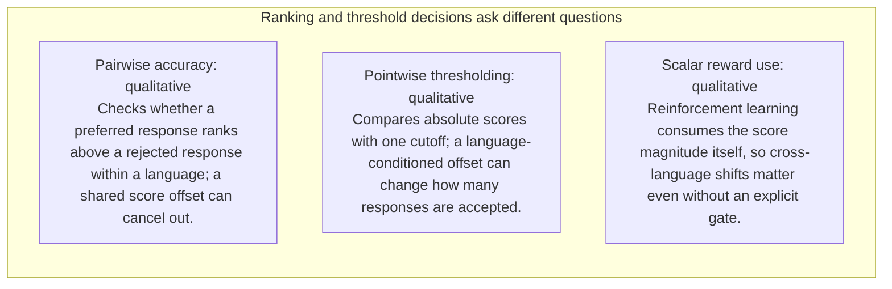
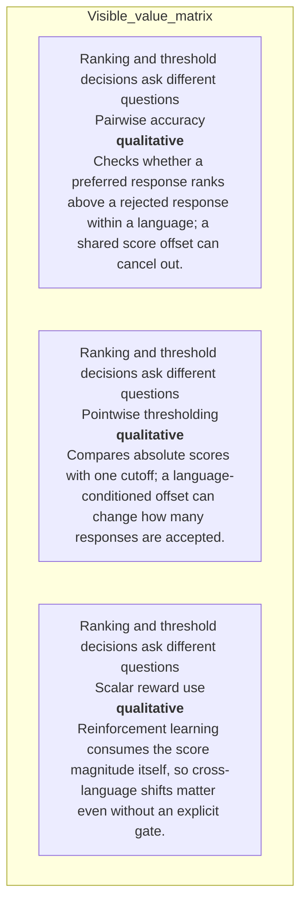
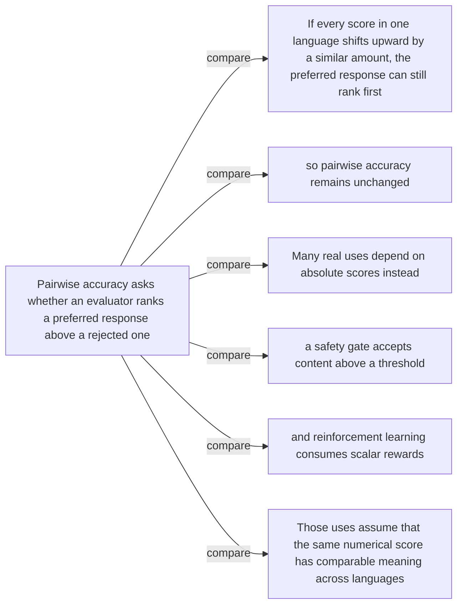
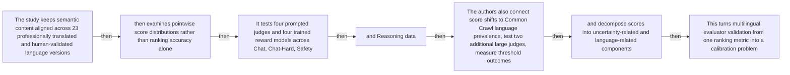
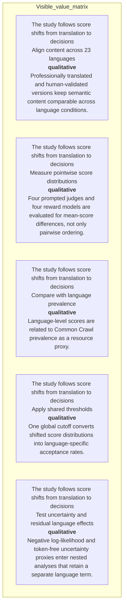
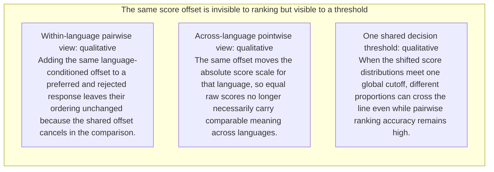
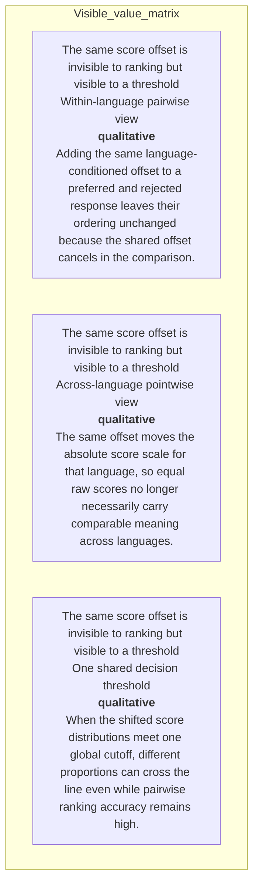
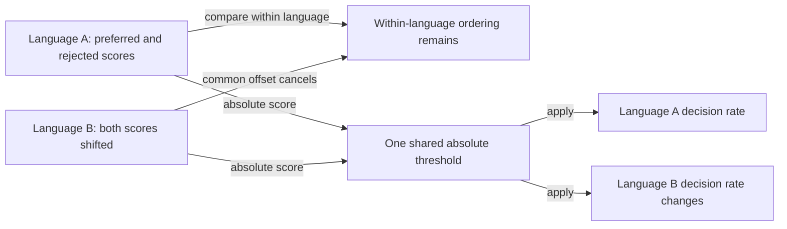
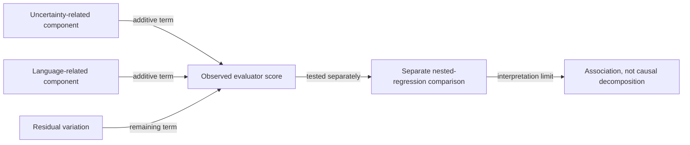
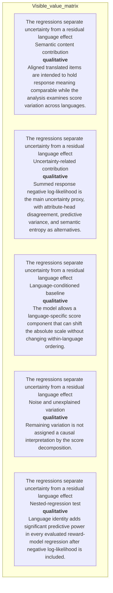

# Visual manifest — LLM Evaluators are Biased across Languages

- Paper ID: `paper_llm_evaluators_languages`
- Exact paper version: `v1`
- Explainer fixture: `packages/test-fixtures/explainers/llm-evaluators-languages.json`
- Manifest revision: `3`
- Engineer status: `COMPLETE`
- Implementer status: `COMPLETE`
- Paragraph coverage: `16 / 16` prose paragraphs
- Paragraph-ID derivation: `{block.id}_p{1-based index in block.paragraphs}`; each fixture paragraph appears exactly once.
- Evidence sources:
  - `language_source_intro` — LLM Evaluators v1 framing and dataset; Pages 1–4, Sections 1–3.2
  - `language_source_thresholds` — LLM Evaluators v1 threshold analysis and rounded worked example; Pages 5–7, Sections 3.4–3.5, Figure 4, Table 1, Appendix Table 15; Section 3.4 reports a 43.0-point aggregate maximum and separately describes rounded 23% versus 67% English/Ukrainian rates as a 44-point example
  - `language_source_effects` — LLM Evaluators v1 language effects; Pages 4–5, Sections 3.3.1–3.3.3, Figures 1–3, Appendix Table 6
  - `language_source_uncertainty` — LLM Evaluators v1 uncertainty analysis; Pages 7–8, Sections 4–4.1, Equations 1–2, Figure 5, Table 2
  - `language_source_regressions` — LLM Evaluators v1 structural regressions; Pages 8–10, Sections 4.2–4.3, Equations 3–6, Figures 6–7, Appendix Tables 11–12
  - `language_source_calibration` — LLM Evaluators v1 calibration analysis; Pages 10 and 22–23, Section 5, Appendix D, Tables 13–15

Revision 3 incorporates every paragraph-level `VISUAL_QA` finding. Treatments are selected by the paragraph's actual explanatory job rather than a universal graph/matrix/card trio. Shared visuals are allowed only for the explicit adjacent scopes recorded below, must encode every scoped mechanism and value, and are placed after the final paragraph in scope. Numeric tables expose values visibly, small-delta plots disclose local domains, and implementers must record any topology, scope, placement, or evidence deviation instead of claiming `NONE`.

## `language_why_p1`

- Location: `language_why`, paragraph 1
- Text anchor: "Pairwise accuracy asks whether an evaluator ranks a preferred response above a rejected one."
- Claims and sources: `language_claim_pairwise_blind` (AUTHORS_INTERPRETATION, VERIFIED); `language_claim_gap` (OBSERVED, VERIFIED); `language_source_intro` (Pages 1–4, Sections 1–3.2); `language_source_thresholds` (Pages 5–7, Sections 3.4–3.5, Figure 4, Table 1, Appendix Table 15; Section 3.4 reports a 43.0-point aggregate maximum and separately describes rounded 23% versus 67% English/Ukrainian rates as a 44-point example)
- Visual needed: `YES`
- Decision rationale: A visual passes the removal test because readers must reconstruct pairwise ordering, pointwise thresholds, and scalar rewards while preserving the paragraph's conditions and boundaries. Revision 3 narrows the topology and placement so no visual can claim this paragraph without encoding its mechanism, grouping, or values.
- Explanatory job: Pairwise ordering, pointwise thresholds, and scalar rewards.
- Recommended scope and placement: Shared scope `language_why_p1`, `language_why_p2` is allowed only when one visual encodes every listed mechanism, condition, and value; place it immediately after the final paragraph, `language_why_p2`. Otherwise split the visual by paragraph.
- QA-informed planning change: A shared visual belongs after the second paragraph and must show why a common language offset cancels in pairwise ranking but changes threshold and scalar-reward meaning.

### Treatment A — Pairwise ordering, pointwise thresholds, and scalar rewards — Relationship-specific parallel view

- Teaching purpose: Keep valid comparison groups separate and equally visible.
- Encoding and reading order: Group the 3 source-backed records into named panels using the first column as the grouping key. Panels preserve experimental, source, or example boundaries and never imply one shared scale.
- Evidence and limitations: Encode only `language_claim_pairwise_blind`, `language_claim_gap` from `language_source_intro`, `language_source_thresholds`. A shared visual belongs after the second paragraph and must show why a common language offset cancels in pairwise ranking but changes threshold and scalar-reward meaning.
- Recommended web medium: semantic HTML/CSS grouped panels or responsive SVG; JavaScript is optional only for meaningful focus, drill-down, or state playback.
- Mobile, accessibility, and motion behavior: Preserve the same group and node order in the DOM; retain all values and relation labels as selectable text; stack panels or levels below 640px; provide keyboard access for any optional focus state; keep a complete static fallback; respect reduced motion and never encode information only through animation.

#### TikZ

```tex
\documentclass[tikz,border=5pt]{standalone}
\usepackage[T1]{fontenc}
\usepackage{tikz}
\begin{document}
\begin{tikzpicture}[font=\sffamily,panel/.style={draw,rounded corners,align=center,text width=4.8cm,minimum height=4cm}]
\node[font=\bfseries] at (0,3) {language\_why\_p1: Pairwise ordering, pointwise thresholds, and scalar rewards - Relationship-specific parallel view};
\node[panel] at (0,0) {\textbf{Ranking and threshold decisions ask different questions}\\[4pt]\textbf{Pairwise accuracy}: qualitative -- Checks whether a preferred response ranks above a rejected response within a language; a shared score offset can cancel out.\\\textbf{Pointwise thresholding}: qualitative -- Compares absolute scores with one cutoff; a language-conditioned offset can change how many responses are accepted.\\\textbf{Scalar reward use}: qualitative -- Reinforcement learning consumes the score magnitude itself, so cross-language shifts matter even without an explicit gate.};
\end{tikzpicture}
\end{document}
```

#### Mermaid



#### Python

```python
from html import escape
from pathlib import Path
from textwrap import wrap

title = "language_why_p1: Pairwise ordering, pointwise thresholds, and scalar rewards — Relationship-specific parallel view"
rows = [["Ranking and threshold decisions ask different questions","Pairwise accuracy","qualitative","Checks whether a preferred response ranks above a rejected response within a language; a shared score offset can cancel out."],["Ranking and threshold decisions ask different questions","Pointwise thresholding","qualitative","Compares absolute scores with one cutoff; a language-conditioned offset can change how many responses are accepted."],["Ranking and threshold decisions ask different questions","Scalar reward use","qualitative","Reinforcement learning consumes the score magnitude itself, so cross-language shifts matter even without an explicit gate."]]
groups = {}
for group, label, value, condition in rows:
    groups.setdefault(group, []).append((label, value, condition))
width = max(900, len(groups) * 360)
height = 220 + max((len(items) for items in groups.values()), default=1) * 92
parts = [
    f'<svg xmlns="http://www.w3.org/2000/svg" viewBox="0 0 {width} {height}" role="img" aria-labelledby="title desc">',
    f'<title id="title">{escape(title)}</title>',
    '<desc id="desc">Separate panels preserve grouping and prevent unrelated conditions from reading as one sequence.</desc>',
    f'<rect width="{width}" height="{height}" fill="white"/>',
]
for group_index, (group, items) in enumerate(groups.items()):
    x = 180 + group_index * 360
    parts.append(f'<text x="{x}" y="65" text-anchor="middle" font-family="sans-serif" font-size="16" font-weight="700">{escape(group)}</text>')
    for item_index, (label, value, condition) in enumerate(items):
        y = 120 + item_index * 92
        parts.append(f'<rect x="{x-160}" y="{y-30}" width="320" height="78" rx="12" fill="#f7fbff" stroke="#ccd"/>')
        text = f"{label}: {value} — {condition}"
        for line_index, line in enumerate(wrap(text, width=46)):
            parts.append(f'<text x="{x}" y="{y-6+line_index*14}" text-anchor="middle" font-family="sans-serif" font-size="11">{escape(line)}</text>')
parts.append('</svg>')
Path("language_why_p1_treatment_a.svg").write_text("\n".join(parts), encoding="utf-8")
```

### Treatment B — Pairwise ordering, pointwise thresholds, and scalar rewards — Condition and boundary matrix

- Teaching purpose: Show every comparison value or qualitative condition in explicit columns.
- Encoding and reading order: Render 3 rows with explicit `Group`, `Measure or state`, `Visible value`, and `Condition or boundary` columns. The value column must be visible, not only present in ARIA text or fallback prose.
- Evidence and limitations: Encode only `language_claim_pairwise_blind`, `language_claim_gap` from `language_source_intro`, `language_source_thresholds`. A shared visual belongs after the second paragraph and must show why a common language offset cancels in pairwise ranking but changes threshold and scalar-reward meaning.
- Recommended web medium: semantic HTML/CSS table with SVG export; JavaScript is optional only for meaningful focus, drill-down, or state playback.
- Mobile, accessibility, and motion behavior: Preserve the same group and node order in the DOM; retain all values and relation labels as selectable text; stack panels or levels below 640px; provide keyboard access for any optional focus state; keep a complete static fallback; respect reduced motion and never encode information only through animation.

#### TikZ

```tex
\documentclass[tikz,border=5pt]{standalone}
\usepackage[T1]{fontenc}
\usepackage{array}
\usepackage{tikz}
\begin{document}
\begin{tikzpicture}[font=\sffamily]
\node[align=center] {\textbf{language\_why\_p1: Pairwise ordering, pointwise thresholds, and scalar rewards - Condition and boundary matrix}\\[6pt]
\begin{tabular}{p{3.2cm}p{4.0cm}p{2.8cm}p{6.2cm}}
\textbf{Group} & \textbf{Measure or state} & \textbf{Visible value} & \textbf{Condition or boundary} \\ \hline
Ranking and threshold decisions ask different questions & Pairwise accuracy & qualitative & Checks whether a preferred response ranks above a rejected response within a language; a shared score offset can cancel out. \\
Ranking and threshold decisions ask different questions & Pointwise thresholding & qualitative & Compares absolute scores with one cutoff; a language-conditioned offset can change how many responses are accepted. \\
Ranking and threshold decisions ask different questions & Scalar reward use & qualitative & Reinforcement learning consumes the score magnitude itself, so cross-language shifts matter even without an explicit gate. \\
\end{tabular}};
\end{tikzpicture}
\end{document}
```

#### Mermaid



#### Python

```python
from html import escape
from pathlib import Path
from textwrap import wrap

title = "language_why_p1: Pairwise ordering, pointwise thresholds, and scalar rewards — Condition and boundary matrix"
rows = [["Ranking and threshold decisions ask different questions","Pairwise accuracy","qualitative","Checks whether a preferred response ranks above a rejected response within a language; a shared score offset can cancel out."],["Ranking and threshold decisions ask different questions","Pointwise thresholding","qualitative","Compares absolute scores with one cutoff; a language-conditioned offset can change how many responses are accepted."],["Ranking and threshold decisions ask different questions","Scalar reward use","qualitative","Reinforcement learning consumes the score magnitude itself, so cross-language shifts matter even without an explicit gate."]]
height = 414
parts = [
    f'<svg xmlns="http://www.w3.org/2000/svg" viewBox="0 0 1200 {height}" role="img" aria-labelledby="title desc">',
    f'<title id="title">{escape(title)}</title>',
    '<desc id="desc">Every reported value is visible beside its condition and group.</desc>',
    f'<rect width="1200" height="{height}" fill="white"/>',
]
headers = ["Group", "Measure or state", "Visible value", "Condition or boundary"]
xs = [30, 260, 590, 770]
for x, header in zip(xs, headers):
    parts.append(f'<text x="{x}" y="70" font-family="sans-serif" font-size="16" font-weight="700">{escape(header)}</text>')
for row_index, row in enumerate(rows):
    y = 110 + row_index * 88
    parts.append(f'<rect x="20" y="{y-28}" width="1160" height="76" fill="#f7fbff" stroke="#ccd"/>')
    for x, cell, width in zip(xs, row, [26, 38, 20, 58]):
        for line_index, line in enumerate(wrap(str(cell), width=width)):
            parts.append(f'<text x="{x}" y="{y+line_index*14}" font-family="sans-serif" font-size="11">{escape(line)}</text>')
parts.append('</svg>')
Path("language_why_p1_treatment_b.svg").write_text("\n".join(parts), encoding="utf-8")
```

### Treatment C — Pairwise ordering, pointwise thresholds, and scalar rewards — Comparison topology

- Teaching purpose: Connect only the alternatives and shared decision point stated in the paragraph.
- Encoding and reading order: Use 7 named nodes and 6 explicit labeled relations. Preserve all branch, merge, hierarchy, loop, or sequence edges shown in the code; changing them is an evidence deviation.
- Evidence and limitations: Encode only `language_claim_pairwise_blind`, `language_claim_gap` from `language_source_intro`, `language_source_thresholds`. A shared visual belongs after the second paragraph and must show why a common language offset cancels in pairwise ranking but changes threshold and scalar-reward meaning.
- Recommended web medium: responsive inline SVG with semantic HTML/CSS fallback; JavaScript is optional only for meaningful focus, drill-down, or state playback.
- Mobile, accessibility, and motion behavior: Preserve the same group and node order in the DOM; retain all values and relation labels as selectable text; stack panels or levels below 640px; provide keyboard access for any optional focus state; keep a complete static fallback; respect reduced motion and never encode information only through animation.

#### TikZ

```tex
\documentclass[tikz,border=5pt]{standalone}
\usepackage[T1]{fontenc}
\usepackage{tikz}
\usetikzlibrary{arrows.meta}
\begin{document}
\begin{tikzpicture}[font=\sffamily,box/.style={draw,rounded corners,align=center,text width=3cm,minimum height=1.2cm},link/.style={-{Latex[length=2mm]},thick},rel/.style={fill=white,font=\scriptsize}]
\node[font=\bfseries,anchor=west] at (0,0.8) {language\_why\_p1: Pairwise ordering, pointwise thresholds, and scalar rewards - Comparison topology};
\node[box] (n1) at (1.00,-1.50) {Pairwise accuracy asks whether an evaluator ranks a preferred response above a rejected one};
\node[box] (n2) at (2.50,-1.50) {If every score in one language shifts upward by a similar amount, the preferred response can still rank first};
\node[box] (n3) at (4.00,-1.50) {so pairwise accuracy remains unchanged};
\node[box] (n4) at (5.50,-1.50) {Many real uses depend on absolute scores instead};
\node[box] (n5) at (7.00,-1.50) {a safety gate accepts content above a threshold};
\node[box] (n6) at (8.50,-1.50) {and reinforcement learning consumes scalar rewards};
\node[box] (n7) at (10.00,-1.50) {Those uses assume that the same numerical score has comparable meaning across languages};
\draw[link] (n1) -- node[rel] {compare} (n2);
\draw[link] (n1) -- node[rel] {compare} (n3);
\draw[link] (n1) -- node[rel] {compare} (n4);
\draw[link] (n1) -- node[rel] {compare} (n5);
\draw[link] (n1) -- node[rel] {compare} (n6);
\draw[link] (n1) -- node[rel] {compare} (n7);
\end{tikzpicture}
\end{document}
```

#### Mermaid



#### Python

```python
from html import escape
from pathlib import Path
from textwrap import wrap

title = "language_why_p1: Pairwise ordering, pointwise thresholds, and scalar rewards — Comparison topology"
nodes = [["n1","Pairwise accuracy asks whether an evaluator ranks a preferred response above a rejected one",100,150],["n2","If every score in one language shifts upward by a similar amount, the preferred response can still rank first",250,150],["n3","so pairwise accuracy remains unchanged",400,150],["n4","Many real uses depend on absolute scores instead",550,150],["n5","a safety gate accepts content above a threshold",700,150],["n6","and reinforcement learning consumes scalar rewards",850,150],["n7","Those uses assume that the same numerical score has comparable meaning across languages",1000,150]]
edges = [["n1","n2","compare"],["n1","n3","compare"],["n1","n4","compare"],["n1","n5","compare"],["n1","n6","compare"],["n1","n7","compare"]]
node_by_id = {node_id: (label, x, y) for node_id, label, x, y in nodes}
width = max(900, max((x for _, _, x, _ in nodes), default=800) + 180)
height = max(500, max((y for _, _, _, y in nodes), default=400) + 140)
parts = [
    f'<svg xmlns="http://www.w3.org/2000/svg" viewBox="0 0 {width} {height}" role="img" aria-labelledby="title desc">',
    f'<title id="title">{escape(title)}</title>',
    '<desc id="desc">Edges and convergence points encode only relationships stated in the scoped paragraphs.</desc>',
    f'<rect width="{width}" height="{height}" fill="white"/>',
]
for source, target, relation in edges:
    _, x1, y1 = node_by_id[source]
    _, x2, y2 = node_by_id[target]
    parts.append(f'<line x1="{x1}" y1="{y1}" x2="{x2}" y2="{y2}" stroke="#345" stroke-width="2"/>')
    parts.append(f'<text x="{(x1+x2)/2}" y="{(y1+y2)/2-5}" text-anchor="middle" font-family="sans-serif" font-size="10">{escape(relation)}</text>')
for _, label, x, y in nodes:
    parts.append(f'<rect x="{x-78}" y="{y-42}" width="156" height="84" rx="12" fill="#eef6ff" stroke="#234"/>')
    for line_index, line in enumerate(wrap(label, width=22)):
        parts.append(f'<text x="{x}" y="{y-24+line_index*13}" text-anchor="middle" font-family="sans-serif" font-size="10">{escape(line)}</text>')
parts.append('</svg>')
Path("language_why_p1_treatment_c.svg").write_text("\n".join(parts), encoding="utf-8")
```

### Implementation record

- Status: `IMPLEMENTED`
- Selected treatment: `A`
- Selection rationale: Selected the approved “Pairwise ordering, pointwise thresholds, and scalar rewards — Relationship-specific parallel view” treatment because the implemented method comparison directly encodes this paragraph's explanatory job and its stated evidence boundaries.
- Delivery medium: `CSS + semantic HTML`
- Visual ID and placement: `language_visual_evaluation_modes` after `language_why_p2`; this record is served by that purpose-built figure.
- Shared paragraph scope: `language_why_p1`, `language_why_p2`
- Changed files: `packages/test-fixtures/explainers/llm-evaluators-languages.json`, `packages/content-schema/schema/explainer-document.schema.json`, `packages/content-schema/src/validate.ts`, generated TypeScript/Python models, `apps/web/app/papers/[id]/explainer-visual.tsx`, and `apps/web/app/globals.css`.
- Accessibility and fallback verification: Figure has a programmatic title and description, visible selectable labels and values, explicit alt text, equivalent fallback prose, source links, limitations, and a semantic static body; no meaning depends on color, motion, or pointer input.
- Desktop and mobile verification: Verified by the full eight-paper Playwright traversal at a 1440-pixel desktop viewport and the iPhone 13 mobile viewport; every figure stayed paragraph-adjacent, preserved DOM reading order, and introduced no horizontal page overflow.
- Evidence deviations: Delivery translation: selected Treatment A is rendered as typed semantic HTML/CSS rather than its literal TikZ, Mermaid, or Python-generated asset; the approved paragraph scope, placement, labels, values, grouping, and evidence boundaries are retained.

## `language_why_p2`

- Location: `language_why`, paragraph 2
- Text anchor: "Many real uses depend on absolute scores instead: a safety gate accepts content above a threshold, and reinforcement learning consumes scalar rewards."
- Claims and sources: `language_claim_pairwise_blind` (AUTHORS_INTERPRETATION, VERIFIED); `language_claim_gap` (OBSERVED, VERIFIED); `language_source_intro` (Pages 1–4, Sections 1–3.2); `language_source_thresholds` (Pages 5–7, Sections 3.4–3.5, Figure 4, Table 1, Appendix Table 15; Section 3.4 reports a 43.0-point aggregate maximum and separately describes rounded 23% versus 67% English/Ukrainian rates as a 44-point example)
- Visual needed: `YES`
- Decision rationale: A visual passes the removal test because readers must reconstruct pairwise ordering, pointwise thresholds, and scalar rewards while preserving the paragraph's conditions and boundaries. Revision 3 narrows the topology and placement so no visual can claim this paragraph without encoding its mechanism, grouping, or values.
- Explanatory job: Pairwise ordering, pointwise thresholds, and scalar rewards.
- Recommended scope and placement: Shared scope `language_why_p1`, `language_why_p2` is allowed only when one visual encodes every listed mechanism, condition, and value; place it immediately after the final paragraph, `language_why_p2`. Otherwise split the visual by paragraph.
- QA-informed planning change: A shared visual belongs after the second paragraph and must show why a common language offset cancels in pairwise ranking but changes threshold and scalar-reward meaning.

### Treatment A — Pairwise ordering, pointwise thresholds, and scalar rewards — Relationship-specific parallel view

- Teaching purpose: Keep valid comparison groups separate and equally visible.
- Encoding and reading order: Group the 3 source-backed records into named panels using the first column as the grouping key. Panels preserve experimental, source, or example boundaries and never imply one shared scale.
- Evidence and limitations: Encode only `language_claim_pairwise_blind`, `language_claim_gap` from `language_source_intro`, `language_source_thresholds`. A shared visual belongs after the second paragraph and must show why a common language offset cancels in pairwise ranking but changes threshold and scalar-reward meaning.
- Recommended web medium: semantic HTML/CSS grouped panels or responsive SVG; JavaScript is optional only for meaningful focus, drill-down, or state playback.
- Mobile, accessibility, and motion behavior: Preserve the same group and node order in the DOM; retain all values and relation labels as selectable text; stack panels or levels below 640px; provide keyboard access for any optional focus state; keep a complete static fallback; respect reduced motion and never encode information only through animation.

#### TikZ

```tex
\documentclass[tikz,border=5pt]{standalone}
\usepackage[T1]{fontenc}
\usepackage{tikz}
\begin{document}
\begin{tikzpicture}[font=\sffamily,panel/.style={draw,rounded corners,align=center,text width=4.8cm,minimum height=4cm}]
\node[font=\bfseries] at (0,3) {language\_why\_p2: Pairwise ordering, pointwise thresholds, and scalar rewards - Relationship-specific parallel view};
\node[panel] at (0,0) {\textbf{Ranking and threshold decisions ask different questions}\\[4pt]\textbf{Pairwise accuracy}: qualitative -- Checks whether a preferred response ranks above a rejected response within a language; a shared score offset can cancel out.\\\textbf{Pointwise thresholding}: qualitative -- Compares absolute scores with one cutoff; a language-conditioned offset can change how many responses are accepted.\\\textbf{Scalar reward use}: qualitative -- Reinforcement learning consumes the score magnitude itself, so cross-language shifts matter even without an explicit gate.};
\end{tikzpicture}
\end{document}
```

#### Mermaid


#### Python

```python
from html import escape
from pathlib import Path
from textwrap import wrap

title = "language_why_p2: Pairwise ordering, pointwise thresholds, and scalar rewards — Relationship-specific parallel view"
rows = [["Ranking and threshold decisions ask different questions","Pairwise accuracy","qualitative","Checks whether a preferred response ranks above a rejected response within a language; a shared score offset can cancel out."],["Ranking and threshold decisions ask different questions","Pointwise thresholding","qualitative","Compares absolute scores with one cutoff; a language-conditioned offset can change how many responses are accepted."],["Ranking and threshold decisions ask different questions","Scalar reward use","qualitative","Reinforcement learning consumes the score magnitude itself, so cross-language shifts matter even without an explicit gate."]]
groups = {}
for group, label, value, condition in rows:
    groups.setdefault(group, []).append((label, value, condition))
width = max(900, len(groups) * 360)
height = 220 + max((len(items) for items in groups.values()), default=1) * 92
parts = [
    f'<svg xmlns="http://www.w3.org/2000/svg" viewBox="0 0 {width} {height}" role="img" aria-labelledby="title desc">',
    f'<title id="title">{escape(title)}</title>',
    '<desc id="desc">Separate panels preserve grouping and prevent unrelated conditions from reading as one sequence.</desc>',
    f'<rect width="{width}" height="{height}" fill="white"/>',
]
for group_index, (group, items) in enumerate(groups.items()):
    x = 180 + group_index * 360
    parts.append(f'<text x="{x}" y="65" text-anchor="middle" font-family="sans-serif" font-size="16" font-weight="700">{escape(group)}</text>')
    for item_index, (label, value, condition) in enumerate(items):
        y = 120 + item_index * 92
        parts.append(f'<rect x="{x-160}" y="{y-30}" width="320" height="78" rx="12" fill="#f7fbff" stroke="#ccd"/>')
        text = f"{label}: {value} — {condition}"
        for line_index, line in enumerate(wrap(text, width=46)):
            parts.append(f'<text x="{x}" y="{y-6+line_index*14}" text-anchor="middle" font-family="sans-serif" font-size="11">{escape(line)}</text>')
parts.append('</svg>')
Path("language_why_p2_treatment_a.svg").write_text("\n".join(parts), encoding="utf-8")
```

### Treatment B — Pairwise ordering, pointwise thresholds, and scalar rewards — Condition and boundary matrix

- Teaching purpose: Show every comparison value or qualitative condition in explicit columns.
- Encoding and reading order: Render 3 rows with explicit `Group`, `Measure or state`, `Visible value`, and `Condition or boundary` columns. The value column must be visible, not only present in ARIA text or fallback prose.
- Evidence and limitations: Encode only `language_claim_pairwise_blind`, `language_claim_gap` from `language_source_intro`, `language_source_thresholds`. A shared visual belongs after the second paragraph and must show why a common language offset cancels in pairwise ranking but changes threshold and scalar-reward meaning.
- Recommended web medium: semantic HTML/CSS table with SVG export; JavaScript is optional only for meaningful focus, drill-down, or state playback.
- Mobile, accessibility, and motion behavior: Preserve the same group and node order in the DOM; retain all values and relation labels as selectable text; stack panels or levels below 640px; provide keyboard access for any optional focus state; keep a complete static fallback; respect reduced motion and never encode information only through animation.

#### TikZ

```tex
\documentclass[tikz,border=5pt]{standalone}
\usepackage[T1]{fontenc}
\usepackage{array}
\usepackage{tikz}
\begin{document}
\begin{tikzpicture}[font=\sffamily]
\node[align=center] {\textbf{language\_why\_p2: Pairwise ordering, pointwise thresholds, and scalar rewards - Condition and boundary matrix}\\[6pt]
\begin{tabular}{p{3.2cm}p{4.0cm}p{2.8cm}p{6.2cm}}
\textbf{Group} & \textbf{Measure or state} & \textbf{Visible value} & \textbf{Condition or boundary} \\ \hline
Ranking and threshold decisions ask different questions & Pairwise accuracy & qualitative & Checks whether a preferred response ranks above a rejected response within a language; a shared score offset can cancel out. \\
Ranking and threshold decisions ask different questions & Pointwise thresholding & qualitative & Compares absolute scores with one cutoff; a language-conditioned offset can change how many responses are accepted. \\
Ranking and threshold decisions ask different questions & Scalar reward use & qualitative & Reinforcement learning consumes the score magnitude itself, so cross-language shifts matter even without an explicit gate. \\
\end{tabular}};
\end{tikzpicture}
\end{document}
```

#### Mermaid


#### Python

```python
from html import escape
from pathlib import Path
from textwrap import wrap

title = "language_why_p2: Pairwise ordering, pointwise thresholds, and scalar rewards — Condition and boundary matrix"
rows = [["Ranking and threshold decisions ask different questions","Pairwise accuracy","qualitative","Checks whether a preferred response ranks above a rejected response within a language; a shared score offset can cancel out."],["Ranking and threshold decisions ask different questions","Pointwise thresholding","qualitative","Compares absolute scores with one cutoff; a language-conditioned offset can change how many responses are accepted."],["Ranking and threshold decisions ask different questions","Scalar reward use","qualitative","Reinforcement learning consumes the score magnitude itself, so cross-language shifts matter even without an explicit gate."]]
height = 414
parts = [
    f'<svg xmlns="http://www.w3.org/2000/svg" viewBox="0 0 1200 {height}" role="img" aria-labelledby="title desc">',
    f'<title id="title">{escape(title)}</title>',
    '<desc id="desc">Every reported value is visible beside its condition and group.</desc>',
    f'<rect width="1200" height="{height}" fill="white"/>',
]
headers = ["Group", "Measure or state", "Visible value", "Condition or boundary"]
xs = [30, 260, 590, 770]
for x, header in zip(xs, headers):
    parts.append(f'<text x="{x}" y="70" font-family="sans-serif" font-size="16" font-weight="700">{escape(header)}</text>')
for row_index, row in enumerate(rows):
    y = 110 + row_index * 88
    parts.append(f'<rect x="20" y="{y-28}" width="1160" height="76" fill="#f7fbff" stroke="#ccd"/>')
    for x, cell, width in zip(xs, row, [26, 38, 20, 58]):
        for line_index, line in enumerate(wrap(str(cell), width=width)):
            parts.append(f'<text x="{x}" y="{y+line_index*14}" font-family="sans-serif" font-size="11">{escape(line)}</text>')
parts.append('</svg>')
Path("language_why_p2_treatment_b.svg").write_text("\n".join(parts), encoding="utf-8")
```

### Treatment C — Pairwise ordering, pointwise thresholds, and scalar rewards — Comparison topology

- Teaching purpose: Connect only the alternatives and shared decision point stated in the paragraph.
- Encoding and reading order: Use 7 named nodes and 6 explicit labeled relations. Preserve all branch, merge, hierarchy, loop, or sequence edges shown in the code; changing them is an evidence deviation.
- Evidence and limitations: Encode only `language_claim_pairwise_blind`, `language_claim_gap` from `language_source_intro`, `language_source_thresholds`. A shared visual belongs after the second paragraph and must show why a common language offset cancels in pairwise ranking but changes threshold and scalar-reward meaning.
- Recommended web medium: responsive inline SVG with semantic HTML/CSS fallback; JavaScript is optional only for meaningful focus, drill-down, or state playback.
- Mobile, accessibility, and motion behavior: Preserve the same group and node order in the DOM; retain all values and relation labels as selectable text; stack panels or levels below 640px; provide keyboard access for any optional focus state; keep a complete static fallback; respect reduced motion and never encode information only through animation.

#### TikZ

```tex
\documentclass[tikz,border=5pt]{standalone}
\usepackage[T1]{fontenc}
\usepackage{tikz}
\usetikzlibrary{arrows.meta}
\begin{document}
\begin{tikzpicture}[font=\sffamily,box/.style={draw,rounded corners,align=center,text width=3cm,minimum height=1.2cm},link/.style={-{Latex[length=2mm]},thick},rel/.style={fill=white,font=\scriptsize}]
\node[font=\bfseries,anchor=west] at (0,0.8) {language\_why\_p2: Pairwise ordering, pointwise thresholds, and scalar rewards - Comparison topology};
\node[box] (n1) at (1.00,-1.50) {Pairwise accuracy asks whether an evaluator ranks a preferred response above a rejected one};
\node[box] (n2) at (2.50,-1.50) {If every score in one language shifts upward by a similar amount, the preferred response can still rank first};
\node[box] (n3) at (4.00,-1.50) {so pairwise accuracy remains unchanged};
\node[box] (n4) at (5.50,-1.50) {Many real uses depend on absolute scores instead};
\node[box] (n5) at (7.00,-1.50) {a safety gate accepts content above a threshold};
\node[box] (n6) at (8.50,-1.50) {and reinforcement learning consumes scalar rewards};
\node[box] (n7) at (10.00,-1.50) {Those uses assume that the same numerical score has comparable meaning across languages};
\draw[link] (n1) -- node[rel] {compare} (n2);
\draw[link] (n1) -- node[rel] {compare} (n3);
\draw[link] (n1) -- node[rel] {compare} (n4);
\draw[link] (n1) -- node[rel] {compare} (n5);
\draw[link] (n1) -- node[rel] {compare} (n6);
\draw[link] (n1) -- node[rel] {compare} (n7);
\end{tikzpicture}
\end{document}
```

#### Mermaid


#### Python

```python
from html import escape
from pathlib import Path
from textwrap import wrap

title = "language_why_p2: Pairwise ordering, pointwise thresholds, and scalar rewards — Comparison topology"
nodes = [["n1","Pairwise accuracy asks whether an evaluator ranks a preferred response above a rejected one",100,150],["n2","If every score in one language shifts upward by a similar amount, the preferred response can still rank first",250,150],["n3","so pairwise accuracy remains unchanged",400,150],["n4","Many real uses depend on absolute scores instead",550,150],["n5","a safety gate accepts content above a threshold",700,150],["n6","and reinforcement learning consumes scalar rewards",850,150],["n7","Those uses assume that the same numerical score has comparable meaning across languages",1000,150]]
edges = [["n1","n2","compare"],["n1","n3","compare"],["n1","n4","compare"],["n1","n5","compare"],["n1","n6","compare"],["n1","n7","compare"]]
node_by_id = {node_id: (label, x, y) for node_id, label, x, y in nodes}
width = max(900, max((x for _, _, x, _ in nodes), default=800) + 180)
height = max(500, max((y for _, _, _, y in nodes), default=400) + 140)
parts = [
    f'<svg xmlns="http://www.w3.org/2000/svg" viewBox="0 0 {width} {height}" role="img" aria-labelledby="title desc">',
    f'<title id="title">{escape(title)}</title>',
    '<desc id="desc">Edges and convergence points encode only relationships stated in the scoped paragraphs.</desc>',
    f'<rect width="{width}" height="{height}" fill="white"/>',
]
for source, target, relation in edges:
    _, x1, y1 = node_by_id[source]
    _, x2, y2 = node_by_id[target]
    parts.append(f'<line x1="{x1}" y1="{y1}" x2="{x2}" y2="{y2}" stroke="#345" stroke-width="2"/>')
    parts.append(f'<text x="{(x1+x2)/2}" y="{(y1+y2)/2-5}" text-anchor="middle" font-family="sans-serif" font-size="10">{escape(relation)}</text>')
for _, label, x, y in nodes:
    parts.append(f'<rect x="{x-78}" y="{y-42}" width="156" height="84" rx="12" fill="#eef6ff" stroke="#234"/>')
    for line_index, line in enumerate(wrap(label, width=22)):
        parts.append(f'<text x="{x}" y="{y-24+line_index*13}" text-anchor="middle" font-family="sans-serif" font-size="10">{escape(line)}</text>')
parts.append('</svg>')
Path("language_why_p2_treatment_c.svg").write_text("\n".join(parts), encoding="utf-8")
```

### Implementation record

- Status: `IMPLEMENTED`
- Selected treatment: `A`
- Selection rationale: Selected the approved “Pairwise ordering, pointwise thresholds, and scalar rewards — Relationship-specific parallel view” treatment because the implemented method comparison directly encodes this paragraph's explanatory job and its stated evidence boundaries.
- Delivery medium: `CSS + semantic HTML`
- Visual ID and placement: `language_visual_evaluation_modes` after `language_why_p2`; this record is served by that purpose-built figure.
- Shared paragraph scope: `language_why_p1`, `language_why_p2`
- Changed files: `packages/test-fixtures/explainers/llm-evaluators-languages.json`, `packages/content-schema/schema/explainer-document.schema.json`, `packages/content-schema/src/validate.ts`, generated TypeScript/Python models, `apps/web/app/papers/[id]/explainer-visual.tsx`, and `apps/web/app/globals.css`.
- Accessibility and fallback verification: Figure has a programmatic title and description, visible selectable labels and values, explicit alt text, equivalent fallback prose, source links, limitations, and a semantic static body; no meaning depends on color, motion, or pointer input.
- Desktop and mobile verification: Verified by the full eight-paper Playwright traversal at a 1440-pixel desktop viewport and the iPhone 13 mobile viewport; every figure stayed paragraph-adjacent, preserved DOM reading order, and introduced no horizontal page overflow.
- Evidence deviations: Delivery translation: selected Treatment A is rendered as typed semantic HTML/CSS rather than its literal TikZ, Mermaid, or Python-generated asset; the approved paragraph scope, placement, labels, values, grouping, and evidence boundaries are retained.

## `language_change_p1`

- Location: `language_change`, paragraph 1
- Text anchor: "The study keeps semantic content aligned across 23 professionally translated and human-validated language versions, then examines pointwise score distributions rather than ranking accuracy alone."
- Claims and sources: `language_claim_effect` (OBSERVED, VERIFIED); `language_claim_resource` (OBSERVED, VERIFIED); `language_claim_additional_judges` (OBSERVED, VERIFIED); `language_source_intro` (Pages 1–4, Sections 1–3.2); `language_source_effects` (Pages 4–5, Sections 3.3.1–3.3.3, Figures 1–3, Appendix Table 6); `language_source_thresholds` (Pages 5–7, Sections 3.4–3.5, Figure 4, Table 1, Appendix Table 15; Section 3.4 reports a 43.0-point aggregate maximum and separately describes rounded 23% versus 67% English/Ukrainian rates as a 44-point example)
- Visual needed: `YES`
- Decision rationale: A visual passes the removal test because readers must reconstruct aligned multilingual study design and calibration analyses while preserving the paragraph's conditions and boundaries. Revision 3 narrows the topology and placement so no visual can claim this paragraph without encoding its mechanism, grouping, or values.
- Explanatory job: Aligned multilingual study design and calibration analyses.
- Recommended scope and placement: Shared scope `language_change_p1`, `language_change_p2` is allowed only when one visual encodes every listed mechanism, condition, and value; place it immediately after the final paragraph, `language_change_p2`. Otherwise split the visual by paragraph.
- QA-informed planning change: A shared visual belongs after the second paragraph and must include 23 languages, four prompted judges, four reward models, all four benchmark families, prevalence, thresholds, uncertainty, and residual-language analysis.

### Treatment A — Aligned multilingual study design and calibration analyses — Operation flow

- Teaching purpose: Show the source-supported order and branch boundaries.
- Encoding and reading order: Use 7 named nodes and 6 explicit labeled relations. Preserve all branch, merge, hierarchy, loop, or sequence edges shown in the code; changing them is an evidence deviation.
- Evidence and limitations: Encode only `language_claim_effect`, `language_claim_resource`, `language_claim_additional_judges` from `language_source_intro`, `language_source_effects`, `language_source_thresholds`. A shared visual belongs after the second paragraph and must include 23 languages, four prompted judges, four reward models, all four benchmark families, prevalence, thresholds, uncertainty, and residual-language analysis.
- Recommended web medium: responsive inline SVG with semantic HTML/CSS fallback; JavaScript is optional only for meaningful focus, drill-down, or state playback.
- Mobile, accessibility, and motion behavior: Preserve the same group and node order in the DOM; retain all values and relation labels as selectable text; stack panels or levels below 640px; provide keyboard access for any optional focus state; keep a complete static fallback; respect reduced motion and never encode information only through animation.

#### TikZ

```tex
\documentclass[tikz,border=5pt]{standalone}
\usepackage[T1]{fontenc}
\usepackage{tikz}
\usetikzlibrary{arrows.meta}
\begin{document}
\begin{tikzpicture}[font=\sffamily,box/.style={draw,rounded corners,align=center,text width=3cm,minimum height=1.2cm},link/.style={-{Latex[length=2mm]},thick},rel/.style={fill=white,font=\scriptsize}]
\node[font=\bfseries,anchor=west] at (0,0.8) {language\_change\_p1: Aligned multilingual study design and calibration analyses - Operation flow};
\node[box] (n1) at (1.00,-1.50) {The study keeps semantic content aligned across 23 professionally translated and human-validated language versions};
\node[box] (n2) at (2.50,-1.50) {then examines pointwise score distributions rather than ranking accuracy alone};
\node[box] (n3) at (4.00,-1.50) {It tests four prompted judges and four trained reward models across Chat, Chat-Hard, Safety};
\node[box] (n4) at (5.50,-1.50) {and Reasoning data};
\node[box] (n5) at (7.00,-1.50) {The authors also connect score shifts to Common Crawl language prevalence, test two additional large judges, measure threshold outcomes};
\node[box] (n6) at (8.50,-1.50) {and decompose scores into uncertainty-related and language-related components};
\node[box] (n7) at (10.00,-1.50) {This turns multilingual evaluator validation from one ranking metric into a calibration problem};
\draw[link] (n1) -- node[rel] {then} (n2);
\draw[link] (n2) -- node[rel] {then} (n3);
\draw[link] (n3) -- node[rel] {then} (n4);
\draw[link] (n4) -- node[rel] {then} (n5);
\draw[link] (n5) -- node[rel] {then} (n6);
\draw[link] (n6) -- node[rel] {then} (n7);
\end{tikzpicture}
\end{document}
```

#### Mermaid



#### Python

```python
from html import escape
from pathlib import Path
from textwrap import wrap

title = "language_change_p1: Aligned multilingual study design and calibration analyses — Operation flow"
nodes = [["n1","The study keeps semantic content aligned across 23 professionally translated and human-validated language versions",100,150],["n2","then examines pointwise score distributions rather than ranking accuracy alone",250,150],["n3","It tests four prompted judges and four trained reward models across Chat, Chat-Hard, Safety",400,150],["n4","and Reasoning data",550,150],["n5","The authors also connect score shifts to Common Crawl language prevalence, test two additional large judges, measure threshold outcomes",700,150],["n6","and decompose scores into uncertainty-related and language-related components",850,150],["n7","This turns multilingual evaluator validation from one ranking metric into a calibration problem",1000,150]]
edges = [["n1","n2","then"],["n2","n3","then"],["n3","n4","then"],["n4","n5","then"],["n5","n6","then"],["n6","n7","then"]]
node_by_id = {node_id: (label, x, y) for node_id, label, x, y in nodes}
width = max(900, max((x for _, _, x, _ in nodes), default=800) + 180)
height = max(500, max((y for _, _, _, y in nodes), default=400) + 140)
parts = [
    f'<svg xmlns="http://www.w3.org/2000/svg" viewBox="0 0 {width} {height}" role="img" aria-labelledby="title desc">',
    f'<title id="title">{escape(title)}</title>',
    '<desc id="desc">Edges and convergence points encode only relationships stated in the scoped paragraphs.</desc>',
    f'<rect width="{width}" height="{height}" fill="white"/>',
]
for source, target, relation in edges:
    _, x1, y1 = node_by_id[source]
    _, x2, y2 = node_by_id[target]
    parts.append(f'<line x1="{x1}" y1="{y1}" x2="{x2}" y2="{y2}" stroke="#345" stroke-width="2"/>')
    parts.append(f'<text x="{(x1+x2)/2}" y="{(y1+y2)/2-5}" text-anchor="middle" font-family="sans-serif" font-size="10">{escape(relation)}</text>')
for _, label, x, y in nodes:
    parts.append(f'<rect x="{x-78}" y="{y-42}" width="156" height="84" rx="12" fill="#eef6ff" stroke="#234"/>')
    for line_index, line in enumerate(wrap(label, width=22)):
        parts.append(f'<text x="{x}" y="{y-24+line_index*13}" text-anchor="middle" font-family="sans-serif" font-size="10">{escape(line)}</text>')
parts.append('</svg>')
Path("language_change_p1_treatment_a.svg").write_text("\n".join(parts), encoding="utf-8")
```

### Treatment B — Aligned multilingual study design and calibration analyses — Input-operation-output ledger

- Teaching purpose: Make inputs, operations, outputs, and limits inspectable as columns.
- Encoding and reading order: Render 5 rows with explicit `Group`, `Measure or state`, `Visible value`, and `Condition or boundary` columns. The value column must be visible, not only present in ARIA text or fallback prose.
- Evidence and limitations: Encode only `language_claim_effect`, `language_claim_resource`, `language_claim_additional_judges` from `language_source_intro`, `language_source_effects`, `language_source_thresholds`. A shared visual belongs after the second paragraph and must include 23 languages, four prompted judges, four reward models, all four benchmark families, prevalence, thresholds, uncertainty, and residual-language analysis.
- Recommended web medium: semantic HTML/CSS table with SVG export; JavaScript is optional only for meaningful focus, drill-down, or state playback.
- Mobile, accessibility, and motion behavior: Preserve the same group and node order in the DOM; retain all values and relation labels as selectable text; stack panels or levels below 640px; provide keyboard access for any optional focus state; keep a complete static fallback; respect reduced motion and never encode information only through animation.

#### TikZ

```tex
\documentclass[tikz,border=5pt]{standalone}
\usepackage[T1]{fontenc}
\usepackage{array}
\usepackage{tikz}
\begin{document}
\begin{tikzpicture}[font=\sffamily]
\node[align=center] {\textbf{language\_change\_p1: Aligned multilingual study design and calibration analyses - Input-operation-output ledger}\\[6pt]
\begin{tabular}{p{3.2cm}p{4.0cm}p{2.8cm}p{6.2cm}}
\textbf{Group} & \textbf{Measure or state} & \textbf{Visible value} & \textbf{Condition or boundary} \\ \hline
The study follows score shifts from translation to decisions & Align content across 23 languages & qualitative & Professionally translated and human-validated versions keep semantic content comparable across language conditions. \\
The study follows score shifts from translation to decisions & Measure pointwise score distributions & qualitative & Four prompted judges and four reward models are evaluated for mean-score differences, not only pairwise ordering. \\
The study follows score shifts from translation to decisions & Compare with language prevalence & qualitative & Language-level scores are related to Common Crawl prevalence as a resource proxy. \\
The study follows score shifts from translation to decisions & Apply shared thresholds & qualitative & One global cutoff converts shifted score distributions into language-specific acceptance rates. \\
The study follows score shifts from translation to decisions & Test uncertainty and residual language effects & qualitative & Negative log-likelihood and token-free uncertainty proxies enter nested analyses that retain a separate language term. \\
\end{tabular}};
\end{tikzpicture}
\end{document}
```

#### Mermaid



#### Python

```python
from html import escape
from pathlib import Path
from textwrap import wrap

title = "language_change_p1: Aligned multilingual study design and calibration analyses — Input-operation-output ledger"
rows = [["The study follows score shifts from translation to decisions","Align content across 23 languages","qualitative","Professionally translated and human-validated versions keep semantic content comparable across language conditions."],["The study follows score shifts from translation to decisions","Measure pointwise score distributions","qualitative","Four prompted judges and four reward models are evaluated for mean-score differences, not only pairwise ordering."],["The study follows score shifts from translation to decisions","Compare with language prevalence","qualitative","Language-level scores are related to Common Crawl prevalence as a resource proxy."],["The study follows score shifts from translation to decisions","Apply shared thresholds","qualitative","One global cutoff converts shifted score distributions into language-specific acceptance rates."],["The study follows score shifts from translation to decisions","Test uncertainty and residual language effects","qualitative","Negative log-likelihood and token-free uncertainty proxies enter nested analyses that retain a separate language term."]]
height = 590
parts = [
    f'<svg xmlns="http://www.w3.org/2000/svg" viewBox="0 0 1200 {height}" role="img" aria-labelledby="title desc">',
    f'<title id="title">{escape(title)}</title>',
    '<desc id="desc">Every reported value is visible beside its condition and group.</desc>',
    f'<rect width="1200" height="{height}" fill="white"/>',
]
headers = ["Group", "Measure or state", "Visible value", "Condition or boundary"]
xs = [30, 260, 590, 770]
for x, header in zip(xs, headers):
    parts.append(f'<text x="{x}" y="70" font-family="sans-serif" font-size="16" font-weight="700">{escape(header)}</text>')
for row_index, row in enumerate(rows):
    y = 110 + row_index * 88
    parts.append(f'<rect x="20" y="{y-28}" width="1160" height="76" fill="#f7fbff" stroke="#ccd"/>')
    for x, cell, width in zip(xs, row, [26, 38, 20, 58]):
        for line_index, line in enumerate(wrap(str(cell), width=width)):
            parts.append(f'<text x="{x}" y="{y+line_index*14}" font-family="sans-serif" font-size="11">{escape(line)}</text>')
parts.append('</svg>')
Path("language_change_p1_treatment_b.svg").write_text("\n".join(parts), encoding="utf-8")
```

### Treatment C — Aligned multilingual study design and calibration analyses — State-transition walkthrough

- Teaching purpose: Follow the described state changes without inventing timing.
- Encoding and reading order: Use 7 named nodes and 6 explicit labeled relations. Preserve all branch, merge, hierarchy, loop, or sequence edges shown in the code; changing them is an evidence deviation.
- Evidence and limitations: Encode only `language_claim_effect`, `language_claim_resource`, `language_claim_additional_judges` from `language_source_intro`, `language_source_effects`, `language_source_thresholds`. A shared visual belongs after the second paragraph and must include 23 languages, four prompted judges, four reward models, all four benchmark families, prevalence, thresholds, uncertainty, and residual-language analysis.
- Recommended web medium: responsive inline SVG with semantic HTML/CSS fallback; JavaScript is optional only for meaningful focus, drill-down, or state playback.
- Mobile, accessibility, and motion behavior: Preserve the same group and node order in the DOM; retain all values and relation labels as selectable text; stack panels or levels below 640px; provide keyboard access for any optional focus state; keep a complete static fallback; respect reduced motion and never encode information only through animation.

#### TikZ

```tex
\documentclass[tikz,border=5pt]{standalone}
\usepackage[T1]{fontenc}
\usepackage{tikz}
\usetikzlibrary{arrows.meta}
\begin{document}
\begin{tikzpicture}[font=\sffamily,box/.style={draw,rounded corners,align=center,text width=3cm,minimum height=1.2cm},link/.style={-{Latex[length=2mm]},thick},rel/.style={fill=white,font=\scriptsize}]
\node[font=\bfseries,anchor=west] at (0,0.8) {language\_change\_p1: Aligned multilingual study design and calibration analyses - State-transition walkthrough};
\node[box] (n1) at (1.00,-1.50) {The study keeps semantic content aligned across 23 professionally translated and human-validated language versions};
\node[box] (n2) at (2.50,-1.50) {then examines pointwise score distributions rather than ranking accuracy alone};
\node[box] (n3) at (4.00,-1.50) {It tests four prompted judges and four trained reward models across Chat, Chat-Hard, Safety};
\node[box] (n4) at (5.50,-1.50) {and Reasoning data};
\node[box] (n5) at (7.00,-1.50) {The authors also connect score shifts to Common Crawl language prevalence, test two additional large judges, measure threshold outcomes};
\node[box] (n6) at (8.50,-1.50) {and decompose scores into uncertainty-related and language-related components};
\node[box] (n7) at (10.00,-1.50) {This turns multilingual evaluator validation from one ranking metric into a calibration problem};
\draw[link] (n1) -- node[rel] {then} (n2);
\draw[link] (n2) -- node[rel] {then} (n3);
\draw[link] (n3) -- node[rel] {then} (n4);
\draw[link] (n4) -- node[rel] {then} (n5);
\draw[link] (n5) -- node[rel] {then} (n6);
\draw[link] (n6) -- node[rel] {then} (n7);
\end{tikzpicture}
\end{document}
```

#### Mermaid


#### Python

```python
from html import escape
from pathlib import Path
from textwrap import wrap

title = "language_change_p1: Aligned multilingual study design and calibration analyses — State-transition walkthrough"
nodes = [["n1","The study keeps semantic content aligned across 23 professionally translated and human-validated language versions",100,150],["n2","then examines pointwise score distributions rather than ranking accuracy alone",250,150],["n3","It tests four prompted judges and four trained reward models across Chat, Chat-Hard, Safety",400,150],["n4","and Reasoning data",550,150],["n5","The authors also connect score shifts to Common Crawl language prevalence, test two additional large judges, measure threshold outcomes",700,150],["n6","and decompose scores into uncertainty-related and language-related components",850,150],["n7","This turns multilingual evaluator validation from one ranking metric into a calibration problem",1000,150]]
edges = [["n1","n2","then"],["n2","n3","then"],["n3","n4","then"],["n4","n5","then"],["n5","n6","then"],["n6","n7","then"]]
node_by_id = {node_id: (label, x, y) for node_id, label, x, y in nodes}
width = max(900, max((x for _, _, x, _ in nodes), default=800) + 180)
height = max(500, max((y for _, _, _, y in nodes), default=400) + 140)
parts = [
    f'<svg xmlns="http://www.w3.org/2000/svg" viewBox="0 0 {width} {height}" role="img" aria-labelledby="title desc">',
    f'<title id="title">{escape(title)}</title>',
    '<desc id="desc">Edges and convergence points encode only relationships stated in the scoped paragraphs.</desc>',
    f'<rect width="{width}" height="{height}" fill="white"/>',
]
for source, target, relation in edges:
    _, x1, y1 = node_by_id[source]
    _, x2, y2 = node_by_id[target]
    parts.append(f'<line x1="{x1}" y1="{y1}" x2="{x2}" y2="{y2}" stroke="#345" stroke-width="2"/>')
    parts.append(f'<text x="{(x1+x2)/2}" y="{(y1+y2)/2-5}" text-anchor="middle" font-family="sans-serif" font-size="10">{escape(relation)}</text>')
for _, label, x, y in nodes:
    parts.append(f'<rect x="{x-78}" y="{y-42}" width="156" height="84" rx="12" fill="#eef6ff" stroke="#234"/>')
    for line_index, line in enumerate(wrap(label, width=22)):
        parts.append(f'<text x="{x}" y="{y-24+line_index*13}" text-anchor="middle" font-family="sans-serif" font-size="10">{escape(line)}</text>')
parts.append('</svg>')
Path("language_change_p1_treatment_c.svg").write_text("\n".join(parts), encoding="utf-8")
```

### Implementation record

- Status: `IMPLEMENTED`
- Selected treatment: `A`
- Selection rationale: Selected the approved “Aligned multilingual study design and calibration analyses — Operation flow” treatment because the implemented operation diagram directly encodes this paragraph's explanatory job and its stated evidence boundaries.
- Delivery medium: `CSS + semantic HTML`
- Visual ID and placement: `language_visual_study_design` after `language_change_p2`; this record is served by that purpose-built figure.
- Shared paragraph scope: `language_change_p1`, `language_change_p2`
- Changed files: `packages/test-fixtures/explainers/llm-evaluators-languages.json`, `packages/content-schema/schema/explainer-document.schema.json`, `packages/content-schema/src/validate.ts`, generated TypeScript/Python models, `apps/web/app/papers/[id]/explainer-visual.tsx`, and `apps/web/app/globals.css`.
- Accessibility and fallback verification: Figure has a programmatic title and description, visible selectable labels and values, explicit alt text, equivalent fallback prose, source links, limitations, and a semantic static body; no meaning depends on color, motion, or pointer input.
- Desktop and mobile verification: Verified by the full eight-paper Playwright traversal at a 1440-pixel desktop viewport and the iPhone 13 mobile viewport; every figure stayed paragraph-adjacent, preserved DOM reading order, and introduced no horizontal page overflow.
- Evidence deviations: Delivery translation: selected Treatment A is rendered as typed semantic HTML/CSS rather than its literal TikZ, Mermaid, or Python-generated asset; the approved paragraph scope, placement, labels, values, grouping, and evidence boundaries are retained.

## `language_change_p2`

- Location: `language_change`, paragraph 2
- Text anchor: "The authors also connect score shifts to Common Crawl language prevalence, test two additional large judges, measure threshold outcomes, and decompose scores into uncertainty-related and language-related components."
- Claims and sources: `language_claim_effect` (OBSERVED, VERIFIED); `language_claim_resource` (OBSERVED, VERIFIED); `language_claim_additional_judges` (OBSERVED, VERIFIED); `language_source_intro` (Pages 1–4, Sections 1–3.2); `language_source_effects` (Pages 4–5, Sections 3.3.1–3.3.3, Figures 1–3, Appendix Table 6); `language_source_thresholds` (Pages 5–7, Sections 3.4–3.5, Figure 4, Table 1, Appendix Table 15; Section 3.4 reports a 43.0-point aggregate maximum and separately describes rounded 23% versus 67% English/Ukrainian rates as a 44-point example)
- Visual needed: `YES`
- Decision rationale: A visual passes the removal test because readers must reconstruct aligned multilingual study design and calibration analyses while preserving the paragraph's conditions and boundaries. Revision 3 narrows the topology and placement so no visual can claim this paragraph without encoding its mechanism, grouping, or values.
- Explanatory job: Aligned multilingual study design and calibration analyses.
- Recommended scope and placement: Shared scope `language_change_p1`, `language_change_p2` is allowed only when one visual encodes every listed mechanism, condition, and value; place it immediately after the final paragraph, `language_change_p2`. Otherwise split the visual by paragraph.
- QA-informed planning change: A shared visual belongs after the second paragraph and must include 23 languages, four prompted judges, four reward models, all four benchmark families, prevalence, thresholds, uncertainty, and residual-language analysis.

### Treatment A — Aligned multilingual study design and calibration analyses — Operation flow

- Teaching purpose: Show the source-supported order and branch boundaries.
- Encoding and reading order: Use 7 named nodes and 6 explicit labeled relations. Preserve all branch, merge, hierarchy, loop, or sequence edges shown in the code; changing them is an evidence deviation.
- Evidence and limitations: Encode only `language_claim_effect`, `language_claim_resource`, `language_claim_additional_judges` from `language_source_intro`, `language_source_effects`, `language_source_thresholds`. A shared visual belongs after the second paragraph and must include 23 languages, four prompted judges, four reward models, all four benchmark families, prevalence, thresholds, uncertainty, and residual-language analysis.
- Recommended web medium: responsive inline SVG with semantic HTML/CSS fallback; JavaScript is optional only for meaningful focus, drill-down, or state playback.
- Mobile, accessibility, and motion behavior: Preserve the same group and node order in the DOM; retain all values and relation labels as selectable text; stack panels or levels below 640px; provide keyboard access for any optional focus state; keep a complete static fallback; respect reduced motion and never encode information only through animation.

#### TikZ

```tex
\documentclass[tikz,border=5pt]{standalone}
\usepackage[T1]{fontenc}
\usepackage{tikz}
\usetikzlibrary{arrows.meta}
\begin{document}
\begin{tikzpicture}[font=\sffamily,box/.style={draw,rounded corners,align=center,text width=3cm,minimum height=1.2cm},link/.style={-{Latex[length=2mm]},thick},rel/.style={fill=white,font=\scriptsize}]
\node[font=\bfseries,anchor=west] at (0,0.8) {language\_change\_p2: Aligned multilingual study design and calibration analyses - Operation flow};
\node[box] (n1) at (1.00,-1.50) {The study keeps semantic content aligned across 23 professionally translated and human-validated language versions};
\node[box] (n2) at (2.50,-1.50) {then examines pointwise score distributions rather than ranking accuracy alone};
\node[box] (n3) at (4.00,-1.50) {It tests four prompted judges and four trained reward models across Chat, Chat-Hard, Safety};
\node[box] (n4) at (5.50,-1.50) {and Reasoning data};
\node[box] (n5) at (7.00,-1.50) {The authors also connect score shifts to Common Crawl language prevalence, test two additional large judges, measure threshold outcomes};
\node[box] (n6) at (8.50,-1.50) {and decompose scores into uncertainty-related and language-related components};
\node[box] (n7) at (10.00,-1.50) {This turns multilingual evaluator validation from one ranking metric into a calibration problem};
\draw[link] (n1) -- node[rel] {then} (n2);
\draw[link] (n2) -- node[rel] {then} (n3);
\draw[link] (n3) -- node[rel] {then} (n4);
\draw[link] (n4) -- node[rel] {then} (n5);
\draw[link] (n5) -- node[rel] {then} (n6);
\draw[link] (n6) -- node[rel] {then} (n7);
\end{tikzpicture}
\end{document}
```

#### Mermaid


#### Python

```python
from html import escape
from pathlib import Path
from textwrap import wrap

title = "language_change_p2: Aligned multilingual study design and calibration analyses — Operation flow"
nodes = [["n1","The study keeps semantic content aligned across 23 professionally translated and human-validated language versions",100,150],["n2","then examines pointwise score distributions rather than ranking accuracy alone",250,150],["n3","It tests four prompted judges and four trained reward models across Chat, Chat-Hard, Safety",400,150],["n4","and Reasoning data",550,150],["n5","The authors also connect score shifts to Common Crawl language prevalence, test two additional large judges, measure threshold outcomes",700,150],["n6","and decompose scores into uncertainty-related and language-related components",850,150],["n7","This turns multilingual evaluator validation from one ranking metric into a calibration problem",1000,150]]
edges = [["n1","n2","then"],["n2","n3","then"],["n3","n4","then"],["n4","n5","then"],["n5","n6","then"],["n6","n7","then"]]
node_by_id = {node_id: (label, x, y) for node_id, label, x, y in nodes}
width = max(900, max((x for _, _, x, _ in nodes), default=800) + 180)
height = max(500, max((y for _, _, _, y in nodes), default=400) + 140)
parts = [
    f'<svg xmlns="http://www.w3.org/2000/svg" viewBox="0 0 {width} {height}" role="img" aria-labelledby="title desc">',
    f'<title id="title">{escape(title)}</title>',
    '<desc id="desc">Edges and convergence points encode only relationships stated in the scoped paragraphs.</desc>',
    f'<rect width="{width}" height="{height}" fill="white"/>',
]
for source, target, relation in edges:
    _, x1, y1 = node_by_id[source]
    _, x2, y2 = node_by_id[target]
    parts.append(f'<line x1="{x1}" y1="{y1}" x2="{x2}" y2="{y2}" stroke="#345" stroke-width="2"/>')
    parts.append(f'<text x="{(x1+x2)/2}" y="{(y1+y2)/2-5}" text-anchor="middle" font-family="sans-serif" font-size="10">{escape(relation)}</text>')
for _, label, x, y in nodes:
    parts.append(f'<rect x="{x-78}" y="{y-42}" width="156" height="84" rx="12" fill="#eef6ff" stroke="#234"/>')
    for line_index, line in enumerate(wrap(label, width=22)):
        parts.append(f'<text x="{x}" y="{y-24+line_index*13}" text-anchor="middle" font-family="sans-serif" font-size="10">{escape(line)}</text>')
parts.append('</svg>')
Path("language_change_p2_treatment_a.svg").write_text("\n".join(parts), encoding="utf-8")
```

### Treatment B — Aligned multilingual study design and calibration analyses — Input-operation-output ledger

- Teaching purpose: Make inputs, operations, outputs, and limits inspectable as columns.
- Encoding and reading order: Render 5 rows with explicit `Group`, `Measure or state`, `Visible value`, and `Condition or boundary` columns. The value column must be visible, not only present in ARIA text or fallback prose.
- Evidence and limitations: Encode only `language_claim_effect`, `language_claim_resource`, `language_claim_additional_judges` from `language_source_intro`, `language_source_effects`, `language_source_thresholds`. A shared visual belongs after the second paragraph and must include 23 languages, four prompted judges, four reward models, all four benchmark families, prevalence, thresholds, uncertainty, and residual-language analysis.
- Recommended web medium: semantic HTML/CSS table with SVG export; JavaScript is optional only for meaningful focus, drill-down, or state playback.
- Mobile, accessibility, and motion behavior: Preserve the same group and node order in the DOM; retain all values and relation labels as selectable text; stack panels or levels below 640px; provide keyboard access for any optional focus state; keep a complete static fallback; respect reduced motion and never encode information only through animation.

#### TikZ

```tex
\documentclass[tikz,border=5pt]{standalone}
\usepackage[T1]{fontenc}
\usepackage{array}
\usepackage{tikz}
\begin{document}
\begin{tikzpicture}[font=\sffamily]
\node[align=center] {\textbf{language\_change\_p2: Aligned multilingual study design and calibration analyses - Input-operation-output ledger}\\[6pt]
\begin{tabular}{p{3.2cm}p{4.0cm}p{2.8cm}p{6.2cm}}
\textbf{Group} & \textbf{Measure or state} & \textbf{Visible value} & \textbf{Condition or boundary} \\ \hline
The study follows score shifts from translation to decisions & Align content across 23 languages & qualitative & Professionally translated and human-validated versions keep semantic content comparable across language conditions. \\
The study follows score shifts from translation to decisions & Measure pointwise score distributions & qualitative & Four prompted judges and four reward models are evaluated for mean-score differences, not only pairwise ordering. \\
The study follows score shifts from translation to decisions & Compare with language prevalence & qualitative & Language-level scores are related to Common Crawl prevalence as a resource proxy. \\
The study follows score shifts from translation to decisions & Apply shared thresholds & qualitative & One global cutoff converts shifted score distributions into language-specific acceptance rates. \\
The study follows score shifts from translation to decisions & Test uncertainty and residual language effects & qualitative & Negative log-likelihood and token-free uncertainty proxies enter nested analyses that retain a separate language term. \\
\end{tabular}};
\end{tikzpicture}
\end{document}
```

#### Mermaid


#### Python

```python
from html import escape
from pathlib import Path
from textwrap import wrap

title = "language_change_p2: Aligned multilingual study design and calibration analyses — Input-operation-output ledger"
rows = [["The study follows score shifts from translation to decisions","Align content across 23 languages","qualitative","Professionally translated and human-validated versions keep semantic content comparable across language conditions."],["The study follows score shifts from translation to decisions","Measure pointwise score distributions","qualitative","Four prompted judges and four reward models are evaluated for mean-score differences, not only pairwise ordering."],["The study follows score shifts from translation to decisions","Compare with language prevalence","qualitative","Language-level scores are related to Common Crawl prevalence as a resource proxy."],["The study follows score shifts from translation to decisions","Apply shared thresholds","qualitative","One global cutoff converts shifted score distributions into language-specific acceptance rates."],["The study follows score shifts from translation to decisions","Test uncertainty and residual language effects","qualitative","Negative log-likelihood and token-free uncertainty proxies enter nested analyses that retain a separate language term."]]
height = 590
parts = [
    f'<svg xmlns="http://www.w3.org/2000/svg" viewBox="0 0 1200 {height}" role="img" aria-labelledby="title desc">',
    f'<title id="title">{escape(title)}</title>',
    '<desc id="desc">Every reported value is visible beside its condition and group.</desc>',
    f'<rect width="1200" height="{height}" fill="white"/>',
]
headers = ["Group", "Measure or state", "Visible value", "Condition or boundary"]
xs = [30, 260, 590, 770]
for x, header in zip(xs, headers):
    parts.append(f'<text x="{x}" y="70" font-family="sans-serif" font-size="16" font-weight="700">{escape(header)}</text>')
for row_index, row in enumerate(rows):
    y = 110 + row_index * 88
    parts.append(f'<rect x="20" y="{y-28}" width="1160" height="76" fill="#f7fbff" stroke="#ccd"/>')
    for x, cell, width in zip(xs, row, [26, 38, 20, 58]):
        for line_index, line in enumerate(wrap(str(cell), width=width)):
            parts.append(f'<text x="{x}" y="{y+line_index*14}" font-family="sans-serif" font-size="11">{escape(line)}</text>')
parts.append('</svg>')
Path("language_change_p2_treatment_b.svg").write_text("\n".join(parts), encoding="utf-8")
```

### Treatment C — Aligned multilingual study design and calibration analyses — State-transition walkthrough

- Teaching purpose: Follow the described state changes without inventing timing.
- Encoding and reading order: Use 7 named nodes and 6 explicit labeled relations. Preserve all branch, merge, hierarchy, loop, or sequence edges shown in the code; changing them is an evidence deviation.
- Evidence and limitations: Encode only `language_claim_effect`, `language_claim_resource`, `language_claim_additional_judges` from `language_source_intro`, `language_source_effects`, `language_source_thresholds`. A shared visual belongs after the second paragraph and must include 23 languages, four prompted judges, four reward models, all four benchmark families, prevalence, thresholds, uncertainty, and residual-language analysis.
- Recommended web medium: responsive inline SVG with semantic HTML/CSS fallback; JavaScript is optional only for meaningful focus, drill-down, or state playback.
- Mobile, accessibility, and motion behavior: Preserve the same group and node order in the DOM; retain all values and relation labels as selectable text; stack panels or levels below 640px; provide keyboard access for any optional focus state; keep a complete static fallback; respect reduced motion and never encode information only through animation.

#### TikZ

```tex
\documentclass[tikz,border=5pt]{standalone}
\usepackage[T1]{fontenc}
\usepackage{tikz}
\usetikzlibrary{arrows.meta}
\begin{document}
\begin{tikzpicture}[font=\sffamily,box/.style={draw,rounded corners,align=center,text width=3cm,minimum height=1.2cm},link/.style={-{Latex[length=2mm]},thick},rel/.style={fill=white,font=\scriptsize}]
\node[font=\bfseries,anchor=west] at (0,0.8) {language\_change\_p2: Aligned multilingual study design and calibration analyses - State-transition walkthrough};
\node[box] (n1) at (1.00,-1.50) {The study keeps semantic content aligned across 23 professionally translated and human-validated language versions};
\node[box] (n2) at (2.50,-1.50) {then examines pointwise score distributions rather than ranking accuracy alone};
\node[box] (n3) at (4.00,-1.50) {It tests four prompted judges and four trained reward models across Chat, Chat-Hard, Safety};
\node[box] (n4) at (5.50,-1.50) {and Reasoning data};
\node[box] (n5) at (7.00,-1.50) {The authors also connect score shifts to Common Crawl language prevalence, test two additional large judges, measure threshold outcomes};
\node[box] (n6) at (8.50,-1.50) {and decompose scores into uncertainty-related and language-related components};
\node[box] (n7) at (10.00,-1.50) {This turns multilingual evaluator validation from one ranking metric into a calibration problem};
\draw[link] (n1) -- node[rel] {then} (n2);
\draw[link] (n2) -- node[rel] {then} (n3);
\draw[link] (n3) -- node[rel] {then} (n4);
\draw[link] (n4) -- node[rel] {then} (n5);
\draw[link] (n5) -- node[rel] {then} (n6);
\draw[link] (n6) -- node[rel] {then} (n7);
\end{tikzpicture}
\end{document}
```

#### Mermaid


#### Python

```python
from html import escape
from pathlib import Path
from textwrap import wrap

title = "language_change_p2: Aligned multilingual study design and calibration analyses — State-transition walkthrough"
nodes = [["n1","The study keeps semantic content aligned across 23 professionally translated and human-validated language versions",100,150],["n2","then examines pointwise score distributions rather than ranking accuracy alone",250,150],["n3","It tests four prompted judges and four trained reward models across Chat, Chat-Hard, Safety",400,150],["n4","and Reasoning data",550,150],["n5","The authors also connect score shifts to Common Crawl language prevalence, test two additional large judges, measure threshold outcomes",700,150],["n6","and decompose scores into uncertainty-related and language-related components",850,150],["n7","This turns multilingual evaluator validation from one ranking metric into a calibration problem",1000,150]]
edges = [["n1","n2","then"],["n2","n3","then"],["n3","n4","then"],["n4","n5","then"],["n5","n6","then"],["n6","n7","then"]]
node_by_id = {node_id: (label, x, y) for node_id, label, x, y in nodes}
width = max(900, max((x for _, _, x, _ in nodes), default=800) + 180)
height = max(500, max((y for _, _, _, y in nodes), default=400) + 140)
parts = [
    f'<svg xmlns="http://www.w3.org/2000/svg" viewBox="0 0 {width} {height}" role="img" aria-labelledby="title desc">',
    f'<title id="title">{escape(title)}</title>',
    '<desc id="desc">Edges and convergence points encode only relationships stated in the scoped paragraphs.</desc>',
    f'<rect width="{width}" height="{height}" fill="white"/>',
]
for source, target, relation in edges:
    _, x1, y1 = node_by_id[source]
    _, x2, y2 = node_by_id[target]
    parts.append(f'<line x1="{x1}" y1="{y1}" x2="{x2}" y2="{y2}" stroke="#345" stroke-width="2"/>')
    parts.append(f'<text x="{(x1+x2)/2}" y="{(y1+y2)/2-5}" text-anchor="middle" font-family="sans-serif" font-size="10">{escape(relation)}</text>')
for _, label, x, y in nodes:
    parts.append(f'<rect x="{x-78}" y="{y-42}" width="156" height="84" rx="12" fill="#eef6ff" stroke="#234"/>')
    for line_index, line in enumerate(wrap(label, width=22)):
        parts.append(f'<text x="{x}" y="{y-24+line_index*13}" text-anchor="middle" font-family="sans-serif" font-size="10">{escape(line)}</text>')
parts.append('</svg>')
Path("language_change_p2_treatment_c.svg").write_text("\n".join(parts), encoding="utf-8")
```

### Implementation record

- Status: `IMPLEMENTED`
- Selected treatment: `A`
- Selection rationale: Selected the approved “Aligned multilingual study design and calibration analyses — Operation flow” treatment because the implemented operation diagram directly encodes this paragraph's explanatory job and its stated evidence boundaries.
- Delivery medium: `CSS + semantic HTML`
- Visual ID and placement: `language_visual_study_design` after `language_change_p2`; this record is served by that purpose-built figure.
- Shared paragraph scope: `language_change_p1`, `language_change_p2`
- Changed files: `packages/test-fixtures/explainers/llm-evaluators-languages.json`, `packages/content-schema/schema/explainer-document.schema.json`, `packages/content-schema/src/validate.ts`, generated TypeScript/Python models, `apps/web/app/papers/[id]/explainer-visual.tsx`, and `apps/web/app/globals.css`.
- Accessibility and fallback verification: Figure has a programmatic title and description, visible selectable labels and values, explicit alt text, equivalent fallback prose, source links, limitations, and a semantic static body; no meaning depends on color, motion, or pointer input.
- Desktop and mobile verification: Verified by the full eight-paper Playwright traversal at a 1440-pixel desktop viewport and the iPhone 13 mobile viewport; every figure stayed paragraph-adjacent, preserved DOM reading order, and introduced no horizontal page overflow.
- Evidence deviations: Delivery translation: selected Treatment A is rendered as typed semantic HTML/CSS rather than its literal TikZ, Mermaid, or Python-generated asset; the approved paragraph scope, placement, labels, values, grouping, and evidence boundaries are retained.

## `language_mechanism_p1`

- Location: `language_mechanism`, paragraph 1
- Text anchor: "Suppose an evaluator adds a language-conditioned baseline to every response score."
- Claims and sources: `language_claim_pairwise_blind` (AUTHORS_INTERPRETATION, VERIFIED); `language_claim_uncertainty` (OBSERVED, VERIFIED); `language_claim_language_after_nll` (OBSERVED, VERIFIED); `language_source_uncertainty` (Pages 7–8, Sections 4–4.1, Equations 1–2, Figure 5, Table 2); `language_source_regressions` (Pages 8–10, Sections 4.2–4.3, Equations 3–6, Figures 6–7, Appendix Tables 11–12); `language_source_calibration` (Pages 10 and 22–23, Section 5, Appendix D, Tables 13–15)
- Visual needed: `YES`
- Decision rationale: A visual passes the removal test because readers must reconstruct within-language ranking versus cross-language threshold decisions while preserving the paragraph's conditions and boundaries. Revision 3 narrows the topology and placement so no visual can claim this paragraph without encoding its mechanism, grouping, or values.
- Explanatory job: Within-language ranking versus cross-language threshold decisions.
- Recommended scope and placement: Shared scope `language_mechanism_p1`, `language_mechanism_p2` is allowed only when one visual encodes every listed mechanism, condition, and value; place it immediately after the final paragraph, `language_mechanism_p2`. Otherwise split the visual by paragraph.
- QA-informed planning change: Show paired scores with an explicit common offset and a shared analytical threshold without inventing score distributions.

### Treatment A — Within-language ranking versus cross-language threshold decisions — Relationship-specific parallel view

- Teaching purpose: Keep valid comparison groups separate and equally visible.
- Encoding and reading order: Group the 3 source-backed records into named panels using the first column as the grouping key. Panels preserve experimental, source, or example boundaries and never imply one shared scale.
- Evidence and limitations: Encode only `language_claim_pairwise_blind`, `language_claim_uncertainty`, `language_claim_language_after_nll` from `language_source_uncertainty`, `language_source_regressions`, `language_source_calibration`. Show paired scores with an explicit common offset and a shared analytical threshold without inventing score distributions.
- Recommended web medium: semantic HTML/CSS grouped panels or responsive SVG; JavaScript is optional only for meaningful focus, drill-down, or state playback.
- Mobile, accessibility, and motion behavior: Preserve the same group and node order in the DOM; retain all values and relation labels as selectable text; stack panels or levels below 640px; provide keyboard access for any optional focus state; keep a complete static fallback; respect reduced motion and never encode information only through animation.

#### TikZ

```tex
\documentclass[tikz,border=5pt]{standalone}
\usepackage[T1]{fontenc}
\usepackage{tikz}
\begin{document}
\begin{tikzpicture}[font=\sffamily,panel/.style={draw,rounded corners,align=center,text width=4.8cm,minimum height=4cm}]
\node[font=\bfseries] at (0,3) {language\_mechanism\_p1: Within-language ranking versus cross-language threshold decisions - Relationship-specific parallel view};
\node[panel] at (0,0) {\textbf{The same score offset is invisible to ranking but visible to a threshold}\\[4pt]\textbf{Within-language pairwise view}: qualitative -- Adding the same language-conditioned offset to a preferred and rejected response leaves their ordering unchanged because the shared offset cancels in the comparison.\\\textbf{Across-language pointwise view}: qualitative -- The same offset moves the absolute score scale for that language, so equal raw scores no longer necessarily carry comparable meaning across languages.\\\textbf{One shared decision threshold}: qualitative -- When the shifted score distributions meet one global cutoff, different proportions can cross the line even while pairwise ranking accuracy remains high.};
\end{tikzpicture}
\end{document}
```

#### Mermaid



#### Python

```python
from html import escape
from pathlib import Path
from textwrap import wrap

title = "language_mechanism_p1: Within-language ranking versus cross-language threshold decisions — Relationship-specific parallel view"
rows = [["The same score offset is invisible to ranking but visible to a threshold","Within-language pairwise view","qualitative","Adding the same language-conditioned offset to a preferred and rejected response leaves their ordering unchanged because the shared offset cancels in the comparison."],["The same score offset is invisible to ranking but visible to a threshold","Across-language pointwise view","qualitative","The same offset moves the absolute score scale for that language, so equal raw scores no longer necessarily carry comparable meaning across languages."],["The same score offset is invisible to ranking but visible to a threshold","One shared decision threshold","qualitative","When the shifted score distributions meet one global cutoff, different proportions can cross the line even while pairwise ranking accuracy remains high."]]
groups = {}
for group, label, value, condition in rows:
    groups.setdefault(group, []).append((label, value, condition))
width = max(900, len(groups) * 360)
height = 220 + max((len(items) for items in groups.values()), default=1) * 92
parts = [
    f'<svg xmlns="http://www.w3.org/2000/svg" viewBox="0 0 {width} {height}" role="img" aria-labelledby="title desc">',
    f'<title id="title">{escape(title)}</title>',
    '<desc id="desc">Separate panels preserve grouping and prevent unrelated conditions from reading as one sequence.</desc>',
    f'<rect width="{width}" height="{height}" fill="white"/>',
]
for group_index, (group, items) in enumerate(groups.items()):
    x = 180 + group_index * 360
    parts.append(f'<text x="{x}" y="65" text-anchor="middle" font-family="sans-serif" font-size="16" font-weight="700">{escape(group)}</text>')
    for item_index, (label, value, condition) in enumerate(items):
        y = 120 + item_index * 92
        parts.append(f'<rect x="{x-160}" y="{y-30}" width="320" height="78" rx="12" fill="#f7fbff" stroke="#ccd"/>')
        text = f"{label}: {value} — {condition}"
        for line_index, line in enumerate(wrap(text, width=46)):
            parts.append(f'<text x="{x}" y="{y-6+line_index*14}" text-anchor="middle" font-family="sans-serif" font-size="11">{escape(line)}</text>')
parts.append('</svg>')
Path("language_mechanism_p1_treatment_a.svg").write_text("\n".join(parts), encoding="utf-8")
```

### Treatment B — Within-language ranking versus cross-language threshold decisions — Condition and boundary matrix

- Teaching purpose: Show every comparison value or qualitative condition in explicit columns.
- Encoding and reading order: Render 3 rows with explicit `Group`, `Measure or state`, `Visible value`, and `Condition or boundary` columns. The value column must be visible, not only present in ARIA text or fallback prose.
- Evidence and limitations: Encode only `language_claim_pairwise_blind`, `language_claim_uncertainty`, `language_claim_language_after_nll` from `language_source_uncertainty`, `language_source_regressions`, `language_source_calibration`. Show paired scores with an explicit common offset and a shared analytical threshold without inventing score distributions.
- Recommended web medium: semantic HTML/CSS table with SVG export; JavaScript is optional only for meaningful focus, drill-down, or state playback.
- Mobile, accessibility, and motion behavior: Preserve the same group and node order in the DOM; retain all values and relation labels as selectable text; stack panels or levels below 640px; provide keyboard access for any optional focus state; keep a complete static fallback; respect reduced motion and never encode information only through animation.

#### TikZ

```tex
\documentclass[tikz,border=5pt]{standalone}
\usepackage[T1]{fontenc}
\usepackage{array}
\usepackage{tikz}
\begin{document}
\begin{tikzpicture}[font=\sffamily]
\node[align=center] {\textbf{language\_mechanism\_p1: Within-language ranking versus cross-language threshold decisions - Condition and boundary matrix}\\[6pt]
\begin{tabular}{p{3.2cm}p{4.0cm}p{2.8cm}p{6.2cm}}
\textbf{Group} & \textbf{Measure or state} & \textbf{Visible value} & \textbf{Condition or boundary} \\ \hline
The same score offset is invisible to ranking but visible to a threshold & Within-language pairwise view & qualitative & Adding the same language-conditioned offset to a preferred and rejected response leaves their ordering unchanged because the shared offset cancels in the comparison. \\
The same score offset is invisible to ranking but visible to a threshold & Across-language pointwise view & qualitative & The same offset moves the absolute score scale for that language, so equal raw scores no longer necessarily carry comparable meaning across languages. \\
The same score offset is invisible to ranking but visible to a threshold & One shared decision threshold & qualitative & When the shifted score distributions meet one global cutoff, different proportions can cross the line even while pairwise ranking accuracy remains high. \\
\end{tabular}};
\end{tikzpicture}
\end{document}
```

#### Mermaid



#### Python

```python
from html import escape
from pathlib import Path
from textwrap import wrap

title = "language_mechanism_p1: Within-language ranking versus cross-language threshold decisions — Condition and boundary matrix"
rows = [["The same score offset is invisible to ranking but visible to a threshold","Within-language pairwise view","qualitative","Adding the same language-conditioned offset to a preferred and rejected response leaves their ordering unchanged because the shared offset cancels in the comparison."],["The same score offset is invisible to ranking but visible to a threshold","Across-language pointwise view","qualitative","The same offset moves the absolute score scale for that language, so equal raw scores no longer necessarily carry comparable meaning across languages."],["The same score offset is invisible to ranking but visible to a threshold","One shared decision threshold","qualitative","When the shifted score distributions meet one global cutoff, different proportions can cross the line even while pairwise ranking accuracy remains high."]]
height = 414
parts = [
    f'<svg xmlns="http://www.w3.org/2000/svg" viewBox="0 0 1200 {height}" role="img" aria-labelledby="title desc">',
    f'<title id="title">{escape(title)}</title>',
    '<desc id="desc">Every reported value is visible beside its condition and group.</desc>',
    f'<rect width="1200" height="{height}" fill="white"/>',
]
headers = ["Group", "Measure or state", "Visible value", "Condition or boundary"]
xs = [30, 260, 590, 770]
for x, header in zip(xs, headers):
    parts.append(f'<text x="{x}" y="70" font-family="sans-serif" font-size="16" font-weight="700">{escape(header)}</text>')
for row_index, row in enumerate(rows):
    y = 110 + row_index * 88
    parts.append(f'<rect x="20" y="{y-28}" width="1160" height="76" fill="#f7fbff" stroke="#ccd"/>')
    for x, cell, width in zip(xs, row, [26, 38, 20, 58]):
        for line_index, line in enumerate(wrap(str(cell), width=width)):
            parts.append(f'<text x="{x}" y="{y+line_index*14}" font-family="sans-serif" font-size="11">{escape(line)}</text>')
parts.append('</svg>')
Path("language_mechanism_p1_treatment_b.svg").write_text("\n".join(parts), encoding="utf-8")
```

### Treatment C — Within-language ranking versus cross-language threshold decisions — Comparison topology

- Teaching purpose: Connect only the alternatives and shared decision point stated in the paragraph.
- Encoding and reading order: Use 6 named nodes and 6 explicit labeled relations. Preserve all branch, merge, hierarchy, loop, or sequence edges shown in the code; changing them is an evidence deviation.
- Evidence and limitations: Encode only `language_claim_pairwise_blind`, `language_claim_uncertainty`, `language_claim_language_after_nll` from `language_source_uncertainty`, `language_source_regressions`, `language_source_calibration`. Show paired scores with an explicit common offset and a shared analytical threshold without inventing score distributions.
- Recommended web medium: responsive inline SVG with semantic HTML/CSS fallback; JavaScript is optional only for meaningful focus, drill-down, or state playback.
- Mobile, accessibility, and motion behavior: Preserve the same group and node order in the DOM; retain all values and relation labels as selectable text; stack panels or levels below 640px; provide keyboard access for any optional focus state; keep a complete static fallback; respect reduced motion and never encode information only through animation.

#### TikZ

```tex
\documentclass[tikz,border=5pt]{standalone}
\usepackage[T1]{fontenc}
\usepackage{tikz}
\usetikzlibrary{arrows.meta}
\begin{document}
\begin{tikzpicture}[font=\sffamily,box/.style={draw,rounded corners,align=center,text width=3cm,minimum height=1.2cm},link/.style={-{Latex[length=2mm]},thick},rel/.style={fill=white,font=\scriptsize}]
\node[font=\bfseries,anchor=west] at (0,0.8) {language\_mechanism\_p1: Within-language ranking versus cross-language threshold decisions - Comparison topology};
\node[box] (la) at (1.00,-0.45) {Language A: preferred and rejected scores};
\node[box] (lb) at (1.00,-2.55) {Language B: both scores shifted};
\node[box] (rank) at (2.50,-1.50) {Within-language ordering remains};
\node[box] (threshold) at (4.00,-1.50) {One shared absolute threshold};
\node[box] (acceptA) at (5.50,-0.45) {Language A decision rate};
\node[box] (acceptB) at (5.50,-2.55) {Language B decision rate changes};
\draw[link] (la) -- node[rel] {compare within language} (rank);
\draw[link] (lb) -- node[rel] {common offset cancels} (rank);
\draw[link] (la) -- node[rel] {absolute score} (threshold);
\draw[link] (lb) -- node[rel] {absolute score} (threshold);
\draw[link] (threshold) -- node[rel] {apply} (acceptA);
\draw[link] (threshold) -- node[rel] {apply} (acceptB);
\end{tikzpicture}
\end{document}
```

#### Mermaid



#### Python

```python
from html import escape
from pathlib import Path
from textwrap import wrap

title = "language_mechanism_p1: Within-language ranking versus cross-language threshold decisions — Comparison topology"
nodes = [["la","Language A: preferred and rejected scores",100,45],["lb","Language B: both scores shifted",100,255],["rank","Within-language ordering remains",250,150],["threshold","One shared absolute threshold",400,150],["acceptA","Language A decision rate",550,45],["acceptB","Language B decision rate changes",550,255]]
edges = [["la","rank","compare within language"],["lb","rank","common offset cancels"],["la","threshold","absolute score"],["lb","threshold","absolute score"],["threshold","acceptA","apply"],["threshold","acceptB","apply"]]
node_by_id = {node_id: (label, x, y) for node_id, label, x, y in nodes}
width = max(900, max((x for _, _, x, _ in nodes), default=800) + 180)
height = max(500, max((y for _, _, _, y in nodes), default=400) + 140)
parts = [
    f'<svg xmlns="http://www.w3.org/2000/svg" viewBox="0 0 {width} {height}" role="img" aria-labelledby="title desc">',
    f'<title id="title">{escape(title)}</title>',
    '<desc id="desc">Edges and convergence points encode only relationships stated in the scoped paragraphs.</desc>',
    f'<rect width="{width}" height="{height}" fill="white"/>',
]
for source, target, relation in edges:
    _, x1, y1 = node_by_id[source]
    _, x2, y2 = node_by_id[target]
    parts.append(f'<line x1="{x1}" y1="{y1}" x2="{x2}" y2="{y2}" stroke="#345" stroke-width="2"/>')
    parts.append(f'<text x="{(x1+x2)/2}" y="{(y1+y2)/2-5}" text-anchor="middle" font-family="sans-serif" font-size="10">{escape(relation)}</text>')
for _, label, x, y in nodes:
    parts.append(f'<rect x="{x-78}" y="{y-42}" width="156" height="84" rx="12" fill="#eef6ff" stroke="#234"/>')
    for line_index, line in enumerate(wrap(label, width=22)):
        parts.append(f'<text x="{x}" y="{y-24+line_index*13}" text-anchor="middle" font-family="sans-serif" font-size="10">{escape(line)}</text>')
parts.append('</svg>')
Path("language_mechanism_p1_treatment_c.svg").write_text("\n".join(parts), encoding="utf-8")
```

### Implementation record

- Status: `IMPLEMENTED`
- Selected treatment: `A`
- Selection rationale: Selected the approved “Within-language ranking versus cross-language threshold decisions — Relationship-specific parallel view” treatment because the implemented parallel view directly encodes this paragraph's explanatory job and its stated evidence boundaries.
- Delivery medium: `CSS + semantic HTML`
- Visual ID and placement: `language_visual_pairwise_threshold` after `language_mechanism_p2`; this record is served by that purpose-built figure.
- Shared paragraph scope: `language_mechanism_p1`, `language_mechanism_p2`
- Changed files: `packages/test-fixtures/explainers/llm-evaluators-languages.json`, `packages/content-schema/schema/explainer-document.schema.json`, `packages/content-schema/src/validate.ts`, generated TypeScript/Python models, `apps/web/app/papers/[id]/explainer-visual.tsx`, and `apps/web/app/globals.css`.
- Accessibility and fallback verification: Figure has a programmatic title and description, visible selectable labels and values, explicit alt text, equivalent fallback prose, source links, limitations, and a semantic static body; no meaning depends on color, motion, or pointer input.
- Desktop and mobile verification: Verified by the full eight-paper Playwright traversal at a 1440-pixel desktop viewport and the iPhone 13 mobile viewport; every figure stayed paragraph-adjacent, preserved DOM reading order, and introduced no horizontal page overflow.
- Evidence deviations: Delivery translation: selected Treatment A is rendered as typed semantic HTML/CSS rather than its literal TikZ, Mermaid, or Python-generated asset; the approved paragraph scope, placement, labels, values, grouping, and evidence boundaries are retained.

## `language_mechanism_p2`

- Location: `language_mechanism`, paragraph 2
- Text anchor: "A global threshold exposes the mismatch: languages receiving higher baseline scores accept more responses even when their pairwise accuracy looks similar."
- Claims and sources: `language_claim_pairwise_blind` (AUTHORS_INTERPRETATION, VERIFIED); `language_claim_uncertainty` (OBSERVED, VERIFIED); `language_claim_language_after_nll` (OBSERVED, VERIFIED); `language_source_uncertainty` (Pages 7–8, Sections 4–4.1, Equations 1–2, Figure 5, Table 2); `language_source_regressions` (Pages 8–10, Sections 4.2–4.3, Equations 3–6, Figures 6–7, Appendix Tables 11–12); `language_source_calibration` (Pages 10 and 22–23, Section 5, Appendix D, Tables 13–15)
- Visual needed: `YES`
- Decision rationale: A visual passes the removal test because readers must reconstruct within-language ranking versus cross-language threshold decisions while preserving the paragraph's conditions and boundaries. Revision 3 narrows the topology and placement so no visual can claim this paragraph without encoding its mechanism, grouping, or values.
- Explanatory job: Within-language ranking versus cross-language threshold decisions.
- Recommended scope and placement: Shared scope `language_mechanism_p1`, `language_mechanism_p2` is allowed only when one visual encodes every listed mechanism, condition, and value; place it immediately after the final paragraph, `language_mechanism_p2`. Otherwise split the visual by paragraph.
- QA-informed planning change: Show paired scores with an explicit common offset and a shared analytical threshold without inventing score distributions.

### Treatment A — Within-language ranking versus cross-language threshold decisions — Relationship-specific parallel view

- Teaching purpose: Keep valid comparison groups separate and equally visible.
- Encoding and reading order: Group the 3 source-backed records into named panels using the first column as the grouping key. Panels preserve experimental, source, or example boundaries and never imply one shared scale.
- Evidence and limitations: Encode only `language_claim_pairwise_blind`, `language_claim_uncertainty`, `language_claim_language_after_nll` from `language_source_uncertainty`, `language_source_regressions`, `language_source_calibration`. Show paired scores with an explicit common offset and a shared analytical threshold without inventing score distributions.
- Recommended web medium: semantic HTML/CSS grouped panels or responsive SVG; JavaScript is optional only for meaningful focus, drill-down, or state playback.
- Mobile, accessibility, and motion behavior: Preserve the same group and node order in the DOM; retain all values and relation labels as selectable text; stack panels or levels below 640px; provide keyboard access for any optional focus state; keep a complete static fallback; respect reduced motion and never encode information only through animation.

#### TikZ

```tex
\documentclass[tikz,border=5pt]{standalone}
\usepackage[T1]{fontenc}
\usepackage{tikz}
\begin{document}
\begin{tikzpicture}[font=\sffamily,panel/.style={draw,rounded corners,align=center,text width=4.8cm,minimum height=4cm}]
\node[font=\bfseries] at (0,3) {language\_mechanism\_p2: Within-language ranking versus cross-language threshold decisions - Relationship-specific parallel view};
\node[panel] at (0,0) {\textbf{The same score offset is invisible to ranking but visible to a threshold}\\[4pt]\textbf{Within-language pairwise view}: qualitative -- Adding the same language-conditioned offset to a preferred and rejected response leaves their ordering unchanged because the shared offset cancels in the comparison.\\\textbf{Across-language pointwise view}: qualitative -- The same offset moves the absolute score scale for that language, so equal raw scores no longer necessarily carry comparable meaning across languages.\\\textbf{One shared decision threshold}: qualitative -- When the shifted score distributions meet one global cutoff, different proportions can cross the line even while pairwise ranking accuracy remains high.};
\end{tikzpicture}
\end{document}
```

#### Mermaid


#### Python

```python
from html import escape
from pathlib import Path
from textwrap import wrap

title = "language_mechanism_p2: Within-language ranking versus cross-language threshold decisions — Relationship-specific parallel view"
rows = [["The same score offset is invisible to ranking but visible to a threshold","Within-language pairwise view","qualitative","Adding the same language-conditioned offset to a preferred and rejected response leaves their ordering unchanged because the shared offset cancels in the comparison."],["The same score offset is invisible to ranking but visible to a threshold","Across-language pointwise view","qualitative","The same offset moves the absolute score scale for that language, so equal raw scores no longer necessarily carry comparable meaning across languages."],["The same score offset is invisible to ranking but visible to a threshold","One shared decision threshold","qualitative","When the shifted score distributions meet one global cutoff, different proportions can cross the line even while pairwise ranking accuracy remains high."]]
groups = {}
for group, label, value, condition in rows:
    groups.setdefault(group, []).append((label, value, condition))
width = max(900, len(groups) * 360)
height = 220 + max((len(items) for items in groups.values()), default=1) * 92
parts = [
    f'<svg xmlns="http://www.w3.org/2000/svg" viewBox="0 0 {width} {height}" role="img" aria-labelledby="title desc">',
    f'<title id="title">{escape(title)}</title>',
    '<desc id="desc">Separate panels preserve grouping and prevent unrelated conditions from reading as one sequence.</desc>',
    f'<rect width="{width}" height="{height}" fill="white"/>',
]
for group_index, (group, items) in enumerate(groups.items()):
    x = 180 + group_index * 360
    parts.append(f'<text x="{x}" y="65" text-anchor="middle" font-family="sans-serif" font-size="16" font-weight="700">{escape(group)}</text>')
    for item_index, (label, value, condition) in enumerate(items):
        y = 120 + item_index * 92
        parts.append(f'<rect x="{x-160}" y="{y-30}" width="320" height="78" rx="12" fill="#f7fbff" stroke="#ccd"/>')
        text = f"{label}: {value} — {condition}"
        for line_index, line in enumerate(wrap(text, width=46)):
            parts.append(f'<text x="{x}" y="{y-6+line_index*14}" text-anchor="middle" font-family="sans-serif" font-size="11">{escape(line)}</text>')
parts.append('</svg>')
Path("language_mechanism_p2_treatment_a.svg").write_text("\n".join(parts), encoding="utf-8")
```

### Treatment B — Within-language ranking versus cross-language threshold decisions — Condition and boundary matrix

- Teaching purpose: Show every comparison value or qualitative condition in explicit columns.
- Encoding and reading order: Render 3 rows with explicit `Group`, `Measure or state`, `Visible value`, and `Condition or boundary` columns. The value column must be visible, not only present in ARIA text or fallback prose.
- Evidence and limitations: Encode only `language_claim_pairwise_blind`, `language_claim_uncertainty`, `language_claim_language_after_nll` from `language_source_uncertainty`, `language_source_regressions`, `language_source_calibration`. Show paired scores with an explicit common offset and a shared analytical threshold without inventing score distributions.
- Recommended web medium: semantic HTML/CSS table with SVG export; JavaScript is optional only for meaningful focus, drill-down, or state playback.
- Mobile, accessibility, and motion behavior: Preserve the same group and node order in the DOM; retain all values and relation labels as selectable text; stack panels or levels below 640px; provide keyboard access for any optional focus state; keep a complete static fallback; respect reduced motion and never encode information only through animation.

#### TikZ

```tex
\documentclass[tikz,border=5pt]{standalone}
\usepackage[T1]{fontenc}
\usepackage{array}
\usepackage{tikz}
\begin{document}
\begin{tikzpicture}[font=\sffamily]
\node[align=center] {\textbf{language\_mechanism\_p2: Within-language ranking versus cross-language threshold decisions - Condition and boundary matrix}\\[6pt]
\begin{tabular}{p{3.2cm}p{4.0cm}p{2.8cm}p{6.2cm}}
\textbf{Group} & \textbf{Measure or state} & \textbf{Visible value} & \textbf{Condition or boundary} \\ \hline
The same score offset is invisible to ranking but visible to a threshold & Within-language pairwise view & qualitative & Adding the same language-conditioned offset to a preferred and rejected response leaves their ordering unchanged because the shared offset cancels in the comparison. \\
The same score offset is invisible to ranking but visible to a threshold & Across-language pointwise view & qualitative & The same offset moves the absolute score scale for that language, so equal raw scores no longer necessarily carry comparable meaning across languages. \\
The same score offset is invisible to ranking but visible to a threshold & One shared decision threshold & qualitative & When the shifted score distributions meet one global cutoff, different proportions can cross the line even while pairwise ranking accuracy remains high. \\
\end{tabular}};
\end{tikzpicture}
\end{document}
```

#### Mermaid


#### Python

```python
from html import escape
from pathlib import Path
from textwrap import wrap

title = "language_mechanism_p2: Within-language ranking versus cross-language threshold decisions — Condition and boundary matrix"
rows = [["The same score offset is invisible to ranking but visible to a threshold","Within-language pairwise view","qualitative","Adding the same language-conditioned offset to a preferred and rejected response leaves their ordering unchanged because the shared offset cancels in the comparison."],["The same score offset is invisible to ranking but visible to a threshold","Across-language pointwise view","qualitative","The same offset moves the absolute score scale for that language, so equal raw scores no longer necessarily carry comparable meaning across languages."],["The same score offset is invisible to ranking but visible to a threshold","One shared decision threshold","qualitative","When the shifted score distributions meet one global cutoff, different proportions can cross the line even while pairwise ranking accuracy remains high."]]
height = 414
parts = [
    f'<svg xmlns="http://www.w3.org/2000/svg" viewBox="0 0 1200 {height}" role="img" aria-labelledby="title desc">',
    f'<title id="title">{escape(title)}</title>',
    '<desc id="desc">Every reported value is visible beside its condition and group.</desc>',
    f'<rect width="1200" height="{height}" fill="white"/>',
]
headers = ["Group", "Measure or state", "Visible value", "Condition or boundary"]
xs = [30, 260, 590, 770]
for x, header in zip(xs, headers):
    parts.append(f'<text x="{x}" y="70" font-family="sans-serif" font-size="16" font-weight="700">{escape(header)}</text>')
for row_index, row in enumerate(rows):
    y = 110 + row_index * 88
    parts.append(f'<rect x="20" y="{y-28}" width="1160" height="76" fill="#f7fbff" stroke="#ccd"/>')
    for x, cell, width in zip(xs, row, [26, 38, 20, 58]):
        for line_index, line in enumerate(wrap(str(cell), width=width)):
            parts.append(f'<text x="{x}" y="{y+line_index*14}" font-family="sans-serif" font-size="11">{escape(line)}</text>')
parts.append('</svg>')
Path("language_mechanism_p2_treatment_b.svg").write_text("\n".join(parts), encoding="utf-8")
```

### Treatment C — Within-language ranking versus cross-language threshold decisions — Comparison topology

- Teaching purpose: Connect only the alternatives and shared decision point stated in the paragraph.
- Encoding and reading order: Use 6 named nodes and 6 explicit labeled relations. Preserve all branch, merge, hierarchy, loop, or sequence edges shown in the code; changing them is an evidence deviation.
- Evidence and limitations: Encode only `language_claim_pairwise_blind`, `language_claim_uncertainty`, `language_claim_language_after_nll` from `language_source_uncertainty`, `language_source_regressions`, `language_source_calibration`. Show paired scores with an explicit common offset and a shared analytical threshold without inventing score distributions.
- Recommended web medium: responsive inline SVG with semantic HTML/CSS fallback; JavaScript is optional only for meaningful focus, drill-down, or state playback.
- Mobile, accessibility, and motion behavior: Preserve the same group and node order in the DOM; retain all values and relation labels as selectable text; stack panels or levels below 640px; provide keyboard access for any optional focus state; keep a complete static fallback; respect reduced motion and never encode information only through animation.

#### TikZ

```tex
\documentclass[tikz,border=5pt]{standalone}
\usepackage[T1]{fontenc}
\usepackage{tikz}
\usetikzlibrary{arrows.meta}
\begin{document}
\begin{tikzpicture}[font=\sffamily,box/.style={draw,rounded corners,align=center,text width=3cm,minimum height=1.2cm},link/.style={-{Latex[length=2mm]},thick},rel/.style={fill=white,font=\scriptsize}]
\node[font=\bfseries,anchor=west] at (0,0.8) {language\_mechanism\_p2: Within-language ranking versus cross-language threshold decisions - Comparison topology};
\node[box] (la) at (1.00,-0.45) {Language A: preferred and rejected scores};
\node[box] (lb) at (1.00,-2.55) {Language B: both scores shifted};
\node[box] (rank) at (2.50,-1.50) {Within-language ordering remains};
\node[box] (threshold) at (4.00,-1.50) {One shared absolute threshold};
\node[box] (acceptA) at (5.50,-0.45) {Language A decision rate};
\node[box] (acceptB) at (5.50,-2.55) {Language B decision rate changes};
\draw[link] (la) -- node[rel] {compare within language} (rank);
\draw[link] (lb) -- node[rel] {common offset cancels} (rank);
\draw[link] (la) -- node[rel] {absolute score} (threshold);
\draw[link] (lb) -- node[rel] {absolute score} (threshold);
\draw[link] (threshold) -- node[rel] {apply} (acceptA);
\draw[link] (threshold) -- node[rel] {apply} (acceptB);
\end{tikzpicture}
\end{document}
```

#### Mermaid


#### Python

```python
from html import escape
from pathlib import Path
from textwrap import wrap

title = "language_mechanism_p2: Within-language ranking versus cross-language threshold decisions — Comparison topology"
nodes = [["la","Language A: preferred and rejected scores",100,45],["lb","Language B: both scores shifted",100,255],["rank","Within-language ordering remains",250,150],["threshold","One shared absolute threshold",400,150],["acceptA","Language A decision rate",550,45],["acceptB","Language B decision rate changes",550,255]]
edges = [["la","rank","compare within language"],["lb","rank","common offset cancels"],["la","threshold","absolute score"],["lb","threshold","absolute score"],["threshold","acceptA","apply"],["threshold","acceptB","apply"]]
node_by_id = {node_id: (label, x, y) for node_id, label, x, y in nodes}
width = max(900, max((x for _, _, x, _ in nodes), default=800) + 180)
height = max(500, max((y for _, _, _, y in nodes), default=400) + 140)
parts = [
    f'<svg xmlns="http://www.w3.org/2000/svg" viewBox="0 0 {width} {height}" role="img" aria-labelledby="title desc">',
    f'<title id="title">{escape(title)}</title>',
    '<desc id="desc">Edges and convergence points encode only relationships stated in the scoped paragraphs.</desc>',
    f'<rect width="{width}" height="{height}" fill="white"/>',
]
for source, target, relation in edges:
    _, x1, y1 = node_by_id[source]
    _, x2, y2 = node_by_id[target]
    parts.append(f'<line x1="{x1}" y1="{y1}" x2="{x2}" y2="{y2}" stroke="#345" stroke-width="2"/>')
    parts.append(f'<text x="{(x1+x2)/2}" y="{(y1+y2)/2-5}" text-anchor="middle" font-family="sans-serif" font-size="10">{escape(relation)}</text>')
for _, label, x, y in nodes:
    parts.append(f'<rect x="{x-78}" y="{y-42}" width="156" height="84" rx="12" fill="#eef6ff" stroke="#234"/>')
    for line_index, line in enumerate(wrap(label, width=22)):
        parts.append(f'<text x="{x}" y="{y-24+line_index*13}" text-anchor="middle" font-family="sans-serif" font-size="10">{escape(line)}</text>')
parts.append('</svg>')
Path("language_mechanism_p2_treatment_c.svg").write_text("\n".join(parts), encoding="utf-8")
```

### Implementation record

- Status: `IMPLEMENTED`
- Selected treatment: `A`
- Selection rationale: Selected the approved “Within-language ranking versus cross-language threshold decisions — Relationship-specific parallel view” treatment because the implemented parallel view directly encodes this paragraph's explanatory job and its stated evidence boundaries.
- Delivery medium: `CSS + semantic HTML`
- Visual ID and placement: `language_visual_pairwise_threshold` after `language_mechanism_p2`; this record is served by that purpose-built figure.
- Shared paragraph scope: `language_mechanism_p1`, `language_mechanism_p2`
- Changed files: `packages/test-fixtures/explainers/llm-evaluators-languages.json`, `packages/content-schema/schema/explainer-document.schema.json`, `packages/content-schema/src/validate.ts`, generated TypeScript/Python models, `apps/web/app/papers/[id]/explainer-visual.tsx`, and `apps/web/app/globals.css`.
- Accessibility and fallback verification: Figure has a programmatic title and description, visible selectable labels and values, explicit alt text, equivalent fallback prose, source links, limitations, and a semantic static body; no meaning depends on color, motion, or pointer input.
- Desktop and mobile verification: Verified by the full eight-paper Playwright traversal at a 1440-pixel desktop viewport and the iPhone 13 mobile viewport; every figure stayed paragraph-adjacent, preserved DOM reading order, and introduced no horizontal page overflow.
- Evidence deviations: Delivery translation: selected Treatment A is rendered as typed semantic HTML/CSS rather than its literal TikZ, Mermaid, or Python-generated asset; the approved paragraph scope, placement, labels, values, grouping, and evidence boundaries are retained.

## `language_mechanism_p3`

- Location: `language_mechanism`, paragraph 3
- Text anchor: "Summed response negative log-likelihood serves as one uncertainty proxy, with attribute-head disagreement, predictive variance, and semantic entropy as alternatives."
- Claims and sources: `language_claim_pairwise_blind` (AUTHORS_INTERPRETATION, VERIFIED); `language_claim_uncertainty` (OBSERVED, VERIFIED); `language_claim_language_after_nll` (OBSERVED, VERIFIED); `language_source_uncertainty` (Pages 7–8, Sections 4–4.1, Equations 1–2, Figure 5, Table 2); `language_source_regressions` (Pages 8–10, Sections 4.2–4.3, Equations 3–6, Figures 6–7, Appendix Tables 11–12); `language_source_calibration` (Pages 10 and 22–23, Section 5, Appendix D, Tables 13–15)
- Visual needed: `YES`
- Decision rationale: A visual passes the removal test because readers must reconstruct additive score terms separated from the nested-regression test while preserving the paragraph's conditions and boundaries. Revision 3 narrows the topology and placement so no visual can claim this paragraph without encoding its mechanism, grouping, or values.
- Explanatory job: Additive score terms separated from the nested-regression test.
- Recommended scope and placement: This paragraph only; place the visual immediately after `language_mechanism_p3`.
- QA-informed planning change: Do not draw the regression test as a causal sequence; place language and uncertainty terms beside the model, with the nested comparison as a separate evidence panel.

### Treatment A — Additive score terms separated from the nested-regression test — Non-causal component schematic

- Teaching purpose: Show additive or analytical components without a causal arrow chain.
- Encoding and reading order: Use 6 named nodes and 5 explicit labeled relations. Preserve all branch, merge, hierarchy, loop, or sequence edges shown in the code; changing them is an evidence deviation.
- Evidence and limitations: Encode only `language_claim_pairwise_blind`, `language_claim_uncertainty`, `language_claim_language_after_nll` from `language_source_uncertainty`, `language_source_regressions`, `language_source_calibration`. Do not draw the regression test as a causal sequence; place language and uncertainty terms beside the model, with the nested comparison as a separate evidence panel.
- Recommended web medium: responsive inline SVG with semantic HTML/CSS fallback; JavaScript is optional only for meaningful focus, drill-down, or state playback.
- Mobile, accessibility, and motion behavior: Preserve the same group and node order in the DOM; retain all values and relation labels as selectable text; stack panels or levels below 640px; provide keyboard access for any optional focus state; keep a complete static fallback; respect reduced motion and never encode information only through animation.

#### TikZ

```tex
\documentclass[tikz,border=5pt]{standalone}
\usepackage[T1]{fontenc}
\usepackage{tikz}
\usetikzlibrary{arrows.meta}
\begin{document}
\begin{tikzpicture}[font=\sffamily,box/.style={draw,rounded corners,align=center,text width=3cm,minimum height=1.2cm},link/.style={-{Latex[length=2mm]},thick},rel/.style={fill=white,font=\scriptsize}]
\node[font=\bfseries,anchor=west] at (0,0.8) {language\_mechanism\_p3: Additive score terms separated from the nested-regression test - Non-causal component schematic};
\node[box] (score) at (1.00,-1.50) {Observed evaluator score};
\node[box] (unc) at (2.50,-0.45) {Uncertainty-related component};
\node[box] (lang) at (2.50,-2.55) {Language-related component};
\node[box] (resid) at (4.00,-1.50) {Residual variation};
\node[box] (nested) at (5.50,-1.50) {Separate nested-regression comparison};
\node[box] (boundary) at (7.00,-1.50) {Association, not causal decomposition};
\draw[link] (unc) -- node[rel] {additive term} (score);
\draw[link] (lang) -- node[rel] {additive term} (score);
\draw[link] (resid) -- node[rel] {remaining term} (score);
\draw[link] (score) -- node[rel] {tested separately} (nested);
\draw[link] (nested) -- node[rel] {interpretation limit} (boundary);
\end{tikzpicture}
\end{document}
```

#### Mermaid



#### Python

```python
from html import escape
from pathlib import Path
from textwrap import wrap

title = "language_mechanism_p3: Additive score terms separated from the nested-regression test — Non-causal component schematic"
nodes = [["score","Observed evaluator score",100,150],["unc","Uncertainty-related component",250,45],["lang","Language-related component",250,255],["resid","Residual variation",400,150],["nested","Separate nested-regression comparison",550,150],["boundary","Association, not causal decomposition",700,150]]
edges = [["unc","score","additive term"],["lang","score","additive term"],["resid","score","remaining term"],["score","nested","tested separately"],["nested","boundary","interpretation limit"]]
node_by_id = {node_id: (label, x, y) for node_id, label, x, y in nodes}
width = max(900, max((x for _, _, x, _ in nodes), default=800) + 180)
height = max(500, max((y for _, _, _, y in nodes), default=400) + 140)
parts = [
    f'<svg xmlns="http://www.w3.org/2000/svg" viewBox="0 0 {width} {height}" role="img" aria-labelledby="title desc">',
    f'<title id="title">{escape(title)}</title>',
    '<desc id="desc">Edges and convergence points encode only relationships stated in the scoped paragraphs.</desc>',
    f'<rect width="{width}" height="{height}" fill="white"/>',
]
for source, target, relation in edges:
    _, x1, y1 = node_by_id[source]
    _, x2, y2 = node_by_id[target]
    parts.append(f'<line x1="{x1}" y1="{y1}" x2="{x2}" y2="{y2}" stroke="#345" stroke-width="2"/>')
    parts.append(f'<text x="{(x1+x2)/2}" y="{(y1+y2)/2-5}" text-anchor="middle" font-family="sans-serif" font-size="10">{escape(relation)}</text>')
for _, label, x, y in nodes:
    parts.append(f'<rect x="{x-78}" y="{y-42}" width="156" height="84" rx="12" fill="#eef6ff" stroke="#234"/>')
    for line_index, line in enumerate(wrap(label, width=22)):
        parts.append(f'<text x="{x}" y="{y-24+line_index*13}" text-anchor="middle" font-family="sans-serif" font-size="10">{escape(line)}</text>')
parts.append('</svg>')
Path("language_mechanism_p3_treatment_a.svg").write_text("\n".join(parts), encoding="utf-8")
```

### Treatment B — Additive score terms separated from the nested-regression test — Component and test matrix

- Teaching purpose: Separate model terms from the statistical test applied to them.
- Encoding and reading order: Render 5 rows with explicit `Group`, `Measure or state`, `Visible value`, and `Condition or boundary` columns. The value column must be visible, not only present in ARIA text or fallback prose.
- Evidence and limitations: Encode only `language_claim_pairwise_blind`, `language_claim_uncertainty`, `language_claim_language_after_nll` from `language_source_uncertainty`, `language_source_regressions`, `language_source_calibration`. Do not draw the regression test as a causal sequence; place language and uncertainty terms beside the model, with the nested comparison as a separate evidence panel.
- Recommended web medium: semantic HTML/CSS table with SVG export; JavaScript is optional only for meaningful focus, drill-down, or state playback.
- Mobile, accessibility, and motion behavior: Preserve the same group and node order in the DOM; retain all values and relation labels as selectable text; stack panels or levels below 640px; provide keyboard access for any optional focus state; keep a complete static fallback; respect reduced motion and never encode information only through animation.

#### TikZ

```tex
\documentclass[tikz,border=5pt]{standalone}
\usepackage[T1]{fontenc}
\usepackage{array}
\usepackage{tikz}
\begin{document}
\begin{tikzpicture}[font=\sffamily]
\node[align=center] {\textbf{language\_mechanism\_p3: Additive score terms separated from the nested-regression test - Component and test matrix}\\[6pt]
\begin{tabular}{p{3.2cm}p{4.0cm}p{2.8cm}p{6.2cm}}
\textbf{Group} & \textbf{Measure or state} & \textbf{Visible value} & \textbf{Condition or boundary} \\ \hline
The regressions separate uncertainty from a residual language effect & Semantic content contribution & qualitative & Aligned translated items are intended to hold response meaning comparable while the analysis examines score variation across languages. \\
The regressions separate uncertainty from a residual language effect & Uncertainty-related contribution & qualitative & Summed response negative log-likelihood is the main uncertainty proxy, with attribute-head disagreement, predictive variance, and semantic entropy as alternatives. \\
The regressions separate uncertainty from a residual language effect & Language-conditioned baseline & qualitative & The model allows a language-specific score component that can shift the absolute scale without changing within-language ordering. \\
The regressions separate uncertainty from a residual language effect & Noise and unexplained variation & qualitative & Remaining variation is not assigned a causal interpretation by the score decomposition. \\
The regressions separate uncertainty from a residual language effect & Nested-regression test & qualitative & Language identity adds significant predictive power in every evaluated reward-model regression after negative log-likelihood is included. \\
\end{tabular}};
\end{tikzpicture}
\end{document}
```

#### Mermaid



#### Python

```python
from html import escape
from pathlib import Path
from textwrap import wrap

title = "language_mechanism_p3: Additive score terms separated from the nested-regression test — Component and test matrix"
rows = [["The regressions separate uncertainty from a residual language effect","Semantic content contribution","qualitative","Aligned translated items are intended to hold response meaning comparable while the analysis examines score variation across languages."],["The regressions separate uncertainty from a residual language effect","Uncertainty-related contribution","qualitative","Summed response negative log-likelihood is the main uncertainty proxy, with attribute-head disagreement, predictive variance, and semantic entropy as alternatives."],["The regressions separate uncertainty from a residual language effect","Language-conditioned baseline","qualitative","The model allows a language-specific score component that can shift the absolute scale without changing within-language ordering."],["The regressions separate uncertainty from a residual language effect","Noise and unexplained variation","qualitative","Remaining variation is not assigned a causal interpretation by the score decomposition."],["The regressions separate uncertainty from a residual language effect","Nested-regression test","qualitative","Language identity adds significant predictive power in every evaluated reward-model regression after negative log-likelihood is included."]]
height = 590
parts = [
    f'<svg xmlns="http://www.w3.org/2000/svg" viewBox="0 0 1200 {height}" role="img" aria-labelledby="title desc">',
    f'<title id="title">{escape(title)}</title>',
    '<desc id="desc">Every reported value is visible beside its condition and group.</desc>',
    f'<rect width="1200" height="{height}" fill="white"/>',
]
headers = ["Group", "Measure or state", "Visible value", "Condition or boundary"]
xs = [30, 260, 590, 770]
for x, header in zip(xs, headers):
    parts.append(f'<text x="{x}" y="70" font-family="sans-serif" font-size="16" font-weight="700">{escape(header)}</text>')
for row_index, row in enumerate(rows):
    y = 110 + row_index * 88
    parts.append(f'<rect x="20" y="{y-28}" width="1160" height="76" fill="#f7fbff" stroke="#ccd"/>')
    for x, cell, width in zip(xs, row, [26, 38, 20, 58]):
        for line_index, line in enumerate(wrap(str(cell), width=width)):
            parts.append(f'<text x="{x}" y="{y+line_index*14}" font-family="sans-serif" font-size="11">{escape(line)}</text>')
parts.append('</svg>')
Path("language_mechanism_p3_treatment_b.svg").write_text("\n".join(parts), encoding="utf-8")
```

### Treatment C — Additive score terms separated from the nested-regression test — Model-versus-test panels

- Teaching purpose: Keep the decomposition and nested comparison visually distinct.
- Encoding and reading order: Group the 5 source-backed records into named panels using the first column as the grouping key. Panels preserve experimental, source, or example boundaries and never imply one shared scale.
- Evidence and limitations: Encode only `language_claim_pairwise_blind`, `language_claim_uncertainty`, `language_claim_language_after_nll` from `language_source_uncertainty`, `language_source_regressions`, `language_source_calibration`. Do not draw the regression test as a causal sequence; place language and uncertainty terms beside the model, with the nested comparison as a separate evidence panel.
- Recommended web medium: semantic HTML/CSS grouped panels or responsive SVG; JavaScript is optional only for meaningful focus, drill-down, or state playback.
- Mobile, accessibility, and motion behavior: Preserve the same group and node order in the DOM; retain all values and relation labels as selectable text; stack panels or levels below 640px; provide keyboard access for any optional focus state; keep a complete static fallback; respect reduced motion and never encode information only through animation.

#### TikZ

```tex
\documentclass[tikz,border=5pt]{standalone}
\usepackage[T1]{fontenc}
\usepackage{tikz}
\begin{document}
\begin{tikzpicture}[font=\sffamily,panel/.style={draw,rounded corners,align=center,text width=4.8cm,minimum height=4cm}]
\node[font=\bfseries] at (0,3) {language\_mechanism\_p3: Additive score terms separated from the nested-regression test - Model-versus-test panels};
\node[panel] at (0,0) {\textbf{The regressions separate uncertainty from a residual language effect}\\[4pt]\textbf{Semantic content contribution}: qualitative -- Aligned translated items are intended to hold response meaning comparable while the analysis examines score variation across languages.\\\textbf{Uncertainty-related contribution}: qualitative -- Summed response negative log-likelihood is the main uncertainty proxy, with attribute-head disagreement, predictive variance, and semantic entropy as alternatives.\\\textbf{Language-conditioned baseline}: qualitative -- The model allows a language-specific score component that can shift the absolute scale without changing within-language ordering.\\\textbf{Noise and unexplained variation}: qualitative -- Remaining variation is not assigned a causal interpretation by the score decomposition.\\\textbf{Nested-regression test}: qualitative -- Language identity adds significant predictive power in every evaluated reward-model regression after negative log-likelihood is included.};
\end{tikzpicture}
\end{document}
```

#### Mermaid

```mermaid
flowchart LR
  subgraph p1["The regressions separate uncertainty from a residual language effect"]
    p1r1["Semantic content contribution: qualitative<br/>Aligned translated items are intended to hold response meaning comparable while the analysis examines score variation across languages."]
    p1r2["Uncertainty-related contribution: qualitative<br/>Summed response negative log-likelihood is the main uncertainty proxy, with attribute-head disagreement, predictive variance, and semantic entropy as alternatives."]
    p1r3["Language-conditioned baseline: qualitative<br/>The model allows a language-specific score component that can shift the absolute scale without changing within-language ordering."]
    p1r4["Noise and unexplained variation: qualitative<br/>Remaining variation is not assigned a causal interpretation by the score decomposition."]
    p1r5["Nested-regression test: qualitative<br/>Language identity adds significant predictive power in every evaluated reward-model regression after negative log-likelihood is included."]
  end
```

#### Python

```python
from html import escape
from pathlib import Path
from textwrap import wrap

title = "language_mechanism_p3: Additive score terms separated from the nested-regression test — Model-versus-test panels"
rows = [["The regressions separate uncertainty from a residual language effect","Semantic content contribution","qualitative","Aligned translated items are intended to hold response meaning comparable while the analysis examines score variation across languages."],["The regressions separate uncertainty from a residual language effect","Uncertainty-related contribution","qualitative","Summed response negative log-likelihood is the main uncertainty proxy, with attribute-head disagreement, predictive variance, and semantic entropy as alternatives."],["The regressions separate uncertainty from a residual language effect","Language-conditioned baseline","qualitative","The model allows a language-specific score component that can shift the absolute scale without changing within-language ordering."],["The regressions separate uncertainty from a residual language effect","Noise and unexplained variation","qualitative","Remaining variation is not assigned a causal interpretation by the score decomposition."],["The regressions separate uncertainty from a residual language effect","Nested-regression test","qualitative","Language identity adds significant predictive power in every evaluated reward-model regression after negative log-likelihood is included."]]
groups = {}
for group, label, value, condition in rows:
    groups.setdefault(group, []).append((label, value, condition))
width = max(900, len(groups) * 360)
height = 220 + max((len(items) for items in groups.values()), default=1) * 92
parts = [
    f'<svg xmlns="http://www.w3.org/2000/svg" viewBox="0 0 {width} {height}" role="img" aria-labelledby="title desc">',
    f'<title id="title">{escape(title)}</title>',
    '<desc id="desc">Separate panels preserve grouping and prevent unrelated conditions from reading as one sequence.</desc>',
    f'<rect width="{width}" height="{height}" fill="white"/>',
]
for group_index, (group, items) in enumerate(groups.items()):
    x = 180 + group_index * 360
    parts.append(f'<text x="{x}" y="65" text-anchor="middle" font-family="sans-serif" font-size="16" font-weight="700">{escape(group)}</text>')
    for item_index, (label, value, condition) in enumerate(items):
        y = 120 + item_index * 92
        parts.append(f'<rect x="{x-160}" y="{y-30}" width="320" height="78" rx="12" fill="#f7fbff" stroke="#ccd"/>')
        text = f"{label}: {value} — {condition}"
        for line_index, line in enumerate(wrap(text, width=46)):
            parts.append(f'<text x="{x}" y="{y-6+line_index*14}" text-anchor="middle" font-family="sans-serif" font-size="11">{escape(line)}</text>')
parts.append('</svg>')
Path("language_mechanism_p3_treatment_c.svg").write_text("\n".join(parts), encoding="utf-8")
```

### Implementation record

- Status: `IMPLEMENTED`
- Selected treatment: `C`
- Selection rationale: Selected the approved “Additive score terms separated from the nested-regression test — Model-versus-test panels” treatment because the implemented parallel view directly encodes this paragraph's explanatory job and its stated evidence boundaries.
- Delivery medium: `CSS + semantic HTML`
- Visual ID and placement: `language_visual_score_decomposition` after `language_mechanism_p3`; this record is served by that purpose-built figure.
- Shared paragraph scope: NONE
- Changed files: `packages/test-fixtures/explainers/llm-evaluators-languages.json`, `packages/content-schema/schema/explainer-document.schema.json`, `packages/content-schema/src/validate.ts`, generated TypeScript/Python models, `apps/web/app/papers/[id]/explainer-visual.tsx`, and `apps/web/app/globals.css`.
- Accessibility and fallback verification: Figure has a programmatic title and description, visible selectable labels and values, explicit alt text, equivalent fallback prose, source links, limitations, and a semantic static body; no meaning depends on color, motion, or pointer input.
- Desktop and mobile verification: Verified by the full eight-paper Playwright traversal at a 1440-pixel desktop viewport and the iPhone 13 mobile viewport; every figure stayed paragraph-adjacent, preserved DOM reading order, and introduced no horizontal page overflow.
- Evidence deviations: Delivery translation: selected Treatment C is rendered as typed semantic HTML/CSS rather than its literal TikZ, Mermaid, or Python-generated asset; the approved paragraph scope, placement, labels, values, grouping, and evidence boundaries are retained.

## `language_example_p1`

- Location: `language_example`, paragraph 1
- Text anchor: "For Skywork-LLaMA-8B, the paper rounds English to 93% pairwise accuracy and 23% acceptance, and Ukrainian to 87% pairwise accuracy and 67% acceptance."
- Claims and sources: `language_claim_gap` (OBSERVED, VERIFIED); `language_claim_english_ukrainian_rounding` (EXPLAINER_INFERENCE, VERIFIED); `language_claim_code_switch` (OBSERVED, VERIFIED); `language_claim_production_notshown` (NOT_ESTABLISHED, VERIFIED); `language_source_intro` (Pages 1–4, Sections 1–3.2); `language_source_thresholds` (Pages 5–7, Sections 3.4–3.5, Figure 4, Table 1, Appendix Table 15; Section 3.4 reports a 43.0-point aggregate maximum and separately describes rounded 23% versus 67% English/Ukrainian rates as a 44-point example)
- Visual needed: `YES`
- Decision rationale: A visual passes the removal test because readers must reconstruct english-ukrainian threshold gap and code-switch routing as two bounded examples while preserving the paragraph's conditions and boundaries. Revision 3 narrows the topology and placement so no visual can claim this paragraph without encoding its mechanism, grouping, or values.
- Explanatory job: English-Ukrainian threshold gap and code-switch routing as two bounded examples.
- Recommended scope and placement: Shared scope `language_example_p1`, `language_example_p2` is allowed only when one visual encodes every listed mechanism, condition, and value; place it immediately after the final paragraph, `language_example_p2`. Otherwise split the visual by paragraph.
- QA-informed planning change: Use two panels: 93/87 with 23/67 and separate 43-point aggregate callout; then 44% routing with 50%→75%. Never flatten all eight values into equivalent lanes.

### Treatment A — English-Ukrainian threshold gap and code-switch routing as two bounded examples — Worked sequence

- Teaching purpose: Follow the actual example in source order.
- Encoding and reading order: Use 7 named nodes and 6 explicit labeled relations. Preserve all branch, merge, hierarchy, loop, or sequence edges shown in the code; changing them is an evidence deviation.
- Evidence and limitations: Encode only `language_claim_gap`, `language_claim_english_ukrainian_rounding`, `language_claim_code_switch`, `language_claim_production_notshown` from `language_source_intro`, `language_source_thresholds`. Use two panels: 93/87 with 23/67 and separate 43-point aggregate callout; then 44% routing with 50%→75%. Never flatten all eight values into equivalent lanes.
- Recommended web medium: responsive inline SVG with semantic HTML/CSS fallback; JavaScript is optional only for meaningful focus, drill-down, or state playback.
- Mobile, accessibility, and motion behavior: Preserve the same group and node order in the DOM; retain all values and relation labels as selectable text; stack panels or levels below 640px; provide keyboard access for any optional focus state; keep a complete static fallback; respect reduced motion and never encode information only through animation.

#### TikZ

```tex
\documentclass[tikz,border=5pt]{standalone}
\usepackage[T1]{fontenc}
\usepackage{tikz}
\usetikzlibrary{arrows.meta}
\begin{document}
\begin{tikzpicture}[font=\sffamily,box/.style={draw,rounded corners,align=center,text width=3cm,minimum height=1.2cm},link/.style={-{Latex[length=2mm]},thick},rel/.style={fill=white,font=\scriptsize}]
\node[font=\bfseries,anchor=west] at (0,0.8) {language\_example\_p1: English-Ukrainian threshold gap and code-switch routing as two bounded examples - Worked sequence};
\node[box] (n1) at (1.00,-1.50) {For Skywork-LLaMA-8B, the paper rounds English to 93\% pairwise accuracy and 23\% acceptance};
\node[box] (n2) at (2.50,-1.50) {and Ukrainian to 87\% pairwise accuracy and 67\% acceptance};
\node[box] (n3) at (4.00,-1.50) {It calls this a 44-percentage-point difference};
\node[box] (n4) at (5.50,-1.50) {That worked example appears to subtract rounded display values};
\node[box] (n5) at (7.00,-1.50) {it is distinct from the aggregate maximum of 43.0 points reported across reward-model and benchmark combinations};
\node[box] (n6) at (8.50,-1.50) {The paper also wraps Hindi Safety content in an English frame};
\node[box] (n7) at (10.00,-1.50) {An off-the-shelf language identifier labels 44\% of these code-switched prompts as English, causing the more lenient English threshold to be applied to content scored against the higher Hindi reference};
\draw[link] (n1) -- node[rel] {then} (n2);
\draw[link] (n2) -- node[rel] {then} (n3);
\draw[link] (n3) -- node[rel] {then} (n4);
\draw[link] (n4) -- node[rel] {then} (n5);
\draw[link] (n5) -- node[rel] {then} (n6);
\draw[link] (n6) -- node[rel] {then} (n7);
\end{tikzpicture}
\end{document}
```

#### Mermaid

```mermaid
flowchart LR
  n1["For Skywork-LLaMA-8B, the paper rounds English to 93% pairwise accuracy and 23% acceptance"]
  n2["and Ukrainian to 87% pairwise accuracy and 67% acceptance"]
  n3["It calls this a 44-percentage-point difference"]
  n4["That worked example appears to subtract rounded display values"]
  n5["it is distinct from the aggregate maximum of 43.0 points reported across reward-model and benchmark combinations"]
  n6["The paper also wraps Hindi Safety content in an English frame"]
  n7["An off-the-shelf language identifier labels 44% of these code-switched prompts as English, causing the more lenient English threshold to be applied to content scored against the higher Hindi reference"]
  n1 -->|"then"| n2
  n2 -->|"then"| n3
  n3 -->|"then"| n4
  n4 -->|"then"| n5
  n5 -->|"then"| n6
  n6 -->|"then"| n7
```

#### Python

```python
from html import escape
from pathlib import Path
from textwrap import wrap

title = "language_example_p1: English-Ukrainian threshold gap and code-switch routing as two bounded examples — Worked sequence"
nodes = [["n1","For Skywork-LLaMA-8B, the paper rounds English to 93% pairwise accuracy and 23% acceptance",100,150],["n2","and Ukrainian to 87% pairwise accuracy and 67% acceptance",250,150],["n3","It calls this a 44-percentage-point difference",400,150],["n4","That worked example appears to subtract rounded display values",550,150],["n5","it is distinct from the aggregate maximum of 43.0 points reported across reward-model and benchmark combinations",700,150],["n6","The paper also wraps Hindi Safety content in an English frame",850,150],["n7","An off-the-shelf language identifier labels 44% of these code-switched prompts as English, causing the more lenient English threshold to be applied to content scored against the higher Hindi reference",1000,150]]
edges = [["n1","n2","then"],["n2","n3","then"],["n3","n4","then"],["n4","n5","then"],["n5","n6","then"],["n6","n7","then"]]
node_by_id = {node_id: (label, x, y) for node_id, label, x, y in nodes}
width = max(900, max((x for _, _, x, _ in nodes), default=800) + 180)
height = max(500, max((y for _, _, _, y in nodes), default=400) + 140)
parts = [
    f'<svg xmlns="http://www.w3.org/2000/svg" viewBox="0 0 {width} {height}" role="img" aria-labelledby="title desc">',
    f'<title id="title">{escape(title)}</title>',
    '<desc id="desc">Edges and convergence points encode only relationships stated in the scoped paragraphs.</desc>',
    f'<rect width="{width}" height="{height}" fill="white"/>',
]
for source, target, relation in edges:
    _, x1, y1 = node_by_id[source]
    _, x2, y2 = node_by_id[target]
    parts.append(f'<line x1="{x1}" y1="{y1}" x2="{x2}" y2="{y2}" stroke="#345" stroke-width="2"/>')
    parts.append(f'<text x="{(x1+x2)/2}" y="{(y1+y2)/2-5}" text-anchor="middle" font-family="sans-serif" font-size="10">{escape(relation)}</text>')
for _, label, x, y in nodes:
    parts.append(f'<rect x="{x-78}" y="{y-42}" width="156" height="84" rx="12" fill="#eef6ff" stroke="#234"/>')
    for line_index, line in enumerate(wrap(label, width=22)):
        parts.append(f'<text x="{x}" y="{y-24+line_index*13}" text-anchor="middle" font-family="sans-serif" font-size="10">{escape(line)}</text>')
parts.append('</svg>')
Path("language_example_p1_treatment_a.svg").write_text("\n".join(parts), encoding="utf-8")
```

### Treatment B — English-Ukrainian threshold gap and code-switch routing as two bounded examples — Example calculation or state ledger

- Teaching purpose: Keep values, states, and boundaries grouped by example.
- Encoding and reading order: Render 8 rows with explicit `Group`, `Measure or state`, `Visible value`, and `Condition or boundary` columns. The value column must be visible, not only present in ARIA text or fallback prose.
- Evidence and limitations: Encode only `language_claim_gap`, `language_claim_english_ukrainian_rounding`, `language_claim_code_switch`, `language_claim_production_notshown` from `language_source_intro`, `language_source_thresholds`. Use two panels: 93/87 with 23/67 and separate 43-point aggregate callout; then 44% routing with 50%→75%. Never flatten all eight values into equivalent lanes.
- Recommended web medium: semantic HTML/CSS table with SVG export; JavaScript is optional only for meaningful focus, drill-down, or state playback.
- Mobile, accessibility, and motion behavior: Preserve the same group and node order in the DOM; retain all values and relation labels as selectable text; stack panels or levels below 640px; provide keyboard access for any optional focus state; keep a complete static fallback; respect reduced motion and never encode information only through animation.

#### TikZ

```tex
\documentclass[tikz,border=5pt]{standalone}
\usepackage[T1]{fontenc}
\usepackage{array}
\usepackage{tikz}
\begin{document}
\begin{tikzpicture}[font=\sffamily]
\node[align=center] {\textbf{language\_example\_p1: English-Ukrainian threshold gap and code-switch routing as two bounded examples - Example calculation or state ledger}\\[6pt]
\begin{tabular}{p{3.2cm}p{4.0cm}p{2.8cm}p{6.2cm}}
\textbf{Group} & \textbf{Measure or state} & \textbf{Visible value} & \textbf{Condition or boundary} \\ \hline
English-Ukrainian example & English pairwise accuracy & 93\% & rounded worked-example value \\
English-Ukrainian example & Ukrainian pairwise accuracy & 87\% & rounded worked-example value \\
English-Ukrainian example & English acceptance & 23\% & shared analytical threshold \\
English-Ukrainian example & Ukrainian acceptance & 67\% & rounded 44-point worked-example gap \\
Separate aggregate result & Maximum acceptance gap & 43 points & not the rounded worked example \\
Code-switch construction & Prompts labeled English & 44\% & English-wrapped Hindi prompts \\
Code-switch construction & Hindi-calibrated acceptance & 50\% & constructed benchmark \\
Code-switch construction & Acceptance with English threshold & 75\% & constructed benchmark; not deployed \\
\end{tabular}};
\end{tikzpicture}
\end{document}
```

#### Mermaid

```mermaid
flowchart TB
  subgraph Visible_value_matrix
    r1["English–Ukrainian example<br/>English pairwise accuracy<br/><b>93%</b><br/>rounded worked-example value"]
    r2["English–Ukrainian example<br/>Ukrainian pairwise accuracy<br/><b>87%</b><br/>rounded worked-example value"]
    r3["English–Ukrainian example<br/>English acceptance<br/><b>23%</b><br/>shared analytical threshold"]
    r4["English–Ukrainian example<br/>Ukrainian acceptance<br/><b>67%</b><br/>rounded 44-point worked-example gap"]
    r5["Separate aggregate result<br/>Maximum acceptance gap<br/><b>43 points</b><br/>not the rounded worked example"]
    r6["Code-switch construction<br/>Prompts labeled English<br/><b>44%</b><br/>English-wrapped Hindi prompts"]
    r7["Code-switch construction<br/>Hindi-calibrated acceptance<br/><b>50%</b><br/>constructed benchmark"]
    r8["Code-switch construction<br/>Acceptance with English threshold<br/><b>75%</b><br/>constructed benchmark; not deployed"]
  end
```

#### Python

```python
from html import escape
from pathlib import Path
from textwrap import wrap

title = "language_example_p1: English-Ukrainian threshold gap and code-switch routing as two bounded examples — Example calculation or state ledger"
rows = [["English–Ukrainian example","English pairwise accuracy","93%","rounded worked-example value"],["English–Ukrainian example","Ukrainian pairwise accuracy","87%","rounded worked-example value"],["English–Ukrainian example","English acceptance","23%","shared analytical threshold"],["English–Ukrainian example","Ukrainian acceptance","67%","rounded 44-point worked-example gap"],["Separate aggregate result","Maximum acceptance gap","43 points","not the rounded worked example"],["Code-switch construction","Prompts labeled English","44%","English-wrapped Hindi prompts"],["Code-switch construction","Hindi-calibrated acceptance","50%","constructed benchmark"],["Code-switch construction","Acceptance with English threshold","75%","constructed benchmark; not deployed"]]
height = 854
parts = [
    f'<svg xmlns="http://www.w3.org/2000/svg" viewBox="0 0 1200 {height}" role="img" aria-labelledby="title desc">',
    f'<title id="title">{escape(title)}</title>',
    '<desc id="desc">Every reported value is visible beside its condition and group.</desc>',
    f'<rect width="1200" height="{height}" fill="white"/>',
]
headers = ["Group", "Measure or state", "Visible value", "Condition or boundary"]
xs = [30, 260, 590, 770]
for x, header in zip(xs, headers):
    parts.append(f'<text x="{x}" y="70" font-family="sans-serif" font-size="16" font-weight="700">{escape(header)}</text>')
for row_index, row in enumerate(rows):
    y = 110 + row_index * 88
    parts.append(f'<rect x="20" y="{y-28}" width="1160" height="76" fill="#f7fbff" stroke="#ccd"/>')
    for x, cell, width in zip(xs, row, [26, 38, 20, 58]):
        for line_index, line in enumerate(wrap(str(cell), width=width)):
            parts.append(f'<text x="{x}" y="{y+line_index*14}" font-family="sans-serif" font-size="11">{escape(line)}</text>')
parts.append('</svg>')
Path("language_example_p1_treatment_b.svg").write_text("\n".join(parts), encoding="utf-8")
```

### Treatment C — English-Ukrainian threshold gap and code-switch routing as two bounded examples — Bounded example panels

- Teaching purpose: Separate multiple examples and aggregate results instead of flattening them.
- Encoding and reading order: Group the 8 source-backed records into named panels using the first column as the grouping key. Panels preserve experimental, source, or example boundaries and never imply one shared scale.
- Evidence and limitations: Encode only `language_claim_gap`, `language_claim_english_ukrainian_rounding`, `language_claim_code_switch`, `language_claim_production_notshown` from `language_source_intro`, `language_source_thresholds`. Use two panels: 93/87 with 23/67 and separate 43-point aggregate callout; then 44% routing with 50%→75%. Never flatten all eight values into equivalent lanes.
- Recommended web medium: semantic HTML/CSS grouped panels or responsive SVG; JavaScript is optional only for meaningful focus, drill-down, or state playback.
- Mobile, accessibility, and motion behavior: Preserve the same group and node order in the DOM; retain all values and relation labels as selectable text; stack panels or levels below 640px; provide keyboard access for any optional focus state; keep a complete static fallback; respect reduced motion and never encode information only through animation.

#### TikZ

```tex
\documentclass[tikz,border=5pt]{standalone}
\usepackage[T1]{fontenc}
\usepackage{tikz}
\begin{document}
\begin{tikzpicture}[font=\sffamily,panel/.style={draw,rounded corners,align=center,text width=4.8cm,minimum height=4cm}]
\node[font=\bfseries] at (5.5,3) {language\_example\_p1: English-Ukrainian threshold gap and code-switch routing as two bounded examples - Bounded example panels};
\node[panel] at (0,0) {\textbf{English-Ukrainian example}\\[4pt]\textbf{English pairwise accuracy}: 93\% -- rounded worked-example value\\\textbf{Ukrainian pairwise accuracy}: 87\% -- rounded worked-example value\\\textbf{English acceptance}: 23\% -- shared analytical threshold\\\textbf{Ukrainian acceptance}: 67\% -- rounded 44-point worked-example gap};
\node[panel] at (5.5,0) {\textbf{Separate aggregate result}\\[4pt]\textbf{Maximum acceptance gap}: 43 points -- not the rounded worked example};
\node[panel] at (11,0) {\textbf{Code-switch construction}\\[4pt]\textbf{Prompts labeled English}: 44\% -- English-wrapped Hindi prompts\\\textbf{Hindi-calibrated acceptance}: 50\% -- constructed benchmark\\\textbf{Acceptance with English threshold}: 75\% -- constructed benchmark; not deployed};
\end{tikzpicture}
\end{document}
```

#### Mermaid

```mermaid
flowchart LR
  subgraph p1["English–Ukrainian example"]
    p1r1["English pairwise accuracy: 93%<br/>rounded worked-example value"]
    p1r2["Ukrainian pairwise accuracy: 87%<br/>rounded worked-example value"]
    p1r3["English acceptance: 23%<br/>shared analytical threshold"]
    p1r4["Ukrainian acceptance: 67%<br/>rounded 44-point worked-example gap"]
  end
  subgraph p2["Separate aggregate result"]
    p2r1["Maximum acceptance gap: 43 points<br/>not the rounded worked example"]
  end
  subgraph p3["Code-switch construction"]
    p3r1["Prompts labeled English: 44%<br/>English-wrapped Hindi prompts"]
    p3r2["Hindi-calibrated acceptance: 50%<br/>constructed benchmark"]
    p3r3["Acceptance with English threshold: 75%<br/>constructed benchmark; not deployed"]
  end
```

#### Python

```python
from html import escape
from pathlib import Path
from textwrap import wrap

title = "language_example_p1: English-Ukrainian threshold gap and code-switch routing as two bounded examples — Bounded example panels"
rows = [["English–Ukrainian example","English pairwise accuracy","93%","rounded worked-example value"],["English–Ukrainian example","Ukrainian pairwise accuracy","87%","rounded worked-example value"],["English–Ukrainian example","English acceptance","23%","shared analytical threshold"],["English–Ukrainian example","Ukrainian acceptance","67%","rounded 44-point worked-example gap"],["Separate aggregate result","Maximum acceptance gap","43 points","not the rounded worked example"],["Code-switch construction","Prompts labeled English","44%","English-wrapped Hindi prompts"],["Code-switch construction","Hindi-calibrated acceptance","50%","constructed benchmark"],["Code-switch construction","Acceptance with English threshold","75%","constructed benchmark; not deployed"]]
groups = {}
for group, label, value, condition in rows:
    groups.setdefault(group, []).append((label, value, condition))
width = max(900, len(groups) * 360)
height = 220 + max((len(items) for items in groups.values()), default=1) * 92
parts = [
    f'<svg xmlns="http://www.w3.org/2000/svg" viewBox="0 0 {width} {height}" role="img" aria-labelledby="title desc">',
    f'<title id="title">{escape(title)}</title>',
    '<desc id="desc">Separate panels preserve grouping and prevent unrelated conditions from reading as one sequence.</desc>',
    f'<rect width="{width}" height="{height}" fill="white"/>',
]
for group_index, (group, items) in enumerate(groups.items()):
    x = 180 + group_index * 360
    parts.append(f'<text x="{x}" y="65" text-anchor="middle" font-family="sans-serif" font-size="16" font-weight="700">{escape(group)}</text>')
    for item_index, (label, value, condition) in enumerate(items):
        y = 120 + item_index * 92
        parts.append(f'<rect x="{x-160}" y="{y-30}" width="320" height="78" rx="12" fill="#f7fbff" stroke="#ccd"/>')
        text = f"{label}: {value} — {condition}"
        for line_index, line in enumerate(wrap(text, width=46)):
            parts.append(f'<text x="{x}" y="{y-6+line_index*14}" text-anchor="middle" font-family="sans-serif" font-size="11">{escape(line)}</text>')
parts.append('</svg>')
Path("language_example_p1_treatment_c.svg").write_text("\n".join(parts), encoding="utf-8")
```

### Implementation record

- Status: `IMPLEMENTED`
- Selected treatment: `C`
- Selection rationale: Selected the approved “English-Ukrainian threshold gap and code-switch routing as two bounded examples — Bounded example panels” treatment because the implemented parallel view directly encodes this paragraph's explanatory job and its stated evidence boundaries.
- Delivery medium: `CSS + semantic HTML`
- Visual ID and placement: `language_visual_threshold_examples` after `language_example_p2`; this record is served by that purpose-built figure.
- Shared paragraph scope: `language_example_p1`, `language_example_p2`
- Changed files: `packages/test-fixtures/explainers/llm-evaluators-languages.json`, `packages/content-schema/schema/explainer-document.schema.json`, `packages/content-schema/src/validate.ts`, generated TypeScript/Python models, `apps/web/app/papers/[id]/explainer-visual.tsx`, and `apps/web/app/globals.css`.
- Accessibility and fallback verification: Figure has a programmatic title and description, visible selectable labels and values, explicit alt text, equivalent fallback prose, source links, limitations, and a semantic static body; no meaning depends on color, motion, or pointer input.
- Desktop and mobile verification: Verified by the full eight-paper Playwright traversal at a 1440-pixel desktop viewport and the iPhone 13 mobile viewport; every figure stayed paragraph-adjacent, preserved DOM reading order, and introduced no horizontal page overflow.
- Evidence deviations: Delivery translation: selected Treatment C is rendered as typed semantic HTML/CSS rather than its literal TikZ, Mermaid, or Python-generated asset; the approved paragraph scope, placement, labels, values, grouping, and evidence boundaries are retained.

## `language_example_p2`

- Location: `language_example`, paragraph 2
- Text anchor: "The paper also wraps Hindi Safety content in an English frame."
- Claims and sources: `language_claim_gap` (OBSERVED, VERIFIED); `language_claim_english_ukrainian_rounding` (EXPLAINER_INFERENCE, VERIFIED); `language_claim_code_switch` (OBSERVED, VERIFIED); `language_claim_production_notshown` (NOT_ESTABLISHED, VERIFIED); `language_source_intro` (Pages 1–4, Sections 1–3.2); `language_source_thresholds` (Pages 5–7, Sections 3.4–3.5, Figure 4, Table 1, Appendix Table 15; Section 3.4 reports a 43.0-point aggregate maximum and separately describes rounded 23% versus 67% English/Ukrainian rates as a 44-point example)
- Visual needed: `YES`
- Decision rationale: A visual passes the removal test because readers must reconstruct english-ukrainian threshold gap and code-switch routing as two bounded examples while preserving the paragraph's conditions and boundaries. Revision 3 narrows the topology and placement so no visual can claim this paragraph without encoding its mechanism, grouping, or values.
- Explanatory job: English-Ukrainian threshold gap and code-switch routing as two bounded examples.
- Recommended scope and placement: Shared scope `language_example_p1`, `language_example_p2` is allowed only when one visual encodes every listed mechanism, condition, and value; place it immediately after the final paragraph, `language_example_p2`. Otherwise split the visual by paragraph.
- QA-informed planning change: Use two panels: 93/87 with 23/67 and separate 43-point aggregate callout; then 44% routing with 50%→75%. Never flatten all eight values into equivalent lanes.

### Treatment A — English-Ukrainian threshold gap and code-switch routing as two bounded examples — Worked sequence

- Teaching purpose: Follow the actual example in source order.
- Encoding and reading order: Use 7 named nodes and 6 explicit labeled relations. Preserve all branch, merge, hierarchy, loop, or sequence edges shown in the code; changing them is an evidence deviation.
- Evidence and limitations: Encode only `language_claim_gap`, `language_claim_english_ukrainian_rounding`, `language_claim_code_switch`, `language_claim_production_notshown` from `language_source_intro`, `language_source_thresholds`. Use two panels: 93/87 with 23/67 and separate 43-point aggregate callout; then 44% routing with 50%→75%. Never flatten all eight values into equivalent lanes.
- Recommended web medium: responsive inline SVG with semantic HTML/CSS fallback; JavaScript is optional only for meaningful focus, drill-down, or state playback.
- Mobile, accessibility, and motion behavior: Preserve the same group and node order in the DOM; retain all values and relation labels as selectable text; stack panels or levels below 640px; provide keyboard access for any optional focus state; keep a complete static fallback; respect reduced motion and never encode information only through animation.

#### TikZ

```tex
\documentclass[tikz,border=5pt]{standalone}
\usepackage[T1]{fontenc}
\usepackage{tikz}
\usetikzlibrary{arrows.meta}
\begin{document}
\begin{tikzpicture}[font=\sffamily,box/.style={draw,rounded corners,align=center,text width=3cm,minimum height=1.2cm},link/.style={-{Latex[length=2mm]},thick},rel/.style={fill=white,font=\scriptsize}]
\node[font=\bfseries,anchor=west] at (0,0.8) {language\_example\_p2: English-Ukrainian threshold gap and code-switch routing as two bounded examples - Worked sequence};
\node[box] (n1) at (1.00,-1.50) {For Skywork-LLaMA-8B, the paper rounds English to 93\% pairwise accuracy and 23\% acceptance};
\node[box] (n2) at (2.50,-1.50) {and Ukrainian to 87\% pairwise accuracy and 67\% acceptance};
\node[box] (n3) at (4.00,-1.50) {It calls this a 44-percentage-point difference};
\node[box] (n4) at (5.50,-1.50) {That worked example appears to subtract rounded display values};
\node[box] (n5) at (7.00,-1.50) {it is distinct from the aggregate maximum of 43.0 points reported across reward-model and benchmark combinations};
\node[box] (n6) at (8.50,-1.50) {The paper also wraps Hindi Safety content in an English frame};
\node[box] (n7) at (10.00,-1.50) {An off-the-shelf language identifier labels 44\% of these code-switched prompts as English, causing the more lenient English threshold to be applied to content scored against the higher Hindi reference};
\draw[link] (n1) -- node[rel] {then} (n2);
\draw[link] (n2) -- node[rel] {then} (n3);
\draw[link] (n3) -- node[rel] {then} (n4);
\draw[link] (n4) -- node[rel] {then} (n5);
\draw[link] (n5) -- node[rel] {then} (n6);
\draw[link] (n6) -- node[rel] {then} (n7);
\end{tikzpicture}
\end{document}
```

#### Mermaid

```mermaid
flowchart LR
  n1["For Skywork-LLaMA-8B, the paper rounds English to 93% pairwise accuracy and 23% acceptance"]
  n2["and Ukrainian to 87% pairwise accuracy and 67% acceptance"]
  n3["It calls this a 44-percentage-point difference"]
  n4["That worked example appears to subtract rounded display values"]
  n5["it is distinct from the aggregate maximum of 43.0 points reported across reward-model and benchmark combinations"]
  n6["The paper also wraps Hindi Safety content in an English frame"]
  n7["An off-the-shelf language identifier labels 44% of these code-switched prompts as English, causing the more lenient English threshold to be applied to content scored against the higher Hindi reference"]
  n1 -->|"then"| n2
  n2 -->|"then"| n3
  n3 -->|"then"| n4
  n4 -->|"then"| n5
  n5 -->|"then"| n6
  n6 -->|"then"| n7
```

#### Python

```python
from html import escape
from pathlib import Path
from textwrap import wrap

title = "language_example_p2: English-Ukrainian threshold gap and code-switch routing as two bounded examples — Worked sequence"
nodes = [["n1","For Skywork-LLaMA-8B, the paper rounds English to 93% pairwise accuracy and 23% acceptance",100,150],["n2","and Ukrainian to 87% pairwise accuracy and 67% acceptance",250,150],["n3","It calls this a 44-percentage-point difference",400,150],["n4","That worked example appears to subtract rounded display values",550,150],["n5","it is distinct from the aggregate maximum of 43.0 points reported across reward-model and benchmark combinations",700,150],["n6","The paper also wraps Hindi Safety content in an English frame",850,150],["n7","An off-the-shelf language identifier labels 44% of these code-switched prompts as English, causing the more lenient English threshold to be applied to content scored against the higher Hindi reference",1000,150]]
edges = [["n1","n2","then"],["n2","n3","then"],["n3","n4","then"],["n4","n5","then"],["n5","n6","then"],["n6","n7","then"]]
node_by_id = {node_id: (label, x, y) for node_id, label, x, y in nodes}
width = max(900, max((x for _, _, x, _ in nodes), default=800) + 180)
height = max(500, max((y for _, _, _, y in nodes), default=400) + 140)
parts = [
    f'<svg xmlns="http://www.w3.org/2000/svg" viewBox="0 0 {width} {height}" role="img" aria-labelledby="title desc">',
    f'<title id="title">{escape(title)}</title>',
    '<desc id="desc">Edges and convergence points encode only relationships stated in the scoped paragraphs.</desc>',
    f'<rect width="{width}" height="{height}" fill="white"/>',
]
for source, target, relation in edges:
    _, x1, y1 = node_by_id[source]
    _, x2, y2 = node_by_id[target]
    parts.append(f'<line x1="{x1}" y1="{y1}" x2="{x2}" y2="{y2}" stroke="#345" stroke-width="2"/>')
    parts.append(f'<text x="{(x1+x2)/2}" y="{(y1+y2)/2-5}" text-anchor="middle" font-family="sans-serif" font-size="10">{escape(relation)}</text>')
for _, label, x, y in nodes:
    parts.append(f'<rect x="{x-78}" y="{y-42}" width="156" height="84" rx="12" fill="#eef6ff" stroke="#234"/>')
    for line_index, line in enumerate(wrap(label, width=22)):
        parts.append(f'<text x="{x}" y="{y-24+line_index*13}" text-anchor="middle" font-family="sans-serif" font-size="10">{escape(line)}</text>')
parts.append('</svg>')
Path("language_example_p2_treatment_a.svg").write_text("\n".join(parts), encoding="utf-8")
```

### Treatment B — English-Ukrainian threshold gap and code-switch routing as two bounded examples — Example calculation or state ledger

- Teaching purpose: Keep values, states, and boundaries grouped by example.
- Encoding and reading order: Render 8 rows with explicit `Group`, `Measure or state`, `Visible value`, and `Condition or boundary` columns. The value column must be visible, not only present in ARIA text or fallback prose.
- Evidence and limitations: Encode only `language_claim_gap`, `language_claim_english_ukrainian_rounding`, `language_claim_code_switch`, `language_claim_production_notshown` from `language_source_intro`, `language_source_thresholds`. Use two panels: 93/87 with 23/67 and separate 43-point aggregate callout; then 44% routing with 50%→75%. Never flatten all eight values into equivalent lanes.
- Recommended web medium: semantic HTML/CSS table with SVG export; JavaScript is optional only for meaningful focus, drill-down, or state playback.
- Mobile, accessibility, and motion behavior: Preserve the same group and node order in the DOM; retain all values and relation labels as selectable text; stack panels or levels below 640px; provide keyboard access for any optional focus state; keep a complete static fallback; respect reduced motion and never encode information only through animation.

#### TikZ

```tex
\documentclass[tikz,border=5pt]{standalone}
\usepackage[T1]{fontenc}
\usepackage{array}
\usepackage{tikz}
\begin{document}
\begin{tikzpicture}[font=\sffamily]
\node[align=center] {\textbf{language\_example\_p2: English-Ukrainian threshold gap and code-switch routing as two bounded examples - Example calculation or state ledger}\\[6pt]
\begin{tabular}{p{3.2cm}p{4.0cm}p{2.8cm}p{6.2cm}}
\textbf{Group} & \textbf{Measure or state} & \textbf{Visible value} & \textbf{Condition or boundary} \\ \hline
English-Ukrainian example & English pairwise accuracy & 93\% & rounded worked-example value \\
English-Ukrainian example & Ukrainian pairwise accuracy & 87\% & rounded worked-example value \\
English-Ukrainian example & English acceptance & 23\% & shared analytical threshold \\
English-Ukrainian example & Ukrainian acceptance & 67\% & rounded 44-point worked-example gap \\
Separate aggregate result & Maximum acceptance gap & 43 points & not the rounded worked example \\
Code-switch construction & Prompts labeled English & 44\% & English-wrapped Hindi prompts \\
Code-switch construction & Hindi-calibrated acceptance & 50\% & constructed benchmark \\
Code-switch construction & Acceptance with English threshold & 75\% & constructed benchmark; not deployed \\
\end{tabular}};
\end{tikzpicture}
\end{document}
```

#### Mermaid

```mermaid
flowchart TB
  subgraph Visible_value_matrix
    r1["English–Ukrainian example<br/>English pairwise accuracy<br/><b>93%</b><br/>rounded worked-example value"]
    r2["English–Ukrainian example<br/>Ukrainian pairwise accuracy<br/><b>87%</b><br/>rounded worked-example value"]
    r3["English–Ukrainian example<br/>English acceptance<br/><b>23%</b><br/>shared analytical threshold"]
    r4["English–Ukrainian example<br/>Ukrainian acceptance<br/><b>67%</b><br/>rounded 44-point worked-example gap"]
    r5["Separate aggregate result<br/>Maximum acceptance gap<br/><b>43 points</b><br/>not the rounded worked example"]
    r6["Code-switch construction<br/>Prompts labeled English<br/><b>44%</b><br/>English-wrapped Hindi prompts"]
    r7["Code-switch construction<br/>Hindi-calibrated acceptance<br/><b>50%</b><br/>constructed benchmark"]
    r8["Code-switch construction<br/>Acceptance with English threshold<br/><b>75%</b><br/>constructed benchmark; not deployed"]
  end
```

#### Python

```python
from html import escape
from pathlib import Path
from textwrap import wrap

title = "language_example_p2: English-Ukrainian threshold gap and code-switch routing as two bounded examples — Example calculation or state ledger"
rows = [["English–Ukrainian example","English pairwise accuracy","93%","rounded worked-example value"],["English–Ukrainian example","Ukrainian pairwise accuracy","87%","rounded worked-example value"],["English–Ukrainian example","English acceptance","23%","shared analytical threshold"],["English–Ukrainian example","Ukrainian acceptance","67%","rounded 44-point worked-example gap"],["Separate aggregate result","Maximum acceptance gap","43 points","not the rounded worked example"],["Code-switch construction","Prompts labeled English","44%","English-wrapped Hindi prompts"],["Code-switch construction","Hindi-calibrated acceptance","50%","constructed benchmark"],["Code-switch construction","Acceptance with English threshold","75%","constructed benchmark; not deployed"]]
height = 854
parts = [
    f'<svg xmlns="http://www.w3.org/2000/svg" viewBox="0 0 1200 {height}" role="img" aria-labelledby="title desc">',
    f'<title id="title">{escape(title)}</title>',
    '<desc id="desc">Every reported value is visible beside its condition and group.</desc>',
    f'<rect width="1200" height="{height}" fill="white"/>',
]
headers = ["Group", "Measure or state", "Visible value", "Condition or boundary"]
xs = [30, 260, 590, 770]
for x, header in zip(xs, headers):
    parts.append(f'<text x="{x}" y="70" font-family="sans-serif" font-size="16" font-weight="700">{escape(header)}</text>')
for row_index, row in enumerate(rows):
    y = 110 + row_index * 88
    parts.append(f'<rect x="20" y="{y-28}" width="1160" height="76" fill="#f7fbff" stroke="#ccd"/>')
    for x, cell, width in zip(xs, row, [26, 38, 20, 58]):
        for line_index, line in enumerate(wrap(str(cell), width=width)):
            parts.append(f'<text x="{x}" y="{y+line_index*14}" font-family="sans-serif" font-size="11">{escape(line)}</text>')
parts.append('</svg>')
Path("language_example_p2_treatment_b.svg").write_text("\n".join(parts), encoding="utf-8")
```

### Treatment C — English-Ukrainian threshold gap and code-switch routing as two bounded examples — Bounded example panels

- Teaching purpose: Separate multiple examples and aggregate results instead of flattening them.
- Encoding and reading order: Group the 8 source-backed records into named panels using the first column as the grouping key. Panels preserve experimental, source, or example boundaries and never imply one shared scale.
- Evidence and limitations: Encode only `language_claim_gap`, `language_claim_english_ukrainian_rounding`, `language_claim_code_switch`, `language_claim_production_notshown` from `language_source_intro`, `language_source_thresholds`. Use two panels: 93/87 with 23/67 and separate 43-point aggregate callout; then 44% routing with 50%→75%. Never flatten all eight values into equivalent lanes.
- Recommended web medium: semantic HTML/CSS grouped panels or responsive SVG; JavaScript is optional only for meaningful focus, drill-down, or state playback.
- Mobile, accessibility, and motion behavior: Preserve the same group and node order in the DOM; retain all values and relation labels as selectable text; stack panels or levels below 640px; provide keyboard access for any optional focus state; keep a complete static fallback; respect reduced motion and never encode information only through animation.

#### TikZ

```tex
\documentclass[tikz,border=5pt]{standalone}
\usepackage[T1]{fontenc}
\usepackage{tikz}
\begin{document}
\begin{tikzpicture}[font=\sffamily,panel/.style={draw,rounded corners,align=center,text width=4.8cm,minimum height=4cm}]
\node[font=\bfseries] at (5.5,3) {language\_example\_p2: English-Ukrainian threshold gap and code-switch routing as two bounded examples - Bounded example panels};
\node[panel] at (0,0) {\textbf{English-Ukrainian example}\\[4pt]\textbf{English pairwise accuracy}: 93\% -- rounded worked-example value\\\textbf{Ukrainian pairwise accuracy}: 87\% -- rounded worked-example value\\\textbf{English acceptance}: 23\% -- shared analytical threshold\\\textbf{Ukrainian acceptance}: 67\% -- rounded 44-point worked-example gap};
\node[panel] at (5.5,0) {\textbf{Separate aggregate result}\\[4pt]\textbf{Maximum acceptance gap}: 43 points -- not the rounded worked example};
\node[panel] at (11,0) {\textbf{Code-switch construction}\\[4pt]\textbf{Prompts labeled English}: 44\% -- English-wrapped Hindi prompts\\\textbf{Hindi-calibrated acceptance}: 50\% -- constructed benchmark\\\textbf{Acceptance with English threshold}: 75\% -- constructed benchmark; not deployed};
\end{tikzpicture}
\end{document}
```

#### Mermaid

```mermaid
flowchart LR
  subgraph p1["English–Ukrainian example"]
    p1r1["English pairwise accuracy: 93%<br/>rounded worked-example value"]
    p1r2["Ukrainian pairwise accuracy: 87%<br/>rounded worked-example value"]
    p1r3["English acceptance: 23%<br/>shared analytical threshold"]
    p1r4["Ukrainian acceptance: 67%<br/>rounded 44-point worked-example gap"]
  end
  subgraph p2["Separate aggregate result"]
    p2r1["Maximum acceptance gap: 43 points<br/>not the rounded worked example"]
  end
  subgraph p3["Code-switch construction"]
    p3r1["Prompts labeled English: 44%<br/>English-wrapped Hindi prompts"]
    p3r2["Hindi-calibrated acceptance: 50%<br/>constructed benchmark"]
    p3r3["Acceptance with English threshold: 75%<br/>constructed benchmark; not deployed"]
  end
```

#### Python

```python
from html import escape
from pathlib import Path
from textwrap import wrap

title = "language_example_p2: English-Ukrainian threshold gap and code-switch routing as two bounded examples — Bounded example panels"
rows = [["English–Ukrainian example","English pairwise accuracy","93%","rounded worked-example value"],["English–Ukrainian example","Ukrainian pairwise accuracy","87%","rounded worked-example value"],["English–Ukrainian example","English acceptance","23%","shared analytical threshold"],["English–Ukrainian example","Ukrainian acceptance","67%","rounded 44-point worked-example gap"],["Separate aggregate result","Maximum acceptance gap","43 points","not the rounded worked example"],["Code-switch construction","Prompts labeled English","44%","English-wrapped Hindi prompts"],["Code-switch construction","Hindi-calibrated acceptance","50%","constructed benchmark"],["Code-switch construction","Acceptance with English threshold","75%","constructed benchmark; not deployed"]]
groups = {}
for group, label, value, condition in rows:
    groups.setdefault(group, []).append((label, value, condition))
width = max(900, len(groups) * 360)
height = 220 + max((len(items) for items in groups.values()), default=1) * 92
parts = [
    f'<svg xmlns="http://www.w3.org/2000/svg" viewBox="0 0 {width} {height}" role="img" aria-labelledby="title desc">',
    f'<title id="title">{escape(title)}</title>',
    '<desc id="desc">Separate panels preserve grouping and prevent unrelated conditions from reading as one sequence.</desc>',
    f'<rect width="{width}" height="{height}" fill="white"/>',
]
for group_index, (group, items) in enumerate(groups.items()):
    x = 180 + group_index * 360
    parts.append(f'<text x="{x}" y="65" text-anchor="middle" font-family="sans-serif" font-size="16" font-weight="700">{escape(group)}</text>')
    for item_index, (label, value, condition) in enumerate(items):
        y = 120 + item_index * 92
        parts.append(f'<rect x="{x-160}" y="{y-30}" width="320" height="78" rx="12" fill="#f7fbff" stroke="#ccd"/>')
        text = f"{label}: {value} — {condition}"
        for line_index, line in enumerate(wrap(text, width=46)):
            parts.append(f'<text x="{x}" y="{y-6+line_index*14}" text-anchor="middle" font-family="sans-serif" font-size="11">{escape(line)}</text>')
parts.append('</svg>')
Path("language_example_p2_treatment_c.svg").write_text("\n".join(parts), encoding="utf-8")
```

### Implementation record

- Status: `IMPLEMENTED`
- Selected treatment: `C`
- Selection rationale: Selected the approved “English-Ukrainian threshold gap and code-switch routing as two bounded examples — Bounded example panels” treatment because the implemented parallel view directly encodes this paragraph's explanatory job and its stated evidence boundaries.
- Delivery medium: `CSS + semantic HTML`
- Visual ID and placement: `language_visual_threshold_examples` after `language_example_p2`; this record is served by that purpose-built figure.
- Shared paragraph scope: `language_example_p1`, `language_example_p2`
- Changed files: `packages/test-fixtures/explainers/llm-evaluators-languages.json`, `packages/content-schema/schema/explainer-document.schema.json`, `packages/content-schema/src/validate.ts`, generated TypeScript/Python models, `apps/web/app/papers/[id]/explainer-visual.tsx`, and `apps/web/app/globals.css`.
- Accessibility and fallback verification: Figure has a programmatic title and description, visible selectable labels and values, explicit alt text, equivalent fallback prose, source links, limitations, and a semantic static body; no meaning depends on color, motion, or pointer input.
- Desktop and mobile verification: Verified by the full eight-paper Playwright traversal at a 1440-pixel desktop viewport and the iPhone 13 mobile viewport; every figure stayed paragraph-adjacent, preserved DOM reading order, and introduced no horizontal page overflow.
- Evidence deviations: Delivery translation: selected Treatment C is rendered as typed semantic HTML/CSS rather than its literal TikZ, Mermaid, or Python-generated asset; the approved paragraph scope, placement, labels, values, grouping, and evidence boundaries are retained.

## `language_evidence_p1`

- Location: `language_evidence`, paragraph 1
- Text anchor: "All eight core evaluators show statistically significant differences in mean scores across languages by one-way ANOVA."
- Claims and sources: `language_claim_effect` (OBSERVED, VERIFIED); `language_claim_resource` (OBSERVED, VERIFIED); `language_claim_gap` (OBSERVED, VERIFIED); `language_claim_english_ukrainian_rounding` (EXPLAINER_INFERENCE, VERIFIED); `language_claim_high_accuracy_gap` (OBSERVED, VERIFIED); `language_claim_additional_judges` (OBSERVED, VERIFIED); `language_claim_uncertainty` (OBSERVED, VERIFIED); `language_claim_language_after_nll` (OBSERVED, VERIFIED); `language_claim_calibration` (OBSERVED, VERIFIED); `language_source_effects` (Pages 4–5, Sections 3.3.1–3.3.3, Figures 1–3, Appendix Table 6); `language_source_thresholds` (Pages 5–7, Sections 3.4–3.5, Figure 4, Table 1, Appendix Table 15; Section 3.4 reports a 43.0-point aggregate maximum and separately describes rounded 23% versus 67% English/Ukrainian rates as a 44-point example); `language_source_uncertainty` (Pages 7–8, Sections 4–4.1, Equations 1–2, Figure 5, Table 2); `language_source_regressions` (Pages 8–10, Sections 4.2–4.3, Equations 3–6, Figures 6–7, Appendix Tables 11–12); `language_source_calibration` (Pages 10 and 22–23, Section 5, Appendix D, Tables 13–15)
- Visual needed: `YES`
- Decision rationale: A visual passes the removal test because readers must reconstruct language-effect evidence with explicit reported-value and condition columns while preserving the paragraph's conditions and boundaries. Revision 3 narrows the topology and placement so no visual can claim this paragraph without encoding its mechanism, grouping, or values.
- Explanatory job: Language-effect evidence with explicit reported-value and condition columns.
- Recommended scope and placement: Shared scope `language_evidence_p1`, `language_evidence_p2`, `language_evidence_p3` is allowed only when one visual encodes every listed mechanism, condition, and value; place it immediately after the final paragraph, `language_evidence_p3`. Otherwise split the visual by paragraph.
- QA-informed planning change: Every sighted table or matrix must visibly render 8, −0.58, −0.81, 34, 19.6/14.0, 32.7/29.7, 33.4, 11.6, and 60.9%; hidden fallback alone is insufficient.

### Treatment A — Language-effect evidence with explicit reported-value and condition columns — Visible evidence matrix

- Teaching purpose: Render source-backed values and conditions directly for sighted readers.
- Encoding and reading order: Render 8 rows with explicit `Group`, `Measure or state`, `Visible value`, and `Condition or boundary` columns. The value column must be visible, not only present in ARIA text or fallback prose.
- Evidence and limitations: Encode only `language_claim_effect`, `language_claim_resource`, `language_claim_gap`, `language_claim_english_ukrainian_rounding`, `language_claim_high_accuracy_gap`, `language_claim_additional_judges`, `language_claim_uncertainty`, `language_claim_language_after_nll`, `language_claim_calibration` from `language_source_effects`, `language_source_thresholds`, `language_source_uncertainty`, `language_source_regressions`, `language_source_calibration`. Every sighted table or matrix must visibly render 8, −0.58, −0.81, 34, 19.6/14.0, 32.7/29.7, 33.4, 11.6, and 60.9%; hidden fallback alone is insufficient.
- Recommended web medium: semantic HTML/CSS table with SVG export; JavaScript is optional only for meaningful focus, drill-down, or state playback.
- Mobile, accessibility, and motion behavior: Preserve the same group and node order in the DOM; retain all values and relation labels as selectable text; stack panels or levels below 640px; provide keyboard access for any optional focus state; keep a complete static fallback; respect reduced motion and never encode information only through animation.

#### TikZ

```tex
\documentclass[tikz,border=5pt]{standalone}
\usepackage[T1]{fontenc}
\usepackage{array}
\usepackage{tikz}
\begin{document}
\begin{tikzpicture}[font=\sffamily]
\node[align=center] {\textbf{language\_evidence\_p1: Language-effect evidence with explicit reported-value and condition columns - Visible evidence matrix}\\[6pt]
\begin{tabular}{p{3.2cm}p{4.0cm}p{2.8cm}p{6.2cm}}
\textbf{Group} & \textbf{Measure or state} & \textbf{Visible value} & \textbf{Condition or boundary} \\ \hline
Core evaluators & Significant language effects & 8 & four judges plus four reward models \\
Resource correlation & Pearson & 0.58 & Common Crawl prevalence proxy \\
Resource correlation & Spearman & 0.81 & Common Crawl prevalence proxy \\
High pairwise accuracy & Maximum acceptance gap & 34 points & pairwise accuracy above 95\% \\
GPT-4.1-mini & Safety / Chat-Hard gaps & 19.6 / 14.0 points & additional-judge subsets \\
Qwen3-32B-thinking & Safety / Chat-Hard gaps & 32.7 / 29.7 points & additional-judge subsets \\
Mean-offset correction & Before & 33.4 points & average acceptance gap \\
Mean-offset correction & After & 11.6 points & 60.9\% reduction; residual remains \\
\end{tabular}};
\end{tikzpicture}
\end{document}
```

#### Mermaid

```mermaid
flowchart TB
  subgraph Visible_value_matrix
    r1["Core evaluators<br/>Significant language effects<br/><b>8</b><br/>four judges plus four reward models"]
    r2["Resource correlation<br/>Pearson<br/><b>−0.58</b><br/>Common Crawl prevalence proxy"]
    r3["Resource correlation<br/>Spearman<br/><b>−0.81</b><br/>Common Crawl prevalence proxy"]
    r4["High pairwise accuracy<br/>Maximum acceptance gap<br/><b>34 points</b><br/>pairwise accuracy above 95%"]
    r5["GPT-4.1-mini<br/>Safety / Chat-Hard gaps<br/><b>19.6 / 14.0 points</b><br/>additional-judge subsets"]
    r6["Qwen3-32B-thinking<br/>Safety / Chat-Hard gaps<br/><b>32.7 / 29.7 points</b><br/>additional-judge subsets"]
    r7["Mean-offset correction<br/>Before<br/><b>33.4 points</b><br/>average acceptance gap"]
    r8["Mean-offset correction<br/>After<br/><b>11.6 points</b><br/>60.9% reduction; residual remains"]
  end
```

#### Python

```python
from html import escape
from pathlib import Path
from textwrap import wrap

title = "language_evidence_p1: Language-effect evidence with explicit reported-value and condition columns — Visible evidence matrix"
rows = [["Core evaluators","Significant language effects","8","four judges plus four reward models"],["Resource correlation","Pearson","−0.58","Common Crawl prevalence proxy"],["Resource correlation","Spearman","−0.81","Common Crawl prevalence proxy"],["High pairwise accuracy","Maximum acceptance gap","34 points","pairwise accuracy above 95%"],["GPT-4.1-mini","Safety / Chat-Hard gaps","19.6 / 14.0 points","additional-judge subsets"],["Qwen3-32B-thinking","Safety / Chat-Hard gaps","32.7 / 29.7 points","additional-judge subsets"],["Mean-offset correction","Before","33.4 points","average acceptance gap"],["Mean-offset correction","After","11.6 points","60.9% reduction; residual remains"]]
height = 854
parts = [
    f'<svg xmlns="http://www.w3.org/2000/svg" viewBox="0 0 1200 {height}" role="img" aria-labelledby="title desc">',
    f'<title id="title">{escape(title)}</title>',
    '<desc id="desc">Every reported value is visible beside its condition and group.</desc>',
    f'<rect width="1200" height="{height}" fill="white"/>',
]
headers = ["Group", "Measure or state", "Visible value", "Condition or boundary"]
xs = [30, 260, 590, 770]
for x, header in zip(xs, headers):
    parts.append(f'<text x="{x}" y="70" font-family="sans-serif" font-size="16" font-weight="700">{escape(header)}</text>')
for row_index, row in enumerate(rows):
    y = 110 + row_index * 88
    parts.append(f'<rect x="20" y="{y-28}" width="1160" height="76" fill="#f7fbff" stroke="#ccd"/>')
    for x, cell, width in zip(xs, row, [26, 38, 20, 58]):
        for line_index, line in enumerate(wrap(str(cell), width=width)):
            parts.append(f'<text x="{x}" y="{y+line_index*14}" font-family="sans-serif" font-size="11">{escape(line)}</text>')
parts.append('</svg>')
Path("language_evidence_p1_treatment_a.svg").write_text("\n".join(parts), encoding="utf-8")
```

### Treatment B — Language-effect evidence with explicit reported-value and condition columns — Evidence-surface panels

- Teaching purpose: Separate protocols or source surfaces that cannot share one scale.
- Encoding and reading order: Group the 8 source-backed records into named panels using the first column as the grouping key. Panels preserve experimental, source, or example boundaries and never imply one shared scale.
- Evidence and limitations: Encode only `language_claim_effect`, `language_claim_resource`, `language_claim_gap`, `language_claim_english_ukrainian_rounding`, `language_claim_high_accuracy_gap`, `language_claim_additional_judges`, `language_claim_uncertainty`, `language_claim_language_after_nll`, `language_claim_calibration` from `language_source_effects`, `language_source_thresholds`, `language_source_uncertainty`, `language_source_regressions`, `language_source_calibration`. Every sighted table or matrix must visibly render 8, −0.58, −0.81, 34, 19.6/14.0, 32.7/29.7, 33.4, 11.6, and 60.9%; hidden fallback alone is insufficient.
- Recommended web medium: semantic HTML/CSS grouped panels or responsive SVG; JavaScript is optional only for meaningful focus, drill-down, or state playback.
- Mobile, accessibility, and motion behavior: Preserve the same group and node order in the DOM; retain all values and relation labels as selectable text; stack panels or levels below 640px; provide keyboard access for any optional focus state; keep a complete static fallback; respect reduced motion and never encode information only through animation.

#### TikZ

```tex
\documentclass[tikz,border=5pt]{standalone}
\usepackage[T1]{fontenc}
\usepackage{tikz}
\begin{document}
\begin{tikzpicture}[font=\sffamily,panel/.style={draw,rounded corners,align=center,text width=4.8cm,minimum height=4cm}]
\node[font=\bfseries] at (13.75,3) {language\_evidence\_p1: Language-effect evidence with explicit reported-value and condition columns - Evidence-surface panels};
\node[panel] at (0,0) {\textbf{Core evaluators}\\[4pt]\textbf{Significant language effects}: 8 -- four judges plus four reward models};
\node[panel] at (5.5,0) {\textbf{Resource correlation}\\[4pt]\textbf{Pearson}: 0.58 -- Common Crawl prevalence proxy\\\textbf{Spearman}: 0.81 -- Common Crawl prevalence proxy};
\node[panel] at (11,0) {\textbf{High pairwise accuracy}\\[4pt]\textbf{Maximum acceptance gap}: 34 points -- pairwise accuracy above 95\%};
\node[panel] at (16.5,0) {\textbf{GPT-4.1-mini}\\[4pt]\textbf{Safety / Chat-Hard gaps}: 19.6 / 14.0 points -- additional-judge subsets};
\node[panel] at (22,0) {\textbf{Qwen3-32B-thinking}\\[4pt]\textbf{Safety / Chat-Hard gaps}: 32.7 / 29.7 points -- additional-judge subsets};
\node[panel] at (27.5,0) {\textbf{Mean-offset correction}\\[4pt]\textbf{Before}: 33.4 points -- average acceptance gap\\\textbf{After}: 11.6 points -- 60.9\% reduction; residual remains};
\end{tikzpicture}
\end{document}
```

#### Mermaid

```mermaid
flowchart LR
  subgraph p1["Core evaluators"]
    p1r1["Significant language effects: 8<br/>four judges plus four reward models"]
  end
  subgraph p2["Resource correlation"]
    p2r1["Pearson: −0.58<br/>Common Crawl prevalence proxy"]
    p2r2["Spearman: −0.81<br/>Common Crawl prevalence proxy"]
  end
  subgraph p3["High pairwise accuracy"]
    p3r1["Maximum acceptance gap: 34 points<br/>pairwise accuracy above 95%"]
  end
  subgraph p4["GPT-4.1-mini"]
    p4r1["Safety / Chat-Hard gaps: 19.6 / 14.0 points<br/>additional-judge subsets"]
  end
  subgraph p5["Qwen3-32B-thinking"]
    p5r1["Safety / Chat-Hard gaps: 32.7 / 29.7 points<br/>additional-judge subsets"]
  end
  subgraph p6["Mean-offset correction"]
    p6r1["Before: 33.4 points<br/>average acceptance gap"]
    p6r2["After: 11.6 points<br/>60.9% reduction; residual remains"]
  end
```

#### Python

```python
from html import escape
from pathlib import Path
from textwrap import wrap

title = "language_evidence_p1: Language-effect evidence with explicit reported-value and condition columns — Evidence-surface panels"
rows = [["Core evaluators","Significant language effects","8","four judges plus four reward models"],["Resource correlation","Pearson","−0.58","Common Crawl prevalence proxy"],["Resource correlation","Spearman","−0.81","Common Crawl prevalence proxy"],["High pairwise accuracy","Maximum acceptance gap","34 points","pairwise accuracy above 95%"],["GPT-4.1-mini","Safety / Chat-Hard gaps","19.6 / 14.0 points","additional-judge subsets"],["Qwen3-32B-thinking","Safety / Chat-Hard gaps","32.7 / 29.7 points","additional-judge subsets"],["Mean-offset correction","Before","33.4 points","average acceptance gap"],["Mean-offset correction","After","11.6 points","60.9% reduction; residual remains"]]
groups = {}
for group, label, value, condition in rows:
    groups.setdefault(group, []).append((label, value, condition))
width = max(900, len(groups) * 360)
height = 220 + max((len(items) for items in groups.values()), default=1) * 92
parts = [
    f'<svg xmlns="http://www.w3.org/2000/svg" viewBox="0 0 {width} {height}" role="img" aria-labelledby="title desc">',
    f'<title id="title">{escape(title)}</title>',
    '<desc id="desc">Separate panels preserve grouping and prevent unrelated conditions from reading as one sequence.</desc>',
    f'<rect width="{width}" height="{height}" fill="white"/>',
]
for group_index, (group, items) in enumerate(groups.items()):
    x = 180 + group_index * 360
    parts.append(f'<text x="{x}" y="65" text-anchor="middle" font-family="sans-serif" font-size="16" font-weight="700">{escape(group)}</text>')
    for item_index, (label, value, condition) in enumerate(items):
        y = 120 + item_index * 92
        parts.append(f'<rect x="{x-160}" y="{y-30}" width="320" height="78" rx="12" fill="#f7fbff" stroke="#ccd"/>')
        text = f"{label}: {value} — {condition}"
        for line_index, line in enumerate(wrap(text, width=46)):
            parts.append(f'<text x="{x}" y="{y-6+line_index*14}" text-anchor="middle" font-family="sans-serif" font-size="11">{escape(line)}</text>')
parts.append('</svg>')
Path("language_evidence_p1_treatment_b.svg").write_text("\n".join(parts), encoding="utf-8")
```

### Treatment C — Language-effect evidence with explicit reported-value and condition columns — Evidence acquisition timeline

- Teaching purpose: Show only an actual source or protocol order stated in the paragraph.
- Encoding and reading order: Use 7 named nodes and 6 explicit labeled relations. Preserve all branch, merge, hierarchy, loop, or sequence edges shown in the code; changing them is an evidence deviation.
- Evidence and limitations: Encode only `language_claim_effect`, `language_claim_resource`, `language_claim_gap`, `language_claim_english_ukrainian_rounding`, `language_claim_high_accuracy_gap`, `language_claim_additional_judges`, `language_claim_uncertainty`, `language_claim_language_after_nll`, `language_claim_calibration` from `language_source_effects`, `language_source_thresholds`, `language_source_uncertainty`, `language_source_regressions`, `language_source_calibration`. Every sighted table or matrix must visibly render 8, −0.58, −0.81, 34, 19.6/14.0, 32.7/29.7, 33.4, 11.6, and 60.9%; hidden fallback alone is insufficient.
- Recommended web medium: responsive inline SVG with semantic HTML/CSS fallback; JavaScript is optional only for meaningful focus, drill-down, or state playback.
- Mobile, accessibility, and motion behavior: Preserve the same group and node order in the DOM; retain all values and relation labels as selectable text; stack panels or levels below 640px; provide keyboard access for any optional focus state; keep a complete static fallback; respect reduced motion and never encode information only through animation.

#### TikZ

```tex
\documentclass[tikz,border=5pt]{standalone}
\usepackage[T1]{fontenc}
\usepackage{tikz}
\usetikzlibrary{arrows.meta}
\begin{document}
\begin{tikzpicture}[font=\sffamily,box/.style={draw,rounded corners,align=center,text width=3cm,minimum height=1.2cm},link/.style={-{Latex[length=2mm]},thick},rel/.style={fill=white,font=\scriptsize}]
\node[font=\bfseries,anchor=west] at (0,0.8) {language\_evidence\_p1: Language-effect evidence with explicit reported-value and condition columns - Evidence acquisition timeline};
\node[box] (n1) at (1.00,-1.50) {All eight core evaluators show statistically significant differences in mean scores across languages by one-way ANOVA};
\node[box] (n2) at (2.50,-1.50) {For the aggregated reward models, Common Crawl prevalence correlates with mean score at Pearson r = -0.58 and Spearman rho = -0.81};
\node[box] (n3) at (4.00,-1.50) {languages with lower representation tend to receive higher scores};
\node[box] (n4) at (5.50,-1.50) {Under one global median threshold, the aggregate reward-model analysis reports a maximum acceptance gap of 43.0 percentage points};
\node[box] (n5) at (7.00,-1.50) {Separately, the Skywork-LLaMA-8B English/Ukrainian example reports rounded acceptance rates of 23\% and 67\% and describes them as a 44-point gap};
\node[box] (n6) at (8.50,-1.50) {the apparent one-point difference reflects the source's rounded example rather than a second aggregate maximum};
\node[box] (n7) at (10.00,-1.50) {Even within observations above 95\% pairwise accuracy, acceptance can differ by 34.0 points};
\draw[link] (n1) -- node[rel] {then} (n2);
\draw[link] (n2) -- node[rel] {then} (n3);
\draw[link] (n3) -- node[rel] {then} (n4);
\draw[link] (n4) -- node[rel] {then} (n5);
\draw[link] (n5) -- node[rel] {then} (n6);
\draw[link] (n6) -- node[rel] {then} (n7);
\end{tikzpicture}
\end{document}
```

#### Mermaid

```mermaid
flowchart LR
  n1["All eight core evaluators show statistically significant differences in mean scores across languages by one-way ANOVA"]
  n2["For the aggregated reward models, Common Crawl prevalence correlates with mean score at Pearson r = -0.58 and Spearman rho = -0.81"]
  n3["languages with lower representation tend to receive higher scores"]
  n4["Under one global median threshold, the aggregate reward-model analysis reports a maximum acceptance gap of 43.0 percentage points"]
  n5["Separately, the Skywork-LLaMA-8B English/Ukrainian example reports rounded acceptance rates of 23% and 67% and describes them as a 44-point gap"]
  n6["the apparent one-point difference reflects the source's rounded example rather than a second aggregate maximum"]
  n7["Even within observations above 95% pairwise accuracy, acceptance can differ by 34.0 points"]
  n1 -->|"then"| n2
  n2 -->|"then"| n3
  n3 -->|"then"| n4
  n4 -->|"then"| n5
  n5 -->|"then"| n6
  n6 -->|"then"| n7
```

#### Python

```python
from html import escape
from pathlib import Path
from textwrap import wrap

title = "language_evidence_p1: Language-effect evidence with explicit reported-value and condition columns — Evidence acquisition timeline"
nodes = [["n1","All eight core evaluators show statistically significant differences in mean scores across languages by one-way ANOVA",100,150],["n2","For the aggregated reward models, Common Crawl prevalence correlates with mean score at Pearson r = -0.58 and Spearman rho = -0.81",250,150],["n3","languages with lower representation tend to receive higher scores",400,150],["n4","Under one global median threshold, the aggregate reward-model analysis reports a maximum acceptance gap of 43.0 percentage points",550,150],["n5","Separately, the Skywork-LLaMA-8B English/Ukrainian example reports rounded acceptance rates of 23% and 67% and describes them as a 44-point gap",700,150],["n6","the apparent one-point difference reflects the source's rounded example rather than a second aggregate maximum",850,150],["n7","Even within observations above 95% pairwise accuracy, acceptance can differ by 34.0 points",1000,150]]
edges = [["n1","n2","then"],["n2","n3","then"],["n3","n4","then"],["n4","n5","then"],["n5","n6","then"],["n6","n7","then"]]
node_by_id = {node_id: (label, x, y) for node_id, label, x, y in nodes}
width = max(900, max((x for _, _, x, _ in nodes), default=800) + 180)
height = max(500, max((y for _, _, _, y in nodes), default=400) + 140)
parts = [
    f'<svg xmlns="http://www.w3.org/2000/svg" viewBox="0 0 {width} {height}" role="img" aria-labelledby="title desc">',
    f'<title id="title">{escape(title)}</title>',
    '<desc id="desc">Edges and convergence points encode only relationships stated in the scoped paragraphs.</desc>',
    f'<rect width="{width}" height="{height}" fill="white"/>',
]
for source, target, relation in edges:
    _, x1, y1 = node_by_id[source]
    _, x2, y2 = node_by_id[target]
    parts.append(f'<line x1="{x1}" y1="{y1}" x2="{x2}" y2="{y2}" stroke="#345" stroke-width="2"/>')
    parts.append(f'<text x="{(x1+x2)/2}" y="{(y1+y2)/2-5}" text-anchor="middle" font-family="sans-serif" font-size="10">{escape(relation)}</text>')
for _, label, x, y in nodes:
    parts.append(f'<rect x="{x-78}" y="{y-42}" width="156" height="84" rx="12" fill="#eef6ff" stroke="#234"/>')
    for line_index, line in enumerate(wrap(label, width=22)):
        parts.append(f'<text x="{x}" y="{y-24+line_index*13}" text-anchor="middle" font-family="sans-serif" font-size="10">{escape(line)}</text>')
parts.append('</svg>')
Path("language_evidence_p1_treatment_c.svg").write_text("\n".join(parts), encoding="utf-8")
```

### Implementation record

- Status: `IMPLEMENTED`
- Selected treatment: `A`
- Selection rationale: Selected the approved “Language-effect evidence with explicit reported-value and condition columns — Visible evidence matrix” treatment because the implemented evidence matrix directly encodes this paragraph's explanatory job and its stated evidence boundaries.
- Delivery medium: `CSS + semantic HTML`
- Visual ID and placement: `language_visual_evidence_matrix` after `language_evidence_p3`; this record is served by that purpose-built figure.
- Shared paragraph scope: `language_evidence_p1`, `language_evidence_p2`, `language_evidence_p3`
- Changed files: `packages/test-fixtures/explainers/llm-evaluators-languages.json`, `packages/content-schema/schema/explainer-document.schema.json`, `packages/content-schema/src/validate.ts`, generated TypeScript/Python models, `apps/web/app/papers/[id]/explainer-visual.tsx`, and `apps/web/app/globals.css`.
- Accessibility and fallback verification: Figure has a programmatic title and description, visible selectable labels and values, explicit alt text, equivalent fallback prose, source links, limitations, and a semantic static body; no meaning depends on color, motion, or pointer input.
- Desktop and mobile verification: Verified by the full eight-paper Playwright traversal at a 1440-pixel desktop viewport and the iPhone 13 mobile viewport; every figure stayed paragraph-adjacent, preserved DOM reading order, and introduced no horizontal page overflow.
- Evidence deviations: Delivery translation: selected Treatment A is rendered as typed semantic HTML/CSS rather than its literal TikZ, Mermaid, or Python-generated asset; the approved paragraph scope, placement, labels, values, grouping, and evidence boundaries are retained.

## `language_evidence_p2`

- Location: `language_evidence`, paragraph 2
- Text anchor: "Under one global median threshold, the aggregate reward-model analysis reports a maximum acceptance gap of 43.0 percentage points."
- Claims and sources: `language_claim_effect` (OBSERVED, VERIFIED); `language_claim_resource` (OBSERVED, VERIFIED); `language_claim_gap` (OBSERVED, VERIFIED); `language_claim_english_ukrainian_rounding` (EXPLAINER_INFERENCE, VERIFIED); `language_claim_high_accuracy_gap` (OBSERVED, VERIFIED); `language_claim_additional_judges` (OBSERVED, VERIFIED); `language_claim_uncertainty` (OBSERVED, VERIFIED); `language_claim_language_after_nll` (OBSERVED, VERIFIED); `language_claim_calibration` (OBSERVED, VERIFIED); `language_source_effects` (Pages 4–5, Sections 3.3.1–3.3.3, Figures 1–3, Appendix Table 6); `language_source_thresholds` (Pages 5–7, Sections 3.4–3.5, Figure 4, Table 1, Appendix Table 15; Section 3.4 reports a 43.0-point aggregate maximum and separately describes rounded 23% versus 67% English/Ukrainian rates as a 44-point example); `language_source_uncertainty` (Pages 7–8, Sections 4–4.1, Equations 1–2, Figure 5, Table 2); `language_source_regressions` (Pages 8–10, Sections 4.2–4.3, Equations 3–6, Figures 6–7, Appendix Tables 11–12); `language_source_calibration` (Pages 10 and 22–23, Section 5, Appendix D, Tables 13–15)
- Visual needed: `YES`
- Decision rationale: A visual passes the removal test because readers must reconstruct language-effect evidence with explicit reported-value and condition columns while preserving the paragraph's conditions and boundaries. Revision 3 narrows the topology and placement so no visual can claim this paragraph without encoding its mechanism, grouping, or values.
- Explanatory job: Language-effect evidence with explicit reported-value and condition columns.
- Recommended scope and placement: Shared scope `language_evidence_p1`, `language_evidence_p2`, `language_evidence_p3` is allowed only when one visual encodes every listed mechanism, condition, and value; place it immediately after the final paragraph, `language_evidence_p3`. Otherwise split the visual by paragraph.
- QA-informed planning change: Every sighted table or matrix must visibly render 8, −0.58, −0.81, 34, 19.6/14.0, 32.7/29.7, 33.4, 11.6, and 60.9%; hidden fallback alone is insufficient.

### Treatment A — Language-effect evidence with explicit reported-value and condition columns — Visible evidence matrix

- Teaching purpose: Render source-backed values and conditions directly for sighted readers.
- Encoding and reading order: Render 8 rows with explicit `Group`, `Measure or state`, `Visible value`, and `Condition or boundary` columns. The value column must be visible, not only present in ARIA text or fallback prose.
- Evidence and limitations: Encode only `language_claim_effect`, `language_claim_resource`, `language_claim_gap`, `language_claim_english_ukrainian_rounding`, `language_claim_high_accuracy_gap`, `language_claim_additional_judges`, `language_claim_uncertainty`, `language_claim_language_after_nll`, `language_claim_calibration` from `language_source_effects`, `language_source_thresholds`, `language_source_uncertainty`, `language_source_regressions`, `language_source_calibration`. Every sighted table or matrix must visibly render 8, −0.58, −0.81, 34, 19.6/14.0, 32.7/29.7, 33.4, 11.6, and 60.9%; hidden fallback alone is insufficient.
- Recommended web medium: semantic HTML/CSS table with SVG export; JavaScript is optional only for meaningful focus, drill-down, or state playback.
- Mobile, accessibility, and motion behavior: Preserve the same group and node order in the DOM; retain all values and relation labels as selectable text; stack panels or levels below 640px; provide keyboard access for any optional focus state; keep a complete static fallback; respect reduced motion and never encode information only through animation.

#### TikZ

```tex
\documentclass[tikz,border=5pt]{standalone}
\usepackage[T1]{fontenc}
\usepackage{array}
\usepackage{tikz}
\begin{document}
\begin{tikzpicture}[font=\sffamily]
\node[align=center] {\textbf{language\_evidence\_p2: Language-effect evidence with explicit reported-value and condition columns - Visible evidence matrix}\\[6pt]
\begin{tabular}{p{3.2cm}p{4.0cm}p{2.8cm}p{6.2cm}}
\textbf{Group} & \textbf{Measure or state} & \textbf{Visible value} & \textbf{Condition or boundary} \\ \hline
Core evaluators & Significant language effects & 8 & four judges plus four reward models \\
Resource correlation & Pearson & 0.58 & Common Crawl prevalence proxy \\
Resource correlation & Spearman & 0.81 & Common Crawl prevalence proxy \\
High pairwise accuracy & Maximum acceptance gap & 34 points & pairwise accuracy above 95\% \\
GPT-4.1-mini & Safety / Chat-Hard gaps & 19.6 / 14.0 points & additional-judge subsets \\
Qwen3-32B-thinking & Safety / Chat-Hard gaps & 32.7 / 29.7 points & additional-judge subsets \\
Mean-offset correction & Before & 33.4 points & average acceptance gap \\
Mean-offset correction & After & 11.6 points & 60.9\% reduction; residual remains \\
\end{tabular}};
\end{tikzpicture}
\end{document}
```

#### Mermaid

```mermaid
flowchart TB
  subgraph Visible_value_matrix
    r1["Core evaluators<br/>Significant language effects<br/><b>8</b><br/>four judges plus four reward models"]
    r2["Resource correlation<br/>Pearson<br/><b>−0.58</b><br/>Common Crawl prevalence proxy"]
    r3["Resource correlation<br/>Spearman<br/><b>−0.81</b><br/>Common Crawl prevalence proxy"]
    r4["High pairwise accuracy<br/>Maximum acceptance gap<br/><b>34 points</b><br/>pairwise accuracy above 95%"]
    r5["GPT-4.1-mini<br/>Safety / Chat-Hard gaps<br/><b>19.6 / 14.0 points</b><br/>additional-judge subsets"]
    r6["Qwen3-32B-thinking<br/>Safety / Chat-Hard gaps<br/><b>32.7 / 29.7 points</b><br/>additional-judge subsets"]
    r7["Mean-offset correction<br/>Before<br/><b>33.4 points</b><br/>average acceptance gap"]
    r8["Mean-offset correction<br/>After<br/><b>11.6 points</b><br/>60.9% reduction; residual remains"]
  end
```

#### Python

```python
from html import escape
from pathlib import Path
from textwrap import wrap

title = "language_evidence_p2: Language-effect evidence with explicit reported-value and condition columns — Visible evidence matrix"
rows = [["Core evaluators","Significant language effects","8","four judges plus four reward models"],["Resource correlation","Pearson","−0.58","Common Crawl prevalence proxy"],["Resource correlation","Spearman","−0.81","Common Crawl prevalence proxy"],["High pairwise accuracy","Maximum acceptance gap","34 points","pairwise accuracy above 95%"],["GPT-4.1-mini","Safety / Chat-Hard gaps","19.6 / 14.0 points","additional-judge subsets"],["Qwen3-32B-thinking","Safety / Chat-Hard gaps","32.7 / 29.7 points","additional-judge subsets"],["Mean-offset correction","Before","33.4 points","average acceptance gap"],["Mean-offset correction","After","11.6 points","60.9% reduction; residual remains"]]
height = 854
parts = [
    f'<svg xmlns="http://www.w3.org/2000/svg" viewBox="0 0 1200 {height}" role="img" aria-labelledby="title desc">',
    f'<title id="title">{escape(title)}</title>',
    '<desc id="desc">Every reported value is visible beside its condition and group.</desc>',
    f'<rect width="1200" height="{height}" fill="white"/>',
]
headers = ["Group", "Measure or state", "Visible value", "Condition or boundary"]
xs = [30, 260, 590, 770]
for x, header in zip(xs, headers):
    parts.append(f'<text x="{x}" y="70" font-family="sans-serif" font-size="16" font-weight="700">{escape(header)}</text>')
for row_index, row in enumerate(rows):
    y = 110 + row_index * 88
    parts.append(f'<rect x="20" y="{y-28}" width="1160" height="76" fill="#f7fbff" stroke="#ccd"/>')
    for x, cell, width in zip(xs, row, [26, 38, 20, 58]):
        for line_index, line in enumerate(wrap(str(cell), width=width)):
            parts.append(f'<text x="{x}" y="{y+line_index*14}" font-family="sans-serif" font-size="11">{escape(line)}</text>')
parts.append('</svg>')
Path("language_evidence_p2_treatment_a.svg").write_text("\n".join(parts), encoding="utf-8")
```

### Treatment B — Language-effect evidence with explicit reported-value and condition columns — Evidence-surface panels

- Teaching purpose: Separate protocols or source surfaces that cannot share one scale.
- Encoding and reading order: Group the 8 source-backed records into named panels using the first column as the grouping key. Panels preserve experimental, source, or example boundaries and never imply one shared scale.
- Evidence and limitations: Encode only `language_claim_effect`, `language_claim_resource`, `language_claim_gap`, `language_claim_english_ukrainian_rounding`, `language_claim_high_accuracy_gap`, `language_claim_additional_judges`, `language_claim_uncertainty`, `language_claim_language_after_nll`, `language_claim_calibration` from `language_source_effects`, `language_source_thresholds`, `language_source_uncertainty`, `language_source_regressions`, `language_source_calibration`. Every sighted table or matrix must visibly render 8, −0.58, −0.81, 34, 19.6/14.0, 32.7/29.7, 33.4, 11.6, and 60.9%; hidden fallback alone is insufficient.
- Recommended web medium: semantic HTML/CSS grouped panels or responsive SVG; JavaScript is optional only for meaningful focus, drill-down, or state playback.
- Mobile, accessibility, and motion behavior: Preserve the same group and node order in the DOM; retain all values and relation labels as selectable text; stack panels or levels below 640px; provide keyboard access for any optional focus state; keep a complete static fallback; respect reduced motion and never encode information only through animation.

#### TikZ

```tex
\documentclass[tikz,border=5pt]{standalone}
\usepackage[T1]{fontenc}
\usepackage{tikz}
\begin{document}
\begin{tikzpicture}[font=\sffamily,panel/.style={draw,rounded corners,align=center,text width=4.8cm,minimum height=4cm}]
\node[font=\bfseries] at (13.75,3) {language\_evidence\_p2: Language-effect evidence with explicit reported-value and condition columns - Evidence-surface panels};
\node[panel] at (0,0) {\textbf{Core evaluators}\\[4pt]\textbf{Significant language effects}: 8 -- four judges plus four reward models};
\node[panel] at (5.5,0) {\textbf{Resource correlation}\\[4pt]\textbf{Pearson}: 0.58 -- Common Crawl prevalence proxy\\\textbf{Spearman}: 0.81 -- Common Crawl prevalence proxy};
\node[panel] at (11,0) {\textbf{High pairwise accuracy}\\[4pt]\textbf{Maximum acceptance gap}: 34 points -- pairwise accuracy above 95\%};
\node[panel] at (16.5,0) {\textbf{GPT-4.1-mini}\\[4pt]\textbf{Safety / Chat-Hard gaps}: 19.6 / 14.0 points -- additional-judge subsets};
\node[panel] at (22,0) {\textbf{Qwen3-32B-thinking}\\[4pt]\textbf{Safety / Chat-Hard gaps}: 32.7 / 29.7 points -- additional-judge subsets};
\node[panel] at (27.5,0) {\textbf{Mean-offset correction}\\[4pt]\textbf{Before}: 33.4 points -- average acceptance gap\\\textbf{After}: 11.6 points -- 60.9\% reduction; residual remains};
\end{tikzpicture}
\end{document}
```

#### Mermaid

```mermaid
flowchart LR
  subgraph p1["Core evaluators"]
    p1r1["Significant language effects: 8<br/>four judges plus four reward models"]
  end
  subgraph p2["Resource correlation"]
    p2r1["Pearson: −0.58<br/>Common Crawl prevalence proxy"]
    p2r2["Spearman: −0.81<br/>Common Crawl prevalence proxy"]
  end
  subgraph p3["High pairwise accuracy"]
    p3r1["Maximum acceptance gap: 34 points<br/>pairwise accuracy above 95%"]
  end
  subgraph p4["GPT-4.1-mini"]
    p4r1["Safety / Chat-Hard gaps: 19.6 / 14.0 points<br/>additional-judge subsets"]
  end
  subgraph p5["Qwen3-32B-thinking"]
    p5r1["Safety / Chat-Hard gaps: 32.7 / 29.7 points<br/>additional-judge subsets"]
  end
  subgraph p6["Mean-offset correction"]
    p6r1["Before: 33.4 points<br/>average acceptance gap"]
    p6r2["After: 11.6 points<br/>60.9% reduction; residual remains"]
  end
```

#### Python

```python
from html import escape
from pathlib import Path
from textwrap import wrap

title = "language_evidence_p2: Language-effect evidence with explicit reported-value and condition columns — Evidence-surface panels"
rows = [["Core evaluators","Significant language effects","8","four judges plus four reward models"],["Resource correlation","Pearson","−0.58","Common Crawl prevalence proxy"],["Resource correlation","Spearman","−0.81","Common Crawl prevalence proxy"],["High pairwise accuracy","Maximum acceptance gap","34 points","pairwise accuracy above 95%"],["GPT-4.1-mini","Safety / Chat-Hard gaps","19.6 / 14.0 points","additional-judge subsets"],["Qwen3-32B-thinking","Safety / Chat-Hard gaps","32.7 / 29.7 points","additional-judge subsets"],["Mean-offset correction","Before","33.4 points","average acceptance gap"],["Mean-offset correction","After","11.6 points","60.9% reduction; residual remains"]]
groups = {}
for group, label, value, condition in rows:
    groups.setdefault(group, []).append((label, value, condition))
width = max(900, len(groups) * 360)
height = 220 + max((len(items) for items in groups.values()), default=1) * 92
parts = [
    f'<svg xmlns="http://www.w3.org/2000/svg" viewBox="0 0 {width} {height}" role="img" aria-labelledby="title desc">',
    f'<title id="title">{escape(title)}</title>',
    '<desc id="desc">Separate panels preserve grouping and prevent unrelated conditions from reading as one sequence.</desc>',
    f'<rect width="{width}" height="{height}" fill="white"/>',
]
for group_index, (group, items) in enumerate(groups.items()):
    x = 180 + group_index * 360
    parts.append(f'<text x="{x}" y="65" text-anchor="middle" font-family="sans-serif" font-size="16" font-weight="700">{escape(group)}</text>')
    for item_index, (label, value, condition) in enumerate(items):
        y = 120 + item_index * 92
        parts.append(f'<rect x="{x-160}" y="{y-30}" width="320" height="78" rx="12" fill="#f7fbff" stroke="#ccd"/>')
        text = f"{label}: {value} — {condition}"
        for line_index, line in enumerate(wrap(text, width=46)):
            parts.append(f'<text x="{x}" y="{y-6+line_index*14}" text-anchor="middle" font-family="sans-serif" font-size="11">{escape(line)}</text>')
parts.append('</svg>')
Path("language_evidence_p2_treatment_b.svg").write_text("\n".join(parts), encoding="utf-8")
```

### Treatment C — Language-effect evidence with explicit reported-value and condition columns — Evidence acquisition timeline

- Teaching purpose: Show only an actual source or protocol order stated in the paragraph.
- Encoding and reading order: Use 7 named nodes and 6 explicit labeled relations. Preserve all branch, merge, hierarchy, loop, or sequence edges shown in the code; changing them is an evidence deviation.
- Evidence and limitations: Encode only `language_claim_effect`, `language_claim_resource`, `language_claim_gap`, `language_claim_english_ukrainian_rounding`, `language_claim_high_accuracy_gap`, `language_claim_additional_judges`, `language_claim_uncertainty`, `language_claim_language_after_nll`, `language_claim_calibration` from `language_source_effects`, `language_source_thresholds`, `language_source_uncertainty`, `language_source_regressions`, `language_source_calibration`. Every sighted table or matrix must visibly render 8, −0.58, −0.81, 34, 19.6/14.0, 32.7/29.7, 33.4, 11.6, and 60.9%; hidden fallback alone is insufficient.
- Recommended web medium: responsive inline SVG with semantic HTML/CSS fallback; JavaScript is optional only for meaningful focus, drill-down, or state playback.
- Mobile, accessibility, and motion behavior: Preserve the same group and node order in the DOM; retain all values and relation labels as selectable text; stack panels or levels below 640px; provide keyboard access for any optional focus state; keep a complete static fallback; respect reduced motion and never encode information only through animation.

#### TikZ

```tex
\documentclass[tikz,border=5pt]{standalone}
\usepackage[T1]{fontenc}
\usepackage{tikz}
\usetikzlibrary{arrows.meta}
\begin{document}
\begin{tikzpicture}[font=\sffamily,box/.style={draw,rounded corners,align=center,text width=3cm,minimum height=1.2cm},link/.style={-{Latex[length=2mm]},thick},rel/.style={fill=white,font=\scriptsize}]
\node[font=\bfseries,anchor=west] at (0,0.8) {language\_evidence\_p2: Language-effect evidence with explicit reported-value and condition columns - Evidence acquisition timeline};
\node[box] (n1) at (1.00,-1.50) {All eight core evaluators show statistically significant differences in mean scores across languages by one-way ANOVA};
\node[box] (n2) at (2.50,-1.50) {For the aggregated reward models, Common Crawl prevalence correlates with mean score at Pearson r = -0.58 and Spearman rho = -0.81};
\node[box] (n3) at (4.00,-1.50) {languages with lower representation tend to receive higher scores};
\node[box] (n4) at (5.50,-1.50) {Under one global median threshold, the aggregate reward-model analysis reports a maximum acceptance gap of 43.0 percentage points};
\node[box] (n5) at (7.00,-1.50) {Separately, the Skywork-LLaMA-8B English/Ukrainian example reports rounded acceptance rates of 23\% and 67\% and describes them as a 44-point gap};
\node[box] (n6) at (8.50,-1.50) {the apparent one-point difference reflects the source's rounded example rather than a second aggregate maximum};
\node[box] (n7) at (10.00,-1.50) {Even within observations above 95\% pairwise accuracy, acceptance can differ by 34.0 points};
\draw[link] (n1) -- node[rel] {then} (n2);
\draw[link] (n2) -- node[rel] {then} (n3);
\draw[link] (n3) -- node[rel] {then} (n4);
\draw[link] (n4) -- node[rel] {then} (n5);
\draw[link] (n5) -- node[rel] {then} (n6);
\draw[link] (n6) -- node[rel] {then} (n7);
\end{tikzpicture}
\end{document}
```

#### Mermaid

```mermaid
flowchart LR
  n1["All eight core evaluators show statistically significant differences in mean scores across languages by one-way ANOVA"]
  n2["For the aggregated reward models, Common Crawl prevalence correlates with mean score at Pearson r = -0.58 and Spearman rho = -0.81"]
  n3["languages with lower representation tend to receive higher scores"]
  n4["Under one global median threshold, the aggregate reward-model analysis reports a maximum acceptance gap of 43.0 percentage points"]
  n5["Separately, the Skywork-LLaMA-8B English/Ukrainian example reports rounded acceptance rates of 23% and 67% and describes them as a 44-point gap"]
  n6["the apparent one-point difference reflects the source's rounded example rather than a second aggregate maximum"]
  n7["Even within observations above 95% pairwise accuracy, acceptance can differ by 34.0 points"]
  n1 -->|"then"| n2
  n2 -->|"then"| n3
  n3 -->|"then"| n4
  n4 -->|"then"| n5
  n5 -->|"then"| n6
  n6 -->|"then"| n7
```

#### Python

```python
from html import escape
from pathlib import Path
from textwrap import wrap

title = "language_evidence_p2: Language-effect evidence with explicit reported-value and condition columns — Evidence acquisition timeline"
nodes = [["n1","All eight core evaluators show statistically significant differences in mean scores across languages by one-way ANOVA",100,150],["n2","For the aggregated reward models, Common Crawl prevalence correlates with mean score at Pearson r = -0.58 and Spearman rho = -0.81",250,150],["n3","languages with lower representation tend to receive higher scores",400,150],["n4","Under one global median threshold, the aggregate reward-model analysis reports a maximum acceptance gap of 43.0 percentage points",550,150],["n5","Separately, the Skywork-LLaMA-8B English/Ukrainian example reports rounded acceptance rates of 23% and 67% and describes them as a 44-point gap",700,150],["n6","the apparent one-point difference reflects the source's rounded example rather than a second aggregate maximum",850,150],["n7","Even within observations above 95% pairwise accuracy, acceptance can differ by 34.0 points",1000,150]]
edges = [["n1","n2","then"],["n2","n3","then"],["n3","n4","then"],["n4","n5","then"],["n5","n6","then"],["n6","n7","then"]]
node_by_id = {node_id: (label, x, y) for node_id, label, x, y in nodes}
width = max(900, max((x for _, _, x, _ in nodes), default=800) + 180)
height = max(500, max((y for _, _, _, y in nodes), default=400) + 140)
parts = [
    f'<svg xmlns="http://www.w3.org/2000/svg" viewBox="0 0 {width} {height}" role="img" aria-labelledby="title desc">',
    f'<title id="title">{escape(title)}</title>',
    '<desc id="desc">Edges and convergence points encode only relationships stated in the scoped paragraphs.</desc>',
    f'<rect width="{width}" height="{height}" fill="white"/>',
]
for source, target, relation in edges:
    _, x1, y1 = node_by_id[source]
    _, x2, y2 = node_by_id[target]
    parts.append(f'<line x1="{x1}" y1="{y1}" x2="{x2}" y2="{y2}" stroke="#345" stroke-width="2"/>')
    parts.append(f'<text x="{(x1+x2)/2}" y="{(y1+y2)/2-5}" text-anchor="middle" font-family="sans-serif" font-size="10">{escape(relation)}</text>')
for _, label, x, y in nodes:
    parts.append(f'<rect x="{x-78}" y="{y-42}" width="156" height="84" rx="12" fill="#eef6ff" stroke="#234"/>')
    for line_index, line in enumerate(wrap(label, width=22)):
        parts.append(f'<text x="{x}" y="{y-24+line_index*13}" text-anchor="middle" font-family="sans-serif" font-size="10">{escape(line)}</text>')
parts.append('</svg>')
Path("language_evidence_p2_treatment_c.svg").write_text("\n".join(parts), encoding="utf-8")
```

### Implementation record

- Status: `IMPLEMENTED`
- Selected treatment: `A`
- Selection rationale: Selected the approved “Language-effect evidence with explicit reported-value and condition columns — Visible evidence matrix” treatment because the implemented evidence matrix directly encodes this paragraph's explanatory job and its stated evidence boundaries.
- Delivery medium: `CSS + semantic HTML`
- Visual ID and placement: `language_visual_evidence_matrix` after `language_evidence_p3`; this record is served by that purpose-built figure.
- Shared paragraph scope: `language_evidence_p1`, `language_evidence_p2`, `language_evidence_p3`
- Changed files: `packages/test-fixtures/explainers/llm-evaluators-languages.json`, `packages/content-schema/schema/explainer-document.schema.json`, `packages/content-schema/src/validate.ts`, generated TypeScript/Python models, `apps/web/app/papers/[id]/explainer-visual.tsx`, and `apps/web/app/globals.css`.
- Accessibility and fallback verification: Figure has a programmatic title and description, visible selectable labels and values, explicit alt text, equivalent fallback prose, source links, limitations, and a semantic static body; no meaning depends on color, motion, or pointer input.
- Desktop and mobile verification: Verified by the full eight-paper Playwright traversal at a 1440-pixel desktop viewport and the iPhone 13 mobile viewport; every figure stayed paragraph-adjacent, preserved DOM reading order, and introduced no horizontal page overflow.
- Evidence deviations: Delivery translation: selected Treatment A is rendered as typed semantic HTML/CSS rather than its literal TikZ, Mermaid, or Python-generated asset; the approved paragraph scope, placement, labels, values, grouping, and evidence boundaries are retained.

## `language_evidence_p3`

- Location: `language_evidence`, paragraph 3
- Text anchor: "Uncertainty measures correlate positively with score at the language level, but nested regressions retain significant language effects after controlling for negative log-likelihood."
- Claims and sources: `language_claim_effect` (OBSERVED, VERIFIED); `language_claim_resource` (OBSERVED, VERIFIED); `language_claim_gap` (OBSERVED, VERIFIED); `language_claim_english_ukrainian_rounding` (EXPLAINER_INFERENCE, VERIFIED); `language_claim_high_accuracy_gap` (OBSERVED, VERIFIED); `language_claim_additional_judges` (OBSERVED, VERIFIED); `language_claim_uncertainty` (OBSERVED, VERIFIED); `language_claim_language_after_nll` (OBSERVED, VERIFIED); `language_claim_calibration` (OBSERVED, VERIFIED); `language_source_effects` (Pages 4–5, Sections 3.3.1–3.3.3, Figures 1–3, Appendix Table 6); `language_source_thresholds` (Pages 5–7, Sections 3.4–3.5, Figure 4, Table 1, Appendix Table 15; Section 3.4 reports a 43.0-point aggregate maximum and separately describes rounded 23% versus 67% English/Ukrainian rates as a 44-point example); `language_source_uncertainty` (Pages 7–8, Sections 4–4.1, Equations 1–2, Figure 5, Table 2); `language_source_regressions` (Pages 8–10, Sections 4.2–4.3, Equations 3–6, Figures 6–7, Appendix Tables 11–12); `language_source_calibration` (Pages 10 and 22–23, Section 5, Appendix D, Tables 13–15)
- Visual needed: `YES`
- Decision rationale: A visual passes the removal test because readers must reconstruct language-effect evidence with explicit reported-value and condition columns while preserving the paragraph's conditions and boundaries. Revision 3 narrows the topology and placement so no visual can claim this paragraph without encoding its mechanism, grouping, or values.
- Explanatory job: Language-effect evidence with explicit reported-value and condition columns.
- Recommended scope and placement: Shared scope `language_evidence_p1`, `language_evidence_p2`, `language_evidence_p3` is allowed only when one visual encodes every listed mechanism, condition, and value; place it immediately after the final paragraph, `language_evidence_p3`. Otherwise split the visual by paragraph.
- QA-informed planning change: Every sighted table or matrix must visibly render 8, −0.58, −0.81, 34, 19.6/14.0, 32.7/29.7, 33.4, 11.6, and 60.9%; hidden fallback alone is insufficient.

### Treatment A — Language-effect evidence with explicit reported-value and condition columns — Visible evidence matrix

- Teaching purpose: Render source-backed values and conditions directly for sighted readers.
- Encoding and reading order: Render 8 rows with explicit `Group`, `Measure or state`, `Visible value`, and `Condition or boundary` columns. The value column must be visible, not only present in ARIA text or fallback prose.
- Evidence and limitations: Encode only `language_claim_effect`, `language_claim_resource`, `language_claim_gap`, `language_claim_english_ukrainian_rounding`, `language_claim_high_accuracy_gap`, `language_claim_additional_judges`, `language_claim_uncertainty`, `language_claim_language_after_nll`, `language_claim_calibration` from `language_source_effects`, `language_source_thresholds`, `language_source_uncertainty`, `language_source_regressions`, `language_source_calibration`. Every sighted table or matrix must visibly render 8, −0.58, −0.81, 34, 19.6/14.0, 32.7/29.7, 33.4, 11.6, and 60.9%; hidden fallback alone is insufficient.
- Recommended web medium: semantic HTML/CSS table with SVG export; JavaScript is optional only for meaningful focus, drill-down, or state playback.
- Mobile, accessibility, and motion behavior: Preserve the same group and node order in the DOM; retain all values and relation labels as selectable text; stack panels or levels below 640px; provide keyboard access for any optional focus state; keep a complete static fallback; respect reduced motion and never encode information only through animation.

#### TikZ

```tex
\documentclass[tikz,border=5pt]{standalone}
\usepackage[T1]{fontenc}
\usepackage{array}
\usepackage{tikz}
\begin{document}
\begin{tikzpicture}[font=\sffamily]
\node[align=center] {\textbf{language\_evidence\_p3: Language-effect evidence with explicit reported-value and condition columns - Visible evidence matrix}\\[6pt]
\begin{tabular}{p{3.2cm}p{4.0cm}p{2.8cm}p{6.2cm}}
\textbf{Group} & \textbf{Measure or state} & \textbf{Visible value} & \textbf{Condition or boundary} \\ \hline
Core evaluators & Significant language effects & 8 & four judges plus four reward models \\
Resource correlation & Pearson & 0.58 & Common Crawl prevalence proxy \\
Resource correlation & Spearman & 0.81 & Common Crawl prevalence proxy \\
High pairwise accuracy & Maximum acceptance gap & 34 points & pairwise accuracy above 95\% \\
GPT-4.1-mini & Safety / Chat-Hard gaps & 19.6 / 14.0 points & additional-judge subsets \\
Qwen3-32B-thinking & Safety / Chat-Hard gaps & 32.7 / 29.7 points & additional-judge subsets \\
Mean-offset correction & Before & 33.4 points & average acceptance gap \\
Mean-offset correction & After & 11.6 points & 60.9\% reduction; residual remains \\
\end{tabular}};
\end{tikzpicture}
\end{document}
```

#### Mermaid

```mermaid
flowchart TB
  subgraph Visible_value_matrix
    r1["Core evaluators<br/>Significant language effects<br/><b>8</b><br/>four judges plus four reward models"]
    r2["Resource correlation<br/>Pearson<br/><b>−0.58</b><br/>Common Crawl prevalence proxy"]
    r3["Resource correlation<br/>Spearman<br/><b>−0.81</b><br/>Common Crawl prevalence proxy"]
    r4["High pairwise accuracy<br/>Maximum acceptance gap<br/><b>34 points</b><br/>pairwise accuracy above 95%"]
    r5["GPT-4.1-mini<br/>Safety / Chat-Hard gaps<br/><b>19.6 / 14.0 points</b><br/>additional-judge subsets"]
    r6["Qwen3-32B-thinking<br/>Safety / Chat-Hard gaps<br/><b>32.7 / 29.7 points</b><br/>additional-judge subsets"]
    r7["Mean-offset correction<br/>Before<br/><b>33.4 points</b><br/>average acceptance gap"]
    r8["Mean-offset correction<br/>After<br/><b>11.6 points</b><br/>60.9% reduction; residual remains"]
  end
```

#### Python

```python
from html import escape
from pathlib import Path
from textwrap import wrap

title = "language_evidence_p3: Language-effect evidence with explicit reported-value and condition columns — Visible evidence matrix"
rows = [["Core evaluators","Significant language effects","8","four judges plus four reward models"],["Resource correlation","Pearson","−0.58","Common Crawl prevalence proxy"],["Resource correlation","Spearman","−0.81","Common Crawl prevalence proxy"],["High pairwise accuracy","Maximum acceptance gap","34 points","pairwise accuracy above 95%"],["GPT-4.1-mini","Safety / Chat-Hard gaps","19.6 / 14.0 points","additional-judge subsets"],["Qwen3-32B-thinking","Safety / Chat-Hard gaps","32.7 / 29.7 points","additional-judge subsets"],["Mean-offset correction","Before","33.4 points","average acceptance gap"],["Mean-offset correction","After","11.6 points","60.9% reduction; residual remains"]]
height = 854
parts = [
    f'<svg xmlns="http://www.w3.org/2000/svg" viewBox="0 0 1200 {height}" role="img" aria-labelledby="title desc">',
    f'<title id="title">{escape(title)}</title>',
    '<desc id="desc">Every reported value is visible beside its condition and group.</desc>',
    f'<rect width="1200" height="{height}" fill="white"/>',
]
headers = ["Group", "Measure or state", "Visible value", "Condition or boundary"]
xs = [30, 260, 590, 770]
for x, header in zip(xs, headers):
    parts.append(f'<text x="{x}" y="70" font-family="sans-serif" font-size="16" font-weight="700">{escape(header)}</text>')
for row_index, row in enumerate(rows):
    y = 110 + row_index * 88
    parts.append(f'<rect x="20" y="{y-28}" width="1160" height="76" fill="#f7fbff" stroke="#ccd"/>')
    for x, cell, width in zip(xs, row, [26, 38, 20, 58]):
        for line_index, line in enumerate(wrap(str(cell), width=width)):
            parts.append(f'<text x="{x}" y="{y+line_index*14}" font-family="sans-serif" font-size="11">{escape(line)}</text>')
parts.append('</svg>')
Path("language_evidence_p3_treatment_a.svg").write_text("\n".join(parts), encoding="utf-8")
```

### Treatment B — Language-effect evidence with explicit reported-value and condition columns — Evidence-surface panels

- Teaching purpose: Separate protocols or source surfaces that cannot share one scale.
- Encoding and reading order: Group the 8 source-backed records into named panels using the first column as the grouping key. Panels preserve experimental, source, or example boundaries and never imply one shared scale.
- Evidence and limitations: Encode only `language_claim_effect`, `language_claim_resource`, `language_claim_gap`, `language_claim_english_ukrainian_rounding`, `language_claim_high_accuracy_gap`, `language_claim_additional_judges`, `language_claim_uncertainty`, `language_claim_language_after_nll`, `language_claim_calibration` from `language_source_effects`, `language_source_thresholds`, `language_source_uncertainty`, `language_source_regressions`, `language_source_calibration`. Every sighted table or matrix must visibly render 8, −0.58, −0.81, 34, 19.6/14.0, 32.7/29.7, 33.4, 11.6, and 60.9%; hidden fallback alone is insufficient.
- Recommended web medium: semantic HTML/CSS grouped panels or responsive SVG; JavaScript is optional only for meaningful focus, drill-down, or state playback.
- Mobile, accessibility, and motion behavior: Preserve the same group and node order in the DOM; retain all values and relation labels as selectable text; stack panels or levels below 640px; provide keyboard access for any optional focus state; keep a complete static fallback; respect reduced motion and never encode information only through animation.

#### TikZ

```tex
\documentclass[tikz,border=5pt]{standalone}
\usepackage[T1]{fontenc}
\usepackage{tikz}
\begin{document}
\begin{tikzpicture}[font=\sffamily,panel/.style={draw,rounded corners,align=center,text width=4.8cm,minimum height=4cm}]
\node[font=\bfseries] at (13.75,3) {language\_evidence\_p3: Language-effect evidence with explicit reported-value and condition columns - Evidence-surface panels};
\node[panel] at (0,0) {\textbf{Core evaluators}\\[4pt]\textbf{Significant language effects}: 8 -- four judges plus four reward models};
\node[panel] at (5.5,0) {\textbf{Resource correlation}\\[4pt]\textbf{Pearson}: 0.58 -- Common Crawl prevalence proxy\\\textbf{Spearman}: 0.81 -- Common Crawl prevalence proxy};
\node[panel] at (11,0) {\textbf{High pairwise accuracy}\\[4pt]\textbf{Maximum acceptance gap}: 34 points -- pairwise accuracy above 95\%};
\node[panel] at (16.5,0) {\textbf{GPT-4.1-mini}\\[4pt]\textbf{Safety / Chat-Hard gaps}: 19.6 / 14.0 points -- additional-judge subsets};
\node[panel] at (22,0) {\textbf{Qwen3-32B-thinking}\\[4pt]\textbf{Safety / Chat-Hard gaps}: 32.7 / 29.7 points -- additional-judge subsets};
\node[panel] at (27.5,0) {\textbf{Mean-offset correction}\\[4pt]\textbf{Before}: 33.4 points -- average acceptance gap\\\textbf{After}: 11.6 points -- 60.9\% reduction; residual remains};
\end{tikzpicture}
\end{document}
```

#### Mermaid

```mermaid
flowchart LR
  subgraph p1["Core evaluators"]
    p1r1["Significant language effects: 8<br/>four judges plus four reward models"]
  end
  subgraph p2["Resource correlation"]
    p2r1["Pearson: −0.58<br/>Common Crawl prevalence proxy"]
    p2r2["Spearman: −0.81<br/>Common Crawl prevalence proxy"]
  end
  subgraph p3["High pairwise accuracy"]
    p3r1["Maximum acceptance gap: 34 points<br/>pairwise accuracy above 95%"]
  end
  subgraph p4["GPT-4.1-mini"]
    p4r1["Safety / Chat-Hard gaps: 19.6 / 14.0 points<br/>additional-judge subsets"]
  end
  subgraph p5["Qwen3-32B-thinking"]
    p5r1["Safety / Chat-Hard gaps: 32.7 / 29.7 points<br/>additional-judge subsets"]
  end
  subgraph p6["Mean-offset correction"]
    p6r1["Before: 33.4 points<br/>average acceptance gap"]
    p6r2["After: 11.6 points<br/>60.9% reduction; residual remains"]
  end
```

#### Python

```python
from html import escape
from pathlib import Path
from textwrap import wrap

title = "language_evidence_p3: Language-effect evidence with explicit reported-value and condition columns — Evidence-surface panels"
rows = [["Core evaluators","Significant language effects","8","four judges plus four reward models"],["Resource correlation","Pearson","−0.58","Common Crawl prevalence proxy"],["Resource correlation","Spearman","−0.81","Common Crawl prevalence proxy"],["High pairwise accuracy","Maximum acceptance gap","34 points","pairwise accuracy above 95%"],["GPT-4.1-mini","Safety / Chat-Hard gaps","19.6 / 14.0 points","additional-judge subsets"],["Qwen3-32B-thinking","Safety / Chat-Hard gaps","32.7 / 29.7 points","additional-judge subsets"],["Mean-offset correction","Before","33.4 points","average acceptance gap"],["Mean-offset correction","After","11.6 points","60.9% reduction; residual remains"]]
groups = {}
for group, label, value, condition in rows:
    groups.setdefault(group, []).append((label, value, condition))
width = max(900, len(groups) * 360)
height = 220 + max((len(items) for items in groups.values()), default=1) * 92
parts = [
    f'<svg xmlns="http://www.w3.org/2000/svg" viewBox="0 0 {width} {height}" role="img" aria-labelledby="title desc">',
    f'<title id="title">{escape(title)}</title>',
    '<desc id="desc">Separate panels preserve grouping and prevent unrelated conditions from reading as one sequence.</desc>',
    f'<rect width="{width}" height="{height}" fill="white"/>',
]
for group_index, (group, items) in enumerate(groups.items()):
    x = 180 + group_index * 360
    parts.append(f'<text x="{x}" y="65" text-anchor="middle" font-family="sans-serif" font-size="16" font-weight="700">{escape(group)}</text>')
    for item_index, (label, value, condition) in enumerate(items):
        y = 120 + item_index * 92
        parts.append(f'<rect x="{x-160}" y="{y-30}" width="320" height="78" rx="12" fill="#f7fbff" stroke="#ccd"/>')
        text = f"{label}: {value} — {condition}"
        for line_index, line in enumerate(wrap(text, width=46)):
            parts.append(f'<text x="{x}" y="{y-6+line_index*14}" text-anchor="middle" font-family="sans-serif" font-size="11">{escape(line)}</text>')
parts.append('</svg>')
Path("language_evidence_p3_treatment_b.svg").write_text("\n".join(parts), encoding="utf-8")
```

### Treatment C — Language-effect evidence with explicit reported-value and condition columns — Evidence acquisition timeline

- Teaching purpose: Show only an actual source or protocol order stated in the paragraph.
- Encoding and reading order: Use 7 named nodes and 6 explicit labeled relations. Preserve all branch, merge, hierarchy, loop, or sequence edges shown in the code; changing them is an evidence deviation.
- Evidence and limitations: Encode only `language_claim_effect`, `language_claim_resource`, `language_claim_gap`, `language_claim_english_ukrainian_rounding`, `language_claim_high_accuracy_gap`, `language_claim_additional_judges`, `language_claim_uncertainty`, `language_claim_language_after_nll`, `language_claim_calibration` from `language_source_effects`, `language_source_thresholds`, `language_source_uncertainty`, `language_source_regressions`, `language_source_calibration`. Every sighted table or matrix must visibly render 8, −0.58, −0.81, 34, 19.6/14.0, 32.7/29.7, 33.4, 11.6, and 60.9%; hidden fallback alone is insufficient.
- Recommended web medium: responsive inline SVG with semantic HTML/CSS fallback; JavaScript is optional only for meaningful focus, drill-down, or state playback.
- Mobile, accessibility, and motion behavior: Preserve the same group and node order in the DOM; retain all values and relation labels as selectable text; stack panels or levels below 640px; provide keyboard access for any optional focus state; keep a complete static fallback; respect reduced motion and never encode information only through animation.

#### TikZ

```tex
\documentclass[tikz,border=5pt]{standalone}
\usepackage[T1]{fontenc}
\usepackage{tikz}
\usetikzlibrary{arrows.meta}
\begin{document}
\begin{tikzpicture}[font=\sffamily,box/.style={draw,rounded corners,align=center,text width=3cm,minimum height=1.2cm},link/.style={-{Latex[length=2mm]},thick},rel/.style={fill=white,font=\scriptsize}]
\node[font=\bfseries,anchor=west] at (0,0.8) {language\_evidence\_p3: Language-effect evidence with explicit reported-value and condition columns - Evidence acquisition timeline};
\node[box] (n1) at (1.00,-1.50) {All eight core evaluators show statistically significant differences in mean scores across languages by one-way ANOVA};
\node[box] (n2) at (2.50,-1.50) {For the aggregated reward models, Common Crawl prevalence correlates with mean score at Pearson r = -0.58 and Spearman rho = -0.81};
\node[box] (n3) at (4.00,-1.50) {languages with lower representation tend to receive higher scores};
\node[box] (n4) at (5.50,-1.50) {Under one global median threshold, the aggregate reward-model analysis reports a maximum acceptance gap of 43.0 percentage points};
\node[box] (n5) at (7.00,-1.50) {Separately, the Skywork-LLaMA-8B English/Ukrainian example reports rounded acceptance rates of 23\% and 67\% and describes them as a 44-point gap};
\node[box] (n6) at (8.50,-1.50) {the apparent one-point difference reflects the source's rounded example rather than a second aggregate maximum};
\node[box] (n7) at (10.00,-1.50) {Even within observations above 95\% pairwise accuracy, acceptance can differ by 34.0 points};
\draw[link] (n1) -- node[rel] {then} (n2);
\draw[link] (n2) -- node[rel] {then} (n3);
\draw[link] (n3) -- node[rel] {then} (n4);
\draw[link] (n4) -- node[rel] {then} (n5);
\draw[link] (n5) -- node[rel] {then} (n6);
\draw[link] (n6) -- node[rel] {then} (n7);
\end{tikzpicture}
\end{document}
```

#### Mermaid

```mermaid
flowchart LR
  n1["All eight core evaluators show statistically significant differences in mean scores across languages by one-way ANOVA"]
  n2["For the aggregated reward models, Common Crawl prevalence correlates with mean score at Pearson r = -0.58 and Spearman rho = -0.81"]
  n3["languages with lower representation tend to receive higher scores"]
  n4["Under one global median threshold, the aggregate reward-model analysis reports a maximum acceptance gap of 43.0 percentage points"]
  n5["Separately, the Skywork-LLaMA-8B English/Ukrainian example reports rounded acceptance rates of 23% and 67% and describes them as a 44-point gap"]
  n6["the apparent one-point difference reflects the source's rounded example rather than a second aggregate maximum"]
  n7["Even within observations above 95% pairwise accuracy, acceptance can differ by 34.0 points"]
  n1 -->|"then"| n2
  n2 -->|"then"| n3
  n3 -->|"then"| n4
  n4 -->|"then"| n5
  n5 -->|"then"| n6
  n6 -->|"then"| n7
```

#### Python

```python
from html import escape
from pathlib import Path
from textwrap import wrap

title = "language_evidence_p3: Language-effect evidence with explicit reported-value and condition columns — Evidence acquisition timeline"
nodes = [["n1","All eight core evaluators show statistically significant differences in mean scores across languages by one-way ANOVA",100,150],["n2","For the aggregated reward models, Common Crawl prevalence correlates with mean score at Pearson r = -0.58 and Spearman rho = -0.81",250,150],["n3","languages with lower representation tend to receive higher scores",400,150],["n4","Under one global median threshold, the aggregate reward-model analysis reports a maximum acceptance gap of 43.0 percentage points",550,150],["n5","Separately, the Skywork-LLaMA-8B English/Ukrainian example reports rounded acceptance rates of 23% and 67% and describes them as a 44-point gap",700,150],["n6","the apparent one-point difference reflects the source's rounded example rather than a second aggregate maximum",850,150],["n7","Even within observations above 95% pairwise accuracy, acceptance can differ by 34.0 points",1000,150]]
edges = [["n1","n2","then"],["n2","n3","then"],["n3","n4","then"],["n4","n5","then"],["n5","n6","then"],["n6","n7","then"]]
node_by_id = {node_id: (label, x, y) for node_id, label, x, y in nodes}
width = max(900, max((x for _, _, x, _ in nodes), default=800) + 180)
height = max(500, max((y for _, _, _, y in nodes), default=400) + 140)
parts = [
    f'<svg xmlns="http://www.w3.org/2000/svg" viewBox="0 0 {width} {height}" role="img" aria-labelledby="title desc">',
    f'<title id="title">{escape(title)}</title>',
    '<desc id="desc">Edges and convergence points encode only relationships stated in the scoped paragraphs.</desc>',
    f'<rect width="{width}" height="{height}" fill="white"/>',
]
for source, target, relation in edges:
    _, x1, y1 = node_by_id[source]
    _, x2, y2 = node_by_id[target]
    parts.append(f'<line x1="{x1}" y1="{y1}" x2="{x2}" y2="{y2}" stroke="#345" stroke-width="2"/>')
    parts.append(f'<text x="{(x1+x2)/2}" y="{(y1+y2)/2-5}" text-anchor="middle" font-family="sans-serif" font-size="10">{escape(relation)}</text>')
for _, label, x, y in nodes:
    parts.append(f'<rect x="{x-78}" y="{y-42}" width="156" height="84" rx="12" fill="#eef6ff" stroke="#234"/>')
    for line_index, line in enumerate(wrap(label, width=22)):
        parts.append(f'<text x="{x}" y="{y-24+line_index*13}" text-anchor="middle" font-family="sans-serif" font-size="10">{escape(line)}</text>')
parts.append('</svg>')
Path("language_evidence_p3_treatment_c.svg").write_text("\n".join(parts), encoding="utf-8")
```

### Implementation record

- Status: `IMPLEMENTED`
- Selected treatment: `A`
- Selection rationale: Selected the approved “Language-effect evidence with explicit reported-value and condition columns — Visible evidence matrix” treatment because the implemented evidence matrix directly encodes this paragraph's explanatory job and its stated evidence boundaries.
- Delivery medium: `CSS + semantic HTML`
- Visual ID and placement: `language_visual_evidence_matrix` after `language_evidence_p3`; this record is served by that purpose-built figure.
- Shared paragraph scope: `language_evidence_p1`, `language_evidence_p2`, `language_evidence_p3`
- Changed files: `packages/test-fixtures/explainers/llm-evaluators-languages.json`, `packages/content-schema/schema/explainer-document.schema.json`, `packages/content-schema/src/validate.ts`, generated TypeScript/Python models, `apps/web/app/papers/[id]/explainer-visual.tsx`, and `apps/web/app/globals.css`.
- Accessibility and fallback verification: Figure has a programmatic title and description, visible selectable labels and values, explicit alt text, equivalent fallback prose, source links, limitations, and a semantic static body; no meaning depends on color, motion, or pointer input.
- Desktop and mobile verification: Verified by the full eight-paper Playwright traversal at a 1440-pixel desktop viewport and the iPhone 13 mobile viewport; every figure stayed paragraph-adjacent, preserved DOM reading order, and introduced no horizontal page overflow.
- Evidence deviations: Delivery translation: selected Treatment A is rendered as typed semantic HTML/CSS rather than its literal TikZ, Mermaid, or Python-generated asset; the approved paragraph scope, placement, labels, values, grouping, and evidence boundaries are retained.

## `language_limitations_p1`

- Location: `language_limitations`, paragraph 1
- Text anchor: "The data are translated benchmark items, not naturally authored multilingual conversations or culturally specific judgments."
- Claims and sources: `language_claim_cause_notshown` (NOT_ESTABLISHED, VERIFIED); `language_claim_production_notshown` (NOT_ESTABLISHED, VERIFIED); `language_source_uncertainty` (Pages 7–8, Sections 4–4.1, Equations 1–2, Figure 5, Table 2); `language_source_regressions` (Pages 8–10, Sections 4.2–4.3, Equations 3–6, Figures 6–7, Appendix Tables 11–12); `language_source_thresholds` (Pages 5–7, Sections 3.4–3.5, Figure 4, Table 1, Appendix Table 15; Section 3.4 reports a 43.0-point aggregate maximum and separately describes rounded 23% versus 67% English/Ukrainian rates as a 44-point example)
- Visual needed: `NO`
- Decision rationale: Prose remains the better primary form. The paragraph states a bounded conclusion or heterogeneous qualification without requiring a material process, topology, quantitative comparison, uncertainty distribution, or state transition. The three treatments are contingencies only and are not recommended for implementation.
- Explanatory job: Optional tested-versus-unestablished boundary.
- Recommended scope and placement: Prose-only. Do not attach a figure unless the paragraph or evidence changes.
- QA-informed planning change: Keep heterogeneous limitations separate and avoid a false common topology.

### Treatment A — Optional tested-versus-unestablished boundary — Tested-versus-unestablished panels

- Teaching purpose: Optional contingency only. Separate supported scope from explicit unknowns.
- Encoding and reading order: Group the 3 source-backed records into named panels using the first column as the grouping key. Panels preserve experimental, source, or example boundaries and never imply one shared scale.
- Evidence and limitations: Encode only `language_claim_cause_notshown`, `language_claim_production_notshown` from `language_source_uncertainty`, `language_source_regressions`, `language_source_thresholds`. Keep heterogeneous limitations separate and avoid a false common topology.
- Recommended web medium: semantic HTML/CSS grouped panels or responsive SVG; JavaScript is optional only for meaningful focus, drill-down, or state playback.
- Mobile, accessibility, and motion behavior: Preserve the same group and node order in the DOM; retain all values and relation labels as selectable text; stack panels or levels below 640px; provide keyboard access for any optional focus state; keep a complete static fallback; respect reduced motion and never encode information only through animation.

#### TikZ

```tex
\documentclass[tikz,border=5pt]{standalone}
\usepackage[T1]{fontenc}
\usepackage{tikz}
\begin{document}
\begin{tikzpicture}[font=\sffamily,panel/.style={draw,rounded corners,align=center,text width=4.8cm,minimum height=4cm}]
\node[font=\bfseries] at (0,3) {language\_limitations\_p1: Optional tested-versus-unestablished boundary - Tested-versus-unestablished panels};
\node[panel] at (0,0) {\textbf{Paragraph evidence}\\[4pt]\textbf{Statement 1}: qualitative -- The data are translated benchmark items, not naturally authored multilingual conversations or culturally specific judgments\\\textbf{Statement 2}: qualitative -- Common Crawl prevalence is only a proxy for model training exposure and can be entangled with script, language family, tokenizer behavior\\\textbf{Statement 3}: qualitative -- and undocumented data sources};
\end{tikzpicture}
\end{document}
```

#### Mermaid

```mermaid
flowchart LR
  subgraph p1["Paragraph evidence"]
    p1r1["Statement 1: qualitative<br/>The data are translated benchmark items, not naturally authored multilingual conversations or culturally specific judgments"]
    p1r2["Statement 2: qualitative<br/>Common Crawl prevalence is only a proxy for model training exposure and can be entangled with script, language family, tokenizer behavior"]
    p1r3["Statement 3: qualitative<br/>and undocumented data sources"]
  end
```

#### Python

```python
from html import escape
from pathlib import Path
from textwrap import wrap

title = "language_limitations_p1: Optional tested-versus-unestablished boundary — Tested-versus-unestablished panels"
rows = [["Paragraph evidence","Statement 1","qualitative","The data are translated benchmark items, not naturally authored multilingual conversations or culturally specific judgments"],["Paragraph evidence","Statement 2","qualitative","Common Crawl prevalence is only a proxy for model training exposure and can be entangled with script, language family, tokenizer behavior"],["Paragraph evidence","Statement 3","qualitative","and undocumented data sources"]]
groups = {}
for group, label, value, condition in rows:
    groups.setdefault(group, []).append((label, value, condition))
width = max(900, len(groups) * 360)
height = 220 + max((len(items) for items in groups.values()), default=1) * 92
parts = [
    f'<svg xmlns="http://www.w3.org/2000/svg" viewBox="0 0 {width} {height}" role="img" aria-labelledby="title desc">',
    f'<title id="title">{escape(title)}</title>',
    '<desc id="desc">Separate panels preserve grouping and prevent unrelated conditions from reading as one sequence.</desc>',
    f'<rect width="{width}" height="{height}" fill="white"/>',
]
for group_index, (group, items) in enumerate(groups.items()):
    x = 180 + group_index * 360
    parts.append(f'<text x="{x}" y="65" text-anchor="middle" font-family="sans-serif" font-size="16" font-weight="700">{escape(group)}</text>')
    for item_index, (label, value, condition) in enumerate(items):
        y = 120 + item_index * 92
        parts.append(f'<rect x="{x-160}" y="{y-30}" width="320" height="78" rx="12" fill="#f7fbff" stroke="#ccd"/>')
        text = f"{label}: {value} — {condition}"
        for line_index, line in enumerate(wrap(text, width=46)):
            parts.append(f'<text x="{x}" y="{y-6+line_index*14}" text-anchor="middle" font-family="sans-serif" font-size="11">{escape(line)}</text>')
parts.append('</svg>')
Path("language_limitations_p1_treatment_a.svg").write_text("\n".join(parts), encoding="utf-8")
```

### Treatment B — Optional tested-versus-unestablished boundary — Scope ledger

- Teaching purpose: Optional contingency only. Make each condition and missing evidence item visible.
- Encoding and reading order: Render 3 rows with explicit `Group`, `Measure or state`, `Visible value`, and `Condition or boundary` columns. The value column must be visible, not only present in ARIA text or fallback prose.
- Evidence and limitations: Encode only `language_claim_cause_notshown`, `language_claim_production_notshown` from `language_source_uncertainty`, `language_source_regressions`, `language_source_thresholds`. Keep heterogeneous limitations separate and avoid a false common topology.
- Recommended web medium: semantic HTML/CSS table with SVG export; JavaScript is optional only for meaningful focus, drill-down, or state playback.
- Mobile, accessibility, and motion behavior: Preserve the same group and node order in the DOM; retain all values and relation labels as selectable text; stack panels or levels below 640px; provide keyboard access for any optional focus state; keep a complete static fallback; respect reduced motion and never encode information only through animation.

#### TikZ

```tex
\documentclass[tikz,border=5pt]{standalone}
\usepackage[T1]{fontenc}
\usepackage{array}
\usepackage{tikz}
\begin{document}
\begin{tikzpicture}[font=\sffamily]
\node[align=center] {\textbf{language\_limitations\_p1: Optional tested-versus-unestablished boundary - Scope ledger}\\[6pt]
\begin{tabular}{p{3.2cm}p{4.0cm}p{2.8cm}p{6.2cm}}
\textbf{Group} & \textbf{Measure or state} & \textbf{Visible value} & \textbf{Condition or boundary} \\ \hline
Paragraph evidence & Statement 1 & qualitative & The data are translated benchmark items, not naturally authored multilingual conversations or culturally specific judgments \\
Paragraph evidence & Statement 2 & qualitative & Common Crawl prevalence is only a proxy for model training exposure and can be entangled with script, language family, tokenizer behavior \\
Paragraph evidence & Statement 3 & qualitative & and undocumented data sources \\
\end{tabular}};
\end{tikzpicture}
\end{document}
```

#### Mermaid

```mermaid
flowchart TB
  subgraph Visible_value_matrix
    r1["Paragraph evidence<br/>Statement 1<br/><b>qualitative</b><br/>The data are translated benchmark items, not naturally authored multilingual conversations or culturally specific judgments"]
    r2["Paragraph evidence<br/>Statement 2<br/><b>qualitative</b><br/>Common Crawl prevalence is only a proxy for model training exposure and can be entangled with script, language family, tokenizer behavior"]
    r3["Paragraph evidence<br/>Statement 3<br/><b>qualitative</b><br/>and undocumented data sources"]
  end
```

#### Python

```python
from html import escape
from pathlib import Path
from textwrap import wrap

title = "language_limitations_p1: Optional tested-versus-unestablished boundary — Scope ledger"
rows = [["Paragraph evidence","Statement 1","qualitative","The data are translated benchmark items, not naturally authored multilingual conversations or culturally specific judgments"],["Paragraph evidence","Statement 2","qualitative","Common Crawl prevalence is only a proxy for model training exposure and can be entangled with script, language family, tokenizer behavior"],["Paragraph evidence","Statement 3","qualitative","and undocumented data sources"]]
height = 414
parts = [
    f'<svg xmlns="http://www.w3.org/2000/svg" viewBox="0 0 1200 {height}" role="img" aria-labelledby="title desc">',
    f'<title id="title">{escape(title)}</title>',
    '<desc id="desc">Every reported value is visible beside its condition and group.</desc>',
    f'<rect width="1200" height="{height}" fill="white"/>',
]
headers = ["Group", "Measure or state", "Visible value", "Condition or boundary"]
xs = [30, 260, 590, 770]
for x, header in zip(xs, headers):
    parts.append(f'<text x="{x}" y="70" font-family="sans-serif" font-size="16" font-weight="700">{escape(header)}</text>')
for row_index, row in enumerate(rows):
    y = 110 + row_index * 88
    parts.append(f'<rect x="20" y="{y-28}" width="1160" height="76" fill="#f7fbff" stroke="#ccd"/>')
    for x, cell, width in zip(xs, row, [26, 38, 20, 58]):
        for line_index, line in enumerate(wrap(str(cell), width=width)):
            parts.append(f'<text x="{x}" y="{y+line_index*14}" font-family="sans-serif" font-size="11">{escape(line)}</text>')
parts.append('</svg>')
Path("language_limitations_p1_treatment_b.svg").write_text("\n".join(parts), encoding="utf-8")
```

### Treatment C — Optional tested-versus-unestablished boundary — Annotated boundary map

- Teaching purpose: Optional contingency only. Connect a claim only to the qualification that bounds it.
- Encoding and reading order: Use 3 named nodes and 2 explicit labeled relations. Preserve all branch, merge, hierarchy, loop, or sequence edges shown in the code; changing them is an evidence deviation.
- Evidence and limitations: Encode only `language_claim_cause_notshown`, `language_claim_production_notshown` from `language_source_uncertainty`, `language_source_regressions`, `language_source_thresholds`. Keep heterogeneous limitations separate and avoid a false common topology.
- Recommended web medium: responsive inline SVG with semantic HTML/CSS fallback; JavaScript is optional only for meaningful focus, drill-down, or state playback.
- Mobile, accessibility, and motion behavior: Preserve the same group and node order in the DOM; retain all values and relation labels as selectable text; stack panels or levels below 640px; provide keyboard access for any optional focus state; keep a complete static fallback; respect reduced motion and never encode information only through animation.

#### TikZ

```tex
\documentclass[tikz,border=5pt]{standalone}
\usepackage[T1]{fontenc}
\usepackage{tikz}
\usetikzlibrary{arrows.meta}
\begin{document}
\begin{tikzpicture}[font=\sffamily,box/.style={draw,rounded corners,align=center,text width=3cm,minimum height=1.2cm},link/.style={-{Latex[length=2mm]},thick},rel/.style={fill=white,font=\scriptsize}]
\node[font=\bfseries,anchor=west] at (0,0.8) {language\_limitations\_p1: Optional tested-versus-unestablished boundary - Annotated boundary map};
\node[box] (n1) at (1.00,-1.50) {The data are translated benchmark items, not naturally authored multilingual conversations or culturally specific judgments};
\node[box] (n2) at (2.50,-1.50) {Common Crawl prevalence is only a proxy for model training exposure and can be entangled with script, language family, tokenizer behavior};
\node[box] (n3) at (4.00,-1.50) {and undocumented data sources};
\draw[link] (n1) -- node[rel] {then} (n2);
\draw[link] (n2) -- node[rel] {then} (n3);
\end{tikzpicture}
\end{document}
```

#### Mermaid

```mermaid
flowchart LR
  n1["The data are translated benchmark items, not naturally authored multilingual conversations or culturally specific judgments"]
  n2["Common Crawl prevalence is only a proxy for model training exposure and can be entangled with script, language family, tokenizer behavior"]
  n3["and undocumented data sources"]
  n1 -->|"then"| n2
  n2 -->|"then"| n3
```

#### Python

```python
from html import escape
from pathlib import Path
from textwrap import wrap

title = "language_limitations_p1: Optional tested-versus-unestablished boundary — Annotated boundary map"
nodes = [["n1","The data are translated benchmark items, not naturally authored multilingual conversations or culturally specific judgments",100,150],["n2","Common Crawl prevalence is only a proxy for model training exposure and can be entangled with script, language family, tokenizer behavior",250,150],["n3","and undocumented data sources",400,150]]
edges = [["n1","n2","then"],["n2","n3","then"]]
node_by_id = {node_id: (label, x, y) for node_id, label, x, y in nodes}
width = max(900, max((x for _, _, x, _ in nodes), default=800) + 180)
height = max(500, max((y for _, _, _, y in nodes), default=400) + 140)
parts = [
    f'<svg xmlns="http://www.w3.org/2000/svg" viewBox="0 0 {width} {height}" role="img" aria-labelledby="title desc">',
    f'<title id="title">{escape(title)}</title>',
    '<desc id="desc">Edges and convergence points encode only relationships stated in the scoped paragraphs.</desc>',
    f'<rect width="{width}" height="{height}" fill="white"/>',
]
for source, target, relation in edges:
    _, x1, y1 = node_by_id[source]
    _, x2, y2 = node_by_id[target]
    parts.append(f'<line x1="{x1}" y1="{y1}" x2="{x2}" y2="{y2}" stroke="#345" stroke-width="2"/>')
    parts.append(f'<text x="{(x1+x2)/2}" y="{(y1+y2)/2-5}" text-anchor="middle" font-family="sans-serif" font-size="10">{escape(relation)}</text>')
for _, label, x, y in nodes:
    parts.append(f'<rect x="{x-78}" y="{y-42}" width="156" height="84" rx="12" fill="#eef6ff" stroke="#234"/>')
    for line_index, line in enumerate(wrap(label, width=22)):
        parts.append(f'<text x="{x}" y="{y-24+line_index*13}" text-anchor="middle" font-family="sans-serif" font-size="10">{escape(line)}</text>')
parts.append('</svg>')
Path("language_limitations_p1_treatment_c.svg").write_text("\n".join(parts), encoding="utf-8")
```

### Implementation record

- Status: `NOT_NEEDED`
- Selected treatment: `NONE`
- Selection rationale: Revision 3's paragraph-level removal test keeps this paragraph prose-only; no figure would reduce the reader's reconstruction burden enough to justify added visual complexity.
- Delivery medium: `NONE`
- Visual ID and placement: `NONE`; no figure is attached to this paragraph.
- Shared paragraph scope: NONE
- Changed files: `docs/visual-manifests/VISUAL_MANIFEST_LLM_EVALUATORS_LANGUAGES.md` records the prose-only decision; no fixture visual serves this paragraph.
- Accessibility and fallback verification: The paragraph remains semantic selectable text with its existing claim and source links; no visual-only information or motion is introduced.
- Desktop and mobile verification: No paragraph-local figure exists; the existing prose remains in normal document order at both viewports.
- Evidence deviations: Not applicable: revision 3 explicitly classifies this paragraph as prose-only.

## `language_limitations_p2`

- Location: `language_limitations`, paragraph 2
- Text anchor: "The uncertainty-score association does not establish uncertainty as the cause of the shift."
- Claims and sources: `language_claim_cause_notshown` (NOT_ESTABLISHED, VERIFIED); `language_claim_production_notshown` (NOT_ESTABLISHED, VERIFIED); `language_source_uncertainty` (Pages 7–8, Sections 4–4.1, Equations 1–2, Figure 5, Table 2); `language_source_regressions` (Pages 8–10, Sections 4.2–4.3, Equations 3–6, Figures 6–7, Appendix Tables 11–12); `language_source_thresholds` (Pages 5–7, Sections 3.4–3.5, Figure 4, Table 1, Appendix Table 15; Section 3.4 reports a 43.0-point aggregate maximum and separately describes rounded 23% versus 67% English/Ukrainian rates as a 44-point example)
- Visual needed: `NO`
- Decision rationale: Prose remains the better primary form. The paragraph states a bounded conclusion or heterogeneous qualification without requiring a material process, topology, quantitative comparison, uncertainty distribution, or state transition. The three treatments are contingencies only and are not recommended for implementation.
- Explanatory job: Optional tested-versus-unestablished boundary.
- Recommended scope and placement: Prose-only. Do not attach a figure unless the paragraph or evidence changes.
- QA-informed planning change: Keep heterogeneous limitations separate and avoid a false common topology.

### Treatment A — Optional tested-versus-unestablished boundary — Tested-versus-unestablished panels

- Teaching purpose: Optional contingency only. Separate supported scope from explicit unknowns.
- Encoding and reading order: Group the 4 source-backed records into named panels using the first column as the grouping key. Panels preserve experimental, source, or example boundaries and never imply one shared scale.
- Evidence and limitations: Encode only `language_claim_cause_notshown`, `language_claim_production_notshown` from `language_source_uncertainty`, `language_source_regressions`, `language_source_thresholds`. Keep heterogeneous limitations separate and avoid a false common topology.
- Recommended web medium: semantic HTML/CSS grouped panels or responsive SVG; JavaScript is optional only for meaningful focus, drill-down, or state playback.
- Mobile, accessibility, and motion behavior: Preserve the same group and node order in the DOM; retain all values and relation labels as selectable text; stack panels or levels below 640px; provide keyboard access for any optional focus state; keep a complete static fallback; respect reduced motion and never encode information only through animation.

#### TikZ

```tex
\documentclass[tikz,border=5pt]{standalone}
\usepackage[T1]{fontenc}
\usepackage{tikz}
\begin{document}
\begin{tikzpicture}[font=\sffamily,panel/.style={draw,rounded corners,align=center,text width=4.8cm,minimum height=4cm}]
\node[font=\bfseries] at (0,3) {language\_limitations\_p2: Optional tested-versus-unestablished boundary - Tested-versus-unestablished panels};
\node[panel] at (0,0) {\textbf{Paragraph evidence}\\[4pt]\textbf{Statement 1}: qualitative -- The uncertainty-score association does not establish uncertainty as the cause of the shift\\\textbf{Statement 2}: qualitative -- The safety consequences are thresholded benchmark implications rather than observed failures in deployed safety systems\\\textbf{Statement 3}: qualitative -- The additional large-judge tests cover only two benchmark splits\\\textbf{Statement 4}: qualitative -- and production systems may use different thresholds or combine multiple signals};
\end{tikzpicture}
\end{document}
```

#### Mermaid

```mermaid
flowchart LR
  subgraph p1["Paragraph evidence"]
    p1r1["Statement 1: qualitative<br/>The uncertainty-score association does not establish uncertainty as the cause of the shift"]
    p1r2["Statement 2: qualitative<br/>The safety consequences are thresholded benchmark implications rather than observed failures in deployed safety systems"]
    p1r3["Statement 3: qualitative<br/>The additional large-judge tests cover only two benchmark splits"]
    p1r4["Statement 4: qualitative<br/>and production systems may use different thresholds or combine multiple signals"]
  end
```

#### Python

```python
from html import escape
from pathlib import Path
from textwrap import wrap

title = "language_limitations_p2: Optional tested-versus-unestablished boundary — Tested-versus-unestablished panels"
rows = [["Paragraph evidence","Statement 1","qualitative","The uncertainty-score association does not establish uncertainty as the cause of the shift"],["Paragraph evidence","Statement 2","qualitative","The safety consequences are thresholded benchmark implications rather than observed failures in deployed safety systems"],["Paragraph evidence","Statement 3","qualitative","The additional large-judge tests cover only two benchmark splits"],["Paragraph evidence","Statement 4","qualitative","and production systems may use different thresholds or combine multiple signals"]]
groups = {}
for group, label, value, condition in rows:
    groups.setdefault(group, []).append((label, value, condition))
width = max(900, len(groups) * 360)
height = 220 + max((len(items) for items in groups.values()), default=1) * 92
parts = [
    f'<svg xmlns="http://www.w3.org/2000/svg" viewBox="0 0 {width} {height}" role="img" aria-labelledby="title desc">',
    f'<title id="title">{escape(title)}</title>',
    '<desc id="desc">Separate panels preserve grouping and prevent unrelated conditions from reading as one sequence.</desc>',
    f'<rect width="{width}" height="{height}" fill="white"/>',
]
for group_index, (group, items) in enumerate(groups.items()):
    x = 180 + group_index * 360
    parts.append(f'<text x="{x}" y="65" text-anchor="middle" font-family="sans-serif" font-size="16" font-weight="700">{escape(group)}</text>')
    for item_index, (label, value, condition) in enumerate(items):
        y = 120 + item_index * 92
        parts.append(f'<rect x="{x-160}" y="{y-30}" width="320" height="78" rx="12" fill="#f7fbff" stroke="#ccd"/>')
        text = f"{label}: {value} — {condition}"
        for line_index, line in enumerate(wrap(text, width=46)):
            parts.append(f'<text x="{x}" y="{y-6+line_index*14}" text-anchor="middle" font-family="sans-serif" font-size="11">{escape(line)}</text>')
parts.append('</svg>')
Path("language_limitations_p2_treatment_a.svg").write_text("\n".join(parts), encoding="utf-8")
```

### Treatment B — Optional tested-versus-unestablished boundary — Scope ledger

- Teaching purpose: Optional contingency only. Make each condition and missing evidence item visible.
- Encoding and reading order: Render 4 rows with explicit `Group`, `Measure or state`, `Visible value`, and `Condition or boundary` columns. The value column must be visible, not only present in ARIA text or fallback prose.
- Evidence and limitations: Encode only `language_claim_cause_notshown`, `language_claim_production_notshown` from `language_source_uncertainty`, `language_source_regressions`, `language_source_thresholds`. Keep heterogeneous limitations separate and avoid a false common topology.
- Recommended web medium: semantic HTML/CSS table with SVG export; JavaScript is optional only for meaningful focus, drill-down, or state playback.
- Mobile, accessibility, and motion behavior: Preserve the same group and node order in the DOM; retain all values and relation labels as selectable text; stack panels or levels below 640px; provide keyboard access for any optional focus state; keep a complete static fallback; respect reduced motion and never encode information only through animation.

#### TikZ

```tex
\documentclass[tikz,border=5pt]{standalone}
\usepackage[T1]{fontenc}
\usepackage{array}
\usepackage{tikz}
\begin{document}
\begin{tikzpicture}[font=\sffamily]
\node[align=center] {\textbf{language\_limitations\_p2: Optional tested-versus-unestablished boundary - Scope ledger}\\[6pt]
\begin{tabular}{p{3.2cm}p{4.0cm}p{2.8cm}p{6.2cm}}
\textbf{Group} & \textbf{Measure or state} & \textbf{Visible value} & \textbf{Condition or boundary} \\ \hline
Paragraph evidence & Statement 1 & qualitative & The uncertainty-score association does not establish uncertainty as the cause of the shift \\
Paragraph evidence & Statement 2 & qualitative & The safety consequences are thresholded benchmark implications rather than observed failures in deployed safety systems \\
Paragraph evidence & Statement 3 & qualitative & The additional large-judge tests cover only two benchmark splits \\
Paragraph evidence & Statement 4 & qualitative & and production systems may use different thresholds or combine multiple signals \\
\end{tabular}};
\end{tikzpicture}
\end{document}
```

#### Mermaid

```mermaid
flowchart TB
  subgraph Visible_value_matrix
    r1["Paragraph evidence<br/>Statement 1<br/><b>qualitative</b><br/>The uncertainty-score association does not establish uncertainty as the cause of the shift"]
    r2["Paragraph evidence<br/>Statement 2<br/><b>qualitative</b><br/>The safety consequences are thresholded benchmark implications rather than observed failures in deployed safety systems"]
    r3["Paragraph evidence<br/>Statement 3<br/><b>qualitative</b><br/>The additional large-judge tests cover only two benchmark splits"]
    r4["Paragraph evidence<br/>Statement 4<br/><b>qualitative</b><br/>and production systems may use different thresholds or combine multiple signals"]
  end
```

#### Python

```python
from html import escape
from pathlib import Path
from textwrap import wrap

title = "language_limitations_p2: Optional tested-versus-unestablished boundary — Scope ledger"
rows = [["Paragraph evidence","Statement 1","qualitative","The uncertainty-score association does not establish uncertainty as the cause of the shift"],["Paragraph evidence","Statement 2","qualitative","The safety consequences are thresholded benchmark implications rather than observed failures in deployed safety systems"],["Paragraph evidence","Statement 3","qualitative","The additional large-judge tests cover only two benchmark splits"],["Paragraph evidence","Statement 4","qualitative","and production systems may use different thresholds or combine multiple signals"]]
height = 502
parts = [
    f'<svg xmlns="http://www.w3.org/2000/svg" viewBox="0 0 1200 {height}" role="img" aria-labelledby="title desc">',
    f'<title id="title">{escape(title)}</title>',
    '<desc id="desc">Every reported value is visible beside its condition and group.</desc>',
    f'<rect width="1200" height="{height}" fill="white"/>',
]
headers = ["Group", "Measure or state", "Visible value", "Condition or boundary"]
xs = [30, 260, 590, 770]
for x, header in zip(xs, headers):
    parts.append(f'<text x="{x}" y="70" font-family="sans-serif" font-size="16" font-weight="700">{escape(header)}</text>')
for row_index, row in enumerate(rows):
    y = 110 + row_index * 88
    parts.append(f'<rect x="20" y="{y-28}" width="1160" height="76" fill="#f7fbff" stroke="#ccd"/>')
    for x, cell, width in zip(xs, row, [26, 38, 20, 58]):
        for line_index, line in enumerate(wrap(str(cell), width=width)):
            parts.append(f'<text x="{x}" y="{y+line_index*14}" font-family="sans-serif" font-size="11">{escape(line)}</text>')
parts.append('</svg>')
Path("language_limitations_p2_treatment_b.svg").write_text("\n".join(parts), encoding="utf-8")
```

### Treatment C — Optional tested-versus-unestablished boundary — Annotated boundary map

- Teaching purpose: Optional contingency only. Connect a claim only to the qualification that bounds it.
- Encoding and reading order: Use 4 named nodes and 3 explicit labeled relations. Preserve all branch, merge, hierarchy, loop, or sequence edges shown in the code; changing them is an evidence deviation.
- Evidence and limitations: Encode only `language_claim_cause_notshown`, `language_claim_production_notshown` from `language_source_uncertainty`, `language_source_regressions`, `language_source_thresholds`. Keep heterogeneous limitations separate and avoid a false common topology.
- Recommended web medium: responsive inline SVG with semantic HTML/CSS fallback; JavaScript is optional only for meaningful focus, drill-down, or state playback.
- Mobile, accessibility, and motion behavior: Preserve the same group and node order in the DOM; retain all values and relation labels as selectable text; stack panels or levels below 640px; provide keyboard access for any optional focus state; keep a complete static fallback; respect reduced motion and never encode information only through animation.

#### TikZ

```tex
\documentclass[tikz,border=5pt]{standalone}
\usepackage[T1]{fontenc}
\usepackage{tikz}
\usetikzlibrary{arrows.meta}
\begin{document}
\begin{tikzpicture}[font=\sffamily,box/.style={draw,rounded corners,align=center,text width=3cm,minimum height=1.2cm},link/.style={-{Latex[length=2mm]},thick},rel/.style={fill=white,font=\scriptsize}]
\node[font=\bfseries,anchor=west] at (0,0.8) {language\_limitations\_p2: Optional tested-versus-unestablished boundary - Annotated boundary map};
\node[box] (n1) at (1.00,-1.50) {The uncertainty-score association does not establish uncertainty as the cause of the shift};
\node[box] (n2) at (2.50,-1.50) {The safety consequences are thresholded benchmark implications rather than observed failures in deployed safety systems};
\node[box] (n3) at (4.00,-1.50) {The additional large-judge tests cover only two benchmark splits};
\node[box] (n4) at (5.50,-1.50) {and production systems may use different thresholds or combine multiple signals};
\draw[link] (n1) -- node[rel] {then} (n2);
\draw[link] (n2) -- node[rel] {then} (n3);
\draw[link] (n3) -- node[rel] {then} (n4);
\end{tikzpicture}
\end{document}
```

#### Mermaid

```mermaid
flowchart LR
  n1["The uncertainty-score association does not establish uncertainty as the cause of the shift"]
  n2["The safety consequences are thresholded benchmark implications rather than observed failures in deployed safety systems"]
  n3["The additional large-judge tests cover only two benchmark splits"]
  n4["and production systems may use different thresholds or combine multiple signals"]
  n1 -->|"then"| n2
  n2 -->|"then"| n3
  n3 -->|"then"| n4
```

#### Python

```python
from html import escape
from pathlib import Path
from textwrap import wrap

title = "language_limitations_p2: Optional tested-versus-unestablished boundary — Annotated boundary map"
nodes = [["n1","The uncertainty-score association does not establish uncertainty as the cause of the shift",100,150],["n2","The safety consequences are thresholded benchmark implications rather than observed failures in deployed safety systems",250,150],["n3","The additional large-judge tests cover only two benchmark splits",400,150],["n4","and production systems may use different thresholds or combine multiple signals",550,150]]
edges = [["n1","n2","then"],["n2","n3","then"],["n3","n4","then"]]
node_by_id = {node_id: (label, x, y) for node_id, label, x, y in nodes}
width = max(900, max((x for _, _, x, _ in nodes), default=800) + 180)
height = max(500, max((y for _, _, _, y in nodes), default=400) + 140)
parts = [
    f'<svg xmlns="http://www.w3.org/2000/svg" viewBox="0 0 {width} {height}" role="img" aria-labelledby="title desc">',
    f'<title id="title">{escape(title)}</title>',
    '<desc id="desc">Edges and convergence points encode only relationships stated in the scoped paragraphs.</desc>',
    f'<rect width="{width}" height="{height}" fill="white"/>',
]
for source, target, relation in edges:
    _, x1, y1 = node_by_id[source]
    _, x2, y2 = node_by_id[target]
    parts.append(f'<line x1="{x1}" y1="{y1}" x2="{x2}" y2="{y2}" stroke="#345" stroke-width="2"/>')
    parts.append(f'<text x="{(x1+x2)/2}" y="{(y1+y2)/2-5}" text-anchor="middle" font-family="sans-serif" font-size="10">{escape(relation)}</text>')
for _, label, x, y in nodes:
    parts.append(f'<rect x="{x-78}" y="{y-42}" width="156" height="84" rx="12" fill="#eef6ff" stroke="#234"/>')
    for line_index, line in enumerate(wrap(label, width=22)):
        parts.append(f'<text x="{x}" y="{y-24+line_index*13}" text-anchor="middle" font-family="sans-serif" font-size="10">{escape(line)}</text>')
parts.append('</svg>')
Path("language_limitations_p2_treatment_c.svg").write_text("\n".join(parts), encoding="utf-8")
```

### Implementation record

- Status: `NOT_NEEDED`
- Selected treatment: `NONE`
- Selection rationale: Revision 3's paragraph-level removal test keeps this paragraph prose-only; no figure would reduce the reader's reconstruction burden enough to justify added visual complexity.
- Delivery medium: `NONE`
- Visual ID and placement: `NONE`; no figure is attached to this paragraph.
- Shared paragraph scope: NONE
- Changed files: `docs/visual-manifests/VISUAL_MANIFEST_LLM_EVALUATORS_LANGUAGES.md` records the prose-only decision; no fixture visual serves this paragraph.
- Accessibility and fallback verification: The paragraph remains semantic selectable text with its existing claim and source links; no visual-only information or motion is introduced.
- Desktop and mobile verification: No paragraph-local figure exists; the existing prose remains in normal document order at both viewports.
- Evidence deviations: Not applicable: revision 3 explicitly classifies this paragraph as prose-only.

## `language_review_p1`

- Location: `language_review`, paragraph 1
- Text anchor: "The strongest result is a measurement warning: high pairwise accuracy does not certify that raw evaluator scores are comparable across languages."
- Claims and sources: `language_claim_pairwise_blind` (AUTHORS_INTERPRETATION, VERIFIED); `language_claim_calibration` (OBSERVED, VERIFIED); `language_claim_cause_notshown` (NOT_ESTABLISHED, VERIFIED); `language_claim_production_notshown` (NOT_ESTABLISHED, VERIFIED); `language_source_thresholds` (Pages 5–7, Sections 3.4–3.5, Figure 4, Table 1, Appendix Table 15; Section 3.4 reports a 43.0-point aggregate maximum and separately describes rounded 23% versus 67% English/Ukrainian rates as a 44-point example); `language_source_calibration` (Pages 10 and 22–23, Section 5, Appendix D, Tables 13–15)
- Visual needed: `NO`
- Decision rationale: Prose remains the better primary form. The paragraph states a bounded conclusion or heterogeneous qualification without requiring a material process, topology, quantitative comparison, uncertainty distribution, or state transition. The three treatments are contingencies only and are not recommended for implementation.
- Explanatory job: Optional supported-conclusion and rejected-overclaim annotation.
- Recommended scope and placement: Prose-only. Do not attach a figure unless the paragraph or evidence changes.
- QA-informed planning change: Existing visuals should be referenced rather than duplicated when they already carry the relationship.

### Treatment A — Optional supported-conclusion and rejected-overclaim annotation — Tested-versus-unestablished panels

- Teaching purpose: Optional contingency only. Separate supported scope from explicit unknowns.
- Encoding and reading order: Group the 3 source-backed records into named panels using the first column as the grouping key. Panels preserve experimental, source, or example boundaries and never imply one shared scale.
- Evidence and limitations: Encode only `language_claim_pairwise_blind`, `language_claim_calibration`, `language_claim_cause_notshown`, `language_claim_production_notshown` from `language_source_thresholds`, `language_source_calibration`. Existing visuals should be referenced rather than duplicated when they already carry the relationship.
- Recommended web medium: semantic HTML/CSS grouped panels or responsive SVG; JavaScript is optional only for meaningful focus, drill-down, or state playback.
- Mobile, accessibility, and motion behavior: Preserve the same group and node order in the DOM; retain all values and relation labels as selectable text; stack panels or levels below 640px; provide keyboard access for any optional focus state; keep a complete static fallback; respect reduced motion and never encode information only through animation.

#### TikZ

```tex
\documentclass[tikz,border=5pt]{standalone}
\usepackage[T1]{fontenc}
\usepackage{tikz}
\begin{document}
\begin{tikzpicture}[font=\sffamily,panel/.style={draw,rounded corners,align=center,text width=4.8cm,minimum height=4cm}]
\node[font=\bfseries] at (0,3) {language\_review\_p1: Optional supported-conclusion and rejected-overclaim annotation - Tested-versus-unestablished panels};
\node[panel] at (0,0) {\textbf{Paragraph evidence}\\[4pt]\textbf{Statement 1}: qualitative -- The strongest result is a measurement warning\\\textbf{Statement 2}: qualitative -- high pairwise accuracy does not certify that raw evaluator scores are comparable across languages\\\textbf{Statement 3}: qualitative -- Systems using absolute thresholds or scalar rewards should test pointwise score consistency and downstream decision rates explicitly};
\end{tikzpicture}
\end{document}
```

#### Mermaid

```mermaid
flowchart LR
  subgraph p1["Paragraph evidence"]
    p1r1["Statement 1: qualitative<br/>The strongest result is a measurement warning"]
    p1r2["Statement 2: qualitative<br/>high pairwise accuracy does not certify that raw evaluator scores are comparable across languages"]
    p1r3["Statement 3: qualitative<br/>Systems using absolute thresholds or scalar rewards should test pointwise score consistency and downstream decision rates explicitly"]
  end
```

#### Python

```python
from html import escape
from pathlib import Path
from textwrap import wrap

title = "language_review_p1: Optional supported-conclusion and rejected-overclaim annotation — Tested-versus-unestablished panels"
rows = [["Paragraph evidence","Statement 1","qualitative","The strongest result is a measurement warning"],["Paragraph evidence","Statement 2","qualitative","high pairwise accuracy does not certify that raw evaluator scores are comparable across languages"],["Paragraph evidence","Statement 3","qualitative","Systems using absolute thresholds or scalar rewards should test pointwise score consistency and downstream decision rates explicitly"]]
groups = {}
for group, label, value, condition in rows:
    groups.setdefault(group, []).append((label, value, condition))
width = max(900, len(groups) * 360)
height = 220 + max((len(items) for items in groups.values()), default=1) * 92
parts = [
    f'<svg xmlns="http://www.w3.org/2000/svg" viewBox="0 0 {width} {height}" role="img" aria-labelledby="title desc">',
    f'<title id="title">{escape(title)}</title>',
    '<desc id="desc">Separate panels preserve grouping and prevent unrelated conditions from reading as one sequence.</desc>',
    f'<rect width="{width}" height="{height}" fill="white"/>',
]
for group_index, (group, items) in enumerate(groups.items()):
    x = 180 + group_index * 360
    parts.append(f'<text x="{x}" y="65" text-anchor="middle" font-family="sans-serif" font-size="16" font-weight="700">{escape(group)}</text>')
    for item_index, (label, value, condition) in enumerate(items):
        y = 120 + item_index * 92
        parts.append(f'<rect x="{x-160}" y="{y-30}" width="320" height="78" rx="12" fill="#f7fbff" stroke="#ccd"/>')
        text = f"{label}: {value} — {condition}"
        for line_index, line in enumerate(wrap(text, width=46)):
            parts.append(f'<text x="{x}" y="{y-6+line_index*14}" text-anchor="middle" font-family="sans-serif" font-size="11">{escape(line)}</text>')
parts.append('</svg>')
Path("language_review_p1_treatment_a.svg").write_text("\n".join(parts), encoding="utf-8")
```

### Treatment B — Optional supported-conclusion and rejected-overclaim annotation — Scope ledger

- Teaching purpose: Optional contingency only. Make each condition and missing evidence item visible.
- Encoding and reading order: Render 3 rows with explicit `Group`, `Measure or state`, `Visible value`, and `Condition or boundary` columns. The value column must be visible, not only present in ARIA text or fallback prose.
- Evidence and limitations: Encode only `language_claim_pairwise_blind`, `language_claim_calibration`, `language_claim_cause_notshown`, `language_claim_production_notshown` from `language_source_thresholds`, `language_source_calibration`. Existing visuals should be referenced rather than duplicated when they already carry the relationship.
- Recommended web medium: semantic HTML/CSS table with SVG export; JavaScript is optional only for meaningful focus, drill-down, or state playback.
- Mobile, accessibility, and motion behavior: Preserve the same group and node order in the DOM; retain all values and relation labels as selectable text; stack panels or levels below 640px; provide keyboard access for any optional focus state; keep a complete static fallback; respect reduced motion and never encode information only through animation.

#### TikZ

```tex
\documentclass[tikz,border=5pt]{standalone}
\usepackage[T1]{fontenc}
\usepackage{array}
\usepackage{tikz}
\begin{document}
\begin{tikzpicture}[font=\sffamily]
\node[align=center] {\textbf{language\_review\_p1: Optional supported-conclusion and rejected-overclaim annotation - Scope ledger}\\[6pt]
\begin{tabular}{p{3.2cm}p{4.0cm}p{2.8cm}p{6.2cm}}
\textbf{Group} & \textbf{Measure or state} & \textbf{Visible value} & \textbf{Condition or boundary} \\ \hline
Paragraph evidence & Statement 1 & qualitative & The strongest result is a measurement warning \\
Paragraph evidence & Statement 2 & qualitative & high pairwise accuracy does not certify that raw evaluator scores are comparable across languages \\
Paragraph evidence & Statement 3 & qualitative & Systems using absolute thresholds or scalar rewards should test pointwise score consistency and downstream decision rates explicitly \\
\end{tabular}};
\end{tikzpicture}
\end{document}
```

#### Mermaid

```mermaid
flowchart TB
  subgraph Visible_value_matrix
    r1["Paragraph evidence<br/>Statement 1<br/><b>qualitative</b><br/>The strongest result is a measurement warning"]
    r2["Paragraph evidence<br/>Statement 2<br/><b>qualitative</b><br/>high pairwise accuracy does not certify that raw evaluator scores are comparable across languages"]
    r3["Paragraph evidence<br/>Statement 3<br/><b>qualitative</b><br/>Systems using absolute thresholds or scalar rewards should test pointwise score consistency and downstream decision rates explicitly"]
  end
```

#### Python

```python
from html import escape
from pathlib import Path
from textwrap import wrap

title = "language_review_p1: Optional supported-conclusion and rejected-overclaim annotation — Scope ledger"
rows = [["Paragraph evidence","Statement 1","qualitative","The strongest result is a measurement warning"],["Paragraph evidence","Statement 2","qualitative","high pairwise accuracy does not certify that raw evaluator scores are comparable across languages"],["Paragraph evidence","Statement 3","qualitative","Systems using absolute thresholds or scalar rewards should test pointwise score consistency and downstream decision rates explicitly"]]
height = 414
parts = [
    f'<svg xmlns="http://www.w3.org/2000/svg" viewBox="0 0 1200 {height}" role="img" aria-labelledby="title desc">',
    f'<title id="title">{escape(title)}</title>',
    '<desc id="desc">Every reported value is visible beside its condition and group.</desc>',
    f'<rect width="1200" height="{height}" fill="white"/>',
]
headers = ["Group", "Measure or state", "Visible value", "Condition or boundary"]
xs = [30, 260, 590, 770]
for x, header in zip(xs, headers):
    parts.append(f'<text x="{x}" y="70" font-family="sans-serif" font-size="16" font-weight="700">{escape(header)}</text>')
for row_index, row in enumerate(rows):
    y = 110 + row_index * 88
    parts.append(f'<rect x="20" y="{y-28}" width="1160" height="76" fill="#f7fbff" stroke="#ccd"/>')
    for x, cell, width in zip(xs, row, [26, 38, 20, 58]):
        for line_index, line in enumerate(wrap(str(cell), width=width)):
            parts.append(f'<text x="{x}" y="{y+line_index*14}" font-family="sans-serif" font-size="11">{escape(line)}</text>')
parts.append('</svg>')
Path("language_review_p1_treatment_b.svg").write_text("\n".join(parts), encoding="utf-8")
```

### Treatment C — Optional supported-conclusion and rejected-overclaim annotation — Annotated boundary map

- Teaching purpose: Optional contingency only. Connect a claim only to the qualification that bounds it.
- Encoding and reading order: Use 3 named nodes and 2 explicit labeled relations. Preserve all branch, merge, hierarchy, loop, or sequence edges shown in the code; changing them is an evidence deviation.
- Evidence and limitations: Encode only `language_claim_pairwise_blind`, `language_claim_calibration`, `language_claim_cause_notshown`, `language_claim_production_notshown` from `language_source_thresholds`, `language_source_calibration`. Existing visuals should be referenced rather than duplicated when they already carry the relationship.
- Recommended web medium: responsive inline SVG with semantic HTML/CSS fallback; JavaScript is optional only for meaningful focus, drill-down, or state playback.
- Mobile, accessibility, and motion behavior: Preserve the same group and node order in the DOM; retain all values and relation labels as selectable text; stack panels or levels below 640px; provide keyboard access for any optional focus state; keep a complete static fallback; respect reduced motion and never encode information only through animation.

#### TikZ

```tex
\documentclass[tikz,border=5pt]{standalone}
\usepackage[T1]{fontenc}
\usepackage{tikz}
\usetikzlibrary{arrows.meta}
\begin{document}
\begin{tikzpicture}[font=\sffamily,box/.style={draw,rounded corners,align=center,text width=3cm,minimum height=1.2cm},link/.style={-{Latex[length=2mm]},thick},rel/.style={fill=white,font=\scriptsize}]
\node[font=\bfseries,anchor=west] at (0,0.8) {language\_review\_p1: Optional supported-conclusion and rejected-overclaim annotation - Annotated boundary map};
\node[box] (n1) at (1.00,-1.50) {The strongest result is a measurement warning};
\node[box] (n2) at (2.50,-1.50) {high pairwise accuracy does not certify that raw evaluator scores are comparable across languages};
\node[box] (n3) at (4.00,-1.50) {Systems using absolute thresholds or scalar rewards should test pointwise score consistency and downstream decision rates explicitly};
\draw[link] (n1) -- node[rel] {then} (n2);
\draw[link] (n2) -- node[rel] {then} (n3);
\end{tikzpicture}
\end{document}
```

#### Mermaid

```mermaid
flowchart LR
  n1["The strongest result is a measurement warning"]
  n2["high pairwise accuracy does not certify that raw evaluator scores are comparable across languages"]
  n3["Systems using absolute thresholds or scalar rewards should test pointwise score consistency and downstream decision rates explicitly"]
  n1 -->|"then"| n2
  n2 -->|"then"| n3
```

#### Python

```python
from html import escape
from pathlib import Path
from textwrap import wrap

title = "language_review_p1: Optional supported-conclusion and rejected-overclaim annotation — Annotated boundary map"
nodes = [["n1","The strongest result is a measurement warning",100,150],["n2","high pairwise accuracy does not certify that raw evaluator scores are comparable across languages",250,150],["n3","Systems using absolute thresholds or scalar rewards should test pointwise score consistency and downstream decision rates explicitly",400,150]]
edges = [["n1","n2","then"],["n2","n3","then"]]
node_by_id = {node_id: (label, x, y) for node_id, label, x, y in nodes}
width = max(900, max((x for _, _, x, _ in nodes), default=800) + 180)
height = max(500, max((y for _, _, _, y in nodes), default=400) + 140)
parts = [
    f'<svg xmlns="http://www.w3.org/2000/svg" viewBox="0 0 {width} {height}" role="img" aria-labelledby="title desc">',
    f'<title id="title">{escape(title)}</title>',
    '<desc id="desc">Edges and convergence points encode only relationships stated in the scoped paragraphs.</desc>',
    f'<rect width="{width}" height="{height}" fill="white"/>',
]
for source, target, relation in edges:
    _, x1, y1 = node_by_id[source]
    _, x2, y2 = node_by_id[target]
    parts.append(f'<line x1="{x1}" y1="{y1}" x2="{x2}" y2="{y2}" stroke="#345" stroke-width="2"/>')
    parts.append(f'<text x="{(x1+x2)/2}" y="{(y1+y2)/2-5}" text-anchor="middle" font-family="sans-serif" font-size="10">{escape(relation)}</text>')
for _, label, x, y in nodes:
    parts.append(f'<rect x="{x-78}" y="{y-42}" width="156" height="84" rx="12" fill="#eef6ff" stroke="#234"/>')
    for line_index, line in enumerate(wrap(label, width=22)):
        parts.append(f'<text x="{x}" y="{y-24+line_index*13}" text-anchor="middle" font-family="sans-serif" font-size="10">{escape(line)}</text>')
parts.append('</svg>')
Path("language_review_p1_treatment_c.svg").write_text("\n".join(parts), encoding="utf-8")
```

### Implementation record

- Status: `NOT_NEEDED`
- Selected treatment: `NONE`
- Selection rationale: Revision 3's paragraph-level removal test keeps this paragraph prose-only; no figure would reduce the reader's reconstruction burden enough to justify added visual complexity.
- Delivery medium: `NONE`
- Visual ID and placement: `NONE`; no figure is attached to this paragraph.
- Shared paragraph scope: NONE
- Changed files: `docs/visual-manifests/VISUAL_MANIFEST_LLM_EVALUATORS_LANGUAGES.md` records the prose-only decision; no fixture visual serves this paragraph.
- Accessibility and fallback verification: The paragraph remains semantic selectable text with its existing claim and source links; no visual-only information or motion is introduced.
- Desktop and mobile verification: No paragraph-local figure exists; the existing prose remains in normal document order at both viewports.
- Evidence deviations: Not applicable: revision 3 explicitly classifies this paragraph as prose-only.

## `language_review_p2`

- Location: `language_review`, paragraph 2
- Text anchor: "Per-language centering is a useful diagnostic and partial mitigation, not a full solution."
- Claims and sources: `language_claim_pairwise_blind` (AUTHORS_INTERPRETATION, VERIFIED); `language_claim_calibration` (OBSERVED, VERIFIED); `language_claim_cause_notshown` (NOT_ESTABLISHED, VERIFIED); `language_claim_production_notshown` (NOT_ESTABLISHED, VERIFIED); `language_source_thresholds` (Pages 5–7, Sections 3.4–3.5, Figure 4, Table 1, Appendix Table 15; Section 3.4 reports a 43.0-point aggregate maximum and separately describes rounded 23% versus 67% English/Ukrainian rates as a 44-point example); `language_source_calibration` (Pages 10 and 22–23, Section 5, Appendix D, Tables 13–15)
- Visual needed: `NO`
- Decision rationale: Prose remains the better primary form. The paragraph states a bounded conclusion or heterogeneous qualification without requiring a material process, topology, quantitative comparison, uncertainty distribution, or state transition. The three treatments are contingencies only and are not recommended for implementation.
- Explanatory job: Optional supported-conclusion and rejected-overclaim annotation.
- Recommended scope and placement: Prose-only. Do not attach a figure unless the paragraph or evidence changes.
- QA-informed planning change: Existing visuals should be referenced rather than duplicated when they already carry the relationship.

### Treatment A — Optional supported-conclusion and rejected-overclaim annotation — Tested-versus-unestablished panels

- Teaching purpose: Optional contingency only. Separate supported scope from explicit unknowns.
- Encoding and reading order: Group the 5 source-backed records into named panels using the first column as the grouping key. Panels preserve experimental, source, or example boundaries and never imply one shared scale.
- Evidence and limitations: Encode only `language_claim_pairwise_blind`, `language_claim_calibration`, `language_claim_cause_notshown`, `language_claim_production_notshown` from `language_source_thresholds`, `language_source_calibration`. Existing visuals should be referenced rather than duplicated when they already carry the relationship.
- Recommended web medium: semantic HTML/CSS grouped panels or responsive SVG; JavaScript is optional only for meaningful focus, drill-down, or state playback.
- Mobile, accessibility, and motion behavior: Preserve the same group and node order in the DOM; retain all values and relation labels as selectable text; stack panels or levels below 640px; provide keyboard access for any optional focus state; keep a complete static fallback; respect reduced motion and never encode information only through animation.

#### TikZ

```tex
\documentclass[tikz,border=5pt]{standalone}
\usepackage[T1]{fontenc}
\usepackage{tikz}
\begin{document}
\begin{tikzpicture}[font=\sffamily,panel/.style={draw,rounded corners,align=center,text width=4.8cm,minimum height=4cm}]
\node[font=\bfseries] at (0,3) {language\_review\_p2: Optional supported-conclusion and rejected-overclaim annotation - Tested-versus-unestablished panels};
\node[panel] at (0,0) {\textbf{Paragraph evidence}\\[4pt]\textbf{Statement 1}: qualitative -- Per-language centering is a useful diagnostic and partial mitigation, not a full solution\\\textbf{Statement 2}: 11.6 -- It requires language identification, leaves an average 11.6-point acceptance gap in the reported analysis\\\textbf{Statement 3}: qualitative -- and cannot remove language-item interactions\\\textbf{Statement 4}: qualitative -- The paper motivates language-aware training and calibration\\\textbf{Statement 5}: qualitative -- but does not establish which intervention will generalize to deployment};
\end{tikzpicture}
\end{document}
```

#### Mermaid

```mermaid
flowchart LR
  subgraph p1["Paragraph evidence"]
    p1r1["Statement 1: qualitative<br/>Per-language centering is a useful diagnostic and partial mitigation, not a full solution"]
    p1r2["Statement 2: 11.6<br/>It requires language identification, leaves an average 11.6-point acceptance gap in the reported analysis"]
    p1r3["Statement 3: qualitative<br/>and cannot remove language-item interactions"]
    p1r4["Statement 4: qualitative<br/>The paper motivates language-aware training and calibration"]
    p1r5["Statement 5: qualitative<br/>but does not establish which intervention will generalize to deployment"]
  end
```

#### Python

```python
from html import escape
from pathlib import Path
from textwrap import wrap

title = "language_review_p2: Optional supported-conclusion and rejected-overclaim annotation — Tested-versus-unestablished panels"
rows = [["Paragraph evidence","Statement 1","qualitative","Per-language centering is a useful diagnostic and partial mitigation, not a full solution"],["Paragraph evidence","Statement 2","11.6","It requires language identification, leaves an average 11.6-point acceptance gap in the reported analysis"],["Paragraph evidence","Statement 3","qualitative","and cannot remove language-item interactions"],["Paragraph evidence","Statement 4","qualitative","The paper motivates language-aware training and calibration"],["Paragraph evidence","Statement 5","qualitative","but does not establish which intervention will generalize to deployment"]]
groups = {}
for group, label, value, condition in rows:
    groups.setdefault(group, []).append((label, value, condition))
width = max(900, len(groups) * 360)
height = 220 + max((len(items) for items in groups.values()), default=1) * 92
parts = [
    f'<svg xmlns="http://www.w3.org/2000/svg" viewBox="0 0 {width} {height}" role="img" aria-labelledby="title desc">',
    f'<title id="title">{escape(title)}</title>',
    '<desc id="desc">Separate panels preserve grouping and prevent unrelated conditions from reading as one sequence.</desc>',
    f'<rect width="{width}" height="{height}" fill="white"/>',
]
for group_index, (group, items) in enumerate(groups.items()):
    x = 180 + group_index * 360
    parts.append(f'<text x="{x}" y="65" text-anchor="middle" font-family="sans-serif" font-size="16" font-weight="700">{escape(group)}</text>')
    for item_index, (label, value, condition) in enumerate(items):
        y = 120 + item_index * 92
        parts.append(f'<rect x="{x-160}" y="{y-30}" width="320" height="78" rx="12" fill="#f7fbff" stroke="#ccd"/>')
        text = f"{label}: {value} — {condition}"
        for line_index, line in enumerate(wrap(text, width=46)):
            parts.append(f'<text x="{x}" y="{y-6+line_index*14}" text-anchor="middle" font-family="sans-serif" font-size="11">{escape(line)}</text>')
parts.append('</svg>')
Path("language_review_p2_treatment_a.svg").write_text("\n".join(parts), encoding="utf-8")
```

### Treatment B — Optional supported-conclusion and rejected-overclaim annotation — Scope ledger

- Teaching purpose: Optional contingency only. Make each condition and missing evidence item visible.
- Encoding and reading order: Render 5 rows with explicit `Group`, `Measure or state`, `Visible value`, and `Condition or boundary` columns. The value column must be visible, not only present in ARIA text or fallback prose.
- Evidence and limitations: Encode only `language_claim_pairwise_blind`, `language_claim_calibration`, `language_claim_cause_notshown`, `language_claim_production_notshown` from `language_source_thresholds`, `language_source_calibration`. Existing visuals should be referenced rather than duplicated when they already carry the relationship.
- Recommended web medium: semantic HTML/CSS table with SVG export; JavaScript is optional only for meaningful focus, drill-down, or state playback.
- Mobile, accessibility, and motion behavior: Preserve the same group and node order in the DOM; retain all values and relation labels as selectable text; stack panels or levels below 640px; provide keyboard access for any optional focus state; keep a complete static fallback; respect reduced motion and never encode information only through animation.

#### TikZ

```tex
\documentclass[tikz,border=5pt]{standalone}
\usepackage[T1]{fontenc}
\usepackage{array}
\usepackage{tikz}
\begin{document}
\begin{tikzpicture}[font=\sffamily]
\node[align=center] {\textbf{language\_review\_p2: Optional supported-conclusion and rejected-overclaim annotation - Scope ledger}\\[6pt]
\begin{tabular}{p{3.2cm}p{4.0cm}p{2.8cm}p{6.2cm}}
\textbf{Group} & \textbf{Measure or state} & \textbf{Visible value} & \textbf{Condition or boundary} \\ \hline
Paragraph evidence & Statement 1 & qualitative & Per-language centering is a useful diagnostic and partial mitigation, not a full solution \\
Paragraph evidence & Statement 2 & 11.6 & It requires language identification, leaves an average 11.6-point acceptance gap in the reported analysis \\
Paragraph evidence & Statement 3 & qualitative & and cannot remove language-item interactions \\
Paragraph evidence & Statement 4 & qualitative & The paper motivates language-aware training and calibration \\
Paragraph evidence & Statement 5 & qualitative & but does not establish which intervention will generalize to deployment \\
\end{tabular}};
\end{tikzpicture}
\end{document}
```

#### Mermaid

```mermaid
flowchart TB
  subgraph Visible_value_matrix
    r1["Paragraph evidence<br/>Statement 1<br/><b>qualitative</b><br/>Per-language centering is a useful diagnostic and partial mitigation, not a full solution"]
    r2["Paragraph evidence<br/>Statement 2<br/><b>11.6</b><br/>It requires language identification, leaves an average 11.6-point acceptance gap in the reported analysis"]
    r3["Paragraph evidence<br/>Statement 3<br/><b>qualitative</b><br/>and cannot remove language-item interactions"]
    r4["Paragraph evidence<br/>Statement 4<br/><b>qualitative</b><br/>The paper motivates language-aware training and calibration"]
    r5["Paragraph evidence<br/>Statement 5<br/><b>qualitative</b><br/>but does not establish which intervention will generalize to deployment"]
  end
```

#### Python

```python
from html import escape
from pathlib import Path
from textwrap import wrap

title = "language_review_p2: Optional supported-conclusion and rejected-overclaim annotation — Scope ledger"
rows = [["Paragraph evidence","Statement 1","qualitative","Per-language centering is a useful diagnostic and partial mitigation, not a full solution"],["Paragraph evidence","Statement 2","11.6","It requires language identification, leaves an average 11.6-point acceptance gap in the reported analysis"],["Paragraph evidence","Statement 3","qualitative","and cannot remove language-item interactions"],["Paragraph evidence","Statement 4","qualitative","The paper motivates language-aware training and calibration"],["Paragraph evidence","Statement 5","qualitative","but does not establish which intervention will generalize to deployment"]]
height = 590
parts = [
    f'<svg xmlns="http://www.w3.org/2000/svg" viewBox="0 0 1200 {height}" role="img" aria-labelledby="title desc">',
    f'<title id="title">{escape(title)}</title>',
    '<desc id="desc">Every reported value is visible beside its condition and group.</desc>',
    f'<rect width="1200" height="{height}" fill="white"/>',
]
headers = ["Group", "Measure or state", "Visible value", "Condition or boundary"]
xs = [30, 260, 590, 770]
for x, header in zip(xs, headers):
    parts.append(f'<text x="{x}" y="70" font-family="sans-serif" font-size="16" font-weight="700">{escape(header)}</text>')
for row_index, row in enumerate(rows):
    y = 110 + row_index * 88
    parts.append(f'<rect x="20" y="{y-28}" width="1160" height="76" fill="#f7fbff" stroke="#ccd"/>')
    for x, cell, width in zip(xs, row, [26, 38, 20, 58]):
        for line_index, line in enumerate(wrap(str(cell), width=width)):
            parts.append(f'<text x="{x}" y="{y+line_index*14}" font-family="sans-serif" font-size="11">{escape(line)}</text>')
parts.append('</svg>')
Path("language_review_p2_treatment_b.svg").write_text("\n".join(parts), encoding="utf-8")
```

### Treatment C — Optional supported-conclusion and rejected-overclaim annotation — Annotated boundary map

- Teaching purpose: Optional contingency only. Connect a claim only to the qualification that bounds it.
- Encoding and reading order: Use 5 named nodes and 4 explicit labeled relations. Preserve all branch, merge, hierarchy, loop, or sequence edges shown in the code; changing them is an evidence deviation.
- Evidence and limitations: Encode only `language_claim_pairwise_blind`, `language_claim_calibration`, `language_claim_cause_notshown`, `language_claim_production_notshown` from `language_source_thresholds`, `language_source_calibration`. Existing visuals should be referenced rather than duplicated when they already carry the relationship.
- Recommended web medium: responsive inline SVG with semantic HTML/CSS fallback; JavaScript is optional only for meaningful focus, drill-down, or state playback.
- Mobile, accessibility, and motion behavior: Preserve the same group and node order in the DOM; retain all values and relation labels as selectable text; stack panels or levels below 640px; provide keyboard access for any optional focus state; keep a complete static fallback; respect reduced motion and never encode information only through animation.

#### TikZ

```tex
\documentclass[tikz,border=5pt]{standalone}
\usepackage[T1]{fontenc}
\usepackage{tikz}
\usetikzlibrary{arrows.meta}
\begin{document}
\begin{tikzpicture}[font=\sffamily,box/.style={draw,rounded corners,align=center,text width=3cm,minimum height=1.2cm},link/.style={-{Latex[length=2mm]},thick},rel/.style={fill=white,font=\scriptsize}]
\node[font=\bfseries,anchor=west] at (0,0.8) {language\_review\_p2: Optional supported-conclusion and rejected-overclaim annotation - Annotated boundary map};
\node[box] (n1) at (1.00,-1.50) {Per-language centering is a useful diagnostic and partial mitigation, not a full solution};
\node[box] (n2) at (2.50,-1.50) {It requires language identification, leaves an average 11.6-point acceptance gap in the reported analysis};
\node[box] (n3) at (4.00,-1.50) {and cannot remove language-item interactions};
\node[box] (n4) at (5.50,-1.50) {The paper motivates language-aware training and calibration};
\node[box] (n5) at (7.00,-1.50) {but does not establish which intervention will generalize to deployment};
\draw[link] (n1) -- node[rel] {then} (n2);
\draw[link] (n2) -- node[rel] {then} (n3);
\draw[link] (n3) -- node[rel] {then} (n4);
\draw[link] (n4) -- node[rel] {then} (n5);
\end{tikzpicture}
\end{document}
```

#### Mermaid

```mermaid
flowchart LR
  n1["Per-language centering is a useful diagnostic and partial mitigation, not a full solution"]
  n2["It requires language identification, leaves an average 11.6-point acceptance gap in the reported analysis"]
  n3["and cannot remove language-item interactions"]
  n4["The paper motivates language-aware training and calibration"]
  n5["but does not establish which intervention will generalize to deployment"]
  n1 -->|"then"| n2
  n2 -->|"then"| n3
  n3 -->|"then"| n4
  n4 -->|"then"| n5
```

#### Python

```python
from html import escape
from pathlib import Path
from textwrap import wrap

title = "language_review_p2: Optional supported-conclusion and rejected-overclaim annotation — Annotated boundary map"
nodes = [["n1","Per-language centering is a useful diagnostic and partial mitigation, not a full solution",100,150],["n2","It requires language identification, leaves an average 11.6-point acceptance gap in the reported analysis",250,150],["n3","and cannot remove language-item interactions",400,150],["n4","The paper motivates language-aware training and calibration",550,150],["n5","but does not establish which intervention will generalize to deployment",700,150]]
edges = [["n1","n2","then"],["n2","n3","then"],["n3","n4","then"],["n4","n5","then"]]
node_by_id = {node_id: (label, x, y) for node_id, label, x, y in nodes}
width = max(900, max((x for _, _, x, _ in nodes), default=800) + 180)
height = max(500, max((y for _, _, _, y in nodes), default=400) + 140)
parts = [
    f'<svg xmlns="http://www.w3.org/2000/svg" viewBox="0 0 {width} {height}" role="img" aria-labelledby="title desc">',
    f'<title id="title">{escape(title)}</title>',
    '<desc id="desc">Edges and convergence points encode only relationships stated in the scoped paragraphs.</desc>',
    f'<rect width="{width}" height="{height}" fill="white"/>',
]
for source, target, relation in edges:
    _, x1, y1 = node_by_id[source]
    _, x2, y2 = node_by_id[target]
    parts.append(f'<line x1="{x1}" y1="{y1}" x2="{x2}" y2="{y2}" stroke="#345" stroke-width="2"/>')
    parts.append(f'<text x="{(x1+x2)/2}" y="{(y1+y2)/2-5}" text-anchor="middle" font-family="sans-serif" font-size="10">{escape(relation)}</text>')
for _, label, x, y in nodes:
    parts.append(f'<rect x="{x-78}" y="{y-42}" width="156" height="84" rx="12" fill="#eef6ff" stroke="#234"/>')
    for line_index, line in enumerate(wrap(label, width=22)):
        parts.append(f'<text x="{x}" y="{y-24+line_index*13}" text-anchor="middle" font-family="sans-serif" font-size="10">{escape(line)}</text>')
parts.append('</svg>')
Path("language_review_p2_treatment_c.svg").write_text("\n".join(parts), encoding="utf-8")
```

### Implementation record

- Status: `NOT_NEEDED`
- Selected treatment: `NONE`
- Selection rationale: Revision 3's paragraph-level removal test keeps this paragraph prose-only; no figure would reduce the reader's reconstruction burden enough to justify added visual complexity.
- Delivery medium: `NONE`
- Visual ID and placement: `NONE`; no figure is attached to this paragraph.
- Shared paragraph scope: NONE
- Changed files: `docs/visual-manifests/VISUAL_MANIFEST_LLM_EVALUATORS_LANGUAGES.md` records the prose-only decision; no fixture visual serves this paragraph.
- Accessibility and fallback verification: The paragraph remains semantic selectable text with its existing claim and source links; no visual-only information or motion is introduced.
- Desktop and mobile verification: No paragraph-local figure exists; the existing prose remains in normal document order at both viewports.
- Evidence deviations: Not applicable: revision 3 explicitly classifies this paragraph as prose-only.

