# Visual manifest — LLM Evaluators are Biased across Languages

- Paper ID: `paper_llm_evaluators_languages`
- Exact paper version: `v1`
- Explainer fixture: `packages/test-fixtures/explainers/llm-evaluators-languages.json`
- Manifest revision: `2`
- Engineer status: `COMPLETE`
- Implementer status: `COMPLETE`
- Paragraph coverage: `16 / 16` prose paragraphs
- Paragraph-ID derivation: `{block.id}_p{1-based index in block.paragraphs}`; each fixture paragraph appears exactly once.
- Evidence sources:
  - `language_source_intro` — LLM Evaluators v1 framing and dataset; Pages 1–4, Sections 1–3.2
  - `language_source_thresholds` — LLM Evaluators v1 threshold analysis and rounded worked example; Pages 5–7, Sections 3.4–3.5, Figure 4, Table 1, Appendix Table 15; Section 3.4 reports a 43.0-point aggregate maximum and separately describes rounded 23% versus 67% English/Ukrainian rates as a 44-point example
  - `language_source_effects` — LLM Evaluators v1 language effects; Pages 4–5, Sections 3.3.1–3.3.3, Figures 1–3, Appendix Table 6
  - `language_source_uncertainty` — LLM Evaluators v1 uncertainty analysis; Pages 7–8, Sections 4–4.1, Equations 1–2, Figure 5, Table 2
  - `language_source_regressions` — LLM Evaluators v1 structural regressions; Pages 8–10, Sections 4.2–4.3, Equations 3–6, Figures 6–7, Appendix Tables 11–12
  - `language_source_calibration` — LLM Evaluators v1 calibration analysis; Pages 10 and 22–23, Section 5, Appendix D, Tables 13–15

The engineer applied the removal test paragraph by paragraph. `NO` records keep three source-bounded contingencies because the workflow requires them, but they are explicitly not recommended for implementation unless the prose or adjacent scope changes. Each code example embeds this paragraph's actual propositions, claim-source edges, quantities, or scope groups; labels are complete and contain no ellipsized source prose.

## `language_why_p1`

- Location: `language_why`, paragraph 1
- Text anchor: "Pairwise accuracy asks whether an evaluator ranks a preferred response above a rejected one."
- Claims and sources: `language_claim_pairwise_blind` (AUTHORS_INTERPRETATION, VERIFIED); `language_claim_gap` (OBSERVED, VERIFIED); `language_source_intro` (Pages 1–4, Sections 1–3.2); `language_source_thresholds` (Pages 5–7, Sections 3.4–3.5, Figure 4, Table 1, Appendix Table 15; Section 3.4 reports a 43.0-point aggregate maximum and separately describes rounded 23% versus 67% English/Ukrainian rates as a 44-point example)
- Visual needed: `YES`
- Decision rationale: Removing a visual would require readers to retain the material relation between "Pairwise accuracy asks whether an evaluator ranks a preferred response above a rejected one" and "so pairwise accuracy remains unchanged" while also tracking 3 source-bounded propositions. The paragraph contains a real problem and research-question relation; the visual must preserve its stated conditions and must not add causal or proportional meaning.
- Explanatory job: problem and research-question relation.

### Treatment A — Pairwise accuracy asks whether an evaluator ranks a preferred — problem and research-question relation

- Teaching purpose: Answer "Why can pairwise accuracy miss a multilingual evaluation problem?" by exposing the paragraph's 3 named propositions and 2 stated reading, comparison, or qualification relations.
- Encoding and reading order: Nodes reproduce the complete labels "Pairwise accuracy asks whether an evaluator ranks a preferred response above a rejected one"; "If every score in one language shifts upward by a similar amount, the preferred response can still rank first"; "so pairwise accuracy remains unchanged". Edges carry the explicit relation labels "motivates", "motivates"; arrow direction is sequence only for mechanism or example prose and otherwise denotes reading order.
- Evidence and limitations: The topology is derived from this paragraph rather than a fixed pipeline. Encode only `language_claim_pairwise_blind`, `language_claim_gap` and do not turn reading-order edges into causal claims.
- Recommended web medium: responsive inline SVG with CSS; JavaScript may add optional step focus only when state order matters.
- Mobile, accessibility, and motion behavior: Keep the full node-and-relation list in DOM order, expose the relation labels in the long description, stack nodes on narrow screens, and disable focus transitions under reduced motion.

#### TikZ

```tex
\documentclass[tikz,border=5pt]{standalone}
\usepackage[T1]{fontenc}
\usepackage{tikz}
\usetikzlibrary{arrows.meta,positioning}
\begin{document}
\begin{tikzpicture}[font=\sffamily,concept/.style={draw,rounded corners,align=center,text width=3.6cm,minimum height=1.35cm},link/.style={-{Latex[length=2mm]},thick},rel/.style={fill=white,font=\scriptsize,inner sep=2pt}]
\node[font=\bfseries,align=center] at (6.1,2.0) {language\_why\_p1: Pairwise accuracy asks whether an evaluator ranks a preferred - problem and research-question relation};
\node[concept] (n1) at (1.8,0) {Pairwise accuracy asks whether an evaluator ranks a preferred response above a rejected one};
\node[concept] (n2) at (6.1,0) {If every score in one language shifts upward by a similar amount, the preferred response can still rank first};
\node[concept] (n3) at (10.4,0) {so pairwise accuracy remains unchanged};
\draw[link] (n1) -- node[rel] {motivates} (n2);
\draw[link] (n2) -- node[rel] {motivates} (n3);
\end{tikzpicture}
\end{document}
```

#### Mermaid

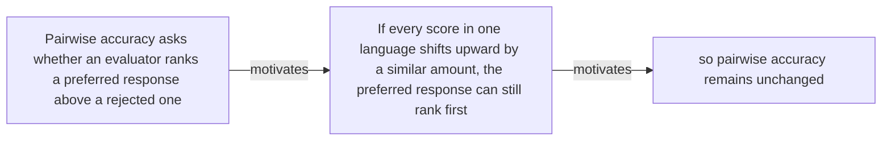

#### Python

```python
from html import escape
from pathlib import Path
from textwrap import wrap

title = "language_why_p1: Pairwise accuracy asks whether an evaluator ranks a preferred — problem and research-question relation"
nodes = [["n1","Pairwise accuracy asks whether an evaluator ranks a preferred response above a rejected one",120,150],["n2","If every score in one language shifts upward by a similar amount, the preferred response can still rank first",420,150],["n3","so pairwise accuracy remains unchanged",720,150]]
edges = [["n1","n2","motivates"],["n2","n3","motivates"]]
node_by_id = {node_id: (label, x, y) for node_id, label, x, y in nodes}

parts = [
    '<svg xmlns="http://www.w3.org/2000/svg" viewBox="0 0 860 520" role="img" aria-labelledby="title desc">',
    f'<title id="title">{escape(title)}</title>',
    '<desc id="desc">The labeled relations reproduce only relationships stated in the paragraph.</desc>',
    '<rect width="860" height="520" fill="white"/>',
]
for source, target, relation in edges:
    _, x1, y1 = node_by_id[source]
    _, x2, y2 = node_by_id[target]
    parts.append(f'<line x1="{x1}" y1="{y1}" x2="{x2}" y2="{y2}" stroke="#345" stroke-width="2"/>')
    parts.append(f'<text x="{(x1+x2)/2}" y="{(y1+y2)/2-6}" text-anchor="middle" font-family="sans-serif" font-size="11">{escape(relation)}</text>')
for _, label, x, y in nodes:
    parts.append(f'<rect x="{x-125}" y="{y-58}" width="250" height="116" rx="14" fill="#eef6ff" stroke="#234"/>')
    for line_index, line in enumerate(wrap(label, width=32)):
        parts.append(f'<text x="{x}" y="{y-34+line_index*16}" text-anchor="middle" font-family="sans-serif" font-size="12">{escape(line)}</text>')
parts.append('</svg>')
Path("language_why_p1_treatment_a.svg").write_text("\n".join(parts), encoding="utf-8")
```

### Treatment B — language_claim_pairwise_blind, language_claim_gap — claim-to-source provenance

- Teaching purpose: Show exactly which atomic claims underwrite this paragraph and which fixed source records support each claim.
- Encoding and reading order: A bipartite graph places 2 claim nodes on the left and 1 source nodes on the right, with only the 2 claim-source edges recorded in the fixture. Claim labels include epistemic status; source labels include the exact locator.
- Evidence and limitations: This treatment explains provenance and uncertainty, not the paper's causal mechanism. Missing edges remain visibly absent and no source count is treated as confidence.
- Recommended web medium: semantic HTML/CSS claim-source table with an SVG network view; JavaScript only for keyboard-controlled source highlighting.
- Mobile, accessibility, and motion behavior: Provide real table headers and source links in the static fallback, make every edge recoverable as text, stack claim records before source records on mobile, and require no motion.

#### TikZ

```tex
\documentclass[tikz,border=5pt]{standalone}
\usepackage[T1]{fontenc}
\usepackage{tikz}
\usetikzlibrary{arrows.meta}
\begin{document}
\begin{tikzpicture}[font=\sffamily,claim/.style={draw,rounded corners,align=center,text width=5.2cm,minimum height=1.2cm},source/.style={draw,dashed,align=center,text width=5.2cm,minimum height=1.2cm},link/.style={-{Latex[length=2mm]},thin}]
\node[font=\bfseries] at (4,1.8) {language\_why\_p1: claim-to-source provenance};
\node[claim] (c1) at (0,0) {Pairwise accuracy can remain high while language-dependent absolute score shifts create different threshold decisions. [AUTHORS\_INTERPRETATION]};
\node[claim] (c2) at (0,-2.4) {Reward-model acceptance-rate gaps reach 43.0 percentage points under a shared global median threshold. [OBSERVED]};
\node[source] (s1) at (8,0) {LLM Evaluators v1 threshold analysis and rounded worked example - Pages 5-7, Sections 3.4-3.5, Figure 4, Table 1, Appendix Table 15; Section 3.4 reports a 43.0-point aggregate maximum and separately describes rounded 23\% versus 67\% English/Ukrainian rates as a 44-point example};
\draw[link] (c1) -- (s1);
\draw[link] (c2) -- (s1);
\end{tikzpicture}
\end{document}
```

#### Mermaid

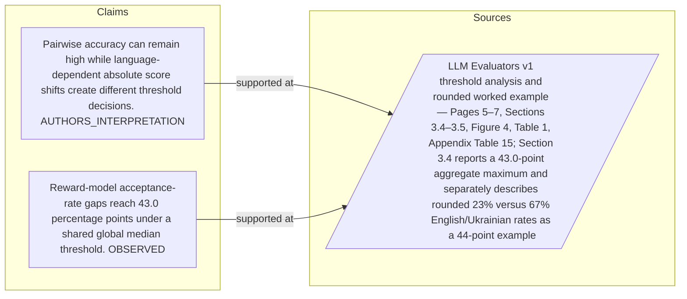

#### Python

```python
from html import escape
from pathlib import Path
from textwrap import wrap

title = "language_why_p1: claim-to-source provenance"
nodes = [["c1","Pairwise accuracy can remain high while language-dependent absolute score shifts create different threshold decisions. [AUTHORS_INTERPRETATION]",190,130],["c2","Reward-model acceptance-rate gaps reach 43.0 percentage points under a shared global median threshold. [OBSERVED]",190,250],["s1","LLM Evaluators v1 threshold analysis and rounded worked example — Pages 5–7, Sections 3.4–3.5, Figure 4, Table 1, Appendix Table 15; Section 3.4 reports a 43.0-point aggregate maximum and separately describes rounded 23% versus 67% English/Ukrainian rates as a 44-point example",700,130]]
edges = [["c1","s1"],["c2","s1"]]
node_by_id = {node_id: (label, x, y) for node_id, label, x, y in nodes}
height = 440

parts = [
    f'<svg xmlns="http://www.w3.org/2000/svg" viewBox="0 0 900 {height}" role="img" aria-labelledby="title desc">',
    f'<title id="title">{escape(title)}</title>',
    '<desc id="desc">Bipartite map from verified claim records to their exact source records.</desc>',
    f'<rect width="900" height="{height}" fill="white"/>',
]
for source, target in edges:
    _, x1, y1 = node_by_id[source]
    _, x2, y2 = node_by_id[target]
    parts.append(f'<line x1="{x1+145}" y1="{y1}" x2="{x2-145}" y2="{y2}" stroke="#456" stroke-width="2"/>')
for node_id, label, x, y in nodes:
    dashed = ' stroke-dasharray="7 5"' if node_id.startswith("s") else ''
    parts.append(f'<rect x="{x-145}" y="{y-46}" width="290" height="92" rx="12" fill="#f7fbff" stroke="#234"{dashed}/>')
    for line_index, line in enumerate(wrap(label, width=38)):
        parts.append(f'<text x="{x}" y="{y-24+line_index*14}" text-anchor="middle" font-family="sans-serif" font-size="11">{escape(line)}</text>')
parts.append('</svg>')
Path("language_why_p1_treatment_b.svg").write_text("\n".join(parts), encoding="utf-8")
```

### Treatment C — Pairwise accuracy asks whether an evaluator ranks a preferred — supported-versus-bounded scope

- Teaching purpose: Separate what the paragraph supports from the qualification or contingency that bounds it.
- Encoding and reading order: Partition the paragraph into 3 supported statement(s) and 1 boundary or contingency statement(s). The two columns are categories, not a scale or causal path.
- Evidence and limitations: Every card is a complete paragraph clause. The boundary column makes negative and not-established language visible without weakening it.
- Recommended web medium: responsive SVG or semantic HTML/CSS; JavaScript is optional only for a meaningful state or scope toggle.
- Mobile, accessibility, and motion behavior: Preserve every exact value or scope statement as selectable text, avoid color-only distinctions, stack groups on mobile, and keep all information visible when JavaScript or motion is disabled.

#### TikZ

```tex
\documentclass[tikz,border=5pt]{standalone}
\usepackage[T1]{fontenc}
\usepackage{tikz}
\begin{document}
\begin{tikzpicture}[font=\sffamily,item/.style={draw,align=center,text width=5.5cm,minimum height=1.4cm}]
\node[font=\bfseries] at (3.5,2) {language\_why\_p1: Pairwise accuracy asks whether an evaluator ranks a preferred - supported-versus-bounded scope};
\node[font=\bfseries] at (0,1) {Supported statement};
\node[font=\bfseries] at (7,1) {Boundary or contingency};
\node[item] at (0,0) {Pairwise accuracy asks whether an evaluator ranks a preferred response above a rejected one};
\node[item] at (0,-2) {If every score in one language shifts upward by a similar amount, the preferred response can still rank first};
\node[item] at (0,-4) {so pairwise accuracy remains unchanged};
\node[item] at (7,0) {so pairwise accuracy remains unchanged};
\end{tikzpicture}
\end{document}
```

#### Mermaid

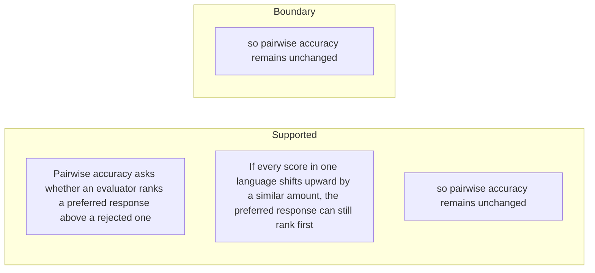

#### Python

```python
from html import escape
from pathlib import Path
from textwrap import wrap

title = "language_why_p1: Pairwise accuracy asks whether an evaluator ranks a preferred — supported-versus-bounded scope"
columns = {"Supported statement": ["Pairwise accuracy asks whether an evaluator ranks a preferred response above a rejected one","If every score in one language shifts upward by a similar amount, the preferred response can still rank first","so pairwise accuracy remains unchanged"], "Boundary or contingency": ["so pairwise accuracy remains unchanged"]}
height = 550
parts = [
    f'<svg xmlns="http://www.w3.org/2000/svg" viewBox="0 0 900 {height}" role="img" aria-labelledby="title desc">',
    f'<title id="title">{escape(title)}</title>',
    '<desc id="desc">Statements are partitioned into supported content and explicit boundaries.</desc>',
    f'<rect width="900" height="{height}" fill="white"/>',
]
for column_index, (heading, items) in enumerate(columns.items()):
    x = 240 + column_index * 430
    parts.append(f'<text x="{x}" y="70" text-anchor="middle" font-family="sans-serif" font-size="18" font-weight="700">{escape(heading)}</text>')
    for item_index, item in enumerate(items):
        y = 130 + item_index * 110
        parts.append(f'<rect x="{x-180}" y="{y-35}" width="360" height="80" rx="12" fill="#f7fbff" stroke="#234"/>')
        for line_index, line in enumerate(wrap(item, width=48)):
            parts.append(f'<text x="{x}" y="{y-12+line_index*14}" text-anchor="middle" font-family="sans-serif" font-size="11">{escape(line)}</text>')
parts.append('</svg>')
Path("language_why_p1_treatment_c.svg").write_text("\n".join(parts), encoding="utf-8")
```

### Implementation record

- Status: `IMPLEMENTED`
- Selected treatment: `A`
- Selection rationale: Selected the approved relationship that directly answers this paragraph's explanatory job; the shared visual uses the same evidence and complete adjacent scope recorded here.
- Delivery medium: `CSS + semantic HTML`
- Visual ID and placement: `language_visual_evaluation_modes` after `language_why_p2`; this record is served by that purpose-built figure.
- Shared paragraph scope: `language_why_p1`, `language_why_p2`
- Changed files: `packages/test-fixtures/explainers/llm-evaluators-languages.json`, `apps/web/app/papers/[id]/explainer-visual.tsx`, `apps/web/app/papers/[id]/page.tsx`, and `apps/web/app/globals.css`
- Accessibility and fallback verification: Figure has a programmatic title and description, explicit alt text, equivalent fallback prose, source links, limitations, and a semantic static body; no meaning depends on motion or pointer input.
- Desktop and mobile verification: Verified in Playwright on 1440-pixel desktop and iPhone 13 mobile viewports; figures remain paragraph-adjacent, preserve reading order, and introduce no horizontal page overflow.
- Evidence deviations: `NONE`; web-native CSS and semantic HTML preserve the selected treatment's evidence, labels, topology, and stated boundaries.

## `language_why_p2`

- Location: `language_why`, paragraph 2
- Text anchor: "Many real uses depend on absolute scores instead: a safety gate accepts content above a threshold, and reinforcement learning consumes scalar rewards."
- Claims and sources: `language_claim_pairwise_blind` (AUTHORS_INTERPRETATION, VERIFIED); `language_claim_gap` (OBSERVED, VERIFIED); `language_source_intro` (Pages 1–4, Sections 1–3.2); `language_source_thresholds` (Pages 5–7, Sections 3.4–3.5, Figure 4, Table 1, Appendix Table 15; Section 3.4 reports a 43.0-point aggregate maximum and separately describes rounded 23% versus 67% English/Ukrainian rates as a 44-point example)
- Visual needed: `YES`
- Decision rationale: Removing a visual would require readers to retain the material relation between "Many real uses depend on absolute scores instead" and "The paper tests that assumption directly" while also tracking 5 source-bounded propositions. The paragraph contains a real problem and research-question relation; the visual must preserve its stated conditions and must not add causal or proportional meaning.
- Explanatory job: problem and research-question relation.

### Treatment A — Many real uses depend on absolute scores instead — problem and research-question relation

- Teaching purpose: Answer "Why can pairwise accuracy miss a multilingual evaluation problem?" by exposing the paragraph's 5 named propositions and 4 stated reading, comparison, or qualification relations.
- Encoding and reading order: Nodes reproduce the complete labels "Many real uses depend on absolute scores instead"; "a safety gate accepts content above a threshold"; "and reinforcement learning consumes scalar rewards"; "Those uses assume that the same numerical score has comparable meaning across languages"; "The paper tests that assumption directly". Edges carry the explicit relation labels "motivates", "motivates", "motivates", "motivates"; arrow direction is sequence only for mechanism or example prose and otherwise denotes reading order.
- Evidence and limitations: The topology is derived from this paragraph rather than a fixed pipeline. Encode only `language_claim_pairwise_blind`, `language_claim_gap` and do not turn reading-order edges into causal claims.
- Recommended web medium: responsive inline SVG with CSS; JavaScript may add optional step focus only when state order matters.
- Mobile, accessibility, and motion behavior: Keep the full node-and-relation list in DOM order, expose the relation labels in the long description, stack nodes on narrow screens, and disable focus transitions under reduced motion.

#### TikZ

```tex
\documentclass[tikz,border=5pt]{standalone}
\usepackage[T1]{fontenc}
\usepackage{tikz}
\usetikzlibrary{arrows.meta,positioning}
\begin{document}
\begin{tikzpicture}[font=\sffamily,concept/.style={draw,rounded corners,align=center,text width=3.6cm,minimum height=1.35cm},link/.style={-{Latex[length=2mm]},thick},rel/.style={fill=white,font=\scriptsize,inner sep=2pt}]
\node[font=\bfseries,align=center] at (6.1,2.0) {language\_why\_p2: Many real uses depend on absolute scores instead - problem and research-question relation};
\node[concept] (n1) at (1.8,0) {Many real uses depend on absolute scores instead};
\node[concept] (n2) at (6.1,0) {a safety gate accepts content above a threshold};
\node[concept] (n3) at (10.4,0) {and reinforcement learning consumes scalar rewards};
\node[concept] (n4) at (1.8,-3.2) {Those uses assume that the same numerical score has comparable meaning across languages};
\node[concept] (n5) at (6.1,-3.2) {The paper tests that assumption directly};
\draw[link] (n1) -- node[rel] {motivates} (n2);
\draw[link] (n2) -- node[rel] {motivates} (n3);
\draw[link] (n3) -- node[rel] {motivates} (n4);
\draw[link] (n4) -- node[rel] {motivates} (n5);
\end{tikzpicture}
\end{document}
```

#### Mermaid

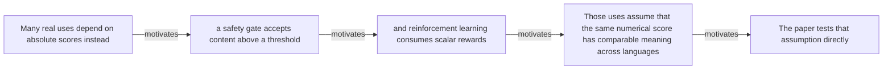

#### Python

```python
from html import escape
from pathlib import Path
from textwrap import wrap

title = "language_why_p2: Many real uses depend on absolute scores instead — problem and research-question relation"
nodes = [["n1","Many real uses depend on absolute scores instead",120,150],["n2","a safety gate accepts content above a threshold",420,150],["n3","and reinforcement learning consumes scalar rewards",720,150],["n4","Those uses assume that the same numerical score has comparable meaning across languages",120,340],["n5","The paper tests that assumption directly",420,340]]
edges = [["n1","n2","motivates"],["n2","n3","motivates"],["n3","n4","motivates"],["n4","n5","motivates"]]
node_by_id = {node_id: (label, x, y) for node_id, label, x, y in nodes}

parts = [
    '<svg xmlns="http://www.w3.org/2000/svg" viewBox="0 0 860 520" role="img" aria-labelledby="title desc">',
    f'<title id="title">{escape(title)}</title>',
    '<desc id="desc">The labeled relations reproduce only relationships stated in the paragraph.</desc>',
    '<rect width="860" height="520" fill="white"/>',
]
for source, target, relation in edges:
    _, x1, y1 = node_by_id[source]
    _, x2, y2 = node_by_id[target]
    parts.append(f'<line x1="{x1}" y1="{y1}" x2="{x2}" y2="{y2}" stroke="#345" stroke-width="2"/>')
    parts.append(f'<text x="{(x1+x2)/2}" y="{(y1+y2)/2-6}" text-anchor="middle" font-family="sans-serif" font-size="11">{escape(relation)}</text>')
for _, label, x, y in nodes:
    parts.append(f'<rect x="{x-125}" y="{y-58}" width="250" height="116" rx="14" fill="#eef6ff" stroke="#234"/>')
    for line_index, line in enumerate(wrap(label, width=32)):
        parts.append(f'<text x="{x}" y="{y-34+line_index*16}" text-anchor="middle" font-family="sans-serif" font-size="12">{escape(line)}</text>')
parts.append('</svg>')
Path("language_why_p2_treatment_a.svg").write_text("\n".join(parts), encoding="utf-8")
```

### Treatment B — language_claim_pairwise_blind, language_claim_gap — claim-to-source provenance

- Teaching purpose: Show exactly which atomic claims underwrite this paragraph and which fixed source records support each claim.
- Encoding and reading order: A bipartite graph places 2 claim nodes on the left and 1 source nodes on the right, with only the 2 claim-source edges recorded in the fixture. Claim labels include epistemic status; source labels include the exact locator.
- Evidence and limitations: This treatment explains provenance and uncertainty, not the paper's causal mechanism. Missing edges remain visibly absent and no source count is treated as confidence.
- Recommended web medium: semantic HTML/CSS claim-source table with an SVG network view; JavaScript only for keyboard-controlled source highlighting.
- Mobile, accessibility, and motion behavior: Provide real table headers and source links in the static fallback, make every edge recoverable as text, stack claim records before source records on mobile, and require no motion.

#### TikZ

```tex
\documentclass[tikz,border=5pt]{standalone}
\usepackage[T1]{fontenc}
\usepackage{tikz}
\usetikzlibrary{arrows.meta}
\begin{document}
\begin{tikzpicture}[font=\sffamily,claim/.style={draw,rounded corners,align=center,text width=5.2cm,minimum height=1.2cm},source/.style={draw,dashed,align=center,text width=5.2cm,minimum height=1.2cm},link/.style={-{Latex[length=2mm]},thin}]
\node[font=\bfseries] at (4,1.8) {language\_why\_p2: claim-to-source provenance};
\node[claim] (c1) at (0,0) {Pairwise accuracy can remain high while language-dependent absolute score shifts create different threshold decisions. [AUTHORS\_INTERPRETATION]};
\node[claim] (c2) at (0,-2.4) {Reward-model acceptance-rate gaps reach 43.0 percentage points under a shared global median threshold. [OBSERVED]};
\node[source] (s1) at (8,0) {LLM Evaluators v1 threshold analysis and rounded worked example - Pages 5-7, Sections 3.4-3.5, Figure 4, Table 1, Appendix Table 15; Section 3.4 reports a 43.0-point aggregate maximum and separately describes rounded 23\% versus 67\% English/Ukrainian rates as a 44-point example};
\draw[link] (c1) -- (s1);
\draw[link] (c2) -- (s1);
\end{tikzpicture}
\end{document}
```

#### Mermaid


#### Python

```python
from html import escape
from pathlib import Path
from textwrap import wrap

title = "language_why_p2: claim-to-source provenance"
nodes = [["c1","Pairwise accuracy can remain high while language-dependent absolute score shifts create different threshold decisions. [AUTHORS_INTERPRETATION]",190,130],["c2","Reward-model acceptance-rate gaps reach 43.0 percentage points under a shared global median threshold. [OBSERVED]",190,250],["s1","LLM Evaluators v1 threshold analysis and rounded worked example — Pages 5–7, Sections 3.4–3.5, Figure 4, Table 1, Appendix Table 15; Section 3.4 reports a 43.0-point aggregate maximum and separately describes rounded 23% versus 67% English/Ukrainian rates as a 44-point example",700,130]]
edges = [["c1","s1"],["c2","s1"]]
node_by_id = {node_id: (label, x, y) for node_id, label, x, y in nodes}
height = 440

parts = [
    f'<svg xmlns="http://www.w3.org/2000/svg" viewBox="0 0 900 {height}" role="img" aria-labelledby="title desc">',
    f'<title id="title">{escape(title)}</title>',
    '<desc id="desc">Bipartite map from verified claim records to their exact source records.</desc>',
    f'<rect width="900" height="{height}" fill="white"/>',
]
for source, target in edges:
    _, x1, y1 = node_by_id[source]
    _, x2, y2 = node_by_id[target]
    parts.append(f'<line x1="{x1+145}" y1="{y1}" x2="{x2-145}" y2="{y2}" stroke="#456" stroke-width="2"/>')
for node_id, label, x, y in nodes:
    dashed = ' stroke-dasharray="7 5"' if node_id.startswith("s") else ''
    parts.append(f'<rect x="{x-145}" y="{y-46}" width="290" height="92" rx="12" fill="#f7fbff" stroke="#234"{dashed}/>')
    for line_index, line in enumerate(wrap(label, width=38)):
        parts.append(f'<text x="{x}" y="{y-24+line_index*14}" text-anchor="middle" font-family="sans-serif" font-size="11">{escape(line)}</text>')
parts.append('</svg>')
Path("language_why_p2_treatment_b.svg").write_text("\n".join(parts), encoding="utf-8")
```

### Treatment C — Many real uses depend on absolute scores instead — supported-versus-bounded scope

- Teaching purpose: Separate what the paragraph supports from the qualification or contingency that bounds it.
- Encoding and reading order: Partition the paragraph into 5 supported statement(s) and 1 boundary or contingency statement(s). The two columns are categories, not a scale or causal path.
- Evidence and limitations: Every card is a complete paragraph clause. The boundary column makes negative and not-established language visible without weakening it.
- Recommended web medium: responsive SVG or semantic HTML/CSS; JavaScript is optional only for a meaningful state or scope toggle.
- Mobile, accessibility, and motion behavior: Preserve every exact value or scope statement as selectable text, avoid color-only distinctions, stack groups on mobile, and keep all information visible when JavaScript or motion is disabled.

#### TikZ

```tex
\documentclass[tikz,border=5pt]{standalone}
\usepackage[T1]{fontenc}
\usepackage{tikz}
\begin{document}
\begin{tikzpicture}[font=\sffamily,item/.style={draw,align=center,text width=5.5cm,minimum height=1.4cm}]
\node[font=\bfseries] at (3.5,2) {language\_why\_p2: Many real uses depend on absolute scores instead - supported-versus-bounded scope};
\node[font=\bfseries] at (0,1) {Supported statement};
\node[font=\bfseries] at (7,1) {Boundary or contingency};
\node[item] at (0,0) {Many real uses depend on absolute scores instead};
\node[item] at (0,-2) {a safety gate accepts content above a threshold};
\node[item] at (0,-4) {and reinforcement learning consumes scalar rewards};
\node[item] at (0,-6) {Those uses assume that the same numerical score has comparable meaning across languages};
\node[item] at (0,-8) {The paper tests that assumption directly};
\node[item] at (7,0) {The paper tests that assumption directly};
\end{tikzpicture}
\end{document}
```

#### Mermaid

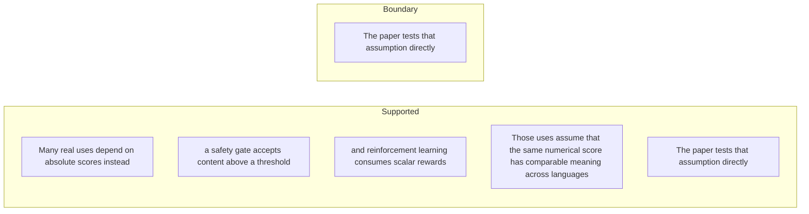

#### Python

```python
from html import escape
from pathlib import Path
from textwrap import wrap

title = "language_why_p2: Many real uses depend on absolute scores instead — supported-versus-bounded scope"
columns = {"Supported statement": ["Many real uses depend on absolute scores instead","a safety gate accepts content above a threshold","and reinforcement learning consumes scalar rewards","Those uses assume that the same numerical score has comparable meaning across languages","The paper tests that assumption directly"], "Boundary or contingency": ["The paper tests that assumption directly"]}
height = 770
parts = [
    f'<svg xmlns="http://www.w3.org/2000/svg" viewBox="0 0 900 {height}" role="img" aria-labelledby="title desc">',
    f'<title id="title">{escape(title)}</title>',
    '<desc id="desc">Statements are partitioned into supported content and explicit boundaries.</desc>',
    f'<rect width="900" height="{height}" fill="white"/>',
]
for column_index, (heading, items) in enumerate(columns.items()):
    x = 240 + column_index * 430
    parts.append(f'<text x="{x}" y="70" text-anchor="middle" font-family="sans-serif" font-size="18" font-weight="700">{escape(heading)}</text>')
    for item_index, item in enumerate(items):
        y = 130 + item_index * 110
        parts.append(f'<rect x="{x-180}" y="{y-35}" width="360" height="80" rx="12" fill="#f7fbff" stroke="#234"/>')
        for line_index, line in enumerate(wrap(item, width=48)):
            parts.append(f'<text x="{x}" y="{y-12+line_index*14}" text-anchor="middle" font-family="sans-serif" font-size="11">{escape(line)}</text>')
parts.append('</svg>')
Path("language_why_p2_treatment_c.svg").write_text("\n".join(parts), encoding="utf-8")
```

### Implementation record

- Status: `IMPLEMENTED`
- Selected treatment: `A`
- Selection rationale: Selected the approved relationship that directly answers this paragraph's explanatory job; the shared visual uses the same evidence and complete adjacent scope recorded here.
- Delivery medium: `CSS + semantic HTML`
- Visual ID and placement: `language_visual_evaluation_modes` after `language_why_p2`; this record is served by that purpose-built figure.
- Shared paragraph scope: `language_why_p1`, `language_why_p2`
- Changed files: `packages/test-fixtures/explainers/llm-evaluators-languages.json`, `apps/web/app/papers/[id]/explainer-visual.tsx`, `apps/web/app/papers/[id]/page.tsx`, and `apps/web/app/globals.css`
- Accessibility and fallback verification: Figure has a programmatic title and description, explicit alt text, equivalent fallback prose, source links, limitations, and a semantic static body; no meaning depends on motion or pointer input.
- Desktop and mobile verification: Verified in Playwright on 1440-pixel desktop and iPhone 13 mobile viewports; figures remain paragraph-adjacent, preserve reading order, and introduce no horizontal page overflow.
- Evidence deviations: `NONE`; web-native CSS and semantic HTML preserve the selected treatment's evidence, labels, topology, and stated boundaries.

## `language_change_p1`

- Location: `language_change`, paragraph 1
- Text anchor: "The study keeps semantic content aligned across 23 professionally translated and human-validated language versions, then examines pointwise score distributions rather than ranking accuracy alone."
- Claims and sources: `language_claim_effect` (OBSERVED, VERIFIED); `language_claim_resource` (OBSERVED, VERIFIED); `language_claim_additional_judges` (OBSERVED, VERIFIED); `language_source_intro` (Pages 1–4, Sections 1–3.2); `language_source_effects` (Pages 4–5, Sections 3.3.1–3.3.3, Figures 1–3, Appendix Table 6); `language_source_thresholds` (Pages 5–7, Sections 3.4–3.5, Figure 4, Table 1, Appendix Table 15; Section 3.4 reports a 43.0-point aggregate maximum and separately describes rounded 23% versus 67% English/Ukrainian rates as a 44-point example)
- Visual needed: `YES`
- Decision rationale: Removing a visual would require readers to retain the material relation between "The study keeps semantic content aligned across 23 professionally translated and human-validated language versions" and "and Reasoning data" while also tracking 4 source-bounded propositions. The paragraph contains a real changed-versus-preserved relation; the visual must preserve its stated conditions and must not add causal or proportional meaning.
- Explanatory job: changed-versus-preserved relation.

### Treatment A — The study keeps semantic content aligned across 23 professionally — changed-versus-preserved relation

- Teaching purpose: Answer "What does the paper add beyond multilingual pairwise benchmarks?" by exposing the paragraph's 4 named propositions and 3 stated reading, comparison, or qualification relations.
- Encoding and reading order: Nodes reproduce the complete labels "The study keeps semantic content aligned across 23 professionally translated and human-validated language versions"; "then examines pointwise score distributions rather than ranking accuracy alone"; "It tests four prompted judges and four trained reward models across Chat, Chat-Hard, Safety"; "and Reasoning data". Edges carry the explicit relation labels "contrasts with", "changes into", "changes into"; arrow direction is sequence only for mechanism or example prose and otherwise denotes reading order.
- Evidence and limitations: The topology is derived from this paragraph rather than a fixed pipeline. Encode only `language_claim_effect`, `language_claim_resource`, `language_claim_additional_judges` and do not turn reading-order edges into causal claims.
- Recommended web medium: responsive inline SVG with CSS; JavaScript may add optional step focus only when state order matters.
- Mobile, accessibility, and motion behavior: Keep the full node-and-relation list in DOM order, expose the relation labels in the long description, stack nodes on narrow screens, and disable focus transitions under reduced motion.

#### TikZ

```tex
\documentclass[tikz,border=5pt]{standalone}
\usepackage[T1]{fontenc}
\usepackage{tikz}
\usetikzlibrary{arrows.meta,positioning}
\begin{document}
\begin{tikzpicture}[font=\sffamily,concept/.style={draw,rounded corners,align=center,text width=3.6cm,minimum height=1.35cm},link/.style={-{Latex[length=2mm]},thick},rel/.style={fill=white,font=\scriptsize,inner sep=2pt}]
\node[font=\bfseries,align=center] at (6.1,2.0) {language\_change\_p1: The study keeps semantic content aligned across 23 professionally - changed-versus-preserved relation};
\node[concept] (n1) at (1.8,0) {The study keeps semantic content aligned across 23 professionally translated and human-validated language versions};
\node[concept] (n2) at (6.1,0) {then examines pointwise score distributions rather than ranking accuracy alone};
\node[concept] (n3) at (10.4,0) {It tests four prompted judges and four trained reward models across Chat, Chat-Hard, Safety};
\node[concept] (n4) at (1.8,-3.2) {and Reasoning data};
\draw[link] (n1) -- node[rel] {contrasts with} (n2);
\draw[link] (n2) -- node[rel] {changes into} (n3);
\draw[link] (n3) -- node[rel] {changes into} (n4);
\end{tikzpicture}
\end{document}
```

#### Mermaid

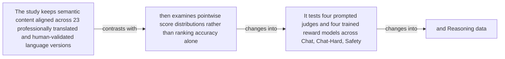

#### Python

```python
from html import escape
from pathlib import Path
from textwrap import wrap

title = "language_change_p1: The study keeps semantic content aligned across 23 professionally — changed-versus-preserved relation"
nodes = [["n1","The study keeps semantic content aligned across 23 professionally translated and human-validated language versions",120,150],["n2","then examines pointwise score distributions rather than ranking accuracy alone",420,150],["n3","It tests four prompted judges and four trained reward models across Chat, Chat-Hard, Safety",720,150],["n4","and Reasoning data",120,340]]
edges = [["n1","n2","contrasts with"],["n2","n3","changes into"],["n3","n4","changes into"]]
node_by_id = {node_id: (label, x, y) for node_id, label, x, y in nodes}

parts = [
    '<svg xmlns="http://www.w3.org/2000/svg" viewBox="0 0 860 520" role="img" aria-labelledby="title desc">',
    f'<title id="title">{escape(title)}</title>',
    '<desc id="desc">The labeled relations reproduce only relationships stated in the paragraph.</desc>',
    '<rect width="860" height="520" fill="white"/>',
]
for source, target, relation in edges:
    _, x1, y1 = node_by_id[source]
    _, x2, y2 = node_by_id[target]
    parts.append(f'<line x1="{x1}" y1="{y1}" x2="{x2}" y2="{y2}" stroke="#345" stroke-width="2"/>')
    parts.append(f'<text x="{(x1+x2)/2}" y="{(y1+y2)/2-6}" text-anchor="middle" font-family="sans-serif" font-size="11">{escape(relation)}</text>')
for _, label, x, y in nodes:
    parts.append(f'<rect x="{x-125}" y="{y-58}" width="250" height="116" rx="14" fill="#eef6ff" stroke="#234"/>')
    for line_index, line in enumerate(wrap(label, width=32)):
        parts.append(f'<text x="{x}" y="{y-34+line_index*16}" text-anchor="middle" font-family="sans-serif" font-size="12">{escape(line)}</text>')
parts.append('</svg>')
Path("language_change_p1_treatment_a.svg").write_text("\n".join(parts), encoding="utf-8")
```

### Treatment B — language_claim_effect, language_claim_resource, language_claim_additional_judges — claim-to-source provenance

- Teaching purpose: Show exactly which atomic claims underwrite this paragraph and which fixed source records support each claim.
- Encoding and reading order: A bipartite graph places 3 claim nodes on the left and 2 source nodes on the right, with only the 3 claim-source edges recorded in the fixture. Claim labels include epistemic status; source labels include the exact locator.
- Evidence and limitations: This treatment explains provenance and uncertainty, not the paper's causal mechanism. Missing edges remain visibly absent and no source count is treated as confidence.
- Recommended web medium: semantic HTML/CSS claim-source table with an SVG network view; JavaScript only for keyboard-controlled source highlighting.
- Mobile, accessibility, and motion behavior: Provide real table headers and source links in the static fallback, make every edge recoverable as text, stack claim records before source records on mobile, and require no motion.

#### TikZ

```tex
\documentclass[tikz,border=5pt]{standalone}
\usepackage[T1]{fontenc}
\usepackage{tikz}
\usetikzlibrary{arrows.meta}
\begin{document}
\begin{tikzpicture}[font=\sffamily,claim/.style={draw,rounded corners,align=center,text width=5.2cm,minimum height=1.2cm},source/.style={draw,dashed,align=center,text width=5.2cm,minimum height=1.2cm},link/.style={-{Latex[length=2mm]},thin}]
\node[font=\bfseries] at (4,1.8) {language\_change\_p1: claim-to-source provenance};
\node[claim] (c1) at (0,0) {All eight core evaluators show statistically significant differences in mean scores across the 23 evaluation languages. [OBSERVED]};
\node[claim] (c2) at (0,-2.4) {Aggregated reward-model scores correlate negatively with Common Crawl language prevalence at Pearson r = -0.58 and Spearman rho = -0.81. [OBSERVED]};
\node[claim] (c3) at (0,-4.8) {GPT-4.1-mini and Qwen3-32B-thinking reproduce significant negative resource-score correlations and nontrivial threshold gaps on Safety and Chat-Hard. [OBSERVED]};
\node[source] (s1) at (8,0) {LLM Evaluators v1 language effects - Pages 4-5, Sections 3.3.1-3.3.3, Figures 1-3, Appendix Table 6};
\node[source] (s2) at (8,-2.4) {LLM Evaluators v1 threshold analysis and rounded worked example - Pages 5-7, Sections 3.4-3.5, Figure 4, Table 1, Appendix Table 15; Section 3.4 reports a 43.0-point aggregate maximum and separately describes rounded 23\% versus 67\% English/Ukrainian rates as a 44-point example};
\draw[link] (c1) -- (s1);
\draw[link] (c2) -- (s1);
\draw[link] (c3) -- (s2);
\end{tikzpicture}
\end{document}
```

#### Mermaid

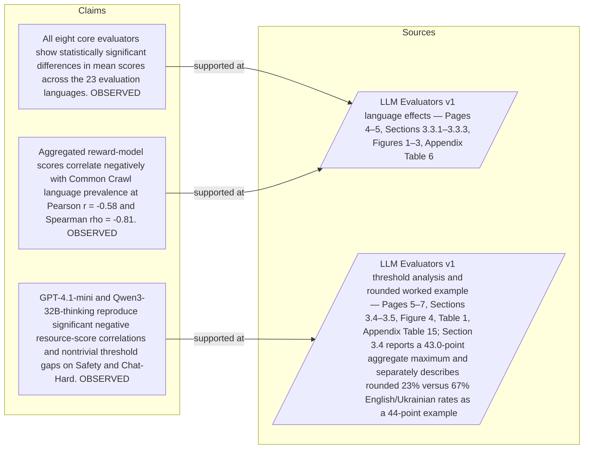

#### Python

```python
from html import escape
from pathlib import Path
from textwrap import wrap

title = "language_change_p1: claim-to-source provenance"
nodes = [["c1","All eight core evaluators show statistically significant differences in mean scores across the 23 evaluation languages. [OBSERVED]",190,130],["c2","Aggregated reward-model scores correlate negatively with Common Crawl language prevalence at Pearson r = -0.58 and Spearman rho = -0.81. [OBSERVED]",190,250],["c3","GPT-4.1-mini and Qwen3-32B-thinking reproduce significant negative resource-score correlations and nontrivial threshold gaps on Safety and Chat-Hard. [OBSERVED]",190,370],["s1","LLM Evaluators v1 language effects — Pages 4–5, Sections 3.3.1–3.3.3, Figures 1–3, Appendix Table 6",700,130],["s2","LLM Evaluators v1 threshold analysis and rounded worked example — Pages 5–7, Sections 3.4–3.5, Figure 4, Table 1, Appendix Table 15; Section 3.4 reports a 43.0-point aggregate maximum and separately describes rounded 23% versus 67% English/Ukrainian rates as a 44-point example",700,250]]
edges = [["c1","s1"],["c2","s1"],["c3","s2"]]
node_by_id = {node_id: (label, x, y) for node_id, label, x, y in nodes}
height = 560

parts = [
    f'<svg xmlns="http://www.w3.org/2000/svg" viewBox="0 0 900 {height}" role="img" aria-labelledby="title desc">',
    f'<title id="title">{escape(title)}</title>',
    '<desc id="desc">Bipartite map from verified claim records to their exact source records.</desc>',
    f'<rect width="900" height="{height}" fill="white"/>',
]
for source, target in edges:
    _, x1, y1 = node_by_id[source]
    _, x2, y2 = node_by_id[target]
    parts.append(f'<line x1="{x1+145}" y1="{y1}" x2="{x2-145}" y2="{y2}" stroke="#456" stroke-width="2"/>')
for node_id, label, x, y in nodes:
    dashed = ' stroke-dasharray="7 5"' if node_id.startswith("s") else ''
    parts.append(f'<rect x="{x-145}" y="{y-46}" width="290" height="92" rx="12" fill="#f7fbff" stroke="#234"{dashed}/>')
    for line_index, line in enumerate(wrap(label, width=38)):
        parts.append(f'<text x="{x}" y="{y-24+line_index*14}" text-anchor="middle" font-family="sans-serif" font-size="11">{escape(line)}</text>')
parts.append('</svg>')
Path("language_change_p1_treatment_b.svg").write_text("\n".join(parts), encoding="utf-8")
```

### Treatment C — The study keeps semantic content aligned across 23 professionally — supported-versus-bounded scope

- Teaching purpose: Separate what the paragraph supports from the qualification or contingency that bounds it.
- Encoding and reading order: Partition the paragraph into 3 supported statement(s) and 1 boundary or contingency statement(s). The two columns are categories, not a scale or causal path.
- Evidence and limitations: Every card is a complete paragraph clause. The boundary column makes negative and not-established language visible without weakening it.
- Recommended web medium: responsive SVG or semantic HTML/CSS; JavaScript is optional only for a meaningful state or scope toggle.
- Mobile, accessibility, and motion behavior: Preserve every exact value or scope statement as selectable text, avoid color-only distinctions, stack groups on mobile, and keep all information visible when JavaScript or motion is disabled.

#### TikZ

```tex
\documentclass[tikz,border=5pt]{standalone}
\usepackage[T1]{fontenc}
\usepackage{tikz}
\begin{document}
\begin{tikzpicture}[font=\sffamily,item/.style={draw,align=center,text width=5.5cm,minimum height=1.4cm}]
\node[font=\bfseries] at (3.5,2) {language\_change\_p1: The study keeps semantic content aligned across 23 professionally - supported-versus-bounded scope};
\node[font=\bfseries] at (0,1) {Supported statement};
\node[font=\bfseries] at (7,1) {Boundary or contingency};
\node[item] at (0,0) {The study keeps semantic content aligned across 23 professionally translated and human-validated language versions};
\node[item] at (0,-2) {It tests four prompted judges and four trained reward models across Chat, Chat-Hard, Safety};
\node[item] at (0,-4) {and Reasoning data};
\node[item] at (7,0) {then examines pointwise score distributions rather than ranking accuracy alone};
\end{tikzpicture}
\end{document}
```

#### Mermaid

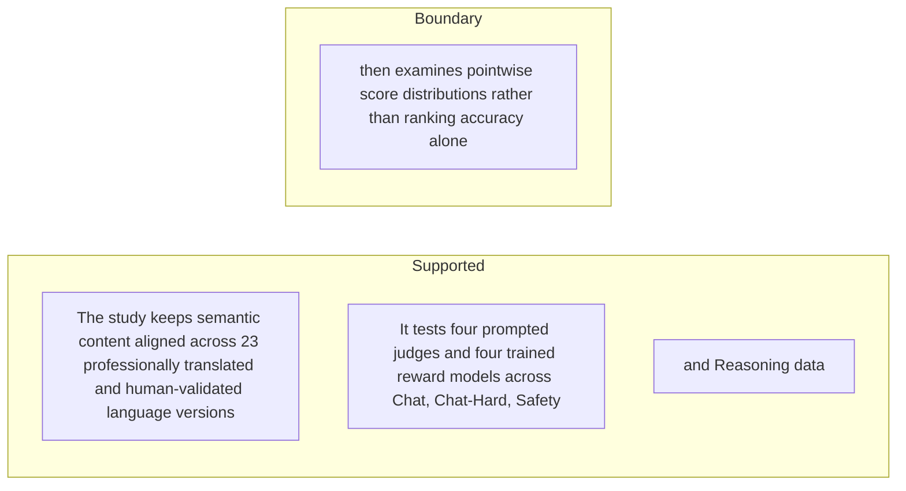

#### Python

```python
from html import escape
from pathlib import Path
from textwrap import wrap

title = "language_change_p1: The study keeps semantic content aligned across 23 professionally — supported-versus-bounded scope"
columns = {"Supported statement": ["The study keeps semantic content aligned across 23 professionally translated and human-validated language versions","It tests four prompted judges and four trained reward models across Chat, Chat-Hard, Safety","and Reasoning data"], "Boundary or contingency": ["then examines pointwise score distributions rather than ranking accuracy alone"]}
height = 550
parts = [
    f'<svg xmlns="http://www.w3.org/2000/svg" viewBox="0 0 900 {height}" role="img" aria-labelledby="title desc">',
    f'<title id="title">{escape(title)}</title>',
    '<desc id="desc">Statements are partitioned into supported content and explicit boundaries.</desc>',
    f'<rect width="900" height="{height}" fill="white"/>',
]
for column_index, (heading, items) in enumerate(columns.items()):
    x = 240 + column_index * 430
    parts.append(f'<text x="{x}" y="70" text-anchor="middle" font-family="sans-serif" font-size="18" font-weight="700">{escape(heading)}</text>')
    for item_index, item in enumerate(items):
        y = 130 + item_index * 110
        parts.append(f'<rect x="{x-180}" y="{y-35}" width="360" height="80" rx="12" fill="#f7fbff" stroke="#234"/>')
        for line_index, line in enumerate(wrap(item, width=48)):
            parts.append(f'<text x="{x}" y="{y-12+line_index*14}" text-anchor="middle" font-family="sans-serif" font-size="11">{escape(line)}</text>')
parts.append('</svg>')
Path("language_change_p1_treatment_c.svg").write_text("\n".join(parts), encoding="utf-8")
```

### Implementation record

- Status: `IMPLEMENTED`
- Selected treatment: `A`
- Selection rationale: Selected the approved relationship that directly answers this paragraph's explanatory job; the shared visual uses the same evidence and complete adjacent scope recorded here.
- Delivery medium: `CSS + semantic HTML`
- Visual ID and placement: `language_visual_study_design` after `language_change_p2`; this record is served by that purpose-built figure.
- Shared paragraph scope: `language_change_p1`, `language_change_p2`
- Changed files: `packages/test-fixtures/explainers/llm-evaluators-languages.json`, `apps/web/app/papers/[id]/explainer-visual.tsx`, `apps/web/app/papers/[id]/page.tsx`, and `apps/web/app/globals.css`
- Accessibility and fallback verification: Figure has a programmatic title and description, explicit alt text, equivalent fallback prose, source links, limitations, and a semantic static body; no meaning depends on motion or pointer input.
- Desktop and mobile verification: Verified in Playwright on 1440-pixel desktop and iPhone 13 mobile viewports; figures remain paragraph-adjacent, preserve reading order, and introduce no horizontal page overflow.
- Evidence deviations: `NONE`; web-native CSS and semantic HTML preserve the selected treatment's evidence, labels, topology, and stated boundaries.

## `language_change_p2`

- Location: `language_change`, paragraph 2
- Text anchor: "The authors also connect score shifts to Common Crawl language prevalence, test two additional large judges, measure threshold outcomes, and decompose scores into uncertainty-related and language-related components."
- Claims and sources: `language_claim_effect` (OBSERVED, VERIFIED); `language_claim_resource` (OBSERVED, VERIFIED); `language_claim_additional_judges` (OBSERVED, VERIFIED); `language_source_intro` (Pages 1–4, Sections 1–3.2); `language_source_effects` (Pages 4–5, Sections 3.3.1–3.3.3, Figures 1–3, Appendix Table 6); `language_source_thresholds` (Pages 5–7, Sections 3.4–3.5, Figure 4, Table 1, Appendix Table 15; Section 3.4 reports a 43.0-point aggregate maximum and separately describes rounded 23% versus 67% English/Ukrainian rates as a 44-point example)
- Visual needed: `YES`
- Decision rationale: Removing a visual would require readers to retain the material relation between "The authors also connect score shifts to Common Crawl language prevalence, test two additional large judges, measure threshold outcomes" and "This turns multilingual evaluator validation from one ranking metric into a calibration problem" while also tracking 3 source-bounded propositions. The paragraph contains a real changed-versus-preserved relation; the visual must preserve its stated conditions and must not add causal or proportional meaning.
- Explanatory job: changed-versus-preserved relation.

### Treatment A — The authors also connect score shifts to Common Crawl — changed-versus-preserved relation

- Teaching purpose: Answer "What does the paper add beyond multilingual pairwise benchmarks?" by exposing the paragraph's 3 named propositions and 2 stated reading, comparison, or qualification relations.
- Encoding and reading order: Nodes reproduce the complete labels "The authors also connect score shifts to Common Crawl language prevalence, test two additional large judges, measure threshold outcomes"; "and decompose scores into uncertainty-related and language-related components"; "This turns multilingual evaluator validation from one ranking metric into a calibration problem". Edges carry the explicit relation labels "changes into", "changes into"; arrow direction is sequence only for mechanism or example prose and otherwise denotes reading order.
- Evidence and limitations: The topology is derived from this paragraph rather than a fixed pipeline. Encode only `language_claim_effect`, `language_claim_resource`, `language_claim_additional_judges` and do not turn reading-order edges into causal claims.
- Recommended web medium: responsive inline SVG with CSS; JavaScript may add optional step focus only when state order matters.
- Mobile, accessibility, and motion behavior: Keep the full node-and-relation list in DOM order, expose the relation labels in the long description, stack nodes on narrow screens, and disable focus transitions under reduced motion.

#### TikZ

```tex
\documentclass[tikz,border=5pt]{standalone}
\usepackage[T1]{fontenc}
\usepackage{tikz}
\usetikzlibrary{arrows.meta,positioning}
\begin{document}
\begin{tikzpicture}[font=\sffamily,concept/.style={draw,rounded corners,align=center,text width=3.6cm,minimum height=1.35cm},link/.style={-{Latex[length=2mm]},thick},rel/.style={fill=white,font=\scriptsize,inner sep=2pt}]
\node[font=\bfseries,align=center] at (6.1,2.0) {language\_change\_p2: The authors also connect score shifts to Common Crawl - changed-versus-preserved relation};
\node[concept] (n1) at (1.8,0) {The authors also connect score shifts to Common Crawl language prevalence, test two additional large judges, measure threshold outcomes};
\node[concept] (n2) at (6.1,0) {and decompose scores into uncertainty-related and language-related components};
\node[concept] (n3) at (10.4,0) {This turns multilingual evaluator validation from one ranking metric into a calibration problem};
\draw[link] (n1) -- node[rel] {changes into} (n2);
\draw[link] (n2) -- node[rel] {changes into} (n3);
\end{tikzpicture}
\end{document}
```

#### Mermaid

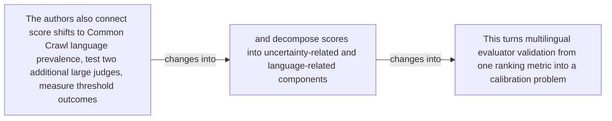

#### Python

```python
from html import escape
from pathlib import Path
from textwrap import wrap

title = "language_change_p2: The authors also connect score shifts to Common Crawl — changed-versus-preserved relation"
nodes = [["n1","The authors also connect score shifts to Common Crawl language prevalence, test two additional large judges, measure threshold outcomes",120,150],["n2","and decompose scores into uncertainty-related and language-related components",420,150],["n3","This turns multilingual evaluator validation from one ranking metric into a calibration problem",720,150]]
edges = [["n1","n2","changes into"],["n2","n3","changes into"]]
node_by_id = {node_id: (label, x, y) for node_id, label, x, y in nodes}

parts = [
    '<svg xmlns="http://www.w3.org/2000/svg" viewBox="0 0 860 520" role="img" aria-labelledby="title desc">',
    f'<title id="title">{escape(title)}</title>',
    '<desc id="desc">The labeled relations reproduce only relationships stated in the paragraph.</desc>',
    '<rect width="860" height="520" fill="white"/>',
]
for source, target, relation in edges:
    _, x1, y1 = node_by_id[source]
    _, x2, y2 = node_by_id[target]
    parts.append(f'<line x1="{x1}" y1="{y1}" x2="{x2}" y2="{y2}" stroke="#345" stroke-width="2"/>')
    parts.append(f'<text x="{(x1+x2)/2}" y="{(y1+y2)/2-6}" text-anchor="middle" font-family="sans-serif" font-size="11">{escape(relation)}</text>')
for _, label, x, y in nodes:
    parts.append(f'<rect x="{x-125}" y="{y-58}" width="250" height="116" rx="14" fill="#eef6ff" stroke="#234"/>')
    for line_index, line in enumerate(wrap(label, width=32)):
        parts.append(f'<text x="{x}" y="{y-34+line_index*16}" text-anchor="middle" font-family="sans-serif" font-size="12">{escape(line)}</text>')
parts.append('</svg>')
Path("language_change_p2_treatment_a.svg").write_text("\n".join(parts), encoding="utf-8")
```

### Treatment B — language_claim_effect, language_claim_resource, language_claim_additional_judges — claim-to-source provenance

- Teaching purpose: Show exactly which atomic claims underwrite this paragraph and which fixed source records support each claim.
- Encoding and reading order: A bipartite graph places 3 claim nodes on the left and 2 source nodes on the right, with only the 3 claim-source edges recorded in the fixture. Claim labels include epistemic status; source labels include the exact locator.
- Evidence and limitations: This treatment explains provenance and uncertainty, not the paper's causal mechanism. Missing edges remain visibly absent and no source count is treated as confidence.
- Recommended web medium: semantic HTML/CSS claim-source table with an SVG network view; JavaScript only for keyboard-controlled source highlighting.
- Mobile, accessibility, and motion behavior: Provide real table headers and source links in the static fallback, make every edge recoverable as text, stack claim records before source records on mobile, and require no motion.

#### TikZ

```tex
\documentclass[tikz,border=5pt]{standalone}
\usepackage[T1]{fontenc}
\usepackage{tikz}
\usetikzlibrary{arrows.meta}
\begin{document}
\begin{tikzpicture}[font=\sffamily,claim/.style={draw,rounded corners,align=center,text width=5.2cm,minimum height=1.2cm},source/.style={draw,dashed,align=center,text width=5.2cm,minimum height=1.2cm},link/.style={-{Latex[length=2mm]},thin}]
\node[font=\bfseries] at (4,1.8) {language\_change\_p2: claim-to-source provenance};
\node[claim] (c1) at (0,0) {All eight core evaluators show statistically significant differences in mean scores across the 23 evaluation languages. [OBSERVED]};
\node[claim] (c2) at (0,-2.4) {Aggregated reward-model scores correlate negatively with Common Crawl language prevalence at Pearson r = -0.58 and Spearman rho = -0.81. [OBSERVED]};
\node[claim] (c3) at (0,-4.8) {GPT-4.1-mini and Qwen3-32B-thinking reproduce significant negative resource-score correlations and nontrivial threshold gaps on Safety and Chat-Hard. [OBSERVED]};
\node[source] (s1) at (8,0) {LLM Evaluators v1 language effects - Pages 4-5, Sections 3.3.1-3.3.3, Figures 1-3, Appendix Table 6};
\node[source] (s2) at (8,-2.4) {LLM Evaluators v1 threshold analysis and rounded worked example - Pages 5-7, Sections 3.4-3.5, Figure 4, Table 1, Appendix Table 15; Section 3.4 reports a 43.0-point aggregate maximum and separately describes rounded 23\% versus 67\% English/Ukrainian rates as a 44-point example};
\draw[link] (c1) -- (s1);
\draw[link] (c2) -- (s1);
\draw[link] (c3) -- (s2);
\end{tikzpicture}
\end{document}
```

#### Mermaid


#### Python

```python
from html import escape
from pathlib import Path
from textwrap import wrap

title = "language_change_p2: claim-to-source provenance"
nodes = [["c1","All eight core evaluators show statistically significant differences in mean scores across the 23 evaluation languages. [OBSERVED]",190,130],["c2","Aggregated reward-model scores correlate negatively with Common Crawl language prevalence at Pearson r = -0.58 and Spearman rho = -0.81. [OBSERVED]",190,250],["c3","GPT-4.1-mini and Qwen3-32B-thinking reproduce significant negative resource-score correlations and nontrivial threshold gaps on Safety and Chat-Hard. [OBSERVED]",190,370],["s1","LLM Evaluators v1 language effects — Pages 4–5, Sections 3.3.1–3.3.3, Figures 1–3, Appendix Table 6",700,130],["s2","LLM Evaluators v1 threshold analysis and rounded worked example — Pages 5–7, Sections 3.4–3.5, Figure 4, Table 1, Appendix Table 15; Section 3.4 reports a 43.0-point aggregate maximum and separately describes rounded 23% versus 67% English/Ukrainian rates as a 44-point example",700,250]]
edges = [["c1","s1"],["c2","s1"],["c3","s2"]]
node_by_id = {node_id: (label, x, y) for node_id, label, x, y in nodes}
height = 560

parts = [
    f'<svg xmlns="http://www.w3.org/2000/svg" viewBox="0 0 900 {height}" role="img" aria-labelledby="title desc">',
    f'<title id="title">{escape(title)}</title>',
    '<desc id="desc">Bipartite map from verified claim records to their exact source records.</desc>',
    f'<rect width="900" height="{height}" fill="white"/>',
]
for source, target in edges:
    _, x1, y1 = node_by_id[source]
    _, x2, y2 = node_by_id[target]
    parts.append(f'<line x1="{x1+145}" y1="{y1}" x2="{x2-145}" y2="{y2}" stroke="#456" stroke-width="2"/>')
for node_id, label, x, y in nodes:
    dashed = ' stroke-dasharray="7 5"' if node_id.startswith("s") else ''
    parts.append(f'<rect x="{x-145}" y="{y-46}" width="290" height="92" rx="12" fill="#f7fbff" stroke="#234"{dashed}/>')
    for line_index, line in enumerate(wrap(label, width=38)):
        parts.append(f'<text x="{x}" y="{y-24+line_index*14}" text-anchor="middle" font-family="sans-serif" font-size="11">{escape(line)}</text>')
parts.append('</svg>')
Path("language_change_p2_treatment_b.svg").write_text("\n".join(parts), encoding="utf-8")
```

### Treatment C — The authors also connect score shifts to Common Crawl — supported-versus-bounded scope

- Teaching purpose: Separate what the paragraph supports from the qualification or contingency that bounds it.
- Encoding and reading order: Partition the paragraph into 3 supported statement(s) and 1 boundary or contingency statement(s). The two columns are categories, not a scale or causal path.
- Evidence and limitations: Every card is a complete paragraph clause. The boundary column makes negative and not-established language visible without weakening it.
- Recommended web medium: responsive SVG or semantic HTML/CSS; JavaScript is optional only for a meaningful state or scope toggle.
- Mobile, accessibility, and motion behavior: Preserve every exact value or scope statement as selectable text, avoid color-only distinctions, stack groups on mobile, and keep all information visible when JavaScript or motion is disabled.

#### TikZ

```tex
\documentclass[tikz,border=5pt]{standalone}
\usepackage[T1]{fontenc}
\usepackage{tikz}
\begin{document}
\begin{tikzpicture}[font=\sffamily,item/.style={draw,align=center,text width=5.5cm,minimum height=1.4cm}]
\node[font=\bfseries] at (3.5,2) {language\_change\_p2: The authors also connect score shifts to Common Crawl - supported-versus-bounded scope};
\node[font=\bfseries] at (0,1) {Supported statement};
\node[font=\bfseries] at (7,1) {Boundary or contingency};
\node[item] at (0,0) {The authors also connect score shifts to Common Crawl language prevalence, test two additional large judges, measure threshold outcomes};
\node[item] at (0,-2) {and decompose scores into uncertainty-related and language-related components};
\node[item] at (0,-4) {This turns multilingual evaluator validation from one ranking metric into a calibration problem};
\node[item] at (7,0) {This turns multilingual evaluator validation from one ranking metric into a calibration problem};
\end{tikzpicture}
\end{document}
```

#### Mermaid

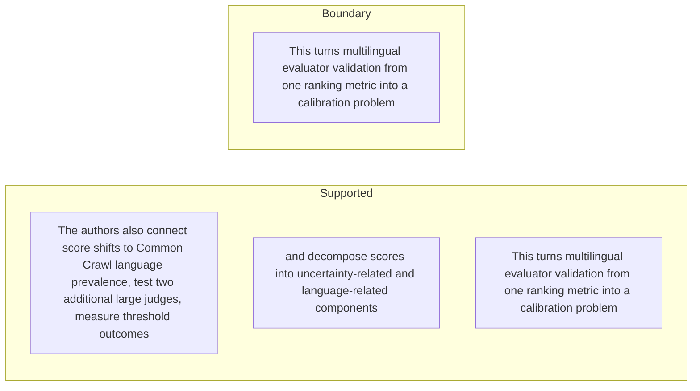

#### Python

```python
from html import escape
from pathlib import Path
from textwrap import wrap

title = "language_change_p2: The authors also connect score shifts to Common Crawl — supported-versus-bounded scope"
columns = {"Supported statement": ["The authors also connect score shifts to Common Crawl language prevalence, test two additional large judges, measure threshold outcomes","and decompose scores into uncertainty-related and language-related components","This turns multilingual evaluator validation from one ranking metric into a calibration problem"], "Boundary or contingency": ["This turns multilingual evaluator validation from one ranking metric into a calibration problem"]}
height = 550
parts = [
    f'<svg xmlns="http://www.w3.org/2000/svg" viewBox="0 0 900 {height}" role="img" aria-labelledby="title desc">',
    f'<title id="title">{escape(title)}</title>',
    '<desc id="desc">Statements are partitioned into supported content and explicit boundaries.</desc>',
    f'<rect width="900" height="{height}" fill="white"/>',
]
for column_index, (heading, items) in enumerate(columns.items()):
    x = 240 + column_index * 430
    parts.append(f'<text x="{x}" y="70" text-anchor="middle" font-family="sans-serif" font-size="18" font-weight="700">{escape(heading)}</text>')
    for item_index, item in enumerate(items):
        y = 130 + item_index * 110
        parts.append(f'<rect x="{x-180}" y="{y-35}" width="360" height="80" rx="12" fill="#f7fbff" stroke="#234"/>')
        for line_index, line in enumerate(wrap(item, width=48)):
            parts.append(f'<text x="{x}" y="{y-12+line_index*14}" text-anchor="middle" font-family="sans-serif" font-size="11">{escape(line)}</text>')
parts.append('</svg>')
Path("language_change_p2_treatment_c.svg").write_text("\n".join(parts), encoding="utf-8")
```

### Implementation record

- Status: `IMPLEMENTED`
- Selected treatment: `A`
- Selection rationale: Selected the approved relationship that directly answers this paragraph's explanatory job; the shared visual uses the same evidence and complete adjacent scope recorded here.
- Delivery medium: `CSS + semantic HTML`
- Visual ID and placement: `language_visual_study_design` after `language_change_p2`; this record is served by that purpose-built figure.
- Shared paragraph scope: `language_change_p1`, `language_change_p2`
- Changed files: `packages/test-fixtures/explainers/llm-evaluators-languages.json`, `apps/web/app/papers/[id]/explainer-visual.tsx`, `apps/web/app/papers/[id]/page.tsx`, and `apps/web/app/globals.css`
- Accessibility and fallback verification: Figure has a programmatic title and description, explicit alt text, equivalent fallback prose, source links, limitations, and a semantic static body; no meaning depends on motion or pointer input.
- Desktop and mobile verification: Verified in Playwright on 1440-pixel desktop and iPhone 13 mobile viewports; figures remain paragraph-adjacent, preserve reading order, and introduce no horizontal page overflow.
- Evidence deviations: `NONE`; web-native CSS and semantic HTML preserve the selected treatment's evidence, labels, topology, and stated boundaries.

## `language_mechanism_p1`

- Location: `language_mechanism`, paragraph 1
- Text anchor: "Suppose an evaluator adds a language-conditioned baseline to every response score."
- Claims and sources: `language_claim_pairwise_blind` (AUTHORS_INTERPRETATION, VERIFIED); `language_claim_uncertainty` (OBSERVED, VERIFIED); `language_claim_language_after_nll` (OBSERVED, VERIFIED); `language_source_uncertainty` (Pages 7–8, Sections 4–4.1, Equations 1–2, Figure 5, Table 2); `language_source_regressions` (Pages 8–10, Sections 4.2–4.3, Equations 3–6, Figures 6–7, Appendix Tables 11–12); `language_source_calibration` (Pages 10 and 22–23, Section 5, Appendix D, Tables 13–15)
- Visual needed: `YES`
- Decision rationale: Removing a visual would require readers to retain the material relation between "Suppose an evaluator adds a language-conditioned baseline to every response score" and "Across languages, however, the raw pointwise scores are no longer on one common scale" while also tracking 4 source-bounded propositions. The paragraph contains a real mechanism relation graph; the visual must preserve its stated conditions and must not add causal or proportional meaning.
- Explanatory job: mechanism relation graph.

### Treatment A — Suppose an evaluator adds a language-conditioned baseline to every — mechanism relation graph

- Teaching purpose: Answer "How can scores shift while rankings remain correct?" by exposing the paragraph's 4 named propositions and 3 stated reading, comparison, or qualification relations.
- Encoding and reading order: Nodes reproduce the complete labels "Suppose an evaluator adds a language-conditioned baseline to every response score"; "Within one language, that shared offset cancels when two responses are compared"; "so pairwise ordering can remain correct"; "Across languages, however, the raw pointwise scores are no longer on one common scale". Edges carry the explicit relation labels "compared with", "then", "then"; arrow direction is sequence only for mechanism or example prose and otherwise denotes reading order.
- Evidence and limitations: The topology is derived from this paragraph rather than a fixed pipeline. Encode only `language_claim_pairwise_blind`, `language_claim_uncertainty`, `language_claim_language_after_nll` and do not turn reading-order edges into causal claims.
- Recommended web medium: responsive inline SVG with CSS; JavaScript may add optional step focus only when state order matters.
- Mobile, accessibility, and motion behavior: Keep the full node-and-relation list in DOM order, expose the relation labels in the long description, stack nodes on narrow screens, and disable focus transitions under reduced motion.

#### TikZ

```tex
\documentclass[tikz,border=5pt]{standalone}
\usepackage[T1]{fontenc}
\usepackage{tikz}
\usetikzlibrary{arrows.meta,positioning}
\begin{document}
\begin{tikzpicture}[font=\sffamily,concept/.style={draw,rounded corners,align=center,text width=3.6cm,minimum height=1.35cm},link/.style={-{Latex[length=2mm]},thick},rel/.style={fill=white,font=\scriptsize,inner sep=2pt}]
\node[font=\bfseries,align=center] at (6.1,2.0) {language\_mechanism\_p1: Suppose an evaluator adds a language-conditioned baseline to every - mechanism relation graph};
\node[concept] (n1) at (1.8,0) {Suppose an evaluator adds a language-conditioned baseline to every response score};
\node[concept] (n2) at (6.1,0) {Within one language, that shared offset cancels when two responses are compared};
\node[concept] (n3) at (10.4,0) {so pairwise ordering can remain correct};
\node[concept] (n4) at (1.8,-3.2) {Across languages, however, the raw pointwise scores are no longer on one common scale};
\draw[link] (n1) -- node[rel] {compared with} (n2);
\draw[link] (n2) -- node[rel] {then} (n3);
\draw[link] (n3) -- node[rel] {then} (n4);
\end{tikzpicture}
\end{document}
```

#### Mermaid

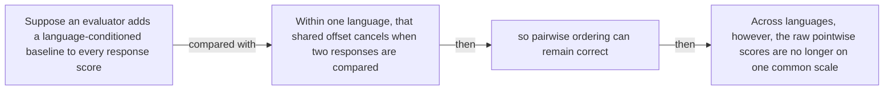

#### Python

```python
from html import escape
from pathlib import Path
from textwrap import wrap

title = "language_mechanism_p1: Suppose an evaluator adds a language-conditioned baseline to every — mechanism relation graph"
nodes = [["n1","Suppose an evaluator adds a language-conditioned baseline to every response score",120,150],["n2","Within one language, that shared offset cancels when two responses are compared",420,150],["n3","so pairwise ordering can remain correct",720,150],["n4","Across languages, however, the raw pointwise scores are no longer on one common scale",120,340]]
edges = [["n1","n2","compared with"],["n2","n3","then"],["n3","n4","then"]]
node_by_id = {node_id: (label, x, y) for node_id, label, x, y in nodes}

parts = [
    '<svg xmlns="http://www.w3.org/2000/svg" viewBox="0 0 860 520" role="img" aria-labelledby="title desc">',
    f'<title id="title">{escape(title)}</title>',
    '<desc id="desc">The labeled relations reproduce only relationships stated in the paragraph.</desc>',
    '<rect width="860" height="520" fill="white"/>',
]
for source, target, relation in edges:
    _, x1, y1 = node_by_id[source]
    _, x2, y2 = node_by_id[target]
    parts.append(f'<line x1="{x1}" y1="{y1}" x2="{x2}" y2="{y2}" stroke="#345" stroke-width="2"/>')
    parts.append(f'<text x="{(x1+x2)/2}" y="{(y1+y2)/2-6}" text-anchor="middle" font-family="sans-serif" font-size="11">{escape(relation)}</text>')
for _, label, x, y in nodes:
    parts.append(f'<rect x="{x-125}" y="{y-58}" width="250" height="116" rx="14" fill="#eef6ff" stroke="#234"/>')
    for line_index, line in enumerate(wrap(label, width=32)):
        parts.append(f'<text x="{x}" y="{y-34+line_index*16}" text-anchor="middle" font-family="sans-serif" font-size="12">{escape(line)}</text>')
parts.append('</svg>')
Path("language_mechanism_p1_treatment_a.svg").write_text("\n".join(parts), encoding="utf-8")
```

### Treatment B — language_claim_pairwise_blind, language_claim_uncertainty, language_claim_language_after_nll — claim-to-source provenance

- Teaching purpose: Show exactly which atomic claims underwrite this paragraph and which fixed source records support each claim.
- Encoding and reading order: A bipartite graph places 3 claim nodes on the left and 3 source nodes on the right, with only the 3 claim-source edges recorded in the fixture. Claim labels include epistemic status; source labels include the exact locator.
- Evidence and limitations: This treatment explains provenance and uncertainty, not the paper's causal mechanism. Missing edges remain visibly absent and no source count is treated as confidence.
- Recommended web medium: semantic HTML/CSS claim-source table with an SVG network view; JavaScript only for keyboard-controlled source highlighting.
- Mobile, accessibility, and motion behavior: Provide real table headers and source links in the static fallback, make every edge recoverable as text, stack claim records before source records on mobile, and require no motion.

#### TikZ

```tex
\documentclass[tikz,border=5pt]{standalone}
\usepackage[T1]{fontenc}
\usepackage{tikz}
\usetikzlibrary{arrows.meta}
\begin{document}
\begin{tikzpicture}[font=\sffamily,claim/.style={draw,rounded corners,align=center,text width=5.2cm,minimum height=1.2cm},source/.style={draw,dashed,align=center,text width=5.2cm,minimum height=1.2cm},link/.style={-{Latex[length=2mm]},thin}]
\node[font=\bfseries] at (4,1.8) {language\_mechanism\_p1: claim-to-source provenance};
\node[claim] (c1) at (0,0) {Pairwise accuracy can remain high while language-dependent absolute score shifts create different threshold decisions. [AUTHORS\_INTERPRETATION]};
\node[claim] (c2) at (0,-2.4) {Summed negative log-likelihood and the tested token-free uncertainty measures correlate positively with evaluator scores at the language level. [OBSERVED]};
\node[claim] (c3) at (0,-4.8) {Language identity adds significant predictive power after controlling for negative log-likelihood in every evaluated reward-model regression. [OBSERVED]};
\node[source] (s1) at (8,0) {LLM Evaluators v1 threshold analysis and rounded worked example - Pages 5-7, Sections 3.4-3.5, Figure 4, Table 1, Appendix Table 15; Section 3.4 reports a 43.0-point aggregate maximum and separately describes rounded 23\% versus 67\% English/Ukrainian rates as a 44-point example};
\node[source] (s2) at (8,-2.4) {LLM Evaluators v1 uncertainty analysis - Pages 7-8, Sections 4-4.1, Equations 1-2, Figure 5, Table 2};
\node[source] (s3) at (8,-4.8) {LLM Evaluators v1 structural regressions - Pages 8-10, Sections 4.2-4.3, Equations 3-6, Figures 6-7, Appendix Tables 11-12};
\draw[link] (c1) -- (s1);
\draw[link] (c2) -- (s2);
\draw[link] (c3) -- (s3);
\end{tikzpicture}
\end{document}
```

#### Mermaid

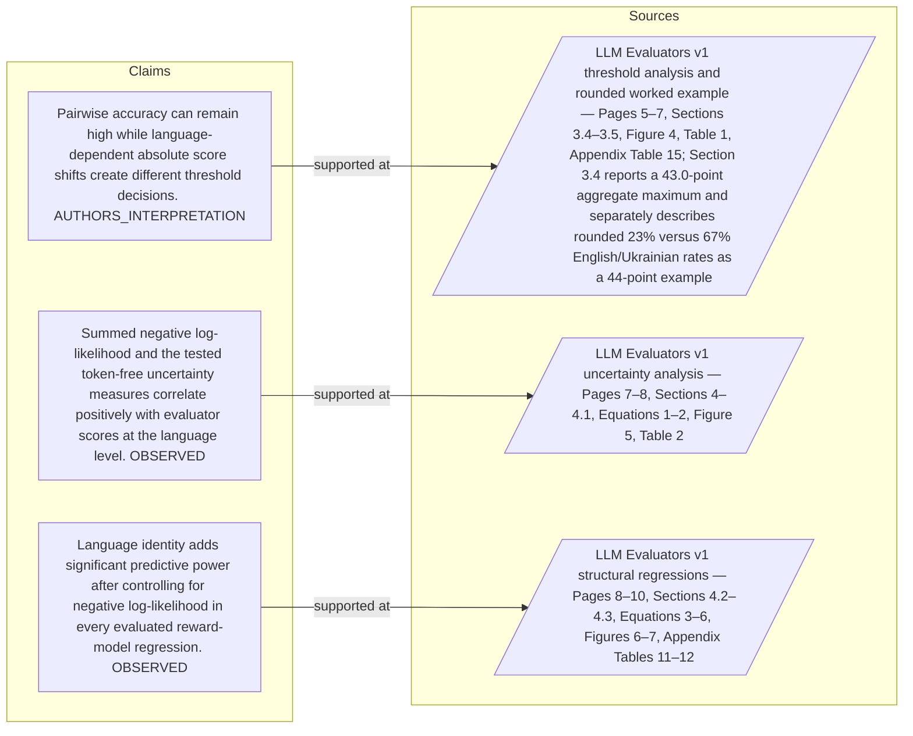

#### Python

```python
from html import escape
from pathlib import Path
from textwrap import wrap

title = "language_mechanism_p1: claim-to-source provenance"
nodes = [["c1","Pairwise accuracy can remain high while language-dependent absolute score shifts create different threshold decisions. [AUTHORS_INTERPRETATION]",190,130],["c2","Summed negative log-likelihood and the tested token-free uncertainty measures correlate positively with evaluator scores at the language level. [OBSERVED]",190,250],["c3","Language identity adds significant predictive power after controlling for negative log-likelihood in every evaluated reward-model regression. [OBSERVED]",190,370],["s1","LLM Evaluators v1 threshold analysis and rounded worked example — Pages 5–7, Sections 3.4–3.5, Figure 4, Table 1, Appendix Table 15; Section 3.4 reports a 43.0-point aggregate maximum and separately describes rounded 23% versus 67% English/Ukrainian rates as a 44-point example",700,130],["s2","LLM Evaluators v1 uncertainty analysis — Pages 7–8, Sections 4–4.1, Equations 1–2, Figure 5, Table 2",700,250],["s3","LLM Evaluators v1 structural regressions — Pages 8–10, Sections 4.2–4.3, Equations 3–6, Figures 6–7, Appendix Tables 11–12",700,370]]
edges = [["c1","s1"],["c2","s2"],["c3","s3"]]
node_by_id = {node_id: (label, x, y) for node_id, label, x, y in nodes}
height = 560

parts = [
    f'<svg xmlns="http://www.w3.org/2000/svg" viewBox="0 0 900 {height}" role="img" aria-labelledby="title desc">',
    f'<title id="title">{escape(title)}</title>',
    '<desc id="desc">Bipartite map from verified claim records to their exact source records.</desc>',
    f'<rect width="900" height="{height}" fill="white"/>',
]
for source, target in edges:
    _, x1, y1 = node_by_id[source]
    _, x2, y2 = node_by_id[target]
    parts.append(f'<line x1="{x1+145}" y1="{y1}" x2="{x2-145}" y2="{y2}" stroke="#456" stroke-width="2"/>')
for node_id, label, x, y in nodes:
    dashed = ' stroke-dasharray="7 5"' if node_id.startswith("s") else ''
    parts.append(f'<rect x="{x-145}" y="{y-46}" width="290" height="92" rx="12" fill="#f7fbff" stroke="#234"{dashed}/>')
    for line_index, line in enumerate(wrap(label, width=38)):
        parts.append(f'<text x="{x}" y="{y-24+line_index*14}" text-anchor="middle" font-family="sans-serif" font-size="11">{escape(line)}</text>')
parts.append('</svg>')
Path("language_mechanism_p1_treatment_b.svg").write_text("\n".join(parts), encoding="utf-8")
```

### Treatment C — Suppose an evaluator adds a language-conditioned baseline to every — input-operation-outcome storyboard

- Teaching purpose: Let readers inspect the paragraph as concrete input, operation, and outcome states.
- Encoding and reading order: Use 4 ordered states labeled "Input: Suppose an evaluator adds a language-conditioned baseline to every response score", "Operation: Within one language, that shared offset cancels when two responses are compared", "Operation: so pairwise ordering can remain correct", "Outcome: Across languages, however, the raw pointwise scores are no longer on one common scale". State connectors reproduce paragraph order and do not imply unreported timing.
- Evidence and limitations: The first, intermediate, and final states are paragraph clauses; no hidden state, quantity, or transition is added.
- Recommended web medium: responsive SVG or semantic HTML/CSS; JavaScript is optional only for a meaningful state or scope toggle.
- Mobile, accessibility, and motion behavior: Preserve every exact value or scope statement as selectable text, avoid color-only distinctions, stack groups on mobile, and keep all information visible when JavaScript or motion is disabled.

#### TikZ

```tex
\documentclass[tikz,border=5pt]{standalone}
\usepackage[T1]{fontenc}
\usepackage{tikz}
\begin{document}
\begin{tikzpicture}[font=\sffamily,state/.style={draw,rounded corners,align=center,text width=3.2cm,minimum height=1.8cm}]
\node[font=\bfseries] at (5.699999999999999,2) {language\_mechanism\_p1: Suppose an evaluator adds a language-conditioned baseline to every - input-operation-outcome storyboard};
\node[state] (k1) at (0,0) {\textbf{Input}\\Suppose an evaluator adds a language-conditioned baseline to every response score};
\node[state] (k2) at (3.8,0) {\textbf{Operation}\\Within one language, that shared offset cancels when two responses are compared};
\node[state] (k3) at (7.6,0) {\textbf{Operation}\\so pairwise ordering can remain correct};
\node[state] (k4) at (11.399999999999999,0) {\textbf{Outcome}\\Across languages, however, the raw pointwise scores are no longer on one common scale};
\draw[->,thick] (k1) -- (k2);
\draw[->,thick] (k2) -- (k3);
\draw[->,thick] (k3) -- (k4);
\end{tikzpicture}
\end{document}
```

#### Mermaid

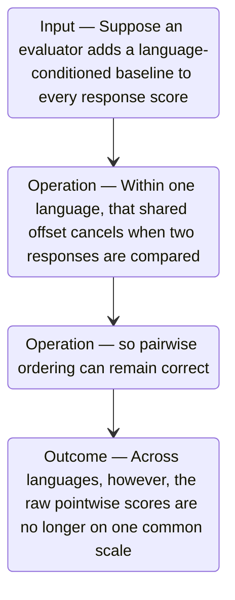

#### Python

```python
from html import escape
from pathlib import Path
from textwrap import wrap

title = "language_mechanism_p1: Suppose an evaluator adds a language-conditioned baseline to every — input-operation-outcome storyboard"
items = [["Input","Suppose an evaluator adds a language-conditioned baseline to every response score",120,210],["Operation","Within one language, that shared offset cancels when two responses are compared",290,210],["Operation","so pairwise ordering can remain correct",460,210],["Outcome","Across languages, however, the raw pointwise scores are no longer on one common scale",630,210]]
width = max(760, 240 + len(items) * 170)
parts = [
    f'<svg xmlns="http://www.w3.org/2000/svg" viewBox="0 0 {width} 460" role="img" aria-labelledby="title desc">',
    f'<title id="title">{escape(title)}</title>',
    '<desc id="desc">Input, operation, and outcome states follow the paragraph in source order.</desc>',
    f'<rect width="{width}" height="460" fill="white"/>',
]
for index in range(len(items)-1):
    _, _, x1, y1 = items[index]
    _, _, x2, y2 = items[index+1]
    parts.append(f'<line x1="{x1+65}" y1="{y1}" x2="{x2-65}" y2="{y2}" stroke="#345" stroke-width="2"/>')
for group, label, x, y in items:
    parts.append(f'<rect x="{x-65}" y="{y-90}" width="130" height="180" rx="16" fill="#eef6ff" stroke="#234"/>')
    parts.append(f'<text x="{x}" y="{y-60}" text-anchor="middle" font-family="sans-serif" font-size="13" font-weight="700">{escape(group)}</text>')
    for line_index, line in enumerate(wrap(label, width=18)):
        parts.append(f'<text x="{x}" y="{y-34+line_index*14}" text-anchor="middle" font-family="sans-serif" font-size="10">{escape(line)}</text>')
parts.append('</svg>')
Path("language_mechanism_p1_treatment_c.svg").write_text("\n".join(parts), encoding="utf-8")
```

### Implementation record

- Status: `IMPLEMENTED`
- Selected treatment: `A`
- Selection rationale: Selected the approved relationship that directly answers this paragraph's explanatory job; the shared visual uses the same evidence and complete adjacent scope recorded here.
- Delivery medium: `CSS + semantic HTML`
- Visual ID and placement: `language_visual_pairwise_threshold` after `language_mechanism_p2`; this record is served by that purpose-built figure.
- Shared paragraph scope: `language_mechanism_p1`, `language_mechanism_p2`
- Changed files: `packages/test-fixtures/explainers/llm-evaluators-languages.json`, `apps/web/app/papers/[id]/explainer-visual.tsx`, `apps/web/app/papers/[id]/page.tsx`, and `apps/web/app/globals.css`
- Accessibility and fallback verification: Figure has a programmatic title and description, explicit alt text, equivalent fallback prose, source links, limitations, and a semantic static body; no meaning depends on motion or pointer input.
- Desktop and mobile verification: Verified in Playwright on 1440-pixel desktop and iPhone 13 mobile viewports; figures remain paragraph-adjacent, preserve reading order, and introduce no horizontal page overflow.
- Evidence deviations: `NONE`; web-native CSS and semantic HTML preserve the selected treatment's evidence, labels, topology, and stated boundaries.

## `language_mechanism_p2`

- Location: `language_mechanism`, paragraph 2
- Text anchor: "A global threshold exposes the mismatch: languages receiving higher baseline scores accept more responses even when their pairwise accuracy looks similar."
- Claims and sources: `language_claim_pairwise_blind` (AUTHORS_INTERPRETATION, VERIFIED); `language_claim_uncertainty` (OBSERVED, VERIFIED); `language_claim_language_after_nll` (OBSERVED, VERIFIED); `language_source_uncertainty` (Pages 7–8, Sections 4–4.1, Equations 1–2, Figure 5, Table 2); `language_source_regressions` (Pages 8–10, Sections 4.2–4.3, Equations 3–6, Figures 6–7, Appendix Tables 11–12); `language_source_calibration` (Pages 10 and 22–23, Section 5, Appendix D, Tables 13–15)
- Visual needed: `YES`
- Decision rationale: Removing a visual would require readers to retain the material relation between "A global threshold exposes the mismatch" and "The paper models a score as semantic content plus an uncertainty modifier, a language-specific baseline" while also tracking 3 source-bounded propositions. The paragraph contains a real mechanism relation graph; the visual must preserve its stated conditions and must not add causal or proportional meaning.
- Explanatory job: mechanism relation graph.

### Treatment A — A global threshold exposes the mismatch — mechanism relation graph

- Teaching purpose: Answer "How can scores shift while rankings remain correct?" by exposing the paragraph's 3 named propositions and 2 stated reading, comparison, or qualification relations.
- Encoding and reading order: Nodes reproduce the complete labels "A global threshold exposes the mismatch"; "languages receiving higher baseline scores accept more responses even when their pairwise accuracy looks similar"; "The paper models a score as semantic content plus an uncertainty modifier, a language-specific baseline". Edges carry the explicit relation labels "compared with", "then"; arrow direction is sequence only for mechanism or example prose and otherwise denotes reading order.
- Evidence and limitations: The topology is derived from this paragraph rather than a fixed pipeline. Encode only `language_claim_pairwise_blind`, `language_claim_uncertainty`, `language_claim_language_after_nll` and do not turn reading-order edges into causal claims.
- Recommended web medium: responsive inline SVG with CSS; JavaScript may add optional step focus only when state order matters.
- Mobile, accessibility, and motion behavior: Keep the full node-and-relation list in DOM order, expose the relation labels in the long description, stack nodes on narrow screens, and disable focus transitions under reduced motion.

#### TikZ

```tex
\documentclass[tikz,border=5pt]{standalone}
\usepackage[T1]{fontenc}
\usepackage{tikz}
\usetikzlibrary{arrows.meta,positioning}
\begin{document}
\begin{tikzpicture}[font=\sffamily,concept/.style={draw,rounded corners,align=center,text width=3.6cm,minimum height=1.35cm},link/.style={-{Latex[length=2mm]},thick},rel/.style={fill=white,font=\scriptsize,inner sep=2pt}]
\node[font=\bfseries,align=center] at (6.1,2.0) {language\_mechanism\_p2: A global threshold exposes the mismatch - mechanism relation graph};
\node[concept] (n1) at (1.8,0) {A global threshold exposes the mismatch};
\node[concept] (n2) at (6.1,0) {languages receiving higher baseline scores accept more responses even when their pairwise accuracy looks similar};
\node[concept] (n3) at (10.4,0) {The paper models a score as semantic content plus an uncertainty modifier, a language-specific baseline};
\draw[link] (n1) -- node[rel] {compared with} (n2);
\draw[link] (n2) -- node[rel] {then} (n3);
\end{tikzpicture}
\end{document}
```

#### Mermaid

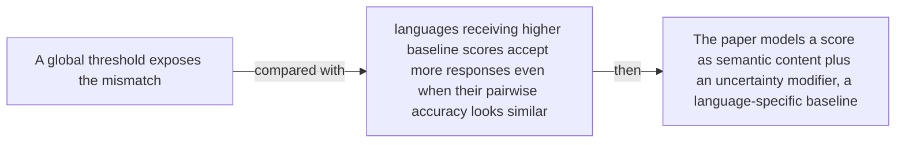

#### Python

```python
from html import escape
from pathlib import Path
from textwrap import wrap

title = "language_mechanism_p2: A global threshold exposes the mismatch — mechanism relation graph"
nodes = [["n1","A global threshold exposes the mismatch",120,150],["n2","languages receiving higher baseline scores accept more responses even when their pairwise accuracy looks similar",420,150],["n3","The paper models a score as semantic content plus an uncertainty modifier, a language-specific baseline",720,150]]
edges = [["n1","n2","compared with"],["n2","n3","then"]]
node_by_id = {node_id: (label, x, y) for node_id, label, x, y in nodes}

parts = [
    '<svg xmlns="http://www.w3.org/2000/svg" viewBox="0 0 860 520" role="img" aria-labelledby="title desc">',
    f'<title id="title">{escape(title)}</title>',
    '<desc id="desc">The labeled relations reproduce only relationships stated in the paragraph.</desc>',
    '<rect width="860" height="520" fill="white"/>',
]
for source, target, relation in edges:
    _, x1, y1 = node_by_id[source]
    _, x2, y2 = node_by_id[target]
    parts.append(f'<line x1="{x1}" y1="{y1}" x2="{x2}" y2="{y2}" stroke="#345" stroke-width="2"/>')
    parts.append(f'<text x="{(x1+x2)/2}" y="{(y1+y2)/2-6}" text-anchor="middle" font-family="sans-serif" font-size="11">{escape(relation)}</text>')
for _, label, x, y in nodes:
    parts.append(f'<rect x="{x-125}" y="{y-58}" width="250" height="116" rx="14" fill="#eef6ff" stroke="#234"/>')
    for line_index, line in enumerate(wrap(label, width=32)):
        parts.append(f'<text x="{x}" y="{y-34+line_index*16}" text-anchor="middle" font-family="sans-serif" font-size="12">{escape(line)}</text>')
parts.append('</svg>')
Path("language_mechanism_p2_treatment_a.svg").write_text("\n".join(parts), encoding="utf-8")
```

### Treatment B — language_claim_pairwise_blind, language_claim_uncertainty, language_claim_language_after_nll — claim-to-source provenance

- Teaching purpose: Show exactly which atomic claims underwrite this paragraph and which fixed source records support each claim.
- Encoding and reading order: A bipartite graph places 3 claim nodes on the left and 3 source nodes on the right, with only the 3 claim-source edges recorded in the fixture. Claim labels include epistemic status; source labels include the exact locator.
- Evidence and limitations: This treatment explains provenance and uncertainty, not the paper's causal mechanism. Missing edges remain visibly absent and no source count is treated as confidence.
- Recommended web medium: semantic HTML/CSS claim-source table with an SVG network view; JavaScript only for keyboard-controlled source highlighting.
- Mobile, accessibility, and motion behavior: Provide real table headers and source links in the static fallback, make every edge recoverable as text, stack claim records before source records on mobile, and require no motion.

#### TikZ

```tex
\documentclass[tikz,border=5pt]{standalone}
\usepackage[T1]{fontenc}
\usepackage{tikz}
\usetikzlibrary{arrows.meta}
\begin{document}
\begin{tikzpicture}[font=\sffamily,claim/.style={draw,rounded corners,align=center,text width=5.2cm,minimum height=1.2cm},source/.style={draw,dashed,align=center,text width=5.2cm,minimum height=1.2cm},link/.style={-{Latex[length=2mm]},thin}]
\node[font=\bfseries] at (4,1.8) {language\_mechanism\_p2: claim-to-source provenance};
\node[claim] (c1) at (0,0) {Pairwise accuracy can remain high while language-dependent absolute score shifts create different threshold decisions. [AUTHORS\_INTERPRETATION]};
\node[claim] (c2) at (0,-2.4) {Summed negative log-likelihood and the tested token-free uncertainty measures correlate positively with evaluator scores at the language level. [OBSERVED]};
\node[claim] (c3) at (0,-4.8) {Language identity adds significant predictive power after controlling for negative log-likelihood in every evaluated reward-model regression. [OBSERVED]};
\node[source] (s1) at (8,0) {LLM Evaluators v1 threshold analysis and rounded worked example - Pages 5-7, Sections 3.4-3.5, Figure 4, Table 1, Appendix Table 15; Section 3.4 reports a 43.0-point aggregate maximum and separately describes rounded 23\% versus 67\% English/Ukrainian rates as a 44-point example};
\node[source] (s2) at (8,-2.4) {LLM Evaluators v1 uncertainty analysis - Pages 7-8, Sections 4-4.1, Equations 1-2, Figure 5, Table 2};
\node[source] (s3) at (8,-4.8) {LLM Evaluators v1 structural regressions - Pages 8-10, Sections 4.2-4.3, Equations 3-6, Figures 6-7, Appendix Tables 11-12};
\draw[link] (c1) -- (s1);
\draw[link] (c2) -- (s2);
\draw[link] (c3) -- (s3);
\end{tikzpicture}
\end{document}
```

#### Mermaid


#### Python

```python
from html import escape
from pathlib import Path
from textwrap import wrap

title = "language_mechanism_p2: claim-to-source provenance"
nodes = [["c1","Pairwise accuracy can remain high while language-dependent absolute score shifts create different threshold decisions. [AUTHORS_INTERPRETATION]",190,130],["c2","Summed negative log-likelihood and the tested token-free uncertainty measures correlate positively with evaluator scores at the language level. [OBSERVED]",190,250],["c3","Language identity adds significant predictive power after controlling for negative log-likelihood in every evaluated reward-model regression. [OBSERVED]",190,370],["s1","LLM Evaluators v1 threshold analysis and rounded worked example — Pages 5–7, Sections 3.4–3.5, Figure 4, Table 1, Appendix Table 15; Section 3.4 reports a 43.0-point aggregate maximum and separately describes rounded 23% versus 67% English/Ukrainian rates as a 44-point example",700,130],["s2","LLM Evaluators v1 uncertainty analysis — Pages 7–8, Sections 4–4.1, Equations 1–2, Figure 5, Table 2",700,250],["s3","LLM Evaluators v1 structural regressions — Pages 8–10, Sections 4.2–4.3, Equations 3–6, Figures 6–7, Appendix Tables 11–12",700,370]]
edges = [["c1","s1"],["c2","s2"],["c3","s3"]]
node_by_id = {node_id: (label, x, y) for node_id, label, x, y in nodes}
height = 560

parts = [
    f'<svg xmlns="http://www.w3.org/2000/svg" viewBox="0 0 900 {height}" role="img" aria-labelledby="title desc">',
    f'<title id="title">{escape(title)}</title>',
    '<desc id="desc">Bipartite map from verified claim records to their exact source records.</desc>',
    f'<rect width="900" height="{height}" fill="white"/>',
]
for source, target in edges:
    _, x1, y1 = node_by_id[source]
    _, x2, y2 = node_by_id[target]
    parts.append(f'<line x1="{x1+145}" y1="{y1}" x2="{x2-145}" y2="{y2}" stroke="#456" stroke-width="2"/>')
for node_id, label, x, y in nodes:
    dashed = ' stroke-dasharray="7 5"' if node_id.startswith("s") else ''
    parts.append(f'<rect x="{x-145}" y="{y-46}" width="290" height="92" rx="12" fill="#f7fbff" stroke="#234"{dashed}/>')
    for line_index, line in enumerate(wrap(label, width=38)):
        parts.append(f'<text x="{x}" y="{y-24+line_index*14}" text-anchor="middle" font-family="sans-serif" font-size="11">{escape(line)}</text>')
parts.append('</svg>')
Path("language_mechanism_p2_treatment_b.svg").write_text("\n".join(parts), encoding="utf-8")
```

### Treatment C — A global threshold exposes the mismatch — input-operation-outcome storyboard

- Teaching purpose: Let readers inspect the paragraph as concrete input, operation, and outcome states.
- Encoding and reading order: Use 3 ordered states labeled "Input: A global threshold exposes the mismatch", "Operation: languages receiving higher baseline scores accept more responses even when their pairwise accuracy looks similar", "Outcome: The paper models a score as semantic content plus an uncertainty modifier, a language-specific baseline". State connectors reproduce paragraph order and do not imply unreported timing.
- Evidence and limitations: The first, intermediate, and final states are paragraph clauses; no hidden state, quantity, or transition is added.
- Recommended web medium: responsive SVG or semantic HTML/CSS; JavaScript is optional only for a meaningful state or scope toggle.
- Mobile, accessibility, and motion behavior: Preserve every exact value or scope statement as selectable text, avoid color-only distinctions, stack groups on mobile, and keep all information visible when JavaScript or motion is disabled.

#### TikZ

```tex
\documentclass[tikz,border=5pt]{standalone}
\usepackage[T1]{fontenc}
\usepackage{tikz}
\begin{document}
\begin{tikzpicture}[font=\sffamily,state/.style={draw,rounded corners,align=center,text width=3.2cm,minimum height=1.8cm}]
\node[font=\bfseries] at (3.8,2) {language\_mechanism\_p2: A global threshold exposes the mismatch - input-operation-outcome storyboard};
\node[state] (k1) at (0,0) {\textbf{Input}\\A global threshold exposes the mismatch};
\node[state] (k2) at (3.8,0) {\textbf{Operation}\\languages receiving higher baseline scores accept more responses even when their pairwise accuracy looks similar};
\node[state] (k3) at (7.6,0) {\textbf{Outcome}\\The paper models a score as semantic content plus an uncertainty modifier, a language-specific baseline};
\draw[->,thick] (k1) -- (k2);
\draw[->,thick] (k2) -- (k3);
\end{tikzpicture}
\end{document}
```

#### Mermaid

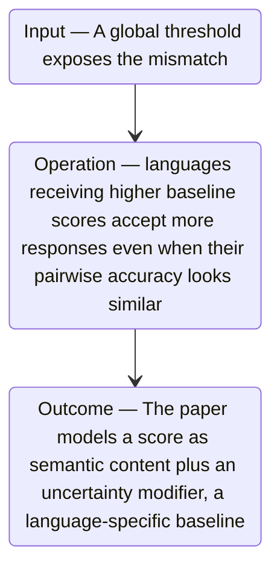

#### Python

```python
from html import escape
from pathlib import Path
from textwrap import wrap

title = "language_mechanism_p2: A global threshold exposes the mismatch — input-operation-outcome storyboard"
items = [["Input","A global threshold exposes the mismatch",120,210],["Operation","languages receiving higher baseline scores accept more responses even when their pairwise accuracy looks similar",290,210],["Outcome","The paper models a score as semantic content plus an uncertainty modifier, a language-specific baseline",460,210]]
width = max(760, 240 + len(items) * 170)
parts = [
    f'<svg xmlns="http://www.w3.org/2000/svg" viewBox="0 0 {width} 460" role="img" aria-labelledby="title desc">',
    f'<title id="title">{escape(title)}</title>',
    '<desc id="desc">Input, operation, and outcome states follow the paragraph in source order.</desc>',
    f'<rect width="{width}" height="460" fill="white"/>',
]
for index in range(len(items)-1):
    _, _, x1, y1 = items[index]
    _, _, x2, y2 = items[index+1]
    parts.append(f'<line x1="{x1+65}" y1="{y1}" x2="{x2-65}" y2="{y2}" stroke="#345" stroke-width="2"/>')
for group, label, x, y in items:
    parts.append(f'<rect x="{x-65}" y="{y-90}" width="130" height="180" rx="16" fill="#eef6ff" stroke="#234"/>')
    parts.append(f'<text x="{x}" y="{y-60}" text-anchor="middle" font-family="sans-serif" font-size="13" font-weight="700">{escape(group)}</text>')
    for line_index, line in enumerate(wrap(label, width=18)):
        parts.append(f'<text x="{x}" y="{y-34+line_index*14}" text-anchor="middle" font-family="sans-serif" font-size="10">{escape(line)}</text>')
parts.append('</svg>')
Path("language_mechanism_p2_treatment_c.svg").write_text("\n".join(parts), encoding="utf-8")
```

### Implementation record

- Status: `IMPLEMENTED`
- Selected treatment: `A`
- Selection rationale: Selected the approved relationship that directly answers this paragraph's explanatory job; the shared visual uses the same evidence and complete adjacent scope recorded here.
- Delivery medium: `CSS + semantic HTML`
- Visual ID and placement: `language_visual_pairwise_threshold` after `language_mechanism_p2`; this record is served by that purpose-built figure.
- Shared paragraph scope: `language_mechanism_p1`, `language_mechanism_p2`
- Changed files: `packages/test-fixtures/explainers/llm-evaluators-languages.json`, `apps/web/app/papers/[id]/explainer-visual.tsx`, `apps/web/app/papers/[id]/page.tsx`, and `apps/web/app/globals.css`
- Accessibility and fallback verification: Figure has a programmatic title and description, explicit alt text, equivalent fallback prose, source links, limitations, and a semantic static body; no meaning depends on motion or pointer input.
- Desktop and mobile verification: Verified in Playwright on 1440-pixel desktop and iPhone 13 mobile viewports; figures remain paragraph-adjacent, preserve reading order, and introduce no horizontal page overflow.
- Evidence deviations: `NONE`; web-native CSS and semantic HTML preserve the selected treatment's evidence, labels, topology, and stated boundaries.

## `language_mechanism_p3`

- Location: `language_mechanism`, paragraph 3
- Text anchor: "Summed response negative log-likelihood serves as one uncertainty proxy, with attribute-head disagreement, predictive variance, and semantic entropy as alternatives."
- Claims and sources: `language_claim_pairwise_blind` (AUTHORS_INTERPRETATION, VERIFIED); `language_claim_uncertainty` (OBSERVED, VERIFIED); `language_claim_language_after_nll` (OBSERVED, VERIFIED); `language_source_uncertainty` (Pages 7–8, Sections 4–4.1, Equations 1–2, Figure 5, Table 2); `language_source_regressions` (Pages 8–10, Sections 4.2–4.3, Equations 3–6, Figures 6–7, Appendix Tables 11–12); `language_source_calibration` (Pages 10 and 22–23, Section 5, Appendix D, Tables 13–15)
- Visual needed: `YES`
- Decision rationale: Removing a visual would require readers to retain the material relation between "Summed response negative log-likelihood serves as one uncertainty proxy, with attribute-head disagreement, predictive variance" and "within-language regressions test whether item difficulty alone can explain the pattern" while also tracking 4 source-bounded propositions. The paragraph contains a real mechanism relation graph; the visual must preserve its stated conditions and must not add causal or proportional meaning.
- Explanatory job: mechanism relation graph.

### Treatment A — Summed response negative log-likelihood serves as one uncertainty proxy — mechanism relation graph

- Teaching purpose: Answer "How can scores shift while rankings remain correct?" by exposing the paragraph's 4 named propositions and 3 stated reading, comparison, or qualification relations.
- Encoding and reading order: Nodes reproduce the complete labels "Summed response negative log-likelihood serves as one uncertainty proxy, with attribute-head disagreement, predictive variance"; "and semantic entropy as alternatives"; "Nested regressions then test whether language identity still predicts scores after uncertainty is included"; "within-language regressions test whether item difficulty alone can explain the pattern". Edges carry the explicit relation labels "then", "then", "then"; arrow direction is sequence only for mechanism or example prose and otherwise denotes reading order.
- Evidence and limitations: The topology is derived from this paragraph rather than a fixed pipeline. Encode only `language_claim_pairwise_blind`, `language_claim_uncertainty`, `language_claim_language_after_nll` and do not turn reading-order edges into causal claims.
- Recommended web medium: responsive inline SVG with CSS; JavaScript may add optional step focus only when state order matters.
- Mobile, accessibility, and motion behavior: Keep the full node-and-relation list in DOM order, expose the relation labels in the long description, stack nodes on narrow screens, and disable focus transitions under reduced motion.

#### TikZ

```tex
\documentclass[tikz,border=5pt]{standalone}
\usepackage[T1]{fontenc}
\usepackage{tikz}
\usetikzlibrary{arrows.meta,positioning}
\begin{document}
\begin{tikzpicture}[font=\sffamily,concept/.style={draw,rounded corners,align=center,text width=3.6cm,minimum height=1.35cm},link/.style={-{Latex[length=2mm]},thick},rel/.style={fill=white,font=\scriptsize,inner sep=2pt}]
\node[font=\bfseries,align=center] at (6.1,2.0) {language\_mechanism\_p3: Summed response negative log-likelihood serves as one uncertainty proxy - mechanism relation graph};
\node[concept] (n1) at (1.8,0) {Summed response negative log-likelihood serves as one uncertainty proxy, with attribute-head disagreement, predictive variance};
\node[concept] (n2) at (6.1,0) {and semantic entropy as alternatives};
\node[concept] (n3) at (10.4,0) {Nested regressions then test whether language identity still predicts scores after uncertainty is included};
\node[concept] (n4) at (1.8,-3.2) {within-language regressions test whether item difficulty alone can explain the pattern};
\draw[link] (n1) -- node[rel] {then} (n2);
\draw[link] (n2) -- node[rel] {then} (n3);
\draw[link] (n3) -- node[rel] {then} (n4);
\end{tikzpicture}
\end{document}
```

#### Mermaid

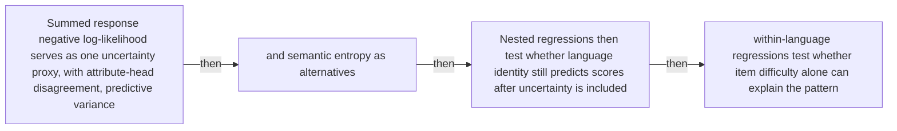

#### Python

```python
from html import escape
from pathlib import Path
from textwrap import wrap

title = "language_mechanism_p3: Summed response negative log-likelihood serves as one uncertainty proxy — mechanism relation graph"
nodes = [["n1","Summed response negative log-likelihood serves as one uncertainty proxy, with attribute-head disagreement, predictive variance",120,150],["n2","and semantic entropy as alternatives",420,150],["n3","Nested regressions then test whether language identity still predicts scores after uncertainty is included",720,150],["n4","within-language regressions test whether item difficulty alone can explain the pattern",120,340]]
edges = [["n1","n2","then"],["n2","n3","then"],["n3","n4","then"]]
node_by_id = {node_id: (label, x, y) for node_id, label, x, y in nodes}

parts = [
    '<svg xmlns="http://www.w3.org/2000/svg" viewBox="0 0 860 520" role="img" aria-labelledby="title desc">',
    f'<title id="title">{escape(title)}</title>',
    '<desc id="desc">The labeled relations reproduce only relationships stated in the paragraph.</desc>',
    '<rect width="860" height="520" fill="white"/>',
]
for source, target, relation in edges:
    _, x1, y1 = node_by_id[source]
    _, x2, y2 = node_by_id[target]
    parts.append(f'<line x1="{x1}" y1="{y1}" x2="{x2}" y2="{y2}" stroke="#345" stroke-width="2"/>')
    parts.append(f'<text x="{(x1+x2)/2}" y="{(y1+y2)/2-6}" text-anchor="middle" font-family="sans-serif" font-size="11">{escape(relation)}</text>')
for _, label, x, y in nodes:
    parts.append(f'<rect x="{x-125}" y="{y-58}" width="250" height="116" rx="14" fill="#eef6ff" stroke="#234"/>')
    for line_index, line in enumerate(wrap(label, width=32)):
        parts.append(f'<text x="{x}" y="{y-34+line_index*16}" text-anchor="middle" font-family="sans-serif" font-size="12">{escape(line)}</text>')
parts.append('</svg>')
Path("language_mechanism_p3_treatment_a.svg").write_text("\n".join(parts), encoding="utf-8")
```

### Treatment B — language_claim_pairwise_blind, language_claim_uncertainty, language_claim_language_after_nll — claim-to-source provenance

- Teaching purpose: Show exactly which atomic claims underwrite this paragraph and which fixed source records support each claim.
- Encoding and reading order: A bipartite graph places 3 claim nodes on the left and 3 source nodes on the right, with only the 3 claim-source edges recorded in the fixture. Claim labels include epistemic status; source labels include the exact locator.
- Evidence and limitations: This treatment explains provenance and uncertainty, not the paper's causal mechanism. Missing edges remain visibly absent and no source count is treated as confidence.
- Recommended web medium: semantic HTML/CSS claim-source table with an SVG network view; JavaScript only for keyboard-controlled source highlighting.
- Mobile, accessibility, and motion behavior: Provide real table headers and source links in the static fallback, make every edge recoverable as text, stack claim records before source records on mobile, and require no motion.

#### TikZ

```tex
\documentclass[tikz,border=5pt]{standalone}
\usepackage[T1]{fontenc}
\usepackage{tikz}
\usetikzlibrary{arrows.meta}
\begin{document}
\begin{tikzpicture}[font=\sffamily,claim/.style={draw,rounded corners,align=center,text width=5.2cm,minimum height=1.2cm},source/.style={draw,dashed,align=center,text width=5.2cm,minimum height=1.2cm},link/.style={-{Latex[length=2mm]},thin}]
\node[font=\bfseries] at (4,1.8) {language\_mechanism\_p3: claim-to-source provenance};
\node[claim] (c1) at (0,0) {Pairwise accuracy can remain high while language-dependent absolute score shifts create different threshold decisions. [AUTHORS\_INTERPRETATION]};
\node[claim] (c2) at (0,-2.4) {Summed negative log-likelihood and the tested token-free uncertainty measures correlate positively with evaluator scores at the language level. [OBSERVED]};
\node[claim] (c3) at (0,-4.8) {Language identity adds significant predictive power after controlling for negative log-likelihood in every evaluated reward-model regression. [OBSERVED]};
\node[source] (s1) at (8,0) {LLM Evaluators v1 threshold analysis and rounded worked example - Pages 5-7, Sections 3.4-3.5, Figure 4, Table 1, Appendix Table 15; Section 3.4 reports a 43.0-point aggregate maximum and separately describes rounded 23\% versus 67\% English/Ukrainian rates as a 44-point example};
\node[source] (s2) at (8,-2.4) {LLM Evaluators v1 uncertainty analysis - Pages 7-8, Sections 4-4.1, Equations 1-2, Figure 5, Table 2};
\node[source] (s3) at (8,-4.8) {LLM Evaluators v1 structural regressions - Pages 8-10, Sections 4.2-4.3, Equations 3-6, Figures 6-7, Appendix Tables 11-12};
\draw[link] (c1) -- (s1);
\draw[link] (c2) -- (s2);
\draw[link] (c3) -- (s3);
\end{tikzpicture}
\end{document}
```

#### Mermaid


#### Python

```python
from html import escape
from pathlib import Path
from textwrap import wrap

title = "language_mechanism_p3: claim-to-source provenance"
nodes = [["c1","Pairwise accuracy can remain high while language-dependent absolute score shifts create different threshold decisions. [AUTHORS_INTERPRETATION]",190,130],["c2","Summed negative log-likelihood and the tested token-free uncertainty measures correlate positively with evaluator scores at the language level. [OBSERVED]",190,250],["c3","Language identity adds significant predictive power after controlling for negative log-likelihood in every evaluated reward-model regression. [OBSERVED]",190,370],["s1","LLM Evaluators v1 threshold analysis and rounded worked example — Pages 5–7, Sections 3.4–3.5, Figure 4, Table 1, Appendix Table 15; Section 3.4 reports a 43.0-point aggregate maximum and separately describes rounded 23% versus 67% English/Ukrainian rates as a 44-point example",700,130],["s2","LLM Evaluators v1 uncertainty analysis — Pages 7–8, Sections 4–4.1, Equations 1–2, Figure 5, Table 2",700,250],["s3","LLM Evaluators v1 structural regressions — Pages 8–10, Sections 4.2–4.3, Equations 3–6, Figures 6–7, Appendix Tables 11–12",700,370]]
edges = [["c1","s1"],["c2","s2"],["c3","s3"]]
node_by_id = {node_id: (label, x, y) for node_id, label, x, y in nodes}
height = 560

parts = [
    f'<svg xmlns="http://www.w3.org/2000/svg" viewBox="0 0 900 {height}" role="img" aria-labelledby="title desc">',
    f'<title id="title">{escape(title)}</title>',
    '<desc id="desc">Bipartite map from verified claim records to their exact source records.</desc>',
    f'<rect width="900" height="{height}" fill="white"/>',
]
for source, target in edges:
    _, x1, y1 = node_by_id[source]
    _, x2, y2 = node_by_id[target]
    parts.append(f'<line x1="{x1+145}" y1="{y1}" x2="{x2-145}" y2="{y2}" stroke="#456" stroke-width="2"/>')
for node_id, label, x, y in nodes:
    dashed = ' stroke-dasharray="7 5"' if node_id.startswith("s") else ''
    parts.append(f'<rect x="{x-145}" y="{y-46}" width="290" height="92" rx="12" fill="#f7fbff" stroke="#234"{dashed}/>')
    for line_index, line in enumerate(wrap(label, width=38)):
        parts.append(f'<text x="{x}" y="{y-24+line_index*14}" text-anchor="middle" font-family="sans-serif" font-size="11">{escape(line)}</text>')
parts.append('</svg>')
Path("language_mechanism_p3_treatment_b.svg").write_text("\n".join(parts), encoding="utf-8")
```

### Treatment C — Summed response negative log-likelihood serves as one uncertainty proxy — input-operation-outcome storyboard

- Teaching purpose: Let readers inspect the paragraph as concrete input, operation, and outcome states.
- Encoding and reading order: Use 4 ordered states labeled "Input: Summed response negative log-likelihood serves as one uncertainty proxy, with attribute-head disagreement, predictive variance", "Operation: and semantic entropy as alternatives", "Operation: Nested regressions then test whether language identity still predicts scores after uncertainty is included", "Outcome: within-language regressions test whether item difficulty alone can explain the pattern". State connectors reproduce paragraph order and do not imply unreported timing.
- Evidence and limitations: The first, intermediate, and final states are paragraph clauses; no hidden state, quantity, or transition is added.
- Recommended web medium: responsive SVG or semantic HTML/CSS; JavaScript is optional only for a meaningful state or scope toggle.
- Mobile, accessibility, and motion behavior: Preserve every exact value or scope statement as selectable text, avoid color-only distinctions, stack groups on mobile, and keep all information visible when JavaScript or motion is disabled.

#### TikZ

```tex
\documentclass[tikz,border=5pt]{standalone}
\usepackage[T1]{fontenc}
\usepackage{tikz}
\begin{document}
\begin{tikzpicture}[font=\sffamily,state/.style={draw,rounded corners,align=center,text width=3.2cm,minimum height=1.8cm}]
\node[font=\bfseries] at (5.699999999999999,2) {language\_mechanism\_p3: Summed response negative log-likelihood serves as one uncertainty proxy - input-operation-outcome storyboard};
\node[state] (k1) at (0,0) {\textbf{Input}\\Summed response negative log-likelihood serves as one uncertainty proxy, with attribute-head disagreement, predictive variance};
\node[state] (k2) at (3.8,0) {\textbf{Operation}\\and semantic entropy as alternatives};
\node[state] (k3) at (7.6,0) {\textbf{Operation}\\Nested regressions then test whether language identity still predicts scores after uncertainty is included};
\node[state] (k4) at (11.399999999999999,0) {\textbf{Outcome}\\within-language regressions test whether item difficulty alone can explain the pattern};
\draw[->,thick] (k1) -- (k2);
\draw[->,thick] (k2) -- (k3);
\draw[->,thick] (k3) -- (k4);
\end{tikzpicture}
\end{document}
```

#### Mermaid

```mermaid
stateDiagram-v2
  state "Input — Summed response negative log-likelihood serves as one uncertainty proxy, with attribute-head disagreement, predictive variance" as k1
  state "Operation — and semantic entropy as alternatives" as k2
  state "Operation — Nested regressions then test whether language identity still predicts scores after uncertainty is included" as k3
  state "Outcome — within-language regressions test whether item difficulty alone can explain the pattern" as k4
  k1 --> k2
  k2 --> k3
  k3 --> k4
```

#### Python

```python
from html import escape
from pathlib import Path
from textwrap import wrap

title = "language_mechanism_p3: Summed response negative log-likelihood serves as one uncertainty proxy — input-operation-outcome storyboard"
items = [["Input","Summed response negative log-likelihood serves as one uncertainty proxy, with attribute-head disagreement, predictive variance",120,210],["Operation","and semantic entropy as alternatives",290,210],["Operation","Nested regressions then test whether language identity still predicts scores after uncertainty is included",460,210],["Outcome","within-language regressions test whether item difficulty alone can explain the pattern",630,210]]
width = max(760, 240 + len(items) * 170)
parts = [
    f'<svg xmlns="http://www.w3.org/2000/svg" viewBox="0 0 {width} 460" role="img" aria-labelledby="title desc">',
    f'<title id="title">{escape(title)}</title>',
    '<desc id="desc">Input, operation, and outcome states follow the paragraph in source order.</desc>',
    f'<rect width="{width}" height="460" fill="white"/>',
]
for index in range(len(items)-1):
    _, _, x1, y1 = items[index]
    _, _, x2, y2 = items[index+1]
    parts.append(f'<line x1="{x1+65}" y1="{y1}" x2="{x2-65}" y2="{y2}" stroke="#345" stroke-width="2"/>')
for group, label, x, y in items:
    parts.append(f'<rect x="{x-65}" y="{y-90}" width="130" height="180" rx="16" fill="#eef6ff" stroke="#234"/>')
    parts.append(f'<text x="{x}" y="{y-60}" text-anchor="middle" font-family="sans-serif" font-size="13" font-weight="700">{escape(group)}</text>')
    for line_index, line in enumerate(wrap(label, width=18)):
        parts.append(f'<text x="{x}" y="{y-34+line_index*14}" text-anchor="middle" font-family="sans-serif" font-size="10">{escape(line)}</text>')
parts.append('</svg>')
Path("language_mechanism_p3_treatment_c.svg").write_text("\n".join(parts), encoding="utf-8")
```

### Implementation record

- Status: `IMPLEMENTED`
- Selected treatment: `A`
- Selection rationale: Selected the approved relationship that directly answers this paragraph's explanatory job; the shared visual uses the same evidence and complete adjacent scope recorded here.
- Delivery medium: `CSS + semantic HTML`
- Visual ID and placement: `language_visual_score_decomposition` after `language_mechanism_p3`; this record is served by that purpose-built figure.
- Shared paragraph scope: NONE
- Changed files: `packages/test-fixtures/explainers/llm-evaluators-languages.json`, `apps/web/app/papers/[id]/explainer-visual.tsx`, `apps/web/app/papers/[id]/page.tsx`, and `apps/web/app/globals.css`
- Accessibility and fallback verification: Figure has a programmatic title and description, explicit alt text, equivalent fallback prose, source links, limitations, and a semantic static body; no meaning depends on motion or pointer input.
- Desktop and mobile verification: Verified in Playwright on 1440-pixel desktop and iPhone 13 mobile viewports; figures remain paragraph-adjacent, preserve reading order, and introduce no horizontal page overflow.
- Evidence deviations: `NONE`; web-native CSS and semantic HTML preserve the selected treatment's evidence, labels, topology, and stated boundaries.

## `language_example_p1`

- Location: `language_example`, paragraph 1
- Text anchor: "For Skywork-LLaMA-8B, the paper rounds English to 93% pairwise accuracy and 23% acceptance, and Ukrainian to 87% pairwise accuracy and 67% acceptance."
- Claims and sources: `language_claim_gap` (OBSERVED, VERIFIED); `language_claim_english_ukrainian_rounding` (EXPLAINER_INFERENCE, VERIFIED); `language_claim_code_switch` (OBSERVED, VERIFIED); `language_claim_production_notshown` (NOT_ESTABLISHED, VERIFIED); `language_source_intro` (Pages 1–4, Sections 1–3.2); `language_source_thresholds` (Pages 5–7, Sections 3.4–3.5, Figure 4, Table 1, Appendix Table 15; Section 3.4 reports a 43.0-point aggregate maximum and separately describes rounded 23% versus 67% English/Ukrainian rates as a 44-point example)
- Visual needed: `YES`
- Decision rationale: Removing a visual would require readers to retain the material relation between "For Skywork-LLaMA-8B, the paper rounds English to 93% pairwise accuracy and 23% acceptance" and "it is distinct from the aggregate maximum of 43.0 points reported across reward-model and benchmark combinations" while also tracking 5 source-bounded propositions. The paragraph contains a real example state path; the visual must preserve its stated conditions and must not add causal or proportional meaning.
- Explanatory job: example state path.

### Treatment A — For Skywork-LLaMA-8B the paper rounds English to 93% pairwise — example state path

- Teaching purpose: Answer "What does the hidden shift look like in a thresholded safety example?" by exposing the paragraph's 5 named propositions and 4 stated reading, comparison, or qualification relations.
- Encoding and reading order: Nodes reproduce the complete labels "For Skywork-LLaMA-8B, the paper rounds English to 93% pairwise accuracy and 23% acceptance"; "and Ukrainian to 87% pairwise accuracy and 67% acceptance"; "It calls this a 44-percentage-point difference"; "That worked example appears to subtract rounded display values"; "it is distinct from the aggregate maximum of 43.0 points reported across reward-model and benchmark combinations". Edges carry the explicit relation labels "then", "then", "then", "then"; arrow direction is sequence only for mechanism or example prose and otherwise denotes reading order.
- Evidence and limitations: The topology is derived from this paragraph rather than a fixed pipeline. Encode only `language_claim_gap`, `language_claim_english_ukrainian_rounding`, `language_claim_code_switch`, `language_claim_production_notshown` and do not turn reading-order edges into causal claims.
- Recommended web medium: responsive inline SVG with CSS; JavaScript may add optional step focus only when state order matters.
- Mobile, accessibility, and motion behavior: Keep the full node-and-relation list in DOM order, expose the relation labels in the long description, stack nodes on narrow screens, and disable focus transitions under reduced motion.

#### TikZ

```tex
\documentclass[tikz,border=5pt]{standalone}
\usepackage[T1]{fontenc}
\usepackage{tikz}
\usetikzlibrary{arrows.meta,positioning}
\begin{document}
\begin{tikzpicture}[font=\sffamily,concept/.style={draw,rounded corners,align=center,text width=3.6cm,minimum height=1.35cm},link/.style={-{Latex[length=2mm]},thick},rel/.style={fill=white,font=\scriptsize,inner sep=2pt}]
\node[font=\bfseries,align=center] at (6.1,2.0) {language\_example\_p1: For Skywork-LLaMA-8B the paper rounds English to 93\% pairwise - example state path};
\node[concept] (n1) at (1.8,0) {For Skywork-LLaMA-8B, the paper rounds English to 93\% pairwise accuracy and 23\% acceptance};
\node[concept] (n2) at (6.1,0) {and Ukrainian to 87\% pairwise accuracy and 67\% acceptance};
\node[concept] (n3) at (10.4,0) {It calls this a 44-percentage-point difference};
\node[concept] (n4) at (1.8,-3.2) {That worked example appears to subtract rounded display values};
\node[concept] (n5) at (6.1,-3.2) {it is distinct from the aggregate maximum of 43.0 points reported across reward-model and benchmark combinations};
\draw[link] (n1) -- node[rel] {then} (n2);
\draw[link] (n2) -- node[rel] {then} (n3);
\draw[link] (n3) -- node[rel] {then} (n4);
\draw[link] (n4) -- node[rel] {then} (n5);
\end{tikzpicture}
\end{document}
```

#### Mermaid

```mermaid
flowchart LR
  n1["For Skywork-LLaMA-8B, the paper rounds English to 93% pairwise accuracy and 23% acceptance"]
  n2["and Ukrainian to 87% pairwise accuracy and 67% acceptance"]
  n3["It calls this a 44-percentage-point difference"]
  n4["That worked example appears to subtract rounded display values"]
  n5["it is distinct from the aggregate maximum of 43.0 points reported across reward-model and benchmark combinations"]
  n1 -->|"then"| n2
  n2 -->|"then"| n3
  n3 -->|"then"| n4
  n4 -->|"then"| n5
```

#### Python

```python
from html import escape
from pathlib import Path
from textwrap import wrap

title = "language_example_p1: For Skywork-LLaMA-8B the paper rounds English to 93% pairwise — example state path"
nodes = [["n1","For Skywork-LLaMA-8B, the paper rounds English to 93% pairwise accuracy and 23% acceptance",120,150],["n2","and Ukrainian to 87% pairwise accuracy and 67% acceptance",420,150],["n3","It calls this a 44-percentage-point difference",720,150],["n4","That worked example appears to subtract rounded display values",120,340],["n5","it is distinct from the aggregate maximum of 43.0 points reported across reward-model and benchmark combinations",420,340]]
edges = [["n1","n2","then"],["n2","n3","then"],["n3","n4","then"],["n4","n5","then"]]
node_by_id = {node_id: (label, x, y) for node_id, label, x, y in nodes}

parts = [
    '<svg xmlns="http://www.w3.org/2000/svg" viewBox="0 0 860 520" role="img" aria-labelledby="title desc">',
    f'<title id="title">{escape(title)}</title>',
    '<desc id="desc">The labeled relations reproduce only relationships stated in the paragraph.</desc>',
    '<rect width="860" height="520" fill="white"/>',
]
for source, target, relation in edges:
    _, x1, y1 = node_by_id[source]
    _, x2, y2 = node_by_id[target]
    parts.append(f'<line x1="{x1}" y1="{y1}" x2="{x2}" y2="{y2}" stroke="#345" stroke-width="2"/>')
    parts.append(f'<text x="{(x1+x2)/2}" y="{(y1+y2)/2-6}" text-anchor="middle" font-family="sans-serif" font-size="11">{escape(relation)}</text>')
for _, label, x, y in nodes:
    parts.append(f'<rect x="{x-125}" y="{y-58}" width="250" height="116" rx="14" fill="#eef6ff" stroke="#234"/>')
    for line_index, line in enumerate(wrap(label, width=32)):
        parts.append(f'<text x="{x}" y="{y-34+line_index*16}" text-anchor="middle" font-family="sans-serif" font-size="12">{escape(line)}</text>')
parts.append('</svg>')
Path("language_example_p1_treatment_a.svg").write_text("\n".join(parts), encoding="utf-8")
```

### Treatment B — language_claim_gap, language_claim_english_ukrainian_rounding, language_claim_code_switch, language_claim_production_notshown — claim-to-source provenance

- Teaching purpose: Show exactly which atomic claims underwrite this paragraph and which fixed source records support each claim.
- Encoding and reading order: A bipartite graph places 4 claim nodes on the left and 1 source nodes on the right, with only the 4 claim-source edges recorded in the fixture. Claim labels include epistemic status; source labels include the exact locator.
- Evidence and limitations: This treatment explains provenance and uncertainty, not the paper's causal mechanism. Missing edges remain visibly absent and no source count is treated as confidence.
- Recommended web medium: semantic HTML/CSS claim-source table with an SVG network view; JavaScript only for keyboard-controlled source highlighting.
- Mobile, accessibility, and motion behavior: Provide real table headers and source links in the static fallback, make every edge recoverable as text, stack claim records before source records on mobile, and require no motion.

#### TikZ

```tex
\documentclass[tikz,border=5pt]{standalone}
\usepackage[T1]{fontenc}
\usepackage{tikz}
\usetikzlibrary{arrows.meta}
\begin{document}
\begin{tikzpicture}[font=\sffamily,claim/.style={draw,rounded corners,align=center,text width=5.2cm,minimum height=1.2cm},source/.style={draw,dashed,align=center,text width=5.2cm,minimum height=1.2cm},link/.style={-{Latex[length=2mm]},thin}]
\node[font=\bfseries] at (4,1.8) {language\_example\_p1: claim-to-source provenance};
\node[claim] (c1) at (0,0) {Reward-model acceptance-rate gaps reach 43.0 percentage points under a shared global median threshold. [OBSERVED]};
\node[claim] (c2) at (0,-2.4) {The paper's Skywork-LLaMA-8B example rounds English and Ukrainian acceptance to 23\% and 67\% and calls the difference 44 percentage points; this worked-example value is distinct from the aggregate maximum of 43.0 points and appears to reflect rounded display values. [EXPLAINER\_INFERENCE]};
\node[claim] (c3) at (0,-4.8) {In the constructed code-switch test, misapplying the English threshold to English-wrapped Hindi content raises acceptance from 50\% to 75\%. [OBSERVED]};
\node[claim] (c4) at (0,-7.199999999999999) {The study does not demonstrate harmful content bypassing a deployed production safety system at the reported rates. [NOT\_ESTABLISHED]};
\node[source] (s1) at (8,0) {LLM Evaluators v1 threshold analysis and rounded worked example - Pages 5-7, Sections 3.4-3.5, Figure 4, Table 1, Appendix Table 15; Section 3.4 reports a 43.0-point aggregate maximum and separately describes rounded 23\% versus 67\% English/Ukrainian rates as a 44-point example};
\draw[link] (c1) -- (s1);
\draw[link] (c2) -- (s1);
\draw[link] (c3) -- (s1);
\draw[link] (c4) -- (s1);
\end{tikzpicture}
\end{document}
```

#### Mermaid

```mermaid
flowchart LR
  subgraph Claims
  c1["Reward-model acceptance-rate gaps reach 43.0 percentage points under a shared global median threshold. OBSERVED"]
  c2["The paper's Skywork-LLaMA-8B example rounds English and Ukrainian acceptance to 23% and 67% and calls the difference 44 percentage points; this worked-example value is distinct from the aggregate maximum of 43.0 points and appears to reflect rounded display values. EXPLAINER_INFERENCE"]
  c3["In the constructed code-switch test, misapplying the English threshold to English-wrapped Hindi content raises acceptance from 50% to 75%. OBSERVED"]
  c4["The study does not demonstrate harmful content bypassing a deployed production safety system at the reported rates. NOT_ESTABLISHED"]
  end
  subgraph Sources
  s1[/"LLM Evaluators v1 threshold analysis and rounded worked example — Pages 5–7, Sections 3.4–3.5, Figure 4, Table 1, Appendix Table 15; Section 3.4 reports a 43.0-point aggregate maximum and separately describes rounded 23% versus 67% English/Ukrainian rates as a 44-point example"/]
  end
  c1 -->|"supported at"| s1
  c2 -->|"supported at"| s1
  c3 -->|"supported at"| s1
  c4 -->|"supported at"| s1
```

#### Python

```python
from html import escape
from pathlib import Path
from textwrap import wrap

title = "language_example_p1: claim-to-source provenance"
nodes = [["c1","Reward-model acceptance-rate gaps reach 43.0 percentage points under a shared global median threshold. [OBSERVED]",190,130],["c2","The paper's Skywork-LLaMA-8B example rounds English and Ukrainian acceptance to 23% and 67% and calls the difference 44 percentage points; this worked-example value is distinct from the aggregate maximum of 43.0 points and appears to reflect rounded display values. [EXPLAINER_INFERENCE]",190,250],["c3","In the constructed code-switch test, misapplying the English threshold to English-wrapped Hindi content raises acceptance from 50% to 75%. [OBSERVED]",190,370],["c4","The study does not demonstrate harmful content bypassing a deployed production safety system at the reported rates. [NOT_ESTABLISHED]",190,490],["s1","LLM Evaluators v1 threshold analysis and rounded worked example — Pages 5–7, Sections 3.4–3.5, Figure 4, Table 1, Appendix Table 15; Section 3.4 reports a 43.0-point aggregate maximum and separately describes rounded 23% versus 67% English/Ukrainian rates as a 44-point example",700,130]]
edges = [["c1","s1"],["c2","s1"],["c3","s1"],["c4","s1"]]
node_by_id = {node_id: (label, x, y) for node_id, label, x, y in nodes}
height = 680

parts = [
    f'<svg xmlns="http://www.w3.org/2000/svg" viewBox="0 0 900 {height}" role="img" aria-labelledby="title desc">',
    f'<title id="title">{escape(title)}</title>',
    '<desc id="desc">Bipartite map from verified claim records to their exact source records.</desc>',
    f'<rect width="900" height="{height}" fill="white"/>',
]
for source, target in edges:
    _, x1, y1 = node_by_id[source]
    _, x2, y2 = node_by_id[target]
    parts.append(f'<line x1="{x1+145}" y1="{y1}" x2="{x2-145}" y2="{y2}" stroke="#456" stroke-width="2"/>')
for node_id, label, x, y in nodes:
    dashed = ' stroke-dasharray="7 5"' if node_id.startswith("s") else ''
    parts.append(f'<rect x="{x-145}" y="{y-46}" width="290" height="92" rx="12" fill="#f7fbff" stroke="#234"{dashed}/>')
    for line_index, line in enumerate(wrap(label, width=38)):
        parts.append(f'<text x="{x}" y="{y-24+line_index*14}" text-anchor="middle" font-family="sans-serif" font-size="11">{escape(line)}</text>')
parts.append('</svg>')
Path("language_example_p1_treatment_b.svg").write_text("\n".join(parts), encoding="utf-8")
```

### Treatment C — 8B, 93%, 23%, 87%, 67%, 44, 43.0 points — exact-condition board

- Teaching purpose: Keep reported quantities attached to their conditions so unlike measurements are not flattened into one bar chart.
- Encoding and reading order: Use 7 unscaled marks, one per reported value (8B, 93%, 23%, 87%, 67%, 44, 43.0 points), each attached to its complete sentence-level condition. Do not share an axis when units, datasets, checkpoints, or experimental conditions differ.
- Evidence and limitations: Every value is copied from the paragraph and remains text. Spatial order follows source order; distance and area carry no magnitude.
- Recommended web medium: responsive SVG or semantic HTML/CSS; JavaScript is optional only for a meaningful state or scope toggle.
- Mobile, accessibility, and motion behavior: Preserve every exact value or scope statement as selectable text, avoid color-only distinctions, stack groups on mobile, and keep all information visible when JavaScript or motion is disabled.

#### TikZ

```tex
\documentclass[tikz,border=5pt]{standalone}
\usepackage[T1]{fontenc}
\usepackage{tikz}
\begin{document}
\begin{tikzpicture}[font=\sffamily,fact/.style={draw,align=center,text width=4cm,minimum height=1.8cm}]
\node[font=\bfseries] at (4.6,2) {language\_example\_p1: 8B, 93\%, 23\%, 87\%, 67\%, 44, 43.0 points - exact-condition board};
\node[fact] at (0,0) {\textbf{8B}\\For Skywork-LLaMA-8B, the paper rounds English to 93\% pairwise accuracy and 23\% acceptance, and Ukrainian to 87\% pairwise accuracy and 67\% acceptance.};
\node[fact] at (4.6,0) {\textbf{93\%}\\For Skywork-LLaMA-8B, the paper rounds English to 93\% pairwise accuracy and 23\% acceptance, and Ukrainian to 87\% pairwise accuracy and 67\% acceptance.};
\node[fact] at (9.2,0) {\textbf{23\%}\\For Skywork-LLaMA-8B, the paper rounds English to 93\% pairwise accuracy and 23\% acceptance, and Ukrainian to 87\% pairwise accuracy and 67\% acceptance.};
\node[fact] at (0,-2.8) {\textbf{87\%}\\For Skywork-LLaMA-8B, the paper rounds English to 93\% pairwise accuracy and 23\% acceptance, and Ukrainian to 87\% pairwise accuracy and 67\% acceptance.};
\node[fact] at (4.6,-2.8) {\textbf{67\%}\\For Skywork-LLaMA-8B, the paper rounds English to 93\% pairwise accuracy and 23\% acceptance, and Ukrainian to 87\% pairwise accuracy and 67\% acceptance.};
\node[fact] at (9.2,-2.8) {\textbf{44}\\It calls this a 44-percentage-point difference.};
\node[fact] at (0,-5.6) {\textbf{43.0 points}\\That worked example appears to subtract rounded display values; it is distinct from the aggregate maximum of 43.0 points reported across reward-model and benchmark combinations.};
\end{tikzpicture}
\end{document}
```

#### Mermaid

```mermaid
flowchart TB
  subgraph Exact_reported_quantities
    q1["8B<br/>For Skywork-LLaMA-8B, the paper rounds English to 93% pairwise accuracy and 23% acceptance, and Ukrainian to 87% pairwise accuracy and 67% acceptance."]
    q2["93%<br/>For Skywork-LLaMA-8B, the paper rounds English to 93% pairwise accuracy and 23% acceptance, and Ukrainian to 87% pairwise accuracy and 67% acceptance."]
    q3["23%<br/>For Skywork-LLaMA-8B, the paper rounds English to 93% pairwise accuracy and 23% acceptance, and Ukrainian to 87% pairwise accuracy and 67% acceptance."]
    q4["87%<br/>For Skywork-LLaMA-8B, the paper rounds English to 93% pairwise accuracy and 23% acceptance, and Ukrainian to 87% pairwise accuracy and 67% acceptance."]
    q5["67%<br/>For Skywork-LLaMA-8B, the paper rounds English to 93% pairwise accuracy and 23% acceptance, and Ukrainian to 87% pairwise accuracy and 67% acceptance."]
    q6["44<br/>It calls this a 44-percentage-point difference."]
    q7["43.0 points<br/>That worked example appears to subtract rounded display values; it is distinct from the aggregate maximum of 43.0 points reported across reward-model and benchmark combinations."]
  end
```

#### Python

```python
from html import escape
from pathlib import Path
from textwrap import wrap

title = "language_example_p1: 8B, 93%, 23%, 87%, 67%, 44, 43.0 points — exact-condition board"
items = [["8B","For Skywork-LLaMA-8B, the paper rounds English to 93% pairwise accuracy and 23% acceptance, and Ukrainian to 87% pairwise accuracy and 67% acceptance."],["93%","For Skywork-LLaMA-8B, the paper rounds English to 93% pairwise accuracy and 23% acceptance, and Ukrainian to 87% pairwise accuracy and 67% acceptance."],["23%","For Skywork-LLaMA-8B, the paper rounds English to 93% pairwise accuracy and 23% acceptance, and Ukrainian to 87% pairwise accuracy and 67% acceptance."],["87%","For Skywork-LLaMA-8B, the paper rounds English to 93% pairwise accuracy and 23% acceptance, and Ukrainian to 87% pairwise accuracy and 67% acceptance."],["67%","For Skywork-LLaMA-8B, the paper rounds English to 93% pairwise accuracy and 23% acceptance, and Ukrainian to 87% pairwise accuracy and 67% acceptance."],["44","It calls this a 44-percentage-point difference."],["43.0 points","That worked example appears to subtract rounded display values; it is distinct from the aggregate maximum of 43.0 points reported across reward-model and benchmark combinations."]]
height = 860
parts = [
    f'<svg xmlns="http://www.w3.org/2000/svg" viewBox="0 0 900 {height}" role="img" aria-labelledby="title desc">',
    f'<title id="title">{escape(title)}</title>',
    '<desc id="desc">Exact values are separated because the paragraph may mix units and experimental conditions.</desc>',
    f'<rect width="900" height="{height}" fill="white"/>',
]
for index, (value, context) in enumerate(items):
    x = 240 + (index % 2) * 440
    y = 130 + (index // 2) * 170
    parts.append(f'<circle cx="{x}" cy="{y}" r="52" fill="#eef6ff" stroke="#234"/>')
    parts.append(f'<text x="{x}" y="{y+6}" text-anchor="middle" font-family="sans-serif" font-size="18" font-weight="700">{escape(value)}</text>')
    for line_index, line in enumerate(wrap(context, width=42)):
        parts.append(f'<text x="{x}" y="{y+78+line_index*14}" text-anchor="middle" font-family="sans-serif" font-size="11">{escape(line)}</text>')
parts.append('</svg>')
Path("language_example_p1_treatment_c.svg").write_text("\n".join(parts), encoding="utf-8")
```

### Implementation record

- Status: `IMPLEMENTED`
- Selected treatment: `A`
- Selection rationale: Selected the approved relationship that directly answers this paragraph's explanatory job; the shared visual uses the same evidence and complete adjacent scope recorded here.
- Delivery medium: `CSS + semantic HTML`
- Visual ID and placement: `language_visual_threshold_failures` after `language_example_p2`; this record is served by that purpose-built figure.
- Shared paragraph scope: `language_example_p1`, `language_example_p2`
- Changed files: `packages/test-fixtures/explainers/llm-evaluators-languages.json`, `apps/web/app/papers/[id]/explainer-visual.tsx`, `apps/web/app/papers/[id]/page.tsx`, and `apps/web/app/globals.css`
- Accessibility and fallback verification: Figure has a programmatic title and description, explicit alt text, equivalent fallback prose, source links, limitations, and a semantic static body; no meaning depends on motion or pointer input.
- Desktop and mobile verification: Verified in Playwright on 1440-pixel desktop and iPhone 13 mobile viewports; figures remain paragraph-adjacent, preserve reading order, and introduce no horizontal page overflow.
- Evidence deviations: `NONE`; web-native CSS and semantic HTML preserve the selected treatment's evidence, labels, topology, and stated boundaries.

## `language_example_p2`

- Location: `language_example`, paragraph 2
- Text anchor: "The paper also wraps Hindi Safety content in an English frame."
- Claims and sources: `language_claim_gap` (OBSERVED, VERIFIED); `language_claim_english_ukrainian_rounding` (EXPLAINER_INFERENCE, VERIFIED); `language_claim_code_switch` (OBSERVED, VERIFIED); `language_claim_production_notshown` (NOT_ESTABLISHED, VERIFIED); `language_source_intro` (Pages 1–4, Sections 1–3.2); `language_source_thresholds` (Pages 5–7, Sections 3.4–3.5, Figure 4, Table 1, Appendix Table 15; Section 3.4 reports a 43.0-point aggregate maximum and separately describes rounded 23% versus 67% English/Ukrainian rates as a 44-point example)
- Visual needed: `YES`
- Decision rationale: Removing a visual would require readers to retain the material relation between "The paper also wraps Hindi Safety content in an English frame" and "This is a constructed demonstration of the attack surface, not evidence of exploitation in a production system" while also tracking 4 source-bounded propositions. The paragraph contains a real example state path; the visual must preserve its stated conditions and must not add causal or proportional meaning.
- Explanatory job: example state path.

### Treatment A — The paper also wraps Hindi Safety content in an — example state path

- Teaching purpose: Answer "What does the hidden shift look like in a thresholded safety example?" by exposing the paragraph's 4 named propositions and 3 stated reading, comparison, or qualification relations.
- Encoding and reading order: Nodes reproduce the complete labels "The paper also wraps Hindi Safety content in an English frame"; "An off-the-shelf language identifier labels 44% of these code-switched prompts as English, causing the more lenient English threshold to be applied to content scored against the higher Hindi reference"; "Acceptance rises from the calibrated 50% to 75%"; "This is a constructed demonstration of the attack surface, not evidence of exploitation in a production system". Edges carry the explicit relation labels "compared with", "then", "then"; arrow direction is sequence only for mechanism or example prose and otherwise denotes reading order.
- Evidence and limitations: The topology is derived from this paragraph rather than a fixed pipeline. Encode only `language_claim_gap`, `language_claim_english_ukrainian_rounding`, `language_claim_code_switch`, `language_claim_production_notshown` and do not turn reading-order edges into causal claims.
- Recommended web medium: responsive inline SVG with CSS; JavaScript may add optional step focus only when state order matters.
- Mobile, accessibility, and motion behavior: Keep the full node-and-relation list in DOM order, expose the relation labels in the long description, stack nodes on narrow screens, and disable focus transitions under reduced motion.

#### TikZ

```tex
\documentclass[tikz,border=5pt]{standalone}
\usepackage[T1]{fontenc}
\usepackage{tikz}
\usetikzlibrary{arrows.meta,positioning}
\begin{document}
\begin{tikzpicture}[font=\sffamily,concept/.style={draw,rounded corners,align=center,text width=3.6cm,minimum height=1.35cm},link/.style={-{Latex[length=2mm]},thick},rel/.style={fill=white,font=\scriptsize,inner sep=2pt}]
\node[font=\bfseries,align=center] at (6.1,2.0) {language\_example\_p2: The paper also wraps Hindi Safety content in an - example state path};
\node[concept] (n1) at (1.8,0) {The paper also wraps Hindi Safety content in an English frame};
\node[concept] (n2) at (6.1,0) {An off-the-shelf language identifier labels 44\% of these code-switched prompts as English, causing the more lenient English threshold to be applied to content scored against the higher Hindi reference};
\node[concept] (n3) at (10.4,0) {Acceptance rises from the calibrated 50\% to 75\%};
\node[concept] (n4) at (1.8,-3.2) {This is a constructed demonstration of the attack surface, not evidence of exploitation in a production system};
\draw[link] (n1) -- node[rel] {compared with} (n2);
\draw[link] (n2) -- node[rel] {then} (n3);
\draw[link] (n3) -- node[rel] {then} (n4);
\end{tikzpicture}
\end{document}
```

#### Mermaid

```mermaid
flowchart LR
  n1["The paper also wraps Hindi Safety content in an English frame"]
  n2["An off-the-shelf language identifier labels 44% of these code-switched prompts as English, causing the more lenient English threshold to be applied to content scored against the higher Hindi reference"]
  n3["Acceptance rises from the calibrated 50% to 75%"]
  n4["This is a constructed demonstration of the attack surface, not evidence of exploitation in a production system"]
  n1 -->|"compared with"| n2
  n2 -->|"then"| n3
  n3 -->|"then"| n4
```

#### Python

```python
from html import escape
from pathlib import Path
from textwrap import wrap

title = "language_example_p2: The paper also wraps Hindi Safety content in an — example state path"
nodes = [["n1","The paper also wraps Hindi Safety content in an English frame",120,150],["n2","An off-the-shelf language identifier labels 44% of these code-switched prompts as English, causing the more lenient English threshold to be applied to content scored against the higher Hindi reference",420,150],["n3","Acceptance rises from the calibrated 50% to 75%",720,150],["n4","This is a constructed demonstration of the attack surface, not evidence of exploitation in a production system",120,340]]
edges = [["n1","n2","compared with"],["n2","n3","then"],["n3","n4","then"]]
node_by_id = {node_id: (label, x, y) for node_id, label, x, y in nodes}

parts = [
    '<svg xmlns="http://www.w3.org/2000/svg" viewBox="0 0 860 520" role="img" aria-labelledby="title desc">',
    f'<title id="title">{escape(title)}</title>',
    '<desc id="desc">The labeled relations reproduce only relationships stated in the paragraph.</desc>',
    '<rect width="860" height="520" fill="white"/>',
]
for source, target, relation in edges:
    _, x1, y1 = node_by_id[source]
    _, x2, y2 = node_by_id[target]
    parts.append(f'<line x1="{x1}" y1="{y1}" x2="{x2}" y2="{y2}" stroke="#345" stroke-width="2"/>')
    parts.append(f'<text x="{(x1+x2)/2}" y="{(y1+y2)/2-6}" text-anchor="middle" font-family="sans-serif" font-size="11">{escape(relation)}</text>')
for _, label, x, y in nodes:
    parts.append(f'<rect x="{x-125}" y="{y-58}" width="250" height="116" rx="14" fill="#eef6ff" stroke="#234"/>')
    for line_index, line in enumerate(wrap(label, width=32)):
        parts.append(f'<text x="{x}" y="{y-34+line_index*16}" text-anchor="middle" font-family="sans-serif" font-size="12">{escape(line)}</text>')
parts.append('</svg>')
Path("language_example_p2_treatment_a.svg").write_text("\n".join(parts), encoding="utf-8")
```

### Treatment B — language_claim_gap, language_claim_english_ukrainian_rounding, language_claim_code_switch, language_claim_production_notshown — claim-to-source provenance

- Teaching purpose: Show exactly which atomic claims underwrite this paragraph and which fixed source records support each claim.
- Encoding and reading order: A bipartite graph places 4 claim nodes on the left and 1 source nodes on the right, with only the 4 claim-source edges recorded in the fixture. Claim labels include epistemic status; source labels include the exact locator.
- Evidence and limitations: This treatment explains provenance and uncertainty, not the paper's causal mechanism. Missing edges remain visibly absent and no source count is treated as confidence.
- Recommended web medium: semantic HTML/CSS claim-source table with an SVG network view; JavaScript only for keyboard-controlled source highlighting.
- Mobile, accessibility, and motion behavior: Provide real table headers and source links in the static fallback, make every edge recoverable as text, stack claim records before source records on mobile, and require no motion.

#### TikZ

```tex
\documentclass[tikz,border=5pt]{standalone}
\usepackage[T1]{fontenc}
\usepackage{tikz}
\usetikzlibrary{arrows.meta}
\begin{document}
\begin{tikzpicture}[font=\sffamily,claim/.style={draw,rounded corners,align=center,text width=5.2cm,minimum height=1.2cm},source/.style={draw,dashed,align=center,text width=5.2cm,minimum height=1.2cm},link/.style={-{Latex[length=2mm]},thin}]
\node[font=\bfseries] at (4,1.8) {language\_example\_p2: claim-to-source provenance};
\node[claim] (c1) at (0,0) {Reward-model acceptance-rate gaps reach 43.0 percentage points under a shared global median threshold. [OBSERVED]};
\node[claim] (c2) at (0,-2.4) {The paper's Skywork-LLaMA-8B example rounds English and Ukrainian acceptance to 23\% and 67\% and calls the difference 44 percentage points; this worked-example value is distinct from the aggregate maximum of 43.0 points and appears to reflect rounded display values. [EXPLAINER\_INFERENCE]};
\node[claim] (c3) at (0,-4.8) {In the constructed code-switch test, misapplying the English threshold to English-wrapped Hindi content raises acceptance from 50\% to 75\%. [OBSERVED]};
\node[claim] (c4) at (0,-7.199999999999999) {The study does not demonstrate harmful content bypassing a deployed production safety system at the reported rates. [NOT\_ESTABLISHED]};
\node[source] (s1) at (8,0) {LLM Evaluators v1 threshold analysis and rounded worked example - Pages 5-7, Sections 3.4-3.5, Figure 4, Table 1, Appendix Table 15; Section 3.4 reports a 43.0-point aggregate maximum and separately describes rounded 23\% versus 67\% English/Ukrainian rates as a 44-point example};
\draw[link] (c1) -- (s1);
\draw[link] (c2) -- (s1);
\draw[link] (c3) -- (s1);
\draw[link] (c4) -- (s1);
\end{tikzpicture}
\end{document}
```

#### Mermaid

```mermaid
flowchart LR
  subgraph Claims
  c1["Reward-model acceptance-rate gaps reach 43.0 percentage points under a shared global median threshold. OBSERVED"]
  c2["The paper's Skywork-LLaMA-8B example rounds English and Ukrainian acceptance to 23% and 67% and calls the difference 44 percentage points; this worked-example value is distinct from the aggregate maximum of 43.0 points and appears to reflect rounded display values. EXPLAINER_INFERENCE"]
  c3["In the constructed code-switch test, misapplying the English threshold to English-wrapped Hindi content raises acceptance from 50% to 75%. OBSERVED"]
  c4["The study does not demonstrate harmful content bypassing a deployed production safety system at the reported rates. NOT_ESTABLISHED"]
  end
  subgraph Sources
  s1[/"LLM Evaluators v1 threshold analysis and rounded worked example — Pages 5–7, Sections 3.4–3.5, Figure 4, Table 1, Appendix Table 15; Section 3.4 reports a 43.0-point aggregate maximum and separately describes rounded 23% versus 67% English/Ukrainian rates as a 44-point example"/]
  end
  c1 -->|"supported at"| s1
  c2 -->|"supported at"| s1
  c3 -->|"supported at"| s1
  c4 -->|"supported at"| s1
```

#### Python

```python
from html import escape
from pathlib import Path
from textwrap import wrap

title = "language_example_p2: claim-to-source provenance"
nodes = [["c1","Reward-model acceptance-rate gaps reach 43.0 percentage points under a shared global median threshold. [OBSERVED]",190,130],["c2","The paper's Skywork-LLaMA-8B example rounds English and Ukrainian acceptance to 23% and 67% and calls the difference 44 percentage points; this worked-example value is distinct from the aggregate maximum of 43.0 points and appears to reflect rounded display values. [EXPLAINER_INFERENCE]",190,250],["c3","In the constructed code-switch test, misapplying the English threshold to English-wrapped Hindi content raises acceptance from 50% to 75%. [OBSERVED]",190,370],["c4","The study does not demonstrate harmful content bypassing a deployed production safety system at the reported rates. [NOT_ESTABLISHED]",190,490],["s1","LLM Evaluators v1 threshold analysis and rounded worked example — Pages 5–7, Sections 3.4–3.5, Figure 4, Table 1, Appendix Table 15; Section 3.4 reports a 43.0-point aggregate maximum and separately describes rounded 23% versus 67% English/Ukrainian rates as a 44-point example",700,130]]
edges = [["c1","s1"],["c2","s1"],["c3","s1"],["c4","s1"]]
node_by_id = {node_id: (label, x, y) for node_id, label, x, y in nodes}
height = 680

parts = [
    f'<svg xmlns="http://www.w3.org/2000/svg" viewBox="0 0 900 {height}" role="img" aria-labelledby="title desc">',
    f'<title id="title">{escape(title)}</title>',
    '<desc id="desc">Bipartite map from verified claim records to their exact source records.</desc>',
    f'<rect width="900" height="{height}" fill="white"/>',
]
for source, target in edges:
    _, x1, y1 = node_by_id[source]
    _, x2, y2 = node_by_id[target]
    parts.append(f'<line x1="{x1+145}" y1="{y1}" x2="{x2-145}" y2="{y2}" stroke="#456" stroke-width="2"/>')
for node_id, label, x, y in nodes:
    dashed = ' stroke-dasharray="7 5"' if node_id.startswith("s") else ''
    parts.append(f'<rect x="{x-145}" y="{y-46}" width="290" height="92" rx="12" fill="#f7fbff" stroke="#234"{dashed}/>')
    for line_index, line in enumerate(wrap(label, width=38)):
        parts.append(f'<text x="{x}" y="{y-24+line_index*14}" text-anchor="middle" font-family="sans-serif" font-size="11">{escape(line)}</text>')
parts.append('</svg>')
Path("language_example_p2_treatment_b.svg").write_text("\n".join(parts), encoding="utf-8")
```

### Treatment C — 44%, 50%, 75% — exact-condition board

- Teaching purpose: Keep reported quantities attached to their conditions so unlike measurements are not flattened into one bar chart.
- Encoding and reading order: Use 3 unscaled marks, one per reported value (44%, 50%, 75%), each attached to its complete sentence-level condition. Do not share an axis when units, datasets, checkpoints, or experimental conditions differ.
- Evidence and limitations: Every value is copied from the paragraph and remains text. Spatial order follows source order; distance and area carry no magnitude.
- Recommended web medium: responsive SVG or semantic HTML/CSS; JavaScript is optional only for a meaningful state or scope toggle.
- Mobile, accessibility, and motion behavior: Preserve every exact value or scope statement as selectable text, avoid color-only distinctions, stack groups on mobile, and keep all information visible when JavaScript or motion is disabled.

#### TikZ

```tex
\documentclass[tikz,border=5pt]{standalone}
\usepackage[T1]{fontenc}
\usepackage{tikz}
\begin{document}
\begin{tikzpicture}[font=\sffamily,fact/.style={draw,align=center,text width=4cm,minimum height=1.8cm}]
\node[font=\bfseries] at (4.6,2) {language\_example\_p2: 44\%, 50\%, 75\% - exact-condition board};
\node[fact] at (0,0) {\textbf{44\%}\\An off-the-shelf language identifier labels 44\% of these code-switched prompts as English, causing the more lenient English threshold to be applied to content scored against the higher Hindi reference.};
\node[fact] at (4.6,0) {\textbf{50\%}\\Acceptance rises from the calibrated 50\% to 75\%.};
\node[fact] at (9.2,0) {\textbf{75\%}\\Acceptance rises from the calibrated 50\% to 75\%.};
\end{tikzpicture}
\end{document}
```

#### Mermaid

```mermaid
flowchart TB
  subgraph Exact_reported_quantities
    q1["44%<br/>An off-the-shelf language identifier labels 44% of these code-switched prompts as English, causing the more lenient English threshold to be applied to content scored against the higher Hindi reference."]
    q2["50%<br/>Acceptance rises from the calibrated 50% to 75%."]
    q3["75%<br/>Acceptance rises from the calibrated 50% to 75%."]
  end
```

#### Python

```python
from html import escape
from pathlib import Path
from textwrap import wrap

title = "language_example_p2: 44%, 50%, 75% — exact-condition board"
items = [["44%","An off-the-shelf language identifier labels 44% of these code-switched prompts as English, causing the more lenient English threshold to be applied to content scored against the higher Hindi reference."],["50%","Acceptance rises from the calibrated 50% to 75%."],["75%","Acceptance rises from the calibrated 50% to 75%."]]
height = 520
parts = [
    f'<svg xmlns="http://www.w3.org/2000/svg" viewBox="0 0 900 {height}" role="img" aria-labelledby="title desc">',
    f'<title id="title">{escape(title)}</title>',
    '<desc id="desc">Exact values are separated because the paragraph may mix units and experimental conditions.</desc>',
    f'<rect width="900" height="{height}" fill="white"/>',
]
for index, (value, context) in enumerate(items):
    x = 240 + (index % 2) * 440
    y = 130 + (index // 2) * 170
    parts.append(f'<circle cx="{x}" cy="{y}" r="52" fill="#eef6ff" stroke="#234"/>')
    parts.append(f'<text x="{x}" y="{y+6}" text-anchor="middle" font-family="sans-serif" font-size="18" font-weight="700">{escape(value)}</text>')
    for line_index, line in enumerate(wrap(context, width=42)):
        parts.append(f'<text x="{x}" y="{y+78+line_index*14}" text-anchor="middle" font-family="sans-serif" font-size="11">{escape(line)}</text>')
parts.append('</svg>')
Path("language_example_p2_treatment_c.svg").write_text("\n".join(parts), encoding="utf-8")
```

### Implementation record

- Status: `IMPLEMENTED`
- Selected treatment: `A`
- Selection rationale: Selected the approved relationship that directly answers this paragraph's explanatory job; the shared visual uses the same evidence and complete adjacent scope recorded here.
- Delivery medium: `CSS + semantic HTML`
- Visual ID and placement: `language_visual_threshold_failures` after `language_example_p2`; this record is served by that purpose-built figure.
- Shared paragraph scope: `language_example_p1`, `language_example_p2`
- Changed files: `packages/test-fixtures/explainers/llm-evaluators-languages.json`, `apps/web/app/papers/[id]/explainer-visual.tsx`, `apps/web/app/papers/[id]/page.tsx`, and `apps/web/app/globals.css`
- Accessibility and fallback verification: Figure has a programmatic title and description, explicit alt text, equivalent fallback prose, source links, limitations, and a semantic static body; no meaning depends on motion or pointer input.
- Desktop and mobile verification: Verified in Playwright on 1440-pixel desktop and iPhone 13 mobile viewports; figures remain paragraph-adjacent, preserve reading order, and introduce no horizontal page overflow.
- Evidence deviations: `NONE`; web-native CSS and semantic HTML preserve the selected treatment's evidence, labels, topology, and stated boundaries.

## `language_evidence_p1`

- Location: `language_evidence`, paragraph 1
- Text anchor: "All eight core evaluators show statistically significant differences in mean scores across languages by one-way ANOVA."
- Claims and sources: `language_claim_effect` (OBSERVED, VERIFIED); `language_claim_resource` (OBSERVED, VERIFIED); `language_claim_gap` (OBSERVED, VERIFIED); `language_claim_english_ukrainian_rounding` (EXPLAINER_INFERENCE, VERIFIED); `language_claim_high_accuracy_gap` (OBSERVED, VERIFIED); `language_claim_additional_judges` (OBSERVED, VERIFIED); `language_claim_uncertainty` (OBSERVED, VERIFIED); `language_claim_language_after_nll` (OBSERVED, VERIFIED); `language_claim_calibration` (OBSERVED, VERIFIED); `language_source_effects` (Pages 4–5, Sections 3.3.1–3.3.3, Figures 1–3, Appendix Table 6); `language_source_thresholds` (Pages 5–7, Sections 3.4–3.5, Figure 4, Table 1, Appendix Table 15; Section 3.4 reports a 43.0-point aggregate maximum and separately describes rounded 23% versus 67% English/Ukrainian rates as a 44-point example); `language_source_uncertainty` (Pages 7–8, Sections 4–4.1, Equations 1–2, Figure 5, Table 2); `language_source_regressions` (Pages 8–10, Sections 4.2–4.3, Equations 3–6, Figures 6–7, Appendix Tables 11–12); `language_source_calibration` (Pages 10 and 22–23, Section 5, Appendix D, Tables 13–15)
- Visual needed: `YES`
- Decision rationale: Removing a visual would require readers to retain the material relation between "All eight core evaluators show statistically significant differences in mean scores across languages by one-way ANOVA" and "languages with lower representation tend to receive higher scores" while also tracking 3 source-bounded propositions. The paragraph contains a real reported-condition comparison; the visual must preserve its stated conditions and must not add causal or proportional meaning.
- Explanatory job: reported-condition comparison.

### Treatment A — All eight core evaluators show statistically significant differences in — reported-condition comparison

- Teaching purpose: Answer "How large and consistent are the measured language effects?" by exposing the paragraph's 3 named propositions and 2 stated reading, comparison, or qualification relations.
- Encoding and reading order: Nodes reproduce the complete labels "All eight core evaluators show statistically significant differences in mean scores across languages by one-way ANOVA"; "For the aggregated reward models, Common Crawl prevalence correlates with mean score at Pearson r = -0.58 and Spearman rho = -0.81"; "languages with lower representation tend to receive higher scores". Edges carry the explicit relation labels "reported alongside", "compared with"; arrow direction is sequence only for mechanism or example prose and otherwise denotes reading order.
- Evidence and limitations: The topology is derived from this paragraph rather than a fixed pipeline. Encode only `language_claim_effect`, `language_claim_resource`, `language_claim_gap`, `language_claim_english_ukrainian_rounding`, `language_claim_high_accuracy_gap`, `language_claim_additional_judges`, `language_claim_uncertainty`, `language_claim_language_after_nll`, `language_claim_calibration` and do not turn reading-order edges into causal claims.
- Recommended web medium: responsive inline SVG with CSS; JavaScript may add optional step focus only when state order matters.
- Mobile, accessibility, and motion behavior: Keep the full node-and-relation list in DOM order, expose the relation labels in the long description, stack nodes on narrow screens, and disable focus transitions under reduced motion.

#### TikZ

```tex
\documentclass[tikz,border=5pt]{standalone}
\usepackage[T1]{fontenc}
\usepackage{tikz}
\usetikzlibrary{arrows.meta,positioning}
\begin{document}
\begin{tikzpicture}[font=\sffamily,concept/.style={draw,rounded corners,align=center,text width=3.6cm,minimum height=1.35cm},link/.style={-{Latex[length=2mm]},thick},rel/.style={fill=white,font=\scriptsize,inner sep=2pt}]
\node[font=\bfseries,align=center] at (6.1,2.0) {language\_evidence\_p1: All eight core evaluators show statistically significant differences in - reported-condition comparison};
\node[concept] (n1) at (1.8,0) {All eight core evaluators show statistically significant differences in mean scores across languages by one-way ANOVA};
\node[concept] (n2) at (6.1,0) {For the aggregated reward models, Common Crawl prevalence correlates with mean score at Pearson r = -0.58 and Spearman rho = -0.81};
\node[concept] (n3) at (10.4,0) {languages with lower representation tend to receive higher scores};
\draw[link] (n1) -- node[rel] {reported alongside} (n2);
\draw[link] (n1) -- node[rel] {compared with} (n3);
\end{tikzpicture}
\end{document}
```

#### Mermaid

```mermaid
flowchart LR
  n1["All eight core evaluators show statistically significant differences in mean scores across languages by one-way ANOVA"]
  n2["For the aggregated reward models, Common Crawl prevalence correlates with mean score at Pearson r = -0.58 and Spearman rho = -0.81"]
  n3["languages with lower representation tend to receive higher scores"]
  n1 -->|"reported alongside"| n2
  n1 -->|"compared with"| n3
```

#### Python

```python
from html import escape
from pathlib import Path
from textwrap import wrap

title = "language_evidence_p1: All eight core evaluators show statistically significant differences in — reported-condition comparison"
nodes = [["n1","All eight core evaluators show statistically significant differences in mean scores across languages by one-way ANOVA",120,150],["n2","For the aggregated reward models, Common Crawl prevalence correlates with mean score at Pearson r = -0.58 and Spearman rho = -0.81",420,150],["n3","languages with lower representation tend to receive higher scores",720,150]]
edges = [["n1","n2","reported alongside"],["n1","n3","compared with"]]
node_by_id = {node_id: (label, x, y) for node_id, label, x, y in nodes}

parts = [
    '<svg xmlns="http://www.w3.org/2000/svg" viewBox="0 0 860 520" role="img" aria-labelledby="title desc">',
    f'<title id="title">{escape(title)}</title>',
    '<desc id="desc">The labeled relations reproduce only relationships stated in the paragraph.</desc>',
    '<rect width="860" height="520" fill="white"/>',
]
for source, target, relation in edges:
    _, x1, y1 = node_by_id[source]
    _, x2, y2 = node_by_id[target]
    parts.append(f'<line x1="{x1}" y1="{y1}" x2="{x2}" y2="{y2}" stroke="#345" stroke-width="2"/>')
    parts.append(f'<text x="{(x1+x2)/2}" y="{(y1+y2)/2-6}" text-anchor="middle" font-family="sans-serif" font-size="11">{escape(relation)}</text>')
for _, label, x, y in nodes:
    parts.append(f'<rect x="{x-125}" y="{y-58}" width="250" height="116" rx="14" fill="#eef6ff" stroke="#234"/>')
    for line_index, line in enumerate(wrap(label, width=32)):
        parts.append(f'<text x="{x}" y="{y-34+line_index*16}" text-anchor="middle" font-family="sans-serif" font-size="12">{escape(line)}</text>')
parts.append('</svg>')
Path("language_evidence_p1_treatment_a.svg").write_text("\n".join(parts), encoding="utf-8")
```

### Treatment B — language_claim_effect, language_claim_resource, language_claim_gap, language_claim_english_ukrainian_rounding, language_claim_high_accuracy_gap, language_claim_additional_judges, language_claim_uncertainty, language_claim_language_after_nll, language_claim_calibration — claim-to-source provenance

- Teaching purpose: Show exactly which atomic claims underwrite this paragraph and which fixed source records support each claim.
- Encoding and reading order: A bipartite graph places 9 claim nodes on the left and 5 source nodes on the right, with only the 9 claim-source edges recorded in the fixture. Claim labels include epistemic status; source labels include the exact locator.
- Evidence and limitations: This treatment explains provenance and uncertainty, not the paper's causal mechanism. Missing edges remain visibly absent and no source count is treated as confidence.
- Recommended web medium: semantic HTML/CSS claim-source table with an SVG network view; JavaScript only for keyboard-controlled source highlighting.
- Mobile, accessibility, and motion behavior: Provide real table headers and source links in the static fallback, make every edge recoverable as text, stack claim records before source records on mobile, and require no motion.

#### TikZ

```tex
\documentclass[tikz,border=5pt]{standalone}
\usepackage[T1]{fontenc}
\usepackage{tikz}
\usetikzlibrary{arrows.meta}
\begin{document}
\begin{tikzpicture}[font=\sffamily,claim/.style={draw,rounded corners,align=center,text width=5.2cm,minimum height=1.2cm},source/.style={draw,dashed,align=center,text width=5.2cm,minimum height=1.2cm},link/.style={-{Latex[length=2mm]},thin}]
\node[font=\bfseries] at (4,1.8) {language\_evidence\_p1: claim-to-source provenance};
\node[claim] (c1) at (0,0) {All eight core evaluators show statistically significant differences in mean scores across the 23 evaluation languages. [OBSERVED]};
\node[claim] (c2) at (0,-2.4) {Aggregated reward-model scores correlate negatively with Common Crawl language prevalence at Pearson r = -0.58 and Spearman rho = -0.81. [OBSERVED]};
\node[claim] (c3) at (0,-4.8) {Reward-model acceptance-rate gaps reach 43.0 percentage points under a shared global median threshold. [OBSERVED]};
\node[claim] (c4) at (0,-7.199999999999999) {The paper's Skywork-LLaMA-8B example rounds English and Ukrainian acceptance to 23\% and 67\% and calls the difference 44 percentage points; this worked-example value is distinct from the aggregate maximum of 43.0 points and appears to reflect rounded display values. [EXPLAINER\_INFERENCE]};
\node[claim] (c5) at (0,-9.6) {Acceptance-rate differences reach 34.0 percentage points among observations above 95\% pairwise accuracy. [OBSERVED]};
\node[claim] (c6) at (0,-12) {GPT-4.1-mini and Qwen3-32B-thinking reproduce significant negative resource-score correlations and nontrivial threshold gaps on Safety and Chat-Hard. [OBSERVED]};
\node[claim] (c7) at (0,-14.399999999999999) {Summed negative log-likelihood and the tested token-free uncertainty measures correlate positively with evaluator scores at the language level. [OBSERVED]};
\node[claim] (c8) at (0,-16.8) {Language identity adds significant predictive power after controlling for negative log-likelihood in every evaluated reward-model regression. [OBSERVED]};
\node[claim] (c9) at (0,-19.2) {Per-language mean offsets reduce the average acceptance gap from 33.4 to 11.6 percentage points, a 60.9\% reduction, without eliminating the residual gap. [OBSERVED]};
\node[source] (s1) at (8,0) {LLM Evaluators v1 language effects - Pages 4-5, Sections 3.3.1-3.3.3, Figures 1-3, Appendix Table 6};
\node[source] (s2) at (8,-2.4) {LLM Evaluators v1 threshold analysis and rounded worked example - Pages 5-7, Sections 3.4-3.5, Figure 4, Table 1, Appendix Table 15; Section 3.4 reports a 43.0-point aggregate maximum and separately describes rounded 23\% versus 67\% English/Ukrainian rates as a 44-point example};
\node[source] (s3) at (8,-4.8) {LLM Evaluators v1 uncertainty analysis - Pages 7-8, Sections 4-4.1, Equations 1-2, Figure 5, Table 2};
\node[source] (s4) at (8,-7.199999999999999) {LLM Evaluators v1 structural regressions - Pages 8-10, Sections 4.2-4.3, Equations 3-6, Figures 6-7, Appendix Tables 11-12};
\node[source] (s5) at (8,-9.6) {LLM Evaluators v1 calibration analysis - Pages 10 and 22-23, Section 5, Appendix D, Tables 13-15};
\draw[link] (c1) -- (s1);
\draw[link] (c2) -- (s1);
\draw[link] (c3) -- (s2);
\draw[link] (c4) -- (s2);
\draw[link] (c5) -- (s2);
\draw[link] (c6) -- (s2);
\draw[link] (c7) -- (s3);
\draw[link] (c8) -- (s4);
\draw[link] (c9) -- (s5);
\end{tikzpicture}
\end{document}
```

#### Mermaid

```mermaid
flowchart LR
  subgraph Claims
  c1["All eight core evaluators show statistically significant differences in mean scores across the 23 evaluation languages. OBSERVED"]
  c2["Aggregated reward-model scores correlate negatively with Common Crawl language prevalence at Pearson r = -0.58 and Spearman rho = -0.81. OBSERVED"]
  c3["Reward-model acceptance-rate gaps reach 43.0 percentage points under a shared global median threshold. OBSERVED"]
  c4["The paper's Skywork-LLaMA-8B example rounds English and Ukrainian acceptance to 23% and 67% and calls the difference 44 percentage points; this worked-example value is distinct from the aggregate maximum of 43.0 points and appears to reflect rounded display values. EXPLAINER_INFERENCE"]
  c5["Acceptance-rate differences reach 34.0 percentage points among observations above 95% pairwise accuracy. OBSERVED"]
  c6["GPT-4.1-mini and Qwen3-32B-thinking reproduce significant negative resource-score correlations and nontrivial threshold gaps on Safety and Chat-Hard. OBSERVED"]
  c7["Summed negative log-likelihood and the tested token-free uncertainty measures correlate positively with evaluator scores at the language level. OBSERVED"]
  c8["Language identity adds significant predictive power after controlling for negative log-likelihood in every evaluated reward-model regression. OBSERVED"]
  c9["Per-language mean offsets reduce the average acceptance gap from 33.4 to 11.6 percentage points, a 60.9% reduction, without eliminating the residual gap. OBSERVED"]
  end
  subgraph Sources
  s1[/"LLM Evaluators v1 language effects — Pages 4–5, Sections 3.3.1–3.3.3, Figures 1–3, Appendix Table 6"/]
  s2[/"LLM Evaluators v1 threshold analysis and rounded worked example — Pages 5–7, Sections 3.4–3.5, Figure 4, Table 1, Appendix Table 15; Section 3.4 reports a 43.0-point aggregate maximum and separately describes rounded 23% versus 67% English/Ukrainian rates as a 44-point example"/]
  s3[/"LLM Evaluators v1 uncertainty analysis — Pages 7–8, Sections 4–4.1, Equations 1–2, Figure 5, Table 2"/]
  s4[/"LLM Evaluators v1 structural regressions — Pages 8–10, Sections 4.2–4.3, Equations 3–6, Figures 6–7, Appendix Tables 11–12"/]
  s5[/"LLM Evaluators v1 calibration analysis — Pages 10 and 22–23, Section 5, Appendix D, Tables 13–15"/]
  end
  c1 -->|"supported at"| s1
  c2 -->|"supported at"| s1
  c3 -->|"supported at"| s2
  c4 -->|"supported at"| s2
  c5 -->|"supported at"| s2
  c6 -->|"supported at"| s2
  c7 -->|"supported at"| s3
  c8 -->|"supported at"| s4
  c9 -->|"supported at"| s5
```

#### Python

```python
from html import escape
from pathlib import Path
from textwrap import wrap

title = "language_evidence_p1: claim-to-source provenance"
nodes = [["c1","All eight core evaluators show statistically significant differences in mean scores across the 23 evaluation languages. [OBSERVED]",190,130],["c2","Aggregated reward-model scores correlate negatively with Common Crawl language prevalence at Pearson r = -0.58 and Spearman rho = -0.81. [OBSERVED]",190,250],["c3","Reward-model acceptance-rate gaps reach 43.0 percentage points under a shared global median threshold. [OBSERVED]",190,370],["c4","The paper's Skywork-LLaMA-8B example rounds English and Ukrainian acceptance to 23% and 67% and calls the difference 44 percentage points; this worked-example value is distinct from the aggregate maximum of 43.0 points and appears to reflect rounded display values. [EXPLAINER_INFERENCE]",190,490],["c5","Acceptance-rate differences reach 34.0 percentage points among observations above 95% pairwise accuracy. [OBSERVED]",190,610],["c6","GPT-4.1-mini and Qwen3-32B-thinking reproduce significant negative resource-score correlations and nontrivial threshold gaps on Safety and Chat-Hard. [OBSERVED]",190,730],["c7","Summed negative log-likelihood and the tested token-free uncertainty measures correlate positively with evaluator scores at the language level. [OBSERVED]",190,850],["c8","Language identity adds significant predictive power after controlling for negative log-likelihood in every evaluated reward-model regression. [OBSERVED]",190,970],["c9","Per-language mean offsets reduce the average acceptance gap from 33.4 to 11.6 percentage points, a 60.9% reduction, without eliminating the residual gap. [OBSERVED]",190,1090],["s1","LLM Evaluators v1 language effects — Pages 4–5, Sections 3.3.1–3.3.3, Figures 1–3, Appendix Table 6",700,130],["s2","LLM Evaluators v1 threshold analysis and rounded worked example — Pages 5–7, Sections 3.4–3.5, Figure 4, Table 1, Appendix Table 15; Section 3.4 reports a 43.0-point aggregate maximum and separately describes rounded 23% versus 67% English/Ukrainian rates as a 44-point example",700,250],["s3","LLM Evaluators v1 uncertainty analysis — Pages 7–8, Sections 4–4.1, Equations 1–2, Figure 5, Table 2",700,370],["s4","LLM Evaluators v1 structural regressions — Pages 8–10, Sections 4.2–4.3, Equations 3–6, Figures 6–7, Appendix Tables 11–12",700,490],["s5","LLM Evaluators v1 calibration analysis — Pages 10 and 22–23, Section 5, Appendix D, Tables 13–15",700,610]]
edges = [["c1","s1"],["c2","s1"],["c3","s2"],["c4","s2"],["c5","s2"],["c6","s2"],["c7","s3"],["c8","s4"],["c9","s5"]]
node_by_id = {node_id: (label, x, y) for node_id, label, x, y in nodes}
height = 1280

parts = [
    f'<svg xmlns="http://www.w3.org/2000/svg" viewBox="0 0 900 {height}" role="img" aria-labelledby="title desc">',
    f'<title id="title">{escape(title)}</title>',
    '<desc id="desc">Bipartite map from verified claim records to their exact source records.</desc>',
    f'<rect width="900" height="{height}" fill="white"/>',
]
for source, target in edges:
    _, x1, y1 = node_by_id[source]
    _, x2, y2 = node_by_id[target]
    parts.append(f'<line x1="{x1+145}" y1="{y1}" x2="{x2-145}" y2="{y2}" stroke="#456" stroke-width="2"/>')
for node_id, label, x, y in nodes:
    dashed = ' stroke-dasharray="7 5"' if node_id.startswith("s") else ''
    parts.append(f'<rect x="{x-145}" y="{y-46}" width="290" height="92" rx="12" fill="#f7fbff" stroke="#234"{dashed}/>')
    for line_index, line in enumerate(wrap(label, width=38)):
        parts.append(f'<text x="{x}" y="{y-24+line_index*14}" text-anchor="middle" font-family="sans-serif" font-size="11">{escape(line)}</text>')
parts.append('</svg>')
Path("language_evidence_p1_treatment_b.svg").write_text("\n".join(parts), encoding="utf-8")
```

### Treatment C — 0.58, 0.81 — exact-condition board

- Teaching purpose: Keep reported quantities attached to their conditions so unlike measurements are not flattened into one bar chart.
- Encoding and reading order: Use 2 unscaled marks, one per reported value (0.58, 0.81), each attached to its complete sentence-level condition. Do not share an axis when units, datasets, checkpoints, or experimental conditions differ.
- Evidence and limitations: Every value is copied from the paragraph and remains text. Spatial order follows source order; distance and area carry no magnitude.
- Recommended web medium: responsive SVG or semantic HTML/CSS; JavaScript is optional only for a meaningful state or scope toggle.
- Mobile, accessibility, and motion behavior: Preserve every exact value or scope statement as selectable text, avoid color-only distinctions, stack groups on mobile, and keep all information visible when JavaScript or motion is disabled.

#### TikZ

```tex
\documentclass[tikz,border=5pt]{standalone}
\usepackage[T1]{fontenc}
\usepackage{tikz}
\begin{document}
\begin{tikzpicture}[font=\sffamily,fact/.style={draw,align=center,text width=4cm,minimum height=1.8cm}]
\node[font=\bfseries] at (4.6,2) {language\_evidence\_p1: 0.58, 0.81 - exact-condition board};
\node[fact] at (0,0) {\textbf{0.58}\\For the aggregated reward models, Common Crawl prevalence correlates with mean score at Pearson r = -0.58 and Spearman rho = -0.81: languages with lower representation tend to receive higher scores.};
\node[fact] at (4.6,0) {\textbf{0.81}\\For the aggregated reward models, Common Crawl prevalence correlates with mean score at Pearson r = -0.58 and Spearman rho = -0.81: languages with lower representation tend to receive higher scores.};
\end{tikzpicture}
\end{document}
```

#### Mermaid

```mermaid
flowchart TB
  subgraph Exact_reported_quantities
    q1["0.58<br/>For the aggregated reward models, Common Crawl prevalence correlates with mean score at Pearson r = -0.58 and Spearman rho = -0.81: languages with lower representation tend to receive higher scores."]
    q2["0.81<br/>For the aggregated reward models, Common Crawl prevalence correlates with mean score at Pearson r = -0.58 and Spearman rho = -0.81: languages with lower representation tend to receive higher scores."]
  end
```

#### Python

```python
from html import escape
from pathlib import Path
from textwrap import wrap

title = "language_evidence_p1: 0.58, 0.81 — exact-condition board"
items = [["0.58","For the aggregated reward models, Common Crawl prevalence correlates with mean score at Pearson r = -0.58 and Spearman rho = -0.81: languages with lower representation tend to receive higher scores."],["0.81","For the aggregated reward models, Common Crawl prevalence correlates with mean score at Pearson r = -0.58 and Spearman rho = -0.81: languages with lower representation tend to receive higher scores."]]
height = 350
parts = [
    f'<svg xmlns="http://www.w3.org/2000/svg" viewBox="0 0 900 {height}" role="img" aria-labelledby="title desc">',
    f'<title id="title">{escape(title)}</title>',
    '<desc id="desc">Exact values are separated because the paragraph may mix units and experimental conditions.</desc>',
    f'<rect width="900" height="{height}" fill="white"/>',
]
for index, (value, context) in enumerate(items):
    x = 240 + (index % 2) * 440
    y = 130 + (index // 2) * 170
    parts.append(f'<circle cx="{x}" cy="{y}" r="52" fill="#eef6ff" stroke="#234"/>')
    parts.append(f'<text x="{x}" y="{y+6}" text-anchor="middle" font-family="sans-serif" font-size="18" font-weight="700">{escape(value)}</text>')
    for line_index, line in enumerate(wrap(context, width=42)):
        parts.append(f'<text x="{x}" y="{y+78+line_index*14}" text-anchor="middle" font-family="sans-serif" font-size="11">{escape(line)}</text>')
parts.append('</svg>')
Path("language_evidence_p1_treatment_c.svg").write_text("\n".join(parts), encoding="utf-8")
```

### Implementation record

- Status: `IMPLEMENTED`
- Selected treatment: `A`
- Selection rationale: Selected the approved relationship that directly answers this paragraph's explanatory job; the shared visual uses the same evidence and complete adjacent scope recorded here.
- Delivery medium: `CSS + semantic HTML`
- Visual ID and placement: `language_visual_evidence_matrix` after `language_evidence_p3`; this record is served by that purpose-built figure.
- Shared paragraph scope: `language_evidence_p1`, `language_evidence_p2`, `language_evidence_p3`
- Changed files: `packages/test-fixtures/explainers/llm-evaluators-languages.json`, `apps/web/app/papers/[id]/explainer-visual.tsx`, `apps/web/app/papers/[id]/page.tsx`, and `apps/web/app/globals.css`
- Accessibility and fallback verification: Figure has a programmatic title and description, explicit alt text, equivalent fallback prose, source links, limitations, and a semantic static body; no meaning depends on motion or pointer input.
- Desktop and mobile verification: Verified in Playwright on 1440-pixel desktop and iPhone 13 mobile viewports; figures remain paragraph-adjacent, preserve reading order, and introduce no horizontal page overflow.
- Evidence deviations: `NONE`; web-native CSS and semantic HTML preserve the selected treatment's evidence, labels, topology, and stated boundaries.

## `language_evidence_p2`

- Location: `language_evidence`, paragraph 2
- Text anchor: "Under one global median threshold, the aggregate reward-model analysis reports a maximum acceptance gap of 43.0 percentage points."
- Claims and sources: `language_claim_effect` (OBSERVED, VERIFIED); `language_claim_resource` (OBSERVED, VERIFIED); `language_claim_gap` (OBSERVED, VERIFIED); `language_claim_english_ukrainian_rounding` (EXPLAINER_INFERENCE, VERIFIED); `language_claim_high_accuracy_gap` (OBSERVED, VERIFIED); `language_claim_additional_judges` (OBSERVED, VERIFIED); `language_claim_uncertainty` (OBSERVED, VERIFIED); `language_claim_language_after_nll` (OBSERVED, VERIFIED); `language_claim_calibration` (OBSERVED, VERIFIED); `language_source_effects` (Pages 4–5, Sections 3.3.1–3.3.3, Figures 1–3, Appendix Table 6); `language_source_thresholds` (Pages 5–7, Sections 3.4–3.5, Figure 4, Table 1, Appendix Table 15; Section 3.4 reports a 43.0-point aggregate maximum and separately describes rounded 23% versus 67% English/Ukrainian rates as a 44-point example); `language_source_uncertainty` (Pages 7–8, Sections 4–4.1, Equations 1–2, Figure 5, Table 2); `language_source_regressions` (Pages 8–10, Sections 4.2–4.3, Equations 3–6, Figures 6–7, Appendix Tables 11–12); `language_source_calibration` (Pages 10 and 22–23, Section 5, Appendix D, Tables 13–15)
- Visual needed: `YES`
- Decision rationale: Removing a visual would require readers to retain the material relation between "Under one global median threshold, the aggregate reward-model analysis reports a maximum acceptance gap of 43.0 percentage points" and "the apparent one-point difference reflects the source's rounded example rather than a second aggregate maximum" while also tracking 6 source-bounded propositions. The paragraph contains a real reported-condition comparison; the visual must preserve its stated conditions and must not add causal or proportional meaning.
- Explanatory job: reported-condition comparison.

### Treatment A — Under one global median threshold the aggregate reward-model analysis — reported-condition comparison

- Teaching purpose: Answer "How large and consistent are the measured language effects?" by exposing the paragraph's 6 named propositions and 5 stated reading, comparison, or qualification relations.
- Encoding and reading order: Nodes reproduce the complete labels "Under one global median threshold, the aggregate reward-model analysis reports a maximum acceptance gap of 43.0 percentage points"; "Separately, the Skywork-LLaMA-8B English/Ukrainian example reports rounded acceptance rates of 23% and 67% and describes them as a 44-point gap"; "Even within observations above 95% pairwise accuracy, acceptance can differ by 34.0 points"; "GPT-4.1-mini shows gaps of 19.6 and 14.0 points on Safety and Chat-Hard"; "Qwen3-32B-thinking shows 32.7 and 29.7 points"; "the apparent one-point difference reflects the source's rounded example rather than a second aggregate maximum". Edges carry the explicit relation labels "reported alongside", "reported alongside", "reported alongside", "reported alongside", "contrasts with"; arrow direction is sequence only for mechanism or example prose and otherwise denotes reading order.
- Evidence and limitations: The topology is derived from this paragraph rather than a fixed pipeline. Encode only `language_claim_effect`, `language_claim_resource`, `language_claim_gap`, `language_claim_english_ukrainian_rounding`, `language_claim_high_accuracy_gap`, `language_claim_additional_judges`, `language_claim_uncertainty`, `language_claim_language_after_nll`, `language_claim_calibration` and do not turn reading-order edges into causal claims.
- Recommended web medium: responsive inline SVG with CSS; JavaScript may add optional step focus only when state order matters.
- Mobile, accessibility, and motion behavior: Keep the full node-and-relation list in DOM order, expose the relation labels in the long description, stack nodes on narrow screens, and disable focus transitions under reduced motion.

#### TikZ

```tex
\documentclass[tikz,border=5pt]{standalone}
\usepackage[T1]{fontenc}
\usepackage{tikz}
\usetikzlibrary{arrows.meta,positioning}
\begin{document}
\begin{tikzpicture}[font=\sffamily,concept/.style={draw,rounded corners,align=center,text width=3.6cm,minimum height=1.35cm},link/.style={-{Latex[length=2mm]},thick},rel/.style={fill=white,font=\scriptsize,inner sep=2pt}]
\node[font=\bfseries,align=center] at (6.1,2.0) {language\_evidence\_p2: Under one global median threshold the aggregate reward-model analysis - reported-condition comparison};
\node[concept] (n1) at (1.8,0) {Under one global median threshold, the aggregate reward-model analysis reports a maximum acceptance gap of 43.0 percentage points};
\node[concept] (n2) at (6.1,0) {Separately, the Skywork-LLaMA-8B English/Ukrainian example reports rounded acceptance rates of 23\% and 67\% and describes them as a 44-point gap};
\node[concept] (n3) at (10.4,0) {Even within observations above 95\% pairwise accuracy, acceptance can differ by 34.0 points};
\node[concept] (n4) at (1.8,-3.2) {GPT-4.1-mini shows gaps of 19.6 and 14.0 points on Safety and Chat-Hard};
\node[concept] (n5) at (6.1,-3.2) {Qwen3-32B-thinking shows 32.7 and 29.7 points};
\node[concept] (n6) at (10.4,-3.2) {the apparent one-point difference reflects the source's rounded example rather than a second aggregate maximum};
\draw[link] (n1) -- node[rel] {reported alongside} (n2);
\draw[link] (n1) -- node[rel] {reported alongside} (n3);
\draw[link] (n1) -- node[rel] {reported alongside} (n4);
\draw[link] (n1) -- node[rel] {reported alongside} (n5);
\draw[link] (n1) -- node[rel] {contrasts with} (n6);
\end{tikzpicture}
\end{document}
```

#### Mermaid

```mermaid
flowchart LR
  n1["Under one global median threshold, the aggregate reward-model analysis reports a maximum acceptance gap of 43.0 percentage points"]
  n2["Separately, the Skywork-LLaMA-8B English/Ukrainian example reports rounded acceptance rates of 23% and 67% and describes them as a 44-point gap"]
  n3["Even within observations above 95% pairwise accuracy, acceptance can differ by 34.0 points"]
  n4["GPT-4.1-mini shows gaps of 19.6 and 14.0 points on Safety and Chat-Hard"]
  n5["Qwen3-32B-thinking shows 32.7 and 29.7 points"]
  n6["the apparent one-point difference reflects the source's rounded example rather than a second aggregate maximum"]
  n1 -->|"reported alongside"| n2
  n1 -->|"reported alongside"| n3
  n1 -->|"reported alongside"| n4
  n1 -->|"reported alongside"| n5
  n1 -->|"contrasts with"| n6
```

#### Python

```python
from html import escape
from pathlib import Path
from textwrap import wrap

title = "language_evidence_p2: Under one global median threshold the aggregate reward-model analysis — reported-condition comparison"
nodes = [["n1","Under one global median threshold, the aggregate reward-model analysis reports a maximum acceptance gap of 43.0 percentage points",120,150],["n2","Separately, the Skywork-LLaMA-8B English/Ukrainian example reports rounded acceptance rates of 23% and 67% and describes them as a 44-point gap",420,150],["n3","Even within observations above 95% pairwise accuracy, acceptance can differ by 34.0 points",720,150],["n4","GPT-4.1-mini shows gaps of 19.6 and 14.0 points on Safety and Chat-Hard",120,340],["n5","Qwen3-32B-thinking shows 32.7 and 29.7 points",420,340],["n6","the apparent one-point difference reflects the source's rounded example rather than a second aggregate maximum",720,340]]
edges = [["n1","n2","reported alongside"],["n1","n3","reported alongside"],["n1","n4","reported alongside"],["n1","n5","reported alongside"],["n1","n6","contrasts with"]]
node_by_id = {node_id: (label, x, y) for node_id, label, x, y in nodes}

parts = [
    '<svg xmlns="http://www.w3.org/2000/svg" viewBox="0 0 860 520" role="img" aria-labelledby="title desc">',
    f'<title id="title">{escape(title)}</title>',
    '<desc id="desc">The labeled relations reproduce only relationships stated in the paragraph.</desc>',
    '<rect width="860" height="520" fill="white"/>',
]
for source, target, relation in edges:
    _, x1, y1 = node_by_id[source]
    _, x2, y2 = node_by_id[target]
    parts.append(f'<line x1="{x1}" y1="{y1}" x2="{x2}" y2="{y2}" stroke="#345" stroke-width="2"/>')
    parts.append(f'<text x="{(x1+x2)/2}" y="{(y1+y2)/2-6}" text-anchor="middle" font-family="sans-serif" font-size="11">{escape(relation)}</text>')
for _, label, x, y in nodes:
    parts.append(f'<rect x="{x-125}" y="{y-58}" width="250" height="116" rx="14" fill="#eef6ff" stroke="#234"/>')
    for line_index, line in enumerate(wrap(label, width=32)):
        parts.append(f'<text x="{x}" y="{y-34+line_index*16}" text-anchor="middle" font-family="sans-serif" font-size="12">{escape(line)}</text>')
parts.append('</svg>')
Path("language_evidence_p2_treatment_a.svg").write_text("\n".join(parts), encoding="utf-8")
```

### Treatment B — language_claim_effect, language_claim_resource, language_claim_gap, language_claim_english_ukrainian_rounding, language_claim_high_accuracy_gap, language_claim_additional_judges, language_claim_uncertainty, language_claim_language_after_nll, language_claim_calibration — claim-to-source provenance

- Teaching purpose: Show exactly which atomic claims underwrite this paragraph and which fixed source records support each claim.
- Encoding and reading order: A bipartite graph places 9 claim nodes on the left and 5 source nodes on the right, with only the 9 claim-source edges recorded in the fixture. Claim labels include epistemic status; source labels include the exact locator.
- Evidence and limitations: This treatment explains provenance and uncertainty, not the paper's causal mechanism. Missing edges remain visibly absent and no source count is treated as confidence.
- Recommended web medium: semantic HTML/CSS claim-source table with an SVG network view; JavaScript only for keyboard-controlled source highlighting.
- Mobile, accessibility, and motion behavior: Provide real table headers and source links in the static fallback, make every edge recoverable as text, stack claim records before source records on mobile, and require no motion.

#### TikZ

```tex
\documentclass[tikz,border=5pt]{standalone}
\usepackage[T1]{fontenc}
\usepackage{tikz}
\usetikzlibrary{arrows.meta}
\begin{document}
\begin{tikzpicture}[font=\sffamily,claim/.style={draw,rounded corners,align=center,text width=5.2cm,minimum height=1.2cm},source/.style={draw,dashed,align=center,text width=5.2cm,minimum height=1.2cm},link/.style={-{Latex[length=2mm]},thin}]
\node[font=\bfseries] at (4,1.8) {language\_evidence\_p2: claim-to-source provenance};
\node[claim] (c1) at (0,0) {All eight core evaluators show statistically significant differences in mean scores across the 23 evaluation languages. [OBSERVED]};
\node[claim] (c2) at (0,-2.4) {Aggregated reward-model scores correlate negatively with Common Crawl language prevalence at Pearson r = -0.58 and Spearman rho = -0.81. [OBSERVED]};
\node[claim] (c3) at (0,-4.8) {Reward-model acceptance-rate gaps reach 43.0 percentage points under a shared global median threshold. [OBSERVED]};
\node[claim] (c4) at (0,-7.199999999999999) {The paper's Skywork-LLaMA-8B example rounds English and Ukrainian acceptance to 23\% and 67\% and calls the difference 44 percentage points; this worked-example value is distinct from the aggregate maximum of 43.0 points and appears to reflect rounded display values. [EXPLAINER\_INFERENCE]};
\node[claim] (c5) at (0,-9.6) {Acceptance-rate differences reach 34.0 percentage points among observations above 95\% pairwise accuracy. [OBSERVED]};
\node[claim] (c6) at (0,-12) {GPT-4.1-mini and Qwen3-32B-thinking reproduce significant negative resource-score correlations and nontrivial threshold gaps on Safety and Chat-Hard. [OBSERVED]};
\node[claim] (c7) at (0,-14.399999999999999) {Summed negative log-likelihood and the tested token-free uncertainty measures correlate positively with evaluator scores at the language level. [OBSERVED]};
\node[claim] (c8) at (0,-16.8) {Language identity adds significant predictive power after controlling for negative log-likelihood in every evaluated reward-model regression. [OBSERVED]};
\node[claim] (c9) at (0,-19.2) {Per-language mean offsets reduce the average acceptance gap from 33.4 to 11.6 percentage points, a 60.9\% reduction, without eliminating the residual gap. [OBSERVED]};
\node[source] (s1) at (8,0) {LLM Evaluators v1 language effects - Pages 4-5, Sections 3.3.1-3.3.3, Figures 1-3, Appendix Table 6};
\node[source] (s2) at (8,-2.4) {LLM Evaluators v1 threshold analysis and rounded worked example - Pages 5-7, Sections 3.4-3.5, Figure 4, Table 1, Appendix Table 15; Section 3.4 reports a 43.0-point aggregate maximum and separately describes rounded 23\% versus 67\% English/Ukrainian rates as a 44-point example};
\node[source] (s3) at (8,-4.8) {LLM Evaluators v1 uncertainty analysis - Pages 7-8, Sections 4-4.1, Equations 1-2, Figure 5, Table 2};
\node[source] (s4) at (8,-7.199999999999999) {LLM Evaluators v1 structural regressions - Pages 8-10, Sections 4.2-4.3, Equations 3-6, Figures 6-7, Appendix Tables 11-12};
\node[source] (s5) at (8,-9.6) {LLM Evaluators v1 calibration analysis - Pages 10 and 22-23, Section 5, Appendix D, Tables 13-15};
\draw[link] (c1) -- (s1);
\draw[link] (c2) -- (s1);
\draw[link] (c3) -- (s2);
\draw[link] (c4) -- (s2);
\draw[link] (c5) -- (s2);
\draw[link] (c6) -- (s2);
\draw[link] (c7) -- (s3);
\draw[link] (c8) -- (s4);
\draw[link] (c9) -- (s5);
\end{tikzpicture}
\end{document}
```

#### Mermaid

```mermaid
flowchart LR
  subgraph Claims
  c1["All eight core evaluators show statistically significant differences in mean scores across the 23 evaluation languages. OBSERVED"]
  c2["Aggregated reward-model scores correlate negatively with Common Crawl language prevalence at Pearson r = -0.58 and Spearman rho = -0.81. OBSERVED"]
  c3["Reward-model acceptance-rate gaps reach 43.0 percentage points under a shared global median threshold. OBSERVED"]
  c4["The paper's Skywork-LLaMA-8B example rounds English and Ukrainian acceptance to 23% and 67% and calls the difference 44 percentage points; this worked-example value is distinct from the aggregate maximum of 43.0 points and appears to reflect rounded display values. EXPLAINER_INFERENCE"]
  c5["Acceptance-rate differences reach 34.0 percentage points among observations above 95% pairwise accuracy. OBSERVED"]
  c6["GPT-4.1-mini and Qwen3-32B-thinking reproduce significant negative resource-score correlations and nontrivial threshold gaps on Safety and Chat-Hard. OBSERVED"]
  c7["Summed negative log-likelihood and the tested token-free uncertainty measures correlate positively with evaluator scores at the language level. OBSERVED"]
  c8["Language identity adds significant predictive power after controlling for negative log-likelihood in every evaluated reward-model regression. OBSERVED"]
  c9["Per-language mean offsets reduce the average acceptance gap from 33.4 to 11.6 percentage points, a 60.9% reduction, without eliminating the residual gap. OBSERVED"]
  end
  subgraph Sources
  s1[/"LLM Evaluators v1 language effects — Pages 4–5, Sections 3.3.1–3.3.3, Figures 1–3, Appendix Table 6"/]
  s2[/"LLM Evaluators v1 threshold analysis and rounded worked example — Pages 5–7, Sections 3.4–3.5, Figure 4, Table 1, Appendix Table 15; Section 3.4 reports a 43.0-point aggregate maximum and separately describes rounded 23% versus 67% English/Ukrainian rates as a 44-point example"/]
  s3[/"LLM Evaluators v1 uncertainty analysis — Pages 7–8, Sections 4–4.1, Equations 1–2, Figure 5, Table 2"/]
  s4[/"LLM Evaluators v1 structural regressions — Pages 8–10, Sections 4.2–4.3, Equations 3–6, Figures 6–7, Appendix Tables 11–12"/]
  s5[/"LLM Evaluators v1 calibration analysis — Pages 10 and 22–23, Section 5, Appendix D, Tables 13–15"/]
  end
  c1 -->|"supported at"| s1
  c2 -->|"supported at"| s1
  c3 -->|"supported at"| s2
  c4 -->|"supported at"| s2
  c5 -->|"supported at"| s2
  c6 -->|"supported at"| s2
  c7 -->|"supported at"| s3
  c8 -->|"supported at"| s4
  c9 -->|"supported at"| s5
```

#### Python

```python
from html import escape
from pathlib import Path
from textwrap import wrap

title = "language_evidence_p2: claim-to-source provenance"
nodes = [["c1","All eight core evaluators show statistically significant differences in mean scores across the 23 evaluation languages. [OBSERVED]",190,130],["c2","Aggregated reward-model scores correlate negatively with Common Crawl language prevalence at Pearson r = -0.58 and Spearman rho = -0.81. [OBSERVED]",190,250],["c3","Reward-model acceptance-rate gaps reach 43.0 percentage points under a shared global median threshold. [OBSERVED]",190,370],["c4","The paper's Skywork-LLaMA-8B example rounds English and Ukrainian acceptance to 23% and 67% and calls the difference 44 percentage points; this worked-example value is distinct from the aggregate maximum of 43.0 points and appears to reflect rounded display values. [EXPLAINER_INFERENCE]",190,490],["c5","Acceptance-rate differences reach 34.0 percentage points among observations above 95% pairwise accuracy. [OBSERVED]",190,610],["c6","GPT-4.1-mini and Qwen3-32B-thinking reproduce significant negative resource-score correlations and nontrivial threshold gaps on Safety and Chat-Hard. [OBSERVED]",190,730],["c7","Summed negative log-likelihood and the tested token-free uncertainty measures correlate positively with evaluator scores at the language level. [OBSERVED]",190,850],["c8","Language identity adds significant predictive power after controlling for negative log-likelihood in every evaluated reward-model regression. [OBSERVED]",190,970],["c9","Per-language mean offsets reduce the average acceptance gap from 33.4 to 11.6 percentage points, a 60.9% reduction, without eliminating the residual gap. [OBSERVED]",190,1090],["s1","LLM Evaluators v1 language effects — Pages 4–5, Sections 3.3.1–3.3.3, Figures 1–3, Appendix Table 6",700,130],["s2","LLM Evaluators v1 threshold analysis and rounded worked example — Pages 5–7, Sections 3.4–3.5, Figure 4, Table 1, Appendix Table 15; Section 3.4 reports a 43.0-point aggregate maximum and separately describes rounded 23% versus 67% English/Ukrainian rates as a 44-point example",700,250],["s3","LLM Evaluators v1 uncertainty analysis — Pages 7–8, Sections 4–4.1, Equations 1–2, Figure 5, Table 2",700,370],["s4","LLM Evaluators v1 structural regressions — Pages 8–10, Sections 4.2–4.3, Equations 3–6, Figures 6–7, Appendix Tables 11–12",700,490],["s5","LLM Evaluators v1 calibration analysis — Pages 10 and 22–23, Section 5, Appendix D, Tables 13–15",700,610]]
edges = [["c1","s1"],["c2","s1"],["c3","s2"],["c4","s2"],["c5","s2"],["c6","s2"],["c7","s3"],["c8","s4"],["c9","s5"]]
node_by_id = {node_id: (label, x, y) for node_id, label, x, y in nodes}
height = 1280

parts = [
    f'<svg xmlns="http://www.w3.org/2000/svg" viewBox="0 0 900 {height}" role="img" aria-labelledby="title desc">',
    f'<title id="title">{escape(title)}</title>',
    '<desc id="desc">Bipartite map from verified claim records to their exact source records.</desc>',
    f'<rect width="900" height="{height}" fill="white"/>',
]
for source, target in edges:
    _, x1, y1 = node_by_id[source]
    _, x2, y2 = node_by_id[target]
    parts.append(f'<line x1="{x1+145}" y1="{y1}" x2="{x2-145}" y2="{y2}" stroke="#456" stroke-width="2"/>')
for node_id, label, x, y in nodes:
    dashed = ' stroke-dasharray="7 5"' if node_id.startswith("s") else ''
    parts.append(f'<rect x="{x-145}" y="{y-46}" width="290" height="92" rx="12" fill="#f7fbff" stroke="#234"{dashed}/>')
    for line_index, line in enumerate(wrap(label, width=38)):
        parts.append(f'<text x="{x}" y="{y-24+line_index*14}" text-anchor="middle" font-family="sans-serif" font-size="11">{escape(line)}</text>')
parts.append('</svg>')
Path("language_evidence_p2_treatment_b.svg").write_text("\n".join(parts), encoding="utf-8")
```

### Treatment C — 43.0 percent, 8B, 23%, 67%, 44, 95%, 34.0 points, 4.1 — exact-condition board

- Teaching purpose: Keep reported quantities attached to their conditions so unlike measurements are not flattened into one bar chart.
- Encoding and reading order: Use 8 unscaled marks, one per reported value (43.0 percent, 8B, 23%, 67%, 44, 95%, 34.0 points, 4.1), each attached to its complete sentence-level condition. Do not share an axis when units, datasets, checkpoints, or experimental conditions differ.
- Evidence and limitations: Every value is copied from the paragraph and remains text. Spatial order follows source order; distance and area carry no magnitude.
- Recommended web medium: responsive SVG or semantic HTML/CSS; JavaScript is optional only for a meaningful state or scope toggle.
- Mobile, accessibility, and motion behavior: Preserve every exact value or scope statement as selectable text, avoid color-only distinctions, stack groups on mobile, and keep all information visible when JavaScript or motion is disabled.

#### TikZ

```tex
\documentclass[tikz,border=5pt]{standalone}
\usepackage[T1]{fontenc}
\usepackage{tikz}
\begin{document}
\begin{tikzpicture}[font=\sffamily,fact/.style={draw,align=center,text width=4cm,minimum height=1.8cm}]
\node[font=\bfseries] at (4.6,2) {language\_evidence\_p2: 43.0 percent, 8B, 23\%, 67\%, 44, 95\%, 34.0 points, 4.1 - exact-condition board};
\node[fact] at (0,0) {\textbf{43.0 percent}\\Under one global median threshold, the aggregate reward-model analysis reports a maximum acceptance gap of 43.0 percentage points.};
\node[fact] at (4.6,0) {\textbf{8B}\\Separately, the Skywork-LLaMA-8B English/Ukrainian example reports rounded acceptance rates of 23\% and 67\% and describes them as a 44-point gap; the apparent one-point difference reflects the source's rounded example rather than a second aggregate maximum.};
\node[fact] at (9.2,0) {\textbf{23\%}\\Separately, the Skywork-LLaMA-8B English/Ukrainian example reports rounded acceptance rates of 23\% and 67\% and describes them as a 44-point gap; the apparent one-point difference reflects the source's rounded example rather than a second aggregate maximum.};
\node[fact] at (0,-2.8) {\textbf{67\%}\\Separately, the Skywork-LLaMA-8B English/Ukrainian example reports rounded acceptance rates of 23\% and 67\% and describes them as a 44-point gap; the apparent one-point difference reflects the source's rounded example rather than a second aggregate maximum.};
\node[fact] at (4.6,-2.8) {\textbf{44}\\Separately, the Skywork-LLaMA-8B English/Ukrainian example reports rounded acceptance rates of 23\% and 67\% and describes them as a 44-point gap; the apparent one-point difference reflects the source's rounded example rather than a second aggregate maximum.};
\node[fact] at (9.2,-2.8) {\textbf{95\%}\\Even within observations above 95\% pairwise accuracy, acceptance can differ by 34.0 points.};
\node[fact] at (0,-5.6) {\textbf{34.0 points}\\Even within observations above 95\% pairwise accuracy, acceptance can differ by 34.0 points.};
\node[fact] at (4.6,-5.6) {\textbf{4.1}\\GPT-4.1-mini shows gaps of 19.6 and 14.0 points on Safety and Chat-Hard; Qwen3-32B-thinking shows 32.7 and 29.7 points.};
\end{tikzpicture}
\end{document}
```

#### Mermaid

```mermaid
flowchart TB
  subgraph Exact_reported_quantities
    q1["43.0 percent<br/>Under one global median threshold, the aggregate reward-model analysis reports a maximum acceptance gap of 43.0 percentage points."]
    q2["8B<br/>Separately, the Skywork-LLaMA-8B English/Ukrainian example reports rounded acceptance rates of 23% and 67% and describes them as a 44-point gap; the apparent one-point difference reflects the source's rounded example rather than a second aggregate maximum."]
    q3["23%<br/>Separately, the Skywork-LLaMA-8B English/Ukrainian example reports rounded acceptance rates of 23% and 67% and describes them as a 44-point gap; the apparent one-point difference reflects the source's rounded example rather than a second aggregate maximum."]
    q4["67%<br/>Separately, the Skywork-LLaMA-8B English/Ukrainian example reports rounded acceptance rates of 23% and 67% and describes them as a 44-point gap; the apparent one-point difference reflects the source's rounded example rather than a second aggregate maximum."]
    q5["44<br/>Separately, the Skywork-LLaMA-8B English/Ukrainian example reports rounded acceptance rates of 23% and 67% and describes them as a 44-point gap; the apparent one-point difference reflects the source's rounded example rather than a second aggregate maximum."]
    q6["95%<br/>Even within observations above 95% pairwise accuracy, acceptance can differ by 34.0 points."]
    q7["34.0 points<br/>Even within observations above 95% pairwise accuracy, acceptance can differ by 34.0 points."]
    q8["4.1<br/>GPT-4.1-mini shows gaps of 19.6 and 14.0 points on Safety and Chat-Hard; Qwen3-32B-thinking shows 32.7 and 29.7 points."]
  end
```

#### Python

```python
from html import escape
from pathlib import Path
from textwrap import wrap

title = "language_evidence_p2: 43.0 percent, 8B, 23%, 67%, 44, 95%, 34.0 points, 4.1 — exact-condition board"
items = [["43.0 percent","Under one global median threshold, the aggregate reward-model analysis reports a maximum acceptance gap of 43.0 percentage points."],["8B","Separately, the Skywork-LLaMA-8B English/Ukrainian example reports rounded acceptance rates of 23% and 67% and describes them as a 44-point gap; the apparent one-point difference reflects the source's rounded example rather than a second aggregate maximum."],["23%","Separately, the Skywork-LLaMA-8B English/Ukrainian example reports rounded acceptance rates of 23% and 67% and describes them as a 44-point gap; the apparent one-point difference reflects the source's rounded example rather than a second aggregate maximum."],["67%","Separately, the Skywork-LLaMA-8B English/Ukrainian example reports rounded acceptance rates of 23% and 67% and describes them as a 44-point gap; the apparent one-point difference reflects the source's rounded example rather than a second aggregate maximum."],["44","Separately, the Skywork-LLaMA-8B English/Ukrainian example reports rounded acceptance rates of 23% and 67% and describes them as a 44-point gap; the apparent one-point difference reflects the source's rounded example rather than a second aggregate maximum."],["95%","Even within observations above 95% pairwise accuracy, acceptance can differ by 34.0 points."],["34.0 points","Even within observations above 95% pairwise accuracy, acceptance can differ by 34.0 points."],["4.1","GPT-4.1-mini shows gaps of 19.6 and 14.0 points on Safety and Chat-Hard; Qwen3-32B-thinking shows 32.7 and 29.7 points."]]
height = 860
parts = [
    f'<svg xmlns="http://www.w3.org/2000/svg" viewBox="0 0 900 {height}" role="img" aria-labelledby="title desc">',
    f'<title id="title">{escape(title)}</title>',
    '<desc id="desc">Exact values are separated because the paragraph may mix units and experimental conditions.</desc>',
    f'<rect width="900" height="{height}" fill="white"/>',
]
for index, (value, context) in enumerate(items):
    x = 240 + (index % 2) * 440
    y = 130 + (index // 2) * 170
    parts.append(f'<circle cx="{x}" cy="{y}" r="52" fill="#eef6ff" stroke="#234"/>')
    parts.append(f'<text x="{x}" y="{y+6}" text-anchor="middle" font-family="sans-serif" font-size="18" font-weight="700">{escape(value)}</text>')
    for line_index, line in enumerate(wrap(context, width=42)):
        parts.append(f'<text x="{x}" y="{y+78+line_index*14}" text-anchor="middle" font-family="sans-serif" font-size="11">{escape(line)}</text>')
parts.append('</svg>')
Path("language_evidence_p2_treatment_c.svg").write_text("\n".join(parts), encoding="utf-8")
```

### Implementation record

- Status: `IMPLEMENTED`
- Selected treatment: `A`
- Selection rationale: Selected the approved relationship that directly answers this paragraph's explanatory job; the shared visual uses the same evidence and complete adjacent scope recorded here.
- Delivery medium: `CSS + semantic HTML`
- Visual ID and placement: `language_visual_evidence_matrix` after `language_evidence_p3`; this record is served by that purpose-built figure.
- Shared paragraph scope: `language_evidence_p1`, `language_evidence_p2`, `language_evidence_p3`
- Changed files: `packages/test-fixtures/explainers/llm-evaluators-languages.json`, `apps/web/app/papers/[id]/explainer-visual.tsx`, `apps/web/app/papers/[id]/page.tsx`, and `apps/web/app/globals.css`
- Accessibility and fallback verification: Figure has a programmatic title and description, explicit alt text, equivalent fallback prose, source links, limitations, and a semantic static body; no meaning depends on motion or pointer input.
- Desktop and mobile verification: Verified in Playwright on 1440-pixel desktop and iPhone 13 mobile viewports; figures remain paragraph-adjacent, preserve reading order, and introduce no horizontal page overflow.
- Evidence deviations: `NONE`; web-native CSS and semantic HTML preserve the selected treatment's evidence, labels, topology, and stated boundaries.

## `language_evidence_p3`

- Location: `language_evidence`, paragraph 3
- Text anchor: "Uncertainty measures correlate positively with score at the language level, but nested regressions retain significant language effects after controlling for negative log-likelihood."
- Claims and sources: `language_claim_effect` (OBSERVED, VERIFIED); `language_claim_resource` (OBSERVED, VERIFIED); `language_claim_gap` (OBSERVED, VERIFIED); `language_claim_english_ukrainian_rounding` (EXPLAINER_INFERENCE, VERIFIED); `language_claim_high_accuracy_gap` (OBSERVED, VERIFIED); `language_claim_additional_judges` (OBSERVED, VERIFIED); `language_claim_uncertainty` (OBSERVED, VERIFIED); `language_claim_language_after_nll` (OBSERVED, VERIFIED); `language_claim_calibration` (OBSERVED, VERIFIED); `language_source_effects` (Pages 4–5, Sections 3.3.1–3.3.3, Figures 1–3, Appendix Table 6); `language_source_thresholds` (Pages 5–7, Sections 3.4–3.5, Figure 4, Table 1, Appendix Table 15; Section 3.4 reports a 43.0-point aggregate maximum and separately describes rounded 23% versus 67% English/Ukrainian rates as a 44-point example); `language_source_uncertainty` (Pages 7–8, Sections 4–4.1, Equations 1–2, Figure 5, Table 2); `language_source_regressions` (Pages 8–10, Sections 4.2–4.3, Equations 3–6, Figures 6–7, Appendix Tables 11–12); `language_source_calibration` (Pages 10 and 22–23, Section 5, Appendix D, Tables 13–15)
- Visual needed: `YES`
- Decision rationale: Removing a visual would require readers to retain the material relation between "Uncertainty measures correlate positively with score at the language level" and "without eliminating differences in distribution shape or language-item interaction" while also tracking 4 source-bounded propositions. The paragraph contains a real reported-condition comparison; the visual must preserve its stated conditions and must not add causal or proportional meaning.
- Explanatory job: reported-condition comparison.

### Treatment A — Uncertainty measures correlate positively with score at the language — reported-condition comparison

- Teaching purpose: Answer "How large and consistent are the measured language effects?" by exposing the paragraph's 4 named propositions and 3 stated reading, comparison, or qualification relations.
- Encoding and reading order: Nodes reproduce the complete labels "Uncertainty measures correlate positively with score at the language level"; "A per-language mean-offset correction reduces the average acceptance gap from 33.4 to 11.6 points"; "but nested regressions retain significant language effects after controlling for negative log-likelihood"; "without eliminating differences in distribution shape or language-item interaction". Edges carry the explicit relation labels "reported alongside", "contrasts with", "reported alongside"; arrow direction is sequence only for mechanism or example prose and otherwise denotes reading order.
- Evidence and limitations: The topology is derived from this paragraph rather than a fixed pipeline. Encode only `language_claim_effect`, `language_claim_resource`, `language_claim_gap`, `language_claim_english_ukrainian_rounding`, `language_claim_high_accuracy_gap`, `language_claim_additional_judges`, `language_claim_uncertainty`, `language_claim_language_after_nll`, `language_claim_calibration` and do not turn reading-order edges into causal claims.
- Recommended web medium: responsive inline SVG with CSS; JavaScript may add optional step focus only when state order matters.
- Mobile, accessibility, and motion behavior: Keep the full node-and-relation list in DOM order, expose the relation labels in the long description, stack nodes on narrow screens, and disable focus transitions under reduced motion.

#### TikZ

```tex
\documentclass[tikz,border=5pt]{standalone}
\usepackage[T1]{fontenc}
\usepackage{tikz}
\usetikzlibrary{arrows.meta,positioning}
\begin{document}
\begin{tikzpicture}[font=\sffamily,concept/.style={draw,rounded corners,align=center,text width=3.6cm,minimum height=1.35cm},link/.style={-{Latex[length=2mm]},thick},rel/.style={fill=white,font=\scriptsize,inner sep=2pt}]
\node[font=\bfseries,align=center] at (6.1,2.0) {language\_evidence\_p3: Uncertainty measures correlate positively with score at the language - reported-condition comparison};
\node[concept] (n1) at (1.8,0) {Uncertainty measures correlate positively with score at the language level};
\node[concept] (n2) at (6.1,0) {A per-language mean-offset correction reduces the average acceptance gap from 33.4 to 11.6 points};
\node[concept] (n3) at (10.4,0) {but nested regressions retain significant language effects after controlling for negative log-likelihood};
\node[concept] (n4) at (1.8,-3.2) {without eliminating differences in distribution shape or language-item interaction};
\draw[link] (n1) -- node[rel] {reported alongside} (n2);
\draw[link] (n1) -- node[rel] {contrasts with} (n3);
\draw[link] (n1) -- node[rel] {reported alongside} (n4);
\end{tikzpicture}
\end{document}
```

#### Mermaid

```mermaid
flowchart LR
  n1["Uncertainty measures correlate positively with score at the language level"]
  n2["A per-language mean-offset correction reduces the average acceptance gap from 33.4 to 11.6 points"]
  n3["but nested regressions retain significant language effects after controlling for negative log-likelihood"]
  n4["without eliminating differences in distribution shape or language-item interaction"]
  n1 -->|"reported alongside"| n2
  n1 -->|"contrasts with"| n3
  n1 -->|"reported alongside"| n4
```

#### Python

```python
from html import escape
from pathlib import Path
from textwrap import wrap

title = "language_evidence_p3: Uncertainty measures correlate positively with score at the language — reported-condition comparison"
nodes = [["n1","Uncertainty measures correlate positively with score at the language level",120,150],["n2","A per-language mean-offset correction reduces the average acceptance gap from 33.4 to 11.6 points",420,150],["n3","but nested regressions retain significant language effects after controlling for negative log-likelihood",720,150],["n4","without eliminating differences in distribution shape or language-item interaction",120,340]]
edges = [["n1","n2","reported alongside"],["n1","n3","contrasts with"],["n1","n4","reported alongside"]]
node_by_id = {node_id: (label, x, y) for node_id, label, x, y in nodes}

parts = [
    '<svg xmlns="http://www.w3.org/2000/svg" viewBox="0 0 860 520" role="img" aria-labelledby="title desc">',
    f'<title id="title">{escape(title)}</title>',
    '<desc id="desc">The labeled relations reproduce only relationships stated in the paragraph.</desc>',
    '<rect width="860" height="520" fill="white"/>',
]
for source, target, relation in edges:
    _, x1, y1 = node_by_id[source]
    _, x2, y2 = node_by_id[target]
    parts.append(f'<line x1="{x1}" y1="{y1}" x2="{x2}" y2="{y2}" stroke="#345" stroke-width="2"/>')
    parts.append(f'<text x="{(x1+x2)/2}" y="{(y1+y2)/2-6}" text-anchor="middle" font-family="sans-serif" font-size="11">{escape(relation)}</text>')
for _, label, x, y in nodes:
    parts.append(f'<rect x="{x-125}" y="{y-58}" width="250" height="116" rx="14" fill="#eef6ff" stroke="#234"/>')
    for line_index, line in enumerate(wrap(label, width=32)):
        parts.append(f'<text x="{x}" y="{y-34+line_index*16}" text-anchor="middle" font-family="sans-serif" font-size="12">{escape(line)}</text>')
parts.append('</svg>')
Path("language_evidence_p3_treatment_a.svg").write_text("\n".join(parts), encoding="utf-8")
```

### Treatment B — language_claim_effect, language_claim_resource, language_claim_gap, language_claim_english_ukrainian_rounding, language_claim_high_accuracy_gap, language_claim_additional_judges, language_claim_uncertainty, language_claim_language_after_nll, language_claim_calibration — claim-to-source provenance

- Teaching purpose: Show exactly which atomic claims underwrite this paragraph and which fixed source records support each claim.
- Encoding and reading order: A bipartite graph places 9 claim nodes on the left and 5 source nodes on the right, with only the 9 claim-source edges recorded in the fixture. Claim labels include epistemic status; source labels include the exact locator.
- Evidence and limitations: This treatment explains provenance and uncertainty, not the paper's causal mechanism. Missing edges remain visibly absent and no source count is treated as confidence.
- Recommended web medium: semantic HTML/CSS claim-source table with an SVG network view; JavaScript only for keyboard-controlled source highlighting.
- Mobile, accessibility, and motion behavior: Provide real table headers and source links in the static fallback, make every edge recoverable as text, stack claim records before source records on mobile, and require no motion.

#### TikZ

```tex
\documentclass[tikz,border=5pt]{standalone}
\usepackage[T1]{fontenc}
\usepackage{tikz}
\usetikzlibrary{arrows.meta}
\begin{document}
\begin{tikzpicture}[font=\sffamily,claim/.style={draw,rounded corners,align=center,text width=5.2cm,minimum height=1.2cm},source/.style={draw,dashed,align=center,text width=5.2cm,minimum height=1.2cm},link/.style={-{Latex[length=2mm]},thin}]
\node[font=\bfseries] at (4,1.8) {language\_evidence\_p3: claim-to-source provenance};
\node[claim] (c1) at (0,0) {All eight core evaluators show statistically significant differences in mean scores across the 23 evaluation languages. [OBSERVED]};
\node[claim] (c2) at (0,-2.4) {Aggregated reward-model scores correlate negatively with Common Crawl language prevalence at Pearson r = -0.58 and Spearman rho = -0.81. [OBSERVED]};
\node[claim] (c3) at (0,-4.8) {Reward-model acceptance-rate gaps reach 43.0 percentage points under a shared global median threshold. [OBSERVED]};
\node[claim] (c4) at (0,-7.199999999999999) {The paper's Skywork-LLaMA-8B example rounds English and Ukrainian acceptance to 23\% and 67\% and calls the difference 44 percentage points; this worked-example value is distinct from the aggregate maximum of 43.0 points and appears to reflect rounded display values. [EXPLAINER\_INFERENCE]};
\node[claim] (c5) at (0,-9.6) {Acceptance-rate differences reach 34.0 percentage points among observations above 95\% pairwise accuracy. [OBSERVED]};
\node[claim] (c6) at (0,-12) {GPT-4.1-mini and Qwen3-32B-thinking reproduce significant negative resource-score correlations and nontrivial threshold gaps on Safety and Chat-Hard. [OBSERVED]};
\node[claim] (c7) at (0,-14.399999999999999) {Summed negative log-likelihood and the tested token-free uncertainty measures correlate positively with evaluator scores at the language level. [OBSERVED]};
\node[claim] (c8) at (0,-16.8) {Language identity adds significant predictive power after controlling for negative log-likelihood in every evaluated reward-model regression. [OBSERVED]};
\node[claim] (c9) at (0,-19.2) {Per-language mean offsets reduce the average acceptance gap from 33.4 to 11.6 percentage points, a 60.9\% reduction, without eliminating the residual gap. [OBSERVED]};
\node[source] (s1) at (8,0) {LLM Evaluators v1 language effects - Pages 4-5, Sections 3.3.1-3.3.3, Figures 1-3, Appendix Table 6};
\node[source] (s2) at (8,-2.4) {LLM Evaluators v1 threshold analysis and rounded worked example - Pages 5-7, Sections 3.4-3.5, Figure 4, Table 1, Appendix Table 15; Section 3.4 reports a 43.0-point aggregate maximum and separately describes rounded 23\% versus 67\% English/Ukrainian rates as a 44-point example};
\node[source] (s3) at (8,-4.8) {LLM Evaluators v1 uncertainty analysis - Pages 7-8, Sections 4-4.1, Equations 1-2, Figure 5, Table 2};
\node[source] (s4) at (8,-7.199999999999999) {LLM Evaluators v1 structural regressions - Pages 8-10, Sections 4.2-4.3, Equations 3-6, Figures 6-7, Appendix Tables 11-12};
\node[source] (s5) at (8,-9.6) {LLM Evaluators v1 calibration analysis - Pages 10 and 22-23, Section 5, Appendix D, Tables 13-15};
\draw[link] (c1) -- (s1);
\draw[link] (c2) -- (s1);
\draw[link] (c3) -- (s2);
\draw[link] (c4) -- (s2);
\draw[link] (c5) -- (s2);
\draw[link] (c6) -- (s2);
\draw[link] (c7) -- (s3);
\draw[link] (c8) -- (s4);
\draw[link] (c9) -- (s5);
\end{tikzpicture}
\end{document}
```

#### Mermaid

```mermaid
flowchart LR
  subgraph Claims
  c1["All eight core evaluators show statistically significant differences in mean scores across the 23 evaluation languages. OBSERVED"]
  c2["Aggregated reward-model scores correlate negatively with Common Crawl language prevalence at Pearson r = -0.58 and Spearman rho = -0.81. OBSERVED"]
  c3["Reward-model acceptance-rate gaps reach 43.0 percentage points under a shared global median threshold. OBSERVED"]
  c4["The paper's Skywork-LLaMA-8B example rounds English and Ukrainian acceptance to 23% and 67% and calls the difference 44 percentage points; this worked-example value is distinct from the aggregate maximum of 43.0 points and appears to reflect rounded display values. EXPLAINER_INFERENCE"]
  c5["Acceptance-rate differences reach 34.0 percentage points among observations above 95% pairwise accuracy. OBSERVED"]
  c6["GPT-4.1-mini and Qwen3-32B-thinking reproduce significant negative resource-score correlations and nontrivial threshold gaps on Safety and Chat-Hard. OBSERVED"]
  c7["Summed negative log-likelihood and the tested token-free uncertainty measures correlate positively with evaluator scores at the language level. OBSERVED"]
  c8["Language identity adds significant predictive power after controlling for negative log-likelihood in every evaluated reward-model regression. OBSERVED"]
  c9["Per-language mean offsets reduce the average acceptance gap from 33.4 to 11.6 percentage points, a 60.9% reduction, without eliminating the residual gap. OBSERVED"]
  end
  subgraph Sources
  s1[/"LLM Evaluators v1 language effects — Pages 4–5, Sections 3.3.1–3.3.3, Figures 1–3, Appendix Table 6"/]
  s2[/"LLM Evaluators v1 threshold analysis and rounded worked example — Pages 5–7, Sections 3.4–3.5, Figure 4, Table 1, Appendix Table 15; Section 3.4 reports a 43.0-point aggregate maximum and separately describes rounded 23% versus 67% English/Ukrainian rates as a 44-point example"/]
  s3[/"LLM Evaluators v1 uncertainty analysis — Pages 7–8, Sections 4–4.1, Equations 1–2, Figure 5, Table 2"/]
  s4[/"LLM Evaluators v1 structural regressions — Pages 8–10, Sections 4.2–4.3, Equations 3–6, Figures 6–7, Appendix Tables 11–12"/]
  s5[/"LLM Evaluators v1 calibration analysis — Pages 10 and 22–23, Section 5, Appendix D, Tables 13–15"/]
  end
  c1 -->|"supported at"| s1
  c2 -->|"supported at"| s1
  c3 -->|"supported at"| s2
  c4 -->|"supported at"| s2
  c5 -->|"supported at"| s2
  c6 -->|"supported at"| s2
  c7 -->|"supported at"| s3
  c8 -->|"supported at"| s4
  c9 -->|"supported at"| s5
```

#### Python

```python
from html import escape
from pathlib import Path
from textwrap import wrap

title = "language_evidence_p3: claim-to-source provenance"
nodes = [["c1","All eight core evaluators show statistically significant differences in mean scores across the 23 evaluation languages. [OBSERVED]",190,130],["c2","Aggregated reward-model scores correlate negatively with Common Crawl language prevalence at Pearson r = -0.58 and Spearman rho = -0.81. [OBSERVED]",190,250],["c3","Reward-model acceptance-rate gaps reach 43.0 percentage points under a shared global median threshold. [OBSERVED]",190,370],["c4","The paper's Skywork-LLaMA-8B example rounds English and Ukrainian acceptance to 23% and 67% and calls the difference 44 percentage points; this worked-example value is distinct from the aggregate maximum of 43.0 points and appears to reflect rounded display values. [EXPLAINER_INFERENCE]",190,490],["c5","Acceptance-rate differences reach 34.0 percentage points among observations above 95% pairwise accuracy. [OBSERVED]",190,610],["c6","GPT-4.1-mini and Qwen3-32B-thinking reproduce significant negative resource-score correlations and nontrivial threshold gaps on Safety and Chat-Hard. [OBSERVED]",190,730],["c7","Summed negative log-likelihood and the tested token-free uncertainty measures correlate positively with evaluator scores at the language level. [OBSERVED]",190,850],["c8","Language identity adds significant predictive power after controlling for negative log-likelihood in every evaluated reward-model regression. [OBSERVED]",190,970],["c9","Per-language mean offsets reduce the average acceptance gap from 33.4 to 11.6 percentage points, a 60.9% reduction, without eliminating the residual gap. [OBSERVED]",190,1090],["s1","LLM Evaluators v1 language effects — Pages 4–5, Sections 3.3.1–3.3.3, Figures 1–3, Appendix Table 6",700,130],["s2","LLM Evaluators v1 threshold analysis and rounded worked example — Pages 5–7, Sections 3.4–3.5, Figure 4, Table 1, Appendix Table 15; Section 3.4 reports a 43.0-point aggregate maximum and separately describes rounded 23% versus 67% English/Ukrainian rates as a 44-point example",700,250],["s3","LLM Evaluators v1 uncertainty analysis — Pages 7–8, Sections 4–4.1, Equations 1–2, Figure 5, Table 2",700,370],["s4","LLM Evaluators v1 structural regressions — Pages 8–10, Sections 4.2–4.3, Equations 3–6, Figures 6–7, Appendix Tables 11–12",700,490],["s5","LLM Evaluators v1 calibration analysis — Pages 10 and 22–23, Section 5, Appendix D, Tables 13–15",700,610]]
edges = [["c1","s1"],["c2","s1"],["c3","s2"],["c4","s2"],["c5","s2"],["c6","s2"],["c7","s3"],["c8","s4"],["c9","s5"]]
node_by_id = {node_id: (label, x, y) for node_id, label, x, y in nodes}
height = 1280

parts = [
    f'<svg xmlns="http://www.w3.org/2000/svg" viewBox="0 0 900 {height}" role="img" aria-labelledby="title desc">',
    f'<title id="title">{escape(title)}</title>',
    '<desc id="desc">Bipartite map from verified claim records to their exact source records.</desc>',
    f'<rect width="900" height="{height}" fill="white"/>',
]
for source, target in edges:
    _, x1, y1 = node_by_id[source]
    _, x2, y2 = node_by_id[target]
    parts.append(f'<line x1="{x1+145}" y1="{y1}" x2="{x2-145}" y2="{y2}" stroke="#456" stroke-width="2"/>')
for node_id, label, x, y in nodes:
    dashed = ' stroke-dasharray="7 5"' if node_id.startswith("s") else ''
    parts.append(f'<rect x="{x-145}" y="{y-46}" width="290" height="92" rx="12" fill="#f7fbff" stroke="#234"{dashed}/>')
    for line_index, line in enumerate(wrap(label, width=38)):
        parts.append(f'<text x="{x}" y="{y-24+line_index*14}" text-anchor="middle" font-family="sans-serif" font-size="11">{escape(line)}</text>')
parts.append('</svg>')
Path("language_evidence_p3_treatment_b.svg").write_text("\n".join(parts), encoding="utf-8")
```

### Treatment C — 33.4, 11.6 points, 60.9% — exact-condition board

- Teaching purpose: Keep reported quantities attached to their conditions so unlike measurements are not flattened into one bar chart.
- Encoding and reading order: Use 3 unscaled marks, one per reported value (33.4, 11.6 points, 60.9%), each attached to its complete sentence-level condition. Do not share an axis when units, datasets, checkpoints, or experimental conditions differ.
- Evidence and limitations: Every value is copied from the paragraph and remains text. Spatial order follows source order; distance and area carry no magnitude.
- Recommended web medium: responsive SVG or semantic HTML/CSS; JavaScript is optional only for a meaningful state or scope toggle.
- Mobile, accessibility, and motion behavior: Preserve every exact value or scope statement as selectable text, avoid color-only distinctions, stack groups on mobile, and keep all information visible when JavaScript or motion is disabled.

#### TikZ

```tex
\documentclass[tikz,border=5pt]{standalone}
\usepackage[T1]{fontenc}
\usepackage{tikz}
\begin{document}
\begin{tikzpicture}[font=\sffamily,fact/.style={draw,align=center,text width=4cm,minimum height=1.8cm}]
\node[font=\bfseries] at (4.6,2) {language\_evidence\_p3: 33.4, 11.6 points, 60.9\% - exact-condition board};
\node[fact] at (0,0) {\textbf{33.4}\\A per-language mean-offset correction reduces the average acceptance gap from 33.4 to 11.6 points, or 60.9\%, without eliminating differences in distribution shape or language-item interaction.};
\node[fact] at (4.6,0) {\textbf{11.6 points}\\A per-language mean-offset correction reduces the average acceptance gap from 33.4 to 11.6 points, or 60.9\%, without eliminating differences in distribution shape or language-item interaction.};
\node[fact] at (9.2,0) {\textbf{60.9\%}\\A per-language mean-offset correction reduces the average acceptance gap from 33.4 to 11.6 points, or 60.9\%, without eliminating differences in distribution shape or language-item interaction.};
\end{tikzpicture}
\end{document}
```

#### Mermaid

```mermaid
flowchart TB
  subgraph Exact_reported_quantities
    q1["33.4<br/>A per-language mean-offset correction reduces the average acceptance gap from 33.4 to 11.6 points, or 60.9%, without eliminating differences in distribution shape or language-item interaction."]
    q2["11.6 points<br/>A per-language mean-offset correction reduces the average acceptance gap from 33.4 to 11.6 points, or 60.9%, without eliminating differences in distribution shape or language-item interaction."]
    q3["60.9%<br/>A per-language mean-offset correction reduces the average acceptance gap from 33.4 to 11.6 points, or 60.9%, without eliminating differences in distribution shape or language-item interaction."]
  end
```

#### Python

```python
from html import escape
from pathlib import Path
from textwrap import wrap

title = "language_evidence_p3: 33.4, 11.6 points, 60.9% — exact-condition board"
items = [["33.4","A per-language mean-offset correction reduces the average acceptance gap from 33.4 to 11.6 points, or 60.9%, without eliminating differences in distribution shape or language-item interaction."],["11.6 points","A per-language mean-offset correction reduces the average acceptance gap from 33.4 to 11.6 points, or 60.9%, without eliminating differences in distribution shape or language-item interaction."],["60.9%","A per-language mean-offset correction reduces the average acceptance gap from 33.4 to 11.6 points, or 60.9%, without eliminating differences in distribution shape or language-item interaction."]]
height = 520
parts = [
    f'<svg xmlns="http://www.w3.org/2000/svg" viewBox="0 0 900 {height}" role="img" aria-labelledby="title desc">',
    f'<title id="title">{escape(title)}</title>',
    '<desc id="desc">Exact values are separated because the paragraph may mix units and experimental conditions.</desc>',
    f'<rect width="900" height="{height}" fill="white"/>',
]
for index, (value, context) in enumerate(items):
    x = 240 + (index % 2) * 440
    y = 130 + (index // 2) * 170
    parts.append(f'<circle cx="{x}" cy="{y}" r="52" fill="#eef6ff" stroke="#234"/>')
    parts.append(f'<text x="{x}" y="{y+6}" text-anchor="middle" font-family="sans-serif" font-size="18" font-weight="700">{escape(value)}</text>')
    for line_index, line in enumerate(wrap(context, width=42)):
        parts.append(f'<text x="{x}" y="{y+78+line_index*14}" text-anchor="middle" font-family="sans-serif" font-size="11">{escape(line)}</text>')
parts.append('</svg>')
Path("language_evidence_p3_treatment_c.svg").write_text("\n".join(parts), encoding="utf-8")
```

### Implementation record

- Status: `IMPLEMENTED`
- Selected treatment: `A`
- Selection rationale: Selected the approved relationship that directly answers this paragraph's explanatory job; the shared visual uses the same evidence and complete adjacent scope recorded here.
- Delivery medium: `CSS + semantic HTML`
- Visual ID and placement: `language_visual_evidence_matrix` after `language_evidence_p3`; this record is served by that purpose-built figure.
- Shared paragraph scope: `language_evidence_p1`, `language_evidence_p2`, `language_evidence_p3`
- Changed files: `packages/test-fixtures/explainers/llm-evaluators-languages.json`, `apps/web/app/papers/[id]/explainer-visual.tsx`, `apps/web/app/papers/[id]/page.tsx`, and `apps/web/app/globals.css`
- Accessibility and fallback verification: Figure has a programmatic title and description, explicit alt text, equivalent fallback prose, source links, limitations, and a semantic static body; no meaning depends on motion or pointer input.
- Desktop and mobile verification: Verified in Playwright on 1440-pixel desktop and iPhone 13 mobile viewports; figures remain paragraph-adjacent, preserve reading order, and introduce no horizontal page overflow.
- Evidence deviations: `NONE`; web-native CSS and semantic HTML preserve the selected treatment's evidence, labels, topology, and stated boundaries.

## `language_limitations_p1`

- Location: `language_limitations`, paragraph 1
- Text anchor: "The data are translated benchmark items, not naturally authored multilingual conversations or culturally specific judgments."
- Claims and sources: `language_claim_cause_notshown` (NOT_ESTABLISHED, VERIFIED); `language_claim_production_notshown` (NOT_ESTABLISHED, VERIFIED); `language_source_uncertainty` (Pages 7–8, Sections 4–4.1, Equations 1–2, Figure 5, Table 2); `language_source_regressions` (Pages 8–10, Sections 4.2–4.3, Equations 3–6, Figures 6–7, Appendix Tables 11–12); `language_source_thresholds` (Pages 5–7, Sections 3.4–3.5, Figure 4, Table 1, Appendix Table 15; Section 3.4 reports a 43.0-point aggregate maximum and separately describes rounded 23% versus 67% English/Ukrainian rates as a 44-point example)
- Visual needed: `NO`
- Decision rationale: The paragraph's main work is the bounded statement "The data are translated benchmark items, not naturally authored multilingual conversations or culturally specific judgments". Its qualification is explicit in prose and does not require readers to reconstruct a material process, topology, quantitative comparison, uncertainty distribution, or state change. A visual would repeat the wording, so all treatments below are optional contingencies only.
- Explanatory job: constraint and scope graph.

### Treatment A — The data are translated benchmark items not naturally authored — constraint and scope graph

- Teaching purpose: Optional contingency only. Answer "What remains uncertain about the bias and its impact?" by exposing the paragraph's 3 named propositions and 2 stated reading, comparison, or qualification relations.
- Encoding and reading order: Nodes reproduce the complete labels "The data are translated benchmark items, not naturally authored multilingual conversations or culturally specific judgments"; "Common Crawl prevalence is only a proxy for model training exposure and can be entangled with script, language family, tokenizer behavior"; "and undocumented data sources". Edges carry the explicit relation labels "bounded by", "qualified by"; arrow direction is sequence only for mechanism or example prose and otherwise denotes reading order.
- Evidence and limitations: The topology is derived from this paragraph rather than a fixed pipeline. Encode only `language_claim_cause_notshown`, `language_claim_production_notshown` and do not turn reading-order edges into causal claims.
- Recommended web medium: responsive inline SVG with CSS; JavaScript may add optional step focus only when state order matters.
- Mobile, accessibility, and motion behavior: Keep the full node-and-relation list in DOM order, expose the relation labels in the long description, stack nodes on narrow screens, and disable focus transitions under reduced motion.

#### TikZ

```tex
\documentclass[tikz,border=5pt]{standalone}
\usepackage[T1]{fontenc}
\usepackage{tikz}
\usetikzlibrary{arrows.meta,positioning}
\begin{document}
\begin{tikzpicture}[font=\sffamily,concept/.style={draw,rounded corners,align=center,text width=3.6cm,minimum height=1.35cm},link/.style={-{Latex[length=2mm]},thick},rel/.style={fill=white,font=\scriptsize,inner sep=2pt}]
\node[font=\bfseries,align=center] at (6.1,2.0) {language\_limitations\_p1: The data are translated benchmark items not naturally authored - constraint and scope graph};
\node[concept] (n1) at (1.8,0) {The data are translated benchmark items, not naturally authored multilingual conversations or culturally specific judgments};
\node[concept] (n2) at (6.1,0) {Common Crawl prevalence is only a proxy for model training exposure and can be entangled with script, language family, tokenizer behavior};
\node[concept] (n3) at (10.4,0) {and undocumented data sources};
\draw[link] (n1) -- node[rel] {bounded by} (n2);
\draw[link] (n1) -- node[rel] {qualified by} (n3);
\end{tikzpicture}
\end{document}
```

#### Mermaid

```mermaid
flowchart LR
  n1["The data are translated benchmark items, not naturally authored multilingual conversations or culturally specific judgments"]
  n2["Common Crawl prevalence is only a proxy for model training exposure and can be entangled with script, language family, tokenizer behavior"]
  n3["and undocumented data sources"]
  n1 -->|"bounded by"| n2
  n1 -->|"qualified by"| n3
```

#### Python

```python
from html import escape
from pathlib import Path
from textwrap import wrap

title = "language_limitations_p1: The data are translated benchmark items not naturally authored — constraint and scope graph"
nodes = [["n1","The data are translated benchmark items, not naturally authored multilingual conversations or culturally specific judgments",120,150],["n2","Common Crawl prevalence is only a proxy for model training exposure and can be entangled with script, language family, tokenizer behavior",420,150],["n3","and undocumented data sources",720,150]]
edges = [["n1","n2","bounded by"],["n1","n3","qualified by"]]
node_by_id = {node_id: (label, x, y) for node_id, label, x, y in nodes}

parts = [
    '<svg xmlns="http://www.w3.org/2000/svg" viewBox="0 0 860 520" role="img" aria-labelledby="title desc">',
    f'<title id="title">{escape(title)}</title>',
    '<desc id="desc">The labeled relations reproduce only relationships stated in the paragraph.</desc>',
    '<rect width="860" height="520" fill="white"/>',
]
for source, target, relation in edges:
    _, x1, y1 = node_by_id[source]
    _, x2, y2 = node_by_id[target]
    parts.append(f'<line x1="{x1}" y1="{y1}" x2="{x2}" y2="{y2}" stroke="#345" stroke-width="2"/>')
    parts.append(f'<text x="{(x1+x2)/2}" y="{(y1+y2)/2-6}" text-anchor="middle" font-family="sans-serif" font-size="11">{escape(relation)}</text>')
for _, label, x, y in nodes:
    parts.append(f'<rect x="{x-125}" y="{y-58}" width="250" height="116" rx="14" fill="#eef6ff" stroke="#234"/>')
    for line_index, line in enumerate(wrap(label, width=32)):
        parts.append(f'<text x="{x}" y="{y-34+line_index*16}" text-anchor="middle" font-family="sans-serif" font-size="12">{escape(line)}</text>')
parts.append('</svg>')
Path("language_limitations_p1_treatment_a.svg").write_text("\n".join(parts), encoding="utf-8")
```

### Treatment B — language_claim_cause_notshown, language_claim_production_notshown — claim-to-source provenance

- Teaching purpose: Optional contingency only. Show exactly which atomic claims underwrite this paragraph and which fixed source records support each claim.
- Encoding and reading order: A bipartite graph places 2 claim nodes on the left and 4 source nodes on the right, with only the 4 claim-source edges recorded in the fixture. Claim labels include epistemic status; source labels include the exact locator.
- Evidence and limitations: This treatment explains provenance and uncertainty, not the paper's causal mechanism. Missing edges remain visibly absent and no source count is treated as confidence.
- Recommended web medium: semantic HTML/CSS claim-source table with an SVG network view; JavaScript only for keyboard-controlled source highlighting.
- Mobile, accessibility, and motion behavior: Provide real table headers and source links in the static fallback, make every edge recoverable as text, stack claim records before source records on mobile, and require no motion.

#### TikZ

```tex
\documentclass[tikz,border=5pt]{standalone}
\usepackage[T1]{fontenc}
\usepackage{tikz}
\usetikzlibrary{arrows.meta}
\begin{document}
\begin{tikzpicture}[font=\sffamily,claim/.style={draw,rounded corners,align=center,text width=5.2cm,minimum height=1.2cm},source/.style={draw,dashed,align=center,text width=5.2cm,minimum height=1.2cm},link/.style={-{Latex[length=2mm]},thin}]
\node[font=\bfseries] at (4,1.8) {language\_limitations\_p1: claim-to-source provenance};
\node[claim] (c1) at (0,0) {The observed uncertainty-score association does not establish uncertainty or language identity as the causal mechanism. [NOT\_ESTABLISHED]};
\node[claim] (c2) at (0,-2.4) {The study does not demonstrate harmful content bypassing a deployed production safety system at the reported rates. [NOT\_ESTABLISHED]};
\node[source] (s1) at (8,0) {LLM Evaluators v1 framing and dataset - Pages 1-4, Sections 1-3.2};
\node[source] (s2) at (8,-2.4) {LLM Evaluators v1 uncertainty analysis - Pages 7-8, Sections 4-4.1, Equations 1-2, Figure 5, Table 2};
\node[source] (s3) at (8,-4.8) {LLM Evaluators v1 structural regressions - Pages 8-10, Sections 4.2-4.3, Equations 3-6, Figures 6-7, Appendix Tables 11-12};
\node[source] (s4) at (8,-7.199999999999999) {LLM Evaluators v1 threshold analysis and rounded worked example - Pages 5-7, Sections 3.4-3.5, Figure 4, Table 1, Appendix Table 15; Section 3.4 reports a 43.0-point aggregate maximum and separately describes rounded 23\% versus 67\% English/Ukrainian rates as a 44-point example};
\draw[link] (c1) -- (s1);
\draw[link] (c1) -- (s2);
\draw[link] (c1) -- (s3);
\draw[link] (c2) -- (s4);
\end{tikzpicture}
\end{document}
```

#### Mermaid

```mermaid
flowchart LR
  subgraph Claims
  c1["The observed uncertainty-score association does not establish uncertainty or language identity as the causal mechanism. NOT_ESTABLISHED"]
  c2["The study does not demonstrate harmful content bypassing a deployed production safety system at the reported rates. NOT_ESTABLISHED"]
  end
  subgraph Sources
  s1[/"LLM Evaluators v1 framing and dataset — Pages 1–4, Sections 1–3.2"/]
  s2[/"LLM Evaluators v1 uncertainty analysis — Pages 7–8, Sections 4–4.1, Equations 1–2, Figure 5, Table 2"/]
  s3[/"LLM Evaluators v1 structural regressions — Pages 8–10, Sections 4.2–4.3, Equations 3–6, Figures 6–7, Appendix Tables 11–12"/]
  s4[/"LLM Evaluators v1 threshold analysis and rounded worked example — Pages 5–7, Sections 3.4–3.5, Figure 4, Table 1, Appendix Table 15; Section 3.4 reports a 43.0-point aggregate maximum and separately describes rounded 23% versus 67% English/Ukrainian rates as a 44-point example"/]
  end
  c1 -->|"supported at"| s1
  c1 -->|"supported at"| s2
  c1 -->|"supported at"| s3
  c2 -->|"supported at"| s4
```

#### Python

```python
from html import escape
from pathlib import Path
from textwrap import wrap

title = "language_limitations_p1: claim-to-source provenance"
nodes = [["c1","The observed uncertainty-score association does not establish uncertainty or language identity as the causal mechanism. [NOT_ESTABLISHED]",190,130],["c2","The study does not demonstrate harmful content bypassing a deployed production safety system at the reported rates. [NOT_ESTABLISHED]",190,250],["s1","LLM Evaluators v1 framing and dataset — Pages 1–4, Sections 1–3.2",700,130],["s2","LLM Evaluators v1 uncertainty analysis — Pages 7–8, Sections 4–4.1, Equations 1–2, Figure 5, Table 2",700,250],["s3","LLM Evaluators v1 structural regressions — Pages 8–10, Sections 4.2–4.3, Equations 3–6, Figures 6–7, Appendix Tables 11–12",700,370],["s4","LLM Evaluators v1 threshold analysis and rounded worked example — Pages 5–7, Sections 3.4–3.5, Figure 4, Table 1, Appendix Table 15; Section 3.4 reports a 43.0-point aggregate maximum and separately describes rounded 23% versus 67% English/Ukrainian rates as a 44-point example",700,490]]
edges = [["c1","s1"],["c1","s2"],["c1","s3"],["c2","s4"]]
node_by_id = {node_id: (label, x, y) for node_id, label, x, y in nodes}
height = 680

parts = [
    f'<svg xmlns="http://www.w3.org/2000/svg" viewBox="0 0 900 {height}" role="img" aria-labelledby="title desc">',
    f'<title id="title">{escape(title)}</title>',
    '<desc id="desc">Bipartite map from verified claim records to their exact source records.</desc>',
    f'<rect width="900" height="{height}" fill="white"/>',
]
for source, target in edges:
    _, x1, y1 = node_by_id[source]
    _, x2, y2 = node_by_id[target]
    parts.append(f'<line x1="{x1+145}" y1="{y1}" x2="{x2-145}" y2="{y2}" stroke="#456" stroke-width="2"/>')
for node_id, label, x, y in nodes:
    dashed = ' stroke-dasharray="7 5"' if node_id.startswith("s") else ''
    parts.append(f'<rect x="{x-145}" y="{y-46}" width="290" height="92" rx="12" fill="#f7fbff" stroke="#234"{dashed}/>')
    for line_index, line in enumerate(wrap(label, width=38)):
        parts.append(f'<text x="{x}" y="{y-24+line_index*14}" text-anchor="middle" font-family="sans-serif" font-size="11">{escape(line)}</text>')
parts.append('</svg>')
Path("language_limitations_p1_treatment_b.svg").write_text("\n".join(parts), encoding="utf-8")
```

### Treatment C — The data are translated benchmark items not naturally authored — supported-versus-bounded scope

- Teaching purpose: Optional contingency only. Separate what the paragraph supports from the qualification or contingency that bounds it.
- Encoding and reading order: Partition the paragraph into 2 supported statement(s) and 1 boundary or contingency statement(s). The two columns are categories, not a scale or causal path.
- Evidence and limitations: Every card is a complete paragraph clause. The boundary column makes negative and not-established language visible without weakening it.
- Recommended web medium: responsive SVG or semantic HTML/CSS; JavaScript is optional only for a meaningful state or scope toggle.
- Mobile, accessibility, and motion behavior: Preserve every exact value or scope statement as selectable text, avoid color-only distinctions, stack groups on mobile, and keep all information visible when JavaScript or motion is disabled.

#### TikZ

```tex
\documentclass[tikz,border=5pt]{standalone}
\usepackage[T1]{fontenc}
\usepackage{tikz}
\begin{document}
\begin{tikzpicture}[font=\sffamily,item/.style={draw,align=center,text width=5.5cm,minimum height=1.4cm}]
\node[font=\bfseries] at (3.5,2) {language\_limitations\_p1: The data are translated benchmark items not naturally authored - supported-versus-bounded scope};
\node[font=\bfseries] at (0,1) {Supported statement};
\node[font=\bfseries] at (7,1) {Boundary or contingency};
\node[item] at (0,0) {The data are translated benchmark items, not naturally authored multilingual conversations or culturally specific judgments};
\node[item] at (0,-2) {and undocumented data sources};
\node[item] at (7,0) {Common Crawl prevalence is only a proxy for model training exposure and can be entangled with script, language family, tokenizer behavior};
\end{tikzpicture}
\end{document}
```

#### Mermaid

```mermaid
flowchart LR
  subgraph Supported
    a1["The data are translated benchmark items, not naturally authored multilingual conversations or culturally specific judgments"]
    a2["and undocumented data sources"]
  end
  subgraph Boundary
    b1["Common Crawl prevalence is only a proxy for model training exposure and can be entangled with script, language family, tokenizer behavior"]
  end
```

#### Python

```python
from html import escape
from pathlib import Path
from textwrap import wrap

title = "language_limitations_p1: The data are translated benchmark items not naturally authored — supported-versus-bounded scope"
columns = {"Supported statement": ["The data are translated benchmark items, not naturally authored multilingual conversations or culturally specific judgments","and undocumented data sources"], "Boundary or contingency": ["Common Crawl prevalence is only a proxy for model training exposure and can be entangled with script, language family, tokenizer behavior"]}
height = 440
parts = [
    f'<svg xmlns="http://www.w3.org/2000/svg" viewBox="0 0 900 {height}" role="img" aria-labelledby="title desc">',
    f'<title id="title">{escape(title)}</title>',
    '<desc id="desc">Statements are partitioned into supported content and explicit boundaries.</desc>',
    f'<rect width="900" height="{height}" fill="white"/>',
]
for column_index, (heading, items) in enumerate(columns.items()):
    x = 240 + column_index * 430
    parts.append(f'<text x="{x}" y="70" text-anchor="middle" font-family="sans-serif" font-size="18" font-weight="700">{escape(heading)}</text>')
    for item_index, item in enumerate(items):
        y = 130 + item_index * 110
        parts.append(f'<rect x="{x-180}" y="{y-35}" width="360" height="80" rx="12" fill="#f7fbff" stroke="#234"/>')
        for line_index, line in enumerate(wrap(item, width=48)):
            parts.append(f'<text x="{x}" y="{y-12+line_index*14}" text-anchor="middle" font-family="sans-serif" font-size="11">{escape(line)}</text>')
parts.append('</svg>')
Path("language_limitations_p1_treatment_c.svg").write_text("\n".join(parts), encoding="utf-8")
```

### Implementation record

- Status: `NOT_NEEDED`
- Selected treatment: `NONE`
- Selection rationale: The engineer marked this paragraph prose-only, so the implementation intentionally leaves `language_limitations_p1` without a figure.
- Delivery medium: `NONE`
- Visual ID and placement: `NONE`; prose remains at `#language_limitations_p1`.
- Shared paragraph scope: `NONE`
- Changed files: `NONE`
- Accessibility and fallback verification: The paragraph remains semantic text and does not rely on visual or motion-only information.
- Desktop and mobile verification: Verified in Playwright on desktop and mobile; no figure is attached to this prose-only paragraph.
- Evidence deviations: `NONE`

## `language_limitations_p2`

- Location: `language_limitations`, paragraph 2
- Text anchor: "The uncertainty-score association does not establish uncertainty as the cause of the shift."
- Claims and sources: `language_claim_cause_notshown` (NOT_ESTABLISHED, VERIFIED); `language_claim_production_notshown` (NOT_ESTABLISHED, VERIFIED); `language_source_uncertainty` (Pages 7–8, Sections 4–4.1, Equations 1–2, Figure 5, Table 2); `language_source_regressions` (Pages 8–10, Sections 4.2–4.3, Equations 3–6, Figures 6–7, Appendix Tables 11–12); `language_source_thresholds` (Pages 5–7, Sections 3.4–3.5, Figure 4, Table 1, Appendix Table 15; Section 3.4 reports a 43.0-point aggregate maximum and separately describes rounded 23% versus 67% English/Ukrainian rates as a 44-point example)
- Visual needed: `NO`
- Decision rationale: The paragraph's main work is the bounded statement "The uncertainty-score association does not establish uncertainty as the cause of the shift". Its qualification is explicit in prose and does not require readers to reconstruct a material process, topology, quantitative comparison, uncertainty distribution, or state change. A visual would repeat the wording, so all treatments below are optional contingencies only.
- Explanatory job: constraint and scope graph.

### Treatment A — The uncertainty-score association does not establish uncertainty as the — constraint and scope graph

- Teaching purpose: Optional contingency only. Answer "What remains uncertain about the bias and its impact?" by exposing the paragraph's 4 named propositions and 3 stated reading, comparison, or qualification relations.
- Encoding and reading order: Nodes reproduce the complete labels "The uncertainty-score association does not establish uncertainty as the cause of the shift"; "The safety consequences are thresholded benchmark implications rather than observed failures in deployed safety systems"; "The additional large-judge tests cover only two benchmark splits"; "and production systems may use different thresholds or combine multiple signals". Edges carry the explicit relation labels "contrasts with", "bounded by", "qualified by"; arrow direction is sequence only for mechanism or example prose and otherwise denotes reading order.
- Evidence and limitations: The topology is derived from this paragraph rather than a fixed pipeline. Encode only `language_claim_cause_notshown`, `language_claim_production_notshown` and do not turn reading-order edges into causal claims.
- Recommended web medium: responsive inline SVG with CSS; JavaScript may add optional step focus only when state order matters.
- Mobile, accessibility, and motion behavior: Keep the full node-and-relation list in DOM order, expose the relation labels in the long description, stack nodes on narrow screens, and disable focus transitions under reduced motion.

#### TikZ

```tex
\documentclass[tikz,border=5pt]{standalone}
\usepackage[T1]{fontenc}
\usepackage{tikz}
\usetikzlibrary{arrows.meta,positioning}
\begin{document}
\begin{tikzpicture}[font=\sffamily,concept/.style={draw,rounded corners,align=center,text width=3.6cm,minimum height=1.35cm},link/.style={-{Latex[length=2mm]},thick},rel/.style={fill=white,font=\scriptsize,inner sep=2pt}]
\node[font=\bfseries,align=center] at (6.1,2.0) {language\_limitations\_p2: The uncertainty-score association does not establish uncertainty as the - constraint and scope graph};
\node[concept] (n1) at (1.8,0) {The uncertainty-score association does not establish uncertainty as the cause of the shift};
\node[concept] (n2) at (6.1,0) {The safety consequences are thresholded benchmark implications rather than observed failures in deployed safety systems};
\node[concept] (n3) at (10.4,0) {The additional large-judge tests cover only two benchmark splits};
\node[concept] (n4) at (1.8,-3.2) {and production systems may use different thresholds or combine multiple signals};
\draw[link] (n1) -- node[rel] {contrasts with} (n2);
\draw[link] (n1) -- node[rel] {bounded by} (n3);
\draw[link] (n1) -- node[rel] {qualified by} (n4);
\end{tikzpicture}
\end{document}
```

#### Mermaid

```mermaid
flowchart LR
  n1["The uncertainty-score association does not establish uncertainty as the cause of the shift"]
  n2["The safety consequences are thresholded benchmark implications rather than observed failures in deployed safety systems"]
  n3["The additional large-judge tests cover only two benchmark splits"]
  n4["and production systems may use different thresholds or combine multiple signals"]
  n1 -->|"contrasts with"| n2
  n1 -->|"bounded by"| n3
  n1 -->|"qualified by"| n4
```

#### Python

```python
from html import escape
from pathlib import Path
from textwrap import wrap

title = "language_limitations_p2: The uncertainty-score association does not establish uncertainty as the — constraint and scope graph"
nodes = [["n1","The uncertainty-score association does not establish uncertainty as the cause of the shift",120,150],["n2","The safety consequences are thresholded benchmark implications rather than observed failures in deployed safety systems",420,150],["n3","The additional large-judge tests cover only two benchmark splits",720,150],["n4","and production systems may use different thresholds or combine multiple signals",120,340]]
edges = [["n1","n2","contrasts with"],["n1","n3","bounded by"],["n1","n4","qualified by"]]
node_by_id = {node_id: (label, x, y) for node_id, label, x, y in nodes}

parts = [
    '<svg xmlns="http://www.w3.org/2000/svg" viewBox="0 0 860 520" role="img" aria-labelledby="title desc">',
    f'<title id="title">{escape(title)}</title>',
    '<desc id="desc">The labeled relations reproduce only relationships stated in the paragraph.</desc>',
    '<rect width="860" height="520" fill="white"/>',
]
for source, target, relation in edges:
    _, x1, y1 = node_by_id[source]
    _, x2, y2 = node_by_id[target]
    parts.append(f'<line x1="{x1}" y1="{y1}" x2="{x2}" y2="{y2}" stroke="#345" stroke-width="2"/>')
    parts.append(f'<text x="{(x1+x2)/2}" y="{(y1+y2)/2-6}" text-anchor="middle" font-family="sans-serif" font-size="11">{escape(relation)}</text>')
for _, label, x, y in nodes:
    parts.append(f'<rect x="{x-125}" y="{y-58}" width="250" height="116" rx="14" fill="#eef6ff" stroke="#234"/>')
    for line_index, line in enumerate(wrap(label, width=32)):
        parts.append(f'<text x="{x}" y="{y-34+line_index*16}" text-anchor="middle" font-family="sans-serif" font-size="12">{escape(line)}</text>')
parts.append('</svg>')
Path("language_limitations_p2_treatment_a.svg").write_text("\n".join(parts), encoding="utf-8")
```

### Treatment B — language_claim_cause_notshown, language_claim_production_notshown — claim-to-source provenance

- Teaching purpose: Optional contingency only. Show exactly which atomic claims underwrite this paragraph and which fixed source records support each claim.
- Encoding and reading order: A bipartite graph places 2 claim nodes on the left and 4 source nodes on the right, with only the 4 claim-source edges recorded in the fixture. Claim labels include epistemic status; source labels include the exact locator.
- Evidence and limitations: This treatment explains provenance and uncertainty, not the paper's causal mechanism. Missing edges remain visibly absent and no source count is treated as confidence.
- Recommended web medium: semantic HTML/CSS claim-source table with an SVG network view; JavaScript only for keyboard-controlled source highlighting.
- Mobile, accessibility, and motion behavior: Provide real table headers and source links in the static fallback, make every edge recoverable as text, stack claim records before source records on mobile, and require no motion.

#### TikZ

```tex
\documentclass[tikz,border=5pt]{standalone}
\usepackage[T1]{fontenc}
\usepackage{tikz}
\usetikzlibrary{arrows.meta}
\begin{document}
\begin{tikzpicture}[font=\sffamily,claim/.style={draw,rounded corners,align=center,text width=5.2cm,minimum height=1.2cm},source/.style={draw,dashed,align=center,text width=5.2cm,minimum height=1.2cm},link/.style={-{Latex[length=2mm]},thin}]
\node[font=\bfseries] at (4,1.8) {language\_limitations\_p2: claim-to-source provenance};
\node[claim] (c1) at (0,0) {The observed uncertainty-score association does not establish uncertainty or language identity as the causal mechanism. [NOT\_ESTABLISHED]};
\node[claim] (c2) at (0,-2.4) {The study does not demonstrate harmful content bypassing a deployed production safety system at the reported rates. [NOT\_ESTABLISHED]};
\node[source] (s1) at (8,0) {LLM Evaluators v1 framing and dataset - Pages 1-4, Sections 1-3.2};
\node[source] (s2) at (8,-2.4) {LLM Evaluators v1 uncertainty analysis - Pages 7-8, Sections 4-4.1, Equations 1-2, Figure 5, Table 2};
\node[source] (s3) at (8,-4.8) {LLM Evaluators v1 structural regressions - Pages 8-10, Sections 4.2-4.3, Equations 3-6, Figures 6-7, Appendix Tables 11-12};
\node[source] (s4) at (8,-7.199999999999999) {LLM Evaluators v1 threshold analysis and rounded worked example - Pages 5-7, Sections 3.4-3.5, Figure 4, Table 1, Appendix Table 15; Section 3.4 reports a 43.0-point aggregate maximum and separately describes rounded 23\% versus 67\% English/Ukrainian rates as a 44-point example};
\draw[link] (c1) -- (s1);
\draw[link] (c1) -- (s2);
\draw[link] (c1) -- (s3);
\draw[link] (c2) -- (s4);
\end{tikzpicture}
\end{document}
```

#### Mermaid

```mermaid
flowchart LR
  subgraph Claims
  c1["The observed uncertainty-score association does not establish uncertainty or language identity as the causal mechanism. NOT_ESTABLISHED"]
  c2["The study does not demonstrate harmful content bypassing a deployed production safety system at the reported rates. NOT_ESTABLISHED"]
  end
  subgraph Sources
  s1[/"LLM Evaluators v1 framing and dataset — Pages 1–4, Sections 1–3.2"/]
  s2[/"LLM Evaluators v1 uncertainty analysis — Pages 7–8, Sections 4–4.1, Equations 1–2, Figure 5, Table 2"/]
  s3[/"LLM Evaluators v1 structural regressions — Pages 8–10, Sections 4.2–4.3, Equations 3–6, Figures 6–7, Appendix Tables 11–12"/]
  s4[/"LLM Evaluators v1 threshold analysis and rounded worked example — Pages 5–7, Sections 3.4–3.5, Figure 4, Table 1, Appendix Table 15; Section 3.4 reports a 43.0-point aggregate maximum and separately describes rounded 23% versus 67% English/Ukrainian rates as a 44-point example"/]
  end
  c1 -->|"supported at"| s1
  c1 -->|"supported at"| s2
  c1 -->|"supported at"| s3
  c2 -->|"supported at"| s4
```

#### Python

```python
from html import escape
from pathlib import Path
from textwrap import wrap

title = "language_limitations_p2: claim-to-source provenance"
nodes = [["c1","The observed uncertainty-score association does not establish uncertainty or language identity as the causal mechanism. [NOT_ESTABLISHED]",190,130],["c2","The study does not demonstrate harmful content bypassing a deployed production safety system at the reported rates. [NOT_ESTABLISHED]",190,250],["s1","LLM Evaluators v1 framing and dataset — Pages 1–4, Sections 1–3.2",700,130],["s2","LLM Evaluators v1 uncertainty analysis — Pages 7–8, Sections 4–4.1, Equations 1–2, Figure 5, Table 2",700,250],["s3","LLM Evaluators v1 structural regressions — Pages 8–10, Sections 4.2–4.3, Equations 3–6, Figures 6–7, Appendix Tables 11–12",700,370],["s4","LLM Evaluators v1 threshold analysis and rounded worked example — Pages 5–7, Sections 3.4–3.5, Figure 4, Table 1, Appendix Table 15; Section 3.4 reports a 43.0-point aggregate maximum and separately describes rounded 23% versus 67% English/Ukrainian rates as a 44-point example",700,490]]
edges = [["c1","s1"],["c1","s2"],["c1","s3"],["c2","s4"]]
node_by_id = {node_id: (label, x, y) for node_id, label, x, y in nodes}
height = 680

parts = [
    f'<svg xmlns="http://www.w3.org/2000/svg" viewBox="0 0 900 {height}" role="img" aria-labelledby="title desc">',
    f'<title id="title">{escape(title)}</title>',
    '<desc id="desc">Bipartite map from verified claim records to their exact source records.</desc>',
    f'<rect width="900" height="{height}" fill="white"/>',
]
for source, target in edges:
    _, x1, y1 = node_by_id[source]
    _, x2, y2 = node_by_id[target]
    parts.append(f'<line x1="{x1+145}" y1="{y1}" x2="{x2-145}" y2="{y2}" stroke="#456" stroke-width="2"/>')
for node_id, label, x, y in nodes:
    dashed = ' stroke-dasharray="7 5"' if node_id.startswith("s") else ''
    parts.append(f'<rect x="{x-145}" y="{y-46}" width="290" height="92" rx="12" fill="#f7fbff" stroke="#234"{dashed}/>')
    for line_index, line in enumerate(wrap(label, width=38)):
        parts.append(f'<text x="{x}" y="{y-24+line_index*14}" text-anchor="middle" font-family="sans-serif" font-size="11">{escape(line)}</text>')
parts.append('</svg>')
Path("language_limitations_p2_treatment_b.svg").write_text("\n".join(parts), encoding="utf-8")
```

### Treatment C — The uncertainty-score association does not establish uncertainty as the — supported-versus-bounded scope

- Teaching purpose: Optional contingency only. Separate what the paragraph supports from the qualification or contingency that bounds it.
- Encoding and reading order: Partition the paragraph into 1 supported statement(s) and 3 boundary or contingency statement(s). The two columns are categories, not a scale or causal path.
- Evidence and limitations: Every card is a complete paragraph clause. The boundary column makes negative and not-established language visible without weakening it.
- Recommended web medium: responsive SVG or semantic HTML/CSS; JavaScript is optional only for a meaningful state or scope toggle.
- Mobile, accessibility, and motion behavior: Preserve every exact value or scope statement as selectable text, avoid color-only distinctions, stack groups on mobile, and keep all information visible when JavaScript or motion is disabled.

#### TikZ

```tex
\documentclass[tikz,border=5pt]{standalone}
\usepackage[T1]{fontenc}
\usepackage{tikz}
\begin{document}
\begin{tikzpicture}[font=\sffamily,item/.style={draw,align=center,text width=5.5cm,minimum height=1.4cm}]
\node[font=\bfseries] at (3.5,2) {language\_limitations\_p2: The uncertainty-score association does not establish uncertainty as the - supported-versus-bounded scope};
\node[font=\bfseries] at (0,1) {Supported statement};
\node[font=\bfseries] at (7,1) {Boundary or contingency};
\node[item] at (0,0) {and production systems may use different thresholds or combine multiple signals};
\node[item] at (7,0) {The uncertainty-score association does not establish uncertainty as the cause of the shift};
\node[item] at (7,-2) {The safety consequences are thresholded benchmark implications rather than observed failures in deployed safety systems};
\node[item] at (7,-4) {The additional large-judge tests cover only two benchmark splits};
\end{tikzpicture}
\end{document}
```

#### Mermaid

```mermaid
flowchart LR
  subgraph Supported
    a1["and production systems may use different thresholds or combine multiple signals"]
  end
  subgraph Boundary
    b1["The uncertainty-score association does not establish uncertainty as the cause of the shift"]
    b2["The safety consequences are thresholded benchmark implications rather than observed failures in deployed safety systems"]
    b3["The additional large-judge tests cover only two benchmark splits"]
  end
```

#### Python

```python
from html import escape
from pathlib import Path
from textwrap import wrap

title = "language_limitations_p2: The uncertainty-score association does not establish uncertainty as the — supported-versus-bounded scope"
columns = {"Supported statement": ["and production systems may use different thresholds or combine multiple signals"], "Boundary or contingency": ["The uncertainty-score association does not establish uncertainty as the cause of the shift","The safety consequences are thresholded benchmark implications rather than observed failures in deployed safety systems","The additional large-judge tests cover only two benchmark splits"]}
height = 550
parts = [
    f'<svg xmlns="http://www.w3.org/2000/svg" viewBox="0 0 900 {height}" role="img" aria-labelledby="title desc">',
    f'<title id="title">{escape(title)}</title>',
    '<desc id="desc">Statements are partitioned into supported content and explicit boundaries.</desc>',
    f'<rect width="900" height="{height}" fill="white"/>',
]
for column_index, (heading, items) in enumerate(columns.items()):
    x = 240 + column_index * 430
    parts.append(f'<text x="{x}" y="70" text-anchor="middle" font-family="sans-serif" font-size="18" font-weight="700">{escape(heading)}</text>')
    for item_index, item in enumerate(items):
        y = 130 + item_index * 110
        parts.append(f'<rect x="{x-180}" y="{y-35}" width="360" height="80" rx="12" fill="#f7fbff" stroke="#234"/>')
        for line_index, line in enumerate(wrap(item, width=48)):
            parts.append(f'<text x="{x}" y="{y-12+line_index*14}" text-anchor="middle" font-family="sans-serif" font-size="11">{escape(line)}</text>')
parts.append('</svg>')
Path("language_limitations_p2_treatment_c.svg").write_text("\n".join(parts), encoding="utf-8")
```

### Implementation record

- Status: `NOT_NEEDED`
- Selected treatment: `NONE`
- Selection rationale: The engineer marked this paragraph prose-only, so the implementation intentionally leaves `language_limitations_p2` without a figure.
- Delivery medium: `NONE`
- Visual ID and placement: `NONE`; prose remains at `#language_limitations_p2`.
- Shared paragraph scope: `NONE`
- Changed files: `NONE`
- Accessibility and fallback verification: The paragraph remains semantic text and does not rely on visual or motion-only information.
- Desktop and mobile verification: Verified in Playwright on desktop and mobile; no figure is attached to this prose-only paragraph.
- Evidence deviations: `NONE`

## `language_review_p1`

- Location: `language_review`, paragraph 1
- Text anchor: "The strongest result is a measurement warning: high pairwise accuracy does not certify that raw evaluator scores are comparable across languages."
- Claims and sources: `language_claim_pairwise_blind` (AUTHORS_INTERPRETATION, VERIFIED); `language_claim_calibration` (OBSERVED, VERIFIED); `language_claim_cause_notshown` (NOT_ESTABLISHED, VERIFIED); `language_claim_production_notshown` (NOT_ESTABLISHED, VERIFIED); `language_source_thresholds` (Pages 5–7, Sections 3.4–3.5, Figure 4, Table 1, Appendix Table 15; Section 3.4 reports a 43.0-point aggregate maximum and separately describes rounded 23% versus 67% English/Ukrainian rates as a 44-point example); `language_source_calibration` (Pages 10 and 22–23, Section 5, Appendix D, Tables 13–15)
- Visual needed: `NO`
- Decision rationale: The paragraph's main work is the bounded statement "The strongest result is a measurement warning". Its qualification is explicit in prose and does not require readers to reconstruct a material process, topology, quantitative comparison, uncertainty distribution, or state change. A visual would repeat the wording, so all treatments below are optional contingencies only.
- Explanatory job: claim-boundary graph.

### Treatment A — The strongest result is a measurement warning — claim-boundary graph

- Teaching purpose: Optional contingency only. Answer "What should evaluator builders conclude from this study?" by exposing the paragraph's 3 named propositions and 2 stated reading, comparison, or qualification relations.
- Encoding and reading order: Nodes reproduce the complete labels "The strongest result is a measurement warning"; "high pairwise accuracy does not certify that raw evaluator scores are comparable across languages"; "Systems using absolute thresholds or scalar rewards should test pointwise score consistency and downstream decision rates explicitly". Edges carry the explicit relation labels "bounded by", "qualified by"; arrow direction is sequence only for mechanism or example prose and otherwise denotes reading order.
- Evidence and limitations: The topology is derived from this paragraph rather than a fixed pipeline. Encode only `language_claim_pairwise_blind`, `language_claim_calibration`, `language_claim_cause_notshown`, `language_claim_production_notshown` and do not turn reading-order edges into causal claims.
- Recommended web medium: responsive inline SVG with CSS; JavaScript may add optional step focus only when state order matters.
- Mobile, accessibility, and motion behavior: Keep the full node-and-relation list in DOM order, expose the relation labels in the long description, stack nodes on narrow screens, and disable focus transitions under reduced motion.

#### TikZ

```tex
\documentclass[tikz,border=5pt]{standalone}
\usepackage[T1]{fontenc}
\usepackage{tikz}
\usetikzlibrary{arrows.meta,positioning}
\begin{document}
\begin{tikzpicture}[font=\sffamily,concept/.style={draw,rounded corners,align=center,text width=3.6cm,minimum height=1.35cm},link/.style={-{Latex[length=2mm]},thick},rel/.style={fill=white,font=\scriptsize,inner sep=2pt}]
\node[font=\bfseries,align=center] at (6.1,2.0) {language\_review\_p1: The strongest result is a measurement warning - claim-boundary graph};
\node[concept] (n1) at (1.8,0) {The strongest result is a measurement warning};
\node[concept] (n2) at (6.1,0) {high pairwise accuracy does not certify that raw evaluator scores are comparable across languages};
\node[concept] (n3) at (10.4,0) {Systems using absolute thresholds or scalar rewards should test pointwise score consistency and downstream decision rates explicitly};
\draw[link] (n1) -- node[rel] {bounded by} (n2);
\draw[link] (n1) -- node[rel] {qualified by} (n3);
\end{tikzpicture}
\end{document}
```

#### Mermaid

```mermaid
flowchart LR
  n1["The strongest result is a measurement warning"]
  n2["high pairwise accuracy does not certify that raw evaluator scores are comparable across languages"]
  n3["Systems using absolute thresholds or scalar rewards should test pointwise score consistency and downstream decision rates explicitly"]
  n1 -->|"bounded by"| n2
  n1 -->|"qualified by"| n3
```

#### Python

```python
from html import escape
from pathlib import Path
from textwrap import wrap

title = "language_review_p1: The strongest result is a measurement warning — claim-boundary graph"
nodes = [["n1","The strongest result is a measurement warning",120,150],["n2","high pairwise accuracy does not certify that raw evaluator scores are comparable across languages",420,150],["n3","Systems using absolute thresholds or scalar rewards should test pointwise score consistency and downstream decision rates explicitly",720,150]]
edges = [["n1","n2","bounded by"],["n1","n3","qualified by"]]
node_by_id = {node_id: (label, x, y) for node_id, label, x, y in nodes}

parts = [
    '<svg xmlns="http://www.w3.org/2000/svg" viewBox="0 0 860 520" role="img" aria-labelledby="title desc">',
    f'<title id="title">{escape(title)}</title>',
    '<desc id="desc">The labeled relations reproduce only relationships stated in the paragraph.</desc>',
    '<rect width="860" height="520" fill="white"/>',
]
for source, target, relation in edges:
    _, x1, y1 = node_by_id[source]
    _, x2, y2 = node_by_id[target]
    parts.append(f'<line x1="{x1}" y1="{y1}" x2="{x2}" y2="{y2}" stroke="#345" stroke-width="2"/>')
    parts.append(f'<text x="{(x1+x2)/2}" y="{(y1+y2)/2-6}" text-anchor="middle" font-family="sans-serif" font-size="11">{escape(relation)}</text>')
for _, label, x, y in nodes:
    parts.append(f'<rect x="{x-125}" y="{y-58}" width="250" height="116" rx="14" fill="#eef6ff" stroke="#234"/>')
    for line_index, line in enumerate(wrap(label, width=32)):
        parts.append(f'<text x="{x}" y="{y-34+line_index*16}" text-anchor="middle" font-family="sans-serif" font-size="12">{escape(line)}</text>')
parts.append('</svg>')
Path("language_review_p1_treatment_a.svg").write_text("\n".join(parts), encoding="utf-8")
```

### Treatment B — language_claim_pairwise_blind, language_claim_calibration, language_claim_cause_notshown, language_claim_production_notshown — claim-to-source provenance

- Teaching purpose: Optional contingency only. Show exactly which atomic claims underwrite this paragraph and which fixed source records support each claim.
- Encoding and reading order: A bipartite graph places 4 claim nodes on the left and 5 source nodes on the right, with only the 6 claim-source edges recorded in the fixture. Claim labels include epistemic status; source labels include the exact locator.
- Evidence and limitations: This treatment explains provenance and uncertainty, not the paper's causal mechanism. Missing edges remain visibly absent and no source count is treated as confidence.
- Recommended web medium: semantic HTML/CSS claim-source table with an SVG network view; JavaScript only for keyboard-controlled source highlighting.
- Mobile, accessibility, and motion behavior: Provide real table headers and source links in the static fallback, make every edge recoverable as text, stack claim records before source records on mobile, and require no motion.

#### TikZ

```tex
\documentclass[tikz,border=5pt]{standalone}
\usepackage[T1]{fontenc}
\usepackage{tikz}
\usetikzlibrary{arrows.meta}
\begin{document}
\begin{tikzpicture}[font=\sffamily,claim/.style={draw,rounded corners,align=center,text width=5.2cm,minimum height=1.2cm},source/.style={draw,dashed,align=center,text width=5.2cm,minimum height=1.2cm},link/.style={-{Latex[length=2mm]},thin}]
\node[font=\bfseries] at (4,1.8) {language\_review\_p1: claim-to-source provenance};
\node[claim] (c1) at (0,0) {Pairwise accuracy can remain high while language-dependent absolute score shifts create different threshold decisions. [AUTHORS\_INTERPRETATION]};
\node[claim] (c2) at (0,-2.4) {Per-language mean offsets reduce the average acceptance gap from 33.4 to 11.6 percentage points, a 60.9\% reduction, without eliminating the residual gap. [OBSERVED]};
\node[claim] (c3) at (0,-4.8) {The observed uncertainty-score association does not establish uncertainty or language identity as the causal mechanism. [NOT\_ESTABLISHED]};
\node[claim] (c4) at (0,-7.199999999999999) {The study does not demonstrate harmful content bypassing a deployed production safety system at the reported rates. [NOT\_ESTABLISHED]};
\node[source] (s1) at (8,0) {LLM Evaluators v1 threshold analysis and rounded worked example - Pages 5-7, Sections 3.4-3.5, Figure 4, Table 1, Appendix Table 15; Section 3.4 reports a 43.0-point aggregate maximum and separately describes rounded 23\% versus 67\% English/Ukrainian rates as a 44-point example};
\node[source] (s2) at (8,-2.4) {LLM Evaluators v1 calibration analysis - Pages 10 and 22-23, Section 5, Appendix D, Tables 13-15};
\node[source] (s3) at (8,-4.8) {LLM Evaluators v1 framing and dataset - Pages 1-4, Sections 1-3.2};
\node[source] (s4) at (8,-7.199999999999999) {LLM Evaluators v1 uncertainty analysis - Pages 7-8, Sections 4-4.1, Equations 1-2, Figure 5, Table 2};
\node[source] (s5) at (8,-9.6) {LLM Evaluators v1 structural regressions - Pages 8-10, Sections 4.2-4.3, Equations 3-6, Figures 6-7, Appendix Tables 11-12};
\draw[link] (c1) -- (s1);
\draw[link] (c2) -- (s2);
\draw[link] (c3) -- (s3);
\draw[link] (c3) -- (s4);
\draw[link] (c3) -- (s5);
\draw[link] (c4) -- (s1);
\end{tikzpicture}
\end{document}
```

#### Mermaid

```mermaid
flowchart LR
  subgraph Claims
  c1["Pairwise accuracy can remain high while language-dependent absolute score shifts create different threshold decisions. AUTHORS_INTERPRETATION"]
  c2["Per-language mean offsets reduce the average acceptance gap from 33.4 to 11.6 percentage points, a 60.9% reduction, without eliminating the residual gap. OBSERVED"]
  c3["The observed uncertainty-score association does not establish uncertainty or language identity as the causal mechanism. NOT_ESTABLISHED"]
  c4["The study does not demonstrate harmful content bypassing a deployed production safety system at the reported rates. NOT_ESTABLISHED"]
  end
  subgraph Sources
  s1[/"LLM Evaluators v1 threshold analysis and rounded worked example — Pages 5–7, Sections 3.4–3.5, Figure 4, Table 1, Appendix Table 15; Section 3.4 reports a 43.0-point aggregate maximum and separately describes rounded 23% versus 67% English/Ukrainian rates as a 44-point example"/]
  s2[/"LLM Evaluators v1 calibration analysis — Pages 10 and 22–23, Section 5, Appendix D, Tables 13–15"/]
  s3[/"LLM Evaluators v1 framing and dataset — Pages 1–4, Sections 1–3.2"/]
  s4[/"LLM Evaluators v1 uncertainty analysis — Pages 7–8, Sections 4–4.1, Equations 1–2, Figure 5, Table 2"/]
  s5[/"LLM Evaluators v1 structural regressions — Pages 8–10, Sections 4.2–4.3, Equations 3–6, Figures 6–7, Appendix Tables 11–12"/]
  end
  c1 -->|"supported at"| s1
  c2 -->|"supported at"| s2
  c3 -->|"supported at"| s3
  c3 -->|"supported at"| s4
  c3 -->|"supported at"| s5
  c4 -->|"supported at"| s1
```

#### Python

```python
from html import escape
from pathlib import Path
from textwrap import wrap

title = "language_review_p1: claim-to-source provenance"
nodes = [["c1","Pairwise accuracy can remain high while language-dependent absolute score shifts create different threshold decisions. [AUTHORS_INTERPRETATION]",190,130],["c2","Per-language mean offsets reduce the average acceptance gap from 33.4 to 11.6 percentage points, a 60.9% reduction, without eliminating the residual gap. [OBSERVED]",190,250],["c3","The observed uncertainty-score association does not establish uncertainty or language identity as the causal mechanism. [NOT_ESTABLISHED]",190,370],["c4","The study does not demonstrate harmful content bypassing a deployed production safety system at the reported rates. [NOT_ESTABLISHED]",190,490],["s1","LLM Evaluators v1 threshold analysis and rounded worked example — Pages 5–7, Sections 3.4–3.5, Figure 4, Table 1, Appendix Table 15; Section 3.4 reports a 43.0-point aggregate maximum and separately describes rounded 23% versus 67% English/Ukrainian rates as a 44-point example",700,130],["s2","LLM Evaluators v1 calibration analysis — Pages 10 and 22–23, Section 5, Appendix D, Tables 13–15",700,250],["s3","LLM Evaluators v1 framing and dataset — Pages 1–4, Sections 1–3.2",700,370],["s4","LLM Evaluators v1 uncertainty analysis — Pages 7–8, Sections 4–4.1, Equations 1–2, Figure 5, Table 2",700,490],["s5","LLM Evaluators v1 structural regressions — Pages 8–10, Sections 4.2–4.3, Equations 3–6, Figures 6–7, Appendix Tables 11–12",700,610]]
edges = [["c1","s1"],["c2","s2"],["c3","s3"],["c3","s4"],["c3","s5"],["c4","s1"]]
node_by_id = {node_id: (label, x, y) for node_id, label, x, y in nodes}
height = 800

parts = [
    f'<svg xmlns="http://www.w3.org/2000/svg" viewBox="0 0 900 {height}" role="img" aria-labelledby="title desc">',
    f'<title id="title">{escape(title)}</title>',
    '<desc id="desc">Bipartite map from verified claim records to their exact source records.</desc>',
    f'<rect width="900" height="{height}" fill="white"/>',
]
for source, target in edges:
    _, x1, y1 = node_by_id[source]
    _, x2, y2 = node_by_id[target]
    parts.append(f'<line x1="{x1+145}" y1="{y1}" x2="{x2-145}" y2="{y2}" stroke="#456" stroke-width="2"/>')
for node_id, label, x, y in nodes:
    dashed = ' stroke-dasharray="7 5"' if node_id.startswith("s") else ''
    parts.append(f'<rect x="{x-145}" y="{y-46}" width="290" height="92" rx="12" fill="#f7fbff" stroke="#234"{dashed}/>')
    for line_index, line in enumerate(wrap(label, width=38)):
        parts.append(f'<text x="{x}" y="{y-24+line_index*14}" text-anchor="middle" font-family="sans-serif" font-size="11">{escape(line)}</text>')
parts.append('</svg>')
Path("language_review_p1_treatment_b.svg").write_text("\n".join(parts), encoding="utf-8")
```

### Treatment C — The strongest result is a measurement warning — supported-versus-bounded scope

- Teaching purpose: Optional contingency only. Separate what the paragraph supports from the qualification or contingency that bounds it.
- Encoding and reading order: Partition the paragraph into 2 supported statement(s) and 1 boundary or contingency statement(s). The two columns are categories, not a scale or causal path.
- Evidence and limitations: Every card is a complete paragraph clause. The boundary column makes negative and not-established language visible without weakening it.
- Recommended web medium: responsive SVG or semantic HTML/CSS; JavaScript is optional only for a meaningful state or scope toggle.
- Mobile, accessibility, and motion behavior: Preserve every exact value or scope statement as selectable text, avoid color-only distinctions, stack groups on mobile, and keep all information visible when JavaScript or motion is disabled.

#### TikZ

```tex
\documentclass[tikz,border=5pt]{standalone}
\usepackage[T1]{fontenc}
\usepackage{tikz}
\begin{document}
\begin{tikzpicture}[font=\sffamily,item/.style={draw,align=center,text width=5.5cm,minimum height=1.4cm}]
\node[font=\bfseries] at (3.5,2) {language\_review\_p1: The strongest result is a measurement warning - supported-versus-bounded scope};
\node[font=\bfseries] at (0,1) {Supported statement};
\node[font=\bfseries] at (7,1) {Boundary or contingency};
\node[item] at (0,0) {The strongest result is a measurement warning};
\node[item] at (0,-2) {Systems using absolute thresholds or scalar rewards should test pointwise score consistency and downstream decision rates explicitly};
\node[item] at (7,0) {high pairwise accuracy does not certify that raw evaluator scores are comparable across languages};
\end{tikzpicture}
\end{document}
```

#### Mermaid

```mermaid
flowchart LR
  subgraph Supported
    a1["The strongest result is a measurement warning"]
    a2["Systems using absolute thresholds or scalar rewards should test pointwise score consistency and downstream decision rates explicitly"]
  end
  subgraph Boundary
    b1["high pairwise accuracy does not certify that raw evaluator scores are comparable across languages"]
  end
```

#### Python

```python
from html import escape
from pathlib import Path
from textwrap import wrap

title = "language_review_p1: The strongest result is a measurement warning — supported-versus-bounded scope"
columns = {"Supported statement": ["The strongest result is a measurement warning","Systems using absolute thresholds or scalar rewards should test pointwise score consistency and downstream decision rates explicitly"], "Boundary or contingency": ["high pairwise accuracy does not certify that raw evaluator scores are comparable across languages"]}
height = 440
parts = [
    f'<svg xmlns="http://www.w3.org/2000/svg" viewBox="0 0 900 {height}" role="img" aria-labelledby="title desc">',
    f'<title id="title">{escape(title)}</title>',
    '<desc id="desc">Statements are partitioned into supported content and explicit boundaries.</desc>',
    f'<rect width="900" height="{height}" fill="white"/>',
]
for column_index, (heading, items) in enumerate(columns.items()):
    x = 240 + column_index * 430
    parts.append(f'<text x="{x}" y="70" text-anchor="middle" font-family="sans-serif" font-size="18" font-weight="700">{escape(heading)}</text>')
    for item_index, item in enumerate(items):
        y = 130 + item_index * 110
        parts.append(f'<rect x="{x-180}" y="{y-35}" width="360" height="80" rx="12" fill="#f7fbff" stroke="#234"/>')
        for line_index, line in enumerate(wrap(item, width=48)):
            parts.append(f'<text x="{x}" y="{y-12+line_index*14}" text-anchor="middle" font-family="sans-serif" font-size="11">{escape(line)}</text>')
parts.append('</svg>')
Path("language_review_p1_treatment_c.svg").write_text("\n".join(parts), encoding="utf-8")
```

### Implementation record

- Status: `NOT_NEEDED`
- Selected treatment: `NONE`
- Selection rationale: The engineer marked this paragraph prose-only, so the implementation intentionally leaves `language_review_p1` without a figure.
- Delivery medium: `NONE`
- Visual ID and placement: `NONE`; prose remains at `#language_review_p1`.
- Shared paragraph scope: `NONE`
- Changed files: `NONE`
- Accessibility and fallback verification: The paragraph remains semantic text and does not rely on visual or motion-only information.
- Desktop and mobile verification: Verified in Playwright on desktop and mobile; no figure is attached to this prose-only paragraph.
- Evidence deviations: `NONE`

## `language_review_p2`

- Location: `language_review`, paragraph 2
- Text anchor: "Per-language centering is a useful diagnostic and partial mitigation, not a full solution."
- Claims and sources: `language_claim_pairwise_blind` (AUTHORS_INTERPRETATION, VERIFIED); `language_claim_calibration` (OBSERVED, VERIFIED); `language_claim_cause_notshown` (NOT_ESTABLISHED, VERIFIED); `language_claim_production_notshown` (NOT_ESTABLISHED, VERIFIED); `language_source_thresholds` (Pages 5–7, Sections 3.4–3.5, Figure 4, Table 1, Appendix Table 15; Section 3.4 reports a 43.0-point aggregate maximum and separately describes rounded 23% versus 67% English/Ukrainian rates as a 44-point example); `language_source_calibration` (Pages 10 and 22–23, Section 5, Appendix D, Tables 13–15)
- Visual needed: `NO`
- Decision rationale: The paragraph's main work is the bounded statement "Per-language centering is a useful diagnostic and partial mitigation, not a full solution". Its qualification is explicit in prose and does not require readers to reconstruct a material process, topology, quantitative comparison, uncertainty distribution, or state change. A visual would repeat the wording, so all treatments below are optional contingencies only.
- Explanatory job: claim-boundary graph.

### Treatment A — Per-language centering is a useful diagnostic and partial mitigation — claim-boundary graph

- Teaching purpose: Optional contingency only. Answer "What should evaluator builders conclude from this study?" by exposing the paragraph's 5 named propositions and 4 stated reading, comparison, or qualification relations.
- Encoding and reading order: Nodes reproduce the complete labels "Per-language centering is a useful diagnostic and partial mitigation, not a full solution"; "It requires language identification, leaves an average 11.6-point acceptance gap in the reported analysis"; "and cannot remove language-item interactions"; "The paper motivates language-aware training and calibration"; "but does not establish which intervention will generalize to deployment". Edges carry the explicit relation labels "qualified by", "bounded by", "qualified by", "contrasts with"; arrow direction is sequence only for mechanism or example prose and otherwise denotes reading order.
- Evidence and limitations: The topology is derived from this paragraph rather than a fixed pipeline. Encode only `language_claim_pairwise_blind`, `language_claim_calibration`, `language_claim_cause_notshown`, `language_claim_production_notshown` and do not turn reading-order edges into causal claims.
- Recommended web medium: responsive inline SVG with CSS; JavaScript may add optional step focus only when state order matters.
- Mobile, accessibility, and motion behavior: Keep the full node-and-relation list in DOM order, expose the relation labels in the long description, stack nodes on narrow screens, and disable focus transitions under reduced motion.

#### TikZ

```tex
\documentclass[tikz,border=5pt]{standalone}
\usepackage[T1]{fontenc}
\usepackage{tikz}
\usetikzlibrary{arrows.meta,positioning}
\begin{document}
\begin{tikzpicture}[font=\sffamily,concept/.style={draw,rounded corners,align=center,text width=3.6cm,minimum height=1.35cm},link/.style={-{Latex[length=2mm]},thick},rel/.style={fill=white,font=\scriptsize,inner sep=2pt}]
\node[font=\bfseries,align=center] at (6.1,2.0) {language\_review\_p2: Per-language centering is a useful diagnostic and partial mitigation - claim-boundary graph};
\node[concept] (n1) at (1.8,0) {Per-language centering is a useful diagnostic and partial mitigation, not a full solution};
\node[concept] (n2) at (6.1,0) {It requires language identification, leaves an average 11.6-point acceptance gap in the reported analysis};
\node[concept] (n3) at (10.4,0) {and cannot remove language-item interactions};
\node[concept] (n4) at (1.8,-3.2) {The paper motivates language-aware training and calibration};
\node[concept] (n5) at (6.1,-3.2) {but does not establish which intervention will generalize to deployment};
\draw[link] (n1) -- node[rel] {qualified by} (n2);
\draw[link] (n1) -- node[rel] {bounded by} (n3);
\draw[link] (n1) -- node[rel] {qualified by} (n4);
\draw[link] (n1) -- node[rel] {contrasts with} (n5);
\end{tikzpicture}
\end{document}
```

#### Mermaid

```mermaid
flowchart LR
  n1["Per-language centering is a useful diagnostic and partial mitigation, not a full solution"]
  n2["It requires language identification, leaves an average 11.6-point acceptance gap in the reported analysis"]
  n3["and cannot remove language-item interactions"]
  n4["The paper motivates language-aware training and calibration"]
  n5["but does not establish which intervention will generalize to deployment"]
  n1 -->|"qualified by"| n2
  n1 -->|"bounded by"| n3
  n1 -->|"qualified by"| n4
  n1 -->|"contrasts with"| n5
```

#### Python

```python
from html import escape
from pathlib import Path
from textwrap import wrap

title = "language_review_p2: Per-language centering is a useful diagnostic and partial mitigation — claim-boundary graph"
nodes = [["n1","Per-language centering is a useful diagnostic and partial mitigation, not a full solution",120,150],["n2","It requires language identification, leaves an average 11.6-point acceptance gap in the reported analysis",420,150],["n3","and cannot remove language-item interactions",720,150],["n4","The paper motivates language-aware training and calibration",120,340],["n5","but does not establish which intervention will generalize to deployment",420,340]]
edges = [["n1","n2","qualified by"],["n1","n3","bounded by"],["n1","n4","qualified by"],["n1","n5","contrasts with"]]
node_by_id = {node_id: (label, x, y) for node_id, label, x, y in nodes}

parts = [
    '<svg xmlns="http://www.w3.org/2000/svg" viewBox="0 0 860 520" role="img" aria-labelledby="title desc">',
    f'<title id="title">{escape(title)}</title>',
    '<desc id="desc">The labeled relations reproduce only relationships stated in the paragraph.</desc>',
    '<rect width="860" height="520" fill="white"/>',
]
for source, target, relation in edges:
    _, x1, y1 = node_by_id[source]
    _, x2, y2 = node_by_id[target]
    parts.append(f'<line x1="{x1}" y1="{y1}" x2="{x2}" y2="{y2}" stroke="#345" stroke-width="2"/>')
    parts.append(f'<text x="{(x1+x2)/2}" y="{(y1+y2)/2-6}" text-anchor="middle" font-family="sans-serif" font-size="11">{escape(relation)}</text>')
for _, label, x, y in nodes:
    parts.append(f'<rect x="{x-125}" y="{y-58}" width="250" height="116" rx="14" fill="#eef6ff" stroke="#234"/>')
    for line_index, line in enumerate(wrap(label, width=32)):
        parts.append(f'<text x="{x}" y="{y-34+line_index*16}" text-anchor="middle" font-family="sans-serif" font-size="12">{escape(line)}</text>')
parts.append('</svg>')
Path("language_review_p2_treatment_a.svg").write_text("\n".join(parts), encoding="utf-8")
```

### Treatment B — language_claim_pairwise_blind, language_claim_calibration, language_claim_cause_notshown, language_claim_production_notshown — claim-to-source provenance

- Teaching purpose: Optional contingency only. Show exactly which atomic claims underwrite this paragraph and which fixed source records support each claim.
- Encoding and reading order: A bipartite graph places 4 claim nodes on the left and 5 source nodes on the right, with only the 6 claim-source edges recorded in the fixture. Claim labels include epistemic status; source labels include the exact locator.
- Evidence and limitations: This treatment explains provenance and uncertainty, not the paper's causal mechanism. Missing edges remain visibly absent and no source count is treated as confidence.
- Recommended web medium: semantic HTML/CSS claim-source table with an SVG network view; JavaScript only for keyboard-controlled source highlighting.
- Mobile, accessibility, and motion behavior: Provide real table headers and source links in the static fallback, make every edge recoverable as text, stack claim records before source records on mobile, and require no motion.

#### TikZ

```tex
\documentclass[tikz,border=5pt]{standalone}
\usepackage[T1]{fontenc}
\usepackage{tikz}
\usetikzlibrary{arrows.meta}
\begin{document}
\begin{tikzpicture}[font=\sffamily,claim/.style={draw,rounded corners,align=center,text width=5.2cm,minimum height=1.2cm},source/.style={draw,dashed,align=center,text width=5.2cm,minimum height=1.2cm},link/.style={-{Latex[length=2mm]},thin}]
\node[font=\bfseries] at (4,1.8) {language\_review\_p2: claim-to-source provenance};
\node[claim] (c1) at (0,0) {Pairwise accuracy can remain high while language-dependent absolute score shifts create different threshold decisions. [AUTHORS\_INTERPRETATION]};
\node[claim] (c2) at (0,-2.4) {Per-language mean offsets reduce the average acceptance gap from 33.4 to 11.6 percentage points, a 60.9\% reduction, without eliminating the residual gap. [OBSERVED]};
\node[claim] (c3) at (0,-4.8) {The observed uncertainty-score association does not establish uncertainty or language identity as the causal mechanism. [NOT\_ESTABLISHED]};
\node[claim] (c4) at (0,-7.199999999999999) {The study does not demonstrate harmful content bypassing a deployed production safety system at the reported rates. [NOT\_ESTABLISHED]};
\node[source] (s1) at (8,0) {LLM Evaluators v1 threshold analysis and rounded worked example - Pages 5-7, Sections 3.4-3.5, Figure 4, Table 1, Appendix Table 15; Section 3.4 reports a 43.0-point aggregate maximum and separately describes rounded 23\% versus 67\% English/Ukrainian rates as a 44-point example};
\node[source] (s2) at (8,-2.4) {LLM Evaluators v1 calibration analysis - Pages 10 and 22-23, Section 5, Appendix D, Tables 13-15};
\node[source] (s3) at (8,-4.8) {LLM Evaluators v1 framing and dataset - Pages 1-4, Sections 1-3.2};
\node[source] (s4) at (8,-7.199999999999999) {LLM Evaluators v1 uncertainty analysis - Pages 7-8, Sections 4-4.1, Equations 1-2, Figure 5, Table 2};
\node[source] (s5) at (8,-9.6) {LLM Evaluators v1 structural regressions - Pages 8-10, Sections 4.2-4.3, Equations 3-6, Figures 6-7, Appendix Tables 11-12};
\draw[link] (c1) -- (s1);
\draw[link] (c2) -- (s2);
\draw[link] (c3) -- (s3);
\draw[link] (c3) -- (s4);
\draw[link] (c3) -- (s5);
\draw[link] (c4) -- (s1);
\end{tikzpicture}
\end{document}
```

#### Mermaid

```mermaid
flowchart LR
  subgraph Claims
  c1["Pairwise accuracy can remain high while language-dependent absolute score shifts create different threshold decisions. AUTHORS_INTERPRETATION"]
  c2["Per-language mean offsets reduce the average acceptance gap from 33.4 to 11.6 percentage points, a 60.9% reduction, without eliminating the residual gap. OBSERVED"]
  c3["The observed uncertainty-score association does not establish uncertainty or language identity as the causal mechanism. NOT_ESTABLISHED"]
  c4["The study does not demonstrate harmful content bypassing a deployed production safety system at the reported rates. NOT_ESTABLISHED"]
  end
  subgraph Sources
  s1[/"LLM Evaluators v1 threshold analysis and rounded worked example — Pages 5–7, Sections 3.4–3.5, Figure 4, Table 1, Appendix Table 15; Section 3.4 reports a 43.0-point aggregate maximum and separately describes rounded 23% versus 67% English/Ukrainian rates as a 44-point example"/]
  s2[/"LLM Evaluators v1 calibration analysis — Pages 10 and 22–23, Section 5, Appendix D, Tables 13–15"/]
  s3[/"LLM Evaluators v1 framing and dataset — Pages 1–4, Sections 1–3.2"/]
  s4[/"LLM Evaluators v1 uncertainty analysis — Pages 7–8, Sections 4–4.1, Equations 1–2, Figure 5, Table 2"/]
  s5[/"LLM Evaluators v1 structural regressions — Pages 8–10, Sections 4.2–4.3, Equations 3–6, Figures 6–7, Appendix Tables 11–12"/]
  end
  c1 -->|"supported at"| s1
  c2 -->|"supported at"| s2
  c3 -->|"supported at"| s3
  c3 -->|"supported at"| s4
  c3 -->|"supported at"| s5
  c4 -->|"supported at"| s1
```

#### Python

```python
from html import escape
from pathlib import Path
from textwrap import wrap

title = "language_review_p2: claim-to-source provenance"
nodes = [["c1","Pairwise accuracy can remain high while language-dependent absolute score shifts create different threshold decisions. [AUTHORS_INTERPRETATION]",190,130],["c2","Per-language mean offsets reduce the average acceptance gap from 33.4 to 11.6 percentage points, a 60.9% reduction, without eliminating the residual gap. [OBSERVED]",190,250],["c3","The observed uncertainty-score association does not establish uncertainty or language identity as the causal mechanism. [NOT_ESTABLISHED]",190,370],["c4","The study does not demonstrate harmful content bypassing a deployed production safety system at the reported rates. [NOT_ESTABLISHED]",190,490],["s1","LLM Evaluators v1 threshold analysis and rounded worked example — Pages 5–7, Sections 3.4–3.5, Figure 4, Table 1, Appendix Table 15; Section 3.4 reports a 43.0-point aggregate maximum and separately describes rounded 23% versus 67% English/Ukrainian rates as a 44-point example",700,130],["s2","LLM Evaluators v1 calibration analysis — Pages 10 and 22–23, Section 5, Appendix D, Tables 13–15",700,250],["s3","LLM Evaluators v1 framing and dataset — Pages 1–4, Sections 1–3.2",700,370],["s4","LLM Evaluators v1 uncertainty analysis — Pages 7–8, Sections 4–4.1, Equations 1–2, Figure 5, Table 2",700,490],["s5","LLM Evaluators v1 structural regressions — Pages 8–10, Sections 4.2–4.3, Equations 3–6, Figures 6–7, Appendix Tables 11–12",700,610]]
edges = [["c1","s1"],["c2","s2"],["c3","s3"],["c3","s4"],["c3","s5"],["c4","s1"]]
node_by_id = {node_id: (label, x, y) for node_id, label, x, y in nodes}
height = 800

parts = [
    f'<svg xmlns="http://www.w3.org/2000/svg" viewBox="0 0 900 {height}" role="img" aria-labelledby="title desc">',
    f'<title id="title">{escape(title)}</title>',
    '<desc id="desc">Bipartite map from verified claim records to their exact source records.</desc>',
    f'<rect width="900" height="{height}" fill="white"/>',
]
for source, target in edges:
    _, x1, y1 = node_by_id[source]
    _, x2, y2 = node_by_id[target]
    parts.append(f'<line x1="{x1+145}" y1="{y1}" x2="{x2-145}" y2="{y2}" stroke="#456" stroke-width="2"/>')
for node_id, label, x, y in nodes:
    dashed = ' stroke-dasharray="7 5"' if node_id.startswith("s") else ''
    parts.append(f'<rect x="{x-145}" y="{y-46}" width="290" height="92" rx="12" fill="#f7fbff" stroke="#234"{dashed}/>')
    for line_index, line in enumerate(wrap(label, width=38)):
        parts.append(f'<text x="{x}" y="{y-24+line_index*14}" text-anchor="middle" font-family="sans-serif" font-size="11">{escape(line)}</text>')
parts.append('</svg>')
Path("language_review_p2_treatment_b.svg").write_text("\n".join(parts), encoding="utf-8")
```

### Treatment C — Per-language centering is a useful diagnostic and partial mitigation — supported-versus-bounded scope

- Teaching purpose: Optional contingency only. Separate what the paragraph supports from the qualification or contingency that bounds it.
- Encoding and reading order: Partition the paragraph into 3 supported statement(s) and 2 boundary or contingency statement(s). The two columns are categories, not a scale or causal path.
- Evidence and limitations: Every card is a complete paragraph clause. The boundary column makes negative and not-established language visible without weakening it.
- Recommended web medium: responsive SVG or semantic HTML/CSS; JavaScript is optional only for a meaningful state or scope toggle.
- Mobile, accessibility, and motion behavior: Preserve every exact value or scope statement as selectable text, avoid color-only distinctions, stack groups on mobile, and keep all information visible when JavaScript or motion is disabled.

#### TikZ

```tex
\documentclass[tikz,border=5pt]{standalone}
\usepackage[T1]{fontenc}
\usepackage{tikz}
\begin{document}
\begin{tikzpicture}[font=\sffamily,item/.style={draw,align=center,text width=5.5cm,minimum height=1.4cm}]
\node[font=\bfseries] at (3.5,2) {language\_review\_p2: Per-language centering is a useful diagnostic and partial mitigation - supported-versus-bounded scope};
\node[font=\bfseries] at (0,1) {Supported statement};
\node[font=\bfseries] at (7,1) {Boundary or contingency};
\node[item] at (0,0) {Per-language centering is a useful diagnostic and partial mitigation, not a full solution};
\node[item] at (0,-2) {It requires language identification, leaves an average 11.6-point acceptance gap in the reported analysis};
\node[item] at (0,-4) {The paper motivates language-aware training and calibration};
\node[item] at (7,0) {and cannot remove language-item interactions};
\node[item] at (7,-2) {but does not establish which intervention will generalize to deployment};
\end{tikzpicture}
\end{document}
```

#### Mermaid

```mermaid
flowchart LR
  subgraph Supported
    a1["Per-language centering is a useful diagnostic and partial mitigation, not a full solution"]
    a2["It requires language identification, leaves an average 11.6-point acceptance gap in the reported analysis"]
    a3["The paper motivates language-aware training and calibration"]
  end
  subgraph Boundary
    b1["and cannot remove language-item interactions"]
    b2["but does not establish which intervention will generalize to deployment"]
  end
```

#### Python

```python
from html import escape
from pathlib import Path
from textwrap import wrap

title = "language_review_p2: Per-language centering is a useful diagnostic and partial mitigation — supported-versus-bounded scope"
columns = {"Supported statement": ["Per-language centering is a useful diagnostic and partial mitigation, not a full solution","It requires language identification, leaves an average 11.6-point acceptance gap in the reported analysis","The paper motivates language-aware training and calibration"], "Boundary or contingency": ["and cannot remove language-item interactions","but does not establish which intervention will generalize to deployment"]}
height = 550
parts = [
    f'<svg xmlns="http://www.w3.org/2000/svg" viewBox="0 0 900 {height}" role="img" aria-labelledby="title desc">',
    f'<title id="title">{escape(title)}</title>',
    '<desc id="desc">Statements are partitioned into supported content and explicit boundaries.</desc>',
    f'<rect width="900" height="{height}" fill="white"/>',
]
for column_index, (heading, items) in enumerate(columns.items()):
    x = 240 + column_index * 430
    parts.append(f'<text x="{x}" y="70" text-anchor="middle" font-family="sans-serif" font-size="18" font-weight="700">{escape(heading)}</text>')
    for item_index, item in enumerate(items):
        y = 130 + item_index * 110
        parts.append(f'<rect x="{x-180}" y="{y-35}" width="360" height="80" rx="12" fill="#f7fbff" stroke="#234"/>')
        for line_index, line in enumerate(wrap(item, width=48)):
            parts.append(f'<text x="{x}" y="{y-12+line_index*14}" text-anchor="middle" font-family="sans-serif" font-size="11">{escape(line)}</text>')
parts.append('</svg>')
Path("language_review_p2_treatment_c.svg").write_text("\n".join(parts), encoding="utf-8")
```

### Implementation record

- Status: `NOT_NEEDED`
- Selected treatment: `NONE`
- Selection rationale: The engineer marked this paragraph prose-only, so the implementation intentionally leaves `language_review_p2` without a figure.
- Delivery medium: `NONE`
- Visual ID and placement: `NONE`; prose remains at `#language_review_p2`.
- Shared paragraph scope: `NONE`
- Changed files: `NONE`
- Accessibility and fallback verification: The paragraph remains semantic text and does not rely on visual or motion-only information.
- Desktop and mobile verification: Verified in Playwright on desktop and mobile; no figure is attached to this prose-only paragraph.
- Evidence deviations: `NONE`


