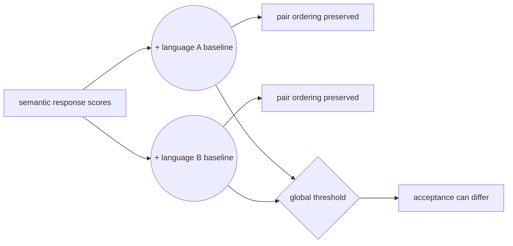
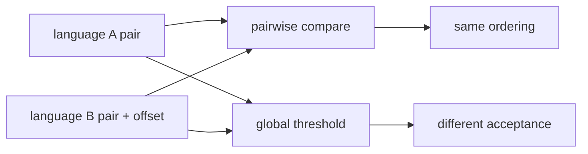
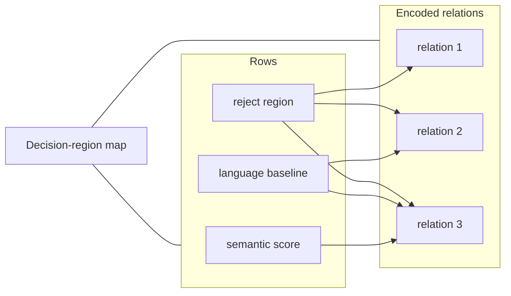

# Visual manifest — LLM Evaluators are Biased across Languages

- Paper ID: `paper_llm_evaluators_languages`
- Exact paper version: `v1`
- Explainer fixture: `packages/test-fixtures/explainers/llm-evaluators-languages.json`
- Manifest revision: `6`
- Engineer status: `COMPLETE`
- Implementer status: `COMPLETE`
- Paragraph coverage: `16 / 16` prose paragraphs
- Paragraph-ID derivation: `{block.id}_p{1-based index in block.paragraphs}`; each fixture paragraph appears exactly once.
- Evidence sources:
  - `language_source_intro` — LLM Evaluators v1 framing and dataset; Pages 1–4, Sections 1–3.2
  - `language_source_effects` — LLM Evaluators v1 language effects; Pages 4–5, Sections 3.3.1–3.3.3, Figures 1–3, Appendix Table 6
  - `language_source_thresholds` — LLM Evaluators v1 threshold analysis and rounded worked example; Pages 5–7, Sections 3.4–3.5, Figure 4, Table 1, Appendix Table 15; Section 3.4 reports a 43.0-point aggregate maximum and separately describes rounded 23% versus 67% English/Ukrainian rates as a 44-point example
  - `language_source_uncertainty` — LLM Evaluators v1 uncertainty analysis; Pages 7–8, Sections 4–4.1, Equations 1–2, Figure 5, Table 2
  - `language_source_regressions` — LLM Evaluators v1 structural regressions; Pages 8–10, Sections 4.2–4.3, Equations 3–6, Figures 6–7, Appendix Tables 11–12
  - `language_source_calibration` — LLM Evaluators v1 calibration analysis; Pages 10 and 22–23, Section 5, Appendix D, Tables 13–15

Revision 6 independently reassesses all 16 paragraphs under the four-form hard ban. It proposes 1 paper-specific visuals and keeps 15 paragraphs prose-only. Revision-5 selections and SVG implementations are not accepted guidance; implementation must be redone from this manifest.

## `language_why_p1`

- Location: `language_why`, paragraph 1
- Text anchor: "Pairwise accuracy asks whether an evaluator ranks a preferred response above a rejected one."
- Claims and sources: `language_claim_pairwise_blind`, `language_claim_gap`, `language_source_intro`, `language_source_thresholds`
- Visual needed: `NO`
- Complexity warrant: NONE — prose is sufficient.
- Forbidden-structure audit: `NO_VISUAL`
- Decision rationale: The paragraph makes one bounded distinction in plain language: Pairwise accuracy asks whether an evaluator ranks a preferred response above a rejected one. A visual would repeat that statement as a stock chain, list, or set of cards rather than reduce genuine mental reconstruction.
- Explanatory job: Motivation and problem framing.

### Implementation record

- Status: `NOT_NEEDED`
- Selected treatment: `NONE`
- Selection rationale: `NO_VISUAL` — prose is the approved treatment.
- Delivery medium: `NONE`
- Visual ID and placement: `NONE` — `NO_VISUAL`
- Shared paragraph scope: `NONE`
- Changed files: `NONE`
- Accessibility and fallback verification: `NO_VISUAL`
- Desktop and mobile verification: `NO_VISUAL`
- Evidence deviations: `NONE`

## `language_why_p2`

- Location: `language_why`, paragraph 2
- Text anchor: "Many real uses depend on absolute scores instead: a safety gate accepts content above"
- Claims and sources: `language_claim_pairwise_blind`, `language_claim_gap`, `language_source_intro`, `language_source_thresholds`
- Visual needed: `NO`
- Complexity warrant: NONE — prose is sufficient.
- Forbidden-structure audit: `NO_VISUAL`
- Decision rationale: The paragraph makes one bounded distinction in plain language: Many real uses depend on absolute scores instead: a safety gate accepts content above a threshold, and reinforcement learning consumes scalar rewards. A visual would repeat that statement as a stock chain, list, or set of cards rather than reduce genuine mental reconstruction.
- Explanatory job: Motivation and problem framing.

### Implementation record

- Status: `NOT_NEEDED`
- Selected treatment: `NONE`
- Selection rationale: `NO_VISUAL` — prose is the approved treatment.
- Delivery medium: `NONE`
- Visual ID and placement: `NONE` — `NO_VISUAL`
- Shared paragraph scope: `NONE`
- Changed files: `NONE`
- Accessibility and fallback verification: `NO_VISUAL`
- Desktop and mobile verification: `NO_VISUAL`
- Evidence deviations: `NONE`

## `language_change_p1`

- Location: `language_change`, paragraph 1
- Text anchor: "The study keeps semantic content aligned across 23 professionally translated and human-validated language versions,"
- Claims and sources: `language_claim_effect`, `language_claim_resource`, `language_claim_additional_judges`, `language_source_intro`, `language_source_effects`, `language_source_thresholds`
- Visual needed: `NO`
- Complexity warrant: NONE — prose is sufficient.
- Forbidden-structure audit: `NO_VISUAL`
- Decision rationale: The paragraph makes one bounded distinction in plain language: The study keeps semantic content aligned across 23 professionally translated and human-validated language versions, then examines pointwise score distributions rather than ranking accuracy alone. A visual would repeat that statement as a stock chain, list, or set of cards rather than reduce genuine mental reconstruction.
- Explanatory job: Method distinction and scope.

### Implementation record

- Status: `NOT_NEEDED`
- Selected treatment: `NONE`
- Selection rationale: `NO_VISUAL` — prose is the approved treatment.
- Delivery medium: `NONE`
- Visual ID and placement: `NONE` — `NO_VISUAL`
- Shared paragraph scope: `NONE`
- Changed files: `NONE`
- Accessibility and fallback verification: `NO_VISUAL`
- Desktop and mobile verification: `NO_VISUAL`
- Evidence deviations: `NONE`

## `language_change_p2`

- Location: `language_change`, paragraph 2
- Text anchor: "The authors also connect score shifts to Common Crawl language prevalence, test two additional"
- Claims and sources: `language_claim_effect`, `language_claim_resource`, `language_claim_additional_judges`, `language_source_intro`, `language_source_effects`, `language_source_thresholds`
- Visual needed: `NO`
- Complexity warrant: NONE — prose is sufficient.
- Forbidden-structure audit: `NO_VISUAL`
- Decision rationale: The paragraph makes one bounded distinction in plain language: The authors also connect score shifts to Common Crawl language prevalence, test two additional large judges, measure threshold outcomes, and decompose scores into uncertainty-related and language-related components. A visual would repeat that statement as a stock chain, list, or set of cards rather than reduce genuine mental reconstruction.
- Explanatory job: Method distinction and scope.

### Implementation record

- Status: `NOT_NEEDED`
- Selected treatment: `NONE`
- Selection rationale: `NO_VISUAL` — prose is the approved treatment.
- Delivery medium: `NONE`
- Visual ID and placement: `NONE` — `NO_VISUAL`
- Shared paragraph scope: `NONE`
- Changed files: `NONE`
- Accessibility and fallback verification: `NO_VISUAL`
- Desktop and mobile verification: `NO_VISUAL`
- Evidence deviations: `NONE`

## `language_mechanism_p1`

- Location: `language_mechanism`, paragraph 1
- Text anchor: "Suppose an evaluator adds a language-conditioned baseline to every response score. Within one language,"
- Claims and sources: `language_claim_pairwise_blind`, `language_claim_uncertainty`, `language_claim_language_after_nll`, `language_source_uncertainty`, `language_source_regressions`, `language_source_calibration`
- Visual needed: `YES`
- Complexity warrant: Non-trivial invariance and decision-boundary geometry: a language-conditioned score translation preserves within-language ordering while moving observations across one global threshold.
- Forbidden-structure audit: `PASS` — each treatment uses branching, a dependency matrix, feedback, shared-scale geometry, or a state topology; none is a single interchangeable chain, item-plus-metric list, repeated same-metric cards, or repeated one-axis dot panels.
- Decision rationale: Readers must coordinate two facts that seem contradictory: rankings can remain correct while absolute decisions change. A shared coordinate system shows the preserved difference and shifted baseline simultaneously.
- Explanatory job: Score-translation invariance and threshold decision geometry.

### Treatment A — Shared score axis with language translation

- Teaching purpose: Show that adding one language offset moves both preferred and rejected responses without reversing them.
- Encoding and reading order: Two paired response points are translated by the same vector on one shared axis; the within-pair gap is conserved while a global threshold cuts the translated pair differently.
- Evidence and limitations: Claims `language_claim_pairwise_blind`, `language_claim_gap`; `language_source_intro`, `language_source_thresholds`. Coordinates are explanatory, not measured scores; only the invariance and threshold-crossing relation is asserted.
- Primary delivery medium: `SVG`
- Recommended web medium: `SVG`
- Mobile, accessibility, and motion behavior: Preserve all labels at 200% zoom; on narrow screens use a single controlled horizontal scroll region or a content-specific stacked variant. Provide a semantic description of every relation and value. Keyboard focus must follow the stated reading order. If interactive, expose the same state in text, support pause/reset, and honor reduced motion; otherwise use no motion.

#### TikZ
```tex
\documentclass[tikz,border=4pt]{standalone}
\usepackage{tikz}
\begin{document}
\begin{tikzpicture}[font=\sffamily\scriptsize,>=stealth]
\draw[->] (0,0) -- (7,0) node[right]{semantic score};
\draw[->] (0,0) -- (0,4) node[above]{language baseline};
\draw[red,dashed] (2,4) -- (6,0) node[below]{global threshold};
\fill (2,0.8) circle (2pt) node[below]{A rejected};
\fill (4,0.8) circle (2pt) node[below]{A preferred};
\fill (2,2.4) circle (2pt) node[above]{B rejected};
\fill (4,2.4) circle (2pt) node[above]{B preferred};
\draw[->,blue] (2,0.8)--(2,2.4);
\draw[->,blue] (4,0.8)--(4,2.4);
\draw[<->] (2,0.5)--node[below]{same pair gap}(4,0.5);
\end{tikzpicture}
\end{document}
```

#### Mermaid


#### Python
```python
from pathlib import Path
import matplotlib.pyplot as plt

fig, ax = plt.subplots(figsize=(9, 5))
points = {'A rejected':(0.35,0.2), 'A preferred':(0.65,0.2), 'B rejected':(0.35,0.6), 'B preferred':(0.65,0.6)}
for label, (x, y) in points.items():
    ax.scatter(x, y, color='#2f5ea8')
    ax.text(x, y + 0.04, label, ha='center')
for x in (0.35, 0.65):
    ax.annotate('', (x,0.6), (x,0.2), arrowprops={'arrowstyle':'->','color':'#2f5ea8'})
ax.plot([0.2,0.8],[0.8,0.2],'--',color='#a44e36',label='global threshold')
ax.set_xlabel('semantic score')
ax.set_ylabel('language baseline')
ax.legend()
fig.tight_layout()
fig.savefig(Path('visual.svg'), format='svg')
```

### Treatment B — Ranking-invariance and acceptance decision graph

- Teaching purpose: Separate the comparison operation from the threshold operation applied to the same scores.
- Encoding and reading order: Each language-specific score pair feeds two branches: a difference comparator and a global threshold. Comparator outputs agree; threshold outputs can differ after a shared language offset.
- Evidence and limitations: Claims `language_claim_pairwise_blind`, `language_claim_gap`; `language_source_intro`, `language_source_thresholds`. The diagram is structural and does not imply unreported magnitudes.
- Primary delivery medium: `SVG`
- Recommended web medium: `SVG`
- Mobile, accessibility, and motion behavior: Preserve all labels at 200% zoom; on narrow screens use a single controlled horizontal scroll region or a content-specific stacked variant. Provide a semantic description of every relation and value. Keyboard focus must follow the stated reading order. If interactive, expose the same state in text, support pause/reset, and honor reduced motion; otherwise use no motion.

#### TikZ
```tex
\documentclass[tikz,border=4pt]{standalone}
\usepackage{tikz}
\begin{document}
\begin{tikzpicture}[font=\sffamily\scriptsize,>=stealth]
\node[draw,rounded corners,align=center] (n0) at (0.0,0.0) {language A pair};
\node[draw,rounded corners,align=center] (n1) at (3.2,0.0) {language B pair + offset};
\node[draw,rounded corners,align=center] (n2) at (6.4,0.0) {pairwise compare};
\node[draw,rounded corners,align=center] (n3) at (9.600000000000001,0.0) {same ordering};
\node[draw,rounded corners,align=center] (n4) at (0.0,-1.8) {global threshold};
\node[draw,rounded corners,align=center] (n5) at (3.2,-1.8) {different acceptance};
\draw[->] (n0) -- (n2);
\draw[->] (n1) -- (n2);
\draw[->] (n2) -- (n3);
\draw[->] (n0) -- (n4);
\draw[->] (n1) -- (n4);
\draw[->] (n4) -- (n5);
\end{tikzpicture}
\end{document}
```

#### Mermaid


#### Python
```python
from pathlib import Path
import matplotlib.pyplot as plt

labels = ['language A pair', 'language B pair + offset', 'pairwise compare', 'same ordering', 'global threshold', 'different acceptance']
fig, ax = plt.subplots(figsize=(9, 5))
edges = [(0, 2), (1, 2), (2, 3), (0, 4), (1, 4), (4, 5)]
positions = {i: ((i % 4) * 2.5, -(i // 4) * 1.4) for i in range(len(labels))}
for i, label in enumerate(labels):
    x, y = positions[i]
    ax.text(x, y, label, ha='center', va='center', bbox={'boxstyle': 'round', 'fc': '#fffdf8', 'ec': '#171714'})
for start, end in edges:
    x1, y1 = positions[start]
    x2, y2 = positions[end]
    ax.annotate('', (x2, y2), (x1, y1), arrowprops={'arrowstyle': '->', 'color': '#2f5ea8'})
ax.set_axis_off()
fig.tight_layout()
fig.savefig(Path('visual.svg'), format='svg')
```

### Treatment C — Decision-region map

- Teaching purpose: Expose which combinations of semantic score and language baseline cross the global threshold.
- Encoding and reading order: A two-dimensional plane uses semantic content and language baseline as axes; a diagonal boundary marks their sum equal to the threshold. Preferred/rejected pairs occupy translated positions with preserved separation.
- Evidence and limitations: Claims `language_claim_pairwise_blind`, `language_claim_gap`; `language_source_intro`, `language_source_thresholds`. The additive decomposition is the paper's model of the score, not a proven causal mechanism.
- Primary delivery medium: `JavaScript`
- Recommended web medium: `JavaScript`
- Mobile, accessibility, and motion behavior: Preserve all labels at 200% zoom; on narrow screens use a single controlled horizontal scroll region or a content-specific stacked variant. Provide a semantic description of every relation and value. Keyboard focus must follow the stated reading order. If interactive, expose the same state in text, support pause/reset, and honor reduced motion; otherwise use no motion.

#### TikZ
```tex
\documentclass[tikz,border=4pt]{standalone}
\usepackage{tikz}
\begin{document}
\begin{tikzpicture}[font=\sffamily\scriptsize,>=stealth]
\fill[blue!20] (0,-0) rectangle ++(0.9,-0.9);
\draw (0,-0) rectangle ++(0.9,-0.9);
\fill[blue!20] (1,-0) rectangle ++(0.9,-0.9);
\draw (1,-0) rectangle ++(0.9,-0.9);
\fill[blue!80] (2,-0) rectangle ++(0.9,-0.9);
\draw (2,-0) rectangle ++(0.9,-0.9);
\fill[blue!20] (0,-1) rectangle ++(0.9,-0.9);
\draw (0,-1) rectangle ++(0.9,-0.9);
\fill[blue!80] (1,-1) rectangle ++(0.9,-0.9);
\draw (1,-1) rectangle ++(0.9,-0.9);
\fill[blue!80] (2,-1) rectangle ++(0.9,-0.9);
\draw (2,-1) rectangle ++(0.9,-0.9);
\fill[blue!80] (0,-2) rectangle ++(0.9,-0.9);
\draw (0,-2) rectangle ++(0.9,-0.9);
\fill[blue!80] (1,-2) rectangle ++(0.9,-0.9);
\draw (1,-2) rectangle ++(0.9,-0.9);
\fill[blue!80] (2,-2) rectangle ++(0.9,-0.9);
\draw (2,-2) rectangle ++(0.9,-0.9);
\node[anchor=west] at (0,1.0) {semantic score / language baseline / reject region / accept region};
\end{tikzpicture}
\end{document}
```

#### Mermaid


#### Python
```python
from pathlib import Path
import matplotlib.pyplot as plt

labels = ['semantic score', 'language baseline', 'reject region', 'accept region']
fig, ax = plt.subplots(figsize=(9, 5))
values = [[0, 0, 1], [0, 1, 1], [1, 1, 1]]
image = ax.imshow(values, cmap='Blues', vmin=0)
ax.set_title(' / '.join(labels))
fig.colorbar(image, ax=ax, label='encoded relation')
ax.grid(alpha=0.2)
fig.tight_layout()
fig.savefig(Path('visual.svg'), format='svg')
```

### Implementation record

- Status: `IMPLEMENTED`
- Selected treatment: `B`
- Selection rationale: The branched decision graph feeds each language-specific score pair to two non-interchangeable operations, making preserved comparator output and changed threshold output explicit without repeated one-axis tracks.
- Delivery medium: `SVG`
- Visual ID and placement: `language_visual_ranking_acceptance_graph` — rendered immediately after `language_mechanism_p1`.
- Shared paragraph scope: `NONE`
- Changed files: `apps/web/app/papers/[id]/explainer-visual.tsx`, `apps/web/app/papers/[id]/explainer-svg.tsx`, `apps/web/app/globals.css`, the paper fixture, and this manifest
- Accessibility and fallback verification: VERIFIED — the figure uses a unique SVG title and description, equivalent prose, evidence links, limitations, and a motion-free reading order.
- Desktop and mobile verification: VERIFIED — desktop preserves the full responsive canvas; below 720 px the SVG retains a 680 px width inside a keyboard-focusable horizontal scroller that stays within the viewport and creates no document-level overflow.
- Evidence deviations: `NONE`

## `language_mechanism_p2`

- Location: `language_mechanism`, paragraph 2
- Text anchor: "A global threshold exposes the mismatch: languages receiving higher baseline scores accept more responses"
- Claims and sources: `language_claim_pairwise_blind`, `language_claim_uncertainty`, `language_claim_language_after_nll`, `language_source_uncertainty`, `language_source_regressions`, `language_source_calibration`
- Visual needed: `NO`
- Complexity warrant: NONE — prose is sufficient.
- Forbidden-structure audit: `NO_VISUAL`
- Decision rationale: The paragraph's bounded operation is already explicit: A global threshold exposes the mismatch: languages receiving higher baseline scores accept more responses even when their pairwise accuracy looks similar. Its supported visual form would be a single sequence or inventory of components, both forbidden, and the evidence does not justify extra branching, scale, or state topology.
- Explanatory job: Mechanism explanation.

### Implementation record

- Status: `NOT_NEEDED`
- Selected treatment: `NONE`
- Selection rationale: `NO_VISUAL` — prose is the approved treatment.
- Delivery medium: `NONE`
- Visual ID and placement: `NONE` — `NO_VISUAL`
- Shared paragraph scope: `NONE`
- Changed files: `NONE`
- Accessibility and fallback verification: `NO_VISUAL`
- Desktop and mobile verification: `NO_VISUAL`
- Evidence deviations: `NONE`

## `language_mechanism_p3`

- Location: `language_mechanism`, paragraph 3
- Text anchor: "Summed response negative log-likelihood serves as one uncertainty proxy, with attribute-head disagreement, predictive variance,"
- Claims and sources: `language_claim_pairwise_blind`, `language_claim_uncertainty`, `language_claim_language_after_nll`, `language_source_uncertainty`, `language_source_regressions`, `language_source_calibration`
- Visual needed: `NO`
- Complexity warrant: NONE — prose is sufficient.
- Forbidden-structure audit: `NO_VISUAL`
- Decision rationale: The paragraph's bounded operation is already explicit: Summed response negative log-likelihood serves as one uncertainty proxy, with attribute-head disagreement, predictive variance, and semantic entropy as alternatives. Its supported visual form would be a single sequence or inventory of components, both forbidden, and the evidence does not justify extra branching, scale, or state topology.
- Explanatory job: Mechanism explanation.

### Implementation record

- Status: `NOT_NEEDED`
- Selected treatment: `NONE`
- Selection rationale: `NO_VISUAL` — prose is the approved treatment.
- Delivery medium: `NONE`
- Visual ID and placement: `NONE` — `NO_VISUAL`
- Shared paragraph scope: `NONE`
- Changed files: `NONE`
- Accessibility and fallback verification: `NO_VISUAL`
- Desktop and mobile verification: `NO_VISUAL`
- Evidence deviations: `NONE`

## `language_example_p1`

- Location: `language_example`, paragraph 1
- Text anchor: "For Skywork-LLaMA-8B, the paper rounds English to 93% pairwise accuracy and 23% acceptance, and"
- Claims and sources: `language_claim_gap`, `language_claim_english_ukrainian_rounding`, `language_claim_code_switch`, `language_claim_production_notshown`, `language_source_intro`, `language_source_thresholds`
- Visual needed: `NO`
- Complexity warrant: NONE — prose is sufficient.
- Forbidden-structure audit: `NO_VISUAL`
- Decision rationale: The worked example is short enough to follow in prose: For Skywork-LLaMA-8B, the paper rounds English to 93% pairwise accuracy and 23% acceptance, and Ukrainian to 87% pairwise accuracy and 67% acceptance. Rendering the same ordered actions would create a forbidden single chain; no additional quantitative or spatial relation is supported here.
- Explanatory job: Worked example.

### Implementation record

- Status: `NOT_NEEDED`
- Selected treatment: `NONE`
- Selection rationale: `NO_VISUAL` — prose is the approved treatment.
- Delivery medium: `NONE`
- Visual ID and placement: `NONE` — `NO_VISUAL`
- Shared paragraph scope: `NONE`
- Changed files: `NONE`
- Accessibility and fallback verification: `NO_VISUAL`
- Desktop and mobile verification: `NO_VISUAL`
- Evidence deviations: `NONE`

## `language_example_p2`

- Location: `language_example`, paragraph 2
- Text anchor: "The paper also wraps Hindi Safety content in an English frame. An off-the-shelf language"
- Claims and sources: `language_claim_gap`, `language_claim_english_ukrainian_rounding`, `language_claim_code_switch`, `language_claim_production_notshown`, `language_source_intro`, `language_source_thresholds`
- Visual needed: `NO`
- Complexity warrant: NONE — prose is sufficient.
- Forbidden-structure audit: `NO_VISUAL`
- Decision rationale: The worked example is short enough to follow in prose: The paper also wraps Hindi Safety content in an English frame. Rendering the same ordered actions would create a forbidden single chain; no additional quantitative or spatial relation is supported here.
- Explanatory job: Worked example.

### Implementation record

- Status: `NOT_NEEDED`
- Selected treatment: `NONE`
- Selection rationale: `NO_VISUAL` — prose is the approved treatment.
- Delivery medium: `NONE`
- Visual ID and placement: `NONE` — `NO_VISUAL`
- Shared paragraph scope: `NONE`
- Changed files: `NONE`
- Accessibility and fallback verification: `NO_VISUAL`
- Desktop and mobile verification: `NO_VISUAL`
- Evidence deviations: `NONE`

## `language_evidence_p1`

- Location: `language_evidence`, paragraph 1
- Text anchor: "All eight core evaluators show statistically significant differences in mean scores across languages by"
- Claims and sources: `language_claim_effect`, `language_claim_resource`, `language_claim_gap`, `language_claim_english_ukrainian_rounding`, `language_claim_high_accuracy_gap`, `language_claim_additional_judges`, `language_claim_uncertainty`, `language_claim_language_after_nll`, `language_claim_calibration`, `language_source_effects`, `language_source_thresholds`, `language_source_uncertainty`, `language_source_regressions`, `language_source_calibration`
- Visual needed: `NO`
- Complexity warrant: NONE — prose is sufficient.
- Forbidden-structure audit: `NO_VISUAL`
- Decision rationale: Per-language score distributions against Common Crawl prevalence would support a bivariate view, but this paragraph provides only aggregate significance and two aggregate correlations, not the 23 language coordinates or intervals. Plotting a trend from `r = -0.58` and `rho = -0.81` alone would invent observations; listing eight significant evaluators would be a stock item/result display. Prose preserves the aggregate level of evidence.
- Explanatory job: Evaluation evidence.

### Implementation record

- Status: `NOT_NEEDED`
- Selected treatment: `NONE`
- Selection rationale: `NO_VISUAL` — prose is the approved treatment.
- Delivery medium: `NONE`
- Visual ID and placement: `NONE` — `NO_VISUAL`
- Shared paragraph scope: `NONE`
- Changed files: `NONE`
- Accessibility and fallback verification: `NO_VISUAL`
- Desktop and mobile verification: `NO_VISUAL`
- Evidence deviations: `NONE`

## `language_evidence_p2`

- Location: `language_evidence`, paragraph 2
- Text anchor: "Under one global median threshold, the aggregate reward-model analysis reports a maximum acceptance gap"
- Claims and sources: `language_claim_effect`, `language_claim_resource`, `language_claim_gap`, `language_claim_english_ukrainian_rounding`, `language_claim_high_accuracy_gap`, `language_claim_additional_judges`, `language_claim_uncertainty`, `language_claim_language_after_nll`, `language_claim_calibration`, `language_source_effects`, `language_source_thresholds`, `language_source_uncertainty`, `language_source_regressions`, `language_source_calibration`
- Visual needed: `NO`
- Complexity warrant: NONE — prose is sufficient.
- Forbidden-structure audit: `NO_VISUAL`
- Decision rationale: The reported gaps share percentage-point units, but they mix an aggregate maximum, a rounded English/Ukrainian example, a high-pairwise-accuracy subset, and two judges across two benchmark splits. Treating those scopes as exchangeable marks on one axis would obscure their different denominators; splitting them into judge/benchmark tracks would create forbidden repeated panels. Prose keeps 43 versus rounded 44 and every scope qualifier adjacent.
- Explanatory job: Evaluation evidence.

### Implementation record

- Status: `NOT_NEEDED`
- Selected treatment: `NONE`
- Selection rationale: `NO_VISUAL` — prose is the approved treatment.
- Delivery medium: `NONE`
- Visual ID and placement: `NONE` — `NO_VISUAL`
- Shared paragraph scope: `NONE`
- Changed files: `NONE`
- Accessibility and fallback verification: `NO_VISUAL`
- Desktop and mobile verification: `NO_VISUAL`
- Evidence deviations: `NONE`

## `language_evidence_p3`

- Location: `language_evidence`, paragraph 3
- Text anchor: "Uncertainty measures correlate positively with score at the language level, but nested regressions retain"
- Claims and sources: `language_claim_effect`, `language_claim_resource`, `language_claim_gap`, `language_claim_english_ukrainian_rounding`, `language_claim_high_accuracy_gap`, `language_claim_additional_judges`, `language_claim_uncertainty`, `language_claim_language_after_nll`, `language_claim_calibration`, `language_source_effects`, `language_source_thresholds`, `language_source_uncertainty`, `language_source_regressions`, `language_source_calibration`
- Visual needed: `NO`
- Complexity warrant: NONE — prose is sufficient.
- Forbidden-structure audit: `NO_VISUAL`
- Decision rationale: The paragraph combines regression significance with one before/after acceptance-gap mitigation result. A causal path diagram would overstate what the nested regressions establish, while a two-point 33.4-to-11.6 display would be a stock single transition and would hide residual distribution-shape and language-item interactions. Prose states both partial mitigation and remaining uncertainty without implying causality.
- Explanatory job: Evaluation evidence.

### Implementation record

- Status: `NOT_NEEDED`
- Selected treatment: `NONE`
- Selection rationale: `NO_VISUAL` — prose is the approved treatment.
- Delivery medium: `NONE`
- Visual ID and placement: `NONE` — `NO_VISUAL`
- Shared paragraph scope: `NONE`
- Changed files: `NONE`
- Accessibility and fallback verification: `NO_VISUAL`
- Desktop and mobile verification: `NO_VISUAL`
- Evidence deviations: `NONE`

## `language_limitations_p1`

- Location: `language_limitations`, paragraph 1
- Text anchor: "The data are translated benchmark items, not naturally authored multilingual conversations or culturally specific"
- Claims and sources: `language_claim_cause_notshown`, `language_claim_production_notshown`, `language_source_uncertainty`, `language_source_regressions`, `language_source_thresholds`
- Visual needed: `NO`
- Complexity warrant: NONE — prose is sufficient.
- Forbidden-structure audit: `NO_VISUAL`
- Decision rationale: This paragraph is a claim boundary rather than a reconstructive structure: The data are translated benchmark items, not naturally authored multilingual conversations or culturally specific judgments. Keeping the qualifiers in prose avoids inventing causal links or turning heterogeneous caveats into interchangeable cards or a stock list.
- Explanatory job: Evidence boundary and limitation.

### Implementation record

- Status: `NOT_NEEDED`
- Selected treatment: `NONE`
- Selection rationale: `NO_VISUAL` — prose is the approved treatment.
- Delivery medium: `NONE`
- Visual ID and placement: `NONE` — `NO_VISUAL`
- Shared paragraph scope: `NONE`
- Changed files: `NONE`
- Accessibility and fallback verification: `NO_VISUAL`
- Desktop and mobile verification: `NO_VISUAL`
- Evidence deviations: `NONE`

## `language_limitations_p2`

- Location: `language_limitations`, paragraph 2
- Text anchor: "The uncertainty-score association does not establish uncertainty as the cause of the shift. The"
- Claims and sources: `language_claim_cause_notshown`, `language_claim_production_notshown`, `language_source_uncertainty`, `language_source_regressions`, `language_source_thresholds`
- Visual needed: `NO`
- Complexity warrant: NONE — prose is sufficient.
- Forbidden-structure audit: `NO_VISUAL`
- Decision rationale: This paragraph is a claim boundary rather than a reconstructive structure: The uncertainty-score association does not establish uncertainty as the cause of the shift. Keeping the qualifiers in prose avoids inventing causal links or turning heterogeneous caveats into interchangeable cards or a stock list.
- Explanatory job: Evidence boundary and limitation.

### Implementation record

- Status: `NOT_NEEDED`
- Selected treatment: `NONE`
- Selection rationale: `NO_VISUAL` — prose is the approved treatment.
- Delivery medium: `NONE`
- Visual ID and placement: `NONE` — `NO_VISUAL`
- Shared paragraph scope: `NONE`
- Changed files: `NONE`
- Accessibility and fallback verification: `NO_VISUAL`
- Desktop and mobile verification: `NO_VISUAL`
- Evidence deviations: `NONE`

## `language_review_p1`

- Location: `language_review`, paragraph 1
- Text anchor: "The strongest result is a measurement warning: high pairwise accuracy does not certify that"
- Claims and sources: `language_claim_pairwise_blind`, `language_claim_calibration`, `language_claim_cause_notshown`, `language_claim_production_notshown`, `language_source_thresholds`, `language_source_calibration`
- Visual needed: `NO`
- Complexity warrant: NONE — prose is sufficient.
- Forbidden-structure audit: `NO_VISUAL`
- Decision rationale: This paragraph is a claim boundary rather than a reconstructive structure: The strongest result is a measurement warning: high pairwise accuracy does not certify that raw evaluator scores are comparable across languages. Keeping the qualifiers in prose avoids inventing causal links or turning heterogeneous caveats into interchangeable cards or a stock list.
- Explanatory job: Critical interpretation and claim boundary.

### Implementation record

- Status: `NOT_NEEDED`
- Selected treatment: `NONE`
- Selection rationale: `NO_VISUAL` — prose is the approved treatment.
- Delivery medium: `NONE`
- Visual ID and placement: `NONE` — `NO_VISUAL`
- Shared paragraph scope: `NONE`
- Changed files: `NONE`
- Accessibility and fallback verification: `NO_VISUAL`
- Desktop and mobile verification: `NO_VISUAL`
- Evidence deviations: `NONE`

## `language_review_p2`

- Location: `language_review`, paragraph 2
- Text anchor: "Per-language centering is a useful diagnostic and partial mitigation, not a full solution. It"
- Claims and sources: `language_claim_pairwise_blind`, `language_claim_calibration`, `language_claim_cause_notshown`, `language_claim_production_notshown`, `language_source_thresholds`, `language_source_calibration`
- Visual needed: `NO`
- Complexity warrant: NONE — prose is sufficient.
- Forbidden-structure audit: `NO_VISUAL`
- Decision rationale: This paragraph is a claim boundary rather than a reconstructive structure: Per-language centering is a useful diagnostic and partial mitigation, not a full solution. Keeping the qualifiers in prose avoids inventing causal links or turning heterogeneous caveats into interchangeable cards or a stock list.
- Explanatory job: Critical interpretation and claim boundary.

### Implementation record

- Status: `NOT_NEEDED`
- Selected treatment: `NONE`
- Selection rationale: `NO_VISUAL` — prose is the approved treatment.
- Delivery medium: `NONE`
- Visual ID and placement: `NONE` — `NO_VISUAL`
- Shared paragraph scope: `NONE`
- Changed files: `NONE`
- Accessibility and fallback verification: `NO_VISUAL`
- Desktop and mobile verification: `NO_VISUAL`
- Evidence deviations: `NONE`
