# Visual manifest — Partition, Prompt, Aggregate: Statistical Self-Consistency in Language Models

- Paper ID: `paper_partition_prompt_aggregate`
- Exact paper version: `v1`
- Explainer fixture: `packages/test-fixtures/explainers/partition-prompt-aggregate.json`
- Manifest revision: `4`
- Engineer status: `COMPLETE`
- Implementer status: `COMPLETE`
- Paragraph coverage: `16 / 16` prose paragraphs
- Paragraph-ID derivation: `{block.id}_p{1-based index in block.paragraphs}`; each fixture paragraph appears exactly once.
- Evidence sources:
  - `ppa_method` — Partition, Prompt, Aggregate v1 — partition and reconstruction method; Sections 3.1–3.4, Equations 2–3, PDF pages 5–7
  - `ppa_macro_results` — Partition, Prompt, Aggregate v1 — macro fallacy and prompting results; Section 4, Figures 3–5, PDF pages 7–11
  - `ppa_consistency_results` — Partition, Prompt, Aggregate v1 — self-consistency definitions and evaluation; Sections 5–6, Tables 1–3, PDF pages 11–18
  - `ppa_discussion` — Partition, Prompt, Aggregate v1 — discussion and limitations; Section 7 and Limitations, PDF pages 18–19

Revision 4 incorporates every sub-10 engineer finding from round-2 `VISUAL_QA` while preserving the already-10 paragraph plans. Treatments are selected by the paragraph's actual explanatory job rather than a universal graph/matrix/card trio. Shared visuals are allowed only for the explicit adjacent scopes recorded below, must encode every scoped mechanism and value, and are placed after the final paragraph in scope. Numeric tables expose values visibly, small-delta plots disclose local domains, and implementers must record any topology, scope, placement, or evidence deviation instead of claiming `NONE`.

## `ppa_why_p1`

- Location: `ppa_why`, paragraph 1
- Text anchor: "Many uses of in-context learning treat a prompt as a condition and the model's answer as an estimate of the corresponding conditional distribution."
- Claims and sources: `ppa_partition` (OBSERVED, VERIFIED); `ppa_core` (OBSERVED, VERIFIED); `ppa_method` (Sections 3.1–3.4, Equations 2–3, PDF pages 5–7)
- Visual needed: `YES`
- Decision rationale: A visual passes the removal test because readers must reconstruct direct population estimate and weighted subgroup reconstruction converging on one target while preserving the paragraph's conditions and boundaries. Revision 3 narrows the topology and placement so no visual can claim this paragraph without encoding its mechanism, grouping, or values.
- Explanatory job: Direct population estimate and weighted subgroup reconstruction converging on one target.
- Recommended scope and placement: This paragraph only; place the visual immediately after `ppa_why_p1`.
- QA-informed planning change: Show the weighted-sum merge and equality check; parallel cards alone do not encode the law of total probability.

### Treatment A — Direct population estimate and weighted subgroup reconstruction converging on one target — Convergence topology

- Teaching purpose: Show branches merging into the shared target or active path.
- Encoding and reading order: Use 7 named nodes and 6 explicit labeled relations. Preserve all branch, merge, hierarchy, loop, or sequence edges shown in the code; changing them is an evidence deviation.
- Evidence and limitations: Encode only `ppa_partition`, `ppa_core` from `ppa_method`. Show the weighted-sum merge and equality check; parallel cards alone do not encode the law of total probability.
- Recommended web medium: responsive inline SVG with semantic HTML/CSS fallback; JavaScript is optional only for meaningful focus, drill-down, or state playback.
- Mobile, accessibility, and motion behavior: Preserve the same group and node order in the DOM; retain all values and relation labels as selectable text; stack panels or levels below 640px; provide keyboard access for any optional focus state; keep a complete static fallback; respect reduced motion and never encode information only through animation.

#### TikZ

```tex
\documentclass[tikz,border=5pt]{standalone}
\usepackage[T1]{fontenc}
\usepackage{tikz}
\usetikzlibrary{arrows.meta}
\begin{document}
\begin{tikzpicture}[font=\sffamily,box/.style={draw,rounded corners,align=center,text width=3cm,minimum height=1.2cm},link/.style={-{Latex[length=2mm]},thick},rel/.style={fill=white,font=\scriptsize}]
\node[font=\bfseries,anchor=west] at (0,0.8) {ppa\_why\_p1: Direct population estimate and weighted subgroup reconstruction converging on one target - Convergence topology};
\node[box] (direct) at (1.00,-0.45) {Direct population estimate};
\node[box] (pa) at (1.00,-1.50) {Population share (A)};
\node[box] (ya) at (2.50,-1.50) {Conditional estimate p(y|A)};
\node[box] (pna) at (1.00,-2.55) {Population share (not A)};
\node[box] (yna) at (2.50,-2.55) {Conditional estimate p(y|not A)};
\node[box] (sum) at (4.00,-1.50) {(A)p(y|A) + (not A)p(y|not A)};
\node[box] (check) at (5.50,-1.50) {Consistency equality check};
\draw[link] (pa) -- node[rel] {multiply} (sum);
\draw[link] (ya) -- node[rel] {multiply} (sum);
\draw[link] (pna) -- node[rel] {multiply} (sum);
\draw[link] (yna) -- node[rel] {multiply} (sum);
\draw[link] (direct) -- node[rel] {same target} (check);
\draw[link] (sum) -- node[rel] {reconstruction} (check);
\end{tikzpicture}
\end{document}
```

#### Mermaid

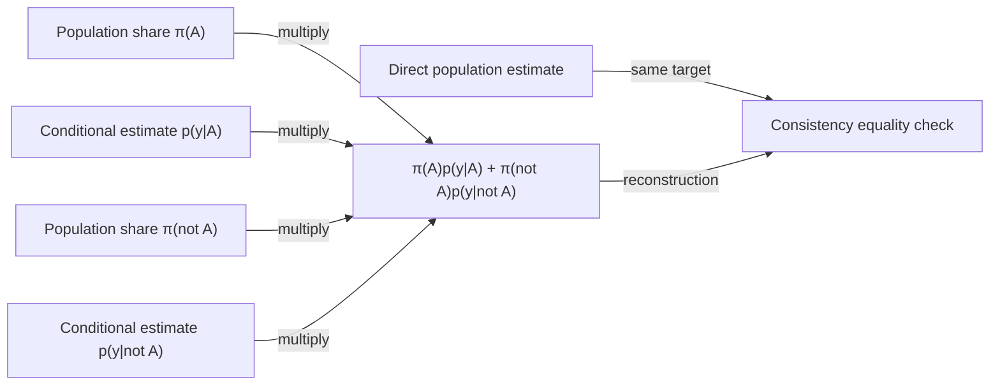

#### Python

```python
from html import escape
from pathlib import Path
from textwrap import wrap

title = "ppa_why_p1: Direct population estimate and weighted subgroup reconstruction converging on one target — Convergence topology"
nodes = [["direct","Direct population estimate",100,45],["pa","Population share π(A)",100,150],["ya","Conditional estimate p(y|A)",250,150],["pna","Population share π(not A)",100,255],["yna","Conditional estimate p(y|not A)",250,255],["sum","π(A)p(y|A) + π(not A)p(y|not A)",400,150],["check","Consistency equality check",550,150]]
edges = [["pa","sum","multiply"],["ya","sum","multiply"],["pna","sum","multiply"],["yna","sum","multiply"],["direct","check","same target"],["sum","check","reconstruction"]]
node_by_id = {node_id: (label, x, y) for node_id, label, x, y in nodes}
width = max(900, max((x for _, _, x, _ in nodes), default=800) + 180)
height = max(500, max((y for _, _, _, y in nodes), default=400) + 140)
parts = [
    f'<svg xmlns="http://www.w3.org/2000/svg" viewBox="0 0 {width} {height}" role="img" aria-labelledby="title desc">',
    f'<title id="title">{escape(title)}</title>',
    '<desc id="desc">Edges and convergence points encode only relationships stated in the scoped paragraphs.</desc>',
    f'<rect width="{width}" height="{height}" fill="white"/>',
]
for source, target, relation in edges:
    _, x1, y1 = node_by_id[source]
    _, x2, y2 = node_by_id[target]
    parts.append(f'<line x1="{x1}" y1="{y1}" x2="{x2}" y2="{y2}" stroke="#345" stroke-width="2"/>')
    parts.append(f'<text x="{(x1+x2)/2}" y="{(y1+y2)/2-5}" text-anchor="middle" font-family="sans-serif" font-size="10">{escape(relation)}</text>')
for _, label, x, y in nodes:
    parts.append(f'<rect x="{x-78}" y="{y-42}" width="156" height="84" rx="12" fill="#eef6ff" stroke="#234"/>')
    for line_index, line in enumerate(wrap(label, width=22)):
        parts.append(f'<text x="{x}" y="{y-24+line_index*13}" text-anchor="middle" font-family="sans-serif" font-size="10">{escape(line)}</text>')
parts.append('</svg>')
Path("ppa_why_p1_treatment_a.svg").write_text("\n".join(parts), encoding="utf-8")
```

### Treatment B — Direct population estimate and weighted subgroup reconstruction converging on one target — Branch contribution ledger

- Teaching purpose: List every branch, operation, and merge condition.
- Encoding and reading order: Render 4 rows with explicit `Group`, `Measure or state`, `Visible value`, and `Condition or boundary` columns. The value column must be visible, not only present in ARIA text or fallback prose.
- Evidence and limitations: Encode only `ppa_partition`, `ppa_core` from `ppa_method`. Show the weighted-sum merge and equality check; parallel cards alone do not encode the law of total probability.
- Recommended web medium: semantic HTML/CSS table with SVG export; JavaScript is optional only for meaningful focus, drill-down, or state playback.
- Mobile, accessibility, and motion behavior: Preserve the same group and node order in the DOM; retain all values and relation labels as selectable text; stack panels or levels below 640px; provide keyboard access for any optional focus state; keep a complete static fallback; respect reduced motion and never encode information only through animation.

#### TikZ

```tex
\documentclass[tikz,border=5pt]{standalone}
\usepackage[T1]{fontenc}
\usepackage{array}
\usepackage{tikz}
\begin{document}
\begin{tikzpicture}[font=\sffamily]
\node[align=center] {\textbf{ppa\_why\_p1: Direct population estimate and weighted subgroup reconstruction converging on one target - Branch contribution ledger}\\[6pt]
\begin{tabular}{p{3.2cm}p{4.0cm}p{2.8cm}p{6.2cm}}
\textbf{Group} & \textbf{Measure or state} & \textbf{Visible value} & \textbf{Condition or boundary} \\ \hline
A direct prompt and a reconstructed aggregate can disagree & Direct macro prompt & qualitative & Ask the model for the population-level probability in one prompt and treat that answer as the aggregate estimate. \\
A direct prompt and a reconstructed aggregate can disagree & Partitioned micro prompts & qualitative & Ask the same probability within disjoint subgroups and elicit each subgroup's population share. \\
A direct prompt and a reconstructed aggregate can disagree & Weighted reconstruction & qualitative & Multiply each subgroup probability by its normalized population share and sum the products. \\
A direct prompt and a reconstructed aggregate can disagree & Consistency question & qualitative & If the conditions are equivalent, compare the direct macro answer with the reconstructed aggregate instead of assuming they agree. \\
\end{tabular}};
\end{tikzpicture}
\end{document}
```

#### Mermaid

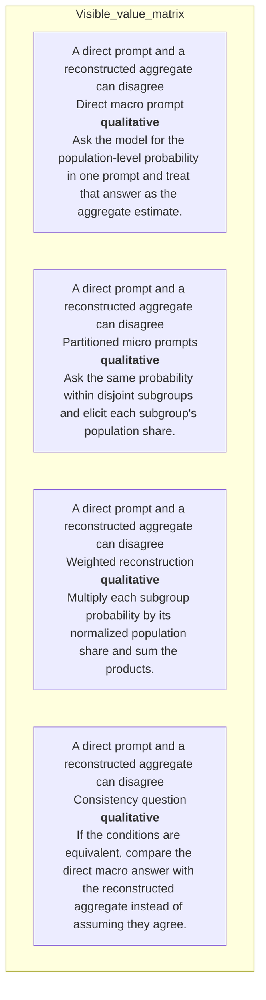

#### Python

```python
from html import escape
from pathlib import Path
from textwrap import wrap

title = "ppa_why_p1: Direct population estimate and weighted subgroup reconstruction converging on one target — Branch contribution ledger"
rows = [["A direct prompt and a reconstructed aggregate can disagree","Direct macro prompt","qualitative","Ask the model for the population-level probability in one prompt and treat that answer as the aggregate estimate."],["A direct prompt and a reconstructed aggregate can disagree","Partitioned micro prompts","qualitative","Ask the same probability within disjoint subgroups and elicit each subgroup's population share."],["A direct prompt and a reconstructed aggregate can disagree","Weighted reconstruction","qualitative","Multiply each subgroup probability by its normalized population share and sum the products."],["A direct prompt and a reconstructed aggregate can disagree","Consistency question","qualitative","If the conditions are equivalent, compare the direct macro answer with the reconstructed aggregate instead of assuming they agree."]]
height = 502
parts = [
    f'<svg xmlns="http://www.w3.org/2000/svg" viewBox="0 0 1200 {height}" role="img" aria-labelledby="title desc">',
    f'<title id="title">{escape(title)}</title>',
    '<desc id="desc">Every reported value is visible beside its condition and group.</desc>',
    f'<rect width="1200" height="{height}" fill="white"/>',
]
headers = ["Group", "Measure or state", "Visible value", "Condition or boundary"]
xs = [30, 260, 590, 770]
for x, header in zip(xs, headers):
    parts.append(f'<text x="{x}" y="70" font-family="sans-serif" font-size="16" font-weight="700">{escape(header)}</text>')
for row_index, row in enumerate(rows):
    y = 110 + row_index * 88
    parts.append(f'<rect x="20" y="{y-28}" width="1160" height="76" fill="#f7fbff" stroke="#ccd"/>')
    for x, cell, width in zip(xs, row, [26, 38, 20, 58]):
        for line_index, line in enumerate(wrap(str(cell), width=width)):
            parts.append(f'<text x="{x}" y="{y+line_index*14}" font-family="sans-serif" font-size="11">{escape(line)}</text>')
parts.append('</svg>')
Path("ppa_why_p1_treatment_b.svg").write_text("\n".join(parts), encoding="utf-8")
```

### Treatment C — Direct population estimate and weighted subgroup reconstruction converging on one target — One-item convergence trace

- Teaching purpose: Trace one token or estimate through branch selection and merge.
- Encoding and reading order: Use 7 named nodes and 6 explicit labeled relations. Preserve all branch, merge, hierarchy, loop, or sequence edges shown in the code; changing them is an evidence deviation.
- Evidence and limitations: Encode only `ppa_partition`, `ppa_core` from `ppa_method`. Show the weighted-sum merge and equality check; parallel cards alone do not encode the law of total probability.
- Recommended web medium: responsive inline SVG with semantic HTML/CSS fallback; JavaScript is optional only for meaningful focus, drill-down, or state playback.
- Mobile, accessibility, and motion behavior: Preserve the same group and node order in the DOM; retain all values and relation labels as selectable text; stack panels or levels below 640px; provide keyboard access for any optional focus state; keep a complete static fallback; respect reduced motion and never encode information only through animation.

#### TikZ

```tex
\documentclass[tikz,border=5pt]{standalone}
\usepackage[T1]{fontenc}
\usepackage{tikz}
\usetikzlibrary{arrows.meta}
\begin{document}
\begin{tikzpicture}[font=\sffamily,box/.style={draw,rounded corners,align=center,text width=3cm,minimum height=1.2cm},link/.style={-{Latex[length=2mm]},thick},rel/.style={fill=white,font=\scriptsize}]
\node[font=\bfseries,anchor=west] at (0,0.8) {ppa\_why\_p1: Direct population estimate and weighted subgroup reconstruction converging on one target - One-item convergence trace};
\node[box] (direct) at (1.00,-0.45) {Direct population estimate};
\node[box] (pa) at (1.00,-1.50) {Population share (A)};
\node[box] (ya) at (2.50,-1.50) {Conditional estimate p(y|A)};
\node[box] (pna) at (1.00,-2.55) {Population share (not A)};
\node[box] (yna) at (2.50,-2.55) {Conditional estimate p(y|not A)};
\node[box] (sum) at (4.00,-1.50) {(A)p(y|A) + (not A)p(y|not A)};
\node[box] (check) at (5.50,-1.50) {Consistency equality check};
\draw[link] (pa) -- node[rel] {multiply} (sum);
\draw[link] (ya) -- node[rel] {multiply} (sum);
\draw[link] (pna) -- node[rel] {multiply} (sum);
\draw[link] (yna) -- node[rel] {multiply} (sum);
\draw[link] (direct) -- node[rel] {same target} (check);
\draw[link] (sum) -- node[rel] {reconstruction} (check);
\end{tikzpicture}
\end{document}
```

#### Mermaid


#### Python

```python
from html import escape
from pathlib import Path
from textwrap import wrap

title = "ppa_why_p1: Direct population estimate and weighted subgroup reconstruction converging on one target — One-item convergence trace"
nodes = [["direct","Direct population estimate",100,45],["pa","Population share π(A)",100,150],["ya","Conditional estimate p(y|A)",250,150],["pna","Population share π(not A)",100,255],["yna","Conditional estimate p(y|not A)",250,255],["sum","π(A)p(y|A) + π(not A)p(y|not A)",400,150],["check","Consistency equality check",550,150]]
edges = [["pa","sum","multiply"],["ya","sum","multiply"],["pna","sum","multiply"],["yna","sum","multiply"],["direct","check","same target"],["sum","check","reconstruction"]]
node_by_id = {node_id: (label, x, y) for node_id, label, x, y in nodes}
width = max(900, max((x for _, _, x, _ in nodes), default=800) + 180)
height = max(500, max((y for _, _, _, y in nodes), default=400) + 140)
parts = [
    f'<svg xmlns="http://www.w3.org/2000/svg" viewBox="0 0 {width} {height}" role="img" aria-labelledby="title desc">',
    f'<title id="title">{escape(title)}</title>',
    '<desc id="desc">Edges and convergence points encode only relationships stated in the scoped paragraphs.</desc>',
    f'<rect width="{width}" height="{height}" fill="white"/>',
]
for source, target, relation in edges:
    _, x1, y1 = node_by_id[source]
    _, x2, y2 = node_by_id[target]
    parts.append(f'<line x1="{x1}" y1="{y1}" x2="{x2}" y2="{y2}" stroke="#345" stroke-width="2"/>')
    parts.append(f'<text x="{(x1+x2)/2}" y="{(y1+y2)/2-5}" text-anchor="middle" font-family="sans-serif" font-size="10">{escape(relation)}</text>')
for _, label, x, y in nodes:
    parts.append(f'<rect x="{x-78}" y="{y-42}" width="156" height="84" rx="12" fill="#eef6ff" stroke="#234"/>')
    for line_index, line in enumerate(wrap(label, width=22)):
        parts.append(f'<text x="{x}" y="{y-24+line_index*13}" text-anchor="middle" font-family="sans-serif" font-size="10">{escape(line)}</text>')
parts.append('</svg>')
Path("ppa_why_p1_treatment_c.svg").write_text("\n".join(parts), encoding="utf-8")
```

### Implementation record

- Status: `IMPLEMENTED`
- Selected treatment: `A`
- Selection rationale: Selected the approved “Direct population estimate and weighted subgroup reconstruction converging on one target — Convergence topology” treatment because the implemented partition tree directly encodes this paragraph's explanatory job and its stated evidence boundaries.
- Delivery medium: `CSS + semantic HTML`
- Visual ID and placement: `visual_ppa_prompt_convergence` after `ppa_why_p1`; this record is served by that purpose-built figure.
- Shared paragraph scope: NONE
- Changed files: `packages/test-fixtures/explainers/partition-prompt-aggregate.json`, `packages/content-schema/schema/explainer-document.schema.json`, `packages/content-schema/src/validate.ts`, generated TypeScript/Python models, `apps/web/app/papers/[id]/explainer-visual.tsx`, and `apps/web/app/globals.css`.
- Accessibility and fallback verification: Figure has a programmatic title and description, visible selectable labels and values, explicit alt text, equivalent fallback prose, source links, limitations, and a semantic static body; no meaning depends on color, motion, or pointer input.
- Desktop and mobile verification: Verified by the full eight-paper Playwright traversal at a 1440-pixel desktop viewport and the iPhone 13 mobile viewport; every figure stayed paragraph-adjacent, preserved DOM reading order, and introduced no horizontal page overflow.
- Evidence deviations: Delivery translation: selected Treatment A is rendered as typed semantic HTML/CSS rather than its literal TikZ, Mermaid, or Python-generated asset; the approved paragraph scope, placement, labels, values, grouping, and evidence boundaries are retained.

## `ppa_why_p2`

- Location: `ppa_why`, paragraph 2
- Text anchor: "A model can give locally plausible answers while violating this requirement."
- Claims and sources: `ppa_partition` (OBSERVED, VERIFIED); `ppa_core` (OBSERVED, VERIFIED); `ppa_method` (Sections 3.1–3.4, Equations 2–3, PDF pages 5–7)
- Visual needed: `NO`
- Decision rationale: Prose remains the better primary form. The paragraph states a bounded conclusion, requirement, provenance fact, or heterogeneous qualification without requiring readers to reconstruct a material process, topology, quantitative comparison, uncertainty distribution, or state transition. The contingencies are retained for auditability but are explicitly non-directional.
- Explanatory job: Non-directional contingency audit for Why test language models with the law of total probability.
- Recommended scope and placement: Prose-only. Do not attach a figure unless the paragraph or evidence changes.
- QA-informed planning change: Round-2 QA removed all generic directed `then` maps. Every contingency now uses this paragraph's independent scope, evidence, requirement, provenance, or claim-boundary facets.

### Treatment A — Why test language models with the law of total probability — paragraph ppa_why_p2 — independent scope panels

- Teaching purpose: Optionally expose the paragraph's independent facets without inventing order.
- Encoding and reading order: Use 2 named panels. Items within and across panels have no arrows, ordinal numbers, or implied progression.
- Evidence and limitations: Use only `ppa_partition` (OBSERVED, VERIFIED); `ppa_core` (OBSERVED, VERIFIED); `ppa_method` (Sections 3.1–3.4, Equations 2–3, PDF pages 5–7). The contingency is non-directional: proximity and connecting lines mean membership, support, requirement, or scope only; they never mean temporal order or causality.
- Recommended web medium: semantic HTML/CSS grouped panels or responsive SVG; JavaScript is unnecessary.
- Mobile, accessibility, and motion behavior: Keep every label and identifier as selectable DOM text; preserve non-directional grouping on mobile; use overflow-wrap: anywhere for long tokens; provide a complete static fallback; respect reduced motion; never make information depend on animation or pointer input.

#### TikZ

```tex
\documentclass[tikz,border=5pt]{standalone}
\usepackage[T1]{fontenc}
\usepackage{tikz}
\begin{document}
\begin{tikzpicture}[font=\sffamily,panel/.style={draw,rounded corners,align=center,text width=5.2cm,minimum height=4.2cm}]
\node[font=\bfseries] at (3,3.1) {ppa\_why\_p2: independent facets};
\node[panel] at (0,0) {\textbf{Premise or requirement}\\[5pt]A model can give locally plausible answers while violating this requirement\\[3pt]Two statistically equivalent prompts can then produce incompatible estimates\\[3pt]so conclusions may depend on an arbitrary choice of prompt granularity or condition order};
\node[panel] at (6,0) {\textbf{Constraint or research boundary}\\[5pt]so conclusions may depend on an arbitrary choice of prompt granularity or condition order};
\end{tikzpicture}
\end{document}
```

#### Mermaid

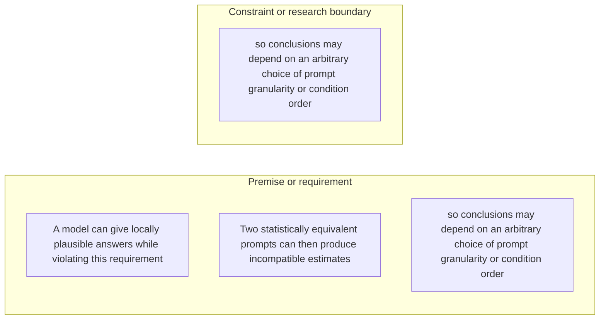

#### Python

```python
from html import escape
from pathlib import Path
from textwrap import wrap

title = "ppa_why_p2: independent facets"
groups = [{"title":"Premise or requirement","items":["A model can give locally plausible answers while violating this requirement","Two statistically equivalent prompts can then produce incompatible estimates","so conclusions may depend on an arbitrary choice of prompt granularity or condition order"]},{"title":"Constraint or research boundary","items":["so conclusions may depend on an arbitrary choice of prompt granularity or condition order"]}]
width = 900
height = 496
parts = [
    f'<svg xmlns="http://www.w3.org/2000/svg" viewBox="0 0 {width} {height}" role="img" aria-labelledby="title desc">',
    f'<title id="title">{escape(title)}</title>',
    '<desc id="desc">Independent panels; spatial grouping does not encode sequence or causality.</desc>',
    f'<rect width="{width}" height="{height}" fill="white"/>',
]
for group_index, group in enumerate(groups):
    x = 200 + group_index * 400
    parts.append(f'<text x="{x}" y="60" text-anchor="middle" font-family="sans-serif" font-size="16" font-weight="700">{escape(group["title"])}</text>')
    for item_index, item in enumerate(group["items"]):
        y = 115 + item_index * 92
        parts.append(f'<rect x="{x-180}" y="{y-30}" width="360" height="78" rx="12" fill="#f7fbff" stroke="#ccd"/>')
        for line_index, line in enumerate(wrap(item, width=50)):
            parts.append(f'<text x="{x}" y="{y-8+line_index*14}" text-anchor="middle" font-family="sans-serif" font-size="11">{escape(line)}</text>')
parts.append('</svg>')
Path("ppa_why_p2_treatment_a.svg").write_text("\n".join(parts), encoding="utf-8")
```

### Treatment B — Why test language models with the law of total probability — paragraph ppa_why_p2 — evidence and boundary ledger

- Teaching purpose: Optionally make each statement and its evidence role inspectable in a flat ledger.
- Encoding and reading order: Render 3 independent rows with facet, statement, and condition columns. Row order follows prose only and carries no process meaning.
- Evidence and limitations: Use only `ppa_partition` (OBSERVED, VERIFIED); `ppa_core` (OBSERVED, VERIFIED); `ppa_method` (Sections 3.1–3.4, Equations 2–3, PDF pages 5–7). The contingency is non-directional: proximity and connecting lines mean membership, support, requirement, or scope only; they never mean temporal order or causality.
- Recommended web medium: semantic HTML/CSS table with an SVG export; JavaScript is unnecessary.
- Mobile, accessibility, and motion behavior: Keep every label and identifier as selectable DOM text; preserve non-directional grouping on mobile; use overflow-wrap: anywhere for long tokens; provide a complete static fallback; respect reduced motion; never make information depend on animation or pointer input.

#### TikZ

```tex
\documentclass[tikz,border=5pt]{standalone}
\usepackage[T1]{fontenc}
\usepackage{array}
\usepackage{tikz}
\begin{document}
\begin{tikzpicture}[font=\sffamily]
\node[align=center] {\textbf{ppa\_why\_p2: non-directional evidence ledger}\\[6pt]
\begin{tabular}{p{4cm}p{6cm}p{8cm}}
\textbf{Facet} & \textbf{Statement or value} & \textbf{Evidence condition or boundary} \\ \hline
why it exists & Independent facet 1 & A model can give locally plausible answers while violating this requirement \\
why it exists & Independent facet 2 & Two statistically equivalent prompts can then produce incompatible estimates \\
why it exists & Independent facet 3 & so conclusions may depend on an arbitrary choice of prompt granularity or condition order \\
\end{tabular}};
\end{tikzpicture}
\end{document}
```

#### Mermaid

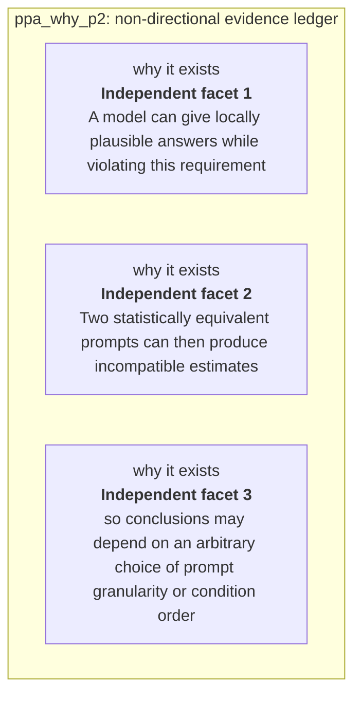

#### Python

```python
from html import escape
from pathlib import Path
from textwrap import wrap

title = "ppa_why_p2: non-directional evidence ledger"
rows = [["why it exists","Independent facet 1","A model can give locally plausible answers while violating this requirement"],["why it exists","Independent facet 2","Two statistically equivalent prompts can then produce incompatible estimates"],["why it exists","Independent facet 3","so conclusions may depend on an arbitrary choice of prompt granularity or condition order"]]
height = 426
parts = [
    f'<svg xmlns="http://www.w3.org/2000/svg" viewBox="0 0 1200 {height}" role="img" aria-labelledby="title desc">',
    f'<title id="title">{escape(title)}</title>',
    '<desc id="desc">Non-directional evidence ledger with every statement and boundary visible.</desc>',
    f'<rect width="1200" height="{height}" fill="white"/>',
]
headers = ["Facet", "Statement or value", "Evidence condition or boundary"]
xs = [30, 300, 700]
for x, header in zip(xs, headers):
    parts.append(f'<text x="{x}" y="65" font-family="sans-serif" font-size="16" font-weight="700">{escape(header)}</text>')
for row_index, row in enumerate(rows):
    y = 110 + row_index * 92
    parts.append(f'<rect x="20" y="{y-30}" width="1160" height="80" fill="#f7fbff" stroke="#ccd"/>')
    for x, cell, width in zip(xs, row, [30, 48, 60]):
        for line_index, line in enumerate(wrap(str(cell), width=width)):
            parts.append(f'<text x="{x}" y="{y-8+line_index*14}" font-family="sans-serif" font-size="11">{escape(line)}</text>')
parts.append('</svg>')
Path("ppa_why_p2_treatment_b.svg").write_text("\n".join(parts), encoding="utf-8")
```

### Treatment C — Why test language models with the law of total probability — paragraph ppa_why_p2 — non-directional claim constellation

- Teaching purpose: Optionally show which requirements or qualifications belong to the paragraph's central question.
- Encoding and reading order: Place the paragraph question at the center with 3 undirected spokes. Lines encode requirement or constraint, never sequence; Mermaid uses `---`, TikZ omits arrowheads, and Python emits plain lines.
- Evidence and limitations: Use only `ppa_partition` (OBSERVED, VERIFIED); `ppa_core` (OBSERVED, VERIFIED); `ppa_method` (Sections 3.1–3.4, Equations 2–3, PDF pages 5–7). The contingency is non-directional: proximity and connecting lines mean membership, support, requirement, or scope only; they never mean temporal order or causality.
- Recommended web medium: responsive SVG with semantic HTML/CSS list fallback; JavaScript is unnecessary.
- Mobile, accessibility, and motion behavior: Keep every label and identifier as selectable DOM text; preserve non-directional grouping on mobile; use overflow-wrap: anywhere for long tokens; provide a complete static fallback; respect reduced motion; never make information depend on animation or pointer input.

#### TikZ

```tex
\documentclass[tikz,border=5pt]{standalone}
\usepackage[T1]{fontenc}
\usepackage{tikz}
\begin{document}
\begin{tikzpicture}[font=\sffamily,box/.style={draw,rounded corners,align=center,text width=3.3cm,minimum height=1.3cm},rel/.style={fill=white,font=\scriptsize}]
\node[font=\bfseries,anchor=west] at (0,2) {ppa\_why\_p2: claim-boundary constellation};
\node[box] (center) at (3,0) {Why test language models with the law of total probability};
\node[box] (f1) at (0,2) {A model can give locally plausible answers while violating this requirement};
\node[box] (f2) at (6,2) {Two statistically equivalent prompts can then produce incompatible estimates};
\node[box] (f3) at (0,0) {so conclusions may depend on an arbitrary choice of prompt granularity or condition order};
\draw (center) -- node[rel] {requirement or constraint} (f1);
\draw (center) -- node[rel] {requirement or constraint} (f2);
\draw (center) -- node[rel] {requirement or constraint} (f3);
\end{tikzpicture}
\end{document}
```

#### Mermaid

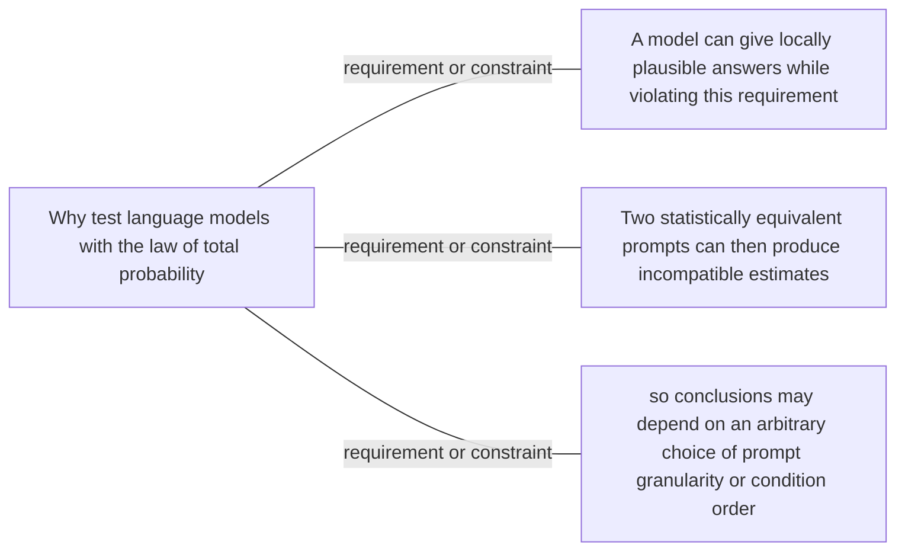

#### Python

```python
from html import escape
from pathlib import Path
from textwrap import wrap

title = "ppa_why_p2: claim-boundary constellation"
nodes = [["center","Why test language models with the law of total probability",460,220],["f1","A model can give locally plausible answers while violating this requirement",100,40],["f2","Two statistically equivalent prompts can then produce incompatible estimates",820,40],["f3","so conclusions may depend on an arbitrary choice of prompt granularity or condition order",100,220]]
edges = [["center","f1","requirement or constraint",false],["center","f2","requirement or constraint",false],["center","f3","requirement or constraint",false]]
node_by_id = {node_id: (label, x, y) for node_id, label, x, y in nodes}
width = 1000
height = 520
parts = [
    '<svg xmlns="http://www.w3.org/2000/svg" viewBox="0 0 %d %d" role="img" aria-labelledby="title desc">' % (width, height),
    f'<title id="title">{escape(title)}</title>',
    '<desc id="desc">Labeled relations; undirected lines are associations or boundaries, not temporal order.</desc>',
    f'<rect width="{width}" height="{height}" fill="white"/>',
    '<defs><marker id="arrow" viewBox="0 0 10 10" refX="9" refY="5" markerWidth="6" markerHeight="6" orient="auto-start-reverse"><path d="M 0 0 L 10 5 L 0 10 z" fill="#345"/></marker></defs>',
]
for source, target, relation, directed in edges:
    _, x1, y1 = node_by_id[source]
    _, x2, y2 = node_by_id[target]
    marker = ' marker-end="url(#arrow)"' if directed else ''
    parts.append(f'<line x1="{x1}" y1="{y1}" x2="{x2}" y2="{y2}" stroke="#345" stroke-width="2"{marker}/>')
    parts.append(f'<text x="{(x1+x2)/2}" y="{(y1+y2)/2-5}" text-anchor="middle" font-family="sans-serif" font-size="10">{escape(relation)}</text>')
for _, label, x, y in nodes:
    parts.append(f'<rect x="{x-85}" y="{y-44}" width="170" height="88" rx="12" fill="#eef6ff" stroke="#234"/>')
    for line_index, line in enumerate(wrap(label, width=24)):
        parts.append(f'<text x="{x}" y="{y-26+line_index*13}" text-anchor="middle" font-family="sans-serif" font-size="10">{escape(line)}</text>')
parts.append('</svg>')
Path("ppa_why_p2_treatment_c.svg").write_text("\n".join(parts), encoding="utf-8")
```

### Implementation record

- Status: `NOT_NEEDED`
- Selected treatment: `NONE`
- Selection rationale: Revision 3's paragraph-level removal test keeps this paragraph prose-only; no figure would reduce the reader's reconstruction burden enough to justify added visual complexity.
- Delivery medium: `NONE`
- Visual ID and placement: `NONE`; no figure is attached to this paragraph.
- Shared paragraph scope: NONE
- Changed files: `docs/visual-manifests/VISUAL_MANIFEST_PARTITION_PROMPT_AGGREGATE.md` records the prose-only decision; no fixture visual serves this paragraph.
- Accessibility and fallback verification: The paragraph remains semantic selectable text with its existing claim and source links; no visual-only information or motion is introduced.
- Desktop and mobile verification: No paragraph-local figure exists; the existing prose remains in normal document order at both viewports.
- Evidence deviations: Not applicable: revision 3 explicitly classifies this paragraph as prose-only.

## `ppa_change_p1`

- Location: `ppa_change`, paragraph 1
- Text anchor: "The framework separates alignment from self-consistency."
- Claims and sources: `ppa_reconstruction` (OBSERVED, VERIFIED); `ppa_macro` (OBSERVED, VERIFIED); `ppa_method` (Sections 3.1–3.4, Equations 2–3, PDF pages 5–7); `ppa_macro_results` (Section 4, Figures 3–5, PDF pages 7–11)
- Visual needed: `YES`
- Decision rationale: A visual passes the removal test because readers must reconstruct external alignment, split consistency, and order consistency while preserving the paragraph's conditions and boundaries. Revision 3 narrows the topology and placement so no visual can claim this paragraph without encoding its mechanism, grouping, or values.
- Explanatory job: External alignment, split consistency, and order consistency.
- Recommended scope and placement: Shared scope `ppa_change_p1`, `ppa_change_p2` is allowed only when one visual encodes every listed mechanism, condition, and value; place it immediately after the final paragraph, `ppa_change_p2`. Otherwise split the visual by paragraph.
- QA-informed planning change: Use relationship-specific headings; alignment is a reference comparison, not a third self-consistency method.

### Treatment A — External alignment, split consistency, and order consistency — Relationship-specific parallel view

- Teaching purpose: Keep valid comparison groups separate and equally visible.
- Encoding and reading order: Group the 3 source-backed records into named panels using the first column as the grouping key. Panels preserve experimental, source, or example boundaries and never imply one shared scale.
- Evidence and limitations: Encode only `ppa_reconstruction`, `ppa_macro` from `ppa_method`, `ppa_macro_results`. Use relationship-specific headings; alignment is a reference comparison, not a third self-consistency method.
- Recommended web medium: semantic HTML/CSS grouped panels or responsive SVG; JavaScript is optional only for meaningful focus, drill-down, or state playback.
- Mobile, accessibility, and motion behavior: Preserve the same group and node order in the DOM; retain all values and relation labels as selectable text; stack panels or levels below 640px; provide keyboard access for any optional focus state; keep a complete static fallback; respect reduced motion and never encode information only through animation.

#### TikZ

```tex
\documentclass[tikz,border=5pt]{standalone}
\usepackage[T1]{fontenc}
\usepackage{tikz}
\begin{document}
\begin{tikzpicture}[font=\sffamily,panel/.style={draw,rounded corners,align=center,text width=4.8cm,minimum height=4cm}]
\node[font=\bfseries] at (0,3) {ppa\_change\_p1: External alignment, split consistency, and order consistency - Relationship-specific parallel view};
\node[panel] at (0,0) {\textbf{Two ways equivalent conditions can disagree}\\[4pt]\textbf{Split consistency}: qualitative -- Compare a node's direct estimate with the prior-weighted aggregate of its immediate children. A mismatch means the estimate does not compose across a valid split.\\\textbf{Order consistency}: qualitative -- Describe the same subgroup with equivalent conditions in a different order. A mismatch means the estimate depends on wording order rather than the conditioned population.\\\textbf{Alignment}: qualitative -- When an external reference such as ACS exists, compare an estimate with that reference. Alignment is separate from both internal consistency checks.};
\end{tikzpicture}
\end{document}
```

#### Mermaid

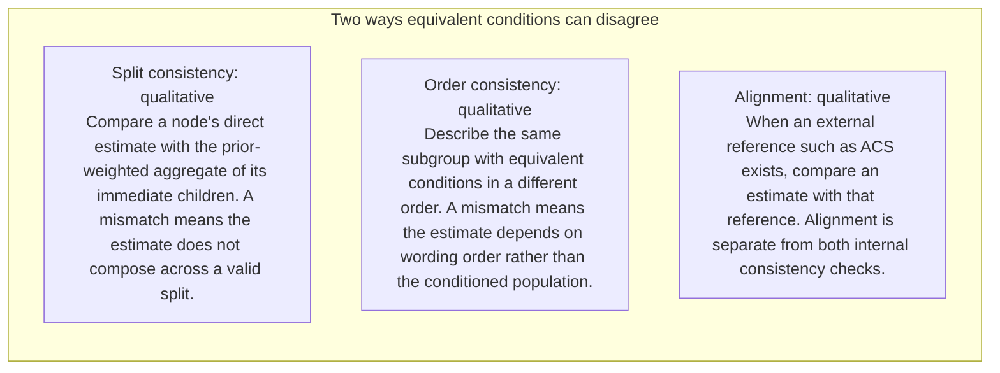

#### Python

```python
from html import escape
from pathlib import Path
from textwrap import wrap

title = "ppa_change_p1: External alignment, split consistency, and order consistency — Relationship-specific parallel view"
rows = [["Two ways equivalent conditions can disagree","Split consistency","qualitative","Compare a node's direct estimate with the prior-weighted aggregate of its immediate children. A mismatch means the estimate does not compose across a valid split."],["Two ways equivalent conditions can disagree","Order consistency","qualitative","Describe the same subgroup with equivalent conditions in a different order. A mismatch means the estimate depends on wording order rather than the conditioned population."],["Two ways equivalent conditions can disagree","Alignment","qualitative","When an external reference such as ACS exists, compare an estimate with that reference. Alignment is separate from both internal consistency checks."]]
groups = {}
for group, label, value, condition in rows:
    groups.setdefault(group, []).append((label, value, condition))
width = max(900, len(groups) * 360)
height = 220 + max((len(items) for items in groups.values()), default=1) * 92
parts = [
    f'<svg xmlns="http://www.w3.org/2000/svg" viewBox="0 0 {width} {height}" role="img" aria-labelledby="title desc">',
    f'<title id="title">{escape(title)}</title>',
    '<desc id="desc">Separate panels preserve grouping and prevent unrelated conditions from reading as one sequence.</desc>',
    f'<rect width="{width}" height="{height}" fill="white"/>',
]
for group_index, (group, items) in enumerate(groups.items()):
    x = 180 + group_index * 360
    parts.append(f'<text x="{x}" y="65" text-anchor="middle" font-family="sans-serif" font-size="16" font-weight="700">{escape(group)}</text>')
    for item_index, (label, value, condition) in enumerate(items):
        y = 120 + item_index * 92
        parts.append(f'<rect x="{x-160}" y="{y-30}" width="320" height="78" rx="12" fill="#f7fbff" stroke="#ccd"/>')
        text = f"{label}: {value} — {condition}"
        for line_index, line in enumerate(wrap(text, width=46)):
            parts.append(f'<text x="{x}" y="{y-6+line_index*14}" text-anchor="middle" font-family="sans-serif" font-size="11">{escape(line)}</text>')
parts.append('</svg>')
Path("ppa_change_p1_treatment_a.svg").write_text("\n".join(parts), encoding="utf-8")
```

### Treatment B — External alignment, split consistency, and order consistency — Condition and boundary matrix

- Teaching purpose: Show every comparison value or qualitative condition in explicit columns.
- Encoding and reading order: Render 3 rows with explicit `Group`, `Measure or state`, `Visible value`, and `Condition or boundary` columns. The value column must be visible, not only present in ARIA text or fallback prose.
- Evidence and limitations: Encode only `ppa_reconstruction`, `ppa_macro` from `ppa_method`, `ppa_macro_results`. Use relationship-specific headings; alignment is a reference comparison, not a third self-consistency method.
- Recommended web medium: semantic HTML/CSS table with SVG export; JavaScript is optional only for meaningful focus, drill-down, or state playback.
- Mobile, accessibility, and motion behavior: Preserve the same group and node order in the DOM; retain all values and relation labels as selectable text; stack panels or levels below 640px; provide keyboard access for any optional focus state; keep a complete static fallback; respect reduced motion and never encode information only through animation.

#### TikZ

```tex
\documentclass[tikz,border=5pt]{standalone}
\usepackage[T1]{fontenc}
\usepackage{array}
\usepackage{tikz}
\begin{document}
\begin{tikzpicture}[font=\sffamily]
\node[align=center] {\textbf{ppa\_change\_p1: External alignment, split consistency, and order consistency - Condition and boundary matrix}\\[6pt]
\begin{tabular}{p{3.2cm}p{4.0cm}p{2.8cm}p{6.2cm}}
\textbf{Group} & \textbf{Measure or state} & \textbf{Visible value} & \textbf{Condition or boundary} \\ \hline
Two ways equivalent conditions can disagree & Split consistency & qualitative & Compare a node's direct estimate with the prior-weighted aggregate of its immediate children. A mismatch means the estimate does not compose across a valid split. \\
Two ways equivalent conditions can disagree & Order consistency & qualitative & Describe the same subgroup with equivalent conditions in a different order. A mismatch means the estimate depends on wording order rather than the conditioned population. \\
Two ways equivalent conditions can disagree & Alignment & qualitative & When an external reference such as ACS exists, compare an estimate with that reference. Alignment is separate from both internal consistency checks. \\
\end{tabular}};
\end{tikzpicture}
\end{document}
```

#### Mermaid

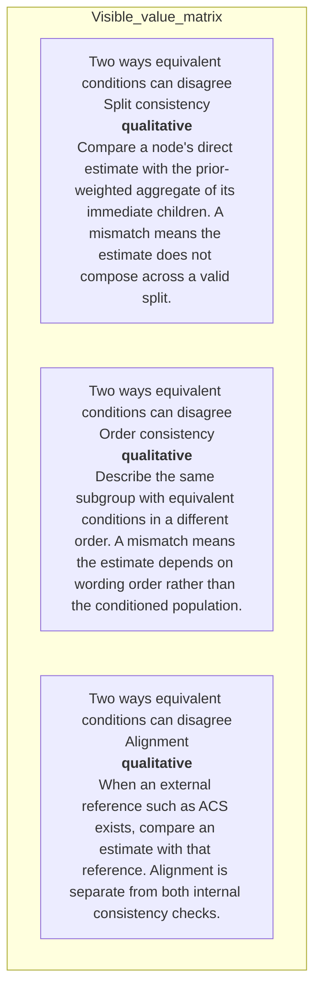

#### Python

```python
from html import escape
from pathlib import Path
from textwrap import wrap

title = "ppa_change_p1: External alignment, split consistency, and order consistency — Condition and boundary matrix"
rows = [["Two ways equivalent conditions can disagree","Split consistency","qualitative","Compare a node's direct estimate with the prior-weighted aggregate of its immediate children. A mismatch means the estimate does not compose across a valid split."],["Two ways equivalent conditions can disagree","Order consistency","qualitative","Describe the same subgroup with equivalent conditions in a different order. A mismatch means the estimate depends on wording order rather than the conditioned population."],["Two ways equivalent conditions can disagree","Alignment","qualitative","When an external reference such as ACS exists, compare an estimate with that reference. Alignment is separate from both internal consistency checks."]]
height = 414
parts = [
    f'<svg xmlns="http://www.w3.org/2000/svg" viewBox="0 0 1200 {height}" role="img" aria-labelledby="title desc">',
    f'<title id="title">{escape(title)}</title>',
    '<desc id="desc">Every reported value is visible beside its condition and group.</desc>',
    f'<rect width="1200" height="{height}" fill="white"/>',
]
headers = ["Group", "Measure or state", "Visible value", "Condition or boundary"]
xs = [30, 260, 590, 770]
for x, header in zip(xs, headers):
    parts.append(f'<text x="{x}" y="70" font-family="sans-serif" font-size="16" font-weight="700">{escape(header)}</text>')
for row_index, row in enumerate(rows):
    y = 110 + row_index * 88
    parts.append(f'<rect x="20" y="{y-28}" width="1160" height="76" fill="#f7fbff" stroke="#ccd"/>')
    for x, cell, width in zip(xs, row, [26, 38, 20, 58]):
        for line_index, line in enumerate(wrap(str(cell), width=width)):
            parts.append(f'<text x="{x}" y="{y+line_index*14}" font-family="sans-serif" font-size="11">{escape(line)}</text>')
parts.append('</svg>')
Path("ppa_change_p1_treatment_b.svg").write_text("\n".join(parts), encoding="utf-8")
```

### Treatment C — External alignment, split consistency, and order consistency — Comparison topology

- Teaching purpose: Connect only the alternatives and shared decision point stated in the paragraph.
- Encoding and reading order: Use 7 named nodes and 6 explicit labeled relations. Preserve all branch, merge, hierarchy, loop, or sequence edges shown in the code; changing them is an evidence deviation.
- Evidence and limitations: Encode only `ppa_reconstruction`, `ppa_macro` from `ppa_method`, `ppa_macro_results`. Use relationship-specific headings; alignment is a reference comparison, not a third self-consistency method.
- Recommended web medium: responsive inline SVG with semantic HTML/CSS fallback; JavaScript is optional only for meaningful focus, drill-down, or state playback.
- Mobile, accessibility, and motion behavior: Preserve the same group and node order in the DOM; retain all values and relation labels as selectable text; stack panels or levels below 640px; provide keyboard access for any optional focus state; keep a complete static fallback; respect reduced motion and never encode information only through animation.

#### TikZ

```tex
\documentclass[tikz,border=5pt]{standalone}
\usepackage[T1]{fontenc}
\usepackage{tikz}
\usetikzlibrary{arrows.meta}
\begin{document}
\begin{tikzpicture}[font=\sffamily,box/.style={draw,rounded corners,align=center,text width=3cm,minimum height=1.2cm},link/.style={-{Latex[length=2mm]},thick},rel/.style={fill=white,font=\scriptsize}]
\node[font=\bfseries,anchor=west] at (0,0.8) {ppa\_change\_p1: External alignment, split consistency, and order consistency - Comparison topology};
\node[box] (n1) at (1.00,-1.50) {The framework separates alignment from self-consistency};
\node[box] (n2) at (2.50,-1.50) {Alignment asks whether an estimate matches external reference data};
\node[box] (n3) at (4.00,-1.50) {Self-consistency asks whether the model's own estimates obey probability identities};
\node[box] (n4) at (5.50,-1.50) {so it can be measured even when a trustworthy target distribution is unavailable};
\node[box] (n5) at (7.00,-1.50) {The paper turns this idea into split-consistency and order-consistency scores};
\node[box] (n6) at (8.50,-1.50) {It also identifies the macro fallacy};
\node[box] (n7) at (10.00,-1.50) {in the ACS study, direct population prompting is often less accurate than explicitly eliciting and recombining finer subgroup estimates};
\draw[link] (n1) -- node[rel] {compare} (n2);
\draw[link] (n1) -- node[rel] {compare} (n3);
\draw[link] (n1) -- node[rel] {compare} (n4);
\draw[link] (n1) -- node[rel] {compare} (n5);
\draw[link] (n1) -- node[rel] {compare} (n6);
\draw[link] (n1) -- node[rel] {compare} (n7);
\end{tikzpicture}
\end{document}
```

#### Mermaid

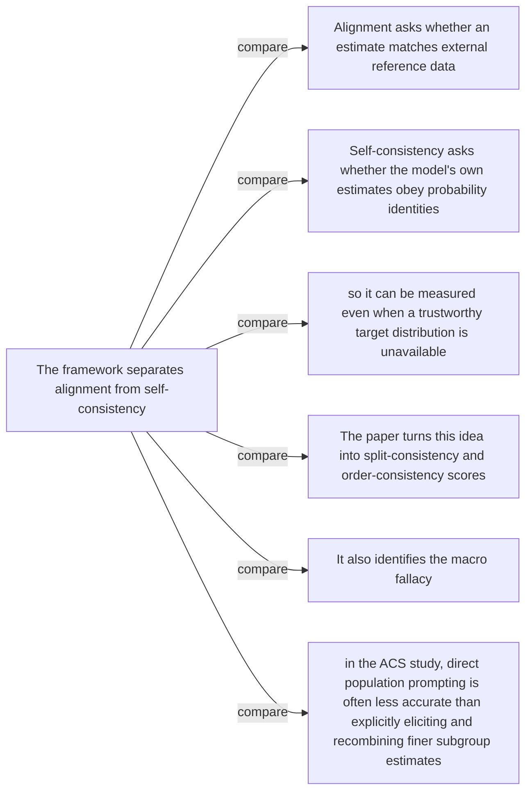

#### Python

```python
from html import escape
from pathlib import Path
from textwrap import wrap

title = "ppa_change_p1: External alignment, split consistency, and order consistency — Comparison topology"
nodes = [["n1","The framework separates alignment from self-consistency",100,150],["n2","Alignment asks whether an estimate matches external reference data",250,150],["n3","Self-consistency asks whether the model's own estimates obey probability identities",400,150],["n4","so it can be measured even when a trustworthy target distribution is unavailable",550,150],["n5","The paper turns this idea into split-consistency and order-consistency scores",700,150],["n6","It also identifies the macro fallacy",850,150],["n7","in the ACS study, direct population prompting is often less accurate than explicitly eliciting and recombining finer subgroup estimates",1000,150]]
edges = [["n1","n2","compare"],["n1","n3","compare"],["n1","n4","compare"],["n1","n5","compare"],["n1","n6","compare"],["n1","n7","compare"]]
node_by_id = {node_id: (label, x, y) for node_id, label, x, y in nodes}
width = max(900, max((x for _, _, x, _ in nodes), default=800) + 180)
height = max(500, max((y for _, _, _, y in nodes), default=400) + 140)
parts = [
    f'<svg xmlns="http://www.w3.org/2000/svg" viewBox="0 0 {width} {height}" role="img" aria-labelledby="title desc">',
    f'<title id="title">{escape(title)}</title>',
    '<desc id="desc">Edges and convergence points encode only relationships stated in the scoped paragraphs.</desc>',
    f'<rect width="{width}" height="{height}" fill="white"/>',
]
for source, target, relation in edges:
    _, x1, y1 = node_by_id[source]
    _, x2, y2 = node_by_id[target]
    parts.append(f'<line x1="{x1}" y1="{y1}" x2="{x2}" y2="{y2}" stroke="#345" stroke-width="2"/>')
    parts.append(f'<text x="{(x1+x2)/2}" y="{(y1+y2)/2-5}" text-anchor="middle" font-family="sans-serif" font-size="10">{escape(relation)}</text>')
for _, label, x, y in nodes:
    parts.append(f'<rect x="{x-78}" y="{y-42}" width="156" height="84" rx="12" fill="#eef6ff" stroke="#234"/>')
    for line_index, line in enumerate(wrap(label, width=22)):
        parts.append(f'<text x="{x}" y="{y-24+line_index*13}" text-anchor="middle" font-family="sans-serif" font-size="10">{escape(line)}</text>')
parts.append('</svg>')
Path("ppa_change_p1_treatment_c.svg").write_text("\n".join(parts), encoding="utf-8")
```

### Implementation record

- Status: `IMPLEMENTED`
- Selected treatment: `A`
- Selection rationale: Selected the approved “External alignment, split consistency, and order consistency — Relationship-specific parallel view” treatment because the implemented method comparison directly encodes this paragraph's explanatory job and its stated evidence boundaries.
- Delivery medium: `CSS + semantic HTML`
- Visual ID and placement: `visual_ppa_three_checks` after `ppa_change_p2`; this record is served by that purpose-built figure.
- Shared paragraph scope: `ppa_change_p1`, `ppa_change_p2`
- Changed files: `packages/test-fixtures/explainers/partition-prompt-aggregate.json`, `packages/content-schema/schema/explainer-document.schema.json`, `packages/content-schema/src/validate.ts`, generated TypeScript/Python models, `apps/web/app/papers/[id]/explainer-visual.tsx`, and `apps/web/app/globals.css`.
- Accessibility and fallback verification: Figure has a programmatic title and description, visible selectable labels and values, explicit alt text, equivalent fallback prose, source links, limitations, and a semantic static body; no meaning depends on color, motion, or pointer input.
- Desktop and mobile verification: Verified by the full eight-paper Playwright traversal at a 1440-pixel desktop viewport and the iPhone 13 mobile viewport; every figure stayed paragraph-adjacent, preserved DOM reading order, and introduced no horizontal page overflow.
- Evidence deviations: Delivery translation: selected Treatment A is rendered as typed semantic HTML/CSS rather than its literal TikZ, Mermaid, or Python-generated asset; the approved paragraph scope, placement, labels, values, grouping, and evidence boundaries are retained.

## `ppa_change_p2`

- Location: `ppa_change`, paragraph 2
- Text anchor: "The paper turns this idea into split-consistency and order-consistency scores."
- Claims and sources: `ppa_reconstruction` (OBSERVED, VERIFIED); `ppa_macro` (OBSERVED, VERIFIED); `ppa_method` (Sections 3.1–3.4, Equations 2–3, PDF pages 5–7); `ppa_macro_results` (Section 4, Figures 3–5, PDF pages 7–11)
- Visual needed: `YES`
- Decision rationale: A visual passes the removal test because readers must reconstruct external alignment, split consistency, and order consistency while preserving the paragraph's conditions and boundaries. Revision 3 narrows the topology and placement so no visual can claim this paragraph without encoding its mechanism, grouping, or values.
- Explanatory job: External alignment, split consistency, and order consistency.
- Recommended scope and placement: Shared scope `ppa_change_p1`, `ppa_change_p2` is allowed only when one visual encodes every listed mechanism, condition, and value; place it immediately after the final paragraph, `ppa_change_p2`. Otherwise split the visual by paragraph.
- QA-informed planning change: Use relationship-specific headings; alignment is a reference comparison, not a third self-consistency method.

### Treatment A — External alignment, split consistency, and order consistency — Relationship-specific parallel view

- Teaching purpose: Keep valid comparison groups separate and equally visible.
- Encoding and reading order: Group the 3 source-backed records into named panels using the first column as the grouping key. Panels preserve experimental, source, or example boundaries and never imply one shared scale.
- Evidence and limitations: Encode only `ppa_reconstruction`, `ppa_macro` from `ppa_method`, `ppa_macro_results`. Use relationship-specific headings; alignment is a reference comparison, not a third self-consistency method.
- Recommended web medium: semantic HTML/CSS grouped panels or responsive SVG; JavaScript is optional only for meaningful focus, drill-down, or state playback.
- Mobile, accessibility, and motion behavior: Preserve the same group and node order in the DOM; retain all values and relation labels as selectable text; stack panels or levels below 640px; provide keyboard access for any optional focus state; keep a complete static fallback; respect reduced motion and never encode information only through animation.

#### TikZ

```tex
\documentclass[tikz,border=5pt]{standalone}
\usepackage[T1]{fontenc}
\usepackage{tikz}
\begin{document}
\begin{tikzpicture}[font=\sffamily,panel/.style={draw,rounded corners,align=center,text width=4.8cm,minimum height=4cm}]
\node[font=\bfseries] at (0,3) {ppa\_change\_p2: External alignment, split consistency, and order consistency - Relationship-specific parallel view};
\node[panel] at (0,0) {\textbf{Two ways equivalent conditions can disagree}\\[4pt]\textbf{Split consistency}: qualitative -- Compare a node's direct estimate with the prior-weighted aggregate of its immediate children. A mismatch means the estimate does not compose across a valid split.\\\textbf{Order consistency}: qualitative -- Describe the same subgroup with equivalent conditions in a different order. A mismatch means the estimate depends on wording order rather than the conditioned population.\\\textbf{Alignment}: qualitative -- When an external reference such as ACS exists, compare an estimate with that reference. Alignment is separate from both internal consistency checks.};
\end{tikzpicture}
\end{document}
```

#### Mermaid


#### Python

```python
from html import escape
from pathlib import Path
from textwrap import wrap

title = "ppa_change_p2: External alignment, split consistency, and order consistency — Relationship-specific parallel view"
rows = [["Two ways equivalent conditions can disagree","Split consistency","qualitative","Compare a node's direct estimate with the prior-weighted aggregate of its immediate children. A mismatch means the estimate does not compose across a valid split."],["Two ways equivalent conditions can disagree","Order consistency","qualitative","Describe the same subgroup with equivalent conditions in a different order. A mismatch means the estimate depends on wording order rather than the conditioned population."],["Two ways equivalent conditions can disagree","Alignment","qualitative","When an external reference such as ACS exists, compare an estimate with that reference. Alignment is separate from both internal consistency checks."]]
groups = {}
for group, label, value, condition in rows:
    groups.setdefault(group, []).append((label, value, condition))
width = max(900, len(groups) * 360)
height = 220 + max((len(items) for items in groups.values()), default=1) * 92
parts = [
    f'<svg xmlns="http://www.w3.org/2000/svg" viewBox="0 0 {width} {height}" role="img" aria-labelledby="title desc">',
    f'<title id="title">{escape(title)}</title>',
    '<desc id="desc">Separate panels preserve grouping and prevent unrelated conditions from reading as one sequence.</desc>',
    f'<rect width="{width}" height="{height}" fill="white"/>',
]
for group_index, (group, items) in enumerate(groups.items()):
    x = 180 + group_index * 360
    parts.append(f'<text x="{x}" y="65" text-anchor="middle" font-family="sans-serif" font-size="16" font-weight="700">{escape(group)}</text>')
    for item_index, (label, value, condition) in enumerate(items):
        y = 120 + item_index * 92
        parts.append(f'<rect x="{x-160}" y="{y-30}" width="320" height="78" rx="12" fill="#f7fbff" stroke="#ccd"/>')
        text = f"{label}: {value} — {condition}"
        for line_index, line in enumerate(wrap(text, width=46)):
            parts.append(f'<text x="{x}" y="{y-6+line_index*14}" text-anchor="middle" font-family="sans-serif" font-size="11">{escape(line)}</text>')
parts.append('</svg>')
Path("ppa_change_p2_treatment_a.svg").write_text("\n".join(parts), encoding="utf-8")
```

### Treatment B — External alignment, split consistency, and order consistency — Condition and boundary matrix

- Teaching purpose: Show every comparison value or qualitative condition in explicit columns.
- Encoding and reading order: Render 3 rows with explicit `Group`, `Measure or state`, `Visible value`, and `Condition or boundary` columns. The value column must be visible, not only present in ARIA text or fallback prose.
- Evidence and limitations: Encode only `ppa_reconstruction`, `ppa_macro` from `ppa_method`, `ppa_macro_results`. Use relationship-specific headings; alignment is a reference comparison, not a third self-consistency method.
- Recommended web medium: semantic HTML/CSS table with SVG export; JavaScript is optional only for meaningful focus, drill-down, or state playback.
- Mobile, accessibility, and motion behavior: Preserve the same group and node order in the DOM; retain all values and relation labels as selectable text; stack panels or levels below 640px; provide keyboard access for any optional focus state; keep a complete static fallback; respect reduced motion and never encode information only through animation.

#### TikZ

```tex
\documentclass[tikz,border=5pt]{standalone}
\usepackage[T1]{fontenc}
\usepackage{array}
\usepackage{tikz}
\begin{document}
\begin{tikzpicture}[font=\sffamily]
\node[align=center] {\textbf{ppa\_change\_p2: External alignment, split consistency, and order consistency - Condition and boundary matrix}\\[6pt]
\begin{tabular}{p{3.2cm}p{4.0cm}p{2.8cm}p{6.2cm}}
\textbf{Group} & \textbf{Measure or state} & \textbf{Visible value} & \textbf{Condition or boundary} \\ \hline
Two ways equivalent conditions can disagree & Split consistency & qualitative & Compare a node's direct estimate with the prior-weighted aggregate of its immediate children. A mismatch means the estimate does not compose across a valid split. \\
Two ways equivalent conditions can disagree & Order consistency & qualitative & Describe the same subgroup with equivalent conditions in a different order. A mismatch means the estimate depends on wording order rather than the conditioned population. \\
Two ways equivalent conditions can disagree & Alignment & qualitative & When an external reference such as ACS exists, compare an estimate with that reference. Alignment is separate from both internal consistency checks. \\
\end{tabular}};
\end{tikzpicture}
\end{document}
```

#### Mermaid


#### Python

```python
from html import escape
from pathlib import Path
from textwrap import wrap

title = "ppa_change_p2: External alignment, split consistency, and order consistency — Condition and boundary matrix"
rows = [["Two ways equivalent conditions can disagree","Split consistency","qualitative","Compare a node's direct estimate with the prior-weighted aggregate of its immediate children. A mismatch means the estimate does not compose across a valid split."],["Two ways equivalent conditions can disagree","Order consistency","qualitative","Describe the same subgroup with equivalent conditions in a different order. A mismatch means the estimate depends on wording order rather than the conditioned population."],["Two ways equivalent conditions can disagree","Alignment","qualitative","When an external reference such as ACS exists, compare an estimate with that reference. Alignment is separate from both internal consistency checks."]]
height = 414
parts = [
    f'<svg xmlns="http://www.w3.org/2000/svg" viewBox="0 0 1200 {height}" role="img" aria-labelledby="title desc">',
    f'<title id="title">{escape(title)}</title>',
    '<desc id="desc">Every reported value is visible beside its condition and group.</desc>',
    f'<rect width="1200" height="{height}" fill="white"/>',
]
headers = ["Group", "Measure or state", "Visible value", "Condition or boundary"]
xs = [30, 260, 590, 770]
for x, header in zip(xs, headers):
    parts.append(f'<text x="{x}" y="70" font-family="sans-serif" font-size="16" font-weight="700">{escape(header)}</text>')
for row_index, row in enumerate(rows):
    y = 110 + row_index * 88
    parts.append(f'<rect x="20" y="{y-28}" width="1160" height="76" fill="#f7fbff" stroke="#ccd"/>')
    for x, cell, width in zip(xs, row, [26, 38, 20, 58]):
        for line_index, line in enumerate(wrap(str(cell), width=width)):
            parts.append(f'<text x="{x}" y="{y+line_index*14}" font-family="sans-serif" font-size="11">{escape(line)}</text>')
parts.append('</svg>')
Path("ppa_change_p2_treatment_b.svg").write_text("\n".join(parts), encoding="utf-8")
```

### Treatment C — External alignment, split consistency, and order consistency — Comparison topology

- Teaching purpose: Connect only the alternatives and shared decision point stated in the paragraph.
- Encoding and reading order: Use 7 named nodes and 6 explicit labeled relations. Preserve all branch, merge, hierarchy, loop, or sequence edges shown in the code; changing them is an evidence deviation.
- Evidence and limitations: Encode only `ppa_reconstruction`, `ppa_macro` from `ppa_method`, `ppa_macro_results`. Use relationship-specific headings; alignment is a reference comparison, not a third self-consistency method.
- Recommended web medium: responsive inline SVG with semantic HTML/CSS fallback; JavaScript is optional only for meaningful focus, drill-down, or state playback.
- Mobile, accessibility, and motion behavior: Preserve the same group and node order in the DOM; retain all values and relation labels as selectable text; stack panels or levels below 640px; provide keyboard access for any optional focus state; keep a complete static fallback; respect reduced motion and never encode information only through animation.

#### TikZ

```tex
\documentclass[tikz,border=5pt]{standalone}
\usepackage[T1]{fontenc}
\usepackage{tikz}
\usetikzlibrary{arrows.meta}
\begin{document}
\begin{tikzpicture}[font=\sffamily,box/.style={draw,rounded corners,align=center,text width=3cm,minimum height=1.2cm},link/.style={-{Latex[length=2mm]},thick},rel/.style={fill=white,font=\scriptsize}]
\node[font=\bfseries,anchor=west] at (0,0.8) {ppa\_change\_p2: External alignment, split consistency, and order consistency - Comparison topology};
\node[box] (n1) at (1.00,-1.50) {The framework separates alignment from self-consistency};
\node[box] (n2) at (2.50,-1.50) {Alignment asks whether an estimate matches external reference data};
\node[box] (n3) at (4.00,-1.50) {Self-consistency asks whether the model's own estimates obey probability identities};
\node[box] (n4) at (5.50,-1.50) {so it can be measured even when a trustworthy target distribution is unavailable};
\node[box] (n5) at (7.00,-1.50) {The paper turns this idea into split-consistency and order-consistency scores};
\node[box] (n6) at (8.50,-1.50) {It also identifies the macro fallacy};
\node[box] (n7) at (10.00,-1.50) {in the ACS study, direct population prompting is often less accurate than explicitly eliciting and recombining finer subgroup estimates};
\draw[link] (n1) -- node[rel] {compare} (n2);
\draw[link] (n1) -- node[rel] {compare} (n3);
\draw[link] (n1) -- node[rel] {compare} (n4);
\draw[link] (n1) -- node[rel] {compare} (n5);
\draw[link] (n1) -- node[rel] {compare} (n6);
\draw[link] (n1) -- node[rel] {compare} (n7);
\end{tikzpicture}
\end{document}
```

#### Mermaid


#### Python

```python
from html import escape
from pathlib import Path
from textwrap import wrap

title = "ppa_change_p2: External alignment, split consistency, and order consistency — Comparison topology"
nodes = [["n1","The framework separates alignment from self-consistency",100,150],["n2","Alignment asks whether an estimate matches external reference data",250,150],["n3","Self-consistency asks whether the model's own estimates obey probability identities",400,150],["n4","so it can be measured even when a trustworthy target distribution is unavailable",550,150],["n5","The paper turns this idea into split-consistency and order-consistency scores",700,150],["n6","It also identifies the macro fallacy",850,150],["n7","in the ACS study, direct population prompting is often less accurate than explicitly eliciting and recombining finer subgroup estimates",1000,150]]
edges = [["n1","n2","compare"],["n1","n3","compare"],["n1","n4","compare"],["n1","n5","compare"],["n1","n6","compare"],["n1","n7","compare"]]
node_by_id = {node_id: (label, x, y) for node_id, label, x, y in nodes}
width = max(900, max((x for _, _, x, _ in nodes), default=800) + 180)
height = max(500, max((y for _, _, _, y in nodes), default=400) + 140)
parts = [
    f'<svg xmlns="http://www.w3.org/2000/svg" viewBox="0 0 {width} {height}" role="img" aria-labelledby="title desc">',
    f'<title id="title">{escape(title)}</title>',
    '<desc id="desc">Edges and convergence points encode only relationships stated in the scoped paragraphs.</desc>',
    f'<rect width="{width}" height="{height}" fill="white"/>',
]
for source, target, relation in edges:
    _, x1, y1 = node_by_id[source]
    _, x2, y2 = node_by_id[target]
    parts.append(f'<line x1="{x1}" y1="{y1}" x2="{x2}" y2="{y2}" stroke="#345" stroke-width="2"/>')
    parts.append(f'<text x="{(x1+x2)/2}" y="{(y1+y2)/2-5}" text-anchor="middle" font-family="sans-serif" font-size="10">{escape(relation)}</text>')
for _, label, x, y in nodes:
    parts.append(f'<rect x="{x-78}" y="{y-42}" width="156" height="84" rx="12" fill="#eef6ff" stroke="#234"/>')
    for line_index, line in enumerate(wrap(label, width=22)):
        parts.append(f'<text x="{x}" y="{y-24+line_index*13}" text-anchor="middle" font-family="sans-serif" font-size="10">{escape(line)}</text>')
parts.append('</svg>')
Path("ppa_change_p2_treatment_c.svg").write_text("\n".join(parts), encoding="utf-8")
```

### Implementation record

- Status: `IMPLEMENTED`
- Selected treatment: `A`
- Selection rationale: Selected the approved “External alignment, split consistency, and order consistency — Relationship-specific parallel view” treatment because the implemented method comparison directly encodes this paragraph's explanatory job and its stated evidence boundaries.
- Delivery medium: `CSS + semantic HTML`
- Visual ID and placement: `visual_ppa_three_checks` after `ppa_change_p2`; this record is served by that purpose-built figure.
- Shared paragraph scope: `ppa_change_p1`, `ppa_change_p2`
- Changed files: `packages/test-fixtures/explainers/partition-prompt-aggregate.json`, `packages/content-schema/schema/explainer-document.schema.json`, `packages/content-schema/src/validate.ts`, generated TypeScript/Python models, `apps/web/app/papers/[id]/explainer-visual.tsx`, and `apps/web/app/globals.css`.
- Accessibility and fallback verification: Figure has a programmatic title and description, visible selectable labels and values, explicit alt text, equivalent fallback prose, source links, limitations, and a semantic static body; no meaning depends on color, motion, or pointer input.
- Desktop and mobile verification: Verified by the full eight-paper Playwright traversal at a 1440-pixel desktop viewport and the iPhone 13 mobile viewport; every figure stayed paragraph-adjacent, preserved DOM reading order, and introduced no horizontal page overflow.
- Evidence deviations: Delivery translation: selected Treatment A is rendered as typed semantic HTML/CSS rather than its literal TikZ, Mermaid, or Python-generated asset; the approved paragraph scope, placement, labels, values, grouping, and evidence boundaries are retained.

## `ppa_mechanism_p1`

- Location: `ppa_mechanism`, paragraph 1
- Text anchor: "Start with a base population at the root."
- Claims and sources: `ppa_partition` (OBSERVED, VERIFIED); `ppa_reconstruction` (OBSERVED, VERIFIED); `ppa_method` (Sections 3.1–3.4, Equations 2–3, PDF pages 5–7)
- Visual needed: `YES`
- Decision rationale: A visual passes the removal test because readers must reconstruct multilevel exhaustive partition with weighted reconstruction back to the root while preserving the paragraph's conditions and boundaries. Revision 3 narrows the topology and placement so no visual can claim this paragraph without encoding its mechanism, grouping, or values.
- Explanatory job: Multilevel exhaustive partition with weighted reconstruction back to the root.
- Recommended scope and placement: Shared scope `ppa_mechanism_p1`, `ppa_mechanism_p2` is allowed only when one visual encodes every listed mechanism, condition, and value; place it immediately after the final paragraph, `ppa_mechanism_p2`. Otherwise split the visual by paragraph.
- QA-informed planning change: A shared visual may appear after the second paragraph only if it preserves parent-child depth, mutual exclusivity, exhaustiveness, subgroup shares, 50 elicitations, normalization, and aggregation.

### Treatment A — Multilevel exhaustive partition with weighted reconstruction back to the root — True parent-child hierarchy

- Teaching purpose: Preserve depth, parentage, and aggregation back to the root.
- Encoding and reading order: Use 9 named nodes and 11 explicit labeled relations. Preserve all branch, merge, hierarchy, loop, or sequence edges shown in the code; changing them is an evidence deviation.
- Evidence and limitations: Encode only `ppa_partition`, `ppa_reconstruction` from `ppa_method`. A shared visual may appear after the second paragraph only if it preserves parent-child depth, mutual exclusivity, exhaustiveness, subgroup shares, 50 elicitations, normalization, and aggregation.
- Recommended web medium: responsive inline SVG with semantic HTML/CSS fallback; JavaScript is optional only for meaningful focus, drill-down, or state playback.
- Mobile, accessibility, and motion behavior: Preserve the same group and node order in the DOM; retain all values and relation labels as selectable text; stack panels or levels below 640px; provide keyboard access for any optional focus state; keep a complete static fallback; respect reduced motion and never encode information only through animation.

#### TikZ

```tex
\documentclass[tikz,border=5pt]{standalone}
\usepackage[T1]{fontenc}
\usepackage{tikz}
\usetikzlibrary{arrows.meta}
\begin{document}
\begin{tikzpicture}[font=\sffamily,box/.style={draw,rounded corners,align=center,text width=3cm,minimum height=1.2cm},link/.style={-{Latex[length=2mm]},thick},rel/.style={fill=white,font=\scriptsize}]
\node[font=\bfseries,anchor=west] at (0,0.8) {ppa\_mechanism\_p1: Multilevel exhaustive partition with weighted reconstruction back to the root - True parent-child hierarchy};
\node[box] (root) at (1.00,-1.50) {Root population estimate p(root)};
\node[box] (a) at (2.50,-0.45) {First split: A};
\node[box] (na) at (2.50,-2.55) {First split: not A};
\node[box] (a1) at (4.00,0.07) {Finer child A1};
\node[box] (a2) at (4.00,-0.97) {Finer child A2};
\node[box] (b1) at (4.00,-2.02) {Finer child B1};
\node[box] (b2) at (4.00,-3.08) {Finer child B2};
\node[box] (sum) at (5.50,-1.50) {Normalize shares and sum subgroup estimates};
\node[box] (check) at (7.00,-1.50) {Compare reconstruction with p(root)};
\draw[link] (root) -- node[rel] {partition} (a);
\draw[link] (root) -- node[rel] {partition} (na);
\draw[link] (a) -- node[rel] {refine} (a1);
\draw[link] (a) -- node[rel] {refine} (a2);
\draw[link] (na) -- node[rel] {refine} (b1);
\draw[link] (na) -- node[rel] {refine} (b2);
\draw[link] (a1) -- node[rel] {weighted term} (sum);
\draw[link] (a2) -- node[rel] {weighted term} (sum);
\draw[link] (b1) -- node[rel] {weighted term} (sum);
\draw[link] (b2) -- node[rel] {weighted term} (sum);
\draw[link] (sum) -- node[rel] {50 elicitation estimates} (check);
\end{tikzpicture}
\end{document}
```

#### Mermaid

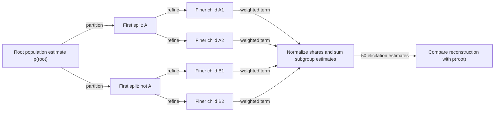

#### Python

```python
from html import escape
from pathlib import Path
from textwrap import wrap

title = "ppa_mechanism_p1: Multilevel exhaustive partition with weighted reconstruction back to the root — True parent-child hierarchy"
nodes = [["root","Root population estimate p(root)",100,150],["a","First split: A",250,45],["na","First split: not A",250,255],["a1","Finer child A1",400,-7.5],["a2","Finer child A2",400,97.5],["b1","Finer child B1",400,202.5],["b2","Finer child B2",400,307.5],["sum","Normalize shares and sum subgroup estimates",550,150],["check","Compare reconstruction with p(root)",700,150]]
edges = [["root","a","partition"],["root","na","partition"],["a","a1","refine"],["a","a2","refine"],["na","b1","refine"],["na","b2","refine"],["a1","sum","weighted term"],["a2","sum","weighted term"],["b1","sum","weighted term"],["b2","sum","weighted term"],["sum","check","50 elicitation estimates"]]
node_by_id = {node_id: (label, x, y) for node_id, label, x, y in nodes}
width = max(900, max((x for _, _, x, _ in nodes), default=800) + 180)
height = max(500, max((y for _, _, _, y in nodes), default=400) + 140)
parts = [
    f'<svg xmlns="http://www.w3.org/2000/svg" viewBox="0 0 {width} {height}" role="img" aria-labelledby="title desc">',
    f'<title id="title">{escape(title)}</title>',
    '<desc id="desc">Edges and convergence points encode only relationships stated in the scoped paragraphs.</desc>',
    f'<rect width="{width}" height="{height}" fill="white"/>',
]
for source, target, relation in edges:
    _, x1, y1 = node_by_id[source]
    _, x2, y2 = node_by_id[target]
    parts.append(f'<line x1="{x1}" y1="{y1}" x2="{x2}" y2="{y2}" stroke="#345" stroke-width="2"/>')
    parts.append(f'<text x="{(x1+x2)/2}" y="{(y1+y2)/2-5}" text-anchor="middle" font-family="sans-serif" font-size="10">{escape(relation)}</text>')
for _, label, x, y in nodes:
    parts.append(f'<rect x="{x-78}" y="{y-42}" width="156" height="84" rx="12" fill="#eef6ff" stroke="#234"/>')
    for line_index, line in enumerate(wrap(label, width=22)):
        parts.append(f'<text x="{x}" y="{y-24+line_index*13}" text-anchor="middle" font-family="sans-serif" font-size="10">{escape(line)}</text>')
parts.append('</svg>')
Path("ppa_mechanism_p1_treatment_a.svg").write_text("\n".join(parts), encoding="utf-8")
```

### Treatment B — Multilevel exhaustive partition with weighted reconstruction back to the root — Depth-by-depth ledger

- Teaching purpose: List nodes, shares, operations, and completeness constraints by level.
- Encoding and reading order: Render 5 rows with explicit `Group`, `Measure or state`, `Visible value`, and `Condition or boundary` columns. The value column must be visible, not only present in ARIA text or fallback prose.
- Evidence and limitations: Encode only `ppa_partition`, `ppa_reconstruction` from `ppa_method`. A shared visual may appear after the second paragraph only if it preserves parent-child depth, mutual exclusivity, exhaustiveness, subgroup shares, 50 elicitations, normalization, and aggregation.
- Recommended web medium: semantic HTML/CSS table with SVG export; JavaScript is optional only for meaningful focus, drill-down, or state playback.
- Mobile, accessibility, and motion behavior: Preserve the same group and node order in the DOM; retain all values and relation labels as selectable text; stack panels or levels below 640px; provide keyboard access for any optional focus state; keep a complete static fallback; respect reduced motion and never encode information only through animation.

#### TikZ

```tex
\documentclass[tikz,border=5pt]{standalone}
\usepackage[T1]{fontenc}
\usepackage{array}
\usepackage{tikz}
\begin{document}
\begin{tikzpicture}[font=\sffamily]
\node[align=center] {\textbf{ppa\_mechanism\_p1: Multilevel exhaustive partition with weighted reconstruction back to the root - Depth-by-depth ledger}\\[6pt]
\begin{tabular}{p{3.2cm}p{4.0cm}p{2.8cm}p{6.2cm}}
\textbf{Group} & \textbf{Measure or state} & \textbf{Visible value} & \textbf{Condition or boundary} \\ \hline
One population, several equivalent estimates & Root population & qualitative & A direct prompt asks for the target probability over the complete base population. Call this estimate p(root). \\
One population, several equivalent estimates & First binary split & qualitative & One attribute divides the root into two mutually exclusive children whose population shares sum to one. \\
One population, several equivalent estimates & Finer partition & qualitative & A second attribute can split both children again. Every node at this depth still belongs to one complete partition of the original population. \\
One population, several equivalent estimates & Weighted reconstruction & qualitative & For one level, multiply every subgroup estimate by its normalized population share and sum the products. \\
One population, several equivalent estimates & Consistency requirement & qualitative & The root estimate and each level's weighted reconstruction refer to the same quantity, so a coherent conditional estimator should make them agree. \\
\end{tabular}};
\end{tikzpicture}
\end{document}
```

#### Mermaid

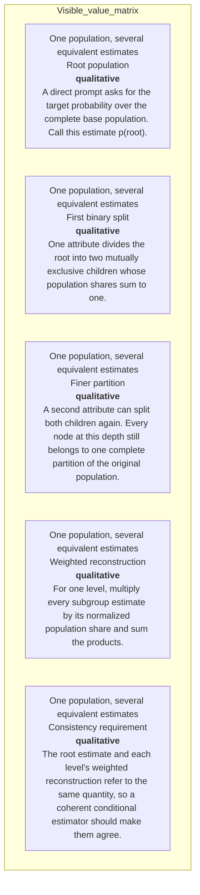

#### Python

```python
from html import escape
from pathlib import Path
from textwrap import wrap

title = "ppa_mechanism_p1: Multilevel exhaustive partition with weighted reconstruction back to the root — Depth-by-depth ledger"
rows = [["One population, several equivalent estimates","Root population","qualitative","A direct prompt asks for the target probability over the complete base population. Call this estimate p(root)."],["One population, several equivalent estimates","First binary split","qualitative","One attribute divides the root into two mutually exclusive children whose population shares sum to one."],["One population, several equivalent estimates","Finer partition","qualitative","A second attribute can split both children again. Every node at this depth still belongs to one complete partition of the original population."],["One population, several equivalent estimates","Weighted reconstruction","qualitative","For one level, multiply every subgroup estimate by its normalized population share and sum the products."],["One population, several equivalent estimates","Consistency requirement","qualitative","The root estimate and each level's weighted reconstruction refer to the same quantity, so a coherent conditional estimator should make them agree."]]
height = 590
parts = [
    f'<svg xmlns="http://www.w3.org/2000/svg" viewBox="0 0 1200 {height}" role="img" aria-labelledby="title desc">',
    f'<title id="title">{escape(title)}</title>',
    '<desc id="desc">Every reported value is visible beside its condition and group.</desc>',
    f'<rect width="1200" height="{height}" fill="white"/>',
]
headers = ["Group", "Measure or state", "Visible value", "Condition or boundary"]
xs = [30, 260, 590, 770]
for x, header in zip(xs, headers):
    parts.append(f'<text x="{x}" y="70" font-family="sans-serif" font-size="16" font-weight="700">{escape(header)}</text>')
for row_index, row in enumerate(rows):
    y = 110 + row_index * 88
    parts.append(f'<rect x="20" y="{y-28}" width="1160" height="76" fill="#f7fbff" stroke="#ccd"/>')
    for x, cell, width in zip(xs, row, [26, 38, 20, 58]):
        for line_index, line in enumerate(wrap(str(cell), width=width)):
            parts.append(f'<text x="{x}" y="{y+line_index*14}" font-family="sans-serif" font-size="11">{escape(line)}</text>')
parts.append('</svg>')
Path("ppa_mechanism_p1_treatment_b.svg").write_text("\n".join(parts), encoding="utf-8")
```

### Treatment C — Multilevel exhaustive partition with weighted reconstruction back to the root — Progressive drill-down panels

- Teaching purpose: Show each depth as a nested view rather than sibling cards.
- Encoding and reading order: Group the 5 source-backed records into named panels using the first column as the grouping key. Panels preserve experimental, source, or example boundaries and never imply one shared scale.
- Evidence and limitations: Encode only `ppa_partition`, `ppa_reconstruction` from `ppa_method`. A shared visual may appear after the second paragraph only if it preserves parent-child depth, mutual exclusivity, exhaustiveness, subgroup shares, 50 elicitations, normalization, and aggregation.
- Recommended web medium: semantic HTML/CSS grouped panels or responsive SVG; JavaScript is optional only for meaningful focus, drill-down, or state playback.
- Mobile, accessibility, and motion behavior: Preserve the same group and node order in the DOM; retain all values and relation labels as selectable text; stack panels or levels below 640px; provide keyboard access for any optional focus state; keep a complete static fallback; respect reduced motion and never encode information only through animation.

#### TikZ

```tex
\documentclass[tikz,border=5pt]{standalone}
\usepackage[T1]{fontenc}
\usepackage{tikz}
\begin{document}
\begin{tikzpicture}[font=\sffamily,panel/.style={draw,rounded corners,align=center,text width=4.8cm,minimum height=4cm}]
\node[font=\bfseries] at (0,3) {ppa\_mechanism\_p1: Multilevel exhaustive partition with weighted reconstruction back to the root - Progressive drill-down panels};
\node[panel] at (0,0) {\textbf{One population, several equivalent estimates}\\[4pt]\textbf{Root population}: qualitative -- A direct prompt asks for the target probability over the complete base population. Call this estimate p(root).\\\textbf{First binary split}: qualitative -- One attribute divides the root into two mutually exclusive children whose population shares sum to one.\\\textbf{Finer partition}: qualitative -- A second attribute can split both children again. Every node at this depth still belongs to one complete partition of the original population.\\\textbf{Weighted reconstruction}: qualitative -- For one level, multiply every subgroup estimate by its normalized population share and sum the products.\\\textbf{Consistency requirement}: qualitative -- The root estimate and each level's weighted reconstruction refer to the same quantity, so a coherent conditional estimator should make them agree.};
\end{tikzpicture}
\end{document}
```

#### Mermaid

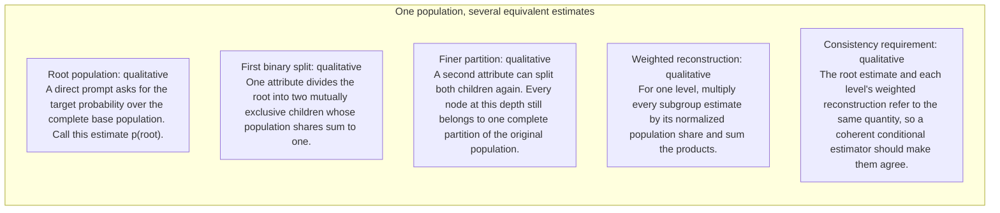

#### Python

```python
from html import escape
from pathlib import Path
from textwrap import wrap

title = "ppa_mechanism_p1: Multilevel exhaustive partition with weighted reconstruction back to the root — Progressive drill-down panels"
rows = [["One population, several equivalent estimates","Root population","qualitative","A direct prompt asks for the target probability over the complete base population. Call this estimate p(root)."],["One population, several equivalent estimates","First binary split","qualitative","One attribute divides the root into two mutually exclusive children whose population shares sum to one."],["One population, several equivalent estimates","Finer partition","qualitative","A second attribute can split both children again. Every node at this depth still belongs to one complete partition of the original population."],["One population, several equivalent estimates","Weighted reconstruction","qualitative","For one level, multiply every subgroup estimate by its normalized population share and sum the products."],["One population, several equivalent estimates","Consistency requirement","qualitative","The root estimate and each level's weighted reconstruction refer to the same quantity, so a coherent conditional estimator should make them agree."]]
groups = {}
for group, label, value, condition in rows:
    groups.setdefault(group, []).append((label, value, condition))
width = max(900, len(groups) * 360)
height = 220 + max((len(items) for items in groups.values()), default=1) * 92
parts = [
    f'<svg xmlns="http://www.w3.org/2000/svg" viewBox="0 0 {width} {height}" role="img" aria-labelledby="title desc">',
    f'<title id="title">{escape(title)}</title>',
    '<desc id="desc">Separate panels preserve grouping and prevent unrelated conditions from reading as one sequence.</desc>',
    f'<rect width="{width}" height="{height}" fill="white"/>',
]
for group_index, (group, items) in enumerate(groups.items()):
    x = 180 + group_index * 360
    parts.append(f'<text x="{x}" y="65" text-anchor="middle" font-family="sans-serif" font-size="16" font-weight="700">{escape(group)}</text>')
    for item_index, (label, value, condition) in enumerate(items):
        y = 120 + item_index * 92
        parts.append(f'<rect x="{x-160}" y="{y-30}" width="320" height="78" rx="12" fill="#f7fbff" stroke="#ccd"/>')
        text = f"{label}: {value} — {condition}"
        for line_index, line in enumerate(wrap(text, width=46)):
            parts.append(f'<text x="{x}" y="{y-6+line_index*14}" text-anchor="middle" font-family="sans-serif" font-size="11">{escape(line)}</text>')
parts.append('</svg>')
Path("ppa_mechanism_p1_treatment_c.svg").write_text("\n".join(parts), encoding="utf-8")
```

### Implementation record

- Status: `IMPLEMENTED`
- Selected treatment: `A`
- Selection rationale: Selected the approved “Multilevel exhaustive partition with weighted reconstruction back to the root — True parent-child hierarchy” treatment because the implemented partition tree directly encodes this paragraph's explanatory job and its stated evidence boundaries.
- Delivery medium: `CSS + semantic HTML`
- Visual ID and placement: `visual_ppa_partition_hierarchy` after `ppa_mechanism_p2`; this record is served by that purpose-built figure.
- Shared paragraph scope: `ppa_mechanism_p1`, `ppa_mechanism_p2`
- Changed files: `packages/test-fixtures/explainers/partition-prompt-aggregate.json`, `packages/content-schema/schema/explainer-document.schema.json`, `packages/content-schema/src/validate.ts`, generated TypeScript/Python models, `apps/web/app/papers/[id]/explainer-visual.tsx`, and `apps/web/app/globals.css`.
- Accessibility and fallback verification: Figure has a programmatic title and description, visible selectable labels and values, explicit alt text, equivalent fallback prose, source links, limitations, and a semantic static body; no meaning depends on color, motion, or pointer input.
- Desktop and mobile verification: Verified by the full eight-paper Playwright traversal at a 1440-pixel desktop viewport and the iPhone 13 mobile viewport; every figure stayed paragraph-adjacent, preserved DOM reading order, and introduced no horizontal page overflow.
- Evidence deviations: Delivery translation: selected Treatment A is rendered as typed semantic HTML/CSS rather than its literal TikZ, Mermaid, or Python-generated asset; the approved paragraph scope, placement, labels, values, grouping, and evidence boundaries are retained.

## `ppa_mechanism_p2`

- Location: `ppa_mechanism`, paragraph 2
- Text anchor: "For each level, the method also elicits subgroup population shares, normalizes them, and calculates their weighted sum."
- Claims and sources: `ppa_partition` (OBSERVED, VERIFIED); `ppa_reconstruction` (OBSERVED, VERIFIED); `ppa_method` (Sections 3.1–3.4, Equations 2–3, PDF pages 5–7)
- Visual needed: `YES`
- Decision rationale: A visual passes the removal test because readers must reconstruct multilevel exhaustive partition with weighted reconstruction back to the root while preserving the paragraph's conditions and boundaries. Revision 3 narrows the topology and placement so no visual can claim this paragraph without encoding its mechanism, grouping, or values.
- Explanatory job: Multilevel exhaustive partition with weighted reconstruction back to the root.
- Recommended scope and placement: Shared scope `ppa_mechanism_p1`, `ppa_mechanism_p2` is allowed only when one visual encodes every listed mechanism, condition, and value; place it immediately after the final paragraph, `ppa_mechanism_p2`. Otherwise split the visual by paragraph.
- QA-informed planning change: A shared visual may appear after the second paragraph only if it preserves parent-child depth, mutual exclusivity, exhaustiveness, subgroup shares, 50 elicitations, normalization, and aggregation.

### Treatment A — Multilevel exhaustive partition with weighted reconstruction back to the root — True parent-child hierarchy

- Teaching purpose: Preserve depth, parentage, and aggregation back to the root.
- Encoding and reading order: Use 9 named nodes and 11 explicit labeled relations. Preserve all branch, merge, hierarchy, loop, or sequence edges shown in the code; changing them is an evidence deviation.
- Evidence and limitations: Encode only `ppa_partition`, `ppa_reconstruction` from `ppa_method`. A shared visual may appear after the second paragraph only if it preserves parent-child depth, mutual exclusivity, exhaustiveness, subgroup shares, 50 elicitations, normalization, and aggregation.
- Recommended web medium: responsive inline SVG with semantic HTML/CSS fallback; JavaScript is optional only for meaningful focus, drill-down, or state playback.
- Mobile, accessibility, and motion behavior: Preserve the same group and node order in the DOM; retain all values and relation labels as selectable text; stack panels or levels below 640px; provide keyboard access for any optional focus state; keep a complete static fallback; respect reduced motion and never encode information only through animation.

#### TikZ

```tex
\documentclass[tikz,border=5pt]{standalone}
\usepackage[T1]{fontenc}
\usepackage{tikz}
\usetikzlibrary{arrows.meta}
\begin{document}
\begin{tikzpicture}[font=\sffamily,box/.style={draw,rounded corners,align=center,text width=3cm,minimum height=1.2cm},link/.style={-{Latex[length=2mm]},thick},rel/.style={fill=white,font=\scriptsize}]
\node[font=\bfseries,anchor=west] at (0,0.8) {ppa\_mechanism\_p2: Multilevel exhaustive partition with weighted reconstruction back to the root - True parent-child hierarchy};
\node[box] (root) at (1.00,-1.50) {Root population estimate p(root)};
\node[box] (a) at (2.50,-0.45) {First split: A};
\node[box] (na) at (2.50,-2.55) {First split: not A};
\node[box] (a1) at (4.00,0.07) {Finer child A1};
\node[box] (a2) at (4.00,-0.97) {Finer child A2};
\node[box] (b1) at (4.00,-2.02) {Finer child B1};
\node[box] (b2) at (4.00,-3.08) {Finer child B2};
\node[box] (sum) at (5.50,-1.50) {Normalize shares and sum subgroup estimates};
\node[box] (check) at (7.00,-1.50) {Compare reconstruction with p(root)};
\draw[link] (root) -- node[rel] {partition} (a);
\draw[link] (root) -- node[rel] {partition} (na);
\draw[link] (a) -- node[rel] {refine} (a1);
\draw[link] (a) -- node[rel] {refine} (a2);
\draw[link] (na) -- node[rel] {refine} (b1);
\draw[link] (na) -- node[rel] {refine} (b2);
\draw[link] (a1) -- node[rel] {weighted term} (sum);
\draw[link] (a2) -- node[rel] {weighted term} (sum);
\draw[link] (b1) -- node[rel] {weighted term} (sum);
\draw[link] (b2) -- node[rel] {weighted term} (sum);
\draw[link] (sum) -- node[rel] {50 elicitation estimates} (check);
\end{tikzpicture}
\end{document}
```

#### Mermaid


#### Python

```python
from html import escape
from pathlib import Path
from textwrap import wrap

title = "ppa_mechanism_p2: Multilevel exhaustive partition with weighted reconstruction back to the root — True parent-child hierarchy"
nodes = [["root","Root population estimate p(root)",100,150],["a","First split: A",250,45],["na","First split: not A",250,255],["a1","Finer child A1",400,-7.5],["a2","Finer child A2",400,97.5],["b1","Finer child B1",400,202.5],["b2","Finer child B2",400,307.5],["sum","Normalize shares and sum subgroup estimates",550,150],["check","Compare reconstruction with p(root)",700,150]]
edges = [["root","a","partition"],["root","na","partition"],["a","a1","refine"],["a","a2","refine"],["na","b1","refine"],["na","b2","refine"],["a1","sum","weighted term"],["a2","sum","weighted term"],["b1","sum","weighted term"],["b2","sum","weighted term"],["sum","check","50 elicitation estimates"]]
node_by_id = {node_id: (label, x, y) for node_id, label, x, y in nodes}
width = max(900, max((x for _, _, x, _ in nodes), default=800) + 180)
height = max(500, max((y for _, _, _, y in nodes), default=400) + 140)
parts = [
    f'<svg xmlns="http://www.w3.org/2000/svg" viewBox="0 0 {width} {height}" role="img" aria-labelledby="title desc">',
    f'<title id="title">{escape(title)}</title>',
    '<desc id="desc">Edges and convergence points encode only relationships stated in the scoped paragraphs.</desc>',
    f'<rect width="{width}" height="{height}" fill="white"/>',
]
for source, target, relation in edges:
    _, x1, y1 = node_by_id[source]
    _, x2, y2 = node_by_id[target]
    parts.append(f'<line x1="{x1}" y1="{y1}" x2="{x2}" y2="{y2}" stroke="#345" stroke-width="2"/>')
    parts.append(f'<text x="{(x1+x2)/2}" y="{(y1+y2)/2-5}" text-anchor="middle" font-family="sans-serif" font-size="10">{escape(relation)}</text>')
for _, label, x, y in nodes:
    parts.append(f'<rect x="{x-78}" y="{y-42}" width="156" height="84" rx="12" fill="#eef6ff" stroke="#234"/>')
    for line_index, line in enumerate(wrap(label, width=22)):
        parts.append(f'<text x="{x}" y="{y-24+line_index*13}" text-anchor="middle" font-family="sans-serif" font-size="10">{escape(line)}</text>')
parts.append('</svg>')
Path("ppa_mechanism_p2_treatment_a.svg").write_text("\n".join(parts), encoding="utf-8")
```

### Treatment B — Multilevel exhaustive partition with weighted reconstruction back to the root — Depth-by-depth ledger

- Teaching purpose: List nodes, shares, operations, and completeness constraints by level.
- Encoding and reading order: Render 5 rows with explicit `Group`, `Measure or state`, `Visible value`, and `Condition or boundary` columns. The value column must be visible, not only present in ARIA text or fallback prose.
- Evidence and limitations: Encode only `ppa_partition`, `ppa_reconstruction` from `ppa_method`. A shared visual may appear after the second paragraph only if it preserves parent-child depth, mutual exclusivity, exhaustiveness, subgroup shares, 50 elicitations, normalization, and aggregation.
- Recommended web medium: semantic HTML/CSS table with SVG export; JavaScript is optional only for meaningful focus, drill-down, or state playback.
- Mobile, accessibility, and motion behavior: Preserve the same group and node order in the DOM; retain all values and relation labels as selectable text; stack panels or levels below 640px; provide keyboard access for any optional focus state; keep a complete static fallback; respect reduced motion and never encode information only through animation.

#### TikZ

```tex
\documentclass[tikz,border=5pt]{standalone}
\usepackage[T1]{fontenc}
\usepackage{array}
\usepackage{tikz}
\begin{document}
\begin{tikzpicture}[font=\sffamily]
\node[align=center] {\textbf{ppa\_mechanism\_p2: Multilevel exhaustive partition with weighted reconstruction back to the root - Depth-by-depth ledger}\\[6pt]
\begin{tabular}{p{3.2cm}p{4.0cm}p{2.8cm}p{6.2cm}}
\textbf{Group} & \textbf{Measure or state} & \textbf{Visible value} & \textbf{Condition or boundary} \\ \hline
One population, several equivalent estimates & Root population & qualitative & A direct prompt asks for the target probability over the complete base population. Call this estimate p(root). \\
One population, several equivalent estimates & First binary split & qualitative & One attribute divides the root into two mutually exclusive children whose population shares sum to one. \\
One population, several equivalent estimates & Finer partition & qualitative & A second attribute can split both children again. Every node at this depth still belongs to one complete partition of the original population. \\
One population, several equivalent estimates & Weighted reconstruction & qualitative & For one level, multiply every subgroup estimate by its normalized population share and sum the products. \\
One population, several equivalent estimates & Consistency requirement & qualitative & The root estimate and each level's weighted reconstruction refer to the same quantity, so a coherent conditional estimator should make them agree. \\
\end{tabular}};
\end{tikzpicture}
\end{document}
```

#### Mermaid


#### Python

```python
from html import escape
from pathlib import Path
from textwrap import wrap

title = "ppa_mechanism_p2: Multilevel exhaustive partition with weighted reconstruction back to the root — Depth-by-depth ledger"
rows = [["One population, several equivalent estimates","Root population","qualitative","A direct prompt asks for the target probability over the complete base population. Call this estimate p(root)."],["One population, several equivalent estimates","First binary split","qualitative","One attribute divides the root into two mutually exclusive children whose population shares sum to one."],["One population, several equivalent estimates","Finer partition","qualitative","A second attribute can split both children again. Every node at this depth still belongs to one complete partition of the original population."],["One population, several equivalent estimates","Weighted reconstruction","qualitative","For one level, multiply every subgroup estimate by its normalized population share and sum the products."],["One population, several equivalent estimates","Consistency requirement","qualitative","The root estimate and each level's weighted reconstruction refer to the same quantity, so a coherent conditional estimator should make them agree."]]
height = 590
parts = [
    f'<svg xmlns="http://www.w3.org/2000/svg" viewBox="0 0 1200 {height}" role="img" aria-labelledby="title desc">',
    f'<title id="title">{escape(title)}</title>',
    '<desc id="desc">Every reported value is visible beside its condition and group.</desc>',
    f'<rect width="1200" height="{height}" fill="white"/>',
]
headers = ["Group", "Measure or state", "Visible value", "Condition or boundary"]
xs = [30, 260, 590, 770]
for x, header in zip(xs, headers):
    parts.append(f'<text x="{x}" y="70" font-family="sans-serif" font-size="16" font-weight="700">{escape(header)}</text>')
for row_index, row in enumerate(rows):
    y = 110 + row_index * 88
    parts.append(f'<rect x="20" y="{y-28}" width="1160" height="76" fill="#f7fbff" stroke="#ccd"/>')
    for x, cell, width in zip(xs, row, [26, 38, 20, 58]):
        for line_index, line in enumerate(wrap(str(cell), width=width)):
            parts.append(f'<text x="{x}" y="{y+line_index*14}" font-family="sans-serif" font-size="11">{escape(line)}</text>')
parts.append('</svg>')
Path("ppa_mechanism_p2_treatment_b.svg").write_text("\n".join(parts), encoding="utf-8")
```

### Treatment C — Multilevel exhaustive partition with weighted reconstruction back to the root — Progressive drill-down panels

- Teaching purpose: Show each depth as a nested view rather than sibling cards.
- Encoding and reading order: Group the 5 source-backed records into named panels using the first column as the grouping key. Panels preserve experimental, source, or example boundaries and never imply one shared scale.
- Evidence and limitations: Encode only `ppa_partition`, `ppa_reconstruction` from `ppa_method`. A shared visual may appear after the second paragraph only if it preserves parent-child depth, mutual exclusivity, exhaustiveness, subgroup shares, 50 elicitations, normalization, and aggregation.
- Recommended web medium: semantic HTML/CSS grouped panels or responsive SVG; JavaScript is optional only for meaningful focus, drill-down, or state playback.
- Mobile, accessibility, and motion behavior: Preserve the same group and node order in the DOM; retain all values and relation labels as selectable text; stack panels or levels below 640px; provide keyboard access for any optional focus state; keep a complete static fallback; respect reduced motion and never encode information only through animation.

#### TikZ

```tex
\documentclass[tikz,border=5pt]{standalone}
\usepackage[T1]{fontenc}
\usepackage{tikz}
\begin{document}
\begin{tikzpicture}[font=\sffamily,panel/.style={draw,rounded corners,align=center,text width=4.8cm,minimum height=4cm}]
\node[font=\bfseries] at (0,3) {ppa\_mechanism\_p2: Multilevel exhaustive partition with weighted reconstruction back to the root - Progressive drill-down panels};
\node[panel] at (0,0) {\textbf{One population, several equivalent estimates}\\[4pt]\textbf{Root population}: qualitative -- A direct prompt asks for the target probability over the complete base population. Call this estimate p(root).\\\textbf{First binary split}: qualitative -- One attribute divides the root into two mutually exclusive children whose population shares sum to one.\\\textbf{Finer partition}: qualitative -- A second attribute can split both children again. Every node at this depth still belongs to one complete partition of the original population.\\\textbf{Weighted reconstruction}: qualitative -- For one level, multiply every subgroup estimate by its normalized population share and sum the products.\\\textbf{Consistency requirement}: qualitative -- The root estimate and each level's weighted reconstruction refer to the same quantity, so a coherent conditional estimator should make them agree.};
\end{tikzpicture}
\end{document}
```

#### Mermaid


#### Python

```python
from html import escape
from pathlib import Path
from textwrap import wrap

title = "ppa_mechanism_p2: Multilevel exhaustive partition with weighted reconstruction back to the root — Progressive drill-down panels"
rows = [["One population, several equivalent estimates","Root population","qualitative","A direct prompt asks for the target probability over the complete base population. Call this estimate p(root)."],["One population, several equivalent estimates","First binary split","qualitative","One attribute divides the root into two mutually exclusive children whose population shares sum to one."],["One population, several equivalent estimates","Finer partition","qualitative","A second attribute can split both children again. Every node at this depth still belongs to one complete partition of the original population."],["One population, several equivalent estimates","Weighted reconstruction","qualitative","For one level, multiply every subgroup estimate by its normalized population share and sum the products."],["One population, several equivalent estimates","Consistency requirement","qualitative","The root estimate and each level's weighted reconstruction refer to the same quantity, so a coherent conditional estimator should make them agree."]]
groups = {}
for group, label, value, condition in rows:
    groups.setdefault(group, []).append((label, value, condition))
width = max(900, len(groups) * 360)
height = 220 + max((len(items) for items in groups.values()), default=1) * 92
parts = [
    f'<svg xmlns="http://www.w3.org/2000/svg" viewBox="0 0 {width} {height}" role="img" aria-labelledby="title desc">',
    f'<title id="title">{escape(title)}</title>',
    '<desc id="desc">Separate panels preserve grouping and prevent unrelated conditions from reading as one sequence.</desc>',
    f'<rect width="{width}" height="{height}" fill="white"/>',
]
for group_index, (group, items) in enumerate(groups.items()):
    x = 180 + group_index * 360
    parts.append(f'<text x="{x}" y="65" text-anchor="middle" font-family="sans-serif" font-size="16" font-weight="700">{escape(group)}</text>')
    for item_index, (label, value, condition) in enumerate(items):
        y = 120 + item_index * 92
        parts.append(f'<rect x="{x-160}" y="{y-30}" width="320" height="78" rx="12" fill="#f7fbff" stroke="#ccd"/>')
        text = f"{label}: {value} — {condition}"
        for line_index, line in enumerate(wrap(text, width=46)):
            parts.append(f'<text x="{x}" y="{y-6+line_index*14}" text-anchor="middle" font-family="sans-serif" font-size="11">{escape(line)}</text>')
parts.append('</svg>')
Path("ppa_mechanism_p2_treatment_c.svg").write_text("\n".join(parts), encoding="utf-8")
```

### Implementation record

- Status: `IMPLEMENTED`
- Selected treatment: `A`
- Selection rationale: Selected the approved “Multilevel exhaustive partition with weighted reconstruction back to the root — True parent-child hierarchy” treatment because the implemented partition tree directly encodes this paragraph's explanatory job and its stated evidence boundaries.
- Delivery medium: `CSS + semantic HTML`
- Visual ID and placement: `visual_ppa_partition_hierarchy` after `ppa_mechanism_p2`; this record is served by that purpose-built figure.
- Shared paragraph scope: `ppa_mechanism_p1`, `ppa_mechanism_p2`
- Changed files: `packages/test-fixtures/explainers/partition-prompt-aggregate.json`, `packages/content-schema/schema/explainer-document.schema.json`, `packages/content-schema/src/validate.ts`, generated TypeScript/Python models, `apps/web/app/papers/[id]/explainer-visual.tsx`, and `apps/web/app/globals.css`.
- Accessibility and fallback verification: Figure has a programmatic title and description, visible selectable labels and values, explicit alt text, equivalent fallback prose, source links, limitations, and a semantic static body; no meaning depends on color, motion, or pointer input.
- Desktop and mobile verification: Verified by the full eight-paper Playwright traversal at a 1440-pixel desktop viewport and the iPhone 13 mobile viewport; every figure stayed paragraph-adjacent, preserved DOM reading order, and introduced no horizontal page overflow.
- Evidence deviations: Delivery translation: selected Treatment A is rendered as typed semantic HTML/CSS rather than its literal TikZ, Mermaid, or Python-generated asset; the approved paragraph scope, placement, labels, values, grouping, and evidence boundaries are retained.

## `ppa_mechanism_p3`

- Location: `ppa_mechanism`, paragraph 3
- Text anchor: "Split consistency checks a node against the weighted sum of its immediate children."
- Claims and sources: `ppa_partition` (OBSERVED, VERIFIED); `ppa_reconstruction` (OBSERVED, VERIFIED); `ppa_method` (Sections 3.1–3.4, Equations 2–3, PDF pages 5–7)
- Visual needed: `YES`
- Decision rationale: A visual passes the removal test because readers must reconstruct immediate-child split consistency versus condition-order invariance while preserving the paragraph's conditions and boundaries. Revision 3 narrows the topology and placement so no visual can claim this paragraph without encoding its mechanism, grouping, or values.
- Explanatory job: Immediate-child split consistency versus condition-order invariance.
- Recommended scope and placement: This paragraph only; place the visual immediately after `ppa_mechanism_p3`.
- QA-informed planning change: Treat split and order consistency as distinct invariance tests rather than a generic tree branch.

### Treatment A — Immediate-child split consistency versus condition-order invariance — Relationship-specific parallel view

- Teaching purpose: Keep valid comparison groups separate and equally visible.
- Encoding and reading order: Group the 5 source-backed records into named panels using the first column as the grouping key. Panels preserve experimental, source, or example boundaries and never imply one shared scale.
- Evidence and limitations: Encode only `ppa_partition`, `ppa_reconstruction` from `ppa_method`. Treat split and order consistency as distinct invariance tests rather than a generic tree branch.
- Recommended web medium: semantic HTML/CSS grouped panels or responsive SVG; JavaScript is optional only for meaningful focus, drill-down, or state playback.
- Mobile, accessibility, and motion behavior: Preserve the same group and node order in the DOM; retain all values and relation labels as selectable text; stack panels or levels below 640px; provide keyboard access for any optional focus state; keep a complete static fallback; respect reduced motion and never encode information only through animation.

#### TikZ

```tex
\documentclass[tikz,border=5pt]{standalone}
\usepackage[T1]{fontenc}
\usepackage{tikz}
\begin{document}
\begin{tikzpicture}[font=\sffamily,panel/.style={draw,rounded corners,align=center,text width=4.8cm,minimum height=4cm}]
\node[font=\bfseries] at (0,3) {ppa\_mechanism\_p3: Immediate-child split consistency versus condition-order invariance - Relationship-specific parallel view};
\node[panel] at (0,0) {\textbf{One population, several equivalent estimates}\\[4pt]\textbf{Root population}: qualitative -- A direct prompt asks for the target probability over the complete base population. Call this estimate p(root).\\\textbf{First binary split}: qualitative -- One attribute divides the root into two mutually exclusive children whose population shares sum to one.\\\textbf{Finer partition}: qualitative -- A second attribute can split both children again. Every node at this depth still belongs to one complete partition of the original population.\\\textbf{Weighted reconstruction}: qualitative -- For one level, multiply every subgroup estimate by its normalized population share and sum the products.\\\textbf{Consistency requirement}: qualitative -- The root estimate and each level's weighted reconstruction refer to the same quantity, so a coherent conditional estimator should make them agree.};
\end{tikzpicture}
\end{document}
```

#### Mermaid


#### Python

```python
from html import escape
from pathlib import Path
from textwrap import wrap

title = "ppa_mechanism_p3: Immediate-child split consistency versus condition-order invariance — Relationship-specific parallel view"
rows = [["One population, several equivalent estimates","Root population","qualitative","A direct prompt asks for the target probability over the complete base population. Call this estimate p(root)."],["One population, several equivalent estimates","First binary split","qualitative","One attribute divides the root into two mutually exclusive children whose population shares sum to one."],["One population, several equivalent estimates","Finer partition","qualitative","A second attribute can split both children again. Every node at this depth still belongs to one complete partition of the original population."],["One population, several equivalent estimates","Weighted reconstruction","qualitative","For one level, multiply every subgroup estimate by its normalized population share and sum the products."],["One population, several equivalent estimates","Consistency requirement","qualitative","The root estimate and each level's weighted reconstruction refer to the same quantity, so a coherent conditional estimator should make them agree."]]
groups = {}
for group, label, value, condition in rows:
    groups.setdefault(group, []).append((label, value, condition))
width = max(900, len(groups) * 360)
height = 220 + max((len(items) for items in groups.values()), default=1) * 92
parts = [
    f'<svg xmlns="http://www.w3.org/2000/svg" viewBox="0 0 {width} {height}" role="img" aria-labelledby="title desc">',
    f'<title id="title">{escape(title)}</title>',
    '<desc id="desc">Separate panels preserve grouping and prevent unrelated conditions from reading as one sequence.</desc>',
    f'<rect width="{width}" height="{height}" fill="white"/>',
]
for group_index, (group, items) in enumerate(groups.items()):
    x = 180 + group_index * 360
    parts.append(f'<text x="{x}" y="65" text-anchor="middle" font-family="sans-serif" font-size="16" font-weight="700">{escape(group)}</text>')
    for item_index, (label, value, condition) in enumerate(items):
        y = 120 + item_index * 92
        parts.append(f'<rect x="{x-160}" y="{y-30}" width="320" height="78" rx="12" fill="#f7fbff" stroke="#ccd"/>')
        text = f"{label}: {value} — {condition}"
        for line_index, line in enumerate(wrap(text, width=46)):
            parts.append(f'<text x="{x}" y="{y-6+line_index*14}" text-anchor="middle" font-family="sans-serif" font-size="11">{escape(line)}</text>')
parts.append('</svg>')
Path("ppa_mechanism_p3_treatment_a.svg").write_text("\n".join(parts), encoding="utf-8")
```

### Treatment B — Immediate-child split consistency versus condition-order invariance — Condition and boundary matrix

- Teaching purpose: Show every comparison value or qualitative condition in explicit columns.
- Encoding and reading order: Render 5 rows with explicit `Group`, `Measure or state`, `Visible value`, and `Condition or boundary` columns. The value column must be visible, not only present in ARIA text or fallback prose.
- Evidence and limitations: Encode only `ppa_partition`, `ppa_reconstruction` from `ppa_method`. Treat split and order consistency as distinct invariance tests rather than a generic tree branch.
- Recommended web medium: semantic HTML/CSS table with SVG export; JavaScript is optional only for meaningful focus, drill-down, or state playback.
- Mobile, accessibility, and motion behavior: Preserve the same group and node order in the DOM; retain all values and relation labels as selectable text; stack panels or levels below 640px; provide keyboard access for any optional focus state; keep a complete static fallback; respect reduced motion and never encode information only through animation.

#### TikZ

```tex
\documentclass[tikz,border=5pt]{standalone}
\usepackage[T1]{fontenc}
\usepackage{array}
\usepackage{tikz}
\begin{document}
\begin{tikzpicture}[font=\sffamily]
\node[align=center] {\textbf{ppa\_mechanism\_p3: Immediate-child split consistency versus condition-order invariance - Condition and boundary matrix}\\[6pt]
\begin{tabular}{p{3.2cm}p{4.0cm}p{2.8cm}p{6.2cm}}
\textbf{Group} & \textbf{Measure or state} & \textbf{Visible value} & \textbf{Condition or boundary} \\ \hline
One population, several equivalent estimates & Root population & qualitative & A direct prompt asks for the target probability over the complete base population. Call this estimate p(root). \\
One population, several equivalent estimates & First binary split & qualitative & One attribute divides the root into two mutually exclusive children whose population shares sum to one. \\
One population, several equivalent estimates & Finer partition & qualitative & A second attribute can split both children again. Every node at this depth still belongs to one complete partition of the original population. \\
One population, several equivalent estimates & Weighted reconstruction & qualitative & For one level, multiply every subgroup estimate by its normalized population share and sum the products. \\
One population, several equivalent estimates & Consistency requirement & qualitative & The root estimate and each level's weighted reconstruction refer to the same quantity, so a coherent conditional estimator should make them agree. \\
\end{tabular}};
\end{tikzpicture}
\end{document}
```

#### Mermaid


#### Python

```python
from html import escape
from pathlib import Path
from textwrap import wrap

title = "ppa_mechanism_p3: Immediate-child split consistency versus condition-order invariance — Condition and boundary matrix"
rows = [["One population, several equivalent estimates","Root population","qualitative","A direct prompt asks for the target probability over the complete base population. Call this estimate p(root)."],["One population, several equivalent estimates","First binary split","qualitative","One attribute divides the root into two mutually exclusive children whose population shares sum to one."],["One population, several equivalent estimates","Finer partition","qualitative","A second attribute can split both children again. Every node at this depth still belongs to one complete partition of the original population."],["One population, several equivalent estimates","Weighted reconstruction","qualitative","For one level, multiply every subgroup estimate by its normalized population share and sum the products."],["One population, several equivalent estimates","Consistency requirement","qualitative","The root estimate and each level's weighted reconstruction refer to the same quantity, so a coherent conditional estimator should make them agree."]]
height = 590
parts = [
    f'<svg xmlns="http://www.w3.org/2000/svg" viewBox="0 0 1200 {height}" role="img" aria-labelledby="title desc">',
    f'<title id="title">{escape(title)}</title>',
    '<desc id="desc">Every reported value is visible beside its condition and group.</desc>',
    f'<rect width="1200" height="{height}" fill="white"/>',
]
headers = ["Group", "Measure or state", "Visible value", "Condition or boundary"]
xs = [30, 260, 590, 770]
for x, header in zip(xs, headers):
    parts.append(f'<text x="{x}" y="70" font-family="sans-serif" font-size="16" font-weight="700">{escape(header)}</text>')
for row_index, row in enumerate(rows):
    y = 110 + row_index * 88
    parts.append(f'<rect x="20" y="{y-28}" width="1160" height="76" fill="#f7fbff" stroke="#ccd"/>')
    for x, cell, width in zip(xs, row, [26, 38, 20, 58]):
        for line_index, line in enumerate(wrap(str(cell), width=width)):
            parts.append(f'<text x="{x}" y="{y+line_index*14}" font-family="sans-serif" font-size="11">{escape(line)}</text>')
parts.append('</svg>')
Path("ppa_mechanism_p3_treatment_b.svg").write_text("\n".join(parts), encoding="utf-8")
```

### Treatment C — Immediate-child split consistency versus condition-order invariance — Comparison topology

- Teaching purpose: Connect only the alternatives and shared decision point stated in the paragraph.
- Encoding and reading order: Use 2 named nodes and 1 explicit labeled relations. Preserve all branch, merge, hierarchy, loop, or sequence edges shown in the code; changing them is an evidence deviation.
- Evidence and limitations: Encode only `ppa_partition`, `ppa_reconstruction` from `ppa_method`. Treat split and order consistency as distinct invariance tests rather than a generic tree branch.
- Recommended web medium: responsive inline SVG with semantic HTML/CSS fallback; JavaScript is optional only for meaningful focus, drill-down, or state playback.
- Mobile, accessibility, and motion behavior: Preserve the same group and node order in the DOM; retain all values and relation labels as selectable text; stack panels or levels below 640px; provide keyboard access for any optional focus state; keep a complete static fallback; respect reduced motion and never encode information only through animation.

#### TikZ

```tex
\documentclass[tikz,border=5pt]{standalone}
\usepackage[T1]{fontenc}
\usepackage{tikz}
\usetikzlibrary{arrows.meta}
\begin{document}
\begin{tikzpicture}[font=\sffamily,box/.style={draw,rounded corners,align=center,text width=3cm,minimum height=1.2cm},link/.style={-{Latex[length=2mm]},thick},rel/.style={fill=white,font=\scriptsize}]
\node[font=\bfseries,anchor=west] at (0,0.8) {ppa\_mechanism\_p3: Immediate-child split consistency versus condition-order invariance - Comparison topology};
\node[box] (n1) at (1.00,-1.50) {Split consistency checks a node against the weighted sum of its immediate children};
\node[box] (n2) at (2.50,-1.50) {Order consistency asks whether the same subgroup receives the same estimate when its conditions are verbalized in a different order};
\draw[link] (n1) -- node[rel] {compare} (n2);
\end{tikzpicture}
\end{document}
```

#### Mermaid

```mermaid
flowchart LR
  n1["Split consistency checks a node against the weighted sum of its immediate children"]
  n2["Order consistency asks whether the same subgroup receives the same estimate when its conditions are verbalized in a different order"]
  n1 -->|"compare"| n2
```

#### Python

```python
from html import escape
from pathlib import Path
from textwrap import wrap

title = "ppa_mechanism_p3: Immediate-child split consistency versus condition-order invariance — Comparison topology"
nodes = [["n1","Split consistency checks a node against the weighted sum of its immediate children",100,150],["n2","Order consistency asks whether the same subgroup receives the same estimate when its conditions are verbalized in a different order",250,150]]
edges = [["n1","n2","compare"]]
node_by_id = {node_id: (label, x, y) for node_id, label, x, y in nodes}
width = max(900, max((x for _, _, x, _ in nodes), default=800) + 180)
height = max(500, max((y for _, _, _, y in nodes), default=400) + 140)
parts = [
    f'<svg xmlns="http://www.w3.org/2000/svg" viewBox="0 0 {width} {height}" role="img" aria-labelledby="title desc">',
    f'<title id="title">{escape(title)}</title>',
    '<desc id="desc">Edges and convergence points encode only relationships stated in the scoped paragraphs.</desc>',
    f'<rect width="{width}" height="{height}" fill="white"/>',
]
for source, target, relation in edges:
    _, x1, y1 = node_by_id[source]
    _, x2, y2 = node_by_id[target]
    parts.append(f'<line x1="{x1}" y1="{y1}" x2="{x2}" y2="{y2}" stroke="#345" stroke-width="2"/>')
    parts.append(f'<text x="{(x1+x2)/2}" y="{(y1+y2)/2-5}" text-anchor="middle" font-family="sans-serif" font-size="10">{escape(relation)}</text>')
for _, label, x, y in nodes:
    parts.append(f'<rect x="{x-78}" y="{y-42}" width="156" height="84" rx="12" fill="#eef6ff" stroke="#234"/>')
    for line_index, line in enumerate(wrap(label, width=22)):
        parts.append(f'<text x="{x}" y="{y-24+line_index*13}" text-anchor="middle" font-family="sans-serif" font-size="10">{escape(line)}</text>')
parts.append('</svg>')
Path("ppa_mechanism_p3_treatment_c.svg").write_text("\n".join(parts), encoding="utf-8")
```

### Implementation record

- Status: `IMPLEMENTED`
- Selected treatment: `A`
- Selection rationale: Selected the approved “Immediate-child split consistency versus condition-order invariance — Relationship-specific parallel view” treatment because the implemented parallel view directly encodes this paragraph's explanatory job and its stated evidence boundaries.
- Delivery medium: `CSS + semantic HTML`
- Visual ID and placement: `visual_ppa_consistency_invariances` after `ppa_mechanism_p3`; this record is served by that purpose-built figure.
- Shared paragraph scope: NONE
- Changed files: `packages/test-fixtures/explainers/partition-prompt-aggregate.json`, `packages/content-schema/schema/explainer-document.schema.json`, `packages/content-schema/src/validate.ts`, generated TypeScript/Python models, `apps/web/app/papers/[id]/explainer-visual.tsx`, and `apps/web/app/globals.css`.
- Accessibility and fallback verification: Figure has a programmatic title and description, visible selectable labels and values, explicit alt text, equivalent fallback prose, source links, limitations, and a semantic static body; no meaning depends on color, motion, or pointer input.
- Desktop and mobile verification: Verified by the full eight-paper Playwright traversal at a 1440-pixel desktop viewport and the iPhone 13 mobile viewport; every figure stayed paragraph-adjacent, preserved DOM reading order, and introduced no horizontal page overflow.
- Evidence deviations: Delivery translation: selected Treatment A is rendered as typed semantic HTML/CSS rather than its literal TikZ, Mermaid, or Python-generated asset; the approved paragraph scope, placement, labels, values, grouping, and evidence boundaries are retained.

## `ppa_example_p1`

- Location: `ppa_example`, paragraph 1
- Text anchor: "Consider the probability that a person in the United States earns above a chosen threshold."
- Claims and sources: `ppa_partition` (OBSERVED, VERIFIED); `ppa_reconstruction` (OBSERVED, VERIFIED); `ppa_macro` (OBSERVED, VERIFIED); `ppa_method` (Sections 3.1–3.4, Equations 2–3, PDF pages 5–7); `ppa_macro_results` (Section 4, Figures 3–5, PDF pages 7–11)
- Visual needed: `YES`
- Decision rationale: A visual passes the removal test because readers must reconstruct acs age partition, complement, employment subgroups, and symbolic weighted reconstruction while preserving the paragraph's conditions and boundaries. Revision 3 narrows the topology and placement so no visual can claim this paragraph without encoding its mechanism, grouping, or values.
- Explanatory job: ACS age partition, complement, employment subgroups, and symbolic weighted reconstruction.
- Recommended scope and placement: Shared scope `ppa_example_p1`, `ppa_example_p2` is allowed only when one visual encodes every listed mechanism, condition, and value; place it immediately after the final paragraph, `ppa_example_p2`. Otherwise split the visual by paragraph.
- QA-informed planning change: A shared worked-example visual belongs after the second paragraph and must name age 31–68, its complement, employment-status children, subgroup shares, products, and the separate external alignment check.

### Treatment A — ACS age partition, complement, employment subgroups, and symbolic weighted reconstruction — True parent-child hierarchy

- Teaching purpose: Preserve depth, parentage, and aggregation back to the root.
- Encoding and reading order: Use 7 named nodes and 7 explicit labeled relations. Preserve all branch, merge, hierarchy, loop, or sequence edges shown in the code; changing them is an evidence deviation.
- Evidence and limitations: Encode only `ppa_partition`, `ppa_reconstruction`, `ppa_macro` from `ppa_method`, `ppa_macro_results`. A shared worked-example visual belongs after the second paragraph and must name age 31–68, its complement, employment-status children, subgroup shares, products, and the separate external alignment check.
- Recommended web medium: responsive inline SVG with semantic HTML/CSS fallback; JavaScript is optional only for meaningful focus, drill-down, or state playback.
- Mobile, accessibility, and motion behavior: Preserve the same group and node order in the DOM; retain all values and relation labels as selectable text; stack panels or levels below 640px; provide keyboard access for any optional focus state; keep a complete static fallback; respect reduced motion and never encode information only through animation.

#### TikZ

```tex
\documentclass[tikz,border=5pt]{standalone}
\usepackage[T1]{fontenc}
\usepackage{tikz}
\usetikzlibrary{arrows.meta}
\begin{document}
\begin{tikzpicture}[font=\sffamily,box/.style={draw,rounded corners,align=center,text width=3cm,minimum height=1.2cm},link/.style={-{Latex[length=2mm]},thick},rel/.style={fill=white,font=\scriptsize}]
\node[font=\bfseries,anchor=west] at (0,0.8) {ppa\_example\_p1: ACS age partition, complement, employment subgroups, and symbolic weighted reconstruction - True parent-child hierarchy};
\node[box] (root) at (1.00,-1.50) {ACS population};
\node[box] (age) at (2.50,-0.45) {Age 31-68};
\node[box] (comp) at (2.50,-2.55) {Complement};
\node[box] (emp1) at (4.00,-0.45) {Employment-status children within age 31-68};
\node[box] (emp2) at (4.00,-2.55) {Employment-status children within complement};
\node[box] (sum) at (5.50,-1.50) {Subgroup share x subgroup estimate; sum terms};
\node[box] (align) at (7.00,-1.50) {Compare with direct population estimate and ACS reference};
\draw[link] (root) -- node[rel] {partition} (age);
\draw[link] (root) -- node[rel] {partition} (comp);
\draw[link] (age) -- node[rel] {refine} (emp1);
\draw[link] (comp) -- node[rel] {refine} (emp2);
\draw[link] (emp1) -- node[rel] {weighted contributions} (sum);
\draw[link] (emp2) -- node[rel] {weighted contributions} (sum);
\draw[link] (sum) -- node[rel] {reconstruct} (align);
\end{tikzpicture}
\end{document}
```

#### Mermaid

```mermaid
flowchart LR
  root["ACS population"]
  age["Age 31–68"]
  comp["Complement"]
  emp1["Employment-status children within age 31–68"]
  emp2["Employment-status children within complement"]
  sum["Subgroup share × subgroup estimate; sum terms"]
  align["Compare with direct population estimate and ACS reference"]
  root -->|"partition"| age
  root -->|"partition"| comp
  age -->|"refine"| emp1
  comp -->|"refine"| emp2
  emp1 -->|"weighted contributions"| sum
  emp2 -->|"weighted contributions"| sum
  sum -->|"reconstruct"| align
```

#### Python

```python
from html import escape
from pathlib import Path
from textwrap import wrap

title = "ppa_example_p1: ACS age partition, complement, employment subgroups, and symbolic weighted reconstruction — True parent-child hierarchy"
nodes = [["root","ACS population",100,150],["age","Age 31–68",250,45],["comp","Complement",250,255],["emp1","Employment-status children within age 31–68",400,45],["emp2","Employment-status children within complement",400,255],["sum","Subgroup share × subgroup estimate; sum terms",550,150],["align","Compare with direct population estimate and ACS reference",700,150]]
edges = [["root","age","partition"],["root","comp","partition"],["age","emp1","refine"],["comp","emp2","refine"],["emp1","sum","weighted contributions"],["emp2","sum","weighted contributions"],["sum","align","reconstruct"]]
node_by_id = {node_id: (label, x, y) for node_id, label, x, y in nodes}
width = max(900, max((x for _, _, x, _ in nodes), default=800) + 180)
height = max(500, max((y for _, _, _, y in nodes), default=400) + 140)
parts = [
    f'<svg xmlns="http://www.w3.org/2000/svg" viewBox="0 0 {width} {height}" role="img" aria-labelledby="title desc">',
    f'<title id="title">{escape(title)}</title>',
    '<desc id="desc">Edges and convergence points encode only relationships stated in the scoped paragraphs.</desc>',
    f'<rect width="{width}" height="{height}" fill="white"/>',
]
for source, target, relation in edges:
    _, x1, y1 = node_by_id[source]
    _, x2, y2 = node_by_id[target]
    parts.append(f'<line x1="{x1}" y1="{y1}" x2="{x2}" y2="{y2}" stroke="#345" stroke-width="2"/>')
    parts.append(f'<text x="{(x1+x2)/2}" y="{(y1+y2)/2-5}" text-anchor="middle" font-family="sans-serif" font-size="10">{escape(relation)}</text>')
for _, label, x, y in nodes:
    parts.append(f'<rect x="{x-78}" y="{y-42}" width="156" height="84" rx="12" fill="#eef6ff" stroke="#234"/>')
    for line_index, line in enumerate(wrap(label, width=22)):
        parts.append(f'<text x="{x}" y="{y-24+line_index*13}" text-anchor="middle" font-family="sans-serif" font-size="10">{escape(line)}</text>')
parts.append('</svg>')
Path("ppa_example_p1_treatment_a.svg").write_text("\n".join(parts), encoding="utf-8")
```

### Treatment B — ACS age partition, complement, employment subgroups, and symbolic weighted reconstruction — Depth-by-depth ledger

- Teaching purpose: List nodes, shares, operations, and completeness constraints by level.
- Encoding and reading order: Render 5 rows with explicit `Group`, `Measure or state`, `Visible value`, and `Condition or boundary` columns. The value column must be visible, not only present in ARIA text or fallback prose.
- Evidence and limitations: Encode only `ppa_partition`, `ppa_reconstruction`, `ppa_macro` from `ppa_method`, `ppa_macro_results`. A shared worked-example visual belongs after the second paragraph and must name age 31–68, its complement, employment-status children, subgroup shares, products, and the separate external alignment check.
- Recommended web medium: semantic HTML/CSS table with SVG export; JavaScript is optional only for meaningful focus, drill-down, or state playback.
- Mobile, accessibility, and motion behavior: Preserve the same group and node order in the DOM; retain all values and relation labels as selectable text; stack panels or levels below 640px; provide keyboard access for any optional focus state; keep a complete static fallback; respect reduced motion and never encode information only through animation.

#### TikZ

```tex
\documentclass[tikz,border=5pt]{standalone}
\usepackage[T1]{fontenc}
\usepackage{array}
\usepackage{tikz}
\begin{document}
\begin{tikzpicture}[font=\sffamily]
\node[align=center] {\textbf{ppa\_example\_p1: ACS age partition, complement, employment subgroups, and symbolic weighted reconstruction - Depth-by-depth ledger}\\[6pt]
\begin{tabular}{p{3.2cm}p{4.0cm}p{2.8cm}p{6.2cm}}
\textbf{Group} & \textbf{Measure or state} & \textbf{Visible value} & \textbf{Condition or boundary} \\ \hline
One population, several equivalent estimates & Root population & qualitative & A direct prompt asks for the target probability over the complete base population. Call this estimate p(root). \\
One population, several equivalent estimates & First binary split & qualitative & One attribute divides the root into two mutually exclusive children whose population shares sum to one. \\
One population, several equivalent estimates & Finer partition & qualitative & A second attribute can split both children again. Every node at this depth still belongs to one complete partition of the original population. \\
One population, several equivalent estimates & Weighted reconstruction & qualitative & For one level, multiply every subgroup estimate by its normalized population share and sum the products. \\
One population, several equivalent estimates & Consistency requirement & qualitative & The root estimate and each level's weighted reconstruction refer to the same quantity, so a coherent conditional estimator should make them agree. \\
\end{tabular}};
\end{tikzpicture}
\end{document}
```

#### Mermaid

```mermaid
flowchart TB
  subgraph Visible_value_matrix
    r1["One population, several equivalent estimates<br/>Root population<br/><b>qualitative</b><br/>A direct prompt asks for the target probability over the complete base population. Call this estimate p(root)."]
    r2["One population, several equivalent estimates<br/>First binary split<br/><b>qualitative</b><br/>One attribute divides the root into two mutually exclusive children whose population shares sum to one."]
    r3["One population, several equivalent estimates<br/>Finer partition<br/><b>qualitative</b><br/>A second attribute can split both children again. Every node at this depth still belongs to one complete partition of the original population."]
    r4["One population, several equivalent estimates<br/>Weighted reconstruction<br/><b>qualitative</b><br/>For one level, multiply every subgroup estimate by its normalized population share and sum the products."]
    r5["One population, several equivalent estimates<br/>Consistency requirement<br/><b>qualitative</b><br/>The root estimate and each level's weighted reconstruction refer to the same quantity, so a coherent conditional estimator should make them agree."]
  end
```

#### Python

```python
from html import escape
from pathlib import Path
from textwrap import wrap

title = "ppa_example_p1: ACS age partition, complement, employment subgroups, and symbolic weighted reconstruction — Depth-by-depth ledger"
rows = [["One population, several equivalent estimates","Root population","qualitative","A direct prompt asks for the target probability over the complete base population. Call this estimate p(root)."],["One population, several equivalent estimates","First binary split","qualitative","One attribute divides the root into two mutually exclusive children whose population shares sum to one."],["One population, several equivalent estimates","Finer partition","qualitative","A second attribute can split both children again. Every node at this depth still belongs to one complete partition of the original population."],["One population, several equivalent estimates","Weighted reconstruction","qualitative","For one level, multiply every subgroup estimate by its normalized population share and sum the products."],["One population, several equivalent estimates","Consistency requirement","qualitative","The root estimate and each level's weighted reconstruction refer to the same quantity, so a coherent conditional estimator should make them agree."]]
height = 590
parts = [
    f'<svg xmlns="http://www.w3.org/2000/svg" viewBox="0 0 1200 {height}" role="img" aria-labelledby="title desc">',
    f'<title id="title">{escape(title)}</title>',
    '<desc id="desc">Every reported value is visible beside its condition and group.</desc>',
    f'<rect width="1200" height="{height}" fill="white"/>',
]
headers = ["Group", "Measure or state", "Visible value", "Condition or boundary"]
xs = [30, 260, 590, 770]
for x, header in zip(xs, headers):
    parts.append(f'<text x="{x}" y="70" font-family="sans-serif" font-size="16" font-weight="700">{escape(header)}</text>')
for row_index, row in enumerate(rows):
    y = 110 + row_index * 88
    parts.append(f'<rect x="20" y="{y-28}" width="1160" height="76" fill="#f7fbff" stroke="#ccd"/>')
    for x, cell, width in zip(xs, row, [26, 38, 20, 58]):
        for line_index, line in enumerate(wrap(str(cell), width=width)):
            parts.append(f'<text x="{x}" y="{y+line_index*14}" font-family="sans-serif" font-size="11">{escape(line)}</text>')
parts.append('</svg>')
Path("ppa_example_p1_treatment_b.svg").write_text("\n".join(parts), encoding="utf-8")
```

### Treatment C — ACS age partition, complement, employment subgroups, and symbolic weighted reconstruction — Progressive drill-down panels

- Teaching purpose: Show each depth as a nested view rather than sibling cards.
- Encoding and reading order: Group the 5 source-backed records into named panels using the first column as the grouping key. Panels preserve experimental, source, or example boundaries and never imply one shared scale.
- Evidence and limitations: Encode only `ppa_partition`, `ppa_reconstruction`, `ppa_macro` from `ppa_method`, `ppa_macro_results`. A shared worked-example visual belongs after the second paragraph and must name age 31–68, its complement, employment-status children, subgroup shares, products, and the separate external alignment check.
- Recommended web medium: semantic HTML/CSS grouped panels or responsive SVG; JavaScript is optional only for meaningful focus, drill-down, or state playback.
- Mobile, accessibility, and motion behavior: Preserve the same group and node order in the DOM; retain all values and relation labels as selectable text; stack panels or levels below 640px; provide keyboard access for any optional focus state; keep a complete static fallback; respect reduced motion and never encode information only through animation.

#### TikZ

```tex
\documentclass[tikz,border=5pt]{standalone}
\usepackage[T1]{fontenc}
\usepackage{tikz}
\begin{document}
\begin{tikzpicture}[font=\sffamily,panel/.style={draw,rounded corners,align=center,text width=4.8cm,minimum height=4cm}]
\node[font=\bfseries] at (0,3) {ppa\_example\_p1: ACS age partition, complement, employment subgroups, and symbolic weighted reconstruction - Progressive drill-down panels};
\node[panel] at (0,0) {\textbf{One population, several equivalent estimates}\\[4pt]\textbf{Root population}: qualitative -- A direct prompt asks for the target probability over the complete base population. Call this estimate p(root).\\\textbf{First binary split}: qualitative -- One attribute divides the root into two mutually exclusive children whose population shares sum to one.\\\textbf{Finer partition}: qualitative -- A second attribute can split both children again. Every node at this depth still belongs to one complete partition of the original population.\\\textbf{Weighted reconstruction}: qualitative -- For one level, multiply every subgroup estimate by its normalized population share and sum the products.\\\textbf{Consistency requirement}: qualitative -- The root estimate and each level's weighted reconstruction refer to the same quantity, so a coherent conditional estimator should make them agree.};
\end{tikzpicture}
\end{document}
```

#### Mermaid

```mermaid
flowchart LR
  subgraph p1["One population, several equivalent estimates"]
    p1r1["Root population: qualitative<br/>A direct prompt asks for the target probability over the complete base population. Call this estimate p(root)."]
    p1r2["First binary split: qualitative<br/>One attribute divides the root into two mutually exclusive children whose population shares sum to one."]
    p1r3["Finer partition: qualitative<br/>A second attribute can split both children again. Every node at this depth still belongs to one complete partition of the original population."]
    p1r4["Weighted reconstruction: qualitative<br/>For one level, multiply every subgroup estimate by its normalized population share and sum the products."]
    p1r5["Consistency requirement: qualitative<br/>The root estimate and each level's weighted reconstruction refer to the same quantity, so a coherent conditional estimator should make them agree."]
  end
```

#### Python

```python
from html import escape
from pathlib import Path
from textwrap import wrap

title = "ppa_example_p1: ACS age partition, complement, employment subgroups, and symbolic weighted reconstruction — Progressive drill-down panels"
rows = [["One population, several equivalent estimates","Root population","qualitative","A direct prompt asks for the target probability over the complete base population. Call this estimate p(root)."],["One population, several equivalent estimates","First binary split","qualitative","One attribute divides the root into two mutually exclusive children whose population shares sum to one."],["One population, several equivalent estimates","Finer partition","qualitative","A second attribute can split both children again. Every node at this depth still belongs to one complete partition of the original population."],["One population, several equivalent estimates","Weighted reconstruction","qualitative","For one level, multiply every subgroup estimate by its normalized population share and sum the products."],["One population, several equivalent estimates","Consistency requirement","qualitative","The root estimate and each level's weighted reconstruction refer to the same quantity, so a coherent conditional estimator should make them agree."]]
groups = {}
for group, label, value, condition in rows:
    groups.setdefault(group, []).append((label, value, condition))
width = max(900, len(groups) * 360)
height = 220 + max((len(items) for items in groups.values()), default=1) * 92
parts = [
    f'<svg xmlns="http://www.w3.org/2000/svg" viewBox="0 0 {width} {height}" role="img" aria-labelledby="title desc">',
    f'<title id="title">{escape(title)}</title>',
    '<desc id="desc">Separate panels preserve grouping and prevent unrelated conditions from reading as one sequence.</desc>',
    f'<rect width="{width}" height="{height}" fill="white"/>',
]
for group_index, (group, items) in enumerate(groups.items()):
    x = 180 + group_index * 360
    parts.append(f'<text x="{x}" y="65" text-anchor="middle" font-family="sans-serif" font-size="16" font-weight="700">{escape(group)}</text>')
    for item_index, (label, value, condition) in enumerate(items):
        y = 120 + item_index * 92
        parts.append(f'<rect x="{x-160}" y="{y-30}" width="320" height="78" rx="12" fill="#f7fbff" stroke="#ccd"/>')
        text = f"{label}: {value} — {condition}"
        for line_index, line in enumerate(wrap(text, width=46)):
            parts.append(f'<text x="{x}" y="{y-6+line_index*14}" text-anchor="middle" font-family="sans-serif" font-size="11">{escape(line)}</text>')
parts.append('</svg>')
Path("ppa_example_p1_treatment_c.svg").write_text("\n".join(parts), encoding="utf-8")
```

### Implementation record

- Status: `IMPLEMENTED`
- Selected treatment: `A`
- Selection rationale: Selected the approved “ACS age partition, complement, employment subgroups, and symbolic weighted reconstruction — True parent-child hierarchy” treatment because the implemented partition tree directly encodes this paragraph's explanatory job and its stated evidence boundaries.
- Delivery medium: `CSS + semantic HTML`
- Visual ID and placement: `visual_ppa_acs_example` after `ppa_example_p2`; this record is served by that purpose-built figure.
- Shared paragraph scope: `ppa_example_p1`, `ppa_example_p2`
- Changed files: `packages/test-fixtures/explainers/partition-prompt-aggregate.json`, `packages/content-schema/schema/explainer-document.schema.json`, `packages/content-schema/src/validate.ts`, generated TypeScript/Python models, `apps/web/app/papers/[id]/explainer-visual.tsx`, and `apps/web/app/globals.css`.
- Accessibility and fallback verification: Figure has a programmatic title and description, visible selectable labels and values, explicit alt text, equivalent fallback prose, source links, limitations, and a semantic static body; no meaning depends on color, motion, or pointer input.
- Desktop and mobile verification: Verified by the full eight-paper Playwright traversal at a 1440-pixel desktop viewport and the iPhone 13 mobile viewport; every figure stayed paragraph-adjacent, preserved DOM reading order, and introduced no horizontal page overflow.
- Evidence deviations: Delivery translation: selected Treatment A is rendered as typed semantic HTML/CSS rather than its literal TikZ, Mermaid, or Python-generated asset; the approved paragraph scope, placement, labels, values, grouping, and evidence boundaries are retained.

## `ppa_example_p2`

- Location: `ppa_example`, paragraph 2
- Text anchor: "The model estimates the income probability and population share for each subgroup."
- Claims and sources: `ppa_partition` (OBSERVED, VERIFIED); `ppa_reconstruction` (OBSERVED, VERIFIED); `ppa_macro` (OBSERVED, VERIFIED); `ppa_method` (Sections 3.1–3.4, Equations 2–3, PDF pages 5–7); `ppa_macro_results` (Section 4, Figures 3–5, PDF pages 7–11)
- Visual needed: `YES`
- Decision rationale: A visual passes the removal test because readers must reconstruct acs age partition, complement, employment subgroups, and symbolic weighted reconstruction while preserving the paragraph's conditions and boundaries. Revision 3 narrows the topology and placement so no visual can claim this paragraph without encoding its mechanism, grouping, or values.
- Explanatory job: ACS age partition, complement, employment subgroups, and symbolic weighted reconstruction.
- Recommended scope and placement: Shared scope `ppa_example_p1`, `ppa_example_p2` is allowed only when one visual encodes every listed mechanism, condition, and value; place it immediately after the final paragraph, `ppa_example_p2`. Otherwise split the visual by paragraph.
- QA-informed planning change: A shared worked-example visual belongs after the second paragraph and must name age 31–68, its complement, employment-status children, subgroup shares, products, and the separate external alignment check.

### Treatment A — ACS age partition, complement, employment subgroups, and symbolic weighted reconstruction — True parent-child hierarchy

- Teaching purpose: Preserve depth, parentage, and aggregation back to the root.
- Encoding and reading order: Use 7 named nodes and 7 explicit labeled relations. Preserve all branch, merge, hierarchy, loop, or sequence edges shown in the code; changing them is an evidence deviation.
- Evidence and limitations: Encode only `ppa_partition`, `ppa_reconstruction`, `ppa_macro` from `ppa_method`, `ppa_macro_results`. A shared worked-example visual belongs after the second paragraph and must name age 31–68, its complement, employment-status children, subgroup shares, products, and the separate external alignment check.
- Recommended web medium: responsive inline SVG with semantic HTML/CSS fallback; JavaScript is optional only for meaningful focus, drill-down, or state playback.
- Mobile, accessibility, and motion behavior: Preserve the same group and node order in the DOM; retain all values and relation labels as selectable text; stack panels or levels below 640px; provide keyboard access for any optional focus state; keep a complete static fallback; respect reduced motion and never encode information only through animation.

#### TikZ

```tex
\documentclass[tikz,border=5pt]{standalone}
\usepackage[T1]{fontenc}
\usepackage{tikz}
\usetikzlibrary{arrows.meta}
\begin{document}
\begin{tikzpicture}[font=\sffamily,box/.style={draw,rounded corners,align=center,text width=3cm,minimum height=1.2cm},link/.style={-{Latex[length=2mm]},thick},rel/.style={fill=white,font=\scriptsize}]
\node[font=\bfseries,anchor=west] at (0,0.8) {ppa\_example\_p2: ACS age partition, complement, employment subgroups, and symbolic weighted reconstruction - True parent-child hierarchy};
\node[box] (root) at (1.00,-1.50) {ACS population};
\node[box] (age) at (2.50,-0.45) {Age 31-68};
\node[box] (comp) at (2.50,-2.55) {Complement};
\node[box] (emp1) at (4.00,-0.45) {Employment-status children within age 31-68};
\node[box] (emp2) at (4.00,-2.55) {Employment-status children within complement};
\node[box] (sum) at (5.50,-1.50) {Subgroup share x subgroup estimate; sum terms};
\node[box] (align) at (7.00,-1.50) {Compare with direct population estimate and ACS reference};
\draw[link] (root) -- node[rel] {partition} (age);
\draw[link] (root) -- node[rel] {partition} (comp);
\draw[link] (age) -- node[rel] {refine} (emp1);
\draw[link] (comp) -- node[rel] {refine} (emp2);
\draw[link] (emp1) -- node[rel] {weighted contributions} (sum);
\draw[link] (emp2) -- node[rel] {weighted contributions} (sum);
\draw[link] (sum) -- node[rel] {reconstruct} (align);
\end{tikzpicture}
\end{document}
```

#### Mermaid

```mermaid
flowchart LR
  root["ACS population"]
  age["Age 31–68"]
  comp["Complement"]
  emp1["Employment-status children within age 31–68"]
  emp2["Employment-status children within complement"]
  sum["Subgroup share × subgroup estimate; sum terms"]
  align["Compare with direct population estimate and ACS reference"]
  root -->|"partition"| age
  root -->|"partition"| comp
  age -->|"refine"| emp1
  comp -->|"refine"| emp2
  emp1 -->|"weighted contributions"| sum
  emp2 -->|"weighted contributions"| sum
  sum -->|"reconstruct"| align
```

#### Python

```python
from html import escape
from pathlib import Path
from textwrap import wrap

title = "ppa_example_p2: ACS age partition, complement, employment subgroups, and symbolic weighted reconstruction — True parent-child hierarchy"
nodes = [["root","ACS population",100,150],["age","Age 31–68",250,45],["comp","Complement",250,255],["emp1","Employment-status children within age 31–68",400,45],["emp2","Employment-status children within complement",400,255],["sum","Subgroup share × subgroup estimate; sum terms",550,150],["align","Compare with direct population estimate and ACS reference",700,150]]
edges = [["root","age","partition"],["root","comp","partition"],["age","emp1","refine"],["comp","emp2","refine"],["emp1","sum","weighted contributions"],["emp2","sum","weighted contributions"],["sum","align","reconstruct"]]
node_by_id = {node_id: (label, x, y) for node_id, label, x, y in nodes}
width = max(900, max((x for _, _, x, _ in nodes), default=800) + 180)
height = max(500, max((y for _, _, _, y in nodes), default=400) + 140)
parts = [
    f'<svg xmlns="http://www.w3.org/2000/svg" viewBox="0 0 {width} {height}" role="img" aria-labelledby="title desc">',
    f'<title id="title">{escape(title)}</title>',
    '<desc id="desc">Edges and convergence points encode only relationships stated in the scoped paragraphs.</desc>',
    f'<rect width="{width}" height="{height}" fill="white"/>',
]
for source, target, relation in edges:
    _, x1, y1 = node_by_id[source]
    _, x2, y2 = node_by_id[target]
    parts.append(f'<line x1="{x1}" y1="{y1}" x2="{x2}" y2="{y2}" stroke="#345" stroke-width="2"/>')
    parts.append(f'<text x="{(x1+x2)/2}" y="{(y1+y2)/2-5}" text-anchor="middle" font-family="sans-serif" font-size="10">{escape(relation)}</text>')
for _, label, x, y in nodes:
    parts.append(f'<rect x="{x-78}" y="{y-42}" width="156" height="84" rx="12" fill="#eef6ff" stroke="#234"/>')
    for line_index, line in enumerate(wrap(label, width=22)):
        parts.append(f'<text x="{x}" y="{y-24+line_index*13}" text-anchor="middle" font-family="sans-serif" font-size="10">{escape(line)}</text>')
parts.append('</svg>')
Path("ppa_example_p2_treatment_a.svg").write_text("\n".join(parts), encoding="utf-8")
```

### Treatment B — ACS age partition, complement, employment subgroups, and symbolic weighted reconstruction — Depth-by-depth ledger

- Teaching purpose: List nodes, shares, operations, and completeness constraints by level.
- Encoding and reading order: Render 5 rows with explicit `Group`, `Measure or state`, `Visible value`, and `Condition or boundary` columns. The value column must be visible, not only present in ARIA text or fallback prose.
- Evidence and limitations: Encode only `ppa_partition`, `ppa_reconstruction`, `ppa_macro` from `ppa_method`, `ppa_macro_results`. A shared worked-example visual belongs after the second paragraph and must name age 31–68, its complement, employment-status children, subgroup shares, products, and the separate external alignment check.
- Recommended web medium: semantic HTML/CSS table with SVG export; JavaScript is optional only for meaningful focus, drill-down, or state playback.
- Mobile, accessibility, and motion behavior: Preserve the same group and node order in the DOM; retain all values and relation labels as selectable text; stack panels or levels below 640px; provide keyboard access for any optional focus state; keep a complete static fallback; respect reduced motion and never encode information only through animation.

#### TikZ

```tex
\documentclass[tikz,border=5pt]{standalone}
\usepackage[T1]{fontenc}
\usepackage{array}
\usepackage{tikz}
\begin{document}
\begin{tikzpicture}[font=\sffamily]
\node[align=center] {\textbf{ppa\_example\_p2: ACS age partition, complement, employment subgroups, and symbolic weighted reconstruction - Depth-by-depth ledger}\\[6pt]
\begin{tabular}{p{3.2cm}p{4.0cm}p{2.8cm}p{6.2cm}}
\textbf{Group} & \textbf{Measure or state} & \textbf{Visible value} & \textbf{Condition or boundary} \\ \hline
One population, several equivalent estimates & Root population & qualitative & A direct prompt asks for the target probability over the complete base population. Call this estimate p(root). \\
One population, several equivalent estimates & First binary split & qualitative & One attribute divides the root into two mutually exclusive children whose population shares sum to one. \\
One population, several equivalent estimates & Finer partition & qualitative & A second attribute can split both children again. Every node at this depth still belongs to one complete partition of the original population. \\
One population, several equivalent estimates & Weighted reconstruction & qualitative & For one level, multiply every subgroup estimate by its normalized population share and sum the products. \\
One population, several equivalent estimates & Consistency requirement & qualitative & The root estimate and each level's weighted reconstruction refer to the same quantity, so a coherent conditional estimator should make them agree. \\
\end{tabular}};
\end{tikzpicture}
\end{document}
```

#### Mermaid

```mermaid
flowchart TB
  subgraph Visible_value_matrix
    r1["One population, several equivalent estimates<br/>Root population<br/><b>qualitative</b><br/>A direct prompt asks for the target probability over the complete base population. Call this estimate p(root)."]
    r2["One population, several equivalent estimates<br/>First binary split<br/><b>qualitative</b><br/>One attribute divides the root into two mutually exclusive children whose population shares sum to one."]
    r3["One population, several equivalent estimates<br/>Finer partition<br/><b>qualitative</b><br/>A second attribute can split both children again. Every node at this depth still belongs to one complete partition of the original population."]
    r4["One population, several equivalent estimates<br/>Weighted reconstruction<br/><b>qualitative</b><br/>For one level, multiply every subgroup estimate by its normalized population share and sum the products."]
    r5["One population, several equivalent estimates<br/>Consistency requirement<br/><b>qualitative</b><br/>The root estimate and each level's weighted reconstruction refer to the same quantity, so a coherent conditional estimator should make them agree."]
  end
```

#### Python

```python
from html import escape
from pathlib import Path
from textwrap import wrap

title = "ppa_example_p2: ACS age partition, complement, employment subgroups, and symbolic weighted reconstruction — Depth-by-depth ledger"
rows = [["One population, several equivalent estimates","Root population","qualitative","A direct prompt asks for the target probability over the complete base population. Call this estimate p(root)."],["One population, several equivalent estimates","First binary split","qualitative","One attribute divides the root into two mutually exclusive children whose population shares sum to one."],["One population, several equivalent estimates","Finer partition","qualitative","A second attribute can split both children again. Every node at this depth still belongs to one complete partition of the original population."],["One population, several equivalent estimates","Weighted reconstruction","qualitative","For one level, multiply every subgroup estimate by its normalized population share and sum the products."],["One population, several equivalent estimates","Consistency requirement","qualitative","The root estimate and each level's weighted reconstruction refer to the same quantity, so a coherent conditional estimator should make them agree."]]
height = 590
parts = [
    f'<svg xmlns="http://www.w3.org/2000/svg" viewBox="0 0 1200 {height}" role="img" aria-labelledby="title desc">',
    f'<title id="title">{escape(title)}</title>',
    '<desc id="desc">Every reported value is visible beside its condition and group.</desc>',
    f'<rect width="1200" height="{height}" fill="white"/>',
]
headers = ["Group", "Measure or state", "Visible value", "Condition or boundary"]
xs = [30, 260, 590, 770]
for x, header in zip(xs, headers):
    parts.append(f'<text x="{x}" y="70" font-family="sans-serif" font-size="16" font-weight="700">{escape(header)}</text>')
for row_index, row in enumerate(rows):
    y = 110 + row_index * 88
    parts.append(f'<rect x="20" y="{y-28}" width="1160" height="76" fill="#f7fbff" stroke="#ccd"/>')
    for x, cell, width in zip(xs, row, [26, 38, 20, 58]):
        for line_index, line in enumerate(wrap(str(cell), width=width)):
            parts.append(f'<text x="{x}" y="{y+line_index*14}" font-family="sans-serif" font-size="11">{escape(line)}</text>')
parts.append('</svg>')
Path("ppa_example_p2_treatment_b.svg").write_text("\n".join(parts), encoding="utf-8")
```

### Treatment C — ACS age partition, complement, employment subgroups, and symbolic weighted reconstruction — Progressive drill-down panels

- Teaching purpose: Show each depth as a nested view rather than sibling cards.
- Encoding and reading order: Group the 5 source-backed records into named panels using the first column as the grouping key. Panels preserve experimental, source, or example boundaries and never imply one shared scale.
- Evidence and limitations: Encode only `ppa_partition`, `ppa_reconstruction`, `ppa_macro` from `ppa_method`, `ppa_macro_results`. A shared worked-example visual belongs after the second paragraph and must name age 31–68, its complement, employment-status children, subgroup shares, products, and the separate external alignment check.
- Recommended web medium: semantic HTML/CSS grouped panels or responsive SVG; JavaScript is optional only for meaningful focus, drill-down, or state playback.
- Mobile, accessibility, and motion behavior: Preserve the same group and node order in the DOM; retain all values and relation labels as selectable text; stack panels or levels below 640px; provide keyboard access for any optional focus state; keep a complete static fallback; respect reduced motion and never encode information only through animation.

#### TikZ

```tex
\documentclass[tikz,border=5pt]{standalone}
\usepackage[T1]{fontenc}
\usepackage{tikz}
\begin{document}
\begin{tikzpicture}[font=\sffamily,panel/.style={draw,rounded corners,align=center,text width=4.8cm,minimum height=4cm}]
\node[font=\bfseries] at (0,3) {ppa\_example\_p2: ACS age partition, complement, employment subgroups, and symbolic weighted reconstruction - Progressive drill-down panels};
\node[panel] at (0,0) {\textbf{One population, several equivalent estimates}\\[4pt]\textbf{Root population}: qualitative -- A direct prompt asks for the target probability over the complete base population. Call this estimate p(root).\\\textbf{First binary split}: qualitative -- One attribute divides the root into two mutually exclusive children whose population shares sum to one.\\\textbf{Finer partition}: qualitative -- A second attribute can split both children again. Every node at this depth still belongs to one complete partition of the original population.\\\textbf{Weighted reconstruction}: qualitative -- For one level, multiply every subgroup estimate by its normalized population share and sum the products.\\\textbf{Consistency requirement}: qualitative -- The root estimate and each level's weighted reconstruction refer to the same quantity, so a coherent conditional estimator should make them agree.};
\end{tikzpicture}
\end{document}
```

#### Mermaid

```mermaid
flowchart LR
  subgraph p1["One population, several equivalent estimates"]
    p1r1["Root population: qualitative<br/>A direct prompt asks for the target probability over the complete base population. Call this estimate p(root)."]
    p1r2["First binary split: qualitative<br/>One attribute divides the root into two mutually exclusive children whose population shares sum to one."]
    p1r3["Finer partition: qualitative<br/>A second attribute can split both children again. Every node at this depth still belongs to one complete partition of the original population."]
    p1r4["Weighted reconstruction: qualitative<br/>For one level, multiply every subgroup estimate by its normalized population share and sum the products."]
    p1r5["Consistency requirement: qualitative<br/>The root estimate and each level's weighted reconstruction refer to the same quantity, so a coherent conditional estimator should make them agree."]
  end
```

#### Python

```python
from html import escape
from pathlib import Path
from textwrap import wrap

title = "ppa_example_p2: ACS age partition, complement, employment subgroups, and symbolic weighted reconstruction — Progressive drill-down panels"
rows = [["One population, several equivalent estimates","Root population","qualitative","A direct prompt asks for the target probability over the complete base population. Call this estimate p(root)."],["One population, several equivalent estimates","First binary split","qualitative","One attribute divides the root into two mutually exclusive children whose population shares sum to one."],["One population, several equivalent estimates","Finer partition","qualitative","A second attribute can split both children again. Every node at this depth still belongs to one complete partition of the original population."],["One population, several equivalent estimates","Weighted reconstruction","qualitative","For one level, multiply every subgroup estimate by its normalized population share and sum the products."],["One population, several equivalent estimates","Consistency requirement","qualitative","The root estimate and each level's weighted reconstruction refer to the same quantity, so a coherent conditional estimator should make them agree."]]
groups = {}
for group, label, value, condition in rows:
    groups.setdefault(group, []).append((label, value, condition))
width = max(900, len(groups) * 360)
height = 220 + max((len(items) for items in groups.values()), default=1) * 92
parts = [
    f'<svg xmlns="http://www.w3.org/2000/svg" viewBox="0 0 {width} {height}" role="img" aria-labelledby="title desc">',
    f'<title id="title">{escape(title)}</title>',
    '<desc id="desc">Separate panels preserve grouping and prevent unrelated conditions from reading as one sequence.</desc>',
    f'<rect width="{width}" height="{height}" fill="white"/>',
]
for group_index, (group, items) in enumerate(groups.items()):
    x = 180 + group_index * 360
    parts.append(f'<text x="{x}" y="65" text-anchor="middle" font-family="sans-serif" font-size="16" font-weight="700">{escape(group)}</text>')
    for item_index, (label, value, condition) in enumerate(items):
        y = 120 + item_index * 92
        parts.append(f'<rect x="{x-160}" y="{y-30}" width="320" height="78" rx="12" fill="#f7fbff" stroke="#ccd"/>')
        text = f"{label}: {value} — {condition}"
        for line_index, line in enumerate(wrap(text, width=46)):
            parts.append(f'<text x="{x}" y="{y-6+line_index*14}" text-anchor="middle" font-family="sans-serif" font-size="11">{escape(line)}</text>')
parts.append('</svg>')
Path("ppa_example_p2_treatment_c.svg").write_text("\n".join(parts), encoding="utf-8")
```

### Implementation record

- Status: `IMPLEMENTED`
- Selected treatment: `A`
- Selection rationale: Selected the approved “ACS age partition, complement, employment subgroups, and symbolic weighted reconstruction — True parent-child hierarchy” treatment because the implemented partition tree directly encodes this paragraph's explanatory job and its stated evidence boundaries.
- Delivery medium: `CSS + semantic HTML`
- Visual ID and placement: `visual_ppa_acs_example` after `ppa_example_p2`; this record is served by that purpose-built figure.
- Shared paragraph scope: `ppa_example_p1`, `ppa_example_p2`
- Changed files: `packages/test-fixtures/explainers/partition-prompt-aggregate.json`, `packages/content-schema/schema/explainer-document.schema.json`, `packages/content-schema/src/validate.ts`, generated TypeScript/Python models, `apps/web/app/papers/[id]/explainer-visual.tsx`, and `apps/web/app/globals.css`.
- Accessibility and fallback verification: Figure has a programmatic title and description, visible selectable labels and values, explicit alt text, equivalent fallback prose, source links, limitations, and a semantic static body; no meaning depends on color, motion, or pointer input.
- Desktop and mobile verification: Verified by the full eight-paper Playwright traversal at a 1440-pixel desktop viewport and the iPhone 13 mobile viewport; every figure stayed paragraph-adjacent, preserved DOM reading order, and introduced no horizontal page overflow.
- Evidence deviations: Delivery translation: selected Treatment A is rendered as typed semantic HTML/CSS rather than its literal TikZ, Mermaid, or Python-generated asset; the approved paragraph scope, placement, labels, values, grouping, and evidence boundaries are retained.

## `ppa_evidence_p1`

- Location: `ppa_evidence`, paragraph 1
- Text anchor: "In the ACS income experiment, Figure 3 reports that reconstructed aggregate estimates generally reduce alignment error relative to direct prompting."
- Claims and sources: `ppa_macro` (OBSERVED, VERIFIED); `ppa_error_tradeoff` (OBSERVED, VERIFIED); `ppa_micro_to_macro` (OBSERVED, VERIFIED); `ppa_acs_consistency` (OBSERVED, VERIFIED); `ppa_wvs_consistency` (OBSERVED, VERIFIED); `ppa_macro_results` (Section 4, Figures 3–5, PDF pages 7–11); `ppa_consistency_results` (Sections 5–6, Tables 1–3, PDF pages 11–18)
- Visual needed: `YES`
- Decision rationale: A visual passes the removal test because readers must reconstruct qualitative reconstruction-error pattern across partition depth while preserving the paragraph's conditions and boundaries. Revision 3 narrows the topology and placement so no visual can claim this paragraph without encoding its mechanism, grouping, or values.
- Explanatory job: Qualitative reconstruction-error pattern across partition depth.
- Recommended scope and placement: This paragraph only; place the visual immediately after `ppa_evidence_p1`.
- QA-informed planning change: No source values are given here; show only the reported improve-then-decline pattern with an ordinal depth axis and an explicit no-numeric-scale warning.

### Treatment A — Qualitative reconstruction-error pattern across partition depth — Tested-versus-unestablished panels

- Teaching purpose: Separate supported scope from explicit unknowns.
- Encoding and reading order: Group the 4 source-backed records into named panels using the first column as the grouping key. Panels preserve experimental, source, or example boundaries and never imply one shared scale.
- Evidence and limitations: Encode only `ppa_macro`, `ppa_error_tradeoff`, `ppa_micro_to_macro`, `ppa_acs_consistency`, `ppa_wvs_consistency` from `ppa_macro_results`, `ppa_consistency_results`. No source values are given here; show only the reported improve-then-decline pattern with an ordinal depth axis and an explicit no-numeric-scale warning.
- Recommended web medium: semantic HTML/CSS grouped panels or responsive SVG; JavaScript is optional only for meaningful focus, drill-down, or state playback.
- Mobile, accessibility, and motion behavior: Preserve the same group and node order in the DOM; retain all values and relation labels as selectable text; stack panels or levels below 640px; provide keyboard access for any optional focus state; keep a complete static fallback; respect reduced motion and never encode information only through animation.

#### TikZ

```tex
\documentclass[tikz,border=5pt]{standalone}
\usepackage[T1]{fontenc}
\usepackage{tikz}
\begin{document}
\begin{tikzpicture}[font=\sffamily,panel/.style={draw,rounded corners,align=center,text width=4.8cm,minimum height=4cm}]
\node[font=\bfseries] at (0,3) {ppa\_evidence\_p1: Qualitative reconstruction-error pattern across partition depth - Tested-versus-unestablished panels};
\node[panel] at (0,0) {\textbf{What each evaluation can establish}\\[4pt]\textbf{ACS alignment}: qualitative -- Reconstructed income estimates are often closer to ACS data than direct prompts, but the gain is not monotonic as partitions become finer.\\\textbf{ACS consistency}: qualitative -- At tolerance 0.02, the displayed split-consistency scores range from 0 to 0.33 across the four frontier models and two prediction targets.\\\textbf{WVS consistency}: qualitative -- Across five questions in Canada and Indonesia, no reported model is uniformly self-consistent across questions, countries, and checks.\\\textbf{Synthetic tasks}: qualitative -- Tennis and fantasy forecasting show that the reference-free checks can expose inconsistency when no external target distribution is defined.};
\end{tikzpicture}
\end{document}
```

#### Mermaid

```mermaid
flowchart LR
  subgraph p1["What each evaluation can establish"]
    p1r1["ACS alignment: qualitative<br/>Reconstructed income estimates are often closer to ACS data than direct prompts, but the gain is not monotonic as partitions become finer."]
    p1r2["ACS consistency: qualitative<br/>At tolerance 0.02, the displayed split-consistency scores range from 0 to 0.33 across the four frontier models and two prediction targets."]
    p1r3["WVS consistency: qualitative<br/>Across five questions in Canada and Indonesia, no reported model is uniformly self-consistent across questions, countries, and checks."]
    p1r4["Synthetic tasks: qualitative<br/>Tennis and fantasy forecasting show that the reference-free checks can expose inconsistency when no external target distribution is defined."]
  end
```

#### Python

```python
from html import escape
from pathlib import Path
from textwrap import wrap

title = "ppa_evidence_p1: Qualitative reconstruction-error pattern across partition depth — Tested-versus-unestablished panels"
rows = [["What each evaluation can establish","ACS alignment","qualitative","Reconstructed income estimates are often closer to ACS data than direct prompts, but the gain is not monotonic as partitions become finer."],["What each evaluation can establish","ACS consistency","qualitative","At tolerance 0.02, the displayed split-consistency scores range from 0 to 0.33 across the four frontier models and two prediction targets."],["What each evaluation can establish","WVS consistency","qualitative","Across five questions in Canada and Indonesia, no reported model is uniformly self-consistent across questions, countries, and checks."],["What each evaluation can establish","Synthetic tasks","qualitative","Tennis and fantasy forecasting show that the reference-free checks can expose inconsistency when no external target distribution is defined."]]
groups = {}
for group, label, value, condition in rows:
    groups.setdefault(group, []).append((label, value, condition))
width = max(900, len(groups) * 360)
height = 220 + max((len(items) for items in groups.values()), default=1) * 92
parts = [
    f'<svg xmlns="http://www.w3.org/2000/svg" viewBox="0 0 {width} {height}" role="img" aria-labelledby="title desc">',
    f'<title id="title">{escape(title)}</title>',
    '<desc id="desc">Separate panels preserve grouping and prevent unrelated conditions from reading as one sequence.</desc>',
    f'<rect width="{width}" height="{height}" fill="white"/>',
]
for group_index, (group, items) in enumerate(groups.items()):
    x = 180 + group_index * 360
    parts.append(f'<text x="{x}" y="65" text-anchor="middle" font-family="sans-serif" font-size="16" font-weight="700">{escape(group)}</text>')
    for item_index, (label, value, condition) in enumerate(items):
        y = 120 + item_index * 92
        parts.append(f'<rect x="{x-160}" y="{y-30}" width="320" height="78" rx="12" fill="#f7fbff" stroke="#ccd"/>')
        text = f"{label}: {value} — {condition}"
        for line_index, line in enumerate(wrap(text, width=46)):
            parts.append(f'<text x="{x}" y="{y-6+line_index*14}" text-anchor="middle" font-family="sans-serif" font-size="11">{escape(line)}</text>')
parts.append('</svg>')
Path("ppa_evidence_p1_treatment_a.svg").write_text("\n".join(parts), encoding="utf-8")
```

### Treatment B — Qualitative reconstruction-error pattern across partition depth — Scope ledger

- Teaching purpose: Make each condition and missing evidence item visible.
- Encoding and reading order: Render 4 rows with explicit `Group`, `Measure or state`, `Visible value`, and `Condition or boundary` columns. The value column must be visible, not only present in ARIA text or fallback prose.
- Evidence and limitations: Encode only `ppa_macro`, `ppa_error_tradeoff`, `ppa_micro_to_macro`, `ppa_acs_consistency`, `ppa_wvs_consistency` from `ppa_macro_results`, `ppa_consistency_results`. No source values are given here; show only the reported improve-then-decline pattern with an ordinal depth axis and an explicit no-numeric-scale warning.
- Recommended web medium: semantic HTML/CSS table with SVG export; JavaScript is optional only for meaningful focus, drill-down, or state playback.
- Mobile, accessibility, and motion behavior: Preserve the same group and node order in the DOM; retain all values and relation labels as selectable text; stack panels or levels below 640px; provide keyboard access for any optional focus state; keep a complete static fallback; respect reduced motion and never encode information only through animation.

#### TikZ

```tex
\documentclass[tikz,border=5pt]{standalone}
\usepackage[T1]{fontenc}
\usepackage{array}
\usepackage{tikz}
\begin{document}
\begin{tikzpicture}[font=\sffamily]
\node[align=center] {\textbf{ppa\_evidence\_p1: Qualitative reconstruction-error pattern across partition depth - Scope ledger}\\[6pt]
\begin{tabular}{p{3.2cm}p{4.0cm}p{2.8cm}p{6.2cm}}
\textbf{Group} & \textbf{Measure or state} & \textbf{Visible value} & \textbf{Condition or boundary} \\ \hline
What each evaluation can establish & ACS alignment & qualitative & Reconstructed income estimates are often closer to ACS data than direct prompts, but the gain is not monotonic as partitions become finer. \\
What each evaluation can establish & ACS consistency & qualitative & At tolerance 0.02, the displayed split-consistency scores range from 0 to 0.33 across the four frontier models and two prediction targets. \\
What each evaluation can establish & WVS consistency & qualitative & Across five questions in Canada and Indonesia, no reported model is uniformly self-consistent across questions, countries, and checks. \\
What each evaluation can establish & Synthetic tasks & qualitative & Tennis and fantasy forecasting show that the reference-free checks can expose inconsistency when no external target distribution is defined. \\
\end{tabular}};
\end{tikzpicture}
\end{document}
```

#### Mermaid

```mermaid
flowchart TB
  subgraph Visible_value_matrix
    r1["What each evaluation can establish<br/>ACS alignment<br/><b>qualitative</b><br/>Reconstructed income estimates are often closer to ACS data than direct prompts, but the gain is not monotonic as partitions become finer."]
    r2["What each evaluation can establish<br/>ACS consistency<br/><b>qualitative</b><br/>At tolerance 0.02, the displayed split-consistency scores range from 0 to 0.33 across the four frontier models and two prediction targets."]
    r3["What each evaluation can establish<br/>WVS consistency<br/><b>qualitative</b><br/>Across five questions in Canada and Indonesia, no reported model is uniformly self-consistent across questions, countries, and checks."]
    r4["What each evaluation can establish<br/>Synthetic tasks<br/><b>qualitative</b><br/>Tennis and fantasy forecasting show that the reference-free checks can expose inconsistency when no external target distribution is defined."]
  end
```

#### Python

```python
from html import escape
from pathlib import Path
from textwrap import wrap

title = "ppa_evidence_p1: Qualitative reconstruction-error pattern across partition depth — Scope ledger"
rows = [["What each evaluation can establish","ACS alignment","qualitative","Reconstructed income estimates are often closer to ACS data than direct prompts, but the gain is not monotonic as partitions become finer."],["What each evaluation can establish","ACS consistency","qualitative","At tolerance 0.02, the displayed split-consistency scores range from 0 to 0.33 across the four frontier models and two prediction targets."],["What each evaluation can establish","WVS consistency","qualitative","Across five questions in Canada and Indonesia, no reported model is uniformly self-consistent across questions, countries, and checks."],["What each evaluation can establish","Synthetic tasks","qualitative","Tennis and fantasy forecasting show that the reference-free checks can expose inconsistency when no external target distribution is defined."]]
height = 502
parts = [
    f'<svg xmlns="http://www.w3.org/2000/svg" viewBox="0 0 1200 {height}" role="img" aria-labelledby="title desc">',
    f'<title id="title">{escape(title)}</title>',
    '<desc id="desc">Every reported value is visible beside its condition and group.</desc>',
    f'<rect width="1200" height="{height}" fill="white"/>',
]
headers = ["Group", "Measure or state", "Visible value", "Condition or boundary"]
xs = [30, 260, 590, 770]
for x, header in zip(xs, headers):
    parts.append(f'<text x="{x}" y="70" font-family="sans-serif" font-size="16" font-weight="700">{escape(header)}</text>')
for row_index, row in enumerate(rows):
    y = 110 + row_index * 88
    parts.append(f'<rect x="20" y="{y-28}" width="1160" height="76" fill="#f7fbff" stroke="#ccd"/>')
    for x, cell, width in zip(xs, row, [26, 38, 20, 58]):
        for line_index, line in enumerate(wrap(str(cell), width=width)):
            parts.append(f'<text x="{x}" y="{y+line_index*14}" font-family="sans-serif" font-size="11">{escape(line)}</text>')
parts.append('</svg>')
Path("ppa_evidence_p1_treatment_b.svg").write_text("\n".join(parts), encoding="utf-8")
```

### Treatment C — Qualitative reconstruction-error pattern across partition depth — Annotated boundary map

- Teaching purpose: Connect a claim only to the qualification that bounds it.
- Encoding and reading order: Use 4 named nodes and 3 explicit labeled relations. Preserve all branch, merge, hierarchy, loop, or sequence edges shown in the code; changing them is an evidence deviation.
- Evidence and limitations: Encode only `ppa_macro`, `ppa_error_tradeoff`, `ppa_micro_to_macro`, `ppa_acs_consistency`, `ppa_wvs_consistency` from `ppa_macro_results`, `ppa_consistency_results`. No source values are given here; show only the reported improve-then-decline pattern with an ordinal depth axis and an explicit no-numeric-scale warning.
- Recommended web medium: responsive inline SVG with semantic HTML/CSS fallback; JavaScript is optional only for meaningful focus, drill-down, or state playback.
- Mobile, accessibility, and motion behavior: Preserve the same group and node order in the DOM; retain all values and relation labels as selectable text; stack panels or levels below 640px; provide keyboard access for any optional focus state; keep a complete static fallback; respect reduced motion and never encode information only through animation.

#### TikZ

```tex
\documentclass[tikz,border=5pt]{standalone}
\usepackage[T1]{fontenc}
\usepackage{tikz}
\usetikzlibrary{arrows.meta}
\begin{document}
\begin{tikzpicture}[font=\sffamily,box/.style={draw,rounded corners,align=center,text width=3cm,minimum height=1.2cm},link/.style={-{Latex[length=2mm]},thick},rel/.style={fill=white,font=\scriptsize}]
\node[font=\bfseries,anchor=west] at (0,0.8) {ppa\_evidence\_p1: Qualitative reconstruction-error pattern across partition depth - Annotated boundary map};
\node[box] (n1) at (1.00,-1.50) {In the ACS income experiment, Figure 3 reports that reconstructed aggregate estimates generally reduce alignment error relative to direct prompting};
\node[box] (n2) at (2.50,-1.50) {The average gain is positive at deeper levels but eventually declines};
\node[box] (n3) at (4.00,-1.50) {which is consistent with a trade-off};
\node[box] (n4) at (5.50,-1.50) {subgroup conditionals initially improve while increasingly specific population shares become harder to estimate};
\draw[link] (n1) -- node[rel] {then} (n2);
\draw[link] (n2) -- node[rel] {then} (n3);
\draw[link] (n3) -- node[rel] {then} (n4);
\end{tikzpicture}
\end{document}
```

#### Mermaid

```mermaid
flowchart LR
  n1["In the ACS income experiment, Figure 3 reports that reconstructed aggregate estimates generally reduce alignment error relative to direct prompting"]
  n2["The average gain is positive at deeper levels but eventually declines"]
  n3["which is consistent with a trade-off"]
  n4["subgroup conditionals initially improve while increasingly specific population shares become harder to estimate"]
  n1 -->|"then"| n2
  n2 -->|"then"| n3
  n3 -->|"then"| n4
```

#### Python

```python
from html import escape
from pathlib import Path
from textwrap import wrap

title = "ppa_evidence_p1: Qualitative reconstruction-error pattern across partition depth — Annotated boundary map"
nodes = [["n1","In the ACS income experiment, Figure 3 reports that reconstructed aggregate estimates generally reduce alignment error relative to direct prompting",100,150],["n2","The average gain is positive at deeper levels but eventually declines",250,150],["n3","which is consistent with a trade-off",400,150],["n4","subgroup conditionals initially improve while increasingly specific population shares become harder to estimate",550,150]]
edges = [["n1","n2","then"],["n2","n3","then"],["n3","n4","then"]]
node_by_id = {node_id: (label, x, y) for node_id, label, x, y in nodes}
width = max(900, max((x for _, _, x, _ in nodes), default=800) + 180)
height = max(500, max((y for _, _, _, y in nodes), default=400) + 140)
parts = [
    f'<svg xmlns="http://www.w3.org/2000/svg" viewBox="0 0 {width} {height}" role="img" aria-labelledby="title desc">',
    f'<title id="title">{escape(title)}</title>',
    '<desc id="desc">Edges and convergence points encode only relationships stated in the scoped paragraphs.</desc>',
    f'<rect width="{width}" height="{height}" fill="white"/>',
]
for source, target, relation in edges:
    _, x1, y1 = node_by_id[source]
    _, x2, y2 = node_by_id[target]
    parts.append(f'<line x1="{x1}" y1="{y1}" x2="{x2}" y2="{y2}" stroke="#345" stroke-width="2"/>')
    parts.append(f'<text x="{(x1+x2)/2}" y="{(y1+y2)/2-5}" text-anchor="middle" font-family="sans-serif" font-size="10">{escape(relation)}</text>')
for _, label, x, y in nodes:
    parts.append(f'<rect x="{x-78}" y="{y-42}" width="156" height="84" rx="12" fill="#eef6ff" stroke="#234"/>')
    for line_index, line in enumerate(wrap(label, width=22)):
        parts.append(f'<text x="{x}" y="{y-24+line_index*13}" text-anchor="middle" font-family="sans-serif" font-size="10">{escape(line)}</text>')
parts.append('</svg>')
Path("ppa_evidence_p1_treatment_c.svg").write_text("\n".join(parts), encoding="utf-8")
```

### Implementation record

- Status: `IMPLEMENTED`
- Selected treatment: `A`
- Selection rationale: Selected the approved “Qualitative reconstruction-error pattern across partition depth — Tested-versus-unestablished panels” treatment because the implemented parallel view directly encodes this paragraph's explanatory job and its stated evidence boundaries.
- Delivery medium: `CSS + semantic HTML`
- Visual ID and placement: `visual_ppa_depth_tradeoff` after `ppa_evidence_p1`; this record is served by that purpose-built figure.
- Shared paragraph scope: NONE
- Changed files: `packages/test-fixtures/explainers/partition-prompt-aggregate.json`, `packages/content-schema/schema/explainer-document.schema.json`, `packages/content-schema/src/validate.ts`, generated TypeScript/Python models, `apps/web/app/papers/[id]/explainer-visual.tsx`, and `apps/web/app/globals.css`.
- Accessibility and fallback verification: Figure has a programmatic title and description, visible selectable labels and values, explicit alt text, equivalent fallback prose, source links, limitations, and a semantic static body; no meaning depends on color, motion, or pointer input.
- Desktop and mobile verification: Verified by the full eight-paper Playwright traversal at a 1440-pixel desktop viewport and the iPhone 13 mobile viewport; every figure stayed paragraph-adjacent, preserved DOM reading order, and introduced no horizontal page overflow.
- Evidence deviations: Delivery translation: selected Treatment A is rendered as typed semantic HTML/CSS rather than its literal TikZ, Mermaid, or Python-generated asset; the approved paragraph scope, placement, labels, values, grouping, and evidence boundaries are retained.

## `ppa_evidence_p2`

- Location: `ppa_evidence`, paragraph 2
- Text anchor: "The reference-free checks also reveal failures."
- Claims and sources: `ppa_macro` (OBSERVED, VERIFIED); `ppa_error_tradeoff` (OBSERVED, VERIFIED); `ppa_micro_to_macro` (OBSERVED, VERIFIED); `ppa_acs_consistency` (OBSERVED, VERIFIED); `ppa_wvs_consistency` (OBSERVED, VERIFIED); `ppa_macro_results` (Section 4, Figures 3–5, PDF pages 7–11); `ppa_consistency_results` (Sections 5–6, Tables 1–3, PDF pages 11–18)
- Visual needed: `YES`
- Decision rationale: A visual passes the removal test because readers must reconstruct reference-free consistency results separated by task and tolerance while preserving the paragraph's conditions and boundaries. Revision 3 narrows the topology and placement so no visual can claim this paragraph without encoding its mechanism, grouping, or values.
- Explanatory job: Reference-free consistency results separated by task and tolerance.
- Recommended scope and placement: This paragraph only; place the visual immediately after `ppa_evidence_p2`.
- QA-informed planning change: Keep ACS, WVS, and synthetic conditions separate and show the reported 0–0.33 range only at tolerance 0.02.

### Treatment A — Reference-free consistency results separated by task and tolerance — Grouped disclosed-domain plot

- Teaching purpose: Use separate, labeled domains for valid within-group comparisons.
- Encoding and reading order: `Synthetic forecasting` uses the disclosed domain -0.2–0.9 with 1 labeled marks. Exact values remain printed beside every mark.
- Evidence and limitations: Encode only `ppa_macro`, `ppa_error_tradeoff`, `ppa_micro_to_macro`, `ppa_acs_consistency`, `ppa_wvs_consistency` from `ppa_macro_results`, `ppa_consistency_results`. Keep ACS, WVS, and synthetic conditions separate and show the reported 0–0.33 range only at tolerance 0.02.
- Recommended web medium: responsive SVG with semantic HTML/CSS value table; JavaScript is optional only for meaningful focus, drill-down, or state playback.
- Mobile, accessibility, and motion behavior: Preserve the same group and node order in the DOM; retain all values and relation labels as selectable text; stack panels or levels below 640px; provide keyboard access for any optional focus state; keep a complete static fallback; respect reduced motion and never encode information only through animation.

#### TikZ

```tex
\documentclass[tikz,border=5pt]{standalone}
\usepackage[T1]{fontenc}
\usepackage{tikz}
\begin{document}
\begin{tikzpicture}[font=\sffamily]
\node[font=\bfseries,anchor=west] at (0,1.2) {ppa\_evidence\_p2: Reference-free consistency results separated by task and tolerance - Grouped disclosed-domain plot};
\node[anchor=west,font=\bfseries] at (0,0) {Synthetic forecasting: disclosed domain -0.2--0.9};
\draw (0,-0.8) -- (8,-0.8);
\fill (3.855,-0.8) circle (2.5pt) node[above,font=\scriptsize] {0-0.33};
\node[anchor=east,font=\scriptsize] at (-0.2,-0.8) {Violation range};
\end{tikzpicture}
\end{document}
```

#### Mermaid

```mermaid
flowchart TB
  subgraph g1["Synthetic forecasting — domain -0.2 to 0.9"]
    g1r1["Violation range: 0–0.33"]
  end
```

#### Python

```python
from html import escape
from pathlib import Path

title = "ppa_evidence_p2: Reference-free consistency results separated by task and tolerance — Grouped disclosed-domain plot"
groups = [{"name":"Synthetic forecasting","domain":[-0.2,0.9],"items":[["Synthetic forecasting","Violation range","0–0.33","tolerance 0.02; reference-free"]]}]
height = 292
parts = [
    f'<svg xmlns="http://www.w3.org/2000/svg" viewBox="0 0 1000 {height}" role="img" aria-labelledby="title desc">',
    f'<title id="title">{escape(title)}</title>',
    '<desc id="desc">Each comparison uses its own disclosed local domain; exact values are printed beside the marks.</desc>',
    f'<rect width="1000" height="{height}" fill="white"/>',
]
y = 90
for group in groups:
    lo, hi = group["domain"]
    parts.append(f'<text x="30" y="{y}" font-family="sans-serif" font-size="16" font-weight="700">{escape(group["name"])} — domain {lo} to {hi}</text>')
    y += 38
    for _, label, value, condition in group["items"]:
        number = float("".join(ch for ch in str(value) if ch.isdigit() or ch in ".-"))
        x = 300 + (number - lo) / (hi - lo) * 620
        parts.append(f'<line x1="300" y1="{y}" x2="920" y2="{y}" stroke="#ccd"/>')
        parts.append(f'<circle cx="{x}" cy="{y}" r="6" fill="#245"/>')
        parts.append(f'<text x="30" y="{y+5}" font-family="sans-serif" font-size="12">{escape(label)}</text>')
        parts.append(f'<text x="{x+12}" y="{y+5}" font-family="sans-serif" font-size="12">{escape(str(value))}</text>')
        y += 52
    y += 35
parts.append('</svg>')
Path("ppa_evidence_p2_treatment_a.svg").write_text("\n".join(parts), encoding="utf-8")
```

### Treatment B — Reference-free consistency results separated by task and tolerance — Complete reported-value matrix

- Teaching purpose: Keep every value, condition, and limitation visible.
- Encoding and reading order: Render 3 rows with explicit `Group`, `Measure or state`, `Visible value`, and `Condition or boundary` columns. The value column must be visible, not only present in ARIA text or fallback prose.
- Evidence and limitations: Encode only `ppa_macro`, `ppa_error_tradeoff`, `ppa_micro_to_macro`, `ppa_acs_consistency`, `ppa_wvs_consistency` from `ppa_macro_results`, `ppa_consistency_results`. Keep ACS, WVS, and synthetic conditions separate and show the reported 0–0.33 range only at tolerance 0.02.
- Recommended web medium: semantic HTML/CSS table with SVG export; JavaScript is optional only for meaningful focus, drill-down, or state playback.
- Mobile, accessibility, and motion behavior: Preserve the same group and node order in the DOM; retain all values and relation labels as selectable text; stack panels or levels below 640px; provide keyboard access for any optional focus state; keep a complete static fallback; respect reduced motion and never encode information only through animation.

#### TikZ

```tex
\documentclass[tikz,border=5pt]{standalone}
\usepackage[T1]{fontenc}
\usepackage{array}
\usepackage{tikz}
\begin{document}
\begin{tikzpicture}[font=\sffamily]
\node[align=center] {\textbf{ppa\_evidence\_p2: Reference-free consistency results separated by task and tolerance - Complete reported-value matrix}\\[6pt]
\begin{tabular}{p{3.2cm}p{4.0cm}p{2.8cm}p{6.2cm}}
\textbf{Group} & \textbf{Measure or state} & \textbf{Visible value} & \textbf{Condition or boundary} \\ \hline
ACS & Consistency result & source-reported condition & keep separate from WVS \\
WVS & Consistency result & source-reported condition & keep separate from ACS \\
Synthetic forecasting & Violation range & 0-0.33 & tolerance 0.02; reference-free \\
\end{tabular}};
\end{tikzpicture}
\end{document}
```

#### Mermaid

```mermaid
flowchart TB
  subgraph Visible_value_matrix
    r1["ACS<br/>Consistency result<br/><b>source-reported condition</b><br/>keep separate from WVS"]
    r2["WVS<br/>Consistency result<br/><b>source-reported condition</b><br/>keep separate from ACS"]
    r3["Synthetic forecasting<br/>Violation range<br/><b>0–0.33</b><br/>tolerance 0.02; reference-free"]
  end
```

#### Python

```python
from html import escape
from pathlib import Path
from textwrap import wrap

title = "ppa_evidence_p2: Reference-free consistency results separated by task and tolerance — Complete reported-value matrix"
rows = [["ACS","Consistency result","source-reported condition","keep separate from WVS"],["WVS","Consistency result","source-reported condition","keep separate from ACS"],["Synthetic forecasting","Violation range","0–0.33","tolerance 0.02; reference-free"]]
height = 414
parts = [
    f'<svg xmlns="http://www.w3.org/2000/svg" viewBox="0 0 1200 {height}" role="img" aria-labelledby="title desc">',
    f'<title id="title">{escape(title)}</title>',
    '<desc id="desc">Every reported value is visible beside its condition and group.</desc>',
    f'<rect width="1200" height="{height}" fill="white"/>',
]
headers = ["Group", "Measure or state", "Visible value", "Condition or boundary"]
xs = [30, 260, 590, 770]
for x, header in zip(xs, headers):
    parts.append(f'<text x="{x}" y="70" font-family="sans-serif" font-size="16" font-weight="700">{escape(header)}</text>')
for row_index, row in enumerate(rows):
    y = 110 + row_index * 88
    parts.append(f'<rect x="20" y="{y-28}" width="1160" height="76" fill="#f7fbff" stroke="#ccd"/>')
    for x, cell, width in zip(xs, row, [26, 38, 20, 58]):
        for line_index, line in enumerate(wrap(str(cell), width=width)):
            parts.append(f'<text x="{x}" y="{y+line_index*14}" font-family="sans-serif" font-size="11">{escape(line)}</text>')
parts.append('</svg>')
Path("ppa_evidence_p2_treatment_b.svg").write_text("\n".join(parts), encoding="utf-8")
```

### Treatment C — Reference-free consistency results separated by task and tolerance — Experiment small multiples

- Teaching purpose: Prevent separate experiments from reading as one trend.
- Encoding and reading order: Group the 3 source-backed records into named panels using the first column as the grouping key. Panels preserve experimental, source, or example boundaries and never imply one shared scale.
- Evidence and limitations: Encode only `ppa_macro`, `ppa_error_tradeoff`, `ppa_micro_to_macro`, `ppa_acs_consistency`, `ppa_wvs_consistency` from `ppa_macro_results`, `ppa_consistency_results`. Keep ACS, WVS, and synthetic conditions separate and show the reported 0–0.33 range only at tolerance 0.02.
- Recommended web medium: semantic HTML/CSS grouped panels or responsive SVG; JavaScript is optional only for meaningful focus, drill-down, or state playback.
- Mobile, accessibility, and motion behavior: Preserve the same group and node order in the DOM; retain all values and relation labels as selectable text; stack panels or levels below 640px; provide keyboard access for any optional focus state; keep a complete static fallback; respect reduced motion and never encode information only through animation.

#### TikZ

```tex
\documentclass[tikz,border=5pt]{standalone}
\usepackage[T1]{fontenc}
\usepackage{tikz}
\begin{document}
\begin{tikzpicture}[font=\sffamily,panel/.style={draw,rounded corners,align=center,text width=4.8cm,minimum height=4cm}]
\node[font=\bfseries] at (5.5,3) {ppa\_evidence\_p2: Reference-free consistency results separated by task and tolerance - Experiment small multiples};
\node[panel] at (0,0) {\textbf{ACS}\\[4pt]\textbf{Consistency result}: source-reported condition -- keep separate from WVS};
\node[panel] at (5.5,0) {\textbf{WVS}\\[4pt]\textbf{Consistency result}: source-reported condition -- keep separate from ACS};
\node[panel] at (11,0) {\textbf{Synthetic forecasting}\\[4pt]\textbf{Violation range}: 0-0.33 -- tolerance 0.02; reference-free};
\end{tikzpicture}
\end{document}
```

#### Mermaid

```mermaid
flowchart LR
  subgraph p1["ACS"]
    p1r1["Consistency result: source-reported condition<br/>keep separate from WVS"]
  end
  subgraph p2["WVS"]
    p2r1["Consistency result: source-reported condition<br/>keep separate from ACS"]
  end
  subgraph p3["Synthetic forecasting"]
    p3r1["Violation range: 0–0.33<br/>tolerance 0.02; reference-free"]
  end
```

#### Python

```python
from html import escape
from pathlib import Path
from textwrap import wrap

title = "ppa_evidence_p2: Reference-free consistency results separated by task and tolerance — Experiment small multiples"
rows = [["ACS","Consistency result","source-reported condition","keep separate from WVS"],["WVS","Consistency result","source-reported condition","keep separate from ACS"],["Synthetic forecasting","Violation range","0–0.33","tolerance 0.02; reference-free"]]
groups = {}
for group, label, value, condition in rows:
    groups.setdefault(group, []).append((label, value, condition))
width = max(900, len(groups) * 360)
height = 220 + max((len(items) for items in groups.values()), default=1) * 92
parts = [
    f'<svg xmlns="http://www.w3.org/2000/svg" viewBox="0 0 {width} {height}" role="img" aria-labelledby="title desc">',
    f'<title id="title">{escape(title)}</title>',
    '<desc id="desc">Separate panels preserve grouping and prevent unrelated conditions from reading as one sequence.</desc>',
    f'<rect width="{width}" height="{height}" fill="white"/>',
]
for group_index, (group, items) in enumerate(groups.items()):
    x = 180 + group_index * 360
    parts.append(f'<text x="{x}" y="65" text-anchor="middle" font-family="sans-serif" font-size="16" font-weight="700">{escape(group)}</text>')
    for item_index, (label, value, condition) in enumerate(items):
        y = 120 + item_index * 92
        parts.append(f'<rect x="{x-160}" y="{y-30}" width="320" height="78" rx="12" fill="#f7fbff" stroke="#ccd"/>')
        text = f"{label}: {value} — {condition}"
        for line_index, line in enumerate(wrap(text, width=46)):
            parts.append(f'<text x="{x}" y="{y-6+line_index*14}" text-anchor="middle" font-family="sans-serif" font-size="11">{escape(line)}</text>')
parts.append('</svg>')
Path("ppa_evidence_p2_treatment_c.svg").write_text("\n".join(parts), encoding="utf-8")
```

### Implementation record

- Status: `IMPLEMENTED`
- Selected treatment: `C`
- Selection rationale: Retained revision-4 Treatment C and corrected the result-card grid so the WVS label, explanatory details, and value occupy separate readable rows instead of collapsing into the value column.
- Delivery medium: `CSS + semantic HTML`
- Visual ID and placement: `visual_ppa_consistency_results` after `ppa_evidence_p2`; this record is served by that purpose-built figure.
- Shared paragraph scope: NONE
- Changed files: `apps/web/app/globals.css`.
- Accessibility and fallback verification: The correction remains semantic and selectable, with a programmatic figure label, exact visible labels and values, equivalent fallback prose, source links, and a static no-motion body whose meaning does not depend on color or pointer input.
- Desktop and mobile verification: Verified by the full eight-paper Playwright traversal at a 1440-pixel desktop viewport and an explicitly asserted 390-pixel mobile viewport; targeted topology, exact-identity, condition-label, readable-width, and horizontal-overflow assertions all passed.
- Evidence deviations: Responsive delivery correction only: the approved small-multiple result comparison and its evidence remain unchanged; the layout now preserves readable label and detail width at desktop and mobile sizes.

## `ppa_evidence_p3`

- Location: `ppa_evidence`, paragraph 3
- Text anchor: "A one-prompt micro-to-macro instruction often improves ACS estimates, but its effect is less systematic and more model-dependent than explicit aggregation."
- Claims and sources: `ppa_macro` (OBSERVED, VERIFIED); `ppa_error_tradeoff` (OBSERVED, VERIFIED); `ppa_micro_to_macro` (OBSERVED, VERIFIED); `ppa_acs_consistency` (OBSERVED, VERIFIED); `ppa_wvs_consistency` (OBSERVED, VERIFIED); `ppa_macro_results` (Section 4, Figures 3–5, PDF pages 7–11); `ppa_consistency_results` (Sections 5–6, Tables 1–3, PDF pages 11–18)
- Visual needed: `NO`
- Decision rationale: Prose remains the better primary form. The paragraph states a bounded conclusion, requirement, provenance fact, or heterogeneous qualification without requiring readers to reconstruct a material process, topology, quantitative comparison, uncertainty distribution, or state transition. The contingencies are retained for auditability but are explicitly non-directional.
- Explanatory job: Non-directional contingency audit for What evidence supports the paper's conclusions.
- Recommended scope and placement: Prose-only. Do not attach a figure unless the paragraph or evidence changes.
- QA-informed planning change: Round-2 QA removed all generic directed `then` maps. Every contingency now uses this paragraph's independent scope, evidence, requirement, provenance, or claim-boundary facets.

### Treatment A — What evidence supports the paper's conclusions — paragraph ppa_evidence_p3 — independent scope panels

- Teaching purpose: Optionally expose the paragraph's independent facets without inventing order.
- Encoding and reading order: Use 2 named panels. Items within and across panels have no arrows, ordinal numbers, or implied progression.
- Evidence and limitations: Use only `ppa_macro` (OBSERVED, VERIFIED); `ppa_error_tradeoff` (OBSERVED, VERIFIED); `ppa_micro_to_macro` (OBSERVED, VERIFIED); `ppa_acs_consistency` (OBSERVED, VERIFIED); `ppa_wvs_consistency` (OBSERVED, VERIFIED); `ppa_macro_results` (Section 4, Figures 3–5, PDF pages 7–11); `ppa_consistency_results` (Sections 5–6, Tables 1–3, PDF pages 11–18). The contingency is non-directional: proximity and connecting lines mean membership, support, requirement, or scope only; they never mean temporal order or causality.
- Recommended web medium: semantic HTML/CSS grouped panels or responsive SVG; JavaScript is unnecessary.
- Mobile, accessibility, and motion behavior: Keep every label and identifier as selectable DOM text; preserve non-directional grouping on mobile; use overflow-wrap: anywhere for long tokens; provide a complete static fallback; respect reduced motion; never make information depend on animation or pointer input.

#### TikZ

```tex
\documentclass[tikz,border=5pt]{standalone}
\usepackage[T1]{fontenc}
\usepackage{tikz}
\begin{document}
\begin{tikzpicture}[font=\sffamily,panel/.style={draw,rounded corners,align=center,text width=5.2cm,minimum height=4.2cm}]
\node[font=\bfseries] at (3,3.1) {ppa\_evidence\_p3: independent facets};
\node[panel] at (0,0) {\textbf{Protocol or reported evidence}\\[5pt]A one-prompt micro-to-macro instruction often improves ACS estimates};
\node[panel] at (6,0) {\textbf{Missing comparison or scope limit}\\[5pt]but its effect is less systematic and more model-dependent than explicit aggregation};
\end{tikzpicture}
\end{document}
```

#### Mermaid

```mermaid
flowchart LR
  subgraph g1["Protocol or reported evidence"]
    g1i1["A one-prompt micro-to-macro instruction often improves ACS estimates"]
  end
  subgraph g2["Missing comparison or scope limit"]
    g2i1["but its effect is less systematic and more model-dependent than explicit aggregation"]
  end
```

#### Python

```python
from html import escape
from pathlib import Path
from textwrap import wrap

title = "ppa_evidence_p3: independent facets"
groups = [{"title":"Protocol or reported evidence","items":["A one-prompt micro-to-macro instruction often improves ACS estimates"]},{"title":"Missing comparison or scope limit","items":["but its effect is less systematic and more model-dependent than explicit aggregation"]}]
width = 900
height = 312
parts = [
    f'<svg xmlns="http://www.w3.org/2000/svg" viewBox="0 0 {width} {height}" role="img" aria-labelledby="title desc">',
    f'<title id="title">{escape(title)}</title>',
    '<desc id="desc">Independent panels; spatial grouping does not encode sequence or causality.</desc>',
    f'<rect width="{width}" height="{height}" fill="white"/>',
]
for group_index, group in enumerate(groups):
    x = 200 + group_index * 400
    parts.append(f'<text x="{x}" y="60" text-anchor="middle" font-family="sans-serif" font-size="16" font-weight="700">{escape(group["title"])}</text>')
    for item_index, item in enumerate(group["items"]):
        y = 115 + item_index * 92
        parts.append(f'<rect x="{x-180}" y="{y-30}" width="360" height="78" rx="12" fill="#f7fbff" stroke="#ccd"/>')
        for line_index, line in enumerate(wrap(item, width=50)):
            parts.append(f'<text x="{x}" y="{y-8+line_index*14}" text-anchor="middle" font-family="sans-serif" font-size="11">{escape(line)}</text>')
parts.append('</svg>')
Path("ppa_evidence_p3_treatment_a.svg").write_text("\n".join(parts), encoding="utf-8")
```

### Treatment B — What evidence supports the paper's conclusions — paragraph ppa_evidence_p3 — evidence and boundary ledger

- Teaching purpose: Optionally make each statement and its evidence role inspectable in a flat ledger.
- Encoding and reading order: Render 2 independent rows with facet, statement, and condition columns. Row order follows prose only and carries no process meaning.
- Evidence and limitations: Use only `ppa_macro` (OBSERVED, VERIFIED); `ppa_error_tradeoff` (OBSERVED, VERIFIED); `ppa_micro_to_macro` (OBSERVED, VERIFIED); `ppa_acs_consistency` (OBSERVED, VERIFIED); `ppa_wvs_consistency` (OBSERVED, VERIFIED); `ppa_macro_results` (Section 4, Figures 3–5, PDF pages 7–11); `ppa_consistency_results` (Sections 5–6, Tables 1–3, PDF pages 11–18). The contingency is non-directional: proximity and connecting lines mean membership, support, requirement, or scope only; they never mean temporal order or causality.
- Recommended web medium: semantic HTML/CSS table with an SVG export; JavaScript is unnecessary.
- Mobile, accessibility, and motion behavior: Keep every label and identifier as selectable DOM text; preserve non-directional grouping on mobile; use overflow-wrap: anywhere for long tokens; provide a complete static fallback; respect reduced motion; never make information depend on animation or pointer input.

#### TikZ

```tex
\documentclass[tikz,border=5pt]{standalone}
\usepackage[T1]{fontenc}
\usepackage{array}
\usepackage{tikz}
\begin{document}
\begin{tikzpicture}[font=\sffamily]
\node[align=center] {\textbf{ppa\_evidence\_p3: non-directional evidence ledger}\\[6pt]
\begin{tabular}{p{4cm}p{6cm}p{8cm}}
\textbf{Facet} & \textbf{Statement or value} & \textbf{Evidence condition or boundary} \\ \hline
evidence & Independent facet 1 & A one-prompt micro-to-macro instruction often improves ACS estimates \\
evidence & Independent facet 2 & but its effect is less systematic and more model-dependent than explicit aggregation \\
\end{tabular}};
\end{tikzpicture}
\end{document}
```

#### Mermaid

```mermaid
flowchart TB
  subgraph Ledger["ppa_evidence_p3: non-directional evidence ledger"]
    r1["evidence<br/><b>Independent facet 1</b><br/>A one-prompt micro-to-macro instruction often improves ACS estimates"]
    r2["evidence<br/><b>Independent facet 2</b><br/>but its effect is less systematic and more model-dependent than explicit aggregation"]
  end
```

#### Python

```python
from html import escape
from pathlib import Path
from textwrap import wrap

title = "ppa_evidence_p3: non-directional evidence ledger"
rows = [["evidence","Independent facet 1","A one-prompt micro-to-macro instruction often improves ACS estimates"],["evidence","Independent facet 2","but its effect is less systematic and more model-dependent than explicit aggregation"]]
height = 334
parts = [
    f'<svg xmlns="http://www.w3.org/2000/svg" viewBox="0 0 1200 {height}" role="img" aria-labelledby="title desc">',
    f'<title id="title">{escape(title)}</title>',
    '<desc id="desc">Non-directional evidence ledger with every statement and boundary visible.</desc>',
    f'<rect width="1200" height="{height}" fill="white"/>',
]
headers = ["Facet", "Statement or value", "Evidence condition or boundary"]
xs = [30, 300, 700]
for x, header in zip(xs, headers):
    parts.append(f'<text x="{x}" y="65" font-family="sans-serif" font-size="16" font-weight="700">{escape(header)}</text>')
for row_index, row in enumerate(rows):
    y = 110 + row_index * 92
    parts.append(f'<rect x="20" y="{y-30}" width="1160" height="80" fill="#f7fbff" stroke="#ccd"/>')
    for x, cell, width in zip(xs, row, [30, 48, 60]):
        for line_index, line in enumerate(wrap(str(cell), width=width)):
            parts.append(f'<text x="{x}" y="{y-8+line_index*14}" font-family="sans-serif" font-size="11">{escape(line)}</text>')
parts.append('</svg>')
Path("ppa_evidence_p3_treatment_b.svg").write_text("\n".join(parts), encoding="utf-8")
```

### Treatment C — What evidence supports the paper's conclusions — paragraph ppa_evidence_p3 — non-directional claim constellation

- Teaching purpose: Optionally show which requirements or qualifications belong to the paragraph's central question.
- Encoding and reading order: Place the paragraph question at the center with 2 undirected spokes. Lines encode evidence condition, never sequence; Mermaid uses `---`, TikZ omits arrowheads, and Python emits plain lines.
- Evidence and limitations: Use only `ppa_macro` (OBSERVED, VERIFIED); `ppa_error_tradeoff` (OBSERVED, VERIFIED); `ppa_micro_to_macro` (OBSERVED, VERIFIED); `ppa_acs_consistency` (OBSERVED, VERIFIED); `ppa_wvs_consistency` (OBSERVED, VERIFIED); `ppa_macro_results` (Section 4, Figures 3–5, PDF pages 7–11); `ppa_consistency_results` (Sections 5–6, Tables 1–3, PDF pages 11–18). The contingency is non-directional: proximity and connecting lines mean membership, support, requirement, or scope only; they never mean temporal order or causality.
- Recommended web medium: responsive SVG with semantic HTML/CSS list fallback; JavaScript is unnecessary.
- Mobile, accessibility, and motion behavior: Keep every label and identifier as selectable DOM text; preserve non-directional grouping on mobile; use overflow-wrap: anywhere for long tokens; provide a complete static fallback; respect reduced motion; never make information depend on animation or pointer input.

#### TikZ

```tex
\documentclass[tikz,border=5pt]{standalone}
\usepackage[T1]{fontenc}
\usepackage{tikz}
\begin{document}
\begin{tikzpicture}[font=\sffamily,box/.style={draw,rounded corners,align=center,text width=3.3cm,minimum height=1.3cm},rel/.style={fill=white,font=\scriptsize}]
\node[font=\bfseries,anchor=west] at (0,2) {ppa\_evidence\_p3: claim-boundary constellation};
\node[box] (center) at (3,0) {What evidence supports the paper's conclusions};
\node[box] (f1) at (0,2) {A one-prompt micro-to-macro instruction often improves ACS estimates};
\node[box] (f2) at (6,2) {but its effect is less systematic and more model-dependent than explicit aggregation};
\draw (center) -- node[rel] {evidence condition} (f1);
\draw (center) -- node[rel] {evidence condition} (f2);
\end{tikzpicture}
\end{document}
```

#### Mermaid

```mermaid
flowchart LR
  center["What evidence supports the paper's conclusions"]
  f1["A one-prompt micro-to-macro instruction often improves ACS estimates"]
  f2["but its effect is less systematic and more model-dependent than explicit aggregation"]
  center ---|"evidence condition"| f1
  center ---|"evidence condition"| f2
```

#### Python

```python
from html import escape
from pathlib import Path
from textwrap import wrap

title = "ppa_evidence_p3: claim-boundary constellation"
nodes = [["center","What evidence supports the paper's conclusions",460,220],["f1","A one-prompt micro-to-macro instruction often improves ACS estimates",100,40],["f2","but its effect is less systematic and more model-dependent than explicit aggregation",820,40]]
edges = [["center","f1","evidence condition",false],["center","f2","evidence condition",false]]
node_by_id = {node_id: (label, x, y) for node_id, label, x, y in nodes}
width = 1000
height = 520
parts = [
    '<svg xmlns="http://www.w3.org/2000/svg" viewBox="0 0 %d %d" role="img" aria-labelledby="title desc">' % (width, height),
    f'<title id="title">{escape(title)}</title>',
    '<desc id="desc">Labeled relations; undirected lines are associations or boundaries, not temporal order.</desc>',
    f'<rect width="{width}" height="{height}" fill="white"/>',
    '<defs><marker id="arrow" viewBox="0 0 10 10" refX="9" refY="5" markerWidth="6" markerHeight="6" orient="auto-start-reverse"><path d="M 0 0 L 10 5 L 0 10 z" fill="#345"/></marker></defs>',
]
for source, target, relation, directed in edges:
    _, x1, y1 = node_by_id[source]
    _, x2, y2 = node_by_id[target]
    marker = ' marker-end="url(#arrow)"' if directed else ''
    parts.append(f'<line x1="{x1}" y1="{y1}" x2="{x2}" y2="{y2}" stroke="#345" stroke-width="2"{marker}/>')
    parts.append(f'<text x="{(x1+x2)/2}" y="{(y1+y2)/2-5}" text-anchor="middle" font-family="sans-serif" font-size="10">{escape(relation)}</text>')
for _, label, x, y in nodes:
    parts.append(f'<rect x="{x-85}" y="{y-44}" width="170" height="88" rx="12" fill="#eef6ff" stroke="#234"/>')
    for line_index, line in enumerate(wrap(label, width=24)):
        parts.append(f'<text x="{x}" y="{y-26+line_index*13}" text-anchor="middle" font-family="sans-serif" font-size="10">{escape(line)}</text>')
parts.append('</svg>')
Path("ppa_evidence_p3_treatment_c.svg").write_text("\n".join(parts), encoding="utf-8")
```

### Implementation record

- Status: `NOT_NEEDED`
- Selected treatment: `NONE`
- Selection rationale: Revision 3's paragraph-level removal test keeps this paragraph prose-only; no figure would reduce the reader's reconstruction burden enough to justify added visual complexity.
- Delivery medium: `NONE`
- Visual ID and placement: `NONE`; no figure is attached to this paragraph.
- Shared paragraph scope: NONE
- Changed files: `docs/visual-manifests/VISUAL_MANIFEST_PARTITION_PROMPT_AGGREGATE.md` records the prose-only decision; no fixture visual serves this paragraph.
- Accessibility and fallback verification: The paragraph remains semantic selectable text with its existing claim and source links; no visual-only information or motion is introduced.
- Desktop and mobile verification: No paragraph-local figure exists; the existing prose remains in normal document order at both viewports.
- Evidence deviations: Not applicable: revision 3 explicitly classifies this paragraph as prose-only.

## `ppa_limitations_p1`

- Location: `ppa_limitations`, paragraph 1
- Text anchor: "The macro-fallacy alignment analysis relies primarily on ACS data."
- Claims and sources: `ppa_error_tradeoff` (OBSERVED, VERIFIED); `ppa_generalization` (NOT_ESTABLISHED, UNRESOLVED); `ppa_discussion` (Section 7 and Limitations, PDF pages 18–19)
- Visual needed: `NO`
- Decision rationale: Prose remains the better primary form. The paragraph states a bounded conclusion, requirement, provenance fact, or heterogeneous qualification without requiring readers to reconstruct a material process, topology, quantitative comparison, uncertainty distribution, or state transition. The contingencies are retained for auditability but are explicitly non-directional.
- Explanatory job: Non-directional contingency audit for Where should these findings not be generalized.
- Recommended scope and placement: Prose-only. Do not attach a figure unless the paragraph or evidence changes.
- QA-informed planning change: Round-2 QA removed all generic directed `then` maps. Every contingency now uses this paragraph's independent scope, evidence, requirement, provenance, or claim-boundary facets.

### Treatment A — Where should these findings not be generalized — paragraph ppa_limitations_p1 — independent scope panels

- Teaching purpose: Optionally expose the paragraph's independent facets without inventing order.
- Encoding and reading order: Use 2 named panels. Items within and across panels have no arrows, ordinal numbers, or implied progression.
- Evidence and limitations: Use only `ppa_error_tradeoff` (OBSERVED, VERIFIED); `ppa_generalization` (NOT_ESTABLISHED, UNRESOLVED); `ppa_discussion` (Section 7 and Limitations, PDF pages 18–19). The contingency is non-directional: proximity and connecting lines mean membership, support, requirement, or scope only; they never mean temporal order or causality.
- Recommended web medium: semantic HTML/CSS grouped panels or responsive SVG; JavaScript is unnecessary.
- Mobile, accessibility, and motion behavior: Keep every label and identifier as selectable DOM text; preserve non-directional grouping on mobile; use overflow-wrap: anywhere for long tokens; provide a complete static fallback; respect reduced motion; never make information depend on animation or pointer input.

#### TikZ

```tex
\documentclass[tikz,border=5pt]{standalone}
\usepackage[T1]{fontenc}
\usepackage{tikz}
\begin{document}
\begin{tikzpicture}[font=\sffamily,panel/.style={draw,rounded corners,align=center,text width=5.2cm,minimum height=4.2cm}]
\node[font=\bfseries] at (3,3.1) {ppa\_limitations\_p1: independent facets};
\node[panel] at (0,0) {\textbf{Tested or reported scope}\\[5pt]The macro-fallacy alignment analysis relies primarily on ACS data\\[3pt]Its magnitude depends on the chosen demographic splits, probability wording\\[3pt]and post-hoc normalization};
\node[panel] at (6,0) {\textbf{Unestablished or missing evidence}\\[5pt]Finer partitions are not guaranteed to help because small, numerous subgroup priors become harder to estimate};
\end{tikzpicture}
\end{document}
```

#### Mermaid

```mermaid
flowchart LR
  subgraph g1["Tested or reported scope"]
    g1i1["The macro-fallacy alignment analysis relies primarily on ACS data"]
    g1i2["Its magnitude depends on the chosen demographic splits, probability wording"]
    g1i3["and post-hoc normalization"]
  end
  subgraph g2["Unestablished or missing evidence"]
    g2i1["Finer partitions are not guaranteed to help because small, numerous subgroup priors become harder to estimate"]
  end
```

#### Python

```python
from html import escape
from pathlib import Path
from textwrap import wrap

title = "ppa_limitations_p1: independent facets"
groups = [{"title":"Tested or reported scope","items":["The macro-fallacy alignment analysis relies primarily on ACS data","Its magnitude depends on the chosen demographic splits, probability wording","and post-hoc normalization"]},{"title":"Unestablished or missing evidence","items":["Finer partitions are not guaranteed to help because small, numerous subgroup priors become harder to estimate"]}]
width = 900
height = 496
parts = [
    f'<svg xmlns="http://www.w3.org/2000/svg" viewBox="0 0 {width} {height}" role="img" aria-labelledby="title desc">',
    f'<title id="title">{escape(title)}</title>',
    '<desc id="desc">Independent panels; spatial grouping does not encode sequence or causality.</desc>',
    f'<rect width="{width}" height="{height}" fill="white"/>',
]
for group_index, group in enumerate(groups):
    x = 200 + group_index * 400
    parts.append(f'<text x="{x}" y="60" text-anchor="middle" font-family="sans-serif" font-size="16" font-weight="700">{escape(group["title"])}</text>')
    for item_index, item in enumerate(group["items"]):
        y = 115 + item_index * 92
        parts.append(f'<rect x="{x-180}" y="{y-30}" width="360" height="78" rx="12" fill="#f7fbff" stroke="#ccd"/>')
        for line_index, line in enumerate(wrap(item, width=50)):
            parts.append(f'<text x="{x}" y="{y-8+line_index*14}" text-anchor="middle" font-family="sans-serif" font-size="11">{escape(line)}</text>')
parts.append('</svg>')
Path("ppa_limitations_p1_treatment_a.svg").write_text("\n".join(parts), encoding="utf-8")
```

### Treatment B — Where should these findings not be generalized — paragraph ppa_limitations_p1 — evidence and boundary ledger

- Teaching purpose: Optionally make each statement and its evidence role inspectable in a flat ledger.
- Encoding and reading order: Render 4 independent rows with facet, statement, and condition columns. Row order follows prose only and carries no process meaning.
- Evidence and limitations: Use only `ppa_error_tradeoff` (OBSERVED, VERIFIED); `ppa_generalization` (NOT_ESTABLISHED, UNRESOLVED); `ppa_discussion` (Section 7 and Limitations, PDF pages 18–19). The contingency is non-directional: proximity and connecting lines mean membership, support, requirement, or scope only; they never mean temporal order or causality.
- Recommended web medium: semantic HTML/CSS table with an SVG export; JavaScript is unnecessary.
- Mobile, accessibility, and motion behavior: Keep every label and identifier as selectable DOM text; preserve non-directional grouping on mobile; use overflow-wrap: anywhere for long tokens; provide a complete static fallback; respect reduced motion; never make information depend on animation or pointer input.

#### TikZ

```tex
\documentclass[tikz,border=5pt]{standalone}
\usepackage[T1]{fontenc}
\usepackage{array}
\usepackage{tikz}
\begin{document}
\begin{tikzpicture}[font=\sffamily]
\node[align=center] {\textbf{ppa\_limitations\_p1: non-directional evidence ledger}\\[6pt]
\begin{tabular}{p{4cm}p{6cm}p{8cm}}
\textbf{Facet} & \textbf{Statement or value} & \textbf{Evidence condition or boundary} \\ \hline
limitations & Independent facet 1 & The macro-fallacy alignment analysis relies primarily on ACS data \\
limitations & Independent facet 2 & Its magnitude depends on the chosen demographic splits, probability wording \\
limitations & Independent facet 3 & and post-hoc normalization \\
limitations & Independent facet 4 & Finer partitions are not guaranteed to help because small, numerous subgroup priors become harder to estimate \\
\end{tabular}};
\end{tikzpicture}
\end{document}
```

#### Mermaid

```mermaid
flowchart TB
  subgraph Ledger["ppa_limitations_p1: non-directional evidence ledger"]
    r1["limitations<br/><b>Independent facet 1</b><br/>The macro-fallacy alignment analysis relies primarily on ACS data"]
    r2["limitations<br/><b>Independent facet 2</b><br/>Its magnitude depends on the chosen demographic splits, probability wording"]
    r3["limitations<br/><b>Independent facet 3</b><br/>and post-hoc normalization"]
    r4["limitations<br/><b>Independent facet 4</b><br/>Finer partitions are not guaranteed to help because small, numerous subgroup priors become harder to estimate"]
  end
```

#### Python

```python
from html import escape
from pathlib import Path
from textwrap import wrap

title = "ppa_limitations_p1: non-directional evidence ledger"
rows = [["limitations","Independent facet 1","The macro-fallacy alignment analysis relies primarily on ACS data"],["limitations","Independent facet 2","Its magnitude depends on the chosen demographic splits, probability wording"],["limitations","Independent facet 3","and post-hoc normalization"],["limitations","Independent facet 4","Finer partitions are not guaranteed to help because small, numerous subgroup priors become harder to estimate"]]
height = 518
parts = [
    f'<svg xmlns="http://www.w3.org/2000/svg" viewBox="0 0 1200 {height}" role="img" aria-labelledby="title desc">',
    f'<title id="title">{escape(title)}</title>',
    '<desc id="desc">Non-directional evidence ledger with every statement and boundary visible.</desc>',
    f'<rect width="1200" height="{height}" fill="white"/>',
]
headers = ["Facet", "Statement or value", "Evidence condition or boundary"]
xs = [30, 300, 700]
for x, header in zip(xs, headers):
    parts.append(f'<text x="{x}" y="65" font-family="sans-serif" font-size="16" font-weight="700">{escape(header)}</text>')
for row_index, row in enumerate(rows):
    y = 110 + row_index * 92
    parts.append(f'<rect x="20" y="{y-30}" width="1160" height="80" fill="#f7fbff" stroke="#ccd"/>')
    for x, cell, width in zip(xs, row, [30, 48, 60]):
        for line_index, line in enumerate(wrap(str(cell), width=width)):
            parts.append(f'<text x="{x}" y="{y-8+line_index*14}" font-family="sans-serif" font-size="11">{escape(line)}</text>')
parts.append('</svg>')
Path("ppa_limitations_p1_treatment_b.svg").write_text("\n".join(parts), encoding="utf-8")
```

### Treatment C — Where should these findings not be generalized — paragraph ppa_limitations_p1 — non-directional claim constellation

- Teaching purpose: Optionally show which requirements or qualifications belong to the paragraph's central question.
- Encoding and reading order: Place the paragraph question at the center with 4 undirected spokes. Lines encode scope boundary, never sequence; Mermaid uses `---`, TikZ omits arrowheads, and Python emits plain lines.
- Evidence and limitations: Use only `ppa_error_tradeoff` (OBSERVED, VERIFIED); `ppa_generalization` (NOT_ESTABLISHED, UNRESOLVED); `ppa_discussion` (Section 7 and Limitations, PDF pages 18–19). The contingency is non-directional: proximity and connecting lines mean membership, support, requirement, or scope only; they never mean temporal order or causality.
- Recommended web medium: responsive SVG with semantic HTML/CSS list fallback; JavaScript is unnecessary.
- Mobile, accessibility, and motion behavior: Keep every label and identifier as selectable DOM text; preserve non-directional grouping on mobile; use overflow-wrap: anywhere for long tokens; provide a complete static fallback; respect reduced motion; never make information depend on animation or pointer input.

#### TikZ

```tex
\documentclass[tikz,border=5pt]{standalone}
\usepackage[T1]{fontenc}
\usepackage{tikz}
\begin{document}
\begin{tikzpicture}[font=\sffamily,box/.style={draw,rounded corners,align=center,text width=3.3cm,minimum height=1.3cm},rel/.style={fill=white,font=\scriptsize}]
\node[font=\bfseries,anchor=west] at (0,2) {ppa\_limitations\_p1: claim-boundary constellation};
\node[box] (center) at (3,0) {Where should these findings not be generalized};
\node[box] (f1) at (0,2) {The macro-fallacy alignment analysis relies primarily on ACS data};
\node[box] (f2) at (6,2) {Its magnitude depends on the chosen demographic splits, probability wording};
\node[box] (f3) at (0,0) {and post-hoc normalization};
\node[box] (f4) at (6,0) {Finer partitions are not guaranteed to help because small, numerous subgroup priors become harder to estimate};
\draw (center) -- node[rel] {scope boundary} (f1);
\draw (center) -- node[rel] {scope boundary} (f2);
\draw (center) -- node[rel] {scope boundary} (f3);
\draw (center) -- node[rel] {scope boundary} (f4);
\end{tikzpicture}
\end{document}
```

#### Mermaid

```mermaid
flowchart LR
  center["Where should these findings not be generalized"]
  f1["The macro-fallacy alignment analysis relies primarily on ACS data"]
  f2["Its magnitude depends on the chosen demographic splits, probability wording"]
  f3["and post-hoc normalization"]
  f4["Finer partitions are not guaranteed to help because small, numerous subgroup priors become harder to estimate"]
  center ---|"scope boundary"| f1
  center ---|"scope boundary"| f2
  center ---|"scope boundary"| f3
  center ---|"scope boundary"| f4
```

#### Python

```python
from html import escape
from pathlib import Path
from textwrap import wrap

title = "ppa_limitations_p1: claim-boundary constellation"
nodes = [["center","Where should these findings not be generalized",460,220],["f1","The macro-fallacy alignment analysis relies primarily on ACS data",100,40],["f2","Its magnitude depends on the chosen demographic splits, probability wording",820,40],["f3","and post-hoc normalization",100,220],["f4","Finer partitions are not guaranteed to help because small, numerous subgroup priors become harder to estimate",820,220]]
edges = [["center","f1","scope boundary",false],["center","f2","scope boundary",false],["center","f3","scope boundary",false],["center","f4","scope boundary",false]]
node_by_id = {node_id: (label, x, y) for node_id, label, x, y in nodes}
width = 1000
height = 520
parts = [
    '<svg xmlns="http://www.w3.org/2000/svg" viewBox="0 0 %d %d" role="img" aria-labelledby="title desc">' % (width, height),
    f'<title id="title">{escape(title)}</title>',
    '<desc id="desc">Labeled relations; undirected lines are associations or boundaries, not temporal order.</desc>',
    f'<rect width="{width}" height="{height}" fill="white"/>',
    '<defs><marker id="arrow" viewBox="0 0 10 10" refX="9" refY="5" markerWidth="6" markerHeight="6" orient="auto-start-reverse"><path d="M 0 0 L 10 5 L 0 10 z" fill="#345"/></marker></defs>',
]
for source, target, relation, directed in edges:
    _, x1, y1 = node_by_id[source]
    _, x2, y2 = node_by_id[target]
    marker = ' marker-end="url(#arrow)"' if directed else ''
    parts.append(f'<line x1="{x1}" y1="{y1}" x2="{x2}" y2="{y2}" stroke="#345" stroke-width="2"{marker}/>')
    parts.append(f'<text x="{(x1+x2)/2}" y="{(y1+y2)/2-5}" text-anchor="middle" font-family="sans-serif" font-size="10">{escape(relation)}</text>')
for _, label, x, y in nodes:
    parts.append(f'<rect x="{x-85}" y="{y-44}" width="170" height="88" rx="12" fill="#eef6ff" stroke="#234"/>')
    for line_index, line in enumerate(wrap(label, width=24)):
        parts.append(f'<text x="{x}" y="{y-26+line_index*13}" text-anchor="middle" font-family="sans-serif" font-size="10">{escape(line)}</text>')
parts.append('</svg>')
Path("ppa_limitations_p1_treatment_c.svg").write_text("\n".join(parts), encoding="utf-8")
```

### Implementation record

- Status: `NOT_NEEDED`
- Selected treatment: `NONE`
- Selection rationale: Revision 3's paragraph-level removal test keeps this paragraph prose-only; no figure would reduce the reader's reconstruction burden enough to justify added visual complexity.
- Delivery medium: `NONE`
- Visual ID and placement: `NONE`; no figure is attached to this paragraph.
- Shared paragraph scope: NONE
- Changed files: `docs/visual-manifests/VISUAL_MANIFEST_PARTITION_PROMPT_AGGREGATE.md` records the prose-only decision; no fixture visual serves this paragraph.
- Accessibility and fallback verification: The paragraph remains semantic selectable text with its existing claim and source links; no visual-only information or motion is introduced.
- Desktop and mobile verification: No paragraph-local figure exists; the existing prose remains in normal document order at both viewports.
- Evidence deviations: Not applicable: revision 3 explicitly classifies this paragraph as prose-only.

## `ppa_limitations_p2`

- Location: `ppa_limitations`, paragraph 2
- Text anchor: "Self-consistency is only a necessary condition for faithful conditional inference."
- Claims and sources: `ppa_error_tradeoff` (OBSERVED, VERIFIED); `ppa_generalization` (NOT_ESTABLISHED, UNRESOLVED); `ppa_discussion` (Section 7 and Limitations, PDF pages 18–19)
- Visual needed: `NO`
- Decision rationale: Prose remains the better primary form. The paragraph states a bounded conclusion, requirement, provenance fact, or heterogeneous qualification without requiring readers to reconstruct a material process, topology, quantitative comparison, uncertainty distribution, or state transition. The contingencies are retained for auditability but are explicitly non-directional.
- Explanatory job: Non-directional contingency audit for Where should these findings not be generalized.
- Recommended scope and placement: Prose-only. Do not attach a figure unless the paragraph or evidence changes.
- QA-informed planning change: Round-2 QA removed all generic directed `then` maps. Every contingency now uses this paragraph's independent scope, evidence, requirement, provenance, or claim-boundary facets.

### Treatment A — Where should these findings not be generalized — paragraph ppa_limitations_p2 — independent scope panels

- Teaching purpose: Optionally expose the paragraph's independent facets without inventing order.
- Encoding and reading order: Use 2 named panels. Items within and across panels have no arrows, ordinal numbers, or implied progression.
- Evidence and limitations: Use only `ppa_error_tradeoff` (OBSERVED, VERIFIED); `ppa_generalization` (NOT_ESTABLISHED, UNRESOLVED); `ppa_discussion` (Section 7 and Limitations, PDF pages 18–19). The contingency is non-directional: proximity and connecting lines mean membership, support, requirement, or scope only; they never mean temporal order or causality.
- Recommended web medium: semantic HTML/CSS grouped panels or responsive SVG; JavaScript is unnecessary.
- Mobile, accessibility, and motion behavior: Keep every label and identifier as selectable DOM text; preserve non-directional grouping on mobile; use overflow-wrap: anywhere for long tokens; provide a complete static fallback; respect reduced motion; never make information depend on animation or pointer input.

#### TikZ

```tex
\documentclass[tikz,border=5pt]{standalone}
\usepackage[T1]{fontenc}
\usepackage{tikz}
\begin{document}
\begin{tikzpicture}[font=\sffamily,panel/.style={draw,rounded corners,align=center,text width=5.2cm,minimum height=4.2cm}]
\node[font=\bfseries] at (3,3.1) {ppa\_limitations\_p2: independent facets};
\node[panel] at (0,0) {\textbf{Tested or reported scope}\\[5pt]A model can be internally coherent and still wrong about the target distribution};
\node[panel] at (6,0) {\textbf{Unestablished or missing evidence}\\[5pt]Self-consistency is only a necessary condition for faithful conditional inference\\[3pt]The synthetic forecasting examples establish inconsistency, not real-world forecasting accuracy\\[3pt]and the experiments do not show that optimizing the proposed scores would improve alignment or downstream decisions};
\end{tikzpicture}
\end{document}
```

#### Mermaid

```mermaid
flowchart LR
  subgraph g1["Tested or reported scope"]
    g1i1["A model can be internally coherent and still wrong about the target distribution"]
  end
  subgraph g2["Unestablished or missing evidence"]
    g2i1["Self-consistency is only a necessary condition for faithful conditional inference"]
    g2i2["The synthetic forecasting examples establish inconsistency, not real-world forecasting accuracy"]
    g2i3["and the experiments do not show that optimizing the proposed scores would improve alignment or downstream decisions"]
  end
```

#### Python

```python
from html import escape
from pathlib import Path
from textwrap import wrap

title = "ppa_limitations_p2: independent facets"
groups = [{"title":"Tested or reported scope","items":["A model can be internally coherent and still wrong about the target distribution"]},{"title":"Unestablished or missing evidence","items":["Self-consistency is only a necessary condition for faithful conditional inference","The synthetic forecasting examples establish inconsistency, not real-world forecasting accuracy","and the experiments do not show that optimizing the proposed scores would improve alignment or downstream decisions"]}]
width = 900
height = 496
parts = [
    f'<svg xmlns="http://www.w3.org/2000/svg" viewBox="0 0 {width} {height}" role="img" aria-labelledby="title desc">',
    f'<title id="title">{escape(title)}</title>',
    '<desc id="desc">Independent panels; spatial grouping does not encode sequence or causality.</desc>',
    f'<rect width="{width}" height="{height}" fill="white"/>',
]
for group_index, group in enumerate(groups):
    x = 200 + group_index * 400
    parts.append(f'<text x="{x}" y="60" text-anchor="middle" font-family="sans-serif" font-size="16" font-weight="700">{escape(group["title"])}</text>')
    for item_index, item in enumerate(group["items"]):
        y = 115 + item_index * 92
        parts.append(f'<rect x="{x-180}" y="{y-30}" width="360" height="78" rx="12" fill="#f7fbff" stroke="#ccd"/>')
        for line_index, line in enumerate(wrap(item, width=50)):
            parts.append(f'<text x="{x}" y="{y-8+line_index*14}" text-anchor="middle" font-family="sans-serif" font-size="11">{escape(line)}</text>')
parts.append('</svg>')
Path("ppa_limitations_p2_treatment_a.svg").write_text("\n".join(parts), encoding="utf-8")
```

### Treatment B — Where should these findings not be generalized — paragraph ppa_limitations_p2 — evidence and boundary ledger

- Teaching purpose: Optionally make each statement and its evidence role inspectable in a flat ledger.
- Encoding and reading order: Render 4 independent rows with facet, statement, and condition columns. Row order follows prose only and carries no process meaning.
- Evidence and limitations: Use only `ppa_error_tradeoff` (OBSERVED, VERIFIED); `ppa_generalization` (NOT_ESTABLISHED, UNRESOLVED); `ppa_discussion` (Section 7 and Limitations, PDF pages 18–19). The contingency is non-directional: proximity and connecting lines mean membership, support, requirement, or scope only; they never mean temporal order or causality.
- Recommended web medium: semantic HTML/CSS table with an SVG export; JavaScript is unnecessary.
- Mobile, accessibility, and motion behavior: Keep every label and identifier as selectable DOM text; preserve non-directional grouping on mobile; use overflow-wrap: anywhere for long tokens; provide a complete static fallback; respect reduced motion; never make information depend on animation or pointer input.

#### TikZ

```tex
\documentclass[tikz,border=5pt]{standalone}
\usepackage[T1]{fontenc}
\usepackage{array}
\usepackage{tikz}
\begin{document}
\begin{tikzpicture}[font=\sffamily]
\node[align=center] {\textbf{ppa\_limitations\_p2: non-directional evidence ledger}\\[6pt]
\begin{tabular}{p{4cm}p{6cm}p{8cm}}
\textbf{Facet} & \textbf{Statement or value} & \textbf{Evidence condition or boundary} \\ \hline
limitations & Independent facet 1 & Self-consistency is only a necessary condition for faithful conditional inference \\
limitations & Independent facet 2 & A model can be internally coherent and still wrong about the target distribution \\
limitations & Independent facet 3 & The synthetic forecasting examples establish inconsistency, not real-world forecasting accuracy \\
limitations & Independent facet 4 & and the experiments do not show that optimizing the proposed scores would improve alignment or downstream decisions \\
\end{tabular}};
\end{tikzpicture}
\end{document}
```

#### Mermaid

```mermaid
flowchart TB
  subgraph Ledger["ppa_limitations_p2: non-directional evidence ledger"]
    r1["limitations<br/><b>Independent facet 1</b><br/>Self-consistency is only a necessary condition for faithful conditional inference"]
    r2["limitations<br/><b>Independent facet 2</b><br/>A model can be internally coherent and still wrong about the target distribution"]
    r3["limitations<br/><b>Independent facet 3</b><br/>The synthetic forecasting examples establish inconsistency, not real-world forecasting accuracy"]
    r4["limitations<br/><b>Independent facet 4</b><br/>and the experiments do not show that optimizing the proposed scores would improve alignment or downstream decisions"]
  end
```

#### Python

```python
from html import escape
from pathlib import Path
from textwrap import wrap

title = "ppa_limitations_p2: non-directional evidence ledger"
rows = [["limitations","Independent facet 1","Self-consistency is only a necessary condition for faithful conditional inference"],["limitations","Independent facet 2","A model can be internally coherent and still wrong about the target distribution"],["limitations","Independent facet 3","The synthetic forecasting examples establish inconsistency, not real-world forecasting accuracy"],["limitations","Independent facet 4","and the experiments do not show that optimizing the proposed scores would improve alignment or downstream decisions"]]
height = 518
parts = [
    f'<svg xmlns="http://www.w3.org/2000/svg" viewBox="0 0 1200 {height}" role="img" aria-labelledby="title desc">',
    f'<title id="title">{escape(title)}</title>',
    '<desc id="desc">Non-directional evidence ledger with every statement and boundary visible.</desc>',
    f'<rect width="1200" height="{height}" fill="white"/>',
]
headers = ["Facet", "Statement or value", "Evidence condition or boundary"]
xs = [30, 300, 700]
for x, header in zip(xs, headers):
    parts.append(f'<text x="{x}" y="65" font-family="sans-serif" font-size="16" font-weight="700">{escape(header)}</text>')
for row_index, row in enumerate(rows):
    y = 110 + row_index * 92
    parts.append(f'<rect x="20" y="{y-30}" width="1160" height="80" fill="#f7fbff" stroke="#ccd"/>')
    for x, cell, width in zip(xs, row, [30, 48, 60]):
        for line_index, line in enumerate(wrap(str(cell), width=width)):
            parts.append(f'<text x="{x}" y="{y-8+line_index*14}" font-family="sans-serif" font-size="11">{escape(line)}</text>')
parts.append('</svg>')
Path("ppa_limitations_p2_treatment_b.svg").write_text("\n".join(parts), encoding="utf-8")
```

### Treatment C — Where should these findings not be generalized — paragraph ppa_limitations_p2 — non-directional claim constellation

- Teaching purpose: Optionally show which requirements or qualifications belong to the paragraph's central question.
- Encoding and reading order: Place the paragraph question at the center with 4 undirected spokes. Lines encode scope boundary, never sequence; Mermaid uses `---`, TikZ omits arrowheads, and Python emits plain lines.
- Evidence and limitations: Use only `ppa_error_tradeoff` (OBSERVED, VERIFIED); `ppa_generalization` (NOT_ESTABLISHED, UNRESOLVED); `ppa_discussion` (Section 7 and Limitations, PDF pages 18–19). The contingency is non-directional: proximity and connecting lines mean membership, support, requirement, or scope only; they never mean temporal order or causality.
- Recommended web medium: responsive SVG with semantic HTML/CSS list fallback; JavaScript is unnecessary.
- Mobile, accessibility, and motion behavior: Keep every label and identifier as selectable DOM text; preserve non-directional grouping on mobile; use overflow-wrap: anywhere for long tokens; provide a complete static fallback; respect reduced motion; never make information depend on animation or pointer input.

#### TikZ

```tex
\documentclass[tikz,border=5pt]{standalone}
\usepackage[T1]{fontenc}
\usepackage{tikz}
\begin{document}
\begin{tikzpicture}[font=\sffamily,box/.style={draw,rounded corners,align=center,text width=3.3cm,minimum height=1.3cm},rel/.style={fill=white,font=\scriptsize}]
\node[font=\bfseries,anchor=west] at (0,2) {ppa\_limitations\_p2: claim-boundary constellation};
\node[box] (center) at (3,0) {Where should these findings not be generalized};
\node[box] (f1) at (0,2) {Self-consistency is only a necessary condition for faithful conditional inference};
\node[box] (f2) at (6,2) {A model can be internally coherent and still wrong about the target distribution};
\node[box] (f3) at (0,0) {The synthetic forecasting examples establish inconsistency, not real-world forecasting accuracy};
\node[box] (f4) at (6,0) {and the experiments do not show that optimizing the proposed scores would improve alignment or downstream decisions};
\draw (center) -- node[rel] {scope boundary} (f1);
\draw (center) -- node[rel] {scope boundary} (f2);
\draw (center) -- node[rel] {scope boundary} (f3);
\draw (center) -- node[rel] {scope boundary} (f4);
\end{tikzpicture}
\end{document}
```

#### Mermaid

```mermaid
flowchart LR
  center["Where should these findings not be generalized"]
  f1["Self-consistency is only a necessary condition for faithful conditional inference"]
  f2["A model can be internally coherent and still wrong about the target distribution"]
  f3["The synthetic forecasting examples establish inconsistency, not real-world forecasting accuracy"]
  f4["and the experiments do not show that optimizing the proposed scores would improve alignment or downstream decisions"]
  center ---|"scope boundary"| f1
  center ---|"scope boundary"| f2
  center ---|"scope boundary"| f3
  center ---|"scope boundary"| f4
```

#### Python

```python
from html import escape
from pathlib import Path
from textwrap import wrap

title = "ppa_limitations_p2: claim-boundary constellation"
nodes = [["center","Where should these findings not be generalized",460,220],["f1","Self-consistency is only a necessary condition for faithful conditional inference",100,40],["f2","A model can be internally coherent and still wrong about the target distribution",820,40],["f3","The synthetic forecasting examples establish inconsistency, not real-world forecasting accuracy",100,220],["f4","and the experiments do not show that optimizing the proposed scores would improve alignment or downstream decisions",820,220]]
edges = [["center","f1","scope boundary",false],["center","f2","scope boundary",false],["center","f3","scope boundary",false],["center","f4","scope boundary",false]]
node_by_id = {node_id: (label, x, y) for node_id, label, x, y in nodes}
width = 1000
height = 520
parts = [
    '<svg xmlns="http://www.w3.org/2000/svg" viewBox="0 0 %d %d" role="img" aria-labelledby="title desc">' % (width, height),
    f'<title id="title">{escape(title)}</title>',
    '<desc id="desc">Labeled relations; undirected lines are associations or boundaries, not temporal order.</desc>',
    f'<rect width="{width}" height="{height}" fill="white"/>',
    '<defs><marker id="arrow" viewBox="0 0 10 10" refX="9" refY="5" markerWidth="6" markerHeight="6" orient="auto-start-reverse"><path d="M 0 0 L 10 5 L 0 10 z" fill="#345"/></marker></defs>',
]
for source, target, relation, directed in edges:
    _, x1, y1 = node_by_id[source]
    _, x2, y2 = node_by_id[target]
    marker = ' marker-end="url(#arrow)"' if directed else ''
    parts.append(f'<line x1="{x1}" y1="{y1}" x2="{x2}" y2="{y2}" stroke="#345" stroke-width="2"{marker}/>')
    parts.append(f'<text x="{(x1+x2)/2}" y="{(y1+y2)/2-5}" text-anchor="middle" font-family="sans-serif" font-size="10">{escape(relation)}</text>')
for _, label, x, y in nodes:
    parts.append(f'<rect x="{x-85}" y="{y-44}" width="170" height="88" rx="12" fill="#eef6ff" stroke="#234"/>')
    for line_index, line in enumerate(wrap(label, width=24)):
        parts.append(f'<text x="{x}" y="{y-26+line_index*13}" text-anchor="middle" font-family="sans-serif" font-size="10">{escape(line)}</text>')
parts.append('</svg>')
Path("ppa_limitations_p2_treatment_c.svg").write_text("\n".join(parts), encoding="utf-8")
```

### Implementation record

- Status: `NOT_NEEDED`
- Selected treatment: `NONE`
- Selection rationale: Revision 3's paragraph-level removal test keeps this paragraph prose-only; no figure would reduce the reader's reconstruction burden enough to justify added visual complexity.
- Delivery medium: `NONE`
- Visual ID and placement: `NONE`; no figure is attached to this paragraph.
- Shared paragraph scope: NONE
- Changed files: `docs/visual-manifests/VISUAL_MANIFEST_PARTITION_PROMPT_AGGREGATE.md` records the prose-only decision; no fixture visual serves this paragraph.
- Accessibility and fallback verification: The paragraph remains semantic selectable text with its existing claim and source links; no visual-only information or motion is introduced.
- Desktop and mobile verification: No paragraph-local figure exists; the existing prose remains in normal document order at both viewports.
- Evidence deviations: Not applicable: revision 3 explicitly classifies this paragraph as prose-only.

## `ppa_review_p1`

- Location: `ppa_review`, paragraph 1
- Text anchor: "The strongest contribution is a simple, reference-free test of whether conditional estimates compose."
- Claims and sources: `ppa_core` (OBSERVED, VERIFIED); `ppa_knowledge_interpretation` (AUTHORS_INTERPRETATION, VERIFIED); `ppa_generalization` (NOT_ESTABLISHED, UNRESOLVED); `ppa_macro_results` (Section 4, Figures 3–5, PDF pages 7–11); `ppa_discussion` (Section 7 and Limitations, PDF pages 18–19)
- Visual needed: `NO`
- Decision rationale: Prose remains the better primary form. The paragraph states a bounded conclusion, requirement, provenance fact, or heterogeneous qualification without requiring readers to reconstruct a material process, topology, quantitative comparison, uncertainty distribution, or state transition. The contingencies are retained for auditability but are explicitly non-directional.
- Explanatory job: Non-directional contingency audit for What is the strongest conclusion a careful reader should keep.
- Recommended scope and placement: Prose-only. Do not attach a figure unless the paragraph or evidence changes.
- QA-informed planning change: Round-2 QA removed all generic directed `then` maps. Every contingency now uses this paragraph's independent scope, evidence, requirement, provenance, or claim-boundary facets.

### Treatment A — What is the strongest conclusion a careful reader should keep — paragraph ppa_review_p1 — independent scope panels

- Teaching purpose: Optionally expose the paragraph's independent facets without inventing order.
- Encoding and reading order: Use 2 named panels. Items within and across panels have no arrows, ordinal numbers, or implied progression.
- Evidence and limitations: Use only `ppa_core` (OBSERVED, VERIFIED); `ppa_knowledge_interpretation` (AUTHORS_INTERPRETATION, VERIFIED); `ppa_generalization` (NOT_ESTABLISHED, UNRESOLVED); `ppa_macro_results` (Section 4, Figures 3–5, PDF pages 7–11); `ppa_discussion` (Section 7 and Limitations, PDF pages 18–19). The contingency is non-directional: proximity and connecting lines mean membership, support, requirement, or scope only; they never mean temporal order or causality.
- Recommended web medium: semantic HTML/CSS grouped panels or responsive SVG; JavaScript is unnecessary.
- Mobile, accessibility, and motion behavior: Keep every label and identifier as selectable DOM text; preserve non-directional grouping on mobile; use overflow-wrap: anywhere for long tokens; provide a complete static fallback; respect reduced motion; never make information depend on animation or pointer input.

#### TikZ

```tex
\documentclass[tikz,border=5pt]{standalone}
\usepackage[T1]{fontenc}
\usepackage{tikz}
\begin{document}
\begin{tikzpicture}[font=\sffamily,panel/.style={draw,rounded corners,align=center,text width=5.2cm,minimum height=4.2cm}]
\node[font=\bfseries] at (3,3.1) {ppa\_review\_p1: independent facets};
\node[panel] at (0,0) {\textbf{Supported conclusion}\\[5pt]The strongest contribution is a simple, reference-free test of whether conditional estimates compose};
\node[panel] at (6,0) {\textbf{Rejected overclaim or qualification}\\[5pt]It exposes a failure that ordinary benchmark accuracy can miss and makes prompt granularity a measurable property rather than an informal concern};
\end{tikzpicture}
\end{document}
```

#### Mermaid

```mermaid
flowchart LR
  subgraph g1["Supported conclusion"]
    g1i1["The strongest contribution is a simple, reference-free test of whether conditional estimates compose"]
  end
  subgraph g2["Rejected overclaim or qualification"]
    g2i1["It exposes a failure that ordinary benchmark accuracy can miss and makes prompt granularity a measurable property rather than an informal concern"]
  end
```

#### Python

```python
from html import escape
from pathlib import Path
from textwrap import wrap

title = "ppa_review_p1: independent facets"
groups = [{"title":"Supported conclusion","items":["The strongest contribution is a simple, reference-free test of whether conditional estimates compose"]},{"title":"Rejected overclaim or qualification","items":["It exposes a failure that ordinary benchmark accuracy can miss and makes prompt granularity a measurable property rather than an informal concern"]}]
width = 900
height = 312
parts = [
    f'<svg xmlns="http://www.w3.org/2000/svg" viewBox="0 0 {width} {height}" role="img" aria-labelledby="title desc">',
    f'<title id="title">{escape(title)}</title>',
    '<desc id="desc">Independent panels; spatial grouping does not encode sequence or causality.</desc>',
    f'<rect width="{width}" height="{height}" fill="white"/>',
]
for group_index, group in enumerate(groups):
    x = 200 + group_index * 400
    parts.append(f'<text x="{x}" y="60" text-anchor="middle" font-family="sans-serif" font-size="16" font-weight="700">{escape(group["title"])}</text>')
    for item_index, item in enumerate(group["items"]):
        y = 115 + item_index * 92
        parts.append(f'<rect x="{x-180}" y="{y-30}" width="360" height="78" rx="12" fill="#f7fbff" stroke="#ccd"/>')
        for line_index, line in enumerate(wrap(item, width=50)):
            parts.append(f'<text x="{x}" y="{y-8+line_index*14}" text-anchor="middle" font-family="sans-serif" font-size="11">{escape(line)}</text>')
parts.append('</svg>')
Path("ppa_review_p1_treatment_a.svg").write_text("\n".join(parts), encoding="utf-8")
```

### Treatment B — What is the strongest conclusion a careful reader should keep — paragraph ppa_review_p1 — evidence and boundary ledger

- Teaching purpose: Optionally make each statement and its evidence role inspectable in a flat ledger.
- Encoding and reading order: Render 2 independent rows with facet, statement, and condition columns. Row order follows prose only and carries no process meaning.
- Evidence and limitations: Use only `ppa_core` (OBSERVED, VERIFIED); `ppa_knowledge_interpretation` (AUTHORS_INTERPRETATION, VERIFIED); `ppa_generalization` (NOT_ESTABLISHED, UNRESOLVED); `ppa_macro_results` (Section 4, Figures 3–5, PDF pages 7–11); `ppa_discussion` (Section 7 and Limitations, PDF pages 18–19). The contingency is non-directional: proximity and connecting lines mean membership, support, requirement, or scope only; they never mean temporal order or causality.
- Recommended web medium: semantic HTML/CSS table with an SVG export; JavaScript is unnecessary.
- Mobile, accessibility, and motion behavior: Keep every label and identifier as selectable DOM text; preserve non-directional grouping on mobile; use overflow-wrap: anywhere for long tokens; provide a complete static fallback; respect reduced motion; never make information depend on animation or pointer input.

#### TikZ

```tex
\documentclass[tikz,border=5pt]{standalone}
\usepackage[T1]{fontenc}
\usepackage{array}
\usepackage{tikz}
\begin{document}
\begin{tikzpicture}[font=\sffamily]
\node[align=center] {\textbf{ppa\_review\_p1: non-directional evidence ledger}\\[6pt]
\begin{tabular}{p{4cm}p{6cm}p{8cm}}
\textbf{Facet} & \textbf{Statement or value} & \textbf{Evidence condition or boundary} \\ \hline
critical review & Independent facet 1 & The strongest contribution is a simple, reference-free test of whether conditional estimates compose \\
critical review & Independent facet 2 & It exposes a failure that ordinary benchmark accuracy can miss and makes prompt granularity a measurable property rather than an informal concern \\
\end{tabular}};
\end{tikzpicture}
\end{document}
```

#### Mermaid

```mermaid
flowchart TB
  subgraph Ledger["ppa_review_p1: non-directional evidence ledger"]
    r1["critical review<br/><b>Independent facet 1</b><br/>The strongest contribution is a simple, reference-free test of whether conditional estimates compose"]
    r2["critical review<br/><b>Independent facet 2</b><br/>It exposes a failure that ordinary benchmark accuracy can miss and makes prompt granularity a measurable property rather than an informal concern"]
  end
```

#### Python

```python
from html import escape
from pathlib import Path
from textwrap import wrap

title = "ppa_review_p1: non-directional evidence ledger"
rows = [["critical review","Independent facet 1","The strongest contribution is a simple, reference-free test of whether conditional estimates compose"],["critical review","Independent facet 2","It exposes a failure that ordinary benchmark accuracy can miss and makes prompt granularity a measurable property rather than an informal concern"]]
height = 334
parts = [
    f'<svg xmlns="http://www.w3.org/2000/svg" viewBox="0 0 1200 {height}" role="img" aria-labelledby="title desc">',
    f'<title id="title">{escape(title)}</title>',
    '<desc id="desc">Non-directional evidence ledger with every statement and boundary visible.</desc>',
    f'<rect width="1200" height="{height}" fill="white"/>',
]
headers = ["Facet", "Statement or value", "Evidence condition or boundary"]
xs = [30, 300, 700]
for x, header in zip(xs, headers):
    parts.append(f'<text x="{x}" y="65" font-family="sans-serif" font-size="16" font-weight="700">{escape(header)}</text>')
for row_index, row in enumerate(rows):
    y = 110 + row_index * 92
    parts.append(f'<rect x="20" y="{y-30}" width="1160" height="80" fill="#f7fbff" stroke="#ccd"/>')
    for x, cell, width in zip(xs, row, [30, 48, 60]):
        for line_index, line in enumerate(wrap(str(cell), width=width)):
            parts.append(f'<text x="{x}" y="{y-8+line_index*14}" font-family="sans-serif" font-size="11">{escape(line)}</text>')
parts.append('</svg>')
Path("ppa_review_p1_treatment_b.svg").write_text("\n".join(parts), encoding="utf-8")
```

### Treatment C — What is the strongest conclusion a careful reader should keep — paragraph ppa_review_p1 — non-directional claim constellation

- Teaching purpose: Optionally show which requirements or qualifications belong to the paragraph's central question.
- Encoding and reading order: Place the paragraph question at the center with 2 undirected spokes. Lines encode support or qualification, never sequence; Mermaid uses `---`, TikZ omits arrowheads, and Python emits plain lines.
- Evidence and limitations: Use only `ppa_core` (OBSERVED, VERIFIED); `ppa_knowledge_interpretation` (AUTHORS_INTERPRETATION, VERIFIED); `ppa_generalization` (NOT_ESTABLISHED, UNRESOLVED); `ppa_macro_results` (Section 4, Figures 3–5, PDF pages 7–11); `ppa_discussion` (Section 7 and Limitations, PDF pages 18–19). The contingency is non-directional: proximity and connecting lines mean membership, support, requirement, or scope only; they never mean temporal order or causality.
- Recommended web medium: responsive SVG with semantic HTML/CSS list fallback; JavaScript is unnecessary.
- Mobile, accessibility, and motion behavior: Keep every label and identifier as selectable DOM text; preserve non-directional grouping on mobile; use overflow-wrap: anywhere for long tokens; provide a complete static fallback; respect reduced motion; never make information depend on animation or pointer input.

#### TikZ

```tex
\documentclass[tikz,border=5pt]{standalone}
\usepackage[T1]{fontenc}
\usepackage{tikz}
\begin{document}
\begin{tikzpicture}[font=\sffamily,box/.style={draw,rounded corners,align=center,text width=3.3cm,minimum height=1.3cm},rel/.style={fill=white,font=\scriptsize}]
\node[font=\bfseries,anchor=west] at (0,2) {ppa\_review\_p1: claim-boundary constellation};
\node[box] (center) at (3,0) {What is the strongest conclusion a careful reader should keep};
\node[box] (f1) at (0,2) {The strongest contribution is a simple, reference-free test of whether conditional estimates compose};
\node[box] (f2) at (6,2) {It exposes a failure that ordinary benchmark accuracy can miss and makes prompt granularity a measurable property rather than an informal concern};
\draw (center) -- node[rel] {support or qualification} (f1);
\draw (center) -- node[rel] {support or qualification} (f2);
\end{tikzpicture}
\end{document}
```

#### Mermaid

```mermaid
flowchart LR
  center["What is the strongest conclusion a careful reader should keep"]
  f1["The strongest contribution is a simple, reference-free test of whether conditional estimates compose"]
  f2["It exposes a failure that ordinary benchmark accuracy can miss and makes prompt granularity a measurable property rather than an informal concern"]
  center ---|"support or qualification"| f1
  center ---|"support or qualification"| f2
```

#### Python

```python
from html import escape
from pathlib import Path
from textwrap import wrap

title = "ppa_review_p1: claim-boundary constellation"
nodes = [["center","What is the strongest conclusion a careful reader should keep",460,220],["f1","The strongest contribution is a simple, reference-free test of whether conditional estimates compose",100,40],["f2","It exposes a failure that ordinary benchmark accuracy can miss and makes prompt granularity a measurable property rather than an informal concern",820,40]]
edges = [["center","f1","support or qualification",false],["center","f2","support or qualification",false]]
node_by_id = {node_id: (label, x, y) for node_id, label, x, y in nodes}
width = 1000
height = 520
parts = [
    '<svg xmlns="http://www.w3.org/2000/svg" viewBox="0 0 %d %d" role="img" aria-labelledby="title desc">' % (width, height),
    f'<title id="title">{escape(title)}</title>',
    '<desc id="desc">Labeled relations; undirected lines are associations or boundaries, not temporal order.</desc>',
    f'<rect width="{width}" height="{height}" fill="white"/>',
    '<defs><marker id="arrow" viewBox="0 0 10 10" refX="9" refY="5" markerWidth="6" markerHeight="6" orient="auto-start-reverse"><path d="M 0 0 L 10 5 L 0 10 z" fill="#345"/></marker></defs>',
]
for source, target, relation, directed in edges:
    _, x1, y1 = node_by_id[source]
    _, x2, y2 = node_by_id[target]
    marker = ' marker-end="url(#arrow)"' if directed else ''
    parts.append(f'<line x1="{x1}" y1="{y1}" x2="{x2}" y2="{y2}" stroke="#345" stroke-width="2"{marker}/>')
    parts.append(f'<text x="{(x1+x2)/2}" y="{(y1+y2)/2-5}" text-anchor="middle" font-family="sans-serif" font-size="10">{escape(relation)}</text>')
for _, label, x, y in nodes:
    parts.append(f'<rect x="{x-85}" y="{y-44}" width="170" height="88" rx="12" fill="#eef6ff" stroke="#234"/>')
    for line_index, line in enumerate(wrap(label, width=24)):
        parts.append(f'<text x="{x}" y="{y-26+line_index*13}" text-anchor="middle" font-family="sans-serif" font-size="10">{escape(line)}</text>')
parts.append('</svg>')
Path("ppa_review_p1_treatment_c.svg").write_text("\n".join(parts), encoding="utf-8")
```

### Implementation record

- Status: `NOT_NEEDED`
- Selected treatment: `NONE`
- Selection rationale: Revision 3's paragraph-level removal test keeps this paragraph prose-only; no figure would reduce the reader's reconstruction burden enough to justify added visual complexity.
- Delivery medium: `NONE`
- Visual ID and placement: `NONE`; no figure is attached to this paragraph.
- Shared paragraph scope: NONE
- Changed files: `docs/visual-manifests/VISUAL_MANIFEST_PARTITION_PROMPT_AGGREGATE.md` records the prose-only decision; no fixture visual serves this paragraph.
- Accessibility and fallback verification: The paragraph remains semantic selectable text with its existing claim and source links; no visual-only information or motion is introduced.
- Desktop and mobile verification: No paragraph-local figure exists; the existing prose remains in normal document order at both viewports.
- Evidence deviations: Not applicable: revision 3 explicitly classifies this paragraph as prose-only.

## `ppa_review_p2`

- Location: `ppa_review`, paragraph 2
- Text anchor: "The macro fallacy is more bounded: it is a repeated empirical pattern in the ACS analysis, not a universal rule that decomposition always improves an answer."
- Claims and sources: `ppa_core` (OBSERVED, VERIFIED); `ppa_knowledge_interpretation` (AUTHORS_INTERPRETATION, VERIFIED); `ppa_generalization` (NOT_ESTABLISHED, UNRESOLVED); `ppa_macro_results` (Section 4, Figures 3–5, PDF pages 7–11); `ppa_discussion` (Section 7 and Limitations, PDF pages 18–19)
- Visual needed: `NO`
- Decision rationale: Prose remains the better primary form. The paragraph states a bounded conclusion, requirement, provenance fact, or heterogeneous qualification without requiring readers to reconstruct a material process, topology, quantitative comparison, uncertainty distribution, or state transition. The contingencies are retained for auditability but are explicitly non-directional.
- Explanatory job: Non-directional contingency audit for What is the strongest conclusion a careful reader should keep.
- Recommended scope and placement: Prose-only. Do not attach a figure unless the paragraph or evidence changes.
- QA-informed planning change: Round-2 QA removed all generic directed `then` maps. Every contingency now uses this paragraph's independent scope, evidence, requirement, provenance, or claim-boundary facets.

### Treatment A — What is the strongest conclusion a careful reader should keep — paragraph ppa_review_p2 — independent scope panels

- Teaching purpose: Optionally expose the paragraph's independent facets without inventing order.
- Encoding and reading order: Use 2 named panels. Items within and across panels have no arrows, ordinal numbers, or implied progression.
- Evidence and limitations: Use only `ppa_core` (OBSERVED, VERIFIED); `ppa_knowledge_interpretation` (AUTHORS_INTERPRETATION, VERIFIED); `ppa_generalization` (NOT_ESTABLISHED, UNRESOLVED); `ppa_macro_results` (Section 4, Figures 3–5, PDF pages 7–11); `ppa_discussion` (Section 7 and Limitations, PDF pages 18–19). The contingency is non-directional: proximity and connecting lines mean membership, support, requirement, or scope only; they never mean temporal order or causality.
- Recommended web medium: semantic HTML/CSS grouped panels or responsive SVG; JavaScript is unnecessary.
- Mobile, accessibility, and motion behavior: Keep every label and identifier as selectable DOM text; preserve non-directional grouping on mobile; use overflow-wrap: anywhere for long tokens; provide a complete static fallback; respect reduced motion; never make information depend on animation or pointer input.

#### TikZ

```tex
\documentclass[tikz,border=5pt]{standalone}
\usepackage[T1]{fontenc}
\usepackage{tikz}
\begin{document}
\begin{tikzpicture}[font=\sffamily,panel/.style={draw,rounded corners,align=center,text width=5.2cm,minimum height=4.2cm}]
\node[font=\bfseries] at (3,3.1) {ppa\_review\_p2: independent facets};
\node[panel] at (0,0) {\textbf{Supported conclusion}\\[5pt]The macro fallacy is more bounded\\[3pt]The authors interpret the gains as evidence that useful subgroup information is more reliably elicited through decomposition};
\node[panel] at (6,0) {\textbf{Rejected overclaim or qualification}\\[5pt]it is a repeated empirical pattern in the ACS analysis, not a universal rule that decomposition always improves an answer\\[3pt]but the experiments do not directly reveal what distributions the models internally represent};
\end{tikzpicture}
\end{document}
```

#### Mermaid

```mermaid
flowchart LR
  subgraph g1["Supported conclusion"]
    g1i1["The macro fallacy is more bounded"]
    g1i2["The authors interpret the gains as evidence that useful subgroup information is more reliably elicited through decomposition"]
  end
  subgraph g2["Rejected overclaim or qualification"]
    g2i1["it is a repeated empirical pattern in the ACS analysis, not a universal rule that decomposition always improves an answer"]
    g2i2["but the experiments do not directly reveal what distributions the models internally represent"]
  end
```

#### Python

```python
from html import escape
from pathlib import Path
from textwrap import wrap

title = "ppa_review_p2: independent facets"
groups = [{"title":"Supported conclusion","items":["The macro fallacy is more bounded","The authors interpret the gains as evidence that useful subgroup information is more reliably elicited through decomposition"]},{"title":"Rejected overclaim or qualification","items":["it is a repeated empirical pattern in the ACS analysis, not a universal rule that decomposition always improves an answer","but the experiments do not directly reveal what distributions the models internally represent"]}]
width = 900
height = 404
parts = [
    f'<svg xmlns="http://www.w3.org/2000/svg" viewBox="0 0 {width} {height}" role="img" aria-labelledby="title desc">',
    f'<title id="title">{escape(title)}</title>',
    '<desc id="desc">Independent panels; spatial grouping does not encode sequence or causality.</desc>',
    f'<rect width="{width}" height="{height}" fill="white"/>',
]
for group_index, group in enumerate(groups):
    x = 200 + group_index * 400
    parts.append(f'<text x="{x}" y="60" text-anchor="middle" font-family="sans-serif" font-size="16" font-weight="700">{escape(group["title"])}</text>')
    for item_index, item in enumerate(group["items"]):
        y = 115 + item_index * 92
        parts.append(f'<rect x="{x-180}" y="{y-30}" width="360" height="78" rx="12" fill="#f7fbff" stroke="#ccd"/>')
        for line_index, line in enumerate(wrap(item, width=50)):
            parts.append(f'<text x="{x}" y="{y-8+line_index*14}" text-anchor="middle" font-family="sans-serif" font-size="11">{escape(line)}</text>')
parts.append('</svg>')
Path("ppa_review_p2_treatment_a.svg").write_text("\n".join(parts), encoding="utf-8")
```

### Treatment B — What is the strongest conclusion a careful reader should keep — paragraph ppa_review_p2 — evidence and boundary ledger

- Teaching purpose: Optionally make each statement and its evidence role inspectable in a flat ledger.
- Encoding and reading order: Render 4 independent rows with facet, statement, and condition columns. Row order follows prose only and carries no process meaning.
- Evidence and limitations: Use only `ppa_core` (OBSERVED, VERIFIED); `ppa_knowledge_interpretation` (AUTHORS_INTERPRETATION, VERIFIED); `ppa_generalization` (NOT_ESTABLISHED, UNRESOLVED); `ppa_macro_results` (Section 4, Figures 3–5, PDF pages 7–11); `ppa_discussion` (Section 7 and Limitations, PDF pages 18–19). The contingency is non-directional: proximity and connecting lines mean membership, support, requirement, or scope only; they never mean temporal order or causality.
- Recommended web medium: semantic HTML/CSS table with an SVG export; JavaScript is unnecessary.
- Mobile, accessibility, and motion behavior: Keep every label and identifier as selectable DOM text; preserve non-directional grouping on mobile; use overflow-wrap: anywhere for long tokens; provide a complete static fallback; respect reduced motion; never make information depend on animation or pointer input.

#### TikZ

```tex
\documentclass[tikz,border=5pt]{standalone}
\usepackage[T1]{fontenc}
\usepackage{array}
\usepackage{tikz}
\begin{document}
\begin{tikzpicture}[font=\sffamily]
\node[align=center] {\textbf{ppa\_review\_p2: non-directional evidence ledger}\\[6pt]
\begin{tabular}{p{4cm}p{6cm}p{8cm}}
\textbf{Facet} & \textbf{Statement or value} & \textbf{Evidence condition or boundary} \\ \hline
critical review & Independent facet 1 & The macro fallacy is more bounded \\
critical review & Independent facet 2 & it is a repeated empirical pattern in the ACS analysis, not a universal rule that decomposition always improves an answer \\
critical review & Independent facet 3 & The authors interpret the gains as evidence that useful subgroup information is more reliably elicited through decomposition \\
critical review & Independent facet 4 & but the experiments do not directly reveal what distributions the models internally represent \\
\end{tabular}};
\end{tikzpicture}
\end{document}
```

#### Mermaid

```mermaid
flowchart TB
  subgraph Ledger["ppa_review_p2: non-directional evidence ledger"]
    r1["critical review<br/><b>Independent facet 1</b><br/>The macro fallacy is more bounded"]
    r2["critical review<br/><b>Independent facet 2</b><br/>it is a repeated empirical pattern in the ACS analysis, not a universal rule that decomposition always improves an answer"]
    r3["critical review<br/><b>Independent facet 3</b><br/>The authors interpret the gains as evidence that useful subgroup information is more reliably elicited through decomposition"]
    r4["critical review<br/><b>Independent facet 4</b><br/>but the experiments do not directly reveal what distributions the models internally represent"]
  end
```

#### Python

```python
from html import escape
from pathlib import Path
from textwrap import wrap

title = "ppa_review_p2: non-directional evidence ledger"
rows = [["critical review","Independent facet 1","The macro fallacy is more bounded"],["critical review","Independent facet 2","it is a repeated empirical pattern in the ACS analysis, not a universal rule that decomposition always improves an answer"],["critical review","Independent facet 3","The authors interpret the gains as evidence that useful subgroup information is more reliably elicited through decomposition"],["critical review","Independent facet 4","but the experiments do not directly reveal what distributions the models internally represent"]]
height = 518
parts = [
    f'<svg xmlns="http://www.w3.org/2000/svg" viewBox="0 0 1200 {height}" role="img" aria-labelledby="title desc">',
    f'<title id="title">{escape(title)}</title>',
    '<desc id="desc">Non-directional evidence ledger with every statement and boundary visible.</desc>',
    f'<rect width="1200" height="{height}" fill="white"/>',
]
headers = ["Facet", "Statement or value", "Evidence condition or boundary"]
xs = [30, 300, 700]
for x, header in zip(xs, headers):
    parts.append(f'<text x="{x}" y="65" font-family="sans-serif" font-size="16" font-weight="700">{escape(header)}</text>')
for row_index, row in enumerate(rows):
    y = 110 + row_index * 92
    parts.append(f'<rect x="20" y="{y-30}" width="1160" height="80" fill="#f7fbff" stroke="#ccd"/>')
    for x, cell, width in zip(xs, row, [30, 48, 60]):
        for line_index, line in enumerate(wrap(str(cell), width=width)):
            parts.append(f'<text x="{x}" y="{y-8+line_index*14}" font-family="sans-serif" font-size="11">{escape(line)}</text>')
parts.append('</svg>')
Path("ppa_review_p2_treatment_b.svg").write_text("\n".join(parts), encoding="utf-8")
```

### Treatment C — What is the strongest conclusion a careful reader should keep — paragraph ppa_review_p2 — non-directional claim constellation

- Teaching purpose: Optionally show which requirements or qualifications belong to the paragraph's central question.
- Encoding and reading order: Place the paragraph question at the center with 4 undirected spokes. Lines encode support or qualification, never sequence; Mermaid uses `---`, TikZ omits arrowheads, and Python emits plain lines.
- Evidence and limitations: Use only `ppa_core` (OBSERVED, VERIFIED); `ppa_knowledge_interpretation` (AUTHORS_INTERPRETATION, VERIFIED); `ppa_generalization` (NOT_ESTABLISHED, UNRESOLVED); `ppa_macro_results` (Section 4, Figures 3–5, PDF pages 7–11); `ppa_discussion` (Section 7 and Limitations, PDF pages 18–19). The contingency is non-directional: proximity and connecting lines mean membership, support, requirement, or scope only; they never mean temporal order or causality.
- Recommended web medium: responsive SVG with semantic HTML/CSS list fallback; JavaScript is unnecessary.
- Mobile, accessibility, and motion behavior: Keep every label and identifier as selectable DOM text; preserve non-directional grouping on mobile; use overflow-wrap: anywhere for long tokens; provide a complete static fallback; respect reduced motion; never make information depend on animation or pointer input.

#### TikZ

```tex
\documentclass[tikz,border=5pt]{standalone}
\usepackage[T1]{fontenc}
\usepackage{tikz}
\begin{document}
\begin{tikzpicture}[font=\sffamily,box/.style={draw,rounded corners,align=center,text width=3.3cm,minimum height=1.3cm},rel/.style={fill=white,font=\scriptsize}]
\node[font=\bfseries,anchor=west] at (0,2) {ppa\_review\_p2: claim-boundary constellation};
\node[box] (center) at (3,0) {What is the strongest conclusion a careful reader should keep};
\node[box] (f1) at (0,2) {The macro fallacy is more bounded};
\node[box] (f2) at (6,2) {it is a repeated empirical pattern in the ACS analysis, not a universal rule that decomposition always improves an answer};
\node[box] (f3) at (0,0) {The authors interpret the gains as evidence that useful subgroup information is more reliably elicited through decomposition};
\node[box] (f4) at (6,0) {but the experiments do not directly reveal what distributions the models internally represent};
\draw (center) -- node[rel] {support or qualification} (f1);
\draw (center) -- node[rel] {support or qualification} (f2);
\draw (center) -- node[rel] {support or qualification} (f3);
\draw (center) -- node[rel] {support or qualification} (f4);
\end{tikzpicture}
\end{document}
```

#### Mermaid

```mermaid
flowchart LR
  center["What is the strongest conclusion a careful reader should keep"]
  f1["The macro fallacy is more bounded"]
  f2["it is a repeated empirical pattern in the ACS analysis, not a universal rule that decomposition always improves an answer"]
  f3["The authors interpret the gains as evidence that useful subgroup information is more reliably elicited through decomposition"]
  f4["but the experiments do not directly reveal what distributions the models internally represent"]
  center ---|"support or qualification"| f1
  center ---|"support or qualification"| f2
  center ---|"support or qualification"| f3
  center ---|"support or qualification"| f4
```

#### Python

```python
from html import escape
from pathlib import Path
from textwrap import wrap

title = "ppa_review_p2: claim-boundary constellation"
nodes = [["center","What is the strongest conclusion a careful reader should keep",460,220],["f1","The macro fallacy is more bounded",100,40],["f2","it is a repeated empirical pattern in the ACS analysis, not a universal rule that decomposition always improves an answer",820,40],["f3","The authors interpret the gains as evidence that useful subgroup information is more reliably elicited through decomposition",100,220],["f4","but the experiments do not directly reveal what distributions the models internally represent",820,220]]
edges = [["center","f1","support or qualification",false],["center","f2","support or qualification",false],["center","f3","support or qualification",false],["center","f4","support or qualification",false]]
node_by_id = {node_id: (label, x, y) for node_id, label, x, y in nodes}
width = 1000
height = 520
parts = [
    '<svg xmlns="http://www.w3.org/2000/svg" viewBox="0 0 %d %d" role="img" aria-labelledby="title desc">' % (width, height),
    f'<title id="title">{escape(title)}</title>',
    '<desc id="desc">Labeled relations; undirected lines are associations or boundaries, not temporal order.</desc>',
    f'<rect width="{width}" height="{height}" fill="white"/>',
    '<defs><marker id="arrow" viewBox="0 0 10 10" refX="9" refY="5" markerWidth="6" markerHeight="6" orient="auto-start-reverse"><path d="M 0 0 L 10 5 L 0 10 z" fill="#345"/></marker></defs>',
]
for source, target, relation, directed in edges:
    _, x1, y1 = node_by_id[source]
    _, x2, y2 = node_by_id[target]
    marker = ' marker-end="url(#arrow)"' if directed else ''
    parts.append(f'<line x1="{x1}" y1="{y1}" x2="{x2}" y2="{y2}" stroke="#345" stroke-width="2"{marker}/>')
    parts.append(f'<text x="{(x1+x2)/2}" y="{(y1+y2)/2-5}" text-anchor="middle" font-family="sans-serif" font-size="10">{escape(relation)}</text>')
for _, label, x, y in nodes:
    parts.append(f'<rect x="{x-85}" y="{y-44}" width="170" height="88" rx="12" fill="#eef6ff" stroke="#234"/>')
    for line_index, line in enumerate(wrap(label, width=24)):
        parts.append(f'<text x="{x}" y="{y-26+line_index*13}" text-anchor="middle" font-family="sans-serif" font-size="10">{escape(line)}</text>')
parts.append('</svg>')
Path("ppa_review_p2_treatment_c.svg").write_text("\n".join(parts), encoding="utf-8")
```

### Implementation record

- Status: `NOT_NEEDED`
- Selected treatment: `NONE`
- Selection rationale: Revision 3's paragraph-level removal test keeps this paragraph prose-only; no figure would reduce the reader's reconstruction burden enough to justify added visual complexity.
- Delivery medium: `NONE`
- Visual ID and placement: `NONE`; no figure is attached to this paragraph.
- Shared paragraph scope: NONE
- Changed files: `docs/visual-manifests/VISUAL_MANIFEST_PARTITION_PROMPT_AGGREGATE.md` records the prose-only decision; no fixture visual serves this paragraph.
- Accessibility and fallback verification: The paragraph remains semantic selectable text with its existing claim and source links; no visual-only information or motion is introduced.
- Desktop and mobile verification: No paragraph-local figure exists; the existing prose remains in normal document order at both viewports.
- Evidence deviations: Not applicable: revision 3 explicitly classifies this paragraph as prose-only.
