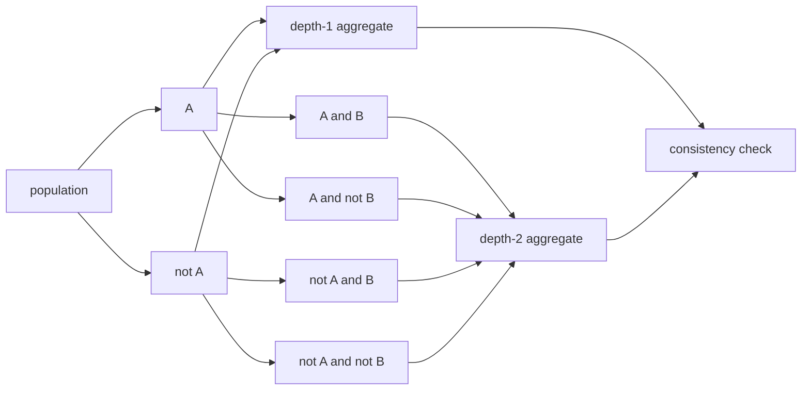
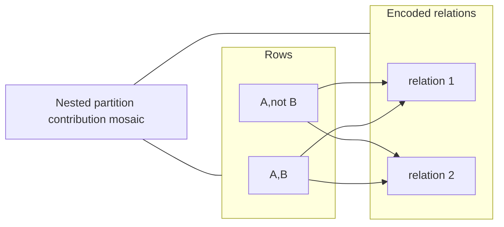
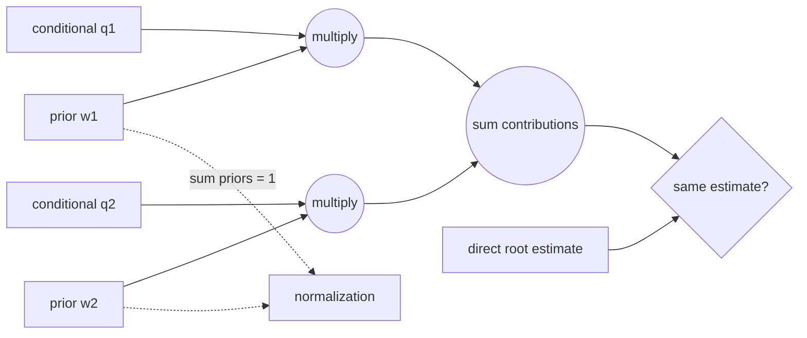

# Visual manifest — Partition, Prompt, Aggregate: Statistical Self-Consistency in Language Models

- Paper ID: `paper_partition_prompt_aggregate`
- Exact paper version: `v1`
- Explainer fixture: `packages/test-fixtures/explainers/partition-prompt-aggregate.json`
- Manifest revision: `7`
- Engineer status: `COMPLETE`
- Implementer status: `COMPLETE`
- Paragraph coverage: `16 / 16` prose paragraphs
- Paragraph-ID derivation: `{block.id}_p{1-based index in block.paragraphs}`; each fixture paragraph appears exactly once.
- Evidence sources:
  - `ppa_method` — Partition, Prompt, Aggregate v1 — partition and reconstruction method; Sections 3.1–3.4, Equations 2–3, PDF pages 5–7
  - `ppa_macro_results` — Partition, Prompt, Aggregate v1 — macro fallacy and prompting results; Section 4, Figures 3–5, PDF pages 7–11
  - `ppa_consistency_results` — Partition, Prompt, Aggregate v1 — self-consistency definitions and evaluation; Sections 5–6, Tables 1–3, PDF pages 11–18
  - `ppa_discussion` — Partition, Prompt, Aggregate v1 — discussion and limitations; Section 7 and Limitations, PDF pages 18–19
  - `ppa_protocol` — Partition, Prompt, Aggregate v1 — ACS prior elicitation details; Appendix E.2, PDF pages 34–35

Revision 7 audits every paragraph against the original paper figures before custom ideation. Reusable direct matches require the source asset; restricted, misleading, or forbidden originals are explicitly adapted or left prose-only. Implementation must be redone from this manifest.

## `ppa_why_p1`

- Location: `ppa_why`, paragraph 1
- Text anchor: "Many uses of in-context learning treat a prompt as a condition and the model's"
- Claims and sources: `ppa_partition`, `ppa_core`, `ppa_method`
- Visual needed: `NO`
- Complexity warrant: NONE — prose is sufficient.
- Forbidden-structure audit: `NO_VISUAL`
- Source-figure audit: `ADAPT_REQUIRED`
- Original figure locator: Figure 1, PDF page 2, `ppa_method`
- License and reuse status: `RESTRICTED` — The paper is CC BY-NC-ND; Paper Atlas noncommercial status is unconfirmed, and modified or cropped reuse is not permitted.
- Decision rationale: The original directly touches this point, but the recorded reuse restriction prevents the source treatment, and no independently warranted non-banned adaptation would improve on the prose.
- Explanatory job: Motivation and problem framing.

### Implementation record

- Status: `NOT_NEEDED`
- Selected treatment: `NONE`
- Selection rationale: `NO_VISUAL` — prose is the approved treatment.
- Delivery medium: `NONE`
- Visual ID and placement: `NONE` — `NO_VISUAL`
- Shared paragraph scope: `NONE`
- Changed files: `NONE`
- Accessibility and fallback verification: `NO_VISUAL`
- Desktop and mobile verification: `NO_VISUAL`
- Evidence deviations: `NONE`

## `ppa_why_p2`

- Location: `ppa_why`, paragraph 2
- Text anchor: "A model can give locally plausible answers while violating this requirement. Two statistically equivalent"
- Claims and sources: `ppa_partition`, `ppa_core`, `ppa_method`
- Visual needed: `NO`
- Complexity warrant: NONE — prose is sufficient.
- Forbidden-structure audit: `NO_VISUAL`
- Source-figure audit: `NO_MATCH`
- Original figure locator: `NONE`
- License and reuse status: `NOT_APPLICABLE` — The paper's figures were checked; none directly performs this paragraph's explanatory job.
- Decision rationale: The paragraph makes one bounded distinction in plain language: A model can give locally plausible answers while violating this requirement. A visual would repeat that statement as a stock chain, list, or set of cards rather than reduce genuine mental reconstruction.
- Explanatory job: Motivation and problem framing.

### Implementation record

- Status: `NOT_NEEDED`
- Selected treatment: `NONE`
- Selection rationale: `NO_VISUAL` — prose is the approved treatment.
- Delivery medium: `NONE`
- Visual ID and placement: `NONE` — `NO_VISUAL`
- Shared paragraph scope: `NONE`
- Changed files: `NONE`
- Accessibility and fallback verification: `NO_VISUAL`
- Desktop and mobile verification: `NO_VISUAL`
- Evidence deviations: `NONE`

## `ppa_change_p1`

- Location: `ppa_change`, paragraph 1
- Text anchor: "The framework separates alignment from self-consistency. Alignment asks whether an estimate matches external reference"
- Claims and sources: `ppa_reconstruction`, `ppa_macro`, `ppa_method`, `ppa_macro_results`
- Visual needed: `NO`
- Complexity warrant: NONE — prose is sufficient.
- Forbidden-structure audit: `NO_VISUAL`
- Source-figure audit: `ADAPT_REQUIRED`
- Original figure locator: Figure 1, PDF page 2, `ppa_method`
- License and reuse status: `RESTRICTED` — The paper is CC BY-NC-ND; Paper Atlas noncommercial status is unconfirmed, and modified or cropped reuse is not permitted.
- Decision rationale: The original directly touches this point, but the recorded reuse restriction prevents the source treatment, and no independently warranted non-banned adaptation would improve on the prose.
- Explanatory job: Method distinction and scope.

### Implementation record

- Status: `NOT_NEEDED`
- Selected treatment: `NONE`
- Selection rationale: `NO_VISUAL` — prose is the approved treatment.
- Delivery medium: `NONE`
- Visual ID and placement: `NONE` — `NO_VISUAL`
- Shared paragraph scope: `NONE`
- Changed files: `NONE`
- Accessibility and fallback verification: `NO_VISUAL`
- Desktop and mobile verification: `NO_VISUAL`
- Evidence deviations: `NONE`

## `ppa_change_p2`

- Location: `ppa_change`, paragraph 2
- Text anchor: "The paper turns this idea into split-consistency and order-consistency scores. It also identifies the"
- Claims and sources: `ppa_reconstruction`, `ppa_macro`, `ppa_method`, `ppa_macro_results`
- Visual needed: `NO`
- Complexity warrant: NONE — prose is sufficient.
- Forbidden-structure audit: `NO_VISUAL`
- Source-figure audit: `NO_MATCH`
- Original figure locator: `NONE`
- License and reuse status: `NOT_APPLICABLE` — The paper's figures were checked; none directly performs this paragraph's explanatory job.
- Decision rationale: The paragraph makes one bounded distinction in plain language: The paper turns this idea into split-consistency and order-consistency scores. A visual would repeat that statement as a stock chain, list, or set of cards rather than reduce genuine mental reconstruction.
- Explanatory job: Method distinction and scope.

### Implementation record

- Status: `NOT_NEEDED`
- Selected treatment: `NONE`
- Selection rationale: `NO_VISUAL` — prose is the approved treatment.
- Delivery medium: `NONE`
- Visual ID and placement: `NONE` — `NO_VISUAL`
- Shared paragraph scope: `NONE`
- Changed files: `NONE`
- Accessibility and fallback verification: `NO_VISUAL`
- Desktop and mobile verification: `NO_VISUAL`
- Evidence deviations: `NONE`

## `ppa_mechanism_p1`

- Location: `ppa_mechanism`, paragraph 1
- Text anchor: "Start with a base population at the root. Each binary attribute splits every node"
- Claims and sources: `ppa_partition`, `ppa_reconstruction`, `ppa_method`
- Visual needed: `NO`
- Complexity warrant: NONE — prose is sufficient.
- Forbidden-structure audit: `NO_VISUAL`
- Source-figure audit: `ADAPT_REQUIRED`
- Original figure locator: Figure 1, PDF page 2, `ppa_method`
- License and reuse status: `RESTRICTED` — The paper is CC BY-NC-ND; Paper Atlas noncommercial status is unconfirmed, and modified or cropped reuse is not permitted.
- Decision rationale: The original directly touches this point, but the recorded reuse restriction prevents the source treatment, and no independently warranted non-banned adaptation would improve on the prose.
- Explanatory job: Mechanism explanation.

### Implementation record

- Status: `NOT_NEEDED`
- Selected treatment: `NONE`
- Selection rationale: `NO_VISUAL` — prose is the approved treatment.
- Delivery medium: `NONE`
- Visual ID and placement: `NONE` — `NO_VISUAL`
- Shared paragraph scope: `NONE`
- Changed files: `NONE`
- Accessibility and fallback verification: `NO_VISUAL`
- Desktop and mobile verification: `NO_VISUAL`
- Evidence deviations: `NONE`

## `ppa_mechanism_p2`

- Location: `ppa_mechanism`, paragraph 2
- Text anchor: "For each level, the method also elicits subgroup population shares, normalizes them, and calculates"
- Claims and sources: `ppa_partition`, `ppa_reconstruction`, `ppa_method`
- Visual needed: `YES`
- Complexity warrant: Hierarchical partition and weighted aggregation: every depth is a complete partition with distinct subgroup priors, yet all depths should reconstruct the same root quantity.
- Forbidden-structure audit: `PASS` — each treatment uses branching, a dependency matrix, feedback, shared-scale geometry, or a state topology; none is a single interchangeable chain, item-plus-metric list, repeated same-metric cards, or repeated one-axis dot panels.
- Source-figure audit: `ADAPT_REQUIRED`
- Original figure locator: Figure 1, PDF page 2, `ppa_method`
- License and reuse status: `RESTRICTED` — The paper is CC BY-NC-ND; Paper Atlas noncommercial status is unconfirmed, and modified or cropped reuse is not permitted.
- Decision rationale: Reuse cannot supply the needed treatment under the recorded constraint; the existing independently warranted non-banned adaptation remains eligible for revision-7 implementation. The reader otherwise has to reconstruct how normalized priors, subgroup conditionals, and tree depth jointly determine one aggregate and why cross-depth disagreement is inconsistency.
- Explanatory job: Hierarchical weighted reconstruction and cross-depth invariance.

### Treatment A — Weighted binary partition tree

- Teaching purpose: Show how each depth remains exhaustive and how leaf contributions return to one root estimate.
- Encoding and reading order: Branch widths encode normalized subgroup priors; every node carries a conditional estimate; contribution edges p(subgroup) times estimate converge on the depth aggregate, with depth aggregates aligned for consistency checking.
- Evidence and limitations: Claims `ppa_partition`, `ppa_reconstruction`, `ppa_acs_protocol`; `ppa_method`, `ppa_protocol`. The diagram is structural and does not imply unreported magnitudes.
- Primary delivery medium: `SVG`
- Recommended web medium: `SVG`
- Mobile, accessibility, and motion behavior: Preserve all labels at 200% zoom; on narrow screens use a single controlled horizontal scroll region or a content-specific stacked variant. Provide a semantic description of every relation and value. Keyboard focus must follow the stated reading order. If interactive, expose the same state in text, support pause/reset, and honor reduced motion; otherwise use no motion.

#### TikZ
```tex
\documentclass[tikz,border=4pt]{standalone}
\usepackage{tikz}
\begin{document}
\begin{tikzpicture}[font=\sffamily\scriptsize,>=stealth]
\node[draw,rounded corners,align=center] (n0) at (0.0,0.0) {population};
\node[draw,rounded corners,align=center] (n1) at (3.2,0.0) {A};
\node[draw,rounded corners,align=center] (n2) at (6.4,0.0) {not A};
\node[draw,rounded corners,align=center] (n3) at (9.600000000000001,0.0) {A and B};
\node[draw,rounded corners,align=center] (n4) at (0.0,-1.8) {A and not B};
\node[draw,rounded corners,align=center] (n5) at (3.2,-1.8) {not A and B};
\node[draw,rounded corners,align=center] (n6) at (6.4,-1.8) {not A and not B};
\node[draw,rounded corners,align=center] (n7) at (0,-3.6) {depth-1 aggregate};
\node[draw,rounded corners,align=center] (n8) at (3.2,-3.6) {depth-2 aggregate};
\node[draw,rounded corners,align=center] (n9) at (6.4,-3.6) {consistency check};
\draw[->] (n0) -- (n1);
\draw[->] (n0) -- (n2);
\draw[->] (n1) -- (n3);
\draw[->] (n1) -- (n4);
\draw[->] (n2) -- (n5); \draw[->] (n2) -- (n6);
\draw[->] (n1) -- (n7); \draw[->] (n2) -- (n7);
\draw[->] (n3) -- (n8); \draw[->] (n4) -- (n8);
\draw[->] (n5) -- (n8); \draw[->] (n6) -- (n8);
\draw[->] (n7) -- (n9); \draw[->] (n8) -- (n9);
\end{tikzpicture}
\end{document}
```

#### Mermaid


#### Python
```python
from pathlib import Path
import matplotlib.pyplot as plt

labels = ['population', 'A', 'not A', 'A and B', 'A and not B', 'not A and B', 'not A and not B', 'depth-1 aggregate', 'depth-2 aggregate', 'consistency check']
fig, ax = plt.subplots(figsize=(9, 5))
edges = [(0,1),(0,2),(1,3),(1,4),(2,5),(2,6),(1,7),(2,7),(3,8),(4,8),(5,8),(6,8),(7,9),(8,9)]
positions = {i: ((i % 4) * 2.5, -(i // 4) * 1.4) for i in range(len(labels))}
for i, label in enumerate(labels):
    x, y = positions[i]
    ax.text(x, y, label, ha='center', va='center', bbox={'boxstyle': 'round', 'fc': '#fffdf8', 'ec': '#171714'})
for start, end in edges:
    x1, y1 = positions[start]
    x2, y2 = positions[end]
    ax.annotate('', (x2, y2), (x1, y1), arrowprops={'arrowstyle': '->', 'color': '#2f5ea8'})
ax.set_axis_off()
fig.tight_layout()
fig.savefig(Path('visual.svg'), format='svg')
```

### Treatment B — Nested partition contribution mosaic

- Teaching purpose: Make the law of total probability visible as area-weighted contributions.
- Encoding and reading order: Each tile area represents a normalized subgroup prior and its fill encodes the subgroup conditional estimate; the area-weighted fill over the whole rectangle is compared with the direct root estimate.
- Evidence and limitations: Claims `ppa_partition`, `ppa_reconstruction`, `ppa_acs_protocol`; `ppa_method`, `ppa_protocol`. Values are illustrative because the paragraph states the protocol rather than one numerical ACS reconstruction.
- Primary delivery medium: `generated asset`
- Recommended web medium: `SVG`
- Mobile, accessibility, and motion behavior: Preserve all labels at 200% zoom; on narrow screens use a single controlled horizontal scroll region or a content-specific stacked variant. Provide a semantic description of every relation and value. Keyboard focus must follow the stated reading order. If interactive, expose the same state in text, support pause/reset, and honor reduced motion; otherwise use no motion.

#### TikZ
```tex
\documentclass[tikz,border=4pt]{standalone}
\usepackage{tikz}
\begin{document}
\begin{tikzpicture}[font=\sffamily\scriptsize,>=stealth]
\fill[blue!68] (0,-0) rectangle ++(0.9,-0.9);
\draw (0,-0) rectangle ++(0.9,-0.9);
\fill[blue!38] (1,-0) rectangle ++(0.9,-0.9);
\draw (1,-0) rectangle ++(0.9,-0.9);
\fill[blue!50] (0,-1) rectangle ++(0.9,-0.9);
\draw (0,-1) rectangle ++(0.9,-0.9);
\fill[blue!32] (1,-1) rectangle ++(0.9,-0.9);
\draw (1,-1) rectangle ++(0.9,-0.9);
\node[anchor=west] at (0,1.0) {A,B / A,not B / not A,B / not A,not B};
\end{tikzpicture}
\end{document}
```

#### Mermaid


#### Python
```python
from pathlib import Path
import matplotlib.pyplot as plt

labels = ['A,B', 'A,not B', 'not A,B', 'not A,not B']
fig, ax = plt.subplots(figsize=(9, 5))
values = [[0.8, 0.3], [0.5, 0.2]]
image = ax.imshow(values, cmap='Blues', vmin=0)
ax.set_title(' / '.join(labels))
fig.colorbar(image, ax=ax, label='encoded relation')
ax.grid(alpha=0.2)
fig.tight_layout()
fig.savefig(Path('visual.svg'), format='svg')
```

### Treatment C — Weighted-reconstruction factor graph

- Teaching purpose: Expose the algebra that binds normalized subgroup priors to subgroup estimates without implying that tree depth alone causes accuracy.
- Encoding and reading order: Each subgroup prior and conditional estimate meet at a multiplication node; parallel contribution branches meet at one summation node. A separate normalization constraint spans all priors, and the reconstructed result meets the direct root estimate only at the consistency comparator.
- Evidence and limitations: Claims `ppa_partition`, `ppa_reconstruction`, `ppa_acs_protocol`; `ppa_method`, `ppa_protocol`. Symbols explain the reported identity and protocol; they are not empirical ACS values.
- Primary delivery medium: `SVG`
- Recommended web medium: `SVG`
- Mobile, accessibility, and motion behavior: Preserve all labels at 200% zoom; on narrow screens use a single controlled horizontal scroll region or a content-specific stacked variant. Provide a semantic description of every relation and value. Keyboard focus must follow the stated reading order. If interactive, expose the same state in text, support pause/reset, and honor reduced motion; otherwise use no motion.

#### TikZ
```tex
\documentclass[tikz,border=4pt]{standalone}
\usepackage{tikz}
\begin{document}
\begin{tikzpicture}[font=\sffamily\scriptsize,>=stealth]
\node[draw] (w1) at (0,2) {$w_1$};
\node[draw] (q1) at (0,0) {$q_1$};
\node[draw,circle] (m1) at (2,1) {$\times$};
\node[draw] (w2) at (0,-2) {$w_2$};
\node[draw] (q2) at (0,-4) {$q_2$};
\node[draw,circle] (m2) at (2,-3) {$\times$};
\node[draw,circle] (sum) at (5,-1) {$\sum$};
\node[draw] (root) at (5,-3) {direct root};
\node[draw] (check) at (8,-2) {consistency};
\node[draw] (norm) at (2,3) {$\sum_i w_i=1$};
\draw[->] (w1)--(m1); \draw[->] (q1)--(m1);
\draw[->] (w2)--(m2); \draw[->] (q2)--(m2);
\draw[->] (m1)--(sum); \draw[->] (m2)--(sum);
\draw[->] (sum)--(check); \draw[->] (root)--(check);
\draw[dashed] (w1)--(norm); \draw[dashed] (w2)--(norm);
\end{tikzpicture}
\end{document}
```

#### Mermaid


#### Python
```python
from pathlib import Path
import matplotlib.pyplot as plt

labels = ['prior w1', 'conditional q1', 'prior w2', 'conditional q2', 'multiply w1q1', 'multiply w2q2', 'sum', 'direct root', 'consistency']
fig, ax = plt.subplots(figsize=(9, 5))
positions = {0:(0,3), 1:(0,2), 2:(0,0), 3:(0,-1), 4:(3,2.5), 5:(3,-0.5), 6:(5,1), 7:(5,-2), 8:(8,0)}
edges = [(0,4),(1,4),(2,5),(3,5),(4,6),(5,6),(6,8),(7,8)]
for i, label in enumerate(labels):
    x, y = positions[i]
    ax.text(x, y, label, ha='center', bbox={'boxstyle':'round','fc':'#fffdf8'})
for start, end in edges:
    ax.annotate('', positions[end], positions[start], arrowprops={'arrowstyle':'->'})
ax.text(2, 3.4, 'w1 + w2 = 1', ha='center')
ax.set_axis_off()
fig.tight_layout()
fig.savefig(Path('visual.svg'), format='svg')
```

### Implementation record

- Status: `IMPLEMENTED`
- Selected treatment: `C`
- Selection rationale: Treatment C is the approved revision-7 treatment already implemented as the preserved custom SVG; its evidence encoding and accessible fallback remain unchanged.
- Delivery medium: `SVG`
- Visual ID and placement: `visual_ppa_weighted_reconstruction_graph` — rendered immediately after `ppa_mechanism_p2`.
- Shared paragraph scope: `NONE`
- Changed files: `packages/test-fixtures/explainers/partition-prompt-aggregate.json`
- Accessibility and fallback verification: `VERIFIED IN FIXTURE` — the preserved custom SVG retains its specific alt text, limitations, and static fallback.
- Desktop and mobile verification: `PENDING SITE INTEGRATION` — renderer and responsive browser QA are owned by `site_maintainer`.
- Evidence deviations: `NONE`

## `ppa_mechanism_p3`

- Location: `ppa_mechanism`, paragraph 3
- Text anchor: "Split consistency checks a node against the weighted sum of its immediate children. Order"
- Claims and sources: `ppa_partition`, `ppa_reconstruction`, `ppa_method`
- Visual needed: `NO`
- Complexity warrant: NONE — prose is sufficient.
- Forbidden-structure audit: `NO_VISUAL`
- Source-figure audit: `ADAPT_REQUIRED`
- Original figure locator: Figure 10, PDF page 29, `ppa_protocol`
- License and reuse status: `RESTRICTED` — The paper is CC BY-NC-ND; Paper Atlas noncommercial status is unconfirmed, and modified or cropped reuse is not permitted.
- Decision rationale: The original directly touches this point, but the recorded reuse restriction prevents the source treatment, and no independently warranted non-banned adaptation would improve on the prose.
- Explanatory job: Mechanism explanation.

### Implementation record

- Status: `NOT_NEEDED`
- Selected treatment: `NONE`
- Selection rationale: `NO_VISUAL` — prose is the approved treatment.
- Delivery medium: `NONE`
- Visual ID and placement: `NONE` — `NO_VISUAL`
- Shared paragraph scope: `NONE`
- Changed files: `NONE`
- Accessibility and fallback verification: `NO_VISUAL`
- Desktop and mobile verification: `NO_VISUAL`
- Evidence deviations: `NONE`

## `ppa_example_p1`

- Location: `ppa_example`, paragraph 1
- Text anchor: "Consider the probability that a person in the United States earns above a chosen"
- Claims and sources: `ppa_partition`, `ppa_reconstruction`, `ppa_macro`, `ppa_method`, `ppa_macro_results`
- Visual needed: `NO`
- Complexity warrant: NONE — prose is sufficient.
- Forbidden-structure audit: `NO_VISUAL`
- Source-figure audit: `ADAPT_REQUIRED`
- Original figure locator: Figure 1, PDF page 2, `ppa_method`
- License and reuse status: `RESTRICTED` — The paper is CC BY-NC-ND; Paper Atlas noncommercial status is unconfirmed, and modified or cropped reuse is not permitted.
- Decision rationale: The original directly touches this point, but the recorded reuse restriction prevents the source treatment, and no independently warranted non-banned adaptation would improve on the prose.
- Explanatory job: Worked example.

### Implementation record

- Status: `NOT_NEEDED`
- Selected treatment: `NONE`
- Selection rationale: `NO_VISUAL` — prose is the approved treatment.
- Delivery medium: `NONE`
- Visual ID and placement: `NONE` — `NO_VISUAL`
- Shared paragraph scope: `NONE`
- Changed files: `NONE`
- Accessibility and fallback verification: `NO_VISUAL`
- Desktop and mobile verification: `NO_VISUAL`
- Evidence deviations: `NONE`

## `ppa_example_p2`

- Location: `ppa_example`, paragraph 2
- Text anchor: "The model estimates the income probability and population share for each subgroup. The explainer"
- Claims and sources: `ppa_partition`, `ppa_reconstruction`, `ppa_macro`, `ppa_method`, `ppa_macro_results`
- Visual needed: `NO`
- Complexity warrant: NONE — prose is sufficient.
- Forbidden-structure audit: `NO_VISUAL`
- Source-figure audit: `ADAPT_REQUIRED`
- Original figure locator: Figure 1, PDF page 2, `ppa_method`
- License and reuse status: `RESTRICTED` — The paper is CC BY-NC-ND; Paper Atlas noncommercial status is unconfirmed, and modified or cropped reuse is not permitted.
- Decision rationale: The original directly touches this point, but the recorded reuse restriction prevents the source treatment, and no independently warranted non-banned adaptation would improve on the prose.
- Explanatory job: Worked example.

### Implementation record

- Status: `NOT_NEEDED`
- Selected treatment: `NONE`
- Selection rationale: `NO_VISUAL` — prose is the approved treatment.
- Delivery medium: `NONE`
- Visual ID and placement: `NONE` — `NO_VISUAL`
- Shared paragraph scope: `NONE`
- Changed files: `NONE`
- Accessibility and fallback verification: `NO_VISUAL`
- Desktop and mobile verification: `NO_VISUAL`
- Evidence deviations: `NONE`

## `ppa_evidence_p1`

- Location: `ppa_evidence`, paragraph 1
- Text anchor: "In the ACS income experiment, Figure 3 reports that reconstructed aggregate estimates generally reduce"
- Claims and sources: `ppa_macro`, `ppa_error_tradeoff`, `ppa_micro_to_macro`, `ppa_acs_consistency`, `ppa_wvs_consistency`, `ppa_macro_results`, `ppa_consistency_results`
- Visual needed: `NO`
- Complexity warrant: NONE — prose is sufficient.
- Forbidden-structure audit: `NO_VISUAL`
- Source-figure audit: `ADAPT_REQUIRED`
- Original figure locator: Figure 3, PDF pages 8-9, `ppa_macro_results`
- License and reuse status: `RESTRICTED` — The paper is CC BY-NC-ND; Paper Atlas noncommercial status is unconfirmed, and modified or cropped reuse is not permitted.
- Decision rationale: The original directly touches this point, but the recorded reuse restriction prevents the source treatment, and no independently warranted non-banned adaptation would improve on the prose.
- Explanatory job: Evaluation evidence.

### Implementation record

- Status: `NOT_NEEDED`
- Selected treatment: `NONE`
- Selection rationale: `NO_VISUAL` — prose is the approved treatment.
- Delivery medium: `NONE`
- Visual ID and placement: `NONE` — `NO_VISUAL`
- Shared paragraph scope: `NONE`
- Changed files: `NONE`
- Accessibility and fallback verification: `NO_VISUAL`
- Desktop and mobile verification: `NO_VISUAL`
- Evidence deviations: `NONE`

## `ppa_evidence_p2`

- Location: `ppa_evidence`, paragraph 2
- Text anchor: "The reference-free checks also reveal failures. In the two-attribute ACS tasks, the reported split-consistency"
- Claims and sources: `ppa_macro`, `ppa_error_tradeoff`, `ppa_micro_to_macro`, `ppa_acs_consistency`, `ppa_wvs_consistency`, `ppa_macro_results`, `ppa_consistency_results`
- Visual needed: `NO`
- Complexity warrant: NONE — prose is sufficient.
- Forbidden-structure audit: `NO_VISUAL`
- Source-figure audit: `ADAPT_REQUIRED`
- Original figure locator: Figure 6, PDF pages 15-16, `ppa_consistency_results`
- License and reuse status: `RESTRICTED` — The paper is CC BY-NC-ND; Paper Atlas noncommercial status is unconfirmed, and modified or cropped reuse is not permitted.
- Decision rationale: The original directly touches this point, but the recorded reuse restriction prevents the source treatment, and no independently warranted non-banned adaptation would improve on the prose.
- Explanatory job: Evaluation evidence.

### Implementation record

- Status: `NOT_NEEDED`
- Selected treatment: `NONE`
- Selection rationale: `NO_VISUAL` — prose is the approved treatment.
- Delivery medium: `NONE`
- Visual ID and placement: `NONE` — `NO_VISUAL`
- Shared paragraph scope: `NONE`
- Changed files: `NONE`
- Accessibility and fallback verification: `NO_VISUAL`
- Desktop and mobile verification: `NO_VISUAL`
- Evidence deviations: `NONE`

## `ppa_evidence_p3`

- Location: `ppa_evidence`, paragraph 3
- Text anchor: "A one-prompt micro-to-macro instruction often improves ACS estimates, but its effect is less systematic"
- Claims and sources: `ppa_macro`, `ppa_error_tradeoff`, `ppa_micro_to_macro`, `ppa_acs_consistency`, `ppa_wvs_consistency`, `ppa_macro_results`, `ppa_consistency_results`
- Visual needed: `NO`
- Complexity warrant: NONE — prose is sufficient.
- Forbidden-structure audit: `NO_VISUAL`
- Source-figure audit: `NO_MATCH`
- Original figure locator: `NONE`
- License and reuse status: `NOT_APPLICABLE` — The paper's figures were checked; none directly performs this paragraph's explanatory job.
- Decision rationale: The paragraph already reports the bounded evidence directly: A one-prompt micro-to-macro instruction often improves ACS estimates, but its effect is less systematic and more model-dependent than explicit aggregation. The available values do not add a supported distribution, uncertainty interval, or joint structure; an honest graphic would reduce to an item-plus-metric list, repeated metric marks, or decorative comparison. Prose is clearer.
- Explanatory job: Evaluation evidence.

### Implementation record

- Status: `NOT_NEEDED`
- Selected treatment: `NONE`
- Selection rationale: `NO_VISUAL` — prose is the approved treatment.
- Delivery medium: `NONE`
- Visual ID and placement: `NONE` — `NO_VISUAL`
- Shared paragraph scope: `NONE`
- Changed files: `NONE`
- Accessibility and fallback verification: `NO_VISUAL`
- Desktop and mobile verification: `NO_VISUAL`
- Evidence deviations: `NONE`

## `ppa_limitations_p1`

- Location: `ppa_limitations`, paragraph 1
- Text anchor: "The macro-fallacy alignment analysis relies primarily on ACS data. Its magnitude depends on the"
- Claims and sources: `ppa_error_tradeoff`, `ppa_generalization`, `ppa_discussion`
- Visual needed: `NO`
- Complexity warrant: NONE — prose is sufficient.
- Forbidden-structure audit: `NO_VISUAL`
- Source-figure audit: `NO_MATCH`
- Original figure locator: `NONE`
- License and reuse status: `NOT_APPLICABLE` — The paper's figures were checked; none directly performs this paragraph's explanatory job.
- Decision rationale: This paragraph is a claim boundary rather than a reconstructive structure: The macro-fallacy alignment analysis relies primarily on ACS data. Keeping the qualifiers in prose avoids inventing causal links or turning heterogeneous caveats into interchangeable cards or a stock list.
- Explanatory job: Evidence boundary and limitation.

### Implementation record

- Status: `NOT_NEEDED`
- Selected treatment: `NONE`
- Selection rationale: `NO_VISUAL` — prose is the approved treatment.
- Delivery medium: `NONE`
- Visual ID and placement: `NONE` — `NO_VISUAL`
- Shared paragraph scope: `NONE`
- Changed files: `NONE`
- Accessibility and fallback verification: `NO_VISUAL`
- Desktop and mobile verification: `NO_VISUAL`
- Evidence deviations: `NONE`

## `ppa_limitations_p2`

- Location: `ppa_limitations`, paragraph 2
- Text anchor: "Self-consistency is only a necessary condition for faithful conditional inference. A model can be"
- Claims and sources: `ppa_error_tradeoff`, `ppa_generalization`, `ppa_discussion`
- Visual needed: `NO`
- Complexity warrant: NONE — prose is sufficient.
- Forbidden-structure audit: `NO_VISUAL`
- Source-figure audit: `NO_MATCH`
- Original figure locator: `NONE`
- License and reuse status: `NOT_APPLICABLE` — The paper's figures were checked; none directly performs this paragraph's explanatory job.
- Decision rationale: This paragraph is a claim boundary rather than a reconstructive structure: Self-consistency is only a necessary condition for faithful conditional inference. Keeping the qualifiers in prose avoids inventing causal links or turning heterogeneous caveats into interchangeable cards or a stock list.
- Explanatory job: Evidence boundary and limitation.

### Implementation record

- Status: `NOT_NEEDED`
- Selected treatment: `NONE`
- Selection rationale: `NO_VISUAL` — prose is the approved treatment.
- Delivery medium: `NONE`
- Visual ID and placement: `NONE` — `NO_VISUAL`
- Shared paragraph scope: `NONE`
- Changed files: `NONE`
- Accessibility and fallback verification: `NO_VISUAL`
- Desktop and mobile verification: `NO_VISUAL`
- Evidence deviations: `NONE`

## `ppa_review_p1`

- Location: `ppa_review`, paragraph 1
- Text anchor: "The strongest contribution is a simple, reference-free test of whether conditional estimates compose. It"
- Claims and sources: `ppa_core`, `ppa_knowledge_interpretation`, `ppa_generalization`, `ppa_macro_results`, `ppa_discussion`
- Visual needed: `NO`
- Complexity warrant: NONE — prose is sufficient.
- Forbidden-structure audit: `NO_VISUAL`
- Source-figure audit: `NO_MATCH`
- Original figure locator: `NONE`
- License and reuse status: `NOT_APPLICABLE` — The paper's figures were checked; none directly performs this paragraph's explanatory job.
- Decision rationale: This paragraph is a claim boundary rather than a reconstructive structure: The strongest contribution is a simple, reference-free test of whether conditional estimates compose. Keeping the qualifiers in prose avoids inventing causal links or turning heterogeneous caveats into interchangeable cards or a stock list.
- Explanatory job: Critical interpretation and claim boundary.

### Implementation record

- Status: `NOT_NEEDED`
- Selected treatment: `NONE`
- Selection rationale: `NO_VISUAL` — prose is the approved treatment.
- Delivery medium: `NONE`
- Visual ID and placement: `NONE` — `NO_VISUAL`
- Shared paragraph scope: `NONE`
- Changed files: `NONE`
- Accessibility and fallback verification: `NO_VISUAL`
- Desktop and mobile verification: `NO_VISUAL`
- Evidence deviations: `NONE`

## `ppa_review_p2`

- Location: `ppa_review`, paragraph 2
- Text anchor: "The macro fallacy is more bounded: it is a repeated empirical pattern in the"
- Claims and sources: `ppa_core`, `ppa_knowledge_interpretation`, `ppa_generalization`, `ppa_macro_results`, `ppa_discussion`
- Visual needed: `NO`
- Complexity warrant: NONE — prose is sufficient.
- Forbidden-structure audit: `NO_VISUAL`
- Source-figure audit: `NO_MATCH`
- Original figure locator: `NONE`
- License and reuse status: `NOT_APPLICABLE` — The paper's figures were checked; none directly performs this paragraph's explanatory job.
- Decision rationale: This paragraph is a claim boundary rather than a reconstructive structure: The macro fallacy is more bounded: it is a repeated empirical pattern in the ACS analysis, not a universal rule that decomposition always improves an answer. Keeping the qualifiers in prose avoids inventing causal links or turning heterogeneous caveats into interchangeable cards or a stock list.
- Explanatory job: Critical interpretation and claim boundary.

### Implementation record

- Status: `NOT_NEEDED`
- Selected treatment: `NONE`
- Selection rationale: `NO_VISUAL` — prose is the approved treatment.
- Delivery medium: `NONE`
- Visual ID and placement: `NONE` — `NO_VISUAL`
- Shared paragraph scope: `NONE`
- Changed files: `NONE`
- Accessibility and fallback verification: `NO_VISUAL`
- Desktop and mobile verification: `NO_VISUAL`
- Evidence deviations: `NONE`
