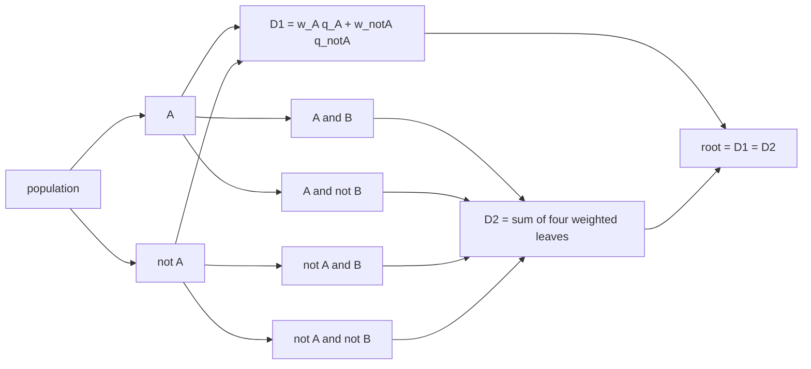
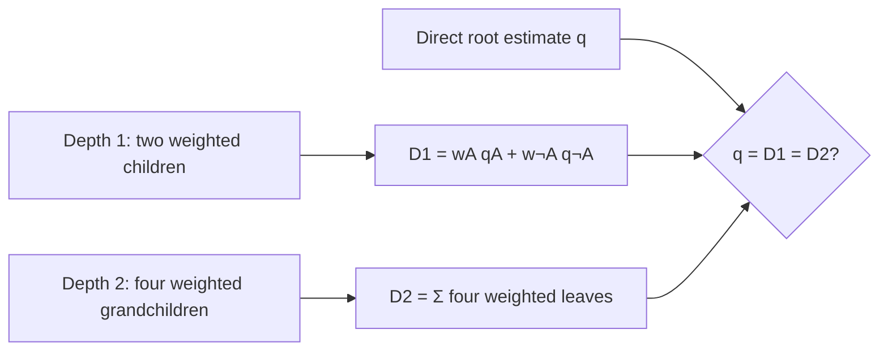
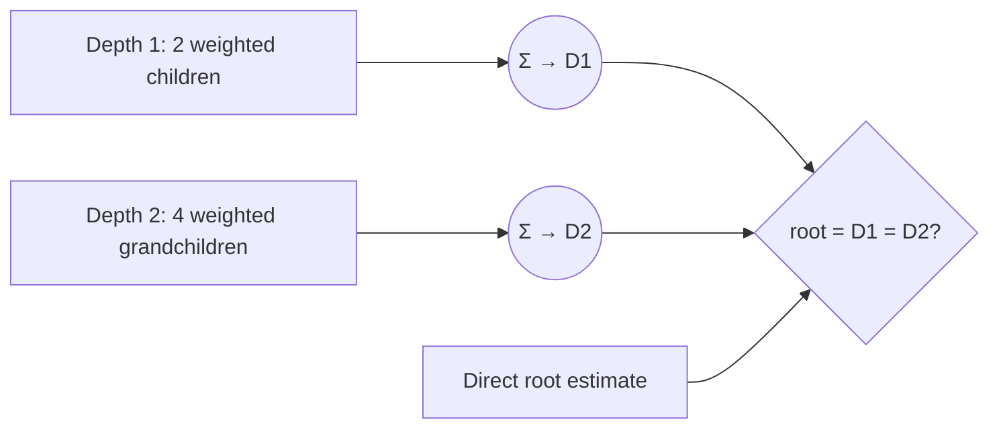

# Visual manifest — Partition, Prompt, Aggregate: Statistical Self-Consistency in Language Models

- Paper ID: `paper_partition_prompt_aggregate`
- Exact paper version: `v1`
- Explainer fixture: `packages/test-fixtures/explainers/partition-prompt-aggregate.json`
- Manifest revision: `13`
- Engineer status: `COMPLETE`
- Implementer status: `COMPLETE`
- Paragraph coverage: `16 / 16` prose paragraphs
- Paragraph-ID derivation: `{block.id}_p{1-based index in block.paragraphs}`; each fixture paragraph appears exactly once.
- Evidence sources:
  - `ppa_method` — Partition, Prompt, Aggregate v1 — partition and reconstruction method; Sections 3.1–3.4, Equations 2–3, PDF pages 5–7
  - `ppa_macro_results` — Partition, Prompt, Aggregate v1 — macro fallacy and prompting results; Section 4, Figures 3–5, PDF pages 7–11
  - `ppa_consistency_results` — Partition, Prompt, Aggregate v1 — self-consistency definitions and evaluation; Sections 5–6, Tables 1–3, PDF pages 11–18
  - `ppa_discussion` — Partition, Prompt, Aggregate v1 — discussion and limitations; Section 7 and Limitations, PDF pages 18–19
  - `ppa_protocol` — Partition, Prompt, Aggregate v1 — ACS prior elicitation details; Appendix E.2, PDF pages 34–35

Revision 11 corrects source-pixel semantics, removes a mismatched source figure, requires conditional inspection instructions, and returns the PPA hierarchy adaptation for visible two-depth invariance rework.

## `ppa_why_p1`

- Location: `ppa_why`, paragraph 1
- Text anchor: "Many uses of in-context learning treat a prompt as a condition and the model's"
- Claims and sources: `ppa_partition`, `ppa_core`, `ppa_method`
- Visual needed: `NO`
- Complexity warrant: NONE — prose is sufficient.
- Forbidden-structure audit: `NO_VISUAL`
- Source-figure audit: `ADAPT_REQUIRED`
- Original figure locator: Figure 1, PDF page 2, `ppa_method`
- License and reuse status: `RESTRICTED` — The paper is CC BY-NC-ND; Paper Atlas noncommercial status is unconfirmed, and modified or cropped reuse is not permitted.
- Decision rationale: The restricted original touches this paragraph-specific point — "Many uses of in-context learning treat a prompt as a condition and the model's" — but cannot be reused or modified under the recorded terms. This paragraph supplies no independent non-banned topology or quantitative structure for an adaptation, so a redraw would invent relationships rather than reduce reconstruction.
- Explanatory job: Motivation and problem framing.

### Implementation record

- Status: `NOT_NEEDED`
- Selected treatment: `NONE`
- Selection rationale: `NO_VISUAL` — prose is the approved treatment.
- Delivery medium: `NONE`
- Visual ID and placement: `NONE` — `NO_VISUAL`
- Shared paragraph scope: `NONE`
- Changed files: `NONE`
- Accessibility and fallback verification: `NO_VISUAL`
- Desktop and mobile verification: `NO_VISUAL`
- Evidence deviations: `NONE`

## `ppa_why_p2`

- Location: `ppa_why`, paragraph 2
- Text anchor: "A model can give locally plausible answers while violating this requirement. Two statistically equivalent"
- Claims and sources: `ppa_partition`, `ppa_core`, `ppa_method`
- Visual needed: `NO`
- Complexity warrant: NONE — prose is sufficient.
- Forbidden-structure audit: `NO_VISUAL`
- Source-figure audit: `NO_MATCH`
- Original figure locator: `NONE`
- License and reuse status: `NOT_APPLICABLE` — The paper's figures were checked; none directly performs this paragraph's explanatory job.
- Decision rationale: The paragraph makes one bounded distinction in plain language: A model can give locally plausible answers while violating this requirement. A visual would repeat that statement as a stock chain, list, or set of cards rather than reduce genuine mental reconstruction.
- Explanatory job: Motivation and problem framing.

### Implementation record

- Status: `NOT_NEEDED`
- Selected treatment: `NONE`
- Selection rationale: `NO_VISUAL` — prose is the approved treatment.
- Delivery medium: `NONE`
- Visual ID and placement: `NONE` — `NO_VISUAL`
- Shared paragraph scope: `NONE`
- Changed files: `NONE`
- Accessibility and fallback verification: `NO_VISUAL`
- Desktop and mobile verification: `NO_VISUAL`
- Evidence deviations: `NONE`

## `ppa_change_p1`

- Location: `ppa_change`, paragraph 1
- Text anchor: "The framework separates alignment from self-consistency. Alignment asks whether an estimate matches external reference"
- Claims and sources: `ppa_reconstruction`, `ppa_macro`, `ppa_method`, `ppa_macro_results`
- Visual needed: `NO`
- Complexity warrant: NONE — prose is sufficient.
- Forbidden-structure audit: `NO_VISUAL`
- Source-figure audit: `ADAPT_REQUIRED`
- Original figure locator: Figure 1, PDF page 2, `ppa_method`
- License and reuse status: `RESTRICTED` — The paper is CC BY-NC-ND; Paper Atlas noncommercial status is unconfirmed, and modified or cropped reuse is not permitted.
- Decision rationale: The restricted original touches this paragraph-specific point — "The framework separates alignment from self-consistency. Alignment asks whether an estimate matches external reference" — but cannot be reused or modified under the recorded terms. This paragraph supplies no independent non-banned topology or quantitative structure for an adaptation, so a redraw would invent relationships rather than reduce reconstruction.
- Explanatory job: Method distinction and scope.

### Implementation record

- Status: `NOT_NEEDED`
- Selected treatment: `NONE`
- Selection rationale: `NO_VISUAL` — prose is the approved treatment.
- Delivery medium: `NONE`
- Visual ID and placement: `NONE` — `NO_VISUAL`
- Shared paragraph scope: `NONE`
- Changed files: `NONE`
- Accessibility and fallback verification: `NO_VISUAL`
- Desktop and mobile verification: `NO_VISUAL`
- Evidence deviations: `NONE`

## `ppa_change_p2`

- Location: `ppa_change`, paragraph 2
- Text anchor: "The paper turns this idea into split-consistency and order-consistency scores. It also identifies the"
- Claims and sources: `ppa_reconstruction`, `ppa_macro`, `ppa_method`, `ppa_macro_results`
- Visual needed: `NO`
- Complexity warrant: NONE — prose is sufficient.
- Forbidden-structure audit: `NO_VISUAL`
- Source-figure audit: `NO_MATCH`
- Original figure locator: `NONE`
- License and reuse status: `NOT_APPLICABLE` — The paper's figures were checked; none directly performs this paragraph's explanatory job.
- Decision rationale: The paragraph makes one bounded distinction in plain language: The paper turns this idea into split-consistency and order-consistency scores. A visual would repeat that statement as a stock chain, list, or set of cards rather than reduce genuine mental reconstruction.
- Explanatory job: Method distinction and scope.

### Implementation record

- Status: `NOT_NEEDED`
- Selected treatment: `NONE`
- Selection rationale: `NO_VISUAL` — prose is the approved treatment.
- Delivery medium: `NONE`
- Visual ID and placement: `NONE` — `NO_VISUAL`
- Shared paragraph scope: `NONE`
- Changed files: `NONE`
- Accessibility and fallback verification: `NO_VISUAL`
- Desktop and mobile verification: `NO_VISUAL`
- Evidence deviations: `NONE`

## `ppa_mechanism_p1`

- Location: `ppa_mechanism`, paragraph 1
- Text anchor: "Start with a base population at the root. Each binary attribute splits every node"
- Claims and sources: `ppa_partition`, `ppa_reconstruction`, `ppa_method`
- Visual needed: `NO`
- Complexity warrant: NONE — prose is sufficient.
- Forbidden-structure audit: `NO_VISUAL`
- Source-figure audit: `ADAPT_REQUIRED`
- Original figure locator: Figure 1, PDF page 2, `ppa_method`
- License and reuse status: `RESTRICTED` — The paper is CC BY-NC-ND; Paper Atlas noncommercial status is unconfirmed, and modified or cropped reuse is not permitted.
- Decision rationale: The restricted original touches this paragraph-specific point — "Start with a base population at the root. Each binary attribute splits every node" — but cannot be reused or modified under the recorded terms. This paragraph supplies no independent non-banned topology or quantitative structure for an adaptation, so a redraw would invent relationships rather than reduce reconstruction.
- Explanatory job: Mechanism explanation.

### Implementation record

- Status: `NOT_NEEDED`
- Selected treatment: `NONE`
- Selection rationale: `NO_VISUAL` — prose is the approved treatment.
- Delivery medium: `NONE`
- Visual ID and placement: `NONE` — `NO_VISUAL`
- Shared paragraph scope: `NONE`
- Changed files: `NONE`
- Accessibility and fallback verification: `NO_VISUAL`
- Desktop and mobile verification: `NO_VISUAL`
- Evidence deviations: `NONE`

## `ppa_mechanism_p2`

- Location: `ppa_mechanism`, paragraph 2
- Text anchor: "For each level, the method also elicits subgroup population shares, normalizes them, and calculates"
- Claims and sources: `ppa_partition`, `ppa_reconstruction`, `ppa_method`
- Visual needed: `YES`
- Complexity warrant: Hierarchical partition and weighted aggregation: every depth is a complete partition with distinct subgroup priors, yet all depths should reconstruct the same root quantity.
- Forbidden-structure audit: `PASS` — each treatment uses branching, a dependency matrix, feedback, shared-scale geometry, or a state topology; none is a single interchangeable chain, item-plus-metric list, repeated same-metric cards, or repeated one-axis dot panels.
- Source-figure audit: `ADAPT_REQUIRED`
- Original figure locator: Figure 1, PDF page 2, `ppa_method`
- License and reuse status: `RESTRICTED` — The paper is CC BY-NC-ND; Paper Atlas noncommercial status is unconfirmed, and modified or cropped reuse is not permitted.
- Decision rationale: Reuse cannot supply the needed treatment under the recorded constraint; the revised non-banned adaptation must make two hierarchy depths and their invariance test visible. The reader otherwise has to reconstruct how normalized priors, subgroup conditionals, and tree depth jointly determine one aggregate and why cross-depth disagreement is inconsistency.
- Explanatory job: Hierarchical weighted reconstruction and cross-depth invariance.

### Treatment A — Weighted binary partition tree

- Teaching purpose: Show how each depth remains exhaustive and how leaf contributions return to one root estimate.
- Encoding and reading order: Branch widths encode normalized subgroup priors; every node carries a conditional estimate; contribution edges p(subgroup) times estimate converge on the depth aggregate, with depth aggregates aligned for root = D1 = D2ing.
- Evidence and limitations: Claims `ppa_partition`, `ppa_reconstruction`, `ppa_acs_protocol`; `ppa_method`, `ppa_protocol`. The diagram is structural and does not imply unreported magnitudes.
- Primary delivery medium: `SVG`
- Recommended web medium: `SVG`
- Mobile, accessibility, and motion behavior: Use a distinct narrow SVG composition rather than scaling the desktop hierarchy. Stack four full-width sections: the direct root estimate q; the depth-1 binary partition with both weighted contributions and its D1 sum; the depth-2 four-leaf partition with all weights and its D2 sum; and a final comparator q = D1 = D2. Repeat only the root reference needed to read each depth independently; preserve branch widths and contribution labels. Use a mobile viewBox, at least 16 CSS px labels, max-width: 100%, and height: auto. Preserve the semantic fallback and use no motion or scrollbar.

#### TikZ
```tex
\documentclass[tikz,border=4pt]{standalone}
\usepackage{tikz}
\begin{document}
\begin{tikzpicture}[font=\sffamily\scriptsize,>=stealth]
\node[draw,rounded corners,align=center] (n0) at (0.0,0.0) {population};
\node[draw,rounded corners,align=center] (n1) at (3.2,0.0) {A};
\node[draw,rounded corners,align=center] (n2) at (6.4,0.0) {not A};
\node[draw,rounded corners,align=center] (n3) at (9.600000000000001,0.0) {A and B};
\node[draw,rounded corners,align=center] (n4) at (0.0,-1.8) {A and not B};
\node[draw,rounded corners,align=center] (n5) at (3.2,-1.8) {not A and B};
\node[draw,rounded corners,align=center] (n6) at (6.4,-1.8) {not A and not B};
\node[draw,rounded corners,align=center] (n7) at (0,-3.6) {D1 = w_A q_A + w_notA q_notA};
\node[draw,rounded corners,align=center] (n8) at (3.2,-3.6) {D2 = sum of four weighted leaves};
\node[draw,rounded corners,align=center] (n9) at (6.4,-3.6) {root = D1 = D2};
\draw[->] (n0) -- (n1);
\draw[->] (n0) -- (n2);
\draw[->] (n1) -- (n3);
\draw[->] (n1) -- (n4);
\draw[->] (n2) -- (n5); \draw[->] (n2) -- (n6);
\draw[->] (n1) -- (n7); \draw[->] (n2) -- (n7);
\draw[->] (n3) -- (n8); \draw[->] (n4) -- (n8);
\draw[->] (n5) -- (n8); \draw[->] (n6) -- (n8);
\draw[->] (n7) -- (n9); \draw[->] (n8) -- (n9);
\end{tikzpicture}
\end{document}
```

#### Mermaid


#### Python
```python
from pathlib import Path
import matplotlib.pyplot as plt

labels = ['population', 'A', 'not A', 'A and B', 'A and not B', 'not A and B', 'not A and not B', 'D1 = w_A q_A + w_notA q_notA', 'D2 = sum of four weighted leaves', 'root = D1 = D2']
fig, ax = plt.subplots(figsize=(9, 5))
edges = [(0,1),(0,2),(1,3),(1,4),(2,5),(2,6),(1,7),(2,7),(3,8),(4,8),(5,8),(6,8),(7,9),(8,9)]
positions = {i: ((i % 4) * 2.5, -(i // 4) * 1.4) for i in range(len(labels))}
for i, label in enumerate(labels):
    x, y = positions[i]
    ax.text(x, y, label, ha='center', va='center', bbox={'boxstyle': 'round', 'fc': '#fffdf8', 'ec': '#171714'})
for start, end in edges:
    x1, y1 = positions[start]
    x2, y2 = positions[end]
    ax.annotate('', (x2, y2), (x1, y1), arrowprops={'arrowstyle': '->', 'color': '#2f5ea8'})
ax.set_axis_off()
fig.tight_layout()
fig.savefig(Path('visual.svg'), format='svg')
```

### Treatment B — Nested partition contribution mosaic

- Teaching purpose: Make the law of total probability visible as area-weighted contributions.
- Encoding and reading order: Show a depth-1 mosaic with two weighted children and a depth-2 mosaic with four weighted grandchildren. Each depth has its own visible weighted aggregate, and both aggregates meet the direct root estimate at one equality/invariance comparison.
- Evidence and limitations: Claims `ppa_partition`, `ppa_reconstruction`, `ppa_acs_protocol`; `ppa_method`, `ppa_protocol`. Values are illustrative because the paragraph states the protocol rather than one numerical ACS reconstruction.
- Primary delivery medium: `generated asset`
- Recommended web medium: `SVG`
- Mobile, accessibility, and motion behavior: Use a distinct narrow SVG composition rather than scaling the desktop hierarchy. Stack four full-width sections: the direct root estimate q; the depth-1 binary partition with both weighted contributions and its D1 sum; the depth-2 four-leaf partition with all weights and its D2 sum; and a final comparator q = D1 = D2. Repeat only the root reference needed to read each depth independently; preserve branch widths and contribution labels. Use a mobile viewBox, at least 16 CSS px labels, max-width: 100%, and height: auto. Preserve the semantic fallback and use no motion or scrollbar.

#### TikZ
```tex
\documentclass[tikz,border=4pt]{standalone}
\usepackage{tikz}\begin{document}\begin{tikzpicture}[font=\scriptsize]
\node[draw] (d1) at (0,2) {depth 1: two weighted children};
\node[draw] (a1) at (4,2) {$D_1=w_Aq_A+w_{\neg A}q_{\neg A}$};
\node[draw] (d2) at (0,0) {depth 2: four weighted grandchildren};
\node[draw] (a2) at (4,0) {$D_2=\sum_{i=1}^{4}w_iq_i$};
\node[draw] (root) at (4,-2) {direct root $q$};
\node[draw] (eq) at (8,0) {$q=D_1=D_2$};
\draw[->] (d1)--(a1); \draw[->] (d2)--(a2); \draw[->] (a1)--(eq); \draw[->] (a2)--(eq); \draw[->] (root)--(eq);
\end{tikzpicture}\end{document}
```

#### Mermaid


#### Python
```python
from pathlib import Path
import matplotlib.pyplot as plt
fig, ax = plt.subplots(figsize=(9, 4))
ax.text(0.05, .75, "Depth 1: two weighted children → D1 = wAqA + w¬Aq¬A")
ax.text(0.05, .45, "Depth 2: four weighted grandchildren → D2 = Σ wiqi")
ax.text(0.55, .15, "direct root q = D1 = D2", bbox={"boxstyle":"round","fc":"#fffdf8"})
ax.set_axis_off(); fig.savefig(Path("visual.svg"), format="svg")
```

### Treatment C — Weighted-reconstruction factor graph

- Teaching purpose: Expose the algebra that binds normalized subgroup priors to subgroup estimates without implying that tree depth alone causes accuracy.
- Encoding and reading order: Render two simultaneous aggregation branches: depth 1 multiplies and sums two weighted children; depth 2 multiplies and sums four weighted grandchildren. Both depth aggregates connect to a single explicit equality comparator with the direct root estimate.
- Evidence and limitations: Claims `ppa_partition`, `ppa_reconstruction`, `ppa_acs_protocol`; `ppa_method`, `ppa_protocol`. Symbols explain the reported identity and protocol; they are not empirical ACS values.
- Primary delivery medium: `SVG`
- Recommended web medium: `SVG`
- Mobile, accessibility, and motion behavior: Use a distinct narrow SVG composition rather than scaling the desktop hierarchy. Stack four full-width sections: the direct root estimate q; the depth-1 binary partition with both weighted contributions and its D1 sum; the depth-2 four-leaf partition with all weights and its D2 sum; and a final comparator q = D1 = D2. Repeat only the root reference needed to read each depth independently; preserve branch widths and contribution labels. Use a mobile viewBox, at least 16 CSS px labels, max-width: 100%, and height: auto. Preserve the semantic fallback and use no motion or scrollbar.

#### TikZ
```tex
\documentclass[tikz,border=4pt]{standalone}
\usepackage{tikz}\begin{document}\begin{tikzpicture}[font=\scriptsize,>=stealth]
\node[draw] (d1) at (0,2) {2 children: $w_iq_i$}; \node[draw] (s1) at (4,2) {$D_1=\sum_{i=1}^{2}w_iq_i$};
\node[draw] (d2) at (0,0) {4 grandchildren: $w_jq_j$}; \node[draw] (s2) at (4,0) {$D_2=\sum_{j=1}^{4}w_jq_j$};
\node[draw] (root) at (4,-2) {root $q$}; \node[draw] (eq) at (8,0) {$q=D_1=D_2$};
\draw[->](d1)--(s1);\draw[->](d2)--(s2);\draw[->](s1)--(eq);\draw[->](s2)--(eq);\draw[->](root)--(eq);
\end{tikzpicture}\end{document}
```

#### Mermaid


#### Python
```python
from pathlib import Path
import matplotlib.pyplot as plt
fig, ax = plt.subplots(figsize=(9, 4))
nodes=[("2 weighted children",.05,.75),("D1 = Σ2 wiqi",.38,.75),("4 weighted grandchildren",.05,.35),("D2 = Σ4 wjqj",.38,.35),("root = D1 = D2",.72,.55)]
for label,x,y in nodes: ax.text(x,y,label,bbox={"boxstyle":"round","fc":"#fffdf8"})
for y in (.75,.35): ax.annotate("",(.7,.55),(.55,y),arrowprops={"arrowstyle":"->"})
ax.set_axis_off(); fig.savefig(Path("visual.svg"),format="svg")
```

### Implementation record

- Status: `IMPLEMENTED`
- Selected treatment: `A`
- Selection rationale: The selected evidence-correct treatment is implemented with its revision-13 semantic crop or narrow SVG reflow, preserving relationships, source fidelity, provenance, and scrollbar-free containment.
- Delivery medium: `SVG`
- Visual ID and placement: `visual_ppa_weighted_reconstruction_graph` — rendered immediately after `ppa_mechanism_p2`.
- Shared paragraph scope: `NONE`
- Changed files: `apps/web/app/papers/[id]/explainer-svg.tsx`; `packages/test-fixtures/explainers/partition-prompt-aggregate.json`; `apps/web/tests/paper-page.spec.ts`; `apps/web/app/papers/[id]/explainer-svg.tsx`; `apps/web/app/globals.css`; `apps/web/tests/paper-page.spec.ts`
- Accessibility and fallback verification: `VERIFIED` — paragraph-specific mobile crops or SVG reflows retain the selected labels and relationships; source modifications, paths, panel-specific alt text, semantic fallback, locator, attribution, and license remain explicit.
- Desktop and mobile verification: `VERIFIED` — Playwright at 1440 × 1000 and 390 × 844 confirms the complete desktop visual and selected mobile crops or reflow fit without internal or page-level overflow; mobile SVG labels render at 15 CSS px or larger.
- Evidence deviations: `NONE`

## `ppa_mechanism_p3`

- Location: `ppa_mechanism`, paragraph 3
- Text anchor: "Split consistency checks a node against the weighted sum of its immediate children. Order"
- Claims and sources: `ppa_partition`, `ppa_reconstruction`, `ppa_method`
- Visual needed: `NO`
- Complexity warrant: NONE — prose is sufficient.
- Forbidden-structure audit: `NO_VISUAL`
- Source-figure audit: `ADAPT_REQUIRED`
- Original figure locator: Figure 10, PDF page 29, `ppa_protocol`
- License and reuse status: `RESTRICTED` — The paper is CC BY-NC-ND; Paper Atlas noncommercial status is unconfirmed, and modified or cropped reuse is not permitted.
- Decision rationale: The restricted original touches this paragraph-specific point — "Split consistency checks a node against the weighted sum of its immediate children. Order" — but cannot be reused or modified under the recorded terms. This paragraph supplies no independent non-banned topology or quantitative structure for an adaptation, so a redraw would invent relationships rather than reduce reconstruction.
- Explanatory job: Mechanism explanation.

### Implementation record

- Status: `NOT_NEEDED`
- Selected treatment: `NONE`
- Selection rationale: `NO_VISUAL` — prose is the approved treatment.
- Delivery medium: `NONE`
- Visual ID and placement: `NONE` — `NO_VISUAL`
- Shared paragraph scope: `NONE`
- Changed files: `NONE`
- Accessibility and fallback verification: `NO_VISUAL`
- Desktop and mobile verification: `NO_VISUAL`
- Evidence deviations: `NONE`

## `ppa_example_p1`

- Location: `ppa_example`, paragraph 1
- Text anchor: "Consider the probability that a person in the United States earns above a chosen"
- Claims and sources: `ppa_partition`, `ppa_reconstruction`, `ppa_macro`, `ppa_method`, `ppa_macro_results`
- Visual needed: `NO`
- Complexity warrant: NONE — prose is sufficient.
- Forbidden-structure audit: `NO_VISUAL`
- Source-figure audit: `ADAPT_REQUIRED`
- Original figure locator: Figure 1, PDF page 2, `ppa_method`
- License and reuse status: `RESTRICTED` — The paper is CC BY-NC-ND; Paper Atlas noncommercial status is unconfirmed, and modified or cropped reuse is not permitted.
- Decision rationale: The restricted original touches this paragraph-specific point — "Consider the probability that a person in the United States earns above a chosen" — but cannot be reused or modified under the recorded terms. This paragraph supplies no independent non-banned topology or quantitative structure for an adaptation, so a redraw would invent relationships rather than reduce reconstruction.
- Explanatory job: Worked example.

### Implementation record

- Status: `NOT_NEEDED`
- Selected treatment: `NONE`
- Selection rationale: `NO_VISUAL` — prose is the approved treatment.
- Delivery medium: `NONE`
- Visual ID and placement: `NONE` — `NO_VISUAL`
- Shared paragraph scope: `NONE`
- Changed files: `NONE`
- Accessibility and fallback verification: `NO_VISUAL`
- Desktop and mobile verification: `NO_VISUAL`
- Evidence deviations: `NONE`

## `ppa_example_p2`

- Location: `ppa_example`, paragraph 2
- Text anchor: "The model estimates the income probability and population share for each subgroup. The explainer"
- Claims and sources: `ppa_partition`, `ppa_reconstruction`, `ppa_macro`, `ppa_method`, `ppa_macro_results`
- Visual needed: `NO`
- Complexity warrant: NONE — prose is sufficient.
- Forbidden-structure audit: `NO_VISUAL`
- Source-figure audit: `ADAPT_REQUIRED`
- Original figure locator: Figure 1, PDF page 2, `ppa_method`
- License and reuse status: `RESTRICTED` — The paper is CC BY-NC-ND; Paper Atlas noncommercial status is unconfirmed, and modified or cropped reuse is not permitted.
- Decision rationale: The restricted original touches this paragraph-specific point — "The model estimates the income probability and population share for each subgroup. The explainer" — but cannot be reused or modified under the recorded terms. This paragraph supplies no independent non-banned topology or quantitative structure for an adaptation, so a redraw would invent relationships rather than reduce reconstruction.
- Explanatory job: Worked example.

### Implementation record

- Status: `NOT_NEEDED`
- Selected treatment: `NONE`
- Selection rationale: `NO_VISUAL` — prose is the approved treatment.
- Delivery medium: `NONE`
- Visual ID and placement: `NONE` — `NO_VISUAL`
- Shared paragraph scope: `NONE`
- Changed files: `NONE`
- Accessibility and fallback verification: `NO_VISUAL`
- Desktop and mobile verification: `NO_VISUAL`
- Evidence deviations: `NONE`

## `ppa_evidence_p1`

- Location: `ppa_evidence`, paragraph 1
- Text anchor: "In the ACS income experiment, Figure 3 reports that reconstructed aggregate estimates generally reduce"
- Claims and sources: `ppa_macro`, `ppa_error_tradeoff`, `ppa_micro_to_macro`, `ppa_acs_consistency`, `ppa_wvs_consistency`, `ppa_macro_results`, `ppa_consistency_results`
- Visual needed: `NO`
- Complexity warrant: NONE — prose is sufficient.
- Forbidden-structure audit: `NO_VISUAL`
- Source-figure audit: `ADAPT_REQUIRED`
- Original figure locator: Figure 3, PDF pages 8-9, `ppa_macro_results`
- License and reuse status: `RESTRICTED` — The paper is CC BY-NC-ND; Paper Atlas noncommercial status is unconfirmed, and modified or cropped reuse is not permitted.
- Decision rationale: The restricted original touches this paragraph-specific point — "In the ACS income experiment, Figure 3 reports that reconstructed aggregate estimates generally reduce" — but cannot be reused or modified under the recorded terms. This paragraph supplies no independent non-banned topology or quantitative structure for an adaptation, so a redraw would invent relationships rather than reduce reconstruction.
- Explanatory job: Evaluation evidence.

### Implementation record

- Status: `NOT_NEEDED`
- Selected treatment: `NONE`
- Selection rationale: `NO_VISUAL` — prose is the approved treatment.
- Delivery medium: `NONE`
- Visual ID and placement: `NONE` — `NO_VISUAL`
- Shared paragraph scope: `NONE`
- Changed files: `NONE`
- Accessibility and fallback verification: `NO_VISUAL`
- Desktop and mobile verification: `NO_VISUAL`
- Evidence deviations: `NONE`

## `ppa_evidence_p2`

- Location: `ppa_evidence`, paragraph 2
- Text anchor: "The reference-free checks also reveal failures. In the two-attribute ACS tasks, the reported split-consistency"
- Claims and sources: `ppa_macro`, `ppa_error_tradeoff`, `ppa_micro_to_macro`, `ppa_acs_consistency`, `ppa_wvs_consistency`, `ppa_macro_results`, `ppa_consistency_results`
- Visual needed: `NO`
- Complexity warrant: NONE — prose is sufficient.
- Forbidden-structure audit: `NO_VISUAL`
- Source-figure audit: `ADAPT_REQUIRED`
- Original figure locator: Figure 6, PDF pages 15-16, `ppa_consistency_results`
- License and reuse status: `RESTRICTED` — The paper is CC BY-NC-ND; Paper Atlas noncommercial status is unconfirmed, and modified or cropped reuse is not permitted.
- Decision rationale: The restricted original touches this paragraph-specific point — "The reference-free checks also reveal failures. In the two-attribute ACS tasks, the reported split-consistency" — but cannot be reused or modified under the recorded terms. This paragraph supplies no independent non-banned topology or quantitative structure for an adaptation, so a redraw would invent relationships rather than reduce reconstruction.
- Explanatory job: Evaluation evidence.

### Implementation record

- Status: `NOT_NEEDED`
- Selected treatment: `NONE`
- Selection rationale: `NO_VISUAL` — prose is the approved treatment.
- Delivery medium: `NONE`
- Visual ID and placement: `NONE` — `NO_VISUAL`
- Shared paragraph scope: `NONE`
- Changed files: `NONE`
- Accessibility and fallback verification: `NO_VISUAL`
- Desktop and mobile verification: `NO_VISUAL`
- Evidence deviations: `NONE`

## `ppa_evidence_p3`

- Location: `ppa_evidence`, paragraph 3
- Text anchor: "A one-prompt micro-to-macro instruction often improves ACS estimates, but its effect is less systematic"
- Claims and sources: `ppa_macro`, `ppa_error_tradeoff`, `ppa_micro_to_macro`, `ppa_acs_consistency`, `ppa_wvs_consistency`, `ppa_macro_results`, `ppa_consistency_results`
- Visual needed: `NO`
- Complexity warrant: NONE — prose is sufficient.
- Forbidden-structure audit: `NO_VISUAL`
- Source-figure audit: `NO_MATCH`
- Original figure locator: `NONE`
- License and reuse status: `NOT_APPLICABLE` — The paper's figures were checked; none directly performs this paragraph's explanatory job.
- Decision rationale: The paragraph already reports the bounded evidence directly: A one-prompt micro-to-macro instruction often improves ACS estimates, but its effect is less systematic and more model-dependent than explicit aggregation. The available values do not add a supported distribution, uncertainty interval, or joint structure; an honest graphic would reduce to an item-plus-metric list, repeated metric marks, or decorative comparison. Prose is clearer.
- Explanatory job: Evaluation evidence.

### Implementation record

- Status: `NOT_NEEDED`
- Selected treatment: `NONE`
- Selection rationale: `NO_VISUAL` — prose is the approved treatment.
- Delivery medium: `NONE`
- Visual ID and placement: `NONE` — `NO_VISUAL`
- Shared paragraph scope: `NONE`
- Changed files: `NONE`
- Accessibility and fallback verification: `NO_VISUAL`
- Desktop and mobile verification: `NO_VISUAL`
- Evidence deviations: `NONE`

## `ppa_limitations_p1`

- Location: `ppa_limitations`, paragraph 1
- Text anchor: "The macro-fallacy alignment analysis relies primarily on ACS data. Its magnitude depends on the"
- Claims and sources: `ppa_error_tradeoff`, `ppa_generalization`, `ppa_discussion`
- Visual needed: `NO`
- Complexity warrant: NONE — prose is sufficient.
- Forbidden-structure audit: `NO_VISUAL`
- Source-figure audit: `NO_MATCH`
- Original figure locator: `NONE`
- License and reuse status: `NOT_APPLICABLE` — The paper's figures were checked; none directly performs this paragraph's explanatory job.
- Decision rationale: This paragraph is a claim boundary rather than a reconstructive structure: The macro-fallacy alignment analysis relies primarily on ACS data. Keeping the qualifiers in prose avoids inventing causal links or turning heterogeneous caveats into interchangeable cards or a stock list.
- Explanatory job: Evidence boundary and limitation.

### Implementation record

- Status: `NOT_NEEDED`
- Selected treatment: `NONE`
- Selection rationale: `NO_VISUAL` — prose is the approved treatment.
- Delivery medium: `NONE`
- Visual ID and placement: `NONE` — `NO_VISUAL`
- Shared paragraph scope: `NONE`
- Changed files: `NONE`
- Accessibility and fallback verification: `NO_VISUAL`
- Desktop and mobile verification: `NO_VISUAL`
- Evidence deviations: `NONE`

## `ppa_limitations_p2`

- Location: `ppa_limitations`, paragraph 2
- Text anchor: "Self-consistency is only a necessary condition for faithful conditional inference. A model can be"
- Claims and sources: `ppa_error_tradeoff`, `ppa_generalization`, `ppa_discussion`
- Visual needed: `NO`
- Complexity warrant: NONE — prose is sufficient.
- Forbidden-structure audit: `NO_VISUAL`
- Source-figure audit: `NO_MATCH`
- Original figure locator: `NONE`
- License and reuse status: `NOT_APPLICABLE` — The paper's figures were checked; none directly performs this paragraph's explanatory job.
- Decision rationale: This paragraph is a claim boundary rather than a reconstructive structure: Self-consistency is only a necessary condition for faithful conditional inference. Keeping the qualifiers in prose avoids inventing causal links or turning heterogeneous caveats into interchangeable cards or a stock list.
- Explanatory job: Evidence boundary and limitation.

### Implementation record

- Status: `NOT_NEEDED`
- Selected treatment: `NONE`
- Selection rationale: `NO_VISUAL` — prose is the approved treatment.
- Delivery medium: `NONE`
- Visual ID and placement: `NONE` — `NO_VISUAL`
- Shared paragraph scope: `NONE`
- Changed files: `NONE`
- Accessibility and fallback verification: `NO_VISUAL`
- Desktop and mobile verification: `NO_VISUAL`
- Evidence deviations: `NONE`

## `ppa_review_p1`

- Location: `ppa_review`, paragraph 1
- Text anchor: "The strongest contribution is a simple, reference-free test of whether conditional estimates compose. It"
- Claims and sources: `ppa_core`, `ppa_knowledge_interpretation`, `ppa_generalization`, `ppa_macro_results`, `ppa_discussion`
- Visual needed: `NO`
- Complexity warrant: NONE — prose is sufficient.
- Forbidden-structure audit: `NO_VISUAL`
- Source-figure audit: `NO_MATCH`
- Original figure locator: `NONE`
- License and reuse status: `NOT_APPLICABLE` — The paper's figures were checked; none directly performs this paragraph's explanatory job.
- Decision rationale: This paragraph is a claim boundary rather than a reconstructive structure: The strongest contribution is a simple, reference-free test of whether conditional estimates compose. Keeping the qualifiers in prose avoids inventing causal links or turning heterogeneous caveats into interchangeable cards or a stock list.
- Explanatory job: Critical interpretation and claim boundary.

### Implementation record

- Status: `NOT_NEEDED`
- Selected treatment: `NONE`
- Selection rationale: `NO_VISUAL` — prose is the approved treatment.
- Delivery medium: `NONE`
- Visual ID and placement: `NONE` — `NO_VISUAL`
- Shared paragraph scope: `NONE`
- Changed files: `NONE`
- Accessibility and fallback verification: `NO_VISUAL`
- Desktop and mobile verification: `NO_VISUAL`
- Evidence deviations: `NONE`

## `ppa_review_p2`

- Location: `ppa_review`, paragraph 2
- Text anchor: "The macro fallacy is more bounded: it is a repeated empirical pattern in the"
- Claims and sources: `ppa_core`, `ppa_knowledge_interpretation`, `ppa_generalization`, `ppa_macro_results`, `ppa_discussion`
- Visual needed: `NO`
- Complexity warrant: NONE — prose is sufficient.
- Forbidden-structure audit: `NO_VISUAL`
- Source-figure audit: `NO_MATCH`
- Original figure locator: `NONE`
- License and reuse status: `NOT_APPLICABLE` — The paper's figures were checked; none directly performs this paragraph's explanatory job.
- Decision rationale: This paragraph is a claim boundary rather than a reconstructive structure: The macro fallacy is more bounded: it is a repeated empirical pattern in the ACS analysis, not a universal rule that decomposition always improves an answer. Keeping the qualifiers in prose avoids inventing causal links or turning heterogeneous caveats into interchangeable cards or a stock list.
- Explanatory job: Critical interpretation and claim boundary.

### Implementation record

- Status: `NOT_NEEDED`
- Selected treatment: `NONE`
- Selection rationale: `NO_VISUAL` — prose is the approved treatment.
- Delivery medium: `NONE`
- Visual ID and placement: `NONE` — `NO_VISUAL`
- Shared paragraph scope: `NONE`
- Changed files: `NONE`
- Accessibility and fallback verification: `NO_VISUAL`
- Desktop and mobile verification: `NO_VISUAL`
- Evidence deviations: `NONE`
