# Visual manifest — Partition, Prompt, Aggregate: Statistical Self-Consistency in Language Models

- Paper ID: `paper_partition_prompt_aggregate`
- Exact paper version: `v1`
- Explainer fixture: `packages/test-fixtures/explainers/partition-prompt-aggregate.json`
- Manifest revision: `2`
- Engineer status: `COMPLETE`
- Implementer status: `COMPLETE`
- Paragraph coverage: `16 / 16` prose paragraphs
- Paragraph-ID derivation: `{block.id}_p{1-based index in block.paragraphs}`; each fixture paragraph appears exactly once.
- Evidence sources:
  - `ppa_method` — Partition, Prompt, Aggregate v1 — partition and reconstruction method; Sections 3.1–3.4, Equations 2–3, PDF pages 5–7
  - `ppa_macro_results` — Partition, Prompt, Aggregate v1 — macro fallacy and prompting results; Section 4, Figures 3–5, PDF pages 7–11
  - `ppa_consistency_results` — Partition, Prompt, Aggregate v1 — self-consistency definitions and evaluation; Sections 5–6, Tables 1–3, PDF pages 11–18
  - `ppa_discussion` — Partition, Prompt, Aggregate v1 — discussion and limitations; Section 7 and Limitations, PDF pages 18–19

The engineer applied the removal test paragraph by paragraph. `NO` records keep three source-bounded contingencies because the workflow requires them, but they are explicitly not recommended for implementation unless the prose or adjacent scope changes. Each code example embeds this paragraph's actual propositions, claim-source edges, quantities, or scope groups; labels are complete and contain no ellipsized source prose.

## `ppa_why_p1`

- Location: `ppa_why`, paragraph 1
- Text anchor: "Many uses of in-context learning treat a prompt as a condition and the model's answer as an estimate of the corresponding conditional distribution."
- Claims and sources: `ppa_partition` (OBSERVED, VERIFIED); `ppa_core` (OBSERVED, VERIFIED); `ppa_method` (Sections 3.1–3.4, Equations 2–3, PDF pages 5–7)
- Visual needed: `YES`
- Decision rationale: Removing a visual would require readers to retain the material relation between "Many uses of in-context learning treat a prompt as a condition and the model's answer as an estimate of the corresponding conditional distribution" and "estimates for a population and for a complete partition of that population must agree after weighting the subgroup estimates by their population shares" while also tracking 3 source-bounded propositions. The paragraph contains a real problem and research-question relation; the visual must preserve its stated conditions and must not add causal or proportional meaning.
- Explanatory job: problem and research-question relation.

### Treatment A — Many uses of in-context learning treat a prompt as — problem and research-question relation

- Teaching purpose: Answer "Why test language models with the law of total probability?" by exposing the paragraph's 3 named propositions and 2 stated reading, comparison, or qualification relations.
- Encoding and reading order: Nodes reproduce the complete labels "Many uses of in-context learning treat a prompt as a condition and the model's answer as an estimate of the corresponding conditional distribution"; "That interpretation carries a basic requirement"; "estimates for a population and for a complete partition of that population must agree after weighting the subgroup estimates by their population shares". Edges carry the explicit relation labels "motivates", "motivates"; arrow direction is sequence only for mechanism or example prose and otherwise denotes reading order.
- Evidence and limitations: The topology is derived from this paragraph rather than a fixed pipeline. Encode only `ppa_partition`, `ppa_core` and do not turn reading-order edges into causal claims.
- Recommended web medium: responsive inline SVG with CSS; JavaScript may add optional step focus only when state order matters.
- Mobile, accessibility, and motion behavior: Keep the full node-and-relation list in DOM order, expose the relation labels in the long description, stack nodes on narrow screens, and disable focus transitions under reduced motion.

#### TikZ

```tex
\documentclass[tikz,border=5pt]{standalone}
\usepackage[T1]{fontenc}
\usepackage{tikz}
\usetikzlibrary{arrows.meta,positioning}
\begin{document}
\begin{tikzpicture}[font=\sffamily,concept/.style={draw,rounded corners,align=center,text width=3.6cm,minimum height=1.35cm},link/.style={-{Latex[length=2mm]},thick},rel/.style={fill=white,font=\scriptsize,inner sep=2pt}]
\node[font=\bfseries,align=center] at (6.1,2.0) {ppa\_why\_p1: Many uses of in-context learning treat a prompt as - problem and research-question relation};
\node[concept] (n1) at (1.8,0) {Many uses of in-context learning treat a prompt as a condition and the model's answer as an estimate of the corresponding conditional distribution};
\node[concept] (n2) at (6.1,0) {That interpretation carries a basic requirement};
\node[concept] (n3) at (10.4,0) {estimates for a population and for a complete partition of that population must agree after weighting the subgroup estimates by their population shares};
\draw[link] (n1) -- node[rel] {motivates} (n2);
\draw[link] (n2) -- node[rel] {motivates} (n3);
\end{tikzpicture}
\end{document}
```

#### Mermaid

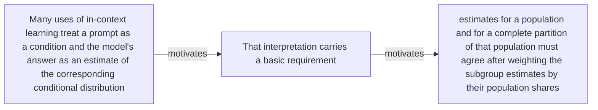

#### Python

```python
from html import escape
from pathlib import Path
from textwrap import wrap

title = "ppa_why_p1: Many uses of in-context learning treat a prompt as — problem and research-question relation"
nodes = [["n1","Many uses of in-context learning treat a prompt as a condition and the model's answer as an estimate of the corresponding conditional distribution",120,150],["n2","That interpretation carries a basic requirement",420,150],["n3","estimates for a population and for a complete partition of that population must agree after weighting the subgroup estimates by their population shares",720,150]]
edges = [["n1","n2","motivates"],["n2","n3","motivates"]]
node_by_id = {node_id: (label, x, y) for node_id, label, x, y in nodes}

parts = [
    '<svg xmlns="http://www.w3.org/2000/svg" viewBox="0 0 860 520" role="img" aria-labelledby="title desc">',
    f'<title id="title">{escape(title)}</title>',
    '<desc id="desc">The labeled relations reproduce only relationships stated in the paragraph.</desc>',
    '<rect width="860" height="520" fill="white"/>',
]
for source, target, relation in edges:
    _, x1, y1 = node_by_id[source]
    _, x2, y2 = node_by_id[target]
    parts.append(f'<line x1="{x1}" y1="{y1}" x2="{x2}" y2="{y2}" stroke="#345" stroke-width="2"/>')
    parts.append(f'<text x="{(x1+x2)/2}" y="{(y1+y2)/2-6}" text-anchor="middle" font-family="sans-serif" font-size="11">{escape(relation)}</text>')
for _, label, x, y in nodes:
    parts.append(f'<rect x="{x-125}" y="{y-58}" width="250" height="116" rx="14" fill="#eef6ff" stroke="#234"/>')
    for line_index, line in enumerate(wrap(label, width=32)):
        parts.append(f'<text x="{x}" y="{y-34+line_index*16}" text-anchor="middle" font-family="sans-serif" font-size="12">{escape(line)}</text>')
parts.append('</svg>')
Path("ppa_why_p1_treatment_a.svg").write_text("\n".join(parts), encoding="utf-8")
```

### Treatment B — ppa_partition, ppa_core — claim-to-source provenance

- Teaching purpose: Show exactly which atomic claims underwrite this paragraph and which fixed source records support each claim.
- Encoding and reading order: A bipartite graph places 2 claim nodes on the left and 2 source nodes on the right, with only the 2 claim-source edges recorded in the fixture. Claim labels include epistemic status; source labels include the exact locator.
- Evidence and limitations: This treatment explains provenance and uncertainty, not the paper's causal mechanism. Missing edges remain visibly absent and no source count is treated as confidence.
- Recommended web medium: semantic HTML/CSS claim-source table with an SVG network view; JavaScript only for keyboard-controlled source highlighting.
- Mobile, accessibility, and motion behavior: Provide real table headers and source links in the static fallback, make every edge recoverable as text, stack claim records before source records on mobile, and require no motion.

#### TikZ

```tex
\documentclass[tikz,border=5pt]{standalone}
\usepackage[T1]{fontenc}
\usepackage{tikz}
\usetikzlibrary{arrows.meta}
\begin{document}
\begin{tikzpicture}[font=\sffamily,claim/.style={draw,rounded corners,align=center,text width=5.2cm,minimum height=1.2cm},source/.style={draw,dashed,align=center,text width=5.2cm,minimum height=1.2cm},link/.style={-{Latex[length=2mm]},thin}]
\node[font=\bfseries] at (4,1.8) {ppa\_why\_p1: claim-to-source provenance};
\node[claim] (c1) at (0,0) {Each level of a valid binary conditioning tree forms a mutually exclusive and collectively exhaustive partition of the base population. [OBSERVED]};
\node[claim] (c2) at (0,-2.4) {Across the evaluated ACS, WVS, and synthetic tasks, language-model estimates frequently violate partition-based statistical self-consistency checks. [OBSERVED]};
\node[source] (s1) at (8,0) {Partition, Prompt, Aggregate v1 - partition and reconstruction method - Sections 3.1-3.4, Equations 2-3, PDF pages 5-7};
\node[source] (s2) at (8,-2.4) {Partition, Prompt, Aggregate v1 - self-consistency definitions and evaluation - Sections 5-6, Tables 1-3, PDF pages 11-18};
\draw[link] (c1) -- (s1);
\draw[link] (c2) -- (s2);
\end{tikzpicture}
\end{document}
```

#### Mermaid

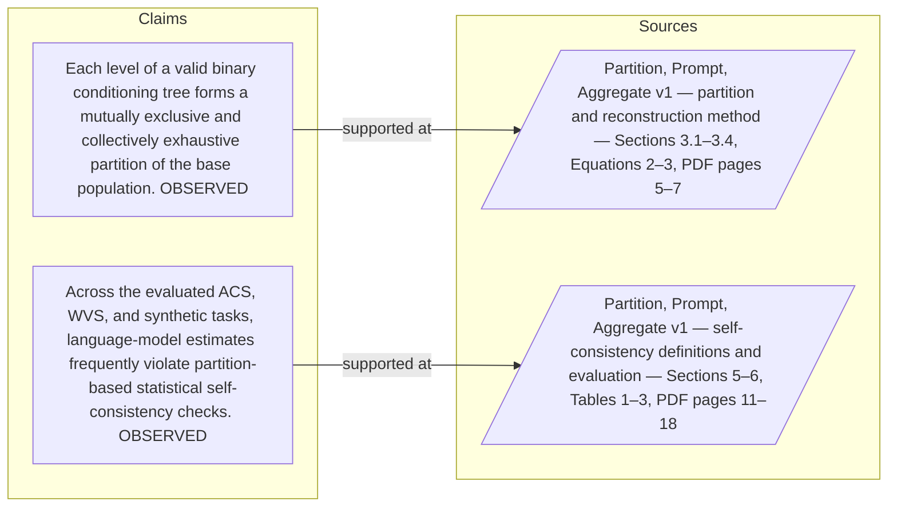

#### Python

```python
from html import escape
from pathlib import Path
from textwrap import wrap

title = "ppa_why_p1: claim-to-source provenance"
nodes = [["c1","Each level of a valid binary conditioning tree forms a mutually exclusive and collectively exhaustive partition of the base population. [OBSERVED]",190,130],["c2","Across the evaluated ACS, WVS, and synthetic tasks, language-model estimates frequently violate partition-based statistical self-consistency checks. [OBSERVED]",190,250],["s1","Partition, Prompt, Aggregate v1 — partition and reconstruction method — Sections 3.1–3.4, Equations 2–3, PDF pages 5–7",700,130],["s2","Partition, Prompt, Aggregate v1 — self-consistency definitions and evaluation — Sections 5–6, Tables 1–3, PDF pages 11–18",700,250]]
edges = [["c1","s1"],["c2","s2"]]
node_by_id = {node_id: (label, x, y) for node_id, label, x, y in nodes}
height = 440

parts = [
    f'<svg xmlns="http://www.w3.org/2000/svg" viewBox="0 0 900 {height}" role="img" aria-labelledby="title desc">',
    f'<title id="title">{escape(title)}</title>',
    '<desc id="desc">Bipartite map from verified claim records to their exact source records.</desc>',
    f'<rect width="900" height="{height}" fill="white"/>',
]
for source, target in edges:
    _, x1, y1 = node_by_id[source]
    _, x2, y2 = node_by_id[target]
    parts.append(f'<line x1="{x1+145}" y1="{y1}" x2="{x2-145}" y2="{y2}" stroke="#456" stroke-width="2"/>')
for node_id, label, x, y in nodes:
    dashed = ' stroke-dasharray="7 5"' if node_id.startswith("s") else ''
    parts.append(f'<rect x="{x-145}" y="{y-46}" width="290" height="92" rx="12" fill="#f7fbff" stroke="#234"{dashed}/>')
    for line_index, line in enumerate(wrap(label, width=38)):
        parts.append(f'<text x="{x}" y="{y-24+line_index*14}" text-anchor="middle" font-family="sans-serif" font-size="11">{escape(line)}</text>')
parts.append('</svg>')
Path("ppa_why_p1_treatment_b.svg").write_text("\n".join(parts), encoding="utf-8")
```

### Treatment C — Many uses of in-context learning treat a prompt as — supported-versus-bounded scope

- Teaching purpose: Separate what the paragraph supports from the qualification or contingency that bounds it.
- Encoding and reading order: Partition the paragraph into 3 supported statement(s) and 1 boundary or contingency statement(s). The two columns are categories, not a scale or causal path.
- Evidence and limitations: Every card is a complete paragraph clause. The boundary column makes negative and not-established language visible without weakening it.
- Recommended web medium: responsive SVG or semantic HTML/CSS; JavaScript is optional only for a meaningful state or scope toggle.
- Mobile, accessibility, and motion behavior: Preserve every exact value or scope statement as selectable text, avoid color-only distinctions, stack groups on mobile, and keep all information visible when JavaScript or motion is disabled.

#### TikZ

```tex
\documentclass[tikz,border=5pt]{standalone}
\usepackage[T1]{fontenc}
\usepackage{tikz}
\begin{document}
\begin{tikzpicture}[font=\sffamily,item/.style={draw,align=center,text width=5.5cm,minimum height=1.4cm}]
\node[font=\bfseries] at (3.5,2) {ppa\_why\_p1: Many uses of in-context learning treat a prompt as - supported-versus-bounded scope};
\node[font=\bfseries] at (0,1) {Supported statement};
\node[font=\bfseries] at (7,1) {Boundary or contingency};
\node[item] at (0,0) {Many uses of in-context learning treat a prompt as a condition and the model's answer as an estimate of the corresponding conditional distribution};
\node[item] at (0,-2) {That interpretation carries a basic requirement};
\node[item] at (0,-4) {estimates for a population and for a complete partition of that population must agree after weighting the subgroup estimates by their population shares};
\node[item] at (7,0) {estimates for a population and for a complete partition of that population must agree after weighting the subgroup estimates by their population shares};
\end{tikzpicture}
\end{document}
```

#### Mermaid

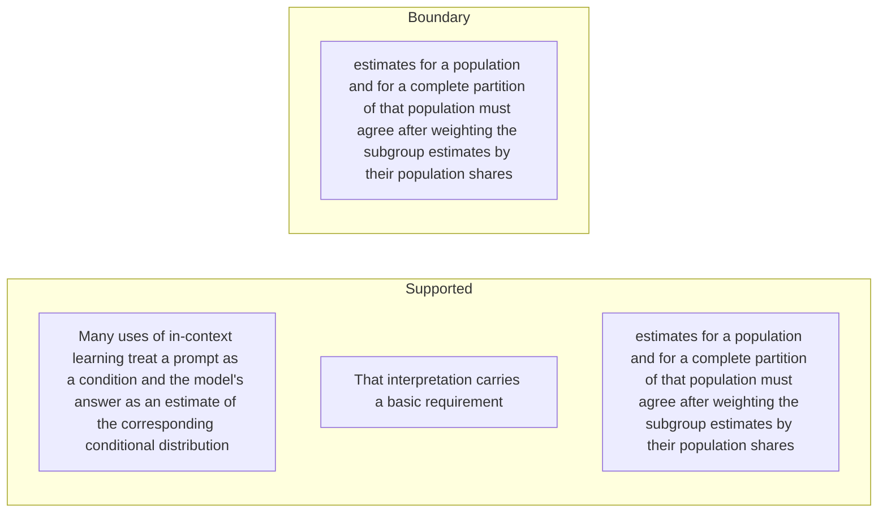

#### Python

```python
from html import escape
from pathlib import Path
from textwrap import wrap

title = "ppa_why_p1: Many uses of in-context learning treat a prompt as — supported-versus-bounded scope"
columns = {"Supported statement": ["Many uses of in-context learning treat a prompt as a condition and the model's answer as an estimate of the corresponding conditional distribution","That interpretation carries a basic requirement","estimates for a population and for a complete partition of that population must agree after weighting the subgroup estimates by their population shares"], "Boundary or contingency": ["estimates for a population and for a complete partition of that population must agree after weighting the subgroup estimates by their population shares"]}
height = 550
parts = [
    f'<svg xmlns="http://www.w3.org/2000/svg" viewBox="0 0 900 {height}" role="img" aria-labelledby="title desc">',
    f'<title id="title">{escape(title)}</title>',
    '<desc id="desc">Statements are partitioned into supported content and explicit boundaries.</desc>',
    f'<rect width="900" height="{height}" fill="white"/>',
]
for column_index, (heading, items) in enumerate(columns.items()):
    x = 240 + column_index * 430
    parts.append(f'<text x="{x}" y="70" text-anchor="middle" font-family="sans-serif" font-size="18" font-weight="700">{escape(heading)}</text>')
    for item_index, item in enumerate(items):
        y = 130 + item_index * 110
        parts.append(f'<rect x="{x-180}" y="{y-35}" width="360" height="80" rx="12" fill="#f7fbff" stroke="#234"/>')
        for line_index, line in enumerate(wrap(item, width=48)):
            parts.append(f'<text x="{x}" y="{y-12+line_index*14}" text-anchor="middle" font-family="sans-serif" font-size="11">{escape(line)}</text>')
parts.append('</svg>')
Path("ppa_why_p1_treatment_c.svg").write_text("\n".join(parts), encoding="utf-8")
```

### Implementation record

- Status: `IMPLEMENTED`
- Selected treatment: `A`
- Selection rationale: Selected the approved relationship that directly answers this paragraph's explanatory job; the shared visual uses the same evidence and complete adjacent scope recorded here.
- Delivery medium: `CSS + semantic HTML`
- Visual ID and placement: `visual_ppa_prompt_aggregation_gap` after `ppa_why_p1`; this record is served by that purpose-built figure.
- Shared paragraph scope: NONE
- Changed files: `packages/test-fixtures/explainers/partition-prompt-aggregate.json`, `apps/web/app/papers/[id]/explainer-visual.tsx`, `apps/web/app/papers/[id]/page.tsx`, and `apps/web/app/globals.css`
- Accessibility and fallback verification: Figure has a programmatic title and description, explicit alt text, equivalent fallback prose, source links, limitations, and a semantic static body; no meaning depends on motion or pointer input.
- Desktop and mobile verification: Verified in Playwright on 1440-pixel desktop and iPhone 13 mobile viewports; figures remain paragraph-adjacent, preserve reading order, and introduce no horizontal page overflow.
- Evidence deviations: `NONE`; web-native CSS and semantic HTML preserve the selected treatment's evidence, labels, topology, and stated boundaries.

## `ppa_why_p2`

- Location: `ppa_why`, paragraph 2
- Text anchor: "A model can give locally plausible answers while violating this requirement."
- Claims and sources: `ppa_partition` (OBSERVED, VERIFIED); `ppa_core` (OBSERVED, VERIFIED); `ppa_method` (Sections 3.1–3.4, Equations 2–3, PDF pages 5–7)
- Visual needed: `NO`
- Decision rationale: The paragraph's main work is the bounded statement "A model can give locally plausible answers while violating this requirement". Its qualification is explicit in prose and does not require readers to reconstruct a material process, topology, quantitative comparison, uncertainty distribution, or state change. A visual would repeat the wording, so all treatments below are optional contingencies only.
- Explanatory job: problem and research-question relation.

### Treatment A — A model can give locally plausible answers while violating — problem and research-question relation

- Teaching purpose: Optional contingency only. Answer "Why test language models with the law of total probability?" by exposing the paragraph's 3 named propositions and 2 stated reading, comparison, or qualification relations.
- Encoding and reading order: Nodes reproduce the complete labels "A model can give locally plausible answers while violating this requirement"; "Two statistically equivalent prompts can then produce incompatible estimates"; "so conclusions may depend on an arbitrary choice of prompt granularity or condition order". Edges carry the explicit relation labels "motivates", "motivates"; arrow direction is sequence only for mechanism or example prose and otherwise denotes reading order.
- Evidence and limitations: The topology is derived from this paragraph rather than a fixed pipeline. Encode only `ppa_partition`, `ppa_core` and do not turn reading-order edges into causal claims.
- Recommended web medium: responsive inline SVG with CSS; JavaScript may add optional step focus only when state order matters.
- Mobile, accessibility, and motion behavior: Keep the full node-and-relation list in DOM order, expose the relation labels in the long description, stack nodes on narrow screens, and disable focus transitions under reduced motion.

#### TikZ

```tex
\documentclass[tikz,border=5pt]{standalone}
\usepackage[T1]{fontenc}
\usepackage{tikz}
\usetikzlibrary{arrows.meta,positioning}
\begin{document}
\begin{tikzpicture}[font=\sffamily,concept/.style={draw,rounded corners,align=center,text width=3.6cm,minimum height=1.35cm},link/.style={-{Latex[length=2mm]},thick},rel/.style={fill=white,font=\scriptsize,inner sep=2pt}]
\node[font=\bfseries,align=center] at (6.1,2.0) {ppa\_why\_p2: A model can give locally plausible answers while violating - problem and research-question relation};
\node[concept] (n1) at (1.8,0) {A model can give locally plausible answers while violating this requirement};
\node[concept] (n2) at (6.1,0) {Two statistically equivalent prompts can then produce incompatible estimates};
\node[concept] (n3) at (10.4,0) {so conclusions may depend on an arbitrary choice of prompt granularity or condition order};
\draw[link] (n1) -- node[rel] {motivates} (n2);
\draw[link] (n2) -- node[rel] {motivates} (n3);
\end{tikzpicture}
\end{document}
```

#### Mermaid

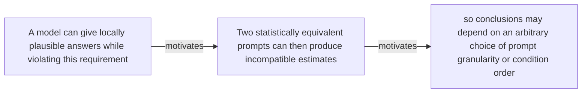

#### Python

```python
from html import escape
from pathlib import Path
from textwrap import wrap

title = "ppa_why_p2: A model can give locally plausible answers while violating — problem and research-question relation"
nodes = [["n1","A model can give locally plausible answers while violating this requirement",120,150],["n2","Two statistically equivalent prompts can then produce incompatible estimates",420,150],["n3","so conclusions may depend on an arbitrary choice of prompt granularity or condition order",720,150]]
edges = [["n1","n2","motivates"],["n2","n3","motivates"]]
node_by_id = {node_id: (label, x, y) for node_id, label, x, y in nodes}

parts = [
    '<svg xmlns="http://www.w3.org/2000/svg" viewBox="0 0 860 520" role="img" aria-labelledby="title desc">',
    f'<title id="title">{escape(title)}</title>',
    '<desc id="desc">The labeled relations reproduce only relationships stated in the paragraph.</desc>',
    '<rect width="860" height="520" fill="white"/>',
]
for source, target, relation in edges:
    _, x1, y1 = node_by_id[source]
    _, x2, y2 = node_by_id[target]
    parts.append(f'<line x1="{x1}" y1="{y1}" x2="{x2}" y2="{y2}" stroke="#345" stroke-width="2"/>')
    parts.append(f'<text x="{(x1+x2)/2}" y="{(y1+y2)/2-6}" text-anchor="middle" font-family="sans-serif" font-size="11">{escape(relation)}</text>')
for _, label, x, y in nodes:
    parts.append(f'<rect x="{x-125}" y="{y-58}" width="250" height="116" rx="14" fill="#eef6ff" stroke="#234"/>')
    for line_index, line in enumerate(wrap(label, width=32)):
        parts.append(f'<text x="{x}" y="{y-34+line_index*16}" text-anchor="middle" font-family="sans-serif" font-size="12">{escape(line)}</text>')
parts.append('</svg>')
Path("ppa_why_p2_treatment_a.svg").write_text("\n".join(parts), encoding="utf-8")
```

### Treatment B — ppa_partition, ppa_core — claim-to-source provenance

- Teaching purpose: Optional contingency only. Show exactly which atomic claims underwrite this paragraph and which fixed source records support each claim.
- Encoding and reading order: A bipartite graph places 2 claim nodes on the left and 2 source nodes on the right, with only the 2 claim-source edges recorded in the fixture. Claim labels include epistemic status; source labels include the exact locator.
- Evidence and limitations: This treatment explains provenance and uncertainty, not the paper's causal mechanism. Missing edges remain visibly absent and no source count is treated as confidence.
- Recommended web medium: semantic HTML/CSS claim-source table with an SVG network view; JavaScript only for keyboard-controlled source highlighting.
- Mobile, accessibility, and motion behavior: Provide real table headers and source links in the static fallback, make every edge recoverable as text, stack claim records before source records on mobile, and require no motion.

#### TikZ

```tex
\documentclass[tikz,border=5pt]{standalone}
\usepackage[T1]{fontenc}
\usepackage{tikz}
\usetikzlibrary{arrows.meta}
\begin{document}
\begin{tikzpicture}[font=\sffamily,claim/.style={draw,rounded corners,align=center,text width=5.2cm,minimum height=1.2cm},source/.style={draw,dashed,align=center,text width=5.2cm,minimum height=1.2cm},link/.style={-{Latex[length=2mm]},thin}]
\node[font=\bfseries] at (4,1.8) {ppa\_why\_p2: claim-to-source provenance};
\node[claim] (c1) at (0,0) {Each level of a valid binary conditioning tree forms a mutually exclusive and collectively exhaustive partition of the base population. [OBSERVED]};
\node[claim] (c2) at (0,-2.4) {Across the evaluated ACS, WVS, and synthetic tasks, language-model estimates frequently violate partition-based statistical self-consistency checks. [OBSERVED]};
\node[source] (s1) at (8,0) {Partition, Prompt, Aggregate v1 - partition and reconstruction method - Sections 3.1-3.4, Equations 2-3, PDF pages 5-7};
\node[source] (s2) at (8,-2.4) {Partition, Prompt, Aggregate v1 - self-consistency definitions and evaluation - Sections 5-6, Tables 1-3, PDF pages 11-18};
\draw[link] (c1) -- (s1);
\draw[link] (c2) -- (s2);
\end{tikzpicture}
\end{document}
```

#### Mermaid


#### Python

```python
from html import escape
from pathlib import Path
from textwrap import wrap

title = "ppa_why_p2: claim-to-source provenance"
nodes = [["c1","Each level of a valid binary conditioning tree forms a mutually exclusive and collectively exhaustive partition of the base population. [OBSERVED]",190,130],["c2","Across the evaluated ACS, WVS, and synthetic tasks, language-model estimates frequently violate partition-based statistical self-consistency checks. [OBSERVED]",190,250],["s1","Partition, Prompt, Aggregate v1 — partition and reconstruction method — Sections 3.1–3.4, Equations 2–3, PDF pages 5–7",700,130],["s2","Partition, Prompt, Aggregate v1 — self-consistency definitions and evaluation — Sections 5–6, Tables 1–3, PDF pages 11–18",700,250]]
edges = [["c1","s1"],["c2","s2"]]
node_by_id = {node_id: (label, x, y) for node_id, label, x, y in nodes}
height = 440

parts = [
    f'<svg xmlns="http://www.w3.org/2000/svg" viewBox="0 0 900 {height}" role="img" aria-labelledby="title desc">',
    f'<title id="title">{escape(title)}</title>',
    '<desc id="desc">Bipartite map from verified claim records to their exact source records.</desc>',
    f'<rect width="900" height="{height}" fill="white"/>',
]
for source, target in edges:
    _, x1, y1 = node_by_id[source]
    _, x2, y2 = node_by_id[target]
    parts.append(f'<line x1="{x1+145}" y1="{y1}" x2="{x2-145}" y2="{y2}" stroke="#456" stroke-width="2"/>')
for node_id, label, x, y in nodes:
    dashed = ' stroke-dasharray="7 5"' if node_id.startswith("s") else ''
    parts.append(f'<rect x="{x-145}" y="{y-46}" width="290" height="92" rx="12" fill="#f7fbff" stroke="#234"{dashed}/>')
    for line_index, line in enumerate(wrap(label, width=38)):
        parts.append(f'<text x="{x}" y="{y-24+line_index*14}" text-anchor="middle" font-family="sans-serif" font-size="11">{escape(line)}</text>')
parts.append('</svg>')
Path("ppa_why_p2_treatment_b.svg").write_text("\n".join(parts), encoding="utf-8")
```

### Treatment C — A model can give locally plausible answers while violating — supported-versus-bounded scope

- Teaching purpose: Optional contingency only. Separate what the paragraph supports from the qualification or contingency that bounds it.
- Encoding and reading order: Partition the paragraph into 3 supported statement(s) and 1 boundary or contingency statement(s). The two columns are categories, not a scale or causal path.
- Evidence and limitations: Every card is a complete paragraph clause. The boundary column makes negative and not-established language visible without weakening it.
- Recommended web medium: responsive SVG or semantic HTML/CSS; JavaScript is optional only for a meaningful state or scope toggle.
- Mobile, accessibility, and motion behavior: Preserve every exact value or scope statement as selectable text, avoid color-only distinctions, stack groups on mobile, and keep all information visible when JavaScript or motion is disabled.

#### TikZ

```tex
\documentclass[tikz,border=5pt]{standalone}
\usepackage[T1]{fontenc}
\usepackage{tikz}
\begin{document}
\begin{tikzpicture}[font=\sffamily,item/.style={draw,align=center,text width=5.5cm,minimum height=1.4cm}]
\node[font=\bfseries] at (3.5,2) {ppa\_why\_p2: A model can give locally plausible answers while violating - supported-versus-bounded scope};
\node[font=\bfseries] at (0,1) {Supported statement};
\node[font=\bfseries] at (7,1) {Boundary or contingency};
\node[item] at (0,0) {A model can give locally plausible answers while violating this requirement};
\node[item] at (0,-2) {Two statistically equivalent prompts can then produce incompatible estimates};
\node[item] at (0,-4) {so conclusions may depend on an arbitrary choice of prompt granularity or condition order};
\node[item] at (7,0) {so conclusions may depend on an arbitrary choice of prompt granularity or condition order};
\end{tikzpicture}
\end{document}
```

#### Mermaid

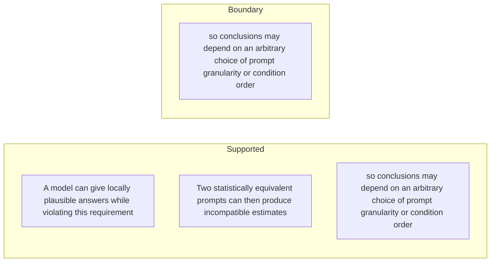

#### Python

```python
from html import escape
from pathlib import Path
from textwrap import wrap

title = "ppa_why_p2: A model can give locally plausible answers while violating — supported-versus-bounded scope"
columns = {"Supported statement": ["A model can give locally plausible answers while violating this requirement","Two statistically equivalent prompts can then produce incompatible estimates","so conclusions may depend on an arbitrary choice of prompt granularity or condition order"], "Boundary or contingency": ["so conclusions may depend on an arbitrary choice of prompt granularity or condition order"]}
height = 550
parts = [
    f'<svg xmlns="http://www.w3.org/2000/svg" viewBox="0 0 900 {height}" role="img" aria-labelledby="title desc">',
    f'<title id="title">{escape(title)}</title>',
    '<desc id="desc">Statements are partitioned into supported content and explicit boundaries.</desc>',
    f'<rect width="900" height="{height}" fill="white"/>',
]
for column_index, (heading, items) in enumerate(columns.items()):
    x = 240 + column_index * 430
    parts.append(f'<text x="{x}" y="70" text-anchor="middle" font-family="sans-serif" font-size="18" font-weight="700">{escape(heading)}</text>')
    for item_index, item in enumerate(items):
        y = 130 + item_index * 110
        parts.append(f'<rect x="{x-180}" y="{y-35}" width="360" height="80" rx="12" fill="#f7fbff" stroke="#234"/>')
        for line_index, line in enumerate(wrap(item, width=48)):
            parts.append(f'<text x="{x}" y="{y-12+line_index*14}" text-anchor="middle" font-family="sans-serif" font-size="11">{escape(line)}</text>')
parts.append('</svg>')
Path("ppa_why_p2_treatment_c.svg").write_text("\n".join(parts), encoding="utf-8")
```

### Implementation record

- Status: `NOT_NEEDED`
- Selected treatment: `NONE`
- Selection rationale: The engineer marked this paragraph prose-only, so the implementation intentionally leaves `ppa_why_p2` without a figure.
- Delivery medium: `NONE`
- Visual ID and placement: `NONE`; prose remains at `#ppa_why_p2`.
- Shared paragraph scope: `NONE`
- Changed files: `NONE`
- Accessibility and fallback verification: The paragraph remains semantic text and does not rely on visual or motion-only information.
- Desktop and mobile verification: Verified in Playwright on desktop and mobile; no figure is attached to this prose-only paragraph.
- Evidence deviations: `NONE`

## `ppa_change_p1`

- Location: `ppa_change`, paragraph 1
- Text anchor: "The framework separates alignment from self-consistency."
- Claims and sources: `ppa_reconstruction` (OBSERVED, VERIFIED); `ppa_macro` (OBSERVED, VERIFIED); `ppa_method` (Sections 3.1–3.4, Equations 2–3, PDF pages 5–7); `ppa_macro_results` (Section 4, Figures 3–5, PDF pages 7–11)
- Visual needed: `YES`
- Decision rationale: Removing a visual would require readers to retain the material relation between "The framework separates alignment from self-consistency" and "so it can be measured even when a trustworthy target distribution is unavailable" while also tracking 4 source-bounded propositions. The paragraph contains a real changed-versus-preserved relation; the visual must preserve its stated conditions and must not add causal or proportional meaning.
- Explanatory job: changed-versus-preserved relation.

### Treatment A — The framework separates alignment from self-consistency — changed-versus-preserved relation

- Teaching purpose: Answer "What does this framework add to ordinary accuracy evaluation?" by exposing the paragraph's 4 named propositions and 3 stated reading, comparison, or qualification relations.
- Encoding and reading order: Nodes reproduce the complete labels "The framework separates alignment from self-consistency"; "Alignment asks whether an estimate matches external reference data"; "Self-consistency asks whether the model's own estimates obey probability identities"; "so it can be measured even when a trustworthy target distribution is unavailable". Edges carry the explicit relation labels "changes into", "changes into", "changes into"; arrow direction is sequence only for mechanism or example prose and otherwise denotes reading order.
- Evidence and limitations: The topology is derived from this paragraph rather than a fixed pipeline. Encode only `ppa_reconstruction`, `ppa_macro` and do not turn reading-order edges into causal claims.
- Recommended web medium: responsive inline SVG with CSS; JavaScript may add optional step focus only when state order matters.
- Mobile, accessibility, and motion behavior: Keep the full node-and-relation list in DOM order, expose the relation labels in the long description, stack nodes on narrow screens, and disable focus transitions under reduced motion.

#### TikZ

```tex
\documentclass[tikz,border=5pt]{standalone}
\usepackage[T1]{fontenc}
\usepackage{tikz}
\usetikzlibrary{arrows.meta,positioning}
\begin{document}
\begin{tikzpicture}[font=\sffamily,concept/.style={draw,rounded corners,align=center,text width=3.6cm,minimum height=1.35cm},link/.style={-{Latex[length=2mm]},thick},rel/.style={fill=white,font=\scriptsize,inner sep=2pt}]
\node[font=\bfseries,align=center] at (6.1,2.0) {ppa\_change\_p1: The framework separates alignment from self-consistency - changed-versus-preserved relation};
\node[concept] (n1) at (1.8,0) {The framework separates alignment from self-consistency};
\node[concept] (n2) at (6.1,0) {Alignment asks whether an estimate matches external reference data};
\node[concept] (n3) at (10.4,0) {Self-consistency asks whether the model's own estimates obey probability identities};
\node[concept] (n4) at (1.8,-3.2) {so it can be measured even when a trustworthy target distribution is unavailable};
\draw[link] (n1) -- node[rel] {changes into} (n2);
\draw[link] (n2) -- node[rel] {changes into} (n3);
\draw[link] (n3) -- node[rel] {changes into} (n4);
\end{tikzpicture}
\end{document}
```

#### Mermaid

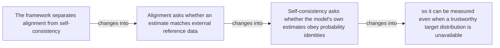

#### Python

```python
from html import escape
from pathlib import Path
from textwrap import wrap

title = "ppa_change_p1: The framework separates alignment from self-consistency — changed-versus-preserved relation"
nodes = [["n1","The framework separates alignment from self-consistency",120,150],["n2","Alignment asks whether an estimate matches external reference data",420,150],["n3","Self-consistency asks whether the model's own estimates obey probability identities",720,150],["n4","so it can be measured even when a trustworthy target distribution is unavailable",120,340]]
edges = [["n1","n2","changes into"],["n2","n3","changes into"],["n3","n4","changes into"]]
node_by_id = {node_id: (label, x, y) for node_id, label, x, y in nodes}

parts = [
    '<svg xmlns="http://www.w3.org/2000/svg" viewBox="0 0 860 520" role="img" aria-labelledby="title desc">',
    f'<title id="title">{escape(title)}</title>',
    '<desc id="desc">The labeled relations reproduce only relationships stated in the paragraph.</desc>',
    '<rect width="860" height="520" fill="white"/>',
]
for source, target, relation in edges:
    _, x1, y1 = node_by_id[source]
    _, x2, y2 = node_by_id[target]
    parts.append(f'<line x1="{x1}" y1="{y1}" x2="{x2}" y2="{y2}" stroke="#345" stroke-width="2"/>')
    parts.append(f'<text x="{(x1+x2)/2}" y="{(y1+y2)/2-6}" text-anchor="middle" font-family="sans-serif" font-size="11">{escape(relation)}</text>')
for _, label, x, y in nodes:
    parts.append(f'<rect x="{x-125}" y="{y-58}" width="250" height="116" rx="14" fill="#eef6ff" stroke="#234"/>')
    for line_index, line in enumerate(wrap(label, width=32)):
        parts.append(f'<text x="{x}" y="{y-34+line_index*16}" text-anchor="middle" font-family="sans-serif" font-size="12">{escape(line)}</text>')
parts.append('</svg>')
Path("ppa_change_p1_treatment_a.svg").write_text("\n".join(parts), encoding="utf-8")
```

### Treatment B — ppa_reconstruction, ppa_macro — claim-to-source provenance

- Teaching purpose: Show exactly which atomic claims underwrite this paragraph and which fixed source records support each claim.
- Encoding and reading order: A bipartite graph places 2 claim nodes on the left and 2 source nodes on the right, with only the 2 claim-source edges recorded in the fixture. Claim labels include epistemic status; source labels include the exact locator.
- Evidence and limitations: This treatment explains provenance and uncertainty, not the paper's causal mechanism. Missing edges remain visibly absent and no source count is treated as confidence.
- Recommended web medium: semantic HTML/CSS claim-source table with an SVG network view; JavaScript only for keyboard-controlled source highlighting.
- Mobile, accessibility, and motion behavior: Provide real table headers and source links in the static fallback, make every edge recoverable as text, stack claim records before source records on mobile, and require no motion.

#### TikZ

```tex
\documentclass[tikz,border=5pt]{standalone}
\usepackage[T1]{fontenc}
\usepackage{tikz}
\usetikzlibrary{arrows.meta}
\begin{document}
\begin{tikzpicture}[font=\sffamily,claim/.style={draw,rounded corners,align=center,text width=5.2cm,minimum height=1.2cm},source/.style={draw,dashed,align=center,text width=5.2cm,minimum height=1.2cm},link/.style={-{Latex[length=2mm]},thin}]
\node[font=\bfseries] at (4,1.8) {ppa\_change\_p1: claim-to-source provenance};
\node[claim] (c1) at (0,0) {The method reconstructs a population estimate by weighting subgroup conditional estimates by their elicited subgroup priors and summing them. [OBSERVED]};
\node[claim] (c2) at (0,-2.4) {In the ACS income experiments, aggregates reconstructed from subgroup estimates are often better aligned with survey data than direct population-level estimates. [OBSERVED]};
\node[source] (s1) at (8,0) {Partition, Prompt, Aggregate v1 - partition and reconstruction method - Sections 3.1-3.4, Equations 2-3, PDF pages 5-7};
\node[source] (s2) at (8,-2.4) {Partition, Prompt, Aggregate v1 - macro fallacy and prompting results - Section 4, Figures 3-5, PDF pages 7-11};
\draw[link] (c1) -- (s1);
\draw[link] (c2) -- (s2);
\end{tikzpicture}
\end{document}
```

#### Mermaid

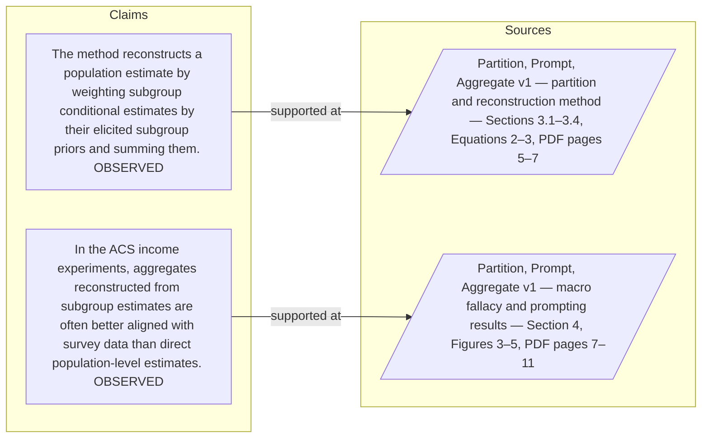

#### Python

```python
from html import escape
from pathlib import Path
from textwrap import wrap

title = "ppa_change_p1: claim-to-source provenance"
nodes = [["c1","The method reconstructs a population estimate by weighting subgroup conditional estimates by their elicited subgroup priors and summing them. [OBSERVED]",190,130],["c2","In the ACS income experiments, aggregates reconstructed from subgroup estimates are often better aligned with survey data than direct population-level estimates. [OBSERVED]",190,250],["s1","Partition, Prompt, Aggregate v1 — partition and reconstruction method — Sections 3.1–3.4, Equations 2–3, PDF pages 5–7",700,130],["s2","Partition, Prompt, Aggregate v1 — macro fallacy and prompting results — Section 4, Figures 3–5, PDF pages 7–11",700,250]]
edges = [["c1","s1"],["c2","s2"]]
node_by_id = {node_id: (label, x, y) for node_id, label, x, y in nodes}
height = 440

parts = [
    f'<svg xmlns="http://www.w3.org/2000/svg" viewBox="0 0 900 {height}" role="img" aria-labelledby="title desc">',
    f'<title id="title">{escape(title)}</title>',
    '<desc id="desc">Bipartite map from verified claim records to their exact source records.</desc>',
    f'<rect width="900" height="{height}" fill="white"/>',
]
for source, target in edges:
    _, x1, y1 = node_by_id[source]
    _, x2, y2 = node_by_id[target]
    parts.append(f'<line x1="{x1+145}" y1="{y1}" x2="{x2-145}" y2="{y2}" stroke="#456" stroke-width="2"/>')
for node_id, label, x, y in nodes:
    dashed = ' stroke-dasharray="7 5"' if node_id.startswith("s") else ''
    parts.append(f'<rect x="{x-145}" y="{y-46}" width="290" height="92" rx="12" fill="#f7fbff" stroke="#234"{dashed}/>')
    for line_index, line in enumerate(wrap(label, width=38)):
        parts.append(f'<text x="{x}" y="{y-24+line_index*14}" text-anchor="middle" font-family="sans-serif" font-size="11">{escape(line)}</text>')
parts.append('</svg>')
Path("ppa_change_p1_treatment_b.svg").write_text("\n".join(parts), encoding="utf-8")
```

### Treatment C — The framework separates alignment from self-consistency — supported-versus-bounded scope

- Teaching purpose: Separate what the paragraph supports from the qualification or contingency that bounds it.
- Encoding and reading order: Partition the paragraph into 4 supported statement(s) and 1 boundary or contingency statement(s). The two columns are categories, not a scale or causal path.
- Evidence and limitations: Every card is a complete paragraph clause. The boundary column makes negative and not-established language visible without weakening it.
- Recommended web medium: responsive SVG or semantic HTML/CSS; JavaScript is optional only for a meaningful state or scope toggle.
- Mobile, accessibility, and motion behavior: Preserve every exact value or scope statement as selectable text, avoid color-only distinctions, stack groups on mobile, and keep all information visible when JavaScript or motion is disabled.

#### TikZ

```tex
\documentclass[tikz,border=5pt]{standalone}
\usepackage[T1]{fontenc}
\usepackage{tikz}
\begin{document}
\begin{tikzpicture}[font=\sffamily,item/.style={draw,align=center,text width=5.5cm,minimum height=1.4cm}]
\node[font=\bfseries] at (3.5,2) {ppa\_change\_p1: The framework separates alignment from self-consistency - supported-versus-bounded scope};
\node[font=\bfseries] at (0,1) {Supported statement};
\node[font=\bfseries] at (7,1) {Boundary or contingency};
\node[item] at (0,0) {The framework separates alignment from self-consistency};
\node[item] at (0,-2) {Alignment asks whether an estimate matches external reference data};
\node[item] at (0,-4) {Self-consistency asks whether the model's own estimates obey probability identities};
\node[item] at (0,-6) {so it can be measured even when a trustworthy target distribution is unavailable};
\node[item] at (7,0) {so it can be measured even when a trustworthy target distribution is unavailable};
\end{tikzpicture}
\end{document}
```

#### Mermaid

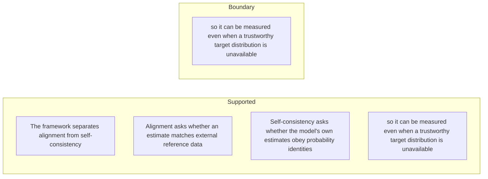

#### Python

```python
from html import escape
from pathlib import Path
from textwrap import wrap

title = "ppa_change_p1: The framework separates alignment from self-consistency — supported-versus-bounded scope"
columns = {"Supported statement": ["The framework separates alignment from self-consistency","Alignment asks whether an estimate matches external reference data","Self-consistency asks whether the model's own estimates obey probability identities","so it can be measured even when a trustworthy target distribution is unavailable"], "Boundary or contingency": ["so it can be measured even when a trustworthy target distribution is unavailable"]}
height = 660
parts = [
    f'<svg xmlns="http://www.w3.org/2000/svg" viewBox="0 0 900 {height}" role="img" aria-labelledby="title desc">',
    f'<title id="title">{escape(title)}</title>',
    '<desc id="desc">Statements are partitioned into supported content and explicit boundaries.</desc>',
    f'<rect width="900" height="{height}" fill="white"/>',
]
for column_index, (heading, items) in enumerate(columns.items()):
    x = 240 + column_index * 430
    parts.append(f'<text x="{x}" y="70" text-anchor="middle" font-family="sans-serif" font-size="18" font-weight="700">{escape(heading)}</text>')
    for item_index, item in enumerate(items):
        y = 130 + item_index * 110
        parts.append(f'<rect x="{x-180}" y="{y-35}" width="360" height="80" rx="12" fill="#f7fbff" stroke="#234"/>')
        for line_index, line in enumerate(wrap(item, width=48)):
            parts.append(f'<text x="{x}" y="{y-12+line_index*14}" text-anchor="middle" font-family="sans-serif" font-size="11">{escape(line)}</text>')
parts.append('</svg>')
Path("ppa_change_p1_treatment_c.svg").write_text("\n".join(parts), encoding="utf-8")
```

### Implementation record

- Status: `IMPLEMENTED`
- Selected treatment: `A`
- Selection rationale: Selected the approved relationship that directly answers this paragraph's explanatory job; the shared visual uses the same evidence and complete adjacent scope recorded here.
- Delivery medium: `CSS + semantic HTML`
- Visual ID and placement: `visual_ppa_consistency_checks` after `ppa_change_p2`; this record is served by that purpose-built figure.
- Shared paragraph scope: `ppa_change_p1`, `ppa_change_p2`
- Changed files: `packages/test-fixtures/explainers/partition-prompt-aggregate.json`, `apps/web/app/papers/[id]/explainer-visual.tsx`, `apps/web/app/papers/[id]/page.tsx`, and `apps/web/app/globals.css`
- Accessibility and fallback verification: Figure has a programmatic title and description, explicit alt text, equivalent fallback prose, source links, limitations, and a semantic static body; no meaning depends on motion or pointer input.
- Desktop and mobile verification: Verified in Playwright on 1440-pixel desktop and iPhone 13 mobile viewports; figures remain paragraph-adjacent, preserve reading order, and introduce no horizontal page overflow.
- Evidence deviations: `NONE`; web-native CSS and semantic HTML preserve the selected treatment's evidence, labels, topology, and stated boundaries.

## `ppa_change_p2`

- Location: `ppa_change`, paragraph 2
- Text anchor: "The paper turns this idea into split-consistency and order-consistency scores."
- Claims and sources: `ppa_reconstruction` (OBSERVED, VERIFIED); `ppa_macro` (OBSERVED, VERIFIED); `ppa_method` (Sections 3.1–3.4, Equations 2–3, PDF pages 5–7); `ppa_macro_results` (Section 4, Figures 3–5, PDF pages 7–11)
- Visual needed: `YES`
- Decision rationale: Removing a visual would require readers to retain the material relation between "The paper turns this idea into split-consistency and order-consistency scores" and "in the ACS study, direct population prompting is often less accurate than explicitly eliciting and recombining finer subgroup estimates" while also tracking 3 source-bounded propositions. The paragraph contains a real changed-versus-preserved relation; the visual must preserve its stated conditions and must not add causal or proportional meaning.
- Explanatory job: changed-versus-preserved relation.

### Treatment A — The paper turns this idea into split-consistency and order-consistency — changed-versus-preserved relation

- Teaching purpose: Answer "What does this framework add to ordinary accuracy evaluation?" by exposing the paragraph's 3 named propositions and 2 stated reading, comparison, or qualification relations.
- Encoding and reading order: Nodes reproduce the complete labels "The paper turns this idea into split-consistency and order-consistency scores"; "It also identifies the macro fallacy"; "in the ACS study, direct population prompting is often less accurate than explicitly eliciting and recombining finer subgroup estimates". Edges carry the explicit relation labels "changes into", "changes into"; arrow direction is sequence only for mechanism or example prose and otherwise denotes reading order.
- Evidence and limitations: The topology is derived from this paragraph rather than a fixed pipeline. Encode only `ppa_reconstruction`, `ppa_macro` and do not turn reading-order edges into causal claims.
- Recommended web medium: responsive inline SVG with CSS; JavaScript may add optional step focus only when state order matters.
- Mobile, accessibility, and motion behavior: Keep the full node-and-relation list in DOM order, expose the relation labels in the long description, stack nodes on narrow screens, and disable focus transitions under reduced motion.

#### TikZ

```tex
\documentclass[tikz,border=5pt]{standalone}
\usepackage[T1]{fontenc}
\usepackage{tikz}
\usetikzlibrary{arrows.meta,positioning}
\begin{document}
\begin{tikzpicture}[font=\sffamily,concept/.style={draw,rounded corners,align=center,text width=3.6cm,minimum height=1.35cm},link/.style={-{Latex[length=2mm]},thick},rel/.style={fill=white,font=\scriptsize,inner sep=2pt}]
\node[font=\bfseries,align=center] at (6.1,2.0) {ppa\_change\_p2: The paper turns this idea into split-consistency and order-consistency - changed-versus-preserved relation};
\node[concept] (n1) at (1.8,0) {The paper turns this idea into split-consistency and order-consistency scores};
\node[concept] (n2) at (6.1,0) {It also identifies the macro fallacy};
\node[concept] (n3) at (10.4,0) {in the ACS study, direct population prompting is often less accurate than explicitly eliciting and recombining finer subgroup estimates};
\draw[link] (n1) -- node[rel] {changes into} (n2);
\draw[link] (n2) -- node[rel] {changes into} (n3);
\end{tikzpicture}
\end{document}
```

#### Mermaid

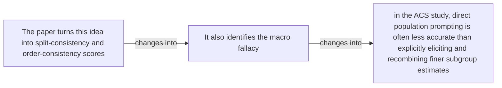

#### Python

```python
from html import escape
from pathlib import Path
from textwrap import wrap

title = "ppa_change_p2: The paper turns this idea into split-consistency and order-consistency — changed-versus-preserved relation"
nodes = [["n1","The paper turns this idea into split-consistency and order-consistency scores",120,150],["n2","It also identifies the macro fallacy",420,150],["n3","in the ACS study, direct population prompting is often less accurate than explicitly eliciting and recombining finer subgroup estimates",720,150]]
edges = [["n1","n2","changes into"],["n2","n3","changes into"]]
node_by_id = {node_id: (label, x, y) for node_id, label, x, y in nodes}

parts = [
    '<svg xmlns="http://www.w3.org/2000/svg" viewBox="0 0 860 520" role="img" aria-labelledby="title desc">',
    f'<title id="title">{escape(title)}</title>',
    '<desc id="desc">The labeled relations reproduce only relationships stated in the paragraph.</desc>',
    '<rect width="860" height="520" fill="white"/>',
]
for source, target, relation in edges:
    _, x1, y1 = node_by_id[source]
    _, x2, y2 = node_by_id[target]
    parts.append(f'<line x1="{x1}" y1="{y1}" x2="{x2}" y2="{y2}" stroke="#345" stroke-width="2"/>')
    parts.append(f'<text x="{(x1+x2)/2}" y="{(y1+y2)/2-6}" text-anchor="middle" font-family="sans-serif" font-size="11">{escape(relation)}</text>')
for _, label, x, y in nodes:
    parts.append(f'<rect x="{x-125}" y="{y-58}" width="250" height="116" rx="14" fill="#eef6ff" stroke="#234"/>')
    for line_index, line in enumerate(wrap(label, width=32)):
        parts.append(f'<text x="{x}" y="{y-34+line_index*16}" text-anchor="middle" font-family="sans-serif" font-size="12">{escape(line)}</text>')
parts.append('</svg>')
Path("ppa_change_p2_treatment_a.svg").write_text("\n".join(parts), encoding="utf-8")
```

### Treatment B — ppa_reconstruction, ppa_macro — claim-to-source provenance

- Teaching purpose: Show exactly which atomic claims underwrite this paragraph and which fixed source records support each claim.
- Encoding and reading order: A bipartite graph places 2 claim nodes on the left and 2 source nodes on the right, with only the 2 claim-source edges recorded in the fixture. Claim labels include epistemic status; source labels include the exact locator.
- Evidence and limitations: This treatment explains provenance and uncertainty, not the paper's causal mechanism. Missing edges remain visibly absent and no source count is treated as confidence.
- Recommended web medium: semantic HTML/CSS claim-source table with an SVG network view; JavaScript only for keyboard-controlled source highlighting.
- Mobile, accessibility, and motion behavior: Provide real table headers and source links in the static fallback, make every edge recoverable as text, stack claim records before source records on mobile, and require no motion.

#### TikZ

```tex
\documentclass[tikz,border=5pt]{standalone}
\usepackage[T1]{fontenc}
\usepackage{tikz}
\usetikzlibrary{arrows.meta}
\begin{document}
\begin{tikzpicture}[font=\sffamily,claim/.style={draw,rounded corners,align=center,text width=5.2cm,minimum height=1.2cm},source/.style={draw,dashed,align=center,text width=5.2cm,minimum height=1.2cm},link/.style={-{Latex[length=2mm]},thin}]
\node[font=\bfseries] at (4,1.8) {ppa\_change\_p2: claim-to-source provenance};
\node[claim] (c1) at (0,0) {The method reconstructs a population estimate by weighting subgroup conditional estimates by their elicited subgroup priors and summing them. [OBSERVED]};
\node[claim] (c2) at (0,-2.4) {In the ACS income experiments, aggregates reconstructed from subgroup estimates are often better aligned with survey data than direct population-level estimates. [OBSERVED]};
\node[source] (s1) at (8,0) {Partition, Prompt, Aggregate v1 - partition and reconstruction method - Sections 3.1-3.4, Equations 2-3, PDF pages 5-7};
\node[source] (s2) at (8,-2.4) {Partition, Prompt, Aggregate v1 - macro fallacy and prompting results - Section 4, Figures 3-5, PDF pages 7-11};
\draw[link] (c1) -- (s1);
\draw[link] (c2) -- (s2);
\end{tikzpicture}
\end{document}
```

#### Mermaid


#### Python

```python
from html import escape
from pathlib import Path
from textwrap import wrap

title = "ppa_change_p2: claim-to-source provenance"
nodes = [["c1","The method reconstructs a population estimate by weighting subgroup conditional estimates by their elicited subgroup priors and summing them. [OBSERVED]",190,130],["c2","In the ACS income experiments, aggregates reconstructed from subgroup estimates are often better aligned with survey data than direct population-level estimates. [OBSERVED]",190,250],["s1","Partition, Prompt, Aggregate v1 — partition and reconstruction method — Sections 3.1–3.4, Equations 2–3, PDF pages 5–7",700,130],["s2","Partition, Prompt, Aggregate v1 — macro fallacy and prompting results — Section 4, Figures 3–5, PDF pages 7–11",700,250]]
edges = [["c1","s1"],["c2","s2"]]
node_by_id = {node_id: (label, x, y) for node_id, label, x, y in nodes}
height = 440

parts = [
    f'<svg xmlns="http://www.w3.org/2000/svg" viewBox="0 0 900 {height}" role="img" aria-labelledby="title desc">',
    f'<title id="title">{escape(title)}</title>',
    '<desc id="desc">Bipartite map from verified claim records to their exact source records.</desc>',
    f'<rect width="900" height="{height}" fill="white"/>',
]
for source, target in edges:
    _, x1, y1 = node_by_id[source]
    _, x2, y2 = node_by_id[target]
    parts.append(f'<line x1="{x1+145}" y1="{y1}" x2="{x2-145}" y2="{y2}" stroke="#456" stroke-width="2"/>')
for node_id, label, x, y in nodes:
    dashed = ' stroke-dasharray="7 5"' if node_id.startswith("s") else ''
    parts.append(f'<rect x="{x-145}" y="{y-46}" width="290" height="92" rx="12" fill="#f7fbff" stroke="#234"{dashed}/>')
    for line_index, line in enumerate(wrap(label, width=38)):
        parts.append(f'<text x="{x}" y="{y-24+line_index*14}" text-anchor="middle" font-family="sans-serif" font-size="11">{escape(line)}</text>')
parts.append('</svg>')
Path("ppa_change_p2_treatment_b.svg").write_text("\n".join(parts), encoding="utf-8")
```

### Treatment C — The paper turns this idea into split-consistency and order-consistency — supported-versus-bounded scope

- Teaching purpose: Separate what the paragraph supports from the qualification or contingency that bounds it.
- Encoding and reading order: Partition the paragraph into 3 supported statement(s) and 1 boundary or contingency statement(s). The two columns are categories, not a scale or causal path.
- Evidence and limitations: Every card is a complete paragraph clause. The boundary column makes negative and not-established language visible without weakening it.
- Recommended web medium: responsive SVG or semantic HTML/CSS; JavaScript is optional only for a meaningful state or scope toggle.
- Mobile, accessibility, and motion behavior: Preserve every exact value or scope statement as selectable text, avoid color-only distinctions, stack groups on mobile, and keep all information visible when JavaScript or motion is disabled.

#### TikZ

```tex
\documentclass[tikz,border=5pt]{standalone}
\usepackage[T1]{fontenc}
\usepackage{tikz}
\begin{document}
\begin{tikzpicture}[font=\sffamily,item/.style={draw,align=center,text width=5.5cm,minimum height=1.4cm}]
\node[font=\bfseries] at (3.5,2) {ppa\_change\_p2: The paper turns this idea into split-consistency and order-consistency - supported-versus-bounded scope};
\node[font=\bfseries] at (0,1) {Supported statement};
\node[font=\bfseries] at (7,1) {Boundary or contingency};
\node[item] at (0,0) {The paper turns this idea into split-consistency and order-consistency scores};
\node[item] at (0,-2) {It also identifies the macro fallacy};
\node[item] at (0,-4) {in the ACS study, direct population prompting is often less accurate than explicitly eliciting and recombining finer subgroup estimates};
\node[item] at (7,0) {in the ACS study, direct population prompting is often less accurate than explicitly eliciting and recombining finer subgroup estimates};
\end{tikzpicture}
\end{document}
```

#### Mermaid

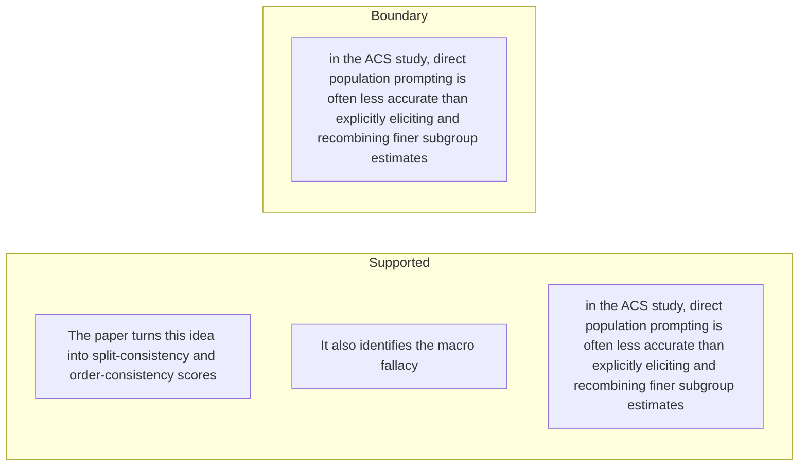

#### Python

```python
from html import escape
from pathlib import Path
from textwrap import wrap

title = "ppa_change_p2: The paper turns this idea into split-consistency and order-consistency — supported-versus-bounded scope"
columns = {"Supported statement": ["The paper turns this idea into split-consistency and order-consistency scores","It also identifies the macro fallacy","in the ACS study, direct population prompting is often less accurate than explicitly eliciting and recombining finer subgroup estimates"], "Boundary or contingency": ["in the ACS study, direct population prompting is often less accurate than explicitly eliciting and recombining finer subgroup estimates"]}
height = 550
parts = [
    f'<svg xmlns="http://www.w3.org/2000/svg" viewBox="0 0 900 {height}" role="img" aria-labelledby="title desc">',
    f'<title id="title">{escape(title)}</title>',
    '<desc id="desc">Statements are partitioned into supported content and explicit boundaries.</desc>',
    f'<rect width="900" height="{height}" fill="white"/>',
]
for column_index, (heading, items) in enumerate(columns.items()):
    x = 240 + column_index * 430
    parts.append(f'<text x="{x}" y="70" text-anchor="middle" font-family="sans-serif" font-size="18" font-weight="700">{escape(heading)}</text>')
    for item_index, item in enumerate(items):
        y = 130 + item_index * 110
        parts.append(f'<rect x="{x-180}" y="{y-35}" width="360" height="80" rx="12" fill="#f7fbff" stroke="#234"/>')
        for line_index, line in enumerate(wrap(item, width=48)):
            parts.append(f'<text x="{x}" y="{y-12+line_index*14}" text-anchor="middle" font-family="sans-serif" font-size="11">{escape(line)}</text>')
parts.append('</svg>')
Path("ppa_change_p2_treatment_c.svg").write_text("\n".join(parts), encoding="utf-8")
```

### Implementation record

- Status: `IMPLEMENTED`
- Selected treatment: `A`
- Selection rationale: Selected the approved relationship that directly answers this paragraph's explanatory job; the shared visual uses the same evidence and complete adjacent scope recorded here.
- Delivery medium: `CSS + semantic HTML`
- Visual ID and placement: `visual_ppa_consistency_checks` after `ppa_change_p2`; this record is served by that purpose-built figure.
- Shared paragraph scope: `ppa_change_p1`, `ppa_change_p2`
- Changed files: `packages/test-fixtures/explainers/partition-prompt-aggregate.json`, `apps/web/app/papers/[id]/explainer-visual.tsx`, `apps/web/app/papers/[id]/page.tsx`, and `apps/web/app/globals.css`
- Accessibility and fallback verification: Figure has a programmatic title and description, explicit alt text, equivalent fallback prose, source links, limitations, and a semantic static body; no meaning depends on motion or pointer input.
- Desktop and mobile verification: Verified in Playwright on 1440-pixel desktop and iPhone 13 mobile viewports; figures remain paragraph-adjacent, preserve reading order, and introduce no horizontal page overflow.
- Evidence deviations: `NONE`; web-native CSS and semantic HTML preserve the selected treatment's evidence, labels, topology, and stated boundaries.

## `ppa_mechanism_p1`

- Location: `ppa_mechanism`, paragraph 1
- Text anchor: "Start with a base population at the root."
- Claims and sources: `ppa_partition` (OBSERVED, VERIFIED); `ppa_reconstruction` (OBSERVED, VERIFIED); `ppa_method` (Sections 3.1–3.4, Equations 2–3, PDF pages 5–7)
- Visual needed: `YES`
- Decision rationale: Removing a visual would require readers to retain the material relation between "Start with a base population at the root" and "The model receives a verbal description of each node's subgroup and estimates the target quantity for that subgroup" while also tracking 4 source-bounded propositions. The paragraph contains a real mechanism relation graph; the visual must preserve its stated conditions and must not add causal or proportional meaning.
- Explanatory job: mechanism relation graph.

### Treatment A — Start with a base population at the root — mechanism relation graph

- Teaching purpose: Answer "How does a binary conditioning tree expose inconsistent estimates?" by exposing the paragraph's 4 named propositions and 3 stated reading, comparison, or qualification relations.
- Encoding and reading order: Nodes reproduce the complete labels "Start with a base population at the root"; "Each binary attribute splits every node at a level into two non-overlapping children"; "so all nodes at that level remain a complete partition of the root population"; "The model receives a verbal description of each node's subgroup and estimates the target quantity for that subgroup". Edges carry the explicit relation labels "then", "then", "then"; arrow direction is sequence only for mechanism or example prose and otherwise denotes reading order.
- Evidence and limitations: The topology is derived from this paragraph rather than a fixed pipeline. Encode only `ppa_partition`, `ppa_reconstruction` and do not turn reading-order edges into causal claims.
- Recommended web medium: responsive inline SVG with CSS; JavaScript may add optional step focus only when state order matters.
- Mobile, accessibility, and motion behavior: Keep the full node-and-relation list in DOM order, expose the relation labels in the long description, stack nodes on narrow screens, and disable focus transitions under reduced motion.

#### TikZ

```tex
\documentclass[tikz,border=5pt]{standalone}
\usepackage[T1]{fontenc}
\usepackage{tikz}
\usetikzlibrary{arrows.meta,positioning}
\begin{document}
\begin{tikzpicture}[font=\sffamily,concept/.style={draw,rounded corners,align=center,text width=3.6cm,minimum height=1.35cm},link/.style={-{Latex[length=2mm]},thick},rel/.style={fill=white,font=\scriptsize,inner sep=2pt}]
\node[font=\bfseries,align=center] at (6.1,2.0) {ppa\_mechanism\_p1: Start with a base population at the root - mechanism relation graph};
\node[concept] (n1) at (1.8,0) {Start with a base population at the root};
\node[concept] (n2) at (6.1,0) {Each binary attribute splits every node at a level into two non-overlapping children};
\node[concept] (n3) at (10.4,0) {so all nodes at that level remain a complete partition of the root population};
\node[concept] (n4) at (1.8,-3.2) {The model receives a verbal description of each node's subgroup and estimates the target quantity for that subgroup};
\draw[link] (n1) -- node[rel] {then} (n2);
\draw[link] (n2) -- node[rel] {then} (n3);
\draw[link] (n3) -- node[rel] {then} (n4);
\end{tikzpicture}
\end{document}
```

#### Mermaid

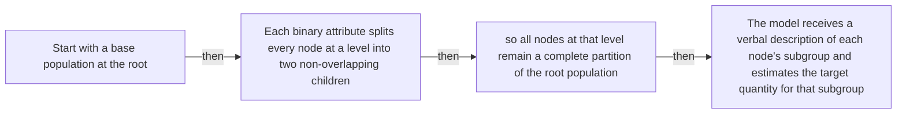

#### Python

```python
from html import escape
from pathlib import Path
from textwrap import wrap

title = "ppa_mechanism_p1: Start with a base population at the root — mechanism relation graph"
nodes = [["n1","Start with a base population at the root",120,150],["n2","Each binary attribute splits every node at a level into two non-overlapping children",420,150],["n3","so all nodes at that level remain a complete partition of the root population",720,150],["n4","The model receives a verbal description of each node's subgroup and estimates the target quantity for that subgroup",120,340]]
edges = [["n1","n2","then"],["n2","n3","then"],["n3","n4","then"]]
node_by_id = {node_id: (label, x, y) for node_id, label, x, y in nodes}

parts = [
    '<svg xmlns="http://www.w3.org/2000/svg" viewBox="0 0 860 520" role="img" aria-labelledby="title desc">',
    f'<title id="title">{escape(title)}</title>',
    '<desc id="desc">The labeled relations reproduce only relationships stated in the paragraph.</desc>',
    '<rect width="860" height="520" fill="white"/>',
]
for source, target, relation in edges:
    _, x1, y1 = node_by_id[source]
    _, x2, y2 = node_by_id[target]
    parts.append(f'<line x1="{x1}" y1="{y1}" x2="{x2}" y2="{y2}" stroke="#345" stroke-width="2"/>')
    parts.append(f'<text x="{(x1+x2)/2}" y="{(y1+y2)/2-6}" text-anchor="middle" font-family="sans-serif" font-size="11">{escape(relation)}</text>')
for _, label, x, y in nodes:
    parts.append(f'<rect x="{x-125}" y="{y-58}" width="250" height="116" rx="14" fill="#eef6ff" stroke="#234"/>')
    for line_index, line in enumerate(wrap(label, width=32)):
        parts.append(f'<text x="{x}" y="{y-34+line_index*16}" text-anchor="middle" font-family="sans-serif" font-size="12">{escape(line)}</text>')
parts.append('</svg>')
Path("ppa_mechanism_p1_treatment_a.svg").write_text("\n".join(parts), encoding="utf-8")
```

### Treatment B — ppa_partition, ppa_reconstruction — claim-to-source provenance

- Teaching purpose: Show exactly which atomic claims underwrite this paragraph and which fixed source records support each claim.
- Encoding and reading order: A bipartite graph places 2 claim nodes on the left and 1 source nodes on the right, with only the 2 claim-source edges recorded in the fixture. Claim labels include epistemic status; source labels include the exact locator.
- Evidence and limitations: This treatment explains provenance and uncertainty, not the paper's causal mechanism. Missing edges remain visibly absent and no source count is treated as confidence.
- Recommended web medium: semantic HTML/CSS claim-source table with an SVG network view; JavaScript only for keyboard-controlled source highlighting.
- Mobile, accessibility, and motion behavior: Provide real table headers and source links in the static fallback, make every edge recoverable as text, stack claim records before source records on mobile, and require no motion.

#### TikZ

```tex
\documentclass[tikz,border=5pt]{standalone}
\usepackage[T1]{fontenc}
\usepackage{tikz}
\usetikzlibrary{arrows.meta}
\begin{document}
\begin{tikzpicture}[font=\sffamily,claim/.style={draw,rounded corners,align=center,text width=5.2cm,minimum height=1.2cm},source/.style={draw,dashed,align=center,text width=5.2cm,minimum height=1.2cm},link/.style={-{Latex[length=2mm]},thin}]
\node[font=\bfseries] at (4,1.8) {ppa\_mechanism\_p1: claim-to-source provenance};
\node[claim] (c1) at (0,0) {Each level of a valid binary conditioning tree forms a mutually exclusive and collectively exhaustive partition of the base population. [OBSERVED]};
\node[claim] (c2) at (0,-2.4) {The method reconstructs a population estimate by weighting subgroup conditional estimates by their elicited subgroup priors and summing them. [OBSERVED]};
\node[source] (s1) at (8,0) {Partition, Prompt, Aggregate v1 - partition and reconstruction method - Sections 3.1-3.4, Equations 2-3, PDF pages 5-7};
\draw[link] (c1) -- (s1);
\draw[link] (c2) -- (s1);
\end{tikzpicture}
\end{document}
```

#### Mermaid

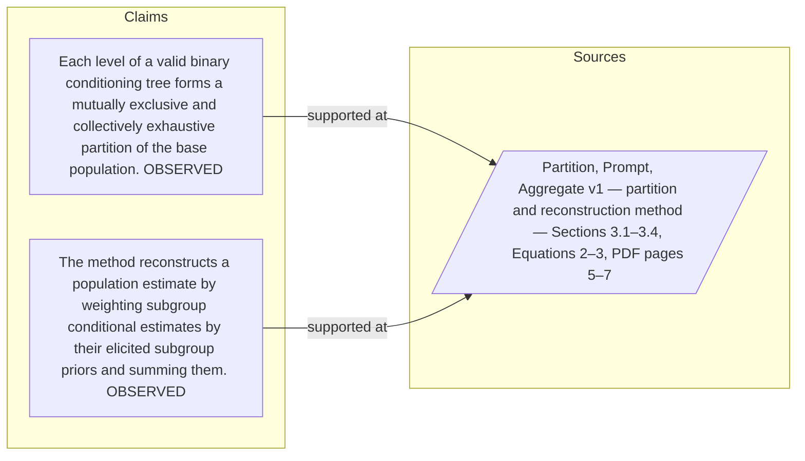

#### Python

```python
from html import escape
from pathlib import Path
from textwrap import wrap

title = "ppa_mechanism_p1: claim-to-source provenance"
nodes = [["c1","Each level of a valid binary conditioning tree forms a mutually exclusive and collectively exhaustive partition of the base population. [OBSERVED]",190,130],["c2","The method reconstructs a population estimate by weighting subgroup conditional estimates by their elicited subgroup priors and summing them. [OBSERVED]",190,250],["s1","Partition, Prompt, Aggregate v1 — partition and reconstruction method — Sections 3.1–3.4, Equations 2–3, PDF pages 5–7",700,130]]
edges = [["c1","s1"],["c2","s1"]]
node_by_id = {node_id: (label, x, y) for node_id, label, x, y in nodes}
height = 440

parts = [
    f'<svg xmlns="http://www.w3.org/2000/svg" viewBox="0 0 900 {height}" role="img" aria-labelledby="title desc">',
    f'<title id="title">{escape(title)}</title>',
    '<desc id="desc">Bipartite map from verified claim records to their exact source records.</desc>',
    f'<rect width="900" height="{height}" fill="white"/>',
]
for source, target in edges:
    _, x1, y1 = node_by_id[source]
    _, x2, y2 = node_by_id[target]
    parts.append(f'<line x1="{x1+145}" y1="{y1}" x2="{x2-145}" y2="{y2}" stroke="#456" stroke-width="2"/>')
for node_id, label, x, y in nodes:
    dashed = ' stroke-dasharray="7 5"' if node_id.startswith("s") else ''
    parts.append(f'<rect x="{x-145}" y="{y-46}" width="290" height="92" rx="12" fill="#f7fbff" stroke="#234"{dashed}/>')
    for line_index, line in enumerate(wrap(label, width=38)):
        parts.append(f'<text x="{x}" y="{y-24+line_index*14}" text-anchor="middle" font-family="sans-serif" font-size="11">{escape(line)}</text>')
parts.append('</svg>')
Path("ppa_mechanism_p1_treatment_b.svg").write_text("\n".join(parts), encoding="utf-8")
```

### Treatment C — Start with a base population at the root — input-operation-outcome storyboard

- Teaching purpose: Let readers inspect the paragraph as concrete input, operation, and outcome states.
- Encoding and reading order: Use 4 ordered states labeled "Input: Start with a base population at the root", "Operation: Each binary attribute splits every node at a level into two non-overlapping children", "Operation: so all nodes at that level remain a complete partition of the root population", "Outcome: The model receives a verbal description of each node's subgroup and estimates the target quantity for that subgroup". State connectors reproduce paragraph order and do not imply unreported timing.
- Evidence and limitations: The first, intermediate, and final states are paragraph clauses; no hidden state, quantity, or transition is added.
- Recommended web medium: responsive SVG or semantic HTML/CSS; JavaScript is optional only for a meaningful state or scope toggle.
- Mobile, accessibility, and motion behavior: Preserve every exact value or scope statement as selectable text, avoid color-only distinctions, stack groups on mobile, and keep all information visible when JavaScript or motion is disabled.

#### TikZ

```tex
\documentclass[tikz,border=5pt]{standalone}
\usepackage[T1]{fontenc}
\usepackage{tikz}
\begin{document}
\begin{tikzpicture}[font=\sffamily,state/.style={draw,rounded corners,align=center,text width=3.2cm,minimum height=1.8cm}]
\node[font=\bfseries] at (5.699999999999999,2) {ppa\_mechanism\_p1: Start with a base population at the root - input-operation-outcome storyboard};
\node[state] (k1) at (0,0) {\textbf{Input}\\Start with a base population at the root};
\node[state] (k2) at (3.8,0) {\textbf{Operation}\\Each binary attribute splits every node at a level into two non-overlapping children};
\node[state] (k3) at (7.6,0) {\textbf{Operation}\\so all nodes at that level remain a complete partition of the root population};
\node[state] (k4) at (11.399999999999999,0) {\textbf{Outcome}\\The model receives a verbal description of each node's subgroup and estimates the target quantity for that subgroup};
\draw[->,thick] (k1) -- (k2);
\draw[->,thick] (k2) -- (k3);
\draw[->,thick] (k3) -- (k4);
\end{tikzpicture}
\end{document}
```

#### Mermaid

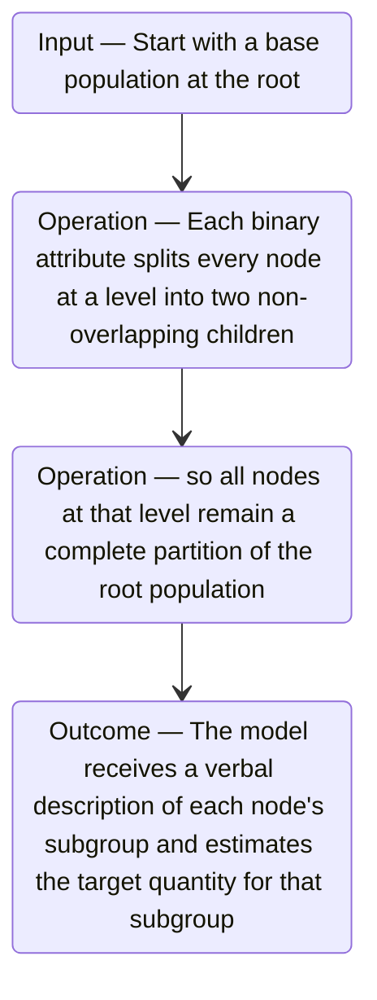

#### Python

```python
from html import escape
from pathlib import Path
from textwrap import wrap

title = "ppa_mechanism_p1: Start with a base population at the root — input-operation-outcome storyboard"
items = [["Input","Start with a base population at the root",120,210],["Operation","Each binary attribute splits every node at a level into two non-overlapping children",290,210],["Operation","so all nodes at that level remain a complete partition of the root population",460,210],["Outcome","The model receives a verbal description of each node's subgroup and estimates the target quantity for that subgroup",630,210]]
width = max(760, 240 + len(items) * 170)
parts = [
    f'<svg xmlns="http://www.w3.org/2000/svg" viewBox="0 0 {width} 460" role="img" aria-labelledby="title desc">',
    f'<title id="title">{escape(title)}</title>',
    '<desc id="desc">Input, operation, and outcome states follow the paragraph in source order.</desc>',
    f'<rect width="{width}" height="460" fill="white"/>',
]
for index in range(len(items)-1):
    _, _, x1, y1 = items[index]
    _, _, x2, y2 = items[index+1]
    parts.append(f'<line x1="{x1+65}" y1="{y1}" x2="{x2-65}" y2="{y2}" stroke="#345" stroke-width="2"/>')
for group, label, x, y in items:
    parts.append(f'<rect x="{x-65}" y="{y-90}" width="130" height="180" rx="16" fill="#eef6ff" stroke="#234"/>')
    parts.append(f'<text x="{x}" y="{y-60}" text-anchor="middle" font-family="sans-serif" font-size="13" font-weight="700">{escape(group)}</text>')
    for line_index, line in enumerate(wrap(label, width=18)):
        parts.append(f'<text x="{x}" y="{y-34+line_index*14}" text-anchor="middle" font-family="sans-serif" font-size="10">{escape(line)}</text>')
parts.append('</svg>')
Path("ppa_mechanism_p1_treatment_c.svg").write_text("\n".join(parts), encoding="utf-8")
```

### Implementation record

- Status: `IMPLEMENTED`
- Selected treatment: `A`
- Selection rationale: Selected the approved relationship that directly answers this paragraph's explanatory job; the shared visual uses the same evidence and complete adjacent scope recorded here.
- Delivery medium: `CSS + semantic HTML`
- Visual ID and placement: `visual_ppa_partition_tree` after `ppa_mechanism_p2`; this record is served by that purpose-built figure.
- Shared paragraph scope: `ppa_mechanism_p1`, `ppa_mechanism_p2`, `ppa_mechanism_p3`, `ppa_example_p1`, `ppa_example_p2`
- Changed files: `packages/test-fixtures/explainers/partition-prompt-aggregate.json`, `apps/web/app/papers/[id]/explainer-visual.tsx`, `apps/web/app/papers/[id]/page.tsx`, and `apps/web/app/globals.css`
- Accessibility and fallback verification: Figure has a programmatic title and description, explicit alt text, equivalent fallback prose, source links, limitations, and a semantic static body; no meaning depends on motion or pointer input.
- Desktop and mobile verification: Verified in Playwright on 1440-pixel desktop and iPhone 13 mobile viewports; figures remain paragraph-adjacent, preserve reading order, and introduce no horizontal page overflow.
- Evidence deviations: `NONE`; web-native CSS and semantic HTML preserve the selected treatment's evidence, labels, topology, and stated boundaries.

## `ppa_mechanism_p2`

- Location: `ppa_mechanism`, paragraph 2
- Text anchor: "For each level, the method also elicits subgroup population shares, normalizes them, and calculates their weighted sum."
- Claims and sources: `ppa_partition` (OBSERVED, VERIFIED); `ppa_reconstruction` (OBSERVED, VERIFIED); `ppa_method` (Sections 3.1–3.4, Equations 2–3, PDF pages 5–7)
- Visual needed: `YES`
- Decision rationale: Removing a visual would require readers to retain the material relation between "For each level, the method also elicits subgroup population shares, normalizes them" and "A coherent estimator should give the same aggregate at every level" while also tracking 4 source-bounded propositions. The paragraph contains a real mechanism relation graph; the visual must preserve its stated conditions and must not add causal or proportional meaning.
- Explanatory job: mechanism relation graph.

### Treatment A — For each level the method also elicits subgroup population — mechanism relation graph

- Teaching purpose: Answer "How does a binary conditioning tree expose inconsistent estimates?" by exposing the paragraph's 4 named propositions and 3 stated reading, comparison, or qualification relations.
- Encoding and reading order: Nodes reproduce the complete labels "For each level, the method also elicits subgroup population shares, normalizes them"; "and calculates their weighted sum"; "In the ACS prior protocol, each level's prior distribution is elicited 50 times and the normalized responses are averaged"; "A coherent estimator should give the same aggregate at every level". Edges carry the explicit relation labels "then", "then", "then"; arrow direction is sequence only for mechanism or example prose and otherwise denotes reading order.
- Evidence and limitations: The topology is derived from this paragraph rather than a fixed pipeline. Encode only `ppa_partition`, `ppa_reconstruction` and do not turn reading-order edges into causal claims.
- Recommended web medium: responsive inline SVG with CSS; JavaScript may add optional step focus only when state order matters.
- Mobile, accessibility, and motion behavior: Keep the full node-and-relation list in DOM order, expose the relation labels in the long description, stack nodes on narrow screens, and disable focus transitions under reduced motion.

#### TikZ

```tex
\documentclass[tikz,border=5pt]{standalone}
\usepackage[T1]{fontenc}
\usepackage{tikz}
\usetikzlibrary{arrows.meta,positioning}
\begin{document}
\begin{tikzpicture}[font=\sffamily,concept/.style={draw,rounded corners,align=center,text width=3.6cm,minimum height=1.35cm},link/.style={-{Latex[length=2mm]},thick},rel/.style={fill=white,font=\scriptsize,inner sep=2pt}]
\node[font=\bfseries,align=center] at (6.1,2.0) {ppa\_mechanism\_p2: For each level the method also elicits subgroup population - mechanism relation graph};
\node[concept] (n1) at (1.8,0) {For each level, the method also elicits subgroup population shares, normalizes them};
\node[concept] (n2) at (6.1,0) {and calculates their weighted sum};
\node[concept] (n3) at (10.4,0) {In the ACS prior protocol, each level's prior distribution is elicited 50 times and the normalized responses are averaged};
\node[concept] (n4) at (1.8,-3.2) {A coherent estimator should give the same aggregate at every level};
\draw[link] (n1) -- node[rel] {then} (n2);
\draw[link] (n2) -- node[rel] {then} (n3);
\draw[link] (n3) -- node[rel] {then} (n4);
\end{tikzpicture}
\end{document}
```

#### Mermaid

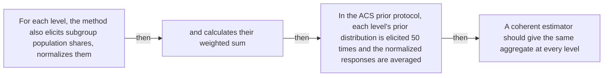

#### Python

```python
from html import escape
from pathlib import Path
from textwrap import wrap

title = "ppa_mechanism_p2: For each level the method also elicits subgroup population — mechanism relation graph"
nodes = [["n1","For each level, the method also elicits subgroup population shares, normalizes them",120,150],["n2","and calculates their weighted sum",420,150],["n3","In the ACS prior protocol, each level's prior distribution is elicited 50 times and the normalized responses are averaged",720,150],["n4","A coherent estimator should give the same aggregate at every level",120,340]]
edges = [["n1","n2","then"],["n2","n3","then"],["n3","n4","then"]]
node_by_id = {node_id: (label, x, y) for node_id, label, x, y in nodes}

parts = [
    '<svg xmlns="http://www.w3.org/2000/svg" viewBox="0 0 860 520" role="img" aria-labelledby="title desc">',
    f'<title id="title">{escape(title)}</title>',
    '<desc id="desc">The labeled relations reproduce only relationships stated in the paragraph.</desc>',
    '<rect width="860" height="520" fill="white"/>',
]
for source, target, relation in edges:
    _, x1, y1 = node_by_id[source]
    _, x2, y2 = node_by_id[target]
    parts.append(f'<line x1="{x1}" y1="{y1}" x2="{x2}" y2="{y2}" stroke="#345" stroke-width="2"/>')
    parts.append(f'<text x="{(x1+x2)/2}" y="{(y1+y2)/2-6}" text-anchor="middle" font-family="sans-serif" font-size="11">{escape(relation)}</text>')
for _, label, x, y in nodes:
    parts.append(f'<rect x="{x-125}" y="{y-58}" width="250" height="116" rx="14" fill="#eef6ff" stroke="#234"/>')
    for line_index, line in enumerate(wrap(label, width=32)):
        parts.append(f'<text x="{x}" y="{y-34+line_index*16}" text-anchor="middle" font-family="sans-serif" font-size="12">{escape(line)}</text>')
parts.append('</svg>')
Path("ppa_mechanism_p2_treatment_a.svg").write_text("\n".join(parts), encoding="utf-8")
```

### Treatment B — ppa_partition, ppa_reconstruction — claim-to-source provenance

- Teaching purpose: Show exactly which atomic claims underwrite this paragraph and which fixed source records support each claim.
- Encoding and reading order: A bipartite graph places 2 claim nodes on the left and 1 source nodes on the right, with only the 2 claim-source edges recorded in the fixture. Claim labels include epistemic status; source labels include the exact locator.
- Evidence and limitations: This treatment explains provenance and uncertainty, not the paper's causal mechanism. Missing edges remain visibly absent and no source count is treated as confidence.
- Recommended web medium: semantic HTML/CSS claim-source table with an SVG network view; JavaScript only for keyboard-controlled source highlighting.
- Mobile, accessibility, and motion behavior: Provide real table headers and source links in the static fallback, make every edge recoverable as text, stack claim records before source records on mobile, and require no motion.

#### TikZ

```tex
\documentclass[tikz,border=5pt]{standalone}
\usepackage[T1]{fontenc}
\usepackage{tikz}
\usetikzlibrary{arrows.meta}
\begin{document}
\begin{tikzpicture}[font=\sffamily,claim/.style={draw,rounded corners,align=center,text width=5.2cm,minimum height=1.2cm},source/.style={draw,dashed,align=center,text width=5.2cm,minimum height=1.2cm},link/.style={-{Latex[length=2mm]},thin}]
\node[font=\bfseries] at (4,1.8) {ppa\_mechanism\_p2: claim-to-source provenance};
\node[claim] (c1) at (0,0) {Each level of a valid binary conditioning tree forms a mutually exclusive and collectively exhaustive partition of the base population. [OBSERVED]};
\node[claim] (c2) at (0,-2.4) {The method reconstructs a population estimate by weighting subgroup conditional estimates by their elicited subgroup priors and summing them. [OBSERVED]};
\node[source] (s1) at (8,0) {Partition, Prompt, Aggregate v1 - partition and reconstruction method - Sections 3.1-3.4, Equations 2-3, PDF pages 5-7};
\draw[link] (c1) -- (s1);
\draw[link] (c2) -- (s1);
\end{tikzpicture}
\end{document}
```

#### Mermaid


#### Python

```python
from html import escape
from pathlib import Path
from textwrap import wrap

title = "ppa_mechanism_p2: claim-to-source provenance"
nodes = [["c1","Each level of a valid binary conditioning tree forms a mutually exclusive and collectively exhaustive partition of the base population. [OBSERVED]",190,130],["c2","The method reconstructs a population estimate by weighting subgroup conditional estimates by their elicited subgroup priors and summing them. [OBSERVED]",190,250],["s1","Partition, Prompt, Aggregate v1 — partition and reconstruction method — Sections 3.1–3.4, Equations 2–3, PDF pages 5–7",700,130]]
edges = [["c1","s1"],["c2","s1"]]
node_by_id = {node_id: (label, x, y) for node_id, label, x, y in nodes}
height = 440

parts = [
    f'<svg xmlns="http://www.w3.org/2000/svg" viewBox="0 0 900 {height}" role="img" aria-labelledby="title desc">',
    f'<title id="title">{escape(title)}</title>',
    '<desc id="desc">Bipartite map from verified claim records to their exact source records.</desc>',
    f'<rect width="900" height="{height}" fill="white"/>',
]
for source, target in edges:
    _, x1, y1 = node_by_id[source]
    _, x2, y2 = node_by_id[target]
    parts.append(f'<line x1="{x1+145}" y1="{y1}" x2="{x2-145}" y2="{y2}" stroke="#456" stroke-width="2"/>')
for node_id, label, x, y in nodes:
    dashed = ' stroke-dasharray="7 5"' if node_id.startswith("s") else ''
    parts.append(f'<rect x="{x-145}" y="{y-46}" width="290" height="92" rx="12" fill="#f7fbff" stroke="#234"{dashed}/>')
    for line_index, line in enumerate(wrap(label, width=38)):
        parts.append(f'<text x="{x}" y="{y-24+line_index*14}" text-anchor="middle" font-family="sans-serif" font-size="11">{escape(line)}</text>')
parts.append('</svg>')
Path("ppa_mechanism_p2_treatment_b.svg").write_text("\n".join(parts), encoding="utf-8")
```

### Treatment C — For each level the method also elicits subgroup population — input-operation-outcome storyboard

- Teaching purpose: Let readers inspect the paragraph as concrete input, operation, and outcome states.
- Encoding and reading order: Use 4 ordered states labeled "Input: For each level, the method also elicits subgroup population shares, normalizes them", "Operation: and calculates their weighted sum", "Operation: In the ACS prior protocol, each level's prior distribution is elicited 50 times and the normalized responses are averaged", "Outcome: A coherent estimator should give the same aggregate at every level". State connectors reproduce paragraph order and do not imply unreported timing.
- Evidence and limitations: The first, intermediate, and final states are paragraph clauses; no hidden state, quantity, or transition is added.
- Recommended web medium: responsive SVG or semantic HTML/CSS; JavaScript is optional only for a meaningful state or scope toggle.
- Mobile, accessibility, and motion behavior: Preserve every exact value or scope statement as selectable text, avoid color-only distinctions, stack groups on mobile, and keep all information visible when JavaScript or motion is disabled.

#### TikZ

```tex
\documentclass[tikz,border=5pt]{standalone}
\usepackage[T1]{fontenc}
\usepackage{tikz}
\begin{document}
\begin{tikzpicture}[font=\sffamily,state/.style={draw,rounded corners,align=center,text width=3.2cm,minimum height=1.8cm}]
\node[font=\bfseries] at (5.699999999999999,2) {ppa\_mechanism\_p2: For each level the method also elicits subgroup population - input-operation-outcome storyboard};
\node[state] (k1) at (0,0) {\textbf{Input}\\For each level, the method also elicits subgroup population shares, normalizes them};
\node[state] (k2) at (3.8,0) {\textbf{Operation}\\and calculates their weighted sum};
\node[state] (k3) at (7.6,0) {\textbf{Operation}\\In the ACS prior protocol, each level's prior distribution is elicited 50 times and the normalized responses are averaged};
\node[state] (k4) at (11.399999999999999,0) {\textbf{Outcome}\\A coherent estimator should give the same aggregate at every level};
\draw[->,thick] (k1) -- (k2);
\draw[->,thick] (k2) -- (k3);
\draw[->,thick] (k3) -- (k4);
\end{tikzpicture}
\end{document}
```

#### Mermaid

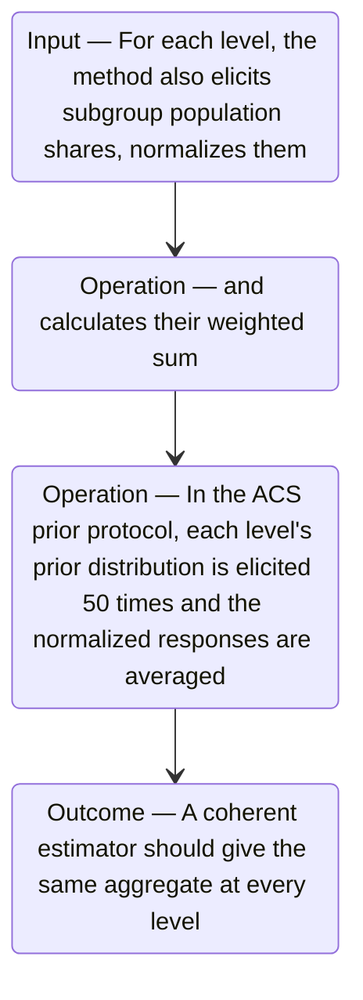

#### Python

```python
from html import escape
from pathlib import Path
from textwrap import wrap

title = "ppa_mechanism_p2: For each level the method also elicits subgroup population — input-operation-outcome storyboard"
items = [["Input","For each level, the method also elicits subgroup population shares, normalizes them",120,210],["Operation","and calculates their weighted sum",290,210],["Operation","In the ACS prior protocol, each level's prior distribution is elicited 50 times and the normalized responses are averaged",460,210],["Outcome","A coherent estimator should give the same aggregate at every level",630,210]]
width = max(760, 240 + len(items) * 170)
parts = [
    f'<svg xmlns="http://www.w3.org/2000/svg" viewBox="0 0 {width} 460" role="img" aria-labelledby="title desc">',
    f'<title id="title">{escape(title)}</title>',
    '<desc id="desc">Input, operation, and outcome states follow the paragraph in source order.</desc>',
    f'<rect width="{width}" height="460" fill="white"/>',
]
for index in range(len(items)-1):
    _, _, x1, y1 = items[index]
    _, _, x2, y2 = items[index+1]
    parts.append(f'<line x1="{x1+65}" y1="{y1}" x2="{x2-65}" y2="{y2}" stroke="#345" stroke-width="2"/>')
for group, label, x, y in items:
    parts.append(f'<rect x="{x-65}" y="{y-90}" width="130" height="180" rx="16" fill="#eef6ff" stroke="#234"/>')
    parts.append(f'<text x="{x}" y="{y-60}" text-anchor="middle" font-family="sans-serif" font-size="13" font-weight="700">{escape(group)}</text>')
    for line_index, line in enumerate(wrap(label, width=18)):
        parts.append(f'<text x="{x}" y="{y-34+line_index*14}" text-anchor="middle" font-family="sans-serif" font-size="10">{escape(line)}</text>')
parts.append('</svg>')
Path("ppa_mechanism_p2_treatment_c.svg").write_text("\n".join(parts), encoding="utf-8")
```

### Implementation record

- Status: `IMPLEMENTED`
- Selected treatment: `A`
- Selection rationale: Selected the approved relationship that directly answers this paragraph's explanatory job; the shared visual uses the same evidence and complete adjacent scope recorded here.
- Delivery medium: `CSS + semantic HTML`
- Visual ID and placement: `visual_ppa_partition_tree` after `ppa_mechanism_p2`; this record is served by that purpose-built figure.
- Shared paragraph scope: `ppa_mechanism_p1`, `ppa_mechanism_p2`, `ppa_mechanism_p3`, `ppa_example_p1`, `ppa_example_p2`
- Changed files: `packages/test-fixtures/explainers/partition-prompt-aggregate.json`, `apps/web/app/papers/[id]/explainer-visual.tsx`, `apps/web/app/papers/[id]/page.tsx`, and `apps/web/app/globals.css`
- Accessibility and fallback verification: Figure has a programmatic title and description, explicit alt text, equivalent fallback prose, source links, limitations, and a semantic static body; no meaning depends on motion or pointer input.
- Desktop and mobile verification: Verified in Playwright on 1440-pixel desktop and iPhone 13 mobile viewports; figures remain paragraph-adjacent, preserve reading order, and introduce no horizontal page overflow.
- Evidence deviations: `NONE`; web-native CSS and semantic HTML preserve the selected treatment's evidence, labels, topology, and stated boundaries.

## `ppa_mechanism_p3`

- Location: `ppa_mechanism`, paragraph 3
- Text anchor: "Split consistency checks a node against the weighted sum of its immediate children."
- Claims and sources: `ppa_partition` (OBSERVED, VERIFIED); `ppa_reconstruction` (OBSERVED, VERIFIED); `ppa_method` (Sections 3.1–3.4, Equations 2–3, PDF pages 5–7)
- Visual needed: `YES`
- Decision rationale: Removing a visual would require readers to retain the material relation between "Split consistency checks a node against the weighted sum of its immediate children" and "Order consistency asks whether the same subgroup receives the same estimate when its conditions are verbalized in a different order" while also tracking 2 source-bounded propositions. The paragraph contains a real mechanism relation graph; the visual must preserve its stated conditions and must not add causal or proportional meaning.
- Explanatory job: mechanism relation graph.

### Treatment A — Split consistency checks a node against the weighted sum — mechanism relation graph

- Teaching purpose: Answer "How does a binary conditioning tree expose inconsistent estimates?" by exposing the paragraph's 2 named propositions and 1 stated reading, comparison, or qualification relations.
- Encoding and reading order: Nodes reproduce the complete labels "Split consistency checks a node against the weighted sum of its immediate children"; "Order consistency asks whether the same subgroup receives the same estimate when its conditions are verbalized in a different order". Edges carry the explicit relation labels "then"; arrow direction is sequence only for mechanism or example prose and otherwise denotes reading order.
- Evidence and limitations: The topology is derived from this paragraph rather than a fixed pipeline. Encode only `ppa_partition`, `ppa_reconstruction` and do not turn reading-order edges into causal claims.
- Recommended web medium: responsive inline SVG with CSS; JavaScript may add optional step focus only when state order matters.
- Mobile, accessibility, and motion behavior: Keep the full node-and-relation list in DOM order, expose the relation labels in the long description, stack nodes on narrow screens, and disable focus transitions under reduced motion.

#### TikZ

```tex
\documentclass[tikz,border=5pt]{standalone}
\usepackage[T1]{fontenc}
\usepackage{tikz}
\usetikzlibrary{arrows.meta,positioning}
\begin{document}
\begin{tikzpicture}[font=\sffamily,concept/.style={draw,rounded corners,align=center,text width=3.6cm,minimum height=1.35cm},link/.style={-{Latex[length=2mm]},thick},rel/.style={fill=white,font=\scriptsize,inner sep=2pt}]
\node[font=\bfseries,align=center] at (6.1,2.0) {ppa\_mechanism\_p3: Split consistency checks a node against the weighted sum - mechanism relation graph};
\node[concept] (n1) at (1.8,0) {Split consistency checks a node against the weighted sum of its immediate children};
\node[concept] (n2) at (6.1,0) {Order consistency asks whether the same subgroup receives the same estimate when its conditions are verbalized in a different order};
\draw[link] (n1) -- node[rel] {then} (n2);
\end{tikzpicture}
\end{document}
```

#### Mermaid

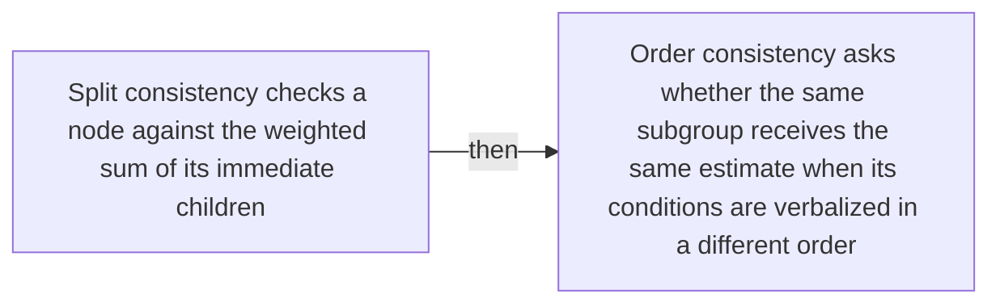

#### Python

```python
from html import escape
from pathlib import Path
from textwrap import wrap

title = "ppa_mechanism_p3: Split consistency checks a node against the weighted sum — mechanism relation graph"
nodes = [["n1","Split consistency checks a node against the weighted sum of its immediate children",120,150],["n2","Order consistency asks whether the same subgroup receives the same estimate when its conditions are verbalized in a different order",420,150]]
edges = [["n1","n2","then"]]
node_by_id = {node_id: (label, x, y) for node_id, label, x, y in nodes}

parts = [
    '<svg xmlns="http://www.w3.org/2000/svg" viewBox="0 0 860 520" role="img" aria-labelledby="title desc">',
    f'<title id="title">{escape(title)}</title>',
    '<desc id="desc">The labeled relations reproduce only relationships stated in the paragraph.</desc>',
    '<rect width="860" height="520" fill="white"/>',
]
for source, target, relation in edges:
    _, x1, y1 = node_by_id[source]
    _, x2, y2 = node_by_id[target]
    parts.append(f'<line x1="{x1}" y1="{y1}" x2="{x2}" y2="{y2}" stroke="#345" stroke-width="2"/>')
    parts.append(f'<text x="{(x1+x2)/2}" y="{(y1+y2)/2-6}" text-anchor="middle" font-family="sans-serif" font-size="11">{escape(relation)}</text>')
for _, label, x, y in nodes:
    parts.append(f'<rect x="{x-125}" y="{y-58}" width="250" height="116" rx="14" fill="#eef6ff" stroke="#234"/>')
    for line_index, line in enumerate(wrap(label, width=32)):
        parts.append(f'<text x="{x}" y="{y-34+line_index*16}" text-anchor="middle" font-family="sans-serif" font-size="12">{escape(line)}</text>')
parts.append('</svg>')
Path("ppa_mechanism_p3_treatment_a.svg").write_text("\n".join(parts), encoding="utf-8")
```

### Treatment B — ppa_partition, ppa_reconstruction — claim-to-source provenance

- Teaching purpose: Show exactly which atomic claims underwrite this paragraph and which fixed source records support each claim.
- Encoding and reading order: A bipartite graph places 2 claim nodes on the left and 1 source nodes on the right, with only the 2 claim-source edges recorded in the fixture. Claim labels include epistemic status; source labels include the exact locator.
- Evidence and limitations: This treatment explains provenance and uncertainty, not the paper's causal mechanism. Missing edges remain visibly absent and no source count is treated as confidence.
- Recommended web medium: semantic HTML/CSS claim-source table with an SVG network view; JavaScript only for keyboard-controlled source highlighting.
- Mobile, accessibility, and motion behavior: Provide real table headers and source links in the static fallback, make every edge recoverable as text, stack claim records before source records on mobile, and require no motion.

#### TikZ

```tex
\documentclass[tikz,border=5pt]{standalone}
\usepackage[T1]{fontenc}
\usepackage{tikz}
\usetikzlibrary{arrows.meta}
\begin{document}
\begin{tikzpicture}[font=\sffamily,claim/.style={draw,rounded corners,align=center,text width=5.2cm,minimum height=1.2cm},source/.style={draw,dashed,align=center,text width=5.2cm,minimum height=1.2cm},link/.style={-{Latex[length=2mm]},thin}]
\node[font=\bfseries] at (4,1.8) {ppa\_mechanism\_p3: claim-to-source provenance};
\node[claim] (c1) at (0,0) {Each level of a valid binary conditioning tree forms a mutually exclusive and collectively exhaustive partition of the base population. [OBSERVED]};
\node[claim] (c2) at (0,-2.4) {The method reconstructs a population estimate by weighting subgroup conditional estimates by their elicited subgroup priors and summing them. [OBSERVED]};
\node[source] (s1) at (8,0) {Partition, Prompt, Aggregate v1 - partition and reconstruction method - Sections 3.1-3.4, Equations 2-3, PDF pages 5-7};
\draw[link] (c1) -- (s1);
\draw[link] (c2) -- (s1);
\end{tikzpicture}
\end{document}
```

#### Mermaid


#### Python

```python
from html import escape
from pathlib import Path
from textwrap import wrap

title = "ppa_mechanism_p3: claim-to-source provenance"
nodes = [["c1","Each level of a valid binary conditioning tree forms a mutually exclusive and collectively exhaustive partition of the base population. [OBSERVED]",190,130],["c2","The method reconstructs a population estimate by weighting subgroup conditional estimates by their elicited subgroup priors and summing them. [OBSERVED]",190,250],["s1","Partition, Prompt, Aggregate v1 — partition and reconstruction method — Sections 3.1–3.4, Equations 2–3, PDF pages 5–7",700,130]]
edges = [["c1","s1"],["c2","s1"]]
node_by_id = {node_id: (label, x, y) for node_id, label, x, y in nodes}
height = 440

parts = [
    f'<svg xmlns="http://www.w3.org/2000/svg" viewBox="0 0 900 {height}" role="img" aria-labelledby="title desc">',
    f'<title id="title">{escape(title)}</title>',
    '<desc id="desc">Bipartite map from verified claim records to their exact source records.</desc>',
    f'<rect width="900" height="{height}" fill="white"/>',
]
for source, target in edges:
    _, x1, y1 = node_by_id[source]
    _, x2, y2 = node_by_id[target]
    parts.append(f'<line x1="{x1+145}" y1="{y1}" x2="{x2-145}" y2="{y2}" stroke="#456" stroke-width="2"/>')
for node_id, label, x, y in nodes:
    dashed = ' stroke-dasharray="7 5"' if node_id.startswith("s") else ''
    parts.append(f'<rect x="{x-145}" y="{y-46}" width="290" height="92" rx="12" fill="#f7fbff" stroke="#234"{dashed}/>')
    for line_index, line in enumerate(wrap(label, width=38)):
        parts.append(f'<text x="{x}" y="{y-24+line_index*14}" text-anchor="middle" font-family="sans-serif" font-size="11">{escape(line)}</text>')
parts.append('</svg>')
Path("ppa_mechanism_p3_treatment_b.svg").write_text("\n".join(parts), encoding="utf-8")
```

### Treatment C — Split consistency checks a node against the weighted sum — input-operation-outcome storyboard

- Teaching purpose: Let readers inspect the paragraph as concrete input, operation, and outcome states.
- Encoding and reading order: Use 2 ordered states labeled "Input: Split consistency checks a node against the weighted sum of its immediate children", "Outcome: Order consistency asks whether the same subgroup receives the same estimate when its conditions are verbalized in a different order". State connectors reproduce paragraph order and do not imply unreported timing.
- Evidence and limitations: The first, intermediate, and final states are paragraph clauses; no hidden state, quantity, or transition is added.
- Recommended web medium: responsive SVG or semantic HTML/CSS; JavaScript is optional only for a meaningful state or scope toggle.
- Mobile, accessibility, and motion behavior: Preserve every exact value or scope statement as selectable text, avoid color-only distinctions, stack groups on mobile, and keep all information visible when JavaScript or motion is disabled.

#### TikZ

```tex
\documentclass[tikz,border=5pt]{standalone}
\usepackage[T1]{fontenc}
\usepackage{tikz}
\begin{document}
\begin{tikzpicture}[font=\sffamily,state/.style={draw,rounded corners,align=center,text width=3.2cm,minimum height=1.8cm}]
\node[font=\bfseries] at (3.8,2) {ppa\_mechanism\_p3: Split consistency checks a node against the weighted sum - input-operation-outcome storyboard};
\node[state] (k1) at (0,0) {\textbf{Input}\\Split consistency checks a node against the weighted sum of its immediate children};
\node[state] (k2) at (3.8,0) {\textbf{Outcome}\\Order consistency asks whether the same subgroup receives the same estimate when its conditions are verbalized in a different order};
\draw[->,thick] (k1) -- (k2);
\end{tikzpicture}
\end{document}
```

#### Mermaid

```mermaid
stateDiagram-v2
  state "Input — Split consistency checks a node against the weighted sum of its immediate children" as k1
  state "Outcome — Order consistency asks whether the same subgroup receives the same estimate when its conditions are verbalized in a different order" as k2
  k1 --> k2
```

#### Python

```python
from html import escape
from pathlib import Path
from textwrap import wrap

title = "ppa_mechanism_p3: Split consistency checks a node against the weighted sum — input-operation-outcome storyboard"
items = [["Input","Split consistency checks a node against the weighted sum of its immediate children",120,210],["Outcome","Order consistency asks whether the same subgroup receives the same estimate when its conditions are verbalized in a different order",290,210]]
width = max(760, 240 + len(items) * 170)
parts = [
    f'<svg xmlns="http://www.w3.org/2000/svg" viewBox="0 0 {width} 460" role="img" aria-labelledby="title desc">',
    f'<title id="title">{escape(title)}</title>',
    '<desc id="desc">Input, operation, and outcome states follow the paragraph in source order.</desc>',
    f'<rect width="{width}" height="460" fill="white"/>',
]
for index in range(len(items)-1):
    _, _, x1, y1 = items[index]
    _, _, x2, y2 = items[index+1]
    parts.append(f'<line x1="{x1+65}" y1="{y1}" x2="{x2-65}" y2="{y2}" stroke="#345" stroke-width="2"/>')
for group, label, x, y in items:
    parts.append(f'<rect x="{x-65}" y="{y-90}" width="130" height="180" rx="16" fill="#eef6ff" stroke="#234"/>')
    parts.append(f'<text x="{x}" y="{y-60}" text-anchor="middle" font-family="sans-serif" font-size="13" font-weight="700">{escape(group)}</text>')
    for line_index, line in enumerate(wrap(label, width=18)):
        parts.append(f'<text x="{x}" y="{y-34+line_index*14}" text-anchor="middle" font-family="sans-serif" font-size="10">{escape(line)}</text>')
parts.append('</svg>')
Path("ppa_mechanism_p3_treatment_c.svg").write_text("\n".join(parts), encoding="utf-8")
```

### Implementation record

- Status: `IMPLEMENTED`
- Selected treatment: `A`
- Selection rationale: Selected the approved relationship that directly answers this paragraph's explanatory job; the shared visual uses the same evidence and complete adjacent scope recorded here.
- Delivery medium: `CSS + semantic HTML`
- Visual ID and placement: `visual_ppa_partition_tree` after `ppa_mechanism_p2`; this record is served by that purpose-built figure.
- Shared paragraph scope: `ppa_mechanism_p1`, `ppa_mechanism_p2`, `ppa_mechanism_p3`, `ppa_example_p1`, `ppa_example_p2`
- Changed files: `packages/test-fixtures/explainers/partition-prompt-aggregate.json`, `apps/web/app/papers/[id]/explainer-visual.tsx`, `apps/web/app/papers/[id]/page.tsx`, and `apps/web/app/globals.css`
- Accessibility and fallback verification: Figure has a programmatic title and description, explicit alt text, equivalent fallback prose, source links, limitations, and a semantic static body; no meaning depends on motion or pointer input.
- Desktop and mobile verification: Verified in Playwright on 1440-pixel desktop and iPhone 13 mobile viewports; figures remain paragraph-adjacent, preserve reading order, and introduce no horizontal page overflow.
- Evidence deviations: `NONE`; web-native CSS and semantic HTML preserve the selected treatment's evidence, labels, topology, and stated boundaries.

## `ppa_example_p1`

- Location: `ppa_example`, paragraph 1
- Text anchor: "Consider the probability that a person in the United States earns above a chosen threshold."
- Claims and sources: `ppa_partition` (OBSERVED, VERIFIED); `ppa_reconstruction` (OBSERVED, VERIFIED); `ppa_macro` (OBSERVED, VERIFIED); `ppa_method` (Sections 3.1–3.4, Equations 2–3, PDF pages 5–7); `ppa_macro_results` (Section 4, Figures 3–5, PDF pages 7–11)
- Visual needed: `YES`
- Decision rationale: Removing a visual would require readers to retain the material relation between "Consider the probability that a person in the United States earns above a chosen threshold" and "A second level divides both groups by employment status" while also tracking 4 source-bounded propositions. The paragraph contains a real example state path; the visual must preserve its stated conditions and must not add causal or proportional meaning.
- Explanatory job: example state path.

### Treatment A — Consider the probability that a person in the United — example state path

- Teaching purpose: Answer "What does one population reconstruction look like?" by exposing the paragraph's 4 named propositions and 3 stated reading, comparison, or qualification relations.
- Encoding and reading order: Nodes reproduce the complete labels "Consider the probability that a person in the United States earns above a chosen threshold"; "One prompt asks for the probability over the whole population"; "A first tree level divides the population into people aged 31 to 68 and everyone else"; "A second level divides both groups by employment status". Edges carry the explicit relation labels "then", "then", "then"; arrow direction is sequence only for mechanism or example prose and otherwise denotes reading order.
- Evidence and limitations: The topology is derived from this paragraph rather than a fixed pipeline. Encode only `ppa_partition`, `ppa_reconstruction`, `ppa_macro` and do not turn reading-order edges into causal claims.
- Recommended web medium: responsive inline SVG with CSS; JavaScript may add optional step focus only when state order matters.
- Mobile, accessibility, and motion behavior: Keep the full node-and-relation list in DOM order, expose the relation labels in the long description, stack nodes on narrow screens, and disable focus transitions under reduced motion.

#### TikZ

```tex
\documentclass[tikz,border=5pt]{standalone}
\usepackage[T1]{fontenc}
\usepackage{tikz}
\usetikzlibrary{arrows.meta,positioning}
\begin{document}
\begin{tikzpicture}[font=\sffamily,concept/.style={draw,rounded corners,align=center,text width=3.6cm,minimum height=1.35cm},link/.style={-{Latex[length=2mm]},thick},rel/.style={fill=white,font=\scriptsize,inner sep=2pt}]
\node[font=\bfseries,align=center] at (6.1,2.0) {ppa\_example\_p1: Consider the probability that a person in the United - example state path};
\node[concept] (n1) at (1.8,0) {Consider the probability that a person in the United States earns above a chosen threshold};
\node[concept] (n2) at (6.1,0) {One prompt asks for the probability over the whole population};
\node[concept] (n3) at (10.4,0) {A first tree level divides the population into people aged 31 to 68 and everyone else};
\node[concept] (n4) at (1.8,-3.2) {A second level divides both groups by employment status};
\draw[link] (n1) -- node[rel] {then} (n2);
\draw[link] (n2) -- node[rel] {then} (n3);
\draw[link] (n3) -- node[rel] {then} (n4);
\end{tikzpicture}
\end{document}
```

#### Mermaid

```mermaid
flowchart LR
  n1["Consider the probability that a person in the United States earns above a chosen threshold"]
  n2["One prompt asks for the probability over the whole population"]
  n3["A first tree level divides the population into people aged 31 to 68 and everyone else"]
  n4["A second level divides both groups by employment status"]
  n1 -->|"then"| n2
  n2 -->|"then"| n3
  n3 -->|"then"| n4
```

#### Python

```python
from html import escape
from pathlib import Path
from textwrap import wrap

title = "ppa_example_p1: Consider the probability that a person in the United — example state path"
nodes = [["n1","Consider the probability that a person in the United States earns above a chosen threshold",120,150],["n2","One prompt asks for the probability over the whole population",420,150],["n3","A first tree level divides the population into people aged 31 to 68 and everyone else",720,150],["n4","A second level divides both groups by employment status",120,340]]
edges = [["n1","n2","then"],["n2","n3","then"],["n3","n4","then"]]
node_by_id = {node_id: (label, x, y) for node_id, label, x, y in nodes}

parts = [
    '<svg xmlns="http://www.w3.org/2000/svg" viewBox="0 0 860 520" role="img" aria-labelledby="title desc">',
    f'<title id="title">{escape(title)}</title>',
    '<desc id="desc">The labeled relations reproduce only relationships stated in the paragraph.</desc>',
    '<rect width="860" height="520" fill="white"/>',
]
for source, target, relation in edges:
    _, x1, y1 = node_by_id[source]
    _, x2, y2 = node_by_id[target]
    parts.append(f'<line x1="{x1}" y1="{y1}" x2="{x2}" y2="{y2}" stroke="#345" stroke-width="2"/>')
    parts.append(f'<text x="{(x1+x2)/2}" y="{(y1+y2)/2-6}" text-anchor="middle" font-family="sans-serif" font-size="11">{escape(relation)}</text>')
for _, label, x, y in nodes:
    parts.append(f'<rect x="{x-125}" y="{y-58}" width="250" height="116" rx="14" fill="#eef6ff" stroke="#234"/>')
    for line_index, line in enumerate(wrap(label, width=32)):
        parts.append(f'<text x="{x}" y="{y-34+line_index*16}" text-anchor="middle" font-family="sans-serif" font-size="12">{escape(line)}</text>')
parts.append('</svg>')
Path("ppa_example_p1_treatment_a.svg").write_text("\n".join(parts), encoding="utf-8")
```

### Treatment B — ppa_partition, ppa_reconstruction, ppa_macro — claim-to-source provenance

- Teaching purpose: Show exactly which atomic claims underwrite this paragraph and which fixed source records support each claim.
- Encoding and reading order: A bipartite graph places 3 claim nodes on the left and 2 source nodes on the right, with only the 3 claim-source edges recorded in the fixture. Claim labels include epistemic status; source labels include the exact locator.
- Evidence and limitations: This treatment explains provenance and uncertainty, not the paper's causal mechanism. Missing edges remain visibly absent and no source count is treated as confidence.
- Recommended web medium: semantic HTML/CSS claim-source table with an SVG network view; JavaScript only for keyboard-controlled source highlighting.
- Mobile, accessibility, and motion behavior: Provide real table headers and source links in the static fallback, make every edge recoverable as text, stack claim records before source records on mobile, and require no motion.

#### TikZ

```tex
\documentclass[tikz,border=5pt]{standalone}
\usepackage[T1]{fontenc}
\usepackage{tikz}
\usetikzlibrary{arrows.meta}
\begin{document}
\begin{tikzpicture}[font=\sffamily,claim/.style={draw,rounded corners,align=center,text width=5.2cm,minimum height=1.2cm},source/.style={draw,dashed,align=center,text width=5.2cm,minimum height=1.2cm},link/.style={-{Latex[length=2mm]},thin}]
\node[font=\bfseries] at (4,1.8) {ppa\_example\_p1: claim-to-source provenance};
\node[claim] (c1) at (0,0) {Each level of a valid binary conditioning tree forms a mutually exclusive and collectively exhaustive partition of the base population. [OBSERVED]};
\node[claim] (c2) at (0,-2.4) {The method reconstructs a population estimate by weighting subgroup conditional estimates by their elicited subgroup priors and summing them. [OBSERVED]};
\node[claim] (c3) at (0,-4.8) {In the ACS income experiments, aggregates reconstructed from subgroup estimates are often better aligned with survey data than direct population-level estimates. [OBSERVED]};
\node[source] (s1) at (8,0) {Partition, Prompt, Aggregate v1 - partition and reconstruction method - Sections 3.1-3.4, Equations 2-3, PDF pages 5-7};
\node[source] (s2) at (8,-2.4) {Partition, Prompt, Aggregate v1 - macro fallacy and prompting results - Section 4, Figures 3-5, PDF pages 7-11};
\draw[link] (c1) -- (s1);
\draw[link] (c2) -- (s1);
\draw[link] (c3) -- (s2);
\end{tikzpicture}
\end{document}
```

#### Mermaid

```mermaid
flowchart LR
  subgraph Claims
  c1["Each level of a valid binary conditioning tree forms a mutually exclusive and collectively exhaustive partition of the base population. OBSERVED"]
  c2["The method reconstructs a population estimate by weighting subgroup conditional estimates by their elicited subgroup priors and summing them. OBSERVED"]
  c3["In the ACS income experiments, aggregates reconstructed from subgroup estimates are often better aligned with survey data than direct population-level estimates. OBSERVED"]
  end
  subgraph Sources
  s1[/"Partition, Prompt, Aggregate v1 — partition and reconstruction method — Sections 3.1–3.4, Equations 2–3, PDF pages 5–7"/]
  s2[/"Partition, Prompt, Aggregate v1 — macro fallacy and prompting results — Section 4, Figures 3–5, PDF pages 7–11"/]
  end
  c1 -->|"supported at"| s1
  c2 -->|"supported at"| s1
  c3 -->|"supported at"| s2
```

#### Python

```python
from html import escape
from pathlib import Path
from textwrap import wrap

title = "ppa_example_p1: claim-to-source provenance"
nodes = [["c1","Each level of a valid binary conditioning tree forms a mutually exclusive and collectively exhaustive partition of the base population. [OBSERVED]",190,130],["c2","The method reconstructs a population estimate by weighting subgroup conditional estimates by their elicited subgroup priors and summing them. [OBSERVED]",190,250],["c3","In the ACS income experiments, aggregates reconstructed from subgroup estimates are often better aligned with survey data than direct population-level estimates. [OBSERVED]",190,370],["s1","Partition, Prompt, Aggregate v1 — partition and reconstruction method — Sections 3.1–3.4, Equations 2–3, PDF pages 5–7",700,130],["s2","Partition, Prompt, Aggregate v1 — macro fallacy and prompting results — Section 4, Figures 3–5, PDF pages 7–11",700,250]]
edges = [["c1","s1"],["c2","s1"],["c3","s2"]]
node_by_id = {node_id: (label, x, y) for node_id, label, x, y in nodes}
height = 560

parts = [
    f'<svg xmlns="http://www.w3.org/2000/svg" viewBox="0 0 900 {height}" role="img" aria-labelledby="title desc">',
    f'<title id="title">{escape(title)}</title>',
    '<desc id="desc">Bipartite map from verified claim records to their exact source records.</desc>',
    f'<rect width="900" height="{height}" fill="white"/>',
]
for source, target in edges:
    _, x1, y1 = node_by_id[source]
    _, x2, y2 = node_by_id[target]
    parts.append(f'<line x1="{x1+145}" y1="{y1}" x2="{x2-145}" y2="{y2}" stroke="#456" stroke-width="2"/>')
for node_id, label, x, y in nodes:
    dashed = ' stroke-dasharray="7 5"' if node_id.startswith("s") else ''
    parts.append(f'<rect x="{x-145}" y="{y-46}" width="290" height="92" rx="12" fill="#f7fbff" stroke="#234"{dashed}/>')
    for line_index, line in enumerate(wrap(label, width=38)):
        parts.append(f'<text x="{x}" y="{y-24+line_index*14}" text-anchor="middle" font-family="sans-serif" font-size="11">{escape(line)}</text>')
parts.append('</svg>')
Path("ppa_example_p1_treatment_b.svg").write_text("\n".join(parts), encoding="utf-8")
```

### Treatment C — 31, 68 — exact-condition board

- Teaching purpose: Keep reported quantities attached to their conditions so unlike measurements are not flattened into one bar chart.
- Encoding and reading order: Use 2 unscaled marks, one per reported value (31, 68), each attached to its complete sentence-level condition. Do not share an axis when units, datasets, checkpoints, or experimental conditions differ.
- Evidence and limitations: Every value is copied from the paragraph and remains text. Spatial order follows source order; distance and area carry no magnitude.
- Recommended web medium: responsive SVG or semantic HTML/CSS; JavaScript is optional only for a meaningful state or scope toggle.
- Mobile, accessibility, and motion behavior: Preserve every exact value or scope statement as selectable text, avoid color-only distinctions, stack groups on mobile, and keep all information visible when JavaScript or motion is disabled.

#### TikZ

```tex
\documentclass[tikz,border=5pt]{standalone}
\usepackage[T1]{fontenc}
\usepackage{tikz}
\begin{document}
\begin{tikzpicture}[font=\sffamily,fact/.style={draw,align=center,text width=4cm,minimum height=1.8cm}]
\node[font=\bfseries] at (4.6,2) {ppa\_example\_p1: 31, 68 - exact-condition board};
\node[fact] at (0,0) {\textbf{31}\\A first tree level divides the population into people aged 31 to 68 and everyone else.};
\node[fact] at (4.6,0) {\textbf{68}\\A first tree level divides the population into people aged 31 to 68 and everyone else.};
\end{tikzpicture}
\end{document}
```

#### Mermaid

```mermaid
flowchart TB
  subgraph Exact_reported_quantities
    q1["31<br/>A first tree level divides the population into people aged 31 to 68 and everyone else."]
    q2["68<br/>A first tree level divides the population into people aged 31 to 68 and everyone else."]
  end
```

#### Python

```python
from html import escape
from pathlib import Path
from textwrap import wrap

title = "ppa_example_p1: 31, 68 — exact-condition board"
items = [["31","A first tree level divides the population into people aged 31 to 68 and everyone else."],["68","A first tree level divides the population into people aged 31 to 68 and everyone else."]]
height = 350
parts = [
    f'<svg xmlns="http://www.w3.org/2000/svg" viewBox="0 0 900 {height}" role="img" aria-labelledby="title desc">',
    f'<title id="title">{escape(title)}</title>',
    '<desc id="desc">Exact values are separated because the paragraph may mix units and experimental conditions.</desc>',
    f'<rect width="900" height="{height}" fill="white"/>',
]
for index, (value, context) in enumerate(items):
    x = 240 + (index % 2) * 440
    y = 130 + (index // 2) * 170
    parts.append(f'<circle cx="{x}" cy="{y}" r="52" fill="#eef6ff" stroke="#234"/>')
    parts.append(f'<text x="{x}" y="{y+6}" text-anchor="middle" font-family="sans-serif" font-size="18" font-weight="700">{escape(value)}</text>')
    for line_index, line in enumerate(wrap(context, width=42)):
        parts.append(f'<text x="{x}" y="{y+78+line_index*14}" text-anchor="middle" font-family="sans-serif" font-size="11">{escape(line)}</text>')
parts.append('</svg>')
Path("ppa_example_p1_treatment_c.svg").write_text("\n".join(parts), encoding="utf-8")
```

### Implementation record

- Status: `IMPLEMENTED`
- Selected treatment: `A`
- Selection rationale: Selected the approved relationship that directly answers this paragraph's explanatory job; the shared visual uses the same evidence and complete adjacent scope recorded here.
- Delivery medium: `CSS + semantic HTML`
- Visual ID and placement: `visual_ppa_partition_tree` after `ppa_mechanism_p2`; this record is served by that purpose-built figure.
- Shared paragraph scope: `ppa_mechanism_p1`, `ppa_mechanism_p2`, `ppa_mechanism_p3`, `ppa_example_p1`, `ppa_example_p2`
- Changed files: `packages/test-fixtures/explainers/partition-prompt-aggregate.json`, `apps/web/app/papers/[id]/explainer-visual.tsx`, `apps/web/app/papers/[id]/page.tsx`, and `apps/web/app/globals.css`
- Accessibility and fallback verification: Figure has a programmatic title and description, explicit alt text, equivalent fallback prose, source links, limitations, and a semantic static body; no meaning depends on motion or pointer input.
- Desktop and mobile verification: Verified in Playwright on 1440-pixel desktop and iPhone 13 mobile viewports; figures remain paragraph-adjacent, preserve reading order, and introduce no horizontal page overflow.
- Evidence deviations: `NONE`; web-native CSS and semantic HTML preserve the selected treatment's evidence, labels, topology, and stated boundaries.

## `ppa_example_p2`

- Location: `ppa_example`, paragraph 2
- Text anchor: "The model estimates the income probability and population share for each subgroup."
- Claims and sources: `ppa_partition` (OBSERVED, VERIFIED); `ppa_reconstruction` (OBSERVED, VERIFIED); `ppa_macro` (OBSERVED, VERIFIED); `ppa_method` (Sections 3.1–3.4, Equations 2–3, PDF pages 5–7); `ppa_macro_results` (Section 4, Figures 3–5, PDF pages 7–11)
- Visual needed: `YES`
- Decision rationale: Removing a visual would require readers to retain the material relation between "The model estimates the income probability and population share for each subgroup" and "Comparing each estimate with the ACS reference adds a separate alignment test" while also tracking 5 source-bounded propositions. The paragraph contains a real example state path; the visual must preserve its stated conditions and must not add causal or proportional meaning.
- Explanatory job: example state path.

### Treatment A — The model estimates the income probability and population share — example state path

- Teaching purpose: Answer "What does one population reconstruction look like?" by exposing the paragraph's 5 named propositions and 4 stated reading, comparison, or qualification relations.
- Encoding and reading order: Nodes reproduce the complete labels "The model estimates the income probability and population share for each subgroup"; "The explainer then multiplies each subgroup probability by its share and adds the products"; "That reconstruction and the direct root estimate refer to the same population quantity"; "disagreement is a self-consistency failure"; "Comparing each estimate with the ACS reference adds a separate alignment test". Edges carry the explicit relation labels "then", "then", "then", "then"; arrow direction is sequence only for mechanism or example prose and otherwise denotes reading order.
- Evidence and limitations: The topology is derived from this paragraph rather than a fixed pipeline. Encode only `ppa_partition`, `ppa_reconstruction`, `ppa_macro` and do not turn reading-order edges into causal claims.
- Recommended web medium: responsive inline SVG with CSS; JavaScript may add optional step focus only when state order matters.
- Mobile, accessibility, and motion behavior: Keep the full node-and-relation list in DOM order, expose the relation labels in the long description, stack nodes on narrow screens, and disable focus transitions under reduced motion.

#### TikZ

```tex
\documentclass[tikz,border=5pt]{standalone}
\usepackage[T1]{fontenc}
\usepackage{tikz}
\usetikzlibrary{arrows.meta,positioning}
\begin{document}
\begin{tikzpicture}[font=\sffamily,concept/.style={draw,rounded corners,align=center,text width=3.6cm,minimum height=1.35cm},link/.style={-{Latex[length=2mm]},thick},rel/.style={fill=white,font=\scriptsize,inner sep=2pt}]
\node[font=\bfseries,align=center] at (6.1,2.0) {ppa\_example\_p2: The model estimates the income probability and population share - example state path};
\node[concept] (n1) at (1.8,0) {The model estimates the income probability and population share for each subgroup};
\node[concept] (n2) at (6.1,0) {The explainer then multiplies each subgroup probability by its share and adds the products};
\node[concept] (n3) at (10.4,0) {That reconstruction and the direct root estimate refer to the same population quantity};
\node[concept] (n4) at (1.8,-3.2) {disagreement is a self-consistency failure};
\node[concept] (n5) at (6.1,-3.2) {Comparing each estimate with the ACS reference adds a separate alignment test};
\draw[link] (n1) -- node[rel] {then} (n2);
\draw[link] (n2) -- node[rel] {then} (n3);
\draw[link] (n3) -- node[rel] {then} (n4);
\draw[link] (n4) -- node[rel] {then} (n5);
\end{tikzpicture}
\end{document}
```

#### Mermaid

```mermaid
flowchart LR
  n1["The model estimates the income probability and population share for each subgroup"]
  n2["The explainer then multiplies each subgroup probability by its share and adds the products"]
  n3["That reconstruction and the direct root estimate refer to the same population quantity"]
  n4["disagreement is a self-consistency failure"]
  n5["Comparing each estimate with the ACS reference adds a separate alignment test"]
  n1 -->|"then"| n2
  n2 -->|"then"| n3
  n3 -->|"then"| n4
  n4 -->|"then"| n5
```

#### Python

```python
from html import escape
from pathlib import Path
from textwrap import wrap

title = "ppa_example_p2: The model estimates the income probability and population share — example state path"
nodes = [["n1","The model estimates the income probability and population share for each subgroup",120,150],["n2","The explainer then multiplies each subgroup probability by its share and adds the products",420,150],["n3","That reconstruction and the direct root estimate refer to the same population quantity",720,150],["n4","disagreement is a self-consistency failure",120,340],["n5","Comparing each estimate with the ACS reference adds a separate alignment test",420,340]]
edges = [["n1","n2","then"],["n2","n3","then"],["n3","n4","then"],["n4","n5","then"]]
node_by_id = {node_id: (label, x, y) for node_id, label, x, y in nodes}

parts = [
    '<svg xmlns="http://www.w3.org/2000/svg" viewBox="0 0 860 520" role="img" aria-labelledby="title desc">',
    f'<title id="title">{escape(title)}</title>',
    '<desc id="desc">The labeled relations reproduce only relationships stated in the paragraph.</desc>',
    '<rect width="860" height="520" fill="white"/>',
]
for source, target, relation in edges:
    _, x1, y1 = node_by_id[source]
    _, x2, y2 = node_by_id[target]
    parts.append(f'<line x1="{x1}" y1="{y1}" x2="{x2}" y2="{y2}" stroke="#345" stroke-width="2"/>')
    parts.append(f'<text x="{(x1+x2)/2}" y="{(y1+y2)/2-6}" text-anchor="middle" font-family="sans-serif" font-size="11">{escape(relation)}</text>')
for _, label, x, y in nodes:
    parts.append(f'<rect x="{x-125}" y="{y-58}" width="250" height="116" rx="14" fill="#eef6ff" stroke="#234"/>')
    for line_index, line in enumerate(wrap(label, width=32)):
        parts.append(f'<text x="{x}" y="{y-34+line_index*16}" text-anchor="middle" font-family="sans-serif" font-size="12">{escape(line)}</text>')
parts.append('</svg>')
Path("ppa_example_p2_treatment_a.svg").write_text("\n".join(parts), encoding="utf-8")
```

### Treatment B — ppa_partition, ppa_reconstruction, ppa_macro — claim-to-source provenance

- Teaching purpose: Show exactly which atomic claims underwrite this paragraph and which fixed source records support each claim.
- Encoding and reading order: A bipartite graph places 3 claim nodes on the left and 2 source nodes on the right, with only the 3 claim-source edges recorded in the fixture. Claim labels include epistemic status; source labels include the exact locator.
- Evidence and limitations: This treatment explains provenance and uncertainty, not the paper's causal mechanism. Missing edges remain visibly absent and no source count is treated as confidence.
- Recommended web medium: semantic HTML/CSS claim-source table with an SVG network view; JavaScript only for keyboard-controlled source highlighting.
- Mobile, accessibility, and motion behavior: Provide real table headers and source links in the static fallback, make every edge recoverable as text, stack claim records before source records on mobile, and require no motion.

#### TikZ

```tex
\documentclass[tikz,border=5pt]{standalone}
\usepackage[T1]{fontenc}
\usepackage{tikz}
\usetikzlibrary{arrows.meta}
\begin{document}
\begin{tikzpicture}[font=\sffamily,claim/.style={draw,rounded corners,align=center,text width=5.2cm,minimum height=1.2cm},source/.style={draw,dashed,align=center,text width=5.2cm,minimum height=1.2cm},link/.style={-{Latex[length=2mm]},thin}]
\node[font=\bfseries] at (4,1.8) {ppa\_example\_p2: claim-to-source provenance};
\node[claim] (c1) at (0,0) {Each level of a valid binary conditioning tree forms a mutually exclusive and collectively exhaustive partition of the base population. [OBSERVED]};
\node[claim] (c2) at (0,-2.4) {The method reconstructs a population estimate by weighting subgroup conditional estimates by their elicited subgroup priors and summing them. [OBSERVED]};
\node[claim] (c3) at (0,-4.8) {In the ACS income experiments, aggregates reconstructed from subgroup estimates are often better aligned with survey data than direct population-level estimates. [OBSERVED]};
\node[source] (s1) at (8,0) {Partition, Prompt, Aggregate v1 - partition and reconstruction method - Sections 3.1-3.4, Equations 2-3, PDF pages 5-7};
\node[source] (s2) at (8,-2.4) {Partition, Prompt, Aggregate v1 - macro fallacy and prompting results - Section 4, Figures 3-5, PDF pages 7-11};
\draw[link] (c1) -- (s1);
\draw[link] (c2) -- (s1);
\draw[link] (c3) -- (s2);
\end{tikzpicture}
\end{document}
```

#### Mermaid

```mermaid
flowchart LR
  subgraph Claims
  c1["Each level of a valid binary conditioning tree forms a mutually exclusive and collectively exhaustive partition of the base population. OBSERVED"]
  c2["The method reconstructs a population estimate by weighting subgroup conditional estimates by their elicited subgroup priors and summing them. OBSERVED"]
  c3["In the ACS income experiments, aggregates reconstructed from subgroup estimates are often better aligned with survey data than direct population-level estimates. OBSERVED"]
  end
  subgraph Sources
  s1[/"Partition, Prompt, Aggregate v1 — partition and reconstruction method — Sections 3.1–3.4, Equations 2–3, PDF pages 5–7"/]
  s2[/"Partition, Prompt, Aggregate v1 — macro fallacy and prompting results — Section 4, Figures 3–5, PDF pages 7–11"/]
  end
  c1 -->|"supported at"| s1
  c2 -->|"supported at"| s1
  c3 -->|"supported at"| s2
```

#### Python

```python
from html import escape
from pathlib import Path
from textwrap import wrap

title = "ppa_example_p2: claim-to-source provenance"
nodes = [["c1","Each level of a valid binary conditioning tree forms a mutually exclusive and collectively exhaustive partition of the base population. [OBSERVED]",190,130],["c2","The method reconstructs a population estimate by weighting subgroup conditional estimates by their elicited subgroup priors and summing them. [OBSERVED]",190,250],["c3","In the ACS income experiments, aggregates reconstructed from subgroup estimates are often better aligned with survey data than direct population-level estimates. [OBSERVED]",190,370],["s1","Partition, Prompt, Aggregate v1 — partition and reconstruction method — Sections 3.1–3.4, Equations 2–3, PDF pages 5–7",700,130],["s2","Partition, Prompt, Aggregate v1 — macro fallacy and prompting results — Section 4, Figures 3–5, PDF pages 7–11",700,250]]
edges = [["c1","s1"],["c2","s1"],["c3","s2"]]
node_by_id = {node_id: (label, x, y) for node_id, label, x, y in nodes}
height = 560

parts = [
    f'<svg xmlns="http://www.w3.org/2000/svg" viewBox="0 0 900 {height}" role="img" aria-labelledby="title desc">',
    f'<title id="title">{escape(title)}</title>',
    '<desc id="desc">Bipartite map from verified claim records to their exact source records.</desc>',
    f'<rect width="900" height="{height}" fill="white"/>',
]
for source, target in edges:
    _, x1, y1 = node_by_id[source]
    _, x2, y2 = node_by_id[target]
    parts.append(f'<line x1="{x1+145}" y1="{y1}" x2="{x2-145}" y2="{y2}" stroke="#456" stroke-width="2"/>')
for node_id, label, x, y in nodes:
    dashed = ' stroke-dasharray="7 5"' if node_id.startswith("s") else ''
    parts.append(f'<rect x="{x-145}" y="{y-46}" width="290" height="92" rx="12" fill="#f7fbff" stroke="#234"{dashed}/>')
    for line_index, line in enumerate(wrap(label, width=38)):
        parts.append(f'<text x="{x}" y="{y-24+line_index*14}" text-anchor="middle" font-family="sans-serif" font-size="11">{escape(line)}</text>')
parts.append('</svg>')
Path("ppa_example_p2_treatment_b.svg").write_text("\n".join(parts), encoding="utf-8")
```

### Treatment C — The model estimates the income probability and population share — input-operation-outcome storyboard

- Teaching purpose: Let readers inspect the paragraph as concrete input, operation, and outcome states.
- Encoding and reading order: Use 5 ordered states labeled "Input: The model estimates the income probability and population share for each subgroup", "Operation: The explainer then multiplies each subgroup probability by its share and adds the products", "Operation: That reconstruction and the direct root estimate refer to the same population quantity", "Operation: disagreement is a self-consistency failure", "Outcome: Comparing each estimate with the ACS reference adds a separate alignment test". State connectors reproduce paragraph order and do not imply unreported timing.
- Evidence and limitations: The first, intermediate, and final states are paragraph clauses; no hidden state, quantity, or transition is added.
- Recommended web medium: responsive SVG or semantic HTML/CSS; JavaScript is optional only for a meaningful state or scope toggle.
- Mobile, accessibility, and motion behavior: Preserve every exact value or scope statement as selectable text, avoid color-only distinctions, stack groups on mobile, and keep all information visible when JavaScript or motion is disabled.

#### TikZ

```tex
\documentclass[tikz,border=5pt]{standalone}
\usepackage[T1]{fontenc}
\usepackage{tikz}
\begin{document}
\begin{tikzpicture}[font=\sffamily,state/.style={draw,rounded corners,align=center,text width=3.2cm,minimum height=1.8cm}]
\node[font=\bfseries] at (7.6,2) {ppa\_example\_p2: The model estimates the income probability and population share - input-operation-outcome storyboard};
\node[state] (k1) at (0,0) {\textbf{Input}\\The model estimates the income probability and population share for each subgroup};
\node[state] (k2) at (3.8,0) {\textbf{Operation}\\The explainer then multiplies each subgroup probability by its share and adds the products};
\node[state] (k3) at (7.6,0) {\textbf{Operation}\\That reconstruction and the direct root estimate refer to the same population quantity};
\node[state] (k4) at (11.399999999999999,0) {\textbf{Operation}\\disagreement is a self-consistency failure};
\node[state] (k5) at (15.2,0) {\textbf{Outcome}\\Comparing each estimate with the ACS reference adds a separate alignment test};
\draw[->,thick] (k1) -- (k2);
\draw[->,thick] (k2) -- (k3);
\draw[->,thick] (k3) -- (k4);
\draw[->,thick] (k4) -- (k5);
\end{tikzpicture}
\end{document}
```

#### Mermaid

```mermaid
stateDiagram-v2
  state "Input — The model estimates the income probability and population share for each subgroup" as k1
  state "Operation — The explainer then multiplies each subgroup probability by its share and adds the products" as k2
  state "Operation — That reconstruction and the direct root estimate refer to the same population quantity" as k3
  state "Operation — disagreement is a self-consistency failure" as k4
  state "Outcome — Comparing each estimate with the ACS reference adds a separate alignment test" as k5
  k1 --> k2
  k2 --> k3
  k3 --> k4
  k4 --> k5
```

#### Python

```python
from html import escape
from pathlib import Path
from textwrap import wrap

title = "ppa_example_p2: The model estimates the income probability and population share — input-operation-outcome storyboard"
items = [["Input","The model estimates the income probability and population share for each subgroup",120,210],["Operation","The explainer then multiplies each subgroup probability by its share and adds the products",290,210],["Operation","That reconstruction and the direct root estimate refer to the same population quantity",460,210],["Operation","disagreement is a self-consistency failure",630,210],["Outcome","Comparing each estimate with the ACS reference adds a separate alignment test",800,210]]
width = max(760, 240 + len(items) * 170)
parts = [
    f'<svg xmlns="http://www.w3.org/2000/svg" viewBox="0 0 {width} 460" role="img" aria-labelledby="title desc">',
    f'<title id="title">{escape(title)}</title>',
    '<desc id="desc">Input, operation, and outcome states follow the paragraph in source order.</desc>',
    f'<rect width="{width}" height="460" fill="white"/>',
]
for index in range(len(items)-1):
    _, _, x1, y1 = items[index]
    _, _, x2, y2 = items[index+1]
    parts.append(f'<line x1="{x1+65}" y1="{y1}" x2="{x2-65}" y2="{y2}" stroke="#345" stroke-width="2"/>')
for group, label, x, y in items:
    parts.append(f'<rect x="{x-65}" y="{y-90}" width="130" height="180" rx="16" fill="#eef6ff" stroke="#234"/>')
    parts.append(f'<text x="{x}" y="{y-60}" text-anchor="middle" font-family="sans-serif" font-size="13" font-weight="700">{escape(group)}</text>')
    for line_index, line in enumerate(wrap(label, width=18)):
        parts.append(f'<text x="{x}" y="{y-34+line_index*14}" text-anchor="middle" font-family="sans-serif" font-size="10">{escape(line)}</text>')
parts.append('</svg>')
Path("ppa_example_p2_treatment_c.svg").write_text("\n".join(parts), encoding="utf-8")
```

### Implementation record

- Status: `IMPLEMENTED`
- Selected treatment: `A`
- Selection rationale: Selected the approved relationship that directly answers this paragraph's explanatory job; the shared visual uses the same evidence and complete adjacent scope recorded here.
- Delivery medium: `CSS + semantic HTML`
- Visual ID and placement: `visual_ppa_partition_tree` after `ppa_mechanism_p2`; this record is served by that purpose-built figure.
- Shared paragraph scope: `ppa_mechanism_p1`, `ppa_mechanism_p2`, `ppa_mechanism_p3`, `ppa_example_p1`, `ppa_example_p2`
- Changed files: `packages/test-fixtures/explainers/partition-prompt-aggregate.json`, `apps/web/app/papers/[id]/explainer-visual.tsx`, `apps/web/app/papers/[id]/page.tsx`, and `apps/web/app/globals.css`
- Accessibility and fallback verification: Figure has a programmatic title and description, explicit alt text, equivalent fallback prose, source links, limitations, and a semantic static body; no meaning depends on motion or pointer input.
- Desktop and mobile verification: Verified in Playwright on 1440-pixel desktop and iPhone 13 mobile viewports; figures remain paragraph-adjacent, preserve reading order, and introduce no horizontal page overflow.
- Evidence deviations: `NONE`; web-native CSS and semantic HTML preserve the selected treatment's evidence, labels, topology, and stated boundaries.

## `ppa_evidence_p1`

- Location: `ppa_evidence`, paragraph 1
- Text anchor: "In the ACS income experiment, Figure 3 reports that reconstructed aggregate estimates generally reduce alignment error relative to direct prompting."
- Claims and sources: `ppa_macro` (OBSERVED, VERIFIED); `ppa_error_tradeoff` (OBSERVED, VERIFIED); `ppa_micro_to_macro` (OBSERVED, VERIFIED); `ppa_acs_consistency` (OBSERVED, VERIFIED); `ppa_wvs_consistency` (OBSERVED, VERIFIED); `ppa_macro_results` (Section 4, Figures 3–5, PDF pages 7–11); `ppa_consistency_results` (Sections 5–6, Tables 1–3, PDF pages 11–18)
- Visual needed: `YES`
- Decision rationale: Removing a visual would require readers to retain the material relation between "In the ACS income experiment, Figure 3 reports that reconstructed aggregate estimates generally reduce alignment error relative to direct prompting" and "subgroup conditionals initially improve while increasingly specific population shares become harder to estimate" while also tracking 4 source-bounded propositions. The paragraph contains a real reported-condition comparison; the visual must preserve its stated conditions and must not add causal or proportional meaning.
- Explanatory job: reported-condition comparison.

### Treatment A — In the ACS income experiment Figure 3 reports that — reported-condition comparison

- Teaching purpose: Answer "What evidence supports the paper's conclusions?" by exposing the paragraph's 4 named propositions and 3 stated reading, comparison, or qualification relations.
- Encoding and reading order: Nodes reproduce the complete labels "In the ACS income experiment, Figure 3 reports that reconstructed aggregate estimates generally reduce alignment error relative to direct prompting"; "The average gain is positive at deeper levels but eventually declines"; "which is consistent with a trade-off"; "subgroup conditionals initially improve while increasingly specific population shares become harder to estimate". Edges carry the explicit relation labels "contrasts with", "reported alongside", "contrasts with"; arrow direction is sequence only for mechanism or example prose and otherwise denotes reading order.
- Evidence and limitations: The topology is derived from this paragraph rather than a fixed pipeline. Encode only `ppa_macro`, `ppa_error_tradeoff`, `ppa_micro_to_macro`, `ppa_acs_consistency`, `ppa_wvs_consistency` and do not turn reading-order edges into causal claims.
- Recommended web medium: responsive inline SVG with CSS; JavaScript may add optional step focus only when state order matters.
- Mobile, accessibility, and motion behavior: Keep the full node-and-relation list in DOM order, expose the relation labels in the long description, stack nodes on narrow screens, and disable focus transitions under reduced motion.

#### TikZ

```tex
\documentclass[tikz,border=5pt]{standalone}
\usepackage[T1]{fontenc}
\usepackage{tikz}
\usetikzlibrary{arrows.meta,positioning}
\begin{document}
\begin{tikzpicture}[font=\sffamily,concept/.style={draw,rounded corners,align=center,text width=3.6cm,minimum height=1.35cm},link/.style={-{Latex[length=2mm]},thick},rel/.style={fill=white,font=\scriptsize,inner sep=2pt}]
\node[font=\bfseries,align=center] at (6.1,2.0) {ppa\_evidence\_p1: In the ACS income experiment Figure 3 reports that - reported-condition comparison};
\node[concept] (n1) at (1.8,0) {In the ACS income experiment, Figure 3 reports that reconstructed aggregate estimates generally reduce alignment error relative to direct prompting};
\node[concept] (n2) at (6.1,0) {The average gain is positive at deeper levels but eventually declines};
\node[concept] (n3) at (10.4,0) {which is consistent with a trade-off};
\node[concept] (n4) at (1.8,-3.2) {subgroup conditionals initially improve while increasingly specific population shares become harder to estimate};
\draw[link] (n1) -- node[rel] {contrasts with} (n2);
\draw[link] (n1) -- node[rel] {reported alongside} (n3);
\draw[link] (n1) -- node[rel] {contrasts with} (n4);
\end{tikzpicture}
\end{document}
```

#### Mermaid

```mermaid
flowchart LR
  n1["In the ACS income experiment, Figure 3 reports that reconstructed aggregate estimates generally reduce alignment error relative to direct prompting"]
  n2["The average gain is positive at deeper levels but eventually declines"]
  n3["which is consistent with a trade-off"]
  n4["subgroup conditionals initially improve while increasingly specific population shares become harder to estimate"]
  n1 -->|"contrasts with"| n2
  n1 -->|"reported alongside"| n3
  n1 -->|"contrasts with"| n4
```

#### Python

```python
from html import escape
from pathlib import Path
from textwrap import wrap

title = "ppa_evidence_p1: In the ACS income experiment Figure 3 reports that — reported-condition comparison"
nodes = [["n1","In the ACS income experiment, Figure 3 reports that reconstructed aggregate estimates generally reduce alignment error relative to direct prompting",120,150],["n2","The average gain is positive at deeper levels but eventually declines",420,150],["n3","which is consistent with a trade-off",720,150],["n4","subgroup conditionals initially improve while increasingly specific population shares become harder to estimate",120,340]]
edges = [["n1","n2","contrasts with"],["n1","n3","reported alongside"],["n1","n4","contrasts with"]]
node_by_id = {node_id: (label, x, y) for node_id, label, x, y in nodes}

parts = [
    '<svg xmlns="http://www.w3.org/2000/svg" viewBox="0 0 860 520" role="img" aria-labelledby="title desc">',
    f'<title id="title">{escape(title)}</title>',
    '<desc id="desc">The labeled relations reproduce only relationships stated in the paragraph.</desc>',
    '<rect width="860" height="520" fill="white"/>',
]
for source, target, relation in edges:
    _, x1, y1 = node_by_id[source]
    _, x2, y2 = node_by_id[target]
    parts.append(f'<line x1="{x1}" y1="{y1}" x2="{x2}" y2="{y2}" stroke="#345" stroke-width="2"/>')
    parts.append(f'<text x="{(x1+x2)/2}" y="{(y1+y2)/2-6}" text-anchor="middle" font-family="sans-serif" font-size="11">{escape(relation)}</text>')
for _, label, x, y in nodes:
    parts.append(f'<rect x="{x-125}" y="{y-58}" width="250" height="116" rx="14" fill="#eef6ff" stroke="#234"/>')
    for line_index, line in enumerate(wrap(label, width=32)):
        parts.append(f'<text x="{x}" y="{y-34+line_index*16}" text-anchor="middle" font-family="sans-serif" font-size="12">{escape(line)}</text>')
parts.append('</svg>')
Path("ppa_evidence_p1_treatment_a.svg").write_text("\n".join(parts), encoding="utf-8")
```

### Treatment B — ppa_macro, ppa_error_tradeoff, ppa_micro_to_macro, ppa_acs_consistency, ppa_wvs_consistency — claim-to-source provenance

- Teaching purpose: Show exactly which atomic claims underwrite this paragraph and which fixed source records support each claim.
- Encoding and reading order: A bipartite graph places 5 claim nodes on the left and 2 source nodes on the right, with only the 5 claim-source edges recorded in the fixture. Claim labels include epistemic status; source labels include the exact locator.
- Evidence and limitations: This treatment explains provenance and uncertainty, not the paper's causal mechanism. Missing edges remain visibly absent and no source count is treated as confidence.
- Recommended web medium: semantic HTML/CSS claim-source table with an SVG network view; JavaScript only for keyboard-controlled source highlighting.
- Mobile, accessibility, and motion behavior: Provide real table headers and source links in the static fallback, make every edge recoverable as text, stack claim records before source records on mobile, and require no motion.

#### TikZ

```tex
\documentclass[tikz,border=5pt]{standalone}
\usepackage[T1]{fontenc}
\usepackage{tikz}
\usetikzlibrary{arrows.meta}
\begin{document}
\begin{tikzpicture}[font=\sffamily,claim/.style={draw,rounded corners,align=center,text width=5.2cm,minimum height=1.2cm},source/.style={draw,dashed,align=center,text width=5.2cm,minimum height=1.2cm},link/.style={-{Latex[length=2mm]},thin}]
\node[font=\bfseries] at (4,1.8) {ppa\_evidence\_p1: claim-to-source provenance};
\node[claim] (c1) at (0,0) {In the ACS income experiments, aggregates reconstructed from subgroup estimates are often better aligned with survey data than direct population-level estimates. [OBSERVED]};
\node[claim] (c2) at (0,-2.4) {Increasing subgroup specificity initially improves conditional alignment while making subgroup priors harder to estimate, so aggregation gains are not monotonic with depth. [OBSERVED]};
\node[claim] (c3) at (0,-4.8) {Micro-to-macro prompting often recovers part of the ACS aggregation benefit, but less systematically than explicit tree-based aggregation. [OBSERVED]};
\node[claim] (c4) at (0,-7.199999999999999) {At tolerance 0.02, the ACS split-consistency scores shown in Table 1 range from 0 to 0.33 across the four displayed models and two prediction targets. [OBSERVED]};
\node[claim] (c5) at (0,-9.6) {In the WVS evaluation, no reported model is uniformly self-consistent across the selected questions, countries, and checks. [OBSERVED]};
\node[source] (s1) at (8,0) {Partition, Prompt, Aggregate v1 - macro fallacy and prompting results - Section 4, Figures 3-5, PDF pages 7-11};
\node[source] (s2) at (8,-2.4) {Partition, Prompt, Aggregate v1 - self-consistency definitions and evaluation - Sections 5-6, Tables 1-3, PDF pages 11-18};
\draw[link] (c1) -- (s1);
\draw[link] (c2) -- (s1);
\draw[link] (c3) -- (s1);
\draw[link] (c4) -- (s2);
\draw[link] (c5) -- (s2);
\end{tikzpicture}
\end{document}
```

#### Mermaid

```mermaid
flowchart LR
  subgraph Claims
  c1["In the ACS income experiments, aggregates reconstructed from subgroup estimates are often better aligned with survey data than direct population-level estimates. OBSERVED"]
  c2["Increasing subgroup specificity initially improves conditional alignment while making subgroup priors harder to estimate, so aggregation gains are not monotonic with depth. OBSERVED"]
  c3["Micro-to-macro prompting often recovers part of the ACS aggregation benefit, but less systematically than explicit tree-based aggregation. OBSERVED"]
  c4["At tolerance 0.02, the ACS split-consistency scores shown in Table 1 range from 0 to 0.33 across the four displayed models and two prediction targets. OBSERVED"]
  c5["In the WVS evaluation, no reported model is uniformly self-consistent across the selected questions, countries, and checks. OBSERVED"]
  end
  subgraph Sources
  s1[/"Partition, Prompt, Aggregate v1 — macro fallacy and prompting results — Section 4, Figures 3–5, PDF pages 7–11"/]
  s2[/"Partition, Prompt, Aggregate v1 — self-consistency definitions and evaluation — Sections 5–6, Tables 1–3, PDF pages 11–18"/]
  end
  c1 -->|"supported at"| s1
  c2 -->|"supported at"| s1
  c3 -->|"supported at"| s1
  c4 -->|"supported at"| s2
  c5 -->|"supported at"| s2
```

#### Python

```python
from html import escape
from pathlib import Path
from textwrap import wrap

title = "ppa_evidence_p1: claim-to-source provenance"
nodes = [["c1","In the ACS income experiments, aggregates reconstructed from subgroup estimates are often better aligned with survey data than direct population-level estimates. [OBSERVED]",190,130],["c2","Increasing subgroup specificity initially improves conditional alignment while making subgroup priors harder to estimate, so aggregation gains are not monotonic with depth. [OBSERVED]",190,250],["c3","Micro-to-macro prompting often recovers part of the ACS aggregation benefit, but less systematically than explicit tree-based aggregation. [OBSERVED]",190,370],["c4","At tolerance 0.02, the ACS split-consistency scores shown in Table 1 range from 0 to 0.33 across the four displayed models and two prediction targets. [OBSERVED]",190,490],["c5","In the WVS evaluation, no reported model is uniformly self-consistent across the selected questions, countries, and checks. [OBSERVED]",190,610],["s1","Partition, Prompt, Aggregate v1 — macro fallacy and prompting results — Section 4, Figures 3–5, PDF pages 7–11",700,130],["s2","Partition, Prompt, Aggregate v1 — self-consistency definitions and evaluation — Sections 5–6, Tables 1–3, PDF pages 11–18",700,250]]
edges = [["c1","s1"],["c2","s1"],["c3","s1"],["c4","s2"],["c5","s2"]]
node_by_id = {node_id: (label, x, y) for node_id, label, x, y in nodes}
height = 800

parts = [
    f'<svg xmlns="http://www.w3.org/2000/svg" viewBox="0 0 900 {height}" role="img" aria-labelledby="title desc">',
    f'<title id="title">{escape(title)}</title>',
    '<desc id="desc">Bipartite map from verified claim records to their exact source records.</desc>',
    f'<rect width="900" height="{height}" fill="white"/>',
]
for source, target in edges:
    _, x1, y1 = node_by_id[source]
    _, x2, y2 = node_by_id[target]
    parts.append(f'<line x1="{x1+145}" y1="{y1}" x2="{x2-145}" y2="{y2}" stroke="#456" stroke-width="2"/>')
for node_id, label, x, y in nodes:
    dashed = ' stroke-dasharray="7 5"' if node_id.startswith("s") else ''
    parts.append(f'<rect x="{x-145}" y="{y-46}" width="290" height="92" rx="12" fill="#f7fbff" stroke="#234"{dashed}/>')
    for line_index, line in enumerate(wrap(label, width=38)):
        parts.append(f'<text x="{x}" y="{y-24+line_index*14}" text-anchor="middle" font-family="sans-serif" font-size="11">{escape(line)}</text>')
parts.append('</svg>')
Path("ppa_evidence_p1_treatment_b.svg").write_text("\n".join(parts), encoding="utf-8")
```

### Treatment C — In the ACS income experiment Figure 3 reports that — supported-versus-bounded scope

- Teaching purpose: Separate what the paragraph supports from the qualification or contingency that bounds it.
- Encoding and reading order: Partition the paragraph into 4 supported statement(s) and 1 boundary or contingency statement(s). The two columns are categories, not a scale or causal path.
- Evidence and limitations: Every card is a complete paragraph clause. The boundary column makes negative and not-established language visible without weakening it.
- Recommended web medium: responsive SVG or semantic HTML/CSS; JavaScript is optional only for a meaningful state or scope toggle.
- Mobile, accessibility, and motion behavior: Preserve every exact value or scope statement as selectable text, avoid color-only distinctions, stack groups on mobile, and keep all information visible when JavaScript or motion is disabled.

#### TikZ

```tex
\documentclass[tikz,border=5pt]{standalone}
\usepackage[T1]{fontenc}
\usepackage{tikz}
\begin{document}
\begin{tikzpicture}[font=\sffamily,item/.style={draw,align=center,text width=5.5cm,minimum height=1.4cm}]
\node[font=\bfseries] at (3.5,2) {ppa\_evidence\_p1: In the ACS income experiment Figure 3 reports that - supported-versus-bounded scope};
\node[font=\bfseries] at (0,1) {Supported statement};
\node[font=\bfseries] at (7,1) {Boundary or contingency};
\node[item] at (0,0) {In the ACS income experiment, Figure 3 reports that reconstructed aggregate estimates generally reduce alignment error relative to direct prompting};
\node[item] at (0,-2) {The average gain is positive at deeper levels but eventually declines};
\node[item] at (0,-4) {which is consistent with a trade-off};
\node[item] at (0,-6) {subgroup conditionals initially improve while increasingly specific population shares become harder to estimate};
\node[item] at (7,0) {subgroup conditionals initially improve while increasingly specific population shares become harder to estimate};
\end{tikzpicture}
\end{document}
```

#### Mermaid

```mermaid
flowchart LR
  subgraph Supported
    a1["In the ACS income experiment, Figure 3 reports that reconstructed aggregate estimates generally reduce alignment error relative to direct prompting"]
    a2["The average gain is positive at deeper levels but eventually declines"]
    a3["which is consistent with a trade-off"]
    a4["subgroup conditionals initially improve while increasingly specific population shares become harder to estimate"]
  end
  subgraph Boundary
    b1["subgroup conditionals initially improve while increasingly specific population shares become harder to estimate"]
  end
```

#### Python

```python
from html import escape
from pathlib import Path
from textwrap import wrap

title = "ppa_evidence_p1: In the ACS income experiment Figure 3 reports that — supported-versus-bounded scope"
columns = {"Supported statement": ["In the ACS income experiment, Figure 3 reports that reconstructed aggregate estimates generally reduce alignment error relative to direct prompting","The average gain is positive at deeper levels but eventually declines","which is consistent with a trade-off","subgroup conditionals initially improve while increasingly specific population shares become harder to estimate"], "Boundary or contingency": ["subgroup conditionals initially improve while increasingly specific population shares become harder to estimate"]}
height = 660
parts = [
    f'<svg xmlns="http://www.w3.org/2000/svg" viewBox="0 0 900 {height}" role="img" aria-labelledby="title desc">',
    f'<title id="title">{escape(title)}</title>',
    '<desc id="desc">Statements are partitioned into supported content and explicit boundaries.</desc>',
    f'<rect width="900" height="{height}" fill="white"/>',
]
for column_index, (heading, items) in enumerate(columns.items()):
    x = 240 + column_index * 430
    parts.append(f'<text x="{x}" y="70" text-anchor="middle" font-family="sans-serif" font-size="18" font-weight="700">{escape(heading)}</text>')
    for item_index, item in enumerate(items):
        y = 130 + item_index * 110
        parts.append(f'<rect x="{x-180}" y="{y-35}" width="360" height="80" rx="12" fill="#f7fbff" stroke="#234"/>')
        for line_index, line in enumerate(wrap(item, width=48)):
            parts.append(f'<text x="{x}" y="{y-12+line_index*14}" text-anchor="middle" font-family="sans-serif" font-size="11">{escape(line)}</text>')
parts.append('</svg>')
Path("ppa_evidence_p1_treatment_c.svg").write_text("\n".join(parts), encoding="utf-8")
```

### Implementation record

- Status: `IMPLEMENTED`
- Selected treatment: `A`
- Selection rationale: Selected the approved relationship that directly answers this paragraph's explanatory job; the shared visual uses the same evidence and complete adjacent scope recorded here.
- Delivery medium: `CSS + semantic HTML`
- Visual ID and placement: `visual_ppa_evidence_scope` after `ppa_evidence_p3`; this record is served by that purpose-built figure.
- Shared paragraph scope: `ppa_evidence_p1`, `ppa_evidence_p2`, `ppa_evidence_p3`, `ppa_limitations_p1`
- Changed files: `packages/test-fixtures/explainers/partition-prompt-aggregate.json`, `apps/web/app/papers/[id]/explainer-visual.tsx`, `apps/web/app/papers/[id]/page.tsx`, and `apps/web/app/globals.css`
- Accessibility and fallback verification: Figure has a programmatic title and description, explicit alt text, equivalent fallback prose, source links, limitations, and a semantic static body; no meaning depends on motion or pointer input.
- Desktop and mobile verification: Verified in Playwright on 1440-pixel desktop and iPhone 13 mobile viewports; figures remain paragraph-adjacent, preserve reading order, and introduce no horizontal page overflow.
- Evidence deviations: `NONE`; web-native CSS and semantic HTML preserve the selected treatment's evidence, labels, topology, and stated boundaries.

## `ppa_evidence_p2`

- Location: `ppa_evidence`, paragraph 2
- Text anchor: "The reference-free checks also reveal failures."
- Claims and sources: `ppa_macro` (OBSERVED, VERIFIED); `ppa_error_tradeoff` (OBSERVED, VERIFIED); `ppa_micro_to_macro` (OBSERVED, VERIFIED); `ppa_acs_consistency` (OBSERVED, VERIFIED); `ppa_wvs_consistency` (OBSERVED, VERIFIED); `ppa_macro_results` (Section 4, Figures 3–5, PDF pages 7–11); `ppa_consistency_results` (Sections 5–6, Tables 1–3, PDF pages 11–18)
- Visual needed: `YES`
- Decision rationale: Removing a visual would require readers to retain the material relation between "In the two-attribute ACS tasks, the reported split-consistency scores at tolerance 0.02 range from 0 to 0.33 across the four displayed frontier models" and "On five World Values Survey questions in Canada and Indonesia, no model is uniformly consistent across questions and countries" while also tracking 4 source-bounded propositions. The paragraph contains a real reported-condition comparison; the visual must preserve its stated conditions and must not add causal or proportional meaning.
- Explanatory job: reported-condition comparison.

### Treatment A — In the two-attribute ACS tasks the reported split-consistency scores — reported-condition comparison

- Teaching purpose: Answer "What evidence supports the paper's conclusions?" by exposing the paragraph's 4 named propositions and 3 stated reading, comparison, or qualification relations.
- Encoding and reading order: Nodes reproduce the complete labels "In the two-attribute ACS tasks, the reported split-consistency scores at tolerance 0.02 range from 0 to 0.33 across the four displayed frontier models"; "Synthetic tennis and fantasy tasks show that the checks still operate where no external reference distribution is defined"; "The reference-free checks also reveal failures"; "On five World Values Survey questions in Canada and Indonesia, no model is uniformly consistent across questions and countries". Edges carry the explicit relation labels "reported alongside", "reported alongside", "reported alongside"; arrow direction is sequence only for mechanism or example prose and otherwise denotes reading order.
- Evidence and limitations: The topology is derived from this paragraph rather than a fixed pipeline. Encode only `ppa_macro`, `ppa_error_tradeoff`, `ppa_micro_to_macro`, `ppa_acs_consistency`, `ppa_wvs_consistency` and do not turn reading-order edges into causal claims.
- Recommended web medium: responsive inline SVG with CSS; JavaScript may add optional step focus only when state order matters.
- Mobile, accessibility, and motion behavior: Keep the full node-and-relation list in DOM order, expose the relation labels in the long description, stack nodes on narrow screens, and disable focus transitions under reduced motion.

#### TikZ

```tex
\documentclass[tikz,border=5pt]{standalone}
\usepackage[T1]{fontenc}
\usepackage{tikz}
\usetikzlibrary{arrows.meta,positioning}
\begin{document}
\begin{tikzpicture}[font=\sffamily,concept/.style={draw,rounded corners,align=center,text width=3.6cm,minimum height=1.35cm},link/.style={-{Latex[length=2mm]},thick},rel/.style={fill=white,font=\scriptsize,inner sep=2pt}]
\node[font=\bfseries,align=center] at (6.1,2.0) {ppa\_evidence\_p2: In the two-attribute ACS tasks the reported split-consistency scores - reported-condition comparison};
\node[concept] (n1) at (1.8,0) {In the two-attribute ACS tasks, the reported split-consistency scores at tolerance 0.02 range from 0 to 0.33 across the four displayed frontier models};
\node[concept] (n2) at (6.1,0) {Synthetic tennis and fantasy tasks show that the checks still operate where no external reference distribution is defined};
\node[concept] (n3) at (10.4,0) {The reference-free checks also reveal failures};
\node[concept] (n4) at (1.8,-3.2) {On five World Values Survey questions in Canada and Indonesia, no model is uniformly consistent across questions and countries};
\draw[link] (n1) -- node[rel] {reported alongside} (n2);
\draw[link] (n1) -- node[rel] {reported alongside} (n3);
\draw[link] (n1) -- node[rel] {reported alongside} (n4);
\end{tikzpicture}
\end{document}
```

#### Mermaid

```mermaid
flowchart LR
  n1["In the two-attribute ACS tasks, the reported split-consistency scores at tolerance 0.02 range from 0 to 0.33 across the four displayed frontier models"]
  n2["Synthetic tennis and fantasy tasks show that the checks still operate where no external reference distribution is defined"]
  n3["The reference-free checks also reveal failures"]
  n4["On five World Values Survey questions in Canada and Indonesia, no model is uniformly consistent across questions and countries"]
  n1 -->|"reported alongside"| n2
  n1 -->|"reported alongside"| n3
  n1 -->|"reported alongside"| n4
```

#### Python

```python
from html import escape
from pathlib import Path
from textwrap import wrap

title = "ppa_evidence_p2: In the two-attribute ACS tasks the reported split-consistency scores — reported-condition comparison"
nodes = [["n1","In the two-attribute ACS tasks, the reported split-consistency scores at tolerance 0.02 range from 0 to 0.33 across the four displayed frontier models",120,150],["n2","Synthetic tennis and fantasy tasks show that the checks still operate where no external reference distribution is defined",420,150],["n3","The reference-free checks also reveal failures",720,150],["n4","On five World Values Survey questions in Canada and Indonesia, no model is uniformly consistent across questions and countries",120,340]]
edges = [["n1","n2","reported alongside"],["n1","n3","reported alongside"],["n1","n4","reported alongside"]]
node_by_id = {node_id: (label, x, y) for node_id, label, x, y in nodes}

parts = [
    '<svg xmlns="http://www.w3.org/2000/svg" viewBox="0 0 860 520" role="img" aria-labelledby="title desc">',
    f'<title id="title">{escape(title)}</title>',
    '<desc id="desc">The labeled relations reproduce only relationships stated in the paragraph.</desc>',
    '<rect width="860" height="520" fill="white"/>',
]
for source, target, relation in edges:
    _, x1, y1 = node_by_id[source]
    _, x2, y2 = node_by_id[target]
    parts.append(f'<line x1="{x1}" y1="{y1}" x2="{x2}" y2="{y2}" stroke="#345" stroke-width="2"/>')
    parts.append(f'<text x="{(x1+x2)/2}" y="{(y1+y2)/2-6}" text-anchor="middle" font-family="sans-serif" font-size="11">{escape(relation)}</text>')
for _, label, x, y in nodes:
    parts.append(f'<rect x="{x-125}" y="{y-58}" width="250" height="116" rx="14" fill="#eef6ff" stroke="#234"/>')
    for line_index, line in enumerate(wrap(label, width=32)):
        parts.append(f'<text x="{x}" y="{y-34+line_index*16}" text-anchor="middle" font-family="sans-serif" font-size="12">{escape(line)}</text>')
parts.append('</svg>')
Path("ppa_evidence_p2_treatment_a.svg").write_text("\n".join(parts), encoding="utf-8")
```

### Treatment B — ppa_macro, ppa_error_tradeoff, ppa_micro_to_macro, ppa_acs_consistency, ppa_wvs_consistency — claim-to-source provenance

- Teaching purpose: Show exactly which atomic claims underwrite this paragraph and which fixed source records support each claim.
- Encoding and reading order: A bipartite graph places 5 claim nodes on the left and 2 source nodes on the right, with only the 5 claim-source edges recorded in the fixture. Claim labels include epistemic status; source labels include the exact locator.
- Evidence and limitations: This treatment explains provenance and uncertainty, not the paper's causal mechanism. Missing edges remain visibly absent and no source count is treated as confidence.
- Recommended web medium: semantic HTML/CSS claim-source table with an SVG network view; JavaScript only for keyboard-controlled source highlighting.
- Mobile, accessibility, and motion behavior: Provide real table headers and source links in the static fallback, make every edge recoverable as text, stack claim records before source records on mobile, and require no motion.

#### TikZ

```tex
\documentclass[tikz,border=5pt]{standalone}
\usepackage[T1]{fontenc}
\usepackage{tikz}
\usetikzlibrary{arrows.meta}
\begin{document}
\begin{tikzpicture}[font=\sffamily,claim/.style={draw,rounded corners,align=center,text width=5.2cm,minimum height=1.2cm},source/.style={draw,dashed,align=center,text width=5.2cm,minimum height=1.2cm},link/.style={-{Latex[length=2mm]},thin}]
\node[font=\bfseries] at (4,1.8) {ppa\_evidence\_p2: claim-to-source provenance};
\node[claim] (c1) at (0,0) {In the ACS income experiments, aggregates reconstructed from subgroup estimates are often better aligned with survey data than direct population-level estimates. [OBSERVED]};
\node[claim] (c2) at (0,-2.4) {Increasing subgroup specificity initially improves conditional alignment while making subgroup priors harder to estimate, so aggregation gains are not monotonic with depth. [OBSERVED]};
\node[claim] (c3) at (0,-4.8) {Micro-to-macro prompting often recovers part of the ACS aggregation benefit, but less systematically than explicit tree-based aggregation. [OBSERVED]};
\node[claim] (c4) at (0,-7.199999999999999) {At tolerance 0.02, the ACS split-consistency scores shown in Table 1 range from 0 to 0.33 across the four displayed models and two prediction targets. [OBSERVED]};
\node[claim] (c5) at (0,-9.6) {In the WVS evaluation, no reported model is uniformly self-consistent across the selected questions, countries, and checks. [OBSERVED]};
\node[source] (s1) at (8,0) {Partition, Prompt, Aggregate v1 - macro fallacy and prompting results - Section 4, Figures 3-5, PDF pages 7-11};
\node[source] (s2) at (8,-2.4) {Partition, Prompt, Aggregate v1 - self-consistency definitions and evaluation - Sections 5-6, Tables 1-3, PDF pages 11-18};
\draw[link] (c1) -- (s1);
\draw[link] (c2) -- (s1);
\draw[link] (c3) -- (s1);
\draw[link] (c4) -- (s2);
\draw[link] (c5) -- (s2);
\end{tikzpicture}
\end{document}
```

#### Mermaid

```mermaid
flowchart LR
  subgraph Claims
  c1["In the ACS income experiments, aggregates reconstructed from subgroup estimates are often better aligned with survey data than direct population-level estimates. OBSERVED"]
  c2["Increasing subgroup specificity initially improves conditional alignment while making subgroup priors harder to estimate, so aggregation gains are not monotonic with depth. OBSERVED"]
  c3["Micro-to-macro prompting often recovers part of the ACS aggregation benefit, but less systematically than explicit tree-based aggregation. OBSERVED"]
  c4["At tolerance 0.02, the ACS split-consistency scores shown in Table 1 range from 0 to 0.33 across the four displayed models and two prediction targets. OBSERVED"]
  c5["In the WVS evaluation, no reported model is uniformly self-consistent across the selected questions, countries, and checks. OBSERVED"]
  end
  subgraph Sources
  s1[/"Partition, Prompt, Aggregate v1 — macro fallacy and prompting results — Section 4, Figures 3–5, PDF pages 7–11"/]
  s2[/"Partition, Prompt, Aggregate v1 — self-consistency definitions and evaluation — Sections 5–6, Tables 1–3, PDF pages 11–18"/]
  end
  c1 -->|"supported at"| s1
  c2 -->|"supported at"| s1
  c3 -->|"supported at"| s1
  c4 -->|"supported at"| s2
  c5 -->|"supported at"| s2
```

#### Python

```python
from html import escape
from pathlib import Path
from textwrap import wrap

title = "ppa_evidence_p2: claim-to-source provenance"
nodes = [["c1","In the ACS income experiments, aggregates reconstructed from subgroup estimates are often better aligned with survey data than direct population-level estimates. [OBSERVED]",190,130],["c2","Increasing subgroup specificity initially improves conditional alignment while making subgroup priors harder to estimate, so aggregation gains are not monotonic with depth. [OBSERVED]",190,250],["c3","Micro-to-macro prompting often recovers part of the ACS aggregation benefit, but less systematically than explicit tree-based aggregation. [OBSERVED]",190,370],["c4","At tolerance 0.02, the ACS split-consistency scores shown in Table 1 range from 0 to 0.33 across the four displayed models and two prediction targets. [OBSERVED]",190,490],["c5","In the WVS evaluation, no reported model is uniformly self-consistent across the selected questions, countries, and checks. [OBSERVED]",190,610],["s1","Partition, Prompt, Aggregate v1 — macro fallacy and prompting results — Section 4, Figures 3–5, PDF pages 7–11",700,130],["s2","Partition, Prompt, Aggregate v1 — self-consistency definitions and evaluation — Sections 5–6, Tables 1–3, PDF pages 11–18",700,250]]
edges = [["c1","s1"],["c2","s1"],["c3","s1"],["c4","s2"],["c5","s2"]]
node_by_id = {node_id: (label, x, y) for node_id, label, x, y in nodes}
height = 800

parts = [
    f'<svg xmlns="http://www.w3.org/2000/svg" viewBox="0 0 900 {height}" role="img" aria-labelledby="title desc">',
    f'<title id="title">{escape(title)}</title>',
    '<desc id="desc">Bipartite map from verified claim records to their exact source records.</desc>',
    f'<rect width="900" height="{height}" fill="white"/>',
]
for source, target in edges:
    _, x1, y1 = node_by_id[source]
    _, x2, y2 = node_by_id[target]
    parts.append(f'<line x1="{x1+145}" y1="{y1}" x2="{x2-145}" y2="{y2}" stroke="#456" stroke-width="2"/>')
for node_id, label, x, y in nodes:
    dashed = ' stroke-dasharray="7 5"' if node_id.startswith("s") else ''
    parts.append(f'<rect x="{x-145}" y="{y-46}" width="290" height="92" rx="12" fill="#f7fbff" stroke="#234"{dashed}/>')
    for line_index, line in enumerate(wrap(label, width=38)):
        parts.append(f'<text x="{x}" y="{y-24+line_index*14}" text-anchor="middle" font-family="sans-serif" font-size="11">{escape(line)}</text>')
parts.append('</svg>')
Path("ppa_evidence_p2_treatment_b.svg").write_text("\n".join(parts), encoding="utf-8")
```

### Treatment C — 0.02, 0, 0.33 — exact-condition board

- Teaching purpose: Keep reported quantities attached to their conditions so unlike measurements are not flattened into one bar chart.
- Encoding and reading order: Use 3 unscaled marks, one per reported value (0.02, 0, 0.33), each attached to its complete sentence-level condition. Do not share an axis when units, datasets, checkpoints, or experimental conditions differ.
- Evidence and limitations: Every value is copied from the paragraph and remains text. Spatial order follows source order; distance and area carry no magnitude.
- Recommended web medium: responsive SVG or semantic HTML/CSS; JavaScript is optional only for a meaningful state or scope toggle.
- Mobile, accessibility, and motion behavior: Preserve every exact value or scope statement as selectable text, avoid color-only distinctions, stack groups on mobile, and keep all information visible when JavaScript or motion is disabled.

#### TikZ

```tex
\documentclass[tikz,border=5pt]{standalone}
\usepackage[T1]{fontenc}
\usepackage{tikz}
\begin{document}
\begin{tikzpicture}[font=\sffamily,fact/.style={draw,align=center,text width=4cm,minimum height=1.8cm}]
\node[font=\bfseries] at (4.6,2) {ppa\_evidence\_p2: 0.02, 0, 0.33 - exact-condition board};
\node[fact] at (0,0) {\textbf{0.02}\\In the two-attribute ACS tasks, the reported split-consistency scores at tolerance 0.02 range from 0 to 0.33 across the four displayed frontier models.};
\node[fact] at (4.6,0) {\textbf{0}\\In the two-attribute ACS tasks, the reported split-consistency scores at tolerance 0.02 range from 0 to 0.33 across the four displayed frontier models.};
\node[fact] at (9.2,0) {\textbf{0.33}\\In the two-attribute ACS tasks, the reported split-consistency scores at tolerance 0.02 range from 0 to 0.33 across the four displayed frontier models.};
\end{tikzpicture}
\end{document}
```

#### Mermaid

```mermaid
flowchart TB
  subgraph Exact_reported_quantities
    q1["0.02<br/>In the two-attribute ACS tasks, the reported split-consistency scores at tolerance 0.02 range from 0 to 0.33 across the four displayed frontier models."]
    q2["0<br/>In the two-attribute ACS tasks, the reported split-consistency scores at tolerance 0.02 range from 0 to 0.33 across the four displayed frontier models."]
    q3["0.33<br/>In the two-attribute ACS tasks, the reported split-consistency scores at tolerance 0.02 range from 0 to 0.33 across the four displayed frontier models."]
  end
```

#### Python

```python
from html import escape
from pathlib import Path
from textwrap import wrap

title = "ppa_evidence_p2: 0.02, 0, 0.33 — exact-condition board"
items = [["0.02","In the two-attribute ACS tasks, the reported split-consistency scores at tolerance 0.02 range from 0 to 0.33 across the four displayed frontier models."],["0","In the two-attribute ACS tasks, the reported split-consistency scores at tolerance 0.02 range from 0 to 0.33 across the four displayed frontier models."],["0.33","In the two-attribute ACS tasks, the reported split-consistency scores at tolerance 0.02 range from 0 to 0.33 across the four displayed frontier models."]]
height = 520
parts = [
    f'<svg xmlns="http://www.w3.org/2000/svg" viewBox="0 0 900 {height}" role="img" aria-labelledby="title desc">',
    f'<title id="title">{escape(title)}</title>',
    '<desc id="desc">Exact values are separated because the paragraph may mix units and experimental conditions.</desc>',
    f'<rect width="900" height="{height}" fill="white"/>',
]
for index, (value, context) in enumerate(items):
    x = 240 + (index % 2) * 440
    y = 130 + (index // 2) * 170
    parts.append(f'<circle cx="{x}" cy="{y}" r="52" fill="#eef6ff" stroke="#234"/>')
    parts.append(f'<text x="{x}" y="{y+6}" text-anchor="middle" font-family="sans-serif" font-size="18" font-weight="700">{escape(value)}</text>')
    for line_index, line in enumerate(wrap(context, width=42)):
        parts.append(f'<text x="{x}" y="{y+78+line_index*14}" text-anchor="middle" font-family="sans-serif" font-size="11">{escape(line)}</text>')
parts.append('</svg>')
Path("ppa_evidence_p2_treatment_c.svg").write_text("\n".join(parts), encoding="utf-8")
```

### Implementation record

- Status: `IMPLEMENTED`
- Selected treatment: `A`
- Selection rationale: Selected the approved relationship that directly answers this paragraph's explanatory job; the shared visual uses the same evidence and complete adjacent scope recorded here.
- Delivery medium: `CSS + semantic HTML`
- Visual ID and placement: `visual_ppa_evidence_scope` after `ppa_evidence_p3`; this record is served by that purpose-built figure.
- Shared paragraph scope: `ppa_evidence_p1`, `ppa_evidence_p2`, `ppa_evidence_p3`, `ppa_limitations_p1`
- Changed files: `packages/test-fixtures/explainers/partition-prompt-aggregate.json`, `apps/web/app/papers/[id]/explainer-visual.tsx`, `apps/web/app/papers/[id]/page.tsx`, and `apps/web/app/globals.css`
- Accessibility and fallback verification: Figure has a programmatic title and description, explicit alt text, equivalent fallback prose, source links, limitations, and a semantic static body; no meaning depends on motion or pointer input.
- Desktop and mobile verification: Verified in Playwright on 1440-pixel desktop and iPhone 13 mobile viewports; figures remain paragraph-adjacent, preserve reading order, and introduce no horizontal page overflow.
- Evidence deviations: `NONE`; web-native CSS and semantic HTML preserve the selected treatment's evidence, labels, topology, and stated boundaries.

## `ppa_evidence_p3`

- Location: `ppa_evidence`, paragraph 3
- Text anchor: "A one-prompt micro-to-macro instruction often improves ACS estimates, but its effect is less systematic and more model-dependent than explicit aggregation."
- Claims and sources: `ppa_macro` (OBSERVED, VERIFIED); `ppa_error_tradeoff` (OBSERVED, VERIFIED); `ppa_micro_to_macro` (OBSERVED, VERIFIED); `ppa_acs_consistency` (OBSERVED, VERIFIED); `ppa_wvs_consistency` (OBSERVED, VERIFIED); `ppa_macro_results` (Section 4, Figures 3–5, PDF pages 7–11); `ppa_consistency_results` (Sections 5–6, Tables 1–3, PDF pages 11–18)
- Visual needed: `YES`
- Decision rationale: Removing a visual would require readers to retain the material relation between "A one-prompt micro-to-macro instruction often improves ACS estimates" and "but its effect is less systematic and more model-dependent than explicit aggregation" while also tracking 2 source-bounded propositions. The paragraph contains a real reported-condition comparison; the visual must preserve its stated conditions and must not add causal or proportional meaning.
- Explanatory job: reported-condition comparison.

### Treatment A — A one-prompt micro-to-macro instruction often improves ACS estimates — reported-condition comparison

- Teaching purpose: Answer "What evidence supports the paper's conclusions?" by exposing the paragraph's 2 named propositions and 1 stated reading, comparison, or qualification relations.
- Encoding and reading order: Nodes reproduce the complete labels "A one-prompt micro-to-macro instruction often improves ACS estimates"; "but its effect is less systematic and more model-dependent than explicit aggregation". Edges carry the explicit relation labels "contrasts with"; arrow direction is sequence only for mechanism or example prose and otherwise denotes reading order.
- Evidence and limitations: The topology is derived from this paragraph rather than a fixed pipeline. Encode only `ppa_macro`, `ppa_error_tradeoff`, `ppa_micro_to_macro`, `ppa_acs_consistency`, `ppa_wvs_consistency` and do not turn reading-order edges into causal claims.
- Recommended web medium: responsive inline SVG with CSS; JavaScript may add optional step focus only when state order matters.
- Mobile, accessibility, and motion behavior: Keep the full node-and-relation list in DOM order, expose the relation labels in the long description, stack nodes on narrow screens, and disable focus transitions under reduced motion.

#### TikZ

```tex
\documentclass[tikz,border=5pt]{standalone}
\usepackage[T1]{fontenc}
\usepackage{tikz}
\usetikzlibrary{arrows.meta,positioning}
\begin{document}
\begin{tikzpicture}[font=\sffamily,concept/.style={draw,rounded corners,align=center,text width=3.6cm,minimum height=1.35cm},link/.style={-{Latex[length=2mm]},thick},rel/.style={fill=white,font=\scriptsize,inner sep=2pt}]
\node[font=\bfseries,align=center] at (6.1,2.0) {ppa\_evidence\_p3: A one-prompt micro-to-macro instruction often improves ACS estimates - reported-condition comparison};
\node[concept] (n1) at (1.8,0) {A one-prompt micro-to-macro instruction often improves ACS estimates};
\node[concept] (n2) at (6.1,0) {but its effect is less systematic and more model-dependent than explicit aggregation};
\draw[link] (n1) -- node[rel] {contrasts with} (n2);
\end{tikzpicture}
\end{document}
```

#### Mermaid

```mermaid
flowchart LR
  n1["A one-prompt micro-to-macro instruction often improves ACS estimates"]
  n2["but its effect is less systematic and more model-dependent than explicit aggregation"]
  n1 -->|"contrasts with"| n2
```

#### Python

```python
from html import escape
from pathlib import Path
from textwrap import wrap

title = "ppa_evidence_p3: A one-prompt micro-to-macro instruction often improves ACS estimates — reported-condition comparison"
nodes = [["n1","A one-prompt micro-to-macro instruction often improves ACS estimates",120,150],["n2","but its effect is less systematic and more model-dependent than explicit aggregation",420,150]]
edges = [["n1","n2","contrasts with"]]
node_by_id = {node_id: (label, x, y) for node_id, label, x, y in nodes}

parts = [
    '<svg xmlns="http://www.w3.org/2000/svg" viewBox="0 0 860 520" role="img" aria-labelledby="title desc">',
    f'<title id="title">{escape(title)}</title>',
    '<desc id="desc">The labeled relations reproduce only relationships stated in the paragraph.</desc>',
    '<rect width="860" height="520" fill="white"/>',
]
for source, target, relation in edges:
    _, x1, y1 = node_by_id[source]
    _, x2, y2 = node_by_id[target]
    parts.append(f'<line x1="{x1}" y1="{y1}" x2="{x2}" y2="{y2}" stroke="#345" stroke-width="2"/>')
    parts.append(f'<text x="{(x1+x2)/2}" y="{(y1+y2)/2-6}" text-anchor="middle" font-family="sans-serif" font-size="11">{escape(relation)}</text>')
for _, label, x, y in nodes:
    parts.append(f'<rect x="{x-125}" y="{y-58}" width="250" height="116" rx="14" fill="#eef6ff" stroke="#234"/>')
    for line_index, line in enumerate(wrap(label, width=32)):
        parts.append(f'<text x="{x}" y="{y-34+line_index*16}" text-anchor="middle" font-family="sans-serif" font-size="12">{escape(line)}</text>')
parts.append('</svg>')
Path("ppa_evidence_p3_treatment_a.svg").write_text("\n".join(parts), encoding="utf-8")
```

### Treatment B — ppa_macro, ppa_error_tradeoff, ppa_micro_to_macro, ppa_acs_consistency, ppa_wvs_consistency — claim-to-source provenance

- Teaching purpose: Show exactly which atomic claims underwrite this paragraph and which fixed source records support each claim.
- Encoding and reading order: A bipartite graph places 5 claim nodes on the left and 2 source nodes on the right, with only the 5 claim-source edges recorded in the fixture. Claim labels include epistemic status; source labels include the exact locator.
- Evidence and limitations: This treatment explains provenance and uncertainty, not the paper's causal mechanism. Missing edges remain visibly absent and no source count is treated as confidence.
- Recommended web medium: semantic HTML/CSS claim-source table with an SVG network view; JavaScript only for keyboard-controlled source highlighting.
- Mobile, accessibility, and motion behavior: Provide real table headers and source links in the static fallback, make every edge recoverable as text, stack claim records before source records on mobile, and require no motion.

#### TikZ

```tex
\documentclass[tikz,border=5pt]{standalone}
\usepackage[T1]{fontenc}
\usepackage{tikz}
\usetikzlibrary{arrows.meta}
\begin{document}
\begin{tikzpicture}[font=\sffamily,claim/.style={draw,rounded corners,align=center,text width=5.2cm,minimum height=1.2cm},source/.style={draw,dashed,align=center,text width=5.2cm,minimum height=1.2cm},link/.style={-{Latex[length=2mm]},thin}]
\node[font=\bfseries] at (4,1.8) {ppa\_evidence\_p3: claim-to-source provenance};
\node[claim] (c1) at (0,0) {In the ACS income experiments, aggregates reconstructed from subgroup estimates are often better aligned with survey data than direct population-level estimates. [OBSERVED]};
\node[claim] (c2) at (0,-2.4) {Increasing subgroup specificity initially improves conditional alignment while making subgroup priors harder to estimate, so aggregation gains are not monotonic with depth. [OBSERVED]};
\node[claim] (c3) at (0,-4.8) {Micro-to-macro prompting often recovers part of the ACS aggregation benefit, but less systematically than explicit tree-based aggregation. [OBSERVED]};
\node[claim] (c4) at (0,-7.199999999999999) {At tolerance 0.02, the ACS split-consistency scores shown in Table 1 range from 0 to 0.33 across the four displayed models and two prediction targets. [OBSERVED]};
\node[claim] (c5) at (0,-9.6) {In the WVS evaluation, no reported model is uniformly self-consistent across the selected questions, countries, and checks. [OBSERVED]};
\node[source] (s1) at (8,0) {Partition, Prompt, Aggregate v1 - macro fallacy and prompting results - Section 4, Figures 3-5, PDF pages 7-11};
\node[source] (s2) at (8,-2.4) {Partition, Prompt, Aggregate v1 - self-consistency definitions and evaluation - Sections 5-6, Tables 1-3, PDF pages 11-18};
\draw[link] (c1) -- (s1);
\draw[link] (c2) -- (s1);
\draw[link] (c3) -- (s1);
\draw[link] (c4) -- (s2);
\draw[link] (c5) -- (s2);
\end{tikzpicture}
\end{document}
```

#### Mermaid

```mermaid
flowchart LR
  subgraph Claims
  c1["In the ACS income experiments, aggregates reconstructed from subgroup estimates are often better aligned with survey data than direct population-level estimates. OBSERVED"]
  c2["Increasing subgroup specificity initially improves conditional alignment while making subgroup priors harder to estimate, so aggregation gains are not monotonic with depth. OBSERVED"]
  c3["Micro-to-macro prompting often recovers part of the ACS aggregation benefit, but less systematically than explicit tree-based aggregation. OBSERVED"]
  c4["At tolerance 0.02, the ACS split-consistency scores shown in Table 1 range from 0 to 0.33 across the four displayed models and two prediction targets. OBSERVED"]
  c5["In the WVS evaluation, no reported model is uniformly self-consistent across the selected questions, countries, and checks. OBSERVED"]
  end
  subgraph Sources
  s1[/"Partition, Prompt, Aggregate v1 — macro fallacy and prompting results — Section 4, Figures 3–5, PDF pages 7–11"/]
  s2[/"Partition, Prompt, Aggregate v1 — self-consistency definitions and evaluation — Sections 5–6, Tables 1–3, PDF pages 11–18"/]
  end
  c1 -->|"supported at"| s1
  c2 -->|"supported at"| s1
  c3 -->|"supported at"| s1
  c4 -->|"supported at"| s2
  c5 -->|"supported at"| s2
```

#### Python

```python
from html import escape
from pathlib import Path
from textwrap import wrap

title = "ppa_evidence_p3: claim-to-source provenance"
nodes = [["c1","In the ACS income experiments, aggregates reconstructed from subgroup estimates are often better aligned with survey data than direct population-level estimates. [OBSERVED]",190,130],["c2","Increasing subgroup specificity initially improves conditional alignment while making subgroup priors harder to estimate, so aggregation gains are not monotonic with depth. [OBSERVED]",190,250],["c3","Micro-to-macro prompting often recovers part of the ACS aggregation benefit, but less systematically than explicit tree-based aggregation. [OBSERVED]",190,370],["c4","At tolerance 0.02, the ACS split-consistency scores shown in Table 1 range from 0 to 0.33 across the four displayed models and two prediction targets. [OBSERVED]",190,490],["c5","In the WVS evaluation, no reported model is uniformly self-consistent across the selected questions, countries, and checks. [OBSERVED]",190,610],["s1","Partition, Prompt, Aggregate v1 — macro fallacy and prompting results — Section 4, Figures 3–5, PDF pages 7–11",700,130],["s2","Partition, Prompt, Aggregate v1 — self-consistency definitions and evaluation — Sections 5–6, Tables 1–3, PDF pages 11–18",700,250]]
edges = [["c1","s1"],["c2","s1"],["c3","s1"],["c4","s2"],["c5","s2"]]
node_by_id = {node_id: (label, x, y) for node_id, label, x, y in nodes}
height = 800

parts = [
    f'<svg xmlns="http://www.w3.org/2000/svg" viewBox="0 0 900 {height}" role="img" aria-labelledby="title desc">',
    f'<title id="title">{escape(title)}</title>',
    '<desc id="desc">Bipartite map from verified claim records to their exact source records.</desc>',
    f'<rect width="900" height="{height}" fill="white"/>',
]
for source, target in edges:
    _, x1, y1 = node_by_id[source]
    _, x2, y2 = node_by_id[target]
    parts.append(f'<line x1="{x1+145}" y1="{y1}" x2="{x2-145}" y2="{y2}" stroke="#456" stroke-width="2"/>')
for node_id, label, x, y in nodes:
    dashed = ' stroke-dasharray="7 5"' if node_id.startswith("s") else ''
    parts.append(f'<rect x="{x-145}" y="{y-46}" width="290" height="92" rx="12" fill="#f7fbff" stroke="#234"{dashed}/>')
    for line_index, line in enumerate(wrap(label, width=38)):
        parts.append(f'<text x="{x}" y="{y-24+line_index*14}" text-anchor="middle" font-family="sans-serif" font-size="11">{escape(line)}</text>')
parts.append('</svg>')
Path("ppa_evidence_p3_treatment_b.svg").write_text("\n".join(parts), encoding="utf-8")
```

### Treatment C — A one-prompt micro-to-macro instruction often improves ACS estimates — supported-versus-bounded scope

- Teaching purpose: Separate what the paragraph supports from the qualification or contingency that bounds it.
- Encoding and reading order: Partition the paragraph into 2 supported statement(s) and 1 boundary or contingency statement(s). The two columns are categories, not a scale or causal path.
- Evidence and limitations: Every card is a complete paragraph clause. The boundary column makes negative and not-established language visible without weakening it.
- Recommended web medium: responsive SVG or semantic HTML/CSS; JavaScript is optional only for a meaningful state or scope toggle.
- Mobile, accessibility, and motion behavior: Preserve every exact value or scope statement as selectable text, avoid color-only distinctions, stack groups on mobile, and keep all information visible when JavaScript or motion is disabled.

#### TikZ

```tex
\documentclass[tikz,border=5pt]{standalone}
\usepackage[T1]{fontenc}
\usepackage{tikz}
\begin{document}
\begin{tikzpicture}[font=\sffamily,item/.style={draw,align=center,text width=5.5cm,minimum height=1.4cm}]
\node[font=\bfseries] at (3.5,2) {ppa\_evidence\_p3: A one-prompt micro-to-macro instruction often improves ACS estimates - supported-versus-bounded scope};
\node[font=\bfseries] at (0,1) {Supported statement};
\node[font=\bfseries] at (7,1) {Boundary or contingency};
\node[item] at (0,0) {A one-prompt micro-to-macro instruction often improves ACS estimates};
\node[item] at (0,-2) {but its effect is less systematic and more model-dependent than explicit aggregation};
\node[item] at (7,0) {but its effect is less systematic and more model-dependent than explicit aggregation};
\end{tikzpicture}
\end{document}
```

#### Mermaid

```mermaid
flowchart LR
  subgraph Supported
    a1["A one-prompt micro-to-macro instruction often improves ACS estimates"]
    a2["but its effect is less systematic and more model-dependent than explicit aggregation"]
  end
  subgraph Boundary
    b1["but its effect is less systematic and more model-dependent than explicit aggregation"]
  end
```

#### Python

```python
from html import escape
from pathlib import Path
from textwrap import wrap

title = "ppa_evidence_p3: A one-prompt micro-to-macro instruction often improves ACS estimates — supported-versus-bounded scope"
columns = {"Supported statement": ["A one-prompt micro-to-macro instruction often improves ACS estimates","but its effect is less systematic and more model-dependent than explicit aggregation"], "Boundary or contingency": ["but its effect is less systematic and more model-dependent than explicit aggregation"]}
height = 440
parts = [
    f'<svg xmlns="http://www.w3.org/2000/svg" viewBox="0 0 900 {height}" role="img" aria-labelledby="title desc">',
    f'<title id="title">{escape(title)}</title>',
    '<desc id="desc">Statements are partitioned into supported content and explicit boundaries.</desc>',
    f'<rect width="900" height="{height}" fill="white"/>',
]
for column_index, (heading, items) in enumerate(columns.items()):
    x = 240 + column_index * 430
    parts.append(f'<text x="{x}" y="70" text-anchor="middle" font-family="sans-serif" font-size="18" font-weight="700">{escape(heading)}</text>')
    for item_index, item in enumerate(items):
        y = 130 + item_index * 110
        parts.append(f'<rect x="{x-180}" y="{y-35}" width="360" height="80" rx="12" fill="#f7fbff" stroke="#234"/>')
        for line_index, line in enumerate(wrap(item, width=48)):
            parts.append(f'<text x="{x}" y="{y-12+line_index*14}" text-anchor="middle" font-family="sans-serif" font-size="11">{escape(line)}</text>')
parts.append('</svg>')
Path("ppa_evidence_p3_treatment_c.svg").write_text("\n".join(parts), encoding="utf-8")
```

### Implementation record

- Status: `IMPLEMENTED`
- Selected treatment: `A`
- Selection rationale: Selected the approved relationship that directly answers this paragraph's explanatory job; the shared visual uses the same evidence and complete adjacent scope recorded here.
- Delivery medium: `CSS + semantic HTML`
- Visual ID and placement: `visual_ppa_evidence_scope` after `ppa_evidence_p3`; this record is served by that purpose-built figure.
- Shared paragraph scope: `ppa_evidence_p1`, `ppa_evidence_p2`, `ppa_evidence_p3`, `ppa_limitations_p1`
- Changed files: `packages/test-fixtures/explainers/partition-prompt-aggregate.json`, `apps/web/app/papers/[id]/explainer-visual.tsx`, `apps/web/app/papers/[id]/page.tsx`, and `apps/web/app/globals.css`
- Accessibility and fallback verification: Figure has a programmatic title and description, explicit alt text, equivalent fallback prose, source links, limitations, and a semantic static body; no meaning depends on motion or pointer input.
- Desktop and mobile verification: Verified in Playwright on 1440-pixel desktop and iPhone 13 mobile viewports; figures remain paragraph-adjacent, preserve reading order, and introduce no horizontal page overflow.
- Evidence deviations: `NONE`; web-native CSS and semantic HTML preserve the selected treatment's evidence, labels, topology, and stated boundaries.

## `ppa_limitations_p1`

- Location: `ppa_limitations`, paragraph 1
- Text anchor: "The macro-fallacy alignment analysis relies primarily on ACS data."
- Claims and sources: `ppa_error_tradeoff` (OBSERVED, VERIFIED); `ppa_generalization` (NOT_ESTABLISHED, UNRESOLVED); `ppa_discussion` (Section 7 and Limitations, PDF pages 18–19)
- Visual needed: `YES`
- Decision rationale: Removing a visual would require readers to retain the material relation between "The macro-fallacy alignment analysis relies primarily on ACS data" and "Finer partitions are not guaranteed to help because small, numerous subgroup priors become harder to estimate" while also tracking 4 source-bounded propositions. The paragraph contains a real constraint and scope graph; the visual must preserve its stated conditions and must not add causal or proportional meaning.
- Explanatory job: constraint and scope graph.

### Treatment A — The macro-fallacy alignment analysis relies primarily on ACS data — constraint and scope graph

- Teaching purpose: Answer "Where should these findings not be generalized?" by exposing the paragraph's 4 named propositions and 3 stated reading, comparison, or qualification relations.
- Encoding and reading order: Nodes reproduce the complete labels "The macro-fallacy alignment analysis relies primarily on ACS data"; "Its magnitude depends on the chosen demographic splits, probability wording"; "and post-hoc normalization"; "Finer partitions are not guaranteed to help because small, numerous subgroup priors become harder to estimate". Edges carry the explicit relation labels "qualified by", "qualified by", "qualified by"; arrow direction is sequence only for mechanism or example prose and otherwise denotes reading order.
- Evidence and limitations: The topology is derived from this paragraph rather than a fixed pipeline. Encode only `ppa_error_tradeoff`, `ppa_generalization` and do not turn reading-order edges into causal claims.
- Recommended web medium: responsive inline SVG with CSS; JavaScript may add optional step focus only when state order matters.
- Mobile, accessibility, and motion behavior: Keep the full node-and-relation list in DOM order, expose the relation labels in the long description, stack nodes on narrow screens, and disable focus transitions under reduced motion.

#### TikZ

```tex
\documentclass[tikz,border=5pt]{standalone}
\usepackage[T1]{fontenc}
\usepackage{tikz}
\usetikzlibrary{arrows.meta,positioning}
\begin{document}
\begin{tikzpicture}[font=\sffamily,concept/.style={draw,rounded corners,align=center,text width=3.6cm,minimum height=1.35cm},link/.style={-{Latex[length=2mm]},thick},rel/.style={fill=white,font=\scriptsize,inner sep=2pt}]
\node[font=\bfseries,align=center] at (6.1,2.0) {ppa\_limitations\_p1: The macro-fallacy alignment analysis relies primarily on ACS data - constraint and scope graph};
\node[concept] (n1) at (1.8,0) {The macro-fallacy alignment analysis relies primarily on ACS data};
\node[concept] (n2) at (6.1,0) {Its magnitude depends on the chosen demographic splits, probability wording};
\node[concept] (n3) at (10.4,0) {and post-hoc normalization};
\node[concept] (n4) at (1.8,-3.2) {Finer partitions are not guaranteed to help because small, numerous subgroup priors become harder to estimate};
\draw[link] (n1) -- node[rel] {qualified by} (n2);
\draw[link] (n1) -- node[rel] {qualified by} (n3);
\draw[link] (n1) -- node[rel] {qualified by} (n4);
\end{tikzpicture}
\end{document}
```

#### Mermaid

```mermaid
flowchart LR
  n1["The macro-fallacy alignment analysis relies primarily on ACS data"]
  n2["Its magnitude depends on the chosen demographic splits, probability wording"]
  n3["and post-hoc normalization"]
  n4["Finer partitions are not guaranteed to help because small, numerous subgroup priors become harder to estimate"]
  n1 -->|"qualified by"| n2
  n1 -->|"qualified by"| n3
  n1 -->|"qualified by"| n4
```

#### Python

```python
from html import escape
from pathlib import Path
from textwrap import wrap

title = "ppa_limitations_p1: The macro-fallacy alignment analysis relies primarily on ACS data — constraint and scope graph"
nodes = [["n1","The macro-fallacy alignment analysis relies primarily on ACS data",120,150],["n2","Its magnitude depends on the chosen demographic splits, probability wording",420,150],["n3","and post-hoc normalization",720,150],["n4","Finer partitions are not guaranteed to help because small, numerous subgroup priors become harder to estimate",120,340]]
edges = [["n1","n2","qualified by"],["n1","n3","qualified by"],["n1","n4","qualified by"]]
node_by_id = {node_id: (label, x, y) for node_id, label, x, y in nodes}

parts = [
    '<svg xmlns="http://www.w3.org/2000/svg" viewBox="0 0 860 520" role="img" aria-labelledby="title desc">',
    f'<title id="title">{escape(title)}</title>',
    '<desc id="desc">The labeled relations reproduce only relationships stated in the paragraph.</desc>',
    '<rect width="860" height="520" fill="white"/>',
]
for source, target, relation in edges:
    _, x1, y1 = node_by_id[source]
    _, x2, y2 = node_by_id[target]
    parts.append(f'<line x1="{x1}" y1="{y1}" x2="{x2}" y2="{y2}" stroke="#345" stroke-width="2"/>')
    parts.append(f'<text x="{(x1+x2)/2}" y="{(y1+y2)/2-6}" text-anchor="middle" font-family="sans-serif" font-size="11">{escape(relation)}</text>')
for _, label, x, y in nodes:
    parts.append(f'<rect x="{x-125}" y="{y-58}" width="250" height="116" rx="14" fill="#eef6ff" stroke="#234"/>')
    for line_index, line in enumerate(wrap(label, width=32)):
        parts.append(f'<text x="{x}" y="{y-34+line_index*16}" text-anchor="middle" font-family="sans-serif" font-size="12">{escape(line)}</text>')
parts.append('</svg>')
Path("ppa_limitations_p1_treatment_a.svg").write_text("\n".join(parts), encoding="utf-8")
```

### Treatment B — ppa_error_tradeoff, ppa_generalization — claim-to-source provenance

- Teaching purpose: Show exactly which atomic claims underwrite this paragraph and which fixed source records support each claim.
- Encoding and reading order: A bipartite graph places 2 claim nodes on the left and 2 source nodes on the right, with only the 2 claim-source edges recorded in the fixture. Claim labels include epistemic status; source labels include the exact locator.
- Evidence and limitations: This treatment explains provenance and uncertainty, not the paper's causal mechanism. Missing edges remain visibly absent and no source count is treated as confidence.
- Recommended web medium: semantic HTML/CSS claim-source table with an SVG network view; JavaScript only for keyboard-controlled source highlighting.
- Mobile, accessibility, and motion behavior: Provide real table headers and source links in the static fallback, make every edge recoverable as text, stack claim records before source records on mobile, and require no motion.

#### TikZ

```tex
\documentclass[tikz,border=5pt]{standalone}
\usepackage[T1]{fontenc}
\usepackage{tikz}
\usetikzlibrary{arrows.meta}
\begin{document}
\begin{tikzpicture}[font=\sffamily,claim/.style={draw,rounded corners,align=center,text width=5.2cm,minimum height=1.2cm},source/.style={draw,dashed,align=center,text width=5.2cm,minimum height=1.2cm},link/.style={-{Latex[length=2mm]},thin}]
\node[font=\bfseries] at (4,1.8) {ppa\_limitations\_p1: claim-to-source provenance};
\node[claim] (c1) at (0,0) {Increasing subgroup specificity initially improves conditional alignment while making subgroup priors harder to estimate, so aggregation gains are not monotonic with depth. [OBSERVED]};
\node[claim] (c2) at (0,-2.4) {The evidence does not establish that the macro fallacy holds across arbitrary domains or that improving self-consistency will improve real-world accuracy. [NOT\_ESTABLISHED]};
\node[source] (s1) at (8,0) {Partition, Prompt, Aggregate v1 - macro fallacy and prompting results - Section 4, Figures 3-5, PDF pages 7-11};
\node[source] (s2) at (8,-2.4) {Partition, Prompt, Aggregate v1 - discussion and limitations - Section 7 and Limitations, PDF pages 18-19};
\draw[link] (c1) -- (s1);
\draw[link] (c2) -- (s2);
\end{tikzpicture}
\end{document}
```

#### Mermaid

```mermaid
flowchart LR
  subgraph Claims
  c1["Increasing subgroup specificity initially improves conditional alignment while making subgroup priors harder to estimate, so aggregation gains are not monotonic with depth. OBSERVED"]
  c2["The evidence does not establish that the macro fallacy holds across arbitrary domains or that improving self-consistency will improve real-world accuracy. NOT_ESTABLISHED"]
  end
  subgraph Sources
  s1[/"Partition, Prompt, Aggregate v1 — macro fallacy and prompting results — Section 4, Figures 3–5, PDF pages 7–11"/]
  s2[/"Partition, Prompt, Aggregate v1 — discussion and limitations — Section 7 and Limitations, PDF pages 18–19"/]
  end
  c1 -->|"supported at"| s1
  c2 -->|"supported at"| s2
```

#### Python

```python
from html import escape
from pathlib import Path
from textwrap import wrap

title = "ppa_limitations_p1: claim-to-source provenance"
nodes = [["c1","Increasing subgroup specificity initially improves conditional alignment while making subgroup priors harder to estimate, so aggregation gains are not monotonic with depth. [OBSERVED]",190,130],["c2","The evidence does not establish that the macro fallacy holds across arbitrary domains or that improving self-consistency will improve real-world accuracy. [NOT_ESTABLISHED]",190,250],["s1","Partition, Prompt, Aggregate v1 — macro fallacy and prompting results — Section 4, Figures 3–5, PDF pages 7–11",700,130],["s2","Partition, Prompt, Aggregate v1 — discussion and limitations — Section 7 and Limitations, PDF pages 18–19",700,250]]
edges = [["c1","s1"],["c2","s2"]]
node_by_id = {node_id: (label, x, y) for node_id, label, x, y in nodes}
height = 440

parts = [
    f'<svg xmlns="http://www.w3.org/2000/svg" viewBox="0 0 900 {height}" role="img" aria-labelledby="title desc">',
    f'<title id="title">{escape(title)}</title>',
    '<desc id="desc">Bipartite map from verified claim records to their exact source records.</desc>',
    f'<rect width="900" height="{height}" fill="white"/>',
]
for source, target in edges:
    _, x1, y1 = node_by_id[source]
    _, x2, y2 = node_by_id[target]
    parts.append(f'<line x1="{x1+145}" y1="{y1}" x2="{x2-145}" y2="{y2}" stroke="#456" stroke-width="2"/>')
for node_id, label, x, y in nodes:
    dashed = ' stroke-dasharray="7 5"' if node_id.startswith("s") else ''
    parts.append(f'<rect x="{x-145}" y="{y-46}" width="290" height="92" rx="12" fill="#f7fbff" stroke="#234"{dashed}/>')
    for line_index, line in enumerate(wrap(label, width=38)):
        parts.append(f'<text x="{x}" y="{y-24+line_index*14}" text-anchor="middle" font-family="sans-serif" font-size="11">{escape(line)}</text>')
parts.append('</svg>')
Path("ppa_limitations_p1_treatment_b.svg").write_text("\n".join(parts), encoding="utf-8")
```

### Treatment C — The macro-fallacy alignment analysis relies primarily on ACS data — supported-versus-bounded scope

- Teaching purpose: Separate what the paragraph supports from the qualification or contingency that bounds it.
- Encoding and reading order: Partition the paragraph into 4 supported statement(s) and 1 boundary or contingency statement(s). The two columns are categories, not a scale or causal path.
- Evidence and limitations: Every card is a complete paragraph clause. The boundary column makes negative and not-established language visible without weakening it.
- Recommended web medium: responsive SVG or semantic HTML/CSS; JavaScript is optional only for a meaningful state or scope toggle.
- Mobile, accessibility, and motion behavior: Preserve every exact value or scope statement as selectable text, avoid color-only distinctions, stack groups on mobile, and keep all information visible when JavaScript or motion is disabled.

#### TikZ

```tex
\documentclass[tikz,border=5pt]{standalone}
\usepackage[T1]{fontenc}
\usepackage{tikz}
\begin{document}
\begin{tikzpicture}[font=\sffamily,item/.style={draw,align=center,text width=5.5cm,minimum height=1.4cm}]
\node[font=\bfseries] at (3.5,2) {ppa\_limitations\_p1: The macro-fallacy alignment analysis relies primarily on ACS data - supported-versus-bounded scope};
\node[font=\bfseries] at (0,1) {Supported statement};
\node[font=\bfseries] at (7,1) {Boundary or contingency};
\node[item] at (0,0) {The macro-fallacy alignment analysis relies primarily on ACS data};
\node[item] at (0,-2) {Its magnitude depends on the chosen demographic splits, probability wording};
\node[item] at (0,-4) {and post-hoc normalization};
\node[item] at (0,-6) {Finer partitions are not guaranteed to help because small, numerous subgroup priors become harder to estimate};
\node[item] at (7,0) {Finer partitions are not guaranteed to help because small, numerous subgroup priors become harder to estimate};
\end{tikzpicture}
\end{document}
```

#### Mermaid

```mermaid
flowchart LR
  subgraph Supported
    a1["The macro-fallacy alignment analysis relies primarily on ACS data"]
    a2["Its magnitude depends on the chosen demographic splits, probability wording"]
    a3["and post-hoc normalization"]
    a4["Finer partitions are not guaranteed to help because small, numerous subgroup priors become harder to estimate"]
  end
  subgraph Boundary
    b1["Finer partitions are not guaranteed to help because small, numerous subgroup priors become harder to estimate"]
  end
```

#### Python

```python
from html import escape
from pathlib import Path
from textwrap import wrap

title = "ppa_limitations_p1: The macro-fallacy alignment analysis relies primarily on ACS data — supported-versus-bounded scope"
columns = {"Supported statement": ["The macro-fallacy alignment analysis relies primarily on ACS data","Its magnitude depends on the chosen demographic splits, probability wording","and post-hoc normalization","Finer partitions are not guaranteed to help because small, numerous subgroup priors become harder to estimate"], "Boundary or contingency": ["Finer partitions are not guaranteed to help because small, numerous subgroup priors become harder to estimate"]}
height = 660
parts = [
    f'<svg xmlns="http://www.w3.org/2000/svg" viewBox="0 0 900 {height}" role="img" aria-labelledby="title desc">',
    f'<title id="title">{escape(title)}</title>',
    '<desc id="desc">Statements are partitioned into supported content and explicit boundaries.</desc>',
    f'<rect width="900" height="{height}" fill="white"/>',
]
for column_index, (heading, items) in enumerate(columns.items()):
    x = 240 + column_index * 430
    parts.append(f'<text x="{x}" y="70" text-anchor="middle" font-family="sans-serif" font-size="18" font-weight="700">{escape(heading)}</text>')
    for item_index, item in enumerate(items):
        y = 130 + item_index * 110
        parts.append(f'<rect x="{x-180}" y="{y-35}" width="360" height="80" rx="12" fill="#f7fbff" stroke="#234"/>')
        for line_index, line in enumerate(wrap(item, width=48)):
            parts.append(f'<text x="{x}" y="{y-12+line_index*14}" text-anchor="middle" font-family="sans-serif" font-size="11">{escape(line)}</text>')
parts.append('</svg>')
Path("ppa_limitations_p1_treatment_c.svg").write_text("\n".join(parts), encoding="utf-8")
```

### Implementation record

- Status: `IMPLEMENTED`
- Selected treatment: `A`
- Selection rationale: Selected the approved relationship that directly answers this paragraph's explanatory job; the shared visual uses the same evidence and complete adjacent scope recorded here.
- Delivery medium: `CSS + semantic HTML`
- Visual ID and placement: `visual_ppa_evidence_scope` after `ppa_evidence_p3`; this record is served by that purpose-built figure.
- Shared paragraph scope: `ppa_evidence_p1`, `ppa_evidence_p2`, `ppa_evidence_p3`, `ppa_limitations_p1`
- Changed files: `packages/test-fixtures/explainers/partition-prompt-aggregate.json`, `apps/web/app/papers/[id]/explainer-visual.tsx`, `apps/web/app/papers/[id]/page.tsx`, and `apps/web/app/globals.css`
- Accessibility and fallback verification: Figure has a programmatic title and description, explicit alt text, equivalent fallback prose, source links, limitations, and a semantic static body; no meaning depends on motion or pointer input.
- Desktop and mobile verification: Verified in Playwright on 1440-pixel desktop and iPhone 13 mobile viewports; figures remain paragraph-adjacent, preserve reading order, and introduce no horizontal page overflow.
- Evidence deviations: `NONE`; web-native CSS and semantic HTML preserve the selected treatment's evidence, labels, topology, and stated boundaries.

## `ppa_limitations_p2`

- Location: `ppa_limitations`, paragraph 2
- Text anchor: "Self-consistency is only a necessary condition for faithful conditional inference."
- Claims and sources: `ppa_error_tradeoff` (OBSERVED, VERIFIED); `ppa_generalization` (NOT_ESTABLISHED, UNRESOLVED); `ppa_discussion` (Section 7 and Limitations, PDF pages 18–19)
- Visual needed: `NO`
- Decision rationale: The paragraph's main work is the bounded statement "Self-consistency is only a necessary condition for faithful conditional inference". Its qualification is explicit in prose and does not require readers to reconstruct a material process, topology, quantitative comparison, uncertainty distribution, or state change. A visual would repeat the wording, so all treatments below are optional contingencies only.
- Explanatory job: constraint and scope graph.

### Treatment A — Self-consistency is only a necessary condition for faithful conditional — constraint and scope graph

- Teaching purpose: Optional contingency only. Answer "Where should these findings not be generalized?" by exposing the paragraph's 4 named propositions and 3 stated reading, comparison, or qualification relations.
- Encoding and reading order: Nodes reproduce the complete labels "Self-consistency is only a necessary condition for faithful conditional inference"; "A model can be internally coherent and still wrong about the target distribution"; "The synthetic forecasting examples establish inconsistency, not real-world forecasting accuracy"; "and the experiments do not show that optimizing the proposed scores would improve alignment or downstream decisions". Edges carry the explicit relation labels "qualified by", "qualified by", "qualified by"; arrow direction is sequence only for mechanism or example prose and otherwise denotes reading order.
- Evidence and limitations: The topology is derived from this paragraph rather than a fixed pipeline. Encode only `ppa_error_tradeoff`, `ppa_generalization` and do not turn reading-order edges into causal claims.
- Recommended web medium: responsive inline SVG with CSS; JavaScript may add optional step focus only when state order matters.
- Mobile, accessibility, and motion behavior: Keep the full node-and-relation list in DOM order, expose the relation labels in the long description, stack nodes on narrow screens, and disable focus transitions under reduced motion.

#### TikZ

```tex
\documentclass[tikz,border=5pt]{standalone}
\usepackage[T1]{fontenc}
\usepackage{tikz}
\usetikzlibrary{arrows.meta,positioning}
\begin{document}
\begin{tikzpicture}[font=\sffamily,concept/.style={draw,rounded corners,align=center,text width=3.6cm,minimum height=1.35cm},link/.style={-{Latex[length=2mm]},thick},rel/.style={fill=white,font=\scriptsize,inner sep=2pt}]
\node[font=\bfseries,align=center] at (6.1,2.0) {ppa\_limitations\_p2: Self-consistency is only a necessary condition for faithful conditional - constraint and scope graph};
\node[concept] (n1) at (1.8,0) {Self-consistency is only a necessary condition for faithful conditional inference};
\node[concept] (n2) at (6.1,0) {A model can be internally coherent and still wrong about the target distribution};
\node[concept] (n3) at (10.4,0) {The synthetic forecasting examples establish inconsistency, not real-world forecasting accuracy};
\node[concept] (n4) at (1.8,-3.2) {and the experiments do not show that optimizing the proposed scores would improve alignment or downstream decisions};
\draw[link] (n1) -- node[rel] {qualified by} (n2);
\draw[link] (n1) -- node[rel] {qualified by} (n3);
\draw[link] (n1) -- node[rel] {qualified by} (n4);
\end{tikzpicture}
\end{document}
```

#### Mermaid

```mermaid
flowchart LR
  n1["Self-consistency is only a necessary condition for faithful conditional inference"]
  n2["A model can be internally coherent and still wrong about the target distribution"]
  n3["The synthetic forecasting examples establish inconsistency, not real-world forecasting accuracy"]
  n4["and the experiments do not show that optimizing the proposed scores would improve alignment or downstream decisions"]
  n1 -->|"qualified by"| n2
  n1 -->|"qualified by"| n3
  n1 -->|"qualified by"| n4
```

#### Python

```python
from html import escape
from pathlib import Path
from textwrap import wrap

title = "ppa_limitations_p2: Self-consistency is only a necessary condition for faithful conditional — constraint and scope graph"
nodes = [["n1","Self-consistency is only a necessary condition for faithful conditional inference",120,150],["n2","A model can be internally coherent and still wrong about the target distribution",420,150],["n3","The synthetic forecasting examples establish inconsistency, not real-world forecasting accuracy",720,150],["n4","and the experiments do not show that optimizing the proposed scores would improve alignment or downstream decisions",120,340]]
edges = [["n1","n2","qualified by"],["n1","n3","qualified by"],["n1","n4","qualified by"]]
node_by_id = {node_id: (label, x, y) for node_id, label, x, y in nodes}

parts = [
    '<svg xmlns="http://www.w3.org/2000/svg" viewBox="0 0 860 520" role="img" aria-labelledby="title desc">',
    f'<title id="title">{escape(title)}</title>',
    '<desc id="desc">The labeled relations reproduce only relationships stated in the paragraph.</desc>',
    '<rect width="860" height="520" fill="white"/>',
]
for source, target, relation in edges:
    _, x1, y1 = node_by_id[source]
    _, x2, y2 = node_by_id[target]
    parts.append(f'<line x1="{x1}" y1="{y1}" x2="{x2}" y2="{y2}" stroke="#345" stroke-width="2"/>')
    parts.append(f'<text x="{(x1+x2)/2}" y="{(y1+y2)/2-6}" text-anchor="middle" font-family="sans-serif" font-size="11">{escape(relation)}</text>')
for _, label, x, y in nodes:
    parts.append(f'<rect x="{x-125}" y="{y-58}" width="250" height="116" rx="14" fill="#eef6ff" stroke="#234"/>')
    for line_index, line in enumerate(wrap(label, width=32)):
        parts.append(f'<text x="{x}" y="{y-34+line_index*16}" text-anchor="middle" font-family="sans-serif" font-size="12">{escape(line)}</text>')
parts.append('</svg>')
Path("ppa_limitations_p2_treatment_a.svg").write_text("\n".join(parts), encoding="utf-8")
```

### Treatment B — ppa_error_tradeoff, ppa_generalization — claim-to-source provenance

- Teaching purpose: Optional contingency only. Show exactly which atomic claims underwrite this paragraph and which fixed source records support each claim.
- Encoding and reading order: A bipartite graph places 2 claim nodes on the left and 2 source nodes on the right, with only the 2 claim-source edges recorded in the fixture. Claim labels include epistemic status; source labels include the exact locator.
- Evidence and limitations: This treatment explains provenance and uncertainty, not the paper's causal mechanism. Missing edges remain visibly absent and no source count is treated as confidence.
- Recommended web medium: semantic HTML/CSS claim-source table with an SVG network view; JavaScript only for keyboard-controlled source highlighting.
- Mobile, accessibility, and motion behavior: Provide real table headers and source links in the static fallback, make every edge recoverable as text, stack claim records before source records on mobile, and require no motion.

#### TikZ

```tex
\documentclass[tikz,border=5pt]{standalone}
\usepackage[T1]{fontenc}
\usepackage{tikz}
\usetikzlibrary{arrows.meta}
\begin{document}
\begin{tikzpicture}[font=\sffamily,claim/.style={draw,rounded corners,align=center,text width=5.2cm,minimum height=1.2cm},source/.style={draw,dashed,align=center,text width=5.2cm,minimum height=1.2cm},link/.style={-{Latex[length=2mm]},thin}]
\node[font=\bfseries] at (4,1.8) {ppa\_limitations\_p2: claim-to-source provenance};
\node[claim] (c1) at (0,0) {Increasing subgroup specificity initially improves conditional alignment while making subgroup priors harder to estimate, so aggregation gains are not monotonic with depth. [OBSERVED]};
\node[claim] (c2) at (0,-2.4) {The evidence does not establish that the macro fallacy holds across arbitrary domains or that improving self-consistency will improve real-world accuracy. [NOT\_ESTABLISHED]};
\node[source] (s1) at (8,0) {Partition, Prompt, Aggregate v1 - macro fallacy and prompting results - Section 4, Figures 3-5, PDF pages 7-11};
\node[source] (s2) at (8,-2.4) {Partition, Prompt, Aggregate v1 - discussion and limitations - Section 7 and Limitations, PDF pages 18-19};
\draw[link] (c1) -- (s1);
\draw[link] (c2) -- (s2);
\end{tikzpicture}
\end{document}
```

#### Mermaid

```mermaid
flowchart LR
  subgraph Claims
  c1["Increasing subgroup specificity initially improves conditional alignment while making subgroup priors harder to estimate, so aggregation gains are not monotonic with depth. OBSERVED"]
  c2["The evidence does not establish that the macro fallacy holds across arbitrary domains or that improving self-consistency will improve real-world accuracy. NOT_ESTABLISHED"]
  end
  subgraph Sources
  s1[/"Partition, Prompt, Aggregate v1 — macro fallacy and prompting results — Section 4, Figures 3–5, PDF pages 7–11"/]
  s2[/"Partition, Prompt, Aggregate v1 — discussion and limitations — Section 7 and Limitations, PDF pages 18–19"/]
  end
  c1 -->|"supported at"| s1
  c2 -->|"supported at"| s2
```

#### Python

```python
from html import escape
from pathlib import Path
from textwrap import wrap

title = "ppa_limitations_p2: claim-to-source provenance"
nodes = [["c1","Increasing subgroup specificity initially improves conditional alignment while making subgroup priors harder to estimate, so aggregation gains are not monotonic with depth. [OBSERVED]",190,130],["c2","The evidence does not establish that the macro fallacy holds across arbitrary domains or that improving self-consistency will improve real-world accuracy. [NOT_ESTABLISHED]",190,250],["s1","Partition, Prompt, Aggregate v1 — macro fallacy and prompting results — Section 4, Figures 3–5, PDF pages 7–11",700,130],["s2","Partition, Prompt, Aggregate v1 — discussion and limitations — Section 7 and Limitations, PDF pages 18–19",700,250]]
edges = [["c1","s1"],["c2","s2"]]
node_by_id = {node_id: (label, x, y) for node_id, label, x, y in nodes}
height = 440

parts = [
    f'<svg xmlns="http://www.w3.org/2000/svg" viewBox="0 0 900 {height}" role="img" aria-labelledby="title desc">',
    f'<title id="title">{escape(title)}</title>',
    '<desc id="desc">Bipartite map from verified claim records to their exact source records.</desc>',
    f'<rect width="900" height="{height}" fill="white"/>',
]
for source, target in edges:
    _, x1, y1 = node_by_id[source]
    _, x2, y2 = node_by_id[target]
    parts.append(f'<line x1="{x1+145}" y1="{y1}" x2="{x2-145}" y2="{y2}" stroke="#456" stroke-width="2"/>')
for node_id, label, x, y in nodes:
    dashed = ' stroke-dasharray="7 5"' if node_id.startswith("s") else ''
    parts.append(f'<rect x="{x-145}" y="{y-46}" width="290" height="92" rx="12" fill="#f7fbff" stroke="#234"{dashed}/>')
    for line_index, line in enumerate(wrap(label, width=38)):
        parts.append(f'<text x="{x}" y="{y-24+line_index*14}" text-anchor="middle" font-family="sans-serif" font-size="11">{escape(line)}</text>')
parts.append('</svg>')
Path("ppa_limitations_p2_treatment_b.svg").write_text("\n".join(parts), encoding="utf-8")
```

### Treatment C — Self-consistency is only a necessary condition for faithful conditional — supported-versus-bounded scope

- Teaching purpose: Optional contingency only. Separate what the paragraph supports from the qualification or contingency that bounds it.
- Encoding and reading order: Partition the paragraph into 3 supported statement(s) and 1 boundary or contingency statement(s). The two columns are categories, not a scale or causal path.
- Evidence and limitations: Every card is a complete paragraph clause. The boundary column makes negative and not-established language visible without weakening it.
- Recommended web medium: responsive SVG or semantic HTML/CSS; JavaScript is optional only for a meaningful state or scope toggle.
- Mobile, accessibility, and motion behavior: Preserve every exact value or scope statement as selectable text, avoid color-only distinctions, stack groups on mobile, and keep all information visible when JavaScript or motion is disabled.

#### TikZ

```tex
\documentclass[tikz,border=5pt]{standalone}
\usepackage[T1]{fontenc}
\usepackage{tikz}
\begin{document}
\begin{tikzpicture}[font=\sffamily,item/.style={draw,align=center,text width=5.5cm,minimum height=1.4cm}]
\node[font=\bfseries] at (3.5,2) {ppa\_limitations\_p2: Self-consistency is only a necessary condition for faithful conditional - supported-versus-bounded scope};
\node[font=\bfseries] at (0,1) {Supported statement};
\node[font=\bfseries] at (7,1) {Boundary or contingency};
\node[item] at (0,0) {A model can be internally coherent and still wrong about the target distribution};
\node[item] at (0,-2) {The synthetic forecasting examples establish inconsistency, not real-world forecasting accuracy};
\node[item] at (0,-4) {and the experiments do not show that optimizing the proposed scores would improve alignment or downstream decisions};
\node[item] at (7,0) {Self-consistency is only a necessary condition for faithful conditional inference};
\end{tikzpicture}
\end{document}
```

#### Mermaid

```mermaid
flowchart LR
  subgraph Supported
    a1["A model can be internally coherent and still wrong about the target distribution"]
    a2["The synthetic forecasting examples establish inconsistency, not real-world forecasting accuracy"]
    a3["and the experiments do not show that optimizing the proposed scores would improve alignment or downstream decisions"]
  end
  subgraph Boundary
    b1["Self-consistency is only a necessary condition for faithful conditional inference"]
  end
```

#### Python

```python
from html import escape
from pathlib import Path
from textwrap import wrap

title = "ppa_limitations_p2: Self-consistency is only a necessary condition for faithful conditional — supported-versus-bounded scope"
columns = {"Supported statement": ["A model can be internally coherent and still wrong about the target distribution","The synthetic forecasting examples establish inconsistency, not real-world forecasting accuracy","and the experiments do not show that optimizing the proposed scores would improve alignment or downstream decisions"], "Boundary or contingency": ["Self-consistency is only a necessary condition for faithful conditional inference"]}
height = 550
parts = [
    f'<svg xmlns="http://www.w3.org/2000/svg" viewBox="0 0 900 {height}" role="img" aria-labelledby="title desc">',
    f'<title id="title">{escape(title)}</title>',
    '<desc id="desc">Statements are partitioned into supported content and explicit boundaries.</desc>',
    f'<rect width="900" height="{height}" fill="white"/>',
]
for column_index, (heading, items) in enumerate(columns.items()):
    x = 240 + column_index * 430
    parts.append(f'<text x="{x}" y="70" text-anchor="middle" font-family="sans-serif" font-size="18" font-weight="700">{escape(heading)}</text>')
    for item_index, item in enumerate(items):
        y = 130 + item_index * 110
        parts.append(f'<rect x="{x-180}" y="{y-35}" width="360" height="80" rx="12" fill="#f7fbff" stroke="#234"/>')
        for line_index, line in enumerate(wrap(item, width=48)):
            parts.append(f'<text x="{x}" y="{y-12+line_index*14}" text-anchor="middle" font-family="sans-serif" font-size="11">{escape(line)}</text>')
parts.append('</svg>')
Path("ppa_limitations_p2_treatment_c.svg").write_text("\n".join(parts), encoding="utf-8")
```

### Implementation record

- Status: `NOT_NEEDED`
- Selected treatment: `NONE`
- Selection rationale: The engineer marked this paragraph prose-only, so the implementation intentionally leaves `ppa_limitations_p2` without a figure.
- Delivery medium: `NONE`
- Visual ID and placement: `NONE`; prose remains at `#ppa_limitations_p2`.
- Shared paragraph scope: `NONE`
- Changed files: `NONE`
- Accessibility and fallback verification: The paragraph remains semantic text and does not rely on visual or motion-only information.
- Desktop and mobile verification: Verified in Playwright on desktop and mobile; no figure is attached to this prose-only paragraph.
- Evidence deviations: `NONE`

## `ppa_review_p1`

- Location: `ppa_review`, paragraph 1
- Text anchor: "The strongest contribution is a simple, reference-free test of whether conditional estimates compose."
- Claims and sources: `ppa_core` (OBSERVED, VERIFIED); `ppa_knowledge_interpretation` (AUTHORS_INTERPRETATION, VERIFIED); `ppa_generalization` (NOT_ESTABLISHED, UNRESOLVED); `ppa_macro_results` (Section 4, Figures 3–5, PDF pages 7–11); `ppa_discussion` (Section 7 and Limitations, PDF pages 18–19)
- Visual needed: `NO`
- Decision rationale: The paragraph's main work is the bounded statement "The strongest contribution is a simple, reference-free test of whether conditional estimates compose". Its qualification is explicit in prose and does not require readers to reconstruct a material process, topology, quantitative comparison, uncertainty distribution, or state change. A visual would repeat the wording, so all treatments below are optional contingencies only.
- Explanatory job: claim-boundary graph.

### Treatment A — The strongest contribution is a simple reference-free test of — claim-boundary graph

- Teaching purpose: Optional contingency only. Answer "What is the strongest conclusion a careful reader should keep?" by exposing the paragraph's 2 named propositions and 1 stated reading, comparison, or qualification relations.
- Encoding and reading order: Nodes reproduce the complete labels "The strongest contribution is a simple, reference-free test of whether conditional estimates compose"; "It exposes a failure that ordinary benchmark accuracy can miss and makes prompt granularity a measurable property rather than an informal concern". Edges carry the explicit relation labels "contrasts with"; arrow direction is sequence only for mechanism or example prose and otherwise denotes reading order.
- Evidence and limitations: The topology is derived from this paragraph rather than a fixed pipeline. Encode only `ppa_core`, `ppa_knowledge_interpretation`, `ppa_generalization` and do not turn reading-order edges into causal claims.
- Recommended web medium: responsive inline SVG with CSS; JavaScript may add optional step focus only when state order matters.
- Mobile, accessibility, and motion behavior: Keep the full node-and-relation list in DOM order, expose the relation labels in the long description, stack nodes on narrow screens, and disable focus transitions under reduced motion.

#### TikZ

```tex
\documentclass[tikz,border=5pt]{standalone}
\usepackage[T1]{fontenc}
\usepackage{tikz}
\usetikzlibrary{arrows.meta,positioning}
\begin{document}
\begin{tikzpicture}[font=\sffamily,concept/.style={draw,rounded corners,align=center,text width=3.6cm,minimum height=1.35cm},link/.style={-{Latex[length=2mm]},thick},rel/.style={fill=white,font=\scriptsize,inner sep=2pt}]
\node[font=\bfseries,align=center] at (6.1,2.0) {ppa\_review\_p1: The strongest contribution is a simple reference-free test of - claim-boundary graph};
\node[concept] (n1) at (1.8,0) {The strongest contribution is a simple, reference-free test of whether conditional estimates compose};
\node[concept] (n2) at (6.1,0) {It exposes a failure that ordinary benchmark accuracy can miss and makes prompt granularity a measurable property rather than an informal concern};
\draw[link] (n1) -- node[rel] {contrasts with} (n2);
\end{tikzpicture}
\end{document}
```

#### Mermaid

```mermaid
flowchart LR
  n1["The strongest contribution is a simple, reference-free test of whether conditional estimates compose"]
  n2["It exposes a failure that ordinary benchmark accuracy can miss and makes prompt granularity a measurable property rather than an informal concern"]
  n1 -->|"contrasts with"| n2
```

#### Python

```python
from html import escape
from pathlib import Path
from textwrap import wrap

title = "ppa_review_p1: The strongest contribution is a simple reference-free test of — claim-boundary graph"
nodes = [["n1","The strongest contribution is a simple, reference-free test of whether conditional estimates compose",120,150],["n2","It exposes a failure that ordinary benchmark accuracy can miss and makes prompt granularity a measurable property rather than an informal concern",420,150]]
edges = [["n1","n2","contrasts with"]]
node_by_id = {node_id: (label, x, y) for node_id, label, x, y in nodes}

parts = [
    '<svg xmlns="http://www.w3.org/2000/svg" viewBox="0 0 860 520" role="img" aria-labelledby="title desc">',
    f'<title id="title">{escape(title)}</title>',
    '<desc id="desc">The labeled relations reproduce only relationships stated in the paragraph.</desc>',
    '<rect width="860" height="520" fill="white"/>',
]
for source, target, relation in edges:
    _, x1, y1 = node_by_id[source]
    _, x2, y2 = node_by_id[target]
    parts.append(f'<line x1="{x1}" y1="{y1}" x2="{x2}" y2="{y2}" stroke="#345" stroke-width="2"/>')
    parts.append(f'<text x="{(x1+x2)/2}" y="{(y1+y2)/2-6}" text-anchor="middle" font-family="sans-serif" font-size="11">{escape(relation)}</text>')
for _, label, x, y in nodes:
    parts.append(f'<rect x="{x-125}" y="{y-58}" width="250" height="116" rx="14" fill="#eef6ff" stroke="#234"/>')
    for line_index, line in enumerate(wrap(label, width=32)):
        parts.append(f'<text x="{x}" y="{y-34+line_index*16}" text-anchor="middle" font-family="sans-serif" font-size="12">{escape(line)}</text>')
parts.append('</svg>')
Path("ppa_review_p1_treatment_a.svg").write_text("\n".join(parts), encoding="utf-8")
```

### Treatment B — ppa_core, ppa_knowledge_interpretation, ppa_generalization — claim-to-source provenance

- Teaching purpose: Optional contingency only. Show exactly which atomic claims underwrite this paragraph and which fixed source records support each claim.
- Encoding and reading order: A bipartite graph places 3 claim nodes on the left and 2 source nodes on the right, with only the 3 claim-source edges recorded in the fixture. Claim labels include epistemic status; source labels include the exact locator.
- Evidence and limitations: This treatment explains provenance and uncertainty, not the paper's causal mechanism. Missing edges remain visibly absent and no source count is treated as confidence.
- Recommended web medium: semantic HTML/CSS claim-source table with an SVG network view; JavaScript only for keyboard-controlled source highlighting.
- Mobile, accessibility, and motion behavior: Provide real table headers and source links in the static fallback, make every edge recoverable as text, stack claim records before source records on mobile, and require no motion.

#### TikZ

```tex
\documentclass[tikz,border=5pt]{standalone}
\usepackage[T1]{fontenc}
\usepackage{tikz}
\usetikzlibrary{arrows.meta}
\begin{document}
\begin{tikzpicture}[font=\sffamily,claim/.style={draw,rounded corners,align=center,text width=5.2cm,minimum height=1.2cm},source/.style={draw,dashed,align=center,text width=5.2cm,minimum height=1.2cm},link/.style={-{Latex[length=2mm]},thin}]
\node[font=\bfseries] at (4,1.8) {ppa\_review\_p1: claim-to-source provenance};
\node[claim] (c1) at (0,0) {Across the evaluated ACS, WVS, and synthetic tasks, language-model estimates frequently violate partition-based statistical self-consistency checks. [OBSERVED]};
\node[claim] (c2) at (0,-2.4) {The authors interpret the subgroup gains as suggesting that models contain useful subgroup-level information that direct aggregate prompts do not reliably elicit. [AUTHORS\_INTERPRETATION]};
\node[claim] (c3) at (0,-4.8) {The evidence does not establish that the macro fallacy holds across arbitrary domains or that improving self-consistency will improve real-world accuracy. [NOT\_ESTABLISHED]};
\node[source] (s1) at (8,0) {Partition, Prompt, Aggregate v1 - self-consistency definitions and evaluation - Sections 5-6, Tables 1-3, PDF pages 11-18};
\node[source] (s2) at (8,-2.4) {Partition, Prompt, Aggregate v1 - discussion and limitations - Section 7 and Limitations, PDF pages 18-19};
\draw[link] (c1) -- (s1);
\draw[link] (c2) -- (s2);
\draw[link] (c3) -- (s2);
\end{tikzpicture}
\end{document}
```

#### Mermaid

```mermaid
flowchart LR
  subgraph Claims
  c1["Across the evaluated ACS, WVS, and synthetic tasks, language-model estimates frequently violate partition-based statistical self-consistency checks. OBSERVED"]
  c2["The authors interpret the subgroup gains as suggesting that models contain useful subgroup-level information that direct aggregate prompts do not reliably elicit. AUTHORS_INTERPRETATION"]
  c3["The evidence does not establish that the macro fallacy holds across arbitrary domains or that improving self-consistency will improve real-world accuracy. NOT_ESTABLISHED"]
  end
  subgraph Sources
  s1[/"Partition, Prompt, Aggregate v1 — self-consistency definitions and evaluation — Sections 5–6, Tables 1–3, PDF pages 11–18"/]
  s2[/"Partition, Prompt, Aggregate v1 — discussion and limitations — Section 7 and Limitations, PDF pages 18–19"/]
  end
  c1 -->|"supported at"| s1
  c2 -->|"supported at"| s2
  c3 -->|"supported at"| s2
```

#### Python

```python
from html import escape
from pathlib import Path
from textwrap import wrap

title = "ppa_review_p1: claim-to-source provenance"
nodes = [["c1","Across the evaluated ACS, WVS, and synthetic tasks, language-model estimates frequently violate partition-based statistical self-consistency checks. [OBSERVED]",190,130],["c2","The authors interpret the subgroup gains as suggesting that models contain useful subgroup-level information that direct aggregate prompts do not reliably elicit. [AUTHORS_INTERPRETATION]",190,250],["c3","The evidence does not establish that the macro fallacy holds across arbitrary domains or that improving self-consistency will improve real-world accuracy. [NOT_ESTABLISHED]",190,370],["s1","Partition, Prompt, Aggregate v1 — self-consistency definitions and evaluation — Sections 5–6, Tables 1–3, PDF pages 11–18",700,130],["s2","Partition, Prompt, Aggregate v1 — discussion and limitations — Section 7 and Limitations, PDF pages 18–19",700,250]]
edges = [["c1","s1"],["c2","s2"],["c3","s2"]]
node_by_id = {node_id: (label, x, y) for node_id, label, x, y in nodes}
height = 560

parts = [
    f'<svg xmlns="http://www.w3.org/2000/svg" viewBox="0 0 900 {height}" role="img" aria-labelledby="title desc">',
    f'<title id="title">{escape(title)}</title>',
    '<desc id="desc">Bipartite map from verified claim records to their exact source records.</desc>',
    f'<rect width="900" height="{height}" fill="white"/>',
]
for source, target in edges:
    _, x1, y1 = node_by_id[source]
    _, x2, y2 = node_by_id[target]
    parts.append(f'<line x1="{x1+145}" y1="{y1}" x2="{x2-145}" y2="{y2}" stroke="#456" stroke-width="2"/>')
for node_id, label, x, y in nodes:
    dashed = ' stroke-dasharray="7 5"' if node_id.startswith("s") else ''
    parts.append(f'<rect x="{x-145}" y="{y-46}" width="290" height="92" rx="12" fill="#f7fbff" stroke="#234"{dashed}/>')
    for line_index, line in enumerate(wrap(label, width=38)):
        parts.append(f'<text x="{x}" y="{y-24+line_index*14}" text-anchor="middle" font-family="sans-serif" font-size="11">{escape(line)}</text>')
parts.append('</svg>')
Path("ppa_review_p1_treatment_b.svg").write_text("\n".join(parts), encoding="utf-8")
```

### Treatment C — The strongest contribution is a simple reference-free test of — supported-versus-bounded scope

- Teaching purpose: Optional contingency only. Separate what the paragraph supports from the qualification or contingency that bounds it.
- Encoding and reading order: Partition the paragraph into 1 supported statement(s) and 1 boundary or contingency statement(s). The two columns are categories, not a scale or causal path.
- Evidence and limitations: Every card is a complete paragraph clause. The boundary column makes negative and not-established language visible without weakening it.
- Recommended web medium: responsive SVG or semantic HTML/CSS; JavaScript is optional only for a meaningful state or scope toggle.
- Mobile, accessibility, and motion behavior: Preserve every exact value or scope statement as selectable text, avoid color-only distinctions, stack groups on mobile, and keep all information visible when JavaScript or motion is disabled.

#### TikZ

```tex
\documentclass[tikz,border=5pt]{standalone}
\usepackage[T1]{fontenc}
\usepackage{tikz}
\begin{document}
\begin{tikzpicture}[font=\sffamily,item/.style={draw,align=center,text width=5.5cm,minimum height=1.4cm}]
\node[font=\bfseries] at (3.5,2) {ppa\_review\_p1: The strongest contribution is a simple reference-free test of - supported-versus-bounded scope};
\node[font=\bfseries] at (0,1) {Supported statement};
\node[font=\bfseries] at (7,1) {Boundary or contingency};
\node[item] at (0,0) {The strongest contribution is a simple, reference-free test of whether conditional estimates compose};
\node[item] at (7,0) {It exposes a failure that ordinary benchmark accuracy can miss and makes prompt granularity a measurable property rather than an informal concern};
\end{tikzpicture}
\end{document}
```

#### Mermaid

```mermaid
flowchart LR
  subgraph Supported
    a1["The strongest contribution is a simple, reference-free test of whether conditional estimates compose"]
  end
  subgraph Boundary
    b1["It exposes a failure that ordinary benchmark accuracy can miss and makes prompt granularity a measurable property rather than an informal concern"]
  end
```

#### Python

```python
from html import escape
from pathlib import Path
from textwrap import wrap

title = "ppa_review_p1: The strongest contribution is a simple reference-free test of — supported-versus-bounded scope"
columns = {"Supported statement": ["The strongest contribution is a simple, reference-free test of whether conditional estimates compose"], "Boundary or contingency": ["It exposes a failure that ordinary benchmark accuracy can miss and makes prompt granularity a measurable property rather than an informal concern"]}
height = 330
parts = [
    f'<svg xmlns="http://www.w3.org/2000/svg" viewBox="0 0 900 {height}" role="img" aria-labelledby="title desc">',
    f'<title id="title">{escape(title)}</title>',
    '<desc id="desc">Statements are partitioned into supported content and explicit boundaries.</desc>',
    f'<rect width="900" height="{height}" fill="white"/>',
]
for column_index, (heading, items) in enumerate(columns.items()):
    x = 240 + column_index * 430
    parts.append(f'<text x="{x}" y="70" text-anchor="middle" font-family="sans-serif" font-size="18" font-weight="700">{escape(heading)}</text>')
    for item_index, item in enumerate(items):
        y = 130 + item_index * 110
        parts.append(f'<rect x="{x-180}" y="{y-35}" width="360" height="80" rx="12" fill="#f7fbff" stroke="#234"/>')
        for line_index, line in enumerate(wrap(item, width=48)):
            parts.append(f'<text x="{x}" y="{y-12+line_index*14}" text-anchor="middle" font-family="sans-serif" font-size="11">{escape(line)}</text>')
parts.append('</svg>')
Path("ppa_review_p1_treatment_c.svg").write_text("\n".join(parts), encoding="utf-8")
```

### Implementation record

- Status: `NOT_NEEDED`
- Selected treatment: `NONE`
- Selection rationale: The engineer marked this paragraph prose-only, so the implementation intentionally leaves `ppa_review_p1` without a figure.
- Delivery medium: `NONE`
- Visual ID and placement: `NONE`; prose remains at `#ppa_review_p1`.
- Shared paragraph scope: `NONE`
- Changed files: `NONE`
- Accessibility and fallback verification: The paragraph remains semantic text and does not rely on visual or motion-only information.
- Desktop and mobile verification: Verified in Playwright on desktop and mobile; no figure is attached to this prose-only paragraph.
- Evidence deviations: `NONE`

## `ppa_review_p2`

- Location: `ppa_review`, paragraph 2
- Text anchor: "The macro fallacy is more bounded: it is a repeated empirical pattern in the ACS analysis, not a universal rule that decomposition always improves an answer."
- Claims and sources: `ppa_core` (OBSERVED, VERIFIED); `ppa_knowledge_interpretation` (AUTHORS_INTERPRETATION, VERIFIED); `ppa_generalization` (NOT_ESTABLISHED, UNRESOLVED); `ppa_macro_results` (Section 4, Figures 3–5, PDF pages 7–11); `ppa_discussion` (Section 7 and Limitations, PDF pages 18–19)
- Visual needed: `NO`
- Decision rationale: The paragraph's main work is the bounded statement "The macro fallacy is more bounded". Its qualification is explicit in prose and does not require readers to reconstruct a material process, topology, quantitative comparison, uncertainty distribution, or state change. A visual would repeat the wording, so all treatments below are optional contingencies only.
- Explanatory job: claim-boundary graph.

### Treatment A — The macro fallacy is more bounded — claim-boundary graph

- Teaching purpose: Optional contingency only. Answer "What is the strongest conclusion a careful reader should keep?" by exposing the paragraph's 4 named propositions and 3 stated reading, comparison, or qualification relations.
- Encoding and reading order: Nodes reproduce the complete labels "The macro fallacy is more bounded"; "it is a repeated empirical pattern in the ACS analysis, not a universal rule that decomposition always improves an answer"; "The authors interpret the gains as evidence that useful subgroup information is more reliably elicited through decomposition"; "but the experiments do not directly reveal what distributions the models internally represent". Edges carry the explicit relation labels "qualified by", "qualified by", "contrasts with"; arrow direction is sequence only for mechanism or example prose and otherwise denotes reading order.
- Evidence and limitations: The topology is derived from this paragraph rather than a fixed pipeline. Encode only `ppa_core`, `ppa_knowledge_interpretation`, `ppa_generalization` and do not turn reading-order edges into causal claims.
- Recommended web medium: responsive inline SVG with CSS; JavaScript may add optional step focus only when state order matters.
- Mobile, accessibility, and motion behavior: Keep the full node-and-relation list in DOM order, expose the relation labels in the long description, stack nodes on narrow screens, and disable focus transitions under reduced motion.

#### TikZ

```tex
\documentclass[tikz,border=5pt]{standalone}
\usepackage[T1]{fontenc}
\usepackage{tikz}
\usetikzlibrary{arrows.meta,positioning}
\begin{document}
\begin{tikzpicture}[font=\sffamily,concept/.style={draw,rounded corners,align=center,text width=3.6cm,minimum height=1.35cm},link/.style={-{Latex[length=2mm]},thick},rel/.style={fill=white,font=\scriptsize,inner sep=2pt}]
\node[font=\bfseries,align=center] at (6.1,2.0) {ppa\_review\_p2: The macro fallacy is more bounded - claim-boundary graph};
\node[concept] (n1) at (1.8,0) {The macro fallacy is more bounded};
\node[concept] (n2) at (6.1,0) {it is a repeated empirical pattern in the ACS analysis, not a universal rule that decomposition always improves an answer};
\node[concept] (n3) at (10.4,0) {The authors interpret the gains as evidence that useful subgroup information is more reliably elicited through decomposition};
\node[concept] (n4) at (1.8,-3.2) {but the experiments do not directly reveal what distributions the models internally represent};
\draw[link] (n1) -- node[rel] {qualified by} (n2);
\draw[link] (n1) -- node[rel] {qualified by} (n3);
\draw[link] (n1) -- node[rel] {contrasts with} (n4);
\end{tikzpicture}
\end{document}
```

#### Mermaid

```mermaid
flowchart LR
  n1["The macro fallacy is more bounded"]
  n2["it is a repeated empirical pattern in the ACS analysis, not a universal rule that decomposition always improves an answer"]
  n3["The authors interpret the gains as evidence that useful subgroup information is more reliably elicited through decomposition"]
  n4["but the experiments do not directly reveal what distributions the models internally represent"]
  n1 -->|"qualified by"| n2
  n1 -->|"qualified by"| n3
  n1 -->|"contrasts with"| n4
```

#### Python

```python
from html import escape
from pathlib import Path
from textwrap import wrap

title = "ppa_review_p2: The macro fallacy is more bounded — claim-boundary graph"
nodes = [["n1","The macro fallacy is more bounded",120,150],["n2","it is a repeated empirical pattern in the ACS analysis, not a universal rule that decomposition always improves an answer",420,150],["n3","The authors interpret the gains as evidence that useful subgroup information is more reliably elicited through decomposition",720,150],["n4","but the experiments do not directly reveal what distributions the models internally represent",120,340]]
edges = [["n1","n2","qualified by"],["n1","n3","qualified by"],["n1","n4","contrasts with"]]
node_by_id = {node_id: (label, x, y) for node_id, label, x, y in nodes}

parts = [
    '<svg xmlns="http://www.w3.org/2000/svg" viewBox="0 0 860 520" role="img" aria-labelledby="title desc">',
    f'<title id="title">{escape(title)}</title>',
    '<desc id="desc">The labeled relations reproduce only relationships stated in the paragraph.</desc>',
    '<rect width="860" height="520" fill="white"/>',
]
for source, target, relation in edges:
    _, x1, y1 = node_by_id[source]
    _, x2, y2 = node_by_id[target]
    parts.append(f'<line x1="{x1}" y1="{y1}" x2="{x2}" y2="{y2}" stroke="#345" stroke-width="2"/>')
    parts.append(f'<text x="{(x1+x2)/2}" y="{(y1+y2)/2-6}" text-anchor="middle" font-family="sans-serif" font-size="11">{escape(relation)}</text>')
for _, label, x, y in nodes:
    parts.append(f'<rect x="{x-125}" y="{y-58}" width="250" height="116" rx="14" fill="#eef6ff" stroke="#234"/>')
    for line_index, line in enumerate(wrap(label, width=32)):
        parts.append(f'<text x="{x}" y="{y-34+line_index*16}" text-anchor="middle" font-family="sans-serif" font-size="12">{escape(line)}</text>')
parts.append('</svg>')
Path("ppa_review_p2_treatment_a.svg").write_text("\n".join(parts), encoding="utf-8")
```

### Treatment B — ppa_core, ppa_knowledge_interpretation, ppa_generalization — claim-to-source provenance

- Teaching purpose: Optional contingency only. Show exactly which atomic claims underwrite this paragraph and which fixed source records support each claim.
- Encoding and reading order: A bipartite graph places 3 claim nodes on the left and 2 source nodes on the right, with only the 3 claim-source edges recorded in the fixture. Claim labels include epistemic status; source labels include the exact locator.
- Evidence and limitations: This treatment explains provenance and uncertainty, not the paper's causal mechanism. Missing edges remain visibly absent and no source count is treated as confidence.
- Recommended web medium: semantic HTML/CSS claim-source table with an SVG network view; JavaScript only for keyboard-controlled source highlighting.
- Mobile, accessibility, and motion behavior: Provide real table headers and source links in the static fallback, make every edge recoverable as text, stack claim records before source records on mobile, and require no motion.

#### TikZ

```tex
\documentclass[tikz,border=5pt]{standalone}
\usepackage[T1]{fontenc}
\usepackage{tikz}
\usetikzlibrary{arrows.meta}
\begin{document}
\begin{tikzpicture}[font=\sffamily,claim/.style={draw,rounded corners,align=center,text width=5.2cm,minimum height=1.2cm},source/.style={draw,dashed,align=center,text width=5.2cm,minimum height=1.2cm},link/.style={-{Latex[length=2mm]},thin}]
\node[font=\bfseries] at (4,1.8) {ppa\_review\_p2: claim-to-source provenance};
\node[claim] (c1) at (0,0) {Across the evaluated ACS, WVS, and synthetic tasks, language-model estimates frequently violate partition-based statistical self-consistency checks. [OBSERVED]};
\node[claim] (c2) at (0,-2.4) {The authors interpret the subgroup gains as suggesting that models contain useful subgroup-level information that direct aggregate prompts do not reliably elicit. [AUTHORS\_INTERPRETATION]};
\node[claim] (c3) at (0,-4.8) {The evidence does not establish that the macro fallacy holds across arbitrary domains or that improving self-consistency will improve real-world accuracy. [NOT\_ESTABLISHED]};
\node[source] (s1) at (8,0) {Partition, Prompt, Aggregate v1 - self-consistency definitions and evaluation - Sections 5-6, Tables 1-3, PDF pages 11-18};
\node[source] (s2) at (8,-2.4) {Partition, Prompt, Aggregate v1 - discussion and limitations - Section 7 and Limitations, PDF pages 18-19};
\draw[link] (c1) -- (s1);
\draw[link] (c2) -- (s2);
\draw[link] (c3) -- (s2);
\end{tikzpicture}
\end{document}
```

#### Mermaid

```mermaid
flowchart LR
  subgraph Claims
  c1["Across the evaluated ACS, WVS, and synthetic tasks, language-model estimates frequently violate partition-based statistical self-consistency checks. OBSERVED"]
  c2["The authors interpret the subgroup gains as suggesting that models contain useful subgroup-level information that direct aggregate prompts do not reliably elicit. AUTHORS_INTERPRETATION"]
  c3["The evidence does not establish that the macro fallacy holds across arbitrary domains or that improving self-consistency will improve real-world accuracy. NOT_ESTABLISHED"]
  end
  subgraph Sources
  s1[/"Partition, Prompt, Aggregate v1 — self-consistency definitions and evaluation — Sections 5–6, Tables 1–3, PDF pages 11–18"/]
  s2[/"Partition, Prompt, Aggregate v1 — discussion and limitations — Section 7 and Limitations, PDF pages 18–19"/]
  end
  c1 -->|"supported at"| s1
  c2 -->|"supported at"| s2
  c3 -->|"supported at"| s2
```

#### Python

```python
from html import escape
from pathlib import Path
from textwrap import wrap

title = "ppa_review_p2: claim-to-source provenance"
nodes = [["c1","Across the evaluated ACS, WVS, and synthetic tasks, language-model estimates frequently violate partition-based statistical self-consistency checks. [OBSERVED]",190,130],["c2","The authors interpret the subgroup gains as suggesting that models contain useful subgroup-level information that direct aggregate prompts do not reliably elicit. [AUTHORS_INTERPRETATION]",190,250],["c3","The evidence does not establish that the macro fallacy holds across arbitrary domains or that improving self-consistency will improve real-world accuracy. [NOT_ESTABLISHED]",190,370],["s1","Partition, Prompt, Aggregate v1 — self-consistency definitions and evaluation — Sections 5–6, Tables 1–3, PDF pages 11–18",700,130],["s2","Partition, Prompt, Aggregate v1 — discussion and limitations — Section 7 and Limitations, PDF pages 18–19",700,250]]
edges = [["c1","s1"],["c2","s2"],["c3","s2"]]
node_by_id = {node_id: (label, x, y) for node_id, label, x, y in nodes}
height = 560

parts = [
    f'<svg xmlns="http://www.w3.org/2000/svg" viewBox="0 0 900 {height}" role="img" aria-labelledby="title desc">',
    f'<title id="title">{escape(title)}</title>',
    '<desc id="desc">Bipartite map from verified claim records to their exact source records.</desc>',
    f'<rect width="900" height="{height}" fill="white"/>',
]
for source, target in edges:
    _, x1, y1 = node_by_id[source]
    _, x2, y2 = node_by_id[target]
    parts.append(f'<line x1="{x1+145}" y1="{y1}" x2="{x2-145}" y2="{y2}" stroke="#456" stroke-width="2"/>')
for node_id, label, x, y in nodes:
    dashed = ' stroke-dasharray="7 5"' if node_id.startswith("s") else ''
    parts.append(f'<rect x="{x-145}" y="{y-46}" width="290" height="92" rx="12" fill="#f7fbff" stroke="#234"{dashed}/>')
    for line_index, line in enumerate(wrap(label, width=38)):
        parts.append(f'<text x="{x}" y="{y-24+line_index*14}" text-anchor="middle" font-family="sans-serif" font-size="11">{escape(line)}</text>')
parts.append('</svg>')
Path("ppa_review_p2_treatment_b.svg").write_text("\n".join(parts), encoding="utf-8")
```

### Treatment C — The macro fallacy is more bounded — supported-versus-bounded scope

- Teaching purpose: Optional contingency only. Separate what the paragraph supports from the qualification or contingency that bounds it.
- Encoding and reading order: Partition the paragraph into 4 supported statement(s) and 1 boundary or contingency statement(s). The two columns are categories, not a scale or causal path.
- Evidence and limitations: Every card is a complete paragraph clause. The boundary column makes negative and not-established language visible without weakening it.
- Recommended web medium: responsive SVG or semantic HTML/CSS; JavaScript is optional only for a meaningful state or scope toggle.
- Mobile, accessibility, and motion behavior: Preserve every exact value or scope statement as selectable text, avoid color-only distinctions, stack groups on mobile, and keep all information visible when JavaScript or motion is disabled.

#### TikZ

```tex
\documentclass[tikz,border=5pt]{standalone}
\usepackage[T1]{fontenc}
\usepackage{tikz}
\begin{document}
\begin{tikzpicture}[font=\sffamily,item/.style={draw,align=center,text width=5.5cm,minimum height=1.4cm}]
\node[font=\bfseries] at (3.5,2) {ppa\_review\_p2: The macro fallacy is more bounded - supported-versus-bounded scope};
\node[font=\bfseries] at (0,1) {Supported statement};
\node[font=\bfseries] at (7,1) {Boundary or contingency};
\node[item] at (0,0) {The macro fallacy is more bounded};
\node[item] at (0,-2) {it is a repeated empirical pattern in the ACS analysis, not a universal rule that decomposition always improves an answer};
\node[item] at (0,-4) {The authors interpret the gains as evidence that useful subgroup information is more reliably elicited through decomposition};
\node[item] at (0,-6) {but the experiments do not directly reveal what distributions the models internally represent};
\node[item] at (7,0) {but the experiments do not directly reveal what distributions the models internally represent};
\end{tikzpicture}
\end{document}
```

#### Mermaid

```mermaid
flowchart LR
  subgraph Supported
    a1["The macro fallacy is more bounded"]
    a2["it is a repeated empirical pattern in the ACS analysis, not a universal rule that decomposition always improves an answer"]
    a3["The authors interpret the gains as evidence that useful subgroup information is more reliably elicited through decomposition"]
    a4["but the experiments do not directly reveal what distributions the models internally represent"]
  end
  subgraph Boundary
    b1["but the experiments do not directly reveal what distributions the models internally represent"]
  end
```

#### Python

```python
from html import escape
from pathlib import Path
from textwrap import wrap

title = "ppa_review_p2: The macro fallacy is more bounded — supported-versus-bounded scope"
columns = {"Supported statement": ["The macro fallacy is more bounded","it is a repeated empirical pattern in the ACS analysis, not a universal rule that decomposition always improves an answer","The authors interpret the gains as evidence that useful subgroup information is more reliably elicited through decomposition","but the experiments do not directly reveal what distributions the models internally represent"], "Boundary or contingency": ["but the experiments do not directly reveal what distributions the models internally represent"]}
height = 660
parts = [
    f'<svg xmlns="http://www.w3.org/2000/svg" viewBox="0 0 900 {height}" role="img" aria-labelledby="title desc">',
    f'<title id="title">{escape(title)}</title>',
    '<desc id="desc">Statements are partitioned into supported content and explicit boundaries.</desc>',
    f'<rect width="900" height="{height}" fill="white"/>',
]
for column_index, (heading, items) in enumerate(columns.items()):
    x = 240 + column_index * 430
    parts.append(f'<text x="{x}" y="70" text-anchor="middle" font-family="sans-serif" font-size="18" font-weight="700">{escape(heading)}</text>')
    for item_index, item in enumerate(items):
        y = 130 + item_index * 110
        parts.append(f'<rect x="{x-180}" y="{y-35}" width="360" height="80" rx="12" fill="#f7fbff" stroke="#234"/>')
        for line_index, line in enumerate(wrap(item, width=48)):
            parts.append(f'<text x="{x}" y="{y-12+line_index*14}" text-anchor="middle" font-family="sans-serif" font-size="11">{escape(line)}</text>')
parts.append('</svg>')
Path("ppa_review_p2_treatment_c.svg").write_text("\n".join(parts), encoding="utf-8")
```

### Implementation record

- Status: `NOT_NEEDED`
- Selected treatment: `NONE`
- Selection rationale: The engineer marked this paragraph prose-only, so the implementation intentionally leaves `ppa_review_p2` without a figure.
- Delivery medium: `NONE`
- Visual ID and placement: `NONE`; prose remains at `#ppa_review_p2`.
- Shared paragraph scope: `NONE`
- Changed files: `NONE`
- Accessibility and fallback verification: The paragraph remains semantic text and does not rely on visual or motion-only information.
- Desktop and mobile verification: Verified in Playwright on desktop and mobile; no figure is attached to this prose-only paragraph.
- Evidence deviations: `NONE`


