# Visual manifest — RoboTTT: Context Scaling for Robot Policies

- Paper ID: `paper_robott`
- Exact paper version: `v1`
- Explainer fixture: `packages/test-fixtures/explainers/robott.json`
- Manifest revision: `2`
- Engineer status: `COMPLETE`
- Implementer status: `PENDING`
- Paragraph coverage: `16 / 16` prose paragraphs
- Paragraph-ID derivation: `{block.id}_p{1-based index in block.paragraphs}`; each fixture paragraph appears exactly once.
- Evidence sources:
  - `rttt_architecture_source` — RoboTTT v1 — architecture and sequence training; Sections 2–3.2, Equations 1–5, Figures 2–4, PDF pages 3–5; the arXiv v1 record identifies the paper as CC BY 4.0
  - `rttt_training_source` — RoboTTT v1 — context learning and DAgger Distillation; Sections 3.3–3.4, Figures 5–6, PDF pages 6–7
  - `rttt_results_source` — RoboTTT v1 — real-robot evaluation and ablations; Section 4, Tables 1–3, Figures 7–12, PDF pages 7–11
  - `rttt_limits_source` — RoboTTT v1 — limitations, deployment, and evaluation details; Section 6 and Appendices A–B, PDF pages 12 and 20–22

The engineer applied the removal test paragraph by paragraph. `NO` records keep three source-bounded contingencies because the workflow requires them, but they are explicitly not recommended for implementation unless the prose or adjacent scope changes. Each code example embeds this paragraph's actual propositions, claim-source edges, quantities, or scope groups; labels are complete and contain no ellipsized source prose.

## `rttt_why_p1`

- Location: `rttt_why`, paragraph 1
- Text anchor: "A robot acting for minutes must remember which stages it has completed, what actions failed, and what was previously visible before an object became occluded."
- Claims and sources: `rttt_core` (OBSERVED, VERIFIED); `rttt_architecture` (OBSERVED, VERIFIED); `rttt_architecture_source` (Sections 2–3.2, Equations 1–5, Figures 2–4, PDF pages 3–5; the arXiv v1 record identifies the paper as CC BY 4.0)
- Visual needed: `YES`
- Decision rationale: Removing a visual would require readers to retain the material relation between "A robot acting for minutes must remember which stages it has completed, what actions failed" and "Most robot foundation policies instead condition on one observation or a short fixed window" while also tracking 3 source-bounded propositions. The paragraph contains a real problem and research-question relation; the visual must preserve its stated conditions and must not add causal or proportional meaning.
- Explanatory job: problem and research-question relation.

### Treatment A — A robot acting for minutes must remember which stages — problem and research-question relation

- Teaching purpose: Answer "Why does a robot policy need thousands of timesteps of context?" by exposing the paragraph's 3 named propositions and 2 stated reading, comparison, or qualification relations.
- Encoding and reading order: Nodes reproduce the complete labels "A robot acting for minutes must remember which stages it has completed, what actions failed"; "and what was previously visible before an object became occluded"; "Most robot foundation policies instead condition on one observation or a short fixed window". Edges carry the explicit relation labels "motivates", "contrasts with"; arrow direction is sequence only for mechanism or example prose and otherwise denotes reading order.
- Evidence and limitations: The topology is derived from this paragraph rather than a fixed pipeline. Encode only `rttt_core`, `rttt_architecture` and do not turn reading-order edges into causal claims.
- Recommended web medium: responsive inline SVG with CSS; JavaScript may add optional step focus only when state order matters.
- Mobile, accessibility, and motion behavior: Keep the full node-and-relation list in DOM order, expose the relation labels in the long description, stack nodes on narrow screens, and disable focus transitions under reduced motion.

#### TikZ

```tex
\documentclass[tikz,border=5pt]{standalone}
\usepackage[T1]{fontenc}
\usepackage{tikz}
\usetikzlibrary{arrows.meta,positioning}
\begin{document}
\begin{tikzpicture}[font=\sffamily,concept/.style={draw,rounded corners,align=center,text width=3.6cm,minimum height=1.35cm},link/.style={-{Latex[length=2mm]},thick},rel/.style={fill=white,font=\scriptsize,inner sep=2pt}]
\node[font=\bfseries,align=center] at (6.1,2.0) {rttt\_why\_p1: A robot acting for minutes must remember which stages - problem and research-question relation};
\node[concept] (n1) at (1.8,0) {A robot acting for minutes must remember which stages it has completed, what actions failed};
\node[concept] (n2) at (6.1,0) {and what was previously visible before an object became occluded};
\node[concept] (n3) at (10.4,0) {Most robot foundation policies instead condition on one observation or a short fixed window};
\draw[link] (n1) -- node[rel] {motivates} (n2);
\draw[link] (n2) -- node[rel] {contrasts with} (n3);
\end{tikzpicture}
\end{document}
```

#### Mermaid

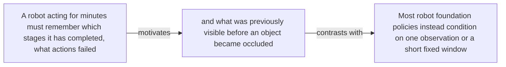

#### Python

```python
from html import escape
from pathlib import Path
from textwrap import wrap

title = "rttt_why_p1: A robot acting for minutes must remember which stages — problem and research-question relation"
nodes = [["n1","A robot acting for minutes must remember which stages it has completed, what actions failed",120,150],["n2","and what was previously visible before an object became occluded",420,150],["n3","Most robot foundation policies instead condition on one observation or a short fixed window",720,150]]
edges = [["n1","n2","motivates"],["n2","n3","contrasts with"]]
node_by_id = {node_id: (label, x, y) for node_id, label, x, y in nodes}

parts = [
    '<svg xmlns="http://www.w3.org/2000/svg" viewBox="0 0 860 520" role="img" aria-labelledby="title desc">',
    f'<title id="title">{escape(title)}</title>',
    '<desc id="desc">The labeled relations reproduce only relationships stated in the paragraph.</desc>',
    '<rect width="860" height="520" fill="white"/>',
]
for source, target, relation in edges:
    _, x1, y1 = node_by_id[source]
    _, x2, y2 = node_by_id[target]
    parts.append(f'<line x1="{x1}" y1="{y1}" x2="{x2}" y2="{y2}" stroke="#345" stroke-width="2"/>')
    parts.append(f'<text x="{(x1+x2)/2}" y="{(y1+y2)/2-6}" text-anchor="middle" font-family="sans-serif" font-size="11">{escape(relation)}</text>')
for _, label, x, y in nodes:
    parts.append(f'<rect x="{x-125}" y="{y-58}" width="250" height="116" rx="14" fill="#eef6ff" stroke="#234"/>')
    for line_index, line in enumerate(wrap(label, width=32)):
        parts.append(f'<text x="{x}" y="{y-34+line_index*16}" text-anchor="middle" font-family="sans-serif" font-size="12">{escape(line)}</text>')
parts.append('</svg>')
Path("rttt_why_p1_treatment_a.svg").write_text("\n".join(parts), encoding="utf-8")
```

### Treatment B — rttt_core, rttt_architecture — claim-to-source provenance

- Teaching purpose: Show exactly which atomic claims underwrite this paragraph and which fixed source records support each claim.
- Encoding and reading order: A bipartite graph places 2 claim nodes on the left and 2 source nodes on the right, with only the 3 claim-source edges recorded in the fixture. Claim labels include epistemic status; source labels include the exact locator.
- Evidence and limitations: This treatment explains provenance and uncertainty, not the paper's causal mechanism. Missing edges remain visibly absent and no source count is treated as confidence.
- Recommended web medium: semantic HTML/CSS claim-source table with an SVG network view; JavaScript only for keyboard-controlled source highlighting.
- Mobile, accessibility, and motion behavior: Provide real table headers and source links in the static fallback, make every edge recoverable as text, stack claim records before source records on mobile, and require no motion.

#### TikZ

```tex
\documentclass[tikz,border=5pt]{standalone}
\usepackage[T1]{fontenc}
\usepackage{tikz}
\usetikzlibrary{arrows.meta}
\begin{document}
\begin{tikzpicture}[font=\sffamily,claim/.style={draw,rounded corners,align=center,text width=5.2cm,minimum height=1.2cm},source/.style={draw,dashed,align=center,text width=5.2cm,minimum height=1.2cm},link/.style={-{Latex[length=2mm]},thin}]
\node[font=\bfseries] at (4,1.8) {rttt\_why\_p1: claim-to-source provenance};
\node[claim] (c1) at (0,0) {RoboTTT uses gradient-updated fast weights as recurrent visuomotor state and reports stronger completion than short-context baselines on three YAM assembly tasks. [OBSERVED]};
\node[claim] (c2) at (0,-2.4) {RoboTTT places TTT layers after attention in the DiT action head and carries their fast weights forward between timesteps. [OBSERVED]};
\node[source] (s1) at (8,0) {RoboTTT v1 - architecture and sequence training - Sections 2-3.2, Equations 1-5, Figures 2-4, PDF pages 3-5; the arXiv v1 record identifies the paper as CC BY 4.0};
\node[source] (s2) at (8,-2.4) {RoboTTT v1 - real-robot evaluation and ablations - Section 4, Tables 1-3, Figures 7-12, PDF pages 7-11};
\draw[link] (c1) -- (s1);
\draw[link] (c1) -- (s2);
\draw[link] (c2) -- (s1);
\end{tikzpicture}
\end{document}
```

#### Mermaid

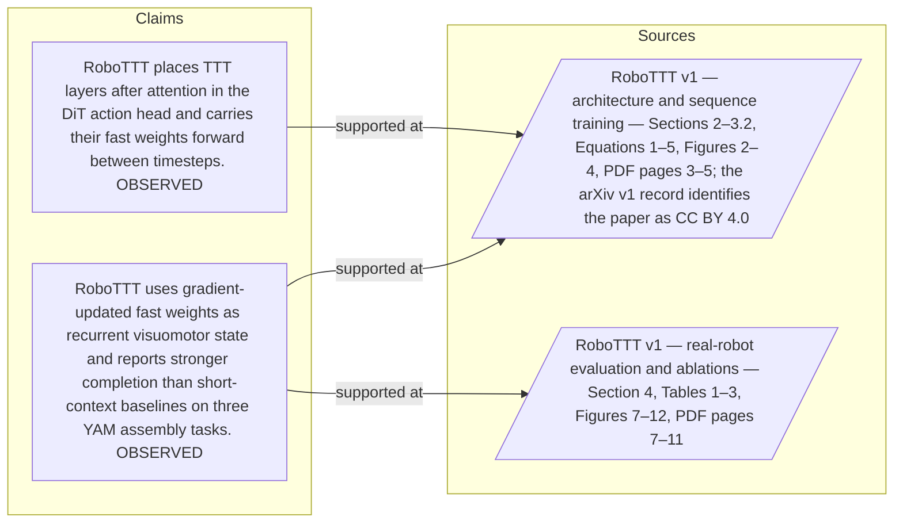

#### Python

```python
from html import escape
from pathlib import Path
from textwrap import wrap

title = "rttt_why_p1: claim-to-source provenance"
nodes = [["c1","RoboTTT uses gradient-updated fast weights as recurrent visuomotor state and reports stronger completion than short-context baselines on three YAM assembly tasks. [OBSERVED]",190,130],["c2","RoboTTT places TTT layers after attention in the DiT action head and carries their fast weights forward between timesteps. [OBSERVED]",190,250],["s1","RoboTTT v1 — architecture and sequence training — Sections 2–3.2, Equations 1–5, Figures 2–4, PDF pages 3–5; the arXiv v1 record identifies the paper as CC BY 4.0",700,130],["s2","RoboTTT v1 — real-robot evaluation and ablations — Section 4, Tables 1–3, Figures 7–12, PDF pages 7–11",700,250]]
edges = [["c1","s1"],["c1","s2"],["c2","s1"]]
node_by_id = {node_id: (label, x, y) for node_id, label, x, y in nodes}
height = 440

parts = [
    f'<svg xmlns="http://www.w3.org/2000/svg" viewBox="0 0 900 {height}" role="img" aria-labelledby="title desc">',
    f'<title id="title">{escape(title)}</title>',
    '<desc id="desc">Bipartite map from verified claim records to their exact source records.</desc>',
    f'<rect width="900" height="{height}" fill="white"/>',
]
for source, target in edges:
    _, x1, y1 = node_by_id[source]
    _, x2, y2 = node_by_id[target]
    parts.append(f'<line x1="{x1+145}" y1="{y1}" x2="{x2-145}" y2="{y2}" stroke="#456" stroke-width="2"/>')
for node_id, label, x, y in nodes:
    dashed = ' stroke-dasharray="7 5"' if node_id.startswith("s") else ''
    parts.append(f'<rect x="{x-145}" y="{y-46}" width="290" height="92" rx="12" fill="#f7fbff" stroke="#234"{dashed}/>')
    for line_index, line in enumerate(wrap(label, width=38)):
        parts.append(f'<text x="{x}" y="{y-24+line_index*14}" text-anchor="middle" font-family="sans-serif" font-size="11">{escape(line)}</text>')
parts.append('</svg>')
Path("rttt_why_p1_treatment_b.svg").write_text("\n".join(parts), encoding="utf-8")
```

### Treatment C — A robot acting for minutes must remember which stages — supported-versus-bounded scope

- Teaching purpose: Separate what the paragraph supports from the qualification or contingency that bounds it.
- Encoding and reading order: Partition the paragraph into 3 supported statement(s) and 1 boundary or contingency statement(s). The two columns are categories, not a scale or causal path.
- Evidence and limitations: Every card is a complete paragraph clause. The boundary column makes negative and not-established language visible without weakening it.
- Recommended web medium: responsive SVG or semantic HTML/CSS; JavaScript is optional only for a meaningful state or scope toggle.
- Mobile, accessibility, and motion behavior: Preserve every exact value or scope statement as selectable text, avoid color-only distinctions, stack groups on mobile, and keep all information visible when JavaScript or motion is disabled.

#### TikZ

```tex
\documentclass[tikz,border=5pt]{standalone}
\usepackage[T1]{fontenc}
\usepackage{tikz}
\begin{document}
\begin{tikzpicture}[font=\sffamily,item/.style={draw,align=center,text width=5.5cm,minimum height=1.4cm}]
\node[font=\bfseries] at (3.5,2) {rttt\_why\_p1: A robot acting for minutes must remember which stages - supported-versus-bounded scope};
\node[font=\bfseries] at (0,1) {Supported statement};
\node[font=\bfseries] at (7,1) {Boundary or contingency};
\node[item] at (0,0) {A robot acting for minutes must remember which stages it has completed, what actions failed};
\node[item] at (0,-2) {and what was previously visible before an object became occluded};
\node[item] at (0,-4) {Most robot foundation policies instead condition on one observation or a short fixed window};
\node[item] at (7,0) {Most robot foundation policies instead condition on one observation or a short fixed window};
\end{tikzpicture}
\end{document}
```

#### Mermaid

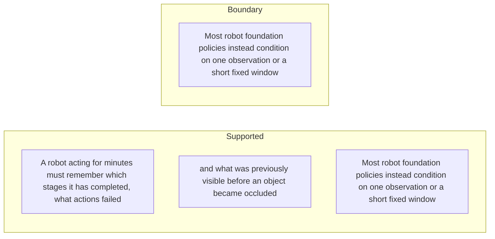

#### Python

```python
from html import escape
from pathlib import Path
from textwrap import wrap

title = "rttt_why_p1: A robot acting for minutes must remember which stages — supported-versus-bounded scope"
columns = {"Supported statement": ["A robot acting for minutes must remember which stages it has completed, what actions failed","and what was previously visible before an object became occluded","Most robot foundation policies instead condition on one observation or a short fixed window"], "Boundary or contingency": ["Most robot foundation policies instead condition on one observation or a short fixed window"]}
height = 550
parts = [
    f'<svg xmlns="http://www.w3.org/2000/svg" viewBox="0 0 900 {height}" role="img" aria-labelledby="title desc">',
    f'<title id="title">{escape(title)}</title>',
    '<desc id="desc">Statements are partitioned into supported content and explicit boundaries.</desc>',
    f'<rect width="900" height="{height}" fill="white"/>',
]
for column_index, (heading, items) in enumerate(columns.items()):
    x = 240 + column_index * 430
    parts.append(f'<text x="{x}" y="70" text-anchor="middle" font-family="sans-serif" font-size="18" font-weight="700">{escape(heading)}</text>')
    for item_index, item in enumerate(items):
        y = 130 + item_index * 110
        parts.append(f'<rect x="{x-180}" y="{y-35}" width="360" height="80" rx="12" fill="#f7fbff" stroke="#234"/>')
        for line_index, line in enumerate(wrap(item, width=48)):
            parts.append(f'<text x="{x}" y="{y-12+line_index*14}" text-anchor="middle" font-family="sans-serif" font-size="11">{escape(line)}</text>')
parts.append('</svg>')
Path("rttt_why_p1_treatment_c.svg").write_text("\n".join(parts), encoding="utf-8")
```

### Implementation record

- Status: `PENDING`
- Selected treatment: `NONE`
- Selection rationale:
- Delivery medium: `NONE`
- Visual ID and placement:
- Shared paragraph scope: `NONE`
- Changed files:
- Accessibility and fallback verification:
- Desktop and mobile verification:
- Evidence deviations: `NONE`

## `rttt_why_p2`

- Location: `rttt_why`, paragraph 2
- Text anchor: "Full attention over an ever-growing history makes each new prediction more expensive."
- Claims and sources: `rttt_core` (OBSERVED, VERIFIED); `rttt_architecture` (OBSERVED, VERIFIED); `rttt_architecture_source` (Sections 2–3.2, Equations 1–5, Figures 2–4, PDF pages 3–5; the arXiv v1 record identifies the paper as CC BY 4.0)
- Visual needed: `YES`
- Decision rationale: Removing a visual would require readers to retain the material relation between "Full attention over an ever-growing history makes each new prediction more expensive" and "but it must retain useful structure from dense, repetitive observations rather than merely storing more frames" while also tracking 3 source-bounded propositions. The paragraph contains a real problem and research-question relation; the visual must preserve its stated conditions and must not add causal or proportional meaning.
- Explanatory job: problem and research-question relation.

### Treatment A — Full attention over an ever-growing history makes each new — problem and research-question relation

- Teaching purpose: Answer "Why does a robot policy need thousands of timesteps of context?" by exposing the paragraph's 3 named propositions and 2 stated reading, comparison, or qualification relations.
- Encoding and reading order: Nodes reproduce the complete labels "Full attention over an ever-growing history makes each new prediction more expensive"; "A compact recurrent state avoids that growth"; "but it must retain useful structure from dense, repetitive observations rather than merely storing more frames". Edges carry the explicit relation labels "motivates", "contrasts with"; arrow direction is sequence only for mechanism or example prose and otherwise denotes reading order.
- Evidence and limitations: The topology is derived from this paragraph rather than a fixed pipeline. Encode only `rttt_core`, `rttt_architecture` and do not turn reading-order edges into causal claims.
- Recommended web medium: responsive inline SVG with CSS; JavaScript may add optional step focus only when state order matters.
- Mobile, accessibility, and motion behavior: Keep the full node-and-relation list in DOM order, expose the relation labels in the long description, stack nodes on narrow screens, and disable focus transitions under reduced motion.

#### TikZ

```tex
\documentclass[tikz,border=5pt]{standalone}
\usepackage[T1]{fontenc}
\usepackage{tikz}
\usetikzlibrary{arrows.meta,positioning}
\begin{document}
\begin{tikzpicture}[font=\sffamily,concept/.style={draw,rounded corners,align=center,text width=3.6cm,minimum height=1.35cm},link/.style={-{Latex[length=2mm]},thick},rel/.style={fill=white,font=\scriptsize,inner sep=2pt}]
\node[font=\bfseries,align=center] at (6.1,2.0) {rttt\_why\_p2: Full attention over an ever-growing history makes each new - problem and research-question relation};
\node[concept] (n1) at (1.8,0) {Full attention over an ever-growing history makes each new prediction more expensive};
\node[concept] (n2) at (6.1,0) {A compact recurrent state avoids that growth};
\node[concept] (n3) at (10.4,0) {but it must retain useful structure from dense, repetitive observations rather than merely storing more frames};
\draw[link] (n1) -- node[rel] {motivates} (n2);
\draw[link] (n2) -- node[rel] {contrasts with} (n3);
\end{tikzpicture}
\end{document}
```

#### Mermaid

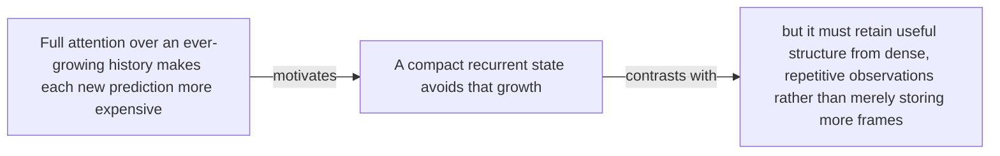

#### Python

```python
from html import escape
from pathlib import Path
from textwrap import wrap

title = "rttt_why_p2: Full attention over an ever-growing history makes each new — problem and research-question relation"
nodes = [["n1","Full attention over an ever-growing history makes each new prediction more expensive",120,150],["n2","A compact recurrent state avoids that growth",420,150],["n3","but it must retain useful structure from dense, repetitive observations rather than merely storing more frames",720,150]]
edges = [["n1","n2","motivates"],["n2","n3","contrasts with"]]
node_by_id = {node_id: (label, x, y) for node_id, label, x, y in nodes}

parts = [
    '<svg xmlns="http://www.w3.org/2000/svg" viewBox="0 0 860 520" role="img" aria-labelledby="title desc">',
    f'<title id="title">{escape(title)}</title>',
    '<desc id="desc">The labeled relations reproduce only relationships stated in the paragraph.</desc>',
    '<rect width="860" height="520" fill="white"/>',
]
for source, target, relation in edges:
    _, x1, y1 = node_by_id[source]
    _, x2, y2 = node_by_id[target]
    parts.append(f'<line x1="{x1}" y1="{y1}" x2="{x2}" y2="{y2}" stroke="#345" stroke-width="2"/>')
    parts.append(f'<text x="{(x1+x2)/2}" y="{(y1+y2)/2-6}" text-anchor="middle" font-family="sans-serif" font-size="11">{escape(relation)}</text>')
for _, label, x, y in nodes:
    parts.append(f'<rect x="{x-125}" y="{y-58}" width="250" height="116" rx="14" fill="#eef6ff" stroke="#234"/>')
    for line_index, line in enumerate(wrap(label, width=32)):
        parts.append(f'<text x="{x}" y="{y-34+line_index*16}" text-anchor="middle" font-family="sans-serif" font-size="12">{escape(line)}</text>')
parts.append('</svg>')
Path("rttt_why_p2_treatment_a.svg").write_text("\n".join(parts), encoding="utf-8")
```

### Treatment B — rttt_core, rttt_architecture — claim-to-source provenance

- Teaching purpose: Show exactly which atomic claims underwrite this paragraph and which fixed source records support each claim.
- Encoding and reading order: A bipartite graph places 2 claim nodes on the left and 2 source nodes on the right, with only the 3 claim-source edges recorded in the fixture. Claim labels include epistemic status; source labels include the exact locator.
- Evidence and limitations: This treatment explains provenance and uncertainty, not the paper's causal mechanism. Missing edges remain visibly absent and no source count is treated as confidence.
- Recommended web medium: semantic HTML/CSS claim-source table with an SVG network view; JavaScript only for keyboard-controlled source highlighting.
- Mobile, accessibility, and motion behavior: Provide real table headers and source links in the static fallback, make every edge recoverable as text, stack claim records before source records on mobile, and require no motion.

#### TikZ

```tex
\documentclass[tikz,border=5pt]{standalone}
\usepackage[T1]{fontenc}
\usepackage{tikz}
\usetikzlibrary{arrows.meta}
\begin{document}
\begin{tikzpicture}[font=\sffamily,claim/.style={draw,rounded corners,align=center,text width=5.2cm,minimum height=1.2cm},source/.style={draw,dashed,align=center,text width=5.2cm,minimum height=1.2cm},link/.style={-{Latex[length=2mm]},thin}]
\node[font=\bfseries] at (4,1.8) {rttt\_why\_p2: claim-to-source provenance};
\node[claim] (c1) at (0,0) {RoboTTT uses gradient-updated fast weights as recurrent visuomotor state and reports stronger completion than short-context baselines on three YAM assembly tasks. [OBSERVED]};
\node[claim] (c2) at (0,-2.4) {RoboTTT places TTT layers after attention in the DiT action head and carries their fast weights forward between timesteps. [OBSERVED]};
\node[source] (s1) at (8,0) {RoboTTT v1 - architecture and sequence training - Sections 2-3.2, Equations 1-5, Figures 2-4, PDF pages 3-5; the arXiv v1 record identifies the paper as CC BY 4.0};
\node[source] (s2) at (8,-2.4) {RoboTTT v1 - real-robot evaluation and ablations - Section 4, Tables 1-3, Figures 7-12, PDF pages 7-11};
\draw[link] (c1) -- (s1);
\draw[link] (c1) -- (s2);
\draw[link] (c2) -- (s1);
\end{tikzpicture}
\end{document}
```

#### Mermaid


#### Python

```python
from html import escape
from pathlib import Path
from textwrap import wrap

title = "rttt_why_p2: claim-to-source provenance"
nodes = [["c1","RoboTTT uses gradient-updated fast weights as recurrent visuomotor state and reports stronger completion than short-context baselines on three YAM assembly tasks. [OBSERVED]",190,130],["c2","RoboTTT places TTT layers after attention in the DiT action head and carries their fast weights forward between timesteps. [OBSERVED]",190,250],["s1","RoboTTT v1 — architecture and sequence training — Sections 2–3.2, Equations 1–5, Figures 2–4, PDF pages 3–5; the arXiv v1 record identifies the paper as CC BY 4.0",700,130],["s2","RoboTTT v1 — real-robot evaluation and ablations — Section 4, Tables 1–3, Figures 7–12, PDF pages 7–11",700,250]]
edges = [["c1","s1"],["c1","s2"],["c2","s1"]]
node_by_id = {node_id: (label, x, y) for node_id, label, x, y in nodes}
height = 440

parts = [
    f'<svg xmlns="http://www.w3.org/2000/svg" viewBox="0 0 900 {height}" role="img" aria-labelledby="title desc">',
    f'<title id="title">{escape(title)}</title>',
    '<desc id="desc">Bipartite map from verified claim records to their exact source records.</desc>',
    f'<rect width="900" height="{height}" fill="white"/>',
]
for source, target in edges:
    _, x1, y1 = node_by_id[source]
    _, x2, y2 = node_by_id[target]
    parts.append(f'<line x1="{x1+145}" y1="{y1}" x2="{x2-145}" y2="{y2}" stroke="#456" stroke-width="2"/>')
for node_id, label, x, y in nodes:
    dashed = ' stroke-dasharray="7 5"' if node_id.startswith("s") else ''
    parts.append(f'<rect x="{x-145}" y="{y-46}" width="290" height="92" rx="12" fill="#f7fbff" stroke="#234"{dashed}/>')
    for line_index, line in enumerate(wrap(label, width=38)):
        parts.append(f'<text x="{x}" y="{y-24+line_index*14}" text-anchor="middle" font-family="sans-serif" font-size="11">{escape(line)}</text>')
parts.append('</svg>')
Path("rttt_why_p2_treatment_b.svg").write_text("\n".join(parts), encoding="utf-8")
```

### Treatment C — Full attention over an ever-growing history makes each new — supported-versus-bounded scope

- Teaching purpose: Separate what the paragraph supports from the qualification or contingency that bounds it.
- Encoding and reading order: Partition the paragraph into 2 supported statement(s) and 1 boundary or contingency statement(s). The two columns are categories, not a scale or causal path.
- Evidence and limitations: Every card is a complete paragraph clause. The boundary column makes negative and not-established language visible without weakening it.
- Recommended web medium: responsive SVG or semantic HTML/CSS; JavaScript is optional only for a meaningful state or scope toggle.
- Mobile, accessibility, and motion behavior: Preserve every exact value or scope statement as selectable text, avoid color-only distinctions, stack groups on mobile, and keep all information visible when JavaScript or motion is disabled.

#### TikZ

```tex
\documentclass[tikz,border=5pt]{standalone}
\usepackage[T1]{fontenc}
\usepackage{tikz}
\begin{document}
\begin{tikzpicture}[font=\sffamily,item/.style={draw,align=center,text width=5.5cm,minimum height=1.4cm}]
\node[font=\bfseries] at (3.5,2) {rttt\_why\_p2: Full attention over an ever-growing history makes each new - supported-versus-bounded scope};
\node[font=\bfseries] at (0,1) {Supported statement};
\node[font=\bfseries] at (7,1) {Boundary or contingency};
\node[item] at (0,0) {Full attention over an ever-growing history makes each new prediction more expensive};
\node[item] at (0,-2) {A compact recurrent state avoids that growth};
\node[item] at (7,0) {but it must retain useful structure from dense, repetitive observations rather than merely storing more frames};
\end{tikzpicture}
\end{document}
```

#### Mermaid

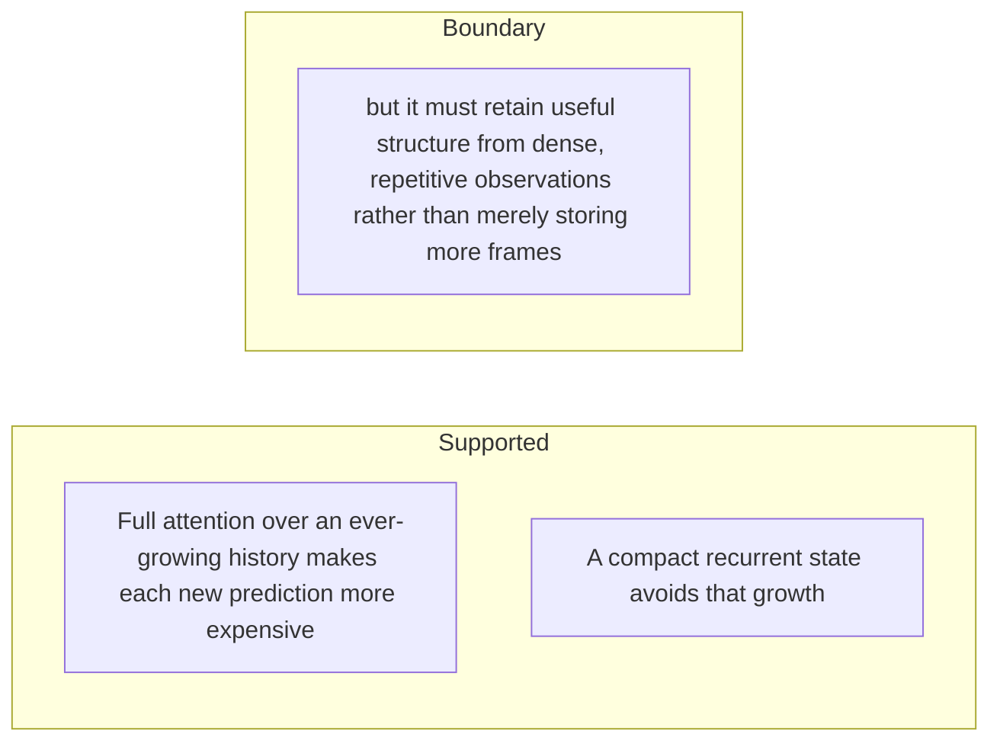

#### Python

```python
from html import escape
from pathlib import Path
from textwrap import wrap

title = "rttt_why_p2: Full attention over an ever-growing history makes each new — supported-versus-bounded scope"
columns = {"Supported statement": ["Full attention over an ever-growing history makes each new prediction more expensive","A compact recurrent state avoids that growth"], "Boundary or contingency": ["but it must retain useful structure from dense, repetitive observations rather than merely storing more frames"]}
height = 440
parts = [
    f'<svg xmlns="http://www.w3.org/2000/svg" viewBox="0 0 900 {height}" role="img" aria-labelledby="title desc">',
    f'<title id="title">{escape(title)}</title>',
    '<desc id="desc">Statements are partitioned into supported content and explicit boundaries.</desc>',
    f'<rect width="900" height="{height}" fill="white"/>',
]
for column_index, (heading, items) in enumerate(columns.items()):
    x = 240 + column_index * 430
    parts.append(f'<text x="{x}" y="70" text-anchor="middle" font-family="sans-serif" font-size="18" font-weight="700">{escape(heading)}</text>')
    for item_index, item in enumerate(items):
        y = 130 + item_index * 110
        parts.append(f'<rect x="{x-180}" y="{y-35}" width="360" height="80" rx="12" fill="#f7fbff" stroke="#234"/>')
        for line_index, line in enumerate(wrap(item, width=48)):
            parts.append(f'<text x="{x}" y="{y-12+line_index*14}" text-anchor="middle" font-family="sans-serif" font-size="11">{escape(line)}</text>')
parts.append('</svg>')
Path("rttt_why_p2_treatment_c.svg").write_text("\n".join(parts), encoding="utf-8")
```

### Implementation record

- Status: `PENDING`
- Selected treatment: `NONE`
- Selection rationale:
- Delivery medium: `NONE`
- Visual ID and placement:
- Shared paragraph scope: `NONE`
- Changed files:
- Accessibility and fallback verification:
- Desktop and mobile verification:
- Evidence deviations: `NONE`

## `rttt_change_p1`

- Location: `rttt_change`, paragraph 1
- Text anchor: "RoboTTT does not keep the complete history available for attention."
- Claims and sources: `rttt_architecture` (OBSERVED, VERIFIED); `rttt_training` (OBSERVED, VERIFIED); `rttt_architecture_source` (Sections 2–3.2, Equations 1–5, Figures 2–4, PDF pages 3–5; the arXiv v1 record identifies the paper as CC BY 4.0)
- Visual needed: `YES`
- Decision rationale: Removing a visual would require readers to retain the material relation between "RoboTTT does not keep the complete history available for attention" and "then applies the updated network to retrieve contextual information for the current action prediction" while also tracking 4 source-bounded propositions. The paragraph contains a real changed-versus-preserved relation; the visual must preserve its stated conditions and must not add causal or proportional meaning.
- Explanatory job: changed-versus-preserved relation.

### Treatment A — RoboTTT does not keep the complete history available for — changed-versus-preserved relation

- Teaching purpose: Answer "What is different from adding more history frames?" by exposing the paragraph's 4 named propositions and 3 stated reading, comparison, or qualification relations.
- Encoding and reading order: Nodes reproduce the complete labels "RoboTTT does not keep the complete history available for attention"; "It uses fast weights as recurrent state"; "a small neural network updates its parameters by gradient descent at every timestep"; "then applies the updated network to retrieve contextual information for the current action prediction". Edges carry the explicit relation labels "changes into", "changes into", "changes into"; arrow direction is sequence only for mechanism or example prose and otherwise denotes reading order.
- Evidence and limitations: The topology is derived from this paragraph rather than a fixed pipeline. Encode only `rttt_architecture`, `rttt_training` and do not turn reading-order edges into causal claims.
- Recommended web medium: responsive inline SVG with CSS; JavaScript may add optional step focus only when state order matters.
- Mobile, accessibility, and motion behavior: Keep the full node-and-relation list in DOM order, expose the relation labels in the long description, stack nodes on narrow screens, and disable focus transitions under reduced motion.

#### TikZ

```tex
\documentclass[tikz,border=5pt]{standalone}
\usepackage[T1]{fontenc}
\usepackage{tikz}
\usetikzlibrary{arrows.meta,positioning}
\begin{document}
\begin{tikzpicture}[font=\sffamily,concept/.style={draw,rounded corners,align=center,text width=3.6cm,minimum height=1.35cm},link/.style={-{Latex[length=2mm]},thick},rel/.style={fill=white,font=\scriptsize,inner sep=2pt}]
\node[font=\bfseries,align=center] at (6.1,2.0) {rttt\_change\_p1: RoboTTT does not keep the complete history available for - changed-versus-preserved relation};
\node[concept] (n1) at (1.8,0) {RoboTTT does not keep the complete history available for attention};
\node[concept] (n2) at (6.1,0) {It uses fast weights as recurrent state};
\node[concept] (n3) at (10.4,0) {a small neural network updates its parameters by gradient descent at every timestep};
\node[concept] (n4) at (1.8,-3.2) {then applies the updated network to retrieve contextual information for the current action prediction};
\draw[link] (n1) -- node[rel] {changes into} (n2);
\draw[link] (n2) -- node[rel] {changes into} (n3);
\draw[link] (n3) -- node[rel] {changes into} (n4);
\end{tikzpicture}
\end{document}
```

#### Mermaid

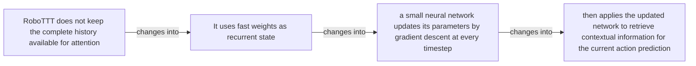

#### Python

```python
from html import escape
from pathlib import Path
from textwrap import wrap

title = "rttt_change_p1: RoboTTT does not keep the complete history available for — changed-versus-preserved relation"
nodes = [["n1","RoboTTT does not keep the complete history available for attention",120,150],["n2","It uses fast weights as recurrent state",420,150],["n3","a small neural network updates its parameters by gradient descent at every timestep",720,150],["n4","then applies the updated network to retrieve contextual information for the current action prediction",120,340]]
edges = [["n1","n2","changes into"],["n2","n3","changes into"],["n3","n4","changes into"]]
node_by_id = {node_id: (label, x, y) for node_id, label, x, y in nodes}

parts = [
    '<svg xmlns="http://www.w3.org/2000/svg" viewBox="0 0 860 520" role="img" aria-labelledby="title desc">',
    f'<title id="title">{escape(title)}</title>',
    '<desc id="desc">The labeled relations reproduce only relationships stated in the paragraph.</desc>',
    '<rect width="860" height="520" fill="white"/>',
]
for source, target, relation in edges:
    _, x1, y1 = node_by_id[source]
    _, x2, y2 = node_by_id[target]
    parts.append(f'<line x1="{x1}" y1="{y1}" x2="{x2}" y2="{y2}" stroke="#345" stroke-width="2"/>')
    parts.append(f'<text x="{(x1+x2)/2}" y="{(y1+y2)/2-6}" text-anchor="middle" font-family="sans-serif" font-size="11">{escape(relation)}</text>')
for _, label, x, y in nodes:
    parts.append(f'<rect x="{x-125}" y="{y-58}" width="250" height="116" rx="14" fill="#eef6ff" stroke="#234"/>')
    for line_index, line in enumerate(wrap(label, width=32)):
        parts.append(f'<text x="{x}" y="{y-34+line_index*16}" text-anchor="middle" font-family="sans-serif" font-size="12">{escape(line)}</text>')
parts.append('</svg>')
Path("rttt_change_p1_treatment_a.svg").write_text("\n".join(parts), encoding="utf-8")
```

### Treatment B — rttt_architecture, rttt_training — claim-to-source provenance

- Teaching purpose: Show exactly which atomic claims underwrite this paragraph and which fixed source records support each claim.
- Encoding and reading order: A bipartite graph places 2 claim nodes on the left and 1 source nodes on the right, with only the 2 claim-source edges recorded in the fixture. Claim labels include epistemic status; source labels include the exact locator.
- Evidence and limitations: This treatment explains provenance and uncertainty, not the paper's causal mechanism. Missing edges remain visibly absent and no source count is treated as confidence.
- Recommended web medium: semantic HTML/CSS claim-source table with an SVG network view; JavaScript only for keyboard-controlled source highlighting.
- Mobile, accessibility, and motion behavior: Provide real table headers and source links in the static fallback, make every edge recoverable as text, stack claim records before source records on mobile, and require no motion.

#### TikZ

```tex
\documentclass[tikz,border=5pt]{standalone}
\usepackage[T1]{fontenc}
\usepackage{tikz}
\usetikzlibrary{arrows.meta}
\begin{document}
\begin{tikzpicture}[font=\sffamily,claim/.style={draw,rounded corners,align=center,text width=5.2cm,minimum height=1.2cm},source/.style={draw,dashed,align=center,text width=5.2cm,minimum height=1.2cm},link/.style={-{Latex[length=2mm]},thin}]
\node[font=\bfseries] at (4,1.8) {rttt\_change\_p1: claim-to-source provenance};
\node[claim] (c1) at (0,0) {RoboTTT places TTT layers after attention in the DiT action head and carries their fast weights forward between timesteps. [OBSERVED]};
\node[claim] (c2) at (0,-2.4) {Sequence action forcing uses independently sampled noise levels per action chunk, while TBPTT carries fast weights across detached segment boundaries. [OBSERVED]};
\node[source] (s1) at (8,0) {RoboTTT v1 - architecture and sequence training - Sections 2-3.2, Equations 1-5, Figures 2-4, PDF pages 3-5; the arXiv v1 record identifies the paper as CC BY 4.0};
\draw[link] (c1) -- (s1);
\draw[link] (c2) -- (s1);
\end{tikzpicture}
\end{document}
```

#### Mermaid

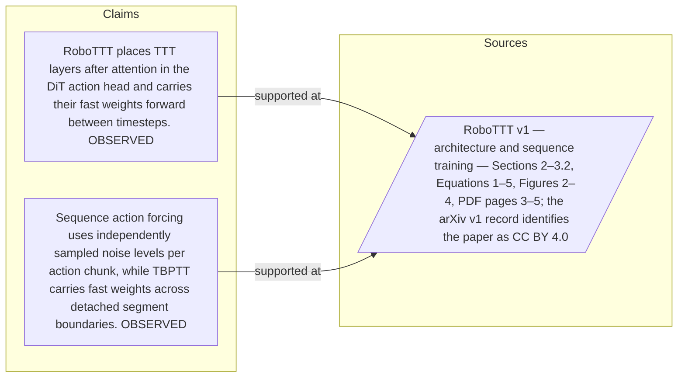

#### Python

```python
from html import escape
from pathlib import Path
from textwrap import wrap

title = "rttt_change_p1: claim-to-source provenance"
nodes = [["c1","RoboTTT places TTT layers after attention in the DiT action head and carries their fast weights forward between timesteps. [OBSERVED]",190,130],["c2","Sequence action forcing uses independently sampled noise levels per action chunk, while TBPTT carries fast weights across detached segment boundaries. [OBSERVED]",190,250],["s1","RoboTTT v1 — architecture and sequence training — Sections 2–3.2, Equations 1–5, Figures 2–4, PDF pages 3–5; the arXiv v1 record identifies the paper as CC BY 4.0",700,130]]
edges = [["c1","s1"],["c2","s1"]]
node_by_id = {node_id: (label, x, y) for node_id, label, x, y in nodes}
height = 440

parts = [
    f'<svg xmlns="http://www.w3.org/2000/svg" viewBox="0 0 900 {height}" role="img" aria-labelledby="title desc">',
    f'<title id="title">{escape(title)}</title>',
    '<desc id="desc">Bipartite map from verified claim records to their exact source records.</desc>',
    f'<rect width="900" height="{height}" fill="white"/>',
]
for source, target in edges:
    _, x1, y1 = node_by_id[source]
    _, x2, y2 = node_by_id[target]
    parts.append(f'<line x1="{x1+145}" y1="{y1}" x2="{x2-145}" y2="{y2}" stroke="#456" stroke-width="2"/>')
for node_id, label, x, y in nodes:
    dashed = ' stroke-dasharray="7 5"' if node_id.startswith("s") else ''
    parts.append(f'<rect x="{x-145}" y="{y-46}" width="290" height="92" rx="12" fill="#f7fbff" stroke="#234"{dashed}/>')
    for line_index, line in enumerate(wrap(label, width=38)):
        parts.append(f'<text x="{x}" y="{y-24+line_index*14}" text-anchor="middle" font-family="sans-serif" font-size="11">{escape(line)}</text>')
parts.append('</svg>')
Path("rttt_change_p1_treatment_b.svg").write_text("\n".join(parts), encoding="utf-8")
```

### Treatment C — RoboTTT does not keep the complete history available for — supported-versus-bounded scope

- Teaching purpose: Separate what the paragraph supports from the qualification or contingency that bounds it.
- Encoding and reading order: Partition the paragraph into 3 supported statement(s) and 1 boundary or contingency statement(s). The two columns are categories, not a scale or causal path.
- Evidence and limitations: Every card is a complete paragraph clause. The boundary column makes negative and not-established language visible without weakening it.
- Recommended web medium: responsive SVG or semantic HTML/CSS; JavaScript is optional only for a meaningful state or scope toggle.
- Mobile, accessibility, and motion behavior: Preserve every exact value or scope statement as selectable text, avoid color-only distinctions, stack groups on mobile, and keep all information visible when JavaScript or motion is disabled.

#### TikZ

```tex
\documentclass[tikz,border=5pt]{standalone}
\usepackage[T1]{fontenc}
\usepackage{tikz}
\begin{document}
\begin{tikzpicture}[font=\sffamily,item/.style={draw,align=center,text width=5.5cm,minimum height=1.4cm}]
\node[font=\bfseries] at (3.5,2) {rttt\_change\_p1: RoboTTT does not keep the complete history available for - supported-versus-bounded scope};
\node[font=\bfseries] at (0,1) {Supported statement};
\node[font=\bfseries] at (7,1) {Boundary or contingency};
\node[item] at (0,0) {It uses fast weights as recurrent state};
\node[item] at (0,-2) {a small neural network updates its parameters by gradient descent at every timestep};
\node[item] at (0,-4) {then applies the updated network to retrieve contextual information for the current action prediction};
\node[item] at (7,0) {RoboTTT does not keep the complete history available for attention};
\end{tikzpicture}
\end{document}
```

#### Mermaid

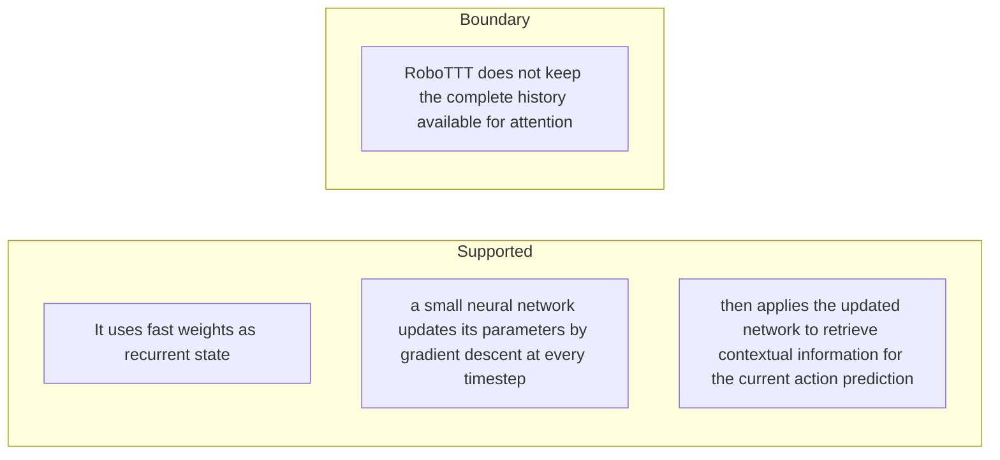

#### Python

```python
from html import escape
from pathlib import Path
from textwrap import wrap

title = "rttt_change_p1: RoboTTT does not keep the complete history available for — supported-versus-bounded scope"
columns = {"Supported statement": ["It uses fast weights as recurrent state","a small neural network updates its parameters by gradient descent at every timestep","then applies the updated network to retrieve contextual information for the current action prediction"], "Boundary or contingency": ["RoboTTT does not keep the complete history available for attention"]}
height = 550
parts = [
    f'<svg xmlns="http://www.w3.org/2000/svg" viewBox="0 0 900 {height}" role="img" aria-labelledby="title desc">',
    f'<title id="title">{escape(title)}</title>',
    '<desc id="desc">Statements are partitioned into supported content and explicit boundaries.</desc>',
    f'<rect width="900" height="{height}" fill="white"/>',
]
for column_index, (heading, items) in enumerate(columns.items()):
    x = 240 + column_index * 430
    parts.append(f'<text x="{x}" y="70" text-anchor="middle" font-family="sans-serif" font-size="18" font-weight="700">{escape(heading)}</text>')
    for item_index, item in enumerate(items):
        y = 130 + item_index * 110
        parts.append(f'<rect x="{x-180}" y="{y-35}" width="360" height="80" rx="12" fill="#f7fbff" stroke="#234"/>')
        for line_index, line in enumerate(wrap(item, width=48)):
            parts.append(f'<text x="{x}" y="{y-12+line_index*14}" text-anchor="middle" font-family="sans-serif" font-size="11">{escape(line)}</text>')
parts.append('</svg>')
Path("rttt_change_p1_treatment_c.svg").write_text("\n".join(parts), encoding="utf-8")
```

### Implementation record

- Status: `PENDING`
- Selected treatment: `NONE`
- Selection rationale:
- Delivery medium: `NONE`
- Visual ID and placement:
- Shared paragraph scope: `NONE`
- Changed files:
- Accessibility and fallback verification:
- Desktop and mobile verification:
- Evidence deviations: `NONE`

## `rttt_change_p2`

- Location: `rttt_change`, paragraph 2
- Text anchor: "The paper combines this state mechanism with two training ideas."
- Claims and sources: `rttt_architecture` (OBSERVED, VERIFIED); `rttt_training` (OBSERVED, VERIFIED); `rttt_architecture_source` (Sections 2–3.2, Equations 1–5, Figures 2–4, PDF pages 3–5; the arXiv v1 record identifies the paper as CC BY 4.0)
- Visual needed: `YES`
- Decision rationale: Removing a visual would require readers to retain the material relation between "The paper combines this state mechanism with two training ideas" and "so memory use depends on segment length rather than total context length" while also tracking 4 source-bounded propositions. The paragraph contains a real changed-versus-preserved relation; the visual must preserve its stated conditions and must not add causal or proportional meaning.
- Explanatory job: changed-versus-preserved relation.

### Treatment A — The paper combines this state mechanism with two training — changed-versus-preserved relation

- Teaching purpose: Answer "What is different from adding more history frames?" by exposing the paragraph's 4 named propositions and 3 stated reading, comparison, or qualification relations.
- Encoding and reading order: Nodes reproduce the complete labels "The paper combines this state mechanism with two training ideas"; "Sequence action forcing samples a different flow-matching noise level for every action chunk"; "Truncated backpropagation carries fast weights across segments while stopping their gradients at segment boundaries"; "so memory use depends on segment length rather than total context length". Edges carry the explicit relation labels "changes into", "contrasts with", "contrasts with"; arrow direction is sequence only for mechanism or example prose and otherwise denotes reading order.
- Evidence and limitations: The topology is derived from this paragraph rather than a fixed pipeline. Encode only `rttt_architecture`, `rttt_training` and do not turn reading-order edges into causal claims.
- Recommended web medium: responsive inline SVG with CSS; JavaScript may add optional step focus only when state order matters.
- Mobile, accessibility, and motion behavior: Keep the full node-and-relation list in DOM order, expose the relation labels in the long description, stack nodes on narrow screens, and disable focus transitions under reduced motion.

#### TikZ

```tex
\documentclass[tikz,border=5pt]{standalone}
\usepackage[T1]{fontenc}
\usepackage{tikz}
\usetikzlibrary{arrows.meta,positioning}
\begin{document}
\begin{tikzpicture}[font=\sffamily,concept/.style={draw,rounded corners,align=center,text width=3.6cm,minimum height=1.35cm},link/.style={-{Latex[length=2mm]},thick},rel/.style={fill=white,font=\scriptsize,inner sep=2pt}]
\node[font=\bfseries,align=center] at (6.1,2.0) {rttt\_change\_p2: The paper combines this state mechanism with two training - changed-versus-preserved relation};
\node[concept] (n1) at (1.8,0) {The paper combines this state mechanism with two training ideas};
\node[concept] (n2) at (6.1,0) {Sequence action forcing samples a different flow-matching noise level for every action chunk};
\node[concept] (n3) at (10.4,0) {Truncated backpropagation carries fast weights across segments while stopping their gradients at segment boundaries};
\node[concept] (n4) at (1.8,-3.2) {so memory use depends on segment length rather than total context length};
\draw[link] (n1) -- node[rel] {changes into} (n2);
\draw[link] (n2) -- node[rel] {contrasts with} (n3);
\draw[link] (n3) -- node[rel] {contrasts with} (n4);
\end{tikzpicture}
\end{document}
```

#### Mermaid

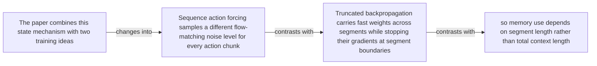

#### Python

```python
from html import escape
from pathlib import Path
from textwrap import wrap

title = "rttt_change_p2: The paper combines this state mechanism with two training — changed-versus-preserved relation"
nodes = [["n1","The paper combines this state mechanism with two training ideas",120,150],["n2","Sequence action forcing samples a different flow-matching noise level for every action chunk",420,150],["n3","Truncated backpropagation carries fast weights across segments while stopping their gradients at segment boundaries",720,150],["n4","so memory use depends on segment length rather than total context length",120,340]]
edges = [["n1","n2","changes into"],["n2","n3","contrasts with"],["n3","n4","contrasts with"]]
node_by_id = {node_id: (label, x, y) for node_id, label, x, y in nodes}

parts = [
    '<svg xmlns="http://www.w3.org/2000/svg" viewBox="0 0 860 520" role="img" aria-labelledby="title desc">',
    f'<title id="title">{escape(title)}</title>',
    '<desc id="desc">The labeled relations reproduce only relationships stated in the paragraph.</desc>',
    '<rect width="860" height="520" fill="white"/>',
]
for source, target, relation in edges:
    _, x1, y1 = node_by_id[source]
    _, x2, y2 = node_by_id[target]
    parts.append(f'<line x1="{x1}" y1="{y1}" x2="{x2}" y2="{y2}" stroke="#345" stroke-width="2"/>')
    parts.append(f'<text x="{(x1+x2)/2}" y="{(y1+y2)/2-6}" text-anchor="middle" font-family="sans-serif" font-size="11">{escape(relation)}</text>')
for _, label, x, y in nodes:
    parts.append(f'<rect x="{x-125}" y="{y-58}" width="250" height="116" rx="14" fill="#eef6ff" stroke="#234"/>')
    for line_index, line in enumerate(wrap(label, width=32)):
        parts.append(f'<text x="{x}" y="{y-34+line_index*16}" text-anchor="middle" font-family="sans-serif" font-size="12">{escape(line)}</text>')
parts.append('</svg>')
Path("rttt_change_p2_treatment_a.svg").write_text("\n".join(parts), encoding="utf-8")
```

### Treatment B — rttt_architecture, rttt_training — claim-to-source provenance

- Teaching purpose: Show exactly which atomic claims underwrite this paragraph and which fixed source records support each claim.
- Encoding and reading order: A bipartite graph places 2 claim nodes on the left and 1 source nodes on the right, with only the 2 claim-source edges recorded in the fixture. Claim labels include epistemic status; source labels include the exact locator.
- Evidence and limitations: This treatment explains provenance and uncertainty, not the paper's causal mechanism. Missing edges remain visibly absent and no source count is treated as confidence.
- Recommended web medium: semantic HTML/CSS claim-source table with an SVG network view; JavaScript only for keyboard-controlled source highlighting.
- Mobile, accessibility, and motion behavior: Provide real table headers and source links in the static fallback, make every edge recoverable as text, stack claim records before source records on mobile, and require no motion.

#### TikZ

```tex
\documentclass[tikz,border=5pt]{standalone}
\usepackage[T1]{fontenc}
\usepackage{tikz}
\usetikzlibrary{arrows.meta}
\begin{document}
\begin{tikzpicture}[font=\sffamily,claim/.style={draw,rounded corners,align=center,text width=5.2cm,minimum height=1.2cm},source/.style={draw,dashed,align=center,text width=5.2cm,minimum height=1.2cm},link/.style={-{Latex[length=2mm]},thin}]
\node[font=\bfseries] at (4,1.8) {rttt\_change\_p2: claim-to-source provenance};
\node[claim] (c1) at (0,0) {RoboTTT places TTT layers after attention in the DiT action head and carries their fast weights forward between timesteps. [OBSERVED]};
\node[claim] (c2) at (0,-2.4) {Sequence action forcing uses independently sampled noise levels per action chunk, while TBPTT carries fast weights across detached segment boundaries. [OBSERVED]};
\node[source] (s1) at (8,0) {RoboTTT v1 - architecture and sequence training - Sections 2-3.2, Equations 1-5, Figures 2-4, PDF pages 3-5; the arXiv v1 record identifies the paper as CC BY 4.0};
\draw[link] (c1) -- (s1);
\draw[link] (c2) -- (s1);
\end{tikzpicture}
\end{document}
```

#### Mermaid


#### Python

```python
from html import escape
from pathlib import Path
from textwrap import wrap

title = "rttt_change_p2: claim-to-source provenance"
nodes = [["c1","RoboTTT places TTT layers after attention in the DiT action head and carries their fast weights forward between timesteps. [OBSERVED]",190,130],["c2","Sequence action forcing uses independently sampled noise levels per action chunk, while TBPTT carries fast weights across detached segment boundaries. [OBSERVED]",190,250],["s1","RoboTTT v1 — architecture and sequence training — Sections 2–3.2, Equations 1–5, Figures 2–4, PDF pages 3–5; the arXiv v1 record identifies the paper as CC BY 4.0",700,130]]
edges = [["c1","s1"],["c2","s1"]]
node_by_id = {node_id: (label, x, y) for node_id, label, x, y in nodes}
height = 440

parts = [
    f'<svg xmlns="http://www.w3.org/2000/svg" viewBox="0 0 900 {height}" role="img" aria-labelledby="title desc">',
    f'<title id="title">{escape(title)}</title>',
    '<desc id="desc">Bipartite map from verified claim records to their exact source records.</desc>',
    f'<rect width="900" height="{height}" fill="white"/>',
]
for source, target in edges:
    _, x1, y1 = node_by_id[source]
    _, x2, y2 = node_by_id[target]
    parts.append(f'<line x1="{x1+145}" y1="{y1}" x2="{x2-145}" y2="{y2}" stroke="#456" stroke-width="2"/>')
for node_id, label, x, y in nodes:
    dashed = ' stroke-dasharray="7 5"' if node_id.startswith("s") else ''
    parts.append(f'<rect x="{x-145}" y="{y-46}" width="290" height="92" rx="12" fill="#f7fbff" stroke="#234"{dashed}/>')
    for line_index, line in enumerate(wrap(label, width=38)):
        parts.append(f'<text x="{x}" y="{y-24+line_index*14}" text-anchor="middle" font-family="sans-serif" font-size="11">{escape(line)}</text>')
parts.append('</svg>')
Path("rttt_change_p2_treatment_b.svg").write_text("\n".join(parts), encoding="utf-8")
```

### Treatment C — The paper combines this state mechanism with two training — supported-versus-bounded scope

- Teaching purpose: Separate what the paragraph supports from the qualification or contingency that bounds it.
- Encoding and reading order: Partition the paragraph into 3 supported statement(s) and 1 boundary or contingency statement(s). The two columns are categories, not a scale or causal path.
- Evidence and limitations: Every card is a complete paragraph clause. The boundary column makes negative and not-established language visible without weakening it.
- Recommended web medium: responsive SVG or semantic HTML/CSS; JavaScript is optional only for a meaningful state or scope toggle.
- Mobile, accessibility, and motion behavior: Preserve every exact value or scope statement as selectable text, avoid color-only distinctions, stack groups on mobile, and keep all information visible when JavaScript or motion is disabled.

#### TikZ

```tex
\documentclass[tikz,border=5pt]{standalone}
\usepackage[T1]{fontenc}
\usepackage{tikz}
\begin{document}
\begin{tikzpicture}[font=\sffamily,item/.style={draw,align=center,text width=5.5cm,minimum height=1.4cm}]
\node[font=\bfseries] at (3.5,2) {rttt\_change\_p2: The paper combines this state mechanism with two training - supported-versus-bounded scope};
\node[font=\bfseries] at (0,1) {Supported statement};
\node[font=\bfseries] at (7,1) {Boundary or contingency};
\node[item] at (0,0) {The paper combines this state mechanism with two training ideas};
\node[item] at (0,-2) {Sequence action forcing samples a different flow-matching noise level for every action chunk};
\node[item] at (0,-4) {Truncated backpropagation carries fast weights across segments while stopping their gradients at segment boundaries};
\node[item] at (7,0) {so memory use depends on segment length rather than total context length};
\end{tikzpicture}
\end{document}
```

#### Mermaid

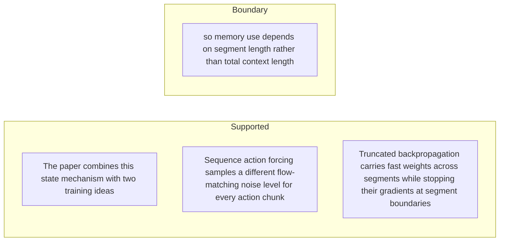

#### Python

```python
from html import escape
from pathlib import Path
from textwrap import wrap

title = "rttt_change_p2: The paper combines this state mechanism with two training — supported-versus-bounded scope"
columns = {"Supported statement": ["The paper combines this state mechanism with two training ideas","Sequence action forcing samples a different flow-matching noise level for every action chunk","Truncated backpropagation carries fast weights across segments while stopping their gradients at segment boundaries"], "Boundary or contingency": ["so memory use depends on segment length rather than total context length"]}
height = 550
parts = [
    f'<svg xmlns="http://www.w3.org/2000/svg" viewBox="0 0 900 {height}" role="img" aria-labelledby="title desc">',
    f'<title id="title">{escape(title)}</title>',
    '<desc id="desc">Statements are partitioned into supported content and explicit boundaries.</desc>',
    f'<rect width="900" height="{height}" fill="white"/>',
]
for column_index, (heading, items) in enumerate(columns.items()):
    x = 240 + column_index * 430
    parts.append(f'<text x="{x}" y="70" text-anchor="middle" font-family="sans-serif" font-size="18" font-weight="700">{escape(heading)}</text>')
    for item_index, item in enumerate(items):
        y = 130 + item_index * 110
        parts.append(f'<rect x="{x-180}" y="{y-35}" width="360" height="80" rx="12" fill="#f7fbff" stroke="#234"/>')
        for line_index, line in enumerate(wrap(item, width=48)):
            parts.append(f'<text x="{x}" y="{y-12+line_index*14}" text-anchor="middle" font-family="sans-serif" font-size="11">{escape(line)}</text>')
parts.append('</svg>')
Path("rttt_change_p2_treatment_c.svg").write_text("\n".join(parts), encoding="utf-8")
```

### Implementation record

- Status: `PENDING`
- Selected treatment: `NONE`
- Selection rationale:
- Delivery medium: `NONE`
- Visual ID and placement:
- Shared paragraph scope: `NONE`
- Changed files:
- Accessibility and fallback verification:
- Desktop and mobile verification:
- Evidence deviations: `NONE`

## `rttt_mechanism_p1`

- Location: `rttt_mechanism`, paragraph 1
- Text anchor: "RoboTTT is instantiated on GR00T N1.7."
- Claims and sources: `rttt_architecture` (OBSERVED, VERIFIED); `rttt_training` (OBSERVED, VERIFIED); `rttt_architecture_source` (Sections 2–3.2, Equations 1–5, Figures 2–4, PDF pages 3–5; the arXiv v1 record identifies the paper as CC BY 4.0); `rttt_training_source` (Sections 3.3–3.4, Figures 5–6, PDF pages 6–7)
- Visual needed: `YES`
- Decision rationale: Removing a visual would require readers to retain the material relation between "RoboTTT is instantiated on GR00T N1.7" and "TTT layers operate across timesteps" while also tracking 6 source-bounded propositions. The paragraph contains a real mechanism relation graph; the visual must preserve its stated conditions and must not add causal or proportional meaning.
- Explanatory job: mechanism relation graph.

### Treatment A — RoboTTT is instantiated on GR00T N17 — mechanism relation graph

- Teaching purpose: Answer "How does one observation change the policy's memory?" by exposing the paragraph's 6 named propositions and 5 stated reading, comparison, or qualification relations.
- Encoding and reading order: Nodes reproduce the complete labels "RoboTTT is instantiated on GR00T N1.7"; "Its vision-language model encodes the current observation"; "and its Diffusion Transformer action head processes register, proprioception"; "and noised action tokens"; "Attention operates within a timestep"; "TTT layers operate across timesteps". Edges carry the explicit relation labels "then", "then", "then", "then", "then"; arrow direction is sequence only for mechanism or example prose and otherwise denotes reading order.
- Evidence and limitations: The topology is derived from this paragraph rather than a fixed pipeline. Encode only `rttt_architecture`, `rttt_training` and do not turn reading-order edges into causal claims.
- Recommended web medium: responsive inline SVG with CSS; JavaScript may add optional step focus only when state order matters.
- Mobile, accessibility, and motion behavior: Keep the full node-and-relation list in DOM order, expose the relation labels in the long description, stack nodes on narrow screens, and disable focus transitions under reduced motion.

#### TikZ

```tex
\documentclass[tikz,border=5pt]{standalone}
\usepackage[T1]{fontenc}
\usepackage{tikz}
\usetikzlibrary{arrows.meta,positioning}
\begin{document}
\begin{tikzpicture}[font=\sffamily,concept/.style={draw,rounded corners,align=center,text width=3.6cm,minimum height=1.35cm},link/.style={-{Latex[length=2mm]},thick},rel/.style={fill=white,font=\scriptsize,inner sep=2pt}]
\node[font=\bfseries,align=center] at (6.1,2.0) {rttt\_mechanism\_p1: RoboTTT is instantiated on GR00T N17 - mechanism relation graph};
\node[concept] (n1) at (1.8,0) {RoboTTT is instantiated on GR00T N1.7};
\node[concept] (n2) at (6.1,0) {Its vision-language model encodes the current observation};
\node[concept] (n3) at (10.4,0) {and its Diffusion Transformer action head processes register, proprioception};
\node[concept] (n4) at (1.8,-3.2) {and noised action tokens};
\node[concept] (n5) at (6.1,-3.2) {Attention operates within a timestep};
\node[concept] (n6) at (10.4,-3.2) {TTT layers operate across timesteps};
\draw[link] (n1) -- node[rel] {then} (n2);
\draw[link] (n2) -- node[rel] {then} (n3);
\draw[link] (n3) -- node[rel] {then} (n4);
\draw[link] (n4) -- node[rel] {then} (n5);
\draw[link] (n5) -- node[rel] {then} (n6);
\end{tikzpicture}
\end{document}
```

#### Mermaid

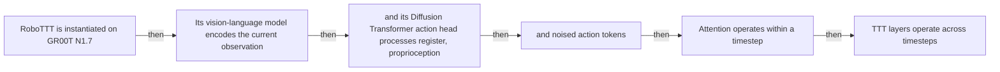

#### Python

```python
from html import escape
from pathlib import Path
from textwrap import wrap

title = "rttt_mechanism_p1: RoboTTT is instantiated on GR00T N17 — mechanism relation graph"
nodes = [["n1","RoboTTT is instantiated on GR00T N1.7",120,150],["n2","Its vision-language model encodes the current observation",420,150],["n3","and its Diffusion Transformer action head processes register, proprioception",720,150],["n4","and noised action tokens",120,340],["n5","Attention operates within a timestep",420,340],["n6","TTT layers operate across timesteps",720,340]]
edges = [["n1","n2","then"],["n2","n3","then"],["n3","n4","then"],["n4","n5","then"],["n5","n6","then"]]
node_by_id = {node_id: (label, x, y) for node_id, label, x, y in nodes}

parts = [
    '<svg xmlns="http://www.w3.org/2000/svg" viewBox="0 0 860 520" role="img" aria-labelledby="title desc">',
    f'<title id="title">{escape(title)}</title>',
    '<desc id="desc">The labeled relations reproduce only relationships stated in the paragraph.</desc>',
    '<rect width="860" height="520" fill="white"/>',
]
for source, target, relation in edges:
    _, x1, y1 = node_by_id[source]
    _, x2, y2 = node_by_id[target]
    parts.append(f'<line x1="{x1}" y1="{y1}" x2="{x2}" y2="{y2}" stroke="#345" stroke-width="2"/>')
    parts.append(f'<text x="{(x1+x2)/2}" y="{(y1+y2)/2-6}" text-anchor="middle" font-family="sans-serif" font-size="11">{escape(relation)}</text>')
for _, label, x, y in nodes:
    parts.append(f'<rect x="{x-125}" y="{y-58}" width="250" height="116" rx="14" fill="#eef6ff" stroke="#234"/>')
    for line_index, line in enumerate(wrap(label, width=32)):
        parts.append(f'<text x="{x}" y="{y-34+line_index*16}" text-anchor="middle" font-family="sans-serif" font-size="12">{escape(line)}</text>')
parts.append('</svg>')
Path("rttt_mechanism_p1_treatment_a.svg").write_text("\n".join(parts), encoding="utf-8")
```

### Treatment B — rttt_architecture, rttt_training — claim-to-source provenance

- Teaching purpose: Show exactly which atomic claims underwrite this paragraph and which fixed source records support each claim.
- Encoding and reading order: A bipartite graph places 2 claim nodes on the left and 1 source nodes on the right, with only the 2 claim-source edges recorded in the fixture. Claim labels include epistemic status; source labels include the exact locator.
- Evidence and limitations: This treatment explains provenance and uncertainty, not the paper's causal mechanism. Missing edges remain visibly absent and no source count is treated as confidence.
- Recommended web medium: semantic HTML/CSS claim-source table with an SVG network view; JavaScript only for keyboard-controlled source highlighting.
- Mobile, accessibility, and motion behavior: Provide real table headers and source links in the static fallback, make every edge recoverable as text, stack claim records before source records on mobile, and require no motion.

#### TikZ

```tex
\documentclass[tikz,border=5pt]{standalone}
\usepackage[T1]{fontenc}
\usepackage{tikz}
\usetikzlibrary{arrows.meta}
\begin{document}
\begin{tikzpicture}[font=\sffamily,claim/.style={draw,rounded corners,align=center,text width=5.2cm,minimum height=1.2cm},source/.style={draw,dashed,align=center,text width=5.2cm,minimum height=1.2cm},link/.style={-{Latex[length=2mm]},thin}]
\node[font=\bfseries] at (4,1.8) {rttt\_mechanism\_p1: claim-to-source provenance};
\node[claim] (c1) at (0,0) {RoboTTT places TTT layers after attention in the DiT action head and carries their fast weights forward between timesteps. [OBSERVED]};
\node[claim] (c2) at (0,-2.4) {Sequence action forcing uses independently sampled noise levels per action chunk, while TBPTT carries fast weights across detached segment boundaries. [OBSERVED]};
\node[source] (s1) at (8,0) {RoboTTT v1 - architecture and sequence training - Sections 2-3.2, Equations 1-5, Figures 2-4, PDF pages 3-5; the arXiv v1 record identifies the paper as CC BY 4.0};
\draw[link] (c1) -- (s1);
\draw[link] (c2) -- (s1);
\end{tikzpicture}
\end{document}
```

#### Mermaid


#### Python

```python
from html import escape
from pathlib import Path
from textwrap import wrap

title = "rttt_mechanism_p1: claim-to-source provenance"
nodes = [["c1","RoboTTT places TTT layers after attention in the DiT action head and carries their fast weights forward between timesteps. [OBSERVED]",190,130],["c2","Sequence action forcing uses independently sampled noise levels per action chunk, while TBPTT carries fast weights across detached segment boundaries. [OBSERVED]",190,250],["s1","RoboTTT v1 — architecture and sequence training — Sections 2–3.2, Equations 1–5, Figures 2–4, PDF pages 3–5; the arXiv v1 record identifies the paper as CC BY 4.0",700,130]]
edges = [["c1","s1"],["c2","s1"]]
node_by_id = {node_id: (label, x, y) for node_id, label, x, y in nodes}
height = 440

parts = [
    f'<svg xmlns="http://www.w3.org/2000/svg" viewBox="0 0 900 {height}" role="img" aria-labelledby="title desc">',
    f'<title id="title">{escape(title)}</title>',
    '<desc id="desc">Bipartite map from verified claim records to their exact source records.</desc>',
    f'<rect width="900" height="{height}" fill="white"/>',
]
for source, target in edges:
    _, x1, y1 = node_by_id[source]
    _, x2, y2 = node_by_id[target]
    parts.append(f'<line x1="{x1+145}" y1="{y1}" x2="{x2-145}" y2="{y2}" stroke="#456" stroke-width="2"/>')
for node_id, label, x, y in nodes:
    dashed = ' stroke-dasharray="7 5"' if node_id.startswith("s") else ''
    parts.append(f'<rect x="{x-145}" y="{y-46}" width="290" height="92" rx="12" fill="#f7fbff" stroke="#234"{dashed}/>')
    for line_index, line in enumerate(wrap(label, width=38)):
        parts.append(f'<text x="{x}" y="{y-24+line_index*14}" text-anchor="middle" font-family="sans-serif" font-size="11">{escape(line)}</text>')
parts.append('</svg>')
Path("rttt_mechanism_p1_treatment_b.svg").write_text("\n".join(parts), encoding="utf-8")
```

### Treatment C — RoboTTT is instantiated on GR00T N17 — input-operation-outcome storyboard

- Teaching purpose: Let readers inspect the paragraph as concrete input, operation, and outcome states.
- Encoding and reading order: Use 5 ordered states labeled "Input: RoboTTT is instantiated on GR00T N1.7", "Operation: Its vision-language model encodes the current observation", "Operation: and its Diffusion Transformer action head processes register, proprioception", "Operation: and noised action tokens", "Operation: Attention operates within a timestep". State connectors reproduce paragraph order and do not imply unreported timing.
- Evidence and limitations: The first, intermediate, and final states are paragraph clauses; no hidden state, quantity, or transition is added.
- Recommended web medium: responsive SVG or semantic HTML/CSS; JavaScript is optional only for a meaningful state or scope toggle.
- Mobile, accessibility, and motion behavior: Preserve every exact value or scope statement as selectable text, avoid color-only distinctions, stack groups on mobile, and keep all information visible when JavaScript or motion is disabled.

#### TikZ

```tex
\documentclass[tikz,border=5pt]{standalone}
\usepackage[T1]{fontenc}
\usepackage{tikz}
\begin{document}
\begin{tikzpicture}[font=\sffamily,state/.style={draw,rounded corners,align=center,text width=3.2cm,minimum height=1.8cm}]
\node[font=\bfseries] at (7.6,2) {rttt\_mechanism\_p1: RoboTTT is instantiated on GR00T N17 - input-operation-outcome storyboard};
\node[state] (k1) at (0,0) {\textbf{Input}\\RoboTTT is instantiated on GR00T N1.7};
\node[state] (k2) at (3.8,0) {\textbf{Operation}\\Its vision-language model encodes the current observation};
\node[state] (k3) at (7.6,0) {\textbf{Operation}\\and its Diffusion Transformer action head processes register, proprioception};
\node[state] (k4) at (11.399999999999999,0) {\textbf{Operation}\\and noised action tokens};
\node[state] (k5) at (15.2,0) {\textbf{Operation}\\Attention operates within a timestep};
\draw[->,thick] (k1) -- (k2);
\draw[->,thick] (k2) -- (k3);
\draw[->,thick] (k3) -- (k4);
\draw[->,thick] (k4) -- (k5);
\end{tikzpicture}
\end{document}
```

#### Mermaid

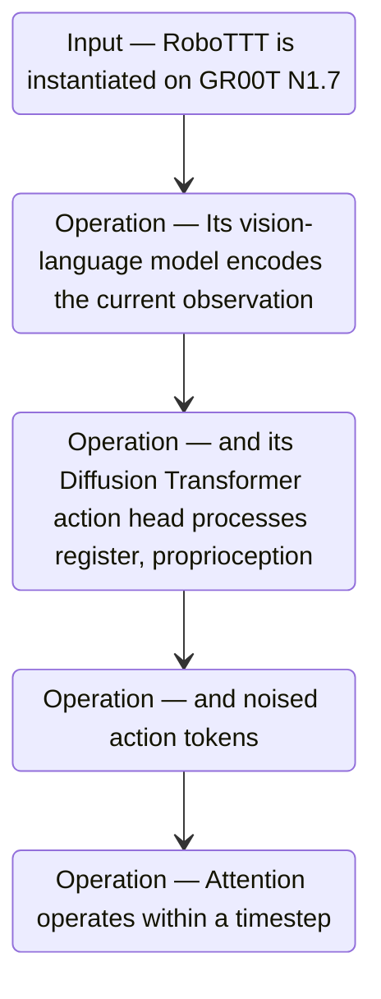

#### Python

```python
from html import escape
from pathlib import Path
from textwrap import wrap

title = "rttt_mechanism_p1: RoboTTT is instantiated on GR00T N17 — input-operation-outcome storyboard"
items = [["Input","RoboTTT is instantiated on GR00T N1.7",120,210],["Operation","Its vision-language model encodes the current observation",290,210],["Operation","and its Diffusion Transformer action head processes register, proprioception",460,210],["Operation","and noised action tokens",630,210],["Operation","Attention operates within a timestep",800,210]]
width = max(760, 240 + len(items) * 170)
parts = [
    f'<svg xmlns="http://www.w3.org/2000/svg" viewBox="0 0 {width} 460" role="img" aria-labelledby="title desc">',
    f'<title id="title">{escape(title)}</title>',
    '<desc id="desc">Input, operation, and outcome states follow the paragraph in source order.</desc>',
    f'<rect width="{width}" height="460" fill="white"/>',
]
for index in range(len(items)-1):
    _, _, x1, y1 = items[index]
    _, _, x2, y2 = items[index+1]
    parts.append(f'<line x1="{x1+65}" y1="{y1}" x2="{x2-65}" y2="{y2}" stroke="#345" stroke-width="2"/>')
for group, label, x, y in items:
    parts.append(f'<rect x="{x-65}" y="{y-90}" width="130" height="180" rx="16" fill="#eef6ff" stroke="#234"/>')
    parts.append(f'<text x="{x}" y="{y-60}" text-anchor="middle" font-family="sans-serif" font-size="13" font-weight="700">{escape(group)}</text>')
    for line_index, line in enumerate(wrap(label, width=18)):
        parts.append(f'<text x="{x}" y="{y-34+line_index*14}" text-anchor="middle" font-family="sans-serif" font-size="10">{escape(line)}</text>')
parts.append('</svg>')
Path("rttt_mechanism_p1_treatment_c.svg").write_text("\n".join(parts), encoding="utf-8")
```

### Implementation record

- Status: `PENDING`
- Selected treatment: `NONE`
- Selection rationale:
- Delivery medium: `NONE`
- Visual ID and placement:
- Shared paragraph scope: `NONE`
- Changed files:
- Accessibility and fallback verification:
- Desktop and mobile verification:
- Evidence deviations: `NONE`

## `rttt_mechanism_p2`

- Location: `rttt_mechanism`, paragraph 2
- Text anchor: "At each step, projected keys and values define an inner loss."
- Claims and sources: `rttt_architecture` (OBSERVED, VERIFIED); `rttt_training` (OBSERVED, VERIFIED); `rttt_architecture_source` (Sections 2–3.2, Equations 1–5, Figures 2–4, PDF pages 3–5; the arXiv v1 record identifies the paper as CC BY 4.0); `rttt_training_source` (Sections 3.3–3.4, Figures 5–6, PDF pages 6–7)
- Visual needed: `YES`
- Decision rationale: Removing a visual would require readers to retain the material relation between "At each step, projected keys and values define an inner loss" and "A learned tanh gate adds that output to the attention pathway before the action head denoises the next action chunk" while also tracking 4 source-bounded propositions. The paragraph contains a real mechanism relation graph; the visual must preserve its stated conditions and must not add causal or proportional meaning.
- Explanatory job: mechanism relation graph.

### Treatment A — At each step projected keys and values define an — mechanism relation graph

- Teaching purpose: Answer "How does one observation change the policy's memory?" by exposing the paragraph's 4 named propositions and 3 stated reading, comparison, or qualification relations.
- Encoding and reading order: Nodes reproduce the complete labels "At each step, projected keys and values define an inner loss"; "Gradient descent updates a two-layer MLP's fast weights"; "and the updated MLP processes the query"; "A learned tanh gate adds that output to the attention pathway before the action head denoises the next action chunk". Edges carry the explicit relation labels "then", "then", "then"; arrow direction is sequence only for mechanism or example prose and otherwise denotes reading order.
- Evidence and limitations: The topology is derived from this paragraph rather than a fixed pipeline. Encode only `rttt_architecture`, `rttt_training` and do not turn reading-order edges into causal claims.
- Recommended web medium: responsive inline SVG with CSS; JavaScript may add optional step focus only when state order matters.
- Mobile, accessibility, and motion behavior: Keep the full node-and-relation list in DOM order, expose the relation labels in the long description, stack nodes on narrow screens, and disable focus transitions under reduced motion.

#### TikZ

```tex
\documentclass[tikz,border=5pt]{standalone}
\usepackage[T1]{fontenc}
\usepackage{tikz}
\usetikzlibrary{arrows.meta,positioning}
\begin{document}
\begin{tikzpicture}[font=\sffamily,concept/.style={draw,rounded corners,align=center,text width=3.6cm,minimum height=1.35cm},link/.style={-{Latex[length=2mm]},thick},rel/.style={fill=white,font=\scriptsize,inner sep=2pt}]
\node[font=\bfseries,align=center] at (6.1,2.0) {rttt\_mechanism\_p2: At each step projected keys and values define an - mechanism relation graph};
\node[concept] (n1) at (1.8,0) {At each step, projected keys and values define an inner loss};
\node[concept] (n2) at (6.1,0) {Gradient descent updates a two-layer MLP's fast weights};
\node[concept] (n3) at (10.4,0) {and the updated MLP processes the query};
\node[concept] (n4) at (1.8,-3.2) {A learned tanh gate adds that output to the attention pathway before the action head denoises the next action chunk};
\draw[link] (n1) -- node[rel] {then} (n2);
\draw[link] (n2) -- node[rel] {then} (n3);
\draw[link] (n3) -- node[rel] {then} (n4);
\end{tikzpicture}
\end{document}
```

#### Mermaid

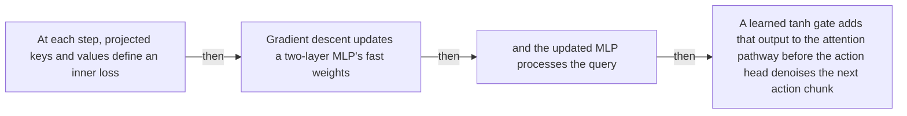

#### Python

```python
from html import escape
from pathlib import Path
from textwrap import wrap

title = "rttt_mechanism_p2: At each step projected keys and values define an — mechanism relation graph"
nodes = [["n1","At each step, projected keys and values define an inner loss",120,150],["n2","Gradient descent updates a two-layer MLP's fast weights",420,150],["n3","and the updated MLP processes the query",720,150],["n4","A learned tanh gate adds that output to the attention pathway before the action head denoises the next action chunk",120,340]]
edges = [["n1","n2","then"],["n2","n3","then"],["n3","n4","then"]]
node_by_id = {node_id: (label, x, y) for node_id, label, x, y in nodes}

parts = [
    '<svg xmlns="http://www.w3.org/2000/svg" viewBox="0 0 860 520" role="img" aria-labelledby="title desc">',
    f'<title id="title">{escape(title)}</title>',
    '<desc id="desc">The labeled relations reproduce only relationships stated in the paragraph.</desc>',
    '<rect width="860" height="520" fill="white"/>',
]
for source, target, relation in edges:
    _, x1, y1 = node_by_id[source]
    _, x2, y2 = node_by_id[target]
    parts.append(f'<line x1="{x1}" y1="{y1}" x2="{x2}" y2="{y2}" stroke="#345" stroke-width="2"/>')
    parts.append(f'<text x="{(x1+x2)/2}" y="{(y1+y2)/2-6}" text-anchor="middle" font-family="sans-serif" font-size="11">{escape(relation)}</text>')
for _, label, x, y in nodes:
    parts.append(f'<rect x="{x-125}" y="{y-58}" width="250" height="116" rx="14" fill="#eef6ff" stroke="#234"/>')
    for line_index, line in enumerate(wrap(label, width=32)):
        parts.append(f'<text x="{x}" y="{y-34+line_index*16}" text-anchor="middle" font-family="sans-serif" font-size="12">{escape(line)}</text>')
parts.append('</svg>')
Path("rttt_mechanism_p2_treatment_a.svg").write_text("\n".join(parts), encoding="utf-8")
```

### Treatment B — rttt_architecture, rttt_training — claim-to-source provenance

- Teaching purpose: Show exactly which atomic claims underwrite this paragraph and which fixed source records support each claim.
- Encoding and reading order: A bipartite graph places 2 claim nodes on the left and 1 source nodes on the right, with only the 2 claim-source edges recorded in the fixture. Claim labels include epistemic status; source labels include the exact locator.
- Evidence and limitations: This treatment explains provenance and uncertainty, not the paper's causal mechanism. Missing edges remain visibly absent and no source count is treated as confidence.
- Recommended web medium: semantic HTML/CSS claim-source table with an SVG network view; JavaScript only for keyboard-controlled source highlighting.
- Mobile, accessibility, and motion behavior: Provide real table headers and source links in the static fallback, make every edge recoverable as text, stack claim records before source records on mobile, and require no motion.

#### TikZ

```tex
\documentclass[tikz,border=5pt]{standalone}
\usepackage[T1]{fontenc}
\usepackage{tikz}
\usetikzlibrary{arrows.meta}
\begin{document}
\begin{tikzpicture}[font=\sffamily,claim/.style={draw,rounded corners,align=center,text width=5.2cm,minimum height=1.2cm},source/.style={draw,dashed,align=center,text width=5.2cm,minimum height=1.2cm},link/.style={-{Latex[length=2mm]},thin}]
\node[font=\bfseries] at (4,1.8) {rttt\_mechanism\_p2: claim-to-source provenance};
\node[claim] (c1) at (0,0) {RoboTTT places TTT layers after attention in the DiT action head and carries their fast weights forward between timesteps. [OBSERVED]};
\node[claim] (c2) at (0,-2.4) {Sequence action forcing uses independently sampled noise levels per action chunk, while TBPTT carries fast weights across detached segment boundaries. [OBSERVED]};
\node[source] (s1) at (8,0) {RoboTTT v1 - architecture and sequence training - Sections 2-3.2, Equations 1-5, Figures 2-4, PDF pages 3-5; the arXiv v1 record identifies the paper as CC BY 4.0};
\draw[link] (c1) -- (s1);
\draw[link] (c2) -- (s1);
\end{tikzpicture}
\end{document}
```

#### Mermaid


#### Python

```python
from html import escape
from pathlib import Path
from textwrap import wrap

title = "rttt_mechanism_p2: claim-to-source provenance"
nodes = [["c1","RoboTTT places TTT layers after attention in the DiT action head and carries their fast weights forward between timesteps. [OBSERVED]",190,130],["c2","Sequence action forcing uses independently sampled noise levels per action chunk, while TBPTT carries fast weights across detached segment boundaries. [OBSERVED]",190,250],["s1","RoboTTT v1 — architecture and sequence training — Sections 2–3.2, Equations 1–5, Figures 2–4, PDF pages 3–5; the arXiv v1 record identifies the paper as CC BY 4.0",700,130]]
edges = [["c1","s1"],["c2","s1"]]
node_by_id = {node_id: (label, x, y) for node_id, label, x, y in nodes}
height = 440

parts = [
    f'<svg xmlns="http://www.w3.org/2000/svg" viewBox="0 0 900 {height}" role="img" aria-labelledby="title desc">',
    f'<title id="title">{escape(title)}</title>',
    '<desc id="desc">Bipartite map from verified claim records to their exact source records.</desc>',
    f'<rect width="900" height="{height}" fill="white"/>',
]
for source, target in edges:
    _, x1, y1 = node_by_id[source]
    _, x2, y2 = node_by_id[target]
    parts.append(f'<line x1="{x1+145}" y1="{y1}" x2="{x2-145}" y2="{y2}" stroke="#456" stroke-width="2"/>')
for node_id, label, x, y in nodes:
    dashed = ' stroke-dasharray="7 5"' if node_id.startswith("s") else ''
    parts.append(f'<rect x="{x-145}" y="{y-46}" width="290" height="92" rx="12" fill="#f7fbff" stroke="#234"{dashed}/>')
    for line_index, line in enumerate(wrap(label, width=38)):
        parts.append(f'<text x="{x}" y="{y-24+line_index*14}" text-anchor="middle" font-family="sans-serif" font-size="11">{escape(line)}</text>')
parts.append('</svg>')
Path("rttt_mechanism_p2_treatment_b.svg").write_text("\n".join(parts), encoding="utf-8")
```

### Treatment C — At each step projected keys and values define an — input-operation-outcome storyboard

- Teaching purpose: Let readers inspect the paragraph as concrete input, operation, and outcome states.
- Encoding and reading order: Use 4 ordered states labeled "Input: At each step, projected keys and values define an inner loss", "Operation: Gradient descent updates a two-layer MLP's fast weights", "Operation: and the updated MLP processes the query", "Outcome: A learned tanh gate adds that output to the attention pathway before the action head denoises the next action chunk". State connectors reproduce paragraph order and do not imply unreported timing.
- Evidence and limitations: The first, intermediate, and final states are paragraph clauses; no hidden state, quantity, or transition is added.
- Recommended web medium: responsive SVG or semantic HTML/CSS; JavaScript is optional only for a meaningful state or scope toggle.
- Mobile, accessibility, and motion behavior: Preserve every exact value or scope statement as selectable text, avoid color-only distinctions, stack groups on mobile, and keep all information visible when JavaScript or motion is disabled.

#### TikZ

```tex
\documentclass[tikz,border=5pt]{standalone}
\usepackage[T1]{fontenc}
\usepackage{tikz}
\begin{document}
\begin{tikzpicture}[font=\sffamily,state/.style={draw,rounded corners,align=center,text width=3.2cm,minimum height=1.8cm}]
\node[font=\bfseries] at (5.699999999999999,2) {rttt\_mechanism\_p2: At each step projected keys and values define an - input-operation-outcome storyboard};
\node[state] (k1) at (0,0) {\textbf{Input}\\At each step, projected keys and values define an inner loss};
\node[state] (k2) at (3.8,0) {\textbf{Operation}\\Gradient descent updates a two-layer MLP's fast weights};
\node[state] (k3) at (7.6,0) {\textbf{Operation}\\and the updated MLP processes the query};
\node[state] (k4) at (11.399999999999999,0) {\textbf{Outcome}\\A learned tanh gate adds that output to the attention pathway before the action head denoises the next action chunk};
\draw[->,thick] (k1) -- (k2);
\draw[->,thick] (k2) -- (k3);
\draw[->,thick] (k3) -- (k4);
\end{tikzpicture}
\end{document}
```

#### Mermaid

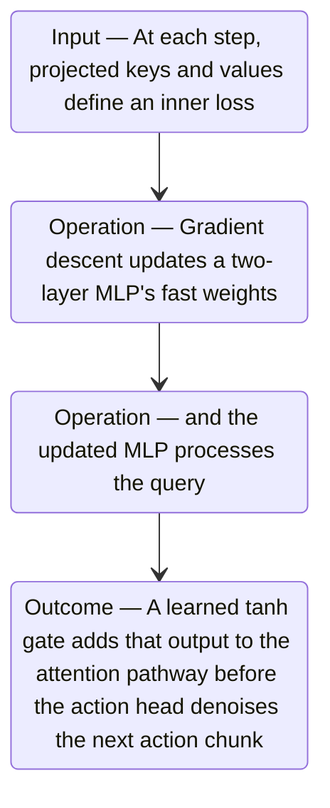

#### Python

```python
from html import escape
from pathlib import Path
from textwrap import wrap

title = "rttt_mechanism_p2: At each step projected keys and values define an — input-operation-outcome storyboard"
items = [["Input","At each step, projected keys and values define an inner loss",120,210],["Operation","Gradient descent updates a two-layer MLP's fast weights",290,210],["Operation","and the updated MLP processes the query",460,210],["Outcome","A learned tanh gate adds that output to the attention pathway before the action head denoises the next action chunk",630,210]]
width = max(760, 240 + len(items) * 170)
parts = [
    f'<svg xmlns="http://www.w3.org/2000/svg" viewBox="0 0 {width} 460" role="img" aria-labelledby="title desc">',
    f'<title id="title">{escape(title)}</title>',
    '<desc id="desc">Input, operation, and outcome states follow the paragraph in source order.</desc>',
    f'<rect width="{width}" height="460" fill="white"/>',
]
for index in range(len(items)-1):
    _, _, x1, y1 = items[index]
    _, _, x2, y2 = items[index+1]
    parts.append(f'<line x1="{x1+65}" y1="{y1}" x2="{x2-65}" y2="{y2}" stroke="#345" stroke-width="2"/>')
for group, label, x, y in items:
    parts.append(f'<rect x="{x-65}" y="{y-90}" width="130" height="180" rx="16" fill="#eef6ff" stroke="#234"/>')
    parts.append(f'<text x="{x}" y="{y-60}" text-anchor="middle" font-family="sans-serif" font-size="13" font-weight="700">{escape(group)}</text>')
    for line_index, line in enumerate(wrap(label, width=18)):
        parts.append(f'<text x="{x}" y="{y-34+line_index*14}" text-anchor="middle" font-family="sans-serif" font-size="10">{escape(line)}</text>')
parts.append('</svg>')
Path("rttt_mechanism_p2_treatment_c.svg").write_text("\n".join(parts), encoding="utf-8")
```

### Implementation record

- Status: `PENDING`
- Selected treatment: `NONE`
- Selection rationale:
- Delivery medium: `NONE`
- Visual ID and placement:
- Shared paragraph scope: `NONE`
- Changed files:
- Accessibility and fallback verification:
- Desktop and mobile verification:
- Evidence deviations: `NONE`

## `rttt_mechanism_p3`

- Location: `rttt_mechanism`, paragraph 3
- Text anchor: "The updated weights become the next timestep's recurrent state."
- Claims and sources: `rttt_architecture` (OBSERVED, VERIFIED); `rttt_training` (OBSERVED, VERIFIED); `rttt_architecture_source` (Sections 2–3.2, Equations 1–5, Figures 2–4, PDF pages 3–5; the arXiv v1 record identifies the paper as CC BY 4.0); `rttt_training_source` (Sections 3.3–3.4, Figures 5–6, PDF pages 6–7)
- Visual needed: `YES`
- Decision rationale: Removing a visual would require readers to retain the material relation between "The updated weights become the next timestep's recurrent state" and "A new rollout starts from a learned fast-weight initialization rather than retaining permanent memory from earlier deployments" while also tracking 3 source-bounded propositions. The paragraph contains a real mechanism relation graph; the visual must preserve its stated conditions and must not add causal or proportional meaning.
- Explanatory job: mechanism relation graph.

### Treatment A — The updated weights become the next timestep's recurrent state — mechanism relation graph

- Teaching purpose: Answer "How does one observation change the policy's memory?" by exposing the paragraph's 3 named propositions and 2 stated reading, comparison, or qualification relations.
- Encoding and reading order: Nodes reproduce the complete labels "The updated weights become the next timestep's recurrent state"; "During sequence training, gradients flow within each TBPTT segment while the state itself crosses the segment boundary"; "A new rollout starts from a learned fast-weight initialization rather than retaining permanent memory from earlier deployments". Edges carry the explicit relation labels "contrasts with", "contrasts with"; arrow direction is sequence only for mechanism or example prose and otherwise denotes reading order.
- Evidence and limitations: The topology is derived from this paragraph rather than a fixed pipeline. Encode only `rttt_architecture`, `rttt_training` and do not turn reading-order edges into causal claims.
- Recommended web medium: responsive inline SVG with CSS; JavaScript may add optional step focus only when state order matters.
- Mobile, accessibility, and motion behavior: Keep the full node-and-relation list in DOM order, expose the relation labels in the long description, stack nodes on narrow screens, and disable focus transitions under reduced motion.

#### TikZ

```tex
\documentclass[tikz,border=5pt]{standalone}
\usepackage[T1]{fontenc}
\usepackage{tikz}
\usetikzlibrary{arrows.meta,positioning}
\begin{document}
\begin{tikzpicture}[font=\sffamily,concept/.style={draw,rounded corners,align=center,text width=3.6cm,minimum height=1.35cm},link/.style={-{Latex[length=2mm]},thick},rel/.style={fill=white,font=\scriptsize,inner sep=2pt}]
\node[font=\bfseries,align=center] at (6.1,2.0) {rttt\_mechanism\_p3: The updated weights become the next timestep's recurrent state - mechanism relation graph};
\node[concept] (n1) at (1.8,0) {The updated weights become the next timestep's recurrent state};
\node[concept] (n2) at (6.1,0) {During sequence training, gradients flow within each TBPTT segment while the state itself crosses the segment boundary};
\node[concept] (n3) at (10.4,0) {A new rollout starts from a learned fast-weight initialization rather than retaining permanent memory from earlier deployments};
\draw[link] (n1) -- node[rel] {contrasts with} (n2);
\draw[link] (n2) -- node[rel] {contrasts with} (n3);
\end{tikzpicture}
\end{document}
```

#### Mermaid

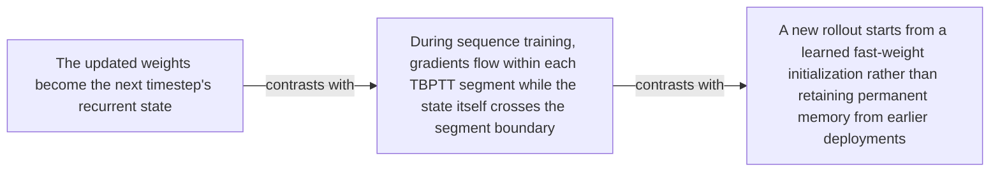

#### Python

```python
from html import escape
from pathlib import Path
from textwrap import wrap

title = "rttt_mechanism_p3: The updated weights become the next timestep's recurrent state — mechanism relation graph"
nodes = [["n1","The updated weights become the next timestep's recurrent state",120,150],["n2","During sequence training, gradients flow within each TBPTT segment while the state itself crosses the segment boundary",420,150],["n3","A new rollout starts from a learned fast-weight initialization rather than retaining permanent memory from earlier deployments",720,150]]
edges = [["n1","n2","contrasts with"],["n2","n3","contrasts with"]]
node_by_id = {node_id: (label, x, y) for node_id, label, x, y in nodes}

parts = [
    '<svg xmlns="http://www.w3.org/2000/svg" viewBox="0 0 860 520" role="img" aria-labelledby="title desc">',
    f'<title id="title">{escape(title)}</title>',
    '<desc id="desc">The labeled relations reproduce only relationships stated in the paragraph.</desc>',
    '<rect width="860" height="520" fill="white"/>',
]
for source, target, relation in edges:
    _, x1, y1 = node_by_id[source]
    _, x2, y2 = node_by_id[target]
    parts.append(f'<line x1="{x1}" y1="{y1}" x2="{x2}" y2="{y2}" stroke="#345" stroke-width="2"/>')
    parts.append(f'<text x="{(x1+x2)/2}" y="{(y1+y2)/2-6}" text-anchor="middle" font-family="sans-serif" font-size="11">{escape(relation)}</text>')
for _, label, x, y in nodes:
    parts.append(f'<rect x="{x-125}" y="{y-58}" width="250" height="116" rx="14" fill="#eef6ff" stroke="#234"/>')
    for line_index, line in enumerate(wrap(label, width=32)):
        parts.append(f'<text x="{x}" y="{y-34+line_index*16}" text-anchor="middle" font-family="sans-serif" font-size="12">{escape(line)}</text>')
parts.append('</svg>')
Path("rttt_mechanism_p3_treatment_a.svg").write_text("\n".join(parts), encoding="utf-8")
```

### Treatment B — rttt_architecture, rttt_training — claim-to-source provenance

- Teaching purpose: Show exactly which atomic claims underwrite this paragraph and which fixed source records support each claim.
- Encoding and reading order: A bipartite graph places 2 claim nodes on the left and 1 source nodes on the right, with only the 2 claim-source edges recorded in the fixture. Claim labels include epistemic status; source labels include the exact locator.
- Evidence and limitations: This treatment explains provenance and uncertainty, not the paper's causal mechanism. Missing edges remain visibly absent and no source count is treated as confidence.
- Recommended web medium: semantic HTML/CSS claim-source table with an SVG network view; JavaScript only for keyboard-controlled source highlighting.
- Mobile, accessibility, and motion behavior: Provide real table headers and source links in the static fallback, make every edge recoverable as text, stack claim records before source records on mobile, and require no motion.

#### TikZ

```tex
\documentclass[tikz,border=5pt]{standalone}
\usepackage[T1]{fontenc}
\usepackage{tikz}
\usetikzlibrary{arrows.meta}
\begin{document}
\begin{tikzpicture}[font=\sffamily,claim/.style={draw,rounded corners,align=center,text width=5.2cm,minimum height=1.2cm},source/.style={draw,dashed,align=center,text width=5.2cm,minimum height=1.2cm},link/.style={-{Latex[length=2mm]},thin}]
\node[font=\bfseries] at (4,1.8) {rttt\_mechanism\_p3: claim-to-source provenance};
\node[claim] (c1) at (0,0) {RoboTTT places TTT layers after attention in the DiT action head and carries their fast weights forward between timesteps. [OBSERVED]};
\node[claim] (c2) at (0,-2.4) {Sequence action forcing uses independently sampled noise levels per action chunk, while TBPTT carries fast weights across detached segment boundaries. [OBSERVED]};
\node[source] (s1) at (8,0) {RoboTTT v1 - architecture and sequence training - Sections 2-3.2, Equations 1-5, Figures 2-4, PDF pages 3-5; the arXiv v1 record identifies the paper as CC BY 4.0};
\draw[link] (c1) -- (s1);
\draw[link] (c2) -- (s1);
\end{tikzpicture}
\end{document}
```

#### Mermaid


#### Python

```python
from html import escape
from pathlib import Path
from textwrap import wrap

title = "rttt_mechanism_p3: claim-to-source provenance"
nodes = [["c1","RoboTTT places TTT layers after attention in the DiT action head and carries their fast weights forward between timesteps. [OBSERVED]",190,130],["c2","Sequence action forcing uses independently sampled noise levels per action chunk, while TBPTT carries fast weights across detached segment boundaries. [OBSERVED]",190,250],["s1","RoboTTT v1 — architecture and sequence training — Sections 2–3.2, Equations 1–5, Figures 2–4, PDF pages 3–5; the arXiv v1 record identifies the paper as CC BY 4.0",700,130]]
edges = [["c1","s1"],["c2","s1"]]
node_by_id = {node_id: (label, x, y) for node_id, label, x, y in nodes}
height = 440

parts = [
    f'<svg xmlns="http://www.w3.org/2000/svg" viewBox="0 0 900 {height}" role="img" aria-labelledby="title desc">',
    f'<title id="title">{escape(title)}</title>',
    '<desc id="desc">Bipartite map from verified claim records to their exact source records.</desc>',
    f'<rect width="900" height="{height}" fill="white"/>',
]
for source, target in edges:
    _, x1, y1 = node_by_id[source]
    _, x2, y2 = node_by_id[target]
    parts.append(f'<line x1="{x1+145}" y1="{y1}" x2="{x2-145}" y2="{y2}" stroke="#456" stroke-width="2"/>')
for node_id, label, x, y in nodes:
    dashed = ' stroke-dasharray="7 5"' if node_id.startswith("s") else ''
    parts.append(f'<rect x="{x-145}" y="{y-46}" width="290" height="92" rx="12" fill="#f7fbff" stroke="#234"{dashed}/>')
    for line_index, line in enumerate(wrap(label, width=38)):
        parts.append(f'<text x="{x}" y="{y-24+line_index*14}" text-anchor="middle" font-family="sans-serif" font-size="11">{escape(line)}</text>')
parts.append('</svg>')
Path("rttt_mechanism_p3_treatment_b.svg").write_text("\n".join(parts), encoding="utf-8")
```

### Treatment C — The updated weights become the next timestep's recurrent state — input-operation-outcome storyboard

- Teaching purpose: Let readers inspect the paragraph as concrete input, operation, and outcome states.
- Encoding and reading order: Use 3 ordered states labeled "Input: The updated weights become the next timestep's recurrent state", "Operation: During sequence training, gradients flow within each TBPTT segment while the state itself crosses the segment boundary", "Outcome: A new rollout starts from a learned fast-weight initialization rather than retaining permanent memory from earlier deployments". State connectors reproduce paragraph order and do not imply unreported timing.
- Evidence and limitations: The first, intermediate, and final states are paragraph clauses; no hidden state, quantity, or transition is added.
- Recommended web medium: responsive SVG or semantic HTML/CSS; JavaScript is optional only for a meaningful state or scope toggle.
- Mobile, accessibility, and motion behavior: Preserve every exact value or scope statement as selectable text, avoid color-only distinctions, stack groups on mobile, and keep all information visible when JavaScript or motion is disabled.

#### TikZ

```tex
\documentclass[tikz,border=5pt]{standalone}
\usepackage[T1]{fontenc}
\usepackage{tikz}
\begin{document}
\begin{tikzpicture}[font=\sffamily,state/.style={draw,rounded corners,align=center,text width=3.2cm,minimum height=1.8cm}]
\node[font=\bfseries] at (3.8,2) {rttt\_mechanism\_p3: The updated weights become the next timestep's recurrent state - input-operation-outcome storyboard};
\node[state] (k1) at (0,0) {\textbf{Input}\\The updated weights become the next timestep's recurrent state};
\node[state] (k2) at (3.8,0) {\textbf{Operation}\\During sequence training, gradients flow within each TBPTT segment while the state itself crosses the segment boundary};
\node[state] (k3) at (7.6,0) {\textbf{Outcome}\\A new rollout starts from a learned fast-weight initialization rather than retaining permanent memory from earlier deployments};
\draw[->,thick] (k1) -- (k2);
\draw[->,thick] (k2) -- (k3);
\end{tikzpicture}
\end{document}
```

#### Mermaid

```mermaid
stateDiagram-v2
  state "Input — The updated weights become the next timestep's recurrent state" as k1
  state "Operation — During sequence training, gradients flow within each TBPTT segment while the state itself crosses the segment boundary" as k2
  state "Outcome — A new rollout starts from a learned fast-weight initialization rather than retaining permanent memory from earlier deployments" as k3
  k1 --> k2
  k2 --> k3
```

#### Python

```python
from html import escape
from pathlib import Path
from textwrap import wrap

title = "rttt_mechanism_p3: The updated weights become the next timestep's recurrent state — input-operation-outcome storyboard"
items = [["Input","The updated weights become the next timestep's recurrent state",120,210],["Operation","During sequence training, gradients flow within each TBPTT segment while the state itself crosses the segment boundary",290,210],["Outcome","A new rollout starts from a learned fast-weight initialization rather than retaining permanent memory from earlier deployments",460,210]]
width = max(760, 240 + len(items) * 170)
parts = [
    f'<svg xmlns="http://www.w3.org/2000/svg" viewBox="0 0 {width} 460" role="img" aria-labelledby="title desc">',
    f'<title id="title">{escape(title)}</title>',
    '<desc id="desc">Input, operation, and outcome states follow the paragraph in source order.</desc>',
    f'<rect width="{width}" height="460" fill="white"/>',
]
for index in range(len(items)-1):
    _, _, x1, y1 = items[index]
    _, _, x2, y2 = items[index+1]
    parts.append(f'<line x1="{x1+65}" y1="{y1}" x2="{x2-65}" y2="{y2}" stroke="#345" stroke-width="2"/>')
for group, label, x, y in items:
    parts.append(f'<rect x="{x-65}" y="{y-90}" width="130" height="180" rx="16" fill="#eef6ff" stroke="#234"/>')
    parts.append(f'<text x="{x}" y="{y-60}" text-anchor="middle" font-family="sans-serif" font-size="13" font-weight="700">{escape(group)}</text>')
    for line_index, line in enumerate(wrap(label, width=18)):
        parts.append(f'<text x="{x}" y="{y-34+line_index*14}" text-anchor="middle" font-family="sans-serif" font-size="10">{escape(line)}</text>')
parts.append('</svg>')
Path("rttt_mechanism_p3_treatment_c.svg").write_text("\n".join(parts), encoding="utf-8")
```

### Implementation record

- Status: `PENDING`
- Selected treatment: `NONE`
- Selection rationale:
- Delivery medium: `NONE`
- Visual ID and placement:
- Shared paragraph scope: `NONE`
- Changed files:
- Accessibility and fallback verification:
- Desktop and mobile verification:
- Evidence deviations: `NONE`

## `rttt_example_p1`

- Location: `rttt_example`, paragraph 1
- Text anchor: "For the Circuit task, a human first assembles an unseen component configuration while the robot remains idle."
- Claims and sources: `rttt_context_learning` (OBSERVED, VERIFIED); `rttt_one_shot` (OBSERVED, VERIFIED); `rttt_generality` (NOT_ESTABLISHED, UNRESOLVED); `rttt_training_source` (Sections 3.3–3.4, Figures 5–6, PDF pages 6–7); `rttt_results_source` (Section 4, Tables 1–3, Figures 7–12, PDF pages 7–11); `rttt_limits_source` (Section 6 and Appendices A–B, PDF pages 12 and 20–22)
- Visual needed: `YES`
- Decision rationale: Removing a visual would require readers to retain the material relation between "For the Circuit task, a human first assembles an unseen component configuration while the robot remains idle" and "but their flow-matching loss is masked because the video does not contain robot action targets" while also tracking 3 source-bounded propositions. The paragraph contains a real example state path; the visual must preserve its stated conditions and must not add causal or proportional meaning.
- Explanatory job: example state path.

### Treatment A — For the Circuit task a human first assembles an — example state path

- Teaching purpose: Answer "How can a human video become context for a robot action?" by exposing the paragraph's 3 named propositions and 2 stated reading, comparison, or qualification relations.
- Encoding and reading order: Nodes reproduce the complete labels "For the Circuit task, a human first assembles an unseen component configuration while the robot remains idle"; "The demonstration frames update RoboTTT's fast weights"; "but their flow-matching loss is masked because the video does not contain robot action targets". Edges carry the explicit relation labels "then", "contrasts with"; arrow direction is sequence only for mechanism or example prose and otherwise denotes reading order.
- Evidence and limitations: The topology is derived from this paragraph rather than a fixed pipeline. Encode only `rttt_context_learning`, `rttt_one_shot`, `rttt_generality` and do not turn reading-order edges into causal claims.
- Recommended web medium: responsive inline SVG with CSS; JavaScript may add optional step focus only when state order matters.
- Mobile, accessibility, and motion behavior: Keep the full node-and-relation list in DOM order, expose the relation labels in the long description, stack nodes on narrow screens, and disable focus transitions under reduced motion.

#### TikZ

```tex
\documentclass[tikz,border=5pt]{standalone}
\usepackage[T1]{fontenc}
\usepackage{tikz}
\usetikzlibrary{arrows.meta,positioning}
\begin{document}
\begin{tikzpicture}[font=\sffamily,concept/.style={draw,rounded corners,align=center,text width=3.6cm,minimum height=1.35cm},link/.style={-{Latex[length=2mm]},thick},rel/.style={fill=white,font=\scriptsize,inner sep=2pt}]
\node[font=\bfseries,align=center] at (6.1,2.0) {rttt\_example\_p1: For the Circuit task a human first assembles an - example state path};
\node[concept] (n1) at (1.8,0) {For the Circuit task, a human first assembles an unseen component configuration while the robot remains idle};
\node[concept] (n2) at (6.1,0) {The demonstration frames update RoboTTT's fast weights};
\node[concept] (n3) at (10.4,0) {but their flow-matching loss is masked because the video does not contain robot action targets};
\draw[link] (n1) -- node[rel] {then} (n2);
\draw[link] (n2) -- node[rel] {contrasts with} (n3);
\end{tikzpicture}
\end{document}
```

#### Mermaid

```mermaid
flowchart LR
  n1["For the Circuit task, a human first assembles an unseen component configuration while the robot remains idle"]
  n2["The demonstration frames update RoboTTT's fast weights"]
  n3["but their flow-matching loss is masked because the video does not contain robot action targets"]
  n1 -->|"then"| n2
  n2 -->|"contrasts with"| n3
```

#### Python

```python
from html import escape
from pathlib import Path
from textwrap import wrap

title = "rttt_example_p1: For the Circuit task a human first assembles an — example state path"
nodes = [["n1","For the Circuit task, a human first assembles an unseen component configuration while the robot remains idle",120,150],["n2","The demonstration frames update RoboTTT's fast weights",420,150],["n3","but their flow-matching loss is masked because the video does not contain robot action targets",720,150]]
edges = [["n1","n2","then"],["n2","n3","contrasts with"]]
node_by_id = {node_id: (label, x, y) for node_id, label, x, y in nodes}

parts = [
    '<svg xmlns="http://www.w3.org/2000/svg" viewBox="0 0 860 520" role="img" aria-labelledby="title desc">',
    f'<title id="title">{escape(title)}</title>',
    '<desc id="desc">The labeled relations reproduce only relationships stated in the paragraph.</desc>',
    '<rect width="860" height="520" fill="white"/>',
]
for source, target, relation in edges:
    _, x1, y1 = node_by_id[source]
    _, x2, y2 = node_by_id[target]
    parts.append(f'<line x1="{x1}" y1="{y1}" x2="{x2}" y2="{y2}" stroke="#345" stroke-width="2"/>')
    parts.append(f'<text x="{(x1+x2)/2}" y="{(y1+y2)/2-6}" text-anchor="middle" font-family="sans-serif" font-size="11">{escape(relation)}</text>')
for _, label, x, y in nodes:
    parts.append(f'<rect x="{x-125}" y="{y-58}" width="250" height="116" rx="14" fill="#eef6ff" stroke="#234"/>')
    for line_index, line in enumerate(wrap(label, width=32)):
        parts.append(f'<text x="{x}" y="{y-34+line_index*16}" text-anchor="middle" font-family="sans-serif" font-size="12">{escape(line)}</text>')
parts.append('</svg>')
Path("rttt_example_p1_treatment_a.svg").write_text("\n".join(parts), encoding="utf-8")
```

### Treatment B — rttt_context_learning, rttt_one_shot, rttt_generality — claim-to-source provenance

- Teaching purpose: Show exactly which atomic claims underwrite this paragraph and which fixed source records support each claim.
- Encoding and reading order: A bipartite graph places 3 claim nodes on the left and 3 source nodes on the right, with only the 3 claim-source edges recorded in the fixture. Claim labels include epistemic status; source labels include the exact locator.
- Evidence and limitations: This treatment explains provenance and uncertainty, not the paper's causal mechanism. Missing edges remain visibly absent and no source count is treated as confidence.
- Recommended web medium: semantic HTML/CSS claim-source table with an SVG network view; JavaScript only for keyboard-controlled source highlighting.
- Mobile, accessibility, and motion behavior: Provide real table headers and source links in the static fallback, make every edge recoverable as text, stack claim records before source records on mobile, and require no motion.

#### TikZ

```tex
\documentclass[tikz,border=5pt]{standalone}
\usepackage[T1]{fontenc}
\usepackage{tikz}
\usetikzlibrary{arrows.meta}
\begin{document}
\begin{tikzpicture}[font=\sffamily,claim/.style={draw,rounded corners,align=center,text width=5.2cm,minimum height=1.2cm},source/.style={draw,dashed,align=center,text width=5.2cm,minimum height=1.2cm},link/.style={-{Latex[length=2mm]},thin}]
\node[font=\bfseries] at (4,1.8) {rttt\_example\_p1: claim-to-source provenance};
\node[claim] (c1) at (0,0) {Loss masking lets human-video frames or failed robot actions update fast weights without treating those timesteps as robot action targets. [OBSERVED]};
\node[claim] (c2) at (0,-2.4) {On one-shot Circuit imitation from one human video, RoboTTT completes 6 of 10 unseen configurations and GDN completes 0 of 10. [OBSERVED]};
\node[claim] (c3) at (0,-4.8) {The experiments do not establish plug-and-play performance across backbones, robot embodiments, or task domains beyond the tested GR00T N1.7 YAM setup. [NOT\_ESTABLISHED]};
\node[source] (s1) at (8,0) {RoboTTT v1 - context learning and DAgger Distillation - Sections 3.3-3.4, Figures 5-6, PDF pages 6-7};
\node[source] (s2) at (8,-2.4) {RoboTTT v1 - real-robot evaluation and ablations - Section 4, Tables 1-3, Figures 7-12, PDF pages 7-11};
\node[source] (s3) at (8,-4.8) {RoboTTT v1 - limitations, deployment, and evaluation details - Section 6 and Appendices A-B, PDF pages 12 and 20-22};
\draw[link] (c1) -- (s1);
\draw[link] (c2) -- (s2);
\draw[link] (c3) -- (s3);
\end{tikzpicture}
\end{document}
```

#### Mermaid

```mermaid
flowchart LR
  subgraph Claims
  c1["Loss masking lets human-video frames or failed robot actions update fast weights without treating those timesteps as robot action targets. OBSERVED"]
  c2["On one-shot Circuit imitation from one human video, RoboTTT completes 6 of 10 unseen configurations and GDN completes 0 of 10. OBSERVED"]
  c3["The experiments do not establish plug-and-play performance across backbones, robot embodiments, or task domains beyond the tested GR00T N1.7 YAM setup. NOT_ESTABLISHED"]
  end
  subgraph Sources
  s1[/"RoboTTT v1 — context learning and DAgger Distillation — Sections 3.3–3.4, Figures 5–6, PDF pages 6–7"/]
  s2[/"RoboTTT v1 — real-robot evaluation and ablations — Section 4, Tables 1–3, Figures 7–12, PDF pages 7–11"/]
  s3[/"RoboTTT v1 — limitations, deployment, and evaluation details — Section 6 and Appendices A–B, PDF pages 12 and 20–22"/]
  end
  c1 -->|"supported at"| s1
  c2 -->|"supported at"| s2
  c3 -->|"supported at"| s3
```

#### Python

```python
from html import escape
from pathlib import Path
from textwrap import wrap

title = "rttt_example_p1: claim-to-source provenance"
nodes = [["c1","Loss masking lets human-video frames or failed robot actions update fast weights without treating those timesteps as robot action targets. [OBSERVED]",190,130],["c2","On one-shot Circuit imitation from one human video, RoboTTT completes 6 of 10 unseen configurations and GDN completes 0 of 10. [OBSERVED]",190,250],["c3","The experiments do not establish plug-and-play performance across backbones, robot embodiments, or task domains beyond the tested GR00T N1.7 YAM setup. [NOT_ESTABLISHED]",190,370],["s1","RoboTTT v1 — context learning and DAgger Distillation — Sections 3.3–3.4, Figures 5–6, PDF pages 6–7",700,130],["s2","RoboTTT v1 — real-robot evaluation and ablations — Section 4, Tables 1–3, Figures 7–12, PDF pages 7–11",700,250],["s3","RoboTTT v1 — limitations, deployment, and evaluation details — Section 6 and Appendices A–B, PDF pages 12 and 20–22",700,370]]
edges = [["c1","s1"],["c2","s2"],["c3","s3"]]
node_by_id = {node_id: (label, x, y) for node_id, label, x, y in nodes}
height = 560

parts = [
    f'<svg xmlns="http://www.w3.org/2000/svg" viewBox="0 0 900 {height}" role="img" aria-labelledby="title desc">',
    f'<title id="title">{escape(title)}</title>',
    '<desc id="desc">Bipartite map from verified claim records to their exact source records.</desc>',
    f'<rect width="900" height="{height}" fill="white"/>',
]
for source, target in edges:
    _, x1, y1 = node_by_id[source]
    _, x2, y2 = node_by_id[target]
    parts.append(f'<line x1="{x1+145}" y1="{y1}" x2="{x2-145}" y2="{y2}" stroke="#456" stroke-width="2"/>')
for node_id, label, x, y in nodes:
    dashed = ' stroke-dasharray="7 5"' if node_id.startswith("s") else ''
    parts.append(f'<rect x="{x-145}" y="{y-46}" width="290" height="92" rx="12" fill="#f7fbff" stroke="#234"{dashed}/>')
    for line_index, line in enumerate(wrap(label, width=38)):
        parts.append(f'<text x="{x}" y="{y-24+line_index*14}" text-anchor="middle" font-family="sans-serif" font-size="11">{escape(line)}</text>')
parts.append('</svg>')
Path("rttt_example_p1_treatment_b.svg").write_text("\n".join(parts), encoding="utf-8")
```

### Treatment C — For the Circuit task a human first assembles an — input-operation-outcome storyboard

- Teaching purpose: Let readers inspect the paragraph as concrete input, operation, and outcome states.
- Encoding and reading order: Use 3 ordered states labeled "Input: For the Circuit task, a human first assembles an unseen component configuration while the robot remains idle", "Operation: The demonstration frames update RoboTTT's fast weights", "Outcome: but their flow-matching loss is masked because the video does not contain robot action targets". State connectors reproduce paragraph order and do not imply unreported timing.
- Evidence and limitations: The first, intermediate, and final states are paragraph clauses; no hidden state, quantity, or transition is added.
- Recommended web medium: responsive SVG or semantic HTML/CSS; JavaScript is optional only for a meaningful state or scope toggle.
- Mobile, accessibility, and motion behavior: Preserve every exact value or scope statement as selectable text, avoid color-only distinctions, stack groups on mobile, and keep all information visible when JavaScript or motion is disabled.

#### TikZ

```tex
\documentclass[tikz,border=5pt]{standalone}
\usepackage[T1]{fontenc}
\usepackage{tikz}
\begin{document}
\begin{tikzpicture}[font=\sffamily,state/.style={draw,rounded corners,align=center,text width=3.2cm,minimum height=1.8cm}]
\node[font=\bfseries] at (3.8,2) {rttt\_example\_p1: For the Circuit task a human first assembles an - input-operation-outcome storyboard};
\node[state] (k1) at (0,0) {\textbf{Input}\\For the Circuit task, a human first assembles an unseen component configuration while the robot remains idle};
\node[state] (k2) at (3.8,0) {\textbf{Operation}\\The demonstration frames update RoboTTT's fast weights};
\node[state] (k3) at (7.6,0) {\textbf{Outcome}\\but their flow-matching loss is masked because the video does not contain robot action targets};
\draw[->,thick] (k1) -- (k2);
\draw[->,thick] (k2) -- (k3);
\end{tikzpicture}
\end{document}
```

#### Mermaid

```mermaid
stateDiagram-v2
  state "Input — For the Circuit task, a human first assembles an unseen component configuration while the robot remains idle" as k1
  state "Operation — The demonstration frames update RoboTTT's fast weights" as k2
  state "Outcome — but their flow-matching loss is masked because the video does not contain robot action targets" as k3
  k1 --> k2
  k2 --> k3
```

#### Python

```python
from html import escape
from pathlib import Path
from textwrap import wrap

title = "rttt_example_p1: For the Circuit task a human first assembles an — input-operation-outcome storyboard"
items = [["Input","For the Circuit task, a human first assembles an unseen component configuration while the robot remains idle",120,210],["Operation","The demonstration frames update RoboTTT's fast weights",290,210],["Outcome","but their flow-matching loss is masked because the video does not contain robot action targets",460,210]]
width = max(760, 240 + len(items) * 170)
parts = [
    f'<svg xmlns="http://www.w3.org/2000/svg" viewBox="0 0 {width} 460" role="img" aria-labelledby="title desc">',
    f'<title id="title">{escape(title)}</title>',
    '<desc id="desc">Input, operation, and outcome states follow the paragraph in source order.</desc>',
    f'<rect width="{width}" height="460" fill="white"/>',
]
for index in range(len(items)-1):
    _, _, x1, y1 = items[index]
    _, _, x2, y2 = items[index+1]
    parts.append(f'<line x1="{x1+65}" y1="{y1}" x2="{x2-65}" y2="{y2}" stroke="#345" stroke-width="2"/>')
for group, label, x, y in items:
    parts.append(f'<rect x="{x-65}" y="{y-90}" width="130" height="180" rx="16" fill="#eef6ff" stroke="#234"/>')
    parts.append(f'<text x="{x}" y="{y-60}" text-anchor="middle" font-family="sans-serif" font-size="13" font-weight="700">{escape(group)}</text>')
    for line_index, line in enumerate(wrap(label, width=18)):
        parts.append(f'<text x="{x}" y="{y-34+line_index*14}" text-anchor="middle" font-family="sans-serif" font-size="10">{escape(line)}</text>')
parts.append('</svg>')
Path("rttt_example_p1_treatment_c.svg").write_text("\n".join(parts), encoding="utf-8")
```

### Implementation record

- Status: `PENDING`
- Selected treatment: `NONE`
- Selection rationale:
- Delivery medium: `NONE`
- Visual ID and placement:
- Shared paragraph scope: `NONE`
- Changed files:
- Accessibility and fallback verification:
- Desktop and mobile verification:
- Evidence deviations: `NONE`

## `rttt_example_p2`

- Location: `rttt_example`, paragraph 2
- Text anchor: "After the scene is reset, the robot receives the same generic instruction used for every configuration."
- Claims and sources: `rttt_context_learning` (OBSERVED, VERIFIED); `rttt_one_shot` (OBSERVED, VERIFIED); `rttt_generality` (NOT_ESTABLISHED, UNRESOLVED); `rttt_training_source` (Sections 3.3–3.4, Figures 5–6, PDF pages 6–7); `rttt_results_source` (Section 4, Tables 1–3, Figures 7–12, PDF pages 7–11); `rttt_limits_source` (Section 6 and Appendices A–B, PDF pages 12 and 20–22)
- Visual needed: `YES`
- Decision rationale: Removing a visual would require readers to retain the material relation between "After the scene is reset, the robot receives the same generic instruction used for every configuration" and "This is configuration-level generalization within the Circuit task, not evidence of arbitrary unseen-task imitation" while also tracking 5 source-bounded propositions. The paragraph contains a real example state path; the visual must preserve its stated conditions and must not add causal or proportional meaning.
- Explanatory job: example state path.

### Treatment A — After the scene is reset the robot receives the — example state path

- Teaching purpose: Answer "How can a human video become context for a robot action?" by exposing the paragraph's 5 named propositions and 4 stated reading, comparison, or qualification relations.
- Encoding and reading order: Nodes reproduce the complete labels "After the scene is reset, the robot receives the same generic instruction used for every configuration"; "Its action loss is computed on the robot trajectory conditioned on the fast weights produced by the human video"; "In evaluation, RoboTTT completes 6 of 10 such unseen configurations"; "while the GDN recurrent baseline completes none"; "This is configuration-level generalization within the Circuit task, not evidence of arbitrary unseen-task imitation". Edges carry the explicit relation labels "then", "then", "contrasts with", "then"; arrow direction is sequence only for mechanism or example prose and otherwise denotes reading order.
- Evidence and limitations: The topology is derived from this paragraph rather than a fixed pipeline. Encode only `rttt_context_learning`, `rttt_one_shot`, `rttt_generality` and do not turn reading-order edges into causal claims.
- Recommended web medium: responsive inline SVG with CSS; JavaScript may add optional step focus only when state order matters.
- Mobile, accessibility, and motion behavior: Keep the full node-and-relation list in DOM order, expose the relation labels in the long description, stack nodes on narrow screens, and disable focus transitions under reduced motion.

#### TikZ

```tex
\documentclass[tikz,border=5pt]{standalone}
\usepackage[T1]{fontenc}
\usepackage{tikz}
\usetikzlibrary{arrows.meta,positioning}
\begin{document}
\begin{tikzpicture}[font=\sffamily,concept/.style={draw,rounded corners,align=center,text width=3.6cm,minimum height=1.35cm},link/.style={-{Latex[length=2mm]},thick},rel/.style={fill=white,font=\scriptsize,inner sep=2pt}]
\node[font=\bfseries,align=center] at (6.1,2.0) {rttt\_example\_p2: After the scene is reset the robot receives the - example state path};
\node[concept] (n1) at (1.8,0) {After the scene is reset, the robot receives the same generic instruction used for every configuration};
\node[concept] (n2) at (6.1,0) {Its action loss is computed on the robot trajectory conditioned on the fast weights produced by the human video};
\node[concept] (n3) at (10.4,0) {In evaluation, RoboTTT completes 6 of 10 such unseen configurations};
\node[concept] (n4) at (1.8,-3.2) {while the GDN recurrent baseline completes none};
\node[concept] (n5) at (6.1,-3.2) {This is configuration-level generalization within the Circuit task, not evidence of arbitrary unseen-task imitation};
\draw[link] (n1) -- node[rel] {then} (n2);
\draw[link] (n2) -- node[rel] {then} (n3);
\draw[link] (n3) -- node[rel] {contrasts with} (n4);
\draw[link] (n4) -- node[rel] {then} (n5);
\end{tikzpicture}
\end{document}
```

#### Mermaid

```mermaid
flowchart LR
  n1["After the scene is reset, the robot receives the same generic instruction used for every configuration"]
  n2["Its action loss is computed on the robot trajectory conditioned on the fast weights produced by the human video"]
  n3["In evaluation, RoboTTT completes 6 of 10 such unseen configurations"]
  n4["while the GDN recurrent baseline completes none"]
  n5["This is configuration-level generalization within the Circuit task, not evidence of arbitrary unseen-task imitation"]
  n1 -->|"then"| n2
  n2 -->|"then"| n3
  n3 -->|"contrasts with"| n4
  n4 -->|"then"| n5
```

#### Python

```python
from html import escape
from pathlib import Path
from textwrap import wrap

title = "rttt_example_p2: After the scene is reset the robot receives the — example state path"
nodes = [["n1","After the scene is reset, the robot receives the same generic instruction used for every configuration",120,150],["n2","Its action loss is computed on the robot trajectory conditioned on the fast weights produced by the human video",420,150],["n3","In evaluation, RoboTTT completes 6 of 10 such unseen configurations",720,150],["n4","while the GDN recurrent baseline completes none",120,340],["n5","This is configuration-level generalization within the Circuit task, not evidence of arbitrary unseen-task imitation",420,340]]
edges = [["n1","n2","then"],["n2","n3","then"],["n3","n4","contrasts with"],["n4","n5","then"]]
node_by_id = {node_id: (label, x, y) for node_id, label, x, y in nodes}

parts = [
    '<svg xmlns="http://www.w3.org/2000/svg" viewBox="0 0 860 520" role="img" aria-labelledby="title desc">',
    f'<title id="title">{escape(title)}</title>',
    '<desc id="desc">The labeled relations reproduce only relationships stated in the paragraph.</desc>',
    '<rect width="860" height="520" fill="white"/>',
]
for source, target, relation in edges:
    _, x1, y1 = node_by_id[source]
    _, x2, y2 = node_by_id[target]
    parts.append(f'<line x1="{x1}" y1="{y1}" x2="{x2}" y2="{y2}" stroke="#345" stroke-width="2"/>')
    parts.append(f'<text x="{(x1+x2)/2}" y="{(y1+y2)/2-6}" text-anchor="middle" font-family="sans-serif" font-size="11">{escape(relation)}</text>')
for _, label, x, y in nodes:
    parts.append(f'<rect x="{x-125}" y="{y-58}" width="250" height="116" rx="14" fill="#eef6ff" stroke="#234"/>')
    for line_index, line in enumerate(wrap(label, width=32)):
        parts.append(f'<text x="{x}" y="{y-34+line_index*16}" text-anchor="middle" font-family="sans-serif" font-size="12">{escape(line)}</text>')
parts.append('</svg>')
Path("rttt_example_p2_treatment_a.svg").write_text("\n".join(parts), encoding="utf-8")
```

### Treatment B — rttt_context_learning, rttt_one_shot, rttt_generality — claim-to-source provenance

- Teaching purpose: Show exactly which atomic claims underwrite this paragraph and which fixed source records support each claim.
- Encoding and reading order: A bipartite graph places 3 claim nodes on the left and 3 source nodes on the right, with only the 3 claim-source edges recorded in the fixture. Claim labels include epistemic status; source labels include the exact locator.
- Evidence and limitations: This treatment explains provenance and uncertainty, not the paper's causal mechanism. Missing edges remain visibly absent and no source count is treated as confidence.
- Recommended web medium: semantic HTML/CSS claim-source table with an SVG network view; JavaScript only for keyboard-controlled source highlighting.
- Mobile, accessibility, and motion behavior: Provide real table headers and source links in the static fallback, make every edge recoverable as text, stack claim records before source records on mobile, and require no motion.

#### TikZ

```tex
\documentclass[tikz,border=5pt]{standalone}
\usepackage[T1]{fontenc}
\usepackage{tikz}
\usetikzlibrary{arrows.meta}
\begin{document}
\begin{tikzpicture}[font=\sffamily,claim/.style={draw,rounded corners,align=center,text width=5.2cm,minimum height=1.2cm},source/.style={draw,dashed,align=center,text width=5.2cm,minimum height=1.2cm},link/.style={-{Latex[length=2mm]},thin}]
\node[font=\bfseries] at (4,1.8) {rttt\_example\_p2: claim-to-source provenance};
\node[claim] (c1) at (0,0) {Loss masking lets human-video frames or failed robot actions update fast weights without treating those timesteps as robot action targets. [OBSERVED]};
\node[claim] (c2) at (0,-2.4) {On one-shot Circuit imitation from one human video, RoboTTT completes 6 of 10 unseen configurations and GDN completes 0 of 10. [OBSERVED]};
\node[claim] (c3) at (0,-4.8) {The experiments do not establish plug-and-play performance across backbones, robot embodiments, or task domains beyond the tested GR00T N1.7 YAM setup. [NOT\_ESTABLISHED]};
\node[source] (s1) at (8,0) {RoboTTT v1 - context learning and DAgger Distillation - Sections 3.3-3.4, Figures 5-6, PDF pages 6-7};
\node[source] (s2) at (8,-2.4) {RoboTTT v1 - real-robot evaluation and ablations - Section 4, Tables 1-3, Figures 7-12, PDF pages 7-11};
\node[source] (s3) at (8,-4.8) {RoboTTT v1 - limitations, deployment, and evaluation details - Section 6 and Appendices A-B, PDF pages 12 and 20-22};
\draw[link] (c1) -- (s1);
\draw[link] (c2) -- (s2);
\draw[link] (c3) -- (s3);
\end{tikzpicture}
\end{document}
```

#### Mermaid

```mermaid
flowchart LR
  subgraph Claims
  c1["Loss masking lets human-video frames or failed robot actions update fast weights without treating those timesteps as robot action targets. OBSERVED"]
  c2["On one-shot Circuit imitation from one human video, RoboTTT completes 6 of 10 unseen configurations and GDN completes 0 of 10. OBSERVED"]
  c3["The experiments do not establish plug-and-play performance across backbones, robot embodiments, or task domains beyond the tested GR00T N1.7 YAM setup. NOT_ESTABLISHED"]
  end
  subgraph Sources
  s1[/"RoboTTT v1 — context learning and DAgger Distillation — Sections 3.3–3.4, Figures 5–6, PDF pages 6–7"/]
  s2[/"RoboTTT v1 — real-robot evaluation and ablations — Section 4, Tables 1–3, Figures 7–12, PDF pages 7–11"/]
  s3[/"RoboTTT v1 — limitations, deployment, and evaluation details — Section 6 and Appendices A–B, PDF pages 12 and 20–22"/]
  end
  c1 -->|"supported at"| s1
  c2 -->|"supported at"| s2
  c3 -->|"supported at"| s3
```

#### Python

```python
from html import escape
from pathlib import Path
from textwrap import wrap

title = "rttt_example_p2: claim-to-source provenance"
nodes = [["c1","Loss masking lets human-video frames or failed robot actions update fast weights without treating those timesteps as robot action targets. [OBSERVED]",190,130],["c2","On one-shot Circuit imitation from one human video, RoboTTT completes 6 of 10 unseen configurations and GDN completes 0 of 10. [OBSERVED]",190,250],["c3","The experiments do not establish plug-and-play performance across backbones, robot embodiments, or task domains beyond the tested GR00T N1.7 YAM setup. [NOT_ESTABLISHED]",190,370],["s1","RoboTTT v1 — context learning and DAgger Distillation — Sections 3.3–3.4, Figures 5–6, PDF pages 6–7",700,130],["s2","RoboTTT v1 — real-robot evaluation and ablations — Section 4, Tables 1–3, Figures 7–12, PDF pages 7–11",700,250],["s3","RoboTTT v1 — limitations, deployment, and evaluation details — Section 6 and Appendices A–B, PDF pages 12 and 20–22",700,370]]
edges = [["c1","s1"],["c2","s2"],["c3","s3"]]
node_by_id = {node_id: (label, x, y) for node_id, label, x, y in nodes}
height = 560

parts = [
    f'<svg xmlns="http://www.w3.org/2000/svg" viewBox="0 0 900 {height}" role="img" aria-labelledby="title desc">',
    f'<title id="title">{escape(title)}</title>',
    '<desc id="desc">Bipartite map from verified claim records to their exact source records.</desc>',
    f'<rect width="900" height="{height}" fill="white"/>',
]
for source, target in edges:
    _, x1, y1 = node_by_id[source]
    _, x2, y2 = node_by_id[target]
    parts.append(f'<line x1="{x1+145}" y1="{y1}" x2="{x2-145}" y2="{y2}" stroke="#456" stroke-width="2"/>')
for node_id, label, x, y in nodes:
    dashed = ' stroke-dasharray="7 5"' if node_id.startswith("s") else ''
    parts.append(f'<rect x="{x-145}" y="{y-46}" width="290" height="92" rx="12" fill="#f7fbff" stroke="#234"{dashed}/>')
    for line_index, line in enumerate(wrap(label, width=38)):
        parts.append(f'<text x="{x}" y="{y-24+line_index*14}" text-anchor="middle" font-family="sans-serif" font-size="11">{escape(line)}</text>')
parts.append('</svg>')
Path("rttt_example_p2_treatment_b.svg").write_text("\n".join(parts), encoding="utf-8")
```

### Treatment C — 6, 10 — exact-condition board

- Teaching purpose: Keep reported quantities attached to their conditions so unlike measurements are not flattened into one bar chart.
- Encoding and reading order: Use 2 unscaled marks, one per reported value (6, 10), each attached to its complete sentence-level condition. Do not share an axis when units, datasets, checkpoints, or experimental conditions differ.
- Evidence and limitations: Every value is copied from the paragraph and remains text. Spatial order follows source order; distance and area carry no magnitude.
- Recommended web medium: responsive SVG or semantic HTML/CSS; JavaScript is optional only for a meaningful state or scope toggle.
- Mobile, accessibility, and motion behavior: Preserve every exact value or scope statement as selectable text, avoid color-only distinctions, stack groups on mobile, and keep all information visible when JavaScript or motion is disabled.

#### TikZ

```tex
\documentclass[tikz,border=5pt]{standalone}
\usepackage[T1]{fontenc}
\usepackage{tikz}
\begin{document}
\begin{tikzpicture}[font=\sffamily,fact/.style={draw,align=center,text width=4cm,minimum height=1.8cm}]
\node[font=\bfseries] at (4.6,2) {rttt\_example\_p2: 6, 10 - exact-condition board};
\node[fact] at (0,0) {\textbf{6}\\In evaluation, RoboTTT completes 6 of 10 such unseen configurations, while the GDN recurrent baseline completes none.};
\node[fact] at (4.6,0) {\textbf{10}\\In evaluation, RoboTTT completes 6 of 10 such unseen configurations, while the GDN recurrent baseline completes none.};
\end{tikzpicture}
\end{document}
```

#### Mermaid

```mermaid
flowchart TB
  subgraph Exact_reported_quantities
    q1["6<br/>In evaluation, RoboTTT completes 6 of 10 such unseen configurations, while the GDN recurrent baseline completes none."]
    q2["10<br/>In evaluation, RoboTTT completes 6 of 10 such unseen configurations, while the GDN recurrent baseline completes none."]
  end
```

#### Python

```python
from html import escape
from pathlib import Path
from textwrap import wrap

title = "rttt_example_p2: 6, 10 — exact-condition board"
items = [["6","In evaluation, RoboTTT completes 6 of 10 such unseen configurations, while the GDN recurrent baseline completes none."],["10","In evaluation, RoboTTT completes 6 of 10 such unseen configurations, while the GDN recurrent baseline completes none."]]
height = 350
parts = [
    f'<svg xmlns="http://www.w3.org/2000/svg" viewBox="0 0 900 {height}" role="img" aria-labelledby="title desc">',
    f'<title id="title">{escape(title)}</title>',
    '<desc id="desc">Exact values are separated because the paragraph may mix units and experimental conditions.</desc>',
    f'<rect width="900" height="{height}" fill="white"/>',
]
for index, (value, context) in enumerate(items):
    x = 240 + (index % 2) * 440
    y = 130 + (index // 2) * 170
    parts.append(f'<circle cx="{x}" cy="{y}" r="52" fill="#eef6ff" stroke="#234"/>')
    parts.append(f'<text x="{x}" y="{y+6}" text-anchor="middle" font-family="sans-serif" font-size="18" font-weight="700">{escape(value)}</text>')
    for line_index, line in enumerate(wrap(context, width=42)):
        parts.append(f'<text x="{x}" y="{y+78+line_index*14}" text-anchor="middle" font-family="sans-serif" font-size="11">{escape(line)}</text>')
parts.append('</svg>')
Path("rttt_example_p2_treatment_c.svg").write_text("\n".join(parts), encoding="utf-8")
```

### Implementation record

- Status: `PENDING`
- Selected treatment: `NONE`
- Selection rationale:
- Delivery medium: `NONE`
- Visual ID and placement:
- Shared paragraph scope: `NONE`
- Changed files:
- Accessibility and fallback verification:
- Desktop and mobile verification:
- Evidence deviations: `NONE`

## `rttt_evidence_p1`

- Location: `rttt_evidence`, paragraph 1
- Text anchor: "Across Pup Go Car, Circuit, and Gear Bot, RoboTTT reports a 79% average rubric-based completion score, compared with 42% for single-step GR00T N1.7 and 56% for GDN."
- Claims and sources: `rttt_main_result` (OBSERVED, VERIFIED); `rttt_scaling` (OBSERVED, VERIFIED); `rttt_perturbation` (OBSERVED, VERIFIED); `rttt_dagger` (OBSERVED, VERIFIED); `rttt_results_source` (Section 4, Tables 1–3, Figures 7–12, PDF pages 7–11)
- Visual needed: `YES`
- Decision rationale: Removing a visual would require readers to retain the material relation between "and Gear Bot, RoboTTT reports a 79% average rubric-based completion score, compared with 42% for single-step GR00T N1.7 and 56% for GDN" and "no baseline fully completes Gear Bot" while also tracking 5 source-bounded propositions. The paragraph contains a real reported-condition comparison; the visual must preserve its stated conditions and must not add causal or proportional meaning.
- Explanatory job: reported-condition comparison.

### Treatment A — and Gear Bot RoboTTT reports a 79% average rubric-based — reported-condition comparison

- Teaching purpose: Answer "What results support long-context robot policies?" by exposing the paragraph's 5 named propositions and 4 stated reading, comparison, or qualification relations.
- Encoding and reading order: Nodes reproduce the complete labels "and Gear Bot, RoboTTT reports a 79% average rubric-based completion score, compared with 42% for single-step GR00T N1.7 and 56% for GDN"; "It records 9 of 20, 13 of 20"; "and 2 of 10 full successes on the three tasks"; "Across Pup Go Car, Circuit"; "no baseline fully completes Gear Bot". Edges carry the explicit relation labels "reported alongside", "reported alongside", "reported alongside", "reported alongside"; arrow direction is sequence only for mechanism or example prose and otherwise denotes reading order.
- Evidence and limitations: The topology is derived from this paragraph rather than a fixed pipeline. Encode only `rttt_main_result`, `rttt_scaling`, `rttt_perturbation`, `rttt_dagger` and do not turn reading-order edges into causal claims.
- Recommended web medium: responsive inline SVG with CSS; JavaScript may add optional step focus only when state order matters.
- Mobile, accessibility, and motion behavior: Keep the full node-and-relation list in DOM order, expose the relation labels in the long description, stack nodes on narrow screens, and disable focus transitions under reduced motion.

#### TikZ

```tex
\documentclass[tikz,border=5pt]{standalone}
\usepackage[T1]{fontenc}
\usepackage{tikz}
\usetikzlibrary{arrows.meta,positioning}
\begin{document}
\begin{tikzpicture}[font=\sffamily,concept/.style={draw,rounded corners,align=center,text width=3.6cm,minimum height=1.35cm},link/.style={-{Latex[length=2mm]},thick},rel/.style={fill=white,font=\scriptsize,inner sep=2pt}]
\node[font=\bfseries,align=center] at (6.1,2.0) {rttt\_evidence\_p1: and Gear Bot RoboTTT reports a 79\% average rubric-based - reported-condition comparison};
\node[concept] (n1) at (1.8,0) {and Gear Bot, RoboTTT reports a 79\% average rubric-based completion score, compared with 42\% for single-step GR00T N1.7 and 56\% for GDN};
\node[concept] (n2) at (6.1,0) {It records 9 of 20, 13 of 20};
\node[concept] (n3) at (10.4,0) {and 2 of 10 full successes on the three tasks};
\node[concept] (n4) at (1.8,-3.2) {Across Pup Go Car, Circuit};
\node[concept] (n5) at (6.1,-3.2) {no baseline fully completes Gear Bot};
\draw[link] (n1) -- node[rel] {reported alongside} (n2);
\draw[link] (n1) -- node[rel] {reported alongside} (n3);
\draw[link] (n1) -- node[rel] {reported alongside} (n4);
\draw[link] (n1) -- node[rel] {reported alongside} (n5);
\end{tikzpicture}
\end{document}
```

#### Mermaid

```mermaid
flowchart LR
  n1["and Gear Bot, RoboTTT reports a 79% average rubric-based completion score, compared with 42% for single-step GR00T N1.7 and 56% for GDN"]
  n2["It records 9 of 20, 13 of 20"]
  n3["and 2 of 10 full successes on the three tasks"]
  n4["Across Pup Go Car, Circuit"]
  n5["no baseline fully completes Gear Bot"]
  n1 -->|"reported alongside"| n2
  n1 -->|"reported alongside"| n3
  n1 -->|"reported alongside"| n4
  n1 -->|"reported alongside"| n5
```

#### Python

```python
from html import escape
from pathlib import Path
from textwrap import wrap

title = "rttt_evidence_p1: and Gear Bot RoboTTT reports a 79% average rubric-based — reported-condition comparison"
nodes = [["n1","and Gear Bot, RoboTTT reports a 79% average rubric-based completion score, compared with 42% for single-step GR00T N1.7 and 56% for GDN",120,150],["n2","It records 9 of 20, 13 of 20",420,150],["n3","and 2 of 10 full successes on the three tasks",720,150],["n4","Across Pup Go Car, Circuit",120,340],["n5","no baseline fully completes Gear Bot",420,340]]
edges = [["n1","n2","reported alongside"],["n1","n3","reported alongside"],["n1","n4","reported alongside"],["n1","n5","reported alongside"]]
node_by_id = {node_id: (label, x, y) for node_id, label, x, y in nodes}

parts = [
    '<svg xmlns="http://www.w3.org/2000/svg" viewBox="0 0 860 520" role="img" aria-labelledby="title desc">',
    f'<title id="title">{escape(title)}</title>',
    '<desc id="desc">The labeled relations reproduce only relationships stated in the paragraph.</desc>',
    '<rect width="860" height="520" fill="white"/>',
]
for source, target, relation in edges:
    _, x1, y1 = node_by_id[source]
    _, x2, y2 = node_by_id[target]
    parts.append(f'<line x1="{x1}" y1="{y1}" x2="{x2}" y2="{y2}" stroke="#345" stroke-width="2"/>')
    parts.append(f'<text x="{(x1+x2)/2}" y="{(y1+y2)/2-6}" text-anchor="middle" font-family="sans-serif" font-size="11">{escape(relation)}</text>')
for _, label, x, y in nodes:
    parts.append(f'<rect x="{x-125}" y="{y-58}" width="250" height="116" rx="14" fill="#eef6ff" stroke="#234"/>')
    for line_index, line in enumerate(wrap(label, width=32)):
        parts.append(f'<text x="{x}" y="{y-34+line_index*16}" text-anchor="middle" font-family="sans-serif" font-size="12">{escape(line)}</text>')
parts.append('</svg>')
Path("rttt_evidence_p1_treatment_a.svg").write_text("\n".join(parts), encoding="utf-8")
```

### Treatment B — rttt_main_result, rttt_scaling, rttt_perturbation, rttt_dagger — claim-to-source provenance

- Teaching purpose: Show exactly which atomic claims underwrite this paragraph and which fixed source records support each claim.
- Encoding and reading order: A bipartite graph places 4 claim nodes on the left and 1 source nodes on the right, with only the 4 claim-source edges recorded in the fixture. Claim labels include epistemic status; source labels include the exact locator.
- Evidence and limitations: This treatment explains provenance and uncertainty, not the paper's causal mechanism. Missing edges remain visibly absent and no source count is treated as confidence.
- Recommended web medium: semantic HTML/CSS claim-source table with an SVG network view; JavaScript only for keyboard-controlled source highlighting.
- Mobile, accessibility, and motion behavior: Provide real table headers and source links in the static fallback, make every edge recoverable as text, stack claim records before source records on mobile, and require no motion.

#### TikZ

```tex
\documentclass[tikz,border=5pt]{standalone}
\usepackage[T1]{fontenc}
\usepackage{tikz}
\usetikzlibrary{arrows.meta}
\begin{document}
\begin{tikzpicture}[font=\sffamily,claim/.style={draw,rounded corners,align=center,text width=5.2cm,minimum height=1.2cm},source/.style={draw,dashed,align=center,text width=5.2cm,minimum height=1.2cm},link/.style={-{Latex[length=2mm]},thin}]
\node[font=\bfseries] at (4,1.8) {rttt\_evidence\_p1: claim-to-source provenance};
\node[claim] (c1) at (0,0) {RoboTTT reports a 79\% average task-completion score versus 42\% for single-step GR00T N1.7 and 56\% for GDN. [OBSERVED]};
\node[claim] (c2) at (0,-2.4) {In the context-scaling study, the average completion score rises from 43.9\% at 1K-timestep pretraining context to 71.5\% at 8K. [OBSERVED]};
\node[claim] (c3) at (0,-4.8) {RoboTTT recovers in 15 of 20 roof-removal trials and 18 of 20 tire-removal trials; GDN also reaches 18 of 20 on the tire condition. [OBSERVED]};
\node[claim] (c4) at (0,-7.199999999999999) {DAgger Distillation improves the two evaluated sequence models by 33\% on average from the same pool of correction trajectories. [OBSERVED]};
\node[source] (s1) at (8,0) {RoboTTT v1 - real-robot evaluation and ablations - Section 4, Tables 1-3, Figures 7-12, PDF pages 7-11};
\draw[link] (c1) -- (s1);
\draw[link] (c2) -- (s1);
\draw[link] (c3) -- (s1);
\draw[link] (c4) -- (s1);
\end{tikzpicture}
\end{document}
```

#### Mermaid

```mermaid
flowchart LR
  subgraph Claims
  c1["RoboTTT reports a 79% average task-completion score versus 42% for single-step GR00T N1.7 and 56% for GDN. OBSERVED"]
  c2["In the context-scaling study, the average completion score rises from 43.9% at 1K-timestep pretraining context to 71.5% at 8K. OBSERVED"]
  c3["RoboTTT recovers in 15 of 20 roof-removal trials and 18 of 20 tire-removal trials; GDN also reaches 18 of 20 on the tire condition. OBSERVED"]
  c4["DAgger Distillation improves the two evaluated sequence models by 33% on average from the same pool of correction trajectories. OBSERVED"]
  end
  subgraph Sources
  s1[/"RoboTTT v1 — real-robot evaluation and ablations — Section 4, Tables 1–3, Figures 7–12, PDF pages 7–11"/]
  end
  c1 -->|"supported at"| s1
  c2 -->|"supported at"| s1
  c3 -->|"supported at"| s1
  c4 -->|"supported at"| s1
```

#### Python

```python
from html import escape
from pathlib import Path
from textwrap import wrap

title = "rttt_evidence_p1: claim-to-source provenance"
nodes = [["c1","RoboTTT reports a 79% average task-completion score versus 42% for single-step GR00T N1.7 and 56% for GDN. [OBSERVED]",190,130],["c2","In the context-scaling study, the average completion score rises from 43.9% at 1K-timestep pretraining context to 71.5% at 8K. [OBSERVED]",190,250],["c3","RoboTTT recovers in 15 of 20 roof-removal trials and 18 of 20 tire-removal trials; GDN also reaches 18 of 20 on the tire condition. [OBSERVED]",190,370],["c4","DAgger Distillation improves the two evaluated sequence models by 33% on average from the same pool of correction trajectories. [OBSERVED]",190,490],["s1","RoboTTT v1 — real-robot evaluation and ablations — Section 4, Tables 1–3, Figures 7–12, PDF pages 7–11",700,130]]
edges = [["c1","s1"],["c2","s1"],["c3","s1"],["c4","s1"]]
node_by_id = {node_id: (label, x, y) for node_id, label, x, y in nodes}
height = 680

parts = [
    f'<svg xmlns="http://www.w3.org/2000/svg" viewBox="0 0 900 {height}" role="img" aria-labelledby="title desc">',
    f'<title id="title">{escape(title)}</title>',
    '<desc id="desc">Bipartite map from verified claim records to their exact source records.</desc>',
    f'<rect width="900" height="{height}" fill="white"/>',
]
for source, target in edges:
    _, x1, y1 = node_by_id[source]
    _, x2, y2 = node_by_id[target]
    parts.append(f'<line x1="{x1+145}" y1="{y1}" x2="{x2-145}" y2="{y2}" stroke="#456" stroke-width="2"/>')
for node_id, label, x, y in nodes:
    dashed = ' stroke-dasharray="7 5"' if node_id.startswith("s") else ''
    parts.append(f'<rect x="{x-145}" y="{y-46}" width="290" height="92" rx="12" fill="#f7fbff" stroke="#234"{dashed}/>')
    for line_index, line in enumerate(wrap(label, width=38)):
        parts.append(f'<text x="{x}" y="{y-24+line_index*14}" text-anchor="middle" font-family="sans-serif" font-size="11">{escape(line)}</text>')
parts.append('</svg>')
Path("rttt_evidence_p1_treatment_b.svg").write_text("\n".join(parts), encoding="utf-8")
```

### Treatment C — 79%, 42%, 7, 56%, 9, 20,, 13, 2 — exact-condition board

- Teaching purpose: Keep reported quantities attached to their conditions so unlike measurements are not flattened into one bar chart.
- Encoding and reading order: Use 8 unscaled marks, one per reported value (79%, 42%, 7, 56%, 9, 20,, 13, 2), each attached to its complete sentence-level condition. Do not share an axis when units, datasets, checkpoints, or experimental conditions differ.
- Evidence and limitations: Every value is copied from the paragraph and remains text. Spatial order follows source order; distance and area carry no magnitude.
- Recommended web medium: responsive SVG or semantic HTML/CSS; JavaScript is optional only for a meaningful state or scope toggle.
- Mobile, accessibility, and motion behavior: Preserve every exact value or scope statement as selectable text, avoid color-only distinctions, stack groups on mobile, and keep all information visible when JavaScript or motion is disabled.

#### TikZ

```tex
\documentclass[tikz,border=5pt]{standalone}
\usepackage[T1]{fontenc}
\usepackage{tikz}
\begin{document}
\begin{tikzpicture}[font=\sffamily,fact/.style={draw,align=center,text width=4cm,minimum height=1.8cm}]
\node[font=\bfseries] at (4.6,2) {rttt\_evidence\_p1: 79\%, 42\%, 7, 56\%, 9, 20,, 13, 2 - exact-condition board};
\node[fact] at (0,0) {\textbf{79\%}\\Across Pup Go Car, Circuit, and Gear Bot, RoboTTT reports a 79\% average rubric-based completion score, compared with 42\% for single-step GR00T N1.7 and 56\% for GDN.};
\node[fact] at (4.6,0) {\textbf{42\%}\\Across Pup Go Car, Circuit, and Gear Bot, RoboTTT reports a 79\% average rubric-based completion score, compared with 42\% for single-step GR00T N1.7 and 56\% for GDN.};
\node[fact] at (9.2,0) {\textbf{7}\\Across Pup Go Car, Circuit, and Gear Bot, RoboTTT reports a 79\% average rubric-based completion score, compared with 42\% for single-step GR00T N1.7 and 56\% for GDN.};
\node[fact] at (0,-2.8) {\textbf{56\%}\\Across Pup Go Car, Circuit, and Gear Bot, RoboTTT reports a 79\% average rubric-based completion score, compared with 42\% for single-step GR00T N1.7 and 56\% for GDN.};
\node[fact] at (4.6,-2.8) {\textbf{9}\\It records 9 of 20, 13 of 20, and 2 of 10 full successes on the three tasks; no baseline fully completes Gear Bot.};
\node[fact] at (9.2,-2.8) {\textbf{20,}\\It records 9 of 20, 13 of 20, and 2 of 10 full successes on the three tasks; no baseline fully completes Gear Bot.};
\node[fact] at (0,-5.6) {\textbf{13}\\It records 9 of 20, 13 of 20, and 2 of 10 full successes on the three tasks; no baseline fully completes Gear Bot.};
\node[fact] at (4.6,-5.6) {\textbf{2}\\It records 9 of 20, 13 of 20, and 2 of 10 full successes on the three tasks; no baseline fully completes Gear Bot.};
\end{tikzpicture}
\end{document}
```

#### Mermaid

```mermaid
flowchart TB
  subgraph Exact_reported_quantities
    q1["79%<br/>Across Pup Go Car, Circuit, and Gear Bot, RoboTTT reports a 79% average rubric-based completion score, compared with 42% for single-step GR00T N1.7 and 56% for GDN."]
    q2["42%<br/>Across Pup Go Car, Circuit, and Gear Bot, RoboTTT reports a 79% average rubric-based completion score, compared with 42% for single-step GR00T N1.7 and 56% for GDN."]
    q3["7<br/>Across Pup Go Car, Circuit, and Gear Bot, RoboTTT reports a 79% average rubric-based completion score, compared with 42% for single-step GR00T N1.7 and 56% for GDN."]
    q4["56%<br/>Across Pup Go Car, Circuit, and Gear Bot, RoboTTT reports a 79% average rubric-based completion score, compared with 42% for single-step GR00T N1.7 and 56% for GDN."]
    q5["9<br/>It records 9 of 20, 13 of 20, and 2 of 10 full successes on the three tasks; no baseline fully completes Gear Bot."]
    q6["20,<br/>It records 9 of 20, 13 of 20, and 2 of 10 full successes on the three tasks; no baseline fully completes Gear Bot."]
    q7["13<br/>It records 9 of 20, 13 of 20, and 2 of 10 full successes on the three tasks; no baseline fully completes Gear Bot."]
    q8["2<br/>It records 9 of 20, 13 of 20, and 2 of 10 full successes on the three tasks; no baseline fully completes Gear Bot."]
  end
```

#### Python

```python
from html import escape
from pathlib import Path
from textwrap import wrap

title = "rttt_evidence_p1: 79%, 42%, 7, 56%, 9, 20,, 13, 2 — exact-condition board"
items = [["79%","Across Pup Go Car, Circuit, and Gear Bot, RoboTTT reports a 79% average rubric-based completion score, compared with 42% for single-step GR00T N1.7 and 56% for GDN."],["42%","Across Pup Go Car, Circuit, and Gear Bot, RoboTTT reports a 79% average rubric-based completion score, compared with 42% for single-step GR00T N1.7 and 56% for GDN."],["7","Across Pup Go Car, Circuit, and Gear Bot, RoboTTT reports a 79% average rubric-based completion score, compared with 42% for single-step GR00T N1.7 and 56% for GDN."],["56%","Across Pup Go Car, Circuit, and Gear Bot, RoboTTT reports a 79% average rubric-based completion score, compared with 42% for single-step GR00T N1.7 and 56% for GDN."],["9","It records 9 of 20, 13 of 20, and 2 of 10 full successes on the three tasks; no baseline fully completes Gear Bot."],["20,","It records 9 of 20, 13 of 20, and 2 of 10 full successes on the three tasks; no baseline fully completes Gear Bot."],["13","It records 9 of 20, 13 of 20, and 2 of 10 full successes on the three tasks; no baseline fully completes Gear Bot."],["2","It records 9 of 20, 13 of 20, and 2 of 10 full successes on the three tasks; no baseline fully completes Gear Bot."]]
height = 860
parts = [
    f'<svg xmlns="http://www.w3.org/2000/svg" viewBox="0 0 900 {height}" role="img" aria-labelledby="title desc">',
    f'<title id="title">{escape(title)}</title>',
    '<desc id="desc">Exact values are separated because the paragraph may mix units and experimental conditions.</desc>',
    f'<rect width="900" height="{height}" fill="white"/>',
]
for index, (value, context) in enumerate(items):
    x = 240 + (index % 2) * 440
    y = 130 + (index // 2) * 170
    parts.append(f'<circle cx="{x}" cy="{y}" r="52" fill="#eef6ff" stroke="#234"/>')
    parts.append(f'<text x="{x}" y="{y+6}" text-anchor="middle" font-family="sans-serif" font-size="18" font-weight="700">{escape(value)}</text>')
    for line_index, line in enumerate(wrap(context, width=42)):
        parts.append(f'<text x="{x}" y="{y+78+line_index*14}" text-anchor="middle" font-family="sans-serif" font-size="11">{escape(line)}</text>')
parts.append('</svg>')
Path("rttt_evidence_p1_treatment_c.svg").write_text("\n".join(parts), encoding="utf-8")
```

### Implementation record

- Status: `PENDING`
- Selected treatment: `NONE`
- Selection rationale:
- Delivery medium: `NONE`
- Visual ID and placement:
- Shared paragraph scope: `NONE`
- Changed files:
- Accessibility and fallback verification:
- Desktop and mobile verification:
- Evidence deviations: `NONE`

## `rttt_evidence_p2`

- Location: `rttt_evidence`, paragraph 2
- Text anchor: "In the context-scaling study, average completion rises from 43.9% with 1K-timestep pretraining to 71.5% at 8K."
- Claims and sources: `rttt_main_result` (OBSERVED, VERIFIED); `rttt_scaling` (OBSERVED, VERIFIED); `rttt_perturbation` (OBSERVED, VERIFIED); `rttt_dagger` (OBSERVED, VERIFIED); `rttt_results_source` (Section 4, Tables 1–3, Figures 7–12, PDF pages 7–11)
- Visual needed: `YES`
- Decision rationale: Removing a visual would require readers to retain the material relation between "In the context-scaling study, average completion rises from 43.9% with 1K-timestep pretraining to 71.5% at 8K" and "so the two figures should not be treated as the same experimental condition" while also tracking 4 source-bounded propositions. The paragraph contains a real reported-condition comparison; the visual must preserve its stated conditions and must not add causal or proportional meaning.
- Explanatory job: reported-condition comparison.

### Treatment A — In the context-scaling study average completion rises from 439% — reported-condition comparison

- Teaching purpose: Answer "What results support long-context robot policies?" by exposing the paragraph's 4 named propositions and 3 stated reading, comparison, or qualification relations.
- Encoding and reading order: Nodes reproduce the complete labels "In the context-scaling study, average completion rises from 43.9% with 1K-timestep pretraining to 71.5% at 8K"; "The 8K model also exceeds the one-history-frame baseline at 45.6%"; "These evaluations predate the DAgger training used for Pup Go Car in the main result"; "so the two figures should not be treated as the same experimental condition". Edges carry the explicit relation labels "compared with", "reported alongside", "reported alongside"; arrow direction is sequence only for mechanism or example prose and otherwise denotes reading order.
- Evidence and limitations: The topology is derived from this paragraph rather than a fixed pipeline. Encode only `rttt_main_result`, `rttt_scaling`, `rttt_perturbation`, `rttt_dagger` and do not turn reading-order edges into causal claims.
- Recommended web medium: responsive inline SVG with CSS; JavaScript may add optional step focus only when state order matters.
- Mobile, accessibility, and motion behavior: Keep the full node-and-relation list in DOM order, expose the relation labels in the long description, stack nodes on narrow screens, and disable focus transitions under reduced motion.

#### TikZ

```tex
\documentclass[tikz,border=5pt]{standalone}
\usepackage[T1]{fontenc}
\usepackage{tikz}
\usetikzlibrary{arrows.meta,positioning}
\begin{document}
\begin{tikzpicture}[font=\sffamily,concept/.style={draw,rounded corners,align=center,text width=3.6cm,minimum height=1.35cm},link/.style={-{Latex[length=2mm]},thick},rel/.style={fill=white,font=\scriptsize,inner sep=2pt}]
\node[font=\bfseries,align=center] at (6.1,2.0) {rttt\_evidence\_p2: In the context-scaling study average completion rises from 439\% - reported-condition comparison};
\node[concept] (n1) at (1.8,0) {In the context-scaling study, average completion rises from 43.9\% with 1K-timestep pretraining to 71.5\% at 8K};
\node[concept] (n2) at (6.1,0) {The 8K model also exceeds the one-history-frame baseline at 45.6\%};
\node[concept] (n3) at (10.4,0) {These evaluations predate the DAgger training used for Pup Go Car in the main result};
\node[concept] (n4) at (1.8,-3.2) {so the two figures should not be treated as the same experimental condition};
\draw[link] (n1) -- node[rel] {compared with} (n2);
\draw[link] (n1) -- node[rel] {reported alongside} (n3);
\draw[link] (n1) -- node[rel] {reported alongside} (n4);
\end{tikzpicture}
\end{document}
```

#### Mermaid

```mermaid
flowchart LR
  n1["In the context-scaling study, average completion rises from 43.9% with 1K-timestep pretraining to 71.5% at 8K"]
  n2["The 8K model also exceeds the one-history-frame baseline at 45.6%"]
  n3["These evaluations predate the DAgger training used for Pup Go Car in the main result"]
  n4["so the two figures should not be treated as the same experimental condition"]
  n1 -->|"compared with"| n2
  n1 -->|"reported alongside"| n3
  n1 -->|"reported alongside"| n4
```

#### Python

```python
from html import escape
from pathlib import Path
from textwrap import wrap

title = "rttt_evidence_p2: In the context-scaling study average completion rises from 439% — reported-condition comparison"
nodes = [["n1","In the context-scaling study, average completion rises from 43.9% with 1K-timestep pretraining to 71.5% at 8K",120,150],["n2","The 8K model also exceeds the one-history-frame baseline at 45.6%",420,150],["n3","These evaluations predate the DAgger training used for Pup Go Car in the main result",720,150],["n4","so the two figures should not be treated as the same experimental condition",120,340]]
edges = [["n1","n2","compared with"],["n1","n3","reported alongside"],["n1","n4","reported alongside"]]
node_by_id = {node_id: (label, x, y) for node_id, label, x, y in nodes}

parts = [
    '<svg xmlns="http://www.w3.org/2000/svg" viewBox="0 0 860 520" role="img" aria-labelledby="title desc">',
    f'<title id="title">{escape(title)}</title>',
    '<desc id="desc">The labeled relations reproduce only relationships stated in the paragraph.</desc>',
    '<rect width="860" height="520" fill="white"/>',
]
for source, target, relation in edges:
    _, x1, y1 = node_by_id[source]
    _, x2, y2 = node_by_id[target]
    parts.append(f'<line x1="{x1}" y1="{y1}" x2="{x2}" y2="{y2}" stroke="#345" stroke-width="2"/>')
    parts.append(f'<text x="{(x1+x2)/2}" y="{(y1+y2)/2-6}" text-anchor="middle" font-family="sans-serif" font-size="11">{escape(relation)}</text>')
for _, label, x, y in nodes:
    parts.append(f'<rect x="{x-125}" y="{y-58}" width="250" height="116" rx="14" fill="#eef6ff" stroke="#234"/>')
    for line_index, line in enumerate(wrap(label, width=32)):
        parts.append(f'<text x="{x}" y="{y-34+line_index*16}" text-anchor="middle" font-family="sans-serif" font-size="12">{escape(line)}</text>')
parts.append('</svg>')
Path("rttt_evidence_p2_treatment_a.svg").write_text("\n".join(parts), encoding="utf-8")
```

### Treatment B — rttt_main_result, rttt_scaling, rttt_perturbation, rttt_dagger — claim-to-source provenance

- Teaching purpose: Show exactly which atomic claims underwrite this paragraph and which fixed source records support each claim.
- Encoding and reading order: A bipartite graph places 4 claim nodes on the left and 1 source nodes on the right, with only the 4 claim-source edges recorded in the fixture. Claim labels include epistemic status; source labels include the exact locator.
- Evidence and limitations: This treatment explains provenance and uncertainty, not the paper's causal mechanism. Missing edges remain visibly absent and no source count is treated as confidence.
- Recommended web medium: semantic HTML/CSS claim-source table with an SVG network view; JavaScript only for keyboard-controlled source highlighting.
- Mobile, accessibility, and motion behavior: Provide real table headers and source links in the static fallback, make every edge recoverable as text, stack claim records before source records on mobile, and require no motion.

#### TikZ

```tex
\documentclass[tikz,border=5pt]{standalone}
\usepackage[T1]{fontenc}
\usepackage{tikz}
\usetikzlibrary{arrows.meta}
\begin{document}
\begin{tikzpicture}[font=\sffamily,claim/.style={draw,rounded corners,align=center,text width=5.2cm,minimum height=1.2cm},source/.style={draw,dashed,align=center,text width=5.2cm,minimum height=1.2cm},link/.style={-{Latex[length=2mm]},thin}]
\node[font=\bfseries] at (4,1.8) {rttt\_evidence\_p2: claim-to-source provenance};
\node[claim] (c1) at (0,0) {RoboTTT reports a 79\% average task-completion score versus 42\% for single-step GR00T N1.7 and 56\% for GDN. [OBSERVED]};
\node[claim] (c2) at (0,-2.4) {In the context-scaling study, the average completion score rises from 43.9\% at 1K-timestep pretraining context to 71.5\% at 8K. [OBSERVED]};
\node[claim] (c3) at (0,-4.8) {RoboTTT recovers in 15 of 20 roof-removal trials and 18 of 20 tire-removal trials; GDN also reaches 18 of 20 on the tire condition. [OBSERVED]};
\node[claim] (c4) at (0,-7.199999999999999) {DAgger Distillation improves the two evaluated sequence models by 33\% on average from the same pool of correction trajectories. [OBSERVED]};
\node[source] (s1) at (8,0) {RoboTTT v1 - real-robot evaluation and ablations - Section 4, Tables 1-3, Figures 7-12, PDF pages 7-11};
\draw[link] (c1) -- (s1);
\draw[link] (c2) -- (s1);
\draw[link] (c3) -- (s1);
\draw[link] (c4) -- (s1);
\end{tikzpicture}
\end{document}
```

#### Mermaid

```mermaid
flowchart LR
  subgraph Claims
  c1["RoboTTT reports a 79% average task-completion score versus 42% for single-step GR00T N1.7 and 56% for GDN. OBSERVED"]
  c2["In the context-scaling study, the average completion score rises from 43.9% at 1K-timestep pretraining context to 71.5% at 8K. OBSERVED"]
  c3["RoboTTT recovers in 15 of 20 roof-removal trials and 18 of 20 tire-removal trials; GDN also reaches 18 of 20 on the tire condition. OBSERVED"]
  c4["DAgger Distillation improves the two evaluated sequence models by 33% on average from the same pool of correction trajectories. OBSERVED"]
  end
  subgraph Sources
  s1[/"RoboTTT v1 — real-robot evaluation and ablations — Section 4, Tables 1–3, Figures 7–12, PDF pages 7–11"/]
  end
  c1 -->|"supported at"| s1
  c2 -->|"supported at"| s1
  c3 -->|"supported at"| s1
  c4 -->|"supported at"| s1
```

#### Python

```python
from html import escape
from pathlib import Path
from textwrap import wrap

title = "rttt_evidence_p2: claim-to-source provenance"
nodes = [["c1","RoboTTT reports a 79% average task-completion score versus 42% for single-step GR00T N1.7 and 56% for GDN. [OBSERVED]",190,130],["c2","In the context-scaling study, the average completion score rises from 43.9% at 1K-timestep pretraining context to 71.5% at 8K. [OBSERVED]",190,250],["c3","RoboTTT recovers in 15 of 20 roof-removal trials and 18 of 20 tire-removal trials; GDN also reaches 18 of 20 on the tire condition. [OBSERVED]",190,370],["c4","DAgger Distillation improves the two evaluated sequence models by 33% on average from the same pool of correction trajectories. [OBSERVED]",190,490],["s1","RoboTTT v1 — real-robot evaluation and ablations — Section 4, Tables 1–3, Figures 7–12, PDF pages 7–11",700,130]]
edges = [["c1","s1"],["c2","s1"],["c3","s1"],["c4","s1"]]
node_by_id = {node_id: (label, x, y) for node_id, label, x, y in nodes}
height = 680

parts = [
    f'<svg xmlns="http://www.w3.org/2000/svg" viewBox="0 0 900 {height}" role="img" aria-labelledby="title desc">',
    f'<title id="title">{escape(title)}</title>',
    '<desc id="desc">Bipartite map from verified claim records to their exact source records.</desc>',
    f'<rect width="900" height="{height}" fill="white"/>',
]
for source, target in edges:
    _, x1, y1 = node_by_id[source]
    _, x2, y2 = node_by_id[target]
    parts.append(f'<line x1="{x1+145}" y1="{y1}" x2="{x2-145}" y2="{y2}" stroke="#456" stroke-width="2"/>')
for node_id, label, x, y in nodes:
    dashed = ' stroke-dasharray="7 5"' if node_id.startswith("s") else ''
    parts.append(f'<rect x="{x-145}" y="{y-46}" width="290" height="92" rx="12" fill="#f7fbff" stroke="#234"{dashed}/>')
    for line_index, line in enumerate(wrap(label, width=38)):
        parts.append(f'<text x="{x}" y="{y-24+line_index*14}" text-anchor="middle" font-family="sans-serif" font-size="11">{escape(line)}</text>')
parts.append('</svg>')
Path("rttt_evidence_p2_treatment_b.svg").write_text("\n".join(parts), encoding="utf-8")
```

### Treatment C — 43.9%, 1K, 71.5%, 8K, 8K, 45.6% — exact-condition board

- Teaching purpose: Keep reported quantities attached to their conditions so unlike measurements are not flattened into one bar chart.
- Encoding and reading order: Use 6 unscaled marks, one per reported value (43.9%, 1K, 71.5%, 8K, 8K, 45.6%), each attached to its complete sentence-level condition. Do not share an axis when units, datasets, checkpoints, or experimental conditions differ.
- Evidence and limitations: Every value is copied from the paragraph and remains text. Spatial order follows source order; distance and area carry no magnitude.
- Recommended web medium: responsive SVG or semantic HTML/CSS; JavaScript is optional only for a meaningful state or scope toggle.
- Mobile, accessibility, and motion behavior: Preserve every exact value or scope statement as selectable text, avoid color-only distinctions, stack groups on mobile, and keep all information visible when JavaScript or motion is disabled.

#### TikZ

```tex
\documentclass[tikz,border=5pt]{standalone}
\usepackage[T1]{fontenc}
\usepackage{tikz}
\begin{document}
\begin{tikzpicture}[font=\sffamily,fact/.style={draw,align=center,text width=4cm,minimum height=1.8cm}]
\node[font=\bfseries] at (4.6,2) {rttt\_evidence\_p2: 43.9\%, 1K, 71.5\%, 8K, 8K, 45.6\% - exact-condition board};
\node[fact] at (0,0) {\textbf{43.9\%}\\In the context-scaling study, average completion rises from 43.9\% with 1K-timestep pretraining to 71.5\% at 8K.};
\node[fact] at (4.6,0) {\textbf{1K}\\In the context-scaling study, average completion rises from 43.9\% with 1K-timestep pretraining to 71.5\% at 8K.};
\node[fact] at (9.2,0) {\textbf{71.5\%}\\In the context-scaling study, average completion rises from 43.9\% with 1K-timestep pretraining to 71.5\% at 8K.};
\node[fact] at (0,-2.8) {\textbf{8K}\\In the context-scaling study, average completion rises from 43.9\% with 1K-timestep pretraining to 71.5\% at 8K.};
\node[fact] at (4.6,-2.8) {\textbf{8K}\\The 8K model also exceeds the one-history-frame baseline at 45.6\%.};
\node[fact] at (9.2,-2.8) {\textbf{45.6\%}\\The 8K model also exceeds the one-history-frame baseline at 45.6\%.};
\end{tikzpicture}
\end{document}
```

#### Mermaid

```mermaid
flowchart TB
  subgraph Exact_reported_quantities
    q1["43.9%<br/>In the context-scaling study, average completion rises from 43.9% with 1K-timestep pretraining to 71.5% at 8K."]
    q2["1K<br/>In the context-scaling study, average completion rises from 43.9% with 1K-timestep pretraining to 71.5% at 8K."]
    q3["71.5%<br/>In the context-scaling study, average completion rises from 43.9% with 1K-timestep pretraining to 71.5% at 8K."]
    q4["8K<br/>In the context-scaling study, average completion rises from 43.9% with 1K-timestep pretraining to 71.5% at 8K."]
    q5["8K<br/>The 8K model also exceeds the one-history-frame baseline at 45.6%."]
    q6["45.6%<br/>The 8K model also exceeds the one-history-frame baseline at 45.6%."]
  end
```

#### Python

```python
from html import escape
from pathlib import Path
from textwrap import wrap

title = "rttt_evidence_p2: 43.9%, 1K, 71.5%, 8K, 8K, 45.6% — exact-condition board"
items = [["43.9%","In the context-scaling study, average completion rises from 43.9% with 1K-timestep pretraining to 71.5% at 8K."],["1K","In the context-scaling study, average completion rises from 43.9% with 1K-timestep pretraining to 71.5% at 8K."],["71.5%","In the context-scaling study, average completion rises from 43.9% with 1K-timestep pretraining to 71.5% at 8K."],["8K","In the context-scaling study, average completion rises from 43.9% with 1K-timestep pretraining to 71.5% at 8K."],["8K","The 8K model also exceeds the one-history-frame baseline at 45.6%."],["45.6%","The 8K model also exceeds the one-history-frame baseline at 45.6%."]]
height = 690
parts = [
    f'<svg xmlns="http://www.w3.org/2000/svg" viewBox="0 0 900 {height}" role="img" aria-labelledby="title desc">',
    f'<title id="title">{escape(title)}</title>',
    '<desc id="desc">Exact values are separated because the paragraph may mix units and experimental conditions.</desc>',
    f'<rect width="900" height="{height}" fill="white"/>',
]
for index, (value, context) in enumerate(items):
    x = 240 + (index % 2) * 440
    y = 130 + (index // 2) * 170
    parts.append(f'<circle cx="{x}" cy="{y}" r="52" fill="#eef6ff" stroke="#234"/>')
    parts.append(f'<text x="{x}" y="{y+6}" text-anchor="middle" font-family="sans-serif" font-size="18" font-weight="700">{escape(value)}</text>')
    for line_index, line in enumerate(wrap(context, width=42)):
        parts.append(f'<text x="{x}" y="{y+78+line_index*14}" text-anchor="middle" font-family="sans-serif" font-size="11">{escape(line)}</text>')
parts.append('</svg>')
Path("rttt_evidence_p2_treatment_c.svg").write_text("\n".join(parts), encoding="utf-8")
```

### Implementation record

- Status: `PENDING`
- Selected treatment: `NONE`
- Selection rationale:
- Delivery medium: `NONE`
- Visual ID and placement:
- Shared paragraph scope: `NONE`
- Changed files:
- Accessibility and fallback verification:
- Desktop and mobile verification:
- Evidence deviations: `NONE`

## `rttt_evidence_p3`

- Location: `rttt_evidence`, paragraph 3
- Text anchor: "RoboTTT recovers from roof and tire perturbations in 15 of 20 and 18 of 20 trials."
- Claims and sources: `rttt_main_result` (OBSERVED, VERIFIED); `rttt_scaling` (OBSERVED, VERIFIED); `rttt_perturbation` (OBSERVED, VERIFIED); `rttt_dagger` (OBSERVED, VERIFIED); `rttt_results_source` (Section 4, Tables 1–3, Figures 7–12, PDF pages 7–11)
- Visual needed: `YES`
- Decision rationale: Removing a visual would require readers to retain the material relation between "RoboTTT recovers from roof and tire perturbations in 15 of 20 and 18 of 20 trials" and "so that result supports long-context conditioning more directly than it supports gradient-updated fast weights specifically" while also tracking 4 source-bounded propositions. The paragraph contains a real reported-condition comparison; the visual must preserve its stated conditions and must not add causal or proportional meaning.
- Explanatory job: reported-condition comparison.

### Treatment A — RoboTTT recovers from roof and tire perturbations in 15 — reported-condition comparison

- Teaching purpose: Answer "What results support long-context robot policies?" by exposing the paragraph's 4 named propositions and 3 stated reading, comparison, or qualification relations.
- Encoding and reading order: Nodes reproduce the complete labels "RoboTTT recovers from roof and tire perturbations in 15 of 20 and 18 of 20 trials"; "GDN also reaches 18 of 20 on tire recovery"; "DAgger Distillation improves the two sequence models by 33% on average from the same correction dataset"; "so that result supports long-context conditioning more directly than it supports gradient-updated fast weights specifically". Edges carry the explicit relation labels "reported alongside", "reported alongside", "reported alongside"; arrow direction is sequence only for mechanism or example prose and otherwise denotes reading order.
- Evidence and limitations: The topology is derived from this paragraph rather than a fixed pipeline. Encode only `rttt_main_result`, `rttt_scaling`, `rttt_perturbation`, `rttt_dagger` and do not turn reading-order edges into causal claims.
- Recommended web medium: responsive inline SVG with CSS; JavaScript may add optional step focus only when state order matters.
- Mobile, accessibility, and motion behavior: Keep the full node-and-relation list in DOM order, expose the relation labels in the long description, stack nodes on narrow screens, and disable focus transitions under reduced motion.

#### TikZ

```tex
\documentclass[tikz,border=5pt]{standalone}
\usepackage[T1]{fontenc}
\usepackage{tikz}
\usetikzlibrary{arrows.meta,positioning}
\begin{document}
\begin{tikzpicture}[font=\sffamily,concept/.style={draw,rounded corners,align=center,text width=3.6cm,minimum height=1.35cm},link/.style={-{Latex[length=2mm]},thick},rel/.style={fill=white,font=\scriptsize,inner sep=2pt}]
\node[font=\bfseries,align=center] at (6.1,2.0) {rttt\_evidence\_p3: RoboTTT recovers from roof and tire perturbations in 15 - reported-condition comparison};
\node[concept] (n1) at (1.8,0) {RoboTTT recovers from roof and tire perturbations in 15 of 20 and 18 of 20 trials};
\node[concept] (n2) at (6.1,0) {GDN also reaches 18 of 20 on tire recovery};
\node[concept] (n3) at (10.4,0) {DAgger Distillation improves the two sequence models by 33\% on average from the same correction dataset};
\node[concept] (n4) at (1.8,-3.2) {so that result supports long-context conditioning more directly than it supports gradient-updated fast weights specifically};
\draw[link] (n1) -- node[rel] {reported alongside} (n2);
\draw[link] (n1) -- node[rel] {reported alongside} (n3);
\draw[link] (n1) -- node[rel] {reported alongside} (n4);
\end{tikzpicture}
\end{document}
```

#### Mermaid

```mermaid
flowchart LR
  n1["RoboTTT recovers from roof and tire perturbations in 15 of 20 and 18 of 20 trials"]
  n2["GDN also reaches 18 of 20 on tire recovery"]
  n3["DAgger Distillation improves the two sequence models by 33% on average from the same correction dataset"]
  n4["so that result supports long-context conditioning more directly than it supports gradient-updated fast weights specifically"]
  n1 -->|"reported alongside"| n2
  n1 -->|"reported alongside"| n3
  n1 -->|"reported alongside"| n4
```

#### Python

```python
from html import escape
from pathlib import Path
from textwrap import wrap

title = "rttt_evidence_p3: RoboTTT recovers from roof and tire perturbations in 15 — reported-condition comparison"
nodes = [["n1","RoboTTT recovers from roof and tire perturbations in 15 of 20 and 18 of 20 trials",120,150],["n2","GDN also reaches 18 of 20 on tire recovery",420,150],["n3","DAgger Distillation improves the two sequence models by 33% on average from the same correction dataset",720,150],["n4","so that result supports long-context conditioning more directly than it supports gradient-updated fast weights specifically",120,340]]
edges = [["n1","n2","reported alongside"],["n1","n3","reported alongside"],["n1","n4","reported alongside"]]
node_by_id = {node_id: (label, x, y) for node_id, label, x, y in nodes}

parts = [
    '<svg xmlns="http://www.w3.org/2000/svg" viewBox="0 0 860 520" role="img" aria-labelledby="title desc">',
    f'<title id="title">{escape(title)}</title>',
    '<desc id="desc">The labeled relations reproduce only relationships stated in the paragraph.</desc>',
    '<rect width="860" height="520" fill="white"/>',
]
for source, target, relation in edges:
    _, x1, y1 = node_by_id[source]
    _, x2, y2 = node_by_id[target]
    parts.append(f'<line x1="{x1}" y1="{y1}" x2="{x2}" y2="{y2}" stroke="#345" stroke-width="2"/>')
    parts.append(f'<text x="{(x1+x2)/2}" y="{(y1+y2)/2-6}" text-anchor="middle" font-family="sans-serif" font-size="11">{escape(relation)}</text>')
for _, label, x, y in nodes:
    parts.append(f'<rect x="{x-125}" y="{y-58}" width="250" height="116" rx="14" fill="#eef6ff" stroke="#234"/>')
    for line_index, line in enumerate(wrap(label, width=32)):
        parts.append(f'<text x="{x}" y="{y-34+line_index*16}" text-anchor="middle" font-family="sans-serif" font-size="12">{escape(line)}</text>')
parts.append('</svg>')
Path("rttt_evidence_p3_treatment_a.svg").write_text("\n".join(parts), encoding="utf-8")
```

### Treatment B — rttt_main_result, rttt_scaling, rttt_perturbation, rttt_dagger — claim-to-source provenance

- Teaching purpose: Show exactly which atomic claims underwrite this paragraph and which fixed source records support each claim.
- Encoding and reading order: A bipartite graph places 4 claim nodes on the left and 1 source nodes on the right, with only the 4 claim-source edges recorded in the fixture. Claim labels include epistemic status; source labels include the exact locator.
- Evidence and limitations: This treatment explains provenance and uncertainty, not the paper's causal mechanism. Missing edges remain visibly absent and no source count is treated as confidence.
- Recommended web medium: semantic HTML/CSS claim-source table with an SVG network view; JavaScript only for keyboard-controlled source highlighting.
- Mobile, accessibility, and motion behavior: Provide real table headers and source links in the static fallback, make every edge recoverable as text, stack claim records before source records on mobile, and require no motion.

#### TikZ

```tex
\documentclass[tikz,border=5pt]{standalone}
\usepackage[T1]{fontenc}
\usepackage{tikz}
\usetikzlibrary{arrows.meta}
\begin{document}
\begin{tikzpicture}[font=\sffamily,claim/.style={draw,rounded corners,align=center,text width=5.2cm,minimum height=1.2cm},source/.style={draw,dashed,align=center,text width=5.2cm,minimum height=1.2cm},link/.style={-{Latex[length=2mm]},thin}]
\node[font=\bfseries] at (4,1.8) {rttt\_evidence\_p3: claim-to-source provenance};
\node[claim] (c1) at (0,0) {RoboTTT reports a 79\% average task-completion score versus 42\% for single-step GR00T N1.7 and 56\% for GDN. [OBSERVED]};
\node[claim] (c2) at (0,-2.4) {In the context-scaling study, the average completion score rises from 43.9\% at 1K-timestep pretraining context to 71.5\% at 8K. [OBSERVED]};
\node[claim] (c3) at (0,-4.8) {RoboTTT recovers in 15 of 20 roof-removal trials and 18 of 20 tire-removal trials; GDN also reaches 18 of 20 on the tire condition. [OBSERVED]};
\node[claim] (c4) at (0,-7.199999999999999) {DAgger Distillation improves the two evaluated sequence models by 33\% on average from the same pool of correction trajectories. [OBSERVED]};
\node[source] (s1) at (8,0) {RoboTTT v1 - real-robot evaluation and ablations - Section 4, Tables 1-3, Figures 7-12, PDF pages 7-11};
\draw[link] (c1) -- (s1);
\draw[link] (c2) -- (s1);
\draw[link] (c3) -- (s1);
\draw[link] (c4) -- (s1);
\end{tikzpicture}
\end{document}
```

#### Mermaid

```mermaid
flowchart LR
  subgraph Claims
  c1["RoboTTT reports a 79% average task-completion score versus 42% for single-step GR00T N1.7 and 56% for GDN. OBSERVED"]
  c2["In the context-scaling study, the average completion score rises from 43.9% at 1K-timestep pretraining context to 71.5% at 8K. OBSERVED"]
  c3["RoboTTT recovers in 15 of 20 roof-removal trials and 18 of 20 tire-removal trials; GDN also reaches 18 of 20 on the tire condition. OBSERVED"]
  c4["DAgger Distillation improves the two evaluated sequence models by 33% on average from the same pool of correction trajectories. OBSERVED"]
  end
  subgraph Sources
  s1[/"RoboTTT v1 — real-robot evaluation and ablations — Section 4, Tables 1–3, Figures 7–12, PDF pages 7–11"/]
  end
  c1 -->|"supported at"| s1
  c2 -->|"supported at"| s1
  c3 -->|"supported at"| s1
  c4 -->|"supported at"| s1
```

#### Python

```python
from html import escape
from pathlib import Path
from textwrap import wrap

title = "rttt_evidence_p3: claim-to-source provenance"
nodes = [["c1","RoboTTT reports a 79% average task-completion score versus 42% for single-step GR00T N1.7 and 56% for GDN. [OBSERVED]",190,130],["c2","In the context-scaling study, the average completion score rises from 43.9% at 1K-timestep pretraining context to 71.5% at 8K. [OBSERVED]",190,250],["c3","RoboTTT recovers in 15 of 20 roof-removal trials and 18 of 20 tire-removal trials; GDN also reaches 18 of 20 on the tire condition. [OBSERVED]",190,370],["c4","DAgger Distillation improves the two evaluated sequence models by 33% on average from the same pool of correction trajectories. [OBSERVED]",190,490],["s1","RoboTTT v1 — real-robot evaluation and ablations — Section 4, Tables 1–3, Figures 7–12, PDF pages 7–11",700,130]]
edges = [["c1","s1"],["c2","s1"],["c3","s1"],["c4","s1"]]
node_by_id = {node_id: (label, x, y) for node_id, label, x, y in nodes}
height = 680

parts = [
    f'<svg xmlns="http://www.w3.org/2000/svg" viewBox="0 0 900 {height}" role="img" aria-labelledby="title desc">',
    f'<title id="title">{escape(title)}</title>',
    '<desc id="desc">Bipartite map from verified claim records to their exact source records.</desc>',
    f'<rect width="900" height="{height}" fill="white"/>',
]
for source, target in edges:
    _, x1, y1 = node_by_id[source]
    _, x2, y2 = node_by_id[target]
    parts.append(f'<line x1="{x1+145}" y1="{y1}" x2="{x2-145}" y2="{y2}" stroke="#456" stroke-width="2"/>')
for node_id, label, x, y in nodes:
    dashed = ' stroke-dasharray="7 5"' if node_id.startswith("s") else ''
    parts.append(f'<rect x="{x-145}" y="{y-46}" width="290" height="92" rx="12" fill="#f7fbff" stroke="#234"{dashed}/>')
    for line_index, line in enumerate(wrap(label, width=38)):
        parts.append(f'<text x="{x}" y="{y-24+line_index*14}" text-anchor="middle" font-family="sans-serif" font-size="11">{escape(line)}</text>')
parts.append('</svg>')
Path("rttt_evidence_p3_treatment_b.svg").write_text("\n".join(parts), encoding="utf-8")
```

### Treatment C — 15, 20, 18, 18, 20, 33% — exact-condition board

- Teaching purpose: Keep reported quantities attached to their conditions so unlike measurements are not flattened into one bar chart.
- Encoding and reading order: Use 6 unscaled marks, one per reported value (15, 20, 18, 18, 20, 33%), each attached to its complete sentence-level condition. Do not share an axis when units, datasets, checkpoints, or experimental conditions differ.
- Evidence and limitations: Every value is copied from the paragraph and remains text. Spatial order follows source order; distance and area carry no magnitude.
- Recommended web medium: responsive SVG or semantic HTML/CSS; JavaScript is optional only for a meaningful state or scope toggle.
- Mobile, accessibility, and motion behavior: Preserve every exact value or scope statement as selectable text, avoid color-only distinctions, stack groups on mobile, and keep all information visible when JavaScript or motion is disabled.

#### TikZ

```tex
\documentclass[tikz,border=5pt]{standalone}
\usepackage[T1]{fontenc}
\usepackage{tikz}
\begin{document}
\begin{tikzpicture}[font=\sffamily,fact/.style={draw,align=center,text width=4cm,minimum height=1.8cm}]
\node[font=\bfseries] at (4.6,2) {rttt\_evidence\_p3: 15, 20, 18, 18, 20, 33\% - exact-condition board};
\node[fact] at (0,0) {\textbf{15}\\RoboTTT recovers from roof and tire perturbations in 15 of 20 and 18 of 20 trials.};
\node[fact] at (4.6,0) {\textbf{20}\\RoboTTT recovers from roof and tire perturbations in 15 of 20 and 18 of 20 trials.};
\node[fact] at (9.2,0) {\textbf{18}\\RoboTTT recovers from roof and tire perturbations in 15 of 20 and 18 of 20 trials.};
\node[fact] at (0,-2.8) {\textbf{18}\\GDN also reaches 18 of 20 on tire recovery, so that result supports long-context conditioning more directly than it supports gradient-updated fast weights specifically.};
\node[fact] at (4.6,-2.8) {\textbf{20}\\GDN also reaches 18 of 20 on tire recovery, so that result supports long-context conditioning more directly than it supports gradient-updated fast weights specifically.};
\node[fact] at (9.2,-2.8) {\textbf{33\%}\\DAgger Distillation improves the two sequence models by 33\% on average from the same correction dataset.};
\end{tikzpicture}
\end{document}
```

#### Mermaid

```mermaid
flowchart TB
  subgraph Exact_reported_quantities
    q1["15<br/>RoboTTT recovers from roof and tire perturbations in 15 of 20 and 18 of 20 trials."]
    q2["20<br/>RoboTTT recovers from roof and tire perturbations in 15 of 20 and 18 of 20 trials."]
    q3["18<br/>RoboTTT recovers from roof and tire perturbations in 15 of 20 and 18 of 20 trials."]
    q4["18<br/>GDN also reaches 18 of 20 on tire recovery, so that result supports long-context conditioning more directly than it supports gradient-updated fast weights specifically."]
    q5["20<br/>GDN also reaches 18 of 20 on tire recovery, so that result supports long-context conditioning more directly than it supports gradient-updated fast weights specifically."]
    q6["33%<br/>DAgger Distillation improves the two sequence models by 33% on average from the same correction dataset."]
  end
```

#### Python

```python
from html import escape
from pathlib import Path
from textwrap import wrap

title = "rttt_evidence_p3: 15, 20, 18, 18, 20, 33% — exact-condition board"
items = [["15","RoboTTT recovers from roof and tire perturbations in 15 of 20 and 18 of 20 trials."],["20","RoboTTT recovers from roof and tire perturbations in 15 of 20 and 18 of 20 trials."],["18","RoboTTT recovers from roof and tire perturbations in 15 of 20 and 18 of 20 trials."],["18","GDN also reaches 18 of 20 on tire recovery, so that result supports long-context conditioning more directly than it supports gradient-updated fast weights specifically."],["20","GDN also reaches 18 of 20 on tire recovery, so that result supports long-context conditioning more directly than it supports gradient-updated fast weights specifically."],["33%","DAgger Distillation improves the two sequence models by 33% on average from the same correction dataset."]]
height = 690
parts = [
    f'<svg xmlns="http://www.w3.org/2000/svg" viewBox="0 0 900 {height}" role="img" aria-labelledby="title desc">',
    f'<title id="title">{escape(title)}</title>',
    '<desc id="desc">Exact values are separated because the paragraph may mix units and experimental conditions.</desc>',
    f'<rect width="900" height="{height}" fill="white"/>',
]
for index, (value, context) in enumerate(items):
    x = 240 + (index % 2) * 440
    y = 130 + (index // 2) * 170
    parts.append(f'<circle cx="{x}" cy="{y}" r="52" fill="#eef6ff" stroke="#234"/>')
    parts.append(f'<text x="{x}" y="{y+6}" text-anchor="middle" font-family="sans-serif" font-size="18" font-weight="700">{escape(value)}</text>')
    for line_index, line in enumerate(wrap(context, width=42)):
        parts.append(f'<text x="{x}" y="{y+78+line_index*14}" text-anchor="middle" font-family="sans-serif" font-size="11">{escape(line)}</text>')
parts.append('</svg>')
Path("rttt_evidence_p3_treatment_c.svg").write_text("\n".join(parts), encoding="utf-8")
```

### Implementation record

- Status: `PENDING`
- Selected treatment: `NONE`
- Selection rationale:
- Delivery medium: `NONE`
- Visual ID and placement:
- Shared paragraph scope: `NONE`
- Changed files:
- Accessibility and fallback verification:
- Desktop and mobile verification:
- Evidence deviations: `NONE`

## `rttt_limitations_p1`

- Location: `rttt_limitations`, paragraph 1
- Text anchor: "The authors note that longer-context training costs more, the TTT objective is not designed specifically for robotics, and the policy still fails in deployment."
- Claims and sources: `rttt_latency_limit` (NOT_ESTABLISHED, UNRESOLVED); `rttt_generality` (NOT_ESTABLISHED, UNRESOLVED); `rttt_limits_source` (Section 6 and Appendices A–B, PDF pages 12 and 20–22)
- Visual needed: `NO`
- Decision rationale: The paragraph's main work is the bounded statement "The authors note that longer-context training costs more, the TTT objective is not designed specifically for robotics". Its qualification is explicit in prose and does not require readers to reconstruct a material process, topology, quantitative comparison, uncertainty distribution, or state change. A visual would repeat the wording, so all treatments below are optional contingencies only.
- Explanatory job: constraint and scope graph.

### Treatment A — The authors note that longer-context training costs more the — constraint and scope graph

- Teaching purpose: Optional contingency only. Answer "What remains uncertain about RoboTTT?" by exposing the paragraph's 4 named propositions and 3 stated reading, comparison, or qualification relations.
- Encoding and reading order: Nodes reproduce the complete labels "The authors note that longer-context training costs more, the TTT objective is not designed specifically for robotics"; "and the policy still fails in deployment"; "The experiments use one GR00T N1.7 backbone, one YAM tabletop setup"; "and three assembly task families". Edges carry the explicit relation labels "qualified by", "qualified by", "qualified by"; arrow direction is sequence only for mechanism or example prose and otherwise denotes reading order.
- Evidence and limitations: The topology is derived from this paragraph rather than a fixed pipeline. Encode only `rttt_latency_limit`, `rttt_generality` and do not turn reading-order edges into causal claims.
- Recommended web medium: responsive inline SVG with CSS; JavaScript may add optional step focus only when state order matters.
- Mobile, accessibility, and motion behavior: Keep the full node-and-relation list in DOM order, expose the relation labels in the long description, stack nodes on narrow screens, and disable focus transitions under reduced motion.

#### TikZ

```tex
\documentclass[tikz,border=5pt]{standalone}
\usepackage[T1]{fontenc}
\usepackage{tikz}
\usetikzlibrary{arrows.meta,positioning}
\begin{document}
\begin{tikzpicture}[font=\sffamily,concept/.style={draw,rounded corners,align=center,text width=3.6cm,minimum height=1.35cm},link/.style={-{Latex[length=2mm]},thick},rel/.style={fill=white,font=\scriptsize,inner sep=2pt}]
\node[font=\bfseries,align=center] at (6.1,2.0) {rttt\_limitations\_p1: The authors note that longer-context training costs more the - constraint and scope graph};
\node[concept] (n1) at (1.8,0) {The authors note that longer-context training costs more, the TTT objective is not designed specifically for robotics};
\node[concept] (n2) at (6.1,0) {and the policy still fails in deployment};
\node[concept] (n3) at (10.4,0) {The experiments use one GR00T N1.7 backbone, one YAM tabletop setup};
\node[concept] (n4) at (1.8,-3.2) {and three assembly task families};
\draw[link] (n1) -- node[rel] {qualified by} (n2);
\draw[link] (n1) -- node[rel] {qualified by} (n3);
\draw[link] (n1) -- node[rel] {qualified by} (n4);
\end{tikzpicture}
\end{document}
```

#### Mermaid

```mermaid
flowchart LR
  n1["The authors note that longer-context training costs more, the TTT objective is not designed specifically for robotics"]
  n2["and the policy still fails in deployment"]
  n3["The experiments use one GR00T N1.7 backbone, one YAM tabletop setup"]
  n4["and three assembly task families"]
  n1 -->|"qualified by"| n2
  n1 -->|"qualified by"| n3
  n1 -->|"qualified by"| n4
```

#### Python

```python
from html import escape
from pathlib import Path
from textwrap import wrap

title = "rttt_limitations_p1: The authors note that longer-context training costs more the — constraint and scope graph"
nodes = [["n1","The authors note that longer-context training costs more, the TTT objective is not designed specifically for robotics",120,150],["n2","and the policy still fails in deployment",420,150],["n3","The experiments use one GR00T N1.7 backbone, one YAM tabletop setup",720,150],["n4","and three assembly task families",120,340]]
edges = [["n1","n2","qualified by"],["n1","n3","qualified by"],["n1","n4","qualified by"]]
node_by_id = {node_id: (label, x, y) for node_id, label, x, y in nodes}

parts = [
    '<svg xmlns="http://www.w3.org/2000/svg" viewBox="0 0 860 520" role="img" aria-labelledby="title desc">',
    f'<title id="title">{escape(title)}</title>',
    '<desc id="desc">The labeled relations reproduce only relationships stated in the paragraph.</desc>',
    '<rect width="860" height="520" fill="white"/>',
]
for source, target, relation in edges:
    _, x1, y1 = node_by_id[source]
    _, x2, y2 = node_by_id[target]
    parts.append(f'<line x1="{x1}" y1="{y1}" x2="{x2}" y2="{y2}" stroke="#345" stroke-width="2"/>')
    parts.append(f'<text x="{(x1+x2)/2}" y="{(y1+y2)/2-6}" text-anchor="middle" font-family="sans-serif" font-size="11">{escape(relation)}</text>')
for _, label, x, y in nodes:
    parts.append(f'<rect x="{x-125}" y="{y-58}" width="250" height="116" rx="14" fill="#eef6ff" stroke="#234"/>')
    for line_index, line in enumerate(wrap(label, width=32)):
        parts.append(f'<text x="{x}" y="{y-34+line_index*16}" text-anchor="middle" font-family="sans-serif" font-size="12">{escape(line)}</text>')
parts.append('</svg>')
Path("rttt_limitations_p1_treatment_a.svg").write_text("\n".join(parts), encoding="utf-8")
```

### Treatment B — rttt_latency_limit, rttt_generality — claim-to-source provenance

- Teaching purpose: Optional contingency only. Show exactly which atomic claims underwrite this paragraph and which fixed source records support each claim.
- Encoding and reading order: A bipartite graph places 2 claim nodes on the left and 1 source nodes on the right, with only the 2 claim-source edges recorded in the fixture. Claim labels include epistemic status; source labels include the exact locator.
- Evidence and limitations: This treatment explains provenance and uncertainty, not the paper's causal mechanism. Missing edges remain visibly absent and no source count is treated as confidence.
- Recommended web medium: semantic HTML/CSS claim-source table with an SVG network view; JavaScript only for keyboard-controlled source highlighting.
- Mobile, accessibility, and motion behavior: Provide real table headers and source links in the static fallback, make every edge recoverable as text, stack claim records before source records on mobile, and require no motion.

#### TikZ

```tex
\documentclass[tikz,border=5pt]{standalone}
\usepackage[T1]{fontenc}
\usepackage{tikz}
\usetikzlibrary{arrows.meta}
\begin{document}
\begin{tikzpicture}[font=\sffamily,claim/.style={draw,rounded corners,align=center,text width=5.2cm,minimum height=1.2cm},source/.style={draw,dashed,align=center,text width=5.2cm,minimum height=1.2cm},link/.style={-{Latex[length=2mm]},thin}]
\node[font=\bfseries] at (4,1.8) {rttt\_limitations\_p1: claim-to-source provenance};
\node[claim] (c1) at (0,0) {The paper does not report an empirical latency comparison establishing equal or lower absolute deployment latency than the evaluated baselines. [NOT\_ESTABLISHED]};
\node[claim] (c2) at (0,-2.4) {The experiments do not establish plug-and-play performance across backbones, robot embodiments, or task domains beyond the tested GR00T N1.7 YAM setup. [NOT\_ESTABLISHED]};
\node[source] (s1) at (8,0) {RoboTTT v1 - limitations, deployment, and evaluation details - Section 6 and Appendices A-B, PDF pages 12 and 20-22};
\draw[link] (c1) -- (s1);
\draw[link] (c2) -- (s1);
\end{tikzpicture}
\end{document}
```

#### Mermaid

```mermaid
flowchart LR
  subgraph Claims
  c1["The paper does not report an empirical latency comparison establishing equal or lower absolute deployment latency than the evaluated baselines. NOT_ESTABLISHED"]
  c2["The experiments do not establish plug-and-play performance across backbones, robot embodiments, or task domains beyond the tested GR00T N1.7 YAM setup. NOT_ESTABLISHED"]
  end
  subgraph Sources
  s1[/"RoboTTT v1 — limitations, deployment, and evaluation details — Section 6 and Appendices A–B, PDF pages 12 and 20–22"/]
  end
  c1 -->|"supported at"| s1
  c2 -->|"supported at"| s1
```

#### Python

```python
from html import escape
from pathlib import Path
from textwrap import wrap

title = "rttt_limitations_p1: claim-to-source provenance"
nodes = [["c1","The paper does not report an empirical latency comparison establishing equal or lower absolute deployment latency than the evaluated baselines. [NOT_ESTABLISHED]",190,130],["c2","The experiments do not establish plug-and-play performance across backbones, robot embodiments, or task domains beyond the tested GR00T N1.7 YAM setup. [NOT_ESTABLISHED]",190,250],["s1","RoboTTT v1 — limitations, deployment, and evaluation details — Section 6 and Appendices A–B, PDF pages 12 and 20–22",700,130]]
edges = [["c1","s1"],["c2","s1"]]
node_by_id = {node_id: (label, x, y) for node_id, label, x, y in nodes}
height = 440

parts = [
    f'<svg xmlns="http://www.w3.org/2000/svg" viewBox="0 0 900 {height}" role="img" aria-labelledby="title desc">',
    f'<title id="title">{escape(title)}</title>',
    '<desc id="desc">Bipartite map from verified claim records to their exact source records.</desc>',
    f'<rect width="900" height="{height}" fill="white"/>',
]
for source, target in edges:
    _, x1, y1 = node_by_id[source]
    _, x2, y2 = node_by_id[target]
    parts.append(f'<line x1="{x1+145}" y1="{y1}" x2="{x2-145}" y2="{y2}" stroke="#456" stroke-width="2"/>')
for node_id, label, x, y in nodes:
    dashed = ' stroke-dasharray="7 5"' if node_id.startswith("s") else ''
    parts.append(f'<rect x="{x-145}" y="{y-46}" width="290" height="92" rx="12" fill="#f7fbff" stroke="#234"{dashed}/>')
    for line_index, line in enumerate(wrap(label, width=38)):
        parts.append(f'<text x="{x}" y="{y-24+line_index*14}" text-anchor="middle" font-family="sans-serif" font-size="11">{escape(line)}</text>')
parts.append('</svg>')
Path("rttt_limitations_p1_treatment_b.svg").write_text("\n".join(parts), encoding="utf-8")
```

### Treatment C — The authors note that longer-context training costs more the — supported-versus-bounded scope

- Teaching purpose: Optional contingency only. Separate what the paragraph supports from the qualification or contingency that bounds it.
- Encoding and reading order: Partition the paragraph into 4 supported statement(s) and 1 boundary or contingency statement(s). The two columns are categories, not a scale or causal path.
- Evidence and limitations: Every card is a complete paragraph clause. The boundary column makes negative and not-established language visible without weakening it.
- Recommended web medium: responsive SVG or semantic HTML/CSS; JavaScript is optional only for a meaningful state or scope toggle.
- Mobile, accessibility, and motion behavior: Preserve every exact value or scope statement as selectable text, avoid color-only distinctions, stack groups on mobile, and keep all information visible when JavaScript or motion is disabled.

#### TikZ

```tex
\documentclass[tikz,border=5pt]{standalone}
\usepackage[T1]{fontenc}
\usepackage{tikz}
\begin{document}
\begin{tikzpicture}[font=\sffamily,item/.style={draw,align=center,text width=5.5cm,minimum height=1.4cm}]
\node[font=\bfseries] at (3.5,2) {rttt\_limitations\_p1: The authors note that longer-context training costs more the - supported-versus-bounded scope};
\node[font=\bfseries] at (0,1) {Supported statement};
\node[font=\bfseries] at (7,1) {Boundary or contingency};
\node[item] at (0,0) {The authors note that longer-context training costs more, the TTT objective is not designed specifically for robotics};
\node[item] at (0,-2) {and the policy still fails in deployment};
\node[item] at (0,-4) {The experiments use one GR00T N1.7 backbone, one YAM tabletop setup};
\node[item] at (0,-6) {and three assembly task families};
\node[item] at (7,0) {and three assembly task families};
\end{tikzpicture}
\end{document}
```

#### Mermaid

```mermaid
flowchart LR
  subgraph Supported
    a1["The authors note that longer-context training costs more, the TTT objective is not designed specifically for robotics"]
    a2["and the policy still fails in deployment"]
    a3["The experiments use one GR00T N1.7 backbone, one YAM tabletop setup"]
    a4["and three assembly task families"]
  end
  subgraph Boundary
    b1["and three assembly task families"]
  end
```

#### Python

```python
from html import escape
from pathlib import Path
from textwrap import wrap

title = "rttt_limitations_p1: The authors note that longer-context training costs more the — supported-versus-bounded scope"
columns = {"Supported statement": ["The authors note that longer-context training costs more, the TTT objective is not designed specifically for robotics","and the policy still fails in deployment","The experiments use one GR00T N1.7 backbone, one YAM tabletop setup","and three assembly task families"], "Boundary or contingency": ["and three assembly task families"]}
height = 660
parts = [
    f'<svg xmlns="http://www.w3.org/2000/svg" viewBox="0 0 900 {height}" role="img" aria-labelledby="title desc">',
    f'<title id="title">{escape(title)}</title>',
    '<desc id="desc">Statements are partitioned into supported content and explicit boundaries.</desc>',
    f'<rect width="900" height="{height}" fill="white"/>',
]
for column_index, (heading, items) in enumerate(columns.items()):
    x = 240 + column_index * 430
    parts.append(f'<text x="{x}" y="70" text-anchor="middle" font-family="sans-serif" font-size="18" font-weight="700">{escape(heading)}</text>')
    for item_index, item in enumerate(items):
        y = 130 + item_index * 110
        parts.append(f'<rect x="{x-180}" y="{y-35}" width="360" height="80" rx="12" fill="#f7fbff" stroke="#234"/>')
        for line_index, line in enumerate(wrap(item, width=48)):
            parts.append(f'<text x="{x}" y="{y-12+line_index*14}" text-anchor="middle" font-family="sans-serif" font-size="11">{escape(line)}</text>')
parts.append('</svg>')
Path("rttt_limitations_p1_treatment_c.svg").write_text("\n".join(parts), encoding="utf-8")
```

### Implementation record

- Status: `NOT_NEEDED`
- Selected treatment: `NONE`
- Selection rationale:
- Delivery medium: `NONE`
- Visual ID and placement:
- Shared paragraph scope: `NONE`
- Changed files:
- Accessibility and fallback verification:
- Desktop and mobile verification:
- Evidence deviations: `NONE`

## `rttt_limitations_p2`

- Location: `rttt_limitations`, paragraph 2
- Text anchor: "Trial counts are 20 per task, or 10 for the longest settings, without reported confidence intervals."
- Claims and sources: `rttt_latency_limit` (NOT_ESTABLISHED, UNRESOLVED); `rttt_generality` (NOT_ESTABLISHED, UNRESOLVED); `rttt_limits_source` (Section 6 and Appendices A–B, PDF pages 12 and 20–22)
- Visual needed: `NO`
- Decision rationale: The paragraph's main work is the bounded statement "Trial counts are 20 per task". Its qualification is explicit in prose and does not require readers to reconstruct a material process, topology, quantitative comparison, uncertainty distribution, or state change. A visual would repeat the wording, so all treatments below are optional contingencies only.
- Explanatory job: constraint and scope graph.

### Treatment A — Trial counts are 20 per task — constraint and scope graph

- Teaching purpose: Optional contingency only. Answer "What remains uncertain about RoboTTT?" by exposing the paragraph's 6 named propositions and 5 stated reading, comparison, or qualification relations.
- Encoding and reading order: Nodes reproduce the complete labels "Trial counts are 20 per task"; "or 10 for the longest settings"; "without reported confidence intervals"; "The paper argues that per-step computation does not grow with accumulated context"; "but it does not report a latency table comparing RoboTTT with the baselines"; "It therefore does not establish equal or lower absolute deployment latency". Edges carry the explicit relation labels "qualified by", "qualified by", "bounded by", "contrasts with", "bounded by"; arrow direction is sequence only for mechanism or example prose and otherwise denotes reading order.
- Evidence and limitations: The topology is derived from this paragraph rather than a fixed pipeline. Encode only `rttt_latency_limit`, `rttt_generality` and do not turn reading-order edges into causal claims.
- Recommended web medium: responsive inline SVG with CSS; JavaScript may add optional step focus only when state order matters.
- Mobile, accessibility, and motion behavior: Keep the full node-and-relation list in DOM order, expose the relation labels in the long description, stack nodes on narrow screens, and disable focus transitions under reduced motion.

#### TikZ

```tex
\documentclass[tikz,border=5pt]{standalone}
\usepackage[T1]{fontenc}
\usepackage{tikz}
\usetikzlibrary{arrows.meta,positioning}
\begin{document}
\begin{tikzpicture}[font=\sffamily,concept/.style={draw,rounded corners,align=center,text width=3.6cm,minimum height=1.35cm},link/.style={-{Latex[length=2mm]},thick},rel/.style={fill=white,font=\scriptsize,inner sep=2pt}]
\node[font=\bfseries,align=center] at (6.1,2.0) {rttt\_limitations\_p2: Trial counts are 20 per task - constraint and scope graph};
\node[concept] (n1) at (1.8,0) {Trial counts are 20 per task};
\node[concept] (n2) at (6.1,0) {or 10 for the longest settings};
\node[concept] (n3) at (10.4,0) {without reported confidence intervals};
\node[concept] (n4) at (1.8,-3.2) {The paper argues that per-step computation does not grow with accumulated context};
\node[concept] (n5) at (6.1,-3.2) {but it does not report a latency table comparing RoboTTT with the baselines};
\node[concept] (n6) at (10.4,-3.2) {It therefore does not establish equal or lower absolute deployment latency};
\draw[link] (n1) -- node[rel] {qualified by} (n2);
\draw[link] (n1) -- node[rel] {qualified by} (n3);
\draw[link] (n1) -- node[rel] {bounded by} (n4);
\draw[link] (n1) -- node[rel] {contrasts with} (n5);
\draw[link] (n1) -- node[rel] {bounded by} (n6);
\end{tikzpicture}
\end{document}
```

#### Mermaid

```mermaid
flowchart LR
  n1["Trial counts are 20 per task"]
  n2["or 10 for the longest settings"]
  n3["without reported confidence intervals"]
  n4["The paper argues that per-step computation does not grow with accumulated context"]
  n5["but it does not report a latency table comparing RoboTTT with the baselines"]
  n6["It therefore does not establish equal or lower absolute deployment latency"]
  n1 -->|"qualified by"| n2
  n1 -->|"qualified by"| n3
  n1 -->|"bounded by"| n4
  n1 -->|"contrasts with"| n5
  n1 -->|"bounded by"| n6
```

#### Python

```python
from html import escape
from pathlib import Path
from textwrap import wrap

title = "rttt_limitations_p2: Trial counts are 20 per task — constraint and scope graph"
nodes = [["n1","Trial counts are 20 per task",120,150],["n2","or 10 for the longest settings",420,150],["n3","without reported confidence intervals",720,150],["n4","The paper argues that per-step computation does not grow with accumulated context",120,340],["n5","but it does not report a latency table comparing RoboTTT with the baselines",420,340],["n6","It therefore does not establish equal or lower absolute deployment latency",720,340]]
edges = [["n1","n2","qualified by"],["n1","n3","qualified by"],["n1","n4","bounded by"],["n1","n5","contrasts with"],["n1","n6","bounded by"]]
node_by_id = {node_id: (label, x, y) for node_id, label, x, y in nodes}

parts = [
    '<svg xmlns="http://www.w3.org/2000/svg" viewBox="0 0 860 520" role="img" aria-labelledby="title desc">',
    f'<title id="title">{escape(title)}</title>',
    '<desc id="desc">The labeled relations reproduce only relationships stated in the paragraph.</desc>',
    '<rect width="860" height="520" fill="white"/>',
]
for source, target, relation in edges:
    _, x1, y1 = node_by_id[source]
    _, x2, y2 = node_by_id[target]
    parts.append(f'<line x1="{x1}" y1="{y1}" x2="{x2}" y2="{y2}" stroke="#345" stroke-width="2"/>')
    parts.append(f'<text x="{(x1+x2)/2}" y="{(y1+y2)/2-6}" text-anchor="middle" font-family="sans-serif" font-size="11">{escape(relation)}</text>')
for _, label, x, y in nodes:
    parts.append(f'<rect x="{x-125}" y="{y-58}" width="250" height="116" rx="14" fill="#eef6ff" stroke="#234"/>')
    for line_index, line in enumerate(wrap(label, width=32)):
        parts.append(f'<text x="{x}" y="{y-34+line_index*16}" text-anchor="middle" font-family="sans-serif" font-size="12">{escape(line)}</text>')
parts.append('</svg>')
Path("rttt_limitations_p2_treatment_a.svg").write_text("\n".join(parts), encoding="utf-8")
```

### Treatment B — rttt_latency_limit, rttt_generality — claim-to-source provenance

- Teaching purpose: Optional contingency only. Show exactly which atomic claims underwrite this paragraph and which fixed source records support each claim.
- Encoding and reading order: A bipartite graph places 2 claim nodes on the left and 1 source nodes on the right, with only the 2 claim-source edges recorded in the fixture. Claim labels include epistemic status; source labels include the exact locator.
- Evidence and limitations: This treatment explains provenance and uncertainty, not the paper's causal mechanism. Missing edges remain visibly absent and no source count is treated as confidence.
- Recommended web medium: semantic HTML/CSS claim-source table with an SVG network view; JavaScript only for keyboard-controlled source highlighting.
- Mobile, accessibility, and motion behavior: Provide real table headers and source links in the static fallback, make every edge recoverable as text, stack claim records before source records on mobile, and require no motion.

#### TikZ

```tex
\documentclass[tikz,border=5pt]{standalone}
\usepackage[T1]{fontenc}
\usepackage{tikz}
\usetikzlibrary{arrows.meta}
\begin{document}
\begin{tikzpicture}[font=\sffamily,claim/.style={draw,rounded corners,align=center,text width=5.2cm,minimum height=1.2cm},source/.style={draw,dashed,align=center,text width=5.2cm,minimum height=1.2cm},link/.style={-{Latex[length=2mm]},thin}]
\node[font=\bfseries] at (4,1.8) {rttt\_limitations\_p2: claim-to-source provenance};
\node[claim] (c1) at (0,0) {The paper does not report an empirical latency comparison establishing equal or lower absolute deployment latency than the evaluated baselines. [NOT\_ESTABLISHED]};
\node[claim] (c2) at (0,-2.4) {The experiments do not establish plug-and-play performance across backbones, robot embodiments, or task domains beyond the tested GR00T N1.7 YAM setup. [NOT\_ESTABLISHED]};
\node[source] (s1) at (8,0) {RoboTTT v1 - limitations, deployment, and evaluation details - Section 6 and Appendices A-B, PDF pages 12 and 20-22};
\draw[link] (c1) -- (s1);
\draw[link] (c2) -- (s1);
\end{tikzpicture}
\end{document}
```

#### Mermaid

```mermaid
flowchart LR
  subgraph Claims
  c1["The paper does not report an empirical latency comparison establishing equal or lower absolute deployment latency than the evaluated baselines. NOT_ESTABLISHED"]
  c2["The experiments do not establish plug-and-play performance across backbones, robot embodiments, or task domains beyond the tested GR00T N1.7 YAM setup. NOT_ESTABLISHED"]
  end
  subgraph Sources
  s1[/"RoboTTT v1 — limitations, deployment, and evaluation details — Section 6 and Appendices A–B, PDF pages 12 and 20–22"/]
  end
  c1 -->|"supported at"| s1
  c2 -->|"supported at"| s1
```

#### Python

```python
from html import escape
from pathlib import Path
from textwrap import wrap

title = "rttt_limitations_p2: claim-to-source provenance"
nodes = [["c1","The paper does not report an empirical latency comparison establishing equal or lower absolute deployment latency than the evaluated baselines. [NOT_ESTABLISHED]",190,130],["c2","The experiments do not establish plug-and-play performance across backbones, robot embodiments, or task domains beyond the tested GR00T N1.7 YAM setup. [NOT_ESTABLISHED]",190,250],["s1","RoboTTT v1 — limitations, deployment, and evaluation details — Section 6 and Appendices A–B, PDF pages 12 and 20–22",700,130]]
edges = [["c1","s1"],["c2","s1"]]
node_by_id = {node_id: (label, x, y) for node_id, label, x, y in nodes}
height = 440

parts = [
    f'<svg xmlns="http://www.w3.org/2000/svg" viewBox="0 0 900 {height}" role="img" aria-labelledby="title desc">',
    f'<title id="title">{escape(title)}</title>',
    '<desc id="desc">Bipartite map from verified claim records to their exact source records.</desc>',
    f'<rect width="900" height="{height}" fill="white"/>',
]
for source, target in edges:
    _, x1, y1 = node_by_id[source]
    _, x2, y2 = node_by_id[target]
    parts.append(f'<line x1="{x1+145}" y1="{y1}" x2="{x2-145}" y2="{y2}" stroke="#456" stroke-width="2"/>')
for node_id, label, x, y in nodes:
    dashed = ' stroke-dasharray="7 5"' if node_id.startswith("s") else ''
    parts.append(f'<rect x="{x-145}" y="{y-46}" width="290" height="92" rx="12" fill="#f7fbff" stroke="#234"{dashed}/>')
    for line_index, line in enumerate(wrap(label, width=38)):
        parts.append(f'<text x="{x}" y="{y-24+line_index*14}" text-anchor="middle" font-family="sans-serif" font-size="11">{escape(line)}</text>')
parts.append('</svg>')
Path("rttt_limitations_p2_treatment_b.svg").write_text("\n".join(parts), encoding="utf-8")
```

### Treatment C — 20, 10 — exact-condition board

- Teaching purpose: Optional contingency only. Keep reported quantities attached to their conditions so unlike measurements are not flattened into one bar chart.
- Encoding and reading order: Use 2 unscaled marks, one per reported value (20, 10), each attached to its complete sentence-level condition. Do not share an axis when units, datasets, checkpoints, or experimental conditions differ.
- Evidence and limitations: Every value is copied from the paragraph and remains text. Spatial order follows source order; distance and area carry no magnitude.
- Recommended web medium: responsive SVG or semantic HTML/CSS; JavaScript is optional only for a meaningful state or scope toggle.
- Mobile, accessibility, and motion behavior: Preserve every exact value or scope statement as selectable text, avoid color-only distinctions, stack groups on mobile, and keep all information visible when JavaScript or motion is disabled.

#### TikZ

```tex
\documentclass[tikz,border=5pt]{standalone}
\usepackage[T1]{fontenc}
\usepackage{tikz}
\begin{document}
\begin{tikzpicture}[font=\sffamily,fact/.style={draw,align=center,text width=4cm,minimum height=1.8cm}]
\node[font=\bfseries] at (4.6,2) {rttt\_limitations\_p2: 20, 10 - exact-condition board};
\node[fact] at (0,0) {\textbf{20}\\Trial counts are 20 per task, or 10 for the longest settings, without reported confidence intervals.};
\node[fact] at (4.6,0) {\textbf{10}\\Trial counts are 20 per task, or 10 for the longest settings, without reported confidence intervals.};
\end{tikzpicture}
\end{document}
```

#### Mermaid

```mermaid
flowchart TB
  subgraph Exact_reported_quantities
    q1["20<br/>Trial counts are 20 per task, or 10 for the longest settings, without reported confidence intervals."]
    q2["10<br/>Trial counts are 20 per task, or 10 for the longest settings, without reported confidence intervals."]
  end
```

#### Python

```python
from html import escape
from pathlib import Path
from textwrap import wrap

title = "rttt_limitations_p2: 20, 10 — exact-condition board"
items = [["20","Trial counts are 20 per task, or 10 for the longest settings, without reported confidence intervals."],["10","Trial counts are 20 per task, or 10 for the longest settings, without reported confidence intervals."]]
height = 350
parts = [
    f'<svg xmlns="http://www.w3.org/2000/svg" viewBox="0 0 900 {height}" role="img" aria-labelledby="title desc">',
    f'<title id="title">{escape(title)}</title>',
    '<desc id="desc">Exact values are separated because the paragraph may mix units and experimental conditions.</desc>',
    f'<rect width="900" height="{height}" fill="white"/>',
]
for index, (value, context) in enumerate(items):
    x = 240 + (index % 2) * 440
    y = 130 + (index // 2) * 170
    parts.append(f'<circle cx="{x}" cy="{y}" r="52" fill="#eef6ff" stroke="#234"/>')
    parts.append(f'<text x="{x}" y="{y+6}" text-anchor="middle" font-family="sans-serif" font-size="18" font-weight="700">{escape(value)}</text>')
    for line_index, line in enumerate(wrap(context, width=42)):
        parts.append(f'<text x="{x}" y="{y+78+line_index*14}" text-anchor="middle" font-family="sans-serif" font-size="11">{escape(line)}</text>')
parts.append('</svg>')
Path("rttt_limitations_p2_treatment_c.svg").write_text("\n".join(parts), encoding="utf-8")
```

### Implementation record

- Status: `NOT_NEEDED`
- Selected treatment: `NONE`
- Selection rationale:
- Delivery medium: `NONE`
- Visual ID and placement:
- Shared paragraph scope: `NONE`
- Changed files:
- Accessibility and fallback verification:
- Desktop and mobile verification:
- Evidence deviations: `NONE`

## `rttt_review_p1`

- Location: `rttt_review`, paragraph 1
- Text anchor: "The mechanism is well matched to the problem: recurrent fast weights provide a fixed-size state, while the scaling curve and component ablations connect longer training context and nonlinear fast models to better task completion on the evaluated setup."
- Claims and sources: `rttt_scaling` (OBSERVED, VERIFIED); `rttt_component_ablation` (OBSERVED, VERIFIED); `rttt_memory_interpretation` (AUTHORS_INTERPRETATION, VERIFIED); `rttt_latency_limit` (NOT_ESTABLISHED, UNRESOLVED); `rttt_generality` (NOT_ESTABLISHED, UNRESOLVED); `rttt_results_source` (Section 4, Tables 1–3, Figures 7–12, PDF pages 7–11); `rttt_limits_source` (Section 6 and Appendices A–B, PDF pages 12 and 20–22)
- Visual needed: `NO`
- Decision rationale: The paragraph's main work is the bounded statement "The mechanism is well matched to the problem". Its qualification is explicit in prose and does not require readers to reconstruct a material process, topology, quantitative comparison, uncertainty distribution, or state change. A visual would repeat the wording, so all treatments below are optional contingencies only.
- Explanatory job: claim-boundary graph.

### Treatment A — The mechanism is well matched to the problem — claim-boundary graph

- Teaching purpose: Optional contingency only. Answer "What is convincing, and what requires another experiment?" by exposing the paragraph's 3 named propositions and 2 stated reading, comparison, or qualification relations.
- Encoding and reading order: Nodes reproduce the complete labels "The mechanism is well matched to the problem"; "recurrent fast weights provide a fixed-size state"; "while the scaling curve and component ablations connect longer training context and nonlinear fast models to better task completion on the evaluated setup". Edges carry the explicit relation labels "qualified by", "contrasts with"; arrow direction is sequence only for mechanism or example prose and otherwise denotes reading order.
- Evidence and limitations: The topology is derived from this paragraph rather than a fixed pipeline. Encode only `rttt_scaling`, `rttt_component_ablation`, `rttt_memory_interpretation`, `rttt_latency_limit`, `rttt_generality` and do not turn reading-order edges into causal claims.
- Recommended web medium: responsive inline SVG with CSS; JavaScript may add optional step focus only when state order matters.
- Mobile, accessibility, and motion behavior: Keep the full node-and-relation list in DOM order, expose the relation labels in the long description, stack nodes on narrow screens, and disable focus transitions under reduced motion.

#### TikZ

```tex
\documentclass[tikz,border=5pt]{standalone}
\usepackage[T1]{fontenc}
\usepackage{tikz}
\usetikzlibrary{arrows.meta,positioning}
\begin{document}
\begin{tikzpicture}[font=\sffamily,concept/.style={draw,rounded corners,align=center,text width=3.6cm,minimum height=1.35cm},link/.style={-{Latex[length=2mm]},thick},rel/.style={fill=white,font=\scriptsize,inner sep=2pt}]
\node[font=\bfseries,align=center] at (6.1,2.0) {rttt\_review\_p1: The mechanism is well matched to the problem - claim-boundary graph};
\node[concept] (n1) at (1.8,0) {The mechanism is well matched to the problem};
\node[concept] (n2) at (6.1,0) {recurrent fast weights provide a fixed-size state};
\node[concept] (n3) at (10.4,0) {while the scaling curve and component ablations connect longer training context and nonlinear fast models to better task completion on the evaluated setup};
\draw[link] (n1) -- node[rel] {qualified by} (n2);
\draw[link] (n1) -- node[rel] {contrasts with} (n3);
\end{tikzpicture}
\end{document}
```

#### Mermaid

```mermaid
flowchart LR
  n1["The mechanism is well matched to the problem"]
  n2["recurrent fast weights provide a fixed-size state"]
  n3["while the scaling curve and component ablations connect longer training context and nonlinear fast models to better task completion on the evaluated setup"]
  n1 -->|"qualified by"| n2
  n1 -->|"contrasts with"| n3
```

#### Python

```python
from html import escape
from pathlib import Path
from textwrap import wrap

title = "rttt_review_p1: The mechanism is well matched to the problem — claim-boundary graph"
nodes = [["n1","The mechanism is well matched to the problem",120,150],["n2","recurrent fast weights provide a fixed-size state",420,150],["n3","while the scaling curve and component ablations connect longer training context and nonlinear fast models to better task completion on the evaluated setup",720,150]]
edges = [["n1","n2","qualified by"],["n1","n3","contrasts with"]]
node_by_id = {node_id: (label, x, y) for node_id, label, x, y in nodes}

parts = [
    '<svg xmlns="http://www.w3.org/2000/svg" viewBox="0 0 860 520" role="img" aria-labelledby="title desc">',
    f'<title id="title">{escape(title)}</title>',
    '<desc id="desc">The labeled relations reproduce only relationships stated in the paragraph.</desc>',
    '<rect width="860" height="520" fill="white"/>',
]
for source, target, relation in edges:
    _, x1, y1 = node_by_id[source]
    _, x2, y2 = node_by_id[target]
    parts.append(f'<line x1="{x1}" y1="{y1}" x2="{x2}" y2="{y2}" stroke="#345" stroke-width="2"/>')
    parts.append(f'<text x="{(x1+x2)/2}" y="{(y1+y2)/2-6}" text-anchor="middle" font-family="sans-serif" font-size="11">{escape(relation)}</text>')
for _, label, x, y in nodes:
    parts.append(f'<rect x="{x-125}" y="{y-58}" width="250" height="116" rx="14" fill="#eef6ff" stroke="#234"/>')
    for line_index, line in enumerate(wrap(label, width=32)):
        parts.append(f'<text x="{x}" y="{y-34+line_index*16}" text-anchor="middle" font-family="sans-serif" font-size="12">{escape(line)}</text>')
parts.append('</svg>')
Path("rttt_review_p1_treatment_a.svg").write_text("\n".join(parts), encoding="utf-8")
```

### Treatment B — rttt_scaling, rttt_component_ablation, rttt_memory_interpretation, rttt_latency_limit, rttt_generality — claim-to-source provenance

- Teaching purpose: Optional contingency only. Show exactly which atomic claims underwrite this paragraph and which fixed source records support each claim.
- Encoding and reading order: A bipartite graph places 5 claim nodes on the left and 2 source nodes on the right, with only the 5 claim-source edges recorded in the fixture. Claim labels include epistemic status; source labels include the exact locator.
- Evidence and limitations: This treatment explains provenance and uncertainty, not the paper's causal mechanism. Missing edges remain visibly absent and no source count is treated as confidence.
- Recommended web medium: semantic HTML/CSS claim-source table with an SVG network view; JavaScript only for keyboard-controlled source highlighting.
- Mobile, accessibility, and motion behavior: Provide real table headers and source links in the static fallback, make every edge recoverable as text, stack claim records before source records on mobile, and require no motion.

#### TikZ

```tex
\documentclass[tikz,border=5pt]{standalone}
\usepackage[T1]{fontenc}
\usepackage{tikz}
\usetikzlibrary{arrows.meta}
\begin{document}
\begin{tikzpicture}[font=\sffamily,claim/.style={draw,rounded corners,align=center,text width=5.2cm,minimum height=1.2cm},source/.style={draw,dashed,align=center,text width=5.2cm,minimum height=1.2cm},link/.style={-{Latex[length=2mm]},thin}]
\node[font=\bfseries] at (4,1.8) {rttt\_review\_p1: claim-to-source provenance};
\node[claim] (c1) at (0,0) {In the context-scaling study, the average completion score rises from 43.9\% at 1K-timestep pretraining context to 71.5\% at 8K. [OBSERVED]};
\node[claim] (c2) at (0,-2.4) {In Figure 12's component ablation, the TTT-Linear variant performs 27\% worse than RoboTTT's two-layer MLP fast model. [OBSERVED]};
\node[claim] (c3) at (0,-4.8) {The authors attribute the behavioral gains to fast weights retaining salient history and reducing ambiguity from partial observability. [AUTHORS\_INTERPRETATION]};
\node[claim] (c4) at (0,-7.199999999999999) {The paper does not report an empirical latency comparison establishing equal or lower absolute deployment latency than the evaluated baselines. [NOT\_ESTABLISHED]};
\node[claim] (c5) at (0,-9.6) {The experiments do not establish plug-and-play performance across backbones, robot embodiments, or task domains beyond the tested GR00T N1.7 YAM setup. [NOT\_ESTABLISHED]};
\node[source] (s1) at (8,0) {RoboTTT v1 - real-robot evaluation and ablations - Section 4, Tables 1-3, Figures 7-12, PDF pages 7-11};
\node[source] (s2) at (8,-2.4) {RoboTTT v1 - limitations, deployment, and evaluation details - Section 6 and Appendices A-B, PDF pages 12 and 20-22};
\draw[link] (c1) -- (s1);
\draw[link] (c2) -- (s1);
\draw[link] (c3) -- (s1);
\draw[link] (c4) -- (s2);
\draw[link] (c5) -- (s2);
\end{tikzpicture}
\end{document}
```

#### Mermaid

```mermaid
flowchart LR
  subgraph Claims
  c1["In the context-scaling study, the average completion score rises from 43.9% at 1K-timestep pretraining context to 71.5% at 8K. OBSERVED"]
  c2["In Figure 12's component ablation, the TTT-Linear variant performs 27% worse than RoboTTT's two-layer MLP fast model. OBSERVED"]
  c3["The authors attribute the behavioral gains to fast weights retaining salient history and reducing ambiguity from partial observability. AUTHORS_INTERPRETATION"]
  c4["The paper does not report an empirical latency comparison establishing equal or lower absolute deployment latency than the evaluated baselines. NOT_ESTABLISHED"]
  c5["The experiments do not establish plug-and-play performance across backbones, robot embodiments, or task domains beyond the tested GR00T N1.7 YAM setup. NOT_ESTABLISHED"]
  end
  subgraph Sources
  s1[/"RoboTTT v1 — real-robot evaluation and ablations — Section 4, Tables 1–3, Figures 7–12, PDF pages 7–11"/]
  s2[/"RoboTTT v1 — limitations, deployment, and evaluation details — Section 6 and Appendices A–B, PDF pages 12 and 20–22"/]
  end
  c1 -->|"supported at"| s1
  c2 -->|"supported at"| s1
  c3 -->|"supported at"| s1
  c4 -->|"supported at"| s2
  c5 -->|"supported at"| s2
```

#### Python

```python
from html import escape
from pathlib import Path
from textwrap import wrap

title = "rttt_review_p1: claim-to-source provenance"
nodes = [["c1","In the context-scaling study, the average completion score rises from 43.9% at 1K-timestep pretraining context to 71.5% at 8K. [OBSERVED]",190,130],["c2","In Figure 12's component ablation, the TTT-Linear variant performs 27% worse than RoboTTT's two-layer MLP fast model. [OBSERVED]",190,250],["c3","The authors attribute the behavioral gains to fast weights retaining salient history and reducing ambiguity from partial observability. [AUTHORS_INTERPRETATION]",190,370],["c4","The paper does not report an empirical latency comparison establishing equal or lower absolute deployment latency than the evaluated baselines. [NOT_ESTABLISHED]",190,490],["c5","The experiments do not establish plug-and-play performance across backbones, robot embodiments, or task domains beyond the tested GR00T N1.7 YAM setup. [NOT_ESTABLISHED]",190,610],["s1","RoboTTT v1 — real-robot evaluation and ablations — Section 4, Tables 1–3, Figures 7–12, PDF pages 7–11",700,130],["s2","RoboTTT v1 — limitations, deployment, and evaluation details — Section 6 and Appendices A–B, PDF pages 12 and 20–22",700,250]]
edges = [["c1","s1"],["c2","s1"],["c3","s1"],["c4","s2"],["c5","s2"]]
node_by_id = {node_id: (label, x, y) for node_id, label, x, y in nodes}
height = 800

parts = [
    f'<svg xmlns="http://www.w3.org/2000/svg" viewBox="0 0 900 {height}" role="img" aria-labelledby="title desc">',
    f'<title id="title">{escape(title)}</title>',
    '<desc id="desc">Bipartite map from verified claim records to their exact source records.</desc>',
    f'<rect width="900" height="{height}" fill="white"/>',
]
for source, target in edges:
    _, x1, y1 = node_by_id[source]
    _, x2, y2 = node_by_id[target]
    parts.append(f'<line x1="{x1+145}" y1="{y1}" x2="{x2-145}" y2="{y2}" stroke="#456" stroke-width="2"/>')
for node_id, label, x, y in nodes:
    dashed = ' stroke-dasharray="7 5"' if node_id.startswith("s") else ''
    parts.append(f'<rect x="{x-145}" y="{y-46}" width="290" height="92" rx="12" fill="#f7fbff" stroke="#234"{dashed}/>')
    for line_index, line in enumerate(wrap(label, width=38)):
        parts.append(f'<text x="{x}" y="{y-24+line_index*14}" text-anchor="middle" font-family="sans-serif" font-size="11">{escape(line)}</text>')
parts.append('</svg>')
Path("rttt_review_p1_treatment_b.svg").write_text("\n".join(parts), encoding="utf-8")
```

### Treatment C — The mechanism is well matched to the problem — supported-versus-bounded scope

- Teaching purpose: Optional contingency only. Separate what the paragraph supports from the qualification or contingency that bounds it.
- Encoding and reading order: Partition the paragraph into 3 supported statement(s) and 1 boundary or contingency statement(s). The two columns are categories, not a scale or causal path.
- Evidence and limitations: Every card is a complete paragraph clause. The boundary column makes negative and not-established language visible without weakening it.
- Recommended web medium: responsive SVG or semantic HTML/CSS; JavaScript is optional only for a meaningful state or scope toggle.
- Mobile, accessibility, and motion behavior: Preserve every exact value or scope statement as selectable text, avoid color-only distinctions, stack groups on mobile, and keep all information visible when JavaScript or motion is disabled.

#### TikZ

```tex
\documentclass[tikz,border=5pt]{standalone}
\usepackage[T1]{fontenc}
\usepackage{tikz}
\begin{document}
\begin{tikzpicture}[font=\sffamily,item/.style={draw,align=center,text width=5.5cm,minimum height=1.4cm}]
\node[font=\bfseries] at (3.5,2) {rttt\_review\_p1: The mechanism is well matched to the problem - supported-versus-bounded scope};
\node[font=\bfseries] at (0,1) {Supported statement};
\node[font=\bfseries] at (7,1) {Boundary or contingency};
\node[item] at (0,0) {The mechanism is well matched to the problem};
\node[item] at (0,-2) {recurrent fast weights provide a fixed-size state};
\node[item] at (0,-4) {while the scaling curve and component ablations connect longer training context and nonlinear fast models to better task completion on the evaluated setup};
\node[item] at (7,0) {while the scaling curve and component ablations connect longer training context and nonlinear fast models to better task completion on the evaluated setup};
\end{tikzpicture}
\end{document}
```

#### Mermaid

```mermaid
flowchart LR
  subgraph Supported
    a1["The mechanism is well matched to the problem"]
    a2["recurrent fast weights provide a fixed-size state"]
    a3["while the scaling curve and component ablations connect longer training context and nonlinear fast models to better task completion on the evaluated setup"]
  end
  subgraph Boundary
    b1["while the scaling curve and component ablations connect longer training context and nonlinear fast models to better task completion on the evaluated setup"]
  end
```

#### Python

```python
from html import escape
from pathlib import Path
from textwrap import wrap

title = "rttt_review_p1: The mechanism is well matched to the problem — supported-versus-bounded scope"
columns = {"Supported statement": ["The mechanism is well matched to the problem","recurrent fast weights provide a fixed-size state","while the scaling curve and component ablations connect longer training context and nonlinear fast models to better task completion on the evaluated setup"], "Boundary or contingency": ["while the scaling curve and component ablations connect longer training context and nonlinear fast models to better task completion on the evaluated setup"]}
height = 550
parts = [
    f'<svg xmlns="http://www.w3.org/2000/svg" viewBox="0 0 900 {height}" role="img" aria-labelledby="title desc">',
    f'<title id="title">{escape(title)}</title>',
    '<desc id="desc">Statements are partitioned into supported content and explicit boundaries.</desc>',
    f'<rect width="900" height="{height}" fill="white"/>',
]
for column_index, (heading, items) in enumerate(columns.items()):
    x = 240 + column_index * 430
    parts.append(f'<text x="{x}" y="70" text-anchor="middle" font-family="sans-serif" font-size="18" font-weight="700">{escape(heading)}</text>')
    for item_index, item in enumerate(items):
        y = 130 + item_index * 110
        parts.append(f'<rect x="{x-180}" y="{y-35}" width="360" height="80" rx="12" fill="#f7fbff" stroke="#234"/>')
        for line_index, line in enumerate(wrap(item, width=48)):
            parts.append(f'<text x="{x}" y="{y-12+line_index*14}" text-anchor="middle" font-family="sans-serif" font-size="11">{escape(line)}</text>')
parts.append('</svg>')
Path("rttt_review_p1_treatment_c.svg").write_text("\n".join(parts), encoding="utf-8")
```

### Implementation record

- Status: `NOT_NEEDED`
- Selected treatment: `NONE`
- Selection rationale:
- Delivery medium: `NONE`
- Visual ID and placement:
- Shared paragraph scope: `NONE`
- Changed files:
- Accessibility and fallback verification:
- Desktop and mobile verification:
- Evidence deviations: `NONE`

## `rttt_review_p2`

- Location: `rttt_review`, paragraph 2
- Text anchor: "The evidence is not yet a broad demonstration of robot-foundation-model scaling."
- Claims and sources: `rttt_scaling` (OBSERVED, VERIFIED); `rttt_component_ablation` (OBSERVED, VERIFIED); `rttt_memory_interpretation` (AUTHORS_INTERPRETATION, VERIFIED); `rttt_latency_limit` (NOT_ESTABLISHED, UNRESOLVED); `rttt_generality` (NOT_ESTABLISHED, UNRESOLVED); `rttt_results_source` (Section 4, Tables 1–3, Figures 7–12, PDF pages 7–11); `rttt_limits_source` (Section 6 and Appendices A–B, PDF pages 12 and 20–22)
- Visual needed: `NO`
- Decision rationale: The paragraph's main work is the bounded statement "The evidence is not yet a broad demonstration of robot-foundation-model scaling". Its qualification is explicit in prose and does not require readers to reconstruct a material process, topology, quantitative comparison, uncertainty distribution, or state change. A visual would repeat the wording, so all treatments below are optional contingencies only.
- Explanatory job: claim-boundary graph.

### Treatment A — The evidence is not yet a broad demonstration of — claim-boundary graph

- Teaching purpose: Optional contingency only. Answer "What is convincing, and what requires another experiment?" by exposing the paragraph's 5 named propositions and 4 stated reading, comparison, or qualification relations.
- Encoding and reading order: Nodes reproduce the complete labels "The evidence is not yet a broad demonstration of robot-foundation-model scaling"; "A second backbone, different embodiments and task domains, uncertainty estimates"; "and direct latency measurements are needed"; "The authors' explanation that fast weights retain salient history is plausible and supported by behavior"; "but the experiments do not directly inspect what information those weights store". Edges carry the explicit relation labels "qualified by", "qualified by", "qualified by", "contrasts with"; arrow direction is sequence only for mechanism or example prose and otherwise denotes reading order.
- Evidence and limitations: The topology is derived from this paragraph rather than a fixed pipeline. Encode only `rttt_scaling`, `rttt_component_ablation`, `rttt_memory_interpretation`, `rttt_latency_limit`, `rttt_generality` and do not turn reading-order edges into causal claims.
- Recommended web medium: responsive inline SVG with CSS; JavaScript may add optional step focus only when state order matters.
- Mobile, accessibility, and motion behavior: Keep the full node-and-relation list in DOM order, expose the relation labels in the long description, stack nodes on narrow screens, and disable focus transitions under reduced motion.

#### TikZ

```tex
\documentclass[tikz,border=5pt]{standalone}
\usepackage[T1]{fontenc}
\usepackage{tikz}
\usetikzlibrary{arrows.meta,positioning}
\begin{document}
\begin{tikzpicture}[font=\sffamily,concept/.style={draw,rounded corners,align=center,text width=3.6cm,minimum height=1.35cm},link/.style={-{Latex[length=2mm]},thick},rel/.style={fill=white,font=\scriptsize,inner sep=2pt}]
\node[font=\bfseries,align=center] at (6.1,2.0) {rttt\_review\_p2: The evidence is not yet a broad demonstration of - claim-boundary graph};
\node[concept] (n1) at (1.8,0) {The evidence is not yet a broad demonstration of robot-foundation-model scaling};
\node[concept] (n2) at (6.1,0) {A second backbone, different embodiments and task domains, uncertainty estimates};
\node[concept] (n3) at (10.4,0) {and direct latency measurements are needed};
\node[concept] (n4) at (1.8,-3.2) {The authors' explanation that fast weights retain salient history is plausible and supported by behavior};
\node[concept] (n5) at (6.1,-3.2) {but the experiments do not directly inspect what information those weights store};
\draw[link] (n1) -- node[rel] {qualified by} (n2);
\draw[link] (n1) -- node[rel] {qualified by} (n3);
\draw[link] (n1) -- node[rel] {qualified by} (n4);
\draw[link] (n1) -- node[rel] {contrasts with} (n5);
\end{tikzpicture}
\end{document}
```

#### Mermaid

```mermaid
flowchart LR
  n1["The evidence is not yet a broad demonstration of robot-foundation-model scaling"]
  n2["A second backbone, different embodiments and task domains, uncertainty estimates"]
  n3["and direct latency measurements are needed"]
  n4["The authors' explanation that fast weights retain salient history is plausible and supported by behavior"]
  n5["but the experiments do not directly inspect what information those weights store"]
  n1 -->|"qualified by"| n2
  n1 -->|"qualified by"| n3
  n1 -->|"qualified by"| n4
  n1 -->|"contrasts with"| n5
```

#### Python

```python
from html import escape
from pathlib import Path
from textwrap import wrap

title = "rttt_review_p2: The evidence is not yet a broad demonstration of — claim-boundary graph"
nodes = [["n1","The evidence is not yet a broad demonstration of robot-foundation-model scaling",120,150],["n2","A second backbone, different embodiments and task domains, uncertainty estimates",420,150],["n3","and direct latency measurements are needed",720,150],["n4","The authors' explanation that fast weights retain salient history is plausible and supported by behavior",120,340],["n5","but the experiments do not directly inspect what information those weights store",420,340]]
edges = [["n1","n2","qualified by"],["n1","n3","qualified by"],["n1","n4","qualified by"],["n1","n5","contrasts with"]]
node_by_id = {node_id: (label, x, y) for node_id, label, x, y in nodes}

parts = [
    '<svg xmlns="http://www.w3.org/2000/svg" viewBox="0 0 860 520" role="img" aria-labelledby="title desc">',
    f'<title id="title">{escape(title)}</title>',
    '<desc id="desc">The labeled relations reproduce only relationships stated in the paragraph.</desc>',
    '<rect width="860" height="520" fill="white"/>',
]
for source, target, relation in edges:
    _, x1, y1 = node_by_id[source]
    _, x2, y2 = node_by_id[target]
    parts.append(f'<line x1="{x1}" y1="{y1}" x2="{x2}" y2="{y2}" stroke="#345" stroke-width="2"/>')
    parts.append(f'<text x="{(x1+x2)/2}" y="{(y1+y2)/2-6}" text-anchor="middle" font-family="sans-serif" font-size="11">{escape(relation)}</text>')
for _, label, x, y in nodes:
    parts.append(f'<rect x="{x-125}" y="{y-58}" width="250" height="116" rx="14" fill="#eef6ff" stroke="#234"/>')
    for line_index, line in enumerate(wrap(label, width=32)):
        parts.append(f'<text x="{x}" y="{y-34+line_index*16}" text-anchor="middle" font-family="sans-serif" font-size="12">{escape(line)}</text>')
parts.append('</svg>')
Path("rttt_review_p2_treatment_a.svg").write_text("\n".join(parts), encoding="utf-8")
```

### Treatment B — rttt_scaling, rttt_component_ablation, rttt_memory_interpretation, rttt_latency_limit, rttt_generality — claim-to-source provenance

- Teaching purpose: Optional contingency only. Show exactly which atomic claims underwrite this paragraph and which fixed source records support each claim.
- Encoding and reading order: A bipartite graph places 5 claim nodes on the left and 2 source nodes on the right, with only the 5 claim-source edges recorded in the fixture. Claim labels include epistemic status; source labels include the exact locator.
- Evidence and limitations: This treatment explains provenance and uncertainty, not the paper's causal mechanism. Missing edges remain visibly absent and no source count is treated as confidence.
- Recommended web medium: semantic HTML/CSS claim-source table with an SVG network view; JavaScript only for keyboard-controlled source highlighting.
- Mobile, accessibility, and motion behavior: Provide real table headers and source links in the static fallback, make every edge recoverable as text, stack claim records before source records on mobile, and require no motion.

#### TikZ

```tex
\documentclass[tikz,border=5pt]{standalone}
\usepackage[T1]{fontenc}
\usepackage{tikz}
\usetikzlibrary{arrows.meta}
\begin{document}
\begin{tikzpicture}[font=\sffamily,claim/.style={draw,rounded corners,align=center,text width=5.2cm,minimum height=1.2cm},source/.style={draw,dashed,align=center,text width=5.2cm,minimum height=1.2cm},link/.style={-{Latex[length=2mm]},thin}]
\node[font=\bfseries] at (4,1.8) {rttt\_review\_p2: claim-to-source provenance};
\node[claim] (c1) at (0,0) {In the context-scaling study, the average completion score rises from 43.9\% at 1K-timestep pretraining context to 71.5\% at 8K. [OBSERVED]};
\node[claim] (c2) at (0,-2.4) {In Figure 12's component ablation, the TTT-Linear variant performs 27\% worse than RoboTTT's two-layer MLP fast model. [OBSERVED]};
\node[claim] (c3) at (0,-4.8) {The authors attribute the behavioral gains to fast weights retaining salient history and reducing ambiguity from partial observability. [AUTHORS\_INTERPRETATION]};
\node[claim] (c4) at (0,-7.199999999999999) {The paper does not report an empirical latency comparison establishing equal or lower absolute deployment latency than the evaluated baselines. [NOT\_ESTABLISHED]};
\node[claim] (c5) at (0,-9.6) {The experiments do not establish plug-and-play performance across backbones, robot embodiments, or task domains beyond the tested GR00T N1.7 YAM setup. [NOT\_ESTABLISHED]};
\node[source] (s1) at (8,0) {RoboTTT v1 - real-robot evaluation and ablations - Section 4, Tables 1-3, Figures 7-12, PDF pages 7-11};
\node[source] (s2) at (8,-2.4) {RoboTTT v1 - limitations, deployment, and evaluation details - Section 6 and Appendices A-B, PDF pages 12 and 20-22};
\draw[link] (c1) -- (s1);
\draw[link] (c2) -- (s1);
\draw[link] (c3) -- (s1);
\draw[link] (c4) -- (s2);
\draw[link] (c5) -- (s2);
\end{tikzpicture}
\end{document}
```

#### Mermaid

```mermaid
flowchart LR
  subgraph Claims
  c1["In the context-scaling study, the average completion score rises from 43.9% at 1K-timestep pretraining context to 71.5% at 8K. OBSERVED"]
  c2["In Figure 12's component ablation, the TTT-Linear variant performs 27% worse than RoboTTT's two-layer MLP fast model. OBSERVED"]
  c3["The authors attribute the behavioral gains to fast weights retaining salient history and reducing ambiguity from partial observability. AUTHORS_INTERPRETATION"]
  c4["The paper does not report an empirical latency comparison establishing equal or lower absolute deployment latency than the evaluated baselines. NOT_ESTABLISHED"]
  c5["The experiments do not establish plug-and-play performance across backbones, robot embodiments, or task domains beyond the tested GR00T N1.7 YAM setup. NOT_ESTABLISHED"]
  end
  subgraph Sources
  s1[/"RoboTTT v1 — real-robot evaluation and ablations — Section 4, Tables 1–3, Figures 7–12, PDF pages 7–11"/]
  s2[/"RoboTTT v1 — limitations, deployment, and evaluation details — Section 6 and Appendices A–B, PDF pages 12 and 20–22"/]
  end
  c1 -->|"supported at"| s1
  c2 -->|"supported at"| s1
  c3 -->|"supported at"| s1
  c4 -->|"supported at"| s2
  c5 -->|"supported at"| s2
```

#### Python

```python
from html import escape
from pathlib import Path
from textwrap import wrap

title = "rttt_review_p2: claim-to-source provenance"
nodes = [["c1","In the context-scaling study, the average completion score rises from 43.9% at 1K-timestep pretraining context to 71.5% at 8K. [OBSERVED]",190,130],["c2","In Figure 12's component ablation, the TTT-Linear variant performs 27% worse than RoboTTT's two-layer MLP fast model. [OBSERVED]",190,250],["c3","The authors attribute the behavioral gains to fast weights retaining salient history and reducing ambiguity from partial observability. [AUTHORS_INTERPRETATION]",190,370],["c4","The paper does not report an empirical latency comparison establishing equal or lower absolute deployment latency than the evaluated baselines. [NOT_ESTABLISHED]",190,490],["c5","The experiments do not establish plug-and-play performance across backbones, robot embodiments, or task domains beyond the tested GR00T N1.7 YAM setup. [NOT_ESTABLISHED]",190,610],["s1","RoboTTT v1 — real-robot evaluation and ablations — Section 4, Tables 1–3, Figures 7–12, PDF pages 7–11",700,130],["s2","RoboTTT v1 — limitations, deployment, and evaluation details — Section 6 and Appendices A–B, PDF pages 12 and 20–22",700,250]]
edges = [["c1","s1"],["c2","s1"],["c3","s1"],["c4","s2"],["c5","s2"]]
node_by_id = {node_id: (label, x, y) for node_id, label, x, y in nodes}
height = 800

parts = [
    f'<svg xmlns="http://www.w3.org/2000/svg" viewBox="0 0 900 {height}" role="img" aria-labelledby="title desc">',
    f'<title id="title">{escape(title)}</title>',
    '<desc id="desc">Bipartite map from verified claim records to their exact source records.</desc>',
    f'<rect width="900" height="{height}" fill="white"/>',
]
for source, target in edges:
    _, x1, y1 = node_by_id[source]
    _, x2, y2 = node_by_id[target]
    parts.append(f'<line x1="{x1+145}" y1="{y1}" x2="{x2-145}" y2="{y2}" stroke="#456" stroke-width="2"/>')
for node_id, label, x, y in nodes:
    dashed = ' stroke-dasharray="7 5"' if node_id.startswith("s") else ''
    parts.append(f'<rect x="{x-145}" y="{y-46}" width="290" height="92" rx="12" fill="#f7fbff" stroke="#234"{dashed}/>')
    for line_index, line in enumerate(wrap(label, width=38)):
        parts.append(f'<text x="{x}" y="{y-24+line_index*14}" text-anchor="middle" font-family="sans-serif" font-size="11">{escape(line)}</text>')
parts.append('</svg>')
Path("rttt_review_p2_treatment_b.svg").write_text("\n".join(parts), encoding="utf-8")
```

### Treatment C — The evidence is not yet a broad demonstration of — supported-versus-bounded scope

- Teaching purpose: Optional contingency only. Separate what the paragraph supports from the qualification or contingency that bounds it.
- Encoding and reading order: Partition the paragraph into 5 supported statement(s) and 1 boundary or contingency statement(s). The two columns are categories, not a scale or causal path.
- Evidence and limitations: Every card is a complete paragraph clause. The boundary column makes negative and not-established language visible without weakening it.
- Recommended web medium: responsive SVG or semantic HTML/CSS; JavaScript is optional only for a meaningful state or scope toggle.
- Mobile, accessibility, and motion behavior: Preserve every exact value or scope statement as selectable text, avoid color-only distinctions, stack groups on mobile, and keep all information visible when JavaScript or motion is disabled.

#### TikZ

```tex
\documentclass[tikz,border=5pt]{standalone}
\usepackage[T1]{fontenc}
\usepackage{tikz}
\begin{document}
\begin{tikzpicture}[font=\sffamily,item/.style={draw,align=center,text width=5.5cm,minimum height=1.4cm}]
\node[font=\bfseries] at (3.5,2) {rttt\_review\_p2: The evidence is not yet a broad demonstration of - supported-versus-bounded scope};
\node[font=\bfseries] at (0,1) {Supported statement};
\node[font=\bfseries] at (7,1) {Boundary or contingency};
\node[item] at (0,0) {The evidence is not yet a broad demonstration of robot-foundation-model scaling};
\node[item] at (0,-2) {A second backbone, different embodiments and task domains, uncertainty estimates};
\node[item] at (0,-4) {and direct latency measurements are needed};
\node[item] at (0,-6) {The authors' explanation that fast weights retain salient history is plausible and supported by behavior};
\node[item] at (0,-8) {but the experiments do not directly inspect what information those weights store};
\node[item] at (7,0) {but the experiments do not directly inspect what information those weights store};
\end{tikzpicture}
\end{document}
```

#### Mermaid

```mermaid
flowchart LR
  subgraph Supported
    a1["The evidence is not yet a broad demonstration of robot-foundation-model scaling"]
    a2["A second backbone, different embodiments and task domains, uncertainty estimates"]
    a3["and direct latency measurements are needed"]
    a4["The authors' explanation that fast weights retain salient history is plausible and supported by behavior"]
    a5["but the experiments do not directly inspect what information those weights store"]
  end
  subgraph Boundary
    b1["but the experiments do not directly inspect what information those weights store"]
  end
```

#### Python

```python
from html import escape
from pathlib import Path
from textwrap import wrap

title = "rttt_review_p2: The evidence is not yet a broad demonstration of — supported-versus-bounded scope"
columns = {"Supported statement": ["The evidence is not yet a broad demonstration of robot-foundation-model scaling","A second backbone, different embodiments and task domains, uncertainty estimates","and direct latency measurements are needed","The authors' explanation that fast weights retain salient history is plausible and supported by behavior","but the experiments do not directly inspect what information those weights store"], "Boundary or contingency": ["but the experiments do not directly inspect what information those weights store"]}
height = 770
parts = [
    f'<svg xmlns="http://www.w3.org/2000/svg" viewBox="0 0 900 {height}" role="img" aria-labelledby="title desc">',
    f'<title id="title">{escape(title)}</title>',
    '<desc id="desc">Statements are partitioned into supported content and explicit boundaries.</desc>',
    f'<rect width="900" height="{height}" fill="white"/>',
]
for column_index, (heading, items) in enumerate(columns.items()):
    x = 240 + column_index * 430
    parts.append(f'<text x="{x}" y="70" text-anchor="middle" font-family="sans-serif" font-size="18" font-weight="700">{escape(heading)}</text>')
    for item_index, item in enumerate(items):
        y = 130 + item_index * 110
        parts.append(f'<rect x="{x-180}" y="{y-35}" width="360" height="80" rx="12" fill="#f7fbff" stroke="#234"/>')
        for line_index, line in enumerate(wrap(item, width=48)):
            parts.append(f'<text x="{x}" y="{y-12+line_index*14}" text-anchor="middle" font-family="sans-serif" font-size="11">{escape(line)}</text>')
parts.append('</svg>')
Path("rttt_review_p2_treatment_c.svg").write_text("\n".join(parts), encoding="utf-8")
```

### Implementation record

- Status: `NOT_NEEDED`
- Selected treatment: `NONE`
- Selection rationale:
- Delivery medium: `NONE`
- Visual ID and placement:
- Shared paragraph scope: `NONE`
- Changed files:
- Accessibility and fallback verification:
- Desktop and mobile verification:
- Evidence deviations: `NONE`


