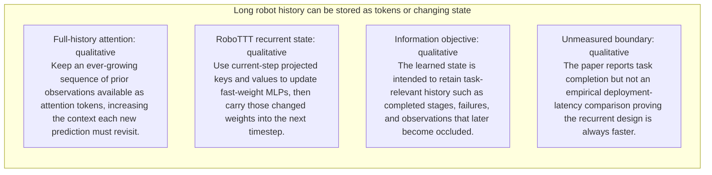
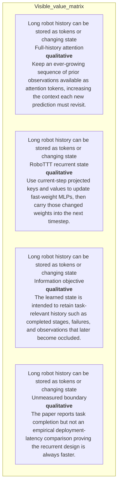
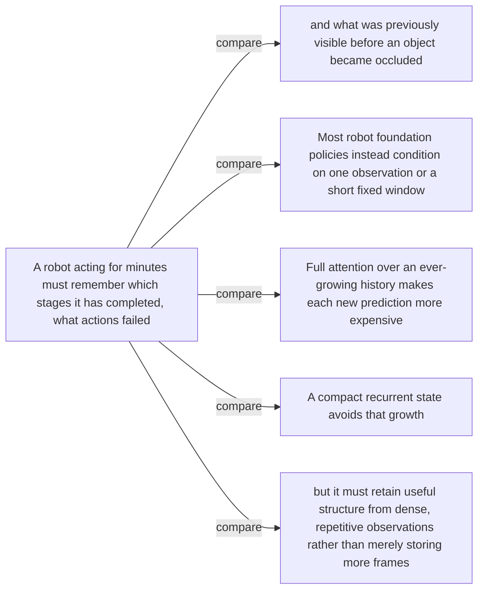
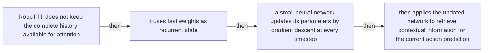
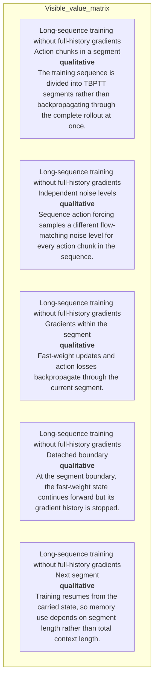
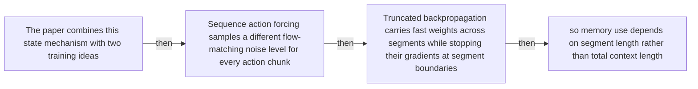
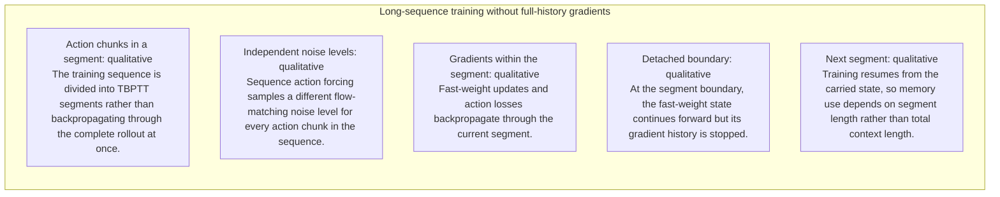
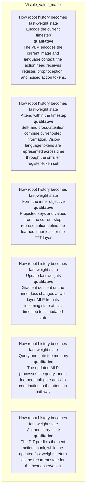

```mermaid
flowchart LR
  inputs["VLM and DiT tokens at timestep t"]
  kv["Project keys and values"]
  loss["Inner reconstruction loss"]
  update["Gradient update of fast-weight MLP"]
  query["Process current query with updated weights"]
  gate["Tanh-gated contextual retrieval"]
  action["Condition action denoising"]
  carry["Carry fast weights to timestep t+1"]
  inputs -->|"encode"| kv
  kv -->|"self-supervise"| loss
  loss -->|"gradient"| update
  update -->|"updated state"| query
  query -->|"retrieve"| gate
  gate -->|"context"| action
  action -->|"advance"| carry
  carry -->|"next observation"| inputs
```

# Visual manifest — RoboTTT: Context Scaling for Robot Policies

- Paper ID: `paper_robott`
- Exact paper version: `v1`
- Explainer fixture: `packages/test-fixtures/explainers/robott.json`
- Manifest revision: `3`
- Engineer status: `COMPLETE`
- Implementer status: `COMPLETE`
- Paragraph coverage: `16 / 16` prose paragraphs
- Paragraph-ID derivation: `{block.id}_p{1-based index in block.paragraphs}`; each fixture paragraph appears exactly once.
- Evidence sources:
  - `rttt_architecture_source` — RoboTTT v1 — architecture and sequence training; Sections 2–3.2, Equations 1–5, Figures 2–4, PDF pages 3–5; the arXiv v1 record identifies the paper as CC BY 4.0
  - `rttt_training_source` — RoboTTT v1 — context learning and DAgger Distillation; Sections 3.3–3.4, Figures 5–6, PDF pages 6–7
  - `rttt_results_source` — RoboTTT v1 — real-robot evaluation and ablations; Section 4, Tables 1–3, Figures 7–12, PDF pages 7–11
  - `rttt_limits_source` — RoboTTT v1 — limitations, deployment, and evaluation details; Section 6 and Appendices A–B, PDF pages 12 and 20–22

Revision 3 incorporates every paragraph-level `VISUAL_QA` finding. Treatments are selected by the paragraph's actual explanatory job rather than a universal graph/matrix/card trio. Shared visuals are allowed only for the explicit adjacent scopes recorded below, must encode every scoped mechanism and value, and are placed after the final paragraph in scope. Numeric tables expose values visibly, small-delta plots disclose local domains, and implementers must record any topology, scope, placement, or evidence deviation instead of claiming `NONE`.

## `rttt_why_p1`

- Location: `rttt_why`, paragraph 1
- Text anchor: "A robot acting for minutes must remember which stages it has completed, what actions failed, and what was previously visible before an object became occluded."
- Claims and sources: `rttt_core` (OBSERVED, VERIFIED); `rttt_architecture` (OBSERVED, VERIFIED); `rttt_architecture_source` (Sections 2–3.2, Equations 1–5, Figures 2–4, PDF pages 3–5; the arXiv v1 record identifies the paper as CC BY 4.0)
- Visual needed: `YES`
- Decision rationale: A visual passes the removal test because readers must reconstruct growing observation history versus fixed-size fast-weight state while preserving the paragraph's conditions and boundaries. Revision 3 narrows the topology and placement so no visual can claim this paragraph without encoding its mechanism, grouping, or values.
- Explanatory job: Growing observation history versus fixed-size fast-weight state.
- Recommended scope and placement: Shared scope `rttt_why_p1`, `rttt_why_p2` is allowed only when one visual encodes every listed mechanism, condition, and value; place it immediately after the final paragraph, `rttt_why_p2`. Otherwise split the visual by paragraph.
- QA-informed planning change: A shared visual belongs after the second paragraph and must distinguish compute growth from the separate information-retention objective.

### Treatment A — Growing observation history versus fixed-size fast-weight state — Relationship-specific parallel view

- Teaching purpose: Keep valid comparison groups separate and equally visible.
- Encoding and reading order: Group the 4 source-backed records into named panels using the first column as the grouping key. Panels preserve experimental, source, or example boundaries and never imply one shared scale.
- Evidence and limitations: Encode only `rttt_core`, `rttt_architecture` from `rttt_architecture_source`. A shared visual belongs after the second paragraph and must distinguish compute growth from the separate information-retention objective.
- Recommended web medium: semantic HTML/CSS grouped panels or responsive SVG; JavaScript is optional only for meaningful focus, drill-down, or state playback.
- Mobile, accessibility, and motion behavior: Preserve the same group and node order in the DOM; retain all values and relation labels as selectable text; stack panels or levels below 640px; provide keyboard access for any optional focus state; keep a complete static fallback; respect reduced motion and never encode information only through animation.

#### TikZ

```tex
\documentclass[tikz,border=5pt]{standalone}
\usepackage[T1]{fontenc}
\usepackage{tikz}
\begin{document}
\begin{tikzpicture}[font=\sffamily,panel/.style={draw,rounded corners,align=center,text width=4.8cm,minimum height=4cm}]
\node[font=\bfseries] at (0,3) {rttt\_why\_p1: Growing observation history versus fixed-size fast-weight state - Relationship-specific parallel view};
\node[panel] at (0,0) {\textbf{Long robot history can be stored as tokens or changing state}\\[4pt]\textbf{Full-history attention}: qualitative -- Keep an ever-growing sequence of prior observations available as attention tokens, increasing the context each new prediction must revisit.\\\textbf{RoboTTT recurrent state}: qualitative -- Use current-step projected keys and values to update fast-weight MLPs, then carry those changed weights into the next timestep.\\\textbf{Information objective}: qualitative -- The learned state is intended to retain task-relevant history such as completed stages, failures, and observations that later become occluded.\\\textbf{Unmeasured boundary}: qualitative -- The paper reports task completion but not an empirical deployment-latency comparison proving the recurrent design is always faster.};
\end{tikzpicture}
\end{document}
```

#### Mermaid



#### Python

```python
from html import escape
from pathlib import Path
from textwrap import wrap

title = "rttt_why_p1: Growing observation history versus fixed-size fast-weight state — Relationship-specific parallel view"
rows = [["Long robot history can be stored as tokens or changing state","Full-history attention","qualitative","Keep an ever-growing sequence of prior observations available as attention tokens, increasing the context each new prediction must revisit."],["Long robot history can be stored as tokens or changing state","RoboTTT recurrent state","qualitative","Use current-step projected keys and values to update fast-weight MLPs, then carry those changed weights into the next timestep."],["Long robot history can be stored as tokens or changing state","Information objective","qualitative","The learned state is intended to retain task-relevant history such as completed stages, failures, and observations that later become occluded."],["Long robot history can be stored as tokens or changing state","Unmeasured boundary","qualitative","The paper reports task completion but not an empirical deployment-latency comparison proving the recurrent design is always faster."]]
groups = {}
for group, label, value, condition in rows:
    groups.setdefault(group, []).append((label, value, condition))
width = max(900, len(groups) * 360)
height = 220 + max((len(items) for items in groups.values()), default=1) * 92
parts = [
    f'<svg xmlns="http://www.w3.org/2000/svg" viewBox="0 0 {width} {height}" role="img" aria-labelledby="title desc">',
    f'<title id="title">{escape(title)}</title>',
    '<desc id="desc">Separate panels preserve grouping and prevent unrelated conditions from reading as one sequence.</desc>',
    f'<rect width="{width}" height="{height}" fill="white"/>',
]
for group_index, (group, items) in enumerate(groups.items()):
    x = 180 + group_index * 360
    parts.append(f'<text x="{x}" y="65" text-anchor="middle" font-family="sans-serif" font-size="16" font-weight="700">{escape(group)}</text>')
    for item_index, (label, value, condition) in enumerate(items):
        y = 120 + item_index * 92
        parts.append(f'<rect x="{x-160}" y="{y-30}" width="320" height="78" rx="12" fill="#f7fbff" stroke="#ccd"/>')
        text = f"{label}: {value} — {condition}"
        for line_index, line in enumerate(wrap(text, width=46)):
            parts.append(f'<text x="{x}" y="{y-6+line_index*14}" text-anchor="middle" font-family="sans-serif" font-size="11">{escape(line)}</text>')
parts.append('</svg>')
Path("rttt_why_p1_treatment_a.svg").write_text("\n".join(parts), encoding="utf-8")
```

### Treatment B — Growing observation history versus fixed-size fast-weight state — Condition and boundary matrix

- Teaching purpose: Show every comparison value or qualitative condition in explicit columns.
- Encoding and reading order: Render 4 rows with explicit `Group`, `Measure or state`, `Visible value`, and `Condition or boundary` columns. The value column must be visible, not only present in ARIA text or fallback prose.
- Evidence and limitations: Encode only `rttt_core`, `rttt_architecture` from `rttt_architecture_source`. A shared visual belongs after the second paragraph and must distinguish compute growth from the separate information-retention objective.
- Recommended web medium: semantic HTML/CSS table with SVG export; JavaScript is optional only for meaningful focus, drill-down, or state playback.
- Mobile, accessibility, and motion behavior: Preserve the same group and node order in the DOM; retain all values and relation labels as selectable text; stack panels or levels below 640px; provide keyboard access for any optional focus state; keep a complete static fallback; respect reduced motion and never encode information only through animation.

#### TikZ

```tex
\documentclass[tikz,border=5pt]{standalone}
\usepackage[T1]{fontenc}
\usepackage{array}
\usepackage{tikz}
\begin{document}
\begin{tikzpicture}[font=\sffamily]
\node[align=center] {\textbf{rttt\_why\_p1: Growing observation history versus fixed-size fast-weight state - Condition and boundary matrix}\\[6pt]
\begin{tabular}{p{3.2cm}p{4.0cm}p{2.8cm}p{6.2cm}}
\textbf{Group} & \textbf{Measure or state} & \textbf{Visible value} & \textbf{Condition or boundary} \\ \hline
Long robot history can be stored as tokens or changing state & Full-history attention & qualitative & Keep an ever-growing sequence of prior observations available as attention tokens, increasing the context each new prediction must revisit. \\
Long robot history can be stored as tokens or changing state & RoboTTT recurrent state & qualitative & Use current-step projected keys and values to update fast-weight MLPs, then carry those changed weights into the next timestep. \\
Long robot history can be stored as tokens or changing state & Information objective & qualitative & The learned state is intended to retain task-relevant history such as completed stages, failures, and observations that later become occluded. \\
Long robot history can be stored as tokens or changing state & Unmeasured boundary & qualitative & The paper reports task completion but not an empirical deployment-latency comparison proving the recurrent design is always faster. \\
\end{tabular}};
\end{tikzpicture}
\end{document}
```

#### Mermaid



#### Python

```python
from html import escape
from pathlib import Path
from textwrap import wrap

title = "rttt_why_p1: Growing observation history versus fixed-size fast-weight state — Condition and boundary matrix"
rows = [["Long robot history can be stored as tokens or changing state","Full-history attention","qualitative","Keep an ever-growing sequence of prior observations available as attention tokens, increasing the context each new prediction must revisit."],["Long robot history can be stored as tokens or changing state","RoboTTT recurrent state","qualitative","Use current-step projected keys and values to update fast-weight MLPs, then carry those changed weights into the next timestep."],["Long robot history can be stored as tokens or changing state","Information objective","qualitative","The learned state is intended to retain task-relevant history such as completed stages, failures, and observations that later become occluded."],["Long robot history can be stored as tokens or changing state","Unmeasured boundary","qualitative","The paper reports task completion but not an empirical deployment-latency comparison proving the recurrent design is always faster."]]
height = 502
parts = [
    f'<svg xmlns="http://www.w3.org/2000/svg" viewBox="0 0 1200 {height}" role="img" aria-labelledby="title desc">',
    f'<title id="title">{escape(title)}</title>',
    '<desc id="desc">Every reported value is visible beside its condition and group.</desc>',
    f'<rect width="1200" height="{height}" fill="white"/>',
]
headers = ["Group", "Measure or state", "Visible value", "Condition or boundary"]
xs = [30, 260, 590, 770]
for x, header in zip(xs, headers):
    parts.append(f'<text x="{x}" y="70" font-family="sans-serif" font-size="16" font-weight="700">{escape(header)}</text>')
for row_index, row in enumerate(rows):
    y = 110 + row_index * 88
    parts.append(f'<rect x="20" y="{y-28}" width="1160" height="76" fill="#f7fbff" stroke="#ccd"/>')
    for x, cell, width in zip(xs, row, [26, 38, 20, 58]):
        for line_index, line in enumerate(wrap(str(cell), width=width)):
            parts.append(f'<text x="{x}" y="{y+line_index*14}" font-family="sans-serif" font-size="11">{escape(line)}</text>')
parts.append('</svg>')
Path("rttt_why_p1_treatment_b.svg").write_text("\n".join(parts), encoding="utf-8")
```

### Treatment C — Growing observation history versus fixed-size fast-weight state — Comparison topology

- Teaching purpose: Connect only the alternatives and shared decision point stated in the paragraph.
- Encoding and reading order: Use 6 named nodes and 5 explicit labeled relations. Preserve all branch, merge, hierarchy, loop, or sequence edges shown in the code; changing them is an evidence deviation.
- Evidence and limitations: Encode only `rttt_core`, `rttt_architecture` from `rttt_architecture_source`. A shared visual belongs after the second paragraph and must distinguish compute growth from the separate information-retention objective.
- Recommended web medium: responsive inline SVG with semantic HTML/CSS fallback; JavaScript is optional only for meaningful focus, drill-down, or state playback.
- Mobile, accessibility, and motion behavior: Preserve the same group and node order in the DOM; retain all values and relation labels as selectable text; stack panels or levels below 640px; provide keyboard access for any optional focus state; keep a complete static fallback; respect reduced motion and never encode information only through animation.

#### TikZ

```tex
\documentclass[tikz,border=5pt]{standalone}
\usepackage[T1]{fontenc}
\usepackage{tikz}
\usetikzlibrary{arrows.meta}
\begin{document}
\begin{tikzpicture}[font=\sffamily,box/.style={draw,rounded corners,align=center,text width=3cm,minimum height=1.2cm},link/.style={-{Latex[length=2mm]},thick},rel/.style={fill=white,font=\scriptsize}]
\node[font=\bfseries,anchor=west] at (0,0.8) {rttt\_why\_p1: Growing observation history versus fixed-size fast-weight state - Comparison topology};
\node[box] (n1) at (1.00,-1.50) {A robot acting for minutes must remember which stages it has completed, what actions failed};
\node[box] (n2) at (2.50,-1.50) {and what was previously visible before an object became occluded};
\node[box] (n3) at (4.00,-1.50) {Most robot foundation policies instead condition on one observation or a short fixed window};
\node[box] (n4) at (5.50,-1.50) {Full attention over an ever-growing history makes each new prediction more expensive};
\node[box] (n5) at (7.00,-1.50) {A compact recurrent state avoids that growth};
\node[box] (n6) at (8.50,-1.50) {but it must retain useful structure from dense, repetitive observations rather than merely storing more frames};
\draw[link] (n1) -- node[rel] {compare} (n2);
\draw[link] (n1) -- node[rel] {compare} (n3);
\draw[link] (n1) -- node[rel] {compare} (n4);
\draw[link] (n1) -- node[rel] {compare} (n5);
\draw[link] (n1) -- node[rel] {compare} (n6);
\end{tikzpicture}
\end{document}
```

#### Mermaid



#### Python

```python
from html import escape
from pathlib import Path
from textwrap import wrap

title = "rttt_why_p1: Growing observation history versus fixed-size fast-weight state — Comparison topology"
nodes = [["n1","A robot acting for minutes must remember which stages it has completed, what actions failed",100,150],["n2","and what was previously visible before an object became occluded",250,150],["n3","Most robot foundation policies instead condition on one observation or a short fixed window",400,150],["n4","Full attention over an ever-growing history makes each new prediction more expensive",550,150],["n5","A compact recurrent state avoids that growth",700,150],["n6","but it must retain useful structure from dense, repetitive observations rather than merely storing more frames",850,150]]
edges = [["n1","n2","compare"],["n1","n3","compare"],["n1","n4","compare"],["n1","n5","compare"],["n1","n6","compare"]]
node_by_id = {node_id: (label, x, y) for node_id, label, x, y in nodes}
width = max(900, max((x for _, _, x, _ in nodes), default=800) + 180)
height = max(500, max((y for _, _, _, y in nodes), default=400) + 140)
parts = [
    f'<svg xmlns="http://www.w3.org/2000/svg" viewBox="0 0 {width} {height}" role="img" aria-labelledby="title desc">',
    f'<title id="title">{escape(title)}</title>',
    '<desc id="desc">Edges and convergence points encode only relationships stated in the scoped paragraphs.</desc>',
    f'<rect width="{width}" height="{height}" fill="white"/>',
]
for source, target, relation in edges:
    _, x1, y1 = node_by_id[source]
    _, x2, y2 = node_by_id[target]
    parts.append(f'<line x1="{x1}" y1="{y1}" x2="{x2}" y2="{y2}" stroke="#345" stroke-width="2"/>')
    parts.append(f'<text x="{(x1+x2)/2}" y="{(y1+y2)/2-5}" text-anchor="middle" font-family="sans-serif" font-size="10">{escape(relation)}</text>')
for _, label, x, y in nodes:
    parts.append(f'<rect x="{x-78}" y="{y-42}" width="156" height="84" rx="12" fill="#eef6ff" stroke="#234"/>')
    for line_index, line in enumerate(wrap(label, width=22)):
        parts.append(f'<text x="{x}" y="{y-24+line_index*13}" text-anchor="middle" font-family="sans-serif" font-size="10">{escape(line)}</text>')
parts.append('</svg>')
Path("rttt_why_p1_treatment_c.svg").write_text("\n".join(parts), encoding="utf-8")
```

### Implementation record

- Status: `IMPLEMENTED`
- Selected treatment: `A`
- Selection rationale: Selected the approved relationship that directly answers this paragraph's explanatory job; the shared visual uses the same evidence and complete adjacent scope recorded here.
- Delivery medium: `CSS + semantic HTML`
- Visual ID and placement: `visual_robottt_history_memory` after `rttt_why_p2`; this record is served by that purpose-built figure.
- Shared paragraph scope: `rttt_why_p1`, `rttt_why_p2`
- Changed files: `packages/test-fixtures/explainers/robott.json`, `apps/web/app/papers/[id]/explainer-visual.tsx`, `apps/web/app/papers/[id]/page.tsx`, and `apps/web/app/globals.css`
- Accessibility and fallback verification: Figure has a programmatic title and description, explicit alt text, equivalent fallback prose, source links, limitations, and a semantic static body; no meaning depends on motion or pointer input.
- Desktop and mobile verification: Verified in Playwright on 1440-pixel desktop and iPhone 13 mobile viewports; figures remain paragraph-adjacent, preserve reading order, and introduce no horizontal page overflow.
- Evidence deviations: `NONE`; web-native CSS and semantic HTML preserve the selected treatment's evidence, labels, topology, and stated boundaries.

## `rttt_why_p2`

- Location: `rttt_why`, paragraph 2
- Text anchor: "Full attention over an ever-growing history makes each new prediction more expensive."
- Claims and sources: `rttt_core` (OBSERVED, VERIFIED); `rttt_architecture` (OBSERVED, VERIFIED); `rttt_architecture_source` (Sections 2–3.2, Equations 1–5, Figures 2–4, PDF pages 3–5; the arXiv v1 record identifies the paper as CC BY 4.0)
- Visual needed: `YES`
- Decision rationale: A visual passes the removal test because readers must reconstruct growing observation history versus fixed-size fast-weight state while preserving the paragraph's conditions and boundaries. Revision 3 narrows the topology and placement so no visual can claim this paragraph without encoding its mechanism, grouping, or values.
- Explanatory job: Growing observation history versus fixed-size fast-weight state.
- Recommended scope and placement: Shared scope `rttt_why_p1`, `rttt_why_p2` is allowed only when one visual encodes every listed mechanism, condition, and value; place it immediately after the final paragraph, `rttt_why_p2`. Otherwise split the visual by paragraph.
- QA-informed planning change: A shared visual belongs after the second paragraph and must distinguish compute growth from the separate information-retention objective.

### Treatment A — Growing observation history versus fixed-size fast-weight state — Relationship-specific parallel view

- Teaching purpose: Keep valid comparison groups separate and equally visible.
- Encoding and reading order: Group the 4 source-backed records into named panels using the first column as the grouping key. Panels preserve experimental, source, or example boundaries and never imply one shared scale.
- Evidence and limitations: Encode only `rttt_core`, `rttt_architecture` from `rttt_architecture_source`. A shared visual belongs after the second paragraph and must distinguish compute growth from the separate information-retention objective.
- Recommended web medium: semantic HTML/CSS grouped panels or responsive SVG; JavaScript is optional only for meaningful focus, drill-down, or state playback.
- Mobile, accessibility, and motion behavior: Preserve the same group and node order in the DOM; retain all values and relation labels as selectable text; stack panels or levels below 640px; provide keyboard access for any optional focus state; keep a complete static fallback; respect reduced motion and never encode information only through animation.

#### TikZ

```tex
\documentclass[tikz,border=5pt]{standalone}
\usepackage[T1]{fontenc}
\usepackage{tikz}
\begin{document}
\begin{tikzpicture}[font=\sffamily,panel/.style={draw,rounded corners,align=center,text width=4.8cm,minimum height=4cm}]
\node[font=\bfseries] at (0,3) {rttt\_why\_p2: Growing observation history versus fixed-size fast-weight state - Relationship-specific parallel view};
\node[panel] at (0,0) {\textbf{Long robot history can be stored as tokens or changing state}\\[4pt]\textbf{Full-history attention}: qualitative -- Keep an ever-growing sequence of prior observations available as attention tokens, increasing the context each new prediction must revisit.\\\textbf{RoboTTT recurrent state}: qualitative -- Use current-step projected keys and values to update fast-weight MLPs, then carry those changed weights into the next timestep.\\\textbf{Information objective}: qualitative -- The learned state is intended to retain task-relevant history such as completed stages, failures, and observations that later become occluded.\\\textbf{Unmeasured boundary}: qualitative -- The paper reports task completion but not an empirical deployment-latency comparison proving the recurrent design is always faster.};
\end{tikzpicture}
\end{document}
```

#### Mermaid


#### Python

```python
from html import escape
from pathlib import Path
from textwrap import wrap

title = "rttt_why_p2: Growing observation history versus fixed-size fast-weight state — Relationship-specific parallel view"
rows = [["Long robot history can be stored as tokens or changing state","Full-history attention","qualitative","Keep an ever-growing sequence of prior observations available as attention tokens, increasing the context each new prediction must revisit."],["Long robot history can be stored as tokens or changing state","RoboTTT recurrent state","qualitative","Use current-step projected keys and values to update fast-weight MLPs, then carry those changed weights into the next timestep."],["Long robot history can be stored as tokens or changing state","Information objective","qualitative","The learned state is intended to retain task-relevant history such as completed stages, failures, and observations that later become occluded."],["Long robot history can be stored as tokens or changing state","Unmeasured boundary","qualitative","The paper reports task completion but not an empirical deployment-latency comparison proving the recurrent design is always faster."]]
groups = {}
for group, label, value, condition in rows:
    groups.setdefault(group, []).append((label, value, condition))
width = max(900, len(groups) * 360)
height = 220 + max((len(items) for items in groups.values()), default=1) * 92
parts = [
    f'<svg xmlns="http://www.w3.org/2000/svg" viewBox="0 0 {width} {height}" role="img" aria-labelledby="title desc">',
    f'<title id="title">{escape(title)}</title>',
    '<desc id="desc">Separate panels preserve grouping and prevent unrelated conditions from reading as one sequence.</desc>',
    f'<rect width="{width}" height="{height}" fill="white"/>',
]
for group_index, (group, items) in enumerate(groups.items()):
    x = 180 + group_index * 360
    parts.append(f'<text x="{x}" y="65" text-anchor="middle" font-family="sans-serif" font-size="16" font-weight="700">{escape(group)}</text>')
    for item_index, (label, value, condition) in enumerate(items):
        y = 120 + item_index * 92
        parts.append(f'<rect x="{x-160}" y="{y-30}" width="320" height="78" rx="12" fill="#f7fbff" stroke="#ccd"/>')
        text = f"{label}: {value} — {condition}"
        for line_index, line in enumerate(wrap(text, width=46)):
            parts.append(f'<text x="{x}" y="{y-6+line_index*14}" text-anchor="middle" font-family="sans-serif" font-size="11">{escape(line)}</text>')
parts.append('</svg>')
Path("rttt_why_p2_treatment_a.svg").write_text("\n".join(parts), encoding="utf-8")
```

### Treatment B — Growing observation history versus fixed-size fast-weight state — Condition and boundary matrix

- Teaching purpose: Show every comparison value or qualitative condition in explicit columns.
- Encoding and reading order: Render 4 rows with explicit `Group`, `Measure or state`, `Visible value`, and `Condition or boundary` columns. The value column must be visible, not only present in ARIA text or fallback prose.
- Evidence and limitations: Encode only `rttt_core`, `rttt_architecture` from `rttt_architecture_source`. A shared visual belongs after the second paragraph and must distinguish compute growth from the separate information-retention objective.
- Recommended web medium: semantic HTML/CSS table with SVG export; JavaScript is optional only for meaningful focus, drill-down, or state playback.
- Mobile, accessibility, and motion behavior: Preserve the same group and node order in the DOM; retain all values and relation labels as selectable text; stack panels or levels below 640px; provide keyboard access for any optional focus state; keep a complete static fallback; respect reduced motion and never encode information only through animation.

#### TikZ

```tex
\documentclass[tikz,border=5pt]{standalone}
\usepackage[T1]{fontenc}
\usepackage{array}
\usepackage{tikz}
\begin{document}
\begin{tikzpicture}[font=\sffamily]
\node[align=center] {\textbf{rttt\_why\_p2: Growing observation history versus fixed-size fast-weight state - Condition and boundary matrix}\\[6pt]
\begin{tabular}{p{3.2cm}p{4.0cm}p{2.8cm}p{6.2cm}}
\textbf{Group} & \textbf{Measure or state} & \textbf{Visible value} & \textbf{Condition or boundary} \\ \hline
Long robot history can be stored as tokens or changing state & Full-history attention & qualitative & Keep an ever-growing sequence of prior observations available as attention tokens, increasing the context each new prediction must revisit. \\
Long robot history can be stored as tokens or changing state & RoboTTT recurrent state & qualitative & Use current-step projected keys and values to update fast-weight MLPs, then carry those changed weights into the next timestep. \\
Long robot history can be stored as tokens or changing state & Information objective & qualitative & The learned state is intended to retain task-relevant history such as completed stages, failures, and observations that later become occluded. \\
Long robot history can be stored as tokens or changing state & Unmeasured boundary & qualitative & The paper reports task completion but not an empirical deployment-latency comparison proving the recurrent design is always faster. \\
\end{tabular}};
\end{tikzpicture}
\end{document}
```

#### Mermaid


#### Python

```python
from html import escape
from pathlib import Path
from textwrap import wrap

title = "rttt_why_p2: Growing observation history versus fixed-size fast-weight state — Condition and boundary matrix"
rows = [["Long robot history can be stored as tokens or changing state","Full-history attention","qualitative","Keep an ever-growing sequence of prior observations available as attention tokens, increasing the context each new prediction must revisit."],["Long robot history can be stored as tokens or changing state","RoboTTT recurrent state","qualitative","Use current-step projected keys and values to update fast-weight MLPs, then carry those changed weights into the next timestep."],["Long robot history can be stored as tokens or changing state","Information objective","qualitative","The learned state is intended to retain task-relevant history such as completed stages, failures, and observations that later become occluded."],["Long robot history can be stored as tokens or changing state","Unmeasured boundary","qualitative","The paper reports task completion but not an empirical deployment-latency comparison proving the recurrent design is always faster."]]
height = 502
parts = [
    f'<svg xmlns="http://www.w3.org/2000/svg" viewBox="0 0 1200 {height}" role="img" aria-labelledby="title desc">',
    f'<title id="title">{escape(title)}</title>',
    '<desc id="desc">Every reported value is visible beside its condition and group.</desc>',
    f'<rect width="1200" height="{height}" fill="white"/>',
]
headers = ["Group", "Measure or state", "Visible value", "Condition or boundary"]
xs = [30, 260, 590, 770]
for x, header in zip(xs, headers):
    parts.append(f'<text x="{x}" y="70" font-family="sans-serif" font-size="16" font-weight="700">{escape(header)}</text>')
for row_index, row in enumerate(rows):
    y = 110 + row_index * 88
    parts.append(f'<rect x="20" y="{y-28}" width="1160" height="76" fill="#f7fbff" stroke="#ccd"/>')
    for x, cell, width in zip(xs, row, [26, 38, 20, 58]):
        for line_index, line in enumerate(wrap(str(cell), width=width)):
            parts.append(f'<text x="{x}" y="{y+line_index*14}" font-family="sans-serif" font-size="11">{escape(line)}</text>')
parts.append('</svg>')
Path("rttt_why_p2_treatment_b.svg").write_text("\n".join(parts), encoding="utf-8")
```

### Treatment C — Growing observation history versus fixed-size fast-weight state — Comparison topology

- Teaching purpose: Connect only the alternatives and shared decision point stated in the paragraph.
- Encoding and reading order: Use 6 named nodes and 5 explicit labeled relations. Preserve all branch, merge, hierarchy, loop, or sequence edges shown in the code; changing them is an evidence deviation.
- Evidence and limitations: Encode only `rttt_core`, `rttt_architecture` from `rttt_architecture_source`. A shared visual belongs after the second paragraph and must distinguish compute growth from the separate information-retention objective.
- Recommended web medium: responsive inline SVG with semantic HTML/CSS fallback; JavaScript is optional only for meaningful focus, drill-down, or state playback.
- Mobile, accessibility, and motion behavior: Preserve the same group and node order in the DOM; retain all values and relation labels as selectable text; stack panels or levels below 640px; provide keyboard access for any optional focus state; keep a complete static fallback; respect reduced motion and never encode information only through animation.

#### TikZ

```tex
\documentclass[tikz,border=5pt]{standalone}
\usepackage[T1]{fontenc}
\usepackage{tikz}
\usetikzlibrary{arrows.meta}
\begin{document}
\begin{tikzpicture}[font=\sffamily,box/.style={draw,rounded corners,align=center,text width=3cm,minimum height=1.2cm},link/.style={-{Latex[length=2mm]},thick},rel/.style={fill=white,font=\scriptsize}]
\node[font=\bfseries,anchor=west] at (0,0.8) {rttt\_why\_p2: Growing observation history versus fixed-size fast-weight state - Comparison topology};
\node[box] (n1) at (1.00,-1.50) {A robot acting for minutes must remember which stages it has completed, what actions failed};
\node[box] (n2) at (2.50,-1.50) {and what was previously visible before an object became occluded};
\node[box] (n3) at (4.00,-1.50) {Most robot foundation policies instead condition on one observation or a short fixed window};
\node[box] (n4) at (5.50,-1.50) {Full attention over an ever-growing history makes each new prediction more expensive};
\node[box] (n5) at (7.00,-1.50) {A compact recurrent state avoids that growth};
\node[box] (n6) at (8.50,-1.50) {but it must retain useful structure from dense, repetitive observations rather than merely storing more frames};
\draw[link] (n1) -- node[rel] {compare} (n2);
\draw[link] (n1) -- node[rel] {compare} (n3);
\draw[link] (n1) -- node[rel] {compare} (n4);
\draw[link] (n1) -- node[rel] {compare} (n5);
\draw[link] (n1) -- node[rel] {compare} (n6);
\end{tikzpicture}
\end{document}
```

#### Mermaid


#### Python

```python
from html import escape
from pathlib import Path
from textwrap import wrap

title = "rttt_why_p2: Growing observation history versus fixed-size fast-weight state — Comparison topology"
nodes = [["n1","A robot acting for minutes must remember which stages it has completed, what actions failed",100,150],["n2","and what was previously visible before an object became occluded",250,150],["n3","Most robot foundation policies instead condition on one observation or a short fixed window",400,150],["n4","Full attention over an ever-growing history makes each new prediction more expensive",550,150],["n5","A compact recurrent state avoids that growth",700,150],["n6","but it must retain useful structure from dense, repetitive observations rather than merely storing more frames",850,150]]
edges = [["n1","n2","compare"],["n1","n3","compare"],["n1","n4","compare"],["n1","n5","compare"],["n1","n6","compare"]]
node_by_id = {node_id: (label, x, y) for node_id, label, x, y in nodes}
width = max(900, max((x for _, _, x, _ in nodes), default=800) + 180)
height = max(500, max((y for _, _, _, y in nodes), default=400) + 140)
parts = [
    f'<svg xmlns="http://www.w3.org/2000/svg" viewBox="0 0 {width} {height}" role="img" aria-labelledby="title desc">',
    f'<title id="title">{escape(title)}</title>',
    '<desc id="desc">Edges and convergence points encode only relationships stated in the scoped paragraphs.</desc>',
    f'<rect width="{width}" height="{height}" fill="white"/>',
]
for source, target, relation in edges:
    _, x1, y1 = node_by_id[source]
    _, x2, y2 = node_by_id[target]
    parts.append(f'<line x1="{x1}" y1="{y1}" x2="{x2}" y2="{y2}" stroke="#345" stroke-width="2"/>')
    parts.append(f'<text x="{(x1+x2)/2}" y="{(y1+y2)/2-5}" text-anchor="middle" font-family="sans-serif" font-size="10">{escape(relation)}</text>')
for _, label, x, y in nodes:
    parts.append(f'<rect x="{x-78}" y="{y-42}" width="156" height="84" rx="12" fill="#eef6ff" stroke="#234"/>')
    for line_index, line in enumerate(wrap(label, width=22)):
        parts.append(f'<text x="{x}" y="{y-24+line_index*13}" text-anchor="middle" font-family="sans-serif" font-size="10">{escape(line)}</text>')
parts.append('</svg>')
Path("rttt_why_p2_treatment_c.svg").write_text("\n".join(parts), encoding="utf-8")
```

### Implementation record

- Status: `IMPLEMENTED`
- Selected treatment: `A`
- Selection rationale: Selected the approved relationship that directly answers this paragraph's explanatory job; the shared visual uses the same evidence and complete adjacent scope recorded here.
- Delivery medium: `CSS + semantic HTML`
- Visual ID and placement: `visual_robottt_history_memory` after `rttt_why_p2`; this record is served by that purpose-built figure.
- Shared paragraph scope: `rttt_why_p1`, `rttt_why_p2`
- Changed files: `packages/test-fixtures/explainers/robott.json`, `apps/web/app/papers/[id]/explainer-visual.tsx`, `apps/web/app/papers/[id]/page.tsx`, and `apps/web/app/globals.css`
- Accessibility and fallback verification: Figure has a programmatic title and description, explicit alt text, equivalent fallback prose, source links, limitations, and a semantic static body; no meaning depends on motion or pointer input.
- Desktop and mobile verification: Verified in Playwright on 1440-pixel desktop and iPhone 13 mobile viewports; figures remain paragraph-adjacent, preserve reading order, and introduce no horizontal page overflow.
- Evidence deviations: `NONE`; web-native CSS and semantic HTML preserve the selected treatment's evidence, labels, topology, and stated boundaries.

## `rttt_change_p1`

- Location: `rttt_change`, paragraph 1
- Text anchor: "RoboTTT does not keep the complete history available for attention."
- Claims and sources: `rttt_architecture` (OBSERVED, VERIFIED); `rttt_training` (OBSERVED, VERIFIED); `rttt_architecture_source` (Sections 2–3.2, Equations 1–5, Figures 2–4, PDF pages 3–5; the arXiv v1 record identifies the paper as CC BY 4.0)
- Visual needed: `YES`
- Decision rationale: A visual passes the removal test because readers must reconstruct observation projection, fast-weight gradient update, query retrieval, and current action while preserving the paragraph's conditions and boundaries. Revision 3 narrows the topology and placement so no visual can claim this paragraph without encoding its mechanism, grouping, or values.
- Explanatory job: Observation projection, fast-weight gradient update, query retrieval, and current action.
- Recommended scope and placement: This paragraph only; place the visual immediately after `rttt_change_p1`.
- QA-informed planning change: This paragraph needs a local update/retrieval mechanism; a TBPTT training timeline cannot serve it.

### Treatment A — Observation projection, fast-weight gradient update, query retrieval, and current action — Operation flow

- Teaching purpose: Show the source-supported order and branch boundaries.
- Encoding and reading order: Use 4 named nodes and 3 explicit labeled relations. Preserve all branch, merge, hierarchy, loop, or sequence edges shown in the code; changing them is an evidence deviation.
- Evidence and limitations: Encode only `rttt_architecture`, `rttt_training` from `rttt_architecture_source`. This paragraph needs a local update/retrieval mechanism; a TBPTT training timeline cannot serve it.
- Recommended web medium: responsive inline SVG with semantic HTML/CSS fallback; JavaScript is optional only for meaningful focus, drill-down, or state playback.
- Mobile, accessibility, and motion behavior: Preserve the same group and node order in the DOM; retain all values and relation labels as selectable text; stack panels or levels below 640px; provide keyboard access for any optional focus state; keep a complete static fallback; respect reduced motion and never encode information only through animation.

#### TikZ

```tex
\documentclass[tikz,border=5pt]{standalone}
\usepackage[T1]{fontenc}
\usepackage{tikz}
\usetikzlibrary{arrows.meta}
\begin{document}
\begin{tikzpicture}[font=\sffamily,box/.style={draw,rounded corners,align=center,text width=3cm,minimum height=1.2cm},link/.style={-{Latex[length=2mm]},thick},rel/.style={fill=white,font=\scriptsize}]
\node[font=\bfseries,anchor=west] at (0,0.8) {rttt\_change\_p1: Observation projection, fast-weight gradient update, query retrieval, and current action - Operation flow};
\node[box] (n1) at (1.00,-1.50) {RoboTTT does not keep the complete history available for attention};
\node[box] (n2) at (2.50,-1.50) {It uses fast weights as recurrent state};
\node[box] (n3) at (4.00,-1.50) {a small neural network updates its parameters by gradient descent at every timestep};
\node[box] (n4) at (5.50,-1.50) {then applies the updated network to retrieve contextual information for the current action prediction};
\draw[link] (n1) -- node[rel] {then} (n2);
\draw[link] (n2) -- node[rel] {then} (n3);
\draw[link] (n3) -- node[rel] {then} (n4);
\end{tikzpicture}
\end{document}
```

#### Mermaid



#### Python

```python
from html import escape
from pathlib import Path
from textwrap import wrap

title = "rttt_change_p1: Observation projection, fast-weight gradient update, query retrieval, and current action — Operation flow"
nodes = [["n1","RoboTTT does not keep the complete history available for attention",100,150],["n2","It uses fast weights as recurrent state",250,150],["n3","a small neural network updates its parameters by gradient descent at every timestep",400,150],["n4","then applies the updated network to retrieve contextual information for the current action prediction",550,150]]
edges = [["n1","n2","then"],["n2","n3","then"],["n3","n4","then"]]
node_by_id = {node_id: (label, x, y) for node_id, label, x, y in nodes}
width = max(900, max((x for _, _, x, _ in nodes), default=800) + 180)
height = max(500, max((y for _, _, _, y in nodes), default=400) + 140)
parts = [
    f'<svg xmlns="http://www.w3.org/2000/svg" viewBox="0 0 {width} {height}" role="img" aria-labelledby="title desc">',
    f'<title id="title">{escape(title)}</title>',
    '<desc id="desc">Edges and convergence points encode only relationships stated in the scoped paragraphs.</desc>',
    f'<rect width="{width}" height="{height}" fill="white"/>',
]
for source, target, relation in edges:
    _, x1, y1 = node_by_id[source]
    _, x2, y2 = node_by_id[target]
    parts.append(f'<line x1="{x1}" y1="{y1}" x2="{x2}" y2="{y2}" stroke="#345" stroke-width="2"/>')
    parts.append(f'<text x="{(x1+x2)/2}" y="{(y1+y2)/2-5}" text-anchor="middle" font-family="sans-serif" font-size="10">{escape(relation)}</text>')
for _, label, x, y in nodes:
    parts.append(f'<rect x="{x-78}" y="{y-42}" width="156" height="84" rx="12" fill="#eef6ff" stroke="#234"/>')
    for line_index, line in enumerate(wrap(label, width=22)):
        parts.append(f'<text x="{x}" y="{y-24+line_index*13}" text-anchor="middle" font-family="sans-serif" font-size="10">{escape(line)}</text>')
parts.append('</svg>')
Path("rttt_change_p1_treatment_a.svg").write_text("\n".join(parts), encoding="utf-8")
```

### Treatment B — Observation projection, fast-weight gradient update, query retrieval, and current action — Input-operation-output ledger

- Teaching purpose: Make inputs, operations, outputs, and limits inspectable as columns.
- Encoding and reading order: Render 5 rows with explicit `Group`, `Measure or state`, `Visible value`, and `Condition or boundary` columns. The value column must be visible, not only present in ARIA text or fallback prose.
- Evidence and limitations: Encode only `rttt_architecture`, `rttt_training` from `rttt_architecture_source`. This paragraph needs a local update/retrieval mechanism; a TBPTT training timeline cannot serve it.
- Recommended web medium: semantic HTML/CSS table with SVG export; JavaScript is optional only for meaningful focus, drill-down, or state playback.
- Mobile, accessibility, and motion behavior: Preserve the same group and node order in the DOM; retain all values and relation labels as selectable text; stack panels or levels below 640px; provide keyboard access for any optional focus state; keep a complete static fallback; respect reduced motion and never encode information only through animation.

#### TikZ

```tex
\documentclass[tikz,border=5pt]{standalone}
\usepackage[T1]{fontenc}
\usepackage{array}
\usepackage{tikz}
\begin{document}
\begin{tikzpicture}[font=\sffamily]
\node[align=center] {\textbf{rttt\_change\_p1: Observation projection, fast-weight gradient update, query retrieval, and current action - Input-operation-output ledger}\\[6pt]
\begin{tabular}{p{3.2cm}p{4.0cm}p{2.8cm}p{6.2cm}}
\textbf{Group} & \textbf{Measure or state} & \textbf{Visible value} & \textbf{Condition or boundary} \\ \hline
Long-sequence training without full-history gradients & Action chunks in a segment & qualitative & The training sequence is divided into TBPTT segments rather than backpropagating through the complete rollout at once. \\
Long-sequence training without full-history gradients & Independent noise levels & qualitative & Sequence action forcing samples a different flow-matching noise level for every action chunk in the sequence. \\
Long-sequence training without full-history gradients & Gradients within the segment & qualitative & Fast-weight updates and action losses backpropagate through the current segment. \\
Long-sequence training without full-history gradients & Detached boundary & qualitative & At the segment boundary, the fast-weight state continues forward but its gradient history is stopped. \\
Long-sequence training without full-history gradients & Next segment & qualitative & Training resumes from the carried state, so memory use depends on segment length rather than total context length. \\
\end{tabular}};
\end{tikzpicture}
\end{document}
```

#### Mermaid



#### Python

```python
from html import escape
from pathlib import Path
from textwrap import wrap

title = "rttt_change_p1: Observation projection, fast-weight gradient update, query retrieval, and current action — Input-operation-output ledger"
rows = [["Long-sequence training without full-history gradients","Action chunks in a segment","qualitative","The training sequence is divided into TBPTT segments rather than backpropagating through the complete rollout at once."],["Long-sequence training without full-history gradients","Independent noise levels","qualitative","Sequence action forcing samples a different flow-matching noise level for every action chunk in the sequence."],["Long-sequence training without full-history gradients","Gradients within the segment","qualitative","Fast-weight updates and action losses backpropagate through the current segment."],["Long-sequence training without full-history gradients","Detached boundary","qualitative","At the segment boundary, the fast-weight state continues forward but its gradient history is stopped."],["Long-sequence training without full-history gradients","Next segment","qualitative","Training resumes from the carried state, so memory use depends on segment length rather than total context length."]]
height = 590
parts = [
    f'<svg xmlns="http://www.w3.org/2000/svg" viewBox="0 0 1200 {height}" role="img" aria-labelledby="title desc">',
    f'<title id="title">{escape(title)}</title>',
    '<desc id="desc">Every reported value is visible beside its condition and group.</desc>',
    f'<rect width="1200" height="{height}" fill="white"/>',
]
headers = ["Group", "Measure or state", "Visible value", "Condition or boundary"]
xs = [30, 260, 590, 770]
for x, header in zip(xs, headers):
    parts.append(f'<text x="{x}" y="70" font-family="sans-serif" font-size="16" font-weight="700">{escape(header)}</text>')
for row_index, row in enumerate(rows):
    y = 110 + row_index * 88
    parts.append(f'<rect x="20" y="{y-28}" width="1160" height="76" fill="#f7fbff" stroke="#ccd"/>')
    for x, cell, width in zip(xs, row, [26, 38, 20, 58]):
        for line_index, line in enumerate(wrap(str(cell), width=width)):
            parts.append(f'<text x="{x}" y="{y+line_index*14}" font-family="sans-serif" font-size="11">{escape(line)}</text>')
parts.append('</svg>')
Path("rttt_change_p1_treatment_b.svg").write_text("\n".join(parts), encoding="utf-8")
```

### Treatment C — Observation projection, fast-weight gradient update, query retrieval, and current action — State-transition walkthrough

- Teaching purpose: Follow the described state changes without inventing timing.
- Encoding and reading order: Use 4 named nodes and 3 explicit labeled relations. Preserve all branch, merge, hierarchy, loop, or sequence edges shown in the code; changing them is an evidence deviation.
- Evidence and limitations: Encode only `rttt_architecture`, `rttt_training` from `rttt_architecture_source`. This paragraph needs a local update/retrieval mechanism; a TBPTT training timeline cannot serve it.
- Recommended web medium: responsive inline SVG with semantic HTML/CSS fallback; JavaScript is optional only for meaningful focus, drill-down, or state playback.
- Mobile, accessibility, and motion behavior: Preserve the same group and node order in the DOM; retain all values and relation labels as selectable text; stack panels or levels below 640px; provide keyboard access for any optional focus state; keep a complete static fallback; respect reduced motion and never encode information only through animation.

#### TikZ

```tex
\documentclass[tikz,border=5pt]{standalone}
\usepackage[T1]{fontenc}
\usepackage{tikz}
\usetikzlibrary{arrows.meta}
\begin{document}
\begin{tikzpicture}[font=\sffamily,box/.style={draw,rounded corners,align=center,text width=3cm,minimum height=1.2cm},link/.style={-{Latex[length=2mm]},thick},rel/.style={fill=white,font=\scriptsize}]
\node[font=\bfseries,anchor=west] at (0,0.8) {rttt\_change\_p1: Observation projection, fast-weight gradient update, query retrieval, and current action - State-transition walkthrough};
\node[box] (n1) at (1.00,-1.50) {RoboTTT does not keep the complete history available for attention};
\node[box] (n2) at (2.50,-1.50) {It uses fast weights as recurrent state};
\node[box] (n3) at (4.00,-1.50) {a small neural network updates its parameters by gradient descent at every timestep};
\node[box] (n4) at (5.50,-1.50) {then applies the updated network to retrieve contextual information for the current action prediction};
\draw[link] (n1) -- node[rel] {then} (n2);
\draw[link] (n2) -- node[rel] {then} (n3);
\draw[link] (n3) -- node[rel] {then} (n4);
\end{tikzpicture}
\end{document}
```

#### Mermaid


#### Python

```python
from html import escape
from pathlib import Path
from textwrap import wrap

title = "rttt_change_p1: Observation projection, fast-weight gradient update, query retrieval, and current action — State-transition walkthrough"
nodes = [["n1","RoboTTT does not keep the complete history available for attention",100,150],["n2","It uses fast weights as recurrent state",250,150],["n3","a small neural network updates its parameters by gradient descent at every timestep",400,150],["n4","then applies the updated network to retrieve contextual information for the current action prediction",550,150]]
edges = [["n1","n2","then"],["n2","n3","then"],["n3","n4","then"]]
node_by_id = {node_id: (label, x, y) for node_id, label, x, y in nodes}
width = max(900, max((x for _, _, x, _ in nodes), default=800) + 180)
height = max(500, max((y for _, _, _, y in nodes), default=400) + 140)
parts = [
    f'<svg xmlns="http://www.w3.org/2000/svg" viewBox="0 0 {width} {height}" role="img" aria-labelledby="title desc">',
    f'<title id="title">{escape(title)}</title>',
    '<desc id="desc">Edges and convergence points encode only relationships stated in the scoped paragraphs.</desc>',
    f'<rect width="{width}" height="{height}" fill="white"/>',
]
for source, target, relation in edges:
    _, x1, y1 = node_by_id[source]
    _, x2, y2 = node_by_id[target]
    parts.append(f'<line x1="{x1}" y1="{y1}" x2="{x2}" y2="{y2}" stroke="#345" stroke-width="2"/>')
    parts.append(f'<text x="{(x1+x2)/2}" y="{(y1+y2)/2-5}" text-anchor="middle" font-family="sans-serif" font-size="10">{escape(relation)}</text>')
for _, label, x, y in nodes:
    parts.append(f'<rect x="{x-78}" y="{y-42}" width="156" height="84" rx="12" fill="#eef6ff" stroke="#234"/>')
    for line_index, line in enumerate(wrap(label, width=22)):
        parts.append(f'<text x="{x}" y="{y-24+line_index*13}" text-anchor="middle" font-family="sans-serif" font-size="10">{escape(line)}</text>')
parts.append('</svg>')
Path("rttt_change_p1_treatment_c.svg").write_text("\n".join(parts), encoding="utf-8")
```

### Implementation record

- Status: `IMPLEMENTED`
- Selected treatment: `A`
- Selection rationale: Selected the approved relationship that directly answers this paragraph's explanatory job; the shared visual uses the same evidence and complete adjacent scope recorded here.
- Delivery medium: `CSS + semantic HTML`
- Visual ID and placement: `visual_robottt_training_timeline` after `rttt_change_p2`; this record is served by that purpose-built figure.
- Shared paragraph scope: `rttt_change_p1`, `rttt_change_p2`
- Changed files: `packages/test-fixtures/explainers/robott.json`, `apps/web/app/papers/[id]/explainer-visual.tsx`, `apps/web/app/papers/[id]/page.tsx`, and `apps/web/app/globals.css`
- Accessibility and fallback verification: Figure has a programmatic title and description, explicit alt text, equivalent fallback prose, source links, limitations, and a semantic static body; no meaning depends on motion or pointer input.
- Desktop and mobile verification: Verified in Playwright on 1440-pixel desktop and iPhone 13 mobile viewports; figures remain paragraph-adjacent, preserve reading order, and introduce no horizontal page overflow.
- Evidence deviations: `NONE`; web-native CSS and semantic HTML preserve the selected treatment's evidence, labels, topology, and stated boundaries.

## `rttt_change_p2`

- Location: `rttt_change`, paragraph 2
- Text anchor: "The paper combines this state mechanism with two training ideas."
- Claims and sources: `rttt_architecture` (OBSERVED, VERIFIED); `rttt_training` (OBSERVED, VERIFIED); `rttt_architecture_source` (Sections 2–3.2, Equations 1–5, Figures 2–4, PDF pages 3–5; the arXiv v1 record identifies the paper as CC BY 4.0)
- Visual needed: `YES`
- Decision rationale: A visual passes the removal test because readers must reconstruct per-chunk noise, carried fast weights, and detached tbptt boundaries while preserving the paragraph's conditions and boundaries. Revision 3 narrows the topology and placement so no visual can claim this paragraph without encoding its mechanism, grouping, or values.
- Explanatory job: Per-chunk noise, carried fast weights, and detached TBPTT boundaries.
- Recommended scope and placement: This paragraph only; place the visual immediately after `rttt_change_p2`.
- QA-informed planning change: Show independent flow-matching noise by chunk, within-segment gradients, state carry, and stopped gradients at boundaries.

### Treatment A — Per-chunk noise, carried fast weights, and detached TBPTT boundaries — Training timeline

- Teaching purpose: Show carried state and explicit stop-gradient boundaries.
- Encoding and reading order: Use 4 named nodes and 3 explicit labeled relations. Preserve all branch, merge, hierarchy, loop, or sequence edges shown in the code; changing them is an evidence deviation.
- Evidence and limitations: Encode only `rttt_architecture`, `rttt_training` from `rttt_architecture_source`. Show independent flow-matching noise by chunk, within-segment gradients, state carry, and stopped gradients at boundaries.
- Recommended web medium: responsive inline SVG with semantic HTML/CSS fallback; JavaScript is optional only for meaningful focus, drill-down, or state playback.
- Mobile, accessibility, and motion behavior: Preserve the same group and node order in the DOM; retain all values and relation labels as selectable text; stack panels or levels below 640px; provide keyboard access for any optional focus state; keep a complete static fallback; respect reduced motion and never encode information only through animation.

#### TikZ

```tex
\documentclass[tikz,border=5pt]{standalone}
\usepackage[T1]{fontenc}
\usepackage{tikz}
\usetikzlibrary{arrows.meta}
\begin{document}
\begin{tikzpicture}[font=\sffamily,box/.style={draw,rounded corners,align=center,text width=3cm,minimum height=1.2cm},link/.style={-{Latex[length=2mm]},thick},rel/.style={fill=white,font=\scriptsize}]
\node[font=\bfseries,anchor=west] at (0,0.8) {rttt\_change\_p2: Per-chunk noise, carried fast weights, and detached TBPTT boundaries - Training timeline};
\node[box] (n1) at (1.00,-1.50) {The paper combines this state mechanism with two training ideas};
\node[box] (n2) at (2.50,-1.50) {Sequence action forcing samples a different flow-matching noise level for every action chunk};
\node[box] (n3) at (4.00,-1.50) {Truncated backpropagation carries fast weights across segments while stopping their gradients at segment boundaries};
\node[box] (n4) at (5.50,-1.50) {so memory use depends on segment length rather than total context length};
\draw[link] (n1) -- node[rel] {then} (n2);
\draw[link] (n2) -- node[rel] {then} (n3);
\draw[link] (n3) -- node[rel] {then} (n4);
\end{tikzpicture}
\end{document}
```

#### Mermaid



#### Python

```python
from html import escape
from pathlib import Path
from textwrap import wrap

title = "rttt_change_p2: Per-chunk noise, carried fast weights, and detached TBPTT boundaries — Training timeline"
nodes = [["n1","The paper combines this state mechanism with two training ideas",100,150],["n2","Sequence action forcing samples a different flow-matching noise level for every action chunk",250,150],["n3","Truncated backpropagation carries fast weights across segments while stopping their gradients at segment boundaries",400,150],["n4","so memory use depends on segment length rather than total context length",550,150]]
edges = [["n1","n2","then"],["n2","n3","then"],["n3","n4","then"]]
node_by_id = {node_id: (label, x, y) for node_id, label, x, y in nodes}
width = max(900, max((x for _, _, x, _ in nodes), default=800) + 180)
height = max(500, max((y for _, _, _, y in nodes), default=400) + 140)
parts = [
    f'<svg xmlns="http://www.w3.org/2000/svg" viewBox="0 0 {width} {height}" role="img" aria-labelledby="title desc">',
    f'<title id="title">{escape(title)}</title>',
    '<desc id="desc">Edges and convergence points encode only relationships stated in the scoped paragraphs.</desc>',
    f'<rect width="{width}" height="{height}" fill="white"/>',
]
for source, target, relation in edges:
    _, x1, y1 = node_by_id[source]
    _, x2, y2 = node_by_id[target]
    parts.append(f'<line x1="{x1}" y1="{y1}" x2="{x2}" y2="{y2}" stroke="#345" stroke-width="2"/>')
    parts.append(f'<text x="{(x1+x2)/2}" y="{(y1+y2)/2-5}" text-anchor="middle" font-family="sans-serif" font-size="10">{escape(relation)}</text>')
for _, label, x, y in nodes:
    parts.append(f'<rect x="{x-78}" y="{y-42}" width="156" height="84" rx="12" fill="#eef6ff" stroke="#234"/>')
    for line_index, line in enumerate(wrap(label, width=22)):
        parts.append(f'<text x="{x}" y="{y-24+line_index*13}" text-anchor="middle" font-family="sans-serif" font-size="10">{escape(line)}</text>')
parts.append('</svg>')
Path("rttt_change_p2_treatment_a.svg").write_text("\n".join(parts), encoding="utf-8")
```

### Treatment B — Per-chunk noise, carried fast weights, and detached TBPTT boundaries — Boundary ledger

- Teaching purpose: List every segment, gradient rule, and carried value.
- Encoding and reading order: Render 5 rows with explicit `Group`, `Measure or state`, `Visible value`, and `Condition or boundary` columns. The value column must be visible, not only present in ARIA text or fallback prose.
- Evidence and limitations: Encode only `rttt_architecture`, `rttt_training` from `rttt_architecture_source`. Show independent flow-matching noise by chunk, within-segment gradients, state carry, and stopped gradients at boundaries.
- Recommended web medium: semantic HTML/CSS table with SVG export; JavaScript is optional only for meaningful focus, drill-down, or state playback.
- Mobile, accessibility, and motion behavior: Preserve the same group and node order in the DOM; retain all values and relation labels as selectable text; stack panels or levels below 640px; provide keyboard access for any optional focus state; keep a complete static fallback; respect reduced motion and never encode information only through animation.

#### TikZ

```tex
\documentclass[tikz,border=5pt]{standalone}
\usepackage[T1]{fontenc}
\usepackage{array}
\usepackage{tikz}
\begin{document}
\begin{tikzpicture}[font=\sffamily]
\node[align=center] {\textbf{rttt\_change\_p2: Per-chunk noise, carried fast weights, and detached TBPTT boundaries - Boundary ledger}\\[6pt]
\begin{tabular}{p{3.2cm}p{4.0cm}p{2.8cm}p{6.2cm}}
\textbf{Group} & \textbf{Measure or state} & \textbf{Visible value} & \textbf{Condition or boundary} \\ \hline
Long-sequence training without full-history gradients & Action chunks in a segment & qualitative & The training sequence is divided into TBPTT segments rather than backpropagating through the complete rollout at once. \\
Long-sequence training without full-history gradients & Independent noise levels & qualitative & Sequence action forcing samples a different flow-matching noise level for every action chunk in the sequence. \\
Long-sequence training without full-history gradients & Gradients within the segment & qualitative & Fast-weight updates and action losses backpropagate through the current segment. \\
Long-sequence training without full-history gradients & Detached boundary & qualitative & At the segment boundary, the fast-weight state continues forward but its gradient history is stopped. \\
Long-sequence training without full-history gradients & Next segment & qualitative & Training resumes from the carried state, so memory use depends on segment length rather than total context length. \\
\end{tabular}};
\end{tikzpicture}
\end{document}
```

#### Mermaid


#### Python

```python
from html import escape
from pathlib import Path
from textwrap import wrap

title = "rttt_change_p2: Per-chunk noise, carried fast weights, and detached TBPTT boundaries — Boundary ledger"
rows = [["Long-sequence training without full-history gradients","Action chunks in a segment","qualitative","The training sequence is divided into TBPTT segments rather than backpropagating through the complete rollout at once."],["Long-sequence training without full-history gradients","Independent noise levels","qualitative","Sequence action forcing samples a different flow-matching noise level for every action chunk in the sequence."],["Long-sequence training without full-history gradients","Gradients within the segment","qualitative","Fast-weight updates and action losses backpropagate through the current segment."],["Long-sequence training without full-history gradients","Detached boundary","qualitative","At the segment boundary, the fast-weight state continues forward but its gradient history is stopped."],["Long-sequence training without full-history gradients","Next segment","qualitative","Training resumes from the carried state, so memory use depends on segment length rather than total context length."]]
height = 590
parts = [
    f'<svg xmlns="http://www.w3.org/2000/svg" viewBox="0 0 1200 {height}" role="img" aria-labelledby="title desc">',
    f'<title id="title">{escape(title)}</title>',
    '<desc id="desc">Every reported value is visible beside its condition and group.</desc>',
    f'<rect width="1200" height="{height}" fill="white"/>',
]
headers = ["Group", "Measure or state", "Visible value", "Condition or boundary"]
xs = [30, 260, 590, 770]
for x, header in zip(xs, headers):
    parts.append(f'<text x="{x}" y="70" font-family="sans-serif" font-size="16" font-weight="700">{escape(header)}</text>')
for row_index, row in enumerate(rows):
    y = 110 + row_index * 88
    parts.append(f'<rect x="20" y="{y-28}" width="1160" height="76" fill="#f7fbff" stroke="#ccd"/>')
    for x, cell, width in zip(xs, row, [26, 38, 20, 58]):
        for line_index, line in enumerate(wrap(str(cell), width=width)):
            parts.append(f'<text x="{x}" y="{y+line_index*14}" font-family="sans-serif" font-size="11">{escape(line)}</text>')
parts.append('</svg>')
Path("rttt_change_p2_treatment_b.svg").write_text("\n".join(parts), encoding="utf-8")
```

### Treatment C — Per-chunk noise, carried fast weights, and detached TBPTT boundaries — Segment panels

- Teaching purpose: Keep within-segment and across-segment behavior separate.
- Encoding and reading order: Group the 5 source-backed records into named panels using the first column as the grouping key. Panels preserve experimental, source, or example boundaries and never imply one shared scale.
- Evidence and limitations: Encode only `rttt_architecture`, `rttt_training` from `rttt_architecture_source`. Show independent flow-matching noise by chunk, within-segment gradients, state carry, and stopped gradients at boundaries.
- Recommended web medium: semantic HTML/CSS grouped panels or responsive SVG; JavaScript is optional only for meaningful focus, drill-down, or state playback.
- Mobile, accessibility, and motion behavior: Preserve the same group and node order in the DOM; retain all values and relation labels as selectable text; stack panels or levels below 640px; provide keyboard access for any optional focus state; keep a complete static fallback; respect reduced motion and never encode information only through animation.

#### TikZ

```tex
\documentclass[tikz,border=5pt]{standalone}
\usepackage[T1]{fontenc}
\usepackage{tikz}
\begin{document}
\begin{tikzpicture}[font=\sffamily,panel/.style={draw,rounded corners,align=center,text width=4.8cm,minimum height=4cm}]
\node[font=\bfseries] at (0,3) {rttt\_change\_p2: Per-chunk noise, carried fast weights, and detached TBPTT boundaries - Segment panels};
\node[panel] at (0,0) {\textbf{Long-sequence training without full-history gradients}\\[4pt]\textbf{Action chunks in a segment}: qualitative -- The training sequence is divided into TBPTT segments rather than backpropagating through the complete rollout at once.\\\textbf{Independent noise levels}: qualitative -- Sequence action forcing samples a different flow-matching noise level for every action chunk in the sequence.\\\textbf{Gradients within the segment}: qualitative -- Fast-weight updates and action losses backpropagate through the current segment.\\\textbf{Detached boundary}: qualitative -- At the segment boundary, the fast-weight state continues forward but its gradient history is stopped.\\\textbf{Next segment}: qualitative -- Training resumes from the carried state, so memory use depends on segment length rather than total context length.};
\end{tikzpicture}
\end{document}
```

#### Mermaid



#### Python

```python
from html import escape
from pathlib import Path
from textwrap import wrap

title = "rttt_change_p2: Per-chunk noise, carried fast weights, and detached TBPTT boundaries — Segment panels"
rows = [["Long-sequence training without full-history gradients","Action chunks in a segment","qualitative","The training sequence is divided into TBPTT segments rather than backpropagating through the complete rollout at once."],["Long-sequence training without full-history gradients","Independent noise levels","qualitative","Sequence action forcing samples a different flow-matching noise level for every action chunk in the sequence."],["Long-sequence training without full-history gradients","Gradients within the segment","qualitative","Fast-weight updates and action losses backpropagate through the current segment."],["Long-sequence training without full-history gradients","Detached boundary","qualitative","At the segment boundary, the fast-weight state continues forward but its gradient history is stopped."],["Long-sequence training without full-history gradients","Next segment","qualitative","Training resumes from the carried state, so memory use depends on segment length rather than total context length."]]
groups = {}
for group, label, value, condition in rows:
    groups.setdefault(group, []).append((label, value, condition))
width = max(900, len(groups) * 360)
height = 220 + max((len(items) for items in groups.values()), default=1) * 92
parts = [
    f'<svg xmlns="http://www.w3.org/2000/svg" viewBox="0 0 {width} {height}" role="img" aria-labelledby="title desc">',
    f'<title id="title">{escape(title)}</title>',
    '<desc id="desc">Separate panels preserve grouping and prevent unrelated conditions from reading as one sequence.</desc>',
    f'<rect width="{width}" height="{height}" fill="white"/>',
]
for group_index, (group, items) in enumerate(groups.items()):
    x = 180 + group_index * 360
    parts.append(f'<text x="{x}" y="65" text-anchor="middle" font-family="sans-serif" font-size="16" font-weight="700">{escape(group)}</text>')
    for item_index, (label, value, condition) in enumerate(items):
        y = 120 + item_index * 92
        parts.append(f'<rect x="{x-160}" y="{y-30}" width="320" height="78" rx="12" fill="#f7fbff" stroke="#ccd"/>')
        text = f"{label}: {value} — {condition}"
        for line_index, line in enumerate(wrap(text, width=46)):
            parts.append(f'<text x="{x}" y="{y-6+line_index*14}" text-anchor="middle" font-family="sans-serif" font-size="11">{escape(line)}</text>')
parts.append('</svg>')
Path("rttt_change_p2_treatment_c.svg").write_text("\n".join(parts), encoding="utf-8")
```

### Implementation record

- Status: `IMPLEMENTED`
- Selected treatment: `A`
- Selection rationale: Selected the approved relationship that directly answers this paragraph's explanatory job; the shared visual uses the same evidence and complete adjacent scope recorded here.
- Delivery medium: `CSS + semantic HTML`
- Visual ID and placement: `visual_robottt_training_timeline` after `rttt_change_p2`; this record is served by that purpose-built figure.
- Shared paragraph scope: `rttt_change_p1`, `rttt_change_p2`
- Changed files: `packages/test-fixtures/explainers/robott.json`, `apps/web/app/papers/[id]/explainer-visual.tsx`, `apps/web/app/papers/[id]/page.tsx`, and `apps/web/app/globals.css`
- Accessibility and fallback verification: Figure has a programmatic title and description, explicit alt text, equivalent fallback prose, source links, limitations, and a semantic static body; no meaning depends on motion or pointer input.
- Desktop and mobile verification: Verified in Playwright on 1440-pixel desktop and iPhone 13 mobile viewports; figures remain paragraph-adjacent, preserve reading order, and introduce no horizontal page overflow.
- Evidence deviations: `NONE`; web-native CSS and semantic HTML preserve the selected treatment's evidence, labels, topology, and stated boundaries.

## `rttt_mechanism_p1`

- Location: `rttt_mechanism`, paragraph 1
- Text anchor: "RoboTTT is instantiated on GR00T N1.7."
- Claims and sources: `rttt_architecture` (OBSERVED, VERIFIED); `rttt_training` (OBSERVED, VERIFIED); `rttt_architecture_source` (Sections 2–3.2, Equations 1–5, Figures 2–4, PDF pages 3–5; the arXiv v1 record identifies the paper as CC BY 4.0); `rttt_training_source` (Sections 3.3–3.4, Figures 5–6, PDF pages 6–7)
- Visual needed: `YES`
- Decision rationale: A visual passes the removal test because readers must reconstruct robottt within-timestep architecture and across-timestep recurrent update while preserving the paragraph's conditions and boundaries. Revision 3 narrows the topology and placement so no visual can claim this paragraph without encoding its mechanism, grouping, or values.
- Explanatory job: RoboTTT within-timestep architecture and across-timestep recurrent update.
- Recommended scope and placement: Shared scope `rttt_mechanism_p1`, `rttt_mechanism_p2`, `rttt_mechanism_p3` is allowed only when one visual encodes every listed mechanism, condition, and value; place it immediately after the final paragraph, `rttt_mechanism_p3`. Otherwise split the visual by paragraph.
- QA-informed planning change: A shared visual belongs after the third paragraph and must show VLM/DiT inputs, projected K/V, inner loss, MLP update, query retrieval, tanh gate, action denoising, and fast-weight carry.

### Treatment A — RoboTTT within-timestep architecture and across-timestep recurrent update — Control or recurrence loop

- Teaching purpose: Make the return transition and carried state explicit.
- Encoding and reading order: Use 8 named nodes and 8 explicit labeled relations. Preserve all branch, merge, hierarchy, loop, or sequence edges shown in the code; changing them is an evidence deviation.
- Evidence and limitations: Encode only `rttt_architecture`, `rttt_training` from `rttt_architecture_source`, `rttt_training_source`. A shared visual belongs after the third paragraph and must show VLM/DiT inputs, projected K/V, inner loss, MLP update, query retrieval, tanh gate, action denoising, and fast-weight carry.
- Recommended web medium: responsive inline SVG with semantic HTML/CSS fallback; JavaScript is optional only for meaningful focus, drill-down, or state playback.
- Mobile, accessibility, and motion behavior: Preserve the same group and node order in the DOM; retain all values and relation labels as selectable text; stack panels or levels below 640px; provide keyboard access for any optional focus state; keep a complete static fallback; respect reduced motion and never encode information only through animation.

#### TikZ

```tex
\documentclass[tikz,border=5pt]{standalone}
\usepackage[T1]{fontenc}
\usepackage{tikz}
\usetikzlibrary{arrows.meta}
\begin{document}
\begin{tikzpicture}[font=\sffamily,box/.style={draw,rounded corners,align=center,text width=3cm,minimum height=1.2cm},link/.style={-{Latex[length=2mm]},thick},rel/.style={fill=white,font=\scriptsize}]
\node[font=\bfseries,anchor=west] at (0,0.8) {rttt\_mechanism\_p1: RoboTTT within-timestep architecture and across-timestep recurrent update - Control or recurrence loop};
\node[box] (inputs) at (1.00,-1.50) {VLM and DiT tokens at timestep t};
\node[box] (kv) at (2.50,-1.50) {Project keys and values};
\node[box] (loss) at (4.00,-1.50) {Inner reconstruction loss};
\node[box] (update) at (5.50,-1.50) {Gradient update of fast-weight MLP};
\node[box] (query) at (7.00,-1.50) {Process current query with updated weights};
\node[box] (gate) at (8.50,-1.50) {Tanh-gated contextual retrieval};
\node[box] (action) at (10.00,-1.50) {Condition action denoising};
\node[box] (carry) at (11.50,-1.50) {Carry fast weights to timestep t+1};
\draw[link] (inputs) -- node[rel] {encode} (kv);
\draw[link] (kv) -- node[rel] {self-supervise} (loss);
\draw[link] (loss) -- node[rel] {gradient} (update);
\draw[link] (update) -- node[rel] {updated state} (query);
\draw[link] (query) -- node[rel] {retrieve} (gate);
\draw[link] (gate) -- node[rel] {context} (action);
\draw[link] (action) -- node[rel] {advance} (carry);
\draw[link] (carry) -- node[rel] {next observation} (inputs);
\end{tikzpicture}
\end{document}
```

#### Mermaid



#### Python

```python
from html import escape
from pathlib import Path
from textwrap import wrap

title = "rttt_mechanism_p1: RoboTTT within-timestep architecture and across-timestep recurrent update — Control or recurrence loop"
nodes = [["inputs","VLM and DiT tokens at timestep t",100,150],["kv","Project keys and values",250,150],["loss","Inner reconstruction loss",400,150],["update","Gradient update of fast-weight MLP",550,150],["query","Process current query with updated weights",700,150],["gate","Tanh-gated contextual retrieval",850,150],["action","Condition action denoising",1000,150],["carry","Carry fast weights to timestep t+1",1150,150]]
edges = [["inputs","kv","encode"],["kv","loss","self-supervise"],["loss","update","gradient"],["update","query","updated state"],["query","gate","retrieve"],["gate","action","context"],["action","carry","advance"],["carry","inputs","next observation"]]
node_by_id = {node_id: (label, x, y) for node_id, label, x, y in nodes}
width = max(900, max((x for _, _, x, _ in nodes), default=800) + 180)
height = max(500, max((y for _, _, _, y in nodes), default=400) + 140)
parts = [
    f'<svg xmlns="http://www.w3.org/2000/svg" viewBox="0 0 {width} {height}" role="img" aria-labelledby="title desc">',
    f'<title id="title">{escape(title)}</title>',
    '<desc id="desc">Edges and convergence points encode only relationships stated in the scoped paragraphs.</desc>',
    f'<rect width="{width}" height="{height}" fill="white"/>',
]
for source, target, relation in edges:
    _, x1, y1 = node_by_id[source]
    _, x2, y2 = node_by_id[target]
    parts.append(f'<line x1="{x1}" y1="{y1}" x2="{x2}" y2="{y2}" stroke="#345" stroke-width="2"/>')
    parts.append(f'<text x="{(x1+x2)/2}" y="{(y1+y2)/2-5}" text-anchor="middle" font-family="sans-serif" font-size="10">{escape(relation)}</text>')
for _, label, x, y in nodes:
    parts.append(f'<rect x="{x-78}" y="{y-42}" width="156" height="84" rx="12" fill="#eef6ff" stroke="#234"/>')
    for line_index, line in enumerate(wrap(label, width=22)):
        parts.append(f'<text x="{x}" y="{y-24+line_index*13}" text-anchor="middle" font-family="sans-serif" font-size="10">{escape(line)}</text>')
parts.append('</svg>')
Path("rttt_mechanism_p1_treatment_a.svg").write_text("\n".join(parts), encoding="utf-8")
```

### Treatment B — RoboTTT within-timestep architecture and across-timestep recurrent update — Loop-state ledger

- Teaching purpose: List each state variable, operation, and transition condition.
- Encoding and reading order: Render 6 rows with explicit `Group`, `Measure or state`, `Visible value`, and `Condition or boundary` columns. The value column must be visible, not only present in ARIA text or fallback prose.
- Evidence and limitations: Encode only `rttt_architecture`, `rttt_training` from `rttt_architecture_source`, `rttt_training_source`. A shared visual belongs after the third paragraph and must show VLM/DiT inputs, projected K/V, inner loss, MLP update, query retrieval, tanh gate, action denoising, and fast-weight carry.
- Recommended web medium: semantic HTML/CSS table with SVG export; JavaScript is optional only for meaningful focus, drill-down, or state playback.
- Mobile, accessibility, and motion behavior: Preserve the same group and node order in the DOM; retain all values and relation labels as selectable text; stack panels or levels below 640px; provide keyboard access for any optional focus state; keep a complete static fallback; respect reduced motion and never encode information only through animation.

#### TikZ

```tex
\documentclass[tikz,border=5pt]{standalone}
\usepackage[T1]{fontenc}
\usepackage{array}
\usepackage{tikz}
\begin{document}
\begin{tikzpicture}[font=\sffamily]
\node[align=center] {\textbf{rttt\_mechanism\_p1: RoboTTT within-timestep architecture and across-timestep recurrent update - Loop-state ledger}\\[6pt]
\begin{tabular}{p{3.2cm}p{4.0cm}p{2.8cm}p{6.2cm}}
\textbf{Group} & \textbf{Measure or state} & \textbf{Visible value} & \textbf{Condition or boundary} \\ \hline
How robot history becomes fast-weight state & Encode the current timestep & qualitative & The VLM encodes the current image and language context; the action head receives register, proprioception, and noised action tokens. \\
How robot history becomes fast-weight state & Attend within the timestep & qualitative & Self- and cross-attention combine current-step information. Vision-language tokens are represented across time through the smaller register-token set. \\
How robot history becomes fast-weight state & Form the inner objective & qualitative & Projected keys and values from the current-step representation define the learned inner loss for the TTT layer. \\
How robot history becomes fast-weight state & Update fast weights & qualitative & Gradient descent on the inner loss changes a two-layer MLP from its incoming state at this timestep to its updated state. \\
How robot history becomes fast-weight state & Query and gate the memory & qualitative & The updated MLP processes the query, and a learned tanh gate adds its contribution to the attention pathway. \\
How robot history becomes fast-weight state & Act and carry state & qualitative & The DiT predicts the next action chunk, while the updated fast weights return as the recurrent state for the next observation. \\
\end{tabular}};
\end{tikzpicture}
\end{document}
```

#### Mermaid



#### Python

```python
from html import escape
from pathlib import Path
from textwrap import wrap

title = "rttt_mechanism_p1: RoboTTT within-timestep architecture and across-timestep recurrent update — Loop-state ledger"
rows = [["How robot history becomes fast-weight state","Encode the current timestep","qualitative","The VLM encodes the current image and language context; the action head receives register, proprioception, and noised action tokens."],["How robot history becomes fast-weight state","Attend within the timestep","qualitative","Self- and cross-attention combine current-step information. Vision-language tokens are represented across time through the smaller register-token set."],["How robot history becomes fast-weight state","Form the inner objective","qualitative","Projected keys and values from the current-step representation define the learned inner loss for the TTT layer."],["How robot history becomes fast-weight state","Update fast weights","qualitative","Gradient descent on the inner loss changes a two-layer MLP from its incoming state at this timestep to its updated state."],["How robot history becomes fast-weight state","Query and gate the memory","qualitative","The updated MLP processes the query, and a learned tanh gate adds its contribution to the attention pathway."],["How robot history becomes fast-weight state","Act and carry state","qualitative","The DiT predicts the next action chunk, while the updated fast weights return as the recurrent state for the next observation."]]
height = 678
parts = [
    f'<svg xmlns="http://www.w3.org/2000/svg" viewBox="0 0 1200 {height}" role="img" aria-labelledby="title desc">',
    f'<title id="title">{escape(title)}</title>',
    '<desc id="desc">Every reported value is visible beside its condition and group.</desc>',
    f'<rect width="1200" height="{height}" fill="white"/>',
]
headers = ["Group", "Measure or state", "Visible value", "Condition or boundary"]
xs = [30, 260, 590, 770]
for x, header in zip(xs, headers):
    parts.append(f'<text x="{x}" y="70" font-family="sans-serif" font-size="16" font-weight="700">{escape(header)}</text>')
for row_index, row in enumerate(rows):
    y = 110 + row_index * 88
    parts.append(f'<rect x="20" y="{y-28}" width="1160" height="76" fill="#f7fbff" stroke="#ccd"/>')
    for x, cell, width in zip(xs, row, [26, 38, 20, 58]):
        for line_index, line in enumerate(wrap(str(cell), width=width)):
            parts.append(f'<text x="{x}" y="{y+line_index*14}" font-family="sans-serif" font-size="11">{escape(line)}</text>')
parts.append('</svg>')
Path("rttt_mechanism_p1_treatment_b.svg").write_text("\n".join(parts), encoding="utf-8")
```

### Treatment C — RoboTTT within-timestep architecture and across-timestep recurrent update — One-iteration storyboard

- Teaching purpose: Unroll exactly one iteration while retaining the return boundary.
- Encoding and reading order: Use 8 named nodes and 8 explicit labeled relations. Preserve all branch, merge, hierarchy, loop, or sequence edges shown in the code; changing them is an evidence deviation.
- Evidence and limitations: Encode only `rttt_architecture`, `rttt_training` from `rttt_architecture_source`, `rttt_training_source`. A shared visual belongs after the third paragraph and must show VLM/DiT inputs, projected K/V, inner loss, MLP update, query retrieval, tanh gate, action denoising, and fast-weight carry.
- Recommended web medium: responsive inline SVG with semantic HTML/CSS fallback; JavaScript is optional only for meaningful focus, drill-down, or state playback.
- Mobile, accessibility, and motion behavior: Preserve the same group and node order in the DOM; retain all values and relation labels as selectable text; stack panels or levels below 640px; provide keyboard access for any optional focus state; keep a complete static fallback; respect reduced motion and never encode information only through animation.

#### TikZ

```tex
\documentclass[tikz,border=5pt]{standalone}
\usepackage[T1]{fontenc}
\usepackage{tikz}
\usetikzlibrary{arrows.meta}
\begin{document}
\begin{tikzpicture}[font=\sffamily,box/.style={draw,rounded corners,align=center,text width=3cm,minimum height=1.2cm},link/.style={-{Latex[length=2mm]},thick},rel/.style={fill=white,font=\scriptsize}]
\node[font=\bfseries,anchor=west] at (0,0.8) {rttt\_mechanism\_p1: RoboTTT within-timestep architecture and across-timestep recurrent update - One-iteration storyboard};
\node[box] (inputs) at (1.00,-1.50) {VLM and DiT tokens at timestep t};
\node[box] (kv) at (2.50,-1.50) {Project keys and values};
\node[box] (loss) at (4.00,-1.50) {Inner reconstruction loss};
\node[box] (update) at (5.50,-1.50) {Gradient update of fast-weight MLP};
\node[box] (query) at (7.00,-1.50) {Process current query with updated weights};
\node[box] (gate) at (8.50,-1.50) {Tanh-gated contextual retrieval};
\node[box] (action) at (10.00,-1.50) {Condition action denoising};
\node[box] (carry) at (11.50,-1.50) {Carry fast weights to timestep t+1};
\draw[link] (inputs) -- node[rel] {encode} (kv);
\draw[link] (kv) -- node[rel] {self-supervise} (loss);
\draw[link] (loss) -- node[rel] {gradient} (update);
\draw[link] (update) -- node[rel] {updated state} (query);
\draw[link] (query) -- node[rel] {retrieve} (gate);
\draw[link] (gate) -- node[rel] {context} (action);
\draw[link] (action) -- node[rel] {advance} (carry);
\draw[link] (carry) -- node[rel] {next observation} (inputs);
\end{tikzpicture}
\end{document}
```

#### Mermaid


#### Python

```python
from html import escape
from pathlib import Path
from textwrap import wrap

title = "rttt_mechanism_p1: RoboTTT within-timestep architecture and across-timestep recurrent update — One-iteration storyboard"
nodes = [["inputs","VLM and DiT tokens at timestep t",100,150],["kv","Project keys and values",250,150],["loss","Inner reconstruction loss",400,150],["update","Gradient update of fast-weight MLP",550,150],["query","Process current query with updated weights",700,150],["gate","Tanh-gated contextual retrieval",850,150],["action","Condition action denoising",1000,150],["carry","Carry fast weights to timestep t+1",1150,150]]
edges = [["inputs","kv","encode"],["kv","loss","self-supervise"],["loss","update","gradient"],["update","query","updated state"],["query","gate","retrieve"],["gate","action","context"],["action","carry","advance"],["carry","inputs","next observation"]]
node_by_id = {node_id: (label, x, y) for node_id, label, x, y in nodes}
width = max(900, max((x for _, _, x, _ in nodes), default=800) + 180)
height = max(500, max((y for _, _, _, y in nodes), default=400) + 140)
parts = [
    f'<svg xmlns="http://www.w3.org/2000/svg" viewBox="0 0 {width} {height}" role="img" aria-labelledby="title desc">',
    f'<title id="title">{escape(title)}</title>',
    '<desc id="desc">Edges and convergence points encode only relationships stated in the scoped paragraphs.</desc>',
    f'<rect width="{width}" height="{height}" fill="white"/>',
]
for source, target, relation in edges:
    _, x1, y1 = node_by_id[source]
    _, x2, y2 = node_by_id[target]
    parts.append(f'<line x1="{x1}" y1="{y1}" x2="{x2}" y2="{y2}" stroke="#345" stroke-width="2"/>')
    parts.append(f'<text x="{(x1+x2)/2}" y="{(y1+y2)/2-5}" text-anchor="middle" font-family="sans-serif" font-size="10">{escape(relation)}</text>')
for _, label, x, y in nodes:
    parts.append(f'<rect x="{x-78}" y="{y-42}" width="156" height="84" rx="12" fill="#eef6ff" stroke="#234"/>')
    for line_index, line in enumerate(wrap(label, width=22)):
        parts.append(f'<text x="{x}" y="{y-24+line_index*13}" text-anchor="middle" font-family="sans-serif" font-size="10">{escape(line)}</text>')
parts.append('</svg>')
Path("rttt_mechanism_p1_treatment_c.svg").write_text("\n".join(parts), encoding="utf-8")
```

### Implementation record

- Status: `IMPLEMENTED`
- Selected treatment: `A`
- Selection rationale: Selected the approved relationship that directly answers this paragraph's explanatory job; the shared visual uses the same evidence and complete adjacent scope recorded here.
- Delivery medium: `CSS + semantic HTML`
- Visual ID and placement: `visual_robottt_fast_weight_cycle` after `rttt_mechanism_p3`; this record is served by that purpose-built figure.
- Shared paragraph scope: `rttt_mechanism_p1`, `rttt_mechanism_p2`, `rttt_mechanism_p3`
- Changed files: `packages/test-fixtures/explainers/robott.json`, `apps/web/app/papers/[id]/explainer-visual.tsx`, `apps/web/app/papers/[id]/page.tsx`, and `apps/web/app/globals.css`
- Accessibility and fallback verification: Figure has a programmatic title and description, explicit alt text, equivalent fallback prose, source links, limitations, and a semantic static body; no meaning depends on motion or pointer input.
- Desktop and mobile verification: Verified in Playwright on 1440-pixel desktop and iPhone 13 mobile viewports; figures remain paragraph-adjacent, preserve reading order, and introduce no horizontal page overflow.
- Evidence deviations: `NONE`; web-native CSS and semantic HTML preserve the selected treatment's evidence, labels, topology, and stated boundaries.

## `rttt_mechanism_p2`

- Location: `rttt_mechanism`, paragraph 2
- Text anchor: "At each step, projected keys and values define an inner loss."
- Claims and sources: `rttt_architecture` (OBSERVED, VERIFIED); `rttt_training` (OBSERVED, VERIFIED); `rttt_architecture_source` (Sections 2–3.2, Equations 1–5, Figures 2–4, PDF pages 3–5; the arXiv v1 record identifies the paper as CC BY 4.0); `rttt_training_source` (Sections 3.3–3.4, Figures 5–6, PDF pages 6–7)
- Visual needed: `YES`
- Decision rationale: A visual passes the removal test because readers must reconstruct robottt within-timestep architecture and across-timestep recurrent update while preserving the paragraph's conditions and boundaries. Revision 3 narrows the topology and placement so no visual can claim this paragraph without encoding its mechanism, grouping, or values.
- Explanatory job: RoboTTT within-timestep architecture and across-timestep recurrent update.
- Recommended scope and placement: Shared scope `rttt_mechanism_p1`, `rttt_mechanism_p2`, `rttt_mechanism_p3` is allowed only when one visual encodes every listed mechanism, condition, and value; place it immediately after the final paragraph, `rttt_mechanism_p3`. Otherwise split the visual by paragraph.
- QA-informed planning change: A shared visual belongs after the third paragraph and must show VLM/DiT inputs, projected K/V, inner loss, MLP update, query retrieval, tanh gate, action denoising, and fast-weight carry.

### Treatment A — RoboTTT within-timestep architecture and across-timestep recurrent update — Control or recurrence loop

- Teaching purpose: Make the return transition and carried state explicit.
- Encoding and reading order: Use 8 named nodes and 8 explicit labeled relations. Preserve all branch, merge, hierarchy, loop, or sequence edges shown in the code; changing them is an evidence deviation.
- Evidence and limitations: Encode only `rttt_architecture`, `rttt_training` from `rttt_architecture_source`, `rttt_training_source`. A shared visual belongs after the third paragraph and must show VLM/DiT inputs, projected K/V, inner loss, MLP update, query retrieval, tanh gate, action denoising, and fast-weight carry.
- Recommended web medium: responsive inline SVG with semantic HTML/CSS fallback; JavaScript is optional only for meaningful focus, drill-down, or state playback.
- Mobile, accessibility, and motion behavior: Preserve the same group and node order in the DOM; retain all values and relation labels as selectable text; stack panels or levels below 640px; provide keyboard access for any optional focus state; keep a complete static fallback; respect reduced motion and never encode information only through animation.

#### TikZ

```tex
\documentclass[tikz,border=5pt]{standalone}
\usepackage[T1]{fontenc}
\usepackage{tikz}
\usetikzlibrary{arrows.meta}
\begin{document}
\begin{tikzpicture}[font=\sffamily,box/.style={draw,rounded corners,align=center,text width=3cm,minimum height=1.2cm},link/.style={-{Latex[length=2mm]},thick},rel/.style={fill=white,font=\scriptsize}]
\node[font=\bfseries,anchor=west] at (0,0.8) {rttt\_mechanism\_p2: RoboTTT within-timestep architecture and across-timestep recurrent update - Control or recurrence loop};
\node[box] (inputs) at (1.00,-1.50) {VLM and DiT tokens at timestep t};
\node[box] (kv) at (2.50,-1.50) {Project keys and values};
\node[box] (loss) at (4.00,-1.50) {Inner reconstruction loss};
\node[box] (update) at (5.50,-1.50) {Gradient update of fast-weight MLP};
\node[box] (query) at (7.00,-1.50) {Process current query with updated weights};
\node[box] (gate) at (8.50,-1.50) {Tanh-gated contextual retrieval};
\node[box] (action) at (10.00,-1.50) {Condition action denoising};
\node[box] (carry) at (11.50,-1.50) {Carry fast weights to timestep t+1};
\draw[link] (inputs) -- node[rel] {encode} (kv);
\draw[link] (kv) -- node[rel] {self-supervise} (loss);
\draw[link] (loss) -- node[rel] {gradient} (update);
\draw[link] (update) -- node[rel] {updated state} (query);
\draw[link] (query) -- node[rel] {retrieve} (gate);
\draw[link] (gate) -- node[rel] {context} (action);
\draw[link] (action) -- node[rel] {advance} (carry);
\draw[link] (carry) -- node[rel] {next observation} (inputs);
\end{tikzpicture}
\end{document}
```

#### Mermaid


#### Python

```python
from html import escape
from pathlib import Path
from textwrap import wrap

title = "rttt_mechanism_p2: RoboTTT within-timestep architecture and across-timestep recurrent update — Control or recurrence loop"
nodes = [["inputs","VLM and DiT tokens at timestep t",100,150],["kv","Project keys and values",250,150],["loss","Inner reconstruction loss",400,150],["update","Gradient update of fast-weight MLP",550,150],["query","Process current query with updated weights",700,150],["gate","Tanh-gated contextual retrieval",850,150],["action","Condition action denoising",1000,150],["carry","Carry fast weights to timestep t+1",1150,150]]
edges = [["inputs","kv","encode"],["kv","loss","self-supervise"],["loss","update","gradient"],["update","query","updated state"],["query","gate","retrieve"],["gate","action","context"],["action","carry","advance"],["carry","inputs","next observation"]]
node_by_id = {node_id: (label, x, y) for node_id, label, x, y in nodes}
width = max(900, max((x for _, _, x, _ in nodes), default=800) + 180)
height = max(500, max((y for _, _, _, y in nodes), default=400) + 140)
parts = [
    f'<svg xmlns="http://www.w3.org/2000/svg" viewBox="0 0 {width} {height}" role="img" aria-labelledby="title desc">',
    f'<title id="title">{escape(title)}</title>',
    '<desc id="desc">Edges and convergence points encode only relationships stated in the scoped paragraphs.</desc>',
    f'<rect width="{width}" height="{height}" fill="white"/>',
]
for source, target, relation in edges:
    _, x1, y1 = node_by_id[source]
    _, x2, y2 = node_by_id[target]
    parts.append(f'<line x1="{x1}" y1="{y1}" x2="{x2}" y2="{y2}" stroke="#345" stroke-width="2"/>')
    parts.append(f'<text x="{(x1+x2)/2}" y="{(y1+y2)/2-5}" text-anchor="middle" font-family="sans-serif" font-size="10">{escape(relation)}</text>')
for _, label, x, y in nodes:
    parts.append(f'<rect x="{x-78}" y="{y-42}" width="156" height="84" rx="12" fill="#eef6ff" stroke="#234"/>')
    for line_index, line in enumerate(wrap(label, width=22)):
        parts.append(f'<text x="{x}" y="{y-24+line_index*13}" text-anchor="middle" font-family="sans-serif" font-size="10">{escape(line)}</text>')
parts.append('</svg>')
Path("rttt_mechanism_p2_treatment_a.svg").write_text("\n".join(parts), encoding="utf-8")
```

### Treatment B — RoboTTT within-timestep architecture and across-timestep recurrent update — Loop-state ledger

- Teaching purpose: List each state variable, operation, and transition condition.
- Encoding and reading order: Render 6 rows with explicit `Group`, `Measure or state`, `Visible value`, and `Condition or boundary` columns. The value column must be visible, not only present in ARIA text or fallback prose.
- Evidence and limitations: Encode only `rttt_architecture`, `rttt_training` from `rttt_architecture_source`, `rttt_training_source`. A shared visual belongs after the third paragraph and must show VLM/DiT inputs, projected K/V, inner loss, MLP update, query retrieval, tanh gate, action denoising, and fast-weight carry.
- Recommended web medium: semantic HTML/CSS table with SVG export; JavaScript is optional only for meaningful focus, drill-down, or state playback.
- Mobile, accessibility, and motion behavior: Preserve the same group and node order in the DOM; retain all values and relation labels as selectable text; stack panels or levels below 640px; provide keyboard access for any optional focus state; keep a complete static fallback; respect reduced motion and never encode information only through animation.

#### TikZ

```tex
\documentclass[tikz,border=5pt]{standalone}
\usepackage[T1]{fontenc}
\usepackage{array}
\usepackage{tikz}
\begin{document}
\begin{tikzpicture}[font=\sffamily]
\node[align=center] {\textbf{rttt\_mechanism\_p2: RoboTTT within-timestep architecture and across-timestep recurrent update - Loop-state ledger}\\[6pt]
\begin{tabular}{p{3.2cm}p{4.0cm}p{2.8cm}p{6.2cm}}
\textbf{Group} & \textbf{Measure or state} & \textbf{Visible value} & \textbf{Condition or boundary} \\ \hline
How robot history becomes fast-weight state & Encode the current timestep & qualitative & The VLM encodes the current image and language context; the action head receives register, proprioception, and noised action tokens. \\
How robot history becomes fast-weight state & Attend within the timestep & qualitative & Self- and cross-attention combine current-step information. Vision-language tokens are represented across time through the smaller register-token set. \\
How robot history becomes fast-weight state & Form the inner objective & qualitative & Projected keys and values from the current-step representation define the learned inner loss for the TTT layer. \\
How robot history becomes fast-weight state & Update fast weights & qualitative & Gradient descent on the inner loss changes a two-layer MLP from its incoming state at this timestep to its updated state. \\
How robot history becomes fast-weight state & Query and gate the memory & qualitative & The updated MLP processes the query, and a learned tanh gate adds its contribution to the attention pathway. \\
How robot history becomes fast-weight state & Act and carry state & qualitative & The DiT predicts the next action chunk, while the updated fast weights return as the recurrent state for the next observation. \\
\end{tabular}};
\end{tikzpicture}
\end{document}
```

#### Mermaid


#### Python

```python
from html import escape
from pathlib import Path
from textwrap import wrap

title = "rttt_mechanism_p2: RoboTTT within-timestep architecture and across-timestep recurrent update — Loop-state ledger"
rows = [["How robot history becomes fast-weight state","Encode the current timestep","qualitative","The VLM encodes the current image and language context; the action head receives register, proprioception, and noised action tokens."],["How robot history becomes fast-weight state","Attend within the timestep","qualitative","Self- and cross-attention combine current-step information. Vision-language tokens are represented across time through the smaller register-token set."],["How robot history becomes fast-weight state","Form the inner objective","qualitative","Projected keys and values from the current-step representation define the learned inner loss for the TTT layer."],["How robot history becomes fast-weight state","Update fast weights","qualitative","Gradient descent on the inner loss changes a two-layer MLP from its incoming state at this timestep to its updated state."],["How robot history becomes fast-weight state","Query and gate the memory","qualitative","The updated MLP processes the query, and a learned tanh gate adds its contribution to the attention pathway."],["How robot history becomes fast-weight state","Act and carry state","qualitative","The DiT predicts the next action chunk, while the updated fast weights return as the recurrent state for the next observation."]]
height = 678
parts = [
    f'<svg xmlns="http://www.w3.org/2000/svg" viewBox="0 0 1200 {height}" role="img" aria-labelledby="title desc">',
    f'<title id="title">{escape(title)}</title>',
    '<desc id="desc">Every reported value is visible beside its condition and group.</desc>',
    f'<rect width="1200" height="{height}" fill="white"/>',
]
headers = ["Group", "Measure or state", "Visible value", "Condition or boundary"]
xs = [30, 260, 590, 770]
for x, header in zip(xs, headers):
    parts.append(f'<text x="{x}" y="70" font-family="sans-serif" font-size="16" font-weight="700">{escape(header)}</text>')
for row_index, row in enumerate(rows):
    y = 110 + row_index * 88
    parts.append(f'<rect x="20" y="{y-28}" width="1160" height="76" fill="#f7fbff" stroke="#ccd"/>')
    for x, cell, width in zip(xs, row, [26, 38, 20, 58]):
        for line_index, line in enumerate(wrap(str(cell), width=width)):
            parts.append(f'<text x="{x}" y="{y+line_index*14}" font-family="sans-serif" font-size="11">{escape(line)}</text>')
parts.append('</svg>')
Path("rttt_mechanism_p2_treatment_b.svg").write_text("\n".join(parts), encoding="utf-8")
```

### Treatment C — RoboTTT within-timestep architecture and across-timestep recurrent update — One-iteration storyboard

- Teaching purpose: Unroll exactly one iteration while retaining the return boundary.
- Encoding and reading order: Use 8 named nodes and 8 explicit labeled relations. Preserve all branch, merge, hierarchy, loop, or sequence edges shown in the code; changing them is an evidence deviation.
- Evidence and limitations: Encode only `rttt_architecture`, `rttt_training` from `rttt_architecture_source`, `rttt_training_source`. A shared visual belongs after the third paragraph and must show VLM/DiT inputs, projected K/V, inner loss, MLP update, query retrieval, tanh gate, action denoising, and fast-weight carry.
- Recommended web medium: responsive inline SVG with semantic HTML/CSS fallback; JavaScript is optional only for meaningful focus, drill-down, or state playback.
- Mobile, accessibility, and motion behavior: Preserve the same group and node order in the DOM; retain all values and relation labels as selectable text; stack panels or levels below 640px; provide keyboard access for any optional focus state; keep a complete static fallback; respect reduced motion and never encode information only through animation.

#### TikZ

```tex
\documentclass[tikz,border=5pt]{standalone}
\usepackage[T1]{fontenc}
\usepackage{tikz}
\usetikzlibrary{arrows.meta}
\begin{document}
\begin{tikzpicture}[font=\sffamily,box/.style={draw,rounded corners,align=center,text width=3cm,minimum height=1.2cm},link/.style={-{Latex[length=2mm]},thick},rel/.style={fill=white,font=\scriptsize}]
\node[font=\bfseries,anchor=west] at (0,0.8) {rttt\_mechanism\_p2: RoboTTT within-timestep architecture and across-timestep recurrent update - One-iteration storyboard};
\node[box] (inputs) at (1.00,-1.50) {VLM and DiT tokens at timestep t};
\node[box] (kv) at (2.50,-1.50) {Project keys and values};
\node[box] (loss) at (4.00,-1.50) {Inner reconstruction loss};
\node[box] (update) at (5.50,-1.50) {Gradient update of fast-weight MLP};
\node[box] (query) at (7.00,-1.50) {Process current query with updated weights};
\node[box] (gate) at (8.50,-1.50) {Tanh-gated contextual retrieval};
\node[box] (action) at (10.00,-1.50) {Condition action denoising};
\node[box] (carry) at (11.50,-1.50) {Carry fast weights to timestep t+1};
\draw[link] (inputs) -- node[rel] {encode} (kv);
\draw[link] (kv) -- node[rel] {self-supervise} (loss);
\draw[link] (loss) -- node[rel] {gradient} (update);
\draw[link] (update) -- node[rel] {updated state} (query);
\draw[link] (query) -- node[rel] {retrieve} (gate);
\draw[link] (gate) -- node[rel] {context} (action);
\draw[link] (action) -- node[rel] {advance} (carry);
\draw[link] (carry) -- node[rel] {next observation} (inputs);
\end{tikzpicture}
\end{document}
```

#### Mermaid


#### Python

```python
from html import escape
from pathlib import Path
from textwrap import wrap

title = "rttt_mechanism_p2: RoboTTT within-timestep architecture and across-timestep recurrent update — One-iteration storyboard"
nodes = [["inputs","VLM and DiT tokens at timestep t",100,150],["kv","Project keys and values",250,150],["loss","Inner reconstruction loss",400,150],["update","Gradient update of fast-weight MLP",550,150],["query","Process current query with updated weights",700,150],["gate","Tanh-gated contextual retrieval",850,150],["action","Condition action denoising",1000,150],["carry","Carry fast weights to timestep t+1",1150,150]]
edges = [["inputs","kv","encode"],["kv","loss","self-supervise"],["loss","update","gradient"],["update","query","updated state"],["query","gate","retrieve"],["gate","action","context"],["action","carry","advance"],["carry","inputs","next observation"]]
node_by_id = {node_id: (label, x, y) for node_id, label, x, y in nodes}
width = max(900, max((x for _, _, x, _ in nodes), default=800) + 180)
height = max(500, max((y for _, _, _, y in nodes), default=400) + 140)
parts = [
    f'<svg xmlns="http://www.w3.org/2000/svg" viewBox="0 0 {width} {height}" role="img" aria-labelledby="title desc">',
    f'<title id="title">{escape(title)}</title>',
    '<desc id="desc">Edges and convergence points encode only relationships stated in the scoped paragraphs.</desc>',
    f'<rect width="{width}" height="{height}" fill="white"/>',
]
for source, target, relation in edges:
    _, x1, y1 = node_by_id[source]
    _, x2, y2 = node_by_id[target]
    parts.append(f'<line x1="{x1}" y1="{y1}" x2="{x2}" y2="{y2}" stroke="#345" stroke-width="2"/>')
    parts.append(f'<text x="{(x1+x2)/2}" y="{(y1+y2)/2-5}" text-anchor="middle" font-family="sans-serif" font-size="10">{escape(relation)}</text>')
for _, label, x, y in nodes:
    parts.append(f'<rect x="{x-78}" y="{y-42}" width="156" height="84" rx="12" fill="#eef6ff" stroke="#234"/>')
    for line_index, line in enumerate(wrap(label, width=22)):
        parts.append(f'<text x="{x}" y="{y-24+line_index*13}" text-anchor="middle" font-family="sans-serif" font-size="10">{escape(line)}</text>')
parts.append('</svg>')
Path("rttt_mechanism_p2_treatment_c.svg").write_text("\n".join(parts), encoding="utf-8")
```

### Implementation record

- Status: `IMPLEMENTED`
- Selected treatment: `A`
- Selection rationale: Selected the approved relationship that directly answers this paragraph's explanatory job; the shared visual uses the same evidence and complete adjacent scope recorded here.
- Delivery medium: `CSS + semantic HTML`
- Visual ID and placement: `visual_robottt_fast_weight_cycle` after `rttt_mechanism_p3`; this record is served by that purpose-built figure.
- Shared paragraph scope: `rttt_mechanism_p1`, `rttt_mechanism_p2`, `rttt_mechanism_p3`
- Changed files: `packages/test-fixtures/explainers/robott.json`, `apps/web/app/papers/[id]/explainer-visual.tsx`, `apps/web/app/papers/[id]/page.tsx`, and `apps/web/app/globals.css`
- Accessibility and fallback verification: Figure has a programmatic title and description, explicit alt text, equivalent fallback prose, source links, limitations, and a semantic static body; no meaning depends on motion or pointer input.
- Desktop and mobile verification: Verified in Playwright on 1440-pixel desktop and iPhone 13 mobile viewports; figures remain paragraph-adjacent, preserve reading order, and introduce no horizontal page overflow.
- Evidence deviations: `NONE`; web-native CSS and semantic HTML preserve the selected treatment's evidence, labels, topology, and stated boundaries.

## `rttt_mechanism_p3`

- Location: `rttt_mechanism`, paragraph 3
- Text anchor: "The updated weights become the next timestep's recurrent state."
- Claims and sources: `rttt_architecture` (OBSERVED, VERIFIED); `rttt_training` (OBSERVED, VERIFIED); `rttt_architecture_source` (Sections 2–3.2, Equations 1–5, Figures 2–4, PDF pages 3–5; the arXiv v1 record identifies the paper as CC BY 4.0); `rttt_training_source` (Sections 3.3–3.4, Figures 5–6, PDF pages 6–7)
- Visual needed: `YES`
- Decision rationale: A visual passes the removal test because readers must reconstruct robottt within-timestep architecture and across-timestep recurrent update while preserving the paragraph's conditions and boundaries. Revision 3 narrows the topology and placement so no visual can claim this paragraph without encoding its mechanism, grouping, or values.
- Explanatory job: RoboTTT within-timestep architecture and across-timestep recurrent update.
- Recommended scope and placement: Shared scope `rttt_mechanism_p1`, `rttt_mechanism_p2`, `rttt_mechanism_p3` is allowed only when one visual encodes every listed mechanism, condition, and value; place it immediately after the final paragraph, `rttt_mechanism_p3`. Otherwise split the visual by paragraph.
- QA-informed planning change: A shared visual belongs after the third paragraph and must show VLM/DiT inputs, projected K/V, inner loss, MLP update, query retrieval, tanh gate, action denoising, and fast-weight carry.

### Treatment A — RoboTTT within-timestep architecture and across-timestep recurrent update — Control or recurrence loop

- Teaching purpose: Make the return transition and carried state explicit.
- Encoding and reading order: Use 8 named nodes and 8 explicit labeled relations. Preserve all branch, merge, hierarchy, loop, or sequence edges shown in the code; changing them is an evidence deviation.
- Evidence and limitations: Encode only `rttt_architecture`, `rttt_training` from `rttt_architecture_source`, `rttt_training_source`. A shared visual belongs after the third paragraph and must show VLM/DiT inputs, projected K/V, inner loss, MLP update, query retrieval, tanh gate, action denoising, and fast-weight carry.
- Recommended web medium: responsive inline SVG with semantic HTML/CSS fallback; JavaScript is optional only for meaningful focus, drill-down, or state playback.
- Mobile, accessibility, and motion behavior: Preserve the same group and node order in the DOM; retain all values and relation labels as selectable text; stack panels or levels below 640px; provide keyboard access for any optional focus state; keep a complete static fallback; respect reduced motion and never encode information only through animation.

#### TikZ

```tex
\documentclass[tikz,border=5pt]{standalone}
\usepackage[T1]{fontenc}
\usepackage{tikz}
\usetikzlibrary{arrows.meta}
\begin{document}
\begin{tikzpicture}[font=\sffamily,box/.style={draw,rounded corners,align=center,text width=3cm,minimum height=1.2cm},link/.style={-{Latex[length=2mm]},thick},rel/.style={fill=white,font=\scriptsize}]
\node[font=\bfseries,anchor=west] at (0,0.8) {rttt\_mechanism\_p3: RoboTTT within-timestep architecture and across-timestep recurrent update - Control or recurrence loop};
\node[box] (inputs) at (1.00,-1.50) {VLM and DiT tokens at timestep t};
\node[box] (kv) at (2.50,-1.50) {Project keys and values};
\node[box] (loss) at (4.00,-1.50) {Inner reconstruction loss};
\node[box] (update) at (5.50,-1.50) {Gradient update of fast-weight MLP};
\node[box] (query) at (7.00,-1.50) {Process current query with updated weights};
\node[box] (gate) at (8.50,-1.50) {Tanh-gated contextual retrieval};
\node[box] (action) at (10.00,-1.50) {Condition action denoising};
\node[box] (carry) at (11.50,-1.50) {Carry fast weights to timestep t+1};
\draw[link] (inputs) -- node[rel] {encode} (kv);
\draw[link] (kv) -- node[rel] {self-supervise} (loss);
\draw[link] (loss) -- node[rel] {gradient} (update);
\draw[link] (update) -- node[rel] {updated state} (query);
\draw[link] (query) -- node[rel] {retrieve} (gate);
\draw[link] (gate) -- node[rel] {context} (action);
\draw[link] (action) -- node[rel] {advance} (carry);
\draw[link] (carry) -- node[rel] {next observation} (inputs);
\end{tikzpicture}
\end{document}
```

#### Mermaid


#### Python

```python
from html import escape
from pathlib import Path
from textwrap import wrap

title = "rttt_mechanism_p3: RoboTTT within-timestep architecture and across-timestep recurrent update — Control or recurrence loop"
nodes = [["inputs","VLM and DiT tokens at timestep t",100,150],["kv","Project keys and values",250,150],["loss","Inner reconstruction loss",400,150],["update","Gradient update of fast-weight MLP",550,150],["query","Process current query with updated weights",700,150],["gate","Tanh-gated contextual retrieval",850,150],["action","Condition action denoising",1000,150],["carry","Carry fast weights to timestep t+1",1150,150]]
edges = [["inputs","kv","encode"],["kv","loss","self-supervise"],["loss","update","gradient"],["update","query","updated state"],["query","gate","retrieve"],["gate","action","context"],["action","carry","advance"],["carry","inputs","next observation"]]
node_by_id = {node_id: (label, x, y) for node_id, label, x, y in nodes}
width = max(900, max((x for _, _, x, _ in nodes), default=800) + 180)
height = max(500, max((y for _, _, _, y in nodes), default=400) + 140)
parts = [
    f'<svg xmlns="http://www.w3.org/2000/svg" viewBox="0 0 {width} {height}" role="img" aria-labelledby="title desc">',
    f'<title id="title">{escape(title)}</title>',
    '<desc id="desc">Edges and convergence points encode only relationships stated in the scoped paragraphs.</desc>',
    f'<rect width="{width}" height="{height}" fill="white"/>',
]
for source, target, relation in edges:
    _, x1, y1 = node_by_id[source]
    _, x2, y2 = node_by_id[target]
    parts.append(f'<line x1="{x1}" y1="{y1}" x2="{x2}" y2="{y2}" stroke="#345" stroke-width="2"/>')
    parts.append(f'<text x="{(x1+x2)/2}" y="{(y1+y2)/2-5}" text-anchor="middle" font-family="sans-serif" font-size="10">{escape(relation)}</text>')
for _, label, x, y in nodes:
    parts.append(f'<rect x="{x-78}" y="{y-42}" width="156" height="84" rx="12" fill="#eef6ff" stroke="#234"/>')
    for line_index, line in enumerate(wrap(label, width=22)):
        parts.append(f'<text x="{x}" y="{y-24+line_index*13}" text-anchor="middle" font-family="sans-serif" font-size="10">{escape(line)}</text>')
parts.append('</svg>')
Path("rttt_mechanism_p3_treatment_a.svg").write_text("\n".join(parts), encoding="utf-8")
```

### Treatment B — RoboTTT within-timestep architecture and across-timestep recurrent update — Loop-state ledger

- Teaching purpose: List each state variable, operation, and transition condition.
- Encoding and reading order: Render 6 rows with explicit `Group`, `Measure or state`, `Visible value`, and `Condition or boundary` columns. The value column must be visible, not only present in ARIA text or fallback prose.
- Evidence and limitations: Encode only `rttt_architecture`, `rttt_training` from `rttt_architecture_source`, `rttt_training_source`. A shared visual belongs after the third paragraph and must show VLM/DiT inputs, projected K/V, inner loss, MLP update, query retrieval, tanh gate, action denoising, and fast-weight carry.
- Recommended web medium: semantic HTML/CSS table with SVG export; JavaScript is optional only for meaningful focus, drill-down, or state playback.
- Mobile, accessibility, and motion behavior: Preserve the same group and node order in the DOM; retain all values and relation labels as selectable text; stack panels or levels below 640px; provide keyboard access for any optional focus state; keep a complete static fallback; respect reduced motion and never encode information only through animation.

#### TikZ

```tex
\documentclass[tikz,border=5pt]{standalone}
\usepackage[T1]{fontenc}
\usepackage{array}
\usepackage{tikz}
\begin{document}
\begin{tikzpicture}[font=\sffamily]
\node[align=center] {\textbf{rttt\_mechanism\_p3: RoboTTT within-timestep architecture and across-timestep recurrent update - Loop-state ledger}\\[6pt]
\begin{tabular}{p{3.2cm}p{4.0cm}p{2.8cm}p{6.2cm}}
\textbf{Group} & \textbf{Measure or state} & \textbf{Visible value} & \textbf{Condition or boundary} \\ \hline
How robot history becomes fast-weight state & Encode the current timestep & qualitative & The VLM encodes the current image and language context; the action head receives register, proprioception, and noised action tokens. \\
How robot history becomes fast-weight state & Attend within the timestep & qualitative & Self- and cross-attention combine current-step information. Vision-language tokens are represented across time through the smaller register-token set. \\
How robot history becomes fast-weight state & Form the inner objective & qualitative & Projected keys and values from the current-step representation define the learned inner loss for the TTT layer. \\
How robot history becomes fast-weight state & Update fast weights & qualitative & Gradient descent on the inner loss changes a two-layer MLP from its incoming state at this timestep to its updated state. \\
How robot history becomes fast-weight state & Query and gate the memory & qualitative & The updated MLP processes the query, and a learned tanh gate adds its contribution to the attention pathway. \\
How robot history becomes fast-weight state & Act and carry state & qualitative & The DiT predicts the next action chunk, while the updated fast weights return as the recurrent state for the next observation. \\
\end{tabular}};
\end{tikzpicture}
\end{document}
```

#### Mermaid


#### Python

```python
from html import escape
from pathlib import Path
from textwrap import wrap

title = "rttt_mechanism_p3: RoboTTT within-timestep architecture and across-timestep recurrent update — Loop-state ledger"
rows = [["How robot history becomes fast-weight state","Encode the current timestep","qualitative","The VLM encodes the current image and language context; the action head receives register, proprioception, and noised action tokens."],["How robot history becomes fast-weight state","Attend within the timestep","qualitative","Self- and cross-attention combine current-step information. Vision-language tokens are represented across time through the smaller register-token set."],["How robot history becomes fast-weight state","Form the inner objective","qualitative","Projected keys and values from the current-step representation define the learned inner loss for the TTT layer."],["How robot history becomes fast-weight state","Update fast weights","qualitative","Gradient descent on the inner loss changes a two-layer MLP from its incoming state at this timestep to its updated state."],["How robot history becomes fast-weight state","Query and gate the memory","qualitative","The updated MLP processes the query, and a learned tanh gate adds its contribution to the attention pathway."],["How robot history becomes fast-weight state","Act and carry state","qualitative","The DiT predicts the next action chunk, while the updated fast weights return as the recurrent state for the next observation."]]
height = 678
parts = [
    f'<svg xmlns="http://www.w3.org/2000/svg" viewBox="0 0 1200 {height}" role="img" aria-labelledby="title desc">',
    f'<title id="title">{escape(title)}</title>',
    '<desc id="desc">Every reported value is visible beside its condition and group.</desc>',
    f'<rect width="1200" height="{height}" fill="white"/>',
]
headers = ["Group", "Measure or state", "Visible value", "Condition or boundary"]
xs = [30, 260, 590, 770]
for x, header in zip(xs, headers):
    parts.append(f'<text x="{x}" y="70" font-family="sans-serif" font-size="16" font-weight="700">{escape(header)}</text>')
for row_index, row in enumerate(rows):
    y = 110 + row_index * 88
    parts.append(f'<rect x="20" y="{y-28}" width="1160" height="76" fill="#f7fbff" stroke="#ccd"/>')
    for x, cell, width in zip(xs, row, [26, 38, 20, 58]):
        for line_index, line in enumerate(wrap(str(cell), width=width)):
            parts.append(f'<text x="{x}" y="{y+line_index*14}" font-family="sans-serif" font-size="11">{escape(line)}</text>')
parts.append('</svg>')
Path("rttt_mechanism_p3_treatment_b.svg").write_text("\n".join(parts), encoding="utf-8")
```

### Treatment C — RoboTTT within-timestep architecture and across-timestep recurrent update — One-iteration storyboard

- Teaching purpose: Unroll exactly one iteration while retaining the return boundary.
- Encoding and reading order: Use 8 named nodes and 8 explicit labeled relations. Preserve all branch, merge, hierarchy, loop, or sequence edges shown in the code; changing them is an evidence deviation.
- Evidence and limitations: Encode only `rttt_architecture`, `rttt_training` from `rttt_architecture_source`, `rttt_training_source`. A shared visual belongs after the third paragraph and must show VLM/DiT inputs, projected K/V, inner loss, MLP update, query retrieval, tanh gate, action denoising, and fast-weight carry.
- Recommended web medium: responsive inline SVG with semantic HTML/CSS fallback; JavaScript is optional only for meaningful focus, drill-down, or state playback.
- Mobile, accessibility, and motion behavior: Preserve the same group and node order in the DOM; retain all values and relation labels as selectable text; stack panels or levels below 640px; provide keyboard access for any optional focus state; keep a complete static fallback; respect reduced motion and never encode information only through animation.

#### TikZ

```tex
\documentclass[tikz,border=5pt]{standalone}
\usepackage[T1]{fontenc}
\usepackage{tikz}
\usetikzlibrary{arrows.meta}
\begin{document}
\begin{tikzpicture}[font=\sffamily,box/.style={draw,rounded corners,align=center,text width=3cm,minimum height=1.2cm},link/.style={-{Latex[length=2mm]},thick},rel/.style={fill=white,font=\scriptsize}]
\node[font=\bfseries,anchor=west] at (0,0.8) {rttt\_mechanism\_p3: RoboTTT within-timestep architecture and across-timestep recurrent update - One-iteration storyboard};
\node[box] (inputs) at (1.00,-1.50) {VLM and DiT tokens at timestep t};
\node[box] (kv) at (2.50,-1.50) {Project keys and values};
\node[box] (loss) at (4.00,-1.50) {Inner reconstruction loss};
\node[box] (update) at (5.50,-1.50) {Gradient update of fast-weight MLP};
\node[box] (query) at (7.00,-1.50) {Process current query with updated weights};
\node[box] (gate) at (8.50,-1.50) {Tanh-gated contextual retrieval};
\node[box] (action) at (10.00,-1.50) {Condition action denoising};
\node[box] (carry) at (11.50,-1.50) {Carry fast weights to timestep t+1};
\draw[link] (inputs) -- node[rel] {encode} (kv);
\draw[link] (kv) -- node[rel] {self-supervise} (loss);
\draw[link] (loss) -- node[rel] {gradient} (update);
\draw[link] (update) -- node[rel] {updated state} (query);
\draw[link] (query) -- node[rel] {retrieve} (gate);
\draw[link] (gate) -- node[rel] {context} (action);
\draw[link] (action) -- node[rel] {advance} (carry);
\draw[link] (carry) -- node[rel] {next observation} (inputs);
\end{tikzpicture}
\end{document}
```

#### Mermaid

```mermaid
flowchart LR
  inputs["VLM and DiT tokens at timestep t"]
  kv["Project keys and values"]
  loss["Inner reconstruction loss"]
  update["Gradient update of fast-weight MLP"]
  query["Process current query with updated weights"]
  gate["Tanh-gated contextual retrieval"]
  action["Condition action denoising"]
  carry["Carry fast weights to timestep t+1"]
  inputs -->|"encode"| kv
  kv -->|"self-supervise"| loss
  loss -->|"gradient"| update
  update -->|"updated state"| query
  query -->|"retrieve"| gate
  gate -->|"context"| action
  action -->|"advance"| carry
  carry -->|"next observation"| inputs
```

#### Python

```python
from html import escape
from pathlib import Path
from textwrap import wrap

title = "rttt_mechanism_p3: RoboTTT within-timestep architecture and across-timestep recurrent update — One-iteration storyboard"
nodes = [["inputs","VLM and DiT tokens at timestep t",100,150],["kv","Project keys and values",250,150],["loss","Inner reconstruction loss",400,150],["update","Gradient update of fast-weight MLP",550,150],["query","Process current query with updated weights",700,150],["gate","Tanh-gated contextual retrieval",850,150],["action","Condition action denoising",1000,150],["carry","Carry fast weights to timestep t+1",1150,150]]
edges = [["inputs","kv","encode"],["kv","loss","self-supervise"],["loss","update","gradient"],["update","query","updated state"],["query","gate","retrieve"],["gate","action","context"],["action","carry","advance"],["carry","inputs","next observation"]]
node_by_id = {node_id: (label, x, y) for node_id, label, x, y in nodes}
width = max(900, max((x for _, _, x, _ in nodes), default=800) + 180)
height = max(500, max((y for _, _, _, y in nodes), default=400) + 140)
parts = [
    f'<svg xmlns="http://www.w3.org/2000/svg" viewBox="0 0 {width} {height}" role="img" aria-labelledby="title desc">',
    f'<title id="title">{escape(title)}</title>',
    '<desc id="desc">Edges and convergence points encode only relationships stated in the scoped paragraphs.</desc>',
    f'<rect width="{width}" height="{height}" fill="white"/>',
]
for source, target, relation in edges:
    _, x1, y1 = node_by_id[source]
    _, x2, y2 = node_by_id[target]
    parts.append(f'<line x1="{x1}" y1="{y1}" x2="{x2}" y2="{y2}" stroke="#345" stroke-width="2"/>')
    parts.append(f'<text x="{(x1+x2)/2}" y="{(y1+y2)/2-5}" text-anchor="middle" font-family="sans-serif" font-size="10">{escape(relation)}</text>')
for _, label, x, y in nodes:
    parts.append(f'<rect x="{x-78}" y="{y-42}" width="156" height="84" rx="12" fill="#eef6ff" stroke="#234"/>')
    for line_index, line in enumerate(wrap(label, width=22)):
        parts.append(f'<text x="{x}" y="{y-24+line_index*13}" text-anchor="middle" font-family="sans-serif" font-size="10">{escape(line)}</text>')
parts.append('</svg>')
Path("rttt_mechanism_p3_treatment_c.svg").write_text("\n".join(parts), encoding="utf-8")
```

### Implementation record

- Status: `IMPLEMENTED`
- Selected treatment: `A`
- Selection rationale: Selected the approved relationship that directly answers this paragraph's explanatory job; the shared visual uses the same evidence and complete adjacent scope recorded here.
- Delivery medium: `CSS + semantic HTML`
- Visual ID and placement: `visual_robottt_fast_weight_cycle` after `rttt_mechanism_p3`; this record is served by that purpose-built figure.
- Shared paragraph scope: `rttt_mechanism_p1`, `rttt_mechanism_p2`, `rttt_mechanism_p3`
- Changed files: `packages/test-fixtures/explainers/robott.json`, `apps/web/app/papers/[id]/explainer-visual.tsx`, `apps/web/app/papers/[id]/page.tsx`, and `apps/web/app/globals.css`
- Accessibility and fallback verification: Figure has a programmatic title and description, explicit alt text, equivalent fallback prose, source links, limitations, and a semantic static body; no meaning depends on motion or pointer input.
- Desktop and mobile verification: Verified in Playwright on 1440-pixel desktop and iPhone 13 mobile viewports; figures remain paragraph-adjacent, preserve reading order, and introduce no horizontal page overflow.
- Evidence deviations: `NONE`; web-native CSS and semantic HTML preserve the selected treatment's evidence, labels, topology, and stated boundaries.

## `rttt_example_p1`

- Location: `rttt_example`, paragraph 1
- Text anchor: "For the Circuit task, a human first assembles an unseen component configuration while the robot remains idle."
- Claims and sources: `rttt_context_learning` (OBSERVED, VERIFIED); `rttt_one_shot` (OBSERVED, VERIFIED); `rttt_generality` (NOT_ESTABLISHED, UNRESOLVED); `rttt_training_source` (Sections 3.3–3.4, Figures 5–6, PDF pages 6–7); `rttt_results_source` (Section 4, Tables 1–3, Figures 7–12, PDF pages 7–11); `rttt_limits_source` (Section 6 and Appendices A–B, PDF pages 12 and 20–22)
- Visual needed: `YES`
- Decision rationale: A visual passes the removal test because readers must reconstruct human demonstration as masked context for a reset robot trajectory while preserving the paragraph's conditions and boundaries. Revision 3 narrows the topology and placement so no visual can claim this paragraph without encoding its mechanism, grouping, or values.
- Explanatory job: Human demonstration as masked context for a reset robot trajectory.
- Recommended scope and placement: Shared scope `rttt_example_p1`, `rttt_example_p2` is allowed only when one visual encodes every listed mechanism, condition, and value; place it immediately after the final paragraph, `rttt_example_p2`. Otherwise split the visual by paragraph.
- QA-informed planning change: A shared visual belongs after the second paragraph and must include masked demonstration action loss, reset, generic instruction, conditioned trajectory, 6/10 versus 0/10, and configuration-level scope.

### Treatment A — Human demonstration as masked context for a reset robot trajectory — Worked sequence

- Teaching purpose: Follow the actual example in source order.
- Encoding and reading order: Use 7 named nodes and 6 explicit labeled relations. Preserve all branch, merge, hierarchy, loop, or sequence edges shown in the code; changing them is an evidence deviation.
- Evidence and limitations: Encode only `rttt_context_learning`, `rttt_one_shot`, `rttt_generality` from `rttt_training_source`, `rttt_results_source`, `rttt_limits_source`. A shared visual belongs after the second paragraph and must include masked demonstration action loss, reset, generic instruction, conditioned trajectory, 6/10 versus 0/10, and configuration-level scope.
- Recommended web medium: responsive inline SVG with semantic HTML/CSS fallback; JavaScript is optional only for meaningful focus, drill-down, or state playback.
- Mobile, accessibility, and motion behavior: Preserve the same group and node order in the DOM; retain all values and relation labels as selectable text; stack panels or levels below 640px; provide keyboard access for any optional focus state; keep a complete static fallback; respect reduced motion and never encode information only through animation.

#### TikZ

```tex
\documentclass[tikz,border=5pt]{standalone}
\usepackage[T1]{fontenc}
\usepackage{tikz}
\usetikzlibrary{arrows.meta}
\begin{document}
\begin{tikzpicture}[font=\sffamily,box/.style={draw,rounded corners,align=center,text width=3cm,minimum height=1.2cm},link/.style={-{Latex[length=2mm]},thick},rel/.style={fill=white,font=\scriptsize}]
\node[font=\bfseries,anchor=west] at (0,0.8) {rttt\_example\_p1: Human demonstration as masked context for a reset robot trajectory - Worked sequence};
\node[box] (n1) at (1.00,-1.50) {For the Circuit task, a human first assembles an unseen component configuration while the robot remains idle};
\node[box] (n2) at (2.50,-1.50) {The demonstration frames update RoboTTT's fast weights};
\node[box] (n3) at (4.00,-1.50) {but their flow-matching loss is masked because the video does not contain robot action targets};
\node[box] (n4) at (5.50,-1.50) {After the scene is reset, the robot receives the same generic instruction used for every configuration};
\node[box] (n5) at (7.00,-1.50) {Its action loss is computed on the robot trajectory conditioned on the fast weights produced by the human video};
\node[box] (n6) at (8.50,-1.50) {In evaluation, RoboTTT completes 6 of 10 such unseen configurations};
\node[box] (n7) at (10.00,-1.50) {while the GDN recurrent baseline completes none};
\draw[link] (n1) -- node[rel] {then} (n2);
\draw[link] (n2) -- node[rel] {then} (n3);
\draw[link] (n3) -- node[rel] {then} (n4);
\draw[link] (n4) -- node[rel] {then} (n5);
\draw[link] (n5) -- node[rel] {then} (n6);
\draw[link] (n6) -- node[rel] {then} (n7);
\end{tikzpicture}
\end{document}
```

#### Mermaid

```mermaid
flowchart LR
  n1["For the Circuit task, a human first assembles an unseen component configuration while the robot remains idle"]
  n2["The demonstration frames update RoboTTT's fast weights"]
  n3["but their flow-matching loss is masked because the video does not contain robot action targets"]
  n4["After the scene is reset, the robot receives the same generic instruction used for every configuration"]
  n5["Its action loss is computed on the robot trajectory conditioned on the fast weights produced by the human video"]
  n6["In evaluation, RoboTTT completes 6 of 10 such unseen configurations"]
  n7["while the GDN recurrent baseline completes none"]
  n1 -->|"then"| n2
  n2 -->|"then"| n3
  n3 -->|"then"| n4
  n4 -->|"then"| n5
  n5 -->|"then"| n6
  n6 -->|"then"| n7
```

#### Python

```python
from html import escape
from pathlib import Path
from textwrap import wrap

title = "rttt_example_p1: Human demonstration as masked context for a reset robot trajectory — Worked sequence"
nodes = [["n1","For the Circuit task, a human first assembles an unseen component configuration while the robot remains idle",100,150],["n2","The demonstration frames update RoboTTT's fast weights",250,150],["n3","but their flow-matching loss is masked because the video does not contain robot action targets",400,150],["n4","After the scene is reset, the robot receives the same generic instruction used for every configuration",550,150],["n5","Its action loss is computed on the robot trajectory conditioned on the fast weights produced by the human video",700,150],["n6","In evaluation, RoboTTT completes 6 of 10 such unseen configurations",850,150],["n7","while the GDN recurrent baseline completes none",1000,150]]
edges = [["n1","n2","then"],["n2","n3","then"],["n3","n4","then"],["n4","n5","then"],["n5","n6","then"],["n6","n7","then"]]
node_by_id = {node_id: (label, x, y) for node_id, label, x, y in nodes}
width = max(900, max((x for _, _, x, _ in nodes), default=800) + 180)
height = max(500, max((y for _, _, _, y in nodes), default=400) + 140)
parts = [
    f'<svg xmlns="http://www.w3.org/2000/svg" viewBox="0 0 {width} {height}" role="img" aria-labelledby="title desc">',
    f'<title id="title">{escape(title)}</title>',
    '<desc id="desc">Edges and convergence points encode only relationships stated in the scoped paragraphs.</desc>',
    f'<rect width="{width}" height="{height}" fill="white"/>',
]
for source, target, relation in edges:
    _, x1, y1 = node_by_id[source]
    _, x2, y2 = node_by_id[target]
    parts.append(f'<line x1="{x1}" y1="{y1}" x2="{x2}" y2="{y2}" stroke="#345" stroke-width="2"/>')
    parts.append(f'<text x="{(x1+x2)/2}" y="{(y1+y2)/2-5}" text-anchor="middle" font-family="sans-serif" font-size="10">{escape(relation)}</text>')
for _, label, x, y in nodes:
    parts.append(f'<rect x="{x-78}" y="{y-42}" width="156" height="84" rx="12" fill="#eef6ff" stroke="#234"/>')
    for line_index, line in enumerate(wrap(label, width=22)):
        parts.append(f'<text x="{x}" y="{y-24+line_index*13}" text-anchor="middle" font-family="sans-serif" font-size="10">{escape(line)}</text>')
parts.append('</svg>')
Path("rttt_example_p1_treatment_a.svg").write_text("\n".join(parts), encoding="utf-8")
```

### Treatment B — Human demonstration as masked context for a reset robot trajectory — Example calculation or state ledger

- Teaching purpose: Keep values, states, and boundaries grouped by example.
- Encoding and reading order: Render 5 rows with explicit `Group`, `Measure or state`, `Visible value`, and `Condition or boundary` columns. The value column must be visible, not only present in ARIA text or fallback prose.
- Evidence and limitations: Encode only `rttt_context_learning`, `rttt_one_shot`, `rttt_generality` from `rttt_training_source`, `rttt_results_source`, `rttt_limits_source`. A shared visual belongs after the second paragraph and must include masked demonstration action loss, reset, generic instruction, conditioned trajectory, 6/10 versus 0/10, and configuration-level scope.
- Recommended web medium: semantic HTML/CSS table with SVG export; JavaScript is optional only for meaningful focus, drill-down, or state playback.
- Mobile, accessibility, and motion behavior: Preserve the same group and node order in the DOM; retain all values and relation labels as selectable text; stack panels or levels below 640px; provide keyboard access for any optional focus state; keep a complete static fallback; respect reduced motion and never encode information only through animation.

#### TikZ

```tex
\documentclass[tikz,border=5pt]{standalone}
\usepackage[T1]{fontenc}
\usepackage{array}
\usepackage{tikz}
\begin{document}
\begin{tikzpicture}[font=\sffamily]
\node[align=center] {\textbf{rttt\_example\_p1: Human demonstration as masked context for a reset robot trajectory - Example calculation or state ledger}\\[6pt]
\begin{tabular}{p{3.2cm}p{4.0cm}p{2.8cm}p{6.2cm}}
\textbf{Group} & \textbf{Measure or state} & \textbf{Visible value} & \textbf{Condition or boundary} \\ \hline
A human demonstration becomes context, not an action target & Human demonstration & qualitative & A person assembles an unseen Circuit configuration while the robot remains idle. \\
A human demonstration becomes context, not an action target & Context update, loss masked & qualitative & The demonstration frames update fast weights, but their flow-matching loss is masked because they do not contain robot action targets. \\
A human demonstration becomes context, not an action target & Scene reset & qualitative & The scene is reset before the robot receives the same generic instruction used across configurations. \\
A human demonstration becomes context, not an action target & Robot trajectory & qualitative & Action loss is computed on the robot trajectory while conditioning on the fast-weight state produced by the human video. \\
A human demonstration becomes context, not an action target & Bounded result & qualitative & RoboTTT completes 6 of 10 unseen Circuit configurations; GDN completes 0 of 10. \\
\end{tabular}};
\end{tikzpicture}
\end{document}
```

#### Mermaid

```mermaid
flowchart TB
  subgraph Visible_value_matrix
    r1["A human demonstration becomes context, not an action target<br/>Human demonstration<br/><b>qualitative</b><br/>A person assembles an unseen Circuit configuration while the robot remains idle."]
    r2["A human demonstration becomes context, not an action target<br/>Context update, loss masked<br/><b>qualitative</b><br/>The demonstration frames update fast weights, but their flow-matching loss is masked because they do not contain robot action targets."]
    r3["A human demonstration becomes context, not an action target<br/>Scene reset<br/><b>qualitative</b><br/>The scene is reset before the robot receives the same generic instruction used across configurations."]
    r4["A human demonstration becomes context, not an action target<br/>Robot trajectory<br/><b>qualitative</b><br/>Action loss is computed on the robot trajectory while conditioning on the fast-weight state produced by the human video."]
    r5["A human demonstration becomes context, not an action target<br/>Bounded result<br/><b>qualitative</b><br/>RoboTTT completes 6 of 10 unseen Circuit configurations; GDN completes 0 of 10."]
  end
```

#### Python

```python
from html import escape
from pathlib import Path
from textwrap import wrap

title = "rttt_example_p1: Human demonstration as masked context for a reset robot trajectory — Example calculation or state ledger"
rows = [["A human demonstration becomes context, not an action target","Human demonstration","qualitative","A person assembles an unseen Circuit configuration while the robot remains idle."],["A human demonstration becomes context, not an action target","Context update, loss masked","qualitative","The demonstration frames update fast weights, but their flow-matching loss is masked because they do not contain robot action targets."],["A human demonstration becomes context, not an action target","Scene reset","qualitative","The scene is reset before the robot receives the same generic instruction used across configurations."],["A human demonstration becomes context, not an action target","Robot trajectory","qualitative","Action loss is computed on the robot trajectory while conditioning on the fast-weight state produced by the human video."],["A human demonstration becomes context, not an action target","Bounded result","qualitative","RoboTTT completes 6 of 10 unseen Circuit configurations; GDN completes 0 of 10."]]
height = 590
parts = [
    f'<svg xmlns="http://www.w3.org/2000/svg" viewBox="0 0 1200 {height}" role="img" aria-labelledby="title desc">',
    f'<title id="title">{escape(title)}</title>',
    '<desc id="desc">Every reported value is visible beside its condition and group.</desc>',
    f'<rect width="1200" height="{height}" fill="white"/>',
]
headers = ["Group", "Measure or state", "Visible value", "Condition or boundary"]
xs = [30, 260, 590, 770]
for x, header in zip(xs, headers):
    parts.append(f'<text x="{x}" y="70" font-family="sans-serif" font-size="16" font-weight="700">{escape(header)}</text>')
for row_index, row in enumerate(rows):
    y = 110 + row_index * 88
    parts.append(f'<rect x="20" y="{y-28}" width="1160" height="76" fill="#f7fbff" stroke="#ccd"/>')
    for x, cell, width in zip(xs, row, [26, 38, 20, 58]):
        for line_index, line in enumerate(wrap(str(cell), width=width)):
            parts.append(f'<text x="{x}" y="{y+line_index*14}" font-family="sans-serif" font-size="11">{escape(line)}</text>')
parts.append('</svg>')
Path("rttt_example_p1_treatment_b.svg").write_text("\n".join(parts), encoding="utf-8")
```

### Treatment C — Human demonstration as masked context for a reset robot trajectory — Bounded example panels

- Teaching purpose: Separate multiple examples and aggregate results instead of flattening them.
- Encoding and reading order: Group the 5 source-backed records into named panels using the first column as the grouping key. Panels preserve experimental, source, or example boundaries and never imply one shared scale.
- Evidence and limitations: Encode only `rttt_context_learning`, `rttt_one_shot`, `rttt_generality` from `rttt_training_source`, `rttt_results_source`, `rttt_limits_source`. A shared visual belongs after the second paragraph and must include masked demonstration action loss, reset, generic instruction, conditioned trajectory, 6/10 versus 0/10, and configuration-level scope.
- Recommended web medium: semantic HTML/CSS grouped panels or responsive SVG; JavaScript is optional only for meaningful focus, drill-down, or state playback.
- Mobile, accessibility, and motion behavior: Preserve the same group and node order in the DOM; retain all values and relation labels as selectable text; stack panels or levels below 640px; provide keyboard access for any optional focus state; keep a complete static fallback; respect reduced motion and never encode information only through animation.

#### TikZ

```tex
\documentclass[tikz,border=5pt]{standalone}
\usepackage[T1]{fontenc}
\usepackage{tikz}
\begin{document}
\begin{tikzpicture}[font=\sffamily,panel/.style={draw,rounded corners,align=center,text width=4.8cm,minimum height=4cm}]
\node[font=\bfseries] at (0,3) {rttt\_example\_p1: Human demonstration as masked context for a reset robot trajectory - Bounded example panels};
\node[panel] at (0,0) {\textbf{A human demonstration becomes context, not an action target}\\[4pt]\textbf{Human demonstration}: qualitative -- A person assembles an unseen Circuit configuration while the robot remains idle.\\\textbf{Context update, loss masked}: qualitative -- The demonstration frames update fast weights, but their flow-matching loss is masked because they do not contain robot action targets.\\\textbf{Scene reset}: qualitative -- The scene is reset before the robot receives the same generic instruction used across configurations.\\\textbf{Robot trajectory}: qualitative -- Action loss is computed on the robot trajectory while conditioning on the fast-weight state produced by the human video.\\\textbf{Bounded result}: qualitative -- RoboTTT completes 6 of 10 unseen Circuit configurations; GDN completes 0 of 10.};
\end{tikzpicture}
\end{document}
```

#### Mermaid

```mermaid
flowchart LR
  subgraph p1["A human demonstration becomes context, not an action target"]
    p1r1["Human demonstration: qualitative<br/>A person assembles an unseen Circuit configuration while the robot remains idle."]
    p1r2["Context update, loss masked: qualitative<br/>The demonstration frames update fast weights, but their flow-matching loss is masked because they do not contain robot action targets."]
    p1r3["Scene reset: qualitative<br/>The scene is reset before the robot receives the same generic instruction used across configurations."]
    p1r4["Robot trajectory: qualitative<br/>Action loss is computed on the robot trajectory while conditioning on the fast-weight state produced by the human video."]
    p1r5["Bounded result: qualitative<br/>RoboTTT completes 6 of 10 unseen Circuit configurations; GDN completes 0 of 10."]
  end
```

#### Python

```python
from html import escape
from pathlib import Path
from textwrap import wrap

title = "rttt_example_p1: Human demonstration as masked context for a reset robot trajectory — Bounded example panels"
rows = [["A human demonstration becomes context, not an action target","Human demonstration","qualitative","A person assembles an unseen Circuit configuration while the robot remains idle."],["A human demonstration becomes context, not an action target","Context update, loss masked","qualitative","The demonstration frames update fast weights, but their flow-matching loss is masked because they do not contain robot action targets."],["A human demonstration becomes context, not an action target","Scene reset","qualitative","The scene is reset before the robot receives the same generic instruction used across configurations."],["A human demonstration becomes context, not an action target","Robot trajectory","qualitative","Action loss is computed on the robot trajectory while conditioning on the fast-weight state produced by the human video."],["A human demonstration becomes context, not an action target","Bounded result","qualitative","RoboTTT completes 6 of 10 unseen Circuit configurations; GDN completes 0 of 10."]]
groups = {}
for group, label, value, condition in rows:
    groups.setdefault(group, []).append((label, value, condition))
width = max(900, len(groups) * 360)
height = 220 + max((len(items) for items in groups.values()), default=1) * 92
parts = [
    f'<svg xmlns="http://www.w3.org/2000/svg" viewBox="0 0 {width} {height}" role="img" aria-labelledby="title desc">',
    f'<title id="title">{escape(title)}</title>',
    '<desc id="desc">Separate panels preserve grouping and prevent unrelated conditions from reading as one sequence.</desc>',
    f'<rect width="{width}" height="{height}" fill="white"/>',
]
for group_index, (group, items) in enumerate(groups.items()):
    x = 180 + group_index * 360
    parts.append(f'<text x="{x}" y="65" text-anchor="middle" font-family="sans-serif" font-size="16" font-weight="700">{escape(group)}</text>')
    for item_index, (label, value, condition) in enumerate(items):
        y = 120 + item_index * 92
        parts.append(f'<rect x="{x-160}" y="{y-30}" width="320" height="78" rx="12" fill="#f7fbff" stroke="#ccd"/>')
        text = f"{label}: {value} — {condition}"
        for line_index, line in enumerate(wrap(text, width=46)):
            parts.append(f'<text x="{x}" y="{y-6+line_index*14}" text-anchor="middle" font-family="sans-serif" font-size="11">{escape(line)}</text>')
parts.append('</svg>')
Path("rttt_example_p1_treatment_c.svg").write_text("\n".join(parts), encoding="utf-8")
```

### Implementation record

- Status: `IMPLEMENTED`
- Selected treatment: `A`
- Selection rationale: Selected the approved relationship that directly answers this paragraph's explanatory job; the shared visual uses the same evidence and complete adjacent scope recorded here.
- Delivery medium: `CSS + semantic HTML`
- Visual ID and placement: `visual_robottt_masked_context` after `rttt_example_p2`; this record is served by that purpose-built figure.
- Shared paragraph scope: `rttt_example_p1`, `rttt_example_p2`
- Changed files: `packages/test-fixtures/explainers/robott.json`, `apps/web/app/papers/[id]/explainer-visual.tsx`, `apps/web/app/papers/[id]/page.tsx`, and `apps/web/app/globals.css`
- Accessibility and fallback verification: Figure has a programmatic title and description, explicit alt text, equivalent fallback prose, source links, limitations, and a semantic static body; no meaning depends on motion or pointer input.
- Desktop and mobile verification: Verified in Playwright on 1440-pixel desktop and iPhone 13 mobile viewports; figures remain paragraph-adjacent, preserve reading order, and introduce no horizontal page overflow.
- Evidence deviations: `NONE`; web-native CSS and semantic HTML preserve the selected treatment's evidence, labels, topology, and stated boundaries.

## `rttt_example_p2`

- Location: `rttt_example`, paragraph 2
- Text anchor: "After the scene is reset, the robot receives the same generic instruction used for every configuration."
- Claims and sources: `rttt_context_learning` (OBSERVED, VERIFIED); `rttt_one_shot` (OBSERVED, VERIFIED); `rttt_generality` (NOT_ESTABLISHED, UNRESOLVED); `rttt_training_source` (Sections 3.3–3.4, Figures 5–6, PDF pages 6–7); `rttt_results_source` (Section 4, Tables 1–3, Figures 7–12, PDF pages 7–11); `rttt_limits_source` (Section 6 and Appendices A–B, PDF pages 12 and 20–22)
- Visual needed: `YES`
- Decision rationale: A visual passes the removal test because readers must reconstruct human demonstration as masked context for a reset robot trajectory while preserving the paragraph's conditions and boundaries. Revision 3 narrows the topology and placement so no visual can claim this paragraph without encoding its mechanism, grouping, or values.
- Explanatory job: Human demonstration as masked context for a reset robot trajectory.
- Recommended scope and placement: Shared scope `rttt_example_p1`, `rttt_example_p2` is allowed only when one visual encodes every listed mechanism, condition, and value; place it immediately after the final paragraph, `rttt_example_p2`. Otherwise split the visual by paragraph.
- QA-informed planning change: A shared visual belongs after the second paragraph and must include masked demonstration action loss, reset, generic instruction, conditioned trajectory, 6/10 versus 0/10, and configuration-level scope.

### Treatment A — Human demonstration as masked context for a reset robot trajectory — Worked sequence

- Teaching purpose: Follow the actual example in source order.
- Encoding and reading order: Use 7 named nodes and 6 explicit labeled relations. Preserve all branch, merge, hierarchy, loop, or sequence edges shown in the code; changing them is an evidence deviation.
- Evidence and limitations: Encode only `rttt_context_learning`, `rttt_one_shot`, `rttt_generality` from `rttt_training_source`, `rttt_results_source`, `rttt_limits_source`. A shared visual belongs after the second paragraph and must include masked demonstration action loss, reset, generic instruction, conditioned trajectory, 6/10 versus 0/10, and configuration-level scope.
- Recommended web medium: responsive inline SVG with semantic HTML/CSS fallback; JavaScript is optional only for meaningful focus, drill-down, or state playback.
- Mobile, accessibility, and motion behavior: Preserve the same group and node order in the DOM; retain all values and relation labels as selectable text; stack panels or levels below 640px; provide keyboard access for any optional focus state; keep a complete static fallback; respect reduced motion and never encode information only through animation.

#### TikZ

```tex
\documentclass[tikz,border=5pt]{standalone}
\usepackage[T1]{fontenc}
\usepackage{tikz}
\usetikzlibrary{arrows.meta}
\begin{document}
\begin{tikzpicture}[font=\sffamily,box/.style={draw,rounded corners,align=center,text width=3cm,minimum height=1.2cm},link/.style={-{Latex[length=2mm]},thick},rel/.style={fill=white,font=\scriptsize}]
\node[font=\bfseries,anchor=west] at (0,0.8) {rttt\_example\_p2: Human demonstration as masked context for a reset robot trajectory - Worked sequence};
\node[box] (n1) at (1.00,-1.50) {For the Circuit task, a human first assembles an unseen component configuration while the robot remains idle};
\node[box] (n2) at (2.50,-1.50) {The demonstration frames update RoboTTT's fast weights};
\node[box] (n3) at (4.00,-1.50) {but their flow-matching loss is masked because the video does not contain robot action targets};
\node[box] (n4) at (5.50,-1.50) {After the scene is reset, the robot receives the same generic instruction used for every configuration};
\node[box] (n5) at (7.00,-1.50) {Its action loss is computed on the robot trajectory conditioned on the fast weights produced by the human video};
\node[box] (n6) at (8.50,-1.50) {In evaluation, RoboTTT completes 6 of 10 such unseen configurations};
\node[box] (n7) at (10.00,-1.50) {while the GDN recurrent baseline completes none};
\draw[link] (n1) -- node[rel] {then} (n2);
\draw[link] (n2) -- node[rel] {then} (n3);
\draw[link] (n3) -- node[rel] {then} (n4);
\draw[link] (n4) -- node[rel] {then} (n5);
\draw[link] (n5) -- node[rel] {then} (n6);
\draw[link] (n6) -- node[rel] {then} (n7);
\end{tikzpicture}
\end{document}
```

#### Mermaid

```mermaid
flowchart LR
  n1["For the Circuit task, a human first assembles an unseen component configuration while the robot remains idle"]
  n2["The demonstration frames update RoboTTT's fast weights"]
  n3["but their flow-matching loss is masked because the video does not contain robot action targets"]
  n4["After the scene is reset, the robot receives the same generic instruction used for every configuration"]
  n5["Its action loss is computed on the robot trajectory conditioned on the fast weights produced by the human video"]
  n6["In evaluation, RoboTTT completes 6 of 10 such unseen configurations"]
  n7["while the GDN recurrent baseline completes none"]
  n1 -->|"then"| n2
  n2 -->|"then"| n3
  n3 -->|"then"| n4
  n4 -->|"then"| n5
  n5 -->|"then"| n6
  n6 -->|"then"| n7
```

#### Python

```python
from html import escape
from pathlib import Path
from textwrap import wrap

title = "rttt_example_p2: Human demonstration as masked context for a reset robot trajectory — Worked sequence"
nodes = [["n1","For the Circuit task, a human first assembles an unseen component configuration while the robot remains idle",100,150],["n2","The demonstration frames update RoboTTT's fast weights",250,150],["n3","but their flow-matching loss is masked because the video does not contain robot action targets",400,150],["n4","After the scene is reset, the robot receives the same generic instruction used for every configuration",550,150],["n5","Its action loss is computed on the robot trajectory conditioned on the fast weights produced by the human video",700,150],["n6","In evaluation, RoboTTT completes 6 of 10 such unseen configurations",850,150],["n7","while the GDN recurrent baseline completes none",1000,150]]
edges = [["n1","n2","then"],["n2","n3","then"],["n3","n4","then"],["n4","n5","then"],["n5","n6","then"],["n6","n7","then"]]
node_by_id = {node_id: (label, x, y) for node_id, label, x, y in nodes}
width = max(900, max((x for _, _, x, _ in nodes), default=800) + 180)
height = max(500, max((y for _, _, _, y in nodes), default=400) + 140)
parts = [
    f'<svg xmlns="http://www.w3.org/2000/svg" viewBox="0 0 {width} {height}" role="img" aria-labelledby="title desc">',
    f'<title id="title">{escape(title)}</title>',
    '<desc id="desc">Edges and convergence points encode only relationships stated in the scoped paragraphs.</desc>',
    f'<rect width="{width}" height="{height}" fill="white"/>',
]
for source, target, relation in edges:
    _, x1, y1 = node_by_id[source]
    _, x2, y2 = node_by_id[target]
    parts.append(f'<line x1="{x1}" y1="{y1}" x2="{x2}" y2="{y2}" stroke="#345" stroke-width="2"/>')
    parts.append(f'<text x="{(x1+x2)/2}" y="{(y1+y2)/2-5}" text-anchor="middle" font-family="sans-serif" font-size="10">{escape(relation)}</text>')
for _, label, x, y in nodes:
    parts.append(f'<rect x="{x-78}" y="{y-42}" width="156" height="84" rx="12" fill="#eef6ff" stroke="#234"/>')
    for line_index, line in enumerate(wrap(label, width=22)):
        parts.append(f'<text x="{x}" y="{y-24+line_index*13}" text-anchor="middle" font-family="sans-serif" font-size="10">{escape(line)}</text>')
parts.append('</svg>')
Path("rttt_example_p2_treatment_a.svg").write_text("\n".join(parts), encoding="utf-8")
```

### Treatment B — Human demonstration as masked context for a reset robot trajectory — Example calculation or state ledger

- Teaching purpose: Keep values, states, and boundaries grouped by example.
- Encoding and reading order: Render 5 rows with explicit `Group`, `Measure or state`, `Visible value`, and `Condition or boundary` columns. The value column must be visible, not only present in ARIA text or fallback prose.
- Evidence and limitations: Encode only `rttt_context_learning`, `rttt_one_shot`, `rttt_generality` from `rttt_training_source`, `rttt_results_source`, `rttt_limits_source`. A shared visual belongs after the second paragraph and must include masked demonstration action loss, reset, generic instruction, conditioned trajectory, 6/10 versus 0/10, and configuration-level scope.
- Recommended web medium: semantic HTML/CSS table with SVG export; JavaScript is optional only for meaningful focus, drill-down, or state playback.
- Mobile, accessibility, and motion behavior: Preserve the same group and node order in the DOM; retain all values and relation labels as selectable text; stack panels or levels below 640px; provide keyboard access for any optional focus state; keep a complete static fallback; respect reduced motion and never encode information only through animation.

#### TikZ

```tex
\documentclass[tikz,border=5pt]{standalone}
\usepackage[T1]{fontenc}
\usepackage{array}
\usepackage{tikz}
\begin{document}
\begin{tikzpicture}[font=\sffamily]
\node[align=center] {\textbf{rttt\_example\_p2: Human demonstration as masked context for a reset robot trajectory - Example calculation or state ledger}\\[6pt]
\begin{tabular}{p{3.2cm}p{4.0cm}p{2.8cm}p{6.2cm}}
\textbf{Group} & \textbf{Measure or state} & \textbf{Visible value} & \textbf{Condition or boundary} \\ \hline
A human demonstration becomes context, not an action target & Human demonstration & qualitative & A person assembles an unseen Circuit configuration while the robot remains idle. \\
A human demonstration becomes context, not an action target & Context update, loss masked & qualitative & The demonstration frames update fast weights, but their flow-matching loss is masked because they do not contain robot action targets. \\
A human demonstration becomes context, not an action target & Scene reset & qualitative & The scene is reset before the robot receives the same generic instruction used across configurations. \\
A human demonstration becomes context, not an action target & Robot trajectory & qualitative & Action loss is computed on the robot trajectory while conditioning on the fast-weight state produced by the human video. \\
A human demonstration becomes context, not an action target & Bounded result & qualitative & RoboTTT completes 6 of 10 unseen Circuit configurations; GDN completes 0 of 10. \\
\end{tabular}};
\end{tikzpicture}
\end{document}
```

#### Mermaid

```mermaid
flowchart TB
  subgraph Visible_value_matrix
    r1["A human demonstration becomes context, not an action target<br/>Human demonstration<br/><b>qualitative</b><br/>A person assembles an unseen Circuit configuration while the robot remains idle."]
    r2["A human demonstration becomes context, not an action target<br/>Context update, loss masked<br/><b>qualitative</b><br/>The demonstration frames update fast weights, but their flow-matching loss is masked because they do not contain robot action targets."]
    r3["A human demonstration becomes context, not an action target<br/>Scene reset<br/><b>qualitative</b><br/>The scene is reset before the robot receives the same generic instruction used across configurations."]
    r4["A human demonstration becomes context, not an action target<br/>Robot trajectory<br/><b>qualitative</b><br/>Action loss is computed on the robot trajectory while conditioning on the fast-weight state produced by the human video."]
    r5["A human demonstration becomes context, not an action target<br/>Bounded result<br/><b>qualitative</b><br/>RoboTTT completes 6 of 10 unseen Circuit configurations; GDN completes 0 of 10."]
  end
```

#### Python

```python
from html import escape
from pathlib import Path
from textwrap import wrap

title = "rttt_example_p2: Human demonstration as masked context for a reset robot trajectory — Example calculation or state ledger"
rows = [["A human demonstration becomes context, not an action target","Human demonstration","qualitative","A person assembles an unseen Circuit configuration while the robot remains idle."],["A human demonstration becomes context, not an action target","Context update, loss masked","qualitative","The demonstration frames update fast weights, but their flow-matching loss is masked because they do not contain robot action targets."],["A human demonstration becomes context, not an action target","Scene reset","qualitative","The scene is reset before the robot receives the same generic instruction used across configurations."],["A human demonstration becomes context, not an action target","Robot trajectory","qualitative","Action loss is computed on the robot trajectory while conditioning on the fast-weight state produced by the human video."],["A human demonstration becomes context, not an action target","Bounded result","qualitative","RoboTTT completes 6 of 10 unseen Circuit configurations; GDN completes 0 of 10."]]
height = 590
parts = [
    f'<svg xmlns="http://www.w3.org/2000/svg" viewBox="0 0 1200 {height}" role="img" aria-labelledby="title desc">',
    f'<title id="title">{escape(title)}</title>',
    '<desc id="desc">Every reported value is visible beside its condition and group.</desc>',
    f'<rect width="1200" height="{height}" fill="white"/>',
]
headers = ["Group", "Measure or state", "Visible value", "Condition or boundary"]
xs = [30, 260, 590, 770]
for x, header in zip(xs, headers):
    parts.append(f'<text x="{x}" y="70" font-family="sans-serif" font-size="16" font-weight="700">{escape(header)}</text>')
for row_index, row in enumerate(rows):
    y = 110 + row_index * 88
    parts.append(f'<rect x="20" y="{y-28}" width="1160" height="76" fill="#f7fbff" stroke="#ccd"/>')
    for x, cell, width in zip(xs, row, [26, 38, 20, 58]):
        for line_index, line in enumerate(wrap(str(cell), width=width)):
            parts.append(f'<text x="{x}" y="{y+line_index*14}" font-family="sans-serif" font-size="11">{escape(line)}</text>')
parts.append('</svg>')
Path("rttt_example_p2_treatment_b.svg").write_text("\n".join(parts), encoding="utf-8")
```

### Treatment C — Human demonstration as masked context for a reset robot trajectory — Bounded example panels

- Teaching purpose: Separate multiple examples and aggregate results instead of flattening them.
- Encoding and reading order: Group the 5 source-backed records into named panels using the first column as the grouping key. Panels preserve experimental, source, or example boundaries and never imply one shared scale.
- Evidence and limitations: Encode only `rttt_context_learning`, `rttt_one_shot`, `rttt_generality` from `rttt_training_source`, `rttt_results_source`, `rttt_limits_source`. A shared visual belongs after the second paragraph and must include masked demonstration action loss, reset, generic instruction, conditioned trajectory, 6/10 versus 0/10, and configuration-level scope.
- Recommended web medium: semantic HTML/CSS grouped panels or responsive SVG; JavaScript is optional only for meaningful focus, drill-down, or state playback.
- Mobile, accessibility, and motion behavior: Preserve the same group and node order in the DOM; retain all values and relation labels as selectable text; stack panels or levels below 640px; provide keyboard access for any optional focus state; keep a complete static fallback; respect reduced motion and never encode information only through animation.

#### TikZ

```tex
\documentclass[tikz,border=5pt]{standalone}
\usepackage[T1]{fontenc}
\usepackage{tikz}
\begin{document}
\begin{tikzpicture}[font=\sffamily,panel/.style={draw,rounded corners,align=center,text width=4.8cm,minimum height=4cm}]
\node[font=\bfseries] at (0,3) {rttt\_example\_p2: Human demonstration as masked context for a reset robot trajectory - Bounded example panels};
\node[panel] at (0,0) {\textbf{A human demonstration becomes context, not an action target}\\[4pt]\textbf{Human demonstration}: qualitative -- A person assembles an unseen Circuit configuration while the robot remains idle.\\\textbf{Context update, loss masked}: qualitative -- The demonstration frames update fast weights, but their flow-matching loss is masked because they do not contain robot action targets.\\\textbf{Scene reset}: qualitative -- The scene is reset before the robot receives the same generic instruction used across configurations.\\\textbf{Robot trajectory}: qualitative -- Action loss is computed on the robot trajectory while conditioning on the fast-weight state produced by the human video.\\\textbf{Bounded result}: qualitative -- RoboTTT completes 6 of 10 unseen Circuit configurations; GDN completes 0 of 10.};
\end{tikzpicture}
\end{document}
```

#### Mermaid

```mermaid
flowchart LR
  subgraph p1["A human demonstration becomes context, not an action target"]
    p1r1["Human demonstration: qualitative<br/>A person assembles an unseen Circuit configuration while the robot remains idle."]
    p1r2["Context update, loss masked: qualitative<br/>The demonstration frames update fast weights, but their flow-matching loss is masked because they do not contain robot action targets."]
    p1r3["Scene reset: qualitative<br/>The scene is reset before the robot receives the same generic instruction used across configurations."]
    p1r4["Robot trajectory: qualitative<br/>Action loss is computed on the robot trajectory while conditioning on the fast-weight state produced by the human video."]
    p1r5["Bounded result: qualitative<br/>RoboTTT completes 6 of 10 unseen Circuit configurations; GDN completes 0 of 10."]
  end
```

#### Python

```python
from html import escape
from pathlib import Path
from textwrap import wrap

title = "rttt_example_p2: Human demonstration as masked context for a reset robot trajectory — Bounded example panels"
rows = [["A human demonstration becomes context, not an action target","Human demonstration","qualitative","A person assembles an unseen Circuit configuration while the robot remains idle."],["A human demonstration becomes context, not an action target","Context update, loss masked","qualitative","The demonstration frames update fast weights, but their flow-matching loss is masked because they do not contain robot action targets."],["A human demonstration becomes context, not an action target","Scene reset","qualitative","The scene is reset before the robot receives the same generic instruction used across configurations."],["A human demonstration becomes context, not an action target","Robot trajectory","qualitative","Action loss is computed on the robot trajectory while conditioning on the fast-weight state produced by the human video."],["A human demonstration becomes context, not an action target","Bounded result","qualitative","RoboTTT completes 6 of 10 unseen Circuit configurations; GDN completes 0 of 10."]]
groups = {}
for group, label, value, condition in rows:
    groups.setdefault(group, []).append((label, value, condition))
width = max(900, len(groups) * 360)
height = 220 + max((len(items) for items in groups.values()), default=1) * 92
parts = [
    f'<svg xmlns="http://www.w3.org/2000/svg" viewBox="0 0 {width} {height}" role="img" aria-labelledby="title desc">',
    f'<title id="title">{escape(title)}</title>',
    '<desc id="desc">Separate panels preserve grouping and prevent unrelated conditions from reading as one sequence.</desc>',
    f'<rect width="{width}" height="{height}" fill="white"/>',
]
for group_index, (group, items) in enumerate(groups.items()):
    x = 180 + group_index * 360
    parts.append(f'<text x="{x}" y="65" text-anchor="middle" font-family="sans-serif" font-size="16" font-weight="700">{escape(group)}</text>')
    for item_index, (label, value, condition) in enumerate(items):
        y = 120 + item_index * 92
        parts.append(f'<rect x="{x-160}" y="{y-30}" width="320" height="78" rx="12" fill="#f7fbff" stroke="#ccd"/>')
        text = f"{label}: {value} — {condition}"
        for line_index, line in enumerate(wrap(text, width=46)):
            parts.append(f'<text x="{x}" y="{y-6+line_index*14}" text-anchor="middle" font-family="sans-serif" font-size="11">{escape(line)}</text>')
parts.append('</svg>')
Path("rttt_example_p2_treatment_c.svg").write_text("\n".join(parts), encoding="utf-8")
```

### Implementation record

- Status: `IMPLEMENTED`
- Selected treatment: `A`
- Selection rationale: Selected the approved relationship that directly answers this paragraph's explanatory job; the shared visual uses the same evidence and complete adjacent scope recorded here.
- Delivery medium: `CSS + semantic HTML`
- Visual ID and placement: `visual_robottt_masked_context` after `rttt_example_p2`; this record is served by that purpose-built figure.
- Shared paragraph scope: `rttt_example_p1`, `rttt_example_p2`
- Changed files: `packages/test-fixtures/explainers/robott.json`, `apps/web/app/papers/[id]/explainer-visual.tsx`, `apps/web/app/papers/[id]/page.tsx`, and `apps/web/app/globals.css`
- Accessibility and fallback verification: Figure has a programmatic title and description, explicit alt text, equivalent fallback prose, source links, limitations, and a semantic static body; no meaning depends on motion or pointer input.
- Desktop and mobile verification: Verified in Playwright on 1440-pixel desktop and iPhone 13 mobile viewports; figures remain paragraph-adjacent, preserve reading order, and introduce no horizontal page overflow.
- Evidence deviations: `NONE`; web-native CSS and semantic HTML preserve the selected treatment's evidence, labels, topology, and stated boundaries.

## `rttt_evidence_p1`

- Location: `rttt_evidence`, paragraph 1
- Text anchor: "Across Pup Go Car, Circuit, and Gear Bot, RoboTTT reports a 79% average rubric-based completion score, compared with 42% for single-step GR00T N1.7 and 56% for GDN."
- Claims and sources: `rttt_main_result` (OBSERVED, VERIFIED); `rttt_scaling` (OBSERVED, VERIFIED); `rttt_perturbation` (OBSERVED, VERIFIED); `rttt_dagger` (OBSERVED, VERIFIED); `rttt_results_source` (Section 4, Tables 1–3, Figures 7–12, PDF pages 7–11)
- Visual needed: `YES`
- Decision rationale: A visual passes the removal test because readers must reconstruct main-task average completion and per-task full-success counts while preserving the paragraph's conditions and boundaries. Revision 3 narrows the topology and placement so no visual can claim this paragraph without encoding its mechanism, grouping, or values.
- Explanatory job: Main-task average completion and per-task full-success counts.
- Recommended scope and placement: This paragraph only; place the visual immediately after `rttt_evidence_p1`.
- QA-informed planning change: Keep 42/56/79 averages separate from 9/20, 13/20, and 2/10 full successes, and make the Gear Bot baseline boundary visible.

### Treatment A — Main-task average completion and per-task full-success counts — Grouped disclosed-domain plot

- Teaching purpose: Use separate, labeled domains for valid within-group comparisons.
- Encoding and reading order: `Average rubric completion` uses the disclosed domain 0–100 with 3 labeled marks; `Full successes` uses the disclosed domain 43.5–1486.5 with 3 labeled marks. Exact values remain printed beside every mark.
- Evidence and limitations: Encode only `rttt_main_result`, `rttt_scaling`, `rttt_perturbation`, `rttt_dagger` from `rttt_results_source`. Keep 42/56/79 averages separate from 9/20, 13/20, and 2/10 full successes, and make the Gear Bot baseline boundary visible.
- Recommended web medium: responsive SVG with semantic HTML/CSS value table; JavaScript is optional only for meaningful focus, drill-down, or state playback.
- Mobile, accessibility, and motion behavior: Preserve the same group and node order in the DOM; retain all values and relation labels as selectable text; stack panels or levels below 640px; provide keyboard access for any optional focus state; keep a complete static fallback; respect reduced motion and never encode information only through animation.

#### TikZ

```tex
\documentclass[tikz,border=5pt]{standalone}
\usepackage[T1]{fontenc}
\usepackage{tikz}
\begin{document}
\begin{tikzpicture}[font=\sffamily]
\node[font=\bfseries,anchor=west] at (0,1.2) {rttt\_evidence\_p1: Main-task average completion and per-task full-success counts - Grouped disclosed-domain plot};
\node[anchor=west,font=\bfseries] at (0,0) {Average rubric completion: disclosed domain 0--100};
\draw (0,-0.8) -- (8,-0.8);
\fill (3.360,-0.8) circle (2.5pt) node[above,font=\scriptsize] {42\%};
\node[anchor=east,font=\scriptsize] at (-0.2,-0.8) {Single-step GR00T N1.7};
\draw (0,-1.4500000000000002) -- (8,-1.4500000000000002);
\fill (4.480,-1.4500000000000002) circle (2.5pt) node[above,font=\scriptsize] {56\%};
\node[anchor=east,font=\scriptsize] at (-0.2,-1.4500000000000002) {GDN};
\draw (0,-2.1) -- (8,-2.1);
\fill (6.320,-2.1) circle (2.5pt) node[above,font=\scriptsize] {79\%};
\node[anchor=east,font=\scriptsize] at (-0.2,-2.1) {RoboTTT};
\node[anchor=west,font=\bfseries] at (0,-3.25) {Full successes: disclosed domain 43.5--1486.5};
\draw (0,-4.05) -- (8,-4.05);
\fill (4.859,-4.05) circle (2.5pt) node[above,font=\scriptsize] {9/20};
\node[anchor=east,font=\scriptsize] at (-0.2,-4.05) {Pup Go Car};
\draw (0,-4.7) -- (8,-4.7);
\fill (7.077,-4.7) circle (2.5pt) node[above,font=\scriptsize] {13/20};
\node[anchor=east,font=\scriptsize] at (-0.2,-4.7) {Circuit};
\draw (0,-5.3500000000000005) -- (8,-5.3500000000000005);
\fill (0.923,-5.3500000000000005) circle (2.5pt) node[above,font=\scriptsize] {2/10};
\node[anchor=east,font=\scriptsize] at (-0.2,-5.3500000000000005) {Gear Bot};
\end{tikzpicture}
\end{document}
```

#### Mermaid

```mermaid
flowchart TB
  subgraph g1["Average rubric completion — domain 0 to 100"]
    g1r1["Single-step GR00T N1.7: 42%"]
    g1r2["GDN: 56%"]
    g1r3["RoboTTT: 79%"]
  end
  subgraph g2["Full successes — domain 43.5 to 1486.5"]
    g2r1["Pup Go Car: 9/20"]
    g2r2["Circuit: 13/20"]
    g2r3["Gear Bot: 2/10"]
  end
```

#### Python

```python
from html import escape
from pathlib import Path

title = "rttt_evidence_p1: Main-task average completion and per-task full-success counts — Grouped disclosed-domain plot"
groups = [{"name":"Average rubric completion","domain":[0,100],"items":[["Average rubric completion","Single-step GR00T N1.7","42%","three main tasks"],["Average rubric completion","GDN","56%","three main tasks"],["Average rubric completion","RoboTTT","79%","three main tasks"]]},{"name":"Full successes","domain":[43.5,1486.5],"items":[["Full successes","Pup Go Car","9/20","RoboTTT"],["Full successes","Circuit","13/20","RoboTTT"],["Full successes","Gear Bot","2/10","RoboTTT; no baseline fully completes Gear Bot"]]}]
height = 632
parts = [
    f'<svg xmlns="http://www.w3.org/2000/svg" viewBox="0 0 1000 {height}" role="img" aria-labelledby="title desc">',
    f'<title id="title">{escape(title)}</title>',
    '<desc id="desc">Each comparison uses its own disclosed local domain; exact values are printed beside the marks.</desc>',
    f'<rect width="1000" height="{height}" fill="white"/>',
]
y = 90
for group in groups:
    lo, hi = group["domain"]
    parts.append(f'<text x="30" y="{y}" font-family="sans-serif" font-size="16" font-weight="700">{escape(group["name"])} — domain {lo} to {hi}</text>')
    y += 38
    for _, label, value, condition in group["items"]:
        number = float("".join(ch for ch in str(value) if ch.isdigit() or ch in ".-"))
        x = 300 + (number - lo) / (hi - lo) * 620
        parts.append(f'<line x1="300" y1="{y}" x2="920" y2="{y}" stroke="#ccd"/>')
        parts.append(f'<circle cx="{x}" cy="{y}" r="6" fill="#245"/>')
        parts.append(f'<text x="30" y="{y+5}" font-family="sans-serif" font-size="12">{escape(label)}</text>')
        parts.append(f'<text x="{x+12}" y="{y+5}" font-family="sans-serif" font-size="12">{escape(str(value))}</text>')
        y += 52
    y += 35
parts.append('</svg>')
Path("rttt_evidence_p1_treatment_a.svg").write_text("\n".join(parts), encoding="utf-8")
```

### Treatment B — Main-task average completion and per-task full-success counts — Complete reported-value matrix

- Teaching purpose: Keep every value, condition, and limitation visible.
- Encoding and reading order: Render 6 rows with explicit `Group`, `Measure or state`, `Visible value`, and `Condition or boundary` columns. The value column must be visible, not only present in ARIA text or fallback prose.
- Evidence and limitations: Encode only `rttt_main_result`, `rttt_scaling`, `rttt_perturbation`, `rttt_dagger` from `rttt_results_source`. Keep 42/56/79 averages separate from 9/20, 13/20, and 2/10 full successes, and make the Gear Bot baseline boundary visible.
- Recommended web medium: semantic HTML/CSS table with SVG export; JavaScript is optional only for meaningful focus, drill-down, or state playback.
- Mobile, accessibility, and motion behavior: Preserve the same group and node order in the DOM; retain all values and relation labels as selectable text; stack panels or levels below 640px; provide keyboard access for any optional focus state; keep a complete static fallback; respect reduced motion and never encode information only through animation.

#### TikZ

```tex
\documentclass[tikz,border=5pt]{standalone}
\usepackage[T1]{fontenc}
\usepackage{array}
\usepackage{tikz}
\begin{document}
\begin{tikzpicture}[font=\sffamily]
\node[align=center] {\textbf{rttt\_evidence\_p1: Main-task average completion and per-task full-success counts - Complete reported-value matrix}\\[6pt]
\begin{tabular}{p{3.2cm}p{4.0cm}p{2.8cm}p{6.2cm}}
\textbf{Group} & \textbf{Measure or state} & \textbf{Visible value} & \textbf{Condition or boundary} \\ \hline
Average rubric completion & Single-step GR00T N1.7 & 42\% & three main tasks \\
Average rubric completion & GDN & 56\% & three main tasks \\
Average rubric completion & RoboTTT & 79\% & three main tasks \\
Full successes & Pup Go Car & 9/20 & RoboTTT \\
Full successes & Circuit & 13/20 & RoboTTT \\
Full successes & Gear Bot & 2/10 & RoboTTT; no baseline fully completes Gear Bot \\
\end{tabular}};
\end{tikzpicture}
\end{document}
```

#### Mermaid

```mermaid
flowchart TB
  subgraph Visible_value_matrix
    r1["Average rubric completion<br/>Single-step GR00T N1.7<br/><b>42%</b><br/>three main tasks"]
    r2["Average rubric completion<br/>GDN<br/><b>56%</b><br/>three main tasks"]
    r3["Average rubric completion<br/>RoboTTT<br/><b>79%</b><br/>three main tasks"]
    r4["Full successes<br/>Pup Go Car<br/><b>9/20</b><br/>RoboTTT"]
    r5["Full successes<br/>Circuit<br/><b>13/20</b><br/>RoboTTT"]
    r6["Full successes<br/>Gear Bot<br/><b>2/10</b><br/>RoboTTT; no baseline fully completes Gear Bot"]
  end
```

#### Python

```python
from html import escape
from pathlib import Path
from textwrap import wrap

title = "rttt_evidence_p1: Main-task average completion and per-task full-success counts — Complete reported-value matrix"
rows = [["Average rubric completion","Single-step GR00T N1.7","42%","three main tasks"],["Average rubric completion","GDN","56%","three main tasks"],["Average rubric completion","RoboTTT","79%","three main tasks"],["Full successes","Pup Go Car","9/20","RoboTTT"],["Full successes","Circuit","13/20","RoboTTT"],["Full successes","Gear Bot","2/10","RoboTTT; no baseline fully completes Gear Bot"]]
height = 678
parts = [
    f'<svg xmlns="http://www.w3.org/2000/svg" viewBox="0 0 1200 {height}" role="img" aria-labelledby="title desc">',
    f'<title id="title">{escape(title)}</title>',
    '<desc id="desc">Every reported value is visible beside its condition and group.</desc>',
    f'<rect width="1200" height="{height}" fill="white"/>',
]
headers = ["Group", "Measure or state", "Visible value", "Condition or boundary"]
xs = [30, 260, 590, 770]
for x, header in zip(xs, headers):
    parts.append(f'<text x="{x}" y="70" font-family="sans-serif" font-size="16" font-weight="700">{escape(header)}</text>')
for row_index, row in enumerate(rows):
    y = 110 + row_index * 88
    parts.append(f'<rect x="20" y="{y-28}" width="1160" height="76" fill="#f7fbff" stroke="#ccd"/>')
    for x, cell, width in zip(xs, row, [26, 38, 20, 58]):
        for line_index, line in enumerate(wrap(str(cell), width=width)):
            parts.append(f'<text x="{x}" y="{y+line_index*14}" font-family="sans-serif" font-size="11">{escape(line)}</text>')
parts.append('</svg>')
Path("rttt_evidence_p1_treatment_b.svg").write_text("\n".join(parts), encoding="utf-8")
```

### Treatment C — Main-task average completion and per-task full-success counts — Experiment small multiples

- Teaching purpose: Prevent separate experiments from reading as one trend.
- Encoding and reading order: Group the 6 source-backed records into named panels using the first column as the grouping key. Panels preserve experimental, source, or example boundaries and never imply one shared scale.
- Evidence and limitations: Encode only `rttt_main_result`, `rttt_scaling`, `rttt_perturbation`, `rttt_dagger` from `rttt_results_source`. Keep 42/56/79 averages separate from 9/20, 13/20, and 2/10 full successes, and make the Gear Bot baseline boundary visible.
- Recommended web medium: semantic HTML/CSS grouped panels or responsive SVG; JavaScript is optional only for meaningful focus, drill-down, or state playback.
- Mobile, accessibility, and motion behavior: Preserve the same group and node order in the DOM; retain all values and relation labels as selectable text; stack panels or levels below 640px; provide keyboard access for any optional focus state; keep a complete static fallback; respect reduced motion and never encode information only through animation.

#### TikZ

```tex
\documentclass[tikz,border=5pt]{standalone}
\usepackage[T1]{fontenc}
\usepackage{tikz}
\begin{document}
\begin{tikzpicture}[font=\sffamily,panel/.style={draw,rounded corners,align=center,text width=4.8cm,minimum height=4cm}]
\node[font=\bfseries] at (2.75,3) {rttt\_evidence\_p1: Main-task average completion and per-task full-success counts - Experiment small multiples};
\node[panel] at (0,0) {\textbf{Average rubric completion}\\[4pt]\textbf{Single-step GR00T N1.7}: 42\% -- three main tasks\\\textbf{GDN}: 56\% -- three main tasks\\\textbf{RoboTTT}: 79\% -- three main tasks};
\node[panel] at (5.5,0) {\textbf{Full successes}\\[4pt]\textbf{Pup Go Car}: 9/20 -- RoboTTT\\\textbf{Circuit}: 13/20 -- RoboTTT\\\textbf{Gear Bot}: 2/10 -- RoboTTT; no baseline fully completes Gear Bot};
\end{tikzpicture}
\end{document}
```

#### Mermaid

```mermaid
flowchart LR
  subgraph p1["Average rubric completion"]
    p1r1["Single-step GR00T N1.7: 42%<br/>three main tasks"]
    p1r2["GDN: 56%<br/>three main tasks"]
    p1r3["RoboTTT: 79%<br/>three main tasks"]
  end
  subgraph p2["Full successes"]
    p2r1["Pup Go Car: 9/20<br/>RoboTTT"]
    p2r2["Circuit: 13/20<br/>RoboTTT"]
    p2r3["Gear Bot: 2/10<br/>RoboTTT; no baseline fully completes Gear Bot"]
  end
```

#### Python

```python
from html import escape
from pathlib import Path
from textwrap import wrap

title = "rttt_evidence_p1: Main-task average completion and per-task full-success counts — Experiment small multiples"
rows = [["Average rubric completion","Single-step GR00T N1.7","42%","three main tasks"],["Average rubric completion","GDN","56%","three main tasks"],["Average rubric completion","RoboTTT","79%","three main tasks"],["Full successes","Pup Go Car","9/20","RoboTTT"],["Full successes","Circuit","13/20","RoboTTT"],["Full successes","Gear Bot","2/10","RoboTTT; no baseline fully completes Gear Bot"]]
groups = {}
for group, label, value, condition in rows:
    groups.setdefault(group, []).append((label, value, condition))
width = max(900, len(groups) * 360)
height = 220 + max((len(items) for items in groups.values()), default=1) * 92
parts = [
    f'<svg xmlns="http://www.w3.org/2000/svg" viewBox="0 0 {width} {height}" role="img" aria-labelledby="title desc">',
    f'<title id="title">{escape(title)}</title>',
    '<desc id="desc">Separate panels preserve grouping and prevent unrelated conditions from reading as one sequence.</desc>',
    f'<rect width="{width}" height="{height}" fill="white"/>',
]
for group_index, (group, items) in enumerate(groups.items()):
    x = 180 + group_index * 360
    parts.append(f'<text x="{x}" y="65" text-anchor="middle" font-family="sans-serif" font-size="16" font-weight="700">{escape(group)}</text>')
    for item_index, (label, value, condition) in enumerate(items):
        y = 120 + item_index * 92
        parts.append(f'<rect x="{x-160}" y="{y-30}" width="320" height="78" rx="12" fill="#f7fbff" stroke="#ccd"/>')
        text = f"{label}: {value} — {condition}"
        for line_index, line in enumerate(wrap(text, width=46)):
            parts.append(f'<text x="{x}" y="{y-6+line_index*14}" text-anchor="middle" font-family="sans-serif" font-size="11">{escape(line)}</text>')
parts.append('</svg>')
Path("rttt_evidence_p1_treatment_c.svg").write_text("\n".join(parts), encoding="utf-8")
```

### Implementation record

- Status: `IMPLEMENTED`
- Selected treatment: `A`
- Selection rationale: Selected the approved relationship that directly answers this paragraph's explanatory job; the shared visual uses the same evidence and complete adjacent scope recorded here.
- Delivery medium: `CSS + semantic HTML`
- Visual ID and placement: `visual_robottt_completion_results` after `rttt_evidence_p3`; this record is served by that purpose-built figure.
- Shared paragraph scope: `rttt_evidence_p1`, `rttt_evidence_p2`, `rttt_evidence_p3`
- Changed files: `packages/test-fixtures/explainers/robott.json`, `apps/web/app/papers/[id]/explainer-visual.tsx`, `apps/web/app/papers/[id]/page.tsx`, and `apps/web/app/globals.css`
- Accessibility and fallback verification: Figure has a programmatic title and description, explicit alt text, equivalent fallback prose, source links, limitations, and a semantic static body; no meaning depends on motion or pointer input.
- Desktop and mobile verification: Verified in Playwright on 1440-pixel desktop and iPhone 13 mobile viewports; figures remain paragraph-adjacent, preserve reading order, and introduce no horizontal page overflow.
- Evidence deviations: `NONE`; web-native CSS and semantic HTML preserve the selected treatment's evidence, labels, topology, and stated boundaries.

## `rttt_evidence_p2`

- Location: `rttt_evidence`, paragraph 2
- Text anchor: "In the context-scaling study, average completion rises from 43.9% with 1K-timestep pretraining to 71.5% at 8K."
- Claims and sources: `rttt_main_result` (OBSERVED, VERIFIED); `rttt_scaling` (OBSERVED, VERIFIED); `rttt_perturbation` (OBSERVED, VERIFIED); `rttt_dagger` (OBSERVED, VERIFIED); `rttt_results_source` (Section 4, Tables 1–3, Figures 7–12, PDF pages 7–11)
- Visual needed: `YES`
- Decision rationale: A visual passes the removal test because readers must reconstruct context-scaling study separated from main-result dagger conditions while preserving the paragraph's conditions and boundaries. Revision 3 narrows the topology and placement so no visual can claim this paragraph without encoding its mechanism, grouping, or values.
- Explanatory job: Context-scaling study separated from main-result DAgger conditions.
- Recommended scope and placement: This paragraph only; place the visual immediately after `rttt_evidence_p2`.
- QA-informed planning change: Group 43.9 at 1K, 45.6 one-frame baseline, and 71.5 at 8K in a pre-DAgger panel; do not combine with main-task results.

### Treatment A — Context-scaling study separated from main-result DAgger conditions — Grouped disclosed-domain plot

- Teaching purpose: Use separate, labeled domains for valid within-group comparisons.
- Encoding and reading order: `Main tasks` uses the disclosed domain 0–100 with 3 labeled marks; `Scaling study` uses the disclosed domain 0–100 with 3 labeled marks. Exact values remain printed beside every mark.
- Evidence and limitations: Encode only `rttt_main_result`, `rttt_scaling`, `rttt_perturbation`, `rttt_dagger` from `rttt_results_source`. Group 43.9 at 1K, 45.6 one-frame baseline, and 71.5 at 8K in a pre-DAgger panel; do not combine with main-task results.
- Recommended web medium: responsive SVG with semantic HTML/CSS value table; JavaScript is optional only for meaningful focus, drill-down, or state playback.
- Mobile, accessibility, and motion behavior: Preserve the same group and node order in the DOM; retain all values and relation labels as selectable text; stack panels or levels below 640px; provide keyboard access for any optional focus state; keep a complete static fallback; respect reduced motion and never encode information only through animation.

#### TikZ

```tex
\documentclass[tikz,border=5pt]{standalone}
\usepackage[T1]{fontenc}
\usepackage{tikz}
\begin{document}
\begin{tikzpicture}[font=\sffamily]
\node[font=\bfseries,anchor=west] at (0,1.2) {rttt\_evidence\_p2: Context-scaling study separated from main-result DAgger conditions - Grouped disclosed-domain plot};
\node[anchor=west,font=\bfseries] at (0,0) {Main tasks: disclosed domain 0--100};
\draw (0,-0.8) -- (8,-0.8);
\fill (3.360,-0.8) circle (2.5pt) node[above,font=\scriptsize] {42};
\node[anchor=east,font=\scriptsize] at (-0.2,-0.8) {single-step GR00T N1.7};
\draw (0,-1.4500000000000002) -- (8,-1.4500000000000002);
\fill (4.480,-1.4500000000000002) circle (2.5pt) node[above,font=\scriptsize] {56};
\node[anchor=east,font=\scriptsize] at (-0.2,-1.4500000000000002) {GDN};
\draw (0,-2.1) -- (8,-2.1);
\fill (6.320,-2.1) circle (2.5pt) node[above,font=\scriptsize] {79};
\node[anchor=east,font=\scriptsize] at (-0.2,-2.1) {RoboTTT};
\node[anchor=west,font=\bfseries] at (0,-3.25) {Scaling study: disclosed domain 0--100};
\draw (0,-4.05) -- (8,-4.05);
\fill (3.512,-4.05) circle (2.5pt) node[above,font=\scriptsize] {43.9};
\node[anchor=east,font=\scriptsize] at (-0.2,-4.05) {1K pretraining context};
\draw (0,-4.7) -- (8,-4.7);
\fill (3.648,-4.7) circle (2.5pt) node[above,font=\scriptsize] {45.6};
\node[anchor=east,font=\scriptsize] at (-0.2,-4.7) {one-history-frame baseline};
\draw (0,-5.3500000000000005) -- (8,-5.3500000000000005);
\fill (5.720,-5.3500000000000005) circle (2.5pt) node[above,font=\scriptsize] {71.5};
\node[anchor=east,font=\scriptsize] at (-0.2,-5.3500000000000005) {8K pretraining context};
\end{tikzpicture}
\end{document}
```

#### Mermaid

```mermaid
flowchart TB
  subgraph g1["Main tasks — domain 0 to 100"]
    g1r1["single-step GR00T N1.7: 42"]
    g1r2["GDN: 56"]
    g1r3["RoboTTT: 79"]
  end
  subgraph g2["Scaling study — domain 0 to 100"]
    g2r1["1K pretraining context: 43.9"]
    g2r2["one-history-frame baseline: 45.6"]
    g2r3["8K pretraining context: 71.5"]
  end
```

#### Python

```python
from html import escape
from pathlib import Path

title = "rttt_evidence_p2: Context-scaling study separated from main-result DAgger conditions — Grouped disclosed-domain plot"
groups = [{"name":"Main tasks","domain":[0,100],"items":[["Main tasks","single-step GR00T N1.7","42","Average rubric-based completion score across Pup Go Car, Circuit, and Gear Bot."],["Main tasks","GDN","56","Average rubric-based completion score across the same three tasks."],["Main tasks","RoboTTT","79","Average rubric-based completion score across the same three tasks."]]},{"name":"Scaling study","domain":[0,100],"items":[["Scaling study","1K pretraining context","43.9","Average completion before the DAgger training used for Pup Go Car in the main result."],["Scaling study","one-history-frame baseline","45.6","Average completion in the context-scaling study."],["Scaling study","8K pretraining context","71.5","Average completion at the longest reported pretraining context in this study."]]}]
height = 632
parts = [
    f'<svg xmlns="http://www.w3.org/2000/svg" viewBox="0 0 1000 {height}" role="img" aria-labelledby="title desc">',
    f'<title id="title">{escape(title)}</title>',
    '<desc id="desc">Each comparison uses its own disclosed local domain; exact values are printed beside the marks.</desc>',
    f'<rect width="1000" height="{height}" fill="white"/>',
]
y = 90
for group in groups:
    lo, hi = group["domain"]
    parts.append(f'<text x="30" y="{y}" font-family="sans-serif" font-size="16" font-weight="700">{escape(group["name"])} — domain {lo} to {hi}</text>')
    y += 38
    for _, label, value, condition in group["items"]:
        number = float("".join(ch for ch in str(value) if ch.isdigit() or ch in ".-"))
        x = 300 + (number - lo) / (hi - lo) * 620
        parts.append(f'<line x1="300" y1="{y}" x2="920" y2="{y}" stroke="#ccd"/>')
        parts.append(f'<circle cx="{x}" cy="{y}" r="6" fill="#245"/>')
        parts.append(f'<text x="30" y="{y+5}" font-family="sans-serif" font-size="12">{escape(label)}</text>')
        parts.append(f'<text x="{x+12}" y="{y+5}" font-family="sans-serif" font-size="12">{escape(str(value))}</text>')
        y += 52
    y += 35
parts.append('</svg>')
Path("rttt_evidence_p2_treatment_a.svg").write_text("\n".join(parts), encoding="utf-8")
```

### Treatment B — Context-scaling study separated from main-result DAgger conditions — Complete reported-value matrix

- Teaching purpose: Keep every value, condition, and limitation visible.
- Encoding and reading order: Render 6 rows with explicit `Group`, `Measure or state`, `Visible value`, and `Condition or boundary` columns. The value column must be visible, not only present in ARIA text or fallback prose.
- Evidence and limitations: Encode only `rttt_main_result`, `rttt_scaling`, `rttt_perturbation`, `rttt_dagger` from `rttt_results_source`. Group 43.9 at 1K, 45.6 one-frame baseline, and 71.5 at 8K in a pre-DAgger panel; do not combine with main-task results.
- Recommended web medium: semantic HTML/CSS table with SVG export; JavaScript is optional only for meaningful focus, drill-down, or state playback.
- Mobile, accessibility, and motion behavior: Preserve the same group and node order in the DOM; retain all values and relation labels as selectable text; stack panels or levels below 640px; provide keyboard access for any optional focus state; keep a complete static fallback; respect reduced motion and never encode information only through animation.

#### TikZ

```tex
\documentclass[tikz,border=5pt]{standalone}
\usepackage[T1]{fontenc}
\usepackage{array}
\usepackage{tikz}
\begin{document}
\begin{tikzpicture}[font=\sffamily]
\node[align=center] {\textbf{rttt\_evidence\_p2: Context-scaling study separated from main-result DAgger conditions - Complete reported-value matrix}\\[6pt]
\begin{tabular}{p{3.2cm}p{4.0cm}p{2.8cm}p{6.2cm}}
\textbf{Group} & \textbf{Measure or state} & \textbf{Visible value} & \textbf{Condition or boundary} \\ \hline
Main tasks & single-step GR00T N1.7 & 42 & Average rubric-based completion score across Pup Go Car, Circuit, and Gear Bot. \\
Main tasks & GDN & 56 & Average rubric-based completion score across the same three tasks. \\
Main tasks & RoboTTT & 79 & Average rubric-based completion score across the same three tasks. \\
Scaling study & 1K pretraining context & 43.9 & Average completion before the DAgger training used for Pup Go Car in the main result. \\
Scaling study & one-history-frame baseline & 45.6 & Average completion in the context-scaling study. \\
Scaling study & 8K pretraining context & 71.5 & Average completion at the longest reported pretraining context in this study. \\
\end{tabular}};
\end{tikzpicture}
\end{document}
```

#### Mermaid

```mermaid
flowchart TB
  subgraph Visible_value_matrix
    r1["Main tasks<br/>single-step GR00T N1.7<br/><b>42</b><br/>Average rubric-based completion score across Pup Go Car, Circuit, and Gear Bot."]
    r2["Main tasks<br/>GDN<br/><b>56</b><br/>Average rubric-based completion score across the same three tasks."]
    r3["Main tasks<br/>RoboTTT<br/><b>79</b><br/>Average rubric-based completion score across the same three tasks."]
    r4["Scaling study<br/>1K pretraining context<br/><b>43.9</b><br/>Average completion before the DAgger training used for Pup Go Car in the main result."]
    r5["Scaling study<br/>one-history-frame baseline<br/><b>45.6</b><br/>Average completion in the context-scaling study."]
    r6["Scaling study<br/>8K pretraining context<br/><b>71.5</b><br/>Average completion at the longest reported pretraining context in this study."]
  end
```

#### Python

```python
from html import escape
from pathlib import Path
from textwrap import wrap

title = "rttt_evidence_p2: Context-scaling study separated from main-result DAgger conditions — Complete reported-value matrix"
rows = [["Main tasks","single-step GR00T N1.7","42","Average rubric-based completion score across Pup Go Car, Circuit, and Gear Bot."],["Main tasks","GDN","56","Average rubric-based completion score across the same three tasks."],["Main tasks","RoboTTT","79","Average rubric-based completion score across the same three tasks."],["Scaling study","1K pretraining context","43.9","Average completion before the DAgger training used for Pup Go Car in the main result."],["Scaling study","one-history-frame baseline","45.6","Average completion in the context-scaling study."],["Scaling study","8K pretraining context","71.5","Average completion at the longest reported pretraining context in this study."]]
height = 678
parts = [
    f'<svg xmlns="http://www.w3.org/2000/svg" viewBox="0 0 1200 {height}" role="img" aria-labelledby="title desc">',
    f'<title id="title">{escape(title)}</title>',
    '<desc id="desc">Every reported value is visible beside its condition and group.</desc>',
    f'<rect width="1200" height="{height}" fill="white"/>',
]
headers = ["Group", "Measure or state", "Visible value", "Condition or boundary"]
xs = [30, 260, 590, 770]
for x, header in zip(xs, headers):
    parts.append(f'<text x="{x}" y="70" font-family="sans-serif" font-size="16" font-weight="700">{escape(header)}</text>')
for row_index, row in enumerate(rows):
    y = 110 + row_index * 88
    parts.append(f'<rect x="20" y="{y-28}" width="1160" height="76" fill="#f7fbff" stroke="#ccd"/>')
    for x, cell, width in zip(xs, row, [26, 38, 20, 58]):
        for line_index, line in enumerate(wrap(str(cell), width=width)):
            parts.append(f'<text x="{x}" y="{y+line_index*14}" font-family="sans-serif" font-size="11">{escape(line)}</text>')
parts.append('</svg>')
Path("rttt_evidence_p2_treatment_b.svg").write_text("\n".join(parts), encoding="utf-8")
```

### Treatment C — Context-scaling study separated from main-result DAgger conditions — Experiment small multiples

- Teaching purpose: Prevent separate experiments from reading as one trend.
- Encoding and reading order: Group the 6 source-backed records into named panels using the first column as the grouping key. Panels preserve experimental, source, or example boundaries and never imply one shared scale.
- Evidence and limitations: Encode only `rttt_main_result`, `rttt_scaling`, `rttt_perturbation`, `rttt_dagger` from `rttt_results_source`. Group 43.9 at 1K, 45.6 one-frame baseline, and 71.5 at 8K in a pre-DAgger panel; do not combine with main-task results.
- Recommended web medium: semantic HTML/CSS grouped panels or responsive SVG; JavaScript is optional only for meaningful focus, drill-down, or state playback.
- Mobile, accessibility, and motion behavior: Preserve the same group and node order in the DOM; retain all values and relation labels as selectable text; stack panels or levels below 640px; provide keyboard access for any optional focus state; keep a complete static fallback; respect reduced motion and never encode information only through animation.

#### TikZ

```tex
\documentclass[tikz,border=5pt]{standalone}
\usepackage[T1]{fontenc}
\usepackage{tikz}
\begin{document}
\begin{tikzpicture}[font=\sffamily,panel/.style={draw,rounded corners,align=center,text width=4.8cm,minimum height=4cm}]
\node[font=\bfseries] at (2.75,3) {rttt\_evidence\_p2: Context-scaling study separated from main-result DAgger conditions - Experiment small multiples};
\node[panel] at (0,0) {\textbf{Main tasks}\\[4pt]\textbf{single-step GR00T N1.7}: 42 -- Average rubric-based completion score across Pup Go Car, Circuit, and Gear Bot.\\\textbf{GDN}: 56 -- Average rubric-based completion score across the same three tasks.\\\textbf{RoboTTT}: 79 -- Average rubric-based completion score across the same three tasks.};
\node[panel] at (5.5,0) {\textbf{Scaling study}\\[4pt]\textbf{1K pretraining context}: 43.9 -- Average completion before the DAgger training used for Pup Go Car in the main result.\\\textbf{one-history-frame baseline}: 45.6 -- Average completion in the context-scaling study.\\\textbf{8K pretraining context}: 71.5 -- Average completion at the longest reported pretraining context in this study.};
\end{tikzpicture}
\end{document}
```

#### Mermaid

```mermaid
flowchart LR
  subgraph p1["Main tasks"]
    p1r1["single-step GR00T N1.7: 42<br/>Average rubric-based completion score across Pup Go Car, Circuit, and Gear Bot."]
    p1r2["GDN: 56<br/>Average rubric-based completion score across the same three tasks."]
    p1r3["RoboTTT: 79<br/>Average rubric-based completion score across the same three tasks."]
  end
  subgraph p2["Scaling study"]
    p2r1["1K pretraining context: 43.9<br/>Average completion before the DAgger training used for Pup Go Car in the main result."]
    p2r2["one-history-frame baseline: 45.6<br/>Average completion in the context-scaling study."]
    p2r3["8K pretraining context: 71.5<br/>Average completion at the longest reported pretraining context in this study."]
  end
```

#### Python

```python
from html import escape
from pathlib import Path
from textwrap import wrap

title = "rttt_evidence_p2: Context-scaling study separated from main-result DAgger conditions — Experiment small multiples"
rows = [["Main tasks","single-step GR00T N1.7","42","Average rubric-based completion score across Pup Go Car, Circuit, and Gear Bot."],["Main tasks","GDN","56","Average rubric-based completion score across the same three tasks."],["Main tasks","RoboTTT","79","Average rubric-based completion score across the same three tasks."],["Scaling study","1K pretraining context","43.9","Average completion before the DAgger training used for Pup Go Car in the main result."],["Scaling study","one-history-frame baseline","45.6","Average completion in the context-scaling study."],["Scaling study","8K pretraining context","71.5","Average completion at the longest reported pretraining context in this study."]]
groups = {}
for group, label, value, condition in rows:
    groups.setdefault(group, []).append((label, value, condition))
width = max(900, len(groups) * 360)
height = 220 + max((len(items) for items in groups.values()), default=1) * 92
parts = [
    f'<svg xmlns="http://www.w3.org/2000/svg" viewBox="0 0 {width} {height}" role="img" aria-labelledby="title desc">',
    f'<title id="title">{escape(title)}</title>',
    '<desc id="desc">Separate panels preserve grouping and prevent unrelated conditions from reading as one sequence.</desc>',
    f'<rect width="{width}" height="{height}" fill="white"/>',
]
for group_index, (group, items) in enumerate(groups.items()):
    x = 180 + group_index * 360
    parts.append(f'<text x="{x}" y="65" text-anchor="middle" font-family="sans-serif" font-size="16" font-weight="700">{escape(group)}</text>')
    for item_index, (label, value, condition) in enumerate(items):
        y = 120 + item_index * 92
        parts.append(f'<rect x="{x-160}" y="{y-30}" width="320" height="78" rx="12" fill="#f7fbff" stroke="#ccd"/>')
        text = f"{label}: {value} — {condition}"
        for line_index, line in enumerate(wrap(text, width=46)):
            parts.append(f'<text x="{x}" y="{y-6+line_index*14}" text-anchor="middle" font-family="sans-serif" font-size="11">{escape(line)}</text>')
parts.append('</svg>')
Path("rttt_evidence_p2_treatment_c.svg").write_text("\n".join(parts), encoding="utf-8")
```

### Implementation record

- Status: `IMPLEMENTED`
- Selected treatment: `A`
- Selection rationale: Selected the approved relationship that directly answers this paragraph's explanatory job; the shared visual uses the same evidence and complete adjacent scope recorded here.
- Delivery medium: `CSS + semantic HTML`
- Visual ID and placement: `visual_robottt_completion_results` after `rttt_evidence_p3`; this record is served by that purpose-built figure.
- Shared paragraph scope: `rttt_evidence_p1`, `rttt_evidence_p2`, `rttt_evidence_p3`
- Changed files: `packages/test-fixtures/explainers/robott.json`, `apps/web/app/papers/[id]/explainer-visual.tsx`, `apps/web/app/papers/[id]/page.tsx`, and `apps/web/app/globals.css`
- Accessibility and fallback verification: Figure has a programmatic title and description, explicit alt text, equivalent fallback prose, source links, limitations, and a semantic static body; no meaning depends on motion or pointer input.
- Desktop and mobile verification: Verified in Playwright on 1440-pixel desktop and iPhone 13 mobile viewports; figures remain paragraph-adjacent, preserve reading order, and introduce no horizontal page overflow.
- Evidence deviations: `NONE`; web-native CSS and semantic HTML preserve the selected treatment's evidence, labels, topology, and stated boundaries.

## `rttt_evidence_p3`

- Location: `rttt_evidence`, paragraph 3
- Text anchor: "RoboTTT recovers from roof and tire perturbations in 15 of 20 and 18 of 20 trials."
- Claims and sources: `rttt_main_result` (OBSERVED, VERIFIED); `rttt_scaling` (OBSERVED, VERIFIED); `rttt_perturbation` (OBSERVED, VERIFIED); `rttt_dagger` (OBSERVED, VERIFIED); `rttt_results_source` (Section 4, Tables 1–3, Figures 7–12, PDF pages 7–11)
- Visual needed: `YES`
- Decision rationale: A visual passes the removal test because readers must reconstruct perturbation recovery and dagger improvement as separate comparisons while preserving the paragraph's conditions and boundaries. Revision 3 narrows the topology and placement so no visual can claim this paragraph without encoding its mechanism, grouping, or values.
- Explanatory job: Perturbation recovery and DAgger improvement as separate comparisons.
- Recommended scope and placement: This paragraph only; place the visual immediately after `rttt_evidence_p3`.
- QA-informed planning change: Show 15/20 roof, 18/20 tire, GDN 18/20 tire, and 33% average DAgger improvement; the existing completion plot contains none of these.

### Treatment A — Perturbation recovery and DAgger improvement as separate comparisons — Grouped disclosed-domain plot

- Teaching purpose: Use separate, labeled domains for valid within-group comparisons.
- Encoding and reading order: `Perturbation recovery` uses the disclosed domain 1475–1865 with 3 labeled marks; `DAgger distillation` uses the disclosed domain 32.5–33.5 with 1 labeled marks. Exact values remain printed beside every mark.
- Evidence and limitations: Encode only `rttt_main_result`, `rttt_scaling`, `rttt_perturbation`, `rttt_dagger` from `rttt_results_source`. Show 15/20 roof, 18/20 tire, GDN 18/20 tire, and 33% average DAgger improvement; the existing completion plot contains none of these.
- Recommended web medium: responsive SVG with semantic HTML/CSS value table; JavaScript is optional only for meaningful focus, drill-down, or state playback.
- Mobile, accessibility, and motion behavior: Preserve the same group and node order in the DOM; retain all values and relation labels as selectable text; stack panels or levels below 640px; provide keyboard access for any optional focus state; keep a complete static fallback; respect reduced motion and never encode information only through animation.

#### TikZ

```tex
\documentclass[tikz,border=5pt]{standalone}
\usepackage[T1]{fontenc}
\usepackage{tikz}
\begin{document}
\begin{tikzpicture}[font=\sffamily]
\node[font=\bfseries,anchor=west] at (0,1.2) {rttt\_evidence\_p3: Perturbation recovery and DAgger improvement as separate comparisons - Grouped disclosed-domain plot};
\node[anchor=west,font=\bfseries] at (0,0) {Perturbation recovery: disclosed domain 1475--1865};
\draw (0,-0.8) -- (8,-0.8);
\fill (0.923,-0.8) circle (2.5pt) node[above,font=\scriptsize] {15/20};
\node[anchor=east,font=\scriptsize] at (-0.2,-0.8) {RoboTTT roof recovery};
\draw (0,-1.4500000000000002) -- (8,-1.4500000000000002);
\fill (7.077,-1.4500000000000002) circle (2.5pt) node[above,font=\scriptsize] {18/20};
\node[anchor=east,font=\scriptsize] at (-0.2,-1.4500000000000002) {RoboTTT tire recovery};
\draw (0,-2.1) -- (8,-2.1);
\fill (7.077,-2.1) circle (2.5pt) node[above,font=\scriptsize] {18/20};
\node[anchor=east,font=\scriptsize] at (-0.2,-2.1) {GDN tire recovery};
\node[anchor=west,font=\bfseries] at (0,-3.25) {DAgger distillation: disclosed domain 32.5--33.5};
\draw (0,-4.05) -- (8,-4.05);
\fill (4.000,-4.05) circle (2.5pt) node[above,font=\scriptsize] {33\%};
\node[anchor=east,font=\scriptsize] at (-0.2,-4.05) {Average sequence-model improvement};
\end{tikzpicture}
\end{document}
```

#### Mermaid

```mermaid
flowchart TB
  subgraph g1["Perturbation recovery — domain 1475 to 1865"]
    g1r1["RoboTTT roof recovery: 15/20"]
    g1r2["RoboTTT tire recovery: 18/20"]
    g1r3["GDN tire recovery: 18/20"]
  end
  subgraph g2["DAgger distillation — domain 32.5 to 33.5"]
    g2r1["Average sequence-model improvement: 33%"]
  end
```

#### Python

```python
from html import escape
from pathlib import Path

title = "rttt_evidence_p3: Perturbation recovery and DAgger improvement as separate comparisons — Grouped disclosed-domain plot"
groups = [{"name":"Perturbation recovery","domain":[1475,1865],"items":[["Perturbation recovery","RoboTTT roof recovery","15/20","separate perturbation test"],["Perturbation recovery","RoboTTT tire recovery","18/20","separate perturbation test"],["Perturbation recovery","GDN tire recovery","18/20","same tire outcome; no unique fast-weight advantage"]]},{"name":"DAgger distillation","domain":[32.5,33.5],"items":[["DAgger distillation","Average sequence-model improvement","33%","same correction dataset"]]}]
height = 528
parts = [
    f'<svg xmlns="http://www.w3.org/2000/svg" viewBox="0 0 1000 {height}" role="img" aria-labelledby="title desc">',
    f'<title id="title">{escape(title)}</title>',
    '<desc id="desc">Each comparison uses its own disclosed local domain; exact values are printed beside the marks.</desc>',
    f'<rect width="1000" height="{height}" fill="white"/>',
]
y = 90
for group in groups:
    lo, hi = group["domain"]
    parts.append(f'<text x="30" y="{y}" font-family="sans-serif" font-size="16" font-weight="700">{escape(group["name"])} — domain {lo} to {hi}</text>')
    y += 38
    for _, label, value, condition in group["items"]:
        number = float("".join(ch for ch in str(value) if ch.isdigit() or ch in ".-"))
        x = 300 + (number - lo) / (hi - lo) * 620
        parts.append(f'<line x1="300" y1="{y}" x2="920" y2="{y}" stroke="#ccd"/>')
        parts.append(f'<circle cx="{x}" cy="{y}" r="6" fill="#245"/>')
        parts.append(f'<text x="30" y="{y+5}" font-family="sans-serif" font-size="12">{escape(label)}</text>')
        parts.append(f'<text x="{x+12}" y="{y+5}" font-family="sans-serif" font-size="12">{escape(str(value))}</text>')
        y += 52
    y += 35
parts.append('</svg>')
Path("rttt_evidence_p3_treatment_a.svg").write_text("\n".join(parts), encoding="utf-8")
```

### Treatment B — Perturbation recovery and DAgger improvement as separate comparisons — Complete reported-value matrix

- Teaching purpose: Keep every value, condition, and limitation visible.
- Encoding and reading order: Render 4 rows with explicit `Group`, `Measure or state`, `Visible value`, and `Condition or boundary` columns. The value column must be visible, not only present in ARIA text or fallback prose.
- Evidence and limitations: Encode only `rttt_main_result`, `rttt_scaling`, `rttt_perturbation`, `rttt_dagger` from `rttt_results_source`. Show 15/20 roof, 18/20 tire, GDN 18/20 tire, and 33% average DAgger improvement; the existing completion plot contains none of these.
- Recommended web medium: semantic HTML/CSS table with SVG export; JavaScript is optional only for meaningful focus, drill-down, or state playback.
- Mobile, accessibility, and motion behavior: Preserve the same group and node order in the DOM; retain all values and relation labels as selectable text; stack panels or levels below 640px; provide keyboard access for any optional focus state; keep a complete static fallback; respect reduced motion and never encode information only through animation.

#### TikZ

```tex
\documentclass[tikz,border=5pt]{standalone}
\usepackage[T1]{fontenc}
\usepackage{array}
\usepackage{tikz}
\begin{document}
\begin{tikzpicture}[font=\sffamily]
\node[align=center] {\textbf{rttt\_evidence\_p3: Perturbation recovery and DAgger improvement as separate comparisons - Complete reported-value matrix}\\[6pt]
\begin{tabular}{p{3.2cm}p{4.0cm}p{2.8cm}p{6.2cm}}
\textbf{Group} & \textbf{Measure or state} & \textbf{Visible value} & \textbf{Condition or boundary} \\ \hline
Perturbation recovery & RoboTTT roof recovery & 15/20 & separate perturbation test \\
Perturbation recovery & RoboTTT tire recovery & 18/20 & separate perturbation test \\
Perturbation recovery & GDN tire recovery & 18/20 & same tire outcome; no unique fast-weight advantage \\
DAgger distillation & Average sequence-model improvement & 33\% & same correction dataset \\
\end{tabular}};
\end{tikzpicture}
\end{document}
```

#### Mermaid

```mermaid
flowchart TB
  subgraph Visible_value_matrix
    r1["Perturbation recovery<br/>RoboTTT roof recovery<br/><b>15/20</b><br/>separate perturbation test"]
    r2["Perturbation recovery<br/>RoboTTT tire recovery<br/><b>18/20</b><br/>separate perturbation test"]
    r3["Perturbation recovery<br/>GDN tire recovery<br/><b>18/20</b><br/>same tire outcome; no unique fast-weight advantage"]
    r4["DAgger distillation<br/>Average sequence-model improvement<br/><b>33%</b><br/>same correction dataset"]
  end
```

#### Python

```python
from html import escape
from pathlib import Path
from textwrap import wrap

title = "rttt_evidence_p3: Perturbation recovery and DAgger improvement as separate comparisons — Complete reported-value matrix"
rows = [["Perturbation recovery","RoboTTT roof recovery","15/20","separate perturbation test"],["Perturbation recovery","RoboTTT tire recovery","18/20","separate perturbation test"],["Perturbation recovery","GDN tire recovery","18/20","same tire outcome; no unique fast-weight advantage"],["DAgger distillation","Average sequence-model improvement","33%","same correction dataset"]]
height = 502
parts = [
    f'<svg xmlns="http://www.w3.org/2000/svg" viewBox="0 0 1200 {height}" role="img" aria-labelledby="title desc">',
    f'<title id="title">{escape(title)}</title>',
    '<desc id="desc">Every reported value is visible beside its condition and group.</desc>',
    f'<rect width="1200" height="{height}" fill="white"/>',
]
headers = ["Group", "Measure or state", "Visible value", "Condition or boundary"]
xs = [30, 260, 590, 770]
for x, header in zip(xs, headers):
    parts.append(f'<text x="{x}" y="70" font-family="sans-serif" font-size="16" font-weight="700">{escape(header)}</text>')
for row_index, row in enumerate(rows):
    y = 110 + row_index * 88
    parts.append(f'<rect x="20" y="{y-28}" width="1160" height="76" fill="#f7fbff" stroke="#ccd"/>')
    for x, cell, width in zip(xs, row, [26, 38, 20, 58]):
        for line_index, line in enumerate(wrap(str(cell), width=width)):
            parts.append(f'<text x="{x}" y="{y+line_index*14}" font-family="sans-serif" font-size="11">{escape(line)}</text>')
parts.append('</svg>')
Path("rttt_evidence_p3_treatment_b.svg").write_text("\n".join(parts), encoding="utf-8")
```

### Treatment C — Perturbation recovery and DAgger improvement as separate comparisons — Experiment small multiples

- Teaching purpose: Prevent separate experiments from reading as one trend.
- Encoding and reading order: Group the 4 source-backed records into named panels using the first column as the grouping key. Panels preserve experimental, source, or example boundaries and never imply one shared scale.
- Evidence and limitations: Encode only `rttt_main_result`, `rttt_scaling`, `rttt_perturbation`, `rttt_dagger` from `rttt_results_source`. Show 15/20 roof, 18/20 tire, GDN 18/20 tire, and 33% average DAgger improvement; the existing completion plot contains none of these.
- Recommended web medium: semantic HTML/CSS grouped panels or responsive SVG; JavaScript is optional only for meaningful focus, drill-down, or state playback.
- Mobile, accessibility, and motion behavior: Preserve the same group and node order in the DOM; retain all values and relation labels as selectable text; stack panels or levels below 640px; provide keyboard access for any optional focus state; keep a complete static fallback; respect reduced motion and never encode information only through animation.

#### TikZ

```tex
\documentclass[tikz,border=5pt]{standalone}
\usepackage[T1]{fontenc}
\usepackage{tikz}
\begin{document}
\begin{tikzpicture}[font=\sffamily,panel/.style={draw,rounded corners,align=center,text width=4.8cm,minimum height=4cm}]
\node[font=\bfseries] at (2.75,3) {rttt\_evidence\_p3: Perturbation recovery and DAgger improvement as separate comparisons - Experiment small multiples};
\node[panel] at (0,0) {\textbf{Perturbation recovery}\\[4pt]\textbf{RoboTTT roof recovery}: 15/20 -- separate perturbation test\\\textbf{RoboTTT tire recovery}: 18/20 -- separate perturbation test\\\textbf{GDN tire recovery}: 18/20 -- same tire outcome; no unique fast-weight advantage};
\node[panel] at (5.5,0) {\textbf{DAgger distillation}\\[4pt]\textbf{Average sequence-model improvement}: 33\% -- same correction dataset};
\end{tikzpicture}
\end{document}
```

#### Mermaid

```mermaid
flowchart LR
  subgraph p1["Perturbation recovery"]
    p1r1["RoboTTT roof recovery: 15/20<br/>separate perturbation test"]
    p1r2["RoboTTT tire recovery: 18/20<br/>separate perturbation test"]
    p1r3["GDN tire recovery: 18/20<br/>same tire outcome; no unique fast-weight advantage"]
  end
  subgraph p2["DAgger distillation"]
    p2r1["Average sequence-model improvement: 33%<br/>same correction dataset"]
  end
```

#### Python

```python
from html import escape
from pathlib import Path
from textwrap import wrap

title = "rttt_evidence_p3: Perturbation recovery and DAgger improvement as separate comparisons — Experiment small multiples"
rows = [["Perturbation recovery","RoboTTT roof recovery","15/20","separate perturbation test"],["Perturbation recovery","RoboTTT tire recovery","18/20","separate perturbation test"],["Perturbation recovery","GDN tire recovery","18/20","same tire outcome; no unique fast-weight advantage"],["DAgger distillation","Average sequence-model improvement","33%","same correction dataset"]]
groups = {}
for group, label, value, condition in rows:
    groups.setdefault(group, []).append((label, value, condition))
width = max(900, len(groups) * 360)
height = 220 + max((len(items) for items in groups.values()), default=1) * 92
parts = [
    f'<svg xmlns="http://www.w3.org/2000/svg" viewBox="0 0 {width} {height}" role="img" aria-labelledby="title desc">',
    f'<title id="title">{escape(title)}</title>',
    '<desc id="desc">Separate panels preserve grouping and prevent unrelated conditions from reading as one sequence.</desc>',
    f'<rect width="{width}" height="{height}" fill="white"/>',
]
for group_index, (group, items) in enumerate(groups.items()):
    x = 180 + group_index * 360
    parts.append(f'<text x="{x}" y="65" text-anchor="middle" font-family="sans-serif" font-size="16" font-weight="700">{escape(group)}</text>')
    for item_index, (label, value, condition) in enumerate(items):
        y = 120 + item_index * 92
        parts.append(f'<rect x="{x-160}" y="{y-30}" width="320" height="78" rx="12" fill="#f7fbff" stroke="#ccd"/>')
        text = f"{label}: {value} — {condition}"
        for line_index, line in enumerate(wrap(text, width=46)):
            parts.append(f'<text x="{x}" y="{y-6+line_index*14}" text-anchor="middle" font-family="sans-serif" font-size="11">{escape(line)}</text>')
parts.append('</svg>')
Path("rttt_evidence_p3_treatment_c.svg").write_text("\n".join(parts), encoding="utf-8")
```

### Implementation record

- Status: `IMPLEMENTED`
- Selected treatment: `A`
- Selection rationale: Selected the approved relationship that directly answers this paragraph's explanatory job; the shared visual uses the same evidence and complete adjacent scope recorded here.
- Delivery medium: `CSS + semantic HTML`
- Visual ID and placement: `visual_robottt_completion_results` after `rttt_evidence_p3`; this record is served by that purpose-built figure.
- Shared paragraph scope: `rttt_evidence_p1`, `rttt_evidence_p2`, `rttt_evidence_p3`
- Changed files: `packages/test-fixtures/explainers/robott.json`, `apps/web/app/papers/[id]/explainer-visual.tsx`, `apps/web/app/papers/[id]/page.tsx`, and `apps/web/app/globals.css`
- Accessibility and fallback verification: Figure has a programmatic title and description, explicit alt text, equivalent fallback prose, source links, limitations, and a semantic static body; no meaning depends on motion or pointer input.
- Desktop and mobile verification: Verified in Playwright on 1440-pixel desktop and iPhone 13 mobile viewports; figures remain paragraph-adjacent, preserve reading order, and introduce no horizontal page overflow.
- Evidence deviations: `NONE`; web-native CSS and semantic HTML preserve the selected treatment's evidence, labels, topology, and stated boundaries.

## `rttt_limitations_p1`

- Location: `rttt_limitations`, paragraph 1
- Text anchor: "The authors note that longer-context training costs more, the TTT objective is not designed specifically for robotics, and the policy still fails in deployment."
- Claims and sources: `rttt_latency_limit` (NOT_ESTABLISHED, UNRESOLVED); `rttt_generality` (NOT_ESTABLISHED, UNRESOLVED); `rttt_limits_source` (Section 6 and Appendices A–B, PDF pages 12 and 20–22)
- Visual needed: `NO`
- Decision rationale: Prose remains the better primary form. The paragraph states a bounded conclusion or heterogeneous qualification without requiring a material process, topology, quantitative comparison, uncertainty distribution, or state transition. The three treatments are contingencies only and are not recommended for implementation.
- Explanatory job: Optional tested-versus-unestablished boundary.
- Recommended scope and placement: Prose-only. Do not attach a figure unless the paragraph or evidence changes.
- QA-informed planning change: Keep heterogeneous limitations separate and avoid a false common topology.

### Treatment A — Optional tested-versus-unestablished boundary — Tested-versus-unestablished panels

- Teaching purpose: Optional contingency only. Separate supported scope from explicit unknowns.
- Encoding and reading order: Group the 4 source-backed records into named panels using the first column as the grouping key. Panels preserve experimental, source, or example boundaries and never imply one shared scale.
- Evidence and limitations: Encode only `rttt_latency_limit`, `rttt_generality` from `rttt_limits_source`. Keep heterogeneous limitations separate and avoid a false common topology.
- Recommended web medium: semantic HTML/CSS grouped panels or responsive SVG; JavaScript is optional only for meaningful focus, drill-down, or state playback.
- Mobile, accessibility, and motion behavior: Preserve the same group and node order in the DOM; retain all values and relation labels as selectable text; stack panels or levels below 640px; provide keyboard access for any optional focus state; keep a complete static fallback; respect reduced motion and never encode information only through animation.

#### TikZ

```tex
\documentclass[tikz,border=5pt]{standalone}
\usepackage[T1]{fontenc}
\usepackage{tikz}
\begin{document}
\begin{tikzpicture}[font=\sffamily,panel/.style={draw,rounded corners,align=center,text width=4.8cm,minimum height=4cm}]
\node[font=\bfseries] at (0,3) {rttt\_limitations\_p1: Optional tested-versus-unestablished boundary - Tested-versus-unestablished panels};
\node[panel] at (0,0) {\textbf{Paragraph evidence}\\[4pt]\textbf{Statement 1}: qualitative -- The authors note that longer-context training costs more, the TTT objective is not designed specifically for robotics\\\textbf{Statement 2}: qualitative -- and the policy still fails in deployment\\\textbf{Statement 3}: 7 b -- The experiments use one GR00T N1.7 backbone, one YAM tabletop setup\\\textbf{Statement 4}: qualitative -- and three assembly task families};
\end{tikzpicture}
\end{document}
```

#### Mermaid

```mermaid
flowchart LR
  subgraph p1["Paragraph evidence"]
    p1r1["Statement 1: qualitative<br/>The authors note that longer-context training costs more, the TTT objective is not designed specifically for robotics"]
    p1r2["Statement 2: qualitative<br/>and the policy still fails in deployment"]
    p1r3["Statement 3: 7 b<br/>The experiments use one GR00T N1.7 backbone, one YAM tabletop setup"]
    p1r4["Statement 4: qualitative<br/>and three assembly task families"]
  end
```

#### Python

```python
from html import escape
from pathlib import Path
from textwrap import wrap

title = "rttt_limitations_p1: Optional tested-versus-unestablished boundary — Tested-versus-unestablished panels"
rows = [["Paragraph evidence","Statement 1","qualitative","The authors note that longer-context training costs more, the TTT objective is not designed specifically for robotics"],["Paragraph evidence","Statement 2","qualitative","and the policy still fails in deployment"],["Paragraph evidence","Statement 3","7 b","The experiments use one GR00T N1.7 backbone, one YAM tabletop setup"],["Paragraph evidence","Statement 4","qualitative","and three assembly task families"]]
groups = {}
for group, label, value, condition in rows:
    groups.setdefault(group, []).append((label, value, condition))
width = max(900, len(groups) * 360)
height = 220 + max((len(items) for items in groups.values()), default=1) * 92
parts = [
    f'<svg xmlns="http://www.w3.org/2000/svg" viewBox="0 0 {width} {height}" role="img" aria-labelledby="title desc">',
    f'<title id="title">{escape(title)}</title>',
    '<desc id="desc">Separate panels preserve grouping and prevent unrelated conditions from reading as one sequence.</desc>',
    f'<rect width="{width}" height="{height}" fill="white"/>',
]
for group_index, (group, items) in enumerate(groups.items()):
    x = 180 + group_index * 360
    parts.append(f'<text x="{x}" y="65" text-anchor="middle" font-family="sans-serif" font-size="16" font-weight="700">{escape(group)}</text>')
    for item_index, (label, value, condition) in enumerate(items):
        y = 120 + item_index * 92
        parts.append(f'<rect x="{x-160}" y="{y-30}" width="320" height="78" rx="12" fill="#f7fbff" stroke="#ccd"/>')
        text = f"{label}: {value} — {condition}"
        for line_index, line in enumerate(wrap(text, width=46)):
            parts.append(f'<text x="{x}" y="{y-6+line_index*14}" text-anchor="middle" font-family="sans-serif" font-size="11">{escape(line)}</text>')
parts.append('</svg>')
Path("rttt_limitations_p1_treatment_a.svg").write_text("\n".join(parts), encoding="utf-8")
```

### Treatment B — Optional tested-versus-unestablished boundary — Scope ledger

- Teaching purpose: Optional contingency only. Make each condition and missing evidence item visible.
- Encoding and reading order: Render 4 rows with explicit `Group`, `Measure or state`, `Visible value`, and `Condition or boundary` columns. The value column must be visible, not only present in ARIA text or fallback prose.
- Evidence and limitations: Encode only `rttt_latency_limit`, `rttt_generality` from `rttt_limits_source`. Keep heterogeneous limitations separate and avoid a false common topology.
- Recommended web medium: semantic HTML/CSS table with SVG export; JavaScript is optional only for meaningful focus, drill-down, or state playback.
- Mobile, accessibility, and motion behavior: Preserve the same group and node order in the DOM; retain all values and relation labels as selectable text; stack panels or levels below 640px; provide keyboard access for any optional focus state; keep a complete static fallback; respect reduced motion and never encode information only through animation.

#### TikZ

```tex
\documentclass[tikz,border=5pt]{standalone}
\usepackage[T1]{fontenc}
\usepackage{array}
\usepackage{tikz}
\begin{document}
\begin{tikzpicture}[font=\sffamily]
\node[align=center] {\textbf{rttt\_limitations\_p1: Optional tested-versus-unestablished boundary - Scope ledger}\\[6pt]
\begin{tabular}{p{3.2cm}p{4.0cm}p{2.8cm}p{6.2cm}}
\textbf{Group} & \textbf{Measure or state} & \textbf{Visible value} & \textbf{Condition or boundary} \\ \hline
Paragraph evidence & Statement 1 & qualitative & The authors note that longer-context training costs more, the TTT objective is not designed specifically for robotics \\
Paragraph evidence & Statement 2 & qualitative & and the policy still fails in deployment \\
Paragraph evidence & Statement 3 & 7 b & The experiments use one GR00T N1.7 backbone, one YAM tabletop setup \\
Paragraph evidence & Statement 4 & qualitative & and three assembly task families \\
\end{tabular}};
\end{tikzpicture}
\end{document}
```

#### Mermaid

```mermaid
flowchart TB
  subgraph Visible_value_matrix
    r1["Paragraph evidence<br/>Statement 1<br/><b>qualitative</b><br/>The authors note that longer-context training costs more, the TTT objective is not designed specifically for robotics"]
    r2["Paragraph evidence<br/>Statement 2<br/><b>qualitative</b><br/>and the policy still fails in deployment"]
    r3["Paragraph evidence<br/>Statement 3<br/><b>7 b</b><br/>The experiments use one GR00T N1.7 backbone, one YAM tabletop setup"]
    r4["Paragraph evidence<br/>Statement 4<br/><b>qualitative</b><br/>and three assembly task families"]
  end
```

#### Python

```python
from html import escape
from pathlib import Path
from textwrap import wrap

title = "rttt_limitations_p1: Optional tested-versus-unestablished boundary — Scope ledger"
rows = [["Paragraph evidence","Statement 1","qualitative","The authors note that longer-context training costs more, the TTT objective is not designed specifically for robotics"],["Paragraph evidence","Statement 2","qualitative","and the policy still fails in deployment"],["Paragraph evidence","Statement 3","7 b","The experiments use one GR00T N1.7 backbone, one YAM tabletop setup"],["Paragraph evidence","Statement 4","qualitative","and three assembly task families"]]
height = 502
parts = [
    f'<svg xmlns="http://www.w3.org/2000/svg" viewBox="0 0 1200 {height}" role="img" aria-labelledby="title desc">',
    f'<title id="title">{escape(title)}</title>',
    '<desc id="desc">Every reported value is visible beside its condition and group.</desc>',
    f'<rect width="1200" height="{height}" fill="white"/>',
]
headers = ["Group", "Measure or state", "Visible value", "Condition or boundary"]
xs = [30, 260, 590, 770]
for x, header in zip(xs, headers):
    parts.append(f'<text x="{x}" y="70" font-family="sans-serif" font-size="16" font-weight="700">{escape(header)}</text>')
for row_index, row in enumerate(rows):
    y = 110 + row_index * 88
    parts.append(f'<rect x="20" y="{y-28}" width="1160" height="76" fill="#f7fbff" stroke="#ccd"/>')
    for x, cell, width in zip(xs, row, [26, 38, 20, 58]):
        for line_index, line in enumerate(wrap(str(cell), width=width)):
            parts.append(f'<text x="{x}" y="{y+line_index*14}" font-family="sans-serif" font-size="11">{escape(line)}</text>')
parts.append('</svg>')
Path("rttt_limitations_p1_treatment_b.svg").write_text("\n".join(parts), encoding="utf-8")
```

### Treatment C — Optional tested-versus-unestablished boundary — Annotated boundary map

- Teaching purpose: Optional contingency only. Connect a claim only to the qualification that bounds it.
- Encoding and reading order: Use 4 named nodes and 3 explicit labeled relations. Preserve all branch, merge, hierarchy, loop, or sequence edges shown in the code; changing them is an evidence deviation.
- Evidence and limitations: Encode only `rttt_latency_limit`, `rttt_generality` from `rttt_limits_source`. Keep heterogeneous limitations separate and avoid a false common topology.
- Recommended web medium: responsive inline SVG with semantic HTML/CSS fallback; JavaScript is optional only for meaningful focus, drill-down, or state playback.
- Mobile, accessibility, and motion behavior: Preserve the same group and node order in the DOM; retain all values and relation labels as selectable text; stack panels or levels below 640px; provide keyboard access for any optional focus state; keep a complete static fallback; respect reduced motion and never encode information only through animation.

#### TikZ

```tex
\documentclass[tikz,border=5pt]{standalone}
\usepackage[T1]{fontenc}
\usepackage{tikz}
\usetikzlibrary{arrows.meta}
\begin{document}
\begin{tikzpicture}[font=\sffamily,box/.style={draw,rounded corners,align=center,text width=3cm,minimum height=1.2cm},link/.style={-{Latex[length=2mm]},thick},rel/.style={fill=white,font=\scriptsize}]
\node[font=\bfseries,anchor=west] at (0,0.8) {rttt\_limitations\_p1: Optional tested-versus-unestablished boundary - Annotated boundary map};
\node[box] (n1) at (1.00,-1.50) {The authors note that longer-context training costs more, the TTT objective is not designed specifically for robotics};
\node[box] (n2) at (2.50,-1.50) {and the policy still fails in deployment};
\node[box] (n3) at (4.00,-1.50) {The experiments use one GR00T N1.7 backbone, one YAM tabletop setup};
\node[box] (n4) at (5.50,-1.50) {and three assembly task families};
\draw[link] (n1) -- node[rel] {then} (n2);
\draw[link] (n2) -- node[rel] {then} (n3);
\draw[link] (n3) -- node[rel] {then} (n4);
\end{tikzpicture}
\end{document}
```

#### Mermaid

```mermaid
flowchart LR
  n1["The authors note that longer-context training costs more, the TTT objective is not designed specifically for robotics"]
  n2["and the policy still fails in deployment"]
  n3["The experiments use one GR00T N1.7 backbone, one YAM tabletop setup"]
  n4["and three assembly task families"]
  n1 -->|"then"| n2
  n2 -->|"then"| n3
  n3 -->|"then"| n4
```

#### Python

```python
from html import escape
from pathlib import Path
from textwrap import wrap

title = "rttt_limitations_p1: Optional tested-versus-unestablished boundary — Annotated boundary map"
nodes = [["n1","The authors note that longer-context training costs more, the TTT objective is not designed specifically for robotics",100,150],["n2","and the policy still fails in deployment",250,150],["n3","The experiments use one GR00T N1.7 backbone, one YAM tabletop setup",400,150],["n4","and three assembly task families",550,150]]
edges = [["n1","n2","then"],["n2","n3","then"],["n3","n4","then"]]
node_by_id = {node_id: (label, x, y) for node_id, label, x, y in nodes}
width = max(900, max((x for _, _, x, _ in nodes), default=800) + 180)
height = max(500, max((y for _, _, _, y in nodes), default=400) + 140)
parts = [
    f'<svg xmlns="http://www.w3.org/2000/svg" viewBox="0 0 {width} {height}" role="img" aria-labelledby="title desc">',
    f'<title id="title">{escape(title)}</title>',
    '<desc id="desc">Edges and convergence points encode only relationships stated in the scoped paragraphs.</desc>',
    f'<rect width="{width}" height="{height}" fill="white"/>',
]
for source, target, relation in edges:
    _, x1, y1 = node_by_id[source]
    _, x2, y2 = node_by_id[target]
    parts.append(f'<line x1="{x1}" y1="{y1}" x2="{x2}" y2="{y2}" stroke="#345" stroke-width="2"/>')
    parts.append(f'<text x="{(x1+x2)/2}" y="{(y1+y2)/2-5}" text-anchor="middle" font-family="sans-serif" font-size="10">{escape(relation)}</text>')
for _, label, x, y in nodes:
    parts.append(f'<rect x="{x-78}" y="{y-42}" width="156" height="84" rx="12" fill="#eef6ff" stroke="#234"/>')
    for line_index, line in enumerate(wrap(label, width=22)):
        parts.append(f'<text x="{x}" y="{y-24+line_index*13}" text-anchor="middle" font-family="sans-serif" font-size="10">{escape(line)}</text>')
parts.append('</svg>')
Path("rttt_limitations_p1_treatment_c.svg").write_text("\n".join(parts), encoding="utf-8")
```

### Implementation record

- Status: `NOT_NEEDED`
- Selected treatment: `NONE`
- Selection rationale: The engineer marked this paragraph prose-only, so the implementation intentionally leaves `rttt_limitations_p1` without a figure.
- Delivery medium: `NONE`
- Visual ID and placement: `NONE`; prose remains at `#rttt_limitations_p1`.
- Shared paragraph scope: `NONE`
- Changed files: `NONE`
- Accessibility and fallback verification: The paragraph remains semantic text and does not rely on visual or motion-only information.
- Desktop and mobile verification: Verified in Playwright on desktop and mobile; no figure is attached to this prose-only paragraph.
- Evidence deviations: `NONE`

## `rttt_limitations_p2`

- Location: `rttt_limitations`, paragraph 2
- Text anchor: "Trial counts are 20 per task, or 10 for the longest settings, without reported confidence intervals."
- Claims and sources: `rttt_latency_limit` (NOT_ESTABLISHED, UNRESOLVED); `rttt_generality` (NOT_ESTABLISHED, UNRESOLVED); `rttt_limits_source` (Section 6 and Appendices A–B, PDF pages 12 and 20–22)
- Visual needed: `NO`
- Decision rationale: Prose remains the better primary form. The paragraph states a bounded conclusion or heterogeneous qualification without requiring a material process, topology, quantitative comparison, uncertainty distribution, or state transition. The three treatments are contingencies only and are not recommended for implementation.
- Explanatory job: Optional tested-versus-unestablished boundary.
- Recommended scope and placement: Prose-only. Do not attach a figure unless the paragraph or evidence changes.
- QA-informed planning change: Keep heterogeneous limitations separate and avoid a false common topology.

### Treatment A — Optional tested-versus-unestablished boundary — Tested-versus-unestablished panels

- Teaching purpose: Optional contingency only. Separate supported scope from explicit unknowns.
- Encoding and reading order: Group the 6 source-backed records into named panels using the first column as the grouping key. Panels preserve experimental, source, or example boundaries and never imply one shared scale.
- Evidence and limitations: Encode only `rttt_latency_limit`, `rttt_generality` from `rttt_limits_source`. Keep heterogeneous limitations separate and avoid a false common topology.
- Recommended web medium: semantic HTML/CSS grouped panels or responsive SVG; JavaScript is optional only for meaningful focus, drill-down, or state playback.
- Mobile, accessibility, and motion behavior: Preserve the same group and node order in the DOM; retain all values and relation labels as selectable text; stack panels or levels below 640px; provide keyboard access for any optional focus state; keep a complete static fallback; respect reduced motion and never encode information only through animation.

#### TikZ

```tex
\documentclass[tikz,border=5pt]{standalone}
\usepackage[T1]{fontenc}
\usepackage{tikz}
\begin{document}
\begin{tikzpicture}[font=\sffamily,panel/.style={draw,rounded corners,align=center,text width=4.8cm,minimum height=4cm}]
\node[font=\bfseries] at (0,3) {rttt\_limitations\_p2: Optional tested-versus-unestablished boundary - Tested-versus-unestablished panels};
\node[panel] at (0,0) {\textbf{Paragraph evidence}\\[4pt]\textbf{Statement 1}: 20 -- Trial counts are 20 per task\\\textbf{Statement 2}: 10 -- or 10 for the longest settings\\\textbf{Statement 3}: qualitative -- without reported confidence intervals\\\textbf{Statement 4}: qualitative -- The paper argues that per-step computation does not grow with accumulated context\\\textbf{Statement 5}: qualitative -- but it does not report a latency table comparing RoboTTT with the baselines\\\textbf{Statement 6}: qualitative -- It therefore does not establish equal or lower absolute deployment latency};
\end{tikzpicture}
\end{document}
```

#### Mermaid

```mermaid
flowchart LR
  subgraph p1["Paragraph evidence"]
    p1r1["Statement 1: 20<br/>Trial counts are 20 per task"]
    p1r2["Statement 2: 10<br/>or 10 for the longest settings"]
    p1r3["Statement 3: qualitative<br/>without reported confidence intervals"]
    p1r4["Statement 4: qualitative<br/>The paper argues that per-step computation does not grow with accumulated context"]
    p1r5["Statement 5: qualitative<br/>but it does not report a latency table comparing RoboTTT with the baselines"]
    p1r6["Statement 6: qualitative<br/>It therefore does not establish equal or lower absolute deployment latency"]
  end
```

#### Python

```python
from html import escape
from pathlib import Path
from textwrap import wrap

title = "rttt_limitations_p2: Optional tested-versus-unestablished boundary — Tested-versus-unestablished panels"
rows = [["Paragraph evidence","Statement 1","20","Trial counts are 20 per task"],["Paragraph evidence","Statement 2","10","or 10 for the longest settings"],["Paragraph evidence","Statement 3","qualitative","without reported confidence intervals"],["Paragraph evidence","Statement 4","qualitative","The paper argues that per-step computation does not grow with accumulated context"],["Paragraph evidence","Statement 5","qualitative","but it does not report a latency table comparing RoboTTT with the baselines"],["Paragraph evidence","Statement 6","qualitative","It therefore does not establish equal or lower absolute deployment latency"]]
groups = {}
for group, label, value, condition in rows:
    groups.setdefault(group, []).append((label, value, condition))
width = max(900, len(groups) * 360)
height = 220 + max((len(items) for items in groups.values()), default=1) * 92
parts = [
    f'<svg xmlns="http://www.w3.org/2000/svg" viewBox="0 0 {width} {height}" role="img" aria-labelledby="title desc">',
    f'<title id="title">{escape(title)}</title>',
    '<desc id="desc">Separate panels preserve grouping and prevent unrelated conditions from reading as one sequence.</desc>',
    f'<rect width="{width}" height="{height}" fill="white"/>',
]
for group_index, (group, items) in enumerate(groups.items()):
    x = 180 + group_index * 360
    parts.append(f'<text x="{x}" y="65" text-anchor="middle" font-family="sans-serif" font-size="16" font-weight="700">{escape(group)}</text>')
    for item_index, (label, value, condition) in enumerate(items):
        y = 120 + item_index * 92
        parts.append(f'<rect x="{x-160}" y="{y-30}" width="320" height="78" rx="12" fill="#f7fbff" stroke="#ccd"/>')
        text = f"{label}: {value} — {condition}"
        for line_index, line in enumerate(wrap(text, width=46)):
            parts.append(f'<text x="{x}" y="{y-6+line_index*14}" text-anchor="middle" font-family="sans-serif" font-size="11">{escape(line)}</text>')
parts.append('</svg>')
Path("rttt_limitations_p2_treatment_a.svg").write_text("\n".join(parts), encoding="utf-8")
```

### Treatment B — Optional tested-versus-unestablished boundary — Scope ledger

- Teaching purpose: Optional contingency only. Make each condition and missing evidence item visible.
- Encoding and reading order: Render 6 rows with explicit `Group`, `Measure or state`, `Visible value`, and `Condition or boundary` columns. The value column must be visible, not only present in ARIA text or fallback prose.
- Evidence and limitations: Encode only `rttt_latency_limit`, `rttt_generality` from `rttt_limits_source`. Keep heterogeneous limitations separate and avoid a false common topology.
- Recommended web medium: semantic HTML/CSS table with SVG export; JavaScript is optional only for meaningful focus, drill-down, or state playback.
- Mobile, accessibility, and motion behavior: Preserve the same group and node order in the DOM; retain all values and relation labels as selectable text; stack panels or levels below 640px; provide keyboard access for any optional focus state; keep a complete static fallback; respect reduced motion and never encode information only through animation.

#### TikZ

```tex
\documentclass[tikz,border=5pt]{standalone}
\usepackage[T1]{fontenc}
\usepackage{array}
\usepackage{tikz}
\begin{document}
\begin{tikzpicture}[font=\sffamily]
\node[align=center] {\textbf{rttt\_limitations\_p2: Optional tested-versus-unestablished boundary - Scope ledger}\\[6pt]
\begin{tabular}{p{3.2cm}p{4.0cm}p{2.8cm}p{6.2cm}}
\textbf{Group} & \textbf{Measure or state} & \textbf{Visible value} & \textbf{Condition or boundary} \\ \hline
Paragraph evidence & Statement 1 & 20 & Trial counts are 20 per task \\
Paragraph evidence & Statement 2 & 10 & or 10 for the longest settings \\
Paragraph evidence & Statement 3 & qualitative & without reported confidence intervals \\
Paragraph evidence & Statement 4 & qualitative & The paper argues that per-step computation does not grow with accumulated context \\
Paragraph evidence & Statement 5 & qualitative & but it does not report a latency table comparing RoboTTT with the baselines \\
Paragraph evidence & Statement 6 & qualitative & It therefore does not establish equal or lower absolute deployment latency \\
\end{tabular}};
\end{tikzpicture}
\end{document}
```

#### Mermaid

```mermaid
flowchart TB
  subgraph Visible_value_matrix
    r1["Paragraph evidence<br/>Statement 1<br/><b>20</b><br/>Trial counts are 20 per task"]
    r2["Paragraph evidence<br/>Statement 2<br/><b>10</b><br/>or 10 for the longest settings"]
    r3["Paragraph evidence<br/>Statement 3<br/><b>qualitative</b><br/>without reported confidence intervals"]
    r4["Paragraph evidence<br/>Statement 4<br/><b>qualitative</b><br/>The paper argues that per-step computation does not grow with accumulated context"]
    r5["Paragraph evidence<br/>Statement 5<br/><b>qualitative</b><br/>but it does not report a latency table comparing RoboTTT with the baselines"]
    r6["Paragraph evidence<br/>Statement 6<br/><b>qualitative</b><br/>It therefore does not establish equal or lower absolute deployment latency"]
  end
```

#### Python

```python
from html import escape
from pathlib import Path
from textwrap import wrap

title = "rttt_limitations_p2: Optional tested-versus-unestablished boundary — Scope ledger"
rows = [["Paragraph evidence","Statement 1","20","Trial counts are 20 per task"],["Paragraph evidence","Statement 2","10","or 10 for the longest settings"],["Paragraph evidence","Statement 3","qualitative","without reported confidence intervals"],["Paragraph evidence","Statement 4","qualitative","The paper argues that per-step computation does not grow with accumulated context"],["Paragraph evidence","Statement 5","qualitative","but it does not report a latency table comparing RoboTTT with the baselines"],["Paragraph evidence","Statement 6","qualitative","It therefore does not establish equal or lower absolute deployment latency"]]
height = 678
parts = [
    f'<svg xmlns="http://www.w3.org/2000/svg" viewBox="0 0 1200 {height}" role="img" aria-labelledby="title desc">',
    f'<title id="title">{escape(title)}</title>',
    '<desc id="desc">Every reported value is visible beside its condition and group.</desc>',
    f'<rect width="1200" height="{height}" fill="white"/>',
]
headers = ["Group", "Measure or state", "Visible value", "Condition or boundary"]
xs = [30, 260, 590, 770]
for x, header in zip(xs, headers):
    parts.append(f'<text x="{x}" y="70" font-family="sans-serif" font-size="16" font-weight="700">{escape(header)}</text>')
for row_index, row in enumerate(rows):
    y = 110 + row_index * 88
    parts.append(f'<rect x="20" y="{y-28}" width="1160" height="76" fill="#f7fbff" stroke="#ccd"/>')
    for x, cell, width in zip(xs, row, [26, 38, 20, 58]):
        for line_index, line in enumerate(wrap(str(cell), width=width)):
            parts.append(f'<text x="{x}" y="{y+line_index*14}" font-family="sans-serif" font-size="11">{escape(line)}</text>')
parts.append('</svg>')
Path("rttt_limitations_p2_treatment_b.svg").write_text("\n".join(parts), encoding="utf-8")
```

### Treatment C — Optional tested-versus-unestablished boundary — Annotated boundary map

- Teaching purpose: Optional contingency only. Connect a claim only to the qualification that bounds it.
- Encoding and reading order: Use 6 named nodes and 5 explicit labeled relations. Preserve all branch, merge, hierarchy, loop, or sequence edges shown in the code; changing them is an evidence deviation.
- Evidence and limitations: Encode only `rttt_latency_limit`, `rttt_generality` from `rttt_limits_source`. Keep heterogeneous limitations separate and avoid a false common topology.
- Recommended web medium: responsive inline SVG with semantic HTML/CSS fallback; JavaScript is optional only for meaningful focus, drill-down, or state playback.
- Mobile, accessibility, and motion behavior: Preserve the same group and node order in the DOM; retain all values and relation labels as selectable text; stack panels or levels below 640px; provide keyboard access for any optional focus state; keep a complete static fallback; respect reduced motion and never encode information only through animation.

#### TikZ

```tex
\documentclass[tikz,border=5pt]{standalone}
\usepackage[T1]{fontenc}
\usepackage{tikz}
\usetikzlibrary{arrows.meta}
\begin{document}
\begin{tikzpicture}[font=\sffamily,box/.style={draw,rounded corners,align=center,text width=3cm,minimum height=1.2cm},link/.style={-{Latex[length=2mm]},thick},rel/.style={fill=white,font=\scriptsize}]
\node[font=\bfseries,anchor=west] at (0,0.8) {rttt\_limitations\_p2: Optional tested-versus-unestablished boundary - Annotated boundary map};
\node[box] (n1) at (1.00,-1.50) {Trial counts are 20 per task};
\node[box] (n2) at (2.50,-1.50) {or 10 for the longest settings};
\node[box] (n3) at (4.00,-1.50) {without reported confidence intervals};
\node[box] (n4) at (5.50,-1.50) {The paper argues that per-step computation does not grow with accumulated context};
\node[box] (n5) at (7.00,-1.50) {but it does not report a latency table comparing RoboTTT with the baselines};
\node[box] (n6) at (8.50,-1.50) {It therefore does not establish equal or lower absolute deployment latency};
\draw[link] (n1) -- node[rel] {then} (n2);
\draw[link] (n2) -- node[rel] {then} (n3);
\draw[link] (n3) -- node[rel] {then} (n4);
\draw[link] (n4) -- node[rel] {then} (n5);
\draw[link] (n5) -- node[rel] {then} (n6);
\end{tikzpicture}
\end{document}
```

#### Mermaid

```mermaid
flowchart LR
  n1["Trial counts are 20 per task"]
  n2["or 10 for the longest settings"]
  n3["without reported confidence intervals"]
  n4["The paper argues that per-step computation does not grow with accumulated context"]
  n5["but it does not report a latency table comparing RoboTTT with the baselines"]
  n6["It therefore does not establish equal or lower absolute deployment latency"]
  n1 -->|"then"| n2
  n2 -->|"then"| n3
  n3 -->|"then"| n4
  n4 -->|"then"| n5
  n5 -->|"then"| n6
```

#### Python

```python
from html import escape
from pathlib import Path
from textwrap import wrap

title = "rttt_limitations_p2: Optional tested-versus-unestablished boundary — Annotated boundary map"
nodes = [["n1","Trial counts are 20 per task",100,150],["n2","or 10 for the longest settings",250,150],["n3","without reported confidence intervals",400,150],["n4","The paper argues that per-step computation does not grow with accumulated context",550,150],["n5","but it does not report a latency table comparing RoboTTT with the baselines",700,150],["n6","It therefore does not establish equal or lower absolute deployment latency",850,150]]
edges = [["n1","n2","then"],["n2","n3","then"],["n3","n4","then"],["n4","n5","then"],["n5","n6","then"]]
node_by_id = {node_id: (label, x, y) for node_id, label, x, y in nodes}
width = max(900, max((x for _, _, x, _ in nodes), default=800) + 180)
height = max(500, max((y for _, _, _, y in nodes), default=400) + 140)
parts = [
    f'<svg xmlns="http://www.w3.org/2000/svg" viewBox="0 0 {width} {height}" role="img" aria-labelledby="title desc">',
    f'<title id="title">{escape(title)}</title>',
    '<desc id="desc">Edges and convergence points encode only relationships stated in the scoped paragraphs.</desc>',
    f'<rect width="{width}" height="{height}" fill="white"/>',
]
for source, target, relation in edges:
    _, x1, y1 = node_by_id[source]
    _, x2, y2 = node_by_id[target]
    parts.append(f'<line x1="{x1}" y1="{y1}" x2="{x2}" y2="{y2}" stroke="#345" stroke-width="2"/>')
    parts.append(f'<text x="{(x1+x2)/2}" y="{(y1+y2)/2-5}" text-anchor="middle" font-family="sans-serif" font-size="10">{escape(relation)}</text>')
for _, label, x, y in nodes:
    parts.append(f'<rect x="{x-78}" y="{y-42}" width="156" height="84" rx="12" fill="#eef6ff" stroke="#234"/>')
    for line_index, line in enumerate(wrap(label, width=22)):
        parts.append(f'<text x="{x}" y="{y-24+line_index*13}" text-anchor="middle" font-family="sans-serif" font-size="10">{escape(line)}</text>')
parts.append('</svg>')
Path("rttt_limitations_p2_treatment_c.svg").write_text("\n".join(parts), encoding="utf-8")
```

### Implementation record

- Status: `NOT_NEEDED`
- Selected treatment: `NONE`
- Selection rationale: The engineer marked this paragraph prose-only, so the implementation intentionally leaves `rttt_limitations_p2` without a figure.
- Delivery medium: `NONE`
- Visual ID and placement: `NONE`; prose remains at `#rttt_limitations_p2`.
- Shared paragraph scope: `NONE`
- Changed files: `NONE`
- Accessibility and fallback verification: The paragraph remains semantic text and does not rely on visual or motion-only information.
- Desktop and mobile verification: Verified in Playwright on desktop and mobile; no figure is attached to this prose-only paragraph.
- Evidence deviations: `NONE`

## `rttt_review_p1`

- Location: `rttt_review`, paragraph 1
- Text anchor: "The mechanism is well matched to the problem: recurrent fast weights provide a fixed-size state, while the scaling curve and component ablations connect longer training context and nonlinear fast models to better task completion on the evaluated setup."
- Claims and sources: `rttt_scaling` (OBSERVED, VERIFIED); `rttt_component_ablation` (OBSERVED, VERIFIED); `rttt_memory_interpretation` (AUTHORS_INTERPRETATION, VERIFIED); `rttt_latency_limit` (NOT_ESTABLISHED, UNRESOLVED); `rttt_generality` (NOT_ESTABLISHED, UNRESOLVED); `rttt_results_source` (Section 4, Tables 1–3, Figures 7–12, PDF pages 7–11); `rttt_limits_source` (Section 6 and Appendices A–B, PDF pages 12 and 20–22)
- Visual needed: `NO`
- Decision rationale: Prose remains the better primary form. The paragraph states a bounded conclusion or heterogeneous qualification without requiring a material process, topology, quantitative comparison, uncertainty distribution, or state transition. The three treatments are contingencies only and are not recommended for implementation.
- Explanatory job: Optional supported-conclusion and rejected-overclaim annotation.
- Recommended scope and placement: Prose-only. Do not attach a figure unless the paragraph or evidence changes.
- QA-informed planning change: Existing visuals should be referenced rather than duplicated when they already carry the relationship.

### Treatment A — Optional supported-conclusion and rejected-overclaim annotation — Tested-versus-unestablished panels

- Teaching purpose: Optional contingency only. Separate supported scope from explicit unknowns.
- Encoding and reading order: Group the 3 source-backed records into named panels using the first column as the grouping key. Panels preserve experimental, source, or example boundaries and never imply one shared scale.
- Evidence and limitations: Encode only `rttt_scaling`, `rttt_component_ablation`, `rttt_memory_interpretation`, `rttt_latency_limit`, `rttt_generality` from `rttt_results_source`, `rttt_limits_source`. Existing visuals should be referenced rather than duplicated when they already carry the relationship.
- Recommended web medium: semantic HTML/CSS grouped panels or responsive SVG; JavaScript is optional only for meaningful focus, drill-down, or state playback.
- Mobile, accessibility, and motion behavior: Preserve the same group and node order in the DOM; retain all values and relation labels as selectable text; stack panels or levels below 640px; provide keyboard access for any optional focus state; keep a complete static fallback; respect reduced motion and never encode information only through animation.

#### TikZ

```tex
\documentclass[tikz,border=5pt]{standalone}
\usepackage[T1]{fontenc}
\usepackage{tikz}
\begin{document}
\begin{tikzpicture}[font=\sffamily,panel/.style={draw,rounded corners,align=center,text width=4.8cm,minimum height=4cm}]
\node[font=\bfseries] at (0,3) {rttt\_review\_p1: Optional supported-conclusion and rejected-overclaim annotation - Tested-versus-unestablished panels};
\node[panel] at (0,0) {\textbf{Paragraph evidence}\\[4pt]\textbf{Statement 1}: qualitative -- The mechanism is well matched to the problem\\\textbf{Statement 2}: qualitative -- recurrent fast weights provide a fixed-size state\\\textbf{Statement 3}: qualitative -- while the scaling curve and component ablations connect longer training context and nonlinear fast models to better task completion on the evaluated setup};
\end{tikzpicture}
\end{document}
```

#### Mermaid

```mermaid
flowchart LR
  subgraph p1["Paragraph evidence"]
    p1r1["Statement 1: qualitative<br/>The mechanism is well matched to the problem"]
    p1r2["Statement 2: qualitative<br/>recurrent fast weights provide a fixed-size state"]
    p1r3["Statement 3: qualitative<br/>while the scaling curve and component ablations connect longer training context and nonlinear fast models to better task completion on the evaluated setup"]
  end
```

#### Python

```python
from html import escape
from pathlib import Path
from textwrap import wrap

title = "rttt_review_p1: Optional supported-conclusion and rejected-overclaim annotation — Tested-versus-unestablished panels"
rows = [["Paragraph evidence","Statement 1","qualitative","The mechanism is well matched to the problem"],["Paragraph evidence","Statement 2","qualitative","recurrent fast weights provide a fixed-size state"],["Paragraph evidence","Statement 3","qualitative","while the scaling curve and component ablations connect longer training context and nonlinear fast models to better task completion on the evaluated setup"]]
groups = {}
for group, label, value, condition in rows:
    groups.setdefault(group, []).append((label, value, condition))
width = max(900, len(groups) * 360)
height = 220 + max((len(items) for items in groups.values()), default=1) * 92
parts = [
    f'<svg xmlns="http://www.w3.org/2000/svg" viewBox="0 0 {width} {height}" role="img" aria-labelledby="title desc">',
    f'<title id="title">{escape(title)}</title>',
    '<desc id="desc">Separate panels preserve grouping and prevent unrelated conditions from reading as one sequence.</desc>',
    f'<rect width="{width}" height="{height}" fill="white"/>',
]
for group_index, (group, items) in enumerate(groups.items()):
    x = 180 + group_index * 360
    parts.append(f'<text x="{x}" y="65" text-anchor="middle" font-family="sans-serif" font-size="16" font-weight="700">{escape(group)}</text>')
    for item_index, (label, value, condition) in enumerate(items):
        y = 120 + item_index * 92
        parts.append(f'<rect x="{x-160}" y="{y-30}" width="320" height="78" rx="12" fill="#f7fbff" stroke="#ccd"/>')
        text = f"{label}: {value} — {condition}"
        for line_index, line in enumerate(wrap(text, width=46)):
            parts.append(f'<text x="{x}" y="{y-6+line_index*14}" text-anchor="middle" font-family="sans-serif" font-size="11">{escape(line)}</text>')
parts.append('</svg>')
Path("rttt_review_p1_treatment_a.svg").write_text("\n".join(parts), encoding="utf-8")
```

### Treatment B — Optional supported-conclusion and rejected-overclaim annotation — Scope ledger

- Teaching purpose: Optional contingency only. Make each condition and missing evidence item visible.
- Encoding and reading order: Render 3 rows with explicit `Group`, `Measure or state`, `Visible value`, and `Condition or boundary` columns. The value column must be visible, not only present in ARIA text or fallback prose.
- Evidence and limitations: Encode only `rttt_scaling`, `rttt_component_ablation`, `rttt_memory_interpretation`, `rttt_latency_limit`, `rttt_generality` from `rttt_results_source`, `rttt_limits_source`. Existing visuals should be referenced rather than duplicated when they already carry the relationship.
- Recommended web medium: semantic HTML/CSS table with SVG export; JavaScript is optional only for meaningful focus, drill-down, or state playback.
- Mobile, accessibility, and motion behavior: Preserve the same group and node order in the DOM; retain all values and relation labels as selectable text; stack panels or levels below 640px; provide keyboard access for any optional focus state; keep a complete static fallback; respect reduced motion and never encode information only through animation.

#### TikZ

```tex
\documentclass[tikz,border=5pt]{standalone}
\usepackage[T1]{fontenc}
\usepackage{array}
\usepackage{tikz}
\begin{document}
\begin{tikzpicture}[font=\sffamily]
\node[align=center] {\textbf{rttt\_review\_p1: Optional supported-conclusion and rejected-overclaim annotation - Scope ledger}\\[6pt]
\begin{tabular}{p{3.2cm}p{4.0cm}p{2.8cm}p{6.2cm}}
\textbf{Group} & \textbf{Measure or state} & \textbf{Visible value} & \textbf{Condition or boundary} \\ \hline
Paragraph evidence & Statement 1 & qualitative & The mechanism is well matched to the problem \\
Paragraph evidence & Statement 2 & qualitative & recurrent fast weights provide a fixed-size state \\
Paragraph evidence & Statement 3 & qualitative & while the scaling curve and component ablations connect longer training context and nonlinear fast models to better task completion on the evaluated setup \\
\end{tabular}};
\end{tikzpicture}
\end{document}
```

#### Mermaid

```mermaid
flowchart TB
  subgraph Visible_value_matrix
    r1["Paragraph evidence<br/>Statement 1<br/><b>qualitative</b><br/>The mechanism is well matched to the problem"]
    r2["Paragraph evidence<br/>Statement 2<br/><b>qualitative</b><br/>recurrent fast weights provide a fixed-size state"]
    r3["Paragraph evidence<br/>Statement 3<br/><b>qualitative</b><br/>while the scaling curve and component ablations connect longer training context and nonlinear fast models to better task completion on the evaluated setup"]
  end
```

#### Python

```python
from html import escape
from pathlib import Path
from textwrap import wrap

title = "rttt_review_p1: Optional supported-conclusion and rejected-overclaim annotation — Scope ledger"
rows = [["Paragraph evidence","Statement 1","qualitative","The mechanism is well matched to the problem"],["Paragraph evidence","Statement 2","qualitative","recurrent fast weights provide a fixed-size state"],["Paragraph evidence","Statement 3","qualitative","while the scaling curve and component ablations connect longer training context and nonlinear fast models to better task completion on the evaluated setup"]]
height = 414
parts = [
    f'<svg xmlns="http://www.w3.org/2000/svg" viewBox="0 0 1200 {height}" role="img" aria-labelledby="title desc">',
    f'<title id="title">{escape(title)}</title>',
    '<desc id="desc">Every reported value is visible beside its condition and group.</desc>',
    f'<rect width="1200" height="{height}" fill="white"/>',
]
headers = ["Group", "Measure or state", "Visible value", "Condition or boundary"]
xs = [30, 260, 590, 770]
for x, header in zip(xs, headers):
    parts.append(f'<text x="{x}" y="70" font-family="sans-serif" font-size="16" font-weight="700">{escape(header)}</text>')
for row_index, row in enumerate(rows):
    y = 110 + row_index * 88
    parts.append(f'<rect x="20" y="{y-28}" width="1160" height="76" fill="#f7fbff" stroke="#ccd"/>')
    for x, cell, width in zip(xs, row, [26, 38, 20, 58]):
        for line_index, line in enumerate(wrap(str(cell), width=width)):
            parts.append(f'<text x="{x}" y="{y+line_index*14}" font-family="sans-serif" font-size="11">{escape(line)}</text>')
parts.append('</svg>')
Path("rttt_review_p1_treatment_b.svg").write_text("\n".join(parts), encoding="utf-8")
```

### Treatment C — Optional supported-conclusion and rejected-overclaim annotation — Annotated boundary map

- Teaching purpose: Optional contingency only. Connect a claim only to the qualification that bounds it.
- Encoding and reading order: Use 3 named nodes and 2 explicit labeled relations. Preserve all branch, merge, hierarchy, loop, or sequence edges shown in the code; changing them is an evidence deviation.
- Evidence and limitations: Encode only `rttt_scaling`, `rttt_component_ablation`, `rttt_memory_interpretation`, `rttt_latency_limit`, `rttt_generality` from `rttt_results_source`, `rttt_limits_source`. Existing visuals should be referenced rather than duplicated when they already carry the relationship.
- Recommended web medium: responsive inline SVG with semantic HTML/CSS fallback; JavaScript is optional only for meaningful focus, drill-down, or state playback.
- Mobile, accessibility, and motion behavior: Preserve the same group and node order in the DOM; retain all values and relation labels as selectable text; stack panels or levels below 640px; provide keyboard access for any optional focus state; keep a complete static fallback; respect reduced motion and never encode information only through animation.

#### TikZ

```tex
\documentclass[tikz,border=5pt]{standalone}
\usepackage[T1]{fontenc}
\usepackage{tikz}
\usetikzlibrary{arrows.meta}
\begin{document}
\begin{tikzpicture}[font=\sffamily,box/.style={draw,rounded corners,align=center,text width=3cm,minimum height=1.2cm},link/.style={-{Latex[length=2mm]},thick},rel/.style={fill=white,font=\scriptsize}]
\node[font=\bfseries,anchor=west] at (0,0.8) {rttt\_review\_p1: Optional supported-conclusion and rejected-overclaim annotation - Annotated boundary map};
\node[box] (n1) at (1.00,-1.50) {The mechanism is well matched to the problem};
\node[box] (n2) at (2.50,-1.50) {recurrent fast weights provide a fixed-size state};
\node[box] (n3) at (4.00,-1.50) {while the scaling curve and component ablations connect longer training context and nonlinear fast models to better task completion on the evaluated setup};
\draw[link] (n1) -- node[rel] {then} (n2);
\draw[link] (n2) -- node[rel] {then} (n3);
\end{tikzpicture}
\end{document}
```

#### Mermaid

```mermaid
flowchart LR
  n1["The mechanism is well matched to the problem"]
  n2["recurrent fast weights provide a fixed-size state"]
  n3["while the scaling curve and component ablations connect longer training context and nonlinear fast models to better task completion on the evaluated setup"]
  n1 -->|"then"| n2
  n2 -->|"then"| n3
```

#### Python

```python
from html import escape
from pathlib import Path
from textwrap import wrap

title = "rttt_review_p1: Optional supported-conclusion and rejected-overclaim annotation — Annotated boundary map"
nodes = [["n1","The mechanism is well matched to the problem",100,150],["n2","recurrent fast weights provide a fixed-size state",250,150],["n3","while the scaling curve and component ablations connect longer training context and nonlinear fast models to better task completion on the evaluated setup",400,150]]
edges = [["n1","n2","then"],["n2","n3","then"]]
node_by_id = {node_id: (label, x, y) for node_id, label, x, y in nodes}
width = max(900, max((x for _, _, x, _ in nodes), default=800) + 180)
height = max(500, max((y for _, _, _, y in nodes), default=400) + 140)
parts = [
    f'<svg xmlns="http://www.w3.org/2000/svg" viewBox="0 0 {width} {height}" role="img" aria-labelledby="title desc">',
    f'<title id="title">{escape(title)}</title>',
    '<desc id="desc">Edges and convergence points encode only relationships stated in the scoped paragraphs.</desc>',
    f'<rect width="{width}" height="{height}" fill="white"/>',
]
for source, target, relation in edges:
    _, x1, y1 = node_by_id[source]
    _, x2, y2 = node_by_id[target]
    parts.append(f'<line x1="{x1}" y1="{y1}" x2="{x2}" y2="{y2}" stroke="#345" stroke-width="2"/>')
    parts.append(f'<text x="{(x1+x2)/2}" y="{(y1+y2)/2-5}" text-anchor="middle" font-family="sans-serif" font-size="10">{escape(relation)}</text>')
for _, label, x, y in nodes:
    parts.append(f'<rect x="{x-78}" y="{y-42}" width="156" height="84" rx="12" fill="#eef6ff" stroke="#234"/>')
    for line_index, line in enumerate(wrap(label, width=22)):
        parts.append(f'<text x="{x}" y="{y-24+line_index*13}" text-anchor="middle" font-family="sans-serif" font-size="10">{escape(line)}</text>')
parts.append('</svg>')
Path("rttt_review_p1_treatment_c.svg").write_text("\n".join(parts), encoding="utf-8")
```

### Implementation record

- Status: `NOT_NEEDED`
- Selected treatment: `NONE`
- Selection rationale: The engineer marked this paragraph prose-only, so the implementation intentionally leaves `rttt_review_p1` without a figure.
- Delivery medium: `NONE`
- Visual ID and placement: `NONE`; prose remains at `#rttt_review_p1`.
- Shared paragraph scope: `NONE`
- Changed files: `NONE`
- Accessibility and fallback verification: The paragraph remains semantic text and does not rely on visual or motion-only information.
- Desktop and mobile verification: Verified in Playwright on desktop and mobile; no figure is attached to this prose-only paragraph.
- Evidence deviations: `NONE`

## `rttt_review_p2`

- Location: `rttt_review`, paragraph 2
- Text anchor: "The evidence is not yet a broad demonstration of robot-foundation-model scaling."
- Claims and sources: `rttt_scaling` (OBSERVED, VERIFIED); `rttt_component_ablation` (OBSERVED, VERIFIED); `rttt_memory_interpretation` (AUTHORS_INTERPRETATION, VERIFIED); `rttt_latency_limit` (NOT_ESTABLISHED, UNRESOLVED); `rttt_generality` (NOT_ESTABLISHED, UNRESOLVED); `rttt_results_source` (Section 4, Tables 1–3, Figures 7–12, PDF pages 7–11); `rttt_limits_source` (Section 6 and Appendices A–B, PDF pages 12 and 20–22)
- Visual needed: `NO`
- Decision rationale: Prose remains the better primary form. The paragraph states a bounded conclusion or heterogeneous qualification without requiring a material process, topology, quantitative comparison, uncertainty distribution, or state transition. The three treatments are contingencies only and are not recommended for implementation.
- Explanatory job: Optional supported-conclusion and rejected-overclaim annotation.
- Recommended scope and placement: Prose-only. Do not attach a figure unless the paragraph or evidence changes.
- QA-informed planning change: Existing visuals should be referenced rather than duplicated when they already carry the relationship.

### Treatment A — Optional supported-conclusion and rejected-overclaim annotation — Tested-versus-unestablished panels

- Teaching purpose: Optional contingency only. Separate supported scope from explicit unknowns.
- Encoding and reading order: Group the 5 source-backed records into named panels using the first column as the grouping key. Panels preserve experimental, source, or example boundaries and never imply one shared scale.
- Evidence and limitations: Encode only `rttt_scaling`, `rttt_component_ablation`, `rttt_memory_interpretation`, `rttt_latency_limit`, `rttt_generality` from `rttt_results_source`, `rttt_limits_source`. Existing visuals should be referenced rather than duplicated when they already carry the relationship.
- Recommended web medium: semantic HTML/CSS grouped panels or responsive SVG; JavaScript is optional only for meaningful focus, drill-down, or state playback.
- Mobile, accessibility, and motion behavior: Preserve the same group and node order in the DOM; retain all values and relation labels as selectable text; stack panels or levels below 640px; provide keyboard access for any optional focus state; keep a complete static fallback; respect reduced motion and never encode information only through animation.

#### TikZ

```tex
\documentclass[tikz,border=5pt]{standalone}
\usepackage[T1]{fontenc}
\usepackage{tikz}
\begin{document}
\begin{tikzpicture}[font=\sffamily,panel/.style={draw,rounded corners,align=center,text width=4.8cm,minimum height=4cm}]
\node[font=\bfseries] at (0,3) {rttt\_review\_p2: Optional supported-conclusion and rejected-overclaim annotation - Tested-versus-unestablished panels};
\node[panel] at (0,0) {\textbf{Paragraph evidence}\\[4pt]\textbf{Statement 1}: qualitative -- The evidence is not yet a broad demonstration of robot-foundation-model scaling\\\textbf{Statement 2}: qualitative -- A second backbone, different embodiments and task domains, uncertainty estimates\\\textbf{Statement 3}: qualitative -- and direct latency measurements are needed\\\textbf{Statement 4}: qualitative -- The authors' explanation that fast weights retain salient history is plausible and supported by behavior\\\textbf{Statement 5}: qualitative -- but the experiments do not directly inspect what information those weights store};
\end{tikzpicture}
\end{document}
```

#### Mermaid

```mermaid
flowchart LR
  subgraph p1["Paragraph evidence"]
    p1r1["Statement 1: qualitative<br/>The evidence is not yet a broad demonstration of robot-foundation-model scaling"]
    p1r2["Statement 2: qualitative<br/>A second backbone, different embodiments and task domains, uncertainty estimates"]
    p1r3["Statement 3: qualitative<br/>and direct latency measurements are needed"]
    p1r4["Statement 4: qualitative<br/>The authors' explanation that fast weights retain salient history is plausible and supported by behavior"]
    p1r5["Statement 5: qualitative<br/>but the experiments do not directly inspect what information those weights store"]
  end
```

#### Python

```python
from html import escape
from pathlib import Path
from textwrap import wrap

title = "rttt_review_p2: Optional supported-conclusion and rejected-overclaim annotation — Tested-versus-unestablished panels"
rows = [["Paragraph evidence","Statement 1","qualitative","The evidence is not yet a broad demonstration of robot-foundation-model scaling"],["Paragraph evidence","Statement 2","qualitative","A second backbone, different embodiments and task domains, uncertainty estimates"],["Paragraph evidence","Statement 3","qualitative","and direct latency measurements are needed"],["Paragraph evidence","Statement 4","qualitative","The authors' explanation that fast weights retain salient history is plausible and supported by behavior"],["Paragraph evidence","Statement 5","qualitative","but the experiments do not directly inspect what information those weights store"]]
groups = {}
for group, label, value, condition in rows:
    groups.setdefault(group, []).append((label, value, condition))
width = max(900, len(groups) * 360)
height = 220 + max((len(items) for items in groups.values()), default=1) * 92
parts = [
    f'<svg xmlns="http://www.w3.org/2000/svg" viewBox="0 0 {width} {height}" role="img" aria-labelledby="title desc">',
    f'<title id="title">{escape(title)}</title>',
    '<desc id="desc">Separate panels preserve grouping and prevent unrelated conditions from reading as one sequence.</desc>',
    f'<rect width="{width}" height="{height}" fill="white"/>',
]
for group_index, (group, items) in enumerate(groups.items()):
    x = 180 + group_index * 360
    parts.append(f'<text x="{x}" y="65" text-anchor="middle" font-family="sans-serif" font-size="16" font-weight="700">{escape(group)}</text>')
    for item_index, (label, value, condition) in enumerate(items):
        y = 120 + item_index * 92
        parts.append(f'<rect x="{x-160}" y="{y-30}" width="320" height="78" rx="12" fill="#f7fbff" stroke="#ccd"/>')
        text = f"{label}: {value} — {condition}"
        for line_index, line in enumerate(wrap(text, width=46)):
            parts.append(f'<text x="{x}" y="{y-6+line_index*14}" text-anchor="middle" font-family="sans-serif" font-size="11">{escape(line)}</text>')
parts.append('</svg>')
Path("rttt_review_p2_treatment_a.svg").write_text("\n".join(parts), encoding="utf-8")
```

### Treatment B — Optional supported-conclusion and rejected-overclaim annotation — Scope ledger

- Teaching purpose: Optional contingency only. Make each condition and missing evidence item visible.
- Encoding and reading order: Render 5 rows with explicit `Group`, `Measure or state`, `Visible value`, and `Condition or boundary` columns. The value column must be visible, not only present in ARIA text or fallback prose.
- Evidence and limitations: Encode only `rttt_scaling`, `rttt_component_ablation`, `rttt_memory_interpretation`, `rttt_latency_limit`, `rttt_generality` from `rttt_results_source`, `rttt_limits_source`. Existing visuals should be referenced rather than duplicated when they already carry the relationship.
- Recommended web medium: semantic HTML/CSS table with SVG export; JavaScript is optional only for meaningful focus, drill-down, or state playback.
- Mobile, accessibility, and motion behavior: Preserve the same group and node order in the DOM; retain all values and relation labels as selectable text; stack panels or levels below 640px; provide keyboard access for any optional focus state; keep a complete static fallback; respect reduced motion and never encode information only through animation.

#### TikZ

```tex
\documentclass[tikz,border=5pt]{standalone}
\usepackage[T1]{fontenc}
\usepackage{array}
\usepackage{tikz}
\begin{document}
\begin{tikzpicture}[font=\sffamily]
\node[align=center] {\textbf{rttt\_review\_p2: Optional supported-conclusion and rejected-overclaim annotation - Scope ledger}\\[6pt]
\begin{tabular}{p{3.2cm}p{4.0cm}p{2.8cm}p{6.2cm}}
\textbf{Group} & \textbf{Measure or state} & \textbf{Visible value} & \textbf{Condition or boundary} \\ \hline
Paragraph evidence & Statement 1 & qualitative & The evidence is not yet a broad demonstration of robot-foundation-model scaling \\
Paragraph evidence & Statement 2 & qualitative & A second backbone, different embodiments and task domains, uncertainty estimates \\
Paragraph evidence & Statement 3 & qualitative & and direct latency measurements are needed \\
Paragraph evidence & Statement 4 & qualitative & The authors' explanation that fast weights retain salient history is plausible and supported by behavior \\
Paragraph evidence & Statement 5 & qualitative & but the experiments do not directly inspect what information those weights store \\
\end{tabular}};
\end{tikzpicture}
\end{document}
```

#### Mermaid

```mermaid
flowchart TB
  subgraph Visible_value_matrix
    r1["Paragraph evidence<br/>Statement 1<br/><b>qualitative</b><br/>The evidence is not yet a broad demonstration of robot-foundation-model scaling"]
    r2["Paragraph evidence<br/>Statement 2<br/><b>qualitative</b><br/>A second backbone, different embodiments and task domains, uncertainty estimates"]
    r3["Paragraph evidence<br/>Statement 3<br/><b>qualitative</b><br/>and direct latency measurements are needed"]
    r4["Paragraph evidence<br/>Statement 4<br/><b>qualitative</b><br/>The authors' explanation that fast weights retain salient history is plausible and supported by behavior"]
    r5["Paragraph evidence<br/>Statement 5<br/><b>qualitative</b><br/>but the experiments do not directly inspect what information those weights store"]
  end
```

#### Python

```python
from html import escape
from pathlib import Path
from textwrap import wrap

title = "rttt_review_p2: Optional supported-conclusion and rejected-overclaim annotation — Scope ledger"
rows = [["Paragraph evidence","Statement 1","qualitative","The evidence is not yet a broad demonstration of robot-foundation-model scaling"],["Paragraph evidence","Statement 2","qualitative","A second backbone, different embodiments and task domains, uncertainty estimates"],["Paragraph evidence","Statement 3","qualitative","and direct latency measurements are needed"],["Paragraph evidence","Statement 4","qualitative","The authors' explanation that fast weights retain salient history is plausible and supported by behavior"],["Paragraph evidence","Statement 5","qualitative","but the experiments do not directly inspect what information those weights store"]]
height = 590
parts = [
    f'<svg xmlns="http://www.w3.org/2000/svg" viewBox="0 0 1200 {height}" role="img" aria-labelledby="title desc">',
    f'<title id="title">{escape(title)}</title>',
    '<desc id="desc">Every reported value is visible beside its condition and group.</desc>',
    f'<rect width="1200" height="{height}" fill="white"/>',
]
headers = ["Group", "Measure or state", "Visible value", "Condition or boundary"]
xs = [30, 260, 590, 770]
for x, header in zip(xs, headers):
    parts.append(f'<text x="{x}" y="70" font-family="sans-serif" font-size="16" font-weight="700">{escape(header)}</text>')
for row_index, row in enumerate(rows):
    y = 110 + row_index * 88
    parts.append(f'<rect x="20" y="{y-28}" width="1160" height="76" fill="#f7fbff" stroke="#ccd"/>')
    for x, cell, width in zip(xs, row, [26, 38, 20, 58]):
        for line_index, line in enumerate(wrap(str(cell), width=width)):
            parts.append(f'<text x="{x}" y="{y+line_index*14}" font-family="sans-serif" font-size="11">{escape(line)}</text>')
parts.append('</svg>')
Path("rttt_review_p2_treatment_b.svg").write_text("\n".join(parts), encoding="utf-8")
```

### Treatment C — Optional supported-conclusion and rejected-overclaim annotation — Annotated boundary map

- Teaching purpose: Optional contingency only. Connect a claim only to the qualification that bounds it.
- Encoding and reading order: Use 5 named nodes and 4 explicit labeled relations. Preserve all branch, merge, hierarchy, loop, or sequence edges shown in the code; changing them is an evidence deviation.
- Evidence and limitations: Encode only `rttt_scaling`, `rttt_component_ablation`, `rttt_memory_interpretation`, `rttt_latency_limit`, `rttt_generality` from `rttt_results_source`, `rttt_limits_source`. Existing visuals should be referenced rather than duplicated when they already carry the relationship.
- Recommended web medium: responsive inline SVG with semantic HTML/CSS fallback; JavaScript is optional only for meaningful focus, drill-down, or state playback.
- Mobile, accessibility, and motion behavior: Preserve the same group and node order in the DOM; retain all values and relation labels as selectable text; stack panels or levels below 640px; provide keyboard access for any optional focus state; keep a complete static fallback; respect reduced motion and never encode information only through animation.

#### TikZ

```tex
\documentclass[tikz,border=5pt]{standalone}
\usepackage[T1]{fontenc}
\usepackage{tikz}
\usetikzlibrary{arrows.meta}
\begin{document}
\begin{tikzpicture}[font=\sffamily,box/.style={draw,rounded corners,align=center,text width=3cm,minimum height=1.2cm},link/.style={-{Latex[length=2mm]},thick},rel/.style={fill=white,font=\scriptsize}]
\node[font=\bfseries,anchor=west] at (0,0.8) {rttt\_review\_p2: Optional supported-conclusion and rejected-overclaim annotation - Annotated boundary map};
\node[box] (n1) at (1.00,-1.50) {The evidence is not yet a broad demonstration of robot-foundation-model scaling};
\node[box] (n2) at (2.50,-1.50) {A second backbone, different embodiments and task domains, uncertainty estimates};
\node[box] (n3) at (4.00,-1.50) {and direct latency measurements are needed};
\node[box] (n4) at (5.50,-1.50) {The authors' explanation that fast weights retain salient history is plausible and supported by behavior};
\node[box] (n5) at (7.00,-1.50) {but the experiments do not directly inspect what information those weights store};
\draw[link] (n1) -- node[rel] {then} (n2);
\draw[link] (n2) -- node[rel] {then} (n3);
\draw[link] (n3) -- node[rel] {then} (n4);
\draw[link] (n4) -- node[rel] {then} (n5);
\end{tikzpicture}
\end{document}
```

#### Mermaid

```mermaid
flowchart LR
  n1["The evidence is not yet a broad demonstration of robot-foundation-model scaling"]
  n2["A second backbone, different embodiments and task domains, uncertainty estimates"]
  n3["and direct latency measurements are needed"]
  n4["The authors' explanation that fast weights retain salient history is plausible and supported by behavior"]
  n5["but the experiments do not directly inspect what information those weights store"]
  n1 -->|"then"| n2
  n2 -->|"then"| n3
  n3 -->|"then"| n4
  n4 -->|"then"| n5
```

#### Python

```python
from html import escape
from pathlib import Path
from textwrap import wrap

title = "rttt_review_p2: Optional supported-conclusion and rejected-overclaim annotation — Annotated boundary map"
nodes = [["n1","The evidence is not yet a broad demonstration of robot-foundation-model scaling",100,150],["n2","A second backbone, different embodiments and task domains, uncertainty estimates",250,150],["n3","and direct latency measurements are needed",400,150],["n4","The authors' explanation that fast weights retain salient history is plausible and supported by behavior",550,150],["n5","but the experiments do not directly inspect what information those weights store",700,150]]
edges = [["n1","n2","then"],["n2","n3","then"],["n3","n4","then"],["n4","n5","then"]]
node_by_id = {node_id: (label, x, y) for node_id, label, x, y in nodes}
width = max(900, max((x for _, _, x, _ in nodes), default=800) + 180)
height = max(500, max((y for _, _, _, y in nodes), default=400) + 140)
parts = [
    f'<svg xmlns="http://www.w3.org/2000/svg" viewBox="0 0 {width} {height}" role="img" aria-labelledby="title desc">',
    f'<title id="title">{escape(title)}</title>',
    '<desc id="desc">Edges and convergence points encode only relationships stated in the scoped paragraphs.</desc>',
    f'<rect width="{width}" height="{height}" fill="white"/>',
]
for source, target, relation in edges:
    _, x1, y1 = node_by_id[source]
    _, x2, y2 = node_by_id[target]
    parts.append(f'<line x1="{x1}" y1="{y1}" x2="{x2}" y2="{y2}" stroke="#345" stroke-width="2"/>')
    parts.append(f'<text x="{(x1+x2)/2}" y="{(y1+y2)/2-5}" text-anchor="middle" font-family="sans-serif" font-size="10">{escape(relation)}</text>')
for _, label, x, y in nodes:
    parts.append(f'<rect x="{x-78}" y="{y-42}" width="156" height="84" rx="12" fill="#eef6ff" stroke="#234"/>')
    for line_index, line in enumerate(wrap(label, width=22)):
        parts.append(f'<text x="{x}" y="{y-24+line_index*13}" text-anchor="middle" font-family="sans-serif" font-size="10">{escape(line)}</text>')
parts.append('</svg>')
Path("rttt_review_p2_treatment_c.svg").write_text("\n".join(parts), encoding="utf-8")
```

### Implementation record

- Status: `NOT_NEEDED`
- Selected treatment: `NONE`
- Selection rationale: The engineer marked this paragraph prose-only, so the implementation intentionally leaves `rttt_review_p2` without a figure.
- Delivery medium: `NONE`
- Visual ID and placement: `NONE`; prose remains at `#rttt_review_p2`.
- Shared paragraph scope: `NONE`
- Changed files: `NONE`
- Accessibility and fallback verification: The paragraph remains semantic text and does not rely on visual or motion-only information.
- Desktop and mobile verification: Verified in Playwright on desktop and mobile; no figure is attached to this prose-only paragraph.
- Evidence deviations: `NONE`

