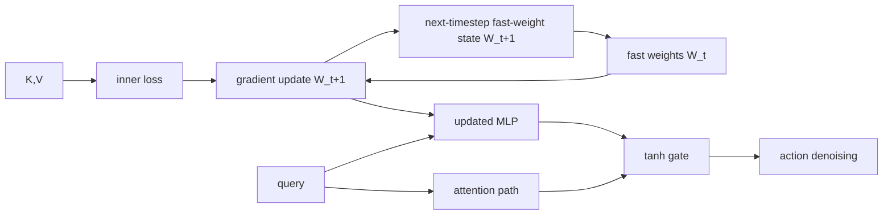
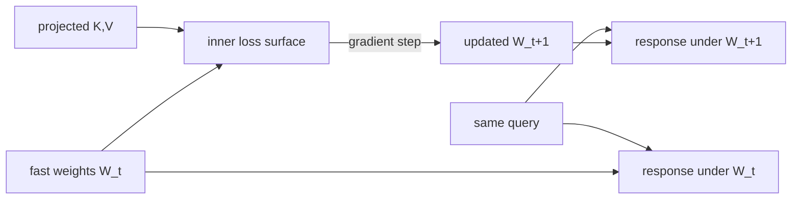
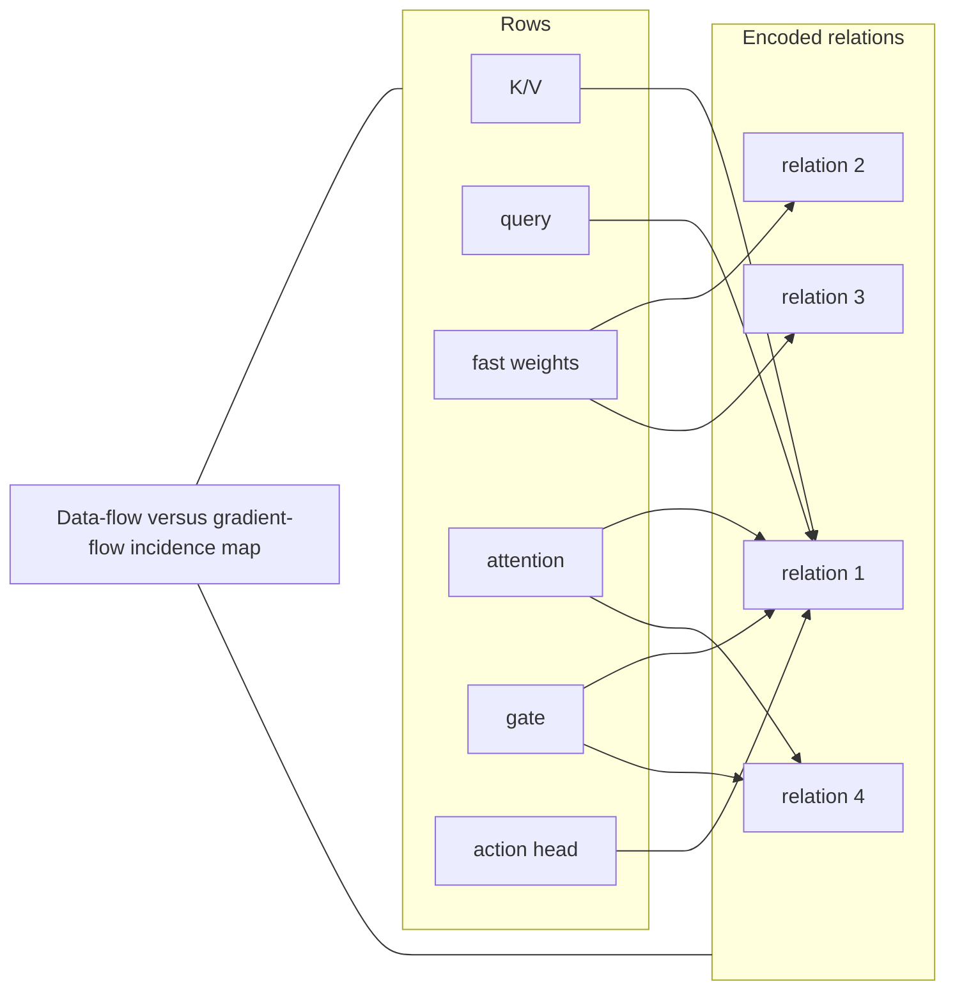

# Visual manifest — RoboTTT: Context Scaling for Robot Policies

- Paper ID: `paper_robott`
- Exact paper version: `v1`
- Explainer fixture: `packages/test-fixtures/explainers/robott.json`
- Manifest revision: `6`
- Engineer status: `COMPLETE`
- Implementer status: `COMPLETE`
- Paragraph coverage: `16 / 16` prose paragraphs
- Paragraph-ID derivation: `{block.id}_p{1-based index in block.paragraphs}`; each fixture paragraph appears exactly once.
- Evidence sources:
  - `rttt_architecture_source` — RoboTTT v1 — architecture and sequence training; Sections 2–3.2, Equations 1–5, Figures 2–4, PDF pages 3–5; the arXiv v1 record identifies the paper as CC BY 4.0
  - `rttt_training_source` — RoboTTT v1 — context learning and DAgger Distillation; Sections 3.3–3.4, Figures 5–6, PDF pages 6–7
  - `rttt_results_source` — RoboTTT v1 — real-robot evaluation and ablations; Section 4, Tables 1–3, Figures 7–12, PDF pages 7–11
  - `rttt_limits_source` — RoboTTT v1 — limitations, deployment, and evaluation details; Section 6 and Appendices A–B, PDF pages 12 and 20–22

Revision 6 independently reassesses all 16 paragraphs under the four-form hard ban. It proposes 1 paper-specific visuals and keeps 15 paragraphs prose-only. Revision-5 selections and SVG implementations are not accepted guidance; implementation must be redone from this manifest.

## `rttt_why_p1`

- Location: `rttt_why`, paragraph 1
- Text anchor: "A robot acting for minutes must remember which stages it has completed, what actions"
- Claims and sources: `rttt_core`, `rttt_architecture`, `rttt_architecture_source`
- Visual needed: `NO`
- Complexity warrant: NONE — prose is sufficient.
- Forbidden-structure audit: `NO_VISUAL`
- Decision rationale: The paragraph makes one bounded distinction in plain language: A robot acting for minutes must remember which stages it has completed, what actions failed, and what was previously visible before an object became occluded. A visual would repeat that statement as a stock chain, list, or set of cards rather than reduce genuine mental reconstruction.
- Explanatory job: Motivation and problem framing.

### Implementation record

- Status: `NOT_NEEDED`
- Selected treatment: `NONE`
- Selection rationale: `NO_VISUAL` — prose is the approved treatment.
- Delivery medium: `NONE`
- Visual ID and placement: `NONE` — `NO_VISUAL`
- Shared paragraph scope: `NONE`
- Changed files: `NONE`
- Accessibility and fallback verification: `NO_VISUAL`
- Desktop and mobile verification: `NO_VISUAL`
- Evidence deviations: `NONE`

## `rttt_why_p2`

- Location: `rttt_why`, paragraph 2
- Text anchor: "Full attention over an ever-growing history makes each new prediction more expensive. A compact"
- Claims and sources: `rttt_core`, `rttt_architecture`, `rttt_architecture_source`
- Visual needed: `NO`
- Complexity warrant: NONE — prose is sufficient.
- Forbidden-structure audit: `NO_VISUAL`
- Decision rationale: The paragraph makes one bounded distinction in plain language: Full attention over an ever-growing history makes each new prediction more expensive. A visual would repeat that statement as a stock chain, list, or set of cards rather than reduce genuine mental reconstruction.
- Explanatory job: Motivation and problem framing.

### Implementation record

- Status: `NOT_NEEDED`
- Selected treatment: `NONE`
- Selection rationale: `NO_VISUAL` — prose is the approved treatment.
- Delivery medium: `NONE`
- Visual ID and placement: `NONE` — `NO_VISUAL`
- Shared paragraph scope: `NONE`
- Changed files: `NONE`
- Accessibility and fallback verification: `NO_VISUAL`
- Desktop and mobile verification: `NO_VISUAL`
- Evidence deviations: `NONE`

## `rttt_change_p1`

- Location: `rttt_change`, paragraph 1
- Text anchor: "RoboTTT does not keep the complete history available for attention. It uses fast weights"
- Claims and sources: `rttt_architecture`, `rttt_training`, `rttt_architecture_source`
- Visual needed: `NO`
- Complexity warrant: NONE — prose is sufficient.
- Forbidden-structure audit: `NO_VISUAL`
- Decision rationale: The paragraph makes one bounded distinction in plain language: RoboTTT does not keep the complete history available for attention. A visual would repeat that statement as a stock chain, list, or set of cards rather than reduce genuine mental reconstruction.
- Explanatory job: Method distinction and scope.

### Implementation record

- Status: `NOT_NEEDED`
- Selected treatment: `NONE`
- Selection rationale: `NO_VISUAL` — prose is the approved treatment.
- Delivery medium: `NONE`
- Visual ID and placement: `NONE` — `NO_VISUAL`
- Shared paragraph scope: `NONE`
- Changed files: `NONE`
- Accessibility and fallback verification: `NO_VISUAL`
- Desktop and mobile verification: `NO_VISUAL`
- Evidence deviations: `NONE`

## `rttt_change_p2`

- Location: `rttt_change`, paragraph 2
- Text anchor: "The paper combines this state mechanism with two training ideas. Sequence action forcing samples"
- Claims and sources: `rttt_architecture`, `rttt_training`, `rttt_architecture_source`
- Visual needed: `NO`
- Complexity warrant: NONE — prose is sufficient.
- Forbidden-structure audit: `NO_VISUAL`
- Decision rationale: The paragraph makes one bounded distinction in plain language: The paper combines this state mechanism with two training ideas. A visual would repeat that statement as a stock chain, list, or set of cards rather than reduce genuine mental reconstruction.
- Explanatory job: Method distinction and scope.

### Implementation record

- Status: `NOT_NEEDED`
- Selected treatment: `NONE`
- Selection rationale: `NO_VISUAL` — prose is the approved treatment.
- Delivery medium: `NONE`
- Visual ID and placement: `NONE` — `NO_VISUAL`
- Shared paragraph scope: `NONE`
- Changed files: `NONE`
- Accessibility and fallback verification: `NO_VISUAL`
- Desktop and mobile verification: `NO_VISUAL`
- Evidence deviations: `NONE`

## `rttt_mechanism_p1`

- Location: `rttt_mechanism`, paragraph 1
- Text anchor: "RoboTTT is instantiated on GR00T N1.7. Its vision-language model encodes the current observation, and"
- Claims and sources: `rttt_architecture`, `rttt_training`, `rttt_architecture_source`, `rttt_training_source`
- Visual needed: `NO`
- Complexity warrant: NONE — prose is sufficient.
- Forbidden-structure audit: `NO_VISUAL`
- Decision rationale: The paragraph's bounded operation is already explicit: RoboTTT is instantiated on GR00T N1.7. Its supported visual form would be a single sequence or inventory of components, both forbidden, and the evidence does not justify extra branching, scale, or state topology.
- Explanatory job: Mechanism explanation.

### Implementation record

- Status: `NOT_NEEDED`
- Selected treatment: `NONE`
- Selection rationale: `NO_VISUAL` — prose is the approved treatment.
- Delivery medium: `NONE`
- Visual ID and placement: `NONE` — `NO_VISUAL`
- Shared paragraph scope: `NONE`
- Changed files: `NONE`
- Accessibility and fallback verification: `NO_VISUAL`
- Desktop and mobile verification: `NO_VISUAL`
- Evidence deviations: `NONE`

## `rttt_mechanism_p2`

- Location: `rttt_mechanism`, paragraph 2
- Text anchor: "At each step, projected keys and values define an inner loss. Gradient descent updates"
- Claims and sources: `rttt_architecture`, `rttt_training`, `rttt_architecture_source`, `rttt_training_source`
- Visual needed: `YES`
- Complexity warrant: Feedback and dependency topology: keys and values define an inner loss that updates fast weights; the updated MLP processes the query; a learned gate merges that path with attention before action denoising.
- Forbidden-structure audit: `PASS` — each treatment uses branching, a dependency matrix, feedback, shared-scale geometry, or a state topology; none is a single interchangeable chain, item-plus-metric list, repeated same-metric cards, or repeated one-axis dot panels.
- Decision rationale: The mechanism contains a parameter update inside inference plus two concurrent information paths. A visual is needed to distinguish data flow, gradient flow, fast-weight state, and gated residual combination.
- Explanatory job: Inference-time inner-loop update, parallel pathways, and gated merge.

### Treatment A — Fast-weight inner-loop architecture

- Teaching purpose: Trace the separate attention and TTT paths and show where inference updates parameters.
- Encoding and reading order: Projected keys and values feed the inner loss; a gradient edge changes `W_t` into `W_{t+1}`; the query passes through the updated MLP; a tanh gate merges this output with the attention path before action denoising. A separate recurrent-state edge must terminate at an explicit `next-timestep fast-weight state W_{t+1}`, which becomes `W_t` for the next update; it may not terminate beside the action path or in open space.
- Evidence and limitations: Claims `rttt_architecture`, `rttt_training`; `rttt_architecture_source`, `rttt_training_source`, Equations 1–5 and Figures 2–4. The diagram is structural and does not imply unreported magnitudes.
- Primary delivery medium: `SVG`
- Recommended web medium: `SVG`
- Mobile, accessibility, and motion behavior: Preserve all labels at 200% zoom; on narrow screens use a single controlled horizontal scroll region or a content-specific stacked variant. Provide a semantic description of every relation and value. Keyboard focus must follow the stated reading order. If interactive, expose the same state in text, support pause/reset, and honor reduced motion; otherwise use no motion.

#### TikZ
```tex
\documentclass[tikz,border=4pt]{standalone}
\usepackage{tikz}
\begin{document}
\begin{tikzpicture}[font=\sffamily\scriptsize,>=stealth]
\node[draw,rounded corners,align=center] (n0) at (0.0,0.0) {K,V};
\node[draw,rounded corners,align=center] (n1) at (3.2,0.0) {inner loss};
\node[draw,rounded corners,align=center] (n2) at (6.4,0.0) {fast weights W\_t};
\node[draw,rounded corners,align=center] (n3) at (9.600000000000001,0.0) {gradient update W\_t+1};
\node[draw,rounded corners,align=center] (n4) at (0.0,-1.8) {query};
\node[draw,rounded corners,align=center] (n5) at (3.2,-1.8) {updated MLP};
\node[draw,rounded corners,align=center] (n6) at (6.4,-1.8) {attention path};
\node[draw,rounded corners,align=center] (n7) at (9.600000000000001,-1.8) {tanh gate};
\node[draw,rounded corners,align=center] (n8) at (0.0,-3.6) {action denoising};
\node[draw,rounded corners,align=center] (n9) at (3.2,-3.6) {next-timestep fast-weight state W\_t+1};
\draw[->] (n0) -- (n1);
\draw[->] (n1) -- (n3);
\draw[->] (n2) -- (n3);
\draw[->] (n3) -- (n5);
\draw[->] (n4) -- (n5);
\draw[->] (n4) -- (n6);
\draw[->] (n5) -- (n7);
\draw[->] (n6) -- (n7);
\draw[->] (n7) -- (n8);
\draw[->] (n3) -- (n9);
\draw[->] (n9) -- (n2);
\end{tikzpicture}
\end{document}
```

#### Mermaid


#### Python
```python
from pathlib import Path
import matplotlib.pyplot as plt

labels = ['K,V', 'inner loss', 'fast weights W_t', 'gradient update W_t+1', 'query', 'updated MLP', 'attention path', 'tanh gate', 'action denoising', 'next-timestep fast-weight state W_t+1']
fig, ax = plt.subplots(figsize=(9, 5))
edges = [(0, 1), (1, 3), (2, 3), (3, 5), (4, 5), (4, 6), (5, 7), (6, 7), (7, 8), (3, 9), (9, 2)]
positions = {i: ((i % 4) * 2.5, -(i // 4) * 1.4) for i in range(len(labels))}
for i, label in enumerate(labels):
    x, y = positions[i]
    ax.text(x, y, label, ha='center', va='center', bbox={'boxstyle': 'round', 'fc': '#fffdf8', 'ec': '#171714'})
for start, end in edges:
    x1, y1 = positions[start]
    x2, y2 = positions[end]
    ax.annotate('', (x2, y2), (x1, y1), arrowprops={'arrowstyle': '->', 'color': '#2f5ea8'})
ax.set_axis_off()
fig.tight_layout()
fig.savefig(Path('visual.svg'), format='svg')
```

### Treatment B — Parameter-space update and query response

- Teaching purpose: Explain that the same query is evaluated by a changed fast model after one gradient step.
- Encoding and reading order: A contour field represents the inner loss over two schematic fast-weight dimensions; an arrow moves W_t to W_t+1; linked query-output glyphs show the corresponding contextual response change.
- Evidence and limitations: Claims `rttt_architecture`, `rttt_training`; `rttt_architecture_source`, `rttt_training_source`, Equations 1–5 and Figures 2–4. The contour is schematic; the paper does not report a two-dimensional loss surface.
- Primary delivery medium: `JavaScript`
- Recommended web medium: `JavaScript`
- Mobile, accessibility, and motion behavior: Preserve all labels at 200% zoom; on narrow screens use a single controlled horizontal scroll region or a content-specific stacked variant. Provide a semantic description of every relation and value. Keyboard focus must follow the stated reading order. If interactive, expose the same state in text, support pause/reset, and honor reduced motion; otherwise use no motion.

#### TikZ
```tex
\documentclass[tikz,border=4pt]{standalone}
\usepackage{tikz}
\begin{document}
\begin{tikzpicture}[font=\sffamily\scriptsize,>=stealth]
\draw[->] (0,0) -- (6,0) node[right]{fast weight 1};
\draw[->] (0,0) -- (0,4) node[above]{fast weight 2};
\draw[blue!30] (1,2) ellipse (1.8 and 1.2);
\draw[blue!50] (1,2) ellipse (1.2 and 0.8);
\draw[blue!70] (1,2) ellipse (0.6 and 0.4);
\fill (3.8,3.1) circle (2pt) node[above] {$W_t$};
\fill (1.5,2.2) circle (2pt) node[above] {$W_{t+1}$};
\draw[->,red,thick] (3.8,3.1)--node[above]{inner-loss gradient}(1.5,2.2);
\node[draw] (q1) at (4.8,1.3) {query via $W_t$};
\node[draw] (q2) at (4.8,0.4) {query via $W_{t+1}$};
\draw[->] (3.8,3.1)--(q1); \draw[->] (1.5,2.2)--(q2);
\end{tikzpicture}
\end{document}
```

#### Mermaid


#### Python
```python
from pathlib import Path
import matplotlib.pyplot as plt
import numpy as np

fig, ax = plt.subplots(figsize=(9, 5))
x = np.linspace(-2, 2, 80)
y = np.linspace(-2, 2, 80)
xx, yy = np.meshgrid(x, y)
loss = (xx + 0.8) ** 2 + 0.6 * (yy - 0.4) ** 2
ax.contour(xx, yy, loss, levels=8, cmap='Blues')
ax.scatter([1.2, -0.4], [1.2, 0.6], color=['#a44e36','#2f5ea8'])
ax.annotate('gradient update', (-0.4,0.6), (1.2,1.2), arrowprops={'arrowstyle':'->'})
ax.set_xlabel('schematic fast-weight dimension 1')
ax.set_ylabel('schematic fast-weight dimension 2')
fig.tight_layout()
fig.savefig(Path('visual.svg'), format='svg')
```

### Treatment C — Data-flow versus gradient-flow incidence map

- Teaching purpose: Prevent gradient updates from being mistaken for ordinary activation flow.
- Encoding and reading order: Rows are K/V, query, fast weights, attention, gate, and action head; columns distinguish activation, inner-loss gradient, recurrent state, and gated residual. Marked cells expose concurrent paths and feedback.
- Evidence and limitations: Claims `rttt_architecture`, `rttt_training`; `rttt_architecture_source`, `rttt_training_source`, Equations 1–5 and Figures 2–4. Cells encode only the stated relationships; they are not measured effect sizes.
- Primary delivery medium: `generated asset`
- Recommended web medium: `SVG`
- Mobile, accessibility, and motion behavior: Preserve all labels at 200% zoom; on narrow screens use a single controlled horizontal scroll region or a content-specific stacked variant. Provide a semantic description of every relation and value. Keyboard focus must follow the stated reading order. If interactive, expose the same state in text, support pause/reset, and honor reduced motion; otherwise use no motion.

#### TikZ
```tex
\documentclass[tikz,border=4pt]{standalone}
\usepackage{tikz}
\begin{document}
\begin{tikzpicture}[font=\sffamily\scriptsize,>=stealth]
\fill[blue!80] (0,-0) rectangle ++(0.9,-0.9);
\draw (0,-0) rectangle ++(0.9,-0.9);
\fill[blue!20] (1,-0) rectangle ++(0.9,-0.9);
\draw (1,-0) rectangle ++(0.9,-0.9);
\fill[blue!20] (2,-0) rectangle ++(0.9,-0.9);
\draw (2,-0) rectangle ++(0.9,-0.9);
\fill[blue!20] (3,-0) rectangle ++(0.9,-0.9);
\draw (3,-0) rectangle ++(0.9,-0.9);
\fill[blue!80] (0,-1) rectangle ++(0.9,-0.9);
\draw (0,-1) rectangle ++(0.9,-0.9);
\fill[blue!20] (1,-1) rectangle ++(0.9,-0.9);
\draw (1,-1) rectangle ++(0.9,-0.9);
\fill[blue!20] (2,-1) rectangle ++(0.9,-0.9);
\draw (2,-1) rectangle ++(0.9,-0.9);
\fill[blue!20] (3,-1) rectangle ++(0.9,-0.9);
\draw (3,-1) rectangle ++(0.9,-0.9);
\fill[blue!20] (0,-2) rectangle ++(0.9,-0.9);
\draw (0,-2) rectangle ++(0.9,-0.9);
\fill[blue!80] (1,-2) rectangle ++(0.9,-0.9);
\draw (1,-2) rectangle ++(0.9,-0.9);
\fill[blue!80] (2,-2) rectangle ++(0.9,-0.9);
\draw (2,-2) rectangle ++(0.9,-0.9);
\fill[blue!20] (3,-2) rectangle ++(0.9,-0.9);
\draw (3,-2) rectangle ++(0.9,-0.9);
\fill[blue!80] (0,-3) rectangle ++(0.9,-0.9);
\draw (0,-3) rectangle ++(0.9,-0.9);
\fill[blue!20] (1,-3) rectangle ++(0.9,-0.9);
\draw (1,-3) rectangle ++(0.9,-0.9);
\fill[blue!20] (2,-3) rectangle ++(0.9,-0.9);
\draw (2,-3) rectangle ++(0.9,-0.9);
\fill[blue!80] (3,-3) rectangle ++(0.9,-0.9);
\draw (3,-3) rectangle ++(0.9,-0.9);
\fill[blue!80] (0,-4) rectangle ++(0.9,-0.9);
\draw (0,-4) rectangle ++(0.9,-0.9);
\fill[blue!20] (1,-4) rectangle ++(0.9,-0.9);
\draw (1,-4) rectangle ++(0.9,-0.9);
\fill[blue!20] (2,-4) rectangle ++(0.9,-0.9);
\draw (2,-4) rectangle ++(0.9,-0.9);
\fill[blue!80] (3,-4) rectangle ++(0.9,-0.9);
\draw (3,-4) rectangle ++(0.9,-0.9);
\fill[blue!80] (0,-5) rectangle ++(0.9,-0.9);
\draw (0,-5) rectangle ++(0.9,-0.9);
\fill[blue!20] (1,-5) rectangle ++(0.9,-0.9);
\draw (1,-5) rectangle ++(0.9,-0.9);
\fill[blue!20] (2,-5) rectangle ++(0.9,-0.9);
\draw (2,-5) rectangle ++(0.9,-0.9);
\fill[blue!20] (3,-5) rectangle ++(0.9,-0.9);
\draw (3,-5) rectangle ++(0.9,-0.9);
\node[anchor=west] at (0,1.0) {K/V / query / fast weights / attention / gate / action head};
\end{tikzpicture}
\end{document}
```

#### Mermaid


#### Python
```python
from pathlib import Path
import matplotlib.pyplot as plt

labels = ['K/V', 'query', 'fast weights', 'attention', 'gate', 'action head']
fig, ax = plt.subplots(figsize=(9, 5))
values = [[1, 0, 0, 0], [1, 0, 0, 0], [0, 1, 1, 0], [1, 0, 0, 1], [1, 0, 0, 1], [1, 0, 0, 0]]
image = ax.imshow(values, cmap='Blues', vmin=0)
ax.set_title(' / '.join(labels))
fig.colorbar(image, ax=ax, label='encoded relation')
ax.grid(alpha=0.2)
fig.tight_layout()
fig.savefig(Path('visual.svg'), format='svg')
```

### Implementation record

- Status: `IMPLEMENTED`
- Selected treatment: `A`
- Selection rationale: Treatment A remains the prior implementer selection. Rework must retain its parallel activation and gradient paths while terminating recurrence at the explicit next-timestep fast-weight state.
- Delivery medium: `SVG`
- Visual ID and placement: `visual_robottt_fast_weight_architecture` — rendered immediately after `rttt_mechanism_p2`.
- Shared paragraph scope: `NONE`
- Changed files: `apps/web/app/papers/[id]/explainer-visual.tsx`, `apps/web/app/papers/[id]/explainer-svg.tsx`, `apps/web/app/globals.css`, the paper fixture, and this manifest
- Accessibility and fallback verification: VERIFIED — the figure uses a unique SVG title and description, equivalent prose, evidence links, limitations, and a motion-free reading order.
- Desktop and mobile verification: VERIFIED — desktop preserves the full responsive canvas; below 720 px the SVG retains a 680 px width inside a keyboard-focusable horizontal scroller that stays within the viewport and creates no document-level overflow.
- Evidence deviations: `NONE`

## `rttt_mechanism_p3`

- Location: `rttt_mechanism`, paragraph 3
- Text anchor: "The updated weights become the next timestep's recurrent state. During sequence training, gradients flow"
- Claims and sources: `rttt_architecture`, `rttt_training`, `rttt_architecture_source`, `rttt_training_source`
- Visual needed: `NO`
- Complexity warrant: NONE — prose is sufficient.
- Forbidden-structure audit: `NO_VISUAL`
- Decision rationale: The paragraph's bounded operation is already explicit: The updated weights become the next timestep's recurrent state. Its supported visual form would be a single sequence or inventory of components, both forbidden, and the evidence does not justify extra branching, scale, or state topology.
- Explanatory job: Mechanism explanation.

### Implementation record

- Status: `NOT_NEEDED`
- Selected treatment: `NONE`
- Selection rationale: `NO_VISUAL` — prose is the approved treatment.
- Delivery medium: `NONE`
- Visual ID and placement: `NONE` — `NO_VISUAL`
- Shared paragraph scope: `NONE`
- Changed files: `NONE`
- Accessibility and fallback verification: `NO_VISUAL`
- Desktop and mobile verification: `NO_VISUAL`
- Evidence deviations: `NONE`

## `rttt_example_p1`

- Location: `rttt_example`, paragraph 1
- Text anchor: "For the Circuit task, a human first assembles an unseen component configuration while the"
- Claims and sources: `rttt_context_learning`, `rttt_one_shot`, `rttt_generality`, `rttt_training_source`, `rttt_results_source`, `rttt_limits_source`
- Visual needed: `NO`
- Complexity warrant: NONE — prose is sufficient.
- Forbidden-structure audit: `NO_VISUAL`
- Decision rationale: The worked example is short enough to follow in prose: For the Circuit task, a human first assembles an unseen component configuration while the robot remains idle. Rendering the same ordered actions would create a forbidden single chain; no additional quantitative or spatial relation is supported here.
- Explanatory job: Worked example.

### Implementation record

- Status: `NOT_NEEDED`
- Selected treatment: `NONE`
- Selection rationale: `NO_VISUAL` — prose is the approved treatment.
- Delivery medium: `NONE`
- Visual ID and placement: `NONE` — `NO_VISUAL`
- Shared paragraph scope: `NONE`
- Changed files: `NONE`
- Accessibility and fallback verification: `NO_VISUAL`
- Desktop and mobile verification: `NO_VISUAL`
- Evidence deviations: `NONE`

## `rttt_example_p2`

- Location: `rttt_example`, paragraph 2
- Text anchor: "After the scene is reset, the robot receives the same generic instruction used for"
- Claims and sources: `rttt_context_learning`, `rttt_one_shot`, `rttt_generality`, `rttt_training_source`, `rttt_results_source`, `rttt_limits_source`
- Visual needed: `NO`
- Complexity warrant: NONE — prose is sufficient.
- Forbidden-structure audit: `NO_VISUAL`
- Decision rationale: The worked example is short enough to follow in prose: After the scene is reset, the robot receives the same generic instruction used for every configuration. Rendering the same ordered actions would create a forbidden single chain; no additional quantitative or spatial relation is supported here.
- Explanatory job: Worked example.

### Implementation record

- Status: `NOT_NEEDED`
- Selected treatment: `NONE`
- Selection rationale: `NO_VISUAL` — prose is the approved treatment.
- Delivery medium: `NONE`
- Visual ID and placement: `NONE` — `NO_VISUAL`
- Shared paragraph scope: `NONE`
- Changed files: `NONE`
- Accessibility and fallback verification: `NO_VISUAL`
- Desktop and mobile verification: `NO_VISUAL`
- Evidence deviations: `NONE`

## `rttt_evidence_p1`

- Location: `rttt_evidence`, paragraph 1
- Text anchor: "Across Pup Go Car, Circuit, and Gear Bot, RoboTTT reports a 79% average rubric-based"
- Claims and sources: `rttt_main_result`, `rttt_scaling`, `rttt_perturbation`, `rttt_dagger`, `rttt_results_source`
- Visual needed: `NO`
- Complexity warrant: NONE — prose is sufficient.
- Forbidden-structure audit: `NO_VISUAL`
- Decision rationale: The 79/42/56 average scores share a scale, but the paragraph also reports task-specific full-success counts with different denominators and notes that no baseline completes Gear Bot. A single average chart would erase task composition; separate task panels would repeat one metric and still lack intervals. Prose keeps rubric averages, raw success counts, and the Gear Bot boundary together.
- Explanatory job: Evaluation evidence.

### Implementation record

- Status: `NOT_NEEDED`
- Selected treatment: `NONE`
- Selection rationale: `NO_VISUAL` — prose is the approved treatment.
- Delivery medium: `NONE`
- Visual ID and placement: `NONE` — `NO_VISUAL`
- Shared paragraph scope: `NONE`
- Changed files: `NONE`
- Accessibility and fallback verification: `NO_VISUAL`
- Desktop and mobile verification: `NO_VISUAL`
- Evidence deviations: `NONE`

## `rttt_evidence_p2`

- Location: `rttt_evidence`, paragraph 2
- Text anchor: "In the context-scaling study, average completion rises from 43.9% with 1K-timestep pretraining to 71.5%"
- Claims and sources: `rttt_main_result`, `rttt_scaling`, `rttt_perturbation`, `rttt_dagger`, `rttt_results_source`
- Visual needed: `NO`
- Complexity warrant: NONE — prose is sufficient.
- Forbidden-structure audit: `NO_VISUAL`
- Decision rationale: Completion versus context length is a warranted shared-scale relationship, but the paragraph provides only the 1K and 8K endpoints plus a one-history-frame baseline, not the intervening context points or uncertainty. A line would imply an unsupported trajectory, and a three-mark display would reduce to an item-plus-value comparison. The prose also preserves that these runs predate the DAgger condition used elsewhere.
- Explanatory job: Evaluation evidence.

### Implementation record

- Status: `NOT_NEEDED`
- Selected treatment: `NONE`
- Selection rationale: `NO_VISUAL` — prose is the approved treatment.
- Delivery medium: `NONE`
- Visual ID and placement: `NONE` — `NO_VISUAL`
- Shared paragraph scope: `NONE`
- Changed files: `NONE`
- Accessibility and fallback verification: `NO_VISUAL`
- Desktop and mobile verification: `NO_VISUAL`
- Evidence deviations: `NONE`

## `rttt_evidence_p3`

- Location: `rttt_evidence`, paragraph 3
- Text anchor: "RoboTTT recovers from roof and tire perturbations in 15 of 20 and 18 of"
- Claims and sources: `rttt_main_result`, `rttt_scaling`, `rttt_perturbation`, `rttt_dagger`, `rttt_results_source`
- Visual needed: `NO`
- Complexity warrant: NONE — prose is sufficient.
- Forbidden-structure audit: `NO_VISUAL`
- Decision rationale: Perturbation recovery counts are comparable within condition, but only tire recovery includes the crucial GDN tie and DAgger's 33% effect belongs to a separate correction study. Combining them would imply one causal comparison; splitting roof, tire, and DAgger into tracks would create repeated metric panels. Prose keeps the shared 18/20 tire result adjacent to the limitation on fast-weight attribution.
- Explanatory job: Evaluation evidence.

### Implementation record

- Status: `NOT_NEEDED`
- Selected treatment: `NONE`
- Selection rationale: `NO_VISUAL` — prose is the approved treatment.
- Delivery medium: `NONE`
- Visual ID and placement: `NONE` — `NO_VISUAL`
- Shared paragraph scope: `NONE`
- Changed files: `NONE`
- Accessibility and fallback verification: `NO_VISUAL`
- Desktop and mobile verification: `NO_VISUAL`
- Evidence deviations: `NONE`

## `rttt_limitations_p1`

- Location: `rttt_limitations`, paragraph 1
- Text anchor: "The authors note that longer-context training costs more, the TTT objective is not designed"
- Claims and sources: `rttt_latency_limit`, `rttt_generality`, `rttt_limits_source`
- Visual needed: `NO`
- Complexity warrant: NONE — prose is sufficient.
- Forbidden-structure audit: `NO_VISUAL`
- Decision rationale: This paragraph is a claim boundary rather than a reconstructive structure: The authors note that longer-context training costs more, the TTT objective is not designed specifically for robotics, and the policy still fails in deployment. Keeping the qualifiers in prose avoids inventing causal links or turning heterogeneous caveats into interchangeable cards or a stock list.
- Explanatory job: Evidence boundary and limitation.

### Implementation record

- Status: `NOT_NEEDED`
- Selected treatment: `NONE`
- Selection rationale: `NO_VISUAL` — prose is the approved treatment.
- Delivery medium: `NONE`
- Visual ID and placement: `NONE` — `NO_VISUAL`
- Shared paragraph scope: `NONE`
- Changed files: `NONE`
- Accessibility and fallback verification: `NO_VISUAL`
- Desktop and mobile verification: `NO_VISUAL`
- Evidence deviations: `NONE`

## `rttt_limitations_p2`

- Location: `rttt_limitations`, paragraph 2
- Text anchor: "Trial counts are 20 per task, or 10 for the longest settings, without reported"
- Claims and sources: `rttt_latency_limit`, `rttt_generality`, `rttt_limits_source`
- Visual needed: `NO`
- Complexity warrant: NONE — prose is sufficient.
- Forbidden-structure audit: `NO_VISUAL`
- Decision rationale: This paragraph is a claim boundary rather than a reconstructive structure: Trial counts are 20 per task, or 10 for the longest settings, without reported confidence intervals. Keeping the qualifiers in prose avoids inventing causal links or turning heterogeneous caveats into interchangeable cards or a stock list.
- Explanatory job: Evidence boundary and limitation.

### Implementation record

- Status: `NOT_NEEDED`
- Selected treatment: `NONE`
- Selection rationale: `NO_VISUAL` — prose is the approved treatment.
- Delivery medium: `NONE`
- Visual ID and placement: `NONE` — `NO_VISUAL`
- Shared paragraph scope: `NONE`
- Changed files: `NONE`
- Accessibility and fallback verification: `NO_VISUAL`
- Desktop and mobile verification: `NO_VISUAL`
- Evidence deviations: `NONE`

## `rttt_review_p1`

- Location: `rttt_review`, paragraph 1
- Text anchor: "The mechanism is well matched to the problem: recurrent fast weights provide a fixed-size"
- Claims and sources: `rttt_scaling`, `rttt_component_ablation`, `rttt_memory_interpretation`, `rttt_latency_limit`, `rttt_generality`, `rttt_results_source`, `rttt_limits_source`
- Visual needed: `NO`
- Complexity warrant: NONE — prose is sufficient.
- Forbidden-structure audit: `NO_VISUAL`
- Decision rationale: This paragraph is a claim boundary rather than a reconstructive structure: The mechanism is well matched to the problem: recurrent fast weights provide a fixed-size state, while the scaling curve and component ablations connect longer training context and nonlinear fast models to better task completion on the evaluated setup. Keeping the qualifiers in prose avoids inventing causal links or turning heterogeneous caveats into interchangeable cards or a stock list.
- Explanatory job: Critical interpretation and claim boundary.

### Implementation record

- Status: `NOT_NEEDED`
- Selected treatment: `NONE`
- Selection rationale: `NO_VISUAL` — prose is the approved treatment.
- Delivery medium: `NONE`
- Visual ID and placement: `NONE` — `NO_VISUAL`
- Shared paragraph scope: `NONE`
- Changed files: `NONE`
- Accessibility and fallback verification: `NO_VISUAL`
- Desktop and mobile verification: `NO_VISUAL`
- Evidence deviations: `NONE`

## `rttt_review_p2`

- Location: `rttt_review`, paragraph 2
- Text anchor: "The evidence is not yet a broad demonstration of robot-foundation-model scaling. A second backbone,"
- Claims and sources: `rttt_scaling`, `rttt_component_ablation`, `rttt_memory_interpretation`, `rttt_latency_limit`, `rttt_generality`, `rttt_results_source`, `rttt_limits_source`
- Visual needed: `NO`
- Complexity warrant: NONE — prose is sufficient.
- Forbidden-structure audit: `NO_VISUAL`
- Decision rationale: This paragraph is a claim boundary rather than a reconstructive structure: The evidence is not yet a broad demonstration of robot-foundation-model scaling. Keeping the qualifiers in prose avoids inventing causal links or turning heterogeneous caveats into interchangeable cards or a stock list.
- Explanatory job: Critical interpretation and claim boundary.

### Implementation record

- Status: `NOT_NEEDED`
- Selected treatment: `NONE`
- Selection rationale: `NO_VISUAL` — prose is the approved treatment.
- Delivery medium: `NONE`
- Visual ID and placement: `NONE` — `NO_VISUAL`
- Shared paragraph scope: `NONE`
- Changed files: `NONE`
- Accessibility and fallback verification: `NO_VISUAL`
- Desktop and mobile verification: `NO_VISUAL`
- Evidence deviations: `NONE`
