# Visual manifest — SearchOS-V1: Towards Robust Open-Domain Information-Seeking Agent Collaboration

- Paper ID: `paper_searchos_v1`
- Exact paper version: `v1`
- Explainer fixture: `packages/test-fixtures/explainers/searchos-v1.json`
- Manifest revision: `2`
- Engineer status: `COMPLETE`
- Implementer status: `COMPLETE`
- Paragraph coverage: `17 / 17` prose paragraphs
- Paragraph-ID derivation: `{block.id}_p{1-based index in block.paragraphs}`; each fixture paragraph appears exactly once.
- Evidence sources:
  - `sos_formulation_source` — SearchOS-V1 — relational formulation, SOCM, and orchestration; Sections 2–3.2, Equations 1–10, Figure 2, PDF pages 3–6; the arXiv v1 record identifies the paper as CC BY 4.0
  - `sos_middleware_source` — SearchOS-V1 — middleware and hierarchical skills; Sections 3.3–3.4, Equations 11–18, Figures 3–4, PDF pages 7–9
  - `sos_results_source` — SearchOS-V1 — benchmark protocol and main results; Section 4, Table 2, PDF pages 9–11
  - `sos_ablations_source` — SearchOS-V1 — scheduling, middleware, and skill analyses; Section 5, Tables 4–6 and Figures 5–6, PDF pages 12–13
  - `sos_scope_source` — SearchOS-V1 — declared scope and future work; Scope note in Section 3.4 and Section 7, PDF pages 9 and 15

The engineer applied the removal test paragraph by paragraph. `NO` records keep three source-bounded contingencies because the workflow requires them, but they are explicitly not recommended for implementation unless the prose or adjacent scope changes. Each code example embeds this paragraph's actual propositions, claim-source edges, quantities, or scope groups; labels are complete and contain no ellipsized source prose.

## `sos_why_p1`

- Location: `sos_why`, paragraph 1
- Text anchor: "A long-horizon research task requires more than issuing good queries."
- Claims and sources: `sos_core` (OBSERVED, VERIFIED); `sos_socm` (OBSERVED, VERIFIED); `sos_formulation_source` (Sections 2–3.2, Equations 1–10, Figure 2, PDF pages 3–6; the arXiv v1 record identifies the paper as CC BY 4.0)
- Visual needed: `NO`
- Decision rationale: The paragraph's main work is the bounded statement "A long-horizon research task requires more than issuing good queries". Its qualification is explicit in prose and does not require readers to reconstruct a material process, topology, quantitative comparison, uncertainty distribution, or state change. A visual would repeat the wording, so all treatments below are optional contingencies only.
- Explanatory job: problem and research-question relation.

### Treatment A — A long-horizon research task requires more than issuing good — problem and research-question relation

- Teaching purpose: Optional contingency only. Answer "Why do capable search agents still repeat work and miss evidence?" by exposing the paragraph's 3 named propositions and 2 stated reading, comparison, or qualification relations.
- Encoding and reading order: Nodes reproduce the complete labels "A long-horizon research task requires more than issuing good queries"; "The system must remember which entities and attributes are complete, preserve the source for each value, expose contradictions"; "and avoid retrying search paths that another worker has already exhausted". Edges carry the explicit relation labels "motivates", "motivates"; arrow direction is sequence only for mechanism or example prose and otherwise denotes reading order.
- Evidence and limitations: The topology is derived from this paragraph rather than a fixed pipeline. Encode only `sos_core`, `sos_socm` and do not turn reading-order edges into causal claims.
- Recommended web medium: responsive inline SVG with CSS; JavaScript may add optional step focus only when state order matters.
- Mobile, accessibility, and motion behavior: Keep the full node-and-relation list in DOM order, expose the relation labels in the long description, stack nodes on narrow screens, and disable focus transitions under reduced motion.

#### TikZ

```tex
\documentclass[tikz,border=5pt]{standalone}
\usepackage[T1]{fontenc}
\usepackage{tikz}
\usetikzlibrary{arrows.meta,positioning}
\begin{document}
\begin{tikzpicture}[font=\sffamily,concept/.style={draw,rounded corners,align=center,text width=3.6cm,minimum height=1.35cm},link/.style={-{Latex[length=2mm]},thick},rel/.style={fill=white,font=\scriptsize,inner sep=2pt}]
\node[font=\bfseries,align=center] at (6.1,2.0) {sos\_why\_p1: A long-horizon research task requires more than issuing good - problem and research-question relation};
\node[concept] (n1) at (1.8,0) {A long-horizon research task requires more than issuing good queries};
\node[concept] (n2) at (6.1,0) {The system must remember which entities and attributes are complete, preserve the source for each value, expose contradictions};
\node[concept] (n3) at (10.4,0) {and avoid retrying search paths that another worker has already exhausted};
\draw[link] (n1) -- node[rel] {motivates} (n2);
\draw[link] (n2) -- node[rel] {motivates} (n3);
\end{tikzpicture}
\end{document}
```

#### Mermaid

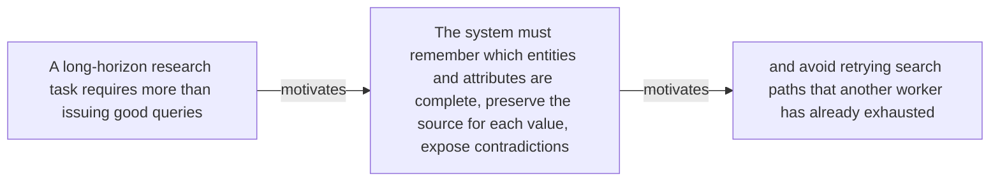

#### Python

```python
from html import escape
from pathlib import Path
from textwrap import wrap

title = "sos_why_p1: A long-horizon research task requires more than issuing good — problem and research-question relation"
nodes = [["n1","A long-horizon research task requires more than issuing good queries",120,150],["n2","The system must remember which entities and attributes are complete, preserve the source for each value, expose contradictions",420,150],["n3","and avoid retrying search paths that another worker has already exhausted",720,150]]
edges = [["n1","n2","motivates"],["n2","n3","motivates"]]
node_by_id = {node_id: (label, x, y) for node_id, label, x, y in nodes}

parts = [
    '<svg xmlns="http://www.w3.org/2000/svg" viewBox="0 0 860 520" role="img" aria-labelledby="title desc">',
    f'<title id="title">{escape(title)}</title>',
    '<desc id="desc">The labeled relations reproduce only relationships stated in the paragraph.</desc>',
    '<rect width="860" height="520" fill="white"/>',
]
for source, target, relation in edges:
    _, x1, y1 = node_by_id[source]
    _, x2, y2 = node_by_id[target]
    parts.append(f'<line x1="{x1}" y1="{y1}" x2="{x2}" y2="{y2}" stroke="#345" stroke-width="2"/>')
    parts.append(f'<text x="{(x1+x2)/2}" y="{(y1+y2)/2-6}" text-anchor="middle" font-family="sans-serif" font-size="11">{escape(relation)}</text>')
for _, label, x, y in nodes:
    parts.append(f'<rect x="{x-125}" y="{y-58}" width="250" height="116" rx="14" fill="#eef6ff" stroke="#234"/>')
    for line_index, line in enumerate(wrap(label, width=32)):
        parts.append(f'<text x="{x}" y="{y-34+line_index*16}" text-anchor="middle" font-family="sans-serif" font-size="12">{escape(line)}</text>')
parts.append('</svg>')
Path("sos_why_p1_treatment_a.svg").write_text("\n".join(parts), encoding="utf-8")
```

### Treatment B — sos_core, sos_socm — claim-to-source provenance

- Teaching purpose: Optional contingency only. Show exactly which atomic claims underwrite this paragraph and which fixed source records support each claim.
- Encoding and reading order: A bipartite graph places 2 claim nodes on the left and 1 source nodes on the right, with only the 2 claim-source edges recorded in the fixture. Claim labels include epistemic status; source labels include the exact locator.
- Evidence and limitations: This treatment explains provenance and uncertainty, not the paper's causal mechanism. Missing edges remain visibly absent and no source count is treated as confidence.
- Recommended web medium: semantic HTML/CSS claim-source table with an SVG network view; JavaScript only for keyboard-controlled source highlighting.
- Mobile, accessibility, and motion behavior: Provide real table headers and source links in the static fallback, make every edge recoverable as text, stack claim records before source records on mobile, and require no motion.

#### TikZ

```tex
\documentclass[tikz,border=5pt]{standalone}
\usepackage[T1]{fontenc}
\usepackage{tikz}
\usetikzlibrary{arrows.meta}
\begin{document}
\begin{tikzpicture}[font=\sffamily,claim/.style={draw,rounded corners,align=center,text width=5.2cm,minimum height=1.2cm},source/.style={draw,dashed,align=center,text width=5.2cm,minimum height=1.2cm},link/.style={-{Latex[length=2mm]},thin}]
\node[font=\bfseries] at (4,1.8) {sos\_why\_p1: claim-to-source provenance};
\node[claim] (c1) at (0,0) {SearchOS externalizes tasks, evidence, coverage, and failures as shared system state used to coordinate long-horizon information seeking. [OBSERVED]};
\node[claim] (c2) at (0,-2.4) {SOCM consists of Frontier Task, an Evidence Graph, a Coverage Map, and Failure Memory with role-specific projections. [OBSERVED]};
\node[source] (s1) at (8,0) {SearchOS-V1 - relational formulation, SOCM, and orchestration - Sections 2-3.2, Equations 1-10, Figure 2, PDF pages 3-6; the arXiv v1 record identifies the paper as CC BY 4.0};
\draw[link] (c1) -- (s1);
\draw[link] (c2) -- (s1);
\end{tikzpicture}
\end{document}
```

#### Mermaid

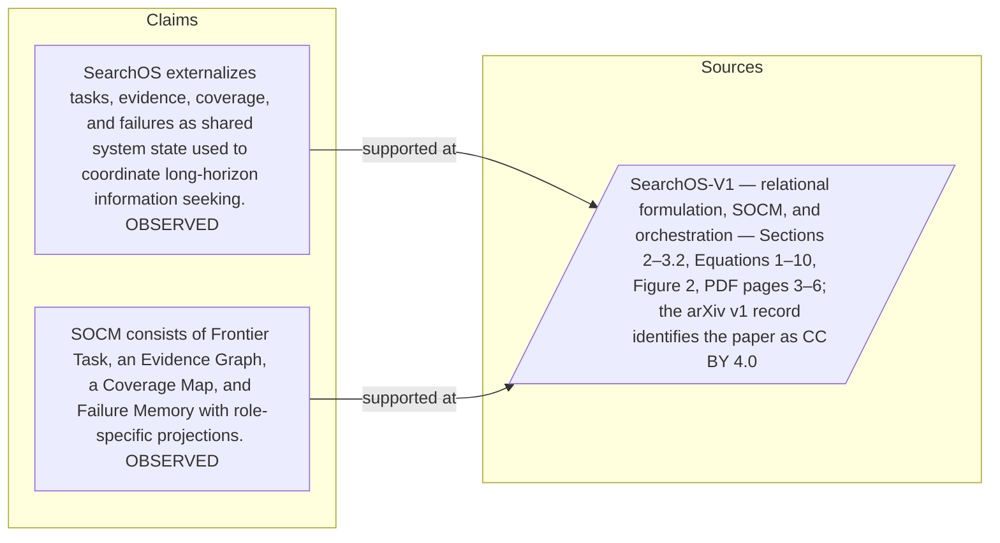

#### Python

```python
from html import escape
from pathlib import Path
from textwrap import wrap

title = "sos_why_p1: claim-to-source provenance"
nodes = [["c1","SearchOS externalizes tasks, evidence, coverage, and failures as shared system state used to coordinate long-horizon information seeking. [OBSERVED]",190,130],["c2","SOCM consists of Frontier Task, an Evidence Graph, a Coverage Map, and Failure Memory with role-specific projections. [OBSERVED]",190,250],["s1","SearchOS-V1 — relational formulation, SOCM, and orchestration — Sections 2–3.2, Equations 1–10, Figure 2, PDF pages 3–6; the arXiv v1 record identifies the paper as CC BY 4.0",700,130]]
edges = [["c1","s1"],["c2","s1"]]
node_by_id = {node_id: (label, x, y) for node_id, label, x, y in nodes}
height = 440

parts = [
    f'<svg xmlns="http://www.w3.org/2000/svg" viewBox="0 0 900 {height}" role="img" aria-labelledby="title desc">',
    f'<title id="title">{escape(title)}</title>',
    '<desc id="desc">Bipartite map from verified claim records to their exact source records.</desc>',
    f'<rect width="900" height="{height}" fill="white"/>',
]
for source, target in edges:
    _, x1, y1 = node_by_id[source]
    _, x2, y2 = node_by_id[target]
    parts.append(f'<line x1="{x1+145}" y1="{y1}" x2="{x2-145}" y2="{y2}" stroke="#456" stroke-width="2"/>')
for node_id, label, x, y in nodes:
    dashed = ' stroke-dasharray="7 5"' if node_id.startswith("s") else ''
    parts.append(f'<rect x="{x-145}" y="{y-46}" width="290" height="92" rx="12" fill="#f7fbff" stroke="#234"{dashed}/>')
    for line_index, line in enumerate(wrap(label, width=38)):
        parts.append(f'<text x="{x}" y="{y-24+line_index*14}" text-anchor="middle" font-family="sans-serif" font-size="11">{escape(line)}</text>')
parts.append('</svg>')
Path("sos_why_p1_treatment_b.svg").write_text("\n".join(parts), encoding="utf-8")
```

### Treatment C — A long-horizon research task requires more than issuing good — supported-versus-bounded scope

- Teaching purpose: Optional contingency only. Separate what the paragraph supports from the qualification or contingency that bounds it.
- Encoding and reading order: Partition the paragraph into 3 supported statement(s) and 1 boundary or contingency statement(s). The two columns are categories, not a scale or causal path.
- Evidence and limitations: Every card is a complete paragraph clause. The boundary column makes negative and not-established language visible without weakening it.
- Recommended web medium: responsive SVG or semantic HTML/CSS; JavaScript is optional only for a meaningful state or scope toggle.
- Mobile, accessibility, and motion behavior: Preserve every exact value or scope statement as selectable text, avoid color-only distinctions, stack groups on mobile, and keep all information visible when JavaScript or motion is disabled.

#### TikZ

```tex
\documentclass[tikz,border=5pt]{standalone}
\usepackage[T1]{fontenc}
\usepackage{tikz}
\begin{document}
\begin{tikzpicture}[font=\sffamily,item/.style={draw,align=center,text width=5.5cm,minimum height=1.4cm}]
\node[font=\bfseries] at (3.5,2) {sos\_why\_p1: A long-horizon research task requires more than issuing good - supported-versus-bounded scope};
\node[font=\bfseries] at (0,1) {Supported statement};
\node[font=\bfseries] at (7,1) {Boundary or contingency};
\node[item] at (0,0) {A long-horizon research task requires more than issuing good queries};
\node[item] at (0,-2) {The system must remember which entities and attributes are complete, preserve the source for each value, expose contradictions};
\node[item] at (0,-4) {and avoid retrying search paths that another worker has already exhausted};
\node[item] at (7,0) {and avoid retrying search paths that another worker has already exhausted};
\end{tikzpicture}
\end{document}
```

#### Mermaid

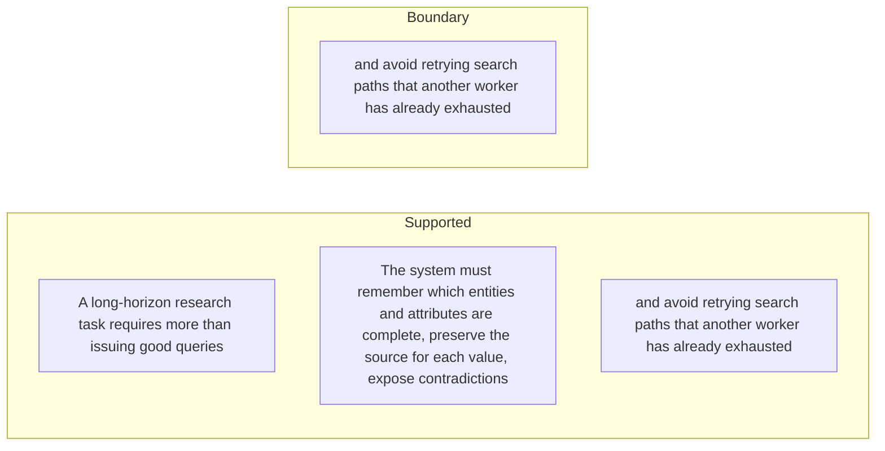

#### Python

```python
from html import escape
from pathlib import Path
from textwrap import wrap

title = "sos_why_p1: A long-horizon research task requires more than issuing good — supported-versus-bounded scope"
columns = {"Supported statement": ["A long-horizon research task requires more than issuing good queries","The system must remember which entities and attributes are complete, preserve the source for each value, expose contradictions","and avoid retrying search paths that another worker has already exhausted"], "Boundary or contingency": ["and avoid retrying search paths that another worker has already exhausted"]}
height = 550
parts = [
    f'<svg xmlns="http://www.w3.org/2000/svg" viewBox="0 0 900 {height}" role="img" aria-labelledby="title desc">',
    f'<title id="title">{escape(title)}</title>',
    '<desc id="desc">Statements are partitioned into supported content and explicit boundaries.</desc>',
    f'<rect width="900" height="{height}" fill="white"/>',
]
for column_index, (heading, items) in enumerate(columns.items()):
    x = 240 + column_index * 430
    parts.append(f'<text x="{x}" y="70" text-anchor="middle" font-family="sans-serif" font-size="18" font-weight="700">{escape(heading)}</text>')
    for item_index, item in enumerate(items):
        y = 130 + item_index * 110
        parts.append(f'<rect x="{x-180}" y="{y-35}" width="360" height="80" rx="12" fill="#f7fbff" stroke="#234"/>')
        for line_index, line in enumerate(wrap(item, width=48)):
            parts.append(f'<text x="{x}" y="{y-12+line_index*14}" text-anchor="middle" font-family="sans-serif" font-size="11">{escape(line)}</text>')
parts.append('</svg>')
Path("sos_why_p1_treatment_c.svg").write_text("\n".join(parts), encoding="utf-8")
```

### Implementation record

- Status: `NOT_NEEDED`
- Selected treatment: `NONE`
- Selection rationale: The engineer marked this paragraph prose-only, so the implementation intentionally leaves `sos_why_p1` without a figure.
- Delivery medium: `NONE`
- Visual ID and placement: `NONE`; prose remains at `#sos_why_p1`.
- Shared paragraph scope: `NONE`
- Changed files: `NONE`
- Accessibility and fallback verification: The paragraph remains semantic text and does not rely on visual or motion-only information.
- Desktop and mobile verification: Verified in Playwright on desktop and mobile; no figure is attached to this prose-only paragraph.
- Evidence deviations: `NONE`

## `sos_why_p2`

- Location: `sos_why`, paragraph 2
- Text anchor: "Conventional agents often keep this state in growing conversation histories."
- Claims and sources: `sos_core` (OBSERVED, VERIFIED); `sos_socm` (OBSERVED, VERIFIED); `sos_formulation_source` (Sections 2–3.2, Equations 1–10, Figure 2, PDF pages 3–6; the arXiv v1 record identifies the paper as CC BY 4.0)
- Visual needed: `NO`
- Decision rationale: The paragraph's main work is the bounded statement "Conventional agents often keep this state in growing conversation histories". Its qualification is explicit in prose and does not require readers to reconstruct a material process, topology, quantitative comparison, uncertainty distribution, or state change. A visual would repeat the wording, so all treatments below are optional contingencies only.
- Explanatory job: problem and research-question relation.

### Treatment A — Conventional agents often keep this state in growing conversation — problem and research-question relation

- Teaching purpose: Optional contingency only. Answer "Why do capable search agents still repeat work and miss evidence?" by exposing the paragraph's 3 named propositions and 2 stated reading, comparison, or qualification relations.
- Encoding and reading order: Nodes reproduce the complete labels "Conventional agents often keep this state in growing conversation histories"; "As evidence becomes buried, workers can duplicate effort, disagree about fields, overlook gaps"; "or leave parallel slots idle while a slow branch finishes". Edges carry the explicit relation labels "motivates", "contrasts with"; arrow direction is sequence only for mechanism or example prose and otherwise denotes reading order.
- Evidence and limitations: The topology is derived from this paragraph rather than a fixed pipeline. Encode only `sos_core`, `sos_socm` and do not turn reading-order edges into causal claims.
- Recommended web medium: responsive inline SVG with CSS; JavaScript may add optional step focus only when state order matters.
- Mobile, accessibility, and motion behavior: Keep the full node-and-relation list in DOM order, expose the relation labels in the long description, stack nodes on narrow screens, and disable focus transitions under reduced motion.

#### TikZ

```tex
\documentclass[tikz,border=5pt]{standalone}
\usepackage[T1]{fontenc}
\usepackage{tikz}
\usetikzlibrary{arrows.meta,positioning}
\begin{document}
\begin{tikzpicture}[font=\sffamily,concept/.style={draw,rounded corners,align=center,text width=3.6cm,minimum height=1.35cm},link/.style={-{Latex[length=2mm]},thick},rel/.style={fill=white,font=\scriptsize,inner sep=2pt}]
\node[font=\bfseries,align=center] at (6.1,2.0) {sos\_why\_p2: Conventional agents often keep this state in growing conversation - problem and research-question relation};
\node[concept] (n1) at (1.8,0) {Conventional agents often keep this state in growing conversation histories};
\node[concept] (n2) at (6.1,0) {As evidence becomes buried, workers can duplicate effort, disagree about fields, overlook gaps};
\node[concept] (n3) at (10.4,0) {or leave parallel slots idle while a slow branch finishes};
\draw[link] (n1) -- node[rel] {motivates} (n2);
\draw[link] (n2) -- node[rel] {contrasts with} (n3);
\end{tikzpicture}
\end{document}
```

#### Mermaid


#### Python

```python
from html import escape
from pathlib import Path
from textwrap import wrap

title = "sos_why_p2: Conventional agents often keep this state in growing conversation — problem and research-question relation"
nodes = [["n1","Conventional agents often keep this state in growing conversation histories",120,150],["n2","As evidence becomes buried, workers can duplicate effort, disagree about fields, overlook gaps",420,150],["n3","or leave parallel slots idle while a slow branch finishes",720,150]]
edges = [["n1","n2","motivates"],["n2","n3","contrasts with"]]
node_by_id = {node_id: (label, x, y) for node_id, label, x, y in nodes}

parts = [
    '<svg xmlns="http://www.w3.org/2000/svg" viewBox="0 0 860 520" role="img" aria-labelledby="title desc">',
    f'<title id="title">{escape(title)}</title>',
    '<desc id="desc">The labeled relations reproduce only relationships stated in the paragraph.</desc>',
    '<rect width="860" height="520" fill="white"/>',
]
for source, target, relation in edges:
    _, x1, y1 = node_by_id[source]
    _, x2, y2 = node_by_id[target]
    parts.append(f'<line x1="{x1}" y1="{y1}" x2="{x2}" y2="{y2}" stroke="#345" stroke-width="2"/>')
    parts.append(f'<text x="{(x1+x2)/2}" y="{(y1+y2)/2-6}" text-anchor="middle" font-family="sans-serif" font-size="11">{escape(relation)}</text>')
for _, label, x, y in nodes:
    parts.append(f'<rect x="{x-125}" y="{y-58}" width="250" height="116" rx="14" fill="#eef6ff" stroke="#234"/>')
    for line_index, line in enumerate(wrap(label, width=32)):
        parts.append(f'<text x="{x}" y="{y-34+line_index*16}" text-anchor="middle" font-family="sans-serif" font-size="12">{escape(line)}</text>')
parts.append('</svg>')
Path("sos_why_p2_treatment_a.svg").write_text("\n".join(parts), encoding="utf-8")
```

### Treatment B — sos_core, sos_socm — claim-to-source provenance

- Teaching purpose: Optional contingency only. Show exactly which atomic claims underwrite this paragraph and which fixed source records support each claim.
- Encoding and reading order: A bipartite graph places 2 claim nodes on the left and 1 source nodes on the right, with only the 2 claim-source edges recorded in the fixture. Claim labels include epistemic status; source labels include the exact locator.
- Evidence and limitations: This treatment explains provenance and uncertainty, not the paper's causal mechanism. Missing edges remain visibly absent and no source count is treated as confidence.
- Recommended web medium: semantic HTML/CSS claim-source table with an SVG network view; JavaScript only for keyboard-controlled source highlighting.
- Mobile, accessibility, and motion behavior: Provide real table headers and source links in the static fallback, make every edge recoverable as text, stack claim records before source records on mobile, and require no motion.

#### TikZ

```tex
\documentclass[tikz,border=5pt]{standalone}
\usepackage[T1]{fontenc}
\usepackage{tikz}
\usetikzlibrary{arrows.meta}
\begin{document}
\begin{tikzpicture}[font=\sffamily,claim/.style={draw,rounded corners,align=center,text width=5.2cm,minimum height=1.2cm},source/.style={draw,dashed,align=center,text width=5.2cm,minimum height=1.2cm},link/.style={-{Latex[length=2mm]},thin}]
\node[font=\bfseries] at (4,1.8) {sos\_why\_p2: claim-to-source provenance};
\node[claim] (c1) at (0,0) {SearchOS externalizes tasks, evidence, coverage, and failures as shared system state used to coordinate long-horizon information seeking. [OBSERVED]};
\node[claim] (c2) at (0,-2.4) {SOCM consists of Frontier Task, an Evidence Graph, a Coverage Map, and Failure Memory with role-specific projections. [OBSERVED]};
\node[source] (s1) at (8,0) {SearchOS-V1 - relational formulation, SOCM, and orchestration - Sections 2-3.2, Equations 1-10, Figure 2, PDF pages 3-6; the arXiv v1 record identifies the paper as CC BY 4.0};
\draw[link] (c1) -- (s1);
\draw[link] (c2) -- (s1);
\end{tikzpicture}
\end{document}
```

#### Mermaid


#### Python

```python
from html import escape
from pathlib import Path
from textwrap import wrap

title = "sos_why_p2: claim-to-source provenance"
nodes = [["c1","SearchOS externalizes tasks, evidence, coverage, and failures as shared system state used to coordinate long-horizon information seeking. [OBSERVED]",190,130],["c2","SOCM consists of Frontier Task, an Evidence Graph, a Coverage Map, and Failure Memory with role-specific projections. [OBSERVED]",190,250],["s1","SearchOS-V1 — relational formulation, SOCM, and orchestration — Sections 2–3.2, Equations 1–10, Figure 2, PDF pages 3–6; the arXiv v1 record identifies the paper as CC BY 4.0",700,130]]
edges = [["c1","s1"],["c2","s1"]]
node_by_id = {node_id: (label, x, y) for node_id, label, x, y in nodes}
height = 440

parts = [
    f'<svg xmlns="http://www.w3.org/2000/svg" viewBox="0 0 900 {height}" role="img" aria-labelledby="title desc">',
    f'<title id="title">{escape(title)}</title>',
    '<desc id="desc">Bipartite map from verified claim records to their exact source records.</desc>',
    f'<rect width="900" height="{height}" fill="white"/>',
]
for source, target in edges:
    _, x1, y1 = node_by_id[source]
    _, x2, y2 = node_by_id[target]
    parts.append(f'<line x1="{x1+145}" y1="{y1}" x2="{x2-145}" y2="{y2}" stroke="#456" stroke-width="2"/>')
for node_id, label, x, y in nodes:
    dashed = ' stroke-dasharray="7 5"' if node_id.startswith("s") else ''
    parts.append(f'<rect x="{x-145}" y="{y-46}" width="290" height="92" rx="12" fill="#f7fbff" stroke="#234"{dashed}/>')
    for line_index, line in enumerate(wrap(label, width=38)):
        parts.append(f'<text x="{x}" y="{y-24+line_index*14}" text-anchor="middle" font-family="sans-serif" font-size="11">{escape(line)}</text>')
parts.append('</svg>')
Path("sos_why_p2_treatment_b.svg").write_text("\n".join(parts), encoding="utf-8")
```

### Treatment C — Conventional agents often keep this state in growing conversation — supported-versus-bounded scope

- Teaching purpose: Optional contingency only. Separate what the paragraph supports from the qualification or contingency that bounds it.
- Encoding and reading order: Partition the paragraph into 3 supported statement(s) and 1 boundary or contingency statement(s). The two columns are categories, not a scale or causal path.
- Evidence and limitations: Every card is a complete paragraph clause. The boundary column makes negative and not-established language visible without weakening it.
- Recommended web medium: responsive SVG or semantic HTML/CSS; JavaScript is optional only for a meaningful state or scope toggle.
- Mobile, accessibility, and motion behavior: Preserve every exact value or scope statement as selectable text, avoid color-only distinctions, stack groups on mobile, and keep all information visible when JavaScript or motion is disabled.

#### TikZ

```tex
\documentclass[tikz,border=5pt]{standalone}
\usepackage[T1]{fontenc}
\usepackage{tikz}
\begin{document}
\begin{tikzpicture}[font=\sffamily,item/.style={draw,align=center,text width=5.5cm,minimum height=1.4cm}]
\node[font=\bfseries] at (3.5,2) {sos\_why\_p2: Conventional agents often keep this state in growing conversation - supported-versus-bounded scope};
\node[font=\bfseries] at (0,1) {Supported statement};
\node[font=\bfseries] at (7,1) {Boundary or contingency};
\node[item] at (0,0) {Conventional agents often keep this state in growing conversation histories};
\node[item] at (0,-2) {As evidence becomes buried, workers can duplicate effort, disagree about fields, overlook gaps};
\node[item] at (0,-4) {or leave parallel slots idle while a slow branch finishes};
\node[item] at (7,0) {or leave parallel slots idle while a slow branch finishes};
\end{tikzpicture}
\end{document}
```

#### Mermaid

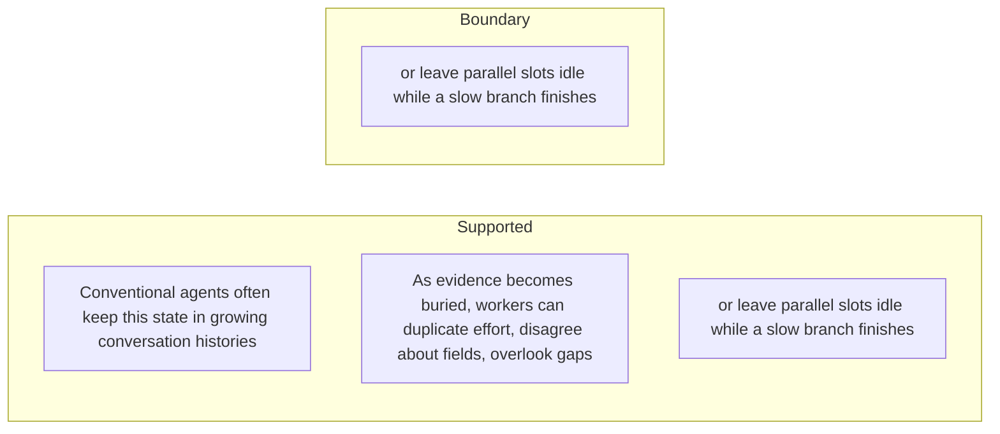

#### Python

```python
from html import escape
from pathlib import Path
from textwrap import wrap

title = "sos_why_p2: Conventional agents often keep this state in growing conversation — supported-versus-bounded scope"
columns = {"Supported statement": ["Conventional agents often keep this state in growing conversation histories","As evidence becomes buried, workers can duplicate effort, disagree about fields, overlook gaps","or leave parallel slots idle while a slow branch finishes"], "Boundary or contingency": ["or leave parallel slots idle while a slow branch finishes"]}
height = 550
parts = [
    f'<svg xmlns="http://www.w3.org/2000/svg" viewBox="0 0 900 {height}" role="img" aria-labelledby="title desc">',
    f'<title id="title">{escape(title)}</title>',
    '<desc id="desc">Statements are partitioned into supported content and explicit boundaries.</desc>',
    f'<rect width="900" height="{height}" fill="white"/>',
]
for column_index, (heading, items) in enumerate(columns.items()):
    x = 240 + column_index * 430
    parts.append(f'<text x="{x}" y="70" text-anchor="middle" font-family="sans-serif" font-size="18" font-weight="700">{escape(heading)}</text>')
    for item_index, item in enumerate(items):
        y = 130 + item_index * 110
        parts.append(f'<rect x="{x-180}" y="{y-35}" width="360" height="80" rx="12" fill="#f7fbff" stroke="#234"/>')
        for line_index, line in enumerate(wrap(item, width=48)):
            parts.append(f'<text x="{x}" y="{y-12+line_index*14}" text-anchor="middle" font-family="sans-serif" font-size="11">{escape(line)}</text>')
parts.append('</svg>')
Path("sos_why_p2_treatment_c.svg").write_text("\n".join(parts), encoding="utf-8")
```

### Implementation record

- Status: `NOT_NEEDED`
- Selected treatment: `NONE`
- Selection rationale: The engineer marked this paragraph prose-only, so the implementation intentionally leaves `sos_why_p2` without a figure.
- Delivery medium: `NONE`
- Visual ID and placement: `NONE`; prose remains at `#sos_why_p2`.
- Shared paragraph scope: `NONE`
- Changed files: `NONE`
- Accessibility and fallback verification: The paragraph remains semantic text and does not rely on visual or motion-only information.
- Desktop and mobile verification: Verified in Playwright on desktop and mobile; no figure is attached to this prose-only paragraph.
- Evidence deviations: `NONE`

## `sos_change_p1`

- Location: `sos_change`, paragraph 1
- Text anchor: "SearchOS converts a natural-language request into one or more related tables."
- Claims and sources: `sos_schema` (OBSERVED, VERIFIED); `sos_socm` (OBSERVED, VERIFIED); `sos_formulation_source` (Sections 2–3.2, Equations 1–10, Figure 2, PDF pages 3–6; the arXiv v1 record identifies the paper as CC BY 4.0)
- Visual needed: `YES`
- Decision rationale: Removing a visual would require readers to retain the material relation between "SearchOS converts a natural-language request into one or more related tables" and "Missing cells become concrete search targets rather than vague reminders in a plan" while also tracking 4 source-bounded propositions. The paragraph contains a real changed-versus-preserved relation; the visual must preserve its stated conditions and must not add causal or proportional meaning.
- Explanatory job: changed-versus-preserved relation.

### Treatment A — SearchOS converts a natural-language request into one or more — changed-versus-preserved relation

- Teaching purpose: Answer "What becomes explicit when search is treated as schema completion?" by exposing the paragraph's 4 named propositions and 3 stated reading, comparison, or qualification relations.
- Encoding and reading order: Nodes reproduce the complete labels "SearchOS converts a natural-language request into one or more related tables"; "Rows represent entities, columns represent requested attributes"; "and a citation matrix connects every populated value to a source URL and supporting excerpt"; "Missing cells become concrete search targets rather than vague reminders in a plan". Edges carry the explicit relation labels "changes into", "changes into", "contrasts with"; arrow direction is sequence only for mechanism or example prose and otherwise denotes reading order.
- Evidence and limitations: The topology is derived from this paragraph rather than a fixed pipeline. Encode only `sos_schema`, `sos_socm` and do not turn reading-order edges into causal claims.
- Recommended web medium: responsive inline SVG with CSS; JavaScript may add optional step focus only when state order matters.
- Mobile, accessibility, and motion behavior: Keep the full node-and-relation list in DOM order, expose the relation labels in the long description, stack nodes on narrow screens, and disable focus transitions under reduced motion.

#### TikZ

```tex
\documentclass[tikz,border=5pt]{standalone}
\usepackage[T1]{fontenc}
\usepackage{tikz}
\usetikzlibrary{arrows.meta,positioning}
\begin{document}
\begin{tikzpicture}[font=\sffamily,concept/.style={draw,rounded corners,align=center,text width=3.6cm,minimum height=1.35cm},link/.style={-{Latex[length=2mm]},thick},rel/.style={fill=white,font=\scriptsize,inner sep=2pt}]
\node[font=\bfseries,align=center] at (6.1,2.0) {sos\_change\_p1: SearchOS converts a natural-language request into one or more - changed-versus-preserved relation};
\node[concept] (n1) at (1.8,0) {SearchOS converts a natural-language request into one or more related tables};
\node[concept] (n2) at (6.1,0) {Rows represent entities, columns represent requested attributes};
\node[concept] (n3) at (10.4,0) {and a citation matrix connects every populated value to a source URL and supporting excerpt};
\node[concept] (n4) at (1.8,-3.2) {Missing cells become concrete search targets rather than vague reminders in a plan};
\draw[link] (n1) -- node[rel] {changes into} (n2);
\draw[link] (n2) -- node[rel] {changes into} (n3);
\draw[link] (n3) -- node[rel] {contrasts with} (n4);
\end{tikzpicture}
\end{document}
```

#### Mermaid

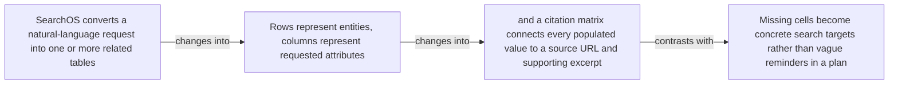

#### Python

```python
from html import escape
from pathlib import Path
from textwrap import wrap

title = "sos_change_p1: SearchOS converts a natural-language request into one or more — changed-versus-preserved relation"
nodes = [["n1","SearchOS converts a natural-language request into one or more related tables",120,150],["n2","Rows represent entities, columns represent requested attributes",420,150],["n3","and a citation matrix connects every populated value to a source URL and supporting excerpt",720,150],["n4","Missing cells become concrete search targets rather than vague reminders in a plan",120,340]]
edges = [["n1","n2","changes into"],["n2","n3","changes into"],["n3","n4","contrasts with"]]
node_by_id = {node_id: (label, x, y) for node_id, label, x, y in nodes}

parts = [
    '<svg xmlns="http://www.w3.org/2000/svg" viewBox="0 0 860 520" role="img" aria-labelledby="title desc">',
    f'<title id="title">{escape(title)}</title>',
    '<desc id="desc">The labeled relations reproduce only relationships stated in the paragraph.</desc>',
    '<rect width="860" height="520" fill="white"/>',
]
for source, target, relation in edges:
    _, x1, y1 = node_by_id[source]
    _, x2, y2 = node_by_id[target]
    parts.append(f'<line x1="{x1}" y1="{y1}" x2="{x2}" y2="{y2}" stroke="#345" stroke-width="2"/>')
    parts.append(f'<text x="{(x1+x2)/2}" y="{(y1+y2)/2-6}" text-anchor="middle" font-family="sans-serif" font-size="11">{escape(relation)}</text>')
for _, label, x, y in nodes:
    parts.append(f'<rect x="{x-125}" y="{y-58}" width="250" height="116" rx="14" fill="#eef6ff" stroke="#234"/>')
    for line_index, line in enumerate(wrap(label, width=32)):
        parts.append(f'<text x="{x}" y="{y-34+line_index*16}" text-anchor="middle" font-family="sans-serif" font-size="12">{escape(line)}</text>')
parts.append('</svg>')
Path("sos_change_p1_treatment_a.svg").write_text("\n".join(parts), encoding="utf-8")
```

### Treatment B — sos_schema, sos_socm — claim-to-source provenance

- Teaching purpose: Show exactly which atomic claims underwrite this paragraph and which fixed source records support each claim.
- Encoding and reading order: A bipartite graph places 2 claim nodes on the left and 1 source nodes on the right, with only the 2 claim-source edges recorded in the fixture. Claim labels include epistemic status; source labels include the exact locator.
- Evidence and limitations: This treatment explains provenance and uncertainty, not the paper's causal mechanism. Missing edges remain visibly absent and no source count is treated as confidence.
- Recommended web medium: semantic HTML/CSS claim-source table with an SVG network view; JavaScript only for keyboard-controlled source highlighting.
- Mobile, accessibility, and motion behavior: Provide real table headers and source links in the static fallback, make every edge recoverable as text, stack claim records before source records on mobile, and require no motion.

#### TikZ

```tex
\documentclass[tikz,border=5pt]{standalone}
\usepackage[T1]{fontenc}
\usepackage{tikz}
\usetikzlibrary{arrows.meta}
\begin{document}
\begin{tikzpicture}[font=\sffamily,claim/.style={draw,rounded corners,align=center,text width=5.2cm,minimum height=1.2cm},source/.style={draw,dashed,align=center,text width=5.2cm,minimum height=1.2cm},link/.style={-{Latex[length=2mm]},thin}]
\node[font=\bfseries] at (4,1.8) {sos\_change\_p1: claim-to-source provenance};
\node[claim] (c1) at (0,0) {SearchOS represents a request as relational schema completion and associates each populated value with a source URL and anchored excerpt. [OBSERVED]};
\node[claim] (c2) at (0,-2.4) {SOCM consists of Frontier Task, an Evidence Graph, a Coverage Map, and Failure Memory with role-specific projections. [OBSERVED]};
\node[source] (s1) at (8,0) {SearchOS-V1 - relational formulation, SOCM, and orchestration - Sections 2-3.2, Equations 1-10, Figure 2, PDF pages 3-6; the arXiv v1 record identifies the paper as CC BY 4.0};
\draw[link] (c1) -- (s1);
\draw[link] (c2) -- (s1);
\end{tikzpicture}
\end{document}
```

#### Mermaid

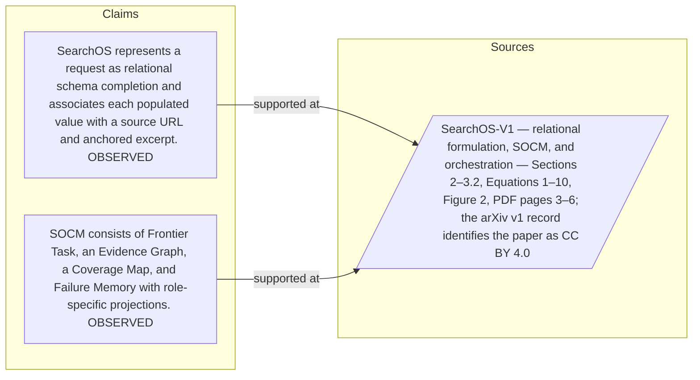

#### Python

```python
from html import escape
from pathlib import Path
from textwrap import wrap

title = "sos_change_p1: claim-to-source provenance"
nodes = [["c1","SearchOS represents a request as relational schema completion and associates each populated value with a source URL and anchored excerpt. [OBSERVED]",190,130],["c2","SOCM consists of Frontier Task, an Evidence Graph, a Coverage Map, and Failure Memory with role-specific projections. [OBSERVED]",190,250],["s1","SearchOS-V1 — relational formulation, SOCM, and orchestration — Sections 2–3.2, Equations 1–10, Figure 2, PDF pages 3–6; the arXiv v1 record identifies the paper as CC BY 4.0",700,130]]
edges = [["c1","s1"],["c2","s1"]]
node_by_id = {node_id: (label, x, y) for node_id, label, x, y in nodes}
height = 440

parts = [
    f'<svg xmlns="http://www.w3.org/2000/svg" viewBox="0 0 900 {height}" role="img" aria-labelledby="title desc">',
    f'<title id="title">{escape(title)}</title>',
    '<desc id="desc">Bipartite map from verified claim records to their exact source records.</desc>',
    f'<rect width="900" height="{height}" fill="white"/>',
]
for source, target in edges:
    _, x1, y1 = node_by_id[source]
    _, x2, y2 = node_by_id[target]
    parts.append(f'<line x1="{x1+145}" y1="{y1}" x2="{x2-145}" y2="{y2}" stroke="#456" stroke-width="2"/>')
for node_id, label, x, y in nodes:
    dashed = ' stroke-dasharray="7 5"' if node_id.startswith("s") else ''
    parts.append(f'<rect x="{x-145}" y="{y-46}" width="290" height="92" rx="12" fill="#f7fbff" stroke="#234"{dashed}/>')
    for line_index, line in enumerate(wrap(label, width=38)):
        parts.append(f'<text x="{x}" y="{y-24+line_index*14}" text-anchor="middle" font-family="sans-serif" font-size="11">{escape(line)}</text>')
parts.append('</svg>')
Path("sos_change_p1_treatment_b.svg").write_text("\n".join(parts), encoding="utf-8")
```

### Treatment C — SearchOS converts a natural-language request into one or more — supported-versus-bounded scope

- Teaching purpose: Separate what the paragraph supports from the qualification or contingency that bounds it.
- Encoding and reading order: Partition the paragraph into 3 supported statement(s) and 1 boundary or contingency statement(s). The two columns are categories, not a scale or causal path.
- Evidence and limitations: Every card is a complete paragraph clause. The boundary column makes negative and not-established language visible without weakening it.
- Recommended web medium: responsive SVG or semantic HTML/CSS; JavaScript is optional only for a meaningful state or scope toggle.
- Mobile, accessibility, and motion behavior: Preserve every exact value or scope statement as selectable text, avoid color-only distinctions, stack groups on mobile, and keep all information visible when JavaScript or motion is disabled.

#### TikZ

```tex
\documentclass[tikz,border=5pt]{standalone}
\usepackage[T1]{fontenc}
\usepackage{tikz}
\begin{document}
\begin{tikzpicture}[font=\sffamily,item/.style={draw,align=center,text width=5.5cm,minimum height=1.4cm}]
\node[font=\bfseries] at (3.5,2) {sos\_change\_p1: SearchOS converts a natural-language request into one or more - supported-versus-bounded scope};
\node[font=\bfseries] at (0,1) {Supported statement};
\node[font=\bfseries] at (7,1) {Boundary or contingency};
\node[item] at (0,0) {SearchOS converts a natural-language request into one or more related tables};
\node[item] at (0,-2) {Rows represent entities, columns represent requested attributes};
\node[item] at (0,-4) {and a citation matrix connects every populated value to a source URL and supporting excerpt};
\node[item] at (7,0) {Missing cells become concrete search targets rather than vague reminders in a plan};
\end{tikzpicture}
\end{document}
```

#### Mermaid

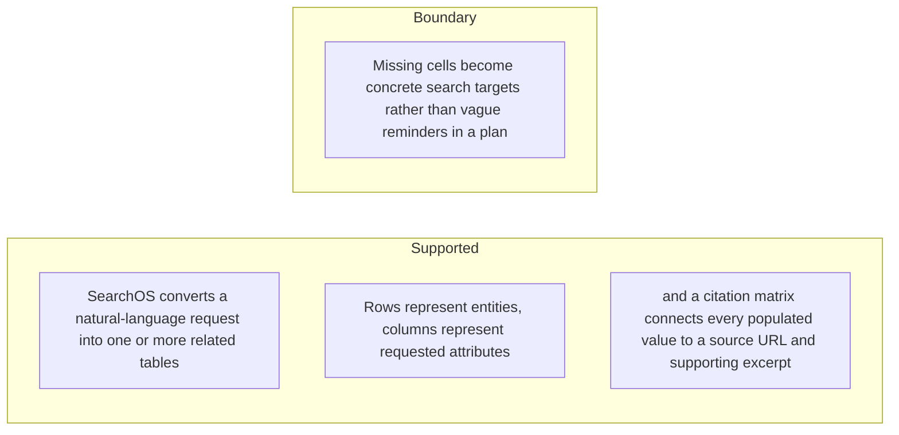

#### Python

```python
from html import escape
from pathlib import Path
from textwrap import wrap

title = "sos_change_p1: SearchOS converts a natural-language request into one or more — supported-versus-bounded scope"
columns = {"Supported statement": ["SearchOS converts a natural-language request into one or more related tables","Rows represent entities, columns represent requested attributes","and a citation matrix connects every populated value to a source URL and supporting excerpt"], "Boundary or contingency": ["Missing cells become concrete search targets rather than vague reminders in a plan"]}
height = 550
parts = [
    f'<svg xmlns="http://www.w3.org/2000/svg" viewBox="0 0 900 {height}" role="img" aria-labelledby="title desc">',
    f'<title id="title">{escape(title)}</title>',
    '<desc id="desc">Statements are partitioned into supported content and explicit boundaries.</desc>',
    f'<rect width="900" height="{height}" fill="white"/>',
]
for column_index, (heading, items) in enumerate(columns.items()):
    x = 240 + column_index * 430
    parts.append(f'<text x="{x}" y="70" text-anchor="middle" font-family="sans-serif" font-size="18" font-weight="700">{escape(heading)}</text>')
    for item_index, item in enumerate(items):
        y = 130 + item_index * 110
        parts.append(f'<rect x="{x-180}" y="{y-35}" width="360" height="80" rx="12" fill="#f7fbff" stroke="#234"/>')
        for line_index, line in enumerate(wrap(item, width=48)):
            parts.append(f'<text x="{x}" y="{y-12+line_index*14}" text-anchor="middle" font-family="sans-serif" font-size="11">{escape(line)}</text>')
parts.append('</svg>')
Path("sos_change_p1_treatment_c.svg").write_text("\n".join(parts), encoding="utf-8")
```

### Implementation record

- Status: `IMPLEMENTED`
- Selected treatment: `A`
- Selection rationale: Selected the approved relationship that directly answers this paragraph's explanatory job; the shared visual uses the same evidence and complete adjacent scope recorded here.
- Delivery medium: `CSS + semantic HTML`
- Visual ID and placement: `visual_searchos_schema_completion` after `sos_change_p2`; this record is served by that purpose-built figure.
- Shared paragraph scope: `sos_change_p1`, `sos_change_p2`
- Changed files: `packages/test-fixtures/explainers/searchos-v1.json`, `apps/web/app/papers/[id]/explainer-visual.tsx`, `apps/web/app/papers/[id]/page.tsx`, and `apps/web/app/globals.css`
- Accessibility and fallback verification: Figure has a programmatic title and description, explicit alt text, equivalent fallback prose, source links, limitations, and a semantic static body; no meaning depends on motion or pointer input.
- Desktop and mobile verification: Verified in Playwright on 1440-pixel desktop and iPhone 13 mobile viewports; figures remain paragraph-adjacent, preserve reading order, and introduce no horizontal page overflow.
- Evidence deviations: `NONE`; web-native CSS and semantic HTML preserve the selected treatment's evidence, labels, topology, and stated boundaries.

## `sos_change_p2`

- Location: `sos_change`, paragraph 2
- Text anchor: "The system then separates global coordination from local search."
- Claims and sources: `sos_schema` (OBSERVED, VERIFIED); `sos_socm` (OBSERVED, VERIFIED); `sos_formulation_source` (Sections 2–3.2, Equations 1–10, Figure 2, PDF pages 3–6; the arXiv v1 record identifies the paper as CC BY 4.0)
- Visual needed: `YES`
- Decision rationale: Removing a visual would require readers to retain the material relation between "The system then separates global coordination from local search" and "Their coordination passes through shared records rather than free-form agent-to-agent conversation" while also tracking 4 source-bounded propositions. The paragraph contains a real changed-versus-preserved relation; the visual must preserve its stated conditions and must not add causal or proportional meaning.
- Explanatory job: changed-versus-preserved relation.

### Treatment A — The system then separates global coordination from local search — changed-versus-preserved relation

- Teaching purpose: Answer "What becomes explicit when search is treated as schema completion?" by exposing the paragraph's 4 named propositions and 3 stated reading, comparison, or qualification relations.
- Encoding and reading order: Nodes reproduce the complete labels "The system then separates global coordination from local search"; "An orchestrator owns schema and task mutation, explore and search agents browse"; "and a writer reads accumulated state"; "Their coordination passes through shared records rather than free-form agent-to-agent conversation". Edges carry the explicit relation labels "changes into", "changes into", "contrasts with"; arrow direction is sequence only for mechanism or example prose and otherwise denotes reading order.
- Evidence and limitations: The topology is derived from this paragraph rather than a fixed pipeline. Encode only `sos_schema`, `sos_socm` and do not turn reading-order edges into causal claims.
- Recommended web medium: responsive inline SVG with CSS; JavaScript may add optional step focus only when state order matters.
- Mobile, accessibility, and motion behavior: Keep the full node-and-relation list in DOM order, expose the relation labels in the long description, stack nodes on narrow screens, and disable focus transitions under reduced motion.

#### TikZ

```tex
\documentclass[tikz,border=5pt]{standalone}
\usepackage[T1]{fontenc}
\usepackage{tikz}
\usetikzlibrary{arrows.meta,positioning}
\begin{document}
\begin{tikzpicture}[font=\sffamily,concept/.style={draw,rounded corners,align=center,text width=3.6cm,minimum height=1.35cm},link/.style={-{Latex[length=2mm]},thick},rel/.style={fill=white,font=\scriptsize,inner sep=2pt}]
\node[font=\bfseries,align=center] at (6.1,2.0) {sos\_change\_p2: The system then separates global coordination from local search - changed-versus-preserved relation};
\node[concept] (n1) at (1.8,0) {The system then separates global coordination from local search};
\node[concept] (n2) at (6.1,0) {An orchestrator owns schema and task mutation, explore and search agents browse};
\node[concept] (n3) at (10.4,0) {and a writer reads accumulated state};
\node[concept] (n4) at (1.8,-3.2) {Their coordination passes through shared records rather than free-form agent-to-agent conversation};
\draw[link] (n1) -- node[rel] {changes into} (n2);
\draw[link] (n2) -- node[rel] {changes into} (n3);
\draw[link] (n3) -- node[rel] {contrasts with} (n4);
\end{tikzpicture}
\end{document}
```

#### Mermaid

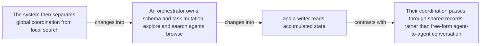

#### Python

```python
from html import escape
from pathlib import Path
from textwrap import wrap

title = "sos_change_p2: The system then separates global coordination from local search — changed-versus-preserved relation"
nodes = [["n1","The system then separates global coordination from local search",120,150],["n2","An orchestrator owns schema and task mutation, explore and search agents browse",420,150],["n3","and a writer reads accumulated state",720,150],["n4","Their coordination passes through shared records rather than free-form agent-to-agent conversation",120,340]]
edges = [["n1","n2","changes into"],["n2","n3","changes into"],["n3","n4","contrasts with"]]
node_by_id = {node_id: (label, x, y) for node_id, label, x, y in nodes}

parts = [
    '<svg xmlns="http://www.w3.org/2000/svg" viewBox="0 0 860 520" role="img" aria-labelledby="title desc">',
    f'<title id="title">{escape(title)}</title>',
    '<desc id="desc">The labeled relations reproduce only relationships stated in the paragraph.</desc>',
    '<rect width="860" height="520" fill="white"/>',
]
for source, target, relation in edges:
    _, x1, y1 = node_by_id[source]
    _, x2, y2 = node_by_id[target]
    parts.append(f'<line x1="{x1}" y1="{y1}" x2="{x2}" y2="{y2}" stroke="#345" stroke-width="2"/>')
    parts.append(f'<text x="{(x1+x2)/2}" y="{(y1+y2)/2-6}" text-anchor="middle" font-family="sans-serif" font-size="11">{escape(relation)}</text>')
for _, label, x, y in nodes:
    parts.append(f'<rect x="{x-125}" y="{y-58}" width="250" height="116" rx="14" fill="#eef6ff" stroke="#234"/>')
    for line_index, line in enumerate(wrap(label, width=32)):
        parts.append(f'<text x="{x}" y="{y-34+line_index*16}" text-anchor="middle" font-family="sans-serif" font-size="12">{escape(line)}</text>')
parts.append('</svg>')
Path("sos_change_p2_treatment_a.svg").write_text("\n".join(parts), encoding="utf-8")
```

### Treatment B — sos_schema, sos_socm — claim-to-source provenance

- Teaching purpose: Show exactly which atomic claims underwrite this paragraph and which fixed source records support each claim.
- Encoding and reading order: A bipartite graph places 2 claim nodes on the left and 1 source nodes on the right, with only the 2 claim-source edges recorded in the fixture. Claim labels include epistemic status; source labels include the exact locator.
- Evidence and limitations: This treatment explains provenance and uncertainty, not the paper's causal mechanism. Missing edges remain visibly absent and no source count is treated as confidence.
- Recommended web medium: semantic HTML/CSS claim-source table with an SVG network view; JavaScript only for keyboard-controlled source highlighting.
- Mobile, accessibility, and motion behavior: Provide real table headers and source links in the static fallback, make every edge recoverable as text, stack claim records before source records on mobile, and require no motion.

#### TikZ

```tex
\documentclass[tikz,border=5pt]{standalone}
\usepackage[T1]{fontenc}
\usepackage{tikz}
\usetikzlibrary{arrows.meta}
\begin{document}
\begin{tikzpicture}[font=\sffamily,claim/.style={draw,rounded corners,align=center,text width=5.2cm,minimum height=1.2cm},source/.style={draw,dashed,align=center,text width=5.2cm,minimum height=1.2cm},link/.style={-{Latex[length=2mm]},thin}]
\node[font=\bfseries] at (4,1.8) {sos\_change\_p2: claim-to-source provenance};
\node[claim] (c1) at (0,0) {SearchOS represents a request as relational schema completion and associates each populated value with a source URL and anchored excerpt. [OBSERVED]};
\node[claim] (c2) at (0,-2.4) {SOCM consists of Frontier Task, an Evidence Graph, a Coverage Map, and Failure Memory with role-specific projections. [OBSERVED]};
\node[source] (s1) at (8,0) {SearchOS-V1 - relational formulation, SOCM, and orchestration - Sections 2-3.2, Equations 1-10, Figure 2, PDF pages 3-6; the arXiv v1 record identifies the paper as CC BY 4.0};
\draw[link] (c1) -- (s1);
\draw[link] (c2) -- (s1);
\end{tikzpicture}
\end{document}
```

#### Mermaid


#### Python

```python
from html import escape
from pathlib import Path
from textwrap import wrap

title = "sos_change_p2: claim-to-source provenance"
nodes = [["c1","SearchOS represents a request as relational schema completion and associates each populated value with a source URL and anchored excerpt. [OBSERVED]",190,130],["c2","SOCM consists of Frontier Task, an Evidence Graph, a Coverage Map, and Failure Memory with role-specific projections. [OBSERVED]",190,250],["s1","SearchOS-V1 — relational formulation, SOCM, and orchestration — Sections 2–3.2, Equations 1–10, Figure 2, PDF pages 3–6; the arXiv v1 record identifies the paper as CC BY 4.0",700,130]]
edges = [["c1","s1"],["c2","s1"]]
node_by_id = {node_id: (label, x, y) for node_id, label, x, y in nodes}
height = 440

parts = [
    f'<svg xmlns="http://www.w3.org/2000/svg" viewBox="0 0 900 {height}" role="img" aria-labelledby="title desc">',
    f'<title id="title">{escape(title)}</title>',
    '<desc id="desc">Bipartite map from verified claim records to their exact source records.</desc>',
    f'<rect width="900" height="{height}" fill="white"/>',
]
for source, target in edges:
    _, x1, y1 = node_by_id[source]
    _, x2, y2 = node_by_id[target]
    parts.append(f'<line x1="{x1+145}" y1="{y1}" x2="{x2-145}" y2="{y2}" stroke="#456" stroke-width="2"/>')
for node_id, label, x, y in nodes:
    dashed = ' stroke-dasharray="7 5"' if node_id.startswith("s") else ''
    parts.append(f'<rect x="{x-145}" y="{y-46}" width="290" height="92" rx="12" fill="#f7fbff" stroke="#234"{dashed}/>')
    for line_index, line in enumerate(wrap(label, width=38)):
        parts.append(f'<text x="{x}" y="{y-24+line_index*14}" text-anchor="middle" font-family="sans-serif" font-size="11">{escape(line)}</text>')
parts.append('</svg>')
Path("sos_change_p2_treatment_b.svg").write_text("\n".join(parts), encoding="utf-8")
```

### Treatment C — The system then separates global coordination from local search — supported-versus-bounded scope

- Teaching purpose: Separate what the paragraph supports from the qualification or contingency that bounds it.
- Encoding and reading order: Partition the paragraph into 3 supported statement(s) and 1 boundary or contingency statement(s). The two columns are categories, not a scale or causal path.
- Evidence and limitations: Every card is a complete paragraph clause. The boundary column makes negative and not-established language visible without weakening it.
- Recommended web medium: responsive SVG or semantic HTML/CSS; JavaScript is optional only for a meaningful state or scope toggle.
- Mobile, accessibility, and motion behavior: Preserve every exact value or scope statement as selectable text, avoid color-only distinctions, stack groups on mobile, and keep all information visible when JavaScript or motion is disabled.

#### TikZ

```tex
\documentclass[tikz,border=5pt]{standalone}
\usepackage[T1]{fontenc}
\usepackage{tikz}
\begin{document}
\begin{tikzpicture}[font=\sffamily,item/.style={draw,align=center,text width=5.5cm,minimum height=1.4cm}]
\node[font=\bfseries] at (3.5,2) {sos\_change\_p2: The system then separates global coordination from local search - supported-versus-bounded scope};
\node[font=\bfseries] at (0,1) {Supported statement};
\node[font=\bfseries] at (7,1) {Boundary or contingency};
\node[item] at (0,0) {The system then separates global coordination from local search};
\node[item] at (0,-2) {An orchestrator owns schema and task mutation, explore and search agents browse};
\node[item] at (0,-4) {and a writer reads accumulated state};
\node[item] at (7,0) {Their coordination passes through shared records rather than free-form agent-to-agent conversation};
\end{tikzpicture}
\end{document}
```

#### Mermaid

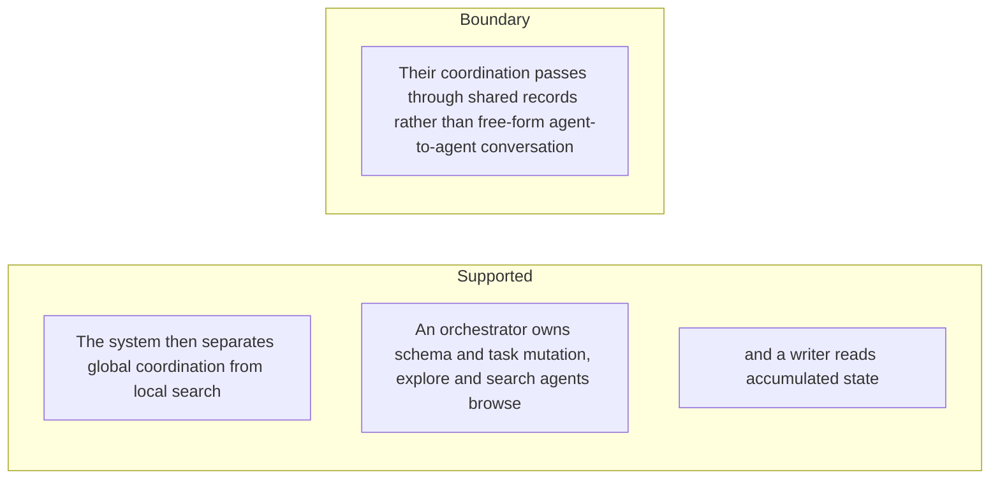

#### Python

```python
from html import escape
from pathlib import Path
from textwrap import wrap

title = "sos_change_p2: The system then separates global coordination from local search — supported-versus-bounded scope"
columns = {"Supported statement": ["The system then separates global coordination from local search","An orchestrator owns schema and task mutation, explore and search agents browse","and a writer reads accumulated state"], "Boundary or contingency": ["Their coordination passes through shared records rather than free-form agent-to-agent conversation"]}
height = 550
parts = [
    f'<svg xmlns="http://www.w3.org/2000/svg" viewBox="0 0 900 {height}" role="img" aria-labelledby="title desc">',
    f'<title id="title">{escape(title)}</title>',
    '<desc id="desc">Statements are partitioned into supported content and explicit boundaries.</desc>',
    f'<rect width="900" height="{height}" fill="white"/>',
]
for column_index, (heading, items) in enumerate(columns.items()):
    x = 240 + column_index * 430
    parts.append(f'<text x="{x}" y="70" text-anchor="middle" font-family="sans-serif" font-size="18" font-weight="700">{escape(heading)}</text>')
    for item_index, item in enumerate(items):
        y = 130 + item_index * 110
        parts.append(f'<rect x="{x-180}" y="{y-35}" width="360" height="80" rx="12" fill="#f7fbff" stroke="#234"/>')
        for line_index, line in enumerate(wrap(item, width=48)):
            parts.append(f'<text x="{x}" y="{y-12+line_index*14}" text-anchor="middle" font-family="sans-serif" font-size="11">{escape(line)}</text>')
parts.append('</svg>')
Path("sos_change_p2_treatment_c.svg").write_text("\n".join(parts), encoding="utf-8")
```

### Implementation record

- Status: `IMPLEMENTED`
- Selected treatment: `A`
- Selection rationale: Selected the approved relationship that directly answers this paragraph's explanatory job; the shared visual uses the same evidence and complete adjacent scope recorded here.
- Delivery medium: `CSS + semantic HTML`
- Visual ID and placement: `visual_searchos_schema_completion` after `sos_change_p2`; this record is served by that purpose-built figure.
- Shared paragraph scope: `sos_change_p1`, `sos_change_p2`
- Changed files: `packages/test-fixtures/explainers/searchos-v1.json`, `apps/web/app/papers/[id]/explainer-visual.tsx`, `apps/web/app/papers/[id]/page.tsx`, and `apps/web/app/globals.css`
- Accessibility and fallback verification: Figure has a programmatic title and description, explicit alt text, equivalent fallback prose, source links, limitations, and a semantic static body; no meaning depends on motion or pointer input.
- Desktop and mobile verification: Verified in Playwright on 1440-pixel desktop and iPhone 13 mobile viewports; figures remain paragraph-adjacent, preserve reading order, and introduce no horizontal page overflow.
- Evidence deviations: `NONE`; web-native CSS and semantic HTML preserve the selected treatment's evidence, labels, topology, and stated boundaries.

## `sos_mechanism_p1`

- Location: `sos_mechanism`, paragraph 1
- Text anchor: "Search-Oriented Context Management contains four linked stores."
- Claims and sources: `sos_socm` (OBSERVED, VERIFIED); `sos_middleware` (OBSERVED, VERIFIED); `sos_scheduler` (OBSERVED, VERIFIED); `sos_formulation_source` (Sections 2–3.2, Equations 1–10, Figure 2, PDF pages 3–6; the arXiv v1 record identifies the paper as CC BY 4.0); `sos_middleware_source` (Sections 3.3–3.4, Equations 11–18, Figures 3–4, PDF pages 7–9)
- Visual needed: `YES`
- Decision rationale: Removing a visual would require readers to retain the material relation between "Search-Oriented Context Management contains four linked stores" and "Failure Memory records unsuccessful queries, inaccessible sources, rejected claims" while also tracking 6 source-bounded propositions. The paragraph contains a real mechanism relation graph; the visual must preserve its stated conditions and must not add causal or proportional meaning.
- Explanatory job: mechanism relation graph.

### Treatment A — Search-Oriented Context Management contains four linked stores — mechanism relation graph

- Teaching purpose: Answer "How does a browser observation become shared, grounded progress?" by exposing the paragraph's 6 named propositions and 5 stated reading, comparison, or qualification relations.
- Encoding and reading order: Nodes reproduce the complete labels "Search-Oriented Context Management contains four linked stores"; "Frontier Task tracks dependency-aware work"; "The Evidence Graph stores atomic findings with values, sources, anchored spans, schema bindings"; "and provenance"; "The Coverage Map materializes the status of each known cell"; "Failure Memory records unsuccessful queries, inaccessible sources, rejected claims". Edges carry the explicit relation labels "then", "then", "then", "then", "then"; arrow direction is sequence only for mechanism or example prose and otherwise denotes reading order.
- Evidence and limitations: The topology is derived from this paragraph rather than a fixed pipeline. Encode only `sos_socm`, `sos_middleware`, `sos_scheduler` and do not turn reading-order edges into causal claims.
- Recommended web medium: responsive inline SVG with CSS; JavaScript may add optional step focus only when state order matters.
- Mobile, accessibility, and motion behavior: Keep the full node-and-relation list in DOM order, expose the relation labels in the long description, stack nodes on narrow screens, and disable focus transitions under reduced motion.

#### TikZ

```tex
\documentclass[tikz,border=5pt]{standalone}
\usepackage[T1]{fontenc}
\usepackage{tikz}
\usetikzlibrary{arrows.meta,positioning}
\begin{document}
\begin{tikzpicture}[font=\sffamily,concept/.style={draw,rounded corners,align=center,text width=3.6cm,minimum height=1.35cm},link/.style={-{Latex[length=2mm]},thick},rel/.style={fill=white,font=\scriptsize,inner sep=2pt}]
\node[font=\bfseries,align=center] at (6.1,2.0) {sos\_mechanism\_p1: Search-Oriented Context Management contains four linked stores - mechanism relation graph};
\node[concept] (n1) at (1.8,0) {Search-Oriented Context Management contains four linked stores};
\node[concept] (n2) at (6.1,0) {Frontier Task tracks dependency-aware work};
\node[concept] (n3) at (10.4,0) {The Evidence Graph stores atomic findings with values, sources, anchored spans, schema bindings};
\node[concept] (n4) at (1.8,-3.2) {and provenance};
\node[concept] (n5) at (6.1,-3.2) {The Coverage Map materializes the status of each known cell};
\node[concept] (n6) at (10.4,-3.2) {Failure Memory records unsuccessful queries, inaccessible sources, rejected claims};
\draw[link] (n1) -- node[rel] {then} (n2);
\draw[link] (n2) -- node[rel] {then} (n3);
\draw[link] (n3) -- node[rel] {then} (n4);
\draw[link] (n4) -- node[rel] {then} (n5);
\draw[link] (n5) -- node[rel] {then} (n6);
\end{tikzpicture}
\end{document}
```

#### Mermaid


#### Python

```python
from html import escape
from pathlib import Path
from textwrap import wrap

title = "sos_mechanism_p1: Search-Oriented Context Management contains four linked stores — mechanism relation graph"
nodes = [["n1","Search-Oriented Context Management contains four linked stores",120,150],["n2","Frontier Task tracks dependency-aware work",420,150],["n3","The Evidence Graph stores atomic findings with values, sources, anchored spans, schema bindings",720,150],["n4","and provenance",120,340],["n5","The Coverage Map materializes the status of each known cell",420,340],["n6","Failure Memory records unsuccessful queries, inaccessible sources, rejected claims",720,340]]
edges = [["n1","n2","then"],["n2","n3","then"],["n3","n4","then"],["n4","n5","then"],["n5","n6","then"]]
node_by_id = {node_id: (label, x, y) for node_id, label, x, y in nodes}

parts = [
    '<svg xmlns="http://www.w3.org/2000/svg" viewBox="0 0 860 520" role="img" aria-labelledby="title desc">',
    f'<title id="title">{escape(title)}</title>',
    '<desc id="desc">The labeled relations reproduce only relationships stated in the paragraph.</desc>',
    '<rect width="860" height="520" fill="white"/>',
]
for source, target, relation in edges:
    _, x1, y1 = node_by_id[source]
    _, x2, y2 = node_by_id[target]
    parts.append(f'<line x1="{x1}" y1="{y1}" x2="{x2}" y2="{y2}" stroke="#345" stroke-width="2"/>')
    parts.append(f'<text x="{(x1+x2)/2}" y="{(y1+y2)/2-6}" text-anchor="middle" font-family="sans-serif" font-size="11">{escape(relation)}</text>')
for _, label, x, y in nodes:
    parts.append(f'<rect x="{x-125}" y="{y-58}" width="250" height="116" rx="14" fill="#eef6ff" stroke="#234"/>')
    for line_index, line in enumerate(wrap(label, width=32)):
        parts.append(f'<text x="{x}" y="{y-34+line_index*16}" text-anchor="middle" font-family="sans-serif" font-size="12">{escape(line)}</text>')
parts.append('</svg>')
Path("sos_mechanism_p1_treatment_a.svg").write_text("\n".join(parts), encoding="utf-8")
```

### Treatment B — sos_socm, sos_middleware, sos_scheduler — claim-to-source provenance

- Teaching purpose: Show exactly which atomic claims underwrite this paragraph and which fixed source records support each claim.
- Encoding and reading order: A bipartite graph places 3 claim nodes on the left and 2 source nodes on the right, with only the 4 claim-source edges recorded in the fixture. Claim labels include epistemic status; source labels include the exact locator.
- Evidence and limitations: This treatment explains provenance and uncertainty, not the paper's causal mechanism. Missing edges remain visibly absent and no source count is treated as confidence.
- Recommended web medium: semantic HTML/CSS claim-source table with an SVG network view; JavaScript only for keyboard-controlled source highlighting.
- Mobile, accessibility, and motion behavior: Provide real table headers and source links in the static fallback, make every edge recoverable as text, stack claim records before source records on mobile, and require no motion.

#### TikZ

```tex
\documentclass[tikz,border=5pt]{standalone}
\usepackage[T1]{fontenc}
\usepackage{tikz}
\usetikzlibrary{arrows.meta}
\begin{document}
\begin{tikzpicture}[font=\sffamily,claim/.style={draw,rounded corners,align=center,text width=5.2cm,minimum height=1.2cm},source/.style={draw,dashed,align=center,text width=5.2cm,minimum height=1.2cm},link/.style={-{Latex[length=2mm]},thin}]
\node[font=\bfseries] at (4,1.8) {sos\_mechanism\_p1: claim-to-source provenance};
\node[claim] (c1) at (0,0) {SOCM consists of Frontier Task, an Evidence Graph, a Coverage Map, and Failure Memory with role-specific projections. [OBSERVED]};
\node[claim] (c2) at (0,-2.4) {Evidence middleware accepts a browsing candidate only when it binds to a schema cell and anchors to a source span, then updates evidence and coverage atomically. [OBSERVED]};
\node[claim] (c3) at (0,-4.8) {Pipeline-parallel orchestration immediately assigns released execution slots to ready unresolved gaps instead of waiting for synchronized batches. [OBSERVED]};
\node[source] (s1) at (8,0) {SearchOS-V1 - relational formulation, SOCM, and orchestration - Sections 2-3.2, Equations 1-10, Figure 2, PDF pages 3-6; the arXiv v1 record identifies the paper as CC BY 4.0};
\node[source] (s2) at (8,-2.4) {SearchOS-V1 - middleware and hierarchical skills - Sections 3.3-3.4, Equations 11-18, Figures 3-4, PDF pages 7-9};
\draw[link] (c1) -- (s1);
\draw[link] (c2) -- (s2);
\draw[link] (c3) -- (s1);
\draw[link] (c3) -- (s2);
\end{tikzpicture}
\end{document}
```

#### Mermaid

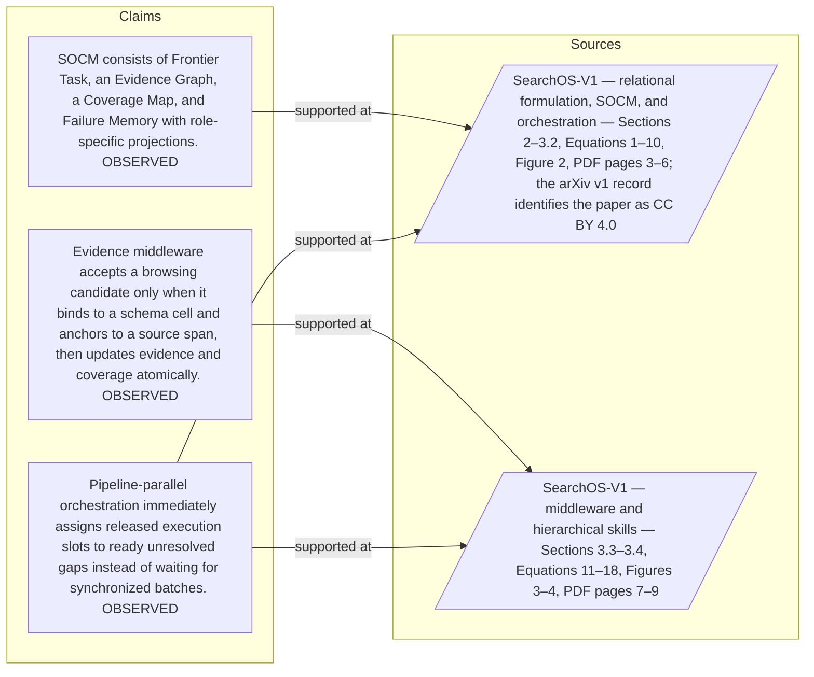

#### Python

```python
from html import escape
from pathlib import Path
from textwrap import wrap

title = "sos_mechanism_p1: claim-to-source provenance"
nodes = [["c1","SOCM consists of Frontier Task, an Evidence Graph, a Coverage Map, and Failure Memory with role-specific projections. [OBSERVED]",190,130],["c2","Evidence middleware accepts a browsing candidate only when it binds to a schema cell and anchors to a source span, then updates evidence and coverage atomically. [OBSERVED]",190,250],["c3","Pipeline-parallel orchestration immediately assigns released execution slots to ready unresolved gaps instead of waiting for synchronized batches. [OBSERVED]",190,370],["s1","SearchOS-V1 — relational formulation, SOCM, and orchestration — Sections 2–3.2, Equations 1–10, Figure 2, PDF pages 3–6; the arXiv v1 record identifies the paper as CC BY 4.0",700,130],["s2","SearchOS-V1 — middleware and hierarchical skills — Sections 3.3–3.4, Equations 11–18, Figures 3–4, PDF pages 7–9",700,250]]
edges = [["c1","s1"],["c2","s2"],["c3","s1"],["c3","s2"]]
node_by_id = {node_id: (label, x, y) for node_id, label, x, y in nodes}
height = 560

parts = [
    f'<svg xmlns="http://www.w3.org/2000/svg" viewBox="0 0 900 {height}" role="img" aria-labelledby="title desc">',
    f'<title id="title">{escape(title)}</title>',
    '<desc id="desc">Bipartite map from verified claim records to their exact source records.</desc>',
    f'<rect width="900" height="{height}" fill="white"/>',
]
for source, target in edges:
    _, x1, y1 = node_by_id[source]
    _, x2, y2 = node_by_id[target]
    parts.append(f'<line x1="{x1+145}" y1="{y1}" x2="{x2-145}" y2="{y2}" stroke="#456" stroke-width="2"/>')
for node_id, label, x, y in nodes:
    dashed = ' stroke-dasharray="7 5"' if node_id.startswith("s") else ''
    parts.append(f'<rect x="{x-145}" y="{y-46}" width="290" height="92" rx="12" fill="#f7fbff" stroke="#234"{dashed}/>')
    for line_index, line in enumerate(wrap(label, width=38)):
        parts.append(f'<text x="{x}" y="{y-24+line_index*14}" text-anchor="middle" font-family="sans-serif" font-size="11">{escape(line)}</text>')
parts.append('</svg>')
Path("sos_mechanism_p1_treatment_b.svg").write_text("\n".join(parts), encoding="utf-8")
```

### Treatment C — Search-Oriented Context Management contains four linked stores — input-operation-outcome storyboard

- Teaching purpose: Let readers inspect the paragraph as concrete input, operation, and outcome states.
- Encoding and reading order: Use 5 ordered states labeled "Input: Search-Oriented Context Management contains four linked stores", "Operation: Frontier Task tracks dependency-aware work", "Operation: The Evidence Graph stores atomic findings with values, sources, anchored spans, schema bindings", "Operation: and provenance", "Operation: The Coverage Map materializes the status of each known cell". State connectors reproduce paragraph order and do not imply unreported timing.
- Evidence and limitations: The first, intermediate, and final states are paragraph clauses; no hidden state, quantity, or transition is added.
- Recommended web medium: responsive SVG or semantic HTML/CSS; JavaScript is optional only for a meaningful state or scope toggle.
- Mobile, accessibility, and motion behavior: Preserve every exact value or scope statement as selectable text, avoid color-only distinctions, stack groups on mobile, and keep all information visible when JavaScript or motion is disabled.

#### TikZ

```tex
\documentclass[tikz,border=5pt]{standalone}
\usepackage[T1]{fontenc}
\usepackage{tikz}
\begin{document}
\begin{tikzpicture}[font=\sffamily,state/.style={draw,rounded corners,align=center,text width=3.2cm,minimum height=1.8cm}]
\node[font=\bfseries] at (7.6,2) {sos\_mechanism\_p1: Search-Oriented Context Management contains four linked stores - input-operation-outcome storyboard};
\node[state] (k1) at (0,0) {\textbf{Input}\\Search-Oriented Context Management contains four linked stores};
\node[state] (k2) at (3.8,0) {\textbf{Operation}\\Frontier Task tracks dependency-aware work};
\node[state] (k3) at (7.6,0) {\textbf{Operation}\\The Evidence Graph stores atomic findings with values, sources, anchored spans, schema bindings};
\node[state] (k4) at (11.399999999999999,0) {\textbf{Operation}\\and provenance};
\node[state] (k5) at (15.2,0) {\textbf{Operation}\\The Coverage Map materializes the status of each known cell};
\draw[->,thick] (k1) -- (k2);
\draw[->,thick] (k2) -- (k3);
\draw[->,thick] (k3) -- (k4);
\draw[->,thick] (k4) -- (k5);
\end{tikzpicture}
\end{document}
```

#### Mermaid

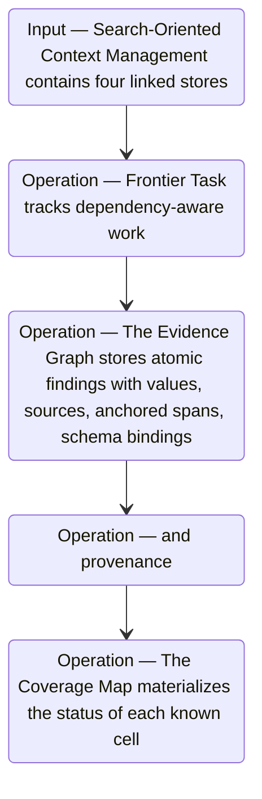

#### Python

```python
from html import escape
from pathlib import Path
from textwrap import wrap

title = "sos_mechanism_p1: Search-Oriented Context Management contains four linked stores — input-operation-outcome storyboard"
items = [["Input","Search-Oriented Context Management contains four linked stores",120,210],["Operation","Frontier Task tracks dependency-aware work",290,210],["Operation","The Evidence Graph stores atomic findings with values, sources, anchored spans, schema bindings",460,210],["Operation","and provenance",630,210],["Operation","The Coverage Map materializes the status of each known cell",800,210]]
width = max(760, 240 + len(items) * 170)
parts = [
    f'<svg xmlns="http://www.w3.org/2000/svg" viewBox="0 0 {width} 460" role="img" aria-labelledby="title desc">',
    f'<title id="title">{escape(title)}</title>',
    '<desc id="desc">Input, operation, and outcome states follow the paragraph in source order.</desc>',
    f'<rect width="{width}" height="460" fill="white"/>',
]
for index in range(len(items)-1):
    _, _, x1, y1 = items[index]
    _, _, x2, y2 = items[index+1]
    parts.append(f'<line x1="{x1+65}" y1="{y1}" x2="{x2-65}" y2="{y2}" stroke="#345" stroke-width="2"/>')
for group, label, x, y in items:
    parts.append(f'<rect x="{x-65}" y="{y-90}" width="130" height="180" rx="16" fill="#eef6ff" stroke="#234"/>')
    parts.append(f'<text x="{x}" y="{y-60}" text-anchor="middle" font-family="sans-serif" font-size="13" font-weight="700">{escape(group)}</text>')
    for line_index, line in enumerate(wrap(label, width=18)):
        parts.append(f'<text x="{x}" y="{y-34+line_index*14}" text-anchor="middle" font-family="sans-serif" font-size="10">{escape(line)}</text>')
parts.append('</svg>')
Path("sos_mechanism_p1_treatment_c.svg").write_text("\n".join(parts), encoding="utf-8")
```

### Implementation record

- Status: `IMPLEMENTED`
- Selected treatment: `A`
- Selection rationale: Selected the approved relationship that directly answers this paragraph's explanatory job; the shared visual uses the same evidence and complete adjacent scope recorded here.
- Delivery medium: `CSS + semantic HTML`
- Visual ID and placement: `visual_searchos_control_loop` after `sos_mechanism_p3`; this record is served by that purpose-built figure.
- Shared paragraph scope: `sos_mechanism_p1`, `sos_mechanism_p2`, `sos_mechanism_p3`, `sos_example_p1`, `sos_example_p2`
- Changed files: `packages/test-fixtures/explainers/searchos-v1.json`, `apps/web/app/papers/[id]/explainer-visual.tsx`, `apps/web/app/papers/[id]/page.tsx`, and `apps/web/app/globals.css`
- Accessibility and fallback verification: Figure has a programmatic title and description, explicit alt text, equivalent fallback prose, source links, limitations, and a semantic static body; no meaning depends on motion or pointer input.
- Desktop and mobile verification: Verified in Playwright on 1440-pixel desktop and iPhone 13 mobile viewports; figures remain paragraph-adjacent, preserve reading order, and introduce no horizontal page overflow.
- Evidence deviations: `NONE`; web-native CSS and semantic HTML preserve the selected treatment's evidence, labels, topology, and stated boundaries.

## `sos_mechanism_p2`

- Location: `sos_mechanism`, paragraph 2
- Text anchor: "Before a model call, context middleware projects only the role-relevant portion of that state and adds selected skills."
- Claims and sources: `sos_socm` (OBSERVED, VERIFIED); `sos_middleware` (OBSERVED, VERIFIED); `sos_scheduler` (OBSERVED, VERIFIED); `sos_formulation_source` (Sections 2–3.2, Equations 1–10, Figure 2, PDF pages 3–6; the arXiv v1 record identifies the paper as CC BY 4.0); `sos_middleware_source` (Sections 3.3–3.4, Equations 11–18, Figures 3–4, PDF pages 7–9)
- Visual needed: `YES`
- Decision rationale: Removing a visual would require readers to retain the material relation between "Before a model call, context middleware projects only the role-relevant portion of that state and adds selected skills" and "It then updates the Evidence Graph and Coverage Map atomically" while also tracking 3 source-bounded propositions. The paragraph contains a real mechanism relation graph; the visual must preserve its stated conditions and must not add causal or proportional meaning.
- Explanatory job: mechanism relation graph.

### Treatment A — Before a model call context middleware projects only the — mechanism relation graph

- Teaching purpose: Answer "How does a browser observation become shared, grounded progress?" by exposing the paragraph's 3 named propositions and 2 stated reading, comparison, or qualification relations.
- Encoding and reading order: Nodes reproduce the complete labels "Before a model call, context middleware projects only the role-relevant portion of that state and adds selected skills"; "After browsing, evidence middleware accepts a candidate only if it binds to a schema cell and can be anchored to the observed source span"; "It then updates the Evidence Graph and Coverage Map atomically". Edges carry the explicit relation labels "bounded by", "then"; arrow direction is sequence only for mechanism or example prose and otherwise denotes reading order.
- Evidence and limitations: The topology is derived from this paragraph rather than a fixed pipeline. Encode only `sos_socm`, `sos_middleware`, `sos_scheduler` and do not turn reading-order edges into causal claims.
- Recommended web medium: responsive inline SVG with CSS; JavaScript may add optional step focus only when state order matters.
- Mobile, accessibility, and motion behavior: Keep the full node-and-relation list in DOM order, expose the relation labels in the long description, stack nodes on narrow screens, and disable focus transitions under reduced motion.

#### TikZ

```tex
\documentclass[tikz,border=5pt]{standalone}
\usepackage[T1]{fontenc}
\usepackage{tikz}
\usetikzlibrary{arrows.meta,positioning}
\begin{document}
\begin{tikzpicture}[font=\sffamily,concept/.style={draw,rounded corners,align=center,text width=3.6cm,minimum height=1.35cm},link/.style={-{Latex[length=2mm]},thick},rel/.style={fill=white,font=\scriptsize,inner sep=2pt}]
\node[font=\bfseries,align=center] at (6.1,2.0) {sos\_mechanism\_p2: Before a model call context middleware projects only the - mechanism relation graph};
\node[concept] (n1) at (1.8,0) {Before a model call, context middleware projects only the role-relevant portion of that state and adds selected skills};
\node[concept] (n2) at (6.1,0) {After browsing, evidence middleware accepts a candidate only if it binds to a schema cell and can be anchored to the observed source span};
\node[concept] (n3) at (10.4,0) {It then updates the Evidence Graph and Coverage Map atomically};
\draw[link] (n1) -- node[rel] {bounded by} (n2);
\draw[link] (n2) -- node[rel] {then} (n3);
\end{tikzpicture}
\end{document}
```

#### Mermaid

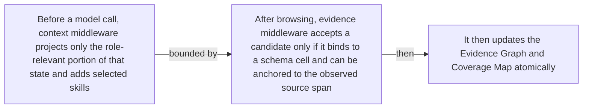

#### Python

```python
from html import escape
from pathlib import Path
from textwrap import wrap

title = "sos_mechanism_p2: Before a model call context middleware projects only the — mechanism relation graph"
nodes = [["n1","Before a model call, context middleware projects only the role-relevant portion of that state and adds selected skills",120,150],["n2","After browsing, evidence middleware accepts a candidate only if it binds to a schema cell and can be anchored to the observed source span",420,150],["n3","It then updates the Evidence Graph and Coverage Map atomically",720,150]]
edges = [["n1","n2","bounded by"],["n2","n3","then"]]
node_by_id = {node_id: (label, x, y) for node_id, label, x, y in nodes}

parts = [
    '<svg xmlns="http://www.w3.org/2000/svg" viewBox="0 0 860 520" role="img" aria-labelledby="title desc">',
    f'<title id="title">{escape(title)}</title>',
    '<desc id="desc">The labeled relations reproduce only relationships stated in the paragraph.</desc>',
    '<rect width="860" height="520" fill="white"/>',
]
for source, target, relation in edges:
    _, x1, y1 = node_by_id[source]
    _, x2, y2 = node_by_id[target]
    parts.append(f'<line x1="{x1}" y1="{y1}" x2="{x2}" y2="{y2}" stroke="#345" stroke-width="2"/>')
    parts.append(f'<text x="{(x1+x2)/2}" y="{(y1+y2)/2-6}" text-anchor="middle" font-family="sans-serif" font-size="11">{escape(relation)}</text>')
for _, label, x, y in nodes:
    parts.append(f'<rect x="{x-125}" y="{y-58}" width="250" height="116" rx="14" fill="#eef6ff" stroke="#234"/>')
    for line_index, line in enumerate(wrap(label, width=32)):
        parts.append(f'<text x="{x}" y="{y-34+line_index*16}" text-anchor="middle" font-family="sans-serif" font-size="12">{escape(line)}</text>')
parts.append('</svg>')
Path("sos_mechanism_p2_treatment_a.svg").write_text("\n".join(parts), encoding="utf-8")
```

### Treatment B — sos_socm, sos_middleware, sos_scheduler — claim-to-source provenance

- Teaching purpose: Show exactly which atomic claims underwrite this paragraph and which fixed source records support each claim.
- Encoding and reading order: A bipartite graph places 3 claim nodes on the left and 2 source nodes on the right, with only the 4 claim-source edges recorded in the fixture. Claim labels include epistemic status; source labels include the exact locator.
- Evidence and limitations: This treatment explains provenance and uncertainty, not the paper's causal mechanism. Missing edges remain visibly absent and no source count is treated as confidence.
- Recommended web medium: semantic HTML/CSS claim-source table with an SVG network view; JavaScript only for keyboard-controlled source highlighting.
- Mobile, accessibility, and motion behavior: Provide real table headers and source links in the static fallback, make every edge recoverable as text, stack claim records before source records on mobile, and require no motion.

#### TikZ

```tex
\documentclass[tikz,border=5pt]{standalone}
\usepackage[T1]{fontenc}
\usepackage{tikz}
\usetikzlibrary{arrows.meta}
\begin{document}
\begin{tikzpicture}[font=\sffamily,claim/.style={draw,rounded corners,align=center,text width=5.2cm,minimum height=1.2cm},source/.style={draw,dashed,align=center,text width=5.2cm,minimum height=1.2cm},link/.style={-{Latex[length=2mm]},thin}]
\node[font=\bfseries] at (4,1.8) {sos\_mechanism\_p2: claim-to-source provenance};
\node[claim] (c1) at (0,0) {SOCM consists of Frontier Task, an Evidence Graph, a Coverage Map, and Failure Memory with role-specific projections. [OBSERVED]};
\node[claim] (c2) at (0,-2.4) {Evidence middleware accepts a browsing candidate only when it binds to a schema cell and anchors to a source span, then updates evidence and coverage atomically. [OBSERVED]};
\node[claim] (c3) at (0,-4.8) {Pipeline-parallel orchestration immediately assigns released execution slots to ready unresolved gaps instead of waiting for synchronized batches. [OBSERVED]};
\node[source] (s1) at (8,0) {SearchOS-V1 - relational formulation, SOCM, and orchestration - Sections 2-3.2, Equations 1-10, Figure 2, PDF pages 3-6; the arXiv v1 record identifies the paper as CC BY 4.0};
\node[source] (s2) at (8,-2.4) {SearchOS-V1 - middleware and hierarchical skills - Sections 3.3-3.4, Equations 11-18, Figures 3-4, PDF pages 7-9};
\draw[link] (c1) -- (s1);
\draw[link] (c2) -- (s2);
\draw[link] (c3) -- (s1);
\draw[link] (c3) -- (s2);
\end{tikzpicture}
\end{document}
```

#### Mermaid


#### Python

```python
from html import escape
from pathlib import Path
from textwrap import wrap

title = "sos_mechanism_p2: claim-to-source provenance"
nodes = [["c1","SOCM consists of Frontier Task, an Evidence Graph, a Coverage Map, and Failure Memory with role-specific projections. [OBSERVED]",190,130],["c2","Evidence middleware accepts a browsing candidate only when it binds to a schema cell and anchors to a source span, then updates evidence and coverage atomically. [OBSERVED]",190,250],["c3","Pipeline-parallel orchestration immediately assigns released execution slots to ready unresolved gaps instead of waiting for synchronized batches. [OBSERVED]",190,370],["s1","SearchOS-V1 — relational formulation, SOCM, and orchestration — Sections 2–3.2, Equations 1–10, Figure 2, PDF pages 3–6; the arXiv v1 record identifies the paper as CC BY 4.0",700,130],["s2","SearchOS-V1 — middleware and hierarchical skills — Sections 3.3–3.4, Equations 11–18, Figures 3–4, PDF pages 7–9",700,250]]
edges = [["c1","s1"],["c2","s2"],["c3","s1"],["c3","s2"]]
node_by_id = {node_id: (label, x, y) for node_id, label, x, y in nodes}
height = 560

parts = [
    f'<svg xmlns="http://www.w3.org/2000/svg" viewBox="0 0 900 {height}" role="img" aria-labelledby="title desc">',
    f'<title id="title">{escape(title)}</title>',
    '<desc id="desc">Bipartite map from verified claim records to their exact source records.</desc>',
    f'<rect width="900" height="{height}" fill="white"/>',
]
for source, target in edges:
    _, x1, y1 = node_by_id[source]
    _, x2, y2 = node_by_id[target]
    parts.append(f'<line x1="{x1+145}" y1="{y1}" x2="{x2-145}" y2="{y2}" stroke="#456" stroke-width="2"/>')
for node_id, label, x, y in nodes:
    dashed = ' stroke-dasharray="7 5"' if node_id.startswith("s") else ''
    parts.append(f'<rect x="{x-145}" y="{y-46}" width="290" height="92" rx="12" fill="#f7fbff" stroke="#234"{dashed}/>')
    for line_index, line in enumerate(wrap(label, width=38)):
        parts.append(f'<text x="{x}" y="{y-24+line_index*14}" text-anchor="middle" font-family="sans-serif" font-size="11">{escape(line)}</text>')
parts.append('</svg>')
Path("sos_mechanism_p2_treatment_b.svg").write_text("\n".join(parts), encoding="utf-8")
```

### Treatment C — Before a model call context middleware projects only the — input-operation-outcome storyboard

- Teaching purpose: Let readers inspect the paragraph as concrete input, operation, and outcome states.
- Encoding and reading order: Use 3 ordered states labeled "Input: Before a model call, context middleware projects only the role-relevant portion of that state and adds selected skills", "Operation: After browsing, evidence middleware accepts a candidate only if it binds to a schema cell and can be anchored to the observed source span", "Outcome: It then updates the Evidence Graph and Coverage Map atomically". State connectors reproduce paragraph order and do not imply unreported timing.
- Evidence and limitations: The first, intermediate, and final states are paragraph clauses; no hidden state, quantity, or transition is added.
- Recommended web medium: responsive SVG or semantic HTML/CSS; JavaScript is optional only for a meaningful state or scope toggle.
- Mobile, accessibility, and motion behavior: Preserve every exact value or scope statement as selectable text, avoid color-only distinctions, stack groups on mobile, and keep all information visible when JavaScript or motion is disabled.

#### TikZ

```tex
\documentclass[tikz,border=5pt]{standalone}
\usepackage[T1]{fontenc}
\usepackage{tikz}
\begin{document}
\begin{tikzpicture}[font=\sffamily,state/.style={draw,rounded corners,align=center,text width=3.2cm,minimum height=1.8cm}]
\node[font=\bfseries] at (3.8,2) {sos\_mechanism\_p2: Before a model call context middleware projects only the - input-operation-outcome storyboard};
\node[state] (k1) at (0,0) {\textbf{Input}\\Before a model call, context middleware projects only the role-relevant portion of that state and adds selected skills};
\node[state] (k2) at (3.8,0) {\textbf{Operation}\\After browsing, evidence middleware accepts a candidate only if it binds to a schema cell and can be anchored to the observed source span};
\node[state] (k3) at (7.6,0) {\textbf{Outcome}\\It then updates the Evidence Graph and Coverage Map atomically};
\draw[->,thick] (k1) -- (k2);
\draw[->,thick] (k2) -- (k3);
\end{tikzpicture}
\end{document}
```

#### Mermaid

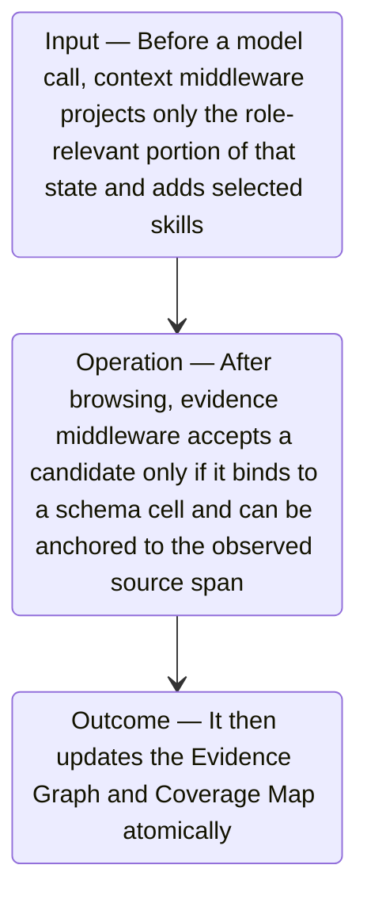

#### Python

```python
from html import escape
from pathlib import Path
from textwrap import wrap

title = "sos_mechanism_p2: Before a model call context middleware projects only the — input-operation-outcome storyboard"
items = [["Input","Before a model call, context middleware projects only the role-relevant portion of that state and adds selected skills",120,210],["Operation","After browsing, evidence middleware accepts a candidate only if it binds to a schema cell and can be anchored to the observed source span",290,210],["Outcome","It then updates the Evidence Graph and Coverage Map atomically",460,210]]
width = max(760, 240 + len(items) * 170)
parts = [
    f'<svg xmlns="http://www.w3.org/2000/svg" viewBox="0 0 {width} 460" role="img" aria-labelledby="title desc">',
    f'<title id="title">{escape(title)}</title>',
    '<desc id="desc">Input, operation, and outcome states follow the paragraph in source order.</desc>',
    f'<rect width="{width}" height="460" fill="white"/>',
]
for index in range(len(items)-1):
    _, _, x1, y1 = items[index]
    _, _, x2, y2 = items[index+1]
    parts.append(f'<line x1="{x1+65}" y1="{y1}" x2="{x2-65}" y2="{y2}" stroke="#345" stroke-width="2"/>')
for group, label, x, y in items:
    parts.append(f'<rect x="{x-65}" y="{y-90}" width="130" height="180" rx="16" fill="#eef6ff" stroke="#234"/>')
    parts.append(f'<text x="{x}" y="{y-60}" text-anchor="middle" font-family="sans-serif" font-size="13" font-weight="700">{escape(group)}</text>')
    for line_index, line in enumerate(wrap(label, width=18)):
        parts.append(f'<text x="{x}" y="{y-34+line_index*14}" text-anchor="middle" font-family="sans-serif" font-size="10">{escape(line)}</text>')
parts.append('</svg>')
Path("sos_mechanism_p2_treatment_c.svg").write_text("\n".join(parts), encoding="utf-8")
```

### Implementation record

- Status: `IMPLEMENTED`
- Selected treatment: `A`
- Selection rationale: Selected the approved relationship that directly answers this paragraph's explanatory job; the shared visual uses the same evidence and complete adjacent scope recorded here.
- Delivery medium: `CSS + semantic HTML`
- Visual ID and placement: `visual_searchos_control_loop` after `sos_mechanism_p3`; this record is served by that purpose-built figure.
- Shared paragraph scope: `sos_mechanism_p1`, `sos_mechanism_p2`, `sos_mechanism_p3`, `sos_example_p1`, `sos_example_p2`
- Changed files: `packages/test-fixtures/explainers/searchos-v1.json`, `apps/web/app/papers/[id]/explainer-visual.tsx`, `apps/web/app/papers/[id]/page.tsx`, and `apps/web/app/globals.css`
- Accessibility and fallback verification: Figure has a programmatic title and description, explicit alt text, equivalent fallback prose, source links, limitations, and a semantic static body; no meaning depends on motion or pointer input.
- Desktop and mobile verification: Verified in Playwright on 1440-pixel desktop and iPhone 13 mobile viewports; figures remain paragraph-adjacent, preserve reading order, and introduce no horizontal page overflow.
- Evidence deviations: `NONE`; web-native CSS and semantic HTML preserve the selected treatment's evidence, labels, topology, and stated boundaries.

## `sos_mechanism_p3`

- Location: `sos_mechanism`, paragraph 3
- Text anchor: "Sensor middleware measures changes in grounded coverage and evidence count, along with iteration, search, and time budgets."
- Claims and sources: `sos_socm` (OBSERVED, VERIFIED); `sos_middleware` (OBSERVED, VERIFIED); `sos_scheduler` (OBSERVED, VERIFIED); `sos_formulation_source` (Sections 2–3.2, Equations 1–10, Figure 2, PDF pages 3–6; the arXiv v1 record identifies the paper as CC BY 4.0); `sos_middleware_source` (Sections 3.3–3.4, Equations 11–18, Figures 3–4, PDF pages 7–9)
- Visual needed: `YES`
- Decision rationale: Removing a visual would require readers to retain the material relation between "Sensor middleware measures changes in grounded coverage and evidence count, along with iteration, search" and "Continuous dispatch assigns newly available slots to ready gaps instead of waiting for a synchronized batch" while also tracking 5 source-bounded propositions. The paragraph contains a real mechanism relation graph; the visual must preserve its stated conditions and must not add causal or proportional meaning.
- Explanatory job: mechanism relation graph.

### Treatment A — Sensor middleware measures changes in grounded coverage and evidence — mechanism relation graph

- Teaching purpose: Answer "How does a browser observation become shared, grounded progress?" by exposing the paragraph's 5 named propositions and 4 stated reading, comparison, or qualification relations.
- Encoding and reading order: Nodes reproduce the complete labels "Sensor middleware measures changes in grounded coverage and evidence count, along with iteration, search"; "and time budgets"; "It can continue execution, request backfill, inject a correction, enter drain-only mode"; "or stop a branch"; "Continuous dispatch assigns newly available slots to ready gaps instead of waiting for a synchronized batch". Edges carry the explicit relation labels "then", "bounded by", "then", "contrasts with"; arrow direction is sequence only for mechanism or example prose and otherwise denotes reading order.
- Evidence and limitations: The topology is derived from this paragraph rather than a fixed pipeline. Encode only `sos_socm`, `sos_middleware`, `sos_scheduler` and do not turn reading-order edges into causal claims.
- Recommended web medium: responsive inline SVG with CSS; JavaScript may add optional step focus only when state order matters.
- Mobile, accessibility, and motion behavior: Keep the full node-and-relation list in DOM order, expose the relation labels in the long description, stack nodes on narrow screens, and disable focus transitions under reduced motion.

#### TikZ

```tex
\documentclass[tikz,border=5pt]{standalone}
\usepackage[T1]{fontenc}
\usepackage{tikz}
\usetikzlibrary{arrows.meta,positioning}
\begin{document}
\begin{tikzpicture}[font=\sffamily,concept/.style={draw,rounded corners,align=center,text width=3.6cm,minimum height=1.35cm},link/.style={-{Latex[length=2mm]},thick},rel/.style={fill=white,font=\scriptsize,inner sep=2pt}]
\node[font=\bfseries,align=center] at (6.1,2.0) {sos\_mechanism\_p3: Sensor middleware measures changes in grounded coverage and evidence - mechanism relation graph};
\node[concept] (n1) at (1.8,0) {Sensor middleware measures changes in grounded coverage and evidence count, along with iteration, search};
\node[concept] (n2) at (6.1,0) {and time budgets};
\node[concept] (n3) at (10.4,0) {It can continue execution, request backfill, inject a correction, enter drain-only mode};
\node[concept] (n4) at (1.8,-3.2) {or stop a branch};
\node[concept] (n5) at (6.1,-3.2) {Continuous dispatch assigns newly available slots to ready gaps instead of waiting for a synchronized batch};
\draw[link] (n1) -- node[rel] {then} (n2);
\draw[link] (n2) -- node[rel] {bounded by} (n3);
\draw[link] (n3) -- node[rel] {then} (n4);
\draw[link] (n4) -- node[rel] {contrasts with} (n5);
\end{tikzpicture}
\end{document}
```

#### Mermaid

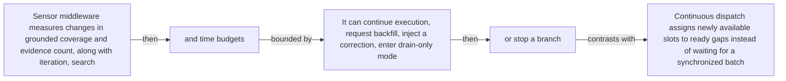

#### Python

```python
from html import escape
from pathlib import Path
from textwrap import wrap

title = "sos_mechanism_p3: Sensor middleware measures changes in grounded coverage and evidence — mechanism relation graph"
nodes = [["n1","Sensor middleware measures changes in grounded coverage and evidence count, along with iteration, search",120,150],["n2","and time budgets",420,150],["n3","It can continue execution, request backfill, inject a correction, enter drain-only mode",720,150],["n4","or stop a branch",120,340],["n5","Continuous dispatch assigns newly available slots to ready gaps instead of waiting for a synchronized batch",420,340]]
edges = [["n1","n2","then"],["n2","n3","bounded by"],["n3","n4","then"],["n4","n5","contrasts with"]]
node_by_id = {node_id: (label, x, y) for node_id, label, x, y in nodes}

parts = [
    '<svg xmlns="http://www.w3.org/2000/svg" viewBox="0 0 860 520" role="img" aria-labelledby="title desc">',
    f'<title id="title">{escape(title)}</title>',
    '<desc id="desc">The labeled relations reproduce only relationships stated in the paragraph.</desc>',
    '<rect width="860" height="520" fill="white"/>',
]
for source, target, relation in edges:
    _, x1, y1 = node_by_id[source]
    _, x2, y2 = node_by_id[target]
    parts.append(f'<line x1="{x1}" y1="{y1}" x2="{x2}" y2="{y2}" stroke="#345" stroke-width="2"/>')
    parts.append(f'<text x="{(x1+x2)/2}" y="{(y1+y2)/2-6}" text-anchor="middle" font-family="sans-serif" font-size="11">{escape(relation)}</text>')
for _, label, x, y in nodes:
    parts.append(f'<rect x="{x-125}" y="{y-58}" width="250" height="116" rx="14" fill="#eef6ff" stroke="#234"/>')
    for line_index, line in enumerate(wrap(label, width=32)):
        parts.append(f'<text x="{x}" y="{y-34+line_index*16}" text-anchor="middle" font-family="sans-serif" font-size="12">{escape(line)}</text>')
parts.append('</svg>')
Path("sos_mechanism_p3_treatment_a.svg").write_text("\n".join(parts), encoding="utf-8")
```

### Treatment B — sos_socm, sos_middleware, sos_scheduler — claim-to-source provenance

- Teaching purpose: Show exactly which atomic claims underwrite this paragraph and which fixed source records support each claim.
- Encoding and reading order: A bipartite graph places 3 claim nodes on the left and 2 source nodes on the right, with only the 4 claim-source edges recorded in the fixture. Claim labels include epistemic status; source labels include the exact locator.
- Evidence and limitations: This treatment explains provenance and uncertainty, not the paper's causal mechanism. Missing edges remain visibly absent and no source count is treated as confidence.
- Recommended web medium: semantic HTML/CSS claim-source table with an SVG network view; JavaScript only for keyboard-controlled source highlighting.
- Mobile, accessibility, and motion behavior: Provide real table headers and source links in the static fallback, make every edge recoverable as text, stack claim records before source records on mobile, and require no motion.

#### TikZ

```tex
\documentclass[tikz,border=5pt]{standalone}
\usepackage[T1]{fontenc}
\usepackage{tikz}
\usetikzlibrary{arrows.meta}
\begin{document}
\begin{tikzpicture}[font=\sffamily,claim/.style={draw,rounded corners,align=center,text width=5.2cm,minimum height=1.2cm},source/.style={draw,dashed,align=center,text width=5.2cm,minimum height=1.2cm},link/.style={-{Latex[length=2mm]},thin}]
\node[font=\bfseries] at (4,1.8) {sos\_mechanism\_p3: claim-to-source provenance};
\node[claim] (c1) at (0,0) {SOCM consists of Frontier Task, an Evidence Graph, a Coverage Map, and Failure Memory with role-specific projections. [OBSERVED]};
\node[claim] (c2) at (0,-2.4) {Evidence middleware accepts a browsing candidate only when it binds to a schema cell and anchors to a source span, then updates evidence and coverage atomically. [OBSERVED]};
\node[claim] (c3) at (0,-4.8) {Pipeline-parallel orchestration immediately assigns released execution slots to ready unresolved gaps instead of waiting for synchronized batches. [OBSERVED]};
\node[source] (s1) at (8,0) {SearchOS-V1 - relational formulation, SOCM, and orchestration - Sections 2-3.2, Equations 1-10, Figure 2, PDF pages 3-6; the arXiv v1 record identifies the paper as CC BY 4.0};
\node[source] (s2) at (8,-2.4) {SearchOS-V1 - middleware and hierarchical skills - Sections 3.3-3.4, Equations 11-18, Figures 3-4, PDF pages 7-9};
\draw[link] (c1) -- (s1);
\draw[link] (c2) -- (s2);
\draw[link] (c3) -- (s1);
\draw[link] (c3) -- (s2);
\end{tikzpicture}
\end{document}
```

#### Mermaid


#### Python

```python
from html import escape
from pathlib import Path
from textwrap import wrap

title = "sos_mechanism_p3: claim-to-source provenance"
nodes = [["c1","SOCM consists of Frontier Task, an Evidence Graph, a Coverage Map, and Failure Memory with role-specific projections. [OBSERVED]",190,130],["c2","Evidence middleware accepts a browsing candidate only when it binds to a schema cell and anchors to a source span, then updates evidence and coverage atomically. [OBSERVED]",190,250],["c3","Pipeline-parallel orchestration immediately assigns released execution slots to ready unresolved gaps instead of waiting for synchronized batches. [OBSERVED]",190,370],["s1","SearchOS-V1 — relational formulation, SOCM, and orchestration — Sections 2–3.2, Equations 1–10, Figure 2, PDF pages 3–6; the arXiv v1 record identifies the paper as CC BY 4.0",700,130],["s2","SearchOS-V1 — middleware and hierarchical skills — Sections 3.3–3.4, Equations 11–18, Figures 3–4, PDF pages 7–9",700,250]]
edges = [["c1","s1"],["c2","s2"],["c3","s1"],["c3","s2"]]
node_by_id = {node_id: (label, x, y) for node_id, label, x, y in nodes}
height = 560

parts = [
    f'<svg xmlns="http://www.w3.org/2000/svg" viewBox="0 0 900 {height}" role="img" aria-labelledby="title desc">',
    f'<title id="title">{escape(title)}</title>',
    '<desc id="desc">Bipartite map from verified claim records to their exact source records.</desc>',
    f'<rect width="900" height="{height}" fill="white"/>',
]
for source, target in edges:
    _, x1, y1 = node_by_id[source]
    _, x2, y2 = node_by_id[target]
    parts.append(f'<line x1="{x1+145}" y1="{y1}" x2="{x2-145}" y2="{y2}" stroke="#456" stroke-width="2"/>')
for node_id, label, x, y in nodes:
    dashed = ' stroke-dasharray="7 5"' if node_id.startswith("s") else ''
    parts.append(f'<rect x="{x-145}" y="{y-46}" width="290" height="92" rx="12" fill="#f7fbff" stroke="#234"{dashed}/>')
    for line_index, line in enumerate(wrap(label, width=38)):
        parts.append(f'<text x="{x}" y="{y-24+line_index*14}" text-anchor="middle" font-family="sans-serif" font-size="11">{escape(line)}</text>')
parts.append('</svg>')
Path("sos_mechanism_p3_treatment_b.svg").write_text("\n".join(parts), encoding="utf-8")
```

### Treatment C — Sensor middleware measures changes in grounded coverage and evidence — input-operation-outcome storyboard

- Teaching purpose: Let readers inspect the paragraph as concrete input, operation, and outcome states.
- Encoding and reading order: Use 5 ordered states labeled "Input: Sensor middleware measures changes in grounded coverage and evidence count, along with iteration, search", "Operation: and time budgets", "Operation: It can continue execution, request backfill, inject a correction, enter drain-only mode", "Operation: or stop a branch", "Outcome: Continuous dispatch assigns newly available slots to ready gaps instead of waiting for a synchronized batch". State connectors reproduce paragraph order and do not imply unreported timing.
- Evidence and limitations: The first, intermediate, and final states are paragraph clauses; no hidden state, quantity, or transition is added.
- Recommended web medium: responsive SVG or semantic HTML/CSS; JavaScript is optional only for a meaningful state or scope toggle.
- Mobile, accessibility, and motion behavior: Preserve every exact value or scope statement as selectable text, avoid color-only distinctions, stack groups on mobile, and keep all information visible when JavaScript or motion is disabled.

#### TikZ

```tex
\documentclass[tikz,border=5pt]{standalone}
\usepackage[T1]{fontenc}
\usepackage{tikz}
\begin{document}
\begin{tikzpicture}[font=\sffamily,state/.style={draw,rounded corners,align=center,text width=3.2cm,minimum height=1.8cm}]
\node[font=\bfseries] at (7.6,2) {sos\_mechanism\_p3: Sensor middleware measures changes in grounded coverage and evidence - input-operation-outcome storyboard};
\node[state] (k1) at (0,0) {\textbf{Input}\\Sensor middleware measures changes in grounded coverage and evidence count, along with iteration, search};
\node[state] (k2) at (3.8,0) {\textbf{Operation}\\and time budgets};
\node[state] (k3) at (7.6,0) {\textbf{Operation}\\It can continue execution, request backfill, inject a correction, enter drain-only mode};
\node[state] (k4) at (11.399999999999999,0) {\textbf{Operation}\\or stop a branch};
\node[state] (k5) at (15.2,0) {\textbf{Outcome}\\Continuous dispatch assigns newly available slots to ready gaps instead of waiting for a synchronized batch};
\draw[->,thick] (k1) -- (k2);
\draw[->,thick] (k2) -- (k3);
\draw[->,thick] (k3) -- (k4);
\draw[->,thick] (k4) -- (k5);
\end{tikzpicture}
\end{document}
```

#### Mermaid

```mermaid
stateDiagram-v2
  state "Input — Sensor middleware measures changes in grounded coverage and evidence count, along with iteration, search" as k1
  state "Operation — and time budgets" as k2
  state "Operation — It can continue execution, request backfill, inject a correction, enter drain-only mode" as k3
  state "Operation — or stop a branch" as k4
  state "Outcome — Continuous dispatch assigns newly available slots to ready gaps instead of waiting for a synchronized batch" as k5
  k1 --> k2
  k2 --> k3
  k3 --> k4
  k4 --> k5
```

#### Python

```python
from html import escape
from pathlib import Path
from textwrap import wrap

title = "sos_mechanism_p3: Sensor middleware measures changes in grounded coverage and evidence — input-operation-outcome storyboard"
items = [["Input","Sensor middleware measures changes in grounded coverage and evidence count, along with iteration, search",120,210],["Operation","and time budgets",290,210],["Operation","It can continue execution, request backfill, inject a correction, enter drain-only mode",460,210],["Operation","or stop a branch",630,210],["Outcome","Continuous dispatch assigns newly available slots to ready gaps instead of waiting for a synchronized batch",800,210]]
width = max(760, 240 + len(items) * 170)
parts = [
    f'<svg xmlns="http://www.w3.org/2000/svg" viewBox="0 0 {width} 460" role="img" aria-labelledby="title desc">',
    f'<title id="title">{escape(title)}</title>',
    '<desc id="desc">Input, operation, and outcome states follow the paragraph in source order.</desc>',
    f'<rect width="{width}" height="460" fill="white"/>',
]
for index in range(len(items)-1):
    _, _, x1, y1 = items[index]
    _, _, x2, y2 = items[index+1]
    parts.append(f'<line x1="{x1+65}" y1="{y1}" x2="{x2-65}" y2="{y2}" stroke="#345" stroke-width="2"/>')
for group, label, x, y in items:
    parts.append(f'<rect x="{x-65}" y="{y-90}" width="130" height="180" rx="16" fill="#eef6ff" stroke="#234"/>')
    parts.append(f'<text x="{x}" y="{y-60}" text-anchor="middle" font-family="sans-serif" font-size="13" font-weight="700">{escape(group)}</text>')
    for line_index, line in enumerate(wrap(label, width=18)):
        parts.append(f'<text x="{x}" y="{y-34+line_index*14}" text-anchor="middle" font-family="sans-serif" font-size="10">{escape(line)}</text>')
parts.append('</svg>')
Path("sos_mechanism_p3_treatment_c.svg").write_text("\n".join(parts), encoding="utf-8")
```

### Implementation record

- Status: `IMPLEMENTED`
- Selected treatment: `A`
- Selection rationale: Selected the approved relationship that directly answers this paragraph's explanatory job; the shared visual uses the same evidence and complete adjacent scope recorded here.
- Delivery medium: `CSS + semantic HTML`
- Visual ID and placement: `visual_searchos_control_loop` after `sos_mechanism_p3`; this record is served by that purpose-built figure.
- Shared paragraph scope: `sos_mechanism_p1`, `sos_mechanism_p2`, `sos_mechanism_p3`, `sos_example_p1`, `sos_example_p2`
- Changed files: `packages/test-fixtures/explainers/searchos-v1.json`, `apps/web/app/papers/[id]/explainer-visual.tsx`, `apps/web/app/papers/[id]/page.tsx`, and `apps/web/app/globals.css`
- Accessibility and fallback verification: Figure has a programmatic title and description, explicit alt text, equivalent fallback prose, source links, limitations, and a semantic static body; no meaning depends on motion or pointer input.
- Desktop and mobile verification: Verified in Playwright on 1440-pixel desktop and iPhone 13 mobile viewports; figures remain paragraph-adjacent, preserve reading order, and introduce no horizontal page overflow.
- Evidence deviations: `NONE`; web-native CSS and semantic HTML preserve the selected treatment's evidence, labels, topology, and stated boundaries.

## `sos_example_p1`

- Location: `sos_example`, paragraph 1
- Text anchor: "Suppose a comparison request has a known company row but no verified value for one attribute."
- Claims and sources: `sos_schema` (OBSERVED, VERIFIED); `sos_middleware` (OBSERVED, VERIFIED); `sos_scheduler` (OBSERVED, VERIFIED); `sos_skills` (OBSERVED, VERIFIED); `sos_formulation_source` (Sections 2–3.2, Equations 1–10, Figure 2, PDF pages 3–6; the arXiv v1 record identifies the paper as CC BY 4.0); `sos_middleware_source` (Sections 3.3–3.4, Equations 11–18, Figures 3–4, PDF pages 7–9)
- Visual needed: `YES`
- Decision rationale: Removing a visual would require readers to retain the material relation between "Suppose a comparison request has a known company row but no verified value for one attribute" and "and continuous dispatch sends it to an available search agent with relevant failure records and source-access skills" while also tracking 4 source-bounded propositions. The paragraph contains a real example state path; the visual must preserve its stated conditions and must not add causal or proportional meaning.
- Explanatory job: example state path.

### Treatment A — Suppose a comparison request has a known company row — example state path

- Teaching purpose: Answer "What happens when one requested table cell is still missing?" by exposing the paragraph's 4 named propositions and 3 stated reading, comparison, or qualification relations.
- Encoding and reading order: Nodes reproduce the complete labels "Suppose a comparison request has a known company row but no verified value for one attribute"; "The Coverage Map marks that cell missing"; "Frontier Task creates or selects a scoped job for the cell"; "and continuous dispatch sends it to an available search agent with relevant failure records and source-access skills". Edges carry the explicit relation labels "then", "then", "then"; arrow direction is sequence only for mechanism or example prose and otherwise denotes reading order.
- Evidence and limitations: The topology is derived from this paragraph rather than a fixed pipeline. Encode only `sos_schema`, `sos_middleware`, `sos_scheduler`, `sos_skills` and do not turn reading-order edges into causal claims.
- Recommended web medium: responsive inline SVG with CSS; JavaScript may add optional step focus only when state order matters.
- Mobile, accessibility, and motion behavior: Keep the full node-and-relation list in DOM order, expose the relation labels in the long description, stack nodes on narrow screens, and disable focus transitions under reduced motion.

#### TikZ

```tex
\documentclass[tikz,border=5pt]{standalone}
\usepackage[T1]{fontenc}
\usepackage{tikz}
\usetikzlibrary{arrows.meta,positioning}
\begin{document}
\begin{tikzpicture}[font=\sffamily,concept/.style={draw,rounded corners,align=center,text width=3.6cm,minimum height=1.35cm},link/.style={-{Latex[length=2mm]},thick},rel/.style={fill=white,font=\scriptsize,inner sep=2pt}]
\node[font=\bfseries,align=center] at (6.1,2.0) {sos\_example\_p1: Suppose a comparison request has a known company row - example state path};
\node[concept] (n1) at (1.8,0) {Suppose a comparison request has a known company row but no verified value for one attribute};
\node[concept] (n2) at (6.1,0) {The Coverage Map marks that cell missing};
\node[concept] (n3) at (10.4,0) {Frontier Task creates or selects a scoped job for the cell};
\node[concept] (n4) at (1.8,-3.2) {and continuous dispatch sends it to an available search agent with relevant failure records and source-access skills};
\draw[link] (n1) -- node[rel] {then} (n2);
\draw[link] (n2) -- node[rel] {then} (n3);
\draw[link] (n3) -- node[rel] {then} (n4);
\end{tikzpicture}
\end{document}
```

#### Mermaid

```mermaid
flowchart LR
  n1["Suppose a comparison request has a known company row but no verified value for one attribute"]
  n2["The Coverage Map marks that cell missing"]
  n3["Frontier Task creates or selects a scoped job for the cell"]
  n4["and continuous dispatch sends it to an available search agent with relevant failure records and source-access skills"]
  n1 -->|"then"| n2
  n2 -->|"then"| n3
  n3 -->|"then"| n4
```

#### Python

```python
from html import escape
from pathlib import Path
from textwrap import wrap

title = "sos_example_p1: Suppose a comparison request has a known company row — example state path"
nodes = [["n1","Suppose a comparison request has a known company row but no verified value for one attribute",120,150],["n2","The Coverage Map marks that cell missing",420,150],["n3","Frontier Task creates or selects a scoped job for the cell",720,150],["n4","and continuous dispatch sends it to an available search agent with relevant failure records and source-access skills",120,340]]
edges = [["n1","n2","then"],["n2","n3","then"],["n3","n4","then"]]
node_by_id = {node_id: (label, x, y) for node_id, label, x, y in nodes}

parts = [
    '<svg xmlns="http://www.w3.org/2000/svg" viewBox="0 0 860 520" role="img" aria-labelledby="title desc">',
    f'<title id="title">{escape(title)}</title>',
    '<desc id="desc">The labeled relations reproduce only relationships stated in the paragraph.</desc>',
    '<rect width="860" height="520" fill="white"/>',
]
for source, target, relation in edges:
    _, x1, y1 = node_by_id[source]
    _, x2, y2 = node_by_id[target]
    parts.append(f'<line x1="{x1}" y1="{y1}" x2="{x2}" y2="{y2}" stroke="#345" stroke-width="2"/>')
    parts.append(f'<text x="{(x1+x2)/2}" y="{(y1+y2)/2-6}" text-anchor="middle" font-family="sans-serif" font-size="11">{escape(relation)}</text>')
for _, label, x, y in nodes:
    parts.append(f'<rect x="{x-125}" y="{y-58}" width="250" height="116" rx="14" fill="#eef6ff" stroke="#234"/>')
    for line_index, line in enumerate(wrap(label, width=32)):
        parts.append(f'<text x="{x}" y="{y-34+line_index*16}" text-anchor="middle" font-family="sans-serif" font-size="12">{escape(line)}</text>')
parts.append('</svg>')
Path("sos_example_p1_treatment_a.svg").write_text("\n".join(parts), encoding="utf-8")
```

### Treatment B — sos_schema, sos_middleware, sos_scheduler, sos_skills — claim-to-source provenance

- Teaching purpose: Show exactly which atomic claims underwrite this paragraph and which fixed source records support each claim.
- Encoding and reading order: A bipartite graph places 4 claim nodes on the left and 2 source nodes on the right, with only the 5 claim-source edges recorded in the fixture. Claim labels include epistemic status; source labels include the exact locator.
- Evidence and limitations: This treatment explains provenance and uncertainty, not the paper's causal mechanism. Missing edges remain visibly absent and no source count is treated as confidence.
- Recommended web medium: semantic HTML/CSS claim-source table with an SVG network view; JavaScript only for keyboard-controlled source highlighting.
- Mobile, accessibility, and motion behavior: Provide real table headers and source links in the static fallback, make every edge recoverable as text, stack claim records before source records on mobile, and require no motion.

#### TikZ

```tex
\documentclass[tikz,border=5pt]{standalone}
\usepackage[T1]{fontenc}
\usepackage{tikz}
\usetikzlibrary{arrows.meta}
\begin{document}
\begin{tikzpicture}[font=\sffamily,claim/.style={draw,rounded corners,align=center,text width=5.2cm,minimum height=1.2cm},source/.style={draw,dashed,align=center,text width=5.2cm,minimum height=1.2cm},link/.style={-{Latex[length=2mm]},thin}]
\node[font=\bfseries] at (4,1.8) {sos\_example\_p1: claim-to-source provenance};
\node[claim] (c1) at (0,0) {SearchOS represents a request as relational schema completion and associates each populated value with a source URL and anchored excerpt. [OBSERVED]};
\node[claim] (c2) at (0,-2.4) {Evidence middleware accepts a browsing candidate only when it binds to a schema cell and anchors to a source span, then updates evidence and coverage atomically. [OBSERVED]};
\node[claim] (c3) at (0,-4.8) {Pipeline-parallel orchestration immediately assigns released execution slots to ready unresolved gaps instead of waiting for synchronized batches. [OBSERVED]};
\node[claim] (c4) at (0,-7.199999999999999) {SearchOS-V1 contains 280 orchestrator, strategy, and access skills selected according to task and source. [OBSERVED]};
\node[source] (s1) at (8,0) {SearchOS-V1 - relational formulation, SOCM, and orchestration - Sections 2-3.2, Equations 1-10, Figure 2, PDF pages 3-6; the arXiv v1 record identifies the paper as CC BY 4.0};
\node[source] (s2) at (8,-2.4) {SearchOS-V1 - middleware and hierarchical skills - Sections 3.3-3.4, Equations 11-18, Figures 3-4, PDF pages 7-9};
\draw[link] (c1) -- (s1);
\draw[link] (c2) -- (s2);
\draw[link] (c3) -- (s1);
\draw[link] (c3) -- (s2);
\draw[link] (c4) -- (s2);
\end{tikzpicture}
\end{document}
```

#### Mermaid

```mermaid
flowchart LR
  subgraph Claims
  c1["SearchOS represents a request as relational schema completion and associates each populated value with a source URL and anchored excerpt. OBSERVED"]
  c2["Evidence middleware accepts a browsing candidate only when it binds to a schema cell and anchors to a source span, then updates evidence and coverage atomically. OBSERVED"]
  c3["Pipeline-parallel orchestration immediately assigns released execution slots to ready unresolved gaps instead of waiting for synchronized batches. OBSERVED"]
  c4["SearchOS-V1 contains 280 orchestrator, strategy, and access skills selected according to task and source. OBSERVED"]
  end
  subgraph Sources
  s1[/"SearchOS-V1 — relational formulation, SOCM, and orchestration — Sections 2–3.2, Equations 1–10, Figure 2, PDF pages 3–6; the arXiv v1 record identifies the paper as CC BY 4.0"/]
  s2[/"SearchOS-V1 — middleware and hierarchical skills — Sections 3.3–3.4, Equations 11–18, Figures 3–4, PDF pages 7–9"/]
  end
  c1 -->|"supported at"| s1
  c2 -->|"supported at"| s2
  c3 -->|"supported at"| s1
  c3 -->|"supported at"| s2
  c4 -->|"supported at"| s2
```

#### Python

```python
from html import escape
from pathlib import Path
from textwrap import wrap

title = "sos_example_p1: claim-to-source provenance"
nodes = [["c1","SearchOS represents a request as relational schema completion and associates each populated value with a source URL and anchored excerpt. [OBSERVED]",190,130],["c2","Evidence middleware accepts a browsing candidate only when it binds to a schema cell and anchors to a source span, then updates evidence and coverage atomically. [OBSERVED]",190,250],["c3","Pipeline-parallel orchestration immediately assigns released execution slots to ready unresolved gaps instead of waiting for synchronized batches. [OBSERVED]",190,370],["c4","SearchOS-V1 contains 280 orchestrator, strategy, and access skills selected according to task and source. [OBSERVED]",190,490],["s1","SearchOS-V1 — relational formulation, SOCM, and orchestration — Sections 2–3.2, Equations 1–10, Figure 2, PDF pages 3–6; the arXiv v1 record identifies the paper as CC BY 4.0",700,130],["s2","SearchOS-V1 — middleware and hierarchical skills — Sections 3.3–3.4, Equations 11–18, Figures 3–4, PDF pages 7–9",700,250]]
edges = [["c1","s1"],["c2","s2"],["c3","s1"],["c3","s2"],["c4","s2"]]
node_by_id = {node_id: (label, x, y) for node_id, label, x, y in nodes}
height = 680

parts = [
    f'<svg xmlns="http://www.w3.org/2000/svg" viewBox="0 0 900 {height}" role="img" aria-labelledby="title desc">',
    f'<title id="title">{escape(title)}</title>',
    '<desc id="desc">Bipartite map from verified claim records to their exact source records.</desc>',
    f'<rect width="900" height="{height}" fill="white"/>',
]
for source, target in edges:
    _, x1, y1 = node_by_id[source]
    _, x2, y2 = node_by_id[target]
    parts.append(f'<line x1="{x1+145}" y1="{y1}" x2="{x2-145}" y2="{y2}" stroke="#456" stroke-width="2"/>')
for node_id, label, x, y in nodes:
    dashed = ' stroke-dasharray="7 5"' if node_id.startswith("s") else ''
    parts.append(f'<rect x="{x-145}" y="{y-46}" width="290" height="92" rx="12" fill="#f7fbff" stroke="#234"{dashed}/>')
    for line_index, line in enumerate(wrap(label, width=38)):
        parts.append(f'<text x="{x}" y="{y-24+line_index*14}" text-anchor="middle" font-family="sans-serif" font-size="11">{escape(line)}</text>')
parts.append('</svg>')
Path("sos_example_p1_treatment_b.svg").write_text("\n".join(parts), encoding="utf-8")
```

### Treatment C — Suppose a comparison request has a known company row — input-operation-outcome storyboard

- Teaching purpose: Let readers inspect the paragraph as concrete input, operation, and outcome states.
- Encoding and reading order: Use 4 ordered states labeled "Input: Suppose a comparison request has a known company row but no verified value for one attribute", "Operation: The Coverage Map marks that cell missing", "Operation: Frontier Task creates or selects a scoped job for the cell", "Outcome: and continuous dispatch sends it to an available search agent with relevant failure records and source-access skills". State connectors reproduce paragraph order and do not imply unreported timing.
- Evidence and limitations: The first, intermediate, and final states are paragraph clauses; no hidden state, quantity, or transition is added.
- Recommended web medium: responsive SVG or semantic HTML/CSS; JavaScript is optional only for a meaningful state or scope toggle.
- Mobile, accessibility, and motion behavior: Preserve every exact value or scope statement as selectable text, avoid color-only distinctions, stack groups on mobile, and keep all information visible when JavaScript or motion is disabled.

#### TikZ

```tex
\documentclass[tikz,border=5pt]{standalone}
\usepackage[T1]{fontenc}
\usepackage{tikz}
\begin{document}
\begin{tikzpicture}[font=\sffamily,state/.style={draw,rounded corners,align=center,text width=3.2cm,minimum height=1.8cm}]
\node[font=\bfseries] at (5.699999999999999,2) {sos\_example\_p1: Suppose a comparison request has a known company row - input-operation-outcome storyboard};
\node[state] (k1) at (0,0) {\textbf{Input}\\Suppose a comparison request has a known company row but no verified value for one attribute};
\node[state] (k2) at (3.8,0) {\textbf{Operation}\\The Coverage Map marks that cell missing};
\node[state] (k3) at (7.6,0) {\textbf{Operation}\\Frontier Task creates or selects a scoped job for the cell};
\node[state] (k4) at (11.399999999999999,0) {\textbf{Outcome}\\and continuous dispatch sends it to an available search agent with relevant failure records and source-access skills};
\draw[->,thick] (k1) -- (k2);
\draw[->,thick] (k2) -- (k3);
\draw[->,thick] (k3) -- (k4);
\end{tikzpicture}
\end{document}
```

#### Mermaid

```mermaid
stateDiagram-v2
  state "Input — Suppose a comparison request has a known company row but no verified value for one attribute" as k1
  state "Operation — The Coverage Map marks that cell missing" as k2
  state "Operation — Frontier Task creates or selects a scoped job for the cell" as k3
  state "Outcome — and continuous dispatch sends it to an available search agent with relevant failure records and source-access skills" as k4
  k1 --> k2
  k2 --> k3
  k3 --> k4
```

#### Python

```python
from html import escape
from pathlib import Path
from textwrap import wrap

title = "sos_example_p1: Suppose a comparison request has a known company row — input-operation-outcome storyboard"
items = [["Input","Suppose a comparison request has a known company row but no verified value for one attribute",120,210],["Operation","The Coverage Map marks that cell missing",290,210],["Operation","Frontier Task creates or selects a scoped job for the cell",460,210],["Outcome","and continuous dispatch sends it to an available search agent with relevant failure records and source-access skills",630,210]]
width = max(760, 240 + len(items) * 170)
parts = [
    f'<svg xmlns="http://www.w3.org/2000/svg" viewBox="0 0 {width} 460" role="img" aria-labelledby="title desc">',
    f'<title id="title">{escape(title)}</title>',
    '<desc id="desc">Input, operation, and outcome states follow the paragraph in source order.</desc>',
    f'<rect width="{width}" height="460" fill="white"/>',
]
for index in range(len(items)-1):
    _, _, x1, y1 = items[index]
    _, _, x2, y2 = items[index+1]
    parts.append(f'<line x1="{x1+65}" y1="{y1}" x2="{x2-65}" y2="{y2}" stroke="#345" stroke-width="2"/>')
for group, label, x, y in items:
    parts.append(f'<rect x="{x-65}" y="{y-90}" width="130" height="180" rx="16" fill="#eef6ff" stroke="#234"/>')
    parts.append(f'<text x="{x}" y="{y-60}" text-anchor="middle" font-family="sans-serif" font-size="13" font-weight="700">{escape(group)}</text>')
    for line_index, line in enumerate(wrap(label, width=18)):
        parts.append(f'<text x="{x}" y="{y-34+line_index*14}" text-anchor="middle" font-family="sans-serif" font-size="10">{escape(line)}</text>')
parts.append('</svg>')
Path("sos_example_p1_treatment_c.svg").write_text("\n".join(parts), encoding="utf-8")
```

### Implementation record

- Status: `IMPLEMENTED`
- Selected treatment: `A`
- Selection rationale: Selected the approved relationship that directly answers this paragraph's explanatory job; the shared visual uses the same evidence and complete adjacent scope recorded here.
- Delivery medium: `CSS + semantic HTML`
- Visual ID and placement: `visual_searchos_control_loop` after `sos_mechanism_p3`; this record is served by that purpose-built figure.
- Shared paragraph scope: `sos_mechanism_p1`, `sos_mechanism_p2`, `sos_mechanism_p3`, `sos_example_p1`, `sos_example_p2`
- Changed files: `packages/test-fixtures/explainers/searchos-v1.json`, `apps/web/app/papers/[id]/explainer-visual.tsx`, `apps/web/app/papers/[id]/page.tsx`, and `apps/web/app/globals.css`
- Accessibility and fallback verification: Figure has a programmatic title and description, explicit alt text, equivalent fallback prose, source links, limitations, and a semantic static body; no meaning depends on motion or pointer input.
- Desktop and mobile verification: Verified in Playwright on 1440-pixel desktop and iPhone 13 mobile viewports; figures remain paragraph-adjacent, preserve reading order, and introduce no horizontal page overflow.
- Evidence deviations: `NONE`; web-native CSS and semantic HTML preserve the selected treatment's evidence, labels, topology, and stated boundaries.

## `sos_example_p2`

- Location: `sos_example`, paragraph 2
- Text anchor: "A page visit alone does not fill the cell."
- Claims and sources: `sos_schema` (OBSERVED, VERIFIED); `sos_middleware` (OBSERVED, VERIFIED); `sos_scheduler` (OBSERVED, VERIFIED); `sos_skills` (OBSERVED, VERIFIED); `sos_formulation_source` (Sections 2–3.2, Equations 1–10, Figure 2, PDF pages 3–6; the arXiv v1 record identifies the paper as CC BY 4.0); `sos_middleware_source` (Sections 3.3–3.4, Equations 11–18, Figures 3–4, PDF pages 7–9)
- Visual needed: `YES`
- Decision rationale: Removing a visual would require readers to retain the material relation between "A page visit alone does not fill the cell" and "If repeated calls produce no new evidence or coverage, the sensor can redirect or stop the branch rather than letting the model repeat the same search" while also tracking 5 source-bounded propositions. The paragraph contains a real example state path; the visual must preserve its stated conditions and must not add causal or proportional meaning.
- Explanatory job: example state path.

### Treatment A — A page visit alone does not fill the cell — example state path

- Teaching purpose: Answer "What happens when one requested table cell is still missing?" by exposing the paragraph's 5 named propositions and 4 stated reading, comparison, or qualification relations.
- Encoding and reading order: Nodes reproduce the complete labels "A page visit alone does not fill the cell"; "Evidence middleware must extract a candidate value, bind it to the correct row and attribute"; "and anchor it to a supporting span"; "Once accepted, the evidence and coverage records update together"; "If repeated calls produce no new evidence or coverage, the sensor can redirect or stop the branch rather than letting the model repeat the same search". Edges carry the explicit relation labels "then", "then", "then", "contrasts with"; arrow direction is sequence only for mechanism or example prose and otherwise denotes reading order.
- Evidence and limitations: The topology is derived from this paragraph rather than a fixed pipeline. Encode only `sos_schema`, `sos_middleware`, `sos_scheduler`, `sos_skills` and do not turn reading-order edges into causal claims.
- Recommended web medium: responsive inline SVG with CSS; JavaScript may add optional step focus only when state order matters.
- Mobile, accessibility, and motion behavior: Keep the full node-and-relation list in DOM order, expose the relation labels in the long description, stack nodes on narrow screens, and disable focus transitions under reduced motion.

#### TikZ

```tex
\documentclass[tikz,border=5pt]{standalone}
\usepackage[T1]{fontenc}
\usepackage{tikz}
\usetikzlibrary{arrows.meta,positioning}
\begin{document}
\begin{tikzpicture}[font=\sffamily,concept/.style={draw,rounded corners,align=center,text width=3.6cm,minimum height=1.35cm},link/.style={-{Latex[length=2mm]},thick},rel/.style={fill=white,font=\scriptsize,inner sep=2pt}]
\node[font=\bfseries,align=center] at (6.1,2.0) {sos\_example\_p2: A page visit alone does not fill the cell - example state path};
\node[concept] (n1) at (1.8,0) {A page visit alone does not fill the cell};
\node[concept] (n2) at (6.1,0) {Evidence middleware must extract a candidate value, bind it to the correct row and attribute};
\node[concept] (n3) at (10.4,0) {and anchor it to a supporting span};
\node[concept] (n4) at (1.8,-3.2) {Once accepted, the evidence and coverage records update together};
\node[concept] (n5) at (6.1,-3.2) {If repeated calls produce no new evidence or coverage, the sensor can redirect or stop the branch rather than letting the model repeat the same search};
\draw[link] (n1) -- node[rel] {then} (n2);
\draw[link] (n2) -- node[rel] {then} (n3);
\draw[link] (n3) -- node[rel] {then} (n4);
\draw[link] (n4) -- node[rel] {contrasts with} (n5);
\end{tikzpicture}
\end{document}
```

#### Mermaid

```mermaid
flowchart LR
  n1["A page visit alone does not fill the cell"]
  n2["Evidence middleware must extract a candidate value, bind it to the correct row and attribute"]
  n3["and anchor it to a supporting span"]
  n4["Once accepted, the evidence and coverage records update together"]
  n5["If repeated calls produce no new evidence or coverage, the sensor can redirect or stop the branch rather than letting the model repeat the same search"]
  n1 -->|"then"| n2
  n2 -->|"then"| n3
  n3 -->|"then"| n4
  n4 -->|"contrasts with"| n5
```

#### Python

```python
from html import escape
from pathlib import Path
from textwrap import wrap

title = "sos_example_p2: A page visit alone does not fill the cell — example state path"
nodes = [["n1","A page visit alone does not fill the cell",120,150],["n2","Evidence middleware must extract a candidate value, bind it to the correct row and attribute",420,150],["n3","and anchor it to a supporting span",720,150],["n4","Once accepted, the evidence and coverage records update together",120,340],["n5","If repeated calls produce no new evidence or coverage, the sensor can redirect or stop the branch rather than letting the model repeat the same search",420,340]]
edges = [["n1","n2","then"],["n2","n3","then"],["n3","n4","then"],["n4","n5","contrasts with"]]
node_by_id = {node_id: (label, x, y) for node_id, label, x, y in nodes}

parts = [
    '<svg xmlns="http://www.w3.org/2000/svg" viewBox="0 0 860 520" role="img" aria-labelledby="title desc">',
    f'<title id="title">{escape(title)}</title>',
    '<desc id="desc">The labeled relations reproduce only relationships stated in the paragraph.</desc>',
    '<rect width="860" height="520" fill="white"/>',
]
for source, target, relation in edges:
    _, x1, y1 = node_by_id[source]
    _, x2, y2 = node_by_id[target]
    parts.append(f'<line x1="{x1}" y1="{y1}" x2="{x2}" y2="{y2}" stroke="#345" stroke-width="2"/>')
    parts.append(f'<text x="{(x1+x2)/2}" y="{(y1+y2)/2-6}" text-anchor="middle" font-family="sans-serif" font-size="11">{escape(relation)}</text>')
for _, label, x, y in nodes:
    parts.append(f'<rect x="{x-125}" y="{y-58}" width="250" height="116" rx="14" fill="#eef6ff" stroke="#234"/>')
    for line_index, line in enumerate(wrap(label, width=32)):
        parts.append(f'<text x="{x}" y="{y-34+line_index*16}" text-anchor="middle" font-family="sans-serif" font-size="12">{escape(line)}</text>')
parts.append('</svg>')
Path("sos_example_p2_treatment_a.svg").write_text("\n".join(parts), encoding="utf-8")
```

### Treatment B — sos_schema, sos_middleware, sos_scheduler, sos_skills — claim-to-source provenance

- Teaching purpose: Show exactly which atomic claims underwrite this paragraph and which fixed source records support each claim.
- Encoding and reading order: A bipartite graph places 4 claim nodes on the left and 2 source nodes on the right, with only the 5 claim-source edges recorded in the fixture. Claim labels include epistemic status; source labels include the exact locator.
- Evidence and limitations: This treatment explains provenance and uncertainty, not the paper's causal mechanism. Missing edges remain visibly absent and no source count is treated as confidence.
- Recommended web medium: semantic HTML/CSS claim-source table with an SVG network view; JavaScript only for keyboard-controlled source highlighting.
- Mobile, accessibility, and motion behavior: Provide real table headers and source links in the static fallback, make every edge recoverable as text, stack claim records before source records on mobile, and require no motion.

#### TikZ

```tex
\documentclass[tikz,border=5pt]{standalone}
\usepackage[T1]{fontenc}
\usepackage{tikz}
\usetikzlibrary{arrows.meta}
\begin{document}
\begin{tikzpicture}[font=\sffamily,claim/.style={draw,rounded corners,align=center,text width=5.2cm,minimum height=1.2cm},source/.style={draw,dashed,align=center,text width=5.2cm,minimum height=1.2cm},link/.style={-{Latex[length=2mm]},thin}]
\node[font=\bfseries] at (4,1.8) {sos\_example\_p2: claim-to-source provenance};
\node[claim] (c1) at (0,0) {SearchOS represents a request as relational schema completion and associates each populated value with a source URL and anchored excerpt. [OBSERVED]};
\node[claim] (c2) at (0,-2.4) {Evidence middleware accepts a browsing candidate only when it binds to a schema cell and anchors to a source span, then updates evidence and coverage atomically. [OBSERVED]};
\node[claim] (c3) at (0,-4.8) {Pipeline-parallel orchestration immediately assigns released execution slots to ready unresolved gaps instead of waiting for synchronized batches. [OBSERVED]};
\node[claim] (c4) at (0,-7.199999999999999) {SearchOS-V1 contains 280 orchestrator, strategy, and access skills selected according to task and source. [OBSERVED]};
\node[source] (s1) at (8,0) {SearchOS-V1 - relational formulation, SOCM, and orchestration - Sections 2-3.2, Equations 1-10, Figure 2, PDF pages 3-6; the arXiv v1 record identifies the paper as CC BY 4.0};
\node[source] (s2) at (8,-2.4) {SearchOS-V1 - middleware and hierarchical skills - Sections 3.3-3.4, Equations 11-18, Figures 3-4, PDF pages 7-9};
\draw[link] (c1) -- (s1);
\draw[link] (c2) -- (s2);
\draw[link] (c3) -- (s1);
\draw[link] (c3) -- (s2);
\draw[link] (c4) -- (s2);
\end{tikzpicture}
\end{document}
```

#### Mermaid

```mermaid
flowchart LR
  subgraph Claims
  c1["SearchOS represents a request as relational schema completion and associates each populated value with a source URL and anchored excerpt. OBSERVED"]
  c2["Evidence middleware accepts a browsing candidate only when it binds to a schema cell and anchors to a source span, then updates evidence and coverage atomically. OBSERVED"]
  c3["Pipeline-parallel orchestration immediately assigns released execution slots to ready unresolved gaps instead of waiting for synchronized batches. OBSERVED"]
  c4["SearchOS-V1 contains 280 orchestrator, strategy, and access skills selected according to task and source. OBSERVED"]
  end
  subgraph Sources
  s1[/"SearchOS-V1 — relational formulation, SOCM, and orchestration — Sections 2–3.2, Equations 1–10, Figure 2, PDF pages 3–6; the arXiv v1 record identifies the paper as CC BY 4.0"/]
  s2[/"SearchOS-V1 — middleware and hierarchical skills — Sections 3.3–3.4, Equations 11–18, Figures 3–4, PDF pages 7–9"/]
  end
  c1 -->|"supported at"| s1
  c2 -->|"supported at"| s2
  c3 -->|"supported at"| s1
  c3 -->|"supported at"| s2
  c4 -->|"supported at"| s2
```

#### Python

```python
from html import escape
from pathlib import Path
from textwrap import wrap

title = "sos_example_p2: claim-to-source provenance"
nodes = [["c1","SearchOS represents a request as relational schema completion and associates each populated value with a source URL and anchored excerpt. [OBSERVED]",190,130],["c2","Evidence middleware accepts a browsing candidate only when it binds to a schema cell and anchors to a source span, then updates evidence and coverage atomically. [OBSERVED]",190,250],["c3","Pipeline-parallel orchestration immediately assigns released execution slots to ready unresolved gaps instead of waiting for synchronized batches. [OBSERVED]",190,370],["c4","SearchOS-V1 contains 280 orchestrator, strategy, and access skills selected according to task and source. [OBSERVED]",190,490],["s1","SearchOS-V1 — relational formulation, SOCM, and orchestration — Sections 2–3.2, Equations 1–10, Figure 2, PDF pages 3–6; the arXiv v1 record identifies the paper as CC BY 4.0",700,130],["s2","SearchOS-V1 — middleware and hierarchical skills — Sections 3.3–3.4, Equations 11–18, Figures 3–4, PDF pages 7–9",700,250]]
edges = [["c1","s1"],["c2","s2"],["c3","s1"],["c3","s2"],["c4","s2"]]
node_by_id = {node_id: (label, x, y) for node_id, label, x, y in nodes}
height = 680

parts = [
    f'<svg xmlns="http://www.w3.org/2000/svg" viewBox="0 0 900 {height}" role="img" aria-labelledby="title desc">',
    f'<title id="title">{escape(title)}</title>',
    '<desc id="desc">Bipartite map from verified claim records to their exact source records.</desc>',
    f'<rect width="900" height="{height}" fill="white"/>',
]
for source, target in edges:
    _, x1, y1 = node_by_id[source]
    _, x2, y2 = node_by_id[target]
    parts.append(f'<line x1="{x1+145}" y1="{y1}" x2="{x2-145}" y2="{y2}" stroke="#456" stroke-width="2"/>')
for node_id, label, x, y in nodes:
    dashed = ' stroke-dasharray="7 5"' if node_id.startswith("s") else ''
    parts.append(f'<rect x="{x-145}" y="{y-46}" width="290" height="92" rx="12" fill="#f7fbff" stroke="#234"{dashed}/>')
    for line_index, line in enumerate(wrap(label, width=38)):
        parts.append(f'<text x="{x}" y="{y-24+line_index*14}" text-anchor="middle" font-family="sans-serif" font-size="11">{escape(line)}</text>')
parts.append('</svg>')
Path("sos_example_p2_treatment_b.svg").write_text("\n".join(parts), encoding="utf-8")
```

### Treatment C — A page visit alone does not fill the cell — input-operation-outcome storyboard

- Teaching purpose: Let readers inspect the paragraph as concrete input, operation, and outcome states.
- Encoding and reading order: Use 5 ordered states labeled "Input: A page visit alone does not fill the cell", "Operation: Evidence middleware must extract a candidate value, bind it to the correct row and attribute", "Operation: and anchor it to a supporting span", "Operation: Once accepted, the evidence and coverage records update together", "Outcome: If repeated calls produce no new evidence or coverage, the sensor can redirect or stop the branch rather than letting the model repeat the same search". State connectors reproduce paragraph order and do not imply unreported timing.
- Evidence and limitations: The first, intermediate, and final states are paragraph clauses; no hidden state, quantity, or transition is added.
- Recommended web medium: responsive SVG or semantic HTML/CSS; JavaScript is optional only for a meaningful state or scope toggle.
- Mobile, accessibility, and motion behavior: Preserve every exact value or scope statement as selectable text, avoid color-only distinctions, stack groups on mobile, and keep all information visible when JavaScript or motion is disabled.

#### TikZ

```tex
\documentclass[tikz,border=5pt]{standalone}
\usepackage[T1]{fontenc}
\usepackage{tikz}
\begin{document}
\begin{tikzpicture}[font=\sffamily,state/.style={draw,rounded corners,align=center,text width=3.2cm,minimum height=1.8cm}]
\node[font=\bfseries] at (7.6,2) {sos\_example\_p2: A page visit alone does not fill the cell - input-operation-outcome storyboard};
\node[state] (k1) at (0,0) {\textbf{Input}\\A page visit alone does not fill the cell};
\node[state] (k2) at (3.8,0) {\textbf{Operation}\\Evidence middleware must extract a candidate value, bind it to the correct row and attribute};
\node[state] (k3) at (7.6,0) {\textbf{Operation}\\and anchor it to a supporting span};
\node[state] (k4) at (11.399999999999999,0) {\textbf{Operation}\\Once accepted, the evidence and coverage records update together};
\node[state] (k5) at (15.2,0) {\textbf{Outcome}\\If repeated calls produce no new evidence or coverage, the sensor can redirect or stop the branch rather than letting the model repeat the same search};
\draw[->,thick] (k1) -- (k2);
\draw[->,thick] (k2) -- (k3);
\draw[->,thick] (k3) -- (k4);
\draw[->,thick] (k4) -- (k5);
\end{tikzpicture}
\end{document}
```

#### Mermaid

```mermaid
stateDiagram-v2
  state "Input — A page visit alone does not fill the cell" as k1
  state "Operation — Evidence middleware must extract a candidate value, bind it to the correct row and attribute" as k2
  state "Operation — and anchor it to a supporting span" as k3
  state "Operation — Once accepted, the evidence and coverage records update together" as k4
  state "Outcome — If repeated calls produce no new evidence or coverage, the sensor can redirect or stop the branch rather than letting the model repeat the same search" as k5
  k1 --> k2
  k2 --> k3
  k3 --> k4
  k4 --> k5
```

#### Python

```python
from html import escape
from pathlib import Path
from textwrap import wrap

title = "sos_example_p2: A page visit alone does not fill the cell — input-operation-outcome storyboard"
items = [["Input","A page visit alone does not fill the cell",120,210],["Operation","Evidence middleware must extract a candidate value, bind it to the correct row and attribute",290,210],["Operation","and anchor it to a supporting span",460,210],["Operation","Once accepted, the evidence and coverage records update together",630,210],["Outcome","If repeated calls produce no new evidence or coverage, the sensor can redirect or stop the branch rather than letting the model repeat the same search",800,210]]
width = max(760, 240 + len(items) * 170)
parts = [
    f'<svg xmlns="http://www.w3.org/2000/svg" viewBox="0 0 {width} 460" role="img" aria-labelledby="title desc">',
    f'<title id="title">{escape(title)}</title>',
    '<desc id="desc">Input, operation, and outcome states follow the paragraph in source order.</desc>',
    f'<rect width="{width}" height="460" fill="white"/>',
]
for index in range(len(items)-1):
    _, _, x1, y1 = items[index]
    _, _, x2, y2 = items[index+1]
    parts.append(f'<line x1="{x1+65}" y1="{y1}" x2="{x2-65}" y2="{y2}" stroke="#345" stroke-width="2"/>')
for group, label, x, y in items:
    parts.append(f'<rect x="{x-65}" y="{y-90}" width="130" height="180" rx="16" fill="#eef6ff" stroke="#234"/>')
    parts.append(f'<text x="{x}" y="{y-60}" text-anchor="middle" font-family="sans-serif" font-size="13" font-weight="700">{escape(group)}</text>')
    for line_index, line in enumerate(wrap(label, width=18)):
        parts.append(f'<text x="{x}" y="{y-34+line_index*14}" text-anchor="middle" font-family="sans-serif" font-size="10">{escape(line)}</text>')
parts.append('</svg>')
Path("sos_example_p2_treatment_c.svg").write_text("\n".join(parts), encoding="utf-8")
```

### Implementation record

- Status: `IMPLEMENTED`
- Selected treatment: `A`
- Selection rationale: Selected the approved relationship that directly answers this paragraph's explanatory job; the shared visual uses the same evidence and complete adjacent scope recorded here.
- Delivery medium: `CSS + semantic HTML`
- Visual ID and placement: `visual_searchos_control_loop` after `sos_mechanism_p3`; this record is served by that purpose-built figure.
- Shared paragraph scope: `sos_mechanism_p1`, `sos_mechanism_p2`, `sos_mechanism_p3`, `sos_example_p1`, `sos_example_p2`
- Changed files: `packages/test-fixtures/explainers/searchos-v1.json`, `apps/web/app/papers/[id]/explainer-visual.tsx`, `apps/web/app/papers/[id]/page.tsx`, and `apps/web/app/globals.css`
- Accessibility and fallback verification: Figure has a programmatic title and description, explicit alt text, equivalent fallback prose, source links, limitations, and a semantic static body; no meaning depends on motion or pointer input.
- Desktop and mobile verification: Verified in Playwright on 1440-pixel desktop and iPhone 13 mobile viewports; figures remain paragraph-adjacent, preserve reading order, and introduce no horizontal page overflow.
- Evidence deviations: `NONE`; web-native CSS and semantic HTML preserve the selected treatment's evidence, labels, topology, and stated boundaries.

## `sos_evidence_p1`

- Location: `sos_evidence`, paragraph 1
- Text anchor: "On WideSearch, SearchOS reports 80.3 item F1 and 56.5 row F1, compared with 76.0 and 54.5 for the strongest baseline on each metric."
- Claims and sources: `sos_main_results` (OBSERVED, VERIFIED); `sos_schedule_ablation` (OBSERVED, VERIFIED); `sos_skill_ablation` (OBSERVED, VERIFIED); `sos_results_source` (Section 4, Table 2, PDF pages 9–11); `sos_ablations_source` (Section 5, Tables 4–6 and Figures 5–6, PDF pages 12–13)
- Visual needed: `YES`
- Decision rationale: Removing a visual would require readers to retain the material relation between "On WideSearch, SearchOS reports 80.3 item F1 and 56.5 row F1, compared with 76.0 and 54.5 for the strongest baseline on each metric" and "The system also leads the reported table and list F1 metrics" while also tracking 4 source-bounded propositions. The paragraph contains a real reported-condition comparison; the visual must preserve its stated conditions and must not add causal or proportional meaning.
- Explanatory job: reported-condition comparison.

### Treatment A — On WideSearch SearchOS reports 803 item F1 and 565 — reported-condition comparison

- Teaching purpose: Answer "How well does the complete system perform?" by exposing the paragraph's 4 named propositions and 3 stated reading, comparison, or qualification relations.
- Encoding and reading order: Nodes reproduce the complete labels "On WideSearch, SearchOS reports 80.3 item F1 and 56.5 row F1, compared with 76.0 and 54.5 for the strongest baseline on each metric"; "On GISA, the largest gain is set F1"; "76.5 versus 63.1 for the strongest baseline"; "The system also leads the reported table and list F1 metrics". Edges carry the explicit relation labels "reported alongside", "compared with", "reported alongside"; arrow direction is sequence only for mechanism or example prose and otherwise denotes reading order.
- Evidence and limitations: The topology is derived from this paragraph rather than a fixed pipeline. Encode only `sos_main_results`, `sos_schedule_ablation`, `sos_skill_ablation` and do not turn reading-order edges into causal claims.
- Recommended web medium: responsive inline SVG with CSS; JavaScript may add optional step focus only when state order matters.
- Mobile, accessibility, and motion behavior: Keep the full node-and-relation list in DOM order, expose the relation labels in the long description, stack nodes on narrow screens, and disable focus transitions under reduced motion.

#### TikZ

```tex
\documentclass[tikz,border=5pt]{standalone}
\usepackage[T1]{fontenc}
\usepackage{tikz}
\usetikzlibrary{arrows.meta,positioning}
\begin{document}
\begin{tikzpicture}[font=\sffamily,concept/.style={draw,rounded corners,align=center,text width=3.6cm,minimum height=1.35cm},link/.style={-{Latex[length=2mm]},thick},rel/.style={fill=white,font=\scriptsize,inner sep=2pt}]
\node[font=\bfseries,align=center] at (6.1,2.0) {sos\_evidence\_p1: On WideSearch SearchOS reports 803 item F1 and 565 - reported-condition comparison};
\node[concept] (n1) at (1.8,0) {On WideSearch, SearchOS reports 80.3 item F1 and 56.5 row F1, compared with 76.0 and 54.5 for the strongest baseline on each metric};
\node[concept] (n2) at (6.1,0) {On GISA, the largest gain is set F1};
\node[concept] (n3) at (10.4,0) {76.5 versus 63.1 for the strongest baseline};
\node[concept] (n4) at (1.8,-3.2) {The system also leads the reported table and list F1 metrics};
\draw[link] (n1) -- node[rel] {reported alongside} (n2);
\draw[link] (n1) -- node[rel] {compared with} (n3);
\draw[link] (n1) -- node[rel] {reported alongside} (n4);
\end{tikzpicture}
\end{document}
```

#### Mermaid

```mermaid
flowchart LR
  n1["On WideSearch, SearchOS reports 80.3 item F1 and 56.5 row F1, compared with 76.0 and 54.5 for the strongest baseline on each metric"]
  n2["On GISA, the largest gain is set F1"]
  n3["76.5 versus 63.1 for the strongest baseline"]
  n4["The system also leads the reported table and list F1 metrics"]
  n1 -->|"reported alongside"| n2
  n1 -->|"compared with"| n3
  n1 -->|"reported alongside"| n4
```

#### Python

```python
from html import escape
from pathlib import Path
from textwrap import wrap

title = "sos_evidence_p1: On WideSearch SearchOS reports 803 item F1 and 565 — reported-condition comparison"
nodes = [["n1","On WideSearch, SearchOS reports 80.3 item F1 and 56.5 row F1, compared with 76.0 and 54.5 for the strongest baseline on each metric",120,150],["n2","On GISA, the largest gain is set F1",420,150],["n3","76.5 versus 63.1 for the strongest baseline",720,150],["n4","The system also leads the reported table and list F1 metrics",120,340]]
edges = [["n1","n2","reported alongside"],["n1","n3","compared with"],["n1","n4","reported alongside"]]
node_by_id = {node_id: (label, x, y) for node_id, label, x, y in nodes}

parts = [
    '<svg xmlns="http://www.w3.org/2000/svg" viewBox="0 0 860 520" role="img" aria-labelledby="title desc">',
    f'<title id="title">{escape(title)}</title>',
    '<desc id="desc">The labeled relations reproduce only relationships stated in the paragraph.</desc>',
    '<rect width="860" height="520" fill="white"/>',
]
for source, target, relation in edges:
    _, x1, y1 = node_by_id[source]
    _, x2, y2 = node_by_id[target]
    parts.append(f'<line x1="{x1}" y1="{y1}" x2="{x2}" y2="{y2}" stroke="#345" stroke-width="2"/>')
    parts.append(f'<text x="{(x1+x2)/2}" y="{(y1+y2)/2-6}" text-anchor="middle" font-family="sans-serif" font-size="11">{escape(relation)}</text>')
for _, label, x, y in nodes:
    parts.append(f'<rect x="{x-125}" y="{y-58}" width="250" height="116" rx="14" fill="#eef6ff" stroke="#234"/>')
    for line_index, line in enumerate(wrap(label, width=32)):
        parts.append(f'<text x="{x}" y="{y-34+line_index*16}" text-anchor="middle" font-family="sans-serif" font-size="12">{escape(line)}</text>')
parts.append('</svg>')
Path("sos_evidence_p1_treatment_a.svg").write_text("\n".join(parts), encoding="utf-8")
```

### Treatment B — sos_main_results, sos_schedule_ablation, sos_skill_ablation — claim-to-source provenance

- Teaching purpose: Show exactly which atomic claims underwrite this paragraph and which fixed source records support each claim.
- Encoding and reading order: A bipartite graph places 3 claim nodes on the left and 2 source nodes on the right, with only the 3 claim-source edges recorded in the fixture. Claim labels include epistemic status; source labels include the exact locator.
- Evidence and limitations: This treatment explains provenance and uncertainty, not the paper's causal mechanism. Missing edges remain visibly absent and no source count is treated as confidence.
- Recommended web medium: semantic HTML/CSS claim-source table with an SVG network view; JavaScript only for keyboard-controlled source highlighting.
- Mobile, accessibility, and motion behavior: Provide real table headers and source links in the static fallback, make every edge recoverable as text, stack claim records before source records on mobile, and require no motion.

#### TikZ

```tex
\documentclass[tikz,border=5pt]{standalone}
\usepackage[T1]{fontenc}
\usepackage{tikz}
\usetikzlibrary{arrows.meta}
\begin{document}
\begin{tikzpicture}[font=\sffamily,claim/.style={draw,rounded corners,align=center,text width=5.2cm,minimum height=1.2cm},source/.style={draw,dashed,align=center,text width=5.2cm,minimum height=1.2cm},link/.style={-{Latex[length=2mm]},thin}]
\node[font=\bfseries] at (4,1.8) {sos\_evidence\_p1: claim-to-source provenance};
\node[claim] (c1) at (0,0) {SearchOS reports 80.3 item F1 on WideSearch and 76.5 set F1 on GISA, leading the evaluated baselines on those metrics. [OBSERVED]};
\node[claim] (c2) at (0,-2.4) {On the scheduling subset, continuous dispatch reduces average time from 629.13 to 476.34 seconds and raises item F1 from 79.66 to 86.75 relative to batch scheduling. [OBSERVED]};
\node[claim] (c3) at (0,-4.8) {Enabling the complete hierarchical skill system raises item F1 by 2.0 points and row F1 by 3.4 points in the reported Max@3 ablation. [OBSERVED]};
\node[source] (s1) at (8,0) {SearchOS-V1 - benchmark protocol and main results - Section 4, Table 2, PDF pages 9-11};
\node[source] (s2) at (8,-2.4) {SearchOS-V1 - scheduling, middleware, and skill analyses - Section 5, Tables 4-6 and Figures 5-6, PDF pages 12-13};
\draw[link] (c1) -- (s1);
\draw[link] (c2) -- (s2);
\draw[link] (c3) -- (s2);
\end{tikzpicture}
\end{document}
```

#### Mermaid

```mermaid
flowchart LR
  subgraph Claims
  c1["SearchOS reports 80.3 item F1 on WideSearch and 76.5 set F1 on GISA, leading the evaluated baselines on those metrics. OBSERVED"]
  c2["On the scheduling subset, continuous dispatch reduces average time from 629.13 to 476.34 seconds and raises item F1 from 79.66 to 86.75 relative to batch scheduling. OBSERVED"]
  c3["Enabling the complete hierarchical skill system raises item F1 by 2.0 points and row F1 by 3.4 points in the reported Max@3 ablation. OBSERVED"]
  end
  subgraph Sources
  s1[/"SearchOS-V1 — benchmark protocol and main results — Section 4, Table 2, PDF pages 9–11"/]
  s2[/"SearchOS-V1 — scheduling, middleware, and skill analyses — Section 5, Tables 4–6 and Figures 5–6, PDF pages 12–13"/]
  end
  c1 -->|"supported at"| s1
  c2 -->|"supported at"| s2
  c3 -->|"supported at"| s2
```

#### Python

```python
from html import escape
from pathlib import Path
from textwrap import wrap

title = "sos_evidence_p1: claim-to-source provenance"
nodes = [["c1","SearchOS reports 80.3 item F1 on WideSearch and 76.5 set F1 on GISA, leading the evaluated baselines on those metrics. [OBSERVED]",190,130],["c2","On the scheduling subset, continuous dispatch reduces average time from 629.13 to 476.34 seconds and raises item F1 from 79.66 to 86.75 relative to batch scheduling. [OBSERVED]",190,250],["c3","Enabling the complete hierarchical skill system raises item F1 by 2.0 points and row F1 by 3.4 points in the reported Max@3 ablation. [OBSERVED]",190,370],["s1","SearchOS-V1 — benchmark protocol and main results — Section 4, Table 2, PDF pages 9–11",700,130],["s2","SearchOS-V1 — scheduling, middleware, and skill analyses — Section 5, Tables 4–6 and Figures 5–6, PDF pages 12–13",700,250]]
edges = [["c1","s1"],["c2","s2"],["c3","s2"]]
node_by_id = {node_id: (label, x, y) for node_id, label, x, y in nodes}
height = 560

parts = [
    f'<svg xmlns="http://www.w3.org/2000/svg" viewBox="0 0 900 {height}" role="img" aria-labelledby="title desc">',
    f'<title id="title">{escape(title)}</title>',
    '<desc id="desc">Bipartite map from verified claim records to their exact source records.</desc>',
    f'<rect width="900" height="{height}" fill="white"/>',
]
for source, target in edges:
    _, x1, y1 = node_by_id[source]
    _, x2, y2 = node_by_id[target]
    parts.append(f'<line x1="{x1+145}" y1="{y1}" x2="{x2-145}" y2="{y2}" stroke="#456" stroke-width="2"/>')
for node_id, label, x, y in nodes:
    dashed = ' stroke-dasharray="7 5"' if node_id.startswith("s") else ''
    parts.append(f'<rect x="{x-145}" y="{y-46}" width="290" height="92" rx="12" fill="#f7fbff" stroke="#234"{dashed}/>')
    for line_index, line in enumerate(wrap(label, width=38)):
        parts.append(f'<text x="{x}" y="{y-24+line_index*14}" text-anchor="middle" font-family="sans-serif" font-size="11">{escape(line)}</text>')
parts.append('</svg>')
Path("sos_evidence_p1_treatment_b.svg").write_text("\n".join(parts), encoding="utf-8")
```

### Treatment C — 80.3, 56.5, 76.0, 54.5, 76.5, 63.1 — exact-condition board

- Teaching purpose: Keep reported quantities attached to their conditions so unlike measurements are not flattened into one bar chart.
- Encoding and reading order: Use 6 unscaled marks, one per reported value (80.3, 56.5, 76.0, 54.5, 76.5, 63.1), each attached to its complete sentence-level condition. Do not share an axis when units, datasets, checkpoints, or experimental conditions differ.
- Evidence and limitations: Every value is copied from the paragraph and remains text. Spatial order follows source order; distance and area carry no magnitude.
- Recommended web medium: responsive SVG or semantic HTML/CSS; JavaScript is optional only for a meaningful state or scope toggle.
- Mobile, accessibility, and motion behavior: Preserve every exact value or scope statement as selectable text, avoid color-only distinctions, stack groups on mobile, and keep all information visible when JavaScript or motion is disabled.

#### TikZ

```tex
\documentclass[tikz,border=5pt]{standalone}
\usepackage[T1]{fontenc}
\usepackage{tikz}
\begin{document}
\begin{tikzpicture}[font=\sffamily,fact/.style={draw,align=center,text width=4cm,minimum height=1.8cm}]
\node[font=\bfseries] at (4.6,2) {sos\_evidence\_p1: 80.3, 56.5, 76.0, 54.5, 76.5, 63.1 - exact-condition board};
\node[fact] at (0,0) {\textbf{80.3}\\On WideSearch, SearchOS reports 80.3 item F1 and 56.5 row F1, compared with 76.0 and 54.5 for the strongest baseline on each metric.};
\node[fact] at (4.6,0) {\textbf{56.5}\\On WideSearch, SearchOS reports 80.3 item F1 and 56.5 row F1, compared with 76.0 and 54.5 for the strongest baseline on each metric.};
\node[fact] at (9.2,0) {\textbf{76.0}\\On WideSearch, SearchOS reports 80.3 item F1 and 56.5 row F1, compared with 76.0 and 54.5 for the strongest baseline on each metric.};
\node[fact] at (0,-2.8) {\textbf{54.5}\\On WideSearch, SearchOS reports 80.3 item F1 and 56.5 row F1, compared with 76.0 and 54.5 for the strongest baseline on each metric.};
\node[fact] at (4.6,-2.8) {\textbf{76.5}\\On GISA, the largest gain is set F1: 76.5 versus 63.1 for the strongest baseline.};
\node[fact] at (9.2,-2.8) {\textbf{63.1}\\On GISA, the largest gain is set F1: 76.5 versus 63.1 for the strongest baseline.};
\end{tikzpicture}
\end{document}
```

#### Mermaid

```mermaid
flowchart TB
  subgraph Exact_reported_quantities
    q1["80.3<br/>On WideSearch, SearchOS reports 80.3 item F1 and 56.5 row F1, compared with 76.0 and 54.5 for the strongest baseline on each metric."]
    q2["56.5<br/>On WideSearch, SearchOS reports 80.3 item F1 and 56.5 row F1, compared with 76.0 and 54.5 for the strongest baseline on each metric."]
    q3["76.0<br/>On WideSearch, SearchOS reports 80.3 item F1 and 56.5 row F1, compared with 76.0 and 54.5 for the strongest baseline on each metric."]
    q4["54.5<br/>On WideSearch, SearchOS reports 80.3 item F1 and 56.5 row F1, compared with 76.0 and 54.5 for the strongest baseline on each metric."]
    q5["76.5<br/>On GISA, the largest gain is set F1: 76.5 versus 63.1 for the strongest baseline."]
    q6["63.1<br/>On GISA, the largest gain is set F1: 76.5 versus 63.1 for the strongest baseline."]
  end
```

#### Python

```python
from html import escape
from pathlib import Path
from textwrap import wrap

title = "sos_evidence_p1: 80.3, 56.5, 76.0, 54.5, 76.5, 63.1 — exact-condition board"
items = [["80.3","On WideSearch, SearchOS reports 80.3 item F1 and 56.5 row F1, compared with 76.0 and 54.5 for the strongest baseline on each metric."],["56.5","On WideSearch, SearchOS reports 80.3 item F1 and 56.5 row F1, compared with 76.0 and 54.5 for the strongest baseline on each metric."],["76.0","On WideSearch, SearchOS reports 80.3 item F1 and 56.5 row F1, compared with 76.0 and 54.5 for the strongest baseline on each metric."],["54.5","On WideSearch, SearchOS reports 80.3 item F1 and 56.5 row F1, compared with 76.0 and 54.5 for the strongest baseline on each metric."],["76.5","On GISA, the largest gain is set F1: 76.5 versus 63.1 for the strongest baseline."],["63.1","On GISA, the largest gain is set F1: 76.5 versus 63.1 for the strongest baseline."]]
height = 690
parts = [
    f'<svg xmlns="http://www.w3.org/2000/svg" viewBox="0 0 900 {height}" role="img" aria-labelledby="title desc">',
    f'<title id="title">{escape(title)}</title>',
    '<desc id="desc">Exact values are separated because the paragraph may mix units and experimental conditions.</desc>',
    f'<rect width="900" height="{height}" fill="white"/>',
]
for index, (value, context) in enumerate(items):
    x = 240 + (index % 2) * 440
    y = 130 + (index // 2) * 170
    parts.append(f'<circle cx="{x}" cy="{y}" r="52" fill="#eef6ff" stroke="#234"/>')
    parts.append(f'<text x="{x}" y="{y+6}" text-anchor="middle" font-family="sans-serif" font-size="18" font-weight="700">{escape(value)}</text>')
    for line_index, line in enumerate(wrap(context, width=42)):
        parts.append(f'<text x="{x}" y="{y+78+line_index*14}" text-anchor="middle" font-family="sans-serif" font-size="11">{escape(line)}</text>')
parts.append('</svg>')
Path("sos_evidence_p1_treatment_c.svg").write_text("\n".join(parts), encoding="utf-8")
```

### Implementation record

- Status: `IMPLEMENTED`
- Selected treatment: `A`
- Selection rationale: Selected the approved relationship that directly answers this paragraph's explanatory job; the shared visual uses the same evidence and complete adjacent scope recorded here.
- Delivery medium: `CSS + semantic HTML`
- Visual ID and placement: `visual_searchos_benchmark_results` after `sos_evidence_p1`; this record is served by that purpose-built figure.
- Shared paragraph scope: NONE
- Changed files: `packages/test-fixtures/explainers/searchos-v1.json`, `apps/web/app/papers/[id]/explainer-visual.tsx`, `apps/web/app/papers/[id]/page.tsx`, and `apps/web/app/globals.css`
- Accessibility and fallback verification: Figure has a programmatic title and description, explicit alt text, equivalent fallback prose, source links, limitations, and a semantic static body; no meaning depends on motion or pointer input.
- Desktop and mobile verification: Verified in Playwright on 1440-pixel desktop and iPhone 13 mobile viewports; figures remain paragraph-adjacent, preserve reading order, and introduce no horizontal page overflow.
- Evidence deviations: `NONE`; web-native CSS and semantic HTML preserve the selected treatment's evidence, labels, topology, and stated boundaries.

## `sos_evidence_p2`

- Location: `sos_evidence`, paragraph 2
- Text anchor: "A paired scheduling study on 10 WideSearch cases reports that continuous dispatch reduces average runtime from 629.13 to 476.34 seconds, raises slot utilization from 34.6% to 41.7%, and raises item F1 from 79.66 to 86.75."
- Claims and sources: `sos_main_results` (OBSERVED, VERIFIED); `sos_schedule_ablation` (OBSERVED, VERIFIED); `sos_skill_ablation` (OBSERVED, VERIFIED); `sos_results_source` (Section 4, Table 2, PDF pages 9–11); `sos_ablations_source` (Section 5, Tables 4–6 and Figures 5–6, PDF pages 12–13)
- Visual needed: `YES`
- Decision rationale: Removing a visual would require readers to retain the material relation between "A paired scheduling study on 10 WideSearch cases reports that continuous dispatch reduces average runtime from 629.13 to 476.34 seconds, raises slot utilization from 34.6% to 41.7%" and "This is a subset experiment, not the main benchmark result" while also tracking 3 source-bounded propositions. The paragraph contains a real reported-condition comparison; the visual must preserve its stated conditions and must not add causal or proportional meaning.
- Explanatory job: reported-condition comparison.

### Treatment A — A paired scheduling study on 10 WideSearch cases reports — reported-condition comparison

- Teaching purpose: Answer "How well does the complete system perform?" by exposing the paragraph's 3 named propositions and 2 stated reading, comparison, or qualification relations.
- Encoding and reading order: Nodes reproduce the complete labels "A paired scheduling study on 10 WideSearch cases reports that continuous dispatch reduces average runtime from 629.13 to 476.34 seconds, raises slot utilization from 34.6% to 41.7%"; "and raises item F1 from 79.66 to 86.75"; "This is a subset experiment, not the main benchmark result". Edges carry the explicit relation labels "reported alongside", "reported alongside"; arrow direction is sequence only for mechanism or example prose and otherwise denotes reading order.
- Evidence and limitations: The topology is derived from this paragraph rather than a fixed pipeline. Encode only `sos_main_results`, `sos_schedule_ablation`, `sos_skill_ablation` and do not turn reading-order edges into causal claims.
- Recommended web medium: responsive inline SVG with CSS; JavaScript may add optional step focus only when state order matters.
- Mobile, accessibility, and motion behavior: Keep the full node-and-relation list in DOM order, expose the relation labels in the long description, stack nodes on narrow screens, and disable focus transitions under reduced motion.

#### TikZ

```tex
\documentclass[tikz,border=5pt]{standalone}
\usepackage[T1]{fontenc}
\usepackage{tikz}
\usetikzlibrary{arrows.meta,positioning}
\begin{document}
\begin{tikzpicture}[font=\sffamily,concept/.style={draw,rounded corners,align=center,text width=3.6cm,minimum height=1.35cm},link/.style={-{Latex[length=2mm]},thick},rel/.style={fill=white,font=\scriptsize,inner sep=2pt}]
\node[font=\bfseries,align=center] at (6.1,2.0) {sos\_evidence\_p2: A paired scheduling study on 10 WideSearch cases reports - reported-condition comparison};
\node[concept] (n1) at (1.8,0) {A paired scheduling study on 10 WideSearch cases reports that continuous dispatch reduces average runtime from 629.13 to 476.34 seconds, raises slot utilization from 34.6\% to 41.7\%};
\node[concept] (n2) at (6.1,0) {and raises item F1 from 79.66 to 86.75};
\node[concept] (n3) at (10.4,0) {This is a subset experiment, not the main benchmark result};
\draw[link] (n1) -- node[rel] {reported alongside} (n2);
\draw[link] (n1) -- node[rel] {reported alongside} (n3);
\end{tikzpicture}
\end{document}
```

#### Mermaid

```mermaid
flowchart LR
  n1["A paired scheduling study on 10 WideSearch cases reports that continuous dispatch reduces average runtime from 629.13 to 476.34 seconds, raises slot utilization from 34.6% to 41.7%"]
  n2["and raises item F1 from 79.66 to 86.75"]
  n3["This is a subset experiment, not the main benchmark result"]
  n1 -->|"reported alongside"| n2
  n1 -->|"reported alongside"| n3
```

#### Python

```python
from html import escape
from pathlib import Path
from textwrap import wrap

title = "sos_evidence_p2: A paired scheduling study on 10 WideSearch cases reports — reported-condition comparison"
nodes = [["n1","A paired scheduling study on 10 WideSearch cases reports that continuous dispatch reduces average runtime from 629.13 to 476.34 seconds, raises slot utilization from 34.6% to 41.7%",120,150],["n2","and raises item F1 from 79.66 to 86.75",420,150],["n3","This is a subset experiment, not the main benchmark result",720,150]]
edges = [["n1","n2","reported alongside"],["n1","n3","reported alongside"]]
node_by_id = {node_id: (label, x, y) for node_id, label, x, y in nodes}

parts = [
    '<svg xmlns="http://www.w3.org/2000/svg" viewBox="0 0 860 520" role="img" aria-labelledby="title desc">',
    f'<title id="title">{escape(title)}</title>',
    '<desc id="desc">The labeled relations reproduce only relationships stated in the paragraph.</desc>',
    '<rect width="860" height="520" fill="white"/>',
]
for source, target, relation in edges:
    _, x1, y1 = node_by_id[source]
    _, x2, y2 = node_by_id[target]
    parts.append(f'<line x1="{x1}" y1="{y1}" x2="{x2}" y2="{y2}" stroke="#345" stroke-width="2"/>')
    parts.append(f'<text x="{(x1+x2)/2}" y="{(y1+y2)/2-6}" text-anchor="middle" font-family="sans-serif" font-size="11">{escape(relation)}</text>')
for _, label, x, y in nodes:
    parts.append(f'<rect x="{x-125}" y="{y-58}" width="250" height="116" rx="14" fill="#eef6ff" stroke="#234"/>')
    for line_index, line in enumerate(wrap(label, width=32)):
        parts.append(f'<text x="{x}" y="{y-34+line_index*16}" text-anchor="middle" font-family="sans-serif" font-size="12">{escape(line)}</text>')
parts.append('</svg>')
Path("sos_evidence_p2_treatment_a.svg").write_text("\n".join(parts), encoding="utf-8")
```

### Treatment B — sos_main_results, sos_schedule_ablation, sos_skill_ablation — claim-to-source provenance

- Teaching purpose: Show exactly which atomic claims underwrite this paragraph and which fixed source records support each claim.
- Encoding and reading order: A bipartite graph places 3 claim nodes on the left and 2 source nodes on the right, with only the 3 claim-source edges recorded in the fixture. Claim labels include epistemic status; source labels include the exact locator.
- Evidence and limitations: This treatment explains provenance and uncertainty, not the paper's causal mechanism. Missing edges remain visibly absent and no source count is treated as confidence.
- Recommended web medium: semantic HTML/CSS claim-source table with an SVG network view; JavaScript only for keyboard-controlled source highlighting.
- Mobile, accessibility, and motion behavior: Provide real table headers and source links in the static fallback, make every edge recoverable as text, stack claim records before source records on mobile, and require no motion.

#### TikZ

```tex
\documentclass[tikz,border=5pt]{standalone}
\usepackage[T1]{fontenc}
\usepackage{tikz}
\usetikzlibrary{arrows.meta}
\begin{document}
\begin{tikzpicture}[font=\sffamily,claim/.style={draw,rounded corners,align=center,text width=5.2cm,minimum height=1.2cm},source/.style={draw,dashed,align=center,text width=5.2cm,minimum height=1.2cm},link/.style={-{Latex[length=2mm]},thin}]
\node[font=\bfseries] at (4,1.8) {sos\_evidence\_p2: claim-to-source provenance};
\node[claim] (c1) at (0,0) {SearchOS reports 80.3 item F1 on WideSearch and 76.5 set F1 on GISA, leading the evaluated baselines on those metrics. [OBSERVED]};
\node[claim] (c2) at (0,-2.4) {On the scheduling subset, continuous dispatch reduces average time from 629.13 to 476.34 seconds and raises item F1 from 79.66 to 86.75 relative to batch scheduling. [OBSERVED]};
\node[claim] (c3) at (0,-4.8) {Enabling the complete hierarchical skill system raises item F1 by 2.0 points and row F1 by 3.4 points in the reported Max@3 ablation. [OBSERVED]};
\node[source] (s1) at (8,0) {SearchOS-V1 - benchmark protocol and main results - Section 4, Table 2, PDF pages 9-11};
\node[source] (s2) at (8,-2.4) {SearchOS-V1 - scheduling, middleware, and skill analyses - Section 5, Tables 4-6 and Figures 5-6, PDF pages 12-13};
\draw[link] (c1) -- (s1);
\draw[link] (c2) -- (s2);
\draw[link] (c3) -- (s2);
\end{tikzpicture}
\end{document}
```

#### Mermaid

```mermaid
flowchart LR
  subgraph Claims
  c1["SearchOS reports 80.3 item F1 on WideSearch and 76.5 set F1 on GISA, leading the evaluated baselines on those metrics. OBSERVED"]
  c2["On the scheduling subset, continuous dispatch reduces average time from 629.13 to 476.34 seconds and raises item F1 from 79.66 to 86.75 relative to batch scheduling. OBSERVED"]
  c3["Enabling the complete hierarchical skill system raises item F1 by 2.0 points and row F1 by 3.4 points in the reported Max@3 ablation. OBSERVED"]
  end
  subgraph Sources
  s1[/"SearchOS-V1 — benchmark protocol and main results — Section 4, Table 2, PDF pages 9–11"/]
  s2[/"SearchOS-V1 — scheduling, middleware, and skill analyses — Section 5, Tables 4–6 and Figures 5–6, PDF pages 12–13"/]
  end
  c1 -->|"supported at"| s1
  c2 -->|"supported at"| s2
  c3 -->|"supported at"| s2
```

#### Python

```python
from html import escape
from pathlib import Path
from textwrap import wrap

title = "sos_evidence_p2: claim-to-source provenance"
nodes = [["c1","SearchOS reports 80.3 item F1 on WideSearch and 76.5 set F1 on GISA, leading the evaluated baselines on those metrics. [OBSERVED]",190,130],["c2","On the scheduling subset, continuous dispatch reduces average time from 629.13 to 476.34 seconds and raises item F1 from 79.66 to 86.75 relative to batch scheduling. [OBSERVED]",190,250],["c3","Enabling the complete hierarchical skill system raises item F1 by 2.0 points and row F1 by 3.4 points in the reported Max@3 ablation. [OBSERVED]",190,370],["s1","SearchOS-V1 — benchmark protocol and main results — Section 4, Table 2, PDF pages 9–11",700,130],["s2","SearchOS-V1 — scheduling, middleware, and skill analyses — Section 5, Tables 4–6 and Figures 5–6, PDF pages 12–13",700,250]]
edges = [["c1","s1"],["c2","s2"],["c3","s2"]]
node_by_id = {node_id: (label, x, y) for node_id, label, x, y in nodes}
height = 560

parts = [
    f'<svg xmlns="http://www.w3.org/2000/svg" viewBox="0 0 900 {height}" role="img" aria-labelledby="title desc">',
    f'<title id="title">{escape(title)}</title>',
    '<desc id="desc">Bipartite map from verified claim records to their exact source records.</desc>',
    f'<rect width="900" height="{height}" fill="white"/>',
]
for source, target in edges:
    _, x1, y1 = node_by_id[source]
    _, x2, y2 = node_by_id[target]
    parts.append(f'<line x1="{x1+145}" y1="{y1}" x2="{x2-145}" y2="{y2}" stroke="#456" stroke-width="2"/>')
for node_id, label, x, y in nodes:
    dashed = ' stroke-dasharray="7 5"' if node_id.startswith("s") else ''
    parts.append(f'<rect x="{x-145}" y="{y-46}" width="290" height="92" rx="12" fill="#f7fbff" stroke="#234"{dashed}/>')
    for line_index, line in enumerate(wrap(label, width=38)):
        parts.append(f'<text x="{x}" y="{y-24+line_index*14}" text-anchor="middle" font-family="sans-serif" font-size="11">{escape(line)}</text>')
parts.append('</svg>')
Path("sos_evidence_p2_treatment_b.svg").write_text("\n".join(parts), encoding="utf-8")
```

### Treatment C — 10, 629.13, 476.34, 34.6%, 41.7%, 79.66, 86.75. — exact-condition board

- Teaching purpose: Keep reported quantities attached to their conditions so unlike measurements are not flattened into one bar chart.
- Encoding and reading order: Use 7 unscaled marks, one per reported value (10, 629.13, 476.34, 34.6%, 41.7%, 79.66, 86.75.), each attached to its complete sentence-level condition. Do not share an axis when units, datasets, checkpoints, or experimental conditions differ.
- Evidence and limitations: Every value is copied from the paragraph and remains text. Spatial order follows source order; distance and area carry no magnitude.
- Recommended web medium: responsive SVG or semantic HTML/CSS; JavaScript is optional only for a meaningful state or scope toggle.
- Mobile, accessibility, and motion behavior: Preserve every exact value or scope statement as selectable text, avoid color-only distinctions, stack groups on mobile, and keep all information visible when JavaScript or motion is disabled.

#### TikZ

```tex
\documentclass[tikz,border=5pt]{standalone}
\usepackage[T1]{fontenc}
\usepackage{tikz}
\begin{document}
\begin{tikzpicture}[font=\sffamily,fact/.style={draw,align=center,text width=4cm,minimum height=1.8cm}]
\node[font=\bfseries] at (4.6,2) {sos\_evidence\_p2: 10, 629.13, 476.34, 34.6\%, 41.7\%, 79.66, 86.75. - exact-condition board};
\node[fact] at (0,0) {\textbf{10}\\A paired scheduling study on 10 WideSearch cases reports that continuous dispatch reduces average runtime from 629.13 to 476.34 seconds, raises slot utilization from 34.6\% to 41.7\%, and raises item F1 from 79.66 to 86.75.};
\node[fact] at (4.6,0) {\textbf{629.13}\\A paired scheduling study on 10 WideSearch cases reports that continuous dispatch reduces average runtime from 629.13 to 476.34 seconds, raises slot utilization from 34.6\% to 41.7\%, and raises item F1 from 79.66 to 86.75.};
\node[fact] at (9.2,0) {\textbf{476.34}\\A paired scheduling study on 10 WideSearch cases reports that continuous dispatch reduces average runtime from 629.13 to 476.34 seconds, raises slot utilization from 34.6\% to 41.7\%, and raises item F1 from 79.66 to 86.75.};
\node[fact] at (0,-2.8) {\textbf{34.6\%}\\A paired scheduling study on 10 WideSearch cases reports that continuous dispatch reduces average runtime from 629.13 to 476.34 seconds, raises slot utilization from 34.6\% to 41.7\%, and raises item F1 from 79.66 to 86.75.};
\node[fact] at (4.6,-2.8) {\textbf{41.7\%}\\A paired scheduling study on 10 WideSearch cases reports that continuous dispatch reduces average runtime from 629.13 to 476.34 seconds, raises slot utilization from 34.6\% to 41.7\%, and raises item F1 from 79.66 to 86.75.};
\node[fact] at (9.2,-2.8) {\textbf{79.66}\\A paired scheduling study on 10 WideSearch cases reports that continuous dispatch reduces average runtime from 629.13 to 476.34 seconds, raises slot utilization from 34.6\% to 41.7\%, and raises item F1 from 79.66 to 86.75.};
\node[fact] at (0,-5.6) {\textbf{86.75.}\\A paired scheduling study on 10 WideSearch cases reports that continuous dispatch reduces average runtime from 629.13 to 476.34 seconds, raises slot utilization from 34.6\% to 41.7\%, and raises item F1 from 79.66 to 86.75.};
\end{tikzpicture}
\end{document}
```

#### Mermaid

```mermaid
flowchart TB
  subgraph Exact_reported_quantities
    q1["10<br/>A paired scheduling study on 10 WideSearch cases reports that continuous dispatch reduces average runtime from 629.13 to 476.34 seconds, raises slot utilization from 34.6% to 41.7%, and raises item F1 from 79.66 to 86.75."]
    q2["629.13<br/>A paired scheduling study on 10 WideSearch cases reports that continuous dispatch reduces average runtime from 629.13 to 476.34 seconds, raises slot utilization from 34.6% to 41.7%, and raises item F1 from 79.66 to 86.75."]
    q3["476.34<br/>A paired scheduling study on 10 WideSearch cases reports that continuous dispatch reduces average runtime from 629.13 to 476.34 seconds, raises slot utilization from 34.6% to 41.7%, and raises item F1 from 79.66 to 86.75."]
    q4["34.6%<br/>A paired scheduling study on 10 WideSearch cases reports that continuous dispatch reduces average runtime from 629.13 to 476.34 seconds, raises slot utilization from 34.6% to 41.7%, and raises item F1 from 79.66 to 86.75."]
    q5["41.7%<br/>A paired scheduling study on 10 WideSearch cases reports that continuous dispatch reduces average runtime from 629.13 to 476.34 seconds, raises slot utilization from 34.6% to 41.7%, and raises item F1 from 79.66 to 86.75."]
    q6["79.66<br/>A paired scheduling study on 10 WideSearch cases reports that continuous dispatch reduces average runtime from 629.13 to 476.34 seconds, raises slot utilization from 34.6% to 41.7%, and raises item F1 from 79.66 to 86.75."]
    q7["86.75.<br/>A paired scheduling study on 10 WideSearch cases reports that continuous dispatch reduces average runtime from 629.13 to 476.34 seconds, raises slot utilization from 34.6% to 41.7%, and raises item F1 from 79.66 to 86.75."]
  end
```

#### Python

```python
from html import escape
from pathlib import Path
from textwrap import wrap

title = "sos_evidence_p2: 10, 629.13, 476.34, 34.6%, 41.7%, 79.66, 86.75. — exact-condition board"
items = [["10","A paired scheduling study on 10 WideSearch cases reports that continuous dispatch reduces average runtime from 629.13 to 476.34 seconds, raises slot utilization from 34.6% to 41.7%, and raises item F1 from 79.66 to 86.75."],["629.13","A paired scheduling study on 10 WideSearch cases reports that continuous dispatch reduces average runtime from 629.13 to 476.34 seconds, raises slot utilization from 34.6% to 41.7%, and raises item F1 from 79.66 to 86.75."],["476.34","A paired scheduling study on 10 WideSearch cases reports that continuous dispatch reduces average runtime from 629.13 to 476.34 seconds, raises slot utilization from 34.6% to 41.7%, and raises item F1 from 79.66 to 86.75."],["34.6%","A paired scheduling study on 10 WideSearch cases reports that continuous dispatch reduces average runtime from 629.13 to 476.34 seconds, raises slot utilization from 34.6% to 41.7%, and raises item F1 from 79.66 to 86.75."],["41.7%","A paired scheduling study on 10 WideSearch cases reports that continuous dispatch reduces average runtime from 629.13 to 476.34 seconds, raises slot utilization from 34.6% to 41.7%, and raises item F1 from 79.66 to 86.75."],["79.66","A paired scheduling study on 10 WideSearch cases reports that continuous dispatch reduces average runtime from 629.13 to 476.34 seconds, raises slot utilization from 34.6% to 41.7%, and raises item F1 from 79.66 to 86.75."],["86.75.","A paired scheduling study on 10 WideSearch cases reports that continuous dispatch reduces average runtime from 629.13 to 476.34 seconds, raises slot utilization from 34.6% to 41.7%, and raises item F1 from 79.66 to 86.75."]]
height = 860
parts = [
    f'<svg xmlns="http://www.w3.org/2000/svg" viewBox="0 0 900 {height}" role="img" aria-labelledby="title desc">',
    f'<title id="title">{escape(title)}</title>',
    '<desc id="desc">Exact values are separated because the paragraph may mix units and experimental conditions.</desc>',
    f'<rect width="900" height="{height}" fill="white"/>',
]
for index, (value, context) in enumerate(items):
    x = 240 + (index % 2) * 440
    y = 130 + (index // 2) * 170
    parts.append(f'<circle cx="{x}" cy="{y}" r="52" fill="#eef6ff" stroke="#234"/>')
    parts.append(f'<text x="{x}" y="{y+6}" text-anchor="middle" font-family="sans-serif" font-size="18" font-weight="700">{escape(value)}</text>')
    for line_index, line in enumerate(wrap(context, width=42)):
        parts.append(f'<text x="{x}" y="{y+78+line_index*14}" text-anchor="middle" font-family="sans-serif" font-size="11">{escape(line)}</text>')
parts.append('</svg>')
Path("sos_evidence_p2_treatment_c.svg").write_text("\n".join(parts), encoding="utf-8")
```

### Implementation record

- Status: `IMPLEMENTED`
- Selected treatment: `A`
- Selection rationale: Selected the approved relationship that directly answers this paragraph's explanatory job; the shared visual uses the same evidence and complete adjacent scope recorded here.
- Delivery medium: `CSS + semantic HTML`
- Visual ID and placement: `visual_searchos_dispatch_comparison` after `sos_evidence_p2`; this record is served by that purpose-built figure.
- Shared paragraph scope: NONE
- Changed files: `packages/test-fixtures/explainers/searchos-v1.json`, `apps/web/app/papers/[id]/explainer-visual.tsx`, `apps/web/app/papers/[id]/page.tsx`, and `apps/web/app/globals.css`
- Accessibility and fallback verification: Figure has a programmatic title and description, explicit alt text, equivalent fallback prose, source links, limitations, and a semantic static body; no meaning depends on motion or pointer input.
- Desktop and mobile verification: Verified in Playwright on 1440-pixel desktop and iPhone 13 mobile viewports; figures remain paragraph-adjacent, preserve reading order, and introduce no horizontal page overflow.
- Evidence deviations: `NONE`; web-native CSS and semantic HTML preserve the selected treatment's evidence, labels, topology, and stated boundaries.

## `sos_evidence_p3`

- Location: `sos_evidence`, paragraph 3
- Text anchor: "A joint removal of all hierarchical skill layers lowers item F1 from 80.3 to 78.3 and row F1 from 56.5 to 53.1."
- Claims and sources: `sos_main_results` (OBSERVED, VERIFIED); `sos_schedule_ablation` (OBSERVED, VERIFIED); `sos_skill_ablation` (OBSERVED, VERIFIED); `sos_results_source` (Section 4, Table 2, PDF pages 9–11); `sos_ablations_source` (Section 5, Tables 4–6 and Figures 5–6, PDF pages 12–13)
- Visual needed: `YES`
- Decision rationale: Removing a visual would require readers to retain the material relation between "A joint removal of all hierarchical skill layers lowers item F1 from 80.3 to 78.3 and row F1 from 56.5 to 53.1" and "but it does not isolate which skill layer supplies the benefit" while also tracking 3 source-bounded propositions. The paragraph contains a real reported-condition comparison; the visual must preserve its stated conditions and must not add causal or proportional meaning.
- Explanatory job: reported-condition comparison.

### Treatment A — A joint removal of all hierarchical skill layers lowers — reported-condition comparison

- Teaching purpose: Answer "How well does the complete system perform?" by exposing the paragraph's 3 named propositions and 2 stated reading, comparison, or qualification relations.
- Encoding and reading order: Nodes reproduce the complete labels "A joint removal of all hierarchical skill layers lowers item F1 from 80.3 to 78.3 and row F1 from 56.5 to 53.1"; "The same study reports lower session time and fewer search and page calls with skills enabled"; "but it does not isolate which skill layer supplies the benefit". Edges carry the explicit relation labels "compared with", "contrasts with"; arrow direction is sequence only for mechanism or example prose and otherwise denotes reading order.
- Evidence and limitations: The topology is derived from this paragraph rather than a fixed pipeline. Encode only `sos_main_results`, `sos_schedule_ablation`, `sos_skill_ablation` and do not turn reading-order edges into causal claims.
- Recommended web medium: responsive inline SVG with CSS; JavaScript may add optional step focus only when state order matters.
- Mobile, accessibility, and motion behavior: Keep the full node-and-relation list in DOM order, expose the relation labels in the long description, stack nodes on narrow screens, and disable focus transitions under reduced motion.

#### TikZ

```tex
\documentclass[tikz,border=5pt]{standalone}
\usepackage[T1]{fontenc}
\usepackage{tikz}
\usetikzlibrary{arrows.meta,positioning}
\begin{document}
\begin{tikzpicture}[font=\sffamily,concept/.style={draw,rounded corners,align=center,text width=3.6cm,minimum height=1.35cm},link/.style={-{Latex[length=2mm]},thick},rel/.style={fill=white,font=\scriptsize,inner sep=2pt}]
\node[font=\bfseries,align=center] at (6.1,2.0) {sos\_evidence\_p3: A joint removal of all hierarchical skill layers lowers - reported-condition comparison};
\node[concept] (n1) at (1.8,0) {A joint removal of all hierarchical skill layers lowers item F1 from 80.3 to 78.3 and row F1 from 56.5 to 53.1};
\node[concept] (n2) at (6.1,0) {The same study reports lower session time and fewer search and page calls with skills enabled};
\node[concept] (n3) at (10.4,0) {but it does not isolate which skill layer supplies the benefit};
\draw[link] (n1) -- node[rel] {compared with} (n2);
\draw[link] (n1) -- node[rel] {contrasts with} (n3);
\end{tikzpicture}
\end{document}
```

#### Mermaid

```mermaid
flowchart LR
  n1["A joint removal of all hierarchical skill layers lowers item F1 from 80.3 to 78.3 and row F1 from 56.5 to 53.1"]
  n2["The same study reports lower session time and fewer search and page calls with skills enabled"]
  n3["but it does not isolate which skill layer supplies the benefit"]
  n1 -->|"compared with"| n2
  n1 -->|"contrasts with"| n3
```

#### Python

```python
from html import escape
from pathlib import Path
from textwrap import wrap

title = "sos_evidence_p3: A joint removal of all hierarchical skill layers lowers — reported-condition comparison"
nodes = [["n1","A joint removal of all hierarchical skill layers lowers item F1 from 80.3 to 78.3 and row F1 from 56.5 to 53.1",120,150],["n2","The same study reports lower session time and fewer search and page calls with skills enabled",420,150],["n3","but it does not isolate which skill layer supplies the benefit",720,150]]
edges = [["n1","n2","compared with"],["n1","n3","contrasts with"]]
node_by_id = {node_id: (label, x, y) for node_id, label, x, y in nodes}

parts = [
    '<svg xmlns="http://www.w3.org/2000/svg" viewBox="0 0 860 520" role="img" aria-labelledby="title desc">',
    f'<title id="title">{escape(title)}</title>',
    '<desc id="desc">The labeled relations reproduce only relationships stated in the paragraph.</desc>',
    '<rect width="860" height="520" fill="white"/>',
]
for source, target, relation in edges:
    _, x1, y1 = node_by_id[source]
    _, x2, y2 = node_by_id[target]
    parts.append(f'<line x1="{x1}" y1="{y1}" x2="{x2}" y2="{y2}" stroke="#345" stroke-width="2"/>')
    parts.append(f'<text x="{(x1+x2)/2}" y="{(y1+y2)/2-6}" text-anchor="middle" font-family="sans-serif" font-size="11">{escape(relation)}</text>')
for _, label, x, y in nodes:
    parts.append(f'<rect x="{x-125}" y="{y-58}" width="250" height="116" rx="14" fill="#eef6ff" stroke="#234"/>')
    for line_index, line in enumerate(wrap(label, width=32)):
        parts.append(f'<text x="{x}" y="{y-34+line_index*16}" text-anchor="middle" font-family="sans-serif" font-size="12">{escape(line)}</text>')
parts.append('</svg>')
Path("sos_evidence_p3_treatment_a.svg").write_text("\n".join(parts), encoding="utf-8")
```

### Treatment B — sos_main_results, sos_schedule_ablation, sos_skill_ablation — claim-to-source provenance

- Teaching purpose: Show exactly which atomic claims underwrite this paragraph and which fixed source records support each claim.
- Encoding and reading order: A bipartite graph places 3 claim nodes on the left and 2 source nodes on the right, with only the 3 claim-source edges recorded in the fixture. Claim labels include epistemic status; source labels include the exact locator.
- Evidence and limitations: This treatment explains provenance and uncertainty, not the paper's causal mechanism. Missing edges remain visibly absent and no source count is treated as confidence.
- Recommended web medium: semantic HTML/CSS claim-source table with an SVG network view; JavaScript only for keyboard-controlled source highlighting.
- Mobile, accessibility, and motion behavior: Provide real table headers and source links in the static fallback, make every edge recoverable as text, stack claim records before source records on mobile, and require no motion.

#### TikZ

```tex
\documentclass[tikz,border=5pt]{standalone}
\usepackage[T1]{fontenc}
\usepackage{tikz}
\usetikzlibrary{arrows.meta}
\begin{document}
\begin{tikzpicture}[font=\sffamily,claim/.style={draw,rounded corners,align=center,text width=5.2cm,minimum height=1.2cm},source/.style={draw,dashed,align=center,text width=5.2cm,minimum height=1.2cm},link/.style={-{Latex[length=2mm]},thin}]
\node[font=\bfseries] at (4,1.8) {sos\_evidence\_p3: claim-to-source provenance};
\node[claim] (c1) at (0,0) {SearchOS reports 80.3 item F1 on WideSearch and 76.5 set F1 on GISA, leading the evaluated baselines on those metrics. [OBSERVED]};
\node[claim] (c2) at (0,-2.4) {On the scheduling subset, continuous dispatch reduces average time from 629.13 to 476.34 seconds and raises item F1 from 79.66 to 86.75 relative to batch scheduling. [OBSERVED]};
\node[claim] (c3) at (0,-4.8) {Enabling the complete hierarchical skill system raises item F1 by 2.0 points and row F1 by 3.4 points in the reported Max@3 ablation. [OBSERVED]};
\node[source] (s1) at (8,0) {SearchOS-V1 - benchmark protocol and main results - Section 4, Table 2, PDF pages 9-11};
\node[source] (s2) at (8,-2.4) {SearchOS-V1 - scheduling, middleware, and skill analyses - Section 5, Tables 4-6 and Figures 5-6, PDF pages 12-13};
\draw[link] (c1) -- (s1);
\draw[link] (c2) -- (s2);
\draw[link] (c3) -- (s2);
\end{tikzpicture}
\end{document}
```

#### Mermaid

```mermaid
flowchart LR
  subgraph Claims
  c1["SearchOS reports 80.3 item F1 on WideSearch and 76.5 set F1 on GISA, leading the evaluated baselines on those metrics. OBSERVED"]
  c2["On the scheduling subset, continuous dispatch reduces average time from 629.13 to 476.34 seconds and raises item F1 from 79.66 to 86.75 relative to batch scheduling. OBSERVED"]
  c3["Enabling the complete hierarchical skill system raises item F1 by 2.0 points and row F1 by 3.4 points in the reported Max@3 ablation. OBSERVED"]
  end
  subgraph Sources
  s1[/"SearchOS-V1 — benchmark protocol and main results — Section 4, Table 2, PDF pages 9–11"/]
  s2[/"SearchOS-V1 — scheduling, middleware, and skill analyses — Section 5, Tables 4–6 and Figures 5–6, PDF pages 12–13"/]
  end
  c1 -->|"supported at"| s1
  c2 -->|"supported at"| s2
  c3 -->|"supported at"| s2
```

#### Python

```python
from html import escape
from pathlib import Path
from textwrap import wrap

title = "sos_evidence_p3: claim-to-source provenance"
nodes = [["c1","SearchOS reports 80.3 item F1 on WideSearch and 76.5 set F1 on GISA, leading the evaluated baselines on those metrics. [OBSERVED]",190,130],["c2","On the scheduling subset, continuous dispatch reduces average time from 629.13 to 476.34 seconds and raises item F1 from 79.66 to 86.75 relative to batch scheduling. [OBSERVED]",190,250],["c3","Enabling the complete hierarchical skill system raises item F1 by 2.0 points and row F1 by 3.4 points in the reported Max@3 ablation. [OBSERVED]",190,370],["s1","SearchOS-V1 — benchmark protocol and main results — Section 4, Table 2, PDF pages 9–11",700,130],["s2","SearchOS-V1 — scheduling, middleware, and skill analyses — Section 5, Tables 4–6 and Figures 5–6, PDF pages 12–13",700,250]]
edges = [["c1","s1"],["c2","s2"],["c3","s2"]]
node_by_id = {node_id: (label, x, y) for node_id, label, x, y in nodes}
height = 560

parts = [
    f'<svg xmlns="http://www.w3.org/2000/svg" viewBox="0 0 900 {height}" role="img" aria-labelledby="title desc">',
    f'<title id="title">{escape(title)}</title>',
    '<desc id="desc">Bipartite map from verified claim records to their exact source records.</desc>',
    f'<rect width="900" height="{height}" fill="white"/>',
]
for source, target in edges:
    _, x1, y1 = node_by_id[source]
    _, x2, y2 = node_by_id[target]
    parts.append(f'<line x1="{x1+145}" y1="{y1}" x2="{x2-145}" y2="{y2}" stroke="#456" stroke-width="2"/>')
for node_id, label, x, y in nodes:
    dashed = ' stroke-dasharray="7 5"' if node_id.startswith("s") else ''
    parts.append(f'<rect x="{x-145}" y="{y-46}" width="290" height="92" rx="12" fill="#f7fbff" stroke="#234"{dashed}/>')
    for line_index, line in enumerate(wrap(label, width=38)):
        parts.append(f'<text x="{x}" y="{y-24+line_index*14}" text-anchor="middle" font-family="sans-serif" font-size="11">{escape(line)}</text>')
parts.append('</svg>')
Path("sos_evidence_p3_treatment_b.svg").write_text("\n".join(parts), encoding="utf-8")
```

### Treatment C — 80.3, 78.3, 56.5, 53.1. — exact-condition board

- Teaching purpose: Keep reported quantities attached to their conditions so unlike measurements are not flattened into one bar chart.
- Encoding and reading order: Use 4 unscaled marks, one per reported value (80.3, 78.3, 56.5, 53.1.), each attached to its complete sentence-level condition. Do not share an axis when units, datasets, checkpoints, or experimental conditions differ.
- Evidence and limitations: Every value is copied from the paragraph and remains text. Spatial order follows source order; distance and area carry no magnitude.
- Recommended web medium: responsive SVG or semantic HTML/CSS; JavaScript is optional only for a meaningful state or scope toggle.
- Mobile, accessibility, and motion behavior: Preserve every exact value or scope statement as selectable text, avoid color-only distinctions, stack groups on mobile, and keep all information visible when JavaScript or motion is disabled.

#### TikZ

```tex
\documentclass[tikz,border=5pt]{standalone}
\usepackage[T1]{fontenc}
\usepackage{tikz}
\begin{document}
\begin{tikzpicture}[font=\sffamily,fact/.style={draw,align=center,text width=4cm,minimum height=1.8cm}]
\node[font=\bfseries] at (4.6,2) {sos\_evidence\_p3: 80.3, 78.3, 56.5, 53.1. - exact-condition board};
\node[fact] at (0,0) {\textbf{80.3}\\A joint removal of all hierarchical skill layers lowers item F1 from 80.3 to 78.3 and row F1 from 56.5 to 53.1.};
\node[fact] at (4.6,0) {\textbf{78.3}\\A joint removal of all hierarchical skill layers lowers item F1 from 80.3 to 78.3 and row F1 from 56.5 to 53.1.};
\node[fact] at (9.2,0) {\textbf{56.5}\\A joint removal of all hierarchical skill layers lowers item F1 from 80.3 to 78.3 and row F1 from 56.5 to 53.1.};
\node[fact] at (0,-2.8) {\textbf{53.1.}\\A joint removal of all hierarchical skill layers lowers item F1 from 80.3 to 78.3 and row F1 from 56.5 to 53.1.};
\end{tikzpicture}
\end{document}
```

#### Mermaid

```mermaid
flowchart TB
  subgraph Exact_reported_quantities
    q1["80.3<br/>A joint removal of all hierarchical skill layers lowers item F1 from 80.3 to 78.3 and row F1 from 56.5 to 53.1."]
    q2["78.3<br/>A joint removal of all hierarchical skill layers lowers item F1 from 80.3 to 78.3 and row F1 from 56.5 to 53.1."]
    q3["56.5<br/>A joint removal of all hierarchical skill layers lowers item F1 from 80.3 to 78.3 and row F1 from 56.5 to 53.1."]
    q4["53.1.<br/>A joint removal of all hierarchical skill layers lowers item F1 from 80.3 to 78.3 and row F1 from 56.5 to 53.1."]
  end
```

#### Python

```python
from html import escape
from pathlib import Path
from textwrap import wrap

title = "sos_evidence_p3: 80.3, 78.3, 56.5, 53.1. — exact-condition board"
items = [["80.3","A joint removal of all hierarchical skill layers lowers item F1 from 80.3 to 78.3 and row F1 from 56.5 to 53.1."],["78.3","A joint removal of all hierarchical skill layers lowers item F1 from 80.3 to 78.3 and row F1 from 56.5 to 53.1."],["56.5","A joint removal of all hierarchical skill layers lowers item F1 from 80.3 to 78.3 and row F1 from 56.5 to 53.1."],["53.1.","A joint removal of all hierarchical skill layers lowers item F1 from 80.3 to 78.3 and row F1 from 56.5 to 53.1."]]
height = 520
parts = [
    f'<svg xmlns="http://www.w3.org/2000/svg" viewBox="0 0 900 {height}" role="img" aria-labelledby="title desc">',
    f'<title id="title">{escape(title)}</title>',
    '<desc id="desc">Exact values are separated because the paragraph may mix units and experimental conditions.</desc>',
    f'<rect width="900" height="{height}" fill="white"/>',
]
for index, (value, context) in enumerate(items):
    x = 240 + (index % 2) * 440
    y = 130 + (index // 2) * 170
    parts.append(f'<circle cx="{x}" cy="{y}" r="52" fill="#eef6ff" stroke="#234"/>')
    parts.append(f'<text x="{x}" y="{y+6}" text-anchor="middle" font-family="sans-serif" font-size="18" font-weight="700">{escape(value)}</text>')
    for line_index, line in enumerate(wrap(context, width=42)):
        parts.append(f'<text x="{x}" y="{y+78+line_index*14}" text-anchor="middle" font-family="sans-serif" font-size="11">{escape(line)}</text>')
parts.append('</svg>')
Path("sos_evidence_p3_treatment_c.svg").write_text("\n".join(parts), encoding="utf-8")
```

### Implementation record

- Status: `IMPLEMENTED`
- Selected treatment: `A`
- Selection rationale: Selected the approved relationship that directly answers this paragraph's explanatory job; the shared visual uses the same evidence and complete adjacent scope recorded here.
- Delivery medium: `CSS + semantic HTML`
- Visual ID and placement: `visual_searchos_skill_ablation` after `sos_evidence_p3`; this record is served by that purpose-built figure.
- Shared paragraph scope: NONE
- Changed files: `packages/test-fixtures/explainers/searchos-v1.json`, `apps/web/app/papers/[id]/explainer-visual.tsx`, `apps/web/app/papers/[id]/page.tsx`, and `apps/web/app/globals.css`
- Accessibility and fallback verification: Figure has a programmatic title and description, explicit alt text, equivalent fallback prose, source links, limitations, and a semantic static body; no meaning depends on motion or pointer input.
- Desktop and mobile verification: Verified in Playwright on 1440-pixel desktop and iPhone 13 mobile viewports; figures remain paragraph-adjacent, preserve reading order, and introduce no horizontal page overflow.
- Evidence deviations: `NONE`; web-native CSS and semantic HTML preserve the selected treatment's evidence, labels, topology, and stated boundaries.

## `sos_limitations_p1`

- Location: `sos_limitations`, paragraph 1
- Text anchor: "The main evaluation uses GLM-5 for agent roles, Qwen3.5-35B-A3B for evidence extraction, and reports the best of three runs for each case."
- Claims and sources: `sos_citation_truth` (NOT_ESTABLISHED, UNRESOLVED); `sos_budget_fairness` (NOT_ESTABLISHED, UNRESOLVED); `sos_middleware_causality` (NOT_ESTABLISHED, UNRESOLVED); `sos_schema_fit_inference` (EXPLAINER_INFERENCE, VERIFIED); `sos_generality` (NOT_ESTABLISHED, UNRESOLVED); `sos_middleware_source` (Sections 3.3–3.4, Equations 11–18, Figures 3–4, PDF pages 7–9); `sos_results_source` (Section 4, Table 2, PDF pages 9–11); `sos_ablations_source` (Section 5, Tables 4–6 and Figures 5–6, PDF pages 12–13); `sos_scope_source` (Scope note in Section 3.4 and Section 7, PDF pages 9 and 15)
- Visual needed: `NO`
- Decision rationale: The paragraph's main work is the bounded statement "The main evaluation uses GLM-5 for agent roles, Qwen3.5-35B-A3B for evidence extraction". Its qualification is explicit in prose and does not require readers to reconstruct a material process, topology, quantitative comparison, uncertainty distribution, or state change. A visual would repeat the wording, so all treatments below are optional contingencies only.
- Explanatory job: constraint and scope graph.

### Treatment A — The main evaluation uses GLM-5 for agent roles Qwen35-35B-A3B — constraint and scope graph

- Teaching purpose: Optional contingency only. Answer "What does the evaluation leave unresolved?" by exposing the paragraph's 4 named propositions and 3 stated reading, comparison, or qualification relations.
- Encoding and reading order: Nodes reproduce the complete labels "The main evaluation uses GLM-5 for agent roles, Qwen3.5-35B-A3B for evidence extraction"; "and reports the best of three runs for each case"; "It does not report mean performance or variance across those runs"; "and the paper does not document matched end-to-end budgets for every baseline in enough detail to settle cost fairness". Edges carry the explicit relation labels "qualified by", "bounded by", "bounded by"; arrow direction is sequence only for mechanism or example prose and otherwise denotes reading order.
- Evidence and limitations: The topology is derived from this paragraph rather than a fixed pipeline. Encode only `sos_citation_truth`, `sos_budget_fairness`, `sos_middleware_causality`, `sos_schema_fit_inference`, `sos_generality` and do not turn reading-order edges into causal claims.
- Recommended web medium: responsive inline SVG with CSS; JavaScript may add optional step focus only when state order matters.
- Mobile, accessibility, and motion behavior: Keep the full node-and-relation list in DOM order, expose the relation labels in the long description, stack nodes on narrow screens, and disable focus transitions under reduced motion.

#### TikZ

```tex
\documentclass[tikz,border=5pt]{standalone}
\usepackage[T1]{fontenc}
\usepackage{tikz}
\usetikzlibrary{arrows.meta,positioning}
\begin{document}
\begin{tikzpicture}[font=\sffamily,concept/.style={draw,rounded corners,align=center,text width=3.6cm,minimum height=1.35cm},link/.style={-{Latex[length=2mm]},thick},rel/.style={fill=white,font=\scriptsize,inner sep=2pt}]
\node[font=\bfseries,align=center] at (6.1,2.0) {sos\_limitations\_p1: The main evaluation uses GLM-5 for agent roles Qwen35-35B-A3B - constraint and scope graph};
\node[concept] (n1) at (1.8,0) {The main evaluation uses GLM-5 for agent roles, Qwen3.5-35B-A3B for evidence extraction};
\node[concept] (n2) at (6.1,0) {and reports the best of three runs for each case};
\node[concept] (n3) at (10.4,0) {It does not report mean performance or variance across those runs};
\node[concept] (n4) at (1.8,-3.2) {and the paper does not document matched end-to-end budgets for every baseline in enough detail to settle cost fairness};
\draw[link] (n1) -- node[rel] {qualified by} (n2);
\draw[link] (n1) -- node[rel] {bounded by} (n3);
\draw[link] (n1) -- node[rel] {bounded by} (n4);
\end{tikzpicture}
\end{document}
```

#### Mermaid

```mermaid
flowchart LR
  n1["The main evaluation uses GLM-5 for agent roles, Qwen3.5-35B-A3B for evidence extraction"]
  n2["and reports the best of three runs for each case"]
  n3["It does not report mean performance or variance across those runs"]
  n4["and the paper does not document matched end-to-end budgets for every baseline in enough detail to settle cost fairness"]
  n1 -->|"qualified by"| n2
  n1 -->|"bounded by"| n3
  n1 -->|"bounded by"| n4
```

#### Python

```python
from html import escape
from pathlib import Path
from textwrap import wrap

title = "sos_limitations_p1: The main evaluation uses GLM-5 for agent roles Qwen35-35B-A3B — constraint and scope graph"
nodes = [["n1","The main evaluation uses GLM-5 for agent roles, Qwen3.5-35B-A3B for evidence extraction",120,150],["n2","and reports the best of three runs for each case",420,150],["n3","It does not report mean performance or variance across those runs",720,150],["n4","and the paper does not document matched end-to-end budgets for every baseline in enough detail to settle cost fairness",120,340]]
edges = [["n1","n2","qualified by"],["n1","n3","bounded by"],["n1","n4","bounded by"]]
node_by_id = {node_id: (label, x, y) for node_id, label, x, y in nodes}

parts = [
    '<svg xmlns="http://www.w3.org/2000/svg" viewBox="0 0 860 520" role="img" aria-labelledby="title desc">',
    f'<title id="title">{escape(title)}</title>',
    '<desc id="desc">The labeled relations reproduce only relationships stated in the paragraph.</desc>',
    '<rect width="860" height="520" fill="white"/>',
]
for source, target, relation in edges:
    _, x1, y1 = node_by_id[source]
    _, x2, y2 = node_by_id[target]
    parts.append(f'<line x1="{x1}" y1="{y1}" x2="{x2}" y2="{y2}" stroke="#345" stroke-width="2"/>')
    parts.append(f'<text x="{(x1+x2)/2}" y="{(y1+y2)/2-6}" text-anchor="middle" font-family="sans-serif" font-size="11">{escape(relation)}</text>')
for _, label, x, y in nodes:
    parts.append(f'<rect x="{x-125}" y="{y-58}" width="250" height="116" rx="14" fill="#eef6ff" stroke="#234"/>')
    for line_index, line in enumerate(wrap(label, width=32)):
        parts.append(f'<text x="{x}" y="{y-34+line_index*16}" text-anchor="middle" font-family="sans-serif" font-size="12">{escape(line)}</text>')
parts.append('</svg>')
Path("sos_limitations_p1_treatment_a.svg").write_text("\n".join(parts), encoding="utf-8")
```

### Treatment B — sos_citation_truth, sos_budget_fairness, sos_middleware_causality, sos_schema_fit_inference, sos_generality — claim-to-source provenance

- Teaching purpose: Optional contingency only. Show exactly which atomic claims underwrite this paragraph and which fixed source records support each claim.
- Encoding and reading order: A bipartite graph places 5 claim nodes on the left and 5 source nodes on the right, with only the 9 claim-source edges recorded in the fixture. Claim labels include epistemic status; source labels include the exact locator.
- Evidence and limitations: This treatment explains provenance and uncertainty, not the paper's causal mechanism. Missing edges remain visibly absent and no source count is treated as confidence.
- Recommended web medium: semantic HTML/CSS claim-source table with an SVG network view; JavaScript only for keyboard-controlled source highlighting.
- Mobile, accessibility, and motion behavior: Provide real table headers and source links in the static fallback, make every edge recoverable as text, stack claim records before source records on mobile, and require no motion.

#### TikZ

```tex
\documentclass[tikz,border=5pt]{standalone}
\usepackage[T1]{fontenc}
\usepackage{tikz}
\usetikzlibrary{arrows.meta}
\begin{document}
\begin{tikzpicture}[font=\sffamily,claim/.style={draw,rounded corners,align=center,text width=5.2cm,minimum height=1.2cm},source/.style={draw,dashed,align=center,text width=5.2cm,minimum height=1.2cm},link/.style={-{Latex[length=2mm]},thin}]
\node[font=\bfseries] at (4,1.8) {sos\_limitations\_p1: claim-to-source provenance};
\node[claim] (c1) at (0,0) {The experiments do not separately establish that every schema-bound anchored excerpt supports a factually correct extracted value. [NOT\_ESTABLISHED]};
\node[claim] (c2) at (0,-2.4) {The paper does not document matched end-to-end search, model-call, time, and compute budgets for every baseline in enough detail to establish cost-fair main benchmark comparisons. [NOT\_ESTABLISHED]};
\node[claim] (c3) at (0,-4.8) {The three representative middleware-intervention trajectories are not a controlled middleware-removal experiment and do not isolate middleware's causal contribution to benchmark performance. [NOT\_ESTABLISHED]};
\node[claim] (c4) at (0,-7.199999999999999) {Because WideSearch and GISA score structured table, set, list, and item outputs, their formats may particularly suit SearchOS's relational schema-completion design. [EXPLAINER\_INFERENCE]};
\node[claim] (c5) at (0,-9.6) {The evaluation does not establish the same reliability gains across other model backbones, multimodal sources, or unstructured task families. [NOT\_ESTABLISHED]};
\node[source] (s1) at (8,0) {SearchOS-V1 - middleware and hierarchical skills - Sections 3.3-3.4, Equations 11-18, Figures 3-4, PDF pages 7-9};
\node[source] (s2) at (8,-2.4) {SearchOS-V1 - benchmark protocol and main results - Section 4, Table 2, PDF pages 9-11};
\node[source] (s3) at (8,-4.8) {SearchOS-V1 - scheduling, middleware, and skill analyses - Section 5, Tables 4-6 and Figures 5-6, PDF pages 12-13};
\node[source] (s4) at (8,-7.199999999999999) {SearchOS-V1 - relational formulation, SOCM, and orchestration - Sections 2-3.2, Equations 1-10, Figure 2, PDF pages 3-6; the arXiv v1 record identifies the paper as CC BY 4.0};
\node[source] (s5) at (8,-9.6) {SearchOS-V1 - declared scope and future work - Scope note in Section 3.4 and Section 7, PDF pages 9 and 15};
\draw[link] (c1) -- (s1);
\draw[link] (c1) -- (s2);
\draw[link] (c2) -- (s2);
\draw[link] (c3) -- (s1);
\draw[link] (c3) -- (s3);
\draw[link] (c4) -- (s4);
\draw[link] (c4) -- (s1);
\draw[link] (c4) -- (s2);
\draw[link] (c5) -- (s5);
\end{tikzpicture}
\end{document}
```

#### Mermaid

```mermaid
flowchart LR
  subgraph Claims
  c1["The experiments do not separately establish that every schema-bound anchored excerpt supports a factually correct extracted value. NOT_ESTABLISHED"]
  c2["The paper does not document matched end-to-end search, model-call, time, and compute budgets for every baseline in enough detail to establish cost-fair main benchmark comparisons. NOT_ESTABLISHED"]
  c3["The three representative middleware-intervention trajectories are not a controlled middleware-removal experiment and do not isolate middleware's causal contribution to benchmark performance. NOT_ESTABLISHED"]
  c4["Because WideSearch and GISA score structured table, set, list, and item outputs, their formats may particularly suit SearchOS's relational schema-completion design. EXPLAINER_INFERENCE"]
  c5["The evaluation does not establish the same reliability gains across other model backbones, multimodal sources, or unstructured task families. NOT_ESTABLISHED"]
  end
  subgraph Sources
  s1[/"SearchOS-V1 — middleware and hierarchical skills — Sections 3.3–3.4, Equations 11–18, Figures 3–4, PDF pages 7–9"/]
  s2[/"SearchOS-V1 — benchmark protocol and main results — Section 4, Table 2, PDF pages 9–11"/]
  s3[/"SearchOS-V1 — scheduling, middleware, and skill analyses — Section 5, Tables 4–6 and Figures 5–6, PDF pages 12–13"/]
  s4[/"SearchOS-V1 — relational formulation, SOCM, and orchestration — Sections 2–3.2, Equations 1–10, Figure 2, PDF pages 3–6; the arXiv v1 record identifies the paper as CC BY 4.0"/]
  s5[/"SearchOS-V1 — declared scope and future work — Scope note in Section 3.4 and Section 7, PDF pages 9 and 15"/]
  end
  c1 -->|"supported at"| s1
  c1 -->|"supported at"| s2
  c2 -->|"supported at"| s2
  c3 -->|"supported at"| s1
  c3 -->|"supported at"| s3
  c4 -->|"supported at"| s4
  c4 -->|"supported at"| s1
  c4 -->|"supported at"| s2
  c5 -->|"supported at"| s5
```

#### Python

```python
from html import escape
from pathlib import Path
from textwrap import wrap

title = "sos_limitations_p1: claim-to-source provenance"
nodes = [["c1","The experiments do not separately establish that every schema-bound anchored excerpt supports a factually correct extracted value. [NOT_ESTABLISHED]",190,130],["c2","The paper does not document matched end-to-end search, model-call, time, and compute budgets for every baseline in enough detail to establish cost-fair main benchmark comparisons. [NOT_ESTABLISHED]",190,250],["c3","The three representative middleware-intervention trajectories are not a controlled middleware-removal experiment and do not isolate middleware's causal contribution to benchmark performance. [NOT_ESTABLISHED]",190,370],["c4","Because WideSearch and GISA score structured table, set, list, and item outputs, their formats may particularly suit SearchOS's relational schema-completion design. [EXPLAINER_INFERENCE]",190,490],["c5","The evaluation does not establish the same reliability gains across other model backbones, multimodal sources, or unstructured task families. [NOT_ESTABLISHED]",190,610],["s1","SearchOS-V1 — middleware and hierarchical skills — Sections 3.3–3.4, Equations 11–18, Figures 3–4, PDF pages 7–9",700,130],["s2","SearchOS-V1 — benchmark protocol and main results — Section 4, Table 2, PDF pages 9–11",700,250],["s3","SearchOS-V1 — scheduling, middleware, and skill analyses — Section 5, Tables 4–6 and Figures 5–6, PDF pages 12–13",700,370],["s4","SearchOS-V1 — relational formulation, SOCM, and orchestration — Sections 2–3.2, Equations 1–10, Figure 2, PDF pages 3–6; the arXiv v1 record identifies the paper as CC BY 4.0",700,490],["s5","SearchOS-V1 — declared scope and future work — Scope note in Section 3.4 and Section 7, PDF pages 9 and 15",700,610]]
edges = [["c1","s1"],["c1","s2"],["c2","s2"],["c3","s1"],["c3","s3"],["c4","s4"],["c4","s1"],["c4","s2"],["c5","s5"]]
node_by_id = {node_id: (label, x, y) for node_id, label, x, y in nodes}
height = 800

parts = [
    f'<svg xmlns="http://www.w3.org/2000/svg" viewBox="0 0 900 {height}" role="img" aria-labelledby="title desc">',
    f'<title id="title">{escape(title)}</title>',
    '<desc id="desc">Bipartite map from verified claim records to their exact source records.</desc>',
    f'<rect width="900" height="{height}" fill="white"/>',
]
for source, target in edges:
    _, x1, y1 = node_by_id[source]
    _, x2, y2 = node_by_id[target]
    parts.append(f'<line x1="{x1+145}" y1="{y1}" x2="{x2-145}" y2="{y2}" stroke="#456" stroke-width="2"/>')
for node_id, label, x, y in nodes:
    dashed = ' stroke-dasharray="7 5"' if node_id.startswith("s") else ''
    parts.append(f'<rect x="{x-145}" y="{y-46}" width="290" height="92" rx="12" fill="#f7fbff" stroke="#234"{dashed}/>')
    for line_index, line in enumerate(wrap(label, width=38)):
        parts.append(f'<text x="{x}" y="{y-24+line_index*14}" text-anchor="middle" font-family="sans-serif" font-size="11">{escape(line)}</text>')
parts.append('</svg>')
Path("sos_limitations_p1_treatment_b.svg").write_text("\n".join(parts), encoding="utf-8")
```

### Treatment C — 5, 35B — exact-condition board

- Teaching purpose: Optional contingency only. Keep reported quantities attached to their conditions so unlike measurements are not flattened into one bar chart.
- Encoding and reading order: Use 2 unscaled marks, one per reported value (5, 35B), each attached to its complete sentence-level condition. Do not share an axis when units, datasets, checkpoints, or experimental conditions differ.
- Evidence and limitations: Every value is copied from the paragraph and remains text. Spatial order follows source order; distance and area carry no magnitude.
- Recommended web medium: responsive SVG or semantic HTML/CSS; JavaScript is optional only for a meaningful state or scope toggle.
- Mobile, accessibility, and motion behavior: Preserve every exact value or scope statement as selectable text, avoid color-only distinctions, stack groups on mobile, and keep all information visible when JavaScript or motion is disabled.

#### TikZ

```tex
\documentclass[tikz,border=5pt]{standalone}
\usepackage[T1]{fontenc}
\usepackage{tikz}
\begin{document}
\begin{tikzpicture}[font=\sffamily,fact/.style={draw,align=center,text width=4cm,minimum height=1.8cm}]
\node[font=\bfseries] at (4.6,2) {sos\_limitations\_p1: 5, 35B - exact-condition board};
\node[fact] at (0,0) {\textbf{5}\\The main evaluation uses GLM-5 for agent roles, Qwen3.5-35B-A3B for evidence extraction, and reports the best of three runs for each case.};
\node[fact] at (4.6,0) {\textbf{35B}\\The main evaluation uses GLM-5 for agent roles, Qwen3.5-35B-A3B for evidence extraction, and reports the best of three runs for each case.};
\end{tikzpicture}
\end{document}
```

#### Mermaid

```mermaid
flowchart TB
  subgraph Exact_reported_quantities
    q1["5<br/>The main evaluation uses GLM-5 for agent roles, Qwen3.5-35B-A3B for evidence extraction, and reports the best of three runs for each case."]
    q2["35B<br/>The main evaluation uses GLM-5 for agent roles, Qwen3.5-35B-A3B for evidence extraction, and reports the best of three runs for each case."]
  end
```

#### Python

```python
from html import escape
from pathlib import Path
from textwrap import wrap

title = "sos_limitations_p1: 5, 35B — exact-condition board"
items = [["5","The main evaluation uses GLM-5 for agent roles, Qwen3.5-35B-A3B for evidence extraction, and reports the best of three runs for each case."],["35B","The main evaluation uses GLM-5 for agent roles, Qwen3.5-35B-A3B for evidence extraction, and reports the best of three runs for each case."]]
height = 350
parts = [
    f'<svg xmlns="http://www.w3.org/2000/svg" viewBox="0 0 900 {height}" role="img" aria-labelledby="title desc">',
    f'<title id="title">{escape(title)}</title>',
    '<desc id="desc">Exact values are separated because the paragraph may mix units and experimental conditions.</desc>',
    f'<rect width="900" height="{height}" fill="white"/>',
]
for index, (value, context) in enumerate(items):
    x = 240 + (index % 2) * 440
    y = 130 + (index // 2) * 170
    parts.append(f'<circle cx="{x}" cy="{y}" r="52" fill="#eef6ff" stroke="#234"/>')
    parts.append(f'<text x="{x}" y="{y+6}" text-anchor="middle" font-family="sans-serif" font-size="18" font-weight="700">{escape(value)}</text>')
    for line_index, line in enumerate(wrap(context, width=42)):
        parts.append(f'<text x="{x}" y="{y+78+line_index*14}" text-anchor="middle" font-family="sans-serif" font-size="11">{escape(line)}</text>')
parts.append('</svg>')
Path("sos_limitations_p1_treatment_c.svg").write_text("\n".join(parts), encoding="utf-8")
```

### Implementation record

- Status: `NOT_NEEDED`
- Selected treatment: `NONE`
- Selection rationale: The engineer marked this paragraph prose-only, so the implementation intentionally leaves `sos_limitations_p1` without a figure.
- Delivery medium: `NONE`
- Visual ID and placement: `NONE`; prose remains at `#sos_limitations_p1`.
- Shared paragraph scope: `NONE`
- Changed files: `NONE`
- Accessibility and fallback verification: The paragraph remains semantic text and does not rely on visual or motion-only information.
- Desktop and mobile verification: Verified in Playwright on desktop and mobile; no figure is attached to this prose-only paragraph.
- Evidence deviations: `NONE`

## `sos_limitations_p2`

- Location: `sos_limitations`, paragraph 2
- Text anchor: "A URL and anchored excerpt preserve provenance but do not independently prove that the extracted value is true."
- Claims and sources: `sos_citation_truth` (NOT_ESTABLISHED, UNRESOLVED); `sos_budget_fairness` (NOT_ESTABLISHED, UNRESOLVED); `sos_middleware_causality` (NOT_ESTABLISHED, UNRESOLVED); `sos_schema_fit_inference` (EXPLAINER_INFERENCE, VERIFIED); `sos_generality` (NOT_ESTABLISHED, UNRESOLVED); `sos_middleware_source` (Sections 3.3–3.4, Equations 11–18, Figures 3–4, PDF pages 7–9); `sos_results_source` (Section 4, Table 2, PDF pages 9–11); `sos_ablations_source` (Section 5, Tables 4–6 and Figures 5–6, PDF pages 12–13); `sos_scope_source` (Scope note in Section 3.4 and Section 7, PDF pages 9 and 15)
- Visual needed: `NO`
- Decision rationale: The paragraph's main work is the bounded statement "A URL and anchored excerpt preserve provenance but do not independently prove that the extracted value is true". Its qualification is explicit in prose and does not require readers to reconstruct a material process, topology, quantitative comparison, uncertainty distribution, or state change. A visual would repeat the wording, so all treatments below are optional contingencies only.
- Explanatory job: constraint and scope graph.

### Treatment A — A URL and anchored excerpt preserve provenance but do — constraint and scope graph

- Teaching purpose: Optional contingency only. Answer "What does the evaluation leave unresolved?" by exposing the paragraph's 4 named propositions and 3 stated reading, comparison, or qualification relations.
- Encoding and reading order: Nodes reproduce the complete labels "A URL and anchored excerpt preserve provenance but do not independently prove that the extracted value is true"; "Citation correctness is not reported as a separate metric"; "The middleware analysis shows three representative interventions rather than a controlled middleware-removal experiment"; "and the benchmarks' structured answer formats may particularly suit relational schema completion". Edges carry the explicit relation labels "qualified by", "contrasts with", "qualified by"; arrow direction is sequence only for mechanism or example prose and otherwise denotes reading order.
- Evidence and limitations: The topology is derived from this paragraph rather than a fixed pipeline. Encode only `sos_citation_truth`, `sos_budget_fairness`, `sos_middleware_causality`, `sos_schema_fit_inference`, `sos_generality` and do not turn reading-order edges into causal claims.
- Recommended web medium: responsive inline SVG with CSS; JavaScript may add optional step focus only when state order matters.
- Mobile, accessibility, and motion behavior: Keep the full node-and-relation list in DOM order, expose the relation labels in the long description, stack nodes on narrow screens, and disable focus transitions under reduced motion.

#### TikZ

```tex
\documentclass[tikz,border=5pt]{standalone}
\usepackage[T1]{fontenc}
\usepackage{tikz}
\usetikzlibrary{arrows.meta,positioning}
\begin{document}
\begin{tikzpicture}[font=\sffamily,concept/.style={draw,rounded corners,align=center,text width=3.6cm,minimum height=1.35cm},link/.style={-{Latex[length=2mm]},thick},rel/.style={fill=white,font=\scriptsize,inner sep=2pt}]
\node[font=\bfseries,align=center] at (6.1,2.0) {sos\_limitations\_p2: A URL and anchored excerpt preserve provenance but do - constraint and scope graph};
\node[concept] (n1) at (1.8,0) {A URL and anchored excerpt preserve provenance but do not independently prove that the extracted value is true};
\node[concept] (n2) at (6.1,0) {Citation correctness is not reported as a separate metric};
\node[concept] (n3) at (10.4,0) {The middleware analysis shows three representative interventions rather than a controlled middleware-removal experiment};
\node[concept] (n4) at (1.8,-3.2) {and the benchmarks' structured answer formats may particularly suit relational schema completion};
\draw[link] (n1) -- node[rel] {qualified by} (n2);
\draw[link] (n1) -- node[rel] {contrasts with} (n3);
\draw[link] (n1) -- node[rel] {qualified by} (n4);
\end{tikzpicture}
\end{document}
```

#### Mermaid

```mermaid
flowchart LR
  n1["A URL and anchored excerpt preserve provenance but do not independently prove that the extracted value is true"]
  n2["Citation correctness is not reported as a separate metric"]
  n3["The middleware analysis shows three representative interventions rather than a controlled middleware-removal experiment"]
  n4["and the benchmarks' structured answer formats may particularly suit relational schema completion"]
  n1 -->|"qualified by"| n2
  n1 -->|"contrasts with"| n3
  n1 -->|"qualified by"| n4
```

#### Python

```python
from html import escape
from pathlib import Path
from textwrap import wrap

title = "sos_limitations_p2: A URL and anchored excerpt preserve provenance but do — constraint and scope graph"
nodes = [["n1","A URL and anchored excerpt preserve provenance but do not independently prove that the extracted value is true",120,150],["n2","Citation correctness is not reported as a separate metric",420,150],["n3","The middleware analysis shows three representative interventions rather than a controlled middleware-removal experiment",720,150],["n4","and the benchmarks' structured answer formats may particularly suit relational schema completion",120,340]]
edges = [["n1","n2","qualified by"],["n1","n3","contrasts with"],["n1","n4","qualified by"]]
node_by_id = {node_id: (label, x, y) for node_id, label, x, y in nodes}

parts = [
    '<svg xmlns="http://www.w3.org/2000/svg" viewBox="0 0 860 520" role="img" aria-labelledby="title desc">',
    f'<title id="title">{escape(title)}</title>',
    '<desc id="desc">The labeled relations reproduce only relationships stated in the paragraph.</desc>',
    '<rect width="860" height="520" fill="white"/>',
]
for source, target, relation in edges:
    _, x1, y1 = node_by_id[source]
    _, x2, y2 = node_by_id[target]
    parts.append(f'<line x1="{x1}" y1="{y1}" x2="{x2}" y2="{y2}" stroke="#345" stroke-width="2"/>')
    parts.append(f'<text x="{(x1+x2)/2}" y="{(y1+y2)/2-6}" text-anchor="middle" font-family="sans-serif" font-size="11">{escape(relation)}</text>')
for _, label, x, y in nodes:
    parts.append(f'<rect x="{x-125}" y="{y-58}" width="250" height="116" rx="14" fill="#eef6ff" stroke="#234"/>')
    for line_index, line in enumerate(wrap(label, width=32)):
        parts.append(f'<text x="{x}" y="{y-34+line_index*16}" text-anchor="middle" font-family="sans-serif" font-size="12">{escape(line)}</text>')
parts.append('</svg>')
Path("sos_limitations_p2_treatment_a.svg").write_text("\n".join(parts), encoding="utf-8")
```

### Treatment B — sos_citation_truth, sos_budget_fairness, sos_middleware_causality, sos_schema_fit_inference, sos_generality — claim-to-source provenance

- Teaching purpose: Optional contingency only. Show exactly which atomic claims underwrite this paragraph and which fixed source records support each claim.
- Encoding and reading order: A bipartite graph places 5 claim nodes on the left and 5 source nodes on the right, with only the 9 claim-source edges recorded in the fixture. Claim labels include epistemic status; source labels include the exact locator.
- Evidence and limitations: This treatment explains provenance and uncertainty, not the paper's causal mechanism. Missing edges remain visibly absent and no source count is treated as confidence.
- Recommended web medium: semantic HTML/CSS claim-source table with an SVG network view; JavaScript only for keyboard-controlled source highlighting.
- Mobile, accessibility, and motion behavior: Provide real table headers and source links in the static fallback, make every edge recoverable as text, stack claim records before source records on mobile, and require no motion.

#### TikZ

```tex
\documentclass[tikz,border=5pt]{standalone}
\usepackage[T1]{fontenc}
\usepackage{tikz}
\usetikzlibrary{arrows.meta}
\begin{document}
\begin{tikzpicture}[font=\sffamily,claim/.style={draw,rounded corners,align=center,text width=5.2cm,minimum height=1.2cm},source/.style={draw,dashed,align=center,text width=5.2cm,minimum height=1.2cm},link/.style={-{Latex[length=2mm]},thin}]
\node[font=\bfseries] at (4,1.8) {sos\_limitations\_p2: claim-to-source provenance};
\node[claim] (c1) at (0,0) {The experiments do not separately establish that every schema-bound anchored excerpt supports a factually correct extracted value. [NOT\_ESTABLISHED]};
\node[claim] (c2) at (0,-2.4) {The paper does not document matched end-to-end search, model-call, time, and compute budgets for every baseline in enough detail to establish cost-fair main benchmark comparisons. [NOT\_ESTABLISHED]};
\node[claim] (c3) at (0,-4.8) {The three representative middleware-intervention trajectories are not a controlled middleware-removal experiment and do not isolate middleware's causal contribution to benchmark performance. [NOT\_ESTABLISHED]};
\node[claim] (c4) at (0,-7.199999999999999) {Because WideSearch and GISA score structured table, set, list, and item outputs, their formats may particularly suit SearchOS's relational schema-completion design. [EXPLAINER\_INFERENCE]};
\node[claim] (c5) at (0,-9.6) {The evaluation does not establish the same reliability gains across other model backbones, multimodal sources, or unstructured task families. [NOT\_ESTABLISHED]};
\node[source] (s1) at (8,0) {SearchOS-V1 - middleware and hierarchical skills - Sections 3.3-3.4, Equations 11-18, Figures 3-4, PDF pages 7-9};
\node[source] (s2) at (8,-2.4) {SearchOS-V1 - benchmark protocol and main results - Section 4, Table 2, PDF pages 9-11};
\node[source] (s3) at (8,-4.8) {SearchOS-V1 - scheduling, middleware, and skill analyses - Section 5, Tables 4-6 and Figures 5-6, PDF pages 12-13};
\node[source] (s4) at (8,-7.199999999999999) {SearchOS-V1 - relational formulation, SOCM, and orchestration - Sections 2-3.2, Equations 1-10, Figure 2, PDF pages 3-6; the arXiv v1 record identifies the paper as CC BY 4.0};
\node[source] (s5) at (8,-9.6) {SearchOS-V1 - declared scope and future work - Scope note in Section 3.4 and Section 7, PDF pages 9 and 15};
\draw[link] (c1) -- (s1);
\draw[link] (c1) -- (s2);
\draw[link] (c2) -- (s2);
\draw[link] (c3) -- (s1);
\draw[link] (c3) -- (s3);
\draw[link] (c4) -- (s4);
\draw[link] (c4) -- (s1);
\draw[link] (c4) -- (s2);
\draw[link] (c5) -- (s5);
\end{tikzpicture}
\end{document}
```

#### Mermaid

```mermaid
flowchart LR
  subgraph Claims
  c1["The experiments do not separately establish that every schema-bound anchored excerpt supports a factually correct extracted value. NOT_ESTABLISHED"]
  c2["The paper does not document matched end-to-end search, model-call, time, and compute budgets for every baseline in enough detail to establish cost-fair main benchmark comparisons. NOT_ESTABLISHED"]
  c3["The three representative middleware-intervention trajectories are not a controlled middleware-removal experiment and do not isolate middleware's causal contribution to benchmark performance. NOT_ESTABLISHED"]
  c4["Because WideSearch and GISA score structured table, set, list, and item outputs, their formats may particularly suit SearchOS's relational schema-completion design. EXPLAINER_INFERENCE"]
  c5["The evaluation does not establish the same reliability gains across other model backbones, multimodal sources, or unstructured task families. NOT_ESTABLISHED"]
  end
  subgraph Sources
  s1[/"SearchOS-V1 — middleware and hierarchical skills — Sections 3.3–3.4, Equations 11–18, Figures 3–4, PDF pages 7–9"/]
  s2[/"SearchOS-V1 — benchmark protocol and main results — Section 4, Table 2, PDF pages 9–11"/]
  s3[/"SearchOS-V1 — scheduling, middleware, and skill analyses — Section 5, Tables 4–6 and Figures 5–6, PDF pages 12–13"/]
  s4[/"SearchOS-V1 — relational formulation, SOCM, and orchestration — Sections 2–3.2, Equations 1–10, Figure 2, PDF pages 3–6; the arXiv v1 record identifies the paper as CC BY 4.0"/]
  s5[/"SearchOS-V1 — declared scope and future work — Scope note in Section 3.4 and Section 7, PDF pages 9 and 15"/]
  end
  c1 -->|"supported at"| s1
  c1 -->|"supported at"| s2
  c2 -->|"supported at"| s2
  c3 -->|"supported at"| s1
  c3 -->|"supported at"| s3
  c4 -->|"supported at"| s4
  c4 -->|"supported at"| s1
  c4 -->|"supported at"| s2
  c5 -->|"supported at"| s5
```

#### Python

```python
from html import escape
from pathlib import Path
from textwrap import wrap

title = "sos_limitations_p2: claim-to-source provenance"
nodes = [["c1","The experiments do not separately establish that every schema-bound anchored excerpt supports a factually correct extracted value. [NOT_ESTABLISHED]",190,130],["c2","The paper does not document matched end-to-end search, model-call, time, and compute budgets for every baseline in enough detail to establish cost-fair main benchmark comparisons. [NOT_ESTABLISHED]",190,250],["c3","The three representative middleware-intervention trajectories are not a controlled middleware-removal experiment and do not isolate middleware's causal contribution to benchmark performance. [NOT_ESTABLISHED]",190,370],["c4","Because WideSearch and GISA score structured table, set, list, and item outputs, their formats may particularly suit SearchOS's relational schema-completion design. [EXPLAINER_INFERENCE]",190,490],["c5","The evaluation does not establish the same reliability gains across other model backbones, multimodal sources, or unstructured task families. [NOT_ESTABLISHED]",190,610],["s1","SearchOS-V1 — middleware and hierarchical skills — Sections 3.3–3.4, Equations 11–18, Figures 3–4, PDF pages 7–9",700,130],["s2","SearchOS-V1 — benchmark protocol and main results — Section 4, Table 2, PDF pages 9–11",700,250],["s3","SearchOS-V1 — scheduling, middleware, and skill analyses — Section 5, Tables 4–6 and Figures 5–6, PDF pages 12–13",700,370],["s4","SearchOS-V1 — relational formulation, SOCM, and orchestration — Sections 2–3.2, Equations 1–10, Figure 2, PDF pages 3–6; the arXiv v1 record identifies the paper as CC BY 4.0",700,490],["s5","SearchOS-V1 — declared scope and future work — Scope note in Section 3.4 and Section 7, PDF pages 9 and 15",700,610]]
edges = [["c1","s1"],["c1","s2"],["c2","s2"],["c3","s1"],["c3","s3"],["c4","s4"],["c4","s1"],["c4","s2"],["c5","s5"]]
node_by_id = {node_id: (label, x, y) for node_id, label, x, y in nodes}
height = 800

parts = [
    f'<svg xmlns="http://www.w3.org/2000/svg" viewBox="0 0 900 {height}" role="img" aria-labelledby="title desc">',
    f'<title id="title">{escape(title)}</title>',
    '<desc id="desc">Bipartite map from verified claim records to their exact source records.</desc>',
    f'<rect width="900" height="{height}" fill="white"/>',
]
for source, target in edges:
    _, x1, y1 = node_by_id[source]
    _, x2, y2 = node_by_id[target]
    parts.append(f'<line x1="{x1+145}" y1="{y1}" x2="{x2-145}" y2="{y2}" stroke="#456" stroke-width="2"/>')
for node_id, label, x, y in nodes:
    dashed = ' stroke-dasharray="7 5"' if node_id.startswith("s") else ''
    parts.append(f'<rect x="{x-145}" y="{y-46}" width="290" height="92" rx="12" fill="#f7fbff" stroke="#234"{dashed}/>')
    for line_index, line in enumerate(wrap(label, width=38)):
        parts.append(f'<text x="{x}" y="{y-24+line_index*14}" text-anchor="middle" font-family="sans-serif" font-size="11">{escape(line)}</text>')
parts.append('</svg>')
Path("sos_limitations_p2_treatment_b.svg").write_text("\n".join(parts), encoding="utf-8")
```

### Treatment C — A URL and anchored excerpt preserve provenance but do — supported-versus-bounded scope

- Teaching purpose: Optional contingency only. Separate what the paragraph supports from the qualification or contingency that bounds it.
- Encoding and reading order: Partition the paragraph into 3 supported statement(s) and 1 boundary or contingency statement(s). The two columns are categories, not a scale or causal path.
- Evidence and limitations: Every card is a complete paragraph clause. The boundary column makes negative and not-established language visible without weakening it.
- Recommended web medium: responsive SVG or semantic HTML/CSS; JavaScript is optional only for a meaningful state or scope toggle.
- Mobile, accessibility, and motion behavior: Preserve every exact value or scope statement as selectable text, avoid color-only distinctions, stack groups on mobile, and keep all information visible when JavaScript or motion is disabled.

#### TikZ

```tex
\documentclass[tikz,border=5pt]{standalone}
\usepackage[T1]{fontenc}
\usepackage{tikz}
\begin{document}
\begin{tikzpicture}[font=\sffamily,item/.style={draw,align=center,text width=5.5cm,minimum height=1.4cm}]
\node[font=\bfseries] at (3.5,2) {sos\_limitations\_p2: A URL and anchored excerpt preserve provenance but do - supported-versus-bounded scope};
\node[font=\bfseries] at (0,1) {Supported statement};
\node[font=\bfseries] at (7,1) {Boundary or contingency};
\node[item] at (0,0) {A URL and anchored excerpt preserve provenance but do not independently prove that the extracted value is true};
\node[item] at (0,-2) {Citation correctness is not reported as a separate metric};
\node[item] at (0,-4) {and the benchmarks' structured answer formats may particularly suit relational schema completion};
\node[item] at (7,0) {The middleware analysis shows three representative interventions rather than a controlled middleware-removal experiment};
\end{tikzpicture}
\end{document}
```

#### Mermaid

```mermaid
flowchart LR
  subgraph Supported
    a1["A URL and anchored excerpt preserve provenance but do not independently prove that the extracted value is true"]
    a2["Citation correctness is not reported as a separate metric"]
    a3["and the benchmarks' structured answer formats may particularly suit relational schema completion"]
  end
  subgraph Boundary
    b1["The middleware analysis shows three representative interventions rather than a controlled middleware-removal experiment"]
  end
```

#### Python

```python
from html import escape
from pathlib import Path
from textwrap import wrap

title = "sos_limitations_p2: A URL and anchored excerpt preserve provenance but do — supported-versus-bounded scope"
columns = {"Supported statement": ["A URL and anchored excerpt preserve provenance but do not independently prove that the extracted value is true","Citation correctness is not reported as a separate metric","and the benchmarks' structured answer formats may particularly suit relational schema completion"], "Boundary or contingency": ["The middleware analysis shows three representative interventions rather than a controlled middleware-removal experiment"]}
height = 550
parts = [
    f'<svg xmlns="http://www.w3.org/2000/svg" viewBox="0 0 900 {height}" role="img" aria-labelledby="title desc">',
    f'<title id="title">{escape(title)}</title>',
    '<desc id="desc">Statements are partitioned into supported content and explicit boundaries.</desc>',
    f'<rect width="900" height="{height}" fill="white"/>',
]
for column_index, (heading, items) in enumerate(columns.items()):
    x = 240 + column_index * 430
    parts.append(f'<text x="{x}" y="70" text-anchor="middle" font-family="sans-serif" font-size="18" font-weight="700">{escape(heading)}</text>')
    for item_index, item in enumerate(items):
        y = 130 + item_index * 110
        parts.append(f'<rect x="{x-180}" y="{y-35}" width="360" height="80" rx="12" fill="#f7fbff" stroke="#234"/>')
        for line_index, line in enumerate(wrap(item, width=48)):
            parts.append(f'<text x="{x}" y="{y-12+line_index*14}" text-anchor="middle" font-family="sans-serif" font-size="11">{escape(line)}</text>')
parts.append('</svg>')
Path("sos_limitations_p2_treatment_c.svg").write_text("\n".join(parts), encoding="utf-8")
```

### Implementation record

- Status: `NOT_NEEDED`
- Selected treatment: `NONE`
- Selection rationale: The engineer marked this paragraph prose-only, so the implementation intentionally leaves `sos_limitations_p2` without a figure.
- Delivery medium: `NONE`
- Visual ID and placement: `NONE`; prose remains at `#sos_limitations_p2`.
- Shared paragraph scope: `NONE`
- Changed files: `NONE`
- Accessibility and fallback verification: The paragraph remains semantic text and does not rely on visual or motion-only information.
- Desktop and mobile verification: Verified in Playwright on desktop and mobile; no figure is attached to this prose-only paragraph.
- Evidence deviations: `NONE`

## `sos_limitations_p3`

- Location: `sos_limitations`, paragraph 3
- Text anchor: "The authors scope V1 to externalized search state and leave large-scale skill synthesis, broader domains, multimodal search, and improved adaptation for future work."
- Claims and sources: `sos_citation_truth` (NOT_ESTABLISHED, UNRESOLVED); `sos_budget_fairness` (NOT_ESTABLISHED, UNRESOLVED); `sos_middleware_causality` (NOT_ESTABLISHED, UNRESOLVED); `sos_schema_fit_inference` (EXPLAINER_INFERENCE, VERIFIED); `sos_generality` (NOT_ESTABLISHED, UNRESOLVED); `sos_middleware_source` (Sections 3.3–3.4, Equations 11–18, Figures 3–4, PDF pages 7–9); `sos_results_source` (Section 4, Table 2, PDF pages 9–11); `sos_ablations_source` (Section 5, Tables 4–6 and Figures 5–6, PDF pages 12–13); `sos_scope_source` (Scope note in Section 3.4 and Section 7, PDF pages 9 and 15)
- Visual needed: `NO`
- Decision rationale: The paragraph's main work is the bounded statement "The authors scope V1 to externalized search state and leave large-scale skill synthesis, broader domains, multimodal search". Its qualification is explicit in prose and does not require readers to reconstruct a material process, topology, quantitative comparison, uncertainty distribution, or state change. A visual would repeat the wording, so all treatments below are optional contingencies only.
- Explanatory job: constraint and scope graph.

### Treatment A — The authors scope V1 to externalized search state and — constraint and scope graph

- Teaching purpose: Optional contingency only. Answer "What does the evaluation leave unresolved?" by exposing the paragraph's 2 named propositions and 1 stated reading, comparison, or qualification relations.
- Encoding and reading order: Nodes reproduce the complete labels "The authors scope V1 to externalized search state and leave large-scale skill synthesis, broader domains, multimodal search"; "and improved adaptation for future work". Edges carry the explicit relation labels "qualified by"; arrow direction is sequence only for mechanism or example prose and otherwise denotes reading order.
- Evidence and limitations: The topology is derived from this paragraph rather than a fixed pipeline. Encode only `sos_citation_truth`, `sos_budget_fairness`, `sos_middleware_causality`, `sos_schema_fit_inference`, `sos_generality` and do not turn reading-order edges into causal claims.
- Recommended web medium: responsive inline SVG with CSS; JavaScript may add optional step focus only when state order matters.
- Mobile, accessibility, and motion behavior: Keep the full node-and-relation list in DOM order, expose the relation labels in the long description, stack nodes on narrow screens, and disable focus transitions under reduced motion.

#### TikZ

```tex
\documentclass[tikz,border=5pt]{standalone}
\usepackage[T1]{fontenc}
\usepackage{tikz}
\usetikzlibrary{arrows.meta,positioning}
\begin{document}
\begin{tikzpicture}[font=\sffamily,concept/.style={draw,rounded corners,align=center,text width=3.6cm,minimum height=1.35cm},link/.style={-{Latex[length=2mm]},thick},rel/.style={fill=white,font=\scriptsize,inner sep=2pt}]
\node[font=\bfseries,align=center] at (6.1,2.0) {sos\_limitations\_p3: The authors scope V1 to externalized search state and - constraint and scope graph};
\node[concept] (n1) at (1.8,0) {The authors scope V1 to externalized search state and leave large-scale skill synthesis, broader domains, multimodal search};
\node[concept] (n2) at (6.1,0) {and improved adaptation for future work};
\draw[link] (n1) -- node[rel] {qualified by} (n2);
\end{tikzpicture}
\end{document}
```

#### Mermaid

```mermaid
flowchart LR
  n1["The authors scope V1 to externalized search state and leave large-scale skill synthesis, broader domains, multimodal search"]
  n2["and improved adaptation for future work"]
  n1 -->|"qualified by"| n2
```

#### Python

```python
from html import escape
from pathlib import Path
from textwrap import wrap

title = "sos_limitations_p3: The authors scope V1 to externalized search state and — constraint and scope graph"
nodes = [["n1","The authors scope V1 to externalized search state and leave large-scale skill synthesis, broader domains, multimodal search",120,150],["n2","and improved adaptation for future work",420,150]]
edges = [["n1","n2","qualified by"]]
node_by_id = {node_id: (label, x, y) for node_id, label, x, y in nodes}

parts = [
    '<svg xmlns="http://www.w3.org/2000/svg" viewBox="0 0 860 520" role="img" aria-labelledby="title desc">',
    f'<title id="title">{escape(title)}</title>',
    '<desc id="desc">The labeled relations reproduce only relationships stated in the paragraph.</desc>',
    '<rect width="860" height="520" fill="white"/>',
]
for source, target, relation in edges:
    _, x1, y1 = node_by_id[source]
    _, x2, y2 = node_by_id[target]
    parts.append(f'<line x1="{x1}" y1="{y1}" x2="{x2}" y2="{y2}" stroke="#345" stroke-width="2"/>')
    parts.append(f'<text x="{(x1+x2)/2}" y="{(y1+y2)/2-6}" text-anchor="middle" font-family="sans-serif" font-size="11">{escape(relation)}</text>')
for _, label, x, y in nodes:
    parts.append(f'<rect x="{x-125}" y="{y-58}" width="250" height="116" rx="14" fill="#eef6ff" stroke="#234"/>')
    for line_index, line in enumerate(wrap(label, width=32)):
        parts.append(f'<text x="{x}" y="{y-34+line_index*16}" text-anchor="middle" font-family="sans-serif" font-size="12">{escape(line)}</text>')
parts.append('</svg>')
Path("sos_limitations_p3_treatment_a.svg").write_text("\n".join(parts), encoding="utf-8")
```

### Treatment B — sos_citation_truth, sos_budget_fairness, sos_middleware_causality, sos_schema_fit_inference, sos_generality — claim-to-source provenance

- Teaching purpose: Optional contingency only. Show exactly which atomic claims underwrite this paragraph and which fixed source records support each claim.
- Encoding and reading order: A bipartite graph places 5 claim nodes on the left and 5 source nodes on the right, with only the 9 claim-source edges recorded in the fixture. Claim labels include epistemic status; source labels include the exact locator.
- Evidence and limitations: This treatment explains provenance and uncertainty, not the paper's causal mechanism. Missing edges remain visibly absent and no source count is treated as confidence.
- Recommended web medium: semantic HTML/CSS claim-source table with an SVG network view; JavaScript only for keyboard-controlled source highlighting.
- Mobile, accessibility, and motion behavior: Provide real table headers and source links in the static fallback, make every edge recoverable as text, stack claim records before source records on mobile, and require no motion.

#### TikZ

```tex
\documentclass[tikz,border=5pt]{standalone}
\usepackage[T1]{fontenc}
\usepackage{tikz}
\usetikzlibrary{arrows.meta}
\begin{document}
\begin{tikzpicture}[font=\sffamily,claim/.style={draw,rounded corners,align=center,text width=5.2cm,minimum height=1.2cm},source/.style={draw,dashed,align=center,text width=5.2cm,minimum height=1.2cm},link/.style={-{Latex[length=2mm]},thin}]
\node[font=\bfseries] at (4,1.8) {sos\_limitations\_p3: claim-to-source provenance};
\node[claim] (c1) at (0,0) {The experiments do not separately establish that every schema-bound anchored excerpt supports a factually correct extracted value. [NOT\_ESTABLISHED]};
\node[claim] (c2) at (0,-2.4) {The paper does not document matched end-to-end search, model-call, time, and compute budgets for every baseline in enough detail to establish cost-fair main benchmark comparisons. [NOT\_ESTABLISHED]};
\node[claim] (c3) at (0,-4.8) {The three representative middleware-intervention trajectories are not a controlled middleware-removal experiment and do not isolate middleware's causal contribution to benchmark performance. [NOT\_ESTABLISHED]};
\node[claim] (c4) at (0,-7.199999999999999) {Because WideSearch and GISA score structured table, set, list, and item outputs, their formats may particularly suit SearchOS's relational schema-completion design. [EXPLAINER\_INFERENCE]};
\node[claim] (c5) at (0,-9.6) {The evaluation does not establish the same reliability gains across other model backbones, multimodal sources, or unstructured task families. [NOT\_ESTABLISHED]};
\node[source] (s1) at (8,0) {SearchOS-V1 - middleware and hierarchical skills - Sections 3.3-3.4, Equations 11-18, Figures 3-4, PDF pages 7-9};
\node[source] (s2) at (8,-2.4) {SearchOS-V1 - benchmark protocol and main results - Section 4, Table 2, PDF pages 9-11};
\node[source] (s3) at (8,-4.8) {SearchOS-V1 - scheduling, middleware, and skill analyses - Section 5, Tables 4-6 and Figures 5-6, PDF pages 12-13};
\node[source] (s4) at (8,-7.199999999999999) {SearchOS-V1 - relational formulation, SOCM, and orchestration - Sections 2-3.2, Equations 1-10, Figure 2, PDF pages 3-6; the arXiv v1 record identifies the paper as CC BY 4.0};
\node[source] (s5) at (8,-9.6) {SearchOS-V1 - declared scope and future work - Scope note in Section 3.4 and Section 7, PDF pages 9 and 15};
\draw[link] (c1) -- (s1);
\draw[link] (c1) -- (s2);
\draw[link] (c2) -- (s2);
\draw[link] (c3) -- (s1);
\draw[link] (c3) -- (s3);
\draw[link] (c4) -- (s4);
\draw[link] (c4) -- (s1);
\draw[link] (c4) -- (s2);
\draw[link] (c5) -- (s5);
\end{tikzpicture}
\end{document}
```

#### Mermaid

```mermaid
flowchart LR
  subgraph Claims
  c1["The experiments do not separately establish that every schema-bound anchored excerpt supports a factually correct extracted value. NOT_ESTABLISHED"]
  c2["The paper does not document matched end-to-end search, model-call, time, and compute budgets for every baseline in enough detail to establish cost-fair main benchmark comparisons. NOT_ESTABLISHED"]
  c3["The three representative middleware-intervention trajectories are not a controlled middleware-removal experiment and do not isolate middleware's causal contribution to benchmark performance. NOT_ESTABLISHED"]
  c4["Because WideSearch and GISA score structured table, set, list, and item outputs, their formats may particularly suit SearchOS's relational schema-completion design. EXPLAINER_INFERENCE"]
  c5["The evaluation does not establish the same reliability gains across other model backbones, multimodal sources, or unstructured task families. NOT_ESTABLISHED"]
  end
  subgraph Sources
  s1[/"SearchOS-V1 — middleware and hierarchical skills — Sections 3.3–3.4, Equations 11–18, Figures 3–4, PDF pages 7–9"/]
  s2[/"SearchOS-V1 — benchmark protocol and main results — Section 4, Table 2, PDF pages 9–11"/]
  s3[/"SearchOS-V1 — scheduling, middleware, and skill analyses — Section 5, Tables 4–6 and Figures 5–6, PDF pages 12–13"/]
  s4[/"SearchOS-V1 — relational formulation, SOCM, and orchestration — Sections 2–3.2, Equations 1–10, Figure 2, PDF pages 3–6; the arXiv v1 record identifies the paper as CC BY 4.0"/]
  s5[/"SearchOS-V1 — declared scope and future work — Scope note in Section 3.4 and Section 7, PDF pages 9 and 15"/]
  end
  c1 -->|"supported at"| s1
  c1 -->|"supported at"| s2
  c2 -->|"supported at"| s2
  c3 -->|"supported at"| s1
  c3 -->|"supported at"| s3
  c4 -->|"supported at"| s4
  c4 -->|"supported at"| s1
  c4 -->|"supported at"| s2
  c5 -->|"supported at"| s5
```

#### Python

```python
from html import escape
from pathlib import Path
from textwrap import wrap

title = "sos_limitations_p3: claim-to-source provenance"
nodes = [["c1","The experiments do not separately establish that every schema-bound anchored excerpt supports a factually correct extracted value. [NOT_ESTABLISHED]",190,130],["c2","The paper does not document matched end-to-end search, model-call, time, and compute budgets for every baseline in enough detail to establish cost-fair main benchmark comparisons. [NOT_ESTABLISHED]",190,250],["c3","The three representative middleware-intervention trajectories are not a controlled middleware-removal experiment and do not isolate middleware's causal contribution to benchmark performance. [NOT_ESTABLISHED]",190,370],["c4","Because WideSearch and GISA score structured table, set, list, and item outputs, their formats may particularly suit SearchOS's relational schema-completion design. [EXPLAINER_INFERENCE]",190,490],["c5","The evaluation does not establish the same reliability gains across other model backbones, multimodal sources, or unstructured task families. [NOT_ESTABLISHED]",190,610],["s1","SearchOS-V1 — middleware and hierarchical skills — Sections 3.3–3.4, Equations 11–18, Figures 3–4, PDF pages 7–9",700,130],["s2","SearchOS-V1 — benchmark protocol and main results — Section 4, Table 2, PDF pages 9–11",700,250],["s3","SearchOS-V1 — scheduling, middleware, and skill analyses — Section 5, Tables 4–6 and Figures 5–6, PDF pages 12–13",700,370],["s4","SearchOS-V1 — relational formulation, SOCM, and orchestration — Sections 2–3.2, Equations 1–10, Figure 2, PDF pages 3–6; the arXiv v1 record identifies the paper as CC BY 4.0",700,490],["s5","SearchOS-V1 — declared scope and future work — Scope note in Section 3.4 and Section 7, PDF pages 9 and 15",700,610]]
edges = [["c1","s1"],["c1","s2"],["c2","s2"],["c3","s1"],["c3","s3"],["c4","s4"],["c4","s1"],["c4","s2"],["c5","s5"]]
node_by_id = {node_id: (label, x, y) for node_id, label, x, y in nodes}
height = 800

parts = [
    f'<svg xmlns="http://www.w3.org/2000/svg" viewBox="0 0 900 {height}" role="img" aria-labelledby="title desc">',
    f'<title id="title">{escape(title)}</title>',
    '<desc id="desc">Bipartite map from verified claim records to their exact source records.</desc>',
    f'<rect width="900" height="{height}" fill="white"/>',
]
for source, target in edges:
    _, x1, y1 = node_by_id[source]
    _, x2, y2 = node_by_id[target]
    parts.append(f'<line x1="{x1+145}" y1="{y1}" x2="{x2-145}" y2="{y2}" stroke="#456" stroke-width="2"/>')
for node_id, label, x, y in nodes:
    dashed = ' stroke-dasharray="7 5"' if node_id.startswith("s") else ''
    parts.append(f'<rect x="{x-145}" y="{y-46}" width="290" height="92" rx="12" fill="#f7fbff" stroke="#234"{dashed}/>')
    for line_index, line in enumerate(wrap(label, width=38)):
        parts.append(f'<text x="{x}" y="{y-24+line_index*14}" text-anchor="middle" font-family="sans-serif" font-size="11">{escape(line)}</text>')
parts.append('</svg>')
Path("sos_limitations_p3_treatment_b.svg").write_text("\n".join(parts), encoding="utf-8")
```

### Treatment C — The authors scope V1 to externalized search state and — supported-versus-bounded scope

- Teaching purpose: Optional contingency only. Separate what the paragraph supports from the qualification or contingency that bounds it.
- Encoding and reading order: Partition the paragraph into 2 supported statement(s) and 1 boundary or contingency statement(s). The two columns are categories, not a scale or causal path.
- Evidence and limitations: Every card is a complete paragraph clause. The boundary column makes negative and not-established language visible without weakening it.
- Recommended web medium: responsive SVG or semantic HTML/CSS; JavaScript is optional only for a meaningful state or scope toggle.
- Mobile, accessibility, and motion behavior: Preserve every exact value or scope statement as selectable text, avoid color-only distinctions, stack groups on mobile, and keep all information visible when JavaScript or motion is disabled.

#### TikZ

```tex
\documentclass[tikz,border=5pt]{standalone}
\usepackage[T1]{fontenc}
\usepackage{tikz}
\begin{document}
\begin{tikzpicture}[font=\sffamily,item/.style={draw,align=center,text width=5.5cm,minimum height=1.4cm}]
\node[font=\bfseries] at (3.5,2) {sos\_limitations\_p3: The authors scope V1 to externalized search state and - supported-versus-bounded scope};
\node[font=\bfseries] at (0,1) {Supported statement};
\node[font=\bfseries] at (7,1) {Boundary or contingency};
\node[item] at (0,0) {The authors scope V1 to externalized search state and leave large-scale skill synthesis, broader domains, multimodal search};
\node[item] at (0,-2) {and improved adaptation for future work};
\node[item] at (7,0) {and improved adaptation for future work};
\end{tikzpicture}
\end{document}
```

#### Mermaid

```mermaid
flowchart LR
  subgraph Supported
    a1["The authors scope V1 to externalized search state and leave large-scale skill synthesis, broader domains, multimodal search"]
    a2["and improved adaptation for future work"]
  end
  subgraph Boundary
    b1["and improved adaptation for future work"]
  end
```

#### Python

```python
from html import escape
from pathlib import Path
from textwrap import wrap

title = "sos_limitations_p3: The authors scope V1 to externalized search state and — supported-versus-bounded scope"
columns = {"Supported statement": ["The authors scope V1 to externalized search state and leave large-scale skill synthesis, broader domains, multimodal search","and improved adaptation for future work"], "Boundary or contingency": ["and improved adaptation for future work"]}
height = 440
parts = [
    f'<svg xmlns="http://www.w3.org/2000/svg" viewBox="0 0 900 {height}" role="img" aria-labelledby="title desc">',
    f'<title id="title">{escape(title)}</title>',
    '<desc id="desc">Statements are partitioned into supported content and explicit boundaries.</desc>',
    f'<rect width="900" height="{height}" fill="white"/>',
]
for column_index, (heading, items) in enumerate(columns.items()):
    x = 240 + column_index * 430
    parts.append(f'<text x="{x}" y="70" text-anchor="middle" font-family="sans-serif" font-size="18" font-weight="700">{escape(heading)}</text>')
    for item_index, item in enumerate(items):
        y = 130 + item_index * 110
        parts.append(f'<rect x="{x-180}" y="{y-35}" width="360" height="80" rx="12" fill="#f7fbff" stroke="#234"/>')
        for line_index, line in enumerate(wrap(item, width=48)):
            parts.append(f'<text x="{x}" y="{y-12+line_index*14}" text-anchor="middle" font-family="sans-serif" font-size="11">{escape(line)}</text>')
parts.append('</svg>')
Path("sos_limitations_p3_treatment_c.svg").write_text("\n".join(parts), encoding="utf-8")
```

### Implementation record

- Status: `NOT_NEEDED`
- Selected treatment: `NONE`
- Selection rationale: The engineer marked this paragraph prose-only, so the implementation intentionally leaves `sos_limitations_p3` without a figure.
- Delivery medium: `NONE`
- Visual ID and placement: `NONE`; prose remains at `#sos_limitations_p3`.
- Shared paragraph scope: `NONE`
- Changed files: `NONE`
- Accessibility and fallback verification: The paragraph remains semantic text and does not rely on visual or motion-only information.
- Desktop and mobile verification: Verified in Playwright on desktop and mobile; no figure is attached to this prose-only paragraph.
- Evidence deviations: `NONE`

## `sos_review_p1`

- Location: `sos_review`, paragraph 1
- Text anchor: "The paper provides bounded engineering evidence for making research state explicit."
- Claims and sources: `sos_schedule_ablation` (OBSERVED, VERIFIED); `sos_skill_ablation` (OBSERVED, VERIFIED); `sos_explicit_state_interpretation` (EXPLAINER_INFERENCE, VERIFIED); `sos_middleware_causality` (NOT_ESTABLISHED, UNRESOLVED); `sos_recall_interpretation` (AUTHORS_INTERPRETATION, VERIFIED); `sos_generality` (NOT_ESTABLISHED, UNRESOLVED); `sos_results_source` (Section 4, Table 2, PDF pages 9–11); `sos_ablations_source` (Section 5, Tables 4–6 and Figures 5–6, PDF pages 12–13); `sos_scope_source` (Scope note in Section 3.4 and Section 7, PDF pages 9 and 15)
- Visual needed: `NO`
- Decision rationale: The paragraph's main work is the bounded statement "The paper provides bounded engineering evidence for making research state explicit". Its qualification is explicit in prose and does not require readers to reconstruct a material process, topology, quantitative comparison, uncertainty distribution, or state change. A visual would repeat the wording, so all treatments below are optional contingencies only.
- Explanatory job: claim-boundary graph.

### Treatment A — The paper provides bounded engineering evidence for making research — claim-boundary graph

- Teaching purpose: Optional contingency only. Answer "Which conclusions follow from the ablations, and which do not?" by exposing the paragraph's 4 named propositions and 3 stated reading, comparison, or qualification relations.
- Encoding and reading order: Nodes reproduce the complete labels "The paper provides bounded engineering evidence for making research state explicit"; "The schema, evidence gate, progress sensors"; "and scheduler define inspectable responsibilities"; "while the scheduling and skill ablations support specific efficiency and quality benefits on their tested subsets". Edges carry the explicit relation labels "qualified by", "qualified by", "contrasts with"; arrow direction is sequence only for mechanism or example prose and otherwise denotes reading order.
- Evidence and limitations: The topology is derived from this paragraph rather than a fixed pipeline. Encode only `sos_schedule_ablation`, `sos_skill_ablation`, `sos_explicit_state_interpretation`, `sos_middleware_causality`, `sos_recall_interpretation`, `sos_generality` and do not turn reading-order edges into causal claims.
- Recommended web medium: responsive inline SVG with CSS; JavaScript may add optional step focus only when state order matters.
- Mobile, accessibility, and motion behavior: Keep the full node-and-relation list in DOM order, expose the relation labels in the long description, stack nodes on narrow screens, and disable focus transitions under reduced motion.

#### TikZ

```tex
\documentclass[tikz,border=5pt]{standalone}
\usepackage[T1]{fontenc}
\usepackage{tikz}
\usetikzlibrary{arrows.meta,positioning}
\begin{document}
\begin{tikzpicture}[font=\sffamily,concept/.style={draw,rounded corners,align=center,text width=3.6cm,minimum height=1.35cm},link/.style={-{Latex[length=2mm]},thick},rel/.style={fill=white,font=\scriptsize,inner sep=2pt}]
\node[font=\bfseries,align=center] at (6.1,2.0) {sos\_review\_p1: The paper provides bounded engineering evidence for making research - claim-boundary graph};
\node[concept] (n1) at (1.8,0) {The paper provides bounded engineering evidence for making research state explicit};
\node[concept] (n2) at (6.1,0) {The schema, evidence gate, progress sensors};
\node[concept] (n3) at (10.4,0) {and scheduler define inspectable responsibilities};
\node[concept] (n4) at (1.8,-3.2) {while the scheduling and skill ablations support specific efficiency and quality benefits on their tested subsets};
\draw[link] (n1) -- node[rel] {qualified by} (n2);
\draw[link] (n1) -- node[rel] {qualified by} (n3);
\draw[link] (n1) -- node[rel] {contrasts with} (n4);
\end{tikzpicture}
\end{document}
```

#### Mermaid

```mermaid
flowchart LR
  n1["The paper provides bounded engineering evidence for making research state explicit"]
  n2["The schema, evidence gate, progress sensors"]
  n3["and scheduler define inspectable responsibilities"]
  n4["while the scheduling and skill ablations support specific efficiency and quality benefits on their tested subsets"]
  n1 -->|"qualified by"| n2
  n1 -->|"qualified by"| n3
  n1 -->|"contrasts with"| n4
```

#### Python

```python
from html import escape
from pathlib import Path
from textwrap import wrap

title = "sos_review_p1: The paper provides bounded engineering evidence for making research — claim-boundary graph"
nodes = [["n1","The paper provides bounded engineering evidence for making research state explicit",120,150],["n2","The schema, evidence gate, progress sensors",420,150],["n3","and scheduler define inspectable responsibilities",720,150],["n4","while the scheduling and skill ablations support specific efficiency and quality benefits on their tested subsets",120,340]]
edges = [["n1","n2","qualified by"],["n1","n3","qualified by"],["n1","n4","contrasts with"]]
node_by_id = {node_id: (label, x, y) for node_id, label, x, y in nodes}

parts = [
    '<svg xmlns="http://www.w3.org/2000/svg" viewBox="0 0 860 520" role="img" aria-labelledby="title desc">',
    f'<title id="title">{escape(title)}</title>',
    '<desc id="desc">The labeled relations reproduce only relationships stated in the paragraph.</desc>',
    '<rect width="860" height="520" fill="white"/>',
]
for source, target, relation in edges:
    _, x1, y1 = node_by_id[source]
    _, x2, y2 = node_by_id[target]
    parts.append(f'<line x1="{x1}" y1="{y1}" x2="{x2}" y2="{y2}" stroke="#345" stroke-width="2"/>')
    parts.append(f'<text x="{(x1+x2)/2}" y="{(y1+y2)/2-6}" text-anchor="middle" font-family="sans-serif" font-size="11">{escape(relation)}</text>')
for _, label, x, y in nodes:
    parts.append(f'<rect x="{x-125}" y="{y-58}" width="250" height="116" rx="14" fill="#eef6ff" stroke="#234"/>')
    for line_index, line in enumerate(wrap(label, width=32)):
        parts.append(f'<text x="{x}" y="{y-34+line_index*16}" text-anchor="middle" font-family="sans-serif" font-size="12">{escape(line)}</text>')
parts.append('</svg>')
Path("sos_review_p1_treatment_a.svg").write_text("\n".join(parts), encoding="utf-8")
```

### Treatment B — sos_schedule_ablation, sos_skill_ablation, sos_explicit_state_interpretation, sos_middleware_causality, sos_recall_interpretation, sos_generality — claim-to-source provenance

- Teaching purpose: Optional contingency only. Show exactly which atomic claims underwrite this paragraph and which fixed source records support each claim.
- Encoding and reading order: A bipartite graph places 6 claim nodes on the left and 5 source nodes on the right, with only the 10 claim-source edges recorded in the fixture. Claim labels include epistemic status; source labels include the exact locator.
- Evidence and limitations: This treatment explains provenance and uncertainty, not the paper's causal mechanism. Missing edges remain visibly absent and no source count is treated as confidence.
- Recommended web medium: semantic HTML/CSS claim-source table with an SVG network view; JavaScript only for keyboard-controlled source highlighting.
- Mobile, accessibility, and motion behavior: Provide real table headers and source links in the static fallback, make every edge recoverable as text, stack claim records before source records on mobile, and require no motion.

#### TikZ

```tex
\documentclass[tikz,border=5pt]{standalone}
\usepackage[T1]{fontenc}
\usepackage{tikz}
\usetikzlibrary{arrows.meta}
\begin{document}
\begin{tikzpicture}[font=\sffamily,claim/.style={draw,rounded corners,align=center,text width=5.2cm,minimum height=1.2cm},source/.style={draw,dashed,align=center,text width=5.2cm,minimum height=1.2cm},link/.style={-{Latex[length=2mm]},thin}]
\node[font=\bfseries] at (4,1.8) {sos\_review\_p1: claim-to-source provenance};
\node[claim] (c1) at (0,0) {On the scheduling subset, continuous dispatch reduces average time from 629.13 to 476.34 seconds and raises item F1 from 79.66 to 86.75 relative to batch scheduling. [OBSERVED]};
\node[claim] (c2) at (0,-2.4) {Enabling the complete hierarchical skill system raises item F1 by 2.0 points and row F1 by 3.4 points in the reported Max@3 ablation. [OBSERVED]};
\node[claim] (c3) at (0,-4.8) {The inspectable shared records, schema-bound evidence, progress sensors, and subset ablations provide bounded engineering evidence for externalizing research state in the tested SearchOS setup. [EXPLAINER\_INFERENCE]};
\node[claim] (c4) at (0,-7.199999999999999) {The three representative middleware-intervention trajectories are not a controlled middleware-removal experiment and do not isolate middleware's causal contribution to benchmark performance. [NOT\_ESTABLISHED]};
\node[claim] (c5) at (0,-9.6) {The authors attribute the main WideSearch recall gain to coverage-aware dispatch reducing missing cells. [AUTHORS\_INTERPRETATION]};
\node[claim] (c6) at (0,-12) {The evaluation does not establish the same reliability gains across other model backbones, multimodal sources, or unstructured task families. [NOT\_ESTABLISHED]};
\node[source] (s1) at (8,0) {SearchOS-V1 - scheduling, middleware, and skill analyses - Section 5, Tables 4-6 and Figures 5-6, PDF pages 12-13};
\node[source] (s2) at (8,-2.4) {SearchOS-V1 - relational formulation, SOCM, and orchestration - Sections 2-3.2, Equations 1-10, Figure 2, PDF pages 3-6; the arXiv v1 record identifies the paper as CC BY 4.0};
\node[source] (s3) at (8,-4.8) {SearchOS-V1 - middleware and hierarchical skills - Sections 3.3-3.4, Equations 11-18, Figures 3-4, PDF pages 7-9};
\node[source] (s4) at (8,-7.199999999999999) {SearchOS-V1 - benchmark protocol and main results - Section 4, Table 2, PDF pages 9-11};
\node[source] (s5) at (8,-9.6) {SearchOS-V1 - declared scope and future work - Scope note in Section 3.4 and Section 7, PDF pages 9 and 15};
\draw[link] (c1) -- (s1);
\draw[link] (c2) -- (s1);
\draw[link] (c3) -- (s2);
\draw[link] (c3) -- (s3);
\draw[link] (c3) -- (s4);
\draw[link] (c3) -- (s1);
\draw[link] (c4) -- (s3);
\draw[link] (c4) -- (s1);
\draw[link] (c5) -- (s4);
\draw[link] (c6) -- (s5);
\end{tikzpicture}
\end{document}
```

#### Mermaid

```mermaid
flowchart LR
  subgraph Claims
  c1["On the scheduling subset, continuous dispatch reduces average time from 629.13 to 476.34 seconds and raises item F1 from 79.66 to 86.75 relative to batch scheduling. OBSERVED"]
  c2["Enabling the complete hierarchical skill system raises item F1 by 2.0 points and row F1 by 3.4 points in the reported Max@3 ablation. OBSERVED"]
  c3["The inspectable shared records, schema-bound evidence, progress sensors, and subset ablations provide bounded engineering evidence for externalizing research state in the tested SearchOS setup. EXPLAINER_INFERENCE"]
  c4["The three representative middleware-intervention trajectories are not a controlled middleware-removal experiment and do not isolate middleware's causal contribution to benchmark performance. NOT_ESTABLISHED"]
  c5["The authors attribute the main WideSearch recall gain to coverage-aware dispatch reducing missing cells. AUTHORS_INTERPRETATION"]
  c6["The evaluation does not establish the same reliability gains across other model backbones, multimodal sources, or unstructured task families. NOT_ESTABLISHED"]
  end
  subgraph Sources
  s1[/"SearchOS-V1 — scheduling, middleware, and skill analyses — Section 5, Tables 4–6 and Figures 5–6, PDF pages 12–13"/]
  s2[/"SearchOS-V1 — relational formulation, SOCM, and orchestration — Sections 2–3.2, Equations 1–10, Figure 2, PDF pages 3–6; the arXiv v1 record identifies the paper as CC BY 4.0"/]
  s3[/"SearchOS-V1 — middleware and hierarchical skills — Sections 3.3–3.4, Equations 11–18, Figures 3–4, PDF pages 7–9"/]
  s4[/"SearchOS-V1 — benchmark protocol and main results — Section 4, Table 2, PDF pages 9–11"/]
  s5[/"SearchOS-V1 — declared scope and future work — Scope note in Section 3.4 and Section 7, PDF pages 9 and 15"/]
  end
  c1 -->|"supported at"| s1
  c2 -->|"supported at"| s1
  c3 -->|"supported at"| s2
  c3 -->|"supported at"| s3
  c3 -->|"supported at"| s4
  c3 -->|"supported at"| s1
  c4 -->|"supported at"| s3
  c4 -->|"supported at"| s1
  c5 -->|"supported at"| s4
  c6 -->|"supported at"| s5
```

#### Python

```python
from html import escape
from pathlib import Path
from textwrap import wrap

title = "sos_review_p1: claim-to-source provenance"
nodes = [["c1","On the scheduling subset, continuous dispatch reduces average time from 629.13 to 476.34 seconds and raises item F1 from 79.66 to 86.75 relative to batch scheduling. [OBSERVED]",190,130],["c2","Enabling the complete hierarchical skill system raises item F1 by 2.0 points and row F1 by 3.4 points in the reported Max@3 ablation. [OBSERVED]",190,250],["c3","The inspectable shared records, schema-bound evidence, progress sensors, and subset ablations provide bounded engineering evidence for externalizing research state in the tested SearchOS setup. [EXPLAINER_INFERENCE]",190,370],["c4","The three representative middleware-intervention trajectories are not a controlled middleware-removal experiment and do not isolate middleware's causal contribution to benchmark performance. [NOT_ESTABLISHED]",190,490],["c5","The authors attribute the main WideSearch recall gain to coverage-aware dispatch reducing missing cells. [AUTHORS_INTERPRETATION]",190,610],["c6","The evaluation does not establish the same reliability gains across other model backbones, multimodal sources, or unstructured task families. [NOT_ESTABLISHED]",190,730],["s1","SearchOS-V1 — scheduling, middleware, and skill analyses — Section 5, Tables 4–6 and Figures 5–6, PDF pages 12–13",700,130],["s2","SearchOS-V1 — relational formulation, SOCM, and orchestration — Sections 2–3.2, Equations 1–10, Figure 2, PDF pages 3–6; the arXiv v1 record identifies the paper as CC BY 4.0",700,250],["s3","SearchOS-V1 — middleware and hierarchical skills — Sections 3.3–3.4, Equations 11–18, Figures 3–4, PDF pages 7–9",700,370],["s4","SearchOS-V1 — benchmark protocol and main results — Section 4, Table 2, PDF pages 9–11",700,490],["s5","SearchOS-V1 — declared scope and future work — Scope note in Section 3.4 and Section 7, PDF pages 9 and 15",700,610]]
edges = [["c1","s1"],["c2","s1"],["c3","s2"],["c3","s3"],["c3","s4"],["c3","s1"],["c4","s3"],["c4","s1"],["c5","s4"],["c6","s5"]]
node_by_id = {node_id: (label, x, y) for node_id, label, x, y in nodes}
height = 920

parts = [
    f'<svg xmlns="http://www.w3.org/2000/svg" viewBox="0 0 900 {height}" role="img" aria-labelledby="title desc">',
    f'<title id="title">{escape(title)}</title>',
    '<desc id="desc">Bipartite map from verified claim records to their exact source records.</desc>',
    f'<rect width="900" height="{height}" fill="white"/>',
]
for source, target in edges:
    _, x1, y1 = node_by_id[source]
    _, x2, y2 = node_by_id[target]
    parts.append(f'<line x1="{x1+145}" y1="{y1}" x2="{x2-145}" y2="{y2}" stroke="#456" stroke-width="2"/>')
for node_id, label, x, y in nodes:
    dashed = ' stroke-dasharray="7 5"' if node_id.startswith("s") else ''
    parts.append(f'<rect x="{x-145}" y="{y-46}" width="290" height="92" rx="12" fill="#f7fbff" stroke="#234"{dashed}/>')
    for line_index, line in enumerate(wrap(label, width=38)):
        parts.append(f'<text x="{x}" y="{y-24+line_index*14}" text-anchor="middle" font-family="sans-serif" font-size="11">{escape(line)}</text>')
parts.append('</svg>')
Path("sos_review_p1_treatment_b.svg").write_text("\n".join(parts), encoding="utf-8")
```

### Treatment C — The paper provides bounded engineering evidence for making research — supported-versus-bounded scope

- Teaching purpose: Optional contingency only. Separate what the paragraph supports from the qualification or contingency that bounds it.
- Encoding and reading order: Partition the paragraph into 4 supported statement(s) and 1 boundary or contingency statement(s). The two columns are categories, not a scale or causal path.
- Evidence and limitations: Every card is a complete paragraph clause. The boundary column makes negative and not-established language visible without weakening it.
- Recommended web medium: responsive SVG or semantic HTML/CSS; JavaScript is optional only for a meaningful state or scope toggle.
- Mobile, accessibility, and motion behavior: Preserve every exact value or scope statement as selectable text, avoid color-only distinctions, stack groups on mobile, and keep all information visible when JavaScript or motion is disabled.

#### TikZ

```tex
\documentclass[tikz,border=5pt]{standalone}
\usepackage[T1]{fontenc}
\usepackage{tikz}
\begin{document}
\begin{tikzpicture}[font=\sffamily,item/.style={draw,align=center,text width=5.5cm,minimum height=1.4cm}]
\node[font=\bfseries] at (3.5,2) {sos\_review\_p1: The paper provides bounded engineering evidence for making research - supported-versus-bounded scope};
\node[font=\bfseries] at (0,1) {Supported statement};
\node[font=\bfseries] at (7,1) {Boundary or contingency};
\node[item] at (0,0) {The paper provides bounded engineering evidence for making research state explicit};
\node[item] at (0,-2) {The schema, evidence gate, progress sensors};
\node[item] at (0,-4) {and scheduler define inspectable responsibilities};
\node[item] at (0,-6) {while the scheduling and skill ablations support specific efficiency and quality benefits on their tested subsets};
\node[item] at (7,0) {while the scheduling and skill ablations support specific efficiency and quality benefits on their tested subsets};
\end{tikzpicture}
\end{document}
```

#### Mermaid

```mermaid
flowchart LR
  subgraph Supported
    a1["The paper provides bounded engineering evidence for making research state explicit"]
    a2["The schema, evidence gate, progress sensors"]
    a3["and scheduler define inspectable responsibilities"]
    a4["while the scheduling and skill ablations support specific efficiency and quality benefits on their tested subsets"]
  end
  subgraph Boundary
    b1["while the scheduling and skill ablations support specific efficiency and quality benefits on their tested subsets"]
  end
```

#### Python

```python
from html import escape
from pathlib import Path
from textwrap import wrap

title = "sos_review_p1: The paper provides bounded engineering evidence for making research — supported-versus-bounded scope"
columns = {"Supported statement": ["The paper provides bounded engineering evidence for making research state explicit","The schema, evidence gate, progress sensors","and scheduler define inspectable responsibilities","while the scheduling and skill ablations support specific efficiency and quality benefits on their tested subsets"], "Boundary or contingency": ["while the scheduling and skill ablations support specific efficiency and quality benefits on their tested subsets"]}
height = 660
parts = [
    f'<svg xmlns="http://www.w3.org/2000/svg" viewBox="0 0 900 {height}" role="img" aria-labelledby="title desc">',
    f'<title id="title">{escape(title)}</title>',
    '<desc id="desc">Statements are partitioned into supported content and explicit boundaries.</desc>',
    f'<rect width="900" height="{height}" fill="white"/>',
]
for column_index, (heading, items) in enumerate(columns.items()):
    x = 240 + column_index * 430
    parts.append(f'<text x="{x}" y="70" text-anchor="middle" font-family="sans-serif" font-size="18" font-weight="700">{escape(heading)}</text>')
    for item_index, item in enumerate(items):
        y = 130 + item_index * 110
        parts.append(f'<rect x="{x-180}" y="{y-35}" width="360" height="80" rx="12" fill="#f7fbff" stroke="#234"/>')
        for line_index, line in enumerate(wrap(item, width=48)):
            parts.append(f'<text x="{x}" y="{y-12+line_index*14}" text-anchor="middle" font-family="sans-serif" font-size="11">{escape(line)}</text>')
parts.append('</svg>')
Path("sos_review_p1_treatment_c.svg").write_text("\n".join(parts), encoding="utf-8")
```

### Implementation record

- Status: `NOT_NEEDED`
- Selected treatment: `NONE`
- Selection rationale: The engineer marked this paragraph prose-only, so the implementation intentionally leaves `sos_review_p1` without a figure.
- Delivery medium: `NONE`
- Visual ID and placement: `NONE`; prose remains at `#sos_review_p1`.
- Shared paragraph scope: `NONE`
- Changed files: `NONE`
- Accessibility and fallback verification: The paragraph remains semantic text and does not rely on visual or motion-only information.
- Desktop and mobile verification: Verified in Playwright on desktop and mobile; no figure is attached to this prose-only paragraph.
- Evidence deviations: `NONE`

## `sos_review_p2`

- Location: `sos_review`, paragraph 2
- Text anchor: "The main benchmark comparison evaluates the complete system, so it cannot assign the overall gain to middleware, coverage-aware scheduling, schema planning, or skills individually."
- Claims and sources: `sos_schedule_ablation` (OBSERVED, VERIFIED); `sos_skill_ablation` (OBSERVED, VERIFIED); `sos_explicit_state_interpretation` (EXPLAINER_INFERENCE, VERIFIED); `sos_middleware_causality` (NOT_ESTABLISHED, UNRESOLVED); `sos_recall_interpretation` (AUTHORS_INTERPRETATION, VERIFIED); `sos_generality` (NOT_ESTABLISHED, UNRESOLVED); `sos_results_source` (Section 4, Table 2, PDF pages 9–11); `sos_ablations_source` (Section 5, Tables 4–6 and Figures 5–6, PDF pages 12–13); `sos_scope_source` (Scope note in Section 3.4 and Section 7, PDF pages 9 and 15)
- Visual needed: `NO`
- Decision rationale: The paragraph's main work is the bounded statement "The main benchmark comparison evaluates the complete system". Its qualification is explicit in prose and does not require readers to reconstruct a material process, topology, quantitative comparison, uncertainty distribution, or state change. A visual would repeat the wording, so all treatments below are optional contingencies only.
- Explanatory job: claim-boundary graph.

### Treatment A — The main benchmark comparison evaluates the complete system — claim-boundary graph

- Teaching purpose: Optional contingency only. Answer "Which conclusions follow from the ablations, and which do not?" by exposing the paragraph's 5 named propositions and 4 stated reading, comparison, or qualification relations.
- Encoding and reading order: Nodes reproduce the complete labels "The main benchmark comparison evaluates the complete system"; "so it cannot assign the overall gain to middleware, coverage-aware scheduling, schema planning"; "or skills individually"; "The authors connect the recall gains to coverage-aware dispatch"; "that explanation is consistent with the result pattern but remains an interpretation rather than a controlled causal finding". Edges carry the explicit relation labels "bounded by", "qualified by", "qualified by", "contrasts with"; arrow direction is sequence only for mechanism or example prose and otherwise denotes reading order.
- Evidence and limitations: The topology is derived from this paragraph rather than a fixed pipeline. Encode only `sos_schedule_ablation`, `sos_skill_ablation`, `sos_explicit_state_interpretation`, `sos_middleware_causality`, `sos_recall_interpretation`, `sos_generality` and do not turn reading-order edges into causal claims.
- Recommended web medium: responsive inline SVG with CSS; JavaScript may add optional step focus only when state order matters.
- Mobile, accessibility, and motion behavior: Keep the full node-and-relation list in DOM order, expose the relation labels in the long description, stack nodes on narrow screens, and disable focus transitions under reduced motion.

#### TikZ

```tex
\documentclass[tikz,border=5pt]{standalone}
\usepackage[T1]{fontenc}
\usepackage{tikz}
\usetikzlibrary{arrows.meta,positioning}
\begin{document}
\begin{tikzpicture}[font=\sffamily,concept/.style={draw,rounded corners,align=center,text width=3.6cm,minimum height=1.35cm},link/.style={-{Latex[length=2mm]},thick},rel/.style={fill=white,font=\scriptsize,inner sep=2pt}]
\node[font=\bfseries,align=center] at (6.1,2.0) {sos\_review\_p2: The main benchmark comparison evaluates the complete system - claim-boundary graph};
\node[concept] (n1) at (1.8,0) {The main benchmark comparison evaluates the complete system};
\node[concept] (n2) at (6.1,0) {so it cannot assign the overall gain to middleware, coverage-aware scheduling, schema planning};
\node[concept] (n3) at (10.4,0) {or skills individually};
\node[concept] (n4) at (1.8,-3.2) {The authors connect the recall gains to coverage-aware dispatch};
\node[concept] (n5) at (6.1,-3.2) {that explanation is consistent with the result pattern but remains an interpretation rather than a controlled causal finding};
\draw[link] (n1) -- node[rel] {bounded by} (n2);
\draw[link] (n1) -- node[rel] {qualified by} (n3);
\draw[link] (n1) -- node[rel] {qualified by} (n4);
\draw[link] (n1) -- node[rel] {contrasts with} (n5);
\end{tikzpicture}
\end{document}
```

#### Mermaid

```mermaid
flowchart LR
  n1["The main benchmark comparison evaluates the complete system"]
  n2["so it cannot assign the overall gain to middleware, coverage-aware scheduling, schema planning"]
  n3["or skills individually"]
  n4["The authors connect the recall gains to coverage-aware dispatch"]
  n5["that explanation is consistent with the result pattern but remains an interpretation rather than a controlled causal finding"]
  n1 -->|"bounded by"| n2
  n1 -->|"qualified by"| n3
  n1 -->|"qualified by"| n4
  n1 -->|"contrasts with"| n5
```

#### Python

```python
from html import escape
from pathlib import Path
from textwrap import wrap

title = "sos_review_p2: The main benchmark comparison evaluates the complete system — claim-boundary graph"
nodes = [["n1","The main benchmark comparison evaluates the complete system",120,150],["n2","so it cannot assign the overall gain to middleware, coverage-aware scheduling, schema planning",420,150],["n3","or skills individually",720,150],["n4","The authors connect the recall gains to coverage-aware dispatch",120,340],["n5","that explanation is consistent with the result pattern but remains an interpretation rather than a controlled causal finding",420,340]]
edges = [["n1","n2","bounded by"],["n1","n3","qualified by"],["n1","n4","qualified by"],["n1","n5","contrasts with"]]
node_by_id = {node_id: (label, x, y) for node_id, label, x, y in nodes}

parts = [
    '<svg xmlns="http://www.w3.org/2000/svg" viewBox="0 0 860 520" role="img" aria-labelledby="title desc">',
    f'<title id="title">{escape(title)}</title>',
    '<desc id="desc">The labeled relations reproduce only relationships stated in the paragraph.</desc>',
    '<rect width="860" height="520" fill="white"/>',
]
for source, target, relation in edges:
    _, x1, y1 = node_by_id[source]
    _, x2, y2 = node_by_id[target]
    parts.append(f'<line x1="{x1}" y1="{y1}" x2="{x2}" y2="{y2}" stroke="#345" stroke-width="2"/>')
    parts.append(f'<text x="{(x1+x2)/2}" y="{(y1+y2)/2-6}" text-anchor="middle" font-family="sans-serif" font-size="11">{escape(relation)}</text>')
for _, label, x, y in nodes:
    parts.append(f'<rect x="{x-125}" y="{y-58}" width="250" height="116" rx="14" fill="#eef6ff" stroke="#234"/>')
    for line_index, line in enumerate(wrap(label, width=32)):
        parts.append(f'<text x="{x}" y="{y-34+line_index*16}" text-anchor="middle" font-family="sans-serif" font-size="12">{escape(line)}</text>')
parts.append('</svg>')
Path("sos_review_p2_treatment_a.svg").write_text("\n".join(parts), encoding="utf-8")
```

### Treatment B — sos_schedule_ablation, sos_skill_ablation, sos_explicit_state_interpretation, sos_middleware_causality, sos_recall_interpretation, sos_generality — claim-to-source provenance

- Teaching purpose: Optional contingency only. Show exactly which atomic claims underwrite this paragraph and which fixed source records support each claim.
- Encoding and reading order: A bipartite graph places 6 claim nodes on the left and 5 source nodes on the right, with only the 10 claim-source edges recorded in the fixture. Claim labels include epistemic status; source labels include the exact locator.
- Evidence and limitations: This treatment explains provenance and uncertainty, not the paper's causal mechanism. Missing edges remain visibly absent and no source count is treated as confidence.
- Recommended web medium: semantic HTML/CSS claim-source table with an SVG network view; JavaScript only for keyboard-controlled source highlighting.
- Mobile, accessibility, and motion behavior: Provide real table headers and source links in the static fallback, make every edge recoverable as text, stack claim records before source records on mobile, and require no motion.

#### TikZ

```tex
\documentclass[tikz,border=5pt]{standalone}
\usepackage[T1]{fontenc}
\usepackage{tikz}
\usetikzlibrary{arrows.meta}
\begin{document}
\begin{tikzpicture}[font=\sffamily,claim/.style={draw,rounded corners,align=center,text width=5.2cm,minimum height=1.2cm},source/.style={draw,dashed,align=center,text width=5.2cm,minimum height=1.2cm},link/.style={-{Latex[length=2mm]},thin}]
\node[font=\bfseries] at (4,1.8) {sos\_review\_p2: claim-to-source provenance};
\node[claim] (c1) at (0,0) {On the scheduling subset, continuous dispatch reduces average time from 629.13 to 476.34 seconds and raises item F1 from 79.66 to 86.75 relative to batch scheduling. [OBSERVED]};
\node[claim] (c2) at (0,-2.4) {Enabling the complete hierarchical skill system raises item F1 by 2.0 points and row F1 by 3.4 points in the reported Max@3 ablation. [OBSERVED]};
\node[claim] (c3) at (0,-4.8) {The inspectable shared records, schema-bound evidence, progress sensors, and subset ablations provide bounded engineering evidence for externalizing research state in the tested SearchOS setup. [EXPLAINER\_INFERENCE]};
\node[claim] (c4) at (0,-7.199999999999999) {The three representative middleware-intervention trajectories are not a controlled middleware-removal experiment and do not isolate middleware's causal contribution to benchmark performance. [NOT\_ESTABLISHED]};
\node[claim] (c5) at (0,-9.6) {The authors attribute the main WideSearch recall gain to coverage-aware dispatch reducing missing cells. [AUTHORS\_INTERPRETATION]};
\node[claim] (c6) at (0,-12) {The evaluation does not establish the same reliability gains across other model backbones, multimodal sources, or unstructured task families. [NOT\_ESTABLISHED]};
\node[source] (s1) at (8,0) {SearchOS-V1 - scheduling, middleware, and skill analyses - Section 5, Tables 4-6 and Figures 5-6, PDF pages 12-13};
\node[source] (s2) at (8,-2.4) {SearchOS-V1 - relational formulation, SOCM, and orchestration - Sections 2-3.2, Equations 1-10, Figure 2, PDF pages 3-6; the arXiv v1 record identifies the paper as CC BY 4.0};
\node[source] (s3) at (8,-4.8) {SearchOS-V1 - middleware and hierarchical skills - Sections 3.3-3.4, Equations 11-18, Figures 3-4, PDF pages 7-9};
\node[source] (s4) at (8,-7.199999999999999) {SearchOS-V1 - benchmark protocol and main results - Section 4, Table 2, PDF pages 9-11};
\node[source] (s5) at (8,-9.6) {SearchOS-V1 - declared scope and future work - Scope note in Section 3.4 and Section 7, PDF pages 9 and 15};
\draw[link] (c1) -- (s1);
\draw[link] (c2) -- (s1);
\draw[link] (c3) -- (s2);
\draw[link] (c3) -- (s3);
\draw[link] (c3) -- (s4);
\draw[link] (c3) -- (s1);
\draw[link] (c4) -- (s3);
\draw[link] (c4) -- (s1);
\draw[link] (c5) -- (s4);
\draw[link] (c6) -- (s5);
\end{tikzpicture}
\end{document}
```

#### Mermaid

```mermaid
flowchart LR
  subgraph Claims
  c1["On the scheduling subset, continuous dispatch reduces average time from 629.13 to 476.34 seconds and raises item F1 from 79.66 to 86.75 relative to batch scheduling. OBSERVED"]
  c2["Enabling the complete hierarchical skill system raises item F1 by 2.0 points and row F1 by 3.4 points in the reported Max@3 ablation. OBSERVED"]
  c3["The inspectable shared records, schema-bound evidence, progress sensors, and subset ablations provide bounded engineering evidence for externalizing research state in the tested SearchOS setup. EXPLAINER_INFERENCE"]
  c4["The three representative middleware-intervention trajectories are not a controlled middleware-removal experiment and do not isolate middleware's causal contribution to benchmark performance. NOT_ESTABLISHED"]
  c5["The authors attribute the main WideSearch recall gain to coverage-aware dispatch reducing missing cells. AUTHORS_INTERPRETATION"]
  c6["The evaluation does not establish the same reliability gains across other model backbones, multimodal sources, or unstructured task families. NOT_ESTABLISHED"]
  end
  subgraph Sources
  s1[/"SearchOS-V1 — scheduling, middleware, and skill analyses — Section 5, Tables 4–6 and Figures 5–6, PDF pages 12–13"/]
  s2[/"SearchOS-V1 — relational formulation, SOCM, and orchestration — Sections 2–3.2, Equations 1–10, Figure 2, PDF pages 3–6; the arXiv v1 record identifies the paper as CC BY 4.0"/]
  s3[/"SearchOS-V1 — middleware and hierarchical skills — Sections 3.3–3.4, Equations 11–18, Figures 3–4, PDF pages 7–9"/]
  s4[/"SearchOS-V1 — benchmark protocol and main results — Section 4, Table 2, PDF pages 9–11"/]
  s5[/"SearchOS-V1 — declared scope and future work — Scope note in Section 3.4 and Section 7, PDF pages 9 and 15"/]
  end
  c1 -->|"supported at"| s1
  c2 -->|"supported at"| s1
  c3 -->|"supported at"| s2
  c3 -->|"supported at"| s3
  c3 -->|"supported at"| s4
  c3 -->|"supported at"| s1
  c4 -->|"supported at"| s3
  c4 -->|"supported at"| s1
  c5 -->|"supported at"| s4
  c6 -->|"supported at"| s5
```

#### Python

```python
from html import escape
from pathlib import Path
from textwrap import wrap

title = "sos_review_p2: claim-to-source provenance"
nodes = [["c1","On the scheduling subset, continuous dispatch reduces average time from 629.13 to 476.34 seconds and raises item F1 from 79.66 to 86.75 relative to batch scheduling. [OBSERVED]",190,130],["c2","Enabling the complete hierarchical skill system raises item F1 by 2.0 points and row F1 by 3.4 points in the reported Max@3 ablation. [OBSERVED]",190,250],["c3","The inspectable shared records, schema-bound evidence, progress sensors, and subset ablations provide bounded engineering evidence for externalizing research state in the tested SearchOS setup. [EXPLAINER_INFERENCE]",190,370],["c4","The three representative middleware-intervention trajectories are not a controlled middleware-removal experiment and do not isolate middleware's causal contribution to benchmark performance. [NOT_ESTABLISHED]",190,490],["c5","The authors attribute the main WideSearch recall gain to coverage-aware dispatch reducing missing cells. [AUTHORS_INTERPRETATION]",190,610],["c6","The evaluation does not establish the same reliability gains across other model backbones, multimodal sources, or unstructured task families. [NOT_ESTABLISHED]",190,730],["s1","SearchOS-V1 — scheduling, middleware, and skill analyses — Section 5, Tables 4–6 and Figures 5–6, PDF pages 12–13",700,130],["s2","SearchOS-V1 — relational formulation, SOCM, and orchestration — Sections 2–3.2, Equations 1–10, Figure 2, PDF pages 3–6; the arXiv v1 record identifies the paper as CC BY 4.0",700,250],["s3","SearchOS-V1 — middleware and hierarchical skills — Sections 3.3–3.4, Equations 11–18, Figures 3–4, PDF pages 7–9",700,370],["s4","SearchOS-V1 — benchmark protocol and main results — Section 4, Table 2, PDF pages 9–11",700,490],["s5","SearchOS-V1 — declared scope and future work — Scope note in Section 3.4 and Section 7, PDF pages 9 and 15",700,610]]
edges = [["c1","s1"],["c2","s1"],["c3","s2"],["c3","s3"],["c3","s4"],["c3","s1"],["c4","s3"],["c4","s1"],["c5","s4"],["c6","s5"]]
node_by_id = {node_id: (label, x, y) for node_id, label, x, y in nodes}
height = 920

parts = [
    f'<svg xmlns="http://www.w3.org/2000/svg" viewBox="0 0 900 {height}" role="img" aria-labelledby="title desc">',
    f'<title id="title">{escape(title)}</title>',
    '<desc id="desc">Bipartite map from verified claim records to their exact source records.</desc>',
    f'<rect width="900" height="{height}" fill="white"/>',
]
for source, target in edges:
    _, x1, y1 = node_by_id[source]
    _, x2, y2 = node_by_id[target]
    parts.append(f'<line x1="{x1+145}" y1="{y1}" x2="{x2-145}" y2="{y2}" stroke="#456" stroke-width="2"/>')
for node_id, label, x, y in nodes:
    dashed = ' stroke-dasharray="7 5"' if node_id.startswith("s") else ''
    parts.append(f'<rect x="{x-145}" y="{y-46}" width="290" height="92" rx="12" fill="#f7fbff" stroke="#234"{dashed}/>')
    for line_index, line in enumerate(wrap(label, width=38)):
        parts.append(f'<text x="{x}" y="{y-24+line_index*14}" text-anchor="middle" font-family="sans-serif" font-size="11">{escape(line)}</text>')
parts.append('</svg>')
Path("sos_review_p2_treatment_b.svg").write_text("\n".join(parts), encoding="utf-8")
```

### Treatment C — The main benchmark comparison evaluates the complete system — supported-versus-bounded scope

- Teaching purpose: Optional contingency only. Separate what the paragraph supports from the qualification or contingency that bounds it.
- Encoding and reading order: Partition the paragraph into 3 supported statement(s) and 2 boundary or contingency statement(s). The two columns are categories, not a scale or causal path.
- Evidence and limitations: Every card is a complete paragraph clause. The boundary column makes negative and not-established language visible without weakening it.
- Recommended web medium: responsive SVG or semantic HTML/CSS; JavaScript is optional only for a meaningful state or scope toggle.
- Mobile, accessibility, and motion behavior: Preserve every exact value or scope statement as selectable text, avoid color-only distinctions, stack groups on mobile, and keep all information visible when JavaScript or motion is disabled.

#### TikZ

```tex
\documentclass[tikz,border=5pt]{standalone}
\usepackage[T1]{fontenc}
\usepackage{tikz}
\begin{document}
\begin{tikzpicture}[font=\sffamily,item/.style={draw,align=center,text width=5.5cm,minimum height=1.4cm}]
\node[font=\bfseries] at (3.5,2) {sos\_review\_p2: The main benchmark comparison evaluates the complete system - supported-versus-bounded scope};
\node[font=\bfseries] at (0,1) {Supported statement};
\node[font=\bfseries] at (7,1) {Boundary or contingency};
\node[item] at (0,0) {The main benchmark comparison evaluates the complete system};
\node[item] at (0,-2) {or skills individually};
\node[item] at (0,-4) {The authors connect the recall gains to coverage-aware dispatch};
\node[item] at (7,0) {so it cannot assign the overall gain to middleware, coverage-aware scheduling, schema planning};
\node[item] at (7,-2) {that explanation is consistent with the result pattern but remains an interpretation rather than a controlled causal finding};
\end{tikzpicture}
\end{document}
```

#### Mermaid

```mermaid
flowchart LR
  subgraph Supported
    a1["The main benchmark comparison evaluates the complete system"]
    a2["or skills individually"]
    a3["The authors connect the recall gains to coverage-aware dispatch"]
  end
  subgraph Boundary
    b1["so it cannot assign the overall gain to middleware, coverage-aware scheduling, schema planning"]
    b2["that explanation is consistent with the result pattern but remains an interpretation rather than a controlled causal finding"]
  end
```

#### Python

```python
from html import escape
from pathlib import Path
from textwrap import wrap

title = "sos_review_p2: The main benchmark comparison evaluates the complete system — supported-versus-bounded scope"
columns = {"Supported statement": ["The main benchmark comparison evaluates the complete system","or skills individually","The authors connect the recall gains to coverage-aware dispatch"], "Boundary or contingency": ["so it cannot assign the overall gain to middleware, coverage-aware scheduling, schema planning","that explanation is consistent with the result pattern but remains an interpretation rather than a controlled causal finding"]}
height = 550
parts = [
    f'<svg xmlns="http://www.w3.org/2000/svg" viewBox="0 0 900 {height}" role="img" aria-labelledby="title desc">',
    f'<title id="title">{escape(title)}</title>',
    '<desc id="desc">Statements are partitioned into supported content and explicit boundaries.</desc>',
    f'<rect width="900" height="{height}" fill="white"/>',
]
for column_index, (heading, items) in enumerate(columns.items()):
    x = 240 + column_index * 430
    parts.append(f'<text x="{x}" y="70" text-anchor="middle" font-family="sans-serif" font-size="18" font-weight="700">{escape(heading)}</text>')
    for item_index, item in enumerate(items):
        y = 130 + item_index * 110
        parts.append(f'<rect x="{x-180}" y="{y-35}" width="360" height="80" rx="12" fill="#f7fbff" stroke="#234"/>')
        for line_index, line in enumerate(wrap(item, width=48)):
            parts.append(f'<text x="{x}" y="{y-12+line_index*14}" text-anchor="middle" font-family="sans-serif" font-size="11">{escape(line)}</text>')
parts.append('</svg>')
Path("sos_review_p2_treatment_c.svg").write_text("\n".join(parts), encoding="utf-8")
```

### Implementation record

- Status: `NOT_NEEDED`
- Selected treatment: `NONE`
- Selection rationale: The engineer marked this paragraph prose-only, so the implementation intentionally leaves `sos_review_p2` without a figure.
- Delivery medium: `NONE`
- Visual ID and placement: `NONE`; prose remains at `#sos_review_p2`.
- Shared paragraph scope: `NONE`
- Changed files: `NONE`
- Accessibility and fallback verification: The paragraph remains semantic text and does not rely on visual or motion-only information.
- Desktop and mobile verification: Verified in Playwright on desktop and mobile; no figure is attached to this prose-only paragraph.
- Evidence deviations: `NONE`


