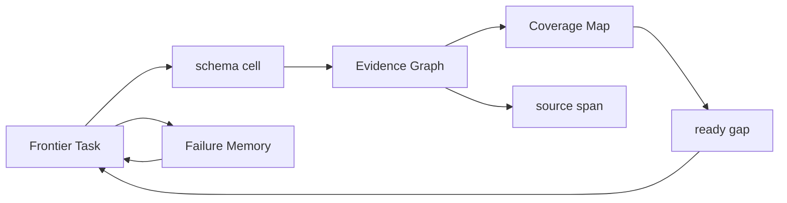
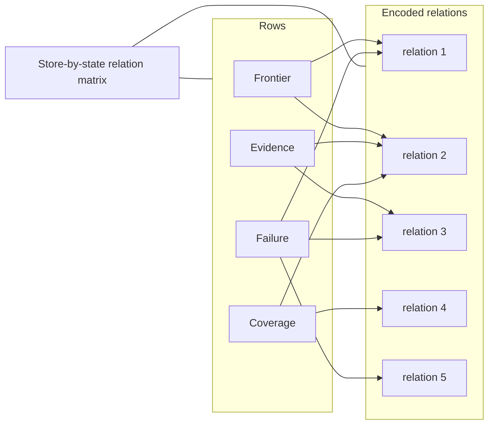
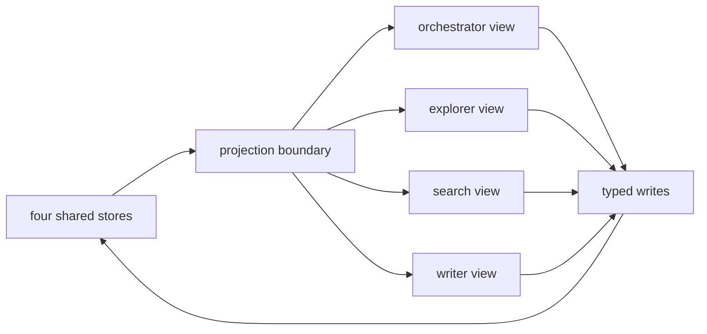
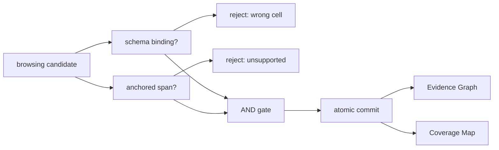
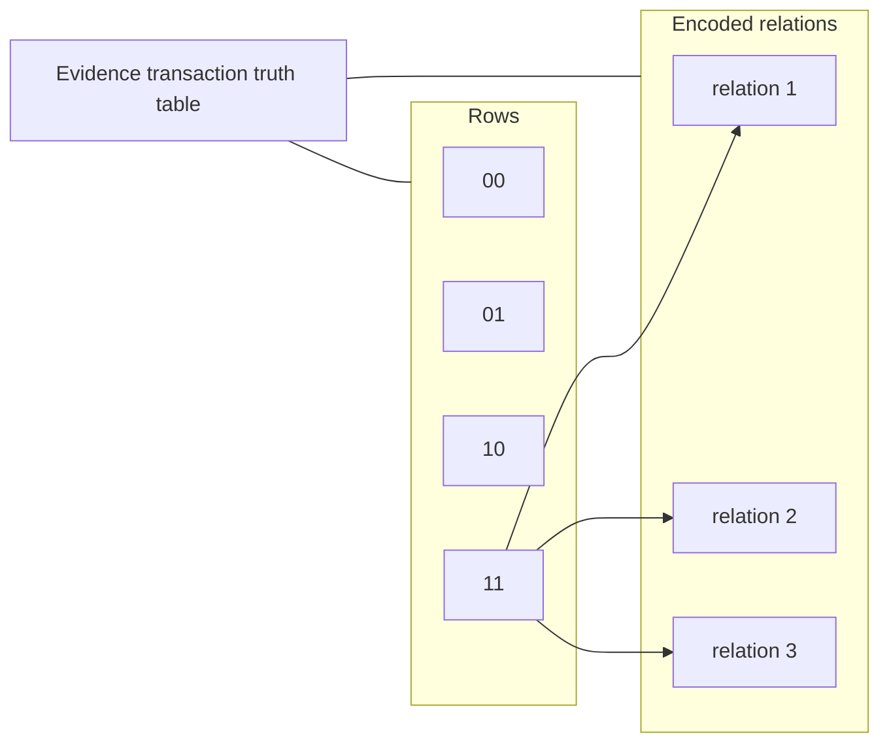
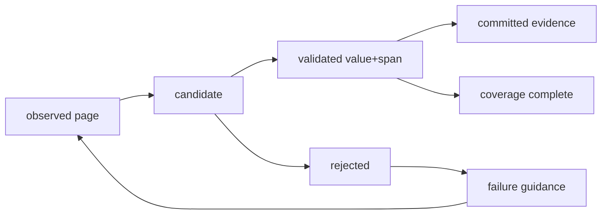
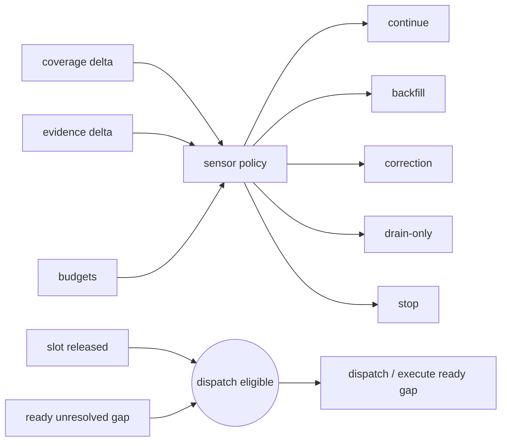
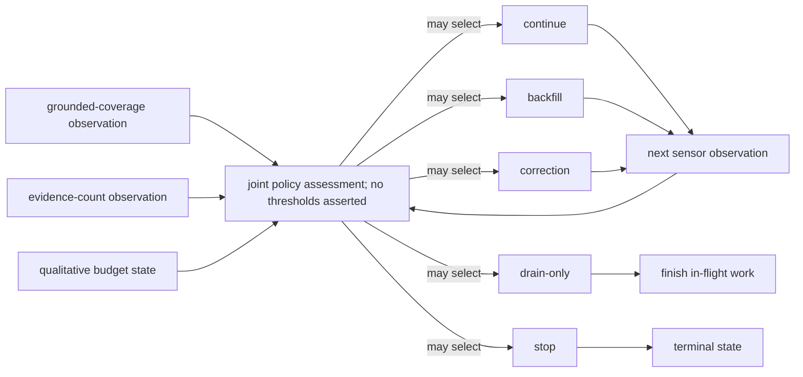
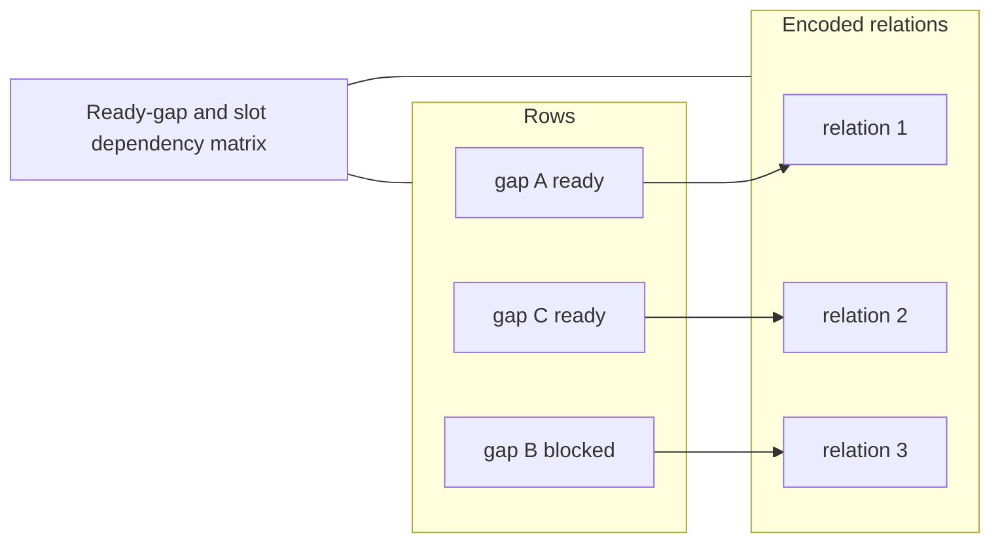

# Visual manifest — SearchOS-V1: Towards Robust Open-Domain Information-Seeking Agent Collaboration

- Paper ID: `paper_searchos_v1`
- Exact paper version: `v1`
- Explainer fixture: `packages/test-fixtures/explainers/searchos-v1.json`
- Manifest revision: `6`
- Engineer status: `COMPLETE`
- Implementer status: `COMPLETE`
- Paragraph coverage: `17 / 17` prose paragraphs
- Paragraph-ID derivation: `{block.id}_p{1-based index in block.paragraphs}`; each fixture paragraph appears exactly once.
- Evidence sources:
  - `sos_formulation_source` — SearchOS-V1 — relational formulation, SOCM, and orchestration; Sections 2–3.2, Equations 1–10, Figure 2, PDF pages 3–6; the arXiv v1 record identifies the paper as CC BY 4.0
  - `sos_middleware_source` — SearchOS-V1 — middleware and hierarchical skills; Sections 3.3–3.4, Equations 11–18, Figures 3–4, PDF pages 7–9
  - `sos_results_source` — SearchOS-V1 — benchmark protocol and main results; Section 4, Table 2, PDF pages 9–11
  - `sos_ablations_source` — SearchOS-V1 — scheduling, middleware, and skill analyses; Section 5, Tables 4–6 and Figures 5–6, PDF pages 12–13
  - `sos_scope_source` — SearchOS-V1 — declared scope and future work; Scope note in Section 3.4 and Section 7, PDF pages 9 and 15

Revision 6 independently reassesses all 17 paragraphs under the four-form hard ban. It proposes 3 paper-specific visuals and keeps 14 paragraphs prose-only. Revision-5 selections and SVG implementations are not accepted guidance; implementation must be redone from this manifest.

## `sos_why_p1`

- Location: `sos_why`, paragraph 1
- Text anchor: "A long-horizon research task requires more than issuing good queries. The system must remember"
- Claims and sources: `sos_core`, `sos_socm`, `sos_formulation_source`
- Visual needed: `NO`
- Complexity warrant: NONE — prose is sufficient.
- Forbidden-structure audit: `NO_VISUAL`
- Decision rationale: The paragraph makes one bounded distinction in plain language: A long-horizon research task requires more than issuing good queries. A visual would repeat that statement as a stock chain, list, or set of cards rather than reduce genuine mental reconstruction.
- Explanatory job: Motivation and problem framing.

### Implementation record

- Status: `NOT_NEEDED`
- Selected treatment: `NONE`
- Selection rationale: `NO_VISUAL` — prose is the approved treatment.
- Delivery medium: `NONE`
- Visual ID and placement: `NONE` — `NO_VISUAL`
- Shared paragraph scope: `NONE`
- Changed files: `NONE`
- Accessibility and fallback verification: `NO_VISUAL`
- Desktop and mobile verification: `NO_VISUAL`
- Evidence deviations: `NONE`

## `sos_why_p2`

- Location: `sos_why`, paragraph 2
- Text anchor: "Conventional agents often keep this state in growing conversation histories. As evidence becomes buried,"
- Claims and sources: `sos_core`, `sos_socm`, `sos_formulation_source`
- Visual needed: `NO`
- Complexity warrant: NONE — prose is sufficient.
- Forbidden-structure audit: `NO_VISUAL`
- Decision rationale: The paragraph makes one bounded distinction in plain language: Conventional agents often keep this state in growing conversation histories. A visual would repeat that statement as a stock chain, list, or set of cards rather than reduce genuine mental reconstruction.
- Explanatory job: Motivation and problem framing.

### Implementation record

- Status: `NOT_NEEDED`
- Selected treatment: `NONE`
- Selection rationale: `NO_VISUAL` — prose is the approved treatment.
- Delivery medium: `NONE`
- Visual ID and placement: `NONE` — `NO_VISUAL`
- Shared paragraph scope: `NONE`
- Changed files: `NONE`
- Accessibility and fallback verification: `NO_VISUAL`
- Desktop and mobile verification: `NO_VISUAL`
- Evidence deviations: `NONE`

## `sos_change_p1`

- Location: `sos_change`, paragraph 1
- Text anchor: "SearchOS converts a natural-language request into one or more related tables. Rows represent entities,"
- Claims and sources: `sos_schema`, `sos_socm`, `sos_formulation_source`
- Visual needed: `NO`
- Complexity warrant: NONE — prose is sufficient.
- Forbidden-structure audit: `NO_VISUAL`
- Decision rationale: The paragraph makes one bounded distinction in plain language: SearchOS converts a natural-language request into one or more related tables. A visual would repeat that statement as a stock chain, list, or set of cards rather than reduce genuine mental reconstruction.
- Explanatory job: Method distinction and scope.

### Implementation record

- Status: `NOT_NEEDED`
- Selected treatment: `NONE`
- Selection rationale: `NO_VISUAL` — prose is the approved treatment.
- Delivery medium: `NONE`
- Visual ID and placement: `NONE` — `NO_VISUAL`
- Shared paragraph scope: `NONE`
- Changed files: `NONE`
- Accessibility and fallback verification: `NO_VISUAL`
- Desktop and mobile verification: `NO_VISUAL`
- Evidence deviations: `NONE`

## `sos_change_p2`

- Location: `sos_change`, paragraph 2
- Text anchor: "The system then separates global coordination from local search. An orchestrator owns schema and"
- Claims and sources: `sos_schema`, `sos_socm`, `sos_formulation_source`
- Visual needed: `NO`
- Complexity warrant: NONE — prose is sufficient.
- Forbidden-structure audit: `NO_VISUAL`
- Decision rationale: The paragraph makes one bounded distinction in plain language: The system then separates global coordination from local search. A visual would repeat that statement as a stock chain, list, or set of cards rather than reduce genuine mental reconstruction.
- Explanatory job: Method distinction and scope.

### Implementation record

- Status: `NOT_NEEDED`
- Selected treatment: `NONE`
- Selection rationale: `NO_VISUAL` — prose is the approved treatment.
- Delivery medium: `NONE`
- Visual ID and placement: `NONE` — `NO_VISUAL`
- Shared paragraph scope: `NONE`
- Changed files: `NONE`
- Accessibility and fallback verification: `NO_VISUAL`
- Desktop and mobile verification: `NO_VISUAL`
- Evidence deviations: `NONE`

## `sos_mechanism_p1`

- Location: `sos_mechanism`, paragraph 1
- Text anchor: "Search-Oriented Context Management contains four linked stores. Frontier Task tracks dependency-aware work. The Evidence"
- Claims and sources: `sos_socm`, `sos_middleware`, `sos_scheduler`, `sos_formulation_source`, `sos_middleware_source`
- Visual needed: `YES`
- Complexity warrant: Shared-state system topology: four stores have distinct responsibilities and non-interchangeable cross-links among tasks, schema cells, evidence, provenance, and failures.
- Forbidden-structure audit: `PASS` — each treatment uses branching, a dependency matrix, feedback, shared-scale geometry, or a state topology; none is a single interchangeable chain, item-plus-metric list, repeated same-metric cards, or repeated one-axis dot panels.
- Decision rationale: A list of four stores would be insufficient; the explanatory burden is how task dependencies, grounded evidence, cell coverage, and failed routes constrain one another.
- Explanatory job: Shared-state architecture and provenance topology.

### Treatment A — SOCM multiplex state graph

- Teaching purpose: Show the typed relations among Frontier Task, Evidence Graph, Coverage Map, and Failure Memory.
- Encoding and reading order: Four non-interchangeable stores surround schema cells. Task dependencies target missing cells; accepted evidence binds values and anchored spans; coverage reflects bindings; failures suppress or redirect task routes.
- Evidence and limitations: Claims `sos_socm`, `sos_schema`; `sos_formulation_source`, Sections 2–3.2 and Figure 2. The diagram is structural and does not imply unreported magnitudes.
- Primary delivery medium: `SVG`
- Recommended web medium: `SVG`
- Mobile, accessibility, and motion behavior: Preserve all labels at 200% zoom; on narrow screens use a single controlled horizontal scroll region or a content-specific stacked variant. Provide a semantic description of every relation and value. Keyboard focus must follow the stated reading order. If interactive, expose the same state in text, support pause/reset, and honor reduced motion; otherwise use no motion.

#### TikZ
```tex
\documentclass[tikz,border=4pt]{standalone}
\usepackage{tikz}
\begin{document}
\begin{tikzpicture}[font=\sffamily\scriptsize,>=stealth]
\node[draw,rounded corners,align=center] (n0) at (0.0,0.0) {Frontier Task};
\node[draw,rounded corners,align=center] (n1) at (3.2,0.0) {schema cell};
\node[draw,rounded corners,align=center] (n2) at (6.4,0.0) {Evidence Graph};
\node[draw,rounded corners,align=center] (n3) at (9.600000000000001,0.0) {Coverage Map};
\node[draw,rounded corners,align=center] (n4) at (0.0,-1.8) {Failure Memory};
\node[draw,rounded corners,align=center] (n5) at (3.2,-1.8) {source span};
\node[draw,rounded corners,align=center] (n6) at (6.4,-1.8) {ready gap};
\draw[->] (n0) -- (n1);
\draw[->] (n1) -- (n2);
\draw[->] (n2) -- (n5);
\draw[->] (n2) -- (n3);
\draw[->] (n3) -- (n6);
\draw[->] (n6) -- (n0);
\draw[->] (n4) -- (n0);
\draw[->] (n0) -- (n4);
\end{tikzpicture}
\end{document}
```

#### Mermaid


#### Python
```python
from pathlib import Path
import matplotlib.pyplot as plt

labels = ['Frontier Task', 'schema cell', 'Evidence Graph', 'Coverage Map', 'Failure Memory', 'source span', 'ready gap']
fig, ax = plt.subplots(figsize=(9, 5))
edges = [(0, 1), (1, 2), (2, 5), (2, 3), (3, 6), (6, 0), (4, 0), (0, 4)]
positions = {i: ((i % 4) * 2.5, -(i // 4) * 1.4) for i in range(len(labels))}
for i, label in enumerate(labels):
    x, y = positions[i]
    ax.text(x, y, label, ha='center', va='center', bbox={'boxstyle': 'round', 'fc': '#fffdf8', 'ec': '#171714'})
for start, end in edges:
    x1, y1 = positions[start]
    x2, y2 = positions[end]
    ax.annotate('', (x2, y2), (x1, y1), arrowprops={'arrowstyle': '->', 'color': '#2f5ea8'})
ax.set_axis_off()
fig.tight_layout()
fig.savefig(Path('visual.svg'), format='svg')
```

### Treatment B — Store-by-state relation matrix

- Teaching purpose: Expose which store owns each kind of state and which updates must remain linked.
- Encoding and reading order: Rows represent tasks, evidence, coverage, and failures; columns represent dependency, schema binding, source anchor, completion state, and corrective guidance. Cross-marks encode supported ownership and coupling.
- Evidence and limitations: Claims `sos_socm`, `sos_schema`; `sos_formulation_source`, Sections 2–3.2 and Figure 2. Cells encode only the stated relationships; they are not measured effect sizes.
- Primary delivery medium: `generated asset`
- Recommended web medium: `SVG`
- Mobile, accessibility, and motion behavior: Preserve all labels at 200% zoom; on narrow screens use a single controlled horizontal scroll region or a content-specific stacked variant. Provide a semantic description of every relation and value. Keyboard focus must follow the stated reading order. If interactive, expose the same state in text, support pause/reset, and honor reduced motion; otherwise use no motion.

#### TikZ
```tex
\documentclass[tikz,border=4pt]{standalone}
\usepackage{tikz}
\begin{document}
\begin{tikzpicture}[font=\sffamily\scriptsize,>=stealth]
\fill[blue!80] (0,-0) rectangle ++(0.9,-0.9);
\draw (0,-0) rectangle ++(0.9,-0.9);
\fill[blue!80] (1,-0) rectangle ++(0.9,-0.9);
\draw (1,-0) rectangle ++(0.9,-0.9);
\fill[blue!20] (2,-0) rectangle ++(0.9,-0.9);
\draw (2,-0) rectangle ++(0.9,-0.9);
\fill[blue!20] (3,-0) rectangle ++(0.9,-0.9);
\draw (3,-0) rectangle ++(0.9,-0.9);
\fill[blue!20] (4,-0) rectangle ++(0.9,-0.9);
\draw (4,-0) rectangle ++(0.9,-0.9);
\fill[blue!20] (0,-1) rectangle ++(0.9,-0.9);
\draw (0,-1) rectangle ++(0.9,-0.9);
\fill[blue!80] (1,-1) rectangle ++(0.9,-0.9);
\draw (1,-1) rectangle ++(0.9,-0.9);
\fill[blue!80] (2,-1) rectangle ++(0.9,-0.9);
\draw (2,-1) rectangle ++(0.9,-0.9);
\fill[blue!20] (3,-1) rectangle ++(0.9,-0.9);
\draw (3,-1) rectangle ++(0.9,-0.9);
\fill[blue!20] (4,-1) rectangle ++(0.9,-0.9);
\draw (4,-1) rectangle ++(0.9,-0.9);
\fill[blue!20] (0,-2) rectangle ++(0.9,-0.9);
\draw (0,-2) rectangle ++(0.9,-0.9);
\fill[blue!80] (1,-2) rectangle ++(0.9,-0.9);
\draw (1,-2) rectangle ++(0.9,-0.9);
\fill[blue!20] (2,-2) rectangle ++(0.9,-0.9);
\draw (2,-2) rectangle ++(0.9,-0.9);
\fill[blue!80] (3,-2) rectangle ++(0.9,-0.9);
\draw (3,-2) rectangle ++(0.9,-0.9);
\fill[blue!20] (4,-2) rectangle ++(0.9,-0.9);
\draw (4,-2) rectangle ++(0.9,-0.9);
\fill[blue!80] (0,-3) rectangle ++(0.9,-0.9);
\draw (0,-3) rectangle ++(0.9,-0.9);
\fill[blue!20] (1,-3) rectangle ++(0.9,-0.9);
\draw (1,-3) rectangle ++(0.9,-0.9);
\fill[blue!80] (2,-3) rectangle ++(0.9,-0.9);
\draw (2,-3) rectangle ++(0.9,-0.9);
\fill[blue!20] (3,-3) rectangle ++(0.9,-0.9);
\draw (3,-3) rectangle ++(0.9,-0.9);
\fill[blue!80] (4,-3) rectangle ++(0.9,-0.9);
\draw (4,-3) rectangle ++(0.9,-0.9);
\node[anchor=west] at (0,1.0) {Frontier / Evidence / Coverage / Failure};
\end{tikzpicture}
\end{document}
```

#### Mermaid


#### Python
```python
from pathlib import Path
import matplotlib.pyplot as plt

labels = ['Frontier', 'Evidence', 'Coverage', 'Failure']
fig, ax = plt.subplots(figsize=(9, 5))
values = [[1, 1, 0, 0, 0], [0, 1, 1, 0, 0], [0, 1, 0, 1, 0], [1, 0, 1, 0, 1]]
image = ax.imshow(values, cmap='Blues', vmin=0)
ax.set_title(' / '.join(labels))
fig.colorbar(image, ax=ax, label='encoded relation')
ax.grid(alpha=0.2)
fig.tight_layout()
fig.savefig(Path('visual.svg'), format='svg')
```

### Treatment C — Role-specific projection topology

- Teaching purpose: Explain how one shared state can yield different bounded contexts without free-form agent conversation.
- Encoding and reading order: The four stores feed a projection boundary; orchestrator, explorer, search, and writer receive distinct subgraphs, while all writes return through typed state interfaces.
- Evidence and limitations: Claims `sos_socm`, `sos_schema`; `sos_formulation_source`, Sections 2–3.2 and Figure 2. The diagram is structural and does not imply unreported magnitudes.
- Primary delivery medium: `JavaScript`
- Recommended web medium: `JavaScript`
- Mobile, accessibility, and motion behavior: Preserve all labels at 200% zoom; on narrow screens use a single controlled horizontal scroll region or a content-specific stacked variant. Provide a semantic description of every relation and value. Keyboard focus must follow the stated reading order. If interactive, expose the same state in text, support pause/reset, and honor reduced motion; otherwise use no motion.

#### TikZ
```tex
\documentclass[tikz,border=4pt]{standalone}
\usepackage{tikz}
\begin{document}
\begin{tikzpicture}[font=\sffamily\scriptsize,>=stealth]
\node[draw,rounded corners,align=center] (n0) at (0.0,0.0) {four shared stores};
\node[draw,rounded corners,align=center] (n1) at (3.2,0.0) {projection boundary};
\node[draw,rounded corners,align=center] (n2) at (6.4,0.0) {orchestrator view};
\node[draw,rounded corners,align=center] (n3) at (9.600000000000001,0.0) {explorer view};
\node[draw,rounded corners,align=center] (n4) at (0.0,-1.8) {search view};
\node[draw,rounded corners,align=center] (n5) at (3.2,-1.8) {writer view};
\node[draw,rounded corners,align=center] (n6) at (6.4,-1.8) {typed writes};
\draw[->] (n0) -- (n1);
\draw[->] (n1) -- (n2);
\draw[->] (n1) -- (n3);
\draw[->] (n1) -- (n4);
\draw[->] (n1) -- (n5);
\draw[->] (n2) -- (n6);
\draw[->] (n3) -- (n6);
\draw[->] (n4) -- (n6);
\draw[->] (n5) -- (n6);
\draw[->] (n6) -- (n0);
\end{tikzpicture}
\end{document}
```

#### Mermaid


#### Python
```python
from pathlib import Path
import matplotlib.pyplot as plt

labels = ['four shared stores', 'projection boundary', 'orchestrator view', 'explorer view', 'search view', 'writer view', 'typed writes']
fig, ax = plt.subplots(figsize=(9, 5))
edges = [(0, 1), (1, 2), (1, 3), (1, 4), (1, 5), (2, 6), (3, 6), (4, 6), (5, 6), (6, 0)]
positions = {i: ((i % 4) * 2.5, -(i // 4) * 1.4) for i in range(len(labels))}
for i, label in enumerate(labels):
    x, y = positions[i]
    ax.text(x, y, label, ha='center', va='center', bbox={'boxstyle': 'round', 'fc': '#fffdf8', 'ec': '#171714'})
for start, end in edges:
    x1, y1 = positions[start]
    x2, y2 = positions[end]
    ax.annotate('', (x2, y2), (x1, y1), arrowprops={'arrowstyle': '->', 'color': '#2f5ea8'})
ax.set_axis_off()
fig.tight_layout()
fig.savefig(Path('visual.svg'), format='svg')
```

### Implementation record

- Status: `IMPLEMENTED`
- Selected treatment: `A`
- Selection rationale: The multiplex graph gives each SOCM store a distinct relation to schema cells and makes evidence, coverage, task, and failure coupling inspectable.
- Delivery medium: `SVG`
- Visual ID and placement: `visual_searchos_socm_state_graph` — rendered immediately after `sos_mechanism_p1`.
- Shared paragraph scope: `NONE`
- Changed files: `apps/web/app/papers/[id]/explainer-visual.tsx`, `apps/web/app/papers/[id]/explainer-svg.tsx`, `apps/web/app/globals.css`, the paper fixture, and this manifest
- Accessibility and fallback verification: VERIFIED — the figure uses a unique SVG title and description, equivalent prose, evidence links, limitations, and a motion-free reading order.
- Desktop and mobile verification: VERIFIED — desktop preserves the full responsive canvas; below 720 px the SVG retains a 680 px width inside a keyboard-focusable horizontal scroller that stays within the viewport and creates no document-level overflow.
- Evidence deviations: `NONE`

## `sos_mechanism_p2`

- Location: `sos_mechanism`, paragraph 2
- Text anchor: "Before a model call, context middleware projects only the role-relevant portion of that state"
- Claims and sources: `sos_socm`, `sos_middleware`, `sos_scheduler`, `sos_formulation_source`, `sos_middleware_source`
- Visual needed: `YES`
- Complexity warrant: Transactional state transition with failure conditions: a browsing candidate must satisfy both schema binding and source-span anchoring before evidence and coverage update atomically.
- Forbidden-structure audit: `PASS` — each treatment uses branching, a dependency matrix, feedback, shared-scale geometry, or a state topology; none is a single interchangeable chain, item-plus-metric list, repeated same-metric cards, or repeated one-axis dot panels.
- Decision rationale: The crucial distinction is not an ordered pipeline but a conjunction gate, two rejection modes, and a dual-state commit. A decision topology prevents page visits from being mistaken for evidence.
- Explanatory job: Evidence acceptance gate and atomic state mutation.

### Treatment A — Conjunctive evidence gate with rejection branches

- Teaching purpose: Show why neither a page visit nor an extracted value alone fills a cell.
- Encoding and reading order: Candidate value branches into schema-binding and anchored-span checks; only their conjunction reaches a transaction that writes Evidence Graph and Coverage Map together. Each failed condition routes to a distinct rejection record.
- Evidence and limitations: Claim `sos_middleware`; `sos_middleware_source`, Sections 3.3–3.4 and Equations 11–18. The diagram is structural and does not imply unreported magnitudes.
- Primary delivery medium: `SVG`
- Recommended web medium: `SVG`
- Mobile, accessibility, and motion behavior: Preserve all labels at 200% zoom; on narrow screens use a single controlled horizontal scroll region or a content-specific stacked variant. Provide a semantic description of every relation and value. Keyboard focus must follow the stated reading order. If interactive, expose the same state in text, support pause/reset, and honor reduced motion; otherwise use no motion.

#### TikZ
```tex
\documentclass[tikz,border=4pt]{standalone}
\usepackage{tikz}
\begin{document}
\begin{tikzpicture}[font=\sffamily\scriptsize,>=stealth]
\node[draw,rounded corners,align=center] (n0) at (0.0,0.0) {browsing candidate};
\node[draw,rounded corners,align=center] (n1) at (3.2,0.0) {schema binding?};
\node[draw,rounded corners,align=center] (n2) at (6.4,0.0) {anchored span?};
\node[draw,rounded corners,align=center] (n3) at (9.600000000000001,0.0) {reject: wrong cell};
\node[draw,rounded corners,align=center] (n4) at (0.0,-1.8) {reject: unsupported};
\node[draw,rounded corners,align=center] (n5) at (3.2,-1.8) {AND gate};
\node[draw,rounded corners,align=center] (n6) at (6.4,-1.8) {atomic commit};
\node[draw,rounded corners,align=center] (n7) at (9.600000000000001,-1.8) {Evidence Graph};
\node[draw,rounded corners,align=center] (n8) at (0.0,-3.6) {Coverage Map};
\draw[->] (n0) -- (n1);
\draw[->] (n0) -- (n2);
\draw[->] (n1) -- (n3);
\draw[->] (n2) -- (n4);
\draw[->] (n1) -- (n5);
\draw[->] (n2) -- (n5);
\draw[->] (n5) -- (n6);
\draw[->] (n6) -- (n7);
\draw[->] (n6) -- (n8);
\end{tikzpicture}
\end{document}
```

#### Mermaid


#### Python
```python
from pathlib import Path
import matplotlib.pyplot as plt

labels = ['browsing candidate', 'schema binding?', 'anchored span?', 'reject: wrong cell', 'reject: unsupported', 'AND gate', 'atomic commit', 'Evidence Graph', 'Coverage Map']
fig, ax = plt.subplots(figsize=(9, 5))
edges = [(0, 1), (0, 2), (1, 3), (2, 4), (1, 5), (2, 5), (5, 6), (6, 7), (6, 8)]
positions = {i: ((i % 4) * 2.5, -(i // 4) * 1.4) for i in range(len(labels))}
for i, label in enumerate(labels):
    x, y = positions[i]
    ax.text(x, y, label, ha='center', va='center', bbox={'boxstyle': 'round', 'fc': '#fffdf8', 'ec': '#171714'})
for start, end in edges:
    x1, y1 = positions[start]
    x2, y2 = positions[end]
    ax.annotate('', (x2, y2), (x1, y1), arrowprops={'arrowstyle': '->', 'color': '#2f5ea8'})
ax.set_axis_off()
fig.tight_layout()
fig.savefig(Path('visual.svg'), format='svg')
```

### Treatment B — Evidence transaction truth table

- Teaching purpose: Make the conjunction and atomicity constraints mechanically inspectable.
- Encoding and reading order: Rows enumerate binding and anchoring states; columns show accept, evidence-write, and coverage-write. Only the both-true row enables all three, and write columns remain identical.
- Evidence and limitations: Claim `sos_middleware`; `sos_middleware_source`, Sections 3.3–3.4 and Equations 11–18. The matrix is a logical specification derived from the acceptance rule, not measured data.
- Primary delivery medium: `generated asset`
- Recommended web medium: `SVG`
- Mobile, accessibility, and motion behavior: Preserve all labels at 200% zoom; on narrow screens use a single controlled horizontal scroll region or a content-specific stacked variant. Provide a semantic description of every relation and value. Keyboard focus must follow the stated reading order. If interactive, expose the same state in text, support pause/reset, and honor reduced motion; otherwise use no motion.

#### TikZ
```tex
\documentclass[tikz,border=4pt]{standalone}
\usepackage{tikz}
\begin{document}
\begin{tikzpicture}[font=\sffamily\scriptsize,>=stealth]
\fill[blue!20] (0,-0) rectangle ++(0.9,-0.9);
\draw (0,-0) rectangle ++(0.9,-0.9);
\fill[blue!20] (1,-0) rectangle ++(0.9,-0.9);
\draw (1,-0) rectangle ++(0.9,-0.9);
\fill[blue!20] (2,-0) rectangle ++(0.9,-0.9);
\draw (2,-0) rectangle ++(0.9,-0.9);
\fill[blue!20] (0,-1) rectangle ++(0.9,-0.9);
\draw (0,-1) rectangle ++(0.9,-0.9);
\fill[blue!20] (1,-1) rectangle ++(0.9,-0.9);
\draw (1,-1) rectangle ++(0.9,-0.9);
\fill[blue!20] (2,-1) rectangle ++(0.9,-0.9);
\draw (2,-1) rectangle ++(0.9,-0.9);
\fill[blue!20] (0,-2) rectangle ++(0.9,-0.9);
\draw (0,-2) rectangle ++(0.9,-0.9);
\fill[blue!20] (1,-2) rectangle ++(0.9,-0.9);
\draw (1,-2) rectangle ++(0.9,-0.9);
\fill[blue!20] (2,-2) rectangle ++(0.9,-0.9);
\draw (2,-2) rectangle ++(0.9,-0.9);
\fill[blue!80] (0,-3) rectangle ++(0.9,-0.9);
\draw (0,-3) rectangle ++(0.9,-0.9);
\fill[blue!80] (1,-3) rectangle ++(0.9,-0.9);
\draw (1,-3) rectangle ++(0.9,-0.9);
\fill[blue!80] (2,-3) rectangle ++(0.9,-0.9);
\draw (2,-3) rectangle ++(0.9,-0.9);
\node[anchor=west] at (0,1.0) {00 / 01 / 10 / 11};
\end{tikzpicture}
\end{document}
```

#### Mermaid


#### Python
```python
from pathlib import Path
import matplotlib.pyplot as plt

labels = ['00', '01', '10', '11']
fig, ax = plt.subplots(figsize=(9, 5))
values = [[0, 0, 0], [0, 0, 0], [0, 0, 0], [1, 1, 1]]
image = ax.imshow(values, cmap='Blues', vmin=0)
ax.set_title(' / '.join(labels))
fig.colorbar(image, ax=ax, label='encoded relation')
ax.grid(alpha=0.2)
fig.tight_layout()
fig.savefig(Path('visual.svg'), format='svg')
```

### Treatment C — Candidate-to-committed-state transition system

- Teaching purpose: Expose precondition checks, rollback, and the single committed state.
- Encoding and reading order: States separate observed page, candidate extracted, validated pair, rejected candidate, and committed shared state. Invalid transitions return to tasking with failure guidance; commit has two synchronized effects.
- Evidence and limitations: Claim `sos_middleware`; `sos_middleware_source`, Sections 3.3–3.4 and Equations 11–18. The diagram is structural and does not imply unreported magnitudes.
- Primary delivery medium: `JavaScript`
- Recommended web medium: `JavaScript`
- Mobile, accessibility, and motion behavior: Preserve all labels at 200% zoom; on narrow screens use a single controlled horizontal scroll region or a content-specific stacked variant. Provide a semantic description of every relation and value. Keyboard focus must follow the stated reading order. If interactive, expose the same state in text, support pause/reset, and honor reduced motion; otherwise use no motion.

#### TikZ
```tex
\documentclass[tikz,border=4pt]{standalone}
\usepackage{tikz}
\begin{document}
\begin{tikzpicture}[font=\sffamily\scriptsize,>=stealth]
\node[draw,rounded corners,align=center] (n0) at (0.0,0.0) {observed page};
\node[draw,rounded corners,align=center] (n1) at (3.2,0.0) {candidate};
\node[draw,rounded corners,align=center] (n2) at (6.4,0.0) {validated value+span};
\node[draw,rounded corners,align=center] (n3) at (9.600000000000001,0.0) {rejected};
\node[draw,rounded corners,align=center] (n4) at (0.0,-1.8) {failure guidance};
\node[draw,rounded corners,align=center] (n5) at (3.2,-1.8) {committed evidence};
\node[draw,rounded corners,align=center] (n6) at (6.4,-1.8) {coverage complete};
\draw[->] (n0) -- (n1);
\draw[->] (n1) -- (n2);
\draw[->] (n1) -- (n3);
\draw[->] (n3) -- (n4);
\draw[->] (n4) -- (n0);
\draw[->] (n2) -- (n5);
\draw[->] (n2) -- (n6);
\end{tikzpicture}
\end{document}
```

#### Mermaid


#### Python
```python
from pathlib import Path
import matplotlib.pyplot as plt

labels = ['observed page', 'candidate', 'validated value+span', 'rejected', 'failure guidance', 'committed evidence', 'coverage complete']
fig, ax = plt.subplots(figsize=(9, 5))
edges = [(0, 1), (1, 2), (1, 3), (3, 4), (4, 0), (2, 5), (2, 6)]
positions = {i: ((i % 4) * 2.5, -(i // 4) * 1.4) for i in range(len(labels))}
for i, label in enumerate(labels):
    x, y = positions[i]
    ax.text(x, y, label, ha='center', va='center', bbox={'boxstyle': 'round', 'fc': '#fffdf8', 'ec': '#171714'})
for start, end in edges:
    x1, y1 = positions[start]
    x2, y2 = positions[end]
    ax.annotate('', (x2, y2), (x1, y1), arrowprops={'arrowstyle': '->', 'color': '#2f5ea8'})
ax.set_axis_off()
fig.tight_layout()
fig.savefig(Path('visual.svg'), format='svg')
```

### Implementation record

- Status: `IMPLEMENTED`
- Selected treatment: `A`
- Selection rationale: The conjunctive gate exposes two independent preconditions, distinct rejection paths, and one atomic dual-store commit.
- Delivery medium: `SVG`
- Visual ID and placement: `visual_searchos_evidence_gate` — rendered immediately after `sos_mechanism_p2`.
- Shared paragraph scope: `NONE`
- Changed files: `apps/web/app/papers/[id]/explainer-visual.tsx`, `apps/web/app/papers/[id]/explainer-svg.tsx`, `apps/web/app/globals.css`, the paper fixture, and this manifest
- Accessibility and fallback verification: VERIFIED — the figure uses a unique SVG title and description, equivalent prose, evidence links, limitations, and a motion-free reading order.
- Desktop and mobile verification: VERIFIED — desktop preserves the full responsive canvas; below 720 px the SVG retains a 680 px width inside a keyboard-focusable horizontal scroller that stays within the viewport and creates no document-level overflow.
- Evidence deviations: `NONE`

## `sos_mechanism_p3`

- Location: `sos_mechanism`, paragraph 3
- Text anchor: "Sensor middleware measures changes in grounded coverage and evidence count, along with iteration, search,"
- Claims and sources: `sos_socm`, `sos_middleware`, `sos_scheduler`, `sos_formulation_source`, `sos_middleware_source`
- Visual needed: `YES`
- Complexity warrant: Changing-state control policy with branching, budget-dependent terminal states, backfill/correction paths, and asynchronous slot dependencies.
- Forbidden-structure audit: `PASS` — each treatment uses branching, a dependency matrix, feedback, shared-scale geometry, or a state topology; none is a single interchangeable chain, item-plus-metric list, repeated same-metric cards, or repeated one-axis dot panels.
- Decision rationale: Readers must reconstruct how progress sensors and resource budgets jointly choose among five actions while newly free slots dispatch ready gaps. A state policy surface is clearer than prose.
- Explanatory job: Coverage-aware controller state machine and asynchronous scheduling.

### Treatment A — Sensor-policy-dispatch state machine

- Teaching purpose: Show how grounded progress and budgets lead to different control actions.
- Encoding and reading order: Coverage delta, evidence delta, and remaining budgets converge on a policy node with continue, backfill, correction, drain-only, and stop branches. In a separate concurrency subgraph, `slot released` and `ready unresolved gap` independently enter a dispatch-eligibility conjunction, which leads to a distinct `dispatch / execute ready gap` state. No policy outcome, especially `correction`, may substitute for that execution state.
- Evidence and limitations: Claim `sos_scheduler`; `sos_middleware_source`, Sections 3.3–3.4 and Figures 3–4. The diagram is structural and does not imply unreported magnitudes.
- Primary delivery medium: `SVG`
- Recommended web medium: `SVG`
- Mobile, accessibility, and motion behavior: Preserve all labels at 200% zoom; on narrow screens use a single controlled horizontal scroll region or a content-specific stacked variant. Provide a semantic description of every relation and value. Keyboard focus must follow the stated reading order. If interactive, expose the same state in text, support pause/reset, and honor reduced motion; otherwise use no motion.

#### TikZ
```tex
\documentclass[tikz,border=4pt]{standalone}
\usepackage{tikz}
\begin{document}
\begin{tikzpicture}[font=\sffamily\scriptsize,>=stealth]
\node[draw,rounded corners,align=center] (n0) at (0.0,0.0) {coverage delta};
\node[draw,rounded corners,align=center] (n1) at (3.2,0.0) {evidence delta};
\node[draw,rounded corners,align=center] (n2) at (6.4,0.0) {budgets};
\node[draw,rounded corners,align=center] (n3) at (9.600000000000001,0.0) {sensor policy};
\node[draw,rounded corners,align=center] (n4) at (0.0,-1.8) {continue};
\node[draw,rounded corners,align=center] (n5) at (3.2,-1.8) {backfill};
\node[draw,rounded corners,align=center] (n6) at (6.4,-1.8) {correction};
\node[draw,rounded corners,align=center] (n7) at (9.600000000000001,-1.8) {drain-only};
\node[draw,rounded corners,align=center] (n8) at (0.0,-3.6) {stop};
\node[draw,rounded corners,align=center] (n9) at (3.2,-3.6) {slot released};
\node[draw,rounded corners,align=center] (n10) at (6.4,-3.6) {ready unresolved gap};
\node[draw,circle,align=center] (n11) at (8.2,-3.6) {AND};
\node[draw,rounded corners,align=center] (n12) at (10.2,-3.6) {dispatch / execute ready gap};
\draw[->] (n0) -- (n3);
\draw[->] (n1) -- (n3);
\draw[->] (n2) -- (n3);
\draw[->] (n3) -- (n4);
\draw[->] (n3) -- (n5);
\draw[->] (n3) -- (n6);
\draw[->] (n3) -- (n7);
\draw[->] (n3) -- (n8);
\draw[->] (n9) -- (n11);
\draw[->] (n10) -- (n11);
\draw[->] (n11) -- (n12);
\end{tikzpicture}
\end{document}
```

#### Mermaid


#### Python
```python
from pathlib import Path
import matplotlib.pyplot as plt

labels = ['coverage delta', 'evidence delta', 'budgets', 'sensor policy', 'continue', 'backfill', 'correction', 'drain-only', 'stop', 'slot released', 'ready unresolved gap', 'dispatch eligible', 'dispatch / execute ready gap']
fig, ax = plt.subplots(figsize=(9, 5))
edges = [(0, 3), (1, 3), (2, 3), (3, 4), (3, 5), (3, 6), (3, 7), (3, 8), (9, 11), (10, 11), (11, 12)]
positions = {i: ((i % 4) * 2.5, -(i // 4) * 1.4) for i in range(len(labels))}
for i, label in enumerate(labels):
    x, y = positions[i]
    ax.text(x, y, label, ha='center', va='center', bbox={'boxstyle': 'round', 'fc': '#fffdf8', 'ec': '#171714'})
for start, end in edges:
    x1, y1 = positions[start]
    x2, y2 = positions[end]
    ax.annotate('', (x2, y2), (x1, y1), arrowprops={'arrowstyle': '->', 'color': '#2f5ea8'})
ax.set_axis_off()
fig.tight_layout()
fig.savefig(Path('visual.svg'), format='svg')
```

### Treatment B — Qualitative sensor-action feedback graph

- Teaching purpose: Show which observations jointly inform the controller, the set of available actions, and which actions return the system to a later sensor assessment without asserting unsupported policy thresholds.
- Encoding and reading order: Grounded-coverage observation, evidence-count observation, and qualitative budget state converge on one joint policy assessment. That assessment branches to the five reported action states. Continue, backfill, and correction feed into a `next sensor observation` state that returns to joint assessment; drain-only leads to completion of in-flight work, while stop reaches a terminal state. Use no metric axes, coordinates, regions, decision surfaces, thresholds, or exclusive sensor-to-action mapping.
- Evidence and limitations: Claim `sos_scheduler`; `sos_middleware_source`, Sections 3.3–3.4 and Figures 3–4. The source supports the observed signals, available actions, repeated assessment, and draining behavior, but does not report numeric thresholds or policy boundaries. Branches therefore mean `available transition`, not a deterministic mapping, magnitude, or probability.
- Primary delivery medium: `JavaScript`
- Recommended web medium: `JavaScript`
- Mobile, accessibility, and motion behavior: Preserve all labels at 200% zoom; on narrow screens use a single controlled horizontal scroll region or a content-specific stacked variant. Provide a semantic description of every relation and value. Keyboard focus must follow the stated reading order. If interactive, expose the same state in text, support pause/reset, and honor reduced motion; otherwise use no motion.

#### TikZ
```tex
\documentclass[tikz,border=4pt]{standalone}
\usepackage{tikz}
\begin{document}
\begin{tikzpicture}[font=\sffamily\scriptsize,>=stealth]
\node[draw,rounded corners] (coverage) at (0,2) {grounded-coverage observation};
\node[draw,rounded corners] (evidence) at (0,1) {evidence-count observation};
\node[draw,rounded corners] (budget) at (0,0) {qualitative budget state};
\node[draw,rounded corners,align=center] (policy) at (4,1) {joint policy assessment\\no thresholds asserted};
\node[draw,rounded corners] (continue) at (7,3) {continue};
\node[draw,rounded corners] (backfill) at (7,2) {backfill};
\node[draw,rounded corners] (correct) at (7,1) {correction};
\node[draw,rounded corners] (drain) at (7,0) {drain-only};
\node[draw,rounded corners] (stop) at (7,-1) {stop};
\node[draw,rounded corners] (next) at (10,2) {next sensor observation};
\node[draw,rounded corners] (inflight) at (10,0) {finish in-flight work};
\node[draw,rounded corners] (terminal) at (10,-1) {terminal state};
\foreach \sensor in {coverage,evidence,budget} {\draw[->] (\sensor) -- (policy);}
\foreach \action in {continue,backfill,correct,drain,stop} {\draw[->] (policy) -- node[above,sloped] {may select} (\action);}
\foreach \action in {continue,backfill,correct} {\draw[->] (\action) -- (next);}
\draw[->] (next) to[bend left=35] (policy);
\draw[->] (drain) -- (inflight); \draw[->] (stop) -- (terminal);
\end{tikzpicture}
\end{document}
```

#### Mermaid


#### Python
```python
from pathlib import Path
import matplotlib.pyplot as plt

labels = [
    'grounded-coverage observation', 'evidence-count observation', 'qualitative budget state',
    'joint policy assessment\n(no thresholds asserted)', 'continue', 'backfill', 'correction',
    'drain-only', 'stop', 'next sensor observation', 'finish in-flight work', 'terminal state',
]
positions = {
    0: (0, 2), 1: (0, 1), 2: (0, 0), 3: (3, 1),
    4: (6, 3), 5: (6, 2), 6: (6, 1), 7: (6, 0), 8: (6, -1),
    9: (9, 2), 10: (9, 0), 11: (9, -1),
}
edges = [(0, 3), (1, 3), (2, 3)] + [(3, action) for action in range(4, 9)]
edges += [(4, 9), (5, 9), (6, 9), (9, 3), (7, 10), (8, 11)]
fig, ax = plt.subplots(figsize=(12, 7))
for node, label in enumerate(labels):
    x, y = positions[node]
    ax.text(x, y, label, ha='center', va='center', bbox={'boxstyle': 'round', 'fc': '#fffdf8', 'ec': '#171714'})
for start, end in edges:
    x1, y1 = positions[start]
    x2, y2 = positions[end]
    ax.annotate('', (x2, y2), (x1, y1), arrowprops={'arrowstyle': '->', 'color': '#2f5ea8', 'connectionstyle': 'arc3,rad=0.08'})
ax.set_title('Qualitative sensor-action feedback; branches are available transitions, not thresholds')
ax.set_axis_off()
fig.tight_layout()
fig.savefig(Path('visual.svg'), format='svg')
```

### Treatment C — Ready-gap and slot dependency matrix

- Teaching purpose: Explain continuous dispatch without turning it into a batch-versus-continuous metric list.
- Encoding and reading order: Rows are unresolved gaps with dependency states; columns are execution slots over release events. Cells activate only when a gap is ready and a slot is free, revealing asynchronous concurrency.
- Evidence and limitations: Claim `sos_scheduler`; `sos_middleware_source`, Sections 3.3–3.4 and Figures 3–4. The schedule is illustrative; no specific benchmark trace is claimed.
- Primary delivery medium: `JavaScript`
- Recommended web medium: `JavaScript`
- Mobile, accessibility, and motion behavior: Preserve all labels at 200% zoom; on narrow screens use a single controlled horizontal scroll region or a content-specific stacked variant. Provide a semantic description of every relation and value. Keyboard focus must follow the stated reading order. If interactive, expose the same state in text, support pause/reset, and honor reduced motion; otherwise use no motion.

#### TikZ
```tex
\documentclass[tikz,border=4pt]{standalone}
\usepackage{tikz}
\begin{document}
\begin{tikzpicture}[font=\sffamily\scriptsize,>=stealth]
\fill[blue!80] (0,-0) rectangle ++(0.9,-0.9);
\draw (0,-0) rectangle ++(0.9,-0.9);
\fill[blue!20] (1,-0) rectangle ++(0.9,-0.9);
\draw (1,-0) rectangle ++(0.9,-0.9);
\fill[blue!20] (2,-0) rectangle ++(0.9,-0.9);
\draw (2,-0) rectangle ++(0.9,-0.9);
\fill[blue!20] (0,-1) rectangle ++(0.9,-0.9);
\draw (0,-1) rectangle ++(0.9,-0.9);
\fill[blue!20] (1,-1) rectangle ++(0.9,-0.9);
\draw (1,-1) rectangle ++(0.9,-0.9);
\fill[blue!80] (2,-1) rectangle ++(0.9,-0.9);
\draw (2,-1) rectangle ++(0.9,-0.9);
\fill[blue!20] (0,-2) rectangle ++(0.9,-0.9);
\draw (0,-2) rectangle ++(0.9,-0.9);
\fill[blue!80] (1,-2) rectangle ++(0.9,-0.9);
\draw (1,-2) rectangle ++(0.9,-0.9);
\fill[blue!20] (2,-2) rectangle ++(0.9,-0.9);
\draw (2,-2) rectangle ++(0.9,-0.9);
\node[anchor=west] at (0,1.0) {gap A ready / gap B blocked / gap C ready};
\end{tikzpicture}
\end{document}
```

#### Mermaid


#### Python
```python
from pathlib import Path
import matplotlib.pyplot as plt

labels = ['gap A ready', 'gap B blocked', 'gap C ready']
fig, ax = plt.subplots(figsize=(9, 5))
values = [[1, 0, 0], [0, 0, 1], [0, 1, 0]]
image = ax.imshow(values, cmap='Blues', vmin=0)
ax.set_title(' / '.join(labels))
fig.colorbar(image, ax=ax, label='encoded relation')
ax.grid(alpha=0.2)
fig.tight_layout()
fig.savefig(Path('visual.svg'), format='svg')
```

### Implementation record

- Status: `IMPLEMENTED`
- Selected treatment: `A`
- Selection rationale: Treatment A remains the prior implementer selection. Rework must keep the five policy outcomes separate from the independent free-slot/ready-gap conjunction and its distinct dispatch/execution destination.
- Delivery medium: `SVG`
- Visual ID and placement: `visual_searchos_sensor_policy_dispatch` — rendered immediately after `sos_mechanism_p3`.
- Shared paragraph scope: `NONE`
- Changed files: `apps/web/app/papers/[id]/explainer-visual.tsx`, `apps/web/app/papers/[id]/explainer-svg.tsx`, `apps/web/app/globals.css`, the paper fixture, and this manifest
- Accessibility and fallback verification: VERIFIED — the figure uses a unique SVG title and description, equivalent prose, evidence links, limitations, and a motion-free reading order.
- Desktop and mobile verification: VERIFIED — desktop preserves the full responsive canvas; below 720 px the SVG retains a 680 px width inside a keyboard-focusable horizontal scroller that stays within the viewport and creates no document-level overflow.
- Evidence deviations: `NONE`

## `sos_example_p1`

- Location: `sos_example`, paragraph 1
- Text anchor: "Suppose a comparison request has a known company row but no verified value for"
- Claims and sources: `sos_schema`, `sos_middleware`, `sos_scheduler`, `sos_skills`, `sos_formulation_source`, `sos_middleware_source`
- Visual needed: `NO`
- Complexity warrant: NONE — prose is sufficient.
- Forbidden-structure audit: `NO_VISUAL`
- Decision rationale: The worked example is short enough to follow in prose: Suppose a comparison request has a known company row but no verified value for one attribute. Rendering the same ordered actions would create a forbidden single chain; no additional quantitative or spatial relation is supported here.
- Explanatory job: Worked example.

### Implementation record

- Status: `NOT_NEEDED`
- Selected treatment: `NONE`
- Selection rationale: `NO_VISUAL` — prose is the approved treatment.
- Delivery medium: `NONE`
- Visual ID and placement: `NONE` — `NO_VISUAL`
- Shared paragraph scope: `NONE`
- Changed files: `NONE`
- Accessibility and fallback verification: `NO_VISUAL`
- Desktop and mobile verification: `NO_VISUAL`
- Evidence deviations: `NONE`

## `sos_example_p2`

- Location: `sos_example`, paragraph 2
- Text anchor: "A page visit alone does not fill the cell. Evidence middleware must extract a"
- Claims and sources: `sos_schema`, `sos_middleware`, `sos_scheduler`, `sos_skills`, `sos_formulation_source`, `sos_middleware_source`
- Visual needed: `NO`
- Complexity warrant: NONE — prose is sufficient.
- Forbidden-structure audit: `NO_VISUAL`
- Decision rationale: The worked example is short enough to follow in prose: A page visit alone does not fill the cell. Rendering the same ordered actions would create a forbidden single chain; no additional quantitative or spatial relation is supported here.
- Explanatory job: Worked example.

### Implementation record

- Status: `NOT_NEEDED`
- Selected treatment: `NONE`
- Selection rationale: `NO_VISUAL` — prose is the approved treatment.
- Delivery medium: `NONE`
- Visual ID and placement: `NONE` — `NO_VISUAL`
- Shared paragraph scope: `NONE`
- Changed files: `NONE`
- Accessibility and fallback verification: `NO_VISUAL`
- Desktop and mobile verification: `NO_VISUAL`
- Evidence deviations: `NONE`

## `sos_evidence_p1`

- Location: `sos_evidence`, paragraph 1
- Text anchor: "On WideSearch, SearchOS reports 80.3 item F1 and 56.5 row F1, compared with 76.0"
- Claims and sources: `sos_main_results`, `sos_schedule_ablation`, `sos_skill_ablation`, `sos_results_source`, `sos_ablations_source`
- Visual needed: `NO`
- Complexity warrant: NONE — prose is sufficient.
- Forbidden-structure audit: `NO_VISUAL`
- Decision rationale: SearchOS and baselines can be compared within each F1 metric, but item, row, set, table, and list F1 are distinct aggregations across two benchmarks, and the strongest comparator can differ by metric. A normalized multimetric chart would hide those identities; separate metric tracks would be forbidden repeated panels. With no run variance reported, prose is the least misleading complete account.
- Explanatory job: Evaluation evidence.

### Implementation record

- Status: `NOT_NEEDED`
- Selected treatment: `NONE`
- Selection rationale: `NO_VISUAL` — prose is the approved treatment.
- Delivery medium: `NONE`
- Visual ID and placement: `NONE` — `NO_VISUAL`
- Shared paragraph scope: `NONE`
- Changed files: `NONE`
- Accessibility and fallback verification: `NO_VISUAL`
- Desktop and mobile verification: `NO_VISUAL`
- Evidence deviations: `NONE`

## `sos_evidence_p2`

- Location: `sos_evidence`, paragraph 2
- Text anchor: "A paired scheduling study on 10 WideSearch cases reports that continuous dispatch reduces average"
- Claims and sources: `sos_main_results`, `sos_schedule_ablation`, `sos_skill_ablation`, `sos_results_source`, `sos_ablations_source`
- Visual needed: `NO`
- Complexity warrant: NONE — prose is sufficient.
- Forbidden-structure audit: `NO_VISUAL`
- Decision rationale: Runtime, utilization, and item F1 form a meaningful joint trade-off, but their units and directions differ and the fixture exposes only two aggregate conditions over ten cases, without case-level points or intervals. Normalizing three two-point changes would invent a weighting; parallel metric tracks would be a repeated item-plus-value treatment. Prose preserves all three paired changes and the subset-study caveat.
- Explanatory job: Evaluation evidence.

### Implementation record

- Status: `NOT_NEEDED`
- Selected treatment: `NONE`
- Selection rationale: `NO_VISUAL` — prose is the approved treatment.
- Delivery medium: `NONE`
- Visual ID and placement: `NONE` — `NO_VISUAL`
- Shared paragraph scope: `NONE`
- Changed files: `NONE`
- Accessibility and fallback verification: `NO_VISUAL`
- Desktop and mobile verification: `NO_VISUAL`
- Evidence deviations: `NONE`

## `sos_evidence_p3`

- Location: `sos_evidence`, paragraph 3
- Text anchor: "A joint removal of all hierarchical skill layers lowers item F1 from 80.3 to"
- Claims and sources: `sos_main_results`, `sos_schedule_ablation`, `sos_skill_ablation`, `sos_results_source`, `sos_ablations_source`
- Visual needed: `NO`
- Complexity warrant: NONE — prose is sufficient.
- Forbidden-structure audit: `NO_VISUAL`
- Decision rationale: The paragraph already reports the bounded evidence directly: A joint removal of all hierarchical skill layers lowers item F1 from 80.3 to 78.3 and row F1 from 56.5 to 53.1. The available values do not add a supported distribution, uncertainty interval, or joint structure; an honest graphic would reduce to an item-plus-metric list, repeated metric marks, or decorative comparison. Prose is clearer.
- Explanatory job: Evaluation evidence.

### Implementation record

- Status: `NOT_NEEDED`
- Selected treatment: `NONE`
- Selection rationale: `NO_VISUAL` — prose is the approved treatment.
- Delivery medium: `NONE`
- Visual ID and placement: `NONE` — `NO_VISUAL`
- Shared paragraph scope: `NONE`
- Changed files: `NONE`
- Accessibility and fallback verification: `NO_VISUAL`
- Desktop and mobile verification: `NO_VISUAL`
- Evidence deviations: `NONE`

## `sos_limitations_p1`

- Location: `sos_limitations`, paragraph 1
- Text anchor: "The main evaluation uses GLM-5 for agent roles, Qwen3.5-35B-A3B for evidence extraction, and reports"
- Claims and sources: `sos_citation_truth`, `sos_budget_fairness`, `sos_middleware_causality`, `sos_schema_fit_inference`, `sos_generality`, `sos_middleware_source`, `sos_results_source`, `sos_ablations_source`, `sos_scope_source`
- Visual needed: `NO`
- Complexity warrant: NONE — prose is sufficient.
- Forbidden-structure audit: `NO_VISUAL`
- Decision rationale: This paragraph is a claim boundary rather than a reconstructive structure: The main evaluation uses GLM-5 for agent roles, Qwen3.5-35B-A3B for evidence extraction, and reports the best of three runs for each case. Keeping the qualifiers in prose avoids inventing causal links or turning heterogeneous caveats into interchangeable cards or a stock list.
- Explanatory job: Evidence boundary and limitation.

### Implementation record

- Status: `NOT_NEEDED`
- Selected treatment: `NONE`
- Selection rationale: `NO_VISUAL` — prose is the approved treatment.
- Delivery medium: `NONE`
- Visual ID and placement: `NONE` — `NO_VISUAL`
- Shared paragraph scope: `NONE`
- Changed files: `NONE`
- Accessibility and fallback verification: `NO_VISUAL`
- Desktop and mobile verification: `NO_VISUAL`
- Evidence deviations: `NONE`

## `sos_limitations_p2`

- Location: `sos_limitations`, paragraph 2
- Text anchor: "A URL and anchored excerpt preserve provenance but do not independently prove that the"
- Claims and sources: `sos_citation_truth`, `sos_budget_fairness`, `sos_middleware_causality`, `sos_schema_fit_inference`, `sos_generality`, `sos_middleware_source`, `sos_results_source`, `sos_ablations_source`, `sos_scope_source`
- Visual needed: `NO`
- Complexity warrant: NONE — prose is sufficient.
- Forbidden-structure audit: `NO_VISUAL`
- Decision rationale: This paragraph is a claim boundary rather than a reconstructive structure: A URL and anchored excerpt preserve provenance but do not independently prove that the extracted value is true. Keeping the qualifiers in prose avoids inventing causal links or turning heterogeneous caveats into interchangeable cards or a stock list.
- Explanatory job: Evidence boundary and limitation.

### Implementation record

- Status: `NOT_NEEDED`
- Selected treatment: `NONE`
- Selection rationale: `NO_VISUAL` — prose is the approved treatment.
- Delivery medium: `NONE`
- Visual ID and placement: `NONE` — `NO_VISUAL`
- Shared paragraph scope: `NONE`
- Changed files: `NONE`
- Accessibility and fallback verification: `NO_VISUAL`
- Desktop and mobile verification: `NO_VISUAL`
- Evidence deviations: `NONE`

## `sos_limitations_p3`

- Location: `sos_limitations`, paragraph 3
- Text anchor: "The authors scope V1 to externalized search state and leave large-scale skill synthesis, broader"
- Claims and sources: `sos_citation_truth`, `sos_budget_fairness`, `sos_middleware_causality`, `sos_schema_fit_inference`, `sos_generality`, `sos_middleware_source`, `sos_results_source`, `sos_ablations_source`, `sos_scope_source`
- Visual needed: `NO`
- Complexity warrant: NONE — prose is sufficient.
- Forbidden-structure audit: `NO_VISUAL`
- Decision rationale: This paragraph is a claim boundary rather than a reconstructive structure: The authors scope V1 to externalized search state and leave large-scale skill synthesis, broader domains, multimodal search, and improved adaptation for future work. Keeping the qualifiers in prose avoids inventing causal links or turning heterogeneous caveats into interchangeable cards or a stock list.
- Explanatory job: Evidence boundary and limitation.

### Implementation record

- Status: `NOT_NEEDED`
- Selected treatment: `NONE`
- Selection rationale: `NO_VISUAL` — prose is the approved treatment.
- Delivery medium: `NONE`
- Visual ID and placement: `NONE` — `NO_VISUAL`
- Shared paragraph scope: `NONE`
- Changed files: `NONE`
- Accessibility and fallback verification: `NO_VISUAL`
- Desktop and mobile verification: `NO_VISUAL`
- Evidence deviations: `NONE`

## `sos_review_p1`

- Location: `sos_review`, paragraph 1
- Text anchor: "The paper provides bounded engineering evidence for making research state explicit. The schema, evidence"
- Claims and sources: `sos_schedule_ablation`, `sos_skill_ablation`, `sos_explicit_state_interpretation`, `sos_middleware_causality`, `sos_recall_interpretation`, `sos_generality`, `sos_results_source`, `sos_ablations_source`, `sos_scope_source`
- Visual needed: `NO`
- Complexity warrant: NONE — prose is sufficient.
- Forbidden-structure audit: `NO_VISUAL`
- Decision rationale: This paragraph is a claim boundary rather than a reconstructive structure: The paper provides bounded engineering evidence for making research state explicit. Keeping the qualifiers in prose avoids inventing causal links or turning heterogeneous caveats into interchangeable cards or a stock list.
- Explanatory job: Critical interpretation and claim boundary.

### Implementation record

- Status: `NOT_NEEDED`
- Selected treatment: `NONE`
- Selection rationale: `NO_VISUAL` — prose is the approved treatment.
- Delivery medium: `NONE`
- Visual ID and placement: `NONE` — `NO_VISUAL`
- Shared paragraph scope: `NONE`
- Changed files: `NONE`
- Accessibility and fallback verification: `NO_VISUAL`
- Desktop and mobile verification: `NO_VISUAL`
- Evidence deviations: `NONE`

## `sos_review_p2`

- Location: `sos_review`, paragraph 2
- Text anchor: "The main benchmark comparison evaluates the complete system, so it cannot assign the overall"
- Claims and sources: `sos_schedule_ablation`, `sos_skill_ablation`, `sos_explicit_state_interpretation`, `sos_middleware_causality`, `sos_recall_interpretation`, `sos_generality`, `sos_results_source`, `sos_ablations_source`, `sos_scope_source`
- Visual needed: `NO`
- Complexity warrant: NONE — prose is sufficient.
- Forbidden-structure audit: `NO_VISUAL`
- Decision rationale: This paragraph is a claim boundary rather than a reconstructive structure: The main benchmark comparison evaluates the complete system, so it cannot assign the overall gain to middleware, coverage-aware scheduling, schema planning, or skills individually. Keeping the qualifiers in prose avoids inventing causal links or turning heterogeneous caveats into interchangeable cards or a stock list.
- Explanatory job: Critical interpretation and claim boundary.

### Implementation record

- Status: `NOT_NEEDED`
- Selected treatment: `NONE`
- Selection rationale: `NO_VISUAL` — prose is the approved treatment.
- Delivery medium: `NONE`
- Visual ID and placement: `NONE` — `NO_VISUAL`
- Shared paragraph scope: `NONE`
- Changed files: `NONE`
- Accessibility and fallback verification: `NO_VISUAL`
- Desktop and mobile verification: `NO_VISUAL`
- Evidence deviations: `NONE`
