# Visual manifest — SearchOS-V1: Towards Robust Open-Domain Information-Seeking Agent Collaboration

- Paper ID: `paper_searchos_v1`
- Exact paper version: `v1`
- Explainer fixture: `packages/test-fixtures/explainers/searchos-v1.json`
- Manifest revision: `3`
- Engineer status: `COMPLETE`
- Implementer status: `COMPLETE`
- Paragraph coverage: `17 / 17` prose paragraphs
- Paragraph-ID derivation: `{block.id}_p{1-based index in block.paragraphs}`; each fixture paragraph appears exactly once.
- Evidence sources:
  - `sos_formulation_source` — SearchOS-V1 — relational formulation, SOCM, and orchestration; Sections 2–3.2, Equations 1–10, Figure 2, PDF pages 3–6; the arXiv v1 record identifies the paper as CC BY 4.0
  - `sos_middleware_source` — SearchOS-V1 — middleware and hierarchical skills; Sections 3.3–3.4, Equations 11–18, Figures 3–4, PDF pages 7–9
  - `sos_results_source` — SearchOS-V1 — benchmark protocol and main results; Section 4, Table 2, PDF pages 9–11
  - `sos_ablations_source` — SearchOS-V1 — scheduling, middleware, and skill analyses; Section 5, Tables 4–6 and Figures 5–6, PDF pages 12–13
  - `sos_scope_source` — SearchOS-V1 — declared scope and future work; Scope note in Section 3.4 and Section 7, PDF pages 9 and 15

Revision 3 incorporates every paragraph-level `VISUAL_QA` finding. Treatments are selected by the paragraph's actual explanatory job rather than a universal graph/matrix/card trio. Shared visuals are allowed only for the explicit adjacent scopes recorded below, must encode every scoped mechanism and value, and are placed after the final paragraph in scope. Numeric tables expose values visibly, small-delta plots disclose local domains, and implementers must record any topology, scope, placement, or evidence deviation instead of claiming `NONE`.

## `sos_why_p1`

- Location: `sos_why`, paragraph 1
- Text anchor: "A long-horizon research task requires more than issuing good queries."
- Claims and sources: `sos_core` (OBSERVED, VERIFIED); `sos_socm` (OBSERVED, VERIFIED); `sos_formulation_source` (Sections 2–3.2, Equations 1–10, Figure 2, PDF pages 3–6; the arXiv v1 record identifies the paper as CC BY 4.0)
- Visual needed: `NO`
- Decision rationale: Prose remains the better primary form. The paragraph states a bounded conclusion or heterogeneous qualification without requiring a material process, topology, quantitative comparison, uncertainty distribution, or state transition. The three treatments are contingencies only and are not recommended for implementation.
- Explanatory job: Optional prior-work and research-question annotation.
- Recommended scope and placement: Prose-only. Do not attach a figure unless the paragraph or evidence changes.
- QA-informed planning change: The prose is already sufficient; any contingency must remain a non-quantitative annotation.

### Treatment A — Optional prior-work and research-question annotation — Annotated prior-work contrast

- Teaching purpose: Optional contingency only. Keep prior work and the paper's question distinct.
- Encoding and reading order: Group the 3 source-backed records into named panels using the first column as the grouping key. Panels preserve experimental, source, or example boundaries and never imply one shared scale.
- Evidence and limitations: Encode only `sos_core`, `sos_socm` from `sos_formulation_source`. The prose is already sufficient; any contingency must remain a non-quantitative annotation.
- Recommended web medium: semantic HTML/CSS grouped panels or responsive SVG; JavaScript is optional only for meaningful focus, drill-down, or state playback.
- Mobile, accessibility, and motion behavior: Preserve the same group and node order in the DOM; retain all values and relation labels as selectable text; stack panels or levels below 640px; provide keyboard access for any optional focus state; keep a complete static fallback; respect reduced motion and never encode information only through animation.

#### TikZ

```tex
\documentclass[tikz,border=5pt]{standalone}
\usepackage[T1]{fontenc}
\usepackage{tikz}
\begin{document}
\begin{tikzpicture}[font=\sffamily,panel/.style={draw,rounded corners,align=center,text width=4.8cm,minimum height=4cm}]
\node[font=\bfseries] at (0,3) {sos\_why\_p1: Optional prior-work and research-question annotation - Annotated prior-work contrast};
\node[panel] at (0,0) {\textbf{Paragraph evidence}\\[4pt]\textbf{Statement 1}: qualitative -- A long-horizon research task requires more than issuing good queries\\\textbf{Statement 2}: qualitative -- The system must remember which entities and attributes are complete, preserve the source for each value, expose contradictions\\\textbf{Statement 3}: qualitative -- and avoid retrying search paths that another worker has already exhausted};
\end{tikzpicture}
\end{document}
```

#### Mermaid

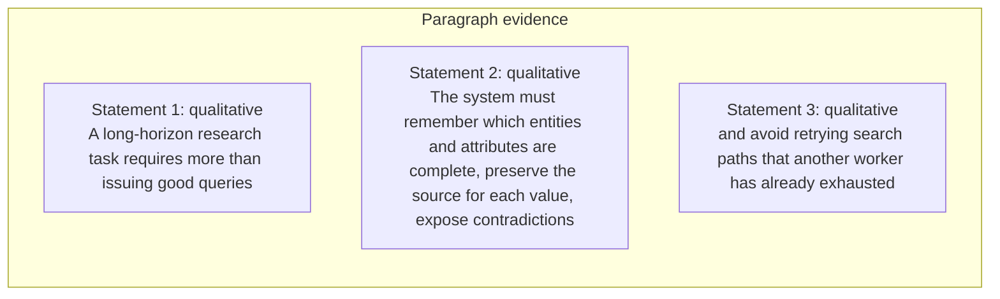

#### Python

```python
from html import escape
from pathlib import Path
from textwrap import wrap

title = "sos_why_p1: Optional prior-work and research-question annotation — Annotated prior-work contrast"
rows = [["Paragraph evidence","Statement 1","qualitative","A long-horizon research task requires more than issuing good queries"],["Paragraph evidence","Statement 2","qualitative","The system must remember which entities and attributes are complete, preserve the source for each value, expose contradictions"],["Paragraph evidence","Statement 3","qualitative","and avoid retrying search paths that another worker has already exhausted"]]
groups = {}
for group, label, value, condition in rows:
    groups.setdefault(group, []).append((label, value, condition))
width = max(900, len(groups) * 360)
height = 220 + max((len(items) for items in groups.values()), default=1) * 92
parts = [
    f'<svg xmlns="http://www.w3.org/2000/svg" viewBox="0 0 {width} {height}" role="img" aria-labelledby="title desc">',
    f'<title id="title">{escape(title)}</title>',
    '<desc id="desc">Separate panels preserve grouping and prevent unrelated conditions from reading as one sequence.</desc>',
    f'<rect width="{width}" height="{height}" fill="white"/>',
]
for group_index, (group, items) in enumerate(groups.items()):
    x = 180 + group_index * 360
    parts.append(f'<text x="{x}" y="65" text-anchor="middle" font-family="sans-serif" font-size="16" font-weight="700">{escape(group)}</text>')
    for item_index, (label, value, condition) in enumerate(items):
        y = 120 + item_index * 92
        parts.append(f'<rect x="{x-160}" y="{y-30}" width="320" height="78" rx="12" fill="#f7fbff" stroke="#ccd"/>')
        text = f"{label}: {value} — {condition}"
        for line_index, line in enumerate(wrap(text, width=46)):
            parts.append(f'<text x="{x}" y="{y-6+line_index*14}" text-anchor="middle" font-family="sans-serif" font-size="11">{escape(line)}</text>')
parts.append('</svg>')
Path("sos_why_p1_treatment_a.svg").write_text("\n".join(parts), encoding="utf-8")
```

### Treatment B — Optional prior-work and research-question annotation — Research-question ledger

- Teaching purpose: Optional contingency only. List assumptions and exclusions without inventing a mechanism.
- Encoding and reading order: Render 3 rows with explicit `Group`, `Measure or state`, `Visible value`, and `Condition or boundary` columns. The value column must be visible, not only present in ARIA text or fallback prose.
- Evidence and limitations: Encode only `sos_core`, `sos_socm` from `sos_formulation_source`. The prose is already sufficient; any contingency must remain a non-quantitative annotation.
- Recommended web medium: semantic HTML/CSS table with SVG export; JavaScript is optional only for meaningful focus, drill-down, or state playback.
- Mobile, accessibility, and motion behavior: Preserve the same group and node order in the DOM; retain all values and relation labels as selectable text; stack panels or levels below 640px; provide keyboard access for any optional focus state; keep a complete static fallback; respect reduced motion and never encode information only through animation.

#### TikZ

```tex
\documentclass[tikz,border=5pt]{standalone}
\usepackage[T1]{fontenc}
\usepackage{array}
\usepackage{tikz}
\begin{document}
\begin{tikzpicture}[font=\sffamily]
\node[align=center] {\textbf{sos\_why\_p1: Optional prior-work and research-question annotation - Research-question ledger}\\[6pt]
\begin{tabular}{p{3.2cm}p{4.0cm}p{2.8cm}p{6.2cm}}
\textbf{Group} & \textbf{Measure or state} & \textbf{Visible value} & \textbf{Condition or boundary} \\ \hline
Paragraph evidence & Statement 1 & qualitative & A long-horizon research task requires more than issuing good queries \\
Paragraph evidence & Statement 2 & qualitative & The system must remember which entities and attributes are complete, preserve the source for each value, expose contradictions \\
Paragraph evidence & Statement 3 & qualitative & and avoid retrying search paths that another worker has already exhausted \\
\end{tabular}};
\end{tikzpicture}
\end{document}
```

#### Mermaid

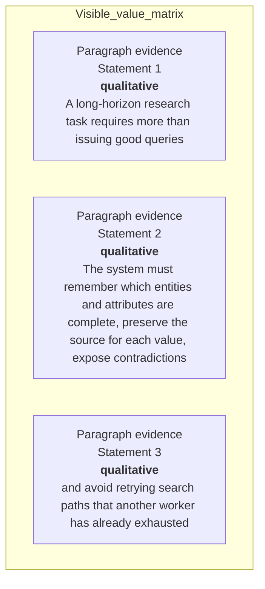

#### Python

```python
from html import escape
from pathlib import Path
from textwrap import wrap

title = "sos_why_p1: Optional prior-work and research-question annotation — Research-question ledger"
rows = [["Paragraph evidence","Statement 1","qualitative","A long-horizon research task requires more than issuing good queries"],["Paragraph evidence","Statement 2","qualitative","The system must remember which entities and attributes are complete, preserve the source for each value, expose contradictions"],["Paragraph evidence","Statement 3","qualitative","and avoid retrying search paths that another worker has already exhausted"]]
height = 414
parts = [
    f'<svg xmlns="http://www.w3.org/2000/svg" viewBox="0 0 1200 {height}" role="img" aria-labelledby="title desc">',
    f'<title id="title">{escape(title)}</title>',
    '<desc id="desc">Every reported value is visible beside its condition and group.</desc>',
    f'<rect width="1200" height="{height}" fill="white"/>',
]
headers = ["Group", "Measure or state", "Visible value", "Condition or boundary"]
xs = [30, 260, 590, 770]
for x, header in zip(xs, headers):
    parts.append(f'<text x="{x}" y="70" font-family="sans-serif" font-size="16" font-weight="700">{escape(header)}</text>')
for row_index, row in enumerate(rows):
    y = 110 + row_index * 88
    parts.append(f'<rect x="20" y="{y-28}" width="1160" height="76" fill="#f7fbff" stroke="#ccd"/>')
    for x, cell, width in zip(xs, row, [26, 38, 20, 58]):
        for line_index, line in enumerate(wrap(str(cell), width=width)):
            parts.append(f'<text x="{x}" y="{y+line_index*14}" font-family="sans-serif" font-size="11">{escape(line)}</text>')
parts.append('</svg>')
Path("sos_why_p1_treatment_b.svg").write_text("\n".join(parts), encoding="utf-8")
```

### Treatment C — Optional prior-work and research-question annotation — Question boundary map

- Teaching purpose: Optional contingency only. Connect only the explicit premise and research question.
- Encoding and reading order: Use 3 named nodes and 2 explicit labeled relations. Preserve all branch, merge, hierarchy, loop, or sequence edges shown in the code; changing them is an evidence deviation.
- Evidence and limitations: Encode only `sos_core`, `sos_socm` from `sos_formulation_source`. The prose is already sufficient; any contingency must remain a non-quantitative annotation.
- Recommended web medium: responsive inline SVG with semantic HTML/CSS fallback; JavaScript is optional only for meaningful focus, drill-down, or state playback.
- Mobile, accessibility, and motion behavior: Preserve the same group and node order in the DOM; retain all values and relation labels as selectable text; stack panels or levels below 640px; provide keyboard access for any optional focus state; keep a complete static fallback; respect reduced motion and never encode information only through animation.

#### TikZ

```tex
\documentclass[tikz,border=5pt]{standalone}
\usepackage[T1]{fontenc}
\usepackage{tikz}
\usetikzlibrary{arrows.meta}
\begin{document}
\begin{tikzpicture}[font=\sffamily,box/.style={draw,rounded corners,align=center,text width=3cm,minimum height=1.2cm},link/.style={-{Latex[length=2mm]},thick},rel/.style={fill=white,font=\scriptsize}]
\node[font=\bfseries,anchor=west] at (0,0.8) {sos\_why\_p1: Optional prior-work and research-question annotation - Question boundary map};
\node[box] (n1) at (1.00,-1.50) {A long-horizon research task requires more than issuing good queries};
\node[box] (n2) at (2.50,-1.50) {The system must remember which entities and attributes are complete, preserve the source for each value, expose contradictions};
\node[box] (n3) at (4.00,-1.50) {and avoid retrying search paths that another worker has already exhausted};
\draw[link] (n1) -- node[rel] {then} (n2);
\draw[link] (n2) -- node[rel] {then} (n3);
\end{tikzpicture}
\end{document}
```

#### Mermaid

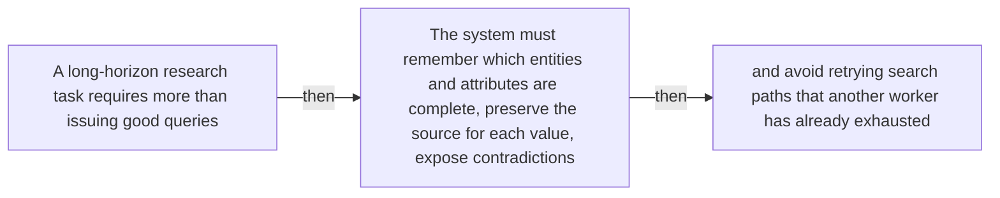

#### Python

```python
from html import escape
from pathlib import Path
from textwrap import wrap

title = "sos_why_p1: Optional prior-work and research-question annotation — Question boundary map"
nodes = [["n1","A long-horizon research task requires more than issuing good queries",100,150],["n2","The system must remember which entities and attributes are complete, preserve the source for each value, expose contradictions",250,150],["n3","and avoid retrying search paths that another worker has already exhausted",400,150]]
edges = [["n1","n2","then"],["n2","n3","then"]]
node_by_id = {node_id: (label, x, y) for node_id, label, x, y in nodes}
width = max(900, max((x for _, _, x, _ in nodes), default=800) + 180)
height = max(500, max((y for _, _, _, y in nodes), default=400) + 140)
parts = [
    f'<svg xmlns="http://www.w3.org/2000/svg" viewBox="0 0 {width} {height}" role="img" aria-labelledby="title desc">',
    f'<title id="title">{escape(title)}</title>',
    '<desc id="desc">Edges and convergence points encode only relationships stated in the scoped paragraphs.</desc>',
    f'<rect width="{width}" height="{height}" fill="white"/>',
]
for source, target, relation in edges:
    _, x1, y1 = node_by_id[source]
    _, x2, y2 = node_by_id[target]
    parts.append(f'<line x1="{x1}" y1="{y1}" x2="{x2}" y2="{y2}" stroke="#345" stroke-width="2"/>')
    parts.append(f'<text x="{(x1+x2)/2}" y="{(y1+y2)/2-5}" text-anchor="middle" font-family="sans-serif" font-size="10">{escape(relation)}</text>')
for _, label, x, y in nodes:
    parts.append(f'<rect x="{x-78}" y="{y-42}" width="156" height="84" rx="12" fill="#eef6ff" stroke="#234"/>')
    for line_index, line in enumerate(wrap(label, width=22)):
        parts.append(f'<text x="{x}" y="{y-24+line_index*13}" text-anchor="middle" font-family="sans-serif" font-size="10">{escape(line)}</text>')
parts.append('</svg>')
Path("sos_why_p1_treatment_c.svg").write_text("\n".join(parts), encoding="utf-8")
```

### Implementation record

- Status: `NOT_NEEDED`
- Selected treatment: `NONE`
- Selection rationale: The engineer marked this paragraph prose-only, so the implementation intentionally leaves `sos_why_p1` without a figure.
- Delivery medium: `NONE`
- Visual ID and placement: `NONE`; prose remains at `#sos_why_p1`.
- Shared paragraph scope: `NONE`
- Changed files: `NONE`
- Accessibility and fallback verification: The paragraph remains semantic text and does not rely on visual or motion-only information.
- Desktop and mobile verification: Verified in Playwright on desktop and mobile; no figure is attached to this prose-only paragraph.
- Evidence deviations: `NONE`

## `sos_why_p2`

- Location: `sos_why`, paragraph 2
- Text anchor: "Conventional agents often keep this state in growing conversation histories."
- Claims and sources: `sos_core` (OBSERVED, VERIFIED); `sos_socm` (OBSERVED, VERIFIED); `sos_formulation_source` (Sections 2–3.2, Equations 1–10, Figure 2, PDF pages 3–6; the arXiv v1 record identifies the paper as CC BY 4.0)
- Visual needed: `NO`
- Decision rationale: Prose remains the better primary form. The paragraph states a bounded conclusion or heterogeneous qualification without requiring a material process, topology, quantitative comparison, uncertainty distribution, or state transition. The three treatments are contingencies only and are not recommended for implementation.
- Explanatory job: Optional prior-work and research-question annotation.
- Recommended scope and placement: Prose-only. Do not attach a figure unless the paragraph or evidence changes.
- QA-informed planning change: The prose is already sufficient; any contingency must remain a non-quantitative annotation.

### Treatment A — Optional prior-work and research-question annotation — Annotated prior-work contrast

- Teaching purpose: Optional contingency only. Keep prior work and the paper's question distinct.
- Encoding and reading order: Group the 3 source-backed records into named panels using the first column as the grouping key. Panels preserve experimental, source, or example boundaries and never imply one shared scale.
- Evidence and limitations: Encode only `sos_core`, `sos_socm` from `sos_formulation_source`. The prose is already sufficient; any contingency must remain a non-quantitative annotation.
- Recommended web medium: semantic HTML/CSS grouped panels or responsive SVG; JavaScript is optional only for meaningful focus, drill-down, or state playback.
- Mobile, accessibility, and motion behavior: Preserve the same group and node order in the DOM; retain all values and relation labels as selectable text; stack panels or levels below 640px; provide keyboard access for any optional focus state; keep a complete static fallback; respect reduced motion and never encode information only through animation.

#### TikZ

```tex
\documentclass[tikz,border=5pt]{standalone}
\usepackage[T1]{fontenc}
\usepackage{tikz}
\begin{document}
\begin{tikzpicture}[font=\sffamily,panel/.style={draw,rounded corners,align=center,text width=4.8cm,minimum height=4cm}]
\node[font=\bfseries] at (0,3) {sos\_why\_p2: Optional prior-work and research-question annotation - Annotated prior-work contrast};
\node[panel] at (0,0) {\textbf{Paragraph evidence}\\[4pt]\textbf{Statement 1}: qualitative -- Conventional agents often keep this state in growing conversation histories\\\textbf{Statement 2}: qualitative -- As evidence becomes buried, workers can duplicate effort, disagree about fields, overlook gaps\\\textbf{Statement 3}: qualitative -- or leave parallel slots idle while a slow branch finishes};
\end{tikzpicture}
\end{document}
```

#### Mermaid

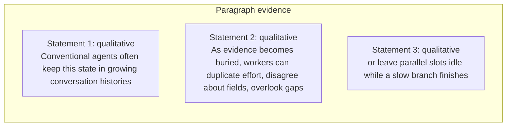

#### Python

```python
from html import escape
from pathlib import Path
from textwrap import wrap

title = "sos_why_p2: Optional prior-work and research-question annotation — Annotated prior-work contrast"
rows = [["Paragraph evidence","Statement 1","qualitative","Conventional agents often keep this state in growing conversation histories"],["Paragraph evidence","Statement 2","qualitative","As evidence becomes buried, workers can duplicate effort, disagree about fields, overlook gaps"],["Paragraph evidence","Statement 3","qualitative","or leave parallel slots idle while a slow branch finishes"]]
groups = {}
for group, label, value, condition in rows:
    groups.setdefault(group, []).append((label, value, condition))
width = max(900, len(groups) * 360)
height = 220 + max((len(items) for items in groups.values()), default=1) * 92
parts = [
    f'<svg xmlns="http://www.w3.org/2000/svg" viewBox="0 0 {width} {height}" role="img" aria-labelledby="title desc">',
    f'<title id="title">{escape(title)}</title>',
    '<desc id="desc">Separate panels preserve grouping and prevent unrelated conditions from reading as one sequence.</desc>',
    f'<rect width="{width}" height="{height}" fill="white"/>',
]
for group_index, (group, items) in enumerate(groups.items()):
    x = 180 + group_index * 360
    parts.append(f'<text x="{x}" y="65" text-anchor="middle" font-family="sans-serif" font-size="16" font-weight="700">{escape(group)}</text>')
    for item_index, (label, value, condition) in enumerate(items):
        y = 120 + item_index * 92
        parts.append(f'<rect x="{x-160}" y="{y-30}" width="320" height="78" rx="12" fill="#f7fbff" stroke="#ccd"/>')
        text = f"{label}: {value} — {condition}"
        for line_index, line in enumerate(wrap(text, width=46)):
            parts.append(f'<text x="{x}" y="{y-6+line_index*14}" text-anchor="middle" font-family="sans-serif" font-size="11">{escape(line)}</text>')
parts.append('</svg>')
Path("sos_why_p2_treatment_a.svg").write_text("\n".join(parts), encoding="utf-8")
```

### Treatment B — Optional prior-work and research-question annotation — Research-question ledger

- Teaching purpose: Optional contingency only. List assumptions and exclusions without inventing a mechanism.
- Encoding and reading order: Render 3 rows with explicit `Group`, `Measure or state`, `Visible value`, and `Condition or boundary` columns. The value column must be visible, not only present in ARIA text or fallback prose.
- Evidence and limitations: Encode only `sos_core`, `sos_socm` from `sos_formulation_source`. The prose is already sufficient; any contingency must remain a non-quantitative annotation.
- Recommended web medium: semantic HTML/CSS table with SVG export; JavaScript is optional only for meaningful focus, drill-down, or state playback.
- Mobile, accessibility, and motion behavior: Preserve the same group and node order in the DOM; retain all values and relation labels as selectable text; stack panels or levels below 640px; provide keyboard access for any optional focus state; keep a complete static fallback; respect reduced motion and never encode information only through animation.

#### TikZ

```tex
\documentclass[tikz,border=5pt]{standalone}
\usepackage[T1]{fontenc}
\usepackage{array}
\usepackage{tikz}
\begin{document}
\begin{tikzpicture}[font=\sffamily]
\node[align=center] {\textbf{sos\_why\_p2: Optional prior-work and research-question annotation - Research-question ledger}\\[6pt]
\begin{tabular}{p{3.2cm}p{4.0cm}p{2.8cm}p{6.2cm}}
\textbf{Group} & \textbf{Measure or state} & \textbf{Visible value} & \textbf{Condition or boundary} \\ \hline
Paragraph evidence & Statement 1 & qualitative & Conventional agents often keep this state in growing conversation histories \\
Paragraph evidence & Statement 2 & qualitative & As evidence becomes buried, workers can duplicate effort, disagree about fields, overlook gaps \\
Paragraph evidence & Statement 3 & qualitative & or leave parallel slots idle while a slow branch finishes \\
\end{tabular}};
\end{tikzpicture}
\end{document}
```

#### Mermaid

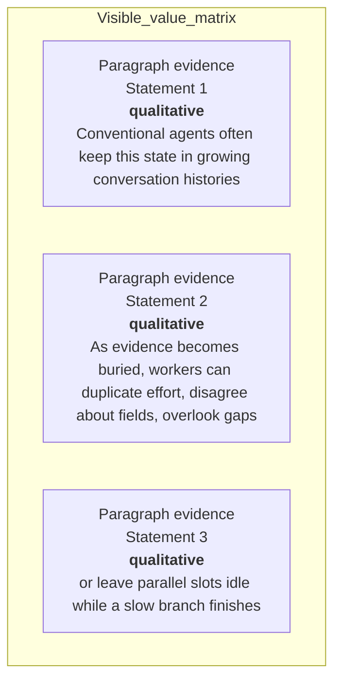

#### Python

```python
from html import escape
from pathlib import Path
from textwrap import wrap

title = "sos_why_p2: Optional prior-work and research-question annotation — Research-question ledger"
rows = [["Paragraph evidence","Statement 1","qualitative","Conventional agents often keep this state in growing conversation histories"],["Paragraph evidence","Statement 2","qualitative","As evidence becomes buried, workers can duplicate effort, disagree about fields, overlook gaps"],["Paragraph evidence","Statement 3","qualitative","or leave parallel slots idle while a slow branch finishes"]]
height = 414
parts = [
    f'<svg xmlns="http://www.w3.org/2000/svg" viewBox="0 0 1200 {height}" role="img" aria-labelledby="title desc">',
    f'<title id="title">{escape(title)}</title>',
    '<desc id="desc">Every reported value is visible beside its condition and group.</desc>',
    f'<rect width="1200" height="{height}" fill="white"/>',
]
headers = ["Group", "Measure or state", "Visible value", "Condition or boundary"]
xs = [30, 260, 590, 770]
for x, header in zip(xs, headers):
    parts.append(f'<text x="{x}" y="70" font-family="sans-serif" font-size="16" font-weight="700">{escape(header)}</text>')
for row_index, row in enumerate(rows):
    y = 110 + row_index * 88
    parts.append(f'<rect x="20" y="{y-28}" width="1160" height="76" fill="#f7fbff" stroke="#ccd"/>')
    for x, cell, width in zip(xs, row, [26, 38, 20, 58]):
        for line_index, line in enumerate(wrap(str(cell), width=width)):
            parts.append(f'<text x="{x}" y="{y+line_index*14}" font-family="sans-serif" font-size="11">{escape(line)}</text>')
parts.append('</svg>')
Path("sos_why_p2_treatment_b.svg").write_text("\n".join(parts), encoding="utf-8")
```

### Treatment C — Optional prior-work and research-question annotation — Question boundary map

- Teaching purpose: Optional contingency only. Connect only the explicit premise and research question.
- Encoding and reading order: Use 3 named nodes and 2 explicit labeled relations. Preserve all branch, merge, hierarchy, loop, or sequence edges shown in the code; changing them is an evidence deviation.
- Evidence and limitations: Encode only `sos_core`, `sos_socm` from `sos_formulation_source`. The prose is already sufficient; any contingency must remain a non-quantitative annotation.
- Recommended web medium: responsive inline SVG with semantic HTML/CSS fallback; JavaScript is optional only for meaningful focus, drill-down, or state playback.
- Mobile, accessibility, and motion behavior: Preserve the same group and node order in the DOM; retain all values and relation labels as selectable text; stack panels or levels below 640px; provide keyboard access for any optional focus state; keep a complete static fallback; respect reduced motion and never encode information only through animation.

#### TikZ

```tex
\documentclass[tikz,border=5pt]{standalone}
\usepackage[T1]{fontenc}
\usepackage{tikz}
\usetikzlibrary{arrows.meta}
\begin{document}
\begin{tikzpicture}[font=\sffamily,box/.style={draw,rounded corners,align=center,text width=3cm,minimum height=1.2cm},link/.style={-{Latex[length=2mm]},thick},rel/.style={fill=white,font=\scriptsize}]
\node[font=\bfseries,anchor=west] at (0,0.8) {sos\_why\_p2: Optional prior-work and research-question annotation - Question boundary map};
\node[box] (n1) at (1.00,-1.50) {Conventional agents often keep this state in growing conversation histories};
\node[box] (n2) at (2.50,-1.50) {As evidence becomes buried, workers can duplicate effort, disagree about fields, overlook gaps};
\node[box] (n3) at (4.00,-1.50) {or leave parallel slots idle while a slow branch finishes};
\draw[link] (n1) -- node[rel] {then} (n2);
\draw[link] (n2) -- node[rel] {then} (n3);
\end{tikzpicture}
\end{document}
```

#### Mermaid

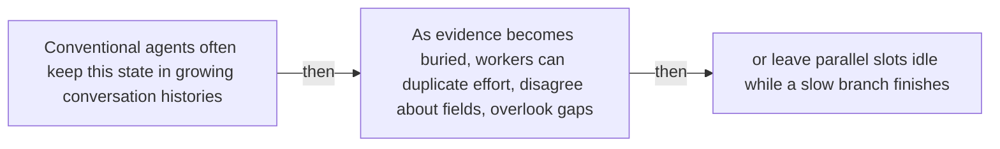

#### Python

```python
from html import escape
from pathlib import Path
from textwrap import wrap

title = "sos_why_p2: Optional prior-work and research-question annotation — Question boundary map"
nodes = [["n1","Conventional agents often keep this state in growing conversation histories",100,150],["n2","As evidence becomes buried, workers can duplicate effort, disagree about fields, overlook gaps",250,150],["n3","or leave parallel slots idle while a slow branch finishes",400,150]]
edges = [["n1","n2","then"],["n2","n3","then"]]
node_by_id = {node_id: (label, x, y) for node_id, label, x, y in nodes}
width = max(900, max((x for _, _, x, _ in nodes), default=800) + 180)
height = max(500, max((y for _, _, _, y in nodes), default=400) + 140)
parts = [
    f'<svg xmlns="http://www.w3.org/2000/svg" viewBox="0 0 {width} {height}" role="img" aria-labelledby="title desc">',
    f'<title id="title">{escape(title)}</title>',
    '<desc id="desc">Edges and convergence points encode only relationships stated in the scoped paragraphs.</desc>',
    f'<rect width="{width}" height="{height}" fill="white"/>',
]
for source, target, relation in edges:
    _, x1, y1 = node_by_id[source]
    _, x2, y2 = node_by_id[target]
    parts.append(f'<line x1="{x1}" y1="{y1}" x2="{x2}" y2="{y2}" stroke="#345" stroke-width="2"/>')
    parts.append(f'<text x="{(x1+x2)/2}" y="{(y1+y2)/2-5}" text-anchor="middle" font-family="sans-serif" font-size="10">{escape(relation)}</text>')
for _, label, x, y in nodes:
    parts.append(f'<rect x="{x-78}" y="{y-42}" width="156" height="84" rx="12" fill="#eef6ff" stroke="#234"/>')
    for line_index, line in enumerate(wrap(label, width=22)):
        parts.append(f'<text x="{x}" y="{y-24+line_index*13}" text-anchor="middle" font-family="sans-serif" font-size="10">{escape(line)}</text>')
parts.append('</svg>')
Path("sos_why_p2_treatment_c.svg").write_text("\n".join(parts), encoding="utf-8")
```

### Implementation record

- Status: `NOT_NEEDED`
- Selected treatment: `NONE`
- Selection rationale: The engineer marked this paragraph prose-only, so the implementation intentionally leaves `sos_why_p2` without a figure.
- Delivery medium: `NONE`
- Visual ID and placement: `NONE`; prose remains at `#sos_why_p2`.
- Shared paragraph scope: `NONE`
- Changed files: `NONE`
- Accessibility and fallback verification: The paragraph remains semantic text and does not rely on visual or motion-only information.
- Desktop and mobile verification: Verified in Playwright on desktop and mobile; no figure is attached to this prose-only paragraph.
- Evidence deviations: `NONE`

## `sos_change_p1`

- Location: `sos_change`, paragraph 1
- Text anchor: "SearchOS converts a natural-language request into one or more related tables."
- Claims and sources: `sos_schema` (OBSERVED, VERIFIED); `sos_socm` (OBSERVED, VERIFIED); `sos_formulation_source` (Sections 2–3.2, Equations 1–10, Figure 2, PDF pages 3–6; the arXiv v1 record identifies the paper as CC BY 4.0)
- Visual needed: `YES`
- Decision rationale: A visual passes the removal test because readers must reconstruct request-to-table schema, cell state, and citation binding while preserving the paragraph's conditions and boundaries. Revision 3 narrows the topology and placement so no visual can claim this paragraph without encoding its mechanism, grouping, or values.
- Explanatory job: Request-to-table schema, cell state, and citation binding.
- Recommended scope and placement: This paragraph only; place the visual immediately after `sos_change_p1`.
- QA-informed planning change: Show entities, attributes, populated/missing/conflicting cell states, and value-to-source-span binding.

### Treatment A — Request-to-table schema, cell state, and citation binding — Component topology

- Teaching purpose: Show the stated component connections and convergence points.
- Encoding and reading order: Use 4 named nodes and 3 explicit labeled relations. Preserve all branch, merge, hierarchy, loop, or sequence edges shown in the code; changing them is an evidence deviation.
- Evidence and limitations: Encode only `sos_schema`, `sos_socm` from `sos_formulation_source`. Show entities, attributes, populated/missing/conflicting cell states, and value-to-source-span binding.
- Recommended web medium: responsive inline SVG with semantic HTML/CSS fallback; JavaScript is optional only for meaningful focus, drill-down, or state playback.
- Mobile, accessibility, and motion behavior: Preserve the same group and node order in the DOM; retain all values and relation labels as selectable text; stack panels or levels below 640px; provide keyboard access for any optional focus state; keep a complete static fallback; respect reduced motion and never encode information only through animation.

#### TikZ

```tex
\documentclass[tikz,border=5pt]{standalone}
\usepackage[T1]{fontenc}
\usepackage{tikz}
\usetikzlibrary{arrows.meta}
\begin{document}
\begin{tikzpicture}[font=\sffamily,box/.style={draw,rounded corners,align=center,text width=3cm,minimum height=1.2cm},link/.style={-{Latex[length=2mm]},thick},rel/.style={fill=white,font=\scriptsize}]
\node[font=\bfseries,anchor=west] at (0,0.8) {sos\_change\_p1: Request-to-table schema, cell state, and citation binding - Component topology};
\node[box] (n1) at (1.00,-1.50) {SearchOS converts a natural-language request into one or more related tables};
\node[box] (n2) at (2.50,-1.50) {Rows represent entities, columns represent requested attributes};
\node[box] (n3) at (4.00,-1.50) {and a citation matrix connects every populated value to a source URL and supporting excerpt};
\node[box] (n4) at (5.50,-1.50) {Missing cells become concrete search targets rather than vague reminders in a plan};
\draw[link] (n1) -- node[rel] {then} (n2);
\draw[link] (n2) -- node[rel] {then} (n3);
\draw[link] (n3) -- node[rel] {then} (n4);
\end{tikzpicture}
\end{document}
```

#### Mermaid

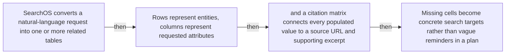

#### Python

```python
from html import escape
from pathlib import Path
from textwrap import wrap

title = "sos_change_p1: Request-to-table schema, cell state, and citation binding — Component topology"
nodes = [["n1","SearchOS converts a natural-language request into one or more related tables",100,150],["n2","Rows represent entities, columns represent requested attributes",250,150],["n3","and a citation matrix connects every populated value to a source URL and supporting excerpt",400,150],["n4","Missing cells become concrete search targets rather than vague reminders in a plan",550,150]]
edges = [["n1","n2","then"],["n2","n3","then"],["n3","n4","then"]]
node_by_id = {node_id: (label, x, y) for node_id, label, x, y in nodes}
width = max(900, max((x for _, _, x, _ in nodes), default=800) + 180)
height = max(500, max((y for _, _, _, y in nodes), default=400) + 140)
parts = [
    f'<svg xmlns="http://www.w3.org/2000/svg" viewBox="0 0 {width} {height}" role="img" aria-labelledby="title desc">',
    f'<title id="title">{escape(title)}</title>',
    '<desc id="desc">Edges and convergence points encode only relationships stated in the scoped paragraphs.</desc>',
    f'<rect width="{width}" height="{height}" fill="white"/>',
]
for source, target, relation in edges:
    _, x1, y1 = node_by_id[source]
    _, x2, y2 = node_by_id[target]
    parts.append(f'<line x1="{x1}" y1="{y1}" x2="{x2}" y2="{y2}" stroke="#345" stroke-width="2"/>')
    parts.append(f'<text x="{(x1+x2)/2}" y="{(y1+y2)/2-5}" text-anchor="middle" font-family="sans-serif" font-size="10">{escape(relation)}</text>')
for _, label, x, y in nodes:
    parts.append(f'<rect x="{x-78}" y="{y-42}" width="156" height="84" rx="12" fill="#eef6ff" stroke="#234"/>')
    for line_index, line in enumerate(wrap(label, width=22)):
        parts.append(f'<text x="{x}" y="{y-24+line_index*13}" text-anchor="middle" font-family="sans-serif" font-size="10">{escape(line)}</text>')
parts.append('</svg>')
Path("sos_change_p1_treatment_a.svg").write_text("\n".join(parts), encoding="utf-8")
```

### Treatment B — Request-to-table schema, cell state, and citation binding — Architecture cross-section

- Teaching purpose: Separate component responsibilities without flattening them into one list.
- Encoding and reading order: Group the 4 source-backed records into named panels using the first column as the grouping key. Panels preserve experimental, source, or example boundaries and never imply one shared scale.
- Evidence and limitations: Encode only `sos_schema`, `sos_socm` from `sos_formulation_source`. Show entities, attributes, populated/missing/conflicting cell states, and value-to-source-span binding.
- Recommended web medium: semantic HTML/CSS grouped panels or responsive SVG; JavaScript is optional only for meaningful focus, drill-down, or state playback.
- Mobile, accessibility, and motion behavior: Preserve the same group and node order in the DOM; retain all values and relation labels as selectable text; stack panels or levels below 640px; provide keyboard access for any optional focus state; keep a complete static fallback; respect reduced motion and never encode information only through animation.

#### TikZ

```tex
\documentclass[tikz,border=5pt]{standalone}
\usepackage[T1]{fontenc}
\usepackage{tikz}
\begin{document}
\begin{tikzpicture}[font=\sffamily,panel/.style={draw,rounded corners,align=center,text width=4.8cm,minimum height=4cm}]
\node[font=\bfseries] at (0,3) {sos\_change\_p1: Request-to-table schema, cell state, and citation binding - Architecture cross-section};
\node[panel] at (0,0) {\textbf{From an open request to inspectable missing cells}\\[4pt]\textbf{Natural-language request}: qualitative -- The user asks for entities, attributes, comparisons, and supporting sources without yet defining a durable search state.\\\textbf{Related tables}: qualitative -- Rows represent entities, columns represent requested attributes, and relations connect the tables needed for the answer.\\\textbf{Materialized coverage}: qualitative -- Each known cell has an explicit status such as missing, filled, uncertain, unreachable, or conflicting.\\\textbf{Citation binding}: qualitative -- A populated value is associated with its source URL and an anchored supporting excerpt rather than only appearing in conversation history.};
\end{tikzpicture}
\end{document}
```

#### Mermaid

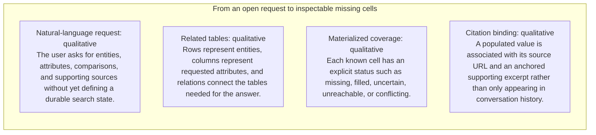

#### Python

```python
from html import escape
from pathlib import Path
from textwrap import wrap

title = "sos_change_p1: Request-to-table schema, cell state, and citation binding — Architecture cross-section"
rows = [["From an open request to inspectable missing cells","Natural-language request","qualitative","The user asks for entities, attributes, comparisons, and supporting sources without yet defining a durable search state."],["From an open request to inspectable missing cells","Related tables","qualitative","Rows represent entities, columns represent requested attributes, and relations connect the tables needed for the answer."],["From an open request to inspectable missing cells","Materialized coverage","qualitative","Each known cell has an explicit status such as missing, filled, uncertain, unreachable, or conflicting."],["From an open request to inspectable missing cells","Citation binding","qualitative","A populated value is associated with its source URL and an anchored supporting excerpt rather than only appearing in conversation history."]]
groups = {}
for group, label, value, condition in rows:
    groups.setdefault(group, []).append((label, value, condition))
width = max(900, len(groups) * 360)
height = 220 + max((len(items) for items in groups.values()), default=1) * 92
parts = [
    f'<svg xmlns="http://www.w3.org/2000/svg" viewBox="0 0 {width} {height}" role="img" aria-labelledby="title desc">',
    f'<title id="title">{escape(title)}</title>',
    '<desc id="desc">Separate panels preserve grouping and prevent unrelated conditions from reading as one sequence.</desc>',
    f'<rect width="{width}" height="{height}" fill="white"/>',
]
for group_index, (group, items) in enumerate(groups.items()):
    x = 180 + group_index * 360
    parts.append(f'<text x="{x}" y="65" text-anchor="middle" font-family="sans-serif" font-size="16" font-weight="700">{escape(group)}</text>')
    for item_index, (label, value, condition) in enumerate(items):
        y = 120 + item_index * 92
        parts.append(f'<rect x="{x-160}" y="{y-30}" width="320" height="78" rx="12" fill="#f7fbff" stroke="#ccd"/>')
        text = f"{label}: {value} — {condition}"
        for line_index, line in enumerate(wrap(text, width=46)):
            parts.append(f'<text x="{x}" y="{y-6+line_index*14}" text-anchor="middle" font-family="sans-serif" font-size="11">{escape(line)}</text>')
parts.append('</svg>')
Path("sos_change_p1_treatment_b.svg").write_text("\n".join(parts), encoding="utf-8")
```

### Treatment C — Request-to-table schema, cell state, and citation binding — One-item traversal

- Teaching purpose: Trace one token, request, or state through the architecture.
- Encoding and reading order: Use 4 named nodes and 3 explicit labeled relations. Preserve all branch, merge, hierarchy, loop, or sequence edges shown in the code; changing them is an evidence deviation.
- Evidence and limitations: Encode only `sos_schema`, `sos_socm` from `sos_formulation_source`. Show entities, attributes, populated/missing/conflicting cell states, and value-to-source-span binding.
- Recommended web medium: responsive inline SVG with semantic HTML/CSS fallback; JavaScript is optional only for meaningful focus, drill-down, or state playback.
- Mobile, accessibility, and motion behavior: Preserve the same group and node order in the DOM; retain all values and relation labels as selectable text; stack panels or levels below 640px; provide keyboard access for any optional focus state; keep a complete static fallback; respect reduced motion and never encode information only through animation.

#### TikZ

```tex
\documentclass[tikz,border=5pt]{standalone}
\usepackage[T1]{fontenc}
\usepackage{tikz}
\usetikzlibrary{arrows.meta}
\begin{document}
\begin{tikzpicture}[font=\sffamily,box/.style={draw,rounded corners,align=center,text width=3cm,minimum height=1.2cm},link/.style={-{Latex[length=2mm]},thick},rel/.style={fill=white,font=\scriptsize}]
\node[font=\bfseries,anchor=west] at (0,0.8) {sos\_change\_p1: Request-to-table schema, cell state, and citation binding - One-item traversal};
\node[box] (n1) at (1.00,-1.50) {SearchOS converts a natural-language request into one or more related tables};
\node[box] (n2) at (2.50,-1.50) {Rows represent entities, columns represent requested attributes};
\node[box] (n3) at (4.00,-1.50) {and a citation matrix connects every populated value to a source URL and supporting excerpt};
\node[box] (n4) at (5.50,-1.50) {Missing cells become concrete search targets rather than vague reminders in a plan};
\draw[link] (n1) -- node[rel] {then} (n2);
\draw[link] (n2) -- node[rel] {then} (n3);
\draw[link] (n3) -- node[rel] {then} (n4);
\end{tikzpicture}
\end{document}
```

#### Mermaid


#### Python

```python
from html import escape
from pathlib import Path
from textwrap import wrap

title = "sos_change_p1: Request-to-table schema, cell state, and citation binding — One-item traversal"
nodes = [["n1","SearchOS converts a natural-language request into one or more related tables",100,150],["n2","Rows represent entities, columns represent requested attributes",250,150],["n3","and a citation matrix connects every populated value to a source URL and supporting excerpt",400,150],["n4","Missing cells become concrete search targets rather than vague reminders in a plan",550,150]]
edges = [["n1","n2","then"],["n2","n3","then"],["n3","n4","then"]]
node_by_id = {node_id: (label, x, y) for node_id, label, x, y in nodes}
width = max(900, max((x for _, _, x, _ in nodes), default=800) + 180)
height = max(500, max((y for _, _, _, y in nodes), default=400) + 140)
parts = [
    f'<svg xmlns="http://www.w3.org/2000/svg" viewBox="0 0 {width} {height}" role="img" aria-labelledby="title desc">',
    f'<title id="title">{escape(title)}</title>',
    '<desc id="desc">Edges and convergence points encode only relationships stated in the scoped paragraphs.</desc>',
    f'<rect width="{width}" height="{height}" fill="white"/>',
]
for source, target, relation in edges:
    _, x1, y1 = node_by_id[source]
    _, x2, y2 = node_by_id[target]
    parts.append(f'<line x1="{x1}" y1="{y1}" x2="{x2}" y2="{y2}" stroke="#345" stroke-width="2"/>')
    parts.append(f'<text x="{(x1+x2)/2}" y="{(y1+y2)/2-5}" text-anchor="middle" font-family="sans-serif" font-size="10">{escape(relation)}</text>')
for _, label, x, y in nodes:
    parts.append(f'<rect x="{x-78}" y="{y-42}" width="156" height="84" rx="12" fill="#eef6ff" stroke="#234"/>')
    for line_index, line in enumerate(wrap(label, width=22)):
        parts.append(f'<text x="{x}" y="{y-24+line_index*13}" text-anchor="middle" font-family="sans-serif" font-size="10">{escape(line)}</text>')
parts.append('</svg>')
Path("sos_change_p1_treatment_c.svg").write_text("\n".join(parts), encoding="utf-8")
```

### Implementation record

- Status: `IMPLEMENTED`
- Selected treatment: `A`
- Selection rationale: Selected the approved relationship that directly answers this paragraph's explanatory job; the shared visual uses the same evidence and complete adjacent scope recorded here.
- Delivery medium: `CSS + semantic HTML`
- Visual ID and placement: `visual_searchos_schema_completion` after `sos_change_p2`; this record is served by that purpose-built figure.
- Shared paragraph scope: `sos_change_p1`, `sos_change_p2`
- Changed files: `packages/test-fixtures/explainers/searchos-v1.json`, `apps/web/app/papers/[id]/explainer-visual.tsx`, `apps/web/app/papers/[id]/page.tsx`, and `apps/web/app/globals.css`
- Accessibility and fallback verification: Figure has a programmatic title and description, explicit alt text, equivalent fallback prose, source links, limitations, and a semantic static body; no meaning depends on motion or pointer input.
- Desktop and mobile verification: Verified in Playwright on 1440-pixel desktop and iPhone 13 mobile viewports; figures remain paragraph-adjacent, preserve reading order, and introduce no horizontal page overflow.
- Evidence deviations: `NONE`; web-native CSS and semantic HTML preserve the selected treatment's evidence, labels, topology, and stated boundaries.

## `sos_change_p2`

- Location: `sos_change`, paragraph 2
- Text anchor: "The system then separates global coordination from local search."
- Claims and sources: `sos_schema` (OBSERVED, VERIFIED); `sos_socm` (OBSERVED, VERIFIED); `sos_formulation_source` (Sections 2–3.2, Equations 1–10, Figure 2, PDF pages 3–6; the arXiv v1 record identifies the paper as CC BY 4.0)
- Visual needed: `YES`
- Decision rationale: A visual passes the removal test because readers must reconstruct orchestrator, browse agents, writer, and shared-record ownership while preserving the paragraph's conditions and boundaries. Revision 3 narrows the topology and placement so no visual can claim this paragraph without encoding its mechanism, grouping, or values.
- Explanatory job: Orchestrator, browse agents, writer, and shared-record ownership.
- Recommended scope and placement: This paragraph only; place the visual immediately after `sos_change_p2`.
- QA-informed planning change: This paragraph needs actor-to-store topology; the schema-completion figure alone does not show role boundaries.

### Treatment A — Orchestrator, browse agents, writer, and shared-record ownership — Component topology

- Teaching purpose: Show the stated component connections and convergence points.
- Encoding and reading order: Use 4 named nodes and 3 explicit labeled relations. Preserve all branch, merge, hierarchy, loop, or sequence edges shown in the code; changing them is an evidence deviation.
- Evidence and limitations: Encode only `sos_schema`, `sos_socm` from `sos_formulation_source`. This paragraph needs actor-to-store topology; the schema-completion figure alone does not show role boundaries.
- Recommended web medium: responsive inline SVG with semantic HTML/CSS fallback; JavaScript is optional only for meaningful focus, drill-down, or state playback.
- Mobile, accessibility, and motion behavior: Preserve the same group and node order in the DOM; retain all values and relation labels as selectable text; stack panels or levels below 640px; provide keyboard access for any optional focus state; keep a complete static fallback; respect reduced motion and never encode information only through animation.

#### TikZ

```tex
\documentclass[tikz,border=5pt]{standalone}
\usepackage[T1]{fontenc}
\usepackage{tikz}
\usetikzlibrary{arrows.meta}
\begin{document}
\begin{tikzpicture}[font=\sffamily,box/.style={draw,rounded corners,align=center,text width=3cm,minimum height=1.2cm},link/.style={-{Latex[length=2mm]},thick},rel/.style={fill=white,font=\scriptsize}]
\node[font=\bfseries,anchor=west] at (0,0.8) {sos\_change\_p2: Orchestrator, browse agents, writer, and shared-record ownership - Component topology};
\node[box] (n1) at (1.00,-1.50) {The system then separates global coordination from local search};
\node[box] (n2) at (2.50,-1.50) {An orchestrator owns schema and task mutation, explore and search agents browse};
\node[box] (n3) at (4.00,-1.50) {and a writer reads accumulated state};
\node[box] (n4) at (5.50,-1.50) {Their coordination passes through shared records rather than free-form agent-to-agent conversation};
\draw[link] (n1) -- node[rel] {then} (n2);
\draw[link] (n2) -- node[rel] {then} (n3);
\draw[link] (n3) -- node[rel] {then} (n4);
\end{tikzpicture}
\end{document}
```

#### Mermaid

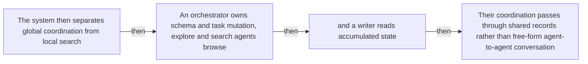

#### Python

```python
from html import escape
from pathlib import Path
from textwrap import wrap

title = "sos_change_p2: Orchestrator, browse agents, writer, and shared-record ownership — Component topology"
nodes = [["n1","The system then separates global coordination from local search",100,150],["n2","An orchestrator owns schema and task mutation, explore and search agents browse",250,150],["n3","and a writer reads accumulated state",400,150],["n4","Their coordination passes through shared records rather than free-form agent-to-agent conversation",550,150]]
edges = [["n1","n2","then"],["n2","n3","then"],["n3","n4","then"]]
node_by_id = {node_id: (label, x, y) for node_id, label, x, y in nodes}
width = max(900, max((x for _, _, x, _ in nodes), default=800) + 180)
height = max(500, max((y for _, _, _, y in nodes), default=400) + 140)
parts = [
    f'<svg xmlns="http://www.w3.org/2000/svg" viewBox="0 0 {width} {height}" role="img" aria-labelledby="title desc">',
    f'<title id="title">{escape(title)}</title>',
    '<desc id="desc">Edges and convergence points encode only relationships stated in the scoped paragraphs.</desc>',
    f'<rect width="{width}" height="{height}" fill="white"/>',
]
for source, target, relation in edges:
    _, x1, y1 = node_by_id[source]
    _, x2, y2 = node_by_id[target]
    parts.append(f'<line x1="{x1}" y1="{y1}" x2="{x2}" y2="{y2}" stroke="#345" stroke-width="2"/>')
    parts.append(f'<text x="{(x1+x2)/2}" y="{(y1+y2)/2-5}" text-anchor="middle" font-family="sans-serif" font-size="10">{escape(relation)}</text>')
for _, label, x, y in nodes:
    parts.append(f'<rect x="{x-78}" y="{y-42}" width="156" height="84" rx="12" fill="#eef6ff" stroke="#234"/>')
    for line_index, line in enumerate(wrap(label, width=22)):
        parts.append(f'<text x="{x}" y="{y-24+line_index*13}" text-anchor="middle" font-family="sans-serif" font-size="10">{escape(line)}</text>')
parts.append('</svg>')
Path("sos_change_p2_treatment_a.svg").write_text("\n".join(parts), encoding="utf-8")
```

### Treatment B — Orchestrator, browse agents, writer, and shared-record ownership — Architecture cross-section

- Teaching purpose: Separate component responsibilities without flattening them into one list.
- Encoding and reading order: Group the 4 source-backed records into named panels using the first column as the grouping key. Panels preserve experimental, source, or example boundaries and never imply one shared scale.
- Evidence and limitations: Encode only `sos_schema`, `sos_socm` from `sos_formulation_source`. This paragraph needs actor-to-store topology; the schema-completion figure alone does not show role boundaries.
- Recommended web medium: semantic HTML/CSS grouped panels or responsive SVG; JavaScript is optional only for meaningful focus, drill-down, or state playback.
- Mobile, accessibility, and motion behavior: Preserve the same group and node order in the DOM; retain all values and relation labels as selectable text; stack panels or levels below 640px; provide keyboard access for any optional focus state; keep a complete static fallback; respect reduced motion and never encode information only through animation.

#### TikZ

```tex
\documentclass[tikz,border=5pt]{standalone}
\usepackage[T1]{fontenc}
\usepackage{tikz}
\begin{document}
\begin{tikzpicture}[font=\sffamily,panel/.style={draw,rounded corners,align=center,text width=4.8cm,minimum height=4cm}]
\node[font=\bfseries] at (0,3) {sos\_change\_p2: Orchestrator, browse agents, writer, and shared-record ownership - Architecture cross-section};
\node[panel] at (0,0) {\textbf{From an open request to inspectable missing cells}\\[4pt]\textbf{Natural-language request}: qualitative -- The user asks for entities, attributes, comparisons, and supporting sources without yet defining a durable search state.\\\textbf{Related tables}: qualitative -- Rows represent entities, columns represent requested attributes, and relations connect the tables needed for the answer.\\\textbf{Materialized coverage}: qualitative -- Each known cell has an explicit status such as missing, filled, uncertain, unreachable, or conflicting.\\\textbf{Citation binding}: qualitative -- A populated value is associated with its source URL and an anchored supporting excerpt rather than only appearing in conversation history.};
\end{tikzpicture}
\end{document}
```

#### Mermaid


#### Python

```python
from html import escape
from pathlib import Path
from textwrap import wrap

title = "sos_change_p2: Orchestrator, browse agents, writer, and shared-record ownership — Architecture cross-section"
rows = [["From an open request to inspectable missing cells","Natural-language request","qualitative","The user asks for entities, attributes, comparisons, and supporting sources without yet defining a durable search state."],["From an open request to inspectable missing cells","Related tables","qualitative","Rows represent entities, columns represent requested attributes, and relations connect the tables needed for the answer."],["From an open request to inspectable missing cells","Materialized coverage","qualitative","Each known cell has an explicit status such as missing, filled, uncertain, unreachable, or conflicting."],["From an open request to inspectable missing cells","Citation binding","qualitative","A populated value is associated with its source URL and an anchored supporting excerpt rather than only appearing in conversation history."]]
groups = {}
for group, label, value, condition in rows:
    groups.setdefault(group, []).append((label, value, condition))
width = max(900, len(groups) * 360)
height = 220 + max((len(items) for items in groups.values()), default=1) * 92
parts = [
    f'<svg xmlns="http://www.w3.org/2000/svg" viewBox="0 0 {width} {height}" role="img" aria-labelledby="title desc">',
    f'<title id="title">{escape(title)}</title>',
    '<desc id="desc">Separate panels preserve grouping and prevent unrelated conditions from reading as one sequence.</desc>',
    f'<rect width="{width}" height="{height}" fill="white"/>',
]
for group_index, (group, items) in enumerate(groups.items()):
    x = 180 + group_index * 360
    parts.append(f'<text x="{x}" y="65" text-anchor="middle" font-family="sans-serif" font-size="16" font-weight="700">{escape(group)}</text>')
    for item_index, (label, value, condition) in enumerate(items):
        y = 120 + item_index * 92
        parts.append(f'<rect x="{x-160}" y="{y-30}" width="320" height="78" rx="12" fill="#f7fbff" stroke="#ccd"/>')
        text = f"{label}: {value} — {condition}"
        for line_index, line in enumerate(wrap(text, width=46)):
            parts.append(f'<text x="{x}" y="{y-6+line_index*14}" text-anchor="middle" font-family="sans-serif" font-size="11">{escape(line)}</text>')
parts.append('</svg>')
Path("sos_change_p2_treatment_b.svg").write_text("\n".join(parts), encoding="utf-8")
```

### Treatment C — Orchestrator, browse agents, writer, and shared-record ownership — One-item traversal

- Teaching purpose: Trace one token, request, or state through the architecture.
- Encoding and reading order: Use 4 named nodes and 3 explicit labeled relations. Preserve all branch, merge, hierarchy, loop, or sequence edges shown in the code; changing them is an evidence deviation.
- Evidence and limitations: Encode only `sos_schema`, `sos_socm` from `sos_formulation_source`. This paragraph needs actor-to-store topology; the schema-completion figure alone does not show role boundaries.
- Recommended web medium: responsive inline SVG with semantic HTML/CSS fallback; JavaScript is optional only for meaningful focus, drill-down, or state playback.
- Mobile, accessibility, and motion behavior: Preserve the same group and node order in the DOM; retain all values and relation labels as selectable text; stack panels or levels below 640px; provide keyboard access for any optional focus state; keep a complete static fallback; respect reduced motion and never encode information only through animation.

#### TikZ

```tex
\documentclass[tikz,border=5pt]{standalone}
\usepackage[T1]{fontenc}
\usepackage{tikz}
\usetikzlibrary{arrows.meta}
\begin{document}
\begin{tikzpicture}[font=\sffamily,box/.style={draw,rounded corners,align=center,text width=3cm,minimum height=1.2cm},link/.style={-{Latex[length=2mm]},thick},rel/.style={fill=white,font=\scriptsize}]
\node[font=\bfseries,anchor=west] at (0,0.8) {sos\_change\_p2: Orchestrator, browse agents, writer, and shared-record ownership - One-item traversal};
\node[box] (n1) at (1.00,-1.50) {The system then separates global coordination from local search};
\node[box] (n2) at (2.50,-1.50) {An orchestrator owns schema and task mutation, explore and search agents browse};
\node[box] (n3) at (4.00,-1.50) {and a writer reads accumulated state};
\node[box] (n4) at (5.50,-1.50) {Their coordination passes through shared records rather than free-form agent-to-agent conversation};
\draw[link] (n1) -- node[rel] {then} (n2);
\draw[link] (n2) -- node[rel] {then} (n3);
\draw[link] (n3) -- node[rel] {then} (n4);
\end{tikzpicture}
\end{document}
```

#### Mermaid


#### Python

```python
from html import escape
from pathlib import Path
from textwrap import wrap

title = "sos_change_p2: Orchestrator, browse agents, writer, and shared-record ownership — One-item traversal"
nodes = [["n1","The system then separates global coordination from local search",100,150],["n2","An orchestrator owns schema and task mutation, explore and search agents browse",250,150],["n3","and a writer reads accumulated state",400,150],["n4","Their coordination passes through shared records rather than free-form agent-to-agent conversation",550,150]]
edges = [["n1","n2","then"],["n2","n3","then"],["n3","n4","then"]]
node_by_id = {node_id: (label, x, y) for node_id, label, x, y in nodes}
width = max(900, max((x for _, _, x, _ in nodes), default=800) + 180)
height = max(500, max((y for _, _, _, y in nodes), default=400) + 140)
parts = [
    f'<svg xmlns="http://www.w3.org/2000/svg" viewBox="0 0 {width} {height}" role="img" aria-labelledby="title desc">',
    f'<title id="title">{escape(title)}</title>',
    '<desc id="desc">Edges and convergence points encode only relationships stated in the scoped paragraphs.</desc>',
    f'<rect width="{width}" height="{height}" fill="white"/>',
]
for source, target, relation in edges:
    _, x1, y1 = node_by_id[source]
    _, x2, y2 = node_by_id[target]
    parts.append(f'<line x1="{x1}" y1="{y1}" x2="{x2}" y2="{y2}" stroke="#345" stroke-width="2"/>')
    parts.append(f'<text x="{(x1+x2)/2}" y="{(y1+y2)/2-5}" text-anchor="middle" font-family="sans-serif" font-size="10">{escape(relation)}</text>')
for _, label, x, y in nodes:
    parts.append(f'<rect x="{x-78}" y="{y-42}" width="156" height="84" rx="12" fill="#eef6ff" stroke="#234"/>')
    for line_index, line in enumerate(wrap(label, width=22)):
        parts.append(f'<text x="{x}" y="{y-24+line_index*13}" text-anchor="middle" font-family="sans-serif" font-size="10">{escape(line)}</text>')
parts.append('</svg>')
Path("sos_change_p2_treatment_c.svg").write_text("\n".join(parts), encoding="utf-8")
```

### Implementation record

- Status: `IMPLEMENTED`
- Selected treatment: `A`
- Selection rationale: Selected the approved relationship that directly answers this paragraph's explanatory job; the shared visual uses the same evidence and complete adjacent scope recorded here.
- Delivery medium: `CSS + semantic HTML`
- Visual ID and placement: `visual_searchos_schema_completion` after `sos_change_p2`; this record is served by that purpose-built figure.
- Shared paragraph scope: `sos_change_p1`, `sos_change_p2`
- Changed files: `packages/test-fixtures/explainers/searchos-v1.json`, `apps/web/app/papers/[id]/explainer-visual.tsx`, `apps/web/app/papers/[id]/page.tsx`, and `apps/web/app/globals.css`
- Accessibility and fallback verification: Figure has a programmatic title and description, explicit alt text, equivalent fallback prose, source links, limitations, and a semantic static body; no meaning depends on motion or pointer input.
- Desktop and mobile verification: Verified in Playwright on 1440-pixel desktop and iPhone 13 mobile viewports; figures remain paragraph-adjacent, preserve reading order, and introduce no horizontal page overflow.
- Evidence deviations: `NONE`; web-native CSS and semantic HTML preserve the selected treatment's evidence, labels, topology, and stated boundaries.

## `sos_mechanism_p1`

- Location: `sos_mechanism`, paragraph 1
- Text anchor: "Search-Oriented Context Management contains four linked stores."
- Claims and sources: `sos_socm` (OBSERVED, VERIFIED); `sos_middleware` (OBSERVED, VERIFIED); `sos_scheduler` (OBSERVED, VERIFIED); `sos_formulation_source` (Sections 2–3.2, Equations 1–10, Figure 2, PDF pages 3–6; the arXiv v1 record identifies the paper as CC BY 4.0); `sos_middleware_source` (Sections 3.3–3.4, Equations 11–18, Figures 3–4, PDF pages 7–9)
- Visual needed: `YES`
- Decision rationale: A visual passes the removal test because readers must reconstruct four stores, evidence gate, progress sensor, and continuous dispatch loop while preserving the paragraph's conditions and boundaries. Revision 3 narrows the topology and placement so no visual can claim this paragraph without encoding its mechanism, grouping, or values.
- Explanatory job: Four stores, evidence gate, progress sensor, and continuous dispatch loop.
- Recommended scope and placement: Shared scope `sos_mechanism_p1`, `sos_mechanism_p2`, `sos_mechanism_p3` is allowed only when one visual encodes every listed mechanism, condition, and value; place it immediately after the final paragraph, `sos_mechanism_p3`. Otherwise split the visual by paragraph.
- QA-informed planning change: A shared visual belongs after the third mechanism paragraph and must show Frontier Task, Evidence Graph, Coverage Map, Failure Memory, atomic updates, sensor decisions, and ready-slot dispatch.

### Treatment A — Four stores, evidence gate, progress sensor, and continuous dispatch loop — Control or recurrence loop

- Teaching purpose: Make the return transition and carried state explicit.
- Encoding and reading order: Use 10 named nodes and 12 explicit labeled relations. Preserve all branch, merge, hierarchy, loop, or sequence edges shown in the code; changing them is an evidence deviation.
- Evidence and limitations: Encode only `sos_socm`, `sos_middleware`, `sos_scheduler` from `sos_formulation_source`, `sos_middleware_source`. A shared visual belongs after the third mechanism paragraph and must show Frontier Task, Evidence Graph, Coverage Map, Failure Memory, atomic updates, sensor decisions, and ready-slot dispatch.
- Recommended web medium: responsive inline SVG with semantic HTML/CSS fallback; JavaScript is optional only for meaningful focus, drill-down, or state playback.
- Mobile, accessibility, and motion behavior: Preserve the same group and node order in the DOM; retain all values and relation labels as selectable text; stack panels or levels below 640px; provide keyboard access for any optional focus state; keep a complete static fallback; respect reduced motion and never encode information only through animation.

#### TikZ

```tex
\documentclass[tikz,border=5pt]{standalone}
\usepackage[T1]{fontenc}
\usepackage{tikz}
\usetikzlibrary{arrows.meta}
\begin{document}
\begin{tikzpicture}[font=\sffamily,box/.style={draw,rounded corners,align=center,text width=3cm,minimum height=1.2cm},link/.style={-{Latex[length=2mm]},thick},rel/.style={fill=white,font=\scriptsize}]
\node[font=\bfseries,anchor=west] at (0,0.8) {sos\_mechanism\_p1: Four stores, evidence gate, progress sensor, and continuous dispatch loop - Control or recurrence loop};
\node[box] (frontier) at (1.00,-0.45) {Frontier Task};
\node[box] (evidence) at (1.00,-1.50) {Evidence Graph};
\node[box] (coverage) at (1.00,-2.55) {Coverage Map};
\node[box] (failure) at (1.00,-3.60) {Failure Memory};
\node[box] (project) at (2.50,-1.50) {Role-specific context projection};
\node[box] (browse) at (4.00,-1.50) {Explore/search worker};
\node[box] (gate) at (5.50,-1.50) {Schema binding + anchored source span};
\node[box] (atomic) at (7.00,-1.50) {Atomic Evidence Graph + Coverage Map update};
\node[box] (sensor) at (8.50,-1.50) {Coverage/evidence/budget sensor};
\node[box] (dispatch) at (10.00,-1.50) {Continue, backfill, correct, drain, stop, or dispatch};
\draw[link] (frontier) -- node[rel] {ready task} (project);
\draw[link] (failure) -- node[rel] {avoid repeats} (project);
\draw[link] (coverage) -- node[rel] {missing cell} (project);
\draw[link] (project) -- node[rel] {context} (browse);
\draw[link] (browse) -- node[rel] {candidate} (gate);
\draw[link] (gate) -- node[rel] {accept} (atomic);
\draw[link] (atomic) -- node[rel] {record} (evidence);
\draw[link] (atomic) -- node[rel] {materialize} (coverage);
\draw[link] (evidence) -- node[rel] {delta} (sensor);
\draw[link] (coverage) -- node[rel] {delta} (sensor);
\draw[link] (sensor) -- node[rel] {decision} (dispatch);
\draw[link] (dispatch) -- node[rel] {new ready work} (frontier);
\end{tikzpicture}
\end{document}
```

#### Mermaid

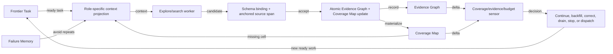

#### Python

```python
from html import escape
from pathlib import Path
from textwrap import wrap

title = "sos_mechanism_p1: Four stores, evidence gate, progress sensor, and continuous dispatch loop — Control or recurrence loop"
nodes = [["frontier","Frontier Task",100,45],["evidence","Evidence Graph",100,150],["coverage","Coverage Map",100,255],["failure","Failure Memory",100,360],["project","Role-specific context projection",250,150],["browse","Explore/search worker",400,150],["gate","Schema binding + anchored source span",550,150],["atomic","Atomic Evidence Graph + Coverage Map update",700,150],["sensor","Coverage/evidence/budget sensor",850,150],["dispatch","Continue, backfill, correct, drain, stop, or dispatch",1000,150]]
edges = [["frontier","project","ready task"],["failure","project","avoid repeats"],["coverage","project","missing cell"],["project","browse","context"],["browse","gate","candidate"],["gate","atomic","accept"],["atomic","evidence","record"],["atomic","coverage","materialize"],["evidence","sensor","delta"],["coverage","sensor","delta"],["sensor","dispatch","decision"],["dispatch","frontier","new ready work"]]
node_by_id = {node_id: (label, x, y) for node_id, label, x, y in nodes}
width = max(900, max((x for _, _, x, _ in nodes), default=800) + 180)
height = max(500, max((y for _, _, _, y in nodes), default=400) + 140)
parts = [
    f'<svg xmlns="http://www.w3.org/2000/svg" viewBox="0 0 {width} {height}" role="img" aria-labelledby="title desc">',
    f'<title id="title">{escape(title)}</title>',
    '<desc id="desc">Edges and convergence points encode only relationships stated in the scoped paragraphs.</desc>',
    f'<rect width="{width}" height="{height}" fill="white"/>',
]
for source, target, relation in edges:
    _, x1, y1 = node_by_id[source]
    _, x2, y2 = node_by_id[target]
    parts.append(f'<line x1="{x1}" y1="{y1}" x2="{x2}" y2="{y2}" stroke="#345" stroke-width="2"/>')
    parts.append(f'<text x="{(x1+x2)/2}" y="{(y1+y2)/2-5}" text-anchor="middle" font-family="sans-serif" font-size="10">{escape(relation)}</text>')
for _, label, x, y in nodes:
    parts.append(f'<rect x="{x-78}" y="{y-42}" width="156" height="84" rx="12" fill="#eef6ff" stroke="#234"/>')
    for line_index, line in enumerate(wrap(label, width=22)):
        parts.append(f'<text x="{x}" y="{y-24+line_index*13}" text-anchor="middle" font-family="sans-serif" font-size="10">{escape(line)}</text>')
parts.append('</svg>')
Path("sos_mechanism_p1_treatment_a.svg").write_text("\n".join(parts), encoding="utf-8")
```

### Treatment B — Four stores, evidence gate, progress sensor, and continuous dispatch loop — Loop-state ledger

- Teaching purpose: List each state variable, operation, and transition condition.
- Encoding and reading order: Render 6 rows with explicit `Group`, `Measure or state`, `Visible value`, and `Condition or boundary` columns. The value column must be visible, not only present in ARIA text or fallback prose.
- Evidence and limitations: Encode only `sos_socm`, `sos_middleware`, `sos_scheduler` from `sos_formulation_source`, `sos_middleware_source`. A shared visual belongs after the third mechanism paragraph and must show Frontier Task, Evidence Graph, Coverage Map, Failure Memory, atomic updates, sensor decisions, and ready-slot dispatch.
- Recommended web medium: semantic HTML/CSS table with SVG export; JavaScript is optional only for meaningful focus, drill-down, or state playback.
- Mobile, accessibility, and motion behavior: Preserve the same group and node order in the DOM; retain all values and relation labels as selectable text; stack panels or levels below 640px; provide keyboard access for any optional focus state; keep a complete static fallback; respect reduced motion and never encode information only through animation.

#### TikZ

```tex
\documentclass[tikz,border=5pt]{standalone}
\usepackage[T1]{fontenc}
\usepackage{array}
\usepackage{tikz}
\begin{document}
\begin{tikzpicture}[font=\sffamily]
\node[align=center] {\textbf{sos\_mechanism\_p1: Four stores, evidence gate, progress sensor, and continuous dispatch loop - Loop-state ledger}\\[6pt]
\begin{tabular}{p{3.2cm}p{4.0cm}p{2.8cm}p{6.2cm}}
\textbf{Group} & \textbf{Measure or state} & \textbf{Visible value} & \textbf{Condition or boundary} \\ \hline
The SearchOS evidence-and-control loop & Frontier Task schedules a gap & qualitative & Dependency-aware task state selects a ready unresolved schema cell and continuously assigns available execution slots. \\
The SearchOS evidence-and-control loop & Context middleware projects state & qualitative & The worker receives its assignment, relevant evidence and coverage, prior failures, and selected skills instead of the full global history. \\
The SearchOS evidence-and-control loop & Worker searches & qualitative & An explore or search agent browses under that scoped context and returns candidate findings or a failed attempt. \\
The SearchOS evidence-and-control loop & Evidence middleware gates & qualitative & A candidate is accepted only when it binds to the intended schema cell and anchors to an observed source span; rejection can return corrective guidance. \\
The SearchOS evidence-and-control loop & Shared stores update & qualitative & Accepted evidence updates the Evidence Graph and Coverage Map atomically, while task outcomes and failed attempts update Frontier Task and Failure Memory. \\
The SearchOS evidence-and-control loop & Sensors choose the next transition & qualitative & Coverage growth, evidence growth, and budgets can trigger continuation, backfill, correction, drain-only mode, branch termination, or synthesis. \\
\end{tabular}};
\end{tikzpicture}
\end{document}
```

#### Mermaid

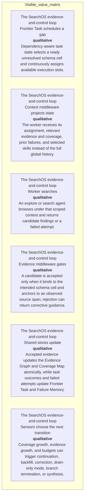

#### Python

```python
from html import escape
from pathlib import Path
from textwrap import wrap

title = "sos_mechanism_p1: Four stores, evidence gate, progress sensor, and continuous dispatch loop — Loop-state ledger"
rows = [["The SearchOS evidence-and-control loop","Frontier Task schedules a gap","qualitative","Dependency-aware task state selects a ready unresolved schema cell and continuously assigns available execution slots."],["The SearchOS evidence-and-control loop","Context middleware projects state","qualitative","The worker receives its assignment, relevant evidence and coverage, prior failures, and selected skills instead of the full global history."],["The SearchOS evidence-and-control loop","Worker searches","qualitative","An explore or search agent browses under that scoped context and returns candidate findings or a failed attempt."],["The SearchOS evidence-and-control loop","Evidence middleware gates","qualitative","A candidate is accepted only when it binds to the intended schema cell and anchors to an observed source span; rejection can return corrective guidance."],["The SearchOS evidence-and-control loop","Shared stores update","qualitative","Accepted evidence updates the Evidence Graph and Coverage Map atomically, while task outcomes and failed attempts update Frontier Task and Failure Memory."],["The SearchOS evidence-and-control loop","Sensors choose the next transition","qualitative","Coverage growth, evidence growth, and budgets can trigger continuation, backfill, correction, drain-only mode, branch termination, or synthesis."]]
height = 678
parts = [
    f'<svg xmlns="http://www.w3.org/2000/svg" viewBox="0 0 1200 {height}" role="img" aria-labelledby="title desc">',
    f'<title id="title">{escape(title)}</title>',
    '<desc id="desc">Every reported value is visible beside its condition and group.</desc>',
    f'<rect width="1200" height="{height}" fill="white"/>',
]
headers = ["Group", "Measure or state", "Visible value", "Condition or boundary"]
xs = [30, 260, 590, 770]
for x, header in zip(xs, headers):
    parts.append(f'<text x="{x}" y="70" font-family="sans-serif" font-size="16" font-weight="700">{escape(header)}</text>')
for row_index, row in enumerate(rows):
    y = 110 + row_index * 88
    parts.append(f'<rect x="20" y="{y-28}" width="1160" height="76" fill="#f7fbff" stroke="#ccd"/>')
    for x, cell, width in zip(xs, row, [26, 38, 20, 58]):
        for line_index, line in enumerate(wrap(str(cell), width=width)):
            parts.append(f'<text x="{x}" y="{y+line_index*14}" font-family="sans-serif" font-size="11">{escape(line)}</text>')
parts.append('</svg>')
Path("sos_mechanism_p1_treatment_b.svg").write_text("\n".join(parts), encoding="utf-8")
```

### Treatment C — Four stores, evidence gate, progress sensor, and continuous dispatch loop — One-iteration storyboard

- Teaching purpose: Unroll exactly one iteration while retaining the return boundary.
- Encoding and reading order: Use 10 named nodes and 12 explicit labeled relations. Preserve all branch, merge, hierarchy, loop, or sequence edges shown in the code; changing them is an evidence deviation.
- Evidence and limitations: Encode only `sos_socm`, `sos_middleware`, `sos_scheduler` from `sos_formulation_source`, `sos_middleware_source`. A shared visual belongs after the third mechanism paragraph and must show Frontier Task, Evidence Graph, Coverage Map, Failure Memory, atomic updates, sensor decisions, and ready-slot dispatch.
- Recommended web medium: responsive inline SVG with semantic HTML/CSS fallback; JavaScript is optional only for meaningful focus, drill-down, or state playback.
- Mobile, accessibility, and motion behavior: Preserve the same group and node order in the DOM; retain all values and relation labels as selectable text; stack panels or levels below 640px; provide keyboard access for any optional focus state; keep a complete static fallback; respect reduced motion and never encode information only through animation.

#### TikZ

```tex
\documentclass[tikz,border=5pt]{standalone}
\usepackage[T1]{fontenc}
\usepackage{tikz}
\usetikzlibrary{arrows.meta}
\begin{document}
\begin{tikzpicture}[font=\sffamily,box/.style={draw,rounded corners,align=center,text width=3cm,minimum height=1.2cm},link/.style={-{Latex[length=2mm]},thick},rel/.style={fill=white,font=\scriptsize}]
\node[font=\bfseries,anchor=west] at (0,0.8) {sos\_mechanism\_p1: Four stores, evidence gate, progress sensor, and continuous dispatch loop - One-iteration storyboard};
\node[box] (frontier) at (1.00,-0.45) {Frontier Task};
\node[box] (evidence) at (1.00,-1.50) {Evidence Graph};
\node[box] (coverage) at (1.00,-2.55) {Coverage Map};
\node[box] (failure) at (1.00,-3.60) {Failure Memory};
\node[box] (project) at (2.50,-1.50) {Role-specific context projection};
\node[box] (browse) at (4.00,-1.50) {Explore/search worker};
\node[box] (gate) at (5.50,-1.50) {Schema binding + anchored source span};
\node[box] (atomic) at (7.00,-1.50) {Atomic Evidence Graph + Coverage Map update};
\node[box] (sensor) at (8.50,-1.50) {Coverage/evidence/budget sensor};
\node[box] (dispatch) at (10.00,-1.50) {Continue, backfill, correct, drain, stop, or dispatch};
\draw[link] (frontier) -- node[rel] {ready task} (project);
\draw[link] (failure) -- node[rel] {avoid repeats} (project);
\draw[link] (coverage) -- node[rel] {missing cell} (project);
\draw[link] (project) -- node[rel] {context} (browse);
\draw[link] (browse) -- node[rel] {candidate} (gate);
\draw[link] (gate) -- node[rel] {accept} (atomic);
\draw[link] (atomic) -- node[rel] {record} (evidence);
\draw[link] (atomic) -- node[rel] {materialize} (coverage);
\draw[link] (evidence) -- node[rel] {delta} (sensor);
\draw[link] (coverage) -- node[rel] {delta} (sensor);
\draw[link] (sensor) -- node[rel] {decision} (dispatch);
\draw[link] (dispatch) -- node[rel] {new ready work} (frontier);
\end{tikzpicture}
\end{document}
```

#### Mermaid


#### Python

```python
from html import escape
from pathlib import Path
from textwrap import wrap

title = "sos_mechanism_p1: Four stores, evidence gate, progress sensor, and continuous dispatch loop — One-iteration storyboard"
nodes = [["frontier","Frontier Task",100,45],["evidence","Evidence Graph",100,150],["coverage","Coverage Map",100,255],["failure","Failure Memory",100,360],["project","Role-specific context projection",250,150],["browse","Explore/search worker",400,150],["gate","Schema binding + anchored source span",550,150],["atomic","Atomic Evidence Graph + Coverage Map update",700,150],["sensor","Coverage/evidence/budget sensor",850,150],["dispatch","Continue, backfill, correct, drain, stop, or dispatch",1000,150]]
edges = [["frontier","project","ready task"],["failure","project","avoid repeats"],["coverage","project","missing cell"],["project","browse","context"],["browse","gate","candidate"],["gate","atomic","accept"],["atomic","evidence","record"],["atomic","coverage","materialize"],["evidence","sensor","delta"],["coverage","sensor","delta"],["sensor","dispatch","decision"],["dispatch","frontier","new ready work"]]
node_by_id = {node_id: (label, x, y) for node_id, label, x, y in nodes}
width = max(900, max((x for _, _, x, _ in nodes), default=800) + 180)
height = max(500, max((y for _, _, _, y in nodes), default=400) + 140)
parts = [
    f'<svg xmlns="http://www.w3.org/2000/svg" viewBox="0 0 {width} {height}" role="img" aria-labelledby="title desc">',
    f'<title id="title">{escape(title)}</title>',
    '<desc id="desc">Edges and convergence points encode only relationships stated in the scoped paragraphs.</desc>',
    f'<rect width="{width}" height="{height}" fill="white"/>',
]
for source, target, relation in edges:
    _, x1, y1 = node_by_id[source]
    _, x2, y2 = node_by_id[target]
    parts.append(f'<line x1="{x1}" y1="{y1}" x2="{x2}" y2="{y2}" stroke="#345" stroke-width="2"/>')
    parts.append(f'<text x="{(x1+x2)/2}" y="{(y1+y2)/2-5}" text-anchor="middle" font-family="sans-serif" font-size="10">{escape(relation)}</text>')
for _, label, x, y in nodes:
    parts.append(f'<rect x="{x-78}" y="{y-42}" width="156" height="84" rx="12" fill="#eef6ff" stroke="#234"/>')
    for line_index, line in enumerate(wrap(label, width=22)):
        parts.append(f'<text x="{x}" y="{y-24+line_index*13}" text-anchor="middle" font-family="sans-serif" font-size="10">{escape(line)}</text>')
parts.append('</svg>')
Path("sos_mechanism_p1_treatment_c.svg").write_text("\n".join(parts), encoding="utf-8")
```

### Implementation record

- Status: `IMPLEMENTED`
- Selected treatment: `A`
- Selection rationale: Selected the approved relationship that directly answers this paragraph's explanatory job; the shared visual uses the same evidence and complete adjacent scope recorded here.
- Delivery medium: `CSS + semantic HTML`
- Visual ID and placement: `visual_searchos_control_loop` after `sos_mechanism_p3`; this record is served by that purpose-built figure.
- Shared paragraph scope: `sos_mechanism_p1`, `sos_mechanism_p2`, `sos_mechanism_p3`, `sos_example_p1`, `sos_example_p2`
- Changed files: `packages/test-fixtures/explainers/searchos-v1.json`, `apps/web/app/papers/[id]/explainer-visual.tsx`, `apps/web/app/papers/[id]/page.tsx`, and `apps/web/app/globals.css`
- Accessibility and fallback verification: Figure has a programmatic title and description, explicit alt text, equivalent fallback prose, source links, limitations, and a semantic static body; no meaning depends on motion or pointer input.
- Desktop and mobile verification: Verified in Playwright on 1440-pixel desktop and iPhone 13 mobile viewports; figures remain paragraph-adjacent, preserve reading order, and introduce no horizontal page overflow.
- Evidence deviations: `NONE`; web-native CSS and semantic HTML preserve the selected treatment's evidence, labels, topology, and stated boundaries.

## `sos_mechanism_p2`

- Location: `sos_mechanism`, paragraph 2
- Text anchor: "Before a model call, context middleware projects only the role-relevant portion of that state and adds selected skills."
- Claims and sources: `sos_socm` (OBSERVED, VERIFIED); `sos_middleware` (OBSERVED, VERIFIED); `sos_scheduler` (OBSERVED, VERIFIED); `sos_formulation_source` (Sections 2–3.2, Equations 1–10, Figure 2, PDF pages 3–6; the arXiv v1 record identifies the paper as CC BY 4.0); `sos_middleware_source` (Sections 3.3–3.4, Equations 11–18, Figures 3–4, PDF pages 7–9)
- Visual needed: `YES`
- Decision rationale: A visual passes the removal test because readers must reconstruct four stores, evidence gate, progress sensor, and continuous dispatch loop while preserving the paragraph's conditions and boundaries. Revision 3 narrows the topology and placement so no visual can claim this paragraph without encoding its mechanism, grouping, or values.
- Explanatory job: Four stores, evidence gate, progress sensor, and continuous dispatch loop.
- Recommended scope and placement: Shared scope `sos_mechanism_p1`, `sos_mechanism_p2`, `sos_mechanism_p3` is allowed only when one visual encodes every listed mechanism, condition, and value; place it immediately after the final paragraph, `sos_mechanism_p3`. Otherwise split the visual by paragraph.
- QA-informed planning change: A shared visual belongs after the third mechanism paragraph and must show Frontier Task, Evidence Graph, Coverage Map, Failure Memory, atomic updates, sensor decisions, and ready-slot dispatch.

### Treatment A — Four stores, evidence gate, progress sensor, and continuous dispatch loop — Control or recurrence loop

- Teaching purpose: Make the return transition and carried state explicit.
- Encoding and reading order: Use 10 named nodes and 12 explicit labeled relations. Preserve all branch, merge, hierarchy, loop, or sequence edges shown in the code; changing them is an evidence deviation.
- Evidence and limitations: Encode only `sos_socm`, `sos_middleware`, `sos_scheduler` from `sos_formulation_source`, `sos_middleware_source`. A shared visual belongs after the third mechanism paragraph and must show Frontier Task, Evidence Graph, Coverage Map, Failure Memory, atomic updates, sensor decisions, and ready-slot dispatch.
- Recommended web medium: responsive inline SVG with semantic HTML/CSS fallback; JavaScript is optional only for meaningful focus, drill-down, or state playback.
- Mobile, accessibility, and motion behavior: Preserve the same group and node order in the DOM; retain all values and relation labels as selectable text; stack panels or levels below 640px; provide keyboard access for any optional focus state; keep a complete static fallback; respect reduced motion and never encode information only through animation.

#### TikZ

```tex
\documentclass[tikz,border=5pt]{standalone}
\usepackage[T1]{fontenc}
\usepackage{tikz}
\usetikzlibrary{arrows.meta}
\begin{document}
\begin{tikzpicture}[font=\sffamily,box/.style={draw,rounded corners,align=center,text width=3cm,minimum height=1.2cm},link/.style={-{Latex[length=2mm]},thick},rel/.style={fill=white,font=\scriptsize}]
\node[font=\bfseries,anchor=west] at (0,0.8) {sos\_mechanism\_p2: Four stores, evidence gate, progress sensor, and continuous dispatch loop - Control or recurrence loop};
\node[box] (frontier) at (1.00,-0.45) {Frontier Task};
\node[box] (evidence) at (1.00,-1.50) {Evidence Graph};
\node[box] (coverage) at (1.00,-2.55) {Coverage Map};
\node[box] (failure) at (1.00,-3.60) {Failure Memory};
\node[box] (project) at (2.50,-1.50) {Role-specific context projection};
\node[box] (browse) at (4.00,-1.50) {Explore/search worker};
\node[box] (gate) at (5.50,-1.50) {Schema binding + anchored source span};
\node[box] (atomic) at (7.00,-1.50) {Atomic Evidence Graph + Coverage Map update};
\node[box] (sensor) at (8.50,-1.50) {Coverage/evidence/budget sensor};
\node[box] (dispatch) at (10.00,-1.50) {Continue, backfill, correct, drain, stop, or dispatch};
\draw[link] (frontier) -- node[rel] {ready task} (project);
\draw[link] (failure) -- node[rel] {avoid repeats} (project);
\draw[link] (coverage) -- node[rel] {missing cell} (project);
\draw[link] (project) -- node[rel] {context} (browse);
\draw[link] (browse) -- node[rel] {candidate} (gate);
\draw[link] (gate) -- node[rel] {accept} (atomic);
\draw[link] (atomic) -- node[rel] {record} (evidence);
\draw[link] (atomic) -- node[rel] {materialize} (coverage);
\draw[link] (evidence) -- node[rel] {delta} (sensor);
\draw[link] (coverage) -- node[rel] {delta} (sensor);
\draw[link] (sensor) -- node[rel] {decision} (dispatch);
\draw[link] (dispatch) -- node[rel] {new ready work} (frontier);
\end{tikzpicture}
\end{document}
```

#### Mermaid


#### Python

```python
from html import escape
from pathlib import Path
from textwrap import wrap

title = "sos_mechanism_p2: Four stores, evidence gate, progress sensor, and continuous dispatch loop — Control or recurrence loop"
nodes = [["frontier","Frontier Task",100,45],["evidence","Evidence Graph",100,150],["coverage","Coverage Map",100,255],["failure","Failure Memory",100,360],["project","Role-specific context projection",250,150],["browse","Explore/search worker",400,150],["gate","Schema binding + anchored source span",550,150],["atomic","Atomic Evidence Graph + Coverage Map update",700,150],["sensor","Coverage/evidence/budget sensor",850,150],["dispatch","Continue, backfill, correct, drain, stop, or dispatch",1000,150]]
edges = [["frontier","project","ready task"],["failure","project","avoid repeats"],["coverage","project","missing cell"],["project","browse","context"],["browse","gate","candidate"],["gate","atomic","accept"],["atomic","evidence","record"],["atomic","coverage","materialize"],["evidence","sensor","delta"],["coverage","sensor","delta"],["sensor","dispatch","decision"],["dispatch","frontier","new ready work"]]
node_by_id = {node_id: (label, x, y) for node_id, label, x, y in nodes}
width = max(900, max((x for _, _, x, _ in nodes), default=800) + 180)
height = max(500, max((y for _, _, _, y in nodes), default=400) + 140)
parts = [
    f'<svg xmlns="http://www.w3.org/2000/svg" viewBox="0 0 {width} {height}" role="img" aria-labelledby="title desc">',
    f'<title id="title">{escape(title)}</title>',
    '<desc id="desc">Edges and convergence points encode only relationships stated in the scoped paragraphs.</desc>',
    f'<rect width="{width}" height="{height}" fill="white"/>',
]
for source, target, relation in edges:
    _, x1, y1 = node_by_id[source]
    _, x2, y2 = node_by_id[target]
    parts.append(f'<line x1="{x1}" y1="{y1}" x2="{x2}" y2="{y2}" stroke="#345" stroke-width="2"/>')
    parts.append(f'<text x="{(x1+x2)/2}" y="{(y1+y2)/2-5}" text-anchor="middle" font-family="sans-serif" font-size="10">{escape(relation)}</text>')
for _, label, x, y in nodes:
    parts.append(f'<rect x="{x-78}" y="{y-42}" width="156" height="84" rx="12" fill="#eef6ff" stroke="#234"/>')
    for line_index, line in enumerate(wrap(label, width=22)):
        parts.append(f'<text x="{x}" y="{y-24+line_index*13}" text-anchor="middle" font-family="sans-serif" font-size="10">{escape(line)}</text>')
parts.append('</svg>')
Path("sos_mechanism_p2_treatment_a.svg").write_text("\n".join(parts), encoding="utf-8")
```

### Treatment B — Four stores, evidence gate, progress sensor, and continuous dispatch loop — Loop-state ledger

- Teaching purpose: List each state variable, operation, and transition condition.
- Encoding and reading order: Render 6 rows with explicit `Group`, `Measure or state`, `Visible value`, and `Condition or boundary` columns. The value column must be visible, not only present in ARIA text or fallback prose.
- Evidence and limitations: Encode only `sos_socm`, `sos_middleware`, `sos_scheduler` from `sos_formulation_source`, `sos_middleware_source`. A shared visual belongs after the third mechanism paragraph and must show Frontier Task, Evidence Graph, Coverage Map, Failure Memory, atomic updates, sensor decisions, and ready-slot dispatch.
- Recommended web medium: semantic HTML/CSS table with SVG export; JavaScript is optional only for meaningful focus, drill-down, or state playback.
- Mobile, accessibility, and motion behavior: Preserve the same group and node order in the DOM; retain all values and relation labels as selectable text; stack panels or levels below 640px; provide keyboard access for any optional focus state; keep a complete static fallback; respect reduced motion and never encode information only through animation.

#### TikZ

```tex
\documentclass[tikz,border=5pt]{standalone}
\usepackage[T1]{fontenc}
\usepackage{array}
\usepackage{tikz}
\begin{document}
\begin{tikzpicture}[font=\sffamily]
\node[align=center] {\textbf{sos\_mechanism\_p2: Four stores, evidence gate, progress sensor, and continuous dispatch loop - Loop-state ledger}\\[6pt]
\begin{tabular}{p{3.2cm}p{4.0cm}p{2.8cm}p{6.2cm}}
\textbf{Group} & \textbf{Measure or state} & \textbf{Visible value} & \textbf{Condition or boundary} \\ \hline
The SearchOS evidence-and-control loop & Frontier Task schedules a gap & qualitative & Dependency-aware task state selects a ready unresolved schema cell and continuously assigns available execution slots. \\
The SearchOS evidence-and-control loop & Context middleware projects state & qualitative & The worker receives its assignment, relevant evidence and coverage, prior failures, and selected skills instead of the full global history. \\
The SearchOS evidence-and-control loop & Worker searches & qualitative & An explore or search agent browses under that scoped context and returns candidate findings or a failed attempt. \\
The SearchOS evidence-and-control loop & Evidence middleware gates & qualitative & A candidate is accepted only when it binds to the intended schema cell and anchors to an observed source span; rejection can return corrective guidance. \\
The SearchOS evidence-and-control loop & Shared stores update & qualitative & Accepted evidence updates the Evidence Graph and Coverage Map atomically, while task outcomes and failed attempts update Frontier Task and Failure Memory. \\
The SearchOS evidence-and-control loop & Sensors choose the next transition & qualitative & Coverage growth, evidence growth, and budgets can trigger continuation, backfill, correction, drain-only mode, branch termination, or synthesis. \\
\end{tabular}};
\end{tikzpicture}
\end{document}
```

#### Mermaid


#### Python

```python
from html import escape
from pathlib import Path
from textwrap import wrap

title = "sos_mechanism_p2: Four stores, evidence gate, progress sensor, and continuous dispatch loop — Loop-state ledger"
rows = [["The SearchOS evidence-and-control loop","Frontier Task schedules a gap","qualitative","Dependency-aware task state selects a ready unresolved schema cell and continuously assigns available execution slots."],["The SearchOS evidence-and-control loop","Context middleware projects state","qualitative","The worker receives its assignment, relevant evidence and coverage, prior failures, and selected skills instead of the full global history."],["The SearchOS evidence-and-control loop","Worker searches","qualitative","An explore or search agent browses under that scoped context and returns candidate findings or a failed attempt."],["The SearchOS evidence-and-control loop","Evidence middleware gates","qualitative","A candidate is accepted only when it binds to the intended schema cell and anchors to an observed source span; rejection can return corrective guidance."],["The SearchOS evidence-and-control loop","Shared stores update","qualitative","Accepted evidence updates the Evidence Graph and Coverage Map atomically, while task outcomes and failed attempts update Frontier Task and Failure Memory."],["The SearchOS evidence-and-control loop","Sensors choose the next transition","qualitative","Coverage growth, evidence growth, and budgets can trigger continuation, backfill, correction, drain-only mode, branch termination, or synthesis."]]
height = 678
parts = [
    f'<svg xmlns="http://www.w3.org/2000/svg" viewBox="0 0 1200 {height}" role="img" aria-labelledby="title desc">',
    f'<title id="title">{escape(title)}</title>',
    '<desc id="desc">Every reported value is visible beside its condition and group.</desc>',
    f'<rect width="1200" height="{height}" fill="white"/>',
]
headers = ["Group", "Measure or state", "Visible value", "Condition or boundary"]
xs = [30, 260, 590, 770]
for x, header in zip(xs, headers):
    parts.append(f'<text x="{x}" y="70" font-family="sans-serif" font-size="16" font-weight="700">{escape(header)}</text>')
for row_index, row in enumerate(rows):
    y = 110 + row_index * 88
    parts.append(f'<rect x="20" y="{y-28}" width="1160" height="76" fill="#f7fbff" stroke="#ccd"/>')
    for x, cell, width in zip(xs, row, [26, 38, 20, 58]):
        for line_index, line in enumerate(wrap(str(cell), width=width)):
            parts.append(f'<text x="{x}" y="{y+line_index*14}" font-family="sans-serif" font-size="11">{escape(line)}</text>')
parts.append('</svg>')
Path("sos_mechanism_p2_treatment_b.svg").write_text("\n".join(parts), encoding="utf-8")
```

### Treatment C — Four stores, evidence gate, progress sensor, and continuous dispatch loop — One-iteration storyboard

- Teaching purpose: Unroll exactly one iteration while retaining the return boundary.
- Encoding and reading order: Use 10 named nodes and 12 explicit labeled relations. Preserve all branch, merge, hierarchy, loop, or sequence edges shown in the code; changing them is an evidence deviation.
- Evidence and limitations: Encode only `sos_socm`, `sos_middleware`, `sos_scheduler` from `sos_formulation_source`, `sos_middleware_source`. A shared visual belongs after the third mechanism paragraph and must show Frontier Task, Evidence Graph, Coverage Map, Failure Memory, atomic updates, sensor decisions, and ready-slot dispatch.
- Recommended web medium: responsive inline SVG with semantic HTML/CSS fallback; JavaScript is optional only for meaningful focus, drill-down, or state playback.
- Mobile, accessibility, and motion behavior: Preserve the same group and node order in the DOM; retain all values and relation labels as selectable text; stack panels or levels below 640px; provide keyboard access for any optional focus state; keep a complete static fallback; respect reduced motion and never encode information only through animation.

#### TikZ

```tex
\documentclass[tikz,border=5pt]{standalone}
\usepackage[T1]{fontenc}
\usepackage{tikz}
\usetikzlibrary{arrows.meta}
\begin{document}
\begin{tikzpicture}[font=\sffamily,box/.style={draw,rounded corners,align=center,text width=3cm,minimum height=1.2cm},link/.style={-{Latex[length=2mm]},thick},rel/.style={fill=white,font=\scriptsize}]
\node[font=\bfseries,anchor=west] at (0,0.8) {sos\_mechanism\_p2: Four stores, evidence gate, progress sensor, and continuous dispatch loop - One-iteration storyboard};
\node[box] (frontier) at (1.00,-0.45) {Frontier Task};
\node[box] (evidence) at (1.00,-1.50) {Evidence Graph};
\node[box] (coverage) at (1.00,-2.55) {Coverage Map};
\node[box] (failure) at (1.00,-3.60) {Failure Memory};
\node[box] (project) at (2.50,-1.50) {Role-specific context projection};
\node[box] (browse) at (4.00,-1.50) {Explore/search worker};
\node[box] (gate) at (5.50,-1.50) {Schema binding + anchored source span};
\node[box] (atomic) at (7.00,-1.50) {Atomic Evidence Graph + Coverage Map update};
\node[box] (sensor) at (8.50,-1.50) {Coverage/evidence/budget sensor};
\node[box] (dispatch) at (10.00,-1.50) {Continue, backfill, correct, drain, stop, or dispatch};
\draw[link] (frontier) -- node[rel] {ready task} (project);
\draw[link] (failure) -- node[rel] {avoid repeats} (project);
\draw[link] (coverage) -- node[rel] {missing cell} (project);
\draw[link] (project) -- node[rel] {context} (browse);
\draw[link] (browse) -- node[rel] {candidate} (gate);
\draw[link] (gate) -- node[rel] {accept} (atomic);
\draw[link] (atomic) -- node[rel] {record} (evidence);
\draw[link] (atomic) -- node[rel] {materialize} (coverage);
\draw[link] (evidence) -- node[rel] {delta} (sensor);
\draw[link] (coverage) -- node[rel] {delta} (sensor);
\draw[link] (sensor) -- node[rel] {decision} (dispatch);
\draw[link] (dispatch) -- node[rel] {new ready work} (frontier);
\end{tikzpicture}
\end{document}
```

#### Mermaid


#### Python

```python
from html import escape
from pathlib import Path
from textwrap import wrap

title = "sos_mechanism_p2: Four stores, evidence gate, progress sensor, and continuous dispatch loop — One-iteration storyboard"
nodes = [["frontier","Frontier Task",100,45],["evidence","Evidence Graph",100,150],["coverage","Coverage Map",100,255],["failure","Failure Memory",100,360],["project","Role-specific context projection",250,150],["browse","Explore/search worker",400,150],["gate","Schema binding + anchored source span",550,150],["atomic","Atomic Evidence Graph + Coverage Map update",700,150],["sensor","Coverage/evidence/budget sensor",850,150],["dispatch","Continue, backfill, correct, drain, stop, or dispatch",1000,150]]
edges = [["frontier","project","ready task"],["failure","project","avoid repeats"],["coverage","project","missing cell"],["project","browse","context"],["browse","gate","candidate"],["gate","atomic","accept"],["atomic","evidence","record"],["atomic","coverage","materialize"],["evidence","sensor","delta"],["coverage","sensor","delta"],["sensor","dispatch","decision"],["dispatch","frontier","new ready work"]]
node_by_id = {node_id: (label, x, y) for node_id, label, x, y in nodes}
width = max(900, max((x for _, _, x, _ in nodes), default=800) + 180)
height = max(500, max((y for _, _, _, y in nodes), default=400) + 140)
parts = [
    f'<svg xmlns="http://www.w3.org/2000/svg" viewBox="0 0 {width} {height}" role="img" aria-labelledby="title desc">',
    f'<title id="title">{escape(title)}</title>',
    '<desc id="desc">Edges and convergence points encode only relationships stated in the scoped paragraphs.</desc>',
    f'<rect width="{width}" height="{height}" fill="white"/>',
]
for source, target, relation in edges:
    _, x1, y1 = node_by_id[source]
    _, x2, y2 = node_by_id[target]
    parts.append(f'<line x1="{x1}" y1="{y1}" x2="{x2}" y2="{y2}" stroke="#345" stroke-width="2"/>')
    parts.append(f'<text x="{(x1+x2)/2}" y="{(y1+y2)/2-5}" text-anchor="middle" font-family="sans-serif" font-size="10">{escape(relation)}</text>')
for _, label, x, y in nodes:
    parts.append(f'<rect x="{x-78}" y="{y-42}" width="156" height="84" rx="12" fill="#eef6ff" stroke="#234"/>')
    for line_index, line in enumerate(wrap(label, width=22)):
        parts.append(f'<text x="{x}" y="{y-24+line_index*13}" text-anchor="middle" font-family="sans-serif" font-size="10">{escape(line)}</text>')
parts.append('</svg>')
Path("sos_mechanism_p2_treatment_c.svg").write_text("\n".join(parts), encoding="utf-8")
```

### Implementation record

- Status: `IMPLEMENTED`
- Selected treatment: `A`
- Selection rationale: Selected the approved relationship that directly answers this paragraph's explanatory job; the shared visual uses the same evidence and complete adjacent scope recorded here.
- Delivery medium: `CSS + semantic HTML`
- Visual ID and placement: `visual_searchos_control_loop` after `sos_mechanism_p3`; this record is served by that purpose-built figure.
- Shared paragraph scope: `sos_mechanism_p1`, `sos_mechanism_p2`, `sos_mechanism_p3`, `sos_example_p1`, `sos_example_p2`
- Changed files: `packages/test-fixtures/explainers/searchos-v1.json`, `apps/web/app/papers/[id]/explainer-visual.tsx`, `apps/web/app/papers/[id]/page.tsx`, and `apps/web/app/globals.css`
- Accessibility and fallback verification: Figure has a programmatic title and description, explicit alt text, equivalent fallback prose, source links, limitations, and a semantic static body; no meaning depends on motion or pointer input.
- Desktop and mobile verification: Verified in Playwright on 1440-pixel desktop and iPhone 13 mobile viewports; figures remain paragraph-adjacent, preserve reading order, and introduce no horizontal page overflow.
- Evidence deviations: `NONE`; web-native CSS and semantic HTML preserve the selected treatment's evidence, labels, topology, and stated boundaries.

## `sos_mechanism_p3`

- Location: `sos_mechanism`, paragraph 3
- Text anchor: "Sensor middleware measures changes in grounded coverage and evidence count, along with iteration, search, and time budgets."
- Claims and sources: `sos_socm` (OBSERVED, VERIFIED); `sos_middleware` (OBSERVED, VERIFIED); `sos_scheduler` (OBSERVED, VERIFIED); `sos_formulation_source` (Sections 2–3.2, Equations 1–10, Figure 2, PDF pages 3–6; the arXiv v1 record identifies the paper as CC BY 4.0); `sos_middleware_source` (Sections 3.3–3.4, Equations 11–18, Figures 3–4, PDF pages 7–9)
- Visual needed: `YES`
- Decision rationale: A visual passes the removal test because readers must reconstruct four stores, evidence gate, progress sensor, and continuous dispatch loop while preserving the paragraph's conditions and boundaries. Revision 3 narrows the topology and placement so no visual can claim this paragraph without encoding its mechanism, grouping, or values.
- Explanatory job: Four stores, evidence gate, progress sensor, and continuous dispatch loop.
- Recommended scope and placement: Shared scope `sos_mechanism_p1`, `sos_mechanism_p2`, `sos_mechanism_p3` is allowed only when one visual encodes every listed mechanism, condition, and value; place it immediately after the final paragraph, `sos_mechanism_p3`. Otherwise split the visual by paragraph.
- QA-informed planning change: A shared visual belongs after the third mechanism paragraph and must show Frontier Task, Evidence Graph, Coverage Map, Failure Memory, atomic updates, sensor decisions, and ready-slot dispatch.

### Treatment A — Four stores, evidence gate, progress sensor, and continuous dispatch loop — Control or recurrence loop

- Teaching purpose: Make the return transition and carried state explicit.
- Encoding and reading order: Use 10 named nodes and 12 explicit labeled relations. Preserve all branch, merge, hierarchy, loop, or sequence edges shown in the code; changing them is an evidence deviation.
- Evidence and limitations: Encode only `sos_socm`, `sos_middleware`, `sos_scheduler` from `sos_formulation_source`, `sos_middleware_source`. A shared visual belongs after the third mechanism paragraph and must show Frontier Task, Evidence Graph, Coverage Map, Failure Memory, atomic updates, sensor decisions, and ready-slot dispatch.
- Recommended web medium: responsive inline SVG with semantic HTML/CSS fallback; JavaScript is optional only for meaningful focus, drill-down, or state playback.
- Mobile, accessibility, and motion behavior: Preserve the same group and node order in the DOM; retain all values and relation labels as selectable text; stack panels or levels below 640px; provide keyboard access for any optional focus state; keep a complete static fallback; respect reduced motion and never encode information only through animation.

#### TikZ

```tex
\documentclass[tikz,border=5pt]{standalone}
\usepackage[T1]{fontenc}
\usepackage{tikz}
\usetikzlibrary{arrows.meta}
\begin{document}
\begin{tikzpicture}[font=\sffamily,box/.style={draw,rounded corners,align=center,text width=3cm,minimum height=1.2cm},link/.style={-{Latex[length=2mm]},thick},rel/.style={fill=white,font=\scriptsize}]
\node[font=\bfseries,anchor=west] at (0,0.8) {sos\_mechanism\_p3: Four stores, evidence gate, progress sensor, and continuous dispatch loop - Control or recurrence loop};
\node[box] (frontier) at (1.00,-0.45) {Frontier Task};
\node[box] (evidence) at (1.00,-1.50) {Evidence Graph};
\node[box] (coverage) at (1.00,-2.55) {Coverage Map};
\node[box] (failure) at (1.00,-3.60) {Failure Memory};
\node[box] (project) at (2.50,-1.50) {Role-specific context projection};
\node[box] (browse) at (4.00,-1.50) {Explore/search worker};
\node[box] (gate) at (5.50,-1.50) {Schema binding + anchored source span};
\node[box] (atomic) at (7.00,-1.50) {Atomic Evidence Graph + Coverage Map update};
\node[box] (sensor) at (8.50,-1.50) {Coverage/evidence/budget sensor};
\node[box] (dispatch) at (10.00,-1.50) {Continue, backfill, correct, drain, stop, or dispatch};
\draw[link] (frontier) -- node[rel] {ready task} (project);
\draw[link] (failure) -- node[rel] {avoid repeats} (project);
\draw[link] (coverage) -- node[rel] {missing cell} (project);
\draw[link] (project) -- node[rel] {context} (browse);
\draw[link] (browse) -- node[rel] {candidate} (gate);
\draw[link] (gate) -- node[rel] {accept} (atomic);
\draw[link] (atomic) -- node[rel] {record} (evidence);
\draw[link] (atomic) -- node[rel] {materialize} (coverage);
\draw[link] (evidence) -- node[rel] {delta} (sensor);
\draw[link] (coverage) -- node[rel] {delta} (sensor);
\draw[link] (sensor) -- node[rel] {decision} (dispatch);
\draw[link] (dispatch) -- node[rel] {new ready work} (frontier);
\end{tikzpicture}
\end{document}
```

#### Mermaid


#### Python

```python
from html import escape
from pathlib import Path
from textwrap import wrap

title = "sos_mechanism_p3: Four stores, evidence gate, progress sensor, and continuous dispatch loop — Control or recurrence loop"
nodes = [["frontier","Frontier Task",100,45],["evidence","Evidence Graph",100,150],["coverage","Coverage Map",100,255],["failure","Failure Memory",100,360],["project","Role-specific context projection",250,150],["browse","Explore/search worker",400,150],["gate","Schema binding + anchored source span",550,150],["atomic","Atomic Evidence Graph + Coverage Map update",700,150],["sensor","Coverage/evidence/budget sensor",850,150],["dispatch","Continue, backfill, correct, drain, stop, or dispatch",1000,150]]
edges = [["frontier","project","ready task"],["failure","project","avoid repeats"],["coverage","project","missing cell"],["project","browse","context"],["browse","gate","candidate"],["gate","atomic","accept"],["atomic","evidence","record"],["atomic","coverage","materialize"],["evidence","sensor","delta"],["coverage","sensor","delta"],["sensor","dispatch","decision"],["dispatch","frontier","new ready work"]]
node_by_id = {node_id: (label, x, y) for node_id, label, x, y in nodes}
width = max(900, max((x for _, _, x, _ in nodes), default=800) + 180)
height = max(500, max((y for _, _, _, y in nodes), default=400) + 140)
parts = [
    f'<svg xmlns="http://www.w3.org/2000/svg" viewBox="0 0 {width} {height}" role="img" aria-labelledby="title desc">',
    f'<title id="title">{escape(title)}</title>',
    '<desc id="desc">Edges and convergence points encode only relationships stated in the scoped paragraphs.</desc>',
    f'<rect width="{width}" height="{height}" fill="white"/>',
]
for source, target, relation in edges:
    _, x1, y1 = node_by_id[source]
    _, x2, y2 = node_by_id[target]
    parts.append(f'<line x1="{x1}" y1="{y1}" x2="{x2}" y2="{y2}" stroke="#345" stroke-width="2"/>')
    parts.append(f'<text x="{(x1+x2)/2}" y="{(y1+y2)/2-5}" text-anchor="middle" font-family="sans-serif" font-size="10">{escape(relation)}</text>')
for _, label, x, y in nodes:
    parts.append(f'<rect x="{x-78}" y="{y-42}" width="156" height="84" rx="12" fill="#eef6ff" stroke="#234"/>')
    for line_index, line in enumerate(wrap(label, width=22)):
        parts.append(f'<text x="{x}" y="{y-24+line_index*13}" text-anchor="middle" font-family="sans-serif" font-size="10">{escape(line)}</text>')
parts.append('</svg>')
Path("sos_mechanism_p3_treatment_a.svg").write_text("\n".join(parts), encoding="utf-8")
```

### Treatment B — Four stores, evidence gate, progress sensor, and continuous dispatch loop — Loop-state ledger

- Teaching purpose: List each state variable, operation, and transition condition.
- Encoding and reading order: Render 6 rows with explicit `Group`, `Measure or state`, `Visible value`, and `Condition or boundary` columns. The value column must be visible, not only present in ARIA text or fallback prose.
- Evidence and limitations: Encode only `sos_socm`, `sos_middleware`, `sos_scheduler` from `sos_formulation_source`, `sos_middleware_source`. A shared visual belongs after the third mechanism paragraph and must show Frontier Task, Evidence Graph, Coverage Map, Failure Memory, atomic updates, sensor decisions, and ready-slot dispatch.
- Recommended web medium: semantic HTML/CSS table with SVG export; JavaScript is optional only for meaningful focus, drill-down, or state playback.
- Mobile, accessibility, and motion behavior: Preserve the same group and node order in the DOM; retain all values and relation labels as selectable text; stack panels or levels below 640px; provide keyboard access for any optional focus state; keep a complete static fallback; respect reduced motion and never encode information only through animation.

#### TikZ

```tex
\documentclass[tikz,border=5pt]{standalone}
\usepackage[T1]{fontenc}
\usepackage{array}
\usepackage{tikz}
\begin{document}
\begin{tikzpicture}[font=\sffamily]
\node[align=center] {\textbf{sos\_mechanism\_p3: Four stores, evidence gate, progress sensor, and continuous dispatch loop - Loop-state ledger}\\[6pt]
\begin{tabular}{p{3.2cm}p{4.0cm}p{2.8cm}p{6.2cm}}
\textbf{Group} & \textbf{Measure or state} & \textbf{Visible value} & \textbf{Condition or boundary} \\ \hline
The SearchOS evidence-and-control loop & Frontier Task schedules a gap & qualitative & Dependency-aware task state selects a ready unresolved schema cell and continuously assigns available execution slots. \\
The SearchOS evidence-and-control loop & Context middleware projects state & qualitative & The worker receives its assignment, relevant evidence and coverage, prior failures, and selected skills instead of the full global history. \\
The SearchOS evidence-and-control loop & Worker searches & qualitative & An explore or search agent browses under that scoped context and returns candidate findings or a failed attempt. \\
The SearchOS evidence-and-control loop & Evidence middleware gates & qualitative & A candidate is accepted only when it binds to the intended schema cell and anchors to an observed source span; rejection can return corrective guidance. \\
The SearchOS evidence-and-control loop & Shared stores update & qualitative & Accepted evidence updates the Evidence Graph and Coverage Map atomically, while task outcomes and failed attempts update Frontier Task and Failure Memory. \\
The SearchOS evidence-and-control loop & Sensors choose the next transition & qualitative & Coverage growth, evidence growth, and budgets can trigger continuation, backfill, correction, drain-only mode, branch termination, or synthesis. \\
\end{tabular}};
\end{tikzpicture}
\end{document}
```

#### Mermaid


#### Python

```python
from html import escape
from pathlib import Path
from textwrap import wrap

title = "sos_mechanism_p3: Four stores, evidence gate, progress sensor, and continuous dispatch loop — Loop-state ledger"
rows = [["The SearchOS evidence-and-control loop","Frontier Task schedules a gap","qualitative","Dependency-aware task state selects a ready unresolved schema cell and continuously assigns available execution slots."],["The SearchOS evidence-and-control loop","Context middleware projects state","qualitative","The worker receives its assignment, relevant evidence and coverage, prior failures, and selected skills instead of the full global history."],["The SearchOS evidence-and-control loop","Worker searches","qualitative","An explore or search agent browses under that scoped context and returns candidate findings or a failed attempt."],["The SearchOS evidence-and-control loop","Evidence middleware gates","qualitative","A candidate is accepted only when it binds to the intended schema cell and anchors to an observed source span; rejection can return corrective guidance."],["The SearchOS evidence-and-control loop","Shared stores update","qualitative","Accepted evidence updates the Evidence Graph and Coverage Map atomically, while task outcomes and failed attempts update Frontier Task and Failure Memory."],["The SearchOS evidence-and-control loop","Sensors choose the next transition","qualitative","Coverage growth, evidence growth, and budgets can trigger continuation, backfill, correction, drain-only mode, branch termination, or synthesis."]]
height = 678
parts = [
    f'<svg xmlns="http://www.w3.org/2000/svg" viewBox="0 0 1200 {height}" role="img" aria-labelledby="title desc">',
    f'<title id="title">{escape(title)}</title>',
    '<desc id="desc">Every reported value is visible beside its condition and group.</desc>',
    f'<rect width="1200" height="{height}" fill="white"/>',
]
headers = ["Group", "Measure or state", "Visible value", "Condition or boundary"]
xs = [30, 260, 590, 770]
for x, header in zip(xs, headers):
    parts.append(f'<text x="{x}" y="70" font-family="sans-serif" font-size="16" font-weight="700">{escape(header)}</text>')
for row_index, row in enumerate(rows):
    y = 110 + row_index * 88
    parts.append(f'<rect x="20" y="{y-28}" width="1160" height="76" fill="#f7fbff" stroke="#ccd"/>')
    for x, cell, width in zip(xs, row, [26, 38, 20, 58]):
        for line_index, line in enumerate(wrap(str(cell), width=width)):
            parts.append(f'<text x="{x}" y="{y+line_index*14}" font-family="sans-serif" font-size="11">{escape(line)}</text>')
parts.append('</svg>')
Path("sos_mechanism_p3_treatment_b.svg").write_text("\n".join(parts), encoding="utf-8")
```

### Treatment C — Four stores, evidence gate, progress sensor, and continuous dispatch loop — One-iteration storyboard

- Teaching purpose: Unroll exactly one iteration while retaining the return boundary.
- Encoding and reading order: Use 10 named nodes and 12 explicit labeled relations. Preserve all branch, merge, hierarchy, loop, or sequence edges shown in the code; changing them is an evidence deviation.
- Evidence and limitations: Encode only `sos_socm`, `sos_middleware`, `sos_scheduler` from `sos_formulation_source`, `sos_middleware_source`. A shared visual belongs after the third mechanism paragraph and must show Frontier Task, Evidence Graph, Coverage Map, Failure Memory, atomic updates, sensor decisions, and ready-slot dispatch.
- Recommended web medium: responsive inline SVG with semantic HTML/CSS fallback; JavaScript is optional only for meaningful focus, drill-down, or state playback.
- Mobile, accessibility, and motion behavior: Preserve the same group and node order in the DOM; retain all values and relation labels as selectable text; stack panels or levels below 640px; provide keyboard access for any optional focus state; keep a complete static fallback; respect reduced motion and never encode information only through animation.

#### TikZ

```tex
\documentclass[tikz,border=5pt]{standalone}
\usepackage[T1]{fontenc}
\usepackage{tikz}
\usetikzlibrary{arrows.meta}
\begin{document}
\begin{tikzpicture}[font=\sffamily,box/.style={draw,rounded corners,align=center,text width=3cm,minimum height=1.2cm},link/.style={-{Latex[length=2mm]},thick},rel/.style={fill=white,font=\scriptsize}]
\node[font=\bfseries,anchor=west] at (0,0.8) {sos\_mechanism\_p3: Four stores, evidence gate, progress sensor, and continuous dispatch loop - One-iteration storyboard};
\node[box] (frontier) at (1.00,-0.45) {Frontier Task};
\node[box] (evidence) at (1.00,-1.50) {Evidence Graph};
\node[box] (coverage) at (1.00,-2.55) {Coverage Map};
\node[box] (failure) at (1.00,-3.60) {Failure Memory};
\node[box] (project) at (2.50,-1.50) {Role-specific context projection};
\node[box] (browse) at (4.00,-1.50) {Explore/search worker};
\node[box] (gate) at (5.50,-1.50) {Schema binding + anchored source span};
\node[box] (atomic) at (7.00,-1.50) {Atomic Evidence Graph + Coverage Map update};
\node[box] (sensor) at (8.50,-1.50) {Coverage/evidence/budget sensor};
\node[box] (dispatch) at (10.00,-1.50) {Continue, backfill, correct, drain, stop, or dispatch};
\draw[link] (frontier) -- node[rel] {ready task} (project);
\draw[link] (failure) -- node[rel] {avoid repeats} (project);
\draw[link] (coverage) -- node[rel] {missing cell} (project);
\draw[link] (project) -- node[rel] {context} (browse);
\draw[link] (browse) -- node[rel] {candidate} (gate);
\draw[link] (gate) -- node[rel] {accept} (atomic);
\draw[link] (atomic) -- node[rel] {record} (evidence);
\draw[link] (atomic) -- node[rel] {materialize} (coverage);
\draw[link] (evidence) -- node[rel] {delta} (sensor);
\draw[link] (coverage) -- node[rel] {delta} (sensor);
\draw[link] (sensor) -- node[rel] {decision} (dispatch);
\draw[link] (dispatch) -- node[rel] {new ready work} (frontier);
\end{tikzpicture}
\end{document}
```

#### Mermaid

```mermaid
flowchart LR
  frontier["Frontier Task"]
  evidence["Evidence Graph"]
  coverage["Coverage Map"]
  failure["Failure Memory"]
  project["Role-specific context projection"]
  browse["Explore/search worker"]
  gate["Schema binding + anchored source span"]
  atomic["Atomic Evidence Graph + Coverage Map update"]
  sensor["Coverage/evidence/budget sensor"]
  dispatch["Continue, backfill, correct, drain, stop, or dispatch"]
  frontier -->|"ready task"| project
  failure -->|"avoid repeats"| project
  coverage -->|"missing cell"| project
  project -->|"context"| browse
  browse -->|"candidate"| gate
  gate -->|"accept"| atomic
  atomic -->|"record"| evidence
  atomic -->|"materialize"| coverage
  evidence -->|"delta"| sensor
  coverage -->|"delta"| sensor
  sensor -->|"decision"| dispatch
  dispatch -->|"new ready work"| frontier
```

#### Python

```python
from html import escape
from pathlib import Path
from textwrap import wrap

title = "sos_mechanism_p3: Four stores, evidence gate, progress sensor, and continuous dispatch loop — One-iteration storyboard"
nodes = [["frontier","Frontier Task",100,45],["evidence","Evidence Graph",100,150],["coverage","Coverage Map",100,255],["failure","Failure Memory",100,360],["project","Role-specific context projection",250,150],["browse","Explore/search worker",400,150],["gate","Schema binding + anchored source span",550,150],["atomic","Atomic Evidence Graph + Coverage Map update",700,150],["sensor","Coverage/evidence/budget sensor",850,150],["dispatch","Continue, backfill, correct, drain, stop, or dispatch",1000,150]]
edges = [["frontier","project","ready task"],["failure","project","avoid repeats"],["coverage","project","missing cell"],["project","browse","context"],["browse","gate","candidate"],["gate","atomic","accept"],["atomic","evidence","record"],["atomic","coverage","materialize"],["evidence","sensor","delta"],["coverage","sensor","delta"],["sensor","dispatch","decision"],["dispatch","frontier","new ready work"]]
node_by_id = {node_id: (label, x, y) for node_id, label, x, y in nodes}
width = max(900, max((x for _, _, x, _ in nodes), default=800) + 180)
height = max(500, max((y for _, _, _, y in nodes), default=400) + 140)
parts = [
    f'<svg xmlns="http://www.w3.org/2000/svg" viewBox="0 0 {width} {height}" role="img" aria-labelledby="title desc">',
    f'<title id="title">{escape(title)}</title>',
    '<desc id="desc">Edges and convergence points encode only relationships stated in the scoped paragraphs.</desc>',
    f'<rect width="{width}" height="{height}" fill="white"/>',
]
for source, target, relation in edges:
    _, x1, y1 = node_by_id[source]
    _, x2, y2 = node_by_id[target]
    parts.append(f'<line x1="{x1}" y1="{y1}" x2="{x2}" y2="{y2}" stroke="#345" stroke-width="2"/>')
    parts.append(f'<text x="{(x1+x2)/2}" y="{(y1+y2)/2-5}" text-anchor="middle" font-family="sans-serif" font-size="10">{escape(relation)}</text>')
for _, label, x, y in nodes:
    parts.append(f'<rect x="{x-78}" y="{y-42}" width="156" height="84" rx="12" fill="#eef6ff" stroke="#234"/>')
    for line_index, line in enumerate(wrap(label, width=22)):
        parts.append(f'<text x="{x}" y="{y-24+line_index*13}" text-anchor="middle" font-family="sans-serif" font-size="10">{escape(line)}</text>')
parts.append('</svg>')
Path("sos_mechanism_p3_treatment_c.svg").write_text("\n".join(parts), encoding="utf-8")
```

### Implementation record

- Status: `IMPLEMENTED`
- Selected treatment: `A`
- Selection rationale: Selected the approved relationship that directly answers this paragraph's explanatory job; the shared visual uses the same evidence and complete adjacent scope recorded here.
- Delivery medium: `CSS + semantic HTML`
- Visual ID and placement: `visual_searchos_control_loop` after `sos_mechanism_p3`; this record is served by that purpose-built figure.
- Shared paragraph scope: `sos_mechanism_p1`, `sos_mechanism_p2`, `sos_mechanism_p3`, `sos_example_p1`, `sos_example_p2`
- Changed files: `packages/test-fixtures/explainers/searchos-v1.json`, `apps/web/app/papers/[id]/explainer-visual.tsx`, `apps/web/app/papers/[id]/page.tsx`, and `apps/web/app/globals.css`
- Accessibility and fallback verification: Figure has a programmatic title and description, explicit alt text, equivalent fallback prose, source links, limitations, and a semantic static body; no meaning depends on motion or pointer input.
- Desktop and mobile verification: Verified in Playwright on 1440-pixel desktop and iPhone 13 mobile viewports; figures remain paragraph-adjacent, preserve reading order, and introduce no horizontal page overflow.
- Evidence deviations: `NONE`; web-native CSS and semantic HTML preserve the selected treatment's evidence, labels, topology, and stated boundaries.

## `sos_example_p1`

- Location: `sos_example`, paragraph 1
- Text anchor: "Suppose a comparison request has a known company row but no verified value for one attribute."
- Claims and sources: `sos_schema` (OBSERVED, VERIFIED); `sos_middleware` (OBSERVED, VERIFIED); `sos_scheduler` (OBSERVED, VERIFIED); `sos_skills` (OBSERVED, VERIFIED); `sos_formulation_source` (Sections 2–3.2, Equations 1–10, Figure 2, PDF pages 3–6; the arXiv v1 record identifies the paper as CC BY 4.0); `sos_middleware_source` (Sections 3.3–3.4, Equations 11–18, Figures 3–4, PDF pages 7–9)
- Visual needed: `YES`
- Decision rationale: A visual passes the removal test because readers must reconstruct one missing table cell through tasking, evidence anchoring, atomic update, and stop/redirection while preserving the paragraph's conditions and boundaries. Revision 3 narrows the topology and placement so no visual can claim this paragraph without encoding its mechanism, grouping, or values.
- Explanatory job: One missing table cell through tasking, evidence anchoring, atomic update, and stop/redirection.
- Recommended scope and placement: Shared scope `sos_example_p1`, `sos_example_p2` is allowed only when one visual encodes every listed mechanism, condition, and value; place it immediately after the final paragraph, `sos_example_p2`. Otherwise split the visual by paragraph.
- QA-informed planning change: A shared example visual belongs after the second paragraph and must name the known-company/missing-attribute cell and preserve the URL-is-not-truth boundary.

### Treatment A — One missing table cell through tasking, evidence anchoring, atomic update, and stop/redirection — Worked sequence

- Teaching purpose: Follow the actual example in source order.
- Encoding and reading order: Use 7 named nodes and 6 explicit labeled relations. Preserve all branch, merge, hierarchy, loop, or sequence edges shown in the code; changing them is an evidence deviation.
- Evidence and limitations: Encode only `sos_schema`, `sos_middleware`, `sos_scheduler`, `sos_skills` from `sos_formulation_source`, `sos_middleware_source`. A shared example visual belongs after the second paragraph and must name the known-company/missing-attribute cell and preserve the URL-is-not-truth boundary.
- Recommended web medium: responsive inline SVG with semantic HTML/CSS fallback; JavaScript is optional only for meaningful focus, drill-down, or state playback.
- Mobile, accessibility, and motion behavior: Preserve the same group and node order in the DOM; retain all values and relation labels as selectable text; stack panels or levels below 640px; provide keyboard access for any optional focus state; keep a complete static fallback; respect reduced motion and never encode information only through animation.

#### TikZ

```tex
\documentclass[tikz,border=5pt]{standalone}
\usepackage[T1]{fontenc}
\usepackage{tikz}
\usetikzlibrary{arrows.meta}
\begin{document}
\begin{tikzpicture}[font=\sffamily,box/.style={draw,rounded corners,align=center,text width=3cm,minimum height=1.2cm},link/.style={-{Latex[length=2mm]},thick},rel/.style={fill=white,font=\scriptsize}]
\node[font=\bfseries,anchor=west] at (0,0.8) {sos\_example\_p1: One missing table cell through tasking, evidence anchoring, atomic update, and stop/redirection - Worked sequence};
\node[box] (n1) at (1.00,-1.50) {Suppose a comparison request has a known company row but no verified value for one attribute};
\node[box] (n2) at (2.50,-1.50) {The Coverage Map marks that cell missing};
\node[box] (n3) at (4.00,-1.50) {Frontier Task creates or selects a scoped job for the cell};
\node[box] (n4) at (5.50,-1.50) {and continuous dispatch sends it to an available search agent with relevant failure records and source-access skills};
\node[box] (n5) at (7.00,-1.50) {A page visit alone does not fill the cell};
\node[box] (n6) at (8.50,-1.50) {Evidence middleware must extract a candidate value, bind it to the correct row and attribute};
\node[box] (n7) at (10.00,-1.50) {and anchor it to a supporting span};
\draw[link] (n1) -- node[rel] {then} (n2);
\draw[link] (n2) -- node[rel] {then} (n3);
\draw[link] (n3) -- node[rel] {then} (n4);
\draw[link] (n4) -- node[rel] {then} (n5);
\draw[link] (n5) -- node[rel] {then} (n6);
\draw[link] (n6) -- node[rel] {then} (n7);
\end{tikzpicture}
\end{document}
```

#### Mermaid

```mermaid
flowchart LR
  n1["Suppose a comparison request has a known company row but no verified value for one attribute"]
  n2["The Coverage Map marks that cell missing"]
  n3["Frontier Task creates or selects a scoped job for the cell"]
  n4["and continuous dispatch sends it to an available search agent with relevant failure records and source-access skills"]
  n5["A page visit alone does not fill the cell"]
  n6["Evidence middleware must extract a candidate value, bind it to the correct row and attribute"]
  n7["and anchor it to a supporting span"]
  n1 -->|"then"| n2
  n2 -->|"then"| n3
  n3 -->|"then"| n4
  n4 -->|"then"| n5
  n5 -->|"then"| n6
  n6 -->|"then"| n7
```

#### Python

```python
from html import escape
from pathlib import Path
from textwrap import wrap

title = "sos_example_p1: One missing table cell through tasking, evidence anchoring, atomic update, and stop/redirection — Worked sequence"
nodes = [["n1","Suppose a comparison request has a known company row but no verified value for one attribute",100,150],["n2","The Coverage Map marks that cell missing",250,150],["n3","Frontier Task creates or selects a scoped job for the cell",400,150],["n4","and continuous dispatch sends it to an available search agent with relevant failure records and source-access skills",550,150],["n5","A page visit alone does not fill the cell",700,150],["n6","Evidence middleware must extract a candidate value, bind it to the correct row and attribute",850,150],["n7","and anchor it to a supporting span",1000,150]]
edges = [["n1","n2","then"],["n2","n3","then"],["n3","n4","then"],["n4","n5","then"],["n5","n6","then"],["n6","n7","then"]]
node_by_id = {node_id: (label, x, y) for node_id, label, x, y in nodes}
width = max(900, max((x for _, _, x, _ in nodes), default=800) + 180)
height = max(500, max((y for _, _, _, y in nodes), default=400) + 140)
parts = [
    f'<svg xmlns="http://www.w3.org/2000/svg" viewBox="0 0 {width} {height}" role="img" aria-labelledby="title desc">',
    f'<title id="title">{escape(title)}</title>',
    '<desc id="desc">Edges and convergence points encode only relationships stated in the scoped paragraphs.</desc>',
    f'<rect width="{width}" height="{height}" fill="white"/>',
]
for source, target, relation in edges:
    _, x1, y1 = node_by_id[source]
    _, x2, y2 = node_by_id[target]
    parts.append(f'<line x1="{x1}" y1="{y1}" x2="{x2}" y2="{y2}" stroke="#345" stroke-width="2"/>')
    parts.append(f'<text x="{(x1+x2)/2}" y="{(y1+y2)/2-5}" text-anchor="middle" font-family="sans-serif" font-size="10">{escape(relation)}</text>')
for _, label, x, y in nodes:
    parts.append(f'<rect x="{x-78}" y="{y-42}" width="156" height="84" rx="12" fill="#eef6ff" stroke="#234"/>')
    for line_index, line in enumerate(wrap(label, width=22)):
        parts.append(f'<text x="{x}" y="{y-24+line_index*13}" text-anchor="middle" font-family="sans-serif" font-size="10">{escape(line)}</text>')
parts.append('</svg>')
Path("sos_example_p1_treatment_a.svg").write_text("\n".join(parts), encoding="utf-8")
```

### Treatment B — One missing table cell through tasking, evidence anchoring, atomic update, and stop/redirection — Example calculation or state ledger

- Teaching purpose: Keep values, states, and boundaries grouped by example.
- Encoding and reading order: Render 6 rows with explicit `Group`, `Measure or state`, `Visible value`, and `Condition or boundary` columns. The value column must be visible, not only present in ARIA text or fallback prose.
- Evidence and limitations: Encode only `sos_schema`, `sos_middleware`, `sos_scheduler`, `sos_skills` from `sos_formulation_source`, `sos_middleware_source`. A shared example visual belongs after the second paragraph and must name the known-company/missing-attribute cell and preserve the URL-is-not-truth boundary.
- Recommended web medium: semantic HTML/CSS table with SVG export; JavaScript is optional only for meaningful focus, drill-down, or state playback.
- Mobile, accessibility, and motion behavior: Preserve the same group and node order in the DOM; retain all values and relation labels as selectable text; stack panels or levels below 640px; provide keyboard access for any optional focus state; keep a complete static fallback; respect reduced motion and never encode information only through animation.

#### TikZ

```tex
\documentclass[tikz,border=5pt]{standalone}
\usepackage[T1]{fontenc}
\usepackage{array}
\usepackage{tikz}
\begin{document}
\begin{tikzpicture}[font=\sffamily]
\node[align=center] {\textbf{sos\_example\_p1: One missing table cell through tasking, evidence anchoring, atomic update, and stop/redirection - Example calculation or state ledger}\\[6pt]
\begin{tabular}{p{3.2cm}p{4.0cm}p{2.8cm}p{6.2cm}}
\textbf{Group} & \textbf{Measure or state} & \textbf{Visible value} & \textbf{Condition or boundary} \\ \hline
The SearchOS evidence-and-control loop & Frontier Task schedules a gap & qualitative & Dependency-aware task state selects a ready unresolved schema cell and continuously assigns available execution slots. \\
The SearchOS evidence-and-control loop & Context middleware projects state & qualitative & The worker receives its assignment, relevant evidence and coverage, prior failures, and selected skills instead of the full global history. \\
The SearchOS evidence-and-control loop & Worker searches & qualitative & An explore or search agent browses under that scoped context and returns candidate findings or a failed attempt. \\
The SearchOS evidence-and-control loop & Evidence middleware gates & qualitative & A candidate is accepted only when it binds to the intended schema cell and anchors to an observed source span; rejection can return corrective guidance. \\
The SearchOS evidence-and-control loop & Shared stores update & qualitative & Accepted evidence updates the Evidence Graph and Coverage Map atomically, while task outcomes and failed attempts update Frontier Task and Failure Memory. \\
The SearchOS evidence-and-control loop & Sensors choose the next transition & qualitative & Coverage growth, evidence growth, and budgets can trigger continuation, backfill, correction, drain-only mode, branch termination, or synthesis. \\
\end{tabular}};
\end{tikzpicture}
\end{document}
```

#### Mermaid

```mermaid
flowchart TB
  subgraph Visible_value_matrix
    r1["The SearchOS evidence-and-control loop<br/>Frontier Task schedules a gap<br/><b>qualitative</b><br/>Dependency-aware task state selects a ready unresolved schema cell and continuously assigns available execution slots."]
    r2["The SearchOS evidence-and-control loop<br/>Context middleware projects state<br/><b>qualitative</b><br/>The worker receives its assignment, relevant evidence and coverage, prior failures, and selected skills instead of the full global history."]
    r3["The SearchOS evidence-and-control loop<br/>Worker searches<br/><b>qualitative</b><br/>An explore or search agent browses under that scoped context and returns candidate findings or a failed attempt."]
    r4["The SearchOS evidence-and-control loop<br/>Evidence middleware gates<br/><b>qualitative</b><br/>A candidate is accepted only when it binds to the intended schema cell and anchors to an observed source span; rejection can return corrective guidance."]
    r5["The SearchOS evidence-and-control loop<br/>Shared stores update<br/><b>qualitative</b><br/>Accepted evidence updates the Evidence Graph and Coverage Map atomically, while task outcomes and failed attempts update Frontier Task and Failure Memory."]
    r6["The SearchOS evidence-and-control loop<br/>Sensors choose the next transition<br/><b>qualitative</b><br/>Coverage growth, evidence growth, and budgets can trigger continuation, backfill, correction, drain-only mode, branch termination, or synthesis."]
  end
```

#### Python

```python
from html import escape
from pathlib import Path
from textwrap import wrap

title = "sos_example_p1: One missing table cell through tasking, evidence anchoring, atomic update, and stop/redirection — Example calculation or state ledger"
rows = [["The SearchOS evidence-and-control loop","Frontier Task schedules a gap","qualitative","Dependency-aware task state selects a ready unresolved schema cell and continuously assigns available execution slots."],["The SearchOS evidence-and-control loop","Context middleware projects state","qualitative","The worker receives its assignment, relevant evidence and coverage, prior failures, and selected skills instead of the full global history."],["The SearchOS evidence-and-control loop","Worker searches","qualitative","An explore or search agent browses under that scoped context and returns candidate findings or a failed attempt."],["The SearchOS evidence-and-control loop","Evidence middleware gates","qualitative","A candidate is accepted only when it binds to the intended schema cell and anchors to an observed source span; rejection can return corrective guidance."],["The SearchOS evidence-and-control loop","Shared stores update","qualitative","Accepted evidence updates the Evidence Graph and Coverage Map atomically, while task outcomes and failed attempts update Frontier Task and Failure Memory."],["The SearchOS evidence-and-control loop","Sensors choose the next transition","qualitative","Coverage growth, evidence growth, and budgets can trigger continuation, backfill, correction, drain-only mode, branch termination, or synthesis."]]
height = 678
parts = [
    f'<svg xmlns="http://www.w3.org/2000/svg" viewBox="0 0 1200 {height}" role="img" aria-labelledby="title desc">',
    f'<title id="title">{escape(title)}</title>',
    '<desc id="desc">Every reported value is visible beside its condition and group.</desc>',
    f'<rect width="1200" height="{height}" fill="white"/>',
]
headers = ["Group", "Measure or state", "Visible value", "Condition or boundary"]
xs = [30, 260, 590, 770]
for x, header in zip(xs, headers):
    parts.append(f'<text x="{x}" y="70" font-family="sans-serif" font-size="16" font-weight="700">{escape(header)}</text>')
for row_index, row in enumerate(rows):
    y = 110 + row_index * 88
    parts.append(f'<rect x="20" y="{y-28}" width="1160" height="76" fill="#f7fbff" stroke="#ccd"/>')
    for x, cell, width in zip(xs, row, [26, 38, 20, 58]):
        for line_index, line in enumerate(wrap(str(cell), width=width)):
            parts.append(f'<text x="{x}" y="{y+line_index*14}" font-family="sans-serif" font-size="11">{escape(line)}</text>')
parts.append('</svg>')
Path("sos_example_p1_treatment_b.svg").write_text("\n".join(parts), encoding="utf-8")
```

### Treatment C — One missing table cell through tasking, evidence anchoring, atomic update, and stop/redirection — Bounded example panels

- Teaching purpose: Separate multiple examples and aggregate results instead of flattening them.
- Encoding and reading order: Group the 6 source-backed records into named panels using the first column as the grouping key. Panels preserve experimental, source, or example boundaries and never imply one shared scale.
- Evidence and limitations: Encode only `sos_schema`, `sos_middleware`, `sos_scheduler`, `sos_skills` from `sos_formulation_source`, `sos_middleware_source`. A shared example visual belongs after the second paragraph and must name the known-company/missing-attribute cell and preserve the URL-is-not-truth boundary.
- Recommended web medium: semantic HTML/CSS grouped panels or responsive SVG; JavaScript is optional only for meaningful focus, drill-down, or state playback.
- Mobile, accessibility, and motion behavior: Preserve the same group and node order in the DOM; retain all values and relation labels as selectable text; stack panels or levels below 640px; provide keyboard access for any optional focus state; keep a complete static fallback; respect reduced motion and never encode information only through animation.

#### TikZ

```tex
\documentclass[tikz,border=5pt]{standalone}
\usepackage[T1]{fontenc}
\usepackage{tikz}
\begin{document}
\begin{tikzpicture}[font=\sffamily,panel/.style={draw,rounded corners,align=center,text width=4.8cm,minimum height=4cm}]
\node[font=\bfseries] at (0,3) {sos\_example\_p1: One missing table cell through tasking, evidence anchoring, atomic update, and stop/redirection - Bounded example panels};
\node[panel] at (0,0) {\textbf{The SearchOS evidence-and-control loop}\\[4pt]\textbf{Frontier Task schedules a gap}: qualitative -- Dependency-aware task state selects a ready unresolved schema cell and continuously assigns available execution slots.\\\textbf{Context middleware projects state}: qualitative -- The worker receives its assignment, relevant evidence and coverage, prior failures, and selected skills instead of the full global history.\\\textbf{Worker searches}: qualitative -- An explore or search agent browses under that scoped context and returns candidate findings or a failed attempt.\\\textbf{Evidence middleware gates}: qualitative -- A candidate is accepted only when it binds to the intended schema cell and anchors to an observed source span; rejection can return corrective guidance.\\\textbf{Shared stores update}: qualitative -- Accepted evidence updates the Evidence Graph and Coverage Map atomically, while task outcomes and failed attempts update Frontier Task and Failure Memory.\\\textbf{Sensors choose the next transition}: qualitative -- Coverage growth, evidence growth, and budgets can trigger continuation, backfill, correction, drain-only mode, branch termination, or synthesis.};
\end{tikzpicture}
\end{document}
```

#### Mermaid

```mermaid
flowchart LR
  subgraph p1["The SearchOS evidence-and-control loop"]
    p1r1["Frontier Task schedules a gap: qualitative<br/>Dependency-aware task state selects a ready unresolved schema cell and continuously assigns available execution slots."]
    p1r2["Context middleware projects state: qualitative<br/>The worker receives its assignment, relevant evidence and coverage, prior failures, and selected skills instead of the full global history."]
    p1r3["Worker searches: qualitative<br/>An explore or search agent browses under that scoped context and returns candidate findings or a failed attempt."]
    p1r4["Evidence middleware gates: qualitative<br/>A candidate is accepted only when it binds to the intended schema cell and anchors to an observed source span; rejection can return corrective guidance."]
    p1r5["Shared stores update: qualitative<br/>Accepted evidence updates the Evidence Graph and Coverage Map atomically, while task outcomes and failed attempts update Frontier Task and Failure Memory."]
    p1r6["Sensors choose the next transition: qualitative<br/>Coverage growth, evidence growth, and budgets can trigger continuation, backfill, correction, drain-only mode, branch termination, or synthesis."]
  end
```

#### Python

```python
from html import escape
from pathlib import Path
from textwrap import wrap

title = "sos_example_p1: One missing table cell through tasking, evidence anchoring, atomic update, and stop/redirection — Bounded example panels"
rows = [["The SearchOS evidence-and-control loop","Frontier Task schedules a gap","qualitative","Dependency-aware task state selects a ready unresolved schema cell and continuously assigns available execution slots."],["The SearchOS evidence-and-control loop","Context middleware projects state","qualitative","The worker receives its assignment, relevant evidence and coverage, prior failures, and selected skills instead of the full global history."],["The SearchOS evidence-and-control loop","Worker searches","qualitative","An explore or search agent browses under that scoped context and returns candidate findings or a failed attempt."],["The SearchOS evidence-and-control loop","Evidence middleware gates","qualitative","A candidate is accepted only when it binds to the intended schema cell and anchors to an observed source span; rejection can return corrective guidance."],["The SearchOS evidence-and-control loop","Shared stores update","qualitative","Accepted evidence updates the Evidence Graph and Coverage Map atomically, while task outcomes and failed attempts update Frontier Task and Failure Memory."],["The SearchOS evidence-and-control loop","Sensors choose the next transition","qualitative","Coverage growth, evidence growth, and budgets can trigger continuation, backfill, correction, drain-only mode, branch termination, or synthesis."]]
groups = {}
for group, label, value, condition in rows:
    groups.setdefault(group, []).append((label, value, condition))
width = max(900, len(groups) * 360)
height = 220 + max((len(items) for items in groups.values()), default=1) * 92
parts = [
    f'<svg xmlns="http://www.w3.org/2000/svg" viewBox="0 0 {width} {height}" role="img" aria-labelledby="title desc">',
    f'<title id="title">{escape(title)}</title>',
    '<desc id="desc">Separate panels preserve grouping and prevent unrelated conditions from reading as one sequence.</desc>',
    f'<rect width="{width}" height="{height}" fill="white"/>',
]
for group_index, (group, items) in enumerate(groups.items()):
    x = 180 + group_index * 360
    parts.append(f'<text x="{x}" y="65" text-anchor="middle" font-family="sans-serif" font-size="16" font-weight="700">{escape(group)}</text>')
    for item_index, (label, value, condition) in enumerate(items):
        y = 120 + item_index * 92
        parts.append(f'<rect x="{x-160}" y="{y-30}" width="320" height="78" rx="12" fill="#f7fbff" stroke="#ccd"/>')
        text = f"{label}: {value} — {condition}"
        for line_index, line in enumerate(wrap(text, width=46)):
            parts.append(f'<text x="{x}" y="{y-6+line_index*14}" text-anchor="middle" font-family="sans-serif" font-size="11">{escape(line)}</text>')
parts.append('</svg>')
Path("sos_example_p1_treatment_c.svg").write_text("\n".join(parts), encoding="utf-8")
```

### Implementation record

- Status: `IMPLEMENTED`
- Selected treatment: `A`
- Selection rationale: Selected the approved relationship that directly answers this paragraph's explanatory job; the shared visual uses the same evidence and complete adjacent scope recorded here.
- Delivery medium: `CSS + semantic HTML`
- Visual ID and placement: `visual_searchos_control_loop` after `sos_mechanism_p3`; this record is served by that purpose-built figure.
- Shared paragraph scope: `sos_mechanism_p1`, `sos_mechanism_p2`, `sos_mechanism_p3`, `sos_example_p1`, `sos_example_p2`
- Changed files: `packages/test-fixtures/explainers/searchos-v1.json`, `apps/web/app/papers/[id]/explainer-visual.tsx`, `apps/web/app/papers/[id]/page.tsx`, and `apps/web/app/globals.css`
- Accessibility and fallback verification: Figure has a programmatic title and description, explicit alt text, equivalent fallback prose, source links, limitations, and a semantic static body; no meaning depends on motion or pointer input.
- Desktop and mobile verification: Verified in Playwright on 1440-pixel desktop and iPhone 13 mobile viewports; figures remain paragraph-adjacent, preserve reading order, and introduce no horizontal page overflow.
- Evidence deviations: `NONE`; web-native CSS and semantic HTML preserve the selected treatment's evidence, labels, topology, and stated boundaries.

## `sos_example_p2`

- Location: `sos_example`, paragraph 2
- Text anchor: "A page visit alone does not fill the cell."
- Claims and sources: `sos_schema` (OBSERVED, VERIFIED); `sos_middleware` (OBSERVED, VERIFIED); `sos_scheduler` (OBSERVED, VERIFIED); `sos_skills` (OBSERVED, VERIFIED); `sos_formulation_source` (Sections 2–3.2, Equations 1–10, Figure 2, PDF pages 3–6; the arXiv v1 record identifies the paper as CC BY 4.0); `sos_middleware_source` (Sections 3.3–3.4, Equations 11–18, Figures 3–4, PDF pages 7–9)
- Visual needed: `YES`
- Decision rationale: A visual passes the removal test because readers must reconstruct one missing table cell through tasking, evidence anchoring, atomic update, and stop/redirection while preserving the paragraph's conditions and boundaries. Revision 3 narrows the topology and placement so no visual can claim this paragraph without encoding its mechanism, grouping, or values.
- Explanatory job: One missing table cell through tasking, evidence anchoring, atomic update, and stop/redirection.
- Recommended scope and placement: Shared scope `sos_example_p1`, `sos_example_p2` is allowed only when one visual encodes every listed mechanism, condition, and value; place it immediately after the final paragraph, `sos_example_p2`. Otherwise split the visual by paragraph.
- QA-informed planning change: A shared example visual belongs after the second paragraph and must name the known-company/missing-attribute cell and preserve the URL-is-not-truth boundary.

### Treatment A — One missing table cell through tasking, evidence anchoring, atomic update, and stop/redirection — Worked sequence

- Teaching purpose: Follow the actual example in source order.
- Encoding and reading order: Use 7 named nodes and 6 explicit labeled relations. Preserve all branch, merge, hierarchy, loop, or sequence edges shown in the code; changing them is an evidence deviation.
- Evidence and limitations: Encode only `sos_schema`, `sos_middleware`, `sos_scheduler`, `sos_skills` from `sos_formulation_source`, `sos_middleware_source`. A shared example visual belongs after the second paragraph and must name the known-company/missing-attribute cell and preserve the URL-is-not-truth boundary.
- Recommended web medium: responsive inline SVG with semantic HTML/CSS fallback; JavaScript is optional only for meaningful focus, drill-down, or state playback.
- Mobile, accessibility, and motion behavior: Preserve the same group and node order in the DOM; retain all values and relation labels as selectable text; stack panels or levels below 640px; provide keyboard access for any optional focus state; keep a complete static fallback; respect reduced motion and never encode information only through animation.

#### TikZ

```tex
\documentclass[tikz,border=5pt]{standalone}
\usepackage[T1]{fontenc}
\usepackage{tikz}
\usetikzlibrary{arrows.meta}
\begin{document}
\begin{tikzpicture}[font=\sffamily,box/.style={draw,rounded corners,align=center,text width=3cm,minimum height=1.2cm},link/.style={-{Latex[length=2mm]},thick},rel/.style={fill=white,font=\scriptsize}]
\node[font=\bfseries,anchor=west] at (0,0.8) {sos\_example\_p2: One missing table cell through tasking, evidence anchoring, atomic update, and stop/redirection - Worked sequence};
\node[box] (n1) at (1.00,-1.50) {Suppose a comparison request has a known company row but no verified value for one attribute};
\node[box] (n2) at (2.50,-1.50) {The Coverage Map marks that cell missing};
\node[box] (n3) at (4.00,-1.50) {Frontier Task creates or selects a scoped job for the cell};
\node[box] (n4) at (5.50,-1.50) {and continuous dispatch sends it to an available search agent with relevant failure records and source-access skills};
\node[box] (n5) at (7.00,-1.50) {A page visit alone does not fill the cell};
\node[box] (n6) at (8.50,-1.50) {Evidence middleware must extract a candidate value, bind it to the correct row and attribute};
\node[box] (n7) at (10.00,-1.50) {and anchor it to a supporting span};
\draw[link] (n1) -- node[rel] {then} (n2);
\draw[link] (n2) -- node[rel] {then} (n3);
\draw[link] (n3) -- node[rel] {then} (n4);
\draw[link] (n4) -- node[rel] {then} (n5);
\draw[link] (n5) -- node[rel] {then} (n6);
\draw[link] (n6) -- node[rel] {then} (n7);
\end{tikzpicture}
\end{document}
```

#### Mermaid

```mermaid
flowchart LR
  n1["Suppose a comparison request has a known company row but no verified value for one attribute"]
  n2["The Coverage Map marks that cell missing"]
  n3["Frontier Task creates or selects a scoped job for the cell"]
  n4["and continuous dispatch sends it to an available search agent with relevant failure records and source-access skills"]
  n5["A page visit alone does not fill the cell"]
  n6["Evidence middleware must extract a candidate value, bind it to the correct row and attribute"]
  n7["and anchor it to a supporting span"]
  n1 -->|"then"| n2
  n2 -->|"then"| n3
  n3 -->|"then"| n4
  n4 -->|"then"| n5
  n5 -->|"then"| n6
  n6 -->|"then"| n7
```

#### Python

```python
from html import escape
from pathlib import Path
from textwrap import wrap

title = "sos_example_p2: One missing table cell through tasking, evidence anchoring, atomic update, and stop/redirection — Worked sequence"
nodes = [["n1","Suppose a comparison request has a known company row but no verified value for one attribute",100,150],["n2","The Coverage Map marks that cell missing",250,150],["n3","Frontier Task creates or selects a scoped job for the cell",400,150],["n4","and continuous dispatch sends it to an available search agent with relevant failure records and source-access skills",550,150],["n5","A page visit alone does not fill the cell",700,150],["n6","Evidence middleware must extract a candidate value, bind it to the correct row and attribute",850,150],["n7","and anchor it to a supporting span",1000,150]]
edges = [["n1","n2","then"],["n2","n3","then"],["n3","n4","then"],["n4","n5","then"],["n5","n6","then"],["n6","n7","then"]]
node_by_id = {node_id: (label, x, y) for node_id, label, x, y in nodes}
width = max(900, max((x for _, _, x, _ in nodes), default=800) + 180)
height = max(500, max((y for _, _, _, y in nodes), default=400) + 140)
parts = [
    f'<svg xmlns="http://www.w3.org/2000/svg" viewBox="0 0 {width} {height}" role="img" aria-labelledby="title desc">',
    f'<title id="title">{escape(title)}</title>',
    '<desc id="desc">Edges and convergence points encode only relationships stated in the scoped paragraphs.</desc>',
    f'<rect width="{width}" height="{height}" fill="white"/>',
]
for source, target, relation in edges:
    _, x1, y1 = node_by_id[source]
    _, x2, y2 = node_by_id[target]
    parts.append(f'<line x1="{x1}" y1="{y1}" x2="{x2}" y2="{y2}" stroke="#345" stroke-width="2"/>')
    parts.append(f'<text x="{(x1+x2)/2}" y="{(y1+y2)/2-5}" text-anchor="middle" font-family="sans-serif" font-size="10">{escape(relation)}</text>')
for _, label, x, y in nodes:
    parts.append(f'<rect x="{x-78}" y="{y-42}" width="156" height="84" rx="12" fill="#eef6ff" stroke="#234"/>')
    for line_index, line in enumerate(wrap(label, width=22)):
        parts.append(f'<text x="{x}" y="{y-24+line_index*13}" text-anchor="middle" font-family="sans-serif" font-size="10">{escape(line)}</text>')
parts.append('</svg>')
Path("sos_example_p2_treatment_a.svg").write_text("\n".join(parts), encoding="utf-8")
```

### Treatment B — One missing table cell through tasking, evidence anchoring, atomic update, and stop/redirection — Example calculation or state ledger

- Teaching purpose: Keep values, states, and boundaries grouped by example.
- Encoding and reading order: Render 6 rows with explicit `Group`, `Measure or state`, `Visible value`, and `Condition or boundary` columns. The value column must be visible, not only present in ARIA text or fallback prose.
- Evidence and limitations: Encode only `sos_schema`, `sos_middleware`, `sos_scheduler`, `sos_skills` from `sos_formulation_source`, `sos_middleware_source`. A shared example visual belongs after the second paragraph and must name the known-company/missing-attribute cell and preserve the URL-is-not-truth boundary.
- Recommended web medium: semantic HTML/CSS table with SVG export; JavaScript is optional only for meaningful focus, drill-down, or state playback.
- Mobile, accessibility, and motion behavior: Preserve the same group and node order in the DOM; retain all values and relation labels as selectable text; stack panels or levels below 640px; provide keyboard access for any optional focus state; keep a complete static fallback; respect reduced motion and never encode information only through animation.

#### TikZ

```tex
\documentclass[tikz,border=5pt]{standalone}
\usepackage[T1]{fontenc}
\usepackage{array}
\usepackage{tikz}
\begin{document}
\begin{tikzpicture}[font=\sffamily]
\node[align=center] {\textbf{sos\_example\_p2: One missing table cell through tasking, evidence anchoring, atomic update, and stop/redirection - Example calculation or state ledger}\\[6pt]
\begin{tabular}{p{3.2cm}p{4.0cm}p{2.8cm}p{6.2cm}}
\textbf{Group} & \textbf{Measure or state} & \textbf{Visible value} & \textbf{Condition or boundary} \\ \hline
The SearchOS evidence-and-control loop & Frontier Task schedules a gap & qualitative & Dependency-aware task state selects a ready unresolved schema cell and continuously assigns available execution slots. \\
The SearchOS evidence-and-control loop & Context middleware projects state & qualitative & The worker receives its assignment, relevant evidence and coverage, prior failures, and selected skills instead of the full global history. \\
The SearchOS evidence-and-control loop & Worker searches & qualitative & An explore or search agent browses under that scoped context and returns candidate findings or a failed attempt. \\
The SearchOS evidence-and-control loop & Evidence middleware gates & qualitative & A candidate is accepted only when it binds to the intended schema cell and anchors to an observed source span; rejection can return corrective guidance. \\
The SearchOS evidence-and-control loop & Shared stores update & qualitative & Accepted evidence updates the Evidence Graph and Coverage Map atomically, while task outcomes and failed attempts update Frontier Task and Failure Memory. \\
The SearchOS evidence-and-control loop & Sensors choose the next transition & qualitative & Coverage growth, evidence growth, and budgets can trigger continuation, backfill, correction, drain-only mode, branch termination, or synthesis. \\
\end{tabular}};
\end{tikzpicture}
\end{document}
```

#### Mermaid

```mermaid
flowchart TB
  subgraph Visible_value_matrix
    r1["The SearchOS evidence-and-control loop<br/>Frontier Task schedules a gap<br/><b>qualitative</b><br/>Dependency-aware task state selects a ready unresolved schema cell and continuously assigns available execution slots."]
    r2["The SearchOS evidence-and-control loop<br/>Context middleware projects state<br/><b>qualitative</b><br/>The worker receives its assignment, relevant evidence and coverage, prior failures, and selected skills instead of the full global history."]
    r3["The SearchOS evidence-and-control loop<br/>Worker searches<br/><b>qualitative</b><br/>An explore or search agent browses under that scoped context and returns candidate findings or a failed attempt."]
    r4["The SearchOS evidence-and-control loop<br/>Evidence middleware gates<br/><b>qualitative</b><br/>A candidate is accepted only when it binds to the intended schema cell and anchors to an observed source span; rejection can return corrective guidance."]
    r5["The SearchOS evidence-and-control loop<br/>Shared stores update<br/><b>qualitative</b><br/>Accepted evidence updates the Evidence Graph and Coverage Map atomically, while task outcomes and failed attempts update Frontier Task and Failure Memory."]
    r6["The SearchOS evidence-and-control loop<br/>Sensors choose the next transition<br/><b>qualitative</b><br/>Coverage growth, evidence growth, and budgets can trigger continuation, backfill, correction, drain-only mode, branch termination, or synthesis."]
  end
```

#### Python

```python
from html import escape
from pathlib import Path
from textwrap import wrap

title = "sos_example_p2: One missing table cell through tasking, evidence anchoring, atomic update, and stop/redirection — Example calculation or state ledger"
rows = [["The SearchOS evidence-and-control loop","Frontier Task schedules a gap","qualitative","Dependency-aware task state selects a ready unresolved schema cell and continuously assigns available execution slots."],["The SearchOS evidence-and-control loop","Context middleware projects state","qualitative","The worker receives its assignment, relevant evidence and coverage, prior failures, and selected skills instead of the full global history."],["The SearchOS evidence-and-control loop","Worker searches","qualitative","An explore or search agent browses under that scoped context and returns candidate findings or a failed attempt."],["The SearchOS evidence-and-control loop","Evidence middleware gates","qualitative","A candidate is accepted only when it binds to the intended schema cell and anchors to an observed source span; rejection can return corrective guidance."],["The SearchOS evidence-and-control loop","Shared stores update","qualitative","Accepted evidence updates the Evidence Graph and Coverage Map atomically, while task outcomes and failed attempts update Frontier Task and Failure Memory."],["The SearchOS evidence-and-control loop","Sensors choose the next transition","qualitative","Coverage growth, evidence growth, and budgets can trigger continuation, backfill, correction, drain-only mode, branch termination, or synthesis."]]
height = 678
parts = [
    f'<svg xmlns="http://www.w3.org/2000/svg" viewBox="0 0 1200 {height}" role="img" aria-labelledby="title desc">',
    f'<title id="title">{escape(title)}</title>',
    '<desc id="desc">Every reported value is visible beside its condition and group.</desc>',
    f'<rect width="1200" height="{height}" fill="white"/>',
]
headers = ["Group", "Measure or state", "Visible value", "Condition or boundary"]
xs = [30, 260, 590, 770]
for x, header in zip(xs, headers):
    parts.append(f'<text x="{x}" y="70" font-family="sans-serif" font-size="16" font-weight="700">{escape(header)}</text>')
for row_index, row in enumerate(rows):
    y = 110 + row_index * 88
    parts.append(f'<rect x="20" y="{y-28}" width="1160" height="76" fill="#f7fbff" stroke="#ccd"/>')
    for x, cell, width in zip(xs, row, [26, 38, 20, 58]):
        for line_index, line in enumerate(wrap(str(cell), width=width)):
            parts.append(f'<text x="{x}" y="{y+line_index*14}" font-family="sans-serif" font-size="11">{escape(line)}</text>')
parts.append('</svg>')
Path("sos_example_p2_treatment_b.svg").write_text("\n".join(parts), encoding="utf-8")
```

### Treatment C — One missing table cell through tasking, evidence anchoring, atomic update, and stop/redirection — Bounded example panels

- Teaching purpose: Separate multiple examples and aggregate results instead of flattening them.
- Encoding and reading order: Group the 6 source-backed records into named panels using the first column as the grouping key. Panels preserve experimental, source, or example boundaries and never imply one shared scale.
- Evidence and limitations: Encode only `sos_schema`, `sos_middleware`, `sos_scheduler`, `sos_skills` from `sos_formulation_source`, `sos_middleware_source`. A shared example visual belongs after the second paragraph and must name the known-company/missing-attribute cell and preserve the URL-is-not-truth boundary.
- Recommended web medium: semantic HTML/CSS grouped panels or responsive SVG; JavaScript is optional only for meaningful focus, drill-down, or state playback.
- Mobile, accessibility, and motion behavior: Preserve the same group and node order in the DOM; retain all values and relation labels as selectable text; stack panels or levels below 640px; provide keyboard access for any optional focus state; keep a complete static fallback; respect reduced motion and never encode information only through animation.

#### TikZ

```tex
\documentclass[tikz,border=5pt]{standalone}
\usepackage[T1]{fontenc}
\usepackage{tikz}
\begin{document}
\begin{tikzpicture}[font=\sffamily,panel/.style={draw,rounded corners,align=center,text width=4.8cm,minimum height=4cm}]
\node[font=\bfseries] at (0,3) {sos\_example\_p2: One missing table cell through tasking, evidence anchoring, atomic update, and stop/redirection - Bounded example panels};
\node[panel] at (0,0) {\textbf{The SearchOS evidence-and-control loop}\\[4pt]\textbf{Frontier Task schedules a gap}: qualitative -- Dependency-aware task state selects a ready unresolved schema cell and continuously assigns available execution slots.\\\textbf{Context middleware projects state}: qualitative -- The worker receives its assignment, relevant evidence and coverage, prior failures, and selected skills instead of the full global history.\\\textbf{Worker searches}: qualitative -- An explore or search agent browses under that scoped context and returns candidate findings or a failed attempt.\\\textbf{Evidence middleware gates}: qualitative -- A candidate is accepted only when it binds to the intended schema cell and anchors to an observed source span; rejection can return corrective guidance.\\\textbf{Shared stores update}: qualitative -- Accepted evidence updates the Evidence Graph and Coverage Map atomically, while task outcomes and failed attempts update Frontier Task and Failure Memory.\\\textbf{Sensors choose the next transition}: qualitative -- Coverage growth, evidence growth, and budgets can trigger continuation, backfill, correction, drain-only mode, branch termination, or synthesis.};
\end{tikzpicture}
\end{document}
```

#### Mermaid

```mermaid
flowchart LR
  subgraph p1["The SearchOS evidence-and-control loop"]
    p1r1["Frontier Task schedules a gap: qualitative<br/>Dependency-aware task state selects a ready unresolved schema cell and continuously assigns available execution slots."]
    p1r2["Context middleware projects state: qualitative<br/>The worker receives its assignment, relevant evidence and coverage, prior failures, and selected skills instead of the full global history."]
    p1r3["Worker searches: qualitative<br/>An explore or search agent browses under that scoped context and returns candidate findings or a failed attempt."]
    p1r4["Evidence middleware gates: qualitative<br/>A candidate is accepted only when it binds to the intended schema cell and anchors to an observed source span; rejection can return corrective guidance."]
    p1r5["Shared stores update: qualitative<br/>Accepted evidence updates the Evidence Graph and Coverage Map atomically, while task outcomes and failed attempts update Frontier Task and Failure Memory."]
    p1r6["Sensors choose the next transition: qualitative<br/>Coverage growth, evidence growth, and budgets can trigger continuation, backfill, correction, drain-only mode, branch termination, or synthesis."]
  end
```

#### Python

```python
from html import escape
from pathlib import Path
from textwrap import wrap

title = "sos_example_p2: One missing table cell through tasking, evidence anchoring, atomic update, and stop/redirection — Bounded example panels"
rows = [["The SearchOS evidence-and-control loop","Frontier Task schedules a gap","qualitative","Dependency-aware task state selects a ready unresolved schema cell and continuously assigns available execution slots."],["The SearchOS evidence-and-control loop","Context middleware projects state","qualitative","The worker receives its assignment, relevant evidence and coverage, prior failures, and selected skills instead of the full global history."],["The SearchOS evidence-and-control loop","Worker searches","qualitative","An explore or search agent browses under that scoped context and returns candidate findings or a failed attempt."],["The SearchOS evidence-and-control loop","Evidence middleware gates","qualitative","A candidate is accepted only when it binds to the intended schema cell and anchors to an observed source span; rejection can return corrective guidance."],["The SearchOS evidence-and-control loop","Shared stores update","qualitative","Accepted evidence updates the Evidence Graph and Coverage Map atomically, while task outcomes and failed attempts update Frontier Task and Failure Memory."],["The SearchOS evidence-and-control loop","Sensors choose the next transition","qualitative","Coverage growth, evidence growth, and budgets can trigger continuation, backfill, correction, drain-only mode, branch termination, or synthesis."]]
groups = {}
for group, label, value, condition in rows:
    groups.setdefault(group, []).append((label, value, condition))
width = max(900, len(groups) * 360)
height = 220 + max((len(items) for items in groups.values()), default=1) * 92
parts = [
    f'<svg xmlns="http://www.w3.org/2000/svg" viewBox="0 0 {width} {height}" role="img" aria-labelledby="title desc">',
    f'<title id="title">{escape(title)}</title>',
    '<desc id="desc">Separate panels preserve grouping and prevent unrelated conditions from reading as one sequence.</desc>',
    f'<rect width="{width}" height="{height}" fill="white"/>',
]
for group_index, (group, items) in enumerate(groups.items()):
    x = 180 + group_index * 360
    parts.append(f'<text x="{x}" y="65" text-anchor="middle" font-family="sans-serif" font-size="16" font-weight="700">{escape(group)}</text>')
    for item_index, (label, value, condition) in enumerate(items):
        y = 120 + item_index * 92
        parts.append(f'<rect x="{x-160}" y="{y-30}" width="320" height="78" rx="12" fill="#f7fbff" stroke="#ccd"/>')
        text = f"{label}: {value} — {condition}"
        for line_index, line in enumerate(wrap(text, width=46)):
            parts.append(f'<text x="{x}" y="{y-6+line_index*14}" text-anchor="middle" font-family="sans-serif" font-size="11">{escape(line)}</text>')
parts.append('</svg>')
Path("sos_example_p2_treatment_c.svg").write_text("\n".join(parts), encoding="utf-8")
```

### Implementation record

- Status: `IMPLEMENTED`
- Selected treatment: `A`
- Selection rationale: Selected the approved relationship that directly answers this paragraph's explanatory job; the shared visual uses the same evidence and complete adjacent scope recorded here.
- Delivery medium: `CSS + semantic HTML`
- Visual ID and placement: `visual_searchos_control_loop` after `sos_mechanism_p3`; this record is served by that purpose-built figure.
- Shared paragraph scope: `sos_mechanism_p1`, `sos_mechanism_p2`, `sos_mechanism_p3`, `sos_example_p1`, `sos_example_p2`
- Changed files: `packages/test-fixtures/explainers/searchos-v1.json`, `apps/web/app/papers/[id]/explainer-visual.tsx`, `apps/web/app/papers/[id]/page.tsx`, and `apps/web/app/globals.css`
- Accessibility and fallback verification: Figure has a programmatic title and description, explicit alt text, equivalent fallback prose, source links, limitations, and a semantic static body; no meaning depends on motion or pointer input.
- Desktop and mobile verification: Verified in Playwright on 1440-pixel desktop and iPhone 13 mobile viewports; figures remain paragraph-adjacent, preserve reading order, and introduce no horizontal page overflow.
- Evidence deviations: `NONE`; web-native CSS and semantic HTML preserve the selected treatment's evidence, labels, topology, and stated boundaries.

## `sos_evidence_p1`

- Location: `sos_evidence`, paragraph 1
- Text anchor: "On WideSearch, SearchOS reports 80.3 item F1 and 56.5 row F1, compared with 76.0 and 54.5 for the strongest baseline on each metric."
- Claims and sources: `sos_main_results` (OBSERVED, VERIFIED); `sos_schedule_ablation` (OBSERVED, VERIFIED); `sos_skill_ablation` (OBSERVED, VERIFIED); `sos_results_source` (Section 4, Table 2, PDF pages 9–11); `sos_ablations_source` (Section 5, Tables 4–6 and Figures 5–6, PDF pages 12–13)
- Visual needed: `YES`
- Decision rationale: A visual passes the removal test because readers must reconstruct widesearch and gisa system-baseline pairs in separate metric panels while preserving the paragraph's conditions and boundaries. Revision 3 narrows the topology and placement so no visual can claim this paragraph without encoding its mechanism, grouping, or values.
- Explanatory job: WideSearch and GISA system-baseline pairs in separate metric panels.
- Recommended scope and placement: This paragraph only; place the visual immediately after `sos_evidence_p1`.
- QA-informed planning change: Use paired panels or deltas for item F1, row F1, and set F1; do not put three metrics on one undifferentiated track.

### Treatment A — WideSearch and GISA system-baseline pairs in separate metric panels — Grouped disclosed-domain plot

- Teaching purpose: Use separate, labeled domains for valid within-group comparisons.
- Encoding and reading order: `WideSearch item F1` uses the disclosed domain 75.3–81 with 2 labeled marks; `WideSearch row F1` uses the disclosed domain 54–57 with 2 labeled marks; `GISA set F1` uses the disclosed domain 0–100 with 2 labeled marks. Exact values remain printed beside every mark.
- Evidence and limitations: Encode only `sos_main_results`, `sos_schedule_ablation`, `sos_skill_ablation` from `sos_results_source`, `sos_ablations_source`. Use paired panels or deltas for item F1, row F1, and set F1; do not put three metrics on one undifferentiated track.
- Recommended web medium: responsive SVG with semantic HTML/CSS value table; JavaScript is optional only for meaningful focus, drill-down, or state playback.
- Mobile, accessibility, and motion behavior: Preserve the same group and node order in the DOM; retain all values and relation labels as selectable text; stack panels or levels below 640px; provide keyboard access for any optional focus state; keep a complete static fallback; respect reduced motion and never encode information only through animation.

#### TikZ

```tex
\documentclass[tikz,border=5pt]{standalone}
\usepackage[T1]{fontenc}
\usepackage{tikz}
\begin{document}
\begin{tikzpicture}[font=\sffamily]
\node[font=\bfseries,anchor=west] at (0,1.2) {sos\_evidence\_p1: WideSearch and GISA system-baseline pairs in separate metric panels - Grouped disclosed-domain plot};
\node[anchor=west,font=\bfseries] at (0,0) {WideSearch item F1: disclosed domain 75.3--81};
\draw (0,-0.8) -- (8,-0.8);
\fill (0.982,-0.8) circle (2.5pt) node[above,font=\scriptsize] {76};
\node[anchor=east,font=\scriptsize] at (-0.2,-0.8) {strongest baseline};
\draw (0,-1.4500000000000002) -- (8,-1.4500000000000002);
\fill (7.018,-1.4500000000000002) circle (2.5pt) node[above,font=\scriptsize] {80.3};
\node[anchor=east,font=\scriptsize] at (-0.2,-1.4500000000000002) {SearchOS};
\node[anchor=west,font=\bfseries] at (0,-2.6) {WideSearch row F1: disclosed domain 54--57};
\draw (0,-3.4000000000000004) -- (8,-3.4000000000000004);
\fill (1.333,-3.4000000000000004) circle (2.5pt) node[above,font=\scriptsize] {54.5};
\node[anchor=east,font=\scriptsize] at (-0.2,-3.4000000000000004) {strongest baseline};
\draw (0,-4.050000000000001) -- (8,-4.050000000000001);
\fill (6.667,-4.050000000000001) circle (2.5pt) node[above,font=\scriptsize] {56.5};
\node[anchor=east,font=\scriptsize] at (-0.2,-4.050000000000001) {SearchOS};
\node[anchor=west,font=\bfseries] at (0,-5.200000000000001) {GISA set F1: disclosed domain 0--100};
\draw (0,-6.000000000000001) -- (8,-6.000000000000001);
\fill (5.048,-6.000000000000001) circle (2.5pt) node[above,font=\scriptsize] {63.1};
\node[anchor=east,font=\scriptsize] at (-0.2,-6.000000000000001) {strongest baseline};
\draw (0,-6.650000000000001) -- (8,-6.650000000000001);
\fill (6.120,-6.650000000000001) circle (2.5pt) node[above,font=\scriptsize] {76.5};
\node[anchor=east,font=\scriptsize] at (-0.2,-6.650000000000001) {SearchOS};
\end{tikzpicture}
\end{document}
```

#### Mermaid

```mermaid
flowchart TB
  subgraph g1["WideSearch item F1 — domain 75.3 to 81"]
    g1r1["strongest baseline: 76"]
    g1r2["SearchOS: 80.3"]
  end
  subgraph g2["WideSearch row F1 — domain 54 to 57"]
    g2r1["strongest baseline: 54.5"]
    g2r2["SearchOS: 56.5"]
  end
  subgraph g3["GISA set F1 — domain 0 to 100"]
    g3r1["strongest baseline: 63.1"]
    g3r2["SearchOS: 76.5"]
  end
```

#### Python

```python
from html import escape
from pathlib import Path

title = "sos_evidence_p1: WideSearch and GISA system-baseline pairs in separate metric panels — Grouped disclosed-domain plot"
groups = [{"name":"WideSearch item F1","domain":[75.3,81],"items":[["WideSearch item F1","strongest baseline","76","Strongest reported baseline value for item F1."],["WideSearch item F1","SearchOS","80.3","SearchOS value for item F1."]]},{"name":"WideSearch row F1","domain":[54,57],"items":[["WideSearch row F1","strongest baseline","54.5","Strongest reported baseline value for row F1."],["WideSearch row F1","SearchOS","56.5","SearchOS value for row F1."]]},{"name":"GISA set F1","domain":[0,100],"items":[["GISA set F1","strongest baseline","63.1","Strongest reported baseline value for set F1."],["GISA set F1","SearchOS","76.5","SearchOS value for set F1."]]}]
height = 712
parts = [
    f'<svg xmlns="http://www.w3.org/2000/svg" viewBox="0 0 1000 {height}" role="img" aria-labelledby="title desc">',
    f'<title id="title">{escape(title)}</title>',
    '<desc id="desc">Each comparison uses its own disclosed local domain; exact values are printed beside the marks.</desc>',
    f'<rect width="1000" height="{height}" fill="white"/>',
]
y = 90
for group in groups:
    lo, hi = group["domain"]
    parts.append(f'<text x="30" y="{y}" font-family="sans-serif" font-size="16" font-weight="700">{escape(group["name"])} — domain {lo} to {hi}</text>')
    y += 38
    for _, label, value, condition in group["items"]:
        number = float("".join(ch for ch in str(value) if ch.isdigit() or ch in ".-"))
        x = 300 + (number - lo) / (hi - lo) * 620
        parts.append(f'<line x1="300" y1="{y}" x2="920" y2="{y}" stroke="#ccd"/>')
        parts.append(f'<circle cx="{x}" cy="{y}" r="6" fill="#245"/>')
        parts.append(f'<text x="30" y="{y+5}" font-family="sans-serif" font-size="12">{escape(label)}</text>')
        parts.append(f'<text x="{x+12}" y="{y+5}" font-family="sans-serif" font-size="12">{escape(str(value))}</text>')
        y += 52
    y += 35
parts.append('</svg>')
Path("sos_evidence_p1_treatment_a.svg").write_text("\n".join(parts), encoding="utf-8")
```

### Treatment B — WideSearch and GISA system-baseline pairs in separate metric panels — Complete reported-value matrix

- Teaching purpose: Keep every value, condition, and limitation visible.
- Encoding and reading order: Render 6 rows with explicit `Group`, `Measure or state`, `Visible value`, and `Condition or boundary` columns. The value column must be visible, not only present in ARIA text or fallback prose.
- Evidence and limitations: Encode only `sos_main_results`, `sos_schedule_ablation`, `sos_skill_ablation` from `sos_results_source`, `sos_ablations_source`. Use paired panels or deltas for item F1, row F1, and set F1; do not put three metrics on one undifferentiated track.
- Recommended web medium: semantic HTML/CSS table with SVG export; JavaScript is optional only for meaningful focus, drill-down, or state playback.
- Mobile, accessibility, and motion behavior: Preserve the same group and node order in the DOM; retain all values and relation labels as selectable text; stack panels or levels below 640px; provide keyboard access for any optional focus state; keep a complete static fallback; respect reduced motion and never encode information only through animation.

#### TikZ

```tex
\documentclass[tikz,border=5pt]{standalone}
\usepackage[T1]{fontenc}
\usepackage{array}
\usepackage{tikz}
\begin{document}
\begin{tikzpicture}[font=\sffamily]
\node[align=center] {\textbf{sos\_evidence\_p1: WideSearch and GISA system-baseline pairs in separate metric panels - Complete reported-value matrix}\\[6pt]
\begin{tabular}{p{3.2cm}p{4.0cm}p{2.8cm}p{6.2cm}}
\textbf{Group} & \textbf{Measure or state} & \textbf{Visible value} & \textbf{Condition or boundary} \\ \hline
WideSearch item F1 & strongest baseline & 76 & Strongest reported baseline value for item F1. \\
WideSearch item F1 & SearchOS & 80.3 & SearchOS value for item F1. \\
WideSearch row F1 & strongest baseline & 54.5 & Strongest reported baseline value for row F1. \\
WideSearch row F1 & SearchOS & 56.5 & SearchOS value for row F1. \\
GISA set F1 & strongest baseline & 63.1 & Strongest reported baseline value for set F1. \\
GISA set F1 & SearchOS & 76.5 & SearchOS value for set F1. \\
\end{tabular}};
\end{tikzpicture}
\end{document}
```

#### Mermaid

```mermaid
flowchart TB
  subgraph Visible_value_matrix
    r1["WideSearch item F1<br/>strongest baseline<br/><b>76</b><br/>Strongest reported baseline value for item F1."]
    r2["WideSearch item F1<br/>SearchOS<br/><b>80.3</b><br/>SearchOS value for item F1."]
    r3["WideSearch row F1<br/>strongest baseline<br/><b>54.5</b><br/>Strongest reported baseline value for row F1."]
    r4["WideSearch row F1<br/>SearchOS<br/><b>56.5</b><br/>SearchOS value for row F1."]
    r5["GISA set F1<br/>strongest baseline<br/><b>63.1</b><br/>Strongest reported baseline value for set F1."]
    r6["GISA set F1<br/>SearchOS<br/><b>76.5</b><br/>SearchOS value for set F1."]
  end
```

#### Python

```python
from html import escape
from pathlib import Path
from textwrap import wrap

title = "sos_evidence_p1: WideSearch and GISA system-baseline pairs in separate metric panels — Complete reported-value matrix"
rows = [["WideSearch item F1","strongest baseline","76","Strongest reported baseline value for item F1."],["WideSearch item F1","SearchOS","80.3","SearchOS value for item F1."],["WideSearch row F1","strongest baseline","54.5","Strongest reported baseline value for row F1."],["WideSearch row F1","SearchOS","56.5","SearchOS value for row F1."],["GISA set F1","strongest baseline","63.1","Strongest reported baseline value for set F1."],["GISA set F1","SearchOS","76.5","SearchOS value for set F1."]]
height = 678
parts = [
    f'<svg xmlns="http://www.w3.org/2000/svg" viewBox="0 0 1200 {height}" role="img" aria-labelledby="title desc">',
    f'<title id="title">{escape(title)}</title>',
    '<desc id="desc">Every reported value is visible beside its condition and group.</desc>',
    f'<rect width="1200" height="{height}" fill="white"/>',
]
headers = ["Group", "Measure or state", "Visible value", "Condition or boundary"]
xs = [30, 260, 590, 770]
for x, header in zip(xs, headers):
    parts.append(f'<text x="{x}" y="70" font-family="sans-serif" font-size="16" font-weight="700">{escape(header)}</text>')
for row_index, row in enumerate(rows):
    y = 110 + row_index * 88
    parts.append(f'<rect x="20" y="{y-28}" width="1160" height="76" fill="#f7fbff" stroke="#ccd"/>')
    for x, cell, width in zip(xs, row, [26, 38, 20, 58]):
        for line_index, line in enumerate(wrap(str(cell), width=width)):
            parts.append(f'<text x="{x}" y="{y+line_index*14}" font-family="sans-serif" font-size="11">{escape(line)}</text>')
parts.append('</svg>')
Path("sos_evidence_p1_treatment_b.svg").write_text("\n".join(parts), encoding="utf-8")
```

### Treatment C — WideSearch and GISA system-baseline pairs in separate metric panels — Experiment small multiples

- Teaching purpose: Prevent separate experiments from reading as one trend.
- Encoding and reading order: Group the 6 source-backed records into named panels using the first column as the grouping key. Panels preserve experimental, source, or example boundaries and never imply one shared scale.
- Evidence and limitations: Encode only `sos_main_results`, `sos_schedule_ablation`, `sos_skill_ablation` from `sos_results_source`, `sos_ablations_source`. Use paired panels or deltas for item F1, row F1, and set F1; do not put three metrics on one undifferentiated track.
- Recommended web medium: semantic HTML/CSS grouped panels or responsive SVG; JavaScript is optional only for meaningful focus, drill-down, or state playback.
- Mobile, accessibility, and motion behavior: Preserve the same group and node order in the DOM; retain all values and relation labels as selectable text; stack panels or levels below 640px; provide keyboard access for any optional focus state; keep a complete static fallback; respect reduced motion and never encode information only through animation.

#### TikZ

```tex
\documentclass[tikz,border=5pt]{standalone}
\usepackage[T1]{fontenc}
\usepackage{tikz}
\begin{document}
\begin{tikzpicture}[font=\sffamily,panel/.style={draw,rounded corners,align=center,text width=4.8cm,minimum height=4cm}]
\node[font=\bfseries] at (5.5,3) {sos\_evidence\_p1: WideSearch and GISA system-baseline pairs in separate metric panels - Experiment small multiples};
\node[panel] at (0,0) {\textbf{WideSearch item F1}\\[4pt]\textbf{strongest baseline}: 76 -- Strongest reported baseline value for item F1.\\\textbf{SearchOS}: 80.3 -- SearchOS value for item F1.};
\node[panel] at (5.5,0) {\textbf{WideSearch row F1}\\[4pt]\textbf{strongest baseline}: 54.5 -- Strongest reported baseline value for row F1.\\\textbf{SearchOS}: 56.5 -- SearchOS value for row F1.};
\node[panel] at (11,0) {\textbf{GISA set F1}\\[4pt]\textbf{strongest baseline}: 63.1 -- Strongest reported baseline value for set F1.\\\textbf{SearchOS}: 76.5 -- SearchOS value for set F1.};
\end{tikzpicture}
\end{document}
```

#### Mermaid

```mermaid
flowchart LR
  subgraph p1["WideSearch item F1"]
    p1r1["strongest baseline: 76<br/>Strongest reported baseline value for item F1."]
    p1r2["SearchOS: 80.3<br/>SearchOS value for item F1."]
  end
  subgraph p2["WideSearch row F1"]
    p2r1["strongest baseline: 54.5<br/>Strongest reported baseline value for row F1."]
    p2r2["SearchOS: 56.5<br/>SearchOS value for row F1."]
  end
  subgraph p3["GISA set F1"]
    p3r1["strongest baseline: 63.1<br/>Strongest reported baseline value for set F1."]
    p3r2["SearchOS: 76.5<br/>SearchOS value for set F1."]
  end
```

#### Python

```python
from html import escape
from pathlib import Path
from textwrap import wrap

title = "sos_evidence_p1: WideSearch and GISA system-baseline pairs in separate metric panels — Experiment small multiples"
rows = [["WideSearch item F1","strongest baseline","76","Strongest reported baseline value for item F1."],["WideSearch item F1","SearchOS","80.3","SearchOS value for item F1."],["WideSearch row F1","strongest baseline","54.5","Strongest reported baseline value for row F1."],["WideSearch row F1","SearchOS","56.5","SearchOS value for row F1."],["GISA set F1","strongest baseline","63.1","Strongest reported baseline value for set F1."],["GISA set F1","SearchOS","76.5","SearchOS value for set F1."]]
groups = {}
for group, label, value, condition in rows:
    groups.setdefault(group, []).append((label, value, condition))
width = max(900, len(groups) * 360)
height = 220 + max((len(items) for items in groups.values()), default=1) * 92
parts = [
    f'<svg xmlns="http://www.w3.org/2000/svg" viewBox="0 0 {width} {height}" role="img" aria-labelledby="title desc">',
    f'<title id="title">{escape(title)}</title>',
    '<desc id="desc">Separate panels preserve grouping and prevent unrelated conditions from reading as one sequence.</desc>',
    f'<rect width="{width}" height="{height}" fill="white"/>',
]
for group_index, (group, items) in enumerate(groups.items()):
    x = 180 + group_index * 360
    parts.append(f'<text x="{x}" y="65" text-anchor="middle" font-family="sans-serif" font-size="16" font-weight="700">{escape(group)}</text>')
    for item_index, (label, value, condition) in enumerate(items):
        y = 120 + item_index * 92
        parts.append(f'<rect x="{x-160}" y="{y-30}" width="320" height="78" rx="12" fill="#f7fbff" stroke="#ccd"/>')
        text = f"{label}: {value} — {condition}"
        for line_index, line in enumerate(wrap(text, width=46)):
            parts.append(f'<text x="{x}" y="{y-6+line_index*14}" text-anchor="middle" font-family="sans-serif" font-size="11">{escape(line)}</text>')
parts.append('</svg>')
Path("sos_evidence_p1_treatment_c.svg").write_text("\n".join(parts), encoding="utf-8")
```

### Implementation record

- Status: `IMPLEMENTED`
- Selected treatment: `A`
- Selection rationale: Selected the approved relationship that directly answers this paragraph's explanatory job; the shared visual uses the same evidence and complete adjacent scope recorded here.
- Delivery medium: `CSS + semantic HTML`
- Visual ID and placement: `visual_searchos_benchmark_results` after `sos_evidence_p1`; this record is served by that purpose-built figure.
- Shared paragraph scope: NONE
- Changed files: `packages/test-fixtures/explainers/searchos-v1.json`, `apps/web/app/papers/[id]/explainer-visual.tsx`, `apps/web/app/papers/[id]/page.tsx`, and `apps/web/app/globals.css`
- Accessibility and fallback verification: Figure has a programmatic title and description, explicit alt text, equivalent fallback prose, source links, limitations, and a semantic static body; no meaning depends on motion or pointer input.
- Desktop and mobile verification: Verified in Playwright on 1440-pixel desktop and iPhone 13 mobile viewports; figures remain paragraph-adjacent, preserve reading order, and introduce no horizontal page overflow.
- Evidence deviations: `NONE`; web-native CSS and semantic HTML preserve the selected treatment's evidence, labels, topology, and stated boundaries.

## `sos_evidence_p2`

- Location: `sos_evidence`, paragraph 2
- Text anchor: "A paired scheduling study on 10 WideSearch cases reports that continuous dispatch reduces average runtime from 629.13 to 476.34 seconds, raises slot utilization from 34.6% to 41.7%, and raises item F1 from 79.66 to 86.75."
- Claims and sources: `sos_main_results` (OBSERVED, VERIFIED); `sos_schedule_ablation` (OBSERVED, VERIFIED); `sos_skill_ablation` (OBSERVED, VERIFIED); `sos_results_source` (Section 4, Table 2, PDF pages 9–11); `sos_ablations_source` (Section 5, Tables 4–6 and Figures 5–6, PDF pages 12–13)
- Visual needed: `YES`
- Decision rationale: A visual passes the removal test because readers must reconstruct batch versus continuous dispatch across runtime, utilization, and item f1 while preserving the paragraph's conditions and boundaries. Revision 3 narrows the topology and placement so no visual can claim this paragraph without encoding its mechanism, grouping, or values.
- Explanatory job: Batch versus continuous dispatch across runtime, utilization, and item F1.
- Recommended scope and placement: This paragraph only; place the visual immediately after `sos_evidence_p2`.
- QA-informed planning change: Show the 10-case subset, 629.13→476.34 seconds, 34.6→41.7% utilization, and 79.66→86.75 item F1 without claiming component causality.

### Treatment A — Batch versus continuous dispatch across runtime, utilization, and item F1 — Condition matrix

- Teaching purpose: Align each condition with its exact value and scope.
- Encoding and reading order: Render 2 rows with explicit `Group`, `Measure or state`, `Visible value`, and `Condition or boundary` columns. The value column must be visible, not only present in ARIA text or fallback prose.
- Evidence and limitations: Encode only `sos_main_results`, `sos_schedule_ablation`, `sos_skill_ablation` from `sos_results_source`, `sos_ablations_source`. Show the 10-case subset, 629.13→476.34 seconds, 34.6→41.7% utilization, and 79.66→86.75 item F1 without claiming component causality.
- Recommended web medium: semantic HTML/CSS table with SVG export; JavaScript is optional only for meaningful focus, drill-down, or state playback.
- Mobile, accessibility, and motion behavior: Preserve the same group and node order in the DOM; retain all values and relation labels as selectable text; stack panels or levels below 640px; provide keyboard access for any optional focus state; keep a complete static fallback; respect reduced motion and never encode information only through animation.

#### TikZ

```tex
\documentclass[tikz,border=5pt]{standalone}
\usepackage[T1]{fontenc}
\usepackage{array}
\usepackage{tikz}
\begin{document}
\begin{tikzpicture}[font=\sffamily]
\node[align=center] {\textbf{sos\_evidence\_p2: Batch versus continuous dispatch across runtime, utilization, and item F1 - Condition matrix}\\[6pt]
\begin{tabular}{p{3.2cm}p{4.0cm}p{2.8cm}p{6.2cm}}
\textbf{Group} & \textbf{Measure or state} & \textbf{Visible value} & \textbf{Condition or boundary} \\ \hline
Batch waiting versus continuous dispatch & Batch scheduling & qualitative & A new batch waits for the current synchronized group to finish. On the 10-case subset, average runtime is 629.13 seconds, slot utilization is 34.6\%, and item F1 is 79.66. \\
Batch waiting versus continuous dispatch & Continuous dispatch & qualitative & Each released slot immediately receives a ready unresolved gap. On the same subset, average runtime is 476.34 seconds, slot utilization is 41.7\%, and item F1 is 86.75. \\
\end{tabular}};
\end{tikzpicture}
\end{document}
```

#### Mermaid

```mermaid
flowchart TB
  subgraph Visible_value_matrix
    r1["Batch waiting versus continuous dispatch<br/>Batch scheduling<br/><b>qualitative</b><br/>A new batch waits for the current synchronized group to finish. On the 10-case subset, average runtime is 629.13 seconds, slot utilization is 34.6%, and item F1 is 79.66."]
    r2["Batch waiting versus continuous dispatch<br/>Continuous dispatch<br/><b>qualitative</b><br/>Each released slot immediately receives a ready unresolved gap. On the same subset, average runtime is 476.34 seconds, slot utilization is 41.7%, and item F1 is 86.75."]
  end
```

#### Python

```python
from html import escape
from pathlib import Path
from textwrap import wrap

title = "sos_evidence_p2: Batch versus continuous dispatch across runtime, utilization, and item F1 — Condition matrix"
rows = [["Batch waiting versus continuous dispatch","Batch scheduling","qualitative","A new batch waits for the current synchronized group to finish. On the 10-case subset, average runtime is 629.13 seconds, slot utilization is 34.6%, and item F1 is 79.66."],["Batch waiting versus continuous dispatch","Continuous dispatch","qualitative","Each released slot immediately receives a ready unresolved gap. On the same subset, average runtime is 476.34 seconds, slot utilization is 41.7%, and item F1 is 86.75."]]
height = 326
parts = [
    f'<svg xmlns="http://www.w3.org/2000/svg" viewBox="0 0 1200 {height}" role="img" aria-labelledby="title desc">',
    f'<title id="title">{escape(title)}</title>',
    '<desc id="desc">Every reported value is visible beside its condition and group.</desc>',
    f'<rect width="1200" height="{height}" fill="white"/>',
]
headers = ["Group", "Measure or state", "Visible value", "Condition or boundary"]
xs = [30, 260, 590, 770]
for x, header in zip(xs, headers):
    parts.append(f'<text x="{x}" y="70" font-family="sans-serif" font-size="16" font-weight="700">{escape(header)}</text>')
for row_index, row in enumerate(rows):
    y = 110 + row_index * 88
    parts.append(f'<rect x="20" y="{y-28}" width="1160" height="76" fill="#f7fbff" stroke="#ccd"/>')
    for x, cell, width in zip(xs, row, [26, 38, 20, 58]):
        for line_index, line in enumerate(wrap(str(cell), width=width)):
            parts.append(f'<text x="{x}" y="{y+line_index*14}" font-family="sans-serif" font-size="11">{escape(line)}</text>')
parts.append('</svg>')
Path("sos_evidence_p2_treatment_a.svg").write_text("\n".join(parts), encoding="utf-8")
```

### Treatment B — Batch versus continuous dispatch across runtime, utilization, and item F1 — Condition groups

- Teaching purpose: Group related corpus, hardware, model, or protocol conditions.
- Encoding and reading order: Group the 2 source-backed records into named panels using the first column as the grouping key. Panels preserve experimental, source, or example boundaries and never imply one shared scale.
- Evidence and limitations: Encode only `sos_main_results`, `sos_schedule_ablation`, `sos_skill_ablation` from `sos_results_source`, `sos_ablations_source`. Show the 10-case subset, 629.13→476.34 seconds, 34.6→41.7% utilization, and 79.66→86.75 item F1 without claiming component causality.
- Recommended web medium: semantic HTML/CSS grouped panels or responsive SVG; JavaScript is optional only for meaningful focus, drill-down, or state playback.
- Mobile, accessibility, and motion behavior: Preserve the same group and node order in the DOM; retain all values and relation labels as selectable text; stack panels or levels below 640px; provide keyboard access for any optional focus state; keep a complete static fallback; respect reduced motion and never encode information only through animation.

#### TikZ

```tex
\documentclass[tikz,border=5pt]{standalone}
\usepackage[T1]{fontenc}
\usepackage{tikz}
\begin{document}
\begin{tikzpicture}[font=\sffamily,panel/.style={draw,rounded corners,align=center,text width=4.8cm,minimum height=4cm}]
\node[font=\bfseries] at (0,3) {sos\_evidence\_p2: Batch versus continuous dispatch across runtime, utilization, and item F1 - Condition groups};
\node[panel] at (0,0) {\textbf{Batch waiting versus continuous dispatch}\\[4pt]\textbf{Batch scheduling}: qualitative -- A new batch waits for the current synchronized group to finish. On the 10-case subset, average runtime is 629.13 seconds, slot utilization is 34.6\%, and item F1 is 79.66.\\\textbf{Continuous dispatch}: qualitative -- Each released slot immediately receives a ready unresolved gap. On the same subset, average runtime is 476.34 seconds, slot utilization is 41.7\%, and item F1 is 86.75.};
\end{tikzpicture}
\end{document}
```

#### Mermaid

```mermaid
flowchart LR
  subgraph p1["Batch waiting versus continuous dispatch"]
    p1r1["Batch scheduling: qualitative<br/>A new batch waits for the current synchronized group to finish. On the 10-case subset, average runtime is 629.13 seconds, slot utilization is 34.6%, and item F1 is 79.66."]
    p1r2["Continuous dispatch: qualitative<br/>Each released slot immediately receives a ready unresolved gap. On the same subset, average runtime is 476.34 seconds, slot utilization is 41.7%, and item F1 is 86.75."]
  end
```

#### Python

```python
from html import escape
from pathlib import Path
from textwrap import wrap

title = "sos_evidence_p2: Batch versus continuous dispatch across runtime, utilization, and item F1 — Condition groups"
rows = [["Batch waiting versus continuous dispatch","Batch scheduling","qualitative","A new batch waits for the current synchronized group to finish. On the 10-case subset, average runtime is 629.13 seconds, slot utilization is 34.6%, and item F1 is 79.66."],["Batch waiting versus continuous dispatch","Continuous dispatch","qualitative","Each released slot immediately receives a ready unresolved gap. On the same subset, average runtime is 476.34 seconds, slot utilization is 41.7%, and item F1 is 86.75."]]
groups = {}
for group, label, value, condition in rows:
    groups.setdefault(group, []).append((label, value, condition))
width = max(900, len(groups) * 360)
height = 220 + max((len(items) for items in groups.values()), default=1) * 92
parts = [
    f'<svg xmlns="http://www.w3.org/2000/svg" viewBox="0 0 {width} {height}" role="img" aria-labelledby="title desc">',
    f'<title id="title">{escape(title)}</title>',
    '<desc id="desc">Separate panels preserve grouping and prevent unrelated conditions from reading as one sequence.</desc>',
    f'<rect width="{width}" height="{height}" fill="white"/>',
]
for group_index, (group, items) in enumerate(groups.items()):
    x = 180 + group_index * 360
    parts.append(f'<text x="{x}" y="65" text-anchor="middle" font-family="sans-serif" font-size="16" font-weight="700">{escape(group)}</text>')
    for item_index, (label, value, condition) in enumerate(items):
        y = 120 + item_index * 92
        parts.append(f'<rect x="{x-160}" y="{y-30}" width="320" height="78" rx="12" fill="#f7fbff" stroke="#ccd"/>')
        text = f"{label}: {value} — {condition}"
        for line_index, line in enumerate(wrap(text, width=46)):
            parts.append(f'<text x="{x}" y="{y-6+line_index*14}" text-anchor="middle" font-family="sans-serif" font-size="11">{escape(line)}</text>')
parts.append('</svg>')
Path("sos_evidence_p2_treatment_b.svg").write_text("\n".join(parts), encoding="utf-8")
```

### Treatment C — Batch versus continuous dispatch across runtime, utilization, and item F1 — Protocol timeline

- Teaching purpose: Show sequence only where the protocol itself is ordered.
- Encoding and reading order: Use 3 named nodes and 2 explicit labeled relations. Preserve all branch, merge, hierarchy, loop, or sequence edges shown in the code; changing them is an evidence deviation.
- Evidence and limitations: Encode only `sos_main_results`, `sos_schedule_ablation`, `sos_skill_ablation` from `sos_results_source`, `sos_ablations_source`. Show the 10-case subset, 629.13→476.34 seconds, 34.6→41.7% utilization, and 79.66→86.75 item F1 without claiming component causality.
- Recommended web medium: responsive inline SVG with semantic HTML/CSS fallback; JavaScript is optional only for meaningful focus, drill-down, or state playback.
- Mobile, accessibility, and motion behavior: Preserve the same group and node order in the DOM; retain all values and relation labels as selectable text; stack panels or levels below 640px; provide keyboard access for any optional focus state; keep a complete static fallback; respect reduced motion and never encode information only through animation.

#### TikZ

```tex
\documentclass[tikz,border=5pt]{standalone}
\usepackage[T1]{fontenc}
\usepackage{tikz}
\usetikzlibrary{arrows.meta}
\begin{document}
\begin{tikzpicture}[font=\sffamily,box/.style={draw,rounded corners,align=center,text width=3cm,minimum height=1.2cm},link/.style={-{Latex[length=2mm]},thick},rel/.style={fill=white,font=\scriptsize}]
\node[font=\bfseries,anchor=west] at (0,0.8) {sos\_evidence\_p2: Batch versus continuous dispatch across runtime, utilization, and item F1 - Protocol timeline};
\node[box] (n1) at (1.00,-1.50) {A paired scheduling study on 10 WideSearch cases reports that continuous dispatch reduces average runtime from 629.13 to 476.34 seconds, raises slot utilization from 34.6\% to 41.7\%};
\node[box] (n2) at (2.50,-1.50) {and raises item F1 from 79.66 to 86.75};
\node[box] (n3) at (4.00,-1.50) {This is a subset experiment, not the main benchmark result};
\draw[link] (n1) -- node[rel] {then} (n2);
\draw[link] (n2) -- node[rel] {then} (n3);
\end{tikzpicture}
\end{document}
```

#### Mermaid

```mermaid
flowchart LR
  n1["A paired scheduling study on 10 WideSearch cases reports that continuous dispatch reduces average runtime from 629.13 to 476.34 seconds, raises slot utilization from 34.6% to 41.7%"]
  n2["and raises item F1 from 79.66 to 86.75"]
  n3["This is a subset experiment, not the main benchmark result"]
  n1 -->|"then"| n2
  n2 -->|"then"| n3
```

#### Python

```python
from html import escape
from pathlib import Path
from textwrap import wrap

title = "sos_evidence_p2: Batch versus continuous dispatch across runtime, utilization, and item F1 — Protocol timeline"
nodes = [["n1","A paired scheduling study on 10 WideSearch cases reports that continuous dispatch reduces average runtime from 629.13 to 476.34 seconds, raises slot utilization from 34.6% to 41.7%",100,150],["n2","and raises item F1 from 79.66 to 86.75",250,150],["n3","This is a subset experiment, not the main benchmark result",400,150]]
edges = [["n1","n2","then"],["n2","n3","then"]]
node_by_id = {node_id: (label, x, y) for node_id, label, x, y in nodes}
width = max(900, max((x for _, _, x, _ in nodes), default=800) + 180)
height = max(500, max((y for _, _, _, y in nodes), default=400) + 140)
parts = [
    f'<svg xmlns="http://www.w3.org/2000/svg" viewBox="0 0 {width} {height}" role="img" aria-labelledby="title desc">',
    f'<title id="title">{escape(title)}</title>',
    '<desc id="desc">Edges and convergence points encode only relationships stated in the scoped paragraphs.</desc>',
    f'<rect width="{width}" height="{height}" fill="white"/>',
]
for source, target, relation in edges:
    _, x1, y1 = node_by_id[source]
    _, x2, y2 = node_by_id[target]
    parts.append(f'<line x1="{x1}" y1="{y1}" x2="{x2}" y2="{y2}" stroke="#345" stroke-width="2"/>')
    parts.append(f'<text x="{(x1+x2)/2}" y="{(y1+y2)/2-5}" text-anchor="middle" font-family="sans-serif" font-size="10">{escape(relation)}</text>')
for _, label, x, y in nodes:
    parts.append(f'<rect x="{x-78}" y="{y-42}" width="156" height="84" rx="12" fill="#eef6ff" stroke="#234"/>')
    for line_index, line in enumerate(wrap(label, width=22)):
        parts.append(f'<text x="{x}" y="{y-24+line_index*13}" text-anchor="middle" font-family="sans-serif" font-size="10">{escape(line)}</text>')
parts.append('</svg>')
Path("sos_evidence_p2_treatment_c.svg").write_text("\n".join(parts), encoding="utf-8")
```

### Implementation record

- Status: `IMPLEMENTED`
- Selected treatment: `A`
- Selection rationale: Selected the approved relationship that directly answers this paragraph's explanatory job; the shared visual uses the same evidence and complete adjacent scope recorded here.
- Delivery medium: `CSS + semantic HTML`
- Visual ID and placement: `visual_searchos_dispatch_comparison` after `sos_evidence_p2`; this record is served by that purpose-built figure.
- Shared paragraph scope: NONE
- Changed files: `packages/test-fixtures/explainers/searchos-v1.json`, `apps/web/app/papers/[id]/explainer-visual.tsx`, `apps/web/app/papers/[id]/page.tsx`, and `apps/web/app/globals.css`
- Accessibility and fallback verification: Figure has a programmatic title and description, explicit alt text, equivalent fallback prose, source links, limitations, and a semantic static body; no meaning depends on motion or pointer input.
- Desktop and mobile verification: Verified in Playwright on 1440-pixel desktop and iPhone 13 mobile viewports; figures remain paragraph-adjacent, preserve reading order, and introduce no horizontal page overflow.
- Evidence deviations: `NONE`; web-native CSS and semantic HTML preserve the selected treatment's evidence, labels, topology, and stated boundaries.

## `sos_evidence_p3`

- Location: `sos_evidence`, paragraph 3
- Text anchor: "A joint removal of all hierarchical skill layers lowers item F1 from 80.3 to 78.3 and row F1 from 56.5 to 53.1."
- Claims and sources: `sos_main_results` (OBSERVED, VERIFIED); `sos_schedule_ablation` (OBSERVED, VERIFIED); `sos_skill_ablation` (OBSERVED, VERIFIED); `sos_results_source` (Section 4, Table 2, PDF pages 9–11); `sos_ablations_source` (Section 5, Tables 4–6 and Figures 5–6, PDF pages 12–13)
- Visual needed: `YES`
- Decision rationale: A visual passes the removal test because readers must reconstruct joint skill-removal deltas with metric-specific local domains while preserving the paragraph's conditions and boundaries. Revision 3 narrows the topology and placement so no visual can claim this paragraph without encoding its mechanism, grouping, or values.
- Explanatory job: Joint skill-removal deltas with metric-specific local domains.
- Recommended scope and placement: This paragraph only; place the visual immediately after `sos_evidence_p3`.
- QA-informed planning change: Use 77.5–80.5 for item F1 and 52.5–57.0 for row F1, disclose both axes, and show +2.0/+3.4 point deltas.

### Treatment A — Joint skill-removal deltas with metric-specific local domains — Grouped disclosed-domain plot

- Teaching purpose: Use separate, labeled domains for valid within-group comparisons.
- Encoding and reading order: `Item F1` uses the disclosed domain 77.5–80.5 with 2 labeled marks; `Row F1` uses the disclosed domain 52.5–57 with 2 labeled marks. Exact values remain printed beside every mark.
- Evidence and limitations: Encode only `sos_main_results`, `sos_schedule_ablation`, `sos_skill_ablation` from `sos_results_source`, `sos_ablations_source`. Use 77.5–80.5 for item F1 and 52.5–57.0 for row F1, disclose both axes, and show +2.0/+3.4 point deltas.
- Recommended web medium: responsive SVG with semantic HTML/CSS value table; JavaScript is optional only for meaningful focus, drill-down, or state playback.
- Mobile, accessibility, and motion behavior: Preserve the same group and node order in the DOM; retain all values and relation labels as selectable text; stack panels or levels below 640px; provide keyboard access for any optional focus state; keep a complete static fallback; respect reduced motion and never encode information only through animation.

#### TikZ

```tex
\documentclass[tikz,border=5pt]{standalone}
\usepackage[T1]{fontenc}
\usepackage{tikz}
\begin{document}
\begin{tikzpicture}[font=\sffamily]
\node[font=\bfseries,anchor=west] at (0,1.2) {sos\_evidence\_p3: Joint skill-removal deltas with metric-specific local domains - Grouped disclosed-domain plot};
\node[anchor=west,font=\bfseries] at (0,0) {Item F1: disclosed domain 77.5--80.5};
\draw (0,-0.8) -- (8,-0.8);
\fill (2.133,-0.8) circle (2.5pt) node[above,font=\scriptsize] {78.3};
\node[anchor=east,font=\scriptsize] at (-0.2,-0.8) {All skills removed};
\draw (0,-1.4500000000000002) -- (8,-1.4500000000000002);
\fill (7.467,-1.4500000000000002) circle (2.5pt) node[above,font=\scriptsize] {80.3};
\node[anchor=east,font=\scriptsize] at (-0.2,-1.4500000000000002) {Skills enabled};
\node[anchor=west,font=\bfseries] at (0,-2.6) {Row F1: disclosed domain 52.5--57};
\draw (0,-3.4000000000000004) -- (8,-3.4000000000000004);
\fill (1.067,-3.4000000000000004) circle (2.5pt) node[above,font=\scriptsize] {53.1};
\node[anchor=east,font=\scriptsize] at (-0.2,-3.4000000000000004) {All skills removed};
\draw (0,-4.050000000000001) -- (8,-4.050000000000001);
\fill (7.111,-4.050000000000001) circle (2.5pt) node[above,font=\scriptsize] {56.5};
\node[anchor=east,font=\scriptsize] at (-0.2,-4.050000000000001) {Skills enabled};
\end{tikzpicture}
\end{document}
```

#### Mermaid

```mermaid
flowchart TB
  subgraph g1["Item F1 — domain 77.5 to 80.5"]
    g1r1["All skills removed: 78.3"]
    g1r2["Skills enabled: 80.3"]
  end
  subgraph g2["Row F1 — domain 52.5 to 57"]
    g2r1["All skills removed: 53.1"]
    g2r2["Skills enabled: 56.5"]
  end
```

#### Python

```python
from html import escape
from pathlib import Path

title = "sos_evidence_p3: Joint skill-removal deltas with metric-specific local domains — Grouped disclosed-domain plot"
groups = [{"name":"Item F1","domain":[77.5,80.5],"items":[["Item F1","All skills removed","78.3","domain 77.5–80.5"],["Item F1","Skills enabled","80.3","domain 77.5–80.5; +2.0 points"]]},{"name":"Row F1","domain":[52.5,57],"items":[["Row F1","All skills removed","53.1","domain 52.5–57.0"],["Row F1","Skills enabled","56.5","domain 52.5–57.0; +3.4 points"]]}]
height = 528
parts = [
    f'<svg xmlns="http://www.w3.org/2000/svg" viewBox="0 0 1000 {height}" role="img" aria-labelledby="title desc">',
    f'<title id="title">{escape(title)}</title>',
    '<desc id="desc">Each comparison uses its own disclosed local domain; exact values are printed beside the marks.</desc>',
    f'<rect width="1000" height="{height}" fill="white"/>',
]
y = 90
for group in groups:
    lo, hi = group["domain"]
    parts.append(f'<text x="30" y="{y}" font-family="sans-serif" font-size="16" font-weight="700">{escape(group["name"])} — domain {lo} to {hi}</text>')
    y += 38
    for _, label, value, condition in group["items"]:
        number = float("".join(ch for ch in str(value) if ch.isdigit() or ch in ".-"))
        x = 300 + (number - lo) / (hi - lo) * 620
        parts.append(f'<line x1="300" y1="{y}" x2="920" y2="{y}" stroke="#ccd"/>')
        parts.append(f'<circle cx="{x}" cy="{y}" r="6" fill="#245"/>')
        parts.append(f'<text x="30" y="{y+5}" font-family="sans-serif" font-size="12">{escape(label)}</text>')
        parts.append(f'<text x="{x+12}" y="{y+5}" font-family="sans-serif" font-size="12">{escape(str(value))}</text>')
        y += 52
    y += 35
parts.append('</svg>')
Path("sos_evidence_p3_treatment_a.svg").write_text("\n".join(parts), encoding="utf-8")
```

### Treatment B — Joint skill-removal deltas with metric-specific local domains — Complete reported-value matrix

- Teaching purpose: Keep every value, condition, and limitation visible.
- Encoding and reading order: Render 4 rows with explicit `Group`, `Measure or state`, `Visible value`, and `Condition or boundary` columns. The value column must be visible, not only present in ARIA text or fallback prose.
- Evidence and limitations: Encode only `sos_main_results`, `sos_schedule_ablation`, `sos_skill_ablation` from `sos_results_source`, `sos_ablations_source`. Use 77.5–80.5 for item F1 and 52.5–57.0 for row F1, disclose both axes, and show +2.0/+3.4 point deltas.
- Recommended web medium: semantic HTML/CSS table with SVG export; JavaScript is optional only for meaningful focus, drill-down, or state playback.
- Mobile, accessibility, and motion behavior: Preserve the same group and node order in the DOM; retain all values and relation labels as selectable text; stack panels or levels below 640px; provide keyboard access for any optional focus state; keep a complete static fallback; respect reduced motion and never encode information only through animation.

#### TikZ

```tex
\documentclass[tikz,border=5pt]{standalone}
\usepackage[T1]{fontenc}
\usepackage{array}
\usepackage{tikz}
\begin{document}
\begin{tikzpicture}[font=\sffamily]
\node[align=center] {\textbf{sos\_evidence\_p3: Joint skill-removal deltas with metric-specific local domains - Complete reported-value matrix}\\[6pt]
\begin{tabular}{p{3.2cm}p{4.0cm}p{2.8cm}p{6.2cm}}
\textbf{Group} & \textbf{Measure or state} & \textbf{Visible value} & \textbf{Condition or boundary} \\ \hline
Item F1 & All skills removed & 78.3 & domain 77.5-80.5 \\
Item F1 & Skills enabled & 80.3 & domain 77.5-80.5; +2.0 points \\
Row F1 & All skills removed & 53.1 & domain 52.5-57.0 \\
Row F1 & Skills enabled & 56.5 & domain 52.5-57.0; +3.4 points \\
\end{tabular}};
\end{tikzpicture}
\end{document}
```

#### Mermaid

```mermaid
flowchart TB
  subgraph Visible_value_matrix
    r1["Item F1<br/>All skills removed<br/><b>78.3</b><br/>domain 77.5–80.5"]
    r2["Item F1<br/>Skills enabled<br/><b>80.3</b><br/>domain 77.5–80.5; +2.0 points"]
    r3["Row F1<br/>All skills removed<br/><b>53.1</b><br/>domain 52.5–57.0"]
    r4["Row F1<br/>Skills enabled<br/><b>56.5</b><br/>domain 52.5–57.0; +3.4 points"]
  end
```

#### Python

```python
from html import escape
from pathlib import Path
from textwrap import wrap

title = "sos_evidence_p3: Joint skill-removal deltas with metric-specific local domains — Complete reported-value matrix"
rows = [["Item F1","All skills removed","78.3","domain 77.5–80.5"],["Item F1","Skills enabled","80.3","domain 77.5–80.5; +2.0 points"],["Row F1","All skills removed","53.1","domain 52.5–57.0"],["Row F1","Skills enabled","56.5","domain 52.5–57.0; +3.4 points"]]
height = 502
parts = [
    f'<svg xmlns="http://www.w3.org/2000/svg" viewBox="0 0 1200 {height}" role="img" aria-labelledby="title desc">',
    f'<title id="title">{escape(title)}</title>',
    '<desc id="desc">Every reported value is visible beside its condition and group.</desc>',
    f'<rect width="1200" height="{height}" fill="white"/>',
]
headers = ["Group", "Measure or state", "Visible value", "Condition or boundary"]
xs = [30, 260, 590, 770]
for x, header in zip(xs, headers):
    parts.append(f'<text x="{x}" y="70" font-family="sans-serif" font-size="16" font-weight="700">{escape(header)}</text>')
for row_index, row in enumerate(rows):
    y = 110 + row_index * 88
    parts.append(f'<rect x="20" y="{y-28}" width="1160" height="76" fill="#f7fbff" stroke="#ccd"/>')
    for x, cell, width in zip(xs, row, [26, 38, 20, 58]):
        for line_index, line in enumerate(wrap(str(cell), width=width)):
            parts.append(f'<text x="{x}" y="{y+line_index*14}" font-family="sans-serif" font-size="11">{escape(line)}</text>')
parts.append('</svg>')
Path("sos_evidence_p3_treatment_b.svg").write_text("\n".join(parts), encoding="utf-8")
```

### Treatment C — Joint skill-removal deltas with metric-specific local domains — Experiment small multiples

- Teaching purpose: Prevent separate experiments from reading as one trend.
- Encoding and reading order: Group the 4 source-backed records into named panels using the first column as the grouping key. Panels preserve experimental, source, or example boundaries and never imply one shared scale.
- Evidence and limitations: Encode only `sos_main_results`, `sos_schedule_ablation`, `sos_skill_ablation` from `sos_results_source`, `sos_ablations_source`. Use 77.5–80.5 for item F1 and 52.5–57.0 for row F1, disclose both axes, and show +2.0/+3.4 point deltas.
- Recommended web medium: semantic HTML/CSS grouped panels or responsive SVG; JavaScript is optional only for meaningful focus, drill-down, or state playback.
- Mobile, accessibility, and motion behavior: Preserve the same group and node order in the DOM; retain all values and relation labels as selectable text; stack panels or levels below 640px; provide keyboard access for any optional focus state; keep a complete static fallback; respect reduced motion and never encode information only through animation.

#### TikZ

```tex
\documentclass[tikz,border=5pt]{standalone}
\usepackage[T1]{fontenc}
\usepackage{tikz}
\begin{document}
\begin{tikzpicture}[font=\sffamily,panel/.style={draw,rounded corners,align=center,text width=4.8cm,minimum height=4cm}]
\node[font=\bfseries] at (2.75,3) {sos\_evidence\_p3: Joint skill-removal deltas with metric-specific local domains - Experiment small multiples};
\node[panel] at (0,0) {\textbf{Item F1}\\[4pt]\textbf{All skills removed}: 78.3 -- domain 77.5-80.5\\\textbf{Skills enabled}: 80.3 -- domain 77.5-80.5; +2.0 points};
\node[panel] at (5.5,0) {\textbf{Row F1}\\[4pt]\textbf{All skills removed}: 53.1 -- domain 52.5-57.0\\\textbf{Skills enabled}: 56.5 -- domain 52.5-57.0; +3.4 points};
\end{tikzpicture}
\end{document}
```

#### Mermaid

```mermaid
flowchart LR
  subgraph p1["Item F1"]
    p1r1["All skills removed: 78.3<br/>domain 77.5–80.5"]
    p1r2["Skills enabled: 80.3<br/>domain 77.5–80.5; +2.0 points"]
  end
  subgraph p2["Row F1"]
    p2r1["All skills removed: 53.1<br/>domain 52.5–57.0"]
    p2r2["Skills enabled: 56.5<br/>domain 52.5–57.0; +3.4 points"]
  end
```

#### Python

```python
from html import escape
from pathlib import Path
from textwrap import wrap

title = "sos_evidence_p3: Joint skill-removal deltas with metric-specific local domains — Experiment small multiples"
rows = [["Item F1","All skills removed","78.3","domain 77.5–80.5"],["Item F1","Skills enabled","80.3","domain 77.5–80.5; +2.0 points"],["Row F1","All skills removed","53.1","domain 52.5–57.0"],["Row F1","Skills enabled","56.5","domain 52.5–57.0; +3.4 points"]]
groups = {}
for group, label, value, condition in rows:
    groups.setdefault(group, []).append((label, value, condition))
width = max(900, len(groups) * 360)
height = 220 + max((len(items) for items in groups.values()), default=1) * 92
parts = [
    f'<svg xmlns="http://www.w3.org/2000/svg" viewBox="0 0 {width} {height}" role="img" aria-labelledby="title desc">',
    f'<title id="title">{escape(title)}</title>',
    '<desc id="desc">Separate panels preserve grouping and prevent unrelated conditions from reading as one sequence.</desc>',
    f'<rect width="{width}" height="{height}" fill="white"/>',
]
for group_index, (group, items) in enumerate(groups.items()):
    x = 180 + group_index * 360
    parts.append(f'<text x="{x}" y="65" text-anchor="middle" font-family="sans-serif" font-size="16" font-weight="700">{escape(group)}</text>')
    for item_index, (label, value, condition) in enumerate(items):
        y = 120 + item_index * 92
        parts.append(f'<rect x="{x-160}" y="{y-30}" width="320" height="78" rx="12" fill="#f7fbff" stroke="#ccd"/>')
        text = f"{label}: {value} — {condition}"
        for line_index, line in enumerate(wrap(text, width=46)):
            parts.append(f'<text x="{x}" y="{y-6+line_index*14}" text-anchor="middle" font-family="sans-serif" font-size="11">{escape(line)}</text>')
parts.append('</svg>')
Path("sos_evidence_p3_treatment_c.svg").write_text("\n".join(parts), encoding="utf-8")
```

### Implementation record

- Status: `IMPLEMENTED`
- Selected treatment: `A`
- Selection rationale: Selected the approved relationship that directly answers this paragraph's explanatory job; the shared visual uses the same evidence and complete adjacent scope recorded here.
- Delivery medium: `CSS + semantic HTML`
- Visual ID and placement: `visual_searchos_skill_ablation` after `sos_evidence_p3`; this record is served by that purpose-built figure.
- Shared paragraph scope: NONE
- Changed files: `packages/test-fixtures/explainers/searchos-v1.json`, `apps/web/app/papers/[id]/explainer-visual.tsx`, `apps/web/app/papers/[id]/page.tsx`, and `apps/web/app/globals.css`
- Accessibility and fallback verification: Figure has a programmatic title and description, explicit alt text, equivalent fallback prose, source links, limitations, and a semantic static body; no meaning depends on motion or pointer input.
- Desktop and mobile verification: Verified in Playwright on 1440-pixel desktop and iPhone 13 mobile viewports; figures remain paragraph-adjacent, preserve reading order, and introduce no horizontal page overflow.
- Evidence deviations: `NONE`; web-native CSS and semantic HTML preserve the selected treatment's evidence, labels, topology, and stated boundaries.

## `sos_limitations_p1`

- Location: `sos_limitations`, paragraph 1
- Text anchor: "The main evaluation uses GLM-5 for agent roles, Qwen3.5-35B-A3B for evidence extraction, and reports the best of three runs for each case."
- Claims and sources: `sos_citation_truth` (NOT_ESTABLISHED, UNRESOLVED); `sos_budget_fairness` (NOT_ESTABLISHED, UNRESOLVED); `sos_middleware_causality` (NOT_ESTABLISHED, UNRESOLVED); `sos_schema_fit_inference` (EXPLAINER_INFERENCE, VERIFIED); `sos_generality` (NOT_ESTABLISHED, UNRESOLVED); `sos_middleware_source` (Sections 3.3–3.4, Equations 11–18, Figures 3–4, PDF pages 7–9); `sos_results_source` (Section 4, Table 2, PDF pages 9–11); `sos_ablations_source` (Section 5, Tables 4–6 and Figures 5–6, PDF pages 12–13); `sos_scope_source` (Scope note in Section 3.4 and Section 7, PDF pages 9 and 15)
- Visual needed: `NO`
- Decision rationale: Prose remains the better primary form. The paragraph states a bounded conclusion or heterogeneous qualification without requiring a material process, topology, quantitative comparison, uncertainty distribution, or state transition. The three treatments are contingencies only and are not recommended for implementation.
- Explanatory job: Optional tested-versus-unestablished boundary.
- Recommended scope and placement: Prose-only. Do not attach a figure unless the paragraph or evidence changes.
- QA-informed planning change: Keep heterogeneous limitations separate and avoid a false common topology.

### Treatment A — Optional tested-versus-unestablished boundary — Tested-versus-unestablished panels

- Teaching purpose: Optional contingency only. Separate supported scope from explicit unknowns.
- Encoding and reading order: Group the 4 source-backed records into named panels using the first column as the grouping key. Panels preserve experimental, source, or example boundaries and never imply one shared scale.
- Evidence and limitations: Encode only `sos_citation_truth`, `sos_budget_fairness`, `sos_middleware_causality`, `sos_schema_fit_inference`, `sos_generality` from `sos_middleware_source`, `sos_results_source`, `sos_ablations_source`, `sos_scope_source`. Keep heterogeneous limitations separate and avoid a false common topology.
- Recommended web medium: semantic HTML/CSS grouped panels or responsive SVG; JavaScript is optional only for meaningful focus, drill-down, or state playback.
- Mobile, accessibility, and motion behavior: Preserve the same group and node order in the DOM; retain all values and relation labels as selectable text; stack panels or levels below 640px; provide keyboard access for any optional focus state; keep a complete static fallback; respect reduced motion and never encode information only through animation.

#### TikZ

```tex
\documentclass[tikz,border=5pt]{standalone}
\usepackage[T1]{fontenc}
\usepackage{tikz}
\begin{document}
\begin{tikzpicture}[font=\sffamily,panel/.style={draw,rounded corners,align=center,text width=4.8cm,minimum height=4cm}]
\node[font=\bfseries] at (0,3) {sos\_limitations\_p1: Optional tested-versus-unestablished boundary - Tested-versus-unestablished panels};
\node[panel] at (0,0) {\textbf{Paragraph evidence}\\[4pt]\textbf{Statement 1}: -5, 5, -35B -- The main evaluation uses GLM-5 for agent roles, Qwen3.5-35B-A3B for evidence extraction\\\textbf{Statement 2}: qualitative -- and reports the best of three runs for each case\\\textbf{Statement 3}: qualitative -- It does not report mean performance or variance across those runs\\\textbf{Statement 4}: qualitative -- and the paper does not document matched end-to-end budgets for every baseline in enough detail to settle cost fairness};
\end{tikzpicture}
\end{document}
```

#### Mermaid

```mermaid
flowchart LR
  subgraph p1["Paragraph evidence"]
    p1r1["Statement 1: -5, 5, -35B<br/>The main evaluation uses GLM-5 for agent roles, Qwen3.5-35B-A3B for evidence extraction"]
    p1r2["Statement 2: qualitative<br/>and reports the best of three runs for each case"]
    p1r3["Statement 3: qualitative<br/>It does not report mean performance or variance across those runs"]
    p1r4["Statement 4: qualitative<br/>and the paper does not document matched end-to-end budgets for every baseline in enough detail to settle cost fairness"]
  end
```

#### Python

```python
from html import escape
from pathlib import Path
from textwrap import wrap

title = "sos_limitations_p1: Optional tested-versus-unestablished boundary — Tested-versus-unestablished panels"
rows = [["Paragraph evidence","Statement 1","-5, 5, -35B","The main evaluation uses GLM-5 for agent roles, Qwen3.5-35B-A3B for evidence extraction"],["Paragraph evidence","Statement 2","qualitative","and reports the best of three runs for each case"],["Paragraph evidence","Statement 3","qualitative","It does not report mean performance or variance across those runs"],["Paragraph evidence","Statement 4","qualitative","and the paper does not document matched end-to-end budgets for every baseline in enough detail to settle cost fairness"]]
groups = {}
for group, label, value, condition in rows:
    groups.setdefault(group, []).append((label, value, condition))
width = max(900, len(groups) * 360)
height = 220 + max((len(items) for items in groups.values()), default=1) * 92
parts = [
    f'<svg xmlns="http://www.w3.org/2000/svg" viewBox="0 0 {width} {height}" role="img" aria-labelledby="title desc">',
    f'<title id="title">{escape(title)}</title>',
    '<desc id="desc">Separate panels preserve grouping and prevent unrelated conditions from reading as one sequence.</desc>',
    f'<rect width="{width}" height="{height}" fill="white"/>',
]
for group_index, (group, items) in enumerate(groups.items()):
    x = 180 + group_index * 360
    parts.append(f'<text x="{x}" y="65" text-anchor="middle" font-family="sans-serif" font-size="16" font-weight="700">{escape(group)}</text>')
    for item_index, (label, value, condition) in enumerate(items):
        y = 120 + item_index * 92
        parts.append(f'<rect x="{x-160}" y="{y-30}" width="320" height="78" rx="12" fill="#f7fbff" stroke="#ccd"/>')
        text = f"{label}: {value} — {condition}"
        for line_index, line in enumerate(wrap(text, width=46)):
            parts.append(f'<text x="{x}" y="{y-6+line_index*14}" text-anchor="middle" font-family="sans-serif" font-size="11">{escape(line)}</text>')
parts.append('</svg>')
Path("sos_limitations_p1_treatment_a.svg").write_text("\n".join(parts), encoding="utf-8")
```

### Treatment B — Optional tested-versus-unestablished boundary — Scope ledger

- Teaching purpose: Optional contingency only. Make each condition and missing evidence item visible.
- Encoding and reading order: Render 4 rows with explicit `Group`, `Measure or state`, `Visible value`, and `Condition or boundary` columns. The value column must be visible, not only present in ARIA text or fallback prose.
- Evidence and limitations: Encode only `sos_citation_truth`, `sos_budget_fairness`, `sos_middleware_causality`, `sos_schema_fit_inference`, `sos_generality` from `sos_middleware_source`, `sos_results_source`, `sos_ablations_source`, `sos_scope_source`. Keep heterogeneous limitations separate and avoid a false common topology.
- Recommended web medium: semantic HTML/CSS table with SVG export; JavaScript is optional only for meaningful focus, drill-down, or state playback.
- Mobile, accessibility, and motion behavior: Preserve the same group and node order in the DOM; retain all values and relation labels as selectable text; stack panels or levels below 640px; provide keyboard access for any optional focus state; keep a complete static fallback; respect reduced motion and never encode information only through animation.

#### TikZ

```tex
\documentclass[tikz,border=5pt]{standalone}
\usepackage[T1]{fontenc}
\usepackage{array}
\usepackage{tikz}
\begin{document}
\begin{tikzpicture}[font=\sffamily]
\node[align=center] {\textbf{sos\_limitations\_p1: Optional tested-versus-unestablished boundary - Scope ledger}\\[6pt]
\begin{tabular}{p{3.2cm}p{4.0cm}p{2.8cm}p{6.2cm}}
\textbf{Group} & \textbf{Measure or state} & \textbf{Visible value} & \textbf{Condition or boundary} \\ \hline
Paragraph evidence & Statement 1 & -5, 5, -35B & The main evaluation uses GLM-5 for agent roles, Qwen3.5-35B-A3B for evidence extraction \\
Paragraph evidence & Statement 2 & qualitative & and reports the best of three runs for each case \\
Paragraph evidence & Statement 3 & qualitative & It does not report mean performance or variance across those runs \\
Paragraph evidence & Statement 4 & qualitative & and the paper does not document matched end-to-end budgets for every baseline in enough detail to settle cost fairness \\
\end{tabular}};
\end{tikzpicture}
\end{document}
```

#### Mermaid

```mermaid
flowchart TB
  subgraph Visible_value_matrix
    r1["Paragraph evidence<br/>Statement 1<br/><b>-5, 5, -35B</b><br/>The main evaluation uses GLM-5 for agent roles, Qwen3.5-35B-A3B for evidence extraction"]
    r2["Paragraph evidence<br/>Statement 2<br/><b>qualitative</b><br/>and reports the best of three runs for each case"]
    r3["Paragraph evidence<br/>Statement 3<br/><b>qualitative</b><br/>It does not report mean performance or variance across those runs"]
    r4["Paragraph evidence<br/>Statement 4<br/><b>qualitative</b><br/>and the paper does not document matched end-to-end budgets for every baseline in enough detail to settle cost fairness"]
  end
```

#### Python

```python
from html import escape
from pathlib import Path
from textwrap import wrap

title = "sos_limitations_p1: Optional tested-versus-unestablished boundary — Scope ledger"
rows = [["Paragraph evidence","Statement 1","-5, 5, -35B","The main evaluation uses GLM-5 for agent roles, Qwen3.5-35B-A3B for evidence extraction"],["Paragraph evidence","Statement 2","qualitative","and reports the best of three runs for each case"],["Paragraph evidence","Statement 3","qualitative","It does not report mean performance or variance across those runs"],["Paragraph evidence","Statement 4","qualitative","and the paper does not document matched end-to-end budgets for every baseline in enough detail to settle cost fairness"]]
height = 502
parts = [
    f'<svg xmlns="http://www.w3.org/2000/svg" viewBox="0 0 1200 {height}" role="img" aria-labelledby="title desc">',
    f'<title id="title">{escape(title)}</title>',
    '<desc id="desc">Every reported value is visible beside its condition and group.</desc>',
    f'<rect width="1200" height="{height}" fill="white"/>',
]
headers = ["Group", "Measure or state", "Visible value", "Condition or boundary"]
xs = [30, 260, 590, 770]
for x, header in zip(xs, headers):
    parts.append(f'<text x="{x}" y="70" font-family="sans-serif" font-size="16" font-weight="700">{escape(header)}</text>')
for row_index, row in enumerate(rows):
    y = 110 + row_index * 88
    parts.append(f'<rect x="20" y="{y-28}" width="1160" height="76" fill="#f7fbff" stroke="#ccd"/>')
    for x, cell, width in zip(xs, row, [26, 38, 20, 58]):
        for line_index, line in enumerate(wrap(str(cell), width=width)):
            parts.append(f'<text x="{x}" y="{y+line_index*14}" font-family="sans-serif" font-size="11">{escape(line)}</text>')
parts.append('</svg>')
Path("sos_limitations_p1_treatment_b.svg").write_text("\n".join(parts), encoding="utf-8")
```

### Treatment C — Optional tested-versus-unestablished boundary — Annotated boundary map

- Teaching purpose: Optional contingency only. Connect a claim only to the qualification that bounds it.
- Encoding and reading order: Use 4 named nodes and 3 explicit labeled relations. Preserve all branch, merge, hierarchy, loop, or sequence edges shown in the code; changing them is an evidence deviation.
- Evidence and limitations: Encode only `sos_citation_truth`, `sos_budget_fairness`, `sos_middleware_causality`, `sos_schema_fit_inference`, `sos_generality` from `sos_middleware_source`, `sos_results_source`, `sos_ablations_source`, `sos_scope_source`. Keep heterogeneous limitations separate and avoid a false common topology.
- Recommended web medium: responsive inline SVG with semantic HTML/CSS fallback; JavaScript is optional only for meaningful focus, drill-down, or state playback.
- Mobile, accessibility, and motion behavior: Preserve the same group and node order in the DOM; retain all values and relation labels as selectable text; stack panels or levels below 640px; provide keyboard access for any optional focus state; keep a complete static fallback; respect reduced motion and never encode information only through animation.

#### TikZ

```tex
\documentclass[tikz,border=5pt]{standalone}
\usepackage[T1]{fontenc}
\usepackage{tikz}
\usetikzlibrary{arrows.meta}
\begin{document}
\begin{tikzpicture}[font=\sffamily,box/.style={draw,rounded corners,align=center,text width=3cm,minimum height=1.2cm},link/.style={-{Latex[length=2mm]},thick},rel/.style={fill=white,font=\scriptsize}]
\node[font=\bfseries,anchor=west] at (0,0.8) {sos\_limitations\_p1: Optional tested-versus-unestablished boundary - Annotated boundary map};
\node[box] (n1) at (1.00,-1.50) {The main evaluation uses GLM-5 for agent roles, Qwen3.5-35B-A3B for evidence extraction};
\node[box] (n2) at (2.50,-1.50) {and reports the best of three runs for each case};
\node[box] (n3) at (4.00,-1.50) {It does not report mean performance or variance across those runs};
\node[box] (n4) at (5.50,-1.50) {and the paper does not document matched end-to-end budgets for every baseline in enough detail to settle cost fairness};
\draw[link] (n1) -- node[rel] {then} (n2);
\draw[link] (n2) -- node[rel] {then} (n3);
\draw[link] (n3) -- node[rel] {then} (n4);
\end{tikzpicture}
\end{document}
```

#### Mermaid

```mermaid
flowchart LR
  n1["The main evaluation uses GLM-5 for agent roles, Qwen3.5-35B-A3B for evidence extraction"]
  n2["and reports the best of three runs for each case"]
  n3["It does not report mean performance or variance across those runs"]
  n4["and the paper does not document matched end-to-end budgets for every baseline in enough detail to settle cost fairness"]
  n1 -->|"then"| n2
  n2 -->|"then"| n3
  n3 -->|"then"| n4
```

#### Python

```python
from html import escape
from pathlib import Path
from textwrap import wrap

title = "sos_limitations_p1: Optional tested-versus-unestablished boundary — Annotated boundary map"
nodes = [["n1","The main evaluation uses GLM-5 for agent roles, Qwen3.5-35B-A3B for evidence extraction",100,150],["n2","and reports the best of three runs for each case",250,150],["n3","It does not report mean performance or variance across those runs",400,150],["n4","and the paper does not document matched end-to-end budgets for every baseline in enough detail to settle cost fairness",550,150]]
edges = [["n1","n2","then"],["n2","n3","then"],["n3","n4","then"]]
node_by_id = {node_id: (label, x, y) for node_id, label, x, y in nodes}
width = max(900, max((x for _, _, x, _ in nodes), default=800) + 180)
height = max(500, max((y for _, _, _, y in nodes), default=400) + 140)
parts = [
    f'<svg xmlns="http://www.w3.org/2000/svg" viewBox="0 0 {width} {height}" role="img" aria-labelledby="title desc">',
    f'<title id="title">{escape(title)}</title>',
    '<desc id="desc">Edges and convergence points encode only relationships stated in the scoped paragraphs.</desc>',
    f'<rect width="{width}" height="{height}" fill="white"/>',
]
for source, target, relation in edges:
    _, x1, y1 = node_by_id[source]
    _, x2, y2 = node_by_id[target]
    parts.append(f'<line x1="{x1}" y1="{y1}" x2="{x2}" y2="{y2}" stroke="#345" stroke-width="2"/>')
    parts.append(f'<text x="{(x1+x2)/2}" y="{(y1+y2)/2-5}" text-anchor="middle" font-family="sans-serif" font-size="10">{escape(relation)}</text>')
for _, label, x, y in nodes:
    parts.append(f'<rect x="{x-78}" y="{y-42}" width="156" height="84" rx="12" fill="#eef6ff" stroke="#234"/>')
    for line_index, line in enumerate(wrap(label, width=22)):
        parts.append(f'<text x="{x}" y="{y-24+line_index*13}" text-anchor="middle" font-family="sans-serif" font-size="10">{escape(line)}</text>')
parts.append('</svg>')
Path("sos_limitations_p1_treatment_c.svg").write_text("\n".join(parts), encoding="utf-8")
```

### Implementation record

- Status: `NOT_NEEDED`
- Selected treatment: `NONE`
- Selection rationale: The engineer marked this paragraph prose-only, so the implementation intentionally leaves `sos_limitations_p1` without a figure.
- Delivery medium: `NONE`
- Visual ID and placement: `NONE`; prose remains at `#sos_limitations_p1`.
- Shared paragraph scope: `NONE`
- Changed files: `NONE`
- Accessibility and fallback verification: The paragraph remains semantic text and does not rely on visual or motion-only information.
- Desktop and mobile verification: Verified in Playwright on desktop and mobile; no figure is attached to this prose-only paragraph.
- Evidence deviations: `NONE`

## `sos_limitations_p2`

- Location: `sos_limitations`, paragraph 2
- Text anchor: "A URL and anchored excerpt preserve provenance but do not independently prove that the extracted value is true."
- Claims and sources: `sos_citation_truth` (NOT_ESTABLISHED, UNRESOLVED); `sos_budget_fairness` (NOT_ESTABLISHED, UNRESOLVED); `sos_middleware_causality` (NOT_ESTABLISHED, UNRESOLVED); `sos_schema_fit_inference` (EXPLAINER_INFERENCE, VERIFIED); `sos_generality` (NOT_ESTABLISHED, UNRESOLVED); `sos_middleware_source` (Sections 3.3–3.4, Equations 11–18, Figures 3–4, PDF pages 7–9); `sos_results_source` (Section 4, Table 2, PDF pages 9–11); `sos_ablations_source` (Section 5, Tables 4–6 and Figures 5–6, PDF pages 12–13); `sos_scope_source` (Scope note in Section 3.4 and Section 7, PDF pages 9 and 15)
- Visual needed: `NO`
- Decision rationale: Prose remains the better primary form. The paragraph states a bounded conclusion or heterogeneous qualification without requiring a material process, topology, quantitative comparison, uncertainty distribution, or state transition. The three treatments are contingencies only and are not recommended for implementation.
- Explanatory job: Optional tested-versus-unestablished boundary.
- Recommended scope and placement: Prose-only. Do not attach a figure unless the paragraph or evidence changes.
- QA-informed planning change: Keep heterogeneous limitations separate and avoid a false common topology.

### Treatment A — Optional tested-versus-unestablished boundary — Tested-versus-unestablished panels

- Teaching purpose: Optional contingency only. Separate supported scope from explicit unknowns.
- Encoding and reading order: Group the 4 source-backed records into named panels using the first column as the grouping key. Panels preserve experimental, source, or example boundaries and never imply one shared scale.
- Evidence and limitations: Encode only `sos_citation_truth`, `sos_budget_fairness`, `sos_middleware_causality`, `sos_schema_fit_inference`, `sos_generality` from `sos_middleware_source`, `sos_results_source`, `sos_ablations_source`, `sos_scope_source`. Keep heterogeneous limitations separate and avoid a false common topology.
- Recommended web medium: semantic HTML/CSS grouped panels or responsive SVG; JavaScript is optional only for meaningful focus, drill-down, or state playback.
- Mobile, accessibility, and motion behavior: Preserve the same group and node order in the DOM; retain all values and relation labels as selectable text; stack panels or levels below 640px; provide keyboard access for any optional focus state; keep a complete static fallback; respect reduced motion and never encode information only through animation.

#### TikZ

```tex
\documentclass[tikz,border=5pt]{standalone}
\usepackage[T1]{fontenc}
\usepackage{tikz}
\begin{document}
\begin{tikzpicture}[font=\sffamily,panel/.style={draw,rounded corners,align=center,text width=4.8cm,minimum height=4cm}]
\node[font=\bfseries] at (0,3) {sos\_limitations\_p2: Optional tested-versus-unestablished boundary - Tested-versus-unestablished panels};
\node[panel] at (0,0) {\textbf{Paragraph evidence}\\[4pt]\textbf{Statement 1}: qualitative -- A URL and anchored excerpt preserve provenance but do not independently prove that the extracted value is true\\\textbf{Statement 2}: qualitative -- Citation correctness is not reported as a separate metric\\\textbf{Statement 3}: qualitative -- The middleware analysis shows three representative interventions rather than a controlled middleware-removal experiment\\\textbf{Statement 4}: qualitative -- and the benchmarks' structured answer formats may particularly suit relational schema completion};
\end{tikzpicture}
\end{document}
```

#### Mermaid

```mermaid
flowchart LR
  subgraph p1["Paragraph evidence"]
    p1r1["Statement 1: qualitative<br/>A URL and anchored excerpt preserve provenance but do not independently prove that the extracted value is true"]
    p1r2["Statement 2: qualitative<br/>Citation correctness is not reported as a separate metric"]
    p1r3["Statement 3: qualitative<br/>The middleware analysis shows three representative interventions rather than a controlled middleware-removal experiment"]
    p1r4["Statement 4: qualitative<br/>and the benchmarks' structured answer formats may particularly suit relational schema completion"]
  end
```

#### Python

```python
from html import escape
from pathlib import Path
from textwrap import wrap

title = "sos_limitations_p2: Optional tested-versus-unestablished boundary — Tested-versus-unestablished panels"
rows = [["Paragraph evidence","Statement 1","qualitative","A URL and anchored excerpt preserve provenance but do not independently prove that the extracted value is true"],["Paragraph evidence","Statement 2","qualitative","Citation correctness is not reported as a separate metric"],["Paragraph evidence","Statement 3","qualitative","The middleware analysis shows three representative interventions rather than a controlled middleware-removal experiment"],["Paragraph evidence","Statement 4","qualitative","and the benchmarks' structured answer formats may particularly suit relational schema completion"]]
groups = {}
for group, label, value, condition in rows:
    groups.setdefault(group, []).append((label, value, condition))
width = max(900, len(groups) * 360)
height = 220 + max((len(items) for items in groups.values()), default=1) * 92
parts = [
    f'<svg xmlns="http://www.w3.org/2000/svg" viewBox="0 0 {width} {height}" role="img" aria-labelledby="title desc">',
    f'<title id="title">{escape(title)}</title>',
    '<desc id="desc">Separate panels preserve grouping and prevent unrelated conditions from reading as one sequence.</desc>',
    f'<rect width="{width}" height="{height}" fill="white"/>',
]
for group_index, (group, items) in enumerate(groups.items()):
    x = 180 + group_index * 360
    parts.append(f'<text x="{x}" y="65" text-anchor="middle" font-family="sans-serif" font-size="16" font-weight="700">{escape(group)}</text>')
    for item_index, (label, value, condition) in enumerate(items):
        y = 120 + item_index * 92
        parts.append(f'<rect x="{x-160}" y="{y-30}" width="320" height="78" rx="12" fill="#f7fbff" stroke="#ccd"/>')
        text = f"{label}: {value} — {condition}"
        for line_index, line in enumerate(wrap(text, width=46)):
            parts.append(f'<text x="{x}" y="{y-6+line_index*14}" text-anchor="middle" font-family="sans-serif" font-size="11">{escape(line)}</text>')
parts.append('</svg>')
Path("sos_limitations_p2_treatment_a.svg").write_text("\n".join(parts), encoding="utf-8")
```

### Treatment B — Optional tested-versus-unestablished boundary — Scope ledger

- Teaching purpose: Optional contingency only. Make each condition and missing evidence item visible.
- Encoding and reading order: Render 4 rows with explicit `Group`, `Measure or state`, `Visible value`, and `Condition or boundary` columns. The value column must be visible, not only present in ARIA text or fallback prose.
- Evidence and limitations: Encode only `sos_citation_truth`, `sos_budget_fairness`, `sos_middleware_causality`, `sos_schema_fit_inference`, `sos_generality` from `sos_middleware_source`, `sos_results_source`, `sos_ablations_source`, `sos_scope_source`. Keep heterogeneous limitations separate and avoid a false common topology.
- Recommended web medium: semantic HTML/CSS table with SVG export; JavaScript is optional only for meaningful focus, drill-down, or state playback.
- Mobile, accessibility, and motion behavior: Preserve the same group and node order in the DOM; retain all values and relation labels as selectable text; stack panels or levels below 640px; provide keyboard access for any optional focus state; keep a complete static fallback; respect reduced motion and never encode information only through animation.

#### TikZ

```tex
\documentclass[tikz,border=5pt]{standalone}
\usepackage[T1]{fontenc}
\usepackage{array}
\usepackage{tikz}
\begin{document}
\begin{tikzpicture}[font=\sffamily]
\node[align=center] {\textbf{sos\_limitations\_p2: Optional tested-versus-unestablished boundary - Scope ledger}\\[6pt]
\begin{tabular}{p{3.2cm}p{4.0cm}p{2.8cm}p{6.2cm}}
\textbf{Group} & \textbf{Measure or state} & \textbf{Visible value} & \textbf{Condition or boundary} \\ \hline
Paragraph evidence & Statement 1 & qualitative & A URL and anchored excerpt preserve provenance but do not independently prove that the extracted value is true \\
Paragraph evidence & Statement 2 & qualitative & Citation correctness is not reported as a separate metric \\
Paragraph evidence & Statement 3 & qualitative & The middleware analysis shows three representative interventions rather than a controlled middleware-removal experiment \\
Paragraph evidence & Statement 4 & qualitative & and the benchmarks' structured answer formats may particularly suit relational schema completion \\
\end{tabular}};
\end{tikzpicture}
\end{document}
```

#### Mermaid

```mermaid
flowchart TB
  subgraph Visible_value_matrix
    r1["Paragraph evidence<br/>Statement 1<br/><b>qualitative</b><br/>A URL and anchored excerpt preserve provenance but do not independently prove that the extracted value is true"]
    r2["Paragraph evidence<br/>Statement 2<br/><b>qualitative</b><br/>Citation correctness is not reported as a separate metric"]
    r3["Paragraph evidence<br/>Statement 3<br/><b>qualitative</b><br/>The middleware analysis shows three representative interventions rather than a controlled middleware-removal experiment"]
    r4["Paragraph evidence<br/>Statement 4<br/><b>qualitative</b><br/>and the benchmarks' structured answer formats may particularly suit relational schema completion"]
  end
```

#### Python

```python
from html import escape
from pathlib import Path
from textwrap import wrap

title = "sos_limitations_p2: Optional tested-versus-unestablished boundary — Scope ledger"
rows = [["Paragraph evidence","Statement 1","qualitative","A URL and anchored excerpt preserve provenance but do not independently prove that the extracted value is true"],["Paragraph evidence","Statement 2","qualitative","Citation correctness is not reported as a separate metric"],["Paragraph evidence","Statement 3","qualitative","The middleware analysis shows three representative interventions rather than a controlled middleware-removal experiment"],["Paragraph evidence","Statement 4","qualitative","and the benchmarks' structured answer formats may particularly suit relational schema completion"]]
height = 502
parts = [
    f'<svg xmlns="http://www.w3.org/2000/svg" viewBox="0 0 1200 {height}" role="img" aria-labelledby="title desc">',
    f'<title id="title">{escape(title)}</title>',
    '<desc id="desc">Every reported value is visible beside its condition and group.</desc>',
    f'<rect width="1200" height="{height}" fill="white"/>',
]
headers = ["Group", "Measure or state", "Visible value", "Condition or boundary"]
xs = [30, 260, 590, 770]
for x, header in zip(xs, headers):
    parts.append(f'<text x="{x}" y="70" font-family="sans-serif" font-size="16" font-weight="700">{escape(header)}</text>')
for row_index, row in enumerate(rows):
    y = 110 + row_index * 88
    parts.append(f'<rect x="20" y="{y-28}" width="1160" height="76" fill="#f7fbff" stroke="#ccd"/>')
    for x, cell, width in zip(xs, row, [26, 38, 20, 58]):
        for line_index, line in enumerate(wrap(str(cell), width=width)):
            parts.append(f'<text x="{x}" y="{y+line_index*14}" font-family="sans-serif" font-size="11">{escape(line)}</text>')
parts.append('</svg>')
Path("sos_limitations_p2_treatment_b.svg").write_text("\n".join(parts), encoding="utf-8")
```

### Treatment C — Optional tested-versus-unestablished boundary — Annotated boundary map

- Teaching purpose: Optional contingency only. Connect a claim only to the qualification that bounds it.
- Encoding and reading order: Use 4 named nodes and 3 explicit labeled relations. Preserve all branch, merge, hierarchy, loop, or sequence edges shown in the code; changing them is an evidence deviation.
- Evidence and limitations: Encode only `sos_citation_truth`, `sos_budget_fairness`, `sos_middleware_causality`, `sos_schema_fit_inference`, `sos_generality` from `sos_middleware_source`, `sos_results_source`, `sos_ablations_source`, `sos_scope_source`. Keep heterogeneous limitations separate and avoid a false common topology.
- Recommended web medium: responsive inline SVG with semantic HTML/CSS fallback; JavaScript is optional only for meaningful focus, drill-down, or state playback.
- Mobile, accessibility, and motion behavior: Preserve the same group and node order in the DOM; retain all values and relation labels as selectable text; stack panels or levels below 640px; provide keyboard access for any optional focus state; keep a complete static fallback; respect reduced motion and never encode information only through animation.

#### TikZ

```tex
\documentclass[tikz,border=5pt]{standalone}
\usepackage[T1]{fontenc}
\usepackage{tikz}
\usetikzlibrary{arrows.meta}
\begin{document}
\begin{tikzpicture}[font=\sffamily,box/.style={draw,rounded corners,align=center,text width=3cm,minimum height=1.2cm},link/.style={-{Latex[length=2mm]},thick},rel/.style={fill=white,font=\scriptsize}]
\node[font=\bfseries,anchor=west] at (0,0.8) {sos\_limitations\_p2: Optional tested-versus-unestablished boundary - Annotated boundary map};
\node[box] (n1) at (1.00,-1.50) {A URL and anchored excerpt preserve provenance but do not independently prove that the extracted value is true};
\node[box] (n2) at (2.50,-1.50) {Citation correctness is not reported as a separate metric};
\node[box] (n3) at (4.00,-1.50) {The middleware analysis shows three representative interventions rather than a controlled middleware-removal experiment};
\node[box] (n4) at (5.50,-1.50) {and the benchmarks' structured answer formats may particularly suit relational schema completion};
\draw[link] (n1) -- node[rel] {then} (n2);
\draw[link] (n2) -- node[rel] {then} (n3);
\draw[link] (n3) -- node[rel] {then} (n4);
\end{tikzpicture}
\end{document}
```

#### Mermaid

```mermaid
flowchart LR
  n1["A URL and anchored excerpt preserve provenance but do not independently prove that the extracted value is true"]
  n2["Citation correctness is not reported as a separate metric"]
  n3["The middleware analysis shows three representative interventions rather than a controlled middleware-removal experiment"]
  n4["and the benchmarks' structured answer formats may particularly suit relational schema completion"]
  n1 -->|"then"| n2
  n2 -->|"then"| n3
  n3 -->|"then"| n4
```

#### Python

```python
from html import escape
from pathlib import Path
from textwrap import wrap

title = "sos_limitations_p2: Optional tested-versus-unestablished boundary — Annotated boundary map"
nodes = [["n1","A URL and anchored excerpt preserve provenance but do not independently prove that the extracted value is true",100,150],["n2","Citation correctness is not reported as a separate metric",250,150],["n3","The middleware analysis shows three representative interventions rather than a controlled middleware-removal experiment",400,150],["n4","and the benchmarks' structured answer formats may particularly suit relational schema completion",550,150]]
edges = [["n1","n2","then"],["n2","n3","then"],["n3","n4","then"]]
node_by_id = {node_id: (label, x, y) for node_id, label, x, y in nodes}
width = max(900, max((x for _, _, x, _ in nodes), default=800) + 180)
height = max(500, max((y for _, _, _, y in nodes), default=400) + 140)
parts = [
    f'<svg xmlns="http://www.w3.org/2000/svg" viewBox="0 0 {width} {height}" role="img" aria-labelledby="title desc">',
    f'<title id="title">{escape(title)}</title>',
    '<desc id="desc">Edges and convergence points encode only relationships stated in the scoped paragraphs.</desc>',
    f'<rect width="{width}" height="{height}" fill="white"/>',
]
for source, target, relation in edges:
    _, x1, y1 = node_by_id[source]
    _, x2, y2 = node_by_id[target]
    parts.append(f'<line x1="{x1}" y1="{y1}" x2="{x2}" y2="{y2}" stroke="#345" stroke-width="2"/>')
    parts.append(f'<text x="{(x1+x2)/2}" y="{(y1+y2)/2-5}" text-anchor="middle" font-family="sans-serif" font-size="10">{escape(relation)}</text>')
for _, label, x, y in nodes:
    parts.append(f'<rect x="{x-78}" y="{y-42}" width="156" height="84" rx="12" fill="#eef6ff" stroke="#234"/>')
    for line_index, line in enumerate(wrap(label, width=22)):
        parts.append(f'<text x="{x}" y="{y-24+line_index*13}" text-anchor="middle" font-family="sans-serif" font-size="10">{escape(line)}</text>')
parts.append('</svg>')
Path("sos_limitations_p2_treatment_c.svg").write_text("\n".join(parts), encoding="utf-8")
```

### Implementation record

- Status: `NOT_NEEDED`
- Selected treatment: `NONE`
- Selection rationale: The engineer marked this paragraph prose-only, so the implementation intentionally leaves `sos_limitations_p2` without a figure.
- Delivery medium: `NONE`
- Visual ID and placement: `NONE`; prose remains at `#sos_limitations_p2`.
- Shared paragraph scope: `NONE`
- Changed files: `NONE`
- Accessibility and fallback verification: The paragraph remains semantic text and does not rely on visual or motion-only information.
- Desktop and mobile verification: Verified in Playwright on desktop and mobile; no figure is attached to this prose-only paragraph.
- Evidence deviations: `NONE`

## `sos_limitations_p3`

- Location: `sos_limitations`, paragraph 3
- Text anchor: "The authors scope V1 to externalized search state and leave large-scale skill synthesis, broader domains, multimodal search, and improved adaptation for future work."
- Claims and sources: `sos_citation_truth` (NOT_ESTABLISHED, UNRESOLVED); `sos_budget_fairness` (NOT_ESTABLISHED, UNRESOLVED); `sos_middleware_causality` (NOT_ESTABLISHED, UNRESOLVED); `sos_schema_fit_inference` (EXPLAINER_INFERENCE, VERIFIED); `sos_generality` (NOT_ESTABLISHED, UNRESOLVED); `sos_middleware_source` (Sections 3.3–3.4, Equations 11–18, Figures 3–4, PDF pages 7–9); `sos_results_source` (Section 4, Table 2, PDF pages 9–11); `sos_ablations_source` (Section 5, Tables 4–6 and Figures 5–6, PDF pages 12–13); `sos_scope_source` (Scope note in Section 3.4 and Section 7, PDF pages 9 and 15)
- Visual needed: `NO`
- Decision rationale: Prose remains the better primary form. The paragraph states a bounded conclusion or heterogeneous qualification without requiring a material process, topology, quantitative comparison, uncertainty distribution, or state transition. The three treatments are contingencies only and are not recommended for implementation.
- Explanatory job: Optional tested-versus-unestablished boundary.
- Recommended scope and placement: Prose-only. Do not attach a figure unless the paragraph or evidence changes.
- QA-informed planning change: Keep heterogeneous limitations separate and avoid a false common topology.

### Treatment A — Optional tested-versus-unestablished boundary — Tested-versus-unestablished panels

- Teaching purpose: Optional contingency only. Separate supported scope from explicit unknowns.
- Encoding and reading order: Group the 2 source-backed records into named panels using the first column as the grouping key. Panels preserve experimental, source, or example boundaries and never imply one shared scale.
- Evidence and limitations: Encode only `sos_citation_truth`, `sos_budget_fairness`, `sos_middleware_causality`, `sos_schema_fit_inference`, `sos_generality` from `sos_middleware_source`, `sos_results_source`, `sos_ablations_source`, `sos_scope_source`. Keep heterogeneous limitations separate and avoid a false common topology.
- Recommended web medium: semantic HTML/CSS grouped panels or responsive SVG; JavaScript is optional only for meaningful focus, drill-down, or state playback.
- Mobile, accessibility, and motion behavior: Preserve the same group and node order in the DOM; retain all values and relation labels as selectable text; stack panels or levels below 640px; provide keyboard access for any optional focus state; keep a complete static fallback; respect reduced motion and never encode information only through animation.

#### TikZ

```tex
\documentclass[tikz,border=5pt]{standalone}
\usepackage[T1]{fontenc}
\usepackage{tikz}
\begin{document}
\begin{tikzpicture}[font=\sffamily,panel/.style={draw,rounded corners,align=center,text width=4.8cm,minimum height=4cm}]
\node[font=\bfseries] at (0,3) {sos\_limitations\_p3: Optional tested-versus-unestablished boundary - Tested-versus-unestablished panels};
\node[panel] at (0,0) {\textbf{Paragraph evidence}\\[4pt]\textbf{Statement 1}: qualitative -- The authors scope V1 to externalized search state and leave large-scale skill synthesis, broader domains, multimodal search\\\textbf{Statement 2}: qualitative -- and improved adaptation for future work};
\end{tikzpicture}
\end{document}
```

#### Mermaid

```mermaid
flowchart LR
  subgraph p1["Paragraph evidence"]
    p1r1["Statement 1: qualitative<br/>The authors scope V1 to externalized search state and leave large-scale skill synthesis, broader domains, multimodal search"]
    p1r2["Statement 2: qualitative<br/>and improved adaptation for future work"]
  end
```

#### Python

```python
from html import escape
from pathlib import Path
from textwrap import wrap

title = "sos_limitations_p3: Optional tested-versus-unestablished boundary — Tested-versus-unestablished panels"
rows = [["Paragraph evidence","Statement 1","qualitative","The authors scope V1 to externalized search state and leave large-scale skill synthesis, broader domains, multimodal search"],["Paragraph evidence","Statement 2","qualitative","and improved adaptation for future work"]]
groups = {}
for group, label, value, condition in rows:
    groups.setdefault(group, []).append((label, value, condition))
width = max(900, len(groups) * 360)
height = 220 + max((len(items) for items in groups.values()), default=1) * 92
parts = [
    f'<svg xmlns="http://www.w3.org/2000/svg" viewBox="0 0 {width} {height}" role="img" aria-labelledby="title desc">',
    f'<title id="title">{escape(title)}</title>',
    '<desc id="desc">Separate panels preserve grouping and prevent unrelated conditions from reading as one sequence.</desc>',
    f'<rect width="{width}" height="{height}" fill="white"/>',
]
for group_index, (group, items) in enumerate(groups.items()):
    x = 180 + group_index * 360
    parts.append(f'<text x="{x}" y="65" text-anchor="middle" font-family="sans-serif" font-size="16" font-weight="700">{escape(group)}</text>')
    for item_index, (label, value, condition) in enumerate(items):
        y = 120 + item_index * 92
        parts.append(f'<rect x="{x-160}" y="{y-30}" width="320" height="78" rx="12" fill="#f7fbff" stroke="#ccd"/>')
        text = f"{label}: {value} — {condition}"
        for line_index, line in enumerate(wrap(text, width=46)):
            parts.append(f'<text x="{x}" y="{y-6+line_index*14}" text-anchor="middle" font-family="sans-serif" font-size="11">{escape(line)}</text>')
parts.append('</svg>')
Path("sos_limitations_p3_treatment_a.svg").write_text("\n".join(parts), encoding="utf-8")
```

### Treatment B — Optional tested-versus-unestablished boundary — Scope ledger

- Teaching purpose: Optional contingency only. Make each condition and missing evidence item visible.
- Encoding and reading order: Render 2 rows with explicit `Group`, `Measure or state`, `Visible value`, and `Condition or boundary` columns. The value column must be visible, not only present in ARIA text or fallback prose.
- Evidence and limitations: Encode only `sos_citation_truth`, `sos_budget_fairness`, `sos_middleware_causality`, `sos_schema_fit_inference`, `sos_generality` from `sos_middleware_source`, `sos_results_source`, `sos_ablations_source`, `sos_scope_source`. Keep heterogeneous limitations separate and avoid a false common topology.
- Recommended web medium: semantic HTML/CSS table with SVG export; JavaScript is optional only for meaningful focus, drill-down, or state playback.
- Mobile, accessibility, and motion behavior: Preserve the same group and node order in the DOM; retain all values and relation labels as selectable text; stack panels or levels below 640px; provide keyboard access for any optional focus state; keep a complete static fallback; respect reduced motion and never encode information only through animation.

#### TikZ

```tex
\documentclass[tikz,border=5pt]{standalone}
\usepackage[T1]{fontenc}
\usepackage{array}
\usepackage{tikz}
\begin{document}
\begin{tikzpicture}[font=\sffamily]
\node[align=center] {\textbf{sos\_limitations\_p3: Optional tested-versus-unestablished boundary - Scope ledger}\\[6pt]
\begin{tabular}{p{3.2cm}p{4.0cm}p{2.8cm}p{6.2cm}}
\textbf{Group} & \textbf{Measure or state} & \textbf{Visible value} & \textbf{Condition or boundary} \\ \hline
Paragraph evidence & Statement 1 & qualitative & The authors scope V1 to externalized search state and leave large-scale skill synthesis, broader domains, multimodal search \\
Paragraph evidence & Statement 2 & qualitative & and improved adaptation for future work \\
\end{tabular}};
\end{tikzpicture}
\end{document}
```

#### Mermaid

```mermaid
flowchart TB
  subgraph Visible_value_matrix
    r1["Paragraph evidence<br/>Statement 1<br/><b>qualitative</b><br/>The authors scope V1 to externalized search state and leave large-scale skill synthesis, broader domains, multimodal search"]
    r2["Paragraph evidence<br/>Statement 2<br/><b>qualitative</b><br/>and improved adaptation for future work"]
  end
```

#### Python

```python
from html import escape
from pathlib import Path
from textwrap import wrap

title = "sos_limitations_p3: Optional tested-versus-unestablished boundary — Scope ledger"
rows = [["Paragraph evidence","Statement 1","qualitative","The authors scope V1 to externalized search state and leave large-scale skill synthesis, broader domains, multimodal search"],["Paragraph evidence","Statement 2","qualitative","and improved adaptation for future work"]]
height = 326
parts = [
    f'<svg xmlns="http://www.w3.org/2000/svg" viewBox="0 0 1200 {height}" role="img" aria-labelledby="title desc">',
    f'<title id="title">{escape(title)}</title>',
    '<desc id="desc">Every reported value is visible beside its condition and group.</desc>',
    f'<rect width="1200" height="{height}" fill="white"/>',
]
headers = ["Group", "Measure or state", "Visible value", "Condition or boundary"]
xs = [30, 260, 590, 770]
for x, header in zip(xs, headers):
    parts.append(f'<text x="{x}" y="70" font-family="sans-serif" font-size="16" font-weight="700">{escape(header)}</text>')
for row_index, row in enumerate(rows):
    y = 110 + row_index * 88
    parts.append(f'<rect x="20" y="{y-28}" width="1160" height="76" fill="#f7fbff" stroke="#ccd"/>')
    for x, cell, width in zip(xs, row, [26, 38, 20, 58]):
        for line_index, line in enumerate(wrap(str(cell), width=width)):
            parts.append(f'<text x="{x}" y="{y+line_index*14}" font-family="sans-serif" font-size="11">{escape(line)}</text>')
parts.append('</svg>')
Path("sos_limitations_p3_treatment_b.svg").write_text("\n".join(parts), encoding="utf-8")
```

### Treatment C — Optional tested-versus-unestablished boundary — Annotated boundary map

- Teaching purpose: Optional contingency only. Connect a claim only to the qualification that bounds it.
- Encoding and reading order: Use 2 named nodes and 1 explicit labeled relations. Preserve all branch, merge, hierarchy, loop, or sequence edges shown in the code; changing them is an evidence deviation.
- Evidence and limitations: Encode only `sos_citation_truth`, `sos_budget_fairness`, `sos_middleware_causality`, `sos_schema_fit_inference`, `sos_generality` from `sos_middleware_source`, `sos_results_source`, `sos_ablations_source`, `sos_scope_source`. Keep heterogeneous limitations separate and avoid a false common topology.
- Recommended web medium: responsive inline SVG with semantic HTML/CSS fallback; JavaScript is optional only for meaningful focus, drill-down, or state playback.
- Mobile, accessibility, and motion behavior: Preserve the same group and node order in the DOM; retain all values and relation labels as selectable text; stack panels or levels below 640px; provide keyboard access for any optional focus state; keep a complete static fallback; respect reduced motion and never encode information only through animation.

#### TikZ

```tex
\documentclass[tikz,border=5pt]{standalone}
\usepackage[T1]{fontenc}
\usepackage{tikz}
\usetikzlibrary{arrows.meta}
\begin{document}
\begin{tikzpicture}[font=\sffamily,box/.style={draw,rounded corners,align=center,text width=3cm,minimum height=1.2cm},link/.style={-{Latex[length=2mm]},thick},rel/.style={fill=white,font=\scriptsize}]
\node[font=\bfseries,anchor=west] at (0,0.8) {sos\_limitations\_p3: Optional tested-versus-unestablished boundary - Annotated boundary map};
\node[box] (n1) at (1.00,-1.50) {The authors scope V1 to externalized search state and leave large-scale skill synthesis, broader domains, multimodal search};
\node[box] (n2) at (2.50,-1.50) {and improved adaptation for future work};
\draw[link] (n1) -- node[rel] {then} (n2);
\end{tikzpicture}
\end{document}
```

#### Mermaid

```mermaid
flowchart LR
  n1["The authors scope V1 to externalized search state and leave large-scale skill synthesis, broader domains, multimodal search"]
  n2["and improved adaptation for future work"]
  n1 -->|"then"| n2
```

#### Python

```python
from html import escape
from pathlib import Path
from textwrap import wrap

title = "sos_limitations_p3: Optional tested-versus-unestablished boundary — Annotated boundary map"
nodes = [["n1","The authors scope V1 to externalized search state and leave large-scale skill synthesis, broader domains, multimodal search",100,150],["n2","and improved adaptation for future work",250,150]]
edges = [["n1","n2","then"]]
node_by_id = {node_id: (label, x, y) for node_id, label, x, y in nodes}
width = max(900, max((x for _, _, x, _ in nodes), default=800) + 180)
height = max(500, max((y for _, _, _, y in nodes), default=400) + 140)
parts = [
    f'<svg xmlns="http://www.w3.org/2000/svg" viewBox="0 0 {width} {height}" role="img" aria-labelledby="title desc">',
    f'<title id="title">{escape(title)}</title>',
    '<desc id="desc">Edges and convergence points encode only relationships stated in the scoped paragraphs.</desc>',
    f'<rect width="{width}" height="{height}" fill="white"/>',
]
for source, target, relation in edges:
    _, x1, y1 = node_by_id[source]
    _, x2, y2 = node_by_id[target]
    parts.append(f'<line x1="{x1}" y1="{y1}" x2="{x2}" y2="{y2}" stroke="#345" stroke-width="2"/>')
    parts.append(f'<text x="{(x1+x2)/2}" y="{(y1+y2)/2-5}" text-anchor="middle" font-family="sans-serif" font-size="10">{escape(relation)}</text>')
for _, label, x, y in nodes:
    parts.append(f'<rect x="{x-78}" y="{y-42}" width="156" height="84" rx="12" fill="#eef6ff" stroke="#234"/>')
    for line_index, line in enumerate(wrap(label, width=22)):
        parts.append(f'<text x="{x}" y="{y-24+line_index*13}" text-anchor="middle" font-family="sans-serif" font-size="10">{escape(line)}</text>')
parts.append('</svg>')
Path("sos_limitations_p3_treatment_c.svg").write_text("\n".join(parts), encoding="utf-8")
```

### Implementation record

- Status: `NOT_NEEDED`
- Selected treatment: `NONE`
- Selection rationale: The engineer marked this paragraph prose-only, so the implementation intentionally leaves `sos_limitations_p3` without a figure.
- Delivery medium: `NONE`
- Visual ID and placement: `NONE`; prose remains at `#sos_limitations_p3`.
- Shared paragraph scope: `NONE`
- Changed files: `NONE`
- Accessibility and fallback verification: The paragraph remains semantic text and does not rely on visual or motion-only information.
- Desktop and mobile verification: Verified in Playwright on desktop and mobile; no figure is attached to this prose-only paragraph.
- Evidence deviations: `NONE`

## `sos_review_p1`

- Location: `sos_review`, paragraph 1
- Text anchor: "The paper provides bounded engineering evidence for making research state explicit."
- Claims and sources: `sos_schedule_ablation` (OBSERVED, VERIFIED); `sos_skill_ablation` (OBSERVED, VERIFIED); `sos_explicit_state_interpretation` (EXPLAINER_INFERENCE, VERIFIED); `sos_middleware_causality` (NOT_ESTABLISHED, UNRESOLVED); `sos_recall_interpretation` (AUTHORS_INTERPRETATION, VERIFIED); `sos_generality` (NOT_ESTABLISHED, UNRESOLVED); `sos_results_source` (Section 4, Table 2, PDF pages 9–11); `sos_ablations_source` (Section 5, Tables 4–6 and Figures 5–6, PDF pages 12–13); `sos_scope_source` (Scope note in Section 3.4 and Section 7, PDF pages 9 and 15)
- Visual needed: `NO`
- Decision rationale: Prose remains the better primary form. The paragraph states a bounded conclusion or heterogeneous qualification without requiring a material process, topology, quantitative comparison, uncertainty distribution, or state transition. The three treatments are contingencies only and are not recommended for implementation.
- Explanatory job: Optional supported-conclusion and rejected-overclaim annotation.
- Recommended scope and placement: Prose-only. Do not attach a figure unless the paragraph or evidence changes.
- QA-informed planning change: Existing visuals should be referenced rather than duplicated when they already carry the relationship.

### Treatment A — Optional supported-conclusion and rejected-overclaim annotation — Tested-versus-unestablished panels

- Teaching purpose: Optional contingency only. Separate supported scope from explicit unknowns.
- Encoding and reading order: Group the 4 source-backed records into named panels using the first column as the grouping key. Panels preserve experimental, source, or example boundaries and never imply one shared scale.
- Evidence and limitations: Encode only `sos_schedule_ablation`, `sos_skill_ablation`, `sos_explicit_state_interpretation`, `sos_middleware_causality`, `sos_recall_interpretation`, `sos_generality` from `sos_results_source`, `sos_ablations_source`, `sos_scope_source`. Existing visuals should be referenced rather than duplicated when they already carry the relationship.
- Recommended web medium: semantic HTML/CSS grouped panels or responsive SVG; JavaScript is optional only for meaningful focus, drill-down, or state playback.
- Mobile, accessibility, and motion behavior: Preserve the same group and node order in the DOM; retain all values and relation labels as selectable text; stack panels or levels below 640px; provide keyboard access for any optional focus state; keep a complete static fallback; respect reduced motion and never encode information only through animation.

#### TikZ

```tex
\documentclass[tikz,border=5pt]{standalone}
\usepackage[T1]{fontenc}
\usepackage{tikz}
\begin{document}
\begin{tikzpicture}[font=\sffamily,panel/.style={draw,rounded corners,align=center,text width=4.8cm,minimum height=4cm}]
\node[font=\bfseries] at (0,3) {sos\_review\_p1: Optional supported-conclusion and rejected-overclaim annotation - Tested-versus-unestablished panels};
\node[panel] at (0,0) {\textbf{Paragraph evidence}\\[4pt]\textbf{Statement 1}: qualitative -- The paper provides bounded engineering evidence for making research state explicit\\\textbf{Statement 2}: qualitative -- The schema, evidence gate, progress sensors\\\textbf{Statement 3}: qualitative -- and scheduler define inspectable responsibilities\\\textbf{Statement 4}: qualitative -- while the scheduling and skill ablations support specific efficiency and quality benefits on their tested subsets};
\end{tikzpicture}
\end{document}
```

#### Mermaid

```mermaid
flowchart LR
  subgraph p1["Paragraph evidence"]
    p1r1["Statement 1: qualitative<br/>The paper provides bounded engineering evidence for making research state explicit"]
    p1r2["Statement 2: qualitative<br/>The schema, evidence gate, progress sensors"]
    p1r3["Statement 3: qualitative<br/>and scheduler define inspectable responsibilities"]
    p1r4["Statement 4: qualitative<br/>while the scheduling and skill ablations support specific efficiency and quality benefits on their tested subsets"]
  end
```

#### Python

```python
from html import escape
from pathlib import Path
from textwrap import wrap

title = "sos_review_p1: Optional supported-conclusion and rejected-overclaim annotation — Tested-versus-unestablished panels"
rows = [["Paragraph evidence","Statement 1","qualitative","The paper provides bounded engineering evidence for making research state explicit"],["Paragraph evidence","Statement 2","qualitative","The schema, evidence gate, progress sensors"],["Paragraph evidence","Statement 3","qualitative","and scheduler define inspectable responsibilities"],["Paragraph evidence","Statement 4","qualitative","while the scheduling and skill ablations support specific efficiency and quality benefits on their tested subsets"]]
groups = {}
for group, label, value, condition in rows:
    groups.setdefault(group, []).append((label, value, condition))
width = max(900, len(groups) * 360)
height = 220 + max((len(items) for items in groups.values()), default=1) * 92
parts = [
    f'<svg xmlns="http://www.w3.org/2000/svg" viewBox="0 0 {width} {height}" role="img" aria-labelledby="title desc">',
    f'<title id="title">{escape(title)}</title>',
    '<desc id="desc">Separate panels preserve grouping and prevent unrelated conditions from reading as one sequence.</desc>',
    f'<rect width="{width}" height="{height}" fill="white"/>',
]
for group_index, (group, items) in enumerate(groups.items()):
    x = 180 + group_index * 360
    parts.append(f'<text x="{x}" y="65" text-anchor="middle" font-family="sans-serif" font-size="16" font-weight="700">{escape(group)}</text>')
    for item_index, (label, value, condition) in enumerate(items):
        y = 120 + item_index * 92
        parts.append(f'<rect x="{x-160}" y="{y-30}" width="320" height="78" rx="12" fill="#f7fbff" stroke="#ccd"/>')
        text = f"{label}: {value} — {condition}"
        for line_index, line in enumerate(wrap(text, width=46)):
            parts.append(f'<text x="{x}" y="{y-6+line_index*14}" text-anchor="middle" font-family="sans-serif" font-size="11">{escape(line)}</text>')
parts.append('</svg>')
Path("sos_review_p1_treatment_a.svg").write_text("\n".join(parts), encoding="utf-8")
```

### Treatment B — Optional supported-conclusion and rejected-overclaim annotation — Scope ledger

- Teaching purpose: Optional contingency only. Make each condition and missing evidence item visible.
- Encoding and reading order: Render 4 rows with explicit `Group`, `Measure or state`, `Visible value`, and `Condition or boundary` columns. The value column must be visible, not only present in ARIA text or fallback prose.
- Evidence and limitations: Encode only `sos_schedule_ablation`, `sos_skill_ablation`, `sos_explicit_state_interpretation`, `sos_middleware_causality`, `sos_recall_interpretation`, `sos_generality` from `sos_results_source`, `sos_ablations_source`, `sos_scope_source`. Existing visuals should be referenced rather than duplicated when they already carry the relationship.
- Recommended web medium: semantic HTML/CSS table with SVG export; JavaScript is optional only for meaningful focus, drill-down, or state playback.
- Mobile, accessibility, and motion behavior: Preserve the same group and node order in the DOM; retain all values and relation labels as selectable text; stack panels or levels below 640px; provide keyboard access for any optional focus state; keep a complete static fallback; respect reduced motion and never encode information only through animation.

#### TikZ

```tex
\documentclass[tikz,border=5pt]{standalone}
\usepackage[T1]{fontenc}
\usepackage{array}
\usepackage{tikz}
\begin{document}
\begin{tikzpicture}[font=\sffamily]
\node[align=center] {\textbf{sos\_review\_p1: Optional supported-conclusion and rejected-overclaim annotation - Scope ledger}\\[6pt]
\begin{tabular}{p{3.2cm}p{4.0cm}p{2.8cm}p{6.2cm}}
\textbf{Group} & \textbf{Measure or state} & \textbf{Visible value} & \textbf{Condition or boundary} \\ \hline
Paragraph evidence & Statement 1 & qualitative & The paper provides bounded engineering evidence for making research state explicit \\
Paragraph evidence & Statement 2 & qualitative & The schema, evidence gate, progress sensors \\
Paragraph evidence & Statement 3 & qualitative & and scheduler define inspectable responsibilities \\
Paragraph evidence & Statement 4 & qualitative & while the scheduling and skill ablations support specific efficiency and quality benefits on their tested subsets \\
\end{tabular}};
\end{tikzpicture}
\end{document}
```

#### Mermaid

```mermaid
flowchart TB
  subgraph Visible_value_matrix
    r1["Paragraph evidence<br/>Statement 1<br/><b>qualitative</b><br/>The paper provides bounded engineering evidence for making research state explicit"]
    r2["Paragraph evidence<br/>Statement 2<br/><b>qualitative</b><br/>The schema, evidence gate, progress sensors"]
    r3["Paragraph evidence<br/>Statement 3<br/><b>qualitative</b><br/>and scheduler define inspectable responsibilities"]
    r4["Paragraph evidence<br/>Statement 4<br/><b>qualitative</b><br/>while the scheduling and skill ablations support specific efficiency and quality benefits on their tested subsets"]
  end
```

#### Python

```python
from html import escape
from pathlib import Path
from textwrap import wrap

title = "sos_review_p1: Optional supported-conclusion and rejected-overclaim annotation — Scope ledger"
rows = [["Paragraph evidence","Statement 1","qualitative","The paper provides bounded engineering evidence for making research state explicit"],["Paragraph evidence","Statement 2","qualitative","The schema, evidence gate, progress sensors"],["Paragraph evidence","Statement 3","qualitative","and scheduler define inspectable responsibilities"],["Paragraph evidence","Statement 4","qualitative","while the scheduling and skill ablations support specific efficiency and quality benefits on their tested subsets"]]
height = 502
parts = [
    f'<svg xmlns="http://www.w3.org/2000/svg" viewBox="0 0 1200 {height}" role="img" aria-labelledby="title desc">',
    f'<title id="title">{escape(title)}</title>',
    '<desc id="desc">Every reported value is visible beside its condition and group.</desc>',
    f'<rect width="1200" height="{height}" fill="white"/>',
]
headers = ["Group", "Measure or state", "Visible value", "Condition or boundary"]
xs = [30, 260, 590, 770]
for x, header in zip(xs, headers):
    parts.append(f'<text x="{x}" y="70" font-family="sans-serif" font-size="16" font-weight="700">{escape(header)}</text>')
for row_index, row in enumerate(rows):
    y = 110 + row_index * 88
    parts.append(f'<rect x="20" y="{y-28}" width="1160" height="76" fill="#f7fbff" stroke="#ccd"/>')
    for x, cell, width in zip(xs, row, [26, 38, 20, 58]):
        for line_index, line in enumerate(wrap(str(cell), width=width)):
            parts.append(f'<text x="{x}" y="{y+line_index*14}" font-family="sans-serif" font-size="11">{escape(line)}</text>')
parts.append('</svg>')
Path("sos_review_p1_treatment_b.svg").write_text("\n".join(parts), encoding="utf-8")
```

### Treatment C — Optional supported-conclusion and rejected-overclaim annotation — Annotated boundary map

- Teaching purpose: Optional contingency only. Connect a claim only to the qualification that bounds it.
- Encoding and reading order: Use 4 named nodes and 3 explicit labeled relations. Preserve all branch, merge, hierarchy, loop, or sequence edges shown in the code; changing them is an evidence deviation.
- Evidence and limitations: Encode only `sos_schedule_ablation`, `sos_skill_ablation`, `sos_explicit_state_interpretation`, `sos_middleware_causality`, `sos_recall_interpretation`, `sos_generality` from `sos_results_source`, `sos_ablations_source`, `sos_scope_source`. Existing visuals should be referenced rather than duplicated when they already carry the relationship.
- Recommended web medium: responsive inline SVG with semantic HTML/CSS fallback; JavaScript is optional only for meaningful focus, drill-down, or state playback.
- Mobile, accessibility, and motion behavior: Preserve the same group and node order in the DOM; retain all values and relation labels as selectable text; stack panels or levels below 640px; provide keyboard access for any optional focus state; keep a complete static fallback; respect reduced motion and never encode information only through animation.

#### TikZ

```tex
\documentclass[tikz,border=5pt]{standalone}
\usepackage[T1]{fontenc}
\usepackage{tikz}
\usetikzlibrary{arrows.meta}
\begin{document}
\begin{tikzpicture}[font=\sffamily,box/.style={draw,rounded corners,align=center,text width=3cm,minimum height=1.2cm},link/.style={-{Latex[length=2mm]},thick},rel/.style={fill=white,font=\scriptsize}]
\node[font=\bfseries,anchor=west] at (0,0.8) {sos\_review\_p1: Optional supported-conclusion and rejected-overclaim annotation - Annotated boundary map};
\node[box] (n1) at (1.00,-1.50) {The paper provides bounded engineering evidence for making research state explicit};
\node[box] (n2) at (2.50,-1.50) {The schema, evidence gate, progress sensors};
\node[box] (n3) at (4.00,-1.50) {and scheduler define inspectable responsibilities};
\node[box] (n4) at (5.50,-1.50) {while the scheduling and skill ablations support specific efficiency and quality benefits on their tested subsets};
\draw[link] (n1) -- node[rel] {then} (n2);
\draw[link] (n2) -- node[rel] {then} (n3);
\draw[link] (n3) -- node[rel] {then} (n4);
\end{tikzpicture}
\end{document}
```

#### Mermaid

```mermaid
flowchart LR
  n1["The paper provides bounded engineering evidence for making research state explicit"]
  n2["The schema, evidence gate, progress sensors"]
  n3["and scheduler define inspectable responsibilities"]
  n4["while the scheduling and skill ablations support specific efficiency and quality benefits on their tested subsets"]
  n1 -->|"then"| n2
  n2 -->|"then"| n3
  n3 -->|"then"| n4
```

#### Python

```python
from html import escape
from pathlib import Path
from textwrap import wrap

title = "sos_review_p1: Optional supported-conclusion and rejected-overclaim annotation — Annotated boundary map"
nodes = [["n1","The paper provides bounded engineering evidence for making research state explicit",100,150],["n2","The schema, evidence gate, progress sensors",250,150],["n3","and scheduler define inspectable responsibilities",400,150],["n4","while the scheduling and skill ablations support specific efficiency and quality benefits on their tested subsets",550,150]]
edges = [["n1","n2","then"],["n2","n3","then"],["n3","n4","then"]]
node_by_id = {node_id: (label, x, y) for node_id, label, x, y in nodes}
width = max(900, max((x for _, _, x, _ in nodes), default=800) + 180)
height = max(500, max((y for _, _, _, y in nodes), default=400) + 140)
parts = [
    f'<svg xmlns="http://www.w3.org/2000/svg" viewBox="0 0 {width} {height}" role="img" aria-labelledby="title desc">',
    f'<title id="title">{escape(title)}</title>',
    '<desc id="desc">Edges and convergence points encode only relationships stated in the scoped paragraphs.</desc>',
    f'<rect width="{width}" height="{height}" fill="white"/>',
]
for source, target, relation in edges:
    _, x1, y1 = node_by_id[source]
    _, x2, y2 = node_by_id[target]
    parts.append(f'<line x1="{x1}" y1="{y1}" x2="{x2}" y2="{y2}" stroke="#345" stroke-width="2"/>')
    parts.append(f'<text x="{(x1+x2)/2}" y="{(y1+y2)/2-5}" text-anchor="middle" font-family="sans-serif" font-size="10">{escape(relation)}</text>')
for _, label, x, y in nodes:
    parts.append(f'<rect x="{x-78}" y="{y-42}" width="156" height="84" rx="12" fill="#eef6ff" stroke="#234"/>')
    for line_index, line in enumerate(wrap(label, width=22)):
        parts.append(f'<text x="{x}" y="{y-24+line_index*13}" text-anchor="middle" font-family="sans-serif" font-size="10">{escape(line)}</text>')
parts.append('</svg>')
Path("sos_review_p1_treatment_c.svg").write_text("\n".join(parts), encoding="utf-8")
```

### Implementation record

- Status: `NOT_NEEDED`
- Selected treatment: `NONE`
- Selection rationale: The engineer marked this paragraph prose-only, so the implementation intentionally leaves `sos_review_p1` without a figure.
- Delivery medium: `NONE`
- Visual ID and placement: `NONE`; prose remains at `#sos_review_p1`.
- Shared paragraph scope: `NONE`
- Changed files: `NONE`
- Accessibility and fallback verification: The paragraph remains semantic text and does not rely on visual or motion-only information.
- Desktop and mobile verification: Verified in Playwright on desktop and mobile; no figure is attached to this prose-only paragraph.
- Evidence deviations: `NONE`

## `sos_review_p2`

- Location: `sos_review`, paragraph 2
- Text anchor: "The main benchmark comparison evaluates the complete system, so it cannot assign the overall gain to middleware, coverage-aware scheduling, schema planning, or skills individually."
- Claims and sources: `sos_schedule_ablation` (OBSERVED, VERIFIED); `sos_skill_ablation` (OBSERVED, VERIFIED); `sos_explicit_state_interpretation` (EXPLAINER_INFERENCE, VERIFIED); `sos_middleware_causality` (NOT_ESTABLISHED, UNRESOLVED); `sos_recall_interpretation` (AUTHORS_INTERPRETATION, VERIFIED); `sos_generality` (NOT_ESTABLISHED, UNRESOLVED); `sos_results_source` (Section 4, Table 2, PDF pages 9–11); `sos_ablations_source` (Section 5, Tables 4–6 and Figures 5–6, PDF pages 12–13); `sos_scope_source` (Scope note in Section 3.4 and Section 7, PDF pages 9 and 15)
- Visual needed: `NO`
- Decision rationale: Prose remains the better primary form. The paragraph states a bounded conclusion or heterogeneous qualification without requiring a material process, topology, quantitative comparison, uncertainty distribution, or state transition. The three treatments are contingencies only and are not recommended for implementation.
- Explanatory job: Optional supported-conclusion and rejected-overclaim annotation.
- Recommended scope and placement: Prose-only. Do not attach a figure unless the paragraph or evidence changes.
- QA-informed planning change: Existing visuals should be referenced rather than duplicated when they already carry the relationship.

### Treatment A — Optional supported-conclusion and rejected-overclaim annotation — Tested-versus-unestablished panels

- Teaching purpose: Optional contingency only. Separate supported scope from explicit unknowns.
- Encoding and reading order: Group the 5 source-backed records into named panels using the first column as the grouping key. Panels preserve experimental, source, or example boundaries and never imply one shared scale.
- Evidence and limitations: Encode only `sos_schedule_ablation`, `sos_skill_ablation`, `sos_explicit_state_interpretation`, `sos_middleware_causality`, `sos_recall_interpretation`, `sos_generality` from `sos_results_source`, `sos_ablations_source`, `sos_scope_source`. Existing visuals should be referenced rather than duplicated when they already carry the relationship.
- Recommended web medium: semantic HTML/CSS grouped panels or responsive SVG; JavaScript is optional only for meaningful focus, drill-down, or state playback.
- Mobile, accessibility, and motion behavior: Preserve the same group and node order in the DOM; retain all values and relation labels as selectable text; stack panels or levels below 640px; provide keyboard access for any optional focus state; keep a complete static fallback; respect reduced motion and never encode information only through animation.

#### TikZ

```tex
\documentclass[tikz,border=5pt]{standalone}
\usepackage[T1]{fontenc}
\usepackage{tikz}
\begin{document}
\begin{tikzpicture}[font=\sffamily,panel/.style={draw,rounded corners,align=center,text width=4.8cm,minimum height=4cm}]
\node[font=\bfseries] at (0,3) {sos\_review\_p2: Optional supported-conclusion and rejected-overclaim annotation - Tested-versus-unestablished panels};
\node[panel] at (0,0) {\textbf{Paragraph evidence}\\[4pt]\textbf{Statement 1}: qualitative -- The main benchmark comparison evaluates the complete system\\\textbf{Statement 2}: qualitative -- so it cannot assign the overall gain to middleware, coverage-aware scheduling, schema planning\\\textbf{Statement 3}: qualitative -- or skills individually\\\textbf{Statement 4}: qualitative -- The authors connect the recall gains to coverage-aware dispatch\\\textbf{Statement 5}: qualitative -- that explanation is consistent with the result pattern but remains an interpretation rather than a controlled causal finding};
\end{tikzpicture}
\end{document}
```

#### Mermaid

```mermaid
flowchart LR
  subgraph p1["Paragraph evidence"]
    p1r1["Statement 1: qualitative<br/>The main benchmark comparison evaluates the complete system"]
    p1r2["Statement 2: qualitative<br/>so it cannot assign the overall gain to middleware, coverage-aware scheduling, schema planning"]
    p1r3["Statement 3: qualitative<br/>or skills individually"]
    p1r4["Statement 4: qualitative<br/>The authors connect the recall gains to coverage-aware dispatch"]
    p1r5["Statement 5: qualitative<br/>that explanation is consistent with the result pattern but remains an interpretation rather than a controlled causal finding"]
  end
```

#### Python

```python
from html import escape
from pathlib import Path
from textwrap import wrap

title = "sos_review_p2: Optional supported-conclusion and rejected-overclaim annotation — Tested-versus-unestablished panels"
rows = [["Paragraph evidence","Statement 1","qualitative","The main benchmark comparison evaluates the complete system"],["Paragraph evidence","Statement 2","qualitative","so it cannot assign the overall gain to middleware, coverage-aware scheduling, schema planning"],["Paragraph evidence","Statement 3","qualitative","or skills individually"],["Paragraph evidence","Statement 4","qualitative","The authors connect the recall gains to coverage-aware dispatch"],["Paragraph evidence","Statement 5","qualitative","that explanation is consistent with the result pattern but remains an interpretation rather than a controlled causal finding"]]
groups = {}
for group, label, value, condition in rows:
    groups.setdefault(group, []).append((label, value, condition))
width = max(900, len(groups) * 360)
height = 220 + max((len(items) for items in groups.values()), default=1) * 92
parts = [
    f'<svg xmlns="http://www.w3.org/2000/svg" viewBox="0 0 {width} {height}" role="img" aria-labelledby="title desc">',
    f'<title id="title">{escape(title)}</title>',
    '<desc id="desc">Separate panels preserve grouping and prevent unrelated conditions from reading as one sequence.</desc>',
    f'<rect width="{width}" height="{height}" fill="white"/>',
]
for group_index, (group, items) in enumerate(groups.items()):
    x = 180 + group_index * 360
    parts.append(f'<text x="{x}" y="65" text-anchor="middle" font-family="sans-serif" font-size="16" font-weight="700">{escape(group)}</text>')
    for item_index, (label, value, condition) in enumerate(items):
        y = 120 + item_index * 92
        parts.append(f'<rect x="{x-160}" y="{y-30}" width="320" height="78" rx="12" fill="#f7fbff" stroke="#ccd"/>')
        text = f"{label}: {value} — {condition}"
        for line_index, line in enumerate(wrap(text, width=46)):
            parts.append(f'<text x="{x}" y="{y-6+line_index*14}" text-anchor="middle" font-family="sans-serif" font-size="11">{escape(line)}</text>')
parts.append('</svg>')
Path("sos_review_p2_treatment_a.svg").write_text("\n".join(parts), encoding="utf-8")
```

### Treatment B — Optional supported-conclusion and rejected-overclaim annotation — Scope ledger

- Teaching purpose: Optional contingency only. Make each condition and missing evidence item visible.
- Encoding and reading order: Render 5 rows with explicit `Group`, `Measure or state`, `Visible value`, and `Condition or boundary` columns. The value column must be visible, not only present in ARIA text or fallback prose.
- Evidence and limitations: Encode only `sos_schedule_ablation`, `sos_skill_ablation`, `sos_explicit_state_interpretation`, `sos_middleware_causality`, `sos_recall_interpretation`, `sos_generality` from `sos_results_source`, `sos_ablations_source`, `sos_scope_source`. Existing visuals should be referenced rather than duplicated when they already carry the relationship.
- Recommended web medium: semantic HTML/CSS table with SVG export; JavaScript is optional only for meaningful focus, drill-down, or state playback.
- Mobile, accessibility, and motion behavior: Preserve the same group and node order in the DOM; retain all values and relation labels as selectable text; stack panels or levels below 640px; provide keyboard access for any optional focus state; keep a complete static fallback; respect reduced motion and never encode information only through animation.

#### TikZ

```tex
\documentclass[tikz,border=5pt]{standalone}
\usepackage[T1]{fontenc}
\usepackage{array}
\usepackage{tikz}
\begin{document}
\begin{tikzpicture}[font=\sffamily]
\node[align=center] {\textbf{sos\_review\_p2: Optional supported-conclusion and rejected-overclaim annotation - Scope ledger}\\[6pt]
\begin{tabular}{p{3.2cm}p{4.0cm}p{2.8cm}p{6.2cm}}
\textbf{Group} & \textbf{Measure or state} & \textbf{Visible value} & \textbf{Condition or boundary} \\ \hline
Paragraph evidence & Statement 1 & qualitative & The main benchmark comparison evaluates the complete system \\
Paragraph evidence & Statement 2 & qualitative & so it cannot assign the overall gain to middleware, coverage-aware scheduling, schema planning \\
Paragraph evidence & Statement 3 & qualitative & or skills individually \\
Paragraph evidence & Statement 4 & qualitative & The authors connect the recall gains to coverage-aware dispatch \\
Paragraph evidence & Statement 5 & qualitative & that explanation is consistent with the result pattern but remains an interpretation rather than a controlled causal finding \\
\end{tabular}};
\end{tikzpicture}
\end{document}
```

#### Mermaid

```mermaid
flowchart TB
  subgraph Visible_value_matrix
    r1["Paragraph evidence<br/>Statement 1<br/><b>qualitative</b><br/>The main benchmark comparison evaluates the complete system"]
    r2["Paragraph evidence<br/>Statement 2<br/><b>qualitative</b><br/>so it cannot assign the overall gain to middleware, coverage-aware scheduling, schema planning"]
    r3["Paragraph evidence<br/>Statement 3<br/><b>qualitative</b><br/>or skills individually"]
    r4["Paragraph evidence<br/>Statement 4<br/><b>qualitative</b><br/>The authors connect the recall gains to coverage-aware dispatch"]
    r5["Paragraph evidence<br/>Statement 5<br/><b>qualitative</b><br/>that explanation is consistent with the result pattern but remains an interpretation rather than a controlled causal finding"]
  end
```

#### Python

```python
from html import escape
from pathlib import Path
from textwrap import wrap

title = "sos_review_p2: Optional supported-conclusion and rejected-overclaim annotation — Scope ledger"
rows = [["Paragraph evidence","Statement 1","qualitative","The main benchmark comparison evaluates the complete system"],["Paragraph evidence","Statement 2","qualitative","so it cannot assign the overall gain to middleware, coverage-aware scheduling, schema planning"],["Paragraph evidence","Statement 3","qualitative","or skills individually"],["Paragraph evidence","Statement 4","qualitative","The authors connect the recall gains to coverage-aware dispatch"],["Paragraph evidence","Statement 5","qualitative","that explanation is consistent with the result pattern but remains an interpretation rather than a controlled causal finding"]]
height = 590
parts = [
    f'<svg xmlns="http://www.w3.org/2000/svg" viewBox="0 0 1200 {height}" role="img" aria-labelledby="title desc">',
    f'<title id="title">{escape(title)}</title>',
    '<desc id="desc">Every reported value is visible beside its condition and group.</desc>',
    f'<rect width="1200" height="{height}" fill="white"/>',
]
headers = ["Group", "Measure or state", "Visible value", "Condition or boundary"]
xs = [30, 260, 590, 770]
for x, header in zip(xs, headers):
    parts.append(f'<text x="{x}" y="70" font-family="sans-serif" font-size="16" font-weight="700">{escape(header)}</text>')
for row_index, row in enumerate(rows):
    y = 110 + row_index * 88
    parts.append(f'<rect x="20" y="{y-28}" width="1160" height="76" fill="#f7fbff" stroke="#ccd"/>')
    for x, cell, width in zip(xs, row, [26, 38, 20, 58]):
        for line_index, line in enumerate(wrap(str(cell), width=width)):
            parts.append(f'<text x="{x}" y="{y+line_index*14}" font-family="sans-serif" font-size="11">{escape(line)}</text>')
parts.append('</svg>')
Path("sos_review_p2_treatment_b.svg").write_text("\n".join(parts), encoding="utf-8")
```

### Treatment C — Optional supported-conclusion and rejected-overclaim annotation — Annotated boundary map

- Teaching purpose: Optional contingency only. Connect a claim only to the qualification that bounds it.
- Encoding and reading order: Use 5 named nodes and 4 explicit labeled relations. Preserve all branch, merge, hierarchy, loop, or sequence edges shown in the code; changing them is an evidence deviation.
- Evidence and limitations: Encode only `sos_schedule_ablation`, `sos_skill_ablation`, `sos_explicit_state_interpretation`, `sos_middleware_causality`, `sos_recall_interpretation`, `sos_generality` from `sos_results_source`, `sos_ablations_source`, `sos_scope_source`. Existing visuals should be referenced rather than duplicated when they already carry the relationship.
- Recommended web medium: responsive inline SVG with semantic HTML/CSS fallback; JavaScript is optional only for meaningful focus, drill-down, or state playback.
- Mobile, accessibility, and motion behavior: Preserve the same group and node order in the DOM; retain all values and relation labels as selectable text; stack panels or levels below 640px; provide keyboard access for any optional focus state; keep a complete static fallback; respect reduced motion and never encode information only through animation.

#### TikZ

```tex
\documentclass[tikz,border=5pt]{standalone}
\usepackage[T1]{fontenc}
\usepackage{tikz}
\usetikzlibrary{arrows.meta}
\begin{document}
\begin{tikzpicture}[font=\sffamily,box/.style={draw,rounded corners,align=center,text width=3cm,minimum height=1.2cm},link/.style={-{Latex[length=2mm]},thick},rel/.style={fill=white,font=\scriptsize}]
\node[font=\bfseries,anchor=west] at (0,0.8) {sos\_review\_p2: Optional supported-conclusion and rejected-overclaim annotation - Annotated boundary map};
\node[box] (n1) at (1.00,-1.50) {The main benchmark comparison evaluates the complete system};
\node[box] (n2) at (2.50,-1.50) {so it cannot assign the overall gain to middleware, coverage-aware scheduling, schema planning};
\node[box] (n3) at (4.00,-1.50) {or skills individually};
\node[box] (n4) at (5.50,-1.50) {The authors connect the recall gains to coverage-aware dispatch};
\node[box] (n5) at (7.00,-1.50) {that explanation is consistent with the result pattern but remains an interpretation rather than a controlled causal finding};
\draw[link] (n1) -- node[rel] {then} (n2);
\draw[link] (n2) -- node[rel] {then} (n3);
\draw[link] (n3) -- node[rel] {then} (n4);
\draw[link] (n4) -- node[rel] {then} (n5);
\end{tikzpicture}
\end{document}
```

#### Mermaid

```mermaid
flowchart LR
  n1["The main benchmark comparison evaluates the complete system"]
  n2["so it cannot assign the overall gain to middleware, coverage-aware scheduling, schema planning"]
  n3["or skills individually"]
  n4["The authors connect the recall gains to coverage-aware dispatch"]
  n5["that explanation is consistent with the result pattern but remains an interpretation rather than a controlled causal finding"]
  n1 -->|"then"| n2
  n2 -->|"then"| n3
  n3 -->|"then"| n4
  n4 -->|"then"| n5
```

#### Python

```python
from html import escape
from pathlib import Path
from textwrap import wrap

title = "sos_review_p2: Optional supported-conclusion and rejected-overclaim annotation — Annotated boundary map"
nodes = [["n1","The main benchmark comparison evaluates the complete system",100,150],["n2","so it cannot assign the overall gain to middleware, coverage-aware scheduling, schema planning",250,150],["n3","or skills individually",400,150],["n4","The authors connect the recall gains to coverage-aware dispatch",550,150],["n5","that explanation is consistent with the result pattern but remains an interpretation rather than a controlled causal finding",700,150]]
edges = [["n1","n2","then"],["n2","n3","then"],["n3","n4","then"],["n4","n5","then"]]
node_by_id = {node_id: (label, x, y) for node_id, label, x, y in nodes}
width = max(900, max((x for _, _, x, _ in nodes), default=800) + 180)
height = max(500, max((y for _, _, _, y in nodes), default=400) + 140)
parts = [
    f'<svg xmlns="http://www.w3.org/2000/svg" viewBox="0 0 {width} {height}" role="img" aria-labelledby="title desc">',
    f'<title id="title">{escape(title)}</title>',
    '<desc id="desc">Edges and convergence points encode only relationships stated in the scoped paragraphs.</desc>',
    f'<rect width="{width}" height="{height}" fill="white"/>',
]
for source, target, relation in edges:
    _, x1, y1 = node_by_id[source]
    _, x2, y2 = node_by_id[target]
    parts.append(f'<line x1="{x1}" y1="{y1}" x2="{x2}" y2="{y2}" stroke="#345" stroke-width="2"/>')
    parts.append(f'<text x="{(x1+x2)/2}" y="{(y1+y2)/2-5}" text-anchor="middle" font-family="sans-serif" font-size="10">{escape(relation)}</text>')
for _, label, x, y in nodes:
    parts.append(f'<rect x="{x-78}" y="{y-42}" width="156" height="84" rx="12" fill="#eef6ff" stroke="#234"/>')
    for line_index, line in enumerate(wrap(label, width=22)):
        parts.append(f'<text x="{x}" y="{y-24+line_index*13}" text-anchor="middle" font-family="sans-serif" font-size="10">{escape(line)}</text>')
parts.append('</svg>')
Path("sos_review_p2_treatment_c.svg").write_text("\n".join(parts), encoding="utf-8")
```

### Implementation record

- Status: `NOT_NEEDED`
- Selected treatment: `NONE`
- Selection rationale: The engineer marked this paragraph prose-only, so the implementation intentionally leaves `sos_review_p2` without a figure.
- Delivery medium: `NONE`
- Visual ID and placement: `NONE`; prose remains at `#sos_review_p2`.
- Shared paragraph scope: `NONE`
- Changed files: `NONE`
- Accessibility and fallback verification: The paragraph remains semantic text and does not rely on visual or motion-only information.
- Desktop and mobile verification: Verified in Playwright on desktop and mobile; no figure is attached to this prose-only paragraph.
- Evidence deviations: `NONE`

