# Visual manifest — TRACE: Turn-level Reward Assignment via Credit Estimation for Long-Horizon Agents

- Paper ID: `paper_trace`
- Exact paper version: `v1`
- Explainer fixture: `packages/test-fixtures/explainers/trace.json`
- Manifest revision: `4`
- Engineer status: `COMPLETE`
- Implementer status: `COMPLETE`
- Paragraph coverage: `16 / 16` prose paragraphs
- Paragraph-ID derivation: `{block.id}_p{1-based index in block.paragraphs}`; each fixture paragraph appears exactly once.
- Evidence sources:
  - `trace_source_intro` — TRACE v1 introduction; Pages 1–3, Abstract and Section 1
  - `trace_source_method` — TRACE v1 method; Sections 3.1–3.3, Equations 4–12, Algorithm 1
  - `trace_source_experiments` — TRACE v1 experimental setup; Pages 7–8, Section 4.1
  - `trace_source_results` — TRACE v1 results and ablations; Pages 8–10, Sections 4.2–4.4, Tables 1–2, Figures 3–5
  - `trace_source_limitations` — TRACE v1 limitations; Page 12, Section 6

Revision 4 incorporates every sub-10 engineer finding from round-2 `VISUAL_QA` while preserving the already-10 paragraph plans. Treatments are selected by the paragraph's actual explanatory job rather than a universal graph/matrix/card trio. Shared visuals are allowed only for the explicit adjacent scopes recorded below, must encode every scoped mechanism and value, and are placed after the final paragraph in scope. Numeric tables expose values visibly, small-delta plots disclose local domains, and implementers must record any topology, scope, placement, or evidence deviation instead of claiming `NONE`.

## `trace_why_p1`

- Location: `trace_why`, paragraph 1
- Text anchor: "A search agent may make dozens of dependent decisions before answering."
- Claims and sources: `trace_claim_outcome_blind` (AUTHORS_INTERPRETATION, VERIFIED); `trace_claim_credit` (OBSERVED, VERIFIED); `trace_source_intro` (Pages 1–3, Abstract and Section 1); `trace_source_method` (Sections 3.1–3.3, Equations 4–12, Algorithm 1)
- Visual needed: `YES`
- Decision rationale: A visual passes the removal test because readers must align dependent tool actions with two simultaneous credit interpretations. Revision 4 keeps analytical overlays off the time axis.
- Explanatory job: One dependent action trajectory under two credit views.
- Recommended scope and placement: This paragraph only; place the visual immediately after `trace_why_p1`.
- QA-informed planning change: Round-2 QA rejected cards and timelines that appended outcome-only/TRACE interpretation as later events. Revision 4 draws the action trajectory once and attaches two vertically aligned signal rows.

### Treatment A — One dependent action trajectory under two credit views — aligned overlay topology

- Teaching purpose: Show one action sequence with outcome-only and TRACE annotations attached vertically to the same actions.
- Encoding and reading order: Only T0–T4 actions occupy the directed time lane. Outcome-only and TRACE nodes connect by undirected annotation lines and are never assigned later timestamps.
- Evidence and limitations: Use `trace_claim_outcome_blind`, `trace_claim_credit`, `trace_source_intro`, and `trace_source_method`. The action roles are explanatory categories, not measured credit magnitudes; conditional TRACE labels depend on whether gold-answer readiness changes.
- Recommended web medium: responsive SVG with semantic HTML/CSS grid fallback; optional JavaScript may focus one action column but cannot hide either credit row.
- Mobile, accessibility, and motion behavior: Keep every label and identifier as selectable DOM text; preserve non-directional grouping on mobile; use overflow-wrap: anywhere for long tokens; provide a complete static fallback; respect reduced motion; never make information depend on animation or pointer input.

#### TikZ

```tex
\documentclass[tikz,border=5pt]{standalone}
\usepackage[T1]{fontenc}
\usepackage{tikz}
\usetikzlibrary{arrows.meta}
\begin{document}
\begin{tikzpicture}[font=\sffamily,box/.style={draw,rounded corners,align=center,text width=3.3cm,minimum height=1.3cm},link/.style={-{Latex[length=2mm]},thick},rel/.style={fill=white,font=\scriptsize}]
\node[font=\bfseries,anchor=west] at (0,2) {opening: aligned credit overlays};
\node[box] (a0) at (0,2) {T0  useful search};
\node[box] (a1) at (2,2) {T1  open decisive page};
\node[box] (a2) at (4,2) {T2  redundant action};
\node[box] (a3) at (6,2) {T3  harmful detour};
\node[box] (a4) at (8,2) {T4  wrong final answer};
\node[box] (o0) at (0,0) {Outcome-only  same failed-trajectory signal};
\node[box] (t0) at (0,-2) {TRACE  conditionally positive};
\node[box] (o1) at (2,0) {Outcome-only  same failed-trajectory signal};
\node[box] (t1) at (2,-2) {TRACE  conditionally positive};
\node[box] (o2) at (4,0) {Outcome-only  same failed-trajectory signal};
\node[box] (t2) at (4,-2) {TRACE  near zero if readiness is unchanged};
\node[box] (o3) at (6,0) {Outcome-only  same failed-trajectory signal};
\node[box] (t3) at (6,-2) {TRACE  negative if readiness falls};
\node[box] (o4) at (8,0) {Outcome-only  negative terminal outcome};
\node[box] (t4) at (8,-2) {TRACE  negative final outcome};
\draw[link] (a0) -- node[rel] {next action} (a1);
\draw[link] (a1) -- node[rel] {next action} (a2);
\draw[link] (a2) -- node[rel] {next action} (a3);
\draw[link] (a3) -- node[rel] {next action} (a4);
\draw (a0) -- node[rel] {credit overlay} (o0);
\draw (a0) -- node[rel] {credit overlay} (t0);
\draw (a1) -- node[rel] {credit overlay} (o1);
\draw (a1) -- node[rel] {credit overlay} (t1);
\draw (a2) -- node[rel] {credit overlay} (o2);
\draw (a2) -- node[rel] {credit overlay} (t2);
\draw (a3) -- node[rel] {credit overlay} (o3);
\draw (a3) -- node[rel] {credit overlay} (t3);
\draw (a4) -- node[rel] {credit overlay} (o4);
\draw (a4) -- node[rel] {credit overlay} (t4);
\end{tikzpicture}
\end{document}
```

#### Mermaid

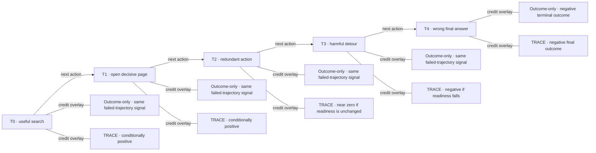

#### Python

```python
from html import escape
from pathlib import Path
from textwrap import wrap

title = "opening: aligned credit overlays"
nodes = [["a0","T0 · useful search",100,40],["a1","T1 · open decisive page",340,40],["a2","T2 · redundant action",580,40],["a3","T3 · harmful detour",820,40],["a4","T4 · wrong final answer",1060,40],["o0","Outcome-only · same failed-trajectory signal",100,220],["t0","TRACE · conditionally positive",100,400],["o1","Outcome-only · same failed-trajectory signal",340,220],["t1","TRACE · conditionally positive",340,400],["o2","Outcome-only · same failed-trajectory signal",580,220],["t2","TRACE · near zero if readiness is unchanged",580,400],["o3","Outcome-only · same failed-trajectory signal",820,220],["t3","TRACE · negative if readiness falls",820,400],["o4","Outcome-only · negative terminal outcome",1060,220],["t4","TRACE · negative final outcome",1060,400]]
edges = [["a0","a1","next action",true],["a1","a2","next action",true],["a2","a3","next action",true],["a3","a4","next action",true],["a0","o0","credit overlay",false],["a0","t0","credit overlay",false],["a1","o1","credit overlay",false],["a1","t1","credit overlay",false],["a2","o2","credit overlay",false],["a2","t2","credit overlay",false],["a3","o3","credit overlay",false],["a3","t3","credit overlay",false],["a4","o4","credit overlay",false],["a4","t4","credit overlay",false]]
node_by_id = {node_id: (label, x, y) for node_id, label, x, y in nodes}
width = 1240
height = 540
parts = [
    '<svg xmlns="http://www.w3.org/2000/svg" viewBox="0 0 %d %d" role="img" aria-labelledby="title desc">' % (width, height),
    f'<title id="title">{escape(title)}</title>',
    '<desc id="desc">Labeled relations; undirected lines are associations or boundaries, not temporal order.</desc>',
    f'<rect width="{width}" height="{height}" fill="white"/>',
    '<defs><marker id="arrow" viewBox="0 0 10 10" refX="9" refY="5" markerWidth="6" markerHeight="6" orient="auto-start-reverse"><path d="M 0 0 L 10 5 L 0 10 z" fill="#345"/></marker></defs>',
]
for source, target, relation, directed in edges:
    _, x1, y1 = node_by_id[source]
    _, x2, y2 = node_by_id[target]
    marker = ' marker-end="url(#arrow)"' if directed else ''
    parts.append(f'<line x1="{x1}" y1="{y1}" x2="{x2}" y2="{y2}" stroke="#345" stroke-width="2"{marker}/>')
    parts.append(f'<text x="{(x1+x2)/2}" y="{(y1+y2)/2-5}" text-anchor="middle" font-family="sans-serif" font-size="10">{escape(relation)}</text>')
for _, label, x, y in nodes:
    parts.append(f'<rect x="{x-85}" y="{y-44}" width="170" height="88" rx="12" fill="#eef6ff" stroke="#234"/>')
    for line_index, line in enumerate(wrap(label, width=24)):
        parts.append(f'<text x="{x}" y="{y-26+line_index*13}" text-anchor="middle" font-family="sans-serif" font-size="10">{escape(line)}</text>')
parts.append('</svg>')
Path("trace_why_p1_treatment_a.svg").write_text("\n".join(parts), encoding="utf-8")
```

### Treatment B — One dependent action trajectory under two credit views — action-by-credit matrix

- Teaching purpose: Make both credit readings directly comparable without inventing numeric credit.
- Encoding and reading order: Render one row per real action and two parallel interpretation columns. No interpretation or limitation becomes an extra action row.
- Evidence and limitations: Use `trace_claim_outcome_blind`, `trace_claim_credit`, `trace_source_intro`, and `trace_source_method`. The action roles are explanatory categories, not measured credit magnitudes; conditional TRACE labels depend on whether gold-answer readiness changes.
- Recommended web medium: semantic HTML/CSS table with SVG export; JavaScript is unnecessary.
- Mobile, accessibility, and motion behavior: Keep every label and identifier as selectable DOM text; preserve non-directional grouping on mobile; use overflow-wrap: anywhere for long tokens; provide a complete static fallback; respect reduced motion; never make information depend on animation or pointer input.

#### TikZ

```tex
\documentclass[tikz,border=5pt]{standalone}
\usepackage[T1]{fontenc}
\usepackage{array}
\usepackage{tikz}
\begin{document}
\begin{tikzpicture}[font=\sffamily]
\node[align=center] {\textbf{opening: action-credit matrix}\\[6pt]
\begin{tabular}{p{4cm}p{6cm}p{8cm}}
\textbf{Facet} & \textbf{Statement or value} & \textbf{Evidence condition or boundary} \\ \hline
T0  useful search & same failed-trajectory signal & conditionally positive \\
T1  open decisive page & same failed-trajectory signal & conditionally positive \\
T2  redundant action & same failed-trajectory signal & near zero if readiness is unchanged \\
T3  harmful detour & same failed-trajectory signal & negative if readiness falls \\
T4  wrong final answer & negative terminal outcome & negative final outcome \\
\end{tabular}};
\end{tikzpicture}
\end{document}
```

#### Mermaid

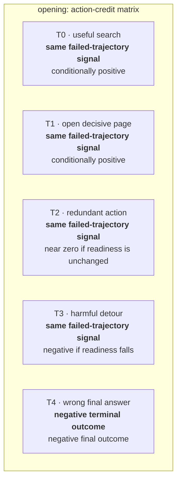

#### Python

```python
from html import escape
from pathlib import Path
from textwrap import wrap

title = "opening: action-credit matrix"
rows = [["T0 · useful search","same failed-trajectory signal","conditionally positive"],["T1 · open decisive page","same failed-trajectory signal","conditionally positive"],["T2 · redundant action","same failed-trajectory signal","near zero if readiness is unchanged"],["T3 · harmful detour","same failed-trajectory signal","negative if readiness falls"],["T4 · wrong final answer","negative terminal outcome","negative final outcome"]]
height = 610
parts = [
    f'<svg xmlns="http://www.w3.org/2000/svg" viewBox="0 0 1200 {height}" role="img" aria-labelledby="title desc">',
    f'<title id="title">{escape(title)}</title>',
    '<desc id="desc">Non-directional evidence ledger with every statement and boundary visible.</desc>',
    f'<rect width="1200" height="{height}" fill="white"/>',
]
headers = ["Facet", "Statement or value", "Evidence condition or boundary"]
xs = [30, 300, 700]
for x, header in zip(xs, headers):
    parts.append(f'<text x="{x}" y="65" font-family="sans-serif" font-size="16" font-weight="700">{escape(header)}</text>')
for row_index, row in enumerate(rows):
    y = 110 + row_index * 92
    parts.append(f'<rect x="20" y="{y-30}" width="1160" height="80" fill="#f7fbff" stroke="#ccd"/>')
    for x, cell, width in zip(xs, row, [30, 48, 60]):
        for line_index, line in enumerate(wrap(str(cell), width=width)):
            parts.append(f'<text x="{x}" y="{y-8+line_index*14}" font-family="sans-serif" font-size="11">{escape(line)}</text>')
parts.append('</svg>')
Path("trace_why_p1_treatment_b.svg").write_text("\n".join(parts), encoding="utf-8")
```

### Treatment C — One dependent action trajectory under two credit views — per-action comparison cards

- Teaching purpose: Keep each action and its two credit annotations together while preserving the trajectory order separately.
- Encoding and reading order: Use one panel per real action. Each panel contains exactly two labeled overlays; panel headings carry T0–T4, while no analytical statement receives a time index.
- Evidence and limitations: Use `trace_claim_outcome_blind`, `trace_claim_credit`, `trace_source_intro`, and `trace_source_method`. The action roles are explanatory categories, not measured credit magnitudes; conditional TRACE labels depend on whether gold-answer readiness changes.
- Recommended web medium: semantic HTML/CSS action cards or responsive SVG; optional step focus must preserve all cards in static fallback.
- Mobile, accessibility, and motion behavior: Keep every label and identifier as selectable DOM text; preserve non-directional grouping on mobile; use overflow-wrap: anywhere for long tokens; provide a complete static fallback; respect reduced motion; never make information depend on animation or pointer input.

#### TikZ

```tex
\documentclass[tikz,border=5pt]{standalone}
\usepackage[T1]{fontenc}
\usepackage{tikz}
\begin{document}
\begin{tikzpicture}[font=\sffamily,panel/.style={draw,rounded corners,align=center,text width=5.2cm,minimum height=4.2cm}]
\node[font=\bfseries] at (12,3.1) {opening: per-action overlays};
\node[panel] at (0,0) {\textbf{T0  useful search}\\[5pt]Outcome-only: same failed-trajectory signal\\[3pt]TRACE: conditionally positive};
\node[panel] at (6,0) {\textbf{T1  open decisive page}\\[5pt]Outcome-only: same failed-trajectory signal\\[3pt]TRACE: conditionally positive};
\node[panel] at (12,0) {\textbf{T2  redundant action}\\[5pt]Outcome-only: same failed-trajectory signal\\[3pt]TRACE: near zero if readiness is unchanged};
\node[panel] at (18,0) {\textbf{T3  harmful detour}\\[5pt]Outcome-only: same failed-trajectory signal\\[3pt]TRACE: negative if readiness falls};
\node[panel] at (24,0) {\textbf{T4  wrong final answer}\\[5pt]Outcome-only: negative terminal outcome\\[3pt]TRACE: negative final outcome};
\end{tikzpicture}
\end{document}
```

#### Mermaid

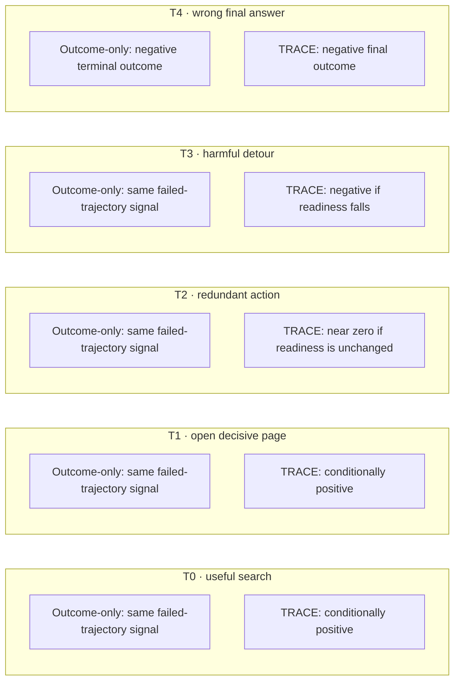

#### Python

```python
from html import escape
from pathlib import Path
from textwrap import wrap

title = "opening: per-action overlays"
groups = [{"title":"T0 · useful search","items":["Outcome-only: same failed-trajectory signal","TRACE: conditionally positive"]},{"title":"T1 · open decisive page","items":["Outcome-only: same failed-trajectory signal","TRACE: conditionally positive"]},{"title":"T2 · redundant action","items":["Outcome-only: same failed-trajectory signal","TRACE: near zero if readiness is unchanged"]},{"title":"T3 · harmful detour","items":["Outcome-only: same failed-trajectory signal","TRACE: negative if readiness falls"]},{"title":"T4 · wrong final answer","items":["Outcome-only: negative terminal outcome","TRACE: negative final outcome"]}]
width = 2000
height = 404
parts = [
    f'<svg xmlns="http://www.w3.org/2000/svg" viewBox="0 0 {width} {height}" role="img" aria-labelledby="title desc">',
    f'<title id="title">{escape(title)}</title>',
    '<desc id="desc">Independent panels; spatial grouping does not encode sequence or causality.</desc>',
    f'<rect width="{width}" height="{height}" fill="white"/>',
]
for group_index, group in enumerate(groups):
    x = 200 + group_index * 400
    parts.append(f'<text x="{x}" y="60" text-anchor="middle" font-family="sans-serif" font-size="16" font-weight="700">{escape(group["title"])}</text>')
    for item_index, item in enumerate(group["items"]):
        y = 115 + item_index * 92
        parts.append(f'<rect x="{x-180}" y="{y-30}" width="360" height="78" rx="12" fill="#f7fbff" stroke="#ccd"/>')
        for line_index, line in enumerate(wrap(item, width=50)):
            parts.append(f'<text x="{x}" y="{y-8+line_index*14}" text-anchor="middle" font-family="sans-serif" font-size="11">{escape(line)}</text>')
parts.append('</svg>')
Path("trace_why_p1_treatment_c.svg").write_text("\n".join(parts), encoding="utf-8")
```

### Implementation record

- Status: `IMPLEMENTED`
- Selected treatment: `C`
- Selection rationale: Selected the approved “Unequal tool decisions under one trajectory-level outcome — Position-to-position trace” treatment because the implemented parallel view directly encodes this paragraph's explanatory job and its stated evidence boundaries.
- Delivery medium: `CSS + semantic HTML`
- Visual ID and placement: `trace_visual_outcome_routes` after `trace_why_p1`; this record is served by that purpose-built figure.
- Shared paragraph scope: NONE
- Changed files: `packages/test-fixtures/explainers/trace.json`, `packages/content-schema/schema/explainer-document.schema.json`, `packages/content-schema/src/validate.ts`, generated TypeScript/Python models, `apps/web/app/papers/[id]/explainer-visual.tsx`, and `apps/web/app/globals.css`.
- Accessibility and fallback verification: Figure has a programmatic title and description, visible selectable labels and values, explicit alt text, equivalent fallback prose, source links, limitations, and a semantic static body; no meaning depends on color, motion, or pointer input.
- Desktop and mobile verification: Verified by the full eight-paper Playwright traversal at a 1440-pixel desktop viewport and the iPhone 13 mobile viewport; every figure stayed paragraph-adjacent, preserved DOM reading order, and introduced no horizontal page overflow.
- Evidence deviations: Delivery translation: selected Treatment C is rendered as typed semantic HTML/CSS rather than its literal TikZ, Mermaid, or Python-generated asset; the approved paragraph scope, placement, labels, values, grouping, and evidence boundaries are retained.

## `trace_why_p2`

- Location: `trace_why`, paragraph 2
- Text anchor: "Process supervision can provide finer feedback, but commonly needs step labels, an LLM judge, a learned critic, or repeated rollouts."
- Claims and sources: `trace_claim_outcome_blind` (AUTHORS_INTERPRETATION, VERIFIED); `trace_claim_credit` (OBSERVED, VERIFIED); `trace_source_intro` (Pages 1–3, Abstract and Section 1); `trace_source_method` (Sections 3.1–3.3, Equations 4–12, Algorithm 1)
- Visual needed: `NO`
- Decision rationale: Prose remains the better primary form. The paragraph states a bounded conclusion, requirement, provenance fact, or heterogeneous qualification without requiring readers to reconstruct a material process, topology, quantitative comparison, uncertainty distribution, or state transition. The contingencies are retained for auditability but are explicitly non-directional.
- Explanatory job: Non-directional contingency audit for Why is one final reward not enough for a long tool-use trajectory.
- Recommended scope and placement: Prose-only. Do not attach a figure unless the paragraph or evidence changes.
- QA-informed planning change: Round-2 QA removed all generic directed `then` maps. Every contingency now uses this paragraph's independent scope, evidence, requirement, provenance, or claim-boundary facets.

### Treatment A — Why is one final reward not enough for a long tool-use trajectory — paragraph trace_why_p2 — independent scope panels

- Teaching purpose: Optionally expose the paragraph's independent facets without inventing order.
- Encoding and reading order: Use 2 named panels. Items within and across panels have no arrows, ordinal numbers, or implied progression.
- Evidence and limitations: Use only `trace_claim_outcome_blind` (AUTHORS_INTERPRETATION, VERIFIED); `trace_claim_credit` (OBSERVED, VERIFIED); `trace_source_intro` (Pages 1–3, Abstract and Section 1); `trace_source_method` (Sections 3.1–3.3, Equations 4–12, Algorithm 1). The contingency is non-directional: proximity and connecting lines mean membership, support, requirement, or scope only; they never mean temporal order or causality.
- Recommended web medium: semantic HTML/CSS grouped panels or responsive SVG; JavaScript is unnecessary.
- Mobile, accessibility, and motion behavior: Keep every label and identifier as selectable DOM text; preserve non-directional grouping on mobile; use overflow-wrap: anywhere for long tokens; provide a complete static fallback; respect reduced motion; never make information depend on animation or pointer input.

#### TikZ

```tex
\documentclass[tikz,border=5pt]{standalone}
\usepackage[T1]{fontenc}
\usepackage{tikz}
\begin{document}
\begin{tikzpicture}[font=\sffamily,panel/.style={draw,rounded corners,align=center,text width=5.2cm,minimum height=4.2cm}]
\node[font=\bfseries] at (3,3.1) {trace\_why\_p2: independent facets};
\node[panel] at (0,0) {\textbf{Premise or requirement}\\[5pt]Process supervision can provide finer feedback\\[3pt]but commonly needs step labels, an LLM judge, a learned critic\\[3pt]or repeated rollouts};
\node[panel] at (6,0) {\textbf{Constraint or research boundary}\\[5pt]TRACE asks whether a known correct answer can supply a denser signal without adding those components};
\end{tikzpicture}
\end{document}
```

#### Mermaid

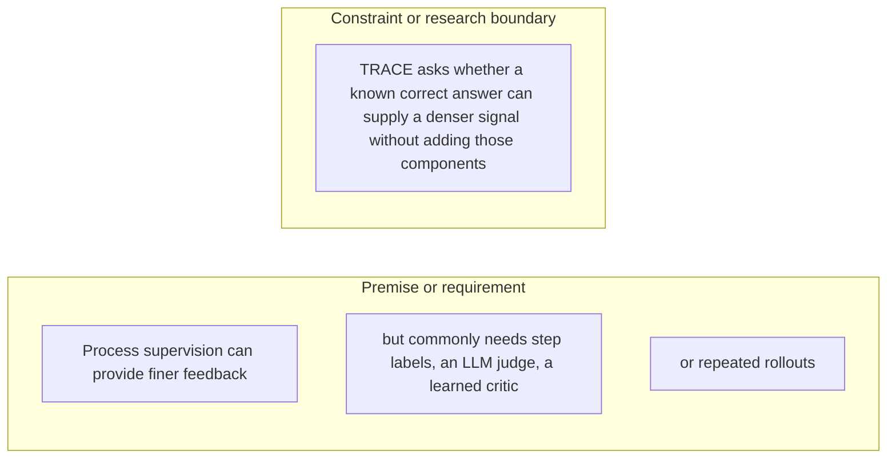

#### Python

```python
from html import escape
from pathlib import Path
from textwrap import wrap

title = "trace_why_p2: independent facets"
groups = [{"title":"Premise or requirement","items":["Process supervision can provide finer feedback","but commonly needs step labels, an LLM judge, a learned critic","or repeated rollouts"]},{"title":"Constraint or research boundary","items":["TRACE asks whether a known correct answer can supply a denser signal without adding those components"]}]
width = 900
height = 496
parts = [
    f'<svg xmlns="http://www.w3.org/2000/svg" viewBox="0 0 {width} {height}" role="img" aria-labelledby="title desc">',
    f'<title id="title">{escape(title)}</title>',
    '<desc id="desc">Independent panels; spatial grouping does not encode sequence or causality.</desc>',
    f'<rect width="{width}" height="{height}" fill="white"/>',
]
for group_index, group in enumerate(groups):
    x = 200 + group_index * 400
    parts.append(f'<text x="{x}" y="60" text-anchor="middle" font-family="sans-serif" font-size="16" font-weight="700">{escape(group["title"])}</text>')
    for item_index, item in enumerate(group["items"]):
        y = 115 + item_index * 92
        parts.append(f'<rect x="{x-180}" y="{y-30}" width="360" height="78" rx="12" fill="#f7fbff" stroke="#ccd"/>')
        for line_index, line in enumerate(wrap(item, width=50)):
            parts.append(f'<text x="{x}" y="{y-8+line_index*14}" text-anchor="middle" font-family="sans-serif" font-size="11">{escape(line)}</text>')
parts.append('</svg>')
Path("trace_why_p2_treatment_a.svg").write_text("\n".join(parts), encoding="utf-8")
```

### Treatment B — Why is one final reward not enough for a long tool-use trajectory — paragraph trace_why_p2 — evidence and boundary ledger

- Teaching purpose: Optionally make each statement and its evidence role inspectable in a flat ledger.
- Encoding and reading order: Render 4 independent rows with facet, statement, and condition columns. Row order follows prose only and carries no process meaning.
- Evidence and limitations: Use only `trace_claim_outcome_blind` (AUTHORS_INTERPRETATION, VERIFIED); `trace_claim_credit` (OBSERVED, VERIFIED); `trace_source_intro` (Pages 1–3, Abstract and Section 1); `trace_source_method` (Sections 3.1–3.3, Equations 4–12, Algorithm 1). The contingency is non-directional: proximity and connecting lines mean membership, support, requirement, or scope only; they never mean temporal order or causality.
- Recommended web medium: semantic HTML/CSS table with an SVG export; JavaScript is unnecessary.
- Mobile, accessibility, and motion behavior: Keep every label and identifier as selectable DOM text; preserve non-directional grouping on mobile; use overflow-wrap: anywhere for long tokens; provide a complete static fallback; respect reduced motion; never make information depend on animation or pointer input.

#### TikZ

```tex
\documentclass[tikz,border=5pt]{standalone}
\usepackage[T1]{fontenc}
\usepackage{array}
\usepackage{tikz}
\begin{document}
\begin{tikzpicture}[font=\sffamily]
\node[align=center] {\textbf{trace\_why\_p2: non-directional evidence ledger}\\[6pt]
\begin{tabular}{p{4cm}p{6cm}p{8cm}}
\textbf{Facet} & \textbf{Statement or value} & \textbf{Evidence condition or boundary} \\ \hline
why it exists & Independent facet 1 & Process supervision can provide finer feedback \\
why it exists & Independent facet 2 & but commonly needs step labels, an LLM judge, a learned critic \\
why it exists & Independent facet 3 & or repeated rollouts \\
why it exists & Independent facet 4 & TRACE asks whether a known correct answer can supply a denser signal without adding those components \\
\end{tabular}};
\end{tikzpicture}
\end{document}
```

#### Mermaid

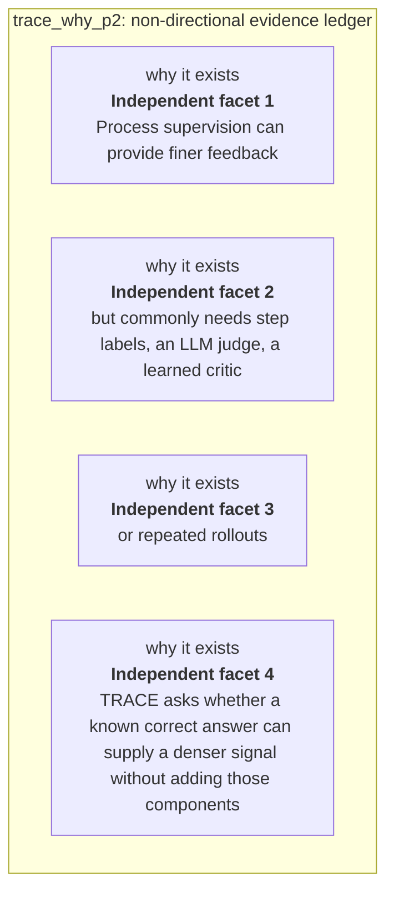

#### Python

```python
from html import escape
from pathlib import Path
from textwrap import wrap

title = "trace_why_p2: non-directional evidence ledger"
rows = [["why it exists","Independent facet 1","Process supervision can provide finer feedback"],["why it exists","Independent facet 2","but commonly needs step labels, an LLM judge, a learned critic"],["why it exists","Independent facet 3","or repeated rollouts"],["why it exists","Independent facet 4","TRACE asks whether a known correct answer can supply a denser signal without adding those components"]]
height = 518
parts = [
    f'<svg xmlns="http://www.w3.org/2000/svg" viewBox="0 0 1200 {height}" role="img" aria-labelledby="title desc">',
    f'<title id="title">{escape(title)}</title>',
    '<desc id="desc">Non-directional evidence ledger with every statement and boundary visible.</desc>',
    f'<rect width="1200" height="{height}" fill="white"/>',
]
headers = ["Facet", "Statement or value", "Evidence condition or boundary"]
xs = [30, 300, 700]
for x, header in zip(xs, headers):
    parts.append(f'<text x="{x}" y="65" font-family="sans-serif" font-size="16" font-weight="700">{escape(header)}</text>')
for row_index, row in enumerate(rows):
    y = 110 + row_index * 92
    parts.append(f'<rect x="20" y="{y-30}" width="1160" height="80" fill="#f7fbff" stroke="#ccd"/>')
    for x, cell, width in zip(xs, row, [30, 48, 60]):
        for line_index, line in enumerate(wrap(str(cell), width=width)):
            parts.append(f'<text x="{x}" y="{y-8+line_index*14}" font-family="sans-serif" font-size="11">{escape(line)}</text>')
parts.append('</svg>')
Path("trace_why_p2_treatment_b.svg").write_text("\n".join(parts), encoding="utf-8")
```

### Treatment C — Why is one final reward not enough for a long tool-use trajectory — paragraph trace_why_p2 — non-directional claim constellation

- Teaching purpose: Optionally show which requirements or qualifications belong to the paragraph's central question.
- Encoding and reading order: Place the paragraph question at the center with 4 undirected spokes. Lines encode requirement or constraint, never sequence; Mermaid uses `---`, TikZ omits arrowheads, and Python emits plain lines.
- Evidence and limitations: Use only `trace_claim_outcome_blind` (AUTHORS_INTERPRETATION, VERIFIED); `trace_claim_credit` (OBSERVED, VERIFIED); `trace_source_intro` (Pages 1–3, Abstract and Section 1); `trace_source_method` (Sections 3.1–3.3, Equations 4–12, Algorithm 1). The contingency is non-directional: proximity and connecting lines mean membership, support, requirement, or scope only; they never mean temporal order or causality.
- Recommended web medium: responsive SVG with semantic HTML/CSS list fallback; JavaScript is unnecessary.
- Mobile, accessibility, and motion behavior: Keep every label and identifier as selectable DOM text; preserve non-directional grouping on mobile; use overflow-wrap: anywhere for long tokens; provide a complete static fallback; respect reduced motion; never make information depend on animation or pointer input.

#### TikZ

```tex
\documentclass[tikz,border=5pt]{standalone}
\usepackage[T1]{fontenc}
\usepackage{tikz}
\begin{document}
\begin{tikzpicture}[font=\sffamily,box/.style={draw,rounded corners,align=center,text width=3.3cm,minimum height=1.3cm},rel/.style={fill=white,font=\scriptsize}]
\node[font=\bfseries,anchor=west] at (0,2) {trace\_why\_p2: claim-boundary constellation};
\node[box] (center) at (3,0) {Why is one final reward not enough for a long tool-use trajectory};
\node[box] (f1) at (0,2) {Process supervision can provide finer feedback};
\node[box] (f2) at (6,2) {but commonly needs step labels, an LLM judge, a learned critic};
\node[box] (f3) at (0,0) {or repeated rollouts};
\node[box] (f4) at (6,0) {TRACE asks whether a known correct answer can supply a denser signal without adding those components};
\draw (center) -- node[rel] {requirement or constraint} (f1);
\draw (center) -- node[rel] {requirement or constraint} (f2);
\draw (center) -- node[rel] {requirement or constraint} (f3);
\draw (center) -- node[rel] {requirement or constraint} (f4);
\end{tikzpicture}
\end{document}
```

#### Mermaid

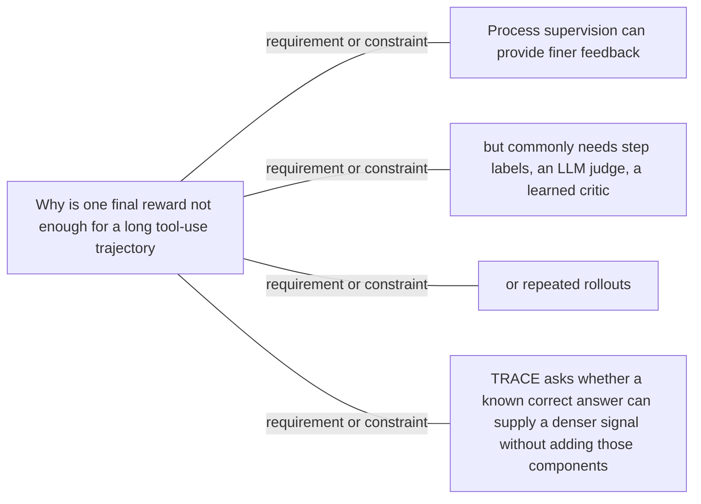

#### Python

```python
from html import escape
from pathlib import Path
from textwrap import wrap

title = "trace_why_p2: claim-boundary constellation"
nodes = [["center","Why is one final reward not enough for a long tool-use trajectory",460,220],["f1","Process supervision can provide finer feedback",100,40],["f2","but commonly needs step labels, an LLM judge, a learned critic",820,40],["f3","or repeated rollouts",100,220],["f4","TRACE asks whether a known correct answer can supply a denser signal without adding those components",820,220]]
edges = [["center","f1","requirement or constraint",false],["center","f2","requirement or constraint",false],["center","f3","requirement or constraint",false],["center","f4","requirement or constraint",false]]
node_by_id = {node_id: (label, x, y) for node_id, label, x, y in nodes}
width = 1000
height = 520
parts = [
    '<svg xmlns="http://www.w3.org/2000/svg" viewBox="0 0 %d %d" role="img" aria-labelledby="title desc">' % (width, height),
    f'<title id="title">{escape(title)}</title>',
    '<desc id="desc">Labeled relations; undirected lines are associations or boundaries, not temporal order.</desc>',
    f'<rect width="{width}" height="{height}" fill="white"/>',
    '<defs><marker id="arrow" viewBox="0 0 10 10" refX="9" refY="5" markerWidth="6" markerHeight="6" orient="auto-start-reverse"><path d="M 0 0 L 10 5 L 0 10 z" fill="#345"/></marker></defs>',
]
for source, target, relation, directed in edges:
    _, x1, y1 = node_by_id[source]
    _, x2, y2 = node_by_id[target]
    marker = ' marker-end="url(#arrow)"' if directed else ''
    parts.append(f'<line x1="{x1}" y1="{y1}" x2="{x2}" y2="{y2}" stroke="#345" stroke-width="2"{marker}/>')
    parts.append(f'<text x="{(x1+x2)/2}" y="{(y1+y2)/2-5}" text-anchor="middle" font-family="sans-serif" font-size="10">{escape(relation)}</text>')
for _, label, x, y in nodes:
    parts.append(f'<rect x="{x-85}" y="{y-44}" width="170" height="88" rx="12" fill="#eef6ff" stroke="#234"/>')
    for line_index, line in enumerate(wrap(label, width=24)):
        parts.append(f'<text x="{x}" y="{y-26+line_index*13}" text-anchor="middle" font-family="sans-serif" font-size="10">{escape(line)}</text>')
parts.append('</svg>')
Path("trace_why_p2_treatment_c.svg").write_text("\n".join(parts), encoding="utf-8")
```

### Implementation record

- Status: `NOT_NEEDED`
- Selected treatment: `NONE`
- Selection rationale: Revision 3's paragraph-level removal test keeps this paragraph prose-only; no figure would reduce the reader's reconstruction burden enough to justify added visual complexity.
- Delivery medium: `NONE`
- Visual ID and placement: `NONE`; no figure is attached to this paragraph.
- Shared paragraph scope: NONE
- Changed files: `docs/visual-manifests/VISUAL_MANIFEST_TRACE.md` records the prose-only decision; no fixture visual serves this paragraph.
- Accessibility and fallback verification: The paragraph remains semantic selectable text with its existing claim and source links; no visual-only information or motion is introduced.
- Desktop and mobile verification: No paragraph-local figure exists; the existing prose remains in normal document order at both viewports.
- Evidence deviations: Not applicable: revision 3 explicitly classifies this paragraph as prose-only.

## `trace_change_p1`

- Location: `trace_change`, paragraph 1
- Text anchor: "TRACE leaves final-answer verification in place but adds a trajectory-local signal at tool-call boundaries."
- Claims and sources: `trace_claim_credit` (OBSERVED, VERIFIED); `trace_claim_outcome_anchor` (OBSERVED, VERIFIED); `trace_claim_controlled_setup` (OBSERVED, VERIFIED); `trace_source_method` (Sections 3.1–3.3, Equations 4–12, Algorithm 1); `trace_source_experiments` (Pages 7–8, Section 4.1)
- Visual needed: `YES`
- Decision rationale: A visual passes the removal test because readers must reconstruct held-fixed search system versus changed credit assignment while preserving the paragraph's conditions and boundaries. Revision 3 narrows the topology and placement so no visual can claim this paragraph without encoding its mechanism, grouping, or values.
- Explanatory job: Held-fixed search system versus changed credit assignment.
- Recommended scope and placement: This paragraph only; place the visual immediately after `trace_change_p1`.
- QA-informed planning change: Separate browser, backbone, corpus, and verifier controls from the local-credit construction.

### Treatment A — Held-fixed search system versus changed credit assignment — Relationship-specific parallel view

- Teaching purpose: Keep valid comparison groups separate and equally visible.
- Encoding and reading order: Group the 2 source-backed records into named panels using the first column as the grouping key. Panels preserve experimental, source, or example boundaries and never imply one shared scale.
- Evidence and limitations: Encode only `trace_claim_credit`, `trace_claim_outcome_anchor`, `trace_claim_controlled_setup` from `trace_source_method`, `trace_source_experiments`. Separate browser, backbone, corpus, and verifier controls from the local-credit construction.
- Recommended web medium: semantic HTML/CSS grouped panels or responsive SVG; JavaScript is optional only for meaningful focus, drill-down, or state playback.
- Mobile, accessibility, and motion behavior: Preserve the same group and node order in the DOM; retain all values and relation labels as selectable text; stack panels or levels below 640px; provide keyboard access for any optional focus state; keep a complete static fallback; respect reduced motion and never encode information only through animation.

#### TikZ

```tex
\documentclass[tikz,border=5pt]{standalone}
\usepackage[T1]{fontenc}
\usepackage{tikz}
\begin{document}
\begin{tikzpicture}[font=\sffamily,panel/.style={draw,rounded corners,align=center,text width=4.8cm,minimum height=4cm}]
\node[font=\bfseries] at (0,3) {trace\_change\_p1: Held-fixed search system versus changed credit assignment - Relationship-specific parallel view};
\node[panel] at (0,0) {\textbf{TRACE changes the policy signal, not the search system}\\[4pt]\textbf{Held fixed}: qualitative -- Backbone, browser actions, training data, final verifier, and evaluation interface remain shared across the controlled runs.\\\textbf{Changed by TRACE}: qualitative -- At tool-call boundaries, a frozen initial-policy probe measures changes in gold-answer predictability and contributes a trajectory-local policy-gradient signal.};
\end{tikzpicture}
\end{document}
```

#### Mermaid

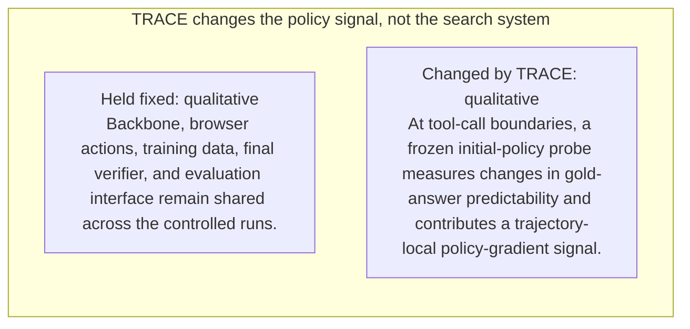

#### Python

```python
from html import escape
from pathlib import Path
from textwrap import wrap

title = "trace_change_p1: Held-fixed search system versus changed credit assignment — Relationship-specific parallel view"
rows = [["TRACE changes the policy signal, not the search system","Held fixed","qualitative","Backbone, browser actions, training data, final verifier, and evaluation interface remain shared across the controlled runs."],["TRACE changes the policy signal, not the search system","Changed by TRACE","qualitative","At tool-call boundaries, a frozen initial-policy probe measures changes in gold-answer predictability and contributes a trajectory-local policy-gradient signal."]]
groups = {}
for group, label, value, condition in rows:
    groups.setdefault(group, []).append((label, value, condition))
width = max(900, len(groups) * 360)
height = 220 + max((len(items) for items in groups.values()), default=1) * 92
parts = [
    f'<svg xmlns="http://www.w3.org/2000/svg" viewBox="0 0 {width} {height}" role="img" aria-labelledby="title desc">',
    f'<title id="title">{escape(title)}</title>',
    '<desc id="desc">Separate panels preserve grouping and prevent unrelated conditions from reading as one sequence.</desc>',
    f'<rect width="{width}" height="{height}" fill="white"/>',
]
for group_index, (group, items) in enumerate(groups.items()):
    x = 180 + group_index * 360
    parts.append(f'<text x="{x}" y="65" text-anchor="middle" font-family="sans-serif" font-size="16" font-weight="700">{escape(group)}</text>')
    for item_index, (label, value, condition) in enumerate(items):
        y = 120 + item_index * 92
        parts.append(f'<rect x="{x-160}" y="{y-30}" width="320" height="78" rx="12" fill="#f7fbff" stroke="#ccd"/>')
        text = f"{label}: {value} — {condition}"
        for line_index, line in enumerate(wrap(text, width=46)):
            parts.append(f'<text x="{x}" y="{y-6+line_index*14}" text-anchor="middle" font-family="sans-serif" font-size="11">{escape(line)}</text>')
parts.append('</svg>')
Path("trace_change_p1_treatment_a.svg").write_text("\n".join(parts), encoding="utf-8")
```

### Treatment B — Held-fixed search system versus changed credit assignment — Condition and boundary matrix

- Teaching purpose: Show every comparison value or qualitative condition in explicit columns.
- Encoding and reading order: Render 2 rows with explicit `Group`, `Measure or state`, `Visible value`, and `Condition or boundary` columns. The value column must be visible, not only present in ARIA text or fallback prose.
- Evidence and limitations: Encode only `trace_claim_credit`, `trace_claim_outcome_anchor`, `trace_claim_controlled_setup` from `trace_source_method`, `trace_source_experiments`. Separate browser, backbone, corpus, and verifier controls from the local-credit construction.
- Recommended web medium: semantic HTML/CSS table with SVG export; JavaScript is optional only for meaningful focus, drill-down, or state playback.
- Mobile, accessibility, and motion behavior: Preserve the same group and node order in the DOM; retain all values and relation labels as selectable text; stack panels or levels below 640px; provide keyboard access for any optional focus state; keep a complete static fallback; respect reduced motion and never encode information only through animation.

#### TikZ

```tex
\documentclass[tikz,border=5pt]{standalone}
\usepackage[T1]{fontenc}
\usepackage{array}
\usepackage{tikz}
\begin{document}
\begin{tikzpicture}[font=\sffamily]
\node[align=center] {\textbf{trace\_change\_p1: Held-fixed search system versus changed credit assignment - Condition and boundary matrix}\\[6pt]
\begin{tabular}{p{3.2cm}p{4.0cm}p{2.8cm}p{6.2cm}}
\textbf{Group} & \textbf{Measure or state} & \textbf{Visible value} & \textbf{Condition or boundary} \\ \hline
TRACE changes the policy signal, not the search system & Held fixed & qualitative & Backbone, browser actions, training data, final verifier, and evaluation interface remain shared across the controlled runs. \\
TRACE changes the policy signal, not the search system & Changed by TRACE & qualitative & At tool-call boundaries, a frozen initial-policy probe measures changes in gold-answer predictability and contributes a trajectory-local policy-gradient signal. \\
\end{tabular}};
\end{tikzpicture}
\end{document}
```

#### Mermaid

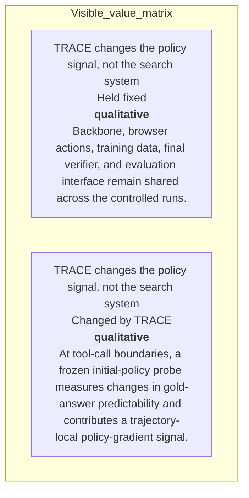

#### Python

```python
from html import escape
from pathlib import Path
from textwrap import wrap

title = "trace_change_p1: Held-fixed search system versus changed credit assignment — Condition and boundary matrix"
rows = [["TRACE changes the policy signal, not the search system","Held fixed","qualitative","Backbone, browser actions, training data, final verifier, and evaluation interface remain shared across the controlled runs."],["TRACE changes the policy signal, not the search system","Changed by TRACE","qualitative","At tool-call boundaries, a frozen initial-policy probe measures changes in gold-answer predictability and contributes a trajectory-local policy-gradient signal."]]
height = 326
parts = [
    f'<svg xmlns="http://www.w3.org/2000/svg" viewBox="0 0 1200 {height}" role="img" aria-labelledby="title desc">',
    f'<title id="title">{escape(title)}</title>',
    '<desc id="desc">Every reported value is visible beside its condition and group.</desc>',
    f'<rect width="1200" height="{height}" fill="white"/>',
]
headers = ["Group", "Measure or state", "Visible value", "Condition or boundary"]
xs = [30, 260, 590, 770]
for x, header in zip(xs, headers):
    parts.append(f'<text x="{x}" y="70" font-family="sans-serif" font-size="16" font-weight="700">{escape(header)}</text>')
for row_index, row in enumerate(rows):
    y = 110 + row_index * 88
    parts.append(f'<rect x="20" y="{y-28}" width="1160" height="76" fill="#f7fbff" stroke="#ccd"/>')
    for x, cell, width in zip(xs, row, [26, 38, 20, 58]):
        for line_index, line in enumerate(wrap(str(cell), width=width)):
            parts.append(f'<text x="{x}" y="{y+line_index*14}" font-family="sans-serif" font-size="11">{escape(line)}</text>')
parts.append('</svg>')
Path("trace_change_p1_treatment_b.svg").write_text("\n".join(parts), encoding="utf-8")
```

### Treatment C — Held-fixed search system versus changed credit assignment — Comparison topology

- Teaching purpose: Connect only the alternatives and shared decision point stated in the paragraph.
- Encoding and reading order: Use 2 named nodes and 1 explicit labeled relations. Preserve all branch, merge, hierarchy, loop, or sequence edges shown in the code; changing them is an evidence deviation.
- Evidence and limitations: Encode only `trace_claim_credit`, `trace_claim_outcome_anchor`, `trace_claim_controlled_setup` from `trace_source_method`, `trace_source_experiments`. Separate browser, backbone, corpus, and verifier controls from the local-credit construction.
- Recommended web medium: responsive inline SVG with semantic HTML/CSS fallback; JavaScript is optional only for meaningful focus, drill-down, or state playback.
- Mobile, accessibility, and motion behavior: Preserve the same group and node order in the DOM; retain all values and relation labels as selectable text; stack panels or levels below 640px; provide keyboard access for any optional focus state; keep a complete static fallback; respect reduced motion and never encode information only through animation.

#### TikZ

```tex
\documentclass[tikz,border=5pt]{standalone}
\usepackage[T1]{fontenc}
\usepackage{tikz}
\usetikzlibrary{arrows.meta}
\begin{document}
\begin{tikzpicture}[font=\sffamily,box/.style={draw,rounded corners,align=center,text width=3cm,minimum height=1.2cm},link/.style={-{Latex[length=2mm]},thick},rel/.style={fill=white,font=\scriptsize}]
\node[font=\bfseries,anchor=west] at (0,0.8) {trace\_change\_p1: Held-fixed search system versus changed credit assignment - Comparison topology};
\node[box] (n1) at (1.00,-1.50) {TRACE leaves final-answer verification in place but adds a trajectory-local signal at tool-call boundaries};
\node[box] (n2) at (2.50,-1.50) {Instead of treating every action in a rollout alike, it rewards an interaction when the following transcript makes the gold answer more predictable to a frozen reference model and penalizes it when predictability falls};
\draw[link] (n1) -- node[rel] {compare} (n2);
\end{tikzpicture}
\end{document}
```

#### Mermaid

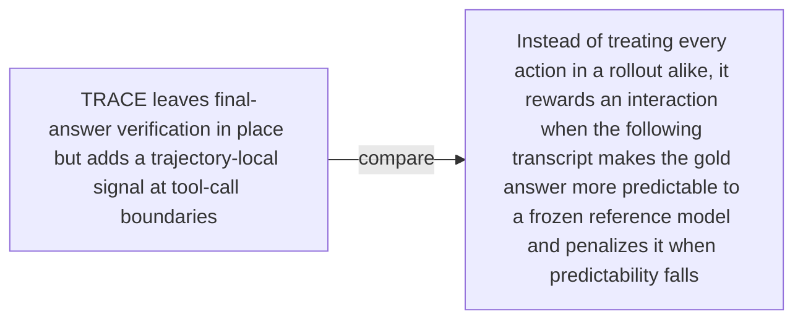

#### Python

```python
from html import escape
from pathlib import Path
from textwrap import wrap

title = "trace_change_p1: Held-fixed search system versus changed credit assignment — Comparison topology"
nodes = [["n1","TRACE leaves final-answer verification in place but adds a trajectory-local signal at tool-call boundaries",100,150],["n2","Instead of treating every action in a rollout alike, it rewards an interaction when the following transcript makes the gold answer more predictable to a frozen reference model and penalizes it when predictability falls",250,150]]
edges = [["n1","n2","compare"]]
node_by_id = {node_id: (label, x, y) for node_id, label, x, y in nodes}
width = max(900, max((x for _, _, x, _ in nodes), default=800) + 180)
height = max(500, max((y for _, _, _, y in nodes), default=400) + 140)
parts = [
    f'<svg xmlns="http://www.w3.org/2000/svg" viewBox="0 0 {width} {height}" role="img" aria-labelledby="title desc">',
    f'<title id="title">{escape(title)}</title>',
    '<desc id="desc">Edges and convergence points encode only relationships stated in the scoped paragraphs.</desc>',
    f'<rect width="{width}" height="{height}" fill="white"/>',
]
for source, target, relation in edges:
    _, x1, y1 = node_by_id[source]
    _, x2, y2 = node_by_id[target]
    parts.append(f'<line x1="{x1}" y1="{y1}" x2="{x2}" y2="{y2}" stroke="#345" stroke-width="2"/>')
    parts.append(f'<text x="{(x1+x2)/2}" y="{(y1+y2)/2-5}" text-anchor="middle" font-family="sans-serif" font-size="10">{escape(relation)}</text>')
for _, label, x, y in nodes:
    parts.append(f'<rect x="{x-78}" y="{y-42}" width="156" height="84" rx="12" fill="#eef6ff" stroke="#234"/>')
    for line_index, line in enumerate(wrap(label, width=22)):
        parts.append(f'<text x="{x}" y="{y-24+line_index*13}" text-anchor="middle" font-family="sans-serif" font-size="10">{escape(line)}</text>')
parts.append('</svg>')
Path("trace_change_p1_treatment_c.svg").write_text("\n".join(parts), encoding="utf-8")
```

### Implementation record

- Status: `IMPLEMENTED`
- Selected treatment: `A`
- Selection rationale: Selected the approved “Held-fixed search system versus changed credit assignment — Relationship-specific parallel view” treatment because the implemented parallel view directly encodes this paragraph's explanatory job and its stated evidence boundaries.
- Delivery medium: `CSS + semantic HTML`
- Visual ID and placement: `trace_visual_credit_assignment_change` after `trace_change_p1`; this record is served by that purpose-built figure.
- Shared paragraph scope: NONE
- Changed files: `packages/test-fixtures/explainers/trace.json`, `packages/content-schema/schema/explainer-document.schema.json`, `packages/content-schema/src/validate.ts`, generated TypeScript/Python models, `apps/web/app/papers/[id]/explainer-visual.tsx`, and `apps/web/app/globals.css`.
- Accessibility and fallback verification: Figure has a programmatic title and description, visible selectable labels and values, explicit alt text, equivalent fallback prose, source links, limitations, and a semantic static body; no meaning depends on color, motion, or pointer input.
- Desktop and mobile verification: Verified by the full eight-paper Playwright traversal at a 1440-pixel desktop viewport and the iPhone 13 mobile viewport; every figure stayed paragraph-adjacent, preserved DOM reading order, and introduced no horizontal page overflow.
- Evidence deviations: Delivery translation: selected Treatment A is rendered as typed semantic HTML/CSS rather than its literal TikZ, Mermaid, or Python-generated asset; the approved paragraph scope, placement, labels, values, grouping, and evidence boundaries are retained.

## `trace_change_p2`

- Location: `trace_change`, paragraph 2
- Text anchor: "This is a change to credit assignment, not a new browser, backbone, training corpus, or final verifier."
- Claims and sources: `trace_claim_credit` (OBSERVED, VERIFIED); `trace_claim_outcome_anchor` (OBSERVED, VERIFIED); `trace_claim_controlled_setup` (OBSERVED, VERIFIED); `trace_source_method` (Sections 3.1–3.3, Equations 4–12, Algorithm 1); `trace_source_experiments` (Pages 7–8, Section 4.1)
- Visual needed: `NO`
- Decision rationale: Prose remains the better primary form. The paragraph states a bounded conclusion, requirement, provenance fact, or heterogeneous qualification without requiring readers to reconstruct a material process, topology, quantitative comparison, uncertainty distribution, or state transition. The contingencies are retained for auditability but are explicitly non-directional.
- Explanatory job: Non-directional contingency audit for What does TRACE change in agent reinforcement learning.
- Recommended scope and placement: Prose-only. Do not attach a figure unless the paragraph or evidence changes.
- QA-informed planning change: Round-2 QA removed all generic directed `then` maps. Every contingency now uses this paragraph's independent scope, evidence, requirement, provenance, or claim-boundary facets.

### Treatment A — What does TRACE change in agent reinforcement learning — paragraph trace_change_p2 — independent scope panels

- Teaching purpose: Optionally expose the paragraph's independent facets without inventing order.
- Encoding and reading order: Use 2 named panels. Items within and across panels have no arrows, ordinal numbers, or implied progression.
- Evidence and limitations: Use only `trace_claim_credit` (OBSERVED, VERIFIED); `trace_claim_outcome_anchor` (OBSERVED, VERIFIED); `trace_claim_controlled_setup` (OBSERVED, VERIFIED); `trace_source_method` (Sections 3.1–3.3, Equations 4–12, Algorithm 1); `trace_source_experiments` (Pages 7–8, Section 4.1). The contingency is non-directional: proximity and connecting lines mean membership, support, requirement, or scope only; they never mean temporal order or causality.
- Recommended web medium: semantic HTML/CSS grouped panels or responsive SVG; JavaScript is unnecessary.
- Mobile, accessibility, and motion behavior: Keep every label and identifier as selectable DOM text; preserve non-directional grouping on mobile; use overflow-wrap: anywhere for long tokens; provide a complete static fallback; respect reduced motion; never make information depend on animation or pointer input.

#### TikZ

```tex
\documentclass[tikz,border=5pt]{standalone}
\usepackage[T1]{fontenc}
\usepackage{tikz}
\begin{document}
\begin{tikzpicture}[font=\sffamily,panel/.style={draw,rounded corners,align=center,text width=5.2cm,minimum height=4.2cm}]
\node[font=\bfseries] at (3,3.1) {trace\_change\_p2: independent facets};
\node[panel] at (0,0) {\textbf{Claimed change}\\[5pt]or final verifier\\[3pt]In the controlled comparisons, those parts are held fixed so the main variable is how the policy-gradient signal is constructed};
\node[panel] at (6,0) {\textbf{Unchanged or unproven boundary}\\[5pt]This is a change to credit assignment, not a new browser, backbone, training corpus};
\end{tikzpicture}
\end{document}
```

#### Mermaid

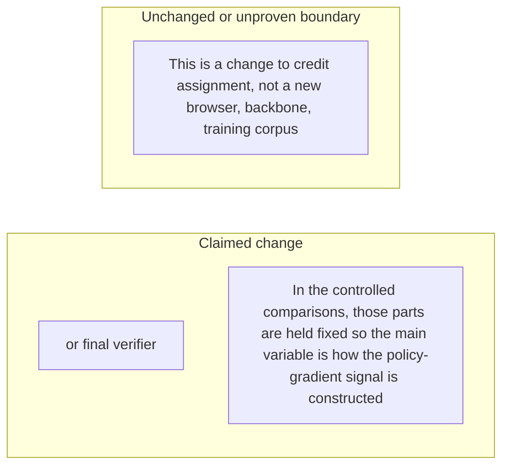

#### Python

```python
from html import escape
from pathlib import Path
from textwrap import wrap

title = "trace_change_p2: independent facets"
groups = [{"title":"Claimed change","items":["or final verifier","In the controlled comparisons, those parts are held fixed so the main variable is how the policy-gradient signal is constructed"]},{"title":"Unchanged or unproven boundary","items":["This is a change to credit assignment, not a new browser, backbone, training corpus"]}]
width = 900
height = 404
parts = [
    f'<svg xmlns="http://www.w3.org/2000/svg" viewBox="0 0 {width} {height}" role="img" aria-labelledby="title desc">',
    f'<title id="title">{escape(title)}</title>',
    '<desc id="desc">Independent panels; spatial grouping does not encode sequence or causality.</desc>',
    f'<rect width="{width}" height="{height}" fill="white"/>',
]
for group_index, group in enumerate(groups):
    x = 200 + group_index * 400
    parts.append(f'<text x="{x}" y="60" text-anchor="middle" font-family="sans-serif" font-size="16" font-weight="700">{escape(group["title"])}</text>')
    for item_index, item in enumerate(group["items"]):
        y = 115 + item_index * 92
        parts.append(f'<rect x="{x-180}" y="{y-30}" width="360" height="78" rx="12" fill="#f7fbff" stroke="#ccd"/>')
        for line_index, line in enumerate(wrap(item, width=50)):
            parts.append(f'<text x="{x}" y="{y-8+line_index*14}" text-anchor="middle" font-family="sans-serif" font-size="11">{escape(line)}</text>')
parts.append('</svg>')
Path("trace_change_p2_treatment_a.svg").write_text("\n".join(parts), encoding="utf-8")
```

### Treatment B — What does TRACE change in agent reinforcement learning — paragraph trace_change_p2 — evidence and boundary ledger

- Teaching purpose: Optionally make each statement and its evidence role inspectable in a flat ledger.
- Encoding and reading order: Render 3 independent rows with facet, statement, and condition columns. Row order follows prose only and carries no process meaning.
- Evidence and limitations: Use only `trace_claim_credit` (OBSERVED, VERIFIED); `trace_claim_outcome_anchor` (OBSERVED, VERIFIED); `trace_claim_controlled_setup` (OBSERVED, VERIFIED); `trace_source_method` (Sections 3.1–3.3, Equations 4–12, Algorithm 1); `trace_source_experiments` (Pages 7–8, Section 4.1). The contingency is non-directional: proximity and connecting lines mean membership, support, requirement, or scope only; they never mean temporal order or causality.
- Recommended web medium: semantic HTML/CSS table with an SVG export; JavaScript is unnecessary.
- Mobile, accessibility, and motion behavior: Keep every label and identifier as selectable DOM text; preserve non-directional grouping on mobile; use overflow-wrap: anywhere for long tokens; provide a complete static fallback; respect reduced motion; never make information depend on animation or pointer input.

#### TikZ

```tex
\documentclass[tikz,border=5pt]{standalone}
\usepackage[T1]{fontenc}
\usepackage{array}
\usepackage{tikz}
\begin{document}
\begin{tikzpicture}[font=\sffamily]
\node[align=center] {\textbf{trace\_change\_p2: non-directional evidence ledger}\\[6pt]
\begin{tabular}{p{4cm}p{6cm}p{8cm}}
\textbf{Facet} & \textbf{Statement or value} & \textbf{Evidence condition or boundary} \\ \hline
what it changes & Independent facet 1 & This is a change to credit assignment, not a new browser, backbone, training corpus \\
what it changes & Independent facet 2 & or final verifier \\
what it changes & Independent facet 3 & In the controlled comparisons, those parts are held fixed so the main variable is how the policy-gradient signal is constructed \\
\end{tabular}};
\end{tikzpicture}
\end{document}
```

#### Mermaid

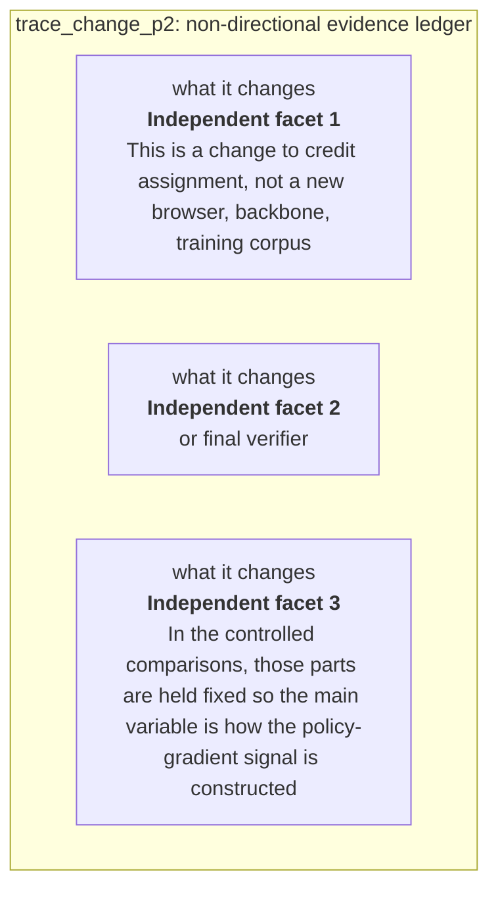

#### Python

```python
from html import escape
from pathlib import Path
from textwrap import wrap

title = "trace_change_p2: non-directional evidence ledger"
rows = [["what it changes","Independent facet 1","This is a change to credit assignment, not a new browser, backbone, training corpus"],["what it changes","Independent facet 2","or final verifier"],["what it changes","Independent facet 3","In the controlled comparisons, those parts are held fixed so the main variable is how the policy-gradient signal is constructed"]]
height = 426
parts = [
    f'<svg xmlns="http://www.w3.org/2000/svg" viewBox="0 0 1200 {height}" role="img" aria-labelledby="title desc">',
    f'<title id="title">{escape(title)}</title>',
    '<desc id="desc">Non-directional evidence ledger with every statement and boundary visible.</desc>',
    f'<rect width="1200" height="{height}" fill="white"/>',
]
headers = ["Facet", "Statement or value", "Evidence condition or boundary"]
xs = [30, 300, 700]
for x, header in zip(xs, headers):
    parts.append(f'<text x="{x}" y="65" font-family="sans-serif" font-size="16" font-weight="700">{escape(header)}</text>')
for row_index, row in enumerate(rows):
    y = 110 + row_index * 92
    parts.append(f'<rect x="20" y="{y-30}" width="1160" height="80" fill="#f7fbff" stroke="#ccd"/>')
    for x, cell, width in zip(xs, row, [30, 48, 60]):
        for line_index, line in enumerate(wrap(str(cell), width=width)):
            parts.append(f'<text x="{x}" y="{y-8+line_index*14}" font-family="sans-serif" font-size="11">{escape(line)}</text>')
parts.append('</svg>')
Path("trace_change_p2_treatment_b.svg").write_text("\n".join(parts), encoding="utf-8")
```

### Treatment C — What does TRACE change in agent reinforcement learning — paragraph trace_change_p2 — non-directional claim constellation

- Teaching purpose: Optionally show which requirements or qualifications belong to the paragraph's central question.
- Encoding and reading order: Place the paragraph question at the center with 3 undirected spokes. Lines encode claim boundary, never sequence; Mermaid uses `---`, TikZ omits arrowheads, and Python emits plain lines.
- Evidence and limitations: Use only `trace_claim_credit` (OBSERVED, VERIFIED); `trace_claim_outcome_anchor` (OBSERVED, VERIFIED); `trace_claim_controlled_setup` (OBSERVED, VERIFIED); `trace_source_method` (Sections 3.1–3.3, Equations 4–12, Algorithm 1); `trace_source_experiments` (Pages 7–8, Section 4.1). The contingency is non-directional: proximity and connecting lines mean membership, support, requirement, or scope only; they never mean temporal order or causality.
- Recommended web medium: responsive SVG with semantic HTML/CSS list fallback; JavaScript is unnecessary.
- Mobile, accessibility, and motion behavior: Keep every label and identifier as selectable DOM text; preserve non-directional grouping on mobile; use overflow-wrap: anywhere for long tokens; provide a complete static fallback; respect reduced motion; never make information depend on animation or pointer input.

#### TikZ

```tex
\documentclass[tikz,border=5pt]{standalone}
\usepackage[T1]{fontenc}
\usepackage{tikz}
\begin{document}
\begin{tikzpicture}[font=\sffamily,box/.style={draw,rounded corners,align=center,text width=3.3cm,minimum height=1.3cm},rel/.style={fill=white,font=\scriptsize}]
\node[font=\bfseries,anchor=west] at (0,2) {trace\_change\_p2: claim-boundary constellation};
\node[box] (center) at (3,0) {What does TRACE change in agent reinforcement learning};
\node[box] (f1) at (0,2) {This is a change to credit assignment, not a new browser, backbone, training corpus};
\node[box] (f2) at (6,2) {or final verifier};
\node[box] (f3) at (0,0) {In the controlled comparisons, those parts are held fixed so the main variable is how the policy-gradient signal is constructed};
\draw (center) -- node[rel] {claim boundary} (f1);
\draw (center) -- node[rel] {claim boundary} (f2);
\draw (center) -- node[rel] {claim boundary} (f3);
\end{tikzpicture}
\end{document}
```

#### Mermaid

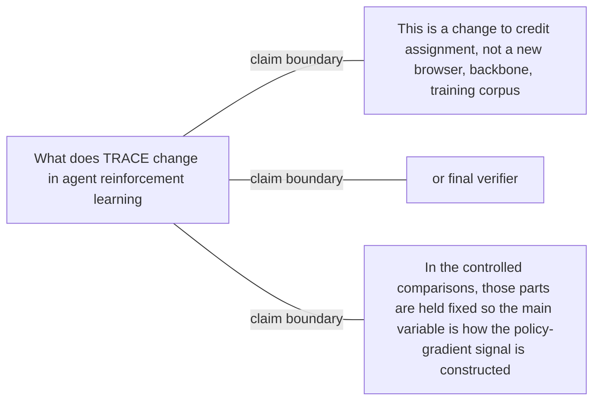

#### Python

```python
from html import escape
from pathlib import Path
from textwrap import wrap

title = "trace_change_p2: claim-boundary constellation"
nodes = [["center","What does TRACE change in agent reinforcement learning",460,220],["f1","This is a change to credit assignment, not a new browser, backbone, training corpus",100,40],["f2","or final verifier",820,40],["f3","In the controlled comparisons, those parts are held fixed so the main variable is how the policy-gradient signal is constructed",100,220]]
edges = [["center","f1","claim boundary",false],["center","f2","claim boundary",false],["center","f3","claim boundary",false]]
node_by_id = {node_id: (label, x, y) for node_id, label, x, y in nodes}
width = 1000
height = 520
parts = [
    '<svg xmlns="http://www.w3.org/2000/svg" viewBox="0 0 %d %d" role="img" aria-labelledby="title desc">' % (width, height),
    f'<title id="title">{escape(title)}</title>',
    '<desc id="desc">Labeled relations; undirected lines are associations or boundaries, not temporal order.</desc>',
    f'<rect width="{width}" height="{height}" fill="white"/>',
    '<defs><marker id="arrow" viewBox="0 0 10 10" refX="9" refY="5" markerWidth="6" markerHeight="6" orient="auto-start-reverse"><path d="M 0 0 L 10 5 L 0 10 z" fill="#345"/></marker></defs>',
]
for source, target, relation, directed in edges:
    _, x1, y1 = node_by_id[source]
    _, x2, y2 = node_by_id[target]
    marker = ' marker-end="url(#arrow)"' if directed else ''
    parts.append(f'<line x1="{x1}" y1="{y1}" x2="{x2}" y2="{y2}" stroke="#345" stroke-width="2"{marker}/>')
    parts.append(f'<text x="{(x1+x2)/2}" y="{(y1+y2)/2-5}" text-anchor="middle" font-family="sans-serif" font-size="10">{escape(relation)}</text>')
for _, label, x, y in nodes:
    parts.append(f'<rect x="{x-85}" y="{y-44}" width="170" height="88" rx="12" fill="#eef6ff" stroke="#234"/>')
    for line_index, line in enumerate(wrap(label, width=24)):
        parts.append(f'<text x="{x}" y="{y-26+line_index*13}" text-anchor="middle" font-family="sans-serif" font-size="10">{escape(line)}</text>')
parts.append('</svg>')
Path("trace_change_p2_treatment_c.svg").write_text("\n".join(parts), encoding="utf-8")
```

### Implementation record

- Status: `NOT_NEEDED`
- Selected treatment: `NONE`
- Selection rationale: Revision 3's paragraph-level removal test keeps this paragraph prose-only; no figure would reduce the reader's reconstruction burden enough to justify added visual complexity.
- Delivery medium: `NONE`
- Visual ID and placement: `NONE`; no figure is attached to this paragraph.
- Shared paragraph scope: NONE
- Changed files: `docs/visual-manifests/VISUAL_MANIFEST_TRACE.md` records the prose-only decision; no fixture visual serves this paragraph.
- Accessibility and fallback verification: The paragraph remains semantic selectable text with its existing claim and source links; no visual-only information or motion is introduced.
- Desktop and mobile verification: No paragraph-local figure exists; the existing prose remains in normal document order at both viewports.
- Evidence deviations: Not applicable: revision 3 explicitly classifies this paragraph as prose-only.

## `trace_mechanism_p1`

- Location: `trace_mechanism`, paragraph 1
- Text anchor: "TRACE first splits a rollout after each tool action and returned observation."
- Claims and sources: `trace_claim_prefix_probe` (OBSERVED, VERIFIED); `trace_claim_td` (OBSERVED, VERIFIED); `trace_claim_telescope` (OBSERVED, VERIFIED); `trace_claim_outcome_anchor` (OBSERVED, VERIFIED); `trace_source_method` (Sections 3.1–3.3, Equations 4–12, Algorithm 1)
- Visual needed: `YES`
- Decision rationale: A visual passes the removal test because readers must reconstruct prefix probe, normalized value, temporal-difference credit, propagation, and outcome anchor while preserving the paragraph's conditions and boundaries. Revision 3 narrows the topology and placement so no visual can claim this paragraph without encoding its mechanism, grouping, or values.
- Explanatory job: Prefix probe, normalized value, temporal-difference credit, propagation, and outcome anchor.
- Recommended scope and placement: Shared scope `trace_mechanism_p1`, `trace_mechanism_p2`, `trace_mechanism_p3` is allowed only when one visual encodes every listed mechanism, condition, and value; place it immediately after the final paragraph, `trace_mechanism_p3`. Otherwise split the visual by paragraph.
- QA-informed planning change: A shared visual belongs after the third mechanism paragraph and must preserve the exact one-step telescoping guarantee separately from propagated credit.

### Treatment A — Prefix probe, normalized value, temporal-difference credit, propagation, and outcome anchor — Operation flow

- Teaching purpose: Show the source-supported order and branch boundaries.
- Encoding and reading order: Use 7 named nodes and 7 explicit labeled relations. Preserve all branch, merge, hierarchy, loop, or sequence edges shown in the code; changing them is an evidence deviation.
- Evidence and limitations: Encode only `trace_claim_prefix_probe`, `trace_claim_td`, `trace_claim_telescope`, `trace_claim_outcome_anchor` from `trace_source_method`. A shared visual belongs after the third mechanism paragraph and must preserve the exact one-step telescoping guarantee separately from propagated credit.
- Recommended web medium: responsive inline SVG with semantic HTML/CSS fallback; JavaScript is optional only for meaningful focus, drill-down, or state playback.
- Mobile, accessibility, and motion behavior: Preserve the same group and node order in the DOM; retain all values and relation labels as selectable text; stack panels or levels below 640px; provide keyboard access for any optional focus state; keep a complete static fallback; respect reduced motion and never encode information only through animation.

#### TikZ

```tex
\documentclass[tikz,border=5pt]{standalone}
\usepackage[T1]{fontenc}
\usepackage{tikz}
\usetikzlibrary{arrows.meta}
\begin{document}
\begin{tikzpicture}[font=\sffamily,box/.style={draw,rounded corners,align=center,text width=3cm,minimum height=1.2cm},link/.style={-{Latex[length=2mm]},thick},rel/.style={fill=white,font=\scriptsize}]
\node[font=\bfseries,anchor=west] at (0,0.8) {trace\_mechanism\_p1: Prefix probe, normalized value, temporal-difference credit, propagation, and outcome anchor - Operation flow};
\node[box] (prefix) at (1.00,-1.50) {Split transcript after each tool observation};
\node[box] (probe) at (2.50,-1.50) {Frozen initial policy scores gold answer};
\node[box] (value) at (4.00,-1.50) {Normalize relative closure of answer-likelihood gap};
\node[box] (td) at (5.50,-1.50) {Subtract adjacent values for one-step credit};
\node[box] (telescope) at (7.00,-1.50) {One-step credits telescope};
\node[box] (prop) at (8.50,-1.50) {Short look-ahead propagates delayed effects};
\node[box] (outcome) at (10.00,-1.50) {Combine local credit with final GRPO advantage};
\draw[link] (prefix) -- node[rel] {each prefix} (probe);
\draw[link] (probe) -- node[rel] {average log probability} (value);
\draw[link] (value) -- node[rel] {difference} (td);
\draw[link] (td) -- node[rel] {one-step sum} (telescope);
\draw[link] (td) -- node[rel] {reported extension} (prop);
\draw[link] (prop) -- node[rel] {combine} (outcome);
\draw[link] (telescope) -- node[rel] {guarantee applies only here} (outcome);
\end{tikzpicture}
\end{document}
```

#### Mermaid

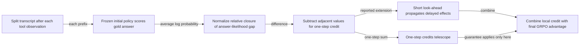

#### Python

```python
from html import escape
from pathlib import Path
from textwrap import wrap

title = "trace_mechanism_p1: Prefix probe, normalized value, temporal-difference credit, propagation, and outcome anchor — Operation flow"
nodes = [["prefix","Split transcript after each tool observation",100,150],["probe","Frozen initial policy scores gold answer",250,150],["value","Normalize relative closure of answer-likelihood gap",400,150],["td","Subtract adjacent values for one-step credit",550,150],["telescope","One-step credits telescope",700,150],["prop","Short look-ahead propagates delayed effects",850,150],["outcome","Combine local credit with final GRPO advantage",1000,150]]
edges = [["prefix","probe","each prefix"],["probe","value","average log probability"],["value","td","difference"],["td","telescope","one-step sum"],["td","prop","reported extension"],["prop","outcome","combine"],["telescope","outcome","guarantee applies only here"]]
node_by_id = {node_id: (label, x, y) for node_id, label, x, y in nodes}
width = max(900, max((x for _, _, x, _ in nodes), default=800) + 180)
height = max(500, max((y for _, _, _, y in nodes), default=400) + 140)
parts = [
    f'<svg xmlns="http://www.w3.org/2000/svg" viewBox="0 0 {width} {height}" role="img" aria-labelledby="title desc">',
    f'<title id="title">{escape(title)}</title>',
    '<desc id="desc">Edges and convergence points encode only relationships stated in the scoped paragraphs.</desc>',
    f'<rect width="{width}" height="{height}" fill="white"/>',
]
for source, target, relation in edges:
    _, x1, y1 = node_by_id[source]
    _, x2, y2 = node_by_id[target]
    parts.append(f'<line x1="{x1}" y1="{y1}" x2="{x2}" y2="{y2}" stroke="#345" stroke-width="2"/>')
    parts.append(f'<text x="{(x1+x2)/2}" y="{(y1+y2)/2-5}" text-anchor="middle" font-family="sans-serif" font-size="10">{escape(relation)}</text>')
for _, label, x, y in nodes:
    parts.append(f'<rect x="{x-78}" y="{y-42}" width="156" height="84" rx="12" fill="#eef6ff" stroke="#234"/>')
    for line_index, line in enumerate(wrap(label, width=22)):
        parts.append(f'<text x="{x}" y="{y-24+line_index*13}" text-anchor="middle" font-family="sans-serif" font-size="10">{escape(line)}</text>')
parts.append('</svg>')
Path("trace_mechanism_p1_treatment_a.svg").write_text("\n".join(parts), encoding="utf-8")
```

### Treatment B — Prefix probe, normalized value, temporal-difference credit, propagation, and outcome anchor — Input-operation-output ledger

- Teaching purpose: Make inputs, operations, outputs, and limits inspectable as columns.
- Encoding and reading order: Render 6 rows with explicit `Group`, `Measure or state`, `Visible value`, and `Condition or boundary` columns. The value column must be visible, not only present in ARIA text or fallback prose.
- Evidence and limitations: Encode only `trace_claim_prefix_probe`, `trace_claim_td`, `trace_claim_telescope`, `trace_claim_outcome_anchor` from `trace_source_method`. A shared visual belongs after the third mechanism paragraph and must preserve the exact one-step telescoping guarantee separately from propagated credit.
- Recommended web medium: semantic HTML/CSS table with SVG export; JavaScript is optional only for meaningful focus, drill-down, or state playback.
- Mobile, accessibility, and motion behavior: Preserve the same group and node order in the DOM; retain all values and relation labels as selectable text; stack panels or levels below 640px; provide keyboard access for any optional focus state; keep a complete static fallback; respect reduced motion and never encode information only through animation.

#### TikZ

```tex
\documentclass[tikz,border=5pt]{standalone}
\usepackage[T1]{fontenc}
\usepackage{array}
\usepackage{tikz}
\begin{document}
\begin{tikzpicture}[font=\sffamily]
\node[align=center] {\textbf{trace\_mechanism\_p1: Prefix probe, normalized value, temporal-difference credit, propagation, and outcome anchor - Input-operation-output ledger}\\[6pt]
\begin{tabular}{p{3.2cm}p{4.0cm}p{2.8cm}p{6.2cm}}
\textbf{Group} & \textbf{Measure or state} & \textbf{Visible value} & \textbf{Condition or boundary} \\ \hline
TRACE compares adjacent trajectory states & State after each tool observation & qualitative & Split the rollout at tool boundaries so each prefix records what the agent has seen up to that interaction. \\
TRACE compares adjacent trajectory states & Probe every prefix with one frozen model & qualitative & A frozen copy of the initial policy scores the average log-probability of the same known gold answer from every prefix. \\
TRACE compares adjacent trajectory states & Convert each score into a state value & qualitative & The log-ratio value represents how much of the initial answer-likelihood gap the current prefix has closed. \\
TRACE compares adjacent trajectory states & Subtract adjacent values & qualitative & The change from one prefix value to the next is the one-step temporal-difference credit: positive, zero, or negative measured progress. \\
TRACE compares adjacent trajectory states & Propagate some delayed effects & qualitative & The reported objective adds a short look-ahead, while the exact telescoping guarantee remains specific to the one-step credits. \\
TRACE compares adjacent trajectory states & Join local credit with the outcome advantage & qualitative & Local credit is combined with GRPO's final-answer advantage, so a helpful intermediate step does not redefine an incorrect final answer as success. \\
\end{tabular}};
\end{tikzpicture}
\end{document}
```

#### Mermaid

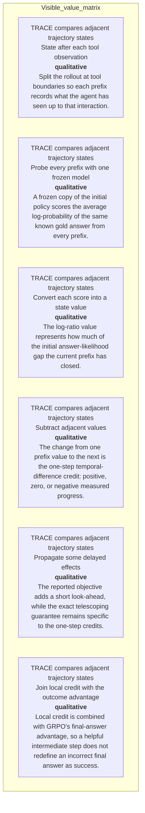

#### Python

```python
from html import escape
from pathlib import Path
from textwrap import wrap

title = "trace_mechanism_p1: Prefix probe, normalized value, temporal-difference credit, propagation, and outcome anchor — Input-operation-output ledger"
rows = [["TRACE compares adjacent trajectory states","State after each tool observation","qualitative","Split the rollout at tool boundaries so each prefix records what the agent has seen up to that interaction."],["TRACE compares adjacent trajectory states","Probe every prefix with one frozen model","qualitative","A frozen copy of the initial policy scores the average log-probability of the same known gold answer from every prefix."],["TRACE compares adjacent trajectory states","Convert each score into a state value","qualitative","The log-ratio value represents how much of the initial answer-likelihood gap the current prefix has closed."],["TRACE compares adjacent trajectory states","Subtract adjacent values","qualitative","The change from one prefix value to the next is the one-step temporal-difference credit: positive, zero, or negative measured progress."],["TRACE compares adjacent trajectory states","Propagate some delayed effects","qualitative","The reported objective adds a short look-ahead, while the exact telescoping guarantee remains specific to the one-step credits."],["TRACE compares adjacent trajectory states","Join local credit with the outcome advantage","qualitative","Local credit is combined with GRPO's final-answer advantage, so a helpful intermediate step does not redefine an incorrect final answer as success."]]
height = 678
parts = [
    f'<svg xmlns="http://www.w3.org/2000/svg" viewBox="0 0 1200 {height}" role="img" aria-labelledby="title desc">',
    f'<title id="title">{escape(title)}</title>',
    '<desc id="desc">Every reported value is visible beside its condition and group.</desc>',
    f'<rect width="1200" height="{height}" fill="white"/>',
]
headers = ["Group", "Measure or state", "Visible value", "Condition or boundary"]
xs = [30, 260, 590, 770]
for x, header in zip(xs, headers):
    parts.append(f'<text x="{x}" y="70" font-family="sans-serif" font-size="16" font-weight="700">{escape(header)}</text>')
for row_index, row in enumerate(rows):
    y = 110 + row_index * 88
    parts.append(f'<rect x="20" y="{y-28}" width="1160" height="76" fill="#f7fbff" stroke="#ccd"/>')
    for x, cell, width in zip(xs, row, [26, 38, 20, 58]):
        for line_index, line in enumerate(wrap(str(cell), width=width)):
            parts.append(f'<text x="{x}" y="{y+line_index*14}" font-family="sans-serif" font-size="11">{escape(line)}</text>')
parts.append('</svg>')
Path("trace_mechanism_p1_treatment_b.svg").write_text("\n".join(parts), encoding="utf-8")
```

### Treatment C — Prefix probe, normalized value, temporal-difference credit, propagation, and outcome anchor — State-transition walkthrough

- Teaching purpose: Follow the described state changes without inventing timing.
- Encoding and reading order: Use 7 named nodes and 7 explicit labeled relations. Preserve all branch, merge, hierarchy, loop, or sequence edges shown in the code; changing them is an evidence deviation.
- Evidence and limitations: Encode only `trace_claim_prefix_probe`, `trace_claim_td`, `trace_claim_telescope`, `trace_claim_outcome_anchor` from `trace_source_method`. A shared visual belongs after the third mechanism paragraph and must preserve the exact one-step telescoping guarantee separately from propagated credit.
- Recommended web medium: responsive inline SVG with semantic HTML/CSS fallback; JavaScript is optional only for meaningful focus, drill-down, or state playback.
- Mobile, accessibility, and motion behavior: Preserve the same group and node order in the DOM; retain all values and relation labels as selectable text; stack panels or levels below 640px; provide keyboard access for any optional focus state; keep a complete static fallback; respect reduced motion and never encode information only through animation.

#### TikZ

```tex
\documentclass[tikz,border=5pt]{standalone}
\usepackage[T1]{fontenc}
\usepackage{tikz}
\usetikzlibrary{arrows.meta}
\begin{document}
\begin{tikzpicture}[font=\sffamily,box/.style={draw,rounded corners,align=center,text width=3cm,minimum height=1.2cm},link/.style={-{Latex[length=2mm]},thick},rel/.style={fill=white,font=\scriptsize}]
\node[font=\bfseries,anchor=west] at (0,0.8) {trace\_mechanism\_p1: Prefix probe, normalized value, temporal-difference credit, propagation, and outcome anchor - State-transition walkthrough};
\node[box] (prefix) at (1.00,-1.50) {Split transcript after each tool observation};
\node[box] (probe) at (2.50,-1.50) {Frozen initial policy scores gold answer};
\node[box] (value) at (4.00,-1.50) {Normalize relative closure of answer-likelihood gap};
\node[box] (td) at (5.50,-1.50) {Subtract adjacent values for one-step credit};
\node[box] (telescope) at (7.00,-1.50) {One-step credits telescope};
\node[box] (prop) at (8.50,-1.50) {Short look-ahead propagates delayed effects};
\node[box] (outcome) at (10.00,-1.50) {Combine local credit with final GRPO advantage};
\draw[link] (prefix) -- node[rel] {each prefix} (probe);
\draw[link] (probe) -- node[rel] {average log probability} (value);
\draw[link] (value) -- node[rel] {difference} (td);
\draw[link] (td) -- node[rel] {one-step sum} (telescope);
\draw[link] (td) -- node[rel] {reported extension} (prop);
\draw[link] (prop) -- node[rel] {combine} (outcome);
\draw[link] (telescope) -- node[rel] {guarantee applies only here} (outcome);
\end{tikzpicture}
\end{document}
```

#### Mermaid


#### Python

```python
from html import escape
from pathlib import Path
from textwrap import wrap

title = "trace_mechanism_p1: Prefix probe, normalized value, temporal-difference credit, propagation, and outcome anchor — State-transition walkthrough"
nodes = [["prefix","Split transcript after each tool observation",100,150],["probe","Frozen initial policy scores gold answer",250,150],["value","Normalize relative closure of answer-likelihood gap",400,150],["td","Subtract adjacent values for one-step credit",550,150],["telescope","One-step credits telescope",700,150],["prop","Short look-ahead propagates delayed effects",850,150],["outcome","Combine local credit with final GRPO advantage",1000,150]]
edges = [["prefix","probe","each prefix"],["probe","value","average log probability"],["value","td","difference"],["td","telescope","one-step sum"],["td","prop","reported extension"],["prop","outcome","combine"],["telescope","outcome","guarantee applies only here"]]
node_by_id = {node_id: (label, x, y) for node_id, label, x, y in nodes}
width = max(900, max((x for _, _, x, _ in nodes), default=800) + 180)
height = max(500, max((y for _, _, _, y in nodes), default=400) + 140)
parts = [
    f'<svg xmlns="http://www.w3.org/2000/svg" viewBox="0 0 {width} {height}" role="img" aria-labelledby="title desc">',
    f'<title id="title">{escape(title)}</title>',
    '<desc id="desc">Edges and convergence points encode only relationships stated in the scoped paragraphs.</desc>',
    f'<rect width="{width}" height="{height}" fill="white"/>',
]
for source, target, relation in edges:
    _, x1, y1 = node_by_id[source]
    _, x2, y2 = node_by_id[target]
    parts.append(f'<line x1="{x1}" y1="{y1}" x2="{x2}" y2="{y2}" stroke="#345" stroke-width="2"/>')
    parts.append(f'<text x="{(x1+x2)/2}" y="{(y1+y2)/2-5}" text-anchor="middle" font-family="sans-serif" font-size="10">{escape(relation)}</text>')
for _, label, x, y in nodes:
    parts.append(f'<rect x="{x-78}" y="{y-42}" width="156" height="84" rx="12" fill="#eef6ff" stroke="#234"/>')
    for line_index, line in enumerate(wrap(label, width=22)):
        parts.append(f'<text x="{x}" y="{y-24+line_index*13}" text-anchor="middle" font-family="sans-serif" font-size="10">{escape(line)}</text>')
parts.append('</svg>')
Path("trace_mechanism_p1_treatment_c.svg").write_text("\n".join(parts), encoding="utf-8")
```

### Implementation record

- Status: `IMPLEMENTED`
- Selected treatment: `A`
- Selection rationale: Selected the approved “Prefix probe, normalized value, temporal-difference credit, propagation, and outcome anchor — Operation flow” treatment because the implemented operation diagram directly encodes this paragraph's explanatory job and its stated evidence boundaries.
- Delivery medium: `CSS + semantic HTML`
- Visual ID and placement: `trace_visual_credit_flow` after `trace_mechanism_p3`; this record is served by that purpose-built figure.
- Shared paragraph scope: `trace_mechanism_p1`, `trace_mechanism_p2`, `trace_mechanism_p3`
- Changed files: `packages/test-fixtures/explainers/trace.json`, `packages/content-schema/schema/explainer-document.schema.json`, `packages/content-schema/src/validate.ts`, generated TypeScript/Python models, `apps/web/app/papers/[id]/explainer-visual.tsx`, and `apps/web/app/globals.css`.
- Accessibility and fallback verification: Figure has a programmatic title and description, visible selectable labels and values, explicit alt text, equivalent fallback prose, source links, limitations, and a semantic static body; no meaning depends on color, motion, or pointer input.
- Desktop and mobile verification: Verified by the full eight-paper Playwright traversal at a 1440-pixel desktop viewport and the iPhone 13 mobile viewport; every figure stayed paragraph-adjacent, preserved DOM reading order, and introduced no horizontal page overflow.
- Evidence deviations: Delivery translation: selected Treatment A is rendered as typed semantic HTML/CSS rather than its literal TikZ, Mermaid, or Python-generated asset; the approved paragraph scope, placement, labels, values, grouping, and evidence boundaries are retained.

## `trace_mechanism_p2`

- Location: `trace_mechanism`, paragraph 2
- Text anchor: "The raw answer score is converted into a log-ratio value representing relative closure of the initial answer-likelihood gap."
- Claims and sources: `trace_claim_prefix_probe` (OBSERVED, VERIFIED); `trace_claim_td` (OBSERVED, VERIFIED); `trace_claim_telescope` (OBSERVED, VERIFIED); `trace_claim_outcome_anchor` (OBSERVED, VERIFIED); `trace_source_method` (Sections 3.1–3.3, Equations 4–12, Algorithm 1)
- Visual needed: `YES`
- Decision rationale: A visual passes the removal test because readers must reconstruct prefix probe, normalized value, temporal-difference credit, propagation, and outcome anchor while preserving the paragraph's conditions and boundaries. Revision 3 narrows the topology and placement so no visual can claim this paragraph without encoding its mechanism, grouping, or values.
- Explanatory job: Prefix probe, normalized value, temporal-difference credit, propagation, and outcome anchor.
- Recommended scope and placement: Shared scope `trace_mechanism_p1`, `trace_mechanism_p2`, `trace_mechanism_p3` is allowed only when one visual encodes every listed mechanism, condition, and value; place it immediately after the final paragraph, `trace_mechanism_p3`. Otherwise split the visual by paragraph.
- QA-informed planning change: A shared visual belongs after the third mechanism paragraph and must preserve the exact one-step telescoping guarantee separately from propagated credit.

### Treatment A — Prefix probe, normalized value, temporal-difference credit, propagation, and outcome anchor — Operation flow

- Teaching purpose: Show the source-supported order and branch boundaries.
- Encoding and reading order: Use 7 named nodes and 7 explicit labeled relations. Preserve all branch, merge, hierarchy, loop, or sequence edges shown in the code; changing them is an evidence deviation.
- Evidence and limitations: Encode only `trace_claim_prefix_probe`, `trace_claim_td`, `trace_claim_telescope`, `trace_claim_outcome_anchor` from `trace_source_method`. A shared visual belongs after the third mechanism paragraph and must preserve the exact one-step telescoping guarantee separately from propagated credit.
- Recommended web medium: responsive inline SVG with semantic HTML/CSS fallback; JavaScript is optional only for meaningful focus, drill-down, or state playback.
- Mobile, accessibility, and motion behavior: Preserve the same group and node order in the DOM; retain all values and relation labels as selectable text; stack panels or levels below 640px; provide keyboard access for any optional focus state; keep a complete static fallback; respect reduced motion and never encode information only through animation.

#### TikZ

```tex
\documentclass[tikz,border=5pt]{standalone}
\usepackage[T1]{fontenc}
\usepackage{tikz}
\usetikzlibrary{arrows.meta}
\begin{document}
\begin{tikzpicture}[font=\sffamily,box/.style={draw,rounded corners,align=center,text width=3cm,minimum height=1.2cm},link/.style={-{Latex[length=2mm]},thick},rel/.style={fill=white,font=\scriptsize}]
\node[font=\bfseries,anchor=west] at (0,0.8) {trace\_mechanism\_p2: Prefix probe, normalized value, temporal-difference credit, propagation, and outcome anchor - Operation flow};
\node[box] (prefix) at (1.00,-1.50) {Split transcript after each tool observation};
\node[box] (probe) at (2.50,-1.50) {Frozen initial policy scores gold answer};
\node[box] (value) at (4.00,-1.50) {Normalize relative closure of answer-likelihood gap};
\node[box] (td) at (5.50,-1.50) {Subtract adjacent values for one-step credit};
\node[box] (telescope) at (7.00,-1.50) {One-step credits telescope};
\node[box] (prop) at (8.50,-1.50) {Short look-ahead propagates delayed effects};
\node[box] (outcome) at (10.00,-1.50) {Combine local credit with final GRPO advantage};
\draw[link] (prefix) -- node[rel] {each prefix} (probe);
\draw[link] (probe) -- node[rel] {average log probability} (value);
\draw[link] (value) -- node[rel] {difference} (td);
\draw[link] (td) -- node[rel] {one-step sum} (telescope);
\draw[link] (td) -- node[rel] {reported extension} (prop);
\draw[link] (prop) -- node[rel] {combine} (outcome);
\draw[link] (telescope) -- node[rel] {guarantee applies only here} (outcome);
\end{tikzpicture}
\end{document}
```

#### Mermaid


#### Python

```python
from html import escape
from pathlib import Path
from textwrap import wrap

title = "trace_mechanism_p2: Prefix probe, normalized value, temporal-difference credit, propagation, and outcome anchor — Operation flow"
nodes = [["prefix","Split transcript after each tool observation",100,150],["probe","Frozen initial policy scores gold answer",250,150],["value","Normalize relative closure of answer-likelihood gap",400,150],["td","Subtract adjacent values for one-step credit",550,150],["telescope","One-step credits telescope",700,150],["prop","Short look-ahead propagates delayed effects",850,150],["outcome","Combine local credit with final GRPO advantage",1000,150]]
edges = [["prefix","probe","each prefix"],["probe","value","average log probability"],["value","td","difference"],["td","telescope","one-step sum"],["td","prop","reported extension"],["prop","outcome","combine"],["telescope","outcome","guarantee applies only here"]]
node_by_id = {node_id: (label, x, y) for node_id, label, x, y in nodes}
width = max(900, max((x for _, _, x, _ in nodes), default=800) + 180)
height = max(500, max((y for _, _, _, y in nodes), default=400) + 140)
parts = [
    f'<svg xmlns="http://www.w3.org/2000/svg" viewBox="0 0 {width} {height}" role="img" aria-labelledby="title desc">',
    f'<title id="title">{escape(title)}</title>',
    '<desc id="desc">Edges and convergence points encode only relationships stated in the scoped paragraphs.</desc>',
    f'<rect width="{width}" height="{height}" fill="white"/>',
]
for source, target, relation in edges:
    _, x1, y1 = node_by_id[source]
    _, x2, y2 = node_by_id[target]
    parts.append(f'<line x1="{x1}" y1="{y1}" x2="{x2}" y2="{y2}" stroke="#345" stroke-width="2"/>')
    parts.append(f'<text x="{(x1+x2)/2}" y="{(y1+y2)/2-5}" text-anchor="middle" font-family="sans-serif" font-size="10">{escape(relation)}</text>')
for _, label, x, y in nodes:
    parts.append(f'<rect x="{x-78}" y="{y-42}" width="156" height="84" rx="12" fill="#eef6ff" stroke="#234"/>')
    for line_index, line in enumerate(wrap(label, width=22)):
        parts.append(f'<text x="{x}" y="{y-24+line_index*13}" text-anchor="middle" font-family="sans-serif" font-size="10">{escape(line)}</text>')
parts.append('</svg>')
Path("trace_mechanism_p2_treatment_a.svg").write_text("\n".join(parts), encoding="utf-8")
```

### Treatment B — Prefix probe, normalized value, temporal-difference credit, propagation, and outcome anchor — Input-operation-output ledger

- Teaching purpose: Make inputs, operations, outputs, and limits inspectable as columns.
- Encoding and reading order: Render 6 rows with explicit `Group`, `Measure or state`, `Visible value`, and `Condition or boundary` columns. The value column must be visible, not only present in ARIA text or fallback prose.
- Evidence and limitations: Encode only `trace_claim_prefix_probe`, `trace_claim_td`, `trace_claim_telescope`, `trace_claim_outcome_anchor` from `trace_source_method`. A shared visual belongs after the third mechanism paragraph and must preserve the exact one-step telescoping guarantee separately from propagated credit.
- Recommended web medium: semantic HTML/CSS table with SVG export; JavaScript is optional only for meaningful focus, drill-down, or state playback.
- Mobile, accessibility, and motion behavior: Preserve the same group and node order in the DOM; retain all values and relation labels as selectable text; stack panels or levels below 640px; provide keyboard access for any optional focus state; keep a complete static fallback; respect reduced motion and never encode information only through animation.

#### TikZ

```tex
\documentclass[tikz,border=5pt]{standalone}
\usepackage[T1]{fontenc}
\usepackage{array}
\usepackage{tikz}
\begin{document}
\begin{tikzpicture}[font=\sffamily]
\node[align=center] {\textbf{trace\_mechanism\_p2: Prefix probe, normalized value, temporal-difference credit, propagation, and outcome anchor - Input-operation-output ledger}\\[6pt]
\begin{tabular}{p{3.2cm}p{4.0cm}p{2.8cm}p{6.2cm}}
\textbf{Group} & \textbf{Measure or state} & \textbf{Visible value} & \textbf{Condition or boundary} \\ \hline
TRACE compares adjacent trajectory states & State after each tool observation & qualitative & Split the rollout at tool boundaries so each prefix records what the agent has seen up to that interaction. \\
TRACE compares adjacent trajectory states & Probe every prefix with one frozen model & qualitative & A frozen copy of the initial policy scores the average log-probability of the same known gold answer from every prefix. \\
TRACE compares adjacent trajectory states & Convert each score into a state value & qualitative & The log-ratio value represents how much of the initial answer-likelihood gap the current prefix has closed. \\
TRACE compares adjacent trajectory states & Subtract adjacent values & qualitative & The change from one prefix value to the next is the one-step temporal-difference credit: positive, zero, or negative measured progress. \\
TRACE compares adjacent trajectory states & Propagate some delayed effects & qualitative & The reported objective adds a short look-ahead, while the exact telescoping guarantee remains specific to the one-step credits. \\
TRACE compares adjacent trajectory states & Join local credit with the outcome advantage & qualitative & Local credit is combined with GRPO's final-answer advantage, so a helpful intermediate step does not redefine an incorrect final answer as success. \\
\end{tabular}};
\end{tikzpicture}
\end{document}
```

#### Mermaid


#### Python

```python
from html import escape
from pathlib import Path
from textwrap import wrap

title = "trace_mechanism_p2: Prefix probe, normalized value, temporal-difference credit, propagation, and outcome anchor — Input-operation-output ledger"
rows = [["TRACE compares adjacent trajectory states","State after each tool observation","qualitative","Split the rollout at tool boundaries so each prefix records what the agent has seen up to that interaction."],["TRACE compares adjacent trajectory states","Probe every prefix with one frozen model","qualitative","A frozen copy of the initial policy scores the average log-probability of the same known gold answer from every prefix."],["TRACE compares adjacent trajectory states","Convert each score into a state value","qualitative","The log-ratio value represents how much of the initial answer-likelihood gap the current prefix has closed."],["TRACE compares adjacent trajectory states","Subtract adjacent values","qualitative","The change from one prefix value to the next is the one-step temporal-difference credit: positive, zero, or negative measured progress."],["TRACE compares adjacent trajectory states","Propagate some delayed effects","qualitative","The reported objective adds a short look-ahead, while the exact telescoping guarantee remains specific to the one-step credits."],["TRACE compares adjacent trajectory states","Join local credit with the outcome advantage","qualitative","Local credit is combined with GRPO's final-answer advantage, so a helpful intermediate step does not redefine an incorrect final answer as success."]]
height = 678
parts = [
    f'<svg xmlns="http://www.w3.org/2000/svg" viewBox="0 0 1200 {height}" role="img" aria-labelledby="title desc">',
    f'<title id="title">{escape(title)}</title>',
    '<desc id="desc">Every reported value is visible beside its condition and group.</desc>',
    f'<rect width="1200" height="{height}" fill="white"/>',
]
headers = ["Group", "Measure or state", "Visible value", "Condition or boundary"]
xs = [30, 260, 590, 770]
for x, header in zip(xs, headers):
    parts.append(f'<text x="{x}" y="70" font-family="sans-serif" font-size="16" font-weight="700">{escape(header)}</text>')
for row_index, row in enumerate(rows):
    y = 110 + row_index * 88
    parts.append(f'<rect x="20" y="{y-28}" width="1160" height="76" fill="#f7fbff" stroke="#ccd"/>')
    for x, cell, width in zip(xs, row, [26, 38, 20, 58]):
        for line_index, line in enumerate(wrap(str(cell), width=width)):
            parts.append(f'<text x="{x}" y="{y+line_index*14}" font-family="sans-serif" font-size="11">{escape(line)}</text>')
parts.append('</svg>')
Path("trace_mechanism_p2_treatment_b.svg").write_text("\n".join(parts), encoding="utf-8")
```

### Treatment C — Prefix probe, normalized value, temporal-difference credit, propagation, and outcome anchor — State-transition walkthrough

- Teaching purpose: Follow the described state changes without inventing timing.
- Encoding and reading order: Use 7 named nodes and 7 explicit labeled relations. Preserve all branch, merge, hierarchy, loop, or sequence edges shown in the code; changing them is an evidence deviation.
- Evidence and limitations: Encode only `trace_claim_prefix_probe`, `trace_claim_td`, `trace_claim_telescope`, `trace_claim_outcome_anchor` from `trace_source_method`. A shared visual belongs after the third mechanism paragraph and must preserve the exact one-step telescoping guarantee separately from propagated credit.
- Recommended web medium: responsive inline SVG with semantic HTML/CSS fallback; JavaScript is optional only for meaningful focus, drill-down, or state playback.
- Mobile, accessibility, and motion behavior: Preserve the same group and node order in the DOM; retain all values and relation labels as selectable text; stack panels or levels below 640px; provide keyboard access for any optional focus state; keep a complete static fallback; respect reduced motion and never encode information only through animation.

#### TikZ

```tex
\documentclass[tikz,border=5pt]{standalone}
\usepackage[T1]{fontenc}
\usepackage{tikz}
\usetikzlibrary{arrows.meta}
\begin{document}
\begin{tikzpicture}[font=\sffamily,box/.style={draw,rounded corners,align=center,text width=3cm,minimum height=1.2cm},link/.style={-{Latex[length=2mm]},thick},rel/.style={fill=white,font=\scriptsize}]
\node[font=\bfseries,anchor=west] at (0,0.8) {trace\_mechanism\_p2: Prefix probe, normalized value, temporal-difference credit, propagation, and outcome anchor - State-transition walkthrough};
\node[box] (prefix) at (1.00,-1.50) {Split transcript after each tool observation};
\node[box] (probe) at (2.50,-1.50) {Frozen initial policy scores gold answer};
\node[box] (value) at (4.00,-1.50) {Normalize relative closure of answer-likelihood gap};
\node[box] (td) at (5.50,-1.50) {Subtract adjacent values for one-step credit};
\node[box] (telescope) at (7.00,-1.50) {One-step credits telescope};
\node[box] (prop) at (8.50,-1.50) {Short look-ahead propagates delayed effects};
\node[box] (outcome) at (10.00,-1.50) {Combine local credit with final GRPO advantage};
\draw[link] (prefix) -- node[rel] {each prefix} (probe);
\draw[link] (probe) -- node[rel] {average log probability} (value);
\draw[link] (value) -- node[rel] {difference} (td);
\draw[link] (td) -- node[rel] {one-step sum} (telescope);
\draw[link] (td) -- node[rel] {reported extension} (prop);
\draw[link] (prop) -- node[rel] {combine} (outcome);
\draw[link] (telescope) -- node[rel] {guarantee applies only here} (outcome);
\end{tikzpicture}
\end{document}
```

#### Mermaid


#### Python

```python
from html import escape
from pathlib import Path
from textwrap import wrap

title = "trace_mechanism_p2: Prefix probe, normalized value, temporal-difference credit, propagation, and outcome anchor — State-transition walkthrough"
nodes = [["prefix","Split transcript after each tool observation",100,150],["probe","Frozen initial policy scores gold answer",250,150],["value","Normalize relative closure of answer-likelihood gap",400,150],["td","Subtract adjacent values for one-step credit",550,150],["telescope","One-step credits telescope",700,150],["prop","Short look-ahead propagates delayed effects",850,150],["outcome","Combine local credit with final GRPO advantage",1000,150]]
edges = [["prefix","probe","each prefix"],["probe","value","average log probability"],["value","td","difference"],["td","telescope","one-step sum"],["td","prop","reported extension"],["prop","outcome","combine"],["telescope","outcome","guarantee applies only here"]]
node_by_id = {node_id: (label, x, y) for node_id, label, x, y in nodes}
width = max(900, max((x for _, _, x, _ in nodes), default=800) + 180)
height = max(500, max((y for _, _, _, y in nodes), default=400) + 140)
parts = [
    f'<svg xmlns="http://www.w3.org/2000/svg" viewBox="0 0 {width} {height}" role="img" aria-labelledby="title desc">',
    f'<title id="title">{escape(title)}</title>',
    '<desc id="desc">Edges and convergence points encode only relationships stated in the scoped paragraphs.</desc>',
    f'<rect width="{width}" height="{height}" fill="white"/>',
]
for source, target, relation in edges:
    _, x1, y1 = node_by_id[source]
    _, x2, y2 = node_by_id[target]
    parts.append(f'<line x1="{x1}" y1="{y1}" x2="{x2}" y2="{y2}" stroke="#345" stroke-width="2"/>')
    parts.append(f'<text x="{(x1+x2)/2}" y="{(y1+y2)/2-5}" text-anchor="middle" font-family="sans-serif" font-size="10">{escape(relation)}</text>')
for _, label, x, y in nodes:
    parts.append(f'<rect x="{x-78}" y="{y-42}" width="156" height="84" rx="12" fill="#eef6ff" stroke="#234"/>')
    for line_index, line in enumerate(wrap(label, width=22)):
        parts.append(f'<text x="{x}" y="{y-24+line_index*13}" text-anchor="middle" font-family="sans-serif" font-size="10">{escape(line)}</text>')
parts.append('</svg>')
Path("trace_mechanism_p2_treatment_c.svg").write_text("\n".join(parts), encoding="utf-8")
```

### Implementation record

- Status: `IMPLEMENTED`
- Selected treatment: `A`
- Selection rationale: Selected the approved “Prefix probe, normalized value, temporal-difference credit, propagation, and outcome anchor — Operation flow” treatment because the implemented operation diagram directly encodes this paragraph's explanatory job and its stated evidence boundaries.
- Delivery medium: `CSS + semantic HTML`
- Visual ID and placement: `trace_visual_credit_flow` after `trace_mechanism_p3`; this record is served by that purpose-built figure.
- Shared paragraph scope: `trace_mechanism_p1`, `trace_mechanism_p2`, `trace_mechanism_p3`
- Changed files: `packages/test-fixtures/explainers/trace.json`, `packages/content-schema/schema/explainer-document.schema.json`, `packages/content-schema/src/validate.ts`, generated TypeScript/Python models, `apps/web/app/papers/[id]/explainer-visual.tsx`, and `apps/web/app/globals.css`.
- Accessibility and fallback verification: Figure has a programmatic title and description, visible selectable labels and values, explicit alt text, equivalent fallback prose, source links, limitations, and a semantic static body; no meaning depends on color, motion, or pointer input.
- Desktop and mobile verification: Verified by the full eight-paper Playwright traversal at a 1440-pixel desktop viewport and the iPhone 13 mobile viewport; every figure stayed paragraph-adjacent, preserved DOM reading order, and introduced no horizontal page overflow.
- Evidence deviations: Delivery translation: selected Treatment A is rendered as typed semantic HTML/CSS rather than its literal TikZ, Mermaid, or Python-generated asset; the approved paragraph scope, placement, labels, values, grouping, and evidence boundaries are retained.

## `trace_mechanism_p3`

- Location: `trace_mechanism`, paragraph 3
- Text anchor: "One-step credits telescope, so inserting redundant intermediate steps cannot increase their endpoint sum."
- Claims and sources: `trace_claim_prefix_probe` (OBSERVED, VERIFIED); `trace_claim_td` (OBSERVED, VERIFIED); `trace_claim_telescope` (OBSERVED, VERIFIED); `trace_claim_outcome_anchor` (OBSERVED, VERIFIED); `trace_source_method` (Sections 3.1–3.3, Equations 4–12, Algorithm 1)
- Visual needed: `YES`
- Decision rationale: A visual passes the removal test because readers must reconstruct prefix probe, normalized value, temporal-difference credit, propagation, and outcome anchor while preserving the paragraph's conditions and boundaries. Revision 3 narrows the topology and placement so no visual can claim this paragraph without encoding its mechanism, grouping, or values.
- Explanatory job: Prefix probe, normalized value, temporal-difference credit, propagation, and outcome anchor.
- Recommended scope and placement: Shared scope `trace_mechanism_p1`, `trace_mechanism_p2`, `trace_mechanism_p3` is allowed only when one visual encodes every listed mechanism, condition, and value; place it immediately after the final paragraph, `trace_mechanism_p3`. Otherwise split the visual by paragraph.
- QA-informed planning change: A shared visual belongs after the third mechanism paragraph and must preserve the exact one-step telescoping guarantee separately from propagated credit.

### Treatment A — Prefix probe, normalized value, temporal-difference credit, propagation, and outcome anchor — Operation flow

- Teaching purpose: Show the source-supported order and branch boundaries.
- Encoding and reading order: Use 7 named nodes and 7 explicit labeled relations. Preserve all branch, merge, hierarchy, loop, or sequence edges shown in the code; changing them is an evidence deviation.
- Evidence and limitations: Encode only `trace_claim_prefix_probe`, `trace_claim_td`, `trace_claim_telescope`, `trace_claim_outcome_anchor` from `trace_source_method`. A shared visual belongs after the third mechanism paragraph and must preserve the exact one-step telescoping guarantee separately from propagated credit.
- Recommended web medium: responsive inline SVG with semantic HTML/CSS fallback; JavaScript is optional only for meaningful focus, drill-down, or state playback.
- Mobile, accessibility, and motion behavior: Preserve the same group and node order in the DOM; retain all values and relation labels as selectable text; stack panels or levels below 640px; provide keyboard access for any optional focus state; keep a complete static fallback; respect reduced motion and never encode information only through animation.

#### TikZ

```tex
\documentclass[tikz,border=5pt]{standalone}
\usepackage[T1]{fontenc}
\usepackage{tikz}
\usetikzlibrary{arrows.meta}
\begin{document}
\begin{tikzpicture}[font=\sffamily,box/.style={draw,rounded corners,align=center,text width=3cm,minimum height=1.2cm},link/.style={-{Latex[length=2mm]},thick},rel/.style={fill=white,font=\scriptsize}]
\node[font=\bfseries,anchor=west] at (0,0.8) {trace\_mechanism\_p3: Prefix probe, normalized value, temporal-difference credit, propagation, and outcome anchor - Operation flow};
\node[box] (prefix) at (1.00,-1.50) {Split transcript after each tool observation};
\node[box] (probe) at (2.50,-1.50) {Frozen initial policy scores gold answer};
\node[box] (value) at (4.00,-1.50) {Normalize relative closure of answer-likelihood gap};
\node[box] (td) at (5.50,-1.50) {Subtract adjacent values for one-step credit};
\node[box] (telescope) at (7.00,-1.50) {One-step credits telescope};
\node[box] (prop) at (8.50,-1.50) {Short look-ahead propagates delayed effects};
\node[box] (outcome) at (10.00,-1.50) {Combine local credit with final GRPO advantage};
\draw[link] (prefix) -- node[rel] {each prefix} (probe);
\draw[link] (probe) -- node[rel] {average log probability} (value);
\draw[link] (value) -- node[rel] {difference} (td);
\draw[link] (td) -- node[rel] {one-step sum} (telescope);
\draw[link] (td) -- node[rel] {reported extension} (prop);
\draw[link] (prop) -- node[rel] {combine} (outcome);
\draw[link] (telescope) -- node[rel] {guarantee applies only here} (outcome);
\end{tikzpicture}
\end{document}
```

#### Mermaid


#### Python

```python
from html import escape
from pathlib import Path
from textwrap import wrap

title = "trace_mechanism_p3: Prefix probe, normalized value, temporal-difference credit, propagation, and outcome anchor — Operation flow"
nodes = [["prefix","Split transcript after each tool observation",100,150],["probe","Frozen initial policy scores gold answer",250,150],["value","Normalize relative closure of answer-likelihood gap",400,150],["td","Subtract adjacent values for one-step credit",550,150],["telescope","One-step credits telescope",700,150],["prop","Short look-ahead propagates delayed effects",850,150],["outcome","Combine local credit with final GRPO advantage",1000,150]]
edges = [["prefix","probe","each prefix"],["probe","value","average log probability"],["value","td","difference"],["td","telescope","one-step sum"],["td","prop","reported extension"],["prop","outcome","combine"],["telescope","outcome","guarantee applies only here"]]
node_by_id = {node_id: (label, x, y) for node_id, label, x, y in nodes}
width = max(900, max((x for _, _, x, _ in nodes), default=800) + 180)
height = max(500, max((y for _, _, _, y in nodes), default=400) + 140)
parts = [
    f'<svg xmlns="http://www.w3.org/2000/svg" viewBox="0 0 {width} {height}" role="img" aria-labelledby="title desc">',
    f'<title id="title">{escape(title)}</title>',
    '<desc id="desc">Edges and convergence points encode only relationships stated in the scoped paragraphs.</desc>',
    f'<rect width="{width}" height="{height}" fill="white"/>',
]
for source, target, relation in edges:
    _, x1, y1 = node_by_id[source]
    _, x2, y2 = node_by_id[target]
    parts.append(f'<line x1="{x1}" y1="{y1}" x2="{x2}" y2="{y2}" stroke="#345" stroke-width="2"/>')
    parts.append(f'<text x="{(x1+x2)/2}" y="{(y1+y2)/2-5}" text-anchor="middle" font-family="sans-serif" font-size="10">{escape(relation)}</text>')
for _, label, x, y in nodes:
    parts.append(f'<rect x="{x-78}" y="{y-42}" width="156" height="84" rx="12" fill="#eef6ff" stroke="#234"/>')
    for line_index, line in enumerate(wrap(label, width=22)):
        parts.append(f'<text x="{x}" y="{y-24+line_index*13}" text-anchor="middle" font-family="sans-serif" font-size="10">{escape(line)}</text>')
parts.append('</svg>')
Path("trace_mechanism_p3_treatment_a.svg").write_text("\n".join(parts), encoding="utf-8")
```

### Treatment B — Prefix probe, normalized value, temporal-difference credit, propagation, and outcome anchor — Input-operation-output ledger

- Teaching purpose: Make inputs, operations, outputs, and limits inspectable as columns.
- Encoding and reading order: Render 6 rows with explicit `Group`, `Measure or state`, `Visible value`, and `Condition or boundary` columns. The value column must be visible, not only present in ARIA text or fallback prose.
- Evidence and limitations: Encode only `trace_claim_prefix_probe`, `trace_claim_td`, `trace_claim_telescope`, `trace_claim_outcome_anchor` from `trace_source_method`. A shared visual belongs after the third mechanism paragraph and must preserve the exact one-step telescoping guarantee separately from propagated credit.
- Recommended web medium: semantic HTML/CSS table with SVG export; JavaScript is optional only for meaningful focus, drill-down, or state playback.
- Mobile, accessibility, and motion behavior: Preserve the same group and node order in the DOM; retain all values and relation labels as selectable text; stack panels or levels below 640px; provide keyboard access for any optional focus state; keep a complete static fallback; respect reduced motion and never encode information only through animation.

#### TikZ

```tex
\documentclass[tikz,border=5pt]{standalone}
\usepackage[T1]{fontenc}
\usepackage{array}
\usepackage{tikz}
\begin{document}
\begin{tikzpicture}[font=\sffamily]
\node[align=center] {\textbf{trace\_mechanism\_p3: Prefix probe, normalized value, temporal-difference credit, propagation, and outcome anchor - Input-operation-output ledger}\\[6pt]
\begin{tabular}{p{3.2cm}p{4.0cm}p{2.8cm}p{6.2cm}}
\textbf{Group} & \textbf{Measure or state} & \textbf{Visible value} & \textbf{Condition or boundary} \\ \hline
TRACE compares adjacent trajectory states & State after each tool observation & qualitative & Split the rollout at tool boundaries so each prefix records what the agent has seen up to that interaction. \\
TRACE compares adjacent trajectory states & Probe every prefix with one frozen model & qualitative & A frozen copy of the initial policy scores the average log-probability of the same known gold answer from every prefix. \\
TRACE compares adjacent trajectory states & Convert each score into a state value & qualitative & The log-ratio value represents how much of the initial answer-likelihood gap the current prefix has closed. \\
TRACE compares adjacent trajectory states & Subtract adjacent values & qualitative & The change from one prefix value to the next is the one-step temporal-difference credit: positive, zero, or negative measured progress. \\
TRACE compares adjacent trajectory states & Propagate some delayed effects & qualitative & The reported objective adds a short look-ahead, while the exact telescoping guarantee remains specific to the one-step credits. \\
TRACE compares adjacent trajectory states & Join local credit with the outcome advantage & qualitative & Local credit is combined with GRPO's final-answer advantage, so a helpful intermediate step does not redefine an incorrect final answer as success. \\
\end{tabular}};
\end{tikzpicture}
\end{document}
```

#### Mermaid


#### Python

```python
from html import escape
from pathlib import Path
from textwrap import wrap

title = "trace_mechanism_p3: Prefix probe, normalized value, temporal-difference credit, propagation, and outcome anchor — Input-operation-output ledger"
rows = [["TRACE compares adjacent trajectory states","State after each tool observation","qualitative","Split the rollout at tool boundaries so each prefix records what the agent has seen up to that interaction."],["TRACE compares adjacent trajectory states","Probe every prefix with one frozen model","qualitative","A frozen copy of the initial policy scores the average log-probability of the same known gold answer from every prefix."],["TRACE compares adjacent trajectory states","Convert each score into a state value","qualitative","The log-ratio value represents how much of the initial answer-likelihood gap the current prefix has closed."],["TRACE compares adjacent trajectory states","Subtract adjacent values","qualitative","The change from one prefix value to the next is the one-step temporal-difference credit: positive, zero, or negative measured progress."],["TRACE compares adjacent trajectory states","Propagate some delayed effects","qualitative","The reported objective adds a short look-ahead, while the exact telescoping guarantee remains specific to the one-step credits."],["TRACE compares adjacent trajectory states","Join local credit with the outcome advantage","qualitative","Local credit is combined with GRPO's final-answer advantage, so a helpful intermediate step does not redefine an incorrect final answer as success."]]
height = 678
parts = [
    f'<svg xmlns="http://www.w3.org/2000/svg" viewBox="0 0 1200 {height}" role="img" aria-labelledby="title desc">',
    f'<title id="title">{escape(title)}</title>',
    '<desc id="desc">Every reported value is visible beside its condition and group.</desc>',
    f'<rect width="1200" height="{height}" fill="white"/>',
]
headers = ["Group", "Measure or state", "Visible value", "Condition or boundary"]
xs = [30, 260, 590, 770]
for x, header in zip(xs, headers):
    parts.append(f'<text x="{x}" y="70" font-family="sans-serif" font-size="16" font-weight="700">{escape(header)}</text>')
for row_index, row in enumerate(rows):
    y = 110 + row_index * 88
    parts.append(f'<rect x="20" y="{y-28}" width="1160" height="76" fill="#f7fbff" stroke="#ccd"/>')
    for x, cell, width in zip(xs, row, [26, 38, 20, 58]):
        for line_index, line in enumerate(wrap(str(cell), width=width)):
            parts.append(f'<text x="{x}" y="{y+line_index*14}" font-family="sans-serif" font-size="11">{escape(line)}</text>')
parts.append('</svg>')
Path("trace_mechanism_p3_treatment_b.svg").write_text("\n".join(parts), encoding="utf-8")
```

### Treatment C — Prefix probe, normalized value, temporal-difference credit, propagation, and outcome anchor — State-transition walkthrough

- Teaching purpose: Follow the described state changes without inventing timing.
- Encoding and reading order: Use 7 named nodes and 7 explicit labeled relations. Preserve all branch, merge, hierarchy, loop, or sequence edges shown in the code; changing them is an evidence deviation.
- Evidence and limitations: Encode only `trace_claim_prefix_probe`, `trace_claim_td`, `trace_claim_telescope`, `trace_claim_outcome_anchor` from `trace_source_method`. A shared visual belongs after the third mechanism paragraph and must preserve the exact one-step telescoping guarantee separately from propagated credit.
- Recommended web medium: responsive inline SVG with semantic HTML/CSS fallback; JavaScript is optional only for meaningful focus, drill-down, or state playback.
- Mobile, accessibility, and motion behavior: Preserve the same group and node order in the DOM; retain all values and relation labels as selectable text; stack panels or levels below 640px; provide keyboard access for any optional focus state; keep a complete static fallback; respect reduced motion and never encode information only through animation.

#### TikZ

```tex
\documentclass[tikz,border=5pt]{standalone}
\usepackage[T1]{fontenc}
\usepackage{tikz}
\usetikzlibrary{arrows.meta}
\begin{document}
\begin{tikzpicture}[font=\sffamily,box/.style={draw,rounded corners,align=center,text width=3cm,minimum height=1.2cm},link/.style={-{Latex[length=2mm]},thick},rel/.style={fill=white,font=\scriptsize}]
\node[font=\bfseries,anchor=west] at (0,0.8) {trace\_mechanism\_p3: Prefix probe, normalized value, temporal-difference credit, propagation, and outcome anchor - State-transition walkthrough};
\node[box] (prefix) at (1.00,-1.50) {Split transcript after each tool observation};
\node[box] (probe) at (2.50,-1.50) {Frozen initial policy scores gold answer};
\node[box] (value) at (4.00,-1.50) {Normalize relative closure of answer-likelihood gap};
\node[box] (td) at (5.50,-1.50) {Subtract adjacent values for one-step credit};
\node[box] (telescope) at (7.00,-1.50) {One-step credits telescope};
\node[box] (prop) at (8.50,-1.50) {Short look-ahead propagates delayed effects};
\node[box] (outcome) at (10.00,-1.50) {Combine local credit with final GRPO advantage};
\draw[link] (prefix) -- node[rel] {each prefix} (probe);
\draw[link] (probe) -- node[rel] {average log probability} (value);
\draw[link] (value) -- node[rel] {difference} (td);
\draw[link] (td) -- node[rel] {one-step sum} (telescope);
\draw[link] (td) -- node[rel] {reported extension} (prop);
\draw[link] (prop) -- node[rel] {combine} (outcome);
\draw[link] (telescope) -- node[rel] {guarantee applies only here} (outcome);
\end{tikzpicture}
\end{document}
```

#### Mermaid

```mermaid
flowchart LR
  prefix["Split transcript after each tool observation"]
  probe["Frozen initial policy scores gold answer"]
  value["Normalize relative closure of answer-likelihood gap"]
  td["Subtract adjacent values for one-step credit"]
  telescope["One-step credits telescope"]
  prop["Short look-ahead propagates delayed effects"]
  outcome["Combine local credit with final GRPO advantage"]
  prefix -->|"each prefix"| probe
  probe -->|"average log probability"| value
  value -->|"difference"| td
  td -->|"one-step sum"| telescope
  td -->|"reported extension"| prop
  prop -->|"combine"| outcome
  telescope -->|"guarantee applies only here"| outcome
```

#### Python

```python
from html import escape
from pathlib import Path
from textwrap import wrap

title = "trace_mechanism_p3: Prefix probe, normalized value, temporal-difference credit, propagation, and outcome anchor — State-transition walkthrough"
nodes = [["prefix","Split transcript after each tool observation",100,150],["probe","Frozen initial policy scores gold answer",250,150],["value","Normalize relative closure of answer-likelihood gap",400,150],["td","Subtract adjacent values for one-step credit",550,150],["telescope","One-step credits telescope",700,150],["prop","Short look-ahead propagates delayed effects",850,150],["outcome","Combine local credit with final GRPO advantage",1000,150]]
edges = [["prefix","probe","each prefix"],["probe","value","average log probability"],["value","td","difference"],["td","telescope","one-step sum"],["td","prop","reported extension"],["prop","outcome","combine"],["telescope","outcome","guarantee applies only here"]]
node_by_id = {node_id: (label, x, y) for node_id, label, x, y in nodes}
width = max(900, max((x for _, _, x, _ in nodes), default=800) + 180)
height = max(500, max((y for _, _, _, y in nodes), default=400) + 140)
parts = [
    f'<svg xmlns="http://www.w3.org/2000/svg" viewBox="0 0 {width} {height}" role="img" aria-labelledby="title desc">',
    f'<title id="title">{escape(title)}</title>',
    '<desc id="desc">Edges and convergence points encode only relationships stated in the scoped paragraphs.</desc>',
    f'<rect width="{width}" height="{height}" fill="white"/>',
]
for source, target, relation in edges:
    _, x1, y1 = node_by_id[source]
    _, x2, y2 = node_by_id[target]
    parts.append(f'<line x1="{x1}" y1="{y1}" x2="{x2}" y2="{y2}" stroke="#345" stroke-width="2"/>')
    parts.append(f'<text x="{(x1+x2)/2}" y="{(y1+y2)/2-5}" text-anchor="middle" font-family="sans-serif" font-size="10">{escape(relation)}</text>')
for _, label, x, y in nodes:
    parts.append(f'<rect x="{x-78}" y="{y-42}" width="156" height="84" rx="12" fill="#eef6ff" stroke="#234"/>')
    for line_index, line in enumerate(wrap(label, width=22)):
        parts.append(f'<text x="{x}" y="{y-24+line_index*13}" text-anchor="middle" font-family="sans-serif" font-size="10">{escape(line)}</text>')
parts.append('</svg>')
Path("trace_mechanism_p3_treatment_c.svg").write_text("\n".join(parts), encoding="utf-8")
```

### Implementation record

- Status: `IMPLEMENTED`
- Selected treatment: `A`
- Selection rationale: Selected the approved “Prefix probe, normalized value, temporal-difference credit, propagation, and outcome anchor — Operation flow” treatment because the implemented operation diagram directly encodes this paragraph's explanatory job and its stated evidence boundaries.
- Delivery medium: `CSS + semantic HTML`
- Visual ID and placement: `trace_visual_credit_flow` after `trace_mechanism_p3`; this record is served by that purpose-built figure.
- Shared paragraph scope: `trace_mechanism_p1`, `trace_mechanism_p2`, `trace_mechanism_p3`
- Changed files: `packages/test-fixtures/explainers/trace.json`, `packages/content-schema/schema/explainer-document.schema.json`, `packages/content-schema/src/validate.ts`, generated TypeScript/Python models, `apps/web/app/papers/[id]/explainer-visual.tsx`, and `apps/web/app/globals.css`.
- Accessibility and fallback verification: Figure has a programmatic title and description, visible selectable labels and values, explicit alt text, equivalent fallback prose, source links, limitations, and a semantic static body; no meaning depends on color, motion, or pointer input.
- Desktop and mobile verification: Verified by the full eight-paper Playwright traversal at a 1440-pixel desktop viewport and the iPhone 13 mobile viewport; every figure stayed paragraph-adjacent, preserved DOM reading order, and introduced no horizontal page overflow.
- Evidence deviations: Delivery translation: selected Treatment A is rendered as typed semantic HTML/CSS rather than its literal TikZ, Mermaid, or Python-generated asset; the approved paragraph scope, placement, labels, values, grouping, and evidence boundaries are retained.

## `trace_example_p1`

- Location: `trace_example`, paragraph 1
- Text anchor: "Consider a trajectory that searches for a relevant source, opens a page containing decisive evidence, then follows an unrelated branch and submits the wrong final answer."
- Claims and sources: `trace_claim_prefix_probe` (OBSERVED, VERIFIED); `trace_claim_td` (OBSERVED, VERIFIED); `trace_claim_outcome_anchor` (OBSERVED, VERIFIED); `trace_source_intro` (Pages 1–3, Abstract and Section 1); `trace_source_method` (Sections 3.1–3.3, Equations 4–12, Algorithm 1)
- Visual needed: `YES`
- Decision rationale: A visual passes the removal test because readers must align dependent tool actions with two simultaneous credit interpretations. Revision 4 keeps analytical overlays off the time axis.
- Explanatory job: One worked trajectory with aligned outcome-only and TRACE annotations.
- Recommended scope and placement: Shared scope `trace_example_p1`, `trace_example_p2` is allowed only when one visual encodes every listed mechanism, condition, and value; place it immediately after the final paragraph, `trace_example_p2`. Otherwise split the visual by paragraph.
- QA-informed planning change: Round-2 QA rejected cards and timelines that appended outcome-only/TRACE interpretation as later events. Revision 4 draws the action trajectory once and attaches two vertically aligned signal rows.

### Treatment A — One worked trajectory with aligned outcome-only and TRACE annotations — aligned overlay topology

- Teaching purpose: Show one action sequence with outcome-only and TRACE annotations attached vertically to the same actions.
- Encoding and reading order: Only T0–T3 actions occupy the directed time lane. Outcome-only and TRACE nodes connect by undirected annotation lines and are never assigned later timestamps.
- Evidence and limitations: Use the worked-example claims and `trace_source_intro`/`trace_source_method`. Search/open may receive positive local credit only if readiness rises; the unrelated branch may be near-zero or negative; the wrong terminal answer remains negative. This is illustrative, not a reported numeric trajectory.
- Recommended web medium: responsive SVG with semantic HTML/CSS grid fallback; optional JavaScript may focus one action column but cannot hide either credit row.
- Mobile, accessibility, and motion behavior: Keep every label and identifier as selectable DOM text; preserve non-directional grouping on mobile; use overflow-wrap: anywhere for long tokens; provide a complete static fallback; respect reduced motion; never make information depend on animation or pointer input.

#### TikZ

```tex
\documentclass[tikz,border=5pt]{standalone}
\usepackage[T1]{fontenc}
\usepackage{tikz}
\usetikzlibrary{arrows.meta}
\begin{document}
\begin{tikzpicture}[font=\sffamily,box/.style={draw,rounded corners,align=center,text width=3.3cm,minimum height=1.3cm},link/.style={-{Latex[length=2mm]},thick},rel/.style={fill=white,font=\scriptsize}]
\node[font=\bfseries,anchor=west] at (0,2) {worked example: aligned credit overlays};
\node[box] (a0) at (0,2) {T0  search relevant source};
\node[box] (a1) at (2,2) {T1  open decisive page};
\node[box] (a2) at (4,2) {T2  unrelated branch};
\node[box] (a3) at (6,2) {T3  submit wrong answer};
\node[box] (o0) at (0,0) {Outcome-only  same failed-trajectory signal};
\node[box] (t0) at (0,-2) {TRACE  conditionally positive};
\node[box] (o1) at (2,0) {Outcome-only  same failed-trajectory signal};
\node[box] (t1) at (2,-2) {TRACE  conditionally positive};
\node[box] (o2) at (4,0) {Outcome-only  same failed-trajectory signal};
\node[box] (t2) at (4,-2) {TRACE  near-zero or negative if readiness stalls/falls};
\node[box] (o3) at (6,0) {Outcome-only  negative terminal outcome};
\node[box] (t3) at (6,-2) {TRACE  negative final outcome};
\draw[link] (a0) -- node[rel] {next action} (a1);
\draw[link] (a1) -- node[rel] {next action} (a2);
\draw[link] (a2) -- node[rel] {next action} (a3);
\draw (a0) -- node[rel] {credit overlay} (o0);
\draw (a0) -- node[rel] {credit overlay} (t0);
\draw (a1) -- node[rel] {credit overlay} (o1);
\draw (a1) -- node[rel] {credit overlay} (t1);
\draw (a2) -- node[rel] {credit overlay} (o2);
\draw (a2) -- node[rel] {credit overlay} (t2);
\draw (a3) -- node[rel] {credit overlay} (o3);
\draw (a3) -- node[rel] {credit overlay} (t3);
\end{tikzpicture}
\end{document}
```

#### Mermaid

```mermaid
flowchart LR
  a0["T0 · search relevant source"]
  a1["T1 · open decisive page"]
  a2["T2 · unrelated branch"]
  a3["T3 · submit wrong answer"]
  o0["Outcome-only · same failed-trajectory signal"]
  t0["TRACE · conditionally positive"]
  o1["Outcome-only · same failed-trajectory signal"]
  t1["TRACE · conditionally positive"]
  o2["Outcome-only · same failed-trajectory signal"]
  t2["TRACE · near-zero or negative if readiness stalls/falls"]
  o3["Outcome-only · negative terminal outcome"]
  t3["TRACE · negative final outcome"]
  a0 -->|"next action"| a1
  a1 -->|"next action"| a2
  a2 -->|"next action"| a3
  a0 ---|"credit overlay"| o0
  a0 ---|"credit overlay"| t0
  a1 ---|"credit overlay"| o1
  a1 ---|"credit overlay"| t1
  a2 ---|"credit overlay"| o2
  a2 ---|"credit overlay"| t2
  a3 ---|"credit overlay"| o3
  a3 ---|"credit overlay"| t3
```

#### Python

```python
from html import escape
from pathlib import Path
from textwrap import wrap

title = "worked example: aligned credit overlays"
nodes = [["a0","T0 · search relevant source",100,40],["a1","T1 · open decisive page",340,40],["a2","T2 · unrelated branch",580,40],["a3","T3 · submit wrong answer",820,40],["o0","Outcome-only · same failed-trajectory signal",100,220],["t0","TRACE · conditionally positive",100,400],["o1","Outcome-only · same failed-trajectory signal",340,220],["t1","TRACE · conditionally positive",340,400],["o2","Outcome-only · same failed-trajectory signal",580,220],["t2","TRACE · near-zero or negative if readiness stalls/falls",580,400],["o3","Outcome-only · negative terminal outcome",820,220],["t3","TRACE · negative final outcome",820,400]]
edges = [["a0","a1","next action",true],["a1","a2","next action",true],["a2","a3","next action",true],["a0","o0","credit overlay",false],["a0","t0","credit overlay",false],["a1","o1","credit overlay",false],["a1","t1","credit overlay",false],["a2","o2","credit overlay",false],["a2","t2","credit overlay",false],["a3","o3","credit overlay",false],["a3","t3","credit overlay",false]]
node_by_id = {node_id: (label, x, y) for node_id, label, x, y in nodes}
width = 1000
height = 540
parts = [
    '<svg xmlns="http://www.w3.org/2000/svg" viewBox="0 0 %d %d" role="img" aria-labelledby="title desc">' % (width, height),
    f'<title id="title">{escape(title)}</title>',
    '<desc id="desc">Labeled relations; undirected lines are associations or boundaries, not temporal order.</desc>',
    f'<rect width="{width}" height="{height}" fill="white"/>',
    '<defs><marker id="arrow" viewBox="0 0 10 10" refX="9" refY="5" markerWidth="6" markerHeight="6" orient="auto-start-reverse"><path d="M 0 0 L 10 5 L 0 10 z" fill="#345"/></marker></defs>',
]
for source, target, relation, directed in edges:
    _, x1, y1 = node_by_id[source]
    _, x2, y2 = node_by_id[target]
    marker = ' marker-end="url(#arrow)"' if directed else ''
    parts.append(f'<line x1="{x1}" y1="{y1}" x2="{x2}" y2="{y2}" stroke="#345" stroke-width="2"{marker}/>')
    parts.append(f'<text x="{(x1+x2)/2}" y="{(y1+y2)/2-5}" text-anchor="middle" font-family="sans-serif" font-size="10">{escape(relation)}</text>')
for _, label, x, y in nodes:
    parts.append(f'<rect x="{x-85}" y="{y-44}" width="170" height="88" rx="12" fill="#eef6ff" stroke="#234"/>')
    for line_index, line in enumerate(wrap(label, width=24)):
        parts.append(f'<text x="{x}" y="{y-26+line_index*13}" text-anchor="middle" font-family="sans-serif" font-size="10">{escape(line)}</text>')
parts.append('</svg>')
Path("trace_example_treatment_a.svg").write_text("\n".join(parts), encoding="utf-8")
```

### Treatment B — One worked trajectory with aligned outcome-only and TRACE annotations — action-by-credit matrix

- Teaching purpose: Make both credit readings directly comparable without inventing numeric credit.
- Encoding and reading order: Render one row per real action and two parallel interpretation columns. No interpretation or limitation becomes an extra action row.
- Evidence and limitations: Use the worked-example claims and `trace_source_intro`/`trace_source_method`. Search/open may receive positive local credit only if readiness rises; the unrelated branch may be near-zero or negative; the wrong terminal answer remains negative. This is illustrative, not a reported numeric trajectory.
- Recommended web medium: semantic HTML/CSS table with SVG export; JavaScript is unnecessary.
- Mobile, accessibility, and motion behavior: Keep every label and identifier as selectable DOM text; preserve non-directional grouping on mobile; use overflow-wrap: anywhere for long tokens; provide a complete static fallback; respect reduced motion; never make information depend on animation or pointer input.

#### TikZ

```tex
\documentclass[tikz,border=5pt]{standalone}
\usepackage[T1]{fontenc}
\usepackage{array}
\usepackage{tikz}
\begin{document}
\begin{tikzpicture}[font=\sffamily]
\node[align=center] {\textbf{worked example: action-credit matrix}\\[6pt]
\begin{tabular}{p{4cm}p{6cm}p{8cm}}
\textbf{Facet} & \textbf{Statement or value} & \textbf{Evidence condition or boundary} \\ \hline
T0  search relevant source & same failed-trajectory signal & conditionally positive \\
T1  open decisive page & same failed-trajectory signal & conditionally positive \\
T2  unrelated branch & same failed-trajectory signal & near-zero or negative if readiness stalls/falls \\
T3  submit wrong answer & negative terminal outcome & negative final outcome \\
\end{tabular}};
\end{tikzpicture}
\end{document}
```

#### Mermaid

```mermaid
flowchart TB
  subgraph Ledger["worked example: action-credit matrix"]
    r1["T0 · search relevant source<br/><b>same failed-trajectory signal</b><br/>conditionally positive"]
    r2["T1 · open decisive page<br/><b>same failed-trajectory signal</b><br/>conditionally positive"]
    r3["T2 · unrelated branch<br/><b>same failed-trajectory signal</b><br/>near-zero or negative if readiness stalls/falls"]
    r4["T3 · submit wrong answer<br/><b>negative terminal outcome</b><br/>negative final outcome"]
  end
```

#### Python

```python
from html import escape
from pathlib import Path
from textwrap import wrap

title = "worked example: action-credit matrix"
rows = [["T0 · search relevant source","same failed-trajectory signal","conditionally positive"],["T1 · open decisive page","same failed-trajectory signal","conditionally positive"],["T2 · unrelated branch","same failed-trajectory signal","near-zero or negative if readiness stalls/falls"],["T3 · submit wrong answer","negative terminal outcome","negative final outcome"]]
height = 518
parts = [
    f'<svg xmlns="http://www.w3.org/2000/svg" viewBox="0 0 1200 {height}" role="img" aria-labelledby="title desc">',
    f'<title id="title">{escape(title)}</title>',
    '<desc id="desc">Non-directional evidence ledger with every statement and boundary visible.</desc>',
    f'<rect width="1200" height="{height}" fill="white"/>',
]
headers = ["Facet", "Statement or value", "Evidence condition or boundary"]
xs = [30, 300, 700]
for x, header in zip(xs, headers):
    parts.append(f'<text x="{x}" y="65" font-family="sans-serif" font-size="16" font-weight="700">{escape(header)}</text>')
for row_index, row in enumerate(rows):
    y = 110 + row_index * 92
    parts.append(f'<rect x="20" y="{y-30}" width="1160" height="80" fill="#f7fbff" stroke="#ccd"/>')
    for x, cell, width in zip(xs, row, [30, 48, 60]):
        for line_index, line in enumerate(wrap(str(cell), width=width)):
            parts.append(f'<text x="{x}" y="{y-8+line_index*14}" font-family="sans-serif" font-size="11">{escape(line)}</text>')
parts.append('</svg>')
Path("trace_example_treatment_b.svg").write_text("\n".join(parts), encoding="utf-8")
```

### Treatment C — One worked trajectory with aligned outcome-only and TRACE annotations — per-action comparison cards

- Teaching purpose: Keep each action and its two credit annotations together while preserving the trajectory order separately.
- Encoding and reading order: Use one panel per real action. Each panel contains exactly two labeled overlays; panel headings carry T0–T3, while no analytical statement receives a time index.
- Evidence and limitations: Use the worked-example claims and `trace_source_intro`/`trace_source_method`. Search/open may receive positive local credit only if readiness rises; the unrelated branch may be near-zero or negative; the wrong terminal answer remains negative. This is illustrative, not a reported numeric trajectory.
- Recommended web medium: semantic HTML/CSS action cards or responsive SVG; optional step focus must preserve all cards in static fallback.
- Mobile, accessibility, and motion behavior: Keep every label and identifier as selectable DOM text; preserve non-directional grouping on mobile; use overflow-wrap: anywhere for long tokens; provide a complete static fallback; respect reduced motion; never make information depend on animation or pointer input.

#### TikZ

```tex
\documentclass[tikz,border=5pt]{standalone}
\usepackage[T1]{fontenc}
\usepackage{tikz}
\begin{document}
\begin{tikzpicture}[font=\sffamily,panel/.style={draw,rounded corners,align=center,text width=5.2cm,minimum height=4.2cm}]
\node[font=\bfseries] at (9,3.1) {worked example: per-action overlays};
\node[panel] at (0,0) {\textbf{T0  search relevant source}\\[5pt]Outcome-only: same failed-trajectory signal\\[3pt]TRACE: conditionally positive};
\node[panel] at (6,0) {\textbf{T1  open decisive page}\\[5pt]Outcome-only: same failed-trajectory signal\\[3pt]TRACE: conditionally positive};
\node[panel] at (12,0) {\textbf{T2  unrelated branch}\\[5pt]Outcome-only: same failed-trajectory signal\\[3pt]TRACE: near-zero or negative if readiness stalls/falls};
\node[panel] at (18,0) {\textbf{T3  submit wrong answer}\\[5pt]Outcome-only: negative terminal outcome\\[3pt]TRACE: negative final outcome};
\end{tikzpicture}
\end{document}
```

#### Mermaid

```mermaid
flowchart LR
  subgraph g1["T0 · search relevant source"]
    g1i1["Outcome-only: same failed-trajectory signal"]
    g1i2["TRACE: conditionally positive"]
  end
  subgraph g2["T1 · open decisive page"]
    g2i1["Outcome-only: same failed-trajectory signal"]
    g2i2["TRACE: conditionally positive"]
  end
  subgraph g3["T2 · unrelated branch"]
    g3i1["Outcome-only: same failed-trajectory signal"]
    g3i2["TRACE: near-zero or negative if readiness stalls/falls"]
  end
  subgraph g4["T3 · submit wrong answer"]
    g4i1["Outcome-only: negative terminal outcome"]
    g4i2["TRACE: negative final outcome"]
  end
```

#### Python

```python
from html import escape
from pathlib import Path
from textwrap import wrap

title = "worked example: per-action overlays"
groups = [{"title":"T0 · search relevant source","items":["Outcome-only: same failed-trajectory signal","TRACE: conditionally positive"]},{"title":"T1 · open decisive page","items":["Outcome-only: same failed-trajectory signal","TRACE: conditionally positive"]},{"title":"T2 · unrelated branch","items":["Outcome-only: same failed-trajectory signal","TRACE: near-zero or negative if readiness stalls/falls"]},{"title":"T3 · submit wrong answer","items":["Outcome-only: negative terminal outcome","TRACE: negative final outcome"]}]
width = 1600
height = 404
parts = [
    f'<svg xmlns="http://www.w3.org/2000/svg" viewBox="0 0 {width} {height}" role="img" aria-labelledby="title desc">',
    f'<title id="title">{escape(title)}</title>',
    '<desc id="desc">Independent panels; spatial grouping does not encode sequence or causality.</desc>',
    f'<rect width="{width}" height="{height}" fill="white"/>',
]
for group_index, group in enumerate(groups):
    x = 200 + group_index * 400
    parts.append(f'<text x="{x}" y="60" text-anchor="middle" font-family="sans-serif" font-size="16" font-weight="700">{escape(group["title"])}</text>')
    for item_index, item in enumerate(group["items"]):
        y = 115 + item_index * 92
        parts.append(f'<rect x="{x-180}" y="{y-30}" width="360" height="78" rx="12" fill="#f7fbff" stroke="#ccd"/>')
        for line_index, line in enumerate(wrap(item, width=50)):
            parts.append(f'<text x="{x}" y="{y-8+line_index*14}" text-anchor="middle" font-family="sans-serif" font-size="11">{escape(line)}</text>')
parts.append('</svg>')
Path("trace_example_treatment_c.svg").write_text("\n".join(parts), encoding="utf-8")
```

### Implementation record

- Status: `IMPLEMENTED`
- Selected treatment: `A`
- Selection rationale: Selected the approved “Useful search, decisive page, bad branch, and wrong final answer with local credit — Worked sequence” treatment because the implemented timeline directly encodes this paragraph's explanatory job and its stated evidence boundaries.
- Delivery medium: `CSS + semantic HTML`
- Visual ID and placement: `trace_visual_worked_trajectory` after `trace_example_p2`; this record is served by that purpose-built figure.
- Shared paragraph scope: `trace_example_p1`, `trace_example_p2`
- Changed files: `packages/test-fixtures/explainers/trace.json`, `packages/content-schema/schema/explainer-document.schema.json`, `packages/content-schema/src/validate.ts`, generated TypeScript/Python models, `apps/web/app/papers/[id]/explainer-visual.tsx`, and `apps/web/app/globals.css`.
- Accessibility and fallback verification: Figure has a programmatic title and description, visible selectable labels and values, explicit alt text, equivalent fallback prose, source links, limitations, and a semantic static body; no meaning depends on color, motion, or pointer input.
- Desktop and mobile verification: Verified by the full eight-paper Playwright traversal at a 1440-pixel desktop viewport and the iPhone 13 mobile viewport; every figure stayed paragraph-adjacent, preserved DOM reading order, and introduced no horizontal page overflow.
- Evidence deviations: Delivery translation: selected Treatment A is rendered as typed semantic HTML/CSS rather than its literal TikZ, Mermaid, or Python-generated asset; the approved paragraph scope, placement, labels, values, grouping, and evidence boundaries are retained.

## `trace_example_p2`

- Location: `trace_example`, paragraph 2
- Text anchor: "The useful search and page opening can receive positive local credit if they make the gold answer more predictable."
- Claims and sources: `trace_claim_prefix_probe` (OBSERVED, VERIFIED); `trace_claim_td` (OBSERVED, VERIFIED); `trace_claim_outcome_anchor` (OBSERVED, VERIFIED); `trace_source_intro` (Pages 1–3, Abstract and Section 1); `trace_source_method` (Sections 3.1–3.3, Equations 4–12, Algorithm 1)
- Visual needed: `YES`
- Decision rationale: A visual passes the removal test because readers must align dependent tool actions with two simultaneous credit interpretations. Revision 4 keeps analytical overlays off the time axis.
- Explanatory job: One worked trajectory with aligned outcome-only and TRACE annotations.
- Recommended scope and placement: Shared scope `trace_example_p1`, `trace_example_p2` is allowed only when one visual encodes every listed mechanism, condition, and value; place it immediately after the final paragraph, `trace_example_p2`. Otherwise split the visual by paragraph.
- QA-informed planning change: Round-2 QA rejected cards and timelines that appended outcome-only/TRACE interpretation as later events. Revision 4 draws the action trajectory once and attaches two vertically aligned signal rows.

### Treatment A — One worked trajectory with aligned outcome-only and TRACE annotations — aligned overlay topology

- Teaching purpose: Show one action sequence with outcome-only and TRACE annotations attached vertically to the same actions.
- Encoding and reading order: Only T0–T3 actions occupy the directed time lane. Outcome-only and TRACE nodes connect by undirected annotation lines and are never assigned later timestamps.
- Evidence and limitations: Use the worked-example claims and `trace_source_intro`/`trace_source_method`. Search/open may receive positive local credit only if readiness rises; the unrelated branch may be near-zero or negative; the wrong terminal answer remains negative. This is illustrative, not a reported numeric trajectory.
- Recommended web medium: responsive SVG with semantic HTML/CSS grid fallback; optional JavaScript may focus one action column but cannot hide either credit row.
- Mobile, accessibility, and motion behavior: Keep every label and identifier as selectable DOM text; preserve non-directional grouping on mobile; use overflow-wrap: anywhere for long tokens; provide a complete static fallback; respect reduced motion; never make information depend on animation or pointer input.

#### TikZ

```tex
\documentclass[tikz,border=5pt]{standalone}
\usepackage[T1]{fontenc}
\usepackage{tikz}
\usetikzlibrary{arrows.meta}
\begin{document}
\begin{tikzpicture}[font=\sffamily,box/.style={draw,rounded corners,align=center,text width=3.3cm,minimum height=1.3cm},link/.style={-{Latex[length=2mm]},thick},rel/.style={fill=white,font=\scriptsize}]
\node[font=\bfseries,anchor=west] at (0,2) {worked example: aligned credit overlays};
\node[box] (a0) at (0,2) {T0  search relevant source};
\node[box] (a1) at (2,2) {T1  open decisive page};
\node[box] (a2) at (4,2) {T2  unrelated branch};
\node[box] (a3) at (6,2) {T3  submit wrong answer};
\node[box] (o0) at (0,0) {Outcome-only  same failed-trajectory signal};
\node[box] (t0) at (0,-2) {TRACE  conditionally positive};
\node[box] (o1) at (2,0) {Outcome-only  same failed-trajectory signal};
\node[box] (t1) at (2,-2) {TRACE  conditionally positive};
\node[box] (o2) at (4,0) {Outcome-only  same failed-trajectory signal};
\node[box] (t2) at (4,-2) {TRACE  near-zero or negative if readiness stalls/falls};
\node[box] (o3) at (6,0) {Outcome-only  negative terminal outcome};
\node[box] (t3) at (6,-2) {TRACE  negative final outcome};
\draw[link] (a0) -- node[rel] {next action} (a1);
\draw[link] (a1) -- node[rel] {next action} (a2);
\draw[link] (a2) -- node[rel] {next action} (a3);
\draw (a0) -- node[rel] {credit overlay} (o0);
\draw (a0) -- node[rel] {credit overlay} (t0);
\draw (a1) -- node[rel] {credit overlay} (o1);
\draw (a1) -- node[rel] {credit overlay} (t1);
\draw (a2) -- node[rel] {credit overlay} (o2);
\draw (a2) -- node[rel] {credit overlay} (t2);
\draw (a3) -- node[rel] {credit overlay} (o3);
\draw (a3) -- node[rel] {credit overlay} (t3);
\end{tikzpicture}
\end{document}
```

#### Mermaid

```mermaid
flowchart LR
  a0["T0 · search relevant source"]
  a1["T1 · open decisive page"]
  a2["T2 · unrelated branch"]
  a3["T3 · submit wrong answer"]
  o0["Outcome-only · same failed-trajectory signal"]
  t0["TRACE · conditionally positive"]
  o1["Outcome-only · same failed-trajectory signal"]
  t1["TRACE · conditionally positive"]
  o2["Outcome-only · same failed-trajectory signal"]
  t2["TRACE · near-zero or negative if readiness stalls/falls"]
  o3["Outcome-only · negative terminal outcome"]
  t3["TRACE · negative final outcome"]
  a0 -->|"next action"| a1
  a1 -->|"next action"| a2
  a2 -->|"next action"| a3
  a0 ---|"credit overlay"| o0
  a0 ---|"credit overlay"| t0
  a1 ---|"credit overlay"| o1
  a1 ---|"credit overlay"| t1
  a2 ---|"credit overlay"| o2
  a2 ---|"credit overlay"| t2
  a3 ---|"credit overlay"| o3
  a3 ---|"credit overlay"| t3
```

#### Python

```python
from html import escape
from pathlib import Path
from textwrap import wrap

title = "worked example: aligned credit overlays"
nodes = [["a0","T0 · search relevant source",100,40],["a1","T1 · open decisive page",340,40],["a2","T2 · unrelated branch",580,40],["a3","T3 · submit wrong answer",820,40],["o0","Outcome-only · same failed-trajectory signal",100,220],["t0","TRACE · conditionally positive",100,400],["o1","Outcome-only · same failed-trajectory signal",340,220],["t1","TRACE · conditionally positive",340,400],["o2","Outcome-only · same failed-trajectory signal",580,220],["t2","TRACE · near-zero or negative if readiness stalls/falls",580,400],["o3","Outcome-only · negative terminal outcome",820,220],["t3","TRACE · negative final outcome",820,400]]
edges = [["a0","a1","next action",true],["a1","a2","next action",true],["a2","a3","next action",true],["a0","o0","credit overlay",false],["a0","t0","credit overlay",false],["a1","o1","credit overlay",false],["a1","t1","credit overlay",false],["a2","o2","credit overlay",false],["a2","t2","credit overlay",false],["a3","o3","credit overlay",false],["a3","t3","credit overlay",false]]
node_by_id = {node_id: (label, x, y) for node_id, label, x, y in nodes}
width = 1000
height = 540
parts = [
    '<svg xmlns="http://www.w3.org/2000/svg" viewBox="0 0 %d %d" role="img" aria-labelledby="title desc">' % (width, height),
    f'<title id="title">{escape(title)}</title>',
    '<desc id="desc">Labeled relations; undirected lines are associations or boundaries, not temporal order.</desc>',
    f'<rect width="{width}" height="{height}" fill="white"/>',
    '<defs><marker id="arrow" viewBox="0 0 10 10" refX="9" refY="5" markerWidth="6" markerHeight="6" orient="auto-start-reverse"><path d="M 0 0 L 10 5 L 0 10 z" fill="#345"/></marker></defs>',
]
for source, target, relation, directed in edges:
    _, x1, y1 = node_by_id[source]
    _, x2, y2 = node_by_id[target]
    marker = ' marker-end="url(#arrow)"' if directed else ''
    parts.append(f'<line x1="{x1}" y1="{y1}" x2="{x2}" y2="{y2}" stroke="#345" stroke-width="2"{marker}/>')
    parts.append(f'<text x="{(x1+x2)/2}" y="{(y1+y2)/2-5}" text-anchor="middle" font-family="sans-serif" font-size="10">{escape(relation)}</text>')
for _, label, x, y in nodes:
    parts.append(f'<rect x="{x-85}" y="{y-44}" width="170" height="88" rx="12" fill="#eef6ff" stroke="#234"/>')
    for line_index, line in enumerate(wrap(label, width=24)):
        parts.append(f'<text x="{x}" y="{y-26+line_index*13}" text-anchor="middle" font-family="sans-serif" font-size="10">{escape(line)}</text>')
parts.append('</svg>')
Path("trace_example_treatment_a.svg").write_text("\n".join(parts), encoding="utf-8")
```

### Treatment B — One worked trajectory with aligned outcome-only and TRACE annotations — action-by-credit matrix

- Teaching purpose: Make both credit readings directly comparable without inventing numeric credit.
- Encoding and reading order: Render one row per real action and two parallel interpretation columns. No interpretation or limitation becomes an extra action row.
- Evidence and limitations: Use the worked-example claims and `trace_source_intro`/`trace_source_method`. Search/open may receive positive local credit only if readiness rises; the unrelated branch may be near-zero or negative; the wrong terminal answer remains negative. This is illustrative, not a reported numeric trajectory.
- Recommended web medium: semantic HTML/CSS table with SVG export; JavaScript is unnecessary.
- Mobile, accessibility, and motion behavior: Keep every label and identifier as selectable DOM text; preserve non-directional grouping on mobile; use overflow-wrap: anywhere for long tokens; provide a complete static fallback; respect reduced motion; never make information depend on animation or pointer input.

#### TikZ

```tex
\documentclass[tikz,border=5pt]{standalone}
\usepackage[T1]{fontenc}
\usepackage{array}
\usepackage{tikz}
\begin{document}
\begin{tikzpicture}[font=\sffamily]
\node[align=center] {\textbf{worked example: action-credit matrix}\\[6pt]
\begin{tabular}{p{4cm}p{6cm}p{8cm}}
\textbf{Facet} & \textbf{Statement or value} & \textbf{Evidence condition or boundary} \\ \hline
T0  search relevant source & same failed-trajectory signal & conditionally positive \\
T1  open decisive page & same failed-trajectory signal & conditionally positive \\
T2  unrelated branch & same failed-trajectory signal & near-zero or negative if readiness stalls/falls \\
T3  submit wrong answer & negative terminal outcome & negative final outcome \\
\end{tabular}};
\end{tikzpicture}
\end{document}
```

#### Mermaid

```mermaid
flowchart TB
  subgraph Ledger["worked example: action-credit matrix"]
    r1["T0 · search relevant source<br/><b>same failed-trajectory signal</b><br/>conditionally positive"]
    r2["T1 · open decisive page<br/><b>same failed-trajectory signal</b><br/>conditionally positive"]
    r3["T2 · unrelated branch<br/><b>same failed-trajectory signal</b><br/>near-zero or negative if readiness stalls/falls"]
    r4["T3 · submit wrong answer<br/><b>negative terminal outcome</b><br/>negative final outcome"]
  end
```

#### Python

```python
from html import escape
from pathlib import Path
from textwrap import wrap

title = "worked example: action-credit matrix"
rows = [["T0 · search relevant source","same failed-trajectory signal","conditionally positive"],["T1 · open decisive page","same failed-trajectory signal","conditionally positive"],["T2 · unrelated branch","same failed-trajectory signal","near-zero or negative if readiness stalls/falls"],["T3 · submit wrong answer","negative terminal outcome","negative final outcome"]]
height = 518
parts = [
    f'<svg xmlns="http://www.w3.org/2000/svg" viewBox="0 0 1200 {height}" role="img" aria-labelledby="title desc">',
    f'<title id="title">{escape(title)}</title>',
    '<desc id="desc">Non-directional evidence ledger with every statement and boundary visible.</desc>',
    f'<rect width="1200" height="{height}" fill="white"/>',
]
headers = ["Facet", "Statement or value", "Evidence condition or boundary"]
xs = [30, 300, 700]
for x, header in zip(xs, headers):
    parts.append(f'<text x="{x}" y="65" font-family="sans-serif" font-size="16" font-weight="700">{escape(header)}</text>')
for row_index, row in enumerate(rows):
    y = 110 + row_index * 92
    parts.append(f'<rect x="20" y="{y-30}" width="1160" height="80" fill="#f7fbff" stroke="#ccd"/>')
    for x, cell, width in zip(xs, row, [30, 48, 60]):
        for line_index, line in enumerate(wrap(str(cell), width=width)):
            parts.append(f'<text x="{x}" y="{y-8+line_index*14}" font-family="sans-serif" font-size="11">{escape(line)}</text>')
parts.append('</svg>')
Path("trace_example_treatment_b.svg").write_text("\n".join(parts), encoding="utf-8")
```

### Treatment C — One worked trajectory with aligned outcome-only and TRACE annotations — per-action comparison cards

- Teaching purpose: Keep each action and its two credit annotations together while preserving the trajectory order separately.
- Encoding and reading order: Use one panel per real action. Each panel contains exactly two labeled overlays; panel headings carry T0–T3, while no analytical statement receives a time index.
- Evidence and limitations: Use the worked-example claims and `trace_source_intro`/`trace_source_method`. Search/open may receive positive local credit only if readiness rises; the unrelated branch may be near-zero or negative; the wrong terminal answer remains negative. This is illustrative, not a reported numeric trajectory.
- Recommended web medium: semantic HTML/CSS action cards or responsive SVG; optional step focus must preserve all cards in static fallback.
- Mobile, accessibility, and motion behavior: Keep every label and identifier as selectable DOM text; preserve non-directional grouping on mobile; use overflow-wrap: anywhere for long tokens; provide a complete static fallback; respect reduced motion; never make information depend on animation or pointer input.

#### TikZ

```tex
\documentclass[tikz,border=5pt]{standalone}
\usepackage[T1]{fontenc}
\usepackage{tikz}
\begin{document}
\begin{tikzpicture}[font=\sffamily,panel/.style={draw,rounded corners,align=center,text width=5.2cm,minimum height=4.2cm}]
\node[font=\bfseries] at (9,3.1) {worked example: per-action overlays};
\node[panel] at (0,0) {\textbf{T0  search relevant source}\\[5pt]Outcome-only: same failed-trajectory signal\\[3pt]TRACE: conditionally positive};
\node[panel] at (6,0) {\textbf{T1  open decisive page}\\[5pt]Outcome-only: same failed-trajectory signal\\[3pt]TRACE: conditionally positive};
\node[panel] at (12,0) {\textbf{T2  unrelated branch}\\[5pt]Outcome-only: same failed-trajectory signal\\[3pt]TRACE: near-zero or negative if readiness stalls/falls};
\node[panel] at (18,0) {\textbf{T3  submit wrong answer}\\[5pt]Outcome-only: negative terminal outcome\\[3pt]TRACE: negative final outcome};
\end{tikzpicture}
\end{document}
```

#### Mermaid

```mermaid
flowchart LR
  subgraph g1["T0 · search relevant source"]
    g1i1["Outcome-only: same failed-trajectory signal"]
    g1i2["TRACE: conditionally positive"]
  end
  subgraph g2["T1 · open decisive page"]
    g2i1["Outcome-only: same failed-trajectory signal"]
    g2i2["TRACE: conditionally positive"]
  end
  subgraph g3["T2 · unrelated branch"]
    g3i1["Outcome-only: same failed-trajectory signal"]
    g3i2["TRACE: near-zero or negative if readiness stalls/falls"]
  end
  subgraph g4["T3 · submit wrong answer"]
    g4i1["Outcome-only: negative terminal outcome"]
    g4i2["TRACE: negative final outcome"]
  end
```

#### Python

```python
from html import escape
from pathlib import Path
from textwrap import wrap

title = "worked example: per-action overlays"
groups = [{"title":"T0 · search relevant source","items":["Outcome-only: same failed-trajectory signal","TRACE: conditionally positive"]},{"title":"T1 · open decisive page","items":["Outcome-only: same failed-trajectory signal","TRACE: conditionally positive"]},{"title":"T2 · unrelated branch","items":["Outcome-only: same failed-trajectory signal","TRACE: near-zero or negative if readiness stalls/falls"]},{"title":"T3 · submit wrong answer","items":["Outcome-only: negative terminal outcome","TRACE: negative final outcome"]}]
width = 1600
height = 404
parts = [
    f'<svg xmlns="http://www.w3.org/2000/svg" viewBox="0 0 {width} {height}" role="img" aria-labelledby="title desc">',
    f'<title id="title">{escape(title)}</title>',
    '<desc id="desc">Independent panels; spatial grouping does not encode sequence or causality.</desc>',
    f'<rect width="{width}" height="{height}" fill="white"/>',
]
for group_index, group in enumerate(groups):
    x = 200 + group_index * 400
    parts.append(f'<text x="{x}" y="60" text-anchor="middle" font-family="sans-serif" font-size="16" font-weight="700">{escape(group["title"])}</text>')
    for item_index, item in enumerate(group["items"]):
        y = 115 + item_index * 92
        parts.append(f'<rect x="{x-180}" y="{y-30}" width="360" height="78" rx="12" fill="#f7fbff" stroke="#ccd"/>')
        for line_index, line in enumerate(wrap(item, width=50)):
            parts.append(f'<text x="{x}" y="{y-8+line_index*14}" text-anchor="middle" font-family="sans-serif" font-size="11">{escape(line)}</text>')
parts.append('</svg>')
Path("trace_example_treatment_c.svg").write_text("\n".join(parts), encoding="utf-8")
```

### Implementation record

- Status: `IMPLEMENTED`
- Selected treatment: `A`
- Selection rationale: Selected the approved “Useful search, decisive page, bad branch, and wrong final answer with local credit — Worked sequence” treatment because the implemented timeline directly encodes this paragraph's explanatory job and its stated evidence boundaries.
- Delivery medium: `CSS + semantic HTML`
- Visual ID and placement: `trace_visual_worked_trajectory` after `trace_example_p2`; this record is served by that purpose-built figure.
- Shared paragraph scope: `trace_example_p1`, `trace_example_p2`
- Changed files: `packages/test-fixtures/explainers/trace.json`, `packages/content-schema/schema/explainer-document.schema.json`, `packages/content-schema/src/validate.ts`, generated TypeScript/Python models, `apps/web/app/papers/[id]/explainer-visual.tsx`, and `apps/web/app/globals.css`.
- Accessibility and fallback verification: Figure has a programmatic title and description, visible selectable labels and values, explicit alt text, equivalent fallback prose, source links, limitations, and a semantic static body; no meaning depends on color, motion, or pointer input.
- Desktop and mobile verification: Verified by the full eight-paper Playwright traversal at a 1440-pixel desktop viewport and the iPhone 13 mobile viewport; every figure stayed paragraph-adjacent, preserved DOM reading order, and introduced no horizontal page overflow.
- Evidence deviations: Delivery translation: selected Treatment A is rendered as typed semantic HTML/CSS rather than its literal TikZ, Mermaid, or Python-generated asset; the approved paragraph scope, placement, labels, values, grouping, and evidence boundaries are retained.

## `trace_evidence_p1`

- Location: `trace_evidence`, paragraph 1
- Text anchor: "The authors train Qwen3-4B-Thinking-2507 and Qwen3-30B-A3B-Thinking-2507 in the same ReAct-style search harness."
- Claims and sources: `trace_claim_controlled_setup` (OBSERVED, VERIFIED); `trace_claim_browsecomp_gain` (OBSERVED, VERIFIED); `trace_claim_grpo_gain` (OBSERVED, VERIFIED); `trace_claim_ablation` (OBSERVED, VERIFIED); `trace_source_experiments` (Pages 7–8, Section 4.1); `trace_source_results` (Pages 8–10, Sections 4.2–4.4, Tables 1–2, Figures 3–5)
- Visual needed: `YES`
- Decision rationale: A visual passes the removal test because readers must reconstruct shared react harness and held-fixed training conditions while preserving the paragraph's conditions and boundaries. Revision 3 narrows the topology and placement so no visual can claim this paragraph without encoding its mechanism, grouping, or values.
- Explanatory job: Shared ReAct harness and held-fixed training conditions.
- Recommended scope and placement: This paragraph only; place the visual immediately after `trace_evidence_p1`.
- QA-informed planning change: This paragraph needs a conditions table with backbones, offline corpus, 60 tool turns, algorithms, browser actions, terminal reward, and evaluation interface; the result plot cannot serve it.

### Treatment A — Shared ReAct harness and held-fixed training conditions — Condition matrix

- Teaching purpose: Align each condition with its exact value and scope.
- Encoding and reading order: Render 5 rows with explicit `Group`, `Measure or state`, `Visible value`, and `Condition or boundary` columns. The value column must be visible, not only present in ARIA text or fallback prose.
- Evidence and limitations: Encode only `trace_claim_controlled_setup`, `trace_claim_browsecomp_gain`, `trace_claim_grpo_gain`, `trace_claim_ablation` from `trace_source_experiments`, `trace_source_results`. This paragraph needs a conditions table with backbones, offline corpus, 60 tool turns, algorithms, browser actions, terminal reward, and evaluation interface; the result plot cannot serve it.
- Recommended web medium: semantic HTML/CSS table with SVG export; JavaScript is optional only for meaningful focus, drill-down, or state playback.
- Mobile, accessibility, and motion behavior: Preserve the same group and node order in the DOM; retain all values and relation labels as selectable text; stack panels or levels below 640px; provide keyboard access for any optional focus state; keep a complete static fallback; respect reduced motion and never encode information only through animation.

#### TikZ

```tex
\documentclass[tikz,border=5pt]{standalone}
\usepackage[T1]{fontenc}
\usepackage{array}
\usepackage{tikz}
\begin{document}
\begin{tikzpicture}[font=\sffamily]
\node[align=center] {\textbf{trace\_evidence\_p1: Shared ReAct harness and held-fixed training conditions - Condition matrix}\\[6pt]
\begin{tabular}{p{3.2cm}p{4.0cm}p{2.8cm}p{6.2cm}}
\textbf{Group} & \textbf{Measure or state} & \textbf{Visible value} & \textbf{Condition or boundary} \\ \hline
Backbones & Qwen3-4B and Qwen3-30B-A3B & 2 related models & same ReAct-style harness \\
Training data & Offline OpenResearcher corpus & offline & not live web \\
Trajectory budget & Tool turns & up to 60 & shared across controlled runs \\
Algorithms & GRPO / GSPO / GiGRPO / TRACE & 4 conditions & browser actions held fixed \\
Controls & Terminal reward and evaluation interface & held fixed & credit construction is main variable \\
\end{tabular}};
\end{tikzpicture}
\end{document}
```

#### Mermaid

```mermaid
flowchart TB
  subgraph Visible_value_matrix
    r1["Backbones<br/>Qwen3-4B and Qwen3-30B-A3B<br/><b>2 related models</b><br/>same ReAct-style harness"]
    r2["Training data<br/>Offline OpenResearcher corpus<br/><b>offline</b><br/>not live web"]
    r3["Trajectory budget<br/>Tool turns<br/><b>up to 60</b><br/>shared across controlled runs"]
    r4["Algorithms<br/>GRPO / GSPO / GiGRPO / TRACE<br/><b>4 conditions</b><br/>browser actions held fixed"]
    r5["Controls<br/>Terminal reward and evaluation interface<br/><b>held fixed</b><br/>credit construction is main variable"]
  end
```

#### Python

```python
from html import escape
from pathlib import Path
from textwrap import wrap

title = "trace_evidence_p1: Shared ReAct harness and held-fixed training conditions — Condition matrix"
rows = [["Backbones","Qwen3-4B and Qwen3-30B-A3B","2 related models","same ReAct-style harness"],["Training data","Offline OpenResearcher corpus","offline","not live web"],["Trajectory budget","Tool turns","up to 60","shared across controlled runs"],["Algorithms","GRPO / GSPO / GiGRPO / TRACE","4 conditions","browser actions held fixed"],["Controls","Terminal reward and evaluation interface","held fixed","credit construction is main variable"]]
height = 590
parts = [
    f'<svg xmlns="http://www.w3.org/2000/svg" viewBox="0 0 1200 {height}" role="img" aria-labelledby="title desc">',
    f'<title id="title">{escape(title)}</title>',
    '<desc id="desc">Every reported value is visible beside its condition and group.</desc>',
    f'<rect width="1200" height="{height}" fill="white"/>',
]
headers = ["Group", "Measure or state", "Visible value", "Condition or boundary"]
xs = [30, 260, 590, 770]
for x, header in zip(xs, headers):
    parts.append(f'<text x="{x}" y="70" font-family="sans-serif" font-size="16" font-weight="700">{escape(header)}</text>')
for row_index, row in enumerate(rows):
    y = 110 + row_index * 88
    parts.append(f'<rect x="20" y="{y-28}" width="1160" height="76" fill="#f7fbff" stroke="#ccd"/>')
    for x, cell, width in zip(xs, row, [26, 38, 20, 58]):
        for line_index, line in enumerate(wrap(str(cell), width=width)):
            parts.append(f'<text x="{x}" y="{y+line_index*14}" font-family="sans-serif" font-size="11">{escape(line)}</text>')
parts.append('</svg>')
Path("trace_evidence_p1_treatment_a.svg").write_text("\n".join(parts), encoding="utf-8")
```

### Treatment B — Shared ReAct harness and held-fixed training conditions — Condition groups

- Teaching purpose: Group related corpus, hardware, model, or protocol conditions.
- Encoding and reading order: Group the 5 source-backed records into named panels using the first column as the grouping key. Panels preserve experimental, source, or example boundaries and never imply one shared scale.
- Evidence and limitations: Encode only `trace_claim_controlled_setup`, `trace_claim_browsecomp_gain`, `trace_claim_grpo_gain`, `trace_claim_ablation` from `trace_source_experiments`, `trace_source_results`. This paragraph needs a conditions table with backbones, offline corpus, 60 tool turns, algorithms, browser actions, terminal reward, and evaluation interface; the result plot cannot serve it.
- Recommended web medium: semantic HTML/CSS grouped panels or responsive SVG; JavaScript is optional only for meaningful focus, drill-down, or state playback.
- Mobile, accessibility, and motion behavior: Preserve the same group and node order in the DOM; retain all values and relation labels as selectable text; stack panels or levels below 640px; provide keyboard access for any optional focus state; keep a complete static fallback; respect reduced motion and never encode information only through animation.

#### TikZ

```tex
\documentclass[tikz,border=5pt]{standalone}
\usepackage[T1]{fontenc}
\usepackage{tikz}
\begin{document}
\begin{tikzpicture}[font=\sffamily,panel/.style={draw,rounded corners,align=center,text width=4.8cm,minimum height=4cm}]
\node[font=\bfseries] at (11,3) {trace\_evidence\_p1: Shared ReAct harness and held-fixed training conditions - Condition groups};
\node[panel] at (0,0) {\textbf{Backbones}\\[4pt]\textbf{Qwen3-4B and Qwen3-30B-A3B}: 2 related models -- same ReAct-style harness};
\node[panel] at (5.5,0) {\textbf{Training data}\\[4pt]\textbf{Offline OpenResearcher corpus}: offline -- not live web};
\node[panel] at (11,0) {\textbf{Trajectory budget}\\[4pt]\textbf{Tool turns}: up to 60 -- shared across controlled runs};
\node[panel] at (16.5,0) {\textbf{Algorithms}\\[4pt]\textbf{GRPO / GSPO / GiGRPO / TRACE}: 4 conditions -- browser actions held fixed};
\node[panel] at (22,0) {\textbf{Controls}\\[4pt]\textbf{Terminal reward and evaluation interface}: held fixed -- credit construction is main variable};
\end{tikzpicture}
\end{document}
```

#### Mermaid

```mermaid
flowchart LR
  subgraph p1["Backbones"]
    p1r1["Qwen3-4B and Qwen3-30B-A3B: 2 related models<br/>same ReAct-style harness"]
  end
  subgraph p2["Training data"]
    p2r1["Offline OpenResearcher corpus: offline<br/>not live web"]
  end
  subgraph p3["Trajectory budget"]
    p3r1["Tool turns: up to 60<br/>shared across controlled runs"]
  end
  subgraph p4["Algorithms"]
    p4r1["GRPO / GSPO / GiGRPO / TRACE: 4 conditions<br/>browser actions held fixed"]
  end
  subgraph p5["Controls"]
    p5r1["Terminal reward and evaluation interface: held fixed<br/>credit construction is main variable"]
  end
```

#### Python

```python
from html import escape
from pathlib import Path
from textwrap import wrap

title = "trace_evidence_p1: Shared ReAct harness and held-fixed training conditions — Condition groups"
rows = [["Backbones","Qwen3-4B and Qwen3-30B-A3B","2 related models","same ReAct-style harness"],["Training data","Offline OpenResearcher corpus","offline","not live web"],["Trajectory budget","Tool turns","up to 60","shared across controlled runs"],["Algorithms","GRPO / GSPO / GiGRPO / TRACE","4 conditions","browser actions held fixed"],["Controls","Terminal reward and evaluation interface","held fixed","credit construction is main variable"]]
groups = {}
for group, label, value, condition in rows:
    groups.setdefault(group, []).append((label, value, condition))
width = max(900, len(groups) * 360)
height = 220 + max((len(items) for items in groups.values()), default=1) * 92
parts = [
    f'<svg xmlns="http://www.w3.org/2000/svg" viewBox="0 0 {width} {height}" role="img" aria-labelledby="title desc">',
    f'<title id="title">{escape(title)}</title>',
    '<desc id="desc">Separate panels preserve grouping and prevent unrelated conditions from reading as one sequence.</desc>',
    f'<rect width="{width}" height="{height}" fill="white"/>',
]
for group_index, (group, items) in enumerate(groups.items()):
    x = 180 + group_index * 360
    parts.append(f'<text x="{x}" y="65" text-anchor="middle" font-family="sans-serif" font-size="16" font-weight="700">{escape(group)}</text>')
    for item_index, (label, value, condition) in enumerate(items):
        y = 120 + item_index * 92
        parts.append(f'<rect x="{x-160}" y="{y-30}" width="320" height="78" rx="12" fill="#f7fbff" stroke="#ccd"/>')
        text = f"{label}: {value} — {condition}"
        for line_index, line in enumerate(wrap(text, width=46)):
            parts.append(f'<text x="{x}" y="{y-6+line_index*14}" text-anchor="middle" font-family="sans-serif" font-size="11">{escape(line)}</text>')
parts.append('</svg>')
Path("trace_evidence_p1_treatment_b.svg").write_text("\n".join(parts), encoding="utf-8")
```

### Treatment C — Shared ReAct harness and held-fixed training conditions — Protocol timeline

- Teaching purpose: Show sequence only where the protocol itself is ordered.
- Encoding and reading order: Use 5 named nodes and 4 explicit labeled relations. Preserve all branch, merge, hierarchy, loop, or sequence edges shown in the code; changing them is an evidence deviation.
- Evidence and limitations: Encode only `trace_claim_controlled_setup`, `trace_claim_browsecomp_gain`, `trace_claim_grpo_gain`, `trace_claim_ablation` from `trace_source_experiments`, `trace_source_results`. This paragraph needs a conditions table with backbones, offline corpus, 60 tool turns, algorithms, browser actions, terminal reward, and evaluation interface; the result plot cannot serve it.
- Recommended web medium: responsive inline SVG with semantic HTML/CSS fallback; JavaScript is optional only for meaningful focus, drill-down, or state playback.
- Mobile, accessibility, and motion behavior: Preserve the same group and node order in the DOM; retain all values and relation labels as selectable text; stack panels or levels below 640px; provide keyboard access for any optional focus state; keep a complete static fallback; respect reduced motion and never encode information only through animation.

#### TikZ

```tex
\documentclass[tikz,border=5pt]{standalone}
\usepackage[T1]{fontenc}
\usepackage{tikz}
\usetikzlibrary{arrows.meta}
\begin{document}
\begin{tikzpicture}[font=\sffamily,box/.style={draw,rounded corners,align=center,text width=3cm,minimum height=1.2cm},link/.style={-{Latex[length=2mm]},thick},rel/.style={fill=white,font=\scriptsize}]
\node[font=\bfseries,anchor=west] at (0,0.8) {trace\_evidence\_p1: Shared ReAct harness and held-fixed training conditions - Protocol timeline};
\node[box] (n1) at (1.00,-1.50) {The authors train Qwen3-4B-Thinking-2507 and Qwen3-30B-A3B-Thinking-2507 in the same ReAct-style search harness};
\node[box] (n2) at (2.50,-1.50) {The training questions use an offline OpenResearcher corpus, trajectories allow up to 60 tool turns};
\node[box] (n3) at (4.00,-1.50) {and the controlled GRPO, GSPO, GiGRPO};
\node[box] (n4) at (5.50,-1.50) {and TRACE runs share the browser actions, data, terminal reward};
\node[box] (n5) at (7.00,-1.50) {and evaluation interface};
\draw[link] (n1) -- node[rel] {then} (n2);
\draw[link] (n2) -- node[rel] {then} (n3);
\draw[link] (n3) -- node[rel] {then} (n4);
\draw[link] (n4) -- node[rel] {then} (n5);
\end{tikzpicture}
\end{document}
```

#### Mermaid

```mermaid
flowchart LR
  n1["The authors train Qwen3-4B-Thinking-2507 and Qwen3-30B-A3B-Thinking-2507 in the same ReAct-style search harness"]
  n2["The training questions use an offline OpenResearcher corpus, trajectories allow up to 60 tool turns"]
  n3["and the controlled GRPO, GSPO, GiGRPO"]
  n4["and TRACE runs share the browser actions, data, terminal reward"]
  n5["and evaluation interface"]
  n1 -->|"then"| n2
  n2 -->|"then"| n3
  n3 -->|"then"| n4
  n4 -->|"then"| n5
```

#### Python

```python
from html import escape
from pathlib import Path
from textwrap import wrap

title = "trace_evidence_p1: Shared ReAct harness and held-fixed training conditions — Protocol timeline"
nodes = [["n1","The authors train Qwen3-4B-Thinking-2507 and Qwen3-30B-A3B-Thinking-2507 in the same ReAct-style search harness",100,150],["n2","The training questions use an offline OpenResearcher corpus, trajectories allow up to 60 tool turns",250,150],["n3","and the controlled GRPO, GSPO, GiGRPO",400,150],["n4","and TRACE runs share the browser actions, data, terminal reward",550,150],["n5","and evaluation interface",700,150]]
edges = [["n1","n2","then"],["n2","n3","then"],["n3","n4","then"],["n4","n5","then"]]
node_by_id = {node_id: (label, x, y) for node_id, label, x, y in nodes}
width = max(900, max((x for _, _, x, _ in nodes), default=800) + 180)
height = max(500, max((y for _, _, _, y in nodes), default=400) + 140)
parts = [
    f'<svg xmlns="http://www.w3.org/2000/svg" viewBox="0 0 {width} {height}" role="img" aria-labelledby="title desc">',
    f'<title id="title">{escape(title)}</title>',
    '<desc id="desc">Edges and convergence points encode only relationships stated in the scoped paragraphs.</desc>',
    f'<rect width="{width}" height="{height}" fill="white"/>',
]
for source, target, relation in edges:
    _, x1, y1 = node_by_id[source]
    _, x2, y2 = node_by_id[target]
    parts.append(f'<line x1="{x1}" y1="{y1}" x2="{x2}" y2="{y2}" stroke="#345" stroke-width="2"/>')
    parts.append(f'<text x="{(x1+x2)/2}" y="{(y1+y2)/2-5}" text-anchor="middle" font-family="sans-serif" font-size="10">{escape(relation)}</text>')
for _, label, x, y in nodes:
    parts.append(f'<rect x="{x-78}" y="{y-42}" width="156" height="84" rx="12" fill="#eef6ff" stroke="#234"/>')
    for line_index, line in enumerate(wrap(label, width=22)):
        parts.append(f'<text x="{x}" y="{y-24+line_index*13}" text-anchor="middle" font-family="sans-serif" font-size="10">{escape(line)}</text>')
parts.append('</svg>')
Path("trace_evidence_p1_treatment_c.svg").write_text("\n".join(parts), encoding="utf-8")
```

### Implementation record

- Status: `IMPLEMENTED`
- Selected treatment: `A`
- Selection rationale: Selected the approved “Shared ReAct harness and held-fixed training conditions — Condition matrix” treatment because the implemented evidence matrix directly encodes this paragraph's explanatory job and its stated evidence boundaries.
- Delivery medium: `CSS + semantic HTML`
- Visual ID and placement: `trace_visual_training_conditions` after `trace_evidence_p1`; this record is served by that purpose-built figure.
- Shared paragraph scope: NONE
- Changed files: `packages/test-fixtures/explainers/trace.json`, `packages/content-schema/schema/explainer-document.schema.json`, `packages/content-schema/src/validate.ts`, generated TypeScript/Python models, `apps/web/app/papers/[id]/explainer-visual.tsx`, and `apps/web/app/globals.css`.
- Accessibility and fallback verification: Figure has a programmatic title and description, visible selectable labels and values, explicit alt text, equivalent fallback prose, source links, limitations, and a semantic static body; no meaning depends on color, motion, or pointer input.
- Desktop and mobile verification: Verified by the full eight-paper Playwright traversal at a 1440-pixel desktop viewport and the iPhone 13 mobile viewport; every figure stayed paragraph-adjacent, preserved DOM reading order, and introduced no horizontal page overflow.
- Evidence deviations: Delivery translation: selected Treatment A is rendered as typed semantic HTML/CSS rather than its literal TikZ, Mermaid, or Python-generated asset; the approved paragraph scope, placement, labels, values, grouping, and evidence boundaries are retained.

## `trace_evidence_p2`

- Location: `trace_evidence`, paragraph 2
- Text anchor: "On closed-web BrowseComp-Plus, TRACE moves the 4B base from 7.2 to 35.6 and the 30B-A3B base from 8.4 to 42.6."
- Claims and sources: `trace_claim_controlled_setup` (OBSERVED, VERIFIED); `trace_claim_browsecomp_gain` (OBSERVED, VERIFIED); `trace_claim_grpo_gain` (OBSERVED, VERIFIED); `trace_claim_ablation` (OBSERVED, VERIFIED); `trace_source_experiments` (Pages 7–8, Section 4.1); `trace_source_results` (Pages 8–10, Sections 4.2–4.4, Tables 1–2, Figures 3–5)
- Visual needed: `YES`
- Decision rationale: A visual passes the removal test because readers must reconstruct browsecomp-plus base-to-trace and four-benchmark grpo-to-trace in separate panels while preserving the paragraph's conditions and boundaries. Revision 3 narrows the topology and placement so no visual can claim this paragraph without encoding its mechanism, grouping, or values.
- Explanatory job: BrowseComp-Plus base-to-TRACE and four-benchmark GRPO-to-TRACE in separate panels.
- Recommended scope and placement: This paragraph only; place the visual immediately after `trace_evidence_p2`.
- QA-informed planning change: Do not mix the two result slices on one track; preserve all eight values and identify the two backbones.

### Treatment A — BrowseComp-Plus base-to-TRACE and four-benchmark GRPO-to-TRACE in separate panels — Grouped disclosed-domain plot

- Teaching purpose: Use separate, labeled domains for valid within-group comparisons.
- Encoding and reading order: `BrowseComp-Plus` uses the disclosed domain 0–100 with 4 labeled marks; `Four-benchmark average` uses the disclosed domain 28.2–39.4 with 4 labeled marks. Exact values remain printed beside every mark.
- Evidence and limitations: Encode only `trace_claim_controlled_setup`, `trace_claim_browsecomp_gain`, `trace_claim_grpo_gain`, `trace_claim_ablation` from `trace_source_experiments`, `trace_source_results`. Do not mix the two result slices on one track; preserve all eight values and identify the two backbones.
- Recommended web medium: responsive SVG with semantic HTML/CSS value table; JavaScript is optional only for meaningful focus, drill-down, or state playback.
- Mobile, accessibility, and motion behavior: Preserve the same group and node order in the DOM; retain all values and relation labels as selectable text; stack panels or levels below 640px; provide keyboard access for any optional focus state; keep a complete static fallback; respect reduced motion and never encode information only through animation.

#### TikZ

```tex
\documentclass[tikz,border=5pt]{standalone}
\usepackage[T1]{fontenc}
\usepackage{tikz}
\begin{document}
\begin{tikzpicture}[font=\sffamily]
\node[font=\bfseries,anchor=west] at (0,1.2) {trace\_evidence\_p2: BrowseComp-Plus base-to-TRACE and four-benchmark GRPO-to-TRACE in separate panels - Grouped disclosed-domain plot};
\node[anchor=west,font=\bfseries] at (0,0) {BrowseComp-Plus: disclosed domain 0--100};
\draw (0,-0.8) -- (8,-0.8);
\fill (0.576,-0.8) circle (2.5pt) node[above,font=\scriptsize] {7.2};
\node[anchor=east,font=\scriptsize] at (-0.2,-0.8) {Qwen3-4B base};
\draw (0,-1.4500000000000002) -- (8,-1.4500000000000002);
\fill (2.848,-1.4500000000000002) circle (2.5pt) node[above,font=\scriptsize] {35.6};
\node[anchor=east,font=\scriptsize] at (-0.2,-1.4500000000000002) {Qwen3-4B TRACE};
\draw (0,-2.1) -- (8,-2.1);
\fill (0.672,-2.1) circle (2.5pt) node[above,font=\scriptsize] {8.4};
\node[anchor=east,font=\scriptsize] at (-0.2,-2.1) {Qwen3-30B-A3B base};
\draw (0,-2.75) -- (8,-2.75);
\fill (3.408,-2.75) circle (2.5pt) node[above,font=\scriptsize] {42.6};
\node[anchor=east,font=\scriptsize] at (-0.2,-2.75) {Qwen3-30B-A3B TRACE};
\node[anchor=west,font=\bfseries] at (0,-3.9) {Four-benchmark average: disclosed domain 28.2--39.4};
\draw (0,-4.7) -- (8,-4.7);
\fill (0.929,-4.7) circle (2.5pt) node[above,font=\scriptsize] {29.5};
\node[anchor=east,font=\scriptsize] at (-0.2,-4.7) {Qwen3-4B GRPO};
\draw (0,-5.3500000000000005) -- (8,-5.3500000000000005);
\fill (4.143,-5.3500000000000005) circle (2.5pt) node[above,font=\scriptsize] {34};
\node[anchor=east,font=\scriptsize] at (-0.2,-5.3500000000000005) {Qwen3-4B TRACE};
\draw (0,-6.000000000000001) -- (8,-6.000000000000001);
\fill (3.071,-6.000000000000001) circle (2.5pt) node[above,font=\scriptsize] {32.5};
\node[anchor=east,font=\scriptsize] at (-0.2,-6.000000000000001) {Qwen3-30B-A3B GRPO};
\draw (0,-6.650000000000001) -- (8,-6.650000000000001);
\fill (7.071,-6.650000000000001) circle (2.5pt) node[above,font=\scriptsize] {38.1};
\node[anchor=east,font=\scriptsize] at (-0.2,-6.650000000000001) {Qwen3-30B-A3B TRACE};
\end{tikzpicture}
\end{document}
```

#### Mermaid

```mermaid
flowchart TB
  subgraph g1["BrowseComp-Plus — domain 0 to 100"]
    g1r1["Qwen3-4B base: 7.2"]
    g1r2["Qwen3-4B TRACE: 35.6"]
    g1r3["Qwen3-30B-A3B base: 8.4"]
    g1r4["Qwen3-30B-A3B TRACE: 42.6"]
  end
  subgraph g2["Four-benchmark average — domain 28.2 to 39.4"]
    g2r1["Qwen3-4B GRPO: 29.5"]
    g2r2["Qwen3-4B TRACE: 34"]
    g2r3["Qwen3-30B-A3B GRPO: 32.5"]
    g2r4["Qwen3-30B-A3B TRACE: 38.1"]
  end
```

#### Python

```python
from html import escape
from pathlib import Path

title = "trace_evidence_p2: BrowseComp-Plus base-to-TRACE and four-benchmark GRPO-to-TRACE in separate panels — Grouped disclosed-domain plot"
groups = [{"name":"BrowseComp-Plus","domain":[0,100],"items":[["BrowseComp-Plus","Qwen3-4B base","7.2","Score before the reported TRACE training setup."],["BrowseComp-Plus","Qwen3-4B TRACE","35.6","Reported TRACE score for Qwen3-4B."],["BrowseComp-Plus","Qwen3-30B-A3B base","8.4","Score before the reported TRACE training setup."],["BrowseComp-Plus","Qwen3-30B-A3B TRACE","42.6","Reported TRACE score for Qwen3-30B-A3B."]]},{"name":"Four-benchmark average","domain":[28.2,39.4],"items":[["Four-benchmark average","Qwen3-4B GRPO","29.5","Unweighted average for the outcome-only GRPO comparison."],["Four-benchmark average","Qwen3-4B TRACE","34","Unweighted average for TRACE under the controlled comparison."],["Four-benchmark average","Qwen3-30B-A3B GRPO","32.5","Unweighted average for the outcome-only GRPO comparison."],["Four-benchmark average","Qwen3-30B-A3B TRACE","38.1","Unweighted average for TRACE under the controlled comparison."]]}]
height = 736
parts = [
    f'<svg xmlns="http://www.w3.org/2000/svg" viewBox="0 0 1000 {height}" role="img" aria-labelledby="title desc">',
    f'<title id="title">{escape(title)}</title>',
    '<desc id="desc">Each comparison uses its own disclosed local domain; exact values are printed beside the marks.</desc>',
    f'<rect width="1000" height="{height}" fill="white"/>',
]
y = 90
for group in groups:
    lo, hi = group["domain"]
    parts.append(f'<text x="30" y="{y}" font-family="sans-serif" font-size="16" font-weight="700">{escape(group["name"])} — domain {lo} to {hi}</text>')
    y += 38
    for _, label, value, condition in group["items"]:
        number = float("".join(ch for ch in str(value) if ch.isdigit() or ch in ".-"))
        x = 300 + (number - lo) / (hi - lo) * 620
        parts.append(f'<line x1="300" y1="{y}" x2="920" y2="{y}" stroke="#ccd"/>')
        parts.append(f'<circle cx="{x}" cy="{y}" r="6" fill="#245"/>')
        parts.append(f'<text x="30" y="{y+5}" font-family="sans-serif" font-size="12">{escape(label)}</text>')
        parts.append(f'<text x="{x+12}" y="{y+5}" font-family="sans-serif" font-size="12">{escape(str(value))}</text>')
        y += 52
    y += 35
parts.append('</svg>')
Path("trace_evidence_p2_treatment_a.svg").write_text("\n".join(parts), encoding="utf-8")
```

### Treatment B — BrowseComp-Plus base-to-TRACE and four-benchmark GRPO-to-TRACE in separate panels — Complete reported-value matrix

- Teaching purpose: Keep every value, condition, and limitation visible.
- Encoding and reading order: Render 8 rows with explicit `Group`, `Measure or state`, `Visible value`, and `Condition or boundary` columns. The value column must be visible, not only present in ARIA text or fallback prose.
- Evidence and limitations: Encode only `trace_claim_controlled_setup`, `trace_claim_browsecomp_gain`, `trace_claim_grpo_gain`, `trace_claim_ablation` from `trace_source_experiments`, `trace_source_results`. Do not mix the two result slices on one track; preserve all eight values and identify the two backbones.
- Recommended web medium: semantic HTML/CSS table with SVG export; JavaScript is optional only for meaningful focus, drill-down, or state playback.
- Mobile, accessibility, and motion behavior: Preserve the same group and node order in the DOM; retain all values and relation labels as selectable text; stack panels or levels below 640px; provide keyboard access for any optional focus state; keep a complete static fallback; respect reduced motion and never encode information only through animation.

#### TikZ

```tex
\documentclass[tikz,border=5pt]{standalone}
\usepackage[T1]{fontenc}
\usepackage{array}
\usepackage{tikz}
\begin{document}
\begin{tikzpicture}[font=\sffamily]
\node[align=center] {\textbf{trace\_evidence\_p2: BrowseComp-Plus base-to-TRACE and four-benchmark GRPO-to-TRACE in separate panels - Complete reported-value matrix}\\[6pt]
\begin{tabular}{p{3.2cm}p{4.0cm}p{2.8cm}p{6.2cm}}
\textbf{Group} & \textbf{Measure or state} & \textbf{Visible value} & \textbf{Condition or boundary} \\ \hline
BrowseComp-Plus & Qwen3-4B base & 7.2 & Score before the reported TRACE training setup. \\
BrowseComp-Plus & Qwen3-4B TRACE & 35.6 & Reported TRACE score for Qwen3-4B. \\
BrowseComp-Plus & Qwen3-30B-A3B base & 8.4 & Score before the reported TRACE training setup. \\
BrowseComp-Plus & Qwen3-30B-A3B TRACE & 42.6 & Reported TRACE score for Qwen3-30B-A3B. \\
Four-benchmark average & Qwen3-4B GRPO & 29.5 & Unweighted average for the outcome-only GRPO comparison. \\
Four-benchmark average & Qwen3-4B TRACE & 34 & Unweighted average for TRACE under the controlled comparison. \\
Four-benchmark average & Qwen3-30B-A3B GRPO & 32.5 & Unweighted average for the outcome-only GRPO comparison. \\
Four-benchmark average & Qwen3-30B-A3B TRACE & 38.1 & Unweighted average for TRACE under the controlled comparison. \\
\end{tabular}};
\end{tikzpicture}
\end{document}
```

#### Mermaid

```mermaid
flowchart TB
  subgraph Visible_value_matrix
    r1["BrowseComp-Plus<br/>Qwen3-4B base<br/><b>7.2</b><br/>Score before the reported TRACE training setup."]
    r2["BrowseComp-Plus<br/>Qwen3-4B TRACE<br/><b>35.6</b><br/>Reported TRACE score for Qwen3-4B."]
    r3["BrowseComp-Plus<br/>Qwen3-30B-A3B base<br/><b>8.4</b><br/>Score before the reported TRACE training setup."]
    r4["BrowseComp-Plus<br/>Qwen3-30B-A3B TRACE<br/><b>42.6</b><br/>Reported TRACE score for Qwen3-30B-A3B."]
    r5["Four-benchmark average<br/>Qwen3-4B GRPO<br/><b>29.5</b><br/>Unweighted average for the outcome-only GRPO comparison."]
    r6["Four-benchmark average<br/>Qwen3-4B TRACE<br/><b>34</b><br/>Unweighted average for TRACE under the controlled comparison."]
    r7["Four-benchmark average<br/>Qwen3-30B-A3B GRPO<br/><b>32.5</b><br/>Unweighted average for the outcome-only GRPO comparison."]
    r8["Four-benchmark average<br/>Qwen3-30B-A3B TRACE<br/><b>38.1</b><br/>Unweighted average for TRACE under the controlled comparison."]
  end
```

#### Python

```python
from html import escape
from pathlib import Path
from textwrap import wrap

title = "trace_evidence_p2: BrowseComp-Plus base-to-TRACE and four-benchmark GRPO-to-TRACE in separate panels — Complete reported-value matrix"
rows = [["BrowseComp-Plus","Qwen3-4B base","7.2","Score before the reported TRACE training setup."],["BrowseComp-Plus","Qwen3-4B TRACE","35.6","Reported TRACE score for Qwen3-4B."],["BrowseComp-Plus","Qwen3-30B-A3B base","8.4","Score before the reported TRACE training setup."],["BrowseComp-Plus","Qwen3-30B-A3B TRACE","42.6","Reported TRACE score for Qwen3-30B-A3B."],["Four-benchmark average","Qwen3-4B GRPO","29.5","Unweighted average for the outcome-only GRPO comparison."],["Four-benchmark average","Qwen3-4B TRACE","34","Unweighted average for TRACE under the controlled comparison."],["Four-benchmark average","Qwen3-30B-A3B GRPO","32.5","Unweighted average for the outcome-only GRPO comparison."],["Four-benchmark average","Qwen3-30B-A3B TRACE","38.1","Unweighted average for TRACE under the controlled comparison."]]
height = 854
parts = [
    f'<svg xmlns="http://www.w3.org/2000/svg" viewBox="0 0 1200 {height}" role="img" aria-labelledby="title desc">',
    f'<title id="title">{escape(title)}</title>',
    '<desc id="desc">Every reported value is visible beside its condition and group.</desc>',
    f'<rect width="1200" height="{height}" fill="white"/>',
]
headers = ["Group", "Measure or state", "Visible value", "Condition or boundary"]
xs = [30, 260, 590, 770]
for x, header in zip(xs, headers):
    parts.append(f'<text x="{x}" y="70" font-family="sans-serif" font-size="16" font-weight="700">{escape(header)}</text>')
for row_index, row in enumerate(rows):
    y = 110 + row_index * 88
    parts.append(f'<rect x="20" y="{y-28}" width="1160" height="76" fill="#f7fbff" stroke="#ccd"/>')
    for x, cell, width in zip(xs, row, [26, 38, 20, 58]):
        for line_index, line in enumerate(wrap(str(cell), width=width)):
            parts.append(f'<text x="{x}" y="{y+line_index*14}" font-family="sans-serif" font-size="11">{escape(line)}</text>')
parts.append('</svg>')
Path("trace_evidence_p2_treatment_b.svg").write_text("\n".join(parts), encoding="utf-8")
```

### Treatment C — BrowseComp-Plus base-to-TRACE and four-benchmark GRPO-to-TRACE in separate panels — Experiment small multiples

- Teaching purpose: Prevent separate experiments from reading as one trend.
- Encoding and reading order: Group the 8 source-backed records into named panels using the first column as the grouping key. Panels preserve experimental, source, or example boundaries and never imply one shared scale.
- Evidence and limitations: Encode only `trace_claim_controlled_setup`, `trace_claim_browsecomp_gain`, `trace_claim_grpo_gain`, `trace_claim_ablation` from `trace_source_experiments`, `trace_source_results`. Do not mix the two result slices on one track; preserve all eight values and identify the two backbones.
- Recommended web medium: semantic HTML/CSS grouped panels or responsive SVG; JavaScript is optional only for meaningful focus, drill-down, or state playback.
- Mobile, accessibility, and motion behavior: Preserve the same group and node order in the DOM; retain all values and relation labels as selectable text; stack panels or levels below 640px; provide keyboard access for any optional focus state; keep a complete static fallback; respect reduced motion and never encode information only through animation.

#### TikZ

```tex
\documentclass[tikz,border=5pt]{standalone}
\usepackage[T1]{fontenc}
\usepackage{tikz}
\begin{document}
\begin{tikzpicture}[font=\sffamily,panel/.style={draw,rounded corners,align=center,text width=4.8cm,minimum height=4cm}]
\node[font=\bfseries] at (2.75,3) {trace\_evidence\_p2: BrowseComp-Plus base-to-TRACE and four-benchmark GRPO-to-TRACE in separate panels - Experiment small multiples};
\node[panel] at (0,0) {\textbf{BrowseComp-Plus}\\[4pt]\textbf{Qwen3-4B base}: 7.2 -- Score before the reported TRACE training setup.\\\textbf{Qwen3-4B TRACE}: 35.6 -- Reported TRACE score for Qwen3-4B.\\\textbf{Qwen3-30B-A3B base}: 8.4 -- Score before the reported TRACE training setup.\\\textbf{Qwen3-30B-A3B TRACE}: 42.6 -- Reported TRACE score for Qwen3-30B-A3B.};
\node[panel] at (5.5,0) {\textbf{Four-benchmark average}\\[4pt]\textbf{Qwen3-4B GRPO}: 29.5 -- Unweighted average for the outcome-only GRPO comparison.\\\textbf{Qwen3-4B TRACE}: 34 -- Unweighted average for TRACE under the controlled comparison.\\\textbf{Qwen3-30B-A3B GRPO}: 32.5 -- Unweighted average for the outcome-only GRPO comparison.\\\textbf{Qwen3-30B-A3B TRACE}: 38.1 -- Unweighted average for TRACE under the controlled comparison.};
\end{tikzpicture}
\end{document}
```

#### Mermaid

```mermaid
flowchart LR
  subgraph p1["BrowseComp-Plus"]
    p1r1["Qwen3-4B base: 7.2<br/>Score before the reported TRACE training setup."]
    p1r2["Qwen3-4B TRACE: 35.6<br/>Reported TRACE score for Qwen3-4B."]
    p1r3["Qwen3-30B-A3B base: 8.4<br/>Score before the reported TRACE training setup."]
    p1r4["Qwen3-30B-A3B TRACE: 42.6<br/>Reported TRACE score for Qwen3-30B-A3B."]
  end
  subgraph p2["Four-benchmark average"]
    p2r1["Qwen3-4B GRPO: 29.5<br/>Unweighted average for the outcome-only GRPO comparison."]
    p2r2["Qwen3-4B TRACE: 34<br/>Unweighted average for TRACE under the controlled comparison."]
    p2r3["Qwen3-30B-A3B GRPO: 32.5<br/>Unweighted average for the outcome-only GRPO comparison."]
    p2r4["Qwen3-30B-A3B TRACE: 38.1<br/>Unweighted average for TRACE under the controlled comparison."]
  end
```

#### Python

```python
from html import escape
from pathlib import Path
from textwrap import wrap

title = "trace_evidence_p2: BrowseComp-Plus base-to-TRACE and four-benchmark GRPO-to-TRACE in separate panels — Experiment small multiples"
rows = [["BrowseComp-Plus","Qwen3-4B base","7.2","Score before the reported TRACE training setup."],["BrowseComp-Plus","Qwen3-4B TRACE","35.6","Reported TRACE score for Qwen3-4B."],["BrowseComp-Plus","Qwen3-30B-A3B base","8.4","Score before the reported TRACE training setup."],["BrowseComp-Plus","Qwen3-30B-A3B TRACE","42.6","Reported TRACE score for Qwen3-30B-A3B."],["Four-benchmark average","Qwen3-4B GRPO","29.5","Unweighted average for the outcome-only GRPO comparison."],["Four-benchmark average","Qwen3-4B TRACE","34","Unweighted average for TRACE under the controlled comparison."],["Four-benchmark average","Qwen3-30B-A3B GRPO","32.5","Unweighted average for the outcome-only GRPO comparison."],["Four-benchmark average","Qwen3-30B-A3B TRACE","38.1","Unweighted average for TRACE under the controlled comparison."]]
groups = {}
for group, label, value, condition in rows:
    groups.setdefault(group, []).append((label, value, condition))
width = max(900, len(groups) * 360)
height = 220 + max((len(items) for items in groups.values()), default=1) * 92
parts = [
    f'<svg xmlns="http://www.w3.org/2000/svg" viewBox="0 0 {width} {height}" role="img" aria-labelledby="title desc">',
    f'<title id="title">{escape(title)}</title>',
    '<desc id="desc">Separate panels preserve grouping and prevent unrelated conditions from reading as one sequence.</desc>',
    f'<rect width="{width}" height="{height}" fill="white"/>',
]
for group_index, (group, items) in enumerate(groups.items()):
    x = 180 + group_index * 360
    parts.append(f'<text x="{x}" y="65" text-anchor="middle" font-family="sans-serif" font-size="16" font-weight="700">{escape(group)}</text>')
    for item_index, (label, value, condition) in enumerate(items):
        y = 120 + item_index * 92
        parts.append(f'<rect x="{x-160}" y="{y-30}" width="320" height="78" rx="12" fill="#f7fbff" stroke="#ccd"/>')
        text = f"{label}: {value} — {condition}"
        for line_index, line in enumerate(wrap(text, width=46)):
            parts.append(f'<text x="{x}" y="{y-6+line_index*14}" text-anchor="middle" font-family="sans-serif" font-size="11">{escape(line)}</text>')
parts.append('</svg>')
Path("trace_evidence_p2_treatment_c.svg").write_text("\n".join(parts), encoding="utf-8")
```

### Implementation record

- Status: `IMPLEMENTED`
- Selected treatment: `A`
- Selection rationale: Selected the approved “BrowseComp-Plus base-to-TRACE and four-benchmark GRPO-to-TRACE in separate panels — Grouped disclosed-domain plot” treatment because the implemented dot plot directly encodes this paragraph's explanatory job and its stated evidence boundaries.
- Delivery medium: `CSS + semantic HTML`
- Visual ID and placement: `trace_visual_main_results` after `trace_evidence_p2`; this record is served by that purpose-built figure.
- Shared paragraph scope: NONE
- Changed files: `packages/test-fixtures/explainers/trace.json`, `packages/content-schema/schema/explainer-document.schema.json`, `packages/content-schema/src/validate.ts`, generated TypeScript/Python models, `apps/web/app/papers/[id]/explainer-visual.tsx`, and `apps/web/app/globals.css`.
- Accessibility and fallback verification: Figure has a programmatic title and description, visible selectable labels and values, explicit alt text, equivalent fallback prose, source links, limitations, and a semantic static body; no meaning depends on color, motion, or pointer input.
- Desktop and mobile verification: Verified by the full eight-paper Playwright traversal at a 1440-pixel desktop viewport and the iPhone 13 mobile viewport; every figure stayed paragraph-adjacent, preserved DOM reading order, and introduced no horizontal page overflow.
- Evidence deviations: Delivery translation: selected Treatment A is rendered as typed semantic HTML/CSS rather than its literal TikZ, Mermaid, or Python-generated asset; the approved paragraph scope, placement, labels, values, grouping, and evidence boundaries are retained.

## `trace_evidence_p3`

- Location: `trace_evidence`, paragraph 3
- Text anchor: "In one 4B BrowseComp-Plus ablation, GRPO scores 30.0, raw log-probability delta 32.4, remaining-gap normalization 34.6, and log-ratio credit 35.5."
- Claims and sources: `trace_claim_controlled_setup` (OBSERVED, VERIFIED); `trace_claim_browsecomp_gain` (OBSERVED, VERIFIED); `trace_claim_grpo_gain` (OBSERVED, VERIFIED); `trace_claim_ablation` (OBSERVED, VERIFIED); `trace_source_experiments` (Pages 7–8, Section 4.1); `trace_source_results` (Pages 8–10, Sections 4.2–4.4, Tables 1–2, Figures 3–5)
- Visual needed: `YES`
- Decision rationale: A visual passes the removal test because readers must reconstruct credit-design ablation on a disclosed 29.5–36.0 domain while preserving the paragraph's conditions and boundaries. Revision 3 narrows the topology and placement so no visual can claim this paragraph without encoding its mechanism, grouping, or values.
- Explanatory job: Credit-design ablation on a disclosed 29.5–36.0 domain.
- Recommended scope and placement: This paragraph only; place the visual immediately after `trace_evidence_p3`.
- QA-informed planning change: Show 30.0, 32.4, 34.6, and 35.5 on the local domain, state single-run uncertainty, and place the qualitative earlier-learning observation outside the numeric axis.

### Treatment A — Credit-design ablation on a disclosed 29.5–36.0 domain — Grouped disclosed-domain plot

- Teaching purpose: Use separate, labeled domains for valid within-group comparisons.
- Encoding and reading order: `BrowseComp-Plus ablation` uses the disclosed domain 29.5–36 with 4 labeled marks. Exact values remain printed beside every mark.
- Evidence and limitations: Encode only `trace_claim_controlled_setup`, `trace_claim_browsecomp_gain`, `trace_claim_grpo_gain`, `trace_claim_ablation` from `trace_source_experiments`, `trace_source_results`. Show 30.0, 32.4, 34.6, and 35.5 on the local domain, state single-run uncertainty, and place the qualitative earlier-learning observation outside the numeric axis.
- Recommended web medium: responsive SVG with semantic HTML/CSS value table; JavaScript is optional only for meaningful focus, drill-down, or state playback.
- Mobile, accessibility, and motion behavior: Preserve the same group and node order in the DOM; retain all values and relation labels as selectable text; stack panels or levels below 640px; provide keyboard access for any optional focus state; keep a complete static fallback; respect reduced motion and never encode information only through animation.

#### TikZ

```tex
\documentclass[tikz,border=5pt]{standalone}
\usepackage[T1]{fontenc}
\usepackage{tikz}
\begin{document}
\begin{tikzpicture}[font=\sffamily]
\node[font=\bfseries,anchor=west] at (0,1.2) {trace\_evidence\_p3: Credit-design ablation on a disclosed 29.5-36.0 domain - Grouped disclosed-domain plot};
\node[anchor=west,font=\bfseries] at (0,0) {BrowseComp-Plus ablation: disclosed domain 29.5--36};
\draw (0,-0.8) -- (8,-0.8);
\fill (0.615,-0.8) circle (2.5pt) node[above,font=\scriptsize] {30.0};
\node[anchor=east,font=\scriptsize] at (-0.2,-0.8) {Outcome-only GRPO};
\draw (0,-1.4500000000000002) -- (8,-1.4500000000000002);
\fill (3.569,-1.4500000000000002) circle (2.5pt) node[above,font=\scriptsize] {32.4};
\node[anchor=east,font=\scriptsize] at (-0.2,-1.4500000000000002) {Raw log-probability delta};
\draw (0,-2.1) -- (8,-2.1);
\fill (6.277,-2.1) circle (2.5pt) node[above,font=\scriptsize] {34.6};
\node[anchor=east,font=\scriptsize] at (-0.2,-2.1) {Remaining-gap normalization};
\draw (0,-2.75) -- (8,-2.75);
\fill (7.385,-2.75) circle (2.5pt) node[above,font=\scriptsize] {35.5};
\node[anchor=east,font=\scriptsize] at (-0.2,-2.75) {Log-ratio credit};
\end{tikzpicture}
\end{document}
```

#### Mermaid

```mermaid
flowchart TB
  subgraph g1["BrowseComp-Plus ablation — domain 29.5 to 36"]
    g1r1["Outcome-only GRPO: 30.0"]
    g1r2["Raw log-probability delta: 32.4"]
    g1r3["Remaining-gap normalization: 34.6"]
    g1r4["Log-ratio credit: 35.5"]
  end
```

#### Python

```python
from html import escape
from pathlib import Path

title = "trace_evidence_p3: Credit-design ablation on a disclosed 29.5–36.0 domain — Grouped disclosed-domain plot"
groups = [{"name":"BrowseComp-Plus ablation","domain":[29.5,36],"items":[["BrowseComp-Plus ablation","Outcome-only GRPO","30.0","domain 29.5–36.0; single run"],["BrowseComp-Plus ablation","Raw log-probability delta","32.4","domain 29.5–36.0; single run"],["BrowseComp-Plus ablation","Remaining-gap normalization","34.6","domain 29.5–36.0; single run"],["BrowseComp-Plus ablation","Log-ratio credit","35.5","domain 29.5–36.0; single run"]]}]
height = 448
parts = [
    f'<svg xmlns="http://www.w3.org/2000/svg" viewBox="0 0 1000 {height}" role="img" aria-labelledby="title desc">',
    f'<title id="title">{escape(title)}</title>',
    '<desc id="desc">Each comparison uses its own disclosed local domain; exact values are printed beside the marks.</desc>',
    f'<rect width="1000" height="{height}" fill="white"/>',
]
y = 90
for group in groups:
    lo, hi = group["domain"]
    parts.append(f'<text x="30" y="{y}" font-family="sans-serif" font-size="16" font-weight="700">{escape(group["name"])} — domain {lo} to {hi}</text>')
    y += 38
    for _, label, value, condition in group["items"]:
        number = float("".join(ch for ch in str(value) if ch.isdigit() or ch in ".-"))
        x = 300 + (number - lo) / (hi - lo) * 620
        parts.append(f'<line x1="300" y1="{y}" x2="920" y2="{y}" stroke="#ccd"/>')
        parts.append(f'<circle cx="{x}" cy="{y}" r="6" fill="#245"/>')
        parts.append(f'<text x="30" y="{y+5}" font-family="sans-serif" font-size="12">{escape(label)}</text>')
        parts.append(f'<text x="{x+12}" y="{y+5}" font-family="sans-serif" font-size="12">{escape(str(value))}</text>')
        y += 52
    y += 35
parts.append('</svg>')
Path("trace_evidence_p3_treatment_a.svg").write_text("\n".join(parts), encoding="utf-8")
```

### Treatment B — Credit-design ablation on a disclosed 29.5–36.0 domain — Complete reported-value matrix

- Teaching purpose: Keep every value, condition, and limitation visible.
- Encoding and reading order: Render 4 rows with explicit `Group`, `Measure or state`, `Visible value`, and `Condition or boundary` columns. The value column must be visible, not only present in ARIA text or fallback prose.
- Evidence and limitations: Encode only `trace_claim_controlled_setup`, `trace_claim_browsecomp_gain`, `trace_claim_grpo_gain`, `trace_claim_ablation` from `trace_source_experiments`, `trace_source_results`. Show 30.0, 32.4, 34.6, and 35.5 on the local domain, state single-run uncertainty, and place the qualitative earlier-learning observation outside the numeric axis.
- Recommended web medium: semantic HTML/CSS table with SVG export; JavaScript is optional only for meaningful focus, drill-down, or state playback.
- Mobile, accessibility, and motion behavior: Preserve the same group and node order in the DOM; retain all values and relation labels as selectable text; stack panels or levels below 640px; provide keyboard access for any optional focus state; keep a complete static fallback; respect reduced motion and never encode information only through animation.

#### TikZ

```tex
\documentclass[tikz,border=5pt]{standalone}
\usepackage[T1]{fontenc}
\usepackage{array}
\usepackage{tikz}
\begin{document}
\begin{tikzpicture}[font=\sffamily]
\node[align=center] {\textbf{trace\_evidence\_p3: Credit-design ablation on a disclosed 29.5-36.0 domain - Complete reported-value matrix}\\[6pt]
\begin{tabular}{p{3.2cm}p{4.0cm}p{2.8cm}p{6.2cm}}
\textbf{Group} & \textbf{Measure or state} & \textbf{Visible value} & \textbf{Condition or boundary} \\ \hline
BrowseComp-Plus ablation & Outcome-only GRPO & 30.0 & domain 29.5-36.0; single run \\
BrowseComp-Plus ablation & Raw log-probability delta & 32.4 & domain 29.5-36.0; single run \\
BrowseComp-Plus ablation & Remaining-gap normalization & 34.6 & domain 29.5-36.0; single run \\
BrowseComp-Plus ablation & Log-ratio credit & 35.5 & domain 29.5-36.0; single run \\
\end{tabular}};
\end{tikzpicture}
\end{document}
```

#### Mermaid

```mermaid
flowchart TB
  subgraph Visible_value_matrix
    r1["BrowseComp-Plus ablation<br/>Outcome-only GRPO<br/><b>30.0</b><br/>domain 29.5–36.0; single run"]
    r2["BrowseComp-Plus ablation<br/>Raw log-probability delta<br/><b>32.4</b><br/>domain 29.5–36.0; single run"]
    r3["BrowseComp-Plus ablation<br/>Remaining-gap normalization<br/><b>34.6</b><br/>domain 29.5–36.0; single run"]
    r4["BrowseComp-Plus ablation<br/>Log-ratio credit<br/><b>35.5</b><br/>domain 29.5–36.0; single run"]
  end
```

#### Python

```python
from html import escape
from pathlib import Path
from textwrap import wrap

title = "trace_evidence_p3: Credit-design ablation on a disclosed 29.5–36.0 domain — Complete reported-value matrix"
rows = [["BrowseComp-Plus ablation","Outcome-only GRPO","30.0","domain 29.5–36.0; single run"],["BrowseComp-Plus ablation","Raw log-probability delta","32.4","domain 29.5–36.0; single run"],["BrowseComp-Plus ablation","Remaining-gap normalization","34.6","domain 29.5–36.0; single run"],["BrowseComp-Plus ablation","Log-ratio credit","35.5","domain 29.5–36.0; single run"]]
height = 502
parts = [
    f'<svg xmlns="http://www.w3.org/2000/svg" viewBox="0 0 1200 {height}" role="img" aria-labelledby="title desc">',
    f'<title id="title">{escape(title)}</title>',
    '<desc id="desc">Every reported value is visible beside its condition and group.</desc>',
    f'<rect width="1200" height="{height}" fill="white"/>',
]
headers = ["Group", "Measure or state", "Visible value", "Condition or boundary"]
xs = [30, 260, 590, 770]
for x, header in zip(xs, headers):
    parts.append(f'<text x="{x}" y="70" font-family="sans-serif" font-size="16" font-weight="700">{escape(header)}</text>')
for row_index, row in enumerate(rows):
    y = 110 + row_index * 88
    parts.append(f'<rect x="20" y="{y-28}" width="1160" height="76" fill="#f7fbff" stroke="#ccd"/>')
    for x, cell, width in zip(xs, row, [26, 38, 20, 58]):
        for line_index, line in enumerate(wrap(str(cell), width=width)):
            parts.append(f'<text x="{x}" y="{y+line_index*14}" font-family="sans-serif" font-size="11">{escape(line)}</text>')
parts.append('</svg>')
Path("trace_evidence_p3_treatment_b.svg").write_text("\n".join(parts), encoding="utf-8")
```

### Treatment C — Credit-design ablation on a disclosed 29.5–36.0 domain — Experiment small multiples

- Teaching purpose: Prevent separate experiments from reading as one trend.
- Encoding and reading order: Group the 4 source-backed records into named panels using the first column as the grouping key. Panels preserve experimental, source, or example boundaries and never imply one shared scale.
- Evidence and limitations: Encode only `trace_claim_controlled_setup`, `trace_claim_browsecomp_gain`, `trace_claim_grpo_gain`, `trace_claim_ablation` from `trace_source_experiments`, `trace_source_results`. Show 30.0, 32.4, 34.6, and 35.5 on the local domain, state single-run uncertainty, and place the qualitative earlier-learning observation outside the numeric axis.
- Recommended web medium: semantic HTML/CSS grouped panels or responsive SVG; JavaScript is optional only for meaningful focus, drill-down, or state playback.
- Mobile, accessibility, and motion behavior: Preserve the same group and node order in the DOM; retain all values and relation labels as selectable text; stack panels or levels below 640px; provide keyboard access for any optional focus state; keep a complete static fallback; respect reduced motion and never encode information only through animation.

#### TikZ

```tex
\documentclass[tikz,border=5pt]{standalone}
\usepackage[T1]{fontenc}
\usepackage{tikz}
\begin{document}
\begin{tikzpicture}[font=\sffamily,panel/.style={draw,rounded corners,align=center,text width=4.8cm,minimum height=4cm}]
\node[font=\bfseries] at (0,3) {trace\_evidence\_p3: Credit-design ablation on a disclosed 29.5-36.0 domain - Experiment small multiples};
\node[panel] at (0,0) {\textbf{BrowseComp-Plus ablation}\\[4pt]\textbf{Outcome-only GRPO}: 30.0 -- domain 29.5-36.0; single run\\\textbf{Raw log-probability delta}: 32.4 -- domain 29.5-36.0; single run\\\textbf{Remaining-gap normalization}: 34.6 -- domain 29.5-36.0; single run\\\textbf{Log-ratio credit}: 35.5 -- domain 29.5-36.0; single run};
\end{tikzpicture}
\end{document}
```

#### Mermaid

```mermaid
flowchart LR
  subgraph p1["BrowseComp-Plus ablation"]
    p1r1["Outcome-only GRPO: 30.0<br/>domain 29.5–36.0; single run"]
    p1r2["Raw log-probability delta: 32.4<br/>domain 29.5–36.0; single run"]
    p1r3["Remaining-gap normalization: 34.6<br/>domain 29.5–36.0; single run"]
    p1r4["Log-ratio credit: 35.5<br/>domain 29.5–36.0; single run"]
  end
```

#### Python

```python
from html import escape
from pathlib import Path
from textwrap import wrap

title = "trace_evidence_p3: Credit-design ablation on a disclosed 29.5–36.0 domain — Experiment small multiples"
rows = [["BrowseComp-Plus ablation","Outcome-only GRPO","30.0","domain 29.5–36.0; single run"],["BrowseComp-Plus ablation","Raw log-probability delta","32.4","domain 29.5–36.0; single run"],["BrowseComp-Plus ablation","Remaining-gap normalization","34.6","domain 29.5–36.0; single run"],["BrowseComp-Plus ablation","Log-ratio credit","35.5","domain 29.5–36.0; single run"]]
groups = {}
for group, label, value, condition in rows:
    groups.setdefault(group, []).append((label, value, condition))
width = max(900, len(groups) * 360)
height = 220 + max((len(items) for items in groups.values()), default=1) * 92
parts = [
    f'<svg xmlns="http://www.w3.org/2000/svg" viewBox="0 0 {width} {height}" role="img" aria-labelledby="title desc">',
    f'<title id="title">{escape(title)}</title>',
    '<desc id="desc">Separate panels preserve grouping and prevent unrelated conditions from reading as one sequence.</desc>',
    f'<rect width="{width}" height="{height}" fill="white"/>',
]
for group_index, (group, items) in enumerate(groups.items()):
    x = 180 + group_index * 360
    parts.append(f'<text x="{x}" y="65" text-anchor="middle" font-family="sans-serif" font-size="16" font-weight="700">{escape(group)}</text>')
    for item_index, (label, value, condition) in enumerate(items):
        y = 120 + item_index * 92
        parts.append(f'<rect x="{x-160}" y="{y-30}" width="320" height="78" rx="12" fill="#f7fbff" stroke="#ccd"/>')
        text = f"{label}: {value} — {condition}"
        for line_index, line in enumerate(wrap(text, width=46)):
            parts.append(f'<text x="{x}" y="{y-6+line_index*14}" text-anchor="middle" font-family="sans-serif" font-size="11">{escape(line)}</text>')
parts.append('</svg>')
Path("trace_evidence_p3_treatment_c.svg").write_text("\n".join(parts), encoding="utf-8")
```

### Implementation record

- Status: `IMPLEMENTED`
- Selected treatment: `A`
- Selection rationale: Selected the approved “Credit-design ablation on a disclosed 29.5–36.0 domain — Grouped disclosed-domain plot” treatment because the implemented dot plot directly encodes this paragraph's explanatory job and its stated evidence boundaries.
- Delivery medium: `CSS + semantic HTML`
- Visual ID and placement: `trace_visual_credit_ablation` after `trace_evidence_p3`; this record is served by that purpose-built figure.
- Shared paragraph scope: NONE
- Changed files: `packages/test-fixtures/explainers/trace.json`, `packages/content-schema/schema/explainer-document.schema.json`, `packages/content-schema/src/validate.ts`, generated TypeScript/Python models, `apps/web/app/papers/[id]/explainer-visual.tsx`, and `apps/web/app/globals.css`.
- Accessibility and fallback verification: Figure has a programmatic title and description, visible selectable labels and values, explicit alt text, equivalent fallback prose, source links, limitations, and a semantic static body; no meaning depends on color, motion, or pointer input.
- Desktop and mobile verification: Verified by the full eight-paper Playwright traversal at a 1440-pixel desktop viewport and the iPhone 13 mobile viewport; every figure stayed paragraph-adjacent, preserved DOM reading order, and introduced no horizontal page overflow.
- Evidence deviations: Delivery translation: selected Treatment A is rendered as typed semantic HTML/CSS rather than its literal TikZ, Mermaid, or Python-generated asset; the approved paragraph scope, placement, labels, values, grouping, and evidence boundaries are retained.

## `trace_limitations_p1`

- Location: `trace_limitations`, paragraph 1
- Text anchor: "The experiments cover long-horizon search with short answers that can be compared with known ground truth."
- Claims and sources: `trace_claim_scope` (NOT_ESTABLISHED, VERIFIED); `trace_claim_proxy_not_causal` (NOT_ESTABLISHED, VERIFIED); `trace_source_results` (Pages 8–10, Sections 4.2–4.4, Tables 1–2, Figures 3–5); `trace_source_limitations` (Page 12, Section 6)
- Visual needed: `NO`
- Decision rationale: Prose remains the better primary form. The paragraph states a bounded conclusion, requirement, provenance fact, or heterogeneous qualification without requiring readers to reconstruct a material process, topology, quantitative comparison, uncertainty distribution, or state transition. The contingencies are retained for auditability but are explicitly non-directional.
- Explanatory job: Non-directional contingency audit for Where does the current evidence stop.
- Recommended scope and placement: Prose-only. Do not attach a figure unless the paragraph or evidence changes.
- QA-informed planning change: Round-2 QA removed all generic directed `then` maps. Every contingency now uses this paragraph's independent scope, evidence, requirement, provenance, or claim-boundary facets.

### Treatment A — Where does the current evidence stop — paragraph trace_limitations_p1 — independent scope panels

- Teaching purpose: Optionally expose the paragraph's independent facets without inventing order.
- Encoding and reading order: Use 2 named panels. Items within and across panels have no arrows, ordinal numbers, or implied progression.
- Evidence and limitations: Use only `trace_claim_scope` (NOT_ESTABLISHED, VERIFIED); `trace_claim_proxy_not_causal` (NOT_ESTABLISHED, VERIFIED); `trace_source_results` (Pages 8–10, Sections 4.2–4.4, Tables 1–2, Figures 3–5); `trace_source_limitations` (Page 12, Section 6). The contingency is non-directional: proximity and connecting lines mean membership, support, requirement, or scope only; they never mean temporal order or causality.
- Recommended web medium: semantic HTML/CSS grouped panels or responsive SVG; JavaScript is unnecessary.
- Mobile, accessibility, and motion behavior: Keep every label and identifier as selectable DOM text; preserve non-directional grouping on mobile; use overflow-wrap: anywhere for long tokens; provide a complete static fallback; respect reduced motion; never make information depend on animation or pointer input.

#### TikZ

```tex
\documentclass[tikz,border=5pt]{standalone}
\usepackage[T1]{fontenc}
\usepackage{tikz}
\begin{document}
\begin{tikzpicture}[font=\sffamily,panel/.style={draw,rounded corners,align=center,text width=5.2cm,minimum height=4.2cm}]
\node[font=\bfseries] at (3,3.1) {trace\_limitations\_p1: independent facets};
\node[panel] at (0,0) {\textbf{Tested or reported scope}\\[5pt]The experiments cover long-horizon search with short answers that can be compared with known ground truth\\[3pt]or an underspecified assistant task};
\node[panel] at (6,0) {\textbf{Unestablished or missing evidence}\\[5pt]The authors explicitly leave open whether gold-output probability is a reliable progress proxy for a code patch, a long structured response};
\end{tikzpicture}
\end{document}
```

#### Mermaid

```mermaid
flowchart LR
  subgraph g1["Tested or reported scope"]
    g1i1["The experiments cover long-horizon search with short answers that can be compared with known ground truth"]
    g1i2["or an underspecified assistant task"]
  end
  subgraph g2["Unestablished or missing evidence"]
    g2i1["The authors explicitly leave open whether gold-output probability is a reliable progress proxy for a code patch, a long structured response"]
  end
```

#### Python

```python
from html import escape
from pathlib import Path
from textwrap import wrap

title = "trace_limitations_p1: independent facets"
groups = [{"title":"Tested or reported scope","items":["The experiments cover long-horizon search with short answers that can be compared with known ground truth","or an underspecified assistant task"]},{"title":"Unestablished or missing evidence","items":["The authors explicitly leave open whether gold-output probability is a reliable progress proxy for a code patch, a long structured response"]}]
width = 900
height = 404
parts = [
    f'<svg xmlns="http://www.w3.org/2000/svg" viewBox="0 0 {width} {height}" role="img" aria-labelledby="title desc">',
    f'<title id="title">{escape(title)}</title>',
    '<desc id="desc">Independent panels; spatial grouping does not encode sequence or causality.</desc>',
    f'<rect width="{width}" height="{height}" fill="white"/>',
]
for group_index, group in enumerate(groups):
    x = 200 + group_index * 400
    parts.append(f'<text x="{x}" y="60" text-anchor="middle" font-family="sans-serif" font-size="16" font-weight="700">{escape(group["title"])}</text>')
    for item_index, item in enumerate(group["items"]):
        y = 115 + item_index * 92
        parts.append(f'<rect x="{x-180}" y="{y-30}" width="360" height="78" rx="12" fill="#f7fbff" stroke="#ccd"/>')
        for line_index, line in enumerate(wrap(item, width=50)):
            parts.append(f'<text x="{x}" y="{y-8+line_index*14}" text-anchor="middle" font-family="sans-serif" font-size="11">{escape(line)}</text>')
parts.append('</svg>')
Path("trace_limitations_p1_treatment_a.svg").write_text("\n".join(parts), encoding="utf-8")
```

### Treatment B — Where does the current evidence stop — paragraph trace_limitations_p1 — evidence and boundary ledger

- Teaching purpose: Optionally make each statement and its evidence role inspectable in a flat ledger.
- Encoding and reading order: Render 3 independent rows with facet, statement, and condition columns. Row order follows prose only and carries no process meaning.
- Evidence and limitations: Use only `trace_claim_scope` (NOT_ESTABLISHED, VERIFIED); `trace_claim_proxy_not_causal` (NOT_ESTABLISHED, VERIFIED); `trace_source_results` (Pages 8–10, Sections 4.2–4.4, Tables 1–2, Figures 3–5); `trace_source_limitations` (Page 12, Section 6). The contingency is non-directional: proximity and connecting lines mean membership, support, requirement, or scope only; they never mean temporal order or causality.
- Recommended web medium: semantic HTML/CSS table with an SVG export; JavaScript is unnecessary.
- Mobile, accessibility, and motion behavior: Keep every label and identifier as selectable DOM text; preserve non-directional grouping on mobile; use overflow-wrap: anywhere for long tokens; provide a complete static fallback; respect reduced motion; never make information depend on animation or pointer input.

#### TikZ

```tex
\documentclass[tikz,border=5pt]{standalone}
\usepackage[T1]{fontenc}
\usepackage{array}
\usepackage{tikz}
\begin{document}
\begin{tikzpicture}[font=\sffamily]
\node[align=center] {\textbf{trace\_limitations\_p1: non-directional evidence ledger}\\[6pt]
\begin{tabular}{p{4cm}p{6cm}p{8cm}}
\textbf{Facet} & \textbf{Statement or value} & \textbf{Evidence condition or boundary} \\ \hline
limitations & Independent facet 1 & The experiments cover long-horizon search with short answers that can be compared with known ground truth \\
limitations & Independent facet 2 & The authors explicitly leave open whether gold-output probability is a reliable progress proxy for a code patch, a long structured response \\
limitations & Independent facet 3 & or an underspecified assistant task \\
\end{tabular}};
\end{tikzpicture}
\end{document}
```

#### Mermaid

```mermaid
flowchart TB
  subgraph Ledger["trace_limitations_p1: non-directional evidence ledger"]
    r1["limitations<br/><b>Independent facet 1</b><br/>The experiments cover long-horizon search with short answers that can be compared with known ground truth"]
    r2["limitations<br/><b>Independent facet 2</b><br/>The authors explicitly leave open whether gold-output probability is a reliable progress proxy for a code patch, a long structured response"]
    r3["limitations<br/><b>Independent facet 3</b><br/>or an underspecified assistant task"]
  end
```

#### Python

```python
from html import escape
from pathlib import Path
from textwrap import wrap

title = "trace_limitations_p1: non-directional evidence ledger"
rows = [["limitations","Independent facet 1","The experiments cover long-horizon search with short answers that can be compared with known ground truth"],["limitations","Independent facet 2","The authors explicitly leave open whether gold-output probability is a reliable progress proxy for a code patch, a long structured response"],["limitations","Independent facet 3","or an underspecified assistant task"]]
height = 426
parts = [
    f'<svg xmlns="http://www.w3.org/2000/svg" viewBox="0 0 1200 {height}" role="img" aria-labelledby="title desc">',
    f'<title id="title">{escape(title)}</title>',
    '<desc id="desc">Non-directional evidence ledger with every statement and boundary visible.</desc>',
    f'<rect width="1200" height="{height}" fill="white"/>',
]
headers = ["Facet", "Statement or value", "Evidence condition or boundary"]
xs = [30, 300, 700]
for x, header in zip(xs, headers):
    parts.append(f'<text x="{x}" y="65" font-family="sans-serif" font-size="16" font-weight="700">{escape(header)}</text>')
for row_index, row in enumerate(rows):
    y = 110 + row_index * 92
    parts.append(f'<rect x="20" y="{y-30}" width="1160" height="80" fill="#f7fbff" stroke="#ccd"/>')
    for x, cell, width in zip(xs, row, [30, 48, 60]):
        for line_index, line in enumerate(wrap(str(cell), width=width)):
            parts.append(f'<text x="{x}" y="{y-8+line_index*14}" font-family="sans-serif" font-size="11">{escape(line)}</text>')
parts.append('</svg>')
Path("trace_limitations_p1_treatment_b.svg").write_text("\n".join(parts), encoding="utf-8")
```

### Treatment C — Where does the current evidence stop — paragraph trace_limitations_p1 — non-directional claim constellation

- Teaching purpose: Optionally show which requirements or qualifications belong to the paragraph's central question.
- Encoding and reading order: Place the paragraph question at the center with 3 undirected spokes. Lines encode scope boundary, never sequence; Mermaid uses `---`, TikZ omits arrowheads, and Python emits plain lines.
- Evidence and limitations: Use only `trace_claim_scope` (NOT_ESTABLISHED, VERIFIED); `trace_claim_proxy_not_causal` (NOT_ESTABLISHED, VERIFIED); `trace_source_results` (Pages 8–10, Sections 4.2–4.4, Tables 1–2, Figures 3–5); `trace_source_limitations` (Page 12, Section 6). The contingency is non-directional: proximity and connecting lines mean membership, support, requirement, or scope only; they never mean temporal order or causality.
- Recommended web medium: responsive SVG with semantic HTML/CSS list fallback; JavaScript is unnecessary.
- Mobile, accessibility, and motion behavior: Keep every label and identifier as selectable DOM text; preserve non-directional grouping on mobile; use overflow-wrap: anywhere for long tokens; provide a complete static fallback; respect reduced motion; never make information depend on animation or pointer input.

#### TikZ

```tex
\documentclass[tikz,border=5pt]{standalone}
\usepackage[T1]{fontenc}
\usepackage{tikz}
\begin{document}
\begin{tikzpicture}[font=\sffamily,box/.style={draw,rounded corners,align=center,text width=3.3cm,minimum height=1.3cm},rel/.style={fill=white,font=\scriptsize}]
\node[font=\bfseries,anchor=west] at (0,2) {trace\_limitations\_p1: claim-boundary constellation};
\node[box] (center) at (3,0) {Where does the current evidence stop};
\node[box] (f1) at (0,2) {The experiments cover long-horizon search with short answers that can be compared with known ground truth};
\node[box] (f2) at (6,2) {The authors explicitly leave open whether gold-output probability is a reliable progress proxy for a code patch, a long structured response};
\node[box] (f3) at (0,0) {or an underspecified assistant task};
\draw (center) -- node[rel] {scope boundary} (f1);
\draw (center) -- node[rel] {scope boundary} (f2);
\draw (center) -- node[rel] {scope boundary} (f3);
\end{tikzpicture}
\end{document}
```

#### Mermaid

```mermaid
flowchart LR
  center["Where does the current evidence stop"]
  f1["The experiments cover long-horizon search with short answers that can be compared with known ground truth"]
  f2["The authors explicitly leave open whether gold-output probability is a reliable progress proxy for a code patch, a long structured response"]
  f3["or an underspecified assistant task"]
  center ---|"scope boundary"| f1
  center ---|"scope boundary"| f2
  center ---|"scope boundary"| f3
```

#### Python

```python
from html import escape
from pathlib import Path
from textwrap import wrap

title = "trace_limitations_p1: claim-boundary constellation"
nodes = [["center","Where does the current evidence stop",460,220],["f1","The experiments cover long-horizon search with short answers that can be compared with known ground truth",100,40],["f2","The authors explicitly leave open whether gold-output probability is a reliable progress proxy for a code patch, a long structured response",820,40],["f3","or an underspecified assistant task",100,220]]
edges = [["center","f1","scope boundary",false],["center","f2","scope boundary",false],["center","f3","scope boundary",false]]
node_by_id = {node_id: (label, x, y) for node_id, label, x, y in nodes}
width = 1000
height = 520
parts = [
    '<svg xmlns="http://www.w3.org/2000/svg" viewBox="0 0 %d %d" role="img" aria-labelledby="title desc">' % (width, height),
    f'<title id="title">{escape(title)}</title>',
    '<desc id="desc">Labeled relations; undirected lines are associations or boundaries, not temporal order.</desc>',
    f'<rect width="{width}" height="{height}" fill="white"/>',
    '<defs><marker id="arrow" viewBox="0 0 10 10" refX="9" refY="5" markerWidth="6" markerHeight="6" orient="auto-start-reverse"><path d="M 0 0 L 10 5 L 0 10 z" fill="#345"/></marker></defs>',
]
for source, target, relation, directed in edges:
    _, x1, y1 = node_by_id[source]
    _, x2, y2 = node_by_id[target]
    marker = ' marker-end="url(#arrow)"' if directed else ''
    parts.append(f'<line x1="{x1}" y1="{y1}" x2="{x2}" y2="{y2}" stroke="#345" stroke-width="2"{marker}/>')
    parts.append(f'<text x="{(x1+x2)/2}" y="{(y1+y2)/2-5}" text-anchor="middle" font-family="sans-serif" font-size="10">{escape(relation)}</text>')
for _, label, x, y in nodes:
    parts.append(f'<rect x="{x-85}" y="{y-44}" width="170" height="88" rx="12" fill="#eef6ff" stroke="#234"/>')
    for line_index, line in enumerate(wrap(label, width=24)):
        parts.append(f'<text x="{x}" y="{y-26+line_index*13}" text-anchor="middle" font-family="sans-serif" font-size="10">{escape(line)}</text>')
parts.append('</svg>')
Path("trace_limitations_p1_treatment_c.svg").write_text("\n".join(parts), encoding="utf-8")
```

### Implementation record

- Status: `NOT_NEEDED`
- Selected treatment: `NONE`
- Selection rationale: Revision 3's paragraph-level removal test keeps this paragraph prose-only; no figure would reduce the reader's reconstruction burden enough to justify added visual complexity.
- Delivery medium: `NONE`
- Visual ID and placement: `NONE`; no figure is attached to this paragraph.
- Shared paragraph scope: NONE
- Changed files: `docs/visual-manifests/VISUAL_MANIFEST_TRACE.md` records the prose-only decision; no fixture visual serves this paragraph.
- Accessibility and fallback verification: The paragraph remains semantic selectable text with its existing claim and source links; no visual-only information or motion is introduced.
- Desktop and mobile verification: No paragraph-local figure exists; the existing prose remains in normal document order at both viewports.
- Evidence deviations: Not applicable: revision 3 explicitly classifies this paragraph as prose-only.

## `trace_limitations_p2`

- Location: `trace_limitations`, paragraph 2
- Text anchor: "Only two related Qwen3 backbones and one interaction domain are evaluated."
- Claims and sources: `trace_claim_scope` (NOT_ESTABLISHED, VERIFIED); `trace_claim_proxy_not_causal` (NOT_ESTABLISHED, VERIFIED); `trace_source_results` (Pages 8–10, Sections 4.2–4.4, Tables 1–2, Figures 3–5); `trace_source_limitations` (Page 12, Section 6)
- Visual needed: `NO`
- Decision rationale: Prose remains the better primary form. The paragraph states a bounded conclusion, requirement, provenance fact, or heterogeneous qualification without requiring readers to reconstruct a material process, topology, quantitative comparison, uncertainty distribution, or state transition. The contingencies are retained for auditability but are explicitly non-directional.
- Explanatory job: Non-directional contingency audit for Where does the current evidence stop.
- Recommended scope and placement: Prose-only. Do not attach a figure unless the paragraph or evidence changes.
- QA-informed planning change: Round-2 QA removed all generic directed `then` maps. Every contingency now uses this paragraph's independent scope, evidence, requirement, provenance, or claim-boundary facets.

### Treatment A — Where does the current evidence stop — paragraph trace_limitations_p2 — independent scope panels

- Teaching purpose: Optionally expose the paragraph's independent facets without inventing order.
- Encoding and reading order: Use 2 named panels. Items within and across panels have no arrows, ordinal numbers, or implied progression.
- Evidence and limitations: Use only `trace_claim_scope` (NOT_ESTABLISHED, VERIFIED); `trace_claim_proxy_not_causal` (NOT_ESTABLISHED, VERIFIED); `trace_source_results` (Pages 8–10, Sections 4.2–4.4, Tables 1–2, Figures 3–5); `trace_source_limitations` (Page 12, Section 6). The contingency is non-directional: proximity and connecting lines mean membership, support, requirement, or scope only; they never mean temporal order or causality.
- Recommended web medium: semantic HTML/CSS grouped panels or responsive SVG; JavaScript is unnecessary.
- Mobile, accessibility, and motion behavior: Keep every label and identifier as selectable DOM text; preserve non-directional grouping on mobile; use overflow-wrap: anywhere for long tokens; provide a complete static fallback; respect reduced motion; never make information depend on animation or pointer input.

#### TikZ

```tex
\documentclass[tikz,border=5pt]{standalone}
\usepackage[T1]{fontenc}
\usepackage{tikz}
\begin{document}
\begin{tikzpicture}[font=\sffamily,panel/.style={draw,rounded corners,align=center,text width=5.2cm,minimum height=4.2cm}]
\node[font=\bfseries] at (3,3.1) {trace\_limitations\_p2: independent facets};
\node[panel] at (0,0) {\textbf{Tested or reported scope}\\[5pt]Only two related Qwen3 backbones and one interaction domain are evaluated};
\node[panel] at (6,0) {\textbf{Unestablished or missing evidence}\\[5pt]Only two related Qwen3 backbones and one interaction domain are evaluated\\[3pt]A higher frozen-model probability is evidence about that model's readiness to emit the answer, not proof that the preceding tool call was causally necessary\\[3pt]External-agent numbers also use different systems and training pipelines\\[3pt]so they are context rather than controlled comparisons};
\end{tikzpicture}
\end{document}
```

#### Mermaid

```mermaid
flowchart LR
  subgraph g1["Tested or reported scope"]
    g1i1["Only two related Qwen3 backbones and one interaction domain are evaluated"]
  end
  subgraph g2["Unestablished or missing evidence"]
    g2i1["Only two related Qwen3 backbones and one interaction domain are evaluated"]
    g2i2["A higher frozen-model probability is evidence about that model's readiness to emit the answer, not proof that the preceding tool call was causally necessary"]
    g2i3["External-agent numbers also use different systems and training pipelines"]
    g2i4["so they are context rather than controlled comparisons"]
  end
```

#### Python

```python
from html import escape
from pathlib import Path
from textwrap import wrap

title = "trace_limitations_p2: independent facets"
groups = [{"title":"Tested or reported scope","items":["Only two related Qwen3 backbones and one interaction domain are evaluated"]},{"title":"Unestablished or missing evidence","items":["Only two related Qwen3 backbones and one interaction domain are evaluated","A higher frozen-model probability is evidence about that model's readiness to emit the answer, not proof that the preceding tool call was causally necessary","External-agent numbers also use different systems and training pipelines","so they are context rather than controlled comparisons"]}]
width = 900
height = 588
parts = [
    f'<svg xmlns="http://www.w3.org/2000/svg" viewBox="0 0 {width} {height}" role="img" aria-labelledby="title desc">',
    f'<title id="title">{escape(title)}</title>',
    '<desc id="desc">Independent panels; spatial grouping does not encode sequence or causality.</desc>',
    f'<rect width="{width}" height="{height}" fill="white"/>',
]
for group_index, group in enumerate(groups):
    x = 200 + group_index * 400
    parts.append(f'<text x="{x}" y="60" text-anchor="middle" font-family="sans-serif" font-size="16" font-weight="700">{escape(group["title"])}</text>')
    for item_index, item in enumerate(group["items"]):
        y = 115 + item_index * 92
        parts.append(f'<rect x="{x-180}" y="{y-30}" width="360" height="78" rx="12" fill="#f7fbff" stroke="#ccd"/>')
        for line_index, line in enumerate(wrap(item, width=50)):
            parts.append(f'<text x="{x}" y="{y-8+line_index*14}" text-anchor="middle" font-family="sans-serif" font-size="11">{escape(line)}</text>')
parts.append('</svg>')
Path("trace_limitations_p2_treatment_a.svg").write_text("\n".join(parts), encoding="utf-8")
```

### Treatment B — Where does the current evidence stop — paragraph trace_limitations_p2 — evidence and boundary ledger

- Teaching purpose: Optionally make each statement and its evidence role inspectable in a flat ledger.
- Encoding and reading order: Render 4 independent rows with facet, statement, and condition columns. Row order follows prose only and carries no process meaning.
- Evidence and limitations: Use only `trace_claim_scope` (NOT_ESTABLISHED, VERIFIED); `trace_claim_proxy_not_causal` (NOT_ESTABLISHED, VERIFIED); `trace_source_results` (Pages 8–10, Sections 4.2–4.4, Tables 1–2, Figures 3–5); `trace_source_limitations` (Page 12, Section 6). The contingency is non-directional: proximity and connecting lines mean membership, support, requirement, or scope only; they never mean temporal order or causality.
- Recommended web medium: semantic HTML/CSS table with an SVG export; JavaScript is unnecessary.
- Mobile, accessibility, and motion behavior: Keep every label and identifier as selectable DOM text; preserve non-directional grouping on mobile; use overflow-wrap: anywhere for long tokens; provide a complete static fallback; respect reduced motion; never make information depend on animation or pointer input.

#### TikZ

```tex
\documentclass[tikz,border=5pt]{standalone}
\usepackage[T1]{fontenc}
\usepackage{array}
\usepackage{tikz}
\begin{document}
\begin{tikzpicture}[font=\sffamily]
\node[align=center] {\textbf{trace\_limitations\_p2: non-directional evidence ledger}\\[6pt]
\begin{tabular}{p{4cm}p{6cm}p{8cm}}
\textbf{Facet} & \textbf{Statement or value} & \textbf{Evidence condition or boundary} \\ \hline
limitations & Independent facet 1 & Only two related Qwen3 backbones and one interaction domain are evaluated \\
limitations & Independent facet 2 & A higher frozen-model probability is evidence about that model's readiness to emit the answer, not proof that the preceding tool call was causally necessary \\
limitations & Independent facet 3 & External-agent numbers also use different systems and training pipelines \\
limitations & Independent facet 4 & so they are context rather than controlled comparisons \\
\end{tabular}};
\end{tikzpicture}
\end{document}
```

#### Mermaid

```mermaid
flowchart TB
  subgraph Ledger["trace_limitations_p2: non-directional evidence ledger"]
    r1["limitations<br/><b>Independent facet 1</b><br/>Only two related Qwen3 backbones and one interaction domain are evaluated"]
    r2["limitations<br/><b>Independent facet 2</b><br/>A higher frozen-model probability is evidence about that model's readiness to emit the answer, not proof that the preceding tool call was causally necessary"]
    r3["limitations<br/><b>Independent facet 3</b><br/>External-agent numbers also use different systems and training pipelines"]
    r4["limitations<br/><b>Independent facet 4</b><br/>so they are context rather than controlled comparisons"]
  end
```

#### Python

```python
from html import escape
from pathlib import Path
from textwrap import wrap

title = "trace_limitations_p2: non-directional evidence ledger"
rows = [["limitations","Independent facet 1","Only two related Qwen3 backbones and one interaction domain are evaluated"],["limitations","Independent facet 2","A higher frozen-model probability is evidence about that model's readiness to emit the answer, not proof that the preceding tool call was causally necessary"],["limitations","Independent facet 3","External-agent numbers also use different systems and training pipelines"],["limitations","Independent facet 4","so they are context rather than controlled comparisons"]]
height = 518
parts = [
    f'<svg xmlns="http://www.w3.org/2000/svg" viewBox="0 0 1200 {height}" role="img" aria-labelledby="title desc">',
    f'<title id="title">{escape(title)}</title>',
    '<desc id="desc">Non-directional evidence ledger with every statement and boundary visible.</desc>',
    f'<rect width="1200" height="{height}" fill="white"/>',
]
headers = ["Facet", "Statement or value", "Evidence condition or boundary"]
xs = [30, 300, 700]
for x, header in zip(xs, headers):
    parts.append(f'<text x="{x}" y="65" font-family="sans-serif" font-size="16" font-weight="700">{escape(header)}</text>')
for row_index, row in enumerate(rows):
    y = 110 + row_index * 92
    parts.append(f'<rect x="20" y="{y-30}" width="1160" height="80" fill="#f7fbff" stroke="#ccd"/>')
    for x, cell, width in zip(xs, row, [30, 48, 60]):
        for line_index, line in enumerate(wrap(str(cell), width=width)):
            parts.append(f'<text x="{x}" y="{y-8+line_index*14}" font-family="sans-serif" font-size="11">{escape(line)}</text>')
parts.append('</svg>')
Path("trace_limitations_p2_treatment_b.svg").write_text("\n".join(parts), encoding="utf-8")
```

### Treatment C — Where does the current evidence stop — paragraph trace_limitations_p2 — non-directional claim constellation

- Teaching purpose: Optionally show which requirements or qualifications belong to the paragraph's central question.
- Encoding and reading order: Place the paragraph question at the center with 4 undirected spokes. Lines encode scope boundary, never sequence; Mermaid uses `---`, TikZ omits arrowheads, and Python emits plain lines.
- Evidence and limitations: Use only `trace_claim_scope` (NOT_ESTABLISHED, VERIFIED); `trace_claim_proxy_not_causal` (NOT_ESTABLISHED, VERIFIED); `trace_source_results` (Pages 8–10, Sections 4.2–4.4, Tables 1–2, Figures 3–5); `trace_source_limitations` (Page 12, Section 6). The contingency is non-directional: proximity and connecting lines mean membership, support, requirement, or scope only; they never mean temporal order or causality.
- Recommended web medium: responsive SVG with semantic HTML/CSS list fallback; JavaScript is unnecessary.
- Mobile, accessibility, and motion behavior: Keep every label and identifier as selectable DOM text; preserve non-directional grouping on mobile; use overflow-wrap: anywhere for long tokens; provide a complete static fallback; respect reduced motion; never make information depend on animation or pointer input.

#### TikZ

```tex
\documentclass[tikz,border=5pt]{standalone}
\usepackage[T1]{fontenc}
\usepackage{tikz}
\begin{document}
\begin{tikzpicture}[font=\sffamily,box/.style={draw,rounded corners,align=center,text width=3.3cm,minimum height=1.3cm},rel/.style={fill=white,font=\scriptsize}]
\node[font=\bfseries,anchor=west] at (0,2) {trace\_limitations\_p2: claim-boundary constellation};
\node[box] (center) at (3,0) {Where does the current evidence stop};
\node[box] (f1) at (0,2) {Only two related Qwen3 backbones and one interaction domain are evaluated};
\node[box] (f2) at (6,2) {A higher frozen-model probability is evidence about that model's readiness to emit the answer, not proof that the preceding tool call was causally necessary};
\node[box] (f3) at (0,0) {External-agent numbers also use different systems and training pipelines};
\node[box] (f4) at (6,0) {so they are context rather than controlled comparisons};
\draw (center) -- node[rel] {scope boundary} (f1);
\draw (center) -- node[rel] {scope boundary} (f2);
\draw (center) -- node[rel] {scope boundary} (f3);
\draw (center) -- node[rel] {scope boundary} (f4);
\end{tikzpicture}
\end{document}
```

#### Mermaid

```mermaid
flowchart LR
  center["Where does the current evidence stop"]
  f1["Only two related Qwen3 backbones and one interaction domain are evaluated"]
  f2["A higher frozen-model probability is evidence about that model's readiness to emit the answer, not proof that the preceding tool call was causally necessary"]
  f3["External-agent numbers also use different systems and training pipelines"]
  f4["so they are context rather than controlled comparisons"]
  center ---|"scope boundary"| f1
  center ---|"scope boundary"| f2
  center ---|"scope boundary"| f3
  center ---|"scope boundary"| f4
```

#### Python

```python
from html import escape
from pathlib import Path
from textwrap import wrap

title = "trace_limitations_p2: claim-boundary constellation"
nodes = [["center","Where does the current evidence stop",460,220],["f1","Only two related Qwen3 backbones and one interaction domain are evaluated",100,40],["f2","A higher frozen-model probability is evidence about that model's readiness to emit the answer, not proof that the preceding tool call was causally necessary",820,40],["f3","External-agent numbers also use different systems and training pipelines",100,220],["f4","so they are context rather than controlled comparisons",820,220]]
edges = [["center","f1","scope boundary",false],["center","f2","scope boundary",false],["center","f3","scope boundary",false],["center","f4","scope boundary",false]]
node_by_id = {node_id: (label, x, y) for node_id, label, x, y in nodes}
width = 1000
height = 520
parts = [
    '<svg xmlns="http://www.w3.org/2000/svg" viewBox="0 0 %d %d" role="img" aria-labelledby="title desc">' % (width, height),
    f'<title id="title">{escape(title)}</title>',
    '<desc id="desc">Labeled relations; undirected lines are associations or boundaries, not temporal order.</desc>',
    f'<rect width="{width}" height="{height}" fill="white"/>',
    '<defs><marker id="arrow" viewBox="0 0 10 10" refX="9" refY="5" markerWidth="6" markerHeight="6" orient="auto-start-reverse"><path d="M 0 0 L 10 5 L 0 10 z" fill="#345"/></marker></defs>',
]
for source, target, relation, directed in edges:
    _, x1, y1 = node_by_id[source]
    _, x2, y2 = node_by_id[target]
    marker = ' marker-end="url(#arrow)"' if directed else ''
    parts.append(f'<line x1="{x1}" y1="{y1}" x2="{x2}" y2="{y2}" stroke="#345" stroke-width="2"{marker}/>')
    parts.append(f'<text x="{(x1+x2)/2}" y="{(y1+y2)/2-5}" text-anchor="middle" font-family="sans-serif" font-size="10">{escape(relation)}</text>')
for _, label, x, y in nodes:
    parts.append(f'<rect x="{x-85}" y="{y-44}" width="170" height="88" rx="12" fill="#eef6ff" stroke="#234"/>')
    for line_index, line in enumerate(wrap(label, width=24)):
        parts.append(f'<text x="{x}" y="{y-26+line_index*13}" text-anchor="middle" font-family="sans-serif" font-size="10">{escape(line)}</text>')
parts.append('</svg>')
Path("trace_limitations_p2_treatment_c.svg").write_text("\n".join(parts), encoding="utf-8")
```

### Implementation record

- Status: `NOT_NEEDED`
- Selected treatment: `NONE`
- Selection rationale: Revision 3's paragraph-level removal test keeps this paragraph prose-only; no figure would reduce the reader's reconstruction burden enough to justify added visual complexity.
- Delivery medium: `NONE`
- Visual ID and placement: `NONE`; no figure is attached to this paragraph.
- Shared paragraph scope: NONE
- Changed files: `docs/visual-manifests/VISUAL_MANIFEST_TRACE.md` records the prose-only decision; no fixture visual serves this paragraph.
- Accessibility and fallback verification: The paragraph remains semantic selectable text with its existing claim and source links; no visual-only information or motion is introduced.
- Desktop and mobile verification: No paragraph-local figure exists; the existing prose remains in normal document order at both viewports.
- Evidence deviations: Not applicable: revision 3 explicitly classifies this paragraph as prose-only.

## `trace_review_p1`

- Location: `trace_review`, paragraph 1
- Text anchor: "The controlled result supports a narrow conclusion: in the authors' search setup, adding their reference-model-based turn credit to outcome training improves both tested backbones and several related benchmarks."
- Claims and sources: `trace_claim_credit` (OBSERVED, VERIFIED); `trace_claim_grpo_gain` (OBSERVED, VERIFIED); `trace_claim_scope` (NOT_ESTABLISHED, VERIFIED); `trace_claim_proxy_not_causal` (NOT_ESTABLISHED, VERIFIED); `trace_source_method` (Sections 3.1–3.3, Equations 4–12, Algorithm 1); `trace_source_results` (Pages 8–10, Sections 4.2–4.4, Tables 1–2, Figures 3–5); `trace_source_limitations` (Page 12, Section 6)
- Visual needed: `NO`
- Decision rationale: Prose remains the better primary form. The paragraph states a bounded conclusion, requirement, provenance fact, or heterogeneous qualification without requiring readers to reconstruct a material process, topology, quantitative comparison, uncertainty distribution, or state transition. The contingencies are retained for auditability but are explicitly non-directional.
- Explanatory job: Non-directional contingency audit for What is the strongest justified reading of TRACE.
- Recommended scope and placement: Prose-only. Do not attach a figure unless the paragraph or evidence changes.
- QA-informed planning change: Round-2 QA removed all generic directed `then` maps. Every contingency now uses this paragraph's independent scope, evidence, requirement, provenance, or claim-boundary facets.

### Treatment A — What is the strongest justified reading of TRACE — paragraph trace_review_p1 — independent scope panels

- Teaching purpose: Optionally expose the paragraph's independent facets without inventing order.
- Encoding and reading order: Use 2 named panels. Items within and across panels have no arrows, ordinal numbers, or implied progression.
- Evidence and limitations: Use only `trace_claim_credit` (OBSERVED, VERIFIED); `trace_claim_grpo_gain` (OBSERVED, VERIFIED); `trace_claim_scope` (NOT_ESTABLISHED, VERIFIED); `trace_claim_proxy_not_causal` (NOT_ESTABLISHED, VERIFIED); `trace_source_method` (Sections 3.1–3.3, Equations 4–12, Algorithm 1); `trace_source_results` (Pages 8–10, Sections 4.2–4.4, Tables 1–2, Figures 3–5); `trace_source_limitations` (Page 12, Section 6). The contingency is non-directional: proximity and connecting lines mean membership, support, requirement, or scope only; they never mean temporal order or causality.
- Recommended web medium: semantic HTML/CSS grouped panels or responsive SVG; JavaScript is unnecessary.
- Mobile, accessibility, and motion behavior: Keep every label and identifier as selectable DOM text; preserve non-directional grouping on mobile; use overflow-wrap: anywhere for long tokens; provide a complete static fallback; respect reduced motion; never make information depend on animation or pointer input.

#### TikZ

```tex
\documentclass[tikz,border=5pt]{standalone}
\usepackage[T1]{fontenc}
\usepackage{tikz}
\begin{document}
\begin{tikzpicture}[font=\sffamily,panel/.style={draw,rounded corners,align=center,text width=5.2cm,minimum height=4.2cm}]
\node[font=\bfseries] at (3,3.1) {trace\_review\_p1: independent facets};
\node[panel] at (0,0) {\textbf{Supported conclusion}\\[5pt]The controlled result supports a narrow conclusion\\[3pt]in the authors' search setup, adding their reference-model-based turn credit to outcome training improves both tested backbones and several related benchmarks\\[3pt]The mechanism is attractive because it avoids a separately trained critic and keeps final correctness in the objective};
\node[panel] at (6,0) {\textbf{Rejected overclaim or qualification}\\[5pt]The mechanism is attractive because it avoids a separately trained critic and keeps final correctness in the objective};
\end{tikzpicture}
\end{document}
```

#### Mermaid

```mermaid
flowchart LR
  subgraph g1["Supported conclusion"]
    g1i1["The controlled result supports a narrow conclusion"]
    g1i2["in the authors' search setup, adding their reference-model-based turn credit to outcome training improves both tested backbones and several related benchmarks"]
    g1i3["The mechanism is attractive because it avoids a separately trained critic and keeps final correctness in the objective"]
  end
  subgraph g2["Rejected overclaim or qualification"]
    g2i1["The mechanism is attractive because it avoids a separately trained critic and keeps final correctness in the objective"]
  end
```

#### Python

```python
from html import escape
from pathlib import Path
from textwrap import wrap

title = "trace_review_p1: independent facets"
groups = [{"title":"Supported conclusion","items":["The controlled result supports a narrow conclusion","in the authors' search setup, adding their reference-model-based turn credit to outcome training improves both tested backbones and several related benchmarks","The mechanism is attractive because it avoids a separately trained critic and keeps final correctness in the objective"]},{"title":"Rejected overclaim or qualification","items":["The mechanism is attractive because it avoids a separately trained critic and keeps final correctness in the objective"]}]
width = 900
height = 496
parts = [
    f'<svg xmlns="http://www.w3.org/2000/svg" viewBox="0 0 {width} {height}" role="img" aria-labelledby="title desc">',
    f'<title id="title">{escape(title)}</title>',
    '<desc id="desc">Independent panels; spatial grouping does not encode sequence or causality.</desc>',
    f'<rect width="{width}" height="{height}" fill="white"/>',
]
for group_index, group in enumerate(groups):
    x = 200 + group_index * 400
    parts.append(f'<text x="{x}" y="60" text-anchor="middle" font-family="sans-serif" font-size="16" font-weight="700">{escape(group["title"])}</text>')
    for item_index, item in enumerate(group["items"]):
        y = 115 + item_index * 92
        parts.append(f'<rect x="{x-180}" y="{y-30}" width="360" height="78" rx="12" fill="#f7fbff" stroke="#ccd"/>')
        for line_index, line in enumerate(wrap(item, width=50)):
            parts.append(f'<text x="{x}" y="{y-8+line_index*14}" text-anchor="middle" font-family="sans-serif" font-size="11">{escape(line)}</text>')
parts.append('</svg>')
Path("trace_review_p1_treatment_a.svg").write_text("\n".join(parts), encoding="utf-8")
```

### Treatment B — What is the strongest justified reading of TRACE — paragraph trace_review_p1 — evidence and boundary ledger

- Teaching purpose: Optionally make each statement and its evidence role inspectable in a flat ledger.
- Encoding and reading order: Render 3 independent rows with facet, statement, and condition columns. Row order follows prose only and carries no process meaning.
- Evidence and limitations: Use only `trace_claim_credit` (OBSERVED, VERIFIED); `trace_claim_grpo_gain` (OBSERVED, VERIFIED); `trace_claim_scope` (NOT_ESTABLISHED, VERIFIED); `trace_claim_proxy_not_causal` (NOT_ESTABLISHED, VERIFIED); `trace_source_method` (Sections 3.1–3.3, Equations 4–12, Algorithm 1); `trace_source_results` (Pages 8–10, Sections 4.2–4.4, Tables 1–2, Figures 3–5); `trace_source_limitations` (Page 12, Section 6). The contingency is non-directional: proximity and connecting lines mean membership, support, requirement, or scope only; they never mean temporal order or causality.
- Recommended web medium: semantic HTML/CSS table with an SVG export; JavaScript is unnecessary.
- Mobile, accessibility, and motion behavior: Keep every label and identifier as selectable DOM text; preserve non-directional grouping on mobile; use overflow-wrap: anywhere for long tokens; provide a complete static fallback; respect reduced motion; never make information depend on animation or pointer input.

#### TikZ

```tex
\documentclass[tikz,border=5pt]{standalone}
\usepackage[T1]{fontenc}
\usepackage{array}
\usepackage{tikz}
\begin{document}
\begin{tikzpicture}[font=\sffamily]
\node[align=center] {\textbf{trace\_review\_p1: non-directional evidence ledger}\\[6pt]
\begin{tabular}{p{4cm}p{6cm}p{8cm}}
\textbf{Facet} & \textbf{Statement or value} & \textbf{Evidence condition or boundary} \\ \hline
critical review & Independent facet 1 & The controlled result supports a narrow conclusion \\
critical review & Independent facet 2 & in the authors' search setup, adding their reference-model-based turn credit to outcome training improves both tested backbones and several related benchmarks \\
critical review & Independent facet 3 & The mechanism is attractive because it avoids a separately trained critic and keeps final correctness in the objective \\
\end{tabular}};
\end{tikzpicture}
\end{document}
```

#### Mermaid

```mermaid
flowchart TB
  subgraph Ledger["trace_review_p1: non-directional evidence ledger"]
    r1["critical review<br/><b>Independent facet 1</b><br/>The controlled result supports a narrow conclusion"]
    r2["critical review<br/><b>Independent facet 2</b><br/>in the authors' search setup, adding their reference-model-based turn credit to outcome training improves both tested backbones and several related benchmarks"]
    r3["critical review<br/><b>Independent facet 3</b><br/>The mechanism is attractive because it avoids a separately trained critic and keeps final correctness in the objective"]
  end
```

#### Python

```python
from html import escape
from pathlib import Path
from textwrap import wrap

title = "trace_review_p1: non-directional evidence ledger"
rows = [["critical review","Independent facet 1","The controlled result supports a narrow conclusion"],["critical review","Independent facet 2","in the authors' search setup, adding their reference-model-based turn credit to outcome training improves both tested backbones and several related benchmarks"],["critical review","Independent facet 3","The mechanism is attractive because it avoids a separately trained critic and keeps final correctness in the objective"]]
height = 426
parts = [
    f'<svg xmlns="http://www.w3.org/2000/svg" viewBox="0 0 1200 {height}" role="img" aria-labelledby="title desc">',
    f'<title id="title">{escape(title)}</title>',
    '<desc id="desc">Non-directional evidence ledger with every statement and boundary visible.</desc>',
    f'<rect width="1200" height="{height}" fill="white"/>',
]
headers = ["Facet", "Statement or value", "Evidence condition or boundary"]
xs = [30, 300, 700]
for x, header in zip(xs, headers):
    parts.append(f'<text x="{x}" y="65" font-family="sans-serif" font-size="16" font-weight="700">{escape(header)}</text>')
for row_index, row in enumerate(rows):
    y = 110 + row_index * 92
    parts.append(f'<rect x="20" y="{y-30}" width="1160" height="80" fill="#f7fbff" stroke="#ccd"/>')
    for x, cell, width in zip(xs, row, [30, 48, 60]):
        for line_index, line in enumerate(wrap(str(cell), width=width)):
            parts.append(f'<text x="{x}" y="{y-8+line_index*14}" font-family="sans-serif" font-size="11">{escape(line)}</text>')
parts.append('</svg>')
Path("trace_review_p1_treatment_b.svg").write_text("\n".join(parts), encoding="utf-8")
```

### Treatment C — What is the strongest justified reading of TRACE — paragraph trace_review_p1 — non-directional claim constellation

- Teaching purpose: Optionally show which requirements or qualifications belong to the paragraph's central question.
- Encoding and reading order: Place the paragraph question at the center with 3 undirected spokes. Lines encode support or qualification, never sequence; Mermaid uses `---`, TikZ omits arrowheads, and Python emits plain lines.
- Evidence and limitations: Use only `trace_claim_credit` (OBSERVED, VERIFIED); `trace_claim_grpo_gain` (OBSERVED, VERIFIED); `trace_claim_scope` (NOT_ESTABLISHED, VERIFIED); `trace_claim_proxy_not_causal` (NOT_ESTABLISHED, VERIFIED); `trace_source_method` (Sections 3.1–3.3, Equations 4–12, Algorithm 1); `trace_source_results` (Pages 8–10, Sections 4.2–4.4, Tables 1–2, Figures 3–5); `trace_source_limitations` (Page 12, Section 6). The contingency is non-directional: proximity and connecting lines mean membership, support, requirement, or scope only; they never mean temporal order or causality.
- Recommended web medium: responsive SVG with semantic HTML/CSS list fallback; JavaScript is unnecessary.
- Mobile, accessibility, and motion behavior: Keep every label and identifier as selectable DOM text; preserve non-directional grouping on mobile; use overflow-wrap: anywhere for long tokens; provide a complete static fallback; respect reduced motion; never make information depend on animation or pointer input.

#### TikZ

```tex
\documentclass[tikz,border=5pt]{standalone}
\usepackage[T1]{fontenc}
\usepackage{tikz}
\begin{document}
\begin{tikzpicture}[font=\sffamily,box/.style={draw,rounded corners,align=center,text width=3.3cm,minimum height=1.3cm},rel/.style={fill=white,font=\scriptsize}]
\node[font=\bfseries,anchor=west] at (0,2) {trace\_review\_p1: claim-boundary constellation};
\node[box] (center) at (3,0) {What is the strongest justified reading of TRACE};
\node[box] (f1) at (0,2) {The controlled result supports a narrow conclusion};
\node[box] (f2) at (6,2) {in the authors' search setup, adding their reference-model-based turn credit to outcome training improves both tested backbones and several related benchmarks};
\node[box] (f3) at (0,0) {The mechanism is attractive because it avoids a separately trained critic and keeps final correctness in the objective};
\draw (center) -- node[rel] {support or qualification} (f1);
\draw (center) -- node[rel] {support or qualification} (f2);
\draw (center) -- node[rel] {support or qualification} (f3);
\end{tikzpicture}
\end{document}
```

#### Mermaid

```mermaid
flowchart LR
  center["What is the strongest justified reading of TRACE"]
  f1["The controlled result supports a narrow conclusion"]
  f2["in the authors' search setup, adding their reference-model-based turn credit to outcome training improves both tested backbones and several related benchmarks"]
  f3["The mechanism is attractive because it avoids a separately trained critic and keeps final correctness in the objective"]
  center ---|"support or qualification"| f1
  center ---|"support or qualification"| f2
  center ---|"support or qualification"| f3
```

#### Python

```python
from html import escape
from pathlib import Path
from textwrap import wrap

title = "trace_review_p1: claim-boundary constellation"
nodes = [["center","What is the strongest justified reading of TRACE",460,220],["f1","The controlled result supports a narrow conclusion",100,40],["f2","in the authors' search setup, adding their reference-model-based turn credit to outcome training improves both tested backbones and several related benchmarks",820,40],["f3","The mechanism is attractive because it avoids a separately trained critic and keeps final correctness in the objective",100,220]]
edges = [["center","f1","support or qualification",false],["center","f2","support or qualification",false],["center","f3","support or qualification",false]]
node_by_id = {node_id: (label, x, y) for node_id, label, x, y in nodes}
width = 1000
height = 520
parts = [
    '<svg xmlns="http://www.w3.org/2000/svg" viewBox="0 0 %d %d" role="img" aria-labelledby="title desc">' % (width, height),
    f'<title id="title">{escape(title)}</title>',
    '<desc id="desc">Labeled relations; undirected lines are associations or boundaries, not temporal order.</desc>',
    f'<rect width="{width}" height="{height}" fill="white"/>',
    '<defs><marker id="arrow" viewBox="0 0 10 10" refX="9" refY="5" markerWidth="6" markerHeight="6" orient="auto-start-reverse"><path d="M 0 0 L 10 5 L 0 10 z" fill="#345"/></marker></defs>',
]
for source, target, relation, directed in edges:
    _, x1, y1 = node_by_id[source]
    _, x2, y2 = node_by_id[target]
    marker = ' marker-end="url(#arrow)"' if directed else ''
    parts.append(f'<line x1="{x1}" y1="{y1}" x2="{x2}" y2="{y2}" stroke="#345" stroke-width="2"{marker}/>')
    parts.append(f'<text x="{(x1+x2)/2}" y="{(y1+y2)/2-5}" text-anchor="middle" font-family="sans-serif" font-size="10">{escape(relation)}</text>')
for _, label, x, y in nodes:
    parts.append(f'<rect x="{x-85}" y="{y-44}" width="170" height="88" rx="12" fill="#eef6ff" stroke="#234"/>')
    for line_index, line in enumerate(wrap(label, width=24)):
        parts.append(f'<text x="{x}" y="{y-26+line_index*13}" text-anchor="middle" font-family="sans-serif" font-size="10">{escape(line)}</text>')
parts.append('</svg>')
Path("trace_review_p1_treatment_c.svg").write_text("\n".join(parts), encoding="utf-8")
```

### Implementation record

- Status: `NOT_NEEDED`
- Selected treatment: `NONE`
- Selection rationale: Revision 3's paragraph-level removal test keeps this paragraph prose-only; no figure would reduce the reader's reconstruction burden enough to justify added visual complexity.
- Delivery medium: `NONE`
- Visual ID and placement: `NONE`; no figure is attached to this paragraph.
- Shared paragraph scope: NONE
- Changed files: `docs/visual-manifests/VISUAL_MANIFEST_TRACE.md` records the prose-only decision; no fixture visual serves this paragraph.
- Accessibility and fallback verification: The paragraph remains semantic selectable text with its existing claim and source links; no visual-only information or motion is introduced.
- Desktop and mobile verification: No paragraph-local figure exists; the existing prose remains in normal document order at both viewports.
- Evidence deviations: Not applicable: revision 3 explicitly classifies this paragraph as prose-only.

## `trace_review_p2`

- Location: `trace_review`, paragraph 2
- Text anchor: "The paper does not establish a general solution to agent credit assignment."
- Claims and sources: `trace_claim_credit` (OBSERVED, VERIFIED); `trace_claim_grpo_gain` (OBSERVED, VERIFIED); `trace_claim_scope` (NOT_ESTABLISHED, VERIFIED); `trace_claim_proxy_not_causal` (NOT_ESTABLISHED, VERIFIED); `trace_source_method` (Sections 3.1–3.3, Equations 4–12, Algorithm 1); `trace_source_results` (Pages 8–10, Sections 4.2–4.4, Tables 1–2, Figures 3–5); `trace_source_limitations` (Page 12, Section 6)
- Visual needed: `NO`
- Decision rationale: Prose remains the better primary form. The paragraph states a bounded conclusion, requirement, provenance fact, or heterogeneous qualification without requiring readers to reconstruct a material process, topology, quantitative comparison, uncertainty distribution, or state transition. The contingencies are retained for auditability but are explicitly non-directional.
- Explanatory job: Non-directional contingency audit for What is the strongest justified reading of TRACE.
- Recommended scope and placement: Prose-only. Do not attach a figure unless the paragraph or evidence changes.
- QA-informed planning change: Round-2 QA removed all generic directed `then` maps. Every contingency now uses this paragraph's independent scope, evidence, requirement, provenance, or claim-boundary facets.

### Treatment A — What is the strongest justified reading of TRACE — paragraph trace_review_p2 — independent scope panels

- Teaching purpose: Optionally expose the paragraph's independent facets without inventing order.
- Encoding and reading order: Use 2 named panels. Items within and across panels have no arrows, ordinal numbers, or implied progression.
- Evidence and limitations: Use only `trace_claim_credit` (OBSERVED, VERIFIED); `trace_claim_grpo_gain` (OBSERVED, VERIFIED); `trace_claim_scope` (NOT_ESTABLISHED, VERIFIED); `trace_claim_proxy_not_causal` (NOT_ESTABLISHED, VERIFIED); `trace_source_method` (Sections 3.1–3.3, Equations 4–12, Algorithm 1); `trace_source_results` (Pages 8–10, Sections 4.2–4.4, Tables 1–2, Figures 3–5); `trace_source_limitations` (Page 12, Section 6). The contingency is non-directional: proximity and connecting lines mean membership, support, requirement, or scope only; they never mean temporal order or causality.
- Recommended web medium: semantic HTML/CSS grouped panels or responsive SVG; JavaScript is unnecessary.
- Mobile, accessibility, and motion behavior: Keep every label and identifier as selectable DOM text; preserve non-directional grouping on mobile; use overflow-wrap: anywhere for long tokens; provide a complete static fallback; respect reduced motion; never make information depend on animation or pointer input.

#### TikZ

```tex
\documentclass[tikz,border=5pt]{standalone}
\usepackage[T1]{fontenc}
\usepackage{tikz}
\begin{document}
\begin{tikzpicture}[font=\sffamily,panel/.style={draw,rounded corners,align=center,text width=5.2cm,minimum height=4.2cm}]
\node[font=\bfseries] at (3,3.1) {trace\_review\_p2: independent facets};
\node[panel] at (0,0) {\textbf{Supported conclusion}\\[5pt]The proxy depends on a known answer, the central ablations lack replicated uncertainty estimates\\[3pt]Applying TRACE to coding or open-ended agents would require new progress targets and new evidence};
\node[panel] at (6,0) {\textbf{Rejected overclaim or qualification}\\[5pt]The paper does not establish a general solution to agent credit assignment\\[3pt]and transfer is demonstrated only across search benchmarks};
\end{tikzpicture}
\end{document}
```

#### Mermaid

```mermaid
flowchart LR
  subgraph g1["Supported conclusion"]
    g1i1["The proxy depends on a known answer, the central ablations lack replicated uncertainty estimates"]
    g1i2["Applying TRACE to coding or open-ended agents would require new progress targets and new evidence"]
  end
  subgraph g2["Rejected overclaim or qualification"]
    g2i1["The paper does not establish a general solution to agent credit assignment"]
    g2i2["and transfer is demonstrated only across search benchmarks"]
  end
```

#### Python

```python
from html import escape
from pathlib import Path
from textwrap import wrap

title = "trace_review_p2: independent facets"
groups = [{"title":"Supported conclusion","items":["The proxy depends on a known answer, the central ablations lack replicated uncertainty estimates","Applying TRACE to coding or open-ended agents would require new progress targets and new evidence"]},{"title":"Rejected overclaim or qualification","items":["The paper does not establish a general solution to agent credit assignment","and transfer is demonstrated only across search benchmarks"]}]
width = 900
height = 404
parts = [
    f'<svg xmlns="http://www.w3.org/2000/svg" viewBox="0 0 {width} {height}" role="img" aria-labelledby="title desc">',
    f'<title id="title">{escape(title)}</title>',
    '<desc id="desc">Independent panels; spatial grouping does not encode sequence or causality.</desc>',
    f'<rect width="{width}" height="{height}" fill="white"/>',
]
for group_index, group in enumerate(groups):
    x = 200 + group_index * 400
    parts.append(f'<text x="{x}" y="60" text-anchor="middle" font-family="sans-serif" font-size="16" font-weight="700">{escape(group["title"])}</text>')
    for item_index, item in enumerate(group["items"]):
        y = 115 + item_index * 92
        parts.append(f'<rect x="{x-180}" y="{y-30}" width="360" height="78" rx="12" fill="#f7fbff" stroke="#ccd"/>')
        for line_index, line in enumerate(wrap(item, width=50)):
            parts.append(f'<text x="{x}" y="{y-8+line_index*14}" text-anchor="middle" font-family="sans-serif" font-size="11">{escape(line)}</text>')
parts.append('</svg>')
Path("trace_review_p2_treatment_a.svg").write_text("\n".join(parts), encoding="utf-8")
```

### Treatment B — What is the strongest justified reading of TRACE — paragraph trace_review_p2 — evidence and boundary ledger

- Teaching purpose: Optionally make each statement and its evidence role inspectable in a flat ledger.
- Encoding and reading order: Render 4 independent rows with facet, statement, and condition columns. Row order follows prose only and carries no process meaning.
- Evidence and limitations: Use only `trace_claim_credit` (OBSERVED, VERIFIED); `trace_claim_grpo_gain` (OBSERVED, VERIFIED); `trace_claim_scope` (NOT_ESTABLISHED, VERIFIED); `trace_claim_proxy_not_causal` (NOT_ESTABLISHED, VERIFIED); `trace_source_method` (Sections 3.1–3.3, Equations 4–12, Algorithm 1); `trace_source_results` (Pages 8–10, Sections 4.2–4.4, Tables 1–2, Figures 3–5); `trace_source_limitations` (Page 12, Section 6). The contingency is non-directional: proximity and connecting lines mean membership, support, requirement, or scope only; they never mean temporal order or causality.
- Recommended web medium: semantic HTML/CSS table with an SVG export; JavaScript is unnecessary.
- Mobile, accessibility, and motion behavior: Keep every label and identifier as selectable DOM text; preserve non-directional grouping on mobile; use overflow-wrap: anywhere for long tokens; provide a complete static fallback; respect reduced motion; never make information depend on animation or pointer input.

#### TikZ

```tex
\documentclass[tikz,border=5pt]{standalone}
\usepackage[T1]{fontenc}
\usepackage{array}
\usepackage{tikz}
\begin{document}
\begin{tikzpicture}[font=\sffamily]
\node[align=center] {\textbf{trace\_review\_p2: non-directional evidence ledger}\\[6pt]
\begin{tabular}{p{4cm}p{6cm}p{8cm}}
\textbf{Facet} & \textbf{Statement or value} & \textbf{Evidence condition or boundary} \\ \hline
critical review & Independent facet 1 & The paper does not establish a general solution to agent credit assignment \\
critical review & Independent facet 2 & The proxy depends on a known answer, the central ablations lack replicated uncertainty estimates \\
critical review & Independent facet 3 & and transfer is demonstrated only across search benchmarks \\
critical review & Independent facet 4 & Applying TRACE to coding or open-ended agents would require new progress targets and new evidence \\
\end{tabular}};
\end{tikzpicture}
\end{document}
```

#### Mermaid

```mermaid
flowchart TB
  subgraph Ledger["trace_review_p2: non-directional evidence ledger"]
    r1["critical review<br/><b>Independent facet 1</b><br/>The paper does not establish a general solution to agent credit assignment"]
    r2["critical review<br/><b>Independent facet 2</b><br/>The proxy depends on a known answer, the central ablations lack replicated uncertainty estimates"]
    r3["critical review<br/><b>Independent facet 3</b><br/>and transfer is demonstrated only across search benchmarks"]
    r4["critical review<br/><b>Independent facet 4</b><br/>Applying TRACE to coding or open-ended agents would require new progress targets and new evidence"]
  end
```

#### Python

```python
from html import escape
from pathlib import Path
from textwrap import wrap

title = "trace_review_p2: non-directional evidence ledger"
rows = [["critical review","Independent facet 1","The paper does not establish a general solution to agent credit assignment"],["critical review","Independent facet 2","The proxy depends on a known answer, the central ablations lack replicated uncertainty estimates"],["critical review","Independent facet 3","and transfer is demonstrated only across search benchmarks"],["critical review","Independent facet 4","Applying TRACE to coding or open-ended agents would require new progress targets and new evidence"]]
height = 518
parts = [
    f'<svg xmlns="http://www.w3.org/2000/svg" viewBox="0 0 1200 {height}" role="img" aria-labelledby="title desc">',
    f'<title id="title">{escape(title)}</title>',
    '<desc id="desc">Non-directional evidence ledger with every statement and boundary visible.</desc>',
    f'<rect width="1200" height="{height}" fill="white"/>',
]
headers = ["Facet", "Statement or value", "Evidence condition or boundary"]
xs = [30, 300, 700]
for x, header in zip(xs, headers):
    parts.append(f'<text x="{x}" y="65" font-family="sans-serif" font-size="16" font-weight="700">{escape(header)}</text>')
for row_index, row in enumerate(rows):
    y = 110 + row_index * 92
    parts.append(f'<rect x="20" y="{y-30}" width="1160" height="80" fill="#f7fbff" stroke="#ccd"/>')
    for x, cell, width in zip(xs, row, [30, 48, 60]):
        for line_index, line in enumerate(wrap(str(cell), width=width)):
            parts.append(f'<text x="{x}" y="{y-8+line_index*14}" font-family="sans-serif" font-size="11">{escape(line)}</text>')
parts.append('</svg>')
Path("trace_review_p2_treatment_b.svg").write_text("\n".join(parts), encoding="utf-8")
```

### Treatment C — What is the strongest justified reading of TRACE — paragraph trace_review_p2 — non-directional claim constellation

- Teaching purpose: Optionally show which requirements or qualifications belong to the paragraph's central question.
- Encoding and reading order: Place the paragraph question at the center with 4 undirected spokes. Lines encode support or qualification, never sequence; Mermaid uses `---`, TikZ omits arrowheads, and Python emits plain lines.
- Evidence and limitations: Use only `trace_claim_credit` (OBSERVED, VERIFIED); `trace_claim_grpo_gain` (OBSERVED, VERIFIED); `trace_claim_scope` (NOT_ESTABLISHED, VERIFIED); `trace_claim_proxy_not_causal` (NOT_ESTABLISHED, VERIFIED); `trace_source_method` (Sections 3.1–3.3, Equations 4–12, Algorithm 1); `trace_source_results` (Pages 8–10, Sections 4.2–4.4, Tables 1–2, Figures 3–5); `trace_source_limitations` (Page 12, Section 6). The contingency is non-directional: proximity and connecting lines mean membership, support, requirement, or scope only; they never mean temporal order or causality.
- Recommended web medium: responsive SVG with semantic HTML/CSS list fallback; JavaScript is unnecessary.
- Mobile, accessibility, and motion behavior: Keep every label and identifier as selectable DOM text; preserve non-directional grouping on mobile; use overflow-wrap: anywhere for long tokens; provide a complete static fallback; respect reduced motion; never make information depend on animation or pointer input.

#### TikZ

```tex
\documentclass[tikz,border=5pt]{standalone}
\usepackage[T1]{fontenc}
\usepackage{tikz}
\begin{document}
\begin{tikzpicture}[font=\sffamily,box/.style={draw,rounded corners,align=center,text width=3.3cm,minimum height=1.3cm},rel/.style={fill=white,font=\scriptsize}]
\node[font=\bfseries,anchor=west] at (0,2) {trace\_review\_p2: claim-boundary constellation};
\node[box] (center) at (3,0) {What is the strongest justified reading of TRACE};
\node[box] (f1) at (0,2) {The paper does not establish a general solution to agent credit assignment};
\node[box] (f2) at (6,2) {The proxy depends on a known answer, the central ablations lack replicated uncertainty estimates};
\node[box] (f3) at (0,0) {and transfer is demonstrated only across search benchmarks};
\node[box] (f4) at (6,0) {Applying TRACE to coding or open-ended agents would require new progress targets and new evidence};
\draw (center) -- node[rel] {support or qualification} (f1);
\draw (center) -- node[rel] {support or qualification} (f2);
\draw (center) -- node[rel] {support or qualification} (f3);
\draw (center) -- node[rel] {support or qualification} (f4);
\end{tikzpicture}
\end{document}
```

#### Mermaid

```mermaid
flowchart LR
  center["What is the strongest justified reading of TRACE"]
  f1["The paper does not establish a general solution to agent credit assignment"]
  f2["The proxy depends on a known answer, the central ablations lack replicated uncertainty estimates"]
  f3["and transfer is demonstrated only across search benchmarks"]
  f4["Applying TRACE to coding or open-ended agents would require new progress targets and new evidence"]
  center ---|"support or qualification"| f1
  center ---|"support or qualification"| f2
  center ---|"support or qualification"| f3
  center ---|"support or qualification"| f4
```

#### Python

```python
from html import escape
from pathlib import Path
from textwrap import wrap

title = "trace_review_p2: claim-boundary constellation"
nodes = [["center","What is the strongest justified reading of TRACE",460,220],["f1","The paper does not establish a general solution to agent credit assignment",100,40],["f2","The proxy depends on a known answer, the central ablations lack replicated uncertainty estimates",820,40],["f3","and transfer is demonstrated only across search benchmarks",100,220],["f4","Applying TRACE to coding or open-ended agents would require new progress targets and new evidence",820,220]]
edges = [["center","f1","support or qualification",false],["center","f2","support or qualification",false],["center","f3","support or qualification",false],["center","f4","support or qualification",false]]
node_by_id = {node_id: (label, x, y) for node_id, label, x, y in nodes}
width = 1000
height = 520
parts = [
    '<svg xmlns="http://www.w3.org/2000/svg" viewBox="0 0 %d %d" role="img" aria-labelledby="title desc">' % (width, height),
    f'<title id="title">{escape(title)}</title>',
    '<desc id="desc">Labeled relations; undirected lines are associations or boundaries, not temporal order.</desc>',
    f'<rect width="{width}" height="{height}" fill="white"/>',
    '<defs><marker id="arrow" viewBox="0 0 10 10" refX="9" refY="5" markerWidth="6" markerHeight="6" orient="auto-start-reverse"><path d="M 0 0 L 10 5 L 0 10 z" fill="#345"/></marker></defs>',
]
for source, target, relation, directed in edges:
    _, x1, y1 = node_by_id[source]
    _, x2, y2 = node_by_id[target]
    marker = ' marker-end="url(#arrow)"' if directed else ''
    parts.append(f'<line x1="{x1}" y1="{y1}" x2="{x2}" y2="{y2}" stroke="#345" stroke-width="2"{marker}/>')
    parts.append(f'<text x="{(x1+x2)/2}" y="{(y1+y2)/2-5}" text-anchor="middle" font-family="sans-serif" font-size="10">{escape(relation)}</text>')
for _, label, x, y in nodes:
    parts.append(f'<rect x="{x-85}" y="{y-44}" width="170" height="88" rx="12" fill="#eef6ff" stroke="#234"/>')
    for line_index, line in enumerate(wrap(label, width=24)):
        parts.append(f'<text x="{x}" y="{y-26+line_index*13}" text-anchor="middle" font-family="sans-serif" font-size="10">{escape(line)}</text>')
parts.append('</svg>')
Path("trace_review_p2_treatment_c.svg").write_text("\n".join(parts), encoding="utf-8")
```

### Implementation record

- Status: `NOT_NEEDED`
- Selected treatment: `NONE`
- Selection rationale: Revision 3's paragraph-level removal test keeps this paragraph prose-only; no figure would reduce the reader's reconstruction burden enough to justify added visual complexity.
- Delivery medium: `NONE`
- Visual ID and placement: `NONE`; no figure is attached to this paragraph.
- Shared paragraph scope: NONE
- Changed files: `docs/visual-manifests/VISUAL_MANIFEST_TRACE.md` records the prose-only decision; no fixture visual serves this paragraph.
- Accessibility and fallback verification: The paragraph remains semantic selectable text with its existing claim and source links; no visual-only information or motion is introduced.
- Desktop and mobile verification: No paragraph-local figure exists; the existing prose remains in normal document order at both viewports.
- Evidence deviations: Not applicable: revision 3 explicitly classifies this paragraph as prose-only.
