# Visual manifest — TRACE: Turn-level Reward Assignment via Credit Estimation for Long-Horizon Agents

- Paper ID: `paper_trace`
- Exact paper version: `v1`
- Explainer fixture: `packages/test-fixtures/explainers/trace.json`
- Manifest revision: `3`
- Engineer status: `COMPLETE`
- Implementer status: `COMPLETE`
- Paragraph coverage: `16 / 16` prose paragraphs
- Paragraph-ID derivation: `{block.id}_p{1-based index in block.paragraphs}`; each fixture paragraph appears exactly once.
- Evidence sources:
  - `trace_source_intro` — TRACE v1 introduction; Pages 1–3, Abstract and Section 1
  - `trace_source_method` — TRACE v1 method; Sections 3.1–3.3, Equations 4–12, Algorithm 1
  - `trace_source_experiments` — TRACE v1 experimental setup; Pages 7–8, Section 4.1
  - `trace_source_results` — TRACE v1 results and ablations; Pages 8–10, Sections 4.2–4.4, Tables 1–2, Figures 3–5
  - `trace_source_limitations` — TRACE v1 limitations; Page 12, Section 6

Revision 3 incorporates every paragraph-level `VISUAL_QA` finding. Treatments are selected by the paragraph's actual explanatory job rather than a universal graph/matrix/card trio. Shared visuals are allowed only for the explicit adjacent scopes recorded below, must encode every scoped mechanism and value, and are placed after the final paragraph in scope. Numeric tables expose values visibly, small-delta plots disclose local domains, and implementers must record any topology, scope, placement, or evidence deviation instead of claiming `NONE`.

## `trace_why_p1`

- Location: `trace_why`, paragraph 1
- Text anchor: "A search agent may make dozens of dependent decisions before answering."
- Claims and sources: `trace_claim_outcome_blind` (AUTHORS_INTERPRETATION, VERIFIED); `trace_claim_credit` (OBSERVED, VERIFIED); `trace_source_intro` (Pages 1–3, Abstract and Section 1); `trace_source_method` (Sections 3.1–3.3, Equations 4–12, Algorithm 1)
- Visual needed: `YES`
- Decision rationale: A visual passes the removal test because readers must reconstruct unequal tool decisions under one trajectory-level outcome while preserving the paragraph's conditions and boundaries. Revision 3 narrows the topology and placement so no visual can claim this paragraph without encoding its mechanism, grouping, or values.
- Explanatory job: Unequal tool decisions under one trajectory-level outcome.
- Recommended scope and placement: This paragraph only; place the visual immediately after `trace_why_p1`.
- QA-informed planning change: Keep useful, redundant, and harmful interactions distinct while the final failed outcome remains negative.

### Treatment A — Unequal tool decisions under one trajectory-level outcome — Route topology

- Teaching purpose: Compare the actual handoff topology among the alternatives.
- Encoding and reading order: Use 5 named nodes and 4 explicit labeled relations. Preserve all branch, merge, hierarchy, loop, or sequence edges shown in the code; changing them is an evidence deviation.
- Evidence and limitations: Encode only `trace_claim_outcome_blind`, `trace_claim_credit` from `trace_source_intro`, `trace_source_method`. Keep useful, redundant, and harmful interactions distinct while the final failed outcome remains negative.
- Recommended web medium: responsive inline SVG with semantic HTML/CSS fallback; JavaScript is optional only for meaningful focus, drill-down, or state playback.
- Mobile, accessibility, and motion behavior: Preserve the same group and node order in the DOM; retain all values and relation labels as selectable text; stack panels or levels below 640px; provide keyboard access for any optional focus state; keep a complete static fallback; respect reduced motion and never encode information only through animation.

#### TikZ

```tex
\documentclass[tikz,border=5pt]{standalone}
\usepackage[T1]{fontenc}
\usepackage{tikz}
\usetikzlibrary{arrows.meta}
\begin{document}
\begin{tikzpicture}[font=\sffamily,box/.style={draw,rounded corners,align=center,text width=3cm,minimum height=1.2cm},link/.style={-{Latex[length=2mm]},thick},rel/.style={fill=white,font=\scriptsize}]
\node[font=\bfseries,anchor=west] at (0,0.8) {trace\_why\_p1: Unequal tool decisions under one trajectory-level outcome - Route topology};
\node[box] (n1) at (1.00,-1.50) {A search agent may make dozens of dependent decisions before answering};
\node[box] (n2) at (2.50,-1.50) {A failed trajectory can contain useful searches and document openings before one late mistake};
\node[box] (n3) at (4.00,-1.50) {while a successful trajectory can contain redundant actions};
\node[box] (n4) at (5.50,-1.50) {An outcome-only objective attaches the same trajectory-level advantage to every action};
\node[box] (n5) at (7.00,-1.50) {so it cannot say which interaction changed the agent's prospects};
\draw[link] (n1) -- node[rel] {compare} (n2);
\draw[link] (n1) -- node[rel] {compare} (n3);
\draw[link] (n1) -- node[rel] {compare} (n4);
\draw[link] (n1) -- node[rel] {compare} (n5);
\end{tikzpicture}
\end{document}
```

#### Mermaid

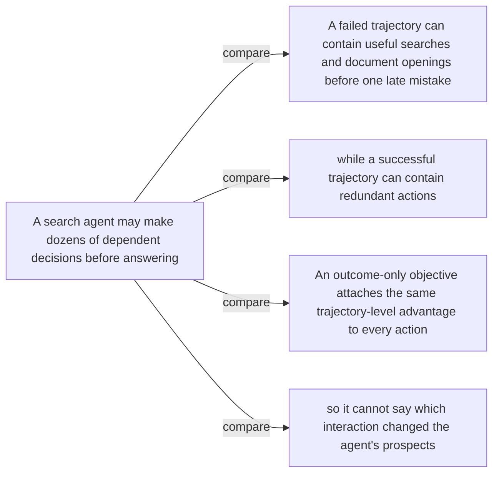

#### Python

```python
from html import escape
from pathlib import Path
from textwrap import wrap

title = "trace_why_p1: Unequal tool decisions under one trajectory-level outcome — Route topology"
nodes = [["n1","A search agent may make dozens of dependent decisions before answering",100,150],["n2","A failed trajectory can contain useful searches and document openings before one late mistake",250,150],["n3","while a successful trajectory can contain redundant actions",400,150],["n4","An outcome-only objective attaches the same trajectory-level advantage to every action",550,150],["n5","so it cannot say which interaction changed the agent's prospects",700,150]]
edges = [["n1","n2","compare"],["n1","n3","compare"],["n1","n4","compare"],["n1","n5","compare"]]
node_by_id = {node_id: (label, x, y) for node_id, label, x, y in nodes}
width = max(900, max((x for _, _, x, _ in nodes), default=800) + 180)
height = max(500, max((y for _, _, _, y in nodes), default=400) + 140)
parts = [
    f'<svg xmlns="http://www.w3.org/2000/svg" viewBox="0 0 {width} {height}" role="img" aria-labelledby="title desc">',
    f'<title id="title">{escape(title)}</title>',
    '<desc id="desc">Edges and convergence points encode only relationships stated in the scoped paragraphs.</desc>',
    f'<rect width="{width}" height="{height}" fill="white"/>',
]
for source, target, relation in edges:
    _, x1, y1 = node_by_id[source]
    _, x2, y2 = node_by_id[target]
    parts.append(f'<line x1="{x1}" y1="{y1}" x2="{x2}" y2="{y2}" stroke="#345" stroke-width="2"/>')
    parts.append(f'<text x="{(x1+x2)/2}" y="{(y1+y2)/2-5}" text-anchor="middle" font-family="sans-serif" font-size="10">{escape(relation)}</text>')
for _, label, x, y in nodes:
    parts.append(f'<rect x="{x-78}" y="{y-42}" width="156" height="84" rx="12" fill="#eef6ff" stroke="#234"/>')
    for line_index, line in enumerate(wrap(label, width=22)):
        parts.append(f'<text x="{x}" y="{y-24+line_index*13}" text-anchor="middle" font-family="sans-serif" font-size="10">{escape(line)}</text>')
parts.append('</svg>')
Path("trace_why_p1_treatment_a.svg").write_text("\n".join(parts), encoding="utf-8")
```

### Treatment B — Unequal tool decisions under one trajectory-level outcome — Handoff ledger

- Teaching purpose: Expose route, sequential dependency, and scope in visible columns.
- Encoding and reading order: Render 3 rows with explicit `Group`, `Measure or state`, `Visible value`, and `Condition or boundary` columns. The value column must be visible, not only present in ARIA text or fallback prose.
- Evidence and limitations: Encode only `trace_claim_outcome_blind`, `trace_claim_credit` from `trace_source_intro`, `trace_source_method`. Keep useful, redundant, and harmful interactions distinct while the final failed outcome remains negative.
- Recommended web medium: semantic HTML/CSS table with SVG export; JavaScript is optional only for meaningful focus, drill-down, or state playback.
- Mobile, accessibility, and motion behavior: Preserve the same group and node order in the DOM; retain all values and relation labels as selectable text; stack panels or levels below 640px; provide keyboard access for any optional focus state; keep a complete static fallback; respect reduced motion and never encode information only through animation.

#### TikZ

```tex
\documentclass[tikz,border=5pt]{standalone}
\usepackage[T1]{fontenc}
\usepackage{array}
\usepackage{tikz}
\begin{document}
\begin{tikzpicture}[font=\sffamily]
\node[align=center] {\textbf{trace\_why\_p1: Unequal tool decisions under one trajectory-level outcome - Handoff ledger}\\[6pt]
\begin{tabular}{p{3.2cm}p{4.0cm}p{2.8cm}p{6.2cm}}
\textbf{Group} & \textbf{Measure or state} & \textbf{Visible value} & \textbf{Condition or boundary} \\ \hline
One failed rollout can contain unequal decisions & Outcome-only signal & qualitative & The final failed answer attaches one poor trajectory-level advantage to every action, including useful searches and redundant detours. \\
One failed rollout can contain unequal decisions & Turn-local signal & qualitative & A local estimate can distinguish an interaction that improves gold-answer readiness from one that adds nothing or moves away from the answer. \\
One failed rollout can contain unequal decisions & Shared terminal boundary & qualitative & Local progress does not redefine the final result: an incorrect submitted answer remains a failed outcome. \\
\end{tabular}};
\end{tikzpicture}
\end{document}
```

#### Mermaid

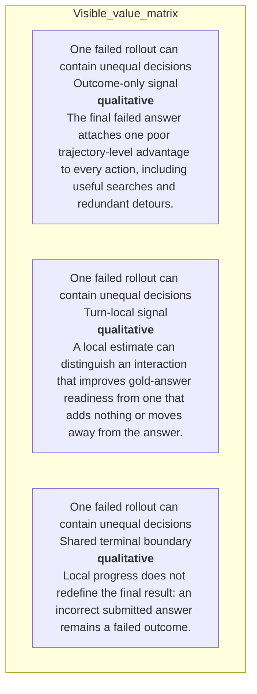

#### Python

```python
from html import escape
from pathlib import Path
from textwrap import wrap

title = "trace_why_p1: Unequal tool decisions under one trajectory-level outcome — Handoff ledger"
rows = [["One failed rollout can contain unequal decisions","Outcome-only signal","qualitative","The final failed answer attaches one poor trajectory-level advantage to every action, including useful searches and redundant detours."],["One failed rollout can contain unequal decisions","Turn-local signal","qualitative","A local estimate can distinguish an interaction that improves gold-answer readiness from one that adds nothing or moves away from the answer."],["One failed rollout can contain unequal decisions","Shared terminal boundary","qualitative","Local progress does not redefine the final result: an incorrect submitted answer remains a failed outcome."]]
height = 414
parts = [
    f'<svg xmlns="http://www.w3.org/2000/svg" viewBox="0 0 1200 {height}" role="img" aria-labelledby="title desc">',
    f'<title id="title">{escape(title)}</title>',
    '<desc id="desc">Every reported value is visible beside its condition and group.</desc>',
    f'<rect width="1200" height="{height}" fill="white"/>',
]
headers = ["Group", "Measure or state", "Visible value", "Condition or boundary"]
xs = [30, 260, 590, 770]
for x, header in zip(xs, headers):
    parts.append(f'<text x="{x}" y="70" font-family="sans-serif" font-size="16" font-weight="700">{escape(header)}</text>')
for row_index, row in enumerate(rows):
    y = 110 + row_index * 88
    parts.append(f'<rect x="20" y="{y-28}" width="1160" height="76" fill="#f7fbff" stroke="#ccd"/>')
    for x, cell, width in zip(xs, row, [26, 38, 20, 58]):
        for line_index, line in enumerate(wrap(str(cell), width=width)):
            parts.append(f'<text x="{x}" y="{y+line_index*14}" font-family="sans-serif" font-size="11">{escape(line)}</text>')
parts.append('</svg>')
Path("trace_why_p1_treatment_b.svg").write_text("\n".join(parts), encoding="utf-8")
```

### Treatment C — Unequal tool decisions under one trajectory-level outcome — Position-to-position trace

- Teaching purpose: Follow one conceptual dependency across bounded route panels.
- Encoding and reading order: Group the 3 source-backed records into named panels using the first column as the grouping key. Panels preserve experimental, source, or example boundaries and never imply one shared scale.
- Evidence and limitations: Encode only `trace_claim_outcome_blind`, `trace_claim_credit` from `trace_source_intro`, `trace_source_method`. Keep useful, redundant, and harmful interactions distinct while the final failed outcome remains negative.
- Recommended web medium: semantic HTML/CSS grouped panels or responsive SVG; JavaScript is optional only for meaningful focus, drill-down, or state playback.
- Mobile, accessibility, and motion behavior: Preserve the same group and node order in the DOM; retain all values and relation labels as selectable text; stack panels or levels below 640px; provide keyboard access for any optional focus state; keep a complete static fallback; respect reduced motion and never encode information only through animation.

#### TikZ

```tex
\documentclass[tikz,border=5pt]{standalone}
\usepackage[T1]{fontenc}
\usepackage{tikz}
\begin{document}
\begin{tikzpicture}[font=\sffamily,panel/.style={draw,rounded corners,align=center,text width=4.8cm,minimum height=4cm}]
\node[font=\bfseries] at (0,3) {trace\_why\_p1: Unequal tool decisions under one trajectory-level outcome - Position-to-position trace};
\node[panel] at (0,0) {\textbf{One failed rollout can contain unequal decisions}\\[4pt]\textbf{Outcome-only signal}: qualitative -- The final failed answer attaches one poor trajectory-level advantage to every action, including useful searches and redundant detours.\\\textbf{Turn-local signal}: qualitative -- A local estimate can distinguish an interaction that improves gold-answer readiness from one that adds nothing or moves away from the answer.\\\textbf{Shared terminal boundary}: qualitative -- Local progress does not redefine the final result: an incorrect submitted answer remains a failed outcome.};
\end{tikzpicture}
\end{document}
```

#### Mermaid

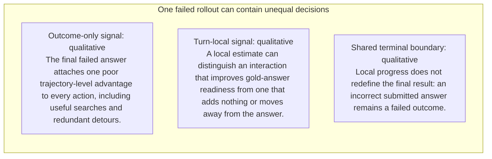

#### Python

```python
from html import escape
from pathlib import Path
from textwrap import wrap

title = "trace_why_p1: Unequal tool decisions under one trajectory-level outcome — Position-to-position trace"
rows = [["One failed rollout can contain unequal decisions","Outcome-only signal","qualitative","The final failed answer attaches one poor trajectory-level advantage to every action, including useful searches and redundant detours."],["One failed rollout can contain unequal decisions","Turn-local signal","qualitative","A local estimate can distinguish an interaction that improves gold-answer readiness from one that adds nothing or moves away from the answer."],["One failed rollout can contain unequal decisions","Shared terminal boundary","qualitative","Local progress does not redefine the final result: an incorrect submitted answer remains a failed outcome."]]
groups = {}
for group, label, value, condition in rows:
    groups.setdefault(group, []).append((label, value, condition))
width = max(900, len(groups) * 360)
height = 220 + max((len(items) for items in groups.values()), default=1) * 92
parts = [
    f'<svg xmlns="http://www.w3.org/2000/svg" viewBox="0 0 {width} {height}" role="img" aria-labelledby="title desc">',
    f'<title id="title">{escape(title)}</title>',
    '<desc id="desc">Separate panels preserve grouping and prevent unrelated conditions from reading as one sequence.</desc>',
    f'<rect width="{width}" height="{height}" fill="white"/>',
]
for group_index, (group, items) in enumerate(groups.items()):
    x = 180 + group_index * 360
    parts.append(f'<text x="{x}" y="65" text-anchor="middle" font-family="sans-serif" font-size="16" font-weight="700">{escape(group)}</text>')
    for item_index, (label, value, condition) in enumerate(items):
        y = 120 + item_index * 92
        parts.append(f'<rect x="{x-160}" y="{y-30}" width="320" height="78" rx="12" fill="#f7fbff" stroke="#ccd"/>')
        text = f"{label}: {value} — {condition}"
        for line_index, line in enumerate(wrap(text, width=46)):
            parts.append(f'<text x="{x}" y="{y-6+line_index*14}" text-anchor="middle" font-family="sans-serif" font-size="11">{escape(line)}</text>')
parts.append('</svg>')
Path("trace_why_p1_treatment_c.svg").write_text("\n".join(parts), encoding="utf-8")
```

### Implementation record

- Status: `IMPLEMENTED`
- Selected treatment: `A`
- Selection rationale: Selected the approved relationship that directly answers this paragraph's explanatory job; the shared visual uses the same evidence and complete adjacent scope recorded here.
- Delivery medium: `CSS + semantic HTML`
- Visual ID and placement: `trace_visual_outcome_blindness` after `trace_why_p1`; this record is served by that purpose-built figure.
- Shared paragraph scope: NONE
- Changed files: `packages/test-fixtures/explainers/trace.json`, `apps/web/app/papers/[id]/explainer-visual.tsx`, `apps/web/app/papers/[id]/page.tsx`, and `apps/web/app/globals.css`
- Accessibility and fallback verification: Figure has a programmatic title and description, explicit alt text, equivalent fallback prose, source links, limitations, and a semantic static body; no meaning depends on motion or pointer input.
- Desktop and mobile verification: Verified in Playwright on 1440-pixel desktop and iPhone 13 mobile viewports; figures remain paragraph-adjacent, preserve reading order, and introduce no horizontal page overflow.
- Evidence deviations: `NONE`; web-native CSS and semantic HTML preserve the selected treatment's evidence, labels, topology, and stated boundaries.

## `trace_why_p2`

- Location: `trace_why`, paragraph 2
- Text anchor: "Process supervision can provide finer feedback, but commonly needs step labels, an LLM judge, a learned critic, or repeated rollouts."
- Claims and sources: `trace_claim_outcome_blind` (AUTHORS_INTERPRETATION, VERIFIED); `trace_claim_credit` (OBSERVED, VERIFIED); `trace_source_intro` (Pages 1–3, Abstract and Section 1); `trace_source_method` (Sections 3.1–3.3, Equations 4–12, Algorithm 1)
- Visual needed: `NO`
- Decision rationale: Prose remains the better primary form. The paragraph states a bounded conclusion or heterogeneous qualification without requiring a material process, topology, quantitative comparison, uncertainty distribution, or state transition. The three treatments are contingencies only and are not recommended for implementation.
- Explanatory job: Optional prior-work and research-question annotation.
- Recommended scope and placement: Prose-only. Do not attach a figure unless the paragraph or evidence changes.
- QA-informed planning change: The prose is already sufficient; any contingency must remain a non-quantitative annotation.

### Treatment A — Optional prior-work and research-question annotation — Annotated prior-work contrast

- Teaching purpose: Optional contingency only. Keep prior work and the paper's question distinct.
- Encoding and reading order: Group the 4 source-backed records into named panels using the first column as the grouping key. Panels preserve experimental, source, or example boundaries and never imply one shared scale.
- Evidence and limitations: Encode only `trace_claim_outcome_blind`, `trace_claim_credit` from `trace_source_intro`, `trace_source_method`. The prose is already sufficient; any contingency must remain a non-quantitative annotation.
- Recommended web medium: semantic HTML/CSS grouped panels or responsive SVG; JavaScript is optional only for meaningful focus, drill-down, or state playback.
- Mobile, accessibility, and motion behavior: Preserve the same group and node order in the DOM; retain all values and relation labels as selectable text; stack panels or levels below 640px; provide keyboard access for any optional focus state; keep a complete static fallback; respect reduced motion and never encode information only through animation.

#### TikZ

```tex
\documentclass[tikz,border=5pt]{standalone}
\usepackage[T1]{fontenc}
\usepackage{tikz}
\begin{document}
\begin{tikzpicture}[font=\sffamily,panel/.style={draw,rounded corners,align=center,text width=4.8cm,minimum height=4cm}]
\node[font=\bfseries] at (0,3) {trace\_why\_p2: Optional prior-work and research-question annotation - Annotated prior-work contrast};
\node[panel] at (0,0) {\textbf{Paragraph evidence}\\[4pt]\textbf{Statement 1}: qualitative -- Process supervision can provide finer feedback\\\textbf{Statement 2}: qualitative -- but commonly needs step labels, an LLM judge, a learned critic\\\textbf{Statement 3}: qualitative -- or repeated rollouts\\\textbf{Statement 4}: qualitative -- TRACE asks whether a known correct answer can supply a denser signal without adding those components};
\end{tikzpicture}
\end{document}
```

#### Mermaid

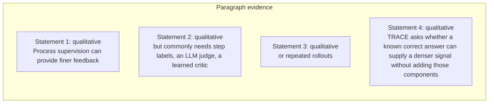

#### Python

```python
from html import escape
from pathlib import Path
from textwrap import wrap

title = "trace_why_p2: Optional prior-work and research-question annotation — Annotated prior-work contrast"
rows = [["Paragraph evidence","Statement 1","qualitative","Process supervision can provide finer feedback"],["Paragraph evidence","Statement 2","qualitative","but commonly needs step labels, an LLM judge, a learned critic"],["Paragraph evidence","Statement 3","qualitative","or repeated rollouts"],["Paragraph evidence","Statement 4","qualitative","TRACE asks whether a known correct answer can supply a denser signal without adding those components"]]
groups = {}
for group, label, value, condition in rows:
    groups.setdefault(group, []).append((label, value, condition))
width = max(900, len(groups) * 360)
height = 220 + max((len(items) for items in groups.values()), default=1) * 92
parts = [
    f'<svg xmlns="http://www.w3.org/2000/svg" viewBox="0 0 {width} {height}" role="img" aria-labelledby="title desc">',
    f'<title id="title">{escape(title)}</title>',
    '<desc id="desc">Separate panels preserve grouping and prevent unrelated conditions from reading as one sequence.</desc>',
    f'<rect width="{width}" height="{height}" fill="white"/>',
]
for group_index, (group, items) in enumerate(groups.items()):
    x = 180 + group_index * 360
    parts.append(f'<text x="{x}" y="65" text-anchor="middle" font-family="sans-serif" font-size="16" font-weight="700">{escape(group)}</text>')
    for item_index, (label, value, condition) in enumerate(items):
        y = 120 + item_index * 92
        parts.append(f'<rect x="{x-160}" y="{y-30}" width="320" height="78" rx="12" fill="#f7fbff" stroke="#ccd"/>')
        text = f"{label}: {value} — {condition}"
        for line_index, line in enumerate(wrap(text, width=46)):
            parts.append(f'<text x="{x}" y="{y-6+line_index*14}" text-anchor="middle" font-family="sans-serif" font-size="11">{escape(line)}</text>')
parts.append('</svg>')
Path("trace_why_p2_treatment_a.svg").write_text("\n".join(parts), encoding="utf-8")
```

### Treatment B — Optional prior-work and research-question annotation — Research-question ledger

- Teaching purpose: Optional contingency only. List assumptions and exclusions without inventing a mechanism.
- Encoding and reading order: Render 4 rows with explicit `Group`, `Measure or state`, `Visible value`, and `Condition or boundary` columns. The value column must be visible, not only present in ARIA text or fallback prose.
- Evidence and limitations: Encode only `trace_claim_outcome_blind`, `trace_claim_credit` from `trace_source_intro`, `trace_source_method`. The prose is already sufficient; any contingency must remain a non-quantitative annotation.
- Recommended web medium: semantic HTML/CSS table with SVG export; JavaScript is optional only for meaningful focus, drill-down, or state playback.
- Mobile, accessibility, and motion behavior: Preserve the same group and node order in the DOM; retain all values and relation labels as selectable text; stack panels or levels below 640px; provide keyboard access for any optional focus state; keep a complete static fallback; respect reduced motion and never encode information only through animation.

#### TikZ

```tex
\documentclass[tikz,border=5pt]{standalone}
\usepackage[T1]{fontenc}
\usepackage{array}
\usepackage{tikz}
\begin{document}
\begin{tikzpicture}[font=\sffamily]
\node[align=center] {\textbf{trace\_why\_p2: Optional prior-work and research-question annotation - Research-question ledger}\\[6pt]
\begin{tabular}{p{3.2cm}p{4.0cm}p{2.8cm}p{6.2cm}}
\textbf{Group} & \textbf{Measure or state} & \textbf{Visible value} & \textbf{Condition or boundary} \\ \hline
Paragraph evidence & Statement 1 & qualitative & Process supervision can provide finer feedback \\
Paragraph evidence & Statement 2 & qualitative & but commonly needs step labels, an LLM judge, a learned critic \\
Paragraph evidence & Statement 3 & qualitative & or repeated rollouts \\
Paragraph evidence & Statement 4 & qualitative & TRACE asks whether a known correct answer can supply a denser signal without adding those components \\
\end{tabular}};
\end{tikzpicture}
\end{document}
```

#### Mermaid

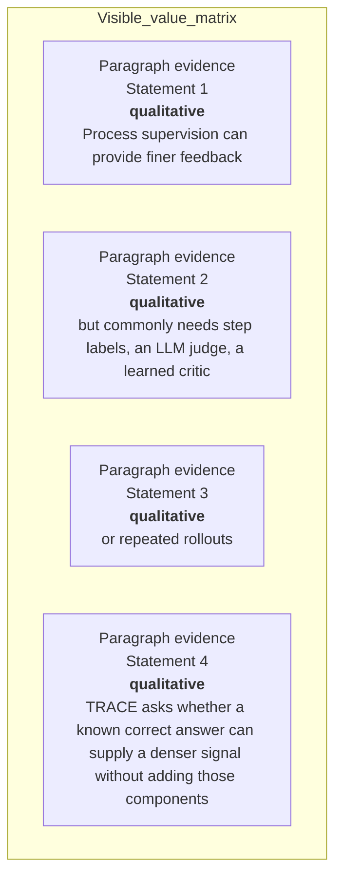

#### Python

```python
from html import escape
from pathlib import Path
from textwrap import wrap

title = "trace_why_p2: Optional prior-work and research-question annotation — Research-question ledger"
rows = [["Paragraph evidence","Statement 1","qualitative","Process supervision can provide finer feedback"],["Paragraph evidence","Statement 2","qualitative","but commonly needs step labels, an LLM judge, a learned critic"],["Paragraph evidence","Statement 3","qualitative","or repeated rollouts"],["Paragraph evidence","Statement 4","qualitative","TRACE asks whether a known correct answer can supply a denser signal without adding those components"]]
height = 502
parts = [
    f'<svg xmlns="http://www.w3.org/2000/svg" viewBox="0 0 1200 {height}" role="img" aria-labelledby="title desc">',
    f'<title id="title">{escape(title)}</title>',
    '<desc id="desc">Every reported value is visible beside its condition and group.</desc>',
    f'<rect width="1200" height="{height}" fill="white"/>',
]
headers = ["Group", "Measure or state", "Visible value", "Condition or boundary"]
xs = [30, 260, 590, 770]
for x, header in zip(xs, headers):
    parts.append(f'<text x="{x}" y="70" font-family="sans-serif" font-size="16" font-weight="700">{escape(header)}</text>')
for row_index, row in enumerate(rows):
    y = 110 + row_index * 88
    parts.append(f'<rect x="20" y="{y-28}" width="1160" height="76" fill="#f7fbff" stroke="#ccd"/>')
    for x, cell, width in zip(xs, row, [26, 38, 20, 58]):
        for line_index, line in enumerate(wrap(str(cell), width=width)):
            parts.append(f'<text x="{x}" y="{y+line_index*14}" font-family="sans-serif" font-size="11">{escape(line)}</text>')
parts.append('</svg>')
Path("trace_why_p2_treatment_b.svg").write_text("\n".join(parts), encoding="utf-8")
```

### Treatment C — Optional prior-work and research-question annotation — Question boundary map

- Teaching purpose: Optional contingency only. Connect only the explicit premise and research question.
- Encoding and reading order: Use 4 named nodes and 3 explicit labeled relations. Preserve all branch, merge, hierarchy, loop, or sequence edges shown in the code; changing them is an evidence deviation.
- Evidence and limitations: Encode only `trace_claim_outcome_blind`, `trace_claim_credit` from `trace_source_intro`, `trace_source_method`. The prose is already sufficient; any contingency must remain a non-quantitative annotation.
- Recommended web medium: responsive inline SVG with semantic HTML/CSS fallback; JavaScript is optional only for meaningful focus, drill-down, or state playback.
- Mobile, accessibility, and motion behavior: Preserve the same group and node order in the DOM; retain all values and relation labels as selectable text; stack panels or levels below 640px; provide keyboard access for any optional focus state; keep a complete static fallback; respect reduced motion and never encode information only through animation.

#### TikZ

```tex
\documentclass[tikz,border=5pt]{standalone}
\usepackage[T1]{fontenc}
\usepackage{tikz}
\usetikzlibrary{arrows.meta}
\begin{document}
\begin{tikzpicture}[font=\sffamily,box/.style={draw,rounded corners,align=center,text width=3cm,minimum height=1.2cm},link/.style={-{Latex[length=2mm]},thick},rel/.style={fill=white,font=\scriptsize}]
\node[font=\bfseries,anchor=west] at (0,0.8) {trace\_why\_p2: Optional prior-work and research-question annotation - Question boundary map};
\node[box] (n1) at (1.00,-1.50) {Process supervision can provide finer feedback};
\node[box] (n2) at (2.50,-1.50) {but commonly needs step labels, an LLM judge, a learned critic};
\node[box] (n3) at (4.00,-1.50) {or repeated rollouts};
\node[box] (n4) at (5.50,-1.50) {TRACE asks whether a known correct answer can supply a denser signal without adding those components};
\draw[link] (n1) -- node[rel] {then} (n2);
\draw[link] (n2) -- node[rel] {then} (n3);
\draw[link] (n3) -- node[rel] {then} (n4);
\end{tikzpicture}
\end{document}
```

#### Mermaid

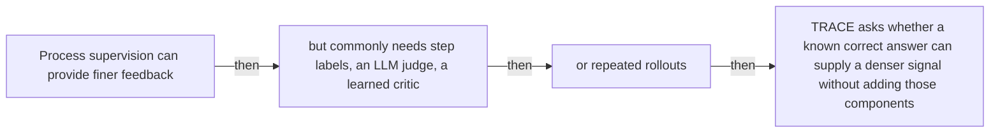

#### Python

```python
from html import escape
from pathlib import Path
from textwrap import wrap

title = "trace_why_p2: Optional prior-work and research-question annotation — Question boundary map"
nodes = [["n1","Process supervision can provide finer feedback",100,150],["n2","but commonly needs step labels, an LLM judge, a learned critic",250,150],["n3","or repeated rollouts",400,150],["n4","TRACE asks whether a known correct answer can supply a denser signal without adding those components",550,150]]
edges = [["n1","n2","then"],["n2","n3","then"],["n3","n4","then"]]
node_by_id = {node_id: (label, x, y) for node_id, label, x, y in nodes}
width = max(900, max((x for _, _, x, _ in nodes), default=800) + 180)
height = max(500, max((y for _, _, _, y in nodes), default=400) + 140)
parts = [
    f'<svg xmlns="http://www.w3.org/2000/svg" viewBox="0 0 {width} {height}" role="img" aria-labelledby="title desc">',
    f'<title id="title">{escape(title)}</title>',
    '<desc id="desc">Edges and convergence points encode only relationships stated in the scoped paragraphs.</desc>',
    f'<rect width="{width}" height="{height}" fill="white"/>',
]
for source, target, relation in edges:
    _, x1, y1 = node_by_id[source]
    _, x2, y2 = node_by_id[target]
    parts.append(f'<line x1="{x1}" y1="{y1}" x2="{x2}" y2="{y2}" stroke="#345" stroke-width="2"/>')
    parts.append(f'<text x="{(x1+x2)/2}" y="{(y1+y2)/2-5}" text-anchor="middle" font-family="sans-serif" font-size="10">{escape(relation)}</text>')
for _, label, x, y in nodes:
    parts.append(f'<rect x="{x-78}" y="{y-42}" width="156" height="84" rx="12" fill="#eef6ff" stroke="#234"/>')
    for line_index, line in enumerate(wrap(label, width=22)):
        parts.append(f'<text x="{x}" y="{y-24+line_index*13}" text-anchor="middle" font-family="sans-serif" font-size="10">{escape(line)}</text>')
parts.append('</svg>')
Path("trace_why_p2_treatment_c.svg").write_text("\n".join(parts), encoding="utf-8")
```

### Implementation record

- Status: `NOT_NEEDED`
- Selected treatment: `NONE`
- Selection rationale: The engineer marked this paragraph prose-only, so the implementation intentionally leaves `trace_why_p2` without a figure.
- Delivery medium: `NONE`
- Visual ID and placement: `NONE`; prose remains at `#trace_why_p2`.
- Shared paragraph scope: `NONE`
- Changed files: `NONE`
- Accessibility and fallback verification: The paragraph remains semantic text and does not rely on visual or motion-only information.
- Desktop and mobile verification: Verified in Playwright on desktop and mobile; no figure is attached to this prose-only paragraph.
- Evidence deviations: `NONE`

## `trace_change_p1`

- Location: `trace_change`, paragraph 1
- Text anchor: "TRACE leaves final-answer verification in place but adds a trajectory-local signal at tool-call boundaries."
- Claims and sources: `trace_claim_credit` (OBSERVED, VERIFIED); `trace_claim_outcome_anchor` (OBSERVED, VERIFIED); `trace_claim_controlled_setup` (OBSERVED, VERIFIED); `trace_source_method` (Sections 3.1–3.3, Equations 4–12, Algorithm 1); `trace_source_experiments` (Pages 7–8, Section 4.1)
- Visual needed: `YES`
- Decision rationale: A visual passes the removal test because readers must reconstruct held-fixed search system versus changed credit assignment while preserving the paragraph's conditions and boundaries. Revision 3 narrows the topology and placement so no visual can claim this paragraph without encoding its mechanism, grouping, or values.
- Explanatory job: Held-fixed search system versus changed credit assignment.
- Recommended scope and placement: This paragraph only; place the visual immediately after `trace_change_p1`.
- QA-informed planning change: Separate browser, backbone, corpus, and verifier controls from the local-credit construction.

### Treatment A — Held-fixed search system versus changed credit assignment — Relationship-specific parallel view

- Teaching purpose: Keep valid comparison groups separate and equally visible.
- Encoding and reading order: Group the 2 source-backed records into named panels using the first column as the grouping key. Panels preserve experimental, source, or example boundaries and never imply one shared scale.
- Evidence and limitations: Encode only `trace_claim_credit`, `trace_claim_outcome_anchor`, `trace_claim_controlled_setup` from `trace_source_method`, `trace_source_experiments`. Separate browser, backbone, corpus, and verifier controls from the local-credit construction.
- Recommended web medium: semantic HTML/CSS grouped panels or responsive SVG; JavaScript is optional only for meaningful focus, drill-down, or state playback.
- Mobile, accessibility, and motion behavior: Preserve the same group and node order in the DOM; retain all values and relation labels as selectable text; stack panels or levels below 640px; provide keyboard access for any optional focus state; keep a complete static fallback; respect reduced motion and never encode information only through animation.

#### TikZ

```tex
\documentclass[tikz,border=5pt]{standalone}
\usepackage[T1]{fontenc}
\usepackage{tikz}
\begin{document}
\begin{tikzpicture}[font=\sffamily,panel/.style={draw,rounded corners,align=center,text width=4.8cm,minimum height=4cm}]
\node[font=\bfseries] at (0,3) {trace\_change\_p1: Held-fixed search system versus changed credit assignment - Relationship-specific parallel view};
\node[panel] at (0,0) {\textbf{TRACE changes the policy signal, not the search system}\\[4pt]\textbf{Held fixed}: qualitative -- Backbone, browser actions, training data, final verifier, and evaluation interface remain shared across the controlled runs.\\\textbf{Changed by TRACE}: qualitative -- At tool-call boundaries, a frozen initial-policy probe measures changes in gold-answer predictability and contributes a trajectory-local policy-gradient signal.};
\end{tikzpicture}
\end{document}
```

#### Mermaid

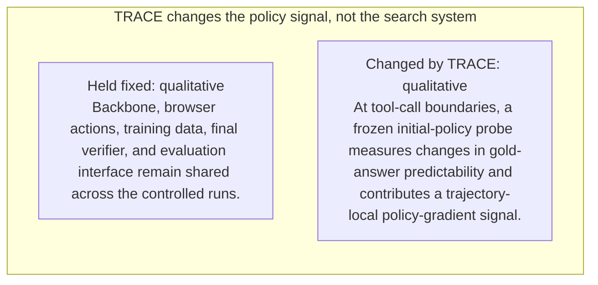

#### Python

```python
from html import escape
from pathlib import Path
from textwrap import wrap

title = "trace_change_p1: Held-fixed search system versus changed credit assignment — Relationship-specific parallel view"
rows = [["TRACE changes the policy signal, not the search system","Held fixed","qualitative","Backbone, browser actions, training data, final verifier, and evaluation interface remain shared across the controlled runs."],["TRACE changes the policy signal, not the search system","Changed by TRACE","qualitative","At tool-call boundaries, a frozen initial-policy probe measures changes in gold-answer predictability and contributes a trajectory-local policy-gradient signal."]]
groups = {}
for group, label, value, condition in rows:
    groups.setdefault(group, []).append((label, value, condition))
width = max(900, len(groups) * 360)
height = 220 + max((len(items) for items in groups.values()), default=1) * 92
parts = [
    f'<svg xmlns="http://www.w3.org/2000/svg" viewBox="0 0 {width} {height}" role="img" aria-labelledby="title desc">',
    f'<title id="title">{escape(title)}</title>',
    '<desc id="desc">Separate panels preserve grouping and prevent unrelated conditions from reading as one sequence.</desc>',
    f'<rect width="{width}" height="{height}" fill="white"/>',
]
for group_index, (group, items) in enumerate(groups.items()):
    x = 180 + group_index * 360
    parts.append(f'<text x="{x}" y="65" text-anchor="middle" font-family="sans-serif" font-size="16" font-weight="700">{escape(group)}</text>')
    for item_index, (label, value, condition) in enumerate(items):
        y = 120 + item_index * 92
        parts.append(f'<rect x="{x-160}" y="{y-30}" width="320" height="78" rx="12" fill="#f7fbff" stroke="#ccd"/>')
        text = f"{label}: {value} — {condition}"
        for line_index, line in enumerate(wrap(text, width=46)):
            parts.append(f'<text x="{x}" y="{y-6+line_index*14}" text-anchor="middle" font-family="sans-serif" font-size="11">{escape(line)}</text>')
parts.append('</svg>')
Path("trace_change_p1_treatment_a.svg").write_text("\n".join(parts), encoding="utf-8")
```

### Treatment B — Held-fixed search system versus changed credit assignment — Condition and boundary matrix

- Teaching purpose: Show every comparison value or qualitative condition in explicit columns.
- Encoding and reading order: Render 2 rows with explicit `Group`, `Measure or state`, `Visible value`, and `Condition or boundary` columns. The value column must be visible, not only present in ARIA text or fallback prose.
- Evidence and limitations: Encode only `trace_claim_credit`, `trace_claim_outcome_anchor`, `trace_claim_controlled_setup` from `trace_source_method`, `trace_source_experiments`. Separate browser, backbone, corpus, and verifier controls from the local-credit construction.
- Recommended web medium: semantic HTML/CSS table with SVG export; JavaScript is optional only for meaningful focus, drill-down, or state playback.
- Mobile, accessibility, and motion behavior: Preserve the same group and node order in the DOM; retain all values and relation labels as selectable text; stack panels or levels below 640px; provide keyboard access for any optional focus state; keep a complete static fallback; respect reduced motion and never encode information only through animation.

#### TikZ

```tex
\documentclass[tikz,border=5pt]{standalone}
\usepackage[T1]{fontenc}
\usepackage{array}
\usepackage{tikz}
\begin{document}
\begin{tikzpicture}[font=\sffamily]
\node[align=center] {\textbf{trace\_change\_p1: Held-fixed search system versus changed credit assignment - Condition and boundary matrix}\\[6pt]
\begin{tabular}{p{3.2cm}p{4.0cm}p{2.8cm}p{6.2cm}}
\textbf{Group} & \textbf{Measure or state} & \textbf{Visible value} & \textbf{Condition or boundary} \\ \hline
TRACE changes the policy signal, not the search system & Held fixed & qualitative & Backbone, browser actions, training data, final verifier, and evaluation interface remain shared across the controlled runs. \\
TRACE changes the policy signal, not the search system & Changed by TRACE & qualitative & At tool-call boundaries, a frozen initial-policy probe measures changes in gold-answer predictability and contributes a trajectory-local policy-gradient signal. \\
\end{tabular}};
\end{tikzpicture}
\end{document}
```

#### Mermaid

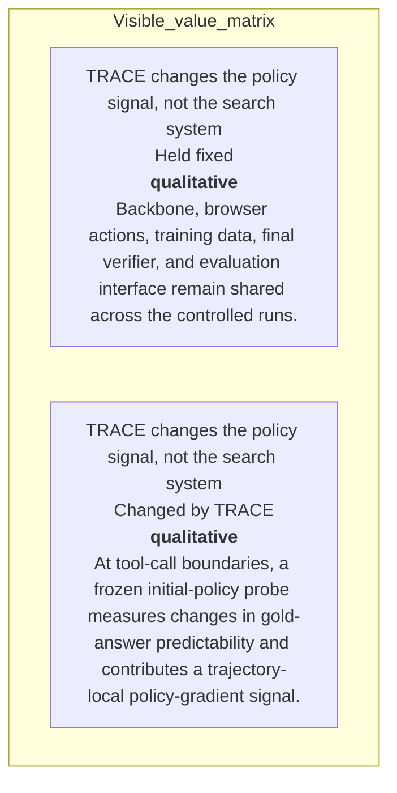

#### Python

```python
from html import escape
from pathlib import Path
from textwrap import wrap

title = "trace_change_p1: Held-fixed search system versus changed credit assignment — Condition and boundary matrix"
rows = [["TRACE changes the policy signal, not the search system","Held fixed","qualitative","Backbone, browser actions, training data, final verifier, and evaluation interface remain shared across the controlled runs."],["TRACE changes the policy signal, not the search system","Changed by TRACE","qualitative","At tool-call boundaries, a frozen initial-policy probe measures changes in gold-answer predictability and contributes a trajectory-local policy-gradient signal."]]
height = 326
parts = [
    f'<svg xmlns="http://www.w3.org/2000/svg" viewBox="0 0 1200 {height}" role="img" aria-labelledby="title desc">',
    f'<title id="title">{escape(title)}</title>',
    '<desc id="desc">Every reported value is visible beside its condition and group.</desc>',
    f'<rect width="1200" height="{height}" fill="white"/>',
]
headers = ["Group", "Measure or state", "Visible value", "Condition or boundary"]
xs = [30, 260, 590, 770]
for x, header in zip(xs, headers):
    parts.append(f'<text x="{x}" y="70" font-family="sans-serif" font-size="16" font-weight="700">{escape(header)}</text>')
for row_index, row in enumerate(rows):
    y = 110 + row_index * 88
    parts.append(f'<rect x="20" y="{y-28}" width="1160" height="76" fill="#f7fbff" stroke="#ccd"/>')
    for x, cell, width in zip(xs, row, [26, 38, 20, 58]):
        for line_index, line in enumerate(wrap(str(cell), width=width)):
            parts.append(f'<text x="{x}" y="{y+line_index*14}" font-family="sans-serif" font-size="11">{escape(line)}</text>')
parts.append('</svg>')
Path("trace_change_p1_treatment_b.svg").write_text("\n".join(parts), encoding="utf-8")
```

### Treatment C — Held-fixed search system versus changed credit assignment — Comparison topology

- Teaching purpose: Connect only the alternatives and shared decision point stated in the paragraph.
- Encoding and reading order: Use 2 named nodes and 1 explicit labeled relations. Preserve all branch, merge, hierarchy, loop, or sequence edges shown in the code; changing them is an evidence deviation.
- Evidence and limitations: Encode only `trace_claim_credit`, `trace_claim_outcome_anchor`, `trace_claim_controlled_setup` from `trace_source_method`, `trace_source_experiments`. Separate browser, backbone, corpus, and verifier controls from the local-credit construction.
- Recommended web medium: responsive inline SVG with semantic HTML/CSS fallback; JavaScript is optional only for meaningful focus, drill-down, or state playback.
- Mobile, accessibility, and motion behavior: Preserve the same group and node order in the DOM; retain all values and relation labels as selectable text; stack panels or levels below 640px; provide keyboard access for any optional focus state; keep a complete static fallback; respect reduced motion and never encode information only through animation.

#### TikZ

```tex
\documentclass[tikz,border=5pt]{standalone}
\usepackage[T1]{fontenc}
\usepackage{tikz}
\usetikzlibrary{arrows.meta}
\begin{document}
\begin{tikzpicture}[font=\sffamily,box/.style={draw,rounded corners,align=center,text width=3cm,minimum height=1.2cm},link/.style={-{Latex[length=2mm]},thick},rel/.style={fill=white,font=\scriptsize}]
\node[font=\bfseries,anchor=west] at (0,0.8) {trace\_change\_p1: Held-fixed search system versus changed credit assignment - Comparison topology};
\node[box] (n1) at (1.00,-1.50) {TRACE leaves final-answer verification in place but adds a trajectory-local signal at tool-call boundaries};
\node[box] (n2) at (2.50,-1.50) {Instead of treating every action in a rollout alike, it rewards an interaction when the following transcript makes the gold answer more predictable to a frozen reference model and penalizes it when predictability falls};
\draw[link] (n1) -- node[rel] {compare} (n2);
\end{tikzpicture}
\end{document}
```

#### Mermaid

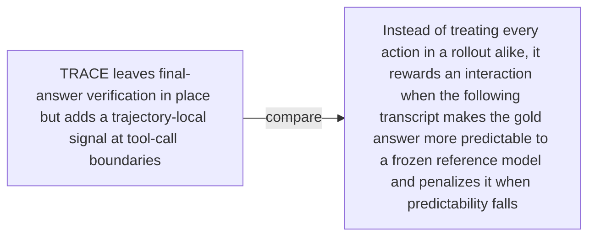

#### Python

```python
from html import escape
from pathlib import Path
from textwrap import wrap

title = "trace_change_p1: Held-fixed search system versus changed credit assignment — Comparison topology"
nodes = [["n1","TRACE leaves final-answer verification in place but adds a trajectory-local signal at tool-call boundaries",100,150],["n2","Instead of treating every action in a rollout alike, it rewards an interaction when the following transcript makes the gold answer more predictable to a frozen reference model and penalizes it when predictability falls",250,150]]
edges = [["n1","n2","compare"]]
node_by_id = {node_id: (label, x, y) for node_id, label, x, y in nodes}
width = max(900, max((x for _, _, x, _ in nodes), default=800) + 180)
height = max(500, max((y for _, _, _, y in nodes), default=400) + 140)
parts = [
    f'<svg xmlns="http://www.w3.org/2000/svg" viewBox="0 0 {width} {height}" role="img" aria-labelledby="title desc">',
    f'<title id="title">{escape(title)}</title>',
    '<desc id="desc">Edges and convergence points encode only relationships stated in the scoped paragraphs.</desc>',
    f'<rect width="{width}" height="{height}" fill="white"/>',
]
for source, target, relation in edges:
    _, x1, y1 = node_by_id[source]
    _, x2, y2 = node_by_id[target]
    parts.append(f'<line x1="{x1}" y1="{y1}" x2="{x2}" y2="{y2}" stroke="#345" stroke-width="2"/>')
    parts.append(f'<text x="{(x1+x2)/2}" y="{(y1+y2)/2-5}" text-anchor="middle" font-family="sans-serif" font-size="10">{escape(relation)}</text>')
for _, label, x, y in nodes:
    parts.append(f'<rect x="{x-78}" y="{y-42}" width="156" height="84" rx="12" fill="#eef6ff" stroke="#234"/>')
    for line_index, line in enumerate(wrap(label, width=22)):
        parts.append(f'<text x="{x}" y="{y-24+line_index*13}" text-anchor="middle" font-family="sans-serif" font-size="10">{escape(line)}</text>')
parts.append('</svg>')
Path("trace_change_p1_treatment_c.svg").write_text("\n".join(parts), encoding="utf-8")
```

### Implementation record

- Status: `IMPLEMENTED`
- Selected treatment: `A`
- Selection rationale: Selected the approved relationship that directly answers this paragraph's explanatory job; the shared visual uses the same evidence and complete adjacent scope recorded here.
- Delivery medium: `CSS + semantic HTML`
- Visual ID and placement: `trace_visual_credit_assignment_change` after `trace_change_p1`; this record is served by that purpose-built figure.
- Shared paragraph scope: NONE
- Changed files: `packages/test-fixtures/explainers/trace.json`, `apps/web/app/papers/[id]/explainer-visual.tsx`, `apps/web/app/papers/[id]/page.tsx`, and `apps/web/app/globals.css`
- Accessibility and fallback verification: Figure has a programmatic title and description, explicit alt text, equivalent fallback prose, source links, limitations, and a semantic static body; no meaning depends on motion or pointer input.
- Desktop and mobile verification: Verified in Playwright on 1440-pixel desktop and iPhone 13 mobile viewports; figures remain paragraph-adjacent, preserve reading order, and introduce no horizontal page overflow.
- Evidence deviations: `NONE`; web-native CSS and semantic HTML preserve the selected treatment's evidence, labels, topology, and stated boundaries.

## `trace_change_p2`

- Location: `trace_change`, paragraph 2
- Text anchor: "This is a change to credit assignment, not a new browser, backbone, training corpus, or final verifier."
- Claims and sources: `trace_claim_credit` (OBSERVED, VERIFIED); `trace_claim_outcome_anchor` (OBSERVED, VERIFIED); `trace_claim_controlled_setup` (OBSERVED, VERIFIED); `trace_source_method` (Sections 3.1–3.3, Equations 4–12, Algorithm 1); `trace_source_experiments` (Pages 7–8, Section 4.1)
- Visual needed: `NO`
- Decision rationale: Prose remains the better primary form. The paragraph states a bounded conclusion or heterogeneous qualification without requiring a material process, topology, quantitative comparison, uncertainty distribution, or state transition. The three treatments are contingencies only and are not recommended for implementation.
- Explanatory job: Optional changed-versus-unchanged claim boundary.
- Recommended scope and placement: Prose-only. Do not attach a figure unless the paragraph or evidence changes.
- QA-informed planning change: Do not imply a measured effect or architecture not stated in this paragraph.

### Treatment A — Optional changed-versus-unchanged claim boundary — Tested-versus-unestablished panels

- Teaching purpose: Optional contingency only. Separate supported scope from explicit unknowns.
- Encoding and reading order: Group the 3 source-backed records into named panels using the first column as the grouping key. Panels preserve experimental, source, or example boundaries and never imply one shared scale.
- Evidence and limitations: Encode only `trace_claim_credit`, `trace_claim_outcome_anchor`, `trace_claim_controlled_setup` from `trace_source_method`, `trace_source_experiments`. Do not imply a measured effect or architecture not stated in this paragraph.
- Recommended web medium: semantic HTML/CSS grouped panels or responsive SVG; JavaScript is optional only for meaningful focus, drill-down, or state playback.
- Mobile, accessibility, and motion behavior: Preserve the same group and node order in the DOM; retain all values and relation labels as selectable text; stack panels or levels below 640px; provide keyboard access for any optional focus state; keep a complete static fallback; respect reduced motion and never encode information only through animation.

#### TikZ

```tex
\documentclass[tikz,border=5pt]{standalone}
\usepackage[T1]{fontenc}
\usepackage{tikz}
\begin{document}
\begin{tikzpicture}[font=\sffamily,panel/.style={draw,rounded corners,align=center,text width=4.8cm,minimum height=4cm}]
\node[font=\bfseries] at (0,3) {trace\_change\_p2: Optional changed-versus-unchanged claim boundary - Tested-versus-unestablished panels};
\node[panel] at (0,0) {\textbf{Paragraph evidence}\\[4pt]\textbf{Statement 1}: qualitative -- This is a change to credit assignment, not a new browser, backbone, training corpus\\\textbf{Statement 2}: qualitative -- or final verifier\\\textbf{Statement 3}: qualitative -- In the controlled comparisons, those parts are held fixed so the main variable is how the policy-gradient signal is constructed};
\end{tikzpicture}
\end{document}
```

#### Mermaid

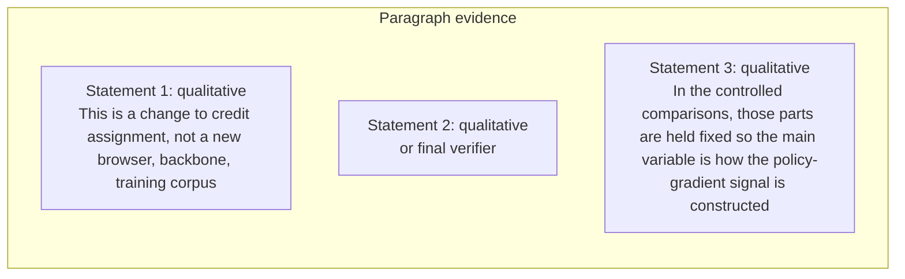

#### Python

```python
from html import escape
from pathlib import Path
from textwrap import wrap

title = "trace_change_p2: Optional changed-versus-unchanged claim boundary — Tested-versus-unestablished panels"
rows = [["Paragraph evidence","Statement 1","qualitative","This is a change to credit assignment, not a new browser, backbone, training corpus"],["Paragraph evidence","Statement 2","qualitative","or final verifier"],["Paragraph evidence","Statement 3","qualitative","In the controlled comparisons, those parts are held fixed so the main variable is how the policy-gradient signal is constructed"]]
groups = {}
for group, label, value, condition in rows:
    groups.setdefault(group, []).append((label, value, condition))
width = max(900, len(groups) * 360)
height = 220 + max((len(items) for items in groups.values()), default=1) * 92
parts = [
    f'<svg xmlns="http://www.w3.org/2000/svg" viewBox="0 0 {width} {height}" role="img" aria-labelledby="title desc">',
    f'<title id="title">{escape(title)}</title>',
    '<desc id="desc">Separate panels preserve grouping and prevent unrelated conditions from reading as one sequence.</desc>',
    f'<rect width="{width}" height="{height}" fill="white"/>',
]
for group_index, (group, items) in enumerate(groups.items()):
    x = 180 + group_index * 360
    parts.append(f'<text x="{x}" y="65" text-anchor="middle" font-family="sans-serif" font-size="16" font-weight="700">{escape(group)}</text>')
    for item_index, (label, value, condition) in enumerate(items):
        y = 120 + item_index * 92
        parts.append(f'<rect x="{x-160}" y="{y-30}" width="320" height="78" rx="12" fill="#f7fbff" stroke="#ccd"/>')
        text = f"{label}: {value} — {condition}"
        for line_index, line in enumerate(wrap(text, width=46)):
            parts.append(f'<text x="{x}" y="{y-6+line_index*14}" text-anchor="middle" font-family="sans-serif" font-size="11">{escape(line)}</text>')
parts.append('</svg>')
Path("trace_change_p2_treatment_a.svg").write_text("\n".join(parts), encoding="utf-8")
```

### Treatment B — Optional changed-versus-unchanged claim boundary — Scope ledger

- Teaching purpose: Optional contingency only. Make each condition and missing evidence item visible.
- Encoding and reading order: Render 3 rows with explicit `Group`, `Measure or state`, `Visible value`, and `Condition or boundary` columns. The value column must be visible, not only present in ARIA text or fallback prose.
- Evidence and limitations: Encode only `trace_claim_credit`, `trace_claim_outcome_anchor`, `trace_claim_controlled_setup` from `trace_source_method`, `trace_source_experiments`. Do not imply a measured effect or architecture not stated in this paragraph.
- Recommended web medium: semantic HTML/CSS table with SVG export; JavaScript is optional only for meaningful focus, drill-down, or state playback.
- Mobile, accessibility, and motion behavior: Preserve the same group and node order in the DOM; retain all values and relation labels as selectable text; stack panels or levels below 640px; provide keyboard access for any optional focus state; keep a complete static fallback; respect reduced motion and never encode information only through animation.

#### TikZ

```tex
\documentclass[tikz,border=5pt]{standalone}
\usepackage[T1]{fontenc}
\usepackage{array}
\usepackage{tikz}
\begin{document}
\begin{tikzpicture}[font=\sffamily]
\node[align=center] {\textbf{trace\_change\_p2: Optional changed-versus-unchanged claim boundary - Scope ledger}\\[6pt]
\begin{tabular}{p{3.2cm}p{4.0cm}p{2.8cm}p{6.2cm}}
\textbf{Group} & \textbf{Measure or state} & \textbf{Visible value} & \textbf{Condition or boundary} \\ \hline
Paragraph evidence & Statement 1 & qualitative & This is a change to credit assignment, not a new browser, backbone, training corpus \\
Paragraph evidence & Statement 2 & qualitative & or final verifier \\
Paragraph evidence & Statement 3 & qualitative & In the controlled comparisons, those parts are held fixed so the main variable is how the policy-gradient signal is constructed \\
\end{tabular}};
\end{tikzpicture}
\end{document}
```

#### Mermaid

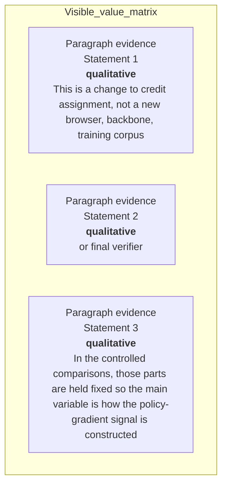

#### Python

```python
from html import escape
from pathlib import Path
from textwrap import wrap

title = "trace_change_p2: Optional changed-versus-unchanged claim boundary — Scope ledger"
rows = [["Paragraph evidence","Statement 1","qualitative","This is a change to credit assignment, not a new browser, backbone, training corpus"],["Paragraph evidence","Statement 2","qualitative","or final verifier"],["Paragraph evidence","Statement 3","qualitative","In the controlled comparisons, those parts are held fixed so the main variable is how the policy-gradient signal is constructed"]]
height = 414
parts = [
    f'<svg xmlns="http://www.w3.org/2000/svg" viewBox="0 0 1200 {height}" role="img" aria-labelledby="title desc">',
    f'<title id="title">{escape(title)}</title>',
    '<desc id="desc">Every reported value is visible beside its condition and group.</desc>',
    f'<rect width="1200" height="{height}" fill="white"/>',
]
headers = ["Group", "Measure or state", "Visible value", "Condition or boundary"]
xs = [30, 260, 590, 770]
for x, header in zip(xs, headers):
    parts.append(f'<text x="{x}" y="70" font-family="sans-serif" font-size="16" font-weight="700">{escape(header)}</text>')
for row_index, row in enumerate(rows):
    y = 110 + row_index * 88
    parts.append(f'<rect x="20" y="{y-28}" width="1160" height="76" fill="#f7fbff" stroke="#ccd"/>')
    for x, cell, width in zip(xs, row, [26, 38, 20, 58]):
        for line_index, line in enumerate(wrap(str(cell), width=width)):
            parts.append(f'<text x="{x}" y="{y+line_index*14}" font-family="sans-serif" font-size="11">{escape(line)}</text>')
parts.append('</svg>')
Path("trace_change_p2_treatment_b.svg").write_text("\n".join(parts), encoding="utf-8")
```

### Treatment C — Optional changed-versus-unchanged claim boundary — Annotated boundary map

- Teaching purpose: Optional contingency only. Connect a claim only to the qualification that bounds it.
- Encoding and reading order: Use 3 named nodes and 2 explicit labeled relations. Preserve all branch, merge, hierarchy, loop, or sequence edges shown in the code; changing them is an evidence deviation.
- Evidence and limitations: Encode only `trace_claim_credit`, `trace_claim_outcome_anchor`, `trace_claim_controlled_setup` from `trace_source_method`, `trace_source_experiments`. Do not imply a measured effect or architecture not stated in this paragraph.
- Recommended web medium: responsive inline SVG with semantic HTML/CSS fallback; JavaScript is optional only for meaningful focus, drill-down, or state playback.
- Mobile, accessibility, and motion behavior: Preserve the same group and node order in the DOM; retain all values and relation labels as selectable text; stack panels or levels below 640px; provide keyboard access for any optional focus state; keep a complete static fallback; respect reduced motion and never encode information only through animation.

#### TikZ

```tex
\documentclass[tikz,border=5pt]{standalone}
\usepackage[T1]{fontenc}
\usepackage{tikz}
\usetikzlibrary{arrows.meta}
\begin{document}
\begin{tikzpicture}[font=\sffamily,box/.style={draw,rounded corners,align=center,text width=3cm,minimum height=1.2cm},link/.style={-{Latex[length=2mm]},thick},rel/.style={fill=white,font=\scriptsize}]
\node[font=\bfseries,anchor=west] at (0,0.8) {trace\_change\_p2: Optional changed-versus-unchanged claim boundary - Annotated boundary map};
\node[box] (n1) at (1.00,-1.50) {This is a change to credit assignment, not a new browser, backbone, training corpus};
\node[box] (n2) at (2.50,-1.50) {or final verifier};
\node[box] (n3) at (4.00,-1.50) {In the controlled comparisons, those parts are held fixed so the main variable is how the policy-gradient signal is constructed};
\draw[link] (n1) -- node[rel] {then} (n2);
\draw[link] (n2) -- node[rel] {then} (n3);
\end{tikzpicture}
\end{document}
```

#### Mermaid

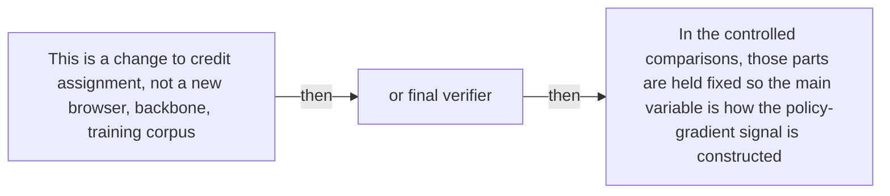

#### Python

```python
from html import escape
from pathlib import Path
from textwrap import wrap

title = "trace_change_p2: Optional changed-versus-unchanged claim boundary — Annotated boundary map"
nodes = [["n1","This is a change to credit assignment, not a new browser, backbone, training corpus",100,150],["n2","or final verifier",250,150],["n3","In the controlled comparisons, those parts are held fixed so the main variable is how the policy-gradient signal is constructed",400,150]]
edges = [["n1","n2","then"],["n2","n3","then"]]
node_by_id = {node_id: (label, x, y) for node_id, label, x, y in nodes}
width = max(900, max((x for _, _, x, _ in nodes), default=800) + 180)
height = max(500, max((y for _, _, _, y in nodes), default=400) + 140)
parts = [
    f'<svg xmlns="http://www.w3.org/2000/svg" viewBox="0 0 {width} {height}" role="img" aria-labelledby="title desc">',
    f'<title id="title">{escape(title)}</title>',
    '<desc id="desc">Edges and convergence points encode only relationships stated in the scoped paragraphs.</desc>',
    f'<rect width="{width}" height="{height}" fill="white"/>',
]
for source, target, relation in edges:
    _, x1, y1 = node_by_id[source]
    _, x2, y2 = node_by_id[target]
    parts.append(f'<line x1="{x1}" y1="{y1}" x2="{x2}" y2="{y2}" stroke="#345" stroke-width="2"/>')
    parts.append(f'<text x="{(x1+x2)/2}" y="{(y1+y2)/2-5}" text-anchor="middle" font-family="sans-serif" font-size="10">{escape(relation)}</text>')
for _, label, x, y in nodes:
    parts.append(f'<rect x="{x-78}" y="{y-42}" width="156" height="84" rx="12" fill="#eef6ff" stroke="#234"/>')
    for line_index, line in enumerate(wrap(label, width=22)):
        parts.append(f'<text x="{x}" y="{y-24+line_index*13}" text-anchor="middle" font-family="sans-serif" font-size="10">{escape(line)}</text>')
parts.append('</svg>')
Path("trace_change_p2_treatment_c.svg").write_text("\n".join(parts), encoding="utf-8")
```

### Implementation record

- Status: `NOT_NEEDED`
- Selected treatment: `NONE`
- Selection rationale: The engineer marked this paragraph prose-only, so the implementation intentionally leaves `trace_change_p2` without a figure.
- Delivery medium: `NONE`
- Visual ID and placement: `NONE`; prose remains at `#trace_change_p2`.
- Shared paragraph scope: `NONE`
- Changed files: `NONE`
- Accessibility and fallback verification: The paragraph remains semantic text and does not rely on visual or motion-only information.
- Desktop and mobile verification: Verified in Playwright on desktop and mobile; no figure is attached to this prose-only paragraph.
- Evidence deviations: `NONE`

## `trace_mechanism_p1`

- Location: `trace_mechanism`, paragraph 1
- Text anchor: "TRACE first splits a rollout after each tool action and returned observation."
- Claims and sources: `trace_claim_prefix_probe` (OBSERVED, VERIFIED); `trace_claim_td` (OBSERVED, VERIFIED); `trace_claim_telescope` (OBSERVED, VERIFIED); `trace_claim_outcome_anchor` (OBSERVED, VERIFIED); `trace_source_method` (Sections 3.1–3.3, Equations 4–12, Algorithm 1)
- Visual needed: `YES`
- Decision rationale: A visual passes the removal test because readers must reconstruct prefix probe, normalized value, temporal-difference credit, propagation, and outcome anchor while preserving the paragraph's conditions and boundaries. Revision 3 narrows the topology and placement so no visual can claim this paragraph without encoding its mechanism, grouping, or values.
- Explanatory job: Prefix probe, normalized value, temporal-difference credit, propagation, and outcome anchor.
- Recommended scope and placement: Shared scope `trace_mechanism_p1`, `trace_mechanism_p2`, `trace_mechanism_p3` is allowed only when one visual encodes every listed mechanism, condition, and value; place it immediately after the final paragraph, `trace_mechanism_p3`. Otherwise split the visual by paragraph.
- QA-informed planning change: A shared visual belongs after the third mechanism paragraph and must preserve the exact one-step telescoping guarantee separately from propagated credit.

### Treatment A — Prefix probe, normalized value, temporal-difference credit, propagation, and outcome anchor — Operation flow

- Teaching purpose: Show the source-supported order and branch boundaries.
- Encoding and reading order: Use 7 named nodes and 7 explicit labeled relations. Preserve all branch, merge, hierarchy, loop, or sequence edges shown in the code; changing them is an evidence deviation.
- Evidence and limitations: Encode only `trace_claim_prefix_probe`, `trace_claim_td`, `trace_claim_telescope`, `trace_claim_outcome_anchor` from `trace_source_method`. A shared visual belongs after the third mechanism paragraph and must preserve the exact one-step telescoping guarantee separately from propagated credit.
- Recommended web medium: responsive inline SVG with semantic HTML/CSS fallback; JavaScript is optional only for meaningful focus, drill-down, or state playback.
- Mobile, accessibility, and motion behavior: Preserve the same group and node order in the DOM; retain all values and relation labels as selectable text; stack panels or levels below 640px; provide keyboard access for any optional focus state; keep a complete static fallback; respect reduced motion and never encode information only through animation.

#### TikZ

```tex
\documentclass[tikz,border=5pt]{standalone}
\usepackage[T1]{fontenc}
\usepackage{tikz}
\usetikzlibrary{arrows.meta}
\begin{document}
\begin{tikzpicture}[font=\sffamily,box/.style={draw,rounded corners,align=center,text width=3cm,minimum height=1.2cm},link/.style={-{Latex[length=2mm]},thick},rel/.style={fill=white,font=\scriptsize}]
\node[font=\bfseries,anchor=west] at (0,0.8) {trace\_mechanism\_p1: Prefix probe, normalized value, temporal-difference credit, propagation, and outcome anchor - Operation flow};
\node[box] (prefix) at (1.00,-1.50) {Split transcript after each tool observation};
\node[box] (probe) at (2.50,-1.50) {Frozen initial policy scores gold answer};
\node[box] (value) at (4.00,-1.50) {Normalize relative closure of answer-likelihood gap};
\node[box] (td) at (5.50,-1.50) {Subtract adjacent values for one-step credit};
\node[box] (telescope) at (7.00,-1.50) {One-step credits telescope};
\node[box] (prop) at (8.50,-1.50) {Short look-ahead propagates delayed effects};
\node[box] (outcome) at (10.00,-1.50) {Combine local credit with final GRPO advantage};
\draw[link] (prefix) -- node[rel] {each prefix} (probe);
\draw[link] (probe) -- node[rel] {average log probability} (value);
\draw[link] (value) -- node[rel] {difference} (td);
\draw[link] (td) -- node[rel] {one-step sum} (telescope);
\draw[link] (td) -- node[rel] {reported extension} (prop);
\draw[link] (prop) -- node[rel] {combine} (outcome);
\draw[link] (telescope) -- node[rel] {guarantee applies only here} (outcome);
\end{tikzpicture}
\end{document}
```

#### Mermaid

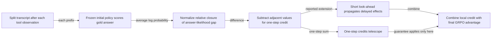

#### Python

```python
from html import escape
from pathlib import Path
from textwrap import wrap

title = "trace_mechanism_p1: Prefix probe, normalized value, temporal-difference credit, propagation, and outcome anchor — Operation flow"
nodes = [["prefix","Split transcript after each tool observation",100,150],["probe","Frozen initial policy scores gold answer",250,150],["value","Normalize relative closure of answer-likelihood gap",400,150],["td","Subtract adjacent values for one-step credit",550,150],["telescope","One-step credits telescope",700,150],["prop","Short look-ahead propagates delayed effects",850,150],["outcome","Combine local credit with final GRPO advantage",1000,150]]
edges = [["prefix","probe","each prefix"],["probe","value","average log probability"],["value","td","difference"],["td","telescope","one-step sum"],["td","prop","reported extension"],["prop","outcome","combine"],["telescope","outcome","guarantee applies only here"]]
node_by_id = {node_id: (label, x, y) for node_id, label, x, y in nodes}
width = max(900, max((x for _, _, x, _ in nodes), default=800) + 180)
height = max(500, max((y for _, _, _, y in nodes), default=400) + 140)
parts = [
    f'<svg xmlns="http://www.w3.org/2000/svg" viewBox="0 0 {width} {height}" role="img" aria-labelledby="title desc">',
    f'<title id="title">{escape(title)}</title>',
    '<desc id="desc">Edges and convergence points encode only relationships stated in the scoped paragraphs.</desc>',
    f'<rect width="{width}" height="{height}" fill="white"/>',
]
for source, target, relation in edges:
    _, x1, y1 = node_by_id[source]
    _, x2, y2 = node_by_id[target]
    parts.append(f'<line x1="{x1}" y1="{y1}" x2="{x2}" y2="{y2}" stroke="#345" stroke-width="2"/>')
    parts.append(f'<text x="{(x1+x2)/2}" y="{(y1+y2)/2-5}" text-anchor="middle" font-family="sans-serif" font-size="10">{escape(relation)}</text>')
for _, label, x, y in nodes:
    parts.append(f'<rect x="{x-78}" y="{y-42}" width="156" height="84" rx="12" fill="#eef6ff" stroke="#234"/>')
    for line_index, line in enumerate(wrap(label, width=22)):
        parts.append(f'<text x="{x}" y="{y-24+line_index*13}" text-anchor="middle" font-family="sans-serif" font-size="10">{escape(line)}</text>')
parts.append('</svg>')
Path("trace_mechanism_p1_treatment_a.svg").write_text("\n".join(parts), encoding="utf-8")
```

### Treatment B — Prefix probe, normalized value, temporal-difference credit, propagation, and outcome anchor — Input-operation-output ledger

- Teaching purpose: Make inputs, operations, outputs, and limits inspectable as columns.
- Encoding and reading order: Render 6 rows with explicit `Group`, `Measure or state`, `Visible value`, and `Condition or boundary` columns. The value column must be visible, not only present in ARIA text or fallback prose.
- Evidence and limitations: Encode only `trace_claim_prefix_probe`, `trace_claim_td`, `trace_claim_telescope`, `trace_claim_outcome_anchor` from `trace_source_method`. A shared visual belongs after the third mechanism paragraph and must preserve the exact one-step telescoping guarantee separately from propagated credit.
- Recommended web medium: semantic HTML/CSS table with SVG export; JavaScript is optional only for meaningful focus, drill-down, or state playback.
- Mobile, accessibility, and motion behavior: Preserve the same group and node order in the DOM; retain all values and relation labels as selectable text; stack panels or levels below 640px; provide keyboard access for any optional focus state; keep a complete static fallback; respect reduced motion and never encode information only through animation.

#### TikZ

```tex
\documentclass[tikz,border=5pt]{standalone}
\usepackage[T1]{fontenc}
\usepackage{array}
\usepackage{tikz}
\begin{document}
\begin{tikzpicture}[font=\sffamily]
\node[align=center] {\textbf{trace\_mechanism\_p1: Prefix probe, normalized value, temporal-difference credit, propagation, and outcome anchor - Input-operation-output ledger}\\[6pt]
\begin{tabular}{p{3.2cm}p{4.0cm}p{2.8cm}p{6.2cm}}
\textbf{Group} & \textbf{Measure or state} & \textbf{Visible value} & \textbf{Condition or boundary} \\ \hline
TRACE compares adjacent trajectory states & State after each tool observation & qualitative & Split the rollout at tool boundaries so each prefix records what the agent has seen up to that interaction. \\
TRACE compares adjacent trajectory states & Probe every prefix with one frozen model & qualitative & A frozen copy of the initial policy scores the average log-probability of the same known gold answer from every prefix. \\
TRACE compares adjacent trajectory states & Convert each score into a state value & qualitative & The log-ratio value represents how much of the initial answer-likelihood gap the current prefix has closed. \\
TRACE compares adjacent trajectory states & Subtract adjacent values & qualitative & The change from one prefix value to the next is the one-step temporal-difference credit: positive, zero, or negative measured progress. \\
TRACE compares adjacent trajectory states & Propagate some delayed effects & qualitative & The reported objective adds a short look-ahead, while the exact telescoping guarantee remains specific to the one-step credits. \\
TRACE compares adjacent trajectory states & Join local credit with the outcome advantage & qualitative & Local credit is combined with GRPO's final-answer advantage, so a helpful intermediate step does not redefine an incorrect final answer as success. \\
\end{tabular}};
\end{tikzpicture}
\end{document}
```

#### Mermaid

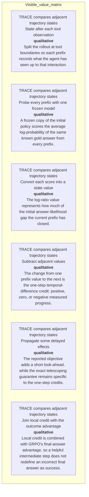

#### Python

```python
from html import escape
from pathlib import Path
from textwrap import wrap

title = "trace_mechanism_p1: Prefix probe, normalized value, temporal-difference credit, propagation, and outcome anchor — Input-operation-output ledger"
rows = [["TRACE compares adjacent trajectory states","State after each tool observation","qualitative","Split the rollout at tool boundaries so each prefix records what the agent has seen up to that interaction."],["TRACE compares adjacent trajectory states","Probe every prefix with one frozen model","qualitative","A frozen copy of the initial policy scores the average log-probability of the same known gold answer from every prefix."],["TRACE compares adjacent trajectory states","Convert each score into a state value","qualitative","The log-ratio value represents how much of the initial answer-likelihood gap the current prefix has closed."],["TRACE compares adjacent trajectory states","Subtract adjacent values","qualitative","The change from one prefix value to the next is the one-step temporal-difference credit: positive, zero, or negative measured progress."],["TRACE compares adjacent trajectory states","Propagate some delayed effects","qualitative","The reported objective adds a short look-ahead, while the exact telescoping guarantee remains specific to the one-step credits."],["TRACE compares adjacent trajectory states","Join local credit with the outcome advantage","qualitative","Local credit is combined with GRPO's final-answer advantage, so a helpful intermediate step does not redefine an incorrect final answer as success."]]
height = 678
parts = [
    f'<svg xmlns="http://www.w3.org/2000/svg" viewBox="0 0 1200 {height}" role="img" aria-labelledby="title desc">',
    f'<title id="title">{escape(title)}</title>',
    '<desc id="desc">Every reported value is visible beside its condition and group.</desc>',
    f'<rect width="1200" height="{height}" fill="white"/>',
]
headers = ["Group", "Measure or state", "Visible value", "Condition or boundary"]
xs = [30, 260, 590, 770]
for x, header in zip(xs, headers):
    parts.append(f'<text x="{x}" y="70" font-family="sans-serif" font-size="16" font-weight="700">{escape(header)}</text>')
for row_index, row in enumerate(rows):
    y = 110 + row_index * 88
    parts.append(f'<rect x="20" y="{y-28}" width="1160" height="76" fill="#f7fbff" stroke="#ccd"/>')
    for x, cell, width in zip(xs, row, [26, 38, 20, 58]):
        for line_index, line in enumerate(wrap(str(cell), width=width)):
            parts.append(f'<text x="{x}" y="{y+line_index*14}" font-family="sans-serif" font-size="11">{escape(line)}</text>')
parts.append('</svg>')
Path("trace_mechanism_p1_treatment_b.svg").write_text("\n".join(parts), encoding="utf-8")
```

### Treatment C — Prefix probe, normalized value, temporal-difference credit, propagation, and outcome anchor — State-transition walkthrough

- Teaching purpose: Follow the described state changes without inventing timing.
- Encoding and reading order: Use 7 named nodes and 7 explicit labeled relations. Preserve all branch, merge, hierarchy, loop, or sequence edges shown in the code; changing them is an evidence deviation.
- Evidence and limitations: Encode only `trace_claim_prefix_probe`, `trace_claim_td`, `trace_claim_telescope`, `trace_claim_outcome_anchor` from `trace_source_method`. A shared visual belongs after the third mechanism paragraph and must preserve the exact one-step telescoping guarantee separately from propagated credit.
- Recommended web medium: responsive inline SVG with semantic HTML/CSS fallback; JavaScript is optional only for meaningful focus, drill-down, or state playback.
- Mobile, accessibility, and motion behavior: Preserve the same group and node order in the DOM; retain all values and relation labels as selectable text; stack panels or levels below 640px; provide keyboard access for any optional focus state; keep a complete static fallback; respect reduced motion and never encode information only through animation.

#### TikZ

```tex
\documentclass[tikz,border=5pt]{standalone}
\usepackage[T1]{fontenc}
\usepackage{tikz}
\usetikzlibrary{arrows.meta}
\begin{document}
\begin{tikzpicture}[font=\sffamily,box/.style={draw,rounded corners,align=center,text width=3cm,minimum height=1.2cm},link/.style={-{Latex[length=2mm]},thick},rel/.style={fill=white,font=\scriptsize}]
\node[font=\bfseries,anchor=west] at (0,0.8) {trace\_mechanism\_p1: Prefix probe, normalized value, temporal-difference credit, propagation, and outcome anchor - State-transition walkthrough};
\node[box] (prefix) at (1.00,-1.50) {Split transcript after each tool observation};
\node[box] (probe) at (2.50,-1.50) {Frozen initial policy scores gold answer};
\node[box] (value) at (4.00,-1.50) {Normalize relative closure of answer-likelihood gap};
\node[box] (td) at (5.50,-1.50) {Subtract adjacent values for one-step credit};
\node[box] (telescope) at (7.00,-1.50) {One-step credits telescope};
\node[box] (prop) at (8.50,-1.50) {Short look-ahead propagates delayed effects};
\node[box] (outcome) at (10.00,-1.50) {Combine local credit with final GRPO advantage};
\draw[link] (prefix) -- node[rel] {each prefix} (probe);
\draw[link] (probe) -- node[rel] {average log probability} (value);
\draw[link] (value) -- node[rel] {difference} (td);
\draw[link] (td) -- node[rel] {one-step sum} (telescope);
\draw[link] (td) -- node[rel] {reported extension} (prop);
\draw[link] (prop) -- node[rel] {combine} (outcome);
\draw[link] (telescope) -- node[rel] {guarantee applies only here} (outcome);
\end{tikzpicture}
\end{document}
```

#### Mermaid


#### Python

```python
from html import escape
from pathlib import Path
from textwrap import wrap

title = "trace_mechanism_p1: Prefix probe, normalized value, temporal-difference credit, propagation, and outcome anchor — State-transition walkthrough"
nodes = [["prefix","Split transcript after each tool observation",100,150],["probe","Frozen initial policy scores gold answer",250,150],["value","Normalize relative closure of answer-likelihood gap",400,150],["td","Subtract adjacent values for one-step credit",550,150],["telescope","One-step credits telescope",700,150],["prop","Short look-ahead propagates delayed effects",850,150],["outcome","Combine local credit with final GRPO advantage",1000,150]]
edges = [["prefix","probe","each prefix"],["probe","value","average log probability"],["value","td","difference"],["td","telescope","one-step sum"],["td","prop","reported extension"],["prop","outcome","combine"],["telescope","outcome","guarantee applies only here"]]
node_by_id = {node_id: (label, x, y) for node_id, label, x, y in nodes}
width = max(900, max((x for _, _, x, _ in nodes), default=800) + 180)
height = max(500, max((y for _, _, _, y in nodes), default=400) + 140)
parts = [
    f'<svg xmlns="http://www.w3.org/2000/svg" viewBox="0 0 {width} {height}" role="img" aria-labelledby="title desc">',
    f'<title id="title">{escape(title)}</title>',
    '<desc id="desc">Edges and convergence points encode only relationships stated in the scoped paragraphs.</desc>',
    f'<rect width="{width}" height="{height}" fill="white"/>',
]
for source, target, relation in edges:
    _, x1, y1 = node_by_id[source]
    _, x2, y2 = node_by_id[target]
    parts.append(f'<line x1="{x1}" y1="{y1}" x2="{x2}" y2="{y2}" stroke="#345" stroke-width="2"/>')
    parts.append(f'<text x="{(x1+x2)/2}" y="{(y1+y2)/2-5}" text-anchor="middle" font-family="sans-serif" font-size="10">{escape(relation)}</text>')
for _, label, x, y in nodes:
    parts.append(f'<rect x="{x-78}" y="{y-42}" width="156" height="84" rx="12" fill="#eef6ff" stroke="#234"/>')
    for line_index, line in enumerate(wrap(label, width=22)):
        parts.append(f'<text x="{x}" y="{y-24+line_index*13}" text-anchor="middle" font-family="sans-serif" font-size="10">{escape(line)}</text>')
parts.append('</svg>')
Path("trace_mechanism_p1_treatment_c.svg").write_text("\n".join(parts), encoding="utf-8")
```

### Implementation record

- Status: `IMPLEMENTED`
- Selected treatment: `A`
- Selection rationale: Selected the approved relationship that directly answers this paragraph's explanatory job; the shared visual uses the same evidence and complete adjacent scope recorded here.
- Delivery medium: `CSS + semantic HTML`
- Visual ID and placement: `trace_visual_credit_flow` after `trace_mechanism_p3`; this record is served by that purpose-built figure.
- Shared paragraph scope: `trace_mechanism_p1`, `trace_mechanism_p2`, `trace_mechanism_p3`
- Changed files: `packages/test-fixtures/explainers/trace.json`, `apps/web/app/papers/[id]/explainer-visual.tsx`, `apps/web/app/papers/[id]/page.tsx`, and `apps/web/app/globals.css`
- Accessibility and fallback verification: Figure has a programmatic title and description, explicit alt text, equivalent fallback prose, source links, limitations, and a semantic static body; no meaning depends on motion or pointer input.
- Desktop and mobile verification: Verified in Playwright on 1440-pixel desktop and iPhone 13 mobile viewports; figures remain paragraph-adjacent, preserve reading order, and introduce no horizontal page overflow.
- Evidence deviations: `NONE`; web-native CSS and semantic HTML preserve the selected treatment's evidence, labels, topology, and stated boundaries.

## `trace_mechanism_p2`

- Location: `trace_mechanism`, paragraph 2
- Text anchor: "The raw answer score is converted into a log-ratio value representing relative closure of the initial answer-likelihood gap."
- Claims and sources: `trace_claim_prefix_probe` (OBSERVED, VERIFIED); `trace_claim_td` (OBSERVED, VERIFIED); `trace_claim_telescope` (OBSERVED, VERIFIED); `trace_claim_outcome_anchor` (OBSERVED, VERIFIED); `trace_source_method` (Sections 3.1–3.3, Equations 4–12, Algorithm 1)
- Visual needed: `YES`
- Decision rationale: A visual passes the removal test because readers must reconstruct prefix probe, normalized value, temporal-difference credit, propagation, and outcome anchor while preserving the paragraph's conditions and boundaries. Revision 3 narrows the topology and placement so no visual can claim this paragraph without encoding its mechanism, grouping, or values.
- Explanatory job: Prefix probe, normalized value, temporal-difference credit, propagation, and outcome anchor.
- Recommended scope and placement: Shared scope `trace_mechanism_p1`, `trace_mechanism_p2`, `trace_mechanism_p3` is allowed only when one visual encodes every listed mechanism, condition, and value; place it immediately after the final paragraph, `trace_mechanism_p3`. Otherwise split the visual by paragraph.
- QA-informed planning change: A shared visual belongs after the third mechanism paragraph and must preserve the exact one-step telescoping guarantee separately from propagated credit.

### Treatment A — Prefix probe, normalized value, temporal-difference credit, propagation, and outcome anchor — Operation flow

- Teaching purpose: Show the source-supported order and branch boundaries.
- Encoding and reading order: Use 7 named nodes and 7 explicit labeled relations. Preserve all branch, merge, hierarchy, loop, or sequence edges shown in the code; changing them is an evidence deviation.
- Evidence and limitations: Encode only `trace_claim_prefix_probe`, `trace_claim_td`, `trace_claim_telescope`, `trace_claim_outcome_anchor` from `trace_source_method`. A shared visual belongs after the third mechanism paragraph and must preserve the exact one-step telescoping guarantee separately from propagated credit.
- Recommended web medium: responsive inline SVG with semantic HTML/CSS fallback; JavaScript is optional only for meaningful focus, drill-down, or state playback.
- Mobile, accessibility, and motion behavior: Preserve the same group and node order in the DOM; retain all values and relation labels as selectable text; stack panels or levels below 640px; provide keyboard access for any optional focus state; keep a complete static fallback; respect reduced motion and never encode information only through animation.

#### TikZ

```tex
\documentclass[tikz,border=5pt]{standalone}
\usepackage[T1]{fontenc}
\usepackage{tikz}
\usetikzlibrary{arrows.meta}
\begin{document}
\begin{tikzpicture}[font=\sffamily,box/.style={draw,rounded corners,align=center,text width=3cm,minimum height=1.2cm},link/.style={-{Latex[length=2mm]},thick},rel/.style={fill=white,font=\scriptsize}]
\node[font=\bfseries,anchor=west] at (0,0.8) {trace\_mechanism\_p2: Prefix probe, normalized value, temporal-difference credit, propagation, and outcome anchor - Operation flow};
\node[box] (prefix) at (1.00,-1.50) {Split transcript after each tool observation};
\node[box] (probe) at (2.50,-1.50) {Frozen initial policy scores gold answer};
\node[box] (value) at (4.00,-1.50) {Normalize relative closure of answer-likelihood gap};
\node[box] (td) at (5.50,-1.50) {Subtract adjacent values for one-step credit};
\node[box] (telescope) at (7.00,-1.50) {One-step credits telescope};
\node[box] (prop) at (8.50,-1.50) {Short look-ahead propagates delayed effects};
\node[box] (outcome) at (10.00,-1.50) {Combine local credit with final GRPO advantage};
\draw[link] (prefix) -- node[rel] {each prefix} (probe);
\draw[link] (probe) -- node[rel] {average log probability} (value);
\draw[link] (value) -- node[rel] {difference} (td);
\draw[link] (td) -- node[rel] {one-step sum} (telescope);
\draw[link] (td) -- node[rel] {reported extension} (prop);
\draw[link] (prop) -- node[rel] {combine} (outcome);
\draw[link] (telescope) -- node[rel] {guarantee applies only here} (outcome);
\end{tikzpicture}
\end{document}
```

#### Mermaid


#### Python

```python
from html import escape
from pathlib import Path
from textwrap import wrap

title = "trace_mechanism_p2: Prefix probe, normalized value, temporal-difference credit, propagation, and outcome anchor — Operation flow"
nodes = [["prefix","Split transcript after each tool observation",100,150],["probe","Frozen initial policy scores gold answer",250,150],["value","Normalize relative closure of answer-likelihood gap",400,150],["td","Subtract adjacent values for one-step credit",550,150],["telescope","One-step credits telescope",700,150],["prop","Short look-ahead propagates delayed effects",850,150],["outcome","Combine local credit with final GRPO advantage",1000,150]]
edges = [["prefix","probe","each prefix"],["probe","value","average log probability"],["value","td","difference"],["td","telescope","one-step sum"],["td","prop","reported extension"],["prop","outcome","combine"],["telescope","outcome","guarantee applies only here"]]
node_by_id = {node_id: (label, x, y) for node_id, label, x, y in nodes}
width = max(900, max((x for _, _, x, _ in nodes), default=800) + 180)
height = max(500, max((y for _, _, _, y in nodes), default=400) + 140)
parts = [
    f'<svg xmlns="http://www.w3.org/2000/svg" viewBox="0 0 {width} {height}" role="img" aria-labelledby="title desc">',
    f'<title id="title">{escape(title)}</title>',
    '<desc id="desc">Edges and convergence points encode only relationships stated in the scoped paragraphs.</desc>',
    f'<rect width="{width}" height="{height}" fill="white"/>',
]
for source, target, relation in edges:
    _, x1, y1 = node_by_id[source]
    _, x2, y2 = node_by_id[target]
    parts.append(f'<line x1="{x1}" y1="{y1}" x2="{x2}" y2="{y2}" stroke="#345" stroke-width="2"/>')
    parts.append(f'<text x="{(x1+x2)/2}" y="{(y1+y2)/2-5}" text-anchor="middle" font-family="sans-serif" font-size="10">{escape(relation)}</text>')
for _, label, x, y in nodes:
    parts.append(f'<rect x="{x-78}" y="{y-42}" width="156" height="84" rx="12" fill="#eef6ff" stroke="#234"/>')
    for line_index, line in enumerate(wrap(label, width=22)):
        parts.append(f'<text x="{x}" y="{y-24+line_index*13}" text-anchor="middle" font-family="sans-serif" font-size="10">{escape(line)}</text>')
parts.append('</svg>')
Path("trace_mechanism_p2_treatment_a.svg").write_text("\n".join(parts), encoding="utf-8")
```

### Treatment B — Prefix probe, normalized value, temporal-difference credit, propagation, and outcome anchor — Input-operation-output ledger

- Teaching purpose: Make inputs, operations, outputs, and limits inspectable as columns.
- Encoding and reading order: Render 6 rows with explicit `Group`, `Measure or state`, `Visible value`, and `Condition or boundary` columns. The value column must be visible, not only present in ARIA text or fallback prose.
- Evidence and limitations: Encode only `trace_claim_prefix_probe`, `trace_claim_td`, `trace_claim_telescope`, `trace_claim_outcome_anchor` from `trace_source_method`. A shared visual belongs after the third mechanism paragraph and must preserve the exact one-step telescoping guarantee separately from propagated credit.
- Recommended web medium: semantic HTML/CSS table with SVG export; JavaScript is optional only for meaningful focus, drill-down, or state playback.
- Mobile, accessibility, and motion behavior: Preserve the same group and node order in the DOM; retain all values and relation labels as selectable text; stack panels or levels below 640px; provide keyboard access for any optional focus state; keep a complete static fallback; respect reduced motion and never encode information only through animation.

#### TikZ

```tex
\documentclass[tikz,border=5pt]{standalone}
\usepackage[T1]{fontenc}
\usepackage{array}
\usepackage{tikz}
\begin{document}
\begin{tikzpicture}[font=\sffamily]
\node[align=center] {\textbf{trace\_mechanism\_p2: Prefix probe, normalized value, temporal-difference credit, propagation, and outcome anchor - Input-operation-output ledger}\\[6pt]
\begin{tabular}{p{3.2cm}p{4.0cm}p{2.8cm}p{6.2cm}}
\textbf{Group} & \textbf{Measure or state} & \textbf{Visible value} & \textbf{Condition or boundary} \\ \hline
TRACE compares adjacent trajectory states & State after each tool observation & qualitative & Split the rollout at tool boundaries so each prefix records what the agent has seen up to that interaction. \\
TRACE compares adjacent trajectory states & Probe every prefix with one frozen model & qualitative & A frozen copy of the initial policy scores the average log-probability of the same known gold answer from every prefix. \\
TRACE compares adjacent trajectory states & Convert each score into a state value & qualitative & The log-ratio value represents how much of the initial answer-likelihood gap the current prefix has closed. \\
TRACE compares adjacent trajectory states & Subtract adjacent values & qualitative & The change from one prefix value to the next is the one-step temporal-difference credit: positive, zero, or negative measured progress. \\
TRACE compares adjacent trajectory states & Propagate some delayed effects & qualitative & The reported objective adds a short look-ahead, while the exact telescoping guarantee remains specific to the one-step credits. \\
TRACE compares adjacent trajectory states & Join local credit with the outcome advantage & qualitative & Local credit is combined with GRPO's final-answer advantage, so a helpful intermediate step does not redefine an incorrect final answer as success. \\
\end{tabular}};
\end{tikzpicture}
\end{document}
```

#### Mermaid


#### Python

```python
from html import escape
from pathlib import Path
from textwrap import wrap

title = "trace_mechanism_p2: Prefix probe, normalized value, temporal-difference credit, propagation, and outcome anchor — Input-operation-output ledger"
rows = [["TRACE compares adjacent trajectory states","State after each tool observation","qualitative","Split the rollout at tool boundaries so each prefix records what the agent has seen up to that interaction."],["TRACE compares adjacent trajectory states","Probe every prefix with one frozen model","qualitative","A frozen copy of the initial policy scores the average log-probability of the same known gold answer from every prefix."],["TRACE compares adjacent trajectory states","Convert each score into a state value","qualitative","The log-ratio value represents how much of the initial answer-likelihood gap the current prefix has closed."],["TRACE compares adjacent trajectory states","Subtract adjacent values","qualitative","The change from one prefix value to the next is the one-step temporal-difference credit: positive, zero, or negative measured progress."],["TRACE compares adjacent trajectory states","Propagate some delayed effects","qualitative","The reported objective adds a short look-ahead, while the exact telescoping guarantee remains specific to the one-step credits."],["TRACE compares adjacent trajectory states","Join local credit with the outcome advantage","qualitative","Local credit is combined with GRPO's final-answer advantage, so a helpful intermediate step does not redefine an incorrect final answer as success."]]
height = 678
parts = [
    f'<svg xmlns="http://www.w3.org/2000/svg" viewBox="0 0 1200 {height}" role="img" aria-labelledby="title desc">',
    f'<title id="title">{escape(title)}</title>',
    '<desc id="desc">Every reported value is visible beside its condition and group.</desc>',
    f'<rect width="1200" height="{height}" fill="white"/>',
]
headers = ["Group", "Measure or state", "Visible value", "Condition or boundary"]
xs = [30, 260, 590, 770]
for x, header in zip(xs, headers):
    parts.append(f'<text x="{x}" y="70" font-family="sans-serif" font-size="16" font-weight="700">{escape(header)}</text>')
for row_index, row in enumerate(rows):
    y = 110 + row_index * 88
    parts.append(f'<rect x="20" y="{y-28}" width="1160" height="76" fill="#f7fbff" stroke="#ccd"/>')
    for x, cell, width in zip(xs, row, [26, 38, 20, 58]):
        for line_index, line in enumerate(wrap(str(cell), width=width)):
            parts.append(f'<text x="{x}" y="{y+line_index*14}" font-family="sans-serif" font-size="11">{escape(line)}</text>')
parts.append('</svg>')
Path("trace_mechanism_p2_treatment_b.svg").write_text("\n".join(parts), encoding="utf-8")
```

### Treatment C — Prefix probe, normalized value, temporal-difference credit, propagation, and outcome anchor — State-transition walkthrough

- Teaching purpose: Follow the described state changes without inventing timing.
- Encoding and reading order: Use 7 named nodes and 7 explicit labeled relations. Preserve all branch, merge, hierarchy, loop, or sequence edges shown in the code; changing them is an evidence deviation.
- Evidence and limitations: Encode only `trace_claim_prefix_probe`, `trace_claim_td`, `trace_claim_telescope`, `trace_claim_outcome_anchor` from `trace_source_method`. A shared visual belongs after the third mechanism paragraph and must preserve the exact one-step telescoping guarantee separately from propagated credit.
- Recommended web medium: responsive inline SVG with semantic HTML/CSS fallback; JavaScript is optional only for meaningful focus, drill-down, or state playback.
- Mobile, accessibility, and motion behavior: Preserve the same group and node order in the DOM; retain all values and relation labels as selectable text; stack panels or levels below 640px; provide keyboard access for any optional focus state; keep a complete static fallback; respect reduced motion and never encode information only through animation.

#### TikZ

```tex
\documentclass[tikz,border=5pt]{standalone}
\usepackage[T1]{fontenc}
\usepackage{tikz}
\usetikzlibrary{arrows.meta}
\begin{document}
\begin{tikzpicture}[font=\sffamily,box/.style={draw,rounded corners,align=center,text width=3cm,minimum height=1.2cm},link/.style={-{Latex[length=2mm]},thick},rel/.style={fill=white,font=\scriptsize}]
\node[font=\bfseries,anchor=west] at (0,0.8) {trace\_mechanism\_p2: Prefix probe, normalized value, temporal-difference credit, propagation, and outcome anchor - State-transition walkthrough};
\node[box] (prefix) at (1.00,-1.50) {Split transcript after each tool observation};
\node[box] (probe) at (2.50,-1.50) {Frozen initial policy scores gold answer};
\node[box] (value) at (4.00,-1.50) {Normalize relative closure of answer-likelihood gap};
\node[box] (td) at (5.50,-1.50) {Subtract adjacent values for one-step credit};
\node[box] (telescope) at (7.00,-1.50) {One-step credits telescope};
\node[box] (prop) at (8.50,-1.50) {Short look-ahead propagates delayed effects};
\node[box] (outcome) at (10.00,-1.50) {Combine local credit with final GRPO advantage};
\draw[link] (prefix) -- node[rel] {each prefix} (probe);
\draw[link] (probe) -- node[rel] {average log probability} (value);
\draw[link] (value) -- node[rel] {difference} (td);
\draw[link] (td) -- node[rel] {one-step sum} (telescope);
\draw[link] (td) -- node[rel] {reported extension} (prop);
\draw[link] (prop) -- node[rel] {combine} (outcome);
\draw[link] (telescope) -- node[rel] {guarantee applies only here} (outcome);
\end{tikzpicture}
\end{document}
```

#### Mermaid


#### Python

```python
from html import escape
from pathlib import Path
from textwrap import wrap

title = "trace_mechanism_p2: Prefix probe, normalized value, temporal-difference credit, propagation, and outcome anchor — State-transition walkthrough"
nodes = [["prefix","Split transcript after each tool observation",100,150],["probe","Frozen initial policy scores gold answer",250,150],["value","Normalize relative closure of answer-likelihood gap",400,150],["td","Subtract adjacent values for one-step credit",550,150],["telescope","One-step credits telescope",700,150],["prop","Short look-ahead propagates delayed effects",850,150],["outcome","Combine local credit with final GRPO advantage",1000,150]]
edges = [["prefix","probe","each prefix"],["probe","value","average log probability"],["value","td","difference"],["td","telescope","one-step sum"],["td","prop","reported extension"],["prop","outcome","combine"],["telescope","outcome","guarantee applies only here"]]
node_by_id = {node_id: (label, x, y) for node_id, label, x, y in nodes}
width = max(900, max((x for _, _, x, _ in nodes), default=800) + 180)
height = max(500, max((y for _, _, _, y in nodes), default=400) + 140)
parts = [
    f'<svg xmlns="http://www.w3.org/2000/svg" viewBox="0 0 {width} {height}" role="img" aria-labelledby="title desc">',
    f'<title id="title">{escape(title)}</title>',
    '<desc id="desc">Edges and convergence points encode only relationships stated in the scoped paragraphs.</desc>',
    f'<rect width="{width}" height="{height}" fill="white"/>',
]
for source, target, relation in edges:
    _, x1, y1 = node_by_id[source]
    _, x2, y2 = node_by_id[target]
    parts.append(f'<line x1="{x1}" y1="{y1}" x2="{x2}" y2="{y2}" stroke="#345" stroke-width="2"/>')
    parts.append(f'<text x="{(x1+x2)/2}" y="{(y1+y2)/2-5}" text-anchor="middle" font-family="sans-serif" font-size="10">{escape(relation)}</text>')
for _, label, x, y in nodes:
    parts.append(f'<rect x="{x-78}" y="{y-42}" width="156" height="84" rx="12" fill="#eef6ff" stroke="#234"/>')
    for line_index, line in enumerate(wrap(label, width=22)):
        parts.append(f'<text x="{x}" y="{y-24+line_index*13}" text-anchor="middle" font-family="sans-serif" font-size="10">{escape(line)}</text>')
parts.append('</svg>')
Path("trace_mechanism_p2_treatment_c.svg").write_text("\n".join(parts), encoding="utf-8")
```

### Implementation record

- Status: `IMPLEMENTED`
- Selected treatment: `A`
- Selection rationale: Selected the approved relationship that directly answers this paragraph's explanatory job; the shared visual uses the same evidence and complete adjacent scope recorded here.
- Delivery medium: `CSS + semantic HTML`
- Visual ID and placement: `trace_visual_credit_flow` after `trace_mechanism_p3`; this record is served by that purpose-built figure.
- Shared paragraph scope: `trace_mechanism_p1`, `trace_mechanism_p2`, `trace_mechanism_p3`
- Changed files: `packages/test-fixtures/explainers/trace.json`, `apps/web/app/papers/[id]/explainer-visual.tsx`, `apps/web/app/papers/[id]/page.tsx`, and `apps/web/app/globals.css`
- Accessibility and fallback verification: Figure has a programmatic title and description, explicit alt text, equivalent fallback prose, source links, limitations, and a semantic static body; no meaning depends on motion or pointer input.
- Desktop and mobile verification: Verified in Playwright on 1440-pixel desktop and iPhone 13 mobile viewports; figures remain paragraph-adjacent, preserve reading order, and introduce no horizontal page overflow.
- Evidence deviations: `NONE`; web-native CSS and semantic HTML preserve the selected treatment's evidence, labels, topology, and stated boundaries.

## `trace_mechanism_p3`

- Location: `trace_mechanism`, paragraph 3
- Text anchor: "One-step credits telescope, so inserting redundant intermediate steps cannot increase their endpoint sum."
- Claims and sources: `trace_claim_prefix_probe` (OBSERVED, VERIFIED); `trace_claim_td` (OBSERVED, VERIFIED); `trace_claim_telescope` (OBSERVED, VERIFIED); `trace_claim_outcome_anchor` (OBSERVED, VERIFIED); `trace_source_method` (Sections 3.1–3.3, Equations 4–12, Algorithm 1)
- Visual needed: `YES`
- Decision rationale: A visual passes the removal test because readers must reconstruct prefix probe, normalized value, temporal-difference credit, propagation, and outcome anchor while preserving the paragraph's conditions and boundaries. Revision 3 narrows the topology and placement so no visual can claim this paragraph without encoding its mechanism, grouping, or values.
- Explanatory job: Prefix probe, normalized value, temporal-difference credit, propagation, and outcome anchor.
- Recommended scope and placement: Shared scope `trace_mechanism_p1`, `trace_mechanism_p2`, `trace_mechanism_p3` is allowed only when one visual encodes every listed mechanism, condition, and value; place it immediately after the final paragraph, `trace_mechanism_p3`. Otherwise split the visual by paragraph.
- QA-informed planning change: A shared visual belongs after the third mechanism paragraph and must preserve the exact one-step telescoping guarantee separately from propagated credit.

### Treatment A — Prefix probe, normalized value, temporal-difference credit, propagation, and outcome anchor — Operation flow

- Teaching purpose: Show the source-supported order and branch boundaries.
- Encoding and reading order: Use 7 named nodes and 7 explicit labeled relations. Preserve all branch, merge, hierarchy, loop, or sequence edges shown in the code; changing them is an evidence deviation.
- Evidence and limitations: Encode only `trace_claim_prefix_probe`, `trace_claim_td`, `trace_claim_telescope`, `trace_claim_outcome_anchor` from `trace_source_method`. A shared visual belongs after the third mechanism paragraph and must preserve the exact one-step telescoping guarantee separately from propagated credit.
- Recommended web medium: responsive inline SVG with semantic HTML/CSS fallback; JavaScript is optional only for meaningful focus, drill-down, or state playback.
- Mobile, accessibility, and motion behavior: Preserve the same group and node order in the DOM; retain all values and relation labels as selectable text; stack panels or levels below 640px; provide keyboard access for any optional focus state; keep a complete static fallback; respect reduced motion and never encode information only through animation.

#### TikZ

```tex
\documentclass[tikz,border=5pt]{standalone}
\usepackage[T1]{fontenc}
\usepackage{tikz}
\usetikzlibrary{arrows.meta}
\begin{document}
\begin{tikzpicture}[font=\sffamily,box/.style={draw,rounded corners,align=center,text width=3cm,minimum height=1.2cm},link/.style={-{Latex[length=2mm]},thick},rel/.style={fill=white,font=\scriptsize}]
\node[font=\bfseries,anchor=west] at (0,0.8) {trace\_mechanism\_p3: Prefix probe, normalized value, temporal-difference credit, propagation, and outcome anchor - Operation flow};
\node[box] (prefix) at (1.00,-1.50) {Split transcript after each tool observation};
\node[box] (probe) at (2.50,-1.50) {Frozen initial policy scores gold answer};
\node[box] (value) at (4.00,-1.50) {Normalize relative closure of answer-likelihood gap};
\node[box] (td) at (5.50,-1.50) {Subtract adjacent values for one-step credit};
\node[box] (telescope) at (7.00,-1.50) {One-step credits telescope};
\node[box] (prop) at (8.50,-1.50) {Short look-ahead propagates delayed effects};
\node[box] (outcome) at (10.00,-1.50) {Combine local credit with final GRPO advantage};
\draw[link] (prefix) -- node[rel] {each prefix} (probe);
\draw[link] (probe) -- node[rel] {average log probability} (value);
\draw[link] (value) -- node[rel] {difference} (td);
\draw[link] (td) -- node[rel] {one-step sum} (telescope);
\draw[link] (td) -- node[rel] {reported extension} (prop);
\draw[link] (prop) -- node[rel] {combine} (outcome);
\draw[link] (telescope) -- node[rel] {guarantee applies only here} (outcome);
\end{tikzpicture}
\end{document}
```

#### Mermaid


#### Python

```python
from html import escape
from pathlib import Path
from textwrap import wrap

title = "trace_mechanism_p3: Prefix probe, normalized value, temporal-difference credit, propagation, and outcome anchor — Operation flow"
nodes = [["prefix","Split transcript after each tool observation",100,150],["probe","Frozen initial policy scores gold answer",250,150],["value","Normalize relative closure of answer-likelihood gap",400,150],["td","Subtract adjacent values for one-step credit",550,150],["telescope","One-step credits telescope",700,150],["prop","Short look-ahead propagates delayed effects",850,150],["outcome","Combine local credit with final GRPO advantage",1000,150]]
edges = [["prefix","probe","each prefix"],["probe","value","average log probability"],["value","td","difference"],["td","telescope","one-step sum"],["td","prop","reported extension"],["prop","outcome","combine"],["telescope","outcome","guarantee applies only here"]]
node_by_id = {node_id: (label, x, y) for node_id, label, x, y in nodes}
width = max(900, max((x for _, _, x, _ in nodes), default=800) + 180)
height = max(500, max((y for _, _, _, y in nodes), default=400) + 140)
parts = [
    f'<svg xmlns="http://www.w3.org/2000/svg" viewBox="0 0 {width} {height}" role="img" aria-labelledby="title desc">',
    f'<title id="title">{escape(title)}</title>',
    '<desc id="desc">Edges and convergence points encode only relationships stated in the scoped paragraphs.</desc>',
    f'<rect width="{width}" height="{height}" fill="white"/>',
]
for source, target, relation in edges:
    _, x1, y1 = node_by_id[source]
    _, x2, y2 = node_by_id[target]
    parts.append(f'<line x1="{x1}" y1="{y1}" x2="{x2}" y2="{y2}" stroke="#345" stroke-width="2"/>')
    parts.append(f'<text x="{(x1+x2)/2}" y="{(y1+y2)/2-5}" text-anchor="middle" font-family="sans-serif" font-size="10">{escape(relation)}</text>')
for _, label, x, y in nodes:
    parts.append(f'<rect x="{x-78}" y="{y-42}" width="156" height="84" rx="12" fill="#eef6ff" stroke="#234"/>')
    for line_index, line in enumerate(wrap(label, width=22)):
        parts.append(f'<text x="{x}" y="{y-24+line_index*13}" text-anchor="middle" font-family="sans-serif" font-size="10">{escape(line)}</text>')
parts.append('</svg>')
Path("trace_mechanism_p3_treatment_a.svg").write_text("\n".join(parts), encoding="utf-8")
```

### Treatment B — Prefix probe, normalized value, temporal-difference credit, propagation, and outcome anchor — Input-operation-output ledger

- Teaching purpose: Make inputs, operations, outputs, and limits inspectable as columns.
- Encoding and reading order: Render 6 rows with explicit `Group`, `Measure or state`, `Visible value`, and `Condition or boundary` columns. The value column must be visible, not only present in ARIA text or fallback prose.
- Evidence and limitations: Encode only `trace_claim_prefix_probe`, `trace_claim_td`, `trace_claim_telescope`, `trace_claim_outcome_anchor` from `trace_source_method`. A shared visual belongs after the third mechanism paragraph and must preserve the exact one-step telescoping guarantee separately from propagated credit.
- Recommended web medium: semantic HTML/CSS table with SVG export; JavaScript is optional only for meaningful focus, drill-down, or state playback.
- Mobile, accessibility, and motion behavior: Preserve the same group and node order in the DOM; retain all values and relation labels as selectable text; stack panels or levels below 640px; provide keyboard access for any optional focus state; keep a complete static fallback; respect reduced motion and never encode information only through animation.

#### TikZ

```tex
\documentclass[tikz,border=5pt]{standalone}
\usepackage[T1]{fontenc}
\usepackage{array}
\usepackage{tikz}
\begin{document}
\begin{tikzpicture}[font=\sffamily]
\node[align=center] {\textbf{trace\_mechanism\_p3: Prefix probe, normalized value, temporal-difference credit, propagation, and outcome anchor - Input-operation-output ledger}\\[6pt]
\begin{tabular}{p{3.2cm}p{4.0cm}p{2.8cm}p{6.2cm}}
\textbf{Group} & \textbf{Measure or state} & \textbf{Visible value} & \textbf{Condition or boundary} \\ \hline
TRACE compares adjacent trajectory states & State after each tool observation & qualitative & Split the rollout at tool boundaries so each prefix records what the agent has seen up to that interaction. \\
TRACE compares adjacent trajectory states & Probe every prefix with one frozen model & qualitative & A frozen copy of the initial policy scores the average log-probability of the same known gold answer from every prefix. \\
TRACE compares adjacent trajectory states & Convert each score into a state value & qualitative & The log-ratio value represents how much of the initial answer-likelihood gap the current prefix has closed. \\
TRACE compares adjacent trajectory states & Subtract adjacent values & qualitative & The change from one prefix value to the next is the one-step temporal-difference credit: positive, zero, or negative measured progress. \\
TRACE compares adjacent trajectory states & Propagate some delayed effects & qualitative & The reported objective adds a short look-ahead, while the exact telescoping guarantee remains specific to the one-step credits. \\
TRACE compares adjacent trajectory states & Join local credit with the outcome advantage & qualitative & Local credit is combined with GRPO's final-answer advantage, so a helpful intermediate step does not redefine an incorrect final answer as success. \\
\end{tabular}};
\end{tikzpicture}
\end{document}
```

#### Mermaid


#### Python

```python
from html import escape
from pathlib import Path
from textwrap import wrap

title = "trace_mechanism_p3: Prefix probe, normalized value, temporal-difference credit, propagation, and outcome anchor — Input-operation-output ledger"
rows = [["TRACE compares adjacent trajectory states","State after each tool observation","qualitative","Split the rollout at tool boundaries so each prefix records what the agent has seen up to that interaction."],["TRACE compares adjacent trajectory states","Probe every prefix with one frozen model","qualitative","A frozen copy of the initial policy scores the average log-probability of the same known gold answer from every prefix."],["TRACE compares adjacent trajectory states","Convert each score into a state value","qualitative","The log-ratio value represents how much of the initial answer-likelihood gap the current prefix has closed."],["TRACE compares adjacent trajectory states","Subtract adjacent values","qualitative","The change from one prefix value to the next is the one-step temporal-difference credit: positive, zero, or negative measured progress."],["TRACE compares adjacent trajectory states","Propagate some delayed effects","qualitative","The reported objective adds a short look-ahead, while the exact telescoping guarantee remains specific to the one-step credits."],["TRACE compares adjacent trajectory states","Join local credit with the outcome advantage","qualitative","Local credit is combined with GRPO's final-answer advantage, so a helpful intermediate step does not redefine an incorrect final answer as success."]]
height = 678
parts = [
    f'<svg xmlns="http://www.w3.org/2000/svg" viewBox="0 0 1200 {height}" role="img" aria-labelledby="title desc">',
    f'<title id="title">{escape(title)}</title>',
    '<desc id="desc">Every reported value is visible beside its condition and group.</desc>',
    f'<rect width="1200" height="{height}" fill="white"/>',
]
headers = ["Group", "Measure or state", "Visible value", "Condition or boundary"]
xs = [30, 260, 590, 770]
for x, header in zip(xs, headers):
    parts.append(f'<text x="{x}" y="70" font-family="sans-serif" font-size="16" font-weight="700">{escape(header)}</text>')
for row_index, row in enumerate(rows):
    y = 110 + row_index * 88
    parts.append(f'<rect x="20" y="{y-28}" width="1160" height="76" fill="#f7fbff" stroke="#ccd"/>')
    for x, cell, width in zip(xs, row, [26, 38, 20, 58]):
        for line_index, line in enumerate(wrap(str(cell), width=width)):
            parts.append(f'<text x="{x}" y="{y+line_index*14}" font-family="sans-serif" font-size="11">{escape(line)}</text>')
parts.append('</svg>')
Path("trace_mechanism_p3_treatment_b.svg").write_text("\n".join(parts), encoding="utf-8")
```

### Treatment C — Prefix probe, normalized value, temporal-difference credit, propagation, and outcome anchor — State-transition walkthrough

- Teaching purpose: Follow the described state changes without inventing timing.
- Encoding and reading order: Use 7 named nodes and 7 explicit labeled relations. Preserve all branch, merge, hierarchy, loop, or sequence edges shown in the code; changing them is an evidence deviation.
- Evidence and limitations: Encode only `trace_claim_prefix_probe`, `trace_claim_td`, `trace_claim_telescope`, `trace_claim_outcome_anchor` from `trace_source_method`. A shared visual belongs after the third mechanism paragraph and must preserve the exact one-step telescoping guarantee separately from propagated credit.
- Recommended web medium: responsive inline SVG with semantic HTML/CSS fallback; JavaScript is optional only for meaningful focus, drill-down, or state playback.
- Mobile, accessibility, and motion behavior: Preserve the same group and node order in the DOM; retain all values and relation labels as selectable text; stack panels or levels below 640px; provide keyboard access for any optional focus state; keep a complete static fallback; respect reduced motion and never encode information only through animation.

#### TikZ

```tex
\documentclass[tikz,border=5pt]{standalone}
\usepackage[T1]{fontenc}
\usepackage{tikz}
\usetikzlibrary{arrows.meta}
\begin{document}
\begin{tikzpicture}[font=\sffamily,box/.style={draw,rounded corners,align=center,text width=3cm,minimum height=1.2cm},link/.style={-{Latex[length=2mm]},thick},rel/.style={fill=white,font=\scriptsize}]
\node[font=\bfseries,anchor=west] at (0,0.8) {trace\_mechanism\_p3: Prefix probe, normalized value, temporal-difference credit, propagation, and outcome anchor - State-transition walkthrough};
\node[box] (prefix) at (1.00,-1.50) {Split transcript after each tool observation};
\node[box] (probe) at (2.50,-1.50) {Frozen initial policy scores gold answer};
\node[box] (value) at (4.00,-1.50) {Normalize relative closure of answer-likelihood gap};
\node[box] (td) at (5.50,-1.50) {Subtract adjacent values for one-step credit};
\node[box] (telescope) at (7.00,-1.50) {One-step credits telescope};
\node[box] (prop) at (8.50,-1.50) {Short look-ahead propagates delayed effects};
\node[box] (outcome) at (10.00,-1.50) {Combine local credit with final GRPO advantage};
\draw[link] (prefix) -- node[rel] {each prefix} (probe);
\draw[link] (probe) -- node[rel] {average log probability} (value);
\draw[link] (value) -- node[rel] {difference} (td);
\draw[link] (td) -- node[rel] {one-step sum} (telescope);
\draw[link] (td) -- node[rel] {reported extension} (prop);
\draw[link] (prop) -- node[rel] {combine} (outcome);
\draw[link] (telescope) -- node[rel] {guarantee applies only here} (outcome);
\end{tikzpicture}
\end{document}
```

#### Mermaid

```mermaid
flowchart LR
  prefix["Split transcript after each tool observation"]
  probe["Frozen initial policy scores gold answer"]
  value["Normalize relative closure of answer-likelihood gap"]
  td["Subtract adjacent values for one-step credit"]
  telescope["One-step credits telescope"]
  prop["Short look-ahead propagates delayed effects"]
  outcome["Combine local credit with final GRPO advantage"]
  prefix -->|"each prefix"| probe
  probe -->|"average log probability"| value
  value -->|"difference"| td
  td -->|"one-step sum"| telescope
  td -->|"reported extension"| prop
  prop -->|"combine"| outcome
  telescope -->|"guarantee applies only here"| outcome
```

#### Python

```python
from html import escape
from pathlib import Path
from textwrap import wrap

title = "trace_mechanism_p3: Prefix probe, normalized value, temporal-difference credit, propagation, and outcome anchor — State-transition walkthrough"
nodes = [["prefix","Split transcript after each tool observation",100,150],["probe","Frozen initial policy scores gold answer",250,150],["value","Normalize relative closure of answer-likelihood gap",400,150],["td","Subtract adjacent values for one-step credit",550,150],["telescope","One-step credits telescope",700,150],["prop","Short look-ahead propagates delayed effects",850,150],["outcome","Combine local credit with final GRPO advantage",1000,150]]
edges = [["prefix","probe","each prefix"],["probe","value","average log probability"],["value","td","difference"],["td","telescope","one-step sum"],["td","prop","reported extension"],["prop","outcome","combine"],["telescope","outcome","guarantee applies only here"]]
node_by_id = {node_id: (label, x, y) for node_id, label, x, y in nodes}
width = max(900, max((x for _, _, x, _ in nodes), default=800) + 180)
height = max(500, max((y for _, _, _, y in nodes), default=400) + 140)
parts = [
    f'<svg xmlns="http://www.w3.org/2000/svg" viewBox="0 0 {width} {height}" role="img" aria-labelledby="title desc">',
    f'<title id="title">{escape(title)}</title>',
    '<desc id="desc">Edges and convergence points encode only relationships stated in the scoped paragraphs.</desc>',
    f'<rect width="{width}" height="{height}" fill="white"/>',
]
for source, target, relation in edges:
    _, x1, y1 = node_by_id[source]
    _, x2, y2 = node_by_id[target]
    parts.append(f'<line x1="{x1}" y1="{y1}" x2="{x2}" y2="{y2}" stroke="#345" stroke-width="2"/>')
    parts.append(f'<text x="{(x1+x2)/2}" y="{(y1+y2)/2-5}" text-anchor="middle" font-family="sans-serif" font-size="10">{escape(relation)}</text>')
for _, label, x, y in nodes:
    parts.append(f'<rect x="{x-78}" y="{y-42}" width="156" height="84" rx="12" fill="#eef6ff" stroke="#234"/>')
    for line_index, line in enumerate(wrap(label, width=22)):
        parts.append(f'<text x="{x}" y="{y-24+line_index*13}" text-anchor="middle" font-family="sans-serif" font-size="10">{escape(line)}</text>')
parts.append('</svg>')
Path("trace_mechanism_p3_treatment_c.svg").write_text("\n".join(parts), encoding="utf-8")
```

### Implementation record

- Status: `IMPLEMENTED`
- Selected treatment: `A`
- Selection rationale: Selected the approved relationship that directly answers this paragraph's explanatory job; the shared visual uses the same evidence and complete adjacent scope recorded here.
- Delivery medium: `CSS + semantic HTML`
- Visual ID and placement: `trace_visual_credit_flow` after `trace_mechanism_p3`; this record is served by that purpose-built figure.
- Shared paragraph scope: `trace_mechanism_p1`, `trace_mechanism_p2`, `trace_mechanism_p3`
- Changed files: `packages/test-fixtures/explainers/trace.json`, `apps/web/app/papers/[id]/explainer-visual.tsx`, `apps/web/app/papers/[id]/page.tsx`, and `apps/web/app/globals.css`
- Accessibility and fallback verification: Figure has a programmatic title and description, explicit alt text, equivalent fallback prose, source links, limitations, and a semantic static body; no meaning depends on motion or pointer input.
- Desktop and mobile verification: Verified in Playwright on 1440-pixel desktop and iPhone 13 mobile viewports; figures remain paragraph-adjacent, preserve reading order, and introduce no horizontal page overflow.
- Evidence deviations: `NONE`; web-native CSS and semantic HTML preserve the selected treatment's evidence, labels, topology, and stated boundaries.

## `trace_example_p1`

- Location: `trace_example`, paragraph 1
- Text anchor: "Consider a trajectory that searches for a relevant source, opens a page containing decisive evidence, then follows an unrelated branch and submits the wrong final answer."
- Claims and sources: `trace_claim_prefix_probe` (OBSERVED, VERIFIED); `trace_claim_td` (OBSERVED, VERIFIED); `trace_claim_outcome_anchor` (OBSERVED, VERIFIED); `trace_source_intro` (Pages 1–3, Abstract and Section 1); `trace_source_method` (Sections 3.1–3.3, Equations 4–12, Algorithm 1)
- Visual needed: `YES`
- Decision rationale: A visual passes the removal test because readers must reconstruct useful search, decisive page, bad branch, and wrong final answer with local credit while preserving the paragraph's conditions and boundaries. Revision 3 narrows the topology and placement so no visual can claim this paragraph without encoding its mechanism, grouping, or values.
- Explanatory job: Useful search, decisive page, bad branch, and wrong final answer with local credit.
- Recommended scope and placement: Shared scope `trace_example_p1`, `trace_example_p2` is allowed only when one visual encodes every listed mechanism, condition, and value; place it immediately after the final paragraph, `trace_example_p2`. Otherwise split the visual by paragraph.
- QA-informed planning change: A shared visual belongs after the second example and must compare outcome-only whole-trajectory credit with conditional local positive/zero/negative credit.

### Treatment A — Useful search, decisive page, bad branch, and wrong final answer with local credit — Worked sequence

- Teaching purpose: Follow the actual example in source order.
- Encoding and reading order: Use 7 named nodes and 6 explicit labeled relations. Preserve all branch, merge, hierarchy, loop, or sequence edges shown in the code; changing them is an evidence deviation.
- Evidence and limitations: Encode only `trace_claim_prefix_probe`, `trace_claim_td`, `trace_claim_outcome_anchor` from `trace_source_intro`, `trace_source_method`. A shared visual belongs after the second example and must compare outcome-only whole-trajectory credit with conditional local positive/zero/negative credit.
- Recommended web medium: responsive inline SVG with semantic HTML/CSS fallback; JavaScript is optional only for meaningful focus, drill-down, or state playback.
- Mobile, accessibility, and motion behavior: Preserve the same group and node order in the DOM; retain all values and relation labels as selectable text; stack panels or levels below 640px; provide keyboard access for any optional focus state; keep a complete static fallback; respect reduced motion and never encode information only through animation.

#### TikZ

```tex
\documentclass[tikz,border=5pt]{standalone}
\usepackage[T1]{fontenc}
\usepackage{tikz}
\usetikzlibrary{arrows.meta}
\begin{document}
\begin{tikzpicture}[font=\sffamily,box/.style={draw,rounded corners,align=center,text width=3cm,minimum height=1.2cm},link/.style={-{Latex[length=2mm]},thick},rel/.style={fill=white,font=\scriptsize}]
\node[font=\bfseries,anchor=west] at (0,0.8) {trace\_example\_p1: Useful search, decisive page, bad branch, and wrong final answer with local credit - Worked sequence};
\node[box] (n1) at (1.00,-1.50) {Consider a trajectory that searches for a relevant source, opens a page containing decisive evidence};
\node[box] (n2) at (2.50,-1.50) {then follows an unrelated branch and submits the wrong final answer};
\node[box] (n3) at (4.00,-1.50) {Outcome-only training gives the whole failed rollout a poor signal};
\node[box] (n4) at (5.50,-1.50) {TRACE instead compares the frozen reference model's gold-answer readiness after each tool observation};
\node[box] (n5) at (7.00,-1.50) {The useful search and page opening can receive positive local credit if they make the gold answer more predictable};
\node[box] (n6) at (8.50,-1.50) {The unrelated branch can receive near-zero or negative credit};
\node[box] (n7) at (10.00,-1.50) {The final wrong answer still contributes a negative outcome signal};
\draw[link] (n1) -- node[rel] {then} (n2);
\draw[link] (n2) -- node[rel] {then} (n3);
\draw[link] (n3) -- node[rel] {then} (n4);
\draw[link] (n4) -- node[rel] {then} (n5);
\draw[link] (n5) -- node[rel] {then} (n6);
\draw[link] (n6) -- node[rel] {then} (n7);
\end{tikzpicture}
\end{document}
```

#### Mermaid

```mermaid
flowchart LR
  n1["Consider a trajectory that searches for a relevant source, opens a page containing decisive evidence"]
  n2["then follows an unrelated branch and submits the wrong final answer"]
  n3["Outcome-only training gives the whole failed rollout a poor signal"]
  n4["TRACE instead compares the frozen reference model's gold-answer readiness after each tool observation"]
  n5["The useful search and page opening can receive positive local credit if they make the gold answer more predictable"]
  n6["The unrelated branch can receive near-zero or negative credit"]
  n7["The final wrong answer still contributes a negative outcome signal"]
  n1 -->|"then"| n2
  n2 -->|"then"| n3
  n3 -->|"then"| n4
  n4 -->|"then"| n5
  n5 -->|"then"| n6
  n6 -->|"then"| n7
```

#### Python

```python
from html import escape
from pathlib import Path
from textwrap import wrap

title = "trace_example_p1: Useful search, decisive page, bad branch, and wrong final answer with local credit — Worked sequence"
nodes = [["n1","Consider a trajectory that searches for a relevant source, opens a page containing decisive evidence",100,150],["n2","then follows an unrelated branch and submits the wrong final answer",250,150],["n3","Outcome-only training gives the whole failed rollout a poor signal",400,150],["n4","TRACE instead compares the frozen reference model's gold-answer readiness after each tool observation",550,150],["n5","The useful search and page opening can receive positive local credit if they make the gold answer more predictable",700,150],["n6","The unrelated branch can receive near-zero or negative credit",850,150],["n7","The final wrong answer still contributes a negative outcome signal",1000,150]]
edges = [["n1","n2","then"],["n2","n3","then"],["n3","n4","then"],["n4","n5","then"],["n5","n6","then"],["n6","n7","then"]]
node_by_id = {node_id: (label, x, y) for node_id, label, x, y in nodes}
width = max(900, max((x for _, _, x, _ in nodes), default=800) + 180)
height = max(500, max((y for _, _, _, y in nodes), default=400) + 140)
parts = [
    f'<svg xmlns="http://www.w3.org/2000/svg" viewBox="0 0 {width} {height}" role="img" aria-labelledby="title desc">',
    f'<title id="title">{escape(title)}</title>',
    '<desc id="desc">Edges and convergence points encode only relationships stated in the scoped paragraphs.</desc>',
    f'<rect width="{width}" height="{height}" fill="white"/>',
]
for source, target, relation in edges:
    _, x1, y1 = node_by_id[source]
    _, x2, y2 = node_by_id[target]
    parts.append(f'<line x1="{x1}" y1="{y1}" x2="{x2}" y2="{y2}" stroke="#345" stroke-width="2"/>')
    parts.append(f'<text x="{(x1+x2)/2}" y="{(y1+y2)/2-5}" text-anchor="middle" font-family="sans-serif" font-size="10">{escape(relation)}</text>')
for _, label, x, y in nodes:
    parts.append(f'<rect x="{x-78}" y="{y-42}" width="156" height="84" rx="12" fill="#eef6ff" stroke="#234"/>')
    for line_index, line in enumerate(wrap(label, width=22)):
        parts.append(f'<text x="{x}" y="{y-24+line_index*13}" text-anchor="middle" font-family="sans-serif" font-size="10">{escape(line)}</text>')
parts.append('</svg>')
Path("trace_example_p1_treatment_a.svg").write_text("\n".join(parts), encoding="utf-8")
```

### Treatment B — Useful search, decisive page, bad branch, and wrong final answer with local credit — Example calculation or state ledger

- Teaching purpose: Keep values, states, and boundaries grouped by example.
- Encoding and reading order: Render 4 rows with explicit `Group`, `Measure or state`, `Visible value`, and `Condition or boundary` columns. The value column must be visible, not only present in ARIA text or fallback prose.
- Evidence and limitations: Encode only `trace_claim_prefix_probe`, `trace_claim_td`, `trace_claim_outcome_anchor` from `trace_source_intro`, `trace_source_method`. A shared visual belongs after the second example and must compare outcome-only whole-trajectory credit with conditional local positive/zero/negative credit.
- Recommended web medium: semantic HTML/CSS table with SVG export; JavaScript is optional only for meaningful focus, drill-down, or state playback.
- Mobile, accessibility, and motion behavior: Preserve the same group and node order in the DOM; retain all values and relation labels as selectable text; stack panels or levels below 640px; provide keyboard access for any optional focus state; keep a complete static fallback; respect reduced motion and never encode information only through animation.

#### TikZ

```tex
\documentclass[tikz,border=5pt]{standalone}
\usepackage[T1]{fontenc}
\usepackage{array}
\usepackage{tikz}
\begin{document}
\begin{tikzpicture}[font=\sffamily]
\node[align=center] {\textbf{trace\_example\_p1: Useful search, decisive page, bad branch, and wrong final answer with local credit - Example calculation or state ledger}\\[6pt]
\begin{tabular}{p{3.2cm}p{4.0cm}p{2.8cm}p{6.2cm}}
\textbf{Group} & \textbf{Measure or state} & \textbf{Visible value} & \textbf{Condition or boundary} \\ \hline
One failed rollout can contain both progress and regression & Search for a relevant source & qualitative & This interaction can receive positive local credit if the resulting observation makes the known answer more predictable. \\
One failed rollout can contain both progress and regression & Open a page with decisive evidence & qualitative & The next prefix can receive additional positive credit when the evidence further closes the measured answer-likelihood gap. \\
One failed rollout can contain both progress and regression & Follow an unrelated branch & qualitative & The interaction can receive near-zero or negative local credit when it adds no measured progress or moves the prefix away from the answer. \\
One failed rollout can contain both progress and regression & Submit the wrong final answer & qualitative & The terminal outcome remains negative even though earlier turns may have received positive local credit. \\
\end{tabular}};
\end{tikzpicture}
\end{document}
```

#### Mermaid

```mermaid
flowchart TB
  subgraph Visible_value_matrix
    r1["One failed rollout can contain both progress and regression<br/>Search for a relevant source<br/><b>qualitative</b><br/>This interaction can receive positive local credit if the resulting observation makes the known answer more predictable."]
    r2["One failed rollout can contain both progress and regression<br/>Open a page with decisive evidence<br/><b>qualitative</b><br/>The next prefix can receive additional positive credit when the evidence further closes the measured answer-likelihood gap."]
    r3["One failed rollout can contain both progress and regression<br/>Follow an unrelated branch<br/><b>qualitative</b><br/>The interaction can receive near-zero or negative local credit when it adds no measured progress or moves the prefix away from the answer."]
    r4["One failed rollout can contain both progress and regression<br/>Submit the wrong final answer<br/><b>qualitative</b><br/>The terminal outcome remains negative even though earlier turns may have received positive local credit."]
  end
```

#### Python

```python
from html import escape
from pathlib import Path
from textwrap import wrap

title = "trace_example_p1: Useful search, decisive page, bad branch, and wrong final answer with local credit — Example calculation or state ledger"
rows = [["One failed rollout can contain both progress and regression","Search for a relevant source","qualitative","This interaction can receive positive local credit if the resulting observation makes the known answer more predictable."],["One failed rollout can contain both progress and regression","Open a page with decisive evidence","qualitative","The next prefix can receive additional positive credit when the evidence further closes the measured answer-likelihood gap."],["One failed rollout can contain both progress and regression","Follow an unrelated branch","qualitative","The interaction can receive near-zero or negative local credit when it adds no measured progress or moves the prefix away from the answer."],["One failed rollout can contain both progress and regression","Submit the wrong final answer","qualitative","The terminal outcome remains negative even though earlier turns may have received positive local credit."]]
height = 502
parts = [
    f'<svg xmlns="http://www.w3.org/2000/svg" viewBox="0 0 1200 {height}" role="img" aria-labelledby="title desc">',
    f'<title id="title">{escape(title)}</title>',
    '<desc id="desc">Every reported value is visible beside its condition and group.</desc>',
    f'<rect width="1200" height="{height}" fill="white"/>',
]
headers = ["Group", "Measure or state", "Visible value", "Condition or boundary"]
xs = [30, 260, 590, 770]
for x, header in zip(xs, headers):
    parts.append(f'<text x="{x}" y="70" font-family="sans-serif" font-size="16" font-weight="700">{escape(header)}</text>')
for row_index, row in enumerate(rows):
    y = 110 + row_index * 88
    parts.append(f'<rect x="20" y="{y-28}" width="1160" height="76" fill="#f7fbff" stroke="#ccd"/>')
    for x, cell, width in zip(xs, row, [26, 38, 20, 58]):
        for line_index, line in enumerate(wrap(str(cell), width=width)):
            parts.append(f'<text x="{x}" y="{y+line_index*14}" font-family="sans-serif" font-size="11">{escape(line)}</text>')
parts.append('</svg>')
Path("trace_example_p1_treatment_b.svg").write_text("\n".join(parts), encoding="utf-8")
```

### Treatment C — Useful search, decisive page, bad branch, and wrong final answer with local credit — Bounded example panels

- Teaching purpose: Separate multiple examples and aggregate results instead of flattening them.
- Encoding and reading order: Group the 4 source-backed records into named panels using the first column as the grouping key. Panels preserve experimental, source, or example boundaries and never imply one shared scale.
- Evidence and limitations: Encode only `trace_claim_prefix_probe`, `trace_claim_td`, `trace_claim_outcome_anchor` from `trace_source_intro`, `trace_source_method`. A shared visual belongs after the second example and must compare outcome-only whole-trajectory credit with conditional local positive/zero/negative credit.
- Recommended web medium: semantic HTML/CSS grouped panels or responsive SVG; JavaScript is optional only for meaningful focus, drill-down, or state playback.
- Mobile, accessibility, and motion behavior: Preserve the same group and node order in the DOM; retain all values and relation labels as selectable text; stack panels or levels below 640px; provide keyboard access for any optional focus state; keep a complete static fallback; respect reduced motion and never encode information only through animation.

#### TikZ

```tex
\documentclass[tikz,border=5pt]{standalone}
\usepackage[T1]{fontenc}
\usepackage{tikz}
\begin{document}
\begin{tikzpicture}[font=\sffamily,panel/.style={draw,rounded corners,align=center,text width=4.8cm,minimum height=4cm}]
\node[font=\bfseries] at (0,3) {trace\_example\_p1: Useful search, decisive page, bad branch, and wrong final answer with local credit - Bounded example panels};
\node[panel] at (0,0) {\textbf{One failed rollout can contain both progress and regression}\\[4pt]\textbf{Search for a relevant source}: qualitative -- This interaction can receive positive local credit if the resulting observation makes the known answer more predictable.\\\textbf{Open a page with decisive evidence}: qualitative -- The next prefix can receive additional positive credit when the evidence further closes the measured answer-likelihood gap.\\\textbf{Follow an unrelated branch}: qualitative -- The interaction can receive near-zero or negative local credit when it adds no measured progress or moves the prefix away from the answer.\\\textbf{Submit the wrong final answer}: qualitative -- The terminal outcome remains negative even though earlier turns may have received positive local credit.};
\end{tikzpicture}
\end{document}
```

#### Mermaid

```mermaid
flowchart LR
  subgraph p1["One failed rollout can contain both progress and regression"]
    p1r1["Search for a relevant source: qualitative<br/>This interaction can receive positive local credit if the resulting observation makes the known answer more predictable."]
    p1r2["Open a page with decisive evidence: qualitative<br/>The next prefix can receive additional positive credit when the evidence further closes the measured answer-likelihood gap."]
    p1r3["Follow an unrelated branch: qualitative<br/>The interaction can receive near-zero or negative local credit when it adds no measured progress or moves the prefix away from the answer."]
    p1r4["Submit the wrong final answer: qualitative<br/>The terminal outcome remains negative even though earlier turns may have received positive local credit."]
  end
```

#### Python

```python
from html import escape
from pathlib import Path
from textwrap import wrap

title = "trace_example_p1: Useful search, decisive page, bad branch, and wrong final answer with local credit — Bounded example panels"
rows = [["One failed rollout can contain both progress and regression","Search for a relevant source","qualitative","This interaction can receive positive local credit if the resulting observation makes the known answer more predictable."],["One failed rollout can contain both progress and regression","Open a page with decisive evidence","qualitative","The next prefix can receive additional positive credit when the evidence further closes the measured answer-likelihood gap."],["One failed rollout can contain both progress and regression","Follow an unrelated branch","qualitative","The interaction can receive near-zero or negative local credit when it adds no measured progress or moves the prefix away from the answer."],["One failed rollout can contain both progress and regression","Submit the wrong final answer","qualitative","The terminal outcome remains negative even though earlier turns may have received positive local credit."]]
groups = {}
for group, label, value, condition in rows:
    groups.setdefault(group, []).append((label, value, condition))
width = max(900, len(groups) * 360)
height = 220 + max((len(items) for items in groups.values()), default=1) * 92
parts = [
    f'<svg xmlns="http://www.w3.org/2000/svg" viewBox="0 0 {width} {height}" role="img" aria-labelledby="title desc">',
    f'<title id="title">{escape(title)}</title>',
    '<desc id="desc">Separate panels preserve grouping and prevent unrelated conditions from reading as one sequence.</desc>',
    f'<rect width="{width}" height="{height}" fill="white"/>',
]
for group_index, (group, items) in enumerate(groups.items()):
    x = 180 + group_index * 360
    parts.append(f'<text x="{x}" y="65" text-anchor="middle" font-family="sans-serif" font-size="16" font-weight="700">{escape(group)}</text>')
    for item_index, (label, value, condition) in enumerate(items):
        y = 120 + item_index * 92
        parts.append(f'<rect x="{x-160}" y="{y-30}" width="320" height="78" rx="12" fill="#f7fbff" stroke="#ccd"/>')
        text = f"{label}: {value} — {condition}"
        for line_index, line in enumerate(wrap(text, width=46)):
            parts.append(f'<text x="{x}" y="{y-6+line_index*14}" text-anchor="middle" font-family="sans-serif" font-size="11">{escape(line)}</text>')
parts.append('</svg>')
Path("trace_example_p1_treatment_c.svg").write_text("\n".join(parts), encoding="utf-8")
```

### Implementation record

- Status: `IMPLEMENTED`
- Selected treatment: `A`
- Selection rationale: Selected the approved relationship that directly answers this paragraph's explanatory job; the shared visual uses the same evidence and complete adjacent scope recorded here.
- Delivery medium: `CSS + semantic HTML`
- Visual ID and placement: `trace_visual_worked_trajectory` after `trace_example_p2`; this record is served by that purpose-built figure.
- Shared paragraph scope: `trace_example_p1`, `trace_example_p2`
- Changed files: `packages/test-fixtures/explainers/trace.json`, `apps/web/app/papers/[id]/explainer-visual.tsx`, `apps/web/app/papers/[id]/page.tsx`, and `apps/web/app/globals.css`
- Accessibility and fallback verification: Figure has a programmatic title and description, explicit alt text, equivalent fallback prose, source links, limitations, and a semantic static body; no meaning depends on motion or pointer input.
- Desktop and mobile verification: Verified in Playwright on 1440-pixel desktop and iPhone 13 mobile viewports; figures remain paragraph-adjacent, preserve reading order, and introduce no horizontal page overflow.
- Evidence deviations: `NONE`; web-native CSS and semantic HTML preserve the selected treatment's evidence, labels, topology, and stated boundaries.

## `trace_example_p2`

- Location: `trace_example`, paragraph 2
- Text anchor: "The useful search and page opening can receive positive local credit if they make the gold answer more predictable."
- Claims and sources: `trace_claim_prefix_probe` (OBSERVED, VERIFIED); `trace_claim_td` (OBSERVED, VERIFIED); `trace_claim_outcome_anchor` (OBSERVED, VERIFIED); `trace_source_intro` (Pages 1–3, Abstract and Section 1); `trace_source_method` (Sections 3.1–3.3, Equations 4–12, Algorithm 1)
- Visual needed: `YES`
- Decision rationale: A visual passes the removal test because readers must reconstruct useful search, decisive page, bad branch, and wrong final answer with local credit while preserving the paragraph's conditions and boundaries. Revision 3 narrows the topology and placement so no visual can claim this paragraph without encoding its mechanism, grouping, or values.
- Explanatory job: Useful search, decisive page, bad branch, and wrong final answer with local credit.
- Recommended scope and placement: Shared scope `trace_example_p1`, `trace_example_p2` is allowed only when one visual encodes every listed mechanism, condition, and value; place it immediately after the final paragraph, `trace_example_p2`. Otherwise split the visual by paragraph.
- QA-informed planning change: A shared visual belongs after the second example and must compare outcome-only whole-trajectory credit with conditional local positive/zero/negative credit.

### Treatment A — Useful search, decisive page, bad branch, and wrong final answer with local credit — Worked sequence

- Teaching purpose: Follow the actual example in source order.
- Encoding and reading order: Use 7 named nodes and 6 explicit labeled relations. Preserve all branch, merge, hierarchy, loop, or sequence edges shown in the code; changing them is an evidence deviation.
- Evidence and limitations: Encode only `trace_claim_prefix_probe`, `trace_claim_td`, `trace_claim_outcome_anchor` from `trace_source_intro`, `trace_source_method`. A shared visual belongs after the second example and must compare outcome-only whole-trajectory credit with conditional local positive/zero/negative credit.
- Recommended web medium: responsive inline SVG with semantic HTML/CSS fallback; JavaScript is optional only for meaningful focus, drill-down, or state playback.
- Mobile, accessibility, and motion behavior: Preserve the same group and node order in the DOM; retain all values and relation labels as selectable text; stack panels or levels below 640px; provide keyboard access for any optional focus state; keep a complete static fallback; respect reduced motion and never encode information only through animation.

#### TikZ

```tex
\documentclass[tikz,border=5pt]{standalone}
\usepackage[T1]{fontenc}
\usepackage{tikz}
\usetikzlibrary{arrows.meta}
\begin{document}
\begin{tikzpicture}[font=\sffamily,box/.style={draw,rounded corners,align=center,text width=3cm,minimum height=1.2cm},link/.style={-{Latex[length=2mm]},thick},rel/.style={fill=white,font=\scriptsize}]
\node[font=\bfseries,anchor=west] at (0,0.8) {trace\_example\_p2: Useful search, decisive page, bad branch, and wrong final answer with local credit - Worked sequence};
\node[box] (n1) at (1.00,-1.50) {Consider a trajectory that searches for a relevant source, opens a page containing decisive evidence};
\node[box] (n2) at (2.50,-1.50) {then follows an unrelated branch and submits the wrong final answer};
\node[box] (n3) at (4.00,-1.50) {Outcome-only training gives the whole failed rollout a poor signal};
\node[box] (n4) at (5.50,-1.50) {TRACE instead compares the frozen reference model's gold-answer readiness after each tool observation};
\node[box] (n5) at (7.00,-1.50) {The useful search and page opening can receive positive local credit if they make the gold answer more predictable};
\node[box] (n6) at (8.50,-1.50) {The unrelated branch can receive near-zero or negative credit};
\node[box] (n7) at (10.00,-1.50) {The final wrong answer still contributes a negative outcome signal};
\draw[link] (n1) -- node[rel] {then} (n2);
\draw[link] (n2) -- node[rel] {then} (n3);
\draw[link] (n3) -- node[rel] {then} (n4);
\draw[link] (n4) -- node[rel] {then} (n5);
\draw[link] (n5) -- node[rel] {then} (n6);
\draw[link] (n6) -- node[rel] {then} (n7);
\end{tikzpicture}
\end{document}
```

#### Mermaid

```mermaid
flowchart LR
  n1["Consider a trajectory that searches for a relevant source, opens a page containing decisive evidence"]
  n2["then follows an unrelated branch and submits the wrong final answer"]
  n3["Outcome-only training gives the whole failed rollout a poor signal"]
  n4["TRACE instead compares the frozen reference model's gold-answer readiness after each tool observation"]
  n5["The useful search and page opening can receive positive local credit if they make the gold answer more predictable"]
  n6["The unrelated branch can receive near-zero or negative credit"]
  n7["The final wrong answer still contributes a negative outcome signal"]
  n1 -->|"then"| n2
  n2 -->|"then"| n3
  n3 -->|"then"| n4
  n4 -->|"then"| n5
  n5 -->|"then"| n6
  n6 -->|"then"| n7
```

#### Python

```python
from html import escape
from pathlib import Path
from textwrap import wrap

title = "trace_example_p2: Useful search, decisive page, bad branch, and wrong final answer with local credit — Worked sequence"
nodes = [["n1","Consider a trajectory that searches for a relevant source, opens a page containing decisive evidence",100,150],["n2","then follows an unrelated branch and submits the wrong final answer",250,150],["n3","Outcome-only training gives the whole failed rollout a poor signal",400,150],["n4","TRACE instead compares the frozen reference model's gold-answer readiness after each tool observation",550,150],["n5","The useful search and page opening can receive positive local credit if they make the gold answer more predictable",700,150],["n6","The unrelated branch can receive near-zero or negative credit",850,150],["n7","The final wrong answer still contributes a negative outcome signal",1000,150]]
edges = [["n1","n2","then"],["n2","n3","then"],["n3","n4","then"],["n4","n5","then"],["n5","n6","then"],["n6","n7","then"]]
node_by_id = {node_id: (label, x, y) for node_id, label, x, y in nodes}
width = max(900, max((x for _, _, x, _ in nodes), default=800) + 180)
height = max(500, max((y for _, _, _, y in nodes), default=400) + 140)
parts = [
    f'<svg xmlns="http://www.w3.org/2000/svg" viewBox="0 0 {width} {height}" role="img" aria-labelledby="title desc">',
    f'<title id="title">{escape(title)}</title>',
    '<desc id="desc">Edges and convergence points encode only relationships stated in the scoped paragraphs.</desc>',
    f'<rect width="{width}" height="{height}" fill="white"/>',
]
for source, target, relation in edges:
    _, x1, y1 = node_by_id[source]
    _, x2, y2 = node_by_id[target]
    parts.append(f'<line x1="{x1}" y1="{y1}" x2="{x2}" y2="{y2}" stroke="#345" stroke-width="2"/>')
    parts.append(f'<text x="{(x1+x2)/2}" y="{(y1+y2)/2-5}" text-anchor="middle" font-family="sans-serif" font-size="10">{escape(relation)}</text>')
for _, label, x, y in nodes:
    parts.append(f'<rect x="{x-78}" y="{y-42}" width="156" height="84" rx="12" fill="#eef6ff" stroke="#234"/>')
    for line_index, line in enumerate(wrap(label, width=22)):
        parts.append(f'<text x="{x}" y="{y-24+line_index*13}" text-anchor="middle" font-family="sans-serif" font-size="10">{escape(line)}</text>')
parts.append('</svg>')
Path("trace_example_p2_treatment_a.svg").write_text("\n".join(parts), encoding="utf-8")
```

### Treatment B — Useful search, decisive page, bad branch, and wrong final answer with local credit — Example calculation or state ledger

- Teaching purpose: Keep values, states, and boundaries grouped by example.
- Encoding and reading order: Render 4 rows with explicit `Group`, `Measure or state`, `Visible value`, and `Condition or boundary` columns. The value column must be visible, not only present in ARIA text or fallback prose.
- Evidence and limitations: Encode only `trace_claim_prefix_probe`, `trace_claim_td`, `trace_claim_outcome_anchor` from `trace_source_intro`, `trace_source_method`. A shared visual belongs after the second example and must compare outcome-only whole-trajectory credit with conditional local positive/zero/negative credit.
- Recommended web medium: semantic HTML/CSS table with SVG export; JavaScript is optional only for meaningful focus, drill-down, or state playback.
- Mobile, accessibility, and motion behavior: Preserve the same group and node order in the DOM; retain all values and relation labels as selectable text; stack panels or levels below 640px; provide keyboard access for any optional focus state; keep a complete static fallback; respect reduced motion and never encode information only through animation.

#### TikZ

```tex
\documentclass[tikz,border=5pt]{standalone}
\usepackage[T1]{fontenc}
\usepackage{array}
\usepackage{tikz}
\begin{document}
\begin{tikzpicture}[font=\sffamily]
\node[align=center] {\textbf{trace\_example\_p2: Useful search, decisive page, bad branch, and wrong final answer with local credit - Example calculation or state ledger}\\[6pt]
\begin{tabular}{p{3.2cm}p{4.0cm}p{2.8cm}p{6.2cm}}
\textbf{Group} & \textbf{Measure or state} & \textbf{Visible value} & \textbf{Condition or boundary} \\ \hline
One failed rollout can contain both progress and regression & Search for a relevant source & qualitative & This interaction can receive positive local credit if the resulting observation makes the known answer more predictable. \\
One failed rollout can contain both progress and regression & Open a page with decisive evidence & qualitative & The next prefix can receive additional positive credit when the evidence further closes the measured answer-likelihood gap. \\
One failed rollout can contain both progress and regression & Follow an unrelated branch & qualitative & The interaction can receive near-zero or negative local credit when it adds no measured progress or moves the prefix away from the answer. \\
One failed rollout can contain both progress and regression & Submit the wrong final answer & qualitative & The terminal outcome remains negative even though earlier turns may have received positive local credit. \\
\end{tabular}};
\end{tikzpicture}
\end{document}
```

#### Mermaid

```mermaid
flowchart TB
  subgraph Visible_value_matrix
    r1["One failed rollout can contain both progress and regression<br/>Search for a relevant source<br/><b>qualitative</b><br/>This interaction can receive positive local credit if the resulting observation makes the known answer more predictable."]
    r2["One failed rollout can contain both progress and regression<br/>Open a page with decisive evidence<br/><b>qualitative</b><br/>The next prefix can receive additional positive credit when the evidence further closes the measured answer-likelihood gap."]
    r3["One failed rollout can contain both progress and regression<br/>Follow an unrelated branch<br/><b>qualitative</b><br/>The interaction can receive near-zero or negative local credit when it adds no measured progress or moves the prefix away from the answer."]
    r4["One failed rollout can contain both progress and regression<br/>Submit the wrong final answer<br/><b>qualitative</b><br/>The terminal outcome remains negative even though earlier turns may have received positive local credit."]
  end
```

#### Python

```python
from html import escape
from pathlib import Path
from textwrap import wrap

title = "trace_example_p2: Useful search, decisive page, bad branch, and wrong final answer with local credit — Example calculation or state ledger"
rows = [["One failed rollout can contain both progress and regression","Search for a relevant source","qualitative","This interaction can receive positive local credit if the resulting observation makes the known answer more predictable."],["One failed rollout can contain both progress and regression","Open a page with decisive evidence","qualitative","The next prefix can receive additional positive credit when the evidence further closes the measured answer-likelihood gap."],["One failed rollout can contain both progress and regression","Follow an unrelated branch","qualitative","The interaction can receive near-zero or negative local credit when it adds no measured progress or moves the prefix away from the answer."],["One failed rollout can contain both progress and regression","Submit the wrong final answer","qualitative","The terminal outcome remains negative even though earlier turns may have received positive local credit."]]
height = 502
parts = [
    f'<svg xmlns="http://www.w3.org/2000/svg" viewBox="0 0 1200 {height}" role="img" aria-labelledby="title desc">',
    f'<title id="title">{escape(title)}</title>',
    '<desc id="desc">Every reported value is visible beside its condition and group.</desc>',
    f'<rect width="1200" height="{height}" fill="white"/>',
]
headers = ["Group", "Measure or state", "Visible value", "Condition or boundary"]
xs = [30, 260, 590, 770]
for x, header in zip(xs, headers):
    parts.append(f'<text x="{x}" y="70" font-family="sans-serif" font-size="16" font-weight="700">{escape(header)}</text>')
for row_index, row in enumerate(rows):
    y = 110 + row_index * 88
    parts.append(f'<rect x="20" y="{y-28}" width="1160" height="76" fill="#f7fbff" stroke="#ccd"/>')
    for x, cell, width in zip(xs, row, [26, 38, 20, 58]):
        for line_index, line in enumerate(wrap(str(cell), width=width)):
            parts.append(f'<text x="{x}" y="{y+line_index*14}" font-family="sans-serif" font-size="11">{escape(line)}</text>')
parts.append('</svg>')
Path("trace_example_p2_treatment_b.svg").write_text("\n".join(parts), encoding="utf-8")
```

### Treatment C — Useful search, decisive page, bad branch, and wrong final answer with local credit — Bounded example panels

- Teaching purpose: Separate multiple examples and aggregate results instead of flattening them.
- Encoding and reading order: Group the 4 source-backed records into named panels using the first column as the grouping key. Panels preserve experimental, source, or example boundaries and never imply one shared scale.
- Evidence and limitations: Encode only `trace_claim_prefix_probe`, `trace_claim_td`, `trace_claim_outcome_anchor` from `trace_source_intro`, `trace_source_method`. A shared visual belongs after the second example and must compare outcome-only whole-trajectory credit with conditional local positive/zero/negative credit.
- Recommended web medium: semantic HTML/CSS grouped panels or responsive SVG; JavaScript is optional only for meaningful focus, drill-down, or state playback.
- Mobile, accessibility, and motion behavior: Preserve the same group and node order in the DOM; retain all values and relation labels as selectable text; stack panels or levels below 640px; provide keyboard access for any optional focus state; keep a complete static fallback; respect reduced motion and never encode information only through animation.

#### TikZ

```tex
\documentclass[tikz,border=5pt]{standalone}
\usepackage[T1]{fontenc}
\usepackage{tikz}
\begin{document}
\begin{tikzpicture}[font=\sffamily,panel/.style={draw,rounded corners,align=center,text width=4.8cm,minimum height=4cm}]
\node[font=\bfseries] at (0,3) {trace\_example\_p2: Useful search, decisive page, bad branch, and wrong final answer with local credit - Bounded example panels};
\node[panel] at (0,0) {\textbf{One failed rollout can contain both progress and regression}\\[4pt]\textbf{Search for a relevant source}: qualitative -- This interaction can receive positive local credit if the resulting observation makes the known answer more predictable.\\\textbf{Open a page with decisive evidence}: qualitative -- The next prefix can receive additional positive credit when the evidence further closes the measured answer-likelihood gap.\\\textbf{Follow an unrelated branch}: qualitative -- The interaction can receive near-zero or negative local credit when it adds no measured progress or moves the prefix away from the answer.\\\textbf{Submit the wrong final answer}: qualitative -- The terminal outcome remains negative even though earlier turns may have received positive local credit.};
\end{tikzpicture}
\end{document}
```

#### Mermaid

```mermaid
flowchart LR
  subgraph p1["One failed rollout can contain both progress and regression"]
    p1r1["Search for a relevant source: qualitative<br/>This interaction can receive positive local credit if the resulting observation makes the known answer more predictable."]
    p1r2["Open a page with decisive evidence: qualitative<br/>The next prefix can receive additional positive credit when the evidence further closes the measured answer-likelihood gap."]
    p1r3["Follow an unrelated branch: qualitative<br/>The interaction can receive near-zero or negative local credit when it adds no measured progress or moves the prefix away from the answer."]
    p1r4["Submit the wrong final answer: qualitative<br/>The terminal outcome remains negative even though earlier turns may have received positive local credit."]
  end
```

#### Python

```python
from html import escape
from pathlib import Path
from textwrap import wrap

title = "trace_example_p2: Useful search, decisive page, bad branch, and wrong final answer with local credit — Bounded example panels"
rows = [["One failed rollout can contain both progress and regression","Search for a relevant source","qualitative","This interaction can receive positive local credit if the resulting observation makes the known answer more predictable."],["One failed rollout can contain both progress and regression","Open a page with decisive evidence","qualitative","The next prefix can receive additional positive credit when the evidence further closes the measured answer-likelihood gap."],["One failed rollout can contain both progress and regression","Follow an unrelated branch","qualitative","The interaction can receive near-zero or negative local credit when it adds no measured progress or moves the prefix away from the answer."],["One failed rollout can contain both progress and regression","Submit the wrong final answer","qualitative","The terminal outcome remains negative even though earlier turns may have received positive local credit."]]
groups = {}
for group, label, value, condition in rows:
    groups.setdefault(group, []).append((label, value, condition))
width = max(900, len(groups) * 360)
height = 220 + max((len(items) for items in groups.values()), default=1) * 92
parts = [
    f'<svg xmlns="http://www.w3.org/2000/svg" viewBox="0 0 {width} {height}" role="img" aria-labelledby="title desc">',
    f'<title id="title">{escape(title)}</title>',
    '<desc id="desc">Separate panels preserve grouping and prevent unrelated conditions from reading as one sequence.</desc>',
    f'<rect width="{width}" height="{height}" fill="white"/>',
]
for group_index, (group, items) in enumerate(groups.items()):
    x = 180 + group_index * 360
    parts.append(f'<text x="{x}" y="65" text-anchor="middle" font-family="sans-serif" font-size="16" font-weight="700">{escape(group)}</text>')
    for item_index, (label, value, condition) in enumerate(items):
        y = 120 + item_index * 92
        parts.append(f'<rect x="{x-160}" y="{y-30}" width="320" height="78" rx="12" fill="#f7fbff" stroke="#ccd"/>')
        text = f"{label}: {value} — {condition}"
        for line_index, line in enumerate(wrap(text, width=46)):
            parts.append(f'<text x="{x}" y="{y-6+line_index*14}" text-anchor="middle" font-family="sans-serif" font-size="11">{escape(line)}</text>')
parts.append('</svg>')
Path("trace_example_p2_treatment_c.svg").write_text("\n".join(parts), encoding="utf-8")
```

### Implementation record

- Status: `IMPLEMENTED`
- Selected treatment: `A`
- Selection rationale: Selected the approved relationship that directly answers this paragraph's explanatory job; the shared visual uses the same evidence and complete adjacent scope recorded here.
- Delivery medium: `CSS + semantic HTML`
- Visual ID and placement: `trace_visual_worked_trajectory` after `trace_example_p2`; this record is served by that purpose-built figure.
- Shared paragraph scope: `trace_example_p1`, `trace_example_p2`
- Changed files: `packages/test-fixtures/explainers/trace.json`, `apps/web/app/papers/[id]/explainer-visual.tsx`, `apps/web/app/papers/[id]/page.tsx`, and `apps/web/app/globals.css`
- Accessibility and fallback verification: Figure has a programmatic title and description, explicit alt text, equivalent fallback prose, source links, limitations, and a semantic static body; no meaning depends on motion or pointer input.
- Desktop and mobile verification: Verified in Playwright on 1440-pixel desktop and iPhone 13 mobile viewports; figures remain paragraph-adjacent, preserve reading order, and introduce no horizontal page overflow.
- Evidence deviations: `NONE`; web-native CSS and semantic HTML preserve the selected treatment's evidence, labels, topology, and stated boundaries.

## `trace_evidence_p1`

- Location: `trace_evidence`, paragraph 1
- Text anchor: "The authors train Qwen3-4B-Thinking-2507 and Qwen3-30B-A3B-Thinking-2507 in the same ReAct-style search harness."
- Claims and sources: `trace_claim_controlled_setup` (OBSERVED, VERIFIED); `trace_claim_browsecomp_gain` (OBSERVED, VERIFIED); `trace_claim_grpo_gain` (OBSERVED, VERIFIED); `trace_claim_ablation` (OBSERVED, VERIFIED); `trace_source_experiments` (Pages 7–8, Section 4.1); `trace_source_results` (Pages 8–10, Sections 4.2–4.4, Tables 1–2, Figures 3–5)
- Visual needed: `YES`
- Decision rationale: A visual passes the removal test because readers must reconstruct shared react harness and held-fixed training conditions while preserving the paragraph's conditions and boundaries. Revision 3 narrows the topology and placement so no visual can claim this paragraph without encoding its mechanism, grouping, or values.
- Explanatory job: Shared ReAct harness and held-fixed training conditions.
- Recommended scope and placement: This paragraph only; place the visual immediately after `trace_evidence_p1`.
- QA-informed planning change: This paragraph needs a conditions table with backbones, offline corpus, 60 tool turns, algorithms, browser actions, terminal reward, and evaluation interface; the result plot cannot serve it.

### Treatment A — Shared ReAct harness and held-fixed training conditions — Condition matrix

- Teaching purpose: Align each condition with its exact value and scope.
- Encoding and reading order: Render 5 rows with explicit `Group`, `Measure or state`, `Visible value`, and `Condition or boundary` columns. The value column must be visible, not only present in ARIA text or fallback prose.
- Evidence and limitations: Encode only `trace_claim_controlled_setup`, `trace_claim_browsecomp_gain`, `trace_claim_grpo_gain`, `trace_claim_ablation` from `trace_source_experiments`, `trace_source_results`. This paragraph needs a conditions table with backbones, offline corpus, 60 tool turns, algorithms, browser actions, terminal reward, and evaluation interface; the result plot cannot serve it.
- Recommended web medium: semantic HTML/CSS table with SVG export; JavaScript is optional only for meaningful focus, drill-down, or state playback.
- Mobile, accessibility, and motion behavior: Preserve the same group and node order in the DOM; retain all values and relation labels as selectable text; stack panels or levels below 640px; provide keyboard access for any optional focus state; keep a complete static fallback; respect reduced motion and never encode information only through animation.

#### TikZ

```tex
\documentclass[tikz,border=5pt]{standalone}
\usepackage[T1]{fontenc}
\usepackage{array}
\usepackage{tikz}
\begin{document}
\begin{tikzpicture}[font=\sffamily]
\node[align=center] {\textbf{trace\_evidence\_p1: Shared ReAct harness and held-fixed training conditions - Condition matrix}\\[6pt]
\begin{tabular}{p{3.2cm}p{4.0cm}p{2.8cm}p{6.2cm}}
\textbf{Group} & \textbf{Measure or state} & \textbf{Visible value} & \textbf{Condition or boundary} \\ \hline
Backbones & Qwen3-4B and Qwen3-30B-A3B & 2 related models & same ReAct-style harness \\
Training data & Offline OpenResearcher corpus & offline & not live web \\
Trajectory budget & Tool turns & up to 60 & shared across controlled runs \\
Algorithms & GRPO / GSPO / GiGRPO / TRACE & 4 conditions & browser actions held fixed \\
Controls & Terminal reward and evaluation interface & held fixed & credit construction is main variable \\
\end{tabular}};
\end{tikzpicture}
\end{document}
```

#### Mermaid

```mermaid
flowchart TB
  subgraph Visible_value_matrix
    r1["Backbones<br/>Qwen3-4B and Qwen3-30B-A3B<br/><b>2 related models</b><br/>same ReAct-style harness"]
    r2["Training data<br/>Offline OpenResearcher corpus<br/><b>offline</b><br/>not live web"]
    r3["Trajectory budget<br/>Tool turns<br/><b>up to 60</b><br/>shared across controlled runs"]
    r4["Algorithms<br/>GRPO / GSPO / GiGRPO / TRACE<br/><b>4 conditions</b><br/>browser actions held fixed"]
    r5["Controls<br/>Terminal reward and evaluation interface<br/><b>held fixed</b><br/>credit construction is main variable"]
  end
```

#### Python

```python
from html import escape
from pathlib import Path
from textwrap import wrap

title = "trace_evidence_p1: Shared ReAct harness and held-fixed training conditions — Condition matrix"
rows = [["Backbones","Qwen3-4B and Qwen3-30B-A3B","2 related models","same ReAct-style harness"],["Training data","Offline OpenResearcher corpus","offline","not live web"],["Trajectory budget","Tool turns","up to 60","shared across controlled runs"],["Algorithms","GRPO / GSPO / GiGRPO / TRACE","4 conditions","browser actions held fixed"],["Controls","Terminal reward and evaluation interface","held fixed","credit construction is main variable"]]
height = 590
parts = [
    f'<svg xmlns="http://www.w3.org/2000/svg" viewBox="0 0 1200 {height}" role="img" aria-labelledby="title desc">',
    f'<title id="title">{escape(title)}</title>',
    '<desc id="desc">Every reported value is visible beside its condition and group.</desc>',
    f'<rect width="1200" height="{height}" fill="white"/>',
]
headers = ["Group", "Measure or state", "Visible value", "Condition or boundary"]
xs = [30, 260, 590, 770]
for x, header in zip(xs, headers):
    parts.append(f'<text x="{x}" y="70" font-family="sans-serif" font-size="16" font-weight="700">{escape(header)}</text>')
for row_index, row in enumerate(rows):
    y = 110 + row_index * 88
    parts.append(f'<rect x="20" y="{y-28}" width="1160" height="76" fill="#f7fbff" stroke="#ccd"/>')
    for x, cell, width in zip(xs, row, [26, 38, 20, 58]):
        for line_index, line in enumerate(wrap(str(cell), width=width)):
            parts.append(f'<text x="{x}" y="{y+line_index*14}" font-family="sans-serif" font-size="11">{escape(line)}</text>')
parts.append('</svg>')
Path("trace_evidence_p1_treatment_a.svg").write_text("\n".join(parts), encoding="utf-8")
```

### Treatment B — Shared ReAct harness and held-fixed training conditions — Condition groups

- Teaching purpose: Group related corpus, hardware, model, or protocol conditions.
- Encoding and reading order: Group the 5 source-backed records into named panels using the first column as the grouping key. Panels preserve experimental, source, or example boundaries and never imply one shared scale.
- Evidence and limitations: Encode only `trace_claim_controlled_setup`, `trace_claim_browsecomp_gain`, `trace_claim_grpo_gain`, `trace_claim_ablation` from `trace_source_experiments`, `trace_source_results`. This paragraph needs a conditions table with backbones, offline corpus, 60 tool turns, algorithms, browser actions, terminal reward, and evaluation interface; the result plot cannot serve it.
- Recommended web medium: semantic HTML/CSS grouped panels or responsive SVG; JavaScript is optional only for meaningful focus, drill-down, or state playback.
- Mobile, accessibility, and motion behavior: Preserve the same group and node order in the DOM; retain all values and relation labels as selectable text; stack panels or levels below 640px; provide keyboard access for any optional focus state; keep a complete static fallback; respect reduced motion and never encode information only through animation.

#### TikZ

```tex
\documentclass[tikz,border=5pt]{standalone}
\usepackage[T1]{fontenc}
\usepackage{tikz}
\begin{document}
\begin{tikzpicture}[font=\sffamily,panel/.style={draw,rounded corners,align=center,text width=4.8cm,minimum height=4cm}]
\node[font=\bfseries] at (11,3) {trace\_evidence\_p1: Shared ReAct harness and held-fixed training conditions - Condition groups};
\node[panel] at (0,0) {\textbf{Backbones}\\[4pt]\textbf{Qwen3-4B and Qwen3-30B-A3B}: 2 related models -- same ReAct-style harness};
\node[panel] at (5.5,0) {\textbf{Training data}\\[4pt]\textbf{Offline OpenResearcher corpus}: offline -- not live web};
\node[panel] at (11,0) {\textbf{Trajectory budget}\\[4pt]\textbf{Tool turns}: up to 60 -- shared across controlled runs};
\node[panel] at (16.5,0) {\textbf{Algorithms}\\[4pt]\textbf{GRPO / GSPO / GiGRPO / TRACE}: 4 conditions -- browser actions held fixed};
\node[panel] at (22,0) {\textbf{Controls}\\[4pt]\textbf{Terminal reward and evaluation interface}: held fixed -- credit construction is main variable};
\end{tikzpicture}
\end{document}
```

#### Mermaid

```mermaid
flowchart LR
  subgraph p1["Backbones"]
    p1r1["Qwen3-4B and Qwen3-30B-A3B: 2 related models<br/>same ReAct-style harness"]
  end
  subgraph p2["Training data"]
    p2r1["Offline OpenResearcher corpus: offline<br/>not live web"]
  end
  subgraph p3["Trajectory budget"]
    p3r1["Tool turns: up to 60<br/>shared across controlled runs"]
  end
  subgraph p4["Algorithms"]
    p4r1["GRPO / GSPO / GiGRPO / TRACE: 4 conditions<br/>browser actions held fixed"]
  end
  subgraph p5["Controls"]
    p5r1["Terminal reward and evaluation interface: held fixed<br/>credit construction is main variable"]
  end
```

#### Python

```python
from html import escape
from pathlib import Path
from textwrap import wrap

title = "trace_evidence_p1: Shared ReAct harness and held-fixed training conditions — Condition groups"
rows = [["Backbones","Qwen3-4B and Qwen3-30B-A3B","2 related models","same ReAct-style harness"],["Training data","Offline OpenResearcher corpus","offline","not live web"],["Trajectory budget","Tool turns","up to 60","shared across controlled runs"],["Algorithms","GRPO / GSPO / GiGRPO / TRACE","4 conditions","browser actions held fixed"],["Controls","Terminal reward and evaluation interface","held fixed","credit construction is main variable"]]
groups = {}
for group, label, value, condition in rows:
    groups.setdefault(group, []).append((label, value, condition))
width = max(900, len(groups) * 360)
height = 220 + max((len(items) for items in groups.values()), default=1) * 92
parts = [
    f'<svg xmlns="http://www.w3.org/2000/svg" viewBox="0 0 {width} {height}" role="img" aria-labelledby="title desc">',
    f'<title id="title">{escape(title)}</title>',
    '<desc id="desc">Separate panels preserve grouping and prevent unrelated conditions from reading as one sequence.</desc>',
    f'<rect width="{width}" height="{height}" fill="white"/>',
]
for group_index, (group, items) in enumerate(groups.items()):
    x = 180 + group_index * 360
    parts.append(f'<text x="{x}" y="65" text-anchor="middle" font-family="sans-serif" font-size="16" font-weight="700">{escape(group)}</text>')
    for item_index, (label, value, condition) in enumerate(items):
        y = 120 + item_index * 92
        parts.append(f'<rect x="{x-160}" y="{y-30}" width="320" height="78" rx="12" fill="#f7fbff" stroke="#ccd"/>')
        text = f"{label}: {value} — {condition}"
        for line_index, line in enumerate(wrap(text, width=46)):
            parts.append(f'<text x="{x}" y="{y-6+line_index*14}" text-anchor="middle" font-family="sans-serif" font-size="11">{escape(line)}</text>')
parts.append('</svg>')
Path("trace_evidence_p1_treatment_b.svg").write_text("\n".join(parts), encoding="utf-8")
```

### Treatment C — Shared ReAct harness and held-fixed training conditions — Protocol timeline

- Teaching purpose: Show sequence only where the protocol itself is ordered.
- Encoding and reading order: Use 5 named nodes and 4 explicit labeled relations. Preserve all branch, merge, hierarchy, loop, or sequence edges shown in the code; changing them is an evidence deviation.
- Evidence and limitations: Encode only `trace_claim_controlled_setup`, `trace_claim_browsecomp_gain`, `trace_claim_grpo_gain`, `trace_claim_ablation` from `trace_source_experiments`, `trace_source_results`. This paragraph needs a conditions table with backbones, offline corpus, 60 tool turns, algorithms, browser actions, terminal reward, and evaluation interface; the result plot cannot serve it.
- Recommended web medium: responsive inline SVG with semantic HTML/CSS fallback; JavaScript is optional only for meaningful focus, drill-down, or state playback.
- Mobile, accessibility, and motion behavior: Preserve the same group and node order in the DOM; retain all values and relation labels as selectable text; stack panels or levels below 640px; provide keyboard access for any optional focus state; keep a complete static fallback; respect reduced motion and never encode information only through animation.

#### TikZ

```tex
\documentclass[tikz,border=5pt]{standalone}
\usepackage[T1]{fontenc}
\usepackage{tikz}
\usetikzlibrary{arrows.meta}
\begin{document}
\begin{tikzpicture}[font=\sffamily,box/.style={draw,rounded corners,align=center,text width=3cm,minimum height=1.2cm},link/.style={-{Latex[length=2mm]},thick},rel/.style={fill=white,font=\scriptsize}]
\node[font=\bfseries,anchor=west] at (0,0.8) {trace\_evidence\_p1: Shared ReAct harness and held-fixed training conditions - Protocol timeline};
\node[box] (n1) at (1.00,-1.50) {The authors train Qwen3-4B-Thinking-2507 and Qwen3-30B-A3B-Thinking-2507 in the same ReAct-style search harness};
\node[box] (n2) at (2.50,-1.50) {The training questions use an offline OpenResearcher corpus, trajectories allow up to 60 tool turns};
\node[box] (n3) at (4.00,-1.50) {and the controlled GRPO, GSPO, GiGRPO};
\node[box] (n4) at (5.50,-1.50) {and TRACE runs share the browser actions, data, terminal reward};
\node[box] (n5) at (7.00,-1.50) {and evaluation interface};
\draw[link] (n1) -- node[rel] {then} (n2);
\draw[link] (n2) -- node[rel] {then} (n3);
\draw[link] (n3) -- node[rel] {then} (n4);
\draw[link] (n4) -- node[rel] {then} (n5);
\end{tikzpicture}
\end{document}
```

#### Mermaid

```mermaid
flowchart LR
  n1["The authors train Qwen3-4B-Thinking-2507 and Qwen3-30B-A3B-Thinking-2507 in the same ReAct-style search harness"]
  n2["The training questions use an offline OpenResearcher corpus, trajectories allow up to 60 tool turns"]
  n3["and the controlled GRPO, GSPO, GiGRPO"]
  n4["and TRACE runs share the browser actions, data, terminal reward"]
  n5["and evaluation interface"]
  n1 -->|"then"| n2
  n2 -->|"then"| n3
  n3 -->|"then"| n4
  n4 -->|"then"| n5
```

#### Python

```python
from html import escape
from pathlib import Path
from textwrap import wrap

title = "trace_evidence_p1: Shared ReAct harness and held-fixed training conditions — Protocol timeline"
nodes = [["n1","The authors train Qwen3-4B-Thinking-2507 and Qwen3-30B-A3B-Thinking-2507 in the same ReAct-style search harness",100,150],["n2","The training questions use an offline OpenResearcher corpus, trajectories allow up to 60 tool turns",250,150],["n3","and the controlled GRPO, GSPO, GiGRPO",400,150],["n4","and TRACE runs share the browser actions, data, terminal reward",550,150],["n5","and evaluation interface",700,150]]
edges = [["n1","n2","then"],["n2","n3","then"],["n3","n4","then"],["n4","n5","then"]]
node_by_id = {node_id: (label, x, y) for node_id, label, x, y in nodes}
width = max(900, max((x for _, _, x, _ in nodes), default=800) + 180)
height = max(500, max((y for _, _, _, y in nodes), default=400) + 140)
parts = [
    f'<svg xmlns="http://www.w3.org/2000/svg" viewBox="0 0 {width} {height}" role="img" aria-labelledby="title desc">',
    f'<title id="title">{escape(title)}</title>',
    '<desc id="desc">Edges and convergence points encode only relationships stated in the scoped paragraphs.</desc>',
    f'<rect width="{width}" height="{height}" fill="white"/>',
]
for source, target, relation in edges:
    _, x1, y1 = node_by_id[source]
    _, x2, y2 = node_by_id[target]
    parts.append(f'<line x1="{x1}" y1="{y1}" x2="{x2}" y2="{y2}" stroke="#345" stroke-width="2"/>')
    parts.append(f'<text x="{(x1+x2)/2}" y="{(y1+y2)/2-5}" text-anchor="middle" font-family="sans-serif" font-size="10">{escape(relation)}</text>')
for _, label, x, y in nodes:
    parts.append(f'<rect x="{x-78}" y="{y-42}" width="156" height="84" rx="12" fill="#eef6ff" stroke="#234"/>')
    for line_index, line in enumerate(wrap(label, width=22)):
        parts.append(f'<text x="{x}" y="{y-24+line_index*13}" text-anchor="middle" font-family="sans-serif" font-size="10">{escape(line)}</text>')
parts.append('</svg>')
Path("trace_evidence_p1_treatment_c.svg").write_text("\n".join(parts), encoding="utf-8")
```

### Implementation record

- Status: `IMPLEMENTED`
- Selected treatment: `A`
- Selection rationale: Selected the approved relationship that directly answers this paragraph's explanatory job; the shared visual uses the same evidence and complete adjacent scope recorded here.
- Delivery medium: `CSS + semantic HTML`
- Visual ID and placement: `trace_visual_main_results` after `trace_evidence_p2`; this record is served by that purpose-built figure.
- Shared paragraph scope: `trace_evidence_p1`, `trace_evidence_p2`
- Changed files: `packages/test-fixtures/explainers/trace.json`, `apps/web/app/papers/[id]/explainer-visual.tsx`, `apps/web/app/papers/[id]/page.tsx`, and `apps/web/app/globals.css`
- Accessibility and fallback verification: Figure has a programmatic title and description, explicit alt text, equivalent fallback prose, source links, limitations, and a semantic static body; no meaning depends on motion or pointer input.
- Desktop and mobile verification: Verified in Playwright on 1440-pixel desktop and iPhone 13 mobile viewports; figures remain paragraph-adjacent, preserve reading order, and introduce no horizontal page overflow.
- Evidence deviations: `NONE`; web-native CSS and semantic HTML preserve the selected treatment's evidence, labels, topology, and stated boundaries.

## `trace_evidence_p2`

- Location: `trace_evidence`, paragraph 2
- Text anchor: "On closed-web BrowseComp-Plus, TRACE moves the 4B base from 7.2 to 35.6 and the 30B-A3B base from 8.4 to 42.6."
- Claims and sources: `trace_claim_controlled_setup` (OBSERVED, VERIFIED); `trace_claim_browsecomp_gain` (OBSERVED, VERIFIED); `trace_claim_grpo_gain` (OBSERVED, VERIFIED); `trace_claim_ablation` (OBSERVED, VERIFIED); `trace_source_experiments` (Pages 7–8, Section 4.1); `trace_source_results` (Pages 8–10, Sections 4.2–4.4, Tables 1–2, Figures 3–5)
- Visual needed: `YES`
- Decision rationale: A visual passes the removal test because readers must reconstruct browsecomp-plus base-to-trace and four-benchmark grpo-to-trace in separate panels while preserving the paragraph's conditions and boundaries. Revision 3 narrows the topology and placement so no visual can claim this paragraph without encoding its mechanism, grouping, or values.
- Explanatory job: BrowseComp-Plus base-to-TRACE and four-benchmark GRPO-to-TRACE in separate panels.
- Recommended scope and placement: This paragraph only; place the visual immediately after `trace_evidence_p2`.
- QA-informed planning change: Do not mix the two result slices on one track; preserve all eight values and identify the two backbones.

### Treatment A — BrowseComp-Plus base-to-TRACE and four-benchmark GRPO-to-TRACE in separate panels — Grouped disclosed-domain plot

- Teaching purpose: Use separate, labeled domains for valid within-group comparisons.
- Encoding and reading order: `BrowseComp-Plus` uses the disclosed domain 0–100 with 4 labeled marks; `Four-benchmark average` uses the disclosed domain 28.2–39.4 with 4 labeled marks. Exact values remain printed beside every mark.
- Evidence and limitations: Encode only `trace_claim_controlled_setup`, `trace_claim_browsecomp_gain`, `trace_claim_grpo_gain`, `trace_claim_ablation` from `trace_source_experiments`, `trace_source_results`. Do not mix the two result slices on one track; preserve all eight values and identify the two backbones.
- Recommended web medium: responsive SVG with semantic HTML/CSS value table; JavaScript is optional only for meaningful focus, drill-down, or state playback.
- Mobile, accessibility, and motion behavior: Preserve the same group and node order in the DOM; retain all values and relation labels as selectable text; stack panels or levels below 640px; provide keyboard access for any optional focus state; keep a complete static fallback; respect reduced motion and never encode information only through animation.

#### TikZ

```tex
\documentclass[tikz,border=5pt]{standalone}
\usepackage[T1]{fontenc}
\usepackage{tikz}
\begin{document}
\begin{tikzpicture}[font=\sffamily]
\node[font=\bfseries,anchor=west] at (0,1.2) {trace\_evidence\_p2: BrowseComp-Plus base-to-TRACE and four-benchmark GRPO-to-TRACE in separate panels - Grouped disclosed-domain plot};
\node[anchor=west,font=\bfseries] at (0,0) {BrowseComp-Plus: disclosed domain 0--100};
\draw (0,-0.8) -- (8,-0.8);
\fill (0.576,-0.8) circle (2.5pt) node[above,font=\scriptsize] {7.2};
\node[anchor=east,font=\scriptsize] at (-0.2,-0.8) {Qwen3-4B base};
\draw (0,-1.4500000000000002) -- (8,-1.4500000000000002);
\fill (2.848,-1.4500000000000002) circle (2.5pt) node[above,font=\scriptsize] {35.6};
\node[anchor=east,font=\scriptsize] at (-0.2,-1.4500000000000002) {Qwen3-4B TRACE};
\draw (0,-2.1) -- (8,-2.1);
\fill (0.672,-2.1) circle (2.5pt) node[above,font=\scriptsize] {8.4};
\node[anchor=east,font=\scriptsize] at (-0.2,-2.1) {Qwen3-30B-A3B base};
\draw (0,-2.75) -- (8,-2.75);
\fill (3.408,-2.75) circle (2.5pt) node[above,font=\scriptsize] {42.6};
\node[anchor=east,font=\scriptsize] at (-0.2,-2.75) {Qwen3-30B-A3B TRACE};
\node[anchor=west,font=\bfseries] at (0,-3.9) {Four-benchmark average: disclosed domain 28.2--39.4};
\draw (0,-4.7) -- (8,-4.7);
\fill (0.929,-4.7) circle (2.5pt) node[above,font=\scriptsize] {29.5};
\node[anchor=east,font=\scriptsize] at (-0.2,-4.7) {Qwen3-4B GRPO};
\draw (0,-5.3500000000000005) -- (8,-5.3500000000000005);
\fill (4.143,-5.3500000000000005) circle (2.5pt) node[above,font=\scriptsize] {34};
\node[anchor=east,font=\scriptsize] at (-0.2,-5.3500000000000005) {Qwen3-4B TRACE};
\draw (0,-6.000000000000001) -- (8,-6.000000000000001);
\fill (3.071,-6.000000000000001) circle (2.5pt) node[above,font=\scriptsize] {32.5};
\node[anchor=east,font=\scriptsize] at (-0.2,-6.000000000000001) {Qwen3-30B-A3B GRPO};
\draw (0,-6.650000000000001) -- (8,-6.650000000000001);
\fill (7.071,-6.650000000000001) circle (2.5pt) node[above,font=\scriptsize] {38.1};
\node[anchor=east,font=\scriptsize] at (-0.2,-6.650000000000001) {Qwen3-30B-A3B TRACE};
\end{tikzpicture}
\end{document}
```

#### Mermaid

```mermaid
flowchart TB
  subgraph g1["BrowseComp-Plus — domain 0 to 100"]
    g1r1["Qwen3-4B base: 7.2"]
    g1r2["Qwen3-4B TRACE: 35.6"]
    g1r3["Qwen3-30B-A3B base: 8.4"]
    g1r4["Qwen3-30B-A3B TRACE: 42.6"]
  end
  subgraph g2["Four-benchmark average — domain 28.2 to 39.4"]
    g2r1["Qwen3-4B GRPO: 29.5"]
    g2r2["Qwen3-4B TRACE: 34"]
    g2r3["Qwen3-30B-A3B GRPO: 32.5"]
    g2r4["Qwen3-30B-A3B TRACE: 38.1"]
  end
```

#### Python

```python
from html import escape
from pathlib import Path

title = "trace_evidence_p2: BrowseComp-Plus base-to-TRACE and four-benchmark GRPO-to-TRACE in separate panels — Grouped disclosed-domain plot"
groups = [{"name":"BrowseComp-Plus","domain":[0,100],"items":[["BrowseComp-Plus","Qwen3-4B base","7.2","Score before the reported TRACE training setup."],["BrowseComp-Plus","Qwen3-4B TRACE","35.6","Reported TRACE score for Qwen3-4B."],["BrowseComp-Plus","Qwen3-30B-A3B base","8.4","Score before the reported TRACE training setup."],["BrowseComp-Plus","Qwen3-30B-A3B TRACE","42.6","Reported TRACE score for Qwen3-30B-A3B."]]},{"name":"Four-benchmark average","domain":[28.2,39.4],"items":[["Four-benchmark average","Qwen3-4B GRPO","29.5","Unweighted average for the outcome-only GRPO comparison."],["Four-benchmark average","Qwen3-4B TRACE","34","Unweighted average for TRACE under the controlled comparison."],["Four-benchmark average","Qwen3-30B-A3B GRPO","32.5","Unweighted average for the outcome-only GRPO comparison."],["Four-benchmark average","Qwen3-30B-A3B TRACE","38.1","Unweighted average for TRACE under the controlled comparison."]]}]
height = 736
parts = [
    f'<svg xmlns="http://www.w3.org/2000/svg" viewBox="0 0 1000 {height}" role="img" aria-labelledby="title desc">',
    f'<title id="title">{escape(title)}</title>',
    '<desc id="desc">Each comparison uses its own disclosed local domain; exact values are printed beside the marks.</desc>',
    f'<rect width="1000" height="{height}" fill="white"/>',
]
y = 90
for group in groups:
    lo, hi = group["domain"]
    parts.append(f'<text x="30" y="{y}" font-family="sans-serif" font-size="16" font-weight="700">{escape(group["name"])} — domain {lo} to {hi}</text>')
    y += 38
    for _, label, value, condition in group["items"]:
        number = float("".join(ch for ch in str(value) if ch.isdigit() or ch in ".-"))
        x = 300 + (number - lo) / (hi - lo) * 620
        parts.append(f'<line x1="300" y1="{y}" x2="920" y2="{y}" stroke="#ccd"/>')
        parts.append(f'<circle cx="{x}" cy="{y}" r="6" fill="#245"/>')
        parts.append(f'<text x="30" y="{y+5}" font-family="sans-serif" font-size="12">{escape(label)}</text>')
        parts.append(f'<text x="{x+12}" y="{y+5}" font-family="sans-serif" font-size="12">{escape(str(value))}</text>')
        y += 52
    y += 35
parts.append('</svg>')
Path("trace_evidence_p2_treatment_a.svg").write_text("\n".join(parts), encoding="utf-8")
```

### Treatment B — BrowseComp-Plus base-to-TRACE and four-benchmark GRPO-to-TRACE in separate panels — Complete reported-value matrix

- Teaching purpose: Keep every value, condition, and limitation visible.
- Encoding and reading order: Render 8 rows with explicit `Group`, `Measure or state`, `Visible value`, and `Condition or boundary` columns. The value column must be visible, not only present in ARIA text or fallback prose.
- Evidence and limitations: Encode only `trace_claim_controlled_setup`, `trace_claim_browsecomp_gain`, `trace_claim_grpo_gain`, `trace_claim_ablation` from `trace_source_experiments`, `trace_source_results`. Do not mix the two result slices on one track; preserve all eight values and identify the two backbones.
- Recommended web medium: semantic HTML/CSS table with SVG export; JavaScript is optional only for meaningful focus, drill-down, or state playback.
- Mobile, accessibility, and motion behavior: Preserve the same group and node order in the DOM; retain all values and relation labels as selectable text; stack panels or levels below 640px; provide keyboard access for any optional focus state; keep a complete static fallback; respect reduced motion and never encode information only through animation.

#### TikZ

```tex
\documentclass[tikz,border=5pt]{standalone}
\usepackage[T1]{fontenc}
\usepackage{array}
\usepackage{tikz}
\begin{document}
\begin{tikzpicture}[font=\sffamily]
\node[align=center] {\textbf{trace\_evidence\_p2: BrowseComp-Plus base-to-TRACE and four-benchmark GRPO-to-TRACE in separate panels - Complete reported-value matrix}\\[6pt]
\begin{tabular}{p{3.2cm}p{4.0cm}p{2.8cm}p{6.2cm}}
\textbf{Group} & \textbf{Measure or state} & \textbf{Visible value} & \textbf{Condition or boundary} \\ \hline
BrowseComp-Plus & Qwen3-4B base & 7.2 & Score before the reported TRACE training setup. \\
BrowseComp-Plus & Qwen3-4B TRACE & 35.6 & Reported TRACE score for Qwen3-4B. \\
BrowseComp-Plus & Qwen3-30B-A3B base & 8.4 & Score before the reported TRACE training setup. \\
BrowseComp-Plus & Qwen3-30B-A3B TRACE & 42.6 & Reported TRACE score for Qwen3-30B-A3B. \\
Four-benchmark average & Qwen3-4B GRPO & 29.5 & Unweighted average for the outcome-only GRPO comparison. \\
Four-benchmark average & Qwen3-4B TRACE & 34 & Unweighted average for TRACE under the controlled comparison. \\
Four-benchmark average & Qwen3-30B-A3B GRPO & 32.5 & Unweighted average for the outcome-only GRPO comparison. \\
Four-benchmark average & Qwen3-30B-A3B TRACE & 38.1 & Unweighted average for TRACE under the controlled comparison. \\
\end{tabular}};
\end{tikzpicture}
\end{document}
```

#### Mermaid

```mermaid
flowchart TB
  subgraph Visible_value_matrix
    r1["BrowseComp-Plus<br/>Qwen3-4B base<br/><b>7.2</b><br/>Score before the reported TRACE training setup."]
    r2["BrowseComp-Plus<br/>Qwen3-4B TRACE<br/><b>35.6</b><br/>Reported TRACE score for Qwen3-4B."]
    r3["BrowseComp-Plus<br/>Qwen3-30B-A3B base<br/><b>8.4</b><br/>Score before the reported TRACE training setup."]
    r4["BrowseComp-Plus<br/>Qwen3-30B-A3B TRACE<br/><b>42.6</b><br/>Reported TRACE score for Qwen3-30B-A3B."]
    r5["Four-benchmark average<br/>Qwen3-4B GRPO<br/><b>29.5</b><br/>Unweighted average for the outcome-only GRPO comparison."]
    r6["Four-benchmark average<br/>Qwen3-4B TRACE<br/><b>34</b><br/>Unweighted average for TRACE under the controlled comparison."]
    r7["Four-benchmark average<br/>Qwen3-30B-A3B GRPO<br/><b>32.5</b><br/>Unweighted average for the outcome-only GRPO comparison."]
    r8["Four-benchmark average<br/>Qwen3-30B-A3B TRACE<br/><b>38.1</b><br/>Unweighted average for TRACE under the controlled comparison."]
  end
```

#### Python

```python
from html import escape
from pathlib import Path
from textwrap import wrap

title = "trace_evidence_p2: BrowseComp-Plus base-to-TRACE and four-benchmark GRPO-to-TRACE in separate panels — Complete reported-value matrix"
rows = [["BrowseComp-Plus","Qwen3-4B base","7.2","Score before the reported TRACE training setup."],["BrowseComp-Plus","Qwen3-4B TRACE","35.6","Reported TRACE score for Qwen3-4B."],["BrowseComp-Plus","Qwen3-30B-A3B base","8.4","Score before the reported TRACE training setup."],["BrowseComp-Plus","Qwen3-30B-A3B TRACE","42.6","Reported TRACE score for Qwen3-30B-A3B."],["Four-benchmark average","Qwen3-4B GRPO","29.5","Unweighted average for the outcome-only GRPO comparison."],["Four-benchmark average","Qwen3-4B TRACE","34","Unweighted average for TRACE under the controlled comparison."],["Four-benchmark average","Qwen3-30B-A3B GRPO","32.5","Unweighted average for the outcome-only GRPO comparison."],["Four-benchmark average","Qwen3-30B-A3B TRACE","38.1","Unweighted average for TRACE under the controlled comparison."]]
height = 854
parts = [
    f'<svg xmlns="http://www.w3.org/2000/svg" viewBox="0 0 1200 {height}" role="img" aria-labelledby="title desc">',
    f'<title id="title">{escape(title)}</title>',
    '<desc id="desc">Every reported value is visible beside its condition and group.</desc>',
    f'<rect width="1200" height="{height}" fill="white"/>',
]
headers = ["Group", "Measure or state", "Visible value", "Condition or boundary"]
xs = [30, 260, 590, 770]
for x, header in zip(xs, headers):
    parts.append(f'<text x="{x}" y="70" font-family="sans-serif" font-size="16" font-weight="700">{escape(header)}</text>')
for row_index, row in enumerate(rows):
    y = 110 + row_index * 88
    parts.append(f'<rect x="20" y="{y-28}" width="1160" height="76" fill="#f7fbff" stroke="#ccd"/>')
    for x, cell, width in zip(xs, row, [26, 38, 20, 58]):
        for line_index, line in enumerate(wrap(str(cell), width=width)):
            parts.append(f'<text x="{x}" y="{y+line_index*14}" font-family="sans-serif" font-size="11">{escape(line)}</text>')
parts.append('</svg>')
Path("trace_evidence_p2_treatment_b.svg").write_text("\n".join(parts), encoding="utf-8")
```

### Treatment C — BrowseComp-Plus base-to-TRACE and four-benchmark GRPO-to-TRACE in separate panels — Experiment small multiples

- Teaching purpose: Prevent separate experiments from reading as one trend.
- Encoding and reading order: Group the 8 source-backed records into named panels using the first column as the grouping key. Panels preserve experimental, source, or example boundaries and never imply one shared scale.
- Evidence and limitations: Encode only `trace_claim_controlled_setup`, `trace_claim_browsecomp_gain`, `trace_claim_grpo_gain`, `trace_claim_ablation` from `trace_source_experiments`, `trace_source_results`. Do not mix the two result slices on one track; preserve all eight values and identify the two backbones.
- Recommended web medium: semantic HTML/CSS grouped panels or responsive SVG; JavaScript is optional only for meaningful focus, drill-down, or state playback.
- Mobile, accessibility, and motion behavior: Preserve the same group and node order in the DOM; retain all values and relation labels as selectable text; stack panels or levels below 640px; provide keyboard access for any optional focus state; keep a complete static fallback; respect reduced motion and never encode information only through animation.

#### TikZ

```tex
\documentclass[tikz,border=5pt]{standalone}
\usepackage[T1]{fontenc}
\usepackage{tikz}
\begin{document}
\begin{tikzpicture}[font=\sffamily,panel/.style={draw,rounded corners,align=center,text width=4.8cm,minimum height=4cm}]
\node[font=\bfseries] at (2.75,3) {trace\_evidence\_p2: BrowseComp-Plus base-to-TRACE and four-benchmark GRPO-to-TRACE in separate panels - Experiment small multiples};
\node[panel] at (0,0) {\textbf{BrowseComp-Plus}\\[4pt]\textbf{Qwen3-4B base}: 7.2 -- Score before the reported TRACE training setup.\\\textbf{Qwen3-4B TRACE}: 35.6 -- Reported TRACE score for Qwen3-4B.\\\textbf{Qwen3-30B-A3B base}: 8.4 -- Score before the reported TRACE training setup.\\\textbf{Qwen3-30B-A3B TRACE}: 42.6 -- Reported TRACE score for Qwen3-30B-A3B.};
\node[panel] at (5.5,0) {\textbf{Four-benchmark average}\\[4pt]\textbf{Qwen3-4B GRPO}: 29.5 -- Unweighted average for the outcome-only GRPO comparison.\\\textbf{Qwen3-4B TRACE}: 34 -- Unweighted average for TRACE under the controlled comparison.\\\textbf{Qwen3-30B-A3B GRPO}: 32.5 -- Unweighted average for the outcome-only GRPO comparison.\\\textbf{Qwen3-30B-A3B TRACE}: 38.1 -- Unweighted average for TRACE under the controlled comparison.};
\end{tikzpicture}
\end{document}
```

#### Mermaid

```mermaid
flowchart LR
  subgraph p1["BrowseComp-Plus"]
    p1r1["Qwen3-4B base: 7.2<br/>Score before the reported TRACE training setup."]
    p1r2["Qwen3-4B TRACE: 35.6<br/>Reported TRACE score for Qwen3-4B."]
    p1r3["Qwen3-30B-A3B base: 8.4<br/>Score before the reported TRACE training setup."]
    p1r4["Qwen3-30B-A3B TRACE: 42.6<br/>Reported TRACE score for Qwen3-30B-A3B."]
  end
  subgraph p2["Four-benchmark average"]
    p2r1["Qwen3-4B GRPO: 29.5<br/>Unweighted average for the outcome-only GRPO comparison."]
    p2r2["Qwen3-4B TRACE: 34<br/>Unweighted average for TRACE under the controlled comparison."]
    p2r3["Qwen3-30B-A3B GRPO: 32.5<br/>Unweighted average for the outcome-only GRPO comparison."]
    p2r4["Qwen3-30B-A3B TRACE: 38.1<br/>Unweighted average for TRACE under the controlled comparison."]
  end
```

#### Python

```python
from html import escape
from pathlib import Path
from textwrap import wrap

title = "trace_evidence_p2: BrowseComp-Plus base-to-TRACE and four-benchmark GRPO-to-TRACE in separate panels — Experiment small multiples"
rows = [["BrowseComp-Plus","Qwen3-4B base","7.2","Score before the reported TRACE training setup."],["BrowseComp-Plus","Qwen3-4B TRACE","35.6","Reported TRACE score for Qwen3-4B."],["BrowseComp-Plus","Qwen3-30B-A3B base","8.4","Score before the reported TRACE training setup."],["BrowseComp-Plus","Qwen3-30B-A3B TRACE","42.6","Reported TRACE score for Qwen3-30B-A3B."],["Four-benchmark average","Qwen3-4B GRPO","29.5","Unweighted average for the outcome-only GRPO comparison."],["Four-benchmark average","Qwen3-4B TRACE","34","Unweighted average for TRACE under the controlled comparison."],["Four-benchmark average","Qwen3-30B-A3B GRPO","32.5","Unweighted average for the outcome-only GRPO comparison."],["Four-benchmark average","Qwen3-30B-A3B TRACE","38.1","Unweighted average for TRACE under the controlled comparison."]]
groups = {}
for group, label, value, condition in rows:
    groups.setdefault(group, []).append((label, value, condition))
width = max(900, len(groups) * 360)
height = 220 + max((len(items) for items in groups.values()), default=1) * 92
parts = [
    f'<svg xmlns="http://www.w3.org/2000/svg" viewBox="0 0 {width} {height}" role="img" aria-labelledby="title desc">',
    f'<title id="title">{escape(title)}</title>',
    '<desc id="desc">Separate panels preserve grouping and prevent unrelated conditions from reading as one sequence.</desc>',
    f'<rect width="{width}" height="{height}" fill="white"/>',
]
for group_index, (group, items) in enumerate(groups.items()):
    x = 180 + group_index * 360
    parts.append(f'<text x="{x}" y="65" text-anchor="middle" font-family="sans-serif" font-size="16" font-weight="700">{escape(group)}</text>')
    for item_index, (label, value, condition) in enumerate(items):
        y = 120 + item_index * 92
        parts.append(f'<rect x="{x-160}" y="{y-30}" width="320" height="78" rx="12" fill="#f7fbff" stroke="#ccd"/>')
        text = f"{label}: {value} — {condition}"
        for line_index, line in enumerate(wrap(text, width=46)):
            parts.append(f'<text x="{x}" y="{y-6+line_index*14}" text-anchor="middle" font-family="sans-serif" font-size="11">{escape(line)}</text>')
parts.append('</svg>')
Path("trace_evidence_p2_treatment_c.svg").write_text("\n".join(parts), encoding="utf-8")
```

### Implementation record

- Status: `IMPLEMENTED`
- Selected treatment: `A`
- Selection rationale: Selected the approved relationship that directly answers this paragraph's explanatory job; the shared visual uses the same evidence and complete adjacent scope recorded here.
- Delivery medium: `CSS + semantic HTML`
- Visual ID and placement: `trace_visual_main_results` after `trace_evidence_p2`; this record is served by that purpose-built figure.
- Shared paragraph scope: `trace_evidence_p1`, `trace_evidence_p2`
- Changed files: `packages/test-fixtures/explainers/trace.json`, `apps/web/app/papers/[id]/explainer-visual.tsx`, `apps/web/app/papers/[id]/page.tsx`, and `apps/web/app/globals.css`
- Accessibility and fallback verification: Figure has a programmatic title and description, explicit alt text, equivalent fallback prose, source links, limitations, and a semantic static body; no meaning depends on motion or pointer input.
- Desktop and mobile verification: Verified in Playwright on 1440-pixel desktop and iPhone 13 mobile viewports; figures remain paragraph-adjacent, preserve reading order, and introduce no horizontal page overflow.
- Evidence deviations: `NONE`; web-native CSS and semantic HTML preserve the selected treatment's evidence, labels, topology, and stated boundaries.

## `trace_evidence_p3`

- Location: `trace_evidence`, paragraph 3
- Text anchor: "In one 4B BrowseComp-Plus ablation, GRPO scores 30.0, raw log-probability delta 32.4, remaining-gap normalization 34.6, and log-ratio credit 35.5."
- Claims and sources: `trace_claim_controlled_setup` (OBSERVED, VERIFIED); `trace_claim_browsecomp_gain` (OBSERVED, VERIFIED); `trace_claim_grpo_gain` (OBSERVED, VERIFIED); `trace_claim_ablation` (OBSERVED, VERIFIED); `trace_source_experiments` (Pages 7–8, Section 4.1); `trace_source_results` (Pages 8–10, Sections 4.2–4.4, Tables 1–2, Figures 3–5)
- Visual needed: `YES`
- Decision rationale: A visual passes the removal test because readers must reconstruct credit-design ablation on a disclosed 29.5–36.0 domain while preserving the paragraph's conditions and boundaries. Revision 3 narrows the topology and placement so no visual can claim this paragraph without encoding its mechanism, grouping, or values.
- Explanatory job: Credit-design ablation on a disclosed 29.5–36.0 domain.
- Recommended scope and placement: This paragraph only; place the visual immediately after `trace_evidence_p3`.
- QA-informed planning change: Show 30.0, 32.4, 34.6, and 35.5 on the local domain, state single-run uncertainty, and place the qualitative earlier-learning observation outside the numeric axis.

### Treatment A — Credit-design ablation on a disclosed 29.5–36.0 domain — Grouped disclosed-domain plot

- Teaching purpose: Use separate, labeled domains for valid within-group comparisons.
- Encoding and reading order: `BrowseComp-Plus ablation` uses the disclosed domain 29.5–36 with 4 labeled marks. Exact values remain printed beside every mark.
- Evidence and limitations: Encode only `trace_claim_controlled_setup`, `trace_claim_browsecomp_gain`, `trace_claim_grpo_gain`, `trace_claim_ablation` from `trace_source_experiments`, `trace_source_results`. Show 30.0, 32.4, 34.6, and 35.5 on the local domain, state single-run uncertainty, and place the qualitative earlier-learning observation outside the numeric axis.
- Recommended web medium: responsive SVG with semantic HTML/CSS value table; JavaScript is optional only for meaningful focus, drill-down, or state playback.
- Mobile, accessibility, and motion behavior: Preserve the same group and node order in the DOM; retain all values and relation labels as selectable text; stack panels or levels below 640px; provide keyboard access for any optional focus state; keep a complete static fallback; respect reduced motion and never encode information only through animation.

#### TikZ

```tex
\documentclass[tikz,border=5pt]{standalone}
\usepackage[T1]{fontenc}
\usepackage{tikz}
\begin{document}
\begin{tikzpicture}[font=\sffamily]
\node[font=\bfseries,anchor=west] at (0,1.2) {trace\_evidence\_p3: Credit-design ablation on a disclosed 29.5-36.0 domain - Grouped disclosed-domain plot};
\node[anchor=west,font=\bfseries] at (0,0) {BrowseComp-Plus ablation: disclosed domain 29.5--36};
\draw (0,-0.8) -- (8,-0.8);
\fill (0.615,-0.8) circle (2.5pt) node[above,font=\scriptsize] {30.0};
\node[anchor=east,font=\scriptsize] at (-0.2,-0.8) {Outcome-only GRPO};
\draw (0,-1.4500000000000002) -- (8,-1.4500000000000002);
\fill (3.569,-1.4500000000000002) circle (2.5pt) node[above,font=\scriptsize] {32.4};
\node[anchor=east,font=\scriptsize] at (-0.2,-1.4500000000000002) {Raw log-probability delta};
\draw (0,-2.1) -- (8,-2.1);
\fill (6.277,-2.1) circle (2.5pt) node[above,font=\scriptsize] {34.6};
\node[anchor=east,font=\scriptsize] at (-0.2,-2.1) {Remaining-gap normalization};
\draw (0,-2.75) -- (8,-2.75);
\fill (7.385,-2.75) circle (2.5pt) node[above,font=\scriptsize] {35.5};
\node[anchor=east,font=\scriptsize] at (-0.2,-2.75) {Log-ratio credit};
\end{tikzpicture}
\end{document}
```

#### Mermaid

```mermaid
flowchart TB
  subgraph g1["BrowseComp-Plus ablation — domain 29.5 to 36"]
    g1r1["Outcome-only GRPO: 30.0"]
    g1r2["Raw log-probability delta: 32.4"]
    g1r3["Remaining-gap normalization: 34.6"]
    g1r4["Log-ratio credit: 35.5"]
  end
```

#### Python

```python
from html import escape
from pathlib import Path

title = "trace_evidence_p3: Credit-design ablation on a disclosed 29.5–36.0 domain — Grouped disclosed-domain plot"
groups = [{"name":"BrowseComp-Plus ablation","domain":[29.5,36],"items":[["BrowseComp-Plus ablation","Outcome-only GRPO","30.0","domain 29.5–36.0; single run"],["BrowseComp-Plus ablation","Raw log-probability delta","32.4","domain 29.5–36.0; single run"],["BrowseComp-Plus ablation","Remaining-gap normalization","34.6","domain 29.5–36.0; single run"],["BrowseComp-Plus ablation","Log-ratio credit","35.5","domain 29.5–36.0; single run"]]}]
height = 448
parts = [
    f'<svg xmlns="http://www.w3.org/2000/svg" viewBox="0 0 1000 {height}" role="img" aria-labelledby="title desc">',
    f'<title id="title">{escape(title)}</title>',
    '<desc id="desc">Each comparison uses its own disclosed local domain; exact values are printed beside the marks.</desc>',
    f'<rect width="1000" height="{height}" fill="white"/>',
]
y = 90
for group in groups:
    lo, hi = group["domain"]
    parts.append(f'<text x="30" y="{y}" font-family="sans-serif" font-size="16" font-weight="700">{escape(group["name"])} — domain {lo} to {hi}</text>')
    y += 38
    for _, label, value, condition in group["items"]:
        number = float("".join(ch for ch in str(value) if ch.isdigit() or ch in ".-"))
        x = 300 + (number - lo) / (hi - lo) * 620
        parts.append(f'<line x1="300" y1="{y}" x2="920" y2="{y}" stroke="#ccd"/>')
        parts.append(f'<circle cx="{x}" cy="{y}" r="6" fill="#245"/>')
        parts.append(f'<text x="30" y="{y+5}" font-family="sans-serif" font-size="12">{escape(label)}</text>')
        parts.append(f'<text x="{x+12}" y="{y+5}" font-family="sans-serif" font-size="12">{escape(str(value))}</text>')
        y += 52
    y += 35
parts.append('</svg>')
Path("trace_evidence_p3_treatment_a.svg").write_text("\n".join(parts), encoding="utf-8")
```

### Treatment B — Credit-design ablation on a disclosed 29.5–36.0 domain — Complete reported-value matrix

- Teaching purpose: Keep every value, condition, and limitation visible.
- Encoding and reading order: Render 4 rows with explicit `Group`, `Measure or state`, `Visible value`, and `Condition or boundary` columns. The value column must be visible, not only present in ARIA text or fallback prose.
- Evidence and limitations: Encode only `trace_claim_controlled_setup`, `trace_claim_browsecomp_gain`, `trace_claim_grpo_gain`, `trace_claim_ablation` from `trace_source_experiments`, `trace_source_results`. Show 30.0, 32.4, 34.6, and 35.5 on the local domain, state single-run uncertainty, and place the qualitative earlier-learning observation outside the numeric axis.
- Recommended web medium: semantic HTML/CSS table with SVG export; JavaScript is optional only for meaningful focus, drill-down, or state playback.
- Mobile, accessibility, and motion behavior: Preserve the same group and node order in the DOM; retain all values and relation labels as selectable text; stack panels or levels below 640px; provide keyboard access for any optional focus state; keep a complete static fallback; respect reduced motion and never encode information only through animation.

#### TikZ

```tex
\documentclass[tikz,border=5pt]{standalone}
\usepackage[T1]{fontenc}
\usepackage{array}
\usepackage{tikz}
\begin{document}
\begin{tikzpicture}[font=\sffamily]
\node[align=center] {\textbf{trace\_evidence\_p3: Credit-design ablation on a disclosed 29.5-36.0 domain - Complete reported-value matrix}\\[6pt]
\begin{tabular}{p{3.2cm}p{4.0cm}p{2.8cm}p{6.2cm}}
\textbf{Group} & \textbf{Measure or state} & \textbf{Visible value} & \textbf{Condition or boundary} \\ \hline
BrowseComp-Plus ablation & Outcome-only GRPO & 30.0 & domain 29.5-36.0; single run \\
BrowseComp-Plus ablation & Raw log-probability delta & 32.4 & domain 29.5-36.0; single run \\
BrowseComp-Plus ablation & Remaining-gap normalization & 34.6 & domain 29.5-36.0; single run \\
BrowseComp-Plus ablation & Log-ratio credit & 35.5 & domain 29.5-36.0; single run \\
\end{tabular}};
\end{tikzpicture}
\end{document}
```

#### Mermaid

```mermaid
flowchart TB
  subgraph Visible_value_matrix
    r1["BrowseComp-Plus ablation<br/>Outcome-only GRPO<br/><b>30.0</b><br/>domain 29.5–36.0; single run"]
    r2["BrowseComp-Plus ablation<br/>Raw log-probability delta<br/><b>32.4</b><br/>domain 29.5–36.0; single run"]
    r3["BrowseComp-Plus ablation<br/>Remaining-gap normalization<br/><b>34.6</b><br/>domain 29.5–36.0; single run"]
    r4["BrowseComp-Plus ablation<br/>Log-ratio credit<br/><b>35.5</b><br/>domain 29.5–36.0; single run"]
  end
```

#### Python

```python
from html import escape
from pathlib import Path
from textwrap import wrap

title = "trace_evidence_p3: Credit-design ablation on a disclosed 29.5–36.0 domain — Complete reported-value matrix"
rows = [["BrowseComp-Plus ablation","Outcome-only GRPO","30.0","domain 29.5–36.0; single run"],["BrowseComp-Plus ablation","Raw log-probability delta","32.4","domain 29.5–36.0; single run"],["BrowseComp-Plus ablation","Remaining-gap normalization","34.6","domain 29.5–36.0; single run"],["BrowseComp-Plus ablation","Log-ratio credit","35.5","domain 29.5–36.0; single run"]]
height = 502
parts = [
    f'<svg xmlns="http://www.w3.org/2000/svg" viewBox="0 0 1200 {height}" role="img" aria-labelledby="title desc">',
    f'<title id="title">{escape(title)}</title>',
    '<desc id="desc">Every reported value is visible beside its condition and group.</desc>',
    f'<rect width="1200" height="{height}" fill="white"/>',
]
headers = ["Group", "Measure or state", "Visible value", "Condition or boundary"]
xs = [30, 260, 590, 770]
for x, header in zip(xs, headers):
    parts.append(f'<text x="{x}" y="70" font-family="sans-serif" font-size="16" font-weight="700">{escape(header)}</text>')
for row_index, row in enumerate(rows):
    y = 110 + row_index * 88
    parts.append(f'<rect x="20" y="{y-28}" width="1160" height="76" fill="#f7fbff" stroke="#ccd"/>')
    for x, cell, width in zip(xs, row, [26, 38, 20, 58]):
        for line_index, line in enumerate(wrap(str(cell), width=width)):
            parts.append(f'<text x="{x}" y="{y+line_index*14}" font-family="sans-serif" font-size="11">{escape(line)}</text>')
parts.append('</svg>')
Path("trace_evidence_p3_treatment_b.svg").write_text("\n".join(parts), encoding="utf-8")
```

### Treatment C — Credit-design ablation on a disclosed 29.5–36.0 domain — Experiment small multiples

- Teaching purpose: Prevent separate experiments from reading as one trend.
- Encoding and reading order: Group the 4 source-backed records into named panels using the first column as the grouping key. Panels preserve experimental, source, or example boundaries and never imply one shared scale.
- Evidence and limitations: Encode only `trace_claim_controlled_setup`, `trace_claim_browsecomp_gain`, `trace_claim_grpo_gain`, `trace_claim_ablation` from `trace_source_experiments`, `trace_source_results`. Show 30.0, 32.4, 34.6, and 35.5 on the local domain, state single-run uncertainty, and place the qualitative earlier-learning observation outside the numeric axis.
- Recommended web medium: semantic HTML/CSS grouped panels or responsive SVG; JavaScript is optional only for meaningful focus, drill-down, or state playback.
- Mobile, accessibility, and motion behavior: Preserve the same group and node order in the DOM; retain all values and relation labels as selectable text; stack panels or levels below 640px; provide keyboard access for any optional focus state; keep a complete static fallback; respect reduced motion and never encode information only through animation.

#### TikZ

```tex
\documentclass[tikz,border=5pt]{standalone}
\usepackage[T1]{fontenc}
\usepackage{tikz}
\begin{document}
\begin{tikzpicture}[font=\sffamily,panel/.style={draw,rounded corners,align=center,text width=4.8cm,minimum height=4cm}]
\node[font=\bfseries] at (0,3) {trace\_evidence\_p3: Credit-design ablation on a disclosed 29.5-36.0 domain - Experiment small multiples};
\node[panel] at (0,0) {\textbf{BrowseComp-Plus ablation}\\[4pt]\textbf{Outcome-only GRPO}: 30.0 -- domain 29.5-36.0; single run\\\textbf{Raw log-probability delta}: 32.4 -- domain 29.5-36.0; single run\\\textbf{Remaining-gap normalization}: 34.6 -- domain 29.5-36.0; single run\\\textbf{Log-ratio credit}: 35.5 -- domain 29.5-36.0; single run};
\end{tikzpicture}
\end{document}
```

#### Mermaid

```mermaid
flowchart LR
  subgraph p1["BrowseComp-Plus ablation"]
    p1r1["Outcome-only GRPO: 30.0<br/>domain 29.5–36.0; single run"]
    p1r2["Raw log-probability delta: 32.4<br/>domain 29.5–36.0; single run"]
    p1r3["Remaining-gap normalization: 34.6<br/>domain 29.5–36.0; single run"]
    p1r4["Log-ratio credit: 35.5<br/>domain 29.5–36.0; single run"]
  end
```

#### Python

```python
from html import escape
from pathlib import Path
from textwrap import wrap

title = "trace_evidence_p3: Credit-design ablation on a disclosed 29.5–36.0 domain — Experiment small multiples"
rows = [["BrowseComp-Plus ablation","Outcome-only GRPO","30.0","domain 29.5–36.0; single run"],["BrowseComp-Plus ablation","Raw log-probability delta","32.4","domain 29.5–36.0; single run"],["BrowseComp-Plus ablation","Remaining-gap normalization","34.6","domain 29.5–36.0; single run"],["BrowseComp-Plus ablation","Log-ratio credit","35.5","domain 29.5–36.0; single run"]]
groups = {}
for group, label, value, condition in rows:
    groups.setdefault(group, []).append((label, value, condition))
width = max(900, len(groups) * 360)
height = 220 + max((len(items) for items in groups.values()), default=1) * 92
parts = [
    f'<svg xmlns="http://www.w3.org/2000/svg" viewBox="0 0 {width} {height}" role="img" aria-labelledby="title desc">',
    f'<title id="title">{escape(title)}</title>',
    '<desc id="desc">Separate panels preserve grouping and prevent unrelated conditions from reading as one sequence.</desc>',
    f'<rect width="{width}" height="{height}" fill="white"/>',
]
for group_index, (group, items) in enumerate(groups.items()):
    x = 180 + group_index * 360
    parts.append(f'<text x="{x}" y="65" text-anchor="middle" font-family="sans-serif" font-size="16" font-weight="700">{escape(group)}</text>')
    for item_index, (label, value, condition) in enumerate(items):
        y = 120 + item_index * 92
        parts.append(f'<rect x="{x-160}" y="{y-30}" width="320" height="78" rx="12" fill="#f7fbff" stroke="#ccd"/>')
        text = f"{label}: {value} — {condition}"
        for line_index, line in enumerate(wrap(text, width=46)):
            parts.append(f'<text x="{x}" y="{y-6+line_index*14}" text-anchor="middle" font-family="sans-serif" font-size="11">{escape(line)}</text>')
parts.append('</svg>')
Path("trace_evidence_p3_treatment_c.svg").write_text("\n".join(parts), encoding="utf-8")
```

### Implementation record

- Status: `IMPLEMENTED`
- Selected treatment: `A`
- Selection rationale: Selected the approved relationship that directly answers this paragraph's explanatory job; the shared visual uses the same evidence and complete adjacent scope recorded here.
- Delivery medium: `CSS + semantic HTML`
- Visual ID and placement: `trace_visual_credit_ablation` after `trace_evidence_p3`; this record is served by that purpose-built figure.
- Shared paragraph scope: NONE
- Changed files: `packages/test-fixtures/explainers/trace.json`, `apps/web/app/papers/[id]/explainer-visual.tsx`, `apps/web/app/papers/[id]/page.tsx`, and `apps/web/app/globals.css`
- Accessibility and fallback verification: Figure has a programmatic title and description, explicit alt text, equivalent fallback prose, source links, limitations, and a semantic static body; no meaning depends on motion or pointer input.
- Desktop and mobile verification: Verified in Playwright on 1440-pixel desktop and iPhone 13 mobile viewports; figures remain paragraph-adjacent, preserve reading order, and introduce no horizontal page overflow.
- Evidence deviations: `NONE`; web-native CSS and semantic HTML preserve the selected treatment's evidence, labels, topology, and stated boundaries.

## `trace_limitations_p1`

- Location: `trace_limitations`, paragraph 1
- Text anchor: "The experiments cover long-horizon search with short answers that can be compared with known ground truth."
- Claims and sources: `trace_claim_scope` (NOT_ESTABLISHED, VERIFIED); `trace_claim_proxy_not_causal` (NOT_ESTABLISHED, VERIFIED); `trace_source_results` (Pages 8–10, Sections 4.2–4.4, Tables 1–2, Figures 3–5); `trace_source_limitations` (Page 12, Section 6)
- Visual needed: `NO`
- Decision rationale: Prose remains the better primary form. The paragraph states a bounded conclusion or heterogeneous qualification without requiring a material process, topology, quantitative comparison, uncertainty distribution, or state transition. The three treatments are contingencies only and are not recommended for implementation.
- Explanatory job: Optional tested-versus-unestablished boundary.
- Recommended scope and placement: Prose-only. Do not attach a figure unless the paragraph or evidence changes.
- QA-informed planning change: Keep heterogeneous limitations separate and avoid a false common topology.

### Treatment A — Optional tested-versus-unestablished boundary — Tested-versus-unestablished panels

- Teaching purpose: Optional contingency only. Separate supported scope from explicit unknowns.
- Encoding and reading order: Group the 3 source-backed records into named panels using the first column as the grouping key. Panels preserve experimental, source, or example boundaries and never imply one shared scale.
- Evidence and limitations: Encode only `trace_claim_scope`, `trace_claim_proxy_not_causal` from `trace_source_results`, `trace_source_limitations`. Keep heterogeneous limitations separate and avoid a false common topology.
- Recommended web medium: semantic HTML/CSS grouped panels or responsive SVG; JavaScript is optional only for meaningful focus, drill-down, or state playback.
- Mobile, accessibility, and motion behavior: Preserve the same group and node order in the DOM; retain all values and relation labels as selectable text; stack panels or levels below 640px; provide keyboard access for any optional focus state; keep a complete static fallback; respect reduced motion and never encode information only through animation.

#### TikZ

```tex
\documentclass[tikz,border=5pt]{standalone}
\usepackage[T1]{fontenc}
\usepackage{tikz}
\begin{document}
\begin{tikzpicture}[font=\sffamily,panel/.style={draw,rounded corners,align=center,text width=4.8cm,minimum height=4cm}]
\node[font=\bfseries] at (0,3) {trace\_limitations\_p1: Optional tested-versus-unestablished boundary - Tested-versus-unestablished panels};
\node[panel] at (0,0) {\textbf{Paragraph evidence}\\[4pt]\textbf{Statement 1}: qualitative -- The experiments cover long-horizon search with short answers that can be compared with known ground truth\\\textbf{Statement 2}: qualitative -- The authors explicitly leave open whether gold-output probability is a reliable progress proxy for a code patch, a long structured response\\\textbf{Statement 3}: qualitative -- or an underspecified assistant task};
\end{tikzpicture}
\end{document}
```

#### Mermaid

```mermaid
flowchart LR
  subgraph p1["Paragraph evidence"]
    p1r1["Statement 1: qualitative<br/>The experiments cover long-horizon search with short answers that can be compared with known ground truth"]
    p1r2["Statement 2: qualitative<br/>The authors explicitly leave open whether gold-output probability is a reliable progress proxy for a code patch, a long structured response"]
    p1r3["Statement 3: qualitative<br/>or an underspecified assistant task"]
  end
```

#### Python

```python
from html import escape
from pathlib import Path
from textwrap import wrap

title = "trace_limitations_p1: Optional tested-versus-unestablished boundary — Tested-versus-unestablished panels"
rows = [["Paragraph evidence","Statement 1","qualitative","The experiments cover long-horizon search with short answers that can be compared with known ground truth"],["Paragraph evidence","Statement 2","qualitative","The authors explicitly leave open whether gold-output probability is a reliable progress proxy for a code patch, a long structured response"],["Paragraph evidence","Statement 3","qualitative","or an underspecified assistant task"]]
groups = {}
for group, label, value, condition in rows:
    groups.setdefault(group, []).append((label, value, condition))
width = max(900, len(groups) * 360)
height = 220 + max((len(items) for items in groups.values()), default=1) * 92
parts = [
    f'<svg xmlns="http://www.w3.org/2000/svg" viewBox="0 0 {width} {height}" role="img" aria-labelledby="title desc">',
    f'<title id="title">{escape(title)}</title>',
    '<desc id="desc">Separate panels preserve grouping and prevent unrelated conditions from reading as one sequence.</desc>',
    f'<rect width="{width}" height="{height}" fill="white"/>',
]
for group_index, (group, items) in enumerate(groups.items()):
    x = 180 + group_index * 360
    parts.append(f'<text x="{x}" y="65" text-anchor="middle" font-family="sans-serif" font-size="16" font-weight="700">{escape(group)}</text>')
    for item_index, (label, value, condition) in enumerate(items):
        y = 120 + item_index * 92
        parts.append(f'<rect x="{x-160}" y="{y-30}" width="320" height="78" rx="12" fill="#f7fbff" stroke="#ccd"/>')
        text = f"{label}: {value} — {condition}"
        for line_index, line in enumerate(wrap(text, width=46)):
            parts.append(f'<text x="{x}" y="{y-6+line_index*14}" text-anchor="middle" font-family="sans-serif" font-size="11">{escape(line)}</text>')
parts.append('</svg>')
Path("trace_limitations_p1_treatment_a.svg").write_text("\n".join(parts), encoding="utf-8")
```

### Treatment B — Optional tested-versus-unestablished boundary — Scope ledger

- Teaching purpose: Optional contingency only. Make each condition and missing evidence item visible.
- Encoding and reading order: Render 3 rows with explicit `Group`, `Measure or state`, `Visible value`, and `Condition or boundary` columns. The value column must be visible, not only present in ARIA text or fallback prose.
- Evidence and limitations: Encode only `trace_claim_scope`, `trace_claim_proxy_not_causal` from `trace_source_results`, `trace_source_limitations`. Keep heterogeneous limitations separate and avoid a false common topology.
- Recommended web medium: semantic HTML/CSS table with SVG export; JavaScript is optional only for meaningful focus, drill-down, or state playback.
- Mobile, accessibility, and motion behavior: Preserve the same group and node order in the DOM; retain all values and relation labels as selectable text; stack panels or levels below 640px; provide keyboard access for any optional focus state; keep a complete static fallback; respect reduced motion and never encode information only through animation.

#### TikZ

```tex
\documentclass[tikz,border=5pt]{standalone}
\usepackage[T1]{fontenc}
\usepackage{array}
\usepackage{tikz}
\begin{document}
\begin{tikzpicture}[font=\sffamily]
\node[align=center] {\textbf{trace\_limitations\_p1: Optional tested-versus-unestablished boundary - Scope ledger}\\[6pt]
\begin{tabular}{p{3.2cm}p{4.0cm}p{2.8cm}p{6.2cm}}
\textbf{Group} & \textbf{Measure or state} & \textbf{Visible value} & \textbf{Condition or boundary} \\ \hline
Paragraph evidence & Statement 1 & qualitative & The experiments cover long-horizon search with short answers that can be compared with known ground truth \\
Paragraph evidence & Statement 2 & qualitative & The authors explicitly leave open whether gold-output probability is a reliable progress proxy for a code patch, a long structured response \\
Paragraph evidence & Statement 3 & qualitative & or an underspecified assistant task \\
\end{tabular}};
\end{tikzpicture}
\end{document}
```

#### Mermaid

```mermaid
flowchart TB
  subgraph Visible_value_matrix
    r1["Paragraph evidence<br/>Statement 1<br/><b>qualitative</b><br/>The experiments cover long-horizon search with short answers that can be compared with known ground truth"]
    r2["Paragraph evidence<br/>Statement 2<br/><b>qualitative</b><br/>The authors explicitly leave open whether gold-output probability is a reliable progress proxy for a code patch, a long structured response"]
    r3["Paragraph evidence<br/>Statement 3<br/><b>qualitative</b><br/>or an underspecified assistant task"]
  end
```

#### Python

```python
from html import escape
from pathlib import Path
from textwrap import wrap

title = "trace_limitations_p1: Optional tested-versus-unestablished boundary — Scope ledger"
rows = [["Paragraph evidence","Statement 1","qualitative","The experiments cover long-horizon search with short answers that can be compared with known ground truth"],["Paragraph evidence","Statement 2","qualitative","The authors explicitly leave open whether gold-output probability is a reliable progress proxy for a code patch, a long structured response"],["Paragraph evidence","Statement 3","qualitative","or an underspecified assistant task"]]
height = 414
parts = [
    f'<svg xmlns="http://www.w3.org/2000/svg" viewBox="0 0 1200 {height}" role="img" aria-labelledby="title desc">',
    f'<title id="title">{escape(title)}</title>',
    '<desc id="desc">Every reported value is visible beside its condition and group.</desc>',
    f'<rect width="1200" height="{height}" fill="white"/>',
]
headers = ["Group", "Measure or state", "Visible value", "Condition or boundary"]
xs = [30, 260, 590, 770]
for x, header in zip(xs, headers):
    parts.append(f'<text x="{x}" y="70" font-family="sans-serif" font-size="16" font-weight="700">{escape(header)}</text>')
for row_index, row in enumerate(rows):
    y = 110 + row_index * 88
    parts.append(f'<rect x="20" y="{y-28}" width="1160" height="76" fill="#f7fbff" stroke="#ccd"/>')
    for x, cell, width in zip(xs, row, [26, 38, 20, 58]):
        for line_index, line in enumerate(wrap(str(cell), width=width)):
            parts.append(f'<text x="{x}" y="{y+line_index*14}" font-family="sans-serif" font-size="11">{escape(line)}</text>')
parts.append('</svg>')
Path("trace_limitations_p1_treatment_b.svg").write_text("\n".join(parts), encoding="utf-8")
```

### Treatment C — Optional tested-versus-unestablished boundary — Annotated boundary map

- Teaching purpose: Optional contingency only. Connect a claim only to the qualification that bounds it.
- Encoding and reading order: Use 3 named nodes and 2 explicit labeled relations. Preserve all branch, merge, hierarchy, loop, or sequence edges shown in the code; changing them is an evidence deviation.
- Evidence and limitations: Encode only `trace_claim_scope`, `trace_claim_proxy_not_causal` from `trace_source_results`, `trace_source_limitations`. Keep heterogeneous limitations separate and avoid a false common topology.
- Recommended web medium: responsive inline SVG with semantic HTML/CSS fallback; JavaScript is optional only for meaningful focus, drill-down, or state playback.
- Mobile, accessibility, and motion behavior: Preserve the same group and node order in the DOM; retain all values and relation labels as selectable text; stack panels or levels below 640px; provide keyboard access for any optional focus state; keep a complete static fallback; respect reduced motion and never encode information only through animation.

#### TikZ

```tex
\documentclass[tikz,border=5pt]{standalone}
\usepackage[T1]{fontenc}
\usepackage{tikz}
\usetikzlibrary{arrows.meta}
\begin{document}
\begin{tikzpicture}[font=\sffamily,box/.style={draw,rounded corners,align=center,text width=3cm,minimum height=1.2cm},link/.style={-{Latex[length=2mm]},thick},rel/.style={fill=white,font=\scriptsize}]
\node[font=\bfseries,anchor=west] at (0,0.8) {trace\_limitations\_p1: Optional tested-versus-unestablished boundary - Annotated boundary map};
\node[box] (n1) at (1.00,-1.50) {The experiments cover long-horizon search with short answers that can be compared with known ground truth};
\node[box] (n2) at (2.50,-1.50) {The authors explicitly leave open whether gold-output probability is a reliable progress proxy for a code patch, a long structured response};
\node[box] (n3) at (4.00,-1.50) {or an underspecified assistant task};
\draw[link] (n1) -- node[rel] {then} (n2);
\draw[link] (n2) -- node[rel] {then} (n3);
\end{tikzpicture}
\end{document}
```

#### Mermaid

```mermaid
flowchart LR
  n1["The experiments cover long-horizon search with short answers that can be compared with known ground truth"]
  n2["The authors explicitly leave open whether gold-output probability is a reliable progress proxy for a code patch, a long structured response"]
  n3["or an underspecified assistant task"]
  n1 -->|"then"| n2
  n2 -->|"then"| n3
```

#### Python

```python
from html import escape
from pathlib import Path
from textwrap import wrap

title = "trace_limitations_p1: Optional tested-versus-unestablished boundary — Annotated boundary map"
nodes = [["n1","The experiments cover long-horizon search with short answers that can be compared with known ground truth",100,150],["n2","The authors explicitly leave open whether gold-output probability is a reliable progress proxy for a code patch, a long structured response",250,150],["n3","or an underspecified assistant task",400,150]]
edges = [["n1","n2","then"],["n2","n3","then"]]
node_by_id = {node_id: (label, x, y) for node_id, label, x, y in nodes}
width = max(900, max((x for _, _, x, _ in nodes), default=800) + 180)
height = max(500, max((y for _, _, _, y in nodes), default=400) + 140)
parts = [
    f'<svg xmlns="http://www.w3.org/2000/svg" viewBox="0 0 {width} {height}" role="img" aria-labelledby="title desc">',
    f'<title id="title">{escape(title)}</title>',
    '<desc id="desc">Edges and convergence points encode only relationships stated in the scoped paragraphs.</desc>',
    f'<rect width="{width}" height="{height}" fill="white"/>',
]
for source, target, relation in edges:
    _, x1, y1 = node_by_id[source]
    _, x2, y2 = node_by_id[target]
    parts.append(f'<line x1="{x1}" y1="{y1}" x2="{x2}" y2="{y2}" stroke="#345" stroke-width="2"/>')
    parts.append(f'<text x="{(x1+x2)/2}" y="{(y1+y2)/2-5}" text-anchor="middle" font-family="sans-serif" font-size="10">{escape(relation)}</text>')
for _, label, x, y in nodes:
    parts.append(f'<rect x="{x-78}" y="{y-42}" width="156" height="84" rx="12" fill="#eef6ff" stroke="#234"/>')
    for line_index, line in enumerate(wrap(label, width=22)):
        parts.append(f'<text x="{x}" y="{y-24+line_index*13}" text-anchor="middle" font-family="sans-serif" font-size="10">{escape(line)}</text>')
parts.append('</svg>')
Path("trace_limitations_p1_treatment_c.svg").write_text("\n".join(parts), encoding="utf-8")
```

### Implementation record

- Status: `NOT_NEEDED`
- Selected treatment: `NONE`
- Selection rationale: The engineer marked this paragraph prose-only, so the implementation intentionally leaves `trace_limitations_p1` without a figure.
- Delivery medium: `NONE`
- Visual ID and placement: `NONE`; prose remains at `#trace_limitations_p1`.
- Shared paragraph scope: `NONE`
- Changed files: `NONE`
- Accessibility and fallback verification: The paragraph remains semantic text and does not rely on visual or motion-only information.
- Desktop and mobile verification: Verified in Playwright on desktop and mobile; no figure is attached to this prose-only paragraph.
- Evidence deviations: `NONE`

## `trace_limitations_p2`

- Location: `trace_limitations`, paragraph 2
- Text anchor: "Only two related Qwen3 backbones and one interaction domain are evaluated."
- Claims and sources: `trace_claim_scope` (NOT_ESTABLISHED, VERIFIED); `trace_claim_proxy_not_causal` (NOT_ESTABLISHED, VERIFIED); `trace_source_results` (Pages 8–10, Sections 4.2–4.4, Tables 1–2, Figures 3–5); `trace_source_limitations` (Page 12, Section 6)
- Visual needed: `NO`
- Decision rationale: Prose remains the better primary form. The paragraph states a bounded conclusion or heterogeneous qualification without requiring a material process, topology, quantitative comparison, uncertainty distribution, or state transition. The three treatments are contingencies only and are not recommended for implementation.
- Explanatory job: Optional tested-versus-unestablished boundary.
- Recommended scope and placement: Prose-only. Do not attach a figure unless the paragraph or evidence changes.
- QA-informed planning change: Keep heterogeneous limitations separate and avoid a false common topology.

### Treatment A — Optional tested-versus-unestablished boundary — Tested-versus-unestablished panels

- Teaching purpose: Optional contingency only. Separate supported scope from explicit unknowns.
- Encoding and reading order: Group the 4 source-backed records into named panels using the first column as the grouping key. Panels preserve experimental, source, or example boundaries and never imply one shared scale.
- Evidence and limitations: Encode only `trace_claim_scope`, `trace_claim_proxy_not_causal` from `trace_source_results`, `trace_source_limitations`. Keep heterogeneous limitations separate and avoid a false common topology.
- Recommended web medium: semantic HTML/CSS grouped panels or responsive SVG; JavaScript is optional only for meaningful focus, drill-down, or state playback.
- Mobile, accessibility, and motion behavior: Preserve the same group and node order in the DOM; retain all values and relation labels as selectable text; stack panels or levels below 640px; provide keyboard access for any optional focus state; keep a complete static fallback; respect reduced motion and never encode information only through animation.

#### TikZ

```tex
\documentclass[tikz,border=5pt]{standalone}
\usepackage[T1]{fontenc}
\usepackage{tikz}
\begin{document}
\begin{tikzpicture}[font=\sffamily,panel/.style={draw,rounded corners,align=center,text width=4.8cm,minimum height=4cm}]
\node[font=\bfseries] at (0,3) {trace\_limitations\_p2: Optional tested-versus-unestablished boundary - Tested-versus-unestablished panels};
\node[panel] at (0,0) {\textbf{Paragraph evidence}\\[4pt]\textbf{Statement 1}: qualitative -- Only two related Qwen3 backbones and one interaction domain are evaluated\\\textbf{Statement 2}: qualitative -- A higher frozen-model probability is evidence about that model's readiness to emit the answer, not proof that the preceding tool call was causally necessary\\\textbf{Statement 3}: qualitative -- External-agent numbers also use different systems and training pipelines\\\textbf{Statement 4}: qualitative -- so they are context rather than controlled comparisons};
\end{tikzpicture}
\end{document}
```

#### Mermaid

```mermaid
flowchart LR
  subgraph p1["Paragraph evidence"]
    p1r1["Statement 1: qualitative<br/>Only two related Qwen3 backbones and one interaction domain are evaluated"]
    p1r2["Statement 2: qualitative<br/>A higher frozen-model probability is evidence about that model's readiness to emit the answer, not proof that the preceding tool call was causally necessary"]
    p1r3["Statement 3: qualitative<br/>External-agent numbers also use different systems and training pipelines"]
    p1r4["Statement 4: qualitative<br/>so they are context rather than controlled comparisons"]
  end
```

#### Python

```python
from html import escape
from pathlib import Path
from textwrap import wrap

title = "trace_limitations_p2: Optional tested-versus-unestablished boundary — Tested-versus-unestablished panels"
rows = [["Paragraph evidence","Statement 1","qualitative","Only two related Qwen3 backbones and one interaction domain are evaluated"],["Paragraph evidence","Statement 2","qualitative","A higher frozen-model probability is evidence about that model's readiness to emit the answer, not proof that the preceding tool call was causally necessary"],["Paragraph evidence","Statement 3","qualitative","External-agent numbers also use different systems and training pipelines"],["Paragraph evidence","Statement 4","qualitative","so they are context rather than controlled comparisons"]]
groups = {}
for group, label, value, condition in rows:
    groups.setdefault(group, []).append((label, value, condition))
width = max(900, len(groups) * 360)
height = 220 + max((len(items) for items in groups.values()), default=1) * 92
parts = [
    f'<svg xmlns="http://www.w3.org/2000/svg" viewBox="0 0 {width} {height}" role="img" aria-labelledby="title desc">',
    f'<title id="title">{escape(title)}</title>',
    '<desc id="desc">Separate panels preserve grouping and prevent unrelated conditions from reading as one sequence.</desc>',
    f'<rect width="{width}" height="{height}" fill="white"/>',
]
for group_index, (group, items) in enumerate(groups.items()):
    x = 180 + group_index * 360
    parts.append(f'<text x="{x}" y="65" text-anchor="middle" font-family="sans-serif" font-size="16" font-weight="700">{escape(group)}</text>')
    for item_index, (label, value, condition) in enumerate(items):
        y = 120 + item_index * 92
        parts.append(f'<rect x="{x-160}" y="{y-30}" width="320" height="78" rx="12" fill="#f7fbff" stroke="#ccd"/>')
        text = f"{label}: {value} — {condition}"
        for line_index, line in enumerate(wrap(text, width=46)):
            parts.append(f'<text x="{x}" y="{y-6+line_index*14}" text-anchor="middle" font-family="sans-serif" font-size="11">{escape(line)}</text>')
parts.append('</svg>')
Path("trace_limitations_p2_treatment_a.svg").write_text("\n".join(parts), encoding="utf-8")
```

### Treatment B — Optional tested-versus-unestablished boundary — Scope ledger

- Teaching purpose: Optional contingency only. Make each condition and missing evidence item visible.
- Encoding and reading order: Render 4 rows with explicit `Group`, `Measure or state`, `Visible value`, and `Condition or boundary` columns. The value column must be visible, not only present in ARIA text or fallback prose.
- Evidence and limitations: Encode only `trace_claim_scope`, `trace_claim_proxy_not_causal` from `trace_source_results`, `trace_source_limitations`. Keep heterogeneous limitations separate and avoid a false common topology.
- Recommended web medium: semantic HTML/CSS table with SVG export; JavaScript is optional only for meaningful focus, drill-down, or state playback.
- Mobile, accessibility, and motion behavior: Preserve the same group and node order in the DOM; retain all values and relation labels as selectable text; stack panels or levels below 640px; provide keyboard access for any optional focus state; keep a complete static fallback; respect reduced motion and never encode information only through animation.

#### TikZ

```tex
\documentclass[tikz,border=5pt]{standalone}
\usepackage[T1]{fontenc}
\usepackage{array}
\usepackage{tikz}
\begin{document}
\begin{tikzpicture}[font=\sffamily]
\node[align=center] {\textbf{trace\_limitations\_p2: Optional tested-versus-unestablished boundary - Scope ledger}\\[6pt]
\begin{tabular}{p{3.2cm}p{4.0cm}p{2.8cm}p{6.2cm}}
\textbf{Group} & \textbf{Measure or state} & \textbf{Visible value} & \textbf{Condition or boundary} \\ \hline
Paragraph evidence & Statement 1 & qualitative & Only two related Qwen3 backbones and one interaction domain are evaluated \\
Paragraph evidence & Statement 2 & qualitative & A higher frozen-model probability is evidence about that model's readiness to emit the answer, not proof that the preceding tool call was causally necessary \\
Paragraph evidence & Statement 3 & qualitative & External-agent numbers also use different systems and training pipelines \\
Paragraph evidence & Statement 4 & qualitative & so they are context rather than controlled comparisons \\
\end{tabular}};
\end{tikzpicture}
\end{document}
```

#### Mermaid

```mermaid
flowchart TB
  subgraph Visible_value_matrix
    r1["Paragraph evidence<br/>Statement 1<br/><b>qualitative</b><br/>Only two related Qwen3 backbones and one interaction domain are evaluated"]
    r2["Paragraph evidence<br/>Statement 2<br/><b>qualitative</b><br/>A higher frozen-model probability is evidence about that model's readiness to emit the answer, not proof that the preceding tool call was causally necessary"]
    r3["Paragraph evidence<br/>Statement 3<br/><b>qualitative</b><br/>External-agent numbers also use different systems and training pipelines"]
    r4["Paragraph evidence<br/>Statement 4<br/><b>qualitative</b><br/>so they are context rather than controlled comparisons"]
  end
```

#### Python

```python
from html import escape
from pathlib import Path
from textwrap import wrap

title = "trace_limitations_p2: Optional tested-versus-unestablished boundary — Scope ledger"
rows = [["Paragraph evidence","Statement 1","qualitative","Only two related Qwen3 backbones and one interaction domain are evaluated"],["Paragraph evidence","Statement 2","qualitative","A higher frozen-model probability is evidence about that model's readiness to emit the answer, not proof that the preceding tool call was causally necessary"],["Paragraph evidence","Statement 3","qualitative","External-agent numbers also use different systems and training pipelines"],["Paragraph evidence","Statement 4","qualitative","so they are context rather than controlled comparisons"]]
height = 502
parts = [
    f'<svg xmlns="http://www.w3.org/2000/svg" viewBox="0 0 1200 {height}" role="img" aria-labelledby="title desc">',
    f'<title id="title">{escape(title)}</title>',
    '<desc id="desc">Every reported value is visible beside its condition and group.</desc>',
    f'<rect width="1200" height="{height}" fill="white"/>',
]
headers = ["Group", "Measure or state", "Visible value", "Condition or boundary"]
xs = [30, 260, 590, 770]
for x, header in zip(xs, headers):
    parts.append(f'<text x="{x}" y="70" font-family="sans-serif" font-size="16" font-weight="700">{escape(header)}</text>')
for row_index, row in enumerate(rows):
    y = 110 + row_index * 88
    parts.append(f'<rect x="20" y="{y-28}" width="1160" height="76" fill="#f7fbff" stroke="#ccd"/>')
    for x, cell, width in zip(xs, row, [26, 38, 20, 58]):
        for line_index, line in enumerate(wrap(str(cell), width=width)):
            parts.append(f'<text x="{x}" y="{y+line_index*14}" font-family="sans-serif" font-size="11">{escape(line)}</text>')
parts.append('</svg>')
Path("trace_limitations_p2_treatment_b.svg").write_text("\n".join(parts), encoding="utf-8")
```

### Treatment C — Optional tested-versus-unestablished boundary — Annotated boundary map

- Teaching purpose: Optional contingency only. Connect a claim only to the qualification that bounds it.
- Encoding and reading order: Use 4 named nodes and 3 explicit labeled relations. Preserve all branch, merge, hierarchy, loop, or sequence edges shown in the code; changing them is an evidence deviation.
- Evidence and limitations: Encode only `trace_claim_scope`, `trace_claim_proxy_not_causal` from `trace_source_results`, `trace_source_limitations`. Keep heterogeneous limitations separate and avoid a false common topology.
- Recommended web medium: responsive inline SVG with semantic HTML/CSS fallback; JavaScript is optional only for meaningful focus, drill-down, or state playback.
- Mobile, accessibility, and motion behavior: Preserve the same group and node order in the DOM; retain all values and relation labels as selectable text; stack panels or levels below 640px; provide keyboard access for any optional focus state; keep a complete static fallback; respect reduced motion and never encode information only through animation.

#### TikZ

```tex
\documentclass[tikz,border=5pt]{standalone}
\usepackage[T1]{fontenc}
\usepackage{tikz}
\usetikzlibrary{arrows.meta}
\begin{document}
\begin{tikzpicture}[font=\sffamily,box/.style={draw,rounded corners,align=center,text width=3cm,minimum height=1.2cm},link/.style={-{Latex[length=2mm]},thick},rel/.style={fill=white,font=\scriptsize}]
\node[font=\bfseries,anchor=west] at (0,0.8) {trace\_limitations\_p2: Optional tested-versus-unestablished boundary - Annotated boundary map};
\node[box] (n1) at (1.00,-1.50) {Only two related Qwen3 backbones and one interaction domain are evaluated};
\node[box] (n2) at (2.50,-1.50) {A higher frozen-model probability is evidence about that model's readiness to emit the answer, not proof that the preceding tool call was causally necessary};
\node[box] (n3) at (4.00,-1.50) {External-agent numbers also use different systems and training pipelines};
\node[box] (n4) at (5.50,-1.50) {so they are context rather than controlled comparisons};
\draw[link] (n1) -- node[rel] {then} (n2);
\draw[link] (n2) -- node[rel] {then} (n3);
\draw[link] (n3) -- node[rel] {then} (n4);
\end{tikzpicture}
\end{document}
```

#### Mermaid

```mermaid
flowchart LR
  n1["Only two related Qwen3 backbones and one interaction domain are evaluated"]
  n2["A higher frozen-model probability is evidence about that model's readiness to emit the answer, not proof that the preceding tool call was causally necessary"]
  n3["External-agent numbers also use different systems and training pipelines"]
  n4["so they are context rather than controlled comparisons"]
  n1 -->|"then"| n2
  n2 -->|"then"| n3
  n3 -->|"then"| n4
```

#### Python

```python
from html import escape
from pathlib import Path
from textwrap import wrap

title = "trace_limitations_p2: Optional tested-versus-unestablished boundary — Annotated boundary map"
nodes = [["n1","Only two related Qwen3 backbones and one interaction domain are evaluated",100,150],["n2","A higher frozen-model probability is evidence about that model's readiness to emit the answer, not proof that the preceding tool call was causally necessary",250,150],["n3","External-agent numbers also use different systems and training pipelines",400,150],["n4","so they are context rather than controlled comparisons",550,150]]
edges = [["n1","n2","then"],["n2","n3","then"],["n3","n4","then"]]
node_by_id = {node_id: (label, x, y) for node_id, label, x, y in nodes}
width = max(900, max((x for _, _, x, _ in nodes), default=800) + 180)
height = max(500, max((y for _, _, _, y in nodes), default=400) + 140)
parts = [
    f'<svg xmlns="http://www.w3.org/2000/svg" viewBox="0 0 {width} {height}" role="img" aria-labelledby="title desc">',
    f'<title id="title">{escape(title)}</title>',
    '<desc id="desc">Edges and convergence points encode only relationships stated in the scoped paragraphs.</desc>',
    f'<rect width="{width}" height="{height}" fill="white"/>',
]
for source, target, relation in edges:
    _, x1, y1 = node_by_id[source]
    _, x2, y2 = node_by_id[target]
    parts.append(f'<line x1="{x1}" y1="{y1}" x2="{x2}" y2="{y2}" stroke="#345" stroke-width="2"/>')
    parts.append(f'<text x="{(x1+x2)/2}" y="{(y1+y2)/2-5}" text-anchor="middle" font-family="sans-serif" font-size="10">{escape(relation)}</text>')
for _, label, x, y in nodes:
    parts.append(f'<rect x="{x-78}" y="{y-42}" width="156" height="84" rx="12" fill="#eef6ff" stroke="#234"/>')
    for line_index, line in enumerate(wrap(label, width=22)):
        parts.append(f'<text x="{x}" y="{y-24+line_index*13}" text-anchor="middle" font-family="sans-serif" font-size="10">{escape(line)}</text>')
parts.append('</svg>')
Path("trace_limitations_p2_treatment_c.svg").write_text("\n".join(parts), encoding="utf-8")
```

### Implementation record

- Status: `NOT_NEEDED`
- Selected treatment: `NONE`
- Selection rationale: The engineer marked this paragraph prose-only, so the implementation intentionally leaves `trace_limitations_p2` without a figure.
- Delivery medium: `NONE`
- Visual ID and placement: `NONE`; prose remains at `#trace_limitations_p2`.
- Shared paragraph scope: `NONE`
- Changed files: `NONE`
- Accessibility and fallback verification: The paragraph remains semantic text and does not rely on visual or motion-only information.
- Desktop and mobile verification: Verified in Playwright on desktop and mobile; no figure is attached to this prose-only paragraph.
- Evidence deviations: `NONE`

## `trace_review_p1`

- Location: `trace_review`, paragraph 1
- Text anchor: "The controlled result supports a narrow conclusion: in the authors' search setup, adding their reference-model-based turn credit to outcome training improves both tested backbones and several related benchmarks."
- Claims and sources: `trace_claim_credit` (OBSERVED, VERIFIED); `trace_claim_grpo_gain` (OBSERVED, VERIFIED); `trace_claim_scope` (NOT_ESTABLISHED, VERIFIED); `trace_claim_proxy_not_causal` (NOT_ESTABLISHED, VERIFIED); `trace_source_method` (Sections 3.1–3.3, Equations 4–12, Algorithm 1); `trace_source_results` (Pages 8–10, Sections 4.2–4.4, Tables 1–2, Figures 3–5); `trace_source_limitations` (Page 12, Section 6)
- Visual needed: `NO`
- Decision rationale: Prose remains the better primary form. The paragraph states a bounded conclusion or heterogeneous qualification without requiring a material process, topology, quantitative comparison, uncertainty distribution, or state transition. The three treatments are contingencies only and are not recommended for implementation.
- Explanatory job: Optional supported-conclusion and rejected-overclaim annotation.
- Recommended scope and placement: Prose-only. Do not attach a figure unless the paragraph or evidence changes.
- QA-informed planning change: Existing visuals should be referenced rather than duplicated when they already carry the relationship.

### Treatment A — Optional supported-conclusion and rejected-overclaim annotation — Tested-versus-unestablished panels

- Teaching purpose: Optional contingency only. Separate supported scope from explicit unknowns.
- Encoding and reading order: Group the 3 source-backed records into named panels using the first column as the grouping key. Panels preserve experimental, source, or example boundaries and never imply one shared scale.
- Evidence and limitations: Encode only `trace_claim_credit`, `trace_claim_grpo_gain`, `trace_claim_scope`, `trace_claim_proxy_not_causal` from `trace_source_method`, `trace_source_results`, `trace_source_limitations`. Existing visuals should be referenced rather than duplicated when they already carry the relationship.
- Recommended web medium: semantic HTML/CSS grouped panels or responsive SVG; JavaScript is optional only for meaningful focus, drill-down, or state playback.
- Mobile, accessibility, and motion behavior: Preserve the same group and node order in the DOM; retain all values and relation labels as selectable text; stack panels or levels below 640px; provide keyboard access for any optional focus state; keep a complete static fallback; respect reduced motion and never encode information only through animation.

#### TikZ

```tex
\documentclass[tikz,border=5pt]{standalone}
\usepackage[T1]{fontenc}
\usepackage{tikz}
\begin{document}
\begin{tikzpicture}[font=\sffamily,panel/.style={draw,rounded corners,align=center,text width=4.8cm,minimum height=4cm}]
\node[font=\bfseries] at (0,3) {trace\_review\_p1: Optional supported-conclusion and rejected-overclaim annotation - Tested-versus-unestablished panels};
\node[panel] at (0,0) {\textbf{Paragraph evidence}\\[4pt]\textbf{Statement 1}: qualitative -- The controlled result supports a narrow conclusion\\\textbf{Statement 2}: qualitative -- in the authors' search setup, adding their reference-model-based turn credit to outcome training improves both tested backbones and several related benchmarks\\\textbf{Statement 3}: qualitative -- The mechanism is attractive because it avoids a separately trained critic and keeps final correctness in the objective};
\end{tikzpicture}
\end{document}
```

#### Mermaid

```mermaid
flowchart LR
  subgraph p1["Paragraph evidence"]
    p1r1["Statement 1: qualitative<br/>The controlled result supports a narrow conclusion"]
    p1r2["Statement 2: qualitative<br/>in the authors' search setup, adding their reference-model-based turn credit to outcome training improves both tested backbones and several related benchmarks"]
    p1r3["Statement 3: qualitative<br/>The mechanism is attractive because it avoids a separately trained critic and keeps final correctness in the objective"]
  end
```

#### Python

```python
from html import escape
from pathlib import Path
from textwrap import wrap

title = "trace_review_p1: Optional supported-conclusion and rejected-overclaim annotation — Tested-versus-unestablished panels"
rows = [["Paragraph evidence","Statement 1","qualitative","The controlled result supports a narrow conclusion"],["Paragraph evidence","Statement 2","qualitative","in the authors' search setup, adding their reference-model-based turn credit to outcome training improves both tested backbones and several related benchmarks"],["Paragraph evidence","Statement 3","qualitative","The mechanism is attractive because it avoids a separately trained critic and keeps final correctness in the objective"]]
groups = {}
for group, label, value, condition in rows:
    groups.setdefault(group, []).append((label, value, condition))
width = max(900, len(groups) * 360)
height = 220 + max((len(items) for items in groups.values()), default=1) * 92
parts = [
    f'<svg xmlns="http://www.w3.org/2000/svg" viewBox="0 0 {width} {height}" role="img" aria-labelledby="title desc">',
    f'<title id="title">{escape(title)}</title>',
    '<desc id="desc">Separate panels preserve grouping and prevent unrelated conditions from reading as one sequence.</desc>',
    f'<rect width="{width}" height="{height}" fill="white"/>',
]
for group_index, (group, items) in enumerate(groups.items()):
    x = 180 + group_index * 360
    parts.append(f'<text x="{x}" y="65" text-anchor="middle" font-family="sans-serif" font-size="16" font-weight="700">{escape(group)}</text>')
    for item_index, (label, value, condition) in enumerate(items):
        y = 120 + item_index * 92
        parts.append(f'<rect x="{x-160}" y="{y-30}" width="320" height="78" rx="12" fill="#f7fbff" stroke="#ccd"/>')
        text = f"{label}: {value} — {condition}"
        for line_index, line in enumerate(wrap(text, width=46)):
            parts.append(f'<text x="{x}" y="{y-6+line_index*14}" text-anchor="middle" font-family="sans-serif" font-size="11">{escape(line)}</text>')
parts.append('</svg>')
Path("trace_review_p1_treatment_a.svg").write_text("\n".join(parts), encoding="utf-8")
```

### Treatment B — Optional supported-conclusion and rejected-overclaim annotation — Scope ledger

- Teaching purpose: Optional contingency only. Make each condition and missing evidence item visible.
- Encoding and reading order: Render 3 rows with explicit `Group`, `Measure or state`, `Visible value`, and `Condition or boundary` columns. The value column must be visible, not only present in ARIA text or fallback prose.
- Evidence and limitations: Encode only `trace_claim_credit`, `trace_claim_grpo_gain`, `trace_claim_scope`, `trace_claim_proxy_not_causal` from `trace_source_method`, `trace_source_results`, `trace_source_limitations`. Existing visuals should be referenced rather than duplicated when they already carry the relationship.
- Recommended web medium: semantic HTML/CSS table with SVG export; JavaScript is optional only for meaningful focus, drill-down, or state playback.
- Mobile, accessibility, and motion behavior: Preserve the same group and node order in the DOM; retain all values and relation labels as selectable text; stack panels or levels below 640px; provide keyboard access for any optional focus state; keep a complete static fallback; respect reduced motion and never encode information only through animation.

#### TikZ

```tex
\documentclass[tikz,border=5pt]{standalone}
\usepackage[T1]{fontenc}
\usepackage{array}
\usepackage{tikz}
\begin{document}
\begin{tikzpicture}[font=\sffamily]
\node[align=center] {\textbf{trace\_review\_p1: Optional supported-conclusion and rejected-overclaim annotation - Scope ledger}\\[6pt]
\begin{tabular}{p{3.2cm}p{4.0cm}p{2.8cm}p{6.2cm}}
\textbf{Group} & \textbf{Measure or state} & \textbf{Visible value} & \textbf{Condition or boundary} \\ \hline
Paragraph evidence & Statement 1 & qualitative & The controlled result supports a narrow conclusion \\
Paragraph evidence & Statement 2 & qualitative & in the authors' search setup, adding their reference-model-based turn credit to outcome training improves both tested backbones and several related benchmarks \\
Paragraph evidence & Statement 3 & qualitative & The mechanism is attractive because it avoids a separately trained critic and keeps final correctness in the objective \\
\end{tabular}};
\end{tikzpicture}
\end{document}
```

#### Mermaid

```mermaid
flowchart TB
  subgraph Visible_value_matrix
    r1["Paragraph evidence<br/>Statement 1<br/><b>qualitative</b><br/>The controlled result supports a narrow conclusion"]
    r2["Paragraph evidence<br/>Statement 2<br/><b>qualitative</b><br/>in the authors' search setup, adding their reference-model-based turn credit to outcome training improves both tested backbones and several related benchmarks"]
    r3["Paragraph evidence<br/>Statement 3<br/><b>qualitative</b><br/>The mechanism is attractive because it avoids a separately trained critic and keeps final correctness in the objective"]
  end
```

#### Python

```python
from html import escape
from pathlib import Path
from textwrap import wrap

title = "trace_review_p1: Optional supported-conclusion and rejected-overclaim annotation — Scope ledger"
rows = [["Paragraph evidence","Statement 1","qualitative","The controlled result supports a narrow conclusion"],["Paragraph evidence","Statement 2","qualitative","in the authors' search setup, adding their reference-model-based turn credit to outcome training improves both tested backbones and several related benchmarks"],["Paragraph evidence","Statement 3","qualitative","The mechanism is attractive because it avoids a separately trained critic and keeps final correctness in the objective"]]
height = 414
parts = [
    f'<svg xmlns="http://www.w3.org/2000/svg" viewBox="0 0 1200 {height}" role="img" aria-labelledby="title desc">',
    f'<title id="title">{escape(title)}</title>',
    '<desc id="desc">Every reported value is visible beside its condition and group.</desc>',
    f'<rect width="1200" height="{height}" fill="white"/>',
]
headers = ["Group", "Measure or state", "Visible value", "Condition or boundary"]
xs = [30, 260, 590, 770]
for x, header in zip(xs, headers):
    parts.append(f'<text x="{x}" y="70" font-family="sans-serif" font-size="16" font-weight="700">{escape(header)}</text>')
for row_index, row in enumerate(rows):
    y = 110 + row_index * 88
    parts.append(f'<rect x="20" y="{y-28}" width="1160" height="76" fill="#f7fbff" stroke="#ccd"/>')
    for x, cell, width in zip(xs, row, [26, 38, 20, 58]):
        for line_index, line in enumerate(wrap(str(cell), width=width)):
            parts.append(f'<text x="{x}" y="{y+line_index*14}" font-family="sans-serif" font-size="11">{escape(line)}</text>')
parts.append('</svg>')
Path("trace_review_p1_treatment_b.svg").write_text("\n".join(parts), encoding="utf-8")
```

### Treatment C — Optional supported-conclusion and rejected-overclaim annotation — Annotated boundary map

- Teaching purpose: Optional contingency only. Connect a claim only to the qualification that bounds it.
- Encoding and reading order: Use 3 named nodes and 2 explicit labeled relations. Preserve all branch, merge, hierarchy, loop, or sequence edges shown in the code; changing them is an evidence deviation.
- Evidence and limitations: Encode only `trace_claim_credit`, `trace_claim_grpo_gain`, `trace_claim_scope`, `trace_claim_proxy_not_causal` from `trace_source_method`, `trace_source_results`, `trace_source_limitations`. Existing visuals should be referenced rather than duplicated when they already carry the relationship.
- Recommended web medium: responsive inline SVG with semantic HTML/CSS fallback; JavaScript is optional only for meaningful focus, drill-down, or state playback.
- Mobile, accessibility, and motion behavior: Preserve the same group and node order in the DOM; retain all values and relation labels as selectable text; stack panels or levels below 640px; provide keyboard access for any optional focus state; keep a complete static fallback; respect reduced motion and never encode information only through animation.

#### TikZ

```tex
\documentclass[tikz,border=5pt]{standalone}
\usepackage[T1]{fontenc}
\usepackage{tikz}
\usetikzlibrary{arrows.meta}
\begin{document}
\begin{tikzpicture}[font=\sffamily,box/.style={draw,rounded corners,align=center,text width=3cm,minimum height=1.2cm},link/.style={-{Latex[length=2mm]},thick},rel/.style={fill=white,font=\scriptsize}]
\node[font=\bfseries,anchor=west] at (0,0.8) {trace\_review\_p1: Optional supported-conclusion and rejected-overclaim annotation - Annotated boundary map};
\node[box] (n1) at (1.00,-1.50) {The controlled result supports a narrow conclusion};
\node[box] (n2) at (2.50,-1.50) {in the authors' search setup, adding their reference-model-based turn credit to outcome training improves both tested backbones and several related benchmarks};
\node[box] (n3) at (4.00,-1.50) {The mechanism is attractive because it avoids a separately trained critic and keeps final correctness in the objective};
\draw[link] (n1) -- node[rel] {then} (n2);
\draw[link] (n2) -- node[rel] {then} (n3);
\end{tikzpicture}
\end{document}
```

#### Mermaid

```mermaid
flowchart LR
  n1["The controlled result supports a narrow conclusion"]
  n2["in the authors' search setup, adding their reference-model-based turn credit to outcome training improves both tested backbones and several related benchmarks"]
  n3["The mechanism is attractive because it avoids a separately trained critic and keeps final correctness in the objective"]
  n1 -->|"then"| n2
  n2 -->|"then"| n3
```

#### Python

```python
from html import escape
from pathlib import Path
from textwrap import wrap

title = "trace_review_p1: Optional supported-conclusion and rejected-overclaim annotation — Annotated boundary map"
nodes = [["n1","The controlled result supports a narrow conclusion",100,150],["n2","in the authors' search setup, adding their reference-model-based turn credit to outcome training improves both tested backbones and several related benchmarks",250,150],["n3","The mechanism is attractive because it avoids a separately trained critic and keeps final correctness in the objective",400,150]]
edges = [["n1","n2","then"],["n2","n3","then"]]
node_by_id = {node_id: (label, x, y) for node_id, label, x, y in nodes}
width = max(900, max((x for _, _, x, _ in nodes), default=800) + 180)
height = max(500, max((y for _, _, _, y in nodes), default=400) + 140)
parts = [
    f'<svg xmlns="http://www.w3.org/2000/svg" viewBox="0 0 {width} {height}" role="img" aria-labelledby="title desc">',
    f'<title id="title">{escape(title)}</title>',
    '<desc id="desc">Edges and convergence points encode only relationships stated in the scoped paragraphs.</desc>',
    f'<rect width="{width}" height="{height}" fill="white"/>',
]
for source, target, relation in edges:
    _, x1, y1 = node_by_id[source]
    _, x2, y2 = node_by_id[target]
    parts.append(f'<line x1="{x1}" y1="{y1}" x2="{x2}" y2="{y2}" stroke="#345" stroke-width="2"/>')
    parts.append(f'<text x="{(x1+x2)/2}" y="{(y1+y2)/2-5}" text-anchor="middle" font-family="sans-serif" font-size="10">{escape(relation)}</text>')
for _, label, x, y in nodes:
    parts.append(f'<rect x="{x-78}" y="{y-42}" width="156" height="84" rx="12" fill="#eef6ff" stroke="#234"/>')
    for line_index, line in enumerate(wrap(label, width=22)):
        parts.append(f'<text x="{x}" y="{y-24+line_index*13}" text-anchor="middle" font-family="sans-serif" font-size="10">{escape(line)}</text>')
parts.append('</svg>')
Path("trace_review_p1_treatment_c.svg").write_text("\n".join(parts), encoding="utf-8")
```

### Implementation record

- Status: `NOT_NEEDED`
- Selected treatment: `NONE`
- Selection rationale: The engineer marked this paragraph prose-only, so the implementation intentionally leaves `trace_review_p1` without a figure.
- Delivery medium: `NONE`
- Visual ID and placement: `NONE`; prose remains at `#trace_review_p1`.
- Shared paragraph scope: `NONE`
- Changed files: `NONE`
- Accessibility and fallback verification: The paragraph remains semantic text and does not rely on visual or motion-only information.
- Desktop and mobile verification: Verified in Playwright on desktop and mobile; no figure is attached to this prose-only paragraph.
- Evidence deviations: `NONE`

## `trace_review_p2`

- Location: `trace_review`, paragraph 2
- Text anchor: "The paper does not establish a general solution to agent credit assignment."
- Claims and sources: `trace_claim_credit` (OBSERVED, VERIFIED); `trace_claim_grpo_gain` (OBSERVED, VERIFIED); `trace_claim_scope` (NOT_ESTABLISHED, VERIFIED); `trace_claim_proxy_not_causal` (NOT_ESTABLISHED, VERIFIED); `trace_source_method` (Sections 3.1–3.3, Equations 4–12, Algorithm 1); `trace_source_results` (Pages 8–10, Sections 4.2–4.4, Tables 1–2, Figures 3–5); `trace_source_limitations` (Page 12, Section 6)
- Visual needed: `NO`
- Decision rationale: Prose remains the better primary form. The paragraph states a bounded conclusion or heterogeneous qualification without requiring a material process, topology, quantitative comparison, uncertainty distribution, or state transition. The three treatments are contingencies only and are not recommended for implementation.
- Explanatory job: Optional supported-conclusion and rejected-overclaim annotation.
- Recommended scope and placement: Prose-only. Do not attach a figure unless the paragraph or evidence changes.
- QA-informed planning change: Existing visuals should be referenced rather than duplicated when they already carry the relationship.

### Treatment A — Optional supported-conclusion and rejected-overclaim annotation — Tested-versus-unestablished panels

- Teaching purpose: Optional contingency only. Separate supported scope from explicit unknowns.
- Encoding and reading order: Group the 4 source-backed records into named panels using the first column as the grouping key. Panels preserve experimental, source, or example boundaries and never imply one shared scale.
- Evidence and limitations: Encode only `trace_claim_credit`, `trace_claim_grpo_gain`, `trace_claim_scope`, `trace_claim_proxy_not_causal` from `trace_source_method`, `trace_source_results`, `trace_source_limitations`. Existing visuals should be referenced rather than duplicated when they already carry the relationship.
- Recommended web medium: semantic HTML/CSS grouped panels or responsive SVG; JavaScript is optional only for meaningful focus, drill-down, or state playback.
- Mobile, accessibility, and motion behavior: Preserve the same group and node order in the DOM; retain all values and relation labels as selectable text; stack panels or levels below 640px; provide keyboard access for any optional focus state; keep a complete static fallback; respect reduced motion and never encode information only through animation.

#### TikZ

```tex
\documentclass[tikz,border=5pt]{standalone}
\usepackage[T1]{fontenc}
\usepackage{tikz}
\begin{document}
\begin{tikzpicture}[font=\sffamily,panel/.style={draw,rounded corners,align=center,text width=4.8cm,minimum height=4cm}]
\node[font=\bfseries] at (0,3) {trace\_review\_p2: Optional supported-conclusion and rejected-overclaim annotation - Tested-versus-unestablished panels};
\node[panel] at (0,0) {\textbf{Paragraph evidence}\\[4pt]\textbf{Statement 1}: qualitative -- The paper does not establish a general solution to agent credit assignment\\\textbf{Statement 2}: qualitative -- The proxy depends on a known answer, the central ablations lack replicated uncertainty estimates\\\textbf{Statement 3}: qualitative -- and transfer is demonstrated only across search benchmarks\\\textbf{Statement 4}: qualitative -- Applying TRACE to coding or open-ended agents would require new progress targets and new evidence};
\end{tikzpicture}
\end{document}
```

#### Mermaid

```mermaid
flowchart LR
  subgraph p1["Paragraph evidence"]
    p1r1["Statement 1: qualitative<br/>The paper does not establish a general solution to agent credit assignment"]
    p1r2["Statement 2: qualitative<br/>The proxy depends on a known answer, the central ablations lack replicated uncertainty estimates"]
    p1r3["Statement 3: qualitative<br/>and transfer is demonstrated only across search benchmarks"]
    p1r4["Statement 4: qualitative<br/>Applying TRACE to coding or open-ended agents would require new progress targets and new evidence"]
  end
```

#### Python

```python
from html import escape
from pathlib import Path
from textwrap import wrap

title = "trace_review_p2: Optional supported-conclusion and rejected-overclaim annotation — Tested-versus-unestablished panels"
rows = [["Paragraph evidence","Statement 1","qualitative","The paper does not establish a general solution to agent credit assignment"],["Paragraph evidence","Statement 2","qualitative","The proxy depends on a known answer, the central ablations lack replicated uncertainty estimates"],["Paragraph evidence","Statement 3","qualitative","and transfer is demonstrated only across search benchmarks"],["Paragraph evidence","Statement 4","qualitative","Applying TRACE to coding or open-ended agents would require new progress targets and new evidence"]]
groups = {}
for group, label, value, condition in rows:
    groups.setdefault(group, []).append((label, value, condition))
width = max(900, len(groups) * 360)
height = 220 + max((len(items) for items in groups.values()), default=1) * 92
parts = [
    f'<svg xmlns="http://www.w3.org/2000/svg" viewBox="0 0 {width} {height}" role="img" aria-labelledby="title desc">',
    f'<title id="title">{escape(title)}</title>',
    '<desc id="desc">Separate panels preserve grouping and prevent unrelated conditions from reading as one sequence.</desc>',
    f'<rect width="{width}" height="{height}" fill="white"/>',
]
for group_index, (group, items) in enumerate(groups.items()):
    x = 180 + group_index * 360
    parts.append(f'<text x="{x}" y="65" text-anchor="middle" font-family="sans-serif" font-size="16" font-weight="700">{escape(group)}</text>')
    for item_index, (label, value, condition) in enumerate(items):
        y = 120 + item_index * 92
        parts.append(f'<rect x="{x-160}" y="{y-30}" width="320" height="78" rx="12" fill="#f7fbff" stroke="#ccd"/>')
        text = f"{label}: {value} — {condition}"
        for line_index, line in enumerate(wrap(text, width=46)):
            parts.append(f'<text x="{x}" y="{y-6+line_index*14}" text-anchor="middle" font-family="sans-serif" font-size="11">{escape(line)}</text>')
parts.append('</svg>')
Path("trace_review_p2_treatment_a.svg").write_text("\n".join(parts), encoding="utf-8")
```

### Treatment B — Optional supported-conclusion and rejected-overclaim annotation — Scope ledger

- Teaching purpose: Optional contingency only. Make each condition and missing evidence item visible.
- Encoding and reading order: Render 4 rows with explicit `Group`, `Measure or state`, `Visible value`, and `Condition or boundary` columns. The value column must be visible, not only present in ARIA text or fallback prose.
- Evidence and limitations: Encode only `trace_claim_credit`, `trace_claim_grpo_gain`, `trace_claim_scope`, `trace_claim_proxy_not_causal` from `trace_source_method`, `trace_source_results`, `trace_source_limitations`. Existing visuals should be referenced rather than duplicated when they already carry the relationship.
- Recommended web medium: semantic HTML/CSS table with SVG export; JavaScript is optional only for meaningful focus, drill-down, or state playback.
- Mobile, accessibility, and motion behavior: Preserve the same group and node order in the DOM; retain all values and relation labels as selectable text; stack panels or levels below 640px; provide keyboard access for any optional focus state; keep a complete static fallback; respect reduced motion and never encode information only through animation.

#### TikZ

```tex
\documentclass[tikz,border=5pt]{standalone}
\usepackage[T1]{fontenc}
\usepackage{array}
\usepackage{tikz}
\begin{document}
\begin{tikzpicture}[font=\sffamily]
\node[align=center] {\textbf{trace\_review\_p2: Optional supported-conclusion and rejected-overclaim annotation - Scope ledger}\\[6pt]
\begin{tabular}{p{3.2cm}p{4.0cm}p{2.8cm}p{6.2cm}}
\textbf{Group} & \textbf{Measure or state} & \textbf{Visible value} & \textbf{Condition or boundary} \\ \hline
Paragraph evidence & Statement 1 & qualitative & The paper does not establish a general solution to agent credit assignment \\
Paragraph evidence & Statement 2 & qualitative & The proxy depends on a known answer, the central ablations lack replicated uncertainty estimates \\
Paragraph evidence & Statement 3 & qualitative & and transfer is demonstrated only across search benchmarks \\
Paragraph evidence & Statement 4 & qualitative & Applying TRACE to coding or open-ended agents would require new progress targets and new evidence \\
\end{tabular}};
\end{tikzpicture}
\end{document}
```

#### Mermaid

```mermaid
flowchart TB
  subgraph Visible_value_matrix
    r1["Paragraph evidence<br/>Statement 1<br/><b>qualitative</b><br/>The paper does not establish a general solution to agent credit assignment"]
    r2["Paragraph evidence<br/>Statement 2<br/><b>qualitative</b><br/>The proxy depends on a known answer, the central ablations lack replicated uncertainty estimates"]
    r3["Paragraph evidence<br/>Statement 3<br/><b>qualitative</b><br/>and transfer is demonstrated only across search benchmarks"]
    r4["Paragraph evidence<br/>Statement 4<br/><b>qualitative</b><br/>Applying TRACE to coding or open-ended agents would require new progress targets and new evidence"]
  end
```

#### Python

```python
from html import escape
from pathlib import Path
from textwrap import wrap

title = "trace_review_p2: Optional supported-conclusion and rejected-overclaim annotation — Scope ledger"
rows = [["Paragraph evidence","Statement 1","qualitative","The paper does not establish a general solution to agent credit assignment"],["Paragraph evidence","Statement 2","qualitative","The proxy depends on a known answer, the central ablations lack replicated uncertainty estimates"],["Paragraph evidence","Statement 3","qualitative","and transfer is demonstrated only across search benchmarks"],["Paragraph evidence","Statement 4","qualitative","Applying TRACE to coding or open-ended agents would require new progress targets and new evidence"]]
height = 502
parts = [
    f'<svg xmlns="http://www.w3.org/2000/svg" viewBox="0 0 1200 {height}" role="img" aria-labelledby="title desc">',
    f'<title id="title">{escape(title)}</title>',
    '<desc id="desc">Every reported value is visible beside its condition and group.</desc>',
    f'<rect width="1200" height="{height}" fill="white"/>',
]
headers = ["Group", "Measure or state", "Visible value", "Condition or boundary"]
xs = [30, 260, 590, 770]
for x, header in zip(xs, headers):
    parts.append(f'<text x="{x}" y="70" font-family="sans-serif" font-size="16" font-weight="700">{escape(header)}</text>')
for row_index, row in enumerate(rows):
    y = 110 + row_index * 88
    parts.append(f'<rect x="20" y="{y-28}" width="1160" height="76" fill="#f7fbff" stroke="#ccd"/>')
    for x, cell, width in zip(xs, row, [26, 38, 20, 58]):
        for line_index, line in enumerate(wrap(str(cell), width=width)):
            parts.append(f'<text x="{x}" y="{y+line_index*14}" font-family="sans-serif" font-size="11">{escape(line)}</text>')
parts.append('</svg>')
Path("trace_review_p2_treatment_b.svg").write_text("\n".join(parts), encoding="utf-8")
```

### Treatment C — Optional supported-conclusion and rejected-overclaim annotation — Annotated boundary map

- Teaching purpose: Optional contingency only. Connect a claim only to the qualification that bounds it.
- Encoding and reading order: Use 4 named nodes and 3 explicit labeled relations. Preserve all branch, merge, hierarchy, loop, or sequence edges shown in the code; changing them is an evidence deviation.
- Evidence and limitations: Encode only `trace_claim_credit`, `trace_claim_grpo_gain`, `trace_claim_scope`, `trace_claim_proxy_not_causal` from `trace_source_method`, `trace_source_results`, `trace_source_limitations`. Existing visuals should be referenced rather than duplicated when they already carry the relationship.
- Recommended web medium: responsive inline SVG with semantic HTML/CSS fallback; JavaScript is optional only for meaningful focus, drill-down, or state playback.
- Mobile, accessibility, and motion behavior: Preserve the same group and node order in the DOM; retain all values and relation labels as selectable text; stack panels or levels below 640px; provide keyboard access for any optional focus state; keep a complete static fallback; respect reduced motion and never encode information only through animation.

#### TikZ

```tex
\documentclass[tikz,border=5pt]{standalone}
\usepackage[T1]{fontenc}
\usepackage{tikz}
\usetikzlibrary{arrows.meta}
\begin{document}
\begin{tikzpicture}[font=\sffamily,box/.style={draw,rounded corners,align=center,text width=3cm,minimum height=1.2cm},link/.style={-{Latex[length=2mm]},thick},rel/.style={fill=white,font=\scriptsize}]
\node[font=\bfseries,anchor=west] at (0,0.8) {trace\_review\_p2: Optional supported-conclusion and rejected-overclaim annotation - Annotated boundary map};
\node[box] (n1) at (1.00,-1.50) {The paper does not establish a general solution to agent credit assignment};
\node[box] (n2) at (2.50,-1.50) {The proxy depends on a known answer, the central ablations lack replicated uncertainty estimates};
\node[box] (n3) at (4.00,-1.50) {and transfer is demonstrated only across search benchmarks};
\node[box] (n4) at (5.50,-1.50) {Applying TRACE to coding or open-ended agents would require new progress targets and new evidence};
\draw[link] (n1) -- node[rel] {then} (n2);
\draw[link] (n2) -- node[rel] {then} (n3);
\draw[link] (n3) -- node[rel] {then} (n4);
\end{tikzpicture}
\end{document}
```

#### Mermaid

```mermaid
flowchart LR
  n1["The paper does not establish a general solution to agent credit assignment"]
  n2["The proxy depends on a known answer, the central ablations lack replicated uncertainty estimates"]
  n3["and transfer is demonstrated only across search benchmarks"]
  n4["Applying TRACE to coding or open-ended agents would require new progress targets and new evidence"]
  n1 -->|"then"| n2
  n2 -->|"then"| n3
  n3 -->|"then"| n4
```

#### Python

```python
from html import escape
from pathlib import Path
from textwrap import wrap

title = "trace_review_p2: Optional supported-conclusion and rejected-overclaim annotation — Annotated boundary map"
nodes = [["n1","The paper does not establish a general solution to agent credit assignment",100,150],["n2","The proxy depends on a known answer, the central ablations lack replicated uncertainty estimates",250,150],["n3","and transfer is demonstrated only across search benchmarks",400,150],["n4","Applying TRACE to coding or open-ended agents would require new progress targets and new evidence",550,150]]
edges = [["n1","n2","then"],["n2","n3","then"],["n3","n4","then"]]
node_by_id = {node_id: (label, x, y) for node_id, label, x, y in nodes}
width = max(900, max((x for _, _, x, _ in nodes), default=800) + 180)
height = max(500, max((y for _, _, _, y in nodes), default=400) + 140)
parts = [
    f'<svg xmlns="http://www.w3.org/2000/svg" viewBox="0 0 {width} {height}" role="img" aria-labelledby="title desc">',
    f'<title id="title">{escape(title)}</title>',
    '<desc id="desc">Edges and convergence points encode only relationships stated in the scoped paragraphs.</desc>',
    f'<rect width="{width}" height="{height}" fill="white"/>',
]
for source, target, relation in edges:
    _, x1, y1 = node_by_id[source]
    _, x2, y2 = node_by_id[target]
    parts.append(f'<line x1="{x1}" y1="{y1}" x2="{x2}" y2="{y2}" stroke="#345" stroke-width="2"/>')
    parts.append(f'<text x="{(x1+x2)/2}" y="{(y1+y2)/2-5}" text-anchor="middle" font-family="sans-serif" font-size="10">{escape(relation)}</text>')
for _, label, x, y in nodes:
    parts.append(f'<rect x="{x-78}" y="{y-42}" width="156" height="84" rx="12" fill="#eef6ff" stroke="#234"/>')
    for line_index, line in enumerate(wrap(label, width=22)):
        parts.append(f'<text x="{x}" y="{y-24+line_index*13}" text-anchor="middle" font-family="sans-serif" font-size="10">{escape(line)}</text>')
parts.append('</svg>')
Path("trace_review_p2_treatment_c.svg").write_text("\n".join(parts), encoding="utf-8")
```

### Implementation record

- Status: `NOT_NEEDED`
- Selected treatment: `NONE`
- Selection rationale: The engineer marked this paragraph prose-only, so the implementation intentionally leaves `trace_review_p2` without a figure.
- Delivery medium: `NONE`
- Visual ID and placement: `NONE`; prose remains at `#trace_review_p2`.
- Shared paragraph scope: `NONE`
- Changed files: `NONE`
- Accessibility and fallback verification: The paragraph remains semantic text and does not rely on visual or motion-only information.
- Desktop and mobile verification: Verified in Playwright on desktop and mobile; no figure is attached to this prose-only paragraph.
- Evidence deviations: `NONE`

