# Visual manifest — TRACE: Turn-level Reward Assignment via Credit Estimation for Long-Horizon Agents

- Paper ID: `paper_trace`
- Exact paper version: `v1`
- Explainer fixture: `packages/test-fixtures/explainers/trace.json`
- Manifest revision: `2`
- Engineer status: `COMPLETE`
- Implementer status: `PENDING`
- Paragraph coverage: `16 / 16` prose paragraphs
- Paragraph-ID derivation: `{block.id}_p{1-based index in block.paragraphs}`; each fixture paragraph appears exactly once.
- Evidence sources:
  - `trace_source_intro` — TRACE v1 introduction; Pages 1–3, Abstract and Section 1
  - `trace_source_method` — TRACE v1 method; Sections 3.1–3.3, Equations 4–12, Algorithm 1
  - `trace_source_experiments` — TRACE v1 experimental setup; Pages 7–8, Section 4.1
  - `trace_source_results` — TRACE v1 results and ablations; Pages 8–10, Sections 4.2–4.4, Tables 1–2, Figures 3–5
  - `trace_source_limitations` — TRACE v1 limitations; Page 12, Section 6

The engineer applied the removal test paragraph by paragraph. `NO` records keep three source-bounded contingencies because the workflow requires them, but they are explicitly not recommended for implementation unless the prose or adjacent scope changes. Each code example embeds this paragraph's actual propositions, claim-source edges, quantities, or scope groups; labels are complete and contain no ellipsized source prose.

## `trace_why_p1`

- Location: `trace_why`, paragraph 1
- Text anchor: "A search agent may make dozens of dependent decisions before answering."
- Claims and sources: `trace_claim_outcome_blind` (AUTHORS_INTERPRETATION, VERIFIED); `trace_claim_credit` (OBSERVED, VERIFIED); `trace_source_intro` (Pages 1–3, Abstract and Section 1); `trace_source_method` (Sections 3.1–3.3, Equations 4–12, Algorithm 1)
- Visual needed: `YES`
- Decision rationale: Removing a visual would require readers to retain the material relation between "A search agent may make dozens of dependent decisions before answering" and "so it cannot say which interaction changed the agent's prospects" while also tracking 5 source-bounded propositions. The paragraph contains a real problem and research-question relation; the visual must preserve its stated conditions and must not add causal or proportional meaning.
- Explanatory job: problem and research-question relation.

### Treatment A — A search agent may make dozens of dependent decisions — problem and research-question relation

- Teaching purpose: Answer "Why is one final reward not enough for a long tool-use trajectory?" by exposing the paragraph's 5 named propositions and 4 stated reading, comparison, or qualification relations.
- Encoding and reading order: Nodes reproduce the complete labels "A search agent may make dozens of dependent decisions before answering"; "A failed trajectory can contain useful searches and document openings before one late mistake"; "while a successful trajectory can contain redundant actions"; "An outcome-only objective attaches the same trajectory-level advantage to every action"; "so it cannot say which interaction changed the agent's prospects". Edges carry the explicit relation labels "motivates", "contrasts with", "bounded by", "bounded by"; arrow direction is sequence only for mechanism or example prose and otherwise denotes reading order.
- Evidence and limitations: The topology is derived from this paragraph rather than a fixed pipeline. Encode only `trace_claim_outcome_blind`, `trace_claim_credit` and do not turn reading-order edges into causal claims.
- Recommended web medium: responsive inline SVG with CSS; JavaScript may add optional step focus only when state order matters.
- Mobile, accessibility, and motion behavior: Keep the full node-and-relation list in DOM order, expose the relation labels in the long description, stack nodes on narrow screens, and disable focus transitions under reduced motion.

#### TikZ

```tex
\documentclass[tikz,border=5pt]{standalone}
\usepackage[T1]{fontenc}
\usepackage{tikz}
\usetikzlibrary{arrows.meta,positioning}
\begin{document}
\begin{tikzpicture}[font=\sffamily,concept/.style={draw,rounded corners,align=center,text width=3.6cm,minimum height=1.35cm},link/.style={-{Latex[length=2mm]},thick},rel/.style={fill=white,font=\scriptsize,inner sep=2pt}]
\node[font=\bfseries,align=center] at (6.1,2.0) {trace\_why\_p1: A search agent may make dozens of dependent decisions - problem and research-question relation};
\node[concept] (n1) at (1.8,0) {A search agent may make dozens of dependent decisions before answering};
\node[concept] (n2) at (6.1,0) {A failed trajectory can contain useful searches and document openings before one late mistake};
\node[concept] (n3) at (10.4,0) {while a successful trajectory can contain redundant actions};
\node[concept] (n4) at (1.8,-3.2) {An outcome-only objective attaches the same trajectory-level advantage to every action};
\node[concept] (n5) at (6.1,-3.2) {so it cannot say which interaction changed the agent's prospects};
\draw[link] (n1) -- node[rel] {motivates} (n2);
\draw[link] (n2) -- node[rel] {contrasts with} (n3);
\draw[link] (n3) -- node[rel] {bounded by} (n4);
\draw[link] (n4) -- node[rel] {bounded by} (n5);
\end{tikzpicture}
\end{document}
```

#### Mermaid

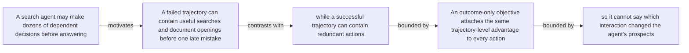

#### Python

```python
from html import escape
from pathlib import Path
from textwrap import wrap

title = "trace_why_p1: A search agent may make dozens of dependent decisions — problem and research-question relation"
nodes = [["n1","A search agent may make dozens of dependent decisions before answering",120,150],["n2","A failed trajectory can contain useful searches and document openings before one late mistake",420,150],["n3","while a successful trajectory can contain redundant actions",720,150],["n4","An outcome-only objective attaches the same trajectory-level advantage to every action",120,340],["n5","so it cannot say which interaction changed the agent's prospects",420,340]]
edges = [["n1","n2","motivates"],["n2","n3","contrasts with"],["n3","n4","bounded by"],["n4","n5","bounded by"]]
node_by_id = {node_id: (label, x, y) for node_id, label, x, y in nodes}

parts = [
    '<svg xmlns="http://www.w3.org/2000/svg" viewBox="0 0 860 520" role="img" aria-labelledby="title desc">',
    f'<title id="title">{escape(title)}</title>',
    '<desc id="desc">The labeled relations reproduce only relationships stated in the paragraph.</desc>',
    '<rect width="860" height="520" fill="white"/>',
]
for source, target, relation in edges:
    _, x1, y1 = node_by_id[source]
    _, x2, y2 = node_by_id[target]
    parts.append(f'<line x1="{x1}" y1="{y1}" x2="{x2}" y2="{y2}" stroke="#345" stroke-width="2"/>')
    parts.append(f'<text x="{(x1+x2)/2}" y="{(y1+y2)/2-6}" text-anchor="middle" font-family="sans-serif" font-size="11">{escape(relation)}</text>')
for _, label, x, y in nodes:
    parts.append(f'<rect x="{x-125}" y="{y-58}" width="250" height="116" rx="14" fill="#eef6ff" stroke="#234"/>')
    for line_index, line in enumerate(wrap(label, width=32)):
        parts.append(f'<text x="{x}" y="{y-34+line_index*16}" text-anchor="middle" font-family="sans-serif" font-size="12">{escape(line)}</text>')
parts.append('</svg>')
Path("trace_why_p1_treatment_a.svg").write_text("\n".join(parts), encoding="utf-8")
```

### Treatment B — trace_claim_outcome_blind, trace_claim_credit — claim-to-source provenance

- Teaching purpose: Show exactly which atomic claims underwrite this paragraph and which fixed source records support each claim.
- Encoding and reading order: A bipartite graph places 2 claim nodes on the left and 2 source nodes on the right, with only the 2 claim-source edges recorded in the fixture. Claim labels include epistemic status; source labels include the exact locator.
- Evidence and limitations: This treatment explains provenance and uncertainty, not the paper's causal mechanism. Missing edges remain visibly absent and no source count is treated as confidence.
- Recommended web medium: semantic HTML/CSS claim-source table with an SVG network view; JavaScript only for keyboard-controlled source highlighting.
- Mobile, accessibility, and motion behavior: Provide real table headers and source links in the static fallback, make every edge recoverable as text, stack claim records before source records on mobile, and require no motion.

#### TikZ

```tex
\documentclass[tikz,border=5pt]{standalone}
\usepackage[T1]{fontenc}
\usepackage{tikz}
\usetikzlibrary{arrows.meta}
\begin{document}
\begin{tikzpicture}[font=\sffamily,claim/.style={draw,rounded corners,align=center,text width=5.2cm,minimum height=1.2cm},source/.style={draw,dashed,align=center,text width=5.2cm,minimum height=1.2cm},link/.style={-{Latex[length=2mm]},thin}]
\node[font=\bfseries] at (4,1.8) {trace\_why\_p1: claim-to-source provenance};
\node[claim] (c1) at (0,0) {A terminal outcome reward does not identify which intermediate tool interactions helped, were redundant, or derailed a long trajectory. [AUTHORS\_INTERPRETATION]};
\node[claim] (c2) at (0,-2.4) {TRACE adds turn-level temporal-difference credit derived from frozen-reference answer predictability while retaining the outcome reward. [OBSERVED]};
\node[source] (s1) at (8,0) {TRACE v1 introduction - Pages 1-3, Abstract and Section 1};
\node[source] (s2) at (8,-2.4) {TRACE v1 method - Sections 3.1-3.3, Equations 4-12, Algorithm 1};
\draw[link] (c1) -- (s1);
\draw[link] (c2) -- (s2);
\end{tikzpicture}
\end{document}
```

#### Mermaid

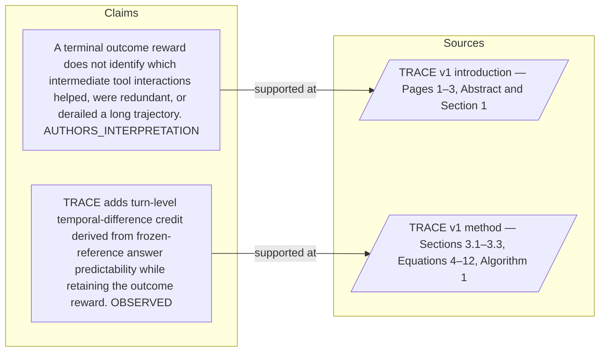

#### Python

```python
from html import escape
from pathlib import Path
from textwrap import wrap

title = "trace_why_p1: claim-to-source provenance"
nodes = [["c1","A terminal outcome reward does not identify which intermediate tool interactions helped, were redundant, or derailed a long trajectory. [AUTHORS_INTERPRETATION]",190,130],["c2","TRACE adds turn-level temporal-difference credit derived from frozen-reference answer predictability while retaining the outcome reward. [OBSERVED]",190,250],["s1","TRACE v1 introduction — Pages 1–3, Abstract and Section 1",700,130],["s2","TRACE v1 method — Sections 3.1–3.3, Equations 4–12, Algorithm 1",700,250]]
edges = [["c1","s1"],["c2","s2"]]
node_by_id = {node_id: (label, x, y) for node_id, label, x, y in nodes}
height = 440

parts = [
    f'<svg xmlns="http://www.w3.org/2000/svg" viewBox="0 0 900 {height}" role="img" aria-labelledby="title desc">',
    f'<title id="title">{escape(title)}</title>',
    '<desc id="desc">Bipartite map from verified claim records to their exact source records.</desc>',
    f'<rect width="900" height="{height}" fill="white"/>',
]
for source, target in edges:
    _, x1, y1 = node_by_id[source]
    _, x2, y2 = node_by_id[target]
    parts.append(f'<line x1="{x1+145}" y1="{y1}" x2="{x2-145}" y2="{y2}" stroke="#456" stroke-width="2"/>')
for node_id, label, x, y in nodes:
    dashed = ' stroke-dasharray="7 5"' if node_id.startswith("s") else ''
    parts.append(f'<rect x="{x-145}" y="{y-46}" width="290" height="92" rx="12" fill="#f7fbff" stroke="#234"{dashed}/>')
    for line_index, line in enumerate(wrap(label, width=38)):
        parts.append(f'<text x="{x}" y="{y-24+line_index*14}" text-anchor="middle" font-family="sans-serif" font-size="11">{escape(line)}</text>')
parts.append('</svg>')
Path("trace_why_p1_treatment_b.svg").write_text("\n".join(parts), encoding="utf-8")
```

### Treatment C — A search agent may make dozens of dependent decisions — supported-versus-bounded scope

- Teaching purpose: Separate what the paragraph supports from the qualification or contingency that bounds it.
- Encoding and reading order: Partition the paragraph into 3 supported statement(s) and 2 boundary or contingency statement(s). The two columns are categories, not a scale or causal path.
- Evidence and limitations: Every card is a complete paragraph clause. The boundary column makes negative and not-established language visible without weakening it.
- Recommended web medium: responsive SVG or semantic HTML/CSS; JavaScript is optional only for a meaningful state or scope toggle.
- Mobile, accessibility, and motion behavior: Preserve every exact value or scope statement as selectable text, avoid color-only distinctions, stack groups on mobile, and keep all information visible when JavaScript or motion is disabled.

#### TikZ

```tex
\documentclass[tikz,border=5pt]{standalone}
\usepackage[T1]{fontenc}
\usepackage{tikz}
\begin{document}
\begin{tikzpicture}[font=\sffamily,item/.style={draw,align=center,text width=5.5cm,minimum height=1.4cm}]
\node[font=\bfseries] at (3.5,2) {trace\_why\_p1: A search agent may make dozens of dependent decisions - supported-versus-bounded scope};
\node[font=\bfseries] at (0,1) {Supported statement};
\node[font=\bfseries] at (7,1) {Boundary or contingency};
\node[item] at (0,0) {A search agent may make dozens of dependent decisions before answering};
\node[item] at (0,-2) {A failed trajectory can contain useful searches and document openings before one late mistake};
\node[item] at (0,-4) {while a successful trajectory can contain redundant actions};
\node[item] at (7,0) {An outcome-only objective attaches the same trajectory-level advantage to every action};
\node[item] at (7,-2) {so it cannot say which interaction changed the agent's prospects};
\end{tikzpicture}
\end{document}
```

#### Mermaid

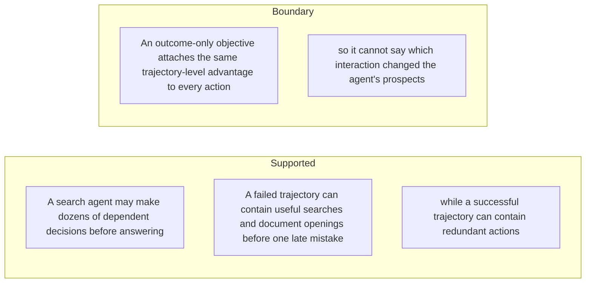

#### Python

```python
from html import escape
from pathlib import Path
from textwrap import wrap

title = "trace_why_p1: A search agent may make dozens of dependent decisions — supported-versus-bounded scope"
columns = {"Supported statement": ["A search agent may make dozens of dependent decisions before answering","A failed trajectory can contain useful searches and document openings before one late mistake","while a successful trajectory can contain redundant actions"], "Boundary or contingency": ["An outcome-only objective attaches the same trajectory-level advantage to every action","so it cannot say which interaction changed the agent's prospects"]}
height = 550
parts = [
    f'<svg xmlns="http://www.w3.org/2000/svg" viewBox="0 0 900 {height}" role="img" aria-labelledby="title desc">',
    f'<title id="title">{escape(title)}</title>',
    '<desc id="desc">Statements are partitioned into supported content and explicit boundaries.</desc>',
    f'<rect width="900" height="{height}" fill="white"/>',
]
for column_index, (heading, items) in enumerate(columns.items()):
    x = 240 + column_index * 430
    parts.append(f'<text x="{x}" y="70" text-anchor="middle" font-family="sans-serif" font-size="18" font-weight="700">{escape(heading)}</text>')
    for item_index, item in enumerate(items):
        y = 130 + item_index * 110
        parts.append(f'<rect x="{x-180}" y="{y-35}" width="360" height="80" rx="12" fill="#f7fbff" stroke="#234"/>')
        for line_index, line in enumerate(wrap(item, width=48)):
            parts.append(f'<text x="{x}" y="{y-12+line_index*14}" text-anchor="middle" font-family="sans-serif" font-size="11">{escape(line)}</text>')
parts.append('</svg>')
Path("trace_why_p1_treatment_c.svg").write_text("\n".join(parts), encoding="utf-8")
```

### Implementation record

- Status: `PENDING`
- Selected treatment: `NONE`
- Selection rationale:
- Delivery medium: `NONE`
- Visual ID and placement:
- Shared paragraph scope: `NONE`
- Changed files:
- Accessibility and fallback verification:
- Desktop and mobile verification:
- Evidence deviations: `NONE`

## `trace_why_p2`

- Location: `trace_why`, paragraph 2
- Text anchor: "Process supervision can provide finer feedback, but commonly needs step labels, an LLM judge, a learned critic, or repeated rollouts."
- Claims and sources: `trace_claim_outcome_blind` (AUTHORS_INTERPRETATION, VERIFIED); `trace_claim_credit` (OBSERVED, VERIFIED); `trace_source_intro` (Pages 1–3, Abstract and Section 1); `trace_source_method` (Sections 3.1–3.3, Equations 4–12, Algorithm 1)
- Visual needed: `NO`
- Decision rationale: The paragraph's main work is the bounded statement "Process supervision can provide finer feedback". Its qualification is explicit in prose and does not require readers to reconstruct a material process, topology, quantitative comparison, uncertainty distribution, or state change. A visual would repeat the wording, so all treatments below are optional contingencies only.
- Explanatory job: problem and research-question relation.

### Treatment A — Process supervision can provide finer feedback — problem and research-question relation

- Teaching purpose: Optional contingency only. Answer "Why is one final reward not enough for a long tool-use trajectory?" by exposing the paragraph's 4 named propositions and 3 stated reading, comparison, or qualification relations.
- Encoding and reading order: Nodes reproduce the complete labels "Process supervision can provide finer feedback"; "but commonly needs step labels, an LLM judge, a learned critic"; "or repeated rollouts"; "TRACE asks whether a known correct answer can supply a denser signal without adding those components". Edges carry the explicit relation labels "contrasts with", "motivates", "motivates"; arrow direction is sequence only for mechanism or example prose and otherwise denotes reading order.
- Evidence and limitations: The topology is derived from this paragraph rather than a fixed pipeline. Encode only `trace_claim_outcome_blind`, `trace_claim_credit` and do not turn reading-order edges into causal claims.
- Recommended web medium: responsive inline SVG with CSS; JavaScript may add optional step focus only when state order matters.
- Mobile, accessibility, and motion behavior: Keep the full node-and-relation list in DOM order, expose the relation labels in the long description, stack nodes on narrow screens, and disable focus transitions under reduced motion.

#### TikZ

```tex
\documentclass[tikz,border=5pt]{standalone}
\usepackage[T1]{fontenc}
\usepackage{tikz}
\usetikzlibrary{arrows.meta,positioning}
\begin{document}
\begin{tikzpicture}[font=\sffamily,concept/.style={draw,rounded corners,align=center,text width=3.6cm,minimum height=1.35cm},link/.style={-{Latex[length=2mm]},thick},rel/.style={fill=white,font=\scriptsize,inner sep=2pt}]
\node[font=\bfseries,align=center] at (6.1,2.0) {trace\_why\_p2: Process supervision can provide finer feedback - problem and research-question relation};
\node[concept] (n1) at (1.8,0) {Process supervision can provide finer feedback};
\node[concept] (n2) at (6.1,0) {but commonly needs step labels, an LLM judge, a learned critic};
\node[concept] (n3) at (10.4,0) {or repeated rollouts};
\node[concept] (n4) at (1.8,-3.2) {TRACE asks whether a known correct answer can supply a denser signal without adding those components};
\draw[link] (n1) -- node[rel] {contrasts with} (n2);
\draw[link] (n2) -- node[rel] {motivates} (n3);
\draw[link] (n3) -- node[rel] {motivates} (n4);
\end{tikzpicture}
\end{document}
```

#### Mermaid

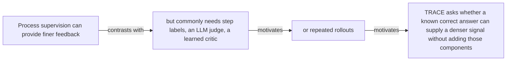

#### Python

```python
from html import escape
from pathlib import Path
from textwrap import wrap

title = "trace_why_p2: Process supervision can provide finer feedback — problem and research-question relation"
nodes = [["n1","Process supervision can provide finer feedback",120,150],["n2","but commonly needs step labels, an LLM judge, a learned critic",420,150],["n3","or repeated rollouts",720,150],["n4","TRACE asks whether a known correct answer can supply a denser signal without adding those components",120,340]]
edges = [["n1","n2","contrasts with"],["n2","n3","motivates"],["n3","n4","motivates"]]
node_by_id = {node_id: (label, x, y) for node_id, label, x, y in nodes}

parts = [
    '<svg xmlns="http://www.w3.org/2000/svg" viewBox="0 0 860 520" role="img" aria-labelledby="title desc">',
    f'<title id="title">{escape(title)}</title>',
    '<desc id="desc">The labeled relations reproduce only relationships stated in the paragraph.</desc>',
    '<rect width="860" height="520" fill="white"/>',
]
for source, target, relation in edges:
    _, x1, y1 = node_by_id[source]
    _, x2, y2 = node_by_id[target]
    parts.append(f'<line x1="{x1}" y1="{y1}" x2="{x2}" y2="{y2}" stroke="#345" stroke-width="2"/>')
    parts.append(f'<text x="{(x1+x2)/2}" y="{(y1+y2)/2-6}" text-anchor="middle" font-family="sans-serif" font-size="11">{escape(relation)}</text>')
for _, label, x, y in nodes:
    parts.append(f'<rect x="{x-125}" y="{y-58}" width="250" height="116" rx="14" fill="#eef6ff" stroke="#234"/>')
    for line_index, line in enumerate(wrap(label, width=32)):
        parts.append(f'<text x="{x}" y="{y-34+line_index*16}" text-anchor="middle" font-family="sans-serif" font-size="12">{escape(line)}</text>')
parts.append('</svg>')
Path("trace_why_p2_treatment_a.svg").write_text("\n".join(parts), encoding="utf-8")
```

### Treatment B — trace_claim_outcome_blind, trace_claim_credit — claim-to-source provenance

- Teaching purpose: Optional contingency only. Show exactly which atomic claims underwrite this paragraph and which fixed source records support each claim.
- Encoding and reading order: A bipartite graph places 2 claim nodes on the left and 2 source nodes on the right, with only the 2 claim-source edges recorded in the fixture. Claim labels include epistemic status; source labels include the exact locator.
- Evidence and limitations: This treatment explains provenance and uncertainty, not the paper's causal mechanism. Missing edges remain visibly absent and no source count is treated as confidence.
- Recommended web medium: semantic HTML/CSS claim-source table with an SVG network view; JavaScript only for keyboard-controlled source highlighting.
- Mobile, accessibility, and motion behavior: Provide real table headers and source links in the static fallback, make every edge recoverable as text, stack claim records before source records on mobile, and require no motion.

#### TikZ

```tex
\documentclass[tikz,border=5pt]{standalone}
\usepackage[T1]{fontenc}
\usepackage{tikz}
\usetikzlibrary{arrows.meta}
\begin{document}
\begin{tikzpicture}[font=\sffamily,claim/.style={draw,rounded corners,align=center,text width=5.2cm,minimum height=1.2cm},source/.style={draw,dashed,align=center,text width=5.2cm,minimum height=1.2cm},link/.style={-{Latex[length=2mm]},thin}]
\node[font=\bfseries] at (4,1.8) {trace\_why\_p2: claim-to-source provenance};
\node[claim] (c1) at (0,0) {A terminal outcome reward does not identify which intermediate tool interactions helped, were redundant, or derailed a long trajectory. [AUTHORS\_INTERPRETATION]};
\node[claim] (c2) at (0,-2.4) {TRACE adds turn-level temporal-difference credit derived from frozen-reference answer predictability while retaining the outcome reward. [OBSERVED]};
\node[source] (s1) at (8,0) {TRACE v1 introduction - Pages 1-3, Abstract and Section 1};
\node[source] (s2) at (8,-2.4) {TRACE v1 method - Sections 3.1-3.3, Equations 4-12, Algorithm 1};
\draw[link] (c1) -- (s1);
\draw[link] (c2) -- (s2);
\end{tikzpicture}
\end{document}
```

#### Mermaid


#### Python

```python
from html import escape
from pathlib import Path
from textwrap import wrap

title = "trace_why_p2: claim-to-source provenance"
nodes = [["c1","A terminal outcome reward does not identify which intermediate tool interactions helped, were redundant, or derailed a long trajectory. [AUTHORS_INTERPRETATION]",190,130],["c2","TRACE adds turn-level temporal-difference credit derived from frozen-reference answer predictability while retaining the outcome reward. [OBSERVED]",190,250],["s1","TRACE v1 introduction — Pages 1–3, Abstract and Section 1",700,130],["s2","TRACE v1 method — Sections 3.1–3.3, Equations 4–12, Algorithm 1",700,250]]
edges = [["c1","s1"],["c2","s2"]]
node_by_id = {node_id: (label, x, y) for node_id, label, x, y in nodes}
height = 440

parts = [
    f'<svg xmlns="http://www.w3.org/2000/svg" viewBox="0 0 900 {height}" role="img" aria-labelledby="title desc">',
    f'<title id="title">{escape(title)}</title>',
    '<desc id="desc">Bipartite map from verified claim records to their exact source records.</desc>',
    f'<rect width="900" height="{height}" fill="white"/>',
]
for source, target in edges:
    _, x1, y1 = node_by_id[source]
    _, x2, y2 = node_by_id[target]
    parts.append(f'<line x1="{x1+145}" y1="{y1}" x2="{x2-145}" y2="{y2}" stroke="#456" stroke-width="2"/>')
for node_id, label, x, y in nodes:
    dashed = ' stroke-dasharray="7 5"' if node_id.startswith("s") else ''
    parts.append(f'<rect x="{x-145}" y="{y-46}" width="290" height="92" rx="12" fill="#f7fbff" stroke="#234"{dashed}/>')
    for line_index, line in enumerate(wrap(label, width=38)):
        parts.append(f'<text x="{x}" y="{y-24+line_index*14}" text-anchor="middle" font-family="sans-serif" font-size="11">{escape(line)}</text>')
parts.append('</svg>')
Path("trace_why_p2_treatment_b.svg").write_text("\n".join(parts), encoding="utf-8")
```

### Treatment C — Process supervision can provide finer feedback — supported-versus-bounded scope

- Teaching purpose: Optional contingency only. Separate what the paragraph supports from the qualification or contingency that bounds it.
- Encoding and reading order: Partition the paragraph into 4 supported statement(s) and 1 boundary or contingency statement(s). The two columns are categories, not a scale or causal path.
- Evidence and limitations: Every card is a complete paragraph clause. The boundary column makes negative and not-established language visible without weakening it.
- Recommended web medium: responsive SVG or semantic HTML/CSS; JavaScript is optional only for a meaningful state or scope toggle.
- Mobile, accessibility, and motion behavior: Preserve every exact value or scope statement as selectable text, avoid color-only distinctions, stack groups on mobile, and keep all information visible when JavaScript or motion is disabled.

#### TikZ

```tex
\documentclass[tikz,border=5pt]{standalone}
\usepackage[T1]{fontenc}
\usepackage{tikz}
\begin{document}
\begin{tikzpicture}[font=\sffamily,item/.style={draw,align=center,text width=5.5cm,minimum height=1.4cm}]
\node[font=\bfseries] at (3.5,2) {trace\_why\_p2: Process supervision can provide finer feedback - supported-versus-bounded scope};
\node[font=\bfseries] at (0,1) {Supported statement};
\node[font=\bfseries] at (7,1) {Boundary or contingency};
\node[item] at (0,0) {Process supervision can provide finer feedback};
\node[item] at (0,-2) {but commonly needs step labels, an LLM judge, a learned critic};
\node[item] at (0,-4) {or repeated rollouts};
\node[item] at (0,-6) {TRACE asks whether a known correct answer can supply a denser signal without adding those components};
\node[item] at (7,0) {TRACE asks whether a known correct answer can supply a denser signal without adding those components};
\end{tikzpicture}
\end{document}
```

#### Mermaid

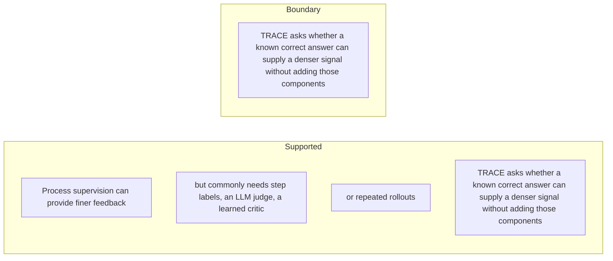

#### Python

```python
from html import escape
from pathlib import Path
from textwrap import wrap

title = "trace_why_p2: Process supervision can provide finer feedback — supported-versus-bounded scope"
columns = {"Supported statement": ["Process supervision can provide finer feedback","but commonly needs step labels, an LLM judge, a learned critic","or repeated rollouts","TRACE asks whether a known correct answer can supply a denser signal without adding those components"], "Boundary or contingency": ["TRACE asks whether a known correct answer can supply a denser signal without adding those components"]}
height = 660
parts = [
    f'<svg xmlns="http://www.w3.org/2000/svg" viewBox="0 0 900 {height}" role="img" aria-labelledby="title desc">',
    f'<title id="title">{escape(title)}</title>',
    '<desc id="desc">Statements are partitioned into supported content and explicit boundaries.</desc>',
    f'<rect width="900" height="{height}" fill="white"/>',
]
for column_index, (heading, items) in enumerate(columns.items()):
    x = 240 + column_index * 430
    parts.append(f'<text x="{x}" y="70" text-anchor="middle" font-family="sans-serif" font-size="18" font-weight="700">{escape(heading)}</text>')
    for item_index, item in enumerate(items):
        y = 130 + item_index * 110
        parts.append(f'<rect x="{x-180}" y="{y-35}" width="360" height="80" rx="12" fill="#f7fbff" stroke="#234"/>')
        for line_index, line in enumerate(wrap(item, width=48)):
            parts.append(f'<text x="{x}" y="{y-12+line_index*14}" text-anchor="middle" font-family="sans-serif" font-size="11">{escape(line)}</text>')
parts.append('</svg>')
Path("trace_why_p2_treatment_c.svg").write_text("\n".join(parts), encoding="utf-8")
```

### Implementation record

- Status: `NOT_NEEDED`
- Selected treatment: `NONE`
- Selection rationale:
- Delivery medium: `NONE`
- Visual ID and placement:
- Shared paragraph scope: `NONE`
- Changed files:
- Accessibility and fallback verification:
- Desktop and mobile verification:
- Evidence deviations: `NONE`

## `trace_change_p1`

- Location: `trace_change`, paragraph 1
- Text anchor: "TRACE leaves final-answer verification in place but adds a trajectory-local signal at tool-call boundaries."
- Claims and sources: `trace_claim_credit` (OBSERVED, VERIFIED); `trace_claim_outcome_anchor` (OBSERVED, VERIFIED); `trace_claim_controlled_setup` (OBSERVED, VERIFIED); `trace_source_method` (Sections 3.1–3.3, Equations 4–12, Algorithm 1); `trace_source_experiments` (Pages 7–8, Section 4.1)
- Visual needed: `YES`
- Decision rationale: Removing a visual would require readers to retain the material relation between "TRACE leaves final-answer verification in place but adds a trajectory-local signal at tool-call boundaries" and "Instead of treating every action in a rollout alike, it rewards an interaction when the following transcript makes the gold answer more predictable to a frozen reference model and penalizes it when predictability falls" while also tracking 2 source-bounded propositions. The paragraph contains a real changed-versus-preserved relation; the visual must preserve its stated conditions and must not add causal or proportional meaning.
- Explanatory job: changed-versus-preserved relation.

### Treatment A — TRACE leaves final-answer verification in place but adds a — changed-versus-preserved relation

- Teaching purpose: Answer "What does TRACE change in agent reinforcement learning?" by exposing the paragraph's 2 named propositions and 1 stated reading, comparison, or qualification relations.
- Encoding and reading order: Nodes reproduce the complete labels "TRACE leaves final-answer verification in place but adds a trajectory-local signal at tool-call boundaries"; "Instead of treating every action in a rollout alike, it rewards an interaction when the following transcript makes the gold answer more predictable to a frozen reference model and penalizes it when predictability falls". Edges carry the explicit relation labels "contrasts with"; arrow direction is sequence only for mechanism or example prose and otherwise denotes reading order.
- Evidence and limitations: The topology is derived from this paragraph rather than a fixed pipeline. Encode only `trace_claim_credit`, `trace_claim_outcome_anchor`, `trace_claim_controlled_setup` and do not turn reading-order edges into causal claims.
- Recommended web medium: responsive inline SVG with CSS; JavaScript may add optional step focus only when state order matters.
- Mobile, accessibility, and motion behavior: Keep the full node-and-relation list in DOM order, expose the relation labels in the long description, stack nodes on narrow screens, and disable focus transitions under reduced motion.

#### TikZ

```tex
\documentclass[tikz,border=5pt]{standalone}
\usepackage[T1]{fontenc}
\usepackage{tikz}
\usetikzlibrary{arrows.meta,positioning}
\begin{document}
\begin{tikzpicture}[font=\sffamily,concept/.style={draw,rounded corners,align=center,text width=3.6cm,minimum height=1.35cm},link/.style={-{Latex[length=2mm]},thick},rel/.style={fill=white,font=\scriptsize,inner sep=2pt}]
\node[font=\bfseries,align=center] at (6.1,2.0) {trace\_change\_p1: TRACE leaves final-answer verification in place but adds a - changed-versus-preserved relation};
\node[concept] (n1) at (1.8,0) {TRACE leaves final-answer verification in place but adds a trajectory-local signal at tool-call boundaries};
\node[concept] (n2) at (6.1,0) {Instead of treating every action in a rollout alike, it rewards an interaction when the following transcript makes the gold answer more predictable to a frozen reference model and penalizes it when predictability falls};
\draw[link] (n1) -- node[rel] {contrasts with} (n2);
\end{tikzpicture}
\end{document}
```

#### Mermaid

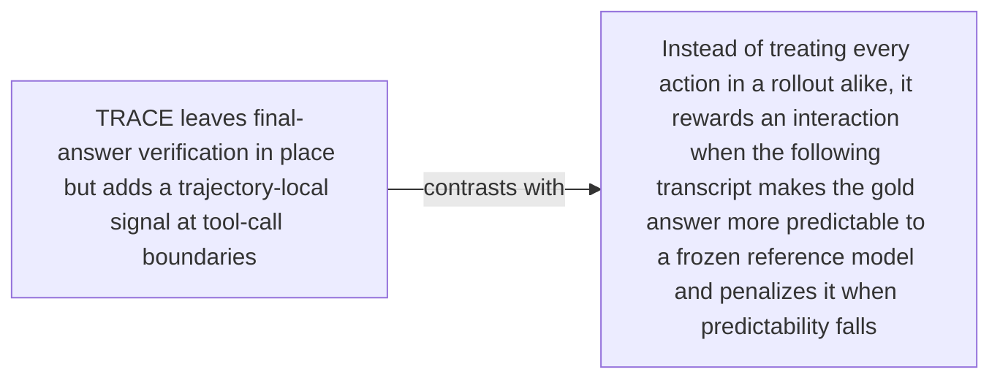

#### Python

```python
from html import escape
from pathlib import Path
from textwrap import wrap

title = "trace_change_p1: TRACE leaves final-answer verification in place but adds a — changed-versus-preserved relation"
nodes = [["n1","TRACE leaves final-answer verification in place but adds a trajectory-local signal at tool-call boundaries",120,150],["n2","Instead of treating every action in a rollout alike, it rewards an interaction when the following transcript makes the gold answer more predictable to a frozen reference model and penalizes it when predictability falls",420,150]]
edges = [["n1","n2","contrasts with"]]
node_by_id = {node_id: (label, x, y) for node_id, label, x, y in nodes}

parts = [
    '<svg xmlns="http://www.w3.org/2000/svg" viewBox="0 0 860 520" role="img" aria-labelledby="title desc">',
    f'<title id="title">{escape(title)}</title>',
    '<desc id="desc">The labeled relations reproduce only relationships stated in the paragraph.</desc>',
    '<rect width="860" height="520" fill="white"/>',
]
for source, target, relation in edges:
    _, x1, y1 = node_by_id[source]
    _, x2, y2 = node_by_id[target]
    parts.append(f'<line x1="{x1}" y1="{y1}" x2="{x2}" y2="{y2}" stroke="#345" stroke-width="2"/>')
    parts.append(f'<text x="{(x1+x2)/2}" y="{(y1+y2)/2-6}" text-anchor="middle" font-family="sans-serif" font-size="11">{escape(relation)}</text>')
for _, label, x, y in nodes:
    parts.append(f'<rect x="{x-125}" y="{y-58}" width="250" height="116" rx="14" fill="#eef6ff" stroke="#234"/>')
    for line_index, line in enumerate(wrap(label, width=32)):
        parts.append(f'<text x="{x}" y="{y-34+line_index*16}" text-anchor="middle" font-family="sans-serif" font-size="12">{escape(line)}</text>')
parts.append('</svg>')
Path("trace_change_p1_treatment_a.svg").write_text("\n".join(parts), encoding="utf-8")
```

### Treatment B — trace_claim_credit, trace_claim_outcome_anchor, trace_claim_controlled_setup — claim-to-source provenance

- Teaching purpose: Show exactly which atomic claims underwrite this paragraph and which fixed source records support each claim.
- Encoding and reading order: A bipartite graph places 3 claim nodes on the left and 2 source nodes on the right, with only the 3 claim-source edges recorded in the fixture. Claim labels include epistemic status; source labels include the exact locator.
- Evidence and limitations: This treatment explains provenance and uncertainty, not the paper's causal mechanism. Missing edges remain visibly absent and no source count is treated as confidence.
- Recommended web medium: semantic HTML/CSS claim-source table with an SVG network view; JavaScript only for keyboard-controlled source highlighting.
- Mobile, accessibility, and motion behavior: Provide real table headers and source links in the static fallback, make every edge recoverable as text, stack claim records before source records on mobile, and require no motion.

#### TikZ

```tex
\documentclass[tikz,border=5pt]{standalone}
\usepackage[T1]{fontenc}
\usepackage{tikz}
\usetikzlibrary{arrows.meta}
\begin{document}
\begin{tikzpicture}[font=\sffamily,claim/.style={draw,rounded corners,align=center,text width=5.2cm,minimum height=1.2cm},source/.style={draw,dashed,align=center,text width=5.2cm,minimum height=1.2cm},link/.style={-{Latex[length=2mm]},thin}]
\node[font=\bfseries] at (4,1.8) {trace\_change\_p1: claim-to-source provenance};
\node[claim] (c1) at (0,0) {TRACE adds turn-level temporal-difference credit derived from frozen-reference answer predictability while retaining the outcome reward. [OBSERVED]};
\node[claim] (c2) at (0,-2.4) {The reported training objective combines local turn credit with GRPO's final outcome advantage. [OBSERVED]};
\node[claim] (c3) at (0,-4.8) {The controlled RL variants share the tested backbones, browser interface, training data, terminal reward, and evaluation protocol. [OBSERVED]};
\node[source] (s1) at (8,0) {TRACE v1 method - Sections 3.1-3.3, Equations 4-12, Algorithm 1};
\node[source] (s2) at (8,-2.4) {TRACE v1 experimental setup - Pages 7-8, Section 4.1};
\draw[link] (c1) -- (s1);
\draw[link] (c2) -- (s1);
\draw[link] (c3) -- (s2);
\end{tikzpicture}
\end{document}
```

#### Mermaid

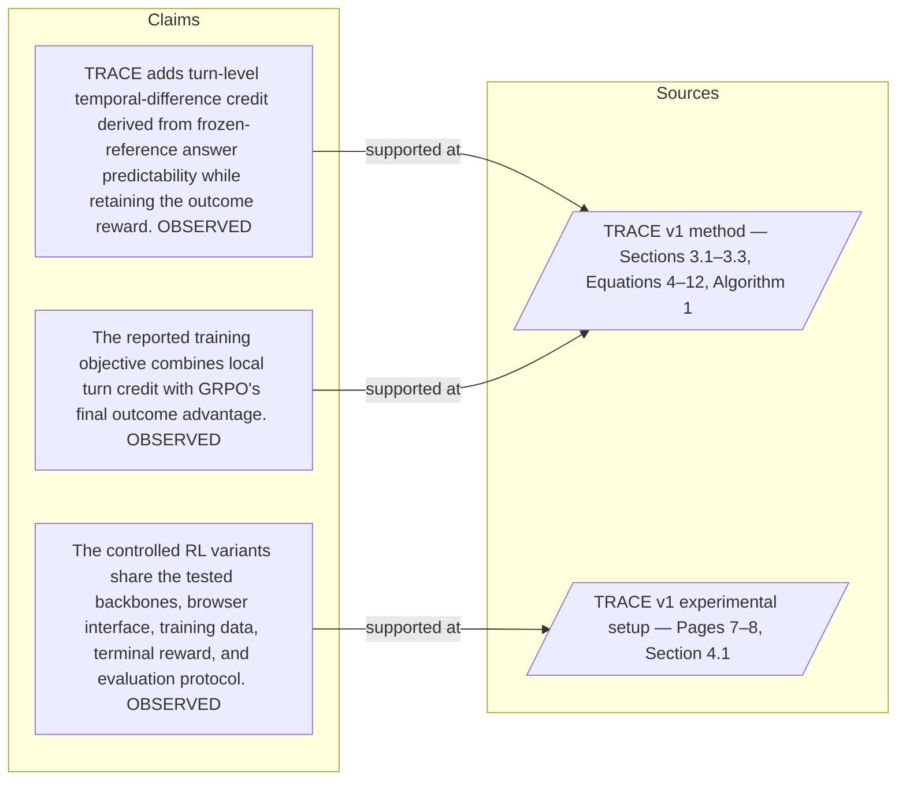

#### Python

```python
from html import escape
from pathlib import Path
from textwrap import wrap

title = "trace_change_p1: claim-to-source provenance"
nodes = [["c1","TRACE adds turn-level temporal-difference credit derived from frozen-reference answer predictability while retaining the outcome reward. [OBSERVED]",190,130],["c2","The reported training objective combines local turn credit with GRPO's final outcome advantage. [OBSERVED]",190,250],["c3","The controlled RL variants share the tested backbones, browser interface, training data, terminal reward, and evaluation protocol. [OBSERVED]",190,370],["s1","TRACE v1 method — Sections 3.1–3.3, Equations 4–12, Algorithm 1",700,130],["s2","TRACE v1 experimental setup — Pages 7–8, Section 4.1",700,250]]
edges = [["c1","s1"],["c2","s1"],["c3","s2"]]
node_by_id = {node_id: (label, x, y) for node_id, label, x, y in nodes}
height = 560

parts = [
    f'<svg xmlns="http://www.w3.org/2000/svg" viewBox="0 0 900 {height}" role="img" aria-labelledby="title desc">',
    f'<title id="title">{escape(title)}</title>',
    '<desc id="desc">Bipartite map from verified claim records to their exact source records.</desc>',
    f'<rect width="900" height="{height}" fill="white"/>',
]
for source, target in edges:
    _, x1, y1 = node_by_id[source]
    _, x2, y2 = node_by_id[target]
    parts.append(f'<line x1="{x1+145}" y1="{y1}" x2="{x2-145}" y2="{y2}" stroke="#456" stroke-width="2"/>')
for node_id, label, x, y in nodes:
    dashed = ' stroke-dasharray="7 5"' if node_id.startswith("s") else ''
    parts.append(f'<rect x="{x-145}" y="{y-46}" width="290" height="92" rx="12" fill="#f7fbff" stroke="#234"{dashed}/>')
    for line_index, line in enumerate(wrap(label, width=38)):
        parts.append(f'<text x="{x}" y="{y-24+line_index*14}" text-anchor="middle" font-family="sans-serif" font-size="11">{escape(line)}</text>')
parts.append('</svg>')
Path("trace_change_p1_treatment_b.svg").write_text("\n".join(parts), encoding="utf-8")
```

### Treatment C — TRACE leaves final-answer verification in place but adds a — supported-versus-bounded scope

- Teaching purpose: Separate what the paragraph supports from the qualification or contingency that bounds it.
- Encoding and reading order: Partition the paragraph into 2 supported statement(s) and 1 boundary or contingency statement(s). The two columns are categories, not a scale or causal path.
- Evidence and limitations: Every card is a complete paragraph clause. The boundary column makes negative and not-established language visible without weakening it.
- Recommended web medium: responsive SVG or semantic HTML/CSS; JavaScript is optional only for a meaningful state or scope toggle.
- Mobile, accessibility, and motion behavior: Preserve every exact value or scope statement as selectable text, avoid color-only distinctions, stack groups on mobile, and keep all information visible when JavaScript or motion is disabled.

#### TikZ

```tex
\documentclass[tikz,border=5pt]{standalone}
\usepackage[T1]{fontenc}
\usepackage{tikz}
\begin{document}
\begin{tikzpicture}[font=\sffamily,item/.style={draw,align=center,text width=5.5cm,minimum height=1.4cm}]
\node[font=\bfseries] at (3.5,2) {trace\_change\_p1: TRACE leaves final-answer verification in place but adds a - supported-versus-bounded scope};
\node[font=\bfseries] at (0,1) {Supported statement};
\node[font=\bfseries] at (7,1) {Boundary or contingency};
\node[item] at (0,0) {TRACE leaves final-answer verification in place but adds a trajectory-local signal at tool-call boundaries};
\node[item] at (0,-2) {Instead of treating every action in a rollout alike, it rewards an interaction when the following transcript makes the gold answer more predictable to a frozen reference model and penalizes it when predictability falls};
\node[item] at (7,0) {Instead of treating every action in a rollout alike, it rewards an interaction when the following transcript makes the gold answer more predictable to a frozen reference model and penalizes it when predictability falls};
\end{tikzpicture}
\end{document}
```

#### Mermaid

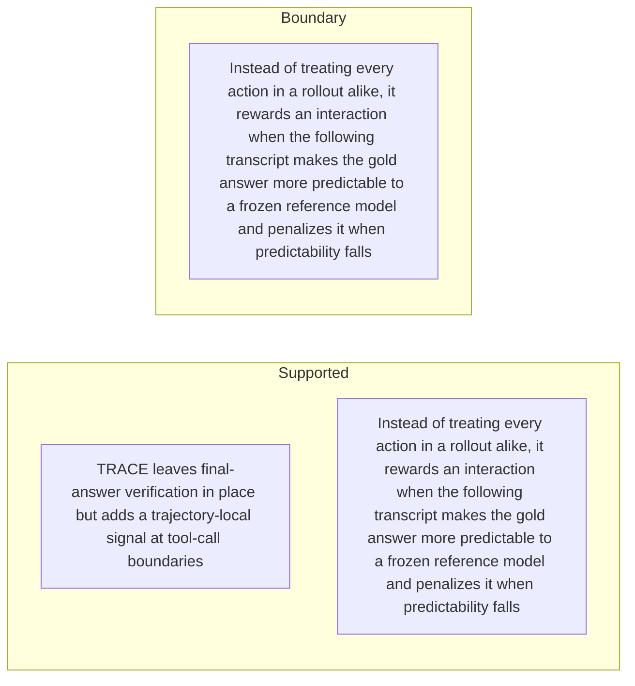

#### Python

```python
from html import escape
from pathlib import Path
from textwrap import wrap

title = "trace_change_p1: TRACE leaves final-answer verification in place but adds a — supported-versus-bounded scope"
columns = {"Supported statement": ["TRACE leaves final-answer verification in place but adds a trajectory-local signal at tool-call boundaries","Instead of treating every action in a rollout alike, it rewards an interaction when the following transcript makes the gold answer more predictable to a frozen reference model and penalizes it when predictability falls"], "Boundary or contingency": ["Instead of treating every action in a rollout alike, it rewards an interaction when the following transcript makes the gold answer more predictable to a frozen reference model and penalizes it when predictability falls"]}
height = 440
parts = [
    f'<svg xmlns="http://www.w3.org/2000/svg" viewBox="0 0 900 {height}" role="img" aria-labelledby="title desc">',
    f'<title id="title">{escape(title)}</title>',
    '<desc id="desc">Statements are partitioned into supported content and explicit boundaries.</desc>',
    f'<rect width="900" height="{height}" fill="white"/>',
]
for column_index, (heading, items) in enumerate(columns.items()):
    x = 240 + column_index * 430
    parts.append(f'<text x="{x}" y="70" text-anchor="middle" font-family="sans-serif" font-size="18" font-weight="700">{escape(heading)}</text>')
    for item_index, item in enumerate(items):
        y = 130 + item_index * 110
        parts.append(f'<rect x="{x-180}" y="{y-35}" width="360" height="80" rx="12" fill="#f7fbff" stroke="#234"/>')
        for line_index, line in enumerate(wrap(item, width=48)):
            parts.append(f'<text x="{x}" y="{y-12+line_index*14}" text-anchor="middle" font-family="sans-serif" font-size="11">{escape(line)}</text>')
parts.append('</svg>')
Path("trace_change_p1_treatment_c.svg").write_text("\n".join(parts), encoding="utf-8")
```

### Implementation record

- Status: `PENDING`
- Selected treatment: `NONE`
- Selection rationale:
- Delivery medium: `NONE`
- Visual ID and placement:
- Shared paragraph scope: `NONE`
- Changed files:
- Accessibility and fallback verification:
- Desktop and mobile verification:
- Evidence deviations: `NONE`

## `trace_change_p2`

- Location: `trace_change`, paragraph 2
- Text anchor: "This is a change to credit assignment, not a new browser, backbone, training corpus, or final verifier."
- Claims and sources: `trace_claim_credit` (OBSERVED, VERIFIED); `trace_claim_outcome_anchor` (OBSERVED, VERIFIED); `trace_claim_controlled_setup` (OBSERVED, VERIFIED); `trace_source_method` (Sections 3.1–3.3, Equations 4–12, Algorithm 1); `trace_source_experiments` (Pages 7–8, Section 4.1)
- Visual needed: `NO`
- Decision rationale: The paragraph's main work is the bounded statement "This is a change to credit assignment, not a new browser, backbone, training corpus". Its qualification is explicit in prose and does not require readers to reconstruct a material process, topology, quantitative comparison, uncertainty distribution, or state change. A visual would repeat the wording, so all treatments below are optional contingencies only.
- Explanatory job: changed-versus-preserved relation.

### Treatment A — This is a change to credit assignment not a — changed-versus-preserved relation

- Teaching purpose: Optional contingency only. Answer "What does TRACE change in agent reinforcement learning?" by exposing the paragraph's 3 named propositions and 2 stated reading, comparison, or qualification relations.
- Encoding and reading order: Nodes reproduce the complete labels "This is a change to credit assignment, not a new browser, backbone, training corpus"; "or final verifier"; "In the controlled comparisons, those parts are held fixed so the main variable is how the policy-gradient signal is constructed". Edges carry the explicit relation labels "changes into", "changes into"; arrow direction is sequence only for mechanism or example prose and otherwise denotes reading order.
- Evidence and limitations: The topology is derived from this paragraph rather than a fixed pipeline. Encode only `trace_claim_credit`, `trace_claim_outcome_anchor`, `trace_claim_controlled_setup` and do not turn reading-order edges into causal claims.
- Recommended web medium: responsive inline SVG with CSS; JavaScript may add optional step focus only when state order matters.
- Mobile, accessibility, and motion behavior: Keep the full node-and-relation list in DOM order, expose the relation labels in the long description, stack nodes on narrow screens, and disable focus transitions under reduced motion.

#### TikZ

```tex
\documentclass[tikz,border=5pt]{standalone}
\usepackage[T1]{fontenc}
\usepackage{tikz}
\usetikzlibrary{arrows.meta,positioning}
\begin{document}
\begin{tikzpicture}[font=\sffamily,concept/.style={draw,rounded corners,align=center,text width=3.6cm,minimum height=1.35cm},link/.style={-{Latex[length=2mm]},thick},rel/.style={fill=white,font=\scriptsize,inner sep=2pt}]
\node[font=\bfseries,align=center] at (6.1,2.0) {trace\_change\_p2: This is a change to credit assignment not a - changed-versus-preserved relation};
\node[concept] (n1) at (1.8,0) {This is a change to credit assignment, not a new browser, backbone, training corpus};
\node[concept] (n2) at (6.1,0) {or final verifier};
\node[concept] (n3) at (10.4,0) {In the controlled comparisons, those parts are held fixed so the main variable is how the policy-gradient signal is constructed};
\draw[link] (n1) -- node[rel] {changes into} (n2);
\draw[link] (n2) -- node[rel] {changes into} (n3);
\end{tikzpicture}
\end{document}
```

#### Mermaid

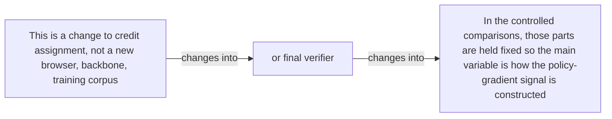

#### Python

```python
from html import escape
from pathlib import Path
from textwrap import wrap

title = "trace_change_p2: This is a change to credit assignment not a — changed-versus-preserved relation"
nodes = [["n1","This is a change to credit assignment, not a new browser, backbone, training corpus",120,150],["n2","or final verifier",420,150],["n3","In the controlled comparisons, those parts are held fixed so the main variable is how the policy-gradient signal is constructed",720,150]]
edges = [["n1","n2","changes into"],["n2","n3","changes into"]]
node_by_id = {node_id: (label, x, y) for node_id, label, x, y in nodes}

parts = [
    '<svg xmlns="http://www.w3.org/2000/svg" viewBox="0 0 860 520" role="img" aria-labelledby="title desc">',
    f'<title id="title">{escape(title)}</title>',
    '<desc id="desc">The labeled relations reproduce only relationships stated in the paragraph.</desc>',
    '<rect width="860" height="520" fill="white"/>',
]
for source, target, relation in edges:
    _, x1, y1 = node_by_id[source]
    _, x2, y2 = node_by_id[target]
    parts.append(f'<line x1="{x1}" y1="{y1}" x2="{x2}" y2="{y2}" stroke="#345" stroke-width="2"/>')
    parts.append(f'<text x="{(x1+x2)/2}" y="{(y1+y2)/2-6}" text-anchor="middle" font-family="sans-serif" font-size="11">{escape(relation)}</text>')
for _, label, x, y in nodes:
    parts.append(f'<rect x="{x-125}" y="{y-58}" width="250" height="116" rx="14" fill="#eef6ff" stroke="#234"/>')
    for line_index, line in enumerate(wrap(label, width=32)):
        parts.append(f'<text x="{x}" y="{y-34+line_index*16}" text-anchor="middle" font-family="sans-serif" font-size="12">{escape(line)}</text>')
parts.append('</svg>')
Path("trace_change_p2_treatment_a.svg").write_text("\n".join(parts), encoding="utf-8")
```

### Treatment B — trace_claim_credit, trace_claim_outcome_anchor, trace_claim_controlled_setup — claim-to-source provenance

- Teaching purpose: Optional contingency only. Show exactly which atomic claims underwrite this paragraph and which fixed source records support each claim.
- Encoding and reading order: A bipartite graph places 3 claim nodes on the left and 2 source nodes on the right, with only the 3 claim-source edges recorded in the fixture. Claim labels include epistemic status; source labels include the exact locator.
- Evidence and limitations: This treatment explains provenance and uncertainty, not the paper's causal mechanism. Missing edges remain visibly absent and no source count is treated as confidence.
- Recommended web medium: semantic HTML/CSS claim-source table with an SVG network view; JavaScript only for keyboard-controlled source highlighting.
- Mobile, accessibility, and motion behavior: Provide real table headers and source links in the static fallback, make every edge recoverable as text, stack claim records before source records on mobile, and require no motion.

#### TikZ

```tex
\documentclass[tikz,border=5pt]{standalone}
\usepackage[T1]{fontenc}
\usepackage{tikz}
\usetikzlibrary{arrows.meta}
\begin{document}
\begin{tikzpicture}[font=\sffamily,claim/.style={draw,rounded corners,align=center,text width=5.2cm,minimum height=1.2cm},source/.style={draw,dashed,align=center,text width=5.2cm,minimum height=1.2cm},link/.style={-{Latex[length=2mm]},thin}]
\node[font=\bfseries] at (4,1.8) {trace\_change\_p2: claim-to-source provenance};
\node[claim] (c1) at (0,0) {TRACE adds turn-level temporal-difference credit derived from frozen-reference answer predictability while retaining the outcome reward. [OBSERVED]};
\node[claim] (c2) at (0,-2.4) {The reported training objective combines local turn credit with GRPO's final outcome advantage. [OBSERVED]};
\node[claim] (c3) at (0,-4.8) {The controlled RL variants share the tested backbones, browser interface, training data, terminal reward, and evaluation protocol. [OBSERVED]};
\node[source] (s1) at (8,0) {TRACE v1 method - Sections 3.1-3.3, Equations 4-12, Algorithm 1};
\node[source] (s2) at (8,-2.4) {TRACE v1 experimental setup - Pages 7-8, Section 4.1};
\draw[link] (c1) -- (s1);
\draw[link] (c2) -- (s1);
\draw[link] (c3) -- (s2);
\end{tikzpicture}
\end{document}
```

#### Mermaid


#### Python

```python
from html import escape
from pathlib import Path
from textwrap import wrap

title = "trace_change_p2: claim-to-source provenance"
nodes = [["c1","TRACE adds turn-level temporal-difference credit derived from frozen-reference answer predictability while retaining the outcome reward. [OBSERVED]",190,130],["c2","The reported training objective combines local turn credit with GRPO's final outcome advantage. [OBSERVED]",190,250],["c3","The controlled RL variants share the tested backbones, browser interface, training data, terminal reward, and evaluation protocol. [OBSERVED]",190,370],["s1","TRACE v1 method — Sections 3.1–3.3, Equations 4–12, Algorithm 1",700,130],["s2","TRACE v1 experimental setup — Pages 7–8, Section 4.1",700,250]]
edges = [["c1","s1"],["c2","s1"],["c3","s2"]]
node_by_id = {node_id: (label, x, y) for node_id, label, x, y in nodes}
height = 560

parts = [
    f'<svg xmlns="http://www.w3.org/2000/svg" viewBox="0 0 900 {height}" role="img" aria-labelledby="title desc">',
    f'<title id="title">{escape(title)}</title>',
    '<desc id="desc">Bipartite map from verified claim records to their exact source records.</desc>',
    f'<rect width="900" height="{height}" fill="white"/>',
]
for source, target in edges:
    _, x1, y1 = node_by_id[source]
    _, x2, y2 = node_by_id[target]
    parts.append(f'<line x1="{x1+145}" y1="{y1}" x2="{x2-145}" y2="{y2}" stroke="#456" stroke-width="2"/>')
for node_id, label, x, y in nodes:
    dashed = ' stroke-dasharray="7 5"' if node_id.startswith("s") else ''
    parts.append(f'<rect x="{x-145}" y="{y-46}" width="290" height="92" rx="12" fill="#f7fbff" stroke="#234"{dashed}/>')
    for line_index, line in enumerate(wrap(label, width=38)):
        parts.append(f'<text x="{x}" y="{y-24+line_index*14}" text-anchor="middle" font-family="sans-serif" font-size="11">{escape(line)}</text>')
parts.append('</svg>')
Path("trace_change_p2_treatment_b.svg").write_text("\n".join(parts), encoding="utf-8")
```

### Treatment C — This is a change to credit assignment not a — supported-versus-bounded scope

- Teaching purpose: Optional contingency only. Separate what the paragraph supports from the qualification or contingency that bounds it.
- Encoding and reading order: Partition the paragraph into 3 supported statement(s) and 1 boundary or contingency statement(s). The two columns are categories, not a scale or causal path.
- Evidence and limitations: Every card is a complete paragraph clause. The boundary column makes negative and not-established language visible without weakening it.
- Recommended web medium: responsive SVG or semantic HTML/CSS; JavaScript is optional only for a meaningful state or scope toggle.
- Mobile, accessibility, and motion behavior: Preserve every exact value or scope statement as selectable text, avoid color-only distinctions, stack groups on mobile, and keep all information visible when JavaScript or motion is disabled.

#### TikZ

```tex
\documentclass[tikz,border=5pt]{standalone}
\usepackage[T1]{fontenc}
\usepackage{tikz}
\begin{document}
\begin{tikzpicture}[font=\sffamily,item/.style={draw,align=center,text width=5.5cm,minimum height=1.4cm}]
\node[font=\bfseries] at (3.5,2) {trace\_change\_p2: This is a change to credit assignment not a - supported-versus-bounded scope};
\node[font=\bfseries] at (0,1) {Supported statement};
\node[font=\bfseries] at (7,1) {Boundary or contingency};
\node[item] at (0,0) {This is a change to credit assignment, not a new browser, backbone, training corpus};
\node[item] at (0,-2) {or final verifier};
\node[item] at (0,-4) {In the controlled comparisons, those parts are held fixed so the main variable is how the policy-gradient signal is constructed};
\node[item] at (7,0) {In the controlled comparisons, those parts are held fixed so the main variable is how the policy-gradient signal is constructed};
\end{tikzpicture}
\end{document}
```

#### Mermaid

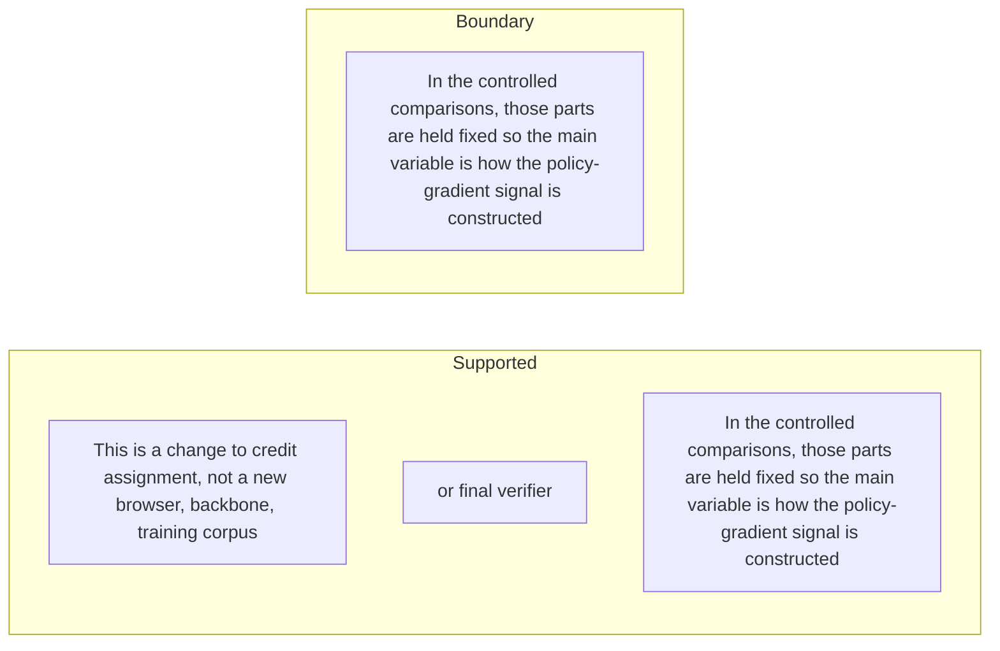

#### Python

```python
from html import escape
from pathlib import Path
from textwrap import wrap

title = "trace_change_p2: This is a change to credit assignment not a — supported-versus-bounded scope"
columns = {"Supported statement": ["This is a change to credit assignment, not a new browser, backbone, training corpus","or final verifier","In the controlled comparisons, those parts are held fixed so the main variable is how the policy-gradient signal is constructed"], "Boundary or contingency": ["In the controlled comparisons, those parts are held fixed so the main variable is how the policy-gradient signal is constructed"]}
height = 550
parts = [
    f'<svg xmlns="http://www.w3.org/2000/svg" viewBox="0 0 900 {height}" role="img" aria-labelledby="title desc">',
    f'<title id="title">{escape(title)}</title>',
    '<desc id="desc">Statements are partitioned into supported content and explicit boundaries.</desc>',
    f'<rect width="900" height="{height}" fill="white"/>',
]
for column_index, (heading, items) in enumerate(columns.items()):
    x = 240 + column_index * 430
    parts.append(f'<text x="{x}" y="70" text-anchor="middle" font-family="sans-serif" font-size="18" font-weight="700">{escape(heading)}</text>')
    for item_index, item in enumerate(items):
        y = 130 + item_index * 110
        parts.append(f'<rect x="{x-180}" y="{y-35}" width="360" height="80" rx="12" fill="#f7fbff" stroke="#234"/>')
        for line_index, line in enumerate(wrap(item, width=48)):
            parts.append(f'<text x="{x}" y="{y-12+line_index*14}" text-anchor="middle" font-family="sans-serif" font-size="11">{escape(line)}</text>')
parts.append('</svg>')
Path("trace_change_p2_treatment_c.svg").write_text("\n".join(parts), encoding="utf-8")
```

### Implementation record

- Status: `NOT_NEEDED`
- Selected treatment: `NONE`
- Selection rationale:
- Delivery medium: `NONE`
- Visual ID and placement:
- Shared paragraph scope: `NONE`
- Changed files:
- Accessibility and fallback verification:
- Desktop and mobile verification:
- Evidence deviations: `NONE`

## `trace_mechanism_p1`

- Location: `trace_mechanism`, paragraph 1
- Text anchor: "TRACE first splits a rollout after each tool action and returned observation."
- Claims and sources: `trace_claim_prefix_probe` (OBSERVED, VERIFIED); `trace_claim_td` (OBSERVED, VERIFIED); `trace_claim_telescope` (OBSERVED, VERIFIED); `trace_claim_outcome_anchor` (OBSERVED, VERIFIED); `trace_source_method` (Sections 3.1–3.3, Equations 4–12, Algorithm 1)
- Visual needed: `YES`
- Decision rationale: Removing a visual would require readers to retain the material relation between "TRACE first splits a rollout after each tool action and returned observation" and "it is not trained as a reward model" while also tracking 4 source-bounded propositions. The paragraph contains a real mechanism relation graph; the visual must preserve its stated conditions and must not add causal or proportional meaning.
- Explanatory job: mechanism relation graph.

### Treatment A — TRACE first splits a rollout after each tool action — mechanism relation graph

- Teaching purpose: Answer "How does TRACE turn one tool interaction into credit?" by exposing the paragraph's 4 named propositions and 3 stated reading, comparison, or qualification relations.
- Encoding and reading order: Nodes reproduce the complete labels "TRACE first splits a rollout after each tool action and returned observation"; "For every resulting prefix, a frozen copy of the initial policy computes the average log-probability of the known gold answer"; "The reference is a stable probe"; "it is not trained as a reward model". Edges carry the explicit relation labels "then", "then", "then"; arrow direction is sequence only for mechanism or example prose and otherwise denotes reading order.
- Evidence and limitations: The topology is derived from this paragraph rather than a fixed pipeline. Encode only `trace_claim_prefix_probe`, `trace_claim_td`, `trace_claim_telescope`, `trace_claim_outcome_anchor` and do not turn reading-order edges into causal claims.
- Recommended web medium: responsive inline SVG with CSS; JavaScript may add optional step focus only when state order matters.
- Mobile, accessibility, and motion behavior: Keep the full node-and-relation list in DOM order, expose the relation labels in the long description, stack nodes on narrow screens, and disable focus transitions under reduced motion.

#### TikZ

```tex
\documentclass[tikz,border=5pt]{standalone}
\usepackage[T1]{fontenc}
\usepackage{tikz}
\usetikzlibrary{arrows.meta,positioning}
\begin{document}
\begin{tikzpicture}[font=\sffamily,concept/.style={draw,rounded corners,align=center,text width=3.6cm,minimum height=1.35cm},link/.style={-{Latex[length=2mm]},thick},rel/.style={fill=white,font=\scriptsize,inner sep=2pt}]
\node[font=\bfseries,align=center] at (6.1,2.0) {trace\_mechanism\_p1: TRACE first splits a rollout after each tool action - mechanism relation graph};
\node[concept] (n1) at (1.8,0) {TRACE first splits a rollout after each tool action and returned observation};
\node[concept] (n2) at (6.1,0) {For every resulting prefix, a frozen copy of the initial policy computes the average log-probability of the known gold answer};
\node[concept] (n3) at (10.4,0) {The reference is a stable probe};
\node[concept] (n4) at (1.8,-3.2) {it is not trained as a reward model};
\draw[link] (n1) -- node[rel] {then} (n2);
\draw[link] (n2) -- node[rel] {then} (n3);
\draw[link] (n3) -- node[rel] {then} (n4);
\end{tikzpicture}
\end{document}
```

#### Mermaid

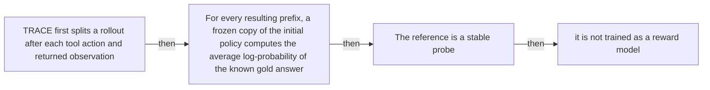

#### Python

```python
from html import escape
from pathlib import Path
from textwrap import wrap

title = "trace_mechanism_p1: TRACE first splits a rollout after each tool action — mechanism relation graph"
nodes = [["n1","TRACE first splits a rollout after each tool action and returned observation",120,150],["n2","For every resulting prefix, a frozen copy of the initial policy computes the average log-probability of the known gold answer",420,150],["n3","The reference is a stable probe",720,150],["n4","it is not trained as a reward model",120,340]]
edges = [["n1","n2","then"],["n2","n3","then"],["n3","n4","then"]]
node_by_id = {node_id: (label, x, y) for node_id, label, x, y in nodes}

parts = [
    '<svg xmlns="http://www.w3.org/2000/svg" viewBox="0 0 860 520" role="img" aria-labelledby="title desc">',
    f'<title id="title">{escape(title)}</title>',
    '<desc id="desc">The labeled relations reproduce only relationships stated in the paragraph.</desc>',
    '<rect width="860" height="520" fill="white"/>',
]
for source, target, relation in edges:
    _, x1, y1 = node_by_id[source]
    _, x2, y2 = node_by_id[target]
    parts.append(f'<line x1="{x1}" y1="{y1}" x2="{x2}" y2="{y2}" stroke="#345" stroke-width="2"/>')
    parts.append(f'<text x="{(x1+x2)/2}" y="{(y1+y2)/2-6}" text-anchor="middle" font-family="sans-serif" font-size="11">{escape(relation)}</text>')
for _, label, x, y in nodes:
    parts.append(f'<rect x="{x-125}" y="{y-58}" width="250" height="116" rx="14" fill="#eef6ff" stroke="#234"/>')
    for line_index, line in enumerate(wrap(label, width=32)):
        parts.append(f'<text x="{x}" y="{y-34+line_index*16}" text-anchor="middle" font-family="sans-serif" font-size="12">{escape(line)}</text>')
parts.append('</svg>')
Path("trace_mechanism_p1_treatment_a.svg").write_text("\n".join(parts), encoding="utf-8")
```

### Treatment B — trace_claim_prefix_probe, trace_claim_td, trace_claim_telescope, trace_claim_outcome_anchor — claim-to-source provenance

- Teaching purpose: Show exactly which atomic claims underwrite this paragraph and which fixed source records support each claim.
- Encoding and reading order: A bipartite graph places 4 claim nodes on the left and 1 source nodes on the right, with only the 4 claim-source edges recorded in the fixture. Claim labels include epistemic status; source labels include the exact locator.
- Evidence and limitations: This treatment explains provenance and uncertainty, not the paper's causal mechanism. Missing edges remain visibly absent and no source count is treated as confidence.
- Recommended web medium: semantic HTML/CSS claim-source table with an SVG network view; JavaScript only for keyboard-controlled source highlighting.
- Mobile, accessibility, and motion behavior: Provide real table headers and source links in the static fallback, make every edge recoverable as text, stack claim records before source records on mobile, and require no motion.

#### TikZ

```tex
\documentclass[tikz,border=5pt]{standalone}
\usepackage[T1]{fontenc}
\usepackage{tikz}
\usetikzlibrary{arrows.meta}
\begin{document}
\begin{tikzpicture}[font=\sffamily,claim/.style={draw,rounded corners,align=center,text width=5.2cm,minimum height=1.2cm},source/.style={draw,dashed,align=center,text width=5.2cm,minimum height=1.2cm},link/.style={-{Latex[length=2mm]},thin}]
\node[font=\bfseries] at (4,1.8) {trace\_mechanism\_p1: claim-to-source provenance};
\node[claim] (c1) at (0,0) {TRACE scores the known gold answer at tool-boundary trajectory prefixes with a frozen copy of the initial policy. [OBSERVED]};
\node[claim] (c2) at (0,-2.4) {The one-step local credit is the difference between adjacent log-ratio prefix values. [OBSERVED]};
\node[claim] (c3) at (0,-4.8) {The one-step credit telescopes, so redundant intermediate turns cannot increase its endpoint sum. [OBSERVED]};
\node[claim] (c4) at (0,-7.199999999999999) {The reported training objective combines local turn credit with GRPO's final outcome advantage. [OBSERVED]};
\node[source] (s1) at (8,0) {TRACE v1 method - Sections 3.1-3.3, Equations 4-12, Algorithm 1};
\draw[link] (c1) -- (s1);
\draw[link] (c2) -- (s1);
\draw[link] (c3) -- (s1);
\draw[link] (c4) -- (s1);
\end{tikzpicture}
\end{document}
```

#### Mermaid

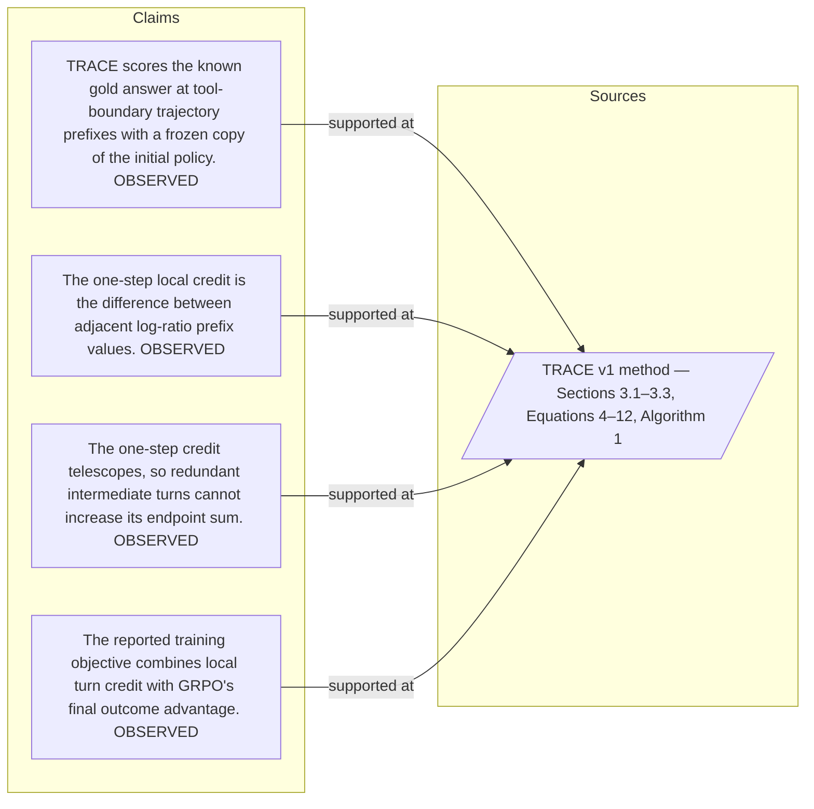

#### Python

```python
from html import escape
from pathlib import Path
from textwrap import wrap

title = "trace_mechanism_p1: claim-to-source provenance"
nodes = [["c1","TRACE scores the known gold answer at tool-boundary trajectory prefixes with a frozen copy of the initial policy. [OBSERVED]",190,130],["c2","The one-step local credit is the difference between adjacent log-ratio prefix values. [OBSERVED]",190,250],["c3","The one-step credit telescopes, so redundant intermediate turns cannot increase its endpoint sum. [OBSERVED]",190,370],["c4","The reported training objective combines local turn credit with GRPO's final outcome advantage. [OBSERVED]",190,490],["s1","TRACE v1 method — Sections 3.1–3.3, Equations 4–12, Algorithm 1",700,130]]
edges = [["c1","s1"],["c2","s1"],["c3","s1"],["c4","s1"]]
node_by_id = {node_id: (label, x, y) for node_id, label, x, y in nodes}
height = 680

parts = [
    f'<svg xmlns="http://www.w3.org/2000/svg" viewBox="0 0 900 {height}" role="img" aria-labelledby="title desc">',
    f'<title id="title">{escape(title)}</title>',
    '<desc id="desc">Bipartite map from verified claim records to their exact source records.</desc>',
    f'<rect width="900" height="{height}" fill="white"/>',
]
for source, target in edges:
    _, x1, y1 = node_by_id[source]
    _, x2, y2 = node_by_id[target]
    parts.append(f'<line x1="{x1+145}" y1="{y1}" x2="{x2-145}" y2="{y2}" stroke="#456" stroke-width="2"/>')
for node_id, label, x, y in nodes:
    dashed = ' stroke-dasharray="7 5"' if node_id.startswith("s") else ''
    parts.append(f'<rect x="{x-145}" y="{y-46}" width="290" height="92" rx="12" fill="#f7fbff" stroke="#234"{dashed}/>')
    for line_index, line in enumerate(wrap(label, width=38)):
        parts.append(f'<text x="{x}" y="{y-24+line_index*14}" text-anchor="middle" font-family="sans-serif" font-size="11">{escape(line)}</text>')
parts.append('</svg>')
Path("trace_mechanism_p1_treatment_b.svg").write_text("\n".join(parts), encoding="utf-8")
```

### Treatment C — TRACE first splits a rollout after each tool action — input-operation-outcome storyboard

- Teaching purpose: Let readers inspect the paragraph as concrete input, operation, and outcome states.
- Encoding and reading order: Use 4 ordered states labeled "Input: TRACE first splits a rollout after each tool action and returned observation", "Operation: For every resulting prefix, a frozen copy of the initial policy computes the average log-probability of the known gold answer", "Operation: The reference is a stable probe", "Outcome: it is not trained as a reward model". State connectors reproduce paragraph order and do not imply unreported timing.
- Evidence and limitations: The first, intermediate, and final states are paragraph clauses; no hidden state, quantity, or transition is added.
- Recommended web medium: responsive SVG or semantic HTML/CSS; JavaScript is optional only for a meaningful state or scope toggle.
- Mobile, accessibility, and motion behavior: Preserve every exact value or scope statement as selectable text, avoid color-only distinctions, stack groups on mobile, and keep all information visible when JavaScript or motion is disabled.

#### TikZ

```tex
\documentclass[tikz,border=5pt]{standalone}
\usepackage[T1]{fontenc}
\usepackage{tikz}
\begin{document}
\begin{tikzpicture}[font=\sffamily,state/.style={draw,rounded corners,align=center,text width=3.2cm,minimum height=1.8cm}]
\node[font=\bfseries] at (5.699999999999999,2) {trace\_mechanism\_p1: TRACE first splits a rollout after each tool action - input-operation-outcome storyboard};
\node[state] (k1) at (0,0) {\textbf{Input}\\TRACE first splits a rollout after each tool action and returned observation};
\node[state] (k2) at (3.8,0) {\textbf{Operation}\\For every resulting prefix, a frozen copy of the initial policy computes the average log-probability of the known gold answer};
\node[state] (k3) at (7.6,0) {\textbf{Operation}\\The reference is a stable probe};
\node[state] (k4) at (11.399999999999999,0) {\textbf{Outcome}\\it is not trained as a reward model};
\draw[->,thick] (k1) -- (k2);
\draw[->,thick] (k2) -- (k3);
\draw[->,thick] (k3) -- (k4);
\end{tikzpicture}
\end{document}
```

#### Mermaid

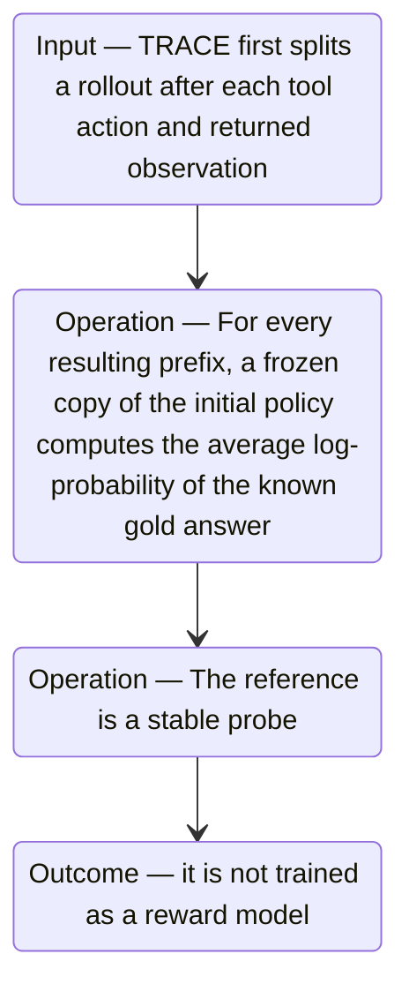

#### Python

```python
from html import escape
from pathlib import Path
from textwrap import wrap

title = "trace_mechanism_p1: TRACE first splits a rollout after each tool action — input-operation-outcome storyboard"
items = [["Input","TRACE first splits a rollout after each tool action and returned observation",120,210],["Operation","For every resulting prefix, a frozen copy of the initial policy computes the average log-probability of the known gold answer",290,210],["Operation","The reference is a stable probe",460,210],["Outcome","it is not trained as a reward model",630,210]]
width = max(760, 240 + len(items) * 170)
parts = [
    f'<svg xmlns="http://www.w3.org/2000/svg" viewBox="0 0 {width} 460" role="img" aria-labelledby="title desc">',
    f'<title id="title">{escape(title)}</title>',
    '<desc id="desc">Input, operation, and outcome states follow the paragraph in source order.</desc>',
    f'<rect width="{width}" height="460" fill="white"/>',
]
for index in range(len(items)-1):
    _, _, x1, y1 = items[index]
    _, _, x2, y2 = items[index+1]
    parts.append(f'<line x1="{x1+65}" y1="{y1}" x2="{x2-65}" y2="{y2}" stroke="#345" stroke-width="2"/>')
for group, label, x, y in items:
    parts.append(f'<rect x="{x-65}" y="{y-90}" width="130" height="180" rx="16" fill="#eef6ff" stroke="#234"/>')
    parts.append(f'<text x="{x}" y="{y-60}" text-anchor="middle" font-family="sans-serif" font-size="13" font-weight="700">{escape(group)}</text>')
    for line_index, line in enumerate(wrap(label, width=18)):
        parts.append(f'<text x="{x}" y="{y-34+line_index*14}" text-anchor="middle" font-family="sans-serif" font-size="10">{escape(line)}</text>')
parts.append('</svg>')
Path("trace_mechanism_p1_treatment_c.svg").write_text("\n".join(parts), encoding="utf-8")
```

### Implementation record

- Status: `PENDING`
- Selected treatment: `NONE`
- Selection rationale:
- Delivery medium: `NONE`
- Visual ID and placement:
- Shared paragraph scope: `NONE`
- Changed files:
- Accessibility and fallback verification:
- Desktop and mobile verification:
- Evidence deviations: `NONE`

## `trace_mechanism_p2`

- Location: `trace_mechanism`, paragraph 2
- Text anchor: "The raw answer score is converted into a log-ratio value representing relative closure of the initial answer-likelihood gap."
- Claims and sources: `trace_claim_prefix_probe` (OBSERVED, VERIFIED); `trace_claim_td` (OBSERVED, VERIFIED); `trace_claim_telescope` (OBSERVED, VERIFIED); `trace_claim_outcome_anchor` (OBSERVED, VERIFIED); `trace_source_method` (Sections 3.1–3.3, Equations 4–12, Algorithm 1)
- Visual needed: `YES`
- Decision rationale: Removing a visual would require readers to retain the material relation between "The raw answer score is converted into a log-ratio value representing relative closure of the initial answer-likelihood gap" and "negative change means the prefix moved away from the answer" while also tracking 5 source-bounded propositions. The paragraph contains a real mechanism relation graph; the visual must preserve its stated conditions and must not add causal or proportional meaning.
- Explanatory job: mechanism relation graph.

### Treatment A — The raw answer score is converted into a log-ratio — mechanism relation graph

- Teaching purpose: Answer "How does TRACE turn one tool interaction into credit?" by exposing the paragraph's 5 named propositions and 4 stated reading, comparison, or qualification relations.
- Encoding and reading order: Nodes reproduce the complete labels "The raw answer score is converted into a log-ratio value representing relative closure of the initial answer-likelihood gap"; "The difference between adjacent values is the one-step temporal-difference credit"; "Positive change means the new interaction made the answer easier to predict"; "zero means no measured progress"; "negative change means the prefix moved away from the answer". Edges carry the explicit relation labels "then", "then", "then", "then"; arrow direction is sequence only for mechanism or example prose and otherwise denotes reading order.
- Evidence and limitations: The topology is derived from this paragraph rather than a fixed pipeline. Encode only `trace_claim_prefix_probe`, `trace_claim_td`, `trace_claim_telescope`, `trace_claim_outcome_anchor` and do not turn reading-order edges into causal claims.
- Recommended web medium: responsive inline SVG with CSS; JavaScript may add optional step focus only when state order matters.
- Mobile, accessibility, and motion behavior: Keep the full node-and-relation list in DOM order, expose the relation labels in the long description, stack nodes on narrow screens, and disable focus transitions under reduced motion.

#### TikZ

```tex
\documentclass[tikz,border=5pt]{standalone}
\usepackage[T1]{fontenc}
\usepackage{tikz}
\usetikzlibrary{arrows.meta,positioning}
\begin{document}
\begin{tikzpicture}[font=\sffamily,concept/.style={draw,rounded corners,align=center,text width=3.6cm,minimum height=1.35cm},link/.style={-{Latex[length=2mm]},thick},rel/.style={fill=white,font=\scriptsize,inner sep=2pt}]
\node[font=\bfseries,align=center] at (6.1,2.0) {trace\_mechanism\_p2: The raw answer score is converted into a log-ratio - mechanism relation graph};
\node[concept] (n1) at (1.8,0) {The raw answer score is converted into a log-ratio value representing relative closure of the initial answer-likelihood gap};
\node[concept] (n2) at (6.1,0) {The difference between adjacent values is the one-step temporal-difference credit};
\node[concept] (n3) at (10.4,0) {Positive change means the new interaction made the answer easier to predict};
\node[concept] (n4) at (1.8,-3.2) {zero means no measured progress};
\node[concept] (n5) at (6.1,-3.2) {negative change means the prefix moved away from the answer};
\draw[link] (n1) -- node[rel] {then} (n2);
\draw[link] (n2) -- node[rel] {then} (n3);
\draw[link] (n3) -- node[rel] {then} (n4);
\draw[link] (n4) -- node[rel] {then} (n5);
\end{tikzpicture}
\end{document}
```

#### Mermaid

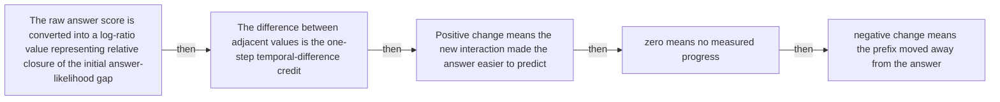

#### Python

```python
from html import escape
from pathlib import Path
from textwrap import wrap

title = "trace_mechanism_p2: The raw answer score is converted into a log-ratio — mechanism relation graph"
nodes = [["n1","The raw answer score is converted into a log-ratio value representing relative closure of the initial answer-likelihood gap",120,150],["n2","The difference between adjacent values is the one-step temporal-difference credit",420,150],["n3","Positive change means the new interaction made the answer easier to predict",720,150],["n4","zero means no measured progress",120,340],["n5","negative change means the prefix moved away from the answer",420,340]]
edges = [["n1","n2","then"],["n2","n3","then"],["n3","n4","then"],["n4","n5","then"]]
node_by_id = {node_id: (label, x, y) for node_id, label, x, y in nodes}

parts = [
    '<svg xmlns="http://www.w3.org/2000/svg" viewBox="0 0 860 520" role="img" aria-labelledby="title desc">',
    f'<title id="title">{escape(title)}</title>',
    '<desc id="desc">The labeled relations reproduce only relationships stated in the paragraph.</desc>',
    '<rect width="860" height="520" fill="white"/>',
]
for source, target, relation in edges:
    _, x1, y1 = node_by_id[source]
    _, x2, y2 = node_by_id[target]
    parts.append(f'<line x1="{x1}" y1="{y1}" x2="{x2}" y2="{y2}" stroke="#345" stroke-width="2"/>')
    parts.append(f'<text x="{(x1+x2)/2}" y="{(y1+y2)/2-6}" text-anchor="middle" font-family="sans-serif" font-size="11">{escape(relation)}</text>')
for _, label, x, y in nodes:
    parts.append(f'<rect x="{x-125}" y="{y-58}" width="250" height="116" rx="14" fill="#eef6ff" stroke="#234"/>')
    for line_index, line in enumerate(wrap(label, width=32)):
        parts.append(f'<text x="{x}" y="{y-34+line_index*16}" text-anchor="middle" font-family="sans-serif" font-size="12">{escape(line)}</text>')
parts.append('</svg>')
Path("trace_mechanism_p2_treatment_a.svg").write_text("\n".join(parts), encoding="utf-8")
```

### Treatment B — trace_claim_prefix_probe, trace_claim_td, trace_claim_telescope, trace_claim_outcome_anchor — claim-to-source provenance

- Teaching purpose: Show exactly which atomic claims underwrite this paragraph and which fixed source records support each claim.
- Encoding and reading order: A bipartite graph places 4 claim nodes on the left and 1 source nodes on the right, with only the 4 claim-source edges recorded in the fixture. Claim labels include epistemic status; source labels include the exact locator.
- Evidence and limitations: This treatment explains provenance and uncertainty, not the paper's causal mechanism. Missing edges remain visibly absent and no source count is treated as confidence.
- Recommended web medium: semantic HTML/CSS claim-source table with an SVG network view; JavaScript only for keyboard-controlled source highlighting.
- Mobile, accessibility, and motion behavior: Provide real table headers and source links in the static fallback, make every edge recoverable as text, stack claim records before source records on mobile, and require no motion.

#### TikZ

```tex
\documentclass[tikz,border=5pt]{standalone}
\usepackage[T1]{fontenc}
\usepackage{tikz}
\usetikzlibrary{arrows.meta}
\begin{document}
\begin{tikzpicture}[font=\sffamily,claim/.style={draw,rounded corners,align=center,text width=5.2cm,minimum height=1.2cm},source/.style={draw,dashed,align=center,text width=5.2cm,minimum height=1.2cm},link/.style={-{Latex[length=2mm]},thin}]
\node[font=\bfseries] at (4,1.8) {trace\_mechanism\_p2: claim-to-source provenance};
\node[claim] (c1) at (0,0) {TRACE scores the known gold answer at tool-boundary trajectory prefixes with a frozen copy of the initial policy. [OBSERVED]};
\node[claim] (c2) at (0,-2.4) {The one-step local credit is the difference between adjacent log-ratio prefix values. [OBSERVED]};
\node[claim] (c3) at (0,-4.8) {The one-step credit telescopes, so redundant intermediate turns cannot increase its endpoint sum. [OBSERVED]};
\node[claim] (c4) at (0,-7.199999999999999) {The reported training objective combines local turn credit with GRPO's final outcome advantage. [OBSERVED]};
\node[source] (s1) at (8,0) {TRACE v1 method - Sections 3.1-3.3, Equations 4-12, Algorithm 1};
\draw[link] (c1) -- (s1);
\draw[link] (c2) -- (s1);
\draw[link] (c3) -- (s1);
\draw[link] (c4) -- (s1);
\end{tikzpicture}
\end{document}
```

#### Mermaid


#### Python

```python
from html import escape
from pathlib import Path
from textwrap import wrap

title = "trace_mechanism_p2: claim-to-source provenance"
nodes = [["c1","TRACE scores the known gold answer at tool-boundary trajectory prefixes with a frozen copy of the initial policy. [OBSERVED]",190,130],["c2","The one-step local credit is the difference between adjacent log-ratio prefix values. [OBSERVED]",190,250],["c3","The one-step credit telescopes, so redundant intermediate turns cannot increase its endpoint sum. [OBSERVED]",190,370],["c4","The reported training objective combines local turn credit with GRPO's final outcome advantage. [OBSERVED]",190,490],["s1","TRACE v1 method — Sections 3.1–3.3, Equations 4–12, Algorithm 1",700,130]]
edges = [["c1","s1"],["c2","s1"],["c3","s1"],["c4","s1"]]
node_by_id = {node_id: (label, x, y) for node_id, label, x, y in nodes}
height = 680

parts = [
    f'<svg xmlns="http://www.w3.org/2000/svg" viewBox="0 0 900 {height}" role="img" aria-labelledby="title desc">',
    f'<title id="title">{escape(title)}</title>',
    '<desc id="desc">Bipartite map from verified claim records to their exact source records.</desc>',
    f'<rect width="900" height="{height}" fill="white"/>',
]
for source, target in edges:
    _, x1, y1 = node_by_id[source]
    _, x2, y2 = node_by_id[target]
    parts.append(f'<line x1="{x1+145}" y1="{y1}" x2="{x2-145}" y2="{y2}" stroke="#456" stroke-width="2"/>')
for node_id, label, x, y in nodes:
    dashed = ' stroke-dasharray="7 5"' if node_id.startswith("s") else ''
    parts.append(f'<rect x="{x-145}" y="{y-46}" width="290" height="92" rx="12" fill="#f7fbff" stroke="#234"{dashed}/>')
    for line_index, line in enumerate(wrap(label, width=38)):
        parts.append(f'<text x="{x}" y="{y-24+line_index*14}" text-anchor="middle" font-family="sans-serif" font-size="11">{escape(line)}</text>')
parts.append('</svg>')
Path("trace_mechanism_p2_treatment_b.svg").write_text("\n".join(parts), encoding="utf-8")
```

### Treatment C — The raw answer score is converted into a log-ratio — input-operation-outcome storyboard

- Teaching purpose: Let readers inspect the paragraph as concrete input, operation, and outcome states.
- Encoding and reading order: Use 5 ordered states labeled "Input: The raw answer score is converted into a log-ratio value representing relative closure of the initial answer-likelihood gap", "Operation: The difference between adjacent values is the one-step temporal-difference credit", "Operation: Positive change means the new interaction made the answer easier to predict", "Operation: zero means no measured progress", "Outcome: negative change means the prefix moved away from the answer". State connectors reproduce paragraph order and do not imply unreported timing.
- Evidence and limitations: The first, intermediate, and final states are paragraph clauses; no hidden state, quantity, or transition is added.
- Recommended web medium: responsive SVG or semantic HTML/CSS; JavaScript is optional only for a meaningful state or scope toggle.
- Mobile, accessibility, and motion behavior: Preserve every exact value or scope statement as selectable text, avoid color-only distinctions, stack groups on mobile, and keep all information visible when JavaScript or motion is disabled.

#### TikZ

```tex
\documentclass[tikz,border=5pt]{standalone}
\usepackage[T1]{fontenc}
\usepackage{tikz}
\begin{document}
\begin{tikzpicture}[font=\sffamily,state/.style={draw,rounded corners,align=center,text width=3.2cm,minimum height=1.8cm}]
\node[font=\bfseries] at (7.6,2) {trace\_mechanism\_p2: The raw answer score is converted into a log-ratio - input-operation-outcome storyboard};
\node[state] (k1) at (0,0) {\textbf{Input}\\The raw answer score is converted into a log-ratio value representing relative closure of the initial answer-likelihood gap};
\node[state] (k2) at (3.8,0) {\textbf{Operation}\\The difference between adjacent values is the one-step temporal-difference credit};
\node[state] (k3) at (7.6,0) {\textbf{Operation}\\Positive change means the new interaction made the answer easier to predict};
\node[state] (k4) at (11.399999999999999,0) {\textbf{Operation}\\zero means no measured progress};
\node[state] (k5) at (15.2,0) {\textbf{Outcome}\\negative change means the prefix moved away from the answer};
\draw[->,thick] (k1) -- (k2);
\draw[->,thick] (k2) -- (k3);
\draw[->,thick] (k3) -- (k4);
\draw[->,thick] (k4) -- (k5);
\end{tikzpicture}
\end{document}
```

#### Mermaid

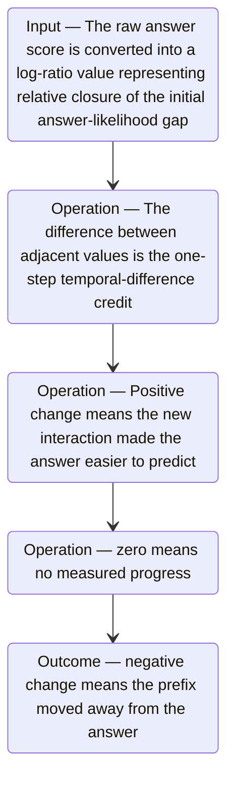

#### Python

```python
from html import escape
from pathlib import Path
from textwrap import wrap

title = "trace_mechanism_p2: The raw answer score is converted into a log-ratio — input-operation-outcome storyboard"
items = [["Input","The raw answer score is converted into a log-ratio value representing relative closure of the initial answer-likelihood gap",120,210],["Operation","The difference between adjacent values is the one-step temporal-difference credit",290,210],["Operation","Positive change means the new interaction made the answer easier to predict",460,210],["Operation","zero means no measured progress",630,210],["Outcome","negative change means the prefix moved away from the answer",800,210]]
width = max(760, 240 + len(items) * 170)
parts = [
    f'<svg xmlns="http://www.w3.org/2000/svg" viewBox="0 0 {width} 460" role="img" aria-labelledby="title desc">',
    f'<title id="title">{escape(title)}</title>',
    '<desc id="desc">Input, operation, and outcome states follow the paragraph in source order.</desc>',
    f'<rect width="{width}" height="460" fill="white"/>',
]
for index in range(len(items)-1):
    _, _, x1, y1 = items[index]
    _, _, x2, y2 = items[index+1]
    parts.append(f'<line x1="{x1+65}" y1="{y1}" x2="{x2-65}" y2="{y2}" stroke="#345" stroke-width="2"/>')
for group, label, x, y in items:
    parts.append(f'<rect x="{x-65}" y="{y-90}" width="130" height="180" rx="16" fill="#eef6ff" stroke="#234"/>')
    parts.append(f'<text x="{x}" y="{y-60}" text-anchor="middle" font-family="sans-serif" font-size="13" font-weight="700">{escape(group)}</text>')
    for line_index, line in enumerate(wrap(label, width=18)):
        parts.append(f'<text x="{x}" y="{y-34+line_index*14}" text-anchor="middle" font-family="sans-serif" font-size="10">{escape(line)}</text>')
parts.append('</svg>')
Path("trace_mechanism_p2_treatment_c.svg").write_text("\n".join(parts), encoding="utf-8")
```

### Implementation record

- Status: `PENDING`
- Selected treatment: `NONE`
- Selection rationale:
- Delivery medium: `NONE`
- Visual ID and placement:
- Shared paragraph scope: `NONE`
- Changed files:
- Accessibility and fallback verification:
- Desktop and mobile verification:
- Evidence deviations: `NONE`

## `trace_mechanism_p3`

- Location: `trace_mechanism`, paragraph 3
- Text anchor: "One-step credits telescope, so inserting redundant intermediate steps cannot increase their endpoint sum."
- Claims and sources: `trace_claim_prefix_probe` (OBSERVED, VERIFIED); `trace_claim_td` (OBSERVED, VERIFIED); `trace_claim_telescope` (OBSERVED, VERIFIED); `trace_claim_outcome_anchor` (OBSERVED, VERIFIED); `trace_source_method` (Sections 3.1–3.3, Equations 4–12, Algorithm 1)
- Visual needed: `YES`
- Decision rationale: Removing a visual would require readers to retain the material relation between "One-step credits telescope" and "The exact telescoping guarantee belongs to the one-step component, not the full propagated signal" while also tracking 4 source-bounded propositions. The paragraph contains a real mechanism relation graph; the visual must preserve its stated conditions and must not add causal or proportional meaning.
- Explanatory job: mechanism relation graph.

### Treatment A — One-step credits telescope — mechanism relation graph

- Teaching purpose: Answer "How does TRACE turn one tool interaction into credit?" by exposing the paragraph's 4 named propositions and 3 stated reading, comparison, or qualification relations.
- Encoding and reading order: Nodes reproduce the complete labels "One-step credits telescope"; "so inserting redundant intermediate steps cannot increase their endpoint sum"; "The reported objective also uses a short look-ahead for delayed effects and combines local credit with the standard GRPO outcome advantage"; "The exact telescoping guarantee belongs to the one-step component, not the full propagated signal". Edges carry the explicit relation labels "bounded by", "then", "then"; arrow direction is sequence only for mechanism or example prose and otherwise denotes reading order.
- Evidence and limitations: The topology is derived from this paragraph rather than a fixed pipeline. Encode only `trace_claim_prefix_probe`, `trace_claim_td`, `trace_claim_telescope`, `trace_claim_outcome_anchor` and do not turn reading-order edges into causal claims.
- Recommended web medium: responsive inline SVG with CSS; JavaScript may add optional step focus only when state order matters.
- Mobile, accessibility, and motion behavior: Keep the full node-and-relation list in DOM order, expose the relation labels in the long description, stack nodes on narrow screens, and disable focus transitions under reduced motion.

#### TikZ

```tex
\documentclass[tikz,border=5pt]{standalone}
\usepackage[T1]{fontenc}
\usepackage{tikz}
\usetikzlibrary{arrows.meta,positioning}
\begin{document}
\begin{tikzpicture}[font=\sffamily,concept/.style={draw,rounded corners,align=center,text width=3.6cm,minimum height=1.35cm},link/.style={-{Latex[length=2mm]},thick},rel/.style={fill=white,font=\scriptsize,inner sep=2pt}]
\node[font=\bfseries,align=center] at (6.1,2.0) {trace\_mechanism\_p3: One-step credits telescope - mechanism relation graph};
\node[concept] (n1) at (1.8,0) {One-step credits telescope};
\node[concept] (n2) at (6.1,0) {so inserting redundant intermediate steps cannot increase their endpoint sum};
\node[concept] (n3) at (10.4,0) {The reported objective also uses a short look-ahead for delayed effects and combines local credit with the standard GRPO outcome advantage};
\node[concept] (n4) at (1.8,-3.2) {The exact telescoping guarantee belongs to the one-step component, not the full propagated signal};
\draw[link] (n1) -- node[rel] {bounded by} (n2);
\draw[link] (n2) -- node[rel] {then} (n3);
\draw[link] (n3) -- node[rel] {then} (n4);
\end{tikzpicture}
\end{document}
```

#### Mermaid

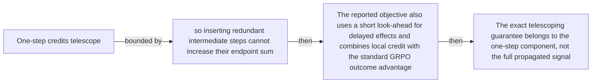

#### Python

```python
from html import escape
from pathlib import Path
from textwrap import wrap

title = "trace_mechanism_p3: One-step credits telescope — mechanism relation graph"
nodes = [["n1","One-step credits telescope",120,150],["n2","so inserting redundant intermediate steps cannot increase their endpoint sum",420,150],["n3","The reported objective also uses a short look-ahead for delayed effects and combines local credit with the standard GRPO outcome advantage",720,150],["n4","The exact telescoping guarantee belongs to the one-step component, not the full propagated signal",120,340]]
edges = [["n1","n2","bounded by"],["n2","n3","then"],["n3","n4","then"]]
node_by_id = {node_id: (label, x, y) for node_id, label, x, y in nodes}

parts = [
    '<svg xmlns="http://www.w3.org/2000/svg" viewBox="0 0 860 520" role="img" aria-labelledby="title desc">',
    f'<title id="title">{escape(title)}</title>',
    '<desc id="desc">The labeled relations reproduce only relationships stated in the paragraph.</desc>',
    '<rect width="860" height="520" fill="white"/>',
]
for source, target, relation in edges:
    _, x1, y1 = node_by_id[source]
    _, x2, y2 = node_by_id[target]
    parts.append(f'<line x1="{x1}" y1="{y1}" x2="{x2}" y2="{y2}" stroke="#345" stroke-width="2"/>')
    parts.append(f'<text x="{(x1+x2)/2}" y="{(y1+y2)/2-6}" text-anchor="middle" font-family="sans-serif" font-size="11">{escape(relation)}</text>')
for _, label, x, y in nodes:
    parts.append(f'<rect x="{x-125}" y="{y-58}" width="250" height="116" rx="14" fill="#eef6ff" stroke="#234"/>')
    for line_index, line in enumerate(wrap(label, width=32)):
        parts.append(f'<text x="{x}" y="{y-34+line_index*16}" text-anchor="middle" font-family="sans-serif" font-size="12">{escape(line)}</text>')
parts.append('</svg>')
Path("trace_mechanism_p3_treatment_a.svg").write_text("\n".join(parts), encoding="utf-8")
```

### Treatment B — trace_claim_prefix_probe, trace_claim_td, trace_claim_telescope, trace_claim_outcome_anchor — claim-to-source provenance

- Teaching purpose: Show exactly which atomic claims underwrite this paragraph and which fixed source records support each claim.
- Encoding and reading order: A bipartite graph places 4 claim nodes on the left and 1 source nodes on the right, with only the 4 claim-source edges recorded in the fixture. Claim labels include epistemic status; source labels include the exact locator.
- Evidence and limitations: This treatment explains provenance and uncertainty, not the paper's causal mechanism. Missing edges remain visibly absent and no source count is treated as confidence.
- Recommended web medium: semantic HTML/CSS claim-source table with an SVG network view; JavaScript only for keyboard-controlled source highlighting.
- Mobile, accessibility, and motion behavior: Provide real table headers and source links in the static fallback, make every edge recoverable as text, stack claim records before source records on mobile, and require no motion.

#### TikZ

```tex
\documentclass[tikz,border=5pt]{standalone}
\usepackage[T1]{fontenc}
\usepackage{tikz}
\usetikzlibrary{arrows.meta}
\begin{document}
\begin{tikzpicture}[font=\sffamily,claim/.style={draw,rounded corners,align=center,text width=5.2cm,minimum height=1.2cm},source/.style={draw,dashed,align=center,text width=5.2cm,minimum height=1.2cm},link/.style={-{Latex[length=2mm]},thin}]
\node[font=\bfseries] at (4,1.8) {trace\_mechanism\_p3: claim-to-source provenance};
\node[claim] (c1) at (0,0) {TRACE scores the known gold answer at tool-boundary trajectory prefixes with a frozen copy of the initial policy. [OBSERVED]};
\node[claim] (c2) at (0,-2.4) {The one-step local credit is the difference between adjacent log-ratio prefix values. [OBSERVED]};
\node[claim] (c3) at (0,-4.8) {The one-step credit telescopes, so redundant intermediate turns cannot increase its endpoint sum. [OBSERVED]};
\node[claim] (c4) at (0,-7.199999999999999) {The reported training objective combines local turn credit with GRPO's final outcome advantage. [OBSERVED]};
\node[source] (s1) at (8,0) {TRACE v1 method - Sections 3.1-3.3, Equations 4-12, Algorithm 1};
\draw[link] (c1) -- (s1);
\draw[link] (c2) -- (s1);
\draw[link] (c3) -- (s1);
\draw[link] (c4) -- (s1);
\end{tikzpicture}
\end{document}
```

#### Mermaid


#### Python

```python
from html import escape
from pathlib import Path
from textwrap import wrap

title = "trace_mechanism_p3: claim-to-source provenance"
nodes = [["c1","TRACE scores the known gold answer at tool-boundary trajectory prefixes with a frozen copy of the initial policy. [OBSERVED]",190,130],["c2","The one-step local credit is the difference between adjacent log-ratio prefix values. [OBSERVED]",190,250],["c3","The one-step credit telescopes, so redundant intermediate turns cannot increase its endpoint sum. [OBSERVED]",190,370],["c4","The reported training objective combines local turn credit with GRPO's final outcome advantage. [OBSERVED]",190,490],["s1","TRACE v1 method — Sections 3.1–3.3, Equations 4–12, Algorithm 1",700,130]]
edges = [["c1","s1"],["c2","s1"],["c3","s1"],["c4","s1"]]
node_by_id = {node_id: (label, x, y) for node_id, label, x, y in nodes}
height = 680

parts = [
    f'<svg xmlns="http://www.w3.org/2000/svg" viewBox="0 0 900 {height}" role="img" aria-labelledby="title desc">',
    f'<title id="title">{escape(title)}</title>',
    '<desc id="desc">Bipartite map from verified claim records to their exact source records.</desc>',
    f'<rect width="900" height="{height}" fill="white"/>',
]
for source, target in edges:
    _, x1, y1 = node_by_id[source]
    _, x2, y2 = node_by_id[target]
    parts.append(f'<line x1="{x1+145}" y1="{y1}" x2="{x2-145}" y2="{y2}" stroke="#456" stroke-width="2"/>')
for node_id, label, x, y in nodes:
    dashed = ' stroke-dasharray="7 5"' if node_id.startswith("s") else ''
    parts.append(f'<rect x="{x-145}" y="{y-46}" width="290" height="92" rx="12" fill="#f7fbff" stroke="#234"{dashed}/>')
    for line_index, line in enumerate(wrap(label, width=38)):
        parts.append(f'<text x="{x}" y="{y-24+line_index*14}" text-anchor="middle" font-family="sans-serif" font-size="11">{escape(line)}</text>')
parts.append('</svg>')
Path("trace_mechanism_p3_treatment_b.svg").write_text("\n".join(parts), encoding="utf-8")
```

### Treatment C — One-step credits telescope — input-operation-outcome storyboard

- Teaching purpose: Let readers inspect the paragraph as concrete input, operation, and outcome states.
- Encoding and reading order: Use 4 ordered states labeled "Input: One-step credits telescope", "Operation: so inserting redundant intermediate steps cannot increase their endpoint sum", "Operation: The reported objective also uses a short look-ahead for delayed effects and combines local credit with the standard GRPO outcome advantage", "Outcome: The exact telescoping guarantee belongs to the one-step component, not the full propagated signal". State connectors reproduce paragraph order and do not imply unreported timing.
- Evidence and limitations: The first, intermediate, and final states are paragraph clauses; no hidden state, quantity, or transition is added.
- Recommended web medium: responsive SVG or semantic HTML/CSS; JavaScript is optional only for a meaningful state or scope toggle.
- Mobile, accessibility, and motion behavior: Preserve every exact value or scope statement as selectable text, avoid color-only distinctions, stack groups on mobile, and keep all information visible when JavaScript or motion is disabled.

#### TikZ

```tex
\documentclass[tikz,border=5pt]{standalone}
\usepackage[T1]{fontenc}
\usepackage{tikz}
\begin{document}
\begin{tikzpicture}[font=\sffamily,state/.style={draw,rounded corners,align=center,text width=3.2cm,minimum height=1.8cm}]
\node[font=\bfseries] at (5.699999999999999,2) {trace\_mechanism\_p3: One-step credits telescope - input-operation-outcome storyboard};
\node[state] (k1) at (0,0) {\textbf{Input}\\One-step credits telescope};
\node[state] (k2) at (3.8,0) {\textbf{Operation}\\so inserting redundant intermediate steps cannot increase their endpoint sum};
\node[state] (k3) at (7.6,0) {\textbf{Operation}\\The reported objective also uses a short look-ahead for delayed effects and combines local credit with the standard GRPO outcome advantage};
\node[state] (k4) at (11.399999999999999,0) {\textbf{Outcome}\\The exact telescoping guarantee belongs to the one-step component, not the full propagated signal};
\draw[->,thick] (k1) -- (k2);
\draw[->,thick] (k2) -- (k3);
\draw[->,thick] (k3) -- (k4);
\end{tikzpicture}
\end{document}
```

#### Mermaid

```mermaid
stateDiagram-v2
  state "Input — One-step credits telescope" as k1
  state "Operation — so inserting redundant intermediate steps cannot increase their endpoint sum" as k2
  state "Operation — The reported objective also uses a short look-ahead for delayed effects and combines local credit with the standard GRPO outcome advantage" as k3
  state "Outcome — The exact telescoping guarantee belongs to the one-step component, not the full propagated signal" as k4
  k1 --> k2
  k2 --> k3
  k3 --> k4
```

#### Python

```python
from html import escape
from pathlib import Path
from textwrap import wrap

title = "trace_mechanism_p3: One-step credits telescope — input-operation-outcome storyboard"
items = [["Input","One-step credits telescope",120,210],["Operation","so inserting redundant intermediate steps cannot increase their endpoint sum",290,210],["Operation","The reported objective also uses a short look-ahead for delayed effects and combines local credit with the standard GRPO outcome advantage",460,210],["Outcome","The exact telescoping guarantee belongs to the one-step component, not the full propagated signal",630,210]]
width = max(760, 240 + len(items) * 170)
parts = [
    f'<svg xmlns="http://www.w3.org/2000/svg" viewBox="0 0 {width} 460" role="img" aria-labelledby="title desc">',
    f'<title id="title">{escape(title)}</title>',
    '<desc id="desc">Input, operation, and outcome states follow the paragraph in source order.</desc>',
    f'<rect width="{width}" height="460" fill="white"/>',
]
for index in range(len(items)-1):
    _, _, x1, y1 = items[index]
    _, _, x2, y2 = items[index+1]
    parts.append(f'<line x1="{x1+65}" y1="{y1}" x2="{x2-65}" y2="{y2}" stroke="#345" stroke-width="2"/>')
for group, label, x, y in items:
    parts.append(f'<rect x="{x-65}" y="{y-90}" width="130" height="180" rx="16" fill="#eef6ff" stroke="#234"/>')
    parts.append(f'<text x="{x}" y="{y-60}" text-anchor="middle" font-family="sans-serif" font-size="13" font-weight="700">{escape(group)}</text>')
    for line_index, line in enumerate(wrap(label, width=18)):
        parts.append(f'<text x="{x}" y="{y-34+line_index*14}" text-anchor="middle" font-family="sans-serif" font-size="10">{escape(line)}</text>')
parts.append('</svg>')
Path("trace_mechanism_p3_treatment_c.svg").write_text("\n".join(parts), encoding="utf-8")
```

### Implementation record

- Status: `PENDING`
- Selected treatment: `NONE`
- Selection rationale:
- Delivery medium: `NONE`
- Visual ID and placement:
- Shared paragraph scope: `NONE`
- Changed files:
- Accessibility and fallback verification:
- Desktop and mobile verification:
- Evidence deviations: `NONE`

## `trace_example_p1`

- Location: `trace_example`, paragraph 1
- Text anchor: "Consider a trajectory that searches for a relevant source, opens a page containing decisive evidence, then follows an unrelated branch and submits the wrong final answer."
- Claims and sources: `trace_claim_prefix_probe` (OBSERVED, VERIFIED); `trace_claim_td` (OBSERVED, VERIFIED); `trace_claim_outcome_anchor` (OBSERVED, VERIFIED); `trace_source_intro` (Pages 1–3, Abstract and Section 1); `trace_source_method` (Sections 3.1–3.3, Equations 4–12, Algorithm 1)
- Visual needed: `YES`
- Decision rationale: Removing a visual would require readers to retain the material relation between "Consider a trajectory that searches for a relevant source, opens a page containing decisive evidence" and "TRACE instead compares the frozen reference model's gold-answer readiness after each tool observation" while also tracking 4 source-bounded propositions. The paragraph contains a real example state path; the visual must preserve its stated conditions and must not add causal or proportional meaning.
- Explanatory job: example state path.

### Treatment A — Consider a trajectory that searches for a relevant source — example state path

- Teaching purpose: Answer "What would TRACE do with a useful search followed by a bad branch?" by exposing the paragraph's 4 named propositions and 3 stated reading, comparison, or qualification relations.
- Encoding and reading order: Nodes reproduce the complete labels "Consider a trajectory that searches for a relevant source, opens a page containing decisive evidence"; "then follows an unrelated branch and submits the wrong final answer"; "Outcome-only training gives the whole failed rollout a poor signal"; "TRACE instead compares the frozen reference model's gold-answer readiness after each tool observation". Edges carry the explicit relation labels "then", "bounded by", "contrasts with"; arrow direction is sequence only for mechanism or example prose and otherwise denotes reading order.
- Evidence and limitations: The topology is derived from this paragraph rather than a fixed pipeline. Encode only `trace_claim_prefix_probe`, `trace_claim_td`, `trace_claim_outcome_anchor` and do not turn reading-order edges into causal claims.
- Recommended web medium: responsive inline SVG with CSS; JavaScript may add optional step focus only when state order matters.
- Mobile, accessibility, and motion behavior: Keep the full node-and-relation list in DOM order, expose the relation labels in the long description, stack nodes on narrow screens, and disable focus transitions under reduced motion.

#### TikZ

```tex
\documentclass[tikz,border=5pt]{standalone}
\usepackage[T1]{fontenc}
\usepackage{tikz}
\usetikzlibrary{arrows.meta,positioning}
\begin{document}
\begin{tikzpicture}[font=\sffamily,concept/.style={draw,rounded corners,align=center,text width=3.6cm,minimum height=1.35cm},link/.style={-{Latex[length=2mm]},thick},rel/.style={fill=white,font=\scriptsize,inner sep=2pt}]
\node[font=\bfseries,align=center] at (6.1,2.0) {trace\_example\_p1: Consider a trajectory that searches for a relevant source - example state path};
\node[concept] (n1) at (1.8,0) {Consider a trajectory that searches for a relevant source, opens a page containing decisive evidence};
\node[concept] (n2) at (6.1,0) {then follows an unrelated branch and submits the wrong final answer};
\node[concept] (n3) at (10.4,0) {Outcome-only training gives the whole failed rollout a poor signal};
\node[concept] (n4) at (1.8,-3.2) {TRACE instead compares the frozen reference model's gold-answer readiness after each tool observation};
\draw[link] (n1) -- node[rel] {then} (n2);
\draw[link] (n2) -- node[rel] {bounded by} (n3);
\draw[link] (n3) -- node[rel] {contrasts with} (n4);
\end{tikzpicture}
\end{document}
```

#### Mermaid

```mermaid
flowchart LR
  n1["Consider a trajectory that searches for a relevant source, opens a page containing decisive evidence"]
  n2["then follows an unrelated branch and submits the wrong final answer"]
  n3["Outcome-only training gives the whole failed rollout a poor signal"]
  n4["TRACE instead compares the frozen reference model's gold-answer readiness after each tool observation"]
  n1 -->|"then"| n2
  n2 -->|"bounded by"| n3
  n3 -->|"contrasts with"| n4
```

#### Python

```python
from html import escape
from pathlib import Path
from textwrap import wrap

title = "trace_example_p1: Consider a trajectory that searches for a relevant source — example state path"
nodes = [["n1","Consider a trajectory that searches for a relevant source, opens a page containing decisive evidence",120,150],["n2","then follows an unrelated branch and submits the wrong final answer",420,150],["n3","Outcome-only training gives the whole failed rollout a poor signal",720,150],["n4","TRACE instead compares the frozen reference model's gold-answer readiness after each tool observation",120,340]]
edges = [["n1","n2","then"],["n2","n3","bounded by"],["n3","n4","contrasts with"]]
node_by_id = {node_id: (label, x, y) for node_id, label, x, y in nodes}

parts = [
    '<svg xmlns="http://www.w3.org/2000/svg" viewBox="0 0 860 520" role="img" aria-labelledby="title desc">',
    f'<title id="title">{escape(title)}</title>',
    '<desc id="desc">The labeled relations reproduce only relationships stated in the paragraph.</desc>',
    '<rect width="860" height="520" fill="white"/>',
]
for source, target, relation in edges:
    _, x1, y1 = node_by_id[source]
    _, x2, y2 = node_by_id[target]
    parts.append(f'<line x1="{x1}" y1="{y1}" x2="{x2}" y2="{y2}" stroke="#345" stroke-width="2"/>')
    parts.append(f'<text x="{(x1+x2)/2}" y="{(y1+y2)/2-6}" text-anchor="middle" font-family="sans-serif" font-size="11">{escape(relation)}</text>')
for _, label, x, y in nodes:
    parts.append(f'<rect x="{x-125}" y="{y-58}" width="250" height="116" rx="14" fill="#eef6ff" stroke="#234"/>')
    for line_index, line in enumerate(wrap(label, width=32)):
        parts.append(f'<text x="{x}" y="{y-34+line_index*16}" text-anchor="middle" font-family="sans-serif" font-size="12">{escape(line)}</text>')
parts.append('</svg>')
Path("trace_example_p1_treatment_a.svg").write_text("\n".join(parts), encoding="utf-8")
```

### Treatment B — trace_claim_prefix_probe, trace_claim_td, trace_claim_outcome_anchor — claim-to-source provenance

- Teaching purpose: Show exactly which atomic claims underwrite this paragraph and which fixed source records support each claim.
- Encoding and reading order: A bipartite graph places 3 claim nodes on the left and 1 source nodes on the right, with only the 3 claim-source edges recorded in the fixture. Claim labels include epistemic status; source labels include the exact locator.
- Evidence and limitations: This treatment explains provenance and uncertainty, not the paper's causal mechanism. Missing edges remain visibly absent and no source count is treated as confidence.
- Recommended web medium: semantic HTML/CSS claim-source table with an SVG network view; JavaScript only for keyboard-controlled source highlighting.
- Mobile, accessibility, and motion behavior: Provide real table headers and source links in the static fallback, make every edge recoverable as text, stack claim records before source records on mobile, and require no motion.

#### TikZ

```tex
\documentclass[tikz,border=5pt]{standalone}
\usepackage[T1]{fontenc}
\usepackage{tikz}
\usetikzlibrary{arrows.meta}
\begin{document}
\begin{tikzpicture}[font=\sffamily,claim/.style={draw,rounded corners,align=center,text width=5.2cm,minimum height=1.2cm},source/.style={draw,dashed,align=center,text width=5.2cm,minimum height=1.2cm},link/.style={-{Latex[length=2mm]},thin}]
\node[font=\bfseries] at (4,1.8) {trace\_example\_p1: claim-to-source provenance};
\node[claim] (c1) at (0,0) {TRACE scores the known gold answer at tool-boundary trajectory prefixes with a frozen copy of the initial policy. [OBSERVED]};
\node[claim] (c2) at (0,-2.4) {The one-step local credit is the difference between adjacent log-ratio prefix values. [OBSERVED]};
\node[claim] (c3) at (0,-4.8) {The reported training objective combines local turn credit with GRPO's final outcome advantage. [OBSERVED]};
\node[source] (s1) at (8,0) {TRACE v1 method - Sections 3.1-3.3, Equations 4-12, Algorithm 1};
\draw[link] (c1) -- (s1);
\draw[link] (c2) -- (s1);
\draw[link] (c3) -- (s1);
\end{tikzpicture}
\end{document}
```

#### Mermaid

```mermaid
flowchart LR
  subgraph Claims
  c1["TRACE scores the known gold answer at tool-boundary trajectory prefixes with a frozen copy of the initial policy. OBSERVED"]
  c2["The one-step local credit is the difference between adjacent log-ratio prefix values. OBSERVED"]
  c3["The reported training objective combines local turn credit with GRPO's final outcome advantage. OBSERVED"]
  end
  subgraph Sources
  s1[/"TRACE v1 method — Sections 3.1–3.3, Equations 4–12, Algorithm 1"/]
  end
  c1 -->|"supported at"| s1
  c2 -->|"supported at"| s1
  c3 -->|"supported at"| s1
```

#### Python

```python
from html import escape
from pathlib import Path
from textwrap import wrap

title = "trace_example_p1: claim-to-source provenance"
nodes = [["c1","TRACE scores the known gold answer at tool-boundary trajectory prefixes with a frozen copy of the initial policy. [OBSERVED]",190,130],["c2","The one-step local credit is the difference between adjacent log-ratio prefix values. [OBSERVED]",190,250],["c3","The reported training objective combines local turn credit with GRPO's final outcome advantage. [OBSERVED]",190,370],["s1","TRACE v1 method — Sections 3.1–3.3, Equations 4–12, Algorithm 1",700,130]]
edges = [["c1","s1"],["c2","s1"],["c3","s1"]]
node_by_id = {node_id: (label, x, y) for node_id, label, x, y in nodes}
height = 560

parts = [
    f'<svg xmlns="http://www.w3.org/2000/svg" viewBox="0 0 900 {height}" role="img" aria-labelledby="title desc">',
    f'<title id="title">{escape(title)}</title>',
    '<desc id="desc">Bipartite map from verified claim records to their exact source records.</desc>',
    f'<rect width="900" height="{height}" fill="white"/>',
]
for source, target in edges:
    _, x1, y1 = node_by_id[source]
    _, x2, y2 = node_by_id[target]
    parts.append(f'<line x1="{x1+145}" y1="{y1}" x2="{x2-145}" y2="{y2}" stroke="#456" stroke-width="2"/>')
for node_id, label, x, y in nodes:
    dashed = ' stroke-dasharray="7 5"' if node_id.startswith("s") else ''
    parts.append(f'<rect x="{x-145}" y="{y-46}" width="290" height="92" rx="12" fill="#f7fbff" stroke="#234"{dashed}/>')
    for line_index, line in enumerate(wrap(label, width=38)):
        parts.append(f'<text x="{x}" y="{y-24+line_index*14}" text-anchor="middle" font-family="sans-serif" font-size="11">{escape(line)}</text>')
parts.append('</svg>')
Path("trace_example_p1_treatment_b.svg").write_text("\n".join(parts), encoding="utf-8")
```

### Treatment C — Consider a trajectory that searches for a relevant source — input-operation-outcome storyboard

- Teaching purpose: Let readers inspect the paragraph as concrete input, operation, and outcome states.
- Encoding and reading order: Use 4 ordered states labeled "Input: Consider a trajectory that searches for a relevant source, opens a page containing decisive evidence", "Operation: then follows an unrelated branch and submits the wrong final answer", "Operation: Outcome-only training gives the whole failed rollout a poor signal", "Outcome: TRACE instead compares the frozen reference model's gold-answer readiness after each tool observation". State connectors reproduce paragraph order and do not imply unreported timing.
- Evidence and limitations: The first, intermediate, and final states are paragraph clauses; no hidden state, quantity, or transition is added.
- Recommended web medium: responsive SVG or semantic HTML/CSS; JavaScript is optional only for a meaningful state or scope toggle.
- Mobile, accessibility, and motion behavior: Preserve every exact value or scope statement as selectable text, avoid color-only distinctions, stack groups on mobile, and keep all information visible when JavaScript or motion is disabled.

#### TikZ

```tex
\documentclass[tikz,border=5pt]{standalone}
\usepackage[T1]{fontenc}
\usepackage{tikz}
\begin{document}
\begin{tikzpicture}[font=\sffamily,state/.style={draw,rounded corners,align=center,text width=3.2cm,minimum height=1.8cm}]
\node[font=\bfseries] at (5.699999999999999,2) {trace\_example\_p1: Consider a trajectory that searches for a relevant source - input-operation-outcome storyboard};
\node[state] (k1) at (0,0) {\textbf{Input}\\Consider a trajectory that searches for a relevant source, opens a page containing decisive evidence};
\node[state] (k2) at (3.8,0) {\textbf{Operation}\\then follows an unrelated branch and submits the wrong final answer};
\node[state] (k3) at (7.6,0) {\textbf{Operation}\\Outcome-only training gives the whole failed rollout a poor signal};
\node[state] (k4) at (11.399999999999999,0) {\textbf{Outcome}\\TRACE instead compares the frozen reference model's gold-answer readiness after each tool observation};
\draw[->,thick] (k1) -- (k2);
\draw[->,thick] (k2) -- (k3);
\draw[->,thick] (k3) -- (k4);
\end{tikzpicture}
\end{document}
```

#### Mermaid

```mermaid
stateDiagram-v2
  state "Input — Consider a trajectory that searches for a relevant source, opens a page containing decisive evidence" as k1
  state "Operation — then follows an unrelated branch and submits the wrong final answer" as k2
  state "Operation — Outcome-only training gives the whole failed rollout a poor signal" as k3
  state "Outcome — TRACE instead compares the frozen reference model's gold-answer readiness after each tool observation" as k4
  k1 --> k2
  k2 --> k3
  k3 --> k4
```

#### Python

```python
from html import escape
from pathlib import Path
from textwrap import wrap

title = "trace_example_p1: Consider a trajectory that searches for a relevant source — input-operation-outcome storyboard"
items = [["Input","Consider a trajectory that searches for a relevant source, opens a page containing decisive evidence",120,210],["Operation","then follows an unrelated branch and submits the wrong final answer",290,210],["Operation","Outcome-only training gives the whole failed rollout a poor signal",460,210],["Outcome","TRACE instead compares the frozen reference model's gold-answer readiness after each tool observation",630,210]]
width = max(760, 240 + len(items) * 170)
parts = [
    f'<svg xmlns="http://www.w3.org/2000/svg" viewBox="0 0 {width} 460" role="img" aria-labelledby="title desc">',
    f'<title id="title">{escape(title)}</title>',
    '<desc id="desc">Input, operation, and outcome states follow the paragraph in source order.</desc>',
    f'<rect width="{width}" height="460" fill="white"/>',
]
for index in range(len(items)-1):
    _, _, x1, y1 = items[index]
    _, _, x2, y2 = items[index+1]
    parts.append(f'<line x1="{x1+65}" y1="{y1}" x2="{x2-65}" y2="{y2}" stroke="#345" stroke-width="2"/>')
for group, label, x, y in items:
    parts.append(f'<rect x="{x-65}" y="{y-90}" width="130" height="180" rx="16" fill="#eef6ff" stroke="#234"/>')
    parts.append(f'<text x="{x}" y="{y-60}" text-anchor="middle" font-family="sans-serif" font-size="13" font-weight="700">{escape(group)}</text>')
    for line_index, line in enumerate(wrap(label, width=18)):
        parts.append(f'<text x="{x}" y="{y-34+line_index*14}" text-anchor="middle" font-family="sans-serif" font-size="10">{escape(line)}</text>')
parts.append('</svg>')
Path("trace_example_p1_treatment_c.svg").write_text("\n".join(parts), encoding="utf-8")
```

### Implementation record

- Status: `PENDING`
- Selected treatment: `NONE`
- Selection rationale:
- Delivery medium: `NONE`
- Visual ID and placement:
- Shared paragraph scope: `NONE`
- Changed files:
- Accessibility and fallback verification:
- Desktop and mobile verification:
- Evidence deviations: `NONE`

## `trace_example_p2`

- Location: `trace_example`, paragraph 2
- Text anchor: "The useful search and page opening can receive positive local credit if they make the gold answer more predictable."
- Claims and sources: `trace_claim_prefix_probe` (OBSERVED, VERIFIED); `trace_claim_td` (OBSERVED, VERIFIED); `trace_claim_outcome_anchor` (OBSERVED, VERIFIED); `trace_source_intro` (Pages 1–3, Abstract and Section 1); `trace_source_method` (Sections 3.1–3.3, Equations 4–12, Algorithm 1)
- Visual needed: `YES`
- Decision rationale: Removing a visual would require readers to retain the material relation between "The useful search and page opening can receive positive local credit if they make the gold answer more predictable" and "it is not a separately reported quantitative experiment" while also tracking 6 source-bounded propositions. The paragraph contains a real example state path; the visual must preserve its stated conditions and must not add causal or proportional meaning.
- Explanatory job: example state path.

### Treatment A — The useful search and page opening can receive positive — example state path

- Teaching purpose: Answer "What would TRACE do with a useful search followed by a bad branch?" by exposing the paragraph's 6 named propositions and 5 stated reading, comparison, or qualification relations.
- Encoding and reading order: Nodes reproduce the complete labels "The useful search and page opening can receive positive local credit if they make the gold answer more predictable"; "The unrelated branch can receive near-zero or negative credit"; "The final wrong answer still contributes a negative outcome signal"; "so local progress does not redefine failure as success"; "This example illustrates the paper's reward construction"; "it is not a separately reported quantitative experiment". Edges carry the explicit relation labels "then", "then", "bounded by", "then", "then"; arrow direction is sequence only for mechanism or example prose and otherwise denotes reading order.
- Evidence and limitations: The topology is derived from this paragraph rather than a fixed pipeline. Encode only `trace_claim_prefix_probe`, `trace_claim_td`, `trace_claim_outcome_anchor` and do not turn reading-order edges into causal claims.
- Recommended web medium: responsive inline SVG with CSS; JavaScript may add optional step focus only when state order matters.
- Mobile, accessibility, and motion behavior: Keep the full node-and-relation list in DOM order, expose the relation labels in the long description, stack nodes on narrow screens, and disable focus transitions under reduced motion.

#### TikZ

```tex
\documentclass[tikz,border=5pt]{standalone}
\usepackage[T1]{fontenc}
\usepackage{tikz}
\usetikzlibrary{arrows.meta,positioning}
\begin{document}
\begin{tikzpicture}[font=\sffamily,concept/.style={draw,rounded corners,align=center,text width=3.6cm,minimum height=1.35cm},link/.style={-{Latex[length=2mm]},thick},rel/.style={fill=white,font=\scriptsize,inner sep=2pt}]
\node[font=\bfseries,align=center] at (6.1,2.0) {trace\_example\_p2: The useful search and page opening can receive positive - example state path};
\node[concept] (n1) at (1.8,0) {The useful search and page opening can receive positive local credit if they make the gold answer more predictable};
\node[concept] (n2) at (6.1,0) {The unrelated branch can receive near-zero or negative credit};
\node[concept] (n3) at (10.4,0) {The final wrong answer still contributes a negative outcome signal};
\node[concept] (n4) at (1.8,-3.2) {so local progress does not redefine failure as success};
\node[concept] (n5) at (6.1,-3.2) {This example illustrates the paper's reward construction};
\node[concept] (n6) at (10.4,-3.2) {it is not a separately reported quantitative experiment};
\draw[link] (n1) -- node[rel] {then} (n2);
\draw[link] (n2) -- node[rel] {then} (n3);
\draw[link] (n3) -- node[rel] {bounded by} (n4);
\draw[link] (n4) -- node[rel] {then} (n5);
\draw[link] (n5) -- node[rel] {then} (n6);
\end{tikzpicture}
\end{document}
```

#### Mermaid

```mermaid
flowchart LR
  n1["The useful search and page opening can receive positive local credit if they make the gold answer more predictable"]
  n2["The unrelated branch can receive near-zero or negative credit"]
  n3["The final wrong answer still contributes a negative outcome signal"]
  n4["so local progress does not redefine failure as success"]
  n5["This example illustrates the paper's reward construction"]
  n6["it is not a separately reported quantitative experiment"]
  n1 -->|"then"| n2
  n2 -->|"then"| n3
  n3 -->|"bounded by"| n4
  n4 -->|"then"| n5
  n5 -->|"then"| n6
```

#### Python

```python
from html import escape
from pathlib import Path
from textwrap import wrap

title = "trace_example_p2: The useful search and page opening can receive positive — example state path"
nodes = [["n1","The useful search and page opening can receive positive local credit if they make the gold answer more predictable",120,150],["n2","The unrelated branch can receive near-zero or negative credit",420,150],["n3","The final wrong answer still contributes a negative outcome signal",720,150],["n4","so local progress does not redefine failure as success",120,340],["n5","This example illustrates the paper's reward construction",420,340],["n6","it is not a separately reported quantitative experiment",720,340]]
edges = [["n1","n2","then"],["n2","n3","then"],["n3","n4","bounded by"],["n4","n5","then"],["n5","n6","then"]]
node_by_id = {node_id: (label, x, y) for node_id, label, x, y in nodes}

parts = [
    '<svg xmlns="http://www.w3.org/2000/svg" viewBox="0 0 860 520" role="img" aria-labelledby="title desc">',
    f'<title id="title">{escape(title)}</title>',
    '<desc id="desc">The labeled relations reproduce only relationships stated in the paragraph.</desc>',
    '<rect width="860" height="520" fill="white"/>',
]
for source, target, relation in edges:
    _, x1, y1 = node_by_id[source]
    _, x2, y2 = node_by_id[target]
    parts.append(f'<line x1="{x1}" y1="{y1}" x2="{x2}" y2="{y2}" stroke="#345" stroke-width="2"/>')
    parts.append(f'<text x="{(x1+x2)/2}" y="{(y1+y2)/2-6}" text-anchor="middle" font-family="sans-serif" font-size="11">{escape(relation)}</text>')
for _, label, x, y in nodes:
    parts.append(f'<rect x="{x-125}" y="{y-58}" width="250" height="116" rx="14" fill="#eef6ff" stroke="#234"/>')
    for line_index, line in enumerate(wrap(label, width=32)):
        parts.append(f'<text x="{x}" y="{y-34+line_index*16}" text-anchor="middle" font-family="sans-serif" font-size="12">{escape(line)}</text>')
parts.append('</svg>')
Path("trace_example_p2_treatment_a.svg").write_text("\n".join(parts), encoding="utf-8")
```

### Treatment B — trace_claim_prefix_probe, trace_claim_td, trace_claim_outcome_anchor — claim-to-source provenance

- Teaching purpose: Show exactly which atomic claims underwrite this paragraph and which fixed source records support each claim.
- Encoding and reading order: A bipartite graph places 3 claim nodes on the left and 1 source nodes on the right, with only the 3 claim-source edges recorded in the fixture. Claim labels include epistemic status; source labels include the exact locator.
- Evidence and limitations: This treatment explains provenance and uncertainty, not the paper's causal mechanism. Missing edges remain visibly absent and no source count is treated as confidence.
- Recommended web medium: semantic HTML/CSS claim-source table with an SVG network view; JavaScript only for keyboard-controlled source highlighting.
- Mobile, accessibility, and motion behavior: Provide real table headers and source links in the static fallback, make every edge recoverable as text, stack claim records before source records on mobile, and require no motion.

#### TikZ

```tex
\documentclass[tikz,border=5pt]{standalone}
\usepackage[T1]{fontenc}
\usepackage{tikz}
\usetikzlibrary{arrows.meta}
\begin{document}
\begin{tikzpicture}[font=\sffamily,claim/.style={draw,rounded corners,align=center,text width=5.2cm,minimum height=1.2cm},source/.style={draw,dashed,align=center,text width=5.2cm,minimum height=1.2cm},link/.style={-{Latex[length=2mm]},thin}]
\node[font=\bfseries] at (4,1.8) {trace\_example\_p2: claim-to-source provenance};
\node[claim] (c1) at (0,0) {TRACE scores the known gold answer at tool-boundary trajectory prefixes with a frozen copy of the initial policy. [OBSERVED]};
\node[claim] (c2) at (0,-2.4) {The one-step local credit is the difference between adjacent log-ratio prefix values. [OBSERVED]};
\node[claim] (c3) at (0,-4.8) {The reported training objective combines local turn credit with GRPO's final outcome advantage. [OBSERVED]};
\node[source] (s1) at (8,0) {TRACE v1 method - Sections 3.1-3.3, Equations 4-12, Algorithm 1};
\draw[link] (c1) -- (s1);
\draw[link] (c2) -- (s1);
\draw[link] (c3) -- (s1);
\end{tikzpicture}
\end{document}
```

#### Mermaid

```mermaid
flowchart LR
  subgraph Claims
  c1["TRACE scores the known gold answer at tool-boundary trajectory prefixes with a frozen copy of the initial policy. OBSERVED"]
  c2["The one-step local credit is the difference between adjacent log-ratio prefix values. OBSERVED"]
  c3["The reported training objective combines local turn credit with GRPO's final outcome advantage. OBSERVED"]
  end
  subgraph Sources
  s1[/"TRACE v1 method — Sections 3.1–3.3, Equations 4–12, Algorithm 1"/]
  end
  c1 -->|"supported at"| s1
  c2 -->|"supported at"| s1
  c3 -->|"supported at"| s1
```

#### Python

```python
from html import escape
from pathlib import Path
from textwrap import wrap

title = "trace_example_p2: claim-to-source provenance"
nodes = [["c1","TRACE scores the known gold answer at tool-boundary trajectory prefixes with a frozen copy of the initial policy. [OBSERVED]",190,130],["c2","The one-step local credit is the difference between adjacent log-ratio prefix values. [OBSERVED]",190,250],["c3","The reported training objective combines local turn credit with GRPO's final outcome advantage. [OBSERVED]",190,370],["s1","TRACE v1 method — Sections 3.1–3.3, Equations 4–12, Algorithm 1",700,130]]
edges = [["c1","s1"],["c2","s1"],["c3","s1"]]
node_by_id = {node_id: (label, x, y) for node_id, label, x, y in nodes}
height = 560

parts = [
    f'<svg xmlns="http://www.w3.org/2000/svg" viewBox="0 0 900 {height}" role="img" aria-labelledby="title desc">',
    f'<title id="title">{escape(title)}</title>',
    '<desc id="desc">Bipartite map from verified claim records to their exact source records.</desc>',
    f'<rect width="900" height="{height}" fill="white"/>',
]
for source, target in edges:
    _, x1, y1 = node_by_id[source]
    _, x2, y2 = node_by_id[target]
    parts.append(f'<line x1="{x1+145}" y1="{y1}" x2="{x2-145}" y2="{y2}" stroke="#456" stroke-width="2"/>')
for node_id, label, x, y in nodes:
    dashed = ' stroke-dasharray="7 5"' if node_id.startswith("s") else ''
    parts.append(f'<rect x="{x-145}" y="{y-46}" width="290" height="92" rx="12" fill="#f7fbff" stroke="#234"{dashed}/>')
    for line_index, line in enumerate(wrap(label, width=38)):
        parts.append(f'<text x="{x}" y="{y-24+line_index*14}" text-anchor="middle" font-family="sans-serif" font-size="11">{escape(line)}</text>')
parts.append('</svg>')
Path("trace_example_p2_treatment_b.svg").write_text("\n".join(parts), encoding="utf-8")
```

### Treatment C — The useful search and page opening can receive positive — input-operation-outcome storyboard

- Teaching purpose: Let readers inspect the paragraph as concrete input, operation, and outcome states.
- Encoding and reading order: Use 5 ordered states labeled "Input: The useful search and page opening can receive positive local credit if they make the gold answer more predictable", "Operation: The unrelated branch can receive near-zero or negative credit", "Operation: The final wrong answer still contributes a negative outcome signal", "Operation: so local progress does not redefine failure as success", "Operation: This example illustrates the paper's reward construction". State connectors reproduce paragraph order and do not imply unreported timing.
- Evidence and limitations: The first, intermediate, and final states are paragraph clauses; no hidden state, quantity, or transition is added.
- Recommended web medium: responsive SVG or semantic HTML/CSS; JavaScript is optional only for a meaningful state or scope toggle.
- Mobile, accessibility, and motion behavior: Preserve every exact value or scope statement as selectable text, avoid color-only distinctions, stack groups on mobile, and keep all information visible when JavaScript or motion is disabled.

#### TikZ

```tex
\documentclass[tikz,border=5pt]{standalone}
\usepackage[T1]{fontenc}
\usepackage{tikz}
\begin{document}
\begin{tikzpicture}[font=\sffamily,state/.style={draw,rounded corners,align=center,text width=3.2cm,minimum height=1.8cm}]
\node[font=\bfseries] at (7.6,2) {trace\_example\_p2: The useful search and page opening can receive positive - input-operation-outcome storyboard};
\node[state] (k1) at (0,0) {\textbf{Input}\\The useful search and page opening can receive positive local credit if they make the gold answer more predictable};
\node[state] (k2) at (3.8,0) {\textbf{Operation}\\The unrelated branch can receive near-zero or negative credit};
\node[state] (k3) at (7.6,0) {\textbf{Operation}\\The final wrong answer still contributes a negative outcome signal};
\node[state] (k4) at (11.399999999999999,0) {\textbf{Operation}\\so local progress does not redefine failure as success};
\node[state] (k5) at (15.2,0) {\textbf{Operation}\\This example illustrates the paper's reward construction};
\draw[->,thick] (k1) -- (k2);
\draw[->,thick] (k2) -- (k3);
\draw[->,thick] (k3) -- (k4);
\draw[->,thick] (k4) -- (k5);
\end{tikzpicture}
\end{document}
```

#### Mermaid

```mermaid
stateDiagram-v2
  state "Input — The useful search and page opening can receive positive local credit if they make the gold answer more predictable" as k1
  state "Operation — The unrelated branch can receive near-zero or negative credit" as k2
  state "Operation — The final wrong answer still contributes a negative outcome signal" as k3
  state "Operation — so local progress does not redefine failure as success" as k4
  state "Operation — This example illustrates the paper's reward construction" as k5
  k1 --> k2
  k2 --> k3
  k3 --> k4
  k4 --> k5
```

#### Python

```python
from html import escape
from pathlib import Path
from textwrap import wrap

title = "trace_example_p2: The useful search and page opening can receive positive — input-operation-outcome storyboard"
items = [["Input","The useful search and page opening can receive positive local credit if they make the gold answer more predictable",120,210],["Operation","The unrelated branch can receive near-zero or negative credit",290,210],["Operation","The final wrong answer still contributes a negative outcome signal",460,210],["Operation","so local progress does not redefine failure as success",630,210],["Operation","This example illustrates the paper's reward construction",800,210]]
width = max(760, 240 + len(items) * 170)
parts = [
    f'<svg xmlns="http://www.w3.org/2000/svg" viewBox="0 0 {width} 460" role="img" aria-labelledby="title desc">',
    f'<title id="title">{escape(title)}</title>',
    '<desc id="desc">Input, operation, and outcome states follow the paragraph in source order.</desc>',
    f'<rect width="{width}" height="460" fill="white"/>',
]
for index in range(len(items)-1):
    _, _, x1, y1 = items[index]
    _, _, x2, y2 = items[index+1]
    parts.append(f'<line x1="{x1+65}" y1="{y1}" x2="{x2-65}" y2="{y2}" stroke="#345" stroke-width="2"/>')
for group, label, x, y in items:
    parts.append(f'<rect x="{x-65}" y="{y-90}" width="130" height="180" rx="16" fill="#eef6ff" stroke="#234"/>')
    parts.append(f'<text x="{x}" y="{y-60}" text-anchor="middle" font-family="sans-serif" font-size="13" font-weight="700">{escape(group)}</text>')
    for line_index, line in enumerate(wrap(label, width=18)):
        parts.append(f'<text x="{x}" y="{y-34+line_index*14}" text-anchor="middle" font-family="sans-serif" font-size="10">{escape(line)}</text>')
parts.append('</svg>')
Path("trace_example_p2_treatment_c.svg").write_text("\n".join(parts), encoding="utf-8")
```

### Implementation record

- Status: `PENDING`
- Selected treatment: `NONE`
- Selection rationale:
- Delivery medium: `NONE`
- Visual ID and placement:
- Shared paragraph scope: `NONE`
- Changed files:
- Accessibility and fallback verification:
- Desktop and mobile verification:
- Evidence deviations: `NONE`

## `trace_evidence_p1`

- Location: `trace_evidence`, paragraph 1
- Text anchor: "The authors train Qwen3-4B-Thinking-2507 and Qwen3-30B-A3B-Thinking-2507 in the same ReAct-style search harness."
- Claims and sources: `trace_claim_controlled_setup` (OBSERVED, VERIFIED); `trace_claim_browsecomp_gain` (OBSERVED, VERIFIED); `trace_claim_grpo_gain` (OBSERVED, VERIFIED); `trace_claim_ablation` (OBSERVED, VERIFIED); `trace_source_experiments` (Pages 7–8, Section 4.1); `trace_source_results` (Pages 8–10, Sections 4.2–4.4, Tables 1–2, Figures 3–5)
- Visual needed: `YES`
- Decision rationale: Removing a visual would require readers to retain the material relation between "The authors train Qwen3-4B-Thinking-2507 and Qwen3-30B-A3B-Thinking-2507 in the same ReAct-style search harness" and "and evaluation interface" while also tracking 5 source-bounded propositions. The paragraph contains a real reported-condition comparison; the visual must preserve its stated conditions and must not add causal or proportional meaning.
- Explanatory job: reported-condition comparison.

### Treatment A — The authors train Qwen3-4B-Thinking-2507 and Qwen3-30B-A3B-Thinking-2507 in the same — reported-condition comparison

- Teaching purpose: Answer "What evidence supports the reported improvement?" by exposing the paragraph's 5 named propositions and 4 stated reading, comparison, or qualification relations.
- Encoding and reading order: Nodes reproduce the complete labels "The authors train Qwen3-4B-Thinking-2507 and Qwen3-30B-A3B-Thinking-2507 in the same ReAct-style search harness"; "The training questions use an offline OpenResearcher corpus, trajectories allow up to 60 tool turns"; "and the controlled GRPO, GSPO, GiGRPO"; "and TRACE runs share the browser actions, data, terminal reward"; "and evaluation interface". Edges carry the explicit relation labels "reported alongside", "reported alongside", "reported alongside", "reported alongside"; arrow direction is sequence only for mechanism or example prose and otherwise denotes reading order.
- Evidence and limitations: The topology is derived from this paragraph rather than a fixed pipeline. Encode only `trace_claim_controlled_setup`, `trace_claim_browsecomp_gain`, `trace_claim_grpo_gain`, `trace_claim_ablation` and do not turn reading-order edges into causal claims.
- Recommended web medium: responsive inline SVG with CSS; JavaScript may add optional step focus only when state order matters.
- Mobile, accessibility, and motion behavior: Keep the full node-and-relation list in DOM order, expose the relation labels in the long description, stack nodes on narrow screens, and disable focus transitions under reduced motion.

#### TikZ

```tex
\documentclass[tikz,border=5pt]{standalone}
\usepackage[T1]{fontenc}
\usepackage{tikz}
\usetikzlibrary{arrows.meta,positioning}
\begin{document}
\begin{tikzpicture}[font=\sffamily,concept/.style={draw,rounded corners,align=center,text width=3.6cm,minimum height=1.35cm},link/.style={-{Latex[length=2mm]},thick},rel/.style={fill=white,font=\scriptsize,inner sep=2pt}]
\node[font=\bfseries,align=center] at (6.1,2.0) {trace\_evidence\_p1: The authors train Qwen3-4B-Thinking-2507 and Qwen3-30B-A3B-Thinking-2507 in the same - reported-condition comparison};
\node[concept] (n1) at (1.8,0) {The authors train Qwen3-4B-Thinking-2507 and Qwen3-30B-A3B-Thinking-2507 in the same ReAct-style search harness};
\node[concept] (n2) at (6.1,0) {The training questions use an offline OpenResearcher corpus, trajectories allow up to 60 tool turns};
\node[concept] (n3) at (10.4,0) {and the controlled GRPO, GSPO, GiGRPO};
\node[concept] (n4) at (1.8,-3.2) {and TRACE runs share the browser actions, data, terminal reward};
\node[concept] (n5) at (6.1,-3.2) {and evaluation interface};
\draw[link] (n1) -- node[rel] {reported alongside} (n2);
\draw[link] (n1) -- node[rel] {reported alongside} (n3);
\draw[link] (n1) -- node[rel] {reported alongside} (n4);
\draw[link] (n1) -- node[rel] {reported alongside} (n5);
\end{tikzpicture}
\end{document}
```

#### Mermaid

```mermaid
flowchart LR
  n1["The authors train Qwen3-4B-Thinking-2507 and Qwen3-30B-A3B-Thinking-2507 in the same ReAct-style search harness"]
  n2["The training questions use an offline OpenResearcher corpus, trajectories allow up to 60 tool turns"]
  n3["and the controlled GRPO, GSPO, GiGRPO"]
  n4["and TRACE runs share the browser actions, data, terminal reward"]
  n5["and evaluation interface"]
  n1 -->|"reported alongside"| n2
  n1 -->|"reported alongside"| n3
  n1 -->|"reported alongside"| n4
  n1 -->|"reported alongside"| n5
```

#### Python

```python
from html import escape
from pathlib import Path
from textwrap import wrap

title = "trace_evidence_p1: The authors train Qwen3-4B-Thinking-2507 and Qwen3-30B-A3B-Thinking-2507 in the same — reported-condition comparison"
nodes = [["n1","The authors train Qwen3-4B-Thinking-2507 and Qwen3-30B-A3B-Thinking-2507 in the same ReAct-style search harness",120,150],["n2","The training questions use an offline OpenResearcher corpus, trajectories allow up to 60 tool turns",420,150],["n3","and the controlled GRPO, GSPO, GiGRPO",720,150],["n4","and TRACE runs share the browser actions, data, terminal reward",120,340],["n5","and evaluation interface",420,340]]
edges = [["n1","n2","reported alongside"],["n1","n3","reported alongside"],["n1","n4","reported alongside"],["n1","n5","reported alongside"]]
node_by_id = {node_id: (label, x, y) for node_id, label, x, y in nodes}

parts = [
    '<svg xmlns="http://www.w3.org/2000/svg" viewBox="0 0 860 520" role="img" aria-labelledby="title desc">',
    f'<title id="title">{escape(title)}</title>',
    '<desc id="desc">The labeled relations reproduce only relationships stated in the paragraph.</desc>',
    '<rect width="860" height="520" fill="white"/>',
]
for source, target, relation in edges:
    _, x1, y1 = node_by_id[source]
    _, x2, y2 = node_by_id[target]
    parts.append(f'<line x1="{x1}" y1="{y1}" x2="{x2}" y2="{y2}" stroke="#345" stroke-width="2"/>')
    parts.append(f'<text x="{(x1+x2)/2}" y="{(y1+y2)/2-6}" text-anchor="middle" font-family="sans-serif" font-size="11">{escape(relation)}</text>')
for _, label, x, y in nodes:
    parts.append(f'<rect x="{x-125}" y="{y-58}" width="250" height="116" rx="14" fill="#eef6ff" stroke="#234"/>')
    for line_index, line in enumerate(wrap(label, width=32)):
        parts.append(f'<text x="{x}" y="{y-34+line_index*16}" text-anchor="middle" font-family="sans-serif" font-size="12">{escape(line)}</text>')
parts.append('</svg>')
Path("trace_evidence_p1_treatment_a.svg").write_text("\n".join(parts), encoding="utf-8")
```

### Treatment B — trace_claim_controlled_setup, trace_claim_browsecomp_gain, trace_claim_grpo_gain, trace_claim_ablation — claim-to-source provenance

- Teaching purpose: Show exactly which atomic claims underwrite this paragraph and which fixed source records support each claim.
- Encoding and reading order: A bipartite graph places 4 claim nodes on the left and 2 source nodes on the right, with only the 4 claim-source edges recorded in the fixture. Claim labels include epistemic status; source labels include the exact locator.
- Evidence and limitations: This treatment explains provenance and uncertainty, not the paper's causal mechanism. Missing edges remain visibly absent and no source count is treated as confidence.
- Recommended web medium: semantic HTML/CSS claim-source table with an SVG network view; JavaScript only for keyboard-controlled source highlighting.
- Mobile, accessibility, and motion behavior: Provide real table headers and source links in the static fallback, make every edge recoverable as text, stack claim records before source records on mobile, and require no motion.

#### TikZ

```tex
\documentclass[tikz,border=5pt]{standalone}
\usepackage[T1]{fontenc}
\usepackage{tikz}
\usetikzlibrary{arrows.meta}
\begin{document}
\begin{tikzpicture}[font=\sffamily,claim/.style={draw,rounded corners,align=center,text width=5.2cm,minimum height=1.2cm},source/.style={draw,dashed,align=center,text width=5.2cm,minimum height=1.2cm},link/.style={-{Latex[length=2mm]},thin}]
\node[font=\bfseries] at (4,1.8) {trace\_evidence\_p1: claim-to-source provenance};
\node[claim] (c1) at (0,0) {The controlled RL variants share the tested backbones, browser interface, training data, terminal reward, and evaluation protocol. [OBSERVED]};
\node[claim] (c2) at (0,-2.4) {On BrowseComp-Plus, TRACE scores 35.6 for Qwen3-4B and 42.6 for Qwen3-30B-A3B, compared with base scores of 7.2 and 8.4. [OBSERVED]};
\node[claim] (c3) at (0,-4.8) {TRACE exceeds outcome-only GRPO in the unweighted four-benchmark average at both evaluated model scales. [OBSERVED]};
\node[claim] (c4) at (0,-7.199999999999999) {In one Qwen3-4B BrowseComp-Plus ablation run, log-ratio credit scores 35.5, above raw-delta credit at 32.4 and remaining-gap credit at 34.6. [OBSERVED]};
\node[source] (s1) at (8,0) {TRACE v1 experimental setup - Pages 7-8, Section 4.1};
\node[source] (s2) at (8,-2.4) {TRACE v1 results and ablations - Pages 8-10, Sections 4.2-4.4, Tables 1-2, Figures 3-5};
\draw[link] (c1) -- (s1);
\draw[link] (c2) -- (s2);
\draw[link] (c3) -- (s2);
\draw[link] (c4) -- (s2);
\end{tikzpicture}
\end{document}
```

#### Mermaid

```mermaid
flowchart LR
  subgraph Claims
  c1["The controlled RL variants share the tested backbones, browser interface, training data, terminal reward, and evaluation protocol. OBSERVED"]
  c2["On BrowseComp-Plus, TRACE scores 35.6 for Qwen3-4B and 42.6 for Qwen3-30B-A3B, compared with base scores of 7.2 and 8.4. OBSERVED"]
  c3["TRACE exceeds outcome-only GRPO in the unweighted four-benchmark average at both evaluated model scales. OBSERVED"]
  c4["In one Qwen3-4B BrowseComp-Plus ablation run, log-ratio credit scores 35.5, above raw-delta credit at 32.4 and remaining-gap credit at 34.6. OBSERVED"]
  end
  subgraph Sources
  s1[/"TRACE v1 experimental setup — Pages 7–8, Section 4.1"/]
  s2[/"TRACE v1 results and ablations — Pages 8–10, Sections 4.2–4.4, Tables 1–2, Figures 3–5"/]
  end
  c1 -->|"supported at"| s1
  c2 -->|"supported at"| s2
  c3 -->|"supported at"| s2
  c4 -->|"supported at"| s2
```

#### Python

```python
from html import escape
from pathlib import Path
from textwrap import wrap

title = "trace_evidence_p1: claim-to-source provenance"
nodes = [["c1","The controlled RL variants share the tested backbones, browser interface, training data, terminal reward, and evaluation protocol. [OBSERVED]",190,130],["c2","On BrowseComp-Plus, TRACE scores 35.6 for Qwen3-4B and 42.6 for Qwen3-30B-A3B, compared with base scores of 7.2 and 8.4. [OBSERVED]",190,250],["c3","TRACE exceeds outcome-only GRPO in the unweighted four-benchmark average at both evaluated model scales. [OBSERVED]",190,370],["c4","In one Qwen3-4B BrowseComp-Plus ablation run, log-ratio credit scores 35.5, above raw-delta credit at 32.4 and remaining-gap credit at 34.6. [OBSERVED]",190,490],["s1","TRACE v1 experimental setup — Pages 7–8, Section 4.1",700,130],["s2","TRACE v1 results and ablations — Pages 8–10, Sections 4.2–4.4, Tables 1–2, Figures 3–5",700,250]]
edges = [["c1","s1"],["c2","s2"],["c3","s2"],["c4","s2"]]
node_by_id = {node_id: (label, x, y) for node_id, label, x, y in nodes}
height = 680

parts = [
    f'<svg xmlns="http://www.w3.org/2000/svg" viewBox="0 0 900 {height}" role="img" aria-labelledby="title desc">',
    f'<title id="title">{escape(title)}</title>',
    '<desc id="desc">Bipartite map from verified claim records to their exact source records.</desc>',
    f'<rect width="900" height="{height}" fill="white"/>',
]
for source, target in edges:
    _, x1, y1 = node_by_id[source]
    _, x2, y2 = node_by_id[target]
    parts.append(f'<line x1="{x1+145}" y1="{y1}" x2="{x2-145}" y2="{y2}" stroke="#456" stroke-width="2"/>')
for node_id, label, x, y in nodes:
    dashed = ' stroke-dasharray="7 5"' if node_id.startswith("s") else ''
    parts.append(f'<rect x="{x-145}" y="{y-46}" width="290" height="92" rx="12" fill="#f7fbff" stroke="#234"{dashed}/>')
    for line_index, line in enumerate(wrap(label, width=38)):
        parts.append(f'<text x="{x}" y="{y-24+line_index*14}" text-anchor="middle" font-family="sans-serif" font-size="11">{escape(line)}</text>')
parts.append('</svg>')
Path("trace_evidence_p1_treatment_b.svg").write_text("\n".join(parts), encoding="utf-8")
```

### Treatment C — 4B, 2507, 30B, 60 — exact-condition board

- Teaching purpose: Keep reported quantities attached to their conditions so unlike measurements are not flattened into one bar chart.
- Encoding and reading order: Use 4 unscaled marks, one per reported value (4B, 2507, 30B, 60), each attached to its complete sentence-level condition. Do not share an axis when units, datasets, checkpoints, or experimental conditions differ.
- Evidence and limitations: Every value is copied from the paragraph and remains text. Spatial order follows source order; distance and area carry no magnitude.
- Recommended web medium: responsive SVG or semantic HTML/CSS; JavaScript is optional only for a meaningful state or scope toggle.
- Mobile, accessibility, and motion behavior: Preserve every exact value or scope statement as selectable text, avoid color-only distinctions, stack groups on mobile, and keep all information visible when JavaScript or motion is disabled.

#### TikZ

```tex
\documentclass[tikz,border=5pt]{standalone}
\usepackage[T1]{fontenc}
\usepackage{tikz}
\begin{document}
\begin{tikzpicture}[font=\sffamily,fact/.style={draw,align=center,text width=4cm,minimum height=1.8cm}]
\node[font=\bfseries] at (4.6,2) {trace\_evidence\_p1: 4B, 2507, 30B, 60 - exact-condition board};
\node[fact] at (0,0) {\textbf{4B}\\The authors train Qwen3-4B-Thinking-2507 and Qwen3-30B-A3B-Thinking-2507 in the same ReAct-style search harness.};
\node[fact] at (4.6,0) {\textbf{2507}\\The authors train Qwen3-4B-Thinking-2507 and Qwen3-30B-A3B-Thinking-2507 in the same ReAct-style search harness.};
\node[fact] at (9.2,0) {\textbf{30B}\\The authors train Qwen3-4B-Thinking-2507 and Qwen3-30B-A3B-Thinking-2507 in the same ReAct-style search harness.};
\node[fact] at (0,-2.8) {\textbf{60}\\The training questions use an offline OpenResearcher corpus, trajectories allow up to 60 tool turns, and the controlled GRPO, GSPO, GiGRPO, and TRACE runs share the browser actions, data, terminal reward, and evaluation interface.};
\end{tikzpicture}
\end{document}
```

#### Mermaid

```mermaid
flowchart TB
  subgraph Exact_reported_quantities
    q1["4B<br/>The authors train Qwen3-4B-Thinking-2507 and Qwen3-30B-A3B-Thinking-2507 in the same ReAct-style search harness."]
    q2["2507<br/>The authors train Qwen3-4B-Thinking-2507 and Qwen3-30B-A3B-Thinking-2507 in the same ReAct-style search harness."]
    q3["30B<br/>The authors train Qwen3-4B-Thinking-2507 and Qwen3-30B-A3B-Thinking-2507 in the same ReAct-style search harness."]
    q4["60<br/>The training questions use an offline OpenResearcher corpus, trajectories allow up to 60 tool turns, and the controlled GRPO, GSPO, GiGRPO, and TRACE runs share the browser actions, data, terminal reward, and evaluation interface."]
  end
```

#### Python

```python
from html import escape
from pathlib import Path
from textwrap import wrap

title = "trace_evidence_p1: 4B, 2507, 30B, 60 — exact-condition board"
items = [["4B","The authors train Qwen3-4B-Thinking-2507 and Qwen3-30B-A3B-Thinking-2507 in the same ReAct-style search harness."],["2507","The authors train Qwen3-4B-Thinking-2507 and Qwen3-30B-A3B-Thinking-2507 in the same ReAct-style search harness."],["30B","The authors train Qwen3-4B-Thinking-2507 and Qwen3-30B-A3B-Thinking-2507 in the same ReAct-style search harness."],["60","The training questions use an offline OpenResearcher corpus, trajectories allow up to 60 tool turns, and the controlled GRPO, GSPO, GiGRPO, and TRACE runs share the browser actions, data, terminal reward, and evaluation interface."]]
height = 520
parts = [
    f'<svg xmlns="http://www.w3.org/2000/svg" viewBox="0 0 900 {height}" role="img" aria-labelledby="title desc">',
    f'<title id="title">{escape(title)}</title>',
    '<desc id="desc">Exact values are separated because the paragraph may mix units and experimental conditions.</desc>',
    f'<rect width="900" height="{height}" fill="white"/>',
]
for index, (value, context) in enumerate(items):
    x = 240 + (index % 2) * 440
    y = 130 + (index // 2) * 170
    parts.append(f'<circle cx="{x}" cy="{y}" r="52" fill="#eef6ff" stroke="#234"/>')
    parts.append(f'<text x="{x}" y="{y+6}" text-anchor="middle" font-family="sans-serif" font-size="18" font-weight="700">{escape(value)}</text>')
    for line_index, line in enumerate(wrap(context, width=42)):
        parts.append(f'<text x="{x}" y="{y+78+line_index*14}" text-anchor="middle" font-family="sans-serif" font-size="11">{escape(line)}</text>')
parts.append('</svg>')
Path("trace_evidence_p1_treatment_c.svg").write_text("\n".join(parts), encoding="utf-8")
```

### Implementation record

- Status: `PENDING`
- Selected treatment: `NONE`
- Selection rationale:
- Delivery medium: `NONE`
- Visual ID and placement:
- Shared paragraph scope: `NONE`
- Changed files:
- Accessibility and fallback verification:
- Desktop and mobile verification:
- Evidence deviations: `NONE`

## `trace_evidence_p2`

- Location: `trace_evidence`, paragraph 2
- Text anchor: "On closed-web BrowseComp-Plus, TRACE moves the 4B base from 7.2 to 35.6 and the 30B-A3B base from 8.4 to 42.6."
- Claims and sources: `trace_claim_controlled_setup` (OBSERVED, VERIFIED); `trace_claim_browsecomp_gain` (OBSERVED, VERIFIED); `trace_claim_grpo_gain` (OBSERVED, VERIFIED); `trace_claim_ablation` (OBSERVED, VERIFIED); `trace_source_experiments` (Pages 7–8, Section 4.1); `trace_source_results` (Pages 8–10, Sections 4.2–4.4, Tables 1–2, Figures 3–5)
- Visual needed: `YES`
- Decision rationale: Removing a visual would require readers to retain the material relation between "On closed-web BrowseComp-Plus, TRACE moves the 4B base from 7.2 to 35.6 and the 30B-A3B base from 8.4 to 42.6" and "Relative to outcome-only GRPO, its unweighted four-benchmark average is 34.0 versus 29.5 for 4B and 38.1 versus 32.5 for 30B-A3B" while also tracking 2 source-bounded propositions. The paragraph contains a real reported-condition comparison; the visual must preserve its stated conditions and must not add causal or proportional meaning.
- Explanatory job: reported-condition comparison.

### Treatment A — On closed-web BrowseComp-Plus TRACE moves the 4B base from — reported-condition comparison

- Teaching purpose: Answer "What evidence supports the reported improvement?" by exposing the paragraph's 2 named propositions and 1 stated reading, comparison, or qualification relations.
- Encoding and reading order: Nodes reproduce the complete labels "On closed-web BrowseComp-Plus, TRACE moves the 4B base from 7.2 to 35.6 and the 30B-A3B base from 8.4 to 42.6"; "Relative to outcome-only GRPO, its unweighted four-benchmark average is 34.0 versus 29.5 for 4B and 38.1 versus 32.5 for 30B-A3B". Edges carry the explicit relation labels "bounded by"; arrow direction is sequence only for mechanism or example prose and otherwise denotes reading order.
- Evidence and limitations: The topology is derived from this paragraph rather than a fixed pipeline. Encode only `trace_claim_controlled_setup`, `trace_claim_browsecomp_gain`, `trace_claim_grpo_gain`, `trace_claim_ablation` and do not turn reading-order edges into causal claims.
- Recommended web medium: responsive inline SVG with CSS; JavaScript may add optional step focus only when state order matters.
- Mobile, accessibility, and motion behavior: Keep the full node-and-relation list in DOM order, expose the relation labels in the long description, stack nodes on narrow screens, and disable focus transitions under reduced motion.

#### TikZ

```tex
\documentclass[tikz,border=5pt]{standalone}
\usepackage[T1]{fontenc}
\usepackage{tikz}
\usetikzlibrary{arrows.meta,positioning}
\begin{document}
\begin{tikzpicture}[font=\sffamily,concept/.style={draw,rounded corners,align=center,text width=3.6cm,minimum height=1.35cm},link/.style={-{Latex[length=2mm]},thick},rel/.style={fill=white,font=\scriptsize,inner sep=2pt}]
\node[font=\bfseries,align=center] at (6.1,2.0) {trace\_evidence\_p2: On closed-web BrowseComp-Plus TRACE moves the 4B base from - reported-condition comparison};
\node[concept] (n1) at (1.8,0) {On closed-web BrowseComp-Plus, TRACE moves the 4B base from 7.2 to 35.6 and the 30B-A3B base from 8.4 to 42.6};
\node[concept] (n2) at (6.1,0) {Relative to outcome-only GRPO, its unweighted four-benchmark average is 34.0 versus 29.5 for 4B and 38.1 versus 32.5 for 30B-A3B};
\draw[link] (n1) -- node[rel] {bounded by} (n2);
\end{tikzpicture}
\end{document}
```

#### Mermaid

```mermaid
flowchart LR
  n1["On closed-web BrowseComp-Plus, TRACE moves the 4B base from 7.2 to 35.6 and the 30B-A3B base from 8.4 to 42.6"]
  n2["Relative to outcome-only GRPO, its unweighted four-benchmark average is 34.0 versus 29.5 for 4B and 38.1 versus 32.5 for 30B-A3B"]
  n1 -->|"bounded by"| n2
```

#### Python

```python
from html import escape
from pathlib import Path
from textwrap import wrap

title = "trace_evidence_p2: On closed-web BrowseComp-Plus TRACE moves the 4B base from — reported-condition comparison"
nodes = [["n1","On closed-web BrowseComp-Plus, TRACE moves the 4B base from 7.2 to 35.6 and the 30B-A3B base from 8.4 to 42.6",120,150],["n2","Relative to outcome-only GRPO, its unweighted four-benchmark average is 34.0 versus 29.5 for 4B and 38.1 versus 32.5 for 30B-A3B",420,150]]
edges = [["n1","n2","bounded by"]]
node_by_id = {node_id: (label, x, y) for node_id, label, x, y in nodes}

parts = [
    '<svg xmlns="http://www.w3.org/2000/svg" viewBox="0 0 860 520" role="img" aria-labelledby="title desc">',
    f'<title id="title">{escape(title)}</title>',
    '<desc id="desc">The labeled relations reproduce only relationships stated in the paragraph.</desc>',
    '<rect width="860" height="520" fill="white"/>',
]
for source, target, relation in edges:
    _, x1, y1 = node_by_id[source]
    _, x2, y2 = node_by_id[target]
    parts.append(f'<line x1="{x1}" y1="{y1}" x2="{x2}" y2="{y2}" stroke="#345" stroke-width="2"/>')
    parts.append(f'<text x="{(x1+x2)/2}" y="{(y1+y2)/2-6}" text-anchor="middle" font-family="sans-serif" font-size="11">{escape(relation)}</text>')
for _, label, x, y in nodes:
    parts.append(f'<rect x="{x-125}" y="{y-58}" width="250" height="116" rx="14" fill="#eef6ff" stroke="#234"/>')
    for line_index, line in enumerate(wrap(label, width=32)):
        parts.append(f'<text x="{x}" y="{y-34+line_index*16}" text-anchor="middle" font-family="sans-serif" font-size="12">{escape(line)}</text>')
parts.append('</svg>')
Path("trace_evidence_p2_treatment_a.svg").write_text("\n".join(parts), encoding="utf-8")
```

### Treatment B — trace_claim_controlled_setup, trace_claim_browsecomp_gain, trace_claim_grpo_gain, trace_claim_ablation — claim-to-source provenance

- Teaching purpose: Show exactly which atomic claims underwrite this paragraph and which fixed source records support each claim.
- Encoding and reading order: A bipartite graph places 4 claim nodes on the left and 2 source nodes on the right, with only the 4 claim-source edges recorded in the fixture. Claim labels include epistemic status; source labels include the exact locator.
- Evidence and limitations: This treatment explains provenance and uncertainty, not the paper's causal mechanism. Missing edges remain visibly absent and no source count is treated as confidence.
- Recommended web medium: semantic HTML/CSS claim-source table with an SVG network view; JavaScript only for keyboard-controlled source highlighting.
- Mobile, accessibility, and motion behavior: Provide real table headers and source links in the static fallback, make every edge recoverable as text, stack claim records before source records on mobile, and require no motion.

#### TikZ

```tex
\documentclass[tikz,border=5pt]{standalone}
\usepackage[T1]{fontenc}
\usepackage{tikz}
\usetikzlibrary{arrows.meta}
\begin{document}
\begin{tikzpicture}[font=\sffamily,claim/.style={draw,rounded corners,align=center,text width=5.2cm,minimum height=1.2cm},source/.style={draw,dashed,align=center,text width=5.2cm,minimum height=1.2cm},link/.style={-{Latex[length=2mm]},thin}]
\node[font=\bfseries] at (4,1.8) {trace\_evidence\_p2: claim-to-source provenance};
\node[claim] (c1) at (0,0) {The controlled RL variants share the tested backbones, browser interface, training data, terminal reward, and evaluation protocol. [OBSERVED]};
\node[claim] (c2) at (0,-2.4) {On BrowseComp-Plus, TRACE scores 35.6 for Qwen3-4B and 42.6 for Qwen3-30B-A3B, compared with base scores of 7.2 and 8.4. [OBSERVED]};
\node[claim] (c3) at (0,-4.8) {TRACE exceeds outcome-only GRPO in the unweighted four-benchmark average at both evaluated model scales. [OBSERVED]};
\node[claim] (c4) at (0,-7.199999999999999) {In one Qwen3-4B BrowseComp-Plus ablation run, log-ratio credit scores 35.5, above raw-delta credit at 32.4 and remaining-gap credit at 34.6. [OBSERVED]};
\node[source] (s1) at (8,0) {TRACE v1 experimental setup - Pages 7-8, Section 4.1};
\node[source] (s2) at (8,-2.4) {TRACE v1 results and ablations - Pages 8-10, Sections 4.2-4.4, Tables 1-2, Figures 3-5};
\draw[link] (c1) -- (s1);
\draw[link] (c2) -- (s2);
\draw[link] (c3) -- (s2);
\draw[link] (c4) -- (s2);
\end{tikzpicture}
\end{document}
```

#### Mermaid

```mermaid
flowchart LR
  subgraph Claims
  c1["The controlled RL variants share the tested backbones, browser interface, training data, terminal reward, and evaluation protocol. OBSERVED"]
  c2["On BrowseComp-Plus, TRACE scores 35.6 for Qwen3-4B and 42.6 for Qwen3-30B-A3B, compared with base scores of 7.2 and 8.4. OBSERVED"]
  c3["TRACE exceeds outcome-only GRPO in the unweighted four-benchmark average at both evaluated model scales. OBSERVED"]
  c4["In one Qwen3-4B BrowseComp-Plus ablation run, log-ratio credit scores 35.5, above raw-delta credit at 32.4 and remaining-gap credit at 34.6. OBSERVED"]
  end
  subgraph Sources
  s1[/"TRACE v1 experimental setup — Pages 7–8, Section 4.1"/]
  s2[/"TRACE v1 results and ablations — Pages 8–10, Sections 4.2–4.4, Tables 1–2, Figures 3–5"/]
  end
  c1 -->|"supported at"| s1
  c2 -->|"supported at"| s2
  c3 -->|"supported at"| s2
  c4 -->|"supported at"| s2
```

#### Python

```python
from html import escape
from pathlib import Path
from textwrap import wrap

title = "trace_evidence_p2: claim-to-source provenance"
nodes = [["c1","The controlled RL variants share the tested backbones, browser interface, training data, terminal reward, and evaluation protocol. [OBSERVED]",190,130],["c2","On BrowseComp-Plus, TRACE scores 35.6 for Qwen3-4B and 42.6 for Qwen3-30B-A3B, compared with base scores of 7.2 and 8.4. [OBSERVED]",190,250],["c3","TRACE exceeds outcome-only GRPO in the unweighted four-benchmark average at both evaluated model scales. [OBSERVED]",190,370],["c4","In one Qwen3-4B BrowseComp-Plus ablation run, log-ratio credit scores 35.5, above raw-delta credit at 32.4 and remaining-gap credit at 34.6. [OBSERVED]",190,490],["s1","TRACE v1 experimental setup — Pages 7–8, Section 4.1",700,130],["s2","TRACE v1 results and ablations — Pages 8–10, Sections 4.2–4.4, Tables 1–2, Figures 3–5",700,250]]
edges = [["c1","s1"],["c2","s2"],["c3","s2"],["c4","s2"]]
node_by_id = {node_id: (label, x, y) for node_id, label, x, y in nodes}
height = 680

parts = [
    f'<svg xmlns="http://www.w3.org/2000/svg" viewBox="0 0 900 {height}" role="img" aria-labelledby="title desc">',
    f'<title id="title">{escape(title)}</title>',
    '<desc id="desc">Bipartite map from verified claim records to their exact source records.</desc>',
    f'<rect width="900" height="{height}" fill="white"/>',
]
for source, target in edges:
    _, x1, y1 = node_by_id[source]
    _, x2, y2 = node_by_id[target]
    parts.append(f'<line x1="{x1+145}" y1="{y1}" x2="{x2-145}" y2="{y2}" stroke="#456" stroke-width="2"/>')
for node_id, label, x, y in nodes:
    dashed = ' stroke-dasharray="7 5"' if node_id.startswith("s") else ''
    parts.append(f'<rect x="{x-145}" y="{y-46}" width="290" height="92" rx="12" fill="#f7fbff" stroke="#234"{dashed}/>')
    for line_index, line in enumerate(wrap(label, width=38)):
        parts.append(f'<text x="{x}" y="{y-24+line_index*14}" text-anchor="middle" font-family="sans-serif" font-size="11">{escape(line)}</text>')
parts.append('</svg>')
Path("trace_evidence_p2_treatment_b.svg").write_text("\n".join(parts), encoding="utf-8")
```

### Treatment C — 4B, 7.2, 35.6, 30B, 8.4, 42.6., 34.0, 29.5 — exact-condition board

- Teaching purpose: Keep reported quantities attached to their conditions so unlike measurements are not flattened into one bar chart.
- Encoding and reading order: Use 8 unscaled marks, one per reported value (4B, 7.2, 35.6, 30B, 8.4, 42.6., 34.0, 29.5), each attached to its complete sentence-level condition. Do not share an axis when units, datasets, checkpoints, or experimental conditions differ.
- Evidence and limitations: Every value is copied from the paragraph and remains text. Spatial order follows source order; distance and area carry no magnitude.
- Recommended web medium: responsive SVG or semantic HTML/CSS; JavaScript is optional only for a meaningful state or scope toggle.
- Mobile, accessibility, and motion behavior: Preserve every exact value or scope statement as selectable text, avoid color-only distinctions, stack groups on mobile, and keep all information visible when JavaScript or motion is disabled.

#### TikZ

```tex
\documentclass[tikz,border=5pt]{standalone}
\usepackage[T1]{fontenc}
\usepackage{tikz}
\begin{document}
\begin{tikzpicture}[font=\sffamily,fact/.style={draw,align=center,text width=4cm,minimum height=1.8cm}]
\node[font=\bfseries] at (4.6,2) {trace\_evidence\_p2: 4B, 7.2, 35.6, 30B, 8.4, 42.6., 34.0, 29.5 - exact-condition board};
\node[fact] at (0,0) {\textbf{4B}\\On closed-web BrowseComp-Plus, TRACE moves the 4B base from 7.2 to 35.6 and the 30B-A3B base from 8.4 to 42.6.};
\node[fact] at (4.6,0) {\textbf{7.2}\\On closed-web BrowseComp-Plus, TRACE moves the 4B base from 7.2 to 35.6 and the 30B-A3B base from 8.4 to 42.6.};
\node[fact] at (9.2,0) {\textbf{35.6}\\On closed-web BrowseComp-Plus, TRACE moves the 4B base from 7.2 to 35.6 and the 30B-A3B base from 8.4 to 42.6.};
\node[fact] at (0,-2.8) {\textbf{30B}\\On closed-web BrowseComp-Plus, TRACE moves the 4B base from 7.2 to 35.6 and the 30B-A3B base from 8.4 to 42.6.};
\node[fact] at (4.6,-2.8) {\textbf{8.4}\\On closed-web BrowseComp-Plus, TRACE moves the 4B base from 7.2 to 35.6 and the 30B-A3B base from 8.4 to 42.6.};
\node[fact] at (9.2,-2.8) {\textbf{42.6.}\\On closed-web BrowseComp-Plus, TRACE moves the 4B base from 7.2 to 35.6 and the 30B-A3B base from 8.4 to 42.6.};
\node[fact] at (0,-5.6) {\textbf{34.0}\\Relative to outcome-only GRPO, its unweighted four-benchmark average is 34.0 versus 29.5 for 4B and 38.1 versus 32.5 for 30B-A3B.};
\node[fact] at (4.6,-5.6) {\textbf{29.5}\\Relative to outcome-only GRPO, its unweighted four-benchmark average is 34.0 versus 29.5 for 4B and 38.1 versus 32.5 for 30B-A3B.};
\end{tikzpicture}
\end{document}
```

#### Mermaid

```mermaid
flowchart TB
  subgraph Exact_reported_quantities
    q1["4B<br/>On closed-web BrowseComp-Plus, TRACE moves the 4B base from 7.2 to 35.6 and the 30B-A3B base from 8.4 to 42.6."]
    q2["7.2<br/>On closed-web BrowseComp-Plus, TRACE moves the 4B base from 7.2 to 35.6 and the 30B-A3B base from 8.4 to 42.6."]
    q3["35.6<br/>On closed-web BrowseComp-Plus, TRACE moves the 4B base from 7.2 to 35.6 and the 30B-A3B base from 8.4 to 42.6."]
    q4["30B<br/>On closed-web BrowseComp-Plus, TRACE moves the 4B base from 7.2 to 35.6 and the 30B-A3B base from 8.4 to 42.6."]
    q5["8.4<br/>On closed-web BrowseComp-Plus, TRACE moves the 4B base from 7.2 to 35.6 and the 30B-A3B base from 8.4 to 42.6."]
    q6["42.6.<br/>On closed-web BrowseComp-Plus, TRACE moves the 4B base from 7.2 to 35.6 and the 30B-A3B base from 8.4 to 42.6."]
    q7["34.0<br/>Relative to outcome-only GRPO, its unweighted four-benchmark average is 34.0 versus 29.5 for 4B and 38.1 versus 32.5 for 30B-A3B."]
    q8["29.5<br/>Relative to outcome-only GRPO, its unweighted four-benchmark average is 34.0 versus 29.5 for 4B and 38.1 versus 32.5 for 30B-A3B."]
  end
```

#### Python

```python
from html import escape
from pathlib import Path
from textwrap import wrap

title = "trace_evidence_p2: 4B, 7.2, 35.6, 30B, 8.4, 42.6., 34.0, 29.5 — exact-condition board"
items = [["4B","On closed-web BrowseComp-Plus, TRACE moves the 4B base from 7.2 to 35.6 and the 30B-A3B base from 8.4 to 42.6."],["7.2","On closed-web BrowseComp-Plus, TRACE moves the 4B base from 7.2 to 35.6 and the 30B-A3B base from 8.4 to 42.6."],["35.6","On closed-web BrowseComp-Plus, TRACE moves the 4B base from 7.2 to 35.6 and the 30B-A3B base from 8.4 to 42.6."],["30B","On closed-web BrowseComp-Plus, TRACE moves the 4B base from 7.2 to 35.6 and the 30B-A3B base from 8.4 to 42.6."],["8.4","On closed-web BrowseComp-Plus, TRACE moves the 4B base from 7.2 to 35.6 and the 30B-A3B base from 8.4 to 42.6."],["42.6.","On closed-web BrowseComp-Plus, TRACE moves the 4B base from 7.2 to 35.6 and the 30B-A3B base from 8.4 to 42.6."],["34.0","Relative to outcome-only GRPO, its unweighted four-benchmark average is 34.0 versus 29.5 for 4B and 38.1 versus 32.5 for 30B-A3B."],["29.5","Relative to outcome-only GRPO, its unweighted four-benchmark average is 34.0 versus 29.5 for 4B and 38.1 versus 32.5 for 30B-A3B."]]
height = 860
parts = [
    f'<svg xmlns="http://www.w3.org/2000/svg" viewBox="0 0 900 {height}" role="img" aria-labelledby="title desc">',
    f'<title id="title">{escape(title)}</title>',
    '<desc id="desc">Exact values are separated because the paragraph may mix units and experimental conditions.</desc>',
    f'<rect width="900" height="{height}" fill="white"/>',
]
for index, (value, context) in enumerate(items):
    x = 240 + (index % 2) * 440
    y = 130 + (index // 2) * 170
    parts.append(f'<circle cx="{x}" cy="{y}" r="52" fill="#eef6ff" stroke="#234"/>')
    parts.append(f'<text x="{x}" y="{y+6}" text-anchor="middle" font-family="sans-serif" font-size="18" font-weight="700">{escape(value)}</text>')
    for line_index, line in enumerate(wrap(context, width=42)):
        parts.append(f'<text x="{x}" y="{y+78+line_index*14}" text-anchor="middle" font-family="sans-serif" font-size="11">{escape(line)}</text>')
parts.append('</svg>')
Path("trace_evidence_p2_treatment_c.svg").write_text("\n".join(parts), encoding="utf-8")
```

### Implementation record

- Status: `PENDING`
- Selected treatment: `NONE`
- Selection rationale:
- Delivery medium: `NONE`
- Visual ID and placement:
- Shared paragraph scope: `NONE`
- Changed files:
- Accessibility and fallback verification:
- Desktop and mobile verification:
- Evidence deviations: `NONE`

## `trace_evidence_p3`

- Location: `trace_evidence`, paragraph 3
- Text anchor: "In one 4B BrowseComp-Plus ablation, GRPO scores 30.0, raw log-probability delta 32.4, remaining-gap normalization 34.6, and log-ratio credit 35.5."
- Claims and sources: `trace_claim_controlled_setup` (OBSERVED, VERIFIED); `trace_claim_browsecomp_gain` (OBSERVED, VERIFIED); `trace_claim_grpo_gain` (OBSERVED, VERIFIED); `trace_claim_ablation` (OBSERVED, VERIFIED); `trace_source_experiments` (Pages 7–8, Section 4.1); `trace_source_results` (Pages 8–10, Sections 4.2–4.4, Tables 1–2, Figures 3–5)
- Visual needed: `YES`
- Decision rationale: Removing a visual would require readers to retain the material relation between "In one 4B BrowseComp-Plus ablation, GRPO scores 30.0, raw log-probability delta 32.4, remaining-gap normalization 34.6" and "so small differences are directional rather than variance-adjusted conclusions" while also tracking 5 source-bounded propositions. The paragraph contains a real reported-condition comparison; the visual must preserve its stated conditions and must not add causal or proportional meaning.
- Explanatory job: reported-condition comparison.

### Treatment A — In one 4B BrowseComp-Plus ablation GRPO scores 300 raw — reported-condition comparison

- Teaching purpose: Answer "What evidence supports the reported improvement?" by exposing the paragraph's 5 named propositions and 4 stated reading, comparison, or qualification relations.
- Encoding and reading order: Nodes reproduce the complete labels "In one 4B BrowseComp-Plus ablation, GRPO scores 30.0, raw log-probability delta 32.4, remaining-gap normalization 34.6"; "and log-ratio credit 35.5"; "The learning curves also rise earlier for TRACE"; "but the ablations are single runs"; "so small differences are directional rather than variance-adjusted conclusions". Edges carry the explicit relation labels "reported alongside", "reported alongside", "contrasts with", "contrasts with"; arrow direction is sequence only for mechanism or example prose and otherwise denotes reading order.
- Evidence and limitations: The topology is derived from this paragraph rather than a fixed pipeline. Encode only `trace_claim_controlled_setup`, `trace_claim_browsecomp_gain`, `trace_claim_grpo_gain`, `trace_claim_ablation` and do not turn reading-order edges into causal claims.
- Recommended web medium: responsive inline SVG with CSS; JavaScript may add optional step focus only when state order matters.
- Mobile, accessibility, and motion behavior: Keep the full node-and-relation list in DOM order, expose the relation labels in the long description, stack nodes on narrow screens, and disable focus transitions under reduced motion.

#### TikZ

```tex
\documentclass[tikz,border=5pt]{standalone}
\usepackage[T1]{fontenc}
\usepackage{tikz}
\usetikzlibrary{arrows.meta,positioning}
\begin{document}
\begin{tikzpicture}[font=\sffamily,concept/.style={draw,rounded corners,align=center,text width=3.6cm,minimum height=1.35cm},link/.style={-{Latex[length=2mm]},thick},rel/.style={fill=white,font=\scriptsize,inner sep=2pt}]
\node[font=\bfseries,align=center] at (6.1,2.0) {trace\_evidence\_p3: In one 4B BrowseComp-Plus ablation GRPO scores 300 raw - reported-condition comparison};
\node[concept] (n1) at (1.8,0) {In one 4B BrowseComp-Plus ablation, GRPO scores 30.0, raw log-probability delta 32.4, remaining-gap normalization 34.6};
\node[concept] (n2) at (6.1,0) {and log-ratio credit 35.5};
\node[concept] (n3) at (10.4,0) {The learning curves also rise earlier for TRACE};
\node[concept] (n4) at (1.8,-3.2) {but the ablations are single runs};
\node[concept] (n5) at (6.1,-3.2) {so small differences are directional rather than variance-adjusted conclusions};
\draw[link] (n1) -- node[rel] {reported alongside} (n2);
\draw[link] (n1) -- node[rel] {reported alongside} (n3);
\draw[link] (n1) -- node[rel] {contrasts with} (n4);
\draw[link] (n1) -- node[rel] {contrasts with} (n5);
\end{tikzpicture}
\end{document}
```

#### Mermaid

```mermaid
flowchart LR
  n1["In one 4B BrowseComp-Plus ablation, GRPO scores 30.0, raw log-probability delta 32.4, remaining-gap normalization 34.6"]
  n2["and log-ratio credit 35.5"]
  n3["The learning curves also rise earlier for TRACE"]
  n4["but the ablations are single runs"]
  n5["so small differences are directional rather than variance-adjusted conclusions"]
  n1 -->|"reported alongside"| n2
  n1 -->|"reported alongside"| n3
  n1 -->|"contrasts with"| n4
  n1 -->|"contrasts with"| n5
```

#### Python

```python
from html import escape
from pathlib import Path
from textwrap import wrap

title = "trace_evidence_p3: In one 4B BrowseComp-Plus ablation GRPO scores 300 raw — reported-condition comparison"
nodes = [["n1","In one 4B BrowseComp-Plus ablation, GRPO scores 30.0, raw log-probability delta 32.4, remaining-gap normalization 34.6",120,150],["n2","and log-ratio credit 35.5",420,150],["n3","The learning curves also rise earlier for TRACE",720,150],["n4","but the ablations are single runs",120,340],["n5","so small differences are directional rather than variance-adjusted conclusions",420,340]]
edges = [["n1","n2","reported alongside"],["n1","n3","reported alongside"],["n1","n4","contrasts with"],["n1","n5","contrasts with"]]
node_by_id = {node_id: (label, x, y) for node_id, label, x, y in nodes}

parts = [
    '<svg xmlns="http://www.w3.org/2000/svg" viewBox="0 0 860 520" role="img" aria-labelledby="title desc">',
    f'<title id="title">{escape(title)}</title>',
    '<desc id="desc">The labeled relations reproduce only relationships stated in the paragraph.</desc>',
    '<rect width="860" height="520" fill="white"/>',
]
for source, target, relation in edges:
    _, x1, y1 = node_by_id[source]
    _, x2, y2 = node_by_id[target]
    parts.append(f'<line x1="{x1}" y1="{y1}" x2="{x2}" y2="{y2}" stroke="#345" stroke-width="2"/>')
    parts.append(f'<text x="{(x1+x2)/2}" y="{(y1+y2)/2-6}" text-anchor="middle" font-family="sans-serif" font-size="11">{escape(relation)}</text>')
for _, label, x, y in nodes:
    parts.append(f'<rect x="{x-125}" y="{y-58}" width="250" height="116" rx="14" fill="#eef6ff" stroke="#234"/>')
    for line_index, line in enumerate(wrap(label, width=32)):
        parts.append(f'<text x="{x}" y="{y-34+line_index*16}" text-anchor="middle" font-family="sans-serif" font-size="12">{escape(line)}</text>')
parts.append('</svg>')
Path("trace_evidence_p3_treatment_a.svg").write_text("\n".join(parts), encoding="utf-8")
```

### Treatment B — trace_claim_controlled_setup, trace_claim_browsecomp_gain, trace_claim_grpo_gain, trace_claim_ablation — claim-to-source provenance

- Teaching purpose: Show exactly which atomic claims underwrite this paragraph and which fixed source records support each claim.
- Encoding and reading order: A bipartite graph places 4 claim nodes on the left and 2 source nodes on the right, with only the 4 claim-source edges recorded in the fixture. Claim labels include epistemic status; source labels include the exact locator.
- Evidence and limitations: This treatment explains provenance and uncertainty, not the paper's causal mechanism. Missing edges remain visibly absent and no source count is treated as confidence.
- Recommended web medium: semantic HTML/CSS claim-source table with an SVG network view; JavaScript only for keyboard-controlled source highlighting.
- Mobile, accessibility, and motion behavior: Provide real table headers and source links in the static fallback, make every edge recoverable as text, stack claim records before source records on mobile, and require no motion.

#### TikZ

```tex
\documentclass[tikz,border=5pt]{standalone}
\usepackage[T1]{fontenc}
\usepackage{tikz}
\usetikzlibrary{arrows.meta}
\begin{document}
\begin{tikzpicture}[font=\sffamily,claim/.style={draw,rounded corners,align=center,text width=5.2cm,minimum height=1.2cm},source/.style={draw,dashed,align=center,text width=5.2cm,minimum height=1.2cm},link/.style={-{Latex[length=2mm]},thin}]
\node[font=\bfseries] at (4,1.8) {trace\_evidence\_p3: claim-to-source provenance};
\node[claim] (c1) at (0,0) {The controlled RL variants share the tested backbones, browser interface, training data, terminal reward, and evaluation protocol. [OBSERVED]};
\node[claim] (c2) at (0,-2.4) {On BrowseComp-Plus, TRACE scores 35.6 for Qwen3-4B and 42.6 for Qwen3-30B-A3B, compared with base scores of 7.2 and 8.4. [OBSERVED]};
\node[claim] (c3) at (0,-4.8) {TRACE exceeds outcome-only GRPO in the unweighted four-benchmark average at both evaluated model scales. [OBSERVED]};
\node[claim] (c4) at (0,-7.199999999999999) {In one Qwen3-4B BrowseComp-Plus ablation run, log-ratio credit scores 35.5, above raw-delta credit at 32.4 and remaining-gap credit at 34.6. [OBSERVED]};
\node[source] (s1) at (8,0) {TRACE v1 experimental setup - Pages 7-8, Section 4.1};
\node[source] (s2) at (8,-2.4) {TRACE v1 results and ablations - Pages 8-10, Sections 4.2-4.4, Tables 1-2, Figures 3-5};
\draw[link] (c1) -- (s1);
\draw[link] (c2) -- (s2);
\draw[link] (c3) -- (s2);
\draw[link] (c4) -- (s2);
\end{tikzpicture}
\end{document}
```

#### Mermaid

```mermaid
flowchart LR
  subgraph Claims
  c1["The controlled RL variants share the tested backbones, browser interface, training data, terminal reward, and evaluation protocol. OBSERVED"]
  c2["On BrowseComp-Plus, TRACE scores 35.6 for Qwen3-4B and 42.6 for Qwen3-30B-A3B, compared with base scores of 7.2 and 8.4. OBSERVED"]
  c3["TRACE exceeds outcome-only GRPO in the unweighted four-benchmark average at both evaluated model scales. OBSERVED"]
  c4["In one Qwen3-4B BrowseComp-Plus ablation run, log-ratio credit scores 35.5, above raw-delta credit at 32.4 and remaining-gap credit at 34.6. OBSERVED"]
  end
  subgraph Sources
  s1[/"TRACE v1 experimental setup — Pages 7–8, Section 4.1"/]
  s2[/"TRACE v1 results and ablations — Pages 8–10, Sections 4.2–4.4, Tables 1–2, Figures 3–5"/]
  end
  c1 -->|"supported at"| s1
  c2 -->|"supported at"| s2
  c3 -->|"supported at"| s2
  c4 -->|"supported at"| s2
```

#### Python

```python
from html import escape
from pathlib import Path
from textwrap import wrap

title = "trace_evidence_p3: claim-to-source provenance"
nodes = [["c1","The controlled RL variants share the tested backbones, browser interface, training data, terminal reward, and evaluation protocol. [OBSERVED]",190,130],["c2","On BrowseComp-Plus, TRACE scores 35.6 for Qwen3-4B and 42.6 for Qwen3-30B-A3B, compared with base scores of 7.2 and 8.4. [OBSERVED]",190,250],["c3","TRACE exceeds outcome-only GRPO in the unweighted four-benchmark average at both evaluated model scales. [OBSERVED]",190,370],["c4","In one Qwen3-4B BrowseComp-Plus ablation run, log-ratio credit scores 35.5, above raw-delta credit at 32.4 and remaining-gap credit at 34.6. [OBSERVED]",190,490],["s1","TRACE v1 experimental setup — Pages 7–8, Section 4.1",700,130],["s2","TRACE v1 results and ablations — Pages 8–10, Sections 4.2–4.4, Tables 1–2, Figures 3–5",700,250]]
edges = [["c1","s1"],["c2","s2"],["c3","s2"],["c4","s2"]]
node_by_id = {node_id: (label, x, y) for node_id, label, x, y in nodes}
height = 680

parts = [
    f'<svg xmlns="http://www.w3.org/2000/svg" viewBox="0 0 900 {height}" role="img" aria-labelledby="title desc">',
    f'<title id="title">{escape(title)}</title>',
    '<desc id="desc">Bipartite map from verified claim records to their exact source records.</desc>',
    f'<rect width="900" height="{height}" fill="white"/>',
]
for source, target in edges:
    _, x1, y1 = node_by_id[source]
    _, x2, y2 = node_by_id[target]
    parts.append(f'<line x1="{x1+145}" y1="{y1}" x2="{x2-145}" y2="{y2}" stroke="#456" stroke-width="2"/>')
for node_id, label, x, y in nodes:
    dashed = ' stroke-dasharray="7 5"' if node_id.startswith("s") else ''
    parts.append(f'<rect x="{x-145}" y="{y-46}" width="290" height="92" rx="12" fill="#f7fbff" stroke="#234"{dashed}/>')
    for line_index, line in enumerate(wrap(label, width=38)):
        parts.append(f'<text x="{x}" y="{y-24+line_index*14}" text-anchor="middle" font-family="sans-serif" font-size="11">{escape(line)}</text>')
parts.append('</svg>')
Path("trace_evidence_p3_treatment_b.svg").write_text("\n".join(parts), encoding="utf-8")
```

### Treatment C — 4B, 30.0,, 32.4,, 34.6,, 35.5. — exact-condition board

- Teaching purpose: Keep reported quantities attached to their conditions so unlike measurements are not flattened into one bar chart.
- Encoding and reading order: Use 5 unscaled marks, one per reported value (4B, 30.0,, 32.4,, 34.6,, 35.5.), each attached to its complete sentence-level condition. Do not share an axis when units, datasets, checkpoints, or experimental conditions differ.
- Evidence and limitations: Every value is copied from the paragraph and remains text. Spatial order follows source order; distance and area carry no magnitude.
- Recommended web medium: responsive SVG or semantic HTML/CSS; JavaScript is optional only for a meaningful state or scope toggle.
- Mobile, accessibility, and motion behavior: Preserve every exact value or scope statement as selectable text, avoid color-only distinctions, stack groups on mobile, and keep all information visible when JavaScript or motion is disabled.

#### TikZ

```tex
\documentclass[tikz,border=5pt]{standalone}
\usepackage[T1]{fontenc}
\usepackage{tikz}
\begin{document}
\begin{tikzpicture}[font=\sffamily,fact/.style={draw,align=center,text width=4cm,minimum height=1.8cm}]
\node[font=\bfseries] at (4.6,2) {trace\_evidence\_p3: 4B, 30.0,, 32.4,, 34.6,, 35.5. - exact-condition board};
\node[fact] at (0,0) {\textbf{4B}\\In one 4B BrowseComp-Plus ablation, GRPO scores 30.0, raw log-probability delta 32.4, remaining-gap normalization 34.6, and log-ratio credit 35.5.};
\node[fact] at (4.6,0) {\textbf{30.0,}\\In one 4B BrowseComp-Plus ablation, GRPO scores 30.0, raw log-probability delta 32.4, remaining-gap normalization 34.6, and log-ratio credit 35.5.};
\node[fact] at (9.2,0) {\textbf{32.4,}\\In one 4B BrowseComp-Plus ablation, GRPO scores 30.0, raw log-probability delta 32.4, remaining-gap normalization 34.6, and log-ratio credit 35.5.};
\node[fact] at (0,-2.8) {\textbf{34.6,}\\In one 4B BrowseComp-Plus ablation, GRPO scores 30.0, raw log-probability delta 32.4, remaining-gap normalization 34.6, and log-ratio credit 35.5.};
\node[fact] at (4.6,-2.8) {\textbf{35.5.}\\In one 4B BrowseComp-Plus ablation, GRPO scores 30.0, raw log-probability delta 32.4, remaining-gap normalization 34.6, and log-ratio credit 35.5.};
\end{tikzpicture}
\end{document}
```

#### Mermaid

```mermaid
flowchart TB
  subgraph Exact_reported_quantities
    q1["4B<br/>In one 4B BrowseComp-Plus ablation, GRPO scores 30.0, raw log-probability delta 32.4, remaining-gap normalization 34.6, and log-ratio credit 35.5."]
    q2["30.0,<br/>In one 4B BrowseComp-Plus ablation, GRPO scores 30.0, raw log-probability delta 32.4, remaining-gap normalization 34.6, and log-ratio credit 35.5."]
    q3["32.4,<br/>In one 4B BrowseComp-Plus ablation, GRPO scores 30.0, raw log-probability delta 32.4, remaining-gap normalization 34.6, and log-ratio credit 35.5."]
    q4["34.6,<br/>In one 4B BrowseComp-Plus ablation, GRPO scores 30.0, raw log-probability delta 32.4, remaining-gap normalization 34.6, and log-ratio credit 35.5."]
    q5["35.5.<br/>In one 4B BrowseComp-Plus ablation, GRPO scores 30.0, raw log-probability delta 32.4, remaining-gap normalization 34.6, and log-ratio credit 35.5."]
  end
```

#### Python

```python
from html import escape
from pathlib import Path
from textwrap import wrap

title = "trace_evidence_p3: 4B, 30.0,, 32.4,, 34.6,, 35.5. — exact-condition board"
items = [["4B","In one 4B BrowseComp-Plus ablation, GRPO scores 30.0, raw log-probability delta 32.4, remaining-gap normalization 34.6, and log-ratio credit 35.5."],["30.0,","In one 4B BrowseComp-Plus ablation, GRPO scores 30.0, raw log-probability delta 32.4, remaining-gap normalization 34.6, and log-ratio credit 35.5."],["32.4,","In one 4B BrowseComp-Plus ablation, GRPO scores 30.0, raw log-probability delta 32.4, remaining-gap normalization 34.6, and log-ratio credit 35.5."],["34.6,","In one 4B BrowseComp-Plus ablation, GRPO scores 30.0, raw log-probability delta 32.4, remaining-gap normalization 34.6, and log-ratio credit 35.5."],["35.5.","In one 4B BrowseComp-Plus ablation, GRPO scores 30.0, raw log-probability delta 32.4, remaining-gap normalization 34.6, and log-ratio credit 35.5."]]
height = 690
parts = [
    f'<svg xmlns="http://www.w3.org/2000/svg" viewBox="0 0 900 {height}" role="img" aria-labelledby="title desc">',
    f'<title id="title">{escape(title)}</title>',
    '<desc id="desc">Exact values are separated because the paragraph may mix units and experimental conditions.</desc>',
    f'<rect width="900" height="{height}" fill="white"/>',
]
for index, (value, context) in enumerate(items):
    x = 240 + (index % 2) * 440
    y = 130 + (index // 2) * 170
    parts.append(f'<circle cx="{x}" cy="{y}" r="52" fill="#eef6ff" stroke="#234"/>')
    parts.append(f'<text x="{x}" y="{y+6}" text-anchor="middle" font-family="sans-serif" font-size="18" font-weight="700">{escape(value)}</text>')
    for line_index, line in enumerate(wrap(context, width=42)):
        parts.append(f'<text x="{x}" y="{y+78+line_index*14}" text-anchor="middle" font-family="sans-serif" font-size="11">{escape(line)}</text>')
parts.append('</svg>')
Path("trace_evidence_p3_treatment_c.svg").write_text("\n".join(parts), encoding="utf-8")
```

### Implementation record

- Status: `PENDING`
- Selected treatment: `NONE`
- Selection rationale:
- Delivery medium: `NONE`
- Visual ID and placement:
- Shared paragraph scope: `NONE`
- Changed files:
- Accessibility and fallback verification:
- Desktop and mobile verification:
- Evidence deviations: `NONE`

## `trace_limitations_p1`

- Location: `trace_limitations`, paragraph 1
- Text anchor: "The experiments cover long-horizon search with short answers that can be compared with known ground truth."
- Claims and sources: `trace_claim_scope` (NOT_ESTABLISHED, VERIFIED); `trace_claim_proxy_not_causal` (NOT_ESTABLISHED, VERIFIED); `trace_source_results` (Pages 8–10, Sections 4.2–4.4, Tables 1–2, Figures 3–5); `trace_source_limitations` (Page 12, Section 6)
- Visual needed: `NO`
- Decision rationale: The paragraph's main work is the bounded statement "The experiments cover long-horizon search with short answers that can be compared with known ground truth". Its qualification is explicit in prose and does not require readers to reconstruct a material process, topology, quantitative comparison, uncertainty distribution, or state change. A visual would repeat the wording, so all treatments below are optional contingencies only.
- Explanatory job: constraint and scope graph.

### Treatment A — The experiments cover long-horizon search with short answers that — constraint and scope graph

- Teaching purpose: Optional contingency only. Answer "Where does the current evidence stop?" by exposing the paragraph's 3 named propositions and 2 stated reading, comparison, or qualification relations.
- Encoding and reading order: Nodes reproduce the complete labels "The experiments cover long-horizon search with short answers that can be compared with known ground truth"; "The authors explicitly leave open whether gold-output probability is a reliable progress proxy for a code patch, a long structured response"; "or an underspecified assistant task". Edges carry the explicit relation labels "qualified by", "qualified by"; arrow direction is sequence only for mechanism or example prose and otherwise denotes reading order.
- Evidence and limitations: The topology is derived from this paragraph rather than a fixed pipeline. Encode only `trace_claim_scope`, `trace_claim_proxy_not_causal` and do not turn reading-order edges into causal claims.
- Recommended web medium: responsive inline SVG with CSS; JavaScript may add optional step focus only when state order matters.
- Mobile, accessibility, and motion behavior: Keep the full node-and-relation list in DOM order, expose the relation labels in the long description, stack nodes on narrow screens, and disable focus transitions under reduced motion.

#### TikZ

```tex
\documentclass[tikz,border=5pt]{standalone}
\usepackage[T1]{fontenc}
\usepackage{tikz}
\usetikzlibrary{arrows.meta,positioning}
\begin{document}
\begin{tikzpicture}[font=\sffamily,concept/.style={draw,rounded corners,align=center,text width=3.6cm,minimum height=1.35cm},link/.style={-{Latex[length=2mm]},thick},rel/.style={fill=white,font=\scriptsize,inner sep=2pt}]
\node[font=\bfseries,align=center] at (6.1,2.0) {trace\_limitations\_p1: The experiments cover long-horizon search with short answers that - constraint and scope graph};
\node[concept] (n1) at (1.8,0) {The experiments cover long-horizon search with short answers that can be compared with known ground truth};
\node[concept] (n2) at (6.1,0) {The authors explicitly leave open whether gold-output probability is a reliable progress proxy for a code patch, a long structured response};
\node[concept] (n3) at (10.4,0) {or an underspecified assistant task};
\draw[link] (n1) -- node[rel] {qualified by} (n2);
\draw[link] (n1) -- node[rel] {qualified by} (n3);
\end{tikzpicture}
\end{document}
```

#### Mermaid

```mermaid
flowchart LR
  n1["The experiments cover long-horizon search with short answers that can be compared with known ground truth"]
  n2["The authors explicitly leave open whether gold-output probability is a reliable progress proxy for a code patch, a long structured response"]
  n3["or an underspecified assistant task"]
  n1 -->|"qualified by"| n2
  n1 -->|"qualified by"| n3
```

#### Python

```python
from html import escape
from pathlib import Path
from textwrap import wrap

title = "trace_limitations_p1: The experiments cover long-horizon search with short answers that — constraint and scope graph"
nodes = [["n1","The experiments cover long-horizon search with short answers that can be compared with known ground truth",120,150],["n2","The authors explicitly leave open whether gold-output probability is a reliable progress proxy for a code patch, a long structured response",420,150],["n3","or an underspecified assistant task",720,150]]
edges = [["n1","n2","qualified by"],["n1","n3","qualified by"]]
node_by_id = {node_id: (label, x, y) for node_id, label, x, y in nodes}

parts = [
    '<svg xmlns="http://www.w3.org/2000/svg" viewBox="0 0 860 520" role="img" aria-labelledby="title desc">',
    f'<title id="title">{escape(title)}</title>',
    '<desc id="desc">The labeled relations reproduce only relationships stated in the paragraph.</desc>',
    '<rect width="860" height="520" fill="white"/>',
]
for source, target, relation in edges:
    _, x1, y1 = node_by_id[source]
    _, x2, y2 = node_by_id[target]
    parts.append(f'<line x1="{x1}" y1="{y1}" x2="{x2}" y2="{y2}" stroke="#345" stroke-width="2"/>')
    parts.append(f'<text x="{(x1+x2)/2}" y="{(y1+y2)/2-6}" text-anchor="middle" font-family="sans-serif" font-size="11">{escape(relation)}</text>')
for _, label, x, y in nodes:
    parts.append(f'<rect x="{x-125}" y="{y-58}" width="250" height="116" rx="14" fill="#eef6ff" stroke="#234"/>')
    for line_index, line in enumerate(wrap(label, width=32)):
        parts.append(f'<text x="{x}" y="{y-34+line_index*16}" text-anchor="middle" font-family="sans-serif" font-size="12">{escape(line)}</text>')
parts.append('</svg>')
Path("trace_limitations_p1_treatment_a.svg").write_text("\n".join(parts), encoding="utf-8")
```

### Treatment B — trace_claim_scope, trace_claim_proxy_not_causal — claim-to-source provenance

- Teaching purpose: Optional contingency only. Show exactly which atomic claims underwrite this paragraph and which fixed source records support each claim.
- Encoding and reading order: A bipartite graph places 2 claim nodes on the left and 2 source nodes on the right, with only the 3 claim-source edges recorded in the fixture. Claim labels include epistemic status; source labels include the exact locator.
- Evidence and limitations: This treatment explains provenance and uncertainty, not the paper's causal mechanism. Missing edges remain visibly absent and no source count is treated as confidence.
- Recommended web medium: semantic HTML/CSS claim-source table with an SVG network view; JavaScript only for keyboard-controlled source highlighting.
- Mobile, accessibility, and motion behavior: Provide real table headers and source links in the static fallback, make every edge recoverable as text, stack claim records before source records on mobile, and require no motion.

#### TikZ

```tex
\documentclass[tikz,border=5pt]{standalone}
\usepackage[T1]{fontenc}
\usepackage{tikz}
\usetikzlibrary{arrows.meta}
\begin{document}
\begin{tikzpicture}[font=\sffamily,claim/.style={draw,rounded corners,align=center,text width=5.2cm,minimum height=1.2cm},source/.style={draw,dashed,align=center,text width=5.2cm,minimum height=1.2cm},link/.style={-{Latex[length=2mm]},thin}]
\node[font=\bfseries] at (4,1.8) {trace\_limitations\_p1: claim-to-source provenance};
\node[claim] (c1) at (0,0) {The paper does not establish that gold-output log-probability is a reliable progress proxy for long, structured, or open-ended agent outputs. [NOT\_ESTABLISHED]};
\node[claim] (c2) at (0,-2.4) {The frozen reference score is not established as a causal measure of a tool call's contribution. [NOT\_ESTABLISHED]};
\node[source] (s1) at (8,0) {TRACE v1 limitations - Page 12, Section 6};
\node[source] (s2) at (8,-2.4) {TRACE v1 method - Sections 3.1-3.3, Equations 4-12, Algorithm 1};
\draw[link] (c1) -- (s1);
\draw[link] (c2) -- (s2);
\draw[link] (c2) -- (s1);
\end{tikzpicture}
\end{document}
```

#### Mermaid

```mermaid
flowchart LR
  subgraph Claims
  c1["The paper does not establish that gold-output log-probability is a reliable progress proxy for long, structured, or open-ended agent outputs. NOT_ESTABLISHED"]
  c2["The frozen reference score is not established as a causal measure of a tool call's contribution. NOT_ESTABLISHED"]
  end
  subgraph Sources
  s1[/"TRACE v1 limitations — Page 12, Section 6"/]
  s2[/"TRACE v1 method — Sections 3.1–3.3, Equations 4–12, Algorithm 1"/]
  end
  c1 -->|"supported at"| s1
  c2 -->|"supported at"| s2
  c2 -->|"supported at"| s1
```

#### Python

```python
from html import escape
from pathlib import Path
from textwrap import wrap

title = "trace_limitations_p1: claim-to-source provenance"
nodes = [["c1","The paper does not establish that gold-output log-probability is a reliable progress proxy for long, structured, or open-ended agent outputs. [NOT_ESTABLISHED]",190,130],["c2","The frozen reference score is not established as a causal measure of a tool call's contribution. [NOT_ESTABLISHED]",190,250],["s1","TRACE v1 limitations — Page 12, Section 6",700,130],["s2","TRACE v1 method — Sections 3.1–3.3, Equations 4–12, Algorithm 1",700,250]]
edges = [["c1","s1"],["c2","s2"],["c2","s1"]]
node_by_id = {node_id: (label, x, y) for node_id, label, x, y in nodes}
height = 440

parts = [
    f'<svg xmlns="http://www.w3.org/2000/svg" viewBox="0 0 900 {height}" role="img" aria-labelledby="title desc">',
    f'<title id="title">{escape(title)}</title>',
    '<desc id="desc">Bipartite map from verified claim records to their exact source records.</desc>',
    f'<rect width="900" height="{height}" fill="white"/>',
]
for source, target in edges:
    _, x1, y1 = node_by_id[source]
    _, x2, y2 = node_by_id[target]
    parts.append(f'<line x1="{x1+145}" y1="{y1}" x2="{x2-145}" y2="{y2}" stroke="#456" stroke-width="2"/>')
for node_id, label, x, y in nodes:
    dashed = ' stroke-dasharray="7 5"' if node_id.startswith("s") else ''
    parts.append(f'<rect x="{x-145}" y="{y-46}" width="290" height="92" rx="12" fill="#f7fbff" stroke="#234"{dashed}/>')
    for line_index, line in enumerate(wrap(label, width=38)):
        parts.append(f'<text x="{x}" y="{y-24+line_index*14}" text-anchor="middle" font-family="sans-serif" font-size="11">{escape(line)}</text>')
parts.append('</svg>')
Path("trace_limitations_p1_treatment_b.svg").write_text("\n".join(parts), encoding="utf-8")
```

### Treatment C — The experiments cover long-horizon search with short answers that — supported-versus-bounded scope

- Teaching purpose: Optional contingency only. Separate what the paragraph supports from the qualification or contingency that bounds it.
- Encoding and reading order: Partition the paragraph into 2 supported statement(s) and 1 boundary or contingency statement(s). The two columns are categories, not a scale or causal path.
- Evidence and limitations: Every card is a complete paragraph clause. The boundary column makes negative and not-established language visible without weakening it.
- Recommended web medium: responsive SVG or semantic HTML/CSS; JavaScript is optional only for a meaningful state or scope toggle.
- Mobile, accessibility, and motion behavior: Preserve every exact value or scope statement as selectable text, avoid color-only distinctions, stack groups on mobile, and keep all information visible when JavaScript or motion is disabled.

#### TikZ

```tex
\documentclass[tikz,border=5pt]{standalone}
\usepackage[T1]{fontenc}
\usepackage{tikz}
\begin{document}
\begin{tikzpicture}[font=\sffamily,item/.style={draw,align=center,text width=5.5cm,minimum height=1.4cm}]
\node[font=\bfseries] at (3.5,2) {trace\_limitations\_p1: The experiments cover long-horizon search with short answers that - supported-versus-bounded scope};
\node[font=\bfseries] at (0,1) {Supported statement};
\node[font=\bfseries] at (7,1) {Boundary or contingency};
\node[item] at (0,0) {The experiments cover long-horizon search with short answers that can be compared with known ground truth};
\node[item] at (0,-2) {or an underspecified assistant task};
\node[item] at (7,0) {The authors explicitly leave open whether gold-output probability is a reliable progress proxy for a code patch, a long structured response};
\end{tikzpicture}
\end{document}
```

#### Mermaid

```mermaid
flowchart LR
  subgraph Supported
    a1["The experiments cover long-horizon search with short answers that can be compared with known ground truth"]
    a2["or an underspecified assistant task"]
  end
  subgraph Boundary
    b1["The authors explicitly leave open whether gold-output probability is a reliable progress proxy for a code patch, a long structured response"]
  end
```

#### Python

```python
from html import escape
from pathlib import Path
from textwrap import wrap

title = "trace_limitations_p1: The experiments cover long-horizon search with short answers that — supported-versus-bounded scope"
columns = {"Supported statement": ["The experiments cover long-horizon search with short answers that can be compared with known ground truth","or an underspecified assistant task"], "Boundary or contingency": ["The authors explicitly leave open whether gold-output probability is a reliable progress proxy for a code patch, a long structured response"]}
height = 440
parts = [
    f'<svg xmlns="http://www.w3.org/2000/svg" viewBox="0 0 900 {height}" role="img" aria-labelledby="title desc">',
    f'<title id="title">{escape(title)}</title>',
    '<desc id="desc">Statements are partitioned into supported content and explicit boundaries.</desc>',
    f'<rect width="900" height="{height}" fill="white"/>',
]
for column_index, (heading, items) in enumerate(columns.items()):
    x = 240 + column_index * 430
    parts.append(f'<text x="{x}" y="70" text-anchor="middle" font-family="sans-serif" font-size="18" font-weight="700">{escape(heading)}</text>')
    for item_index, item in enumerate(items):
        y = 130 + item_index * 110
        parts.append(f'<rect x="{x-180}" y="{y-35}" width="360" height="80" rx="12" fill="#f7fbff" stroke="#234"/>')
        for line_index, line in enumerate(wrap(item, width=48)):
            parts.append(f'<text x="{x}" y="{y-12+line_index*14}" text-anchor="middle" font-family="sans-serif" font-size="11">{escape(line)}</text>')
parts.append('</svg>')
Path("trace_limitations_p1_treatment_c.svg").write_text("\n".join(parts), encoding="utf-8")
```

### Implementation record

- Status: `NOT_NEEDED`
- Selected treatment: `NONE`
- Selection rationale:
- Delivery medium: `NONE`
- Visual ID and placement:
- Shared paragraph scope: `NONE`
- Changed files:
- Accessibility and fallback verification:
- Desktop and mobile verification:
- Evidence deviations: `NONE`

## `trace_limitations_p2`

- Location: `trace_limitations`, paragraph 2
- Text anchor: "Only two related Qwen3 backbones and one interaction domain are evaluated."
- Claims and sources: `trace_claim_scope` (NOT_ESTABLISHED, VERIFIED); `trace_claim_proxy_not_causal` (NOT_ESTABLISHED, VERIFIED); `trace_source_results` (Pages 8–10, Sections 4.2–4.4, Tables 1–2, Figures 3–5); `trace_source_limitations` (Page 12, Section 6)
- Visual needed: `NO`
- Decision rationale: The paragraph's main work is the bounded statement "Only two related Qwen3 backbones and one interaction domain are evaluated". Its qualification is explicit in prose and does not require readers to reconstruct a material process, topology, quantitative comparison, uncertainty distribution, or state change. A visual would repeat the wording, so all treatments below are optional contingencies only.
- Explanatory job: constraint and scope graph.

### Treatment A — Only two related Qwen3 backbones and one interaction domain — constraint and scope graph

- Teaching purpose: Optional contingency only. Answer "Where does the current evidence stop?" by exposing the paragraph's 4 named propositions and 3 stated reading, comparison, or qualification relations.
- Encoding and reading order: Nodes reproduce the complete labels "Only two related Qwen3 backbones and one interaction domain are evaluated"; "A higher frozen-model probability is evidence about that model's readiness to emit the answer, not proof that the preceding tool call was causally necessary"; "External-agent numbers also use different systems and training pipelines"; "so they are context rather than controlled comparisons". Edges carry the explicit relation labels "compared with", "qualified by", "contrasts with"; arrow direction is sequence only for mechanism or example prose and otherwise denotes reading order.
- Evidence and limitations: The topology is derived from this paragraph rather than a fixed pipeline. Encode only `trace_claim_scope`, `trace_claim_proxy_not_causal` and do not turn reading-order edges into causal claims.
- Recommended web medium: responsive inline SVG with CSS; JavaScript may add optional step focus only when state order matters.
- Mobile, accessibility, and motion behavior: Keep the full node-and-relation list in DOM order, expose the relation labels in the long description, stack nodes on narrow screens, and disable focus transitions under reduced motion.

#### TikZ

```tex
\documentclass[tikz,border=5pt]{standalone}
\usepackage[T1]{fontenc}
\usepackage{tikz}
\usetikzlibrary{arrows.meta,positioning}
\begin{document}
\begin{tikzpicture}[font=\sffamily,concept/.style={draw,rounded corners,align=center,text width=3.6cm,minimum height=1.35cm},link/.style={-{Latex[length=2mm]},thick},rel/.style={fill=white,font=\scriptsize,inner sep=2pt}]
\node[font=\bfseries,align=center] at (6.1,2.0) {trace\_limitations\_p2: Only two related Qwen3 backbones and one interaction domain - constraint and scope graph};
\node[concept] (n1) at (1.8,0) {Only two related Qwen3 backbones and one interaction domain are evaluated};
\node[concept] (n2) at (6.1,0) {A higher frozen-model probability is evidence about that model's readiness to emit the answer, not proof that the preceding tool call was causally necessary};
\node[concept] (n3) at (10.4,0) {External-agent numbers also use different systems and training pipelines};
\node[concept] (n4) at (1.8,-3.2) {so they are context rather than controlled comparisons};
\draw[link] (n1) -- node[rel] {compared with} (n2);
\draw[link] (n1) -- node[rel] {qualified by} (n3);
\draw[link] (n1) -- node[rel] {contrasts with} (n4);
\end{tikzpicture}
\end{document}
```

#### Mermaid

```mermaid
flowchart LR
  n1["Only two related Qwen3 backbones and one interaction domain are evaluated"]
  n2["A higher frozen-model probability is evidence about that model's readiness to emit the answer, not proof that the preceding tool call was causally necessary"]
  n3["External-agent numbers also use different systems and training pipelines"]
  n4["so they are context rather than controlled comparisons"]
  n1 -->|"compared with"| n2
  n1 -->|"qualified by"| n3
  n1 -->|"contrasts with"| n4
```

#### Python

```python
from html import escape
from pathlib import Path
from textwrap import wrap

title = "trace_limitations_p2: Only two related Qwen3 backbones and one interaction domain — constraint and scope graph"
nodes = [["n1","Only two related Qwen3 backbones and one interaction domain are evaluated",120,150],["n2","A higher frozen-model probability is evidence about that model's readiness to emit the answer, not proof that the preceding tool call was causally necessary",420,150],["n3","External-agent numbers also use different systems and training pipelines",720,150],["n4","so they are context rather than controlled comparisons",120,340]]
edges = [["n1","n2","compared with"],["n1","n3","qualified by"],["n1","n4","contrasts with"]]
node_by_id = {node_id: (label, x, y) for node_id, label, x, y in nodes}

parts = [
    '<svg xmlns="http://www.w3.org/2000/svg" viewBox="0 0 860 520" role="img" aria-labelledby="title desc">',
    f'<title id="title">{escape(title)}</title>',
    '<desc id="desc">The labeled relations reproduce only relationships stated in the paragraph.</desc>',
    '<rect width="860" height="520" fill="white"/>',
]
for source, target, relation in edges:
    _, x1, y1 = node_by_id[source]
    _, x2, y2 = node_by_id[target]
    parts.append(f'<line x1="{x1}" y1="{y1}" x2="{x2}" y2="{y2}" stroke="#345" stroke-width="2"/>')
    parts.append(f'<text x="{(x1+x2)/2}" y="{(y1+y2)/2-6}" text-anchor="middle" font-family="sans-serif" font-size="11">{escape(relation)}</text>')
for _, label, x, y in nodes:
    parts.append(f'<rect x="{x-125}" y="{y-58}" width="250" height="116" rx="14" fill="#eef6ff" stroke="#234"/>')
    for line_index, line in enumerate(wrap(label, width=32)):
        parts.append(f'<text x="{x}" y="{y-34+line_index*16}" text-anchor="middle" font-family="sans-serif" font-size="12">{escape(line)}</text>')
parts.append('</svg>')
Path("trace_limitations_p2_treatment_a.svg").write_text("\n".join(parts), encoding="utf-8")
```

### Treatment B — trace_claim_scope, trace_claim_proxy_not_causal — claim-to-source provenance

- Teaching purpose: Optional contingency only. Show exactly which atomic claims underwrite this paragraph and which fixed source records support each claim.
- Encoding and reading order: A bipartite graph places 2 claim nodes on the left and 2 source nodes on the right, with only the 3 claim-source edges recorded in the fixture. Claim labels include epistemic status; source labels include the exact locator.
- Evidence and limitations: This treatment explains provenance and uncertainty, not the paper's causal mechanism. Missing edges remain visibly absent and no source count is treated as confidence.
- Recommended web medium: semantic HTML/CSS claim-source table with an SVG network view; JavaScript only for keyboard-controlled source highlighting.
- Mobile, accessibility, and motion behavior: Provide real table headers and source links in the static fallback, make every edge recoverable as text, stack claim records before source records on mobile, and require no motion.

#### TikZ

```tex
\documentclass[tikz,border=5pt]{standalone}
\usepackage[T1]{fontenc}
\usepackage{tikz}
\usetikzlibrary{arrows.meta}
\begin{document}
\begin{tikzpicture}[font=\sffamily,claim/.style={draw,rounded corners,align=center,text width=5.2cm,minimum height=1.2cm},source/.style={draw,dashed,align=center,text width=5.2cm,minimum height=1.2cm},link/.style={-{Latex[length=2mm]},thin}]
\node[font=\bfseries] at (4,1.8) {trace\_limitations\_p2: claim-to-source provenance};
\node[claim] (c1) at (0,0) {The paper does not establish that gold-output log-probability is a reliable progress proxy for long, structured, or open-ended agent outputs. [NOT\_ESTABLISHED]};
\node[claim] (c2) at (0,-2.4) {The frozen reference score is not established as a causal measure of a tool call's contribution. [NOT\_ESTABLISHED]};
\node[source] (s1) at (8,0) {TRACE v1 limitations - Page 12, Section 6};
\node[source] (s2) at (8,-2.4) {TRACE v1 method - Sections 3.1-3.3, Equations 4-12, Algorithm 1};
\draw[link] (c1) -- (s1);
\draw[link] (c2) -- (s2);
\draw[link] (c2) -- (s1);
\end{tikzpicture}
\end{document}
```

#### Mermaid

```mermaid
flowchart LR
  subgraph Claims
  c1["The paper does not establish that gold-output log-probability is a reliable progress proxy for long, structured, or open-ended agent outputs. NOT_ESTABLISHED"]
  c2["The frozen reference score is not established as a causal measure of a tool call's contribution. NOT_ESTABLISHED"]
  end
  subgraph Sources
  s1[/"TRACE v1 limitations — Page 12, Section 6"/]
  s2[/"TRACE v1 method — Sections 3.1–3.3, Equations 4–12, Algorithm 1"/]
  end
  c1 -->|"supported at"| s1
  c2 -->|"supported at"| s2
  c2 -->|"supported at"| s1
```

#### Python

```python
from html import escape
from pathlib import Path
from textwrap import wrap

title = "trace_limitations_p2: claim-to-source provenance"
nodes = [["c1","The paper does not establish that gold-output log-probability is a reliable progress proxy for long, structured, or open-ended agent outputs. [NOT_ESTABLISHED]",190,130],["c2","The frozen reference score is not established as a causal measure of a tool call's contribution. [NOT_ESTABLISHED]",190,250],["s1","TRACE v1 limitations — Page 12, Section 6",700,130],["s2","TRACE v1 method — Sections 3.1–3.3, Equations 4–12, Algorithm 1",700,250]]
edges = [["c1","s1"],["c2","s2"],["c2","s1"]]
node_by_id = {node_id: (label, x, y) for node_id, label, x, y in nodes}
height = 440

parts = [
    f'<svg xmlns="http://www.w3.org/2000/svg" viewBox="0 0 900 {height}" role="img" aria-labelledby="title desc">',
    f'<title id="title">{escape(title)}</title>',
    '<desc id="desc">Bipartite map from verified claim records to their exact source records.</desc>',
    f'<rect width="900" height="{height}" fill="white"/>',
]
for source, target in edges:
    _, x1, y1 = node_by_id[source]
    _, x2, y2 = node_by_id[target]
    parts.append(f'<line x1="{x1+145}" y1="{y1}" x2="{x2-145}" y2="{y2}" stroke="#456" stroke-width="2"/>')
for node_id, label, x, y in nodes:
    dashed = ' stroke-dasharray="7 5"' if node_id.startswith("s") else ''
    parts.append(f'<rect x="{x-145}" y="{y-46}" width="290" height="92" rx="12" fill="#f7fbff" stroke="#234"{dashed}/>')
    for line_index, line in enumerate(wrap(label, width=38)):
        parts.append(f'<text x="{x}" y="{y-24+line_index*14}" text-anchor="middle" font-family="sans-serif" font-size="11">{escape(line)}</text>')
parts.append('</svg>')
Path("trace_limitations_p2_treatment_b.svg").write_text("\n".join(parts), encoding="utf-8")
```

### Treatment C — Only two related Qwen3 backbones and one interaction domain — supported-versus-bounded scope

- Teaching purpose: Optional contingency only. Separate what the paragraph supports from the qualification or contingency that bounds it.
- Encoding and reading order: Partition the paragraph into 1 supported statement(s) and 3 boundary or contingency statement(s). The two columns are categories, not a scale or causal path.
- Evidence and limitations: Every card is a complete paragraph clause. The boundary column makes negative and not-established language visible without weakening it.
- Recommended web medium: responsive SVG or semantic HTML/CSS; JavaScript is optional only for a meaningful state or scope toggle.
- Mobile, accessibility, and motion behavior: Preserve every exact value or scope statement as selectable text, avoid color-only distinctions, stack groups on mobile, and keep all information visible when JavaScript or motion is disabled.

#### TikZ

```tex
\documentclass[tikz,border=5pt]{standalone}
\usepackage[T1]{fontenc}
\usepackage{tikz}
\begin{document}
\begin{tikzpicture}[font=\sffamily,item/.style={draw,align=center,text width=5.5cm,minimum height=1.4cm}]
\node[font=\bfseries] at (3.5,2) {trace\_limitations\_p2: Only two related Qwen3 backbones and one interaction domain - supported-versus-bounded scope};
\node[font=\bfseries] at (0,1) {Supported statement};
\node[font=\bfseries] at (7,1) {Boundary or contingency};
\node[item] at (0,0) {External-agent numbers also use different systems and training pipelines};
\node[item] at (7,0) {Only two related Qwen3 backbones and one interaction domain are evaluated};
\node[item] at (7,-2) {A higher frozen-model probability is evidence about that model's readiness to emit the answer, not proof that the preceding tool call was causally necessary};
\node[item] at (7,-4) {so they are context rather than controlled comparisons};
\end{tikzpicture}
\end{document}
```

#### Mermaid

```mermaid
flowchart LR
  subgraph Supported
    a1["External-agent numbers also use different systems and training pipelines"]
  end
  subgraph Boundary
    b1["Only two related Qwen3 backbones and one interaction domain are evaluated"]
    b2["A higher frozen-model probability is evidence about that model's readiness to emit the answer, not proof that the preceding tool call was causally necessary"]
    b3["so they are context rather than controlled comparisons"]
  end
```

#### Python

```python
from html import escape
from pathlib import Path
from textwrap import wrap

title = "trace_limitations_p2: Only two related Qwen3 backbones and one interaction domain — supported-versus-bounded scope"
columns = {"Supported statement": ["External-agent numbers also use different systems and training pipelines"], "Boundary or contingency": ["Only two related Qwen3 backbones and one interaction domain are evaluated","A higher frozen-model probability is evidence about that model's readiness to emit the answer, not proof that the preceding tool call was causally necessary","so they are context rather than controlled comparisons"]}
height = 550
parts = [
    f'<svg xmlns="http://www.w3.org/2000/svg" viewBox="0 0 900 {height}" role="img" aria-labelledby="title desc">',
    f'<title id="title">{escape(title)}</title>',
    '<desc id="desc">Statements are partitioned into supported content and explicit boundaries.</desc>',
    f'<rect width="900" height="{height}" fill="white"/>',
]
for column_index, (heading, items) in enumerate(columns.items()):
    x = 240 + column_index * 430
    parts.append(f'<text x="{x}" y="70" text-anchor="middle" font-family="sans-serif" font-size="18" font-weight="700">{escape(heading)}</text>')
    for item_index, item in enumerate(items):
        y = 130 + item_index * 110
        parts.append(f'<rect x="{x-180}" y="{y-35}" width="360" height="80" rx="12" fill="#f7fbff" stroke="#234"/>')
        for line_index, line in enumerate(wrap(item, width=48)):
            parts.append(f'<text x="{x}" y="{y-12+line_index*14}" text-anchor="middle" font-family="sans-serif" font-size="11">{escape(line)}</text>')
parts.append('</svg>')
Path("trace_limitations_p2_treatment_c.svg").write_text("\n".join(parts), encoding="utf-8")
```

### Implementation record

- Status: `NOT_NEEDED`
- Selected treatment: `NONE`
- Selection rationale:
- Delivery medium: `NONE`
- Visual ID and placement:
- Shared paragraph scope: `NONE`
- Changed files:
- Accessibility and fallback verification:
- Desktop and mobile verification:
- Evidence deviations: `NONE`

## `trace_review_p1`

- Location: `trace_review`, paragraph 1
- Text anchor: "The controlled result supports a narrow conclusion: in the authors' search setup, adding their reference-model-based turn credit to outcome training improves both tested backbones and several related benchmarks."
- Claims and sources: `trace_claim_credit` (OBSERVED, VERIFIED); `trace_claim_grpo_gain` (OBSERVED, VERIFIED); `trace_claim_scope` (NOT_ESTABLISHED, VERIFIED); `trace_claim_proxy_not_causal` (NOT_ESTABLISHED, VERIFIED); `trace_source_method` (Sections 3.1–3.3, Equations 4–12, Algorithm 1); `trace_source_results` (Pages 8–10, Sections 4.2–4.4, Tables 1–2, Figures 3–5); `trace_source_limitations` (Page 12, Section 6)
- Visual needed: `NO`
- Decision rationale: The paragraph's main work is the bounded statement "The controlled result supports a narrow conclusion". Its qualification is explicit in prose and does not require readers to reconstruct a material process, topology, quantitative comparison, uncertainty distribution, or state change. A visual would repeat the wording, so all treatments below are optional contingencies only.
- Explanatory job: claim-boundary graph.

### Treatment A — The controlled result supports a narrow conclusion — claim-boundary graph

- Teaching purpose: Optional contingency only. Answer "What is the strongest justified reading of TRACE?" by exposing the paragraph's 3 named propositions and 2 stated reading, comparison, or qualification relations.
- Encoding and reading order: Nodes reproduce the complete labels "The controlled result supports a narrow conclusion"; "in the authors' search setup, adding their reference-model-based turn credit to outcome training improves both tested backbones and several related benchmarks"; "The mechanism is attractive because it avoids a separately trained critic and keeps final correctness in the objective". Edges carry the explicit relation labels "qualified by", "qualified by"; arrow direction is sequence only for mechanism or example prose and otherwise denotes reading order.
- Evidence and limitations: The topology is derived from this paragraph rather than a fixed pipeline. Encode only `trace_claim_credit`, `trace_claim_grpo_gain`, `trace_claim_scope`, `trace_claim_proxy_not_causal` and do not turn reading-order edges into causal claims.
- Recommended web medium: responsive inline SVG with CSS; JavaScript may add optional step focus only when state order matters.
- Mobile, accessibility, and motion behavior: Keep the full node-and-relation list in DOM order, expose the relation labels in the long description, stack nodes on narrow screens, and disable focus transitions under reduced motion.

#### TikZ

```tex
\documentclass[tikz,border=5pt]{standalone}
\usepackage[T1]{fontenc}
\usepackage{tikz}
\usetikzlibrary{arrows.meta,positioning}
\begin{document}
\begin{tikzpicture}[font=\sffamily,concept/.style={draw,rounded corners,align=center,text width=3.6cm,minimum height=1.35cm},link/.style={-{Latex[length=2mm]},thick},rel/.style={fill=white,font=\scriptsize,inner sep=2pt}]
\node[font=\bfseries,align=center] at (6.1,2.0) {trace\_review\_p1: The controlled result supports a narrow conclusion - claim-boundary graph};
\node[concept] (n1) at (1.8,0) {The controlled result supports a narrow conclusion};
\node[concept] (n2) at (6.1,0) {in the authors' search setup, adding their reference-model-based turn credit to outcome training improves both tested backbones and several related benchmarks};
\node[concept] (n3) at (10.4,0) {The mechanism is attractive because it avoids a separately trained critic and keeps final correctness in the objective};
\draw[link] (n1) -- node[rel] {qualified by} (n2);
\draw[link] (n1) -- node[rel] {qualified by} (n3);
\end{tikzpicture}
\end{document}
```

#### Mermaid

```mermaid
flowchart LR
  n1["The controlled result supports a narrow conclusion"]
  n2["in the authors' search setup, adding their reference-model-based turn credit to outcome training improves both tested backbones and several related benchmarks"]
  n3["The mechanism is attractive because it avoids a separately trained critic and keeps final correctness in the objective"]
  n1 -->|"qualified by"| n2
  n1 -->|"qualified by"| n3
```

#### Python

```python
from html import escape
from pathlib import Path
from textwrap import wrap

title = "trace_review_p1: The controlled result supports a narrow conclusion — claim-boundary graph"
nodes = [["n1","The controlled result supports a narrow conclusion",120,150],["n2","in the authors' search setup, adding their reference-model-based turn credit to outcome training improves both tested backbones and several related benchmarks",420,150],["n3","The mechanism is attractive because it avoids a separately trained critic and keeps final correctness in the objective",720,150]]
edges = [["n1","n2","qualified by"],["n1","n3","qualified by"]]
node_by_id = {node_id: (label, x, y) for node_id, label, x, y in nodes}

parts = [
    '<svg xmlns="http://www.w3.org/2000/svg" viewBox="0 0 860 520" role="img" aria-labelledby="title desc">',
    f'<title id="title">{escape(title)}</title>',
    '<desc id="desc">The labeled relations reproduce only relationships stated in the paragraph.</desc>',
    '<rect width="860" height="520" fill="white"/>',
]
for source, target, relation in edges:
    _, x1, y1 = node_by_id[source]
    _, x2, y2 = node_by_id[target]
    parts.append(f'<line x1="{x1}" y1="{y1}" x2="{x2}" y2="{y2}" stroke="#345" stroke-width="2"/>')
    parts.append(f'<text x="{(x1+x2)/2}" y="{(y1+y2)/2-6}" text-anchor="middle" font-family="sans-serif" font-size="11">{escape(relation)}</text>')
for _, label, x, y in nodes:
    parts.append(f'<rect x="{x-125}" y="{y-58}" width="250" height="116" rx="14" fill="#eef6ff" stroke="#234"/>')
    for line_index, line in enumerate(wrap(label, width=32)):
        parts.append(f'<text x="{x}" y="{y-34+line_index*16}" text-anchor="middle" font-family="sans-serif" font-size="12">{escape(line)}</text>')
parts.append('</svg>')
Path("trace_review_p1_treatment_a.svg").write_text("\n".join(parts), encoding="utf-8")
```

### Treatment B — trace_claim_credit, trace_claim_grpo_gain, trace_claim_scope, trace_claim_proxy_not_causal — claim-to-source provenance

- Teaching purpose: Optional contingency only. Show exactly which atomic claims underwrite this paragraph and which fixed source records support each claim.
- Encoding and reading order: A bipartite graph places 4 claim nodes on the left and 3 source nodes on the right, with only the 5 claim-source edges recorded in the fixture. Claim labels include epistemic status; source labels include the exact locator.
- Evidence and limitations: This treatment explains provenance and uncertainty, not the paper's causal mechanism. Missing edges remain visibly absent and no source count is treated as confidence.
- Recommended web medium: semantic HTML/CSS claim-source table with an SVG network view; JavaScript only for keyboard-controlled source highlighting.
- Mobile, accessibility, and motion behavior: Provide real table headers and source links in the static fallback, make every edge recoverable as text, stack claim records before source records on mobile, and require no motion.

#### TikZ

```tex
\documentclass[tikz,border=5pt]{standalone}
\usepackage[T1]{fontenc}
\usepackage{tikz}
\usetikzlibrary{arrows.meta}
\begin{document}
\begin{tikzpicture}[font=\sffamily,claim/.style={draw,rounded corners,align=center,text width=5.2cm,minimum height=1.2cm},source/.style={draw,dashed,align=center,text width=5.2cm,minimum height=1.2cm},link/.style={-{Latex[length=2mm]},thin}]
\node[font=\bfseries] at (4,1.8) {trace\_review\_p1: claim-to-source provenance};
\node[claim] (c1) at (0,0) {TRACE adds turn-level temporal-difference credit derived from frozen-reference answer predictability while retaining the outcome reward. [OBSERVED]};
\node[claim] (c2) at (0,-2.4) {TRACE exceeds outcome-only GRPO in the unweighted four-benchmark average at both evaluated model scales. [OBSERVED]};
\node[claim] (c3) at (0,-4.8) {The paper does not establish that gold-output log-probability is a reliable progress proxy for long, structured, or open-ended agent outputs. [NOT\_ESTABLISHED]};
\node[claim] (c4) at (0,-7.199999999999999) {The frozen reference score is not established as a causal measure of a tool call's contribution. [NOT\_ESTABLISHED]};
\node[source] (s1) at (8,0) {TRACE v1 method - Sections 3.1-3.3, Equations 4-12, Algorithm 1};
\node[source] (s2) at (8,-2.4) {TRACE v1 results and ablations - Pages 8-10, Sections 4.2-4.4, Tables 1-2, Figures 3-5};
\node[source] (s3) at (8,-4.8) {TRACE v1 limitations - Page 12, Section 6};
\draw[link] (c1) -- (s1);
\draw[link] (c2) -- (s2);
\draw[link] (c3) -- (s3);
\draw[link] (c4) -- (s1);
\draw[link] (c4) -- (s3);
\end{tikzpicture}
\end{document}
```

#### Mermaid

```mermaid
flowchart LR
  subgraph Claims
  c1["TRACE adds turn-level temporal-difference credit derived from frozen-reference answer predictability while retaining the outcome reward. OBSERVED"]
  c2["TRACE exceeds outcome-only GRPO in the unweighted four-benchmark average at both evaluated model scales. OBSERVED"]
  c3["The paper does not establish that gold-output log-probability is a reliable progress proxy for long, structured, or open-ended agent outputs. NOT_ESTABLISHED"]
  c4["The frozen reference score is not established as a causal measure of a tool call's contribution. NOT_ESTABLISHED"]
  end
  subgraph Sources
  s1[/"TRACE v1 method — Sections 3.1–3.3, Equations 4–12, Algorithm 1"/]
  s2[/"TRACE v1 results and ablations — Pages 8–10, Sections 4.2–4.4, Tables 1–2, Figures 3–5"/]
  s3[/"TRACE v1 limitations — Page 12, Section 6"/]
  end
  c1 -->|"supported at"| s1
  c2 -->|"supported at"| s2
  c3 -->|"supported at"| s3
  c4 -->|"supported at"| s1
  c4 -->|"supported at"| s3
```

#### Python

```python
from html import escape
from pathlib import Path
from textwrap import wrap

title = "trace_review_p1: claim-to-source provenance"
nodes = [["c1","TRACE adds turn-level temporal-difference credit derived from frozen-reference answer predictability while retaining the outcome reward. [OBSERVED]",190,130],["c2","TRACE exceeds outcome-only GRPO in the unweighted four-benchmark average at both evaluated model scales. [OBSERVED]",190,250],["c3","The paper does not establish that gold-output log-probability is a reliable progress proxy for long, structured, or open-ended agent outputs. [NOT_ESTABLISHED]",190,370],["c4","The frozen reference score is not established as a causal measure of a tool call's contribution. [NOT_ESTABLISHED]",190,490],["s1","TRACE v1 method — Sections 3.1–3.3, Equations 4–12, Algorithm 1",700,130],["s2","TRACE v1 results and ablations — Pages 8–10, Sections 4.2–4.4, Tables 1–2, Figures 3–5",700,250],["s3","TRACE v1 limitations — Page 12, Section 6",700,370]]
edges = [["c1","s1"],["c2","s2"],["c3","s3"],["c4","s1"],["c4","s3"]]
node_by_id = {node_id: (label, x, y) for node_id, label, x, y in nodes}
height = 680

parts = [
    f'<svg xmlns="http://www.w3.org/2000/svg" viewBox="0 0 900 {height}" role="img" aria-labelledby="title desc">',
    f'<title id="title">{escape(title)}</title>',
    '<desc id="desc">Bipartite map from verified claim records to their exact source records.</desc>',
    f'<rect width="900" height="{height}" fill="white"/>',
]
for source, target in edges:
    _, x1, y1 = node_by_id[source]
    _, x2, y2 = node_by_id[target]
    parts.append(f'<line x1="{x1+145}" y1="{y1}" x2="{x2-145}" y2="{y2}" stroke="#456" stroke-width="2"/>')
for node_id, label, x, y in nodes:
    dashed = ' stroke-dasharray="7 5"' if node_id.startswith("s") else ''
    parts.append(f'<rect x="{x-145}" y="{y-46}" width="290" height="92" rx="12" fill="#f7fbff" stroke="#234"{dashed}/>')
    for line_index, line in enumerate(wrap(label, width=38)):
        parts.append(f'<text x="{x}" y="{y-24+line_index*14}" text-anchor="middle" font-family="sans-serif" font-size="11">{escape(line)}</text>')
parts.append('</svg>')
Path("trace_review_p1_treatment_b.svg").write_text("\n".join(parts), encoding="utf-8")
```

### Treatment C — The controlled result supports a narrow conclusion — supported-versus-bounded scope

- Teaching purpose: Optional contingency only. Separate what the paragraph supports from the qualification or contingency that bounds it.
- Encoding and reading order: Partition the paragraph into 3 supported statement(s) and 1 boundary or contingency statement(s). The two columns are categories, not a scale or causal path.
- Evidence and limitations: Every card is a complete paragraph clause. The boundary column makes negative and not-established language visible without weakening it.
- Recommended web medium: responsive SVG or semantic HTML/CSS; JavaScript is optional only for a meaningful state or scope toggle.
- Mobile, accessibility, and motion behavior: Preserve every exact value or scope statement as selectable text, avoid color-only distinctions, stack groups on mobile, and keep all information visible when JavaScript or motion is disabled.

#### TikZ

```tex
\documentclass[tikz,border=5pt]{standalone}
\usepackage[T1]{fontenc}
\usepackage{tikz}
\begin{document}
\begin{tikzpicture}[font=\sffamily,item/.style={draw,align=center,text width=5.5cm,minimum height=1.4cm}]
\node[font=\bfseries] at (3.5,2) {trace\_review\_p1: The controlled result supports a narrow conclusion - supported-versus-bounded scope};
\node[font=\bfseries] at (0,1) {Supported statement};
\node[font=\bfseries] at (7,1) {Boundary or contingency};
\node[item] at (0,0) {The controlled result supports a narrow conclusion};
\node[item] at (0,-2) {in the authors' search setup, adding their reference-model-based turn credit to outcome training improves both tested backbones and several related benchmarks};
\node[item] at (0,-4) {The mechanism is attractive because it avoids a separately trained critic and keeps final correctness in the objective};
\node[item] at (7,0) {The mechanism is attractive because it avoids a separately trained critic and keeps final correctness in the objective};
\end{tikzpicture}
\end{document}
```

#### Mermaid

```mermaid
flowchart LR
  subgraph Supported
    a1["The controlled result supports a narrow conclusion"]
    a2["in the authors' search setup, adding their reference-model-based turn credit to outcome training improves both tested backbones and several related benchmarks"]
    a3["The mechanism is attractive because it avoids a separately trained critic and keeps final correctness in the objective"]
  end
  subgraph Boundary
    b1["The mechanism is attractive because it avoids a separately trained critic and keeps final correctness in the objective"]
  end
```

#### Python

```python
from html import escape
from pathlib import Path
from textwrap import wrap

title = "trace_review_p1: The controlled result supports a narrow conclusion — supported-versus-bounded scope"
columns = {"Supported statement": ["The controlled result supports a narrow conclusion","in the authors' search setup, adding their reference-model-based turn credit to outcome training improves both tested backbones and several related benchmarks","The mechanism is attractive because it avoids a separately trained critic and keeps final correctness in the objective"], "Boundary or contingency": ["The mechanism is attractive because it avoids a separately trained critic and keeps final correctness in the objective"]}
height = 550
parts = [
    f'<svg xmlns="http://www.w3.org/2000/svg" viewBox="0 0 900 {height}" role="img" aria-labelledby="title desc">',
    f'<title id="title">{escape(title)}</title>',
    '<desc id="desc">Statements are partitioned into supported content and explicit boundaries.</desc>',
    f'<rect width="900" height="{height}" fill="white"/>',
]
for column_index, (heading, items) in enumerate(columns.items()):
    x = 240 + column_index * 430
    parts.append(f'<text x="{x}" y="70" text-anchor="middle" font-family="sans-serif" font-size="18" font-weight="700">{escape(heading)}</text>')
    for item_index, item in enumerate(items):
        y = 130 + item_index * 110
        parts.append(f'<rect x="{x-180}" y="{y-35}" width="360" height="80" rx="12" fill="#f7fbff" stroke="#234"/>')
        for line_index, line in enumerate(wrap(item, width=48)):
            parts.append(f'<text x="{x}" y="{y-12+line_index*14}" text-anchor="middle" font-family="sans-serif" font-size="11">{escape(line)}</text>')
parts.append('</svg>')
Path("trace_review_p1_treatment_c.svg").write_text("\n".join(parts), encoding="utf-8")
```

### Implementation record

- Status: `NOT_NEEDED`
- Selected treatment: `NONE`
- Selection rationale:
- Delivery medium: `NONE`
- Visual ID and placement:
- Shared paragraph scope: `NONE`
- Changed files:
- Accessibility and fallback verification:
- Desktop and mobile verification:
- Evidence deviations: `NONE`

## `trace_review_p2`

- Location: `trace_review`, paragraph 2
- Text anchor: "The paper does not establish a general solution to agent credit assignment."
- Claims and sources: `trace_claim_credit` (OBSERVED, VERIFIED); `trace_claim_grpo_gain` (OBSERVED, VERIFIED); `trace_claim_scope` (NOT_ESTABLISHED, VERIFIED); `trace_claim_proxy_not_causal` (NOT_ESTABLISHED, VERIFIED); `trace_source_method` (Sections 3.1–3.3, Equations 4–12, Algorithm 1); `trace_source_results` (Pages 8–10, Sections 4.2–4.4, Tables 1–2, Figures 3–5); `trace_source_limitations` (Page 12, Section 6)
- Visual needed: `NO`
- Decision rationale: The paragraph's main work is the bounded statement "The paper does not establish a general solution to agent credit assignment". Its qualification is explicit in prose and does not require readers to reconstruct a material process, topology, quantitative comparison, uncertainty distribution, or state change. A visual would repeat the wording, so all treatments below are optional contingencies only.
- Explanatory job: claim-boundary graph.

### Treatment A — The paper does not establish a general solution to — claim-boundary graph

- Teaching purpose: Optional contingency only. Answer "What is the strongest justified reading of TRACE?" by exposing the paragraph's 4 named propositions and 3 stated reading, comparison, or qualification relations.
- Encoding and reading order: Nodes reproduce the complete labels "The paper does not establish a general solution to agent credit assignment"; "The proxy depends on a known answer, the central ablations lack replicated uncertainty estimates"; "and transfer is demonstrated only across search benchmarks"; "Applying TRACE to coding or open-ended agents would require new progress targets and new evidence". Edges carry the explicit relation labels "qualified by", "bounded by", "qualified by"; arrow direction is sequence only for mechanism or example prose and otherwise denotes reading order.
- Evidence and limitations: The topology is derived from this paragraph rather than a fixed pipeline. Encode only `trace_claim_credit`, `trace_claim_grpo_gain`, `trace_claim_scope`, `trace_claim_proxy_not_causal` and do not turn reading-order edges into causal claims.
- Recommended web medium: responsive inline SVG with CSS; JavaScript may add optional step focus only when state order matters.
- Mobile, accessibility, and motion behavior: Keep the full node-and-relation list in DOM order, expose the relation labels in the long description, stack nodes on narrow screens, and disable focus transitions under reduced motion.

#### TikZ

```tex
\documentclass[tikz,border=5pt]{standalone}
\usepackage[T1]{fontenc}
\usepackage{tikz}
\usetikzlibrary{arrows.meta,positioning}
\begin{document}
\begin{tikzpicture}[font=\sffamily,concept/.style={draw,rounded corners,align=center,text width=3.6cm,minimum height=1.35cm},link/.style={-{Latex[length=2mm]},thick},rel/.style={fill=white,font=\scriptsize,inner sep=2pt}]
\node[font=\bfseries,align=center] at (6.1,2.0) {trace\_review\_p2: The paper does not establish a general solution to - claim-boundary graph};
\node[concept] (n1) at (1.8,0) {The paper does not establish a general solution to agent credit assignment};
\node[concept] (n2) at (6.1,0) {The proxy depends on a known answer, the central ablations lack replicated uncertainty estimates};
\node[concept] (n3) at (10.4,0) {and transfer is demonstrated only across search benchmarks};
\node[concept] (n4) at (1.8,-3.2) {Applying TRACE to coding or open-ended agents would require new progress targets and new evidence};
\draw[link] (n1) -- node[rel] {qualified by} (n2);
\draw[link] (n1) -- node[rel] {bounded by} (n3);
\draw[link] (n1) -- node[rel] {qualified by} (n4);
\end{tikzpicture}
\end{document}
```

#### Mermaid

```mermaid
flowchart LR
  n1["The paper does not establish a general solution to agent credit assignment"]
  n2["The proxy depends on a known answer, the central ablations lack replicated uncertainty estimates"]
  n3["and transfer is demonstrated only across search benchmarks"]
  n4["Applying TRACE to coding or open-ended agents would require new progress targets and new evidence"]
  n1 -->|"qualified by"| n2
  n1 -->|"bounded by"| n3
  n1 -->|"qualified by"| n4
```

#### Python

```python
from html import escape
from pathlib import Path
from textwrap import wrap

title = "trace_review_p2: The paper does not establish a general solution to — claim-boundary graph"
nodes = [["n1","The paper does not establish a general solution to agent credit assignment",120,150],["n2","The proxy depends on a known answer, the central ablations lack replicated uncertainty estimates",420,150],["n3","and transfer is demonstrated only across search benchmarks",720,150],["n4","Applying TRACE to coding or open-ended agents would require new progress targets and new evidence",120,340]]
edges = [["n1","n2","qualified by"],["n1","n3","bounded by"],["n1","n4","qualified by"]]
node_by_id = {node_id: (label, x, y) for node_id, label, x, y in nodes}

parts = [
    '<svg xmlns="http://www.w3.org/2000/svg" viewBox="0 0 860 520" role="img" aria-labelledby="title desc">',
    f'<title id="title">{escape(title)}</title>',
    '<desc id="desc">The labeled relations reproduce only relationships stated in the paragraph.</desc>',
    '<rect width="860" height="520" fill="white"/>',
]
for source, target, relation in edges:
    _, x1, y1 = node_by_id[source]
    _, x2, y2 = node_by_id[target]
    parts.append(f'<line x1="{x1}" y1="{y1}" x2="{x2}" y2="{y2}" stroke="#345" stroke-width="2"/>')
    parts.append(f'<text x="{(x1+x2)/2}" y="{(y1+y2)/2-6}" text-anchor="middle" font-family="sans-serif" font-size="11">{escape(relation)}</text>')
for _, label, x, y in nodes:
    parts.append(f'<rect x="{x-125}" y="{y-58}" width="250" height="116" rx="14" fill="#eef6ff" stroke="#234"/>')
    for line_index, line in enumerate(wrap(label, width=32)):
        parts.append(f'<text x="{x}" y="{y-34+line_index*16}" text-anchor="middle" font-family="sans-serif" font-size="12">{escape(line)}</text>')
parts.append('</svg>')
Path("trace_review_p2_treatment_a.svg").write_text("\n".join(parts), encoding="utf-8")
```

### Treatment B — trace_claim_credit, trace_claim_grpo_gain, trace_claim_scope, trace_claim_proxy_not_causal — claim-to-source provenance

- Teaching purpose: Optional contingency only. Show exactly which atomic claims underwrite this paragraph and which fixed source records support each claim.
- Encoding and reading order: A bipartite graph places 4 claim nodes on the left and 3 source nodes on the right, with only the 5 claim-source edges recorded in the fixture. Claim labels include epistemic status; source labels include the exact locator.
- Evidence and limitations: This treatment explains provenance and uncertainty, not the paper's causal mechanism. Missing edges remain visibly absent and no source count is treated as confidence.
- Recommended web medium: semantic HTML/CSS claim-source table with an SVG network view; JavaScript only for keyboard-controlled source highlighting.
- Mobile, accessibility, and motion behavior: Provide real table headers and source links in the static fallback, make every edge recoverable as text, stack claim records before source records on mobile, and require no motion.

#### TikZ

```tex
\documentclass[tikz,border=5pt]{standalone}
\usepackage[T1]{fontenc}
\usepackage{tikz}
\usetikzlibrary{arrows.meta}
\begin{document}
\begin{tikzpicture}[font=\sffamily,claim/.style={draw,rounded corners,align=center,text width=5.2cm,minimum height=1.2cm},source/.style={draw,dashed,align=center,text width=5.2cm,minimum height=1.2cm},link/.style={-{Latex[length=2mm]},thin}]
\node[font=\bfseries] at (4,1.8) {trace\_review\_p2: claim-to-source provenance};
\node[claim] (c1) at (0,0) {TRACE adds turn-level temporal-difference credit derived from frozen-reference answer predictability while retaining the outcome reward. [OBSERVED]};
\node[claim] (c2) at (0,-2.4) {TRACE exceeds outcome-only GRPO in the unweighted four-benchmark average at both evaluated model scales. [OBSERVED]};
\node[claim] (c3) at (0,-4.8) {The paper does not establish that gold-output log-probability is a reliable progress proxy for long, structured, or open-ended agent outputs. [NOT\_ESTABLISHED]};
\node[claim] (c4) at (0,-7.199999999999999) {The frozen reference score is not established as a causal measure of a tool call's contribution. [NOT\_ESTABLISHED]};
\node[source] (s1) at (8,0) {TRACE v1 method - Sections 3.1-3.3, Equations 4-12, Algorithm 1};
\node[source] (s2) at (8,-2.4) {TRACE v1 results and ablations - Pages 8-10, Sections 4.2-4.4, Tables 1-2, Figures 3-5};
\node[source] (s3) at (8,-4.8) {TRACE v1 limitations - Page 12, Section 6};
\draw[link] (c1) -- (s1);
\draw[link] (c2) -- (s2);
\draw[link] (c3) -- (s3);
\draw[link] (c4) -- (s1);
\draw[link] (c4) -- (s3);
\end{tikzpicture}
\end{document}
```

#### Mermaid

```mermaid
flowchart LR
  subgraph Claims
  c1["TRACE adds turn-level temporal-difference credit derived from frozen-reference answer predictability while retaining the outcome reward. OBSERVED"]
  c2["TRACE exceeds outcome-only GRPO in the unweighted four-benchmark average at both evaluated model scales. OBSERVED"]
  c3["The paper does not establish that gold-output log-probability is a reliable progress proxy for long, structured, or open-ended agent outputs. NOT_ESTABLISHED"]
  c4["The frozen reference score is not established as a causal measure of a tool call's contribution. NOT_ESTABLISHED"]
  end
  subgraph Sources
  s1[/"TRACE v1 method — Sections 3.1–3.3, Equations 4–12, Algorithm 1"/]
  s2[/"TRACE v1 results and ablations — Pages 8–10, Sections 4.2–4.4, Tables 1–2, Figures 3–5"/]
  s3[/"TRACE v1 limitations — Page 12, Section 6"/]
  end
  c1 -->|"supported at"| s1
  c2 -->|"supported at"| s2
  c3 -->|"supported at"| s3
  c4 -->|"supported at"| s1
  c4 -->|"supported at"| s3
```

#### Python

```python
from html import escape
from pathlib import Path
from textwrap import wrap

title = "trace_review_p2: claim-to-source provenance"
nodes = [["c1","TRACE adds turn-level temporal-difference credit derived from frozen-reference answer predictability while retaining the outcome reward. [OBSERVED]",190,130],["c2","TRACE exceeds outcome-only GRPO in the unweighted four-benchmark average at both evaluated model scales. [OBSERVED]",190,250],["c3","The paper does not establish that gold-output log-probability is a reliable progress proxy for long, structured, or open-ended agent outputs. [NOT_ESTABLISHED]",190,370],["c4","The frozen reference score is not established as a causal measure of a tool call's contribution. [NOT_ESTABLISHED]",190,490],["s1","TRACE v1 method — Sections 3.1–3.3, Equations 4–12, Algorithm 1",700,130],["s2","TRACE v1 results and ablations — Pages 8–10, Sections 4.2–4.4, Tables 1–2, Figures 3–5",700,250],["s3","TRACE v1 limitations — Page 12, Section 6",700,370]]
edges = [["c1","s1"],["c2","s2"],["c3","s3"],["c4","s1"],["c4","s3"]]
node_by_id = {node_id: (label, x, y) for node_id, label, x, y in nodes}
height = 680

parts = [
    f'<svg xmlns="http://www.w3.org/2000/svg" viewBox="0 0 900 {height}" role="img" aria-labelledby="title desc">',
    f'<title id="title">{escape(title)}</title>',
    '<desc id="desc">Bipartite map from verified claim records to their exact source records.</desc>',
    f'<rect width="900" height="{height}" fill="white"/>',
]
for source, target in edges:
    _, x1, y1 = node_by_id[source]
    _, x2, y2 = node_by_id[target]
    parts.append(f'<line x1="{x1+145}" y1="{y1}" x2="{x2-145}" y2="{y2}" stroke="#456" stroke-width="2"/>')
for node_id, label, x, y in nodes:
    dashed = ' stroke-dasharray="7 5"' if node_id.startswith("s") else ''
    parts.append(f'<rect x="{x-145}" y="{y-46}" width="290" height="92" rx="12" fill="#f7fbff" stroke="#234"{dashed}/>')
    for line_index, line in enumerate(wrap(label, width=38)):
        parts.append(f'<text x="{x}" y="{y-24+line_index*14}" text-anchor="middle" font-family="sans-serif" font-size="11">{escape(line)}</text>')
parts.append('</svg>')
Path("trace_review_p2_treatment_b.svg").write_text("\n".join(parts), encoding="utf-8")
```

### Treatment C — The paper does not establish a general solution to — supported-versus-bounded scope

- Teaching purpose: Optional contingency only. Separate what the paragraph supports from the qualification or contingency that bounds it.
- Encoding and reading order: Partition the paragraph into 2 supported statement(s) and 2 boundary or contingency statement(s). The two columns are categories, not a scale or causal path.
- Evidence and limitations: Every card is a complete paragraph clause. The boundary column makes negative and not-established language visible without weakening it.
- Recommended web medium: responsive SVG or semantic HTML/CSS; JavaScript is optional only for a meaningful state or scope toggle.
- Mobile, accessibility, and motion behavior: Preserve every exact value or scope statement as selectable text, avoid color-only distinctions, stack groups on mobile, and keep all information visible when JavaScript or motion is disabled.

#### TikZ

```tex
\documentclass[tikz,border=5pt]{standalone}
\usepackage[T1]{fontenc}
\usepackage{tikz}
\begin{document}
\begin{tikzpicture}[font=\sffamily,item/.style={draw,align=center,text width=5.5cm,minimum height=1.4cm}]
\node[font=\bfseries] at (3.5,2) {trace\_review\_p2: The paper does not establish a general solution to - supported-versus-bounded scope};
\node[font=\bfseries] at (0,1) {Supported statement};
\node[font=\bfseries] at (7,1) {Boundary or contingency};
\node[item] at (0,0) {The proxy depends on a known answer, the central ablations lack replicated uncertainty estimates};
\node[item] at (0,-2) {Applying TRACE to coding or open-ended agents would require new progress targets and new evidence};
\node[item] at (7,0) {The paper does not establish a general solution to agent credit assignment};
\node[item] at (7,-2) {and transfer is demonstrated only across search benchmarks};
\end{tikzpicture}
\end{document}
```

#### Mermaid

```mermaid
flowchart LR
  subgraph Supported
    a1["The proxy depends on a known answer, the central ablations lack replicated uncertainty estimates"]
    a2["Applying TRACE to coding or open-ended agents would require new progress targets and new evidence"]
  end
  subgraph Boundary
    b1["The paper does not establish a general solution to agent credit assignment"]
    b2["and transfer is demonstrated only across search benchmarks"]
  end
```

#### Python

```python
from html import escape
from pathlib import Path
from textwrap import wrap

title = "trace_review_p2: The paper does not establish a general solution to — supported-versus-bounded scope"
columns = {"Supported statement": ["The proxy depends on a known answer, the central ablations lack replicated uncertainty estimates","Applying TRACE to coding or open-ended agents would require new progress targets and new evidence"], "Boundary or contingency": ["The paper does not establish a general solution to agent credit assignment","and transfer is demonstrated only across search benchmarks"]}
height = 440
parts = [
    f'<svg xmlns="http://www.w3.org/2000/svg" viewBox="0 0 900 {height}" role="img" aria-labelledby="title desc">',
    f'<title id="title">{escape(title)}</title>',
    '<desc id="desc">Statements are partitioned into supported content and explicit boundaries.</desc>',
    f'<rect width="900" height="{height}" fill="white"/>',
]
for column_index, (heading, items) in enumerate(columns.items()):
    x = 240 + column_index * 430
    parts.append(f'<text x="{x}" y="70" text-anchor="middle" font-family="sans-serif" font-size="18" font-weight="700">{escape(heading)}</text>')
    for item_index, item in enumerate(items):
        y = 130 + item_index * 110
        parts.append(f'<rect x="{x-180}" y="{y-35}" width="360" height="80" rx="12" fill="#f7fbff" stroke="#234"/>')
        for line_index, line in enumerate(wrap(item, width=48)):
            parts.append(f'<text x="{x}" y="{y-12+line_index*14}" text-anchor="middle" font-family="sans-serif" font-size="11">{escape(line)}</text>')
parts.append('</svg>')
Path("trace_review_p2_treatment_c.svg").write_text("\n".join(parts), encoding="utf-8")
```

### Implementation record

- Status: `NOT_NEEDED`
- Selected treatment: `NONE`
- Selection rationale:
- Delivery medium: `NONE`
- Visual ID and placement:
- Shared paragraph scope: `NONE`
- Changed files:
- Accessibility and fallback verification:
- Desktop and mobile verification:
- Evidence deviations: `NONE`


