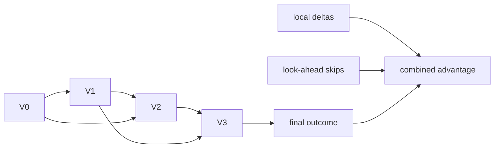
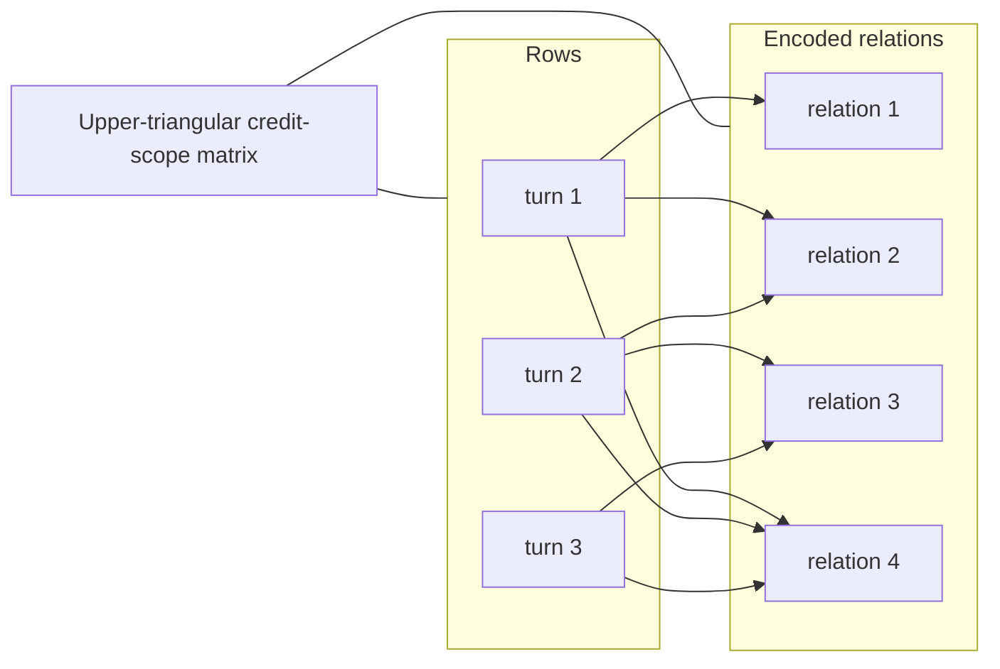
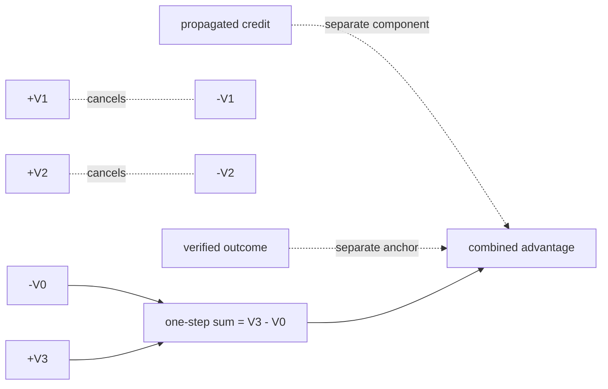

# Visual manifest — TRACE: Turn-level Reward Assignment via Credit Estimation for Long-Horizon Agents

- Paper ID: `paper_trace`
- Exact paper version: `v1`
- Explainer fixture: `packages/test-fixtures/explainers/trace.json`
- Manifest revision: `15`
- Engineer status: `COMPLETE`
- Implementer status: `COMPLETE`
- Paragraph coverage: `16 / 16` prose paragraphs
- Paragraph-ID derivation: `{block.id}_p{1-based index in block.paragraphs}`; each fixture paragraph appears exactly once.
- Evidence sources:
  - `trace_source_intro` — TRACE v1 introduction; Pages 1–3, Abstract and Section 1
  - `trace_source_method` — TRACE v1 method; Sections 3.1–3.3, Equations 4–12, Algorithm 1
  - `trace_source_experiments` — TRACE v1 experimental setup; Pages 7–8, Section 4.1
  - `trace_source_results` — TRACE v1 results and ablations; Pages 8–10, Sections 4.2–4.4, Tables 1–2, Figures 3–5
  - `trace_source_limitations` — TRACE v1 limitations; Page 12, Section 6

Revision 11 corrects source-pixel semantics, removes a mismatched source figure, requires conditional inspection instructions, and returns the PPA hierarchy adaptation for visible two-depth invariance rework.

## `trace_why_p1`

- Location: `trace_why`, paragraph 1
- Text anchor: "A search agent may make dozens of dependent decisions before answering. A failed trajectory"
- Claims and sources: `trace_claim_outcome_blind`, `trace_claim_credit`, `trace_source_intro`, `trace_source_method`
- Visual needed: `NO`
- Complexity warrant: NONE — prose is sufficient.
- Forbidden-structure audit: `NO_VISUAL`
- Source-figure audit: `NO_MATCH`
- Original figure locator: `NONE`
- License and reuse status: `NOT_APPLICABLE` — The figures were checked; no additional original answers a distinct paragraph-specific reconstructive question after the retained placement.
- Decision rationale: Outcome-only credit ambiguity is motivation, while Figure 1 at the change paragraph supplies the concrete successful-versus-failed trajectory contrast. Reusing it here would not add a distinct dependency or quantitative question, so prose introduces the problem without duplicating the evidence.
- Explanatory job: Motivation and problem framing.

### Implementation record

- Status: `NOT_NEEDED`
- Selected treatment: `NONE`
- Selection rationale: `NO_VISUAL` — the retained source placement already establishes the relationship.
- Delivery medium: `NONE`
- Visual ID and placement: `NONE` — `NO_VISUAL`
- Shared paragraph scope: `NONE`
- Changed files: `NONE`
- Accessibility and fallback verification: `NO_VISUAL`
- Desktop and mobile verification: `NO_VISUAL`
- Evidence deviations: `NONE`

## `trace_why_p2`

- Location: `trace_why`, paragraph 2
- Text anchor: "Process supervision can provide finer feedback, but commonly needs step labels, an LLM judge,"
- Claims and sources: `trace_claim_outcome_blind`, `trace_claim_credit`, `trace_source_intro`, `trace_source_method`
- Visual needed: `NO`
- Complexity warrant: NONE — prose is sufficient.
- Forbidden-structure audit: `NO_VISUAL`
- Source-figure audit: `NO_MATCH`
- Original figure locator: `NONE`
- License and reuse status: `NOT_APPLICABLE` — The paper's figures were checked; none directly performs this paragraph's explanatory job.
- Decision rationale: Step labels, LLM judges, learned critics, and repeated rollouts are alternative supervision requirements, not stages or comparable measurements. Their only honest rendering is a forbidden categorical list or repeated cards; prose keeps the alternatives non-ordered.
- Explanatory job: Motivation and problem framing.

### Implementation record

- Status: `NOT_NEEDED`
- Selected treatment: `NONE`
- Selection rationale: `NO_VISUAL` — prose is the approved treatment.
- Delivery medium: `NONE`
- Visual ID and placement: `NONE` — `NO_VISUAL`
- Shared paragraph scope: `NONE`
- Changed files: `NONE`
- Accessibility and fallback verification: `NO_VISUAL`
- Desktop and mobile verification: `NO_VISUAL`
- Evidence deviations: `NONE`

## `trace_change_p1`

- Location: `trace_change`, paragraph 1
- Text anchor: "TRACE leaves final-answer verification in place but adds a trajectory-local signal at tool-call boundaries."
- Claims and sources: `trace_claim_credit`, `trace_claim_outcome_anchor`, `trace_claim_controlled_setup`, `trace_source_method`, `trace_source_experiments`
- Visual needed: `YES`
- Complexity warrant: Non-trivial source-figure relationship — contrast between outcome-only and turn-level reward assignment; prose would force readers to reconstruct the figure's linked components or quantitative structure.
- Forbidden-structure audit: `PASS`
- Source-figure audit: `USE_ORIGINAL`
- Original figure locator: Figure 1, PDF page 2, `trace_source_intro`
- License and reuse status: `PERMITTED` — The paper's arXiv record identifies CC BY 4.0; preserve the authors, original caption, locator, and license link.
- Decision rationale: The original figure directly performs this paragraph's explanatory job. Displaying it materially reduces reconstruction, while replacing it with a custom redraw would discard evidence-bearing structure and violate the source-first rule.
- Explanatory job: Method distinction and scope.

### Treatment A — Full original with focus frame

- Teaching purpose: Preserve the complete source figure and add one focus frame around the portion that answers this paragraph.
- Encoding and reading order: Read the untouched original first; the focus frame identifies the relevant region without suppressing its surrounding context.
- Evidence and limitations: Uses Figure 1, PDF page 2, `trace_source_intro`. It preserves the original source asset and may annotate only contrast between outcome-only and turn-level reward assignment; callouts add no new quantities, topology, or causal claims.
- Primary delivery medium: `source asset`
- Recommended web medium: `source asset`
- Mobile, accessibility, and motion behavior: At widths up to 640 px, rebuild only the two Figure 1 branch composites from inspected 3200 × 1200 source bounds. Each source row must first receive 32 px neutral canvas padding on all four sides, then be vertically assembled: question row source bounds x=0..2025, y=0..155 (2026 × 156 px), enclosing the complete outer question border at approximately x=8..2007 and y=17..130; shared Search/Open row bounds x=580..1435, y=160..535 (856 × 376 px), enclosing both complete rounded boxes and their shared connecting arrow with at least 35 source pixels before any outer stroke; success row bounds x=0..860, y=540..1145 (861 × 606 px), enclosing the complete fork input, all three orange boxes, arrows, and check marks; failure row bounds x=1170..2070, y=540..1145 (901 × 606 px), enclosing the complete fork input, all three purple boxes, arrows, and cross marks. Center each independently padded row in its branch composite; do not use a fixed source canvas that creates sampled blank fragments. Keep the complete trajectory plot as block three using bounds x=2320..3199, y=130..1085 (880 × 956 px) plus the same 32 px neutral canvas padding. Modification record: crop, neutral padding, duplication of the complete question/shared prefix, centering, and vertical assembly only; source pixels remain unscaled and unaltered, and no stroke may touch a composite edge. No redraw, relabeling, interpolation, clipping, mixed branch fragment, or source-derived blank strip. Retain block-specific alt text, max-width: 100%, height: auto, and no motion or scrollbar.

#### TikZ
```tex
\documentclass[tikz,border=4pt]{standalone}
\usepackage{graphicx}
\begin{document}
\begin{tikzpicture}
  \node[inner sep=0] (source) {\includegraphics[width=12cm]{/paper-assets/trace/figure-1.png}};
  \draw[orange!80!black,line width=1.6pt]
        ([xshift=4mm,yshift=-4mm]source.north west)
        rectangle ([xshift=-4mm,yshift=4mm]source.south east);
\end{tikzpicture}
\end{document}
```

#### Mermaid
```mermaid
flowchart TB
  source@{ img: "/paper-assets/trace/figure-1.png", label: "Original paper figure" }
  focus["Reading focus: contrast between outcome-only and turn-level reward assignment"]
  locator["Source locator: Figure 1, PDF page 2, trace_source_intro"]
  source --- focus
  source --- locator
```

#### Python
```python
from pathlib import Path
import matplotlib.pyplot as plt
from matplotlib.patches import Rectangle

source = plt.imread(Path("apps/web/public/paper-assets/trace/figure-1.png"))
fig, ax = plt.subplots(figsize=(12, 7))
ax.imshow(source)
ax.add_patch(Rectangle((0.04, 0.04), 0.92, 0.92, transform=ax.transAxes,
                       fill=False, linewidth=2, edgecolor="#d97706"))
ax.set_title("contrast between outcome-only and turn-level reward assignment")
ax.axis("off")
fig.savefig("source-treatment-a.png", bbox_inches="tight", dpi=180)
```

### Treatment B — Original detail with context inset

- Teaching purpose: Show a legible detail while retaining the complete original as a context inset.
- Encoding and reading order: Read the enlarged source detail first, then use the inset to recover its exact position in the unmodified original.
- Evidence and limitations: Uses Figure 1, PDF page 2, `trace_source_intro`. It preserves the original source asset and may annotate only contrast between outcome-only and turn-level reward assignment; callouts add no new quantities, topology, or causal claims.
- Primary delivery medium: `source asset`
- Recommended web medium: `source asset`
- Mobile, accessibility, and motion behavior: At widths up to 640 px, rebuild only the two Figure 1 branch composites from inspected 3200 × 1200 source bounds. Each source row must first receive 32 px neutral canvas padding on all four sides, then be vertically assembled: question row source bounds x=0..2025, y=0..155 (2026 × 156 px), enclosing the complete outer question border at approximately x=8..2007 and y=17..130; shared Search/Open row bounds x=580..1435, y=160..535 (856 × 376 px), enclosing both complete rounded boxes and their shared connecting arrow with at least 35 source pixels before any outer stroke; success row bounds x=0..860, y=540..1145 (861 × 606 px), enclosing the complete fork input, all three orange boxes, arrows, and check marks; failure row bounds x=1170..2070, y=540..1145 (901 × 606 px), enclosing the complete fork input, all three purple boxes, arrows, and cross marks. Center each independently padded row in its branch composite; do not use a fixed source canvas that creates sampled blank fragments. Keep the complete trajectory plot as block three using bounds x=2320..3199, y=130..1085 (880 × 956 px) plus the same 32 px neutral canvas padding. Modification record: crop, neutral padding, duplication of the complete question/shared prefix, centering, and vertical assembly only; source pixels remain unscaled and unaltered, and no stroke may touch a composite edge. No redraw, relabeling, interpolation, clipping, mixed branch fragment, or source-derived blank strip. Retain block-specific alt text, max-width: 100%, height: auto, and no motion or scrollbar.

#### TikZ
```tex
\documentclass[tikz,border=4pt]{standalone}
\usepackage{graphicx}
\begin{document}
\begin{tikzpicture}
  \node[inner sep=0] (source) {\includegraphics[width=12cm]{/paper-assets/trace/figure-1.png}};
  \begin{scope}
    \clip (-5,-2.3) rectangle (2.5,2.3);
    \node[inner sep=0] at (-1.25,0) {\includegraphics[width=12cm]{/paper-assets/trace/figure-1.png}};
  \end{scope}
  \node[anchor=south east,draw,fill=white,inner sep=1pt] at (source.south east)
       {\includegraphics[width=3.1cm]{/paper-assets/trace/figure-1.png}};
\end{tikzpicture}
\end{document}
```

#### Mermaid
```mermaid
flowchart TB
  source@{ img: "/paper-assets/trace/figure-1.png", label: "Original paper figure" }
  detail@{ img: "/paper-assets/trace/figure-1.png", label: "Legible source detail" }
  context@{ img: "/paper-assets/trace/figure-1.png", label: "Complete original context" }
  locator["Detail remains located within Figure 1, PDF page 2, trace_source_intro"]
  source --- detail
  source --- context
  detail --- locator
  context --- locator
```

#### Python
```python
from pathlib import Path
import matplotlib.pyplot as plt
from matplotlib.patches import Rectangle

source = plt.imread(Path("apps/web/public/paper-assets/trace/figure-1.png"))
fig, ax = plt.subplots(figsize=(12, 7))
ax.imshow(source)
height, width = source.shape[:2]
detail = source[height // 5: 4 * height // 5, width // 5: 4 * width // 5]
ax.imshow(detail)
inset = ax.inset_axes([0.70, 0.04, 0.27, 0.27])
inset.imshow(source)
inset.set_title("Complete original", fontsize=8)
inset.axis("off")
ax.set_title("contrast between outcome-only and turn-level reward assignment")
ax.axis("off")
fig.savefig("source-treatment-b.png", bbox_inches="tight", dpi=180)
```

### Treatment C — Original with numbered reading key

- Teaching purpose: Keep the complete source figure and overlay a small numbered key that explains its paper-specific relationships.
- Encoding and reading order: Read the source figure in its own order; numbered callouts identify the evidence-bearing marks without redrawing them.
- Evidence and limitations: Uses Figure 1, PDF page 2, `trace_source_intro`. It preserves the original source asset and may annotate only contrast between outcome-only and turn-level reward assignment; callouts add no new quantities, topology, or causal claims.
- Primary delivery medium: `source asset`
- Recommended web medium: `source asset`
- Mobile, accessibility, and motion behavior: At widths up to 640 px, rebuild only the two Figure 1 branch composites from inspected 3200 × 1200 source bounds. Each source row must first receive 32 px neutral canvas padding on all four sides, then be vertically assembled: question row source bounds x=0..2025, y=0..155 (2026 × 156 px), enclosing the complete outer question border at approximately x=8..2007 and y=17..130; shared Search/Open row bounds x=580..1435, y=160..535 (856 × 376 px), enclosing both complete rounded boxes and their shared connecting arrow with at least 35 source pixels before any outer stroke; success row bounds x=0..860, y=540..1145 (861 × 606 px), enclosing the complete fork input, all three orange boxes, arrows, and check marks; failure row bounds x=1170..2070, y=540..1145 (901 × 606 px), enclosing the complete fork input, all three purple boxes, arrows, and cross marks. Center each independently padded row in its branch composite; do not use a fixed source canvas that creates sampled blank fragments. Keep the complete trajectory plot as block three using bounds x=2320..3199, y=130..1085 (880 × 956 px) plus the same 32 px neutral canvas padding. Modification record: crop, neutral padding, duplication of the complete question/shared prefix, centering, and vertical assembly only; source pixels remain unscaled and unaltered, and no stroke may touch a composite edge. No redraw, relabeling, interpolation, clipping, mixed branch fragment, or source-derived blank strip. Retain block-specific alt text, max-width: 100%, height: auto, and no motion or scrollbar.

#### TikZ
```tex
\documentclass[tikz,border=4pt]{standalone}
\usepackage{graphicx}
\begin{document}
\begin{tikzpicture}
  \node[inner sep=0] (source) {\includegraphics[width=12cm]{/paper-assets/trace/figure-1.png}};
  \foreach \number/\position in {1/{source.north west},2/{source.east},3/{source.south west}} {
    \node[circle,fill=orange!80!black,text=white,inner sep=2pt] at \position {\number};
  }
\end{tikzpicture}
\end{document}
```

#### Mermaid
```mermaid
flowchart TB
  source@{ img: "/paper-assets/trace/figure-1.png", label: "Original paper figure" }
  callout1["1: locate the evidence-bearing marks"]
  callout2["2: follow the paper-specific relation"]
  callout3["3: retain the source limitation"]
  source --- callout1
  source --- callout2
  source --- callout3
```

#### Python
```python
from pathlib import Path
import matplotlib.pyplot as plt
from matplotlib.patches import Rectangle

source = plt.imread(Path("apps/web/public/paper-assets/trace/figure-1.png"))
fig, ax = plt.subplots(figsize=(12, 7))
ax.imshow(source)
for number, position in enumerate(((0.08, 0.90), (0.90, 0.52), (0.08, 0.10)), 1):
    ax.annotate(str(number), position, xycoords="axes fraction", ha="center", va="center",
                color="white", bbox={"boxstyle": "circle", "facecolor": "#d97706"})
ax.set_title("contrast between outcome-only and turn-level reward assignment")
ax.axis("off")
fig.savefig("source-treatment-c.png", bbox_inches="tight", dpi=180)
```

### Implementation record

- Status: `IMPLEMENTED`
- Selected treatment: `A`
- Selection rationale: Treatment A remains evidence-correct, but revision 15 requires the inspected bounds and neutral padding specified above; reject every revision-14 derived asset whose source stroke touches an edge or includes a neighboring boundary.
- Delivery medium: `source asset`
- Visual ID and placement: `trace_visual_source_figure_1_change` — rendered immediately after `trace_change_p1`.
- Shared paragraph scope: `NONE`
- Changed files: `packages/test-fixtures/explainers/trace.json`, `apps/web/public/paper-assets/trace/figure-1.png`; `apps/web/public/paper-assets/trace/mobile/`; `apps/web/app/papers/[id]/explainer-svg.tsx`; `apps/web/app/papers/[id]/explainer-visual.tsx`; `apps/web/app/globals.css`; `apps/web/tests/paper-page.spec.ts`
- Accessibility and fallback verification: `PENDING` — verify complete outer borders, clean neutral padding on every derived edge, precise alt text and provenance, and no clipped or neighboring fragment.
- Desktop and mobile verification: `PENDING` — verify at 1440 × 1000 and 390 × 844 that desktop remains complete and every padded mobile block is legible, clean-edged, contained, and scrollbar-free.
- Evidence deviations: `REVISION_14_REJECTED` — replace the edge-clipped derived assets; do not alter the complete desktop originals.

## `trace_change_p2`

- Location: `trace_change`, paragraph 2
- Text anchor: "This is a change to credit assignment, not a new browser, backbone, training corpus,"
- Claims and sources: `trace_claim_credit`, `trace_claim_outcome_anchor`, `trace_claim_controlled_setup`, `trace_source_method`, `trace_source_experiments`
- Visual needed: `NO`
- Complexity warrant: NONE — prose is sufficient.
- Forbidden-structure audit: `NO_VISUAL`
- Source-figure audit: `NO_MATCH`
- Original figure locator: `NONE`
- License and reuse status: `NOT_APPLICABLE` — The paper's figures were checked; none directly performs this paragraph's explanatory job.
- Decision rationale: Credit assignment changes while browser, backbone, corpus, and verifier remain outside the contribution. This is a scope exclusion with no supported topology among the excluded systems; a diagram would imply relations or architecture changes that TRACE does not claim.
- Explanatory job: Method distinction and scope.

### Implementation record

- Status: `NOT_NEEDED`
- Selected treatment: `NONE`
- Selection rationale: `NO_VISUAL` — prose is the approved treatment.
- Delivery medium: `NONE`
- Visual ID and placement: `NONE` — `NO_VISUAL`
- Shared paragraph scope: `NONE`
- Changed files: `NONE`
- Accessibility and fallback verification: `NO_VISUAL`
- Desktop and mobile verification: `NO_VISUAL`
- Evidence deviations: `NONE`

## `trace_mechanism_p1`

- Location: `trace_mechanism`, paragraph 1
- Text anchor: "TRACE first splits a rollout after each tool action and returned observation. For every"
- Claims and sources: `trace_claim_prefix_probe`, `trace_claim_td`, `trace_claim_telescope`, `trace_claim_outcome_anchor`, `trace_source_method`
- Visual needed: `NO`
- Complexity warrant: NONE — prose is sufficient.
- Forbidden-structure audit: `NO_VISUAL`
- Source-figure audit: `NO_MATCH`
- Original figure locator: `NONE`
- License and reuse status: `NOT_APPLICABLE` — The paper's figures were checked; none directly performs this paragraph's explanatory job.
- Decision rationale: Splitting after tool observations and scoring prefixes with a frozen reference are prerequisites for the multi-scale dependency graphic in the third mechanism paragraph. Rendered alone they form only a sequential chain, while the actual branching credit relations are already reserved for the DAG.
- Explanatory job: Mechanism explanation.

### Implementation record

- Status: `NOT_NEEDED`
- Selected treatment: `NONE`
- Selection rationale: `NO_VISUAL` — prose is the approved treatment.
- Delivery medium: `NONE`
- Visual ID and placement: `NONE` — `NO_VISUAL`
- Shared paragraph scope: `NONE`
- Changed files: `NONE`
- Accessibility and fallback verification: `NO_VISUAL`
- Desktop and mobile verification: `NO_VISUAL`
- Evidence deviations: `NONE`

## `trace_mechanism_p2`

- Location: `trace_mechanism`, paragraph 2
- Text anchor: "The raw answer score is converted into a log-ratio value representing relative closure of"
- Claims and sources: `trace_claim_prefix_probe`, `trace_claim_td`, `trace_claim_telescope`, `trace_claim_outcome_anchor`, `trace_source_method`
- Visual needed: `NO`
- Complexity warrant: NONE — prose is sufficient.
- Forbidden-structure audit: `NO_VISUAL`
- Source-figure audit: `NO_MATCH`
- Original figure locator: `NONE`
- License and reuse status: `NOT_APPLICABLE` — The paper's figures were checked; none directly performs this paragraph's explanatory job.
- Decision rationale: The log-ratio value and adjacent temporal difference are exact definitions needed to read the following DAG. The paragraph reports no distribution or additional state topology; an equation-to-equation flow would be a forbidden single chain and add no reconstruction benefit.
- Explanatory job: Mechanism explanation.

### Implementation record

- Status: `NOT_NEEDED`
- Selected treatment: `NONE`
- Selection rationale: `NO_VISUAL` — prose is the approved treatment.
- Delivery medium: `NONE`
- Visual ID and placement: `NONE` — `NO_VISUAL`
- Shared paragraph scope: `NONE`
- Changed files: `NONE`
- Accessibility and fallback verification: `NO_VISUAL`
- Desktop and mobile verification: `NO_VISUAL`
- Evidence deviations: `NONE`

## `trace_mechanism_p3`

- Location: `trace_mechanism`, paragraph 3
- Text anchor: "One-step credits telescope, so inserting redundant intermediate steps cannot increase their endpoint sum. The"
- Claims and sources: `trace_claim_prefix_probe`, `trace_claim_td`, `trace_claim_telescope`, `trace_claim_outcome_anchor`, `trace_source_method`
- Visual needed: `YES`
- Complexity warrant: Multi-scale credit dependency graph: adjacent temporal differences telescope, short look-ahead adds skip dependencies, and a global outcome advantage anchors every local signal.
- Forbidden-structure audit: `PASS` — each treatment uses branching, a dependency matrix, feedback, shared-scale geometry, or a state topology; none is a single interchangeable chain, item-plus-metric list, repeated same-metric cards, or repeated one-axis dot panels.
- Source-figure audit: `ADAPT_REQUIRED`
- Original figure locator: Figure 2, PDF page 4, `trace_source_method`
- License and reuse status: `PERMITTED` — The TRACE paper is CC BY 4.0, but the matching original is unsuitable because its dominant topology is a forbidden single chain.
- Decision rationale: Reuse cannot supply the needed treatment under the recorded constraint; the existing independently warranted non-banned adaptation remains eligible for revision-7 implementation. A simple trajectory line would be forbidden and incomplete. The actual argument depends on overlapping local, propagated, and terminal edges whose scopes differ.
- Explanatory job: Credit-dependency topology and telescoping boundary.

### Treatment A — Local, look-ahead, and outcome credit DAG

- Teaching purpose: Distinguish the exact one-step telescope from the larger propagated training signal.
- Encoding and reading order: Prefix values form nodes; adjacent differences are local edges, short look-ahead adds skip edges, and the verified final outcome broadcasts a separate anchor. Edge classes remain visually distinct.
- Evidence and limitations: Claims `trace_claim_td`, `trace_claim_telescope`, `trace_claim_outcome_anchor`; `trace_source_method`, Equations 4–12 and Algorithm 1. The diagram is structural and does not imply unreported magnitudes.
- Primary delivery medium: `SVG`
- Recommended web medium: `SVG`
- Mobile, accessibility, and motion behavior: Use a distinct narrow SVG composition rather than scaling the desktop DAG. Stack three dependency layers over the same ordered V0-V3 prefix set: local adjacent differences with explicit telescoping cancellations; short-look-ahead skip dependencies; and the global verified-outcome anchor broadcasting to affected turns. Separate the layers with headings but preserve shared prefix identities and an edge-class legend so the result remains one multi-scale dependency argument, not three one-axis panels. Use a mobile viewBox, at least 16 CSS px labels, max-width: 100%, and height: auto. Preserve the semantic fallback and use no motion or scrollbar.

#### TikZ
```tex
\documentclass[tikz,border=4pt]{standalone}
\usepackage{tikz}
\begin{document}
\begin{tikzpicture}[font=\sffamily\scriptsize,>=stealth]
\node[draw,rounded corners,align=center] (n0) at (0.0,0.0) {V0};
\node[draw,rounded corners,align=center] (n1) at (3.2,0.0) {V1};
\node[draw,rounded corners,align=center] (n2) at (6.4,0.0) {V2};
\node[draw,rounded corners,align=center] (n3) at (9.600000000000001,0.0) {V3};
\node[draw,rounded corners,align=center] (n4) at (0.0,-1.8) {local deltas};
\node[draw,rounded corners,align=center] (n5) at (3.2,-1.8) {look-ahead skips};
\node[draw,rounded corners,align=center] (n6) at (6.4,-1.8) {final outcome};
\node[draw,rounded corners,align=center] (n7) at (9.600000000000001,-1.8) {combined advantage};
\draw[->] (n0) -- (n1);
\draw[->] (n1) -- (n2);
\draw[->] (n2) -- (n3);
\draw[->] (n0) -- (n2);
\draw[->] (n1) -- (n3);
\draw[->] (n3) -- (n6);
\draw[->] (n4) -- (n7);
\draw[->] (n5) -- (n7);
\draw[->] (n6) -- (n7);
\end{tikzpicture}
\end{document}
```

#### Mermaid


#### Python
```python
from pathlib import Path
import matplotlib.pyplot as plt

labels = ['V0', 'V1', 'V2', 'V3', 'local deltas', 'look-ahead skips', 'final outcome', 'combined advantage']
fig, ax = plt.subplots(figsize=(9, 5))
edges = [(0, 1), (1, 2), (2, 3), (0, 2), (1, 3), (3, 6), (4, 7), (5, 7), (6, 7)]
positions = {i: ((i % 4) * 2.5, -(i // 4) * 1.4) for i in range(len(labels))}
for i, label in enumerate(labels):
    x, y = positions[i]
    ax.text(x, y, label, ha='center', va='center', bbox={'boxstyle': 'round', 'fc': '#fffdf8', 'ec': '#171714'})
for start, end in edges:
    x1, y1 = positions[start]
    x2, y2 = positions[end]
    ax.annotate('', (x2, y2), (x1, y1), arrowprops={'arrowstyle': '->', 'color': '#2f5ea8'})
ax.set_axis_off()
fig.tight_layout()
fig.savefig(Path('visual.svg'), format='svg')
```

### Treatment B — Upper-triangular credit-scope matrix

- Teaching purpose: Show which later prefixes can influence each turn under one-step and propagated credit.
- Encoding and reading order: Rows are tool turns and columns are future prefix probes. The diagonal band is one-step TD; a wider band is short look-ahead; a final outcome column is separate. The one-step band alone carries the telescoping guarantee.
- Evidence and limitations: Claims `trace_claim_td`, `trace_claim_telescope`, `trace_claim_outcome_anchor`; `trace_source_method`, Equations 4–12 and Algorithm 1. Binary cells show dependency scope, not credit magnitude or sign.
- Primary delivery medium: `generated asset`
- Recommended web medium: `SVG`
- Mobile, accessibility, and motion behavior: Use a distinct narrow SVG composition rather than scaling the desktop DAG. Stack three dependency layers over the same ordered V0-V3 prefix set: local adjacent differences with explicit telescoping cancellations; short-look-ahead skip dependencies; and the global verified-outcome anchor broadcasting to affected turns. Separate the layers with headings but preserve shared prefix identities and an edge-class legend so the result remains one multi-scale dependency argument, not three one-axis panels. Use a mobile viewBox, at least 16 CSS px labels, max-width: 100%, and height: auto. Preserve the semantic fallback and use no motion or scrollbar.

#### TikZ
```tex
\documentclass[tikz,border=4pt]{standalone}
\usepackage{tikz}
\begin{document}
\begin{tikzpicture}[font=\sffamily\scriptsize,>=stealth]
\fill[blue!80] (0,-0) rectangle ++(0.9,-0.9);
\draw (0,-0) rectangle ++(0.9,-0.9);
\fill[blue!80] (1,-0) rectangle ++(0.9,-0.9);
\draw (1,-0) rectangle ++(0.9,-0.9);
\fill[blue!20] (2,-0) rectangle ++(0.9,-0.9);
\draw (2,-0) rectangle ++(0.9,-0.9);
\fill[blue!80] (3,-0) rectangle ++(0.9,-0.9);
\draw (3,-0) rectangle ++(0.9,-0.9);
\fill[blue!20] (0,-1) rectangle ++(0.9,-0.9);
\draw (0,-1) rectangle ++(0.9,-0.9);
\fill[blue!80] (1,-1) rectangle ++(0.9,-0.9);
\draw (1,-1) rectangle ++(0.9,-0.9);
\fill[blue!80] (2,-1) rectangle ++(0.9,-0.9);
\draw (2,-1) rectangle ++(0.9,-0.9);
\fill[blue!80] (3,-1) rectangle ++(0.9,-0.9);
\draw (3,-1) rectangle ++(0.9,-0.9);
\fill[blue!20] (0,-2) rectangle ++(0.9,-0.9);
\draw (0,-2) rectangle ++(0.9,-0.9);
\fill[blue!20] (1,-2) rectangle ++(0.9,-0.9);
\draw (1,-2) rectangle ++(0.9,-0.9);
\fill[blue!80] (2,-2) rectangle ++(0.9,-0.9);
\draw (2,-2) rectangle ++(0.9,-0.9);
\fill[blue!80] (3,-2) rectangle ++(0.9,-0.9);
\draw (3,-2) rectangle ++(0.9,-0.9);
\node[anchor=west] at (0,1.0) {turn 1 / turn 2 / turn 3 / outcome};
\end{tikzpicture}
\end{document}
```

#### Mermaid


#### Python
```python
from pathlib import Path
import matplotlib.pyplot as plt

labels = ['turn 1', 'turn 2', 'turn 3', 'outcome']
fig, ax = plt.subplots(figsize=(9, 5))
values = [[1, 1, 0, 1], [0, 1, 1, 1], [0, 0, 1, 1]]
image = ax.imshow(values, cmap='Blues', vmin=0)
ax.set_title(' / '.join(labels))
fig.colorbar(image, ax=ax, label='encoded relation')
ax.grid(alpha=0.2)
fig.tight_layout()
fig.savefig(Path('visual.svg'), format='svg')
```

### Treatment C — Telescoping cancellation ledger

- Teaching purpose: Show algebraically why intermediate prefix values cancel in the one-step sum while propagated credit and final outcome remain separate terms.
- Encoding and reading order: Signed value terms occupy two rows. Matching positive and negative intermediate terms are joined by cancellation arcs; only the initial negative endpoint and final positive endpoint survive into the one-step sum. Propagated and outcome terms sit outside the cancellation enclosure.
- Evidence and limitations: Claims `trace_claim_td`, `trace_claim_telescope`, `trace_claim_outcome_anchor`; `trace_source_method`, Equations 4–12 and Algorithm 1. The cancellation identity applies exactly to one-step credit, not to the complete propagated objective.
- Primary delivery medium: `SVG`
- Recommended web medium: `SVG`
- Mobile, accessibility, and motion behavior: Use a distinct narrow SVG composition rather than scaling the desktop DAG. Stack three dependency layers over the same ordered V0-V3 prefix set: local adjacent differences with explicit telescoping cancellations; short-look-ahead skip dependencies; and the global verified-outcome anchor broadcasting to affected turns. Separate the layers with headings but preserve shared prefix identities and an edge-class legend so the result remains one multi-scale dependency argument, not three one-axis panels. Use a mobile viewBox, at least 16 CSS px labels, max-width: 100%, and height: auto. Preserve the semantic fallback and use no motion or scrollbar.

#### TikZ
```tex
\documentclass[tikz,border=4pt]{standalone}
\usepackage{tikz}
\begin{document}
\begin{tikzpicture}[font=\sffamily\scriptsize,>=stealth]
\node[draw] (nv0) at (0,0) {$-V_0$};
\node[draw] (pv1) at (2,1) {$+V_1$};
\node[draw] (nv1) at (2,-1) {$-V_1$};
\node[draw] (pv2) at (4,1) {$+V_2$};
\node[draw] (nv2) at (4,-1) {$-V_2$};
\node[draw] (pv3) at (6,0) {$+V_3$};
\draw[<->,dashed] (pv1)--node[right]{cancel}(nv1);
\draw[<->,dashed] (pv2)--node[right]{cancel}(nv2);
\node[draw] (local) at (8,0) {$V_3-V_0$};
\node[draw] (prop) at (8,2) {propagated credit};
\node[draw] (outcome) at (8,-2) {outcome anchor};
\draw[->] (nv0)--(local); \draw[->] (pv3)--(local);
\draw[dotted] (prop)--(local); \draw[dotted] (outcome)--(local);
\end{tikzpicture}
\end{document}
```

#### Mermaid


#### Python
```python
from pathlib import Path
import matplotlib.pyplot as plt

labels = ['-V0', '+V1', '-V1', '+V2', '-V2', '+V3', 'one-step sum', 'propagated', 'outcome']
fig, ax = plt.subplots(figsize=(9, 5))
positions = {0:(0,0),1:(2,1),2:(2,-1),3:(4,1),4:(4,-1),5:(6,0),6:(8,0),7:(8,2),8:(8,-2)}
for i, label in enumerate(labels):
    x, y = positions[i]
    ax.text(x, y, label, ha='center', bbox={'boxstyle':'round','fc':'#fffdf8'})
for a, b in [(0,6),(5,6)]:
    ax.annotate('', positions[b], positions[a], arrowprops={'arrowstyle':'->'})
for a, b in [(1,2),(3,4)]:
    ax.plot([positions[a][0],positions[b][0]],[positions[a][1],positions[b][1]],'--',color='#a44e36')
ax.text(2.2,0,'cancel',color='#a44e36')
ax.text(4.2,0,'cancel',color='#a44e36')
ax.set_axis_off()
fig.tight_layout()
fig.savefig(Path('visual.svg'), format='svg')
```

### Implementation record

- Status: `IMPLEMENTED`
- Selected treatment: `A`
- Selection rationale: The selected evidence-correct treatment is implemented with its revision-13 semantic crop or narrow SVG reflow, preserving relationships, source fidelity, provenance, and scrollbar-free containment.
- Delivery medium: `SVG`
- Visual ID and placement: `trace_visual_credit_dependency_dag` — rendered immediately after `trace_mechanism_p3`.
- Shared paragraph scope: `NONE`
- Changed files: `packages/test-fixtures/explainers/trace.json`; `apps/web/public/paper-assets/trace/mobile/`; `apps/web/app/papers/[id]/explainer-svg.tsx`; `apps/web/app/papers/[id]/explainer-visual.tsx`; `apps/web/app/globals.css`; `apps/web/tests/paper-page.spec.ts`
- Accessibility and fallback verification: `VERIFIED` — paragraph-specific mobile crops or SVG reflows retain the selected labels and relationships; source modifications, paths, panel-specific alt text, semantic fallback, locator, attribution, and license remain explicit.
- Desktop and mobile verification: `VERIFIED` — Playwright at 1440 × 1000 and 390 × 844 confirms the complete desktop visual and selected mobile crops or reflow fit without internal or page-level overflow; mobile SVG labels render at 15 CSS px or larger.
- Evidence deviations: `NONE`

## `trace_example_p1`

- Location: `trace_example`, paragraph 1
- Text anchor: "Consider a trajectory that searches for a relevant source, opens a page containing decisive"
- Claims and sources: `trace_claim_prefix_probe`, `trace_claim_td`, `trace_claim_outcome_anchor`, `trace_source_intro`, `trace_source_method`
- Visual needed: `NO`
- Complexity warrant: NONE — prose is sufficient.
- Forbidden-structure audit: `NO_VISUAL`
- Source-figure audit: `NO_MATCH`
- Original figure locator: `NONE`
- License and reuse status: `NOT_APPLICABLE` — The figures were checked; no additional original answers a distinct paragraph-specific reconstructive question after the retained placement.
- Decision rationale: The hypothetical search, page opening, and later wrong turn are the narrative instance already depicted by Figure 1. A second rendering would repeat the same success/failure branches without new evidence, while a step-only cartoon would collapse into a forbidden chain.
- Explanatory job: Worked example.

### Implementation record

- Status: `NOT_NEEDED`
- Selected treatment: `NONE`
- Selection rationale: `NO_VISUAL` — the retained source placement already establishes the relationship.
- Delivery medium: `NONE`
- Visual ID and placement: `NONE` — `NO_VISUAL`
- Shared paragraph scope: `NONE`
- Changed files: `NONE`
- Accessibility and fallback verification: `NO_VISUAL`
- Desktop and mobile verification: `NO_VISUAL`
- Evidence deviations: `NONE`

## `trace_example_p2`

- Location: `trace_example`, paragraph 2
- Text anchor: "The useful search and page opening can receive positive local credit if they make"
- Claims and sources: `trace_claim_prefix_probe`, `trace_claim_td`, `trace_claim_outcome_anchor`, `trace_source_intro`, `trace_source_method`
- Visual needed: `NO`
- Complexity warrant: NONE — prose is sufficient.
- Forbidden-structure audit: `NO_VISUAL`
- Source-figure audit: `NO_MATCH`
- Original figure locator: `NONE`
- License and reuse status: `NOT_APPLICABLE` — The figures were checked; no additional original answers a distinct paragraph-specific reconstructive question after the retained placement.
- Decision rationale: Positive local credit, zero or negative later credit, and terminal failure are interpretive assignments in the Figure 1 example, not separately measured values. Plotting them would invent magnitudes; cards or a sequence would use forbidden stock structures.
- Explanatory job: Worked example.

### Implementation record

- Status: `NOT_NEEDED`
- Selected treatment: `NONE`
- Selection rationale: `NO_VISUAL` — the retained source placement already establishes the relationship.
- Delivery medium: `NONE`
- Visual ID and placement: `NONE` — `NO_VISUAL`
- Shared paragraph scope: `NONE`
- Changed files: `NONE`
- Accessibility and fallback verification: `NO_VISUAL`
- Desktop and mobile verification: `NO_VISUAL`
- Evidence deviations: `NONE`

## `trace_evidence_p1`

- Location: `trace_evidence`, paragraph 1
- Text anchor: "The authors train Qwen3-4B-Thinking-2507 and Qwen3-30B-A3B-Thinking-2507 in the same ReAct-style search harness. The training"
- Claims and sources: `trace_claim_controlled_setup`, `trace_claim_browsecomp_gain`, `trace_claim_grpo_gain`, `trace_claim_ablation`, `trace_source_experiments`, `trace_source_results`
- Visual needed: `NO`
- Complexity warrant: NONE — prose is sufficient.
- Forbidden-structure audit: `NO_VISUAL`
- Source-figure audit: `NO_MATCH`
- Original figure locator: `NONE`
- License and reuse status: `NOT_APPLICABLE` — The paper's figures were checked; none directly performs this paragraph's explanatory job.
- Decision rationale: The two Qwen backbones, shared ReAct harness, and controlled training conditions are heterogeneous setup facts rather than a measured joint relationship. A visual would reduce them to an inventory and imply comparability across unlike controls, so exact prose is clearer.
- Explanatory job: Evaluation evidence.

### Implementation record

- Status: `NOT_NEEDED`
- Selected treatment: `NONE`
- Selection rationale: `NO_VISUAL` — prose is the approved treatment.
- Delivery medium: `NONE`
- Visual ID and placement: `NONE` — `NO_VISUAL`
- Shared paragraph scope: `NONE`
- Changed files: `NONE`
- Accessibility and fallback verification: `NO_VISUAL`
- Desktop and mobile verification: `NO_VISUAL`
- Evidence deviations: `NONE`

## `trace_evidence_p2`

- Location: `trace_evidence`, paragraph 2
- Text anchor: "On closed-web BrowseComp-Plus, TRACE moves the 4B base from 7.2 to 35.6 and the"
- Claims and sources: `trace_claim_controlled_setup`, `trace_claim_browsecomp_gain`, `trace_claim_grpo_gain`, `trace_claim_ablation`, `trace_source_experiments`, `trace_source_results`
- Visual needed: `NO`
- Complexity warrant: NONE — prose is sufficient.
- Forbidden-structure audit: `NO_VISUAL`
- Source-figure audit: `NO_MATCH`
- Original figure locator: `NONE`
- License and reuse status: `NOT_APPLICABLE` — The paper's figures were checked; none directly performs this paragraph's explanatory job.
- Decision rationale: BrowseComp-Plus base-to-TRACE gains and GRPO-to-TRACE four-benchmark averages use different baselines and scopes. One chart would imply exchangeability, separate tracks would be forbidden repeated panels, and no uncertainty is reported; prose keeps the comparisons distinct.
- Explanatory job: Evaluation evidence.

### Implementation record

- Status: `NOT_NEEDED`
- Selected treatment: `NONE`
- Selection rationale: `NO_VISUAL` — prose is the approved treatment.
- Delivery medium: `NONE`
- Visual ID and placement: `NONE` — `NO_VISUAL`
- Shared paragraph scope: `NONE`
- Changed files: `NONE`
- Accessibility and fallback verification: `NO_VISUAL`
- Desktop and mobile verification: `NO_VISUAL`
- Evidence deviations: `NONE`

## `trace_evidence_p3`

- Location: `trace_evidence`, paragraph 3
- Text anchor: "In one 4B BrowseComp-Plus ablation, GRPO scores 30.0, raw log-probability delta 32.4, remaining-gap normalization"
- Claims and sources: `trace_claim_controlled_setup`, `trace_claim_browsecomp_gain`, `trace_claim_grpo_gain`, `trace_claim_ablation`, `trace_source_experiments`, `trace_source_results`
- Visual needed: `YES`
- Complexity warrant: Non-trivial source-figure relationship — four-panel learning dynamics for TRACE and outcome-reward baselines; prose would force readers to reconstruct the figure's linked components or quantitative structure.
- Forbidden-structure audit: `PASS`
- Source-figure audit: `USE_ORIGINAL`
- Original figure locator: Figure 3, PDF page 9, `trace_source_results`
- License and reuse status: `PERMITTED` — The paper's arXiv record identifies CC BY 4.0; preserve the authors, original caption, locator, and license link.
- Decision rationale: The original figure directly performs this paragraph's explanatory job. Displaying it materially reduces reconstruction, while replacing it with a custom redraw would discard evidence-bearing structure and violate the source-first rule.
- Explanatory job: Evaluation evidence.

### Treatment A — Full original with focus frame

- Teaching purpose: Preserve the complete source figure and add one focus frame around the portion that answers this paragraph.
- Encoding and reading order: Read the untouched original first; the focus frame identifies the relevant region without suppressing its surrounding context.
- Evidence and limitations: Uses Figure 3, PDF page 9, `trace_source_results`. It preserves the original source asset and may annotate only four-panel learning dynamics for TRACE and outcome-reward baselines; callouts add no new quantities, topology, or causal claims.
- Primary delivery medium: `source asset`
- Recommended web medium: `source asset`
- Mobile, accessibility, and motion behavior: At widths up to 640 px, replace the combined shrink-to-fit group with three vertically stacked source-pixel blocks: original Figure 3 panels (a)-(b), 4B train and eval, as one crop; Figure 3 panels (c)-(d), 30B train and eval, as a second crop; and complete original Figure 4 Tool Calling Trend Comparison as the third block. Each Figure 3 crop retains the TRACE/GRPO legend, axes, and train-versus-eval headings; Figure 4 retains both series and full axes. Modification record: Figure 3 is split only between its paper-defined panel pairs, while Figure 4 remains uncropped; no redraw, changed scale, or omitted trace. Use max-width: 100%, height: auto, block-specific alt text, and no motion or scrollbar.

#### TikZ
```tex
\documentclass[tikz,border=4pt]{standalone}
\usepackage{graphicx}
\begin{document}
\begin{tikzpicture}
  \node[inner sep=0] (source) {\includegraphics[width=12cm]{/paper-assets/trace/figure-3.png}};
  \draw[orange!80!black,line width=1.6pt]
        ([xshift=4mm,yshift=-4mm]source.north west)
        rectangle ([xshift=-4mm,yshift=4mm]source.south east);
\end{tikzpicture}
\end{document}
```

#### Mermaid
```mermaid
flowchart TB
  source@{ img: "/paper-assets/trace/figure-3.png", label: "Original paper figure" }
  focus["Reading focus: four-panel learning dynamics for TRACE and outcome-reward baselines"]
  locator["Source locator: Figure 3, PDF pages 8-10, trace_source_results"]
  source --- focus
  source --- locator
```

#### Python
```python
from pathlib import Path
import matplotlib.pyplot as plt
from matplotlib.patches import Rectangle

source = plt.imread(Path("apps/web/public/paper-assets/trace/figure-3.png"))
fig, ax = plt.subplots(figsize=(12, 7))
ax.imshow(source)
ax.add_patch(Rectangle((0.04, 0.04), 0.92, 0.92, transform=ax.transAxes,
                       fill=False, linewidth=2, edgecolor="#d97706"))
ax.set_title("four-panel learning dynamics for TRACE and outcome-reward baselines")
ax.axis("off")
fig.savefig("source-treatment-a.png", bbox_inches="tight", dpi=180)
```

### Treatment B — Original detail with context inset

- Teaching purpose: Show a legible detail while retaining the complete original as a context inset.
- Encoding and reading order: Read the enlarged source detail first, then use the inset to recover its exact position in the unmodified original.
- Evidence and limitations: Uses Figure 3, PDF page 9, `trace_source_results`. It preserves the original source asset and may annotate only four-panel learning dynamics for TRACE and outcome-reward baselines; callouts add no new quantities, topology, or causal claims.
- Primary delivery medium: `source asset`
- Recommended web medium: `source asset`
- Mobile, accessibility, and motion behavior: At widths up to 640 px, replace the combined shrink-to-fit group with three vertically stacked source-pixel blocks: original Figure 3 panels (a)-(b), 4B train and eval, as one crop; Figure 3 panels (c)-(d), 30B train and eval, as a second crop; and complete original Figure 4 Tool Calling Trend Comparison as the third block. Each Figure 3 crop retains the TRACE/GRPO legend, axes, and train-versus-eval headings; Figure 4 retains both series and full axes. Modification record: Figure 3 is split only between its paper-defined panel pairs, while Figure 4 remains uncropped; no redraw, changed scale, or omitted trace. Use max-width: 100%, height: auto, block-specific alt text, and no motion or scrollbar.

#### TikZ
```tex
\documentclass[tikz,border=4pt]{standalone}
\usepackage{graphicx}
\begin{document}
\begin{tikzpicture}
  \node[inner sep=0] (source) {\includegraphics[width=12cm]{/paper-assets/trace/figure-3.png}};
  \begin{scope}
    \clip (-5,-2.3) rectangle (2.5,2.3);
    \node[inner sep=0] at (-1.25,0) {\includegraphics[width=12cm]{/paper-assets/trace/figure-3.png}};
  \end{scope}
  \node[anchor=south east,draw,fill=white,inner sep=1pt] at (source.south east)
       {\includegraphics[width=3.1cm]{/paper-assets/trace/figure-3.png}};
\end{tikzpicture}
\end{document}
```

#### Mermaid
```mermaid
flowchart TB
  source@{ img: "/paper-assets/trace/figure-3.png", label: "Original paper figure" }
  detail@{ img: "/paper-assets/trace/figure-3.png", label: "Legible source detail" }
  context@{ img: "/paper-assets/trace/figure-3.png", label: "Complete original context" }
  locator["Detail remains located within Figure 3, PDF pages 8-10, trace_source_results"]
  source --- detail
  source --- context
  detail --- locator
  context --- locator
```

#### Python
```python
from pathlib import Path
import matplotlib.pyplot as plt
from matplotlib.patches import Rectangle

source = plt.imread(Path("apps/web/public/paper-assets/trace/figure-3.png"))
fig, ax = plt.subplots(figsize=(12, 7))
ax.imshow(source)
height, width = source.shape[:2]
detail = source[height // 5: 4 * height // 5, width // 5: 4 * width // 5]
ax.imshow(detail)
inset = ax.inset_axes([0.70, 0.04, 0.27, 0.27])
inset.imshow(source)
inset.set_title("Complete original", fontsize=8)
inset.axis("off")
ax.set_title("four-panel learning dynamics for TRACE and outcome-reward baselines")
ax.axis("off")
fig.savefig("source-treatment-b.png", bbox_inches="tight", dpi=180)
```

### Treatment C — Original with numbered reading key

- Teaching purpose: Keep the complete source figure and overlay a small numbered key that explains its paper-specific relationships.
- Encoding and reading order: Read the source figure in its own order; numbered callouts identify the evidence-bearing marks without redrawing them.
- Evidence and limitations: Uses Figure 3, PDF page 9, `trace_source_results`. It preserves the original source asset and may annotate only four-panel learning dynamics for TRACE and outcome-reward baselines; callouts add no new quantities, topology, or causal claims.
- Primary delivery medium: `source asset`
- Recommended web medium: `source asset`
- Mobile, accessibility, and motion behavior: At widths up to 640 px, replace the combined shrink-to-fit group with three vertically stacked source-pixel blocks: original Figure 3 panels (a)-(b), 4B train and eval, as one crop; Figure 3 panels (c)-(d), 30B train and eval, as a second crop; and complete original Figure 4 Tool Calling Trend Comparison as the third block. Each Figure 3 crop retains the TRACE/GRPO legend, axes, and train-versus-eval headings; Figure 4 retains both series and full axes. Modification record: Figure 3 is split only between its paper-defined panel pairs, while Figure 4 remains uncropped; no redraw, changed scale, or omitted trace. Use max-width: 100%, height: auto, block-specific alt text, and no motion or scrollbar.

#### TikZ
```tex
\documentclass[tikz,border=4pt]{standalone}
\usepackage{graphicx}
\begin{document}
\begin{tikzpicture}
  \node[inner sep=0] (source) {\includegraphics[width=12cm]{/paper-assets/trace/figure-3.png}};
  \foreach \number/\position in {1/{source.north west},2/{source.east},3/{source.south west}} {
    \node[circle,fill=orange!80!black,text=white,inner sep=2pt] at \position {\number};
  }
\end{tikzpicture}
\end{document}
```

#### Mermaid
```mermaid
flowchart TB
  source@{ img: "/paper-assets/trace/figure-3.png", label: "Original paper figure" }
  callout1["1: locate the evidence-bearing marks"]
  callout2["2: follow the paper-specific relation"]
  callout3["3: retain the source limitation"]
  source --- callout1
  source --- callout2
  source --- callout3
```

#### Python
```python
from pathlib import Path
import matplotlib.pyplot as plt
from matplotlib.patches import Rectangle

source = plt.imread(Path("apps/web/public/paper-assets/trace/figure-3.png"))
fig, ax = plt.subplots(figsize=(12, 7))
ax.imshow(source)
for number, position in enumerate(((0.08, 0.90), (0.90, 0.52), (0.08, 0.10)), 1):
    ax.annotate(str(number), position, xycoords="axes fraction", ha="center", va="center",
                color="white", bbox={"boxstyle": "circle", "facecolor": "#d97706"})
ax.set_title("four-panel learning dynamics for TRACE and outcome-reward baselines")
ax.axis("off")
fig.savefig("source-treatment-c.png", bbox_inches="tight", dpi=180)
```

### Implementation record

- Status: `IMPLEMENTED`
- Selected treatment: `A`
- Selection rationale: The selected evidence-correct treatment is implemented with its revision-13 semantic crop or narrow SVG reflow, preserving relationships, source fidelity, provenance, and scrollbar-free containment.
- Delivery medium: `source asset`
- Visual ID and placement: `trace_visual_source_figures_3_4` — rendered immediately after `trace_evidence_p3`.
- Shared paragraph scope: `NONE`
- Changed files: `packages/test-fixtures/explainers/trace.json`, `apps/web/public/paper-assets/trace/figure-3.png`; `apps/web/public/paper-assets/trace/mobile/`; `apps/web/app/papers/[id]/explainer-svg.tsx`; `apps/web/app/papers/[id]/explainer-visual.tsx`; `apps/web/app/globals.css`; `apps/web/tests/paper-page.spec.ts`
- Accessibility and fallback verification: `VERIFIED` — paragraph-specific mobile crops or SVG reflows retain the selected labels and relationships; source modifications, paths, panel-specific alt text, semantic fallback, locator, attribution, and license remain explicit.
- Desktop and mobile verification: `VERIFIED` — Playwright at 1440 × 1000 and 390 × 844 confirms the complete desktop visual and selected mobile crops or reflow fit without internal or page-level overflow; mobile SVG labels render at 15 CSS px or larger.
- Evidence deviations: `NONE`

## `trace_limitations_p1`

- Location: `trace_limitations`, paragraph 1
- Text anchor: "The experiments cover long-horizon search with short answers that can be compared with known"
- Claims and sources: `trace_claim_scope`, `trace_claim_proxy_not_causal`, `trace_source_results`, `trace_source_limitations`
- Visual needed: `NO`
- Complexity warrant: NONE — prose is sufficient.
- Forbidden-structure audit: `NO_VISUAL`
- Source-figure audit: `NO_MATCH`
- Original figure locator: `NONE`
- License and reuse status: `NOT_APPLICABLE` — The paper's figures were checked; none directly performs this paragraph's explanatory job.
- Decision rationale: Known-answer grading, short outputs, and long-horizon search define categorical evaluation boundaries without an ordering, scale, or dependency. A visual would become a limitation card set and add no structure beyond the explicit prose.
- Explanatory job: Evidence boundary and limitation.

### Implementation record

- Status: `NOT_NEEDED`
- Selected treatment: `NONE`
- Selection rationale: `NO_VISUAL` — prose is the approved treatment.
- Delivery medium: `NONE`
- Visual ID and placement: `NONE` — `NO_VISUAL`
- Shared paragraph scope: `NONE`
- Changed files: `NONE`
- Accessibility and fallback verification: `NO_VISUAL`
- Desktop and mobile verification: `NO_VISUAL`
- Evidence deviations: `NONE`

## `trace_limitations_p2`

- Location: `trace_limitations`, paragraph 2
- Text anchor: "Only two related Qwen3 backbones and one interaction domain are evaluated. A higher frozen-model"
- Claims and sources: `trace_claim_scope`, `trace_claim_proxy_not_causal`, `trace_source_results`, `trace_source_limitations`
- Visual needed: `NO`
- Complexity warrant: NONE — prose is sufficient.
- Forbidden-structure audit: `NO_VISUAL`
- Source-figure audit: `NO_MATCH`
- Original figure locator: `NONE`
- License and reuse status: `NOT_APPLICABLE` — The paper's figures were checked; none directly performs this paragraph's explanatory job.
- Decision rationale: Two related Qwen backbones, one interaction domain, proxy sensitivity, and missing causal identification qualify different parts of the claim. Combining them visually would imply one common failure mechanism that the evidence does not establish.
- Explanatory job: Evidence boundary and limitation.

### Implementation record

- Status: `NOT_NEEDED`
- Selected treatment: `NONE`
- Selection rationale: `NO_VISUAL` — prose is the approved treatment.
- Delivery medium: `NONE`
- Visual ID and placement: `NONE` — `NO_VISUAL`
- Shared paragraph scope: `NONE`
- Changed files: `NONE`
- Accessibility and fallback verification: `NO_VISUAL`
- Desktop and mobile verification: `NO_VISUAL`
- Evidence deviations: `NONE`

## `trace_review_p1`

- Location: `trace_review`, paragraph 1
- Text anchor: "The controlled result supports a narrow conclusion: in the authors' search setup, adding their"
- Claims and sources: `trace_claim_credit`, `trace_claim_grpo_gain`, `trace_claim_scope`, `trace_claim_proxy_not_causal`, `trace_source_method`, `trace_source_results`, `trace_source_limitations`
- Visual needed: `NO`
- Complexity warrant: NONE — prose is sufficient.
- Forbidden-structure audit: `NO_VISUAL`
- Source-figure audit: `NO_MATCH`
- Original figure locator: `NONE`
- License and reuse status: `NOT_APPLICABLE` — The paper's figures were checked; none directly performs this paragraph's explanatory job.
- Decision rationale: The conclusion integrates the accepted credit-dependency DAG with Figures 3 and 4 under the controlled search setup. It introduces no new mechanism or result structure, so a summary visual would duplicate already placed evidence rather than improve reconstruction.
- Explanatory job: Critical interpretation and claim boundary.

### Implementation record

- Status: `NOT_NEEDED`
- Selected treatment: `NONE`
- Selection rationale: `NO_VISUAL` — prose is the approved treatment.
- Delivery medium: `NONE`
- Visual ID and placement: `NONE` — `NO_VISUAL`
- Shared paragraph scope: `NONE`
- Changed files: `NONE`
- Accessibility and fallback verification: `NO_VISUAL`
- Desktop and mobile verification: `NO_VISUAL`
- Evidence deviations: `NONE`

## `trace_review_p2`

- Location: `trace_review`, paragraph 2
- Text anchor: "The paper does not establish a general solution to agent credit assignment. The proxy"
- Claims and sources: `trace_claim_credit`, `trace_claim_grpo_gain`, `trace_claim_scope`, `trace_claim_proxy_not_causal`, `trace_source_method`, `trace_source_results`, `trace_source_limitations`
- Visual needed: `NO`
- Complexity warrant: NONE — prose is sufficient.
- Forbidden-structure audit: `NO_VISUAL`
- Source-figure audit: `NO_MATCH`
- Original figure locator: `NONE`
- License and reuse status: `NOT_APPLICABLE` — The paper's figures were checked; none directly performs this paragraph's explanatory job.
- Decision rationale: Generalization beyond the tested domain and the need for new progress targets are explicit non-established claims, not observed transitions or measurements. A diagram would turn open requirements into apparent results, so prose preserves their epistemic status.
- Explanatory job: Critical interpretation and claim boundary.

### Implementation record

- Status: `NOT_NEEDED`
- Selected treatment: `NONE`
- Selection rationale: `NO_VISUAL` — prose is the approved treatment.
- Delivery medium: `NONE`
- Visual ID and placement: `NONE` — `NO_VISUAL`
- Shared paragraph scope: `NONE`
- Changed files: `NONE`
- Accessibility and fallback verification: `NO_VISUAL`
- Desktop and mobile verification: `NO_VISUAL`
- Evidence deviations: `NONE`
