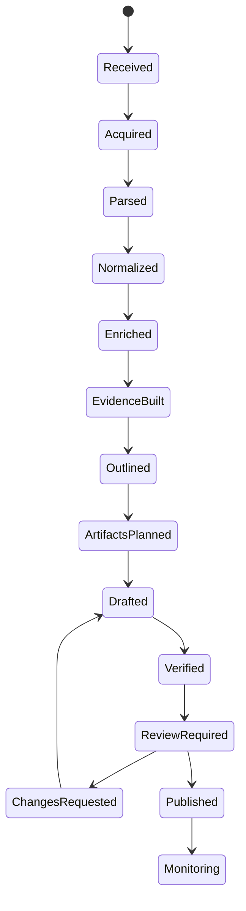

# 04 — Agent harness para producir contenido

## 1. Modelo operativo

Temporal controla el workflow durable. El OpenAI Agents SDK se usa dentro de actividades concretas. La arquitectura evita un swarm libre: un manager conserva control y llama especialistas como herramientas con outputs Pydantic.

El LLM no decide estados, retries, publicación, permisos ni transacciones.

## 2. Workflow



## 3. Agentes

### `SourceAnalyst`

Objetivo: evaluar calidad de parsing y reconciliar Docling/GROBID.

No hace OCR, no modifica archivos y no navega la web.

Salida:

- secciones canónicas;
- conflictos;
- páginas problemáticas;
- nivel de confianza.

### `MetadataCurator`

Objetivo: proponer autores, organizaciones, venue, DOI, repositorios, tareas, métodos, datasets y benchmarks.

Toda relación requiere evidencia y confianza. No publica taxonomía.

### `TechnicalAnalyst`

Objetivo: construir:

- problema;
- contribuciones;
- mecanismo;
- protocolo;
- resultados;
- ablaciones;
- supuestos;
- limitaciones.

Salida: claims atomizadas, no prosa final.

### `EvidenceAuditor`

Objetivo: verificar entailment, cifras, tablas, ecuaciones y correspondencia entre claims y referencias.

No reescribe para “hacer pasar” una afirmación. La rechaza o reduce.

### `PedagogyEditor`

Objetivo: elegir preguntas, orden y niveles de lectura. Debe reducir carga cognitiva sin borrar condiciones técnicas.

### `ExplainerWriter`

Objetivo: redactar bloques según la skill editorial. Sólo puede expresar claims aprobadas y debe adjuntar sus IDs.

### `VisualArtifactPlanner`

Objetivo: decidir dónde una interacción aporta comprensión. Primero busca en el registro; un artefacto nuevo requiere justificar por qué ningún componente existente sirve.

### `ArtifactEngineer`

Objetivo: configurar componentes existentes. Para artefactos custom trabaja en sandbox y produce manifest, código, fixtures, tests, screenshot y fallback estático.

### `SkepticalReviewer`

Objetivo: atacar el paper y la explicación:

- causalidad indebida;
- baseline débil;
- benchmark leakage;
- evaluación no independiente;
- intervalos ausentes;
- muestras pequeñas;
- generalización no probada;
- costo omitido;
- confusión entre capacidad y comportamiento.

### `StyleEditor`

Objetivo: normalizar voz, terminología, longitud, traducción y labels epistemológicos. No cambia el significado técnico.

### `ReleaseManager`

Objetivo: comprobar gates y preparar una versión. No puede aprobar en nombre de un humano.

## 4. Herramientas por mínimo privilegio

```text
SourceAnalyst          read_parsed_blocks, compare_parsers
MetadataCurator        metadata_lookup, taxonomy_search, repo_lookup
TechnicalAnalyst       read_source, read_figures, read_tables
EvidenceAuditor        read_source, verify_number, verify_equation
PedagogyEditor         read_claim_graph
ExplainerWriter        read_approved_claims, emit_ast
ArtifactPlanner        search_registry, read_claim_graph
ArtifactEngineer       configure_registry_artifact OR sandbox_workspace
SkepticalReviewer      read_paper, read_draft, literature_context_readonly
StyleEditor            read_draft, emit_patch
ReleaseManager         read_gates, create_release_candidate
```

Ningún agente de contenido tiene acceso a secrets, deployment o publicación directa.

## 5. Contratos estructurados

Cada etapa usa Pydantic y `extra="forbid"`. Ejemplo:

```python
class ClaimCandidate(BaseModel):
    model_config = ConfigDict(extra="forbid")
    text: str
    claim_type: ClaimType
    source_refs: list[str]
    confidence: confloat(ge=0, le=1)
    numeric_values: list[NumericAssertion] = []
    needs_external_context: bool = False
```

No se acepta texto libre como payload intermedio cuando existe un contrato.

## 6. Guardrails

### Entrada

- paper válido y accesible;
- idioma permitido;
- licencia conocida o `UNKNOWN`;
- no instrucciones ejecutables desde el documento;
- no URLs privadas o locales.

### Herramientas

- validar IDs y ownership;
- tamaño de lectura limitado;
- dominio y protocolo permitidos;
- filesystem confinado;
- red desactivada en sandbox;
- dependencias allowlisted;
- sin publicación ni merge.

### Salida

- claims con fuente;
- cifras parseables y verificadas;
- no citas largas;
- no URLs inventadas;
- no entidades nuevas sin evidencia;
- AST válido;
- lenguaje y estilo correctos;
- caveats obligatorios cuando la evidencia lo exige.

## 7. Verificación

### Determinista

- schema validation;
- referencias existentes;
- páginas y bounding boxes válidos;
- números contra tablas;
- símbolos de ecuaciones;
- links HTTP;
- build del artefacto;
- console errors;
- accesibilidad;
- screenshots.

### Basada en modelo

- entailment;
- contradicción;
- omisiones críticas;
- claridad;
- exageración;
- equivalencia de traducción.

El verificador usa un contexto distinto del redactor y no ve su razonamiento privado; sólo claims, fuente y salida.

## 8. Human in the loop

La consola debe permitir:

- abrir cada claim sobre el PDF;
- aprobar, rechazar o editar;
- cambiar el estado epistemológico;
- corregir taxonomía;
- comparar fuente y explicación;
- probar artefactos;
- solicitar regeneración por bloque;
- publicar una versión congelada.

## 9. Mantenimiento de contenido

Watchers:

- nueva revisión en arXiv;
- DOI o venue añadido;
- repo archivado o movido;
- release/model/dataset nuevo;
- link roto;
- corrección o retractación;
- benchmark actualizado;
- dependencia vulnerable de un artefacto.

Impact analysis identifica claims y bloques afectados. No regenera el artículo completo por defecto.

## 10. Costos y límites

Guardar por run:

- modelo;
- tokens;
- costo;
- latencia;
- herramienta;
- retries;
- inputs hash;
- output hash;
- versiones de prompts y skills.

Presupuestos por paper y etapa. Una etapa costosa requiere señal de calidad suficiente o aprobación.

