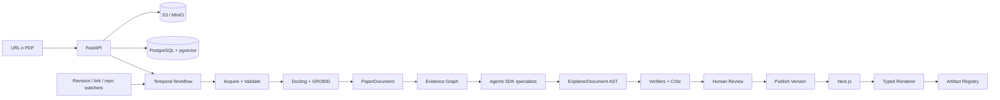

# 02 — Arquitectura técnica

## 1. Principio

La plataforma separa cuatro planos:

1. **fuente científica inmutable**;
2. **representación normalizada y evidencia**;
3. **contenido editorial versionado**;
4. **presentación web y artefactos aprobados**.

Esto evita que un cambio de frontend obligue a regenerar contenido y que una respuesta de modelo se convierta directamente en código ejecutable.

## 2. Diagrama



## 3. Stack

### Monorepo

- pnpm workspaces;
- Turborepo;
- cambios atómicos de schema, cliente y renderer;
- versiones internas coordinadas.

### Web

- Next.js App Router;
- React Server Components para páginas públicas;
- Client Components sólo en búsqueda rica, editor y artefactos;
- Tailwind CSS con tokens semánticos;
- shadcn/ui para consola editorial y controles, no como estética dominante;
- KaTeX para matemáticas;
- Observable Plot o D3 para visualizaciones específicas;
- TanStack Table para tablas complejas.

### API

- FastAPI;
- Pydantic v2;
- SQLAlchemy 2;
- Alembic;
- OpenAPI como contrato;
- clientes TypeScript generados en CI.

### Worker y agentes

- Python;
- Temporal para ejecución durable;
- OpenAI Agents SDK para especialistas con herramientas y outputs tipados;
- actividades deterministas para parsing, hashing, validaciones y transformaciones;
- sandbox de contenedor para artefactos nuevos.

### Datos

- PostgreSQL como fuente de verdad;
- pgvector para recuperación semántica;
- full-text search de Postgres para búsqueda lexical inicial;
- S3/R2 para PDFs, imágenes, TEI/XML, ASTs, screenshots y bundles;
- Redis sólo si se necesita cache/rate limit; no como cola canónica.

## 4. Servicios

### `web`

- páginas públicas;
- editor/review console;
- auth y BFF mínimo;
- rendering del AST;
- preview de drafts.

### `api`

- ingesta;
- CRUD y estados;
- búsqueda;
- endpoints editoriales;
- webhooks;
- audit log;
- presigned uploads.

### `worker`

- actividades Temporal;
- parsers;
- agentes;
- verificadores;
- screenshots y browser QA;
- tareas de mantenimiento.

### `grobid`

Servicio aislado para TEI, referencias, citas y estructura académica.

### `artifact-sandbox`

- sin secretos;
- sin acceso a red por defecto;
- filesystem efímero;
- límites de CPU, memoria y tiempo;
- dependencias allowlisted;
- salida: código, bundle, tests, screenshot, manifest y SBOM.

## 5. Almacenamiento por capas

### Raw

- PDF original;
- respuesta HTTP y headers;
- fuente LaTeX cuando se obtenga legítimamente;
- imágenes extraídas;
- hashes y metadata de adquisición.

### Parsed

- DoclingDocument;
- GROBID TEI;
- texto por página;
- bloques con bounding boxes;
- referencias y callouts;
- tablas, figuras, captions y ecuaciones.

### Canonical

- `PaperDocument`;
- `EvidenceGraph`;
- entidades normalizadas;
- relaciones.

### Editorial

- `ExplainerDocument`;
- revisiones;
- comentarios;
- decisiones y cambios.

### Published

- versión congelada;
- JSON de publicación;
- assets derivados;
- index de búsqueda;
- OG image;
- sitemap y feeds.

## 6. Parsing

Docling es el parser visual principal porque conserva layout, orden de lectura, tablas, código y fórmulas. GROBID complementa con metadata científica, referencias, contextos de citas y TEI.

Proceso:

1. validar archivo;
2. ejecutar ambos parsers cuando el tipo lo amerite;
3. alinear bloques por página y bounding box;
4. preferir fuente estructurada cuando hay consenso;
5. marcar conflictos;
6. conservar ambos outputs para auditoría;
7. OCR sólo como fallback para páginas sin capa de texto;
8. puntuar calidad por sección.

## 7. Búsqueda

Primera versión:

- filtros relacionales en PostgreSQL;
- FTS para título, abstract, autores, entidades y contenido;
- pgvector para similitud;
- reranking simple por mezcla de BM25-like score, vector, recencia, citations y calidad editorial;
- facets por tarea, método, dataset, benchmark, venue, año, licencia y disponibilidad de código.

No introducir Elasticsearch/OpenSearch hasta que métricas reales demuestren que Postgres es insuficiente.

## 8. Seguridad

### Ingesta

- protección SSRF;
- allow/deny de esquemas y rangos IP;
- MIME sniffing, no confiar en extensión;
- límites de tamaño y páginas;
- escaneo antivirus;
- timeouts;
- descompresión limitada;
- hash y deduplicación.

### Prompt injection documental

- el texto del paper se etiqueta como `UNTRUSTED_SOURCE_CONTENT`;
- ninguna instrucción encontrada en el paper cambia políticas, herramientas o workflow;
- herramientas por agente y mínimo privilegio;
- guardrails en cada tool call sensible;
- URLs extraídas no se visitan automáticamente sin política;
- repositorios no se ejecutan en el worker principal.

### Publicación

- sanitización de HTML;
- CSP estricta;
- no `eval`;
- artefactos sólo desde registro firmado;
- bundles custom aislados;
- referencias de licencia y política de reproducción.

### Trazas

- no capturar PDF completo, prompts privados o claves en trazas;
- redactar PII y secretos;
- audit log inmutable para acciones editoriales;
- retención configurable.

## 9. Versionado

Versionar independientemente:

- `paper_source_version`;
- `parser_version`;
- `paper_document_schema_version`;
- `prompt_bundle_version`;
- `skill_bundle_version`;
- `model_snapshot`;
- `artifact_registry_version`;
- `explainer_version`;
- `publication_version`.

Una nueva revisión de arXiv puede reutilizar bloques no afectados, pero nunca modifica la publicación anterior.

## 10. Deploy

### Local

Docker Compose:

- web;
- api;
- worker;
- postgres + pgvector;
- temporal;
- temporal-ui;
- minio;
- grobid;
- optional redis.

### Producción

- web en Vercel o contenedor;
- API y workers en plataforma de contenedores;
- Postgres administrado;
- object storage S3-compatible;
- Temporal Cloud o cluster administrado;
- GROBID autoscalable por cola;
- CDN para assets públicos.

## 11. Estructura de repo

```text
paper-atlas/
├── AGENTS.md
├── design.md
├── turbo.json
├── pnpm-workspace.yaml
├── apps/
│   ├── web/
│   │   ├── AGENTS.md
│   │   ├── app/
│   │   ├── components/
│   │   └── tests/
│   ├── api/
│   │   ├── AGENTS.md
│   │   └── src/paper_atlas_api/
│   └── worker/
│       ├── AGENTS.md
│       └── src/paper_atlas_worker/
├── packages/
│   ├── content-schema/
│   ├── api-client/
│   ├── ui/
│   ├── artifact-registry/
│   ├── design-tokens/
│   └── test-fixtures/
├── skills/
│   ├── paper-explainer-writing/
│   ├── evidence-ledger/
│   ├── visual-artifact-spec/
│   ├── taxonomy-curation/
│   ├── skeptical-review/
│   └── publication-release/
├── prompts/
├── evals/
├── fixtures/papers/
├── docs/
│   ├── adr/
│   ├── runbooks/
│   └── threat-model/
├── scripts/
└── infra/
```

